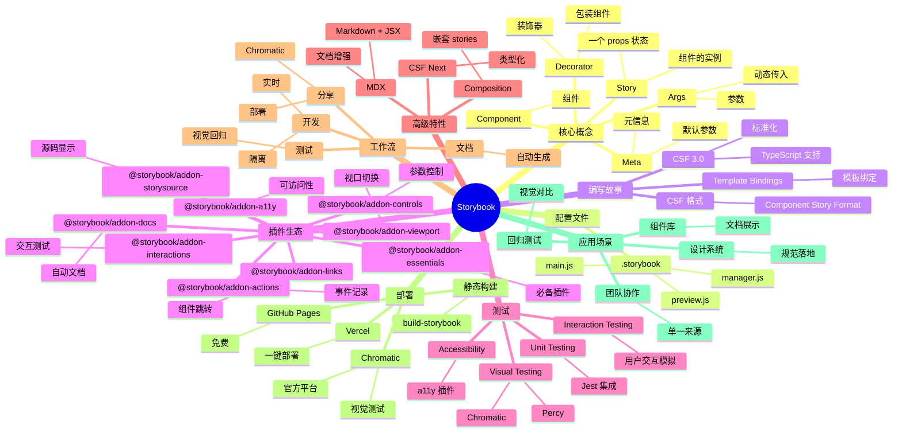

# Storybook

## 前言

**定位**：开源的 UI 组件开发与文档工具，让你在隔离环境中独立开发、测试、文档化 React/Vue/Angular/Svelte 组件。

**核心价值**：
- 组件驱动开发（CDD）的核心工具，每个组件一个"故事"
- 隔离开发环境：组件独立运行，不依赖应用上下文
- 自动生成文档、测试、可访问性检查
- 设计系统协作的"单一事实来源"（Single Source of Truth）

**五大特性**：
1. **隔离开发**：每个组件独立运行，开发更快、bug 更少
2. **可视化测试**：Stories 既是文档也是测试用例
3. **插件生态**：100+ 官方插件，覆盖测试/文档/可访问性
4. **多框架**：React/Vue/Angular/Svelte/Web Components/HTML
5. **静态部署**：`build-storybook` 输出静态站点，可部署到任何 CDN

**对比表**：

| 维度 | Storybook | Styleguidist | Docz | Docusaurus | Bit |
|---|---|---|---|---|---|
| 定位 | 组件工作台 | 组件文档 | MDX 文档 | 站点文档 | 组件仓库 |
| 框架支持 | 全部 | React | React | 全部 | 全部 |
| 交互性 | ✅ 极强 | ⚠️ 中 | ⚠️ 中 | ❌ | ✅ |
| 测试集成 | ✅ 极强 | ❌ | ❌ | ❌ | ✅ |
| 适用 | 组件库开发 | 通用组件 | 简单文档 | 项目文档 | 团队协作 |

## 思维导图



## 关键代码

### 一、安装与初始化

```bash
# 自动初始化（React 项目）
npx storybook@latest init

# 手动安装
npm install -D @storybook/react-vite @storybook/react @storybook/addon-essentials

# .storybook/main.js
export default {
  stories: ["../src/**/*.stories.@(ts|tsx|js|jsx|mdx)"],
  addons: [
    "@storybook/addon-links",
    "@storybook/addon-essentials",
    "@storybook/addon-interactions",
    "@storybook/addon-a11y"
  ],
  framework: {
    name: "@storybook/react-vite",
    options: {}
  }
};
```

### 二、基础 Story

```tsx
// src/components/Button.tsx
import { Button as AntButton } from "antd";
import { ComponentStory, ComponentMeta } from "@storybook/react";

export default {
  title: "Components/Button",
  component: AntButton,
  argTypes: {
    type: {
      control: { type: "select" },
      options: ["primary", "default", "dashed", "text", "link"]
    },
    size: {
      control: { type: "radio" },
      options: ["small", "middle", "large"]
    },
    disabled: { control: "boolean" }
  }
} as ComponentMeta<typeof AntButton>;

const Template: ComponentStory<typeof AntButton> = (args) => <AntButton {...args} />;

export const Primary = Template.bind({});
Primary.args = {
  children: "主要按钮",
  type: "primary"
};

export const Secondary = Template.bind({});
Secondary.args = {
  children: "次要按钮",
  type: "default"
};

export const Large = Template.bind({});
Large.args = {
  children: "大按钮",
  size: "large"
};

export const Disabled = Template.bind({});
Disabled.args = {
  children: "禁用",
  disabled: true
};
```

### 三、CSF 3.0 + TypeScript（新标准）

```tsx
// src/components/Card.stories.ts
import type { Meta, StoryObj } from "@storybook/react";
import { Card } from "./Card";

const meta = {
  title: "Components/Card",
  component: Card,
  parameters: {
    layout: "centered",
    docs: { description: { component: "卡片组件，支持标题、内容、操作" } }
  },
  tags: ["autodocs"]
} satisfies Meta<typeof Card>;

export default meta;
type Story = StoryObj<typeof meta>;

// 1. 基础故事
export const Default: Story = {
  args: {
    title: "默认卡片",
    children: "这是内容"
  }
};

// 2. 加载状态
export const Loading: Story = {
  args: {
    title: "加载中",
    loading: true
  }
};

// 3. 自定义渲染
export const WithFooter: Story = {
  args: {
    title: "带底部",
    children: "内容",
    footer: <button>操作</button>
  }
};

// 4. 列表渲染
export const Grid: Story = {
  render: (args) => (
    <div style={{ display: "grid", gridTemplateColumns: "repeat(3, 1fr)", gap: 16 }}>
      {[1, 2, 3].map(i => <Card key={i} {...args} title={`卡片 ${i}`} />)}
    </div>
  )
};
```

### 四、装饰器（Decorator）+ 上下文

```tsx
// .storybook/preview.tsx
import { withTheme } from "../src/decorators/withTheme";
import { withRouter } from "../src/decorators/withRouter";
import { withI18n } from "../src/decorators/withI18n";

export const decorators = [
  withTheme,    // 注入主题
  withRouter,   // 注入 Router 上下文
  withI18n      // 注入国际化
];

export const parameters = {
  backgrounds: {
    default: "light",
    values: [
      { name: "light", value: "#ffffff" },
      { name: "dark", value: "#1a1a1a" }
    ]
  },
  viewport: {
    viewports: {
      mobile: { name: "Mobile", styles: { width: "375px", height: "667px" } },
      tablet: { name: "Tablet", styles: { width: "768px", height: "1024px" } }
    }
  }
};
```

```tsx
// src/decorators/withTheme.tsx
import { ConfigProvider } from "antd";
import zhCN from "antd/locale/zh_CN";
import { ReactNode } from "react";

export const withTheme = (Story: () => ReactNode) => (
  <ConfigProvider locale={zhCN} theme={{ token: { colorPrimary: "#1677ff" } }}>
    <Story />
  </ConfigProvider>
);
```

### 五、交互测试（Interaction Testing）

```tsx
// Form.stories.tsx
import { expect, userEvent, within } from "@storybook/test";
import { Form } from "./Form";

export const Filled: Story = {
  play: async ({ canvasElement }) => {
    const canvas = within(canvasElement);

    // 模拟用户操作
    await userEvent.type(canvas.getByLabelText("姓名"), "张三");
    await userEvent.type(canvas.getByLabelText("邮箱"), "zhang@example.com");
    await userEvent.click(canvas.getByRole("button", { name: "提交" }));

    // 断言
    await expect(canvas.getByText("提交成功")).toBeInTheDocument();
  }
};
```

### 六、MDX 文档

```mdx
{/* Button.mdx */}
import { Meta, Canvas, Story, Controls } from "@storybook/blocks";
import * as ButtonStories from "./Button.stories";

<Meta of={ButtonStories} />

# Button 按钮

按钮用于触发一个操作，如提交表单、打开对话框、取消操作等。

## 使用场景

- 主要操作：每行/每区只用一个 `<Button type="primary">`
- 次要操作：`<Button>次要</Button>`
- 危险操作：`<Button danger>删除</Button>`

## 示例

<Canvas of={ButtonStories.Primary} />

## API

<Controls of={ButtonStories.Primary} />

## 最佳实践

1. **不要在按钮中使用模糊文案**："确定"好于"好的"
2. **危险操作需二次确认**：用 Popconfirm 包裹
3. **loading 状态明确**：避免重复点击
```

### 七、构建与部署

```bash
# 构建静态站点
npx storybook build -o storybook-static

# 输出到 dist/storybook
# 可部署到任何静态托管

# 本地预览构建结果
npx serve storybook-static

# 部署到 GitHub Pages
npx storybook-to-ghpages

# 部署到 Chromatic（官方）
npx chromatic --project-token=<token>
```

## 核心洞察

- **Storybook 是"组件驱动开发（CDD）"的代名词**：先用 Storybook 写组件 stories，再在应用中组装，是大型 UI 库的标准化工作流
- **Story ≠ Test**：Story 是"展示"，Interaction Test 才是"测试"；Storybook 8 整合 Playwright 跑交互测试
- **`@storybook/addon-a11y` 价值被低估**：自动跑 WCAG 规则，组件开发时就能发现可访问性问题，避免后期修复
- **Storybook 适合"组件库项目"，不一定适合"应用项目"**：业务项目用 Storybook 维护成本高，组件库项目用 Storybook 是"必须"
- **CSF 3.0 是 TypeScript 友好版**：`satisfies Meta<typeof X>` 类型安全 + 简洁语法，2023 年起 Storybook 主推
- **Storybook 8 的最大变化**：原生气泡通知、与 Vite 深度集成、组件扫描性能提升 50%
- **Storybook 的部署不是免费的**：1 万组件的 Storybook 静态站 100MB+，Chromatic 平台托管更省心
- **Storybook Test 是新生力量**：2024 年起，Storybook 直接集成 Vitest + Playwright，可在 Story 跑测试
- **MDX 让 Storybook 文档化更强**：Markdown + JSX 混写，文档可交互
- **Storybook 不适合"运行时主题切换"**：JIT 模式下 story 内的样式与运行时可能不一致
- **Storybook 7 → 8 的破坏性变化**：很多 API 重构，老项目升级需谨慎
- **Chromatic 是 Storybook 团队的商业产品**：云端视觉测试、PR 预览、协作评审，一站式服务

## 跨项目引用

- **[[react]]** / **[[vue]]** / **[[angular]]** / **[[svelte]]**：Storybook 支持所有主流框架
- **[[typescript]]**：CSF 3.0 类型安全是 TS 项目标配
- **[[ant-design]]** / **[[material ui]]**：用 Storybook 包装组件库组件，做企业级 Design System
- **[[chromatic]]**：Storybook 团队出品的视觉测试平台
- **[[jest]]** / **[[vitest]]**：组件单元测试与 Storybook 互补
- **[[playwright]]**：Storybook 8 用 Playwright 跑交互测试
- **[[webpack]]** / **[[vite]]**：Storybook 7+ 默认 Vite，6 用 Webpack
- **[[npm]]**：`@storybook/*` 包名空间统一管理
- **[[ci/cd]]**：GitHub Actions 自动部署 Storybook 静态站
- **[[design system]]**：Storybook 是 Design System 落地的核心工具
- **[[tailwind css]]**：Storybook 文档中常用 Tailwind 排版
