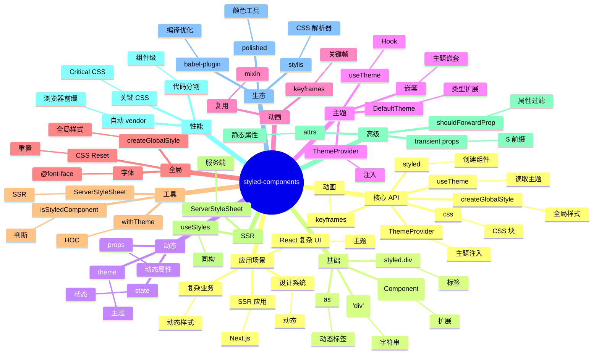

# styled-components

## 前言

**定位**：React 生态最流行的 CSS-in-JS 解决方案，2016 年由 Max Stoiber / Glen Maddern 创立至今是 React 项目的样式主流方案之一，与 Emotion 并列。

**核心价值**：
- 真正的 CSS 写在 JS 中：scoped、dynamic、co-located
- 主题系统：`ThemeProvider` + `useTheme` 实现设计系统
- 服务端渲染：完整的 SSR 样式提取（v5+）
- 动态样式：props/state 驱动 CSS

**五大特性**：
1. **Tagged Template Literal**：`styled.div` 写 CSS 字符串
2. **样式作用域**：自动生成唯一类名，无 CSS 污染
3. **主题系统**：`ThemeProvider` + `useTheme` 注入设计 token
4. **动态 props**：`${props => props.primary && css`...`}` 动态样式
5. **关键 CSS 自动注入**：SSR 友好，首屏不闪烁

**对比表**：

| 维度 | styled-components | Emotion | Tailwind CSS | CSS Modules | Vanilla Extract |
|---|---|---|---|---|---|
| 风格 | CSS-in-JS | CSS-in-JS | Utility | Scoped CSS | Zero-runtime |
| 运行时 | ✅ 有 | ✅ 有 | ❌ 无 | ❌ 无 | ❌ 无 |
| 性能 | ⚠️ | ⚠️ | ✅ | ✅ | ✅✅ |
| 主题 | ✅ 极强 | ✅ 强 | ⚠️ 配置 | ⚠️ | ✅ |
| 动态样式 | ✅ 极强 | ✅ 极强 | ⚠️ | ⚠️ | ⚠️ |
| 适合 | React 复杂 UI | React 通用 | 设计系统 | 简单项目 | 性能敏感 |

## 思维导图



## 关键代码

### 一、安装与基础

```bash
npm install styled-components
npm install -D @types/styled-components babel-plugin-styled-components
```

```typescript
import styled, { css } from "styled-components";

// 1. 创建基础组件
const Button = styled.button`
  background: ${props => props.primary ? "blue" : "white"};
  color: ${props => props.primary ? "white" : "blue"};
  font-size: 1rem;
  padding: 0.5rem 1rem;
  border: 2px solid blue;
  border-radius: 4px;
  cursor: pointer;
  transition: all 0.2s;

  &:hover {
    opacity: 0.8;
  }
`;

// 2. 使用
<Button primary>主要按钮</Button>
<Button>次要按钮</Button>
```

### 二、扩展现有组件

```typescript
import { Link } from "react-router-dom";

const StyledLink = styled(Link)`
  color: blue;
  text-decoration: none;
  font-weight: 500;

  &:hover {
    text-decoration: underline;
  }
`;

// 扩展自己的组件
const FancyButton = styled(Button)`
  background: linear-gradient(45deg, blue, purple);
  border: none;
  color: white;
`;

// 动态标签（as）
<Button as="a" href="/home">链接</Button>
<Button as={Link} to="/home">路由</Button>
```

### 三、css 辅助函数

```typescript
import styled, { css } from "styled-components";

const baseButton = css`
  display: inline-block;
  padding: 8px 16px;
  border: none;
  border-radius: 4px;
  cursor: pointer;
`;

const PrimaryButton = styled.button`
  ${baseButton}
  background: blue;
  color: white;
`;

const DangerButton = styled.button`
  ${baseButton}
  background: red;
  color: white;
`;

// 条件样式
const Button = styled.button`
  ${props => props.disabled && css`
    opacity: 0.5;
    cursor: not-allowed;
  `}
`;
```

### 四、主题系统

```typescript
// styled.d.ts
import "styled-components";

declare module "styled-components" {
  export interface DefaultTheme {
    colors: {
      primary: string;
      success: string;
      danger: string;
    };
    spacing: (n: number) => string;
    borderRadius: string;
  }
}

// theme.ts
export const theme = {
  colors: {
    primary: "#1890ff",
    success: "#52c41a",
    danger: "#ff4d4f"
  },
  spacing: (n: number) => `${n * 4}px`,
  borderRadius: "4px"
};

// App.tsx
import { ThemeProvider } from "styled-components";
import { theme } from "./theme";

export function App() {
  return (
    <ThemeProvider theme={theme}>
      <RootComponent />
    </ThemeProvider>
  );
}

// 组件中使用
const Button = styled.button`
  background: ${props => props.theme.colors.primary};
  padding: ${props => props.theme.spacing(2)};
  border-radius: ${props => props.theme.borderRadius};
`;

// 通过 Hook
import { useTheme } from "styled-components";

function MyComponent() {
  const theme = useTheme();
  return <div style={{ color: theme.colors.primary }}>...</div>;
}
```

### 五、动画

```typescript
import styled, { keyframes } from "styled-components";

const fadeIn = keyframes`
  from { opacity: 0; transform: translateY(-10px); }
  to { opacity: 1; transform: translateY(0); }
`;

const Box = styled.div`
  animation: ${fadeIn} 0.3s ease-out;
`;

// 复用动画
const rotate = keyframes`
  from { transform: rotate(0deg); }
  to { transform: rotate(360deg); }
`;

const Spinner = styled.div`
  width: 20px;
  height: 20px;
  border: 2px solid #ccc;
  border-top-color: blue;
  border-radius: 50%;
  animation: ${rotate} 1s linear infinite;
`;
```

### 六、全局样式

```typescript
import { createGlobalStyle } from "styled-components";

export const GlobalStyle = createGlobalStyle`
  * {
    box-sizing: border-box;
  }

  body {
    margin: 0;
    font-family: -apple-system, BlinkMacSystemFont, "Segoe UI", sans-serif;
    color: ${props => props.theme.colors.text};
    background: ${props => props.theme.colors.bg};
  }

  a {
    color: ${props => props.theme.colors.primary};
    text-decoration: none;
  }
`;

// App.tsx
function App() {
  return (
    <ThemeProvider theme={theme}>
      <GlobalStyle />
      <RootComponent />
    </ThemeProvider>
  );
}
```

### 七、动态 props 与 transient props

```typescript
// ❌ 旧方式：所有 props 都会传到 DOM（产生 React 警告）
const Button = styled.button`
  background: ${props => props.primary ? "blue" : "white"};
`;

// ✅ 推荐：transient props（$ 前缀不传到 DOM）
const Button = styled.button`
  background: ${props => props.$primary ? "blue" : "white"};
`;

<Button $primary>主要</Button>
```

```typescript
// shouldForwardProp 自定义过滤
const StyledInput = styled.input.withConfig({
  shouldForwardProp: (prop) => !["invalid"].includes(prop)
})`
  border-color: ${props => props.invalid ? "red" : "gray"};
`;

<StyledInput invalid={true} />
// 不会把 invalid 传到 <input> DOM
```

### 八、attrs 静态属性

```typescript
const Input = styled.input.attrs({
  type: "text",
  autoComplete: "off"
})`
  padding: 8px;
  border: 1px solid #ccc;
`;

// 动态 attrs
const Link = styled.a.attrs<{ to: string }>(props => ({
  href: props.to
}))``;
```

### 九、SSR（Next.js）

```typescript
// _document.tsx
import Document, { DocumentContext } from "next/document";
import { ServerStyleSheet } from "styled-components";

export default class MyDocument extends Document {
  static async getInitialProps(ctx: DocumentContext) {
    const sheet = new ServerStyleSheet();
    const originalRenderPage = ctx.renderPage;

    try {
      ctx.renderPage = () =>
        originalRenderPage({
          enhanceApp: (App) => (props) => sheet.collectStyles(<App {...props} />)
        });

      const initialProps = await Document.getInitialProps(ctx);
      return {
        ...initialProps,
        styles: [initialProps.styles, sheet.getStyleElement()]
      };
    } finally {
      sheet.seal();
    }
  }
}
```

### 十、Polished 工具库

```typescript
import { darken, lighten, transparentize } from "polished";

const Button = styled.button`
  background: ${props => darken(0.1, props.theme.colors.primary)};
  border: 1px solid ${props => transparentize(0.5, "#000")};
  color: ${props => lighten(0.2, "#000")};
`;
```

## 核心洞察

- **styled-components 是 CSS-in-JS 的代表**：vs Emotion 是"底层引擎派"，styled-components 是"组件封装派"
- **styled-components 5 是 SSR 革命**：v5 引入 `ServerStyleSheet`，解决 SSR 闪烁问题
- **styled-components 的 transient props 是 React 警告的解决方案**：`$` 前缀属性不会传到 DOM
- **styled-components 的运行时代价**：每次渲染生成新 className，runtime 开销
- **styled-components vs Emotion 的竞争**：Emotion 更快、styled-components API 更优雅
- **styled-components 的"主题"是设计系统语言**：ThemeProvider 让设计 token 与代码解耦
- **styled-components 的 babel 插件加速编译**：`babel-plugin-styled-components` 把模板字面量编译为对象
- **styled-components 6（2023）改用 CSS 变量**：runtime 性能优化 25%
- **styled-components 的 createGlobalStyle 是全局样式的官方方案**：替代 `<style>` 标签
- **styled-components 与 CSS Modules 路线对立**：SC 推崇"组件化样式"、CSS Modules 推崇"工具化样式"
- **styled-components 在 RSC 中的位置**：Server Components 时代，CSS-in-JS 需要适配（如 `use client`）
- **styled-components 的 styled(Component) 是扩展点**：在已有组件上叠加样式，类似装饰器

## 跨项目引用

- **[[react]]**：styled-components 100% 基于 React
- **[[next.js]]**：styled-components 在 Next.js 中需要 `_document.tsx` 配置 SSR
- **[[emotion]]**：Emotion 是 styled-components 的最大竞品，性能更好
- **[[tailwindcss]]**：Tailwind 是 CSS-in-JS 的对立派
- **[[typescript]]**：styled-components 5+ 完整 TS 支持（`DefaultTheme` 扩展）
- **[[polished]]**：Polished 是 styled-components 团队的颜色工具库
- **[[babel]]**：`babel-plugin-styled-components` 优化 styled-components 编译
- **[[css modules]]**：CSS Modules 是另一个 scoped CSS 方案
- **[[vanilla-extract]]**：Zero-runtime CSS-in-JS，性能极致
- **[[material-ui]]**：MUI 5 底层用 Emotion（styled-components 的兄弟库）
- **[[chakra-ui]]**：Chakra 底层用 Emotion，但 API 不一样
- **[[ant-design]]**：AntD 5 改用 CSS-in-JS（@ant-design/cssinjs）
