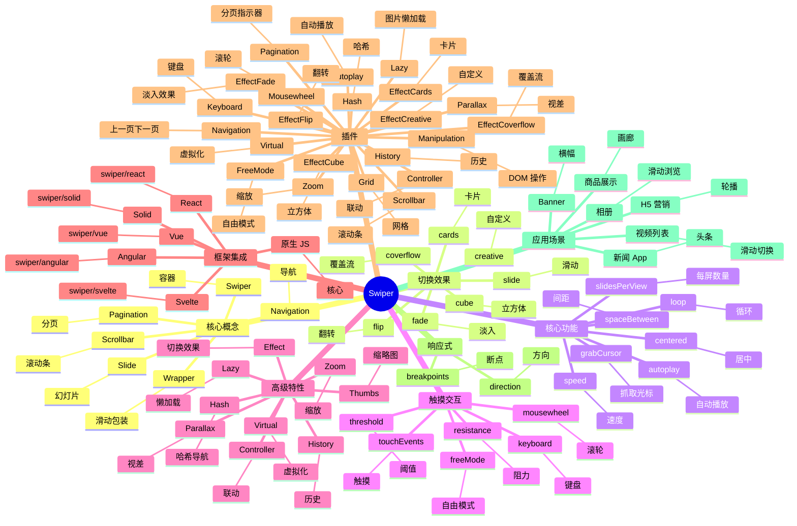

# Swiper

## 前言

**定位**：现代触摸滑动组件（轮播图/画廊/H5 单页），2014 年由 Vladimir Kharlampidi 开源至今是 Web 移动端轮播的事实标准，零依赖、框架无关。

**核心价值**：
- 触摸优先：完美支持移动端手势（滑动/拖动/惯性）
- 框架无关：原生 JS / React / Vue / Angular 都有官方封装
- 高度可定制：分页/导航/缩放/视差/虚拟滑动
- TypeScript 优先：v7+ 完整类型定义

**五大特性**：
1. **触摸引擎**：自主实现的 touch/mouse 事件，性能优于简单 CSS 滚动
2. **虚拟化**：Virtual Slides 支持 10000+ 幻灯片
3. **多设备**：手机/平板/桌面统一 API
4. **过渡动画**：fade/slide/flip/cube/coverflow/creative 等 30+ 切换效果
5. **插件体系**：autoplay/lazy-load/pagination/navigation/scrollbar 等

**对比表**：

| 维度 | Swiper | Splide | Glide.js | Slick | Flickity |
|---|---|---|---|---|---|
| 移动端 | ✅ 极致 | ✅ | ✅ | ⚠️ | ✅ |
| 桌面端 | ✅ | ✅ | ✅ | ✅ 优秀 | ✅ |
| 触摸性能 | ✅ 最佳 | ✅ | ✅ | ⚠️ | ✅ |
| 框架集成 | React/Vue/原生 | React/Vue | 原生 | jQuery | 原生 |
| 体积 | 60-150KB | 30KB | 30KB | 50KB+jQuery | 40KB |
| 适合 | 通用 H5 | 轻量 | 轻量 | jQuery 老项目 | 付费友好 |

## 思维导图



## 关键代码

### 一、安装与基础

```bash
# 原生 JS
npm install swiper

# React
npm install swiper
```

```html
<!-- 基础 HTML 结构 -->
<div class="swiper">
  <div class="swiper-wrapper">
    <div class="swiper-slide">Slide 1</div>
    <div class="swiper-slide">Slide 2</div>
    <div class="swiper-slide">Slide 3</div>
  </div>

  <!-- 分页指示器 -->
  <div class="swiper-pagination"></div>

  <!-- 导航按钮 -->
  <div class="swiper-button-prev"></div>
  <div class="swiper-button-next"></div>

  <!-- 滚动条 -->
  <div class="swiper-scrollbar"></div>
</div>
```

```typescript
import Swiper from "swiper";
import { Navigation, Pagination, Autoplay } from "swiper/modules";

const swiper = new Swiper(".swiper", {
  modules: [Navigation, Pagination, Autoplay],
  loop: true,
  autoplay: { delay: 3000, disableOnInteraction: false },
  pagination: { el: ".swiper-pagination", clickable: true },
  navigation: {
    nextEl: ".swiper-button-next",
    prevEl: ".swiper-button-prev"
  }
});
```

### 二、React 集成

```bash
npm install swiper
```

```tsx
import { Swiper, SwiperSlide } from "swiper/react";
import { Navigation, Pagination, Autoplay, EffectFade } from "swiper/modules";
import "swiper/css";
import "swiper/css/navigation";
import "swiper/css/pagination";
import "swiper/css/effect-fade";

export function Banner() {
  return (
    <Swiper
      modules={[Navigation, Pagination, Autoplay, EffectFade]}
      spaceBetween={30}
      slidesPerView={1}
      loop
      autoplay={{ delay: 3000 }}
      pagination={{ clickable: true }}
      navigation
      effect="fade"
    >
      <SwiperSlide>Slide 1</SwiperSlide>
      <SwiperSlide>Slide 2</SwiperSlide>
      <SwiperSlide>Slide 3</SwiperSlide>
    </Swiper>
  );
}
```

### 三、Vue 集成

```vue
<template>
  <Swiper
    :modules="modules"
    :slides-per-view="3"
    :space-between="20"
    :pagination="{ clickable: true }"
    :navigation="true"
    :breakpoints="{
      640: { slidesPerView: 2 },
      1024: { slidesPerView: 3 }
    }"
  >
    <SwiperSlide v-for="item in items" :key="item.id">
      {{ item.name }}
    </SwiperSlide>
  </Swiper>
</template>

<script setup lang="ts">
import { Swiper, SwiperSlide } from "swiper/vue";
import { Navigation, Pagination } from "swiper/modules";

const modules = [Navigation, Pagination];
</script>
```

### 四、视差效果

```html
<div class="swiper">
  <div class="swiper-wrapper">
    <div class="swiper-slide">
      <div class="title" data-swiper-parallax="-300">标题</div>
      <div class="subtitle" data-swiper-parallax="-100">副标题</div>
      <div class="text" data-swiper-parallax="-50">详细描述</div>
      <div class="image" data-swiper-parallax-scale="0.15">
        
      </div>
    </div>
  </div>
</div>
```

```typescript
const swiper = new Swiper(".swiper", {
  parallax: true,
  // 其他配置
});
```

### 五、缩略图联动（Thumbs Gallery）

```html
<!-- 主轮播 -->
<div class="swiper main">
  <div class="swiper-wrapper">
    <div class="swiper-slide"></div>
    <div class="swiper-slide"></div>
  </div>
</div>

<!-- 缩略图轮播 -->
<div class="swiper thumbs">
  <div class="swiper-wrapper">
    <div class="swiper-slide"></div>
    <div class="swiper-slide"></div>
  </div>
</div>
```

```typescript
import Thumbs from "swiper/thumbs";

const thumbsSwiper = new Swiper(".thumbs", {
  spaceBetween: 10,
  slidesPerView: 4,
  freeMode: true,
  watchSlidesProgress: true
});

const mainSwiper = new Swiper(".main", {
  spaceBetween: 10,
  thumbs: { swiper: thumbsSwiper }
});
```

### 六、虚拟化（大数据）

```tsx
<Swiper modules={[Virtual]} slidesPerView={3} virtual>
  {Array.from({ length: 10000 }).map((_, i) => (
    <SwiperSlide key={i} virtualIndex={i}>
      Slide {i}
    </SwiperSlide>
  ))}
</Swiper>
```

### 七、响应式断点

```typescript
new Swiper(".swiper", {
  slidesPerView: 1,
  spaceBetween: 10,
  breakpoints: {
    640: { slidesPerView: 2, spaceBetween: 20 },
    768: { slidesPerView: 3, spaceBetween: 30 },
    1024: { slidesPerView: 4, spaceBetween: 40 }
  }
});
```

### 八、Effect 切换效果

```typescript
import { EffectCube, EffectCoverflow, EffectFlip, EffectCards } from "swiper/modules";

new Swiper(".swiper", {
  effect: "coverflow",  // "slide" | "fade" | "cube" | "coverflow" | "flip" | "cards" | "creative"
  grabCursor: true,
  centeredSlides: true,
  coverflowEffect: {
    rotate: 50,
    stretch: 0,
    depth: 100,
    modifier: 1,
    slideShadows: true
  }
});
```

### 九、自定义事件

```typescript
const swiper = new Swiper(".swiper", {
  on: {
    init() { console.log("初始化"); },
    slideChange() { console.log("当前", this.activeIndex); },
    reachEnd() { console.log("到底了，加载更多"); },
    progress(s) { console.log("进度", s.progress); }
  }
});

// 编程式控制
swiper.slideNext();
swiper.slidePrev();
swiper.slideTo(2);
swiper.autoplay.stop();
```

## 核心洞察

- **Swiper 是 Web 移动端轮播的"事实标准"**：iOS 风格的弹性滚动 + 完美支持触摸手势
- **Swiper 5 → 6 → 7 是三次重写**：v5 是 jQuery 时代、v6 是 ESM 重构、v7 是 TypeScript 重写
- **Swiper 7 引入 CSS Variables**：主题定制从 SCSS 改到 CSS 变量，运行时切换
- **Swiper 8（2023）改用 ESM + tree-shaking**：从 `import Swiper from "swiper"` 改为 `import { Swiper } from "swiper/element"`，bundle 减 30%
- **Swiper 的触摸引擎是核心**：vs 直接用 CSS scroll-snap，Swiper 的"惯性 + 弹性 + 阈值"是手工调优的
- **Swiper 的 Loop 模式有"幽灵 slide"**：循环时左右各有空白 slide 占位，是性能与体验的权衡
- **Swiper 的 Effect 系统是模块化**：每种切换效果是独立包，按需引入
- **Swiper 不依赖任何 JS 框架**：核心是 framework-agnostic，React/Vue/Angular 是独立封装
- **Swiper 与 iDangero.us 团队维护**：原作者 Vladimir Kharlampidi 独立维护 8 年
- **Swiper 的中文社区是国内第一**：vs Splide/Glide 等英文社区，Swiper 国内文档/博客/案例最多
- **Swiper 不适合"业务复杂轮播"**：电商商品轮播/营销活动/多状态切换等复杂场景需自研
- **Swiper 的付费版 Swiper Studio**：可视化搭建轮播（但 vs Webflow 仍弱），主要还是免费

## 跨项目引用

- **[[react]]**：`swiper/react` 是 Swiper 的官方 React 封装
- **[[vue]]**：`swiper/vue` 是 Swiper 的官方 Vue 封装
- **[[angular]]**：`swiper/slider/angular` 是 Angular 封装
- **[[svelte]]**：`swiper/svelte` 是 Svelte 封装
- **[[typescript]]**：Swiper 7+ 完整 TS 支持
- **[[css]]**：Swiper 8 引入 CSS Variables，主题切换零成本
- **[[tailwindcss]]**：Swiper 容器可与 Tailwind 工具类结合
- **[[element-plus]]**：EP 的 Carousel 组件底层基于 Swiper/类似实现
- **[[ant-design]]**：AntD 的 Carousel 内部使用 react-slick，与 Swiper 并列
- **[[mobile]]**：Swiper 是 H5 移动端开发的标准依赖
- **[[touch]]**：Swiper 的触摸引擎是 Web 触摸交互的参考实现
- **[[webpack]]** / **[[vite]]**：Swiper 8 在 Vite/Webpack 下的按需引入
