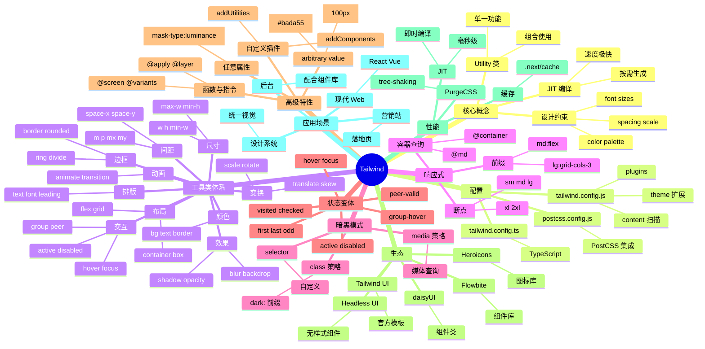

# Tailwind CSS

## 前言

**定位**：Utility-first（原子化）的 CSS 框架，由 Adam Wathan 创建 2017 年发布，颠覆了"组件式 CSS"的传统思维，主张"直接在 HTML 中写 CSS 类"。

**核心价值**：
- 拒绝起名：再也不用为 `card-wrapper-inner` 这样的类名纠结
- 设计系统内置：间距/颜色/字号/断点都是约束好的，不容易写出丑陋界面
- 体积最优：生产环境只保留用到的 class，CSS 通常 < 10KB
- 极强定制：`tailwind.config.js` 完全可配，支持自定义 design token

**五大特性**：
1. **Utility-first**：一个类只做一件事，如 `mt-4` = `margin-top: 1rem`
2. **设计系统内置**：spacing scale、color palette、font sizes 都是受控的
3. **响应式前缀**：`md:flex lg:grid` 让响应式写起来超快
4. **JIT 模式**：3.0+ 默认启用，生成 CSS 即"按需"
5. **插件生态**：官方插件覆盖 Forms/Typography/Aspect Ratio，社区插件丰富

**对比表**：

| 维度 | Tailwind CSS | Bootstrap | Bulma | Material UI CSS | Sass |
|---|---|---|---|---|---|
| 思维 | Utility-first | 组件式 | 组件式 | 组件式 | 自定义 |
| CSS 体积 | ✅ 极小 | ⚠️ 全部 | ⚠️ 全部 | ⚠️ 中 | ❌ 难优化 |
| 定制性 | ✅ 极强 | ⚠️ 中 | ⚠️ 中 | ✅ 主题 | ✅ 极强 |
| 学习曲线 | 中（记类名） | 低 | 低 | 中 | 低 |
| 响应式 | ✅ 内置 | ✅ 断点 | ✅ 断点 | ✅ | ❌ 手写 |
| 适合 | 现代 Web | 快速原型 | 简单项目 | Material 风格 | 大型项目 |

## 思维导图



## 关键代码

### 一、安装与配置

```bash
# 安装
npm install -D tailwindcss postcss autoprefixer
npx tailwindcss init -p

# tailwind.config.js
module.exports = {
  content: [
    "./src/**/*.{js,ts,jsx,tsx,vue}",
    "./index.html"
  ],
  theme: {
    extend: {
      colors: {
        brand: {
          50:  "#f0f9ff",
          500: "#0ea5e9",
          900: "#0c4a6e"
        }
      },
      fontFamily: {
        sans: ["Inter", "system-ui", "sans-serif"]
      },
      spacing: {
        "128": "32rem",
        "144": "36rem"
      }
    }
  },
  plugins: [
    require("@tailwindcss/forms"),
    require("@tailwindcss/typography"),
    require("@tailwindcss/aspect-ratio")
  ]
};
```

### 二、基础使用

```html
<!-- 传统 CSS -->
<style>
  .card { padding: 16px; background: white; border-radius: 8px; box-shadow: 0 2px 4px rgba(0,0,0,0.1); }
  .card h2 { font-size: 20px; font-weight: bold; }
</style>
<div class="card">
  <h2>标题</h2>
</div>

<!-- Tailwind -->
<div class="p-4 bg-white rounded-lg shadow">
  <h2 class="text-xl font-bold">标题</h2>
</div>
```

### 三、响应式布局

```tsx
export function ResponsiveGrid() {
  return (
    <div className="
      grid
      grid-cols-1       /* 手机：1 列 */
      sm:grid-cols-2    /* 平板：2 列 */
      md:grid-cols-3    /* 笔记本：3 列 */
      lg:grid-cols-4    /* 桌面：4 列 */
      xl:grid-cols-6    /* 大屏：6 列 */
      gap-4             /* 间距 16px */
      p-4
    ">
      {items.map(item => (
        <div key={item.id} className="
          bg-white
          rounded-lg
          shadow-md
          p-6
          hover:shadow-xl
          transition-shadow
          duration-300
        ">
          <h3 className="text-lg font-semibold mb-2">{item.title}</h3>
          <p className="text-gray-600 text-sm">{item.description}</p>
        </div>
      ))}
    </div>
  );
}
```

### 四、暗黑模式

```javascript
// tailwind.config.js
module.exports = {
  darkMode: "class",  // 或 "media"
  // ...
};
```

```tsx
// 切换暗黑模式
function ThemeToggle() {
  const [dark, setDark] = useState(false);

  useEffect(() => {
    document.documentElement.classList.toggle("dark", dark);
  }, [dark]);

  return (
    <div className="bg-white dark:bg-gray-900 text-gray-900 dark:text-gray-100">
      <button onClick={() => setDark(!dark)}>
        {dark ? "☀️ 亮色" : "🌙 暗黑"}
      </button>
      <h1 className="text-2xl font-bold">主题切换</h1>
    </div>
  );
}
```

### 五、@apply + 自定义组件类

```css
/* styles.css */
@tailwind base;
@tailwind components;
@tailwind utilities;

@layer components {
  .btn {
    @apply inline-flex items-center justify-center
           px-4 py-2
           rounded-md
           font-medium
           transition-colors
           focus:outline-none focus:ring-2 focus:ring-offset-2;
  }

  .btn-primary {
    @apply btn bg-blue-600 text-white
           hover:bg-blue-700
           focus:ring-blue-500;
  }

  .btn-secondary {
    @apply btn bg-gray-200 text-gray-900
           hover:bg-gray-300
           focus:ring-gray-500;
  }

  .card {
    @apply bg-white rounded-lg shadow-md p-6
           dark:bg-gray-800;
  }
}
```

```html
<button class="btn-primary">主要</button>
<button class="btn-secondary">次要</button>
<div class="card">内容</div>
```

### 六、自定义插件

```javascript
// tailwind-plugin-text-balance.js
const plugin = require("tailwindcss/plugin");

module.exports = plugin(function ({ addUtilities }) {
  addUtilities({
    ".text-balance": { "text-wrap": "balance" },
    ".text-pretty": { "text-wrap": "pretty" }
  });
});

// tailwind.config.js
module.exports = {
  plugins: [require("./tailwind-plugin-text-balance")]
};
```

### 七、任意值（Arbitrary Values）

```html
<!-- 不在预设中的值用 [] 包裹 -->
<div class="
  bg-[#bada55]            /* 自定义颜色 */
  w-[100px]                /* 自定义宽度 */
  h-[calc(100vh-4rem)]     /* 复杂计算 */
  grid-cols-[200px_1fr]    /* 自定义网格 */
  text-[22px]              /* 自定义字号 */
  rounded-[14px]           /* 自定义圆角 */
  shadow-[0_2px_15px_rgba(0,0,0,0.1)]
">
  任意值
</div>

<!-- 任意 CSS 变量 -->
<div class="bg-[var(--brand-color)]">
  CSS 变量
</div>
```

## 核心洞察

- **Tailwind 颠覆的不是 CSS，而是"CSS 工作流"**：传统 CSS 关注"复用"，Tailwind 关注"约束"——通过约束避免代码失控
- **JIT 模式是 Tailwind 3.0 的灵魂**：从"按文件扫描"变为"按需即时生成"，CSS 体积从 50KB+ 降到 5-10KB
- **Tailwind 的设计系统是"反 Bootstrap"的**：Bootstrap 给现成组件，Tailwind 给原子工具和约束——前者适合快速原型、后者适合长期项目
- **Tailwind 不适合小型项目**：2-3 个页面的网站，直接 CSS 更快；只有 5+ 页面才显出 Tailwind 的优势
- **`@apply` 是"逃生舱"**：把 Tailwind 类提取为组件类，但过度使用会回到"组件式 CSS"老路
- **Tailwind 4.0 的新特性**：CSS-first 配置（`@theme` 指令）、Lightning CSS 引擎、性能提升 10x
- **Tailwind 不解决 CSS-in-JS 的问题**：仍有"全局类名污染"风险，但 JIT 模式下基本无影响
- **Tailwind 的学习曲线在"记忆"**：常用类 50-100 个，需 1-2 周适应；VSCode 的 Tailwind IntelliSense 插件是必备
- **Tailwind + 组件库可以共存**：与 AntD/MUI 不冲突，业务组件用组件库、布局/工具样式用 Tailwind
- **容器查询（@container）是 Tailwind 3 的杀手特性**：基于父容器而非视口做响应式，是组件库开发的未来
- **Tailwind 不会取代 CSS**：复杂动画、关键帧、CSS 变量嵌套仍需手写 CSS
- **`arbitrary value` 让 Tailwind 无边界**：随时可用任意值，避免"等框架支持"的尴尬

## 跨项目引用

- **[[react]]**：Tailwind 在 React 项目中配合 `clsx`/`cn` 工具做条件类名是标配
- **[[vue]]**：Vue 3 + Tailwind 是现代化的轻量级组合
- **[[next.js]]**：Next.js 内置 Tailwind 支持，`npx create-next-app` 一键启用
- **[[vite]]**：Vite + `tailwindcss` 插件是开发最快的组合
- **[[webpack]]**：通过 `postcss-loader` + `tailwindcss/postcss7-compat` 集成
- **[[postcss]]**：Tailwind 本身就是 PostCSS 插件
- **[[css]]**：Tailwind 是 CSS 的"超集"，底层仍是 CSS 规则
- **[[typescript]]**：`tailwind.config.ts` 支持类型化配置
- **[[design system]]**：Tailwind 的 token 系统是 design system 落地的最佳实践
- **[[figma]]**：Tailwind UI 模板是设计师与前端协作的桥梁
- **[[ant-design]]**：与 AntD 混用：AntD 组件 + Tailwind 布局/排版

## 进阶配置与定制

### 一、Theme 扩展深度解析

`tailwind.config.js`（或 `tailwind.config.ts`）是 Tailwind 的"控制中枢"。`theme` 字段决定了所有工具类的视觉规范。理解 `extend` 与 `override` 的区别是定制 Tailwind 的第一课：

- `theme.extend`：增量添加，原有默认值保留。比如 `extend.colors.brand` 添加 `brand-500` 后，原有的 `red-500`、`blue-500` 依然可用。
- `theme.colors`（直接覆盖）：完全替换默认调色板。一旦这样写，所有 `bg-red-500` 都将失效。
- 实战原则：业务项目 99% 场景用 `extend` 即可，谨慎全量覆盖。

```javascript
// tailwind.config.js —— 完整主题定制范例
const defaultTheme = require("tailwindcss/defaultTheme");

module.exports = {
  content: ["./src/**/*.{js,ts,jsx,tsx}"],
  darkMode: "class",  // class 策略，可挂载到 <html> 上
  theme: {
    // 1. 完全覆盖（慎用）
    // colors: { brand: {...} },  // 这样写会清空所有 Tailwind 默认色

    // 2. 增量扩展（推荐）
    extend: {
      // (a) 颜色扩展：支持 50~950 全色阶
      colors: {
        brand: {
          50:  "#f0f9ff",
          100: "#e0f2fe",
          200: "#bae6fd",
          300: "#7dd3fc",
          400: "#38bdf8",
          500: "#0ea5e9",
          600: "#0284c7",
          700: "#0369a1",
          800: "#075985",
          900: "#0c4a6e",
          950: "#082f49"
        },
        // 半透明色：使用 css 变量避免 purge 问题
        "primary-alpha": "rgb(var(--primary-rgb) / <alpha-value>)"
      },

      // (b) 字体族：优先级 fallback 链
      fontFamily: {
        sans: ["Inter", "PingFang SC", "Microsoft YaHei", "system-ui", ...defaultTheme.fontFamily.sans],
        serif: ["Source Serif Pro", "Georgia", "serif"],
        mono: ["JetBrains Mono", "Fira Code", "monospace"]
      },

      // (c) 字号 + 行高：组合扩展
      fontSize: {
        xs: ["0.75rem", { lineHeight: "1rem" }],
        "2xs": ["0.625rem", { lineHeight: "0.875rem" }],  // 自定义
        "display-1": ["4.5rem", { lineHeight: "1.1", letterSpacing: "-0.02em", fontWeight: "700" }],
        "display-2": ["3.75rem", { lineHeight: "1.1", letterSpacing: "-0.02em", fontWeight: "700" }]
      },

      // (d) 间距：默认基于 0.25rem 倍数，可添加更大步进
      spacing: {
        "4.5": "1.125rem",  // 18px
        "18": "4.5rem",     // 72px
        "30": "7.5rem",     // 120px
        "128": "32rem",
        "144": "36rem",
        "screen-sm": "640px",  // 也可作为断点使用
        "screen-header": "56px"
      },

      // (e) 圆角：含"非对称"圆角
      borderRadius: {
        none: "0",
        sm: "0.125rem",
        DEFAULT: "0.25rem",
        md: "0.375rem",
        lg: "0.5rem",
        xl: "0.75rem",
        "2xl": "1rem",
        "3xl": "1.5rem",
        full: "9999px",
        // 自定义非对称
        "tl-lg": "1rem 0 0 0",        // top-left only
        "br-pill": "0 9999px 9999px 0" // 胶囊右半边
      },

      // (f) 阴影：彩色阴影 + 内阴影
      boxShadow: {
        sm: "0 1px 2px 0 rgb(0 0 0 / 0.05)",
        DEFAULT: "0 1px 3px 0 rgb(0 0 0 / 0.1), 0 1px 2px -1px rgb(0 0 0 / 0.1)",
        md: "0 4px 6px -1px rgb(0 0 0 / 0.1), 0 2px 4px -2px rgb(0 0 0 / 0.1)",
        lg: "0 10px 15px -3px rgb(0 0 0 / 0.1), 0 4px 6px -4px rgb(0 0 0 / 0.1)",
        // 彩色阴影
        "brand-glow": "0 0 20px 0 rgb(14 165 233 / 0.5)",
        "inner-top": "inset 0 2px 4px 0 rgb(0 0 0 / 0.05)"
      },

      // (g) 断点：可为不同断点设置容器最大宽度
      screens: {
        xs: "475px",          // 额外断点
        sm: "640px",
        md: "768px",
        lg: "1024px",
        xl: "1280px",
        "2xl": "1536px",
        // 范围断点（v3.4+）：指定上下界
        tablet: { min: "640px", max: "1023px" },
        // 横屏
        landscape: { raw: "(orientation: landscape)" },
        // 打印
        print: { raw: "print" }
      },

      // (h) 容器最大宽度
      maxWidth: {
        "8xl": "88rem",
        "screen-2xl": "1536px",
        "prose-narrow": "45rem"
      },

      // (i) Z-index 层级
      zIndex: {
        dropdown: "1000",
        sticky: "1020",
        fixed: "1030",
        modalBackdrop: "1040",
        modal: "1050",
        popover: "1070",
        tooltip: "1080",
        toast: "1090"
      },

      // (j) 动画 keyframes
      keyframes: {
        "fade-in": {
          "0%": { opacity: "0" },
          "100%": { opacity: "1" }
        },
        "slide-up": {
          "0%": { transform: "translateY(20px)", opacity: "0" },
          "100%": { transform: "translateY(0)", opacity: "1" }
        },
        shimmer: {
          "0%": { backgroundPosition: "-200% 0" },
          "100%": { backgroundPosition: "200% 0" }
        }
      },
      animation: {
        "fade-in": "fade-in 0.3s ease-out",
        "slide-up": "slide-up 0.4s ease-out",
        shimmer: "shimmer 2s linear infinite"
      },

      // (k) 渐变色停靠点
      gradientColorStops: {
        ...defaultTheme.gradientColorStops,
        "brand-100": "var(--brand-100)",
        "brand-500": "var(--brand-500)"
      }
    }
  },
  plugins: [
    require("@tailwindcss/forms")({ strategy: "class" }),
    require("@tailwindcss/typography"),
    require("@tailwindcss/aspect-ratio"),
    require("@tailwindcss/line-clamp"),
    require("tailwind-scrollbar-hide")
  ]
};
```

### 二、CSS 变量 + Tailwind 联动（动态主题）

CSS 变量是 Tailwind 实现"运行时主题切换"的关键。借助 `<alpha-value>` 占位符，可以让一个颜色类同时支持不透明度和 CSS 变量：

```css
/* globals.css */
:root {
  --primary-rgb: 14 165 233;       /* sky-500 的 RGB 三元组 */
  --primary: rgb(14 165 233);
  --primary-fg: #ffffff;
  --radius: 0.5rem;
  --header-height: 56px;
}

[data-theme="purple"] {
  --primary-rgb: 168 85 247;       /* purple-500 */
  --primary: rgb(168 85 247);
}

[data-theme="dark"] {
  --primary-rgb: 56 189 248;       /* sky-400 */
  --primary-fg: #0c0a09;
}
```

```javascript
// tailwind.config.js
module.exports = {
  theme: {
    extend: {
      colors: {
        // 关键技巧：使用 <alpha-value> 占位符
        primary: {
          DEFAULT: "rgb(var(--primary-rgb) / <alpha-value>)",
          fg: "var(--primary-fg)"
        }
      },
      borderRadius: {
        DEFAULT: "var(--radius)"
      }
    }
  }
};
```

```html
<!-- 任意透明度 -->
<div class="bg-primary/10">   <!-- 10% 不透明 -->
<div class="bg-primary/50">   <!-- 50% 不透明 -->
<div class="bg-primary">      <!-- 100% 不透明 -->

<!-- 运行时切换主题 -->
<button onclick="document.documentElement.dataset.theme='purple'">
  切换紫色主题
</button>
```

**核心洞察**：`rgb(var(--primary-rgb) / <alpha-value>)` 这种写法让 Tailwind 的 `/10`、`/20` 等透明度修饰符依然有效——这是普通 CSS 变量做不到的。

### 三、暗黑模式（Dark Mode）三种策略

```javascript
// 策略 1：class 策略（推荐）—— 完全可控
module.exports = {
  darkMode: "class",
  // ...
};
```

```javascript
// 策略 2：media 策略 —— 跟随系统，不可手动覆盖
module.exports = {
  darkMode: "media",
  // ...
};
```

```javascript
// 策略 3：selector 策略（v3.4.1+）—— 完全自定义
module.exports = {
  darkMode: ["selector", '[data-mode="dark"]'],
  // dark: 类只对 [data-mode="dark"] 生效
};
```

```javascript
// 策略 4：多主题选择器（class 策略扩展）
// 通过给 <html> 加 data-theme 属性支持多套主题
module.exports = {
  darkMode: ["class", '[data-theme="dark"], [data-theme="solarized"]'],
  // dark:bg-gray-900 在 [data-theme="dark"] 或 [data-theme="solarized"] 时都生效
};
```

```tsx
// React 暗黑模式持久化 + 系统跟随
function useDarkMode() {
  const [isDark, setIsDark] = useState(() => {
    if (typeof window === "undefined") return false;
    const stored = localStorage.getItem("theme");
    if (stored) return stored === "dark";
    return window.matchMedia("(prefers-color-scheme: dark)").matches;
  });

  useEffect(() => {
    const root = document.documentElement;
    root.classList.toggle("dark", isDark);
    localStorage.setItem("theme", isDark ? "dark" : "light");
  }, [isDark]);

  // 监听系统主题变化
  useEffect(() => {
    const mq = window.matchMedia("(prefers-color-scheme: dark)");
    const onChange = (e) => {
      if (!localStorage.getItem("theme")) {
        setIsDark(e.matches);
      }
    };
    mq.addEventListener("change", onChange);
    return () => mq.removeEventListener("change", onChange);
  }, []);

  return [isDark, setIsDark];
}
```

```html
<!-- 典型暗黑模式卡片 -->
<div class="
  bg-white dark:bg-gray-900
  text-gray-900 dark:text-gray-100
  border border-gray-200 dark:border-gray-800
  shadow-md dark:shadow-gray-900/50
  rounded-lg p-6
  transition-colors duration-200
">
  <h3 class="text-lg font-semibold text-gray-900 dark:text-white">标题</h3>
  <p class="text-gray-600 dark:text-gray-400 mt-2">说明文字</p>
</div>
```

### 四、@layer 指令详解

`@layer` 让 CSS 优先级可控，避免样式冲突。Tailwind 默认有三层：

```css
@tailwind base;        /* 基础层：preflight、reset */
@tailwind components;   /* 组件层：自定义组件类 */
@tailwind utilities;    /* 工具层：所有工具类，优先级最高 */

/* 自定义第四层：brand 风格 */
@layer base {
  /* 重置 + 基础样式 */
  html {
    font-family: theme("fontFamily.sans");
    color: theme("colors.gray.900");
    -webkit-font-smoothing: antialiased;
    text-rendering: optimizeLegibility;
  }

  body {
    @apply bg-white dark:bg-gray-950;
  }

  /* 自定义滚动条 */
  ::-webkit-scrollbar { width: 8px; height: 8px; }
  ::-webkit-scrollbar-track { @apply bg-gray-100 dark:bg-gray-900; }
  ::-webkit-scrollbar-thumb { @apply bg-gray-300 dark:bg-gray-700 rounded-full; }

  /* 自定义选区颜色 */
  ::selection {
    @apply bg-primary/30 text-primary;
  }

  h1, h2, h3, h4, h5, h6 {
    @apply font-semibold tracking-tight;
  }

  /* 表单 reset */
  input, textarea, select {
    @apply focus:outline-none focus:ring-2 focus:ring-primary;
  }
}

@layer components {
  /* 业务组件类 */
  .btn { @apply ...; }
  .card { @apply ...; }

  /* 复杂组件：可读性 vs 工具类 */
  .card-grid {
    @apply grid gap-4 p-4 sm:grid-cols-2 lg:grid-cols-3;
  }
}

@layer utilities {
  /* 自定义工具类 */
  .text-balance { text-wrap: balance; }
  .text-pretty  { text-wrap: pretty; }
  .scroll-snap-x { scroll-snap-type: x mandatory; }
  .grid-rows-13 { grid-template-rows: repeat(13, minmax(0, 1fr)); }

  /* 第三方工具补充 */
  .mask-fade-b {
    mask-image: linear-gradient(to bottom, black 60%, transparent 100%);
  }
}
```

**优先级规则**：`utilities` > `components` > `base`。这意味着 `utilities` 中定义的类总是会覆盖 `components` 中的同名类，但组件类可以覆盖 `base` 中的基础样式。

### 五、@apply 的正确与错误用法

```css
/* ✅ 推荐：复杂组件的封装 */
@layer components {
  .btn-primary {
    @apply inline-flex items-center justify-center
           px-4 py-2
           bg-primary text-white
           font-medium text-sm
           rounded-md
           transition-colors duration-150
           hover:bg-primary-600
           active:bg-primary-700
           focus:outline-none focus:ring-2 focus:ring-primary focus:ring-offset-2
           disabled:opacity-50 disabled:cursor-not-allowed;
  }
}

/* ❌ 反例：试图 @apply 单一属性 */
.my-class {
  @apply text-center;  /* 不如直接写 text-center */
}

/* ❌ 反例：把 @apply 用成全局 mixin */
.heading { @apply text-2xl; }  /* 不如直接用 text-2xl */
```

**经验法则**：
1. `@apply` 用于封装"反复出现的多类组合"
2. 业务组件直接用工具类组合，更利于 IDE 跳转
3. `@apply` 的类超过 5 个时考虑用 React/Vue 组件封装
4. 永远不要在 `@apply` 中使用 `responsive:` 或 `hover:` 之外的动态变体——`@apply` 不支持状态前缀

## 响应式与容器查询

### 一、Breakpoints 全景

```javascript
// tailwind.config.js 默认断点
{
  sm:  '640px',   // 手机横屏、小平板
  md:  '768px',   // 平板竖屏
  lg:  '1024px',  // 笔记本、小桌面
  xl:  '1280px',  // 桌面
  '2xl': '1536px' // 大桌面
}
```

```html
<!-- Mobile-first 写法 -->
<div class="
  w-full         /* 默认：移动端 */
  sm:w-1/2       /* ≥640px */
  md:w-1/3       /* ≥768px */
  lg:w-1/4       /* ≥1024px */
  xl:w-1/6       /* ≥1280px */
  2xl:w-1/8      /* ≥1536px */
">
  Mobile-first
</div>

<!-- 任意值断点（不需要预配置） -->
<div class="
  min-[320px]:text-xs
  min-[640px]:text-sm
  min-[1024px]:text-base
  max-[768px]:hidden
">
  任意断点
</div>

<!-- 范围断点（v3.4+，需在 config 中定义） -->
<!-- <div class="tablet:flex">  -->  <!-- 640-1023px 之间才显示 -->
```

### 二、Container Query 容器查询（v3.0+ 杀手特性）

容器查询让"组件响应父容器"成为可能，是组件库开发的未来：

```html
<!-- 父容器声明 -->
<article class="@container">
  <div class="
    flex flex-col               /* 默认：父容器 < 400px */
    @md:flex-row                /* 父容器 ≥448px */
    @lg:gap-6                   /* 父容器 ≥512px */
  ">
    
    <div class="@md:p-4">
      <h3 class="@lg:text-2xl">标题</h3>
      <p class="@md:block hidden">摘要</p>
    </div>
  </div>
</article>
```

```javascript
// tailwind.config.js 配置容器断点（独立于视口断点）
module.exports = {
  theme: {
    containers: {
      xs: "20rem",     // 320px
      sm: "24rem",     // 384px
      md: "28rem",     // 448px
      lg: "32rem",     // 512px
      xl: "36rem",     // 576px
      "2xl": "42rem",  // 672px
      "3xl": "48rem",  // 768px
      "4xl": "56rem",  // 896px
      "5xl": "64rem",  // 1024px
      "6xl": "72rem",  // 1152px
      "7xl": "80rem"   // 1280px
    }
  }
};
```

**容器查询 vs 视口查询**：
- 视口查询（`md:`）：组件布局随"屏幕大小"变化
- 容器查询（`@md`）：组件布局随"父容器大小"变化
- 容器查询允许"同一组件在不同卡片中表现不同"——这是组件库的关键能力
- 例如：dashboard 的 sidebar 收起时，主区域变大，卡片自动从横向变纵向布局

### 三、Container 容器组件

```html
<!-- Tailwind 内置 .container 类：响应式最大宽度 + 居中 -->
<div class="container mx-auto px-4 sm:px-6 lg:px-8">
  <h1>内容</h1>
</div>

<!-- 自定义容器：可配置居中策略、内边距、breakpoint -->
<!-- tailwind.config.js -->
{
  theme: {
    container: {
      center: true,         // 居中
      padding: {
        DEFAULT: "1rem",    // 默认内边距
        sm: "1.5rem",
        lg: "2rem"
      },
      screens: {            // 不同断点下的最大宽度
        sm: "640px",
        md: "768px",
        lg: "1024px",
        xl: "1280px",
        "2xl": "1400px"
      }
    }
  }
}
```

## 状态变体与交互

### 一、伪类变体

```html
<!-- Hover / Focus / Active -->
<button class="
  bg-blue-500 hover:bg-blue-600
  focus:ring-4 focus:ring-blue-300
  active:bg-blue-700
  focus:outline-none
  transition-colors
">
  Button
</button>

<!-- Visited / Checked / Disabled / First / Last -->
<a class="
  text-blue-600 visited:text-purple-600
  hover:underline
  disabled:opacity-50 disabled:cursor-not-allowed
">
  Link
</a>

<ul>
  <li class="first:font-bold">First</li>
  <li class="last:border-b-0">Last</li>
  <li class="odd:bg-gray-50">Odd</li>
  <li class="even:bg-gray-100">Even</li>
</ul>

<!-- Before / After 伪元素 -->
<blockquote class="
  relative pl-6
  before:content-['"'] before:absolute before:left-0 before:top-0
  before:text-4xl before:text-gray-300 before:font-serif
">
  引用文字
</blockquote>

<!-- Placeholder 样式 -->
<input class="
  placeholder:text-gray-400
  placeholder:italic
  focus:placeholder:text-gray-300
" placeholder="请输入" />

<!-- Selection 选区 -->
<p class="selection:bg-yellow-200 selection:text-black">
  选区高亮
</p>

<!-- Marker 列表标记 -->
<ul class="marker:text-red-500 list-disc pl-6">
  <li>列表 1</li>
</ul>
```

### 二、Group 与 Peer（父子联动）

**Group**：父元素状态影响子元素

```html
<!-- 父元素 hover 时子元素变化 -->
<a href="#" class="group block p-4 hover:bg-gray-50">
  <div class="flex items-center">
    <span class="text-gray-700 group-hover:text-blue-600 transition-colors">
      链接文字
    </span>
    <svg class="
      w-4 h-4 ml-2
      text-gray-400
      group-hover:text-blue-600
      group-hover:translate-x-1
      transition-all
    ">
      <!-- 箭头图标 -->
    </svg>
  </div>
  <p class="text-sm text-gray-500 group-hover:text-gray-700">
    链接描述
  </p>
</a>

<!-- 命名 group：避免嵌套冲突 -->
<div class="group/sidebar">
  <div class="group/item">
    <button class="
      group-hover/sidebar:bg-gray-100
      group-hover/item:text-blue-600
    ">
      嵌套 group
    </button>
  </div>
</div>
```

**Peer**：兄弟元素状态影响目标元素

```html
<!-- 输入框 focus 时 label 上浮 -->
<div class="relative">
  <input
    type="email"
    id="email"
    placeholder=" "
    class="
      peer
      w-full px-3 pt-6 pb-2
      border-2 border-gray-300
      rounded-md
      focus:border-blue-500 focus:outline-none
      placeholder-shown:border-gray-300
    "
  />
  <label
    for="email"
    class="
      absolute left-3 top-2
      text-xs text-gray-500
      peer-placeholder-shown:top-3.5
      peer-placeholder-shown:text-base
      peer-placeholder-shown:text-gray-400
      peer-focus:top-2 peer-focus:text-xs
      peer-focus:text-blue-500
      transition-all
    "
  >
    Email
  </label>
</div>

<!-- 表单验证 -->
<input class="
  peer
  border-2
  invalid:border-red-500
  valid:border-green-500
" />

<p class="
  hidden
  peer-invalid:block
  text-red-500 text-sm mt-1
">
  邮箱格式不正确
</p>
```

**命名 Peer**：
```html
<input class="peer/email" type="email" />
<p class="peer-invalid/email:block hidden">Email 错误</p>
```

### 三、Open 状态变体（details/summary、dialog、popover）

```html
<!-- details/summary 展开/收起 -->
<details class="group">
  <summary class="
    flex justify-between items-center
    cursor-pointer
    list-none
  ">
    <span>点击展开</span>
    <svg class="
      w-4 h-4
      transition-transform
      group-open:rotate-180
    ">
      <!-- 箭头 -->
    </svg>
  </summary>
  <div class="
    mt-2 p-4
    bg-gray-50 rounded
    group-open:animate-fade-in
  ">
    内容
  </div>
</details>

<!-- popover 弹层（HTML 原生 popover API，v3.4+） -->
<button popovertarget="my-popover" class="btn">打开</button>
<div popover id="my-popover" class="
  m-0 p-4
  bg-white rounded-lg shadow-xl
  open:animate-fade-in
  open:backdrop:bg-black/50
">弹层内容</div>

<!-- dialog 对话框（HTML 原生 dialog） -->
<dialog class="
  p-6 rounded-lg
  backdrop:bg-black/50
  open:animate-fade-in
">
  <p>对话框内容</p>
  <form method="dialog">
    <button>关闭</button>
  </form>
</dialog>
```

### 四、ARIA 状态变体

```html
<!-- aria-checked: true 时显示 -->
<button
  role="checkbox"
  aria-checked="false"
  class="
    bg-gray-200
    aria-checked:bg-blue-600
    aria-checked:text-white
  "
>
  选项
</button>

<!-- aria-disabled -->
<button
  aria-disabled="true"
  class="aria-disabled:opacity-50 aria-disabled:cursor-not-allowed"
>
  禁用按钮
</button>

<!-- aria-expanded -->
<button
  aria-expanded="false"
  class="aria-expanded:bg-blue-50"
>
  下拉菜单
</button>

<!-- data-* 属性变体（自定义） -->
<div
  data-state="active"
  class="
    data-[state=active]:bg-blue-500
    data-[state=inactive]:bg-gray-200
  "
>
  状态
</div>

<!-- data 属性任意值 -->
<div data-index="3" class="data-[index='3']:font-bold">第三项</div>
```
