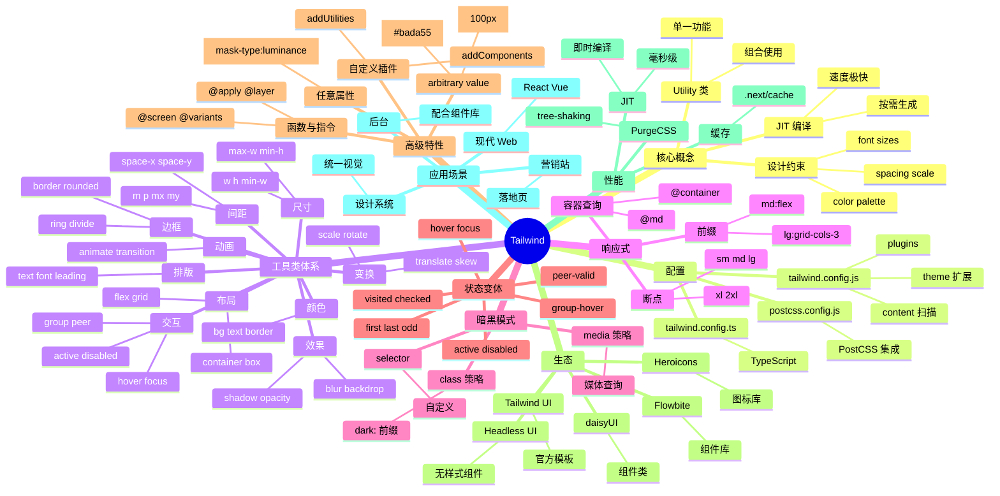

# Tailwind CSS

## 前言

**定位**：Utility-first（原子化）的 CSS 框架，由 Adam Wathan 创建 2017 年发布，颠覆了"组件式 CSS"的传统思维，主张"直接在 HTML 中写 CSS 类"。

**核心价值**：
- 拒绝起名：再也不用为 `card-wrapper-inner` 这样的类名纠结
- 设计系统内置：间距/颜色/字号/断点都是约束好的，不容易写出丑陋界面
- 体积最优：生产环境只保留用到的 class，CSS 通常 < 10KB
- 极强定制：`tailwind.config.js` 完全可配，支持自定义 design token

**五大特性**：
1. **Utility-first**：一个类只做一件事，如 `mt-4` = `margin-top: 1rem`
2. **设计系统内置**：spacing scale、color palette、font sizes 都是受控的
3. **响应式前缀**：`md:flex lg:grid` 让响应式写起来超快
4. **JIT 模式**：3.0+ 默认启用，生成 CSS 即"按需"
5. **插件生态**：官方插件覆盖 Forms/Typography/Aspect Ratio，社区插件丰富

**对比表**：

| 维度 | Tailwind CSS | Bootstrap | Bulma | Material UI CSS | Sass |
|---|---|---|---|---|---|
| 思维 | Utility-first | 组件式 | 组件式 | 组件式 | 自定义 |
| CSS 体积 | ✅ 极小 | ⚠️ 全部 | ⚠️ 全部 | ⚠️ 中 | ❌ 难优化 |
| 定制性 | ✅ 极强 | ⚠️ 中 | ⚠️ 中 | ✅ 主题 | ✅ 极强 |
| 学习曲线 | 中（记类名） | 低 | 低 | 中 | 低 |
| 响应式 | ✅ 内置 | ✅ 断点 | ✅ 断点 | ✅ | ❌ 手写 |
| 适合 | 现代 Web | 快速原型 | 简单项目 | Material 风格 | 大型项目 |

## 思维导图



## 关键代码

### 一、安装与配置

```bash
# 安装
npm install -D tailwindcss postcss autoprefixer
npx tailwindcss init -p

# tailwind.config.js
module.exports = {
  content: [
    "./src/**/*.{js,ts,jsx,tsx,vue}",
    "./index.html"
  ],
  theme: {
    extend: {
      colors: {
        brand: {
          50:  "#f0f9ff",
          500: "#0ea5e9",
          900: "#0c4a6e"
        }
      },
      fontFamily: {
        sans: ["Inter", "system-ui", "sans-serif"]
      },
      spacing: {
        "128": "32rem",
        "144": "36rem"
      }
    }
  },
  plugins: [
    require("@tailwindcss/forms"),
    require("@tailwindcss/typography"),
    require("@tailwindcss/aspect-ratio")
  ]
};
```

### 二、基础使用

```html
<!-- 传统 CSS -->
<style>
  .card { padding: 16px; background: white; border-radius: 8px; box-shadow: 0 2px 4px rgba(0,0,0,0.1); }
  .card h2 { font-size: 20px; font-weight: bold; }
</style>
<div class="card">
  <h2>标题</h2>
</div>

<!-- Tailwind -->
<div class="p-4 bg-white rounded-lg shadow">
  <h2 class="text-xl font-bold">标题</h2>
</div>
```

### 三、响应式布局

```tsx
export function ResponsiveGrid() {
  return (
    <div className="
      grid
      grid-cols-1       /* 手机：1 列 */
      sm:grid-cols-2    /* 平板：2 列 */
      md:grid-cols-3    /* 笔记本：3 列 */
      lg:grid-cols-4    /* 桌面：4 列 */
      xl:grid-cols-6    /* 大屏：6 列 */
      gap-4             /* 间距 16px */
      p-4
    ">
      {items.map(item => (
        <div key={item.id} className="
          bg-white
          rounded-lg
          shadow-md
          p-6
          hover:shadow-xl
          transition-shadow
          duration-300
        ">
          <h3 className="text-lg font-semibold mb-2">{item.title}</h3>
          <p className="text-gray-600 text-sm">{item.description}</p>
        </div>
      ))}
    </div>
  );
}
```

### 四、暗黑模式

```javascript
// tailwind.config.js
module.exports = {
  darkMode: "class",  // 或 "media"
  // ...
};
```

```tsx
// 切换暗黑模式
function ThemeToggle() {
  const [dark, setDark] = useState(false);

  useEffect(() => {
    document.documentElement.classList.toggle("dark", dark);
  }, [dark]);

  return (
    <div className="bg-white dark:bg-gray-900 text-gray-900 dark:text-gray-100">
      <button onClick={() => setDark(!dark)}>
        {dark ? "☀️ 亮色" : "🌙 暗黑"}
      </button>
      <h1 className="text-2xl font-bold">主题切换</h1>
    </div>
  );
}
```

### 五、@apply + 自定义组件类

```css
/* styles.css */
@tailwind base;
@tailwind components;
@tailwind utilities;

@layer components {
  .btn {
    @apply inline-flex items-center justify-center
           px-4 py-2
           rounded-md
           font-medium
           transition-colors
           focus:outline-none focus:ring-2 focus:ring-offset-2;
  }

  .btn-primary {
    @apply btn bg-blue-600 text-white
           hover:bg-blue-700
           focus:ring-blue-500;
  }

  .btn-secondary {
    @apply btn bg-gray-200 text-gray-900
           hover:bg-gray-300
           focus:ring-gray-500;
  }

  .card {
    @apply bg-white rounded-lg shadow-md p-6
           dark:bg-gray-800;
  }
}
```

```html
<button class="btn-primary">主要</button>
<button class="btn-secondary">次要</button>
<div class="card">内容</div>
```

### 六、自定义插件

```javascript
// tailwind-plugin-text-balance.js
const plugin = require("tailwindcss/plugin");

module.exports = plugin(function ({ addUtilities }) {
  addUtilities({
    ".text-balance": { "text-wrap": "balance" },
    ".text-pretty": { "text-wrap": "pretty" }
  });
});

// tailwind.config.js
module.exports = {
  plugins: [require("./tailwind-plugin-text-balance")]
};
```

### 七、任意值（Arbitrary Values）

```html
<!-- 不在预设中的值用 [] 包裹 -->
<div class="
  bg-[#bada55]            /* 自定义颜色 */
  w-[100px]                /* 自定义宽度 */
  h-[calc(100vh-4rem)]     /* 复杂计算 */
  grid-cols-[200px_1fr]    /* 自定义网格 */
  text-[22px]              /* 自定义字号 */
  rounded-[14px]           /* 自定义圆角 */
  shadow-[0_2px_15px_rgba(0,0,0,0.1)]
">
  任意值
</div>

<!-- 任意 CSS 变量 -->
<div class="bg-[var(--brand-color)]">
  CSS 变量
</div>
```

## 核心洞察

- **Tailwind 颠覆的不是 CSS，而是"CSS 工作流"**：传统 CSS 关注"复用"，Tailwind 关注"约束"——通过约束避免代码失控
- **JIT 模式是 Tailwind 3.0 的灵魂**：从"按文件扫描"变为"按需即时生成"，CSS 体积从 50KB+ 降到 5-10KB
- **Tailwind 的设计系统是"反 Bootstrap"的**：Bootstrap 给现成组件，Tailwind 给原子工具和约束——前者适合快速原型、后者适合长期项目
- **Tailwind 不适合小型项目**：2-3 个页面的网站，直接 CSS 更快；只有 5+ 页面才显出 Tailwind 的优势
- **`@apply` 是"逃生舱"**：把 Tailwind 类提取为组件类，但过度使用会回到"组件式 CSS"老路
- **Tailwind 4.0 的新特性**：CSS-first 配置（`@theme` 指令）、Lightning CSS 引擎、性能提升 10x
- **Tailwind 不解决 CSS-in-JS 的问题**：仍有"全局类名污染"风险，但 JIT 模式下基本无影响
- **Tailwind 的学习曲线在"记忆"**：常用类 50-100 个，需 1-2 周适应；VSCode 的 Tailwind IntelliSense 插件是必备
- **Tailwind + 组件库可以共存**：与 AntD/MUI 不冲突，业务组件用组件库、布局/工具样式用 Tailwind
- **容器查询（@container）是 Tailwind 3 的杀手特性**：基于父容器而非视口做响应式，是组件库开发的未来
- **Tailwind 不会取代 CSS**：复杂动画、关键帧、CSS 变量嵌套仍需手写 CSS
- **`arbitrary value` 让 Tailwind 无边界**：随时可用任意值，避免"等框架支持"的尴尬

## 跨项目引用

- **[[react]]**：Tailwind 在 React 项目中配合 `clsx`/`cn` 工具做条件类名是标配
- **[[vue]]**：Vue 3 + Tailwind 是现代化的轻量级组合
- **[[next.js]]**：Next.js 内置 Tailwind 支持，`npx create-next-app` 一键启用
- **[[vite]]**：Vite + `tailwindcss` 插件是开发最快的组合
- **[[webpack]]**：通过 `postcss-loader` + `tailwindcss/postcss7-compat` 集成
- **[[postcss]]**：Tailwind 本身就是 PostCSS 插件
- **[[css]]**：Tailwind 是 CSS 的"超集"，底层仍是 CSS 规则
- **[[typescript]]**：`tailwind.config.ts` 支持类型化配置
- **[[design system]]**：Tailwind 的 token 系统是 design system 落地的最佳实践
- **[[figma]]**：Tailwind UI 模板是设计师与前端协作的桥梁
- **[[ant-design]]**：与 AntD 混用：AntD 组件 + Tailwind 布局/排版
