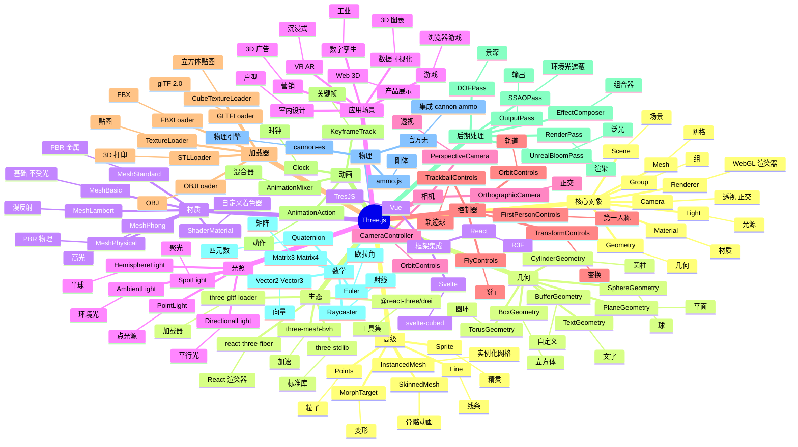

# Three.js

## 前言

**定位**：基于 WebGL 的 JavaScript 3D 库，2010 年由 Ricardo Cabello（mrdoob）发布至今是 Web 端 3D 渲染的事实标准，让浏览器 3D 平民化。

**核心价值**：
- 封装 WebGL 底层 API，让 3D 编程不再写 GLSL shader
- 60+ 几何体/材质/光源/控制器，覆盖 90% 3D 场景
- 跨平台：Web/移动端/VR 设备
- 生态庞大：React Three Fiber、drei、Three.js Editor

**五大特性**：
1. **WebGL 封装**：抹平 WebGL 与 OpenGL 的差异
2. **场景图（Scene Graph）**：树形结构管理 3D 对象
3. **材质系统**：MeshBasic/MeshLambert/Phong/Standard/Physical 五大材质
4. **加载器**：GLTF/FBX/OBJ/STL 通用 3D 格式
5. **后期处理**：EffectComposer + Bloom/SSR/SSAO/DOF

**对比表**：

| 维度 | Three.js | Babylon.js | PlayCanvas | A-Frame | regl |
|---|---|---|---|---|---|
| API 风格 | 命令式 | 命令式 | GUI/JS | HTML 声明 | 函数式 |
| 学习曲线 | 中 | 中 | 低 | 极低 | 高 |
| 性能 | ✅ | ✅✅ | ✅✅ | ✅ | ✅✅ |
| 文档 | ✅ 极好 | ✅ 好 | ⚠️ | ✅ | ⚠️ |
| VR/AR | ✅ | ✅ | ✅ | ✅ 极强 | ⚠️ |
| 适合 | 通用 Web 3D | 游戏/工业 | 3D 编辑器 | VR/AR | 函数式开发 |

## 思维导图



## 关键代码

### 一、安装与基础

```bash
npm install three
npm install -D @types/three
```

```typescript
import * as THREE from "three";

// 1. 创建场景
const scene = new THREE.Scene();

// 2. 创建相机
const camera = new THREE.PerspectiveCamera(
  75,                                            // 视野角度
  window.innerWidth / window.innerHeight,        // 宽高比
  0.1,                                           // 近裁剪面
  1000                                           // 远裁剪面
);
camera.position.z = 5;

// 3. 创建渲染器
const renderer = new THREE.WebGLRenderer({ antialias: true });
renderer.setSize(window.innerWidth, window.innerHeight);
renderer.setPixelRatio(window.devicePixelRatio);
document.body.appendChild(renderer.domElement);

// 4. 添加立方体
const geometry = new THREE.BoxGeometry(1, 1, 1);
const material = new THREE.MeshStandardMaterial({ color: 0x00ff00 });
const cube = new THREE.Mesh(geometry, material);
scene.add(cube);

// 5. 添加光源
const ambientLight = new THREE.AmbientLight(0xffffff, 0.5);
scene.add(ambientLight);

const directionalLight = new THREE.DirectionalLight(0xffffff, 1);
directionalLight.position.set(5, 5, 5);
scene.add(directionalLight);

// 6. 渲染循环
function animate() {
  requestAnimationFrame(animate);
  cube.rotation.x += 0.01;
  cube.rotation.y += 0.01;
  renderer.render(scene, camera);
}
animate();

// 7. 响应窗口
window.addEventListener("resize", () => {
  camera.aspect = window.innerWidth / window.innerHeight;
  camera.updateProjectionMatrix();
  renderer.setSize(window.innerWidth, window.innerHeight);
});
```

### 二、几何与材质

```typescript
// 球体
const sphereGeo = new THREE.SphereGeometry(1, 32, 32);
const sphereMat = new THREE.MeshPhongMaterial({
  color: 0x2194ce,
  shininess: 100,
  specular: 0x222222
});
const sphere = new THREE.Mesh(sphereGeo, sphereMat);

// PBR 材质（更真实）
const pbrMat = new THREE.MeshStandardMaterial({
  color: 0xff0000,
  metalness: 0.5,
  roughness: 0.3
});

// 自定义几何（BufferGeometry）
const customGeo = new THREE.BufferGeometry();
const vertices = new Float32Array([
  -1, -1, 0,   1, -1, 0,   0, 1, 0
]);
customGeo.setAttribute("position", new THREE.BufferAttribute(vertices, 3));
customGeo.computeVertexNormals();
```

### 三、贴图

```typescript
const textureLoader = new THREE.TextureLoader();

const diffuseMap = textureLoader.load("/textures/wood-diffuse.jpg");
const normalMap = textureLoader.load("/textures/wood-normal.jpg");
const roughnessMap = textureLoader.load("/textures/wood-roughness.jpg");

const material = new THREE.MeshStandardMaterial({
  map: diffuseMap,
  normalMap: normalMap,
  roughnessMap: roughnessMap
});

// 立方体贴图（环境）
const cubeTextureLoader = new THREE.CubeTextureLoader();
const envMap = cubeTextureLoader.load([
  "/env/px.jpg", "/env/nx.jpg",
  "/env/py.jpg", "/env/ny.jpg",
  "/env/pz.jpg", "/env/nz.jpg"
]);
scene.background = envMap;
```

### 四、加载 GLTF 模型

```typescript
import { GLTFLoader } from "three/examples/jsm/loaders/GLTFLoader";
import { DRACOLoader } from "three/examples/jsm/loaders/DRACOLoader";

const dracoLoader = new DRACOLoader();
dracoLoader.setDecoderPath("/draco/");

const gltfLoader = new GLTFLoader();
gltfLoader.setDRACOLoader(dracoLoader);

gltfLoader.load(
  "/models/robot.glb",
  (gltf) => {
    const model = gltf.scene;
    scene.add(model);

    // 播放动画
    const mixer = new THREE.AnimationMixer(model);
    const action = mixer.clipAction(gltf.animations[0]);
    action.play();

    // 渲染循环中更新
    const clock = new THREE.Clock();
    function animate() {
      requestAnimationFrame(animate);
      mixer.update(clock.getDelta());
      renderer.render(scene, camera);
    }
  },
  (progress) => {
    console.log("加载进度", (progress.loaded / progress.total) * 100, "%");
  },
  (error) => console.error(error)
);
```

### 五、OrbitControls（轨道控制器）

```typescript
import { OrbitControls } from "three/examples/jsm/controls/OrbitControls";

const controls = new OrbitControls(camera, renderer.domElement);
controls.enableDamping = true;   // 阻尼
controls.dampingFactor = 0.05;
controls.autoRotate = true;      // 自动旋转
controls.autoRotateSpeed = 1.0;
controls.minDistance = 2;
controls.maxDistance = 20;
controls.maxPolarAngle = Math.PI / 2;  // 限制垂直角度

function animate() {
  requestAnimationFrame(animate);
  controls.update();   // 启用阻尼后必须调用
  renderer.render(scene, camera);
}
```

### 六、Raycaster 鼠标交互

```typescript
const raycaster = new THREE.Raycaster();
const mouse = new THREE.Vector2();

function onMouseMove(event: MouseEvent) {
  mouse.x = (event.clientX / window.innerWidth) * 2 - 1;
  mouse.y = -(event.clientY / window.innerHeight) * 2 + 1;
}

function onClick() {
  raycaster.setFromCamera(mouse, camera);
  const intersects = raycaster.intersectObjects(scene.children, true);

  if (intersects.length > 0) {
    const clicked = intersects[0].object as THREE.Mesh;
    clicked.material.color.set(0xff0000);
  }
}

window.addEventListener("mousemove", onMouseMove);
window.addEventListener("click", onClick);
```

### 七、后期处理（Bloom 泛光）

```typescript
import { EffectComposer } from "three/examples/jsm/postprocessing/EffectComposer";
import { RenderPass } from "three/examples/jsm/postprocessing/RenderPass";
import { UnrealBloomPass } from "three/examples/jsm/postprocessing/UnrealBloomPass";
import { OutputPass } from "three/examples/jsm/postprocessing/OutputPass";

const composer = new EffectComposer(renderer);
composer.addPass(new RenderPass(scene, camera));

const bloomPass = new UnrealBloomPass(
  new THREE.Vector2(window.innerWidth, window.innerHeight),
  1.5,    // strength
  0.4,    // radius
  0.85    // threshold
);
composer.addPass(bloomPass);
composer.addPass(new OutputPass());

function animate() {
  requestAnimationFrame(animate);
  composer.render();
}
```

### 八、React Three Fiber

```bash
npm install three @react-three/fiber @react-three/drei
```

```tsx
import { Canvas, useFrame } from "@react-three/fiber";
import { OrbitControls, Environment, useGLTF } from "@react-three/drei";
import { useRef } from "react";
import * as THREE from "three";

function SpinningBox() {
  const ref = useRef<THREE.Mesh>(null!);
  useFrame(() => {
    ref.current.rotation.x += 0.01;
    ref.current.rotation.y += 0.01;
  });
  return (
    <mesh ref={ref}>
      <boxGeometry args={[1, 1, 1]} />
      <meshStandardMaterial color="hotpink" />
    </mesh>
  );
}

export function App() {
  return (
    <Canvas camera={{ position: [0, 0, 5] }}>
      <ambientLight intensity={0.5} />
      <directionalLight position={[5, 5, 5]} />
      <SpinningBox />
      <OrbitControls />
      <Environment preset="city" />
    </Canvas>
  );
}
```

### 九、粒子系统

```typescript
const particleCount = 10000;
const positions = new Float32Array(particleCount * 3);

for (let i = 0; i < particleCount; i++) {
  positions[i * 3]     = (Math.random() - 0.5) * 100;
  positions[i * 3 + 1] = (Math.random() - 0.5) * 100;
  positions[i * 3 + 2] = (Math.random() - 0.5) * 100;
}

const particleGeo = new THREE.BufferGeometry();
particleGeo.setAttribute("position", new THREE.BufferAttribute(positions, 3));

const particleMat = new THREE.PointsMaterial({
  size: 0.1,
  color: 0xffffff,
  map: textureLoader.load("/spark.png"),
  transparent: true
});

const particles = new THREE.Points(particleGeo, particleMat);
scene.add(particles);
```

## 核心洞察

- **Three.js 是 Web 3D 的"分水岭"**：WebGL 原始 API 写 100 行画个三角形，Three.js 5 行搞定
- **Three.js 的 Scene Graph 是核心抽象**：树形结构管理 3D 对象，类似 DOM
- **Three.js 不用 WebGL2 不代表落后**：保持 WebGL1 兼容，移动端覆盖更广
- **Three.js 的 PBR 材质基于物理**：MeshStandardMaterial 用金属度/粗糙度，模拟真实光照
- **Three.js 的 InstancedMesh 是性能杀手锏**：1 万棵树用 InstancedMesh 渲染，10 万个 box 不卡顿
- **Three.js 与 Babylon.js 路线不同**：Three.js 灵活、Babylon.js 游戏化（内置物理/输入）
- **Three.js 加载器体系是行业标准**：GLTFLoader/FBXLoader/OBJLoader 几乎所有人用
- **Three.js 的 shader 材质允许 GLSL**：自定义顶点/片元着色器，性能极致
- **Three.js 不带物理引擎**：需集成 cannon-es / ammo.js / rapier
- **React Three Fiber（R3F）是 React 端的最佳实践**：声明式写 Three.js，生态活跃
- **Three.js 的文档是行业标杆**：每个 API 都有示例、可在线编辑
- **Three.js 的 Three.js Editor 是个彩蛋**：mrdoob 写的可视化编辑器，但不维护

## 跨项目引用

- **[[react]]**：React Three Fiber 是 R3 风格的 Three.js 集成
- **[[vue]]**：TresJS 是 Vue 3 的 Three.js 集成
- **[[svelte]]**：svelte-cubed 是 Svelte 的 Three.js 集成
- **[[typescript]]**：Three.js v0.151+ 完整 TS 类型
- **[[webgl]]**：Three.js 是 WebGL 的封装，原始 WebGL 是 Three.js 的依赖
- **[[canvas]]**：Canvas 2D 场景 Three.js 不擅长（用 Konva/PixiJS）
- **[[gsap]]**：GSAP 配合 Three.js 做相机/对象动画
- **[[d3]]**：D3 + Three.js 做 3D 数据可视化（D3 globe 是经典案例）
- **[[game]]**：Three.js 用于 H5 小游戏，复杂游戏用 Babylon.js
- **[[ar]]** / **[[vr]]**：AR/VR 应用 Three.js + WebXR API
- **[[ai-live-platform]]**：AI 直播平台可考虑用 Three.js 做 3D 虚拟主播
- **[[babylon.js]]**：Three.js 的"工业化"竞品
- **[[aframe]]**：A-Frame 是 Three.js 的"HTML 化"封装
