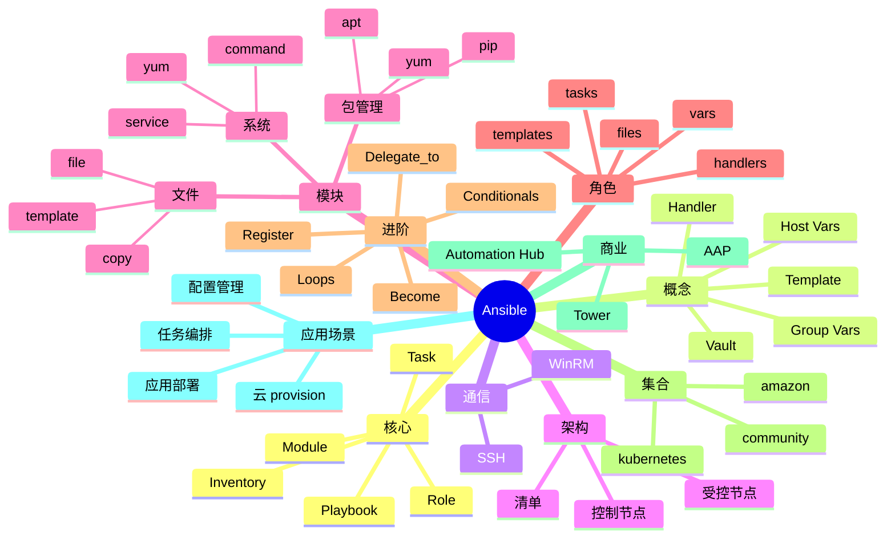

# Ansible

## 前言

**定位**：开源自动化运维和配置管理工具，2012 年由 Michael DeHaan 发布（后被 Red Hat 收购）至今是 Agentless 配置管理的事实标准，与 Puppet/Chef/SaltStack 并称"配置管理四剑客"，Ansible Tower/AAP 是商业版。

**核心价值**：
- Agentless：SSH 推送，无需在被控端装 agent
- YAML 剧本：人类可读，DSL 简单
- 幂等性：重复执行结果一致
- 模块丰富：3000+ 内置模块

**五大特性**：
1. **Agentless**：SSH/WinRM 通信，无客户端
2. **幂等性**：模块自带状态判断
3. **YAML 剧本**：playbook 易读易写
4. **模块化**：task/role/collection 三层复用
5. **Inventory 灵活**：静态/动态主机清单

**对比表**：

| 维度 | Ansible | Puppet | Chef | SaltStack |
|---|---|---|---|---|
| 架构 | 推（SSH） | 拉（C/S） | 拉（C/S） | 推/拉 |
| 语言 | YAML | 自定义 DSL | Ruby DSL | YAML/Python |
| Agent | ❌ | ✅ | ✅ | ✅ |
| 学习曲线 | 低 | 高 | 高 | 中 |
| 适合 | 中小规模 | 大规模 | 大规模 | 高速网络 |

## 思维导图



## 关键代码

### 一、安装与配置

```bash
# Ubuntu
sudo apt install ansible

# macOS
brew install ansible

# pip
pip install ansible

# 验证
ansible --version
```

```ini
# ansible.cfg
[defaults]
inventory = ./inventory
remote_user = ansible
ask_pass = False
host_key_checking = False
retry_files_enabled = False
forks = 10
roles_path = ./roles
collections_path = ./collections
stdout_callback = yaml

[ssh_connection]
pipelining = True
ssh_args = -o ControlMaster=auto -o ControlPersist=60s
```

```ini
# inventory/hosts
[web]
web1.example.com
web2.example.com
web3.example.com

[db]
db1.example.com
db2.example.com

[production:children]
web
db

[production:vars]
env=production
```

```ini
# inventory/aws_ec2.yml（动态清单）
plugin: amazon.aws.aws_ec2
regions:
  - us-east-1
filters:
  tag:Environment: production
hostnames:
  - private-ip-address
compose:
  ansible_host: private_ip_address
groups:
  web: tag.Role == 'web'
  db: tag.Role == 'db'
```

### 二、第一个 Playbook

```yaml
# ping.yml
- name: Ping all hosts
  hosts: all
  gather_facts: false
  tasks:
    - name: Ping
      ansible.builtin.ping:
```

```bash
# 执行
ansible all -m ping
ansible-playbook ping.yml
```

### 三、常用模块

```yaml
# common.yml
- name: Common setup
  hosts: all
  become: true
  tasks:
    - name: Install common packages
      ansible.builtin.apt:
        name:
          - vim
          - curl
          - git
          - htop
        update_cache: yes

    - name: Ensure motd
      ansible.builtin.copy:
        dest: /etc/motd
        content: "Welcome to {{ inventory_hostname }}\nManaged by Ansible\n"

    - name: Configure timezone
      ansible.builtin.timezone:
        name: Asia/Shanghai

    - name: Create deploy user
      ansible.builtin.user:
        name: deploy
        shell: /bin/bash
        groups: sudo, docker
        append: yes

    - name: Allow passwordless sudo
      ansible.builtin.lineinfile:
        path: /etc/sudoers
        line: 'deploy ALL=(ALL) NOPASSWD: ALL'
        validate: 'visudo -cf %s'
```

### 四、变量与模板

```yaml
# vars.yml
nginx_port: 80
nginx_user: www-data
ssl_enabled: true
```

```yaml
# deploy-nginx.yml
- name: Deploy Nginx
  hosts: web
  become: true
  vars:
    nginx_port: 80
    nginx_sites:
      - name: example.com
        root: /var/www/example
      - name: api.example.com
        root: /var/www/api

  tasks:
    - name: Install Nginx
      ansible.builtin.apt:
        name: nginx
        state: present

    - name: Deploy nginx.conf
      ansible.builtin.template:
        src: templates/nginx.conf.j2
        dest: /etc/nginx/nginx.conf
      notify: Restart nginx

    - name: Deploy site configs
      ansible.builtin.template:
        src: templates/site.conf.j2
        dest: /etc/nginx/sites-enabled/{{ item.name }}
      loop: "{{ nginx_sites }}"
      notify: Restart nginx

  handlers:
    - name: Restart nginx
      ansible.builtin.service:
        name: nginx
        state: restarted
```

```jinja2
# templates/nginx.conf.j2
user {{ nginx_user }};
worker_processes auto;

events {
    worker_connections 1024;
}

http {
    include /etc/nginx/mime.types;
    server {
        listen {{ nginx_port }};
        server_name _;
        root /var/www/html;
    }

    
    include /etc/nginx/sites-enabled/{{ site.name }}.conf;
    
}
```

### 五、Roles 角色化

```bash
# 角色目录结构
mkdir -p roles/webserver/{tasks,handlers,templates,files,vars,defaults,meta}
```

```yaml
# roles/webserver/tasks/main.yml
- name: Install Nginx
  ansible.builtin.apt:
    name: nginx
    state: present
  notify: Restart nginx

- name: Deploy config
  ansible.builtin.template:
    src: nginx.conf.j2
    dest: /etc/nginx/nginx.conf
  notify: Restart nginx

- name: Ensure site is up
  ansible.builtin.service:
    name: nginx
    state: started
    enabled: yes
```

```yaml
# roles/webserver/defaults/main.yml
nginx_port: 80
nginx_user: www-data
```

```yaml
# site.yml
- name: Setup web servers
  hosts: web
  become: true
  roles:
    - common
    - webserver
    - { role: geerlingguy.firewall, tags: firewall }
```

```bash
# 使用 Ansible Galaxy
ansible-galaxy install geerlingguy.firewall
ansible-galaxy init myrole
ansible-galaxy collection install community.general
```

### 六、条件、循环、注册

```yaml
# advanced.yml
- name: Advanced examples
  hosts: all
  become: true
  tasks:
    # 条件
    - name: Install Apache on CentOS
      ansible.builtin.yum:
        name: httpd
        state: present
      when: ansible_os_family == "RedHat"

    # 循环
    - name: Create users
      ansible.builtin.user:
        name: "{{ item }}"
        groups: sudo
      loop:
        - alice
        - bob
        - charlie

    # 注册变量
    - name: Check uptime
      ansible.builtin.command: uptime
      register: uptime_result
      changed_when: false

    - name: Print uptime
      ansible.builtin.debug:
        var: uptime_result.stdout

    # 循环 with dict
    - name: Create files
      ansible.builtin.file:
        path: "/tmp/{{ item.key }}"
        state: touch
      loop: "{{ files_dict | dict2items }}"

    # until
    - name: Wait for service
      ansible.builtin.uri:
        url: http://localhost:8080/health
        status_code: 200
      register: result
      until: result.status == 200
      retries: 30
      delay: 5
```

### 七、Ansible Vault 加密

```bash
# 创建加密文件
ansible-vault create secret.yml

# 编辑
ansible-vault edit secret.yml

# 加密已有文件
ansible-vault encrypt vars.yml

# 解密
ansible-vault decrypt vars.yml

# 查看
ansible-vault view secret.yml

# 重新设置密码
ansible-vault rekey secret.yml

# 使用密码文件
ansible-playbook site.yml --vault-password-file ~/.vault_pass
```

```yaml
# vars/encrypted.yml（加密后内容）
$ANSIBLE_VAULT;1.1;AES256
6363636363...
```

```yaml
# 在 playbook 引用
- name: Deploy app
  hosts: web
  vars_files:
    - vars/encrypted.yml
  tasks:
    - name: Set DB password
      ansible.builtin.copy:
        dest: /etc/myapp/db.conf
        content: |
          db_host=db.example.com
          db_password={{ db_password }}
        mode: '0600'
```

### 八、动态清单与云

```bash
# 列出动态清单
ansible-inventory -i aws_ec2.yml --list

# 限制执行范围
ansible-playbook site.yml --limit web1.example.com
ansible-playbook site.yml --limit 'web*'
```

```yaml
# 部署 AWS EC2
- name: Provision EC2
  hosts: localhost
  gather_facts: false
  tasks:
    - name: Launch instance
      amazon.aws.ec2_instance:
        name: webserver
        instance_type: t3.medium
        image_id: ami-0c55b159cbfafe1f0
        region: us-east-1
        vpc_subnet_id: subnet-xxxx
        security_group: sg-xxxx
        key_name: my-key
        tags:
          Environment: production
        wait: yes
        count: 3
      register: ec2

    - name: Add to inventory
      ansible.builtin.add_host:
        name: "{{ item.public_ip_address }}"
        groups: launched
      loop: "{{ ec2.instances }}"
```

### 九、AWX / Tower 商业版

```bash
# AWX（开源版 Tower）Docker 安装
docker run -d --name awx \
  -p 8080:80 \
  -v awx-data:/var/lib/awx \
  awx/awx:latest
```

```yaml
# AAP 工作流模板
# - 模板 A: 拉代码
# - 模板 B: 部署基础设施
# - 模板 C: 部署应用
# - 失败回滚
```

### 十、调试与最佳实践

```bash
# 调试模式
ansible-playbook site.yml -vvv

# 检查模式（不执行）
ansible-playbook site.yml --check

# diff 模式
ansible-playbook site.yml --check --diff

# 标签
ansible-playbook site.yml --tags "config"
ansible-playbook site.yml --skip-tags "deploy"

# 列出主机
ansible-playbook site.yml --list-hosts

# 列出 tags
ansible-playbook site.yml --list-tags
```

```yaml
# 最佳实践
- name: Production deploy
  hosts: web
  become: true

  # 串行执行（避免雪崩）
  serial: 3

  # 失败继续
  ignore_errors: false

  # 任何错误都停止
  any_errors_fatal: true

  pre_tasks:
    - name: Check connectivity
      ansible.builtin.ping:

  roles:
    - common
    - webserver

  post_tasks:
    - name: Verify deployment
      ansible.builtin.uri:
        url: http://localhost/health
        status_code: 200
```

## 核心洞察

- **Ansible 的"Agentless"是核心优势**：vs Puppet 的客户端架构
- **Ansible 的"幂等性"是配置管理关键**：重复执行不出问题
- **Ansible 的"YAML DSL"易学易用**：vs Chef 的 Ruby
- **Ansible 的"Role"是复用单位**：tasks/handlers/templates/files/vars 标准化
- **Ansible 的"动态清单"对接云**：AWS/GCP/Azure 实时同步
- **Ansible 的"Vault 加密"是机密管理**：AES256 加密
- **Ansible 与"Terraform"互补**：Terraform 管资源，Ansible 管配置
- **Ansible 的"控制节点"是单点**：可借助 AWX/AAP 做 HA
- **Ansible 的"串行执行"避免雪崩**：serial 字段控制
- **Ansible 的"Handlers"是事件驱动**：notify/handlers 模式
- **Ansible 的"collections"是新版打包方式**：替代旧 Role
- **Ansible 的"执行速度"是劣势**：SSH 串行，慢于 SaltStack
- **Ansible 的"Windows 支持"靠 WinRM**：与 Linux 等价
- **Ansible 在"应用部署"场景常用**：Kubernetes 外的传统部署
- **Ansible 的"事实（facts）"自动收集**：setup 模块获取系统信息

## 跨项目引用

- **[[linux]]**：Ansible 跑在 Linux 上
- **[[docker]]**：Ansible 可部署 Docker
- **[[kubernetes]]**：K8s 应用部署常用 Ansible
- **[[terraform]]**：Terraform 管资源，Ansible 管配置
- **[[jenkins]]**：Jenkins 调用 Ansible 做部署
- **[[github actions]]**：GitHub Actions 也能跑 Ansible
- **[[aws]]**：AWS 是 Ansible 重要目标
- **[[nginx]]**：Ansible 部署 Nginx 是经典案例
- **[[prometheus]]**：Ansible 部署 Prometheus
- **[[grafana]]**：Ansible 部署 Grafana
- **[[hashicorp vault]]**：Vault 提供 secrets
- **[[ssh]]**：Ansible 基于 SSH
- **[[yaml]]**：YAML 是 Ansible 的配置语言
- **[[puppet]]**：Puppet 是 Ansible 的竞品
- **[[chef]]**：Chef 是配置管理老牌工具
