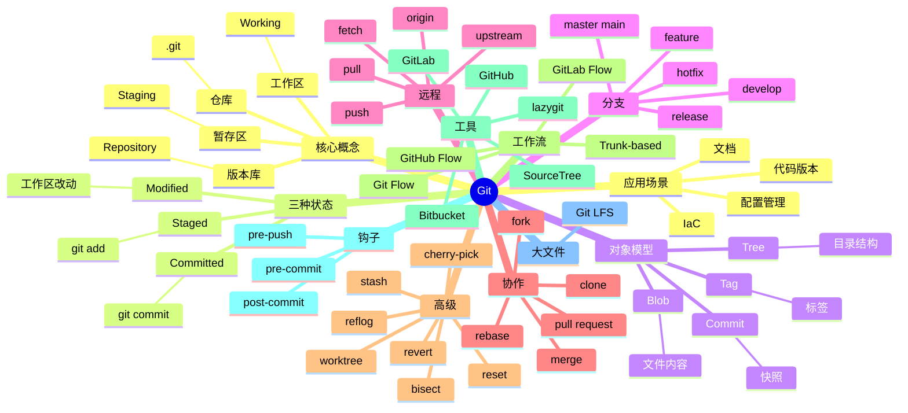

# Git

## 前言

**定位**：分布式版本控制系统的事实标准，2005 年由 Linus Torvalds 为管理 Linux 内核开发而创造至今是开源协作的基础设施，全球 1 亿+ 开发者、90%+ 项目使用 Git。

**核心价值**：
- 分布式：每个开发者都有完整历史副本
- 高性能：SHA-1/SHA-256 内容寻址，秒级操作
- 分支廉价：创建/合并几乎零成本
- 完整性：每次提交都校验哈希，几乎不可能篡改

**五大特性**：
1. **内容寻址**：用 SHA-1 hash 标识文件/提交/树
2. **三种状态**：Modified → Staged → Committed
3. **分支模型**：轻量级指针，秒级创建/切换
4. **分布式架构**：本地提交/查看历史/分支不需网络
5. **完整性保证**：cryptographic hash 防篡改

**对比表**：

| 维度 | Git | SVN | Mercurial | Perforce | Fossil |
|---|---|---|---|---|---|
| 架构 | 分布式 | 集中式 | 分布式 | 集中式 | 分布式 |
| 离线操作 | ✅ 全功能 | ❌ | ✅ | ❌ | ✅ |
| 分支 | 极轻量 | 笨重 | 轻量 | 极笨重 | 轻量 |
| 性能 | ✅ 极快 | ⚠️ 大库慢 | ✅ | ✅ 大文件 | ⚠️ |
| 市场份额 | ✅✅ 绝对 | ⚠️ 老项目 | ⚠️ 极少 | 游戏/大型 | ⚠️ 极少 |
| 适合 | 几乎所有场景 | 大文件/Unity | Git 替代 | 游戏/二进制 | 嵌入式 |

## 思维导图



## 关键代码

### 一、基础配置

```bash
# 首次配置
git config --global user.name "Alice"
git config --global user.email "alice@example.com"
git config --global init.defaultBranch main
git config --global core.editor vim
git config --global pull.rebase true

# 别名
git config --global alias.st status
git config --global alias.co checkout
git config --global alias.br branch
git config --global alias.ci commit
git config --global alias.unstage "reset HEAD --"
git config --global alias.lg "log --oneline --graph --decorate --all"

# SSH 配置
ssh-keygen -t ed25519 -C "alice@example.com"
cat ~/.ssh/id_ed25519.pub    # 复制到 GitHub
ssh -T git@github.com         # 测试连接

# 查看配置
git config --list
git config --list --show-origin
```

### 二、初始化与克隆

```bash
# 新建仓库
mkdir myproject && cd myproject
git init
git init -b main                       # 指定默认分支

# 克隆远程
git clone https://github.com/user/repo.git
git clone git@github.com:user/repo.git
git clone --depth 1 repo.git          # 浅克隆（仅最新提交）
git clone --branch develop repo.git
git clone --recurse-submodules repo.git

# 远程仓库
git remote -v
git remote add origin git@github.com:user/repo.git
git remote set-url origin <new-url>
git remote remove upstream
```

### 三、日常操作

```bash
# 查看状态
git status
git status -s                         # 简短

# 添加到暂存区
git add file.txt
git add src/                          # 目录
git add -A                            # 全部
git add -p                            # 交互式（按块暂存）
git add -u                            # 已跟踪文件

# 提交
git commit -m "feat: add login"
git commit -am "fix: bug"             # add + commit（已跟踪）
git commit --amend                    # 改最近一次提交
git commit --amend --no-edit          # 改作者不改正文
git commit -S -m "signed commit"      # GPG 签名

# 查看差异
git diff                              # 工作区 vs 暂存区
git diff --staged                     # 暂存区 vs 最近提交
git diff HEAD~1                       # 工作区 vs 上次提交
git diff main..feature                # 分支对比
git diff --stat                       # 统计

# 查看历史
git log
git log --oneline
git log --graph --oneline --all       # 图形化
git log -p                            # 含差异
git log --author="Alice"
git log --since="2 weeks ago"
git log -- file.txt                   # 文件历史
git log -S "function"                 # 搜索内容
```

### 四、分支管理

```bash
# 创建与切换
git branch                            # 列出本地
git branch -a                         # 列出所有
git branch feature-x
git checkout feature-x
git checkout -b feature-x             # 创建并切换
git switch feature-x                  # Git 2.23+ 推荐
git switch -c feature-x               # create + switch

# 合并
git merge feature-x                   # 合并到当前
git merge --no-ff feature-x           # 保留分支历史
git merge --squash feature-x          # 压缩为一个提交
git merge --abort                     # 取消合并

# 变基（重写历史）
git rebase main                       # 当前分支 rebase 到 main
git rebase -i HEAD~3                  # 交互式 rebase（最近 3 次）
git rebase --onto main feature-x bugfix  # 复杂 rebase
git rebase --abort
git rebase --continue

# 删除
git branch -d feature-x               # 已合并才能删
git branch -D feature-x               # 强制
git push origin --delete feature-x    # 删除远程
```

### 五、远程协作

```bash
# fetch / pull / push
git fetch origin                      # 拉取远程但不合并
git fetch --all --prune               # 全部 + 清理
git pull                              # fetch + merge
git pull --rebase                     # fetch + rebase（更干净）
git push                              # 推送到 origin
git push -u origin feature-x          # 首次推送设上游
git push --force-with-lease           # 强制但安全
git push --tags                       # 推送标签

# pull request / merge request 工作流
# 1. fork 仓库
# 2. clone fork
# 3. 创建 feature 分支
git checkout -b feat/login
# 4. 提交 + push 到 fork
git push -u origin feat/login
# 5. 在 GitHub 创建 PR
# 6. 代码审查 + 合并
```

### 六、撤销与回退

```bash
# 工作区撤销
git checkout -- file.txt              # 丢弃工作区修改
git restore file.txt                  # Git 2.23+

# 暂存区撤销
git reset HEAD file.txt               # 取消暂存
git restore --staged file.txt

# 提交回退（推荐：revert）
git revert <commit>                   # 新提交撤销旧提交
git revert HEAD                       # 撤销最近一次

# 重置（危险：改写历史）
git reset --soft HEAD~1               # 撤销 commit 保留改动到暂存
git reset --mixed HEAD~1              # 默认，撤销 commit 和 add
git reset --hard HEAD~1               # 全部丢弃（危险）

# 改写历史
git commit --amend                    # 改最近提交
git rebase -i HEAD~5                  # 改写前 5 次
git filter-branch --tree-filter 'rm -f secret.txt' HEAD  # 清理大文件
```

### 七、Stash 暂存

```bash
# 暂存当前未提交工作
git stash
git stash save "WIP: login feature"
git stash -u                          # 含未跟踪
git stash -a                          # 含忽略文件

# 查看
git stash list
git stash show stash@{0}
git stash show -p stash@{0}           # 看 diff

# 恢复
git stash pop                         # 弹出最新
git stash apply stash@{0}             # 应用但不删除
git stash drop stash@{0}              # 删除

# 从 stash 创建分支
git stash branch fix-bug stash@{0}
```

### 八、子模块与子树

```bash
# 子模块（Submodule）
git submodule add https://github.com/user/lib.git libs/lib
git submodule update --init --recursive
git submodule update --remote         # 更新到最新

# 子树（Subtree）—— 替代方案
git subtree add --prefix=libs/lib https://github.com/user/lib.git main
git subtree pull --prefix=libs/lib https://github.com/user/lib.git main
git subtree push --prefix=libs/lib my-remote main
```

### 九、Tag 标签

```bash
# 列出
git tag
git tag -l "v1.*"

# 创建
git tag v1.0.0                        # 轻量标签
git tag -a v1.0.0 -m "Release 1.0"    # 注解标签
git tag -s v1.0.0 -m "Signed"         # GPG 签名

# 推送
git push origin v1.0.0
git push origin --tags

# 检出标签
git checkout v1.0.0
git checkout -b hotfix v1.0.0         # 从标签创建分支

# 删除
git tag -d v1.0.0
git push origin --delete v1.0.0
```

### 十、查找与诊断

```bash
# 找 bug 引入点
git bisect start
git bisect bad                        # 当前有 bug
git bisect good v1.0                  # 上一版本正常
# 测试 → git bisect good/bad
git bisect reset

# 找谁改了某行
git blame file.txt
git blame -L 10,20 file.txt

# 搜索
git grep "TODO"
git grep -n "function" src/

# reflog（救命：恢复误删分支）
git reflog
git checkout -b recovered-branch HEAD@{5}

# 工作区多版本
git worktree add ../repo-feature feature-x
git worktree list
```

## 核心洞察

- **Git 是分布式版本控制的标准**：90%+ 市场份额，事实标准
- **Git 的内容寻址是天才设计**：用 SHA-1 标识每个文件/目录/提交
- **Git 的分支模型颠覆传统**：CVS/SVN 的"分支是负担"变成"分支是日常工作"
- **Git 三区（工作区/暂存区/版本库）独特**：其他 VCS 都没有 staging
- **Git 的 .git 目录是仓库本身**：克隆就是 .git 目录的拷贝
- **Git 的"历史不可改写"是误解**：rebase/amend 都能改，但 SHA 会变
- **GitHub Flow 是最流行工作流**：main + feature branch + PR
- **Git 的学习曲线陡**：merge vs rebase、reset 三种模式、reflog、bisect 都需要深入理解
- **Git LFS 解决大文件问题**：GitHub/GitLab 都支持，文件存 S3
- **Git 在大仓库性能问题**：Windows 上尤其慢，微软在 VFS for Git 上突破
- **Git 的 Monorepo vs Multi-repo 之争**：Google/Meta/Facebook 推 monorepo，Linux/Kubernetes 推 multi-repo
- **Git 的钩子让工作流自动化**：pre-commit 跑 lint、post-commit 触发 CI

## 跨项目引用

- **[[linux]]**：Git 是 Linus 为管理 Linux 内核而创造
- **[[github actions]]**：CI/CD 平台基于 Git 仓库
- **[[jenkins]]**：Jenkins 监听 Git push 触发构建
- **[[kubernetes]]**：K8s YAML 用 Git 管理（GitOps）
- **[[docker]]**：CI 中 Git 触发 Docker 镜像构建
- **[[terraform]]**：Terraform 配置文件用 Git 版本化
- **[[ansible]]**：Ansible playbooks 用 Git 管理
- **[[github]]** / **[[gitlab]]**：代码托管平台
- **[[gitea]]**：自建 Git 服务
- **[[lazygit]]**：终端 Git TUI 工具
- **[[tig]]**：Git 文本模式浏览器
- **[[pre-commit]]**：Git 钩子管理框架
