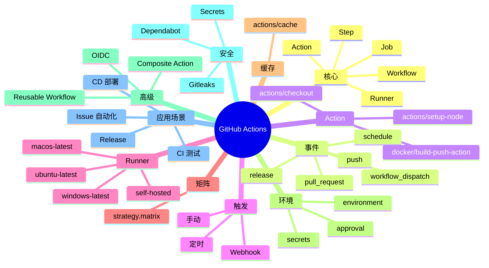

# GitHub Actions

## 前言

**定位**：GitHub 内置的 CI/CD 平台，2019 年 GA 至今是 GitHub 生态的事实 CI/CD 工具，与 Jenkins/GitLab CI/CircleCI 并称 CI/CD 主流方案，月活 400 万+ 仓库使用。

**核心价值**：
- 内置于 GitHub：零配置集成
- Marketplace：10000+ 现成 Action
- 免费额度：公开仓库免费，私有 2000 分钟/月
- 事件驱动：PR/Push/Issue/Schedule 多种触发

**五大特性**：
1. **Workflow YAML**：`.github/workflows/*.yml` 描述流程
2. **Action 复用**：Marketplace + 自定义
3. **Runner 池**：GitHub-hosted + Self-hosted
4. **矩阵构建**：自动多环境/多版本测试
5. **Secrets 管理**：仓库/组织/环境三级

**对比表**：

| 维度 | GitHub Actions | Jenkins | GitLab CI | CircleCI |
|---|---|---|---|---|
| 集成 | GitHub 原生 | 通用 | GitLab 原生 | 通用 |
| 部署 | SaaS | 自托管 | 自托管/SaaS | SaaS |
| 配置 | YAML | Jenkinsfile | YAML | YAML |
| Runner | Hosted/Self | Agent | Runner | Cloud/Server |
| 免费额度 | 公开无限 | 无限 | 400 分钟 | 6000 分钟 |

## 思维导图



## 关键代码

### 一、基础 Workflow

```yaml
# .github/workflows/ci.yml
name: CI

on:
  push:
    branches: [main, develop]
  pull_request:
    branches: [main]

jobs:
  test:
    runs-on: ubuntu-latest

    steps:
      - name: Checkout
        uses: actions/checkout@v4

      - name: Setup Node.js
        uses: actions/setup-node@v4
        with:
          node-version: '20'
          cache: 'npm'

      - name: Install dependencies
        run: npm ci

      - name: Run tests
        run: npm test

      - name: Build
        run: npm run build
```

### 二、矩阵构建

```yaml
name: Matrix Test

on: [push, pull_request]

jobs:
  test:
    runs-on: ubuntu-latest

    strategy:
      fail-fast: false
      matrix:
        node: [18, 20, 22]
        os: [ubuntu-latest, windows-latest, macos-latest]
        include:
          - node: 18
            os: ubuntu-latest
            coverage: true
        exclude:
          - node: 18
            os: macos-latest

    steps:
      - uses: actions/checkout@v4
      - uses: actions/setup-node@v4
        with:
          node-version: ${{ matrix.node }}

      - run: npm ci
      - run: npm test

      - name: Upload coverage
        if: matrix.coverage
        uses: codecov/codecov-action@v3
```

### 三、Docker 构建与推送

```yaml
name: Docker Build & Push

on:
  push:
    branches: [main]
    tags: ['v*']

jobs:
  build:
    runs-on: ubuntu-latest

    permissions:
      contents: read
      packages: write

    steps:
      - uses: actions/checkout@v4

      - name: Set up Docker Buildx
        uses: docker/setup-buildx-action@v3

      - name: Login to Docker Hub
        uses: docker/login-action@v3
        with:
          username: ${{ secrets.DOCKERHUB_USERNAME }}
          password: ${{ secrets.DOCKERHUB_TOKEN }}

      - name: Extract metadata
        id: meta
        uses: docker/metadata-action@v5
        with:
          images: myorg/myapp
          tags: |
            type=ref,event=branch
            type=ref,event=pr
            type=semver,pattern={{version}}
            type=semver,pattern={{major}}.{{minor}}
            type=sha

      - name: Build and push
        uses: docker/build-push-action@v5
        with:
          context: .
          push: true
          tags: ${{ steps.meta.outputs.tags }}
          labels: ${{ steps.meta.outputs.labels }}
          cache-from: type=gha
          cache-to: type=gha,mode=max
```

### 四、多阶段部署

```yaml
name: Deploy

on:
  push:
    branches: [main]

jobs:
  deploy-staging:
    runs-on: ubuntu-latest
    environment: staging

    steps:
      - uses: actions/checkout@v4
      - name: Deploy to staging
        run: ./deploy.sh staging
        env:
          AWS_ACCESS_KEY_ID: ${{ secrets.AWS_ACCESS_KEY_ID }}
          AWS_SECRET_ACCESS_KEY: ${{ secrets.AWS_SECRET_ACCESS_KEY }}

  deploy-production:
    needs: deploy-staging
    runs-on: ubuntu-latest
    environment: production

    steps:
      - uses: actions/checkout@v4
      - name: Deploy to production
        run: ./deploy.sh production
        env:
          AWS_ACCESS_KEY_ID: ${{ secrets.AWS_ACCESS_KEY_ID }}
          AWS_SECRET_ACCESS_KEY: ${{ secrets.AWS_SECRET_ACCESS_KEY }}
```

### 五、缓存与依赖

```yaml
name: With Cache

on: [push]

jobs:
  build:
    runs-on: ubuntu-latest

    steps:
      - uses: actions/checkout@v4

      - name: Cache node_modules
        uses: actions/cache@v3
        with:
          path: |
            node_modules
            ~/.npm
          key: ${{ runner.os }}-node-${{ hashFiles('**/package-lock.json') }}
          restore-keys: |
            ${{ runner.os }}-node-

      - name: Cache Maven
        uses: actions/cache@v3
        with:
          path: ~/.m2
          key: ${{ runner.os }}-m2-${{ hashFiles('**/pom.xml') }}

      - run: npm ci
      - run: npm run build

      - name: Cache Docker layers
        uses: actions/cache@v3
        with:
          path: /tmp/.buildx-cache
          key: ${{ runner.os }}-buildx-${{ github.sha }}
          restore-keys: |
            ${{ runner.os }}-buildx-
```

### 六、Self-hosted Runner

```bash
# 在 Linux 机器上注册
mkdir actions-runner && cd actions-runner

# 下载
curl -o actions-runner-linux-x64.tar.gz -L \
  https://github.com/actions/runner/releases/download/v2.311.0/actions-runner-linux-x64-2.311.0.tar.gz
tar xzf ./actions-runner-linux-x64.tar.gz

# 配置（从 GitHub 仓库 Settings → Actions → Runners → New runner 获取 token）
./config.sh --url https://github.com/myorg/myrepo --token Axxxxxxxxx

# 安装为服务
sudo ./svc.sh install
sudo ./svc.sh start
```

```yaml
# 使用 self-hosted runner
name: Self-hosted Build

on: [push]

jobs:
  build:
    runs-on: self-hosted       # 使用 self-hosted
    # runs-on: [self-hosted, linux, x64]  # 带标签
    steps:
      - uses: actions/checkout@v4
      - run: ./build.sh
```

```dockerfile
# Runner 容器化
FROM ubuntu:22.04
RUN apt update && apt install -y curl git

RUN mkdir /runner && cd /runner && \
    curl -o runner.tar.gz -L https://github.com/actions/runner/releases/download/v2.311.0/actions-runner-linux-x64-2.311.0.tar.gz && \
    tar xzf runner.tar.gz && rm runner.tar.gz

RUN ./config.sh --url https://github.com/myorg/myrepo --token XXX --unattended

CMD ["./run.sh"]
```

### 七、Reusable Workflow

```yaml
# .github/workflows/reusable-deploy.yml
name: Reusable Deploy

on:
  workflow_call:
    inputs:
      environment:
        required: true
        type: string
    secrets:
      deploy_key:
        required: true

jobs:
  deploy:
    runs-on: ubuntu-latest
    environment: ${{ inputs.environment }}
    steps:
      - uses: actions/checkout@v4
      - run: ./deploy.sh ${{ inputs.environment }}
        env:
          DEPLOY_KEY: ${{ secrets.deploy_key }}
```

```yaml
# .github/workflows/main.yml
name: Main

on: [push]

jobs:
  deploy-staging:
    uses: ./.github/workflows/reusable-deploy.yml
    with:
      environment: staging
    secrets:
      deploy_key: ${{ secrets.STAGING_DEPLOY_KEY }}

  deploy-prod:
    needs: deploy-staging
    uses: myorg/shared-workflows/.github/workflows/deploy.yml@main
    with:
      environment: production
    secrets: inherit
```

### 八、Composite Action

```yaml
# .github/actions/setup-env/action.yml
name: 'Setup Environment'
description: 'Setup common dev environment'

inputs:
  node-version:
    description: 'Node version'
    required: false
    default: '20'

runs:
  using: 'composite'
  steps:
    - uses: actions/setup-node@v4
      with:
        node-version: ${{ inputs.node-version }}
        cache: 'npm'

    - name: Install global packages
      shell: bash
      run: npm install -g pnpm yarn

    - name: Cache
      uses: actions/cache@v3
      with:
        path: ~/.npm
        key: npm-${{ runner.os }}-${{ hashFiles('**/package-lock.json') }}
```

```yaml
# 使用
jobs:
  build:
    runs-on: ubuntu-latest
    steps:
      - uses: actions/checkout@v4
      - uses: ./.github/actions/setup-env
        with:
          node-version: 20
      - run: npm ci
```

### 九、OIDC 与云安全

```yaml
# AWS OIDC（无长期凭据）
name: Deploy with OIDC

on:
  push:
    branches: [main]

permissions:
  id-token: write
  contents: read

jobs:
  deploy:
    runs-on: ubuntu-latest
    steps:
      - uses: actions/checkout@v4

      - name: Configure AWS credentials
        uses: aws-actions/configure-aws-credentials@v4
        with:
          role-to-assume: arn:aws:iam::123456789012:role/GitHubActionsRole
          aws-region: us-east-1

      - name: Deploy
        run: aws s3 cp ./build s3://my-bucket --recursive
```

```json
# IAM 信任策略
{
  "Version": "2012-10-17",
  "Statement": [
    {
      "Effect": "Allow",
      "Principal": {
        "Federated": "arn:aws:iam::123456789012:oidc-provider/token.actions.githubusercontent.com"
      },
      "Action": "sts:AssumeRoleWithWebIdentity",
      "Condition": {
        "StringEquals": {
          "token.actions.githubusercontent.com:sub": "repo:myorg/myrepo:ref:refs/heads/main"
        }
      }
    }
  ]
}
```

### 十、监控与通知

```yaml
name: With Notifications

on: [push]

jobs:
  build:
    runs-on: ubuntu-latest
    steps:
      - uses: actions/checkout@v4
      - run: npm test

      - name: Notify Slack on success
        if: success()
        uses: slackapi/slack-github-action@v1
        with:
          payload: |
            {"text": "✅ Build ${{ github.run_number }} succeeded"}
        env:
          SLACK_WEBHOOK_URL: ${{ secrets.SLACK_WEBHOOK }}

      - name: Notify Slack on failure
        if: failure()
        uses: slackapi/slack-github-action@v1
        with:
          payload: |
            {"text": "❌ Build ${{ github.run_number }} failed in ${{ github.repository }}"}
        env:
          SLACK_WEBHOOK_URL: ${{ secrets.SLACK_WEBHOOK }}

      - name: Send badge
        run: |
          curl -X POST "https://api.imgbb.com/1/upload" \
            -F "image=@${{ github.workspace }}/coverage.svg" \
            -F "key=${{ secrets.IMGBB_KEY }}"

      - name: Status badge
        run: echo "Status: ${{ job.status }}"
```

```yaml
# 失败重试
- name: Deploy with retry
  uses: nick-fields/retry@v2
  with:
          timeout_minutes: 10
          max_attempts: 3
          command: ./deploy.sh
```

## 核心洞察

- **GitHub Actions 的"内置"是核心优势**：零配置、零额外服务
- **GitHub Actions 的"Marketplace"是生态优势**：10000+ 复用 Action
- **GitHub Actions 的"免费额度"对开源友好**：公开仓库无限
- **GitHub Actions 的"Reusable Workflow"是复用机制**：DRY 原则
- **GitHub Actions 的"Composite Action"是封装机制**：步骤集合
- **GitHub Actions 的"OIDC"是无密钥认证**：云部署更安全
- **GitHub Actions 的"矩阵构建"是测试利器**：多版本/多环境
- **GitHub Actions 的"Self-hosted Runner"是私有部署**：GPU/大内存场景
- **GitHub Actions 的"环境（environment）"是部署审批**：生产前确认
- **GitHub Actions 的"Secrets"是凭据管理**：仓库/组织/环境三级
- **GitHub Actions 在"GitHub 项目"是首选**：Jenkins 在多平台仍是首选
- **GitHub Actions 的"分钟配额"是限制**：私有仓库需关注
- **GitHub Actions 的"Workflow 文件"是 YAML**：vs Jenkins 的 Groovy
- **GitHub Actions 的"事件触发"是核心机制**：20+ 事件类型
- **GitHub Actions 的"actions/cache"提速显著**：依赖/构建缓存

## 跨项目引用

- **[[git]]**：GitHub Actions 与 Git 深度集成
- **[[github]]**：GitHub 平台的一部分
- **[[docker]]**：构建 Docker 镜像
- **[[kubernetes]]**：部署到 K8s
- **[[jenkins]]**：Jenkins 是 GitHub Actions 的竞品
- **[[gitlab ci]]**：GitLab CI 是内建 CI/CD
- **[[terraform]]**：GitHub Actions 跑 Terraform
- **[[ansible]]**：GitHub Actions 调 Ansible
- **[[aws]]** / **[[azure]]** / **[[gcp]]**：OIDC 部署到云
- **[[slack]]**：通知到 Slack
- **[[npm]]**：Node.js 包管理
- **[[python]]**：Python 项目 CI
- **[[node.js]]**：Node.js 项目 CI
- **[[maven]]** / **[[gradle]]**：Java 项目 CI
- **[[prometheus]]**：监控 GitHub Actions 指标
