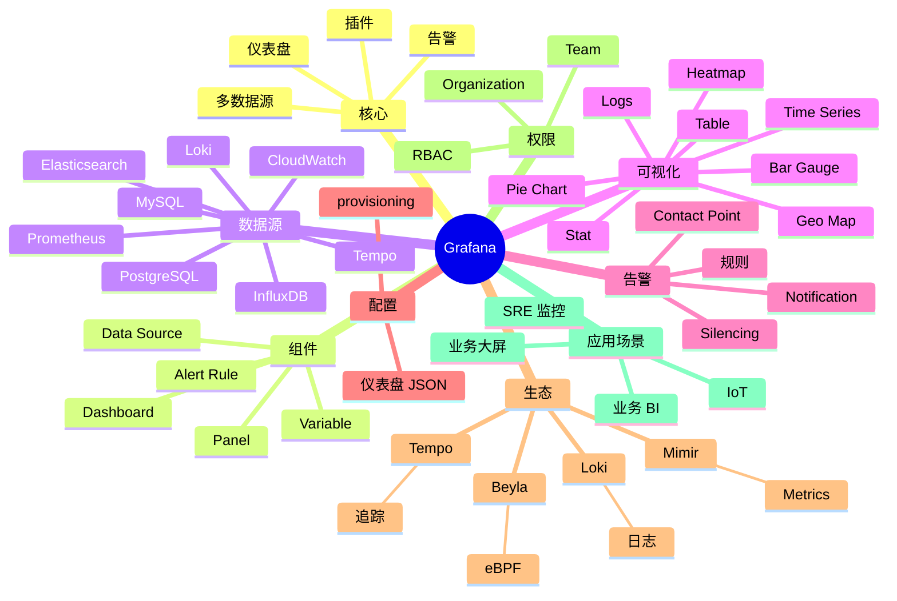

# Grafana

## 前言

**定位**：开源数据可视化和监控平台，2014 年由 Torkel Ödegaard 发布至今是 Metrics/Logs/Traces 可视化的事实标准，与 Prometheus/Loki/Tempo 构成 Grafana Labs 完整可观测性栈，全球 2000 万+ 用户。

**核心价值**：
- 多数据源：Prometheus/ES/Loki/MySQL/InfluxDB 等 100+ 数据源
- 丰富可视化：折线/柱状/饼图/热力/表格/Geo 等
- 仪表盘：拖拽式构建，支持导入/导出/共享
- 告警：基于查询的告警规则

**五大特性**：
1. **多数据源**：统一查询接口，跨数据源混合
2. **仪表盘（Dashboard）**：JSON 描述，可版本化
3. **变量（Variables）**：动态查询下拉
4. **告警**：Alerting 引擎 + Contact Points
5. **生态**：插件市场，Data Source / Panel / App 三类

**对比表**：

| 维度 | Grafana | Kibana | Datadog | Chronograf | Superset |
|---|---|---|---|---|---|
| 数据源 | 100+ | 主要 ES | 自家 | InfluxDB | SQL 库 |
| Logs | ✅ Loki | ✅ ES | ✅ | ⚠️ | ❌ |
| Metrics | ✅ Prom | ✅ | ✅ | ✅ | ⚠️ |
| Traces | ✅ Tempo | ✅ | ✅ | ❌ | ❌ |
| 适合 | 综合可观测 | 日志分析 | SaaS 一体 | 时序 | 业务 BI |

## 思维导图



## 关键代码

### 一、安装与配置

```bash
# Docker
docker run -d \
  --name grafana \
  -p 3000:3000 \
  -v grafana-data:/var/lib/grafana \
  -v /etc/grafana/provisioning:/etc/grafana/provisioning \
  grafana/grafana:latest

# 默认账号 admin/admin
```

```ini
# /etc/grafana/grafana.ini
[server]
http_port = 3000
domain = grafana.example.com

[security]
admin_user = admin
admin_password = ${GF_SECURITY_ADMIN_PASSWORD}
secret_key = ${GF_SECURITY_SECRET_KEY}

[users]
allow_sign_up = false
auto_assign_org = true

[auth]
disable_login_form = false

[smtp]
enabled = true
host = smtp.example.com:587
user = alerts@example.com
password = ${SMTP_PASSWORD}
from_address = alerts@example.com
```

### 二、数据源配置（Provisioning）

```yaml
# /etc/grafana/provisioning/datasources/prometheus.yml
apiVersion: 1
datasources:
  - name: Prometheus
    type: prometheus
    access: proxy
    url: http://prometheus:9090
    isDefault: true
    editable: true
    jsonData:
      timeInterval: 15s
      queryTimeout: 60s
      httpMethod: POST

  - name: Loki
    type: loki
    access: proxy
    url: http://loki:3100
    jsonData:
      maxLines: 1000

  - name: Tempo
    type: tempo
    access: proxy
    url: http://tempo:3200
    jsonData:
      httpMethod: GET
      serviceMap:
        datasourceUid: Prometheus
```

```yaml
# /etc/grafana/provisioning/datasources/mysql.yml
apiVersion: 1
datasources:
  - name: MySQL
    type: mysql
    url: mysql:3306
    user: grafana
    secureJsonData:
      password: ${MYSQL_PASSWORD}
    jsonData:
      database: mydb
      maxOpenConns: 10
      maxIdleConns: 2
      connMaxLifetime: 600
```

### 三、仪表盘 JSON

```json
{
  "title": "Production Overview",
  "uid": "prod-overview",
  "tags": ["production", "infrastructure"],
  "timezone": "browser",
  "schemaVersion": 38,
  "refresh": "30s",
  "time": { "from": "now-6h", "to": "now" },
  "templating": {
    "list": [
      {
        "name": "instance",
        "type": "query",
        "datasource": "Prometheus",
        "query": "label_values(up, instance)",
        "refresh": 2,
        "multi": true,
        "includeAll": true
      },
      {
        "name": "interval",
        "type": "interval",
        "query": "1m,5m,15m,1h,6h,12h,1d",
        "auto": true
      }
    ]
  },
  "panels": [
    {
      "id": 1,
      "title": "CPU Usage",
      "type": "timeseries",
      "datasource": "Prometheus",
      "gridPos": { "h": 8, "w": 12, "x": 0, "y": 0 },
      "targets": [
        {
          "expr": "100 - (avg by(instance) (rate(node_cpu_seconds_total{mode=\"idle\", instance=~\"$instance\"}[$interval])) * 100)",
          "legendFormat": "{{instance}}"
        }
      ],
      "fieldConfig": {
        "defaults": {
          "unit": "percent",
          "min": 0,
          "max": 100,
          "thresholds": {
            "mode": "absolute",
            "steps": [
              { "color": "green", "value": null },
              { "color": "yellow", "value": 70 },
              { "color": "red", "value": 90 }
            ]
          }
        }
      }
    },
    {
      "id": 2,
      "title": "Memory Usage",
      "type": "gauge",
      "datasource": "Prometheus",
      "gridPos": { "h": 8, "w": 6, "x": 12, "y": 0 },
      "targets": [
        {
          "expr": "(1 - (node_memory_MemAvailable_bytes{instance=~\"$instance\"} / node_memory_MemTotal_bytes{instance=~\"$instance\"})) * 100"
        }
      ]
    },
    {
      "id": 3,
      "title": "Request Rate (RPS)",
      "type": "timeseries",
      "datasource": "Prometheus",
      "gridPos": { "h": 8, "w": 6, "x": 18, "y": 0 },
      "targets": [
        {
          "expr": "sum(rate(http_requests_total[5m])) by (status)",
          "legendFormat": "{{status}}"
        }
      ]
    }
  ]
}
```

### 四、告警规则

```yaml
# /etc/grafana/provisioning/alerting/rules.yml
apiVersion: 1
groups:
  - orgId: 1
    name: production
    folder: Production
    interval: 1m
    rules:
      - uid: high-cpu
        title: High CPU Usage
        condition: C
        data:
          - refId: A
            datasourceUid: prometheus
            relativeTimeRange:
              from: 600
              to: 0
            model:
              expr: '100 - (avg by(instance) (rate(node_cpu_seconds_total{mode="idle"}[5m])) * 100)'
              instant: true
              refId: A
          - refId: C
            datasourceUid: __expr__
            model:
              type: threshold
              conditions:
                - evaluator:
                    type: gt
                    params: [80]
              expression: A
              refId: C
        noDataState: NoData
        execErrState: Alerting
        for: 5m
        labels:
          severity: warning
          team: platform
        annotations:
          summary: "CPU > 80% on {{ $labels.instance }}"
          description: "Current value: {{ $values.A }}"
```

```yaml
# contact-points.yml
apiVersion: 1
contactPoints:
  - orgId: 1
    name: slack-platform
    receivers:
      - uid: slack-1
        type: slack
        settings:
          url: https://hooks.slack.com/services/XXX
          channel: '#alerts'
          title: '{{ template "default.title" . }}'
          text: '{{ template "default.message" . }}'

  - orgId: 1
    name: pagerduty
    receivers:
      - uid: pd-1
        type: pagerduty
        settings:
          integrationKey: <key>

policies:
  - orgId: 1
    receiver: slack-platform
    group_by: ['grafana_folder', 'alertname']
    group_wait: 30s
    group_interval: 5m
    repeat_interval: 4h
    routes:
      - receiver: pagerduty
        object_matchers:
          - ['severity', '=', 'critical']
        continue: true
```

### 五、变量与模板

```promql
# 变量定义（在仪表盘 JSON 中）

# 简单变量
label_values(node_cpu_seconds_total, instance)

# 查询变量
query_result(topk(5, http_requests_total))

# 多选 + 全选
label_values(up, instance)  +  multi: true  +  includeAll: true

# 级联变量
# 第一个变量 region
label_values(node_uname_info, region)

# 第二个变量 instance（依赖 region）
label_values(node_uname_info{region="$region"}, instance)
```

```javascript
// 在 panel 查询中引用
// 标签过滤
rate(node_cpu_seconds_total{instance=~"$instance"}[$__rate_interval])

// 内置变量
$__time            // 当前 from
$__time_to         // 当前 to
$__interval        // 自动步长
$__rate_interval   // rate 推荐步长（4x interval）
```

### 六、Loki 日志关联

```logql
# Loki 数据源查询
{job="myapp"} |= "error" | json | level="error"
{namespace="production", app="api"} |~ "(?P<status>\\d{3}) (?P<path>\\S+)"

# 与 Trace 关联
{task="api"} | json | trace_id="<traceid>"
```

```json
// Tempo 数据源
{
  "datasource": "Tempo",
  "query": "{ service.name = \"api\", status = \"error\" }"
}
```

### 七、HTTP API

```bash
# 认证
curl -H "Authorization: Bearer <api-key>" http://localhost:3000/api/org

# 列出仪表盘
curl -H "Authorization: Bearer <api-key>" http://localhost:3000/api/search?type=dash-db

# 创建仪表盘
curl -X POST -H "Authorization: Bearer <api-key>" \
  -H "Content-Type: application/json" \
  http://localhost:3000/api/dashboards/db \
  -d @dashboard.json

# 数据源
curl -H "Authorization: Bearer <api-key>" http://localhost:3000/api/datasources

# 告警
curl -H "Authorization: Bearer <api-key>" http://localhost:3000/api/v1/provisioning/alert-rules
```

```python
# Python 客户端
from grafana_api.grafana_face import GrafanaFace

grafana = GrafanaFace(auth='admin:admin', host='localhost:3000')

# 获取仪表盘
dashboard = grafana.dashboard.get_dashboard('prod-overview')

# 创建
grafana.dashboard.update_dashboard({
    'dashboard': { ... },
    'message': 'Updated',
    'overwrite': True
})
```

### 八、Unified Alerting（Grafana 9+）

```bash
# Alertmanager 替代
# Grafana 自己处理告警

# Alert State: OK / Pending / Alerting / No Data / Error
# 路由到不同 Contact Point
# 抑制规则（inhibition）：Critical 抑制 Warning
# 静默规则（silence）：维护期间屏蔽
```

### 九、K8s 部署

```bash
# Helm 安装
helm repo add grafana https://grafana.github.io/helm-charts
helm install grafana grafana/grafana \
  --set persistence.enabled=true \
  --set persistence.size=10Gi \
  --set adminPassword=secret

# 端口转发
kubectl port-forward svc/grafana 3000:80
```

```yaml
# values.yaml
persistence:
  enabled: true
  size: 10Gi

datasources:
  datasources.yaml:
    apiVersion: 1
    datasources:
      - name: Prometheus
        type: prometheus
        url: http://prometheus-server
        access: proxy
        isDefault: true

dashboardProviders:
  dashboardproviders.yaml:
    apiVersion: 1
    providers:
      - name: 'default'
        orgId: 1
        folder: ''
        type: file
        disableDeletion: false
        editable: true
        options:
          path: /var/lib/grafana/dashboards

dashboards:
  default:
    k8s-cluster:
      url: https://raw.githubusercontent.com/.../cluster.json
```

### 十、面板类型

```yaml
# 常用面板类型
- type: timeseries       # 折线/面积图
- type: barchart         # 柱状图
- type: bargauge         # 横向柱
- type: gauge            # 仪表
- type: stat             # 数字
- type: piechart         # 饼图
- type: table            # 表格
- type: heatmap          # 热力
- type: logs             # 日志
- type: text             # Markdown
- type: geomap           # 地图
- type: nodeGraph        # 节点图（Trace）

# 配置示例
{
  "type": "stat",
  "options": {
    "reduceOptions": {
      "calcs": ["lastNotNull"],
      "fields": "",
      "values": false
    },
    "graphMode": "area",
    "colorMode": "value",
    "justifyMode": "auto",
    "textMode": "auto"
  }
}
```

## 核心洞察

- **Grafana 的"多数据源"是最大优势**：一个仪表盘整合 Prom/ES/MySQL
- **Grafana 的"仪表盘即 JSON"是版本化基础**：可 Git 管理
- **Grafana 的"变量"是动态仪表盘的灵魂**：让模板通用
- **Grafana 的"Unified Alerting"取代 Alertmanager**：集成度更高
- **Grafana 的"插件生态"是护城河**：Data Source / Panel / App 三层
- **Grafana 10+ 的"场景"（Scenes）**：仪表盘开发框架
- **Grafana 的"Explore"是临时查询利器**：类似 Kibana Discover
- **Grafana 的"Drilldown"是导航设计**：从总览到明细
- **Grafana 的"Annotations"标注事件**：展示发布、变更时间
- **Grafana 与 Loki/Tempo/Mimir 是"全家桶"**：Grafana Labs 完整可观测性
- **Grafana 的"商业版"增加企业功能**：Reporting / SAML / Reporting
- **Grafana 在 K8s 中是"必备"**：HPA、Pod 状态一目了然

## 跨项目引用

- **[[linux]]**：Grafana 跑在 Linux 上
- **[[docker]]**：Grafana 官方 Docker 镜像
- **[[kubernetes]]**：Grafana 是 K8s 监控可视化
- **[[prometheus]]**：Prometheus 是 Grafana 最常用数据源
- **[[loki]]**：Loki 是 Grafana 配套日志
- **[[tempo]]**：Tempo 是 Grafana 配套追踪
- **[[elasticsearch]]**：Kibana 是 ES 配套，但 Grafana 也支持
- **[[alertmanager]]**：Grafana 9+ 替代 Alertmanager
- **[[influxdb]]**：InfluxDB 是时序数据源
- **[[mysql]]** / **[[postgresql]]**：Grafana 可视化关系数据
- **[[datadog]]**：Datadog 是 Grafana 商业竞品
- **[[thanos]]** / **[[mimir]]**：长期 Metrics 存储
