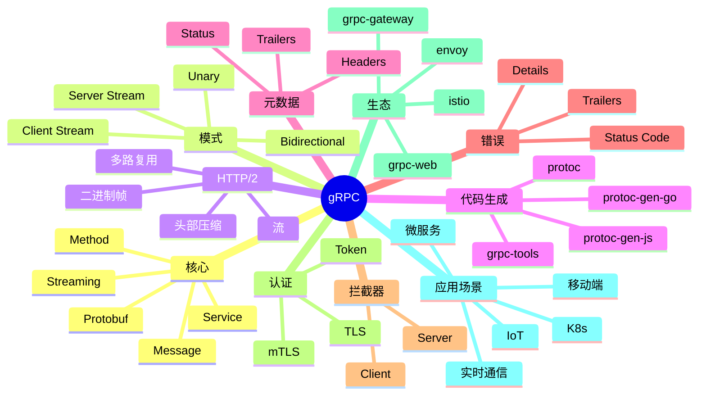

# gRPC

## 前言

**定位**：现代高性能 RPC（远程过程调用）框架，2015 年由 Google 开源至今是云原生服务间通信的事实标准，K8s/etcd/Istio/Envoy 等核心基础设施都采用 gRPC，基于 HTTP/2 + Protocol Buffers。

**核心价值**：
- 高性能：HTTP/2 多路复用 + Protobuf 二进制
- 强类型：Schema 优先，自动生成代码
- 双向流：4 种通信模式
- 多语言：10+ 官方实现

**五大特性**：
1. **Protocol Buffers**：二进制序列化，比 JSON 小 3-10x
2. **HTTP/2**：多路复用、流、头部压缩
3. **4 种通信模式**：Unary/Server Stream/Client Stream/Bidi
4. **代码生成**：从 .proto 自动生成客户端/服务端
5. **拦截器**：中间件式扩展

**对比表**：

| 维度 | gRPC | REST/JSON | Thrift | GraphQL |
|---|---|---|---|---|
| 性能 | 极高 | 中 | 高 | 中 |
| 协议 | HTTP/2 | HTTP/1.1 | TCP | HTTP |
| 序列化 | Protobuf | JSON | Thrift | JSON |
| 流 | ✅ | ⚠️ SSE | ✅ | Subscriptions |
| 浏览器支持 | ⚠️（gRPC-Web） | ✅ | ❌ | ✅ |
| 适合 | 微服务 | 公共 API | 内部 RPC | 前端聚合 |

## 思维导图



## 关键代码

### 一、Protobuf 定义

```protobuf
// user.proto
syntax = "proto3";

package user.v1;

option go_package = "github.com/myorg/myapp/proto/user";
option java_package = "com.myorg.user";
option java_multiple_files = true;

// 服务定义
service UserService {
  // 1. 一元调用
  rpc GetUser(GetUserRequest) returns (User);
  rpc CreateUser(CreateUserRequest) returns (User);

  // 2. 服务端流
  rpc ListUsers(ListUsersRequest) returns (stream User);

  // 3. 客户端流
  rpc BatchCreateUsers(stream CreateUserRequest) returns (BatchResponse);

  // 4. 双向流
  rpc Chat(stream ChatMessage) returns (stream ChatMessage);
}

// 消息定义
message User {
  int64 id = 1;
  string name = 2;
  string email = 3;
  repeated string tags = 4;
  UserStatus status = 5;
  google.protobuf.Timestamp created_at = 6;
}

enum UserStatus {
  USER_STATUS_UNSPECIFIED = 0;
  USER_STATUS_ACTIVE = 1;
  USER_STATUS_INACTIVE = 2;
  USER_STATUS_BANNED = 3;
}

message GetUserRequest {
  int64 id = 1;
}

message CreateUserRequest {
  string name = 1;
  string email = 2;
  repeated string tags = 3;
}

message ListUsersRequest {
  int32 page_size = 1;
  string page_token = 2;
  UserStatus status_filter = 3;
}

message BatchResponse {
  int32 success_count = 1;
  int32 failed_count = 2;
}

message ChatMessage {
  string from = 1;
  string text = 2;
  int64 timestamp = 3;
}
```

### 二、Go 服务端

```go
// server/main.go
package main

import (
    "context"
    "log"
    "net"

    "google.golang.org/grpc"
    pb "github.com/myorg/myapp/proto/user"
)

type server struct {
    pb.UnimplementedUserServiceServer
}

func (s *server) GetUser(ctx context.Context, req *pb.GetUserRequest) (*pb.User, error) {
    log.Printf("GetUser: id=%d", req.Id)
    return &pb.User{
        Id:    req.Id,
        Name:  "Alice",
        Email: "alice@example.com",
    }, nil
}

func (s *server) ListUsers(req *pb.ListUsersRequest, stream pb.UserService_ListUsersServer) error {
    for i := 0; i < 10; i++ {
        user := &pb.User{
            Id:    int64(i),
            Name:  fmt.Sprintf("User %d", i),
            Email: fmt.Sprintf("user%d@example.com", i),
        }
        if err := stream.Send(user); err != nil {
            return err
        }
        time.Sleep(time.Second)
    }
    return nil
}

func (s *server) Chat(stream pb.UserService_ChatServer) error {
    for {
        msg, err := stream.Recv()
        if err == io.EOF {
            return nil
        }
        if err != nil {
            return err
        }
        log.Printf("Chat: from=%s text=%s", msg.From, msg.Text)

        // 回显
        response := &pb.ChatMessage{
            From:      "server",
            Text:      "Echo: " + msg.Text,
            Timestamp: time.Now().Unix(),
        }
        if err := stream.Send(response); err != nil {
            return err
        }
    }
}

func main() {
    lis, _ := net.Listen("tcp", ":50051")
    s := grpc.NewServer()
    pb.RegisterUserServiceServer(s, &server{})
    log.Println("Server listening on :50051")
    s.Serve(lis)
}
```

### 三、Go 客户端

```go
// client/main.go
package main

import (
    "context"
    "io"
    "log"
    "time"

    "google.golang.org/grpc"
    "google.golang.org/grpc/credentials/insecure"
    pb "github.com/myorg/myapp/proto/user"
)

func main() {
    conn, _ := grpc.Dial("localhost:50051",
        grpc.WithTransportCredentials(insecure.NewCredentials()))
    defer conn.Close()

    client := pb.NewUserServiceClient(conn)

    // Unary
    ctx, cancel := context.WithTimeout(context.Background(), time.Second)
    defer cancel()

    user, err := client.GetUser(ctx, &pb.GetUserRequest{Id: 1})
    if err != nil {
        log.Fatalf("GetUser: %v", err)
    }
    log.Printf("User: %v", user)

    // Server Stream
    stream, _ := client.ListUsers(ctx, &pb.ListUsersRequest{PageSize: 10})
    for {
        user, err := stream.Recv()
        if err == io.EOF {
            break
        }
        if err != nil {
            log.Fatal(err)
        }
        log.Printf("User: %v", user)
    }

    // Bidirectional
    chatStream, _ := client.Chat(ctx)
    go func() {
        for {
            msg, err := chatStream.Recv()
            if err == io.EOF {
                return
            }
            log.Printf("Server: %s", msg.Text)
        }
    }()

    for i := 0; i < 5; i++ {
        chatStream.Send(&pb.ChatMessage{
            From: "client",
            Text: fmt.Sprintf("Hello %d", i),
        })
        time.Sleep(time.Second)
    }
    chatStream.CloseSend()
}
```

### 四、Node.js 实现

```javascript
// server.js
const grpc = require('@grpc/grpc-js')
const protoLoader = require('@grpc/proto-loader')
const path = require('path')

const packageDef = protoLoader.loadSync(
  path.join(__dirname, 'user.proto'),
  { keepCase: true, longs: String, enums: String, defaults: true, oneofs: true }
)
const proto = grpc.loadPackageDefinition(packageDef).user.v1

const users = new Map([
  [1, { id: 1, name: 'Alice', email: 'alice@example.com' }]
])

const server = new grpc.Server()

server.addService(proto.UserService.service, {
  // Unary
  GetUser: (call, callback) => {
    const user = users.get(call.request.id)
    if (!user) {
      return callback({
        code: grpc.status.NOT_FOUND,
        message: 'User not found'
      })
    }
    callback(null, user)
  },

  // Server Stream
  ListUsers: (call) => {
    for (let i = 1; i <= 10; i++) {
      call.write({ id: i, name: `User ${i}`, email: `user${i}@example.com` })
    }
    call.end()
  },

  // Bidi Stream
  Chat: (call) => {
    call.on('data', (msg) => {
      console.log('Received:', msg)
      call.write({
        from: 'server',
        text: `Echo: ${msg.text}`,
        timestamp: Date.now()
      })
    })
    call.on('end', () => call.end())
  }
})

server.bindAsync(
  '127.0.0.1:50051',
  grpc.ServerCredentials.createInsecure(),
  () => {
    server.start()
    console.log('Server listening on :50051')
  }
)
```

```javascript
// client.js
const grpc = require('@grpc/grpc-js')
const protoLoader = require('@grpc/proto-loader')
const path = require('path')

const packageDef = protoLoader.loadSync(path.join(__dirname, 'user.proto'))
const proto = grpc.loadPackageDefinition(packageDef).user.v1

const client = new proto.UserService(
  '127.0.0.1:50051',
  grpc.credentials.createInsecure()
)

// Unary
client.GetUser({ id: 1 }, (err, user) => {
  if (err) return console.error(err)
  console.log('User:', user)
})

// Server Stream
const stream = client.ListUsers({ pageSize: 10 })
stream.on('data', (user) => console.log('User:', user))
stream.on('end', () => console.log('Done'))
```

### 五、Python 实现

```python
# server.py
from concurrent import futures
import grpc
import user_pb2
import user_pb2_grpc

class UserServicer(user_pb2_grpc.UserServiceServicer):
    def GetUser(self, request, context):
        if request.id == 1:
            return user_pb2.User(id=1, name="Alice", email="alice@example.com")
        context.set_code(grpc.StatusCode.NOT_FOUND)
        context.set_details("User not found")
        return user_pb2.User()

    def ListUsers(self, request, context):
        for i in range(10):
            yield user_pb2.User(id=i, name=f"User {i}", email=f"user{i}@example.com")

    def Chat(self, request_iterator, context):
        for msg in request_iterator:
            print(f"From {msg.from_}: {msg.text}")
            yield user_pb2.ChatMessage(
                from_="server",
                text=f"Echo: {msg.text}",
                timestamp=int(time.time())
            )

def serve():
    server = grpc.server(futures.ThreadPoolExecutor(max_workers=10))
    user_pb2_grpc.add_UserServiceServicer_to_server(UserServicer(), server)
    server.add_insecure_port('[::]:50051')
    server.start()
    server.wait_for_termination()

if __name__ == '__main__':
    serve()
```

```python
# client.py
import grpc
import user_pb2
import user_pb2_grpc

with grpc.insecure_channel('localhost:50051') as channel:
    stub = user_pb2_grpc.UserServiceStub(channel)

    # Unary
    response = stub.GetUser(user_pb2.GetUserRequest(id=1))
    print(f"User: {response.name}")

    # Server Stream
    for user in stub.ListUsers(user_pb2.ListUsersRequest(page_size=10)):
        print(f"User: {user.name}")
```

### 六、拦截器与中间件

```go
// 服务端拦截器
func loggingInterceptor(
    ctx context.Context,
    req interface{},
    info *grpc.UnaryServerInfo,
    handler grpc.UnaryHandler,
) (interface{}, error) {
    start := time.Now()
    log.Printf("Method: %s, Request: %v", info.FullMethod, req)
    resp, err := handler(ctx, req)
    log.Printf("Method: %s, Duration: %v, Error: %v", info.FullMethod, time.Since(start), err)
    return resp, err
}

func authInterceptor(
    ctx context.Context,
    req interface{},
    info *grpc.UnaryServerInfo,
    handler grpc.UnaryHandler,
) (interface{}, error) {
    md, ok := metadata.FromIncomingContext(ctx)
    if !ok {
        return nil, status.Error(codes.Unauthenticated, "no metadata")
    }

    tokens := md.Get("authorization")
    if len(tokens) == 0 {
        return nil, status.Error(codes.Unauthenticated, "no token")
    }

    token := strings.TrimPrefix(tokens[0], "Bearer ")
    if !verifyToken(token) {
        return nil, status.Error(codes.Unauthenticated, "invalid token")
    }

    return handler(ctx, req)
}

// 使用
s := grpc.NewServer(
    grpc.UnaryInterceptor(loggingInterceptor),
    grpc.ChainUnaryInterceptor(loggingInterceptor, authInterceptor),
)
```

```go
// 客户端拦截器
func clientAuthInterceptor(
    ctx context.Context,
    method string,
    req, reply interface{},
    cc *grpc.ClientConn,
    invoker grpc.UnaryInvoker,
    opts ...grpc.CallOption,
) error {
    md, _ := metadata.FromOutgoingContext(ctx)
    md = md.Copy()
    md.Set("authorization", "Bearer "+token)
    ctx = metadata.NewOutgoingContext(ctx, md)
    return invoker(ctx, method, req, reply, cc, opts...)
}
```

### 七、错误处理

```go
import "google.golang.org/grpc/status"
import "google.golang.org/grpc/codes"

func (s *server) GetUser(ctx context.Context, req *pb.GetUserRequest) (*pb.User, error) {
    if req.Id <= 0 {
        return nil, status.Error(codes.InvalidArgument, "id must be positive")
    }

    user, err := s.repo.GetUser(req.Id)
    if err == sql.ErrNoRows {
        return nil, status.Errorf(codes.NotFound, "user %d not found", req.Id)
    }
    if err != nil {
        return nil, status.Error(codes.Internal, "internal error")
    }
    return user, nil
}

// 客户端判断
user, err := client.GetUser(ctx, req)
if err != nil {
    st, ok := status.FromError(err)
    if !ok {
        return err
    }
    switch st.Code() {
    case codes.NotFound:
        // 404
    case codes.Unauthenticated:
        // 401
    default:
        // 其他
    }
}
```

```go
// 带 Details 的错误
import "google.golang.org/genproto/googleapis/rpc/errdetails"

func (s *server) GetUser(ctx context.Context, req *pb.GetUserRequest) (*pb.User, error) {
    st := status.New(codes.InvalidArgument, "invalid request")
    details, _ := st.WithDetails(&errdetails.BadRequest{
        FieldViolations: []*errdetails.BadRequest_FieldViolation{
            {Field: "id", Description: "must be positive"},
        },
    })
    return nil, details.Err()
}
```

### 八、TLS / mTLS

```bash
# 生成证书
openssl genrsa -out ca.key 2048
openssl req -new -x509 -days 365 -key ca.key -out ca.crt -subj "/CN=ca"

openssl genrsa -out server.key 2048
openssl req -new -key server.key -out server.csr -subj "/CN=localhost"
openssl x509 -req -in server.csr -CA ca.crt -CAkey ca.key -CAcreateserial -out server.crt -days 365

openssl genrsa -out client.key 2048
openssl req -new -key client.key -out client.csr -subj "/CN=client"
openssl x509 -req -in client.csr -CA ca.crt -CAkey ca.key -CAcreateserial -out client.crt -days 365
```

```go
// TLS 服务端
creds, _ := credentials.NewServerTLSFromFile("server.crt", "server.key")
s := grpc.NewServer(grpc.Creds(creds))

// mTLS（双向认证）
certPool := x509.NewCertPool()
ca, _ := os.ReadFile("ca.crt")
certPool.AppendCertsFromPEM(ca)

c := credentials.NewTLS(&tls.Config{
    Certificates: []tls.Certificate{cert},
    ClientCAs:    certPool,
    ClientAuth:   tls.RequireAndVerifyClientCert,
})
s := grpc.NewServer(grpc.Creds(c))

// 客户端
creds, _ := credentials.NewClientTLSFromFile("ca.crt", "localhost")
conn, _ := grpc.Dial("localhost:50051", grpc.WithTransportCredentials(creds))
```

### 九、gRPC-Gateway（REST 兼容）

```yaml
# buf.yaml
version: v1
deps:
  - buf.build/googleapis/googleapis
breaking:
  use:
    - FILE
```

```protobuf
// user.proto
import "google/api/annotations.proto";

service UserService {
  rpc GetUser(GetUserRequest) returns (User) {
    option (google.api.http) = {
      get: "/v1/users/{id}"
    };
  }

  rpc CreateUser(CreateUserRequest) returns (User) {
    option (google.api.http) = {
      post: "/v1/users"
      body: "*"
    };
  }
}
```

```bash
# 生成 REST 网关
protoc -I . \
  --grpc-gateway_out . \
  --grpc-gateway_opt paths=source_relative \
  --openapiv2_out . \
  user.proto
```

```go
// 启动 Gateway
mux := runtime.NewServeMux()
err := pb.RegisterUserServiceHandlerFromEndpoint(
    ctx, mux, "localhost:50051",
    []grpc.DialOption{grpc.WithInsecure()},
)

http.ListenAndServe(":8080", mux)
// 现在可以 HTTP GET /v1/users/1
```

### 十、gRPC-Web 浏览器

```typescript
// client.ts
import { GreeterClient } from './generated/UserServiceClientPb'
import { GetUserRequest } from './generated/user_pb'

const client = new GreeterClient('https://api.example.com')

const req = new GetUserRequest()
req.setId(1)

client.getUser(req, null, (err, response) => {
  if (err) return console.error(err)
  console.log('User:', response.toObject())
})
```

```nginx
# Envoy 配置 gRPC-Web
static_resources:
  listeners:
  - address:
      socket_address:
        address: 0.0.0.0
        port_value: 8080
    filter_chains:
    - filters:
      - name: envoy.http_connection_manager
        config:
          codec_type: auto
          stat_prefix: ingress_http
          route_config:
            virtual_hosts:
            - name: backend
              domains: ["*"]
              routes:
              - match:
                  prefix: "/"
                route:
                  cluster: grpc_service
                  cors:
                    allow_origin:
                      - "*"
                    allow_methods: "GET, POST, OPTIONS"
                    allow_headers: "content-type,x-grpc-web"
              - match:
                  prefix: "/"
                route:
                  cluster: grpc_service
                  upgrade_configs:
                    - upgrade_type: "websocket"
                  cors:
                    allow_origin:
                      - "*"
          http_filters:
          - name: envoy.grpc_web
          - name: envoy.cors
          - name: envoy.router
```

## 核心洞察

- **gRPC 的"HTTP/2 + Protobuf"是性能双引擎**：高吞吐、低延迟
- **gRPC 的"4 种通信模式"覆盖所有场景**：从简单 RPC 到双向流
- **gRPC 的"代码生成"避免手写客户端**：跨语言一致性
- **gRPC 的"强类型 Schema"是契约优先**：.proto 即文档
- **gRPC 的"拦截器"是中间件机制**：与 HTTP 中间件类似
- **gRPC 在"K8s 生态"是首选**：K8s/etcd/Istio 都用
- **gRPC 在"微服务间通信"是标准**：REST 仅在对外 API
- **gRPC 的"浏览器支持"是短板**：gRPC-Web 解决
- **gRPC 的"Streaming"是核心优势**：SSE 远不及
- **gRPC 的"Status Code"标准化**：13 种错误码
- **gRPC 的"mTLS"是服务间零信任**：不依赖网络边界
- **gRPC 的"grpc-gateway"兼容 REST**：对外 REST，对内 gRPC
- **gRPC 的"envoy 代理"是生产标配**：管理路由、限流、可观测
- **gRPC 的"代码生成"是工程效率提升**：减少手写 bug
- **gRPC 的"调试"是难点**：二进制、HTTP/2 不直观
- **gRPC 在"低延迟"场景必备**：金融、游戏、IoT

## 跨项目引用

- **[[http/2]]**：gRPC 基于 HTTP/2
- **[[protobuf]]**：gRPC 默认用 Protobuf
- **[[rest]]**：REST 是 gRPC 的替代/补充
- **[[graphql]]**：GraphQL 是 API 替代方案
- **[[thrift]]**：Thrift 是 RPC 老牌方案
- **[[envoy]]**：Envoy 是 gRPC 生态核心代理
- **[[istio]]**：Istio 服务网格基于 gRPC xDS
- **[[kubernetes]]**：K8s API 用 gRPC
- **[[etcd]]**：etcd 用 gRPC
- **[[docker]]**：Docker 镜像 gRPC 接口
- **[[jaeger]]**：Jaeger 追踪 gRPC 调用
- **[[opentelemetry]]**：OTel 追踪 gRPC
- **[[prometheus]]**：Prometheus 监控 gRPC 指标
- **[[jwt]]**：JWT 鉴权 gRPC
- **[[tls]]**：gRPC over TLS
- **[[node.js]]** / **[[go]]** / **[[python]]** / **[[java]]**：gRPC 多语言支持
