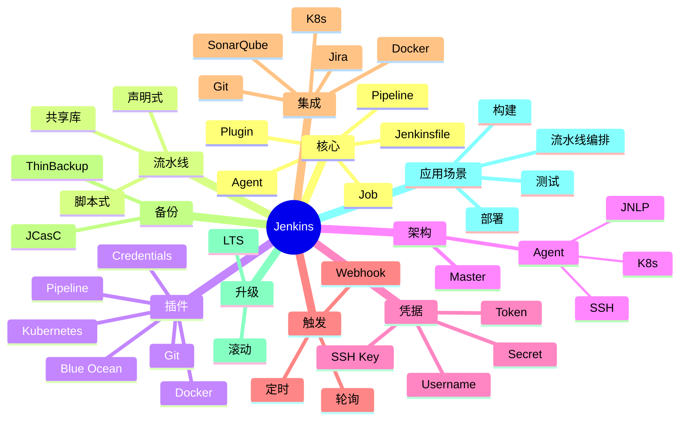

# Jenkins

## 前言

**定位**：开源持续集成和持续部署（CI/CD）平台，2004 年由 Kohsuke Kawaguchi 创建至今是企业级 CI/CD 事实标准，全球 1700 万+ 用户，与 GitHub Actions/GitLab CI/CircleCI 并称"CI/CD 四大金刚"。

**核心价值**：
- 流水线即代码：Jenkinsfile 版本化构建过程
- 插件生态：1800+ 插件覆盖所有场景
- 分布式：Master/Agent 架构支撑大规模
- 自由度高：自托管 + 任意语言/工具

**五大特性**：
1. **Jenkinsfile**：Groovy DSL 描述流水线
2. **插件生态**：1800+ 插件
3. **分布式构建**：Master/Agent 横向扩展
4. **Pipeline**：声明式 + 脚本式
5. **凭据管理**：内置 Credentials Store

**对比表**：

| 维度 | Jenkins | GitHub Actions | GitLab CI | CircleCI | Drone |
|---|---|---|---|---|---|
| 部署 | 自托管 | SaaS | 自托管/SaaS | SaaS | 自托管 |
| 配置 | Jenkinsfile | YAML | YAML | YAML | YAML |
| 插件 | 1800+ | Actions | — | Orbs | — |
| 扩展 | Master/Agent | Runner | Runner | — | Runner |
| 适合 | 复杂流水线 | GitHub 项目 | GitLab 项目 | 云原生 | Docker |

## 思维导图



## 关键代码

### 一、安装与启动

```bash
# Docker
docker run -d \
  --name jenkins \
  -p 8080:8080 \
  -p 50000:50000 \
  -v jenkins-data:/var/jenkins_home \
  jenkins/jenkins:lts

# 初始密码
docker exec jenkins cat /var/jenkins_home/secrets/initialAdminPassword

# LTS vs Weekly
# LTS: 稳定，季度发布
# Weekly: 新功能
```

```yaml
# docker-compose.yml
version: '3.8'
services:
  jenkins:
    image: jenkins/jenkins:lts
    container_name: jenkins
    ports:
      - "8080:8080"
      - "50000:50000"
    volumes:
      - jenkins-data:/var/jenkins_home
      - /var/run/docker.sock:/var/run/docker.sock
    environment:
      - JAVA_OPTS=-Djenkins.install.runSetupWizard=false

volumes:
  jenkins-data:
```

### 二、声明式 Pipeline

```groovy
// Jenkinsfile
pipeline {
    agent any

    options {
        timeout(time: 30, unit: 'MINUTES')
        disableConcurrentBuilds()
        timestamps()
    }

    environment {
        DOCKER_IMAGE = 'myapp'
        VERSION = "${env.BUILD_NUMBER}"
    }

    stages {
        stage('Checkout') {
            steps {
                checkout scm
            }
        }

        stage('Build') {
            steps {
                sh 'mvn clean package -DskipTests'
            }
        }

        stage('Test') {
            parallel {
                stage('Unit Test') {
                    steps {
                        sh 'mvn test'
                    }
                }
                stage('Integration Test') {
                    steps {
                        sh 'mvn verify -Pintegration'
                    }
                }
            }
        }

        stage('Docker Build') {
            steps {
                script {
                    docker.build("${DOCKER_IMAGE}:${VERSION}")
                }
            }
        }

        stage('Deploy to Staging') {
            when {
                branch 'main'
            }
            steps {
                sh './deploy.sh staging'
            }
        }

        stage('Deploy to Production') {
            when {
                allOf {
                    branch 'main'
                    buildingTag()
                }
            }
            input {
                message "Deploy to production?"
                ok "Deploy"
            }
            steps {
                sh './deploy.sh production'
            }
        }
    }

    post {
        success {
            echo 'Build succeeded!'
            mail to: 'team@example.com',
                 subject: "Build ${env.BUILD_NUMBER} succeeded",
                 body: "See ${env.BUILD_URL}"
        }
        failure {
            mail to: 'team@example.com',
                 subject: "Build ${env.BUILD_NUMBER} FAILED",
                 body: "Check ${env.BUILD_URL}"
        }
        always {
            junit '**/target/surefire-reports/*.xml'
            cleanWs()
        }
    }
}
```

### 三、脚本式 Pipeline

```groovy
// 灵活但难维护
node('linux') {
    stage('Checkout') {
        git url: 'https://github.com/me/myapp.git', branch: 'main'
    }

    stage('Build') {
        sh 'mvn clean package'
    }

    stage('Test') {
        try {
            sh 'mvn test'
        } catch (err) {
            currentBuild.result = 'UNSTABLE'
            error 'Tests failed'
        }
    }

    if (env.BRANCH_NAME == 'main') {
        stage('Deploy') {
            sh './deploy.sh'
        }
    }
}
```

### 四、Docker 集成

```groovy
// 在 Jenkinsfile 中使用 Docker
pipeline {
    agent {
        docker {
            image 'maven:3.9-eclipse-temurin-17'
            args '-v $HOME/.m2:/root/.m2'
        }
    }

    stages {
        stage('Build') {
            steps {
                sh 'mvn clean package'
            }
        }
    }
}

// Docker Pipeline 插件
pipeline {
    agent any
    stages {
        stage('Build Image') {
            steps {
                script {
                    app = docker.build("myapp:${env.BUILD_NUMBER}")
                }
            }
        }
        stage('Push') {
            steps {
                script {
                    docker.withRegistry('https://registry.example.com', 'registry-cred') {
                        app.push()
                    }
                }
            }
        }
    }
}
```

### 五、Kubernetes Agent

```groovy
// 动态 K8s agent
pipeline {
    agent {
        kubernetes {
            label 'myapp-pod'
            yaml """
apiVersion: v1
kind: Pod
spec:
  containers:
  - name: maven
    image: maven:3.9-eclipse-temurin-17
    command: ['cat']
    tty: true
    volumeMounts:
      - name: maven-cache
        mountPath: /root/.m2
  volumes:
    - name: maven-cache
      persistentVolumeClaim:
        claimName: maven-cache-pvc
"""
        }
    }

    stages {
        stage('Build') {
            steps {
                container('maven') {
                    sh 'mvn clean package'
                }
            }
        }
    }
}
```

### 六、共享库（Shared Library）

```groovy
// vars/buildMaven.groovy
def call(Map config) {
    pipeline {
        agent any
        tools {
            maven config.mavenVersion ?: 'Maven 3.9'
        }
        stages {
            stage('Build') {
                steps {
                    sh 'mvn clean package'
                }
            }
        }
    }
}
```

```groovy
// 在 Jenkinsfile 引用共享库
@Library('jenkins-shared-lib') _

buildMaven(
    mavenVersion: 'Maven 3.9'
)
```

```groovy
// src/org/example/Deploy.groovy
package org.example

def deployToK8s(String namespace, String app) {
    sh "kubectl set image deployment/${app} ${app}=myapp:${env.BUILD_NUMBER} -n ${namespace}"
    sh "kubectl rollout status deployment/${app} -n ${namespace}"
}
```

```groovy
// 使用
@Library('jenkins-shared-lib') _
import org.example.Deploy

stage('Deploy') {
    steps {
        Deploy.deployToK8s('production', 'myapp')
    }
}
```

### 七、凭据与密钥

```groovy
// 凭据管理
pipeline {
    agent any
    environment {
        // 文本凭据
        DB_PASSWORD = credentials('db-password')

        // 用户名密码
        DOCKER_CREDS = credentials('docker-hub')

        // SSH 私钥
        SSH_KEY = credentials('deploy-key')
    }

    stages {
        stage('Deploy') {
            steps {
                withCredentials([
                    string(credentialsId: 'api-key', variable: 'API_KEY'),
                    usernamePassword(credentialsId: 'aws', usernameVariable: 'AWS_USER', passwordVariable: 'AWS_PASS')
                ]) {
                    sh './deploy.sh'
                }
            }
        }
    }
}
```

```bash
# 通过 Jenkins CLI 设置凭据
java -jar jenkins-cli.jar -s http://localhost:8080 \
  create-credentials-by-xml system::system::jenkins < credential.xml
```

```xml
<!-- credential.xml -->
<com.cloudbees.plugins.credentials.impl.UsernamePasswordCredentialsImpl>
  <scope>GLOBAL</scope>
  <id>aws</id>
  <username>AKIA...</username>
  <password>SECRET</password>
</com.cloudbees.plugins.credentials.impl.UsernamePasswordCredentialsImpl>
```

### 八、JCasC（配置即代码）

```yaml
# jenkins.yaml
jenkins:
  systemMessage: "Jenkins managed by JCasC"
  numExecutors: 0
  mode: EXCLUSIVE
  securityRealm:
    local:
      allowsSignup: false
      users:
        - id: admin
          password: ${ADMIN_PASSWORD}

credentials:
  system:
    domainCredentials:
      - credentials:
          - usernamePassword:
              scope: GLOBAL
              id: docker-hub
              username: ${DOCKER_USER}
              password: ${DOCKER_PASS}

unclassified:
  location:
    url: https://jenkins.example.com/

jobs:
  - script: >
      pipelineJob('myapp') {
        definition {
          cpsScm {
            scm {
              git {
                remote { url('https://github.com/me/myapp.git') }
                branches('*/main')
              }
            }
            scriptPath('Jenkinsfile')
          }
        }
      }
```

```bash
# 指定 JCasC 文件
docker run -d \
  -v $(pwd)/jenkins.yaml:/var/jenkins_home/jenkins.yaml \
  -e CASC_JENKINS_CONFIG=/var/jenkins_home/jenkins.yaml \
  jenkins/jenkins:lts
```

### 九、Webhook 触发

```bash
# GitHub Webhook
# 1. Jenkins 端安装 GitHub 插件
# 2. 仓库 Settings → Webhooks → Add
#    URL: http://jenkins.example.com/github-webhook/
#    Content type: application/json
#    Events: push, pull_request

# 通用 Webhook
# http://jenkins.example.com/generic-webhook-trigger/invoke?token=MYTOKEN
```

```groovy
// Generic Webhook Trigger
pipeline {
    agent any
    triggers {
        GenericTrigger(
            causeString: 'Triggered by $ref',
            token: 'my-secret-token',
            regexpFilterText: '$ref',
            regexpFilterExpression: 'refs/heads/(main|develop)'
        )
    }
    stages {
        stage('Build') {
            steps {
                echo 'Building...'
            }
        }
    }
}
```

### 十、备份与升级

```bash
# ThinBackup 插件
# Manage Jenkins → ThinBackup → Settings
# Backup schedule: 0 2 * * *  (每天 2 点)

# 手动备份
java -jar jenkins-cli.jar -s http://localhost:8080 \
  build thinBackupBackup

# 恢复
java -jar jenkins-cli.jar -s http://localhost:8080 \
  build thinBackupRestore -p CONFIG_ONLY=false
```

```bash
# 升级（容器场景）
docker pull jenkins/jenkins:lts
docker stop jenkins
docker rename jenkins jenkins-old
docker run -d --name jenkins \
  --volumes-from jenkins-old \
  -p 8080:8080 \
  jenkins/jenkins:lts

# 回滚
docker stop jenkins
docker rm jenkins
docker rename jenkins-old jenkins
docker start jenkins
```

```bash
# LTS 版本
# Jenkins 2.426.x LTS

# Java 版本要求
# Jenkins 2.426+ 需要 Java 17
# 旧版支持 Java 11/8
```

## 核心洞察

- **Jenkins 的"插件生态"是最大优势**：1800+ 插件
- **Jenkins 的"Jenkinsfile"是流水线即代码**：版本化、可审计
- **Jenkins 的"声明式 Pipeline"是主推方向**：比脚本式更易维护
- **Jenkins 的"Master/Agent"是分布式基础**：横向扩展
- **Jenkins 的"K8s Agent"是云原生方向**：动态 pod 构建
- **Jenkins 的"JCasC"解决配置漂移**：配置即代码
- **Jenkins 的"共享库"是复用机制**：DRY 原则
- **Jenkins 的"凭据管理"是安全基础**：避免明文密码
- **Jenkins 的"Webhook 触发"是自动化入口**：与 Git 集成
- **Jenkins 的"LTS 版本"是稳定选择**：企业首选
- **Jenkins 的"升级"需要谨慎**：插件兼容性
- **Jenkins 的"性能瓶颈"在 Master**：用 Agent 分散
- **Jenkins 的"Blue Ocean"是新版 UI**：更友好的可视化
- **Jenkins 在"自托管"场景是首选**：vs GitHub Actions 的 SaaS
- **Jenkins 的"运维成本"是劣势**：插件升级、安全维护

## 跨项目引用

- **[[linux]]**：Jenkins 跑在 Linux 上
- **[[docker]]**：Jenkins 官方 Docker 镜像
- **[[kubernetes]]**：Jenkins Agent 跑在 K8s
- **[[git]]**：Jenkins 与 Git 集成
- **[[github actions]]**：GitHub Actions 是 Jenkins 的 SaaS 竞品
- **[[gitlab ci]]**：GitLab CI 是内建 CI/CD
- **[[maven]]**：Java 项目常用 Maven
- **[[gradle]]**：Gradle 是 Java 另一构建工具
- **[[docker]]**：Jenkins 构建 Docker 镜像
- **[[ansible]]**：Jenkins 调用 Ansible 部署
- **[[terraform]]**：Jenkins 调用 Terraform provision
- **[[sonarqube]]**：Jenkins 集成 SonarQube 做代码质量
- **[[nexus]]** / **[[artifactory]]**：Jenkins 推送制品
- **[[prometheus]]**：监控 Jenkins
- **[[slack]]**：Jenkins 通知到 Slack
