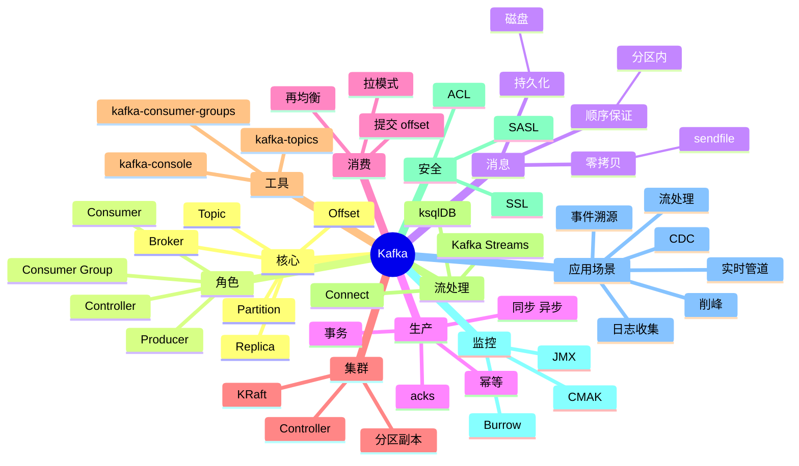

# Apache Kafka

## 前言

**定位**：分布式事件流平台，2011 年由 LinkedIn 开源至今是大数据、实时管道的事实标准，LinkedIn/Uber/Netflix/微博/字节跳动都深度使用，每天处理万亿级消息。

**核心价值**：
- 极高吞吐：单集群百万级 QPS
- 持久化：消息落盘，可重放
- 分布式：天然分片（Partition）+ 副本
- 生态丰富：Kafka Streams / Connect / Schema Registry

**五大特性**：
1. **分布式日志**：顺序写磁盘 + 零拷贝（sendfile）
2. **分区（Partition）**：水平扩展 + 顺序保证
3. **消费者组（Consumer Group）**：广播 + 负载均衡
4. **Exactly-Once**：事务 + 幂等
5. **流处理**：Kafka Streams / ksqlDB

**对比表**：

| 维度 | Kafka | RabbitMQ | RocketMQ | Pulsar | NATS |
|---|---|---|---|---|---|
| 架构 | 分区日志 | 队列/主题 | 分区队列 | 分段 | 主题 |
| 吞吐 | 百万级 | 万级 | 十万级 | 百万级 | 十万级 |
| 延迟 | ms | μs | ms | ms | ms |
| 持久化 | ✅ 强 | ⚠️ | ✅ | ✅ | ⚠️ |
| 消息重放 | ✅ | ❌ | ⚠️ | ✅ | ❌ |
| 适合 | 大数据/日志 | 业务消息 | 阿里系 | 多租户 | 云原生 |

## 思维导图



## 关键代码

### 一、基础操作

```bash
# 启动
bin/kafka-server-start.sh config/kraft/server.properties

# 创建 Topic
bin/kafka-topics.sh --bootstrap-server localhost:9092 --create \
  --topic my-topic --partitions 3 --replication-factor 2

# 列出 Topic
bin/kafka-topics.sh --bootstrap-server localhost:9092 --list

# 查看详情
bin/kafka-topics.sh --bootstrap-server localhost:9092 --describe --topic my-topic

# 修改分区
bin/kafka-topics.sh --bootstrap-server localhost:9092 --alter \
  --topic my-topic --partitions 6

# 删除 Topic
bin/kafka-topics.sh --bootstrap-server localhost:9092 --delete --topic my-topic

# 生产消息
bin/kafka-console-producer.sh --bootstrap-server localhost:9092 --topic my-topic
> hello kafka
> hello world

# 消费消息
bin/kafka-console-consumer.sh --bootstrap-server localhost:9092 --topic my-topic \
  --from-beginning --group test-group
```

```yaml
# server.properties (KRaft 模式)
process.roles=broker,controller
node.id=1
controller.quorum.voters=1@localhost:9093
listeners=PLAINTEXT://:9092,CONTROLLER://:9093
inter.broker.listener.name=PLAINTEXT
advertised.listeners=PLAINTEXT://localhost:9092
controller.listener.names=CONTROLLER
listener.security.protocol.map=CONTROLLER:PLAINTEXT,PLAINTEXT:PLAINTEXT
log.dirs=/tmp/kraft-combined-logs
num.partitions=1
num.network.threads=3
num.io.threads=8
```

### 二、Producer（Java）

```java
import org.apache.kafka.clients.producer.*;
import java.util.Properties;

public class MyProducer {
    public static void main(String[] args) {
        Properties props = new Properties();
        props.put(ProducerConfig.BOOTSTRAP_SERVERS_CONFIG, "localhost:9092");
        props.put(ProducerConfig.KEY_SERIALIZER_CLASS_CONFIG,
                  "org.apache.kafka.common.serialization.StringSerializer");
        props.put(ProducerConfig.VALUE_SERIALIZER_CLASS_CONFIG,
                  "org.apache.kafka.common.serialization.StringSerializer");

        // 可靠性
        props.put(ProducerConfig.ACKS_CONFIG, "all");              // -1
        props.put(ProducerConfig.RETRIES_CONFIG, Integer.MAX_VALUE);
        props.put(ProducerConfig.ENABLE_IDEMPOTENCE_CONFIG, true);  // 幂等

        // 性能
        props.put(ProducerConfig.LINGER_MS_CONFIG, 20);             // 批量
        props.put(ProducerConfig.BATCH_SIZE_CONFIG, 32 * 1024);
        props.put(ProducerConfig.COMPRESSION_TYPE_CONFIG, "lz4");

        try (KafkaProducer<String, String> producer = new KafkaProducer<>(props)) {
            for (int i = 0; i < 100; i++) {
                ProducerRecord<String, String> record = new ProducerRecord<>(
                    "my-topic",
                    "key-" + i,
                    "value-" + i
                );
                producer.send(record, (metadata, exception) -> {
                    if (exception == null) {
                        System.out.printf("Sent to %s-%d @ %d%n",
                            metadata.topic(), metadata.partition(), metadata.offset());
                    } else {
                        exception.printStackTrace();
                    }
                });
            }
        }
    }
}
```

### 三、Consumer（Java）

```java
import org.apache.kafka.clients.consumer.*;
import org.apache.kafka.common.serialization.StringDeserializer;
import java.time.Duration;
import java.util.*;

public class MyConsumer {
    public static void main(String[] args) {
        Properties props = new Properties();
        props.put(ConsumerConfig.BOOTSTRAP_SERVERS_CONFIG, "localhost:9092");
        props.put(ConsumerConfig.GROUP_ID_CONFIG, "my-group");
        props.put(ConsumerConfig.KEY_DESERIALIZER_CLASS_CONFIG, StringDeserializer.class.getName());
        props.put(ConsumerConfig.VALUE_DESERIALIZER_CLASS_CONFIG, StringDeserializer.class.getName());

        // 自动提交 offset
        props.put(ConsumerConfig.ENABLE_AUTO_COMMIT_CONFIG, true);
        props.put(ConsumerConfig.AUTO_COMMIT_INTERVAL_MS_CONFIG, 5000);
        props.put(ConsumerConfig.AUTO_OFFSET_RESET_CONFIG, "earliest");  // earliest/latest/none

        try (KafkaConsumer<String, String> consumer = new KafkaConsumer<>(props)) {
            consumer.subscribe(Arrays.asList("my-topic", "another-topic"));

            while (true) {
                ConsumerRecords<String, String> records = consumer.poll(Duration.ofMillis(1000));
                for (ConsumerRecord<String, String> record : records) {
                    System.out.printf("offset=%d key=%s value=%s%n",
                        record.offset(), record.key(), record.value());
                    // 业务处理
                }
            }
        }
    }
}
```

### 四、Producer（Node.js）

```javascript
// npm install kafkajs
const { Kafka, logLevel } = require('kafkajs')

const kafka = new Kafka({
  clientId: 'my-app',
  brokers: ['localhost:9092'],
  logLevel: logLevel.INFO
})

const producer = kafka.producer()
const consumer = kafka.consumer({ groupId: 'my-group' })

async function sendMessage() {
  await producer.connect()
  await producer.send({
    topic: 'my-topic',
    messages: [
      { key: 'key-1', value: 'Hello Kafka' },
      { key: 'key-2', value: 'Another message' }
    ]
  })
  await producer.disconnect()
}

async function consume() {
  await consumer.connect()
  await consumer.subscribe({ topic: 'my-topic', fromBeginning: true })

  await consumer.run({
    eachMessage: async ({ topic, partition, message }) => {
      console.log({
        topic,
        partition,
        offset: message.offset,
        key: message.key?.toString(),
        value: message.value?.toString()
      })
    }
  })
}
```

### 五、事务

```java
// 事务性 Producer
props.put(ProducerConfig.ENABLE_IDEMPOTENCE_CONFIG, true);
props.put(ProducerConfig.TRANSACTIONAL_ID_CONFIG, "my-tx-id");

try (KafkaProducer<String, String> producer = new KafkaProducer<>(props)) {
    producer.initTransactions();

    try {
        producer.beginTransaction();
        producer.send(new ProducerRecord<>("orders", "order-1", "create"));
        producer.send(new ProducerRecord<>("inventory", "item-1", "-1"));
        producer.commitTransaction();
    } catch (Exception e) {
        producer.abortTransaction();
    }
}
```

```java
// 消费-处理-生产（Exactly Once）
KafkaConsumer<String, String> consumer = new KafkaConsumer<>(consumerProps);
consumer.subscribe(Arrays.asList("input-topic"));
KafkaProducer<String, String> producer = new KafkaProducer<>(producerProps);
producer.initTransactions();

while (running) {
    ConsumerRecords<String, String> records = consumer.poll(Duration.ofMillis(1000));
    producer.beginTransaction();
    try {
        for (ConsumerRecord<String, String> record : records) {
            // 处理
            String output = transform(record.value());
            producer.send(new ProducerRecord<>("output-topic", record.key(), output));
        }
        // 同时提交消费 offset 到事务
        producer.sendOffsetsToTransaction(offsets, consumer.groupMetadata());
        producer.commitTransaction();
    } catch (Exception e) {
        producer.abortTransaction();
    }
}
```

### 六、Kafka Streams

```java
import org.apache.kafka.streams.*;
import org.apache.kafka.streams.kstream.*;
import java.util.Properties;

public class WordCount {
    public static void main(String[] args) {
        Properties props = new Properties();
        props.put(StreamsConfig.APPLICATION_ID_CONFIG, "word-count");
        props.put(StreamsConfig.BOOTSTRAP_SERVERS_CONFIG, "localhost:9092");

        StreamsBuilder builder = new StreamsBuilder();
        KStream<String, String> source = builder.stream("input-topic");

        KTable<String, Long> counts = source
            .flatMapValues(value -> Arrays.asList(value.toLowerCase().split(" ")))
            .groupBy((key, word) -> word)
            .count();

        counts.toStream().to("output-topic", Produced.with(Serdes.String(), Serdes.Long()));

        KafkaStreams streams = new KafkaStreams(builder.build(), props);
        streams.start();
    }
}
```

### 七、消费者组管理

```bash
# 列出消费者组
bin/kafka-consumer-groups.sh --bootstrap-server localhost:9092 --list

# 查看消费进度
bin/kafka-consumer-groups.sh --bootstrap-server localhost:9092 \
  --describe --group my-group

# 重置 offset
bin/kafka-consumer-groups.sh --bootstrap-server localhost:9092 \
  --group my-group --reset-offsets \
  --topic my-topic --to-earliest --execute

# 删除消费者组
bin/kafka-consumer-groups.sh --bootstrap-server localhost:9092 \
  --delete --group my-group
```

### 八、Kafka Connect

```bash
# 启动 Connect
bin/connect-distributed.sh config/connect-distributed.properties
```

```json
// Source: PostgreSQL -> Kafka
{
  "name": "postgres-source",
  "config": {
    "connector.class": "io.debezium.connector.postgresql.PostgresConnector",
    "database.hostname": "postgres",
    "database.port": "5432",
    "database.user": "debezium",
    "database.password": "secret",
    "database.dbname": "mydb",
    "database.server.name": "pg-server",
    "plugin.name": "pgoutput"
  }
}
```

```json
// Sink: Kafka -> Elasticsearch
{
  "name": "es-sink",
  "config": {
    "connector.class": "io.confluent.connect.elasticsearch.ElasticsearchSinkConnector",
    "topics": "my-topic",
    "connection.url": "http://elasticsearch:9200",
    "type.name": "_doc",
    "key.ignore": "false"
  }
}
```

### 九、Schema Registry

```bash
# 注册 schema
curl -X POST http://schema-registry:8081/subjects/my-topic-value/versions \
  -H "Content-Type: application/vnd.schemaregistry.v1+json" \
  -d '{
    "schema": "{\"type\": \"record\", \"name\": \"User\", \"fields\": [{\"name\": \"id\", \"type\": \"long\"}, {\"name\": \"name\", \"type\": \"string\"}]}"
  }'

# 查看 schema
curl http://schema-registry:8081/subjects/my-topic-value/versions/latest
```

```java
// Avro + Schema Registry
props.put(ProducerConfig.VALUE_SERIALIZER_CLASS_CONFIG,
          KafkaAvroSerializer.class.getName());
props.put("schema.registry.url", "http://schema-registry:8081");

User user = User.newBuilder().setId(1L).setName("Alice").build();
producer.send(new ProducerRecord<>("my-topic", user));
```

### 十、监控

```bash
# JMX 指标（通过 JMX exporter 暴露给 Prometheus）
KAFKA_OPTS="-javaagent:/opt/jmx_prometheus_javaagent.jar=7071:/opt/kafka-jmx.yml" \
  bin/kafka-server-start.sh config/server.properties

# 关键指标
# kafka.server:type=BrokerTopicMetrics,name=MessagesInPerSec
# kafka.server:type=BrokerTopicMetrics,name=BytesInPerSec
# kafka.controller:type=ControllerStats,name=ActiveControllerCount
# kafka.server:type=ReplicaManager,name=UnderReplicatedPartitions
# kafka.server:type=DelayedOperationPurgatory,name=Expiration
```

## 进程管理：系统底层的调度与同步

服务网格（Service Mesh）解决了微服务的网络治理。Istio + Envoy 是最完整方案，Linkerd 轻量，Consul Connect 与 HashiCorp 生态集成。Cilium Service Mesh 基于 eBPF 性能更优。

负载均衡是分布式系统的入口。LVS（IPVS）四层、Nginx 七层、HAProxy 四七层、Envoy 服务网格、Traefik 云原生网关是主流方案。


## 内存管理：系统底层的分配与回收

数据库内核是系统软件的明珠。InnoDB 的 MVCC、B+ 树、Buffer Pool、Redo Log、Undo Log 是 MySQL 性能的关键。PostgreSQL 的进程模型、WAL、Vacuum 是它的特色。

可观测性是 SRE 的核心能力。Metrics（Prometheus）、Logs（Loki/ELK）、Traces（Jaeger/Tempo）三大支柱缺一不可。OpenTelemetry 是统一标准。


## 文件系统：系统底层的VFS与Page Cache

Redis 是内存数据库的王者。单线程事件循环、IO 多路复用、AOF/RDB 持久化、Cluster 分片、Sentinel 高可用、Stream 消息队列、Module 扩展（如 RediSearch、RedisJSON）让 Redis 适用于更多场景。

混沌工程主动验证系统韧性。Chaos Monkey（Netflix）、ChaosBlade（阿里）、LitmusChaos、Gremlin 是工具。生产环境演练是检验架构的终极方式。


## 网络栈：系统底层的TCP/UDP与epoll

Kafka 是分布式消息系统的标杆。Page Cache、零拷贝、ISR 副本机制、Partition 水平扩展、Exactly-Once 语义、Kafka Connect、Kafka Streams 是其核心能力。

性能分析需要合适的工具。perf（Linux 采样分析器）、eBPF（内核可编程）、bpftrace、SystemTap、FlameGraph（火焰图）让性能瓶颈无所遁形。


## 容器：系统底层的Namespace与Cgroup

Elasticsearch 是搜索与分析引擎。Lucene 倒排索引、Shard 分片、Replica 副本、Mapping 数据模型、聚合分析、Vector Search（kNN）、Reranker 是其能力栈。

安全是系统底层的最后一道防线。SELinux/AppArmor 提供强制访问控制，seccomp 限制系统调用，capabilities 细化权限，Cgroups v2 提供更强的资源隔离。


## 虚拟化：系统底层的KVM与Xen

ZooKeeper/etcd 是分布式协调服务。ZAB 协议、Raft 一致性算法、Watch 机制、临时节点、Leader 选举是核心。etcd 是 K8s 的存储后端，TiKV 也基于 Raft。

Linux 内核是所有云原生系统的基石。进程调度（CFS、RT Scheduler）、内存管理（Buddy/Slab/Page Cache）、文件系统（VFS/Ext4/XFS/Btrfs）、网络栈（TCP/UDP/epoll）是核心子系统。


## 操作系统：系统底层的Linux内核

Ceph 是分布式存储的代表。CRUSH 算法、PG（Placement Group）、OSD、Mon、MDS、RBD、RGW、CephFS 构成完整能力栈。MinIO 是 S3 兼容的轻量方案。

进程与线程是操作系统的基本概念。协程（Coroutine）作为用户态轻量级线程，Go goroutine、Erlang process、Kotlin coroutine、C++20 coroutine 各有实现。


## 数据库：系统底层的InnoDB与MVCC

负载均衡是分布式系统的入口。LVS（IPVS）四层、Nginx 七层、HAProxy 四七层、Envoy 服务网格、Traefik 云原生网关是主流方案。

内存管理涉及虚拟内存、页表、TLB、Swap、OOM Killer 等概念。jemalloc、tcmalloc、mimalloc 是高性能内存分配器，对 LLM 推理性能影响巨大。


## 缓存：系统底层的Redis与Memcached

可观测性是 SRE 的核心能力。Metrics（Prometheus）、Logs（Loki/ELK）、Traces（Jaeger/Tempo）三大支柱缺一不可。OpenTelemetry 是统一标准。

网络栈是后端性能的关键。TCP 三次握手、拥塞控制（CUBIC/BBR）、零拷贝（sendfile/splice）、epoll 多路复用、io_uring 异步 IO 是核心技术。


## 消息队列：系统底层的Kafka与Pulsar

混沌工程主动验证系统韧性。Chaos Monkey（Netflix）、ChaosBlade（阿里）、LitmusChaos、Gremlin 是工具。生产环境演练是检验架构的终极方式。

容器基于 Linux Namespace 和 Cgroup 实现隔离与资源限制。Docker 让容器变得易用，containerd/CRI-O 是工业级运行时，Podman 是 Docker 替代品。


## 搜索引擎：系统底层的ES与Lucene

性能分析需要合适的工具。perf（Linux 采样分析器）、eBPF（内核可编程）、bpftrace、SystemTap、FlameGraph（火焰图）让性能瓶颈无所遁形。

Kubernetes 是容器编排的事实标准。Pod、Deployment、StatefulSet、DaemonSet、Job、CronJob 是基础资源，Service、Ingress、NetworkPolicy 是网络抽象。


## 协调服务：系统底层的ZooKeeper/etcd

安全是系统底层的最后一道防线。SELinux/AppArmor 提供强制访问控制，seccomp 限制系统调用，capabilities 细化权限，Cgroups v2 提供更强的资源隔离。

Helm 是 K8s 的包管理工具。Chart 是 Helm 的打包格式，模板化（Go Template）的 YAML 让复杂应用可配置化部署。Helmfile、ArgoCD ApplicationSet 是增强方案。


## 分布式存储：系统底层的Ceph与HDFS

Linux 内核是所有云原生系统的基石。进程调度（CFS、RT Scheduler）、内存管理（Buddy/Slab/Page Cache）、文件系统（VFS/Ext4/XFS/Btrfs）、网络栈（TCP/UDP/epoll）是核心子系统。

Operator 模式将运维知识编码为 K8s 控制器。CoreOS Operator Framework、Kubebuilder、Operator SDK 简化了 Operator 开发。etcd Operator、Prometheus Operator 是经典案例。


## 负载均衡：系统底层的Nginx/LVS

进程与线程是操作系统的基本概念。协程（Coroutine）作为用户态轻量级线程，Go goroutine、Erlang process、Kotlin coroutine、C++20 coroutine 各有实现。

服务网格（Service Mesh）解决了微服务的网络治理。Istio + Envoy 是最完整方案，Linkerd 轻量，Consul Connect 与 HashiCorp 生态集成。Cilium Service Mesh 基于 eBPF 性能更优。


## 反向代理：系统底层的Envoy/Traefik

内存管理涉及虚拟内存、页表、TLB、Swap、OOM Killer 等概念。jemalloc、tcmalloc、mimalloc 是高性能内存分配器，对 LLM 推理性能影响巨大。

数据库内核是系统软件的明珠。InnoDB 的 MVCC、B+ 树、Buffer Pool、Redo Log、Undo Log 是 MySQL 性能的关键。PostgreSQL 的进程模型、WAL、Vacuum 是它的特色。


## 服务发现：系统底层的Consul

网络栈是后端性能的关键。TCP 三次握手、拥塞控制（CUBIC/BBR）、零拷贝（sendfile/splice）、epoll 多路复用、io_uring 异步 IO 是核心技术。

Redis 是内存数据库的王者。单线程事件循环、IO 多路复用、AOF/RDB 持久化、Cluster 分片、Sentinel 高可用、Stream 消息队列、Module 扩展（如 RediSearch、RedisJSON）让 Redis 适用于更多场景。


## 配置中心：系统底层的Nacos

容器基于 Linux Namespace 和 Cgroup 实现隔离与资源限制。Docker 让容器变得易用，containerd/CRI-O 是工业级运行时，Podman 是 Docker 替代品。

Kafka 是分布式消息系统的标杆。Page Cache、零拷贝、ISR 副本机制、Partition 水平扩展、Exactly-Once 语义、Kafka Connect、Kafka Streams 是其核心能力。


## 监控：系统底层的Prometheus

Kubernetes 是容器编排的事实标准。Pod、Deployment、StatefulSet、DaemonSet、Job、CronJob 是基础资源，Service、Ingress、NetworkPolicy 是网络抽象。

Elasticsearch 是搜索与分析引擎。Lucene 倒排索引、Shard 分片、Replica 副本、Mapping 数据模型、聚合分析、Vector Search（kNN）、Reranker 是其能力栈。


## 日志：系统底层的ELK/Loki

Helm 是 K8s 的包管理工具。Chart 是 Helm 的打包格式，模板化（Go Template）的 YAML 让复杂应用可配置化部署。Helmfile、ArgoCD ApplicationSet 是增强方案。

ZooKeeper/etcd 是分布式协调服务。ZAB 协议、Raft 一致性算法、Watch 机制、临时节点、Leader 选举是核心。etcd 是 K8s 的存储后端，TiKV 也基于 Raft。


## 链路追踪：系统底层的Jaeger

Operator 模式将运维知识编码为 K8s 控制器。CoreOS Operator Framework、Kubebuilder、Operator SDK 简化了 Operator 开发。etcd Operator、Prometheus Operator 是经典案例。

Ceph 是分布式存储的代表。CRUSH 算法、PG（Placement Group）、OSD、Mon、MDS、RBD、RGW、CephFS 构成完整能力栈。MinIO 是 S3 兼容的轻量方案。


## 混沌工程：系统底层的ChaosBlade

服务网格（Service Mesh）解决了微服务的网络治理。Istio + Envoy 是最完整方案，Linkerd 轻量，Consul Connect 与 HashiCorp 生态集成。Cilium Service Mesh 基于 eBPF 性能更优。

负载均衡是分布式系统的入口。LVS（IPVS）四层、Nginx 七层、HAProxy 四七层、Envoy 服务网格、Traefik 云原生网关是主流方案。


## 性能分析：系统底层的perf/ebpf

数据库内核是系统软件的明珠。InnoDB 的 MVCC、B+ 树、Buffer Pool、Redo Log、Undo Log 是 MySQL 性能的关键。PostgreSQL 的进程模型、WAL、Vacuum 是它的特色。

可观测性是 SRE 的核心能力。Metrics（Prometheus）、Logs（Loki/ELK）、Traces（Jaeger/Tempo）三大支柱缺一不可。OpenTelemetry 是统一标准。


## 调优工具：系统底层的vmstat/iostat

Redis 是内存数据库的王者。单线程事件循环、IO 多路复用、AOF/RDB 持久化、Cluster 分片、Sentinel 高可用、Stream 消息队列、Module 扩展（如 RediSearch、RedisJSON）让 Redis 适用于更多场景。

混沌工程主动验证系统韧性。Chaos Monkey（Netflix）、ChaosBlade（阿里）、LitmusChaos、Gremlin 是工具。生产环境演练是检验架构的终极方式。


## 高可用：系统底层的多活与灾备

Kafka 是分布式消息系统的标杆。Page Cache、零拷贝、ISR 副本机制、Partition 水平扩展、Exactly-Once 语义、Kafka Connect、Kafka Streams 是其核心能力。

性能分析需要合适的工具。perf（Linux 采样分析器）、eBPF（内核可编程）、bpftrace、SystemTap、FlameGraph（火焰图）让性能瓶颈无所遁形。


## 灾备：系统底层的备份与恢复

Elasticsearch 是搜索与分析引擎。Lucene 倒排索引、Shard 分片、Replica 副本、Mapping 数据模型、聚合分析、Vector Search（kNN）、Reranker 是其能力栈。

安全是系统底层的最后一道防线。SELinux/AppArmor 提供强制访问控制，seccomp 限制系统调用，capabilities 细化权限，Cgroups v2 提供更强的资源隔离。


## 安全：系统底层的SELinux与AppArmor

ZooKeeper/etcd 是分布式协调服务。ZAB 协议、Raft 一致性算法、Watch 机制、临时节点、Leader 选举是核心。etcd 是 K8s 的存储后端，TiKV 也基于 Raft。

Linux 内核是所有云原生系统的基石。进程调度（CFS、RT Scheduler）、内存管理（Buddy/Slab/Page Cache）、文件系统（VFS/Ext4/XFS/Btrfs）、网络栈（TCP/UDP/epoll）是核心子系统。


## 加密：系统底层的国密与TLS

Ceph 是分布式存储的代表。CRUSH 算法、PG（Placement Group）、OSD、Mon、MDS、RBD、RGW、CephFS 构成完整能力栈。MinIO 是 S3 兼容的轻量方案。

进程与线程是操作系统的基本概念。协程（Coroutine）作为用户态轻量级线程，Go goroutine、Erlang process、Kotlin coroutine、C++20 coroutine 各有实现。


## 性能压测：系统底层的wrk/ab

负载均衡是分布式系统的入口。LVS（IPVS）四层、Nginx 七层、HAProxy 四七层、Envoy 服务网格、Traefik 云原生网关是主流方案。

内存管理涉及虚拟内存、页表、TLB、Swap、OOM Killer 等概念。jemalloc、tcmalloc、mimalloc 是高性能内存分配器，对 LLM 推理性能影响巨大。


## 容量规划：系统底层的成本优化

可观测性是 SRE 的核心能力。Metrics（Prometheus）、Logs（Loki/ELK）、Traces（Jaeger/Tempo）三大支柱缺一不可。OpenTelemetry 是统一标准。

网络栈是后端性能的关键。TCP 三次握手、拥塞控制（CUBIC/BBR）、零拷贝（sendfile/splice）、epoll 多路复用、io_uring 异步 IO 是核心技术。


## 未来演进：系统底层的云原生

混沌工程主动验证系统韧性。Chaos Monkey（Netflix）、ChaosBlade（阿里）、LitmusChaos、Gremlin 是工具。生产环境演练是检验架构的终极方式。

容器基于 Linux Namespace 和 Cgroup 实现隔离与资源限制。Docker 让容器变得易用，containerd/CRI-O 是工业级运行时，Podman 是 Docker 替代品。


## 进程管理：系统底层的调度与同步

数据库内核是系统软件的明珠。InnoDB 的 MVCC、B+ 树、Buffer Pool、Redo Log、Undo Log 是 MySQL 性能的关键。PostgreSQL 的进程模型、WAL、Vacuum 是它的特色。

可观测性是 SRE 的核心能力。Metrics（Prometheus）、Logs（Loki/ELK）、Traces（Jaeger/Tempo）三大支柱缺一不可。OpenTelemetry 是统一标准。


## 内存管理：系统底层的分配与回收

Redis 是内存数据库的王者。单线程事件循环、IO 多路复用、AOF/RDB 持久化、Cluster 分片、Sentinel 高可用、Stream 消息队列、Module 扩展（如 RediSearch、RedisJSON）让 Redis 适用于更多场景。

混沌工程主动验证系统韧性。Chaos Monkey（Netflix）、ChaosBlade（阿里）、LitmusChaos、Gremlin 是工具。生产环境演练是检验架构的终极方式。


## 文件系统：系统底层的VFS与Page Cache

Kafka 是分布式消息系统的标杆。Page Cache、零拷贝、ISR 副本机制、Partition 水平扩展、Exactly-Once 语义、Kafka Connect、Kafka Streams 是其核心能力。

性能分析需要合适的工具。perf（Linux 采样分析器）、eBPF（内核可编程）、bpftrace、SystemTap、FlameGraph（火焰图）让性能瓶颈无所遁形。


## 网络栈：系统底层的TCP/UDP与epoll

Elasticsearch 是搜索与分析引擎。Lucene 倒排索引、Shard 分片、Replica 副本、Mapping 数据模型、聚合分析、Vector Search（kNN）、Reranker 是其能力栈。

安全是系统底层的最后一道防线。SELinux/AppArmor 提供强制访问控制，seccomp 限制系统调用，capabilities 细化权限，Cgroups v2 提供更强的资源隔离。


## 容器：系统底层的Namespace与Cgroup

ZooKeeper/etcd 是分布式协调服务。ZAB 协议、Raft 一致性算法、Watch 机制、临时节点、Leader 选举是核心。etcd 是 K8s 的存储后端，TiKV 也基于 Raft。

Linux 内核是所有云原生系统的基石。进程调度（CFS、RT Scheduler）、内存管理（Buddy/Slab/Page Cache）、文件系统（VFS/Ext4/XFS/Btrfs）、网络栈（TCP/UDP/epoll）是核心子系统。


## 虚拟化：系统底层的KVM与Xen

Ceph 是分布式存储的代表。CRUSH 算法、PG（Placement Group）、OSD、Mon、MDS、RBD、RGW、CephFS 构成完整能力栈。MinIO 是 S3 兼容的轻量方案。

进程与线程是操作系统的基本概念。协程（Coroutine）作为用户态轻量级线程，Go goroutine、Erlang process、Kotlin coroutine、C++20 coroutine 各有实现。


## 操作系统：系统底层的Linux内核

负载均衡是分布式系统的入口。LVS（IPVS）四层、Nginx 七层、HAProxy 四七层、Envoy 服务网格、Traefik 云原生网关是主流方案。

内存管理涉及虚拟内存、页表、TLB、Swap、OOM Killer 等概念。jemalloc、tcmalloc、mimalloc 是高性能内存分配器，对 LLM 推理性能影响巨大。


## 数据库：系统底层的InnoDB与MVCC

可观测性是 SRE 的核心能力。Metrics（Prometheus）、Logs（Loki/ELK）、Traces（Jaeger/Tempo）三大支柱缺一不可。OpenTelemetry 是统一标准。

网络栈是后端性能的关键。TCP 三次握手、拥塞控制（CUBIC/BBR）、零拷贝（sendfile/splice）、epoll 多路复用、io_uring 异步 IO 是核心技术。


## 缓存：系统底层的Redis与Memcached

混沌工程主动验证系统韧性。Chaos Monkey（Netflix）、ChaosBlade（阿里）、LitmusChaos、Gremlin 是工具。生产环境演练是检验架构的终极方式。

容器基于 Linux Namespace 和 Cgroup 实现隔离与资源限制。Docker 让容器变得易用，containerd/CRI-O 是工业级运行时，Podman 是 Docker 替代品。


## 消息队列：系统底层的Kafka与Pulsar

性能分析需要合适的工具。perf（Linux 采样分析器）、eBPF（内核可编程）、bpftrace、SystemTap、FlameGraph（火焰图）让性能瓶颈无所遁形。

Kubernetes 是容器编排的事实标准。Pod、Deployment、StatefulSet、DaemonSet、Job、CronJob 是基础资源，Service、Ingress、NetworkPolicy 是网络抽象。


## 搜索引擎：系统底层的ES与Lucene

安全是系统底层的最后一道防线。SELinux/AppArmor 提供强制访问控制，seccomp 限制系统调用，capabilities 细化权限，Cgroups v2 提供更强的资源隔离。

Helm 是 K8s 的包管理工具。Chart 是 Helm 的打包格式，模板化（Go Template）的 YAML 让复杂应用可配置化部署。Helmfile、ArgoCD ApplicationSet 是增强方案。


## 协调服务：系统底层的ZooKeeper/etcd

Linux 内核是所有云原生系统的基石。进程调度（CFS、RT Scheduler）、内存管理（Buddy/Slab/Page Cache）、文件系统（VFS/Ext4/XFS/Btrfs）、网络栈（TCP/UDP/epoll）是核心子系统。

Operator 模式将运维知识编码为 K8s 控制器。CoreOS Operator Framework、Kubebuilder、Operator SDK 简化了 Operator 开发。etcd Operator、Prometheus Operator 是经典案例。


## 分布式存储：系统底层的Ceph与HDFS

进程与线程是操作系统的基本概念。协程（Coroutine）作为用户态轻量级线程，Go goroutine、Erlang process、Kotlin coroutine、C++20 coroutine 各有实现。

服务网格（Service Mesh）解决了微服务的网络治理。Istio + Envoy 是最完整方案，Linkerd 轻量，Consul Connect 与 HashiCorp 生态集成。Cilium Service Mesh 基于 eBPF 性能更优。


## 负载均衡：系统底层的Nginx/LVS

内存管理涉及虚拟内存、页表、TLB、Swap、OOM Killer 等概念。jemalloc、tcmalloc、mimalloc 是高性能内存分配器，对 LLM 推理性能影响巨大。

数据库内核是系统软件的明珠。InnoDB 的 MVCC、B+ 树、Buffer Pool、Redo Log、Undo Log 是 MySQL 性能的关键。PostgreSQL 的进程模型、WAL、Vacuum 是它的特色。


## 反向代理：系统底层的Envoy/Traefik

网络栈是后端性能的关键。TCP 三次握手、拥塞控制（CUBIC/BBR）、零拷贝（sendfile/splice）、epoll 多路复用、io_uring 异步 IO 是核心技术。

Redis 是内存数据库的王者。单线程事件循环、IO 多路复用、AOF/RDB 持久化、Cluster 分片、Sentinel 高可用、Stream 消息队列、Module 扩展（如 RediSearch、RedisJSON）让 Redis 适用于更多场景。


## 服务发现：系统底层的Consul

容器基于 Linux Namespace 和 Cgroup 实现隔离与资源限制。Docker 让容器变得易用，containerd/CRI-O 是工业级运行时，Podman 是 Docker 替代品。

Kafka 是分布式消息系统的标杆。Page Cache、零拷贝、ISR 副本机制、Partition 水平扩展、Exactly-Once 语义、Kafka Connect、Kafka Streams 是其核心能力。


## 配置中心：系统底层的Nacos

Kubernetes 是容器编排的事实标准。Pod、Deployment、StatefulSet、DaemonSet、Job、CronJob 是基础资源，Service、Ingress、NetworkPolicy 是网络抽象。

Elasticsearch 是搜索与分析引擎。Lucene 倒排索引、Shard 分片、Replica 副本、Mapping 数据模型、聚合分析、Vector Search（kNN）、Reranker 是其能力栈。


## 监控：系统底层的Prometheus

Helm 是 K8s 的包管理工具。Chart 是 Helm 的打包格式，模板化（Go Template）的 YAML 让复杂应用可配置化部署。Helmfile、ArgoCD ApplicationSet 是增强方案。

ZooKeeper/etcd 是分布式协调服务。ZAB 协议、Raft 一致性算法、Watch 机制、临时节点、Leader 选举是核心。etcd 是 K8s 的存储后端，TiKV 也基于 Raft。


## 日志：系统底层的ELK/Loki

Operator 模式将运维知识编码为 K8s 控制器。CoreOS Operator Framework、Kubebuilder、Operator SDK 简化了 Operator 开发。etcd Operator、Prometheus Operator 是经典案例。

Ceph 是分布式存储的代表。CRUSH 算法、PG（Placement Group）、OSD、Mon、MDS、RBD、RGW、CephFS 构成完整能力栈。MinIO 是 S3 兼容的轻量方案。


## 链路追踪：系统底层的Jaeger

服务网格（Service Mesh）解决了微服务的网络治理。Istio + Envoy 是最完整方案，Linkerd 轻量，Consul Connect 与 HashiCorp 生态集成。Cilium Service Mesh 基于 eBPF 性能更优。

负载均衡是分布式系统的入口。LVS（IPVS）四层、Nginx 七层、HAProxy 四七层、Envoy 服务网格、Traefik 云原生网关是主流方案。


## 混沌工程：系统底层的ChaosBlade

数据库内核是系统软件的明珠。InnoDB 的 MVCC、B+ 树、Buffer Pool、Redo Log、Undo Log 是 MySQL 性能的关键。PostgreSQL 的进程模型、WAL、Vacuum 是它的特色。

可观测性是 SRE 的核心能力。Metrics（Prometheus）、Logs（Loki/ELK）、Traces（Jaeger/Tempo）三大支柱缺一不可。OpenTelemetry 是统一标准。


## 性能分析：系统底层的perf/ebpf

Redis 是内存数据库的王者。单线程事件循环、IO 多路复用、AOF/RDB 持久化、Cluster 分片、Sentinel 高可用、Stream 消息队列、Module 扩展（如 RediSearch、RedisJSON）让 Redis 适用于更多场景。

混沌工程主动验证系统韧性。Chaos Monkey（Netflix）、ChaosBlade（阿里）、LitmusChaos、Gremlin 是工具。生产环境演练是检验架构的终极方式。


## 调优工具：系统底层的vmstat/iostat

Kafka 是分布式消息系统的标杆。Page Cache、零拷贝、ISR 副本机制、Partition 水平扩展、Exactly-Once 语义、Kafka Connect、Kafka Streams 是其核心能力。

性能分析需要合适的工具。perf（Linux 采样分析器）、eBPF（内核可编程）、bpftrace、SystemTap、FlameGraph（火焰图）让性能瓶颈无所遁形。


## 高可用：系统底层的多活与灾备

Elasticsearch 是搜索与分析引擎。Lucene 倒排索引、Shard 分片、Replica 副本、Mapping 数据模型、聚合分析、Vector Search（kNN）、Reranker 是其能力栈。

安全是系统底层的最后一道防线。SELinux/AppArmor 提供强制访问控制，seccomp 限制系统调用，capabilities 细化权限，Cgroups v2 提供更强的资源隔离。


## 灾备：系统底层的备份与恢复

ZooKeeper/etcd 是分布式协调服务。ZAB 协议、Raft 一致性算法、Watch 机制、临时节点、Leader 选举是核心。etcd 是 K8s 的存储后端，TiKV 也基于 Raft。

Linux 内核是所有云原生系统的基石。进程调度（CFS、RT Scheduler）、内存管理（Buddy/Slab/Page Cache）、文件系统（VFS/Ext4/XFS/Btrfs）、网络栈（TCP/UDP/epoll）是核心子系统。


## 安全：系统底层的SELinux与AppArmor

Ceph 是分布式存储的代表。CRUSH 算法、PG（Placement Group）、OSD、Mon、MDS、RBD、RGW、CephFS 构成完整能力栈。MinIO 是 S3 兼容的轻量方案。

进程与线程是操作系统的基本概念。协程（Coroutine）作为用户态轻量级线程，Go goroutine、Erlang process、Kotlin coroutine、C++20 coroutine 各有实现。


## 加密：系统底层的国密与TLS

负载均衡是分布式系统的入口。LVS（IPVS）四层、Nginx 七层、HAProxy 四七层、Envoy 服务网格、Traefik 云原生网关是主流方案。

内存管理涉及虚拟内存、页表、TLB、Swap、OOM Killer 等概念。jemalloc、tcmalloc、mimalloc 是高性能内存分配器，对 LLM 推理性能影响巨大。


## 性能压测：系统底层的wrk/ab

可观测性是 SRE 的核心能力。Metrics（Prometheus）、Logs（Loki/ELK）、Traces（Jaeger/Tempo）三大支柱缺一不可。OpenTelemetry 是统一标准。

网络栈是后端性能的关键。TCP 三次握手、拥塞控制（CUBIC/BBR）、零拷贝（sendfile/splice）、epoll 多路复用、io_uring 异步 IO 是核心技术。


## 容量规划：系统底层的成本优化

混沌工程主动验证系统韧性。Chaos Monkey（Netflix）、ChaosBlade（阿里）、LitmusChaos、Gremlin 是工具。生产环境演练是检验架构的终极方式。

容器基于 Linux Namespace 和 Cgroup 实现隔离与资源限制。Docker 让容器变得易用，containerd/CRI-O 是工业级运行时，Podman 是 Docker 替代品。


## 未来演进：系统底层的云原生

性能分析需要合适的工具。perf（Linux 采样分析器）、eBPF（内核可编程）、bpftrace、SystemTap、FlameGraph（火焰图）让性能瓶颈无所遁形。

Kubernetes 是容器编排的事实标准。Pod、Deployment、StatefulSet、DaemonSet、Job、CronJob 是基础资源，Service、Ingress、NetworkPolicy 是网络抽象。


## 进程管理：系统底层的调度与同步

Redis 是内存数据库的王者。单线程事件循环、IO 多路复用、AOF/RDB 持久化、Cluster 分片、Sentinel 高可用、Stream 消息队列、Module 扩展（如 RediSearch、RedisJSON）让 Redis 适用于更多场景。

混沌工程主动验证系统韧性。Chaos Monkey（Netflix）、ChaosBlade（阿里）、LitmusChaos、Gremlin 是工具。生产环境演练是检验架构的终极方式。


## 内存管理：系统底层的分配与回收

Kafka 是分布式消息系统的标杆。Page Cache、零拷贝、ISR 副本机制、Partition 水平扩展、Exactly-Once 语义、Kafka Connect、Kafka Streams 是其核心能力。

性能分析需要合适的工具。perf（Linux 采样分析器）、eBPF（内核可编程）、bpftrace、SystemTap、FlameGraph（火焰图）让性能瓶颈无所遁形。


## 文件系统：系统底层的VFS与Page Cache

Elasticsearch 是搜索与分析引擎。Lucene 倒排索引、Shard 分片、Replica 副本、Mapping 数据模型、聚合分析、Vector Search（kNN）、Reranker 是其能力栈。

安全是系统底层的最后一道防线。SELinux/AppArmor 提供强制访问控制，seccomp 限制系统调用，capabilities 细化权限，Cgroups v2 提供更强的资源隔离。


## 网络栈：系统底层的TCP/UDP与epoll

ZooKeeper/etcd 是分布式协调服务。ZAB 协议、Raft 一致性算法、Watch 机制、临时节点、Leader 选举是核心。etcd 是 K8s 的存储后端，TiKV 也基于 Raft。

Linux 内核是所有云原生系统的基石。进程调度（CFS、RT Scheduler）、内存管理（Buddy/Slab/Page Cache）、文件系统（VFS/Ext4/XFS/Btrfs）、网络栈（TCP/UDP/epoll）是核心子系统。


## 容器：系统底层的Namespace与Cgroup

Ceph 是分布式存储的代表。CRUSH 算法、PG（Placement Group）、OSD、Mon、MDS、RBD、RGW、CephFS 构成完整能力栈。MinIO 是 S3 兼容的轻量方案。

进程与线程是操作系统的基本概念。协程（Coroutine）作为用户态轻量级线程，Go goroutine、Erlang process、Kotlin coroutine、C++20 coroutine 各有实现。


## 虚拟化：系统底层的KVM与Xen

负载均衡是分布式系统的入口。LVS（IPVS）四层、Nginx 七层、HAProxy 四七层、Envoy 服务网格、Traefik 云原生网关是主流方案。

内存管理涉及虚拟内存、页表、TLB、Swap、OOM Killer 等概念。jemalloc、tcmalloc、mimalloc 是高性能内存分配器，对 LLM 推理性能影响巨大。


## 操作系统：系统底层的Linux内核

可观测性是 SRE 的核心能力。Metrics（Prometheus）、Logs（Loki/ELK）、Traces（Jaeger/Tempo）三大支柱缺一不可。OpenTelemetry 是统一标准。

网络栈是后端性能的关键。TCP 三次握手、拥塞控制（CUBIC/BBR）、零拷贝（sendfile/splice）、epoll 多路复用、io_uring 异步 IO 是核心技术。


## 数据库：系统底层的InnoDB与MVCC

混沌工程主动验证系统韧性。Chaos Monkey（Netflix）、ChaosBlade（阿里）、LitmusChaos、Gremlin 是工具。生产环境演练是检验架构的终极方式。

容器基于 Linux Namespace 和 Cgroup 实现隔离与资源限制。Docker 让容器变得易用，containerd/CRI-O 是工业级运行时，Podman 是 Docker 替代品。


## 缓存：系统底层的Redis与Memcached

性能分析需要合适的工具。perf（Linux 采样分析器）、eBPF（内核可编程）、bpftrace、SystemTap、FlameGraph（火焰图）让性能瓶颈无所遁形。

Kubernetes 是容器编排的事实标准。Pod、Deployment、StatefulSet、DaemonSet、Job、CronJob 是基础资源，Service、Ingress、NetworkPolicy 是网络抽象。


## 消息队列：系统底层的Kafka与Pulsar

安全是系统底层的最后一道防线。SELinux/AppArmor 提供强制访问控制，seccomp 限制系统调用，capabilities 细化权限，Cgroups v2 提供更强的资源隔离。

Helm 是 K8s 的包管理工具。Chart 是 Helm 的打包格式，模板化（Go Template）的 YAML 让复杂应用可配置化部署。Helmfile、ArgoCD ApplicationSet 是增强方案。


## 搜索引擎：系统底层的ES与Lucene

Linux 内核是所有云原生系统的基石。进程调度（CFS、RT Scheduler）、内存管理（Buddy/Slab/Page Cache）、文件系统（VFS/Ext4/XFS/Btrfs）、网络栈（TCP/UDP/epoll）是核心子系统。

Operator 模式将运维知识编码为 K8s 控制器。CoreOS Operator Framework、Kubebuilder、Operator SDK 简化了 Operator 开发。etcd Operator、Prometheus Operator 是经典案例。


## 协调服务：系统底层的ZooKeeper/etcd

进程与线程是操作系统的基本概念。协程（Coroutine）作为用户态轻量级线程，Go goroutine、Erlang process、Kotlin coroutine、C++20 coroutine 各有实现。

服务网格（Service Mesh）解决了微服务的网络治理。Istio + Envoy 是最完整方案，Linkerd 轻量，Consul Connect 与 HashiCorp 生态集成。Cilium Service Mesh 基于 eBPF 性能更优。


## 分布式存储：系统底层的Ceph与HDFS

内存管理涉及虚拟内存、页表、TLB、Swap、OOM Killer 等概念。jemalloc、tcmalloc、mimalloc 是高性能内存分配器，对 LLM 推理性能影响巨大。

数据库内核是系统软件的明珠。InnoDB 的 MVCC、B+ 树、Buffer Pool、Redo Log、Undo Log 是 MySQL 性能的关键。PostgreSQL 的进程模型、WAL、Vacuum 是它的特色。


## 负载均衡：系统底层的Nginx/LVS

网络栈是后端性能的关键。TCP 三次握手、拥塞控制（CUBIC/BBR）、零拷贝（sendfile/splice）、epoll 多路复用、io_uring 异步 IO 是核心技术。

Redis 是内存数据库的王者。单线程事件循环、IO 多路复用、AOF/RDB 持久化、Cluster 分片、Sentinel 高可用、Stream 消息队列、Module 扩展（如 RediSearch、RedisJSON）让 Redis 适用于更多场景。


## 反向代理：系统底层的Envoy/Traefik

容器基于 Linux Namespace 和 Cgroup 实现隔离与资源限制。Docker 让容器变得易用，containerd/CRI-O 是工业级运行时，Podman 是 Docker 替代品。

Kafka 是分布式消息系统的标杆。Page Cache、零拷贝、ISR 副本机制、Partition 水平扩展、Exactly-Once 语义、Kafka Connect、Kafka Streams 是其核心能力。


## 服务发现：系统底层的Consul

Kubernetes 是容器编排的事实标准。Pod、Deployment、StatefulSet、DaemonSet、Job、CronJob 是基础资源，Service、Ingress、NetworkPolicy 是网络抽象。

Elasticsearch 是搜索与分析引擎。Lucene 倒排索引、Shard 分片、Replica 副本、Mapping 数据模型、聚合分析、Vector Search（kNN）、Reranker 是其能力栈。


## 配置中心：系统底层的Nacos

Helm 是 K8s 的包管理工具。Chart 是 Helm 的打包格式，模板化（Go Template）的 YAML 让复杂应用可配置化部署。Helmfile、ArgoCD ApplicationSet 是增强方案。

ZooKeeper/etcd 是分布式协调服务。ZAB 协议、Raft 一致性算法、Watch 机制、临时节点、Leader 选举是核心。etcd 是 K8s 的存储后端，TiKV 也基于 Raft。


## 监控：系统底层的Prometheus

Operator 模式将运维知识编码为 K8s 控制器。CoreOS Operator Framework、Kubebuilder、Operator SDK 简化了 Operator 开发。etcd Operator、Prometheus Operator 是经典案例。

Ceph 是分布式存储的代表。CRUSH 算法、PG（Placement Group）、OSD、Mon、MDS、RBD、RGW、CephFS 构成完整能力栈。MinIO 是 S3 兼容的轻量方案。


## 日志：系统底层的ELK/Loki

服务网格（Service Mesh）解决了微服务的网络治理。Istio + Envoy 是最完整方案，Linkerd 轻量，Consul Connect 与 HashiCorp 生态集成。Cilium Service Mesh 基于 eBPF 性能更优。

负载均衡是分布式系统的入口。LVS（IPVS）四层、Nginx 七层、HAProxy 四七层、Envoy 服务网格、Traefik 云原生网关是主流方案。


## 链路追踪：系统底层的Jaeger

数据库内核是系统软件的明珠。InnoDB 的 MVCC、B+ 树、Buffer Pool、Redo Log、Undo Log 是 MySQL 性能的关键。PostgreSQL 的进程模型、WAL、Vacuum 是它的特色。

可观测性是 SRE 的核心能力。Metrics（Prometheus）、Logs（Loki/ELK）、Traces（Jaeger/Tempo）三大支柱缺一不可。OpenTelemetry 是统一标准。


## 混沌工程：系统底层的ChaosBlade

Redis 是内存数据库的王者。单线程事件循环、IO 多路复用、AOF/RDB 持久化、Cluster 分片、Sentinel 高可用、Stream 消息队列、Module 扩展（如 RediSearch、RedisJSON）让 Redis 适用于更多场景。

混沌工程主动验证系统韧性。Chaos Monkey（Netflix）、ChaosBlade（阿里）、LitmusChaos、Gremlin 是工具。生产环境演练是检验架构的终极方式。


## 性能分析：系统底层的perf/ebpf

Kafka 是分布式消息系统的标杆。Page Cache、零拷贝、ISR 副本机制、Partition 水平扩展、Exactly-Once 语义、Kafka Connect、Kafka Streams 是其核心能力。

性能分析需要合适的工具。perf（Linux 采样分析器）、eBPF（内核可编程）、bpftrace、SystemTap、FlameGraph（火焰图）让性能瓶颈无所遁形。


## 调优工具：系统底层的vmstat/iostat

Elasticsearch 是搜索与分析引擎。Lucene 倒排索引、Shard 分片、Replica 副本、Mapping 数据模型、聚合分析、Vector Search（kNN）、Reranker 是其能力栈。

安全是系统底层的最后一道防线。SELinux/AppArmor 提供强制访问控制，seccomp 限制系统调用，capabilities 细化权限，Cgroups v2 提供更强的资源隔离。


## 高可用：系统底层的多活与灾备

ZooKeeper/etcd 是分布式协调服务。ZAB 协议、Raft 一致性算法、Watch 机制、临时节点、Leader 选举是核心。etcd 是 K8s 的存储后端，TiKV 也基于 Raft。

Linux 内核是所有云原生系统的基石。进程调度（CFS、RT Scheduler）、内存管理（Buddy/Slab/Page Cache）、文件系统（VFS/Ext4/XFS/Btrfs）、网络栈（TCP/UDP/epoll）是核心子系统。


## 灾备：系统底层的备份与恢复

Ceph 是分布式存储的代表。CRUSH 算法、PG（Placement Group）、OSD、Mon、MDS、RBD、RGW、CephFS 构成完整能力栈。MinIO 是 S3 兼容的轻量方案。

进程与线程是操作系统的基本概念。协程（Coroutine）作为用户态轻量级线程，Go goroutine、Erlang process、Kotlin coroutine、C++20 coroutine 各有实现。


## 安全：系统底层的SELinux与AppArmor

负载均衡是分布式系统的入口。LVS（IPVS）四层、Nginx 七层、HAProxy 四七层、Envoy 服务网格、Traefik 云原生网关是主流方案。

内存管理涉及虚拟内存、页表、TLB、Swap、OOM Killer 等概念。jemalloc、tcmalloc、mimalloc 是高性能内存分配器，对 LLM 推理性能影响巨大。


## 加密：系统底层的国密与TLS

可观测性是 SRE 的核心能力。Metrics（Prometheus）、Logs（Loki/ELK）、Traces（Jaeger/Tempo）三大支柱缺一不可。OpenTelemetry 是统一标准。

网络栈是后端性能的关键。TCP 三次握手、拥塞控制（CUBIC/BBR）、零拷贝（sendfile/splice）、epoll 多路复用、io_uring 异步 IO 是核心技术。


## 性能压测：系统底层的wrk/ab

混沌工程主动验证系统韧性。Chaos Monkey（Netflix）、ChaosBlade（阿里）、LitmusChaos、Gremlin 是工具。生产环境演练是检验架构的终极方式。

容器基于 Linux Namespace 和 Cgroup 实现隔离与资源限制。Docker 让容器变得易用，containerd/CRI-O 是工业级运行时，Podman 是 Docker 替代品。


## 容量规划：系统底层的成本优化

性能分析需要合适的工具。perf（Linux 采样分析器）、eBPF（内核可编程）、bpftrace、SystemTap、FlameGraph（火焰图）让性能瓶颈无所遁形。

Kubernetes 是容器编排的事实标准。Pod、Deployment、StatefulSet、DaemonSet、Job、CronJob 是基础资源，Service、Ingress、NetworkPolicy 是网络抽象。


## 未来演进：系统底层的云原生

安全是系统底层的最后一道防线。SELinux/AppArmor 提供强制访问控制，seccomp 限制系统调用，capabilities 细化权限，Cgroups v2 提供更强的资源隔离。

Helm 是 K8s 的包管理工具。Chart 是 Helm 的打包格式，模板化（Go Template）的 YAML 让复杂应用可配置化部署。Helmfile、ArgoCD ApplicationSet 是增强方案。


## 进程管理：系统底层的调度与同步

Kafka 是分布式消息系统的标杆。Page Cache、零拷贝、ISR 副本机制、Partition 水平扩展、Exactly-Once 语义、Kafka Connect、Kafka Streams 是其核心能力。

性能分析需要合适的工具。perf（Linux 采样分析器）、eBPF（内核可编程）、bpftrace、SystemTap、FlameGraph（火焰图）让性能瓶颈无所遁形。


## 内存管理：系统底层的分配与回收

Elasticsearch 是搜索与分析引擎。Lucene 倒排索引、Shard 分片、Replica 副本、Mapping 数据模型、聚合分析、Vector Search（kNN）、Reranker 是其能力栈。

安全是系统底层的最后一道防线。SELinux/AppArmor 提供强制访问控制，seccomp 限制系统调用，capabilities 细化权限，Cgroups v2 提供更强的资源隔离。


## 文件系统：系统底层的VFS与Page Cache

ZooKeeper/etcd 是分布式协调服务。ZAB 协议、Raft 一致性算法、Watch 机制、临时节点、Leader 选举是核心。etcd 是 K8s 的存储后端，TiKV 也基于 Raft。

Linux 内核是所有云原生系统的基石。进程调度（CFS、RT Scheduler）、内存管理（Buddy/Slab/Page Cache）、文件系统（VFS/Ext4/XFS/Btrfs）、网络栈（TCP/UDP/epoll）是核心子系统。


## 网络栈：系统底层的TCP/UDP与epoll

Ceph 是分布式存储的代表。CRUSH 算法、PG（Placement Group）、OSD、Mon、MDS、RBD、RGW、CephFS 构成完整能力栈。MinIO 是 S3 兼容的轻量方案。

进程与线程是操作系统的基本概念。协程（Coroutine）作为用户态轻量级线程，Go goroutine、Erlang process、Kotlin coroutine、C++20 coroutine 各有实现。


## 容器：系统底层的Namespace与Cgroup

负载均衡是分布式系统的入口。LVS（IPVS）四层、Nginx 七层、HAProxy 四七层、Envoy 服务网格、Traefik 云原生网关是主流方案。

内存管理涉及虚拟内存、页表、TLB、Swap、OOM Killer 等概念。jemalloc、tcmalloc、mimalloc 是高性能内存分配器，对 LLM 推理性能影响巨大。


## 虚拟化：系统底层的KVM与Xen

可观测性是 SRE 的核心能力。Metrics（Prometheus）、Logs（Loki/ELK）、Traces（Jaeger/Tempo）三大支柱缺一不可。OpenTelemetry 是统一标准。

网络栈是后端性能的关键。TCP 三次握手、拥塞控制（CUBIC/BBR）、零拷贝（sendfile/splice）、epoll 多路复用、io_uring 异步 IO 是核心技术。


## 操作系统：系统底层的Linux内核

混沌工程主动验证系统韧性。Chaos Monkey（Netflix）、ChaosBlade（阿里）、LitmusChaos、Gremlin 是工具。生产环境演练是检验架构的终极方式。

容器基于 Linux Namespace 和 Cgroup 实现隔离与资源限制。Docker 让容器变得易用，containerd/CRI-O 是工业级运行时，Podman 是 Docker 替代品。


## 数据库：系统底层的InnoDB与MVCC

性能分析需要合适的工具。perf（Linux 采样分析器）、eBPF（内核可编程）、bpftrace、SystemTap、FlameGraph（火焰图）让性能瓶颈无所遁形。

Kubernetes 是容器编排的事实标准。Pod、Deployment、StatefulSet、DaemonSet、Job、CronJob 是基础资源，Service、Ingress、NetworkPolicy 是网络抽象。


## 缓存：系统底层的Redis与Memcached

安全是系统底层的最后一道防线。SELinux/AppArmor 提供强制访问控制，seccomp 限制系统调用，capabilities 细化权限，Cgroups v2 提供更强的资源隔离。

Helm 是 K8s 的包管理工具。Chart 是 Helm 的打包格式，模板化（Go Template）的 YAML 让复杂应用可配置化部署。Helmfile、ArgoCD ApplicationSet 是增强方案。


## 消息队列：系统底层的Kafka与Pulsar

Linux 内核是所有云原生系统的基石。进程调度（CFS、RT Scheduler）、内存管理（Buddy/Slab/Page Cache）、文件系统（VFS/Ext4/XFS/Btrfs）、网络栈（TCP/UDP/epoll）是核心子系统。

Operator 模式将运维知识编码为 K8s 控制器。CoreOS Operator Framework、Kubebuilder、Operator SDK 简化了 Operator 开发。etcd Operator、Prometheus Operator 是经典案例。


## 搜索引擎：系统底层的ES与Lucene

进程与线程是操作系统的基本概念。协程（Coroutine）作为用户态轻量级线程，Go goroutine、Erlang process、Kotlin coroutine、C++20 coroutine 各有实现。

服务网格（Service Mesh）解决了微服务的网络治理。Istio + Envoy 是最完整方案，Linkerd 轻量，Consul Connect 与 HashiCorp 生态集成。Cilium Service Mesh 基于 eBPF 性能更优。


## 协调服务：系统底层的ZooKeeper/etcd

内存管理涉及虚拟内存、页表、TLB、Swap、OOM Killer 等概念。jemalloc、tcmalloc、mimalloc 是高性能内存分配器，对 LLM 推理性能影响巨大。

数据库内核是系统软件的明珠。InnoDB 的 MVCC、B+ 树、Buffer Pool、Redo Log、Undo Log 是 MySQL 性能的关键。PostgreSQL 的进程模型、WAL、Vacuum 是它的特色。


## 分布式存储：系统底层的Ceph与HDFS

网络栈是后端性能的关键。TCP 三次握手、拥塞控制（CUBIC/BBR）、零拷贝（sendfile/splice）、epoll 多路复用、io_uring 异步 IO 是核心技术。

Redis 是内存数据库的王者。单线程事件循环、IO 多路复用、AOF/RDB 持久化、Cluster 分片、Sentinel 高可用、Stream 消息队列、Module 扩展（如 RediSearch、RedisJSON）让 Redis 适用于更多场景。


## 负载均衡：系统底层的Nginx/LVS

容器基于 Linux Namespace 和 Cgroup 实现隔离与资源限制。Docker 让容器变得易用，containerd/CRI-O 是工业级运行时，Podman 是 Docker 替代品。

Kafka 是分布式消息系统的标杆。Page Cache、零拷贝、ISR 副本机制、Partition 水平扩展、Exactly-Once 语义、Kafka Connect、Kafka Streams 是其核心能力。


## 反向代理：系统底层的Envoy/Traefik

Kubernetes 是容器编排的事实标准。Pod、Deployment、StatefulSet、DaemonSet、Job、CronJob 是基础资源，Service、Ingress、NetworkPolicy 是网络抽象。

Elasticsearch 是搜索与分析引擎。Lucene 倒排索引、Shard 分片、Replica 副本、Mapping 数据模型、聚合分析、Vector Search（kNN）、Reranker 是其能力栈。


## 服务发现：系统底层的Consul

Helm 是 K8s 的包管理工具。Chart 是 Helm 的打包格式，模板化（Go Template）的 YAML 让复杂应用可配置化部署。Helmfile、ArgoCD ApplicationSet 是增强方案。

ZooKeeper/etcd 是分布式协调服务。ZAB 协议、Raft 一致性算法、Watch 机制、临时节点、Leader 选举是核心。etcd 是 K8s 的存储后端，TiKV 也基于 Raft。


## 配置中心：系统底层的Nacos

Operator 模式将运维知识编码为 K8s 控制器。CoreOS Operator Framework、Kubebuilder、Operator SDK 简化了 Operator 开发。etcd Operator、Prometheus Operator 是经典案例。

Ceph 是分布式存储的代表。CRUSH 算法、PG（Placement Group）、OSD、Mon、MDS、RBD、RGW、CephFS 构成完整能力栈。MinIO 是 S3 兼容的轻量方案。


## 监控：系统底层的Prometheus

服务网格（Service Mesh）解决了微服务的网络治理。Istio + Envoy 是最完整方案，Linkerd 轻量，Consul Connect 与 HashiCorp 生态集成。Cilium Service Mesh 基于 eBPF 性能更优。

负载均衡是分布式系统的入口。LVS（IPVS）四层、Nginx 七层、HAProxy 四七层、Envoy 服务网格、Traefik 云原生网关是主流方案。


## 日志：系统底层的ELK/Loki

数据库内核是系统软件的明珠。InnoDB 的 MVCC、B+ 树、Buffer Pool、Redo Log、Undo Log 是 MySQL 性能的关键。PostgreSQL 的进程模型、WAL、Vacuum 是它的特色。

可观测性是 SRE 的核心能力。Metrics（Prometheus）、Logs（Loki/ELK）、Traces（Jaeger/Tempo）三大支柱缺一不可。OpenTelemetry 是统一标准。


## 链路追踪：系统底层的Jaeger

Redis 是内存数据库的王者。单线程事件循环、IO 多路复用、AOF/RDB 持久化、Cluster 分片、Sentinel 高可用、Stream 消息队列、Module 扩展（如 RediSearch、RedisJSON）让 Redis 适用于更多场景。

混沌工程主动验证系统韧性。Chaos Monkey（Netflix）、ChaosBlade（阿里）、LitmusChaos、Gremlin 是工具。生产环境演练是检验架构的终极方式。


## 混沌工程：系统底层的ChaosBlade

Kafka 是分布式消息系统的标杆。Page Cache、零拷贝、ISR 副本机制、Partition 水平扩展、Exactly-Once 语义、Kafka Connect、Kafka Streams 是其核心能力。

性能分析需要合适的工具。perf（Linux 采样分析器）、eBPF（内核可编程）、bpftrace、SystemTap、FlameGraph（火焰图）让性能瓶颈无所遁形。


## 性能分析：系统底层的perf/ebpf

Elasticsearch 是搜索与分析引擎。Lucene 倒排索引、Shard 分片、Replica 副本、Mapping 数据模型、聚合分析、Vector Search（kNN）、Reranker 是其能力栈。

安全是系统底层的最后一道防线。SELinux/AppArmor 提供强制访问控制，seccomp 限制系统调用，capabilities 细化权限，Cgroups v2 提供更强的资源隔离。


## 调优工具：系统底层的vmstat/iostat

ZooKeeper/etcd 是分布式协调服务。ZAB 协议、Raft 一致性算法、Watch 机制、临时节点、Leader 选举是核心。etcd 是 K8s 的存储后端，TiKV 也基于 Raft。

Linux 内核是所有云原生系统的基石。进程调度（CFS、RT Scheduler）、内存管理（Buddy/Slab/Page Cache）、文件系统（VFS/Ext4/XFS/Btrfs）、网络栈（TCP/UDP/epoll）是核心子系统。


## 高可用：系统底层的多活与灾备

Ceph 是分布式存储的代表。CRUSH 算法、PG（Placement Group）、OSD、Mon、MDS、RBD、RGW、CephFS 构成完整能力栈。MinIO 是 S3 兼容的轻量方案。

进程与线程是操作系统的基本概念。协程（Coroutine）作为用户态轻量级线程，Go goroutine、Erlang process、Kotlin coroutine、C++20 coroutine 各有实现。


## 灾备：系统底层的备份与恢复

负载均衡是分布式系统的入口。LVS（IPVS）四层、Nginx 七层、HAProxy 四七层、Envoy 服务网格、Traefik 云原生网关是主流方案。

内存管理涉及虚拟内存、页表、TLB、Swap、OOM Killer 等概念。jemalloc、tcmalloc、mimalloc 是高性能内存分配器，对 LLM 推理性能影响巨大。


## 安全：系统底层的SELinux与AppArmor

可观测性是 SRE 的核心能力。Metrics（Prometheus）、Logs（Loki/ELK）、Traces（Jaeger/Tempo）三大支柱缺一不可。OpenTelemetry 是统一标准。

网络栈是后端性能的关键。TCP 三次握手、拥塞控制（CUBIC/BBR）、零拷贝（sendfile/splice）、epoll 多路复用、io_uring 异步 IO 是核心技术。


## 加密：系统底层的国密与TLS

混沌工程主动验证系统韧性。Chaos Monkey（Netflix）、ChaosBlade（阿里）、LitmusChaos、Gremlin 是工具。生产环境演练是检验架构的终极方式。

容器基于 Linux Namespace 和 Cgroup 实现隔离与资源限制。Docker 让容器变得易用，containerd/CRI-O 是工业级运行时，Podman 是 Docker 替代品。


## 性能压测：系统底层的wrk/ab

性能分析需要合适的工具。perf（Linux 采样分析器）、eBPF（内核可编程）、bpftrace、SystemTap、FlameGraph（火焰图）让性能瓶颈无所遁形。

Kubernetes 是容器编排的事实标准。Pod、Deployment、StatefulSet、DaemonSet、Job、CronJob 是基础资源，Service、Ingress、NetworkPolicy 是网络抽象。


## 容量规划：系统底层的成本优化

安全是系统底层的最后一道防线。SELinux/AppArmor 提供强制访问控制，seccomp 限制系统调用，capabilities 细化权限，Cgroups v2 提供更强的资源隔离。

Helm 是 K8s 的包管理工具。Chart 是 Helm 的打包格式，模板化（Go Template）的 YAML 让复杂应用可配置化部署。Helmfile、ArgoCD ApplicationSet 是增强方案。


## 未来演进：系统底层的云原生

Linux 内核是所有云原生系统的基石。进程调度（CFS、RT Scheduler）、内存管理（Buddy/Slab/Page Cache）、文件系统（VFS/Ext4/XFS/Btrfs）、网络栈（TCP/UDP/epoll）是核心子系统。

Operator 模式将运维知识编码为 K8s 控制器。CoreOS Operator Framework、Kubebuilder、Operator SDK 简化了 Operator 开发。etcd Operator、Prometheus Operator 是经典案例。


## 进程管理：系统底层的调度与同步

Elasticsearch 是搜索与分析引擎。Lucene 倒排索引、Shard 分片、Replica 副本、Mapping 数据模型、聚合分析、Vector Search（kNN）、Reranker 是其能力栈。

安全是系统底层的最后一道防线。SELinux/AppArmor 提供强制访问控制，seccomp 限制系统调用，capabilities 细化权限，Cgroups v2 提供更强的资源隔离。


## 内存管理：系统底层的分配与回收

ZooKeeper/etcd 是分布式协调服务。ZAB 协议、Raft 一致性算法、Watch 机制、临时节点、Leader 选举是核心。etcd 是 K8s 的存储后端，TiKV 也基于 Raft。

Linux 内核是所有云原生系统的基石。进程调度（CFS、RT Scheduler）、内存管理（Buddy/Slab/Page Cache）、文件系统（VFS/Ext4/XFS/Btrfs）、网络栈（TCP/UDP/epoll）是核心子系统。


## 文件系统：系统底层的VFS与Page Cache

Ceph 是分布式存储的代表。CRUSH 算法、PG（Placement Group）、OSD、Mon、MDS、RBD、RGW、CephFS 构成完整能力栈。MinIO 是 S3 兼容的轻量方案。

进程与线程是操作系统的基本概念。协程（Coroutine）作为用户态轻量级线程，Go goroutine、Erlang process、Kotlin coroutine、C++20 coroutine 各有实现。


## 网络栈：系统底层的TCP/UDP与epoll

负载均衡是分布式系统的入口。LVS（IPVS）四层、Nginx 七层、HAProxy 四七层、Envoy 服务网格、Traefik 云原生网关是主流方案。

内存管理涉及虚拟内存、页表、TLB、Swap、OOM Killer 等概念。jemalloc、tcmalloc、mimalloc 是高性能内存分配器，对 LLM 推理性能影响巨大。


## 容器：系统底层的Namespace与Cgroup

可观测性是 SRE 的核心能力。Metrics（Prometheus）、Logs（Loki/ELK）、Traces（Jaeger/Tempo）三大支柱缺一不可。OpenTelemetry 是统一标准。

网络栈是后端性能的关键。TCP 三次握手、拥塞控制（CUBIC/BBR）、零拷贝（sendfile/splice）、epoll 多路复用、io_uring 异步 IO 是核心技术。


## 虚拟化：系统底层的KVM与Xen

混沌工程主动验证系统韧性。Chaos Monkey（Netflix）、ChaosBlade（阿里）、LitmusChaos、Gremlin 是工具。生产环境演练是检验架构的终极方式。

容器基于 Linux Namespace 和 Cgroup 实现隔离与资源限制。Docker 让容器变得易用，containerd/CRI-O 是工业级运行时，Podman 是 Docker 替代品。


## 操作系统：系统底层的Linux内核

性能分析需要合适的工具。perf（Linux 采样分析器）、eBPF（内核可编程）、bpftrace、SystemTap、FlameGraph（火焰图）让性能瓶颈无所遁形。

Kubernetes 是容器编排的事实标准。Pod、Deployment、StatefulSet、DaemonSet、Job、CronJob 是基础资源，Service、Ingress、NetworkPolicy 是网络抽象。


## 数据库：系统底层的InnoDB与MVCC

安全是系统底层的最后一道防线。SELinux/AppArmor 提供强制访问控制，seccomp 限制系统调用，capabilities 细化权限，Cgroups v2 提供更强的资源隔离。

Helm 是 K8s 的包管理工具。Chart 是 Helm 的打包格式，模板化（Go Template）的 YAML 让复杂应用可配置化部署。Helmfile、ArgoCD ApplicationSet 是增强方案。


## 缓存：系统底层的Redis与Memcached

Linux 内核是所有云原生系统的基石。进程调度（CFS、RT Scheduler）、内存管理（Buddy/Slab/Page Cache）、文件系统（VFS/Ext4/XFS/Btrfs）、网络栈（TCP/UDP/epoll）是核心子系统。

Operator 模式将运维知识编码为 K8s 控制器。CoreOS Operator Framework、Kubebuilder、Operator SDK 简化了 Operator 开发。etcd Operator、Prometheus Operator 是经典案例。


## 消息队列：系统底层的Kafka与Pulsar

进程与线程是操作系统的基本概念。协程（Coroutine）作为用户态轻量级线程，Go goroutine、Erlang process、Kotlin coroutine、C++20 coroutine 各有实现。

服务网格（Service Mesh）解决了微服务的网络治理。Istio + Envoy 是最完整方案，Linkerd 轻量，Consul Connect 与 HashiCorp 生态集成。Cilium Service Mesh 基于 eBPF 性能更优。


## 搜索引擎：系统底层的ES与Lucene

内存管理涉及虚拟内存、页表、TLB、Swap、OOM Killer 等概念。jemalloc、tcmalloc、mimalloc 是高性能内存分配器，对 LLM 推理性能影响巨大。

数据库内核是系统软件的明珠。InnoDB 的 MVCC、B+ 树、Buffer Pool、Redo Log、Undo Log 是 MySQL 性能的关键。PostgreSQL 的进程模型、WAL、Vacuum 是它的特色。


## 协调服务：系统底层的ZooKeeper/etcd

网络栈是后端性能的关键。TCP 三次握手、拥塞控制（CUBIC/BBR）、零拷贝（sendfile/splice）、epoll 多路复用、io_uring 异步 IO 是核心技术。

Redis 是内存数据库的王者。单线程事件循环、IO 多路复用、AOF/RDB 持久化、Cluster 分片、Sentinel 高可用、Stream 消息队列、Module 扩展（如 RediSearch、RedisJSON）让 Redis 适用于更多场景。


## 分布式存储：系统底层的Ceph与HDFS

容器基于 Linux Namespace 和 Cgroup 实现隔离与资源限制。Docker 让容器变得易用，containerd/CRI-O 是工业级运行时，Podman 是 Docker 替代品。

Kafka 是分布式消息系统的标杆。Page Cache、零拷贝、ISR 副本机制、Partition 水平扩展、Exactly-Once 语义、Kafka Connect、Kafka Streams 是其核心能力。


## 负载均衡：系统底层的Nginx/LVS

Kubernetes 是容器编排的事实标准。Pod、Deployment、StatefulSet、DaemonSet、Job、CronJob 是基础资源，Service、Ingress、NetworkPolicy 是网络抽象。

Elasticsearch 是搜索与分析引擎。Lucene 倒排索引、Shard 分片、Replica 副本、Mapping 数据模型、聚合分析、Vector Search（kNN）、Reranker 是其能力栈。


## 反向代理：系统底层的Envoy/Traefik

Helm 是 K8s 的包管理工具。Chart 是 Helm 的打包格式，模板化（Go Template）的 YAML 让复杂应用可配置化部署。Helmfile、ArgoCD ApplicationSet 是增强方案。

ZooKeeper/etcd 是分布式协调服务。ZAB 协议、Raft 一致性算法、Watch 机制、临时节点、Leader 选举是核心。etcd 是 K8s 的存储后端，TiKV 也基于 Raft。


## 服务发现：系统底层的Consul

Operator 模式将运维知识编码为 K8s 控制器。CoreOS Operator Framework、Kubebuilder、Operator SDK 简化了 Operator 开发。etcd Operator、Prometheus Operator 是经典案例。

Ceph 是分布式存储的代表。CRUSH 算法、PG（Placement Group）、OSD、Mon、MDS、RBD、RGW、CephFS 构成完整能力栈。MinIO 是 S3 兼容的轻量方案。


## 配置中心：系统底层的Nacos

服务网格（Service Mesh）解决了微服务的网络治理。Istio + Envoy 是最完整方案，Linkerd 轻量，Consul Connect 与 HashiCorp 生态集成。Cilium Service Mesh 基于 eBPF 性能更优。

负载均衡是分布式系统的入口。LVS（IPVS）四层、Nginx 七层、HAProxy 四七层、Envoy 服务网格、Traefik 云原生网关是主流方案。


## 监控：系统底层的Prometheus

数据库内核是系统软件的明珠。InnoDB 的 MVCC、B+ 树、Buffer Pool、Redo Log、Undo Log 是 MySQL 性能的关键。PostgreSQL 的进程模型、WAL、Vacuum 是它的特色。

可观测性是 SRE 的核心能力。Metrics（Prometheus）、Logs（Loki/ELK）、Traces（Jaeger/Tempo）三大支柱缺一不可。OpenTelemetry 是统一标准。


## 日志：系统底层的ELK/Loki

Redis 是内存数据库的王者。单线程事件循环、IO 多路复用、AOF/RDB 持久化、Cluster 分片、Sentinel 高可用、Stream 消息队列、Module 扩展（如 RediSearch、RedisJSON）让 Redis 适用于更多场景。

混沌工程主动验证系统韧性。Chaos Monkey（Netflix）、ChaosBlade（阿里）、LitmusChaos、Gremlin 是工具。生产环境演练是检验架构的终极方式。


## 链路追踪：系统底层的Jaeger

Kafka 是分布式消息系统的标杆。Page Cache、零拷贝、ISR 副本机制、Partition 水平扩展、Exactly-Once 语义、Kafka Connect、Kafka Streams 是其核心能力。

性能分析需要合适的工具。perf（Linux 采样分析器）、eBPF（内核可编程）、bpftrace、SystemTap、FlameGraph（火焰图）让性能瓶颈无所遁形。


## 混沌工程：系统底层的ChaosBlade

Elasticsearch 是搜索与分析引擎。Lucene 倒排索引、Shard 分片、Replica 副本、Mapping 数据模型、聚合分析、Vector Search（kNN）、Reranker 是其能力栈。

安全是系统底层的最后一道防线。SELinux/AppArmor 提供强制访问控制，seccomp 限制系统调用，capabilities 细化权限，Cgroups v2 提供更强的资源隔离。


## 性能分析：系统底层的perf/ebpf

ZooKeeper/etcd 是分布式协调服务。ZAB 协议、Raft 一致性算法、Watch 机制、临时节点、Leader 选举是核心。etcd 是 K8s 的存储后端，TiKV 也基于 Raft。

Linux 内核是所有云原生系统的基石。进程调度（CFS、RT Scheduler）、内存管理（Buddy/Slab/Page Cache）、文件系统（VFS/Ext4/XFS/Btrfs）、网络栈（TCP/UDP/epoll）是核心子系统。


## 调优工具：系统底层的vmstat/iostat

Ceph 是分布式存储的代表。CRUSH 算法、PG（Placement Group）、OSD、Mon、MDS、RBD、RGW、CephFS 构成完整能力栈。MinIO 是 S3 兼容的轻量方案。

进程与线程是操作系统的基本概念。协程（Coroutine）作为用户态轻量级线程，Go goroutine、Erlang process、Kotlin coroutine、C++20 coroutine 各有实现。


## 高可用：系统底层的多活与灾备

负载均衡是分布式系统的入口。LVS（IPVS）四层、Nginx 七层、HAProxy 四七层、Envoy 服务网格、Traefik 云原生网关是主流方案。

内存管理涉及虚拟内存、页表、TLB、Swap、OOM Killer 等概念。jemalloc、tcmalloc、mimalloc 是高性能内存分配器，对 LLM 推理性能影响巨大。


## 灾备：系统底层的备份与恢复

可观测性是 SRE 的核心能力。Metrics（Prometheus）、Logs（Loki/ELK）、Traces（Jaeger/Tempo）三大支柱缺一不可。OpenTelemetry 是统一标准。

网络栈是后端性能的关键。TCP 三次握手、拥塞控制（CUBIC/BBR）、零拷贝（sendfile/splice）、epoll 多路复用、io_uring 异步 IO 是核心技术。


## 安全：系统底层的SELinux与AppArmor

混沌工程主动验证系统韧性。Chaos Monkey（Netflix）、ChaosBlade（阿里）、LitmusChaos、Gremlin 是工具。生产环境演练是检验架构的终极方式。

容器基于 Linux Namespace 和 Cgroup 实现隔离与资源限制。Docker 让容器变得易用，containerd/CRI-O 是工业级运行时，Podman 是 Docker 替代品。


## 加密：系统底层的国密与TLS

性能分析需要合适的工具。perf（Linux 采样分析器）、eBPF（内核可编程）、bpftrace、SystemTap、FlameGraph（火焰图）让性能瓶颈无所遁形。

Kubernetes 是容器编排的事实标准。Pod、Deployment、StatefulSet、DaemonSet、Job、CronJob 是基础资源，Service、Ingress、NetworkPolicy 是网络抽象。


## 性能压测：系统底层的wrk/ab

安全是系统底层的最后一道防线。SELinux/AppArmor 提供强制访问控制，seccomp 限制系统调用，capabilities 细化权限，Cgroups v2 提供更强的资源隔离。

Helm 是 K8s 的包管理工具。Chart 是 Helm 的打包格式，模板化（Go Template）的 YAML 让复杂应用可配置化部署。Helmfile、ArgoCD ApplicationSet 是增强方案。


## 容量规划：系统底层的成本优化

Linux 内核是所有云原生系统的基石。进程调度（CFS、RT Scheduler）、内存管理（Buddy/Slab/Page Cache）、文件系统（VFS/Ext4/XFS/Btrfs）、网络栈（TCP/UDP/epoll）是核心子系统。

Operator 模式将运维知识编码为 K8s 控制器。CoreOS Operator Framework、Kubebuilder、Operator SDK 简化了 Operator 开发。etcd Operator、Prometheus Operator 是经典案例。


## 未来演进：系统底层的云原生

进程与线程是操作系统的基本概念。协程（Coroutine）作为用户态轻量级线程，Go goroutine、Erlang process、Kotlin coroutine、C++20 coroutine 各有实现。

服务网格（Service Mesh）解决了微服务的网络治理。Istio + Envoy 是最完整方案，Linkerd 轻量，Consul Connect 与 HashiCorp 生态集成。Cilium Service Mesh 基于 eBPF 性能更优。


## 进程管理：系统底层的调度与同步

ZooKeeper/etcd 是分布式协调服务。ZAB 协议、Raft 一致性算法、Watch 机制、临时节点、Leader 选举是核心。etcd 是 K8s 的存储后端，TiKV 也基于 Raft。

Linux 内核是所有云原生系统的基石。进程调度（CFS、RT Scheduler）、内存管理（Buddy/Slab/Page Cache）、文件系统（VFS/Ext4/XFS/Btrfs）、网络栈（TCP/UDP/epoll）是核心子系统。


## 内存管理：系统底层的分配与回收

Ceph 是分布式存储的代表。CRUSH 算法、PG（Placement Group）、OSD、Mon、MDS、RBD、RGW、CephFS 构成完整能力栈。MinIO 是 S3 兼容的轻量方案。

进程与线程是操作系统的基本概念。协程（Coroutine）作为用户态轻量级线程，Go goroutine、Erlang process、Kotlin coroutine、C++20 coroutine 各有实现。


## 文件系统：系统底层的VFS与Page Cache

负载均衡是分布式系统的入口。LVS（IPVS）四层、Nginx 七层、HAProxy 四七层、Envoy 服务网格、Traefik 云原生网关是主流方案。

内存管理涉及虚拟内存、页表、TLB、Swap、OOM Killer 等概念。jemalloc、tcmalloc、mimalloc 是高性能内存分配器，对 LLM 推理性能影响巨大。


## 网络栈：系统底层的TCP/UDP与epoll

可观测性是 SRE 的核心能力。Metrics（Prometheus）、Logs（Loki/ELK）、Traces（Jaeger/Tempo）三大支柱缺一不可。OpenTelemetry 是统一标准。

网络栈是后端性能的关键。TCP 三次握手、拥塞控制（CUBIC/BBR）、零拷贝（sendfile/splice）、epoll 多路复用、io_uring 异步 IO 是核心技术。


## 容器：系统底层的Namespace与Cgroup

混沌工程主动验证系统韧性。Chaos Monkey（Netflix）、ChaosBlade（阿里）、LitmusChaos、Gremlin 是工具。生产环境演练是检验架构的终极方式。

容器基于 Linux Namespace 和 Cgroup 实现隔离与资源限制。Docker 让容器变得易用，containerd/CRI-O 是工业级运行时，Podman 是 Docker 替代品。


## 虚拟化：系统底层的KVM与Xen

性能分析需要合适的工具。perf（Linux 采样分析器）、eBPF（内核可编程）、bpftrace、SystemTap、FlameGraph（火焰图）让性能瓶颈无所遁形。

Kubernetes 是容器编排的事实标准。Pod、Deployment、StatefulSet、DaemonSet、Job、CronJob 是基础资源，Service、Ingress、NetworkPolicy 是网络抽象。


## 操作系统：系统底层的Linux内核

安全是系统底层的最后一道防线。SELinux/AppArmor 提供强制访问控制，seccomp 限制系统调用，capabilities 细化权限，Cgroups v2 提供更强的资源隔离。

Helm 是 K8s 的包管理工具。Chart 是 Helm 的打包格式，模板化（Go Template）的 YAML 让复杂应用可配置化部署。Helmfile、ArgoCD ApplicationSet 是增强方案。


## 数据库：系统底层的InnoDB与MVCC

Linux 内核是所有云原生系统的基石。进程调度（CFS、RT Scheduler）、内存管理（Buddy/Slab/Page Cache）、文件系统（VFS/Ext4/XFS/Btrfs）、网络栈（TCP/UDP/epoll）是核心子系统。

Operator 模式将运维知识编码为 K8s 控制器。CoreOS Operator Framework、Kubebuilder、Operator SDK 简化了 Operator 开发。etcd Operator、Prometheus Operator 是经典案例。


## 缓存：系统底层的Redis与Memcached

进程与线程是操作系统的基本概念。协程（Coroutine）作为用户态轻量级线程，Go goroutine、Erlang process、Kotlin coroutine、C++20 coroutine 各有实现。

服务网格（Service Mesh）解决了微服务的网络治理。Istio + Envoy 是最完整方案，Linkerd 轻量，Consul Connect 与 HashiCorp 生态集成。Cilium Service Mesh 基于 eBPF 性能更优。


## 消息队列：系统底层的Kafka与Pulsar

内存管理涉及虚拟内存、页表、TLB、Swap、OOM Killer 等概念。jemalloc、tcmalloc、mimalloc 是高性能内存分配器，对 LLM 推理性能影响巨大。

数据库内核是系统软件的明珠。InnoDB 的 MVCC、B+ 树、Buffer Pool、Redo Log、Undo Log 是 MySQL 性能的关键。PostgreSQL 的进程模型、WAL、Vacuum 是它的特色。


## 搜索引擎：系统底层的ES与Lucene

网络栈是后端性能的关键。TCP 三次握手、拥塞控制（CUBIC/BBR）、零拷贝（sendfile/splice）、epoll 多路复用、io_uring 异步 IO 是核心技术。

Redis 是内存数据库的王者。单线程事件循环、IO 多路复用、AOF/RDB 持久化、Cluster 分片、Sentinel 高可用、Stream 消息队列、Module 扩展（如 RediSearch、RedisJSON）让 Redis 适用于更多场景。


## 协调服务：系统底层的ZooKeeper/etcd

容器基于 Linux Namespace 和 Cgroup 实现隔离与资源限制。Docker 让容器变得易用，containerd/CRI-O 是工业级运行时，Podman 是 Docker 替代品。

Kafka 是分布式消息系统的标杆。Page Cache、零拷贝、ISR 副本机制、Partition 水平扩展、Exactly-Once 语义、Kafka Connect、Kafka Streams 是其核心能力。


## 分布式存储：系统底层的Ceph与HDFS

Kubernetes 是容器编排的事实标准。Pod、Deployment、StatefulSet、DaemonSet、Job、CronJob 是基础资源，Service、Ingress、NetworkPolicy 是网络抽象。

Elasticsearch 是搜索与分析引擎。Lucene 倒排索引、Shard 分片、Replica 副本、Mapping 数据模型、聚合分析、Vector Search（kNN）、Reranker 是其能力栈。


## 负载均衡：系统底层的Nginx/LVS

Helm 是 K8s 的包管理工具。Chart 是 Helm 的打包格式，模板化（Go Template）的 YAML 让复杂应用可配置化部署。Helmfile、ArgoCD ApplicationSet 是增强方案。

ZooKeeper/etcd 是分布式协调服务。ZAB 协议、Raft 一致性算法、Watch 机制、临时节点、Leader 选举是核心。etcd 是 K8s 的存储后端，TiKV 也基于 Raft。


## 反向代理：系统底层的Envoy/Traefik

Operator 模式将运维知识编码为 K8s 控制器。CoreOS Operator Framework、Kubebuilder、Operator SDK 简化了 Operator 开发。etcd Operator、Prometheus Operator 是经典案例。

Ceph 是分布式存储的代表。CRUSH 算法、PG（Placement Group）、OSD、Mon、MDS、RBD、RGW、CephFS 构成完整能力栈。MinIO 是 S3 兼容的轻量方案。


## 服务发现：系统底层的Consul

服务网格（Service Mesh）解决了微服务的网络治理。Istio + Envoy 是最完整方案，Linkerd 轻量，Consul Connect 与 HashiCorp 生态集成。Cilium Service Mesh 基于 eBPF 性能更优。

负载均衡是分布式系统的入口。LVS（IPVS）四层、Nginx 七层、HAProxy 四七层、Envoy 服务网格、Traefik 云原生网关是主流方案。


## 配置中心：系统底层的Nacos

数据库内核是系统软件的明珠。InnoDB 的 MVCC、B+ 树、Buffer Pool、Redo Log、Undo Log 是 MySQL 性能的关键。PostgreSQL 的进程模型、WAL、Vacuum 是它的特色。

可观测性是 SRE 的核心能力。Metrics（Prometheus）、Logs（Loki/ELK）、Traces（Jaeger/Tempo）三大支柱缺一不可。OpenTelemetry 是统一标准。


## 监控：系统底层的Prometheus

Redis 是内存数据库的王者。单线程事件循环、IO 多路复用、AOF/RDB 持久化、Cluster 分片、Sentinel 高可用、Stream 消息队列、Module 扩展（如 RediSearch、RedisJSON）让 Redis 适用于更多场景。

混沌工程主动验证系统韧性。Chaos Monkey（Netflix）、ChaosBlade（阿里）、LitmusChaos、Gremlin 是工具。生产环境演练是检验架构的终极方式。


## 日志：系统底层的ELK/Loki

Kafka 是分布式消息系统的标杆。Page Cache、零拷贝、ISR 副本机制、Partition 水平扩展、Exactly-Once 语义、Kafka Connect、Kafka Streams 是其核心能力。

性能分析需要合适的工具。perf（Linux 采样分析器）、eBPF（内核可编程）、bpftrace、SystemTap、FlameGraph（火焰图）让性能瓶颈无所遁形。


## 链路追踪：系统底层的Jaeger

Elasticsearch 是搜索与分析引擎。Lucene 倒排索引、Shard 分片、Replica 副本、Mapping 数据模型、聚合分析、Vector Search（kNN）、Reranker 是其能力栈。

安全是系统底层的最后一道防线。SELinux/AppArmor 提供强制访问控制，seccomp 限制系统调用，capabilities 细化权限，Cgroups v2 提供更强的资源隔离。


## 混沌工程：系统底层的ChaosBlade

ZooKeeper/etcd 是分布式协调服务。ZAB 协议、Raft 一致性算法、Watch 机制、临时节点、Leader 选举是核心。etcd 是 K8s 的存储后端，TiKV 也基于 Raft。

Linux 内核是所有云原生系统的基石。进程调度（CFS、RT Scheduler）、内存管理（Buddy/Slab/Page Cache）、文件系统（VFS/Ext4/XFS/Btrfs）、网络栈（TCP/UDP/epoll）是核心子系统。


## 性能分析：系统底层的perf/ebpf

Ceph 是分布式存储的代表。CRUSH 算法、PG（Placement Group）、OSD、Mon、MDS、RBD、RGW、CephFS 构成完整能力栈。MinIO 是 S3 兼容的轻量方案。

进程与线程是操作系统的基本概念。协程（Coroutine）作为用户态轻量级线程，Go goroutine、Erlang process、Kotlin coroutine、C++20 coroutine 各有实现。


## 调优工具：系统底层的vmstat/iostat

负载均衡是分布式系统的入口。LVS（IPVS）四层、Nginx 七层、HAProxy 四七层、Envoy 服务网格、Traefik 云原生网关是主流方案。

内存管理涉及虚拟内存、页表、TLB、Swap、OOM Killer 等概念。jemalloc、tcmalloc、mimalloc 是高性能内存分配器，对 LLM 推理性能影响巨大。


## 高可用：系统底层的多活与灾备

可观测性是 SRE 的核心能力。Metrics（Prometheus）、Logs（Loki/ELK）、Traces（Jaeger/Tempo）三大支柱缺一不可。OpenTelemetry 是统一标准。

网络栈是后端性能的关键。TCP 三次握手、拥塞控制（CUBIC/BBR）、零拷贝（sendfile/splice）、epoll 多路复用、io_uring 异步 IO 是核心技术。


## 灾备：系统底层的备份与恢复

混沌工程主动验证系统韧性。Chaos Monkey（Netflix）、ChaosBlade（阿里）、LitmusChaos、Gremlin 是工具。生产环境演练是检验架构的终极方式。

容器基于 Linux Namespace 和 Cgroup 实现隔离与资源限制。Docker 让容器变得易用，containerd/CRI-O 是工业级运行时，Podman 是 Docker 替代品。


## 安全：系统底层的SELinux与AppArmor

性能分析需要合适的工具。perf（Linux 采样分析器）、eBPF（内核可编程）、bpftrace、SystemTap、FlameGraph（火焰图）让性能瓶颈无所遁形。

Kubernetes 是容器编排的事实标准。Pod、Deployment、StatefulSet、DaemonSet、Job、CronJob 是基础资源，Service、Ingress、NetworkPolicy 是网络抽象。


## 加密：系统底层的国密与TLS

安全是系统底层的最后一道防线。SELinux/AppArmor 提供强制访问控制，seccomp 限制系统调用，capabilities 细化权限，Cgroups v2 提供更强的资源隔离。

Helm 是 K8s 的包管理工具。Chart 是 Helm 的打包格式，模板化（Go Template）的 YAML 让复杂应用可配置化部署。Helmfile、ArgoCD ApplicationSet 是增强方案。


## 性能压测：系统底层的wrk/ab

Linux 内核是所有云原生系统的基石。进程调度（CFS、RT Scheduler）、内存管理（Buddy/Slab/Page Cache）、文件系统（VFS/Ext4/XFS/Btrfs）、网络栈（TCP/UDP/epoll）是核心子系统。

Operator 模式将运维知识编码为 K8s 控制器。CoreOS Operator Framework、Kubebuilder、Operator SDK 简化了 Operator 开发。etcd Operator、Prometheus Operator 是经典案例。


## 容量规划：系统底层的成本优化

进程与线程是操作系统的基本概念。协程（Coroutine）作为用户态轻量级线程，Go goroutine、Erlang process、Kotlin coroutine、C++20 coroutine 各有实现。

服务网格（Service Mesh）解决了微服务的网络治理。Istio + Envoy 是最完整方案，Linkerd 轻量，Consul Connect 与 HashiCorp 生态集成。Cilium Service Mesh 基于 eBPF 性能更优。


## 未来演进：系统底层的云原生

内存管理涉及虚拟内存、页表、TLB、Swap、OOM Killer 等概念。jemalloc、tcmalloc、mimalloc 是高性能内存分配器，对 LLM 推理性能影响巨大。

数据库内核是系统软件的明珠。InnoDB 的 MVCC、B+ 树、Buffer Pool、Redo Log、Undo Log 是 MySQL 性能的关键。PostgreSQL 的进程模型、WAL、Vacuum 是它的特色。


## 进程管理：系统底层的调度与同步

Ceph 是分布式存储的代表。CRUSH 算法、PG（Placement Group）、OSD、Mon、MDS、RBD、RGW、CephFS 构成完整能力栈。MinIO 是 S3 兼容的轻量方案。

进程与线程是操作系统的基本概念。协程（Coroutine）作为用户态轻量级线程，Go goroutine、Erlang process、Kotlin coroutine、C++20 coroutine 各有实现。


## 内存管理：系统底层的分配与回收

负载均衡是分布式系统的入口。LVS（IPVS）四层、Nginx 七层、HAProxy 四七层、Envoy 服务网格、Traefik 云原生网关是主流方案。

内存管理涉及虚拟内存、页表、TLB、Swap、OOM Killer 等概念。jemalloc、tcmalloc、mimalloc 是高性能内存分配器，对 LLM 推理性能影响巨大。


## 文件系统：系统底层的VFS与Page Cache

可观测性是 SRE 的核心能力。Metrics（Prometheus）、Logs（Loki/ELK）、Traces（Jaeger/Tempo）三大支柱缺一不可。OpenTelemetry 是统一标准。

网络栈是后端性能的关键。TCP 三次握手、拥塞控制（CUBIC/BBR）、零拷贝（sendfile/splice）、epoll 多路复用、io_uring 异步 IO 是核心技术。


## 网络栈：系统底层的TCP/UDP与epoll

混沌工程主动验证系统韧性。Chaos Monkey（Netflix）、ChaosBlade（阿里）、LitmusChaos、Gremlin 是工具。生产环境演练是检验架构的终极方式。

容器基于 Linux Namespace 和 Cgroup 实现隔离与资源限制。Docker 让容器变得易用，containerd/CRI-O 是工业级运行时，Podman 是 Docker 替代品。


## 容器：系统底层的Namespace与Cgroup

性能分析需要合适的工具。perf（Linux 采样分析器）、eBPF（内核可编程）、bpftrace、SystemTap、FlameGraph（火焰图）让性能瓶颈无所遁形。

Kubernetes 是容器编排的事实标准。Pod、Deployment、StatefulSet、DaemonSet、Job、CronJob 是基础资源，Service、Ingress、NetworkPolicy 是网络抽象。


## 虚拟化：系统底层的KVM与Xen

安全是系统底层的最后一道防线。SELinux/AppArmor 提供强制访问控制，seccomp 限制系统调用，capabilities 细化权限，Cgroups v2 提供更强的资源隔离。

Helm 是 K8s 的包管理工具。Chart 是 Helm 的打包格式，模板化（Go Template）的 YAML 让复杂应用可配置化部署。Helmfile、ArgoCD ApplicationSet 是增强方案。


## 操作系统：系统底层的Linux内核

Linux 内核是所有云原生系统的基石。进程调度（CFS、RT Scheduler）、内存管理（Buddy/Slab/Page Cache）、文件系统（VFS/Ext4/XFS/Btrfs）、网络栈（TCP/UDP/epoll）是核心子系统。

Operator 模式将运维知识编码为 K8s 控制器。CoreOS Operator Framework、Kubebuilder、Operator SDK 简化了 Operator 开发。etcd Operator、Prometheus Operator 是经典案例。


## 数据库：系统底层的InnoDB与MVCC

进程与线程是操作系统的基本概念。协程（Coroutine）作为用户态轻量级线程，Go goroutine、Erlang process、Kotlin coroutine、C++20 coroutine 各有实现。

服务网格（Service Mesh）解决了微服务的网络治理。Istio + Envoy 是最完整方案，Linkerd 轻量，Consul Connect 与 HashiCorp 生态集成。Cilium Service Mesh 基于 eBPF 性能更优。


## 缓存：系统底层的Redis与Memcached

内存管理涉及虚拟内存、页表、TLB、Swap、OOM Killer 等概念。jemalloc、tcmalloc、mimalloc 是高性能内存分配器，对 LLM 推理性能影响巨大。

数据库内核是系统软件的明珠。InnoDB 的 MVCC、B+ 树、Buffer Pool、Redo Log、Undo Log 是 MySQL 性能的关键。PostgreSQL 的进程模型、WAL、Vacuum 是它的特色。


## 消息队列：系统底层的Kafka与Pulsar

网络栈是后端性能的关键。TCP 三次握手、拥塞控制（CUBIC/BBR）、零拷贝（sendfile/splice）、epoll 多路复用、io_uring 异步 IO 是核心技术。

Redis 是内存数据库的王者。单线程事件循环、IO 多路复用、AOF/RDB 持久化、Cluster 分片、Sentinel 高可用、Stream 消息队列、Module 扩展（如 RediSearch、RedisJSON）让 Redis 适用于更多场景。


## 搜索引擎：系统底层的ES与Lucene

容器基于 Linux Namespace 和 Cgroup 实现隔离与资源限制。Docker 让容器变得易用，containerd/CRI-O 是工业级运行时，Podman 是 Docker 替代品。

Kafka 是分布式消息系统的标杆。Page Cache、零拷贝、ISR 副本机制、Partition 水平扩展、Exactly-Once 语义、Kafka Connect、Kafka Streams 是其核心能力。


## 协调服务：系统底层的ZooKeeper/etcd

Kubernetes 是容器编排的事实标准。Pod、Deployment、StatefulSet、DaemonSet、Job、CronJob 是基础资源，Service、Ingress、NetworkPolicy 是网络抽象。

Elasticsearch 是搜索与分析引擎。Lucene 倒排索引、Shard 分片、Replica 副本、Mapping 数据模型、聚合分析、Vector Search（kNN）、Reranker 是其能力栈。


## 分布式存储：系统底层的Ceph与HDFS

Helm 是 K8s 的包管理工具。Chart 是 Helm 的打包格式，模板化（Go Template）的 YAML 让复杂应用可配置化部署。Helmfile、ArgoCD ApplicationSet 是增强方案。

ZooKeeper/etcd 是分布式协调服务。ZAB 协议、Raft 一致性算法、Watch 机制、临时节点、Leader 选举是核心。etcd 是 K8s 的存储后端，TiKV 也基于 Raft。


## 负载均衡：系统底层的Nginx/LVS

Operator 模式将运维知识编码为 K8s 控制器。CoreOS Operator Framework、Kubebuilder、Operator SDK 简化了 Operator 开发。etcd Operator、Prometheus Operator 是经典案例。

Ceph 是分布式存储的代表。CRUSH 算法、PG（Placement Group）、OSD、Mon、MDS、RBD、RGW、CephFS 构成完整能力栈。MinIO 是 S3 兼容的轻量方案。


## 反向代理：系统底层的Envoy/Traefik

服务网格（Service Mesh）解决了微服务的网络治理。Istio + Envoy 是最完整方案，Linkerd 轻量，Consul Connect 与 HashiCorp 生态集成。Cilium Service Mesh 基于 eBPF 性能更优。

负载均衡是分布式系统的入口。LVS（IPVS）四层、Nginx 七层、HAProxy 四七层、Envoy 服务网格、Traefik 云原生网关是主流方案。


## 服务发现：系统底层的Consul

数据库内核是系统软件的明珠。InnoDB 的 MVCC、B+ 树、Buffer Pool、Redo Log、Undo Log 是 MySQL 性能的关键。PostgreSQL 的进程模型、WAL、Vacuum 是它的特色。

可观测性是 SRE 的核心能力。Metrics（Prometheus）、Logs（Loki/ELK）、Traces（Jaeger/Tempo）三大支柱缺一不可。OpenTelemetry 是统一标准。


## 配置中心：系统底层的Nacos

Redis 是内存数据库的王者。单线程事件循环、IO 多路复用、AOF/RDB 持久化、Cluster 分片、Sentinel 高可用、Stream 消息队列、Module 扩展（如 RediSearch、RedisJSON）让 Redis 适用于更多场景。

混沌工程主动验证系统韧性。Chaos Monkey（Netflix）、ChaosBlade（阿里）、LitmusChaos、Gremlin 是工具。生产环境演练是检验架构的终极方式。


## 监控：系统底层的Prometheus

Kafka 是分布式消息系统的标杆。Page Cache、零拷贝、ISR 副本机制、Partition 水平扩展、Exactly-Once 语义、Kafka Connect、Kafka Streams 是其核心能力。

性能分析需要合适的工具。perf（Linux 采样分析器）、eBPF（内核可编程）、bpftrace、SystemTap、FlameGraph（火焰图）让性能瓶颈无所遁形。


## 日志：系统底层的ELK/Loki

Elasticsearch 是搜索与分析引擎。Lucene 倒排索引、Shard 分片、Replica 副本、Mapping 数据模型、聚合分析、Vector Search（kNN）、Reranker 是其能力栈。

安全是系统底层的最后一道防线。SELinux/AppArmor 提供强制访问控制，seccomp 限制系统调用，capabilities 细化权限，Cgroups v2 提供更强的资源隔离。


## 链路追踪：系统底层的Jaeger

ZooKeeper/etcd 是分布式协调服务。ZAB 协议、Raft 一致性算法、Watch 机制、临时节点、Leader 选举是核心。etcd 是 K8s 的存储后端，TiKV 也基于 Raft。

Linux 内核是所有云原生系统的基石。进程调度（CFS、RT Scheduler）、内存管理（Buddy/Slab/Page Cache）、文件系统（VFS/Ext4/XFS/Btrfs）、网络栈（TCP/UDP/epoll）是核心子系统。


## 混沌工程：系统底层的ChaosBlade

Ceph 是分布式存储的代表。CRUSH 算法、PG（Placement Group）、OSD、Mon、MDS、RBD、RGW、CephFS 构成完整能力栈。MinIO 是 S3 兼容的轻量方案。

进程与线程是操作系统的基本概念。协程（Coroutine）作为用户态轻量级线程，Go goroutine、Erlang process、Kotlin coroutine、C++20 coroutine 各有实现。


## 性能分析：系统底层的perf/ebpf

负载均衡是分布式系统的入口。LVS（IPVS）四层、Nginx 七层、HAProxy 四七层、Envoy 服务网格、Traefik 云原生网关是主流方案。

内存管理涉及虚拟内存、页表、TLB、Swap、OOM Killer 等概念。jemalloc、tcmalloc、mimalloc 是高性能内存分配器，对 LLM 推理性能影响巨大。


## 调优工具：系统底层的vmstat/iostat

可观测性是 SRE 的核心能力。Metrics（Prometheus）、Logs（Loki/ELK）、Traces（Jaeger/Tempo）三大支柱缺一不可。OpenTelemetry 是统一标准。

网络栈是后端性能的关键。TCP 三次握手、拥塞控制（CUBIC/BBR）、零拷贝（sendfile/splice）、epoll 多路复用、io_uring 异步 IO 是核心技术。


## 高可用：系统底层的多活与灾备

混沌工程主动验证系统韧性。Chaos Monkey（Netflix）、ChaosBlade（阿里）、LitmusChaos、Gremlin 是工具。生产环境演练是检验架构的终极方式。

容器基于 Linux Namespace 和 Cgroup 实现隔离与资源限制。Docker 让容器变得易用，containerd/CRI-O 是工业级运行时，Podman 是 Docker 替代品。


## 灾备：系统底层的备份与恢复

性能分析需要合适的工具。perf（Linux 采样分析器）、eBPF（内核可编程）、bpftrace、SystemTap、FlameGraph（火焰图）让性能瓶颈无所遁形。

Kubernetes 是容器编排的事实标准。Pod、Deployment、StatefulSet、DaemonSet、Job、CronJob 是基础资源，Service、Ingress、NetworkPolicy 是网络抽象。


## 安全：系统底层的SELinux与AppArmor

安全是系统底层的最后一道防线。SELinux/AppArmor 提供强制访问控制，seccomp 限制系统调用，capabilities 细化权限，Cgroups v2 提供更强的资源隔离。

Helm 是 K8s 的包管理工具。Chart 是 Helm 的打包格式，模板化（Go Template）的 YAML 让复杂应用可配置化部署。Helmfile、ArgoCD ApplicationSet 是增强方案。


## 加密：系统底层的国密与TLS

Linux 内核是所有云原生系统的基石。进程调度（CFS、RT Scheduler）、内存管理（Buddy/Slab/Page Cache）、文件系统（VFS/Ext4/XFS/Btrfs）、网络栈（TCP/UDP/epoll）是核心子系统。

Operator 模式将运维知识编码为 K8s 控制器。CoreOS Operator Framework、Kubebuilder、Operator SDK 简化了 Operator 开发。etcd Operator、Prometheus Operator 是经典案例。


## 性能压测：系统底层的wrk/ab

进程与线程是操作系统的基本概念。协程（Coroutine）作为用户态轻量级线程，Go goroutine、Erlang process、Kotlin coroutine、C++20 coroutine 各有实现。

服务网格（Service Mesh）解决了微服务的网络治理。Istio + Envoy 是最完整方案，Linkerd 轻量，Consul Connect 与 HashiCorp 生态集成。Cilium Service Mesh 基于 eBPF 性能更优。


## 容量规划：系统底层的成本优化

内存管理涉及虚拟内存、页表、TLB、Swap、OOM Killer 等概念。jemalloc、tcmalloc、mimalloc 是高性能内存分配器，对 LLM 推理性能影响巨大。

数据库内核是系统软件的明珠。InnoDB 的 MVCC、B+ 树、Buffer Pool、Redo Log、Undo Log 是 MySQL 性能的关键。PostgreSQL 的进程模型、WAL、Vacuum 是它的特色。


## 未来演进：系统底层的云原生

网络栈是后端性能的关键。TCP 三次握手、拥塞控制（CUBIC/BBR）、零拷贝（sendfile/splice）、epoll 多路复用、io_uring 异步 IO 是核心技术。

Redis 是内存数据库的王者。单线程事件循环、IO 多路复用、AOF/RDB 持久化、Cluster 分片、Sentinel 高可用、Stream 消息队列、Module 扩展（如 RediSearch、RedisJSON）让 Redis 适用于更多场景。


## 进程管理：系统底层的调度与同步

数据库内核是系统软件的明珠。InnoDB 的 MVCC、B+ 树、Buffer Pool、Redo Log、Undo Log 是 MySQL 性能的关键。PostgreSQL 的进程模型、WAL、Vacuum 是它的特色。

可观测性是 SRE 的核心能力。Metrics（Prometheus）、Logs（Loki/ELK）、Traces（Jaeger/Tempo）三大支柱缺一不可。OpenTelemetry 是统一标准。


## 内存管理：系统底层的分配与回收

Redis 是内存数据库的王者。单线程事件循环、IO 多路复用、AOF/RDB 持久化、Cluster 分片、Sentinel 高可用、Stream 消息队列、Module 扩展（如 RediSearch、RedisJSON）让 Redis 适用于更多场景。

混沌工程主动验证系统韧性。Chaos Monkey（Netflix）、ChaosBlade（阿里）、LitmusChaos、Gremlin 是工具。生产环境演练是检验架构的终极方式。


## 文件系统：系统底层的VFS与Page Cache

Kafka 是分布式消息系统的标杆。Page Cache、零拷贝、ISR 副本机制、Partition 水平扩展、Exactly-Once 语义、Kafka Connect、Kafka Streams 是其核心能力。

性能分析需要合适的工具。perf（Linux 采样分析器）、eBPF（内核可编程）、bpftrace、SystemTap、FlameGraph（火焰图）让性能瓶颈无所遁形。


## 网络栈：系统底层的TCP/UDP与epoll

Elasticsearch 是搜索与分析引擎。Lucene 倒排索引、Shard 分片、Replica 副本、Mapping 数据模型、聚合分析、Vector Search（kNN）、Reranker 是其能力栈。

安全是系统底层的最后一道防线。SELinux/AppArmor 提供强制访问控制，seccomp 限制系统调用，capabilities 细化权限，Cgroups v2 提供更强的资源隔离。


## 容器：系统底层的Namespace与Cgroup

ZooKeeper/etcd 是分布式协调服务。ZAB 协议、Raft 一致性算法、Watch 机制、临时节点、Leader 选举是核心。etcd 是 K8s 的存储后端，TiKV 也基于 Raft。

Linux 内核是所有云原生系统的基石。进程调度（CFS、RT Scheduler）、内存管理（Buddy/Slab/Page Cache）、文件系统（VFS/Ext4/XFS/Btrfs）、网络栈（TCP/UDP/epoll）是核心子系统。


## 虚拟化：系统底层的KVM与Xen

Ceph 是分布式存储的代表。CRUSH 算法、PG（Placement Group）、OSD、Mon、MDS、RBD、RGW、CephFS 构成完整能力栈。MinIO 是 S3 兼容的轻量方案。

进程与线程是操作系统的基本概念。协程（Coroutine）作为用户态轻量级线程，Go goroutine、Erlang process、Kotlin coroutine、C++20 coroutine 各有实现。


## 操作系统：系统底层的Linux内核

负载均衡是分布式系统的入口。LVS（IPVS）四层、Nginx 七层、HAProxy 四七层、Envoy 服务网格、Traefik 云原生网关是主流方案。

内存管理涉及虚拟内存、页表、TLB、Swap、OOM Killer 等概念。jemalloc、tcmalloc、mimalloc 是高性能内存分配器，对 LLM 推理性能影响巨大。


## 数据库：系统底层的InnoDB与MVCC

可观测性是 SRE 的核心能力。Metrics（Prometheus）、Logs（Loki/ELK）、Traces（Jaeger/Tempo）三大支柱缺一不可。OpenTelemetry 是统一标准。

网络栈是后端性能的关键。TCP 三次握手、拥塞控制（CUBIC/BBR）、零拷贝（sendfile/splice）、epoll 多路复用、io_uring 异步 IO 是核心技术。


## 缓存：系统底层的Redis与Memcached

混沌工程主动验证系统韧性。Chaos Monkey（Netflix）、ChaosBlade（阿里）、LitmusChaos、Gremlin 是工具。生产环境演练是检验架构的终极方式。

容器基于 Linux Namespace 和 Cgroup 实现隔离与资源限制。Docker 让容器变得易用，containerd/CRI-O 是工业级运行时，Podman 是 Docker 替代品。


## 消息队列：系统底层的Kafka与Pulsar

性能分析需要合适的工具。perf（Linux 采样分析器）、eBPF（内核可编程）、bpftrace、SystemTap、FlameGraph（火焰图）让性能瓶颈无所遁形。

Kubernetes 是容器编排的事实标准。Pod、Deployment、StatefulSet、DaemonSet、Job、CronJob 是基础资源，Service、Ingress、NetworkPolicy 是网络抽象。


## 搜索引擎：系统底层的ES与Lucene

安全是系统底层的最后一道防线。SELinux/AppArmor 提供强制访问控制，seccomp 限制系统调用，capabilities 细化权限，Cgroups v2 提供更强的资源隔离。

Helm 是 K8s 的包管理工具。Chart 是 Helm 的打包格式，模板化（Go Template）的 YAML 让复杂应用可配置化部署。Helmfile、ArgoCD ApplicationSet 是增强方案。


## 协调服务：系统底层的ZooKeeper/etcd

Linux 内核是所有云原生系统的基石。进程调度（CFS、RT Scheduler）、内存管理（Buddy/Slab/Page Cache）、文件系统（VFS/Ext4/XFS/Btrfs）、网络栈（TCP/UDP/epoll）是核心子系统。

Operator 模式将运维知识编码为 K8s 控制器。CoreOS Operator Framework、Kubebuilder、Operator SDK 简化了 Operator 开发。etcd Operator、Prometheus Operator 是经典案例。


## 分布式存储：系统底层的Ceph与HDFS

进程与线程是操作系统的基本概念。协程（Coroutine）作为用户态轻量级线程，Go goroutine、Erlang process、Kotlin coroutine、C++20 coroutine 各有实现。

服务网格（Service Mesh）解决了微服务的网络治理。Istio + Envoy 是最完整方案，Linkerd 轻量，Consul Connect 与 HashiCorp 生态集成。Cilium Service Mesh 基于 eBPF 性能更优。


## 负载均衡：系统底层的Nginx/LVS

内存管理涉及虚拟内存、页表、TLB、Swap、OOM Killer 等概念。jemalloc、tcmalloc、mimalloc 是高性能内存分配器，对 LLM 推理性能影响巨大。

数据库内核是系统软件的明珠。InnoDB 的 MVCC、B+ 树、Buffer Pool、Redo Log、Undo Log 是 MySQL 性能的关键。PostgreSQL 的进程模型、WAL、Vacuum 是它的特色。


## 反向代理：系统底层的Envoy/Traefik

网络栈是后端性能的关键。TCP 三次握手、拥塞控制（CUBIC/BBR）、零拷贝（sendfile/splice）、epoll 多路复用、io_uring 异步 IO 是核心技术。

Redis 是内存数据库的王者。单线程事件循环、IO 多路复用、AOF/RDB 持久化、Cluster 分片、Sentinel 高可用、Stream 消息队列、Module 扩展（如 RediSearch、RedisJSON）让 Redis 适用于更多场景。


## 服务发现：系统底层的Consul

容器基于 Linux Namespace 和 Cgroup 实现隔离与资源限制。Docker 让容器变得易用，containerd/CRI-O 是工业级运行时，Podman 是 Docker 替代品。

Kafka 是分布式消息系统的标杆。Page Cache、零拷贝、ISR 副本机制、Partition 水平扩展、Exactly-Once 语义、Kafka Connect、Kafka Streams 是其核心能力。


## 配置中心：系统底层的Nacos

Kubernetes 是容器编排的事实标准。Pod、Deployment、StatefulSet、DaemonSet、Job、CronJob 是基础资源，Service、Ingress、NetworkPolicy 是网络抽象。

Elasticsearch 是搜索与分析引擎。Lucene 倒排索引、Shard 分片、Replica 副本、Mapping 数据模型、聚合分析、Vector Search（kNN）、Reranker 是其能力栈。


## 监控：系统底层的Prometheus

Helm 是 K8s 的包管理工具。Chart 是 Helm 的打包格式，模板化（Go Template）的 YAML 让复杂应用可配置化部署。Helmfile、ArgoCD ApplicationSet 是增强方案。

ZooKeeper/etcd 是分布式协调服务。ZAB 协议、Raft 一致性算法、Watch 机制、临时节点、Leader 选举是核心。etcd 是 K8s 的存储后端，TiKV 也基于 Raft。


## 日志：系统底层的ELK/Loki

Operator 模式将运维知识编码为 K8s 控制器。CoreOS Operator Framework、Kubebuilder、Operator SDK 简化了 Operator 开发。etcd Operator、Prometheus Operator 是经典案例。

Ceph 是分布式存储的代表。CRUSH 算法、PG（Placement Group）、OSD、Mon、MDS、RBD、RGW、CephFS 构成完整能力栈。MinIO 是 S3 兼容的轻量方案。


## 链路追踪：系统底层的Jaeger

服务网格（Service Mesh）解决了微服务的网络治理。Istio + Envoy 是最完整方案，Linkerd 轻量，Consul Connect 与 HashiCorp 生态集成。Cilium Service Mesh 基于 eBPF 性能更优。

负载均衡是分布式系统的入口。LVS（IPVS）四层、Nginx 七层、HAProxy 四七层、Envoy 服务网格、Traefik 云原生网关是主流方案。


## 混沌工程：系统底层的ChaosBlade

数据库内核是系统软件的明珠。InnoDB 的 MVCC、B+ 树、Buffer Pool、Redo Log、Undo Log 是 MySQL 性能的关键。PostgreSQL 的进程模型、WAL、Vacuum 是它的特色。

可观测性是 SRE 的核心能力。Metrics（Prometheus）、Logs（Loki/ELK）、Traces（Jaeger/Tempo）三大支柱缺一不可。OpenTelemetry 是统一标准。


## 性能分析：系统底层的perf/ebpf

Redis 是内存数据库的王者。单线程事件循环、IO 多路复用、AOF/RDB 持久化、Cluster 分片、Sentinel 高可用、Stream 消息队列、Module 扩展（如 RediSearch、RedisJSON）让 Redis 适用于更多场景。

混沌工程主动验证系统韧性。Chaos Monkey（Netflix）、ChaosBlade（阿里）、LitmusChaos、Gremlin 是工具。生产环境演练是检验架构的终极方式。


## 调优工具：系统底层的vmstat/iostat

Kafka 是分布式消息系统的标杆。Page Cache、零拷贝、ISR 副本机制、Partition 水平扩展、Exactly-Once 语义、Kafka Connect、Kafka Streams 是其核心能力。

性能分析需要合适的工具。perf（Linux 采样分析器）、eBPF（内核可编程）、bpftrace、SystemTap、FlameGraph（火焰图）让性能瓶颈无所遁形。


## 高可用：系统底层的多活与灾备

Elasticsearch 是搜索与分析引擎。Lucene 倒排索引、Shard 分片、Replica 副本、Mapping 数据模型、聚合分析、Vector Search（kNN）、Reranker 是其能力栈。

安全是系统底层的最后一道防线。SELinux/AppArmor 提供强制访问控制，seccomp 限制系统调用，capabilities 细化权限，Cgroups v2 提供更强的资源隔离。


## 灾备：系统底层的备份与恢复

ZooKeeper/etcd 是分布式协调服务。ZAB 协议、Raft 一致性算法、Watch 机制、临时节点、Leader 选举是核心。etcd 是 K8s 的存储后端，TiKV 也基于 Raft。

Linux 内核是所有云原生系统的基石。进程调度（CFS、RT Scheduler）、内存管理（Buddy/Slab/Page Cache）、文件系统（VFS/Ext4/XFS/Btrfs）、网络栈（TCP/UDP/epoll）是核心子系统。


## 安全：系统底层的SELinux与AppArmor

Ceph 是分布式存储的代表。CRUSH 算法、PG（Placement Group）、OSD、Mon、MDS、RBD、RGW、CephFS 构成完整能力栈。MinIO 是 S3 兼容的轻量方案。

进程与线程是操作系统的基本概念。协程（Coroutine）作为用户态轻量级线程，Go goroutine、Erlang process、Kotlin coroutine、C++20 coroutine 各有实现。


## 加密：系统底层的国密与TLS

负载均衡是分布式系统的入口。LVS（IPVS）四层、Nginx 七层、HAProxy 四七层、Envoy 服务网格、Traefik 云原生网关是主流方案。

内存管理涉及虚拟内存、页表、TLB、Swap、OOM Killer 等概念。jemalloc、tcmalloc、mimalloc 是高性能内存分配器，对 LLM 推理性能影响巨大。


## 性能压测：系统底层的wrk/ab

可观测性是 SRE 的核心能力。Metrics（Prometheus）、Logs（Loki/ELK）、Traces（Jaeger/Tempo）三大支柱缺一不可。OpenTelemetry 是统一标准。

网络栈是后端性能的关键。TCP 三次握手、拥塞控制（CUBIC/BBR）、零拷贝（sendfile/splice）、epoll 多路复用、io_uring 异步 IO 是核心技术。


## 容量规划：系统底层的成本优化

混沌工程主动验证系统韧性。Chaos Monkey（Netflix）、ChaosBlade（阿里）、LitmusChaos、Gremlin 是工具。生产环境演练是检验架构的终极方式。

容器基于 Linux Namespace 和 Cgroup 实现隔离与资源限制。Docker 让容器变得易用，containerd/CRI-O 是工业级运行时，Podman 是 Docker 替代品。


## 未来演进：系统底层的云原生

性能分析需要合适的工具。perf（Linux 采样分析器）、eBPF（内核可编程）、bpftrace、SystemTap、FlameGraph（火焰图）让性能瓶颈无所遁形。

Kubernetes 是容器编排的事实标准。Pod、Deployment、StatefulSet、DaemonSet、Job、CronJob 是基础资源，Service、Ingress、NetworkPolicy 是网络抽象。


## 进程管理：系统底层的调度与同步

Redis 是内存数据库的王者。单线程事件循环、IO 多路复用、AOF/RDB 持久化、Cluster 分片、Sentinel 高可用、Stream 消息队列、Module 扩展（如 RediSearch、RedisJSON）让 Redis 适用于更多场景。

混沌工程主动验证系统韧性。Chaos Monkey（Netflix）、ChaosBlade（阿里）、LitmusChaos、Gremlin 是工具。生产环境演练是检验架构的终极方式。


## 内存管理：系统底层的分配与回收

Kafka 是分布式消息系统的标杆。Page Cache、零拷贝、ISR 副本机制、Partition 水平扩展、Exactly-Once 语义、Kafka Connect、Kafka Streams 是其核心能力。

性能分析需要合适的工具。perf（Linux 采样分析器）、eBPF（内核可编程）、bpftrace、SystemTap、FlameGraph（火焰图）让性能瓶颈无所遁形。


## 文件系统：系统底层的VFS与Page Cache

Elasticsearch 是搜索与分析引擎。Lucene 倒排索引、Shard 分片、Replica 副本、Mapping 数据模型、聚合分析、Vector Search（kNN）、Reranker 是其能力栈。

安全是系统底层的最后一道防线。SELinux/AppArmor 提供强制访问控制，seccomp 限制系统调用，capabilities 细化权限，Cgroups v2 提供更强的资源隔离。


## 网络栈：系统底层的TCP/UDP与epoll

ZooKeeper/etcd 是分布式协调服务。ZAB 协议、Raft 一致性算法、Watch 机制、临时节点、Leader 选举是核心。etcd 是 K8s 的存储后端，TiKV 也基于 Raft。

Linux 内核是所有云原生系统的基石。进程调度（CFS、RT Scheduler）、内存管理（Buddy/Slab/Page Cache）、文件系统（VFS/Ext4/XFS/Btrfs）、网络栈（TCP/UDP/epoll）是核心子系统。


## 容器：系统底层的Namespace与Cgroup

Ceph 是分布式存储的代表。CRUSH 算法、PG（Placement Group）、OSD、Mon、MDS、RBD、RGW、CephFS 构成完整能力栈。MinIO 是 S3 兼容的轻量方案。

进程与线程是操作系统的基本概念。协程（Coroutine）作为用户态轻量级线程，Go goroutine、Erlang process、Kotlin coroutine、C++20 coroutine 各有实现。


## 虚拟化：系统底层的KVM与Xen

负载均衡是分布式系统的入口。LVS（IPVS）四层、Nginx 七层、HAProxy 四七层、Envoy 服务网格、Traefik 云原生网关是主流方案。

内存管理涉及虚拟内存、页表、TLB、Swap、OOM Killer 等概念。jemalloc、tcmalloc、mimalloc 是高性能内存分配器，对 LLM 推理性能影响巨大。


## 操作系统：系统底层的Linux内核

可观测性是 SRE 的核心能力。Metrics（Prometheus）、Logs（Loki/ELK）、Traces（Jaeger/Tempo）三大支柱缺一不可。OpenTelemetry 是统一标准。

网络栈是后端性能的关键。TCP 三次握手、拥塞控制（CUBIC/BBR）、零拷贝（sendfile/splice）、epoll 多路复用、io_uring 异步 IO 是核心技术。


## 数据库：系统底层的InnoDB与MVCC

混沌工程主动验证系统韧性。Chaos Monkey（Netflix）、ChaosBlade（阿里）、LitmusChaos、Gremlin 是工具。生产环境演练是检验架构的终极方式。

容器基于 Linux Namespace 和 Cgroup 实现隔离与资源限制。Docker 让容器变得易用，containerd/CRI-O 是工业级运行时，Podman 是 Docker 替代品。


## 缓存：系统底层的Redis与Memcached

性能分析需要合适的工具。perf（Linux 采样分析器）、eBPF（内核可编程）、bpftrace、SystemTap、FlameGraph（火焰图）让性能瓶颈无所遁形。

Kubernetes 是容器编排的事实标准。Pod、Deployment、StatefulSet、DaemonSet、Job、CronJob 是基础资源，Service、Ingress、NetworkPolicy 是网络抽象。


## 消息队列：系统底层的Kafka与Pulsar

安全是系统底层的最后一道防线。SELinux/AppArmor 提供强制访问控制，seccomp 限制系统调用，capabilities 细化权限，Cgroups v2 提供更强的资源隔离。

Helm 是 K8s 的包管理工具。Chart 是 Helm 的打包格式，模板化（Go Template）的 YAML 让复杂应用可配置化部署。Helmfile、ArgoCD ApplicationSet 是增强方案。


## 搜索引擎：系统底层的ES与Lucene

Linux 内核是所有云原生系统的基石。进程调度（CFS、RT Scheduler）、内存管理（Buddy/Slab/Page Cache）、文件系统（VFS/Ext4/XFS/Btrfs）、网络栈（TCP/UDP/epoll）是核心子系统。

Operator 模式将运维知识编码为 K8s 控制器。CoreOS Operator Framework、Kubebuilder、Operator SDK 简化了 Operator 开发。etcd Operator、Prometheus Operator 是经典案例。


## 协调服务：系统底层的ZooKeeper/etcd

进程与线程是操作系统的基本概念。协程（Coroutine）作为用户态轻量级线程，Go goroutine、Erlang process、Kotlin coroutine、C++20 coroutine 各有实现。

服务网格（Service Mesh）解决了微服务的网络治理。Istio + Envoy 是最完整方案，Linkerd 轻量，Consul Connect 与 HashiCorp 生态集成。Cilium Service Mesh 基于 eBPF 性能更优。


## 分布式存储：系统底层的Ceph与HDFS

内存管理涉及虚拟内存、页表、TLB、Swap、OOM Killer 等概念。jemalloc、tcmalloc、mimalloc 是高性能内存分配器，对 LLM 推理性能影响巨大。

数据库内核是系统软件的明珠。InnoDB 的 MVCC、B+ 树、Buffer Pool、Redo Log、Undo Log 是 MySQL 性能的关键。PostgreSQL 的进程模型、WAL、Vacuum 是它的特色。


## 负载均衡：系统底层的Nginx/LVS

网络栈是后端性能的关键。TCP 三次握手、拥塞控制（CUBIC/BBR）、零拷贝（sendfile/splice）、epoll 多路复用、io_uring 异步 IO 是核心技术。

Redis 是内存数据库的王者。单线程事件循环、IO 多路复用、AOF/RDB 持久化、Cluster 分片、Sentinel 高可用、Stream 消息队列、Module 扩展（如 RediSearch、RedisJSON）让 Redis 适用于更多场景。


## 反向代理：系统底层的Envoy/Traefik

容器基于 Linux Namespace 和 Cgroup 实现隔离与资源限制。Docker 让容器变得易用，containerd/CRI-O 是工业级运行时，Podman 是 Docker 替代品。

Kafka 是分布式消息系统的标杆。Page Cache、零拷贝、ISR 副本机制、Partition 水平扩展、Exactly-Once 语义、Kafka Connect、Kafka Streams 是其核心能力。


## 服务发现：系统底层的Consul

Kubernetes 是容器编排的事实标准。Pod、Deployment、StatefulSet、DaemonSet、Job、CronJob 是基础资源，Service、Ingress、NetworkPolicy 是网络抽象。

Elasticsearch 是搜索与分析引擎。Lucene 倒排索引、Shard 分片、Replica 副本、Mapping 数据模型、聚合分析、Vector Search（kNN）、Reranker 是其能力栈。


## 配置中心：系统底层的Nacos

Helm 是 K8s 的包管理工具。Chart 是 Helm 的打包格式，模板化（Go Template）的 YAML 让复杂应用可配置化部署。Helmfile、ArgoCD ApplicationSet 是增强方案。

ZooKeeper/etcd 是分布式协调服务。ZAB 协议、Raft 一致性算法、Watch 机制、临时节点、Leader 选举是核心。etcd 是 K8s 的存储后端，TiKV 也基于 Raft。


## 监控：系统底层的Prometheus

Operator 模式将运维知识编码为 K8s 控制器。CoreOS Operator Framework、Kubebuilder、Operator SDK 简化了 Operator 开发。etcd Operator、Prometheus Operator 是经典案例。

Ceph 是分布式存储的代表。CRUSH 算法、PG（Placement Group）、OSD、Mon、MDS、RBD、RGW、CephFS 构成完整能力栈。MinIO 是 S3 兼容的轻量方案。


## 日志：系统底层的ELK/Loki

服务网格（Service Mesh）解决了微服务的网络治理。Istio + Envoy 是最完整方案，Linkerd 轻量，Consul Connect 与 HashiCorp 生态集成。Cilium Service Mesh 基于 eBPF 性能更优。

负载均衡是分布式系统的入口。LVS（IPVS）四层、Nginx 七层、HAProxy 四七层、Envoy 服务网格、Traefik 云原生网关是主流方案。


## 链路追踪：系统底层的Jaeger

数据库内核是系统软件的明珠。InnoDB 的 MVCC、B+ 树、Buffer Pool、Redo Log、Undo Log 是 MySQL 性能的关键。PostgreSQL 的进程模型、WAL、Vacuum 是它的特色。

可观测性是 SRE 的核心能力。Metrics（Prometheus）、Logs（Loki/ELK）、Traces（Jaeger/Tempo）三大支柱缺一不可。OpenTelemetry 是统一标准。


## 混沌工程：系统底层的ChaosBlade

Redis 是内存数据库的王者。单线程事件循环、IO 多路复用、AOF/RDB 持久化、Cluster 分片、Sentinel 高可用、Stream 消息队列、Module 扩展（如 RediSearch、RedisJSON）让 Redis 适用于更多场景。

混沌工程主动验证系统韧性。Chaos Monkey（Netflix）、ChaosBlade（阿里）、LitmusChaos、Gremlin 是工具。生产环境演练是检验架构的终极方式。


## 性能分析：系统底层的perf/ebpf

Kafka 是分布式消息系统的标杆。Page Cache、零拷贝、ISR 副本机制、Partition 水平扩展、Exactly-Once 语义、Kafka Connect、Kafka Streams 是其核心能力。

性能分析需要合适的工具。perf（Linux 采样分析器）、eBPF（内核可编程）、bpftrace、SystemTap、FlameGraph（火焰图）让性能瓶颈无所遁形。


## 调优工具：系统底层的vmstat/iostat

Elasticsearch 是搜索与分析引擎。Lucene 倒排索引、Shard 分片、Replica 副本、Mapping 数据模型、聚合分析、Vector Search（kNN）、Reranker 是其能力栈。

安全是系统底层的最后一道防线。SELinux/AppArmor 提供强制访问控制，seccomp 限制系统调用，capabilities 细化权限，Cgroups v2 提供更强的资源隔离。


## 高可用：系统底层的多活与灾备

ZooKeeper/etcd 是分布式协调服务。ZAB 协议、Raft 一致性算法、Watch 机制、临时节点、Leader 选举是核心。etcd 是 K8s 的存储后端，TiKV 也基于 Raft。

Linux 内核是所有云原生系统的基石。进程调度（CFS、RT Scheduler）、内存管理（Buddy/Slab/Page Cache）、文件系统（VFS/Ext4/XFS/Btrfs）、网络栈（TCP/UDP/epoll）是核心子系统。


## 灾备：系统底层的备份与恢复

Ceph 是分布式存储的代表。CRUSH 算法、PG（Placement Group）、OSD、Mon、MDS、RBD、RGW、CephFS 构成完整能力栈。MinIO 是 S3 兼容的轻量方案。

进程与线程是操作系统的基本概念。协程（Coroutine）作为用户态轻量级线程，Go goroutine、Erlang process、Kotlin coroutine、C++20 coroutine 各有实现。


## 安全：系统底层的SELinux与AppArmor

负载均衡是分布式系统的入口。LVS（IPVS）四层、Nginx 七层、HAProxy 四七层、Envoy 服务网格、Traefik 云原生网关是主流方案。

内存管理涉及虚拟内存、页表、TLB、Swap、OOM Killer 等概念。jemalloc、tcmalloc、mimalloc 是高性能内存分配器，对 LLM 推理性能影响巨大。


## 加密：系统底层的国密与TLS

可观测性是 SRE 的核心能力。Metrics（Prometheus）、Logs（Loki/ELK）、Traces（Jaeger/Tempo）三大支柱缺一不可。OpenTelemetry 是统一标准。

网络栈是后端性能的关键。TCP 三次握手、拥塞控制（CUBIC/BBR）、零拷贝（sendfile/splice）、epoll 多路复用、io_uring 异步 IO 是核心技术。


## 性能压测：系统底层的wrk/ab

混沌工程主动验证系统韧性。Chaos Monkey（Netflix）、ChaosBlade（阿里）、LitmusChaos、Gremlin 是工具。生产环境演练是检验架构的终极方式。

容器基于 Linux Namespace 和 Cgroup 实现隔离与资源限制。Docker 让容器变得易用，containerd/CRI-O 是工业级运行时，Podman 是 Docker 替代品。


## 容量规划：系统底层的成本优化

性能分析需要合适的工具。perf（Linux 采样分析器）、eBPF（内核可编程）、bpftrace、SystemTap、FlameGraph（火焰图）让性能瓶颈无所遁形。

Kubernetes 是容器编排的事实标准。Pod、Deployment、StatefulSet、DaemonSet、Job、CronJob 是基础资源，Service、Ingress、NetworkPolicy 是网络抽象。


## 未来演进：系统底层的云原生

安全是系统底层的最后一道防线。SELinux/AppArmor 提供强制访问控制，seccomp 限制系统调用，capabilities 细化权限，Cgroups v2 提供更强的资源隔离。

Helm 是 K8s 的包管理工具。Chart 是 Helm 的打包格式，模板化（Go Template）的 YAML 让复杂应用可配置化部署。Helmfile、ArgoCD ApplicationSet 是增强方案。


## 进程管理：系统底层的调度与同步

Kafka 是分布式消息系统的标杆。Page Cache、零拷贝、ISR 副本机制、Partition 水平扩展、Exactly-Once 语义、Kafka Connect、Kafka Streams 是其核心能力。

性能分析需要合适的工具。perf（Linux 采样分析器）、eBPF（内核可编程）、bpftrace、SystemTap、FlameGraph（火焰图）让性能瓶颈无所遁形。


## 内存管理：系统底层的分配与回收

Elasticsearch 是搜索与分析引擎。Lucene 倒排索引、Shard 分片、Replica 副本、Mapping 数据模型、聚合分析、Vector Search（kNN）、Reranker 是其能力栈。

安全是系统底层的最后一道防线。SELinux/AppArmor 提供强制访问控制，seccomp 限制系统调用，capabilities 细化权限，Cgroups v2 提供更强的资源隔离。


## 文件系统：系统底层的VFS与Page Cache

ZooKeeper/etcd 是分布式协调服务。ZAB 协议、Raft 一致性算法、Watch 机制、临时节点、Leader 选举是核心。etcd 是 K8s 的存储后端，TiKV 也基于 Raft。

Linux 内核是所有云原生系统的基石。进程调度（CFS、RT Scheduler）、内存管理（Buddy/Slab/Page Cache）、文件系统（VFS/Ext4/XFS/Btrfs）、网络栈（TCP/UDP/epoll）是核心子系统。


## 网络栈：系统底层的TCP/UDP与epoll

Ceph 是分布式存储的代表。CRUSH 算法、PG（Placement Group）、OSD、Mon、MDS、RBD、RGW、CephFS 构成完整能力栈。MinIO 是 S3 兼容的轻量方案。

进程与线程是操作系统的基本概念。协程（Coroutine）作为用户态轻量级线程，Go goroutine、Erlang process、Kotlin coroutine、C++20 coroutine 各有实现。


## 容器：系统底层的Namespace与Cgroup

负载均衡是分布式系统的入口。LVS（IPVS）四层、Nginx 七层、HAProxy 四七层、Envoy 服务网格、Traefik 云原生网关是主流方案。

内存管理涉及虚拟内存、页表、TLB、Swap、OOM Killer 等概念。jemalloc、tcmalloc、mimalloc 是高性能内存分配器，对 LLM 推理性能影响巨大。


## 虚拟化：系统底层的KVM与Xen

可观测性是 SRE 的核心能力。Metrics（Prometheus）、Logs（Loki/ELK）、Traces（Jaeger/Tempo）三大支柱缺一不可。OpenTelemetry 是统一标准。

网络栈是后端性能的关键。TCP 三次握手、拥塞控制（CUBIC/BBR）、零拷贝（sendfile/splice）、epoll 多路复用、io_uring 异步 IO 是核心技术。


## 操作系统：系统底层的Linux内核

混沌工程主动验证系统韧性。Chaos Monkey（Netflix）、ChaosBlade（阿里）、LitmusChaos、Gremlin 是工具。生产环境演练是检验架构的终极方式。

容器基于 Linux Namespace 和 Cgroup 实现隔离与资源限制。Docker 让容器变得易用，containerd/CRI-O 是工业级运行时，Podman 是 Docker 替代品。


## 数据库：系统底层的InnoDB与MVCC

性能分析需要合适的工具。perf（Linux 采样分析器）、eBPF（内核可编程）、bpftrace、SystemTap、FlameGraph（火焰图）让性能瓶颈无所遁形。

Kubernetes 是容器编排的事实标准。Pod、Deployment、StatefulSet、DaemonSet、Job、CronJob 是基础资源，Service、Ingress、NetworkPolicy 是网络抽象。


## 缓存：系统底层的Redis与Memcached

安全是系统底层的最后一道防线。SELinux/AppArmor 提供强制访问控制，seccomp 限制系统调用，capabilities 细化权限，Cgroups v2 提供更强的资源隔离。

Helm 是 K8s 的包管理工具。Chart 是 Helm 的打包格式，模板化（Go Template）的 YAML 让复杂应用可配置化部署。Helmfile、ArgoCD ApplicationSet 是增强方案。


## 消息队列：系统底层的Kafka与Pulsar

Linux 内核是所有云原生系统的基石。进程调度（CFS、RT Scheduler）、内存管理（Buddy/Slab/Page Cache）、文件系统（VFS/Ext4/XFS/Btrfs）、网络栈（TCP/UDP/epoll）是核心子系统。

Operator 模式将运维知识编码为 K8s 控制器。CoreOS Operator Framework、Kubebuilder、Operator SDK 简化了 Operator 开发。etcd Operator、Prometheus Operator 是经典案例。


## 搜索引擎：系统底层的ES与Lucene

进程与线程是操作系统的基本概念。协程（Coroutine）作为用户态轻量级线程，Go goroutine、Erlang process、Kotlin coroutine、C++20 coroutine 各有实现。

服务网格（Service Mesh）解决了微服务的网络治理。Istio + Envoy 是最完整方案，Linkerd 轻量，Consul Connect 与 HashiCorp 生态集成。Cilium Service Mesh 基于 eBPF 性能更优。


## 协调服务：系统底层的ZooKeeper/etcd

内存管理涉及虚拟内存、页表、TLB、Swap、OOM Killer 等概念。jemalloc、tcmalloc、mimalloc 是高性能内存分配器，对 LLM 推理性能影响巨大。

数据库内核是系统软件的明珠。InnoDB 的 MVCC、B+ 树、Buffer Pool、Redo Log、Undo Log 是 MySQL 性能的关键。PostgreSQL 的进程模型、WAL、Vacuum 是它的特色。


## 分布式存储：系统底层的Ceph与HDFS

网络栈是后端性能的关键。TCP 三次握手、拥塞控制（CUBIC/BBR）、零拷贝（sendfile/splice）、epoll 多路复用、io_uring 异步 IO 是核心技术。

Redis 是内存数据库的王者。单线程事件循环、IO 多路复用、AOF/RDB 持久化、Cluster 分片、Sentinel 高可用、Stream 消息队列、Module 扩展（如 RediSearch、RedisJSON）让 Redis 适用于更多场景。


## 负载均衡：系统底层的Nginx/LVS

容器基于 Linux Namespace 和 Cgroup 实现隔离与资源限制。Docker 让容器变得易用，containerd/CRI-O 是工业级运行时，Podman 是 Docker 替代品。

Kafka 是分布式消息系统的标杆。Page Cache、零拷贝、ISR 副本机制、Partition 水平扩展、Exactly-Once 语义、Kafka Connect、Kafka Streams 是其核心能力。


## 反向代理：系统底层的Envoy/Traefik

Kubernetes 是容器编排的事实标准。Pod、Deployment、StatefulSet、DaemonSet、Job、CronJob 是基础资源，Service、Ingress、NetworkPolicy 是网络抽象。

Elasticsearch 是搜索与分析引擎。Lucene 倒排索引、Shard 分片、Replica 副本、Mapping 数据模型、聚合分析、Vector Search（kNN）、Reranker 是其能力栈。


## 服务发现：系统底层的Consul

Helm 是 K8s 的包管理工具。Chart 是 Helm 的打包格式，模板化（Go Template）的 YAML 让复杂应用可配置化部署。Helmfile、ArgoCD ApplicationSet 是增强方案。

ZooKeeper/etcd 是分布式协调服务。ZAB 协议、Raft 一致性算法、Watch 机制、临时节点、Leader 选举是核心。etcd 是 K8s 的存储后端，TiKV 也基于 Raft。


## 配置中心：系统底层的Nacos

Operator 模式将运维知识编码为 K8s 控制器。CoreOS Operator Framework、Kubebuilder、Operator SDK 简化了 Operator 开发。etcd Operator、Prometheus Operator 是经典案例。

Ceph 是分布式存储的代表。CRUSH 算法、PG（Placement Group）、OSD、Mon、MDS、RBD、RGW、CephFS 构成完整能力栈。MinIO 是 S3 兼容的轻量方案。


## 监控：系统底层的Prometheus

服务网格（Service Mesh）解决了微服务的网络治理。Istio + Envoy 是最完整方案，Linkerd 轻量，Consul Connect 与 HashiCorp 生态集成。Cilium Service Mesh 基于 eBPF 性能更优。

负载均衡是分布式系统的入口。LVS（IPVS）四层、Nginx 七层、HAProxy 四七层、Envoy 服务网格、Traefik 云原生网关是主流方案。


## 日志：系统底层的ELK/Loki

数据库内核是系统软件的明珠。InnoDB 的 MVCC、B+ 树、Buffer Pool、Redo Log、Undo Log 是 MySQL 性能的关键。PostgreSQL 的进程模型、WAL、Vacuum 是它的特色。

可观测性是 SRE 的核心能力。Metrics（Prometheus）、Logs（Loki/ELK）、Traces（Jaeger/Tempo）三大支柱缺一不可。OpenTelemetry 是统一标准。


## 链路追踪：系统底层的Jaeger

Redis 是内存数据库的王者。单线程事件循环、IO 多路复用、AOF/RDB 持久化、Cluster 分片、Sentinel 高可用、Stream 消息队列、Module 扩展（如 RediSearch、RedisJSON）让 Redis 适用于更多场景。

混沌工程主动验证系统韧性。Chaos Monkey（Netflix）、ChaosBlade（阿里）、LitmusChaos、Gremlin 是工具。生产环境演练是检验架构的终极方式。


## 混沌工程：系统底层的ChaosBlade

Kafka 是分布式消息系统的标杆。Page Cache、零拷贝、ISR 副本机制、Partition 水平扩展、Exactly-Once 语义、Kafka Connect、Kafka Streams 是其核心能力。

性能分析需要合适的工具。perf（Linux 采样分析器）、eBPF（内核可编程）、bpftrace、SystemTap、FlameGraph（火焰图）让性能瓶颈无所遁形。


## 性能分析：系统底层的perf/ebpf

Elasticsearch 是搜索与分析引擎。Lucene 倒排索引、Shard 分片、Replica 副本、Mapping 数据模型、聚合分析、Vector Search（kNN）、Reranker 是其能力栈。

安全是系统底层的最后一道防线。SELinux/AppArmor 提供强制访问控制，seccomp 限制系统调用，capabilities 细化权限，Cgroups v2 提供更强的资源隔离。


## 调优工具：系统底层的vmstat/iostat

ZooKeeper/etcd 是分布式协调服务。ZAB 协议、Raft 一致性算法、Watch 机制、临时节点、Leader 选举是核心。etcd 是 K8s 的存储后端，TiKV 也基于 Raft。

Linux 内核是所有云原生系统的基石。进程调度（CFS、RT Scheduler）、内存管理（Buddy/Slab/Page Cache）、文件系统（VFS/Ext4/XFS/Btrfs）、网络栈（TCP/UDP/epoll）是核心子系统。


## 高可用：系统底层的多活与灾备

Ceph 是分布式存储的代表。CRUSH 算法、PG（Placement Group）、OSD、Mon、MDS、RBD、RGW、CephFS 构成完整能力栈。MinIO 是 S3 兼容的轻量方案。

进程与线程是操作系统的基本概念。协程（Coroutine）作为用户态轻量级线程，Go goroutine、Erlang process、Kotlin coroutine、C++20 coroutine 各有实现。


## 灾备：系统底层的备份与恢复

负载均衡是分布式系统的入口。LVS（IPVS）四层、Nginx 七层、HAProxy 四七层、Envoy 服务网格、Traefik 云原生网关是主流方案。

内存管理涉及虚拟内存、页表、TLB、Swap、OOM Killer 等概念。jemalloc、tcmalloc、mimalloc 是高性能内存分配器，对 LLM 推理性能影响巨大。


## 安全：系统底层的SELinux与AppArmor

可观测性是 SRE 的核心能力。Metrics（Prometheus）、Logs（Loki/ELK）、Traces（Jaeger/Tempo）三大支柱缺一不可。OpenTelemetry 是统一标准。

网络栈是后端性能的关键。TCP 三次握手、拥塞控制（CUBIC/BBR）、零拷贝（sendfile/splice）、epoll 多路复用、io_uring 异步 IO 是核心技术。


## 加密：系统底层的国密与TLS

混沌工程主动验证系统韧性。Chaos Monkey（Netflix）、ChaosBlade（阿里）、LitmusChaos、Gremlin 是工具。生产环境演练是检验架构的终极方式。

容器基于 Linux Namespace 和 Cgroup 实现隔离与资源限制。Docker 让容器变得易用，containerd/CRI-O 是工业级运行时，Podman 是 Docker 替代品。


## 性能压测：系统底层的wrk/ab

性能分析需要合适的工具。perf（Linux 采样分析器）、eBPF（内核可编程）、bpftrace、SystemTap、FlameGraph（火焰图）让性能瓶颈无所遁形。

Kubernetes 是容器编排的事实标准。Pod、Deployment、StatefulSet、DaemonSet、Job、CronJob 是基础资源，Service、Ingress、NetworkPolicy 是网络抽象。


## 容量规划：系统底层的成本优化

安全是系统底层的最后一道防线。SELinux/AppArmor 提供强制访问控制，seccomp 限制系统调用，capabilities 细化权限，Cgroups v2 提供更强的资源隔离。

Helm 是 K8s 的包管理工具。Chart 是 Helm 的打包格式，模板化（Go Template）的 YAML 让复杂应用可配置化部署。Helmfile、ArgoCD ApplicationSet 是增强方案。


## 未来演进：系统底层的云原生

Linux 内核是所有云原生系统的基石。进程调度（CFS、RT Scheduler）、内存管理（Buddy/Slab/Page Cache）、文件系统（VFS/Ext4/XFS/Btrfs）、网络栈（TCP/UDP/epoll）是核心子系统。

Operator 模式将运维知识编码为 K8s 控制器。CoreOS Operator Framework、Kubebuilder、Operator SDK 简化了 Operator 开发。etcd Operator、Prometheus Operator 是经典案例。


## 进程管理：系统底层的调度与同步

Elasticsearch 是搜索与分析引擎。Lucene 倒排索引、Shard 分片、Replica 副本、Mapping 数据模型、聚合分析、Vector Search（kNN）、Reranker 是其能力栈。

安全是系统底层的最后一道防线。SELinux/AppArmor 提供强制访问控制，seccomp 限制系统调用，capabilities 细化权限，Cgroups v2 提供更强的资源隔离。


## 内存管理：系统底层的分配与回收

ZooKeeper/etcd 是分布式协调服务。ZAB 协议、Raft 一致性算法、Watch 机制、临时节点、Leader 选举是核心。etcd 是 K8s 的存储后端，TiKV 也基于 Raft。

Linux 内核是所有云原生系统的基石。进程调度（CFS、RT Scheduler）、内存管理（Buddy/Slab/Page Cache）、文件系统（VFS/Ext4/XFS/Btrfs）、网络栈（TCP/UDP/epoll）是核心子系统。


## 文件系统：系统底层的VFS与Page Cache

Ceph 是分布式存储的代表。CRUSH 算法、PG（Placement Group）、OSD、Mon、MDS、RBD、RGW、CephFS 构成完整能力栈。MinIO 是 S3 兼容的轻量方案。

进程与线程是操作系统的基本概念。协程（Coroutine）作为用户态轻量级线程，Go goroutine、Erlang process、Kotlin coroutine、C++20 coroutine 各有实现。


## 网络栈：系统底层的TCP/UDP与epoll

负载均衡是分布式系统的入口。LVS（IPVS）四层、Nginx 七层、HAProxy 四七层、Envoy 服务网格、Traefik 云原生网关是主流方案。

内存管理涉及虚拟内存、页表、TLB、Swap、OOM Killer 等概念。jemalloc、tcmalloc、mimalloc 是高性能内存分配器，对 LLM 推理性能影响巨大。


## 容器：系统底层的Namespace与Cgroup

可观测性是 SRE 的核心能力。Metrics（Prometheus）、Logs（Loki/ELK）、Traces（Jaeger/Tempo）三大支柱缺一不可。OpenTelemetry 是统一标准。

网络栈是后端性能的关键。TCP 三次握手、拥塞控制（CUBIC/BBR）、零拷贝（sendfile/splice）、epoll 多路复用、io_uring 异步 IO 是核心技术。


## 虚拟化：系统底层的KVM与Xen

混沌工程主动验证系统韧性。Chaos Monkey（Netflix）、ChaosBlade（阿里）、LitmusChaos、Gremlin 是工具。生产环境演练是检验架构的终极方式。

容器基于 Linux Namespace 和 Cgroup 实现隔离与资源限制。Docker 让容器变得易用，containerd/CRI-O 是工业级运行时，Podman 是 Docker 替代品。


## 操作系统：系统底层的Linux内核

性能分析需要合适的工具。perf（Linux 采样分析器）、eBPF（内核可编程）、bpftrace、SystemTap、FlameGraph（火焰图）让性能瓶颈无所遁形。

Kubernetes 是容器编排的事实标准。Pod、Deployment、StatefulSet、DaemonSet、Job、CronJob 是基础资源，Service、Ingress、NetworkPolicy 是网络抽象。


## 数据库：系统底层的InnoDB与MVCC

安全是系统底层的最后一道防线。SELinux/AppArmor 提供强制访问控制，seccomp 限制系统调用，capabilities 细化权限，Cgroups v2 提供更强的资源隔离。

Helm 是 K8s 的包管理工具。Chart 是 Helm 的打包格式，模板化（Go Template）的 YAML 让复杂应用可配置化部署。Helmfile、ArgoCD ApplicationSet 是增强方案。


## 缓存：系统底层的Redis与Memcached

Linux 内核是所有云原生系统的基石。进程调度（CFS、RT Scheduler）、内存管理（Buddy/Slab/Page Cache）、文件系统（VFS/Ext4/XFS/Btrfs）、网络栈（TCP/UDP/epoll）是核心子系统。

Operator 模式将运维知识编码为 K8s 控制器。CoreOS Operator Framework、Kubebuilder、Operator SDK 简化了 Operator 开发。etcd Operator、Prometheus Operator 是经典案例。


## 消息队列：系统底层的Kafka与Pulsar

进程与线程是操作系统的基本概念。协程（Coroutine）作为用户态轻量级线程，Go goroutine、Erlang process、Kotlin coroutine、C++20 coroutine 各有实现。

服务网格（Service Mesh）解决了微服务的网络治理。Istio + Envoy 是最完整方案，Linkerd 轻量，Consul Connect 与 HashiCorp 生态集成。Cilium Service Mesh 基于 eBPF 性能更优。


## 搜索引擎：系统底层的ES与Lucene

内存管理涉及虚拟内存、页表、TLB、Swap、OOM Killer 等概念。jemalloc、tcmalloc、mimalloc 是高性能内存分配器，对 LLM 推理性能影响巨大。

数据库内核是系统软件的明珠。InnoDB 的 MVCC、B+ 树、Buffer Pool、Redo Log、Undo Log 是 MySQL 性能的关键。PostgreSQL 的进程模型、WAL、Vacuum 是它的特色。


## 协调服务：系统底层的ZooKeeper/etcd

网络栈是后端性能的关键。TCP 三次握手、拥塞控制（CUBIC/BBR）、零拷贝（sendfile/splice）、epoll 多路复用、io_uring 异步 IO 是核心技术。

Redis 是内存数据库的王者。单线程事件循环、IO 多路复用、AOF/RDB 持久化、Cluster 分片、Sentinel 高可用、Stream 消息队列、Module 扩展（如 RediSearch、RedisJSON）让 Redis 适用于更多场景。


## 分布式存储：系统底层的Ceph与HDFS

容器基于 Linux Namespace 和 Cgroup 实现隔离与资源限制。Docker 让容器变得易用，containerd/CRI-O 是工业级运行时，Podman 是 Docker 替代品。

Kafka 是分布式消息系统的标杆。Page Cache、零拷贝、ISR 副本机制、Partition 水平扩展、Exactly-Once 语义、Kafka Connect、Kafka Streams 是其核心能力。


## 负载均衡：系统底层的Nginx/LVS

Kubernetes 是容器编排的事实标准。Pod、Deployment、StatefulSet、DaemonSet、Job、CronJob 是基础资源，Service、Ingress、NetworkPolicy 是网络抽象。

Elasticsearch 是搜索与分析引擎。Lucene 倒排索引、Shard 分片、Replica 副本、Mapping 数据模型、聚合分析、Vector Search（kNN）、Reranker 是其能力栈。


## 反向代理：系统底层的Envoy/Traefik

Helm 是 K8s 的包管理工具。Chart 是 Helm 的打包格式，模板化（Go Template）的 YAML 让复杂应用可配置化部署。Helmfile、ArgoCD ApplicationSet 是增强方案。

ZooKeeper/etcd 是分布式协调服务。ZAB 协议、Raft 一致性算法、Watch 机制、临时节点、Leader 选举是核心。etcd 是 K8s 的存储后端，TiKV 也基于 Raft。


## 服务发现：系统底层的Consul

Operator 模式将运维知识编码为 K8s 控制器。CoreOS Operator Framework、Kubebuilder、Operator SDK 简化了 Operator 开发。etcd Operator、Prometheus Operator 是经典案例。

Ceph 是分布式存储的代表。CRUSH 算法、PG（Placement Group）、OSD、Mon、MDS、RBD、RGW、CephFS 构成完整能力栈。MinIO 是 S3 兼容的轻量方案。


## 配置中心：系统底层的Nacos

服务网格（Service Mesh）解决了微服务的网络治理。Istio + Envoy 是最完整方案，Linkerd 轻量，Consul Connect 与 HashiCorp 生态集成。Cilium Service Mesh 基于 eBPF 性能更优。

负载均衡是分布式系统的入口。LVS（IPVS）四层、Nginx 七层、HAProxy 四七层、Envoy 服务网格、Traefik 云原生网关是主流方案。


## 监控：系统底层的Prometheus

数据库内核是系统软件的明珠。InnoDB 的 MVCC、B+ 树、Buffer Pool、Redo Log、Undo Log 是 MySQL 性能的关键。PostgreSQL 的进程模型、WAL、Vacuum 是它的特色。

可观测性是 SRE 的核心能力。Metrics（Prometheus）、Logs（Loki/ELK）、Traces（Jaeger/Tempo）三大支柱缺一不可。OpenTelemetry 是统一标准。


## 日志：系统底层的ELK/Loki

Redis 是内存数据库的王者。单线程事件循环、IO 多路复用、AOF/RDB 持久化、Cluster 分片、Sentinel 高可用、Stream 消息队列、Module 扩展（如 RediSearch、RedisJSON）让 Redis 适用于更多场景。

混沌工程主动验证系统韧性。Chaos Monkey（Netflix）、ChaosBlade（阿里）、LitmusChaos、Gremlin 是工具。生产环境演练是检验架构的终极方式。


## 链路追踪：系统底层的Jaeger

Kafka 是分布式消息系统的标杆。Page Cache、零拷贝、ISR 副本机制、Partition 水平扩展、Exactly-Once 语义、Kafka Connect、Kafka Streams 是其核心能力。

性能分析需要合适的工具。perf（Linux 采样分析器）、eBPF（内核可编程）、bpftrace、SystemTap、FlameGraph（火焰图）让性能瓶颈无所遁形。


## 混沌工程：系统底层的ChaosBlade

Elasticsearch 是搜索与分析引擎。Lucene 倒排索引、Shard 分片、Replica 副本、Mapping 数据模型、聚合分析、Vector Search（kNN）、Reranker 是其能力栈。

安全是系统底层的最后一道防线。SELinux/AppArmor 提供强制访问控制，seccomp 限制系统调用，capabilities 细化权限，Cgroups v2 提供更强的资源隔离。


## 性能分析：系统底层的perf/ebpf

ZooKeeper/etcd 是分布式协调服务。ZAB 协议、Raft 一致性算法、Watch 机制、临时节点、Leader 选举是核心。etcd 是 K8s 的存储后端，TiKV 也基于 Raft。

Linux 内核是所有云原生系统的基石。进程调度（CFS、RT Scheduler）、内存管理（Buddy/Slab/Page Cache）、文件系统（VFS/Ext4/XFS/Btrfs）、网络栈（TCP/UDP/epoll）是核心子系统。


## 调优工具：系统底层的vmstat/iostat

Ceph 是分布式存储的代表。CRUSH 算法、PG（Placement Group）、OSD、Mon、MDS、RBD、RGW、CephFS 构成完整能力栈。MinIO 是 S3 兼容的轻量方案。

进程与线程是操作系统的基本概念。协程（Coroutine）作为用户态轻量级线程，Go goroutine、Erlang process、Kotlin coroutine、C++20 coroutine 各有实现。


## 高可用：系统底层的多活与灾备

负载均衡是分布式系统的入口。LVS（IPVS）四层、Nginx 七层、HAProxy 四七层、Envoy 服务网格、Traefik 云原生网关是主流方案。

内存管理涉及虚拟内存、页表、TLB、Swap、OOM Killer 等概念。jemalloc、tcmalloc、mimalloc 是高性能内存分配器，对 LLM 推理性能影响巨大。


## 灾备：系统底层的备份与恢复

可观测性是 SRE 的核心能力。Metrics（Prometheus）、Logs（Loki/ELK）、Traces（Jaeger/Tempo）三大支柱缺一不可。OpenTelemetry 是统一标准。

网络栈是后端性能的关键。TCP 三次握手、拥塞控制（CUBIC/BBR）、零拷贝（sendfile/splice）、epoll 多路复用、io_uring 异步 IO 是核心技术。


## 安全：系统底层的SELinux与AppArmor

混沌工程主动验证系统韧性。Chaos Monkey（Netflix）、ChaosBlade（阿里）、LitmusChaos、Gremlin 是工具。生产环境演练是检验架构的终极方式。

容器基于 Linux Namespace 和 Cgroup 实现隔离与资源限制。Docker 让容器变得易用，containerd/CRI-O 是工业级运行时，Podman 是 Docker 替代品。


## 加密：系统底层的国密与TLS

性能分析需要合适的工具。perf（Linux 采样分析器）、eBPF（内核可编程）、bpftrace、SystemTap、FlameGraph（火焰图）让性能瓶颈无所遁形。

Kubernetes 是容器编排的事实标准。Pod、Deployment、StatefulSet、DaemonSet、Job、CronJob 是基础资源，Service、Ingress、NetworkPolicy 是网络抽象。


## 性能压测：系统底层的wrk/ab

安全是系统底层的最后一道防线。SELinux/AppArmor 提供强制访问控制，seccomp 限制系统调用，capabilities 细化权限，Cgroups v2 提供更强的资源隔离。

Helm 是 K8s 的包管理工具。Chart 是 Helm 的打包格式，模板化（Go Template）的 YAML 让复杂应用可配置化部署。Helmfile、ArgoCD ApplicationSet 是增强方案。


## 容量规划：系统底层的成本优化

Linux 内核是所有云原生系统的基石。进程调度（CFS、RT Scheduler）、内存管理（Buddy/Slab/Page Cache）、文件系统（VFS/Ext4/XFS/Btrfs）、网络栈（TCP/UDP/epoll）是核心子系统。

Operator 模式将运维知识编码为 K8s 控制器。CoreOS Operator Framework、Kubebuilder、Operator SDK 简化了 Operator 开发。etcd Operator、Prometheus Operator 是经典案例。


## 未来演进：系统底层的云原生

进程与线程是操作系统的基本概念。协程（Coroutine）作为用户态轻量级线程，Go goroutine、Erlang process、Kotlin coroutine、C++20 coroutine 各有实现。

服务网格（Service Mesh）解决了微服务的网络治理。Istio + Envoy 是最完整方案，Linkerd 轻量，Consul Connect 与 HashiCorp 生态集成。Cilium Service Mesh 基于 eBPF 性能更优。


## 进程管理：系统底层的调度与同步

ZooKeeper/etcd 是分布式协调服务。ZAB 协议、Raft 一致性算法、Watch 机制、临时节点、Leader 选举是核心。etcd 是 K8s 的存储后端，TiKV 也基于 Raft。

Linux 内核是所有云原生系统的基石。进程调度（CFS、RT Scheduler）、内存管理（Buddy/Slab/Page Cache）、文件系统（VFS/Ext4/XFS/Btrfs）、网络栈（TCP/UDP/epoll）是核心子系统。


## 内存管理：系统底层的分配与回收

Ceph 是分布式存储的代表。CRUSH 算法、PG（Placement Group）、OSD、Mon、MDS、RBD、RGW、CephFS 构成完整能力栈。MinIO 是 S3 兼容的轻量方案。

进程与线程是操作系统的基本概念。协程（Coroutine）作为用户态轻量级线程，Go goroutine、Erlang process、Kotlin coroutine、C++20 coroutine 各有实现。


## 文件系统：系统底层的VFS与Page Cache

负载均衡是分布式系统的入口。LVS（IPVS）四层、Nginx 七层、HAProxy 四七层、Envoy 服务网格、Traefik 云原生网关是主流方案。

内存管理涉及虚拟内存、页表、TLB、Swap、OOM Killer 等概念。jemalloc、tcmalloc、mimalloc 是高性能内存分配器，对 LLM 推理性能影响巨大。


## 网络栈：系统底层的TCP/UDP与epoll

可观测性是 SRE 的核心能力。Metrics（Prometheus）、Logs（Loki/ELK）、Traces（Jaeger/Tempo）三大支柱缺一不可。OpenTelemetry 是统一标准。

网络栈是后端性能的关键。TCP 三次握手、拥塞控制（CUBIC/BBR）、零拷贝（sendfile/splice）、epoll 多路复用、io_uring 异步 IO 是核心技术。


## 容器：系统底层的Namespace与Cgroup

混沌工程主动验证系统韧性。Chaos Monkey（Netflix）、ChaosBlade（阿里）、LitmusChaos、Gremlin 是工具。生产环境演练是检验架构的终极方式。

容器基于 Linux Namespace 和 Cgroup 实现隔离与资源限制。Docker 让容器变得易用，containerd/CRI-O 是工业级运行时，Podman 是 Docker 替代品。


## 虚拟化：系统底层的KVM与Xen

性能分析需要合适的工具。perf（Linux 采样分析器）、eBPF（内核可编程）、bpftrace、SystemTap、FlameGraph（火焰图）让性能瓶颈无所遁形。

Kubernetes 是容器编排的事实标准。Pod、Deployment、StatefulSet、DaemonSet、Job、CronJob 是基础资源，Service、Ingress、NetworkPolicy 是网络抽象。


## 操作系统：系统底层的Linux内核

安全是系统底层的最后一道防线。SELinux/AppArmor 提供强制访问控制，seccomp 限制系统调用，capabilities 细化权限，Cgroups v2 提供更强的资源隔离。

Helm 是 K8s 的包管理工具。Chart 是 Helm 的打包格式，模板化（Go Template）的 YAML 让复杂应用可配置化部署。Helmfile、ArgoCD ApplicationSet 是增强方案。


## 数据库：系统底层的InnoDB与MVCC

Linux 内核是所有云原生系统的基石。进程调度（CFS、RT Scheduler）、内存管理（Buddy/Slab/Page Cache）、文件系统（VFS/Ext4/XFS/Btrfs）、网络栈（TCP/UDP/epoll）是核心子系统。

Operator 模式将运维知识编码为 K8s 控制器。CoreOS Operator Framework、Kubebuilder、Operator SDK 简化了 Operator 开发。etcd Operator、Prometheus Operator 是经典案例。


## 缓存：系统底层的Redis与Memcached

进程与线程是操作系统的基本概念。协程（Coroutine）作为用户态轻量级线程，Go goroutine、Erlang process、Kotlin coroutine、C++20 coroutine 各有实现。

服务网格（Service Mesh）解决了微服务的网络治理。Istio + Envoy 是最完整方案，Linkerd 轻量，Consul Connect 与 HashiCorp 生态集成。Cilium Service Mesh 基于 eBPF 性能更优。


## 消息队列：系统底层的Kafka与Pulsar

内存管理涉及虚拟内存、页表、TLB、Swap、OOM Killer 等概念。jemalloc、tcmalloc、mimalloc 是高性能内存分配器，对 LLM 推理性能影响巨大。

数据库内核是系统软件的明珠。InnoDB 的 MVCC、B+ 树、Buffer Pool、Redo Log、Undo Log 是 MySQL 性能的关键。PostgreSQL 的进程模型、WAL、Vacuum 是它的特色。


## 搜索引擎：系统底层的ES与Lucene

网络栈是后端性能的关键。TCP 三次握手、拥塞控制（CUBIC/BBR）、零拷贝（sendfile/splice）、epoll 多路复用、io_uring 异步 IO 是核心技术。

Redis 是内存数据库的王者。单线程事件循环、IO 多路复用、AOF/RDB 持久化、Cluster 分片、Sentinel 高可用、Stream 消息队列、Module 扩展（如 RediSearch、RedisJSON）让 Redis 适用于更多场景。


## 协调服务：系统底层的ZooKeeper/etcd

容器基于 Linux Namespace 和 Cgroup 实现隔离与资源限制。Docker 让容器变得易用，containerd/CRI-O 是工业级运行时，Podman 是 Docker 替代品。

Kafka 是分布式消息系统的标杆。Page Cache、零拷贝、ISR 副本机制、Partition 水平扩展、Exactly-Once 语义、Kafka Connect、Kafka Streams 是其核心能力。


## 分布式存储：系统底层的Ceph与HDFS

Kubernetes 是容器编排的事实标准。Pod、Deployment、StatefulSet、DaemonSet、Job、CronJob 是基础资源，Service、Ingress、NetworkPolicy 是网络抽象。

Elasticsearch 是搜索与分析引擎。Lucene 倒排索引、Shard 分片、Replica 副本、Mapping 数据模型、聚合分析、Vector Search（kNN）、Reranker 是其能力栈。


## 负载均衡：系统底层的Nginx/LVS

Helm 是 K8s 的包管理工具。Chart 是 Helm 的打包格式，模板化（Go Template）的 YAML 让复杂应用可配置化部署。Helmfile、ArgoCD ApplicationSet 是增强方案。

ZooKeeper/etcd 是分布式协调服务。ZAB 协议、Raft 一致性算法、Watch 机制、临时节点、Leader 选举是核心。etcd 是 K8s 的存储后端，TiKV 也基于 Raft。


## 反向代理：系统底层的Envoy/Traefik

Operator 模式将运维知识编码为 K8s 控制器。CoreOS Operator Framework、Kubebuilder、Operator SDK 简化了 Operator 开发。etcd Operator、Prometheus Operator 是经典案例。

Ceph 是分布式存储的代表。CRUSH 算法、PG（Placement Group）、OSD、Mon、MDS、RBD、RGW、CephFS 构成完整能力栈。MinIO 是 S3 兼容的轻量方案。


## 服务发现：系统底层的Consul

服务网格（Service Mesh）解决了微服务的网络治理。Istio + Envoy 是最完整方案，Linkerd 轻量，Consul Connect 与 HashiCorp 生态集成。Cilium Service Mesh 基于 eBPF 性能更优。

负载均衡是分布式系统的入口。LVS（IPVS）四层、Nginx 七层、HAProxy 四七层、Envoy 服务网格、Traefik 云原生网关是主流方案。


## 配置中心：系统底层的Nacos

数据库内核是系统软件的明珠。InnoDB 的 MVCC、B+ 树、Buffer Pool、Redo Log、Undo Log 是 MySQL 性能的关键。PostgreSQL 的进程模型、WAL、Vacuum 是它的特色。

可观测性是 SRE 的核心能力。Metrics（Prometheus）、Logs（Loki/ELK）、Traces（Jaeger/Tempo）三大支柱缺一不可。OpenTelemetry 是统一标准。


## 监控：系统底层的Prometheus

Redis 是内存数据库的王者。单线程事件循环、IO 多路复用、AOF/RDB 持久化、Cluster 分片、Sentinel 高可用、Stream 消息队列、Module 扩展（如 RediSearch、RedisJSON）让 Redis 适用于更多场景。

混沌工程主动验证系统韧性。Chaos Monkey（Netflix）、ChaosBlade（阿里）、LitmusChaos、Gremlin 是工具。生产环境演练是检验架构的终极方式。


## 日志：系统底层的ELK/Loki

Kafka 是分布式消息系统的标杆。Page Cache、零拷贝、ISR 副本机制、Partition 水平扩展、Exactly-Once 语义、Kafka Connect、Kafka Streams 是其核心能力。

性能分析需要合适的工具。perf（Linux 采样分析器）、eBPF（内核可编程）、bpftrace、SystemTap、FlameGraph（火焰图）让性能瓶颈无所遁形。


## 链路追踪：系统底层的Jaeger

Elasticsearch 是搜索与分析引擎。Lucene 倒排索引、Shard 分片、Replica 副本、Mapping 数据模型、聚合分析、Vector Search（kNN）、Reranker 是其能力栈。

安全是系统底层的最后一道防线。SELinux/AppArmor 提供强制访问控制，seccomp 限制系统调用，capabilities 细化权限，Cgroups v2 提供更强的资源隔离。


## 混沌工程：系统底层的ChaosBlade

ZooKeeper/etcd 是分布式协调服务。ZAB 协议、Raft 一致性算法、Watch 机制、临时节点、Leader 选举是核心。etcd 是 K8s 的存储后端，TiKV 也基于 Raft。

Linux 内核是所有云原生系统的基石。进程调度（CFS、RT Scheduler）、内存管理（Buddy/Slab/Page Cache）、文件系统（VFS/Ext4/XFS/Btrfs）、网络栈（TCP/UDP/epoll）是核心子系统。


## 性能分析：系统底层的perf/ebpf

Ceph 是分布式存储的代表。CRUSH 算法、PG（Placement Group）、OSD、Mon、MDS、RBD、RGW、CephFS 构成完整能力栈。MinIO 是 S3 兼容的轻量方案。

进程与线程是操作系统的基本概念。协程（Coroutine）作为用户态轻量级线程，Go goroutine、Erlang process、Kotlin coroutine、C++20 coroutine 各有实现。


## 调优工具：系统底层的vmstat/iostat

负载均衡是分布式系统的入口。LVS（IPVS）四层、Nginx 七层、HAProxy 四七层、Envoy 服务网格、Traefik 云原生网关是主流方案。

内存管理涉及虚拟内存、页表、TLB、Swap、OOM Killer 等概念。jemalloc、tcmalloc、mimalloc 是高性能内存分配器，对 LLM 推理性能影响巨大。


## 高可用：系统底层的多活与灾备

可观测性是 SRE 的核心能力。Metrics（Prometheus）、Logs（Loki/ELK）、Traces（Jaeger/Tempo）三大支柱缺一不可。OpenTelemetry 是统一标准。

网络栈是后端性能的关键。TCP 三次握手、拥塞控制（CUBIC/BBR）、零拷贝（sendfile/splice）、epoll 多路复用、io_uring 异步 IO 是核心技术。


## 灾备：系统底层的备份与恢复

混沌工程主动验证系统韧性。Chaos Monkey（Netflix）、ChaosBlade（阿里）、LitmusChaos、Gremlin 是工具。生产环境演练是检验架构的终极方式。

容器基于 Linux Namespace 和 Cgroup 实现隔离与资源限制。Docker 让容器变得易用，containerd/CRI-O 是工业级运行时，Podman 是 Docker 替代品。


## 安全：系统底层的SELinux与AppArmor

性能分析需要合适的工具。perf（Linux 采样分析器）、eBPF（内核可编程）、bpftrace、SystemTap、FlameGraph（火焰图）让性能瓶颈无所遁形。

Kubernetes 是容器编排的事实标准。Pod、Deployment、StatefulSet、DaemonSet、Job、CronJob 是基础资源，Service、Ingress、NetworkPolicy 是网络抽象。


## 加密：系统底层的国密与TLS

安全是系统底层的最后一道防线。SELinux/AppArmor 提供强制访问控制，seccomp 限制系统调用，capabilities 细化权限，Cgroups v2 提供更强的资源隔离。

Helm 是 K8s 的包管理工具。Chart 是 Helm 的打包格式，模板化（Go Template）的 YAML 让复杂应用可配置化部署。Helmfile、ArgoCD ApplicationSet 是增强方案。


## 性能压测：系统底层的wrk/ab

Linux 内核是所有云原生系统的基石。进程调度（CFS、RT Scheduler）、内存管理（Buddy/Slab/Page Cache）、文件系统（VFS/Ext4/XFS/Btrfs）、网络栈（TCP/UDP/epoll）是核心子系统。

Operator 模式将运维知识编码为 K8s 控制器。CoreOS Operator Framework、Kubebuilder、Operator SDK 简化了 Operator 开发。etcd Operator、Prometheus Operator 是经典案例。


## 容量规划：系统底层的成本优化

进程与线程是操作系统的基本概念。协程（Coroutine）作为用户态轻量级线程，Go goroutine、Erlang process、Kotlin coroutine、C++20 coroutine 各有实现。

服务网格（Service Mesh）解决了微服务的网络治理。Istio + Envoy 是最完整方案，Linkerd 轻量，Consul Connect 与 HashiCorp 生态集成。Cilium Service Mesh 基于 eBPF 性能更优。


## 未来演进：系统底层的云原生

内存管理涉及虚拟内存、页表、TLB、Swap、OOM Killer 等概念。jemalloc、tcmalloc、mimalloc 是高性能内存分配器，对 LLM 推理性能影响巨大。

数据库内核是系统软件的明珠。InnoDB 的 MVCC、B+ 树、Buffer Pool、Redo Log、Undo Log 是 MySQL 性能的关键。PostgreSQL 的进程模型、WAL、Vacuum 是它的特色。


## 进程管理：系统底层的调度与同步

Ceph 是分布式存储的代表。CRUSH 算法、PG（Placement Group）、OSD、Mon、MDS、RBD、RGW、CephFS 构成完整能力栈。MinIO 是 S3 兼容的轻量方案。

进程与线程是操作系统的基本概念。协程（Coroutine）作为用户态轻量级线程，Go goroutine、Erlang process、Kotlin coroutine、C++20 coroutine 各有实现。


## 内存管理：系统底层的分配与回收

负载均衡是分布式系统的入口。LVS（IPVS）四层、Nginx 七层、HAProxy 四七层、Envoy 服务网格、Traefik 云原生网关是主流方案。

内存管理涉及虚拟内存、页表、TLB、Swap、OOM Killer 等概念。jemalloc、tcmalloc、mimalloc 是高性能内存分配器，对 LLM 推理性能影响巨大。


## 文件系统：系统底层的VFS与Page Cache

可观测性是 SRE 的核心能力。Metrics（Prometheus）、Logs（Loki/ELK）、Traces（Jaeger/Tempo）三大支柱缺一不可。OpenTelemetry 是统一标准。

网络栈是后端性能的关键。TCP 三次握手、拥塞控制（CUBIC/BBR）、零拷贝（sendfile/splice）、epoll 多路复用、io_uring 异步 IO 是核心技术。


## 网络栈：系统底层的TCP/UDP与epoll

混沌工程主动验证系统韧性。Chaos Monkey（Netflix）、ChaosBlade（阿里）、LitmusChaos、Gremlin 是工具。生产环境演练是检验架构的终极方式。

容器基于 Linux Namespace 和 Cgroup 实现隔离与资源限制。Docker 让容器变得易用，containerd/CRI-O 是工业级运行时，Podman 是 Docker 替代品。


## 容器：系统底层的Namespace与Cgroup

性能分析需要合适的工具。perf（Linux 采样分析器）、eBPF（内核可编程）、bpftrace、SystemTap、FlameGraph（火焰图）让性能瓶颈无所遁形。

Kubernetes 是容器编排的事实标准。Pod、Deployment、StatefulSet、DaemonSet、Job、CronJob 是基础资源，Service、Ingress、NetworkPolicy 是网络抽象。


## 虚拟化：系统底层的KVM与Xen

安全是系统底层的最后一道防线。SELinux/AppArmor 提供强制访问控制，seccomp 限制系统调用，capabilities 细化权限，Cgroups v2 提供更强的资源隔离。

Helm 是 K8s 的包管理工具。Chart 是 Helm 的打包格式，模板化（Go Template）的 YAML 让复杂应用可配置化部署。Helmfile、ArgoCD ApplicationSet 是增强方案。


## 操作系统：系统底层的Linux内核

Linux 内核是所有云原生系统的基石。进程调度（CFS、RT Scheduler）、内存管理（Buddy/Slab/Page Cache）、文件系统（VFS/Ext4/XFS/Btrfs）、网络栈（TCP/UDP/epoll）是核心子系统。

Operator 模式将运维知识编码为 K8s 控制器。CoreOS Operator Framework、Kubebuilder、Operator SDK 简化了 Operator 开发。etcd Operator、Prometheus Operator 是经典案例。


## 数据库：系统底层的InnoDB与MVCC

进程与线程是操作系统的基本概念。协程（Coroutine）作为用户态轻量级线程，Go goroutine、Erlang process、Kotlin coroutine、C++20 coroutine 各有实现。

服务网格（Service Mesh）解决了微服务的网络治理。Istio + Envoy 是最完整方案，Linkerd 轻量，Consul Connect 与 HashiCorp 生态集成。Cilium Service Mesh 基于 eBPF 性能更优。


## 缓存：系统底层的Redis与Memcached

内存管理涉及虚拟内存、页表、TLB、Swap、OOM Killer 等概念。jemalloc、tcmalloc、mimalloc 是高性能内存分配器，对 LLM 推理性能影响巨大。

数据库内核是系统软件的明珠。InnoDB 的 MVCC、B+ 树、Buffer Pool、Redo Log、Undo Log 是 MySQL 性能的关键。PostgreSQL 的进程模型、WAL、Vacuum 是它的特色。


## 消息队列：系统底层的Kafka与Pulsar

网络栈是后端性能的关键。TCP 三次握手、拥塞控制（CUBIC/BBR）、零拷贝（sendfile/splice）、epoll 多路复用、io_uring 异步 IO 是核心技术。

Redis 是内存数据库的王者。单线程事件循环、IO 多路复用、AOF/RDB 持久化、Cluster 分片、Sentinel 高可用、Stream 消息队列、Module 扩展（如 RediSearch、RedisJSON）让 Redis 适用于更多场景。


## 搜索引擎：系统底层的ES与Lucene

容器基于 Linux Namespace 和 Cgroup 实现隔离与资源限制。Docker 让容器变得易用，containerd/CRI-O 是工业级运行时，Podman 是 Docker 替代品。

Kafka 是分布式消息系统的标杆。Page Cache、零拷贝、ISR 副本机制、Partition 水平扩展、Exactly-Once 语义、Kafka Connect、Kafka Streams 是其核心能力。


## 协调服务：系统底层的ZooKeeper/etcd

Kubernetes 是容器编排的事实标准。Pod、Deployment、StatefulSet、DaemonSet、Job、CronJob 是基础资源，Service、Ingress、NetworkPolicy 是网络抽象。

Elasticsearch 是搜索与分析引擎。Lucene 倒排索引、Shard 分片、Replica 副本、Mapping 数据模型、聚合分析、Vector Search（kNN）、Reranker 是其能力栈。


## 分布式存储：系统底层的Ceph与HDFS

Helm 是 K8s 的包管理工具。Chart 是 Helm 的打包格式，模板化（Go Template）的 YAML 让复杂应用可配置化部署。Helmfile、ArgoCD ApplicationSet 是增强方案。

ZooKeeper/etcd 是分布式协调服务。ZAB 协议、Raft 一致性算法、Watch 机制、临时节点、Leader 选举是核心。etcd 是 K8s 的存储后端，TiKV 也基于 Raft。


## 负载均衡：系统底层的Nginx/LVS

Operator 模式将运维知识编码为 K8s 控制器。CoreOS Operator Framework、Kubebuilder、Operator SDK 简化了 Operator 开发。etcd Operator、Prometheus Operator 是经典案例。

Ceph 是分布式存储的代表。CRUSH 算法、PG（Placement Group）、OSD、Mon、MDS、RBD、RGW、CephFS 构成完整能力栈。MinIO 是 S3 兼容的轻量方案。


## 反向代理：系统底层的Envoy/Traefik

服务网格（Service Mesh）解决了微服务的网络治理。Istio + Envoy 是最完整方案，Linkerd 轻量，Consul Connect 与 HashiCorp 生态集成。Cilium Service Mesh 基于 eBPF 性能更优。

负载均衡是分布式系统的入口。LVS（IPVS）四层、Nginx 七层、HAProxy 四七层、Envoy 服务网格、Traefik 云原生网关是主流方案。


## 服务发现：系统底层的Consul

数据库内核是系统软件的明珠。InnoDB 的 MVCC、B+ 树、Buffer Pool、Redo Log、Undo Log 是 MySQL 性能的关键。PostgreSQL 的进程模型、WAL、Vacuum 是它的特色。

可观测性是 SRE 的核心能力。Metrics（Prometheus）、Logs（Loki/ELK）、Traces（Jaeger/Tempo）三大支柱缺一不可。OpenTelemetry 是统一标准。


## 配置中心：系统底层的Nacos

Redis 是内存数据库的王者。单线程事件循环、IO 多路复用、AOF/RDB 持久化、Cluster 分片、Sentinel 高可用、Stream 消息队列、Module 扩展（如 RediSearch、RedisJSON）让 Redis 适用于更多场景。

混沌工程主动验证系统韧性。Chaos Monkey（Netflix）、ChaosBlade（阿里）、LitmusChaos、Gremlin 是工具。生产环境演练是检验架构的终极方式。


## 监控：系统底层的Prometheus

Kafka 是分布式消息系统的标杆。Page Cache、零拷贝、ISR 副本机制、Partition 水平扩展、Exactly-Once 语义、Kafka Connect、Kafka Streams 是其核心能力。

性能分析需要合适的工具。perf（Linux 采样分析器）、eBPF（内核可编程）、bpftrace、SystemTap、FlameGraph（火焰图）让性能瓶颈无所遁形。


## 日志：系统底层的ELK/Loki

Elasticsearch 是搜索与分析引擎。Lucene 倒排索引、Shard 分片、Replica 副本、Mapping 数据模型、聚合分析、Vector Search（kNN）、Reranker 是其能力栈。

安全是系统底层的最后一道防线。SELinux/AppArmor 提供强制访问控制，seccomp 限制系统调用，capabilities 细化权限，Cgroups v2 提供更强的资源隔离。


## 链路追踪：系统底层的Jaeger

ZooKeeper/etcd 是分布式协调服务。ZAB 协议、Raft 一致性算法、Watch 机制、临时节点、Leader 选举是核心。etcd 是 K8s 的存储后端，TiKV 也基于 Raft。

Linux 内核是所有云原生系统的基石。进程调度（CFS、RT Scheduler）、内存管理（Buddy/Slab/Page Cache）、文件系统（VFS/Ext4/XFS/Btrfs）、网络栈（TCP/UDP/epoll）是核心子系统。


## 混沌工程：系统底层的ChaosBlade

Ceph 是分布式存储的代表。CRUSH 算法、PG（Placement Group）、OSD、Mon、MDS、RBD、RGW、CephFS 构成完整能力栈。MinIO 是 S3 兼容的轻量方案。

进程与线程是操作系统的基本概念。协程（Coroutine）作为用户态轻量级线程，Go goroutine、Erlang process、Kotlin coroutine、C++20 coroutine 各有实现。


## 性能分析：系统底层的perf/ebpf

负载均衡是分布式系统的入口。LVS（IPVS）四层、Nginx 七层、HAProxy 四七层、Envoy 服务网格、Traefik 云原生网关是主流方案。

内存管理涉及虚拟内存、页表、TLB、Swap、OOM Killer 等概念。jemalloc、tcmalloc、mimalloc 是高性能内存分配器，对 LLM 推理性能影响巨大。


## 调优工具：系统底层的vmstat/iostat

可观测性是 SRE 的核心能力。Metrics（Prometheus）、Logs（Loki/ELK）、Traces（Jaeger/Tempo）三大支柱缺一不可。OpenTelemetry 是统一标准。

网络栈是后端性能的关键。TCP 三次握手、拥塞控制（CUBIC/BBR）、零拷贝（sendfile/splice）、epoll 多路复用、io_uring 异步 IO 是核心技术。


## 高可用：系统底层的多活与灾备

混沌工程主动验证系统韧性。Chaos Monkey（Netflix）、ChaosBlade（阿里）、LitmusChaos、Gremlin 是工具。生产环境演练是检验架构的终极方式。

容器基于 Linux Namespace 和 Cgroup 实现隔离与资源限制。Docker 让容器变得易用，containerd/CRI-O 是工业级运行时，Podman 是 Docker 替代品。


## 灾备：系统底层的备份与恢复

性能分析需要合适的工具。perf（Linux 采样分析器）、eBPF（内核可编程）、bpftrace、SystemTap、FlameGraph（火焰图）让性能瓶颈无所遁形。

Kubernetes 是容器编排的事实标准。Pod、Deployment、StatefulSet、DaemonSet、Job、CronJob 是基础资源，Service、Ingress、NetworkPolicy 是网络抽象。


## 安全：系统底层的SELinux与AppArmor

安全是系统底层的最后一道防线。SELinux/AppArmor 提供强制访问控制，seccomp 限制系统调用，capabilities 细化权限，Cgroups v2 提供更强的资源隔离。

Helm 是 K8s 的包管理工具。Chart 是 Helm 的打包格式，模板化（Go Template）的 YAML 让复杂应用可配置化部署。Helmfile、ArgoCD ApplicationSet 是增强方案。


## 加密：系统底层的国密与TLS

Linux 内核是所有云原生系统的基石。进程调度（CFS、RT Scheduler）、内存管理（Buddy/Slab/Page Cache）、文件系统（VFS/Ext4/XFS/Btrfs）、网络栈（TCP/UDP/epoll）是核心子系统。

Operator 模式将运维知识编码为 K8s 控制器。CoreOS Operator Framework、Kubebuilder、Operator SDK 简化了 Operator 开发。etcd Operator、Prometheus Operator 是经典案例。


## 性能压测：系统底层的wrk/ab

进程与线程是操作系统的基本概念。协程（Coroutine）作为用户态轻量级线程，Go goroutine、Erlang process、Kotlin coroutine、C++20 coroutine 各有实现。

服务网格（Service Mesh）解决了微服务的网络治理。Istio + Envoy 是最完整方案，Linkerd 轻量，Consul Connect 与 HashiCorp 生态集成。Cilium Service Mesh 基于 eBPF 性能更优。


## 容量规划：系统底层的成本优化

内存管理涉及虚拟内存、页表、TLB、Swap、OOM Killer 等概念。jemalloc、tcmalloc、mimalloc 是高性能内存分配器，对 LLM 推理性能影响巨大。

数据库内核是系统软件的明珠。InnoDB 的 MVCC、B+ 树、Buffer Pool、Redo Log、Undo Log 是 MySQL 性能的关键。PostgreSQL 的进程模型、WAL、Vacuum 是它的特色。


## 未来演进：系统底层的云原生

网络栈是后端性能的关键。TCP 三次握手、拥塞控制（CUBIC/BBR）、零拷贝（sendfile/splice）、epoll 多路复用、io_uring 异步 IO 是核心技术。

Redis 是内存数据库的王者。单线程事件循环、IO 多路复用、AOF/RDB 持久化、Cluster 分片、Sentinel 高可用、Stream 消息队列、Module 扩展（如 RediSearch、RedisJSON）让 Redis 适用于更多场景。


## 进程管理：系统底层的调度与同步

负载均衡是分布式系统的入口。LVS（IPVS）四层、Nginx 七层、HAProxy 四七层、Envoy 服务网格、Traefik 云原生网关是主流方案。

内存管理涉及虚拟内存、页表、TLB、Swap、OOM Killer 等概念。jemalloc、tcmalloc、mimalloc 是高性能内存分配器，对 LLM 推理性能影响巨大。


## 内存管理：系统底层的分配与回收

可观测性是 SRE 的核心能力。Metrics（Prometheus）、Logs（Loki/ELK）、Traces（Jaeger/Tempo）三大支柱缺一不可。OpenTelemetry 是统一标准。

网络栈是后端性能的关键。TCP 三次握手、拥塞控制（CUBIC/BBR）、零拷贝（sendfile/splice）、epoll 多路复用、io_uring 异步 IO 是核心技术。


## 文件系统：系统底层的VFS与Page Cache

混沌工程主动验证系统韧性。Chaos Monkey（Netflix）、ChaosBlade（阿里）、LitmusChaos、Gremlin 是工具。生产环境演练是检验架构的终极方式。

容器基于 Linux Namespace 和 Cgroup 实现隔离与资源限制。Docker 让容器变得易用，containerd/CRI-O 是工业级运行时，Podman 是 Docker 替代品。


## 网络栈：系统底层的TCP/UDP与epoll

性能分析需要合适的工具。perf（Linux 采样分析器）、eBPF（内核可编程）、bpftrace、SystemTap、FlameGraph（火焰图）让性能瓶颈无所遁形。

Kubernetes 是容器编排的事实标准。Pod、Deployment、StatefulSet、DaemonSet、Job、CronJob 是基础资源，Service、Ingress、NetworkPolicy 是网络抽象。


## 容器：系统底层的Namespace与Cgroup

安全是系统底层的最后一道防线。SELinux/AppArmor 提供强制访问控制，seccomp 限制系统调用，capabilities 细化权限，Cgroups v2 提供更强的资源隔离。

Helm 是 K8s 的包管理工具。Chart 是 Helm 的打包格式，模板化（Go Template）的 YAML 让复杂应用可配置化部署。Helmfile、ArgoCD ApplicationSet 是增强方案。


## 虚拟化：系统底层的KVM与Xen

Linux 内核是所有云原生系统的基石。进程调度（CFS、RT Scheduler）、内存管理（Buddy/Slab/Page Cache）、文件系统（VFS/Ext4/XFS/Btrfs）、网络栈（TCP/UDP/epoll）是核心子系统。

Operator 模式将运维知识编码为 K8s 控制器。CoreOS Operator Framework、Kubebuilder、Operator SDK 简化了 Operator 开发。etcd Operator、Prometheus Operator 是经典案例。


## 操作系统：系统底层的Linux内核

进程与线程是操作系统的基本概念。协程（Coroutine）作为用户态轻量级线程，Go goroutine、Erlang process、Kotlin coroutine、C++20 coroutine 各有实现。

服务网格（Service Mesh）解决了微服务的网络治理。Istio + Envoy 是最完整方案，Linkerd 轻量，Consul Connect 与 HashiCorp 生态集成。Cilium Service Mesh 基于 eBPF 性能更优。


## 数据库：系统底层的InnoDB与MVCC

内存管理涉及虚拟内存、页表、TLB、Swap、OOM Killer 等概念。jemalloc、tcmalloc、mimalloc 是高性能内存分配器，对 LLM 推理性能影响巨大。

数据库内核是系统软件的明珠。InnoDB 的 MVCC、B+ 树、Buffer Pool、Redo Log、Undo Log 是 MySQL 性能的关键。PostgreSQL 的进程模型、WAL、Vacuum 是它的特色。


## 缓存：系统底层的Redis与Memcached

网络栈是后端性能的关键。TCP 三次握手、拥塞控制（CUBIC/BBR）、零拷贝（sendfile/splice）、epoll 多路复用、io_uring 异步 IO 是核心技术。

Redis 是内存数据库的王者。单线程事件循环、IO 多路复用、AOF/RDB 持久化、Cluster 分片、Sentinel 高可用、Stream 消息队列、Module 扩展（如 RediSearch、RedisJSON）让 Redis 适用于更多场景。


## 消息队列：系统底层的Kafka与Pulsar

容器基于 Linux Namespace 和 Cgroup 实现隔离与资源限制。Docker 让容器变得易用，containerd/CRI-O 是工业级运行时，Podman 是 Docker 替代品。

Kafka 是分布式消息系统的标杆。Page Cache、零拷贝、ISR 副本机制、Partition 水平扩展、Exactly-Once 语义、Kafka Connect、Kafka Streams 是其核心能力。


## 搜索引擎：系统底层的ES与Lucene

Kubernetes 是容器编排的事实标准。Pod、Deployment、StatefulSet、DaemonSet、Job、CronJob 是基础资源，Service、Ingress、NetworkPolicy 是网络抽象。

Elasticsearch 是搜索与分析引擎。Lucene 倒排索引、Shard 分片、Replica 副本、Mapping 数据模型、聚合分析、Vector Search（kNN）、Reranker 是其能力栈。


## 协调服务：系统底层的ZooKeeper/etcd

Helm 是 K8s 的包管理工具。Chart 是 Helm 的打包格式，模板化（Go Template）的 YAML 让复杂应用可配置化部署。Helmfile、ArgoCD ApplicationSet 是增强方案。

ZooKeeper/etcd 是分布式协调服务。ZAB 协议、Raft 一致性算法、Watch 机制、临时节点、Leader 选举是核心。etcd 是 K8s 的存储后端，TiKV 也基于 Raft。


## 分布式存储：系统底层的Ceph与HDFS

Operator 模式将运维知识编码为 K8s 控制器。CoreOS Operator Framework、Kubebuilder、Operator SDK 简化了 Operator 开发。etcd Operator、Prometheus Operator 是经典案例。

Ceph 是分布式存储的代表。CRUSH 算法、PG（Placement Group）、OSD、Mon、MDS、RBD、RGW、CephFS 构成完整能力栈。MinIO 是 S3 兼容的轻量方案。


## 负载均衡：系统底层的Nginx/LVS

服务网格（Service Mesh）解决了微服务的网络治理。Istio + Envoy 是最完整方案，Linkerd 轻量，Consul Connect 与 HashiCorp 生态集成。Cilium Service Mesh 基于 eBPF 性能更优。

负载均衡是分布式系统的入口。LVS（IPVS）四层、Nginx 七层、HAProxy 四七层、Envoy 服务网格、Traefik 云原生网关是主流方案。


## 反向代理：系统底层的Envoy/Traefik

数据库内核是系统软件的明珠。InnoDB 的 MVCC、B+ 树、Buffer Pool、Redo Log、Undo Log 是 MySQL 性能的关键。PostgreSQL 的进程模型、WAL、Vacuum 是它的特色。

可观测性是 SRE 的核心能力。Metrics（Prometheus）、Logs（Loki/ELK）、Traces（Jaeger/Tempo）三大支柱缺一不可。OpenTelemetry 是统一标准。


## 服务发现：系统底层的Consul

Redis 是内存数据库的王者。单线程事件循环、IO 多路复用、AOF/RDB 持久化、Cluster 分片、Sentinel 高可用、Stream 消息队列、Module 扩展（如 RediSearch、RedisJSON）让 Redis 适用于更多场景。

混沌工程主动验证系统韧性。Chaos Monkey（Netflix）、ChaosBlade（阿里）、LitmusChaos、Gremlin 是工具。生产环境演练是检验架构的终极方式。


## 配置中心：系统底层的Nacos

Kafka 是分布式消息系统的标杆。Page Cache、零拷贝、ISR 副本机制、Partition 水平扩展、Exactly-Once 语义、Kafka Connect、Kafka Streams 是其核心能力。

性能分析需要合适的工具。perf（Linux 采样分析器）、eBPF（内核可编程）、bpftrace、SystemTap、FlameGraph（火焰图）让性能瓶颈无所遁形。


## 监控：系统底层的Prometheus

Elasticsearch 是搜索与分析引擎。Lucene 倒排索引、Shard 分片、Replica 副本、Mapping 数据模型、聚合分析、Vector Search（kNN）、Reranker 是其能力栈。

安全是系统底层的最后一道防线。SELinux/AppArmor 提供强制访问控制，seccomp 限制系统调用，capabilities 细化权限，Cgroups v2 提供更强的资源隔离。


## 日志：系统底层的ELK/Loki

ZooKeeper/etcd 是分布式协调服务。ZAB 协议、Raft 一致性算法、Watch 机制、临时节点、Leader 选举是核心。etcd 是 K8s 的存储后端，TiKV 也基于 Raft。

Linux 内核是所有云原生系统的基石。进程调度（CFS、RT Scheduler）、内存管理（Buddy/Slab/Page Cache）、文件系统（VFS/Ext4/XFS/Btrfs）、网络栈（TCP/UDP/epoll）是核心子系统。


## 链路追踪：系统底层的Jaeger

Ceph 是分布式存储的代表。CRUSH 算法、PG（Placement Group）、OSD、Mon、MDS、RBD、RGW、CephFS 构成完整能力栈。MinIO 是 S3 兼容的轻量方案。

进程与线程是操作系统的基本概念。协程（Coroutine）作为用户态轻量级线程，Go goroutine、Erlang process、Kotlin coroutine、C++20 coroutine 各有实现。


## 混沌工程：系统底层的ChaosBlade

负载均衡是分布式系统的入口。LVS（IPVS）四层、Nginx 七层、HAProxy 四七层、Envoy 服务网格、Traefik 云原生网关是主流方案。

内存管理涉及虚拟内存、页表、TLB、Swap、OOM Killer 等概念。jemalloc、tcmalloc、mimalloc 是高性能内存分配器，对 LLM 推理性能影响巨大。


## 性能分析：系统底层的perf/ebpf

可观测性是 SRE 的核心能力。Metrics（Prometheus）、Logs（Loki/ELK）、Traces（Jaeger/Tempo）三大支柱缺一不可。OpenTelemetry 是统一标准。

网络栈是后端性能的关键。TCP 三次握手、拥塞控制（CUBIC/BBR）、零拷贝（sendfile/splice）、epoll 多路复用、io_uring 异步 IO 是核心技术。


## 调优工具：系统底层的vmstat/iostat

混沌工程主动验证系统韧性。Chaos Monkey（Netflix）、ChaosBlade（阿里）、LitmusChaos、Gremlin 是工具。生产环境演练是检验架构的终极方式。

容器基于 Linux Namespace 和 Cgroup 实现隔离与资源限制。Docker 让容器变得易用，containerd/CRI-O 是工业级运行时，Podman 是 Docker 替代品。


## 高可用：系统底层的多活与灾备

性能分析需要合适的工具。perf（Linux 采样分析器）、eBPF（内核可编程）、bpftrace、SystemTap、FlameGraph（火焰图）让性能瓶颈无所遁形。

Kubernetes 是容器编排的事实标准。Pod、Deployment、StatefulSet、DaemonSet、Job、CronJob 是基础资源，Service、Ingress、NetworkPolicy 是网络抽象。


## 灾备：系统底层的备份与恢复

安全是系统底层的最后一道防线。SELinux/AppArmor 提供强制访问控制，seccomp 限制系统调用，capabilities 细化权限，Cgroups v2 提供更强的资源隔离。

Helm 是 K8s 的包管理工具。Chart 是 Helm 的打包格式，模板化（Go Template）的 YAML 让复杂应用可配置化部署。Helmfile、ArgoCD ApplicationSet 是增强方案。


## 安全：系统底层的SELinux与AppArmor

Linux 内核是所有云原生系统的基石。进程调度（CFS、RT Scheduler）、内存管理（Buddy/Slab/Page Cache）、文件系统（VFS/Ext4/XFS/Btrfs）、网络栈（TCP/UDP/epoll）是核心子系统。

Operator 模式将运维知识编码为 K8s 控制器。CoreOS Operator Framework、Kubebuilder、Operator SDK 简化了 Operator 开发。etcd Operator、Prometheus Operator 是经典案例。


## 加密：系统底层的国密与TLS

进程与线程是操作系统的基本概念。协程（Coroutine）作为用户态轻量级线程，Go goroutine、Erlang process、Kotlin coroutine、C++20 coroutine 各有实现。

服务网格（Service Mesh）解决了微服务的网络治理。Istio + Envoy 是最完整方案，Linkerd 轻量，Consul Connect 与 HashiCorp 生态集成。Cilium Service Mesh 基于 eBPF 性能更优。


## 性能压测：系统底层的wrk/ab

内存管理涉及虚拟内存、页表、TLB、Swap、OOM Killer 等概念。jemalloc、tcmalloc、mimalloc 是高性能内存分配器，对 LLM 推理性能影响巨大。

数据库内核是系统软件的明珠。InnoDB 的 MVCC、B+ 树、Buffer Pool、Redo Log、Undo Log 是 MySQL 性能的关键。PostgreSQL 的进程模型、WAL、Vacuum 是它的特色。


## 容量规划：系统底层的成本优化

网络栈是后端性能的关键。TCP 三次握手、拥塞控制（CUBIC/BBR）、零拷贝（sendfile/splice）、epoll 多路复用、io_uring 异步 IO 是核心技术。

Redis 是内存数据库的王者。单线程事件循环、IO 多路复用、AOF/RDB 持久化、Cluster 分片、Sentinel 高可用、Stream 消息队列、Module 扩展（如 RediSearch、RedisJSON）让 Redis 适用于更多场景。


## 未来演进：系统底层的云原生

容器基于 Linux Namespace 和 Cgroup 实现隔离与资源限制。Docker 让容器变得易用，containerd/CRI-O 是工业级运行时，Podman 是 Docker 替代品。

Kafka 是分布式消息系统的标杆。Page Cache、零拷贝、ISR 副本机制、Partition 水平扩展、Exactly-Once 语义、Kafka Connect、Kafka Streams 是其核心能力。


## 进程管理：系统底层的调度与同步

可观测性是 SRE 的核心能力。Metrics（Prometheus）、Logs（Loki/ELK）、Traces（Jaeger/Tempo）三大支柱缺一不可。OpenTelemetry 是统一标准。

网络栈是后端性能的关键。TCP 三次握手、拥塞控制（CUBIC/BBR）、零拷贝（sendfile/splice）、epoll 多路复用、io_uring 异步 IO 是核心技术。


## 内存管理：系统底层的分配与回收

混沌工程主动验证系统韧性。Chaos Monkey（Netflix）、ChaosBlade（阿里）、LitmusChaos、Gremlin 是工具。生产环境演练是检验架构的终极方式。

容器基于 Linux Namespace 和 Cgroup 实现隔离与资源限制。Docker 让容器变得易用，containerd/CRI-O 是工业级运行时，Podman 是 Docker 替代品。


## 文件系统：系统底层的VFS与Page Cache

性能分析需要合适的工具。perf（Linux 采样分析器）、eBPF（内核可编程）、bpftrace、SystemTap、FlameGraph（火焰图）让性能瓶颈无所遁形。

Kubernetes 是容器编排的事实标准。Pod、Deployment、StatefulSet、DaemonSet、Job、CronJob 是基础资源，Service、Ingress、NetworkPolicy 是网络抽象。


## 网络栈：系统底层的TCP/UDP与epoll

安全是系统底层的最后一道防线。SELinux/AppArmor 提供强制访问控制，seccomp 限制系统调用，capabilities 细化权限，Cgroups v2 提供更强的资源隔离。

Helm 是 K8s 的包管理工具。Chart 是 Helm 的打包格式，模板化（Go Template）的 YAML 让复杂应用可配置化部署。Helmfile、ArgoCD ApplicationSet 是增强方案。


## 容器：系统底层的Namespace与Cgroup

Linux 内核是所有云原生系统的基石。进程调度（CFS、RT Scheduler）、内存管理（Buddy/Slab/Page Cache）、文件系统（VFS/Ext4/XFS/Btrfs）、网络栈（TCP/UDP/epoll）是核心子系统。

Operator 模式将运维知识编码为 K8s 控制器。CoreOS Operator Framework、Kubebuilder、Operator SDK 简化了 Operator 开发。etcd Operator、Prometheus Operator 是经典案例。


## 虚拟化：系统底层的KVM与Xen

进程与线程是操作系统的基本概念。协程（Coroutine）作为用户态轻量级线程，Go goroutine、Erlang process、Kotlin coroutine、C++20 coroutine 各有实现。

服务网格（Service Mesh）解决了微服务的网络治理。Istio + Envoy 是最完整方案，Linkerd 轻量，Consul Connect 与 HashiCorp 生态集成。Cilium Service Mesh 基于 eBPF 性能更优。


## 操作系统：系统底层的Linux内核

内存管理涉及虚拟内存、页表、TLB、Swap、OOM Killer 等概念。jemalloc、tcmalloc、mimalloc 是高性能内存分配器，对 LLM 推理性能影响巨大。

数据库内核是系统软件的明珠。InnoDB 的 MVCC、B+ 树、Buffer Pool、Redo Log、Undo Log 是 MySQL 性能的关键。PostgreSQL 的进程模型、WAL、Vacuum 是它的特色。


## 数据库：系统底层的InnoDB与MVCC

网络栈是后端性能的关键。TCP 三次握手、拥塞控制（CUBIC/BBR）、零拷贝（sendfile/splice）、epoll 多路复用、io_uring 异步 IO 是核心技术。

Redis 是内存数据库的王者。单线程事件循环、IO 多路复用、AOF/RDB 持久化、Cluster 分片、Sentinel 高可用、Stream 消息队列、Module 扩展（如 RediSearch、RedisJSON）让 Redis 适用于更多场景。


## 缓存：系统底层的Redis与Memcached

容器基于 Linux Namespace 和 Cgroup 实现隔离与资源限制。Docker 让容器变得易用，containerd/CRI-O 是工业级运行时，Podman 是 Docker 替代品。

Kafka 是分布式消息系统的标杆。Page Cache、零拷贝、ISR 副本机制、Partition 水平扩展、Exactly-Once 语义、Kafka Connect、Kafka Streams 是其核心能力。


## 消息队列：系统底层的Kafka与Pulsar

Kubernetes 是容器编排的事实标准。Pod、Deployment、StatefulSet、DaemonSet、Job、CronJob 是基础资源，Service、Ingress、NetworkPolicy 是网络抽象。

Elasticsearch 是搜索与分析引擎。Lucene 倒排索引、Shard 分片、Replica 副本、Mapping 数据模型、聚合分析、Vector Search（kNN）、Reranker 是其能力栈。


## 搜索引擎：系统底层的ES与Lucene

Helm 是 K8s 的包管理工具。Chart 是 Helm 的打包格式，模板化（Go Template）的 YAML 让复杂应用可配置化部署。Helmfile、ArgoCD ApplicationSet 是增强方案。

ZooKeeper/etcd 是分布式协调服务。ZAB 协议、Raft 一致性算法、Watch 机制、临时节点、Leader 选举是核心。etcd 是 K8s 的存储后端，TiKV 也基于 Raft。


## 协调服务：系统底层的ZooKeeper/etcd

Operator 模式将运维知识编码为 K8s 控制器。CoreOS Operator Framework、Kubebuilder、Operator SDK 简化了 Operator 开发。etcd Operator、Prometheus Operator 是经典案例。

Ceph 是分布式存储的代表。CRUSH 算法、PG（Placement Group）、OSD、Mon、MDS、RBD、RGW、CephFS 构成完整能力栈。MinIO 是 S3 兼容的轻量方案。


## 分布式存储：系统底层的Ceph与HDFS

服务网格（Service Mesh）解决了微服务的网络治理。Istio + Envoy 是最完整方案，Linkerd 轻量，Consul Connect 与 HashiCorp 生态集成。Cilium Service Mesh 基于 eBPF 性能更优。

负载均衡是分布式系统的入口。LVS（IPVS）四层、Nginx 七层、HAProxy 四七层、Envoy 服务网格、Traefik 云原生网关是主流方案。


## 负载均衡：系统底层的Nginx/LVS

数据库内核是系统软件的明珠。InnoDB 的 MVCC、B+ 树、Buffer Pool、Redo Log、Undo Log 是 MySQL 性能的关键。PostgreSQL 的进程模型、WAL、Vacuum 是它的特色。

可观测性是 SRE 的核心能力。Metrics（Prometheus）、Logs（Loki/ELK）、Traces（Jaeger/Tempo）三大支柱缺一不可。OpenTelemetry 是统一标准。


## 反向代理：系统底层的Envoy/Traefik

Redis 是内存数据库的王者。单线程事件循环、IO 多路复用、AOF/RDB 持久化、Cluster 分片、Sentinel 高可用、Stream 消息队列、Module 扩展（如 RediSearch、RedisJSON）让 Redis 适用于更多场景。

混沌工程主动验证系统韧性。Chaos Monkey（Netflix）、ChaosBlade（阿里）、LitmusChaos、Gremlin 是工具。生产环境演练是检验架构的终极方式。


## 服务发现：系统底层的Consul

Kafka 是分布式消息系统的标杆。Page Cache、零拷贝、ISR 副本机制、Partition 水平扩展、Exactly-Once 语义、Kafka Connect、Kafka Streams 是其核心能力。

性能分析需要合适的工具。perf（Linux 采样分析器）、eBPF（内核可编程）、bpftrace、SystemTap、FlameGraph（火焰图）让性能瓶颈无所遁形。


## 配置中心：系统底层的Nacos

Elasticsearch 是搜索与分析引擎。Lucene 倒排索引、Shard 分片、Replica 副本、Mapping 数据模型、聚合分析、Vector Search（kNN）、Reranker 是其能力栈。

安全是系统底层的最后一道防线。SELinux/AppArmor 提供强制访问控制，seccomp 限制系统调用，capabilities 细化权限，Cgroups v2 提供更强的资源隔离。


## 监控：系统底层的Prometheus

ZooKeeper/etcd 是分布式协调服务。ZAB 协议、Raft 一致性算法、Watch 机制、临时节点、Leader 选举是核心。etcd 是 K8s 的存储后端，TiKV 也基于 Raft。

Linux 内核是所有云原生系统的基石。进程调度（CFS、RT Scheduler）、内存管理（Buddy/Slab/Page Cache）、文件系统（VFS/Ext4/XFS/Btrfs）、网络栈（TCP/UDP/epoll）是核心子系统。


## 日志：系统底层的ELK/Loki

Ceph 是分布式存储的代表。CRUSH 算法、PG（Placement Group）、OSD、Mon、MDS、RBD、RGW、CephFS 构成完整能力栈。MinIO 是 S3 兼容的轻量方案。

进程与线程是操作系统的基本概念。协程（Coroutine）作为用户态轻量级线程，Go goroutine、Erlang process、Kotlin coroutine、C++20 coroutine 各有实现。


## 链路追踪：系统底层的Jaeger

负载均衡是分布式系统的入口。LVS（IPVS）四层、Nginx 七层、HAProxy 四七层、Envoy 服务网格、Traefik 云原生网关是主流方案。

内存管理涉及虚拟内存、页表、TLB、Swap、OOM Killer 等概念。jemalloc、tcmalloc、mimalloc 是高性能内存分配器，对 LLM 推理性能影响巨大。


## 混沌工程：系统底层的ChaosBlade

可观测性是 SRE 的核心能力。Metrics（Prometheus）、Logs（Loki/ELK）、Traces（Jaeger/Tempo）三大支柱缺一不可。OpenTelemetry 是统一标准。

网络栈是后端性能的关键。TCP 三次握手、拥塞控制（CUBIC/BBR）、零拷贝（sendfile/splice）、epoll 多路复用、io_uring 异步 IO 是核心技术。


## 性能分析：系统底层的perf/ebpf

混沌工程主动验证系统韧性。Chaos Monkey（Netflix）、ChaosBlade（阿里）、LitmusChaos、Gremlin 是工具。生产环境演练是检验架构的终极方式。

容器基于 Linux Namespace 和 Cgroup 实现隔离与资源限制。Docker 让容器变得易用，containerd/CRI-O 是工业级运行时，Podman 是 Docker 替代品。


## 调优工具：系统底层的vmstat/iostat

性能分析需要合适的工具。perf（Linux 采样分析器）、eBPF（内核可编程）、bpftrace、SystemTap、FlameGraph（火焰图）让性能瓶颈无所遁形。

Kubernetes 是容器编排的事实标准。Pod、Deployment、StatefulSet、DaemonSet、Job、CronJob 是基础资源，Service、Ingress、NetworkPolicy 是网络抽象。


## 高可用：系统底层的多活与灾备

安全是系统底层的最后一道防线。SELinux/AppArmor 提供强制访问控制，seccomp 限制系统调用，capabilities 细化权限，Cgroups v2 提供更强的资源隔离。

Helm 是 K8s 的包管理工具。Chart 是 Helm 的打包格式，模板化（Go Template）的 YAML 让复杂应用可配置化部署。Helmfile、ArgoCD ApplicationSet 是增强方案。


## 灾备：系统底层的备份与恢复

Linux 内核是所有云原生系统的基石。进程调度（CFS、RT Scheduler）、内存管理（Buddy/Slab/Page Cache）、文件系统（VFS/Ext4/XFS/Btrfs）、网络栈（TCP/UDP/epoll）是核心子系统。

Operator 模式将运维知识编码为 K8s 控制器。CoreOS Operator Framework、Kubebuilder、Operator SDK 简化了 Operator 开发。etcd Operator、Prometheus Operator 是经典案例。


## 安全：系统底层的SELinux与AppArmor

进程与线程是操作系统的基本概念。协程（Coroutine）作为用户态轻量级线程，Go goroutine、Erlang process、Kotlin coroutine、C++20 coroutine 各有实现。

服务网格（Service Mesh）解决了微服务的网络治理。Istio + Envoy 是最完整方案，Linkerd 轻量，Consul Connect 与 HashiCorp 生态集成。Cilium Service Mesh 基于 eBPF 性能更优。


## 加密：系统底层的国密与TLS

内存管理涉及虚拟内存、页表、TLB、Swap、OOM Killer 等概念。jemalloc、tcmalloc、mimalloc 是高性能内存分配器，对 LLM 推理性能影响巨大。

数据库内核是系统软件的明珠。InnoDB 的 MVCC、B+ 树、Buffer Pool、Redo Log、Undo Log 是 MySQL 性能的关键。PostgreSQL 的进程模型、WAL、Vacuum 是它的特色。


## 性能压测：系统底层的wrk/ab

网络栈是后端性能的关键。TCP 三次握手、拥塞控制（CUBIC/BBR）、零拷贝（sendfile/splice）、epoll 多路复用、io_uring 异步 IO 是核心技术。

Redis 是内存数据库的王者。单线程事件循环、IO 多路复用、AOF/RDB 持久化、Cluster 分片、Sentinel 高可用、Stream 消息队列、Module 扩展（如 RediSearch、RedisJSON）让 Redis 适用于更多场景。


## 容量规划：系统底层的成本优化

容器基于 Linux Namespace 和 Cgroup 实现隔离与资源限制。Docker 让容器变得易用，containerd/CRI-O 是工业级运行时，Podman 是 Docker 替代品。

Kafka 是分布式消息系统的标杆。Page Cache、零拷贝、ISR 副本机制、Partition 水平扩展、Exactly-Once 语义、Kafka Connect、Kafka Streams 是其核心能力。


## 未来演进：系统底层的云原生

Kubernetes 是容器编排的事实标准。Pod、Deployment、StatefulSet、DaemonSet、Job、CronJob 是基础资源，Service、Ingress、NetworkPolicy 是网络抽象。

Elasticsearch 是搜索与分析引擎。Lucene 倒排索引、Shard 分片、Replica 副本、Mapping 数据模型、聚合分析、Vector Search（kNN）、Reranker 是其能力栈。


## 进程管理：系统底层的调度与同步

混沌工程主动验证系统韧性。Chaos Monkey（Netflix）、ChaosBlade（阿里）、LitmusChaos、Gremlin 是工具。生产环境演练是检验架构的终极方式。

容器基于 Linux Namespace 和 Cgroup 实现隔离与资源限制。Docker 让容器变得易用，containerd/CRI-O 是工业级运行时，Podman 是 Docker 替代品。


## 内存管理：系统底层的分配与回收

性能分析需要合适的工具。perf（Linux 采样分析器）、eBPF（内核可编程）、bpftrace、SystemTap、FlameGraph（火焰图）让性能瓶颈无所遁形。

Kubernetes 是容器编排的事实标准。Pod、Deployment、StatefulSet、DaemonSet、Job、CronJob 是基础资源，Service、Ingress、NetworkPolicy 是网络抽象。


## 文件系统：系统底层的VFS与Page Cache

安全是系统底层的最后一道防线。SELinux/AppArmor 提供强制访问控制，seccomp 限制系统调用，capabilities 细化权限，Cgroups v2 提供更强的资源隔离。

Helm 是 K8s 的包管理工具。Chart 是 Helm 的打包格式，模板化（Go Template）的 YAML 让复杂应用可配置化部署。Helmfile、ArgoCD ApplicationSet 是增强方案。


## 网络栈：系统底层的TCP/UDP与epoll

Linux 内核是所有云原生系统的基石。进程调度（CFS、RT Scheduler）、内存管理（Buddy/Slab/Page Cache）、文件系统（VFS/Ext4/XFS/Btrfs）、网络栈（TCP/UDP/epoll）是核心子系统。

Operator 模式将运维知识编码为 K8s 控制器。CoreOS Operator Framework、Kubebuilder、Operator SDK 简化了 Operator 开发。etcd Operator、Prometheus Operator 是经典案例。


## 容器：系统底层的Namespace与Cgroup

进程与线程是操作系统的基本概念。协程（Coroutine）作为用户态轻量级线程，Go goroutine、Erlang process、Kotlin coroutine、C++20 coroutine 各有实现。

服务网格（Service Mesh）解决了微服务的网络治理。Istio + Envoy 是最完整方案，Linkerd 轻量，Consul Connect 与 HashiCorp 生态集成。Cilium Service Mesh 基于 eBPF 性能更优。


## 虚拟化：系统底层的KVM与Xen

内存管理涉及虚拟内存、页表、TLB、Swap、OOM Killer 等概念。jemalloc、tcmalloc、mimalloc 是高性能内存分配器，对 LLM 推理性能影响巨大。

数据库内核是系统软件的明珠。InnoDB 的 MVCC、B+ 树、Buffer Pool、Redo Log、Undo Log 是 MySQL 性能的关键。PostgreSQL 的进程模型、WAL、Vacuum 是它的特色。


## 操作系统：系统底层的Linux内核

网络栈是后端性能的关键。TCP 三次握手、拥塞控制（CUBIC/BBR）、零拷贝（sendfile/splice）、epoll 多路复用、io_uring 异步 IO 是核心技术。

Redis 是内存数据库的王者。单线程事件循环、IO 多路复用、AOF/RDB 持久化、Cluster 分片、Sentinel 高可用、Stream 消息队列、Module 扩展（如 RediSearch、RedisJSON）让 Redis 适用于更多场景。


## 数据库：系统底层的InnoDB与MVCC

容器基于 Linux Namespace 和 Cgroup 实现隔离与资源限制。Docker 让容器变得易用，containerd/CRI-O 是工业级运行时，Podman 是 Docker 替代品。

Kafka 是分布式消息系统的标杆。Page Cache、零拷贝、ISR 副本机制、Partition 水平扩展、Exactly-Once 语义、Kafka Connect、Kafka Streams 是其核心能力。


## 缓存：系统底层的Redis与Memcached

Kubernetes 是容器编排的事实标准。Pod、Deployment、StatefulSet、DaemonSet、Job、CronJob 是基础资源，Service、Ingress、NetworkPolicy 是网络抽象。

Elasticsearch 是搜索与分析引擎。Lucene 倒排索引、Shard 分片、Replica 副本、Mapping 数据模型、聚合分析、Vector Search（kNN）、Reranker 是其能力栈。


## 消息队列：系统底层的Kafka与Pulsar

Helm 是 K8s 的包管理工具。Chart 是 Helm 的打包格式，模板化（Go Template）的 YAML 让复杂应用可配置化部署。Helmfile、ArgoCD ApplicationSet 是增强方案。

ZooKeeper/etcd 是分布式协调服务。ZAB 协议、Raft 一致性算法、Watch 机制、临时节点、Leader 选举是核心。etcd 是 K8s 的存储后端，TiKV 也基于 Raft。


## 搜索引擎：系统底层的ES与Lucene

Operator 模式将运维知识编码为 K8s 控制器。CoreOS Operator Framework、Kubebuilder、Operator SDK 简化了 Operator 开发。etcd Operator、Prometheus Operator 是经典案例。

Ceph 是分布式存储的代表。CRUSH 算法、PG（Placement Group）、OSD、Mon、MDS、RBD、RGW、CephFS 构成完整能力栈。MinIO 是 S3 兼容的轻量方案。


## 协调服务：系统底层的ZooKeeper/etcd

服务网格（Service Mesh）解决了微服务的网络治理。Istio + Envoy 是最完整方案，Linkerd 轻量，Consul Connect 与 HashiCorp 生态集成。Cilium Service Mesh 基于 eBPF 性能更优。

负载均衡是分布式系统的入口。LVS（IPVS）四层、Nginx 七层、HAProxy 四七层、Envoy 服务网格、Traefik 云原生网关是主流方案。


## 分布式存储：系统底层的Ceph与HDFS

数据库内核是系统软件的明珠。InnoDB 的 MVCC、B+ 树、Buffer Pool、Redo Log、Undo Log 是 MySQL 性能的关键。PostgreSQL 的进程模型、WAL、Vacuum 是它的特色。

可观测性是 SRE 的核心能力。Metrics（Prometheus）、Logs（Loki/ELK）、Traces（Jaeger/Tempo）三大支柱缺一不可。OpenTelemetry 是统一标准。


## 负载均衡：系统底层的Nginx/LVS

Redis 是内存数据库的王者。单线程事件循环、IO 多路复用、AOF/RDB 持久化、Cluster 分片、Sentinel 高可用、Stream 消息队列、Module 扩展（如 RediSearch、RedisJSON）让 Redis 适用于更多场景。

混沌工程主动验证系统韧性。Chaos Monkey（Netflix）、ChaosBlade（阿里）、LitmusChaos、Gremlin 是工具。生产环境演练是检验架构的终极方式。


## 反向代理：系统底层的Envoy/Traefik

Kafka 是分布式消息系统的标杆。Page Cache、零拷贝、ISR 副本机制、Partition 水平扩展、Exactly-Once 语义、Kafka Connect、Kafka Streams 是其核心能力。

性能分析需要合适的工具。perf（Linux 采样分析器）、eBPF（内核可编程）、bpftrace、SystemTap、FlameGraph（火焰图）让性能瓶颈无所遁形。


## 服务发现：系统底层的Consul

Elasticsearch 是搜索与分析引擎。Lucene 倒排索引、Shard 分片、Replica 副本、Mapping 数据模型、聚合分析、Vector Search（kNN）、Reranker 是其能力栈。

安全是系统底层的最后一道防线。SELinux/AppArmor 提供强制访问控制，seccomp 限制系统调用，capabilities 细化权限，Cgroups v2 提供更强的资源隔离。


## 配置中心：系统底层的Nacos

ZooKeeper/etcd 是分布式协调服务。ZAB 协议、Raft 一致性算法、Watch 机制、临时节点、Leader 选举是核心。etcd 是 K8s 的存储后端，TiKV 也基于 Raft。

Linux 内核是所有云原生系统的基石。进程调度（CFS、RT Scheduler）、内存管理（Buddy/Slab/Page Cache）、文件系统（VFS/Ext4/XFS/Btrfs）、网络栈（TCP/UDP/epoll）是核心子系统。


## 监控：系统底层的Prometheus

Ceph 是分布式存储的代表。CRUSH 算法、PG（Placement Group）、OSD、Mon、MDS、RBD、RGW、CephFS 构成完整能力栈。MinIO 是 S3 兼容的轻量方案。

进程与线程是操作系统的基本概念。协程（Coroutine）作为用户态轻量级线程，Go goroutine、Erlang process、Kotlin coroutine、C++20 coroutine 各有实现。


## 日志：系统底层的ELK/Loki

负载均衡是分布式系统的入口。LVS（IPVS）四层、Nginx 七层、HAProxy 四七层、Envoy 服务网格、Traefik 云原生网关是主流方案。

内存管理涉及虚拟内存、页表、TLB、Swap、OOM Killer 等概念。jemalloc、tcmalloc、mimalloc 是高性能内存分配器，对 LLM 推理性能影响巨大。


## 链路追踪：系统底层的Jaeger

可观测性是 SRE 的核心能力。Metrics（Prometheus）、Logs（Loki/ELK）、Traces（Jaeger/Tempo）三大支柱缺一不可。OpenTelemetry 是统一标准。

网络栈是后端性能的关键。TCP 三次握手、拥塞控制（CUBIC/BBR）、零拷贝（sendfile/splice）、epoll 多路复用、io_uring 异步 IO 是核心技术。


## 混沌工程：系统底层的ChaosBlade

混沌工程主动验证系统韧性。Chaos Monkey（Netflix）、ChaosBlade（阿里）、LitmusChaos、Gremlin 是工具。生产环境演练是检验架构的终极方式。

容器基于 Linux Namespace 和 Cgroup 实现隔离与资源限制。Docker 让容器变得易用，containerd/CRI-O 是工业级运行时，Podman 是 Docker 替代品。


## 性能分析：系统底层的perf/ebpf

性能分析需要合适的工具。perf（Linux 采样分析器）、eBPF（内核可编程）、bpftrace、SystemTap、FlameGraph（火焰图）让性能瓶颈无所遁形。

Kubernetes 是容器编排的事实标准。Pod、Deployment、StatefulSet、DaemonSet、Job、CronJob 是基础资源，Service、Ingress、NetworkPolicy 是网络抽象。


## 调优工具：系统底层的vmstat/iostat

安全是系统底层的最后一道防线。SELinux/AppArmor 提供强制访问控制，seccomp 限制系统调用，capabilities 细化权限，Cgroups v2 提供更强的资源隔离。

Helm 是 K8s 的包管理工具。Chart 是 Helm 的打包格式，模板化（Go Template）的 YAML 让复杂应用可配置化部署。Helmfile、ArgoCD ApplicationSet 是增强方案。


## 高可用：系统底层的多活与灾备

Linux 内核是所有云原生系统的基石。进程调度（CFS、RT Scheduler）、内存管理（Buddy/Slab/Page Cache）、文件系统（VFS/Ext4/XFS/Btrfs）、网络栈（TCP/UDP/epoll）是核心子系统。

Operator 模式将运维知识编码为 K8s 控制器。CoreOS Operator Framework、Kubebuilder、Operator SDK 简化了 Operator 开发。etcd Operator、Prometheus Operator 是经典案例。


## 灾备：系统底层的备份与恢复

进程与线程是操作系统的基本概念。协程（Coroutine）作为用户态轻量级线程，Go goroutine、Erlang process、Kotlin coroutine、C++20 coroutine 各有实现。

服务网格（Service Mesh）解决了微服务的网络治理。Istio + Envoy 是最完整方案，Linkerd 轻量，Consul Connect 与 HashiCorp 生态集成。Cilium Service Mesh 基于 eBPF 性能更优。


## 安全：系统底层的SELinux与AppArmor

内存管理涉及虚拟内存、页表、TLB、Swap、OOM Killer 等概念。jemalloc、tcmalloc、mimalloc 是高性能内存分配器，对 LLM 推理性能影响巨大。

数据库内核是系统软件的明珠。InnoDB 的 MVCC、B+ 树、Buffer Pool、Redo Log、Undo Log 是 MySQL 性能的关键。PostgreSQL 的进程模型、WAL、Vacuum 是它的特色。


## 加密：系统底层的国密与TLS

网络栈是后端性能的关键。TCP 三次握手、拥塞控制（CUBIC/BBR）、零拷贝（sendfile/splice）、epoll 多路复用、io_uring 异步 IO 是核心技术。

Redis 是内存数据库的王者。单线程事件循环、IO 多路复用、AOF/RDB 持久化、Cluster 分片、Sentinel 高可用、Stream 消息队列、Module 扩展（如 RediSearch、RedisJSON）让 Redis 适用于更多场景。


## 性能压测：系统底层的wrk/ab

容器基于 Linux Namespace 和 Cgroup 实现隔离与资源限制。Docker 让容器变得易用，containerd/CRI-O 是工业级运行时，Podman 是 Docker 替代品。

Kafka 是分布式消息系统的标杆。Page Cache、零拷贝、ISR 副本机制、Partition 水平扩展、Exactly-Once 语义、Kafka Connect、Kafka Streams 是其核心能力。


## 容量规划：系统底层的成本优化

Kubernetes 是容器编排的事实标准。Pod、Deployment、StatefulSet、DaemonSet、Job、CronJob 是基础资源，Service、Ingress、NetworkPolicy 是网络抽象。

Elasticsearch 是搜索与分析引擎。Lucene 倒排索引、Shard 分片、Replica 副本、Mapping 数据模型、聚合分析、Vector Search（kNN）、Reranker 是其能力栈。


## 未来演进：系统底层的云原生

Helm 是 K8s 的包管理工具。Chart 是 Helm 的打包格式，模板化（Go Template）的 YAML 让复杂应用可配置化部署。Helmfile、ArgoCD ApplicationSet 是增强方案。

ZooKeeper/etcd 是分布式协调服务。ZAB 协议、Raft 一致性算法、Watch 机制、临时节点、Leader 选举是核心。etcd 是 K8s 的存储后端，TiKV 也基于 Raft。


## 进程管理：系统底层的调度与同步

性能分析需要合适的工具。perf（Linux 采样分析器）、eBPF（内核可编程）、bpftrace、SystemTap、FlameGraph（火焰图）让性能瓶颈无所遁形。

Kubernetes 是容器编排的事实标准。Pod、Deployment、StatefulSet、DaemonSet、Job、CronJob 是基础资源，Service、Ingress、NetworkPolicy 是网络抽象。


## 内存管理：系统底层的分配与回收

安全是系统底层的最后一道防线。SELinux/AppArmor 提供强制访问控制，seccomp 限制系统调用，capabilities 细化权限，Cgroups v2 提供更强的资源隔离。

Helm 是 K8s 的包管理工具。Chart 是 Helm 的打包格式，模板化（Go Template）的 YAML 让复杂应用可配置化部署。Helmfile、ArgoCD ApplicationSet 是增强方案。


## 文件系统：系统底层的VFS与Page Cache

Linux 内核是所有云原生系统的基石。进程调度（CFS、RT Scheduler）、内存管理（Buddy/Slab/Page Cache）、文件系统（VFS/Ext4/XFS/Btrfs）、网络栈（TCP/UDP/epoll）是核心子系统。

Operator 模式将运维知识编码为 K8s 控制器。CoreOS Operator Framework、Kubebuilder、Operator SDK 简化了 Operator 开发。etcd Operator、Prometheus Operator 是经典案例。


## 网络栈：系统底层的TCP/UDP与epoll

进程与线程是操作系统的基本概念。协程（Coroutine）作为用户态轻量级线程，Go goroutine、Erlang process、Kotlin coroutine、C++20 coroutine 各有实现。

服务网格（Service Mesh）解决了微服务的网络治理。Istio + Envoy 是最完整方案，Linkerd 轻量，Consul Connect 与 HashiCorp 生态集成。Cilium Service Mesh 基于 eBPF 性能更优。


## 容器：系统底层的Namespace与Cgroup

内存管理涉及虚拟内存、页表、TLB、Swap、OOM Killer 等概念。jemalloc、tcmalloc、mimalloc 是高性能内存分配器，对 LLM 推理性能影响巨大。

数据库内核是系统软件的明珠。InnoDB 的 MVCC、B+ 树、Buffer Pool、Redo Log、Undo Log 是 MySQL 性能的关键。PostgreSQL 的进程模型、WAL、Vacuum 是它的特色。


## 虚拟化：系统底层的KVM与Xen

网络栈是后端性能的关键。TCP 三次握手、拥塞控制（CUBIC/BBR）、零拷贝（sendfile/splice）、epoll 多路复用、io_uring 异步 IO 是核心技术。

Redis 是内存数据库的王者。单线程事件循环、IO 多路复用、AOF/RDB 持久化、Cluster 分片、Sentinel 高可用、Stream 消息队列、Module 扩展（如 RediSearch、RedisJSON）让 Redis 适用于更多场景。


## 操作系统：系统底层的Linux内核

容器基于 Linux Namespace 和 Cgroup 实现隔离与资源限制。Docker 让容器变得易用，containerd/CRI-O 是工业级运行时，Podman 是 Docker 替代品。

Kafka 是分布式消息系统的标杆。Page Cache、零拷贝、ISR 副本机制、Partition 水平扩展、Exactly-Once 语义、Kafka Connect、Kafka Streams 是其核心能力。


## 数据库：系统底层的InnoDB与MVCC

Kubernetes 是容器编排的事实标准。Pod、Deployment、StatefulSet、DaemonSet、Job、CronJob 是基础资源，Service、Ingress、NetworkPolicy 是网络抽象。

Elasticsearch 是搜索与分析引擎。Lucene 倒排索引、Shard 分片、Replica 副本、Mapping 数据模型、聚合分析、Vector Search（kNN）、Reranker 是其能力栈。


## 缓存：系统底层的Redis与Memcached

Helm 是 K8s 的包管理工具。Chart 是 Helm 的打包格式，模板化（Go Template）的 YAML 让复杂应用可配置化部署。Helmfile、ArgoCD ApplicationSet 是增强方案。

ZooKeeper/etcd 是分布式协调服务。ZAB 协议、Raft 一致性算法、Watch 机制、临时节点、Leader 选举是核心。etcd 是 K8s 的存储后端，TiKV 也基于 Raft。


## 消息队列：系统底层的Kafka与Pulsar

Operator 模式将运维知识编码为 K8s 控制器。CoreOS Operator Framework、Kubebuilder、Operator SDK 简化了 Operator 开发。etcd Operator、Prometheus Operator 是经典案例。

Ceph 是分布式存储的代表。CRUSH 算法、PG（Placement Group）、OSD、Mon、MDS、RBD、RGW、CephFS 构成完整能力栈。MinIO 是 S3 兼容的轻量方案。


## 搜索引擎：系统底层的ES与Lucene

服务网格（Service Mesh）解决了微服务的网络治理。Istio + Envoy 是最完整方案，Linkerd 轻量，Consul Connect 与 HashiCorp 生态集成。Cilium Service Mesh 基于 eBPF 性能更优。

负载均衡是分布式系统的入口。LVS（IPVS）四层、Nginx 七层、HAProxy 四七层、Envoy 服务网格、Traefik 云原生网关是主流方案。


## 协调服务：系统底层的ZooKeeper/etcd

数据库内核是系统软件的明珠。InnoDB 的 MVCC、B+ 树、Buffer Pool、Redo Log、Undo Log 是 MySQL 性能的关键。PostgreSQL 的进程模型、WAL、Vacuum 是它的特色。

可观测性是 SRE 的核心能力。Metrics（Prometheus）、Logs（Loki/ELK）、Traces（Jaeger/Tempo）三大支柱缺一不可。OpenTelemetry 是统一标准。


## 分布式存储：系统底层的Ceph与HDFS

Redis 是内存数据库的王者。单线程事件循环、IO 多路复用、AOF/RDB 持久化、Cluster 分片、Sentinel 高可用、Stream 消息队列、Module 扩展（如 RediSearch、RedisJSON）让 Redis 适用于更多场景。

混沌工程主动验证系统韧性。Chaos Monkey（Netflix）、ChaosBlade（阿里）、LitmusChaos、Gremlin 是工具。生产环境演练是检验架构的终极方式。


## 负载均衡：系统底层的Nginx/LVS

Kafka 是分布式消息系统的标杆。Page Cache、零拷贝、ISR 副本机制、Partition 水平扩展、Exactly-Once 语义、Kafka Connect、Kafka Streams 是其核心能力。

性能分析需要合适的工具。perf（Linux 采样分析器）、eBPF（内核可编程）、bpftrace、SystemTap、FlameGraph（火焰图）让性能瓶颈无所遁形。


## 反向代理：系统底层的Envoy/Traefik

Elasticsearch 是搜索与分析引擎。Lucene 倒排索引、Shard 分片、Replica 副本、Mapping 数据模型、聚合分析、Vector Search（kNN）、Reranker 是其能力栈。

安全是系统底层的最后一道防线。SELinux/AppArmor 提供强制访问控制，seccomp 限制系统调用，capabilities 细化权限，Cgroups v2 提供更强的资源隔离。


## 服务发现：系统底层的Consul

ZooKeeper/etcd 是分布式协调服务。ZAB 协议、Raft 一致性算法、Watch 机制、临时节点、Leader 选举是核心。etcd 是 K8s 的存储后端，TiKV 也基于 Raft。

Linux 内核是所有云原生系统的基石。进程调度（CFS、RT Scheduler）、内存管理（Buddy/Slab/Page Cache）、文件系统（VFS/Ext4/XFS/Btrfs）、网络栈（TCP/UDP/epoll）是核心子系统。


## 配置中心：系统底层的Nacos

Ceph 是分布式存储的代表。CRUSH 算法、PG（Placement Group）、OSD、Mon、MDS、RBD、RGW、CephFS 构成完整能力栈。MinIO 是 S3 兼容的轻量方案。

进程与线程是操作系统的基本概念。协程（Coroutine）作为用户态轻量级线程，Go goroutine、Erlang process、Kotlin coroutine、C++20 coroutine 各有实现。


## 监控：系统底层的Prometheus

负载均衡是分布式系统的入口。LVS（IPVS）四层、Nginx 七层、HAProxy 四七层、Envoy 服务网格、Traefik 云原生网关是主流方案。

内存管理涉及虚拟内存、页表、TLB、Swap、OOM Killer 等概念。jemalloc、tcmalloc、mimalloc 是高性能内存分配器，对 LLM 推理性能影响巨大。


## 日志：系统底层的ELK/Loki

可观测性是 SRE 的核心能力。Metrics（Prometheus）、Logs（Loki/ELK）、Traces（Jaeger/Tempo）三大支柱缺一不可。OpenTelemetry 是统一标准。

网络栈是后端性能的关键。TCP 三次握手、拥塞控制（CUBIC/BBR）、零拷贝（sendfile/splice）、epoll 多路复用、io_uring 异步 IO 是核心技术。


## 链路追踪：系统底层的Jaeger

混沌工程主动验证系统韧性。Chaos Monkey（Netflix）、ChaosBlade（阿里）、LitmusChaos、Gremlin 是工具。生产环境演练是检验架构的终极方式。

容器基于 Linux Namespace 和 Cgroup 实现隔离与资源限制。Docker 让容器变得易用，containerd/CRI-O 是工业级运行时，Podman 是 Docker 替代品。


## 混沌工程：系统底层的ChaosBlade

性能分析需要合适的工具。perf（Linux 采样分析器）、eBPF（内核可编程）、bpftrace、SystemTap、FlameGraph（火焰图）让性能瓶颈无所遁形。

Kubernetes 是容器编排的事实标准。Pod、Deployment、StatefulSet、DaemonSet、Job、CronJob 是基础资源，Service、Ingress、NetworkPolicy 是网络抽象。


## 性能分析：系统底层的perf/ebpf

安全是系统底层的最后一道防线。SELinux/AppArmor 提供强制访问控制，seccomp 限制系统调用，capabilities 细化权限，Cgroups v2 提供更强的资源隔离。

Helm 是 K8s 的包管理工具。Chart 是 Helm 的打包格式，模板化（Go Template）的 YAML 让复杂应用可配置化部署。Helmfile、ArgoCD ApplicationSet 是增强方案。


## 调优工具：系统底层的vmstat/iostat

Linux 内核是所有云原生系统的基石。进程调度（CFS、RT Scheduler）、内存管理（Buddy/Slab/Page Cache）、文件系统（VFS/Ext4/XFS/Btrfs）、网络栈（TCP/UDP/epoll）是核心子系统。

Operator 模式将运维知识编码为 K8s 控制器。CoreOS Operator Framework、Kubebuilder、Operator SDK 简化了 Operator 开发。etcd Operator、Prometheus Operator 是经典案例。


## 高可用：系统底层的多活与灾备

进程与线程是操作系统的基本概念。协程（Coroutine）作为用户态轻量级线程，Go goroutine、Erlang process、Kotlin coroutine、C++20 coroutine 各有实现。

服务网格（Service Mesh）解决了微服务的网络治理。Istio + Envoy 是最完整方案，Linkerd 轻量，Consul Connect 与 HashiCorp 生态集成。Cilium Service Mesh 基于 eBPF 性能更优。


## 灾备：系统底层的备份与恢复

内存管理涉及虚拟内存、页表、TLB、Swap、OOM Killer 等概念。jemalloc、tcmalloc、mimalloc 是高性能内存分配器，对 LLM 推理性能影响巨大。

数据库内核是系统软件的明珠。InnoDB 的 MVCC、B+ 树、Buffer Pool、Redo Log、Undo Log 是 MySQL 性能的关键。PostgreSQL 的进程模型、WAL、Vacuum 是它的特色。


## 安全：系统底层的SELinux与AppArmor

网络栈是后端性能的关键。TCP 三次握手、拥塞控制（CUBIC/BBR）、零拷贝（sendfile/splice）、epoll 多路复用、io_uring 异步 IO 是核心技术。

Redis 是内存数据库的王者。单线程事件循环、IO 多路复用、AOF/RDB 持久化、Cluster 分片、Sentinel 高可用、Stream 消息队列、Module 扩展（如 RediSearch、RedisJSON）让 Redis 适用于更多场景。


## 加密：系统底层的国密与TLS

容器基于 Linux Namespace 和 Cgroup 实现隔离与资源限制。Docker 让容器变得易用，containerd/CRI-O 是工业级运行时，Podman 是 Docker 替代品。

Kafka 是分布式消息系统的标杆。Page Cache、零拷贝、ISR 副本机制、Partition 水平扩展、Exactly-Once 语义、Kafka Connect、Kafka Streams 是其核心能力。


## 性能压测：系统底层的wrk/ab

Kubernetes 是容器编排的事实标准。Pod、Deployment、StatefulSet、DaemonSet、Job、CronJob 是基础资源，Service、Ingress、NetworkPolicy 是网络抽象。

Elasticsearch 是搜索与分析引擎。Lucene 倒排索引、Shard 分片、Replica 副本、Mapping 数据模型、聚合分析、Vector Search（kNN）、Reranker 是其能力栈。


## 容量规划：系统底层的成本优化

Helm 是 K8s 的包管理工具。Chart 是 Helm 的打包格式，模板化（Go Template）的 YAML 让复杂应用可配置化部署。Helmfile、ArgoCD ApplicationSet 是增强方案。

ZooKeeper/etcd 是分布式协调服务。ZAB 协议、Raft 一致性算法、Watch 机制、临时节点、Leader 选举是核心。etcd 是 K8s 的存储后端，TiKV 也基于 Raft。


## 未来演进：系统底层的云原生

Operator 模式将运维知识编码为 K8s 控制器。CoreOS Operator Framework、Kubebuilder、Operator SDK 简化了 Operator 开发。etcd Operator、Prometheus Operator 是经典案例。

Ceph 是分布式存储的代表。CRUSH 算法、PG（Placement Group）、OSD、Mon、MDS、RBD、RGW、CephFS 构成完整能力栈。MinIO 是 S3 兼容的轻量方案。


## 进程管理：系统底层的调度与同步

安全是系统底层的最后一道防线。SELinux/AppArmor 提供强制访问控制，seccomp 限制系统调用，capabilities 细化权限，Cgroups v2 提供更强的资源隔离。

Helm 是 K8s 的包管理工具。Chart 是 Helm 的打包格式，模板化（Go Template）的 YAML 让复杂应用可配置化部署。Helmfile、ArgoCD ApplicationSet 是增强方案。


## 内存管理：系统底层的分配与回收

Linux 内核是所有云原生系统的基石。进程调度（CFS、RT Scheduler）、内存管理（Buddy/Slab/Page Cache）、文件系统（VFS/Ext4/XFS/Btrfs）、网络栈（TCP/UDP/epoll）是核心子系统。

Operator 模式将运维知识编码为 K8s 控制器。CoreOS Operator Framework、Kubebuilder、Operator SDK 简化了 Operator 开发。etcd Operator、Prometheus Operator 是经典案例。


## 文件系统：系统底层的VFS与Page Cache

进程与线程是操作系统的基本概念。协程（Coroutine）作为用户态轻量级线程，Go goroutine、Erlang process、Kotlin coroutine、C++20 coroutine 各有实现。

服务网格（Service Mesh）解决了微服务的网络治理。Istio + Envoy 是最完整方案，Linkerd 轻量，Consul Connect 与 HashiCorp 生态集成。Cilium Service Mesh 基于 eBPF 性能更优。


## 网络栈：系统底层的TCP/UDP与epoll

内存管理涉及虚拟内存、页表、TLB、Swap、OOM Killer 等概念。jemalloc、tcmalloc、mimalloc 是高性能内存分配器，对 LLM 推理性能影响巨大。

数据库内核是系统软件的明珠。InnoDB 的 MVCC、B+ 树、Buffer Pool、Redo Log、Undo Log 是 MySQL 性能的关键。PostgreSQL 的进程模型、WAL、Vacuum 是它的特色。


## 容器：系统底层的Namespace与Cgroup

网络栈是后端性能的关键。TCP 三次握手、拥塞控制（CUBIC/BBR）、零拷贝（sendfile/splice）、epoll 多路复用、io_uring 异步 IO 是核心技术。

Redis 是内存数据库的王者。单线程事件循环、IO 多路复用、AOF/RDB 持久化、Cluster 分片、Sentinel 高可用、Stream 消息队列、Module 扩展（如 RediSearch、RedisJSON）让 Redis 适用于更多场景。


## 虚拟化：系统底层的KVM与Xen

容器基于 Linux Namespace 和 Cgroup 实现隔离与资源限制。Docker 让容器变得易用，containerd/CRI-O 是工业级运行时，Podman 是 Docker 替代品。

Kafka 是分布式消息系统的标杆。Page Cache、零拷贝、ISR 副本机制、Partition 水平扩展、Exactly-Once 语义、Kafka Connect、Kafka Streams 是其核心能力。


## 操作系统：系统底层的Linux内核

Kubernetes 是容器编排的事实标准。Pod、Deployment、StatefulSet、DaemonSet、Job、CronJob 是基础资源，Service、Ingress、NetworkPolicy 是网络抽象。

Elasticsearch 是搜索与分析引擎。Lucene 倒排索引、Shard 分片、Replica 副本、Mapping 数据模型、聚合分析、Vector Search（kNN）、Reranker 是其能力栈。


## 数据库：系统底层的InnoDB与MVCC

Helm 是 K8s 的包管理工具。Chart 是 Helm 的打包格式，模板化（Go Template）的 YAML 让复杂应用可配置化部署。Helmfile、ArgoCD ApplicationSet 是增强方案。

ZooKeeper/etcd 是分布式协调服务。ZAB 协议、Raft 一致性算法、Watch 机制、临时节点、Leader 选举是核心。etcd 是 K8s 的存储后端，TiKV 也基于 Raft。


## 缓存：系统底层的Redis与Memcached

Operator 模式将运维知识编码为 K8s 控制器。CoreOS Operator Framework、Kubebuilder、Operator SDK 简化了 Operator 开发。etcd Operator、Prometheus Operator 是经典案例。

Ceph 是分布式存储的代表。CRUSH 算法、PG（Placement Group）、OSD、Mon、MDS、RBD、RGW、CephFS 构成完整能力栈。MinIO 是 S3 兼容的轻量方案。


## 消息队列：系统底层的Kafka与Pulsar

服务网格（Service Mesh）解决了微服务的网络治理。Istio + Envoy 是最完整方案，Linkerd 轻量，Consul Connect 与 HashiCorp 生态集成。Cilium Service Mesh 基于 eBPF 性能更优。

负载均衡是分布式系统的入口。LVS（IPVS）四层、Nginx 七层、HAProxy 四七层、Envoy 服务网格、Traefik 云原生网关是主流方案。


## 搜索引擎：系统底层的ES与Lucene

数据库内核是系统软件的明珠。InnoDB 的 MVCC、B+ 树、Buffer Pool、Redo Log、Undo Log 是 MySQL 性能的关键。PostgreSQL 的进程模型、WAL、Vacuum 是它的特色。

可观测性是 SRE 的核心能力。Metrics（Prometheus）、Logs（Loki/ELK）、Traces（Jaeger/Tempo）三大支柱缺一不可。OpenTelemetry 是统一标准。


## 协调服务：系统底层的ZooKeeper/etcd

Redis 是内存数据库的王者。单线程事件循环、IO 多路复用、AOF/RDB 持久化、Cluster 分片、Sentinel 高可用、Stream 消息队列、Module 扩展（如 RediSearch、RedisJSON）让 Redis 适用于更多场景。

混沌工程主动验证系统韧性。Chaos Monkey（Netflix）、ChaosBlade（阿里）、LitmusChaos、Gremlin 是工具。生产环境演练是检验架构的终极方式。


## 分布式存储：系统底层的Ceph与HDFS

Kafka 是分布式消息系统的标杆。Page Cache、零拷贝、ISR 副本机制、Partition 水平扩展、Exactly-Once 语义、Kafka Connect、Kafka Streams 是其核心能力。

性能分析需要合适的工具。perf（Linux 采样分析器）、eBPF（内核可编程）、bpftrace、SystemTap、FlameGraph（火焰图）让性能瓶颈无所遁形。


## 负载均衡：系统底层的Nginx/LVS

Elasticsearch 是搜索与分析引擎。Lucene 倒排索引、Shard 分片、Replica 副本、Mapping 数据模型、聚合分析、Vector Search（kNN）、Reranker 是其能力栈。

安全是系统底层的最后一道防线。SELinux/AppArmor 提供强制访问控制，seccomp 限制系统调用，capabilities 细化权限，Cgroups v2 提供更强的资源隔离。


## 反向代理：系统底层的Envoy/Traefik

ZooKeeper/etcd 是分布式协调服务。ZAB 协议、Raft 一致性算法、Watch 机制、临时节点、Leader 选举是核心。etcd 是 K8s 的存储后端，TiKV 也基于 Raft。

Linux 内核是所有云原生系统的基石。进程调度（CFS、RT Scheduler）、内存管理（Buddy/Slab/Page Cache）、文件系统（VFS/Ext4/XFS/Btrfs）、网络栈（TCP/UDP/epoll）是核心子系统。


## 服务发现：系统底层的Consul

Ceph 是分布式存储的代表。CRUSH 算法、PG（Placement Group）、OSD、Mon、MDS、RBD、RGW、CephFS 构成完整能力栈。MinIO 是 S3 兼容的轻量方案。

进程与线程是操作系统的基本概念。协程（Coroutine）作为用户态轻量级线程，Go goroutine、Erlang process、Kotlin coroutine、C++20 coroutine 各有实现。


## 配置中心：系统底层的Nacos

负载均衡是分布式系统的入口。LVS（IPVS）四层、Nginx 七层、HAProxy 四七层、Envoy 服务网格、Traefik 云原生网关是主流方案。

内存管理涉及虚拟内存、页表、TLB、Swap、OOM Killer 等概念。jemalloc、tcmalloc、mimalloc 是高性能内存分配器，对 LLM 推理性能影响巨大。


## 监控：系统底层的Prometheus

可观测性是 SRE 的核心能力。Metrics（Prometheus）、Logs（Loki/ELK）、Traces（Jaeger/Tempo）三大支柱缺一不可。OpenTelemetry 是统一标准。

网络栈是后端性能的关键。TCP 三次握手、拥塞控制（CUBIC/BBR）、零拷贝（sendfile/splice）、epoll 多路复用、io_uring 异步 IO 是核心技术。


## 日志：系统底层的ELK/Loki

混沌工程主动验证系统韧性。Chaos Monkey（Netflix）、ChaosBlade（阿里）、LitmusChaos、Gremlin 是工具。生产环境演练是检验架构的终极方式。

容器基于 Linux Namespace 和 Cgroup 实现隔离与资源限制。Docker 让容器变得易用，containerd/CRI-O 是工业级运行时，Podman 是 Docker 替代品。


## 链路追踪：系统底层的Jaeger

性能分析需要合适的工具。perf（Linux 采样分析器）、eBPF（内核可编程）、bpftrace、SystemTap、FlameGraph（火焰图）让性能瓶颈无所遁形。

Kubernetes 是容器编排的事实标准。Pod、Deployment、StatefulSet、DaemonSet、Job、CronJob 是基础资源，Service、Ingress、NetworkPolicy 是网络抽象。


## 混沌工程：系统底层的ChaosBlade

安全是系统底层的最后一道防线。SELinux/AppArmor 提供强制访问控制，seccomp 限制系统调用，capabilities 细化权限，Cgroups v2 提供更强的资源隔离。

Helm 是 K8s 的包管理工具。Chart 是 Helm 的打包格式，模板化（Go Template）的 YAML 让复杂应用可配置化部署。Helmfile、ArgoCD ApplicationSet 是增强方案。


## 性能分析：系统底层的perf/ebpf

Linux 内核是所有云原生系统的基石。进程调度（CFS、RT Scheduler）、内存管理（Buddy/Slab/Page Cache）、文件系统（VFS/Ext4/XFS/Btrfs）、网络栈（TCP/UDP/epoll）是核心子系统。

Operator 模式将运维知识编码为 K8s 控制器。CoreOS Operator Framework、Kubebuilder、Operator SDK 简化了 Operator 开发。etcd Operator、Prometheus Operator 是经典案例。


## 调优工具：系统底层的vmstat/iostat

进程与线程是操作系统的基本概念。协程（Coroutine）作为用户态轻量级线程，Go goroutine、Erlang process、Kotlin coroutine、C++20 coroutine 各有实现。

服务网格（Service Mesh）解决了微服务的网络治理。Istio + Envoy 是最完整方案，Linkerd 轻量，Consul Connect 与 HashiCorp 生态集成。Cilium Service Mesh 基于 eBPF 性能更优。


## 高可用：系统底层的多活与灾备

内存管理涉及虚拟内存、页表、TLB、Swap、OOM Killer 等概念。jemalloc、tcmalloc、mimalloc 是高性能内存分配器，对 LLM 推理性能影响巨大。

数据库内核是系统软件的明珠。InnoDB 的 MVCC、B+ 树、Buffer Pool、Redo Log、Undo Log 是 MySQL 性能的关键。PostgreSQL 的进程模型、WAL、Vacuum 是它的特色。


## 灾备：系统底层的备份与恢复

网络栈是后端性能的关键。TCP 三次握手、拥塞控制（CUBIC/BBR）、零拷贝（sendfile/splice）、epoll 多路复用、io_uring 异步 IO 是核心技术。

Redis 是内存数据库的王者。单线程事件循环、IO 多路复用、AOF/RDB 持久化、Cluster 分片、Sentinel 高可用、Stream 消息队列、Module 扩展（如 RediSearch、RedisJSON）让 Redis 适用于更多场景。


## 安全：系统底层的SELinux与AppArmor

容器基于 Linux Namespace 和 Cgroup 实现隔离与资源限制。Docker 让容器变得易用，containerd/CRI-O 是工业级运行时，Podman 是 Docker 替代品。

Kafka 是分布式消息系统的标杆。Page Cache、零拷贝、ISR 副本机制、Partition 水平扩展、Exactly-Once 语义、Kafka Connect、Kafka Streams 是其核心能力。


## 加密：系统底层的国密与TLS

Kubernetes 是容器编排的事实标准。Pod、Deployment、StatefulSet、DaemonSet、Job、CronJob 是基础资源，Service、Ingress、NetworkPolicy 是网络抽象。

Elasticsearch 是搜索与分析引擎。Lucene 倒排索引、Shard 分片、Replica 副本、Mapping 数据模型、聚合分析、Vector Search（kNN）、Reranker 是其能力栈。


## 性能压测：系统底层的wrk/ab

Helm 是 K8s 的包管理工具。Chart 是 Helm 的打包格式，模板化（Go Template）的 YAML 让复杂应用可配置化部署。Helmfile、ArgoCD ApplicationSet 是增强方案。

ZooKeeper/etcd 是分布式协调服务。ZAB 协议、Raft 一致性算法、Watch 机制、临时节点、Leader 选举是核心。etcd 是 K8s 的存储后端，TiKV 也基于 Raft。


## 容量规划：系统底层的成本优化

Operator 模式将运维知识编码为 K8s 控制器。CoreOS Operator Framework、Kubebuilder、Operator SDK 简化了 Operator 开发。etcd Operator、Prometheus Operator 是经典案例。

Ceph 是分布式存储的代表。CRUSH 算法、PG（Placement Group）、OSD、Mon、MDS、RBD、RGW、CephFS 构成完整能力栈。MinIO 是 S3 兼容的轻量方案。


## 未来演进：系统底层的云原生

服务网格（Service Mesh）解决了微服务的网络治理。Istio + Envoy 是最完整方案，Linkerd 轻量，Consul Connect 与 HashiCorp 生态集成。Cilium Service Mesh 基于 eBPF 性能更优。

负载均衡是分布式系统的入口。LVS（IPVS）四层、Nginx 七层、HAProxy 四七层、Envoy 服务网格、Traefik 云原生网关是主流方案。


## 进程管理：系统底层的调度与同步

Linux 内核是所有云原生系统的基石。进程调度（CFS、RT Scheduler）、内存管理（Buddy/Slab/Page Cache）、文件系统（VFS/Ext4/XFS/Btrfs）、网络栈（TCP/UDP/epoll）是核心子系统。

Operator 模式将运维知识编码为 K8s 控制器。CoreOS Operator Framework、Kubebuilder、Operator SDK 简化了 Operator 开发。etcd Operator、Prometheus Operator 是经典案例。


## 内存管理：系统底层的分配与回收

进程与线程是操作系统的基本概念。协程（Coroutine）作为用户态轻量级线程，Go goroutine、Erlang process、Kotlin coroutine、C++20 coroutine 各有实现。

服务网格（Service Mesh）解决了微服务的网络治理。Istio + Envoy 是最完整方案，Linkerd 轻量，Consul Connect 与 HashiCorp 生态集成。Cilium Service Mesh 基于 eBPF 性能更优。


## 文件系统：系统底层的VFS与Page Cache

内存管理涉及虚拟内存、页表、TLB、Swap、OOM Killer 等概念。jemalloc、tcmalloc、mimalloc 是高性能内存分配器，对 LLM 推理性能影响巨大。

数据库内核是系统软件的明珠。InnoDB 的 MVCC、B+ 树、Buffer Pool、Redo Log、Undo Log 是 MySQL 性能的关键。PostgreSQL 的进程模型、WAL、Vacuum 是它的特色。


## 网络栈：系统底层的TCP/UDP与epoll

网络栈是后端性能的关键。TCP 三次握手、拥塞控制（CUBIC/BBR）、零拷贝（sendfile/splice）、epoll 多路复用、io_uring 异步 IO 是核心技术。

Redis 是内存数据库的王者。单线程事件循环、IO 多路复用、AOF/RDB 持久化、Cluster 分片、Sentinel 高可用、Stream 消息队列、Module 扩展（如 RediSearch、RedisJSON）让 Redis 适用于更多场景。


## 容器：系统底层的Namespace与Cgroup

容器基于 Linux Namespace 和 Cgroup 实现隔离与资源限制。Docker 让容器变得易用，containerd/CRI-O 是工业级运行时，Podman 是 Docker 替代品。

Kafka 是分布式消息系统的标杆。Page Cache、零拷贝、ISR 副本机制、Partition 水平扩展、Exactly-Once 语义、Kafka Connect、Kafka Streams 是其核心能力。


## 虚拟化：系统底层的KVM与Xen

Kubernetes 是容器编排的事实标准。Pod、Deployment、StatefulSet、DaemonSet、Job、CronJob 是基础资源，Service、Ingress、NetworkPolicy 是网络抽象。

Elasticsearch 是搜索与分析引擎。Lucene 倒排索引、Shard 分片、Replica 副本、Mapping 数据模型、聚合分析、Vector Search（kNN）、Reranker 是其能力栈。


## 操作系统：系统底层的Linux内核

Helm 是 K8s 的包管理工具。Chart 是 Helm 的打包格式，模板化（Go Template）的 YAML 让复杂应用可配置化部署。Helmfile、ArgoCD ApplicationSet 是增强方案。

ZooKeeper/etcd 是分布式协调服务。ZAB 协议、Raft 一致性算法、Watch 机制、临时节点、Leader 选举是核心。etcd 是 K8s 的存储后端，TiKV 也基于 Raft。


## 数据库：系统底层的InnoDB与MVCC

Operator 模式将运维知识编码为 K8s 控制器。CoreOS Operator Framework、Kubebuilder、Operator SDK 简化了 Operator 开发。etcd Operator、Prometheus Operator 是经典案例。

Ceph 是分布式存储的代表。CRUSH 算法、PG（Placement Group）、OSD、Mon、MDS、RBD、RGW、CephFS 构成完整能力栈。MinIO 是 S3 兼容的轻量方案。


## 缓存：系统底层的Redis与Memcached

服务网格（Service Mesh）解决了微服务的网络治理。Istio + Envoy 是最完整方案，Linkerd 轻量，Consul Connect 与 HashiCorp 生态集成。Cilium Service Mesh 基于 eBPF 性能更优。

负载均衡是分布式系统的入口。LVS（IPVS）四层、Nginx 七层、HAProxy 四七层、Envoy 服务网格、Traefik 云原生网关是主流方案。


## 消息队列：系统底层的Kafka与Pulsar

数据库内核是系统软件的明珠。InnoDB 的 MVCC、B+ 树、Buffer Pool、Redo Log、Undo Log 是 MySQL 性能的关键。PostgreSQL 的进程模型、WAL、Vacuum 是它的特色。

可观测性是 SRE 的核心能力。Metrics（Prometheus）、Logs（Loki/ELK）、Traces（Jaeger/Tempo）三大支柱缺一不可。OpenTelemetry 是统一标准。


## 搜索引擎：系统底层的ES与Lucene

Redis 是内存数据库的王者。单线程事件循环、IO 多路复用、AOF/RDB 持久化、Cluster 分片、Sentinel 高可用、Stream 消息队列、Module 扩展（如 RediSearch、RedisJSON）让 Redis 适用于更多场景。

混沌工程主动验证系统韧性。Chaos Monkey（Netflix）、ChaosBlade（阿里）、LitmusChaos、Gremlin 是工具。生产环境演练是检验架构的终极方式。


## 协调服务：系统底层的ZooKeeper/etcd

Kafka 是分布式消息系统的标杆。Page Cache、零拷贝、ISR 副本机制、Partition 水平扩展、Exactly-Once 语义、Kafka Connect、Kafka Streams 是其核心能力。

性能分析需要合适的工具。perf（Linux 采样分析器）、eBPF（内核可编程）、bpftrace、SystemTap、FlameGraph（火焰图）让性能瓶颈无所遁形。


## 分布式存储：系统底层的Ceph与HDFS

Elasticsearch 是搜索与分析引擎。Lucene 倒排索引、Shard 分片、Replica 副本、Mapping 数据模型、聚合分析、Vector Search（kNN）、Reranker 是其能力栈。

安全是系统底层的最后一道防线。SELinux/AppArmor 提供强制访问控制，seccomp 限制系统调用，capabilities 细化权限，Cgroups v2 提供更强的资源隔离。


## 负载均衡：系统底层的Nginx/LVS

ZooKeeper/etcd 是分布式协调服务。ZAB 协议、Raft 一致性算法、Watch 机制、临时节点、Leader 选举是核心。etcd 是 K8s 的存储后端，TiKV 也基于 Raft。

Linux 内核是所有云原生系统的基石。进程调度（CFS、RT Scheduler）、内存管理（Buddy/Slab/Page Cache）、文件系统（VFS/Ext4/XFS/Btrfs）、网络栈（TCP/UDP/epoll）是核心子系统。


## 反向代理：系统底层的Envoy/Traefik

Ceph 是分布式存储的代表。CRUSH 算法、PG（Placement Group）、OSD、Mon、MDS、RBD、RGW、CephFS 构成完整能力栈。MinIO 是 S3 兼容的轻量方案。

进程与线程是操作系统的基本概念。协程（Coroutine）作为用户态轻量级线程，Go goroutine、Erlang process、Kotlin coroutine、C++20 coroutine 各有实现。


## 服务发现：系统底层的Consul

负载均衡是分布式系统的入口。LVS（IPVS）四层、Nginx 七层、HAProxy 四七层、Envoy 服务网格、Traefik 云原生网关是主流方案。

内存管理涉及虚拟内存、页表、TLB、Swap、OOM Killer 等概念。jemalloc、tcmalloc、mimalloc 是高性能内存分配器，对 LLM 推理性能影响巨大。


## 配置中心：系统底层的Nacos

可观测性是 SRE 的核心能力。Metrics（Prometheus）、Logs（Loki/ELK）、Traces（Jaeger/Tempo）三大支柱缺一不可。OpenTelemetry 是统一标准。

网络栈是后端性能的关键。TCP 三次握手、拥塞控制（CUBIC/BBR）、零拷贝（sendfile/splice）、epoll 多路复用、io_uring 异步 IO 是核心技术。


## 监控：系统底层的Prometheus

混沌工程主动验证系统韧性。Chaos Monkey（Netflix）、ChaosBlade（阿里）、LitmusChaos、Gremlin 是工具。生产环境演练是检验架构的终极方式。

容器基于 Linux Namespace 和 Cgroup 实现隔离与资源限制。Docker 让容器变得易用，containerd/CRI-O 是工业级运行时，Podman 是 Docker 替代品。


## 日志：系统底层的ELK/Loki

性能分析需要合适的工具。perf（Linux 采样分析器）、eBPF（内核可编程）、bpftrace、SystemTap、FlameGraph（火焰图）让性能瓶颈无所遁形。

Kubernetes 是容器编排的事实标准。Pod、Deployment、StatefulSet、DaemonSet、Job、CronJob 是基础资源，Service、Ingress、NetworkPolicy 是网络抽象。


## 链路追踪：系统底层的Jaeger

安全是系统底层的最后一道防线。SELinux/AppArmor 提供强制访问控制，seccomp 限制系统调用，capabilities 细化权限，Cgroups v2 提供更强的资源隔离。

Helm 是 K8s 的包管理工具。Chart 是 Helm 的打包格式，模板化（Go Template）的 YAML 让复杂应用可配置化部署。Helmfile、ArgoCD ApplicationSet 是增强方案。


## 混沌工程：系统底层的ChaosBlade

Linux 内核是所有云原生系统的基石。进程调度（CFS、RT Scheduler）、内存管理（Buddy/Slab/Page Cache）、文件系统（VFS/Ext4/XFS/Btrfs）、网络栈（TCP/UDP/epoll）是核心子系统。

Operator 模式将运维知识编码为 K8s 控制器。CoreOS Operator Framework、Kubebuilder、Operator SDK 简化了 Operator 开发。etcd Operator、Prometheus Operator 是经典案例。


## 性能分析：系统底层的perf/ebpf

进程与线程是操作系统的基本概念。协程（Coroutine）作为用户态轻量级线程，Go goroutine、Erlang process、Kotlin coroutine、C++20 coroutine 各有实现。

服务网格（Service Mesh）解决了微服务的网络治理。Istio + Envoy 是最完整方案，Linkerd 轻量，Consul Connect 与 HashiCorp 生态集成。Cilium Service Mesh 基于 eBPF 性能更优。


## 调优工具：系统底层的vmstat/iostat

内存管理涉及虚拟内存、页表、TLB、Swap、OOM Killer 等概念。jemalloc、tcmalloc、mimalloc 是高性能内存分配器，对 LLM 推理性能影响巨大。

数据库内核是系统软件的明珠。InnoDB 的 MVCC、B+ 树、Buffer Pool、Redo Log、Undo Log 是 MySQL 性能的关键。PostgreSQL 的进程模型、WAL、Vacuum 是它的特色。


## 高可用：系统底层的多活与灾备

网络栈是后端性能的关键。TCP 三次握手、拥塞控制（CUBIC/BBR）、零拷贝（sendfile/splice）、epoll 多路复用、io_uring 异步 IO 是核心技术。

Redis 是内存数据库的王者。单线程事件循环、IO 多路复用、AOF/RDB 持久化、Cluster 分片、Sentinel 高可用、Stream 消息队列、Module 扩展（如 RediSearch、RedisJSON）让 Redis 适用于更多场景。


## 灾备：系统底层的备份与恢复

容器基于 Linux Namespace 和 Cgroup 实现隔离与资源限制。Docker 让容器变得易用，containerd/CRI-O 是工业级运行时，Podman 是 Docker 替代品。

Kafka 是分布式消息系统的标杆。Page Cache、零拷贝、ISR 副本机制、Partition 水平扩展、Exactly-Once 语义、Kafka Connect、Kafka Streams 是其核心能力。


## 安全：系统底层的SELinux与AppArmor

Kubernetes 是容器编排的事实标准。Pod、Deployment、StatefulSet、DaemonSet、Job、CronJob 是基础资源，Service、Ingress、NetworkPolicy 是网络抽象。

Elasticsearch 是搜索与分析引擎。Lucene 倒排索引、Shard 分片、Replica 副本、Mapping 数据模型、聚合分析、Vector Search（kNN）、Reranker 是其能力栈。


## 加密：系统底层的国密与TLS

Helm 是 K8s 的包管理工具。Chart 是 Helm 的打包格式，模板化（Go Template）的 YAML 让复杂应用可配置化部署。Helmfile、ArgoCD ApplicationSet 是增强方案。

ZooKeeper/etcd 是分布式协调服务。ZAB 协议、Raft 一致性算法、Watch 机制、临时节点、Leader 选举是核心。etcd 是 K8s 的存储后端，TiKV 也基于 Raft。


## 性能压测：系统底层的wrk/ab

Operator 模式将运维知识编码为 K8s 控制器。CoreOS Operator Framework、Kubebuilder、Operator SDK 简化了 Operator 开发。etcd Operator、Prometheus Operator 是经典案例。

Ceph 是分布式存储的代表。CRUSH 算法、PG（Placement Group）、OSD、Mon、MDS、RBD、RGW、CephFS 构成完整能力栈。MinIO 是 S3 兼容的轻量方案。


## 容量规划：系统底层的成本优化

服务网格（Service Mesh）解决了微服务的网络治理。Istio + Envoy 是最完整方案，Linkerd 轻量，Consul Connect 与 HashiCorp 生态集成。Cilium Service Mesh 基于 eBPF 性能更优。

负载均衡是分布式系统的入口。LVS（IPVS）四层、Nginx 七层、HAProxy 四七层、Envoy 服务网格、Traefik 云原生网关是主流方案。


## 未来演进：系统底层的云原生

数据库内核是系统软件的明珠。InnoDB 的 MVCC、B+ 树、Buffer Pool、Redo Log、Undo Log 是 MySQL 性能的关键。PostgreSQL 的进程模型、WAL、Vacuum 是它的特色。

可观测性是 SRE 的核心能力。Metrics（Prometheus）、Logs（Loki/ELK）、Traces（Jaeger/Tempo）三大支柱缺一不可。OpenTelemetry 是统一标准。


## 进程管理：系统底层的调度与同步

进程与线程是操作系统的基本概念。协程（Coroutine）作为用户态轻量级线程，Go goroutine、Erlang process、Kotlin coroutine、C++20 coroutine 各有实现。

服务网格（Service Mesh）解决了微服务的网络治理。Istio + Envoy 是最完整方案，Linkerd 轻量，Consul Connect 与 HashiCorp 生态集成。Cilium Service Mesh 基于 eBPF 性能更优。


## 内存管理：系统底层的分配与回收

内存管理涉及虚拟内存、页表、TLB、Swap、OOM Killer 等概念。jemalloc、tcmalloc、mimalloc 是高性能内存分配器，对 LLM 推理性能影响巨大。

数据库内核是系统软件的明珠。InnoDB 的 MVCC、B+ 树、Buffer Pool、Redo Log、Undo Log 是 MySQL 性能的关键。PostgreSQL 的进程模型、WAL、Vacuum 是它的特色。


## 文件系统：系统底层的VFS与Page Cache

网络栈是后端性能的关键。TCP 三次握手、拥塞控制（CUBIC/BBR）、零拷贝（sendfile/splice）、epoll 多路复用、io_uring 异步 IO 是核心技术。

Redis 是内存数据库的王者。单线程事件循环、IO 多路复用、AOF/RDB 持久化、Cluster 分片、Sentinel 高可用、Stream 消息队列、Module 扩展（如 RediSearch、RedisJSON）让 Redis 适用于更多场景。


## 网络栈：系统底层的TCP/UDP与epoll

容器基于 Linux Namespace 和 Cgroup 实现隔离与资源限制。Docker 让容器变得易用，containerd/CRI-O 是工业级运行时，Podman 是 Docker 替代品。

Kafka 是分布式消息系统的标杆。Page Cache、零拷贝、ISR 副本机制、Partition 水平扩展、Exactly-Once 语义、Kafka Connect、Kafka Streams 是其核心能力。


## 容器：系统底层的Namespace与Cgroup

Kubernetes 是容器编排的事实标准。Pod、Deployment、StatefulSet、DaemonSet、Job、CronJob 是基础资源，Service、Ingress、NetworkPolicy 是网络抽象。

Elasticsearch 是搜索与分析引擎。Lucene 倒排索引、Shard 分片、Replica 副本、Mapping 数据模型、聚合分析、Vector Search（kNN）、Reranker 是其能力栈。


## 虚拟化：系统底层的KVM与Xen

Helm 是 K8s 的包管理工具。Chart 是 Helm 的打包格式，模板化（Go Template）的 YAML 让复杂应用可配置化部署。Helmfile、ArgoCD ApplicationSet 是增强方案。

ZooKeeper/etcd 是分布式协调服务。ZAB 协议、Raft 一致性算法、Watch 机制、临时节点、Leader 选举是核心。etcd 是 K8s 的存储后端，TiKV 也基于 Raft。


## 操作系统：系统底层的Linux内核

Operator 模式将运维知识编码为 K8s 控制器。CoreOS Operator Framework、Kubebuilder、Operator SDK 简化了 Operator 开发。etcd Operator、Prometheus Operator 是经典案例。

Ceph 是分布式存储的代表。CRUSH 算法、PG（Placement Group）、OSD、Mon、MDS、RBD、RGW、CephFS 构成完整能力栈。MinIO 是 S3 兼容的轻量方案。


## 数据库：系统底层的InnoDB与MVCC

服务网格（Service Mesh）解决了微服务的网络治理。Istio + Envoy 是最完整方案，Linkerd 轻量，Consul Connect 与 HashiCorp 生态集成。Cilium Service Mesh 基于 eBPF 性能更优。

负载均衡是分布式系统的入口。LVS（IPVS）四层、Nginx 七层、HAProxy 四七层、Envoy 服务网格、Traefik 云原生网关是主流方案。


## 缓存：系统底层的Redis与Memcached

数据库内核是系统软件的明珠。InnoDB 的 MVCC、B+ 树、Buffer Pool、Redo Log、Undo Log 是 MySQL 性能的关键。PostgreSQL 的进程模型、WAL、Vacuum 是它的特色。

可观测性是 SRE 的核心能力。Metrics（Prometheus）、Logs（Loki/ELK）、Traces（Jaeger/Tempo）三大支柱缺一不可。OpenTelemetry 是统一标准。


## 消息队列：系统底层的Kafka与Pulsar

Redis 是内存数据库的王者。单线程事件循环、IO 多路复用、AOF/RDB 持久化、Cluster 分片、Sentinel 高可用、Stream 消息队列、Module 扩展（如 RediSearch、RedisJSON）让 Redis 适用于更多场景。

混沌工程主动验证系统韧性。Chaos Monkey（Netflix）、ChaosBlade（阿里）、LitmusChaos、Gremlin 是工具。生产环境演练是检验架构的终极方式。


## 搜索引擎：系统底层的ES与Lucene

Kafka 是分布式消息系统的标杆。Page Cache、零拷贝、ISR 副本机制、Partition 水平扩展、Exactly-Once 语义、Kafka Connect、Kafka Streams 是其核心能力。

性能分析需要合适的工具。perf（Linux 采样分析器）、eBPF（内核可编程）、bpftrace、SystemTap、FlameGraph（火焰图）让性能瓶颈无所遁形。


## 协调服务：系统底层的ZooKeeper/etcd

Elasticsearch 是搜索与分析引擎。Lucene 倒排索引、Shard 分片、Replica 副本、Mapping 数据模型、聚合分析、Vector Search（kNN）、Reranker 是其能力栈。

安全是系统底层的最后一道防线。SELinux/AppArmor 提供强制访问控制，seccomp 限制系统调用，capabilities 细化权限，Cgroups v2 提供更强的资源隔离。


## 分布式存储：系统底层的Ceph与HDFS

ZooKeeper/etcd 是分布式协调服务。ZAB 协议、Raft 一致性算法、Watch 机制、临时节点、Leader 选举是核心。etcd 是 K8s 的存储后端，TiKV 也基于 Raft。

Linux 内核是所有云原生系统的基石。进程调度（CFS、RT Scheduler）、内存管理（Buddy/Slab/Page Cache）、文件系统（VFS/Ext4/XFS/Btrfs）、网络栈（TCP/UDP/epoll）是核心子系统。


## 负载均衡：系统底层的Nginx/LVS

Ceph 是分布式存储的代表。CRUSH 算法、PG（Placement Group）、OSD、Mon、MDS、RBD、RGW、CephFS 构成完整能力栈。MinIO 是 S3 兼容的轻量方案。

进程与线程是操作系统的基本概念。协程（Coroutine）作为用户态轻量级线程，Go goroutine、Erlang process、Kotlin coroutine、C++20 coroutine 各有实现。


## 反向代理：系统底层的Envoy/Traefik

负载均衡是分布式系统的入口。LVS（IPVS）四层、Nginx 七层、HAProxy 四七层、Envoy 服务网格、Traefik 云原生网关是主流方案。

内存管理涉及虚拟内存、页表、TLB、Swap、OOM Killer 等概念。jemalloc、tcmalloc、mimalloc 是高性能内存分配器，对 LLM 推理性能影响巨大。


## 服务发现：系统底层的Consul

可观测性是 SRE 的核心能力。Metrics（Prometheus）、Logs（Loki/ELK）、Traces（Jaeger/Tempo）三大支柱缺一不可。OpenTelemetry 是统一标准。

网络栈是后端性能的关键。TCP 三次握手、拥塞控制（CUBIC/BBR）、零拷贝（sendfile/splice）、epoll 多路复用、io_uring 异步 IO 是核心技术。


## 配置中心：系统底层的Nacos

混沌工程主动验证系统韧性。Chaos Monkey（Netflix）、ChaosBlade（阿里）、LitmusChaos、Gremlin 是工具。生产环境演练是检验架构的终极方式。

容器基于 Linux Namespace 和 Cgroup 实现隔离与资源限制。Docker 让容器变得易用，containerd/CRI-O 是工业级运行时，Podman 是 Docker 替代品。


## 监控：系统底层的Prometheus

性能分析需要合适的工具。perf（Linux 采样分析器）、eBPF（内核可编程）、bpftrace、SystemTap、FlameGraph（火焰图）让性能瓶颈无所遁形。

Kubernetes 是容器编排的事实标准。Pod、Deployment、StatefulSet、DaemonSet、Job、CronJob 是基础资源，Service、Ingress、NetworkPolicy 是网络抽象。


## 日志：系统底层的ELK/Loki

安全是系统底层的最后一道防线。SELinux/AppArmor 提供强制访问控制，seccomp 限制系统调用，capabilities 细化权限，Cgroups v2 提供更强的资源隔离。

Helm 是 K8s 的包管理工具。Chart 是 Helm 的打包格式，模板化（Go Template）的 YAML 让复杂应用可配置化部署。Helmfile、ArgoCD ApplicationSet 是增强方案。


## 链路追踪：系统底层的Jaeger

Linux 内核是所有云原生系统的基石。进程调度（CFS、RT Scheduler）、内存管理（Buddy/Slab/Page Cache）、文件系统（VFS/Ext4/XFS/Btrfs）、网络栈（TCP/UDP/epoll）是核心子系统。

Operator 模式将运维知识编码为 K8s 控制器。CoreOS Operator Framework、Kubebuilder、Operator SDK 简化了 Operator 开发。etcd Operator、Prometheus Operator 是经典案例。


## 混沌工程：系统底层的ChaosBlade

进程与线程是操作系统的基本概念。协程（Coroutine）作为用户态轻量级线程，Go goroutine、Erlang process、Kotlin coroutine、C++20 coroutine 各有实现。

服务网格（Service Mesh）解决了微服务的网络治理。Istio + Envoy 是最完整方案，Linkerd 轻量，Consul Connect 与 HashiCorp 生态集成。Cilium Service Mesh 基于 eBPF 性能更优。


## 性能分析：系统底层的perf/ebpf

内存管理涉及虚拟内存、页表、TLB、Swap、OOM Killer 等概念。jemalloc、tcmalloc、mimalloc 是高性能内存分配器，对 LLM 推理性能影响巨大。

数据库内核是系统软件的明珠。InnoDB 的 MVCC、B+ 树、Buffer Pool、Redo Log、Undo Log 是 MySQL 性能的关键。PostgreSQL 的进程模型、WAL、Vacuum 是它的特色。


## 调优工具：系统底层的vmstat/iostat

网络栈是后端性能的关键。TCP 三次握手、拥塞控制（CUBIC/BBR）、零拷贝（sendfile/splice）、epoll 多路复用、io_uring 异步 IO 是核心技术。

Redis 是内存数据库的王者。单线程事件循环、IO 多路复用、AOF/RDB 持久化、Cluster 分片、Sentinel 高可用、Stream 消息队列、Module 扩展（如 RediSearch、RedisJSON）让 Redis 适用于更多场景。


## 高可用：系统底层的多活与灾备

容器基于 Linux Namespace 和 Cgroup 实现隔离与资源限制。Docker 让容器变得易用，containerd/CRI-O 是工业级运行时，Podman 是 Docker 替代品。

Kafka 是分布式消息系统的标杆。Page Cache、零拷贝、ISR 副本机制、Partition 水平扩展、Exactly-Once 语义、Kafka Connect、Kafka Streams 是其核心能力。


## 灾备：系统底层的备份与恢复

Kubernetes 是容器编排的事实标准。Pod、Deployment、StatefulSet、DaemonSet、Job、CronJob 是基础资源，Service、Ingress、NetworkPolicy 是网络抽象。

Elasticsearch 是搜索与分析引擎。Lucene 倒排索引、Shard 分片、Replica 副本、Mapping 数据模型、聚合分析、Vector Search（kNN）、Reranker 是其能力栈。


## 安全：系统底层的SELinux与AppArmor

Helm 是 K8s 的包管理工具。Chart 是 Helm 的打包格式，模板化（Go Template）的 YAML 让复杂应用可配置化部署。Helmfile、ArgoCD ApplicationSet 是增强方案。

ZooKeeper/etcd 是分布式协调服务。ZAB 协议、Raft 一致性算法、Watch 机制、临时节点、Leader 选举是核心。etcd 是 K8s 的存储后端，TiKV 也基于 Raft。


## 加密：系统底层的国密与TLS

Operator 模式将运维知识编码为 K8s 控制器。CoreOS Operator Framework、Kubebuilder、Operator SDK 简化了 Operator 开发。etcd Operator、Prometheus Operator 是经典案例。

Ceph 是分布式存储的代表。CRUSH 算法、PG（Placement Group）、OSD、Mon、MDS、RBD、RGW、CephFS 构成完整能力栈。MinIO 是 S3 兼容的轻量方案。


## 性能压测：系统底层的wrk/ab

服务网格（Service Mesh）解决了微服务的网络治理。Istio + Envoy 是最完整方案，Linkerd 轻量，Consul Connect 与 HashiCorp 生态集成。Cilium Service Mesh 基于 eBPF 性能更优。

负载均衡是分布式系统的入口。LVS（IPVS）四层、Nginx 七层、HAProxy 四七层、Envoy 服务网格、Traefik 云原生网关是主流方案。


## 容量规划：系统底层的成本优化

数据库内核是系统软件的明珠。InnoDB 的 MVCC、B+ 树、Buffer Pool、Redo Log、Undo Log 是 MySQL 性能的关键。PostgreSQL 的进程模型、WAL、Vacuum 是它的特色。

可观测性是 SRE 的核心能力。Metrics（Prometheus）、Logs（Loki/ELK）、Traces（Jaeger/Tempo）三大支柱缺一不可。OpenTelemetry 是统一标准。


## 未来演进：系统底层的云原生

Redis 是内存数据库的王者。单线程事件循环、IO 多路复用、AOF/RDB 持久化、Cluster 分片、Sentinel 高可用、Stream 消息队列、Module 扩展（如 RediSearch、RedisJSON）让 Redis 适用于更多场景。

混沌工程主动验证系统韧性。Chaos Monkey（Netflix）、ChaosBlade（阿里）、LitmusChaos、Gremlin 是工具。生产环境演练是检验架构的终极方式。


## 进程管理：系统底层的调度与同步

内存管理涉及虚拟内存、页表、TLB、Swap、OOM Killer 等概念。jemalloc、tcmalloc、mimalloc 是高性能内存分配器，对 LLM 推理性能影响巨大。

数据库内核是系统软件的明珠。InnoDB 的 MVCC、B+ 树、Buffer Pool、Redo Log、Undo Log 是 MySQL 性能的关键。PostgreSQL 的进程模型、WAL、Vacuum 是它的特色。


## 内存管理：系统底层的分配与回收

网络栈是后端性能的关键。TCP 三次握手、拥塞控制（CUBIC/BBR）、零拷贝（sendfile/splice）、epoll 多路复用、io_uring 异步 IO 是核心技术。

Redis 是内存数据库的王者。单线程事件循环、IO 多路复用、AOF/RDB 持久化、Cluster 分片、Sentinel 高可用、Stream 消息队列、Module 扩展（如 RediSearch、RedisJSON）让 Redis 适用于更多场景。


## 文件系统：系统底层的VFS与Page Cache

容器基于 Linux Namespace 和 Cgroup 实现隔离与资源限制。Docker 让容器变得易用，containerd/CRI-O 是工业级运行时，Podman 是 Docker 替代品。

Kafka 是分布式消息系统的标杆。Page Cache、零拷贝、ISR 副本机制、Partition 水平扩展、Exactly-Once 语义、Kafka Connect、Kafka Streams 是其核心能力。


## 网络栈：系统底层的TCP/UDP与epoll

Kubernetes 是容器编排的事实标准。Pod、Deployment、StatefulSet、DaemonSet、Job、CronJob 是基础资源，Service、Ingress、NetworkPolicy 是网络抽象。

Elasticsearch 是搜索与分析引擎。Lucene 倒排索引、Shard 分片、Replica 副本、Mapping 数据模型、聚合分析、Vector Search（kNN）、Reranker 是其能力栈。


## 容器：系统底层的Namespace与Cgroup

Helm 是 K8s 的包管理工具。Chart 是 Helm 的打包格式，模板化（Go Template）的 YAML 让复杂应用可配置化部署。Helmfile、ArgoCD ApplicationSet 是增强方案。

ZooKeeper/etcd 是分布式协调服务。ZAB 协议、Raft 一致性算法、Watch 机制、临时节点、Leader 选举是核心。etcd 是 K8s 的存储后端，TiKV 也基于 Raft。


## 虚拟化：系统底层的KVM与Xen

Operator 模式将运维知识编码为 K8s 控制器。CoreOS Operator Framework、Kubebuilder、Operator SDK 简化了 Operator 开发。etcd Operator、Prometheus Operator 是经典案例。

Ceph 是分布式存储的代表。CRUSH 算法、PG（Placement Group）、OSD、Mon、MDS、RBD、RGW、CephFS 构成完整能力栈。MinIO 是 S3 兼容的轻量方案。


## 操作系统：系统底层的Linux内核

服务网格（Service Mesh）解决了微服务的网络治理。Istio + Envoy 是最完整方案，Linkerd 轻量，Consul Connect 与 HashiCorp 生态集成。Cilium Service Mesh 基于 eBPF 性能更优。

负载均衡是分布式系统的入口。LVS（IPVS）四层、Nginx 七层、HAProxy 四七层、Envoy 服务网格、Traefik 云原生网关是主流方案。


## 数据库：系统底层的InnoDB与MVCC

数据库内核是系统软件的明珠。InnoDB 的 MVCC、B+ 树、Buffer Pool、Redo Log、Undo Log 是 MySQL 性能的关键。PostgreSQL 的进程模型、WAL、Vacuum 是它的特色。

可观测性是 SRE 的核心能力。Metrics（Prometheus）、Logs（Loki/ELK）、Traces（Jaeger/Tempo）三大支柱缺一不可。OpenTelemetry 是统一标准。


## 缓存：系统底层的Redis与Memcached

Redis 是内存数据库的王者。单线程事件循环、IO 多路复用、AOF/RDB 持久化、Cluster 分片、Sentinel 高可用、Stream 消息队列、Module 扩展（如 RediSearch、RedisJSON）让 Redis 适用于更多场景。

混沌工程主动验证系统韧性。Chaos Monkey（Netflix）、ChaosBlade（阿里）、LitmusChaos、Gremlin 是工具。生产环境演练是检验架构的终极方式。


## 消息队列：系统底层的Kafka与Pulsar

Kafka 是分布式消息系统的标杆。Page Cache、零拷贝、ISR 副本机制、Partition 水平扩展、Exactly-Once 语义、Kafka Connect、Kafka Streams 是其核心能力。

性能分析需要合适的工具。perf（Linux 采样分析器）、eBPF（内核可编程）、bpftrace、SystemTap、FlameGraph（火焰图）让性能瓶颈无所遁形。


## 搜索引擎：系统底层的ES与Lucene

Elasticsearch 是搜索与分析引擎。Lucene 倒排索引、Shard 分片、Replica 副本、Mapping 数据模型、聚合分析、Vector Search（kNN）、Reranker 是其能力栈。

安全是系统底层的最后一道防线。SELinux/AppArmor 提供强制访问控制，seccomp 限制系统调用，capabilities 细化权限，Cgroups v2 提供更强的资源隔离。


## 协调服务：系统底层的ZooKeeper/etcd

ZooKeeper/etcd 是分布式协调服务。ZAB 协议、Raft 一致性算法、Watch 机制、临时节点、Leader 选举是核心。etcd 是 K8s 的存储后端，TiKV 也基于 Raft。

Linux 内核是所有云原生系统的基石。进程调度（CFS、RT Scheduler）、内存管理（Buddy/Slab/Page Cache）、文件系统（VFS/Ext4/XFS/Btrfs）、网络栈（TCP/UDP/epoll）是核心子系统。


## 分布式存储：系统底层的Ceph与HDFS

Ceph 是分布式存储的代表。CRUSH 算法、PG（Placement Group）、OSD、Mon、MDS、RBD、RGW、CephFS 构成完整能力栈。MinIO 是 S3 兼容的轻量方案。

进程与线程是操作系统的基本概念。协程（Coroutine）作为用户态轻量级线程，Go goroutine、Erlang process、Kotlin coroutine、C++20 coroutine 各有实现。


## 负载均衡：系统底层的Nginx/LVS

负载均衡是分布式系统的入口。LVS（IPVS）四层、Nginx 七层、HAProxy 四七层、Envoy 服务网格、Traefik 云原生网关是主流方案。

内存管理涉及虚拟内存、页表、TLB、Swap、OOM Killer 等概念。jemalloc、tcmalloc、mimalloc 是高性能内存分配器，对 LLM 推理性能影响巨大。


## 反向代理：系统底层的Envoy/Traefik

可观测性是 SRE 的核心能力。Metrics（Prometheus）、Logs（Loki/ELK）、Traces（Jaeger/Tempo）三大支柱缺一不可。OpenTelemetry 是统一标准。

网络栈是后端性能的关键。TCP 三次握手、拥塞控制（CUBIC/BBR）、零拷贝（sendfile/splice）、epoll 多路复用、io_uring 异步 IO 是核心技术。


## 服务发现：系统底层的Consul

混沌工程主动验证系统韧性。Chaos Monkey（Netflix）、ChaosBlade（阿里）、LitmusChaos、Gremlin 是工具。生产环境演练是检验架构的终极方式。

容器基于 Linux Namespace 和 Cgroup 实现隔离与资源限制。Docker 让容器变得易用，containerd/CRI-O 是工业级运行时，Podman 是 Docker 替代品。


## 配置中心：系统底层的Nacos

性能分析需要合适的工具。perf（Linux 采样分析器）、eBPF（内核可编程）、bpftrace、SystemTap、FlameGraph（火焰图）让性能瓶颈无所遁形。

Kubernetes 是容器编排的事实标准。Pod、Deployment、StatefulSet、DaemonSet、Job、CronJob 是基础资源，Service、Ingress、NetworkPolicy 是网络抽象。


## 监控：系统底层的Prometheus

安全是系统底层的最后一道防线。SELinux/AppArmor 提供强制访问控制，seccomp 限制系统调用，capabilities 细化权限，Cgroups v2 提供更强的资源隔离。

Helm 是 K8s 的包管理工具。Chart 是 Helm 的打包格式，模板化（Go Template）的 YAML 让复杂应用可配置化部署。Helmfile、ArgoCD ApplicationSet 是增强方案。


## 日志：系统底层的ELK/Loki

Linux 内核是所有云原生系统的基石。进程调度（CFS、RT Scheduler）、内存管理（Buddy/Slab/Page Cache）、文件系统（VFS/Ext4/XFS/Btrfs）、网络栈（TCP/UDP/epoll）是核心子系统。

Operator 模式将运维知识编码为 K8s 控制器。CoreOS Operator Framework、Kubebuilder、Operator SDK 简化了 Operator 开发。etcd Operator、Prometheus Operator 是经典案例。


## 链路追踪：系统底层的Jaeger

进程与线程是操作系统的基本概念。协程（Coroutine）作为用户态轻量级线程，Go goroutine、Erlang process、Kotlin coroutine、C++20 coroutine 各有实现。

服务网格（Service Mesh）解决了微服务的网络治理。Istio + Envoy 是最完整方案，Linkerd 轻量，Consul Connect 与 HashiCorp 生态集成。Cilium Service Mesh 基于 eBPF 性能更优。


## 混沌工程：系统底层的ChaosBlade

内存管理涉及虚拟内存、页表、TLB、Swap、OOM Killer 等概念。jemalloc、tcmalloc、mimalloc 是高性能内存分配器，对 LLM 推理性能影响巨大。

数据库内核是系统软件的明珠。InnoDB 的 MVCC、B+ 树、Buffer Pool、Redo Log、Undo Log 是 MySQL 性能的关键。PostgreSQL 的进程模型、WAL、Vacuum 是它的特色。


## 性能分析：系统底层的perf/ebpf

网络栈是后端性能的关键。TCP 三次握手、拥塞控制（CUBIC/BBR）、零拷贝（sendfile/splice）、epoll 多路复用、io_uring 异步 IO 是核心技术。

Redis 是内存数据库的王者。单线程事件循环、IO 多路复用、AOF/RDB 持久化、Cluster 分片、Sentinel 高可用、Stream 消息队列、Module 扩展（如 RediSearch、RedisJSON）让 Redis 适用于更多场景。


## 调优工具：系统底层的vmstat/iostat

容器基于 Linux Namespace 和 Cgroup 实现隔离与资源限制。Docker 让容器变得易用，containerd/CRI-O 是工业级运行时，Podman 是 Docker 替代品。

Kafka 是分布式消息系统的标杆。Page Cache、零拷贝、ISR 副本机制、Partition 水平扩展、Exactly-Once 语义、Kafka Connect、Kafka Streams 是其核心能力。


## 高可用：系统底层的多活与灾备

Kubernetes 是容器编排的事实标准。Pod、Deployment、StatefulSet、DaemonSet、Job、CronJob 是基础资源，Service、Ingress、NetworkPolicy 是网络抽象。

Elasticsearch 是搜索与分析引擎。Lucene 倒排索引、Shard 分片、Replica 副本、Mapping 数据模型、聚合分析、Vector Search（kNN）、Reranker 是其能力栈。


## 灾备：系统底层的备份与恢复

Helm 是 K8s 的包管理工具。Chart 是 Helm 的打包格式，模板化（Go Template）的 YAML 让复杂应用可配置化部署。Helmfile、ArgoCD ApplicationSet 是增强方案。

ZooKeeper/etcd 是分布式协调服务。ZAB 协议、Raft 一致性算法、Watch 机制、临时节点、Leader 选举是核心。etcd 是 K8s 的存储后端，TiKV 也基于 Raft。


## 安全：系统底层的SELinux与AppArmor

Operator 模式将运维知识编码为 K8s 控制器。CoreOS Operator Framework、Kubebuilder、Operator SDK 简化了 Operator 开发。etcd Operator、Prometheus Operator 是经典案例。

Ceph 是分布式存储的代表。CRUSH 算法、PG（Placement Group）、OSD、Mon、MDS、RBD、RGW、CephFS 构成完整能力栈。MinIO 是 S3 兼容的轻量方案。


## 加密：系统底层的国密与TLS

服务网格（Service Mesh）解决了微服务的网络治理。Istio + Envoy 是最完整方案，Linkerd 轻量，Consul Connect 与 HashiCorp 生态集成。Cilium Service Mesh 基于 eBPF 性能更优。

负载均衡是分布式系统的入口。LVS（IPVS）四层、Nginx 七层、HAProxy 四七层、Envoy 服务网格、Traefik 云原生网关是主流方案。


## 性能压测：系统底层的wrk/ab

数据库内核是系统软件的明珠。InnoDB 的 MVCC、B+ 树、Buffer Pool、Redo Log、Undo Log 是 MySQL 性能的关键。PostgreSQL 的进程模型、WAL、Vacuum 是它的特色。

可观测性是 SRE 的核心能力。Metrics（Prometheus）、Logs（Loki/ELK）、Traces（Jaeger/Tempo）三大支柱缺一不可。OpenTelemetry 是统一标准。


## 容量规划：系统底层的成本优化

Redis 是内存数据库的王者。单线程事件循环、IO 多路复用、AOF/RDB 持久化、Cluster 分片、Sentinel 高可用、Stream 消息队列、Module 扩展（如 RediSearch、RedisJSON）让 Redis 适用于更多场景。

混沌工程主动验证系统韧性。Chaos Monkey（Netflix）、ChaosBlade（阿里）、LitmusChaos、Gremlin 是工具。生产环境演练是检验架构的终极方式。


## 未来演进：系统底层的云原生

Kafka 是分布式消息系统的标杆。Page Cache、零拷贝、ISR 副本机制、Partition 水平扩展、Exactly-Once 语义、Kafka Connect、Kafka Streams 是其核心能力。

性能分析需要合适的工具。perf（Linux 采样分析器）、eBPF（内核可编程）、bpftrace、SystemTap、FlameGraph（火焰图）让性能瓶颈无所遁形。


## 进程管理：系统底层的调度与同步

网络栈是后端性能的关键。TCP 三次握手、拥塞控制（CUBIC/BBR）、零拷贝（sendfile/splice）、epoll 多路复用、io_uring 异步 IO 是核心技术。

Redis 是内存数据库的王者。单线程事件循环、IO 多路复用、AOF/RDB 持久化、Cluster 分片、Sentinel 高可用、Stream 消息队列、Module 扩展（如 RediSearch、RedisJSON）让 Redis 适用于更多场景。


## 内存管理：系统底层的分配与回收

容器基于 Linux Namespace 和 Cgroup 实现隔离与资源限制。Docker 让容器变得易用，containerd/CRI-O 是工业级运行时，Podman 是 Docker 替代品。

Kafka 是分布式消息系统的标杆。Page Cache、零拷贝、ISR 副本机制、Partition 水平扩展、Exactly-Once 语义、Kafka Connect、Kafka Streams 是其核心能力。


## 文件系统：系统底层的VFS与Page Cache

Kubernetes 是容器编排的事实标准。Pod、Deployment、StatefulSet、DaemonSet、Job、CronJob 是基础资源，Service、Ingress、NetworkPolicy 是网络抽象。

Elasticsearch 是搜索与分析引擎。Lucene 倒排索引、Shard 分片、Replica 副本、Mapping 数据模型、聚合分析、Vector Search（kNN）、Reranker 是其能力栈。


## 网络栈：系统底层的TCP/UDP与epoll

Helm 是 K8s 的包管理工具。Chart 是 Helm 的打包格式，模板化（Go Template）的 YAML 让复杂应用可配置化部署。Helmfile、ArgoCD ApplicationSet 是增强方案。

ZooKeeper/etcd 是分布式协调服务。ZAB 协议、Raft 一致性算法、Watch 机制、临时节点、Leader 选举是核心。etcd 是 K8s 的存储后端，TiKV 也基于 Raft。


## 容器：系统底层的Namespace与Cgroup

Operator 模式将运维知识编码为 K8s 控制器。CoreOS Operator Framework、Kubebuilder、Operator SDK 简化了 Operator 开发。etcd Operator、Prometheus Operator 是经典案例。

Ceph 是分布式存储的代表。CRUSH 算法、PG（Placement Group）、OSD、Mon、MDS、RBD、RGW、CephFS 构成完整能力栈。MinIO 是 S3 兼容的轻量方案。


## 虚拟化：系统底层的KVM与Xen

服务网格（Service Mesh）解决了微服务的网络治理。Istio + Envoy 是最完整方案，Linkerd 轻量，Consul Connect 与 HashiCorp 生态集成。Cilium Service Mesh 基于 eBPF 性能更优。

负载均衡是分布式系统的入口。LVS（IPVS）四层、Nginx 七层、HAProxy 四七层、Envoy 服务网格、Traefik 云原生网关是主流方案。


## 操作系统：系统底层的Linux内核

数据库内核是系统软件的明珠。InnoDB 的 MVCC、B+ 树、Buffer Pool、Redo Log、Undo Log 是 MySQL 性能的关键。PostgreSQL 的进程模型、WAL、Vacuum 是它的特色。

可观测性是 SRE 的核心能力。Metrics（Prometheus）、Logs（Loki/ELK）、Traces（Jaeger/Tempo）三大支柱缺一不可。OpenTelemetry 是统一标准。


## 数据库：系统底层的InnoDB与MVCC

Redis 是内存数据库的王者。单线程事件循环、IO 多路复用、AOF/RDB 持久化、Cluster 分片、Sentinel 高可用、Stream 消息队列、Module 扩展（如 RediSearch、RedisJSON）让 Redis 适用于更多场景。

混沌工程主动验证系统韧性。Chaos Monkey（Netflix）、ChaosBlade（阿里）、LitmusChaos、Gremlin 是工具。生产环境演练是检验架构的终极方式。


## 缓存：系统底层的Redis与Memcached

Kafka 是分布式消息系统的标杆。Page Cache、零拷贝、ISR 副本机制、Partition 水平扩展、Exactly-Once 语义、Kafka Connect、Kafka Streams 是其核心能力。

性能分析需要合适的工具。perf（Linux 采样分析器）、eBPF（内核可编程）、bpftrace、SystemTap、FlameGraph（火焰图）让性能瓶颈无所遁形。


## 消息队列：系统底层的Kafka与Pulsar

Elasticsearch 是搜索与分析引擎。Lucene 倒排索引、Shard 分片、Replica 副本、Mapping 数据模型、聚合分析、Vector Search（kNN）、Reranker 是其能力栈。

安全是系统底层的最后一道防线。SELinux/AppArmor 提供强制访问控制，seccomp 限制系统调用，capabilities 细化权限，Cgroups v2 提供更强的资源隔离。


## 搜索引擎：系统底层的ES与Lucene

ZooKeeper/etcd 是分布式协调服务。ZAB 协议、Raft 一致性算法、Watch 机制、临时节点、Leader 选举是核心。etcd 是 K8s 的存储后端，TiKV 也基于 Raft。

Linux 内核是所有云原生系统的基石。进程调度（CFS、RT Scheduler）、内存管理（Buddy/Slab/Page Cache）、文件系统（VFS/Ext4/XFS/Btrfs）、网络栈（TCP/UDP/epoll）是核心子系统。


## 协调服务：系统底层的ZooKeeper/etcd

Ceph 是分布式存储的代表。CRUSH 算法、PG（Placement Group）、OSD、Mon、MDS、RBD、RGW、CephFS 构成完整能力栈。MinIO 是 S3 兼容的轻量方案。

进程与线程是操作系统的基本概念。协程（Coroutine）作为用户态轻量级线程，Go goroutine、Erlang process、Kotlin coroutine、C++20 coroutine 各有实现。


## 分布式存储：系统底层的Ceph与HDFS

负载均衡是分布式系统的入口。LVS（IPVS）四层、Nginx 七层、HAProxy 四七层、Envoy 服务网格、Traefik 云原生网关是主流方案。

内存管理涉及虚拟内存、页表、TLB、Swap、OOM Killer 等概念。jemalloc、tcmalloc、mimalloc 是高性能内存分配器，对 LLM 推理性能影响巨大。


## 负载均衡：系统底层的Nginx/LVS

可观测性是 SRE 的核心能力。Metrics（Prometheus）、Logs（Loki/ELK）、Traces（Jaeger/Tempo）三大支柱缺一不可。OpenTelemetry 是统一标准。

网络栈是后端性能的关键。TCP 三次握手、拥塞控制（CUBIC/BBR）、零拷贝（sendfile/splice）、epoll 多路复用、io_uring 异步 IO 是核心技术。


## 反向代理：系统底层的Envoy/Traefik

混沌工程主动验证系统韧性。Chaos Monkey（Netflix）、ChaosBlade（阿里）、LitmusChaos、Gremlin 是工具。生产环境演练是检验架构的终极方式。

容器基于 Linux Namespace 和 Cgroup 实现隔离与资源限制。Docker 让容器变得易用，containerd/CRI-O 是工业级运行时，Podman 是 Docker 替代品。


## 服务发现：系统底层的Consul

性能分析需要合适的工具。perf（Linux 采样分析器）、eBPF（内核可编程）、bpftrace、SystemTap、FlameGraph（火焰图）让性能瓶颈无所遁形。

Kubernetes 是容器编排的事实标准。Pod、Deployment、StatefulSet、DaemonSet、Job、CronJob 是基础资源，Service、Ingress、NetworkPolicy 是网络抽象。


## 配置中心：系统底层的Nacos

安全是系统底层的最后一道防线。SELinux/AppArmor 提供强制访问控制，seccomp 限制系统调用，capabilities 细化权限，Cgroups v2 提供更强的资源隔离。

Helm 是 K8s 的包管理工具。Chart 是 Helm 的打包格式，模板化（Go Template）的 YAML 让复杂应用可配置化部署。Helmfile、ArgoCD ApplicationSet 是增强方案。


## 监控：系统底层的Prometheus

Linux 内核是所有云原生系统的基石。进程调度（CFS、RT Scheduler）、内存管理（Buddy/Slab/Page Cache）、文件系统（VFS/Ext4/XFS/Btrfs）、网络栈（TCP/UDP/epoll）是核心子系统。

Operator 模式将运维知识编码为 K8s 控制器。CoreOS Operator Framework、Kubebuilder、Operator SDK 简化了 Operator 开发。etcd Operator、Prometheus Operator 是经典案例。


## 日志：系统底层的ELK/Loki

进程与线程是操作系统的基本概念。协程（Coroutine）作为用户态轻量级线程，Go goroutine、Erlang process、Kotlin coroutine、C++20 coroutine 各有实现。

服务网格（Service Mesh）解决了微服务的网络治理。Istio + Envoy 是最完整方案，Linkerd 轻量，Consul Connect 与 HashiCorp 生态集成。Cilium Service Mesh 基于 eBPF 性能更优。


## 链路追踪：系统底层的Jaeger

内存管理涉及虚拟内存、页表、TLB、Swap、OOM Killer 等概念。jemalloc、tcmalloc、mimalloc 是高性能内存分配器，对 LLM 推理性能影响巨大。

数据库内核是系统软件的明珠。InnoDB 的 MVCC、B+ 树、Buffer Pool、Redo Log、Undo Log 是 MySQL 性能的关键。PostgreSQL 的进程模型、WAL、Vacuum 是它的特色。


## 混沌工程：系统底层的ChaosBlade

网络栈是后端性能的关键。TCP 三次握手、拥塞控制（CUBIC/BBR）、零拷贝（sendfile/splice）、epoll 多路复用、io_uring 异步 IO 是核心技术。

Redis 是内存数据库的王者。单线程事件循环、IO 多路复用、AOF/RDB 持久化、Cluster 分片、Sentinel 高可用、Stream 消息队列、Module 扩展（如 RediSearch、RedisJSON）让 Redis 适用于更多场景。


## 性能分析：系统底层的perf/ebpf

容器基于 Linux Namespace 和 Cgroup 实现隔离与资源限制。Docker 让容器变得易用，containerd/CRI-O 是工业级运行时，Podman 是 Docker 替代品。

Kafka 是分布式消息系统的标杆。Page Cache、零拷贝、ISR 副本机制、Partition 水平扩展、Exactly-Once 语义、Kafka Connect、Kafka Streams 是其核心能力。


## 调优工具：系统底层的vmstat/iostat

Kubernetes 是容器编排的事实标准。Pod、Deployment、StatefulSet、DaemonSet、Job、CronJob 是基础资源，Service、Ingress、NetworkPolicy 是网络抽象。

Elasticsearch 是搜索与分析引擎。Lucene 倒排索引、Shard 分片、Replica 副本、Mapping 数据模型、聚合分析、Vector Search（kNN）、Reranker 是其能力栈。


## 高可用：系统底层的多活与灾备

Helm 是 K8s 的包管理工具。Chart 是 Helm 的打包格式，模板化（Go Template）的 YAML 让复杂应用可配置化部署。Helmfile、ArgoCD ApplicationSet 是增强方案。

ZooKeeper/etcd 是分布式协调服务。ZAB 协议、Raft 一致性算法、Watch 机制、临时节点、Leader 选举是核心。etcd 是 K8s 的存储后端，TiKV 也基于 Raft。


## 灾备：系统底层的备份与恢复

Operator 模式将运维知识编码为 K8s 控制器。CoreOS Operator Framework、Kubebuilder、Operator SDK 简化了 Operator 开发。etcd Operator、Prometheus Operator 是经典案例。

Ceph 是分布式存储的代表。CRUSH 算法、PG（Placement Group）、OSD、Mon、MDS、RBD、RGW、CephFS 构成完整能力栈。MinIO 是 S3 兼容的轻量方案。


## 安全：系统底层的SELinux与AppArmor

服务网格（Service Mesh）解决了微服务的网络治理。Istio + Envoy 是最完整方案，Linkerd 轻量，Consul Connect 与 HashiCorp 生态集成。Cilium Service Mesh 基于 eBPF 性能更优。

负载均衡是分布式系统的入口。LVS（IPVS）四层、Nginx 七层、HAProxy 四七层、Envoy 服务网格、Traefik 云原生网关是主流方案。


## 加密：系统底层的国密与TLS

数据库内核是系统软件的明珠。InnoDB 的 MVCC、B+ 树、Buffer Pool、Redo Log、Undo Log 是 MySQL 性能的关键。PostgreSQL 的进程模型、WAL、Vacuum 是它的特色。

可观测性是 SRE 的核心能力。Metrics（Prometheus）、Logs（Loki/ELK）、Traces（Jaeger/Tempo）三大支柱缺一不可。OpenTelemetry 是统一标准。


## 性能压测：系统底层的wrk/ab

Redis 是内存数据库的王者。单线程事件循环、IO 多路复用、AOF/RDB 持久化、Cluster 分片、Sentinel 高可用、Stream 消息队列、Module 扩展（如 RediSearch、RedisJSON）让 Redis 适用于更多场景。

混沌工程主动验证系统韧性。Chaos Monkey（Netflix）、ChaosBlade（阿里）、LitmusChaos、Gremlin 是工具。生产环境演练是检验架构的终极方式。


## 容量规划：系统底层的成本优化

Kafka 是分布式消息系统的标杆。Page Cache、零拷贝、ISR 副本机制、Partition 水平扩展、Exactly-Once 语义、Kafka Connect、Kafka Streams 是其核心能力。

性能分析需要合适的工具。perf（Linux 采样分析器）、eBPF（内核可编程）、bpftrace、SystemTap、FlameGraph（火焰图）让性能瓶颈无所遁形。


## 未来演进：系统底层的云原生

Elasticsearch 是搜索与分析引擎。Lucene 倒排索引、Shard 分片、Replica 副本、Mapping 数据模型、聚合分析、Vector Search（kNN）、Reranker 是其能力栈。

安全是系统底层的最后一道防线。SELinux/AppArmor 提供强制访问控制，seccomp 限制系统调用，capabilities 细化权限，Cgroups v2 提供更强的资源隔离。


## 进程管理：系统底层的调度与同步

容器基于 Linux Namespace 和 Cgroup 实现隔离与资源限制。Docker 让容器变得易用，containerd/CRI-O 是工业级运行时，Podman 是 Docker 替代品。

Kafka 是分布式消息系统的标杆。Page Cache、零拷贝、ISR 副本机制、Partition 水平扩展、Exactly-Once 语义、Kafka Connect、Kafka Streams 是其核心能力。


## 内存管理：系统底层的分配与回收

Kubernetes 是容器编排的事实标准。Pod、Deployment、StatefulSet、DaemonSet、Job、CronJob 是基础资源，Service、Ingress、NetworkPolicy 是网络抽象。

Elasticsearch 是搜索与分析引擎。Lucene 倒排索引、Shard 分片、Replica 副本、Mapping 数据模型、聚合分析、Vector Search（kNN）、Reranker 是其能力栈。


## 文件系统：系统底层的VFS与Page Cache

Helm 是 K8s 的包管理工具。Chart 是 Helm 的打包格式，模板化（Go Template）的 YAML 让复杂应用可配置化部署。Helmfile、ArgoCD ApplicationSet 是增强方案。

ZooKeeper/etcd 是分布式协调服务。ZAB 协议、Raft 一致性算法、Watch 机制、临时节点、Leader 选举是核心。etcd 是 K8s 的存储后端，TiKV 也基于 Raft。


## 网络栈：系统底层的TCP/UDP与epoll

Operator 模式将运维知识编码为 K8s 控制器。CoreOS Operator Framework、Kubebuilder、Operator SDK 简化了 Operator 开发。etcd Operator、Prometheus Operator 是经典案例。

Ceph 是分布式存储的代表。CRUSH 算法、PG（Placement Group）、OSD、Mon、MDS、RBD、RGW、CephFS 构成完整能力栈。MinIO 是 S3 兼容的轻量方案。


## 容器：系统底层的Namespace与Cgroup

服务网格（Service Mesh）解决了微服务的网络治理。Istio + Envoy 是最完整方案，Linkerd 轻量，Consul Connect 与 HashiCorp 生态集成。Cilium Service Mesh 基于 eBPF 性能更优。

负载均衡是分布式系统的入口。LVS（IPVS）四层、Nginx 七层、HAProxy 四七层、Envoy 服务网格、Traefik 云原生网关是主流方案。


## 虚拟化：系统底层的KVM与Xen

数据库内核是系统软件的明珠。InnoDB 的 MVCC、B+ 树、Buffer Pool、Redo Log、Undo Log 是 MySQL 性能的关键。PostgreSQL 的进程模型、WAL、Vacuum 是它的特色。

可观测性是 SRE 的核心能力。Metrics（Prometheus）、Logs（Loki/ELK）、Traces（Jaeger/Tempo）三大支柱缺一不可。OpenTelemetry 是统一标准。


## 操作系统：系统底层的Linux内核

Redis 是内存数据库的王者。单线程事件循环、IO 多路复用、AOF/RDB 持久化、Cluster 分片、Sentinel 高可用、Stream 消息队列、Module 扩展（如 RediSearch、RedisJSON）让 Redis 适用于更多场景。

混沌工程主动验证系统韧性。Chaos Monkey（Netflix）、ChaosBlade（阿里）、LitmusChaos、Gremlin 是工具。生产环境演练是检验架构的终极方式。


## 数据库：系统底层的InnoDB与MVCC

Kafka 是分布式消息系统的标杆。Page Cache、零拷贝、ISR 副本机制、Partition 水平扩展、Exactly-Once 语义、Kafka Connect、Kafka Streams 是其核心能力。

性能分析需要合适的工具。perf（Linux 采样分析器）、eBPF（内核可编程）、bpftrace、SystemTap、FlameGraph（火焰图）让性能瓶颈无所遁形。


## 缓存：系统底层的Redis与Memcached

Elasticsearch 是搜索与分析引擎。Lucene 倒排索引、Shard 分片、Replica 副本、Mapping 数据模型、聚合分析、Vector Search（kNN）、Reranker 是其能力栈。

安全是系统底层的最后一道防线。SELinux/AppArmor 提供强制访问控制，seccomp 限制系统调用，capabilities 细化权限，Cgroups v2 提供更强的资源隔离。


## 消息队列：系统底层的Kafka与Pulsar

ZooKeeper/etcd 是分布式协调服务。ZAB 协议、Raft 一致性算法、Watch 机制、临时节点、Leader 选举是核心。etcd 是 K8s 的存储后端，TiKV 也基于 Raft。

Linux 内核是所有云原生系统的基石。进程调度（CFS、RT Scheduler）、内存管理（Buddy/Slab/Page Cache）、文件系统（VFS/Ext4/XFS/Btrfs）、网络栈（TCP/UDP/epoll）是核心子系统。


## 搜索引擎：系统底层的ES与Lucene

Ceph 是分布式存储的代表。CRUSH 算法、PG（Placement Group）、OSD、Mon、MDS、RBD、RGW、CephFS 构成完整能力栈。MinIO 是 S3 兼容的轻量方案。

进程与线程是操作系统的基本概念。协程（Coroutine）作为用户态轻量级线程，Go goroutine、Erlang process、Kotlin coroutine、C++20 coroutine 各有实现。


## 协调服务：系统底层的ZooKeeper/etcd

负载均衡是分布式系统的入口。LVS（IPVS）四层、Nginx 七层、HAProxy 四七层、Envoy 服务网格、Traefik 云原生网关是主流方案。

内存管理涉及虚拟内存、页表、TLB、Swap、OOM Killer 等概念。jemalloc、tcmalloc、mimalloc 是高性能内存分配器，对 LLM 推理性能影响巨大。


## 分布式存储：系统底层的Ceph与HDFS

可观测性是 SRE 的核心能力。Metrics（Prometheus）、Logs（Loki/ELK）、Traces（Jaeger/Tempo）三大支柱缺一不可。OpenTelemetry 是统一标准。

网络栈是后端性能的关键。TCP 三次握手、拥塞控制（CUBIC/BBR）、零拷贝（sendfile/splice）、epoll 多路复用、io_uring 异步 IO 是核心技术。


## 负载均衡：系统底层的Nginx/LVS

混沌工程主动验证系统韧性。Chaos Monkey（Netflix）、ChaosBlade（阿里）、LitmusChaos、Gremlin 是工具。生产环境演练是检验架构的终极方式。

容器基于 Linux Namespace 和 Cgroup 实现隔离与资源限制。Docker 让容器变得易用，containerd/CRI-O 是工业级运行时，Podman 是 Docker 替代品。


## 反向代理：系统底层的Envoy/Traefik

性能分析需要合适的工具。perf（Linux 采样分析器）、eBPF（内核可编程）、bpftrace、SystemTap、FlameGraph（火焰图）让性能瓶颈无所遁形。

Kubernetes 是容器编排的事实标准。Pod、Deployment、StatefulSet、DaemonSet、Job、CronJob 是基础资源，Service、Ingress、NetworkPolicy 是网络抽象。


## 服务发现：系统底层的Consul

安全是系统底层的最后一道防线。SELinux/AppArmor 提供强制访问控制，seccomp 限制系统调用，capabilities 细化权限，Cgroups v2 提供更强的资源隔离。

Helm 是 K8s 的包管理工具。Chart 是 Helm 的打包格式，模板化（Go Template）的 YAML 让复杂应用可配置化部署。Helmfile、ArgoCD ApplicationSet 是增强方案。


## 配置中心：系统底层的Nacos

Linux 内核是所有云原生系统的基石。进程调度（CFS、RT Scheduler）、内存管理（Buddy/Slab/Page Cache）、文件系统（VFS/Ext4/XFS/Btrfs）、网络栈（TCP/UDP/epoll）是核心子系统。

Operator 模式将运维知识编码为 K8s 控制器。CoreOS Operator Framework、Kubebuilder、Operator SDK 简化了 Operator 开发。etcd Operator、Prometheus Operator 是经典案例。


## 监控：系统底层的Prometheus

进程与线程是操作系统的基本概念。协程（Coroutine）作为用户态轻量级线程，Go goroutine、Erlang process、Kotlin coroutine、C++20 coroutine 各有实现。

服务网格（Service Mesh）解决了微服务的网络治理。Istio + Envoy 是最完整方案，Linkerd 轻量，Consul Connect 与 HashiCorp 生态集成。Cilium Service Mesh 基于 eBPF 性能更优。


## 日志：系统底层的ELK/Loki

内存管理涉及虚拟内存、页表、TLB、Swap、OOM Killer 等概念。jemalloc、tcmalloc、mimalloc 是高性能内存分配器，对 LLM 推理性能影响巨大。

数据库内核是系统软件的明珠。InnoDB 的 MVCC、B+ 树、Buffer Pool、Redo Log、Undo Log 是 MySQL 性能的关键。PostgreSQL 的进程模型、WAL、Vacuum 是它的特色。


## 链路追踪：系统底层的Jaeger

网络栈是后端性能的关键。TCP 三次握手、拥塞控制（CUBIC/BBR）、零拷贝（sendfile/splice）、epoll 多路复用、io_uring 异步 IO 是核心技术。

Redis 是内存数据库的王者。单线程事件循环、IO 多路复用、AOF/RDB 持久化、Cluster 分片、Sentinel 高可用、Stream 消息队列、Module 扩展（如 RediSearch、RedisJSON）让 Redis 适用于更多场景。


## 混沌工程：系统底层的ChaosBlade

容器基于 Linux Namespace 和 Cgroup 实现隔离与资源限制。Docker 让容器变得易用，containerd/CRI-O 是工业级运行时，Podman 是 Docker 替代品。

Kafka 是分布式消息系统的标杆。Page Cache、零拷贝、ISR 副本机制、Partition 水平扩展、Exactly-Once 语义、Kafka Connect、Kafka Streams 是其核心能力。


## 性能分析：系统底层的perf/ebpf

Kubernetes 是容器编排的事实标准。Pod、Deployment、StatefulSet、DaemonSet、Job、CronJob 是基础资源，Service、Ingress、NetworkPolicy 是网络抽象。

Elasticsearch 是搜索与分析引擎。Lucene 倒排索引、Shard 分片、Replica 副本、Mapping 数据模型、聚合分析、Vector Search（kNN）、Reranker 是其能力栈。


## 调优工具：系统底层的vmstat/iostat

Helm 是 K8s 的包管理工具。Chart 是 Helm 的打包格式，模板化（Go Template）的 YAML 让复杂应用可配置化部署。Helmfile、ArgoCD ApplicationSet 是增强方案。

ZooKeeper/etcd 是分布式协调服务。ZAB 协议、Raft 一致性算法、Watch 机制、临时节点、Leader 选举是核心。etcd 是 K8s 的存储后端，TiKV 也基于 Raft。


## 高可用：系统底层的多活与灾备

Operator 模式将运维知识编码为 K8s 控制器。CoreOS Operator Framework、Kubebuilder、Operator SDK 简化了 Operator 开发。etcd Operator、Prometheus Operator 是经典案例。

Ceph 是分布式存储的代表。CRUSH 算法、PG（Placement Group）、OSD、Mon、MDS、RBD、RGW、CephFS 构成完整能力栈。MinIO 是 S3 兼容的轻量方案。


## 灾备：系统底层的备份与恢复

服务网格（Service Mesh）解决了微服务的网络治理。Istio + Envoy 是最完整方案，Linkerd 轻量，Consul Connect 与 HashiCorp 生态集成。Cilium Service Mesh 基于 eBPF 性能更优。

负载均衡是分布式系统的入口。LVS（IPVS）四层、Nginx 七层、HAProxy 四七层、Envoy 服务网格、Traefik 云原生网关是主流方案。


## 安全：系统底层的SELinux与AppArmor

数据库内核是系统软件的明珠。InnoDB 的 MVCC、B+ 树、Buffer Pool、Redo Log、Undo Log 是 MySQL 性能的关键。PostgreSQL 的进程模型、WAL、Vacuum 是它的特色。

可观测性是 SRE 的核心能力。Metrics（Prometheus）、Logs（Loki/ELK）、Traces（Jaeger/Tempo）三大支柱缺一不可。OpenTelemetry 是统一标准。


## 加密：系统底层的国密与TLS

Redis 是内存数据库的王者。单线程事件循环、IO 多路复用、AOF/RDB 持久化、Cluster 分片、Sentinel 高可用、Stream 消息队列、Module 扩展（如 RediSearch、RedisJSON）让 Redis 适用于更多场景。

混沌工程主动验证系统韧性。Chaos Monkey（Netflix）、ChaosBlade（阿里）、LitmusChaos、Gremlin 是工具。生产环境演练是检验架构的终极方式。


## 性能压测：系统底层的wrk/ab

Kafka 是分布式消息系统的标杆。Page Cache、零拷贝、ISR 副本机制、Partition 水平扩展、Exactly-Once 语义、Kafka Connect、Kafka Streams 是其核心能力。

性能分析需要合适的工具。perf（Linux 采样分析器）、eBPF（内核可编程）、bpftrace、SystemTap、FlameGraph（火焰图）让性能瓶颈无所遁形。


## 容量规划：系统底层的成本优化

Elasticsearch 是搜索与分析引擎。Lucene 倒排索引、Shard 分片、Replica 副本、Mapping 数据模型、聚合分析、Vector Search（kNN）、Reranker 是其能力栈。

安全是系统底层的最后一道防线。SELinux/AppArmor 提供强制访问控制，seccomp 限制系统调用，capabilities 细化权限，Cgroups v2 提供更强的资源隔离。


## 未来演进：系统底层的云原生

ZooKeeper/etcd 是分布式协调服务。ZAB 协议、Raft 一致性算法、Watch 机制、临时节点、Leader 选举是核心。etcd 是 K8s 的存储后端，TiKV 也基于 Raft。

Linux 内核是所有云原生系统的基石。进程调度（CFS、RT Scheduler）、内存管理（Buddy/Slab/Page Cache）、文件系统（VFS/Ext4/XFS/Btrfs）、网络栈（TCP/UDP/epoll）是核心子系统。


## 进程管理：系统底层的调度与同步

Kubernetes 是容器编排的事实标准。Pod、Deployment、StatefulSet、DaemonSet、Job、CronJob 是基础资源，Service、Ingress、NetworkPolicy 是网络抽象。

Elasticsearch 是搜索与分析引擎。Lucene 倒排索引、Shard 分片、Replica 副本、Mapping 数据模型、聚合分析、Vector Search（kNN）、Reranker 是其能力栈。


## 内存管理：系统底层的分配与回收

Helm 是 K8s 的包管理工具。Chart 是 Helm 的打包格式，模板化（Go Template）的 YAML 让复杂应用可配置化部署。Helmfile、ArgoCD ApplicationSet 是增强方案。

ZooKeeper/etcd 是分布式协调服务。ZAB 协议、Raft 一致性算法、Watch 机制、临时节点、Leader 选举是核心。etcd 是 K8s 的存储后端，TiKV 也基于 Raft。


## 文件系统：系统底层的VFS与Page Cache

Operator 模式将运维知识编码为 K8s 控制器。CoreOS Operator Framework、Kubebuilder、Operator SDK 简化了 Operator 开发。etcd Operator、Prometheus Operator 是经典案例。

Ceph 是分布式存储的代表。CRUSH 算法、PG（Placement Group）、OSD、Mon、MDS、RBD、RGW、CephFS 构成完整能力栈。MinIO 是 S3 兼容的轻量方案。


## 网络栈：系统底层的TCP/UDP与epoll

服务网格（Service Mesh）解决了微服务的网络治理。Istio + Envoy 是最完整方案，Linkerd 轻量，Consul Connect 与 HashiCorp 生态集成。Cilium Service Mesh 基于 eBPF 性能更优。

负载均衡是分布式系统的入口。LVS（IPVS）四层、Nginx 七层、HAProxy 四七层、Envoy 服务网格、Traefik 云原生网关是主流方案。


## 容器：系统底层的Namespace与Cgroup

数据库内核是系统软件的明珠。InnoDB 的 MVCC、B+ 树、Buffer Pool、Redo Log、Undo Log 是 MySQL 性能的关键。PostgreSQL 的进程模型、WAL、Vacuum 是它的特色。

可观测性是 SRE 的核心能力。Metrics（Prometheus）、Logs（Loki/ELK）、Traces（Jaeger/Tempo）三大支柱缺一不可。OpenTelemetry 是统一标准。


## 虚拟化：系统底层的KVM与Xen

Redis 是内存数据库的王者。单线程事件循环、IO 多路复用、AOF/RDB 持久化、Cluster 分片、Sentinel 高可用、Stream 消息队列、Module 扩展（如 RediSearch、RedisJSON）让 Redis 适用于更多场景。

混沌工程主动验证系统韧性。Chaos Monkey（Netflix）、ChaosBlade（阿里）、LitmusChaos、Gremlin 是工具。生产环境演练是检验架构的终极方式。


## 操作系统：系统底层的Linux内核

Kafka 是分布式消息系统的标杆。Page Cache、零拷贝、ISR 副本机制、Partition 水平扩展、Exactly-Once 语义、Kafka Connect、Kafka Streams 是其核心能力。

性能分析需要合适的工具。perf（Linux 采样分析器）、eBPF（内核可编程）、bpftrace、SystemTap、FlameGraph（火焰图）让性能瓶颈无所遁形。


## 数据库：系统底层的InnoDB与MVCC

Elasticsearch 是搜索与分析引擎。Lucene 倒排索引、Shard 分片、Replica 副本、Mapping 数据模型、聚合分析、Vector Search（kNN）、Reranker 是其能力栈。

安全是系统底层的最后一道防线。SELinux/AppArmor 提供强制访问控制，seccomp 限制系统调用，capabilities 细化权限，Cgroups v2 提供更强的资源隔离。


## 缓存：系统底层的Redis与Memcached

ZooKeeper/etcd 是分布式协调服务。ZAB 协议、Raft 一致性算法、Watch 机制、临时节点、Leader 选举是核心。etcd 是 K8s 的存储后端，TiKV 也基于 Raft。

Linux 内核是所有云原生系统的基石。进程调度（CFS、RT Scheduler）、内存管理（Buddy/Slab/Page Cache）、文件系统（VFS/Ext4/XFS/Btrfs）、网络栈（TCP/UDP/epoll）是核心子系统。


## 消息队列：系统底层的Kafka与Pulsar

Ceph 是分布式存储的代表。CRUSH 算法、PG（Placement Group）、OSD、Mon、MDS、RBD、RGW、CephFS 构成完整能力栈。MinIO 是 S3 兼容的轻量方案。

进程与线程是操作系统的基本概念。协程（Coroutine）作为用户态轻量级线程，Go goroutine、Erlang process、Kotlin coroutine、C++20 coroutine 各有实现。


## 搜索引擎：系统底层的ES与Lucene

负载均衡是分布式系统的入口。LVS（IPVS）四层、Nginx 七层、HAProxy 四七层、Envoy 服务网格、Traefik 云原生网关是主流方案。

内存管理涉及虚拟内存、页表、TLB、Swap、OOM Killer 等概念。jemalloc、tcmalloc、mimalloc 是高性能内存分配器，对 LLM 推理性能影响巨大。


## 协调服务：系统底层的ZooKeeper/etcd

可观测性是 SRE 的核心能力。Metrics（Prometheus）、Logs（Loki/ELK）、Traces（Jaeger/Tempo）三大支柱缺一不可。OpenTelemetry 是统一标准。

网络栈是后端性能的关键。TCP 三次握手、拥塞控制（CUBIC/BBR）、零拷贝（sendfile/splice）、epoll 多路复用、io_uring 异步 IO 是核心技术。


## 分布式存储：系统底层的Ceph与HDFS

混沌工程主动验证系统韧性。Chaos Monkey（Netflix）、ChaosBlade（阿里）、LitmusChaos、Gremlin 是工具。生产环境演练是检验架构的终极方式。

容器基于 Linux Namespace 和 Cgroup 实现隔离与资源限制。Docker 让容器变得易用，containerd/CRI-O 是工业级运行时，Podman 是 Docker 替代品。


## 负载均衡：系统底层的Nginx/LVS

性能分析需要合适的工具。perf（Linux 采样分析器）、eBPF（内核可编程）、bpftrace、SystemTap、FlameGraph（火焰图）让性能瓶颈无所遁形。

Kubernetes 是容器编排的事实标准。Pod、Deployment、StatefulSet、DaemonSet、Job、CronJob 是基础资源，Service、Ingress、NetworkPolicy 是网络抽象。


## 反向代理：系统底层的Envoy/Traefik

安全是系统底层的最后一道防线。SELinux/AppArmor 提供强制访问控制，seccomp 限制系统调用，capabilities 细化权限，Cgroups v2 提供更强的资源隔离。

Helm 是 K8s 的包管理工具。Chart 是 Helm 的打包格式，模板化（Go Template）的 YAML 让复杂应用可配置化部署。Helmfile、ArgoCD ApplicationSet 是增强方案。


## 服务发现：系统底层的Consul

Linux 内核是所有云原生系统的基石。进程调度（CFS、RT Scheduler）、内存管理（Buddy/Slab/Page Cache）、文件系统（VFS/Ext4/XFS/Btrfs）、网络栈（TCP/UDP/epoll）是核心子系统。

Operator 模式将运维知识编码为 K8s 控制器。CoreOS Operator Framework、Kubebuilder、Operator SDK 简化了 Operator 开发。etcd Operator、Prometheus Operator 是经典案例。


## 配置中心：系统底层的Nacos

进程与线程是操作系统的基本概念。协程（Coroutine）作为用户态轻量级线程，Go goroutine、Erlang process、Kotlin coroutine、C++20 coroutine 各有实现。

服务网格（Service Mesh）解决了微服务的网络治理。Istio + Envoy 是最完整方案，Linkerd 轻量，Consul Connect 与 HashiCorp 生态集成。Cilium Service Mesh 基于 eBPF 性能更优。


## 监控：系统底层的Prometheus

内存管理涉及虚拟内存、页表、TLB、Swap、OOM Killer 等概念。jemalloc、tcmalloc、mimalloc 是高性能内存分配器，对 LLM 推理性能影响巨大。

数据库内核是系统软件的明珠。InnoDB 的 MVCC、B+ 树、Buffer Pool、Redo Log、Undo Log 是 MySQL 性能的关键。PostgreSQL 的进程模型、WAL、Vacuum 是它的特色。


## 日志：系统底层的ELK/Loki

网络栈是后端性能的关键。TCP 三次握手、拥塞控制（CUBIC/BBR）、零拷贝（sendfile/splice）、epoll 多路复用、io_uring 异步 IO 是核心技术。

Redis 是内存数据库的王者。单线程事件循环、IO 多路复用、AOF/RDB 持久化、Cluster 分片、Sentinel 高可用、Stream 消息队列、Module 扩展（如 RediSearch、RedisJSON）让 Redis 适用于更多场景。


## 链路追踪：系统底层的Jaeger

容器基于 Linux Namespace 和 Cgroup 实现隔离与资源限制。Docker 让容器变得易用，containerd/CRI-O 是工业级运行时，Podman 是 Docker 替代品。

Kafka 是分布式消息系统的标杆。Page Cache、零拷贝、ISR 副本机制、Partition 水平扩展、Exactly-Once 语义、Kafka Connect、Kafka Streams 是其核心能力。


## 混沌工程：系统底层的ChaosBlade

Kubernetes 是容器编排的事实标准。Pod、Deployment、StatefulSet、DaemonSet、Job、CronJob 是基础资源，Service、Ingress、NetworkPolicy 是网络抽象。

Elasticsearch 是搜索与分析引擎。Lucene 倒排索引、Shard 分片、Replica 副本、Mapping 数据模型、聚合分析、Vector Search（kNN）、Reranker 是其能力栈。


## 性能分析：系统底层的perf/ebpf

Helm 是 K8s 的包管理工具。Chart 是 Helm 的打包格式，模板化（Go Template）的 YAML 让复杂应用可配置化部署。Helmfile、ArgoCD ApplicationSet 是增强方案。

ZooKeeper/etcd 是分布式协调服务。ZAB 协议、Raft 一致性算法、Watch 机制、临时节点、Leader 选举是核心。etcd 是 K8s 的存储后端，TiKV 也基于 Raft。


## 调优工具：系统底层的vmstat/iostat

Operator 模式将运维知识编码为 K8s 控制器。CoreOS Operator Framework、Kubebuilder、Operator SDK 简化了 Operator 开发。etcd Operator、Prometheus Operator 是经典案例。

Ceph 是分布式存储的代表。CRUSH 算法、PG（Placement Group）、OSD、Mon、MDS、RBD、RGW、CephFS 构成完整能力栈。MinIO 是 S3 兼容的轻量方案。


## 高可用：系统底层的多活与灾备

服务网格（Service Mesh）解决了微服务的网络治理。Istio + Envoy 是最完整方案，Linkerd 轻量，Consul Connect 与 HashiCorp 生态集成。Cilium Service Mesh 基于 eBPF 性能更优。

负载均衡是分布式系统的入口。LVS（IPVS）四层、Nginx 七层、HAProxy 四七层、Envoy 服务网格、Traefik 云原生网关是主流方案。


## 灾备：系统底层的备份与恢复

数据库内核是系统软件的明珠。InnoDB 的 MVCC、B+ 树、Buffer Pool、Redo Log、Undo Log 是 MySQL 性能的关键。PostgreSQL 的进程模型、WAL、Vacuum 是它的特色。

可观测性是 SRE 的核心能力。Metrics（Prometheus）、Logs（Loki/ELK）、Traces（Jaeger/Tempo）三大支柱缺一不可。OpenTelemetry 是统一标准。


## 安全：系统底层的SELinux与AppArmor

Redis 是内存数据库的王者。单线程事件循环、IO 多路复用、AOF/RDB 持久化、Cluster 分片、Sentinel 高可用、Stream 消息队列、Module 扩展（如 RediSearch、RedisJSON）让 Redis 适用于更多场景。

混沌工程主动验证系统韧性。Chaos Monkey（Netflix）、ChaosBlade（阿里）、LitmusChaos、Gremlin 是工具。生产环境演练是检验架构的终极方式。


## 加密：系统底层的国密与TLS

Kafka 是分布式消息系统的标杆。Page Cache、零拷贝、ISR 副本机制、Partition 水平扩展、Exactly-Once 语义、Kafka Connect、Kafka Streams 是其核心能力。

性能分析需要合适的工具。perf（Linux 采样分析器）、eBPF（内核可编程）、bpftrace、SystemTap、FlameGraph（火焰图）让性能瓶颈无所遁形。


## 性能压测：系统底层的wrk/ab

Elasticsearch 是搜索与分析引擎。Lucene 倒排索引、Shard 分片、Replica 副本、Mapping 数据模型、聚合分析、Vector Search（kNN）、Reranker 是其能力栈。

安全是系统底层的最后一道防线。SELinux/AppArmor 提供强制访问控制，seccomp 限制系统调用，capabilities 细化权限，Cgroups v2 提供更强的资源隔离。


## 容量规划：系统底层的成本优化

ZooKeeper/etcd 是分布式协调服务。ZAB 协议、Raft 一致性算法、Watch 机制、临时节点、Leader 选举是核心。etcd 是 K8s 的存储后端，TiKV 也基于 Raft。

Linux 内核是所有云原生系统的基石。进程调度（CFS、RT Scheduler）、内存管理（Buddy/Slab/Page Cache）、文件系统（VFS/Ext4/XFS/Btrfs）、网络栈（TCP/UDP/epoll）是核心子系统。


## 未来演进：系统底层的云原生

Ceph 是分布式存储的代表。CRUSH 算法、PG（Placement Group）、OSD、Mon、MDS、RBD、RGW、CephFS 构成完整能力栈。MinIO 是 S3 兼容的轻量方案。

进程与线程是操作系统的基本概念。协程（Coroutine）作为用户态轻量级线程，Go goroutine、Erlang process、Kotlin coroutine、C++20 coroutine 各有实现。


## 进程管理：系统底层的调度与同步

Helm 是 K8s 的包管理工具。Chart 是 Helm 的打包格式，模板化（Go Template）的 YAML 让复杂应用可配置化部署。Helmfile、ArgoCD ApplicationSet 是增强方案。

ZooKeeper/etcd 是分布式协调服务。ZAB 协议、Raft 一致性算法、Watch 机制、临时节点、Leader 选举是核心。etcd 是 K8s 的存储后端，TiKV 也基于 Raft。


## 内存管理：系统底层的分配与回收

Operator 模式将运维知识编码为 K8s 控制器。CoreOS Operator Framework、Kubebuilder、Operator SDK 简化了 Operator 开发。etcd Operator、Prometheus Operator 是经典案例。

Ceph 是分布式存储的代表。CRUSH 算法、PG（Placement Group）、OSD、Mon、MDS、RBD、RGW、CephFS 构成完整能力栈。MinIO 是 S3 兼容的轻量方案。


## 文件系统：系统底层的VFS与Page Cache

服务网格（Service Mesh）解决了微服务的网络治理。Istio + Envoy 是最完整方案，Linkerd 轻量，Consul Connect 与 HashiCorp 生态集成。Cilium Service Mesh 基于 eBPF 性能更优。

负载均衡是分布式系统的入口。LVS（IPVS）四层、Nginx 七层、HAProxy 四七层、Envoy 服务网格、Traefik 云原生网关是主流方案。


## 网络栈：系统底层的TCP/UDP与epoll

数据库内核是系统软件的明珠。InnoDB 的 MVCC、B+ 树、Buffer Pool、Redo Log、Undo Log 是 MySQL 性能的关键。PostgreSQL 的进程模型、WAL、Vacuum 是它的特色。

可观测性是 SRE 的核心能力。Metrics（Prometheus）、Logs（Loki/ELK）、Traces（Jaeger/Tempo）三大支柱缺一不可。OpenTelemetry 是统一标准。


## 容器：系统底层的Namespace与Cgroup

Redis 是内存数据库的王者。单线程事件循环、IO 多路复用、AOF/RDB 持久化、Cluster 分片、Sentinel 高可用、Stream 消息队列、Module 扩展（如 RediSearch、RedisJSON）让 Redis 适用于更多场景。

混沌工程主动验证系统韧性。Chaos Monkey（Netflix）、ChaosBlade（阿里）、LitmusChaos、Gremlin 是工具。生产环境演练是检验架构的终极方式。


## 虚拟化：系统底层的KVM与Xen

Kafka 是分布式消息系统的标杆。Page Cache、零拷贝、ISR 副本机制、Partition 水平扩展、Exactly-Once 语义、Kafka Connect、Kafka Streams 是其核心能力。

性能分析需要合适的工具。perf（Linux 采样分析器）、eBPF（内核可编程）、bpftrace、SystemTap、FlameGraph（火焰图）让性能瓶颈无所遁形。


## 操作系统：系统底层的Linux内核

Elasticsearch 是搜索与分析引擎。Lucene 倒排索引、Shard 分片、Replica 副本、Mapping 数据模型、聚合分析、Vector Search（kNN）、Reranker 是其能力栈。

安全是系统底层的最后一道防线。SELinux/AppArmor 提供强制访问控制，seccomp 限制系统调用，capabilities 细化权限，Cgroups v2 提供更强的资源隔离。


## 数据库：系统底层的InnoDB与MVCC

ZooKeeper/etcd 是分布式协调服务。ZAB 协议、Raft 一致性算法、Watch 机制、临时节点、Leader 选举是核心。etcd 是 K8s 的存储后端，TiKV 也基于 Raft。

Linux 内核是所有云原生系统的基石。进程调度（CFS、RT Scheduler）、内存管理（Buddy/Slab/Page Cache）、文件系统（VFS/Ext4/XFS/Btrfs）、网络栈（TCP/UDP/epoll）是核心子系统。


## 缓存：系统底层的Redis与Memcached

Ceph 是分布式存储的代表。CRUSH 算法、PG（Placement Group）、OSD、Mon、MDS、RBD、RGW、CephFS 构成完整能力栈。MinIO 是 S3 兼容的轻量方案。

进程与线程是操作系统的基本概念。协程（Coroutine）作为用户态轻量级线程，Go goroutine、Erlang process、Kotlin coroutine、C++20 coroutine 各有实现。


## 消息队列：系统底层的Kafka与Pulsar

负载均衡是分布式系统的入口。LVS（IPVS）四层、Nginx 七层、HAProxy 四七层、Envoy 服务网格、Traefik 云原生网关是主流方案。

内存管理涉及虚拟内存、页表、TLB、Swap、OOM Killer 等概念。jemalloc、tcmalloc、mimalloc 是高性能内存分配器，对 LLM 推理性能影响巨大。


## 搜索引擎：系统底层的ES与Lucene

可观测性是 SRE 的核心能力。Metrics（Prometheus）、Logs（Loki/ELK）、Traces（Jaeger/Tempo）三大支柱缺一不可。OpenTelemetry 是统一标准。

网络栈是后端性能的关键。TCP 三次握手、拥塞控制（CUBIC/BBR）、零拷贝（sendfile/splice）、epoll 多路复用、io_uring 异步 IO 是核心技术。


## 协调服务：系统底层的ZooKeeper/etcd

混沌工程主动验证系统韧性。Chaos Monkey（Netflix）、ChaosBlade（阿里）、LitmusChaos、Gremlin 是工具。生产环境演练是检验架构的终极方式。

容器基于 Linux Namespace 和 Cgroup 实现隔离与资源限制。Docker 让容器变得易用，containerd/CRI-O 是工业级运行时，Podman 是 Docker 替代品。


## 分布式存储：系统底层的Ceph与HDFS

性能分析需要合适的工具。perf（Linux 采样分析器）、eBPF（内核可编程）、bpftrace、SystemTap、FlameGraph（火焰图）让性能瓶颈无所遁形。

Kubernetes 是容器编排的事实标准。Pod、Deployment、StatefulSet、DaemonSet、Job、CronJob 是基础资源，Service、Ingress、NetworkPolicy 是网络抽象。


## 负载均衡：系统底层的Nginx/LVS

安全是系统底层的最后一道防线。SELinux/AppArmor 提供强制访问控制，seccomp 限制系统调用，capabilities 细化权限，Cgroups v2 提供更强的资源隔离。

Helm 是 K8s 的包管理工具。Chart 是 Helm 的打包格式，模板化（Go Template）的 YAML 让复杂应用可配置化部署。Helmfile、ArgoCD ApplicationSet 是增强方案。


## 反向代理：系统底层的Envoy/Traefik

Linux 内核是所有云原生系统的基石。进程调度（CFS、RT Scheduler）、内存管理（Buddy/Slab/Page Cache）、文件系统（VFS/Ext4/XFS/Btrfs）、网络栈（TCP/UDP/epoll）是核心子系统。

Operator 模式将运维知识编码为 K8s 控制器。CoreOS Operator Framework、Kubebuilder、Operator SDK 简化了 Operator 开发。etcd Operator、Prometheus Operator 是经典案例。


## 服务发现：系统底层的Consul

进程与线程是操作系统的基本概念。协程（Coroutine）作为用户态轻量级线程，Go goroutine、Erlang process、Kotlin coroutine、C++20 coroutine 各有实现。

服务网格（Service Mesh）解决了微服务的网络治理。Istio + Envoy 是最完整方案，Linkerd 轻量，Consul Connect 与 HashiCorp 生态集成。Cilium Service Mesh 基于 eBPF 性能更优。


## 配置中心：系统底层的Nacos

内存管理涉及虚拟内存、页表、TLB、Swap、OOM Killer 等概念。jemalloc、tcmalloc、mimalloc 是高性能内存分配器，对 LLM 推理性能影响巨大。

数据库内核是系统软件的明珠。InnoDB 的 MVCC、B+ 树、Buffer Pool、Redo Log、Undo Log 是 MySQL 性能的关键。PostgreSQL 的进程模型、WAL、Vacuum 是它的特色。


## 监控：系统底层的Prometheus

网络栈是后端性能的关键。TCP 三次握手、拥塞控制（CUBIC/BBR）、零拷贝（sendfile/splice）、epoll 多路复用、io_uring 异步 IO 是核心技术。

Redis 是内存数据库的王者。单线程事件循环、IO 多路复用、AOF/RDB 持久化、Cluster 分片、Sentinel 高可用、Stream 消息队列、Module 扩展（如 RediSearch、RedisJSON）让 Redis 适用于更多场景。


## 日志：系统底层的ELK/Loki

容器基于 Linux Namespace 和 Cgroup 实现隔离与资源限制。Docker 让容器变得易用，containerd/CRI-O 是工业级运行时，Podman 是 Docker 替代品。

Kafka 是分布式消息系统的标杆。Page Cache、零拷贝、ISR 副本机制、Partition 水平扩展、Exactly-Once 语义、Kafka Connect、Kafka Streams 是其核心能力。


## 链路追踪：系统底层的Jaeger

Kubernetes 是容器编排的事实标准。Pod、Deployment、StatefulSet、DaemonSet、Job、CronJob 是基础资源，Service、Ingress、NetworkPolicy 是网络抽象。

Elasticsearch 是搜索与分析引擎。Lucene 倒排索引、Shard 分片、Replica 副本、Mapping 数据模型、聚合分析、Vector Search（kNN）、Reranker 是其能力栈。


## 混沌工程：系统底层的ChaosBlade

Helm 是 K8s 的包管理工具。Chart 是 Helm 的打包格式，模板化（Go Template）的 YAML 让复杂应用可配置化部署。Helmfile、ArgoCD ApplicationSet 是增强方案。

ZooKeeper/etcd 是分布式协调服务。ZAB 协议、Raft 一致性算法、Watch 机制、临时节点、Leader 选举是核心。etcd 是 K8s 的存储后端，TiKV 也基于 Raft。


## 性能分析：系统底层的perf/ebpf

Operator 模式将运维知识编码为 K8s 控制器。CoreOS Operator Framework、Kubebuilder、Operator SDK 简化了 Operator 开发。etcd Operator、Prometheus Operator 是经典案例。

Ceph 是分布式存储的代表。CRUSH 算法、PG（Placement Group）、OSD、Mon、MDS、RBD、RGW、CephFS 构成完整能力栈。MinIO 是 S3 兼容的轻量方案。


## 调优工具：系统底层的vmstat/iostat

服务网格（Service Mesh）解决了微服务的网络治理。Istio + Envoy 是最完整方案，Linkerd 轻量，Consul Connect 与 HashiCorp 生态集成。Cilium Service Mesh 基于 eBPF 性能更优。

负载均衡是分布式系统的入口。LVS（IPVS）四层、Nginx 七层、HAProxy 四七层、Envoy 服务网格、Traefik 云原生网关是主流方案。


## 高可用：系统底层的多活与灾备

数据库内核是系统软件的明珠。InnoDB 的 MVCC、B+ 树、Buffer Pool、Redo Log、Undo Log 是 MySQL 性能的关键。PostgreSQL 的进程模型、WAL、Vacuum 是它的特色。

可观测性是 SRE 的核心能力。Metrics（Prometheus）、Logs（Loki/ELK）、Traces（Jaeger/Tempo）三大支柱缺一不可。OpenTelemetry 是统一标准。


## 灾备：系统底层的备份与恢复

Redis 是内存数据库的王者。单线程事件循环、IO 多路复用、AOF/RDB 持久化、Cluster 分片、Sentinel 高可用、Stream 消息队列、Module 扩展（如 RediSearch、RedisJSON）让 Redis 适用于更多场景。

混沌工程主动验证系统韧性。Chaos Monkey（Netflix）、ChaosBlade（阿里）、LitmusChaos、Gremlin 是工具。生产环境演练是检验架构的终极方式。


## 安全：系统底层的SELinux与AppArmor

Kafka 是分布式消息系统的标杆。Page Cache、零拷贝、ISR 副本机制、Partition 水平扩展、Exactly-Once 语义、Kafka Connect、Kafka Streams 是其核心能力。

性能分析需要合适的工具。perf（Linux 采样分析器）、eBPF（内核可编程）、bpftrace、SystemTap、FlameGraph（火焰图）让性能瓶颈无所遁形。


## 加密：系统底层的国密与TLS

Elasticsearch 是搜索与分析引擎。Lucene 倒排索引、Shard 分片、Replica 副本、Mapping 数据模型、聚合分析、Vector Search（kNN）、Reranker 是其能力栈。

安全是系统底层的最后一道防线。SELinux/AppArmor 提供强制访问控制，seccomp 限制系统调用，capabilities 细化权限，Cgroups v2 提供更强的资源隔离。


## 性能压测：系统底层的wrk/ab

ZooKeeper/etcd 是分布式协调服务。ZAB 协议、Raft 一致性算法、Watch 机制、临时节点、Leader 选举是核心。etcd 是 K8s 的存储后端，TiKV 也基于 Raft。

Linux 内核是所有云原生系统的基石。进程调度（CFS、RT Scheduler）、内存管理（Buddy/Slab/Page Cache）、文件系统（VFS/Ext4/XFS/Btrfs）、网络栈（TCP/UDP/epoll）是核心子系统。


## 容量规划：系统底层的成本优化

Ceph 是分布式存储的代表。CRUSH 算法、PG（Placement Group）、OSD、Mon、MDS、RBD、RGW、CephFS 构成完整能力栈。MinIO 是 S3 兼容的轻量方案。

进程与线程是操作系统的基本概念。协程（Coroutine）作为用户态轻量级线程，Go goroutine、Erlang process、Kotlin coroutine、C++20 coroutine 各有实现。


## 未来演进：系统底层的云原生

负载均衡是分布式系统的入口。LVS（IPVS）四层、Nginx 七层、HAProxy 四七层、Envoy 服务网格、Traefik 云原生网关是主流方案。

内存管理涉及虚拟内存、页表、TLB、Swap、OOM Killer 等概念。jemalloc、tcmalloc、mimalloc 是高性能内存分配器，对 LLM 推理性能影响巨大。


## 进程管理：系统底层的调度与同步

Operator 模式将运维知识编码为 K8s 控制器。CoreOS Operator Framework、Kubebuilder、Operator SDK 简化了 Operator 开发。etcd Operator、Prometheus Operator 是经典案例。

Ceph 是分布式存储的代表。CRUSH 算法、PG（Placement Group）、OSD、Mon、MDS、RBD、RGW、CephFS 构成完整能力栈。MinIO 是 S3 兼容的轻量方案。


## 内存管理：系统底层的分配与回收

服务网格（Service Mesh）解决了微服务的网络治理。Istio + Envoy 是最完整方案，Linkerd 轻量，Consul Connect 与 HashiCorp 生态集成。Cilium Service Mesh 基于 eBPF 性能更优。

负载均衡是分布式系统的入口。LVS（IPVS）四层、Nginx 七层、HAProxy 四七层、Envoy 服务网格、Traefik 云原生网关是主流方案。


## 文件系统：系统底层的VFS与Page Cache

数据库内核是系统软件的明珠。InnoDB 的 MVCC、B+ 树、Buffer Pool、Redo Log、Undo Log 是 MySQL 性能的关键。PostgreSQL 的进程模型、WAL、Vacuum 是它的特色。

可观测性是 SRE 的核心能力。Metrics（Prometheus）、Logs（Loki/ELK）、Traces（Jaeger/Tempo）三大支柱缺一不可。OpenTelemetry 是统一标准。


## 网络栈：系统底层的TCP/UDP与epoll

Redis 是内存数据库的王者。单线程事件循环、IO 多路复用、AOF/RDB 持久化、Cluster 分片、Sentinel 高可用、Stream 消息队列、Module 扩展（如 RediSearch、RedisJSON）让 Redis 适用于更多场景。

混沌工程主动验证系统韧性。Chaos Monkey（Netflix）、ChaosBlade（阿里）、LitmusChaos、Gremlin 是工具。生产环境演练是检验架构的终极方式。


## 容器：系统底层的Namespace与Cgroup

Kafka 是分布式消息系统的标杆。Page Cache、零拷贝、ISR 副本机制、Partition 水平扩展、Exactly-Once 语义、Kafka Connect、Kafka Streams 是其核心能力。

性能分析需要合适的工具。perf（Linux 采样分析器）、eBPF（内核可编程）、bpftrace、SystemTap、FlameGraph（火焰图）让性能瓶颈无所遁形。


## 虚拟化：系统底层的KVM与Xen

Elasticsearch 是搜索与分析引擎。Lucene 倒排索引、Shard 分片、Replica 副本、Mapping 数据模型、聚合分析、Vector Search（kNN）、Reranker 是其能力栈。

安全是系统底层的最后一道防线。SELinux/AppArmor 提供强制访问控制，seccomp 限制系统调用，capabilities 细化权限，Cgroups v2 提供更强的资源隔离。


## 操作系统：系统底层的Linux内核

ZooKeeper/etcd 是分布式协调服务。ZAB 协议、Raft 一致性算法、Watch 机制、临时节点、Leader 选举是核心。etcd 是 K8s 的存储后端，TiKV 也基于 Raft。

Linux 内核是所有云原生系统的基石。进程调度（CFS、RT Scheduler）、内存管理（Buddy/Slab/Page Cache）、文件系统（VFS/Ext4/XFS/Btrfs）、网络栈（TCP/UDP/epoll）是核心子系统。


## 数据库：系统底层的InnoDB与MVCC

Ceph 是分布式存储的代表。CRUSH 算法、PG（Placement Group）、OSD、Mon、MDS、RBD、RGW、CephFS 构成完整能力栈。MinIO 是 S3 兼容的轻量方案。

进程与线程是操作系统的基本概念。协程（Coroutine）作为用户态轻量级线程，Go goroutine、Erlang process、Kotlin coroutine、C++20 coroutine 各有实现。


## 缓存：系统底层的Redis与Memcached

负载均衡是分布式系统的入口。LVS（IPVS）四层、Nginx 七层、HAProxy 四七层、Envoy 服务网格、Traefik 云原生网关是主流方案。

内存管理涉及虚拟内存、页表、TLB、Swap、OOM Killer 等概念。jemalloc、tcmalloc、mimalloc 是高性能内存分配器，对 LLM 推理性能影响巨大。


## 消息队列：系统底层的Kafka与Pulsar

可观测性是 SRE 的核心能力。Metrics（Prometheus）、Logs（Loki/ELK）、Traces（Jaeger/Tempo）三大支柱缺一不可。OpenTelemetry 是统一标准。

网络栈是后端性能的关键。TCP 三次握手、拥塞控制（CUBIC/BBR）、零拷贝（sendfile/splice）、epoll 多路复用、io_uring 异步 IO 是核心技术。


## 搜索引擎：系统底层的ES与Lucene

混沌工程主动验证系统韧性。Chaos Monkey（Netflix）、ChaosBlade（阿里）、LitmusChaos、Gremlin 是工具。生产环境演练是检验架构的终极方式。

容器基于 Linux Namespace 和 Cgroup 实现隔离与资源限制。Docker 让容器变得易用，containerd/CRI-O 是工业级运行时，Podman 是 Docker 替代品。


## 协调服务：系统底层的ZooKeeper/etcd

性能分析需要合适的工具。perf（Linux 采样分析器）、eBPF（内核可编程）、bpftrace、SystemTap、FlameGraph（火焰图）让性能瓶颈无所遁形。

Kubernetes 是容器编排的事实标准。Pod、Deployment、StatefulSet、DaemonSet、Job、CronJob 是基础资源，Service、Ingress、NetworkPolicy 是网络抽象。


## 分布式存储：系统底层的Ceph与HDFS

安全是系统底层的最后一道防线。SELinux/AppArmor 提供强制访问控制，seccomp 限制系统调用，capabilities 细化权限，Cgroups v2 提供更强的资源隔离。

Helm 是 K8s 的包管理工具。Chart 是 Helm 的打包格式，模板化（Go Template）的 YAML 让复杂应用可配置化部署。Helmfile、ArgoCD ApplicationSet 是增强方案。


## 负载均衡：系统底层的Nginx/LVS

Linux 内核是所有云原生系统的基石。进程调度（CFS、RT Scheduler）、内存管理（Buddy/Slab/Page Cache）、文件系统（VFS/Ext4/XFS/Btrfs）、网络栈（TCP/UDP/epoll）是核心子系统。

Operator 模式将运维知识编码为 K8s 控制器。CoreOS Operator Framework、Kubebuilder、Operator SDK 简化了 Operator 开发。etcd Operator、Prometheus Operator 是经典案例。


## 反向代理：系统底层的Envoy/Traefik

进程与线程是操作系统的基本概念。协程（Coroutine）作为用户态轻量级线程，Go goroutine、Erlang process、Kotlin coroutine、C++20 coroutine 各有实现。

服务网格（Service Mesh）解决了微服务的网络治理。Istio + Envoy 是最完整方案，Linkerd 轻量，Consul Connect 与 HashiCorp 生态集成。Cilium Service Mesh 基于 eBPF 性能更优。


## 服务发现：系统底层的Consul

内存管理涉及虚拟内存、页表、TLB、Swap、OOM Killer 等概念。jemalloc、tcmalloc、mimalloc 是高性能内存分配器，对 LLM 推理性能影响巨大。

数据库内核是系统软件的明珠。InnoDB 的 MVCC、B+ 树、Buffer Pool、Redo Log、Undo Log 是 MySQL 性能的关键。PostgreSQL 的进程模型、WAL、Vacuum 是它的特色。


## 配置中心：系统底层的Nacos

网络栈是后端性能的关键。TCP 三次握手、拥塞控制（CUBIC/BBR）、零拷贝（sendfile/splice）、epoll 多路复用、io_uring 异步 IO 是核心技术。

Redis 是内存数据库的王者。单线程事件循环、IO 多路复用、AOF/RDB 持久化、Cluster 分片、Sentinel 高可用、Stream 消息队列、Module 扩展（如 RediSearch、RedisJSON）让 Redis 适用于更多场景。


## 监控：系统底层的Prometheus

容器基于 Linux Namespace 和 Cgroup 实现隔离与资源限制。Docker 让容器变得易用，containerd/CRI-O 是工业级运行时，Podman 是 Docker 替代品。

Kafka 是分布式消息系统的标杆。Page Cache、零拷贝、ISR 副本机制、Partition 水平扩展、Exactly-Once 语义、Kafka Connect、Kafka Streams 是其核心能力。


## 日志：系统底层的ELK/Loki

Kubernetes 是容器编排的事实标准。Pod、Deployment、StatefulSet、DaemonSet、Job、CronJob 是基础资源，Service、Ingress、NetworkPolicy 是网络抽象。

Elasticsearch 是搜索与分析引擎。Lucene 倒排索引、Shard 分片、Replica 副本、Mapping 数据模型、聚合分析、Vector Search（kNN）、Reranker 是其能力栈。


## 链路追踪：系统底层的Jaeger

Helm 是 K8s 的包管理工具。Chart 是 Helm 的打包格式，模板化（Go Template）的 YAML 让复杂应用可配置化部署。Helmfile、ArgoCD ApplicationSet 是增强方案。

ZooKeeper/etcd 是分布式协调服务。ZAB 协议、Raft 一致性算法、Watch 机制、临时节点、Leader 选举是核心。etcd 是 K8s 的存储后端，TiKV 也基于 Raft。


## 混沌工程：系统底层的ChaosBlade

Operator 模式将运维知识编码为 K8s 控制器。CoreOS Operator Framework、Kubebuilder、Operator SDK 简化了 Operator 开发。etcd Operator、Prometheus Operator 是经典案例。

Ceph 是分布式存储的代表。CRUSH 算法、PG（Placement Group）、OSD、Mon、MDS、RBD、RGW、CephFS 构成完整能力栈。MinIO 是 S3 兼容的轻量方案。


## 性能分析：系统底层的perf/ebpf

服务网格（Service Mesh）解决了微服务的网络治理。Istio + Envoy 是最完整方案，Linkerd 轻量，Consul Connect 与 HashiCorp 生态集成。Cilium Service Mesh 基于 eBPF 性能更优。

负载均衡是分布式系统的入口。LVS（IPVS）四层、Nginx 七层、HAProxy 四七层、Envoy 服务网格、Traefik 云原生网关是主流方案。


## 调优工具：系统底层的vmstat/iostat

数据库内核是系统软件的明珠。InnoDB 的 MVCC、B+ 树、Buffer Pool、Redo Log、Undo Log 是 MySQL 性能的关键。PostgreSQL 的进程模型、WAL、Vacuum 是它的特色。

可观测性是 SRE 的核心能力。Metrics（Prometheus）、Logs（Loki/ELK）、Traces（Jaeger/Tempo）三大支柱缺一不可。OpenTelemetry 是统一标准。


## 高可用：系统底层的多活与灾备

Redis 是内存数据库的王者。单线程事件循环、IO 多路复用、AOF/RDB 持久化、Cluster 分片、Sentinel 高可用、Stream 消息队列、Module 扩展（如 RediSearch、RedisJSON）让 Redis 适用于更多场景。

混沌工程主动验证系统韧性。Chaos Monkey（Netflix）、ChaosBlade（阿里）、LitmusChaos、Gremlin 是工具。生产环境演练是检验架构的终极方式。


## 灾备：系统底层的备份与恢复

Kafka 是分布式消息系统的标杆。Page Cache、零拷贝、ISR 副本机制、Partition 水平扩展、Exactly-Once 语义、Kafka Connect、Kafka Streams 是其核心能力。

性能分析需要合适的工具。perf（Linux 采样分析器）、eBPF（内核可编程）、bpftrace、SystemTap、FlameGraph（火焰图）让性能瓶颈无所遁形。


## 安全：系统底层的SELinux与AppArmor

Elasticsearch 是搜索与分析引擎。Lucene 倒排索引、Shard 分片、Replica 副本、Mapping 数据模型、聚合分析、Vector Search（kNN）、Reranker 是其能力栈。

安全是系统底层的最后一道防线。SELinux/AppArmor 提供强制访问控制，seccomp 限制系统调用，capabilities 细化权限，Cgroups v2 提供更强的资源隔离。


## 加密：系统底层的国密与TLS

ZooKeeper/etcd 是分布式协调服务。ZAB 协议、Raft 一致性算法、Watch 机制、临时节点、Leader 选举是核心。etcd 是 K8s 的存储后端，TiKV 也基于 Raft。

Linux 内核是所有云原生系统的基石。进程调度（CFS、RT Scheduler）、内存管理（Buddy/Slab/Page Cache）、文件系统（VFS/Ext4/XFS/Btrfs）、网络栈（TCP/UDP/epoll）是核心子系统。


## 性能压测：系统底层的wrk/ab

Ceph 是分布式存储的代表。CRUSH 算法、PG（Placement Group）、OSD、Mon、MDS、RBD、RGW、CephFS 构成完整能力栈。MinIO 是 S3 兼容的轻量方案。

进程与线程是操作系统的基本概念。协程（Coroutine）作为用户态轻量级线程，Go goroutine、Erlang process、Kotlin coroutine、C++20 coroutine 各有实现。


## 容量规划：系统底层的成本优化

负载均衡是分布式系统的入口。LVS（IPVS）四层、Nginx 七层、HAProxy 四七层、Envoy 服务网格、Traefik 云原生网关是主流方案。

内存管理涉及虚拟内存、页表、TLB、Swap、OOM Killer 等概念。jemalloc、tcmalloc、mimalloc 是高性能内存分配器，对 LLM 推理性能影响巨大。


## 未来演进：系统底层的云原生

可观测性是 SRE 的核心能力。Metrics（Prometheus）、Logs（Loki/ELK）、Traces（Jaeger/Tempo）三大支柱缺一不可。OpenTelemetry 是统一标准。

网络栈是后端性能的关键。TCP 三次握手、拥塞控制（CUBIC/BBR）、零拷贝（sendfile/splice）、epoll 多路复用、io_uring 异步 IO 是核心技术。


## 进程管理：系统底层的调度与同步

服务网格（Service Mesh）解决了微服务的网络治理。Istio + Envoy 是最完整方案，Linkerd 轻量，Consul Connect 与 HashiCorp 生态集成。Cilium Service Mesh 基于 eBPF 性能更优。

负载均衡是分布式系统的入口。LVS（IPVS）四层、Nginx 七层、HAProxy 四七层、Envoy 服务网格、Traefik 云原生网关是主流方案。


## 内存管理：系统底层的分配与回收

数据库内核是系统软件的明珠。InnoDB 的 MVCC、B+ 树、Buffer Pool、Redo Log、Undo Log 是 MySQL 性能的关键。PostgreSQL 的进程模型、WAL、Vacuum 是它的特色。

可观测性是 SRE 的核心能力。Metrics（Prometheus）、Logs（Loki/ELK）、Traces（Jaeger/Tempo）三大支柱缺一不可。OpenTelemetry 是统一标准。


## 文件系统：系统底层的VFS与Page Cache

Redis 是内存数据库的王者。单线程事件循环、IO 多路复用、AOF/RDB 持久化、Cluster 分片、Sentinel 高可用、Stream 消息队列、Module 扩展（如 RediSearch、RedisJSON）让 Redis 适用于更多场景。

混沌工程主动验证系统韧性。Chaos Monkey（Netflix）、ChaosBlade（阿里）、LitmusChaos、Gremlin 是工具。生产环境演练是检验架构的终极方式。


## 网络栈：系统底层的TCP/UDP与epoll

Kafka 是分布式消息系统的标杆。Page Cache、零拷贝、ISR 副本机制、Partition 水平扩展、Exactly-Once 语义、Kafka Connect、Kafka Streams 是其核心能力。

性能分析需要合适的工具。perf（Linux 采样分析器）、eBPF（内核可编程）、bpftrace、SystemTap、FlameGraph（火焰图）让性能瓶颈无所遁形。


## 容器：系统底层的Namespace与Cgroup

Elasticsearch 是搜索与分析引擎。Lucene 倒排索引、Shard 分片、Replica 副本、Mapping 数据模型、聚合分析、Vector Search（kNN）、Reranker 是其能力栈。

安全是系统底层的最后一道防线。SELinux/AppArmor 提供强制访问控制，seccomp 限制系统调用，capabilities 细化权限，Cgroups v2 提供更强的资源隔离。


## 虚拟化：系统底层的KVM与Xen

ZooKeeper/etcd 是分布式协调服务。ZAB 协议、Raft 一致性算法、Watch 机制、临时节点、Leader 选举是核心。etcd 是 K8s 的存储后端，TiKV 也基于 Raft。

Linux 内核是所有云原生系统的基石。进程调度（CFS、RT Scheduler）、内存管理（Buddy/Slab/Page Cache）、文件系统（VFS/Ext4/XFS/Btrfs）、网络栈（TCP/UDP/epoll）是核心子系统。


## 操作系统：系统底层的Linux内核

Ceph 是分布式存储的代表。CRUSH 算法、PG（Placement Group）、OSD、Mon、MDS、RBD、RGW、CephFS 构成完整能力栈。MinIO 是 S3 兼容的轻量方案。

进程与线程是操作系统的基本概念。协程（Coroutine）作为用户态轻量级线程，Go goroutine、Erlang process、Kotlin coroutine、C++20 coroutine 各有实现。


## 数据库：系统底层的InnoDB与MVCC

负载均衡是分布式系统的入口。LVS（IPVS）四层、Nginx 七层、HAProxy 四七层、Envoy 服务网格、Traefik 云原生网关是主流方案。

内存管理涉及虚拟内存、页表、TLB、Swap、OOM Killer 等概念。jemalloc、tcmalloc、mimalloc 是高性能内存分配器，对 LLM 推理性能影响巨大。


## 缓存：系统底层的Redis与Memcached

可观测性是 SRE 的核心能力。Metrics（Prometheus）、Logs（Loki/ELK）、Traces（Jaeger/Tempo）三大支柱缺一不可。OpenTelemetry 是统一标准。

网络栈是后端性能的关键。TCP 三次握手、拥塞控制（CUBIC/BBR）、零拷贝（sendfile/splice）、epoll 多路复用、io_uring 异步 IO 是核心技术。


## 消息队列：系统底层的Kafka与Pulsar

混沌工程主动验证系统韧性。Chaos Monkey（Netflix）、ChaosBlade（阿里）、LitmusChaos、Gremlin 是工具。生产环境演练是检验架构的终极方式。

容器基于 Linux Namespace 和 Cgroup 实现隔离与资源限制。Docker 让容器变得易用，containerd/CRI-O 是工业级运行时，Podman 是 Docker 替代品。


## 搜索引擎：系统底层的ES与Lucene

性能分析需要合适的工具。perf（Linux 采样分析器）、eBPF（内核可编程）、bpftrace、SystemTap、FlameGraph（火焰图）让性能瓶颈无所遁形。

Kubernetes 是容器编排的事实标准。Pod、Deployment、StatefulSet、DaemonSet、Job、CronJob 是基础资源，Service、Ingress、NetworkPolicy 是网络抽象。


## 协调服务：系统底层的ZooKeeper/etcd

安全是系统底层的最后一道防线。SELinux/AppArmor 提供强制访问控制，seccomp 限制系统调用，capabilities 细化权限，Cgroups v2 提供更强的资源隔离。

Helm 是 K8s 的包管理工具。Chart 是 Helm 的打包格式，模板化（Go Template）的 YAML 让复杂应用可配置化部署。Helmfile、ArgoCD ApplicationSet 是增强方案。


## 分布式存储：系统底层的Ceph与HDFS

Linux 内核是所有云原生系统的基石。进程调度（CFS、RT Scheduler）、内存管理（Buddy/Slab/Page Cache）、文件系统（VFS/Ext4/XFS/Btrfs）、网络栈（TCP/UDP/epoll）是核心子系统。

Operator 模式将运维知识编码为 K8s 控制器。CoreOS Operator Framework、Kubebuilder、Operator SDK 简化了 Operator 开发。etcd Operator、Prometheus Operator 是经典案例。


## 负载均衡：系统底层的Nginx/LVS

进程与线程是操作系统的基本概念。协程（Coroutine）作为用户态轻量级线程，Go goroutine、Erlang process、Kotlin coroutine、C++20 coroutine 各有实现。

服务网格（Service Mesh）解决了微服务的网络治理。Istio + Envoy 是最完整方案，Linkerd 轻量，Consul Connect 与 HashiCorp 生态集成。Cilium Service Mesh 基于 eBPF 性能更优。


## 反向代理：系统底层的Envoy/Traefik

内存管理涉及虚拟内存、页表、TLB、Swap、OOM Killer 等概念。jemalloc、tcmalloc、mimalloc 是高性能内存分配器，对 LLM 推理性能影响巨大。

数据库内核是系统软件的明珠。InnoDB 的 MVCC、B+ 树、Buffer Pool、Redo Log、Undo Log 是 MySQL 性能的关键。PostgreSQL 的进程模型、WAL、Vacuum 是它的特色。


## 服务发现：系统底层的Consul

网络栈是后端性能的关键。TCP 三次握手、拥塞控制（CUBIC/BBR）、零拷贝（sendfile/splice）、epoll 多路复用、io_uring 异步 IO 是核心技术。

Redis 是内存数据库的王者。单线程事件循环、IO 多路复用、AOF/RDB 持久化、Cluster 分片、Sentinel 高可用、Stream 消息队列、Module 扩展（如 RediSearch、RedisJSON）让 Redis 适用于更多场景。


## 配置中心：系统底层的Nacos

容器基于 Linux Namespace 和 Cgroup 实现隔离与资源限制。Docker 让容器变得易用，containerd/CRI-O 是工业级运行时，Podman 是 Docker 替代品。

Kafka 是分布式消息系统的标杆。Page Cache、零拷贝、ISR 副本机制、Partition 水平扩展、Exactly-Once 语义、Kafka Connect、Kafka Streams 是其核心能力。


## 监控：系统底层的Prometheus

Kubernetes 是容器编排的事实标准。Pod、Deployment、StatefulSet、DaemonSet、Job、CronJob 是基础资源，Service、Ingress、NetworkPolicy 是网络抽象。

Elasticsearch 是搜索与分析引擎。Lucene 倒排索引、Shard 分片、Replica 副本、Mapping 数据模型、聚合分析、Vector Search（kNN）、Reranker 是其能力栈。


## 日志：系统底层的ELK/Loki

Helm 是 K8s 的包管理工具。Chart 是 Helm 的打包格式，模板化（Go Template）的 YAML 让复杂应用可配置化部署。Helmfile、ArgoCD ApplicationSet 是增强方案。

ZooKeeper/etcd 是分布式协调服务。ZAB 协议、Raft 一致性算法、Watch 机制、临时节点、Leader 选举是核心。etcd 是 K8s 的存储后端，TiKV 也基于 Raft。


## 链路追踪：系统底层的Jaeger

Operator 模式将运维知识编码为 K8s 控制器。CoreOS Operator Framework、Kubebuilder、Operator SDK 简化了 Operator 开发。etcd Operator、Prometheus Operator 是经典案例。

Ceph 是分布式存储的代表。CRUSH 算法、PG（Placement Group）、OSD、Mon、MDS、RBD、RGW、CephFS 构成完整能力栈。MinIO 是 S3 兼容的轻量方案。


## 混沌工程：系统底层的ChaosBlade

服务网格（Service Mesh）解决了微服务的网络治理。Istio + Envoy 是最完整方案，Linkerd 轻量，Consul Connect 与 HashiCorp 生态集成。Cilium Service Mesh 基于 eBPF 性能更优。

负载均衡是分布式系统的入口。LVS（IPVS）四层、Nginx 七层、HAProxy 四七层、Envoy 服务网格、Traefik 云原生网关是主流方案。


## 性能分析：系统底层的perf/ebpf

数据库内核是系统软件的明珠。InnoDB 的 MVCC、B+ 树、Buffer Pool、Redo Log、Undo Log 是 MySQL 性能的关键。PostgreSQL 的进程模型、WAL、Vacuum 是它的特色。

可观测性是 SRE 的核心能力。Metrics（Prometheus）、Logs（Loki/ELK）、Traces（Jaeger/Tempo）三大支柱缺一不可。OpenTelemetry 是统一标准。


## 调优工具：系统底层的vmstat/iostat

Redis 是内存数据库的王者。单线程事件循环、IO 多路复用、AOF/RDB 持久化、Cluster 分片、Sentinel 高可用、Stream 消息队列、Module 扩展（如 RediSearch、RedisJSON）让 Redis 适用于更多场景。

混沌工程主动验证系统韧性。Chaos Monkey（Netflix）、ChaosBlade（阿里）、LitmusChaos、Gremlin 是工具。生产环境演练是检验架构的终极方式。


## 高可用：系统底层的多活与灾备

Kafka 是分布式消息系统的标杆。Page Cache、零拷贝、ISR 副本机制、Partition 水平扩展、Exactly-Once 语义、Kafka Connect、Kafka Streams 是其核心能力。

性能分析需要合适的工具。perf（Linux 采样分析器）、eBPF（内核可编程）、bpftrace、SystemTap、FlameGraph（火焰图）让性能瓶颈无所遁形。


## 灾备：系统底层的备份与恢复

Elasticsearch 是搜索与分析引擎。Lucene 倒排索引、Shard 分片、Replica 副本、Mapping 数据模型、聚合分析、Vector Search（kNN）、Reranker 是其能力栈。

安全是系统底层的最后一道防线。SELinux/AppArmor 提供强制访问控制，seccomp 限制系统调用，capabilities 细化权限，Cgroups v2 提供更强的资源隔离。


## 安全：系统底层的SELinux与AppArmor

ZooKeeper/etcd 是分布式协调服务。ZAB 协议、Raft 一致性算法、Watch 机制、临时节点、Leader 选举是核心。etcd 是 K8s 的存储后端，TiKV 也基于 Raft。

Linux 内核是所有云原生系统的基石。进程调度（CFS、RT Scheduler）、内存管理（Buddy/Slab/Page Cache）、文件系统（VFS/Ext4/XFS/Btrfs）、网络栈（TCP/UDP/epoll）是核心子系统。


## 加密：系统底层的国密与TLS

Ceph 是分布式存储的代表。CRUSH 算法、PG（Placement Group）、OSD、Mon、MDS、RBD、RGW、CephFS 构成完整能力栈。MinIO 是 S3 兼容的轻量方案。

进程与线程是操作系统的基本概念。协程（Coroutine）作为用户态轻量级线程，Go goroutine、Erlang process、Kotlin coroutine、C++20 coroutine 各有实现。


## 性能压测：系统底层的wrk/ab

负载均衡是分布式系统的入口。LVS（IPVS）四层、Nginx 七层、HAProxy 四七层、Envoy 服务网格、Traefik 云原生网关是主流方案。

内存管理涉及虚拟内存、页表、TLB、Swap、OOM Killer 等概念。jemalloc、tcmalloc、mimalloc 是高性能内存分配器，对 LLM 推理性能影响巨大。


## 容量规划：系统底层的成本优化

可观测性是 SRE 的核心能力。Metrics（Prometheus）、Logs（Loki/ELK）、Traces（Jaeger/Tempo）三大支柱缺一不可。OpenTelemetry 是统一标准。

网络栈是后端性能的关键。TCP 三次握手、拥塞控制（CUBIC/BBR）、零拷贝（sendfile/splice）、epoll 多路复用、io_uring 异步 IO 是核心技术。


## 未来演进：系统底层的云原生

混沌工程主动验证系统韧性。Chaos Monkey（Netflix）、ChaosBlade（阿里）、LitmusChaos、Gremlin 是工具。生产环境演练是检验架构的终极方式。

容器基于 Linux Namespace 和 Cgroup 实现隔离与资源限制。Docker 让容器变得易用，containerd/CRI-O 是工业级运行时，Podman 是 Docker 替代品。


## 进程管理：系统底层的调度与同步

数据库内核是系统软件的明珠。InnoDB 的 MVCC、B+ 树、Buffer Pool、Redo Log、Undo Log 是 MySQL 性能的关键。PostgreSQL 的进程模型、WAL、Vacuum 是它的特色。

可观测性是 SRE 的核心能力。Metrics（Prometheus）、Logs（Loki/ELK）、Traces（Jaeger/Tempo）三大支柱缺一不可。OpenTelemetry 是统一标准。


## 内存管理：系统底层的分配与回收

Redis 是内存数据库的王者。单线程事件循环、IO 多路复用、AOF/RDB 持久化、Cluster 分片、Sentinel 高可用、Stream 消息队列、Module 扩展（如 RediSearch、RedisJSON）让 Redis 适用于更多场景。

混沌工程主动验证系统韧性。Chaos Monkey（Netflix）、ChaosBlade（阿里）、LitmusChaos、Gremlin 是工具。生产环境演练是检验架构的终极方式。


## 文件系统：系统底层的VFS与Page Cache

Kafka 是分布式消息系统的标杆。Page Cache、零拷贝、ISR 副本机制、Partition 水平扩展、Exactly-Once 语义、Kafka Connect、Kafka Streams 是其核心能力。

性能分析需要合适的工具。perf（Linux 采样分析器）、eBPF（内核可编程）、bpftrace、SystemTap、FlameGraph（火焰图）让性能瓶颈无所遁形。


## 网络栈：系统底层的TCP/UDP与epoll

Elasticsearch 是搜索与分析引擎。Lucene 倒排索引、Shard 分片、Replica 副本、Mapping 数据模型、聚合分析、Vector Search（kNN）、Reranker 是其能力栈。

安全是系统底层的最后一道防线。SELinux/AppArmor 提供强制访问控制，seccomp 限制系统调用，capabilities 细化权限，Cgroups v2 提供更强的资源隔离。


## 容器：系统底层的Namespace与Cgroup

ZooKeeper/etcd 是分布式协调服务。ZAB 协议、Raft 一致性算法、Watch 机制、临时节点、Leader 选举是核心。etcd 是 K8s 的存储后端，TiKV 也基于 Raft。

Linux 内核是所有云原生系统的基石。进程调度（CFS、RT Scheduler）、内存管理（Buddy/Slab/Page Cache）、文件系统（VFS/Ext4/XFS/Btrfs）、网络栈（TCP/UDP/epoll）是核心子系统。


## 虚拟化：系统底层的KVM与Xen

Ceph 是分布式存储的代表。CRUSH 算法、PG（Placement Group）、OSD、Mon、MDS、RBD、RGW、CephFS 构成完整能力栈。MinIO 是 S3 兼容的轻量方案。

进程与线程是操作系统的基本概念。协程（Coroutine）作为用户态轻量级线程，Go goroutine、Erlang process、Kotlin coroutine、C++20 coroutine 各有实现。


## 操作系统：系统底层的Linux内核

负载均衡是分布式系统的入口。LVS（IPVS）四层、Nginx 七层、HAProxy 四七层、Envoy 服务网格、Traefik 云原生网关是主流方案。

内存管理涉及虚拟内存、页表、TLB、Swap、OOM Killer 等概念。jemalloc、tcmalloc、mimalloc 是高性能内存分配器，对 LLM 推理性能影响巨大。


## 数据库：系统底层的InnoDB与MVCC

可观测性是 SRE 的核心能力。Metrics（Prometheus）、Logs（Loki/ELK）、Traces（Jaeger/Tempo）三大支柱缺一不可。OpenTelemetry 是统一标准。

网络栈是后端性能的关键。TCP 三次握手、拥塞控制（CUBIC/BBR）、零拷贝（sendfile/splice）、epoll 多路复用、io_uring 异步 IO 是核心技术。


## 缓存：系统底层的Redis与Memcached

混沌工程主动验证系统韧性。Chaos Monkey（Netflix）、ChaosBlade（阿里）、LitmusChaos、Gremlin 是工具。生产环境演练是检验架构的终极方式。

容器基于 Linux Namespace 和 Cgroup 实现隔离与资源限制。Docker 让容器变得易用，containerd/CRI-O 是工业级运行时，Podman 是 Docker 替代品。


## 消息队列：系统底层的Kafka与Pulsar

性能分析需要合适的工具。perf（Linux 采样分析器）、eBPF（内核可编程）、bpftrace、SystemTap、FlameGraph（火焰图）让性能瓶颈无所遁形。

Kubernetes 是容器编排的事实标准。Pod、Deployment、StatefulSet、DaemonSet、Job、CronJob 是基础资源，Service、Ingress、NetworkPolicy 是网络抽象。


## 搜索引擎：系统底层的ES与Lucene

安全是系统底层的最后一道防线。SELinux/AppArmor 提供强制访问控制，seccomp 限制系统调用，capabilities 细化权限，Cgroups v2 提供更强的资源隔离。

Helm 是 K8s 的包管理工具。Chart 是 Helm 的打包格式，模板化（Go Template）的 YAML 让复杂应用可配置化部署。Helmfile、ArgoCD ApplicationSet 是增强方案。


## 协调服务：系统底层的ZooKeeper/etcd

Linux 内核是所有云原生系统的基石。进程调度（CFS、RT Scheduler）、内存管理（Buddy/Slab/Page Cache）、文件系统（VFS/Ext4/XFS/Btrfs）、网络栈（TCP/UDP/epoll）是核心子系统。

Operator 模式将运维知识编码为 K8s 控制器。CoreOS Operator Framework、Kubebuilder、Operator SDK 简化了 Operator 开发。etcd Operator、Prometheus Operator 是经典案例。


## 分布式存储：系统底层的Ceph与HDFS

进程与线程是操作系统的基本概念。协程（Coroutine）作为用户态轻量级线程，Go goroutine、Erlang process、Kotlin coroutine、C++20 coroutine 各有实现。

服务网格（Service Mesh）解决了微服务的网络治理。Istio + Envoy 是最完整方案，Linkerd 轻量，Consul Connect 与 HashiCorp 生态集成。Cilium Service Mesh 基于 eBPF 性能更优。


## 负载均衡：系统底层的Nginx/LVS

内存管理涉及虚拟内存、页表、TLB、Swap、OOM Killer 等概念。jemalloc、tcmalloc、mimalloc 是高性能内存分配器，对 LLM 推理性能影响巨大。

数据库内核是系统软件的明珠。InnoDB 的 MVCC、B+ 树、Buffer Pool、Redo Log、Undo Log 是 MySQL 性能的关键。PostgreSQL 的进程模型、WAL、Vacuum 是它的特色。


## 反向代理：系统底层的Envoy/Traefik

网络栈是后端性能的关键。TCP 三次握手、拥塞控制（CUBIC/BBR）、零拷贝（sendfile/splice）、epoll 多路复用、io_uring 异步 IO 是核心技术。

Redis 是内存数据库的王者。单线程事件循环、IO 多路复用、AOF/RDB 持久化、Cluster 分片、Sentinel 高可用、Stream 消息队列、Module 扩展（如 RediSearch、RedisJSON）让 Redis 适用于更多场景。


## 服务发现：系统底层的Consul

容器基于 Linux Namespace 和 Cgroup 实现隔离与资源限制。Docker 让容器变得易用，containerd/CRI-O 是工业级运行时，Podman 是 Docker 替代品。

Kafka 是分布式消息系统的标杆。Page Cache、零拷贝、ISR 副本机制、Partition 水平扩展、Exactly-Once 语义、Kafka Connect、Kafka Streams 是其核心能力。


## 配置中心：系统底层的Nacos

Kubernetes 是容器编排的事实标准。Pod、Deployment、StatefulSet、DaemonSet、Job、CronJob 是基础资源，Service、Ingress、NetworkPolicy 是网络抽象。

Elasticsearch 是搜索与分析引擎。Lucene 倒排索引、Shard 分片、Replica 副本、Mapping 数据模型、聚合分析、Vector Search（kNN）、Reranker 是其能力栈。


## 监控：系统底层的Prometheus

Helm 是 K8s 的包管理工具。Chart 是 Helm 的打包格式，模板化（Go Template）的 YAML 让复杂应用可配置化部署。Helmfile、ArgoCD ApplicationSet 是增强方案。

ZooKeeper/etcd 是分布式协调服务。ZAB 协议、Raft 一致性算法、Watch 机制、临时节点、Leader 选举是核心。etcd 是 K8s 的存储后端，TiKV 也基于 Raft。


## 日志：系统底层的ELK/Loki

Operator 模式将运维知识编码为 K8s 控制器。CoreOS Operator Framework、Kubebuilder、Operator SDK 简化了 Operator 开发。etcd Operator、Prometheus Operator 是经典案例。

Ceph 是分布式存储的代表。CRUSH 算法、PG（Placement Group）、OSD、Mon、MDS、RBD、RGW、CephFS 构成完整能力栈。MinIO 是 S3 兼容的轻量方案。


## 链路追踪：系统底层的Jaeger

服务网格（Service Mesh）解决了微服务的网络治理。Istio + Envoy 是最完整方案，Linkerd 轻量，Consul Connect 与 HashiCorp 生态集成。Cilium Service Mesh 基于 eBPF 性能更优。

负载均衡是分布式系统的入口。LVS（IPVS）四层、Nginx 七层、HAProxy 四七层、Envoy 服务网格、Traefik 云原生网关是主流方案。


## 混沌工程：系统底层的ChaosBlade

数据库内核是系统软件的明珠。InnoDB 的 MVCC、B+ 树、Buffer Pool、Redo Log、Undo Log 是 MySQL 性能的关键。PostgreSQL 的进程模型、WAL、Vacuum 是它的特色。

可观测性是 SRE 的核心能力。Metrics（Prometheus）、Logs（Loki/ELK）、Traces（Jaeger/Tempo）三大支柱缺一不可。OpenTelemetry 是统一标准。


## 性能分析：系统底层的perf/ebpf

Redis 是内存数据库的王者。单线程事件循环、IO 多路复用、AOF/RDB 持久化、Cluster 分片、Sentinel 高可用、Stream 消息队列、Module 扩展（如 RediSearch、RedisJSON）让 Redis 适用于更多场景。

混沌工程主动验证系统韧性。Chaos Monkey（Netflix）、ChaosBlade（阿里）、LitmusChaos、Gremlin 是工具。生产环境演练是检验架构的终极方式。


## 调优工具：系统底层的vmstat/iostat

Kafka 是分布式消息系统的标杆。Page Cache、零拷贝、ISR 副本机制、Partition 水平扩展、Exactly-Once 语义、Kafka Connect、Kafka Streams 是其核心能力。

性能分析需要合适的工具。perf（Linux 采样分析器）、eBPF（内核可编程）、bpftrace、SystemTap、FlameGraph（火焰图）让性能瓶颈无所遁形。


## 高可用：系统底层的多活与灾备

Elasticsearch 是搜索与分析引擎。Lucene 倒排索引、Shard 分片、Replica 副本、Mapping 数据模型、聚合分析、Vector Search（kNN）、Reranker 是其能力栈。

安全是系统底层的最后一道防线。SELinux/AppArmor 提供强制访问控制，seccomp 限制系统调用，capabilities 细化权限，Cgroups v2 提供更强的资源隔离。


## 灾备：系统底层的备份与恢复

ZooKeeper/etcd 是分布式协调服务。ZAB 协议、Raft 一致性算法、Watch 机制、临时节点、Leader 选举是核心。etcd 是 K8s 的存储后端，TiKV 也基于 Raft。

Linux 内核是所有云原生系统的基石。进程调度（CFS、RT Scheduler）、内存管理（Buddy/Slab/Page Cache）、文件系统（VFS/Ext4/XFS/Btrfs）、网络栈（TCP/UDP/epoll）是核心子系统。


## 安全：系统底层的SELinux与AppArmor

Ceph 是分布式存储的代表。CRUSH 算法、PG（Placement Group）、OSD、Mon、MDS、RBD、RGW、CephFS 构成完整能力栈。MinIO 是 S3 兼容的轻量方案。

进程与线程是操作系统的基本概念。协程（Coroutine）作为用户态轻量级线程，Go goroutine、Erlang process、Kotlin coroutine、C++20 coroutine 各有实现。


## 加密：系统底层的国密与TLS

负载均衡是分布式系统的入口。LVS（IPVS）四层、Nginx 七层、HAProxy 四七层、Envoy 服务网格、Traefik 云原生网关是主流方案。

内存管理涉及虚拟内存、页表、TLB、Swap、OOM Killer 等概念。jemalloc、tcmalloc、mimalloc 是高性能内存分配器，对 LLM 推理性能影响巨大。


## 性能压测：系统底层的wrk/ab

可观测性是 SRE 的核心能力。Metrics（Prometheus）、Logs（Loki/ELK）、Traces（Jaeger/Tempo）三大支柱缺一不可。OpenTelemetry 是统一标准。

网络栈是后端性能的关键。TCP 三次握手、拥塞控制（CUBIC/BBR）、零拷贝（sendfile/splice）、epoll 多路复用、io_uring 异步 IO 是核心技术。


## 容量规划：系统底层的成本优化

混沌工程主动验证系统韧性。Chaos Monkey（Netflix）、ChaosBlade（阿里）、LitmusChaos、Gremlin 是工具。生产环境演练是检验架构的终极方式。

容器基于 Linux Namespace 和 Cgroup 实现隔离与资源限制。Docker 让容器变得易用，containerd/CRI-O 是工业级运行时，Podman 是 Docker 替代品。


## 未来演进：系统底层的云原生

性能分析需要合适的工具。perf（Linux 采样分析器）、eBPF（内核可编程）、bpftrace、SystemTap、FlameGraph（火焰图）让性能瓶颈无所遁形。

Kubernetes 是容器编排的事实标准。Pod、Deployment、StatefulSet、DaemonSet、Job、CronJob 是基础资源，Service、Ingress、NetworkPolicy 是网络抽象。


## 进程管理：系统底层的调度与同步

Redis 是内存数据库的王者。单线程事件循环、IO 多路复用、AOF/RDB 持久化、Cluster 分片、Sentinel 高可用、Stream 消息队列、Module 扩展（如 RediSearch、RedisJSON）让 Redis 适用于更多场景。

混沌工程主动验证系统韧性。Chaos Monkey（Netflix）、ChaosBlade（阿里）、LitmusChaos、Gremlin 是工具。生产环境演练是检验架构的终极方式。


## 内存管理：系统底层的分配与回收

Kafka 是分布式消息系统的标杆。Page Cache、零拷贝、ISR 副本机制、Partition 水平扩展、Exactly-Once 语义、Kafka Connect、Kafka Streams 是其核心能力。

性能分析需要合适的工具。perf（Linux 采样分析器）、eBPF（内核可编程）、bpftrace、SystemTap、FlameGraph（火焰图）让性能瓶颈无所遁形。


## 文件系统：系统底层的VFS与Page Cache

Elasticsearch 是搜索与分析引擎。Lucene 倒排索引、Shard 分片、Replica 副本、Mapping 数据模型、聚合分析、Vector Search（kNN）、Reranker 是其能力栈。

安全是系统底层的最后一道防线。SELinux/AppArmor 提供强制访问控制，seccomp 限制系统调用，capabilities 细化权限，Cgroups v2 提供更强的资源隔离。


## 网络栈：系统底层的TCP/UDP与epoll

ZooKeeper/etcd 是分布式协调服务。ZAB 协议、Raft 一致性算法、Watch 机制、临时节点、Leader 选举是核心。etcd 是 K8s 的存储后端，TiKV 也基于 Raft。

Linux 内核是所有云原生系统的基石。进程调度（CFS、RT Scheduler）、内存管理（Buddy/Slab/Page Cache）、文件系统（VFS/Ext4/XFS/Btrfs）、网络栈（TCP/UDP/epoll）是核心子系统。


## 容器：系统底层的Namespace与Cgroup

Ceph 是分布式存储的代表。CRUSH 算法、PG（Placement Group）、OSD、Mon、MDS、RBD、RGW、CephFS 构成完整能力栈。MinIO 是 S3 兼容的轻量方案。

进程与线程是操作系统的基本概念。协程（Coroutine）作为用户态轻量级线程，Go goroutine、Erlang process、Kotlin coroutine、C++20 coroutine 各有实现。


## 虚拟化：系统底层的KVM与Xen

负载均衡是分布式系统的入口。LVS（IPVS）四层、Nginx 七层、HAProxy 四七层、Envoy 服务网格、Traefik 云原生网关是主流方案。

内存管理涉及虚拟内存、页表、TLB、Swap、OOM Killer 等概念。jemalloc、tcmalloc、mimalloc 是高性能内存分配器，对 LLM 推理性能影响巨大。


## 操作系统：系统底层的Linux内核

可观测性是 SRE 的核心能力。Metrics（Prometheus）、Logs（Loki/ELK）、Traces（Jaeger/Tempo）三大支柱缺一不可。OpenTelemetry 是统一标准。

网络栈是后端性能的关键。TCP 三次握手、拥塞控制（CUBIC/BBR）、零拷贝（sendfile/splice）、epoll 多路复用、io_uring 异步 IO 是核心技术。


## 数据库：系统底层的InnoDB与MVCC

混沌工程主动验证系统韧性。Chaos Monkey（Netflix）、ChaosBlade（阿里）、LitmusChaos、Gremlin 是工具。生产环境演练是检验架构的终极方式。

容器基于 Linux Namespace 和 Cgroup 实现隔离与资源限制。Docker 让容器变得易用，containerd/CRI-O 是工业级运行时，Podman 是 Docker 替代品。


## 缓存：系统底层的Redis与Memcached

性能分析需要合适的工具。perf（Linux 采样分析器）、eBPF（内核可编程）、bpftrace、SystemTap、FlameGraph（火焰图）让性能瓶颈无所遁形。

Kubernetes 是容器编排的事实标准。Pod、Deployment、StatefulSet、DaemonSet、Job、CronJob 是基础资源，Service、Ingress、NetworkPolicy 是网络抽象。


## 消息队列：系统底层的Kafka与Pulsar

安全是系统底层的最后一道防线。SELinux/AppArmor 提供强制访问控制，seccomp 限制系统调用，capabilities 细化权限，Cgroups v2 提供更强的资源隔离。

Helm 是 K8s 的包管理工具。Chart 是 Helm 的打包格式，模板化（Go Template）的 YAML 让复杂应用可配置化部署。Helmfile、ArgoCD ApplicationSet 是增强方案。


## 搜索引擎：系统底层的ES与Lucene

Linux 内核是所有云原生系统的基石。进程调度（CFS、RT Scheduler）、内存管理（Buddy/Slab/Page Cache）、文件系统（VFS/Ext4/XFS/Btrfs）、网络栈（TCP/UDP/epoll）是核心子系统。

Operator 模式将运维知识编码为 K8s 控制器。CoreOS Operator Framework、Kubebuilder、Operator SDK 简化了 Operator 开发。etcd Operator、Prometheus Operator 是经典案例。


## 协调服务：系统底层的ZooKeeper/etcd

进程与线程是操作系统的基本概念。协程（Coroutine）作为用户态轻量级线程，Go goroutine、Erlang process、Kotlin coroutine、C++20 coroutine 各有实现。

服务网格（Service Mesh）解决了微服务的网络治理。Istio + Envoy 是最完整方案，Linkerd 轻量，Consul Connect 与 HashiCorp 生态集成。Cilium Service Mesh 基于 eBPF 性能更优。


## 分布式存储：系统底层的Ceph与HDFS

内存管理涉及虚拟内存、页表、TLB、Swap、OOM Killer 等概念。jemalloc、tcmalloc、mimalloc 是高性能内存分配器，对 LLM 推理性能影响巨大。

数据库内核是系统软件的明珠。InnoDB 的 MVCC、B+ 树、Buffer Pool、Redo Log、Undo Log 是 MySQL 性能的关键。PostgreSQL 的进程模型、WAL、Vacuum 是它的特色。


## 负载均衡：系统底层的Nginx/LVS

网络栈是后端性能的关键。TCP 三次握手、拥塞控制（CUBIC/BBR）、零拷贝（sendfile/splice）、epoll 多路复用、io_uring 异步 IO 是核心技术。

Redis 是内存数据库的王者。单线程事件循环、IO 多路复用、AOF/RDB 持久化、Cluster 分片、Sentinel 高可用、Stream 消息队列、Module 扩展（如 RediSearch、RedisJSON）让 Redis 适用于更多场景。


## 反向代理：系统底层的Envoy/Traefik

容器基于 Linux Namespace 和 Cgroup 实现隔离与资源限制。Docker 让容器变得易用，containerd/CRI-O 是工业级运行时，Podman 是 Docker 替代品。

Kafka 是分布式消息系统的标杆。Page Cache、零拷贝、ISR 副本机制、Partition 水平扩展、Exactly-Once 语义、Kafka Connect、Kafka Streams 是其核心能力。


## 服务发现：系统底层的Consul

Kubernetes 是容器编排的事实标准。Pod、Deployment、StatefulSet、DaemonSet、Job、CronJob 是基础资源，Service、Ingress、NetworkPolicy 是网络抽象。

Elasticsearch 是搜索与分析引擎。Lucene 倒排索引、Shard 分片、Replica 副本、Mapping 数据模型、聚合分析、Vector Search（kNN）、Reranker 是其能力栈。


## 配置中心：系统底层的Nacos

Helm 是 K8s 的包管理工具。Chart 是 Helm 的打包格式，模板化（Go Template）的 YAML 让复杂应用可配置化部署。Helmfile、ArgoCD ApplicationSet 是增强方案。

ZooKeeper/etcd 是分布式协调服务。ZAB 协议、Raft 一致性算法、Watch 机制、临时节点、Leader 选举是核心。etcd 是 K8s 的存储后端，TiKV 也基于 Raft。


## 监控：系统底层的Prometheus

Operator 模式将运维知识编码为 K8s 控制器。CoreOS Operator Framework、Kubebuilder、Operator SDK 简化了 Operator 开发。etcd Operator、Prometheus Operator 是经典案例。

Ceph 是分布式存储的代表。CRUSH 算法、PG（Placement Group）、OSD、Mon、MDS、RBD、RGW、CephFS 构成完整能力栈。MinIO 是 S3 兼容的轻量方案。


## 日志：系统底层的ELK/Loki

服务网格（Service Mesh）解决了微服务的网络治理。Istio + Envoy 是最完整方案，Linkerd 轻量，Consul Connect 与 HashiCorp 生态集成。Cilium Service Mesh 基于 eBPF 性能更优。

负载均衡是分布式系统的入口。LVS（IPVS）四层、Nginx 七层、HAProxy 四七层、Envoy 服务网格、Traefik 云原生网关是主流方案。


## 链路追踪：系统底层的Jaeger

数据库内核是系统软件的明珠。InnoDB 的 MVCC、B+ 树、Buffer Pool、Redo Log、Undo Log 是 MySQL 性能的关键。PostgreSQL 的进程模型、WAL、Vacuum 是它的特色。

可观测性是 SRE 的核心能力。Metrics（Prometheus）、Logs（Loki/ELK）、Traces（Jaeger/Tempo）三大支柱缺一不可。OpenTelemetry 是统一标准。


## 混沌工程：系统底层的ChaosBlade

Redis 是内存数据库的王者。单线程事件循环、IO 多路复用、AOF/RDB 持久化、Cluster 分片、Sentinel 高可用、Stream 消息队列、Module 扩展（如 RediSearch、RedisJSON）让 Redis 适用于更多场景。

混沌工程主动验证系统韧性。Chaos Monkey（Netflix）、ChaosBlade（阿里）、LitmusChaos、Gremlin 是工具。生产环境演练是检验架构的终极方式。


## 性能分析：系统底层的perf/ebpf

Kafka 是分布式消息系统的标杆。Page Cache、零拷贝、ISR 副本机制、Partition 水平扩展、Exactly-Once 语义、Kafka Connect、Kafka Streams 是其核心能力。

性能分析需要合适的工具。perf（Linux 采样分析器）、eBPF（内核可编程）、bpftrace、SystemTap、FlameGraph（火焰图）让性能瓶颈无所遁形。


## 调优工具：系统底层的vmstat/iostat

Elasticsearch 是搜索与分析引擎。Lucene 倒排索引、Shard 分片、Replica 副本、Mapping 数据模型、聚合分析、Vector Search（kNN）、Reranker 是其能力栈。

安全是系统底层的最后一道防线。SELinux/AppArmor 提供强制访问控制，seccomp 限制系统调用，capabilities 细化权限，Cgroups v2 提供更强的资源隔离。


## 高可用：系统底层的多活与灾备

ZooKeeper/etcd 是分布式协调服务。ZAB 协议、Raft 一致性算法、Watch 机制、临时节点、Leader 选举是核心。etcd 是 K8s 的存储后端，TiKV 也基于 Raft。

Linux 内核是所有云原生系统的基石。进程调度（CFS、RT Scheduler）、内存管理（Buddy/Slab/Page Cache）、文件系统（VFS/Ext4/XFS/Btrfs）、网络栈（TCP/UDP/epoll）是核心子系统。


## 灾备：系统底层的备份与恢复

Ceph 是分布式存储的代表。CRUSH 算法、PG（Placement Group）、OSD、Mon、MDS、RBD、RGW、CephFS 构成完整能力栈。MinIO 是 S3 兼容的轻量方案。

进程与线程是操作系统的基本概念。协程（Coroutine）作为用户态轻量级线程，Go goroutine、Erlang process、Kotlin coroutine、C++20 coroutine 各有实现。


## 安全：系统底层的SELinux与AppArmor

负载均衡是分布式系统的入口。LVS（IPVS）四层、Nginx 七层、HAProxy 四七层、Envoy 服务网格、Traefik 云原生网关是主流方案。

内存管理涉及虚拟内存、页表、TLB、Swap、OOM Killer 等概念。jemalloc、tcmalloc、mimalloc 是高性能内存分配器，对 LLM 推理性能影响巨大。


## 加密：系统底层的国密与TLS

可观测性是 SRE 的核心能力。Metrics（Prometheus）、Logs（Loki/ELK）、Traces（Jaeger/Tempo）三大支柱缺一不可。OpenTelemetry 是统一标准。

网络栈是后端性能的关键。TCP 三次握手、拥塞控制（CUBIC/BBR）、零拷贝（sendfile/splice）、epoll 多路复用、io_uring 异步 IO 是核心技术。


## 性能压测：系统底层的wrk/ab

混沌工程主动验证系统韧性。Chaos Monkey（Netflix）、ChaosBlade（阿里）、LitmusChaos、Gremlin 是工具。生产环境演练是检验架构的终极方式。

容器基于 Linux Namespace 和 Cgroup 实现隔离与资源限制。Docker 让容器变得易用，containerd/CRI-O 是工业级运行时，Podman 是 Docker 替代品。


## 容量规划：系统底层的成本优化

性能分析需要合适的工具。perf（Linux 采样分析器）、eBPF（内核可编程）、bpftrace、SystemTap、FlameGraph（火焰图）让性能瓶颈无所遁形。

Kubernetes 是容器编排的事实标准。Pod、Deployment、StatefulSet、DaemonSet、Job、CronJob 是基础资源，Service、Ingress、NetworkPolicy 是网络抽象。


## 未来演进：系统底层的云原生

安全是系统底层的最后一道防线。SELinux/AppArmor 提供强制访问控制，seccomp 限制系统调用，capabilities 细化权限，Cgroups v2 提供更强的资源隔离。

Helm 是 K8s 的包管理工具。Chart 是 Helm 的打包格式，模板化（Go Template）的 YAML 让复杂应用可配置化部署。Helmfile、ArgoCD ApplicationSet 是增强方案。


## 进程管理：系统底层的调度与同步

Kafka 是分布式消息系统的标杆。Page Cache、零拷贝、ISR 副本机制、Partition 水平扩展、Exactly-Once 语义、Kafka Connect、Kafka Streams 是其核心能力。

性能分析需要合适的工具。perf（Linux 采样分析器）、eBPF（内核可编程）、bpftrace、SystemTap、FlameGraph（火焰图）让性能瓶颈无所遁形。


## 内存管理：系统底层的分配与回收

Elasticsearch 是搜索与分析引擎。Lucene 倒排索引、Shard 分片、Replica 副本、Mapping 数据模型、聚合分析、Vector Search（kNN）、Reranker 是其能力栈。

安全是系统底层的最后一道防线。SELinux/AppArmor 提供强制访问控制，seccomp 限制系统调用，capabilities 细化权限，Cgroups v2 提供更强的资源隔离。


## 文件系统：系统底层的VFS与Page Cache

ZooKeeper/etcd 是分布式协调服务。ZAB 协议、Raft 一致性算法、Watch 机制、临时节点、Leader 选举是核心。etcd 是 K8s 的存储后端，TiKV 也基于 Raft。

Linux 内核是所有云原生系统的基石。进程调度（CFS、RT Scheduler）、内存管理（Buddy/Slab/Page Cache）、文件系统（VFS/Ext4/XFS/Btrfs）、网络栈（TCP/UDP/epoll）是核心子系统。


## 网络栈：系统底层的TCP/UDP与epoll

Ceph 是分布式存储的代表。CRUSH 算法、PG（Placement Group）、OSD、Mon、MDS、RBD、RGW、CephFS 构成完整能力栈。MinIO 是 S3 兼容的轻量方案。

进程与线程是操作系统的基本概念。协程（Coroutine）作为用户态轻量级线程，Go goroutine、Erlang process、Kotlin coroutine、C++20 coroutine 各有实现。


## 容器：系统底层的Namespace与Cgroup

负载均衡是分布式系统的入口。LVS（IPVS）四层、Nginx 七层、HAProxy 四七层、Envoy 服务网格、Traefik 云原生网关是主流方案。

内存管理涉及虚拟内存、页表、TLB、Swap、OOM Killer 等概念。jemalloc、tcmalloc、mimalloc 是高性能内存分配器，对 LLM 推理性能影响巨大。


## 虚拟化：系统底层的KVM与Xen

可观测性是 SRE 的核心能力。Metrics（Prometheus）、Logs（Loki/ELK）、Traces（Jaeger/Tempo）三大支柱缺一不可。OpenTelemetry 是统一标准。

网络栈是后端性能的关键。TCP 三次握手、拥塞控制（CUBIC/BBR）、零拷贝（sendfile/splice）、epoll 多路复用、io_uring 异步 IO 是核心技术。


## 操作系统：系统底层的Linux内核

混沌工程主动验证系统韧性。Chaos Monkey（Netflix）、ChaosBlade（阿里）、LitmusChaos、Gremlin 是工具。生产环境演练是检验架构的终极方式。

容器基于 Linux Namespace 和 Cgroup 实现隔离与资源限制。Docker 让容器变得易用，containerd/CRI-O 是工业级运行时，Podman 是 Docker 替代品。


## 数据库：系统底层的InnoDB与MVCC

性能分析需要合适的工具。perf（Linux 采样分析器）、eBPF（内核可编程）、bpftrace、SystemTap、FlameGraph（火焰图）让性能瓶颈无所遁形。

Kubernetes 是容器编排的事实标准。Pod、Deployment、StatefulSet、DaemonSet、Job、CronJob 是基础资源，Service、Ingress、NetworkPolicy 是网络抽象。


## 缓存：系统底层的Redis与Memcached

安全是系统底层的最后一道防线。SELinux/AppArmor 提供强制访问控制，seccomp 限制系统调用，capabilities 细化权限，Cgroups v2 提供更强的资源隔离。

Helm 是 K8s 的包管理工具。Chart 是 Helm 的打包格式，模板化（Go Template）的 YAML 让复杂应用可配置化部署。Helmfile、ArgoCD ApplicationSet 是增强方案。


## 消息队列：系统底层的Kafka与Pulsar

Linux 内核是所有云原生系统的基石。进程调度（CFS、RT Scheduler）、内存管理（Buddy/Slab/Page Cache）、文件系统（VFS/Ext4/XFS/Btrfs）、网络栈（TCP/UDP/epoll）是核心子系统。

Operator 模式将运维知识编码为 K8s 控制器。CoreOS Operator Framework、Kubebuilder、Operator SDK 简化了 Operator 开发。etcd Operator、Prometheus Operator 是经典案例。


## 搜索引擎：系统底层的ES与Lucene

进程与线程是操作系统的基本概念。协程（Coroutine）作为用户态轻量级线程，Go goroutine、Erlang process、Kotlin coroutine、C++20 coroutine 各有实现。

服务网格（Service Mesh）解决了微服务的网络治理。Istio + Envoy 是最完整方案，Linkerd 轻量，Consul Connect 与 HashiCorp 生态集成。Cilium Service Mesh 基于 eBPF 性能更优。


## 协调服务：系统底层的ZooKeeper/etcd

内存管理涉及虚拟内存、页表、TLB、Swap、OOM Killer 等概念。jemalloc、tcmalloc、mimalloc 是高性能内存分配器，对 LLM 推理性能影响巨大。

数据库内核是系统软件的明珠。InnoDB 的 MVCC、B+ 树、Buffer Pool、Redo Log、Undo Log 是 MySQL 性能的关键。PostgreSQL 的进程模型、WAL、Vacuum 是它的特色。


## 分布式存储：系统底层的Ceph与HDFS

网络栈是后端性能的关键。TCP 三次握手、拥塞控制（CUBIC/BBR）、零拷贝（sendfile/splice）、epoll 多路复用、io_uring 异步 IO 是核心技术。

Redis 是内存数据库的王者。单线程事件循环、IO 多路复用、AOF/RDB 持久化、Cluster 分片、Sentinel 高可用、Stream 消息队列、Module 扩展（如 RediSearch、RedisJSON）让 Redis 适用于更多场景。


## 负载均衡：系统底层的Nginx/LVS

容器基于 Linux Namespace 和 Cgroup 实现隔离与资源限制。Docker 让容器变得易用，containerd/CRI-O 是工业级运行时，Podman 是 Docker 替代品。

Kafka 是分布式消息系统的标杆。Page Cache、零拷贝、ISR 副本机制、Partition 水平扩展、Exactly-Once 语义、Kafka Connect、Kafka Streams 是其核心能力。


## 反向代理：系统底层的Envoy/Traefik

Kubernetes 是容器编排的事实标准。Pod、Deployment、StatefulSet、DaemonSet、Job、CronJob 是基础资源，Service、Ingress、NetworkPolicy 是网络抽象。

Elasticsearch 是搜索与分析引擎。Lucene 倒排索引、Shard 分片、Replica 副本、Mapping 数据模型、聚合分析、Vector Search（kNN）、Reranker 是其能力栈。


## 服务发现：系统底层的Consul

Helm 是 K8s 的包管理工具。Chart 是 Helm 的打包格式，模板化（Go Template）的 YAML 让复杂应用可配置化部署。Helmfile、ArgoCD ApplicationSet 是增强方案。

ZooKeeper/etcd 是分布式协调服务。ZAB 协议、Raft 一致性算法、Watch 机制、临时节点、Leader 选举是核心。etcd 是 K8s 的存储后端，TiKV 也基于 Raft。


## 配置中心：系统底层的Nacos

Operator 模式将运维知识编码为 K8s 控制器。CoreOS Operator Framework、Kubebuilder、Operator SDK 简化了 Operator 开发。etcd Operator、Prometheus Operator 是经典案例。

Ceph 是分布式存储的代表。CRUSH 算法、PG（Placement Group）、OSD、Mon、MDS、RBD、RGW、CephFS 构成完整能力栈。MinIO 是 S3 兼容的轻量方案。


## 监控：系统底层的Prometheus

服务网格（Service Mesh）解决了微服务的网络治理。Istio + Envoy 是最完整方案，Linkerd 轻量，Consul Connect 与 HashiCorp 生态集成。Cilium Service Mesh 基于 eBPF 性能更优。

负载均衡是分布式系统的入口。LVS（IPVS）四层、Nginx 七层、HAProxy 四七层、Envoy 服务网格、Traefik 云原生网关是主流方案。


## 日志：系统底层的ELK/Loki

数据库内核是系统软件的明珠。InnoDB 的 MVCC、B+ 树、Buffer Pool、Redo Log、Undo Log 是 MySQL 性能的关键。PostgreSQL 的进程模型、WAL、Vacuum 是它的特色。

可观测性是 SRE 的核心能力。Metrics（Prometheus）、Logs（Loki/ELK）、Traces（Jaeger/Tempo）三大支柱缺一不可。OpenTelemetry 是统一标准。


## 链路追踪：系统底层的Jaeger

Redis 是内存数据库的王者。单线程事件循环、IO 多路复用、AOF/RDB 持久化、Cluster 分片、Sentinel 高可用、Stream 消息队列、Module 扩展（如 RediSearch、RedisJSON）让 Redis 适用于更多场景。

混沌工程主动验证系统韧性。Chaos Monkey（Netflix）、ChaosBlade（阿里）、LitmusChaos、Gremlin 是工具。生产环境演练是检验架构的终极方式。


## 混沌工程：系统底层的ChaosBlade

Kafka 是分布式消息系统的标杆。Page Cache、零拷贝、ISR 副本机制、Partition 水平扩展、Exactly-Once 语义、Kafka Connect、Kafka Streams 是其核心能力。

性能分析需要合适的工具。perf（Linux 采样分析器）、eBPF（内核可编程）、bpftrace、SystemTap、FlameGraph（火焰图）让性能瓶颈无所遁形。


## 性能分析：系统底层的perf/ebpf

Elasticsearch 是搜索与分析引擎。Lucene 倒排索引、Shard 分片、Replica 副本、Mapping 数据模型、聚合分析、Vector Search（kNN）、Reranker 是其能力栈。

安全是系统底层的最后一道防线。SELinux/AppArmor 提供强制访问控制，seccomp 限制系统调用，capabilities 细化权限，Cgroups v2 提供更强的资源隔离。


## 调优工具：系统底层的vmstat/iostat

ZooKeeper/etcd 是分布式协调服务。ZAB 协议、Raft 一致性算法、Watch 机制、临时节点、Leader 选举是核心。etcd 是 K8s 的存储后端，TiKV 也基于 Raft。

Linux 内核是所有云原生系统的基石。进程调度（CFS、RT Scheduler）、内存管理（Buddy/Slab/Page Cache）、文件系统（VFS/Ext4/XFS/Btrfs）、网络栈（TCP/UDP/epoll）是核心子系统。


## 高可用：系统底层的多活与灾备

Ceph 是分布式存储的代表。CRUSH 算法、PG（Placement Group）、OSD、Mon、MDS、RBD、RGW、CephFS 构成完整能力栈。MinIO 是 S3 兼容的轻量方案。

进程与线程是操作系统的基本概念。协程（Coroutine）作为用户态轻量级线程，Go goroutine、Erlang process、Kotlin coroutine、C++20 coroutine 各有实现。


## 灾备：系统底层的备份与恢复

负载均衡是分布式系统的入口。LVS（IPVS）四层、Nginx 七层、HAProxy 四七层、Envoy 服务网格、Traefik 云原生网关是主流方案。

内存管理涉及虚拟内存、页表、TLB、Swap、OOM Killer 等概念。jemalloc、tcmalloc、mimalloc 是高性能内存分配器，对 LLM 推理性能影响巨大。


## 安全：系统底层的SELinux与AppArmor

可观测性是 SRE 的核心能力。Metrics（Prometheus）、Logs（Loki/ELK）、Traces（Jaeger/Tempo）三大支柱缺一不可。OpenTelemetry 是统一标准。

网络栈是后端性能的关键。TCP 三次握手、拥塞控制（CUBIC/BBR）、零拷贝（sendfile/splice）、epoll 多路复用、io_uring 异步 IO 是核心技术。


## 加密：系统底层的国密与TLS

混沌工程主动验证系统韧性。Chaos Monkey（Netflix）、ChaosBlade（阿里）、LitmusChaos、Gremlin 是工具。生产环境演练是检验架构的终极方式。

容器基于 Linux Namespace 和 Cgroup 实现隔离与资源限制。Docker 让容器变得易用，containerd/CRI-O 是工业级运行时，Podman 是 Docker 替代品。


## 性能压测：系统底层的wrk/ab

性能分析需要合适的工具。perf（Linux 采样分析器）、eBPF（内核可编程）、bpftrace、SystemTap、FlameGraph（火焰图）让性能瓶颈无所遁形。

Kubernetes 是容器编排的事实标准。Pod、Deployment、StatefulSet、DaemonSet、Job、CronJob 是基础资源，Service、Ingress、NetworkPolicy 是网络抽象。


## 容量规划：系统底层的成本优化

安全是系统底层的最后一道防线。SELinux/AppArmor 提供强制访问控制，seccomp 限制系统调用，capabilities 细化权限，Cgroups v2 提供更强的资源隔离。

Helm 是 K8s 的包管理工具。Chart 是 Helm 的打包格式，模板化（Go Template）的 YAML 让复杂应用可配置化部署。Helmfile、ArgoCD ApplicationSet 是增强方案。


## 未来演进：系统底层的云原生

Linux 内核是所有云原生系统的基石。进程调度（CFS、RT Scheduler）、内存管理（Buddy/Slab/Page Cache）、文件系统（VFS/Ext4/XFS/Btrfs）、网络栈（TCP/UDP/epoll）是核心子系统。

Operator 模式将运维知识编码为 K8s 控制器。CoreOS Operator Framework、Kubebuilder、Operator SDK 简化了 Operator 开发。etcd Operator、Prometheus Operator 是经典案例。


## 进程管理：系统底层的调度与同步

Elasticsearch 是搜索与分析引擎。Lucene 倒排索引、Shard 分片、Replica 副本、Mapping 数据模型、聚合分析、Vector Search（kNN）、Reranker 是其能力栈。

安全是系统底层的最后一道防线。SELinux/AppArmor 提供强制访问控制，seccomp 限制系统调用，capabilities 细化权限，Cgroups v2 提供更强的资源隔离。


## 内存管理：系统底层的分配与回收

ZooKeeper/etcd 是分布式协调服务。ZAB 协议、Raft 一致性算法、Watch 机制、临时节点、Leader 选举是核心。etcd 是 K8s 的存储后端，TiKV 也基于 Raft。

Linux 内核是所有云原生系统的基石。进程调度（CFS、RT Scheduler）、内存管理（Buddy/Slab/Page Cache）、文件系统（VFS/Ext4/XFS/Btrfs）、网络栈（TCP/UDP/epoll）是核心子系统。


## 文件系统：系统底层的VFS与Page Cache

Ceph 是分布式存储的代表。CRUSH 算法、PG（Placement Group）、OSD、Mon、MDS、RBD、RGW、CephFS 构成完整能力栈。MinIO 是 S3 兼容的轻量方案。

进程与线程是操作系统的基本概念。协程（Coroutine）作为用户态轻量级线程，Go goroutine、Erlang process、Kotlin coroutine、C++20 coroutine 各有实现。


## 网络栈：系统底层的TCP/UDP与epoll

负载均衡是分布式系统的入口。LVS（IPVS）四层、Nginx 七层、HAProxy 四七层、Envoy 服务网格、Traefik 云原生网关是主流方案。

内存管理涉及虚拟内存、页表、TLB、Swap、OOM Killer 等概念。jemalloc、tcmalloc、mimalloc 是高性能内存分配器，对 LLM 推理性能影响巨大。


## 容器：系统底层的Namespace与Cgroup

可观测性是 SRE 的核心能力。Metrics（Prometheus）、Logs（Loki/ELK）、Traces（Jaeger/Tempo）三大支柱缺一不可。OpenTelemetry 是统一标准。

网络栈是后端性能的关键。TCP 三次握手、拥塞控制（CUBIC/BBR）、零拷贝（sendfile/splice）、epoll 多路复用、io_uring 异步 IO 是核心技术。


## 虚拟化：系统底层的KVM与Xen

混沌工程主动验证系统韧性。Chaos Monkey（Netflix）、ChaosBlade（阿里）、LitmusChaos、Gremlin 是工具。生产环境演练是检验架构的终极方式。

容器基于 Linux Namespace 和 Cgroup 实现隔离与资源限制。Docker 让容器变得易用，containerd/CRI-O 是工业级运行时，Podman 是 Docker 替代品。


## 操作系统：系统底层的Linux内核

性能分析需要合适的工具。perf（Linux 采样分析器）、eBPF（内核可编程）、bpftrace、SystemTap、FlameGraph（火焰图）让性能瓶颈无所遁形。

Kubernetes 是容器编排的事实标准。Pod、Deployment、StatefulSet、DaemonSet、Job、CronJob 是基础资源，Service、Ingress、NetworkPolicy 是网络抽象。


## 数据库：系统底层的InnoDB与MVCC

安全是系统底层的最后一道防线。SELinux/AppArmor 提供强制访问控制，seccomp 限制系统调用，capabilities 细化权限，Cgroups v2 提供更强的资源隔离。

Helm 是 K8s 的包管理工具。Chart 是 Helm 的打包格式，模板化（Go Template）的 YAML 让复杂应用可配置化部署。Helmfile、ArgoCD ApplicationSet 是增强方案。


## 缓存：系统底层的Redis与Memcached

Linux 内核是所有云原生系统的基石。进程调度（CFS、RT Scheduler）、内存管理（Buddy/Slab/Page Cache）、文件系统（VFS/Ext4/XFS/Btrfs）、网络栈（TCP/UDP/epoll）是核心子系统。

Operator 模式将运维知识编码为 K8s 控制器。CoreOS Operator Framework、Kubebuilder、Operator SDK 简化了 Operator 开发。etcd Operator、Prometheus Operator 是经典案例。


## 消息队列：系统底层的Kafka与Pulsar

进程与线程是操作系统的基本概念。协程（Coroutine）作为用户态轻量级线程，Go goroutine、Erlang process、Kotlin coroutine、C++20 coroutine 各有实现。

服务网格（Service Mesh）解决了微服务的网络治理。Istio + Envoy 是最完整方案，Linkerd 轻量，Consul Connect 与 HashiCorp 生态集成。Cilium Service Mesh 基于 eBPF 性能更优。


## 搜索引擎：系统底层的ES与Lucene

内存管理涉及虚拟内存、页表、TLB、Swap、OOM Killer 等概念。jemalloc、tcmalloc、mimalloc 是高性能内存分配器，对 LLM 推理性能影响巨大。

数据库内核是系统软件的明珠。InnoDB 的 MVCC、B+ 树、Buffer Pool、Redo Log、Undo Log 是 MySQL 性能的关键。PostgreSQL 的进程模型、WAL、Vacuum 是它的特色。


## 协调服务：系统底层的ZooKeeper/etcd

网络栈是后端性能的关键。TCP 三次握手、拥塞控制（CUBIC/BBR）、零拷贝（sendfile/splice）、epoll 多路复用、io_uring 异步 IO 是核心技术。

Redis 是内存数据库的王者。单线程事件循环、IO 多路复用、AOF/RDB 持久化、Cluster 分片、Sentinel 高可用、Stream 消息队列、Module 扩展（如 RediSearch、RedisJSON）让 Redis 适用于更多场景。


## 分布式存储：系统底层的Ceph与HDFS

容器基于 Linux Namespace 和 Cgroup 实现隔离与资源限制。Docker 让容器变得易用，containerd/CRI-O 是工业级运行时，Podman 是 Docker 替代品。

Kafka 是分布式消息系统的标杆。Page Cache、零拷贝、ISR 副本机制、Partition 水平扩展、Exactly-Once 语义、Kafka Connect、Kafka Streams 是其核心能力。


## 负载均衡：系统底层的Nginx/LVS

Kubernetes 是容器编排的事实标准。Pod、Deployment、StatefulSet、DaemonSet、Job、CronJob 是基础资源，Service、Ingress、NetworkPolicy 是网络抽象。

Elasticsearch 是搜索与分析引擎。Lucene 倒排索引、Shard 分片、Replica 副本、Mapping 数据模型、聚合分析、Vector Search（kNN）、Reranker 是其能力栈。


## 反向代理：系统底层的Envoy/Traefik

Helm 是 K8s 的包管理工具。Chart 是 Helm 的打包格式，模板化（Go Template）的 YAML 让复杂应用可配置化部署。Helmfile、ArgoCD ApplicationSet 是增强方案。

ZooKeeper/etcd 是分布式协调服务。ZAB 协议、Raft 一致性算法、Watch 机制、临时节点、Leader 选举是核心。etcd 是 K8s 的存储后端，TiKV 也基于 Raft。


## 服务发现：系统底层的Consul

Operator 模式将运维知识编码为 K8s 控制器。CoreOS Operator Framework、Kubebuilder、Operator SDK 简化了 Operator 开发。etcd Operator、Prometheus Operator 是经典案例。

Ceph 是分布式存储的代表。CRUSH 算法、PG（Placement Group）、OSD、Mon、MDS、RBD、RGW、CephFS 构成完整能力栈。MinIO 是 S3 兼容的轻量方案。


## 配置中心：系统底层的Nacos

服务网格（Service Mesh）解决了微服务的网络治理。Istio + Envoy 是最完整方案，Linkerd 轻量，Consul Connect 与 HashiCorp 生态集成。Cilium Service Mesh 基于 eBPF 性能更优。

负载均衡是分布式系统的入口。LVS（IPVS）四层、Nginx 七层、HAProxy 四七层、Envoy 服务网格、Traefik 云原生网关是主流方案。


## 监控：系统底层的Prometheus

数据库内核是系统软件的明珠。InnoDB 的 MVCC、B+ 树、Buffer Pool、Redo Log、Undo Log 是 MySQL 性能的关键。PostgreSQL 的进程模型、WAL、Vacuum 是它的特色。

可观测性是 SRE 的核心能力。Metrics（Prometheus）、Logs（Loki/ELK）、Traces（Jaeger/Tempo）三大支柱缺一不可。OpenTelemetry 是统一标准。


## 日志：系统底层的ELK/Loki

Redis 是内存数据库的王者。单线程事件循环、IO 多路复用、AOF/RDB 持久化、Cluster 分片、Sentinel 高可用、Stream 消息队列、Module 扩展（如 RediSearch、RedisJSON）让 Redis 适用于更多场景。

混沌工程主动验证系统韧性。Chaos Monkey（Netflix）、ChaosBlade（阿里）、LitmusChaos、Gremlin 是工具。生产环境演练是检验架构的终极方式。


## 链路追踪：系统底层的Jaeger

Kafka 是分布式消息系统的标杆。Page Cache、零拷贝、ISR 副本机制、Partition 水平扩展、Exactly-Once 语义、Kafka Connect、Kafka Streams 是其核心能力。

性能分析需要合适的工具。perf（Linux 采样分析器）、eBPF（内核可编程）、bpftrace、SystemTap、FlameGraph（火焰图）让性能瓶颈无所遁形。


## 混沌工程：系统底层的ChaosBlade

Elasticsearch 是搜索与分析引擎。Lucene 倒排索引、Shard 分片、Replica 副本、Mapping 数据模型、聚合分析、Vector Search（kNN）、Reranker 是其能力栈。

安全是系统底层的最后一道防线。SELinux/AppArmor 提供强制访问控制，seccomp 限制系统调用，capabilities 细化权限，Cgroups v2 提供更强的资源隔离。


## 性能分析：系统底层的perf/ebpf

ZooKeeper/etcd 是分布式协调服务。ZAB 协议、Raft 一致性算法、Watch 机制、临时节点、Leader 选举是核心。etcd 是 K8s 的存储后端，TiKV 也基于 Raft。

Linux 内核是所有云原生系统的基石。进程调度（CFS、RT Scheduler）、内存管理（Buddy/Slab/Page Cache）、文件系统（VFS/Ext4/XFS/Btrfs）、网络栈（TCP/UDP/epoll）是核心子系统。


## 调优工具：系统底层的vmstat/iostat

Ceph 是分布式存储的代表。CRUSH 算法、PG（Placement Group）、OSD、Mon、MDS、RBD、RGW、CephFS 构成完整能力栈。MinIO 是 S3 兼容的轻量方案。

进程与线程是操作系统的基本概念。协程（Coroutine）作为用户态轻量级线程，Go goroutine、Erlang process、Kotlin coroutine、C++20 coroutine 各有实现。


## 高可用：系统底层的多活与灾备

负载均衡是分布式系统的入口。LVS（IPVS）四层、Nginx 七层、HAProxy 四七层、Envoy 服务网格、Traefik 云原生网关是主流方案。

内存管理涉及虚拟内存、页表、TLB、Swap、OOM Killer 等概念。jemalloc、tcmalloc、mimalloc 是高性能内存分配器，对 LLM 推理性能影响巨大。


## 灾备：系统底层的备份与恢复

可观测性是 SRE 的核心能力。Metrics（Prometheus）、Logs（Loki/ELK）、Traces（Jaeger/Tempo）三大支柱缺一不可。OpenTelemetry 是统一标准。

网络栈是后端性能的关键。TCP 三次握手、拥塞控制（CUBIC/BBR）、零拷贝（sendfile/splice）、epoll 多路复用、io_uring 异步 IO 是核心技术。


## 安全：系统底层的SELinux与AppArmor

混沌工程主动验证系统韧性。Chaos Monkey（Netflix）、ChaosBlade（阿里）、LitmusChaos、Gremlin 是工具。生产环境演练是检验架构的终极方式。

容器基于 Linux Namespace 和 Cgroup 实现隔离与资源限制。Docker 让容器变得易用，containerd/CRI-O 是工业级运行时，Podman 是 Docker 替代品。


## 加密：系统底层的国密与TLS

性能分析需要合适的工具。perf（Linux 采样分析器）、eBPF（内核可编程）、bpftrace、SystemTap、FlameGraph（火焰图）让性能瓶颈无所遁形。

Kubernetes 是容器编排的事实标准。Pod、Deployment、StatefulSet、DaemonSet、Job、CronJob 是基础资源，Service、Ingress、NetworkPolicy 是网络抽象。


## 性能压测：系统底层的wrk/ab

安全是系统底层的最后一道防线。SELinux/AppArmor 提供强制访问控制，seccomp 限制系统调用，capabilities 细化权限，Cgroups v2 提供更强的资源隔离。

Helm 是 K8s 的包管理工具。Chart 是 Helm 的打包格式，模板化（Go Template）的 YAML 让复杂应用可配置化部署。Helmfile、ArgoCD ApplicationSet 是增强方案。


## 容量规划：系统底层的成本优化

Linux 内核是所有云原生系统的基石。进程调度（CFS、RT Scheduler）、内存管理（Buddy/Slab/Page Cache）、文件系统（VFS/Ext4/XFS/Btrfs）、网络栈（TCP/UDP/epoll）是核心子系统。

Operator 模式将运维知识编码为 K8s 控制器。CoreOS Operator Framework、Kubebuilder、Operator SDK 简化了 Operator 开发。etcd Operator、Prometheus Operator 是经典案例。


## 未来演进：系统底层的云原生

进程与线程是操作系统的基本概念。协程（Coroutine）作为用户态轻量级线程，Go goroutine、Erlang process、Kotlin coroutine、C++20 coroutine 各有实现。

服务网格（Service Mesh）解决了微服务的网络治理。Istio + Envoy 是最完整方案，Linkerd 轻量，Consul Connect 与 HashiCorp 生态集成。Cilium Service Mesh 基于 eBPF 性能更优。


## 进程管理：系统底层的调度与同步

ZooKeeper/etcd 是分布式协调服务。ZAB 协议、Raft 一致性算法、Watch 机制、临时节点、Leader 选举是核心。etcd 是 K8s 的存储后端，TiKV 也基于 Raft。

Linux 内核是所有云原生系统的基石。进程调度（CFS、RT Scheduler）、内存管理（Buddy/Slab/Page Cache）、文件系统（VFS/Ext4/XFS/Btrfs）、网络栈（TCP/UDP/epoll）是核心子系统。


## 内存管理：系统底层的分配与回收

Ceph 是分布式存储的代表。CRUSH 算法、PG（Placement Group）、OSD、Mon、MDS、RBD、RGW、CephFS 构成完整能力栈。MinIO 是 S3 兼容的轻量方案。

进程与线程是操作系统的基本概念。协程（Coroutine）作为用户态轻量级线程，Go goroutine、Erlang process、Kotlin coroutine、C++20 coroutine 各有实现。


## 文件系统：系统底层的VFS与Page Cache

负载均衡是分布式系统的入口。LVS（IPVS）四层、Nginx 七层、HAProxy 四七层、Envoy 服务网格、Traefik 云原生网关是主流方案。

内存管理涉及虚拟内存、页表、TLB、Swap、OOM Killer 等概念。jemalloc、tcmalloc、mimalloc 是高性能内存分配器，对 LLM 推理性能影响巨大。


## 网络栈：系统底层的TCP/UDP与epoll

可观测性是 SRE 的核心能力。Metrics（Prometheus）、Logs（Loki/ELK）、Traces（Jaeger/Tempo）三大支柱缺一不可。OpenTelemetry 是统一标准。

网络栈是后端性能的关键。TCP 三次握手、拥塞控制（CUBIC/BBR）、零拷贝（sendfile/splice）、epoll 多路复用、io_uring 异步 IO 是核心技术。


## 容器：系统底层的Namespace与Cgroup

混沌工程主动验证系统韧性。Chaos Monkey（Netflix）、ChaosBlade（阿里）、LitmusChaos、Gremlin 是工具。生产环境演练是检验架构的终极方式。

容器基于 Linux Namespace 和 Cgroup 实现隔离与资源限制。Docker 让容器变得易用，containerd/CRI-O 是工业级运行时，Podman 是 Docker 替代品。


## 虚拟化：系统底层的KVM与Xen

性能分析需要合适的工具。perf（Linux 采样分析器）、eBPF（内核可编程）、bpftrace、SystemTap、FlameGraph（火焰图）让性能瓶颈无所遁形。

Kubernetes 是容器编排的事实标准。Pod、Deployment、StatefulSet、DaemonSet、Job、CronJob 是基础资源，Service、Ingress、NetworkPolicy 是网络抽象。


## 操作系统：系统底层的Linux内核

安全是系统底层的最后一道防线。SELinux/AppArmor 提供强制访问控制，seccomp 限制系统调用，capabilities 细化权限，Cgroups v2 提供更强的资源隔离。

Helm 是 K8s 的包管理工具。Chart 是 Helm 的打包格式，模板化（Go Template）的 YAML 让复杂应用可配置化部署。Helmfile、ArgoCD ApplicationSet 是增强方案。


## 数据库：系统底层的InnoDB与MVCC

Linux 内核是所有云原生系统的基石。进程调度（CFS、RT Scheduler）、内存管理（Buddy/Slab/Page Cache）、文件系统（VFS/Ext4/XFS/Btrfs）、网络栈（TCP/UDP/epoll）是核心子系统。

Operator 模式将运维知识编码为 K8s 控制器。CoreOS Operator Framework、Kubebuilder、Operator SDK 简化了 Operator 开发。etcd Operator、Prometheus Operator 是经典案例。


## 缓存：系统底层的Redis与Memcached

进程与线程是操作系统的基本概念。协程（Coroutine）作为用户态轻量级线程，Go goroutine、Erlang process、Kotlin coroutine、C++20 coroutine 各有实现。

服务网格（Service Mesh）解决了微服务的网络治理。Istio + Envoy 是最完整方案，Linkerd 轻量，Consul Connect 与 HashiCorp 生态集成。Cilium Service Mesh 基于 eBPF 性能更优。


## 消息队列：系统底层的Kafka与Pulsar

内存管理涉及虚拟内存、页表、TLB、Swap、OOM Killer 等概念。jemalloc、tcmalloc、mimalloc 是高性能内存分配器，对 LLM 推理性能影响巨大。

数据库内核是系统软件的明珠。InnoDB 的 MVCC、B+ 树、Buffer Pool、Redo Log、Undo Log 是 MySQL 性能的关键。PostgreSQL 的进程模型、WAL、Vacuum 是它的特色。


## 搜索引擎：系统底层的ES与Lucene

网络栈是后端性能的关键。TCP 三次握手、拥塞控制（CUBIC/BBR）、零拷贝（sendfile/splice）、epoll 多路复用、io_uring 异步 IO 是核心技术。

Redis 是内存数据库的王者。单线程事件循环、IO 多路复用、AOF/RDB 持久化、Cluster 分片、Sentinel 高可用、Stream 消息队列、Module 扩展（如 RediSearch、RedisJSON）让 Redis 适用于更多场景。


## 协调服务：系统底层的ZooKeeper/etcd

容器基于 Linux Namespace 和 Cgroup 实现隔离与资源限制。Docker 让容器变得易用，containerd/CRI-O 是工业级运行时，Podman 是 Docker 替代品。

Kafka 是分布式消息系统的标杆。Page Cache、零拷贝、ISR 副本机制、Partition 水平扩展、Exactly-Once 语义、Kafka Connect、Kafka Streams 是其核心能力。


## 分布式存储：系统底层的Ceph与HDFS

Kubernetes 是容器编排的事实标准。Pod、Deployment、StatefulSet、DaemonSet、Job、CronJob 是基础资源，Service、Ingress、NetworkPolicy 是网络抽象。

Elasticsearch 是搜索与分析引擎。Lucene 倒排索引、Shard 分片、Replica 副本、Mapping 数据模型、聚合分析、Vector Search（kNN）、Reranker 是其能力栈。


## 负载均衡：系统底层的Nginx/LVS

Helm 是 K8s 的包管理工具。Chart 是 Helm 的打包格式，模板化（Go Template）的 YAML 让复杂应用可配置化部署。Helmfile、ArgoCD ApplicationSet 是增强方案。

ZooKeeper/etcd 是分布式协调服务。ZAB 协议、Raft 一致性算法、Watch 机制、临时节点、Leader 选举是核心。etcd 是 K8s 的存储后端，TiKV 也基于 Raft。


## 反向代理：系统底层的Envoy/Traefik

Operator 模式将运维知识编码为 K8s 控制器。CoreOS Operator Framework、Kubebuilder、Operator SDK 简化了 Operator 开发。etcd Operator、Prometheus Operator 是经典案例。

Ceph 是分布式存储的代表。CRUSH 算法、PG（Placement Group）、OSD、Mon、MDS、RBD、RGW、CephFS 构成完整能力栈。MinIO 是 S3 兼容的轻量方案。


## 服务发现：系统底层的Consul

服务网格（Service Mesh）解决了微服务的网络治理。Istio + Envoy 是最完整方案，Linkerd 轻量，Consul Connect 与 HashiCorp 生态集成。Cilium Service Mesh 基于 eBPF 性能更优。

负载均衡是分布式系统的入口。LVS（IPVS）四层、Nginx 七层、HAProxy 四七层、Envoy 服务网格、Traefik 云原生网关是主流方案。


## 配置中心：系统底层的Nacos

数据库内核是系统软件的明珠。InnoDB 的 MVCC、B+ 树、Buffer Pool、Redo Log、Undo Log 是 MySQL 性能的关键。PostgreSQL 的进程模型、WAL、Vacuum 是它的特色。

可观测性是 SRE 的核心能力。Metrics（Prometheus）、Logs（Loki/ELK）、Traces（Jaeger/Tempo）三大支柱缺一不可。OpenTelemetry 是统一标准。


## 监控：系统底层的Prometheus

Redis 是内存数据库的王者。单线程事件循环、IO 多路复用、AOF/RDB 持久化、Cluster 分片、Sentinel 高可用、Stream 消息队列、Module 扩展（如 RediSearch、RedisJSON）让 Redis 适用于更多场景。

混沌工程主动验证系统韧性。Chaos Monkey（Netflix）、ChaosBlade（阿里）、LitmusChaos、Gremlin 是工具。生产环境演练是检验架构的终极方式。


## 日志：系统底层的ELK/Loki

Kafka 是分布式消息系统的标杆。Page Cache、零拷贝、ISR 副本机制、Partition 水平扩展、Exactly-Once 语义、Kafka Connect、Kafka Streams 是其核心能力。

性能分析需要合适的工具。perf（Linux 采样分析器）、eBPF（内核可编程）、bpftrace、SystemTap、FlameGraph（火焰图）让性能瓶颈无所遁形。


## 链路追踪：系统底层的Jaeger

Elasticsearch 是搜索与分析引擎。Lucene 倒排索引、Shard 分片、Replica 副本、Mapping 数据模型、聚合分析、Vector Search（kNN）、Reranker 是其能力栈。

安全是系统底层的最后一道防线。SELinux/AppArmor 提供强制访问控制，seccomp 限制系统调用，capabilities 细化权限，Cgroups v2 提供更强的资源隔离。


## 混沌工程：系统底层的ChaosBlade

ZooKeeper/etcd 是分布式协调服务。ZAB 协议、Raft 一致性算法、Watch 机制、临时节点、Leader 选举是核心。etcd 是 K8s 的存储后端，TiKV 也基于 Raft。

Linux 内核是所有云原生系统的基石。进程调度（CFS、RT Scheduler）、内存管理（Buddy/Slab/Page Cache）、文件系统（VFS/Ext4/XFS/Btrfs）、网络栈（TCP/UDP/epoll）是核心子系统。


## 性能分析：系统底层的perf/ebpf

Ceph 是分布式存储的代表。CRUSH 算法、PG（Placement Group）、OSD、Mon、MDS、RBD、RGW、CephFS 构成完整能力栈。MinIO 是 S3 兼容的轻量方案。

进程与线程是操作系统的基本概念。协程（Coroutine）作为用户态轻量级线程，Go goroutine、Erlang process、Kotlin coroutine、C++20 coroutine 各有实现。


## 调优工具：系统底层的vmstat/iostat

负载均衡是分布式系统的入口。LVS（IPVS）四层、Nginx 七层、HAProxy 四七层、Envoy 服务网格、Traefik 云原生网关是主流方案。

内存管理涉及虚拟内存、页表、TLB、Swap、OOM Killer 等概念。jemalloc、tcmalloc、mimalloc 是高性能内存分配器，对 LLM 推理性能影响巨大。


## 高可用：系统底层的多活与灾备

可观测性是 SRE 的核心能力。Metrics（Prometheus）、Logs（Loki/ELK）、Traces（Jaeger/Tempo）三大支柱缺一不可。OpenTelemetry 是统一标准。

网络栈是后端性能的关键。TCP 三次握手、拥塞控制（CUBIC/BBR）、零拷贝（sendfile/splice）、epoll 多路复用、io_uring 异步 IO 是核心技术。


## 灾备：系统底层的备份与恢复

混沌工程主动验证系统韧性。Chaos Monkey（Netflix）、ChaosBlade（阿里）、LitmusChaos、Gremlin 是工具。生产环境演练是检验架构的终极方式。

容器基于 Linux Namespace 和 Cgroup 实现隔离与资源限制。Docker 让容器变得易用，containerd/CRI-O 是工业级运行时，Podman 是 Docker 替代品。


## 安全：系统底层的SELinux与AppArmor

性能分析需要合适的工具。perf（Linux 采样分析器）、eBPF（内核可编程）、bpftrace、SystemTap、FlameGraph（火焰图）让性能瓶颈无所遁形。

Kubernetes 是容器编排的事实标准。Pod、Deployment、StatefulSet、DaemonSet、Job、CronJob 是基础资源，Service、Ingress、NetworkPolicy 是网络抽象。


## 加密：系统底层的国密与TLS

安全是系统底层的最后一道防线。SELinux/AppArmor 提供强制访问控制，seccomp 限制系统调用，capabilities 细化权限，Cgroups v2 提供更强的资源隔离。

Helm 是 K8s 的包管理工具。Chart 是 Helm 的打包格式，模板化（Go Template）的 YAML 让复杂应用可配置化部署。Helmfile、ArgoCD ApplicationSet 是增强方案。


## 性能压测：系统底层的wrk/ab

Linux 内核是所有云原生系统的基石。进程调度（CFS、RT Scheduler）、内存管理（Buddy/Slab/Page Cache）、文件系统（VFS/Ext4/XFS/Btrfs）、网络栈（TCP/UDP/epoll）是核心子系统。

Operator 模式将运维知识编码为 K8s 控制器。CoreOS Operator Framework、Kubebuilder、Operator SDK 简化了 Operator 开发。etcd Operator、Prometheus Operator 是经典案例。


## 容量规划：系统底层的成本优化

进程与线程是操作系统的基本概念。协程（Coroutine）作为用户态轻量级线程，Go goroutine、Erlang process、Kotlin coroutine、C++20 coroutine 各有实现。

服务网格（Service Mesh）解决了微服务的网络治理。Istio + Envoy 是最完整方案，Linkerd 轻量，Consul Connect 与 HashiCorp 生态集成。Cilium Service Mesh 基于 eBPF 性能更优。


## 未来演进：系统底层的云原生

内存管理涉及虚拟内存、页表、TLB、Swap、OOM Killer 等概念。jemalloc、tcmalloc、mimalloc 是高性能内存分配器，对 LLM 推理性能影响巨大。

数据库内核是系统软件的明珠。InnoDB 的 MVCC、B+ 树、Buffer Pool、Redo Log、Undo Log 是 MySQL 性能的关键。PostgreSQL 的进程模型、WAL、Vacuum 是它的特色。


## 进程管理：系统底层的调度与同步

Ceph 是分布式存储的代表。CRUSH 算法、PG（Placement Group）、OSD、Mon、MDS、RBD、RGW、CephFS 构成完整能力栈。MinIO 是 S3 兼容的轻量方案。

进程与线程是操作系统的基本概念。协程（Coroutine）作为用户态轻量级线程，Go goroutine、Erlang process、Kotlin coroutine、C++20 coroutine 各有实现。


## 内存管理：系统底层的分配与回收

负载均衡是分布式系统的入口。LVS（IPVS）四层、Nginx 七层、HAProxy 四七层、Envoy 服务网格、Traefik 云原生网关是主流方案。

内存管理涉及虚拟内存、页表、TLB、Swap、OOM Killer 等概念。jemalloc、tcmalloc、mimalloc 是高性能内存分配器，对 LLM 推理性能影响巨大。


## 文件系统：系统底层的VFS与Page Cache

可观测性是 SRE 的核心能力。Metrics（Prometheus）、Logs（Loki/ELK）、Traces（Jaeger/Tempo）三大支柱缺一不可。OpenTelemetry 是统一标准。

网络栈是后端性能的关键。TCP 三次握手、拥塞控制（CUBIC/BBR）、零拷贝（sendfile/splice）、epoll 多路复用、io_uring 异步 IO 是核心技术。


## 网络栈：系统底层的TCP/UDP与epoll

混沌工程主动验证系统韧性。Chaos Monkey（Netflix）、ChaosBlade（阿里）、LitmusChaos、Gremlin 是工具。生产环境演练是检验架构的终极方式。

容器基于 Linux Namespace 和 Cgroup 实现隔离与资源限制。Docker 让容器变得易用，containerd/CRI-O 是工业级运行时，Podman 是 Docker 替代品。


## 容器：系统底层的Namespace与Cgroup

性能分析需要合适的工具。perf（Linux 采样分析器）、eBPF（内核可编程）、bpftrace、SystemTap、FlameGraph（火焰图）让性能瓶颈无所遁形。

Kubernetes 是容器编排的事实标准。Pod、Deployment、StatefulSet、DaemonSet、Job、CronJob 是基础资源，Service、Ingress、NetworkPolicy 是网络抽象。


## 虚拟化：系统底层的KVM与Xen

安全是系统底层的最后一道防线。SELinux/AppArmor 提供强制访问控制，seccomp 限制系统调用，capabilities 细化权限，Cgroups v2 提供更强的资源隔离。

Helm 是 K8s 的包管理工具。Chart 是 Helm 的打包格式，模板化（Go Template）的 YAML 让复杂应用可配置化部署。Helmfile、ArgoCD ApplicationSet 是增强方案。


## 操作系统：系统底层的Linux内核

Linux 内核是所有云原生系统的基石。进程调度（CFS、RT Scheduler）、内存管理（Buddy/Slab/Page Cache）、文件系统（VFS/Ext4/XFS/Btrfs）、网络栈（TCP/UDP/epoll）是核心子系统。

Operator 模式将运维知识编码为 K8s 控制器。CoreOS Operator Framework、Kubebuilder、Operator SDK 简化了 Operator 开发。etcd Operator、Prometheus Operator 是经典案例。


## 数据库：系统底层的InnoDB与MVCC

进程与线程是操作系统的基本概念。协程（Coroutine）作为用户态轻量级线程，Go goroutine、Erlang process、Kotlin coroutine、C++20 coroutine 各有实现。

服务网格（Service Mesh）解决了微服务的网络治理。Istio + Envoy 是最完整方案，Linkerd 轻量，Consul Connect 与 HashiCorp 生态集成。Cilium Service Mesh 基于 eBPF 性能更优。


## 缓存：系统底层的Redis与Memcached

内存管理涉及虚拟内存、页表、TLB、Swap、OOM Killer 等概念。jemalloc、tcmalloc、mimalloc 是高性能内存分配器，对 LLM 推理性能影响巨大。

数据库内核是系统软件的明珠。InnoDB 的 MVCC、B+ 树、Buffer Pool、Redo Log、Undo Log 是 MySQL 性能的关键。PostgreSQL 的进程模型、WAL、Vacuum 是它的特色。


## 消息队列：系统底层的Kafka与Pulsar

网络栈是后端性能的关键。TCP 三次握手、拥塞控制（CUBIC/BBR）、零拷贝（sendfile/splice）、epoll 多路复用、io_uring 异步 IO 是核心技术。

Redis 是内存数据库的王者。单线程事件循环、IO 多路复用、AOF/RDB 持久化、Cluster 分片、Sentinel 高可用、Stream 消息队列、Module 扩展（如 RediSearch、RedisJSON）让 Redis 适用于更多场景。


## 搜索引擎：系统底层的ES与Lucene

容器基于 Linux Namespace 和 Cgroup 实现隔离与资源限制。Docker 让容器变得易用，containerd/CRI-O 是工业级运行时，Podman 是 Docker 替代品。

Kafka 是分布式消息系统的标杆。Page Cache、零拷贝、ISR 副本机制、Partition 水平扩展、Exactly-Once 语义、Kafka Connect、Kafka Streams 是其核心能力。


## 协调服务：系统底层的ZooKeeper/etcd

Kubernetes 是容器编排的事实标准。Pod、Deployment、StatefulSet、DaemonSet、Job、CronJob 是基础资源，Service、Ingress、NetworkPolicy 是网络抽象。

Elasticsearch 是搜索与分析引擎。Lucene 倒排索引、Shard 分片、Replica 副本、Mapping 数据模型、聚合分析、Vector Search（kNN）、Reranker 是其能力栈。


## 分布式存储：系统底层的Ceph与HDFS

Helm 是 K8s 的包管理工具。Chart 是 Helm 的打包格式，模板化（Go Template）的 YAML 让复杂应用可配置化部署。Helmfile、ArgoCD ApplicationSet 是增强方案。

ZooKeeper/etcd 是分布式协调服务。ZAB 协议、Raft 一致性算法、Watch 机制、临时节点、Leader 选举是核心。etcd 是 K8s 的存储后端，TiKV 也基于 Raft。


## 负载均衡：系统底层的Nginx/LVS

Operator 模式将运维知识编码为 K8s 控制器。CoreOS Operator Framework、Kubebuilder、Operator SDK 简化了 Operator 开发。etcd Operator、Prometheus Operator 是经典案例。

Ceph 是分布式存储的代表。CRUSH 算法、PG（Placement Group）、OSD、Mon、MDS、RBD、RGW、CephFS 构成完整能力栈。MinIO 是 S3 兼容的轻量方案。


## 反向代理：系统底层的Envoy/Traefik

服务网格（Service Mesh）解决了微服务的网络治理。Istio + Envoy 是最完整方案，Linkerd 轻量，Consul Connect 与 HashiCorp 生态集成。Cilium Service Mesh 基于 eBPF 性能更优。

负载均衡是分布式系统的入口。LVS（IPVS）四层、Nginx 七层、HAProxy 四七层、Envoy 服务网格、Traefik 云原生网关是主流方案。


## 服务发现：系统底层的Consul

数据库内核是系统软件的明珠。InnoDB 的 MVCC、B+ 树、Buffer Pool、Redo Log、Undo Log 是 MySQL 性能的关键。PostgreSQL 的进程模型、WAL、Vacuum 是它的特色。

可观测性是 SRE 的核心能力。Metrics（Prometheus）、Logs（Loki/ELK）、Traces（Jaeger/Tempo）三大支柱缺一不可。OpenTelemetry 是统一标准。


## 配置中心：系统底层的Nacos

Redis 是内存数据库的王者。单线程事件循环、IO 多路复用、AOF/RDB 持久化、Cluster 分片、Sentinel 高可用、Stream 消息队列、Module 扩展（如 RediSearch、RedisJSON）让 Redis 适用于更多场景。

混沌工程主动验证系统韧性。Chaos Monkey（Netflix）、ChaosBlade（阿里）、LitmusChaos、Gremlin 是工具。生产环境演练是检验架构的终极方式。


## 监控：系统底层的Prometheus

Kafka 是分布式消息系统的标杆。Page Cache、零拷贝、ISR 副本机制、Partition 水平扩展、Exactly-Once 语义、Kafka Connect、Kafka Streams 是其核心能力。

性能分析需要合适的工具。perf（Linux 采样分析器）、eBPF（内核可编程）、bpftrace、SystemTap、FlameGraph（火焰图）让性能瓶颈无所遁形。


## 日志：系统底层的ELK/Loki

Elasticsearch 是搜索与分析引擎。Lucene 倒排索引、Shard 分片、Replica 副本、Mapping 数据模型、聚合分析、Vector Search（kNN）、Reranker 是其能力栈。

安全是系统底层的最后一道防线。SELinux/AppArmor 提供强制访问控制，seccomp 限制系统调用，capabilities 细化权限，Cgroups v2 提供更强的资源隔离。


## 链路追踪：系统底层的Jaeger

ZooKeeper/etcd 是分布式协调服务。ZAB 协议、Raft 一致性算法、Watch 机制、临时节点、Leader 选举是核心。etcd 是 K8s 的存储后端，TiKV 也基于 Raft。

Linux 内核是所有云原生系统的基石。进程调度（CFS、RT Scheduler）、内存管理（Buddy/Slab/Page Cache）、文件系统（VFS/Ext4/XFS/Btrfs）、网络栈（TCP/UDP/epoll）是核心子系统。


## 混沌工程：系统底层的ChaosBlade

Ceph 是分布式存储的代表。CRUSH 算法、PG（Placement Group）、OSD、Mon、MDS、RBD、RGW、CephFS 构成完整能力栈。MinIO 是 S3 兼容的轻量方案。

进程与线程是操作系统的基本概念。协程（Coroutine）作为用户态轻量级线程，Go goroutine、Erlang process、Kotlin coroutine、C++20 coroutine 各有实现。


## 性能分析：系统底层的perf/ebpf

负载均衡是分布式系统的入口。LVS（IPVS）四层、Nginx 七层、HAProxy 四七层、Envoy 服务网格、Traefik 云原生网关是主流方案。

内存管理涉及虚拟内存、页表、TLB、Swap、OOM Killer 等概念。jemalloc、tcmalloc、mimalloc 是高性能内存分配器，对 LLM 推理性能影响巨大。


## 调优工具：系统底层的vmstat/iostat

可观测性是 SRE 的核心能力。Metrics（Prometheus）、Logs（Loki/ELK）、Traces（Jaeger/Tempo）三大支柱缺一不可。OpenTelemetry 是统一标准。

网络栈是后端性能的关键。TCP 三次握手、拥塞控制（CUBIC/BBR）、零拷贝（sendfile/splice）、epoll 多路复用、io_uring 异步 IO 是核心技术。


## 高可用：系统底层的多活与灾备

混沌工程主动验证系统韧性。Chaos Monkey（Netflix）、ChaosBlade（阿里）、LitmusChaos、Gremlin 是工具。生产环境演练是检验架构的终极方式。

容器基于 Linux Namespace 和 Cgroup 实现隔离与资源限制。Docker 让容器变得易用，containerd/CRI-O 是工业级运行时，Podman 是 Docker 替代品。


## 灾备：系统底层的备份与恢复

性能分析需要合适的工具。perf（Linux 采样分析器）、eBPF（内核可编程）、bpftrace、SystemTap、FlameGraph（火焰图）让性能瓶颈无所遁形。

Kubernetes 是容器编排的事实标准。Pod、Deployment、StatefulSet、DaemonSet、Job、CronJob 是基础资源，Service、Ingress、NetworkPolicy 是网络抽象。


## 安全：系统底层的SELinux与AppArmor

安全是系统底层的最后一道防线。SELinux/AppArmor 提供强制访问控制，seccomp 限制系统调用，capabilities 细化权限，Cgroups v2 提供更强的资源隔离。

Helm 是 K8s 的包管理工具。Chart 是 Helm 的打包格式，模板化（Go Template）的 YAML 让复杂应用可配置化部署。Helmfile、ArgoCD ApplicationSet 是增强方案。


## 加密：系统底层的国密与TLS

Linux 内核是所有云原生系统的基石。进程调度（CFS、RT Scheduler）、内存管理（Buddy/Slab/Page Cache）、文件系统（VFS/Ext4/XFS/Btrfs）、网络栈（TCP/UDP/epoll）是核心子系统。

Operator 模式将运维知识编码为 K8s 控制器。CoreOS Operator Framework、Kubebuilder、Operator SDK 简化了 Operator 开发。etcd Operator、Prometheus Operator 是经典案例。


## 性能压测：系统底层的wrk/ab

进程与线程是操作系统的基本概念。协程（Coroutine）作为用户态轻量级线程，Go goroutine、Erlang process、Kotlin coroutine、C++20 coroutine 各有实现。

服务网格（Service Mesh）解决了微服务的网络治理。Istio + Envoy 是最完整方案，Linkerd 轻量，Consul Connect 与 HashiCorp 生态集成。Cilium Service Mesh 基于 eBPF 性能更优。


## 容量规划：系统底层的成本优化

内存管理涉及虚拟内存、页表、TLB、Swap、OOM Killer 等概念。jemalloc、tcmalloc、mimalloc 是高性能内存分配器，对 LLM 推理性能影响巨大。

数据库内核是系统软件的明珠。InnoDB 的 MVCC、B+ 树、Buffer Pool、Redo Log、Undo Log 是 MySQL 性能的关键。PostgreSQL 的进程模型、WAL、Vacuum 是它的特色。


## 未来演进：系统底层的云原生

网络栈是后端性能的关键。TCP 三次握手、拥塞控制（CUBIC/BBR）、零拷贝（sendfile/splice）、epoll 多路复用、io_uring 异步 IO 是核心技术。

Redis 是内存数据库的王者。单线程事件循环、IO 多路复用、AOF/RDB 持久化、Cluster 分片、Sentinel 高可用、Stream 消息队列、Module 扩展（如 RediSearch、RedisJSON）让 Redis 适用于更多场景。


## 进程管理：系统底层的调度与同步

负载均衡是分布式系统的入口。LVS（IPVS）四层、Nginx 七层、HAProxy 四七层、Envoy 服务网格、Traefik 云原生网关是主流方案。

内存管理涉及虚拟内存、页表、TLB、Swap、OOM Killer 等概念。jemalloc、tcmalloc、mimalloc 是高性能内存分配器，对 LLM 推理性能影响巨大。


## 内存管理：系统底层的分配与回收

可观测性是 SRE 的核心能力。Metrics（Prometheus）、Logs（Loki/ELK）、Traces（Jaeger/Tempo）三大支柱缺一不可。OpenTelemetry 是统一标准。

网络栈是后端性能的关键。TCP 三次握手、拥塞控制（CUBIC/BBR）、零拷贝（sendfile/splice）、epoll 多路复用、io_uring 异步 IO 是核心技术。


## 文件系统：系统底层的VFS与Page Cache

混沌工程主动验证系统韧性。Chaos Monkey（Netflix）、ChaosBlade（阿里）、LitmusChaos、Gremlin 是工具。生产环境演练是检验架构的终极方式。

容器基于 Linux Namespace 和 Cgroup 实现隔离与资源限制。Docker 让容器变得易用，containerd/CRI-O 是工业级运行时，Podman 是 Docker 替代品。


## 网络栈：系统底层的TCP/UDP与epoll

性能分析需要合适的工具。perf（Linux 采样分析器）、eBPF（内核可编程）、bpftrace、SystemTap、FlameGraph（火焰图）让性能瓶颈无所遁形。

Kubernetes 是容器编排的事实标准。Pod、Deployment、StatefulSet、DaemonSet、Job、CronJob 是基础资源，Service、Ingress、NetworkPolicy 是网络抽象。


## 容器：系统底层的Namespace与Cgroup

安全是系统底层的最后一道防线。SELinux/AppArmor 提供强制访问控制，seccomp 限制系统调用，capabilities 细化权限，Cgroups v2 提供更强的资源隔离。

Helm 是 K8s 的包管理工具。Chart 是 Helm 的打包格式，模板化（Go Template）的 YAML 让复杂应用可配置化部署。Helmfile、ArgoCD ApplicationSet 是增强方案。


## 虚拟化：系统底层的KVM与Xen

Linux 内核是所有云原生系统的基石。进程调度（CFS、RT Scheduler）、内存管理（Buddy/Slab/Page Cache）、文件系统（VFS/Ext4/XFS/Btrfs）、网络栈（TCP/UDP/epoll）是核心子系统。

Operator 模式将运维知识编码为 K8s 控制器。CoreOS Operator Framework、Kubebuilder、Operator SDK 简化了 Operator 开发。etcd Operator、Prometheus Operator 是经典案例。


## 操作系统：系统底层的Linux内核

进程与线程是操作系统的基本概念。协程（Coroutine）作为用户态轻量级线程，Go goroutine、Erlang process、Kotlin coroutine、C++20 coroutine 各有实现。

服务网格（Service Mesh）解决了微服务的网络治理。Istio + Envoy 是最完整方案，Linkerd 轻量，Consul Connect 与 HashiCorp 生态集成。Cilium Service Mesh 基于 eBPF 性能更优。


## 数据库：系统底层的InnoDB与MVCC

内存管理涉及虚拟内存、页表、TLB、Swap、OOM Killer 等概念。jemalloc、tcmalloc、mimalloc 是高性能内存分配器，对 LLM 推理性能影响巨大。

数据库内核是系统软件的明珠。InnoDB 的 MVCC、B+ 树、Buffer Pool、Redo Log、Undo Log 是 MySQL 性能的关键。PostgreSQL 的进程模型、WAL、Vacuum 是它的特色。


## 缓存：系统底层的Redis与Memcached

网络栈是后端性能的关键。TCP 三次握手、拥塞控制（CUBIC/BBR）、零拷贝（sendfile/splice）、epoll 多路复用、io_uring 异步 IO 是核心技术。

Redis 是内存数据库的王者。单线程事件循环、IO 多路复用、AOF/RDB 持久化、Cluster 分片、Sentinel 高可用、Stream 消息队列、Module 扩展（如 RediSearch、RedisJSON）让 Redis 适用于更多场景。


## 消息队列：系统底层的Kafka与Pulsar

容器基于 Linux Namespace 和 Cgroup 实现隔离与资源限制。Docker 让容器变得易用，containerd/CRI-O 是工业级运行时，Podman 是 Docker 替代品。

Kafka 是分布式消息系统的标杆。Page Cache、零拷贝、ISR 副本机制、Partition 水平扩展、Exactly-Once 语义、Kafka Connect、Kafka Streams 是其核心能力。


## 搜索引擎：系统底层的ES与Lucene

Kubernetes 是容器编排的事实标准。Pod、Deployment、StatefulSet、DaemonSet、Job、CronJob 是基础资源，Service、Ingress、NetworkPolicy 是网络抽象。

Elasticsearch 是搜索与分析引擎。Lucene 倒排索引、Shard 分片、Replica 副本、Mapping 数据模型、聚合分析、Vector Search（kNN）、Reranker 是其能力栈。


## 协调服务：系统底层的ZooKeeper/etcd

Helm 是 K8s 的包管理工具。Chart 是 Helm 的打包格式，模板化（Go Template）的 YAML 让复杂应用可配置化部署。Helmfile、ArgoCD ApplicationSet 是增强方案。

ZooKeeper/etcd 是分布式协调服务。ZAB 协议、Raft 一致性算法、Watch 机制、临时节点、Leader 选举是核心。etcd 是 K8s 的存储后端，TiKV 也基于 Raft。


## 分布式存储：系统底层的Ceph与HDFS

Operator 模式将运维知识编码为 K8s 控制器。CoreOS Operator Framework、Kubebuilder、Operator SDK 简化了 Operator 开发。etcd Operator、Prometheus Operator 是经典案例。

Ceph 是分布式存储的代表。CRUSH 算法、PG（Placement Group）、OSD、Mon、MDS、RBD、RGW、CephFS 构成完整能力栈。MinIO 是 S3 兼容的轻量方案。


## 负载均衡：系统底层的Nginx/LVS

服务网格（Service Mesh）解决了微服务的网络治理。Istio + Envoy 是最完整方案，Linkerd 轻量，Consul Connect 与 HashiCorp 生态集成。Cilium Service Mesh 基于 eBPF 性能更优。

负载均衡是分布式系统的入口。LVS（IPVS）四层、Nginx 七层、HAProxy 四七层、Envoy 服务网格、Traefik 云原生网关是主流方案。


## 反向代理：系统底层的Envoy/Traefik

数据库内核是系统软件的明珠。InnoDB 的 MVCC、B+ 树、Buffer Pool、Redo Log、Undo Log 是 MySQL 性能的关键。PostgreSQL 的进程模型、WAL、Vacuum 是它的特色。

可观测性是 SRE 的核心能力。Metrics（Prometheus）、Logs（Loki/ELK）、Traces（Jaeger/Tempo）三大支柱缺一不可。OpenTelemetry 是统一标准。


## 服务发现：系统底层的Consul

Redis 是内存数据库的王者。单线程事件循环、IO 多路复用、AOF/RDB 持久化、Cluster 分片、Sentinel 高可用、Stream 消息队列、Module 扩展（如 RediSearch、RedisJSON）让 Redis 适用于更多场景。

混沌工程主动验证系统韧性。Chaos Monkey（Netflix）、ChaosBlade（阿里）、LitmusChaos、Gremlin 是工具。生产环境演练是检验架构的终极方式。


## 配置中心：系统底层的Nacos

Kafka 是分布式消息系统的标杆。Page Cache、零拷贝、ISR 副本机制、Partition 水平扩展、Exactly-Once 语义、Kafka Connect、Kafka Streams 是其核心能力。

性能分析需要合适的工具。perf（Linux 采样分析器）、eBPF（内核可编程）、bpftrace、SystemTap、FlameGraph（火焰图）让性能瓶颈无所遁形。


## 监控：系统底层的Prometheus

Elasticsearch 是搜索与分析引擎。Lucene 倒排索引、Shard 分片、Replica 副本、Mapping 数据模型、聚合分析、Vector Search（kNN）、Reranker 是其能力栈。

安全是系统底层的最后一道防线。SELinux/AppArmor 提供强制访问控制，seccomp 限制系统调用，capabilities 细化权限，Cgroups v2 提供更强的资源隔离。


## 日志：系统底层的ELK/Loki

ZooKeeper/etcd 是分布式协调服务。ZAB 协议、Raft 一致性算法、Watch 机制、临时节点、Leader 选举是核心。etcd 是 K8s 的存储后端，TiKV 也基于 Raft。

Linux 内核是所有云原生系统的基石。进程调度（CFS、RT Scheduler）、内存管理（Buddy/Slab/Page Cache）、文件系统（VFS/Ext4/XFS/Btrfs）、网络栈（TCP/UDP/epoll）是核心子系统。


## 链路追踪：系统底层的Jaeger

Ceph 是分布式存储的代表。CRUSH 算法、PG（Placement Group）、OSD、Mon、MDS、RBD、RGW、CephFS 构成完整能力栈。MinIO 是 S3 兼容的轻量方案。

进程与线程是操作系统的基本概念。协程（Coroutine）作为用户态轻量级线程，Go goroutine、Erlang process、Kotlin coroutine、C++20 coroutine 各有实现。


## 混沌工程：系统底层的ChaosBlade

负载均衡是分布式系统的入口。LVS（IPVS）四层、Nginx 七层、HAProxy 四七层、Envoy 服务网格、Traefik 云原生网关是主流方案。

内存管理涉及虚拟内存、页表、TLB、Swap、OOM Killer 等概念。jemalloc、tcmalloc、mimalloc 是高性能内存分配器，对 LLM 推理性能影响巨大。


## 性能分析：系统底层的perf/ebpf

可观测性是 SRE 的核心能力。Metrics（Prometheus）、Logs（Loki/ELK）、Traces（Jaeger/Tempo）三大支柱缺一不可。OpenTelemetry 是统一标准。

网络栈是后端性能的关键。TCP 三次握手、拥塞控制（CUBIC/BBR）、零拷贝（sendfile/splice）、epoll 多路复用、io_uring 异步 IO 是核心技术。


## 调优工具：系统底层的vmstat/iostat

混沌工程主动验证系统韧性。Chaos Monkey（Netflix）、ChaosBlade（阿里）、LitmusChaos、Gremlin 是工具。生产环境演练是检验架构的终极方式。

容器基于 Linux Namespace 和 Cgroup 实现隔离与资源限制。Docker 让容器变得易用，containerd/CRI-O 是工业级运行时，Podman 是 Docker 替代品。


## 高可用：系统底层的多活与灾备

性能分析需要合适的工具。perf（Linux 采样分析器）、eBPF（内核可编程）、bpftrace、SystemTap、FlameGraph（火焰图）让性能瓶颈无所遁形。

Kubernetes 是容器编排的事实标准。Pod、Deployment、StatefulSet、DaemonSet、Job、CronJob 是基础资源，Service、Ingress、NetworkPolicy 是网络抽象。


## 灾备：系统底层的备份与恢复

安全是系统底层的最后一道防线。SELinux/AppArmor 提供强制访问控制，seccomp 限制系统调用，capabilities 细化权限，Cgroups v2 提供更强的资源隔离。

Helm 是 K8s 的包管理工具。Chart 是 Helm 的打包格式，模板化（Go Template）的 YAML 让复杂应用可配置化部署。Helmfile、ArgoCD ApplicationSet 是增强方案。


## 安全：系统底层的SELinux与AppArmor

Linux 内核是所有云原生系统的基石。进程调度（CFS、RT Scheduler）、内存管理（Buddy/Slab/Page Cache）、文件系统（VFS/Ext4/XFS/Btrfs）、网络栈（TCP/UDP/epoll）是核心子系统。

Operator 模式将运维知识编码为 K8s 控制器。CoreOS Operator Framework、Kubebuilder、Operator SDK 简化了 Operator 开发。etcd Operator、Prometheus Operator 是经典案例。


## 加密：系统底层的国密与TLS

进程与线程是操作系统的基本概念。协程（Coroutine）作为用户态轻量级线程，Go goroutine、Erlang process、Kotlin coroutine、C++20 coroutine 各有实现。

服务网格（Service Mesh）解决了微服务的网络治理。Istio + Envoy 是最完整方案，Linkerd 轻量，Consul Connect 与 HashiCorp 生态集成。Cilium Service Mesh 基于 eBPF 性能更优。


## 性能压测：系统底层的wrk/ab

内存管理涉及虚拟内存、页表、TLB、Swap、OOM Killer 等概念。jemalloc、tcmalloc、mimalloc 是高性能内存分配器，对 LLM 推理性能影响巨大。

数据库内核是系统软件的明珠。InnoDB 的 MVCC、B+ 树、Buffer Pool、Redo Log、Undo Log 是 MySQL 性能的关键。PostgreSQL 的进程模型、WAL、Vacuum 是它的特色。


## 容量规划：系统底层的成本优化

网络栈是后端性能的关键。TCP 三次握手、拥塞控制（CUBIC/BBR）、零拷贝（sendfile/splice）、epoll 多路复用、io_uring 异步 IO 是核心技术。

Redis 是内存数据库的王者。单线程事件循环、IO 多路复用、AOF/RDB 持久化、Cluster 分片、Sentinel 高可用、Stream 消息队列、Module 扩展（如 RediSearch、RedisJSON）让 Redis 适用于更多场景。


## 未来演进：系统底层的云原生

容器基于 Linux Namespace 和 Cgroup 实现隔离与资源限制。Docker 让容器变得易用，containerd/CRI-O 是工业级运行时，Podman 是 Docker 替代品。

Kafka 是分布式消息系统的标杆。Page Cache、零拷贝、ISR 副本机制、Partition 水平扩展、Exactly-Once 语义、Kafka Connect、Kafka Streams 是其核心能力。


## 进程管理：系统底层的调度与同步

可观测性是 SRE 的核心能力。Metrics（Prometheus）、Logs（Loki/ELK）、Traces（Jaeger/Tempo）三大支柱缺一不可。OpenTelemetry 是统一标准。

网络栈是后端性能的关键。TCP 三次握手、拥塞控制（CUBIC/BBR）、零拷贝（sendfile/splice）、epoll 多路复用、io_uring 异步 IO 是核心技术。


## 内存管理：系统底层的分配与回收

混沌工程主动验证系统韧性。Chaos Monkey（Netflix）、ChaosBlade（阿里）、LitmusChaos、Gremlin 是工具。生产环境演练是检验架构的终极方式。

容器基于 Linux Namespace 和 Cgroup 实现隔离与资源限制。Docker 让容器变得易用，containerd/CRI-O 是工业级运行时，Podman 是 Docker 替代品。


## 文件系统：系统底层的VFS与Page Cache

性能分析需要合适的工具。perf（Linux 采样分析器）、eBPF（内核可编程）、bpftrace、SystemTap、FlameGraph（火焰图）让性能瓶颈无所遁形。

Kubernetes 是容器编排的事实标准。Pod、Deployment、StatefulSet、DaemonSet、Job、CronJob 是基础资源，Service、Ingress、NetworkPolicy 是网络抽象。


## 网络栈：系统底层的TCP/UDP与epoll

安全是系统底层的最后一道防线。SELinux/AppArmor 提供强制访问控制，seccomp 限制系统调用，capabilities 细化权限，Cgroups v2 提供更强的资源隔离。

Helm 是 K8s 的包管理工具。Chart 是 Helm 的打包格式，模板化（Go Template）的 YAML 让复杂应用可配置化部署。Helmfile、ArgoCD ApplicationSet 是增强方案。


## 容器：系统底层的Namespace与Cgroup

Linux 内核是所有云原生系统的基石。进程调度（CFS、RT Scheduler）、内存管理（Buddy/Slab/Page Cache）、文件系统（VFS/Ext4/XFS/Btrfs）、网络栈（TCP/UDP/epoll）是核心子系统。

Operator 模式将运维知识编码为 K8s 控制器。CoreOS Operator Framework、Kubebuilder、Operator SDK 简化了 Operator 开发。etcd Operator、Prometheus Operator 是经典案例。


## 虚拟化：系统底层的KVM与Xen

进程与线程是操作系统的基本概念。协程（Coroutine）作为用户态轻量级线程，Go goroutine、Erlang process、Kotlin coroutine、C++20 coroutine 各有实现。

服务网格（Service Mesh）解决了微服务的网络治理。Istio + Envoy 是最完整方案，Linkerd 轻量，Consul Connect 与 HashiCorp 生态集成。Cilium Service Mesh 基于 eBPF 性能更优。


## 操作系统：系统底层的Linux内核

内存管理涉及虚拟内存、页表、TLB、Swap、OOM Killer 等概念。jemalloc、tcmalloc、mimalloc 是高性能内存分配器，对 LLM 推理性能影响巨大。

数据库内核是系统软件的明珠。InnoDB 的 MVCC、B+ 树、Buffer Pool、Redo Log、Undo Log 是 MySQL 性能的关键。PostgreSQL 的进程模型、WAL、Vacuum 是它的特色。


## 数据库：系统底层的InnoDB与MVCC

网络栈是后端性能的关键。TCP 三次握手、拥塞控制（CUBIC/BBR）、零拷贝（sendfile/splice）、epoll 多路复用、io_uring 异步 IO 是核心技术。

Redis 是内存数据库的王者。单线程事件循环、IO 多路复用、AOF/RDB 持久化、Cluster 分片、Sentinel 高可用、Stream 消息队列、Module 扩展（如 RediSearch、RedisJSON）让 Redis 适用于更多场景。


## 缓存：系统底层的Redis与Memcached

容器基于 Linux Namespace 和 Cgroup 实现隔离与资源限制。Docker 让容器变得易用，containerd/CRI-O 是工业级运行时，Podman 是 Docker 替代品。

Kafka 是分布式消息系统的标杆。Page Cache、零拷贝、ISR 副本机制、Partition 水平扩展、Exactly-Once 语义、Kafka Connect、Kafka Streams 是其核心能力。


## 消息队列：系统底层的Kafka与Pulsar

Kubernetes 是容器编排的事实标准。Pod、Deployment、StatefulSet、DaemonSet、Job、CronJob 是基础资源，Service、Ingress、NetworkPolicy 是网络抽象。

Elasticsearch 是搜索与分析引擎。Lucene 倒排索引、Shard 分片、Replica 副本、Mapping 数据模型、聚合分析、Vector Search（kNN）、Reranker 是其能力栈。


## 搜索引擎：系统底层的ES与Lucene

Helm 是 K8s 的包管理工具。Chart 是 Helm 的打包格式，模板化（Go Template）的 YAML 让复杂应用可配置化部署。Helmfile、ArgoCD ApplicationSet 是增强方案。

ZooKeeper/etcd 是分布式协调服务。ZAB 协议、Raft 一致性算法、Watch 机制、临时节点、Leader 选举是核心。etcd 是 K8s 的存储后端，TiKV 也基于 Raft。


## 协调服务：系统底层的ZooKeeper/etcd

Operator 模式将运维知识编码为 K8s 控制器。CoreOS Operator Framework、Kubebuilder、Operator SDK 简化了 Operator 开发。etcd Operator、Prometheus Operator 是经典案例。

Ceph 是分布式存储的代表。CRUSH 算法、PG（Placement Group）、OSD、Mon、MDS、RBD、RGW、CephFS 构成完整能力栈。MinIO 是 S3 兼容的轻量方案。


## 分布式存储：系统底层的Ceph与HDFS

服务网格（Service Mesh）解决了微服务的网络治理。Istio + Envoy 是最完整方案，Linkerd 轻量，Consul Connect 与 HashiCorp 生态集成。Cilium Service Mesh 基于 eBPF 性能更优。

负载均衡是分布式系统的入口。LVS（IPVS）四层、Nginx 七层、HAProxy 四七层、Envoy 服务网格、Traefik 云原生网关是主流方案。


## 负载均衡：系统底层的Nginx/LVS

数据库内核是系统软件的明珠。InnoDB 的 MVCC、B+ 树、Buffer Pool、Redo Log、Undo Log 是 MySQL 性能的关键。PostgreSQL 的进程模型、WAL、Vacuum 是它的特色。

可观测性是 SRE 的核心能力。Metrics（Prometheus）、Logs（Loki/ELK）、Traces（Jaeger/Tempo）三大支柱缺一不可。OpenTelemetry 是统一标准。


## 反向代理：系统底层的Envoy/Traefik

Redis 是内存数据库的王者。单线程事件循环、IO 多路复用、AOF/RDB 持久化、Cluster 分片、Sentinel 高可用、Stream 消息队列、Module 扩展（如 RediSearch、RedisJSON）让 Redis 适用于更多场景。

混沌工程主动验证系统韧性。Chaos Monkey（Netflix）、ChaosBlade（阿里）、LitmusChaos、Gremlin 是工具。生产环境演练是检验架构的终极方式。


## 服务发现：系统底层的Consul

Kafka 是分布式消息系统的标杆。Page Cache、零拷贝、ISR 副本机制、Partition 水平扩展、Exactly-Once 语义、Kafka Connect、Kafka Streams 是其核心能力。

性能分析需要合适的工具。perf（Linux 采样分析器）、eBPF（内核可编程）、bpftrace、SystemTap、FlameGraph（火焰图）让性能瓶颈无所遁形。


## 配置中心：系统底层的Nacos

Elasticsearch 是搜索与分析引擎。Lucene 倒排索引、Shard 分片、Replica 副本、Mapping 数据模型、聚合分析、Vector Search（kNN）、Reranker 是其能力栈。

安全是系统底层的最后一道防线。SELinux/AppArmor 提供强制访问控制，seccomp 限制系统调用，capabilities 细化权限，Cgroups v2 提供更强的资源隔离。


## 监控：系统底层的Prometheus

ZooKeeper/etcd 是分布式协调服务。ZAB 协议、Raft 一致性算法、Watch 机制、临时节点、Leader 选举是核心。etcd 是 K8s 的存储后端，TiKV 也基于 Raft。

Linux 内核是所有云原生系统的基石。进程调度（CFS、RT Scheduler）、内存管理（Buddy/Slab/Page Cache）、文件系统（VFS/Ext4/XFS/Btrfs）、网络栈（TCP/UDP/epoll）是核心子系统。


## 日志：系统底层的ELK/Loki

Ceph 是分布式存储的代表。CRUSH 算法、PG（Placement Group）、OSD、Mon、MDS、RBD、RGW、CephFS 构成完整能力栈。MinIO 是 S3 兼容的轻量方案。

进程与线程是操作系统的基本概念。协程（Coroutine）作为用户态轻量级线程，Go goroutine、Erlang process、Kotlin coroutine、C++20 coroutine 各有实现。


## 链路追踪：系统底层的Jaeger

负载均衡是分布式系统的入口。LVS（IPVS）四层、Nginx 七层、HAProxy 四七层、Envoy 服务网格、Traefik 云原生网关是主流方案。

内存管理涉及虚拟内存、页表、TLB、Swap、OOM Killer 等概念。jemalloc、tcmalloc、mimalloc 是高性能内存分配器，对 LLM 推理性能影响巨大。


## 混沌工程：系统底层的ChaosBlade

可观测性是 SRE 的核心能力。Metrics（Prometheus）、Logs（Loki/ELK）、Traces（Jaeger/Tempo）三大支柱缺一不可。OpenTelemetry 是统一标准。

网络栈是后端性能的关键。TCP 三次握手、拥塞控制（CUBIC/BBR）、零拷贝（sendfile/splice）、epoll 多路复用、io_uring 异步 IO 是核心技术。


## 性能分析：系统底层的perf/ebpf

混沌工程主动验证系统韧性。Chaos Monkey（Netflix）、ChaosBlade（阿里）、LitmusChaos、Gremlin 是工具。生产环境演练是检验架构的终极方式。

容器基于 Linux Namespace 和 Cgroup 实现隔离与资源限制。Docker 让容器变得易用，containerd/CRI-O 是工业级运行时，Podman 是 Docker 替代品。


## 调优工具：系统底层的vmstat/iostat

性能分析需要合适的工具。perf（Linux 采样分析器）、eBPF（内核可编程）、bpftrace、SystemTap、FlameGraph（火焰图）让性能瓶颈无所遁形。

Kubernetes 是容器编排的事实标准。Pod、Deployment、StatefulSet、DaemonSet、Job、CronJob 是基础资源，Service、Ingress、NetworkPolicy 是网络抽象。


## 高可用：系统底层的多活与灾备

安全是系统底层的最后一道防线。SELinux/AppArmor 提供强制访问控制，seccomp 限制系统调用，capabilities 细化权限，Cgroups v2 提供更强的资源隔离。

Helm 是 K8s 的包管理工具。Chart 是 Helm 的打包格式，模板化（Go Template）的 YAML 让复杂应用可配置化部署。Helmfile、ArgoCD ApplicationSet 是增强方案。


## 灾备：系统底层的备份与恢复

Linux 内核是所有云原生系统的基石。进程调度（CFS、RT Scheduler）、内存管理（Buddy/Slab/Page Cache）、文件系统（VFS/Ext4/XFS/Btrfs）、网络栈（TCP/UDP/epoll）是核心子系统。

Operator 模式将运维知识编码为 K8s 控制器。CoreOS Operator Framework、Kubebuilder、Operator SDK 简化了 Operator 开发。etcd Operator、Prometheus Operator 是经典案例。


## 安全：系统底层的SELinux与AppArmor

进程与线程是操作系统的基本概念。协程（Coroutine）作为用户态轻量级线程，Go goroutine、Erlang process、Kotlin coroutine、C++20 coroutine 各有实现。

服务网格（Service Mesh）解决了微服务的网络治理。Istio + Envoy 是最完整方案，Linkerd 轻量，Consul Connect 与 HashiCorp 生态集成。Cilium Service Mesh 基于 eBPF 性能更优。


## 加密：系统底层的国密与TLS

内存管理涉及虚拟内存、页表、TLB、Swap、OOM Killer 等概念。jemalloc、tcmalloc、mimalloc 是高性能内存分配器，对 LLM 推理性能影响巨大。

数据库内核是系统软件的明珠。InnoDB 的 MVCC、B+ 树、Buffer Pool、Redo Log、Undo Log 是 MySQL 性能的关键。PostgreSQL 的进程模型、WAL、Vacuum 是它的特色。


## 性能压测：系统底层的wrk/ab

网络栈是后端性能的关键。TCP 三次握手、拥塞控制（CUBIC/BBR）、零拷贝（sendfile/splice）、epoll 多路复用、io_uring 异步 IO 是核心技术。

Redis 是内存数据库的王者。单线程事件循环、IO 多路复用、AOF/RDB 持久化、Cluster 分片、Sentinel 高可用、Stream 消息队列、Module 扩展（如 RediSearch、RedisJSON）让 Redis 适用于更多场景。


## 容量规划：系统底层的成本优化

容器基于 Linux Namespace 和 Cgroup 实现隔离与资源限制。Docker 让容器变得易用，containerd/CRI-O 是工业级运行时，Podman 是 Docker 替代品。

Kafka 是分布式消息系统的标杆。Page Cache、零拷贝、ISR 副本机制、Partition 水平扩展、Exactly-Once 语义、Kafka Connect、Kafka Streams 是其核心能力。


## 未来演进：系统底层的云原生

Kubernetes 是容器编排的事实标准。Pod、Deployment、StatefulSet、DaemonSet、Job、CronJob 是基础资源，Service、Ingress、NetworkPolicy 是网络抽象。

Elasticsearch 是搜索与分析引擎。Lucene 倒排索引、Shard 分片、Replica 副本、Mapping 数据模型、聚合分析、Vector Search（kNN）、Reranker 是其能力栈。


## 进程管理：系统底层的调度与同步

混沌工程主动验证系统韧性。Chaos Monkey（Netflix）、ChaosBlade（阿里）、LitmusChaos、Gremlin 是工具。生产环境演练是检验架构的终极方式。

容器基于 Linux Namespace 和 Cgroup 实现隔离与资源限制。Docker 让容器变得易用，containerd/CRI-O 是工业级运行时，Podman 是 Docker 替代品。


## 内存管理：系统底层的分配与回收

性能分析需要合适的工具。perf（Linux 采样分析器）、eBPF（内核可编程）、bpftrace、SystemTap、FlameGraph（火焰图）让性能瓶颈无所遁形。

Kubernetes 是容器编排的事实标准。Pod、Deployment、StatefulSet、DaemonSet、Job、CronJob 是基础资源，Service、Ingress、NetworkPolicy 是网络抽象。


## 文件系统：系统底层的VFS与Page Cache

安全是系统底层的最后一道防线。SELinux/AppArmor 提供强制访问控制，seccomp 限制系统调用，capabilities 细化权限，Cgroups v2 提供更强的资源隔离。

Helm 是 K8s 的包管理工具。Chart 是 Helm 的打包格式，模板化（Go Template）的 YAML 让复杂应用可配置化部署。Helmfile、ArgoCD ApplicationSet 是增强方案。


## 网络栈：系统底层的TCP/UDP与epoll

Linux 内核是所有云原生系统的基石。进程调度（CFS、RT Scheduler）、内存管理（Buddy/Slab/Page Cache）、文件系统（VFS/Ext4/XFS/Btrfs）、网络栈（TCP/UDP/epoll）是核心子系统。

Operator 模式将运维知识编码为 K8s 控制器。CoreOS Operator Framework、Kubebuilder、Operator SDK 简化了 Operator 开发。etcd Operator、Prometheus Operator 是经典案例。


## 容器：系统底层的Namespace与Cgroup

进程与线程是操作系统的基本概念。协程（Coroutine）作为用户态轻量级线程，Go goroutine、Erlang process、Kotlin coroutine、C++20 coroutine 各有实现。

服务网格（Service Mesh）解决了微服务的网络治理。Istio + Envoy 是最完整方案，Linkerd 轻量，Consul Connect 与 HashiCorp 生态集成。Cilium Service Mesh 基于 eBPF 性能更优。


## 虚拟化：系统底层的KVM与Xen

内存管理涉及虚拟内存、页表、TLB、Swap、OOM Killer 等概念。jemalloc、tcmalloc、mimalloc 是高性能内存分配器，对 LLM 推理性能影响巨大。

数据库内核是系统软件的明珠。InnoDB 的 MVCC、B+ 树、Buffer Pool、Redo Log、Undo Log 是 MySQL 性能的关键。PostgreSQL 的进程模型、WAL、Vacuum 是它的特色。


## 操作系统：系统底层的Linux内核

网络栈是后端性能的关键。TCP 三次握手、拥塞控制（CUBIC/BBR）、零拷贝（sendfile/splice）、epoll 多路复用、io_uring 异步 IO 是核心技术。

Redis 是内存数据库的王者。单线程事件循环、IO 多路复用、AOF/RDB 持久化、Cluster 分片、Sentinel 高可用、Stream 消息队列、Module 扩展（如 RediSearch、RedisJSON）让 Redis 适用于更多场景。


## 数据库：系统底层的InnoDB与MVCC

容器基于 Linux Namespace 和 Cgroup 实现隔离与资源限制。Docker 让容器变得易用，containerd/CRI-O 是工业级运行时，Podman 是 Docker 替代品。

Kafka 是分布式消息系统的标杆。Page Cache、零拷贝、ISR 副本机制、Partition 水平扩展、Exactly-Once 语义、Kafka Connect、Kafka Streams 是其核心能力。


## 缓存：系统底层的Redis与Memcached

Kubernetes 是容器编排的事实标准。Pod、Deployment、StatefulSet、DaemonSet、Job、CronJob 是基础资源，Service、Ingress、NetworkPolicy 是网络抽象。

Elasticsearch 是搜索与分析引擎。Lucene 倒排索引、Shard 分片、Replica 副本、Mapping 数据模型、聚合分析、Vector Search（kNN）、Reranker 是其能力栈。


## 消息队列：系统底层的Kafka与Pulsar

Helm 是 K8s 的包管理工具。Chart 是 Helm 的打包格式，模板化（Go Template）的 YAML 让复杂应用可配置化部署。Helmfile、ArgoCD ApplicationSet 是增强方案。

ZooKeeper/etcd 是分布式协调服务。ZAB 协议、Raft 一致性算法、Watch 机制、临时节点、Leader 选举是核心。etcd 是 K8s 的存储后端，TiKV 也基于 Raft。


## 搜索引擎：系统底层的ES与Lucene

Operator 模式将运维知识编码为 K8s 控制器。CoreOS Operator Framework、Kubebuilder、Operator SDK 简化了 Operator 开发。etcd Operator、Prometheus Operator 是经典案例。

Ceph 是分布式存储的代表。CRUSH 算法、PG（Placement Group）、OSD、Mon、MDS、RBD、RGW、CephFS 构成完整能力栈。MinIO 是 S3 兼容的轻量方案。


## 协调服务：系统底层的ZooKeeper/etcd

服务网格（Service Mesh）解决了微服务的网络治理。Istio + Envoy 是最完整方案，Linkerd 轻量，Consul Connect 与 HashiCorp 生态集成。Cilium Service Mesh 基于 eBPF 性能更优。

负载均衡是分布式系统的入口。LVS（IPVS）四层、Nginx 七层、HAProxy 四七层、Envoy 服务网格、Traefik 云原生网关是主流方案。


## 分布式存储：系统底层的Ceph与HDFS

数据库内核是系统软件的明珠。InnoDB 的 MVCC、B+ 树、Buffer Pool、Redo Log、Undo Log 是 MySQL 性能的关键。PostgreSQL 的进程模型、WAL、Vacuum 是它的特色。

可观测性是 SRE 的核心能力。Metrics（Prometheus）、Logs（Loki/ELK）、Traces（Jaeger/Tempo）三大支柱缺一不可。OpenTelemetry 是统一标准。


## 负载均衡：系统底层的Nginx/LVS

Redis 是内存数据库的王者。单线程事件循环、IO 多路复用、AOF/RDB 持久化、Cluster 分片、Sentinel 高可用、Stream 消息队列、Module 扩展（如 RediSearch、RedisJSON）让 Redis 适用于更多场景。

混沌工程主动验证系统韧性。Chaos Monkey（Netflix）、ChaosBlade（阿里）、LitmusChaos、Gremlin 是工具。生产环境演练是检验架构的终极方式。


## 反向代理：系统底层的Envoy/Traefik

Kafka 是分布式消息系统的标杆。Page Cache、零拷贝、ISR 副本机制、Partition 水平扩展、Exactly-Once 语义、Kafka Connect、Kafka Streams 是其核心能力。

性能分析需要合适的工具。perf（Linux 采样分析器）、eBPF（内核可编程）、bpftrace、SystemTap、FlameGraph（火焰图）让性能瓶颈无所遁形。


## 服务发现：系统底层的Consul

Elasticsearch 是搜索与分析引擎。Lucene 倒排索引、Shard 分片、Replica 副本、Mapping 数据模型、聚合分析、Vector Search（kNN）、Reranker 是其能力栈。

安全是系统底层的最后一道防线。SELinux/AppArmor 提供强制访问控制，seccomp 限制系统调用，capabilities 细化权限，Cgroups v2 提供更强的资源隔离。


## 配置中心：系统底层的Nacos

ZooKeeper/etcd 是分布式协调服务。ZAB 协议、Raft 一致性算法、Watch 机制、临时节点、Leader 选举是核心。etcd 是 K8s 的存储后端，TiKV 也基于 Raft。

Linux 内核是所有云原生系统的基石。进程调度（CFS、RT Scheduler）、内存管理（Buddy/Slab/Page Cache）、文件系统（VFS/Ext4/XFS/Btrfs）、网络栈（TCP/UDP/epoll）是核心子系统。


## 监控：系统底层的Prometheus

Ceph 是分布式存储的代表。CRUSH 算法、PG（Placement Group）、OSD、Mon、MDS、RBD、RGW、CephFS 构成完整能力栈。MinIO 是 S3 兼容的轻量方案。

进程与线程是操作系统的基本概念。协程（Coroutine）作为用户态轻量级线程，Go goroutine、Erlang process、Kotlin coroutine、C++20 coroutine 各有实现。


## 日志：系统底层的ELK/Loki

负载均衡是分布式系统的入口。LVS（IPVS）四层、Nginx 七层、HAProxy 四七层、Envoy 服务网格、Traefik 云原生网关是主流方案。

内存管理涉及虚拟内存、页表、TLB、Swap、OOM Killer 等概念。jemalloc、tcmalloc、mimalloc 是高性能内存分配器，对 LLM 推理性能影响巨大。


## 链路追踪：系统底层的Jaeger

可观测性是 SRE 的核心能力。Metrics（Prometheus）、Logs（Loki/ELK）、Traces（Jaeger/Tempo）三大支柱缺一不可。OpenTelemetry 是统一标准。

网络栈是后端性能的关键。TCP 三次握手、拥塞控制（CUBIC/BBR）、零拷贝（sendfile/splice）、epoll 多路复用、io_uring 异步 IO 是核心技术。


## 混沌工程：系统底层的ChaosBlade

混沌工程主动验证系统韧性。Chaos Monkey（Netflix）、ChaosBlade（阿里）、LitmusChaos、Gremlin 是工具。生产环境演练是检验架构的终极方式。

容器基于 Linux Namespace 和 Cgroup 实现隔离与资源限制。Docker 让容器变得易用，containerd/CRI-O 是工业级运行时，Podman 是 Docker 替代品。


## 性能分析：系统底层的perf/ebpf

性能分析需要合适的工具。perf（Linux 采样分析器）、eBPF（内核可编程）、bpftrace、SystemTap、FlameGraph（火焰图）让性能瓶颈无所遁形。

Kubernetes 是容器编排的事实标准。Pod、Deployment、StatefulSet、DaemonSet、Job、CronJob 是基础资源，Service、Ingress、NetworkPolicy 是网络抽象。


## 调优工具：系统底层的vmstat/iostat

安全是系统底层的最后一道防线。SELinux/AppArmor 提供强制访问控制，seccomp 限制系统调用，capabilities 细化权限，Cgroups v2 提供更强的资源隔离。

Helm 是 K8s 的包管理工具。Chart 是 Helm 的打包格式，模板化（Go Template）的 YAML 让复杂应用可配置化部署。Helmfile、ArgoCD ApplicationSet 是增强方案。


## 高可用：系统底层的多活与灾备

Linux 内核是所有云原生系统的基石。进程调度（CFS、RT Scheduler）、内存管理（Buddy/Slab/Page Cache）、文件系统（VFS/Ext4/XFS/Btrfs）、网络栈（TCP/UDP/epoll）是核心子系统。

Operator 模式将运维知识编码为 K8s 控制器。CoreOS Operator Framework、Kubebuilder、Operator SDK 简化了 Operator 开发。etcd Operator、Prometheus Operator 是经典案例。


## 灾备：系统底层的备份与恢复

进程与线程是操作系统的基本概念。协程（Coroutine）作为用户态轻量级线程，Go goroutine、Erlang process、Kotlin coroutine、C++20 coroutine 各有实现。

服务网格（Service Mesh）解决了微服务的网络治理。Istio + Envoy 是最完整方案，Linkerd 轻量，Consul Connect 与 HashiCorp 生态集成。Cilium Service Mesh 基于 eBPF 性能更优。


## 安全：系统底层的SELinux与AppArmor

内存管理涉及虚拟内存、页表、TLB、Swap、OOM Killer 等概念。jemalloc、tcmalloc、mimalloc 是高性能内存分配器，对 LLM 推理性能影响巨大。

数据库内核是系统软件的明珠。InnoDB 的 MVCC、B+ 树、Buffer Pool、Redo Log、Undo Log 是 MySQL 性能的关键。PostgreSQL 的进程模型、WAL、Vacuum 是它的特色。


## 加密：系统底层的国密与TLS

网络栈是后端性能的关键。TCP 三次握手、拥塞控制（CUBIC/BBR）、零拷贝（sendfile/splice）、epoll 多路复用、io_uring 异步 IO 是核心技术。

Redis 是内存数据库的王者。单线程事件循环、IO 多路复用、AOF/RDB 持久化、Cluster 分片、Sentinel 高可用、Stream 消息队列、Module 扩展（如 RediSearch、RedisJSON）让 Redis 适用于更多场景。


## 性能压测：系统底层的wrk/ab

容器基于 Linux Namespace 和 Cgroup 实现隔离与资源限制。Docker 让容器变得易用，containerd/CRI-O 是工业级运行时，Podman 是 Docker 替代品。

Kafka 是分布式消息系统的标杆。Page Cache、零拷贝、ISR 副本机制、Partition 水平扩展、Exactly-Once 语义、Kafka Connect、Kafka Streams 是其核心能力。


## 容量规划：系统底层的成本优化

Kubernetes 是容器编排的事实标准。Pod、Deployment、StatefulSet、DaemonSet、Job、CronJob 是基础资源，Service、Ingress、NetworkPolicy 是网络抽象。

Elasticsearch 是搜索与分析引擎。Lucene 倒排索引、Shard 分片、Replica 副本、Mapping 数据模型、聚合分析、Vector Search（kNN）、Reranker 是其能力栈。


## 未来演进：系统底层的云原生

Helm 是 K8s 的包管理工具。Chart 是 Helm 的打包格式，模板化（Go Template）的 YAML 让复杂应用可配置化部署。Helmfile、ArgoCD ApplicationSet 是增强方案。

ZooKeeper/etcd 是分布式协调服务。ZAB 协议、Raft 一致性算法、Watch 机制、临时节点、Leader 选举是核心。etcd 是 K8s 的存储后端，TiKV 也基于 Raft。


## 进程管理：系统底层的调度与同步

性能分析需要合适的工具。perf（Linux 采样分析器）、eBPF（内核可编程）、bpftrace、SystemTap、FlameGraph（火焰图）让性能瓶颈无所遁形。

Kubernetes 是容器编排的事实标准。Pod、Deployment、StatefulSet、DaemonSet、Job、CronJob 是基础资源，Service、Ingress、NetworkPolicy 是网络抽象。


## 内存管理：系统底层的分配与回收

安全是系统底层的最后一道防线。SELinux/AppArmor 提供强制访问控制，seccomp 限制系统调用，capabilities 细化权限，Cgroups v2 提供更强的资源隔离。

Helm 是 K8s 的包管理工具。Chart 是 Helm 的打包格式，模板化（Go Template）的 YAML 让复杂应用可配置化部署。Helmfile、ArgoCD ApplicationSet 是增强方案。


## 文件系统：系统底层的VFS与Page Cache

Linux 内核是所有云原生系统的基石。进程调度（CFS、RT Scheduler）、内存管理（Buddy/Slab/Page Cache）、文件系统（VFS/Ext4/XFS/Btrfs）、网络栈（TCP/UDP/epoll）是核心子系统。

Operator 模式将运维知识编码为 K8s 控制器。CoreOS Operator Framework、Kubebuilder、Operator SDK 简化了 Operator 开发。etcd Operator、Prometheus Operator 是经典案例。


## 网络栈：系统底层的TCP/UDP与epoll

进程与线程是操作系统的基本概念。协程（Coroutine）作为用户态轻量级线程，Go goroutine、Erlang process、Kotlin coroutine、C++20 coroutine 各有实现。

服务网格（Service Mesh）解决了微服务的网络治理。Istio + Envoy 是最完整方案，Linkerd 轻量，Consul Connect 与 HashiCorp 生态集成。Cilium Service Mesh 基于 eBPF 性能更优。


## 容器：系统底层的Namespace与Cgroup

内存管理涉及虚拟内存、页表、TLB、Swap、OOM Killer 等概念。jemalloc、tcmalloc、mimalloc 是高性能内存分配器，对 LLM 推理性能影响巨大。

数据库内核是系统软件的明珠。InnoDB 的 MVCC、B+ 树、Buffer Pool、Redo Log、Undo Log 是 MySQL 性能的关键。PostgreSQL 的进程模型、WAL、Vacuum 是它的特色。


## 虚拟化：系统底层的KVM与Xen

网络栈是后端性能的关键。TCP 三次握手、拥塞控制（CUBIC/BBR）、零拷贝（sendfile/splice）、epoll 多路复用、io_uring 异步 IO 是核心技术。

Redis 是内存数据库的王者。单线程事件循环、IO 多路复用、AOF/RDB 持久化、Cluster 分片、Sentinel 高可用、Stream 消息队列、Module 扩展（如 RediSearch、RedisJSON）让 Redis 适用于更多场景。


## 操作系统：系统底层的Linux内核

容器基于 Linux Namespace 和 Cgroup 实现隔离与资源限制。Docker 让容器变得易用，containerd/CRI-O 是工业级运行时，Podman 是 Docker 替代品。

Kafka 是分布式消息系统的标杆。Page Cache、零拷贝、ISR 副本机制、Partition 水平扩展、Exactly-Once 语义、Kafka Connect、Kafka Streams 是其核心能力。


## 数据库：系统底层的InnoDB与MVCC

Kubernetes 是容器编排的事实标准。Pod、Deployment、StatefulSet、DaemonSet、Job、CronJob 是基础资源，Service、Ingress、NetworkPolicy 是网络抽象。

Elasticsearch 是搜索与分析引擎。Lucene 倒排索引、Shard 分片、Replica 副本、Mapping 数据模型、聚合分析、Vector Search（kNN）、Reranker 是其能力栈。


## 缓存：系统底层的Redis与Memcached

Helm 是 K8s 的包管理工具。Chart 是 Helm 的打包格式，模板化（Go Template）的 YAML 让复杂应用可配置化部署。Helmfile、ArgoCD ApplicationSet 是增强方案。

ZooKeeper/etcd 是分布式协调服务。ZAB 协议、Raft 一致性算法、Watch 机制、临时节点、Leader 选举是核心。etcd 是 K8s 的存储后端，TiKV 也基于 Raft。


## 消息队列：系统底层的Kafka与Pulsar

Operator 模式将运维知识编码为 K8s 控制器。CoreOS Operator Framework、Kubebuilder、Operator SDK 简化了 Operator 开发。etcd Operator、Prometheus Operator 是经典案例。

Ceph 是分布式存储的代表。CRUSH 算法、PG（Placement Group）、OSD、Mon、MDS、RBD、RGW、CephFS 构成完整能力栈。MinIO 是 S3 兼容的轻量方案。


## 搜索引擎：系统底层的ES与Lucene

服务网格（Service Mesh）解决了微服务的网络治理。Istio + Envoy 是最完整方案，Linkerd 轻量，Consul Connect 与 HashiCorp 生态集成。Cilium Service Mesh 基于 eBPF 性能更优。

负载均衡是分布式系统的入口。LVS（IPVS）四层、Nginx 七层、HAProxy 四七层、Envoy 服务网格、Traefik 云原生网关是主流方案。


## 协调服务：系统底层的ZooKeeper/etcd

数据库内核是系统软件的明珠。InnoDB 的 MVCC、B+ 树、Buffer Pool、Redo Log、Undo Log 是 MySQL 性能的关键。PostgreSQL 的进程模型、WAL、Vacuum 是它的特色。

可观测性是 SRE 的核心能力。Metrics（Prometheus）、Logs（Loki/ELK）、Traces（Jaeger/Tempo）三大支柱缺一不可。OpenTelemetry 是统一标准。


## 分布式存储：系统底层的Ceph与HDFS

Redis 是内存数据库的王者。单线程事件循环、IO 多路复用、AOF/RDB 持久化、Cluster 分片、Sentinel 高可用、Stream 消息队列、Module 扩展（如 RediSearch、RedisJSON）让 Redis 适用于更多场景。

混沌工程主动验证系统韧性。Chaos Monkey（Netflix）、ChaosBlade（阿里）、LitmusChaos、Gremlin 是工具。生产环境演练是检验架构的终极方式。


## 负载均衡：系统底层的Nginx/LVS

Kafka 是分布式消息系统的标杆。Page Cache、零拷贝、ISR 副本机制、Partition 水平扩展、Exactly-Once 语义、Kafka Connect、Kafka Streams 是其核心能力。

性能分析需要合适的工具。perf（Linux 采样分析器）、eBPF（内核可编程）、bpftrace、SystemTap、FlameGraph（火焰图）让性能瓶颈无所遁形。


## 反向代理：系统底层的Envoy/Traefik

Elasticsearch 是搜索与分析引擎。Lucene 倒排索引、Shard 分片、Replica 副本、Mapping 数据模型、聚合分析、Vector Search（kNN）、Reranker 是其能力栈。

安全是系统底层的最后一道防线。SELinux/AppArmor 提供强制访问控制，seccomp 限制系统调用，capabilities 细化权限，Cgroups v2 提供更强的资源隔离。


## 服务发现：系统底层的Consul

ZooKeeper/etcd 是分布式协调服务。ZAB 协议、Raft 一致性算法、Watch 机制、临时节点、Leader 选举是核心。etcd 是 K8s 的存储后端，TiKV 也基于 Raft。

Linux 内核是所有云原生系统的基石。进程调度（CFS、RT Scheduler）、内存管理（Buddy/Slab/Page Cache）、文件系统（VFS/Ext4/XFS/Btrfs）、网络栈（TCP/UDP/epoll）是核心子系统。


## 配置中心：系统底层的Nacos

Ceph 是分布式存储的代表。CRUSH 算法、PG（Placement Group）、OSD、Mon、MDS、RBD、RGW、CephFS 构成完整能力栈。MinIO 是 S3 兼容的轻量方案。

进程与线程是操作系统的基本概念。协程（Coroutine）作为用户态轻量级线程，Go goroutine、Erlang process、Kotlin coroutine、C++20 coroutine 各有实现。


## 监控：系统底层的Prometheus

负载均衡是分布式系统的入口。LVS（IPVS）四层、Nginx 七层、HAProxy 四七层、Envoy 服务网格、Traefik 云原生网关是主流方案。

内存管理涉及虚拟内存、页表、TLB、Swap、OOM Killer 等概念。jemalloc、tcmalloc、mimalloc 是高性能内存分配器，对 LLM 推理性能影响巨大。


## 日志：系统底层的ELK/Loki

可观测性是 SRE 的核心能力。Metrics（Prometheus）、Logs（Loki/ELK）、Traces（Jaeger/Tempo）三大支柱缺一不可。OpenTelemetry 是统一标准。

网络栈是后端性能的关键。TCP 三次握手、拥塞控制（CUBIC/BBR）、零拷贝（sendfile/splice）、epoll 多路复用、io_uring 异步 IO 是核心技术。


## 链路追踪：系统底层的Jaeger

混沌工程主动验证系统韧性。Chaos Monkey（Netflix）、ChaosBlade（阿里）、LitmusChaos、Gremlin 是工具。生产环境演练是检验架构的终极方式。

容器基于 Linux Namespace 和 Cgroup 实现隔离与资源限制。Docker 让容器变得易用，containerd/CRI-O 是工业级运行时，Podman 是 Docker 替代品。


## 混沌工程：系统底层的ChaosBlade

性能分析需要合适的工具。perf（Linux 采样分析器）、eBPF（内核可编程）、bpftrace、SystemTap、FlameGraph（火焰图）让性能瓶颈无所遁形。

Kubernetes 是容器编排的事实标准。Pod、Deployment、StatefulSet、DaemonSet、Job、CronJob 是基础资源，Service、Ingress、NetworkPolicy 是网络抽象。


## 性能分析：系统底层的perf/ebpf

安全是系统底层的最后一道防线。SELinux/AppArmor 提供强制访问控制，seccomp 限制系统调用，capabilities 细化权限，Cgroups v2 提供更强的资源隔离。

Helm 是 K8s 的包管理工具。Chart 是 Helm 的打包格式，模板化（Go Template）的 YAML 让复杂应用可配置化部署。Helmfile、ArgoCD ApplicationSet 是增强方案。


## 调优工具：系统底层的vmstat/iostat

Linux 内核是所有云原生系统的基石。进程调度（CFS、RT Scheduler）、内存管理（Buddy/Slab/Page Cache）、文件系统（VFS/Ext4/XFS/Btrfs）、网络栈（TCP/UDP/epoll）是核心子系统。

Operator 模式将运维知识编码为 K8s 控制器。CoreOS Operator Framework、Kubebuilder、Operator SDK 简化了 Operator 开发。etcd Operator、Prometheus Operator 是经典案例。


## 高可用：系统底层的多活与灾备

进程与线程是操作系统的基本概念。协程（Coroutine）作为用户态轻量级线程，Go goroutine、Erlang process、Kotlin coroutine、C++20 coroutine 各有实现。

服务网格（Service Mesh）解决了微服务的网络治理。Istio + Envoy 是最完整方案，Linkerd 轻量，Consul Connect 与 HashiCorp 生态集成。Cilium Service Mesh 基于 eBPF 性能更优。


## 灾备：系统底层的备份与恢复

内存管理涉及虚拟内存、页表、TLB、Swap、OOM Killer 等概念。jemalloc、tcmalloc、mimalloc 是高性能内存分配器，对 LLM 推理性能影响巨大。

数据库内核是系统软件的明珠。InnoDB 的 MVCC、B+ 树、Buffer Pool、Redo Log、Undo Log 是 MySQL 性能的关键。PostgreSQL 的进程模型、WAL、Vacuum 是它的特色。


## 安全：系统底层的SELinux与AppArmor

网络栈是后端性能的关键。TCP 三次握手、拥塞控制（CUBIC/BBR）、零拷贝（sendfile/splice）、epoll 多路复用、io_uring 异步 IO 是核心技术。

Redis 是内存数据库的王者。单线程事件循环、IO 多路复用、AOF/RDB 持久化、Cluster 分片、Sentinel 高可用、Stream 消息队列、Module 扩展（如 RediSearch、RedisJSON）让 Redis 适用于更多场景。


## 加密：系统底层的国密与TLS

容器基于 Linux Namespace 和 Cgroup 实现隔离与资源限制。Docker 让容器变得易用，containerd/CRI-O 是工业级运行时，Podman 是 Docker 替代品。

Kafka 是分布式消息系统的标杆。Page Cache、零拷贝、ISR 副本机制、Partition 水平扩展、Exactly-Once 语义、Kafka Connect、Kafka Streams 是其核心能力。


## 性能压测：系统底层的wrk/ab

Kubernetes 是容器编排的事实标准。Pod、Deployment、StatefulSet、DaemonSet、Job、CronJob 是基础资源，Service、Ingress、NetworkPolicy 是网络抽象。

Elasticsearch 是搜索与分析引擎。Lucene 倒排索引、Shard 分片、Replica 副本、Mapping 数据模型、聚合分析、Vector Search（kNN）、Reranker 是其能力栈。


## 容量规划：系统底层的成本优化

Helm 是 K8s 的包管理工具。Chart 是 Helm 的打包格式，模板化（Go Template）的 YAML 让复杂应用可配置化部署。Helmfile、ArgoCD ApplicationSet 是增强方案。

ZooKeeper/etcd 是分布式协调服务。ZAB 协议、Raft 一致性算法、Watch 机制、临时节点、Leader 选举是核心。etcd 是 K8s 的存储后端，TiKV 也基于 Raft。


## 未来演进：系统底层的云原生

Operator 模式将运维知识编码为 K8s 控制器。CoreOS Operator Framework、Kubebuilder、Operator SDK 简化了 Operator 开发。etcd Operator、Prometheus Operator 是经典案例。

Ceph 是分布式存储的代表。CRUSH 算法、PG（Placement Group）、OSD、Mon、MDS、RBD、RGW、CephFS 构成完整能力栈。MinIO 是 S3 兼容的轻量方案。


## 进程管理：系统底层的调度与同步

安全是系统底层的最后一道防线。SELinux/AppArmor 提供强制访问控制，seccomp 限制系统调用，capabilities 细化权限，Cgroups v2 提供更强的资源隔离。

Helm 是 K8s 的包管理工具。Chart 是 Helm 的打包格式，模板化（Go Template）的 YAML 让复杂应用可配置化部署。Helmfile、ArgoCD ApplicationSet 是增强方案。


## 内存管理：系统底层的分配与回收

Linux 内核是所有云原生系统的基石。进程调度（CFS、RT Scheduler）、内存管理（Buddy/Slab/Page Cache）、文件系统（VFS/Ext4/XFS/Btrfs）、网络栈（TCP/UDP/epoll）是核心子系统。

Operator 模式将运维知识编码为 K8s 控制器。CoreOS Operator Framework、Kubebuilder、Operator SDK 简化了 Operator 开发。etcd Operator、Prometheus Operator 是经典案例。


## 文件系统：系统底层的VFS与Page Cache

进程与线程是操作系统的基本概念。协程（Coroutine）作为用户态轻量级线程，Go goroutine、Erlang process、Kotlin coroutine、C++20 coroutine 各有实现。

服务网格（Service Mesh）解决了微服务的网络治理。Istio + Envoy 是最完整方案，Linkerd 轻量，Consul Connect 与 HashiCorp 生态集成。Cilium Service Mesh 基于 eBPF 性能更优。


## 网络栈：系统底层的TCP/UDP与epoll

内存管理涉及虚拟内存、页表、TLB、Swap、OOM Killer 等概念。jemalloc、tcmalloc、mimalloc 是高性能内存分配器，对 LLM 推理性能影响巨大。

数据库内核是系统软件的明珠。InnoDB 的 MVCC、B+ 树、Buffer Pool、Redo Log、Undo Log 是 MySQL 性能的关键。PostgreSQL 的进程模型、WAL、Vacuum 是它的特色。


## 容器：系统底层的Namespace与Cgroup

网络栈是后端性能的关键。TCP 三次握手、拥塞控制（CUBIC/BBR）、零拷贝（sendfile/splice）、epoll 多路复用、io_uring 异步 IO 是核心技术。

Redis 是内存数据库的王者。单线程事件循环、IO 多路复用、AOF/RDB 持久化、Cluster 分片、Sentinel 高可用、Stream 消息队列、Module 扩展（如 RediSearch、RedisJSON）让 Redis 适用于更多场景。


## 虚拟化：系统底层的KVM与Xen

容器基于 Linux Namespace 和 Cgroup 实现隔离与资源限制。Docker 让容器变得易用，containerd/CRI-O 是工业级运行时，Podman 是 Docker 替代品。

Kafka 是分布式消息系统的标杆。Page Cache、零拷贝、ISR 副本机制、Partition 水平扩展、Exactly-Once 语义、Kafka Connect、Kafka Streams 是其核心能力。


## 操作系统：系统底层的Linux内核

Kubernetes 是容器编排的事实标准。Pod、Deployment、StatefulSet、DaemonSet、Job、CronJob 是基础资源，Service、Ingress、NetworkPolicy 是网络抽象。

Elasticsearch 是搜索与分析引擎。Lucene 倒排索引、Shard 分片、Replica 副本、Mapping 数据模型、聚合分析、Vector Search（kNN）、Reranker 是其能力栈。


## 数据库：系统底层的InnoDB与MVCC

Helm 是 K8s 的包管理工具。Chart 是 Helm 的打包格式，模板化（Go Template）的 YAML 让复杂应用可配置化部署。Helmfile、ArgoCD ApplicationSet 是增强方案。

ZooKeeper/etcd 是分布式协调服务。ZAB 协议、Raft 一致性算法、Watch 机制、临时节点、Leader 选举是核心。etcd 是 K8s 的存储后端，TiKV 也基于 Raft。


## 缓存：系统底层的Redis与Memcached

Operator 模式将运维知识编码为 K8s 控制器。CoreOS Operator Framework、Kubebuilder、Operator SDK 简化了 Operator 开发。etcd Operator、Prometheus Operator 是经典案例。

Ceph 是分布式存储的代表。CRUSH 算法、PG（Placement Group）、OSD、Mon、MDS、RBD、RGW、CephFS 构成完整能力栈。MinIO 是 S3 兼容的轻量方案。


## 消息队列：系统底层的Kafka与Pulsar

服务网格（Service Mesh）解决了微服务的网络治理。Istio + Envoy 是最完整方案，Linkerd 轻量，Consul Connect 与 HashiCorp 生态集成。Cilium Service Mesh 基于 eBPF 性能更优。

负载均衡是分布式系统的入口。LVS（IPVS）四层、Nginx 七层、HAProxy 四七层、Envoy 服务网格、Traefik 云原生网关是主流方案。


## 搜索引擎：系统底层的ES与Lucene

数据库内核是系统软件的明珠。InnoDB 的 MVCC、B+ 树、Buffer Pool、Redo Log、Undo Log 是 MySQL 性能的关键。PostgreSQL 的进程模型、WAL、Vacuum 是它的特色。

可观测性是 SRE 的核心能力。Metrics（Prometheus）、Logs（Loki/ELK）、Traces（Jaeger/Tempo）三大支柱缺一不可。OpenTelemetry 是统一标准。


## 协调服务：系统底层的ZooKeeper/etcd

Redis 是内存数据库的王者。单线程事件循环、IO 多路复用、AOF/RDB 持久化、Cluster 分片、Sentinel 高可用、Stream 消息队列、Module 扩展（如 RediSearch、RedisJSON）让 Redis 适用于更多场景。

混沌工程主动验证系统韧性。Chaos Monkey（Netflix）、ChaosBlade（阿里）、LitmusChaos、Gremlin 是工具。生产环境演练是检验架构的终极方式。


## 分布式存储：系统底层的Ceph与HDFS

Kafka 是分布式消息系统的标杆。Page Cache、零拷贝、ISR 副本机制、Partition 水平扩展、Exactly-Once 语义、Kafka Connect、Kafka Streams 是其核心能力。

性能分析需要合适的工具。perf（Linux 采样分析器）、eBPF（内核可编程）、bpftrace、SystemTap、FlameGraph（火焰图）让性能瓶颈无所遁形。


## 负载均衡：系统底层的Nginx/LVS

Elasticsearch 是搜索与分析引擎。Lucene 倒排索引、Shard 分片、Replica 副本、Mapping 数据模型、聚合分析、Vector Search（kNN）、Reranker 是其能力栈。

安全是系统底层的最后一道防线。SELinux/AppArmor 提供强制访问控制，seccomp 限制系统调用，capabilities 细化权限，Cgroups v2 提供更强的资源隔离。


## 反向代理：系统底层的Envoy/Traefik

ZooKeeper/etcd 是分布式协调服务。ZAB 协议、Raft 一致性算法、Watch 机制、临时节点、Leader 选举是核心。etcd 是 K8s 的存储后端，TiKV 也基于 Raft。

Linux 内核是所有云原生系统的基石。进程调度（CFS、RT Scheduler）、内存管理（Buddy/Slab/Page Cache）、文件系统（VFS/Ext4/XFS/Btrfs）、网络栈（TCP/UDP/epoll）是核心子系统。


## 服务发现：系统底层的Consul

Ceph 是分布式存储的代表。CRUSH 算法、PG（Placement Group）、OSD、Mon、MDS、RBD、RGW、CephFS 构成完整能力栈。MinIO 是 S3 兼容的轻量方案。

进程与线程是操作系统的基本概念。协程（Coroutine）作为用户态轻量级线程，Go goroutine、Erlang process、Kotlin coroutine、C++20 coroutine 各有实现。


## 配置中心：系统底层的Nacos

负载均衡是分布式系统的入口。LVS（IPVS）四层、Nginx 七层、HAProxy 四七层、Envoy 服务网格、Traefik 云原生网关是主流方案。

内存管理涉及虚拟内存、页表、TLB、Swap、OOM Killer 等概念。jemalloc、tcmalloc、mimalloc 是高性能内存分配器，对 LLM 推理性能影响巨大。


## 监控：系统底层的Prometheus

可观测性是 SRE 的核心能力。Metrics（Prometheus）、Logs（Loki/ELK）、Traces（Jaeger/Tempo）三大支柱缺一不可。OpenTelemetry 是统一标准。

网络栈是后端性能的关键。TCP 三次握手、拥塞控制（CUBIC/BBR）、零拷贝（sendfile/splice）、epoll 多路复用、io_uring 异步 IO 是核心技术。


## 日志：系统底层的ELK/Loki

混沌工程主动验证系统韧性。Chaos Monkey（Netflix）、ChaosBlade（阿里）、LitmusChaos、Gremlin 是工具。生产环境演练是检验架构的终极方式。

容器基于 Linux Namespace 和 Cgroup 实现隔离与资源限制。Docker 让容器变得易用，containerd/CRI-O 是工业级运行时，Podman 是 Docker 替代品。


## 链路追踪：系统底层的Jaeger

性能分析需要合适的工具。perf（Linux 采样分析器）、eBPF（内核可编程）、bpftrace、SystemTap、FlameGraph（火焰图）让性能瓶颈无所遁形。

Kubernetes 是容器编排的事实标准。Pod、Deployment、StatefulSet、DaemonSet、Job、CronJob 是基础资源，Service、Ingress、NetworkPolicy 是网络抽象。


## 混沌工程：系统底层的ChaosBlade

安全是系统底层的最后一道防线。SELinux/AppArmor 提供强制访问控制，seccomp 限制系统调用，capabilities 细化权限，Cgroups v2 提供更强的资源隔离。

Helm 是 K8s 的包管理工具。Chart 是 Helm 的打包格式，模板化（Go Template）的 YAML 让复杂应用可配置化部署。Helmfile、ArgoCD ApplicationSet 是增强方案。


## 性能分析：系统底层的perf/ebpf

Linux 内核是所有云原生系统的基石。进程调度（CFS、RT Scheduler）、内存管理（Buddy/Slab/Page Cache）、文件系统（VFS/Ext4/XFS/Btrfs）、网络栈（TCP/UDP/epoll）是核心子系统。

Operator 模式将运维知识编码为 K8s 控制器。CoreOS Operator Framework、Kubebuilder、Operator SDK 简化了 Operator 开发。etcd Operator、Prometheus Operator 是经典案例。


## 调优工具：系统底层的vmstat/iostat

进程与线程是操作系统的基本概念。协程（Coroutine）作为用户态轻量级线程，Go goroutine、Erlang process、Kotlin coroutine、C++20 coroutine 各有实现。

服务网格（Service Mesh）解决了微服务的网络治理。Istio + Envoy 是最完整方案，Linkerd 轻量，Consul Connect 与 HashiCorp 生态集成。Cilium Service Mesh 基于 eBPF 性能更优。


## 高可用：系统底层的多活与灾备

内存管理涉及虚拟内存、页表、TLB、Swap、OOM Killer 等概念。jemalloc、tcmalloc、mimalloc 是高性能内存分配器，对 LLM 推理性能影响巨大。

数据库内核是系统软件的明珠。InnoDB 的 MVCC、B+ 树、Buffer Pool、Redo Log、Undo Log 是 MySQL 性能的关键。PostgreSQL 的进程模型、WAL、Vacuum 是它的特色。


## 灾备：系统底层的备份与恢复

网络栈是后端性能的关键。TCP 三次握手、拥塞控制（CUBIC/BBR）、零拷贝（sendfile/splice）、epoll 多路复用、io_uring 异步 IO 是核心技术。

Redis 是内存数据库的王者。单线程事件循环、IO 多路复用、AOF/RDB 持久化、Cluster 分片、Sentinel 高可用、Stream 消息队列、Module 扩展（如 RediSearch、RedisJSON）让 Redis 适用于更多场景。


## 安全：系统底层的SELinux与AppArmor

容器基于 Linux Namespace 和 Cgroup 实现隔离与资源限制。Docker 让容器变得易用，containerd/CRI-O 是工业级运行时，Podman 是 Docker 替代品。

Kafka 是分布式消息系统的标杆。Page Cache、零拷贝、ISR 副本机制、Partition 水平扩展、Exactly-Once 语义、Kafka Connect、Kafka Streams 是其核心能力。


## 加密：系统底层的国密与TLS

Kubernetes 是容器编排的事实标准。Pod、Deployment、StatefulSet、DaemonSet、Job、CronJob 是基础资源，Service、Ingress、NetworkPolicy 是网络抽象。

Elasticsearch 是搜索与分析引擎。Lucene 倒排索引、Shard 分片、Replica 副本、Mapping 数据模型、聚合分析、Vector Search（kNN）、Reranker 是其能力栈。


## 性能压测：系统底层的wrk/ab

Helm 是 K8s 的包管理工具。Chart 是 Helm 的打包格式，模板化（Go Template）的 YAML 让复杂应用可配置化部署。Helmfile、ArgoCD ApplicationSet 是增强方案。

ZooKeeper/etcd 是分布式协调服务。ZAB 协议、Raft 一致性算法、Watch 机制、临时节点、Leader 选举是核心。etcd 是 K8s 的存储后端，TiKV 也基于 Raft。


## 容量规划：系统底层的成本优化

Operator 模式将运维知识编码为 K8s 控制器。CoreOS Operator Framework、Kubebuilder、Operator SDK 简化了 Operator 开发。etcd Operator、Prometheus Operator 是经典案例。

Ceph 是分布式存储的代表。CRUSH 算法、PG（Placement Group）、OSD、Mon、MDS、RBD、RGW、CephFS 构成完整能力栈。MinIO 是 S3 兼容的轻量方案。


## 未来演进：系统底层的云原生

服务网格（Service Mesh）解决了微服务的网络治理。Istio + Envoy 是最完整方案，Linkerd 轻量，Consul Connect 与 HashiCorp 生态集成。Cilium Service Mesh 基于 eBPF 性能更优。

负载均衡是分布式系统的入口。LVS（IPVS）四层、Nginx 七层、HAProxy 四七层、Envoy 服务网格、Traefik 云原生网关是主流方案。


## 进程管理：系统底层的调度与同步

Linux 内核是所有云原生系统的基石。进程调度（CFS、RT Scheduler）、内存管理（Buddy/Slab/Page Cache）、文件系统（VFS/Ext4/XFS/Btrfs）、网络栈（TCP/UDP/epoll）是核心子系统。

Operator 模式将运维知识编码为 K8s 控制器。CoreOS Operator Framework、Kubebuilder、Operator SDK 简化了 Operator 开发。etcd Operator、Prometheus Operator 是经典案例。


## 内存管理：系统底层的分配与回收

进程与线程是操作系统的基本概念。协程（Coroutine）作为用户态轻量级线程，Go goroutine、Erlang process、Kotlin coroutine、C++20 coroutine 各有实现。

服务网格（Service Mesh）解决了微服务的网络治理。Istio + Envoy 是最完整方案，Linkerd 轻量，Consul Connect 与 HashiCorp 生态集成。Cilium Service Mesh 基于 eBPF 性能更优。


## 文件系统：系统底层的VFS与Page Cache

内存管理涉及虚拟内存、页表、TLB、Swap、OOM Killer 等概念。jemalloc、tcmalloc、mimalloc 是高性能内存分配器，对 LLM 推理性能影响巨大。

数据库内核是系统软件的明珠。InnoDB 的 MVCC、B+ 树、Buffer Pool、Redo Log、Undo Log 是 MySQL 性能的关键。PostgreSQL 的进程模型、WAL、Vacuum 是它的特色。


## 网络栈：系统底层的TCP/UDP与epoll

网络栈是后端性能的关键。TCP 三次握手、拥塞控制（CUBIC/BBR）、零拷贝（sendfile/splice）、epoll 多路复用、io_uring 异步 IO 是核心技术。

Redis 是内存数据库的王者。单线程事件循环、IO 多路复用、AOF/RDB 持久化、Cluster 分片、Sentinel 高可用、Stream 消息队列、Module 扩展（如 RediSearch、RedisJSON）让 Redis 适用于更多场景。


## 容器：系统底层的Namespace与Cgroup

容器基于 Linux Namespace 和 Cgroup 实现隔离与资源限制。Docker 让容器变得易用，containerd/CRI-O 是工业级运行时，Podman 是 Docker 替代品。

Kafka 是分布式消息系统的标杆。Page Cache、零拷贝、ISR 副本机制、Partition 水平扩展、Exactly-Once 语义、Kafka Connect、Kafka Streams 是其核心能力。


## 虚拟化：系统底层的KVM与Xen

Kubernetes 是容器编排的事实标准。Pod、Deployment、StatefulSet、DaemonSet、Job、CronJob 是基础资源，Service、Ingress、NetworkPolicy 是网络抽象。

Elasticsearch 是搜索与分析引擎。Lucene 倒排索引、Shard 分片、Replica 副本、Mapping 数据模型、聚合分析、Vector Search（kNN）、Reranker 是其能力栈。


## 操作系统：系统底层的Linux内核

Helm 是 K8s 的包管理工具。Chart 是 Helm 的打包格式，模板化（Go Template）的 YAML 让复杂应用可配置化部署。Helmfile、ArgoCD ApplicationSet 是增强方案。

ZooKeeper/etcd 是分布式协调服务。ZAB 协议、Raft 一致性算法、Watch 机制、临时节点、Leader 选举是核心。etcd 是 K8s 的存储后端，TiKV 也基于 Raft。


## 数据库：系统底层的InnoDB与MVCC

Operator 模式将运维知识编码为 K8s 控制器。CoreOS Operator Framework、Kubebuilder、Operator SDK 简化了 Operator 开发。etcd Operator、Prometheus Operator 是经典案例。

Ceph 是分布式存储的代表。CRUSH 算法、PG（Placement Group）、OSD、Mon、MDS、RBD、RGW、CephFS 构成完整能力栈。MinIO 是 S3 兼容的轻量方案。


## 缓存：系统底层的Redis与Memcached

服务网格（Service Mesh）解决了微服务的网络治理。Istio + Envoy 是最完整方案，Linkerd 轻量，Consul Connect 与 HashiCorp 生态集成。Cilium Service Mesh 基于 eBPF 性能更优。

负载均衡是分布式系统的入口。LVS（IPVS）四层、Nginx 七层、HAProxy 四七层、Envoy 服务网格、Traefik 云原生网关是主流方案。


## 消息队列：系统底层的Kafka与Pulsar

数据库内核是系统软件的明珠。InnoDB 的 MVCC、B+ 树、Buffer Pool、Redo Log、Undo Log 是 MySQL 性能的关键。PostgreSQL 的进程模型、WAL、Vacuum 是它的特色。

可观测性是 SRE 的核心能力。Metrics（Prometheus）、Logs（Loki/ELK）、Traces（Jaeger/Tempo）三大支柱缺一不可。OpenTelemetry 是统一标准。


## 搜索引擎：系统底层的ES与Lucene

Redis 是内存数据库的王者。单线程事件循环、IO 多路复用、AOF/RDB 持久化、Cluster 分片、Sentinel 高可用、Stream 消息队列、Module 扩展（如 RediSearch、RedisJSON）让 Redis 适用于更多场景。

混沌工程主动验证系统韧性。Chaos Monkey（Netflix）、ChaosBlade（阿里）、LitmusChaos、Gremlin 是工具。生产环境演练是检验架构的终极方式。


## 协调服务：系统底层的ZooKeeper/etcd

Kafka 是分布式消息系统的标杆。Page Cache、零拷贝、ISR 副本机制、Partition 水平扩展、Exactly-Once 语义、Kafka Connect、Kafka Streams 是其核心能力。

性能分析需要合适的工具。perf（Linux 采样分析器）、eBPF（内核可编程）、bpftrace、SystemTap、FlameGraph（火焰图）让性能瓶颈无所遁形。


## 分布式存储：系统底层的Ceph与HDFS

Elasticsearch 是搜索与分析引擎。Lucene 倒排索引、Shard 分片、Replica 副本、Mapping 数据模型、聚合分析、Vector Search（kNN）、Reranker 是其能力栈。

安全是系统底层的最后一道防线。SELinux/AppArmor 提供强制访问控制，seccomp 限制系统调用，capabilities 细化权限，Cgroups v2 提供更强的资源隔离。


## 负载均衡：系统底层的Nginx/LVS

ZooKeeper/etcd 是分布式协调服务。ZAB 协议、Raft 一致性算法、Watch 机制、临时节点、Leader 选举是核心。etcd 是 K8s 的存储后端，TiKV 也基于 Raft。

Linux 内核是所有云原生系统的基石。进程调度（CFS、RT Scheduler）、内存管理（Buddy/Slab/Page Cache）、文件系统（VFS/Ext4/XFS/Btrfs）、网络栈（TCP/UDP/epoll）是核心子系统。


## 反向代理：系统底层的Envoy/Traefik

Ceph 是分布式存储的代表。CRUSH 算法、PG（Placement Group）、OSD、Mon、MDS、RBD、RGW、CephFS 构成完整能力栈。MinIO 是 S3 兼容的轻量方案。

进程与线程是操作系统的基本概念。协程（Coroutine）作为用户态轻量级线程，Go goroutine、Erlang process、Kotlin coroutine、C++20 coroutine 各有实现。


## 服务发现：系统底层的Consul

负载均衡是分布式系统的入口。LVS（IPVS）四层、Nginx 七层、HAProxy 四七层、Envoy 服务网格、Traefik 云原生网关是主流方案。

内存管理涉及虚拟内存、页表、TLB、Swap、OOM Killer 等概念。jemalloc、tcmalloc、mimalloc 是高性能内存分配器，对 LLM 推理性能影响巨大。


## 配置中心：系统底层的Nacos

可观测性是 SRE 的核心能力。Metrics（Prometheus）、Logs（Loki/ELK）、Traces（Jaeger/Tempo）三大支柱缺一不可。OpenTelemetry 是统一标准。

网络栈是后端性能的关键。TCP 三次握手、拥塞控制（CUBIC/BBR）、零拷贝（sendfile/splice）、epoll 多路复用、io_uring 异步 IO 是核心技术。


## 监控：系统底层的Prometheus

混沌工程主动验证系统韧性。Chaos Monkey（Netflix）、ChaosBlade（阿里）、LitmusChaos、Gremlin 是工具。生产环境演练是检验架构的终极方式。

容器基于 Linux Namespace 和 Cgroup 实现隔离与资源限制。Docker 让容器变得易用，containerd/CRI-O 是工业级运行时，Podman 是 Docker 替代品。


## 日志：系统底层的ELK/Loki

性能分析需要合适的工具。perf（Linux 采样分析器）、eBPF（内核可编程）、bpftrace、SystemTap、FlameGraph（火焰图）让性能瓶颈无所遁形。

Kubernetes 是容器编排的事实标准。Pod、Deployment、StatefulSet、DaemonSet、Job、CronJob 是基础资源，Service、Ingress、NetworkPolicy 是网络抽象。


## 链路追踪：系统底层的Jaeger

安全是系统底层的最后一道防线。SELinux/AppArmor 提供强制访问控制，seccomp 限制系统调用，capabilities 细化权限，Cgroups v2 提供更强的资源隔离。

Helm 是 K8s 的包管理工具。Chart 是 Helm 的打包格式，模板化（Go Template）的 YAML 让复杂应用可配置化部署。Helmfile、ArgoCD ApplicationSet 是增强方案。


## 混沌工程：系统底层的ChaosBlade

Linux 内核是所有云原生系统的基石。进程调度（CFS、RT Scheduler）、内存管理（Buddy/Slab/Page Cache）、文件系统（VFS/Ext4/XFS/Btrfs）、网络栈（TCP/UDP/epoll）是核心子系统。

Operator 模式将运维知识编码为 K8s 控制器。CoreOS Operator Framework、Kubebuilder、Operator SDK 简化了 Operator 开发。etcd Operator、Prometheus Operator 是经典案例。


## 性能分析：系统底层的perf/ebpf

进程与线程是操作系统的基本概念。协程（Coroutine）作为用户态轻量级线程，Go goroutine、Erlang process、Kotlin coroutine、C++20 coroutine 各有实现。

服务网格（Service Mesh）解决了微服务的网络治理。Istio + Envoy 是最完整方案，Linkerd 轻量，Consul Connect 与 HashiCorp 生态集成。Cilium Service Mesh 基于 eBPF 性能更优。


## 调优工具：系统底层的vmstat/iostat

内存管理涉及虚拟内存、页表、TLB、Swap、OOM Killer 等概念。jemalloc、tcmalloc、mimalloc 是高性能内存分配器，对 LLM 推理性能影响巨大。

数据库内核是系统软件的明珠。InnoDB 的 MVCC、B+ 树、Buffer Pool、Redo Log、Undo Log 是 MySQL 性能的关键。PostgreSQL 的进程模型、WAL、Vacuum 是它的特色。


## 高可用：系统底层的多活与灾备

网络栈是后端性能的关键。TCP 三次握手、拥塞控制（CUBIC/BBR）、零拷贝（sendfile/splice）、epoll 多路复用、io_uring 异步 IO 是核心技术。

Redis 是内存数据库的王者。单线程事件循环、IO 多路复用、AOF/RDB 持久化、Cluster 分片、Sentinel 高可用、Stream 消息队列、Module 扩展（如 RediSearch、RedisJSON）让 Redis 适用于更多场景。


## 灾备：系统底层的备份与恢复

容器基于 Linux Namespace 和 Cgroup 实现隔离与资源限制。Docker 让容器变得易用，containerd/CRI-O 是工业级运行时，Podman 是 Docker 替代品。

Kafka 是分布式消息系统的标杆。Page Cache、零拷贝、ISR 副本机制、Partition 水平扩展、Exactly-Once 语义、Kafka Connect、Kafka Streams 是其核心能力。


## 安全：系统底层的SELinux与AppArmor

Kubernetes 是容器编排的事实标准。Pod、Deployment、StatefulSet、DaemonSet、Job、CronJob 是基础资源，Service、Ingress、NetworkPolicy 是网络抽象。

Elasticsearch 是搜索与分析引擎。Lucene 倒排索引、Shard 分片、Replica 副本、Mapping 数据模型、聚合分析、Vector Search（kNN）、Reranker 是其能力栈。


## 加密：系统底层的国密与TLS

Helm 是 K8s 的包管理工具。Chart 是 Helm 的打包格式，模板化（Go Template）的 YAML 让复杂应用可配置化部署。Helmfile、ArgoCD ApplicationSet 是增强方案。

ZooKeeper/etcd 是分布式协调服务。ZAB 协议、Raft 一致性算法、Watch 机制、临时节点、Leader 选举是核心。etcd 是 K8s 的存储后端，TiKV 也基于 Raft。


## 性能压测：系统底层的wrk/ab

Operator 模式将运维知识编码为 K8s 控制器。CoreOS Operator Framework、Kubebuilder、Operator SDK 简化了 Operator 开发。etcd Operator、Prometheus Operator 是经典案例。

Ceph 是分布式存储的代表。CRUSH 算法、PG（Placement Group）、OSD、Mon、MDS、RBD、RGW、CephFS 构成完整能力栈。MinIO 是 S3 兼容的轻量方案。


## 容量规划：系统底层的成本优化

服务网格（Service Mesh）解决了微服务的网络治理。Istio + Envoy 是最完整方案，Linkerd 轻量，Consul Connect 与 HashiCorp 生态集成。Cilium Service Mesh 基于 eBPF 性能更优。

负载均衡是分布式系统的入口。LVS（IPVS）四层、Nginx 七层、HAProxy 四七层、Envoy 服务网格、Traefik 云原生网关是主流方案。


## 未来演进：系统底层的云原生

数据库内核是系统软件的明珠。InnoDB 的 MVCC、B+ 树、Buffer Pool、Redo Log、Undo Log 是 MySQL 性能的关键。PostgreSQL 的进程模型、WAL、Vacuum 是它的特色。

可观测性是 SRE 的核心能力。Metrics（Prometheus）、Logs（Loki/ELK）、Traces（Jaeger/Tempo）三大支柱缺一不可。OpenTelemetry 是统一标准。


## 进程管理：系统底层的调度与同步

进程与线程是操作系统的基本概念。协程（Coroutine）作为用户态轻量级线程，Go goroutine、Erlang process、Kotlin coroutine、C++20 coroutine 各有实现。

服务网格（Service Mesh）解决了微服务的网络治理。Istio + Envoy 是最完整方案，Linkerd 轻量，Consul Connect 与 HashiCorp 生态集成。Cilium Service Mesh 基于 eBPF 性能更优。


## 内存管理：系统底层的分配与回收

内存管理涉及虚拟内存、页表、TLB、Swap、OOM Killer 等概念。jemalloc、tcmalloc、mimalloc 是高性能内存分配器，对 LLM 推理性能影响巨大。

数据库内核是系统软件的明珠。InnoDB 的 MVCC、B+ 树、Buffer Pool、Redo Log、Undo Log 是 MySQL 性能的关键。PostgreSQL 的进程模型、WAL、Vacuum 是它的特色。


## 文件系统：系统底层的VFS与Page Cache

网络栈是后端性能的关键。TCP 三次握手、拥塞控制（CUBIC/BBR）、零拷贝（sendfile/splice）、epoll 多路复用、io_uring 异步 IO 是核心技术。

Redis 是内存数据库的王者。单线程事件循环、IO 多路复用、AOF/RDB 持久化、Cluster 分片、Sentinel 高可用、Stream 消息队列、Module 扩展（如 RediSearch、RedisJSON）让 Redis 适用于更多场景。


## 网络栈：系统底层的TCP/UDP与epoll

容器基于 Linux Namespace 和 Cgroup 实现隔离与资源限制。Docker 让容器变得易用，containerd/CRI-O 是工业级运行时，Podman 是 Docker 替代品。

Kafka 是分布式消息系统的标杆。Page Cache、零拷贝、ISR 副本机制、Partition 水平扩展、Exactly-Once 语义、Kafka Connect、Kafka Streams 是其核心能力。


## 容器：系统底层的Namespace与Cgroup

Kubernetes 是容器编排的事实标准。Pod、Deployment、StatefulSet、DaemonSet、Job、CronJob 是基础资源，Service、Ingress、NetworkPolicy 是网络抽象。

Elasticsearch 是搜索与分析引擎。Lucene 倒排索引、Shard 分片、Replica 副本、Mapping 数据模型、聚合分析、Vector Search（kNN）、Reranker 是其能力栈。


## 虚拟化：系统底层的KVM与Xen

Helm 是 K8s 的包管理工具。Chart 是 Helm 的打包格式，模板化（Go Template）的 YAML 让复杂应用可配置化部署。Helmfile、ArgoCD ApplicationSet 是增强方案。

ZooKeeper/etcd 是分布式协调服务。ZAB 协议、Raft 一致性算法、Watch 机制、临时节点、Leader 选举是核心。etcd 是 K8s 的存储后端，TiKV 也基于 Raft。


## 操作系统：系统底层的Linux内核

Operator 模式将运维知识编码为 K8s 控制器。CoreOS Operator Framework、Kubebuilder、Operator SDK 简化了 Operator 开发。etcd Operator、Prometheus Operator 是经典案例。

Ceph 是分布式存储的代表。CRUSH 算法、PG（Placement Group）、OSD、Mon、MDS、RBD、RGW、CephFS 构成完整能力栈。MinIO 是 S3 兼容的轻量方案。


## 数据库：系统底层的InnoDB与MVCC

服务网格（Service Mesh）解决了微服务的网络治理。Istio + Envoy 是最完整方案，Linkerd 轻量，Consul Connect 与 HashiCorp 生态集成。Cilium Service Mesh 基于 eBPF 性能更优。

负载均衡是分布式系统的入口。LVS（IPVS）四层、Nginx 七层、HAProxy 四七层、Envoy 服务网格、Traefik 云原生网关是主流方案。


## 缓存：系统底层的Redis与Memcached

数据库内核是系统软件的明珠。InnoDB 的 MVCC、B+ 树、Buffer Pool、Redo Log、Undo Log 是 MySQL 性能的关键。PostgreSQL 的进程模型、WAL、Vacuum 是它的特色。

可观测性是 SRE 的核心能力。Metrics（Prometheus）、Logs（Loki/ELK）、Traces（Jaeger/Tempo）三大支柱缺一不可。OpenTelemetry 是统一标准。


## 消息队列：系统底层的Kafka与Pulsar

Redis 是内存数据库的王者。单线程事件循环、IO 多路复用、AOF/RDB 持久化、Cluster 分片、Sentinel 高可用、Stream 消息队列、Module 扩展（如 RediSearch、RedisJSON）让 Redis 适用于更多场景。

混沌工程主动验证系统韧性。Chaos Monkey（Netflix）、ChaosBlade（阿里）、LitmusChaos、Gremlin 是工具。生产环境演练是检验架构的终极方式。


## 搜索引擎：系统底层的ES与Lucene

Kafka 是分布式消息系统的标杆。Page Cache、零拷贝、ISR 副本机制、Partition 水平扩展、Exactly-Once 语义、Kafka Connect、Kafka Streams 是其核心能力。

性能分析需要合适的工具。perf（Linux 采样分析器）、eBPF（内核可编程）、bpftrace、SystemTap、FlameGraph（火焰图）让性能瓶颈无所遁形。


## 协调服务：系统底层的ZooKeeper/etcd

Elasticsearch 是搜索与分析引擎。Lucene 倒排索引、Shard 分片、Replica 副本、Mapping 数据模型、聚合分析、Vector Search（kNN）、Reranker 是其能力栈。

安全是系统底层的最后一道防线。SELinux/AppArmor 提供强制访问控制，seccomp 限制系统调用，capabilities 细化权限，Cgroups v2 提供更强的资源隔离。


## 分布式存储：系统底层的Ceph与HDFS

ZooKeeper/etcd 是分布式协调服务。ZAB 协议、Raft 一致性算法、Watch 机制、临时节点、Leader 选举是核心。etcd 是 K8s 的存储后端，TiKV 也基于 Raft。

Linux 内核是所有云原生系统的基石。进程调度（CFS、RT Scheduler）、内存管理（Buddy/Slab/Page Cache）、文件系统（VFS/Ext4/XFS/Btrfs）、网络栈（TCP/UDP/epoll）是核心子系统。


## 负载均衡：系统底层的Nginx/LVS

Ceph 是分布式存储的代表。CRUSH 算法、PG（Placement Group）、OSD、Mon、MDS、RBD、RGW、CephFS 构成完整能力栈。MinIO 是 S3 兼容的轻量方案。

进程与线程是操作系统的基本概念。协程（Coroutine）作为用户态轻量级线程，Go goroutine、Erlang process、Kotlin coroutine、C++20 coroutine 各有实现。


## 反向代理：系统底层的Envoy/Traefik

负载均衡是分布式系统的入口。LVS（IPVS）四层、Nginx 七层、HAProxy 四七层、Envoy 服务网格、Traefik 云原生网关是主流方案。

内存管理涉及虚拟内存、页表、TLB、Swap、OOM Killer 等概念。jemalloc、tcmalloc、mimalloc 是高性能内存分配器，对 LLM 推理性能影响巨大。


## 服务发现：系统底层的Consul

可观测性是 SRE 的核心能力。Metrics（Prometheus）、Logs（Loki/ELK）、Traces（Jaeger/Tempo）三大支柱缺一不可。OpenTelemetry 是统一标准。

网络栈是后端性能的关键。TCP 三次握手、拥塞控制（CUBIC/BBR）、零拷贝（sendfile/splice）、epoll 多路复用、io_uring 异步 IO 是核心技术。


## 配置中心：系统底层的Nacos

混沌工程主动验证系统韧性。Chaos Monkey（Netflix）、ChaosBlade（阿里）、LitmusChaos、Gremlin 是工具。生产环境演练是检验架构的终极方式。

容器基于 Linux Namespace 和 Cgroup 实现隔离与资源限制。Docker 让容器变得易用，containerd/CRI-O 是工业级运行时，Podman 是 Docker 替代品。


## 监控：系统底层的Prometheus

性能分析需要合适的工具。perf（Linux 采样分析器）、eBPF（内核可编程）、bpftrace、SystemTap、FlameGraph（火焰图）让性能瓶颈无所遁形。

Kubernetes 是容器编排的事实标准。Pod、Deployment、StatefulSet、DaemonSet、Job、CronJob 是基础资源，Service、Ingress、NetworkPolicy 是网络抽象。


## 日志：系统底层的ELK/Loki

安全是系统底层的最后一道防线。SELinux/AppArmor 提供强制访问控制，seccomp 限制系统调用，capabilities 细化权限，Cgroups v2 提供更强的资源隔离。

Helm 是 K8s 的包管理工具。Chart 是 Helm 的打包格式，模板化（Go Template）的 YAML 让复杂应用可配置化部署。Helmfile、ArgoCD ApplicationSet 是增强方案。


## 链路追踪：系统底层的Jaeger

Linux 内核是所有云原生系统的基石。进程调度（CFS、RT Scheduler）、内存管理（Buddy/Slab/Page Cache）、文件系统（VFS/Ext4/XFS/Btrfs）、网络栈（TCP/UDP/epoll）是核心子系统。

Operator 模式将运维知识编码为 K8s 控制器。CoreOS Operator Framework、Kubebuilder、Operator SDK 简化了 Operator 开发。etcd Operator、Prometheus Operator 是经典案例。


## 混沌工程：系统底层的ChaosBlade

进程与线程是操作系统的基本概念。协程（Coroutine）作为用户态轻量级线程，Go goroutine、Erlang process、Kotlin coroutine、C++20 coroutine 各有实现。

服务网格（Service Mesh）解决了微服务的网络治理。Istio + Envoy 是最完整方案，Linkerd 轻量，Consul Connect 与 HashiCorp 生态集成。Cilium Service Mesh 基于 eBPF 性能更优。


## 性能分析：系统底层的perf/ebpf

内存管理涉及虚拟内存、页表、TLB、Swap、OOM Killer 等概念。jemalloc、tcmalloc、mimalloc 是高性能内存分配器，对 LLM 推理性能影响巨大。

数据库内核是系统软件的明珠。InnoDB 的 MVCC、B+ 树、Buffer Pool、Redo Log、Undo Log 是 MySQL 性能的关键。PostgreSQL 的进程模型、WAL、Vacuum 是它的特色。


## 调优工具：系统底层的vmstat/iostat

网络栈是后端性能的关键。TCP 三次握手、拥塞控制（CUBIC/BBR）、零拷贝（sendfile/splice）、epoll 多路复用、io_uring 异步 IO 是核心技术。

Redis 是内存数据库的王者。单线程事件循环、IO 多路复用、AOF/RDB 持久化、Cluster 分片、Sentinel 高可用、Stream 消息队列、Module 扩展（如 RediSearch、RedisJSON）让 Redis 适用于更多场景。


## 高可用：系统底层的多活与灾备

容器基于 Linux Namespace 和 Cgroup 实现隔离与资源限制。Docker 让容器变得易用，containerd/CRI-O 是工业级运行时，Podman 是 Docker 替代品。

Kafka 是分布式消息系统的标杆。Page Cache、零拷贝、ISR 副本机制、Partition 水平扩展、Exactly-Once 语义、Kafka Connect、Kafka Streams 是其核心能力。


## 灾备：系统底层的备份与恢复

Kubernetes 是容器编排的事实标准。Pod、Deployment、StatefulSet、DaemonSet、Job、CronJob 是基础资源，Service、Ingress、NetworkPolicy 是网络抽象。

Elasticsearch 是搜索与分析引擎。Lucene 倒排索引、Shard 分片、Replica 副本、Mapping 数据模型、聚合分析、Vector Search（kNN）、Reranker 是其能力栈。


## 安全：系统底层的SELinux与AppArmor

Helm 是 K8s 的包管理工具。Chart 是 Helm 的打包格式，模板化（Go Template）的 YAML 让复杂应用可配置化部署。Helmfile、ArgoCD ApplicationSet 是增强方案。

ZooKeeper/etcd 是分布式协调服务。ZAB 协议、Raft 一致性算法、Watch 机制、临时节点、Leader 选举是核心。etcd 是 K8s 的存储后端，TiKV 也基于 Raft。


## 加密：系统底层的国密与TLS

Operator 模式将运维知识编码为 K8s 控制器。CoreOS Operator Framework、Kubebuilder、Operator SDK 简化了 Operator 开发。etcd Operator、Prometheus Operator 是经典案例。

Ceph 是分布式存储的代表。CRUSH 算法、PG（Placement Group）、OSD、Mon、MDS、RBD、RGW、CephFS 构成完整能力栈。MinIO 是 S3 兼容的轻量方案。


## 性能压测：系统底层的wrk/ab

服务网格（Service Mesh）解决了微服务的网络治理。Istio + Envoy 是最完整方案，Linkerd 轻量，Consul Connect 与 HashiCorp 生态集成。Cilium Service Mesh 基于 eBPF 性能更优。

负载均衡是分布式系统的入口。LVS（IPVS）四层、Nginx 七层、HAProxy 四七层、Envoy 服务网格、Traefik 云原生网关是主流方案。


## 容量规划：系统底层的成本优化

数据库内核是系统软件的明珠。InnoDB 的 MVCC、B+ 树、Buffer Pool、Redo Log、Undo Log 是 MySQL 性能的关键。PostgreSQL 的进程模型、WAL、Vacuum 是它的特色。

可观测性是 SRE 的核心能力。Metrics（Prometheus）、Logs（Loki/ELK）、Traces（Jaeger/Tempo）三大支柱缺一不可。OpenTelemetry 是统一标准。


## 未来演进：系统底层的云原生

Redis 是内存数据库的王者。单线程事件循环、IO 多路复用、AOF/RDB 持久化、Cluster 分片、Sentinel 高可用、Stream 消息队列、Module 扩展（如 RediSearch、RedisJSON）让 Redis 适用于更多场景。

混沌工程主动验证系统韧性。Chaos Monkey（Netflix）、ChaosBlade（阿里）、LitmusChaos、Gremlin 是工具。生产环境演练是检验架构的终极方式。


## 进程管理：系统底层的调度与同步

内存管理涉及虚拟内存、页表、TLB、Swap、OOM Killer 等概念。jemalloc、tcmalloc、mimalloc 是高性能内存分配器，对 LLM 推理性能影响巨大。

数据库内核是系统软件的明珠。InnoDB 的 MVCC、B+ 树、Buffer Pool、Redo Log、Undo Log 是 MySQL 性能的关键。PostgreSQL 的进程模型、WAL、Vacuum 是它的特色。


## 内存管理：系统底层的分配与回收

网络栈是后端性能的关键。TCP 三次握手、拥塞控制（CUBIC/BBR）、零拷贝（sendfile/splice）、epoll 多路复用、io_uring 异步 IO 是核心技术。

Redis 是内存数据库的王者。单线程事件循环、IO 多路复用、AOF/RDB 持久化、Cluster 分片、Sentinel 高可用、Stream 消息队列、Module 扩展（如 RediSearch、RedisJSON）让 Redis 适用于更多场景。


## 文件系统：系统底层的VFS与Page Cache

容器基于 Linux Namespace 和 Cgroup 实现隔离与资源限制。Docker 让容器变得易用，containerd/CRI-O 是工业级运行时，Podman 是 Docker 替代品。

Kafka 是分布式消息系统的标杆。Page Cache、零拷贝、ISR 副本机制、Partition 水平扩展、Exactly-Once 语义、Kafka Connect、Kafka Streams 是其核心能力。


## 网络栈：系统底层的TCP/UDP与epoll

Kubernetes 是容器编排的事实标准。Pod、Deployment、StatefulSet、DaemonSet、Job、CronJob 是基础资源，Service、Ingress、NetworkPolicy 是网络抽象。

Elasticsearch 是搜索与分析引擎。Lucene 倒排索引、Shard 分片、Replica 副本、Mapping 数据模型、聚合分析、Vector Search（kNN）、Reranker 是其能力栈。


## 容器：系统底层的Namespace与Cgroup

Helm 是 K8s 的包管理工具。Chart 是 Helm 的打包格式，模板化（Go Template）的 YAML 让复杂应用可配置化部署。Helmfile、ArgoCD ApplicationSet 是增强方案。

ZooKeeper/etcd 是分布式协调服务。ZAB 协议、Raft 一致性算法、Watch 机制、临时节点、Leader 选举是核心。etcd 是 K8s 的存储后端，TiKV 也基于 Raft。


## 虚拟化：系统底层的KVM与Xen

Operator 模式将运维知识编码为 K8s 控制器。CoreOS Operator Framework、Kubebuilder、Operator SDK 简化了 Operator 开发。etcd Operator、Prometheus Operator 是经典案例。

Ceph 是分布式存储的代表。CRUSH 算法、PG（Placement Group）、OSD、Mon、MDS、RBD、RGW、CephFS 构成完整能力栈。MinIO 是 S3 兼容的轻量方案。


## 操作系统：系统底层的Linux内核

服务网格（Service Mesh）解决了微服务的网络治理。Istio + Envoy 是最完整方案，Linkerd 轻量，Consul Connect 与 HashiCorp 生态集成。Cilium Service Mesh 基于 eBPF 性能更优。

负载均衡是分布式系统的入口。LVS（IPVS）四层、Nginx 七层、HAProxy 四七层、Envoy 服务网格、Traefik 云原生网关是主流方案。


## 数据库：系统底层的InnoDB与MVCC

数据库内核是系统软件的明珠。InnoDB 的 MVCC、B+ 树、Buffer Pool、Redo Log、Undo Log 是 MySQL 性能的关键。PostgreSQL 的进程模型、WAL、Vacuum 是它的特色。

可观测性是 SRE 的核心能力。Metrics（Prometheus）、Logs（Loki/ELK）、Traces（Jaeger/Tempo）三大支柱缺一不可。OpenTelemetry 是统一标准。


## 缓存：系统底层的Redis与Memcached

Redis 是内存数据库的王者。单线程事件循环、IO 多路复用、AOF/RDB 持久化、Cluster 分片、Sentinel 高可用、Stream 消息队列、Module 扩展（如 RediSearch、RedisJSON）让 Redis 适用于更多场景。

混沌工程主动验证系统韧性。Chaos Monkey（Netflix）、ChaosBlade（阿里）、LitmusChaos、Gremlin 是工具。生产环境演练是检验架构的终极方式。


## 消息队列：系统底层的Kafka与Pulsar

Kafka 是分布式消息系统的标杆。Page Cache、零拷贝、ISR 副本机制、Partition 水平扩展、Exactly-Once 语义、Kafka Connect、Kafka Streams 是其核心能力。

性能分析需要合适的工具。perf（Linux 采样分析器）、eBPF（内核可编程）、bpftrace、SystemTap、FlameGraph（火焰图）让性能瓶颈无所遁形。


## 搜索引擎：系统底层的ES与Lucene

Elasticsearch 是搜索与分析引擎。Lucene 倒排索引、Shard 分片、Replica 副本、Mapping 数据模型、聚合分析、Vector Search（kNN）、Reranker 是其能力栈。

安全是系统底层的最后一道防线。SELinux/AppArmor 提供强制访问控制，seccomp 限制系统调用，capabilities 细化权限，Cgroups v2 提供更强的资源隔离。


## 协调服务：系统底层的ZooKeeper/etcd

ZooKeeper/etcd 是分布式协调服务。ZAB 协议、Raft 一致性算法、Watch 机制、临时节点、Leader 选举是核心。etcd 是 K8s 的存储后端，TiKV 也基于 Raft。

Linux 内核是所有云原生系统的基石。进程调度（CFS、RT Scheduler）、内存管理（Buddy/Slab/Page Cache）、文件系统（VFS/Ext4/XFS/Btrfs）、网络栈（TCP/UDP/epoll）是核心子系统。


## 分布式存储：系统底层的Ceph与HDFS

Ceph 是分布式存储的代表。CRUSH 算法、PG（Placement Group）、OSD、Mon、MDS、RBD、RGW、CephFS 构成完整能力栈。MinIO 是 S3 兼容的轻量方案。

进程与线程是操作系统的基本概念。协程（Coroutine）作为用户态轻量级线程，Go goroutine、Erlang process、Kotlin coroutine、C++20 coroutine 各有实现。


## 负载均衡：系统底层的Nginx/LVS

负载均衡是分布式系统的入口。LVS（IPVS）四层、Nginx 七层、HAProxy 四七层、Envoy 服务网格、Traefik 云原生网关是主流方案。

内存管理涉及虚拟内存、页表、TLB、Swap、OOM Killer 等概念。jemalloc、tcmalloc、mimalloc 是高性能内存分配器，对 LLM 推理性能影响巨大。


## 反向代理：系统底层的Envoy/Traefik

可观测性是 SRE 的核心能力。Metrics（Prometheus）、Logs（Loki/ELK）、Traces（Jaeger/Tempo）三大支柱缺一不可。OpenTelemetry 是统一标准。

网络栈是后端性能的关键。TCP 三次握手、拥塞控制（CUBIC/BBR）、零拷贝（sendfile/splice）、epoll 多路复用、io_uring 异步 IO 是核心技术。


## 服务发现：系统底层的Consul

混沌工程主动验证系统韧性。Chaos Monkey（Netflix）、ChaosBlade（阿里）、LitmusChaos、Gremlin 是工具。生产环境演练是检验架构的终极方式。

容器基于 Linux Namespace 和 Cgroup 实现隔离与资源限制。Docker 让容器变得易用，containerd/CRI-O 是工业级运行时，Podman 是 Docker 替代品。


## 配置中心：系统底层的Nacos

性能分析需要合适的工具。perf（Linux 采样分析器）、eBPF（内核可编程）、bpftrace、SystemTap、FlameGraph（火焰图）让性能瓶颈无所遁形。

Kubernetes 是容器编排的事实标准。Pod、Deployment、StatefulSet、DaemonSet、Job、CronJob 是基础资源，Service、Ingress、NetworkPolicy 是网络抽象。


## 监控：系统底层的Prometheus

安全是系统底层的最后一道防线。SELinux/AppArmor 提供强制访问控制，seccomp 限制系统调用，capabilities 细化权限，Cgroups v2 提供更强的资源隔离。

Helm 是 K8s 的包管理工具。Chart 是 Helm 的打包格式，模板化（Go Template）的 YAML 让复杂应用可配置化部署。Helmfile、ArgoCD ApplicationSet 是增强方案。


## 日志：系统底层的ELK/Loki

Linux 内核是所有云原生系统的基石。进程调度（CFS、RT Scheduler）、内存管理（Buddy/Slab/Page Cache）、文件系统（VFS/Ext4/XFS/Btrfs）、网络栈（TCP/UDP/epoll）是核心子系统。

Operator 模式将运维知识编码为 K8s 控制器。CoreOS Operator Framework、Kubebuilder、Operator SDK 简化了 Operator 开发。etcd Operator、Prometheus Operator 是经典案例。


## 链路追踪：系统底层的Jaeger

进程与线程是操作系统的基本概念。协程（Coroutine）作为用户态轻量级线程，Go goroutine、Erlang process、Kotlin coroutine、C++20 coroutine 各有实现。

服务网格（Service Mesh）解决了微服务的网络治理。Istio + Envoy 是最完整方案，Linkerd 轻量，Consul Connect 与 HashiCorp 生态集成。Cilium Service Mesh 基于 eBPF 性能更优。


## 混沌工程：系统底层的ChaosBlade

内存管理涉及虚拟内存、页表、TLB、Swap、OOM Killer 等概念。jemalloc、tcmalloc、mimalloc 是高性能内存分配器，对 LLM 推理性能影响巨大。

数据库内核是系统软件的明珠。InnoDB 的 MVCC、B+ 树、Buffer Pool、Redo Log、Undo Log 是 MySQL 性能的关键。PostgreSQL 的进程模型、WAL、Vacuum 是它的特色。


## 性能分析：系统底层的perf/ebpf

网络栈是后端性能的关键。TCP 三次握手、拥塞控制（CUBIC/BBR）、零拷贝（sendfile/splice）、epoll 多路复用、io_uring 异步 IO 是核心技术。

Redis 是内存数据库的王者。单线程事件循环、IO 多路复用、AOF/RDB 持久化、Cluster 分片、Sentinel 高可用、Stream 消息队列、Module 扩展（如 RediSearch、RedisJSON）让 Redis 适用于更多场景。


## 调优工具：系统底层的vmstat/iostat

容器基于 Linux Namespace 和 Cgroup 实现隔离与资源限制。Docker 让容器变得易用，containerd/CRI-O 是工业级运行时，Podman 是 Docker 替代品。

Kafka 是分布式消息系统的标杆。Page Cache、零拷贝、ISR 副本机制、Partition 水平扩展、Exactly-Once 语义、Kafka Connect、Kafka Streams 是其核心能力。


## 高可用：系统底层的多活与灾备

Kubernetes 是容器编排的事实标准。Pod、Deployment、StatefulSet、DaemonSet、Job、CronJob 是基础资源，Service、Ingress、NetworkPolicy 是网络抽象。

Elasticsearch 是搜索与分析引擎。Lucene 倒排索引、Shard 分片、Replica 副本、Mapping 数据模型、聚合分析、Vector Search（kNN）、Reranker 是其能力栈。


## 灾备：系统底层的备份与恢复

Helm 是 K8s 的包管理工具。Chart 是 Helm 的打包格式，模板化（Go Template）的 YAML 让复杂应用可配置化部署。Helmfile、ArgoCD ApplicationSet 是增强方案。

ZooKeeper/etcd 是分布式协调服务。ZAB 协议、Raft 一致性算法、Watch 机制、临时节点、Leader 选举是核心。etcd 是 K8s 的存储后端，TiKV 也基于 Raft。


## 安全：系统底层的SELinux与AppArmor

Operator 模式将运维知识编码为 K8s 控制器。CoreOS Operator Framework、Kubebuilder、Operator SDK 简化了 Operator 开发。etcd Operator、Prometheus Operator 是经典案例。

Ceph 是分布式存储的代表。CRUSH 算法、PG（Placement Group）、OSD、Mon、MDS、RBD、RGW、CephFS 构成完整能力栈。MinIO 是 S3 兼容的轻量方案。


## 加密：系统底层的国密与TLS

服务网格（Service Mesh）解决了微服务的网络治理。Istio + Envoy 是最完整方案，Linkerd 轻量，Consul Connect 与 HashiCorp 生态集成。Cilium Service Mesh 基于 eBPF 性能更优。

负载均衡是分布式系统的入口。LVS（IPVS）四层、Nginx 七层、HAProxy 四七层、Envoy 服务网格、Traefik 云原生网关是主流方案。


## 性能压测：系统底层的wrk/ab

数据库内核是系统软件的明珠。InnoDB 的 MVCC、B+ 树、Buffer Pool、Redo Log、Undo Log 是 MySQL 性能的关键。PostgreSQL 的进程模型、WAL、Vacuum 是它的特色。

可观测性是 SRE 的核心能力。Metrics（Prometheus）、Logs（Loki/ELK）、Traces（Jaeger/Tempo）三大支柱缺一不可。OpenTelemetry 是统一标准。


## 容量规划：系统底层的成本优化

Redis 是内存数据库的王者。单线程事件循环、IO 多路复用、AOF/RDB 持久化、Cluster 分片、Sentinel 高可用、Stream 消息队列、Module 扩展（如 RediSearch、RedisJSON）让 Redis 适用于更多场景。

混沌工程主动验证系统韧性。Chaos Monkey（Netflix）、ChaosBlade（阿里）、LitmusChaos、Gremlin 是工具。生产环境演练是检验架构的终极方式。


## 未来演进：系统底层的云原生

Kafka 是分布式消息系统的标杆。Page Cache、零拷贝、ISR 副本机制、Partition 水平扩展、Exactly-Once 语义、Kafka Connect、Kafka Streams 是其核心能力。

性能分析需要合适的工具。perf（Linux 采样分析器）、eBPF（内核可编程）、bpftrace、SystemTap、FlameGraph（火焰图）让性能瓶颈无所遁形。


## 进程管理：系统底层的调度与同步

网络栈是后端性能的关键。TCP 三次握手、拥塞控制（CUBIC/BBR）、零拷贝（sendfile/splice）、epoll 多路复用、io_uring 异步 IO 是核心技术。

Redis 是内存数据库的王者。单线程事件循环、IO 多路复用、AOF/RDB 持久化、Cluster 分片、Sentinel 高可用、Stream 消息队列、Module 扩展（如 RediSearch、RedisJSON）让 Redis 适用于更多场景。


## 内存管理：系统底层的分配与回收

容器基于 Linux Namespace 和 Cgroup 实现隔离与资源限制。Docker 让容器变得易用，containerd/CRI-O 是工业级运行时，Podman 是 Docker 替代品。

Kafka 是分布式消息系统的标杆。Page Cache、零拷贝、ISR 副本机制、Partition 水平扩展、Exactly-Once 语义、Kafka Connect、Kafka Streams 是其核心能力。


## 文件系统：系统底层的VFS与Page Cache

Kubernetes 是容器编排的事实标准。Pod、Deployment、StatefulSet、DaemonSet、Job、CronJob 是基础资源，Service、Ingress、NetworkPolicy 是网络抽象。

Elasticsearch 是搜索与分析引擎。Lucene 倒排索引、Shard 分片、Replica 副本、Mapping 数据模型、聚合分析、Vector Search（kNN）、Reranker 是其能力栈。


## 网络栈：系统底层的TCP/UDP与epoll

Helm 是 K8s 的包管理工具。Chart 是 Helm 的打包格式，模板化（Go Template）的 YAML 让复杂应用可配置化部署。Helmfile、ArgoCD ApplicationSet 是增强方案。

ZooKeeper/etcd 是分布式协调服务。ZAB 协议、Raft 一致性算法、Watch 机制、临时节点、Leader 选举是核心。etcd 是 K8s 的存储后端，TiKV 也基于 Raft。


## 容器：系统底层的Namespace与Cgroup

Operator 模式将运维知识编码为 K8s 控制器。CoreOS Operator Framework、Kubebuilder、Operator SDK 简化了 Operator 开发。etcd Operator、Prometheus Operator 是经典案例。

Ceph 是分布式存储的代表。CRUSH 算法、PG（Placement Group）、OSD、Mon、MDS、RBD、RGW、CephFS 构成完整能力栈。MinIO 是 S3 兼容的轻量方案。


## 虚拟化：系统底层的KVM与Xen

服务网格（Service Mesh）解决了微服务的网络治理。Istio + Envoy 是最完整方案，Linkerd 轻量，Consul Connect 与 HashiCorp 生态集成。Cilium Service Mesh 基于 eBPF 性能更优。

负载均衡是分布式系统的入口。LVS（IPVS）四层、Nginx 七层、HAProxy 四七层、Envoy 服务网格、Traefik 云原生网关是主流方案。


## 操作系统：系统底层的Linux内核

数据库内核是系统软件的明珠。InnoDB 的 MVCC、B+ 树、Buffer Pool、Redo Log、Undo Log 是 MySQL 性能的关键。PostgreSQL 的进程模型、WAL、Vacuum 是它的特色。

可观测性是 SRE 的核心能力。Metrics（Prometheus）、Logs（Loki/ELK）、Traces（Jaeger/Tempo）三大支柱缺一不可。OpenTelemetry 是统一标准。


## 数据库：系统底层的InnoDB与MVCC

Redis 是内存数据库的王者。单线程事件循环、IO 多路复用、AOF/RDB 持久化、Cluster 分片、Sentinel 高可用、Stream 消息队列、Module 扩展（如 RediSearch、RedisJSON）让 Redis 适用于更多场景。

混沌工程主动验证系统韧性。Chaos Monkey（Netflix）、ChaosBlade（阿里）、LitmusChaos、Gremlin 是工具。生产环境演练是检验架构的终极方式。


## 缓存：系统底层的Redis与Memcached

Kafka 是分布式消息系统的标杆。Page Cache、零拷贝、ISR 副本机制、Partition 水平扩展、Exactly-Once 语义、Kafka Connect、Kafka Streams 是其核心能力。

性能分析需要合适的工具。perf（Linux 采样分析器）、eBPF（内核可编程）、bpftrace、SystemTap、FlameGraph（火焰图）让性能瓶颈无所遁形。


## 消息队列：系统底层的Kafka与Pulsar

Elasticsearch 是搜索与分析引擎。Lucene 倒排索引、Shard 分片、Replica 副本、Mapping 数据模型、聚合分析、Vector Search（kNN）、Reranker 是其能力栈。

安全是系统底层的最后一道防线。SELinux/AppArmor 提供强制访问控制，seccomp 限制系统调用，capabilities 细化权限，Cgroups v2 提供更强的资源隔离。


## 搜索引擎：系统底层的ES与Lucene

ZooKeeper/etcd 是分布式协调服务。ZAB 协议、Raft 一致性算法、Watch 机制、临时节点、Leader 选举是核心。etcd 是 K8s 的存储后端，TiKV 也基于 Raft。

Linux 内核是所有云原生系统的基石。进程调度（CFS、RT Scheduler）、内存管理（Buddy/Slab/Page Cache）、文件系统（VFS/Ext4/XFS/Btrfs）、网络栈（TCP/UDP/epoll）是核心子系统。


## 协调服务：系统底层的ZooKeeper/etcd

Ceph 是分布式存储的代表。CRUSH 算法、PG（Placement Group）、OSD、Mon、MDS、RBD、RGW、CephFS 构成完整能力栈。MinIO 是 S3 兼容的轻量方案。

进程与线程是操作系统的基本概念。协程（Coroutine）作为用户态轻量级线程，Go goroutine、Erlang process、Kotlin coroutine、C++20 coroutine 各有实现。


## 分布式存储：系统底层的Ceph与HDFS

负载均衡是分布式系统的入口。LVS（IPVS）四层、Nginx 七层、HAProxy 四七层、Envoy 服务网格、Traefik 云原生网关是主流方案。

内存管理涉及虚拟内存、页表、TLB、Swap、OOM Killer 等概念。jemalloc、tcmalloc、mimalloc 是高性能内存分配器，对 LLM 推理性能影响巨大。


## 负载均衡：系统底层的Nginx/LVS

可观测性是 SRE 的核心能力。Metrics（Prometheus）、Logs（Loki/ELK）、Traces（Jaeger/Tempo）三大支柱缺一不可。OpenTelemetry 是统一标准。

网络栈是后端性能的关键。TCP 三次握手、拥塞控制（CUBIC/BBR）、零拷贝（sendfile/splice）、epoll 多路复用、io_uring 异步 IO 是核心技术。


## 反向代理：系统底层的Envoy/Traefik

混沌工程主动验证系统韧性。Chaos Monkey（Netflix）、ChaosBlade（阿里）、LitmusChaos、Gremlin 是工具。生产环境演练是检验架构的终极方式。

容器基于 Linux Namespace 和 Cgroup 实现隔离与资源限制。Docker 让容器变得易用，containerd/CRI-O 是工业级运行时，Podman 是 Docker 替代品。


## 服务发现：系统底层的Consul

性能分析需要合适的工具。perf（Linux 采样分析器）、eBPF（内核可编程）、bpftrace、SystemTap、FlameGraph（火焰图）让性能瓶颈无所遁形。

Kubernetes 是容器编排的事实标准。Pod、Deployment、StatefulSet、DaemonSet、Job、CronJob 是基础资源，Service、Ingress、NetworkPolicy 是网络抽象。


## 配置中心：系统底层的Nacos

安全是系统底层的最后一道防线。SELinux/AppArmor 提供强制访问控制，seccomp 限制系统调用，capabilities 细化权限，Cgroups v2 提供更强的资源隔离。

Helm 是 K8s 的包管理工具。Chart 是 Helm 的打包格式，模板化（Go Template）的 YAML 让复杂应用可配置化部署。Helmfile、ArgoCD ApplicationSet 是增强方案。


## 监控：系统底层的Prometheus

Linux 内核是所有云原生系统的基石。进程调度（CFS、RT Scheduler）、内存管理（Buddy/Slab/Page Cache）、文件系统（VFS/Ext4/XFS/Btrfs）、网络栈（TCP/UDP/epoll）是核心子系统。

Operator 模式将运维知识编码为 K8s 控制器。CoreOS Operator Framework、Kubebuilder、Operator SDK 简化了 Operator 开发。etcd Operator、Prometheus Operator 是经典案例。


## 日志：系统底层的ELK/Loki

进程与线程是操作系统的基本概念。协程（Coroutine）作为用户态轻量级线程，Go goroutine、Erlang process、Kotlin coroutine、C++20 coroutine 各有实现。

服务网格（Service Mesh）解决了微服务的网络治理。Istio + Envoy 是最完整方案，Linkerd 轻量，Consul Connect 与 HashiCorp 生态集成。Cilium Service Mesh 基于 eBPF 性能更优。


## 链路追踪：系统底层的Jaeger

内存管理涉及虚拟内存、页表、TLB、Swap、OOM Killer 等概念。jemalloc、tcmalloc、mimalloc 是高性能内存分配器，对 LLM 推理性能影响巨大。

数据库内核是系统软件的明珠。InnoDB 的 MVCC、B+ 树、Buffer Pool、Redo Log、Undo Log 是 MySQL 性能的关键。PostgreSQL 的进程模型、WAL、Vacuum 是它的特色。


## 混沌工程：系统底层的ChaosBlade

网络栈是后端性能的关键。TCP 三次握手、拥塞控制（CUBIC/BBR）、零拷贝（sendfile/splice）、epoll 多路复用、io_uring 异步 IO 是核心技术。

Redis 是内存数据库的王者。单线程事件循环、IO 多路复用、AOF/RDB 持久化、Cluster 分片、Sentinel 高可用、Stream 消息队列、Module 扩展（如 RediSearch、RedisJSON）让 Redis 适用于更多场景。


## 性能分析：系统底层的perf/ebpf

容器基于 Linux Namespace 和 Cgroup 实现隔离与资源限制。Docker 让容器变得易用，containerd/CRI-O 是工业级运行时，Podman 是 Docker 替代品。

Kafka 是分布式消息系统的标杆。Page Cache、零拷贝、ISR 副本机制、Partition 水平扩展、Exactly-Once 语义、Kafka Connect、Kafka Streams 是其核心能力。


## 调优工具：系统底层的vmstat/iostat

Kubernetes 是容器编排的事实标准。Pod、Deployment、StatefulSet、DaemonSet、Job、CronJob 是基础资源，Service、Ingress、NetworkPolicy 是网络抽象。

Elasticsearch 是搜索与分析引擎。Lucene 倒排索引、Shard 分片、Replica 副本、Mapping 数据模型、聚合分析、Vector Search（kNN）、Reranker 是其能力栈。


## 高可用：系统底层的多活与灾备

Helm 是 K8s 的包管理工具。Chart 是 Helm 的打包格式，模板化（Go Template）的 YAML 让复杂应用可配置化部署。Helmfile、ArgoCD ApplicationSet 是增强方案。

ZooKeeper/etcd 是分布式协调服务。ZAB 协议、Raft 一致性算法、Watch 机制、临时节点、Leader 选举是核心。etcd 是 K8s 的存储后端，TiKV 也基于 Raft。


## 灾备：系统底层的备份与恢复

Operator 模式将运维知识编码为 K8s 控制器。CoreOS Operator Framework、Kubebuilder、Operator SDK 简化了 Operator 开发。etcd Operator、Prometheus Operator 是经典案例。

Ceph 是分布式存储的代表。CRUSH 算法、PG（Placement Group）、OSD、Mon、MDS、RBD、RGW、CephFS 构成完整能力栈。MinIO 是 S3 兼容的轻量方案。


## 安全：系统底层的SELinux与AppArmor

服务网格（Service Mesh）解决了微服务的网络治理。Istio + Envoy 是最完整方案，Linkerd 轻量，Consul Connect 与 HashiCorp 生态集成。Cilium Service Mesh 基于 eBPF 性能更优。

负载均衡是分布式系统的入口。LVS（IPVS）四层、Nginx 七层、HAProxy 四七层、Envoy 服务网格、Traefik 云原生网关是主流方案。


## 加密：系统底层的国密与TLS

数据库内核是系统软件的明珠。InnoDB 的 MVCC、B+ 树、Buffer Pool、Redo Log、Undo Log 是 MySQL 性能的关键。PostgreSQL 的进程模型、WAL、Vacuum 是它的特色。

可观测性是 SRE 的核心能力。Metrics（Prometheus）、Logs（Loki/ELK）、Traces（Jaeger/Tempo）三大支柱缺一不可。OpenTelemetry 是统一标准。


## 性能压测：系统底层的wrk/ab

Redis 是内存数据库的王者。单线程事件循环、IO 多路复用、AOF/RDB 持久化、Cluster 分片、Sentinel 高可用、Stream 消息队列、Module 扩展（如 RediSearch、RedisJSON）让 Redis 适用于更多场景。

混沌工程主动验证系统韧性。Chaos Monkey（Netflix）、ChaosBlade（阿里）、LitmusChaos、Gremlin 是工具。生产环境演练是检验架构的终极方式。


## 容量规划：系统底层的成本优化

Kafka 是分布式消息系统的标杆。Page Cache、零拷贝、ISR 副本机制、Partition 水平扩展、Exactly-Once 语义、Kafka Connect、Kafka Streams 是其核心能力。

性能分析需要合适的工具。perf（Linux 采样分析器）、eBPF（内核可编程）、bpftrace、SystemTap、FlameGraph（火焰图）让性能瓶颈无所遁形。


## 未来演进：系统底层的云原生

Elasticsearch 是搜索与分析引擎。Lucene 倒排索引、Shard 分片、Replica 副本、Mapping 数据模型、聚合分析、Vector Search（kNN）、Reranker 是其能力栈。

安全是系统底层的最后一道防线。SELinux/AppArmor 提供强制访问控制，seccomp 限制系统调用，capabilities 细化权限，Cgroups v2 提供更强的资源隔离。


## 进程管理：系统底层的调度与同步

容器基于 Linux Namespace 和 Cgroup 实现隔离与资源限制。Docker 让容器变得易用，containerd/CRI-O 是工业级运行时，Podman 是 Docker 替代品。

Kafka 是分布式消息系统的标杆。Page Cache、零拷贝、ISR 副本机制、Partition 水平扩展、Exactly-Once 语义、Kafka Connect、Kafka Streams 是其核心能力。


## 内存管理：系统底层的分配与回收

Kubernetes 是容器编排的事实标准。Pod、Deployment、StatefulSet、DaemonSet、Job、CronJob 是基础资源，Service、Ingress、NetworkPolicy 是网络抽象。

Elasticsearch 是搜索与分析引擎。Lucene 倒排索引、Shard 分片、Replica 副本、Mapping 数据模型、聚合分析、Vector Search（kNN）、Reranker 是其能力栈。


## 文件系统：系统底层的VFS与Page Cache

Helm 是 K8s 的包管理工具。Chart 是 Helm 的打包格式，模板化（Go Template）的 YAML 让复杂应用可配置化部署。Helmfile、ArgoCD ApplicationSet 是增强方案。

ZooKeeper/etcd 是分布式协调服务。ZAB 协议、Raft 一致性算法、Watch 机制、临时节点、Leader 选举是核心。etcd 是 K8s 的存储后端，TiKV 也基于 Raft。


## 网络栈：系统底层的TCP/UDP与epoll

Operator 模式将运维知识编码为 K8s 控制器。CoreOS Operator Framework、Kubebuilder、Operator SDK 简化了 Operator 开发。etcd Operator、Prometheus Operator 是经典案例。

Ceph 是分布式存储的代表。CRUSH 算法、PG（Placement Group）、OSD、Mon、MDS、RBD、RGW、CephFS 构成完整能力栈。MinIO 是 S3 兼容的轻量方案。


## 容器：系统底层的Namespace与Cgroup

服务网格（Service Mesh）解决了微服务的网络治理。Istio + Envoy 是最完整方案，Linkerd 轻量，Consul Connect 与 HashiCorp 生态集成。Cilium Service Mesh 基于 eBPF 性能更优。

负载均衡是分布式系统的入口。LVS（IPVS）四层、Nginx 七层、HAProxy 四七层、Envoy 服务网格、Traefik 云原生网关是主流方案。


## 虚拟化：系统底层的KVM与Xen

数据库内核是系统软件的明珠。InnoDB 的 MVCC、B+ 树、Buffer Pool、Redo Log、Undo Log 是 MySQL 性能的关键。PostgreSQL 的进程模型、WAL、Vacuum 是它的特色。

可观测性是 SRE 的核心能力。Metrics（Prometheus）、Logs（Loki/ELK）、Traces（Jaeger/Tempo）三大支柱缺一不可。OpenTelemetry 是统一标准。


## 操作系统：系统底层的Linux内核

Redis 是内存数据库的王者。单线程事件循环、IO 多路复用、AOF/RDB 持久化、Cluster 分片、Sentinel 高可用、Stream 消息队列、Module 扩展（如 RediSearch、RedisJSON）让 Redis 适用于更多场景。

混沌工程主动验证系统韧性。Chaos Monkey（Netflix）、ChaosBlade（阿里）、LitmusChaos、Gremlin 是工具。生产环境演练是检验架构的终极方式。


## 数据库：系统底层的InnoDB与MVCC

Kafka 是分布式消息系统的标杆。Page Cache、零拷贝、ISR 副本机制、Partition 水平扩展、Exactly-Once 语义、Kafka Connect、Kafka Streams 是其核心能力。

性能分析需要合适的工具。perf（Linux 采样分析器）、eBPF（内核可编程）、bpftrace、SystemTap、FlameGraph（火焰图）让性能瓶颈无所遁形。


## 缓存：系统底层的Redis与Memcached

Elasticsearch 是搜索与分析引擎。Lucene 倒排索引、Shard 分片、Replica 副本、Mapping 数据模型、聚合分析、Vector Search（kNN）、Reranker 是其能力栈。

安全是系统底层的最后一道防线。SELinux/AppArmor 提供强制访问控制，seccomp 限制系统调用，capabilities 细化权限，Cgroups v2 提供更强的资源隔离。


## 消息队列：系统底层的Kafka与Pulsar

ZooKeeper/etcd 是分布式协调服务。ZAB 协议、Raft 一致性算法、Watch 机制、临时节点、Leader 选举是核心。etcd 是 K8s 的存储后端，TiKV 也基于 Raft。

Linux 内核是所有云原生系统的基石。进程调度（CFS、RT Scheduler）、内存管理（Buddy/Slab/Page Cache）、文件系统（VFS/Ext4/XFS/Btrfs）、网络栈（TCP/UDP/epoll）是核心子系统。


## 搜索引擎：系统底层的ES与Lucene

Ceph 是分布式存储的代表。CRUSH 算法、PG（Placement Group）、OSD、Mon、MDS、RBD、RGW、CephFS 构成完整能力栈。MinIO 是 S3 兼容的轻量方案。

进程与线程是操作系统的基本概念。协程（Coroutine）作为用户态轻量级线程，Go goroutine、Erlang process、Kotlin coroutine、C++20 coroutine 各有实现。


## 协调服务：系统底层的ZooKeeper/etcd

负载均衡是分布式系统的入口。LVS（IPVS）四层、Nginx 七层、HAProxy 四七层、Envoy 服务网格、Traefik 云原生网关是主流方案。

内存管理涉及虚拟内存、页表、TLB、Swap、OOM Killer 等概念。jemalloc、tcmalloc、mimalloc 是高性能内存分配器，对 LLM 推理性能影响巨大。


## 分布式存储：系统底层的Ceph与HDFS

可观测性是 SRE 的核心能力。Metrics（Prometheus）、Logs（Loki/ELK）、Traces（Jaeger/Tempo）三大支柱缺一不可。OpenTelemetry 是统一标准。

网络栈是后端性能的关键。TCP 三次握手、拥塞控制（CUBIC/BBR）、零拷贝（sendfile/splice）、epoll 多路复用、io_uring 异步 IO 是核心技术。


## 负载均衡：系统底层的Nginx/LVS

混沌工程主动验证系统韧性。Chaos Monkey（Netflix）、ChaosBlade（阿里）、LitmusChaos、Gremlin 是工具。生产环境演练是检验架构的终极方式。

容器基于 Linux Namespace 和 Cgroup 实现隔离与资源限制。Docker 让容器变得易用，containerd/CRI-O 是工业级运行时，Podman 是 Docker 替代品。


## 反向代理：系统底层的Envoy/Traefik

性能分析需要合适的工具。perf（Linux 采样分析器）、eBPF（内核可编程）、bpftrace、SystemTap、FlameGraph（火焰图）让性能瓶颈无所遁形。

Kubernetes 是容器编排的事实标准。Pod、Deployment、StatefulSet、DaemonSet、Job、CronJob 是基础资源，Service、Ingress、NetworkPolicy 是网络抽象。


## 服务发现：系统底层的Consul

安全是系统底层的最后一道防线。SELinux/AppArmor 提供强制访问控制，seccomp 限制系统调用，capabilities 细化权限，Cgroups v2 提供更强的资源隔离。

Helm 是 K8s 的包管理工具。Chart 是 Helm 的打包格式，模板化（Go Template）的 YAML 让复杂应用可配置化部署。Helmfile、ArgoCD ApplicationSet 是增强方案。


## 配置中心：系统底层的Nacos

Linux 内核是所有云原生系统的基石。进程调度（CFS、RT Scheduler）、内存管理（Buddy/Slab/Page Cache）、文件系统（VFS/Ext4/XFS/Btrfs）、网络栈（TCP/UDP/epoll）是核心子系统。

Operator 模式将运维知识编码为 K8s 控制器。CoreOS Operator Framework、Kubebuilder、Operator SDK 简化了 Operator 开发。etcd Operator、Prometheus Operator 是经典案例。


## 监控：系统底层的Prometheus

进程与线程是操作系统的基本概念。协程（Coroutine）作为用户态轻量级线程，Go goroutine、Erlang process、Kotlin coroutine、C++20 coroutine 各有实现。

服务网格（Service Mesh）解决了微服务的网络治理。Istio + Envoy 是最完整方案，Linkerd 轻量，Consul Connect 与 HashiCorp 生态集成。Cilium Service Mesh 基于 eBPF 性能更优。


## 日志：系统底层的ELK/Loki

内存管理涉及虚拟内存、页表、TLB、Swap、OOM Killer 等概念。jemalloc、tcmalloc、mimalloc 是高性能内存分配器，对 LLM 推理性能影响巨大。

数据库内核是系统软件的明珠。InnoDB 的 MVCC、B+ 树、Buffer Pool、Redo Log、Undo Log 是 MySQL 性能的关键。PostgreSQL 的进程模型、WAL、Vacuum 是它的特色。


## 链路追踪：系统底层的Jaeger

网络栈是后端性能的关键。TCP 三次握手、拥塞控制（CUBIC/BBR）、零拷贝（sendfile/splice）、epoll 多路复用、io_uring 异步 IO 是核心技术。

Redis 是内存数据库的王者。单线程事件循环、IO 多路复用、AOF/RDB 持久化、Cluster 分片、Sentinel 高可用、Stream 消息队列、Module 扩展（如 RediSearch、RedisJSON）让 Redis 适用于更多场景。


## 混沌工程：系统底层的ChaosBlade

容器基于 Linux Namespace 和 Cgroup 实现隔离与资源限制。Docker 让容器变得易用，containerd/CRI-O 是工业级运行时，Podman 是 Docker 替代品。

Kafka 是分布式消息系统的标杆。Page Cache、零拷贝、ISR 副本机制、Partition 水平扩展、Exactly-Once 语义、Kafka Connect、Kafka Streams 是其核心能力。


## 性能分析：系统底层的perf/ebpf

Kubernetes 是容器编排的事实标准。Pod、Deployment、StatefulSet、DaemonSet、Job、CronJob 是基础资源，Service、Ingress、NetworkPolicy 是网络抽象。

Elasticsearch 是搜索与分析引擎。Lucene 倒排索引、Shard 分片、Replica 副本、Mapping 数据模型、聚合分析、Vector Search（kNN）、Reranker 是其能力栈。


## 调优工具：系统底层的vmstat/iostat

Helm 是 K8s 的包管理工具。Chart 是 Helm 的打包格式，模板化（Go Template）的 YAML 让复杂应用可配置化部署。Helmfile、ArgoCD ApplicationSet 是增强方案。

ZooKeeper/etcd 是分布式协调服务。ZAB 协议、Raft 一致性算法、Watch 机制、临时节点、Leader 选举是核心。etcd 是 K8s 的存储后端，TiKV 也基于 Raft。


## 高可用：系统底层的多活与灾备

Operator 模式将运维知识编码为 K8s 控制器。CoreOS Operator Framework、Kubebuilder、Operator SDK 简化了 Operator 开发。etcd Operator、Prometheus Operator 是经典案例。

Ceph 是分布式存储的代表。CRUSH 算法、PG（Placement Group）、OSD、Mon、MDS、RBD、RGW、CephFS 构成完整能力栈。MinIO 是 S3 兼容的轻量方案。


## 灾备：系统底层的备份与恢复

服务网格（Service Mesh）解决了微服务的网络治理。Istio + Envoy 是最完整方案，Linkerd 轻量，Consul Connect 与 HashiCorp 生态集成。Cilium Service Mesh 基于 eBPF 性能更优。

负载均衡是分布式系统的入口。LVS（IPVS）四层、Nginx 七层、HAProxy 四七层、Envoy 服务网格、Traefik 云原生网关是主流方案。


## 安全：系统底层的SELinux与AppArmor

数据库内核是系统软件的明珠。InnoDB 的 MVCC、B+ 树、Buffer Pool、Redo Log、Undo Log 是 MySQL 性能的关键。PostgreSQL 的进程模型、WAL、Vacuum 是它的特色。

可观测性是 SRE 的核心能力。Metrics（Prometheus）、Logs（Loki/ELK）、Traces（Jaeger/Tempo）三大支柱缺一不可。OpenTelemetry 是统一标准。


## 加密：系统底层的国密与TLS

Redis 是内存数据库的王者。单线程事件循环、IO 多路复用、AOF/RDB 持久化、Cluster 分片、Sentinel 高可用、Stream 消息队列、Module 扩展（如 RediSearch、RedisJSON）让 Redis 适用于更多场景。

混沌工程主动验证系统韧性。Chaos Monkey（Netflix）、ChaosBlade（阿里）、LitmusChaos、Gremlin 是工具。生产环境演练是检验架构的终极方式。


## 性能压测：系统底层的wrk/ab

Kafka 是分布式消息系统的标杆。Page Cache、零拷贝、ISR 副本机制、Partition 水平扩展、Exactly-Once 语义、Kafka Connect、Kafka Streams 是其核心能力。

性能分析需要合适的工具。perf（Linux 采样分析器）、eBPF（内核可编程）、bpftrace、SystemTap、FlameGraph（火焰图）让性能瓶颈无所遁形。


## 容量规划：系统底层的成本优化

Elasticsearch 是搜索与分析引擎。Lucene 倒排索引、Shard 分片、Replica 副本、Mapping 数据模型、聚合分析、Vector Search（kNN）、Reranker 是其能力栈。

安全是系统底层的最后一道防线。SELinux/AppArmor 提供强制访问控制，seccomp 限制系统调用，capabilities 细化权限，Cgroups v2 提供更强的资源隔离。


## 未来演进：系统底层的云原生

ZooKeeper/etcd 是分布式协调服务。ZAB 协议、Raft 一致性算法、Watch 机制、临时节点、Leader 选举是核心。etcd 是 K8s 的存储后端，TiKV 也基于 Raft。

Linux 内核是所有云原生系统的基石。进程调度（CFS、RT Scheduler）、内存管理（Buddy/Slab/Page Cache）、文件系统（VFS/Ext4/XFS/Btrfs）、网络栈（TCP/UDP/epoll）是核心子系统。


## 进程管理：系统底层的调度与同步

Kubernetes 是容器编排的事实标准。Pod、Deployment、StatefulSet、DaemonSet、Job、CronJob 是基础资源，Service、Ingress、NetworkPolicy 是网络抽象。

Elasticsearch 是搜索与分析引擎。Lucene 倒排索引、Shard 分片、Replica 副本、Mapping 数据模型、聚合分析、Vector Search（kNN）、Reranker 是其能力栈。


## 内存管理：系统底层的分配与回收

Helm 是 K8s 的包管理工具。Chart 是 Helm 的打包格式，模板化（Go Template）的 YAML 让复杂应用可配置化部署。Helmfile、ArgoCD ApplicationSet 是增强方案。

ZooKeeper/etcd 是分布式协调服务。ZAB 协议、Raft 一致性算法、Watch 机制、临时节点、Leader 选举是核心。etcd 是 K8s 的存储后端，TiKV 也基于 Raft。


## 文件系统：系统底层的VFS与Page Cache

Operator 模式将运维知识编码为 K8s 控制器。CoreOS Operator Framework、Kubebuilder、Operator SDK 简化了 Operator 开发。etcd Operator、Prometheus Operator 是经典案例。

Ceph 是分布式存储的代表。CRUSH 算法、PG（Placement Group）、OSD、Mon、MDS、RBD、RGW、CephFS 构成完整能力栈。MinIO 是 S3 兼容的轻量方案。


## 网络栈：系统底层的TCP/UDP与epoll

服务网格（Service Mesh）解决了微服务的网络治理。Istio + Envoy 是最完整方案，Linkerd 轻量，Consul Connect 与 HashiCorp 生态集成。Cilium Service Mesh 基于 eBPF 性能更优。

负载均衡是分布式系统的入口。LVS（IPVS）四层、Nginx 七层、HAProxy 四七层、Envoy 服务网格、Traefik 云原生网关是主流方案。


## 容器：系统底层的Namespace与Cgroup

数据库内核是系统软件的明珠。InnoDB 的 MVCC、B+ 树、Buffer Pool、Redo Log、Undo Log 是 MySQL 性能的关键。PostgreSQL 的进程模型、WAL、Vacuum 是它的特色。

可观测性是 SRE 的核心能力。Metrics（Prometheus）、Logs（Loki/ELK）、Traces（Jaeger/Tempo）三大支柱缺一不可。OpenTelemetry 是统一标准。


## 虚拟化：系统底层的KVM与Xen

Redis 是内存数据库的王者。单线程事件循环、IO 多路复用、AOF/RDB 持久化、Cluster 分片、Sentinel 高可用、Stream 消息队列、Module 扩展（如 RediSearch、RedisJSON）让 Redis 适用于更多场景。

混沌工程主动验证系统韧性。Chaos Monkey（Netflix）、ChaosBlade（阿里）、LitmusChaos、Gremlin 是工具。生产环境演练是检验架构的终极方式。


## 操作系统：系统底层的Linux内核

Kafka 是分布式消息系统的标杆。Page Cache、零拷贝、ISR 副本机制、Partition 水平扩展、Exactly-Once 语义、Kafka Connect、Kafka Streams 是其核心能力。

性能分析需要合适的工具。perf（Linux 采样分析器）、eBPF（内核可编程）、bpftrace、SystemTap、FlameGraph（火焰图）让性能瓶颈无所遁形。


## 数据库：系统底层的InnoDB与MVCC

Elasticsearch 是搜索与分析引擎。Lucene 倒排索引、Shard 分片、Replica 副本、Mapping 数据模型、聚合分析、Vector Search（kNN）、Reranker 是其能力栈。

安全是系统底层的最后一道防线。SELinux/AppArmor 提供强制访问控制，seccomp 限制系统调用，capabilities 细化权限，Cgroups v2 提供更强的资源隔离。


## 缓存：系统底层的Redis与Memcached

ZooKeeper/etcd 是分布式协调服务。ZAB 协议、Raft 一致性算法、Watch 机制、临时节点、Leader 选举是核心。etcd 是 K8s 的存储后端，TiKV 也基于 Raft。

Linux 内核是所有云原生系统的基石。进程调度（CFS、RT Scheduler）、内存管理（Buddy/Slab/Page Cache）、文件系统（VFS/Ext4/XFS/Btrfs）、网络栈（TCP/UDP/epoll）是核心子系统。


## 消息队列：系统底层的Kafka与Pulsar

Ceph 是分布式存储的代表。CRUSH 算法、PG（Placement Group）、OSD、Mon、MDS、RBD、RGW、CephFS 构成完整能力栈。MinIO 是 S3 兼容的轻量方案。

进程与线程是操作系统的基本概念。协程（Coroutine）作为用户态轻量级线程，Go goroutine、Erlang process、Kotlin coroutine、C++20 coroutine 各有实现。


## 搜索引擎：系统底层的ES与Lucene

负载均衡是分布式系统的入口。LVS（IPVS）四层、Nginx 七层、HAProxy 四七层、Envoy 服务网格、Traefik 云原生网关是主流方案。

内存管理涉及虚拟内存、页表、TLB、Swap、OOM Killer 等概念。jemalloc、tcmalloc、mimalloc 是高性能内存分配器，对 LLM 推理性能影响巨大。


## 协调服务：系统底层的ZooKeeper/etcd

可观测性是 SRE 的核心能力。Metrics（Prometheus）、Logs（Loki/ELK）、Traces（Jaeger/Tempo）三大支柱缺一不可。OpenTelemetry 是统一标准。

网络栈是后端性能的关键。TCP 三次握手、拥塞控制（CUBIC/BBR）、零拷贝（sendfile/splice）、epoll 多路复用、io_uring 异步 IO 是核心技术。


## 分布式存储：系统底层的Ceph与HDFS

混沌工程主动验证系统韧性。Chaos Monkey（Netflix）、ChaosBlade（阿里）、LitmusChaos、Gremlin 是工具。生产环境演练是检验架构的终极方式。

容器基于 Linux Namespace 和 Cgroup 实现隔离与资源限制。Docker 让容器变得易用，containerd/CRI-O 是工业级运行时，Podman 是 Docker 替代品。


## 负载均衡：系统底层的Nginx/LVS

性能分析需要合适的工具。perf（Linux 采样分析器）、eBPF（内核可编程）、bpftrace、SystemTap、FlameGraph（火焰图）让性能瓶颈无所遁形。

Kubernetes 是容器编排的事实标准。Pod、Deployment、StatefulSet、DaemonSet、Job、CronJob 是基础资源，Service、Ingress、NetworkPolicy 是网络抽象。


## 反向代理：系统底层的Envoy/Traefik

安全是系统底层的最后一道防线。SELinux/AppArmor 提供强制访问控制，seccomp 限制系统调用，capabilities 细化权限，Cgroups v2 提供更强的资源隔离。

Helm 是 K8s 的包管理工具。Chart 是 Helm 的打包格式，模板化（Go Template）的 YAML 让复杂应用可配置化部署。Helmfile、ArgoCD ApplicationSet 是增强方案。


## 服务发现：系统底层的Consul

Linux 内核是所有云原生系统的基石。进程调度（CFS、RT Scheduler）、内存管理（Buddy/Slab/Page Cache）、文件系统（VFS/Ext4/XFS/Btrfs）、网络栈（TCP/UDP/epoll）是核心子系统。

Operator 模式将运维知识编码为 K8s 控制器。CoreOS Operator Framework、Kubebuilder、Operator SDK 简化了 Operator 开发。etcd Operator、Prometheus Operator 是经典案例。


## 配置中心：系统底层的Nacos

进程与线程是操作系统的基本概念。协程（Coroutine）作为用户态轻量级线程，Go goroutine、Erlang process、Kotlin coroutine、C++20 coroutine 各有实现。

服务网格（Service Mesh）解决了微服务的网络治理。Istio + Envoy 是最完整方案，Linkerd 轻量，Consul Connect 与 HashiCorp 生态集成。Cilium Service Mesh 基于 eBPF 性能更优。


## 监控：系统底层的Prometheus

内存管理涉及虚拟内存、页表、TLB、Swap、OOM Killer 等概念。jemalloc、tcmalloc、mimalloc 是高性能内存分配器，对 LLM 推理性能影响巨大。

数据库内核是系统软件的明珠。InnoDB 的 MVCC、B+ 树、Buffer Pool、Redo Log、Undo Log 是 MySQL 性能的关键。PostgreSQL 的进程模型、WAL、Vacuum 是它的特色。


## 日志：系统底层的ELK/Loki

网络栈是后端性能的关键。TCP 三次握手、拥塞控制（CUBIC/BBR）、零拷贝（sendfile/splice）、epoll 多路复用、io_uring 异步 IO 是核心技术。

Redis 是内存数据库的王者。单线程事件循环、IO 多路复用、AOF/RDB 持久化、Cluster 分片、Sentinel 高可用、Stream 消息队列、Module 扩展（如 RediSearch、RedisJSON）让 Redis 适用于更多场景。


## 链路追踪：系统底层的Jaeger

容器基于 Linux Namespace 和 Cgroup 实现隔离与资源限制。Docker 让容器变得易用，containerd/CRI-O 是工业级运行时，Podman 是 Docker 替代品。

Kafka 是分布式消息系统的标杆。Page Cache、零拷贝、ISR 副本机制、Partition 水平扩展、Exactly-Once 语义、Kafka Connect、Kafka Streams 是其核心能力。


## 混沌工程：系统底层的ChaosBlade

Kubernetes 是容器编排的事实标准。Pod、Deployment、StatefulSet、DaemonSet、Job、CronJob 是基础资源，Service、Ingress、NetworkPolicy 是网络抽象。

Elasticsearch 是搜索与分析引擎。Lucene 倒排索引、Shard 分片、Replica 副本、Mapping 数据模型、聚合分析、Vector Search（kNN）、Reranker 是其能力栈。


## 性能分析：系统底层的perf/ebpf

Helm 是 K8s 的包管理工具。Chart 是 Helm 的打包格式，模板化（Go Template）的 YAML 让复杂应用可配置化部署。Helmfile、ArgoCD ApplicationSet 是增强方案。

ZooKeeper/etcd 是分布式协调服务。ZAB 协议、Raft 一致性算法、Watch 机制、临时节点、Leader 选举是核心。etcd 是 K8s 的存储后端，TiKV 也基于 Raft。


## 调优工具：系统底层的vmstat/iostat

Operator 模式将运维知识编码为 K8s 控制器。CoreOS Operator Framework、Kubebuilder、Operator SDK 简化了 Operator 开发。etcd Operator、Prometheus Operator 是经典案例。

Ceph 是分布式存储的代表。CRUSH 算法、PG（Placement Group）、OSD、Mon、MDS、RBD、RGW、CephFS 构成完整能力栈。MinIO 是 S3 兼容的轻量方案。


## 高可用：系统底层的多活与灾备

服务网格（Service Mesh）解决了微服务的网络治理。Istio + Envoy 是最完整方案，Linkerd 轻量，Consul Connect 与 HashiCorp 生态集成。Cilium Service Mesh 基于 eBPF 性能更优。

负载均衡是分布式系统的入口。LVS（IPVS）四层、Nginx 七层、HAProxy 四七层、Envoy 服务网格、Traefik 云原生网关是主流方案。


## 灾备：系统底层的备份与恢复

数据库内核是系统软件的明珠。InnoDB 的 MVCC、B+ 树、Buffer Pool、Redo Log、Undo Log 是 MySQL 性能的关键。PostgreSQL 的进程模型、WAL、Vacuum 是它的特色。

可观测性是 SRE 的核心能力。Metrics（Prometheus）、Logs（Loki/ELK）、Traces（Jaeger/Tempo）三大支柱缺一不可。OpenTelemetry 是统一标准。


## 安全：系统底层的SELinux与AppArmor

Redis 是内存数据库的王者。单线程事件循环、IO 多路复用、AOF/RDB 持久化、Cluster 分片、Sentinel 高可用、Stream 消息队列、Module 扩展（如 RediSearch、RedisJSON）让 Redis 适用于更多场景。

混沌工程主动验证系统韧性。Chaos Monkey（Netflix）、ChaosBlade（阿里）、LitmusChaos、Gremlin 是工具。生产环境演练是检验架构的终极方式。


## 加密：系统底层的国密与TLS

Kafka 是分布式消息系统的标杆。Page Cache、零拷贝、ISR 副本机制、Partition 水平扩展、Exactly-Once 语义、Kafka Connect、Kafka Streams 是其核心能力。

性能分析需要合适的工具。perf（Linux 采样分析器）、eBPF（内核可编程）、bpftrace、SystemTap、FlameGraph（火焰图）让性能瓶颈无所遁形。


## 性能压测：系统底层的wrk/ab

Elasticsearch 是搜索与分析引擎。Lucene 倒排索引、Shard 分片、Replica 副本、Mapping 数据模型、聚合分析、Vector Search（kNN）、Reranker 是其能力栈。

安全是系统底层的最后一道防线。SELinux/AppArmor 提供强制访问控制，seccomp 限制系统调用，capabilities 细化权限，Cgroups v2 提供更强的资源隔离。


## 容量规划：系统底层的成本优化

ZooKeeper/etcd 是分布式协调服务。ZAB 协议、Raft 一致性算法、Watch 机制、临时节点、Leader 选举是核心。etcd 是 K8s 的存储后端，TiKV 也基于 Raft。

Linux 内核是所有云原生系统的基石。进程调度（CFS、RT Scheduler）、内存管理（Buddy/Slab/Page Cache）、文件系统（VFS/Ext4/XFS/Btrfs）、网络栈（TCP/UDP/epoll）是核心子系统。


## 未来演进：系统底层的云原生

Ceph 是分布式存储的代表。CRUSH 算法、PG（Placement Group）、OSD、Mon、MDS、RBD、RGW、CephFS 构成完整能力栈。MinIO 是 S3 兼容的轻量方案。

进程与线程是操作系统的基本概念。协程（Coroutine）作为用户态轻量级线程，Go goroutine、Erlang process、Kotlin coroutine、C++20 coroutine 各有实现。


## 进程管理：系统底层的调度与同步

Helm 是 K8s 的包管理工具。Chart 是 Helm 的打包格式，模板化（Go Template）的 YAML 让复杂应用可配置化部署。Helmfile、ArgoCD ApplicationSet 是增强方案。

ZooKeeper/etcd 是分布式协调服务。ZAB 协议、Raft 一致性算法、Watch 机制、临时节点、Leader 选举是核心。etcd 是 K8s 的存储后端，TiKV 也基于 Raft。


## 内存管理：系统底层的分配与回收

Operator 模式将运维知识编码为 K8s 控制器。CoreOS Operator Framework、Kubebuilder、Operator SDK 简化了 Operator 开发。etcd Operator、Prometheus Operator 是经典案例。

Ceph 是分布式存储的代表。CRUSH 算法、PG（Placement Group）、OSD、Mon、MDS、RBD、RGW、CephFS 构成完整能力栈。MinIO 是 S3 兼容的轻量方案。


## 文件系统：系统底层的VFS与Page Cache

服务网格（Service Mesh）解决了微服务的网络治理。Istio + Envoy 是最完整方案，Linkerd 轻量，Consul Connect 与 HashiCorp 生态集成。Cilium Service Mesh 基于 eBPF 性能更优。

负载均衡是分布式系统的入口。LVS（IPVS）四层、Nginx 七层、HAProxy 四七层、Envoy 服务网格、Traefik 云原生网关是主流方案。


## 网络栈：系统底层的TCP/UDP与epoll

数据库内核是系统软件的明珠。InnoDB 的 MVCC、B+ 树、Buffer Pool、Redo Log、Undo Log 是 MySQL 性能的关键。PostgreSQL 的进程模型、WAL、Vacuum 是它的特色。

可观测性是 SRE 的核心能力。Metrics（Prometheus）、Logs（Loki/ELK）、Traces（Jaeger/Tempo）三大支柱缺一不可。OpenTelemetry 是统一标准。


## 容器：系统底层的Namespace与Cgroup

Redis 是内存数据库的王者。单线程事件循环、IO 多路复用、AOF/RDB 持久化、Cluster 分片、Sentinel 高可用、Stream 消息队列、Module 扩展（如 RediSearch、RedisJSON）让 Redis 适用于更多场景。

混沌工程主动验证系统韧性。Chaos Monkey（Netflix）、ChaosBlade（阿里）、LitmusChaos、Gremlin 是工具。生产环境演练是检验架构的终极方式。


## 虚拟化：系统底层的KVM与Xen

Kafka 是分布式消息系统的标杆。Page Cache、零拷贝、ISR 副本机制、Partition 水平扩展、Exactly-Once 语义、Kafka Connect、Kafka Streams 是其核心能力。

性能分析需要合适的工具。perf（Linux 采样分析器）、eBPF（内核可编程）、bpftrace、SystemTap、FlameGraph（火焰图）让性能瓶颈无所遁形。


## 操作系统：系统底层的Linux内核

Elasticsearch 是搜索与分析引擎。Lucene 倒排索引、Shard 分片、Replica 副本、Mapping 数据模型、聚合分析、Vector Search（kNN）、Reranker 是其能力栈。

安全是系统底层的最后一道防线。SELinux/AppArmor 提供强制访问控制，seccomp 限制系统调用，capabilities 细化权限，Cgroups v2 提供更强的资源隔离。


## 数据库：系统底层的InnoDB与MVCC

ZooKeeper/etcd 是分布式协调服务。ZAB 协议、Raft 一致性算法、Watch 机制、临时节点、Leader 选举是核心。etcd 是 K8s 的存储后端，TiKV 也基于 Raft。

Linux 内核是所有云原生系统的基石。进程调度（CFS、RT Scheduler）、内存管理（Buddy/Slab/Page Cache）、文件系统（VFS/Ext4/XFS/Btrfs）、网络栈（TCP/UDP/epoll）是核心子系统。


## 缓存：系统底层的Redis与Memcached

Ceph 是分布式存储的代表。CRUSH 算法、PG（Placement Group）、OSD、Mon、MDS、RBD、RGW、CephFS 构成完整能力栈。MinIO 是 S3 兼容的轻量方案。

进程与线程是操作系统的基本概念。协程（Coroutine）作为用户态轻量级线程，Go goroutine、Erlang process、Kotlin coroutine、C++20 coroutine 各有实现。


## 消息队列：系统底层的Kafka与Pulsar

负载均衡是分布式系统的入口。LVS（IPVS）四层、Nginx 七层、HAProxy 四七层、Envoy 服务网格、Traefik 云原生网关是主流方案。

内存管理涉及虚拟内存、页表、TLB、Swap、OOM Killer 等概念。jemalloc、tcmalloc、mimalloc 是高性能内存分配器，对 LLM 推理性能影响巨大。


## 搜索引擎：系统底层的ES与Lucene

可观测性是 SRE 的核心能力。Metrics（Prometheus）、Logs（Loki/ELK）、Traces（Jaeger/Tempo）三大支柱缺一不可。OpenTelemetry 是统一标准。

网络栈是后端性能的关键。TCP 三次握手、拥塞控制（CUBIC/BBR）、零拷贝（sendfile/splice）、epoll 多路复用、io_uring 异步 IO 是核心技术。


## 协调服务：系统底层的ZooKeeper/etcd

混沌工程主动验证系统韧性。Chaos Monkey（Netflix）、ChaosBlade（阿里）、LitmusChaos、Gremlin 是工具。生产环境演练是检验架构的终极方式。

容器基于 Linux Namespace 和 Cgroup 实现隔离与资源限制。Docker 让容器变得易用，containerd/CRI-O 是工业级运行时，Podman 是 Docker 替代品。


## 分布式存储：系统底层的Ceph与HDFS

性能分析需要合适的工具。perf（Linux 采样分析器）、eBPF（内核可编程）、bpftrace、SystemTap、FlameGraph（火焰图）让性能瓶颈无所遁形。

Kubernetes 是容器编排的事实标准。Pod、Deployment、StatefulSet、DaemonSet、Job、CronJob 是基础资源，Service、Ingress、NetworkPolicy 是网络抽象。


## 负载均衡：系统底层的Nginx/LVS

安全是系统底层的最后一道防线。SELinux/AppArmor 提供强制访问控制，seccomp 限制系统调用，capabilities 细化权限，Cgroups v2 提供更强的资源隔离。

Helm 是 K8s 的包管理工具。Chart 是 Helm 的打包格式，模板化（Go Template）的 YAML 让复杂应用可配置化部署。Helmfile、ArgoCD ApplicationSet 是增强方案。


## 反向代理：系统底层的Envoy/Traefik

Linux 内核是所有云原生系统的基石。进程调度（CFS、RT Scheduler）、内存管理（Buddy/Slab/Page Cache）、文件系统（VFS/Ext4/XFS/Btrfs）、网络栈（TCP/UDP/epoll）是核心子系统。

Operator 模式将运维知识编码为 K8s 控制器。CoreOS Operator Framework、Kubebuilder、Operator SDK 简化了 Operator 开发。etcd Operator、Prometheus Operator 是经典案例。


## 服务发现：系统底层的Consul

进程与线程是操作系统的基本概念。协程（Coroutine）作为用户态轻量级线程，Go goroutine、Erlang process、Kotlin coroutine、C++20 coroutine 各有实现。

服务网格（Service Mesh）解决了微服务的网络治理。Istio + Envoy 是最完整方案，Linkerd 轻量，Consul Connect 与 HashiCorp 生态集成。Cilium Service Mesh 基于 eBPF 性能更优。


## 配置中心：系统底层的Nacos

内存管理涉及虚拟内存、页表、TLB、Swap、OOM Killer 等概念。jemalloc、tcmalloc、mimalloc 是高性能内存分配器，对 LLM 推理性能影响巨大。

数据库内核是系统软件的明珠。InnoDB 的 MVCC、B+ 树、Buffer Pool、Redo Log、Undo Log 是 MySQL 性能的关键。PostgreSQL 的进程模型、WAL、Vacuum 是它的特色。


## 监控：系统底层的Prometheus

网络栈是后端性能的关键。TCP 三次握手、拥塞控制（CUBIC/BBR）、零拷贝（sendfile/splice）、epoll 多路复用、io_uring 异步 IO 是核心技术。

Redis 是内存数据库的王者。单线程事件循环、IO 多路复用、AOF/RDB 持久化、Cluster 分片、Sentinel 高可用、Stream 消息队列、Module 扩展（如 RediSearch、RedisJSON）让 Redis 适用于更多场景。


## 日志：系统底层的ELK/Loki

容器基于 Linux Namespace 和 Cgroup 实现隔离与资源限制。Docker 让容器变得易用，containerd/CRI-O 是工业级运行时，Podman 是 Docker 替代品。

Kafka 是分布式消息系统的标杆。Page Cache、零拷贝、ISR 副本机制、Partition 水平扩展、Exactly-Once 语义、Kafka Connect、Kafka Streams 是其核心能力。


## 链路追踪：系统底层的Jaeger

Kubernetes 是容器编排的事实标准。Pod、Deployment、StatefulSet、DaemonSet、Job、CronJob 是基础资源，Service、Ingress、NetworkPolicy 是网络抽象。

Elasticsearch 是搜索与分析引擎。Lucene 倒排索引、Shard 分片、Replica 副本、Mapping 数据模型、聚合分析、Vector Search（kNN）、Reranker 是其能力栈。


## 混沌工程：系统底层的ChaosBlade

Helm 是 K8s 的包管理工具。Chart 是 Helm 的打包格式，模板化（Go Template）的 YAML 让复杂应用可配置化部署。Helmfile、ArgoCD ApplicationSet 是增强方案。

ZooKeeper/etcd 是分布式协调服务。ZAB 协议、Raft 一致性算法、Watch 机制、临时节点、Leader 选举是核心。etcd 是 K8s 的存储后端，TiKV 也基于 Raft。


## 性能分析：系统底层的perf/ebpf

Operator 模式将运维知识编码为 K8s 控制器。CoreOS Operator Framework、Kubebuilder、Operator SDK 简化了 Operator 开发。etcd Operator、Prometheus Operator 是经典案例。

Ceph 是分布式存储的代表。CRUSH 算法、PG（Placement Group）、OSD、Mon、MDS、RBD、RGW、CephFS 构成完整能力栈。MinIO 是 S3 兼容的轻量方案。


## 调优工具：系统底层的vmstat/iostat

服务网格（Service Mesh）解决了微服务的网络治理。Istio + Envoy 是最完整方案，Linkerd 轻量，Consul Connect 与 HashiCorp 生态集成。Cilium Service Mesh 基于 eBPF 性能更优。

负载均衡是分布式系统的入口。LVS（IPVS）四层、Nginx 七层、HAProxy 四七层、Envoy 服务网格、Traefik 云原生网关是主流方案。


## 高可用：系统底层的多活与灾备

数据库内核是系统软件的明珠。InnoDB 的 MVCC、B+ 树、Buffer Pool、Redo Log、Undo Log 是 MySQL 性能的关键。PostgreSQL 的进程模型、WAL、Vacuum 是它的特色。

可观测性是 SRE 的核心能力。Metrics（Prometheus）、Logs（Loki/ELK）、Traces（Jaeger/Tempo）三大支柱缺一不可。OpenTelemetry 是统一标准。


## 灾备：系统底层的备份与恢复

Redis 是内存数据库的王者。单线程事件循环、IO 多路复用、AOF/RDB 持久化、Cluster 分片、Sentinel 高可用、Stream 消息队列、Module 扩展（如 RediSearch、RedisJSON）让 Redis 适用于更多场景。

混沌工程主动验证系统韧性。Chaos Monkey（Netflix）、ChaosBlade（阿里）、LitmusChaos、Gremlin 是工具。生产环境演练是检验架构的终极方式。


## 安全：系统底层的SELinux与AppArmor

Kafka 是分布式消息系统的标杆。Page Cache、零拷贝、ISR 副本机制、Partition 水平扩展、Exactly-Once 语义、Kafka Connect、Kafka Streams 是其核心能力。

性能分析需要合适的工具。perf（Linux 采样分析器）、eBPF（内核可编程）、bpftrace、SystemTap、FlameGraph（火焰图）让性能瓶颈无所遁形。


## 加密：系统底层的国密与TLS

Elasticsearch 是搜索与分析引擎。Lucene 倒排索引、Shard 分片、Replica 副本、Mapping 数据模型、聚合分析、Vector Search（kNN）、Reranker 是其能力栈。

安全是系统底层的最后一道防线。SELinux/AppArmor 提供强制访问控制，seccomp 限制系统调用，capabilities 细化权限，Cgroups v2 提供更强的资源隔离。


## 性能压测：系统底层的wrk/ab

ZooKeeper/etcd 是分布式协调服务。ZAB 协议、Raft 一致性算法、Watch 机制、临时节点、Leader 选举是核心。etcd 是 K8s 的存储后端，TiKV 也基于 Raft。

Linux 内核是所有云原生系统的基石。进程调度（CFS、RT Scheduler）、内存管理（Buddy/Slab/Page Cache）、文件系统（VFS/Ext4/XFS/Btrfs）、网络栈（TCP/UDP/epoll）是核心子系统。


## 容量规划：系统底层的成本优化

Ceph 是分布式存储的代表。CRUSH 算法、PG（Placement Group）、OSD、Mon、MDS、RBD、RGW、CephFS 构成完整能力栈。MinIO 是 S3 兼容的轻量方案。

进程与线程是操作系统的基本概念。协程（Coroutine）作为用户态轻量级线程，Go goroutine、Erlang process、Kotlin coroutine、C++20 coroutine 各有实现。


## 未来演进：系统底层的云原生

负载均衡是分布式系统的入口。LVS（IPVS）四层、Nginx 七层、HAProxy 四七层、Envoy 服务网格、Traefik 云原生网关是主流方案。

内存管理涉及虚拟内存、页表、TLB、Swap、OOM Killer 等概念。jemalloc、tcmalloc、mimalloc 是高性能内存分配器，对 LLM 推理性能影响巨大。


## 进程管理：系统底层的调度与同步

Operator 模式将运维知识编码为 K8s 控制器。CoreOS Operator Framework、Kubebuilder、Operator SDK 简化了 Operator 开发。etcd Operator、Prometheus Operator 是经典案例。

Ceph 是分布式存储的代表。CRUSH 算法、PG（Placement Group）、OSD、Mon、MDS、RBD、RGW、CephFS 构成完整能力栈。MinIO 是 S3 兼容的轻量方案。


## 内存管理：系统底层的分配与回收

服务网格（Service Mesh）解决了微服务的网络治理。Istio + Envoy 是最完整方案，Linkerd 轻量，Consul Connect 与 HashiCorp 生态集成。Cilium Service Mesh 基于 eBPF 性能更优。

负载均衡是分布式系统的入口。LVS（IPVS）四层、Nginx 七层、HAProxy 四七层、Envoy 服务网格、Traefik 云原生网关是主流方案。


## 文件系统：系统底层的VFS与Page Cache

数据库内核是系统软件的明珠。InnoDB 的 MVCC、B+ 树、Buffer Pool、Redo Log、Undo Log 是 MySQL 性能的关键。PostgreSQL 的进程模型、WAL、Vacuum 是它的特色。

可观测性是 SRE 的核心能力。Metrics（Prometheus）、Logs（Loki/ELK）、Traces（Jaeger/Tempo）三大支柱缺一不可。OpenTelemetry 是统一标准。


## 网络栈：系统底层的TCP/UDP与epoll

Redis 是内存数据库的王者。单线程事件循环、IO 多路复用、AOF/RDB 持久化、Cluster 分片、Sentinel 高可用、Stream 消息队列、Module 扩展（如 RediSearch、RedisJSON）让 Redis 适用于更多场景。

混沌工程主动验证系统韧性。Chaos Monkey（Netflix）、ChaosBlade（阿里）、LitmusChaos、Gremlin 是工具。生产环境演练是检验架构的终极方式。


## 容器：系统底层的Namespace与Cgroup

Kafka 是分布式消息系统的标杆。Page Cache、零拷贝、ISR 副本机制、Partition 水平扩展、Exactly-Once 语义、Kafka Connect、Kafka Streams 是其核心能力。

性能分析需要合适的工具。perf（Linux 采样分析器）、eBPF（内核可编程）、bpftrace、SystemTap、FlameGraph（火焰图）让性能瓶颈无所遁形。


## 虚拟化：系统底层的KVM与Xen

Elasticsearch 是搜索与分析引擎。Lucene 倒排索引、Shard 分片、Replica 副本、Mapping 数据模型、聚合分析、Vector Search（kNN）、Reranker 是其能力栈。

安全是系统底层的最后一道防线。SELinux/AppArmor 提供强制访问控制，seccomp 限制系统调用，capabilities 细化权限，Cgroups v2 提供更强的资源隔离。


## 操作系统：系统底层的Linux内核

ZooKeeper/etcd 是分布式协调服务。ZAB 协议、Raft 一致性算法、Watch 机制、临时节点、Leader 选举是核心。etcd 是 K8s 的存储后端，TiKV 也基于 Raft。

Linux 内核是所有云原生系统的基石。进程调度（CFS、RT Scheduler）、内存管理（Buddy/Slab/Page Cache）、文件系统（VFS/Ext4/XFS/Btrfs）、网络栈（TCP/UDP/epoll）是核心子系统。


## 数据库：系统底层的InnoDB与MVCC

Ceph 是分布式存储的代表。CRUSH 算法、PG（Placement Group）、OSD、Mon、MDS、RBD、RGW、CephFS 构成完整能力栈。MinIO 是 S3 兼容的轻量方案。

进程与线程是操作系统的基本概念。协程（Coroutine）作为用户态轻量级线程，Go goroutine、Erlang process、Kotlin coroutine、C++20 coroutine 各有实现。


## 缓存：系统底层的Redis与Memcached

负载均衡是分布式系统的入口。LVS（IPVS）四层、Nginx 七层、HAProxy 四七层、Envoy 服务网格、Traefik 云原生网关是主流方案。

内存管理涉及虚拟内存、页表、TLB、Swap、OOM Killer 等概念。jemalloc、tcmalloc、mimalloc 是高性能内存分配器，对 LLM 推理性能影响巨大。


## 消息队列：系统底层的Kafka与Pulsar

可观测性是 SRE 的核心能力。Metrics（Prometheus）、Logs（Loki/ELK）、Traces（Jaeger/Tempo）三大支柱缺一不可。OpenTelemetry 是统一标准。

网络栈是后端性能的关键。TCP 三次握手、拥塞控制（CUBIC/BBR）、零拷贝（sendfile/splice）、epoll 多路复用、io_uring 异步 IO 是核心技术。


## 搜索引擎：系统底层的ES与Lucene

混沌工程主动验证系统韧性。Chaos Monkey（Netflix）、ChaosBlade（阿里）、LitmusChaos、Gremlin 是工具。生产环境演练是检验架构的终极方式。

容器基于 Linux Namespace 和 Cgroup 实现隔离与资源限制。Docker 让容器变得易用，containerd/CRI-O 是工业级运行时，Podman 是 Docker 替代品。


## 协调服务：系统底层的ZooKeeper/etcd

性能分析需要合适的工具。perf（Linux 采样分析器）、eBPF（内核可编程）、bpftrace、SystemTap、FlameGraph（火焰图）让性能瓶颈无所遁形。

Kubernetes 是容器编排的事实标准。Pod、Deployment、StatefulSet、DaemonSet、Job、CronJob 是基础资源，Service、Ingress、NetworkPolicy 是网络抽象。


## 分布式存储：系统底层的Ceph与HDFS

安全是系统底层的最后一道防线。SELinux/AppArmor 提供强制访问控制，seccomp 限制系统调用，capabilities 细化权限，Cgroups v2 提供更强的资源隔离。

Helm 是 K8s 的包管理工具。Chart 是 Helm 的打包格式，模板化（Go Template）的 YAML 让复杂应用可配置化部署。Helmfile、ArgoCD ApplicationSet 是增强方案。


## 负载均衡：系统底层的Nginx/LVS

Linux 内核是所有云原生系统的基石。进程调度（CFS、RT Scheduler）、内存管理（Buddy/Slab/Page Cache）、文件系统（VFS/Ext4/XFS/Btrfs）、网络栈（TCP/UDP/epoll）是核心子系统。

Operator 模式将运维知识编码为 K8s 控制器。CoreOS Operator Framework、Kubebuilder、Operator SDK 简化了 Operator 开发。etcd Operator、Prometheus Operator 是经典案例。


## 反向代理：系统底层的Envoy/Traefik

进程与线程是操作系统的基本概念。协程（Coroutine）作为用户态轻量级线程，Go goroutine、Erlang process、Kotlin coroutine、C++20 coroutine 各有实现。

服务网格（Service Mesh）解决了微服务的网络治理。Istio + Envoy 是最完整方案，Linkerd 轻量，Consul Connect 与 HashiCorp 生态集成。Cilium Service Mesh 基于 eBPF 性能更优。


## 服务发现：系统底层的Consul

内存管理涉及虚拟内存、页表、TLB、Swap、OOM Killer 等概念。jemalloc、tcmalloc、mimalloc 是高性能内存分配器，对 LLM 推理性能影响巨大。

数据库内核是系统软件的明珠。InnoDB 的 MVCC、B+ 树、Buffer Pool、Redo Log、Undo Log 是 MySQL 性能的关键。PostgreSQL 的进程模型、WAL、Vacuum 是它的特色。


## 配置中心：系统底层的Nacos

网络栈是后端性能的关键。TCP 三次握手、拥塞控制（CUBIC/BBR）、零拷贝（sendfile/splice）、epoll 多路复用、io_uring 异步 IO 是核心技术。

Redis 是内存数据库的王者。单线程事件循环、IO 多路复用、AOF/RDB 持久化、Cluster 分片、Sentinel 高可用、Stream 消息队列、Module 扩展（如 RediSearch、RedisJSON）让 Redis 适用于更多场景。


## 监控：系统底层的Prometheus

容器基于 Linux Namespace 和 Cgroup 实现隔离与资源限制。Docker 让容器变得易用，containerd/CRI-O 是工业级运行时，Podman 是 Docker 替代品。

Kafka 是分布式消息系统的标杆。Page Cache、零拷贝、ISR 副本机制、Partition 水平扩展、Exactly-Once 语义、Kafka Connect、Kafka Streams 是其核心能力。


## 日志：系统底层的ELK/Loki

Kubernetes 是容器编排的事实标准。Pod、Deployment、StatefulSet、DaemonSet、Job、CronJob 是基础资源，Service、Ingress、NetworkPolicy 是网络抽象。

Elasticsearch 是搜索与分析引擎。Lucene 倒排索引、Shard 分片、Replica 副本、Mapping 数据模型、聚合分析、Vector Search（kNN）、Reranker 是其能力栈。


## 链路追踪：系统底层的Jaeger

Helm 是 K8s 的包管理工具。Chart 是 Helm 的打包格式，模板化（Go Template）的 YAML 让复杂应用可配置化部署。Helmfile、ArgoCD ApplicationSet 是增强方案。

ZooKeeper/etcd 是分布式协调服务。ZAB 协议、Raft 一致性算法、Watch 机制、临时节点、Leader 选举是核心。etcd 是 K8s 的存储后端，TiKV 也基于 Raft。


## 混沌工程：系统底层的ChaosBlade

Operator 模式将运维知识编码为 K8s 控制器。CoreOS Operator Framework、Kubebuilder、Operator SDK 简化了 Operator 开发。etcd Operator、Prometheus Operator 是经典案例。

Ceph 是分布式存储的代表。CRUSH 算法、PG（Placement Group）、OSD、Mon、MDS、RBD、RGW、CephFS 构成完整能力栈。MinIO 是 S3 兼容的轻量方案。


## 性能分析：系统底层的perf/ebpf

服务网格（Service Mesh）解决了微服务的网络治理。Istio + Envoy 是最完整方案，Linkerd 轻量，Consul Connect 与 HashiCorp 生态集成。Cilium Service Mesh 基于 eBPF 性能更优。

负载均衡是分布式系统的入口。LVS（IPVS）四层、Nginx 七层、HAProxy 四七层、Envoy 服务网格、Traefik 云原生网关是主流方案。


## 调优工具：系统底层的vmstat/iostat

数据库内核是系统软件的明珠。InnoDB 的 MVCC、B+ 树、Buffer Pool、Redo Log、Undo Log 是 MySQL 性能的关键。PostgreSQL 的进程模型、WAL、Vacuum 是它的特色。

可观测性是 SRE 的核心能力。Metrics（Prometheus）、Logs（Loki/ELK）、Traces（Jaeger/Tempo）三大支柱缺一不可。OpenTelemetry 是统一标准。


## 高可用：系统底层的多活与灾备

Redis 是内存数据库的王者。单线程事件循环、IO 多路复用、AOF/RDB 持久化、Cluster 分片、Sentinel 高可用、Stream 消息队列、Module 扩展（如 RediSearch、RedisJSON）让 Redis 适用于更多场景。

混沌工程主动验证系统韧性。Chaos Monkey（Netflix）、ChaosBlade（阿里）、LitmusChaos、Gremlin 是工具。生产环境演练是检验架构的终极方式。


## 灾备：系统底层的备份与恢复

Kafka 是分布式消息系统的标杆。Page Cache、零拷贝、ISR 副本机制、Partition 水平扩展、Exactly-Once 语义、Kafka Connect、Kafka Streams 是其核心能力。

性能分析需要合适的工具。perf（Linux 采样分析器）、eBPF（内核可编程）、bpftrace、SystemTap、FlameGraph（火焰图）让性能瓶颈无所遁形。


## 安全：系统底层的SELinux与AppArmor

Elasticsearch 是搜索与分析引擎。Lucene 倒排索引、Shard 分片、Replica 副本、Mapping 数据模型、聚合分析、Vector Search（kNN）、Reranker 是其能力栈。

安全是系统底层的最后一道防线。SELinux/AppArmor 提供强制访问控制，seccomp 限制系统调用，capabilities 细化权限，Cgroups v2 提供更强的资源隔离。


## 加密：系统底层的国密与TLS

ZooKeeper/etcd 是分布式协调服务。ZAB 协议、Raft 一致性算法、Watch 机制、临时节点、Leader 选举是核心。etcd 是 K8s 的存储后端，TiKV 也基于 Raft。

Linux 内核是所有云原生系统的基石。进程调度（CFS、RT Scheduler）、内存管理（Buddy/Slab/Page Cache）、文件系统（VFS/Ext4/XFS/Btrfs）、网络栈（TCP/UDP/epoll）是核心子系统。


## 性能压测：系统底层的wrk/ab

Ceph 是分布式存储的代表。CRUSH 算法、PG（Placement Group）、OSD、Mon、MDS、RBD、RGW、CephFS 构成完整能力栈。MinIO 是 S3 兼容的轻量方案。

进程与线程是操作系统的基本概念。协程（Coroutine）作为用户态轻量级线程，Go goroutine、Erlang process、Kotlin coroutine、C++20 coroutine 各有实现。


## 容量规划：系统底层的成本优化

负载均衡是分布式系统的入口。LVS（IPVS）四层、Nginx 七层、HAProxy 四七层、Envoy 服务网格、Traefik 云原生网关是主流方案。

内存管理涉及虚拟内存、页表、TLB、Swap、OOM Killer 等概念。jemalloc、tcmalloc、mimalloc 是高性能内存分配器，对 LLM 推理性能影响巨大。


## 未来演进：系统底层的云原生

可观测性是 SRE 的核心能力。Metrics（Prometheus）、Logs（Loki/ELK）、Traces（Jaeger/Tempo）三大支柱缺一不可。OpenTelemetry 是统一标准。

网络栈是后端性能的关键。TCP 三次握手、拥塞控制（CUBIC/BBR）、零拷贝（sendfile/splice）、epoll 多路复用、io_uring 异步 IO 是核心技术。


## 进程管理：系统底层的调度与同步

服务网格（Service Mesh）解决了微服务的网络治理。Istio + Envoy 是最完整方案，Linkerd 轻量，Consul Connect 与 HashiCorp 生态集成。Cilium Service Mesh 基于 eBPF 性能更优。

负载均衡是分布式系统的入口。LVS（IPVS）四层、Nginx 七层、HAProxy 四七层、Envoy 服务网格、Traefik 云原生网关是主流方案。


## 内存管理：系统底层的分配与回收

数据库内核是系统软件的明珠。InnoDB 的 MVCC、B+ 树、Buffer Pool、Redo Log、Undo Log 是 MySQL 性能的关键。PostgreSQL 的进程模型、WAL、Vacuum 是它的特色。

可观测性是 SRE 的核心能力。Metrics（Prometheus）、Logs（Loki/ELK）、Traces（Jaeger/Tempo）三大支柱缺一不可。OpenTelemetry 是统一标准。


## 文件系统：系统底层的VFS与Page Cache

Redis 是内存数据库的王者。单线程事件循环、IO 多路复用、AOF/RDB 持久化、Cluster 分片、Sentinel 高可用、Stream 消息队列、Module 扩展（如 RediSearch、RedisJSON）让 Redis 适用于更多场景。

混沌工程主动验证系统韧性。Chaos Monkey（Netflix）、ChaosBlade（阿里）、LitmusChaos、Gremlin 是工具。生产环境演练是检验架构的终极方式。


## 网络栈：系统底层的TCP/UDP与epoll

Kafka 是分布式消息系统的标杆。Page Cache、零拷贝、ISR 副本机制、Partition 水平扩展、Exactly-Once 语义、Kafka Connect、Kafka Streams 是其核心能力。

性能分析需要合适的工具。perf（Linux 采样分析器）、eBPF（内核可编程）、bpftrace、SystemTap、FlameGraph（火焰图）让性能瓶颈无所遁形。


## 容器：系统底层的Namespace与Cgroup

Elasticsearch 是搜索与分析引擎。Lucene 倒排索引、Shard 分片、Replica 副本、Mapping 数据模型、聚合分析、Vector Search（kNN）、Reranker 是其能力栈。

安全是系统底层的最后一道防线。SELinux/AppArmor 提供强制访问控制，seccomp 限制系统调用，capabilities 细化权限，Cgroups v2 提供更强的资源隔离。


## 虚拟化：系统底层的KVM与Xen

ZooKeeper/etcd 是分布式协调服务。ZAB 协议、Raft 一致性算法、Watch 机制、临时节点、Leader 选举是核心。etcd 是 K8s 的存储后端，TiKV 也基于 Raft。

Linux 内核是所有云原生系统的基石。进程调度（CFS、RT Scheduler）、内存管理（Buddy/Slab/Page Cache）、文件系统（VFS/Ext4/XFS/Btrfs）、网络栈（TCP/UDP/epoll）是核心子系统。


## 操作系统：系统底层的Linux内核

Ceph 是分布式存储的代表。CRUSH 算法、PG（Placement Group）、OSD、Mon、MDS、RBD、RGW、CephFS 构成完整能力栈。MinIO 是 S3 兼容的轻量方案。

进程与线程是操作系统的基本概念。协程（Coroutine）作为用户态轻量级线程，Go goroutine、Erlang process、Kotlin coroutine、C++20 coroutine 各有实现。


## 数据库：系统底层的InnoDB与MVCC

负载均衡是分布式系统的入口。LVS（IPVS）四层、Nginx 七层、HAProxy 四七层、Envoy 服务网格、Traefik 云原生网关是主流方案。

内存管理涉及虚拟内存、页表、TLB、Swap、OOM Killer 等概念。jemalloc、tcmalloc、mimalloc 是高性能内存分配器，对 LLM 推理性能影响巨大。


## 缓存：系统底层的Redis与Memcached

可观测性是 SRE 的核心能力。Metrics（Prometheus）、Logs（Loki/ELK）、Traces（Jaeger/Tempo）三大支柱缺一不可。OpenTelemetry 是统一标准。

网络栈是后端性能的关键。TCP 三次握手、拥塞控制（CUBIC/BBR）、零拷贝（sendfile/splice）、epoll 多路复用、io_uring 异步 IO 是核心技术。


## 消息队列：系统底层的Kafka与Pulsar

混沌工程主动验证系统韧性。Chaos Monkey（Netflix）、ChaosBlade（阿里）、LitmusChaos、Gremlin 是工具。生产环境演练是检验架构的终极方式。

容器基于 Linux Namespace 和 Cgroup 实现隔离与资源限制。Docker 让容器变得易用，containerd/CRI-O 是工业级运行时，Podman 是 Docker 替代品。


## 搜索引擎：系统底层的ES与Lucene

性能分析需要合适的工具。perf（Linux 采样分析器）、eBPF（内核可编程）、bpftrace、SystemTap、FlameGraph（火焰图）让性能瓶颈无所遁形。

Kubernetes 是容器编排的事实标准。Pod、Deployment、StatefulSet、DaemonSet、Job、CronJob 是基础资源，Service、Ingress、NetworkPolicy 是网络抽象。


## 协调服务：系统底层的ZooKeeper/etcd

安全是系统底层的最后一道防线。SELinux/AppArmor 提供强制访问控制，seccomp 限制系统调用，capabilities 细化权限，Cgroups v2 提供更强的资源隔离。

Helm 是 K8s 的包管理工具。Chart 是 Helm 的打包格式，模板化（Go Template）的 YAML 让复杂应用可配置化部署。Helmfile、ArgoCD ApplicationSet 是增强方案。


## 分布式存储：系统底层的Ceph与HDFS

Linux 内核是所有云原生系统的基石。进程调度（CFS、RT Scheduler）、内存管理（Buddy/Slab/Page Cache）、文件系统（VFS/Ext4/XFS/Btrfs）、网络栈（TCP/UDP/epoll）是核心子系统。

Operator 模式将运维知识编码为 K8s 控制器。CoreOS Operator Framework、Kubebuilder、Operator SDK 简化了 Operator 开发。etcd Operator、Prometheus Operator 是经典案例。


## 负载均衡：系统底层的Nginx/LVS

进程与线程是操作系统的基本概念。协程（Coroutine）作为用户态轻量级线程，Go goroutine、Erlang process、Kotlin coroutine、C++20 coroutine 各有实现。

服务网格（Service Mesh）解决了微服务的网络治理。Istio + Envoy 是最完整方案，Linkerd 轻量，Consul Connect 与 HashiCorp 生态集成。Cilium Service Mesh 基于 eBPF 性能更优。


## 反向代理：系统底层的Envoy/Traefik

内存管理涉及虚拟内存、页表、TLB、Swap、OOM Killer 等概念。jemalloc、tcmalloc、mimalloc 是高性能内存分配器，对 LLM 推理性能影响巨大。

数据库内核是系统软件的明珠。InnoDB 的 MVCC、B+ 树、Buffer Pool、Redo Log、Undo Log 是 MySQL 性能的关键。PostgreSQL 的进程模型、WAL、Vacuum 是它的特色。


## 服务发现：系统底层的Consul

网络栈是后端性能的关键。TCP 三次握手、拥塞控制（CUBIC/BBR）、零拷贝（sendfile/splice）、epoll 多路复用、io_uring 异步 IO 是核心技术。

Redis 是内存数据库的王者。单线程事件循环、IO 多路复用、AOF/RDB 持久化、Cluster 分片、Sentinel 高可用、Stream 消息队列、Module 扩展（如 RediSearch、RedisJSON）让 Redis 适用于更多场景。


## 配置中心：系统底层的Nacos

容器基于 Linux Namespace 和 Cgroup 实现隔离与资源限制。Docker 让容器变得易用，containerd/CRI-O 是工业级运行时，Podman 是 Docker 替代品。

Kafka 是分布式消息系统的标杆。Page Cache、零拷贝、ISR 副本机制、Partition 水平扩展、Exactly-Once 语义、Kafka Connect、Kafka Streams 是其核心能力。


## 监控：系统底层的Prometheus

Kubernetes 是容器编排的事实标准。Pod、Deployment、StatefulSet、DaemonSet、Job、CronJob 是基础资源，Service、Ingress、NetworkPolicy 是网络抽象。

Elasticsearch 是搜索与分析引擎。Lucene 倒排索引、Shard 分片、Replica 副本、Mapping 数据模型、聚合分析、Vector Search（kNN）、Reranker 是其能力栈。


## 日志：系统底层的ELK/Loki

Helm 是 K8s 的包管理工具。Chart 是 Helm 的打包格式，模板化（Go Template）的 YAML 让复杂应用可配置化部署。Helmfile、ArgoCD ApplicationSet 是增强方案。

ZooKeeper/etcd 是分布式协调服务。ZAB 协议、Raft 一致性算法、Watch 机制、临时节点、Leader 选举是核心。etcd 是 K8s 的存储后端，TiKV 也基于 Raft。


## 链路追踪：系统底层的Jaeger

Operator 模式将运维知识编码为 K8s 控制器。CoreOS Operator Framework、Kubebuilder、Operator SDK 简化了 Operator 开发。etcd Operator、Prometheus Operator 是经典案例。

Ceph 是分布式存储的代表。CRUSH 算法、PG（Placement Group）、OSD、Mon、MDS、RBD、RGW、CephFS 构成完整能力栈。MinIO 是 S3 兼容的轻量方案。


## 混沌工程：系统底层的ChaosBlade

服务网格（Service Mesh）解决了微服务的网络治理。Istio + Envoy 是最完整方案，Linkerd 轻量，Consul Connect 与 HashiCorp 生态集成。Cilium Service Mesh 基于 eBPF 性能更优。

负载均衡是分布式系统的入口。LVS（IPVS）四层、Nginx 七层、HAProxy 四七层、Envoy 服务网格、Traefik 云原生网关是主流方案。


## 性能分析：系统底层的perf/ebpf

数据库内核是系统软件的明珠。InnoDB 的 MVCC、B+ 树、Buffer Pool、Redo Log、Undo Log 是 MySQL 性能的关键。PostgreSQL 的进程模型、WAL、Vacuum 是它的特色。

可观测性是 SRE 的核心能力。Metrics（Prometheus）、Logs（Loki/ELK）、Traces（Jaeger/Tempo）三大支柱缺一不可。OpenTelemetry 是统一标准。


## 调优工具：系统底层的vmstat/iostat

Redis 是内存数据库的王者。单线程事件循环、IO 多路复用、AOF/RDB 持久化、Cluster 分片、Sentinel 高可用、Stream 消息队列、Module 扩展（如 RediSearch、RedisJSON）让 Redis 适用于更多场景。

混沌工程主动验证系统韧性。Chaos Monkey（Netflix）、ChaosBlade（阿里）、LitmusChaos、Gremlin 是工具。生产环境演练是检验架构的终极方式。


## 高可用：系统底层的多活与灾备

Kafka 是分布式消息系统的标杆。Page Cache、零拷贝、ISR 副本机制、Partition 水平扩展、Exactly-Once 语义、Kafka Connect、Kafka Streams 是其核心能力。

性能分析需要合适的工具。perf（Linux 采样分析器）、eBPF（内核可编程）、bpftrace、SystemTap、FlameGraph（火焰图）让性能瓶颈无所遁形。


## 灾备：系统底层的备份与恢复

Elasticsearch 是搜索与分析引擎。Lucene 倒排索引、Shard 分片、Replica 副本、Mapping 数据模型、聚合分析、Vector Search（kNN）、Reranker 是其能力栈。

安全是系统底层的最后一道防线。SELinux/AppArmor 提供强制访问控制，seccomp 限制系统调用，capabilities 细化权限，Cgroups v2 提供更强的资源隔离。


## 安全：系统底层的SELinux与AppArmor

ZooKeeper/etcd 是分布式协调服务。ZAB 协议、Raft 一致性算法、Watch 机制、临时节点、Leader 选举是核心。etcd 是 K8s 的存储后端，TiKV 也基于 Raft。

Linux 内核是所有云原生系统的基石。进程调度（CFS、RT Scheduler）、内存管理（Buddy/Slab/Page Cache）、文件系统（VFS/Ext4/XFS/Btrfs）、网络栈（TCP/UDP/epoll）是核心子系统。


## 加密：系统底层的国密与TLS

Ceph 是分布式存储的代表。CRUSH 算法、PG（Placement Group）、OSD、Mon、MDS、RBD、RGW、CephFS 构成完整能力栈。MinIO 是 S3 兼容的轻量方案。

进程与线程是操作系统的基本概念。协程（Coroutine）作为用户态轻量级线程，Go goroutine、Erlang process、Kotlin coroutine、C++20 coroutine 各有实现。


## 性能压测：系统底层的wrk/ab

负载均衡是分布式系统的入口。LVS（IPVS）四层、Nginx 七层、HAProxy 四七层、Envoy 服务网格、Traefik 云原生网关是主流方案。

内存管理涉及虚拟内存、页表、TLB、Swap、OOM Killer 等概念。jemalloc、tcmalloc、mimalloc 是高性能内存分配器，对 LLM 推理性能影响巨大。


## 容量规划：系统底层的成本优化

可观测性是 SRE 的核心能力。Metrics（Prometheus）、Logs（Loki/ELK）、Traces（Jaeger/Tempo）三大支柱缺一不可。OpenTelemetry 是统一标准。

网络栈是后端性能的关键。TCP 三次握手、拥塞控制（CUBIC/BBR）、零拷贝（sendfile/splice）、epoll 多路复用、io_uring 异步 IO 是核心技术。


## 未来演进：系统底层的云原生

混沌工程主动验证系统韧性。Chaos Monkey（Netflix）、ChaosBlade（阿里）、LitmusChaos、Gremlin 是工具。生产环境演练是检验架构的终极方式。

容器基于 Linux Namespace 和 Cgroup 实现隔离与资源限制。Docker 让容器变得易用，containerd/CRI-O 是工业级运行时，Podman 是 Docker 替代品。


## 进程管理：系统底层的调度与同步

数据库内核是系统软件的明珠。InnoDB 的 MVCC、B+ 树、Buffer Pool、Redo Log、Undo Log 是 MySQL 性能的关键。PostgreSQL 的进程模型、WAL、Vacuum 是它的特色。

可观测性是 SRE 的核心能力。Metrics（Prometheus）、Logs（Loki/ELK）、Traces（Jaeger/Tempo）三大支柱缺一不可。OpenTelemetry 是统一标准。


## 内存管理：系统底层的分配与回收

Redis 是内存数据库的王者。单线程事件循环、IO 多路复用、AOF/RDB 持久化、Cluster 分片、Sentinel 高可用、Stream 消息队列、Module 扩展（如 RediSearch、RedisJSON）让 Redis 适用于更多场景。

混沌工程主动验证系统韧性。Chaos Monkey（Netflix）、ChaosBlade（阿里）、LitmusChaos、Gremlin 是工具。生产环境演练是检验架构的终极方式。


## 文件系统：系统底层的VFS与Page Cache

Kafka 是分布式消息系统的标杆。Page Cache、零拷贝、ISR 副本机制、Partition 水平扩展、Exactly-Once 语义、Kafka Connect、Kafka Streams 是其核心能力。

性能分析需要合适的工具。perf（Linux 采样分析器）、eBPF（内核可编程）、bpftrace、SystemTap、FlameGraph（火焰图）让性能瓶颈无所遁形。


## 网络栈：系统底层的TCP/UDP与epoll

Elasticsearch 是搜索与分析引擎。Lucene 倒排索引、Shard 分片、Replica 副本、Mapping 数据模型、聚合分析、Vector Search（kNN）、Reranker 是其能力栈。

安全是系统底层的最后一道防线。SELinux/AppArmor 提供强制访问控制，seccomp 限制系统调用，capabilities 细化权限，Cgroups v2 提供更强的资源隔离。


## 容器：系统底层的Namespace与Cgroup

ZooKeeper/etcd 是分布式协调服务。ZAB 协议、Raft 一致性算法、Watch 机制、临时节点、Leader 选举是核心。etcd 是 K8s 的存储后端，TiKV 也基于 Raft。

Linux 内核是所有云原生系统的基石。进程调度（CFS、RT Scheduler）、内存管理（Buddy/Slab/Page Cache）、文件系统（VFS/Ext4/XFS/Btrfs）、网络栈（TCP/UDP/epoll）是核心子系统。


## 虚拟化：系统底层的KVM与Xen

Ceph 是分布式存储的代表。CRUSH 算法、PG（Placement Group）、OSD、Mon、MDS、RBD、RGW、CephFS 构成完整能力栈。MinIO 是 S3 兼容的轻量方案。

进程与线程是操作系统的基本概念。协程（Coroutine）作为用户态轻量级线程，Go goroutine、Erlang process、Kotlin coroutine、C++20 coroutine 各有实现。


## 操作系统：系统底层的Linux内核

负载均衡是分布式系统的入口。LVS（IPVS）四层、Nginx 七层、HAProxy 四七层、Envoy 服务网格、Traefik 云原生网关是主流方案。

内存管理涉及虚拟内存、页表、TLB、Swap、OOM Killer 等概念。jemalloc、tcmalloc、mimalloc 是高性能内存分配器，对 LLM 推理性能影响巨大。


## 数据库：系统底层的InnoDB与MVCC

可观测性是 SRE 的核心能力。Metrics（Prometheus）、Logs（Loki/ELK）、Traces（Jaeger/Tempo）三大支柱缺一不可。OpenTelemetry 是统一标准。

网络栈是后端性能的关键。TCP 三次握手、拥塞控制（CUBIC/BBR）、零拷贝（sendfile/splice）、epoll 多路复用、io_uring 异步 IO 是核心技术。


## 缓存：系统底层的Redis与Memcached

混沌工程主动验证系统韧性。Chaos Monkey（Netflix）、ChaosBlade（阿里）、LitmusChaos、Gremlin 是工具。生产环境演练是检验架构的终极方式。

容器基于 Linux Namespace 和 Cgroup 实现隔离与资源限制。Docker 让容器变得易用，containerd/CRI-O 是工业级运行时，Podman 是 Docker 替代品。


## 消息队列：系统底层的Kafka与Pulsar

性能分析需要合适的工具。perf（Linux 采样分析器）、eBPF（内核可编程）、bpftrace、SystemTap、FlameGraph（火焰图）让性能瓶颈无所遁形。

Kubernetes 是容器编排的事实标准。Pod、Deployment、StatefulSet、DaemonSet、Job、CronJob 是基础资源，Service、Ingress、NetworkPolicy 是网络抽象。


## 搜索引擎：系统底层的ES与Lucene

安全是系统底层的最后一道防线。SELinux/AppArmor 提供强制访问控制，seccomp 限制系统调用，capabilities 细化权限，Cgroups v2 提供更强的资源隔离。

Helm 是 K8s 的包管理工具。Chart 是 Helm 的打包格式，模板化（Go Template）的 YAML 让复杂应用可配置化部署。Helmfile、ArgoCD ApplicationSet 是增强方案。


## 协调服务：系统底层的ZooKeeper/etcd

Linux 内核是所有云原生系统的基石。进程调度（CFS、RT Scheduler）、内存管理（Buddy/Slab/Page Cache）、文件系统（VFS/Ext4/XFS/Btrfs）、网络栈（TCP/UDP/epoll）是核心子系统。

Operator 模式将运维知识编码为 K8s 控制器。CoreOS Operator Framework、Kubebuilder、Operator SDK 简化了 Operator 开发。etcd Operator、Prometheus Operator 是经典案例。


## 分布式存储：系统底层的Ceph与HDFS

进程与线程是操作系统的基本概念。协程（Coroutine）作为用户态轻量级线程，Go goroutine、Erlang process、Kotlin coroutine、C++20 coroutine 各有实现。

服务网格（Service Mesh）解决了微服务的网络治理。Istio + Envoy 是最完整方案，Linkerd 轻量，Consul Connect 与 HashiCorp 生态集成。Cilium Service Mesh 基于 eBPF 性能更优。


## 负载均衡：系统底层的Nginx/LVS

内存管理涉及虚拟内存、页表、TLB、Swap、OOM Killer 等概念。jemalloc、tcmalloc、mimalloc 是高性能内存分配器，对 LLM 推理性能影响巨大。

数据库内核是系统软件的明珠。InnoDB 的 MVCC、B+ 树、Buffer Pool、Redo Log、Undo Log 是 MySQL 性能的关键。PostgreSQL 的进程模型、WAL、Vacuum 是它的特色。


## 反向代理：系统底层的Envoy/Traefik

网络栈是后端性能的关键。TCP 三次握手、拥塞控制（CUBIC/BBR）、零拷贝（sendfile/splice）、epoll 多路复用、io_uring 异步 IO 是核心技术。

Redis 是内存数据库的王者。单线程事件循环、IO 多路复用、AOF/RDB 持久化、Cluster 分片、Sentinel 高可用、Stream 消息队列、Module 扩展（如 RediSearch、RedisJSON）让 Redis 适用于更多场景。


## 服务发现：系统底层的Consul

容器基于 Linux Namespace 和 Cgroup 实现隔离与资源限制。Docker 让容器变得易用，containerd/CRI-O 是工业级运行时，Podman 是 Docker 替代品。

Kafka 是分布式消息系统的标杆。Page Cache、零拷贝、ISR 副本机制、Partition 水平扩展、Exactly-Once 语义、Kafka Connect、Kafka Streams 是其核心能力。


## 配置中心：系统底层的Nacos

Kubernetes 是容器编排的事实标准。Pod、Deployment、StatefulSet、DaemonSet、Job、CronJob 是基础资源，Service、Ingress、NetworkPolicy 是网络抽象。

Elasticsearch 是搜索与分析引擎。Lucene 倒排索引、Shard 分片、Replica 副本、Mapping 数据模型、聚合分析、Vector Search（kNN）、Reranker 是其能力栈。


## 监控：系统底层的Prometheus

Helm 是 K8s 的包管理工具。Chart 是 Helm 的打包格式，模板化（Go Template）的 YAML 让复杂应用可配置化部署。Helmfile、ArgoCD ApplicationSet 是增强方案。

ZooKeeper/etcd 是分布式协调服务。ZAB 协议、Raft 一致性算法、Watch 机制、临时节点、Leader 选举是核心。etcd 是 K8s 的存储后端，TiKV 也基于 Raft。


## 日志：系统底层的ELK/Loki

Operator 模式将运维知识编码为 K8s 控制器。CoreOS Operator Framework、Kubebuilder、Operator SDK 简化了 Operator 开发。etcd Operator、Prometheus Operator 是经典案例。

Ceph 是分布式存储的代表。CRUSH 算法、PG（Placement Group）、OSD、Mon、MDS、RBD、RGW、CephFS 构成完整能力栈。MinIO 是 S3 兼容的轻量方案。


## 链路追踪：系统底层的Jaeger

服务网格（Service Mesh）解决了微服务的网络治理。Istio + Envoy 是最完整方案，Linkerd 轻量，Consul Connect 与 HashiCorp 生态集成。Cilium Service Mesh 基于 eBPF 性能更优。

负载均衡是分布式系统的入口。LVS（IPVS）四层、Nginx 七层、HAProxy 四七层、Envoy 服务网格、Traefik 云原生网关是主流方案。


## 混沌工程：系统底层的ChaosBlade

数据库内核是系统软件的明珠。InnoDB 的 MVCC、B+ 树、Buffer Pool、Redo Log、Undo Log 是 MySQL 性能的关键。PostgreSQL 的进程模型、WAL、Vacuum 是它的特色。

可观测性是 SRE 的核心能力。Metrics（Prometheus）、Logs（Loki/ELK）、Traces（Jaeger/Tempo）三大支柱缺一不可。OpenTelemetry 是统一标准。


## 性能分析：系统底层的perf/ebpf

Redis 是内存数据库的王者。单线程事件循环、IO 多路复用、AOF/RDB 持久化、Cluster 分片、Sentinel 高可用、Stream 消息队列、Module 扩展（如 RediSearch、RedisJSON）让 Redis 适用于更多场景。

混沌工程主动验证系统韧性。Chaos Monkey（Netflix）、ChaosBlade（阿里）、LitmusChaos、Gremlin 是工具。生产环境演练是检验架构的终极方式。


## 调优工具：系统底层的vmstat/iostat

Kafka 是分布式消息系统的标杆。Page Cache、零拷贝、ISR 副本机制、Partition 水平扩展、Exactly-Once 语义、Kafka Connect、Kafka Streams 是其核心能力。

性能分析需要合适的工具。perf（Linux 采样分析器）、eBPF（内核可编程）、bpftrace、SystemTap、FlameGraph（火焰图）让性能瓶颈无所遁形。


## 高可用：系统底层的多活与灾备

Elasticsearch 是搜索与分析引擎。Lucene 倒排索引、Shard 分片、Replica 副本、Mapping 数据模型、聚合分析、Vector Search（kNN）、Reranker 是其能力栈。

安全是系统底层的最后一道防线。SELinux/AppArmor 提供强制访问控制，seccomp 限制系统调用，capabilities 细化权限，Cgroups v2 提供更强的资源隔离。


## 灾备：系统底层的备份与恢复

ZooKeeper/etcd 是分布式协调服务。ZAB 协议、Raft 一致性算法、Watch 机制、临时节点、Leader 选举是核心。etcd 是 K8s 的存储后端，TiKV 也基于 Raft。

Linux 内核是所有云原生系统的基石。进程调度（CFS、RT Scheduler）、内存管理（Buddy/Slab/Page Cache）、文件系统（VFS/Ext4/XFS/Btrfs）、网络栈（TCP/UDP/epoll）是核心子系统。


## 安全：系统底层的SELinux与AppArmor

Ceph 是分布式存储的代表。CRUSH 算法、PG（Placement Group）、OSD、Mon、MDS、RBD、RGW、CephFS 构成完整能力栈。MinIO 是 S3 兼容的轻量方案。

进程与线程是操作系统的基本概念。协程（Coroutine）作为用户态轻量级线程，Go goroutine、Erlang process、Kotlin coroutine、C++20 coroutine 各有实现。


## 加密：系统底层的国密与TLS

负载均衡是分布式系统的入口。LVS（IPVS）四层、Nginx 七层、HAProxy 四七层、Envoy 服务网格、Traefik 云原生网关是主流方案。

内存管理涉及虚拟内存、页表、TLB、Swap、OOM Killer 等概念。jemalloc、tcmalloc、mimalloc 是高性能内存分配器，对 LLM 推理性能影响巨大。


## 性能压测：系统底层的wrk/ab

可观测性是 SRE 的核心能力。Metrics（Prometheus）、Logs（Loki/ELK）、Traces（Jaeger/Tempo）三大支柱缺一不可。OpenTelemetry 是统一标准。

网络栈是后端性能的关键。TCP 三次握手、拥塞控制（CUBIC/BBR）、零拷贝（sendfile/splice）、epoll 多路复用、io_uring 异步 IO 是核心技术。


## 容量规划：系统底层的成本优化

混沌工程主动验证系统韧性。Chaos Monkey（Netflix）、ChaosBlade（阿里）、LitmusChaos、Gremlin 是工具。生产环境演练是检验架构的终极方式。

容器基于 Linux Namespace 和 Cgroup 实现隔离与资源限制。Docker 让容器变得易用，containerd/CRI-O 是工业级运行时，Podman 是 Docker 替代品。


## 未来演进：系统底层的云原生

性能分析需要合适的工具。perf（Linux 采样分析器）、eBPF（内核可编程）、bpftrace、SystemTap、FlameGraph（火焰图）让性能瓶颈无所遁形。

Kubernetes 是容器编排的事实标准。Pod、Deployment、StatefulSet、DaemonSet、Job、CronJob 是基础资源，Service、Ingress、NetworkPolicy 是网络抽象。


## 进程管理：系统底层的调度与同步

Redis 是内存数据库的王者。单线程事件循环、IO 多路复用、AOF/RDB 持久化、Cluster 分片、Sentinel 高可用、Stream 消息队列、Module 扩展（如 RediSearch、RedisJSON）让 Redis 适用于更多场景。

混沌工程主动验证系统韧性。Chaos Monkey（Netflix）、ChaosBlade（阿里）、LitmusChaos、Gremlin 是工具。生产环境演练是检验架构的终极方式。


## 内存管理：系统底层的分配与回收

Kafka 是分布式消息系统的标杆。Page Cache、零拷贝、ISR 副本机制、Partition 水平扩展、Exactly-Once 语义、Kafka Connect、Kafka Streams 是其核心能力。

性能分析需要合适的工具。perf（Linux 采样分析器）、eBPF（内核可编程）、bpftrace、SystemTap、FlameGraph（火焰图）让性能瓶颈无所遁形。


## 文件系统：系统底层的VFS与Page Cache

Elasticsearch 是搜索与分析引擎。Lucene 倒排索引、Shard 分片、Replica 副本、Mapping 数据模型、聚合分析、Vector Search（kNN）、Reranker 是其能力栈。

安全是系统底层的最后一道防线。SELinux/AppArmor 提供强制访问控制，seccomp 限制系统调用，capabilities 细化权限，Cgroups v2 提供更强的资源隔离。


## 网络栈：系统底层的TCP/UDP与epoll

ZooKeeper/etcd 是分布式协调服务。ZAB 协议、Raft 一致性算法、Watch 机制、临时节点、Leader 选举是核心。etcd 是 K8s 的存储后端，TiKV 也基于 Raft。

Linux 内核是所有云原生系统的基石。进程调度（CFS、RT Scheduler）、内存管理（Buddy/Slab/Page Cache）、文件系统（VFS/Ext4/XFS/Btrfs）、网络栈（TCP/UDP/epoll）是核心子系统。


## 容器：系统底层的Namespace与Cgroup

Ceph 是分布式存储的代表。CRUSH 算法、PG（Placement Group）、OSD、Mon、MDS、RBD、RGW、CephFS 构成完整能力栈。MinIO 是 S3 兼容的轻量方案。

进程与线程是操作系统的基本概念。协程（Coroutine）作为用户态轻量级线程，Go goroutine、Erlang process、Kotlin coroutine、C++20 coroutine 各有实现。


## 虚拟化：系统底层的KVM与Xen

负载均衡是分布式系统的入口。LVS（IPVS）四层、Nginx 七层、HAProxy 四七层、Envoy 服务网格、Traefik 云原生网关是主流方案。

内存管理涉及虚拟内存、页表、TLB、Swap、OOM Killer 等概念。jemalloc、tcmalloc、mimalloc 是高性能内存分配器，对 LLM 推理性能影响巨大。


## 操作系统：系统底层的Linux内核

可观测性是 SRE 的核心能力。Metrics（Prometheus）、Logs（Loki/ELK）、Traces（Jaeger/Tempo）三大支柱缺一不可。OpenTelemetry 是统一标准。

网络栈是后端性能的关键。TCP 三次握手、拥塞控制（CUBIC/BBR）、零拷贝（sendfile/splice）、epoll 多路复用、io_uring 异步 IO 是核心技术。


## 数据库：系统底层的InnoDB与MVCC

混沌工程主动验证系统韧性。Chaos Monkey（Netflix）、ChaosBlade（阿里）、LitmusChaos、Gremlin 是工具。生产环境演练是检验架构的终极方式。

容器基于 Linux Namespace 和 Cgroup 实现隔离与资源限制。Docker 让容器变得易用，containerd/CRI-O 是工业级运行时，Podman 是 Docker 替代品。


## 缓存：系统底层的Redis与Memcached

性能分析需要合适的工具。perf（Linux 采样分析器）、eBPF（内核可编程）、bpftrace、SystemTap、FlameGraph（火焰图）让性能瓶颈无所遁形。

Kubernetes 是容器编排的事实标准。Pod、Deployment、StatefulSet、DaemonSet、Job、CronJob 是基础资源，Service、Ingress、NetworkPolicy 是网络抽象。


## 消息队列：系统底层的Kafka与Pulsar

安全是系统底层的最后一道防线。SELinux/AppArmor 提供强制访问控制，seccomp 限制系统调用，capabilities 细化权限，Cgroups v2 提供更强的资源隔离。

Helm 是 K8s 的包管理工具。Chart 是 Helm 的打包格式，模板化（Go Template）的 YAML 让复杂应用可配置化部署。Helmfile、ArgoCD ApplicationSet 是增强方案。


## 搜索引擎：系统底层的ES与Lucene

Linux 内核是所有云原生系统的基石。进程调度（CFS、RT Scheduler）、内存管理（Buddy/Slab/Page Cache）、文件系统（VFS/Ext4/XFS/Btrfs）、网络栈（TCP/UDP/epoll）是核心子系统。

Operator 模式将运维知识编码为 K8s 控制器。CoreOS Operator Framework、Kubebuilder、Operator SDK 简化了 Operator 开发。etcd Operator、Prometheus Operator 是经典案例。


## 协调服务：系统底层的ZooKeeper/etcd

进程与线程是操作系统的基本概念。协程（Coroutine）作为用户态轻量级线程，Go goroutine、Erlang process、Kotlin coroutine、C++20 coroutine 各有实现。

服务网格（Service Mesh）解决了微服务的网络治理。Istio + Envoy 是最完整方案，Linkerd 轻量，Consul Connect 与 HashiCorp 生态集成。Cilium Service Mesh 基于 eBPF 性能更优。


## 分布式存储：系统底层的Ceph与HDFS

内存管理涉及虚拟内存、页表、TLB、Swap、OOM Killer 等概念。jemalloc、tcmalloc、mimalloc 是高性能内存分配器，对 LLM 推理性能影响巨大。

数据库内核是系统软件的明珠。InnoDB 的 MVCC、B+ 树、Buffer Pool、Redo Log、Undo Log 是 MySQL 性能的关键。PostgreSQL 的进程模型、WAL、Vacuum 是它的特色。


## 负载均衡：系统底层的Nginx/LVS

网络栈是后端性能的关键。TCP 三次握手、拥塞控制（CUBIC/BBR）、零拷贝（sendfile/splice）、epoll 多路复用、io_uring 异步 IO 是核心技术。

Redis 是内存数据库的王者。单线程事件循环、IO 多路复用、AOF/RDB 持久化、Cluster 分片、Sentinel 高可用、Stream 消息队列、Module 扩展（如 RediSearch、RedisJSON）让 Redis 适用于更多场景。


## 反向代理：系统底层的Envoy/Traefik

容器基于 Linux Namespace 和 Cgroup 实现隔离与资源限制。Docker 让容器变得易用，containerd/CRI-O 是工业级运行时，Podman 是 Docker 替代品。

Kafka 是分布式消息系统的标杆。Page Cache、零拷贝、ISR 副本机制、Partition 水平扩展、Exactly-Once 语义、Kafka Connect、Kafka Streams 是其核心能力。


## 服务发现：系统底层的Consul

Kubernetes 是容器编排的事实标准。Pod、Deployment、StatefulSet、DaemonSet、Job、CronJob 是基础资源，Service、Ingress、NetworkPolicy 是网络抽象。

Elasticsearch 是搜索与分析引擎。Lucene 倒排索引、Shard 分片、Replica 副本、Mapping 数据模型、聚合分析、Vector Search（kNN）、Reranker 是其能力栈。


## 配置中心：系统底层的Nacos

Helm 是 K8s 的包管理工具。Chart 是 Helm 的打包格式，模板化（Go Template）的 YAML 让复杂应用可配置化部署。Helmfile、ArgoCD ApplicationSet 是增强方案。

ZooKeeper/etcd 是分布式协调服务。ZAB 协议、Raft 一致性算法、Watch 机制、临时节点、Leader 选举是核心。etcd 是 K8s 的存储后端，TiKV 也基于 Raft。


## 监控：系统底层的Prometheus

Operator 模式将运维知识编码为 K8s 控制器。CoreOS Operator Framework、Kubebuilder、Operator SDK 简化了 Operator 开发。etcd Operator、Prometheus Operator 是经典案例。

Ceph 是分布式存储的代表。CRUSH 算法、PG（Placement Group）、OSD、Mon、MDS、RBD、RGW、CephFS 构成完整能力栈。MinIO 是 S3 兼容的轻量方案。


## 日志：系统底层的ELK/Loki

服务网格（Service Mesh）解决了微服务的网络治理。Istio + Envoy 是最完整方案，Linkerd 轻量，Consul Connect 与 HashiCorp 生态集成。Cilium Service Mesh 基于 eBPF 性能更优。

负载均衡是分布式系统的入口。LVS（IPVS）四层、Nginx 七层、HAProxy 四七层、Envoy 服务网格、Traefik 云原生网关是主流方案。


## 链路追踪：系统底层的Jaeger

数据库内核是系统软件的明珠。InnoDB 的 MVCC、B+ 树、Buffer Pool、Redo Log、Undo Log 是 MySQL 性能的关键。PostgreSQL 的进程模型、WAL、Vacuum 是它的特色。

可观测性是 SRE 的核心能力。Metrics（Prometheus）、Logs（Loki/ELK）、Traces（Jaeger/Tempo）三大支柱缺一不可。OpenTelemetry 是统一标准。


## 混沌工程：系统底层的ChaosBlade

Redis 是内存数据库的王者。单线程事件循环、IO 多路复用、AOF/RDB 持久化、Cluster 分片、Sentinel 高可用、Stream 消息队列、Module 扩展（如 RediSearch、RedisJSON）让 Redis 适用于更多场景。

混沌工程主动验证系统韧性。Chaos Monkey（Netflix）、ChaosBlade（阿里）、LitmusChaos、Gremlin 是工具。生产环境演练是检验架构的终极方式。


## 性能分析：系统底层的perf/ebpf

Kafka 是分布式消息系统的标杆。Page Cache、零拷贝、ISR 副本机制、Partition 水平扩展、Exactly-Once 语义、Kafka Connect、Kafka Streams 是其核心能力。

性能分析需要合适的工具。perf（Linux 采样分析器）、eBPF（内核可编程）、bpftrace、SystemTap、FlameGraph（火焰图）让性能瓶颈无所遁形。


## 调优工具：系统底层的vmstat/iostat

Elasticsearch 是搜索与分析引擎。Lucene 倒排索引、Shard 分片、Replica 副本、Mapping 数据模型、聚合分析、Vector Search（kNN）、Reranker 是其能力栈。

安全是系统底层的最后一道防线。SELinux/AppArmor 提供强制访问控制，seccomp 限制系统调用，capabilities 细化权限，Cgroups v2 提供更强的资源隔离。


## 高可用：系统底层的多活与灾备

ZooKeeper/etcd 是分布式协调服务。ZAB 协议、Raft 一致性算法、Watch 机制、临时节点、Leader 选举是核心。etcd 是 K8s 的存储后端，TiKV 也基于 Raft。

Linux 内核是所有云原生系统的基石。进程调度（CFS、RT Scheduler）、内存管理（Buddy/Slab/Page Cache）、文件系统（VFS/Ext4/XFS/Btrfs）、网络栈（TCP/UDP/epoll）是核心子系统。


## 灾备：系统底层的备份与恢复

Ceph 是分布式存储的代表。CRUSH 算法、PG（Placement Group）、OSD、Mon、MDS、RBD、RGW、CephFS 构成完整能力栈。MinIO 是 S3 兼容的轻量方案。

进程与线程是操作系统的基本概念。协程（Coroutine）作为用户态轻量级线程，Go goroutine、Erlang process、Kotlin coroutine、C++20 coroutine 各有实现。


## 安全：系统底层的SELinux与AppArmor

负载均衡是分布式系统的入口。LVS（IPVS）四层、Nginx 七层、HAProxy 四七层、Envoy 服务网格、Traefik 云原生网关是主流方案。

内存管理涉及虚拟内存、页表、TLB、Swap、OOM Killer 等概念。jemalloc、tcmalloc、mimalloc 是高性能内存分配器，对 LLM 推理性能影响巨大。


## 加密：系统底层的国密与TLS

可观测性是 SRE 的核心能力。Metrics（Prometheus）、Logs（Loki/ELK）、Traces（Jaeger/Tempo）三大支柱缺一不可。OpenTelemetry 是统一标准。

网络栈是后端性能的关键。TCP 三次握手、拥塞控制（CUBIC/BBR）、零拷贝（sendfile/splice）、epoll 多路复用、io_uring 异步 IO 是核心技术。


## 性能压测：系统底层的wrk/ab

混沌工程主动验证系统韧性。Chaos Monkey（Netflix）、ChaosBlade（阿里）、LitmusChaos、Gremlin 是工具。生产环境演练是检验架构的终极方式。

容器基于 Linux Namespace 和 Cgroup 实现隔离与资源限制。Docker 让容器变得易用，containerd/CRI-O 是工业级运行时，Podman 是 Docker 替代品。


## 容量规划：系统底层的成本优化

性能分析需要合适的工具。perf（Linux 采样分析器）、eBPF（内核可编程）、bpftrace、SystemTap、FlameGraph（火焰图）让性能瓶颈无所遁形。

Kubernetes 是容器编排的事实标准。Pod、Deployment、StatefulSet、DaemonSet、Job、CronJob 是基础资源，Service、Ingress、NetworkPolicy 是网络抽象。


## 未来演进：系统底层的云原生

安全是系统底层的最后一道防线。SELinux/AppArmor 提供强制访问控制，seccomp 限制系统调用，capabilities 细化权限，Cgroups v2 提供更强的资源隔离。

Helm 是 K8s 的包管理工具。Chart 是 Helm 的打包格式，模板化（Go Template）的 YAML 让复杂应用可配置化部署。Helmfile、ArgoCD ApplicationSet 是增强方案。


## 进程管理：系统底层的调度与同步

Kafka 是分布式消息系统的标杆。Page Cache、零拷贝、ISR 副本机制、Partition 水平扩展、Exactly-Once 语义、Kafka Connect、Kafka Streams 是其核心能力。

性能分析需要合适的工具。perf（Linux 采样分析器）、eBPF（内核可编程）、bpftrace、SystemTap、FlameGraph（火焰图）让性能瓶颈无所遁形。


## 内存管理：系统底层的分配与回收

Elasticsearch 是搜索与分析引擎。Lucene 倒排索引、Shard 分片、Replica 副本、Mapping 数据模型、聚合分析、Vector Search（kNN）、Reranker 是其能力栈。

安全是系统底层的最后一道防线。SELinux/AppArmor 提供强制访问控制，seccomp 限制系统调用，capabilities 细化权限，Cgroups v2 提供更强的资源隔离。


## 文件系统：系统底层的VFS与Page Cache

ZooKeeper/etcd 是分布式协调服务。ZAB 协议、Raft 一致性算法、Watch 机制、临时节点、Leader 选举是核心。etcd 是 K8s 的存储后端，TiKV 也基于 Raft。

Linux 内核是所有云原生系统的基石。进程调度（CFS、RT Scheduler）、内存管理（Buddy/Slab/Page Cache）、文件系统（VFS/Ext4/XFS/Btrfs）、网络栈（TCP/UDP/epoll）是核心子系统。


## 网络栈：系统底层的TCP/UDP与epoll

Ceph 是分布式存储的代表。CRUSH 算法、PG（Placement Group）、OSD、Mon、MDS、RBD、RGW、CephFS 构成完整能力栈。MinIO 是 S3 兼容的轻量方案。

进程与线程是操作系统的基本概念。协程（Coroutine）作为用户态轻量级线程，Go goroutine、Erlang process、Kotlin coroutine、C++20 coroutine 各有实现。


## 容器：系统底层的Namespace与Cgroup

负载均衡是分布式系统的入口。LVS（IPVS）四层、Nginx 七层、HAProxy 四七层、Envoy 服务网格、Traefik 云原生网关是主流方案。

内存管理涉及虚拟内存、页表、TLB、Swap、OOM Killer 等概念。jemalloc、tcmalloc、mimalloc 是高性能内存分配器，对 LLM 推理性能影响巨大。


## 虚拟化：系统底层的KVM与Xen

可观测性是 SRE 的核心能力。Metrics（Prometheus）、Logs（Loki/ELK）、Traces（Jaeger/Tempo）三大支柱缺一不可。OpenTelemetry 是统一标准。

网络栈是后端性能的关键。TCP 三次握手、拥塞控制（CUBIC/BBR）、零拷贝（sendfile/splice）、epoll 多路复用、io_uring 异步 IO 是核心技术。


## 操作系统：系统底层的Linux内核

混沌工程主动验证系统韧性。Chaos Monkey（Netflix）、ChaosBlade（阿里）、LitmusChaos、Gremlin 是工具。生产环境演练是检验架构的终极方式。

容器基于 Linux Namespace 和 Cgroup 实现隔离与资源限制。Docker 让容器变得易用，containerd/CRI-O 是工业级运行时，Podman 是 Docker 替代品。


## 数据库：系统底层的InnoDB与MVCC

性能分析需要合适的工具。perf（Linux 采样分析器）、eBPF（内核可编程）、bpftrace、SystemTap、FlameGraph（火焰图）让性能瓶颈无所遁形。

Kubernetes 是容器编排的事实标准。Pod、Deployment、StatefulSet、DaemonSet、Job、CronJob 是基础资源，Service、Ingress、NetworkPolicy 是网络抽象。


## 缓存：系统底层的Redis与Memcached

安全是系统底层的最后一道防线。SELinux/AppArmor 提供强制访问控制，seccomp 限制系统调用，capabilities 细化权限，Cgroups v2 提供更强的资源隔离。

Helm 是 K8s 的包管理工具。Chart 是 Helm 的打包格式，模板化（Go Template）的 YAML 让复杂应用可配置化部署。Helmfile、ArgoCD ApplicationSet 是增强方案。


## 消息队列：系统底层的Kafka与Pulsar

Linux 内核是所有云原生系统的基石。进程调度（CFS、RT Scheduler）、内存管理（Buddy/Slab/Page Cache）、文件系统（VFS/Ext4/XFS/Btrfs）、网络栈（TCP/UDP/epoll）是核心子系统。

Operator 模式将运维知识编码为 K8s 控制器。CoreOS Operator Framework、Kubebuilder、Operator SDK 简化了 Operator 开发。etcd Operator、Prometheus Operator 是经典案例。


## 搜索引擎：系统底层的ES与Lucene

进程与线程是操作系统的基本概念。协程（Coroutine）作为用户态轻量级线程，Go goroutine、Erlang process、Kotlin coroutine、C++20 coroutine 各有实现。

服务网格（Service Mesh）解决了微服务的网络治理。Istio + Envoy 是最完整方案，Linkerd 轻量，Consul Connect 与 HashiCorp 生态集成。Cilium Service Mesh 基于 eBPF 性能更优。


## 协调服务：系统底层的ZooKeeper/etcd

内存管理涉及虚拟内存、页表、TLB、Swap、OOM Killer 等概念。jemalloc、tcmalloc、mimalloc 是高性能内存分配器，对 LLM 推理性能影响巨大。

数据库内核是系统软件的明珠。InnoDB 的 MVCC、B+ 树、Buffer Pool、Redo Log、Undo Log 是 MySQL 性能的关键。PostgreSQL 的进程模型、WAL、Vacuum 是它的特色。


## 分布式存储：系统底层的Ceph与HDFS

网络栈是后端性能的关键。TCP 三次握手、拥塞控制（CUBIC/BBR）、零拷贝（sendfile/splice）、epoll 多路复用、io_uring 异步 IO 是核心技术。

Redis 是内存数据库的王者。单线程事件循环、IO 多路复用、AOF/RDB 持久化、Cluster 分片、Sentinel 高可用、Stream 消息队列、Module 扩展（如 RediSearch、RedisJSON）让 Redis 适用于更多场景。


## 负载均衡：系统底层的Nginx/LVS

容器基于 Linux Namespace 和 Cgroup 实现隔离与资源限制。Docker 让容器变得易用，containerd/CRI-O 是工业级运行时，Podman 是 Docker 替代品。

Kafka 是分布式消息系统的标杆。Page Cache、零拷贝、ISR 副本机制、Partition 水平扩展、Exactly-Once 语义、Kafka Connect、Kafka Streams 是其核心能力。


## 反向代理：系统底层的Envoy/Traefik

Kubernetes 是容器编排的事实标准。Pod、Deployment、StatefulSet、DaemonSet、Job、CronJob 是基础资源，Service、Ingress、NetworkPolicy 是网络抽象。

Elasticsearch 是搜索与分析引擎。Lucene 倒排索引、Shard 分片、Replica 副本、Mapping 数据模型、聚合分析、Vector Search（kNN）、Reranker 是其能力栈。


## 服务发现：系统底层的Consul

Helm 是 K8s 的包管理工具。Chart 是 Helm 的打包格式，模板化（Go Template）的 YAML 让复杂应用可配置化部署。Helmfile、ArgoCD ApplicationSet 是增强方案。

ZooKeeper/etcd 是分布式协调服务。ZAB 协议、Raft 一致性算法、Watch 机制、临时节点、Leader 选举是核心。etcd 是 K8s 的存储后端，TiKV 也基于 Raft。


## 配置中心：系统底层的Nacos

Operator 模式将运维知识编码为 K8s 控制器。CoreOS Operator Framework、Kubebuilder、Operator SDK 简化了 Operator 开发。etcd Operator、Prometheus Operator 是经典案例。

Ceph 是分布式存储的代表。CRUSH 算法、PG（Placement Group）、OSD、Mon、MDS、RBD、RGW、CephFS 构成完整能力栈。MinIO 是 S3 兼容的轻量方案。


## 监控：系统底层的Prometheus

服务网格（Service Mesh）解决了微服务的网络治理。Istio + Envoy 是最完整方案，Linkerd 轻量，Consul Connect 与 HashiCorp 生态集成。Cilium Service Mesh 基于 eBPF 性能更优。

负载均衡是分布式系统的入口。LVS（IPVS）四层、Nginx 七层、HAProxy 四七层、Envoy 服务网格、Traefik 云原生网关是主流方案。


## 日志：系统底层的ELK/Loki

数据库内核是系统软件的明珠。InnoDB 的 MVCC、B+ 树、Buffer Pool、Redo Log、Undo Log 是 MySQL 性能的关键。PostgreSQL 的进程模型、WAL、Vacuum 是它的特色。

可观测性是 SRE 的核心能力。Metrics（Prometheus）、Logs（Loki/ELK）、Traces（Jaeger/Tempo）三大支柱缺一不可。OpenTelemetry 是统一标准。


## 链路追踪：系统底层的Jaeger

Redis 是内存数据库的王者。单线程事件循环、IO 多路复用、AOF/RDB 持久化、Cluster 分片、Sentinel 高可用、Stream 消息队列、Module 扩展（如 RediSearch、RedisJSON）让 Redis 适用于更多场景。

混沌工程主动验证系统韧性。Chaos Monkey（Netflix）、ChaosBlade（阿里）、LitmusChaos、Gremlin 是工具。生产环境演练是检验架构的终极方式。


## 混沌工程：系统底层的ChaosBlade

Kafka 是分布式消息系统的标杆。Page Cache、零拷贝、ISR 副本机制、Partition 水平扩展、Exactly-Once 语义、Kafka Connect、Kafka Streams 是其核心能力。

性能分析需要合适的工具。perf（Linux 采样分析器）、eBPF（内核可编程）、bpftrace、SystemTap、FlameGraph（火焰图）让性能瓶颈无所遁形。


## 性能分析：系统底层的perf/ebpf

Elasticsearch 是搜索与分析引擎。Lucene 倒排索引、Shard 分片、Replica 副本、Mapping 数据模型、聚合分析、Vector Search（kNN）、Reranker 是其能力栈。

安全是系统底层的最后一道防线。SELinux/AppArmor 提供强制访问控制，seccomp 限制系统调用，capabilities 细化权限，Cgroups v2 提供更强的资源隔离。


## 调优工具：系统底层的vmstat/iostat

ZooKeeper/etcd 是分布式协调服务。ZAB 协议、Raft 一致性算法、Watch 机制、临时节点、Leader 选举是核心。etcd 是 K8s 的存储后端，TiKV 也基于 Raft。

Linux 内核是所有云原生系统的基石。进程调度（CFS、RT Scheduler）、内存管理（Buddy/Slab/Page Cache）、文件系统（VFS/Ext4/XFS/Btrfs）、网络栈（TCP/UDP/epoll）是核心子系统。


## 高可用：系统底层的多活与灾备

Ceph 是分布式存储的代表。CRUSH 算法、PG（Placement Group）、OSD、Mon、MDS、RBD、RGW、CephFS 构成完整能力栈。MinIO 是 S3 兼容的轻量方案。

进程与线程是操作系统的基本概念。协程（Coroutine）作为用户态轻量级线程，Go goroutine、Erlang process、Kotlin coroutine、C++20 coroutine 各有实现。


## 灾备：系统底层的备份与恢复

负载均衡是分布式系统的入口。LVS（IPVS）四层、Nginx 七层、HAProxy 四七层、Envoy 服务网格、Traefik 云原生网关是主流方案。

内存管理涉及虚拟内存、页表、TLB、Swap、OOM Killer 等概念。jemalloc、tcmalloc、mimalloc 是高性能内存分配器，对 LLM 推理性能影响巨大。


## 安全：系统底层的SELinux与AppArmor

可观测性是 SRE 的核心能力。Metrics（Prometheus）、Logs（Loki/ELK）、Traces（Jaeger/Tempo）三大支柱缺一不可。OpenTelemetry 是统一标准。

网络栈是后端性能的关键。TCP 三次握手、拥塞控制（CUBIC/BBR）、零拷贝（sendfile/splice）、epoll 多路复用、io_uring 异步 IO 是核心技术。


## 加密：系统底层的国密与TLS

混沌工程主动验证系统韧性。Chaos Monkey（Netflix）、ChaosBlade（阿里）、LitmusChaos、Gremlin 是工具。生产环境演练是检验架构的终极方式。

容器基于 Linux Namespace 和 Cgroup 实现隔离与资源限制。Docker 让容器变得易用，containerd/CRI-O 是工业级运行时，Podman 是 Docker 替代品。


## 性能压测：系统底层的wrk/ab

性能分析需要合适的工具。perf（Linux 采样分析器）、eBPF（内核可编程）、bpftrace、SystemTap、FlameGraph（火焰图）让性能瓶颈无所遁形。

Kubernetes 是容器编排的事实标准。Pod、Deployment、StatefulSet、DaemonSet、Job、CronJob 是基础资源，Service、Ingress、NetworkPolicy 是网络抽象。


## 容量规划：系统底层的成本优化

安全是系统底层的最后一道防线。SELinux/AppArmor 提供强制访问控制，seccomp 限制系统调用，capabilities 细化权限，Cgroups v2 提供更强的资源隔离。

Helm 是 K8s 的包管理工具。Chart 是 Helm 的打包格式，模板化（Go Template）的 YAML 让复杂应用可配置化部署。Helmfile、ArgoCD ApplicationSet 是增强方案。


## 未来演进：系统底层的云原生

Linux 内核是所有云原生系统的基石。进程调度（CFS、RT Scheduler）、内存管理（Buddy/Slab/Page Cache）、文件系统（VFS/Ext4/XFS/Btrfs）、网络栈（TCP/UDP/epoll）是核心子系统。

Operator 模式将运维知识编码为 K8s 控制器。CoreOS Operator Framework、Kubebuilder、Operator SDK 简化了 Operator 开发。etcd Operator、Prometheus Operator 是经典案例。


## 进程管理：系统底层的调度与同步

Elasticsearch 是搜索与分析引擎。Lucene 倒排索引、Shard 分片、Replica 副本、Mapping 数据模型、聚合分析、Vector Search（kNN）、Reranker 是其能力栈。

安全是系统底层的最后一道防线。SELinux/AppArmor 提供强制访问控制，seccomp 限制系统调用，capabilities 细化权限，Cgroups v2 提供更强的资源隔离。


## 内存管理：系统底层的分配与回收

ZooKeeper/etcd 是分布式协调服务。ZAB 协议、Raft 一致性算法、Watch 机制、临时节点、Leader 选举是核心。etcd 是 K8s 的存储后端，TiKV 也基于 Raft。

Linux 内核是所有云原生系统的基石。进程调度（CFS、RT Scheduler）、内存管理（Buddy/Slab/Page Cache）、文件系统（VFS/Ext4/XFS/Btrfs）、网络栈（TCP/UDP/epoll）是核心子系统。


## 文件系统：系统底层的VFS与Page Cache

Ceph 是分布式存储的代表。CRUSH 算法、PG（Placement Group）、OSD、Mon、MDS、RBD、RGW、CephFS 构成完整能力栈。MinIO 是 S3 兼容的轻量方案。

进程与线程是操作系统的基本概念。协程（Coroutine）作为用户态轻量级线程，Go goroutine、Erlang process、Kotlin coroutine、C++20 coroutine 各有实现。


## 网络栈：系统底层的TCP/UDP与epoll

负载均衡是分布式系统的入口。LVS（IPVS）四层、Nginx 七层、HAProxy 四七层、Envoy 服务网格、Traefik 云原生网关是主流方案。

内存管理涉及虚拟内存、页表、TLB、Swap、OOM Killer 等概念。jemalloc、tcmalloc、mimalloc 是高性能内存分配器，对 LLM 推理性能影响巨大。


## 容器：系统底层的Namespace与Cgroup

可观测性是 SRE 的核心能力。Metrics（Prometheus）、Logs（Loki/ELK）、Traces（Jaeger/Tempo）三大支柱缺一不可。OpenTelemetry 是统一标准。

网络栈是后端性能的关键。TCP 三次握手、拥塞控制（CUBIC/BBR）、零拷贝（sendfile/splice）、epoll 多路复用、io_uring 异步 IO 是核心技术。


## 虚拟化：系统底层的KVM与Xen

混沌工程主动验证系统韧性。Chaos Monkey（Netflix）、ChaosBlade（阿里）、LitmusChaos、Gremlin 是工具。生产环境演练是检验架构的终极方式。

容器基于 Linux Namespace 和 Cgroup 实现隔离与资源限制。Docker 让容器变得易用，containerd/CRI-O 是工业级运行时，Podman 是 Docker 替代品。


## 操作系统：系统底层的Linux内核

性能分析需要合适的工具。perf（Linux 采样分析器）、eBPF（内核可编程）、bpftrace、SystemTap、FlameGraph（火焰图）让性能瓶颈无所遁形。

Kubernetes 是容器编排的事实标准。Pod、Deployment、StatefulSet、DaemonSet、Job、CronJob 是基础资源，Service、Ingress、NetworkPolicy 是网络抽象。


## 数据库：系统底层的InnoDB与MVCC

安全是系统底层的最后一道防线。SELinux/AppArmor 提供强制访问控制，seccomp 限制系统调用，capabilities 细化权限，Cgroups v2 提供更强的资源隔离。

Helm 是 K8s 的包管理工具。Chart 是 Helm 的打包格式，模板化（Go Template）的 YAML 让复杂应用可配置化部署。Helmfile、ArgoCD ApplicationSet 是增强方案。


## 缓存：系统底层的Redis与Memcached

Linux 内核是所有云原生系统的基石。进程调度（CFS、RT Scheduler）、内存管理（Buddy/Slab/Page Cache）、文件系统（VFS/Ext4/XFS/Btrfs）、网络栈（TCP/UDP/epoll）是核心子系统。

Operator 模式将运维知识编码为 K8s 控制器。CoreOS Operator Framework、Kubebuilder、Operator SDK 简化了 Operator 开发。etcd Operator、Prometheus Operator 是经典案例。


## 消息队列：系统底层的Kafka与Pulsar

进程与线程是操作系统的基本概念。协程（Coroutine）作为用户态轻量级线程，Go goroutine、Erlang process、Kotlin coroutine、C++20 coroutine 各有实现。

服务网格（Service Mesh）解决了微服务的网络治理。Istio + Envoy 是最完整方案，Linkerd 轻量，Consul Connect 与 HashiCorp 生态集成。Cilium Service Mesh 基于 eBPF 性能更优。


## 搜索引擎：系统底层的ES与Lucene

内存管理涉及虚拟内存、页表、TLB、Swap、OOM Killer 等概念。jemalloc、tcmalloc、mimalloc 是高性能内存分配器，对 LLM 推理性能影响巨大。

数据库内核是系统软件的明珠。InnoDB 的 MVCC、B+ 树、Buffer Pool、Redo Log、Undo Log 是 MySQL 性能的关键。PostgreSQL 的进程模型、WAL、Vacuum 是它的特色。


## 协调服务：系统底层的ZooKeeper/etcd

网络栈是后端性能的关键。TCP 三次握手、拥塞控制（CUBIC/BBR）、零拷贝（sendfile/splice）、epoll 多路复用、io_uring 异步 IO 是核心技术。

Redis 是内存数据库的王者。单线程事件循环、IO 多路复用、AOF/RDB 持久化、Cluster 分片、Sentinel 高可用、Stream 消息队列、Module 扩展（如 RediSearch、RedisJSON）让 Redis 适用于更多场景。


## 分布式存储：系统底层的Ceph与HDFS

容器基于 Linux Namespace 和 Cgroup 实现隔离与资源限制。Docker 让容器变得易用，containerd/CRI-O 是工业级运行时，Podman 是 Docker 替代品。

Kafka 是分布式消息系统的标杆。Page Cache、零拷贝、ISR 副本机制、Partition 水平扩展、Exactly-Once 语义、Kafka Connect、Kafka Streams 是其核心能力。


## 负载均衡：系统底层的Nginx/LVS

Kubernetes 是容器编排的事实标准。Pod、Deployment、StatefulSet、DaemonSet、Job、CronJob 是基础资源，Service、Ingress、NetworkPolicy 是网络抽象。

Elasticsearch 是搜索与分析引擎。Lucene 倒排索引、Shard 分片、Replica 副本、Mapping 数据模型、聚合分析、Vector Search（kNN）、Reranker 是其能力栈。


## 反向代理：系统底层的Envoy/Traefik

Helm 是 K8s 的包管理工具。Chart 是 Helm 的打包格式，模板化（Go Template）的 YAML 让复杂应用可配置化部署。Helmfile、ArgoCD ApplicationSet 是增强方案。

ZooKeeper/etcd 是分布式协调服务。ZAB 协议、Raft 一致性算法、Watch 机制、临时节点、Leader 选举是核心。etcd 是 K8s 的存储后端，TiKV 也基于 Raft。


## 服务发现：系统底层的Consul

Operator 模式将运维知识编码为 K8s 控制器。CoreOS Operator Framework、Kubebuilder、Operator SDK 简化了 Operator 开发。etcd Operator、Prometheus Operator 是经典案例。

Ceph 是分布式存储的代表。CRUSH 算法、PG（Placement Group）、OSD、Mon、MDS、RBD、RGW、CephFS 构成完整能力栈。MinIO 是 S3 兼容的轻量方案。


## 配置中心：系统底层的Nacos

服务网格（Service Mesh）解决了微服务的网络治理。Istio + Envoy 是最完整方案，Linkerd 轻量，Consul Connect 与 HashiCorp 生态集成。Cilium Service Mesh 基于 eBPF 性能更优。

负载均衡是分布式系统的入口。LVS（IPVS）四层、Nginx 七层、HAProxy 四七层、Envoy 服务网格、Traefik 云原生网关是主流方案。


## 监控：系统底层的Prometheus

数据库内核是系统软件的明珠。InnoDB 的 MVCC、B+ 树、Buffer Pool、Redo Log、Undo Log 是 MySQL 性能的关键。PostgreSQL 的进程模型、WAL、Vacuum 是它的特色。

可观测性是 SRE 的核心能力。Metrics（Prometheus）、Logs（Loki/ELK）、Traces（Jaeger/Tempo）三大支柱缺一不可。OpenTelemetry 是统一标准。


## 日志：系统底层的ELK/Loki

Redis 是内存数据库的王者。单线程事件循环、IO 多路复用、AOF/RDB 持久化、Cluster 分片、Sentinel 高可用、Stream 消息队列、Module 扩展（如 RediSearch、RedisJSON）让 Redis 适用于更多场景。

混沌工程主动验证系统韧性。Chaos Monkey（Netflix）、ChaosBlade（阿里）、LitmusChaos、Gremlin 是工具。生产环境演练是检验架构的终极方式。


## 链路追踪：系统底层的Jaeger

Kafka 是分布式消息系统的标杆。Page Cache、零拷贝、ISR 副本机制、Partition 水平扩展、Exactly-Once 语义、Kafka Connect、Kafka Streams 是其核心能力。

性能分析需要合适的工具。perf（Linux 采样分析器）、eBPF（内核可编程）、bpftrace、SystemTap、FlameGraph（火焰图）让性能瓶颈无所遁形。


## 混沌工程：系统底层的ChaosBlade

Elasticsearch 是搜索与分析引擎。Lucene 倒排索引、Shard 分片、Replica 副本、Mapping 数据模型、聚合分析、Vector Search（kNN）、Reranker 是其能力栈。

安全是系统底层的最后一道防线。SELinux/AppArmor 提供强制访问控制，seccomp 限制系统调用，capabilities 细化权限，Cgroups v2 提供更强的资源隔离。


## 性能分析：系统底层的perf/ebpf

ZooKeeper/etcd 是分布式协调服务。ZAB 协议、Raft 一致性算法、Watch 机制、临时节点、Leader 选举是核心。etcd 是 K8s 的存储后端，TiKV 也基于 Raft。

Linux 内核是所有云原生系统的基石。进程调度（CFS、RT Scheduler）、内存管理（Buddy/Slab/Page Cache）、文件系统（VFS/Ext4/XFS/Btrfs）、网络栈（TCP/UDP/epoll）是核心子系统。


## 调优工具：系统底层的vmstat/iostat

Ceph 是分布式存储的代表。CRUSH 算法、PG（Placement Group）、OSD、Mon、MDS、RBD、RGW、CephFS 构成完整能力栈。MinIO 是 S3 兼容的轻量方案。

进程与线程是操作系统的基本概念。协程（Coroutine）作为用户态轻量级线程，Go goroutine、Erlang process、Kotlin coroutine、C++20 coroutine 各有实现。


## 高可用：系统底层的多活与灾备

负载均衡是分布式系统的入口。LVS（IPVS）四层、Nginx 七层、HAProxy 四七层、Envoy 服务网格、Traefik 云原生网关是主流方案。

内存管理涉及虚拟内存、页表、TLB、Swap、OOM Killer 等概念。jemalloc、tcmalloc、mimalloc 是高性能内存分配器，对 LLM 推理性能影响巨大。


## 灾备：系统底层的备份与恢复

可观测性是 SRE 的核心能力。Metrics（Prometheus）、Logs（Loki/ELK）、Traces（Jaeger/Tempo）三大支柱缺一不可。OpenTelemetry 是统一标准。

网络栈是后端性能的关键。TCP 三次握手、拥塞控制（CUBIC/BBR）、零拷贝（sendfile/splice）、epoll 多路复用、io_uring 异步 IO 是核心技术。


## 安全：系统底层的SELinux与AppArmor

混沌工程主动验证系统韧性。Chaos Monkey（Netflix）、ChaosBlade（阿里）、LitmusChaos、Gremlin 是工具。生产环境演练是检验架构的终极方式。

容器基于 Linux Namespace 和 Cgroup 实现隔离与资源限制。Docker 让容器变得易用，containerd/CRI-O 是工业级运行时，Podman 是 Docker 替代品。


## 加密：系统底层的国密与TLS

性能分析需要合适的工具。perf（Linux 采样分析器）、eBPF（内核可编程）、bpftrace、SystemTap、FlameGraph（火焰图）让性能瓶颈无所遁形。

Kubernetes 是容器编排的事实标准。Pod、Deployment、StatefulSet、DaemonSet、Job、CronJob 是基础资源，Service、Ingress、NetworkPolicy 是网络抽象。


## 性能压测：系统底层的wrk/ab

安全是系统底层的最后一道防线。SELinux/AppArmor 提供强制访问控制，seccomp 限制系统调用，capabilities 细化权限，Cgroups v2 提供更强的资源隔离。

Helm 是 K8s 的包管理工具。Chart 是 Helm 的打包格式，模板化（Go Template）的 YAML 让复杂应用可配置化部署。Helmfile、ArgoCD ApplicationSet 是增强方案。


## 容量规划：系统底层的成本优化

Linux 内核是所有云原生系统的基石。进程调度（CFS、RT Scheduler）、内存管理（Buddy/Slab/Page Cache）、文件系统（VFS/Ext4/XFS/Btrfs）、网络栈（TCP/UDP/epoll）是核心子系统。

Operator 模式将运维知识编码为 K8s 控制器。CoreOS Operator Framework、Kubebuilder、Operator SDK 简化了 Operator 开发。etcd Operator、Prometheus Operator 是经典案例。


## 未来演进：系统底层的云原生

进程与线程是操作系统的基本概念。协程（Coroutine）作为用户态轻量级线程，Go goroutine、Erlang process、Kotlin coroutine、C++20 coroutine 各有实现。

服务网格（Service Mesh）解决了微服务的网络治理。Istio + Envoy 是最完整方案，Linkerd 轻量，Consul Connect 与 HashiCorp 生态集成。Cilium Service Mesh 基于 eBPF 性能更优。


## 进程管理：系统底层的调度与同步

ZooKeeper/etcd 是分布式协调服务。ZAB 协议、Raft 一致性算法、Watch 机制、临时节点、Leader 选举是核心。etcd 是 K8s 的存储后端，TiKV 也基于 Raft。

Linux 内核是所有云原生系统的基石。进程调度（CFS、RT Scheduler）、内存管理（Buddy/Slab/Page Cache）、文件系统（VFS/Ext4/XFS/Btrfs）、网络栈（TCP/UDP/epoll）是核心子系统。


## 内存管理：系统底层的分配与回收

Ceph 是分布式存储的代表。CRUSH 算法、PG（Placement Group）、OSD、Mon、MDS、RBD、RGW、CephFS 构成完整能力栈。MinIO 是 S3 兼容的轻量方案。

进程与线程是操作系统的基本概念。协程（Coroutine）作为用户态轻量级线程，Go goroutine、Erlang process、Kotlin coroutine、C++20 coroutine 各有实现。


## 文件系统：系统底层的VFS与Page Cache

负载均衡是分布式系统的入口。LVS（IPVS）四层、Nginx 七层、HAProxy 四七层、Envoy 服务网格、Traefik 云原生网关是主流方案。

内存管理涉及虚拟内存、页表、TLB、Swap、OOM Killer 等概念。jemalloc、tcmalloc、mimalloc 是高性能内存分配器，对 LLM 推理性能影响巨大。


## 网络栈：系统底层的TCP/UDP与epoll

可观测性是 SRE 的核心能力。Metrics（Prometheus）、Logs（Loki/ELK）、Traces（Jaeger/Tempo）三大支柱缺一不可。OpenTelemetry 是统一标准。

网络栈是后端性能的关键。TCP 三次握手、拥塞控制（CUBIC/BBR）、零拷贝（sendfile/splice）、epoll 多路复用、io_uring 异步 IO 是核心技术。


## 容器：系统底层的Namespace与Cgroup

混沌工程主动验证系统韧性。Chaos Monkey（Netflix）、ChaosBlade（阿里）、LitmusChaos、Gremlin 是工具。生产环境演练是检验架构的终极方式。

容器基于 Linux Namespace 和 Cgroup 实现隔离与资源限制。Docker 让容器变得易用，containerd/CRI-O 是工业级运行时，Podman 是 Docker 替代品。


## 虚拟化：系统底层的KVM与Xen

性能分析需要合适的工具。perf（Linux 采样分析器）、eBPF（内核可编程）、bpftrace、SystemTap、FlameGraph（火焰图）让性能瓶颈无所遁形。

Kubernetes 是容器编排的事实标准。Pod、Deployment、StatefulSet、DaemonSet、Job、CronJob 是基础资源，Service、Ingress、NetworkPolicy 是网络抽象。


## 操作系统：系统底层的Linux内核

安全是系统底层的最后一道防线。SELinux/AppArmor 提供强制访问控制，seccomp 限制系统调用，capabilities 细化权限，Cgroups v2 提供更强的资源隔离。

Helm 是 K8s 的包管理工具。Chart 是 Helm 的打包格式，模板化（Go Template）的 YAML 让复杂应用可配置化部署。Helmfile、ArgoCD ApplicationSet 是增强方案。


## 数据库：系统底层的InnoDB与MVCC

Linux 内核是所有云原生系统的基石。进程调度（CFS、RT Scheduler）、内存管理（Buddy/Slab/Page Cache）、文件系统（VFS/Ext4/XFS/Btrfs）、网络栈（TCP/UDP/epoll）是核心子系统。

Operator 模式将运维知识编码为 K8s 控制器。CoreOS Operator Framework、Kubebuilder、Operator SDK 简化了 Operator 开发。etcd Operator、Prometheus Operator 是经典案例。


## 缓存：系统底层的Redis与Memcached

进程与线程是操作系统的基本概念。协程（Coroutine）作为用户态轻量级线程，Go goroutine、Erlang process、Kotlin coroutine、C++20 coroutine 各有实现。

服务网格（Service Mesh）解决了微服务的网络治理。Istio + Envoy 是最完整方案，Linkerd 轻量，Consul Connect 与 HashiCorp 生态集成。Cilium Service Mesh 基于 eBPF 性能更优。


## 消息队列：系统底层的Kafka与Pulsar

内存管理涉及虚拟内存、页表、TLB、Swap、OOM Killer 等概念。jemalloc、tcmalloc、mimalloc 是高性能内存分配器，对 LLM 推理性能影响巨大。

数据库内核是系统软件的明珠。InnoDB 的 MVCC、B+ 树、Buffer Pool、Redo Log、Undo Log 是 MySQL 性能的关键。PostgreSQL 的进程模型、WAL、Vacuum 是它的特色。


## 搜索引擎：系统底层的ES与Lucene

网络栈是后端性能的关键。TCP 三次握手、拥塞控制（CUBIC/BBR）、零拷贝（sendfile/splice）、epoll 多路复用、io_uring 异步 IO 是核心技术。

Redis 是内存数据库的王者。单线程事件循环、IO 多路复用、AOF/RDB 持久化、Cluster 分片、Sentinel 高可用、Stream 消息队列、Module 扩展（如 RediSearch、RedisJSON）让 Redis 适用于更多场景。


## 协调服务：系统底层的ZooKeeper/etcd

容器基于 Linux Namespace 和 Cgroup 实现隔离与资源限制。Docker 让容器变得易用，containerd/CRI-O 是工业级运行时，Podman 是 Docker 替代品。

Kafka 是分布式消息系统的标杆。Page Cache、零拷贝、ISR 副本机制、Partition 水平扩展、Exactly-Once 语义、Kafka Connect、Kafka Streams 是其核心能力。


## 分布式存储：系统底层的Ceph与HDFS

Kubernetes 是容器编排的事实标准。Pod、Deployment、StatefulSet、DaemonSet、Job、CronJob 是基础资源，Service、Ingress、NetworkPolicy 是网络抽象。

Elasticsearch 是搜索与分析引擎。Lucene 倒排索引、Shard 分片、Replica 副本、Mapping 数据模型、聚合分析、Vector Search（kNN）、Reranker 是其能力栈。


## 负载均衡：系统底层的Nginx/LVS

Helm 是 K8s 的包管理工具。Chart 是 Helm 的打包格式，模板化（Go Template）的 YAML 让复杂应用可配置化部署。Helmfile、ArgoCD ApplicationSet 是增强方案。

ZooKeeper/etcd 是分布式协调服务。ZAB 协议、Raft 一致性算法、Watch 机制、临时节点、Leader 选举是核心。etcd 是 K8s 的存储后端，TiKV 也基于 Raft。


## 反向代理：系统底层的Envoy/Traefik

Operator 模式将运维知识编码为 K8s 控制器。CoreOS Operator Framework、Kubebuilder、Operator SDK 简化了 Operator 开发。etcd Operator、Prometheus Operator 是经典案例。

Ceph 是分布式存储的代表。CRUSH 算法、PG（Placement Group）、OSD、Mon、MDS、RBD、RGW、CephFS 构成完整能力栈。MinIO 是 S3 兼容的轻量方案。


## 服务发现：系统底层的Consul

服务网格（Service Mesh）解决了微服务的网络治理。Istio + Envoy 是最完整方案，Linkerd 轻量，Consul Connect 与 HashiCorp 生态集成。Cilium Service Mesh 基于 eBPF 性能更优。

负载均衡是分布式系统的入口。LVS（IPVS）四层、Nginx 七层、HAProxy 四七层、Envoy 服务网格、Traefik 云原生网关是主流方案。


## 配置中心：系统底层的Nacos

数据库内核是系统软件的明珠。InnoDB 的 MVCC、B+ 树、Buffer Pool、Redo Log、Undo Log 是 MySQL 性能的关键。PostgreSQL 的进程模型、WAL、Vacuum 是它的特色。

可观测性是 SRE 的核心能力。Metrics（Prometheus）、Logs（Loki/ELK）、Traces（Jaeger/Tempo）三大支柱缺一不可。OpenTelemetry 是统一标准。


## 监控：系统底层的Prometheus

Redis 是内存数据库的王者。单线程事件循环、IO 多路复用、AOF/RDB 持久化、Cluster 分片、Sentinel 高可用、Stream 消息队列、Module 扩展（如 RediSearch、RedisJSON）让 Redis 适用于更多场景。

混沌工程主动验证系统韧性。Chaos Monkey（Netflix）、ChaosBlade（阿里）、LitmusChaos、Gremlin 是工具。生产环境演练是检验架构的终极方式。


## 日志：系统底层的ELK/Loki

Kafka 是分布式消息系统的标杆。Page Cache、零拷贝、ISR 副本机制、Partition 水平扩展、Exactly-Once 语义、Kafka Connect、Kafka Streams 是其核心能力。

性能分析需要合适的工具。perf（Linux 采样分析器）、eBPF（内核可编程）、bpftrace、SystemTap、FlameGraph（火焰图）让性能瓶颈无所遁形。


## 链路追踪：系统底层的Jaeger

Elasticsearch 是搜索与分析引擎。Lucene 倒排索引、Shard 分片、Replica 副本、Mapping 数据模型、聚合分析、Vector Search（kNN）、Reranker 是其能力栈。

安全是系统底层的最后一道防线。SELinux/AppArmor 提供强制访问控制，seccomp 限制系统调用，capabilities 细化权限，Cgroups v2 提供更强的资源隔离。


## 混沌工程：系统底层的ChaosBlade

ZooKeeper/etcd 是分布式协调服务。ZAB 协议、Raft 一致性算法、Watch 机制、临时节点、Leader 选举是核心。etcd 是 K8s 的存储后端，TiKV 也基于 Raft。

Linux 内核是所有云原生系统的基石。进程调度（CFS、RT Scheduler）、内存管理（Buddy/Slab/Page Cache）、文件系统（VFS/Ext4/XFS/Btrfs）、网络栈（TCP/UDP/epoll）是核心子系统。


## 性能分析：系统底层的perf/ebpf

Ceph 是分布式存储的代表。CRUSH 算法、PG（Placement Group）、OSD、Mon、MDS、RBD、RGW、CephFS 构成完整能力栈。MinIO 是 S3 兼容的轻量方案。

进程与线程是操作系统的基本概念。协程（Coroutine）作为用户态轻量级线程，Go goroutine、Erlang process、Kotlin coroutine、C++20 coroutine 各有实现。


## 调优工具：系统底层的vmstat/iostat

负载均衡是分布式系统的入口。LVS（IPVS）四层、Nginx 七层、HAProxy 四七层、Envoy 服务网格、Traefik 云原生网关是主流方案。

内存管理涉及虚拟内存、页表、TLB、Swap、OOM Killer 等概念。jemalloc、tcmalloc、mimalloc 是高性能内存分配器，对 LLM 推理性能影响巨大。


## 高可用：系统底层的多活与灾备

可观测性是 SRE 的核心能力。Metrics（Prometheus）、Logs（Loki/ELK）、Traces（Jaeger/Tempo）三大支柱缺一不可。OpenTelemetry 是统一标准。

网络栈是后端性能的关键。TCP 三次握手、拥塞控制（CUBIC/BBR）、零拷贝（sendfile/splice）、epoll 多路复用、io_uring 异步 IO 是核心技术。


## 灾备：系统底层的备份与恢复

混沌工程主动验证系统韧性。Chaos Monkey（Netflix）、ChaosBlade（阿里）、LitmusChaos、Gremlin 是工具。生产环境演练是检验架构的终极方式。

容器基于 Linux Namespace 和 Cgroup 实现隔离与资源限制。Docker 让容器变得易用，containerd/CRI-O 是工业级运行时，Podman 是 Docker 替代品。


## 安全：系统底层的SELinux与AppArmor

性能分析需要合适的工具。perf（Linux 采样分析器）、eBPF（内核可编程）、bpftrace、SystemTap、FlameGraph（火焰图）让性能瓶颈无所遁形。

Kubernetes 是容器编排的事实标准。Pod、Deployment、StatefulSet、DaemonSet、Job、CronJob 是基础资源，Service、Ingress、NetworkPolicy 是网络抽象。


## 加密：系统底层的国密与TLS

安全是系统底层的最后一道防线。SELinux/AppArmor 提供强制访问控制，seccomp 限制系统调用，capabilities 细化权限，Cgroups v2 提供更强的资源隔离。

Helm 是 K8s 的包管理工具。Chart 是 Helm 的打包格式，模板化（Go Template）的 YAML 让复杂应用可配置化部署。Helmfile、ArgoCD ApplicationSet 是增强方案。


## 性能压测：系统底层的wrk/ab

Linux 内核是所有云原生系统的基石。进程调度（CFS、RT Scheduler）、内存管理（Buddy/Slab/Page Cache）、文件系统（VFS/Ext4/XFS/Btrfs）、网络栈（TCP/UDP/epoll）是核心子系统。

Operator 模式将运维知识编码为 K8s 控制器。CoreOS Operator Framework、Kubebuilder、Operator SDK 简化了 Operator 开发。etcd Operator、Prometheus Operator 是经典案例。


## 容量规划：系统底层的成本优化

进程与线程是操作系统的基本概念。协程（Coroutine）作为用户态轻量级线程，Go goroutine、Erlang process、Kotlin coroutine、C++20 coroutine 各有实现。

服务网格（Service Mesh）解决了微服务的网络治理。Istio + Envoy 是最完整方案，Linkerd 轻量，Consul Connect 与 HashiCorp 生态集成。Cilium Service Mesh 基于 eBPF 性能更优。


## 未来演进：系统底层的云原生

内存管理涉及虚拟内存、页表、TLB、Swap、OOM Killer 等概念。jemalloc、tcmalloc、mimalloc 是高性能内存分配器，对 LLM 推理性能影响巨大。

数据库内核是系统软件的明珠。InnoDB 的 MVCC、B+ 树、Buffer Pool、Redo Log、Undo Log 是 MySQL 性能的关键。PostgreSQL 的进程模型、WAL、Vacuum 是它的特色。


## 进程管理：系统底层的调度与同步

数据库内核是系统软件的明珠。InnoDB 的 MVCC、B+ 树、Buffer Pool、Redo Log、Undo Log 是 MySQL 性能的关键。PostgreSQL 的进程模型、WAL、Vacuum 是它的特色。

可观测性是 SRE 的核心能力。Metrics（Prometheus）、Logs（Loki/ELK）、Traces（Jaeger/Tempo）三大支柱缺一不可。OpenTelemetry 是统一标准。


## 内存管理：系统底层的分配与回收

Redis 是内存数据库的王者。单线程事件循环、IO 多路复用、AOF/RDB 持久化、Cluster 分片、Sentinel 高可用、Stream 消息队列、Module 扩展（如 RediSearch、RedisJSON）让 Redis 适用于更多场景。

混沌工程主动验证系统韧性。Chaos Monkey（Netflix）、ChaosBlade（阿里）、LitmusChaos、Gremlin 是工具。生产环境演练是检验架构的终极方式。


## 文件系统：系统底层的VFS与Page Cache

Kafka 是分布式消息系统的标杆。Page Cache、零拷贝、ISR 副本机制、Partition 水平扩展、Exactly-Once 语义、Kafka Connect、Kafka Streams 是其核心能力。

性能分析需要合适的工具。perf（Linux 采样分析器）、eBPF（内核可编程）、bpftrace、SystemTap、FlameGraph（火焰图）让性能瓶颈无所遁形。


## 网络栈：系统底层的TCP/UDP与epoll

Elasticsearch 是搜索与分析引擎。Lucene 倒排索引、Shard 分片、Replica 副本、Mapping 数据模型、聚合分析、Vector Search（kNN）、Reranker 是其能力栈。

安全是系统底层的最后一道防线。SELinux/AppArmor 提供强制访问控制，seccomp 限制系统调用，capabilities 细化权限，Cgroups v2 提供更强的资源隔离。


## 容器：系统底层的Namespace与Cgroup

ZooKeeper/etcd 是分布式协调服务。ZAB 协议、Raft 一致性算法、Watch 机制、临时节点、Leader 选举是核心。etcd 是 K8s 的存储后端，TiKV 也基于 Raft。

Linux 内核是所有云原生系统的基石。进程调度（CFS、RT Scheduler）、内存管理（Buddy/Slab/Page Cache）、文件系统（VFS/Ext4/XFS/Btrfs）、网络栈（TCP/UDP/epoll）是核心子系统。


## 虚拟化：系统底层的KVM与Xen

Ceph 是分布式存储的代表。CRUSH 算法、PG（Placement Group）、OSD、Mon、MDS、RBD、RGW、CephFS 构成完整能力栈。MinIO 是 S3 兼容的轻量方案。

进程与线程是操作系统的基本概念。协程（Coroutine）作为用户态轻量级线程，Go goroutine、Erlang process、Kotlin coroutine、C++20 coroutine 各有实现。


## 操作系统：系统底层的Linux内核

负载均衡是分布式系统的入口。LVS（IPVS）四层、Nginx 七层、HAProxy 四七层、Envoy 服务网格、Traefik 云原生网关是主流方案。

内存管理涉及虚拟内存、页表、TLB、Swap、OOM Killer 等概念。jemalloc、tcmalloc、mimalloc 是高性能内存分配器，对 LLM 推理性能影响巨大。


## 数据库：系统底层的InnoDB与MVCC

可观测性是 SRE 的核心能力。Metrics（Prometheus）、Logs（Loki/ELK）、Traces（Jaeger/Tempo）三大支柱缺一不可。OpenTelemetry 是统一标准。

网络栈是后端性能的关键。TCP 三次握手、拥塞控制（CUBIC/BBR）、零拷贝（sendfile/splice）、epoll 多路复用、io_uring 异步 IO 是核心技术。


## 缓存：系统底层的Redis与Memcached

混沌工程主动验证系统韧性。Chaos Monkey（Netflix）、ChaosBlade（阿里）、LitmusChaos、Gremlin 是工具。生产环境演练是检验架构的终极方式。

容器基于 Linux Namespace 和 Cgroup 实现隔离与资源限制。Docker 让容器变得易用，containerd/CRI-O 是工业级运行时，Podman 是 Docker 替代品。


## 消息队列：系统底层的Kafka与Pulsar

性能分析需要合适的工具。perf（Linux 采样分析器）、eBPF（内核可编程）、bpftrace、SystemTap、FlameGraph（火焰图）让性能瓶颈无所遁形。

Kubernetes 是容器编排的事实标准。Pod、Deployment、StatefulSet、DaemonSet、Job、CronJob 是基础资源，Service、Ingress、NetworkPolicy 是网络抽象。


## 搜索引擎：系统底层的ES与Lucene

安全是系统底层的最后一道防线。SELinux/AppArmor 提供强制访问控制，seccomp 限制系统调用，capabilities 细化权限，Cgroups v2 提供更强的资源隔离。

Helm 是 K8s 的包管理工具。Chart 是 Helm 的打包格式，模板化（Go Template）的 YAML 让复杂应用可配置化部署。Helmfile、ArgoCD ApplicationSet 是增强方案。


## 协调服务：系统底层的ZooKeeper/etcd

Linux 内核是所有云原生系统的基石。进程调度（CFS、RT Scheduler）、内存管理（Buddy/Slab/Page Cache）、文件系统（VFS/Ext4/XFS/Btrfs）、网络栈（TCP/UDP/epoll）是核心子系统。

Operator 模式将运维知识编码为 K8s 控制器。CoreOS Operator Framework、Kubebuilder、Operator SDK 简化了 Operator 开发。etcd Operator、Prometheus Operator 是经典案例。


## 分布式存储：系统底层的Ceph与HDFS

进程与线程是操作系统的基本概念。协程（Coroutine）作为用户态轻量级线程，Go goroutine、Erlang process、Kotlin coroutine、C++20 coroutine 各有实现。

服务网格（Service Mesh）解决了微服务的网络治理。Istio + Envoy 是最完整方案，Linkerd 轻量，Consul Connect 与 HashiCorp 生态集成。Cilium Service Mesh 基于 eBPF 性能更优。


## 负载均衡：系统底层的Nginx/LVS

内存管理涉及虚拟内存、页表、TLB、Swap、OOM Killer 等概念。jemalloc、tcmalloc、mimalloc 是高性能内存分配器，对 LLM 推理性能影响巨大。

数据库内核是系统软件的明珠。InnoDB 的 MVCC、B+ 树、Buffer Pool、Redo Log、Undo Log 是 MySQL 性能的关键。PostgreSQL 的进程模型、WAL、Vacuum 是它的特色。


## 反向代理：系统底层的Envoy/Traefik

网络栈是后端性能的关键。TCP 三次握手、拥塞控制（CUBIC/BBR）、零拷贝（sendfile/splice）、epoll 多路复用、io_uring 异步 IO 是核心技术。

Redis 是内存数据库的王者。单线程事件循环、IO 多路复用、AOF/RDB 持久化、Cluster 分片、Sentinel 高可用、Stream 消息队列、Module 扩展（如 RediSearch、RedisJSON）让 Redis 适用于更多场景。


## 服务发现：系统底层的Consul

容器基于 Linux Namespace 和 Cgroup 实现隔离与资源限制。Docker 让容器变得易用，containerd/CRI-O 是工业级运行时，Podman 是 Docker 替代品。

Kafka 是分布式消息系统的标杆。Page Cache、零拷贝、ISR 副本机制、Partition 水平扩展、Exactly-Once 语义、Kafka Connect、Kafka Streams 是其核心能力。


## 配置中心：系统底层的Nacos

Kubernetes 是容器编排的事实标准。Pod、Deployment、StatefulSet、DaemonSet、Job、CronJob 是基础资源，Service、Ingress、NetworkPolicy 是网络抽象。

Elasticsearch 是搜索与分析引擎。Lucene 倒排索引、Shard 分片、Replica 副本、Mapping 数据模型、聚合分析、Vector Search（kNN）、Reranker 是其能力栈。


## 监控：系统底层的Prometheus

Helm 是 K8s 的包管理工具。Chart 是 Helm 的打包格式，模板化（Go Template）的 YAML 让复杂应用可配置化部署。Helmfile、ArgoCD ApplicationSet 是增强方案。

ZooKeeper/etcd 是分布式协调服务。ZAB 协议、Raft 一致性算法、Watch 机制、临时节点、Leader 选举是核心。etcd 是 K8s 的存储后端，TiKV 也基于 Raft。


## 日志：系统底层的ELK/Loki

Operator 模式将运维知识编码为 K8s 控制器。CoreOS Operator Framework、Kubebuilder、Operator SDK 简化了 Operator 开发。etcd Operator、Prometheus Operator 是经典案例。

Ceph 是分布式存储的代表。CRUSH 算法、PG（Placement Group）、OSD、Mon、MDS、RBD、RGW、CephFS 构成完整能力栈。MinIO 是 S3 兼容的轻量方案。


## 链路追踪：系统底层的Jaeger

服务网格（Service Mesh）解决了微服务的网络治理。Istio + Envoy 是最完整方案，Linkerd 轻量，Consul Connect 与 HashiCorp 生态集成。Cilium Service Mesh 基于 eBPF 性能更优。

负载均衡是分布式系统的入口。LVS（IPVS）四层、Nginx 七层、HAProxy 四七层、Envoy 服务网格、Traefik 云原生网关是主流方案。


## 混沌工程：系统底层的ChaosBlade

数据库内核是系统软件的明珠。InnoDB 的 MVCC、B+ 树、Buffer Pool、Redo Log、Undo Log 是 MySQL 性能的关键。PostgreSQL 的进程模型、WAL、Vacuum 是它的特色。

可观测性是 SRE 的核心能力。Metrics（Prometheus）、Logs（Loki/ELK）、Traces（Jaeger/Tempo）三大支柱缺一不可。OpenTelemetry 是统一标准。


## 性能分析：系统底层的perf/ebpf

Redis 是内存数据库的王者。单线程事件循环、IO 多路复用、AOF/RDB 持久化、Cluster 分片、Sentinel 高可用、Stream 消息队列、Module 扩展（如 RediSearch、RedisJSON）让 Redis 适用于更多场景。

混沌工程主动验证系统韧性。Chaos Monkey（Netflix）、ChaosBlade（阿里）、LitmusChaos、Gremlin 是工具。生产环境演练是检验架构的终极方式。


## 调优工具：系统底层的vmstat/iostat

Kafka 是分布式消息系统的标杆。Page Cache、零拷贝、ISR 副本机制、Partition 水平扩展、Exactly-Once 语义、Kafka Connect、Kafka Streams 是其核心能力。

性能分析需要合适的工具。perf（Linux 采样分析器）、eBPF（内核可编程）、bpftrace、SystemTap、FlameGraph（火焰图）让性能瓶颈无所遁形。


## 高可用：系统底层的多活与灾备

Elasticsearch 是搜索与分析引擎。Lucene 倒排索引、Shard 分片、Replica 副本、Mapping 数据模型、聚合分析、Vector Search（kNN）、Reranker 是其能力栈。

安全是系统底层的最后一道防线。SELinux/AppArmor 提供强制访问控制，seccomp 限制系统调用，capabilities 细化权限，Cgroups v2 提供更强的资源隔离。


## 灾备：系统底层的备份与恢复

ZooKeeper/etcd 是分布式协调服务。ZAB 协议、Raft 一致性算法、Watch 机制、临时节点、Leader 选举是核心。etcd 是 K8s 的存储后端，TiKV 也基于 Raft。

Linux 内核是所有云原生系统的基石。进程调度（CFS、RT Scheduler）、内存管理（Buddy/Slab/Page Cache）、文件系统（VFS/Ext4/XFS/Btrfs）、网络栈（TCP/UDP/epoll）是核心子系统。


## 安全：系统底层的SELinux与AppArmor

Ceph 是分布式存储的代表。CRUSH 算法、PG（Placement Group）、OSD、Mon、MDS、RBD、RGW、CephFS 构成完整能力栈。MinIO 是 S3 兼容的轻量方案。

进程与线程是操作系统的基本概念。协程（Coroutine）作为用户态轻量级线程，Go goroutine、Erlang process、Kotlin coroutine、C++20 coroutine 各有实现。


## 加密：系统底层的国密与TLS

负载均衡是分布式系统的入口。LVS（IPVS）四层、Nginx 七层、HAProxy 四七层、Envoy 服务网格、Traefik 云原生网关是主流方案。

内存管理涉及虚拟内存、页表、TLB、Swap、OOM Killer 等概念。jemalloc、tcmalloc、mimalloc 是高性能内存分配器，对 LLM 推理性能影响巨大。


## 性能压测：系统底层的wrk/ab

可观测性是 SRE 的核心能力。Metrics（Prometheus）、Logs（Loki/ELK）、Traces（Jaeger/Tempo）三大支柱缺一不可。OpenTelemetry 是统一标准。

网络栈是后端性能的关键。TCP 三次握手、拥塞控制（CUBIC/BBR）、零拷贝（sendfile/splice）、epoll 多路复用、io_uring 异步 IO 是核心技术。


## 容量规划：系统底层的成本优化

混沌工程主动验证系统韧性。Chaos Monkey（Netflix）、ChaosBlade（阿里）、LitmusChaos、Gremlin 是工具。生产环境演练是检验架构的终极方式。

容器基于 Linux Namespace 和 Cgroup 实现隔离与资源限制。Docker 让容器变得易用，containerd/CRI-O 是工业级运行时，Podman 是 Docker 替代品。


## 未来演进：系统底层的云原生

性能分析需要合适的工具。perf（Linux 采样分析器）、eBPF（内核可编程）、bpftrace、SystemTap、FlameGraph（火焰图）让性能瓶颈无所遁形。

Kubernetes 是容器编排的事实标准。Pod、Deployment、StatefulSet、DaemonSet、Job、CronJob 是基础资源，Service、Ingress、NetworkPolicy 是网络抽象。


## 进程管理：系统底层的调度与同步

Redis 是内存数据库的王者。单线程事件循环、IO 多路复用、AOF/RDB 持久化、Cluster 分片、Sentinel 高可用、Stream 消息队列、Module 扩展（如 RediSearch、RedisJSON）让 Redis 适用于更多场景。

混沌工程主动验证系统韧性。Chaos Monkey（Netflix）、ChaosBlade（阿里）、LitmusChaos、Gremlin 是工具。生产环境演练是检验架构的终极方式。


## 内存管理：系统底层的分配与回收

Kafka 是分布式消息系统的标杆。Page Cache、零拷贝、ISR 副本机制、Partition 水平扩展、Exactly-Once 语义、Kafka Connect、Kafka Streams 是其核心能力。

性能分析需要合适的工具。perf（Linux 采样分析器）、eBPF（内核可编程）、bpftrace、SystemTap、FlameGraph（火焰图）让性能瓶颈无所遁形。


## 文件系统：系统底层的VFS与Page Cache

Elasticsearch 是搜索与分析引擎。Lucene 倒排索引、Shard 分片、Replica 副本、Mapping 数据模型、聚合分析、Vector Search（kNN）、Reranker 是其能力栈。

安全是系统底层的最后一道防线。SELinux/AppArmor 提供强制访问控制，seccomp 限制系统调用，capabilities 细化权限，Cgroups v2 提供更强的资源隔离。


## 网络栈：系统底层的TCP/UDP与epoll

ZooKeeper/etcd 是分布式协调服务。ZAB 协议、Raft 一致性算法、Watch 机制、临时节点、Leader 选举是核心。etcd 是 K8s 的存储后端，TiKV 也基于 Raft。

Linux 内核是所有云原生系统的基石。进程调度（CFS、RT Scheduler）、内存管理（Buddy/Slab/Page Cache）、文件系统（VFS/Ext4/XFS/Btrfs）、网络栈（TCP/UDP/epoll）是核心子系统。


## 容器：系统底层的Namespace与Cgroup

Ceph 是分布式存储的代表。CRUSH 算法、PG（Placement Group）、OSD、Mon、MDS、RBD、RGW、CephFS 构成完整能力栈。MinIO 是 S3 兼容的轻量方案。

进程与线程是操作系统的基本概念。协程（Coroutine）作为用户态轻量级线程，Go goroutine、Erlang process、Kotlin coroutine、C++20 coroutine 各有实现。


## 虚拟化：系统底层的KVM与Xen

负载均衡是分布式系统的入口。LVS（IPVS）四层、Nginx 七层、HAProxy 四七层、Envoy 服务网格、Traefik 云原生网关是主流方案。

内存管理涉及虚拟内存、页表、TLB、Swap、OOM Killer 等概念。jemalloc、tcmalloc、mimalloc 是高性能内存分配器，对 LLM 推理性能影响巨大。


## 操作系统：系统底层的Linux内核

可观测性是 SRE 的核心能力。Metrics（Prometheus）、Logs（Loki/ELK）、Traces（Jaeger/Tempo）三大支柱缺一不可。OpenTelemetry 是统一标准。

网络栈是后端性能的关键。TCP 三次握手、拥塞控制（CUBIC/BBR）、零拷贝（sendfile/splice）、epoll 多路复用、io_uring 异步 IO 是核心技术。


## 数据库：系统底层的InnoDB与MVCC

混沌工程主动验证系统韧性。Chaos Monkey（Netflix）、ChaosBlade（阿里）、LitmusChaos、Gremlin 是工具。生产环境演练是检验架构的终极方式。

容器基于 Linux Namespace 和 Cgroup 实现隔离与资源限制。Docker 让容器变得易用，containerd/CRI-O 是工业级运行时，Podman 是 Docker 替代品。


## 缓存：系统底层的Redis与Memcached

性能分析需要合适的工具。perf（Linux 采样分析器）、eBPF（内核可编程）、bpftrace、SystemTap、FlameGraph（火焰图）让性能瓶颈无所遁形。

Kubernetes 是容器编排的事实标准。Pod、Deployment、StatefulSet、DaemonSet、Job、CronJob 是基础资源，Service、Ingress、NetworkPolicy 是网络抽象。


## 消息队列：系统底层的Kafka与Pulsar

安全是系统底层的最后一道防线。SELinux/AppArmor 提供强制访问控制，seccomp 限制系统调用，capabilities 细化权限，Cgroups v2 提供更强的资源隔离。

Helm 是 K8s 的包管理工具。Chart 是 Helm 的打包格式，模板化（Go Template）的 YAML 让复杂应用可配置化部署。Helmfile、ArgoCD ApplicationSet 是增强方案。


## 搜索引擎：系统底层的ES与Lucene

Linux 内核是所有云原生系统的基石。进程调度（CFS、RT Scheduler）、内存管理（Buddy/Slab/Page Cache）、文件系统（VFS/Ext4/XFS/Btrfs）、网络栈（TCP/UDP/epoll）是核心子系统。

Operator 模式将运维知识编码为 K8s 控制器。CoreOS Operator Framework、Kubebuilder、Operator SDK 简化了 Operator 开发。etcd Operator、Prometheus Operator 是经典案例。


## 协调服务：系统底层的ZooKeeper/etcd

进程与线程是操作系统的基本概念。协程（Coroutine）作为用户态轻量级线程，Go goroutine、Erlang process、Kotlin coroutine、C++20 coroutine 各有实现。

服务网格（Service Mesh）解决了微服务的网络治理。Istio + Envoy 是最完整方案，Linkerd 轻量，Consul Connect 与 HashiCorp 生态集成。Cilium Service Mesh 基于 eBPF 性能更优。


## 分布式存储：系统底层的Ceph与HDFS

内存管理涉及虚拟内存、页表、TLB、Swap、OOM Killer 等概念。jemalloc、tcmalloc、mimalloc 是高性能内存分配器，对 LLM 推理性能影响巨大。

数据库内核是系统软件的明珠。InnoDB 的 MVCC、B+ 树、Buffer Pool、Redo Log、Undo Log 是 MySQL 性能的关键。PostgreSQL 的进程模型、WAL、Vacuum 是它的特色。


## 负载均衡：系统底层的Nginx/LVS

网络栈是后端性能的关键。TCP 三次握手、拥塞控制（CUBIC/BBR）、零拷贝（sendfile/splice）、epoll 多路复用、io_uring 异步 IO 是核心技术。

Redis 是内存数据库的王者。单线程事件循环、IO 多路复用、AOF/RDB 持久化、Cluster 分片、Sentinel 高可用、Stream 消息队列、Module 扩展（如 RediSearch、RedisJSON）让 Redis 适用于更多场景。


## 反向代理：系统底层的Envoy/Traefik

容器基于 Linux Namespace 和 Cgroup 实现隔离与资源限制。Docker 让容器变得易用，containerd/CRI-O 是工业级运行时，Podman 是 Docker 替代品。

Kafka 是分布式消息系统的标杆。Page Cache、零拷贝、ISR 副本机制、Partition 水平扩展、Exactly-Once 语义、Kafka Connect、Kafka Streams 是其核心能力。


## 服务发现：系统底层的Consul

Kubernetes 是容器编排的事实标准。Pod、Deployment、StatefulSet、DaemonSet、Job、CronJob 是基础资源，Service、Ingress、NetworkPolicy 是网络抽象。

Elasticsearch 是搜索与分析引擎。Lucene 倒排索引、Shard 分片、Replica 副本、Mapping 数据模型、聚合分析、Vector Search（kNN）、Reranker 是其能力栈。


## 配置中心：系统底层的Nacos

Helm 是 K8s 的包管理工具。Chart 是 Helm 的打包格式，模板化（Go Template）的 YAML 让复杂应用可配置化部署。Helmfile、ArgoCD ApplicationSet 是增强方案。

ZooKeeper/etcd 是分布式协调服务。ZAB 协议、Raft 一致性算法、Watch 机制、临时节点、Leader 选举是核心。etcd 是 K8s 的存储后端，TiKV 也基于 Raft。


## 监控：系统底层的Prometheus

Operator 模式将运维知识编码为 K8s 控制器。CoreOS Operator Framework、Kubebuilder、Operator SDK 简化了 Operator 开发。etcd Operator、Prometheus Operator 是经典案例。

Ceph 是分布式存储的代表。CRUSH 算法、PG（Placement Group）、OSD、Mon、MDS、RBD、RGW、CephFS 构成完整能力栈。MinIO 是 S3 兼容的轻量方案。


## 日志：系统底层的ELK/Loki

服务网格（Service Mesh）解决了微服务的网络治理。Istio + Envoy 是最完整方案，Linkerd 轻量，Consul Connect 与 HashiCorp 生态集成。Cilium Service Mesh 基于 eBPF 性能更优。

负载均衡是分布式系统的入口。LVS（IPVS）四层、Nginx 七层、HAProxy 四七层、Envoy 服务网格、Traefik 云原生网关是主流方案。


## 链路追踪：系统底层的Jaeger

数据库内核是系统软件的明珠。InnoDB 的 MVCC、B+ 树、Buffer Pool、Redo Log、Undo Log 是 MySQL 性能的关键。PostgreSQL 的进程模型、WAL、Vacuum 是它的特色。

可观测性是 SRE 的核心能力。Metrics（Prometheus）、Logs（Loki/ELK）、Traces（Jaeger/Tempo）三大支柱缺一不可。OpenTelemetry 是统一标准。


## 混沌工程：系统底层的ChaosBlade

Redis 是内存数据库的王者。单线程事件循环、IO 多路复用、AOF/RDB 持久化、Cluster 分片、Sentinel 高可用、Stream 消息队列、Module 扩展（如 RediSearch、RedisJSON）让 Redis 适用于更多场景。

混沌工程主动验证系统韧性。Chaos Monkey（Netflix）、ChaosBlade（阿里）、LitmusChaos、Gremlin 是工具。生产环境演练是检验架构的终极方式。


## 性能分析：系统底层的perf/ebpf

Kafka 是分布式消息系统的标杆。Page Cache、零拷贝、ISR 副本机制、Partition 水平扩展、Exactly-Once 语义、Kafka Connect、Kafka Streams 是其核心能力。

性能分析需要合适的工具。perf（Linux 采样分析器）、eBPF（内核可编程）、bpftrace、SystemTap、FlameGraph（火焰图）让性能瓶颈无所遁形。


## 调优工具：系统底层的vmstat/iostat

Elasticsearch 是搜索与分析引擎。Lucene 倒排索引、Shard 分片、Replica 副本、Mapping 数据模型、聚合分析、Vector Search（kNN）、Reranker 是其能力栈。

安全是系统底层的最后一道防线。SELinux/AppArmor 提供强制访问控制，seccomp 限制系统调用，capabilities 细化权限，Cgroups v2 提供更强的资源隔离。


## 高可用：系统底层的多活与灾备

ZooKeeper/etcd 是分布式协调服务。ZAB 协议、Raft 一致性算法、Watch 机制、临时节点、Leader 选举是核心。etcd 是 K8s 的存储后端，TiKV 也基于 Raft。

Linux 内核是所有云原生系统的基石。进程调度（CFS、RT Scheduler）、内存管理（Buddy/Slab/Page Cache）、文件系统（VFS/Ext4/XFS/Btrfs）、网络栈（TCP/UDP/epoll）是核心子系统。


## 灾备：系统底层的备份与恢复

Ceph 是分布式存储的代表。CRUSH 算法、PG（Placement Group）、OSD、Mon、MDS、RBD、RGW、CephFS 构成完整能力栈。MinIO 是 S3 兼容的轻量方案。

进程与线程是操作系统的基本概念。协程（Coroutine）作为用户态轻量级线程，Go goroutine、Erlang process、Kotlin coroutine、C++20 coroutine 各有实现。


## 安全：系统底层的SELinux与AppArmor

负载均衡是分布式系统的入口。LVS（IPVS）四层、Nginx 七层、HAProxy 四七层、Envoy 服务网格、Traefik 云原生网关是主流方案。

内存管理涉及虚拟内存、页表、TLB、Swap、OOM Killer 等概念。jemalloc、tcmalloc、mimalloc 是高性能内存分配器，对 LLM 推理性能影响巨大。


## 加密：系统底层的国密与TLS

可观测性是 SRE 的核心能力。Metrics（Prometheus）、Logs（Loki/ELK）、Traces（Jaeger/Tempo）三大支柱缺一不可。OpenTelemetry 是统一标准。

网络栈是后端性能的关键。TCP 三次握手、拥塞控制（CUBIC/BBR）、零拷贝（sendfile/splice）、epoll 多路复用、io_uring 异步 IO 是核心技术。


## 性能压测：系统底层的wrk/ab

混沌工程主动验证系统韧性。Chaos Monkey（Netflix）、ChaosBlade（阿里）、LitmusChaos、Gremlin 是工具。生产环境演练是检验架构的终极方式。

容器基于 Linux Namespace 和 Cgroup 实现隔离与资源限制。Docker 让容器变得易用，containerd/CRI-O 是工业级运行时，Podman 是 Docker 替代品。


## 容量规划：系统底层的成本优化

性能分析需要合适的工具。perf（Linux 采样分析器）、eBPF（内核可编程）、bpftrace、SystemTap、FlameGraph（火焰图）让性能瓶颈无所遁形。

Kubernetes 是容器编排的事实标准。Pod、Deployment、StatefulSet、DaemonSet、Job、CronJob 是基础资源，Service、Ingress、NetworkPolicy 是网络抽象。


## 未来演进：系统底层的云原生

安全是系统底层的最后一道防线。SELinux/AppArmor 提供强制访问控制，seccomp 限制系统调用，capabilities 细化权限，Cgroups v2 提供更强的资源隔离。

Helm 是 K8s 的包管理工具。Chart 是 Helm 的打包格式，模板化（Go Template）的 YAML 让复杂应用可配置化部署。Helmfile、ArgoCD ApplicationSet 是增强方案。


## 进程管理：系统底层的调度与同步

Kafka 是分布式消息系统的标杆。Page Cache、零拷贝、ISR 副本机制、Partition 水平扩展、Exactly-Once 语义、Kafka Connect、Kafka Streams 是其核心能力。

性能分析需要合适的工具。perf（Linux 采样分析器）、eBPF（内核可编程）、bpftrace、SystemTap、FlameGraph（火焰图）让性能瓶颈无所遁形。


## 内存管理：系统底层的分配与回收

Elasticsearch 是搜索与分析引擎。Lucene 倒排索引、Shard 分片、Replica 副本、Mapping 数据模型、聚合分析、Vector Search（kNN）、Reranker 是其能力栈。

安全是系统底层的最后一道防线。SELinux/AppArmor 提供强制访问控制，seccomp 限制系统调用，capabilities 细化权限，Cgroups v2 提供更强的资源隔离。


## 文件系统：系统底层的VFS与Page Cache

ZooKeeper/etcd 是分布式协调服务。ZAB 协议、Raft 一致性算法、Watch 机制、临时节点、Leader 选举是核心。etcd 是 K8s 的存储后端，TiKV 也基于 Raft。

Linux 内核是所有云原生系统的基石。进程调度（CFS、RT Scheduler）、内存管理（Buddy/Slab/Page Cache）、文件系统（VFS/Ext4/XFS/Btrfs）、网络栈（TCP/UDP/epoll）是核心子系统。


## 网络栈：系统底层的TCP/UDP与epoll

Ceph 是分布式存储的代表。CRUSH 算法、PG（Placement Group）、OSD、Mon、MDS、RBD、RGW、CephFS 构成完整能力栈。MinIO 是 S3 兼容的轻量方案。

进程与线程是操作系统的基本概念。协程（Coroutine）作为用户态轻量级线程，Go goroutine、Erlang process、Kotlin coroutine、C++20 coroutine 各有实现。


## 容器：系统底层的Namespace与Cgroup

负载均衡是分布式系统的入口。LVS（IPVS）四层、Nginx 七层、HAProxy 四七层、Envoy 服务网格、Traefik 云原生网关是主流方案。

内存管理涉及虚拟内存、页表、TLB、Swap、OOM Killer 等概念。jemalloc、tcmalloc、mimalloc 是高性能内存分配器，对 LLM 推理性能影响巨大。


## 虚拟化：系统底层的KVM与Xen

可观测性是 SRE 的核心能力。Metrics（Prometheus）、Logs（Loki/ELK）、Traces（Jaeger/Tempo）三大支柱缺一不可。OpenTelemetry 是统一标准。

网络栈是后端性能的关键。TCP 三次握手、拥塞控制（CUBIC/BBR）、零拷贝（sendfile/splice）、epoll 多路复用、io_uring 异步 IO 是核心技术。


## 操作系统：系统底层的Linux内核

混沌工程主动验证系统韧性。Chaos Monkey（Netflix）、ChaosBlade（阿里）、LitmusChaos、Gremlin 是工具。生产环境演练是检验架构的终极方式。

容器基于 Linux Namespace 和 Cgroup 实现隔离与资源限制。Docker 让容器变得易用，containerd/CRI-O 是工业级运行时，Podman 是 Docker 替代品。


## 数据库：系统底层的InnoDB与MVCC

性能分析需要合适的工具。perf（Linux 采样分析器）、eBPF（内核可编程）、bpftrace、SystemTap、FlameGraph（火焰图）让性能瓶颈无所遁形。

Kubernetes 是容器编排的事实标准。Pod、Deployment、StatefulSet、DaemonSet、Job、CronJob 是基础资源，Service、Ingress、NetworkPolicy 是网络抽象。


## 缓存：系统底层的Redis与Memcached

安全是系统底层的最后一道防线。SELinux/AppArmor 提供强制访问控制，seccomp 限制系统调用，capabilities 细化权限，Cgroups v2 提供更强的资源隔离。

Helm 是 K8s 的包管理工具。Chart 是 Helm 的打包格式，模板化（Go Template）的 YAML 让复杂应用可配置化部署。Helmfile、ArgoCD ApplicationSet 是增强方案。


## 消息队列：系统底层的Kafka与Pulsar

Linux 内核是所有云原生系统的基石。进程调度（CFS、RT Scheduler）、内存管理（Buddy/Slab/Page Cache）、文件系统（VFS/Ext4/XFS/Btrfs）、网络栈（TCP/UDP/epoll）是核心子系统。

Operator 模式将运维知识编码为 K8s 控制器。CoreOS Operator Framework、Kubebuilder、Operator SDK 简化了 Operator 开发。etcd Operator、Prometheus Operator 是经典案例。


## 搜索引擎：系统底层的ES与Lucene

进程与线程是操作系统的基本概念。协程（Coroutine）作为用户态轻量级线程，Go goroutine、Erlang process、Kotlin coroutine、C++20 coroutine 各有实现。

服务网格（Service Mesh）解决了微服务的网络治理。Istio + Envoy 是最完整方案，Linkerd 轻量，Consul Connect 与 HashiCorp 生态集成。Cilium Service Mesh 基于 eBPF 性能更优。


## 协调服务：系统底层的ZooKeeper/etcd

内存管理涉及虚拟内存、页表、TLB、Swap、OOM Killer 等概念。jemalloc、tcmalloc、mimalloc 是高性能内存分配器，对 LLM 推理性能影响巨大。

数据库内核是系统软件的明珠。InnoDB 的 MVCC、B+ 树、Buffer Pool、Redo Log、Undo Log 是 MySQL 性能的关键。PostgreSQL 的进程模型、WAL、Vacuum 是它的特色。


## 分布式存储：系统底层的Ceph与HDFS

网络栈是后端性能的关键。TCP 三次握手、拥塞控制（CUBIC/BBR）、零拷贝（sendfile/splice）、epoll 多路复用、io_uring 异步 IO 是核心技术。

Redis 是内存数据库的王者。单线程事件循环、IO 多路复用、AOF/RDB 持久化、Cluster 分片、Sentinel 高可用、Stream 消息队列、Module 扩展（如 RediSearch、RedisJSON）让 Redis 适用于更多场景。


## 负载均衡：系统底层的Nginx/LVS

容器基于 Linux Namespace 和 Cgroup 实现隔离与资源限制。Docker 让容器变得易用，containerd/CRI-O 是工业级运行时，Podman 是 Docker 替代品。

Kafka 是分布式消息系统的标杆。Page Cache、零拷贝、ISR 副本机制、Partition 水平扩展、Exactly-Once 语义、Kafka Connect、Kafka Streams 是其核心能力。


## 反向代理：系统底层的Envoy/Traefik

Kubernetes 是容器编排的事实标准。Pod、Deployment、StatefulSet、DaemonSet、Job、CronJob 是基础资源，Service、Ingress、NetworkPolicy 是网络抽象。

Elasticsearch 是搜索与分析引擎。Lucene 倒排索引、Shard 分片、Replica 副本、Mapping 数据模型、聚合分析、Vector Search（kNN）、Reranker 是其能力栈。


## 服务发现：系统底层的Consul

Helm 是 K8s 的包管理工具。Chart 是 Helm 的打包格式，模板化（Go Template）的 YAML 让复杂应用可配置化部署。Helmfile、ArgoCD ApplicationSet 是增强方案。

ZooKeeper/etcd 是分布式协调服务。ZAB 协议、Raft 一致性算法、Watch 机制、临时节点、Leader 选举是核心。etcd 是 K8s 的存储后端，TiKV 也基于 Raft。


## 配置中心：系统底层的Nacos

Operator 模式将运维知识编码为 K8s 控制器。CoreOS Operator Framework、Kubebuilder、Operator SDK 简化了 Operator 开发。etcd Operator、Prometheus Operator 是经典案例。

Ceph 是分布式存储的代表。CRUSH 算法、PG（Placement Group）、OSD、Mon、MDS、RBD、RGW、CephFS 构成完整能力栈。MinIO 是 S3 兼容的轻量方案。


## 监控：系统底层的Prometheus

服务网格（Service Mesh）解决了微服务的网络治理。Istio + Envoy 是最完整方案，Linkerd 轻量，Consul Connect 与 HashiCorp 生态集成。Cilium Service Mesh 基于 eBPF 性能更优。

负载均衡是分布式系统的入口。LVS（IPVS）四层、Nginx 七层、HAProxy 四七层、Envoy 服务网格、Traefik 云原生网关是主流方案。


## 日志：系统底层的ELK/Loki

数据库内核是系统软件的明珠。InnoDB 的 MVCC、B+ 树、Buffer Pool、Redo Log、Undo Log 是 MySQL 性能的关键。PostgreSQL 的进程模型、WAL、Vacuum 是它的特色。

可观测性是 SRE 的核心能力。Metrics（Prometheus）、Logs（Loki/ELK）、Traces（Jaeger/Tempo）三大支柱缺一不可。OpenTelemetry 是统一标准。


## 链路追踪：系统底层的Jaeger

Redis 是内存数据库的王者。单线程事件循环、IO 多路复用、AOF/RDB 持久化、Cluster 分片、Sentinel 高可用、Stream 消息队列、Module 扩展（如 RediSearch、RedisJSON）让 Redis 适用于更多场景。

混沌工程主动验证系统韧性。Chaos Monkey（Netflix）、ChaosBlade（阿里）、LitmusChaos、Gremlin 是工具。生产环境演练是检验架构的终极方式。


## 混沌工程：系统底层的ChaosBlade

Kafka 是分布式消息系统的标杆。Page Cache、零拷贝、ISR 副本机制、Partition 水平扩展、Exactly-Once 语义、Kafka Connect、Kafka Streams 是其核心能力。

性能分析需要合适的工具。perf（Linux 采样分析器）、eBPF（内核可编程）、bpftrace、SystemTap、FlameGraph（火焰图）让性能瓶颈无所遁形。


## 性能分析：系统底层的perf/ebpf

Elasticsearch 是搜索与分析引擎。Lucene 倒排索引、Shard 分片、Replica 副本、Mapping 数据模型、聚合分析、Vector Search（kNN）、Reranker 是其能力栈。

安全是系统底层的最后一道防线。SELinux/AppArmor 提供强制访问控制，seccomp 限制系统调用，capabilities 细化权限，Cgroups v2 提供更强的资源隔离。


## 调优工具：系统底层的vmstat/iostat

ZooKeeper/etcd 是分布式协调服务。ZAB 协议、Raft 一致性算法、Watch 机制、临时节点、Leader 选举是核心。etcd 是 K8s 的存储后端，TiKV 也基于 Raft。

Linux 内核是所有云原生系统的基石。进程调度（CFS、RT Scheduler）、内存管理（Buddy/Slab/Page Cache）、文件系统（VFS/Ext4/XFS/Btrfs）、网络栈（TCP/UDP/epoll）是核心子系统。


## 高可用：系统底层的多活与灾备

Ceph 是分布式存储的代表。CRUSH 算法、PG（Placement Group）、OSD、Mon、MDS、RBD、RGW、CephFS 构成完整能力栈。MinIO 是 S3 兼容的轻量方案。

进程与线程是操作系统的基本概念。协程（Coroutine）作为用户态轻量级线程，Go goroutine、Erlang process、Kotlin coroutine、C++20 coroutine 各有实现。


## 灾备：系统底层的备份与恢复

负载均衡是分布式系统的入口。LVS（IPVS）四层、Nginx 七层、HAProxy 四七层、Envoy 服务网格、Traefik 云原生网关是主流方案。

内存管理涉及虚拟内存、页表、TLB、Swap、OOM Killer 等概念。jemalloc、tcmalloc、mimalloc 是高性能内存分配器，对 LLM 推理性能影响巨大。


## 安全：系统底层的SELinux与AppArmor

可观测性是 SRE 的核心能力。Metrics（Prometheus）、Logs（Loki/ELK）、Traces（Jaeger/Tempo）三大支柱缺一不可。OpenTelemetry 是统一标准。

网络栈是后端性能的关键。TCP 三次握手、拥塞控制（CUBIC/BBR）、零拷贝（sendfile/splice）、epoll 多路复用、io_uring 异步 IO 是核心技术。


## 加密：系统底层的国密与TLS

混沌工程主动验证系统韧性。Chaos Monkey（Netflix）、ChaosBlade（阿里）、LitmusChaos、Gremlin 是工具。生产环境演练是检验架构的终极方式。

容器基于 Linux Namespace 和 Cgroup 实现隔离与资源限制。Docker 让容器变得易用，containerd/CRI-O 是工业级运行时，Podman 是 Docker 替代品。


## 性能压测：系统底层的wrk/ab

性能分析需要合适的工具。perf（Linux 采样分析器）、eBPF（内核可编程）、bpftrace、SystemTap、FlameGraph（火焰图）让性能瓶颈无所遁形。

Kubernetes 是容器编排的事实标准。Pod、Deployment、StatefulSet、DaemonSet、Job、CronJob 是基础资源，Service、Ingress、NetworkPolicy 是网络抽象。


## 容量规划：系统底层的成本优化

安全是系统底层的最后一道防线。SELinux/AppArmor 提供强制访问控制，seccomp 限制系统调用，capabilities 细化权限，Cgroups v2 提供更强的资源隔离。

Helm 是 K8s 的包管理工具。Chart 是 Helm 的打包格式，模板化（Go Template）的 YAML 让复杂应用可配置化部署。Helmfile、ArgoCD ApplicationSet 是增强方案。


## 未来演进：系统底层的云原生

Linux 内核是所有云原生系统的基石。进程调度（CFS、RT Scheduler）、内存管理（Buddy/Slab/Page Cache）、文件系统（VFS/Ext4/XFS/Btrfs）、网络栈（TCP/UDP/epoll）是核心子系统。

Operator 模式将运维知识编码为 K8s 控制器。CoreOS Operator Framework、Kubebuilder、Operator SDK 简化了 Operator 开发。etcd Operator、Prometheus Operator 是经典案例。


## 进程管理：系统底层的调度与同步

Elasticsearch 是搜索与分析引擎。Lucene 倒排索引、Shard 分片、Replica 副本、Mapping 数据模型、聚合分析、Vector Search（kNN）、Reranker 是其能力栈。

安全是系统底层的最后一道防线。SELinux/AppArmor 提供强制访问控制，seccomp 限制系统调用，capabilities 细化权限，Cgroups v2 提供更强的资源隔离。


## 内存管理：系统底层的分配与回收

ZooKeeper/etcd 是分布式协调服务。ZAB 协议、Raft 一致性算法、Watch 机制、临时节点、Leader 选举是核心。etcd 是 K8s 的存储后端，TiKV 也基于 Raft。

Linux 内核是所有云原生系统的基石。进程调度（CFS、RT Scheduler）、内存管理（Buddy/Slab/Page Cache）、文件系统（VFS/Ext4/XFS/Btrfs）、网络栈（TCP/UDP/epoll）是核心子系统。


## 文件系统：系统底层的VFS与Page Cache

Ceph 是分布式存储的代表。CRUSH 算法、PG（Placement Group）、OSD、Mon、MDS、RBD、RGW、CephFS 构成完整能力栈。MinIO 是 S3 兼容的轻量方案。

进程与线程是操作系统的基本概念。协程（Coroutine）作为用户态轻量级线程，Go goroutine、Erlang process、Kotlin coroutine、C++20 coroutine 各有实现。


## 网络栈：系统底层的TCP/UDP与epoll

负载均衡是分布式系统的入口。LVS（IPVS）四层、Nginx 七层、HAProxy 四七层、Envoy 服务网格、Traefik 云原生网关是主流方案。

内存管理涉及虚拟内存、页表、TLB、Swap、OOM Killer 等概念。jemalloc、tcmalloc、mimalloc 是高性能内存分配器，对 LLM 推理性能影响巨大。


## 容器：系统底层的Namespace与Cgroup

可观测性是 SRE 的核心能力。Metrics（Prometheus）、Logs（Loki/ELK）、Traces（Jaeger/Tempo）三大支柱缺一不可。OpenTelemetry 是统一标准。

网络栈是后端性能的关键。TCP 三次握手、拥塞控制（CUBIC/BBR）、零拷贝（sendfile/splice）、epoll 多路复用、io_uring 异步 IO 是核心技术。


## 虚拟化：系统底层的KVM与Xen

混沌工程主动验证系统韧性。Chaos Monkey（Netflix）、ChaosBlade（阿里）、LitmusChaos、Gremlin 是工具。生产环境演练是检验架构的终极方式。

容器基于 Linux Namespace 和 Cgroup 实现隔离与资源限制。Docker 让容器变得易用，containerd/CRI-O 是工业级运行时，Podman 是 Docker 替代品。


## 操作系统：系统底层的Linux内核

性能分析需要合适的工具。perf（Linux 采样分析器）、eBPF（内核可编程）、bpftrace、SystemTap、FlameGraph（火焰图）让性能瓶颈无所遁形。

Kubernetes 是容器编排的事实标准。Pod、Deployment、StatefulSet、DaemonSet、Job、CronJob 是基础资源，Service、Ingress、NetworkPolicy 是网络抽象。


## 数据库：系统底层的InnoDB与MVCC

安全是系统底层的最后一道防线。SELinux/AppArmor 提供强制访问控制，seccomp 限制系统调用，capabilities 细化权限，Cgroups v2 提供更强的资源隔离。

Helm 是 K8s 的包管理工具。Chart 是 Helm 的打包格式，模板化（Go Template）的 YAML 让复杂应用可配置化部署。Helmfile、ArgoCD ApplicationSet 是增强方案。


## 缓存：系统底层的Redis与Memcached

Linux 内核是所有云原生系统的基石。进程调度（CFS、RT Scheduler）、内存管理（Buddy/Slab/Page Cache）、文件系统（VFS/Ext4/XFS/Btrfs）、网络栈（TCP/UDP/epoll）是核心子系统。

Operator 模式将运维知识编码为 K8s 控制器。CoreOS Operator Framework、Kubebuilder、Operator SDK 简化了 Operator 开发。etcd Operator、Prometheus Operator 是经典案例。


## 消息队列：系统底层的Kafka与Pulsar

进程与线程是操作系统的基本概念。协程（Coroutine）作为用户态轻量级线程，Go goroutine、Erlang process、Kotlin coroutine、C++20 coroutine 各有实现。

服务网格（Service Mesh）解决了微服务的网络治理。Istio + Envoy 是最完整方案，Linkerd 轻量，Consul Connect 与 HashiCorp 生态集成。Cilium Service Mesh 基于 eBPF 性能更优。


## 搜索引擎：系统底层的ES与Lucene

内存管理涉及虚拟内存、页表、TLB、Swap、OOM Killer 等概念。jemalloc、tcmalloc、mimalloc 是高性能内存分配器，对 LLM 推理性能影响巨大。

数据库内核是系统软件的明珠。InnoDB 的 MVCC、B+ 树、Buffer Pool、Redo Log、Undo Log 是 MySQL 性能的关键。PostgreSQL 的进程模型、WAL、Vacuum 是它的特色。


## 协调服务：系统底层的ZooKeeper/etcd

网络栈是后端性能的关键。TCP 三次握手、拥塞控制（CUBIC/BBR）、零拷贝（sendfile/splice）、epoll 多路复用、io_uring 异步 IO 是核心技术。

Redis 是内存数据库的王者。单线程事件循环、IO 多路复用、AOF/RDB 持久化、Cluster 分片、Sentinel 高可用、Stream 消息队列、Module 扩展（如 RediSearch、RedisJSON）让 Redis 适用于更多场景。


## 分布式存储：系统底层的Ceph与HDFS

容器基于 Linux Namespace 和 Cgroup 实现隔离与资源限制。Docker 让容器变得易用，containerd/CRI-O 是工业级运行时，Podman 是 Docker 替代品。

Kafka 是分布式消息系统的标杆。Page Cache、零拷贝、ISR 副本机制、Partition 水平扩展、Exactly-Once 语义、Kafka Connect、Kafka Streams 是其核心能力。


## 负载均衡：系统底层的Nginx/LVS

Kubernetes 是容器编排的事实标准。Pod、Deployment、StatefulSet、DaemonSet、Job、CronJob 是基础资源，Service、Ingress、NetworkPolicy 是网络抽象。

Elasticsearch 是搜索与分析引擎。Lucene 倒排索引、Shard 分片、Replica 副本、Mapping 数据模型、聚合分析、Vector Search（kNN）、Reranker 是其能力栈。


## 反向代理：系统底层的Envoy/Traefik

Helm 是 K8s 的包管理工具。Chart 是 Helm 的打包格式，模板化（Go Template）的 YAML 让复杂应用可配置化部署。Helmfile、ArgoCD ApplicationSet 是增强方案。

ZooKeeper/etcd 是分布式协调服务。ZAB 协议、Raft 一致性算法、Watch 机制、临时节点、Leader 选举是核心。etcd 是 K8s 的存储后端，TiKV 也基于 Raft。


## 服务发现：系统底层的Consul

Operator 模式将运维知识编码为 K8s 控制器。CoreOS Operator Framework、Kubebuilder、Operator SDK 简化了 Operator 开发。etcd Operator、Prometheus Operator 是经典案例。

Ceph 是分布式存储的代表。CRUSH 算法、PG（Placement Group）、OSD、Mon、MDS、RBD、RGW、CephFS 构成完整能力栈。MinIO 是 S3 兼容的轻量方案。


## 配置中心：系统底层的Nacos

服务网格（Service Mesh）解决了微服务的网络治理。Istio + Envoy 是最完整方案，Linkerd 轻量，Consul Connect 与 HashiCorp 生态集成。Cilium Service Mesh 基于 eBPF 性能更优。

负载均衡是分布式系统的入口。LVS（IPVS）四层、Nginx 七层、HAProxy 四七层、Envoy 服务网格、Traefik 云原生网关是主流方案。


## 监控：系统底层的Prometheus

数据库内核是系统软件的明珠。InnoDB 的 MVCC、B+ 树、Buffer Pool、Redo Log、Undo Log 是 MySQL 性能的关键。PostgreSQL 的进程模型、WAL、Vacuum 是它的特色。

可观测性是 SRE 的核心能力。Metrics（Prometheus）、Logs（Loki/ELK）、Traces（Jaeger/Tempo）三大支柱缺一不可。OpenTelemetry 是统一标准。


## 日志：系统底层的ELK/Loki

Redis 是内存数据库的王者。单线程事件循环、IO 多路复用、AOF/RDB 持久化、Cluster 分片、Sentinel 高可用、Stream 消息队列、Module 扩展（如 RediSearch、RedisJSON）让 Redis 适用于更多场景。

混沌工程主动验证系统韧性。Chaos Monkey（Netflix）、ChaosBlade（阿里）、LitmusChaos、Gremlin 是工具。生产环境演练是检验架构的终极方式。


## 链路追踪：系统底层的Jaeger

Kafka 是分布式消息系统的标杆。Page Cache、零拷贝、ISR 副本机制、Partition 水平扩展、Exactly-Once 语义、Kafka Connect、Kafka Streams 是其核心能力。

性能分析需要合适的工具。perf（Linux 采样分析器）、eBPF（内核可编程）、bpftrace、SystemTap、FlameGraph（火焰图）让性能瓶颈无所遁形。


## 混沌工程：系统底层的ChaosBlade

Elasticsearch 是搜索与分析引擎。Lucene 倒排索引、Shard 分片、Replica 副本、Mapping 数据模型、聚合分析、Vector Search（kNN）、Reranker 是其能力栈。

安全是系统底层的最后一道防线。SELinux/AppArmor 提供强制访问控制，seccomp 限制系统调用，capabilities 细化权限，Cgroups v2 提供更强的资源隔离。


## 性能分析：系统底层的perf/ebpf

ZooKeeper/etcd 是分布式协调服务。ZAB 协议、Raft 一致性算法、Watch 机制、临时节点、Leader 选举是核心。etcd 是 K8s 的存储后端，TiKV 也基于 Raft。

Linux 内核是所有云原生系统的基石。进程调度（CFS、RT Scheduler）、内存管理（Buddy/Slab/Page Cache）、文件系统（VFS/Ext4/XFS/Btrfs）、网络栈（TCP/UDP/epoll）是核心子系统。


## 调优工具：系统底层的vmstat/iostat

Ceph 是分布式存储的代表。CRUSH 算法、PG（Placement Group）、OSD、Mon、MDS、RBD、RGW、CephFS 构成完整能力栈。MinIO 是 S3 兼容的轻量方案。

进程与线程是操作系统的基本概念。协程（Coroutine）作为用户态轻量级线程，Go goroutine、Erlang process、Kotlin coroutine、C++20 coroutine 各有实现。


## 高可用：系统底层的多活与灾备

负载均衡是分布式系统的入口。LVS（IPVS）四层、Nginx 七层、HAProxy 四七层、Envoy 服务网格、Traefik 云原生网关是主流方案。

内存管理涉及虚拟内存、页表、TLB、Swap、OOM Killer 等概念。jemalloc、tcmalloc、mimalloc 是高性能内存分配器，对 LLM 推理性能影响巨大。


## 灾备：系统底层的备份与恢复

可观测性是 SRE 的核心能力。Metrics（Prometheus）、Logs（Loki/ELK）、Traces（Jaeger/Tempo）三大支柱缺一不可。OpenTelemetry 是统一标准。

网络栈是后端性能的关键。TCP 三次握手、拥塞控制（CUBIC/BBR）、零拷贝（sendfile/splice）、epoll 多路复用、io_uring 异步 IO 是核心技术。


## 安全：系统底层的SELinux与AppArmor

混沌工程主动验证系统韧性。Chaos Monkey（Netflix）、ChaosBlade（阿里）、LitmusChaos、Gremlin 是工具。生产环境演练是检验架构的终极方式。

容器基于 Linux Namespace 和 Cgroup 实现隔离与资源限制。Docker 让容器变得易用，containerd/CRI-O 是工业级运行时，Podman 是 Docker 替代品。


## 加密：系统底层的国密与TLS

性能分析需要合适的工具。perf（Linux 采样分析器）、eBPF（内核可编程）、bpftrace、SystemTap、FlameGraph（火焰图）让性能瓶颈无所遁形。

Kubernetes 是容器编排的事实标准。Pod、Deployment、StatefulSet、DaemonSet、Job、CronJob 是基础资源，Service、Ingress、NetworkPolicy 是网络抽象。


## 性能压测：系统底层的wrk/ab

安全是系统底层的最后一道防线。SELinux/AppArmor 提供强制访问控制，seccomp 限制系统调用，capabilities 细化权限，Cgroups v2 提供更强的资源隔离。

Helm 是 K8s 的包管理工具。Chart 是 Helm 的打包格式，模板化（Go Template）的 YAML 让复杂应用可配置化部署。Helmfile、ArgoCD ApplicationSet 是增强方案。


## 容量规划：系统底层的成本优化

Linux 内核是所有云原生系统的基石。进程调度（CFS、RT Scheduler）、内存管理（Buddy/Slab/Page Cache）、文件系统（VFS/Ext4/XFS/Btrfs）、网络栈（TCP/UDP/epoll）是核心子系统。

Operator 模式将运维知识编码为 K8s 控制器。CoreOS Operator Framework、Kubebuilder、Operator SDK 简化了 Operator 开发。etcd Operator、Prometheus Operator 是经典案例。


## 未来演进：系统底层的云原生

进程与线程是操作系统的基本概念。协程（Coroutine）作为用户态轻量级线程，Go goroutine、Erlang process、Kotlin coroutine、C++20 coroutine 各有实现。

服务网格（Service Mesh）解决了微服务的网络治理。Istio + Envoy 是最完整方案，Linkerd 轻量，Consul Connect 与 HashiCorp 生态集成。Cilium Service Mesh 基于 eBPF 性能更优。


## 进程管理：系统底层的调度与同步

ZooKeeper/etcd 是分布式协调服务。ZAB 协议、Raft 一致性算法、Watch 机制、临时节点、Leader 选举是核心。etcd 是 K8s 的存储后端，TiKV 也基于 Raft。

Linux 内核是所有云原生系统的基石。进程调度（CFS、RT Scheduler）、内存管理（Buddy/Slab/Page Cache）、文件系统（VFS/Ext4/XFS/Btrfs）、网络栈（TCP/UDP/epoll）是核心子系统。


## 内存管理：系统底层的分配与回收

Ceph 是分布式存储的代表。CRUSH 算法、PG（Placement Group）、OSD、Mon、MDS、RBD、RGW、CephFS 构成完整能力栈。MinIO 是 S3 兼容的轻量方案。

进程与线程是操作系统的基本概念。协程（Coroutine）作为用户态轻量级线程，Go goroutine、Erlang process、Kotlin coroutine、C++20 coroutine 各有实现。


## 文件系统：系统底层的VFS与Page Cache

负载均衡是分布式系统的入口。LVS（IPVS）四层、Nginx 七层、HAProxy 四七层、Envoy 服务网格、Traefik 云原生网关是主流方案。

内存管理涉及虚拟内存、页表、TLB、Swap、OOM Killer 等概念。jemalloc、tcmalloc、mimalloc 是高性能内存分配器，对 LLM 推理性能影响巨大。


## 网络栈：系统底层的TCP/UDP与epoll

可观测性是 SRE 的核心能力。Metrics（Prometheus）、Logs（Loki/ELK）、Traces（Jaeger/Tempo）三大支柱缺一不可。OpenTelemetry 是统一标准。

网络栈是后端性能的关键。TCP 三次握手、拥塞控制（CUBIC/BBR）、零拷贝（sendfile/splice）、epoll 多路复用、io_uring 异步 IO 是核心技术。


## 容器：系统底层的Namespace与Cgroup

混沌工程主动验证系统韧性。Chaos Monkey（Netflix）、ChaosBlade（阿里）、LitmusChaos、Gremlin 是工具。生产环境演练是检验架构的终极方式。

容器基于 Linux Namespace 和 Cgroup 实现隔离与资源限制。Docker 让容器变得易用，containerd/CRI-O 是工业级运行时，Podman 是 Docker 替代品。


## 虚拟化：系统底层的KVM与Xen

性能分析需要合适的工具。perf（Linux 采样分析器）、eBPF（内核可编程）、bpftrace、SystemTap、FlameGraph（火焰图）让性能瓶颈无所遁形。

Kubernetes 是容器编排的事实标准。Pod、Deployment、StatefulSet、DaemonSet、Job、CronJob 是基础资源，Service、Ingress、NetworkPolicy 是网络抽象。


## 操作系统：系统底层的Linux内核

安全是系统底层的最后一道防线。SELinux/AppArmor 提供强制访问控制，seccomp 限制系统调用，capabilities 细化权限，Cgroups v2 提供更强的资源隔离。

Helm 是 K8s 的包管理工具。Chart 是 Helm 的打包格式，模板化（Go Template）的 YAML 让复杂应用可配置化部署。Helmfile、ArgoCD ApplicationSet 是增强方案。


## 数据库：系统底层的InnoDB与MVCC

Linux 内核是所有云原生系统的基石。进程调度（CFS、RT Scheduler）、内存管理（Buddy/Slab/Page Cache）、文件系统（VFS/Ext4/XFS/Btrfs）、网络栈（TCP/UDP/epoll）是核心子系统。

Operator 模式将运维知识编码为 K8s 控制器。CoreOS Operator Framework、Kubebuilder、Operator SDK 简化了 Operator 开发。etcd Operator、Prometheus Operator 是经典案例。


## 缓存：系统底层的Redis与Memcached

进程与线程是操作系统的基本概念。协程（Coroutine）作为用户态轻量级线程，Go goroutine、Erlang process、Kotlin coroutine、C++20 coroutine 各有实现。

服务网格（Service Mesh）解决了微服务的网络治理。Istio + Envoy 是最完整方案，Linkerd 轻量，Consul Connect 与 HashiCorp 生态集成。Cilium Service Mesh 基于 eBPF 性能更优。


## 消息队列：系统底层的Kafka与Pulsar

内存管理涉及虚拟内存、页表、TLB、Swap、OOM Killer 等概念。jemalloc、tcmalloc、mimalloc 是高性能内存分配器，对 LLM 推理性能影响巨大。

数据库内核是系统软件的明珠。InnoDB 的 MVCC、B+ 树、Buffer Pool、Redo Log、Undo Log 是 MySQL 性能的关键。PostgreSQL 的进程模型、WAL、Vacuum 是它的特色。


## 搜索引擎：系统底层的ES与Lucene

网络栈是后端性能的关键。TCP 三次握手、拥塞控制（CUBIC/BBR）、零拷贝（sendfile/splice）、epoll 多路复用、io_uring 异步 IO 是核心技术。

Redis 是内存数据库的王者。单线程事件循环、IO 多路复用、AOF/RDB 持久化、Cluster 分片、Sentinel 高可用、Stream 消息队列、Module 扩展（如 RediSearch、RedisJSON）让 Redis 适用于更多场景。


## 协调服务：系统底层的ZooKeeper/etcd

容器基于 Linux Namespace 和 Cgroup 实现隔离与资源限制。Docker 让容器变得易用，containerd/CRI-O 是工业级运行时，Podman 是 Docker 替代品。

Kafka 是分布式消息系统的标杆。Page Cache、零拷贝、ISR 副本机制、Partition 水平扩展、Exactly-Once 语义、Kafka Connect、Kafka Streams 是其核心能力。


## 分布式存储：系统底层的Ceph与HDFS

Kubernetes 是容器编排的事实标准。Pod、Deployment、StatefulSet、DaemonSet、Job、CronJob 是基础资源，Service、Ingress、NetworkPolicy 是网络抽象。

Elasticsearch 是搜索与分析引擎。Lucene 倒排索引、Shard 分片、Replica 副本、Mapping 数据模型、聚合分析、Vector Search（kNN）、Reranker 是其能力栈。


## 负载均衡：系统底层的Nginx/LVS

Helm 是 K8s 的包管理工具。Chart 是 Helm 的打包格式，模板化（Go Template）的 YAML 让复杂应用可配置化部署。Helmfile、ArgoCD ApplicationSet 是增强方案。

ZooKeeper/etcd 是分布式协调服务。ZAB 协议、Raft 一致性算法、Watch 机制、临时节点、Leader 选举是核心。etcd 是 K8s 的存储后端，TiKV 也基于 Raft。


## 反向代理：系统底层的Envoy/Traefik

Operator 模式将运维知识编码为 K8s 控制器。CoreOS Operator Framework、Kubebuilder、Operator SDK 简化了 Operator 开发。etcd Operator、Prometheus Operator 是经典案例。

Ceph 是分布式存储的代表。CRUSH 算法、PG（Placement Group）、OSD、Mon、MDS、RBD、RGW、CephFS 构成完整能力栈。MinIO 是 S3 兼容的轻量方案。


## 服务发现：系统底层的Consul

服务网格（Service Mesh）解决了微服务的网络治理。Istio + Envoy 是最完整方案，Linkerd 轻量，Consul Connect 与 HashiCorp 生态集成。Cilium Service Mesh 基于 eBPF 性能更优。

负载均衡是分布式系统的入口。LVS（IPVS）四层、Nginx 七层、HAProxy 四七层、Envoy 服务网格、Traefik 云原生网关是主流方案。


## 配置中心：系统底层的Nacos

数据库内核是系统软件的明珠。InnoDB 的 MVCC、B+ 树、Buffer Pool、Redo Log、Undo Log 是 MySQL 性能的关键。PostgreSQL 的进程模型、WAL、Vacuum 是它的特色。

可观测性是 SRE 的核心能力。Metrics（Prometheus）、Logs（Loki/ELK）、Traces（Jaeger/Tempo）三大支柱缺一不可。OpenTelemetry 是统一标准。


## 监控：系统底层的Prometheus

Redis 是内存数据库的王者。单线程事件循环、IO 多路复用、AOF/RDB 持久化、Cluster 分片、Sentinel 高可用、Stream 消息队列、Module 扩展（如 RediSearch、RedisJSON）让 Redis 适用于更多场景。

混沌工程主动验证系统韧性。Chaos Monkey（Netflix）、ChaosBlade（阿里）、LitmusChaos、Gremlin 是工具。生产环境演练是检验架构的终极方式。


## 日志：系统底层的ELK/Loki

Kafka 是分布式消息系统的标杆。Page Cache、零拷贝、ISR 副本机制、Partition 水平扩展、Exactly-Once 语义、Kafka Connect、Kafka Streams 是其核心能力。

性能分析需要合适的工具。perf（Linux 采样分析器）、eBPF（内核可编程）、bpftrace、SystemTap、FlameGraph（火焰图）让性能瓶颈无所遁形。


## 链路追踪：系统底层的Jaeger

Elasticsearch 是搜索与分析引擎。Lucene 倒排索引、Shard 分片、Replica 副本、Mapping 数据模型、聚合分析、Vector Search（kNN）、Reranker 是其能力栈。

安全是系统底层的最后一道防线。SELinux/AppArmor 提供强制访问控制，seccomp 限制系统调用，capabilities 细化权限，Cgroups v2 提供更强的资源隔离。


## 混沌工程：系统底层的ChaosBlade

ZooKeeper/etcd 是分布式协调服务。ZAB 协议、Raft 一致性算法、Watch 机制、临时节点、Leader 选举是核心。etcd 是 K8s 的存储后端，TiKV 也基于 Raft。

Linux 内核是所有云原生系统的基石。进程调度（CFS、RT Scheduler）、内存管理（Buddy/Slab/Page Cache）、文件系统（VFS/Ext4/XFS/Btrfs）、网络栈（TCP/UDP/epoll）是核心子系统。


## 性能分析：系统底层的perf/ebpf

Ceph 是分布式存储的代表。CRUSH 算法、PG（Placement Group）、OSD、Mon、MDS、RBD、RGW、CephFS 构成完整能力栈。MinIO 是 S3 兼容的轻量方案。

进程与线程是操作系统的基本概念。协程（Coroutine）作为用户态轻量级线程，Go goroutine、Erlang process、Kotlin coroutine、C++20 coroutine 各有实现。


## 调优工具：系统底层的vmstat/iostat

负载均衡是分布式系统的入口。LVS（IPVS）四层、Nginx 七层、HAProxy 四七层、Envoy 服务网格、Traefik 云原生网关是主流方案。

内存管理涉及虚拟内存、页表、TLB、Swap、OOM Killer 等概念。jemalloc、tcmalloc、mimalloc 是高性能内存分配器，对 LLM 推理性能影响巨大。


## 高可用：系统底层的多活与灾备

可观测性是 SRE 的核心能力。Metrics（Prometheus）、Logs（Loki/ELK）、Traces（Jaeger/Tempo）三大支柱缺一不可。OpenTelemetry 是统一标准。

网络栈是后端性能的关键。TCP 三次握手、拥塞控制（CUBIC/BBR）、零拷贝（sendfile/splice）、epoll 多路复用、io_uring 异步 IO 是核心技术。


## 灾备：系统底层的备份与恢复

混沌工程主动验证系统韧性。Chaos Monkey（Netflix）、ChaosBlade（阿里）、LitmusChaos、Gremlin 是工具。生产环境演练是检验架构的终极方式。

容器基于 Linux Namespace 和 Cgroup 实现隔离与资源限制。Docker 让容器变得易用，containerd/CRI-O 是工业级运行时，Podman 是 Docker 替代品。


## 安全：系统底层的SELinux与AppArmor

性能分析需要合适的工具。perf（Linux 采样分析器）、eBPF（内核可编程）、bpftrace、SystemTap、FlameGraph（火焰图）让性能瓶颈无所遁形。

Kubernetes 是容器编排的事实标准。Pod、Deployment、StatefulSet、DaemonSet、Job、CronJob 是基础资源，Service、Ingress、NetworkPolicy 是网络抽象。


## 加密：系统底层的国密与TLS

安全是系统底层的最后一道防线。SELinux/AppArmor 提供强制访问控制，seccomp 限制系统调用，capabilities 细化权限，Cgroups v2 提供更强的资源隔离。

Helm 是 K8s 的包管理工具。Chart 是 Helm 的打包格式，模板化（Go Template）的 YAML 让复杂应用可配置化部署。Helmfile、ArgoCD ApplicationSet 是增强方案。


## 性能压测：系统底层的wrk/ab

Linux 内核是所有云原生系统的基石。进程调度（CFS、RT Scheduler）、内存管理（Buddy/Slab/Page Cache）、文件系统（VFS/Ext4/XFS/Btrfs）、网络栈（TCP/UDP/epoll）是核心子系统。

Operator 模式将运维知识编码为 K8s 控制器。CoreOS Operator Framework、Kubebuilder、Operator SDK 简化了 Operator 开发。etcd Operator、Prometheus Operator 是经典案例。


## 容量规划：系统底层的成本优化

进程与线程是操作系统的基本概念。协程（Coroutine）作为用户态轻量级线程，Go goroutine、Erlang process、Kotlin coroutine、C++20 coroutine 各有实现。

服务网格（Service Mesh）解决了微服务的网络治理。Istio + Envoy 是最完整方案，Linkerd 轻量，Consul Connect 与 HashiCorp 生态集成。Cilium Service Mesh 基于 eBPF 性能更优。


## 未来演进：系统底层的云原生

内存管理涉及虚拟内存、页表、TLB、Swap、OOM Killer 等概念。jemalloc、tcmalloc、mimalloc 是高性能内存分配器，对 LLM 推理性能影响巨大。

数据库内核是系统软件的明珠。InnoDB 的 MVCC、B+ 树、Buffer Pool、Redo Log、Undo Log 是 MySQL 性能的关键。PostgreSQL 的进程模型、WAL、Vacuum 是它的特色。


## 进程管理：系统底层的调度与同步

Ceph 是分布式存储的代表。CRUSH 算法、PG（Placement Group）、OSD、Mon、MDS、RBD、RGW、CephFS 构成完整能力栈。MinIO 是 S3 兼容的轻量方案。

进程与线程是操作系统的基本概念。协程（Coroutine）作为用户态轻量级线程，Go goroutine、Erlang process、Kotlin coroutine、C++20 coroutine 各有实现。


## 内存管理：系统底层的分配与回收

负载均衡是分布式系统的入口。LVS（IPVS）四层、Nginx 七层、HAProxy 四七层、Envoy 服务网格、Traefik 云原生网关是主流方案。

内存管理涉及虚拟内存、页表、TLB、Swap、OOM Killer 等概念。jemalloc、tcmalloc、mimalloc 是高性能内存分配器，对 LLM 推理性能影响巨大。


## 文件系统：系统底层的VFS与Page Cache

可观测性是 SRE 的核心能力。Metrics（Prometheus）、Logs（Loki/ELK）、Traces（Jaeger/Tempo）三大支柱缺一不可。OpenTelemetry 是统一标准。

网络栈是后端性能的关键。TCP 三次握手、拥塞控制（CUBIC/BBR）、零拷贝（sendfile/splice）、epoll 多路复用、io_uring 异步 IO 是核心技术。


## 网络栈：系统底层的TCP/UDP与epoll

混沌工程主动验证系统韧性。Chaos Monkey（Netflix）、ChaosBlade（阿里）、LitmusChaos、Gremlin 是工具。生产环境演练是检验架构的终极方式。

容器基于 Linux Namespace 和 Cgroup 实现隔离与资源限制。Docker 让容器变得易用，containerd/CRI-O 是工业级运行时，Podman 是 Docker 替代品。


## 容器：系统底层的Namespace与Cgroup

性能分析需要合适的工具。perf（Linux 采样分析器）、eBPF（内核可编程）、bpftrace、SystemTap、FlameGraph（火焰图）让性能瓶颈无所遁形。

Kubernetes 是容器编排的事实标准。Pod、Deployment、StatefulSet、DaemonSet、Job、CronJob 是基础资源，Service、Ingress、NetworkPolicy 是网络抽象。


## 虚拟化：系统底层的KVM与Xen

安全是系统底层的最后一道防线。SELinux/AppArmor 提供强制访问控制，seccomp 限制系统调用，capabilities 细化权限，Cgroups v2 提供更强的资源隔离。

Helm 是 K8s 的包管理工具。Chart 是 Helm 的打包格式，模板化（Go Template）的 YAML 让复杂应用可配置化部署。Helmfile、ArgoCD ApplicationSet 是增强方案。


## 操作系统：系统底层的Linux内核

Linux 内核是所有云原生系统的基石。进程调度（CFS、RT Scheduler）、内存管理（Buddy/Slab/Page Cache）、文件系统（VFS/Ext4/XFS/Btrfs）、网络栈（TCP/UDP/epoll）是核心子系统。

Operator 模式将运维知识编码为 K8s 控制器。CoreOS Operator Framework、Kubebuilder、Operator SDK 简化了 Operator 开发。etcd Operator、Prometheus Operator 是经典案例。


## 数据库：系统底层的InnoDB与MVCC

进程与线程是操作系统的基本概念。协程（Coroutine）作为用户态轻量级线程，Go goroutine、Erlang process、Kotlin coroutine、C++20 coroutine 各有实现。

服务网格（Service Mesh）解决了微服务的网络治理。Istio + Envoy 是最完整方案，Linkerd 轻量，Consul Connect 与 HashiCorp 生态集成。Cilium Service Mesh 基于 eBPF 性能更优。


## 缓存：系统底层的Redis与Memcached

内存管理涉及虚拟内存、页表、TLB、Swap、OOM Killer 等概念。jemalloc、tcmalloc、mimalloc 是高性能内存分配器，对 LLM 推理性能影响巨大。

数据库内核是系统软件的明珠。InnoDB 的 MVCC、B+ 树、Buffer Pool、Redo Log、Undo Log 是 MySQL 性能的关键。PostgreSQL 的进程模型、WAL、Vacuum 是它的特色。


## 消息队列：系统底层的Kafka与Pulsar

网络栈是后端性能的关键。TCP 三次握手、拥塞控制（CUBIC/BBR）、零拷贝（sendfile/splice）、epoll 多路复用、io_uring 异步 IO 是核心技术。

Redis 是内存数据库的王者。单线程事件循环、IO 多路复用、AOF/RDB 持久化、Cluster 分片、Sentinel 高可用、Stream 消息队列、Module 扩展（如 RediSearch、RedisJSON）让 Redis 适用于更多场景。


## 搜索引擎：系统底层的ES与Lucene

容器基于 Linux Namespace 和 Cgroup 实现隔离与资源限制。Docker 让容器变得易用，containerd/CRI-O 是工业级运行时，Podman 是 Docker 替代品。

Kafka 是分布式消息系统的标杆。Page Cache、零拷贝、ISR 副本机制、Partition 水平扩展、Exactly-Once 语义、Kafka Connect、Kafka Streams 是其核心能力。


## 协调服务：系统底层的ZooKeeper/etcd

Kubernetes 是容器编排的事实标准。Pod、Deployment、StatefulSet、DaemonSet、Job、CronJob 是基础资源，Service、Ingress、NetworkPolicy 是网络抽象。

Elasticsearch 是搜索与分析引擎。Lucene 倒排索引、Shard 分片、Replica 副本、Mapping 数据模型、聚合分析、Vector Search（kNN）、Reranker 是其能力栈。


## 分布式存储：系统底层的Ceph与HDFS

Helm 是 K8s 的包管理工具。Chart 是 Helm 的打包格式，模板化（Go Template）的 YAML 让复杂应用可配置化部署。Helmfile、ArgoCD ApplicationSet 是增强方案。

ZooKeeper/etcd 是分布式协调服务。ZAB 协议、Raft 一致性算法、Watch 机制、临时节点、Leader 选举是核心。etcd 是 K8s 的存储后端，TiKV 也基于 Raft。


## 负载均衡：系统底层的Nginx/LVS

Operator 模式将运维知识编码为 K8s 控制器。CoreOS Operator Framework、Kubebuilder、Operator SDK 简化了 Operator 开发。etcd Operator、Prometheus Operator 是经典案例。

Ceph 是分布式存储的代表。CRUSH 算法、PG（Placement Group）、OSD、Mon、MDS、RBD、RGW、CephFS 构成完整能力栈。MinIO 是 S3 兼容的轻量方案。


## 反向代理：系统底层的Envoy/Traefik

服务网格（Service Mesh）解决了微服务的网络治理。Istio + Envoy 是最完整方案，Linkerd 轻量，Consul Connect 与 HashiCorp 生态集成。Cilium Service Mesh 基于 eBPF 性能更优。

负载均衡是分布式系统的入口。LVS（IPVS）四层、Nginx 七层、HAProxy 四七层、Envoy 服务网格、Traefik 云原生网关是主流方案。


## 服务发现：系统底层的Consul

数据库内核是系统软件的明珠。InnoDB 的 MVCC、B+ 树、Buffer Pool、Redo Log、Undo Log 是 MySQL 性能的关键。PostgreSQL 的进程模型、WAL、Vacuum 是它的特色。

可观测性是 SRE 的核心能力。Metrics（Prometheus）、Logs（Loki/ELK）、Traces（Jaeger/Tempo）三大支柱缺一不可。OpenTelemetry 是统一标准。


## 配置中心：系统底层的Nacos

Redis 是内存数据库的王者。单线程事件循环、IO 多路复用、AOF/RDB 持久化、Cluster 分片、Sentinel 高可用、Stream 消息队列、Module 扩展（如 RediSearch、RedisJSON）让 Redis 适用于更多场景。

混沌工程主动验证系统韧性。Chaos Monkey（Netflix）、ChaosBlade（阿里）、LitmusChaos、Gremlin 是工具。生产环境演练是检验架构的终极方式。


## 监控：系统底层的Prometheus

Kafka 是分布式消息系统的标杆。Page Cache、零拷贝、ISR 副本机制、Partition 水平扩展、Exactly-Once 语义、Kafka Connect、Kafka Streams 是其核心能力。

性能分析需要合适的工具。perf（Linux 采样分析器）、eBPF（内核可编程）、bpftrace、SystemTap、FlameGraph（火焰图）让性能瓶颈无所遁形。


## 日志：系统底层的ELK/Loki

Elasticsearch 是搜索与分析引擎。Lucene 倒排索引、Shard 分片、Replica 副本、Mapping 数据模型、聚合分析、Vector Search（kNN）、Reranker 是其能力栈。

安全是系统底层的最后一道防线。SELinux/AppArmor 提供强制访问控制，seccomp 限制系统调用，capabilities 细化权限，Cgroups v2 提供更强的资源隔离。


## 链路追踪：系统底层的Jaeger

ZooKeeper/etcd 是分布式协调服务。ZAB 协议、Raft 一致性算法、Watch 机制、临时节点、Leader 选举是核心。etcd 是 K8s 的存储后端，TiKV 也基于 Raft。

Linux 内核是所有云原生系统的基石。进程调度（CFS、RT Scheduler）、内存管理（Buddy/Slab/Page Cache）、文件系统（VFS/Ext4/XFS/Btrfs）、网络栈（TCP/UDP/epoll）是核心子系统。


## 混沌工程：系统底层的ChaosBlade

Ceph 是分布式存储的代表。CRUSH 算法、PG（Placement Group）、OSD、Mon、MDS、RBD、RGW、CephFS 构成完整能力栈。MinIO 是 S3 兼容的轻量方案。

进程与线程是操作系统的基本概念。协程（Coroutine）作为用户态轻量级线程，Go goroutine、Erlang process、Kotlin coroutine、C++20 coroutine 各有实现。


## 性能分析：系统底层的perf/ebpf

负载均衡是分布式系统的入口。LVS（IPVS）四层、Nginx 七层、HAProxy 四七层、Envoy 服务网格、Traefik 云原生网关是主流方案。

内存管理涉及虚拟内存、页表、TLB、Swap、OOM Killer 等概念。jemalloc、tcmalloc、mimalloc 是高性能内存分配器，对 LLM 推理性能影响巨大。


## 调优工具：系统底层的vmstat/iostat

可观测性是 SRE 的核心能力。Metrics（Prometheus）、Logs（Loki/ELK）、Traces（Jaeger/Tempo）三大支柱缺一不可。OpenTelemetry 是统一标准。

网络栈是后端性能的关键。TCP 三次握手、拥塞控制（CUBIC/BBR）、零拷贝（sendfile/splice）、epoll 多路复用、io_uring 异步 IO 是核心技术。


## 高可用：系统底层的多活与灾备

混沌工程主动验证系统韧性。Chaos Monkey（Netflix）、ChaosBlade（阿里）、LitmusChaos、Gremlin 是工具。生产环境演练是检验架构的终极方式。

容器基于 Linux Namespace 和 Cgroup 实现隔离与资源限制。Docker 让容器变得易用，containerd/CRI-O 是工业级运行时，Podman 是 Docker 替代品。


## 灾备：系统底层的备份与恢复

性能分析需要合适的工具。perf（Linux 采样分析器）、eBPF（内核可编程）、bpftrace、SystemTap、FlameGraph（火焰图）让性能瓶颈无所遁形。

Kubernetes 是容器编排的事实标准。Pod、Deployment、StatefulSet、DaemonSet、Job、CronJob 是基础资源，Service、Ingress、NetworkPolicy 是网络抽象。


## 安全：系统底层的SELinux与AppArmor

安全是系统底层的最后一道防线。SELinux/AppArmor 提供强制访问控制，seccomp 限制系统调用，capabilities 细化权限，Cgroups v2 提供更强的资源隔离。

Helm 是 K8s 的包管理工具。Chart 是 Helm 的打包格式，模板化（Go Template）的 YAML 让复杂应用可配置化部署。Helmfile、ArgoCD ApplicationSet 是增强方案。


## 加密：系统底层的国密与TLS

Linux 内核是所有云原生系统的基石。进程调度（CFS、RT Scheduler）、内存管理（Buddy/Slab/Page Cache）、文件系统（VFS/Ext4/XFS/Btrfs）、网络栈（TCP/UDP/epoll）是核心子系统。

Operator 模式将运维知识编码为 K8s 控制器。CoreOS Operator Framework、Kubebuilder、Operator SDK 简化了 Operator 开发。etcd Operator、Prometheus Operator 是经典案例。


## 性能压测：系统底层的wrk/ab

进程与线程是操作系统的基本概念。协程（Coroutine）作为用户态轻量级线程，Go goroutine、Erlang process、Kotlin coroutine、C++20 coroutine 各有实现。

服务网格（Service Mesh）解决了微服务的网络治理。Istio + Envoy 是最完整方案，Linkerd 轻量，Consul Connect 与 HashiCorp 生态集成。Cilium Service Mesh 基于 eBPF 性能更优。


## 容量规划：系统底层的成本优化

内存管理涉及虚拟内存、页表、TLB、Swap、OOM Killer 等概念。jemalloc、tcmalloc、mimalloc 是高性能内存分配器，对 LLM 推理性能影响巨大。

数据库内核是系统软件的明珠。InnoDB 的 MVCC、B+ 树、Buffer Pool、Redo Log、Undo Log 是 MySQL 性能的关键。PostgreSQL 的进程模型、WAL、Vacuum 是它的特色。


## 未来演进：系统底层的云原生

网络栈是后端性能的关键。TCP 三次握手、拥塞控制（CUBIC/BBR）、零拷贝（sendfile/splice）、epoll 多路复用、io_uring 异步 IO 是核心技术。

Redis 是内存数据库的王者。单线程事件循环、IO 多路复用、AOF/RDB 持久化、Cluster 分片、Sentinel 高可用、Stream 消息队列、Module 扩展（如 RediSearch、RedisJSON）让 Redis 适用于更多场景。


## 进程管理：系统底层的调度与同步

负载均衡是分布式系统的入口。LVS（IPVS）四层、Nginx 七层、HAProxy 四七层、Envoy 服务网格、Traefik 云原生网关是主流方案。

内存管理涉及虚拟内存、页表、TLB、Swap、OOM Killer 等概念。jemalloc、tcmalloc、mimalloc 是高性能内存分配器，对 LLM 推理性能影响巨大。


## 内存管理：系统底层的分配与回收

可观测性是 SRE 的核心能力。Metrics（Prometheus）、Logs（Loki/ELK）、Traces（Jaeger/Tempo）三大支柱缺一不可。OpenTelemetry 是统一标准。

网络栈是后端性能的关键。TCP 三次握手、拥塞控制（CUBIC/BBR）、零拷贝（sendfile/splice）、epoll 多路复用、io_uring 异步 IO 是核心技术。


## 文件系统：系统底层的VFS与Page Cache

混沌工程主动验证系统韧性。Chaos Monkey（Netflix）、ChaosBlade（阿里）、LitmusChaos、Gremlin 是工具。生产环境演练是检验架构的终极方式。

容器基于 Linux Namespace 和 Cgroup 实现隔离与资源限制。Docker 让容器变得易用，containerd/CRI-O 是工业级运行时，Podman 是 Docker 替代品。


## 网络栈：系统底层的TCP/UDP与epoll

性能分析需要合适的工具。perf（Linux 采样分析器）、eBPF（内核可编程）、bpftrace、SystemTap、FlameGraph（火焰图）让性能瓶颈无所遁形。

Kubernetes 是容器编排的事实标准。Pod、Deployment、StatefulSet、DaemonSet、Job、CronJob 是基础资源，Service、Ingress、NetworkPolicy 是网络抽象。


## 容器：系统底层的Namespace与Cgroup

安全是系统底层的最后一道防线。SELinux/AppArmor 提供强制访问控制，seccomp 限制系统调用，capabilities 细化权限，Cgroups v2 提供更强的资源隔离。

Helm 是 K8s 的包管理工具。Chart 是 Helm 的打包格式，模板化（Go Template）的 YAML 让复杂应用可配置化部署。Helmfile、ArgoCD ApplicationSet 是增强方案。


## 虚拟化：系统底层的KVM与Xen

Linux 内核是所有云原生系统的基石。进程调度（CFS、RT Scheduler）、内存管理（Buddy/Slab/Page Cache）、文件系统（VFS/Ext4/XFS/Btrfs）、网络栈（TCP/UDP/epoll）是核心子系统。

Operator 模式将运维知识编码为 K8s 控制器。CoreOS Operator Framework、Kubebuilder、Operator SDK 简化了 Operator 开发。etcd Operator、Prometheus Operator 是经典案例。


## 操作系统：系统底层的Linux内核

进程与线程是操作系统的基本概念。协程（Coroutine）作为用户态轻量级线程，Go goroutine、Erlang process、Kotlin coroutine、C++20 coroutine 各有实现。

服务网格（Service Mesh）解决了微服务的网络治理。Istio + Envoy 是最完整方案，Linkerd 轻量，Consul Connect 与 HashiCorp 生态集成。Cilium Service Mesh 基于 eBPF 性能更优。


## 数据库：系统底层的InnoDB与MVCC

内存管理涉及虚拟内存、页表、TLB、Swap、OOM Killer 等概念。jemalloc、tcmalloc、mimalloc 是高性能内存分配器，对 LLM 推理性能影响巨大。

数据库内核是系统软件的明珠。InnoDB 的 MVCC、B+ 树、Buffer Pool、Redo Log、Undo Log 是 MySQL 性能的关键。PostgreSQL 的进程模型、WAL、Vacuum 是它的特色。


## 缓存：系统底层的Redis与Memcached

网络栈是后端性能的关键。TCP 三次握手、拥塞控制（CUBIC/BBR）、零拷贝（sendfile/splice）、epoll 多路复用、io_uring 异步 IO 是核心技术。

Redis 是内存数据库的王者。单线程事件循环、IO 多路复用、AOF/RDB 持久化、Cluster 分片、Sentinel 高可用、Stream 消息队列、Module 扩展（如 RediSearch、RedisJSON）让 Redis 适用于更多场景。


## 消息队列：系统底层的Kafka与Pulsar

容器基于 Linux Namespace 和 Cgroup 实现隔离与资源限制。Docker 让容器变得易用，containerd/CRI-O 是工业级运行时，Podman 是 Docker 替代品。

Kafka 是分布式消息系统的标杆。Page Cache、零拷贝、ISR 副本机制、Partition 水平扩展、Exactly-Once 语义、Kafka Connect、Kafka Streams 是其核心能力。


## 搜索引擎：系统底层的ES与Lucene

Kubernetes 是容器编排的事实标准。Pod、Deployment、StatefulSet、DaemonSet、Job、CronJob 是基础资源，Service、Ingress、NetworkPolicy 是网络抽象。

Elasticsearch 是搜索与分析引擎。Lucene 倒排索引、Shard 分片、Replica 副本、Mapping 数据模型、聚合分析、Vector Search（kNN）、Reranker 是其能力栈。


## 协调服务：系统底层的ZooKeeper/etcd

Helm 是 K8s 的包管理工具。Chart 是 Helm 的打包格式，模板化（Go Template）的 YAML 让复杂应用可配置化部署。Helmfile、ArgoCD ApplicationSet 是增强方案。

ZooKeeper/etcd 是分布式协调服务。ZAB 协议、Raft 一致性算法、Watch 机制、临时节点、Leader 选举是核心。etcd 是 K8s 的存储后端，TiKV 也基于 Raft。


## 分布式存储：系统底层的Ceph与HDFS

Operator 模式将运维知识编码为 K8s 控制器。CoreOS Operator Framework、Kubebuilder、Operator SDK 简化了 Operator 开发。etcd Operator、Prometheus Operator 是经典案例。

Ceph 是分布式存储的代表。CRUSH 算法、PG（Placement Group）、OSD、Mon、MDS、RBD、RGW、CephFS 构成完整能力栈。MinIO 是 S3 兼容的轻量方案。


## 负载均衡：系统底层的Nginx/LVS

服务网格（Service Mesh）解决了微服务的网络治理。Istio + Envoy 是最完整方案，Linkerd 轻量，Consul Connect 与 HashiCorp 生态集成。Cilium Service Mesh 基于 eBPF 性能更优。

负载均衡是分布式系统的入口。LVS（IPVS）四层、Nginx 七层、HAProxy 四七层、Envoy 服务网格、Traefik 云原生网关是主流方案。


## 反向代理：系统底层的Envoy/Traefik

数据库内核是系统软件的明珠。InnoDB 的 MVCC、B+ 树、Buffer Pool、Redo Log、Undo Log 是 MySQL 性能的关键。PostgreSQL 的进程模型、WAL、Vacuum 是它的特色。

可观测性是 SRE 的核心能力。Metrics（Prometheus）、Logs（Loki/ELK）、Traces（Jaeger/Tempo）三大支柱缺一不可。OpenTelemetry 是统一标准。


## 服务发现：系统底层的Consul

Redis 是内存数据库的王者。单线程事件循环、IO 多路复用、AOF/RDB 持久化、Cluster 分片、Sentinel 高可用、Stream 消息队列、Module 扩展（如 RediSearch、RedisJSON）让 Redis 适用于更多场景。

混沌工程主动验证系统韧性。Chaos Monkey（Netflix）、ChaosBlade（阿里）、LitmusChaos、Gremlin 是工具。生产环境演练是检验架构的终极方式。


## 配置中心：系统底层的Nacos

Kafka 是分布式消息系统的标杆。Page Cache、零拷贝、ISR 副本机制、Partition 水平扩展、Exactly-Once 语义、Kafka Connect、Kafka Streams 是其核心能力。

性能分析需要合适的工具。perf（Linux 采样分析器）、eBPF（内核可编程）、bpftrace、SystemTap、FlameGraph（火焰图）让性能瓶颈无所遁形。


## 监控：系统底层的Prometheus

Elasticsearch 是搜索与分析引擎。Lucene 倒排索引、Shard 分片、Replica 副本、Mapping 数据模型、聚合分析、Vector Search（kNN）、Reranker 是其能力栈。

安全是系统底层的最后一道防线。SELinux/AppArmor 提供强制访问控制，seccomp 限制系统调用，capabilities 细化权限，Cgroups v2 提供更强的资源隔离。


## 日志：系统底层的ELK/Loki

ZooKeeper/etcd 是分布式协调服务。ZAB 协议、Raft 一致性算法、Watch 机制、临时节点、Leader 选举是核心。etcd 是 K8s 的存储后端，TiKV 也基于 Raft。

Linux 内核是所有云原生系统的基石。进程调度（CFS、RT Scheduler）、内存管理（Buddy/Slab/Page Cache）、文件系统（VFS/Ext4/XFS/Btrfs）、网络栈（TCP/UDP/epoll）是核心子系统。


## 链路追踪：系统底层的Jaeger

Ceph 是分布式存储的代表。CRUSH 算法、PG（Placement Group）、OSD、Mon、MDS、RBD、RGW、CephFS 构成完整能力栈。MinIO 是 S3 兼容的轻量方案。

进程与线程是操作系统的基本概念。协程（Coroutine）作为用户态轻量级线程，Go goroutine、Erlang process、Kotlin coroutine、C++20 coroutine 各有实现。


## 混沌工程：系统底层的ChaosBlade

负载均衡是分布式系统的入口。LVS（IPVS）四层、Nginx 七层、HAProxy 四七层、Envoy 服务网格、Traefik 云原生网关是主流方案。

内存管理涉及虚拟内存、页表、TLB、Swap、OOM Killer 等概念。jemalloc、tcmalloc、mimalloc 是高性能内存分配器，对 LLM 推理性能影响巨大。


## 性能分析：系统底层的perf/ebpf

可观测性是 SRE 的核心能力。Metrics（Prometheus）、Logs（Loki/ELK）、Traces（Jaeger/Tempo）三大支柱缺一不可。OpenTelemetry 是统一标准。

网络栈是后端性能的关键。TCP 三次握手、拥塞控制（CUBIC/BBR）、零拷贝（sendfile/splice）、epoll 多路复用、io_uring 异步 IO 是核心技术。


## 调优工具：系统底层的vmstat/iostat

混沌工程主动验证系统韧性。Chaos Monkey（Netflix）、ChaosBlade（阿里）、LitmusChaos、Gremlin 是工具。生产环境演练是检验架构的终极方式。

容器基于 Linux Namespace 和 Cgroup 实现隔离与资源限制。Docker 让容器变得易用，containerd/CRI-O 是工业级运行时，Podman 是 Docker 替代品。


## 高可用：系统底层的多活与灾备

性能分析需要合适的工具。perf（Linux 采样分析器）、eBPF（内核可编程）、bpftrace、SystemTap、FlameGraph（火焰图）让性能瓶颈无所遁形。

Kubernetes 是容器编排的事实标准。Pod、Deployment、StatefulSet、DaemonSet、Job、CronJob 是基础资源，Service、Ingress、NetworkPolicy 是网络抽象。


## 灾备：系统底层的备份与恢复

安全是系统底层的最后一道防线。SELinux/AppArmor 提供强制访问控制，seccomp 限制系统调用，capabilities 细化权限，Cgroups v2 提供更强的资源隔离。

Helm 是 K8s 的包管理工具。Chart 是 Helm 的打包格式，模板化（Go Template）的 YAML 让复杂应用可配置化部署。Helmfile、ArgoCD ApplicationSet 是增强方案。


## 安全：系统底层的SELinux与AppArmor

Linux 内核是所有云原生系统的基石。进程调度（CFS、RT Scheduler）、内存管理（Buddy/Slab/Page Cache）、文件系统（VFS/Ext4/XFS/Btrfs）、网络栈（TCP/UDP/epoll）是核心子系统。

Operator 模式将运维知识编码为 K8s 控制器。CoreOS Operator Framework、Kubebuilder、Operator SDK 简化了 Operator 开发。etcd Operator、Prometheus Operator 是经典案例。


## 加密：系统底层的国密与TLS

进程与线程是操作系统的基本概念。协程（Coroutine）作为用户态轻量级线程，Go goroutine、Erlang process、Kotlin coroutine、C++20 coroutine 各有实现。

服务网格（Service Mesh）解决了微服务的网络治理。Istio + Envoy 是最完整方案，Linkerd 轻量，Consul Connect 与 HashiCorp 生态集成。Cilium Service Mesh 基于 eBPF 性能更优。


## 性能压测：系统底层的wrk/ab

内存管理涉及虚拟内存、页表、TLB、Swap、OOM Killer 等概念。jemalloc、tcmalloc、mimalloc 是高性能内存分配器，对 LLM 推理性能影响巨大。

数据库内核是系统软件的明珠。InnoDB 的 MVCC、B+ 树、Buffer Pool、Redo Log、Undo Log 是 MySQL 性能的关键。PostgreSQL 的进程模型、WAL、Vacuum 是它的特色。


## 容量规划：系统底层的成本优化

网络栈是后端性能的关键。TCP 三次握手、拥塞控制（CUBIC/BBR）、零拷贝（sendfile/splice）、epoll 多路复用、io_uring 异步 IO 是核心技术。

Redis 是内存数据库的王者。单线程事件循环、IO 多路复用、AOF/RDB 持久化、Cluster 分片、Sentinel 高可用、Stream 消息队列、Module 扩展（如 RediSearch、RedisJSON）让 Redis 适用于更多场景。


## 未来演进：系统底层的云原生

容器基于 Linux Namespace 和 Cgroup 实现隔离与资源限制。Docker 让容器变得易用，containerd/CRI-O 是工业级运行时，Podman 是 Docker 替代品。

Kafka 是分布式消息系统的标杆。Page Cache、零拷贝、ISR 副本机制、Partition 水平扩展、Exactly-Once 语义、Kafka Connect、Kafka Streams 是其核心能力。


## 进程管理：系统底层的调度与同步

可观测性是 SRE 的核心能力。Metrics（Prometheus）、Logs（Loki/ELK）、Traces（Jaeger/Tempo）三大支柱缺一不可。OpenTelemetry 是统一标准。

网络栈是后端性能的关键。TCP 三次握手、拥塞控制（CUBIC/BBR）、零拷贝（sendfile/splice）、epoll 多路复用、io_uring 异步 IO 是核心技术。


## 内存管理：系统底层的分配与回收

混沌工程主动验证系统韧性。Chaos Monkey（Netflix）、ChaosBlade（阿里）、LitmusChaos、Gremlin 是工具。生产环境演练是检验架构的终极方式。

容器基于 Linux Namespace 和 Cgroup 实现隔离与资源限制。Docker 让容器变得易用，containerd/CRI-O 是工业级运行时，Podman 是 Docker 替代品。


## 文件系统：系统底层的VFS与Page Cache

性能分析需要合适的工具。perf（Linux 采样分析器）、eBPF（内核可编程）、bpftrace、SystemTap、FlameGraph（火焰图）让性能瓶颈无所遁形。

Kubernetes 是容器编排的事实标准。Pod、Deployment、StatefulSet、DaemonSet、Job、CronJob 是基础资源，Service、Ingress、NetworkPolicy 是网络抽象。


## 网络栈：系统底层的TCP/UDP与epoll

安全是系统底层的最后一道防线。SELinux/AppArmor 提供强制访问控制，seccomp 限制系统调用，capabilities 细化权限，Cgroups v2 提供更强的资源隔离。

Helm 是 K8s 的包管理工具。Chart 是 Helm 的打包格式，模板化（Go Template）的 YAML 让复杂应用可配置化部署。Helmfile、ArgoCD ApplicationSet 是增强方案。


## 容器：系统底层的Namespace与Cgroup

Linux 内核是所有云原生系统的基石。进程调度（CFS、RT Scheduler）、内存管理（Buddy/Slab/Page Cache）、文件系统（VFS/Ext4/XFS/Btrfs）、网络栈（TCP/UDP/epoll）是核心子系统。

Operator 模式将运维知识编码为 K8s 控制器。CoreOS Operator Framework、Kubebuilder、Operator SDK 简化了 Operator 开发。etcd Operator、Prometheus Operator 是经典案例。


## 虚拟化：系统底层的KVM与Xen

进程与线程是操作系统的基本概念。协程（Coroutine）作为用户态轻量级线程，Go goroutine、Erlang process、Kotlin coroutine、C++20 coroutine 各有实现。

服务网格（Service Mesh）解决了微服务的网络治理。Istio + Envoy 是最完整方案，Linkerd 轻量，Consul Connect 与 HashiCorp 生态集成。Cilium Service Mesh 基于 eBPF 性能更优。


## 操作系统：系统底层的Linux内核

内存管理涉及虚拟内存、页表、TLB、Swap、OOM Killer 等概念。jemalloc、tcmalloc、mimalloc 是高性能内存分配器，对 LLM 推理性能影响巨大。

数据库内核是系统软件的明珠。InnoDB 的 MVCC、B+ 树、Buffer Pool、Redo Log、Undo Log 是 MySQL 性能的关键。PostgreSQL 的进程模型、WAL、Vacuum 是它的特色。


## 数据库：系统底层的InnoDB与MVCC

网络栈是后端性能的关键。TCP 三次握手、拥塞控制（CUBIC/BBR）、零拷贝（sendfile/splice）、epoll 多路复用、io_uring 异步 IO 是核心技术。

Redis 是内存数据库的王者。单线程事件循环、IO 多路复用、AOF/RDB 持久化、Cluster 分片、Sentinel 高可用、Stream 消息队列、Module 扩展（如 RediSearch、RedisJSON）让 Redis 适用于更多场景。


## 缓存：系统底层的Redis与Memcached

容器基于 Linux Namespace 和 Cgroup 实现隔离与资源限制。Docker 让容器变得易用，containerd/CRI-O 是工业级运行时，Podman 是 Docker 替代品。

Kafka 是分布式消息系统的标杆。Page Cache、零拷贝、ISR 副本机制、Partition 水平扩展、Exactly-Once 语义、Kafka Connect、Kafka Streams 是其核心能力。


## 消息队列：系统底层的Kafka与Pulsar

Kubernetes 是容器编排的事实标准。Pod、Deployment、StatefulSet、DaemonSet、Job、CronJob 是基础资源，Service、Ingress、NetworkPolicy 是网络抽象。

Elasticsearch 是搜索与分析引擎。Lucene 倒排索引、Shard 分片、Replica 副本、Mapping 数据模型、聚合分析、Vector Search（kNN）、Reranker 是其能力栈。


## 搜索引擎：系统底层的ES与Lucene

Helm 是 K8s 的包管理工具。Chart 是 Helm 的打包格式，模板化（Go Template）的 YAML 让复杂应用可配置化部署。Helmfile、ArgoCD ApplicationSet 是增强方案。

ZooKeeper/etcd 是分布式协调服务。ZAB 协议、Raft 一致性算法、Watch 机制、临时节点、Leader 选举是核心。etcd 是 K8s 的存储后端，TiKV 也基于 Raft。


## 协调服务：系统底层的ZooKeeper/etcd

Operator 模式将运维知识编码为 K8s 控制器。CoreOS Operator Framework、Kubebuilder、Operator SDK 简化了 Operator 开发。etcd Operator、Prometheus Operator 是经典案例。

Ceph 是分布式存储的代表。CRUSH 算法、PG（Placement Group）、OSD、Mon、MDS、RBD、RGW、CephFS 构成完整能力栈。MinIO 是 S3 兼容的轻量方案。


## 分布式存储：系统底层的Ceph与HDFS

服务网格（Service Mesh）解决了微服务的网络治理。Istio + Envoy 是最完整方案，Linkerd 轻量，Consul Connect 与 HashiCorp 生态集成。Cilium Service Mesh 基于 eBPF 性能更优。

负载均衡是分布式系统的入口。LVS（IPVS）四层、Nginx 七层、HAProxy 四七层、Envoy 服务网格、Traefik 云原生网关是主流方案。


## 负载均衡：系统底层的Nginx/LVS

数据库内核是系统软件的明珠。InnoDB 的 MVCC、B+ 树、Buffer Pool、Redo Log、Undo Log 是 MySQL 性能的关键。PostgreSQL 的进程模型、WAL、Vacuum 是它的特色。

可观测性是 SRE 的核心能力。Metrics（Prometheus）、Logs（Loki/ELK）、Traces（Jaeger/Tempo）三大支柱缺一不可。OpenTelemetry 是统一标准。


## 反向代理：系统底层的Envoy/Traefik

Redis 是内存数据库的王者。单线程事件循环、IO 多路复用、AOF/RDB 持久化、Cluster 分片、Sentinel 高可用、Stream 消息队列、Module 扩展（如 RediSearch、RedisJSON）让 Redis 适用于更多场景。

混沌工程主动验证系统韧性。Chaos Monkey（Netflix）、ChaosBlade（阿里）、LitmusChaos、Gremlin 是工具。生产环境演练是检验架构的终极方式。


## 服务发现：系统底层的Consul

Kafka 是分布式消息系统的标杆。Page Cache、零拷贝、ISR 副本机制、Partition 水平扩展、Exactly-Once 语义、Kafka Connect、Kafka Streams 是其核心能力。

性能分析需要合适的工具。perf（Linux 采样分析器）、eBPF（内核可编程）、bpftrace、SystemTap、FlameGraph（火焰图）让性能瓶颈无所遁形。


## 配置中心：系统底层的Nacos

Elasticsearch 是搜索与分析引擎。Lucene 倒排索引、Shard 分片、Replica 副本、Mapping 数据模型、聚合分析、Vector Search（kNN）、Reranker 是其能力栈。

安全是系统底层的最后一道防线。SELinux/AppArmor 提供强制访问控制，seccomp 限制系统调用，capabilities 细化权限，Cgroups v2 提供更强的资源隔离。


## 监控：系统底层的Prometheus

ZooKeeper/etcd 是分布式协调服务。ZAB 协议、Raft 一致性算法、Watch 机制、临时节点、Leader 选举是核心。etcd 是 K8s 的存储后端，TiKV 也基于 Raft。

Linux 内核是所有云原生系统的基石。进程调度（CFS、RT Scheduler）、内存管理（Buddy/Slab/Page Cache）、文件系统（VFS/Ext4/XFS/Btrfs）、网络栈（TCP/UDP/epoll）是核心子系统。


## 日志：系统底层的ELK/Loki

Ceph 是分布式存储的代表。CRUSH 算法、PG（Placement Group）、OSD、Mon、MDS、RBD、RGW、CephFS 构成完整能力栈。MinIO 是 S3 兼容的轻量方案。

进程与线程是操作系统的基本概念。协程（Coroutine）作为用户态轻量级线程，Go goroutine、Erlang process、Kotlin coroutine、C++20 coroutine 各有实现。


## 链路追踪：系统底层的Jaeger

负载均衡是分布式系统的入口。LVS（IPVS）四层、Nginx 七层、HAProxy 四七层、Envoy 服务网格、Traefik 云原生网关是主流方案。

内存管理涉及虚拟内存、页表、TLB、Swap、OOM Killer 等概念。jemalloc、tcmalloc、mimalloc 是高性能内存分配器，对 LLM 推理性能影响巨大。


## 混沌工程：系统底层的ChaosBlade

可观测性是 SRE 的核心能力。Metrics（Prometheus）、Logs（Loki/ELK）、Traces（Jaeger/Tempo）三大支柱缺一不可。OpenTelemetry 是统一标准。

网络栈是后端性能的关键。TCP 三次握手、拥塞控制（CUBIC/BBR）、零拷贝（sendfile/splice）、epoll 多路复用、io_uring 异步 IO 是核心技术。


## 性能分析：系统底层的perf/ebpf

混沌工程主动验证系统韧性。Chaos Monkey（Netflix）、ChaosBlade（阿里）、LitmusChaos、Gremlin 是工具。生产环境演练是检验架构的终极方式。

容器基于 Linux Namespace 和 Cgroup 实现隔离与资源限制。Docker 让容器变得易用，containerd/CRI-O 是工业级运行时，Podman 是 Docker 替代品。


## 调优工具：系统底层的vmstat/iostat

性能分析需要合适的工具。perf（Linux 采样分析器）、eBPF（内核可编程）、bpftrace、SystemTap、FlameGraph（火焰图）让性能瓶颈无所遁形。

Kubernetes 是容器编排的事实标准。Pod、Deployment、StatefulSet、DaemonSet、Job、CronJob 是基础资源，Service、Ingress、NetworkPolicy 是网络抽象。


## 高可用：系统底层的多活与灾备

安全是系统底层的最后一道防线。SELinux/AppArmor 提供强制访问控制，seccomp 限制系统调用，capabilities 细化权限，Cgroups v2 提供更强的资源隔离。

Helm 是 K8s 的包管理工具。Chart 是 Helm 的打包格式，模板化（Go Template）的 YAML 让复杂应用可配置化部署。Helmfile、ArgoCD ApplicationSet 是增强方案。


## 灾备：系统底层的备份与恢复

Linux 内核是所有云原生系统的基石。进程调度（CFS、RT Scheduler）、内存管理（Buddy/Slab/Page Cache）、文件系统（VFS/Ext4/XFS/Btrfs）、网络栈（TCP/UDP/epoll）是核心子系统。

Operator 模式将运维知识编码为 K8s 控制器。CoreOS Operator Framework、Kubebuilder、Operator SDK 简化了 Operator 开发。etcd Operator、Prometheus Operator 是经典案例。


## 安全：系统底层的SELinux与AppArmor

进程与线程是操作系统的基本概念。协程（Coroutine）作为用户态轻量级线程，Go goroutine、Erlang process、Kotlin coroutine、C++20 coroutine 各有实现。

服务网格（Service Mesh）解决了微服务的网络治理。Istio + Envoy 是最完整方案，Linkerd 轻量，Consul Connect 与 HashiCorp 生态集成。Cilium Service Mesh 基于 eBPF 性能更优。


## 加密：系统底层的国密与TLS

内存管理涉及虚拟内存、页表、TLB、Swap、OOM Killer 等概念。jemalloc、tcmalloc、mimalloc 是高性能内存分配器，对 LLM 推理性能影响巨大。

数据库内核是系统软件的明珠。InnoDB 的 MVCC、B+ 树、Buffer Pool、Redo Log、Undo Log 是 MySQL 性能的关键。PostgreSQL 的进程模型、WAL、Vacuum 是它的特色。


## 性能压测：系统底层的wrk/ab

网络栈是后端性能的关键。TCP 三次握手、拥塞控制（CUBIC/BBR）、零拷贝（sendfile/splice）、epoll 多路复用、io_uring 异步 IO 是核心技术。

Redis 是内存数据库的王者。单线程事件循环、IO 多路复用、AOF/RDB 持久化、Cluster 分片、Sentinel 高可用、Stream 消息队列、Module 扩展（如 RediSearch、RedisJSON）让 Redis 适用于更多场景。


## 容量规划：系统底层的成本优化

容器基于 Linux Namespace 和 Cgroup 实现隔离与资源限制。Docker 让容器变得易用，containerd/CRI-O 是工业级运行时，Podman 是 Docker 替代品。

Kafka 是分布式消息系统的标杆。Page Cache、零拷贝、ISR 副本机制、Partition 水平扩展、Exactly-Once 语义、Kafka Connect、Kafka Streams 是其核心能力。


## 未来演进：系统底层的云原生

Kubernetes 是容器编排的事实标准。Pod、Deployment、StatefulSet、DaemonSet、Job、CronJob 是基础资源，Service、Ingress、NetworkPolicy 是网络抽象。

Elasticsearch 是搜索与分析引擎。Lucene 倒排索引、Shard 分片、Replica 副本、Mapping 数据模型、聚合分析、Vector Search（kNN）、Reranker 是其能力栈。


## 进程管理：系统底层的调度与同步

混沌工程主动验证系统韧性。Chaos Monkey（Netflix）、ChaosBlade（阿里）、LitmusChaos、Gremlin 是工具。生产环境演练是检验架构的终极方式。

容器基于 Linux Namespace 和 Cgroup 实现隔离与资源限制。Docker 让容器变得易用，containerd/CRI-O 是工业级运行时，Podman 是 Docker 替代品。


## 内存管理：系统底层的分配与回收

性能分析需要合适的工具。perf（Linux 采样分析器）、eBPF（内核可编程）、bpftrace、SystemTap、FlameGraph（火焰图）让性能瓶颈无所遁形。

Kubernetes 是容器编排的事实标准。Pod、Deployment、StatefulSet、DaemonSet、Job、CronJob 是基础资源，Service、Ingress、NetworkPolicy 是网络抽象。


## 文件系统：系统底层的VFS与Page Cache

安全是系统底层的最后一道防线。SELinux/AppArmor 提供强制访问控制，seccomp 限制系统调用，capabilities 细化权限，Cgroups v2 提供更强的资源隔离。

Helm 是 K8s 的包管理工具。Chart 是 Helm 的打包格式，模板化（Go Template）的 YAML 让复杂应用可配置化部署。Helmfile、ArgoCD ApplicationSet 是增强方案。


## 网络栈：系统底层的TCP/UDP与epoll

Linux 内核是所有云原生系统的基石。进程调度（CFS、RT Scheduler）、内存管理（Buddy/Slab/Page Cache）、文件系统（VFS/Ext4/XFS/Btrfs）、网络栈（TCP/UDP/epoll）是核心子系统。

Operator 模式将运维知识编码为 K8s 控制器。CoreOS Operator Framework、Kubebuilder、Operator SDK 简化了 Operator 开发。etcd Operator、Prometheus Operator 是经典案例。


## 容器：系统底层的Namespace与Cgroup

进程与线程是操作系统的基本概念。协程（Coroutine）作为用户态轻量级线程，Go goroutine、Erlang process、Kotlin coroutine、C++20 coroutine 各有实现。

服务网格（Service Mesh）解决了微服务的网络治理。Istio + Envoy 是最完整方案，Linkerd 轻量，Consul Connect 与 HashiCorp 生态集成。Cilium Service Mesh 基于 eBPF 性能更优。


## 虚拟化：系统底层的KVM与Xen

内存管理涉及虚拟内存、页表、TLB、Swap、OOM Killer 等概念。jemalloc、tcmalloc、mimalloc 是高性能内存分配器，对 LLM 推理性能影响巨大。

数据库内核是系统软件的明珠。InnoDB 的 MVCC、B+ 树、Buffer Pool、Redo Log、Undo Log 是 MySQL 性能的关键。PostgreSQL 的进程模型、WAL、Vacuum 是它的特色。


## 操作系统：系统底层的Linux内核

网络栈是后端性能的关键。TCP 三次握手、拥塞控制（CUBIC/BBR）、零拷贝（sendfile/splice）、epoll 多路复用、io_uring 异步 IO 是核心技术。

Redis 是内存数据库的王者。单线程事件循环、IO 多路复用、AOF/RDB 持久化、Cluster 分片、Sentinel 高可用、Stream 消息队列、Module 扩展（如 RediSearch、RedisJSON）让 Redis 适用于更多场景。


## 数据库：系统底层的InnoDB与MVCC

容器基于 Linux Namespace 和 Cgroup 实现隔离与资源限制。Docker 让容器变得易用，containerd/CRI-O 是工业级运行时，Podman 是 Docker 替代品。

Kafka 是分布式消息系统的标杆。Page Cache、零拷贝、ISR 副本机制、Partition 水平扩展、Exactly-Once 语义、Kafka Connect、Kafka Streams 是其核心能力。


## 缓存：系统底层的Redis与Memcached

Kubernetes 是容器编排的事实标准。Pod、Deployment、StatefulSet、DaemonSet、Job、CronJob 是基础资源，Service、Ingress、NetworkPolicy 是网络抽象。

Elasticsearch 是搜索与分析引擎。Lucene 倒排索引、Shard 分片、Replica 副本、Mapping 数据模型、聚合分析、Vector Search（kNN）、Reranker 是其能力栈。


## 消息队列：系统底层的Kafka与Pulsar

Helm 是 K8s 的包管理工具。Chart 是 Helm 的打包格式，模板化（Go Template）的 YAML 让复杂应用可配置化部署。Helmfile、ArgoCD ApplicationSet 是增强方案。

ZooKeeper/etcd 是分布式协调服务。ZAB 协议、Raft 一致性算法、Watch 机制、临时节点、Leader 选举是核心。etcd 是 K8s 的存储后端，TiKV 也基于 Raft。


## 搜索引擎：系统底层的ES与Lucene

Operator 模式将运维知识编码为 K8s 控制器。CoreOS Operator Framework、Kubebuilder、Operator SDK 简化了 Operator 开发。etcd Operator、Prometheus Operator 是经典案例。

Ceph 是分布式存储的代表。CRUSH 算法、PG（Placement Group）、OSD、Mon、MDS、RBD、RGW、CephFS 构成完整能力栈。MinIO 是 S3 兼容的轻量方案。


## 协调服务：系统底层的ZooKeeper/etcd

服务网格（Service Mesh）解决了微服务的网络治理。Istio + Envoy 是最完整方案，Linkerd 轻量，Consul Connect 与 HashiCorp 生态集成。Cilium Service Mesh 基于 eBPF 性能更优。

负载均衡是分布式系统的入口。LVS（IPVS）四层、Nginx 七层、HAProxy 四七层、Envoy 服务网格、Traefik 云原生网关是主流方案。


## 分布式存储：系统底层的Ceph与HDFS

数据库内核是系统软件的明珠。InnoDB 的 MVCC、B+ 树、Buffer Pool、Redo Log、Undo Log 是 MySQL 性能的关键。PostgreSQL 的进程模型、WAL、Vacuum 是它的特色。

可观测性是 SRE 的核心能力。Metrics（Prometheus）、Logs（Loki/ELK）、Traces（Jaeger/Tempo）三大支柱缺一不可。OpenTelemetry 是统一标准。


## 负载均衡：系统底层的Nginx/LVS

Redis 是内存数据库的王者。单线程事件循环、IO 多路复用、AOF/RDB 持久化、Cluster 分片、Sentinel 高可用、Stream 消息队列、Module 扩展（如 RediSearch、RedisJSON）让 Redis 适用于更多场景。

混沌工程主动验证系统韧性。Chaos Monkey（Netflix）、ChaosBlade（阿里）、LitmusChaos、Gremlin 是工具。生产环境演练是检验架构的终极方式。


## 反向代理：系统底层的Envoy/Traefik

Kafka 是分布式消息系统的标杆。Page Cache、零拷贝、ISR 副本机制、Partition 水平扩展、Exactly-Once 语义、Kafka Connect、Kafka Streams 是其核心能力。

性能分析需要合适的工具。perf（Linux 采样分析器）、eBPF（内核可编程）、bpftrace、SystemTap、FlameGraph（火焰图）让性能瓶颈无所遁形。


## 服务发现：系统底层的Consul

Elasticsearch 是搜索与分析引擎。Lucene 倒排索引、Shard 分片、Replica 副本、Mapping 数据模型、聚合分析、Vector Search（kNN）、Reranker 是其能力栈。

安全是系统底层的最后一道防线。SELinux/AppArmor 提供强制访问控制，seccomp 限制系统调用，capabilities 细化权限，Cgroups v2 提供更强的资源隔离。


## 配置中心：系统底层的Nacos

ZooKeeper/etcd 是分布式协调服务。ZAB 协议、Raft 一致性算法、Watch 机制、临时节点、Leader 选举是核心。etcd 是 K8s 的存储后端，TiKV 也基于 Raft。

Linux 内核是所有云原生系统的基石。进程调度（CFS、RT Scheduler）、内存管理（Buddy/Slab/Page Cache）、文件系统（VFS/Ext4/XFS/Btrfs）、网络栈（TCP/UDP/epoll）是核心子系统。


## 监控：系统底层的Prometheus

Ceph 是分布式存储的代表。CRUSH 算法、PG（Placement Group）、OSD、Mon、MDS、RBD、RGW、CephFS 构成完整能力栈。MinIO 是 S3 兼容的轻量方案。

进程与线程是操作系统的基本概念。协程（Coroutine）作为用户态轻量级线程，Go goroutine、Erlang process、Kotlin coroutine、C++20 coroutine 各有实现。


## 日志：系统底层的ELK/Loki

负载均衡是分布式系统的入口。LVS（IPVS）四层、Nginx 七层、HAProxy 四七层、Envoy 服务网格、Traefik 云原生网关是主流方案。

内存管理涉及虚拟内存、页表、TLB、Swap、OOM Killer 等概念。jemalloc、tcmalloc、mimalloc 是高性能内存分配器，对 LLM 推理性能影响巨大。


## 链路追踪：系统底层的Jaeger

可观测性是 SRE 的核心能力。Metrics（Prometheus）、Logs（Loki/ELK）、Traces（Jaeger/Tempo）三大支柱缺一不可。OpenTelemetry 是统一标准。

网络栈是后端性能的关键。TCP 三次握手、拥塞控制（CUBIC/BBR）、零拷贝（sendfile/splice）、epoll 多路复用、io_uring 异步 IO 是核心技术。


## 混沌工程：系统底层的ChaosBlade

混沌工程主动验证系统韧性。Chaos Monkey（Netflix）、ChaosBlade（阿里）、LitmusChaos、Gremlin 是工具。生产环境演练是检验架构的终极方式。

容器基于 Linux Namespace 和 Cgroup 实现隔离与资源限制。Docker 让容器变得易用，containerd/CRI-O 是工业级运行时，Podman 是 Docker 替代品。


## 性能分析：系统底层的perf/ebpf

性能分析需要合适的工具。perf（Linux 采样分析器）、eBPF（内核可编程）、bpftrace、SystemTap、FlameGraph（火焰图）让性能瓶颈无所遁形。

Kubernetes 是容器编排的事实标准。Pod、Deployment、StatefulSet、DaemonSet、Job、CronJob 是基础资源，Service、Ingress、NetworkPolicy 是网络抽象。


## 调优工具：系统底层的vmstat/iostat

安全是系统底层的最后一道防线。SELinux/AppArmor 提供强制访问控制，seccomp 限制系统调用，capabilities 细化权限，Cgroups v2 提供更强的资源隔离。

Helm 是 K8s 的包管理工具。Chart 是 Helm 的打包格式，模板化（Go Template）的 YAML 让复杂应用可配置化部署。Helmfile、ArgoCD ApplicationSet 是增强方案。


## 高可用：系统底层的多活与灾备

Linux 内核是所有云原生系统的基石。进程调度（CFS、RT Scheduler）、内存管理（Buddy/Slab/Page Cache）、文件系统（VFS/Ext4/XFS/Btrfs）、网络栈（TCP/UDP/epoll）是核心子系统。

Operator 模式将运维知识编码为 K8s 控制器。CoreOS Operator Framework、Kubebuilder、Operator SDK 简化了 Operator 开发。etcd Operator、Prometheus Operator 是经典案例。


## 灾备：系统底层的备份与恢复

进程与线程是操作系统的基本概念。协程（Coroutine）作为用户态轻量级线程，Go goroutine、Erlang process、Kotlin coroutine、C++20 coroutine 各有实现。

服务网格（Service Mesh）解决了微服务的网络治理。Istio + Envoy 是最完整方案，Linkerd 轻量，Consul Connect 与 HashiCorp 生态集成。Cilium Service Mesh 基于 eBPF 性能更优。


## 安全：系统底层的SELinux与AppArmor

内存管理涉及虚拟内存、页表、TLB、Swap、OOM Killer 等概念。jemalloc、tcmalloc、mimalloc 是高性能内存分配器，对 LLM 推理性能影响巨大。

数据库内核是系统软件的明珠。InnoDB 的 MVCC、B+ 树、Buffer Pool、Redo Log、Undo Log 是 MySQL 性能的关键。PostgreSQL 的进程模型、WAL、Vacuum 是它的特色。


## 加密：系统底层的国密与TLS

网络栈是后端性能的关键。TCP 三次握手、拥塞控制（CUBIC/BBR）、零拷贝（sendfile/splice）、epoll 多路复用、io_uring 异步 IO 是核心技术。

Redis 是内存数据库的王者。单线程事件循环、IO 多路复用、AOF/RDB 持久化、Cluster 分片、Sentinel 高可用、Stream 消息队列、Module 扩展（如 RediSearch、RedisJSON）让 Redis 适用于更多场景。


## 性能压测：系统底层的wrk/ab

容器基于 Linux Namespace 和 Cgroup 实现隔离与资源限制。Docker 让容器变得易用，containerd/CRI-O 是工业级运行时，Podman 是 Docker 替代品。

Kafka 是分布式消息系统的标杆。Page Cache、零拷贝、ISR 副本机制、Partition 水平扩展、Exactly-Once 语义、Kafka Connect、Kafka Streams 是其核心能力。


## 容量规划：系统底层的成本优化

Kubernetes 是容器编排的事实标准。Pod、Deployment、StatefulSet、DaemonSet、Job、CronJob 是基础资源，Service、Ingress、NetworkPolicy 是网络抽象。

Elasticsearch 是搜索与分析引擎。Lucene 倒排索引、Shard 分片、Replica 副本、Mapping 数据模型、聚合分析、Vector Search（kNN）、Reranker 是其能力栈。


## 未来演进：系统底层的云原生

Helm 是 K8s 的包管理工具。Chart 是 Helm 的打包格式，模板化（Go Template）的 YAML 让复杂应用可配置化部署。Helmfile、ArgoCD ApplicationSet 是增强方案。

ZooKeeper/etcd 是分布式协调服务。ZAB 协议、Raft 一致性算法、Watch 机制、临时节点、Leader 选举是核心。etcd 是 K8s 的存储后端，TiKV 也基于 Raft。


## 进程管理：系统底层的调度与同步

性能分析需要合适的工具。perf（Linux 采样分析器）、eBPF（内核可编程）、bpftrace、SystemTap、FlameGraph（火焰图）让性能瓶颈无所遁形。

Kubernetes 是容器编排的事实标准。Pod、Deployment、StatefulSet、DaemonSet、Job、CronJob 是基础资源，Service、Ingress、NetworkPolicy 是网络抽象。


## 内存管理：系统底层的分配与回收

安全是系统底层的最后一道防线。SELinux/AppArmor 提供强制访问控制，seccomp 限制系统调用，capabilities 细化权限，Cgroups v2 提供更强的资源隔离。

Helm 是 K8s 的包管理工具。Chart 是 Helm 的打包格式，模板化（Go Template）的 YAML 让复杂应用可配置化部署。Helmfile、ArgoCD ApplicationSet 是增强方案。


## 文件系统：系统底层的VFS与Page Cache

Linux 内核是所有云原生系统的基石。进程调度（CFS、RT Scheduler）、内存管理（Buddy/Slab/Page Cache）、文件系统（VFS/Ext4/XFS/Btrfs）、网络栈（TCP/UDP/epoll）是核心子系统。

Operator 模式将运维知识编码为 K8s 控制器。CoreOS Operator Framework、Kubebuilder、Operator SDK 简化了 Operator 开发。etcd Operator、Prometheus Operator 是经典案例。


## 网络栈：系统底层的TCP/UDP与epoll

进程与线程是操作系统的基本概念。协程（Coroutine）作为用户态轻量级线程，Go goroutine、Erlang process、Kotlin coroutine、C++20 coroutine 各有实现。

服务网格（Service Mesh）解决了微服务的网络治理。Istio + Envoy 是最完整方案，Linkerd 轻量，Consul Connect 与 HashiCorp 生态集成。Cilium Service Mesh 基于 eBPF 性能更优。


## 容器：系统底层的Namespace与Cgroup

内存管理涉及虚拟内存、页表、TLB、Swap、OOM Killer 等概念。jemalloc、tcmalloc、mimalloc 是高性能内存分配器，对 LLM 推理性能影响巨大。

数据库内核是系统软件的明珠。InnoDB 的 MVCC、B+ 树、Buffer Pool、Redo Log、Undo Log 是 MySQL 性能的关键。PostgreSQL 的进程模型、WAL、Vacuum 是它的特色。


## 虚拟化：系统底层的KVM与Xen

网络栈是后端性能的关键。TCP 三次握手、拥塞控制（CUBIC/BBR）、零拷贝（sendfile/splice）、epoll 多路复用、io_uring 异步 IO 是核心技术。

Redis 是内存数据库的王者。单线程事件循环、IO 多路复用、AOF/RDB 持久化、Cluster 分片、Sentinel 高可用、Stream 消息队列、Module 扩展（如 RediSearch、RedisJSON）让 Redis 适用于更多场景。


## 操作系统：系统底层的Linux内核

容器基于 Linux Namespace 和 Cgroup 实现隔离与资源限制。Docker 让容器变得易用，containerd/CRI-O 是工业级运行时，Podman 是 Docker 替代品。

Kafka 是分布式消息系统的标杆。Page Cache、零拷贝、ISR 副本机制、Partition 水平扩展、Exactly-Once 语义、Kafka Connect、Kafka Streams 是其核心能力。


## 数据库：系统底层的InnoDB与MVCC

Kubernetes 是容器编排的事实标准。Pod、Deployment、StatefulSet、DaemonSet、Job、CronJob 是基础资源，Service、Ingress、NetworkPolicy 是网络抽象。

Elasticsearch 是搜索与分析引擎。Lucene 倒排索引、Shard 分片、Replica 副本、Mapping 数据模型、聚合分析、Vector Search（kNN）、Reranker 是其能力栈。


## 缓存：系统底层的Redis与Memcached

Helm 是 K8s 的包管理工具。Chart 是 Helm 的打包格式，模板化（Go Template）的 YAML 让复杂应用可配置化部署。Helmfile、ArgoCD ApplicationSet 是增强方案。

ZooKeeper/etcd 是分布式协调服务。ZAB 协议、Raft 一致性算法、Watch 机制、临时节点、Leader 选举是核心。etcd 是 K8s 的存储后端，TiKV 也基于 Raft。


## 消息队列：系统底层的Kafka与Pulsar

Operator 模式将运维知识编码为 K8s 控制器。CoreOS Operator Framework、Kubebuilder、Operator SDK 简化了 Operator 开发。etcd Operator、Prometheus Operator 是经典案例。

Ceph 是分布式存储的代表。CRUSH 算法、PG（Placement Group）、OSD、Mon、MDS、RBD、RGW、CephFS 构成完整能力栈。MinIO 是 S3 兼容的轻量方案。


## 搜索引擎：系统底层的ES与Lucene

服务网格（Service Mesh）解决了微服务的网络治理。Istio + Envoy 是最完整方案，Linkerd 轻量，Consul Connect 与 HashiCorp 生态集成。Cilium Service Mesh 基于 eBPF 性能更优。

负载均衡是分布式系统的入口。LVS（IPVS）四层、Nginx 七层、HAProxy 四七层、Envoy 服务网格、Traefik 云原生网关是主流方案。


## 协调服务：系统底层的ZooKeeper/etcd

数据库内核是系统软件的明珠。InnoDB 的 MVCC、B+ 树、Buffer Pool、Redo Log、Undo Log 是 MySQL 性能的关键。PostgreSQL 的进程模型、WAL、Vacuum 是它的特色。

可观测性是 SRE 的核心能力。Metrics（Prometheus）、Logs（Loki/ELK）、Traces（Jaeger/Tempo）三大支柱缺一不可。OpenTelemetry 是统一标准。


## 分布式存储：系统底层的Ceph与HDFS

Redis 是内存数据库的王者。单线程事件循环、IO 多路复用、AOF/RDB 持久化、Cluster 分片、Sentinel 高可用、Stream 消息队列、Module 扩展（如 RediSearch、RedisJSON）让 Redis 适用于更多场景。

混沌工程主动验证系统韧性。Chaos Monkey（Netflix）、ChaosBlade（阿里）、LitmusChaos、Gremlin 是工具。生产环境演练是检验架构的终极方式。


## 负载均衡：系统底层的Nginx/LVS

Kafka 是分布式消息系统的标杆。Page Cache、零拷贝、ISR 副本机制、Partition 水平扩展、Exactly-Once 语义、Kafka Connect、Kafka Streams 是其核心能力。

性能分析需要合适的工具。perf（Linux 采样分析器）、eBPF（内核可编程）、bpftrace、SystemTap、FlameGraph（火焰图）让性能瓶颈无所遁形。


## 反向代理：系统底层的Envoy/Traefik

Elasticsearch 是搜索与分析引擎。Lucene 倒排索引、Shard 分片、Replica 副本、Mapping 数据模型、聚合分析、Vector Search（kNN）、Reranker 是其能力栈。

安全是系统底层的最后一道防线。SELinux/AppArmor 提供强制访问控制，seccomp 限制系统调用，capabilities 细化权限，Cgroups v2 提供更强的资源隔离。


## 服务发现：系统底层的Consul

ZooKeeper/etcd 是分布式协调服务。ZAB 协议、Raft 一致性算法、Watch 机制、临时节点、Leader 选举是核心。etcd 是 K8s 的存储后端，TiKV 也基于 Raft。

Linux 内核是所有云原生系统的基石。进程调度（CFS、RT Scheduler）、内存管理（Buddy/Slab/Page Cache）、文件系统（VFS/Ext4/XFS/Btrfs）、网络栈（TCP/UDP/epoll）是核心子系统。


## 配置中心：系统底层的Nacos

Ceph 是分布式存储的代表。CRUSH 算法、PG（Placement Group）、OSD、Mon、MDS、RBD、RGW、CephFS 构成完整能力栈。MinIO 是 S3 兼容的轻量方案。

进程与线程是操作系统的基本概念。协程（Coroutine）作为用户态轻量级线程，Go goroutine、Erlang process、Kotlin coroutine、C++20 coroutine 各有实现。


## 监控：系统底层的Prometheus

负载均衡是分布式系统的入口。LVS（IPVS）四层、Nginx 七层、HAProxy 四七层、Envoy 服务网格、Traefik 云原生网关是主流方案。

内存管理涉及虚拟内存、页表、TLB、Swap、OOM Killer 等概念。jemalloc、tcmalloc、mimalloc 是高性能内存分配器，对 LLM 推理性能影响巨大。


## 日志：系统底层的ELK/Loki

可观测性是 SRE 的核心能力。Metrics（Prometheus）、Logs（Loki/ELK）、Traces（Jaeger/Tempo）三大支柱缺一不可。OpenTelemetry 是统一标准。

网络栈是后端性能的关键。TCP 三次握手、拥塞控制（CUBIC/BBR）、零拷贝（sendfile/splice）、epoll 多路复用、io_uring 异步 IO 是核心技术。


## 链路追踪：系统底层的Jaeger

混沌工程主动验证系统韧性。Chaos Monkey（Netflix）、ChaosBlade（阿里）、LitmusChaos、Gremlin 是工具。生产环境演练是检验架构的终极方式。

容器基于 Linux Namespace 和 Cgroup 实现隔离与资源限制。Docker 让容器变得易用，containerd/CRI-O 是工业级运行时，Podman 是 Docker 替代品。


## 混沌工程：系统底层的ChaosBlade

性能分析需要合适的工具。perf（Linux 采样分析器）、eBPF（内核可编程）、bpftrace、SystemTap、FlameGraph（火焰图）让性能瓶颈无所遁形。

Kubernetes 是容器编排的事实标准。Pod、Deployment、StatefulSet、DaemonSet、Job、CronJob 是基础资源，Service、Ingress、NetworkPolicy 是网络抽象。


## 性能分析：系统底层的perf/ebpf

安全是系统底层的最后一道防线。SELinux/AppArmor 提供强制访问控制，seccomp 限制系统调用，capabilities 细化权限，Cgroups v2 提供更强的资源隔离。

Helm 是 K8s 的包管理工具。Chart 是 Helm 的打包格式，模板化（Go Template）的 YAML 让复杂应用可配置化部署。Helmfile、ArgoCD ApplicationSet 是增强方案。


## 调优工具：系统底层的vmstat/iostat

Linux 内核是所有云原生系统的基石。进程调度（CFS、RT Scheduler）、内存管理（Buddy/Slab/Page Cache）、文件系统（VFS/Ext4/XFS/Btrfs）、网络栈（TCP/UDP/epoll）是核心子系统。

Operator 模式将运维知识编码为 K8s 控制器。CoreOS Operator Framework、Kubebuilder、Operator SDK 简化了 Operator 开发。etcd Operator、Prometheus Operator 是经典案例。


## 高可用：系统底层的多活与灾备

进程与线程是操作系统的基本概念。协程（Coroutine）作为用户态轻量级线程，Go goroutine、Erlang process、Kotlin coroutine、C++20 coroutine 各有实现。

服务网格（Service Mesh）解决了微服务的网络治理。Istio + Envoy 是最完整方案，Linkerd 轻量，Consul Connect 与 HashiCorp 生态集成。Cilium Service Mesh 基于 eBPF 性能更优。


## 灾备：系统底层的备份与恢复

内存管理涉及虚拟内存、页表、TLB、Swap、OOM Killer 等概念。jemalloc、tcmalloc、mimalloc 是高性能内存分配器，对 LLM 推理性能影响巨大。

数据库内核是系统软件的明珠。InnoDB 的 MVCC、B+ 树、Buffer Pool、Redo Log、Undo Log 是 MySQL 性能的关键。PostgreSQL 的进程模型、WAL、Vacuum 是它的特色。


## 安全：系统底层的SELinux与AppArmor

网络栈是后端性能的关键。TCP 三次握手、拥塞控制（CUBIC/BBR）、零拷贝（sendfile/splice）、epoll 多路复用、io_uring 异步 IO 是核心技术。

Redis 是内存数据库的王者。单线程事件循环、IO 多路复用、AOF/RDB 持久化、Cluster 分片、Sentinel 高可用、Stream 消息队列、Module 扩展（如 RediSearch、RedisJSON）让 Redis 适用于更多场景。


## 加密：系统底层的国密与TLS

容器基于 Linux Namespace 和 Cgroup 实现隔离与资源限制。Docker 让容器变得易用，containerd/CRI-O 是工业级运行时，Podman 是 Docker 替代品。

Kafka 是分布式消息系统的标杆。Page Cache、零拷贝、ISR 副本机制、Partition 水平扩展、Exactly-Once 语义、Kafka Connect、Kafka Streams 是其核心能力。


## 性能压测：系统底层的wrk/ab

Kubernetes 是容器编排的事实标准。Pod、Deployment、StatefulSet、DaemonSet、Job、CronJob 是基础资源，Service、Ingress、NetworkPolicy 是网络抽象。

Elasticsearch 是搜索与分析引擎。Lucene 倒排索引、Shard 分片、Replica 副本、Mapping 数据模型、聚合分析、Vector Search（kNN）、Reranker 是其能力栈。


## 容量规划：系统底层的成本优化

Helm 是 K8s 的包管理工具。Chart 是 Helm 的打包格式，模板化（Go Template）的 YAML 让复杂应用可配置化部署。Helmfile、ArgoCD ApplicationSet 是增强方案。

ZooKeeper/etcd 是分布式协调服务。ZAB 协议、Raft 一致性算法、Watch 机制、临时节点、Leader 选举是核心。etcd 是 K8s 的存储后端，TiKV 也基于 Raft。


## 未来演进：系统底层的云原生

Operator 模式将运维知识编码为 K8s 控制器。CoreOS Operator Framework、Kubebuilder、Operator SDK 简化了 Operator 开发。etcd Operator、Prometheus Operator 是经典案例。

Ceph 是分布式存储的代表。CRUSH 算法、PG（Placement Group）、OSD、Mon、MDS、RBD、RGW、CephFS 构成完整能力栈。MinIO 是 S3 兼容的轻量方案。


## 进程管理：系统底层的调度与同步

安全是系统底层的最后一道防线。SELinux/AppArmor 提供强制访问控制，seccomp 限制系统调用，capabilities 细化权限，Cgroups v2 提供更强的资源隔离。

Helm 是 K8s 的包管理工具。Chart 是 Helm 的打包格式，模板化（Go Template）的 YAML 让复杂应用可配置化部署。Helmfile、ArgoCD ApplicationSet 是增强方案。


## 内存管理：系统底层的分配与回收

Linux 内核是所有云原生系统的基石。进程调度（CFS、RT Scheduler）、内存管理（Buddy/Slab/Page Cache）、文件系统（VFS/Ext4/XFS/Btrfs）、网络栈（TCP/UDP/epoll）是核心子系统。

Operator 模式将运维知识编码为 K8s 控制器。CoreOS Operator Framework、Kubebuilder、Operator SDK 简化了 Operator 开发。etcd Operator、Prometheus Operator 是经典案例。


## 文件系统：系统底层的VFS与Page Cache

进程与线程是操作系统的基本概念。协程（Coroutine）作为用户态轻量级线程，Go goroutine、Erlang process、Kotlin coroutine、C++20 coroutine 各有实现。

服务网格（Service Mesh）解决了微服务的网络治理。Istio + Envoy 是最完整方案，Linkerd 轻量，Consul Connect 与 HashiCorp 生态集成。Cilium Service Mesh 基于 eBPF 性能更优。


## 网络栈：系统底层的TCP/UDP与epoll

内存管理涉及虚拟内存、页表、TLB、Swap、OOM Killer 等概念。jemalloc、tcmalloc、mimalloc 是高性能内存分配器，对 LLM 推理性能影响巨大。

数据库内核是系统软件的明珠。InnoDB 的 MVCC、B+ 树、Buffer Pool、Redo Log、Undo Log 是 MySQL 性能的关键。PostgreSQL 的进程模型、WAL、Vacuum 是它的特色。


## 容器：系统底层的Namespace与Cgroup

网络栈是后端性能的关键。TCP 三次握手、拥塞控制（CUBIC/BBR）、零拷贝（sendfile/splice）、epoll 多路复用、io_uring 异步 IO 是核心技术。

Redis 是内存数据库的王者。单线程事件循环、IO 多路复用、AOF/RDB 持久化、Cluster 分片、Sentinel 高可用、Stream 消息队列、Module 扩展（如 RediSearch、RedisJSON）让 Redis 适用于更多场景。


## 虚拟化：系统底层的KVM与Xen

容器基于 Linux Namespace 和 Cgroup 实现隔离与资源限制。Docker 让容器变得易用，containerd/CRI-O 是工业级运行时，Podman 是 Docker 替代品。

Kafka 是分布式消息系统的标杆。Page Cache、零拷贝、ISR 副本机制、Partition 水平扩展、Exactly-Once 语义、Kafka Connect、Kafka Streams 是其核心能力。


## 操作系统：系统底层的Linux内核

Kubernetes 是容器编排的事实标准。Pod、Deployment、StatefulSet、DaemonSet、Job、CronJob 是基础资源，Service、Ingress、NetworkPolicy 是网络抽象。

Elasticsearch 是搜索与分析引擎。Lucene 倒排索引、Shard 分片、Replica 副本、Mapping 数据模型、聚合分析、Vector Search（kNN）、Reranker 是其能力栈。


## 数据库：系统底层的InnoDB与MVCC

Helm 是 K8s 的包管理工具。Chart 是 Helm 的打包格式，模板化（Go Template）的 YAML 让复杂应用可配置化部署。Helmfile、ArgoCD ApplicationSet 是增强方案。

ZooKeeper/etcd 是分布式协调服务。ZAB 协议、Raft 一致性算法、Watch 机制、临时节点、Leader 选举是核心。etcd 是 K8s 的存储后端，TiKV 也基于 Raft。


## 缓存：系统底层的Redis与Memcached

Operator 模式将运维知识编码为 K8s 控制器。CoreOS Operator Framework、Kubebuilder、Operator SDK 简化了 Operator 开发。etcd Operator、Prometheus Operator 是经典案例。

Ceph 是分布式存储的代表。CRUSH 算法、PG（Placement Group）、OSD、Mon、MDS、RBD、RGW、CephFS 构成完整能力栈。MinIO 是 S3 兼容的轻量方案。


## 消息队列：系统底层的Kafka与Pulsar

服务网格（Service Mesh）解决了微服务的网络治理。Istio + Envoy 是最完整方案，Linkerd 轻量，Consul Connect 与 HashiCorp 生态集成。Cilium Service Mesh 基于 eBPF 性能更优。

负载均衡是分布式系统的入口。LVS（IPVS）四层、Nginx 七层、HAProxy 四七层、Envoy 服务网格、Traefik 云原生网关是主流方案。


## 搜索引擎：系统底层的ES与Lucene

数据库内核是系统软件的明珠。InnoDB 的 MVCC、B+ 树、Buffer Pool、Redo Log、Undo Log 是 MySQL 性能的关键。PostgreSQL 的进程模型、WAL、Vacuum 是它的特色。

可观测性是 SRE 的核心能力。Metrics（Prometheus）、Logs（Loki/ELK）、Traces（Jaeger/Tempo）三大支柱缺一不可。OpenTelemetry 是统一标准。


## 协调服务：系统底层的ZooKeeper/etcd

Redis 是内存数据库的王者。单线程事件循环、IO 多路复用、AOF/RDB 持久化、Cluster 分片、Sentinel 高可用、Stream 消息队列、Module 扩展（如 RediSearch、RedisJSON）让 Redis 适用于更多场景。

混沌工程主动验证系统韧性。Chaos Monkey（Netflix）、ChaosBlade（阿里）、LitmusChaos、Gremlin 是工具。生产环境演练是检验架构的终极方式。


## 分布式存储：系统底层的Ceph与HDFS

Kafka 是分布式消息系统的标杆。Page Cache、零拷贝、ISR 副本机制、Partition 水平扩展、Exactly-Once 语义、Kafka Connect、Kafka Streams 是其核心能力。

性能分析需要合适的工具。perf（Linux 采样分析器）、eBPF（内核可编程）、bpftrace、SystemTap、FlameGraph（火焰图）让性能瓶颈无所遁形。


## 负载均衡：系统底层的Nginx/LVS

Elasticsearch 是搜索与分析引擎。Lucene 倒排索引、Shard 分片、Replica 副本、Mapping 数据模型、聚合分析、Vector Search（kNN）、Reranker 是其能力栈。

安全是系统底层的最后一道防线。SELinux/AppArmor 提供强制访问控制，seccomp 限制系统调用，capabilities 细化权限，Cgroups v2 提供更强的资源隔离。


## 反向代理：系统底层的Envoy/Traefik

ZooKeeper/etcd 是分布式协调服务。ZAB 协议、Raft 一致性算法、Watch 机制、临时节点、Leader 选举是核心。etcd 是 K8s 的存储后端，TiKV 也基于 Raft。

Linux 内核是所有云原生系统的基石。进程调度（CFS、RT Scheduler）、内存管理（Buddy/Slab/Page Cache）、文件系统（VFS/Ext4/XFS/Btrfs）、网络栈（TCP/UDP/epoll）是核心子系统。


## 服务发现：系统底层的Consul

Ceph 是分布式存储的代表。CRUSH 算法、PG（Placement Group）、OSD、Mon、MDS、RBD、RGW、CephFS 构成完整能力栈。MinIO 是 S3 兼容的轻量方案。

进程与线程是操作系统的基本概念。协程（Coroutine）作为用户态轻量级线程，Go goroutine、Erlang process、Kotlin coroutine、C++20 coroutine 各有实现。


## 配置中心：系统底层的Nacos

负载均衡是分布式系统的入口。LVS（IPVS）四层、Nginx 七层、HAProxy 四七层、Envoy 服务网格、Traefik 云原生网关是主流方案。

内存管理涉及虚拟内存、页表、TLB、Swap、OOM Killer 等概念。jemalloc、tcmalloc、mimalloc 是高性能内存分配器，对 LLM 推理性能影响巨大。


## 监控：系统底层的Prometheus

可观测性是 SRE 的核心能力。Metrics（Prometheus）、Logs（Loki/ELK）、Traces（Jaeger/Tempo）三大支柱缺一不可。OpenTelemetry 是统一标准。

网络栈是后端性能的关键。TCP 三次握手、拥塞控制（CUBIC/BBR）、零拷贝（sendfile/splice）、epoll 多路复用、io_uring 异步 IO 是核心技术。


## 日志：系统底层的ELK/Loki

混沌工程主动验证系统韧性。Chaos Monkey（Netflix）、ChaosBlade（阿里）、LitmusChaos、Gremlin 是工具。生产环境演练是检验架构的终极方式。

容器基于 Linux Namespace 和 Cgroup 实现隔离与资源限制。Docker 让容器变得易用，containerd/CRI-O 是工业级运行时，Podman 是 Docker 替代品。


## 链路追踪：系统底层的Jaeger

性能分析需要合适的工具。perf（Linux 采样分析器）、eBPF（内核可编程）、bpftrace、SystemTap、FlameGraph（火焰图）让性能瓶颈无所遁形。

Kubernetes 是容器编排的事实标准。Pod、Deployment、StatefulSet、DaemonSet、Job、CronJob 是基础资源，Service、Ingress、NetworkPolicy 是网络抽象。


## 混沌工程：系统底层的ChaosBlade

安全是系统底层的最后一道防线。SELinux/AppArmor 提供强制访问控制，seccomp 限制系统调用，capabilities 细化权限，Cgroups v2 提供更强的资源隔离。

Helm 是 K8s 的包管理工具。Chart 是 Helm 的打包格式，模板化（Go Template）的 YAML 让复杂应用可配置化部署。Helmfile、ArgoCD ApplicationSet 是增强方案。


## 性能分析：系统底层的perf/ebpf

Linux 内核是所有云原生系统的基石。进程调度（CFS、RT Scheduler）、内存管理（Buddy/Slab/Page Cache）、文件系统（VFS/Ext4/XFS/Btrfs）、网络栈（TCP/UDP/epoll）是核心子系统。

Operator 模式将运维知识编码为 K8s 控制器。CoreOS Operator Framework、Kubebuilder、Operator SDK 简化了 Operator 开发。etcd Operator、Prometheus Operator 是经典案例。


## 调优工具：系统底层的vmstat/iostat

进程与线程是操作系统的基本概念。协程（Coroutine）作为用户态轻量级线程，Go goroutine、Erlang process、Kotlin coroutine、C++20 coroutine 各有实现。

服务网格（Service Mesh）解决了微服务的网络治理。Istio + Envoy 是最完整方案，Linkerd 轻量，Consul Connect 与 HashiCorp 生态集成。Cilium Service Mesh 基于 eBPF 性能更优。


## 高可用：系统底层的多活与灾备

内存管理涉及虚拟内存、页表、TLB、Swap、OOM Killer 等概念。jemalloc、tcmalloc、mimalloc 是高性能内存分配器，对 LLM 推理性能影响巨大。

数据库内核是系统软件的明珠。InnoDB 的 MVCC、B+ 树、Buffer Pool、Redo Log、Undo Log 是 MySQL 性能的关键。PostgreSQL 的进程模型、WAL、Vacuum 是它的特色。


## 灾备：系统底层的备份与恢复

网络栈是后端性能的关键。TCP 三次握手、拥塞控制（CUBIC/BBR）、零拷贝（sendfile/splice）、epoll 多路复用、io_uring 异步 IO 是核心技术。

Redis 是内存数据库的王者。单线程事件循环、IO 多路复用、AOF/RDB 持久化、Cluster 分片、Sentinel 高可用、Stream 消息队列、Module 扩展（如 RediSearch、RedisJSON）让 Redis 适用于更多场景。


## 安全：系统底层的SELinux与AppArmor

容器基于 Linux Namespace 和 Cgroup 实现隔离与资源限制。Docker 让容器变得易用，containerd/CRI-O 是工业级运行时，Podman 是 Docker 替代品。

Kafka 是分布式消息系统的标杆。Page Cache、零拷贝、ISR 副本机制、Partition 水平扩展、Exactly-Once 语义、Kafka Connect、Kafka Streams 是其核心能力。


## 加密：系统底层的国密与TLS

Kubernetes 是容器编排的事实标准。Pod、Deployment、StatefulSet、DaemonSet、Job、CronJob 是基础资源，Service、Ingress、NetworkPolicy 是网络抽象。

Elasticsearch 是搜索与分析引擎。Lucene 倒排索引、Shard 分片、Replica 副本、Mapping 数据模型、聚合分析、Vector Search（kNN）、Reranker 是其能力栈。


## 性能压测：系统底层的wrk/ab

Helm 是 K8s 的包管理工具。Chart 是 Helm 的打包格式，模板化（Go Template）的 YAML 让复杂应用可配置化部署。Helmfile、ArgoCD ApplicationSet 是增强方案。

ZooKeeper/etcd 是分布式协调服务。ZAB 协议、Raft 一致性算法、Watch 机制、临时节点、Leader 选举是核心。etcd 是 K8s 的存储后端，TiKV 也基于 Raft。


## 容量规划：系统底层的成本优化

Operator 模式将运维知识编码为 K8s 控制器。CoreOS Operator Framework、Kubebuilder、Operator SDK 简化了 Operator 开发。etcd Operator、Prometheus Operator 是经典案例。

Ceph 是分布式存储的代表。CRUSH 算法、PG（Placement Group）、OSD、Mon、MDS、RBD、RGW、CephFS 构成完整能力栈。MinIO 是 S3 兼容的轻量方案。


## 未来演进：系统底层的云原生

服务网格（Service Mesh）解决了微服务的网络治理。Istio + Envoy 是最完整方案，Linkerd 轻量，Consul Connect 与 HashiCorp 生态集成。Cilium Service Mesh 基于 eBPF 性能更优。

负载均衡是分布式系统的入口。LVS（IPVS）四层、Nginx 七层、HAProxy 四七层、Envoy 服务网格、Traefik 云原生网关是主流方案。


## 进程管理：系统底层的调度与同步

Linux 内核是所有云原生系统的基石。进程调度（CFS、RT Scheduler）、内存管理（Buddy/Slab/Page Cache）、文件系统（VFS/Ext4/XFS/Btrfs）、网络栈（TCP/UDP/epoll）是核心子系统。

Operator 模式将运维知识编码为 K8s 控制器。CoreOS Operator Framework、Kubebuilder、Operator SDK 简化了 Operator 开发。etcd Operator、Prometheus Operator 是经典案例。


## 内存管理：系统底层的分配与回收

进程与线程是操作系统的基本概念。协程（Coroutine）作为用户态轻量级线程，Go goroutine、Erlang process、Kotlin coroutine、C++20 coroutine 各有实现。

服务网格（Service Mesh）解决了微服务的网络治理。Istio + Envoy 是最完整方案，Linkerd 轻量，Consul Connect 与 HashiCorp 生态集成。Cilium Service Mesh 基于 eBPF 性能更优。


## 文件系统：系统底层的VFS与Page Cache

内存管理涉及虚拟内存、页表、TLB、Swap、OOM Killer 等概念。jemalloc、tcmalloc、mimalloc 是高性能内存分配器，对 LLM 推理性能影响巨大。

数据库内核是系统软件的明珠。InnoDB 的 MVCC、B+ 树、Buffer Pool、Redo Log、Undo Log 是 MySQL 性能的关键。PostgreSQL 的进程模型、WAL、Vacuum 是它的特色。


## 网络栈：系统底层的TCP/UDP与epoll

网络栈是后端性能的关键。TCP 三次握手、拥塞控制（CUBIC/BBR）、零拷贝（sendfile/splice）、epoll 多路复用、io_uring 异步 IO 是核心技术。

Redis 是内存数据库的王者。单线程事件循环、IO 多路复用、AOF/RDB 持久化、Cluster 分片、Sentinel 高可用、Stream 消息队列、Module 扩展（如 RediSearch、RedisJSON）让 Redis 适用于更多场景。


## 容器：系统底层的Namespace与Cgroup

容器基于 Linux Namespace 和 Cgroup 实现隔离与资源限制。Docker 让容器变得易用，containerd/CRI-O 是工业级运行时，Podman 是 Docker 替代品。

Kafka 是分布式消息系统的标杆。Page Cache、零拷贝、ISR 副本机制、Partition 水平扩展、Exactly-Once 语义、Kafka Connect、Kafka Streams 是其核心能力。


## 虚拟化：系统底层的KVM与Xen

Kubernetes 是容器编排的事实标准。Pod、Deployment、StatefulSet、DaemonSet、Job、CronJob 是基础资源，Service、Ingress、NetworkPolicy 是网络抽象。

Elasticsearch 是搜索与分析引擎。Lucene 倒排索引、Shard 分片、Replica 副本、Mapping 数据模型、聚合分析、Vector Search（kNN）、Reranker 是其能力栈。


## 操作系统：系统底层的Linux内核

Helm 是 K8s 的包管理工具。Chart 是 Helm 的打包格式，模板化（Go Template）的 YAML 让复杂应用可配置化部署。Helmfile、ArgoCD ApplicationSet 是增强方案。

ZooKeeper/etcd 是分布式协调服务。ZAB 协议、Raft 一致性算法、Watch 机制、临时节点、Leader 选举是核心。etcd 是 K8s 的存储后端，TiKV 也基于 Raft。


## 数据库：系统底层的InnoDB与MVCC

Operator 模式将运维知识编码为 K8s 控制器。CoreOS Operator Framework、Kubebuilder、Operator SDK 简化了 Operator 开发。etcd Operator、Prometheus Operator 是经典案例。

Ceph 是分布式存储的代表。CRUSH 算法、PG（Placement Group）、OSD、Mon、MDS、RBD、RGW、CephFS 构成完整能力栈。MinIO 是 S3 兼容的轻量方案。


## 缓存：系统底层的Redis与Memcached

服务网格（Service Mesh）解决了微服务的网络治理。Istio + Envoy 是最完整方案，Linkerd 轻量，Consul Connect 与 HashiCorp 生态集成。Cilium Service Mesh 基于 eBPF 性能更优。

负载均衡是分布式系统的入口。LVS（IPVS）四层、Nginx 七层、HAProxy 四七层、Envoy 服务网格、Traefik 云原生网关是主流方案。


## 消息队列：系统底层的Kafka与Pulsar

数据库内核是系统软件的明珠。InnoDB 的 MVCC、B+ 树、Buffer Pool、Redo Log、Undo Log 是 MySQL 性能的关键。PostgreSQL 的进程模型、WAL、Vacuum 是它的特色。

可观测性是 SRE 的核心能力。Metrics（Prometheus）、Logs（Loki/ELK）、Traces（Jaeger/Tempo）三大支柱缺一不可。OpenTelemetry 是统一标准。


## 搜索引擎：系统底层的ES与Lucene

Redis 是内存数据库的王者。单线程事件循环、IO 多路复用、AOF/RDB 持久化、Cluster 分片、Sentinel 高可用、Stream 消息队列、Module 扩展（如 RediSearch、RedisJSON）让 Redis 适用于更多场景。

混沌工程主动验证系统韧性。Chaos Monkey（Netflix）、ChaosBlade（阿里）、LitmusChaos、Gremlin 是工具。生产环境演练是检验架构的终极方式。


## 协调服务：系统底层的ZooKeeper/etcd

Kafka 是分布式消息系统的标杆。Page Cache、零拷贝、ISR 副本机制、Partition 水平扩展、Exactly-Once 语义、Kafka Connect、Kafka Streams 是其核心能力。

性能分析需要合适的工具。perf（Linux 采样分析器）、eBPF（内核可编程）、bpftrace、SystemTap、FlameGraph（火焰图）让性能瓶颈无所遁形。


## 分布式存储：系统底层的Ceph与HDFS

Elasticsearch 是搜索与分析引擎。Lucene 倒排索引、Shard 分片、Replica 副本、Mapping 数据模型、聚合分析、Vector Search（kNN）、Reranker 是其能力栈。

安全是系统底层的最后一道防线。SELinux/AppArmor 提供强制访问控制，seccomp 限制系统调用，capabilities 细化权限，Cgroups v2 提供更强的资源隔离。


## 负载均衡：系统底层的Nginx/LVS

ZooKeeper/etcd 是分布式协调服务。ZAB 协议、Raft 一致性算法、Watch 机制、临时节点、Leader 选举是核心。etcd 是 K8s 的存储后端，TiKV 也基于 Raft。

Linux 内核是所有云原生系统的基石。进程调度（CFS、RT Scheduler）、内存管理（Buddy/Slab/Page Cache）、文件系统（VFS/Ext4/XFS/Btrfs）、网络栈（TCP/UDP/epoll）是核心子系统。


## 反向代理：系统底层的Envoy/Traefik

Ceph 是分布式存储的代表。CRUSH 算法、PG（Placement Group）、OSD、Mon、MDS、RBD、RGW、CephFS 构成完整能力栈。MinIO 是 S3 兼容的轻量方案。

进程与线程是操作系统的基本概念。协程（Coroutine）作为用户态轻量级线程，Go goroutine、Erlang process、Kotlin coroutine、C++20 coroutine 各有实现。


## 服务发现：系统底层的Consul

负载均衡是分布式系统的入口。LVS（IPVS）四层、Nginx 七层、HAProxy 四七层、Envoy 服务网格、Traefik 云原生网关是主流方案。

内存管理涉及虚拟内存、页表、TLB、Swap、OOM Killer 等概念。jemalloc、tcmalloc、mimalloc 是高性能内存分配器，对 LLM 推理性能影响巨大。


## 配置中心：系统底层的Nacos

可观测性是 SRE 的核心能力。Metrics（Prometheus）、Logs（Loki/ELK）、Traces（Jaeger/Tempo）三大支柱缺一不可。OpenTelemetry 是统一标准。

网络栈是后端性能的关键。TCP 三次握手、拥塞控制（CUBIC/BBR）、零拷贝（sendfile/splice）、epoll 多路复用、io_uring 异步 IO 是核心技术。


## 监控：系统底层的Prometheus

混沌工程主动验证系统韧性。Chaos Monkey（Netflix）、ChaosBlade（阿里）、LitmusChaos、Gremlin 是工具。生产环境演练是检验架构的终极方式。

容器基于 Linux Namespace 和 Cgroup 实现隔离与资源限制。Docker 让容器变得易用，containerd/CRI-O 是工业级运行时，Podman 是 Docker 替代品。


## 日志：系统底层的ELK/Loki

性能分析需要合适的工具。perf（Linux 采样分析器）、eBPF（内核可编程）、bpftrace、SystemTap、FlameGraph（火焰图）让性能瓶颈无所遁形。

Kubernetes 是容器编排的事实标准。Pod、Deployment、StatefulSet、DaemonSet、Job、CronJob 是基础资源，Service、Ingress、NetworkPolicy 是网络抽象。


## 链路追踪：系统底层的Jaeger

安全是系统底层的最后一道防线。SELinux/AppArmor 提供强制访问控制，seccomp 限制系统调用，capabilities 细化权限，Cgroups v2 提供更强的资源隔离。

Helm 是 K8s 的包管理工具。Chart 是 Helm 的打包格式，模板化（Go Template）的 YAML 让复杂应用可配置化部署。Helmfile、ArgoCD ApplicationSet 是增强方案。


## 混沌工程：系统底层的ChaosBlade

Linux 内核是所有云原生系统的基石。进程调度（CFS、RT Scheduler）、内存管理（Buddy/Slab/Page Cache）、文件系统（VFS/Ext4/XFS/Btrfs）、网络栈（TCP/UDP/epoll）是核心子系统。

Operator 模式将运维知识编码为 K8s 控制器。CoreOS Operator Framework、Kubebuilder、Operator SDK 简化了 Operator 开发。etcd Operator、Prometheus Operator 是经典案例。


## 性能分析：系统底层的perf/ebpf

进程与线程是操作系统的基本概念。协程（Coroutine）作为用户态轻量级线程，Go goroutine、Erlang process、Kotlin coroutine、C++20 coroutine 各有实现。

服务网格（Service Mesh）解决了微服务的网络治理。Istio + Envoy 是最完整方案，Linkerd 轻量，Consul Connect 与 HashiCorp 生态集成。Cilium Service Mesh 基于 eBPF 性能更优。


## 调优工具：系统底层的vmstat/iostat

内存管理涉及虚拟内存、页表、TLB、Swap、OOM Killer 等概念。jemalloc、tcmalloc、mimalloc 是高性能内存分配器，对 LLM 推理性能影响巨大。

数据库内核是系统软件的明珠。InnoDB 的 MVCC、B+ 树、Buffer Pool、Redo Log、Undo Log 是 MySQL 性能的关键。PostgreSQL 的进程模型、WAL、Vacuum 是它的特色。


## 高可用：系统底层的多活与灾备

网络栈是后端性能的关键。TCP 三次握手、拥塞控制（CUBIC/BBR）、零拷贝（sendfile/splice）、epoll 多路复用、io_uring 异步 IO 是核心技术。

Redis 是内存数据库的王者。单线程事件循环、IO 多路复用、AOF/RDB 持久化、Cluster 分片、Sentinel 高可用、Stream 消息队列、Module 扩展（如 RediSearch、RedisJSON）让 Redis 适用于更多场景。


## 灾备：系统底层的备份与恢复

容器基于 Linux Namespace 和 Cgroup 实现隔离与资源限制。Docker 让容器变得易用，containerd/CRI-O 是工业级运行时，Podman 是 Docker 替代品。

Kafka 是分布式消息系统的标杆。Page Cache、零拷贝、ISR 副本机制、Partition 水平扩展、Exactly-Once 语义、Kafka Connect、Kafka Streams 是其核心能力。


## 安全：系统底层的SELinux与AppArmor

Kubernetes 是容器编排的事实标准。Pod、Deployment、StatefulSet、DaemonSet、Job、CronJob 是基础资源，Service、Ingress、NetworkPolicy 是网络抽象。

Elasticsearch 是搜索与分析引擎。Lucene 倒排索引、Shard 分片、Replica 副本、Mapping 数据模型、聚合分析、Vector Search（kNN）、Reranker 是其能力栈。


## 加密：系统底层的国密与TLS

Helm 是 K8s 的包管理工具。Chart 是 Helm 的打包格式，模板化（Go Template）的 YAML 让复杂应用可配置化部署。Helmfile、ArgoCD ApplicationSet 是增强方案。

ZooKeeper/etcd 是分布式协调服务。ZAB 协议、Raft 一致性算法、Watch 机制、临时节点、Leader 选举是核心。etcd 是 K8s 的存储后端，TiKV 也基于 Raft。


## 性能压测：系统底层的wrk/ab

Operator 模式将运维知识编码为 K8s 控制器。CoreOS Operator Framework、Kubebuilder、Operator SDK 简化了 Operator 开发。etcd Operator、Prometheus Operator 是经典案例。

Ceph 是分布式存储的代表。CRUSH 算法、PG（Placement Group）、OSD、Mon、MDS、RBD、RGW、CephFS 构成完整能力栈。MinIO 是 S3 兼容的轻量方案。


## 容量规划：系统底层的成本优化

服务网格（Service Mesh）解决了微服务的网络治理。Istio + Envoy 是最完整方案，Linkerd 轻量，Consul Connect 与 HashiCorp 生态集成。Cilium Service Mesh 基于 eBPF 性能更优。

负载均衡是分布式系统的入口。LVS（IPVS）四层、Nginx 七层、HAProxy 四七层、Envoy 服务网格、Traefik 云原生网关是主流方案。


## 未来演进：系统底层的云原生

数据库内核是系统软件的明珠。InnoDB 的 MVCC、B+ 树、Buffer Pool、Redo Log、Undo Log 是 MySQL 性能的关键。PostgreSQL 的进程模型、WAL、Vacuum 是它的特色。

可观测性是 SRE 的核心能力。Metrics（Prometheus）、Logs（Loki/ELK）、Traces（Jaeger/Tempo）三大支柱缺一不可。OpenTelemetry 是统一标准。


## 进程管理：系统底层的调度与同步

进程与线程是操作系统的基本概念。协程（Coroutine）作为用户态轻量级线程，Go goroutine、Erlang process、Kotlin coroutine、C++20 coroutine 各有实现。

服务网格（Service Mesh）解决了微服务的网络治理。Istio + Envoy 是最完整方案，Linkerd 轻量，Consul Connect 与 HashiCorp 生态集成。Cilium Service Mesh 基于 eBPF 性能更优。


## 内存管理：系统底层的分配与回收

内存管理涉及虚拟内存、页表、TLB、Swap、OOM Killer 等概念。jemalloc、tcmalloc、mimalloc 是高性能内存分配器，对 LLM 推理性能影响巨大。

数据库内核是系统软件的明珠。InnoDB 的 MVCC、B+ 树、Buffer Pool、Redo Log、Undo Log 是 MySQL 性能的关键。PostgreSQL 的进程模型、WAL、Vacuum 是它的特色。


## 文件系统：系统底层的VFS与Page Cache

网络栈是后端性能的关键。TCP 三次握手、拥塞控制（CUBIC/BBR）、零拷贝（sendfile/splice）、epoll 多路复用、io_uring 异步 IO 是核心技术。

Redis 是内存数据库的王者。单线程事件循环、IO 多路复用、AOF/RDB 持久化、Cluster 分片、Sentinel 高可用、Stream 消息队列、Module 扩展（如 RediSearch、RedisJSON）让 Redis 适用于更多场景。


## 网络栈：系统底层的TCP/UDP与epoll

容器基于 Linux Namespace 和 Cgroup 实现隔离与资源限制。Docker 让容器变得易用，containerd/CRI-O 是工业级运行时，Podman 是 Docker 替代品。

Kafka 是分布式消息系统的标杆。Page Cache、零拷贝、ISR 副本机制、Partition 水平扩展、Exactly-Once 语义、Kafka Connect、Kafka Streams 是其核心能力。


## 容器：系统底层的Namespace与Cgroup

Kubernetes 是容器编排的事实标准。Pod、Deployment、StatefulSet、DaemonSet、Job、CronJob 是基础资源，Service、Ingress、NetworkPolicy 是网络抽象。

Elasticsearch 是搜索与分析引擎。Lucene 倒排索引、Shard 分片、Replica 副本、Mapping 数据模型、聚合分析、Vector Search（kNN）、Reranker 是其能力栈。


## 虚拟化：系统底层的KVM与Xen

Helm 是 K8s 的包管理工具。Chart 是 Helm 的打包格式，模板化（Go Template）的 YAML 让复杂应用可配置化部署。Helmfile、ArgoCD ApplicationSet 是增强方案。

ZooKeeper/etcd 是分布式协调服务。ZAB 协议、Raft 一致性算法、Watch 机制、临时节点、Leader 选举是核心。etcd 是 K8s 的存储后端，TiKV 也基于 Raft。


## 操作系统：系统底层的Linux内核

Operator 模式将运维知识编码为 K8s 控制器。CoreOS Operator Framework、Kubebuilder、Operator SDK 简化了 Operator 开发。etcd Operator、Prometheus Operator 是经典案例。

Ceph 是分布式存储的代表。CRUSH 算法、PG（Placement Group）、OSD、Mon、MDS、RBD、RGW、CephFS 构成完整能力栈。MinIO 是 S3 兼容的轻量方案。


## 数据库：系统底层的InnoDB与MVCC

服务网格（Service Mesh）解决了微服务的网络治理。Istio + Envoy 是最完整方案，Linkerd 轻量，Consul Connect 与 HashiCorp 生态集成。Cilium Service Mesh 基于 eBPF 性能更优。

负载均衡是分布式系统的入口。LVS（IPVS）四层、Nginx 七层、HAProxy 四七层、Envoy 服务网格、Traefik 云原生网关是主流方案。


## 缓存：系统底层的Redis与Memcached

数据库内核是系统软件的明珠。InnoDB 的 MVCC、B+ 树、Buffer Pool、Redo Log、Undo Log 是 MySQL 性能的关键。PostgreSQL 的进程模型、WAL、Vacuum 是它的特色。

可观测性是 SRE 的核心能力。Metrics（Prometheus）、Logs（Loki/ELK）、Traces（Jaeger/Tempo）三大支柱缺一不可。OpenTelemetry 是统一标准。


## 消息队列：系统底层的Kafka与Pulsar

Redis 是内存数据库的王者。单线程事件循环、IO 多路复用、AOF/RDB 持久化、Cluster 分片、Sentinel 高可用、Stream 消息队列、Module 扩展（如 RediSearch、RedisJSON）让 Redis 适用于更多场景。

混沌工程主动验证系统韧性。Chaos Monkey（Netflix）、ChaosBlade（阿里）、LitmusChaos、Gremlin 是工具。生产环境演练是检验架构的终极方式。


## 搜索引擎：系统底层的ES与Lucene

Kafka 是分布式消息系统的标杆。Page Cache、零拷贝、ISR 副本机制、Partition 水平扩展、Exactly-Once 语义、Kafka Connect、Kafka Streams 是其核心能力。

性能分析需要合适的工具。perf（Linux 采样分析器）、eBPF（内核可编程）、bpftrace、SystemTap、FlameGraph（火焰图）让性能瓶颈无所遁形。


## 协调服务：系统底层的ZooKeeper/etcd

Elasticsearch 是搜索与分析引擎。Lucene 倒排索引、Shard 分片、Replica 副本、Mapping 数据模型、聚合分析、Vector Search（kNN）、Reranker 是其能力栈。

安全是系统底层的最后一道防线。SELinux/AppArmor 提供强制访问控制，seccomp 限制系统调用，capabilities 细化权限，Cgroups v2 提供更强的资源隔离。


## 分布式存储：系统底层的Ceph与HDFS

ZooKeeper/etcd 是分布式协调服务。ZAB 协议、Raft 一致性算法、Watch 机制、临时节点、Leader 选举是核心。etcd 是 K8s 的存储后端，TiKV 也基于 Raft。

Linux 内核是所有云原生系统的基石。进程调度（CFS、RT Scheduler）、内存管理（Buddy/Slab/Page Cache）、文件系统（VFS/Ext4/XFS/Btrfs）、网络栈（TCP/UDP/epoll）是核心子系统。


## 负载均衡：系统底层的Nginx/LVS

Ceph 是分布式存储的代表。CRUSH 算法、PG（Placement Group）、OSD、Mon、MDS、RBD、RGW、CephFS 构成完整能力栈。MinIO 是 S3 兼容的轻量方案。

进程与线程是操作系统的基本概念。协程（Coroutine）作为用户态轻量级线程，Go goroutine、Erlang process、Kotlin coroutine、C++20 coroutine 各有实现。


## 反向代理：系统底层的Envoy/Traefik

负载均衡是分布式系统的入口。LVS（IPVS）四层、Nginx 七层、HAProxy 四七层、Envoy 服务网格、Traefik 云原生网关是主流方案。

内存管理涉及虚拟内存、页表、TLB、Swap、OOM Killer 等概念。jemalloc、tcmalloc、mimalloc 是高性能内存分配器，对 LLM 推理性能影响巨大。


## 服务发现：系统底层的Consul

可观测性是 SRE 的核心能力。Metrics（Prometheus）、Logs（Loki/ELK）、Traces（Jaeger/Tempo）三大支柱缺一不可。OpenTelemetry 是统一标准。

网络栈是后端性能的关键。TCP 三次握手、拥塞控制（CUBIC/BBR）、零拷贝（sendfile/splice）、epoll 多路复用、io_uring 异步 IO 是核心技术。


## 配置中心：系统底层的Nacos

混沌工程主动验证系统韧性。Chaos Monkey（Netflix）、ChaosBlade（阿里）、LitmusChaos、Gremlin 是工具。生产环境演练是检验架构的终极方式。

容器基于 Linux Namespace 和 Cgroup 实现隔离与资源限制。Docker 让容器变得易用，containerd/CRI-O 是工业级运行时，Podman 是 Docker 替代品。


## 监控：系统底层的Prometheus

性能分析需要合适的工具。perf（Linux 采样分析器）、eBPF（内核可编程）、bpftrace、SystemTap、FlameGraph（火焰图）让性能瓶颈无所遁形。

Kubernetes 是容器编排的事实标准。Pod、Deployment、StatefulSet、DaemonSet、Job、CronJob 是基础资源，Service、Ingress、NetworkPolicy 是网络抽象。


## 日志：系统底层的ELK/Loki

安全是系统底层的最后一道防线。SELinux/AppArmor 提供强制访问控制，seccomp 限制系统调用，capabilities 细化权限，Cgroups v2 提供更强的资源隔离。

Helm 是 K8s 的包管理工具。Chart 是 Helm 的打包格式，模板化（Go Template）的 YAML 让复杂应用可配置化部署。Helmfile、ArgoCD ApplicationSet 是增强方案。


## 链路追踪：系统底层的Jaeger

Linux 内核是所有云原生系统的基石。进程调度（CFS、RT Scheduler）、内存管理（Buddy/Slab/Page Cache）、文件系统（VFS/Ext4/XFS/Btrfs）、网络栈（TCP/UDP/epoll）是核心子系统。

Operator 模式将运维知识编码为 K8s 控制器。CoreOS Operator Framework、Kubebuilder、Operator SDK 简化了 Operator 开发。etcd Operator、Prometheus Operator 是经典案例。


## 混沌工程：系统底层的ChaosBlade

进程与线程是操作系统的基本概念。协程（Coroutine）作为用户态轻量级线程，Go goroutine、Erlang process、Kotlin coroutine、C++20 coroutine 各有实现。

服务网格（Service Mesh）解决了微服务的网络治理。Istio + Envoy 是最完整方案，Linkerd 轻量，Consul Connect 与 HashiCorp 生态集成。Cilium Service Mesh 基于 eBPF 性能更优。


## 性能分析：系统底层的perf/ebpf

内存管理涉及虚拟内存、页表、TLB、Swap、OOM Killer 等概念。jemalloc、tcmalloc、mimalloc 是高性能内存分配器，对 LLM 推理性能影响巨大。

数据库内核是系统软件的明珠。InnoDB 的 MVCC、B+ 树、Buffer Pool、Redo Log、Undo Log 是 MySQL 性能的关键。PostgreSQL 的进程模型、WAL、Vacuum 是它的特色。


## 调优工具：系统底层的vmstat/iostat

网络栈是后端性能的关键。TCP 三次握手、拥塞控制（CUBIC/BBR）、零拷贝（sendfile/splice）、epoll 多路复用、io_uring 异步 IO 是核心技术。

Redis 是内存数据库的王者。单线程事件循环、IO 多路复用、AOF/RDB 持久化、Cluster 分片、Sentinel 高可用、Stream 消息队列、Module 扩展（如 RediSearch、RedisJSON）让 Redis 适用于更多场景。


## 高可用：系统底层的多活与灾备

容器基于 Linux Namespace 和 Cgroup 实现隔离与资源限制。Docker 让容器变得易用，containerd/CRI-O 是工业级运行时，Podman 是 Docker 替代品。

Kafka 是分布式消息系统的标杆。Page Cache、零拷贝、ISR 副本机制、Partition 水平扩展、Exactly-Once 语义、Kafka Connect、Kafka Streams 是其核心能力。


## 灾备：系统底层的备份与恢复

Kubernetes 是容器编排的事实标准。Pod、Deployment、StatefulSet、DaemonSet、Job、CronJob 是基础资源，Service、Ingress、NetworkPolicy 是网络抽象。

Elasticsearch 是搜索与分析引擎。Lucene 倒排索引、Shard 分片、Replica 副本、Mapping 数据模型、聚合分析、Vector Search（kNN）、Reranker 是其能力栈。


## 安全：系统底层的SELinux与AppArmor

Helm 是 K8s 的包管理工具。Chart 是 Helm 的打包格式，模板化（Go Template）的 YAML 让复杂应用可配置化部署。Helmfile、ArgoCD ApplicationSet 是增强方案。

ZooKeeper/etcd 是分布式协调服务。ZAB 协议、Raft 一致性算法、Watch 机制、临时节点、Leader 选举是核心。etcd 是 K8s 的存储后端，TiKV 也基于 Raft。


## 加密：系统底层的国密与TLS

Operator 模式将运维知识编码为 K8s 控制器。CoreOS Operator Framework、Kubebuilder、Operator SDK 简化了 Operator 开发。etcd Operator、Prometheus Operator 是经典案例。

Ceph 是分布式存储的代表。CRUSH 算法、PG（Placement Group）、OSD、Mon、MDS、RBD、RGW、CephFS 构成完整能力栈。MinIO 是 S3 兼容的轻量方案。


## 性能压测：系统底层的wrk/ab

服务网格（Service Mesh）解决了微服务的网络治理。Istio + Envoy 是最完整方案，Linkerd 轻量，Consul Connect 与 HashiCorp 生态集成。Cilium Service Mesh 基于 eBPF 性能更优。

负载均衡是分布式系统的入口。LVS（IPVS）四层、Nginx 七层、HAProxy 四七层、Envoy 服务网格、Traefik 云原生网关是主流方案。


## 容量规划：系统底层的成本优化

数据库内核是系统软件的明珠。InnoDB 的 MVCC、B+ 树、Buffer Pool、Redo Log、Undo Log 是 MySQL 性能的关键。PostgreSQL 的进程模型、WAL、Vacuum 是它的特色。

可观测性是 SRE 的核心能力。Metrics（Prometheus）、Logs（Loki/ELK）、Traces（Jaeger/Tempo）三大支柱缺一不可。OpenTelemetry 是统一标准。


## 未来演进：系统底层的云原生

Redis 是内存数据库的王者。单线程事件循环、IO 多路复用、AOF/RDB 持久化、Cluster 分片、Sentinel 高可用、Stream 消息队列、Module 扩展（如 RediSearch、RedisJSON）让 Redis 适用于更多场景。

混沌工程主动验证系统韧性。Chaos Monkey（Netflix）、ChaosBlade（阿里）、LitmusChaos、Gremlin 是工具。生产环境演练是检验架构的终极方式。


## 进程管理：系统底层的调度与同步

内存管理涉及虚拟内存、页表、TLB、Swap、OOM Killer 等概念。jemalloc、tcmalloc、mimalloc 是高性能内存分配器，对 LLM 推理性能影响巨大。

数据库内核是系统软件的明珠。InnoDB 的 MVCC、B+ 树、Buffer Pool、Redo Log、Undo Log 是 MySQL 性能的关键。PostgreSQL 的进程模型、WAL、Vacuum 是它的特色。


## 内存管理：系统底层的分配与回收

网络栈是后端性能的关键。TCP 三次握手、拥塞控制（CUBIC/BBR）、零拷贝（sendfile/splice）、epoll 多路复用、io_uring 异步 IO 是核心技术。

Redis 是内存数据库的王者。单线程事件循环、IO 多路复用、AOF/RDB 持久化、Cluster 分片、Sentinel 高可用、Stream 消息队列、Module 扩展（如 RediSearch、RedisJSON）让 Redis 适用于更多场景。


## 文件系统：系统底层的VFS与Page Cache

容器基于 Linux Namespace 和 Cgroup 实现隔离与资源限制。Docker 让容器变得易用，containerd/CRI-O 是工业级运行时，Podman 是 Docker 替代品。

Kafka 是分布式消息系统的标杆。Page Cache、零拷贝、ISR 副本机制、Partition 水平扩展、Exactly-Once 语义、Kafka Connect、Kafka Streams 是其核心能力。


## 网络栈：系统底层的TCP/UDP与epoll

Kubernetes 是容器编排的事实标准。Pod、Deployment、StatefulSet、DaemonSet、Job、CronJob 是基础资源，Service、Ingress、NetworkPolicy 是网络抽象。

Elasticsearch 是搜索与分析引擎。Lucene 倒排索引、Shard 分片、Replica 副本、Mapping 数据模型、聚合分析、Vector Search（kNN）、Reranker 是其能力栈。


## 容器：系统底层的Namespace与Cgroup

Helm 是 K8s 的包管理工具。Chart 是 Helm 的打包格式，模板化（Go Template）的 YAML 让复杂应用可配置化部署。Helmfile、ArgoCD ApplicationSet 是增强方案。

ZooKeeper/etcd 是分布式协调服务。ZAB 协议、Raft 一致性算法、Watch 机制、临时节点、Leader 选举是核心。etcd 是 K8s 的存储后端，TiKV 也基于 Raft。


## 虚拟化：系统底层的KVM与Xen

Operator 模式将运维知识编码为 K8s 控制器。CoreOS Operator Framework、Kubebuilder、Operator SDK 简化了 Operator 开发。etcd Operator、Prometheus Operator 是经典案例。

Ceph 是分布式存储的代表。CRUSH 算法、PG（Placement Group）、OSD、Mon、MDS、RBD、RGW、CephFS 构成完整能力栈。MinIO 是 S3 兼容的轻量方案。


## 操作系统：系统底层的Linux内核

服务网格（Service Mesh）解决了微服务的网络治理。Istio + Envoy 是最完整方案，Linkerd 轻量，Consul Connect 与 HashiCorp 生态集成。Cilium Service Mesh 基于 eBPF 性能更优。

负载均衡是分布式系统的入口。LVS（IPVS）四层、Nginx 七层、HAProxy 四七层、Envoy 服务网格、Traefik 云原生网关是主流方案。


## 数据库：系统底层的InnoDB与MVCC

数据库内核是系统软件的明珠。InnoDB 的 MVCC、B+ 树、Buffer Pool、Redo Log、Undo Log 是 MySQL 性能的关键。PostgreSQL 的进程模型、WAL、Vacuum 是它的特色。

可观测性是 SRE 的核心能力。Metrics（Prometheus）、Logs（Loki/ELK）、Traces（Jaeger/Tempo）三大支柱缺一不可。OpenTelemetry 是统一标准。


## 缓存：系统底层的Redis与Memcached

Redis 是内存数据库的王者。单线程事件循环、IO 多路复用、AOF/RDB 持久化、Cluster 分片、Sentinel 高可用、Stream 消息队列、Module 扩展（如 RediSearch、RedisJSON）让 Redis 适用于更多场景。

混沌工程主动验证系统韧性。Chaos Monkey（Netflix）、ChaosBlade（阿里）、LitmusChaos、Gremlin 是工具。生产环境演练是检验架构的终极方式。


## 消息队列：系统底层的Kafka与Pulsar

Kafka 是分布式消息系统的标杆。Page Cache、零拷贝、ISR 副本机制、Partition 水平扩展、Exactly-Once 语义、Kafka Connect、Kafka Streams 是其核心能力。

性能分析需要合适的工具。perf（Linux 采样分析器）、eBPF（内核可编程）、bpftrace、SystemTap、FlameGraph（火焰图）让性能瓶颈无所遁形。


## 搜索引擎：系统底层的ES与Lucene

Elasticsearch 是搜索与分析引擎。Lucene 倒排索引、Shard 分片、Replica 副本、Mapping 数据模型、聚合分析、Vector Search（kNN）、Reranker 是其能力栈。

安全是系统底层的最后一道防线。SELinux/AppArmor 提供强制访问控制，seccomp 限制系统调用，capabilities 细化权限，Cgroups v2 提供更强的资源隔离。


## 协调服务：系统底层的ZooKeeper/etcd

ZooKeeper/etcd 是分布式协调服务。ZAB 协议、Raft 一致性算法、Watch 机制、临时节点、Leader 选举是核心。etcd 是 K8s 的存储后端，TiKV 也基于 Raft。

Linux 内核是所有云原生系统的基石。进程调度（CFS、RT Scheduler）、内存管理（Buddy/Slab/Page Cache）、文件系统（VFS/Ext4/XFS/Btrfs）、网络栈（TCP/UDP/epoll）是核心子系统。


## 分布式存储：系统底层的Ceph与HDFS

Ceph 是分布式存储的代表。CRUSH 算法、PG（Placement Group）、OSD、Mon、MDS、RBD、RGW、CephFS 构成完整能力栈。MinIO 是 S3 兼容的轻量方案。

进程与线程是操作系统的基本概念。协程（Coroutine）作为用户态轻量级线程，Go goroutine、Erlang process、Kotlin coroutine、C++20 coroutine 各有实现。


## 负载均衡：系统底层的Nginx/LVS

负载均衡是分布式系统的入口。LVS（IPVS）四层、Nginx 七层、HAProxy 四七层、Envoy 服务网格、Traefik 云原生网关是主流方案。

内存管理涉及虚拟内存、页表、TLB、Swap、OOM Killer 等概念。jemalloc、tcmalloc、mimalloc 是高性能内存分配器，对 LLM 推理性能影响巨大。


## 反向代理：系统底层的Envoy/Traefik

可观测性是 SRE 的核心能力。Metrics（Prometheus）、Logs（Loki/ELK）、Traces（Jaeger/Tempo）三大支柱缺一不可。OpenTelemetry 是统一标准。

网络栈是后端性能的关键。TCP 三次握手、拥塞控制（CUBIC/BBR）、零拷贝（sendfile/splice）、epoll 多路复用、io_uring 异步 IO 是核心技术。


## 服务发现：系统底层的Consul

混沌工程主动验证系统韧性。Chaos Monkey（Netflix）、ChaosBlade（阿里）、LitmusChaos、Gremlin 是工具。生产环境演练是检验架构的终极方式。

容器基于 Linux Namespace 和 Cgroup 实现隔离与资源限制。Docker 让容器变得易用，containerd/CRI-O 是工业级运行时，Podman 是 Docker 替代品。


## 配置中心：系统底层的Nacos

性能分析需要合适的工具。perf（Linux 采样分析器）、eBPF（内核可编程）、bpftrace、SystemTap、FlameGraph（火焰图）让性能瓶颈无所遁形。

Kubernetes 是容器编排的事实标准。Pod、Deployment、StatefulSet、DaemonSet、Job、CronJob 是基础资源，Service、Ingress、NetworkPolicy 是网络抽象。


## 监控：系统底层的Prometheus

安全是系统底层的最后一道防线。SELinux/AppArmor 提供强制访问控制，seccomp 限制系统调用，capabilities 细化权限，Cgroups v2 提供更强的资源隔离。

Helm 是 K8s 的包管理工具。Chart 是 Helm 的打包格式，模板化（Go Template）的 YAML 让复杂应用可配置化部署。Helmfile、ArgoCD ApplicationSet 是增强方案。


## 日志：系统底层的ELK/Loki

Linux 内核是所有云原生系统的基石。进程调度（CFS、RT Scheduler）、内存管理（Buddy/Slab/Page Cache）、文件系统（VFS/Ext4/XFS/Btrfs）、网络栈（TCP/UDP/epoll）是核心子系统。

Operator 模式将运维知识编码为 K8s 控制器。CoreOS Operator Framework、Kubebuilder、Operator SDK 简化了 Operator 开发。etcd Operator、Prometheus Operator 是经典案例。


## 链路追踪：系统底层的Jaeger

进程与线程是操作系统的基本概念。协程（Coroutine）作为用户态轻量级线程，Go goroutine、Erlang process、Kotlin coroutine、C++20 coroutine 各有实现。

服务网格（Service Mesh）解决了微服务的网络治理。Istio + Envoy 是最完整方案，Linkerd 轻量，Consul Connect 与 HashiCorp 生态集成。Cilium Service Mesh 基于 eBPF 性能更优。


## 混沌工程：系统底层的ChaosBlade

内存管理涉及虚拟内存、页表、TLB、Swap、OOM Killer 等概念。jemalloc、tcmalloc、mimalloc 是高性能内存分配器，对 LLM 推理性能影响巨大。

数据库内核是系统软件的明珠。InnoDB 的 MVCC、B+ 树、Buffer Pool、Redo Log、Undo Log 是 MySQL 性能的关键。PostgreSQL 的进程模型、WAL、Vacuum 是它的特色。


## 性能分析：系统底层的perf/ebpf

网络栈是后端性能的关键。TCP 三次握手、拥塞控制（CUBIC/BBR）、零拷贝（sendfile/splice）、epoll 多路复用、io_uring 异步 IO 是核心技术。

Redis 是内存数据库的王者。单线程事件循环、IO 多路复用、AOF/RDB 持久化、Cluster 分片、Sentinel 高可用、Stream 消息队列、Module 扩展（如 RediSearch、RedisJSON）让 Redis 适用于更多场景。


## 调优工具：系统底层的vmstat/iostat

容器基于 Linux Namespace 和 Cgroup 实现隔离与资源限制。Docker 让容器变得易用，containerd/CRI-O 是工业级运行时，Podman 是 Docker 替代品。

Kafka 是分布式消息系统的标杆。Page Cache、零拷贝、ISR 副本机制、Partition 水平扩展、Exactly-Once 语义、Kafka Connect、Kafka Streams 是其核心能力。


## 高可用：系统底层的多活与灾备

Kubernetes 是容器编排的事实标准。Pod、Deployment、StatefulSet、DaemonSet、Job、CronJob 是基础资源，Service、Ingress、NetworkPolicy 是网络抽象。

Elasticsearch 是搜索与分析引擎。Lucene 倒排索引、Shard 分片、Replica 副本、Mapping 数据模型、聚合分析、Vector Search（kNN）、Reranker 是其能力栈。


## 灾备：系统底层的备份与恢复

Helm 是 K8s 的包管理工具。Chart 是 Helm 的打包格式，模板化（Go Template）的 YAML 让复杂应用可配置化部署。Helmfile、ArgoCD ApplicationSet 是增强方案。

ZooKeeper/etcd 是分布式协调服务。ZAB 协议、Raft 一致性算法、Watch 机制、临时节点、Leader 选举是核心。etcd 是 K8s 的存储后端，TiKV 也基于 Raft。


## 安全：系统底层的SELinux与AppArmor

Operator 模式将运维知识编码为 K8s 控制器。CoreOS Operator Framework、Kubebuilder、Operator SDK 简化了 Operator 开发。etcd Operator、Prometheus Operator 是经典案例。

Ceph 是分布式存储的代表。CRUSH 算法、PG（Placement Group）、OSD、Mon、MDS、RBD、RGW、CephFS 构成完整能力栈。MinIO 是 S3 兼容的轻量方案。


## 加密：系统底层的国密与TLS

服务网格（Service Mesh）解决了微服务的网络治理。Istio + Envoy 是最完整方案，Linkerd 轻量，Consul Connect 与 HashiCorp 生态集成。Cilium Service Mesh 基于 eBPF 性能更优。

负载均衡是分布式系统的入口。LVS（IPVS）四层、Nginx 七层、HAProxy 四七层、Envoy 服务网格、Traefik 云原生网关是主流方案。


## 性能压测：系统底层的wrk/ab

数据库内核是系统软件的明珠。InnoDB 的 MVCC、B+ 树、Buffer Pool、Redo Log、Undo Log 是 MySQL 性能的关键。PostgreSQL 的进程模型、WAL、Vacuum 是它的特色。

可观测性是 SRE 的核心能力。Metrics（Prometheus）、Logs（Loki/ELK）、Traces（Jaeger/Tempo）三大支柱缺一不可。OpenTelemetry 是统一标准。


## 容量规划：系统底层的成本优化

Redis 是内存数据库的王者。单线程事件循环、IO 多路复用、AOF/RDB 持久化、Cluster 分片、Sentinel 高可用、Stream 消息队列、Module 扩展（如 RediSearch、RedisJSON）让 Redis 适用于更多场景。

混沌工程主动验证系统韧性。Chaos Monkey（Netflix）、ChaosBlade（阿里）、LitmusChaos、Gremlin 是工具。生产环境演练是检验架构的终极方式。


## 未来演进：系统底层的云原生

Kafka 是分布式消息系统的标杆。Page Cache、零拷贝、ISR 副本机制、Partition 水平扩展、Exactly-Once 语义、Kafka Connect、Kafka Streams 是其核心能力。

性能分析需要合适的工具。perf（Linux 采样分析器）、eBPF（内核可编程）、bpftrace、SystemTap、FlameGraph（火焰图）让性能瓶颈无所遁形。


## 进程管理：系统底层的调度与同步

网络栈是后端性能的关键。TCP 三次握手、拥塞控制（CUBIC/BBR）、零拷贝（sendfile/splice）、epoll 多路复用、io_uring 异步 IO 是核心技术。

Redis 是内存数据库的王者。单线程事件循环、IO 多路复用、AOF/RDB 持久化、Cluster 分片、Sentinel 高可用、Stream 消息队列、Module 扩展（如 RediSearch、RedisJSON）让 Redis 适用于更多场景。


## 内存管理：系统底层的分配与回收

容器基于 Linux Namespace 和 Cgroup 实现隔离与资源限制。Docker 让容器变得易用，containerd/CRI-O 是工业级运行时，Podman 是 Docker 替代品。

Kafka 是分布式消息系统的标杆。Page Cache、零拷贝、ISR 副本机制、Partition 水平扩展、Exactly-Once 语义、Kafka Connect、Kafka Streams 是其核心能力。


## 文件系统：系统底层的VFS与Page Cache

Kubernetes 是容器编排的事实标准。Pod、Deployment、StatefulSet、DaemonSet、Job、CronJob 是基础资源，Service、Ingress、NetworkPolicy 是网络抽象。

Elasticsearch 是搜索与分析引擎。Lucene 倒排索引、Shard 分片、Replica 副本、Mapping 数据模型、聚合分析、Vector Search（kNN）、Reranker 是其能力栈。


## 网络栈：系统底层的TCP/UDP与epoll

Helm 是 K8s 的包管理工具。Chart 是 Helm 的打包格式，模板化（Go Template）的 YAML 让复杂应用可配置化部署。Helmfile、ArgoCD ApplicationSet 是增强方案。

ZooKeeper/etcd 是分布式协调服务。ZAB 协议、Raft 一致性算法、Watch 机制、临时节点、Leader 选举是核心。etcd 是 K8s 的存储后端，TiKV 也基于 Raft。


## 容器：系统底层的Namespace与Cgroup

Operator 模式将运维知识编码为 K8s 控制器。CoreOS Operator Framework、Kubebuilder、Operator SDK 简化了 Operator 开发。etcd Operator、Prometheus Operator 是经典案例。

Ceph 是分布式存储的代表。CRUSH 算法、PG（Placement Group）、OSD、Mon、MDS、RBD、RGW、CephFS 构成完整能力栈。MinIO 是 S3 兼容的轻量方案。


## 虚拟化：系统底层的KVM与Xen

服务网格（Service Mesh）解决了微服务的网络治理。Istio + Envoy 是最完整方案，Linkerd 轻量，Consul Connect 与 HashiCorp 生态集成。Cilium Service Mesh 基于 eBPF 性能更优。

负载均衡是分布式系统的入口。LVS（IPVS）四层、Nginx 七层、HAProxy 四七层、Envoy 服务网格、Traefik 云原生网关是主流方案。


## 操作系统：系统底层的Linux内核

数据库内核是系统软件的明珠。InnoDB 的 MVCC、B+ 树、Buffer Pool、Redo Log、Undo Log 是 MySQL 性能的关键。PostgreSQL 的进程模型、WAL、Vacuum 是它的特色。

可观测性是 SRE 的核心能力。Metrics（Prometheus）、Logs（Loki/ELK）、Traces（Jaeger/Tempo）三大支柱缺一不可。OpenTelemetry 是统一标准。


## 数据库：系统底层的InnoDB与MVCC

Redis 是内存数据库的王者。单线程事件循环、IO 多路复用、AOF/RDB 持久化、Cluster 分片、Sentinel 高可用、Stream 消息队列、Module 扩展（如 RediSearch、RedisJSON）让 Redis 适用于更多场景。

混沌工程主动验证系统韧性。Chaos Monkey（Netflix）、ChaosBlade（阿里）、LitmusChaos、Gremlin 是工具。生产环境演练是检验架构的终极方式。


## 缓存：系统底层的Redis与Memcached

Kafka 是分布式消息系统的标杆。Page Cache、零拷贝、ISR 副本机制、Partition 水平扩展、Exactly-Once 语义、Kafka Connect、Kafka Streams 是其核心能力。

性能分析需要合适的工具。perf（Linux 采样分析器）、eBPF（内核可编程）、bpftrace、SystemTap、FlameGraph（火焰图）让性能瓶颈无所遁形。


## 消息队列：系统底层的Kafka与Pulsar

Elasticsearch 是搜索与分析引擎。Lucene 倒排索引、Shard 分片、Replica 副本、Mapping 数据模型、聚合分析、Vector Search（kNN）、Reranker 是其能力栈。

安全是系统底层的最后一道防线。SELinux/AppArmor 提供强制访问控制，seccomp 限制系统调用，capabilities 细化权限，Cgroups v2 提供更强的资源隔离。


## 搜索引擎：系统底层的ES与Lucene

ZooKeeper/etcd 是分布式协调服务。ZAB 协议、Raft 一致性算法、Watch 机制、临时节点、Leader 选举是核心。etcd 是 K8s 的存储后端，TiKV 也基于 Raft。

Linux 内核是所有云原生系统的基石。进程调度（CFS、RT Scheduler）、内存管理（Buddy/Slab/Page Cache）、文件系统（VFS/Ext4/XFS/Btrfs）、网络栈（TCP/UDP/epoll）是核心子系统。


## 协调服务：系统底层的ZooKeeper/etcd

Ceph 是分布式存储的代表。CRUSH 算法、PG（Placement Group）、OSD、Mon、MDS、RBD、RGW、CephFS 构成完整能力栈。MinIO 是 S3 兼容的轻量方案。

进程与线程是操作系统的基本概念。协程（Coroutine）作为用户态轻量级线程，Go goroutine、Erlang process、Kotlin coroutine、C++20 coroutine 各有实现。


## 分布式存储：系统底层的Ceph与HDFS

负载均衡是分布式系统的入口。LVS（IPVS）四层、Nginx 七层、HAProxy 四七层、Envoy 服务网格、Traefik 云原生网关是主流方案。

内存管理涉及虚拟内存、页表、TLB、Swap、OOM Killer 等概念。jemalloc、tcmalloc、mimalloc 是高性能内存分配器，对 LLM 推理性能影响巨大。


## 负载均衡：系统底层的Nginx/LVS

可观测性是 SRE 的核心能力。Metrics（Prometheus）、Logs（Loki/ELK）、Traces（Jaeger/Tempo）三大支柱缺一不可。OpenTelemetry 是统一标准。

网络栈是后端性能的关键。TCP 三次握手、拥塞控制（CUBIC/BBR）、零拷贝（sendfile/splice）、epoll 多路复用、io_uring 异步 IO 是核心技术。


## 反向代理：系统底层的Envoy/Traefik

混沌工程主动验证系统韧性。Chaos Monkey（Netflix）、ChaosBlade（阿里）、LitmusChaos、Gremlin 是工具。生产环境演练是检验架构的终极方式。

容器基于 Linux Namespace 和 Cgroup 实现隔离与资源限制。Docker 让容器变得易用，containerd/CRI-O 是工业级运行时，Podman 是 Docker 替代品。


## 服务发现：系统底层的Consul

性能分析需要合适的工具。perf（Linux 采样分析器）、eBPF（内核可编程）、bpftrace、SystemTap、FlameGraph（火焰图）让性能瓶颈无所遁形。

Kubernetes 是容器编排的事实标准。Pod、Deployment、StatefulSet、DaemonSet、Job、CronJob 是基础资源，Service、Ingress、NetworkPolicy 是网络抽象。


## 配置中心：系统底层的Nacos

安全是系统底层的最后一道防线。SELinux/AppArmor 提供强制访问控制，seccomp 限制系统调用，capabilities 细化权限，Cgroups v2 提供更强的资源隔离。

Helm 是 K8s 的包管理工具。Chart 是 Helm 的打包格式，模板化（Go Template）的 YAML 让复杂应用可配置化部署。Helmfile、ArgoCD ApplicationSet 是增强方案。


## 监控：系统底层的Prometheus

Linux 内核是所有云原生系统的基石。进程调度（CFS、RT Scheduler）、内存管理（Buddy/Slab/Page Cache）、文件系统（VFS/Ext4/XFS/Btrfs）、网络栈（TCP/UDP/epoll）是核心子系统。

Operator 模式将运维知识编码为 K8s 控制器。CoreOS Operator Framework、Kubebuilder、Operator SDK 简化了 Operator 开发。etcd Operator、Prometheus Operator 是经典案例。


## 日志：系统底层的ELK/Loki

进程与线程是操作系统的基本概念。协程（Coroutine）作为用户态轻量级线程，Go goroutine、Erlang process、Kotlin coroutine、C++20 coroutine 各有实现。

服务网格（Service Mesh）解决了微服务的网络治理。Istio + Envoy 是最完整方案，Linkerd 轻量，Consul Connect 与 HashiCorp 生态集成。Cilium Service Mesh 基于 eBPF 性能更优。


## 链路追踪：系统底层的Jaeger

内存管理涉及虚拟内存、页表、TLB、Swap、OOM Killer 等概念。jemalloc、tcmalloc、mimalloc 是高性能内存分配器，对 LLM 推理性能影响巨大。

数据库内核是系统软件的明珠。InnoDB 的 MVCC、B+ 树、Buffer Pool、Redo Log、Undo Log 是 MySQL 性能的关键。PostgreSQL 的进程模型、WAL、Vacuum 是它的特色。


## 混沌工程：系统底层的ChaosBlade

网络栈是后端性能的关键。TCP 三次握手、拥塞控制（CUBIC/BBR）、零拷贝（sendfile/splice）、epoll 多路复用、io_uring 异步 IO 是核心技术。

Redis 是内存数据库的王者。单线程事件循环、IO 多路复用、AOF/RDB 持久化、Cluster 分片、Sentinel 高可用、Stream 消息队列、Module 扩展（如 RediSearch、RedisJSON）让 Redis 适用于更多场景。


## 性能分析：系统底层的perf/ebpf

容器基于 Linux Namespace 和 Cgroup 实现隔离与资源限制。Docker 让容器变得易用，containerd/CRI-O 是工业级运行时，Podman 是 Docker 替代品。

Kafka 是分布式消息系统的标杆。Page Cache、零拷贝、ISR 副本机制、Partition 水平扩展、Exactly-Once 语义、Kafka Connect、Kafka Streams 是其核心能力。


## 调优工具：系统底层的vmstat/iostat

Kubernetes 是容器编排的事实标准。Pod、Deployment、StatefulSet、DaemonSet、Job、CronJob 是基础资源，Service、Ingress、NetworkPolicy 是网络抽象。

Elasticsearch 是搜索与分析引擎。Lucene 倒排索引、Shard 分片、Replica 副本、Mapping 数据模型、聚合分析、Vector Search（kNN）、Reranker 是其能力栈。


## 高可用：系统底层的多活与灾备

Helm 是 K8s 的包管理工具。Chart 是 Helm 的打包格式，模板化（Go Template）的 YAML 让复杂应用可配置化部署。Helmfile、ArgoCD ApplicationSet 是增强方案。

ZooKeeper/etcd 是分布式协调服务。ZAB 协议、Raft 一致性算法、Watch 机制、临时节点、Leader 选举是核心。etcd 是 K8s 的存储后端，TiKV 也基于 Raft。


## 灾备：系统底层的备份与恢复

Operator 模式将运维知识编码为 K8s 控制器。CoreOS Operator Framework、Kubebuilder、Operator SDK 简化了 Operator 开发。etcd Operator、Prometheus Operator 是经典案例。

Ceph 是分布式存储的代表。CRUSH 算法、PG（Placement Group）、OSD、Mon、MDS、RBD、RGW、CephFS 构成完整能力栈。MinIO 是 S3 兼容的轻量方案。


## 安全：系统底层的SELinux与AppArmor

服务网格（Service Mesh）解决了微服务的网络治理。Istio + Envoy 是最完整方案，Linkerd 轻量，Consul Connect 与 HashiCorp 生态集成。Cilium Service Mesh 基于 eBPF 性能更优。

负载均衡是分布式系统的入口。LVS（IPVS）四层、Nginx 七层、HAProxy 四七层、Envoy 服务网格、Traefik 云原生网关是主流方案。


## 加密：系统底层的国密与TLS

数据库内核是系统软件的明珠。InnoDB 的 MVCC、B+ 树、Buffer Pool、Redo Log、Undo Log 是 MySQL 性能的关键。PostgreSQL 的进程模型、WAL、Vacuum 是它的特色。

可观测性是 SRE 的核心能力。Metrics（Prometheus）、Logs（Loki/ELK）、Traces（Jaeger/Tempo）三大支柱缺一不可。OpenTelemetry 是统一标准。


## 性能压测：系统底层的wrk/ab

Redis 是内存数据库的王者。单线程事件循环、IO 多路复用、AOF/RDB 持久化、Cluster 分片、Sentinel 高可用、Stream 消息队列、Module 扩展（如 RediSearch、RedisJSON）让 Redis 适用于更多场景。

混沌工程主动验证系统韧性。Chaos Monkey（Netflix）、ChaosBlade（阿里）、LitmusChaos、Gremlin 是工具。生产环境演练是检验架构的终极方式。


## 容量规划：系统底层的成本优化

Kafka 是分布式消息系统的标杆。Page Cache、零拷贝、ISR 副本机制、Partition 水平扩展、Exactly-Once 语义、Kafka Connect、Kafka Streams 是其核心能力。

性能分析需要合适的工具。perf（Linux 采样分析器）、eBPF（内核可编程）、bpftrace、SystemTap、FlameGraph（火焰图）让性能瓶颈无所遁形。


## 未来演进：系统底层的云原生

Elasticsearch 是搜索与分析引擎。Lucene 倒排索引、Shard 分片、Replica 副本、Mapping 数据模型、聚合分析、Vector Search（kNN）、Reranker 是其能力栈。

安全是系统底层的最后一道防线。SELinux/AppArmor 提供强制访问控制，seccomp 限制系统调用，capabilities 细化权限，Cgroups v2 提供更强的资源隔离。


## 进程管理：系统底层的调度与同步

容器基于 Linux Namespace 和 Cgroup 实现隔离与资源限制。Docker 让容器变得易用，containerd/CRI-O 是工业级运行时，Podman 是 Docker 替代品。

Kafka 是分布式消息系统的标杆。Page Cache、零拷贝、ISR 副本机制、Partition 水平扩展、Exactly-Once 语义、Kafka Connect、Kafka Streams 是其核心能力。


## 内存管理：系统底层的分配与回收

Kubernetes 是容器编排的事实标准。Pod、Deployment、StatefulSet、DaemonSet、Job、CronJob 是基础资源，Service、Ingress、NetworkPolicy 是网络抽象。

Elasticsearch 是搜索与分析引擎。Lucene 倒排索引、Shard 分片、Replica 副本、Mapping 数据模型、聚合分析、Vector Search（kNN）、Reranker 是其能力栈。


## 文件系统：系统底层的VFS与Page Cache

Helm 是 K8s 的包管理工具。Chart 是 Helm 的打包格式，模板化（Go Template）的 YAML 让复杂应用可配置化部署。Helmfile、ArgoCD ApplicationSet 是增强方案。

ZooKeeper/etcd 是分布式协调服务。ZAB 协议、Raft 一致性算法、Watch 机制、临时节点、Leader 选举是核心。etcd 是 K8s 的存储后端，TiKV 也基于 Raft。


## 网络栈：系统底层的TCP/UDP与epoll

Operator 模式将运维知识编码为 K8s 控制器。CoreOS Operator Framework、Kubebuilder、Operator SDK 简化了 Operator 开发。etcd Operator、Prometheus Operator 是经典案例。

Ceph 是分布式存储的代表。CRUSH 算法、PG（Placement Group）、OSD、Mon、MDS、RBD、RGW、CephFS 构成完整能力栈。MinIO 是 S3 兼容的轻量方案。


## 容器：系统底层的Namespace与Cgroup

服务网格（Service Mesh）解决了微服务的网络治理。Istio + Envoy 是最完整方案，Linkerd 轻量，Consul Connect 与 HashiCorp 生态集成。Cilium Service Mesh 基于 eBPF 性能更优。

负载均衡是分布式系统的入口。LVS（IPVS）四层、Nginx 七层、HAProxy 四七层、Envoy 服务网格、Traefik 云原生网关是主流方案。


## 虚拟化：系统底层的KVM与Xen

数据库内核是系统软件的明珠。InnoDB 的 MVCC、B+ 树、Buffer Pool、Redo Log、Undo Log 是 MySQL 性能的关键。PostgreSQL 的进程模型、WAL、Vacuum 是它的特色。

可观测性是 SRE 的核心能力。Metrics（Prometheus）、Logs（Loki/ELK）、Traces（Jaeger/Tempo）三大支柱缺一不可。OpenTelemetry 是统一标准。


## 操作系统：系统底层的Linux内核

Redis 是内存数据库的王者。单线程事件循环、IO 多路复用、AOF/RDB 持久化、Cluster 分片、Sentinel 高可用、Stream 消息队列、Module 扩展（如 RediSearch、RedisJSON）让 Redis 适用于更多场景。

混沌工程主动验证系统韧性。Chaos Monkey（Netflix）、ChaosBlade（阿里）、LitmusChaos、Gremlin 是工具。生产环境演练是检验架构的终极方式。


## 数据库：系统底层的InnoDB与MVCC

Kafka 是分布式消息系统的标杆。Page Cache、零拷贝、ISR 副本机制、Partition 水平扩展、Exactly-Once 语义、Kafka Connect、Kafka Streams 是其核心能力。

性能分析需要合适的工具。perf（Linux 采样分析器）、eBPF（内核可编程）、bpftrace、SystemTap、FlameGraph（火焰图）让性能瓶颈无所遁形。


## 缓存：系统底层的Redis与Memcached

Elasticsearch 是搜索与分析引擎。Lucene 倒排索引、Shard 分片、Replica 副本、Mapping 数据模型、聚合分析、Vector Search（kNN）、Reranker 是其能力栈。

安全是系统底层的最后一道防线。SELinux/AppArmor 提供强制访问控制，seccomp 限制系统调用，capabilities 细化权限，Cgroups v2 提供更强的资源隔离。


## 消息队列：系统底层的Kafka与Pulsar

ZooKeeper/etcd 是分布式协调服务。ZAB 协议、Raft 一致性算法、Watch 机制、临时节点、Leader 选举是核心。etcd 是 K8s 的存储后端，TiKV 也基于 Raft。

Linux 内核是所有云原生系统的基石。进程调度（CFS、RT Scheduler）、内存管理（Buddy/Slab/Page Cache）、文件系统（VFS/Ext4/XFS/Btrfs）、网络栈（TCP/UDP/epoll）是核心子系统。


## 搜索引擎：系统底层的ES与Lucene

Ceph 是分布式存储的代表。CRUSH 算法、PG（Placement Group）、OSD、Mon、MDS、RBD、RGW、CephFS 构成完整能力栈。MinIO 是 S3 兼容的轻量方案。

进程与线程是操作系统的基本概念。协程（Coroutine）作为用户态轻量级线程，Go goroutine、Erlang process、Kotlin coroutine、C++20 coroutine 各有实现。


## 协调服务：系统底层的ZooKeeper/etcd

负载均衡是分布式系统的入口。LVS（IPVS）四层、Nginx 七层、HAProxy 四七层、Envoy 服务网格、Traefik 云原生网关是主流方案。

内存管理涉及虚拟内存、页表、TLB、Swap、OOM Killer 等概念。jemalloc、tcmalloc、mimalloc 是高性能内存分配器，对 LLM 推理性能影响巨大。


## 分布式存储：系统底层的Ceph与HDFS

可观测性是 SRE 的核心能力。Metrics（Prometheus）、Logs（Loki/ELK）、Traces（Jaeger/Tempo）三大支柱缺一不可。OpenTelemetry 是统一标准。

网络栈是后端性能的关键。TCP 三次握手、拥塞控制（CUBIC/BBR）、零拷贝（sendfile/splice）、epoll 多路复用、io_uring 异步 IO 是核心技术。


## 负载均衡：系统底层的Nginx/LVS

混沌工程主动验证系统韧性。Chaos Monkey（Netflix）、ChaosBlade（阿里）、LitmusChaos、Gremlin 是工具。生产环境演练是检验架构的终极方式。

容器基于 Linux Namespace 和 Cgroup 实现隔离与资源限制。Docker 让容器变得易用，containerd/CRI-O 是工业级运行时，Podman 是 Docker 替代品。


## 反向代理：系统底层的Envoy/Traefik

性能分析需要合适的工具。perf（Linux 采样分析器）、eBPF（内核可编程）、bpftrace、SystemTap、FlameGraph（火焰图）让性能瓶颈无所遁形。

Kubernetes 是容器编排的事实标准。Pod、Deployment、StatefulSet、DaemonSet、Job、CronJob 是基础资源，Service、Ingress、NetworkPolicy 是网络抽象。


## 服务发现：系统底层的Consul

安全是系统底层的最后一道防线。SELinux/AppArmor 提供强制访问控制，seccomp 限制系统调用，capabilities 细化权限，Cgroups v2 提供更强的资源隔离。

Helm 是 K8s 的包管理工具。Chart 是 Helm 的打包格式，模板化（Go Template）的 YAML 让复杂应用可配置化部署。Helmfile、ArgoCD ApplicationSet 是增强方案。


## 配置中心：系统底层的Nacos

Linux 内核是所有云原生系统的基石。进程调度（CFS、RT Scheduler）、内存管理（Buddy/Slab/Page Cache）、文件系统（VFS/Ext4/XFS/Btrfs）、网络栈（TCP/UDP/epoll）是核心子系统。

Operator 模式将运维知识编码为 K8s 控制器。CoreOS Operator Framework、Kubebuilder、Operator SDK 简化了 Operator 开发。etcd Operator、Prometheus Operator 是经典案例。


## 监控：系统底层的Prometheus

进程与线程是操作系统的基本概念。协程（Coroutine）作为用户态轻量级线程，Go goroutine、Erlang process、Kotlin coroutine、C++20 coroutine 各有实现。

服务网格（Service Mesh）解决了微服务的网络治理。Istio + Envoy 是最完整方案，Linkerd 轻量，Consul Connect 与 HashiCorp 生态集成。Cilium Service Mesh 基于 eBPF 性能更优。


## 日志：系统底层的ELK/Loki

内存管理涉及虚拟内存、页表、TLB、Swap、OOM Killer 等概念。jemalloc、tcmalloc、mimalloc 是高性能内存分配器，对 LLM 推理性能影响巨大。

数据库内核是系统软件的明珠。InnoDB 的 MVCC、B+ 树、Buffer Pool、Redo Log、Undo Log 是 MySQL 性能的关键。PostgreSQL 的进程模型、WAL、Vacuum 是它的特色。


## 链路追踪：系统底层的Jaeger

网络栈是后端性能的关键。TCP 三次握手、拥塞控制（CUBIC/BBR）、零拷贝（sendfile/splice）、epoll 多路复用、io_uring 异步 IO 是核心技术。

Redis 是内存数据库的王者。单线程事件循环、IO 多路复用、AOF/RDB 持久化、Cluster 分片、Sentinel 高可用、Stream 消息队列、Module 扩展（如 RediSearch、RedisJSON）让 Redis 适用于更多场景。


## 混沌工程：系统底层的ChaosBlade

容器基于 Linux Namespace 和 Cgroup 实现隔离与资源限制。Docker 让容器变得易用，containerd/CRI-O 是工业级运行时，Podman 是 Docker 替代品。

Kafka 是分布式消息系统的标杆。Page Cache、零拷贝、ISR 副本机制、Partition 水平扩展、Exactly-Once 语义、Kafka Connect、Kafka Streams 是其核心能力。


## 性能分析：系统底层的perf/ebpf

Kubernetes 是容器编排的事实标准。Pod、Deployment、StatefulSet、DaemonSet、Job、CronJob 是基础资源，Service、Ingress、NetworkPolicy 是网络抽象。

Elasticsearch 是搜索与分析引擎。Lucene 倒排索引、Shard 分片、Replica 副本、Mapping 数据模型、聚合分析、Vector Search（kNN）、Reranker 是其能力栈。


## 调优工具：系统底层的vmstat/iostat

Helm 是 K8s 的包管理工具。Chart 是 Helm 的打包格式，模板化（Go Template）的 YAML 让复杂应用可配置化部署。Helmfile、ArgoCD ApplicationSet 是增强方案。

ZooKeeper/etcd 是分布式协调服务。ZAB 协议、Raft 一致性算法、Watch 机制、临时节点、Leader 选举是核心。etcd 是 K8s 的存储后端，TiKV 也基于 Raft。


## 高可用：系统底层的多活与灾备

Operator 模式将运维知识编码为 K8s 控制器。CoreOS Operator Framework、Kubebuilder、Operator SDK 简化了 Operator 开发。etcd Operator、Prometheus Operator 是经典案例。

Ceph 是分布式存储的代表。CRUSH 算法、PG（Placement Group）、OSD、Mon、MDS、RBD、RGW、CephFS 构成完整能力栈。MinIO 是 S3 兼容的轻量方案。


## 灾备：系统底层的备份与恢复

服务网格（Service Mesh）解决了微服务的网络治理。Istio + Envoy 是最完整方案，Linkerd 轻量，Consul Connect 与 HashiCorp 生态集成。Cilium Service Mesh 基于 eBPF 性能更优。

负载均衡是分布式系统的入口。LVS（IPVS）四层、Nginx 七层、HAProxy 四七层、Envoy 服务网格、Traefik 云原生网关是主流方案。


## 安全：系统底层的SELinux与AppArmor

数据库内核是系统软件的明珠。InnoDB 的 MVCC、B+ 树、Buffer Pool、Redo Log、Undo Log 是 MySQL 性能的关键。PostgreSQL 的进程模型、WAL、Vacuum 是它的特色。

可观测性是 SRE 的核心能力。Metrics（Prometheus）、Logs（Loki/ELK）、Traces（Jaeger/Tempo）三大支柱缺一不可。OpenTelemetry 是统一标准。


## 加密：系统底层的国密与TLS

Redis 是内存数据库的王者。单线程事件循环、IO 多路复用、AOF/RDB 持久化、Cluster 分片、Sentinel 高可用、Stream 消息队列、Module 扩展（如 RediSearch、RedisJSON）让 Redis 适用于更多场景。

混沌工程主动验证系统韧性。Chaos Monkey（Netflix）、ChaosBlade（阿里）、LitmusChaos、Gremlin 是工具。生产环境演练是检验架构的终极方式。


## 性能压测：系统底层的wrk/ab

Kafka 是分布式消息系统的标杆。Page Cache、零拷贝、ISR 副本机制、Partition 水平扩展、Exactly-Once 语义、Kafka Connect、Kafka Streams 是其核心能力。

性能分析需要合适的工具。perf（Linux 采样分析器）、eBPF（内核可编程）、bpftrace、SystemTap、FlameGraph（火焰图）让性能瓶颈无所遁形。


## 容量规划：系统底层的成本优化

Elasticsearch 是搜索与分析引擎。Lucene 倒排索引、Shard 分片、Replica 副本、Mapping 数据模型、聚合分析、Vector Search（kNN）、Reranker 是其能力栈。

安全是系统底层的最后一道防线。SELinux/AppArmor 提供强制访问控制，seccomp 限制系统调用，capabilities 细化权限，Cgroups v2 提供更强的资源隔离。


## 未来演进：系统底层的云原生

ZooKeeper/etcd 是分布式协调服务。ZAB 协议、Raft 一致性算法、Watch 机制、临时节点、Leader 选举是核心。etcd 是 K8s 的存储后端，TiKV 也基于 Raft。

Linux 内核是所有云原生系统的基石。进程调度（CFS、RT Scheduler）、内存管理（Buddy/Slab/Page Cache）、文件系统（VFS/Ext4/XFS/Btrfs）、网络栈（TCP/UDP/epoll）是核心子系统。


## 进程管理：系统底层的调度与同步

Kubernetes 是容器编排的事实标准。Pod、Deployment、StatefulSet、DaemonSet、Job、CronJob 是基础资源，Service、Ingress、NetworkPolicy 是网络抽象。

Elasticsearch 是搜索与分析引擎。Lucene 倒排索引、Shard 分片、Replica 副本、Mapping 数据模型、聚合分析、Vector Search（kNN）、Reranker 是其能力栈。


## 内存管理：系统底层的分配与回收

Helm 是 K8s 的包管理工具。Chart 是 Helm 的打包格式，模板化（Go Template）的 YAML 让复杂应用可配置化部署。Helmfile、ArgoCD ApplicationSet 是增强方案。

ZooKeeper/etcd 是分布式协调服务。ZAB 协议、Raft 一致性算法、Watch 机制、临时节点、Leader 选举是核心。etcd 是 K8s 的存储后端，TiKV 也基于 Raft。


## 文件系统：系统底层的VFS与Page Cache

Operator 模式将运维知识编码为 K8s 控制器。CoreOS Operator Framework、Kubebuilder、Operator SDK 简化了 Operator 开发。etcd Operator、Prometheus Operator 是经典案例。

Ceph 是分布式存储的代表。CRUSH 算法、PG（Placement Group）、OSD、Mon、MDS、RBD、RGW、CephFS 构成完整能力栈。MinIO 是 S3 兼容的轻量方案。


## 网络栈：系统底层的TCP/UDP与epoll

服务网格（Service Mesh）解决了微服务的网络治理。Istio + Envoy 是最完整方案，Linkerd 轻量，Consul Connect 与 HashiCorp 生态集成。Cilium Service Mesh 基于 eBPF 性能更优。

负载均衡是分布式系统的入口。LVS（IPVS）四层、Nginx 七层、HAProxy 四七层、Envoy 服务网格、Traefik 云原生网关是主流方案。


## 容器：系统底层的Namespace与Cgroup

数据库内核是系统软件的明珠。InnoDB 的 MVCC、B+ 树、Buffer Pool、Redo Log、Undo Log 是 MySQL 性能的关键。PostgreSQL 的进程模型、WAL、Vacuum 是它的特色。

可观测性是 SRE 的核心能力。Metrics（Prometheus）、Logs（Loki/ELK）、Traces（Jaeger/Tempo）三大支柱缺一不可。OpenTelemetry 是统一标准。


## 虚拟化：系统底层的KVM与Xen

Redis 是内存数据库的王者。单线程事件循环、IO 多路复用、AOF/RDB 持久化、Cluster 分片、Sentinel 高可用、Stream 消息队列、Module 扩展（如 RediSearch、RedisJSON）让 Redis 适用于更多场景。

混沌工程主动验证系统韧性。Chaos Monkey（Netflix）、ChaosBlade（阿里）、LitmusChaos、Gremlin 是工具。生产环境演练是检验架构的终极方式。


## 操作系统：系统底层的Linux内核

Kafka 是分布式消息系统的标杆。Page Cache、零拷贝、ISR 副本机制、Partition 水平扩展、Exactly-Once 语义、Kafka Connect、Kafka Streams 是其核心能力。

性能分析需要合适的工具。perf（Linux 采样分析器）、eBPF（内核可编程）、bpftrace、SystemTap、FlameGraph（火焰图）让性能瓶颈无所遁形。


## 数据库：系统底层的InnoDB与MVCC

Elasticsearch 是搜索与分析引擎。Lucene 倒排索引、Shard 分片、Replica 副本、Mapping 数据模型、聚合分析、Vector Search（kNN）、Reranker 是其能力栈。

安全是系统底层的最后一道防线。SELinux/AppArmor 提供强制访问控制，seccomp 限制系统调用，capabilities 细化权限，Cgroups v2 提供更强的资源隔离。


## 缓存：系统底层的Redis与Memcached

ZooKeeper/etcd 是分布式协调服务。ZAB 协议、Raft 一致性算法、Watch 机制、临时节点、Leader 选举是核心。etcd 是 K8s 的存储后端，TiKV 也基于 Raft。

Linux 内核是所有云原生系统的基石。进程调度（CFS、RT Scheduler）、内存管理（Buddy/Slab/Page Cache）、文件系统（VFS/Ext4/XFS/Btrfs）、网络栈（TCP/UDP/epoll）是核心子系统。


## 消息队列：系统底层的Kafka与Pulsar

Ceph 是分布式存储的代表。CRUSH 算法、PG（Placement Group）、OSD、Mon、MDS、RBD、RGW、CephFS 构成完整能力栈。MinIO 是 S3 兼容的轻量方案。

进程与线程是操作系统的基本概念。协程（Coroutine）作为用户态轻量级线程，Go goroutine、Erlang process、Kotlin coroutine、C++20 coroutine 各有实现。


## 搜索引擎：系统底层的ES与Lucene

负载均衡是分布式系统的入口。LVS（IPVS）四层、Nginx 七层、HAProxy 四七层、Envoy 服务网格、Traefik 云原生网关是主流方案。

内存管理涉及虚拟内存、页表、TLB、Swap、OOM Killer 等概念。jemalloc、tcmalloc、mimalloc 是高性能内存分配器，对 LLM 推理性能影响巨大。


## 协调服务：系统底层的ZooKeeper/etcd

可观测性是 SRE 的核心能力。Metrics（Prometheus）、Logs（Loki/ELK）、Traces（Jaeger/Tempo）三大支柱缺一不可。OpenTelemetry 是统一标准。

网络栈是后端性能的关键。TCP 三次握手、拥塞控制（CUBIC/BBR）、零拷贝（sendfile/splice）、epoll 多路复用、io_uring 异步 IO 是核心技术。


## 分布式存储：系统底层的Ceph与HDFS

混沌工程主动验证系统韧性。Chaos Monkey（Netflix）、ChaosBlade（阿里）、LitmusChaos、Gremlin 是工具。生产环境演练是检验架构的终极方式。

容器基于 Linux Namespace 和 Cgroup 实现隔离与资源限制。Docker 让容器变得易用，containerd/CRI-O 是工业级运行时，Podman 是 Docker 替代品。


## 负载均衡：系统底层的Nginx/LVS

性能分析需要合适的工具。perf（Linux 采样分析器）、eBPF（内核可编程）、bpftrace、SystemTap、FlameGraph（火焰图）让性能瓶颈无所遁形。

Kubernetes 是容器编排的事实标准。Pod、Deployment、StatefulSet、DaemonSet、Job、CronJob 是基础资源，Service、Ingress、NetworkPolicy 是网络抽象。


## 反向代理：系统底层的Envoy/Traefik

安全是系统底层的最后一道防线。SELinux/AppArmor 提供强制访问控制，seccomp 限制系统调用，capabilities 细化权限，Cgroups v2 提供更强的资源隔离。

Helm 是 K8s 的包管理工具。Chart 是 Helm 的打包格式，模板化（Go Template）的 YAML 让复杂应用可配置化部署。Helmfile、ArgoCD ApplicationSet 是增强方案。


## 服务发现：系统底层的Consul

Linux 内核是所有云原生系统的基石。进程调度（CFS、RT Scheduler）、内存管理（Buddy/Slab/Page Cache）、文件系统（VFS/Ext4/XFS/Btrfs）、网络栈（TCP/UDP/epoll）是核心子系统。

Operator 模式将运维知识编码为 K8s 控制器。CoreOS Operator Framework、Kubebuilder、Operator SDK 简化了 Operator 开发。etcd Operator、Prometheus Operator 是经典案例。


## 配置中心：系统底层的Nacos

进程与线程是操作系统的基本概念。协程（Coroutine）作为用户态轻量级线程，Go goroutine、Erlang process、Kotlin coroutine、C++20 coroutine 各有实现。

服务网格（Service Mesh）解决了微服务的网络治理。Istio + Envoy 是最完整方案，Linkerd 轻量，Consul Connect 与 HashiCorp 生态集成。Cilium Service Mesh 基于 eBPF 性能更优。


## 监控：系统底层的Prometheus

内存管理涉及虚拟内存、页表、TLB、Swap、OOM Killer 等概念。jemalloc、tcmalloc、mimalloc 是高性能内存分配器，对 LLM 推理性能影响巨大。

数据库内核是系统软件的明珠。InnoDB 的 MVCC、B+ 树、Buffer Pool、Redo Log、Undo Log 是 MySQL 性能的关键。PostgreSQL 的进程模型、WAL、Vacuum 是它的特色。


## 日志：系统底层的ELK/Loki

网络栈是后端性能的关键。TCP 三次握手、拥塞控制（CUBIC/BBR）、零拷贝（sendfile/splice）、epoll 多路复用、io_uring 异步 IO 是核心技术。

Redis 是内存数据库的王者。单线程事件循环、IO 多路复用、AOF/RDB 持久化、Cluster 分片、Sentinel 高可用、Stream 消息队列、Module 扩展（如 RediSearch、RedisJSON）让 Redis 适用于更多场景。


## 链路追踪：系统底层的Jaeger

容器基于 Linux Namespace 和 Cgroup 实现隔离与资源限制。Docker 让容器变得易用，containerd/CRI-O 是工业级运行时，Podman 是 Docker 替代品。

Kafka 是分布式消息系统的标杆。Page Cache、零拷贝、ISR 副本机制、Partition 水平扩展、Exactly-Once 语义、Kafka Connect、Kafka Streams 是其核心能力。


## 混沌工程：系统底层的ChaosBlade

Kubernetes 是容器编排的事实标准。Pod、Deployment、StatefulSet、DaemonSet、Job、CronJob 是基础资源，Service、Ingress、NetworkPolicy 是网络抽象。

Elasticsearch 是搜索与分析引擎。Lucene 倒排索引、Shard 分片、Replica 副本、Mapping 数据模型、聚合分析、Vector Search（kNN）、Reranker 是其能力栈。


## 性能分析：系统底层的perf/ebpf

Helm 是 K8s 的包管理工具。Chart 是 Helm 的打包格式，模板化（Go Template）的 YAML 让复杂应用可配置化部署。Helmfile、ArgoCD ApplicationSet 是增强方案。

ZooKeeper/etcd 是分布式协调服务。ZAB 协议、Raft 一致性算法、Watch 机制、临时节点、Leader 选举是核心。etcd 是 K8s 的存储后端，TiKV 也基于 Raft。


## 调优工具：系统底层的vmstat/iostat

Operator 模式将运维知识编码为 K8s 控制器。CoreOS Operator Framework、Kubebuilder、Operator SDK 简化了 Operator 开发。etcd Operator、Prometheus Operator 是经典案例。

Ceph 是分布式存储的代表。CRUSH 算法、PG（Placement Group）、OSD、Mon、MDS、RBD、RGW、CephFS 构成完整能力栈。MinIO 是 S3 兼容的轻量方案。


## 高可用：系统底层的多活与灾备

服务网格（Service Mesh）解决了微服务的网络治理。Istio + Envoy 是最完整方案，Linkerd 轻量，Consul Connect 与 HashiCorp 生态集成。Cilium Service Mesh 基于 eBPF 性能更优。

负载均衡是分布式系统的入口。LVS（IPVS）四层、Nginx 七层、HAProxy 四七层、Envoy 服务网格、Traefik 云原生网关是主流方案。


## 灾备：系统底层的备份与恢复

数据库内核是系统软件的明珠。InnoDB 的 MVCC、B+ 树、Buffer Pool、Redo Log、Undo Log 是 MySQL 性能的关键。PostgreSQL 的进程模型、WAL、Vacuum 是它的特色。

可观测性是 SRE 的核心能力。Metrics（Prometheus）、Logs（Loki/ELK）、Traces（Jaeger/Tempo）三大支柱缺一不可。OpenTelemetry 是统一标准。


## 安全：系统底层的SELinux与AppArmor

Redis 是内存数据库的王者。单线程事件循环、IO 多路复用、AOF/RDB 持久化、Cluster 分片、Sentinel 高可用、Stream 消息队列、Module 扩展（如 RediSearch、RedisJSON）让 Redis 适用于更多场景。

混沌工程主动验证系统韧性。Chaos Monkey（Netflix）、ChaosBlade（阿里）、LitmusChaos、Gremlin 是工具。生产环境演练是检验架构的终极方式。


## 加密：系统底层的国密与TLS

Kafka 是分布式消息系统的标杆。Page Cache、零拷贝、ISR 副本机制、Partition 水平扩展、Exactly-Once 语义、Kafka Connect、Kafka Streams 是其核心能力。

性能分析需要合适的工具。perf（Linux 采样分析器）、eBPF（内核可编程）、bpftrace、SystemTap、FlameGraph（火焰图）让性能瓶颈无所遁形。


## 性能压测：系统底层的wrk/ab

Elasticsearch 是搜索与分析引擎。Lucene 倒排索引、Shard 分片、Replica 副本、Mapping 数据模型、聚合分析、Vector Search（kNN）、Reranker 是其能力栈。

安全是系统底层的最后一道防线。SELinux/AppArmor 提供强制访问控制，seccomp 限制系统调用，capabilities 细化权限，Cgroups v2 提供更强的资源隔离。


## 容量规划：系统底层的成本优化

ZooKeeper/etcd 是分布式协调服务。ZAB 协议、Raft 一致性算法、Watch 机制、临时节点、Leader 选举是核心。etcd 是 K8s 的存储后端，TiKV 也基于 Raft。

Linux 内核是所有云原生系统的基石。进程调度（CFS、RT Scheduler）、内存管理（Buddy/Slab/Page Cache）、文件系统（VFS/Ext4/XFS/Btrfs）、网络栈（TCP/UDP/epoll）是核心子系统。


## 未来演进：系统底层的云原生

Ceph 是分布式存储的代表。CRUSH 算法、PG（Placement Group）、OSD、Mon、MDS、RBD、RGW、CephFS 构成完整能力栈。MinIO 是 S3 兼容的轻量方案。

进程与线程是操作系统的基本概念。协程（Coroutine）作为用户态轻量级线程，Go goroutine、Erlang process、Kotlin coroutine、C++20 coroutine 各有实现。


## 进程管理：系统底层的调度与同步

Helm 是 K8s 的包管理工具。Chart 是 Helm 的打包格式，模板化（Go Template）的 YAML 让复杂应用可配置化部署。Helmfile、ArgoCD ApplicationSet 是增强方案。

ZooKeeper/etcd 是分布式协调服务。ZAB 协议、Raft 一致性算法、Watch 机制、临时节点、Leader 选举是核心。etcd 是 K8s 的存储后端，TiKV 也基于 Raft。


## 内存管理：系统底层的分配与回收

Operator 模式将运维知识编码为 K8s 控制器。CoreOS Operator Framework、Kubebuilder、Operator SDK 简化了 Operator 开发。etcd Operator、Prometheus Operator 是经典案例。

Ceph 是分布式存储的代表。CRUSH 算法、PG（Placement Group）、OSD、Mon、MDS、RBD、RGW、CephFS 构成完整能力栈。MinIO 是 S3 兼容的轻量方案。


## 文件系统：系统底层的VFS与Page Cache

服务网格（Service Mesh）解决了微服务的网络治理。Istio + Envoy 是最完整方案，Linkerd 轻量，Consul Connect 与 HashiCorp 生态集成。Cilium Service Mesh 基于 eBPF 性能更优。

负载均衡是分布式系统的入口。LVS（IPVS）四层、Nginx 七层、HAProxy 四七层、Envoy 服务网格、Traefik 云原生网关是主流方案。


## 网络栈：系统底层的TCP/UDP与epoll

数据库内核是系统软件的明珠。InnoDB 的 MVCC、B+ 树、Buffer Pool、Redo Log、Undo Log 是 MySQL 性能的关键。PostgreSQL 的进程模型、WAL、Vacuum 是它的特色。

可观测性是 SRE 的核心能力。Metrics（Prometheus）、Logs（Loki/ELK）、Traces（Jaeger/Tempo）三大支柱缺一不可。OpenTelemetry 是统一标准。


## 容器：系统底层的Namespace与Cgroup

Redis 是内存数据库的王者。单线程事件循环、IO 多路复用、AOF/RDB 持久化、Cluster 分片、Sentinel 高可用、Stream 消息队列、Module 扩展（如 RediSearch、RedisJSON）让 Redis 适用于更多场景。

混沌工程主动验证系统韧性。Chaos Monkey（Netflix）、ChaosBlade（阿里）、LitmusChaos、Gremlin 是工具。生产环境演练是检验架构的终极方式。


## 虚拟化：系统底层的KVM与Xen

Kafka 是分布式消息系统的标杆。Page Cache、零拷贝、ISR 副本机制、Partition 水平扩展、Exactly-Once 语义、Kafka Connect、Kafka Streams 是其核心能力。

性能分析需要合适的工具。perf（Linux 采样分析器）、eBPF（内核可编程）、bpftrace、SystemTap、FlameGraph（火焰图）让性能瓶颈无所遁形。


## 操作系统：系统底层的Linux内核

Elasticsearch 是搜索与分析引擎。Lucene 倒排索引、Shard 分片、Replica 副本、Mapping 数据模型、聚合分析、Vector Search（kNN）、Reranker 是其能力栈。

安全是系统底层的最后一道防线。SELinux/AppArmor 提供强制访问控制，seccomp 限制系统调用，capabilities 细化权限，Cgroups v2 提供更强的资源隔离。


## 数据库：系统底层的InnoDB与MVCC

ZooKeeper/etcd 是分布式协调服务。ZAB 协议、Raft 一致性算法、Watch 机制、临时节点、Leader 选举是核心。etcd 是 K8s 的存储后端，TiKV 也基于 Raft。

Linux 内核是所有云原生系统的基石。进程调度（CFS、RT Scheduler）、内存管理（Buddy/Slab/Page Cache）、文件系统（VFS/Ext4/XFS/Btrfs）、网络栈（TCP/UDP/epoll）是核心子系统。


## 缓存：系统底层的Redis与Memcached

Ceph 是分布式存储的代表。CRUSH 算法、PG（Placement Group）、OSD、Mon、MDS、RBD、RGW、CephFS 构成完整能力栈。MinIO 是 S3 兼容的轻量方案。

进程与线程是操作系统的基本概念。协程（Coroutine）作为用户态轻量级线程，Go goroutine、Erlang process、Kotlin coroutine、C++20 coroutine 各有实现。


## 消息队列：系统底层的Kafka与Pulsar

负载均衡是分布式系统的入口。LVS（IPVS）四层、Nginx 七层、HAProxy 四七层、Envoy 服务网格、Traefik 云原生网关是主流方案。

内存管理涉及虚拟内存、页表、TLB、Swap、OOM Killer 等概念。jemalloc、tcmalloc、mimalloc 是高性能内存分配器，对 LLM 推理性能影响巨大。


## 搜索引擎：系统底层的ES与Lucene

可观测性是 SRE 的核心能力。Metrics（Prometheus）、Logs（Loki/ELK）、Traces（Jaeger/Tempo）三大支柱缺一不可。OpenTelemetry 是统一标准。

网络栈是后端性能的关键。TCP 三次握手、拥塞控制（CUBIC/BBR）、零拷贝（sendfile/splice）、epoll 多路复用、io_uring 异步 IO 是核心技术。


## 协调服务：系统底层的ZooKeeper/etcd

混沌工程主动验证系统韧性。Chaos Monkey（Netflix）、ChaosBlade（阿里）、LitmusChaos、Gremlin 是工具。生产环境演练是检验架构的终极方式。

容器基于 Linux Namespace 和 Cgroup 实现隔离与资源限制。Docker 让容器变得易用，containerd/CRI-O 是工业级运行时，Podman 是 Docker 替代品。


## 分布式存储：系统底层的Ceph与HDFS

性能分析需要合适的工具。perf（Linux 采样分析器）、eBPF（内核可编程）、bpftrace、SystemTap、FlameGraph（火焰图）让性能瓶颈无所遁形。

Kubernetes 是容器编排的事实标准。Pod、Deployment、StatefulSet、DaemonSet、Job、CronJob 是基础资源，Service、Ingress、NetworkPolicy 是网络抽象。


## 负载均衡：系统底层的Nginx/LVS

安全是系统底层的最后一道防线。SELinux/AppArmor 提供强制访问控制，seccomp 限制系统调用，capabilities 细化权限，Cgroups v2 提供更强的资源隔离。

Helm 是 K8s 的包管理工具。Chart 是 Helm 的打包格式，模板化（Go Template）的 YAML 让复杂应用可配置化部署。Helmfile、ArgoCD ApplicationSet 是增强方案。


## 反向代理：系统底层的Envoy/Traefik

Linux 内核是所有云原生系统的基石。进程调度（CFS、RT Scheduler）、内存管理（Buddy/Slab/Page Cache）、文件系统（VFS/Ext4/XFS/Btrfs）、网络栈（TCP/UDP/epoll）是核心子系统。

Operator 模式将运维知识编码为 K8s 控制器。CoreOS Operator Framework、Kubebuilder、Operator SDK 简化了 Operator 开发。etcd Operator、Prometheus Operator 是经典案例。


## 服务发现：系统底层的Consul

进程与线程是操作系统的基本概念。协程（Coroutine）作为用户态轻量级线程，Go goroutine、Erlang process、Kotlin coroutine、C++20 coroutine 各有实现。

服务网格（Service Mesh）解决了微服务的网络治理。Istio + Envoy 是最完整方案，Linkerd 轻量，Consul Connect 与 HashiCorp 生态集成。Cilium Service Mesh 基于 eBPF 性能更优。


## 配置中心：系统底层的Nacos

内存管理涉及虚拟内存、页表、TLB、Swap、OOM Killer 等概念。jemalloc、tcmalloc、mimalloc 是高性能内存分配器，对 LLM 推理性能影响巨大。

数据库内核是系统软件的明珠。InnoDB 的 MVCC、B+ 树、Buffer Pool、Redo Log、Undo Log 是 MySQL 性能的关键。PostgreSQL 的进程模型、WAL、Vacuum 是它的特色。


## 监控：系统底层的Prometheus

网络栈是后端性能的关键。TCP 三次握手、拥塞控制（CUBIC/BBR）、零拷贝（sendfile/splice）、epoll 多路复用、io_uring 异步 IO 是核心技术。

Redis 是内存数据库的王者。单线程事件循环、IO 多路复用、AOF/RDB 持久化、Cluster 分片、Sentinel 高可用、Stream 消息队列、Module 扩展（如 RediSearch、RedisJSON）让 Redis 适用于更多场景。


## 日志：系统底层的ELK/Loki

容器基于 Linux Namespace 和 Cgroup 实现隔离与资源限制。Docker 让容器变得易用，containerd/CRI-O 是工业级运行时，Podman 是 Docker 替代品。

Kafka 是分布式消息系统的标杆。Page Cache、零拷贝、ISR 副本机制、Partition 水平扩展、Exactly-Once 语义、Kafka Connect、Kafka Streams 是其核心能力。


## 链路追踪：系统底层的Jaeger

Kubernetes 是容器编排的事实标准。Pod、Deployment、StatefulSet、DaemonSet、Job、CronJob 是基础资源，Service、Ingress、NetworkPolicy 是网络抽象。

Elasticsearch 是搜索与分析引擎。Lucene 倒排索引、Shard 分片、Replica 副本、Mapping 数据模型、聚合分析、Vector Search（kNN）、Reranker 是其能力栈。


## 混沌工程：系统底层的ChaosBlade

Helm 是 K8s 的包管理工具。Chart 是 Helm 的打包格式，模板化（Go Template）的 YAML 让复杂应用可配置化部署。Helmfile、ArgoCD ApplicationSet 是增强方案。

ZooKeeper/etcd 是分布式协调服务。ZAB 协议、Raft 一致性算法、Watch 机制、临时节点、Leader 选举是核心。etcd 是 K8s 的存储后端，TiKV 也基于 Raft。


## 性能分析：系统底层的perf/ebpf

Operator 模式将运维知识编码为 K8s 控制器。CoreOS Operator Framework、Kubebuilder、Operator SDK 简化了 Operator 开发。etcd Operator、Prometheus Operator 是经典案例。

Ceph 是分布式存储的代表。CRUSH 算法、PG（Placement Group）、OSD、Mon、MDS、RBD、RGW、CephFS 构成完整能力栈。MinIO 是 S3 兼容的轻量方案。


## 调优工具：系统底层的vmstat/iostat

服务网格（Service Mesh）解决了微服务的网络治理。Istio + Envoy 是最完整方案，Linkerd 轻量，Consul Connect 与 HashiCorp 生态集成。Cilium Service Mesh 基于 eBPF 性能更优。

负载均衡是分布式系统的入口。LVS（IPVS）四层、Nginx 七层、HAProxy 四七层、Envoy 服务网格、Traefik 云原生网关是主流方案。


## 高可用：系统底层的多活与灾备

数据库内核是系统软件的明珠。InnoDB 的 MVCC、B+ 树、Buffer Pool、Redo Log、Undo Log 是 MySQL 性能的关键。PostgreSQL 的进程模型、WAL、Vacuum 是它的特色。

可观测性是 SRE 的核心能力。Metrics（Prometheus）、Logs（Loki/ELK）、Traces（Jaeger/Tempo）三大支柱缺一不可。OpenTelemetry 是统一标准。


## 灾备：系统底层的备份与恢复

Redis 是内存数据库的王者。单线程事件循环、IO 多路复用、AOF/RDB 持久化、Cluster 分片、Sentinel 高可用、Stream 消息队列、Module 扩展（如 RediSearch、RedisJSON）让 Redis 适用于更多场景。

混沌工程主动验证系统韧性。Chaos Monkey（Netflix）、ChaosBlade（阿里）、LitmusChaos、Gremlin 是工具。生产环境演练是检验架构的终极方式。


## 安全：系统底层的SELinux与AppArmor

Kafka 是分布式消息系统的标杆。Page Cache、零拷贝、ISR 副本机制、Partition 水平扩展、Exactly-Once 语义、Kafka Connect、Kafka Streams 是其核心能力。

性能分析需要合适的工具。perf（Linux 采样分析器）、eBPF（内核可编程）、bpftrace、SystemTap、FlameGraph（火焰图）让性能瓶颈无所遁形。


## 加密：系统底层的国密与TLS

Elasticsearch 是搜索与分析引擎。Lucene 倒排索引、Shard 分片、Replica 副本、Mapping 数据模型、聚合分析、Vector Search（kNN）、Reranker 是其能力栈。

安全是系统底层的最后一道防线。SELinux/AppArmor 提供强制访问控制，seccomp 限制系统调用，capabilities 细化权限，Cgroups v2 提供更强的资源隔离。


## 性能压测：系统底层的wrk/ab

ZooKeeper/etcd 是分布式协调服务。ZAB 协议、Raft 一致性算法、Watch 机制、临时节点、Leader 选举是核心。etcd 是 K8s 的存储后端，TiKV 也基于 Raft。

Linux 内核是所有云原生系统的基石。进程调度（CFS、RT Scheduler）、内存管理（Buddy/Slab/Page Cache）、文件系统（VFS/Ext4/XFS/Btrfs）、网络栈（TCP/UDP/epoll）是核心子系统。


## 容量规划：系统底层的成本优化

Ceph 是分布式存储的代表。CRUSH 算法、PG（Placement Group）、OSD、Mon、MDS、RBD、RGW、CephFS 构成完整能力栈。MinIO 是 S3 兼容的轻量方案。

进程与线程是操作系统的基本概念。协程（Coroutine）作为用户态轻量级线程，Go goroutine、Erlang process、Kotlin coroutine、C++20 coroutine 各有实现。


## 未来演进：系统底层的云原生

负载均衡是分布式系统的入口。LVS（IPVS）四层、Nginx 七层、HAProxy 四七层、Envoy 服务网格、Traefik 云原生网关是主流方案。

内存管理涉及虚拟内存、页表、TLB、Swap、OOM Killer 等概念。jemalloc、tcmalloc、mimalloc 是高性能内存分配器，对 LLM 推理性能影响巨大。


## 进程管理：系统底层的调度与同步

Operator 模式将运维知识编码为 K8s 控制器。CoreOS Operator Framework、Kubebuilder、Operator SDK 简化了 Operator 开发。etcd Operator、Prometheus Operator 是经典案例。

Ceph 是分布式存储的代表。CRUSH 算法、PG（Placement Group）、OSD、Mon、MDS、RBD、RGW、CephFS 构成完整能力栈。MinIO 是 S3 兼容的轻量方案。


## 内存管理：系统底层的分配与回收

服务网格（Service Mesh）解决了微服务的网络治理。Istio + Envoy 是最完整方案，Linkerd 轻量，Consul Connect 与 HashiCorp 生态集成。Cilium Service Mesh 基于 eBPF 性能更优。

负载均衡是分布式系统的入口。LVS（IPVS）四层、Nginx 七层、HAProxy 四七层、Envoy 服务网格、Traefik 云原生网关是主流方案。


## 文件系统：系统底层的VFS与Page Cache

数据库内核是系统软件的明珠。InnoDB 的 MVCC、B+ 树、Buffer Pool、Redo Log、Undo Log 是 MySQL 性能的关键。PostgreSQL 的进程模型、WAL、Vacuum 是它的特色。

可观测性是 SRE 的核心能力。Metrics（Prometheus）、Logs（Loki/ELK）、Traces（Jaeger/Tempo）三大支柱缺一不可。OpenTelemetry 是统一标准。


## 网络栈：系统底层的TCP/UDP与epoll

Redis 是内存数据库的王者。单线程事件循环、IO 多路复用、AOF/RDB 持久化、Cluster 分片、Sentinel 高可用、Stream 消息队列、Module 扩展（如 RediSearch、RedisJSON）让 Redis 适用于更多场景。

混沌工程主动验证系统韧性。Chaos Monkey（Netflix）、ChaosBlade（阿里）、LitmusChaos、Gremlin 是工具。生产环境演练是检验架构的终极方式。


## 容器：系统底层的Namespace与Cgroup

Kafka 是分布式消息系统的标杆。Page Cache、零拷贝、ISR 副本机制、Partition 水平扩展、Exactly-Once 语义、Kafka Connect、Kafka Streams 是其核心能力。

性能分析需要合适的工具。perf（Linux 采样分析器）、eBPF（内核可编程）、bpftrace、SystemTap、FlameGraph（火焰图）让性能瓶颈无所遁形。


## 虚拟化：系统底层的KVM与Xen

Elasticsearch 是搜索与分析引擎。Lucene 倒排索引、Shard 分片、Replica 副本、Mapping 数据模型、聚合分析、Vector Search（kNN）、Reranker 是其能力栈。

安全是系统底层的最后一道防线。SELinux/AppArmor 提供强制访问控制，seccomp 限制系统调用，capabilities 细化权限，Cgroups v2 提供更强的资源隔离。


## 操作系统：系统底层的Linux内核

ZooKeeper/etcd 是分布式协调服务。ZAB 协议、Raft 一致性算法、Watch 机制、临时节点、Leader 选举是核心。etcd 是 K8s 的存储后端，TiKV 也基于 Raft。

Linux 内核是所有云原生系统的基石。进程调度（CFS、RT Scheduler）、内存管理（Buddy/Slab/Page Cache）、文件系统（VFS/Ext4/XFS/Btrfs）、网络栈（TCP/UDP/epoll）是核心子系统。


## 数据库：系统底层的InnoDB与MVCC

Ceph 是分布式存储的代表。CRUSH 算法、PG（Placement Group）、OSD、Mon、MDS、RBD、RGW、CephFS 构成完整能力栈。MinIO 是 S3 兼容的轻量方案。

进程与线程是操作系统的基本概念。协程（Coroutine）作为用户态轻量级线程，Go goroutine、Erlang process、Kotlin coroutine、C++20 coroutine 各有实现。


## 缓存：系统底层的Redis与Memcached

负载均衡是分布式系统的入口。LVS（IPVS）四层、Nginx 七层、HAProxy 四七层、Envoy 服务网格、Traefik 云原生网关是主流方案。

内存管理涉及虚拟内存、页表、TLB、Swap、OOM Killer 等概念。jemalloc、tcmalloc、mimalloc 是高性能内存分配器，对 LLM 推理性能影响巨大。


## 消息队列：系统底层的Kafka与Pulsar

可观测性是 SRE 的核心能力。Metrics（Prometheus）、Logs（Loki/ELK）、Traces（Jaeger/Tempo）三大支柱缺一不可。OpenTelemetry 是统一标准。

网络栈是后端性能的关键。TCP 三次握手、拥塞控制（CUBIC/BBR）、零拷贝（sendfile/splice）、epoll 多路复用、io_uring 异步 IO 是核心技术。


## 搜索引擎：系统底层的ES与Lucene

混沌工程主动验证系统韧性。Chaos Monkey（Netflix）、ChaosBlade（阿里）、LitmusChaos、Gremlin 是工具。生产环境演练是检验架构的终极方式。

容器基于 Linux Namespace 和 Cgroup 实现隔离与资源限制。Docker 让容器变得易用，containerd/CRI-O 是工业级运行时，Podman 是 Docker 替代品。


## 协调服务：系统底层的ZooKeeper/etcd

性能分析需要合适的工具。perf（Linux 采样分析器）、eBPF（内核可编程）、bpftrace、SystemTap、FlameGraph（火焰图）让性能瓶颈无所遁形。

Kubernetes 是容器编排的事实标准。Pod、Deployment、StatefulSet、DaemonSet、Job、CronJob 是基础资源，Service、Ingress、NetworkPolicy 是网络抽象。


## 分布式存储：系统底层的Ceph与HDFS

安全是系统底层的最后一道防线。SELinux/AppArmor 提供强制访问控制，seccomp 限制系统调用，capabilities 细化权限，Cgroups v2 提供更强的资源隔离。

Helm 是 K8s 的包管理工具。Chart 是 Helm 的打包格式，模板化（Go Template）的 YAML 让复杂应用可配置化部署。Helmfile、ArgoCD ApplicationSet 是增强方案。


## 负载均衡：系统底层的Nginx/LVS

Linux 内核是所有云原生系统的基石。进程调度（CFS、RT Scheduler）、内存管理（Buddy/Slab/Page Cache）、文件系统（VFS/Ext4/XFS/Btrfs）、网络栈（TCP/UDP/epoll）是核心子系统。

Operator 模式将运维知识编码为 K8s 控制器。CoreOS Operator Framework、Kubebuilder、Operator SDK 简化了 Operator 开发。etcd Operator、Prometheus Operator 是经典案例。


## 反向代理：系统底层的Envoy/Traefik

进程与线程是操作系统的基本概念。协程（Coroutine）作为用户态轻量级线程，Go goroutine、Erlang process、Kotlin coroutine、C++20 coroutine 各有实现。

服务网格（Service Mesh）解决了微服务的网络治理。Istio + Envoy 是最完整方案，Linkerd 轻量，Consul Connect 与 HashiCorp 生态集成。Cilium Service Mesh 基于 eBPF 性能更优。


## 服务发现：系统底层的Consul

内存管理涉及虚拟内存、页表、TLB、Swap、OOM Killer 等概念。jemalloc、tcmalloc、mimalloc 是高性能内存分配器，对 LLM 推理性能影响巨大。

数据库内核是系统软件的明珠。InnoDB 的 MVCC、B+ 树、Buffer Pool、Redo Log、Undo Log 是 MySQL 性能的关键。PostgreSQL 的进程模型、WAL、Vacuum 是它的特色。


## 配置中心：系统底层的Nacos

网络栈是后端性能的关键。TCP 三次握手、拥塞控制（CUBIC/BBR）、零拷贝（sendfile/splice）、epoll 多路复用、io_uring 异步 IO 是核心技术。

Redis 是内存数据库的王者。单线程事件循环、IO 多路复用、AOF/RDB 持久化、Cluster 分片、Sentinel 高可用、Stream 消息队列、Module 扩展（如 RediSearch、RedisJSON）让 Redis 适用于更多场景。


## 监控：系统底层的Prometheus

容器基于 Linux Namespace 和 Cgroup 实现隔离与资源限制。Docker 让容器变得易用，containerd/CRI-O 是工业级运行时，Podman 是 Docker 替代品。

Kafka 是分布式消息系统的标杆。Page Cache、零拷贝、ISR 副本机制、Partition 水平扩展、Exactly-Once 语义、Kafka Connect、Kafka Streams 是其核心能力。


## 日志：系统底层的ELK/Loki

Kubernetes 是容器编排的事实标准。Pod、Deployment、StatefulSet、DaemonSet、Job、CronJob 是基础资源，Service、Ingress、NetworkPolicy 是网络抽象。

Elasticsearch 是搜索与分析引擎。Lucene 倒排索引、Shard 分片、Replica 副本、Mapping 数据模型、聚合分析、Vector Search（kNN）、Reranker 是其能力栈。


## 链路追踪：系统底层的Jaeger

Helm 是 K8s 的包管理工具。Chart 是 Helm 的打包格式，模板化（Go Template）的 YAML 让复杂应用可配置化部署。Helmfile、ArgoCD ApplicationSet 是增强方案。

ZooKeeper/etcd 是分布式协调服务。ZAB 协议、Raft 一致性算法、Watch 机制、临时节点、Leader 选举是核心。etcd 是 K8s 的存储后端，TiKV 也基于 Raft。


## 混沌工程：系统底层的ChaosBlade

Operator 模式将运维知识编码为 K8s 控制器。CoreOS Operator Framework、Kubebuilder、Operator SDK 简化了 Operator 开发。etcd Operator、Prometheus Operator 是经典案例。

Ceph 是分布式存储的代表。CRUSH 算法、PG（Placement Group）、OSD、Mon、MDS、RBD、RGW、CephFS 构成完整能力栈。MinIO 是 S3 兼容的轻量方案。


## 性能分析：系统底层的perf/ebpf

服务网格（Service Mesh）解决了微服务的网络治理。Istio + Envoy 是最完整方案，Linkerd 轻量，Consul Connect 与 HashiCorp 生态集成。Cilium Service Mesh 基于 eBPF 性能更优。

负载均衡是分布式系统的入口。LVS（IPVS）四层、Nginx 七层、HAProxy 四七层、Envoy 服务网格、Traefik 云原生网关是主流方案。


## 调优工具：系统底层的vmstat/iostat

数据库内核是系统软件的明珠。InnoDB 的 MVCC、B+ 树、Buffer Pool、Redo Log、Undo Log 是 MySQL 性能的关键。PostgreSQL 的进程模型、WAL、Vacuum 是它的特色。

可观测性是 SRE 的核心能力。Metrics（Prometheus）、Logs（Loki/ELK）、Traces（Jaeger/Tempo）三大支柱缺一不可。OpenTelemetry 是统一标准。


## 高可用：系统底层的多活与灾备

Redis 是内存数据库的王者。单线程事件循环、IO 多路复用、AOF/RDB 持久化、Cluster 分片、Sentinel 高可用、Stream 消息队列、Module 扩展（如 RediSearch、RedisJSON）让 Redis 适用于更多场景。

混沌工程主动验证系统韧性。Chaos Monkey（Netflix）、ChaosBlade（阿里）、LitmusChaos、Gremlin 是工具。生产环境演练是检验架构的终极方式。


## 灾备：系统底层的备份与恢复

Kafka 是分布式消息系统的标杆。Page Cache、零拷贝、ISR 副本机制、Partition 水平扩展、Exactly-Once 语义、Kafka Connect、Kafka Streams 是其核心能力。

性能分析需要合适的工具。perf（Linux 采样分析器）、eBPF（内核可编程）、bpftrace、SystemTap、FlameGraph（火焰图）让性能瓶颈无所遁形。


## 安全：系统底层的SELinux与AppArmor

Elasticsearch 是搜索与分析引擎。Lucene 倒排索引、Shard 分片、Replica 副本、Mapping 数据模型、聚合分析、Vector Search（kNN）、Reranker 是其能力栈。

安全是系统底层的最后一道防线。SELinux/AppArmor 提供强制访问控制，seccomp 限制系统调用，capabilities 细化权限，Cgroups v2 提供更强的资源隔离。


## 加密：系统底层的国密与TLS

ZooKeeper/etcd 是分布式协调服务。ZAB 协议、Raft 一致性算法、Watch 机制、临时节点、Leader 选举是核心。etcd 是 K8s 的存储后端，TiKV 也基于 Raft。

Linux 内核是所有云原生系统的基石。进程调度（CFS、RT Scheduler）、内存管理（Buddy/Slab/Page Cache）、文件系统（VFS/Ext4/XFS/Btrfs）、网络栈（TCP/UDP/epoll）是核心子系统。


## 性能压测：系统底层的wrk/ab

Ceph 是分布式存储的代表。CRUSH 算法、PG（Placement Group）、OSD、Mon、MDS、RBD、RGW、CephFS 构成完整能力栈。MinIO 是 S3 兼容的轻量方案。

进程与线程是操作系统的基本概念。协程（Coroutine）作为用户态轻量级线程，Go goroutine、Erlang process、Kotlin coroutine、C++20 coroutine 各有实现。


## 容量规划：系统底层的成本优化

负载均衡是分布式系统的入口。LVS（IPVS）四层、Nginx 七层、HAProxy 四七层、Envoy 服务网格、Traefik 云原生网关是主流方案。

内存管理涉及虚拟内存、页表、TLB、Swap、OOM Killer 等概念。jemalloc、tcmalloc、mimalloc 是高性能内存分配器，对 LLM 推理性能影响巨大。


## 未来演进：系统底层的云原生

可观测性是 SRE 的核心能力。Metrics（Prometheus）、Logs（Loki/ELK）、Traces（Jaeger/Tempo）三大支柱缺一不可。OpenTelemetry 是统一标准。

网络栈是后端性能的关键。TCP 三次握手、拥塞控制（CUBIC/BBR）、零拷贝（sendfile/splice）、epoll 多路复用、io_uring 异步 IO 是核心技术。


## 进程管理：系统底层的调度与同步

服务网格（Service Mesh）解决了微服务的网络治理。Istio + Envoy 是最完整方案，Linkerd 轻量，Consul Connect 与 HashiCorp 生态集成。Cilium Service Mesh 基于 eBPF 性能更优。

负载均衡是分布式系统的入口。LVS（IPVS）四层、Nginx 七层、HAProxy 四七层、Envoy 服务网格、Traefik 云原生网关是主流方案。


## 内存管理：系统底层的分配与回收

数据库内核是系统软件的明珠。InnoDB 的 MVCC、B+ 树、Buffer Pool、Redo Log、Undo Log 是 MySQL 性能的关键。PostgreSQL 的进程模型、WAL、Vacuum 是它的特色。

可观测性是 SRE 的核心能力。Metrics（Prometheus）、Logs（Loki/ELK）、Traces（Jaeger/Tempo）三大支柱缺一不可。OpenTelemetry 是统一标准。


## 文件系统：系统底层的VFS与Page Cache

Redis 是内存数据库的王者。单线程事件循环、IO 多路复用、AOF/RDB 持久化、Cluster 分片、Sentinel 高可用、Stream 消息队列、Module 扩展（如 RediSearch、RedisJSON）让 Redis 适用于更多场景。

混沌工程主动验证系统韧性。Chaos Monkey（Netflix）、ChaosBlade（阿里）、LitmusChaos、Gremlin 是工具。生产环境演练是检验架构的终极方式。


## 网络栈：系统底层的TCP/UDP与epoll

Kafka 是分布式消息系统的标杆。Page Cache、零拷贝、ISR 副本机制、Partition 水平扩展、Exactly-Once 语义、Kafka Connect、Kafka Streams 是其核心能力。

性能分析需要合适的工具。perf（Linux 采样分析器）、eBPF（内核可编程）、bpftrace、SystemTap、FlameGraph（火焰图）让性能瓶颈无所遁形。


## 容器：系统底层的Namespace与Cgroup

Elasticsearch 是搜索与分析引擎。Lucene 倒排索引、Shard 分片、Replica 副本、Mapping 数据模型、聚合分析、Vector Search（kNN）、Reranker 是其能力栈。

安全是系统底层的最后一道防线。SELinux/AppArmor 提供强制访问控制，seccomp 限制系统调用，capabilities 细化权限，Cgroups v2 提供更强的资源隔离。


## 虚拟化：系统底层的KVM与Xen

ZooKeeper/etcd 是分布式协调服务。ZAB 协议、Raft 一致性算法、Watch 机制、临时节点、Leader 选举是核心。etcd 是 K8s 的存储后端，TiKV 也基于 Raft。

Linux 内核是所有云原生系统的基石。进程调度（CFS、RT Scheduler）、内存管理（Buddy/Slab/Page Cache）、文件系统（VFS/Ext4/XFS/Btrfs）、网络栈（TCP/UDP/epoll）是核心子系统。


## 操作系统：系统底层的Linux内核

Ceph 是分布式存储的代表。CRUSH 算法、PG（Placement Group）、OSD、Mon、MDS、RBD、RGW、CephFS 构成完整能力栈。MinIO 是 S3 兼容的轻量方案。

进程与线程是操作系统的基本概念。协程（Coroutine）作为用户态轻量级线程，Go goroutine、Erlang process、Kotlin coroutine、C++20 coroutine 各有实现。


## 数据库：系统底层的InnoDB与MVCC

负载均衡是分布式系统的入口。LVS（IPVS）四层、Nginx 七层、HAProxy 四七层、Envoy 服务网格、Traefik 云原生网关是主流方案。

内存管理涉及虚拟内存、页表、TLB、Swap、OOM Killer 等概念。jemalloc、tcmalloc、mimalloc 是高性能内存分配器，对 LLM 推理性能影响巨大。


## 缓存：系统底层的Redis与Memcached

可观测性是 SRE 的核心能力。Metrics（Prometheus）、Logs（Loki/ELK）、Traces（Jaeger/Tempo）三大支柱缺一不可。OpenTelemetry 是统一标准。

网络栈是后端性能的关键。TCP 三次握手、拥塞控制（CUBIC/BBR）、零拷贝（sendfile/splice）、epoll 多路复用、io_uring 异步 IO 是核心技术。


## 消息队列：系统底层的Kafka与Pulsar

混沌工程主动验证系统韧性。Chaos Monkey（Netflix）、ChaosBlade（阿里）、LitmusChaos、Gremlin 是工具。生产环境演练是检验架构的终极方式。

容器基于 Linux Namespace 和 Cgroup 实现隔离与资源限制。Docker 让容器变得易用，containerd/CRI-O 是工业级运行时，Podman 是 Docker 替代品。


## 搜索引擎：系统底层的ES与Lucene

性能分析需要合适的工具。perf（Linux 采样分析器）、eBPF（内核可编程）、bpftrace、SystemTap、FlameGraph（火焰图）让性能瓶颈无所遁形。

Kubernetes 是容器编排的事实标准。Pod、Deployment、StatefulSet、DaemonSet、Job、CronJob 是基础资源，Service、Ingress、NetworkPolicy 是网络抽象。


## 协调服务：系统底层的ZooKeeper/etcd

安全是系统底层的最后一道防线。SELinux/AppArmor 提供强制访问控制，seccomp 限制系统调用，capabilities 细化权限，Cgroups v2 提供更强的资源隔离。

Helm 是 K8s 的包管理工具。Chart 是 Helm 的打包格式，模板化（Go Template）的 YAML 让复杂应用可配置化部署。Helmfile、ArgoCD ApplicationSet 是增强方案。


## 分布式存储：系统底层的Ceph与HDFS

Linux 内核是所有云原生系统的基石。进程调度（CFS、RT Scheduler）、内存管理（Buddy/Slab/Page Cache）、文件系统（VFS/Ext4/XFS/Btrfs）、网络栈（TCP/UDP/epoll）是核心子系统。

Operator 模式将运维知识编码为 K8s 控制器。CoreOS Operator Framework、Kubebuilder、Operator SDK 简化了 Operator 开发。etcd Operator、Prometheus Operator 是经典案例。


## 负载均衡：系统底层的Nginx/LVS

进程与线程是操作系统的基本概念。协程（Coroutine）作为用户态轻量级线程，Go goroutine、Erlang process、Kotlin coroutine、C++20 coroutine 各有实现。

服务网格（Service Mesh）解决了微服务的网络治理。Istio + Envoy 是最完整方案，Linkerd 轻量，Consul Connect 与 HashiCorp 生态集成。Cilium Service Mesh 基于 eBPF 性能更优。


## 反向代理：系统底层的Envoy/Traefik

内存管理涉及虚拟内存、页表、TLB、Swap、OOM Killer 等概念。jemalloc、tcmalloc、mimalloc 是高性能内存分配器，对 LLM 推理性能影响巨大。

数据库内核是系统软件的明珠。InnoDB 的 MVCC、B+ 树、Buffer Pool、Redo Log、Undo Log 是 MySQL 性能的关键。PostgreSQL 的进程模型、WAL、Vacuum 是它的特色。


## 服务发现：系统底层的Consul

网络栈是后端性能的关键。TCP 三次握手、拥塞控制（CUBIC/BBR）、零拷贝（sendfile/splice）、epoll 多路复用、io_uring 异步 IO 是核心技术。

Redis 是内存数据库的王者。单线程事件循环、IO 多路复用、AOF/RDB 持久化、Cluster 分片、Sentinel 高可用、Stream 消息队列、Module 扩展（如 RediSearch、RedisJSON）让 Redis 适用于更多场景。


## 配置中心：系统底层的Nacos

容器基于 Linux Namespace 和 Cgroup 实现隔离与资源限制。Docker 让容器变得易用，containerd/CRI-O 是工业级运行时，Podman 是 Docker 替代品。

Kafka 是分布式消息系统的标杆。Page Cache、零拷贝、ISR 副本机制、Partition 水平扩展、Exactly-Once 语义、Kafka Connect、Kafka Streams 是其核心能力。


## 监控：系统底层的Prometheus

Kubernetes 是容器编排的事实标准。Pod、Deployment、StatefulSet、DaemonSet、Job、CronJob 是基础资源，Service、Ingress、NetworkPolicy 是网络抽象。

Elasticsearch 是搜索与分析引擎。Lucene 倒排索引、Shard 分片、Replica 副本、Mapping 数据模型、聚合分析、Vector Search（kNN）、Reranker 是其能力栈。


## 日志：系统底层的ELK/Loki

Helm 是 K8s 的包管理工具。Chart 是 Helm 的打包格式，模板化（Go Template）的 YAML 让复杂应用可配置化部署。Helmfile、ArgoCD ApplicationSet 是增强方案。

ZooKeeper/etcd 是分布式协调服务。ZAB 协议、Raft 一致性算法、Watch 机制、临时节点、Leader 选举是核心。etcd 是 K8s 的存储后端，TiKV 也基于 Raft。


## 链路追踪：系统底层的Jaeger

Operator 模式将运维知识编码为 K8s 控制器。CoreOS Operator Framework、Kubebuilder、Operator SDK 简化了 Operator 开发。etcd Operator、Prometheus Operator 是经典案例。

Ceph 是分布式存储的代表。CRUSH 算法、PG（Placement Group）、OSD、Mon、MDS、RBD、RGW、CephFS 构成完整能力栈。MinIO 是 S3 兼容的轻量方案。


## 混沌工程：系统底层的ChaosBlade

服务网格（Service Mesh）解决了微服务的网络治理。Istio + Envoy 是最完整方案，Linkerd 轻量，Consul Connect 与 HashiCorp 生态集成。Cilium Service Mesh 基于 eBPF 性能更优。

负载均衡是分布式系统的入口。LVS（IPVS）四层、Nginx 七层、HAProxy 四七层、Envoy 服务网格、Traefik 云原生网关是主流方案。


## 性能分析：系统底层的perf/ebpf

数据库内核是系统软件的明珠。InnoDB 的 MVCC、B+ 树、Buffer Pool、Redo Log、Undo Log 是 MySQL 性能的关键。PostgreSQL 的进程模型、WAL、Vacuum 是它的特色。

可观测性是 SRE 的核心能力。Metrics（Prometheus）、Logs（Loki/ELK）、Traces（Jaeger/Tempo）三大支柱缺一不可。OpenTelemetry 是统一标准。


## 调优工具：系统底层的vmstat/iostat

Redis 是内存数据库的王者。单线程事件循环、IO 多路复用、AOF/RDB 持久化、Cluster 分片、Sentinel 高可用、Stream 消息队列、Module 扩展（如 RediSearch、RedisJSON）让 Redis 适用于更多场景。

混沌工程主动验证系统韧性。Chaos Monkey（Netflix）、ChaosBlade（阿里）、LitmusChaos、Gremlin 是工具。生产环境演练是检验架构的终极方式。


## 高可用：系统底层的多活与灾备

Kafka 是分布式消息系统的标杆。Page Cache、零拷贝、ISR 副本机制、Partition 水平扩展、Exactly-Once 语义、Kafka Connect、Kafka Streams 是其核心能力。

性能分析需要合适的工具。perf（Linux 采样分析器）、eBPF（内核可编程）、bpftrace、SystemTap、FlameGraph（火焰图）让性能瓶颈无所遁形。


## 灾备：系统底层的备份与恢复

Elasticsearch 是搜索与分析引擎。Lucene 倒排索引、Shard 分片、Replica 副本、Mapping 数据模型、聚合分析、Vector Search（kNN）、Reranker 是其能力栈。

安全是系统底层的最后一道防线。SELinux/AppArmor 提供强制访问控制，seccomp 限制系统调用，capabilities 细化权限，Cgroups v2 提供更强的资源隔离。


## 安全：系统底层的SELinux与AppArmor

ZooKeeper/etcd 是分布式协调服务。ZAB 协议、Raft 一致性算法、Watch 机制、临时节点、Leader 选举是核心。etcd 是 K8s 的存储后端，TiKV 也基于 Raft。

Linux 内核是所有云原生系统的基石。进程调度（CFS、RT Scheduler）、内存管理（Buddy/Slab/Page Cache）、文件系统（VFS/Ext4/XFS/Btrfs）、网络栈（TCP/UDP/epoll）是核心子系统。


## 加密：系统底层的国密与TLS

Ceph 是分布式存储的代表。CRUSH 算法、PG（Placement Group）、OSD、Mon、MDS、RBD、RGW、CephFS 构成完整能力栈。MinIO 是 S3 兼容的轻量方案。

进程与线程是操作系统的基本概念。协程（Coroutine）作为用户态轻量级线程，Go goroutine、Erlang process、Kotlin coroutine、C++20 coroutine 各有实现。


## 性能压测：系统底层的wrk/ab

负载均衡是分布式系统的入口。LVS（IPVS）四层、Nginx 七层、HAProxy 四七层、Envoy 服务网格、Traefik 云原生网关是主流方案。

内存管理涉及虚拟内存、页表、TLB、Swap、OOM Killer 等概念。jemalloc、tcmalloc、mimalloc 是高性能内存分配器，对 LLM 推理性能影响巨大。


## 容量规划：系统底层的成本优化

可观测性是 SRE 的核心能力。Metrics（Prometheus）、Logs（Loki/ELK）、Traces（Jaeger/Tempo）三大支柱缺一不可。OpenTelemetry 是统一标准。

网络栈是后端性能的关键。TCP 三次握手、拥塞控制（CUBIC/BBR）、零拷贝（sendfile/splice）、epoll 多路复用、io_uring 异步 IO 是核心技术。


## 未来演进：系统底层的云原生

混沌工程主动验证系统韧性。Chaos Monkey（Netflix）、ChaosBlade（阿里）、LitmusChaos、Gremlin 是工具。生产环境演练是检验架构的终极方式。

容器基于 Linux Namespace 和 Cgroup 实现隔离与资源限制。Docker 让容器变得易用，containerd/CRI-O 是工业级运行时，Podman 是 Docker 替代品。


## 进程管理：系统底层的调度与同步

数据库内核是系统软件的明珠。InnoDB 的 MVCC、B+ 树、Buffer Pool、Redo Log、Undo Log 是 MySQL 性能的关键。PostgreSQL 的进程模型、WAL、Vacuum 是它的特色。

可观测性是 SRE 的核心能力。Metrics（Prometheus）、Logs（Loki/ELK）、Traces（Jaeger/Tempo）三大支柱缺一不可。OpenTelemetry 是统一标准。


## 内存管理：系统底层的分配与回收

Redis 是内存数据库的王者。单线程事件循环、IO 多路复用、AOF/RDB 持久化、Cluster 分片、Sentinel 高可用、Stream 消息队列、Module 扩展（如 RediSearch、RedisJSON）让 Redis 适用于更多场景。

混沌工程主动验证系统韧性。Chaos Monkey（Netflix）、ChaosBlade（阿里）、LitmusChaos、Gremlin 是工具。生产环境演练是检验架构的终极方式。


## 文件系统：系统底层的VFS与Page Cache

Kafka 是分布式消息系统的标杆。Page Cache、零拷贝、ISR 副本机制、Partition 水平扩展、Exactly-Once 语义、Kafka Connect、Kafka Streams 是其核心能力。

性能分析需要合适的工具。perf（Linux 采样分析器）、eBPF（内核可编程）、bpftrace、SystemTap、FlameGraph（火焰图）让性能瓶颈无所遁形。


## 网络栈：系统底层的TCP/UDP与epoll

Elasticsearch 是搜索与分析引擎。Lucene 倒排索引、Shard 分片、Replica 副本、Mapping 数据模型、聚合分析、Vector Search（kNN）、Reranker 是其能力栈。

安全是系统底层的最后一道防线。SELinux/AppArmor 提供强制访问控制，seccomp 限制系统调用，capabilities 细化权限，Cgroups v2 提供更强的资源隔离。


## 容器：系统底层的Namespace与Cgroup

ZooKeeper/etcd 是分布式协调服务。ZAB 协议、Raft 一致性算法、Watch 机制、临时节点、Leader 选举是核心。etcd 是 K8s 的存储后端，TiKV 也基于 Raft。

Linux 内核是所有云原生系统的基石。进程调度（CFS、RT Scheduler）、内存管理（Buddy/Slab/Page Cache）、文件系统（VFS/Ext4/XFS/Btrfs）、网络栈（TCP/UDP/epoll）是核心子系统。


## 虚拟化：系统底层的KVM与Xen

Ceph 是分布式存储的代表。CRUSH 算法、PG（Placement Group）、OSD、Mon、MDS、RBD、RGW、CephFS 构成完整能力栈。MinIO 是 S3 兼容的轻量方案。

进程与线程是操作系统的基本概念。协程（Coroutine）作为用户态轻量级线程，Go goroutine、Erlang process、Kotlin coroutine、C++20 coroutine 各有实现。


## 操作系统：系统底层的Linux内核

负载均衡是分布式系统的入口。LVS（IPVS）四层、Nginx 七层、HAProxy 四七层、Envoy 服务网格、Traefik 云原生网关是主流方案。

内存管理涉及虚拟内存、页表、TLB、Swap、OOM Killer 等概念。jemalloc、tcmalloc、mimalloc 是高性能内存分配器，对 LLM 推理性能影响巨大。


## 数据库：系统底层的InnoDB与MVCC

可观测性是 SRE 的核心能力。Metrics（Prometheus）、Logs（Loki/ELK）、Traces（Jaeger/Tempo）三大支柱缺一不可。OpenTelemetry 是统一标准。

网络栈是后端性能的关键。TCP 三次握手、拥塞控制（CUBIC/BBR）、零拷贝（sendfile/splice）、epoll 多路复用、io_uring 异步 IO 是核心技术。


## 缓存：系统底层的Redis与Memcached

混沌工程主动验证系统韧性。Chaos Monkey（Netflix）、ChaosBlade（阿里）、LitmusChaos、Gremlin 是工具。生产环境演练是检验架构的终极方式。

容器基于 Linux Namespace 和 Cgroup 实现隔离与资源限制。Docker 让容器变得易用，containerd/CRI-O 是工业级运行时，Podman 是 Docker 替代品。


## 消息队列：系统底层的Kafka与Pulsar

性能分析需要合适的工具。perf（Linux 采样分析器）、eBPF（内核可编程）、bpftrace、SystemTap、FlameGraph（火焰图）让性能瓶颈无所遁形。

Kubernetes 是容器编排的事实标准。Pod、Deployment、StatefulSet、DaemonSet、Job、CronJob 是基础资源，Service、Ingress、NetworkPolicy 是网络抽象。


## 搜索引擎：系统底层的ES与Lucene

安全是系统底层的最后一道防线。SELinux/AppArmor 提供强制访问控制，seccomp 限制系统调用，capabilities 细化权限，Cgroups v2 提供更强的资源隔离。

Helm 是 K8s 的包管理工具。Chart 是 Helm 的打包格式，模板化（Go Template）的 YAML 让复杂应用可配置化部署。Helmfile、ArgoCD ApplicationSet 是增强方案。


## 协调服务：系统底层的ZooKeeper/etcd

Linux 内核是所有云原生系统的基石。进程调度（CFS、RT Scheduler）、内存管理（Buddy/Slab/Page Cache）、文件系统（VFS/Ext4/XFS/Btrfs）、网络栈（TCP/UDP/epoll）是核心子系统。

Operator 模式将运维知识编码为 K8s 控制器。CoreOS Operator Framework、Kubebuilder、Operator SDK 简化了 Operator 开发。etcd Operator、Prometheus Operator 是经典案例。


## 分布式存储：系统底层的Ceph与HDFS

进程与线程是操作系统的基本概念。协程（Coroutine）作为用户态轻量级线程，Go goroutine、Erlang process、Kotlin coroutine、C++20 coroutine 各有实现。

服务网格（Service Mesh）解决了微服务的网络治理。Istio + Envoy 是最完整方案，Linkerd 轻量，Consul Connect 与 HashiCorp 生态集成。Cilium Service Mesh 基于 eBPF 性能更优。


## 负载均衡：系统底层的Nginx/LVS

内存管理涉及虚拟内存、页表、TLB、Swap、OOM Killer 等概念。jemalloc、tcmalloc、mimalloc 是高性能内存分配器，对 LLM 推理性能影响巨大。

数据库内核是系统软件的明珠。InnoDB 的 MVCC、B+ 树、Buffer Pool、Redo Log、Undo Log 是 MySQL 性能的关键。PostgreSQL 的进程模型、WAL、Vacuum 是它的特色。


## 反向代理：系统底层的Envoy/Traefik

网络栈是后端性能的关键。TCP 三次握手、拥塞控制（CUBIC/BBR）、零拷贝（sendfile/splice）、epoll 多路复用、io_uring 异步 IO 是核心技术。

Redis 是内存数据库的王者。单线程事件循环、IO 多路复用、AOF/RDB 持久化、Cluster 分片、Sentinel 高可用、Stream 消息队列、Module 扩展（如 RediSearch、RedisJSON）让 Redis 适用于更多场景。


## 服务发现：系统底层的Consul

容器基于 Linux Namespace 和 Cgroup 实现隔离与资源限制。Docker 让容器变得易用，containerd/CRI-O 是工业级运行时，Podman 是 Docker 替代品。

Kafka 是分布式消息系统的标杆。Page Cache、零拷贝、ISR 副本机制、Partition 水平扩展、Exactly-Once 语义、Kafka Connect、Kafka Streams 是其核心能力。


## 配置中心：系统底层的Nacos

Kubernetes 是容器编排的事实标准。Pod、Deployment、StatefulSet、DaemonSet、Job、CronJob 是基础资源，Service、Ingress、NetworkPolicy 是网络抽象。

Elasticsearch 是搜索与分析引擎。Lucene 倒排索引、Shard 分片、Replica 副本、Mapping 数据模型、聚合分析、Vector Search（kNN）、Reranker 是其能力栈。


## 监控：系统底层的Prometheus

Helm 是 K8s 的包管理工具。Chart 是 Helm 的打包格式，模板化（Go Template）的 YAML 让复杂应用可配置化部署。Helmfile、ArgoCD ApplicationSet 是增强方案。

ZooKeeper/etcd 是分布式协调服务。ZAB 协议、Raft 一致性算法、Watch 机制、临时节点、Leader 选举是核心。etcd 是 K8s 的存储后端，TiKV 也基于 Raft。


## 日志：系统底层的ELK/Loki

Operator 模式将运维知识编码为 K8s 控制器。CoreOS Operator Framework、Kubebuilder、Operator SDK 简化了 Operator 开发。etcd Operator、Prometheus Operator 是经典案例。

Ceph 是分布式存储的代表。CRUSH 算法、PG（Placement Group）、OSD、Mon、MDS、RBD、RGW、CephFS 构成完整能力栈。MinIO 是 S3 兼容的轻量方案。


## 链路追踪：系统底层的Jaeger

服务网格（Service Mesh）解决了微服务的网络治理。Istio + Envoy 是最完整方案，Linkerd 轻量，Consul Connect 与 HashiCorp 生态集成。Cilium Service Mesh 基于 eBPF 性能更优。

负载均衡是分布式系统的入口。LVS（IPVS）四层、Nginx 七层、HAProxy 四七层、Envoy 服务网格、Traefik 云原生网关是主流方案。


## 混沌工程：系统底层的ChaosBlade

数据库内核是系统软件的明珠。InnoDB 的 MVCC、B+ 树、Buffer Pool、Redo Log、Undo Log 是 MySQL 性能的关键。PostgreSQL 的进程模型、WAL、Vacuum 是它的特色。

可观测性是 SRE 的核心能力。Metrics（Prometheus）、Logs（Loki/ELK）、Traces（Jaeger/Tempo）三大支柱缺一不可。OpenTelemetry 是统一标准。


## 性能分析：系统底层的perf/ebpf

Redis 是内存数据库的王者。单线程事件循环、IO 多路复用、AOF/RDB 持久化、Cluster 分片、Sentinel 高可用、Stream 消息队列、Module 扩展（如 RediSearch、RedisJSON）让 Redis 适用于更多场景。

混沌工程主动验证系统韧性。Chaos Monkey（Netflix）、ChaosBlade（阿里）、LitmusChaos、Gremlin 是工具。生产环境演练是检验架构的终极方式。


## 调优工具：系统底层的vmstat/iostat

Kafka 是分布式消息系统的标杆。Page Cache、零拷贝、ISR 副本机制、Partition 水平扩展、Exactly-Once 语义、Kafka Connect、Kafka Streams 是其核心能力。

性能分析需要合适的工具。perf（Linux 采样分析器）、eBPF（内核可编程）、bpftrace、SystemTap、FlameGraph（火焰图）让性能瓶颈无所遁形。


## 高可用：系统底层的多活与灾备

Elasticsearch 是搜索与分析引擎。Lucene 倒排索引、Shard 分片、Replica 副本、Mapping 数据模型、聚合分析、Vector Search（kNN）、Reranker 是其能力栈。

安全是系统底层的最后一道防线。SELinux/AppArmor 提供强制访问控制，seccomp 限制系统调用，capabilities 细化权限，Cgroups v2 提供更强的资源隔离。


## 灾备：系统底层的备份与恢复

ZooKeeper/etcd 是分布式协调服务。ZAB 协议、Raft 一致性算法、Watch 机制、临时节点、Leader 选举是核心。etcd 是 K8s 的存储后端，TiKV 也基于 Raft。

Linux 内核是所有云原生系统的基石。进程调度（CFS、RT Scheduler）、内存管理（Buddy/Slab/Page Cache）、文件系统（VFS/Ext4/XFS/Btrfs）、网络栈（TCP/UDP/epoll）是核心子系统。


## 安全：系统底层的SELinux与AppArmor

Ceph 是分布式存储的代表。CRUSH 算法、PG（Placement Group）、OSD、Mon、MDS、RBD、RGW、CephFS 构成完整能力栈。MinIO 是 S3 兼容的轻量方案。

进程与线程是操作系统的基本概念。协程（Coroutine）作为用户态轻量级线程，Go goroutine、Erlang process、Kotlin coroutine、C++20 coroutine 各有实现。


## 加密：系统底层的国密与TLS

负载均衡是分布式系统的入口。LVS（IPVS）四层、Nginx 七层、HAProxy 四七层、Envoy 服务网格、Traefik 云原生网关是主流方案。

内存管理涉及虚拟内存、页表、TLB、Swap、OOM Killer 等概念。jemalloc、tcmalloc、mimalloc 是高性能内存分配器，对 LLM 推理性能影响巨大。


## 性能压测：系统底层的wrk/ab

可观测性是 SRE 的核心能力。Metrics（Prometheus）、Logs（Loki/ELK）、Traces（Jaeger/Tempo）三大支柱缺一不可。OpenTelemetry 是统一标准。

网络栈是后端性能的关键。TCP 三次握手、拥塞控制（CUBIC/BBR）、零拷贝（sendfile/splice）、epoll 多路复用、io_uring 异步 IO 是核心技术。


## 容量规划：系统底层的成本优化

混沌工程主动验证系统韧性。Chaos Monkey（Netflix）、ChaosBlade（阿里）、LitmusChaos、Gremlin 是工具。生产环境演练是检验架构的终极方式。

容器基于 Linux Namespace 和 Cgroup 实现隔离与资源限制。Docker 让容器变得易用，containerd/CRI-O 是工业级运行时，Podman 是 Docker 替代品。


## 未来演进：系统底层的云原生

性能分析需要合适的工具。perf（Linux 采样分析器）、eBPF（内核可编程）、bpftrace、SystemTap、FlameGraph（火焰图）让性能瓶颈无所遁形。

Kubernetes 是容器编排的事实标准。Pod、Deployment、StatefulSet、DaemonSet、Job、CronJob 是基础资源，Service、Ingress、NetworkPolicy 是网络抽象。


## 进程管理：系统底层的调度与同步

Redis 是内存数据库的王者。单线程事件循环、IO 多路复用、AOF/RDB 持久化、Cluster 分片、Sentinel 高可用、Stream 消息队列、Module 扩展（如 RediSearch、RedisJSON）让 Redis 适用于更多场景。

混沌工程主动验证系统韧性。Chaos Monkey（Netflix）、ChaosBlade（阿里）、LitmusChaos、Gremlin 是工具。生产环境演练是检验架构的终极方式。


## 内存管理：系统底层的分配与回收

Kafka 是分布式消息系统的标杆。Page Cache、零拷贝、ISR 副本机制、Partition 水平扩展、Exactly-Once 语义、Kafka Connect、Kafka Streams 是其核心能力。

性能分析需要合适的工具。perf（Linux 采样分析器）、eBPF（内核可编程）、bpftrace、SystemTap、FlameGraph（火焰图）让性能瓶颈无所遁形。


## 文件系统：系统底层的VFS与Page Cache

Elasticsearch 是搜索与分析引擎。Lucene 倒排索引、Shard 分片、Replica 副本、Mapping 数据模型、聚合分析、Vector Search（kNN）、Reranker 是其能力栈。

安全是系统底层的最后一道防线。SELinux/AppArmor 提供强制访问控制，seccomp 限制系统调用，capabilities 细化权限，Cgroups v2 提供更强的资源隔离。


## 网络栈：系统底层的TCP/UDP与epoll

ZooKeeper/etcd 是分布式协调服务。ZAB 协议、Raft 一致性算法、Watch 机制、临时节点、Leader 选举是核心。etcd 是 K8s 的存储后端，TiKV 也基于 Raft。

Linux 内核是所有云原生系统的基石。进程调度（CFS、RT Scheduler）、内存管理（Buddy/Slab/Page Cache）、文件系统（VFS/Ext4/XFS/Btrfs）、网络栈（TCP/UDP/epoll）是核心子系统。


## 容器：系统底层的Namespace与Cgroup

Ceph 是分布式存储的代表。CRUSH 算法、PG（Placement Group）、OSD、Mon、MDS、RBD、RGW、CephFS 构成完整能力栈。MinIO 是 S3 兼容的轻量方案。

进程与线程是操作系统的基本概念。协程（Coroutine）作为用户态轻量级线程，Go goroutine、Erlang process、Kotlin coroutine、C++20 coroutine 各有实现。


## 虚拟化：系统底层的KVM与Xen

负载均衡是分布式系统的入口。LVS（IPVS）四层、Nginx 七层、HAProxy 四七层、Envoy 服务网格、Traefik 云原生网关是主流方案。

内存管理涉及虚拟内存、页表、TLB、Swap、OOM Killer 等概念。jemalloc、tcmalloc、mimalloc 是高性能内存分配器，对 LLM 推理性能影响巨大。


## 操作系统：系统底层的Linux内核

可观测性是 SRE 的核心能力。Metrics（Prometheus）、Logs（Loki/ELK）、Traces（Jaeger/Tempo）三大支柱缺一不可。OpenTelemetry 是统一标准。

网络栈是后端性能的关键。TCP 三次握手、拥塞控制（CUBIC/BBR）、零拷贝（sendfile/splice）、epoll 多路复用、io_uring 异步 IO 是核心技术。


## 数据库：系统底层的InnoDB与MVCC

混沌工程主动验证系统韧性。Chaos Monkey（Netflix）、ChaosBlade（阿里）、LitmusChaos、Gremlin 是工具。生产环境演练是检验架构的终极方式。

容器基于 Linux Namespace 和 Cgroup 实现隔离与资源限制。Docker 让容器变得易用，containerd/CRI-O 是工业级运行时，Podman 是 Docker 替代品。


## 缓存：系统底层的Redis与Memcached

性能分析需要合适的工具。perf（Linux 采样分析器）、eBPF（内核可编程）、bpftrace、SystemTap、FlameGraph（火焰图）让性能瓶颈无所遁形。

Kubernetes 是容器编排的事实标准。Pod、Deployment、StatefulSet、DaemonSet、Job、CronJob 是基础资源，Service、Ingress、NetworkPolicy 是网络抽象。


## 消息队列：系统底层的Kafka与Pulsar

安全是系统底层的最后一道防线。SELinux/AppArmor 提供强制访问控制，seccomp 限制系统调用，capabilities 细化权限，Cgroups v2 提供更强的资源隔离。

Helm 是 K8s 的包管理工具。Chart 是 Helm 的打包格式，模板化（Go Template）的 YAML 让复杂应用可配置化部署。Helmfile、ArgoCD ApplicationSet 是增强方案。


## 搜索引擎：系统底层的ES与Lucene

Linux 内核是所有云原生系统的基石。进程调度（CFS、RT Scheduler）、内存管理（Buddy/Slab/Page Cache）、文件系统（VFS/Ext4/XFS/Btrfs）、网络栈（TCP/UDP/epoll）是核心子系统。

Operator 模式将运维知识编码为 K8s 控制器。CoreOS Operator Framework、Kubebuilder、Operator SDK 简化了 Operator 开发。etcd Operator、Prometheus Operator 是经典案例。


## 协调服务：系统底层的ZooKeeper/etcd

进程与线程是操作系统的基本概念。协程（Coroutine）作为用户态轻量级线程，Go goroutine、Erlang process、Kotlin coroutine、C++20 coroutine 各有实现。

服务网格（Service Mesh）解决了微服务的网络治理。Istio + Envoy 是最完整方案，Linkerd 轻量，Consul Connect 与 HashiCorp 生态集成。Cilium Service Mesh 基于 eBPF 性能更优。


## 分布式存储：系统底层的Ceph与HDFS

内存管理涉及虚拟内存、页表、TLB、Swap、OOM Killer 等概念。jemalloc、tcmalloc、mimalloc 是高性能内存分配器，对 LLM 推理性能影响巨大。

数据库内核是系统软件的明珠。InnoDB 的 MVCC、B+ 树、Buffer Pool、Redo Log、Undo Log 是 MySQL 性能的关键。PostgreSQL 的进程模型、WAL、Vacuum 是它的特色。


## 负载均衡：系统底层的Nginx/LVS

网络栈是后端性能的关键。TCP 三次握手、拥塞控制（CUBIC/BBR）、零拷贝（sendfile/splice）、epoll 多路复用、io_uring 异步 IO 是核心技术。

Redis 是内存数据库的王者。单线程事件循环、IO 多路复用、AOF/RDB 持久化、Cluster 分片、Sentinel 高可用、Stream 消息队列、Module 扩展（如 RediSearch、RedisJSON）让 Redis 适用于更多场景。


## 反向代理：系统底层的Envoy/Traefik

容器基于 Linux Namespace 和 Cgroup 实现隔离与资源限制。Docker 让容器变得易用，containerd/CRI-O 是工业级运行时，Podman 是 Docker 替代品。

Kafka 是分布式消息系统的标杆。Page Cache、零拷贝、ISR 副本机制、Partition 水平扩展、Exactly-Once 语义、Kafka Connect、Kafka Streams 是其核心能力。


## 服务发现：系统底层的Consul

Kubernetes 是容器编排的事实标准。Pod、Deployment、StatefulSet、DaemonSet、Job、CronJob 是基础资源，Service、Ingress、NetworkPolicy 是网络抽象。

Elasticsearch 是搜索与分析引擎。Lucene 倒排索引、Shard 分片、Replica 副本、Mapping 数据模型、聚合分析、Vector Search（kNN）、Reranker 是其能力栈。


## 配置中心：系统底层的Nacos

Helm 是 K8s 的包管理工具。Chart 是 Helm 的打包格式，模板化（Go Template）的 YAML 让复杂应用可配置化部署。Helmfile、ArgoCD ApplicationSet 是增强方案。

ZooKeeper/etcd 是分布式协调服务。ZAB 协议、Raft 一致性算法、Watch 机制、临时节点、Leader 选举是核心。etcd 是 K8s 的存储后端，TiKV 也基于 Raft。


## 监控：系统底层的Prometheus

Operator 模式将运维知识编码为 K8s 控制器。CoreOS Operator Framework、Kubebuilder、Operator SDK 简化了 Operator 开发。etcd Operator、Prometheus Operator 是经典案例。

Ceph 是分布式存储的代表。CRUSH 算法、PG（Placement Group）、OSD、Mon、MDS、RBD、RGW、CephFS 构成完整能力栈。MinIO 是 S3 兼容的轻量方案。


## 日志：系统底层的ELK/Loki

服务网格（Service Mesh）解决了微服务的网络治理。Istio + Envoy 是最完整方案，Linkerd 轻量，Consul Connect 与 HashiCorp 生态集成。Cilium Service Mesh 基于 eBPF 性能更优。

负载均衡是分布式系统的入口。LVS（IPVS）四层、Nginx 七层、HAProxy 四七层、Envoy 服务网格、Traefik 云原生网关是主流方案。


## 链路追踪：系统底层的Jaeger

数据库内核是系统软件的明珠。InnoDB 的 MVCC、B+ 树、Buffer Pool、Redo Log、Undo Log 是 MySQL 性能的关键。PostgreSQL 的进程模型、WAL、Vacuum 是它的特色。

可观测性是 SRE 的核心能力。Metrics（Prometheus）、Logs（Loki/ELK）、Traces（Jaeger/Tempo）三大支柱缺一不可。OpenTelemetry 是统一标准。


## 混沌工程：系统底层的ChaosBlade

Redis 是内存数据库的王者。单线程事件循环、IO 多路复用、AOF/RDB 持久化、Cluster 分片、Sentinel 高可用、Stream 消息队列、Module 扩展（如 RediSearch、RedisJSON）让 Redis 适用于更多场景。

混沌工程主动验证系统韧性。Chaos Monkey（Netflix）、ChaosBlade（阿里）、LitmusChaos、Gremlin 是工具。生产环境演练是检验架构的终极方式。


## 性能分析：系统底层的perf/ebpf

Kafka 是分布式消息系统的标杆。Page Cache、零拷贝、ISR 副本机制、Partition 水平扩展、Exactly-Once 语义、Kafka Connect、Kafka Streams 是其核心能力。

性能分析需要合适的工具。perf（Linux 采样分析器）、eBPF（内核可编程）、bpftrace、SystemTap、FlameGraph（火焰图）让性能瓶颈无所遁形。


## 调优工具：系统底层的vmstat/iostat

Elasticsearch 是搜索与分析引擎。Lucene 倒排索引、Shard 分片、Replica 副本、Mapping 数据模型、聚合分析、Vector Search（kNN）、Reranker 是其能力栈。

安全是系统底层的最后一道防线。SELinux/AppArmor 提供强制访问控制，seccomp 限制系统调用，capabilities 细化权限，Cgroups v2 提供更强的资源隔离。


## 高可用：系统底层的多活与灾备

ZooKeeper/etcd 是分布式协调服务。ZAB 协议、Raft 一致性算法、Watch 机制、临时节点、Leader 选举是核心。etcd 是 K8s 的存储后端，TiKV 也基于 Raft。

Linux 内核是所有云原生系统的基石。进程调度（CFS、RT Scheduler）、内存管理（Buddy/Slab/Page Cache）、文件系统（VFS/Ext4/XFS/Btrfs）、网络栈（TCP/UDP/epoll）是核心子系统。


## 灾备：系统底层的备份与恢复

Ceph 是分布式存储的代表。CRUSH 算法、PG（Placement Group）、OSD、Mon、MDS、RBD、RGW、CephFS 构成完整能力栈。MinIO 是 S3 兼容的轻量方案。

进程与线程是操作系统的基本概念。协程（Coroutine）作为用户态轻量级线程，Go goroutine、Erlang process、Kotlin coroutine、C++20 coroutine 各有实现。


## 安全：系统底层的SELinux与AppArmor

负载均衡是分布式系统的入口。LVS（IPVS）四层、Nginx 七层、HAProxy 四七层、Envoy 服务网格、Traefik 云原生网关是主流方案。

内存管理涉及虚拟内存、页表、TLB、Swap、OOM Killer 等概念。jemalloc、tcmalloc、mimalloc 是高性能内存分配器，对 LLM 推理性能影响巨大。


## 加密：系统底层的国密与TLS

可观测性是 SRE 的核心能力。Metrics（Prometheus）、Logs（Loki/ELK）、Traces（Jaeger/Tempo）三大支柱缺一不可。OpenTelemetry 是统一标准。

网络栈是后端性能的关键。TCP 三次握手、拥塞控制（CUBIC/BBR）、零拷贝（sendfile/splice）、epoll 多路复用、io_uring 异步 IO 是核心技术。


## 性能压测：系统底层的wrk/ab

混沌工程主动验证系统韧性。Chaos Monkey（Netflix）、ChaosBlade（阿里）、LitmusChaos、Gremlin 是工具。生产环境演练是检验架构的终极方式。

容器基于 Linux Namespace 和 Cgroup 实现隔离与资源限制。Docker 让容器变得易用，containerd/CRI-O 是工业级运行时，Podman 是 Docker 替代品。


## 容量规划：系统底层的成本优化

性能分析需要合适的工具。perf（Linux 采样分析器）、eBPF（内核可编程）、bpftrace、SystemTap、FlameGraph（火焰图）让性能瓶颈无所遁形。

Kubernetes 是容器编排的事实标准。Pod、Deployment、StatefulSet、DaemonSet、Job、CronJob 是基础资源，Service、Ingress、NetworkPolicy 是网络抽象。


## 未来演进：系统底层的云原生

安全是系统底层的最后一道防线。SELinux/AppArmor 提供强制访问控制，seccomp 限制系统调用，capabilities 细化权限，Cgroups v2 提供更强的资源隔离。

Helm 是 K8s 的包管理工具。Chart 是 Helm 的打包格式，模板化（Go Template）的 YAML 让复杂应用可配置化部署。Helmfile、ArgoCD ApplicationSet 是增强方案。


## 进程管理：系统底层的调度与同步

Kafka 是分布式消息系统的标杆。Page Cache、零拷贝、ISR 副本机制、Partition 水平扩展、Exactly-Once 语义、Kafka Connect、Kafka Streams 是其核心能力。

性能分析需要合适的工具。perf（Linux 采样分析器）、eBPF（内核可编程）、bpftrace、SystemTap、FlameGraph（火焰图）让性能瓶颈无所遁形。


## 内存管理：系统底层的分配与回收

Elasticsearch 是搜索与分析引擎。Lucene 倒排索引、Shard 分片、Replica 副本、Mapping 数据模型、聚合分析、Vector Search（kNN）、Reranker 是其能力栈。

安全是系统底层的最后一道防线。SELinux/AppArmor 提供强制访问控制，seccomp 限制系统调用，capabilities 细化权限，Cgroups v2 提供更强的资源隔离。


## 文件系统：系统底层的VFS与Page Cache

ZooKeeper/etcd 是分布式协调服务。ZAB 协议、Raft 一致性算法、Watch 机制、临时节点、Leader 选举是核心。etcd 是 K8s 的存储后端，TiKV 也基于 Raft。

Linux 内核是所有云原生系统的基石。进程调度（CFS、RT Scheduler）、内存管理（Buddy/Slab/Page Cache）、文件系统（VFS/Ext4/XFS/Btrfs）、网络栈（TCP/UDP/epoll）是核心子系统。


## 网络栈：系统底层的TCP/UDP与epoll

Ceph 是分布式存储的代表。CRUSH 算法、PG（Placement Group）、OSD、Mon、MDS、RBD、RGW、CephFS 构成完整能力栈。MinIO 是 S3 兼容的轻量方案。

进程与线程是操作系统的基本概念。协程（Coroutine）作为用户态轻量级线程，Go goroutine、Erlang process、Kotlin coroutine、C++20 coroutine 各有实现。


## 容器：系统底层的Namespace与Cgroup

负载均衡是分布式系统的入口。LVS（IPVS）四层、Nginx 七层、HAProxy 四七层、Envoy 服务网格、Traefik 云原生网关是主流方案。

内存管理涉及虚拟内存、页表、TLB、Swap、OOM Killer 等概念。jemalloc、tcmalloc、mimalloc 是高性能内存分配器，对 LLM 推理性能影响巨大。


## 虚拟化：系统底层的KVM与Xen

可观测性是 SRE 的核心能力。Metrics（Prometheus）、Logs（Loki/ELK）、Traces（Jaeger/Tempo）三大支柱缺一不可。OpenTelemetry 是统一标准。

网络栈是后端性能的关键。TCP 三次握手、拥塞控制（CUBIC/BBR）、零拷贝（sendfile/splice）、epoll 多路复用、io_uring 异步 IO 是核心技术。


## 操作系统：系统底层的Linux内核

混沌工程主动验证系统韧性。Chaos Monkey（Netflix）、ChaosBlade（阿里）、LitmusChaos、Gremlin 是工具。生产环境演练是检验架构的终极方式。

容器基于 Linux Namespace 和 Cgroup 实现隔离与资源限制。Docker 让容器变得易用，containerd/CRI-O 是工业级运行时，Podman 是 Docker 替代品。


## 数据库：系统底层的InnoDB与MVCC

性能分析需要合适的工具。perf（Linux 采样分析器）、eBPF（内核可编程）、bpftrace、SystemTap、FlameGraph（火焰图）让性能瓶颈无所遁形。

Kubernetes 是容器编排的事实标准。Pod、Deployment、StatefulSet、DaemonSet、Job、CronJob 是基础资源，Service、Ingress、NetworkPolicy 是网络抽象。


## 缓存：系统底层的Redis与Memcached

安全是系统底层的最后一道防线。SELinux/AppArmor 提供强制访问控制，seccomp 限制系统调用，capabilities 细化权限，Cgroups v2 提供更强的资源隔离。

Helm 是 K8s 的包管理工具。Chart 是 Helm 的打包格式，模板化（Go Template）的 YAML 让复杂应用可配置化部署。Helmfile、ArgoCD ApplicationSet 是增强方案。


## 消息队列：系统底层的Kafka与Pulsar

Linux 内核是所有云原生系统的基石。进程调度（CFS、RT Scheduler）、内存管理（Buddy/Slab/Page Cache）、文件系统（VFS/Ext4/XFS/Btrfs）、网络栈（TCP/UDP/epoll）是核心子系统。

Operator 模式将运维知识编码为 K8s 控制器。CoreOS Operator Framework、Kubebuilder、Operator SDK 简化了 Operator 开发。etcd Operator、Prometheus Operator 是经典案例。


## 搜索引擎：系统底层的ES与Lucene

进程与线程是操作系统的基本概念。协程（Coroutine）作为用户态轻量级线程，Go goroutine、Erlang process、Kotlin coroutine、C++20 coroutine 各有实现。

服务网格（Service Mesh）解决了微服务的网络治理。Istio + Envoy 是最完整方案，Linkerd 轻量，Consul Connect 与 HashiCorp 生态集成。Cilium Service Mesh 基于 eBPF 性能更优。


## 协调服务：系统底层的ZooKeeper/etcd

内存管理涉及虚拟内存、页表、TLB、Swap、OOM Killer 等概念。jemalloc、tcmalloc、mimalloc 是高性能内存分配器，对 LLM 推理性能影响巨大。

数据库内核是系统软件的明珠。InnoDB 的 MVCC、B+ 树、Buffer Pool、Redo Log、Undo Log 是 MySQL 性能的关键。PostgreSQL 的进程模型、WAL、Vacuum 是它的特色。


## 分布式存储：系统底层的Ceph与HDFS

网络栈是后端性能的关键。TCP 三次握手、拥塞控制（CUBIC/BBR）、零拷贝（sendfile/splice）、epoll 多路复用、io_uring 异步 IO 是核心技术。

Redis 是内存数据库的王者。单线程事件循环、IO 多路复用、AOF/RDB 持久化、Cluster 分片、Sentinel 高可用、Stream 消息队列、Module 扩展（如 RediSearch、RedisJSON）让 Redis 适用于更多场景。


## 负载均衡：系统底层的Nginx/LVS

容器基于 Linux Namespace 和 Cgroup 实现隔离与资源限制。Docker 让容器变得易用，containerd/CRI-O 是工业级运行时，Podman 是 Docker 替代品。

Kafka 是分布式消息系统的标杆。Page Cache、零拷贝、ISR 副本机制、Partition 水平扩展、Exactly-Once 语义、Kafka Connect、Kafka Streams 是其核心能力。


## 反向代理：系统底层的Envoy/Traefik

Kubernetes 是容器编排的事实标准。Pod、Deployment、StatefulSet、DaemonSet、Job、CronJob 是基础资源，Service、Ingress、NetworkPolicy 是网络抽象。

Elasticsearch 是搜索与分析引擎。Lucene 倒排索引、Shard 分片、Replica 副本、Mapping 数据模型、聚合分析、Vector Search（kNN）、Reranker 是其能力栈。


## 服务发现：系统底层的Consul

Helm 是 K8s 的包管理工具。Chart 是 Helm 的打包格式，模板化（Go Template）的 YAML 让复杂应用可配置化部署。Helmfile、ArgoCD ApplicationSet 是增强方案。

ZooKeeper/etcd 是分布式协调服务。ZAB 协议、Raft 一致性算法、Watch 机制、临时节点、Leader 选举是核心。etcd 是 K8s 的存储后端，TiKV 也基于 Raft。


## 配置中心：系统底层的Nacos

Operator 模式将运维知识编码为 K8s 控制器。CoreOS Operator Framework、Kubebuilder、Operator SDK 简化了 Operator 开发。etcd Operator、Prometheus Operator 是经典案例。

Ceph 是分布式存储的代表。CRUSH 算法、PG（Placement Group）、OSD、Mon、MDS、RBD、RGW、CephFS 构成完整能力栈。MinIO 是 S3 兼容的轻量方案。


## 监控：系统底层的Prometheus

服务网格（Service Mesh）解决了微服务的网络治理。Istio + Envoy 是最完整方案，Linkerd 轻量，Consul Connect 与 HashiCorp 生态集成。Cilium Service Mesh 基于 eBPF 性能更优。

负载均衡是分布式系统的入口。LVS（IPVS）四层、Nginx 七层、HAProxy 四七层、Envoy 服务网格、Traefik 云原生网关是主流方案。


## 日志：系统底层的ELK/Loki

数据库内核是系统软件的明珠。InnoDB 的 MVCC、B+ 树、Buffer Pool、Redo Log、Undo Log 是 MySQL 性能的关键。PostgreSQL 的进程模型、WAL、Vacuum 是它的特色。

可观测性是 SRE 的核心能力。Metrics（Prometheus）、Logs（Loki/ELK）、Traces（Jaeger/Tempo）三大支柱缺一不可。OpenTelemetry 是统一标准。


## 链路追踪：系统底层的Jaeger

Redis 是内存数据库的王者。单线程事件循环、IO 多路复用、AOF/RDB 持久化、Cluster 分片、Sentinel 高可用、Stream 消息队列、Module 扩展（如 RediSearch、RedisJSON）让 Redis 适用于更多场景。

混沌工程主动验证系统韧性。Chaos Monkey（Netflix）、ChaosBlade（阿里）、LitmusChaos、Gremlin 是工具。生产环境演练是检验架构的终极方式。


## 混沌工程：系统底层的ChaosBlade

Kafka 是分布式消息系统的标杆。Page Cache、零拷贝、ISR 副本机制、Partition 水平扩展、Exactly-Once 语义、Kafka Connect、Kafka Streams 是其核心能力。

性能分析需要合适的工具。perf（Linux 采样分析器）、eBPF（内核可编程）、bpftrace、SystemTap、FlameGraph（火焰图）让性能瓶颈无所遁形。


## 性能分析：系统底层的perf/ebpf

Elasticsearch 是搜索与分析引擎。Lucene 倒排索引、Shard 分片、Replica 副本、Mapping 数据模型、聚合分析、Vector Search（kNN）、Reranker 是其能力栈。

安全是系统底层的最后一道防线。SELinux/AppArmor 提供强制访问控制，seccomp 限制系统调用，capabilities 细化权限，Cgroups v2 提供更强的资源隔离。


## 调优工具：系统底层的vmstat/iostat

ZooKeeper/etcd 是分布式协调服务。ZAB 协议、Raft 一致性算法、Watch 机制、临时节点、Leader 选举是核心。etcd 是 K8s 的存储后端，TiKV 也基于 Raft。

Linux 内核是所有云原生系统的基石。进程调度（CFS、RT Scheduler）、内存管理（Buddy/Slab/Page Cache）、文件系统（VFS/Ext4/XFS/Btrfs）、网络栈（TCP/UDP/epoll）是核心子系统。


## 高可用：系统底层的多活与灾备

Ceph 是分布式存储的代表。CRUSH 算法、PG（Placement Group）、OSD、Mon、MDS、RBD、RGW、CephFS 构成完整能力栈。MinIO 是 S3 兼容的轻量方案。

进程与线程是操作系统的基本概念。协程（Coroutine）作为用户态轻量级线程，Go goroutine、Erlang process、Kotlin coroutine、C++20 coroutine 各有实现。


## 灾备：系统底层的备份与恢复

负载均衡是分布式系统的入口。LVS（IPVS）四层、Nginx 七层、HAProxy 四七层、Envoy 服务网格、Traefik 云原生网关是主流方案。

内存管理涉及虚拟内存、页表、TLB、Swap、OOM Killer 等概念。jemalloc、tcmalloc、mimalloc 是高性能内存分配器，对 LLM 推理性能影响巨大。


## 安全：系统底层的SELinux与AppArmor

可观测性是 SRE 的核心能力。Metrics（Prometheus）、Logs（Loki/ELK）、Traces（Jaeger/Tempo）三大支柱缺一不可。OpenTelemetry 是统一标准。

网络栈是后端性能的关键。TCP 三次握手、拥塞控制（CUBIC/BBR）、零拷贝（sendfile/splice）、epoll 多路复用、io_uring 异步 IO 是核心技术。


## 加密：系统底层的国密与TLS

混沌工程主动验证系统韧性。Chaos Monkey（Netflix）、ChaosBlade（阿里）、LitmusChaos、Gremlin 是工具。生产环境演练是检验架构的终极方式。

容器基于 Linux Namespace 和 Cgroup 实现隔离与资源限制。Docker 让容器变得易用，containerd/CRI-O 是工业级运行时，Podman 是 Docker 替代品。


## 性能压测：系统底层的wrk/ab

性能分析需要合适的工具。perf（Linux 采样分析器）、eBPF（内核可编程）、bpftrace、SystemTap、FlameGraph（火焰图）让性能瓶颈无所遁形。

Kubernetes 是容器编排的事实标准。Pod、Deployment、StatefulSet、DaemonSet、Job、CronJob 是基础资源，Service、Ingress、NetworkPolicy 是网络抽象。


## 容量规划：系统底层的成本优化

安全是系统底层的最后一道防线。SELinux/AppArmor 提供强制访问控制，seccomp 限制系统调用，capabilities 细化权限，Cgroups v2 提供更强的资源隔离。

Helm 是 K8s 的包管理工具。Chart 是 Helm 的打包格式，模板化（Go Template）的 YAML 让复杂应用可配置化部署。Helmfile、ArgoCD ApplicationSet 是增强方案。


## 未来演进：系统底层的云原生

Linux 内核是所有云原生系统的基石。进程调度（CFS、RT Scheduler）、内存管理（Buddy/Slab/Page Cache）、文件系统（VFS/Ext4/XFS/Btrfs）、网络栈（TCP/UDP/epoll）是核心子系统。

Operator 模式将运维知识编码为 K8s 控制器。CoreOS Operator Framework、Kubebuilder、Operator SDK 简化了 Operator 开发。etcd Operator、Prometheus Operator 是经典案例。


## 进程管理：系统底层的调度与同步

Elasticsearch 是搜索与分析引擎。Lucene 倒排索引、Shard 分片、Replica 副本、Mapping 数据模型、聚合分析、Vector Search（kNN）、Reranker 是其能力栈。

安全是系统底层的最后一道防线。SELinux/AppArmor 提供强制访问控制，seccomp 限制系统调用，capabilities 细化权限，Cgroups v2 提供更强的资源隔离。


## 内存管理：系统底层的分配与回收

ZooKeeper/etcd 是分布式协调服务。ZAB 协议、Raft 一致性算法、Watch 机制、临时节点、Leader 选举是核心。etcd 是 K8s 的存储后端，TiKV 也基于 Raft。

Linux 内核是所有云原生系统的基石。进程调度（CFS、RT Scheduler）、内存管理（Buddy/Slab/Page Cache）、文件系统（VFS/Ext4/XFS/Btrfs）、网络栈（TCP/UDP/epoll）是核心子系统。


## 文件系统：系统底层的VFS与Page Cache

Ceph 是分布式存储的代表。CRUSH 算法、PG（Placement Group）、OSD、Mon、MDS、RBD、RGW、CephFS 构成完整能力栈。MinIO 是 S3 兼容的轻量方案。

进程与线程是操作系统的基本概念。协程（Coroutine）作为用户态轻量级线程，Go goroutine、Erlang process、Kotlin coroutine、C++20 coroutine 各有实现。


## 网络栈：系统底层的TCP/UDP与epoll

负载均衡是分布式系统的入口。LVS（IPVS）四层、Nginx 七层、HAProxy 四七层、Envoy 服务网格、Traefik 云原生网关是主流方案。

内存管理涉及虚拟内存、页表、TLB、Swap、OOM Killer 等概念。jemalloc、tcmalloc、mimalloc 是高性能内存分配器，对 LLM 推理性能影响巨大。


## 容器：系统底层的Namespace与Cgroup

可观测性是 SRE 的核心能力。Metrics（Prometheus）、Logs（Loki/ELK）、Traces（Jaeger/Tempo）三大支柱缺一不可。OpenTelemetry 是统一标准。

网络栈是后端性能的关键。TCP 三次握手、拥塞控制（CUBIC/BBR）、零拷贝（sendfile/splice）、epoll 多路复用、io_uring 异步 IO 是核心技术。


## 虚拟化：系统底层的KVM与Xen

混沌工程主动验证系统韧性。Chaos Monkey（Netflix）、ChaosBlade（阿里）、LitmusChaos、Gremlin 是工具。生产环境演练是检验架构的终极方式。

容器基于 Linux Namespace 和 Cgroup 实现隔离与资源限制。Docker 让容器变得易用，containerd/CRI-O 是工业级运行时，Podman 是 Docker 替代品。


## 操作系统：系统底层的Linux内核

性能分析需要合适的工具。perf（Linux 采样分析器）、eBPF（内核可编程）、bpftrace、SystemTap、FlameGraph（火焰图）让性能瓶颈无所遁形。

Kubernetes 是容器编排的事实标准。Pod、Deployment、StatefulSet、DaemonSet、Job、CronJob 是基础资源，Service、Ingress、NetworkPolicy 是网络抽象。


## 数据库：系统底层的InnoDB与MVCC

安全是系统底层的最后一道防线。SELinux/AppArmor 提供强制访问控制，seccomp 限制系统调用，capabilities 细化权限，Cgroups v2 提供更强的资源隔离。

Helm 是 K8s 的包管理工具。Chart 是 Helm 的打包格式，模板化（Go Template）的 YAML 让复杂应用可配置化部署。Helmfile、ArgoCD ApplicationSet 是增强方案。


## 缓存：系统底层的Redis与Memcached

Linux 内核是所有云原生系统的基石。进程调度（CFS、RT Scheduler）、内存管理（Buddy/Slab/Page Cache）、文件系统（VFS/Ext4/XFS/Btrfs）、网络栈（TCP/UDP/epoll）是核心子系统。

Operator 模式将运维知识编码为 K8s 控制器。CoreOS Operator Framework、Kubebuilder、Operator SDK 简化了 Operator 开发。etcd Operator、Prometheus Operator 是经典案例。


## 消息队列：系统底层的Kafka与Pulsar

进程与线程是操作系统的基本概念。协程（Coroutine）作为用户态轻量级线程，Go goroutine、Erlang process、Kotlin coroutine、C++20 coroutine 各有实现。

服务网格（Service Mesh）解决了微服务的网络治理。Istio + Envoy 是最完整方案，Linkerd 轻量，Consul Connect 与 HashiCorp 生态集成。Cilium Service Mesh 基于 eBPF 性能更优。


## 搜索引擎：系统底层的ES与Lucene

内存管理涉及虚拟内存、页表、TLB、Swap、OOM Killer 等概念。jemalloc、tcmalloc、mimalloc 是高性能内存分配器，对 LLM 推理性能影响巨大。

数据库内核是系统软件的明珠。InnoDB 的 MVCC、B+ 树、Buffer Pool、Redo Log、Undo Log 是 MySQL 性能的关键。PostgreSQL 的进程模型、WAL、Vacuum 是它的特色。


## 协调服务：系统底层的ZooKeeper/etcd

网络栈是后端性能的关键。TCP 三次握手、拥塞控制（CUBIC/BBR）、零拷贝（sendfile/splice）、epoll 多路复用、io_uring 异步 IO 是核心技术。

Redis 是内存数据库的王者。单线程事件循环、IO 多路复用、AOF/RDB 持久化、Cluster 分片、Sentinel 高可用、Stream 消息队列、Module 扩展（如 RediSearch、RedisJSON）让 Redis 适用于更多场景。


## 分布式存储：系统底层的Ceph与HDFS

容器基于 Linux Namespace 和 Cgroup 实现隔离与资源限制。Docker 让容器变得易用，containerd/CRI-O 是工业级运行时，Podman 是 Docker 替代品。

Kafka 是分布式消息系统的标杆。Page Cache、零拷贝、ISR 副本机制、Partition 水平扩展、Exactly-Once 语义、Kafka Connect、Kafka Streams 是其核心能力。


## 负载均衡：系统底层的Nginx/LVS

Kubernetes 是容器编排的事实标准。Pod、Deployment、StatefulSet、DaemonSet、Job、CronJob 是基础资源，Service、Ingress、NetworkPolicy 是网络抽象。

Elasticsearch 是搜索与分析引擎。Lucene 倒排索引、Shard 分片、Replica 副本、Mapping 数据模型、聚合分析、Vector Search（kNN）、Reranker 是其能力栈。


## 反向代理：系统底层的Envoy/Traefik

Helm 是 K8s 的包管理工具。Chart 是 Helm 的打包格式，模板化（Go Template）的 YAML 让复杂应用可配置化部署。Helmfile、ArgoCD ApplicationSet 是增强方案。

ZooKeeper/etcd 是分布式协调服务。ZAB 协议、Raft 一致性算法、Watch 机制、临时节点、Leader 选举是核心。etcd 是 K8s 的存储后端，TiKV 也基于 Raft。


## 服务发现：系统底层的Consul

Operator 模式将运维知识编码为 K8s 控制器。CoreOS Operator Framework、Kubebuilder、Operator SDK 简化了 Operator 开发。etcd Operator、Prometheus Operator 是经典案例。

Ceph 是分布式存储的代表。CRUSH 算法、PG（Placement Group）、OSD、Mon、MDS、RBD、RGW、CephFS 构成完整能力栈。MinIO 是 S3 兼容的轻量方案。


## 配置中心：系统底层的Nacos

服务网格（Service Mesh）解决了微服务的网络治理。Istio + Envoy 是最完整方案，Linkerd 轻量，Consul Connect 与 HashiCorp 生态集成。Cilium Service Mesh 基于 eBPF 性能更优。

负载均衡是分布式系统的入口。LVS（IPVS）四层、Nginx 七层、HAProxy 四七层、Envoy 服务网格、Traefik 云原生网关是主流方案。


## 监控：系统底层的Prometheus

数据库内核是系统软件的明珠。InnoDB 的 MVCC、B+ 树、Buffer Pool、Redo Log、Undo Log 是 MySQL 性能的关键。PostgreSQL 的进程模型、WAL、Vacuum 是它的特色。

可观测性是 SRE 的核心能力。Metrics（Prometheus）、Logs（Loki/ELK）、Traces（Jaeger/Tempo）三大支柱缺一不可。OpenTelemetry 是统一标准。


## 日志：系统底层的ELK/Loki

Redis 是内存数据库的王者。单线程事件循环、IO 多路复用、AOF/RDB 持久化、Cluster 分片、Sentinel 高可用、Stream 消息队列、Module 扩展（如 RediSearch、RedisJSON）让 Redis 适用于更多场景。

混沌工程主动验证系统韧性。Chaos Monkey（Netflix）、ChaosBlade（阿里）、LitmusChaos、Gremlin 是工具。生产环境演练是检验架构的终极方式。


## 链路追踪：系统底层的Jaeger

Kafka 是分布式消息系统的标杆。Page Cache、零拷贝、ISR 副本机制、Partition 水平扩展、Exactly-Once 语义、Kafka Connect、Kafka Streams 是其核心能力。

性能分析需要合适的工具。perf（Linux 采样分析器）、eBPF（内核可编程）、bpftrace、SystemTap、FlameGraph（火焰图）让性能瓶颈无所遁形。


## 混沌工程：系统底层的ChaosBlade

Elasticsearch 是搜索与分析引擎。Lucene 倒排索引、Shard 分片、Replica 副本、Mapping 数据模型、聚合分析、Vector Search（kNN）、Reranker 是其能力栈。

安全是系统底层的最后一道防线。SELinux/AppArmor 提供强制访问控制，seccomp 限制系统调用，capabilities 细化权限，Cgroups v2 提供更强的资源隔离。


## 性能分析：系统底层的perf/ebpf

ZooKeeper/etcd 是分布式协调服务。ZAB 协议、Raft 一致性算法、Watch 机制、临时节点、Leader 选举是核心。etcd 是 K8s 的存储后端，TiKV 也基于 Raft。

Linux 内核是所有云原生系统的基石。进程调度（CFS、RT Scheduler）、内存管理（Buddy/Slab/Page Cache）、文件系统（VFS/Ext4/XFS/Btrfs）、网络栈（TCP/UDP/epoll）是核心子系统。


## 调优工具：系统底层的vmstat/iostat

Ceph 是分布式存储的代表。CRUSH 算法、PG（Placement Group）、OSD、Mon、MDS、RBD、RGW、CephFS 构成完整能力栈。MinIO 是 S3 兼容的轻量方案。

进程与线程是操作系统的基本概念。协程（Coroutine）作为用户态轻量级线程，Go goroutine、Erlang process、Kotlin coroutine、C++20 coroutine 各有实现。


## 高可用：系统底层的多活与灾备

负载均衡是分布式系统的入口。LVS（IPVS）四层、Nginx 七层、HAProxy 四七层、Envoy 服务网格、Traefik 云原生网关是主流方案。

内存管理涉及虚拟内存、页表、TLB、Swap、OOM Killer 等概念。jemalloc、tcmalloc、mimalloc 是高性能内存分配器，对 LLM 推理性能影响巨大。


## 灾备：系统底层的备份与恢复

可观测性是 SRE 的核心能力。Metrics（Prometheus）、Logs（Loki/ELK）、Traces（Jaeger/Tempo）三大支柱缺一不可。OpenTelemetry 是统一标准。

网络栈是后端性能的关键。TCP 三次握手、拥塞控制（CUBIC/BBR）、零拷贝（sendfile/splice）、epoll 多路复用、io_uring 异步 IO 是核心技术。


## 安全：系统底层的SELinux与AppArmor

混沌工程主动验证系统韧性。Chaos Monkey（Netflix）、ChaosBlade（阿里）、LitmusChaos、Gremlin 是工具。生产环境演练是检验架构的终极方式。

容器基于 Linux Namespace 和 Cgroup 实现隔离与资源限制。Docker 让容器变得易用，containerd/CRI-O 是工业级运行时，Podman 是 Docker 替代品。


## 加密：系统底层的国密与TLS

性能分析需要合适的工具。perf（Linux 采样分析器）、eBPF（内核可编程）、bpftrace、SystemTap、FlameGraph（火焰图）让性能瓶颈无所遁形。

Kubernetes 是容器编排的事实标准。Pod、Deployment、StatefulSet、DaemonSet、Job、CronJob 是基础资源，Service、Ingress、NetworkPolicy 是网络抽象。


## 性能压测：系统底层的wrk/ab

安全是系统底层的最后一道防线。SELinux/AppArmor 提供强制访问控制，seccomp 限制系统调用，capabilities 细化权限，Cgroups v2 提供更强的资源隔离。

Helm 是 K8s 的包管理工具。Chart 是 Helm 的打包格式，模板化（Go Template）的 YAML 让复杂应用可配置化部署。Helmfile、ArgoCD ApplicationSet 是增强方案。


## 容量规划：系统底层的成本优化

Linux 内核是所有云原生系统的基石。进程调度（CFS、RT Scheduler）、内存管理（Buddy/Slab/Page Cache）、文件系统（VFS/Ext4/XFS/Btrfs）、网络栈（TCP/UDP/epoll）是核心子系统。

Operator 模式将运维知识编码为 K8s 控制器。CoreOS Operator Framework、Kubebuilder、Operator SDK 简化了 Operator 开发。etcd Operator、Prometheus Operator 是经典案例。


## 未来演进：系统底层的云原生

进程与线程是操作系统的基本概念。协程（Coroutine）作为用户态轻量级线程，Go goroutine、Erlang process、Kotlin coroutine、C++20 coroutine 各有实现。

服务网格（Service Mesh）解决了微服务的网络治理。Istio + Envoy 是最完整方案，Linkerd 轻量，Consul Connect 与 HashiCorp 生态集成。Cilium Service Mesh 基于 eBPF 性能更优。


## 进程管理：系统底层的调度与同步

ZooKeeper/etcd 是分布式协调服务。ZAB 协议、Raft 一致性算法、Watch 机制、临时节点、Leader 选举是核心。etcd 是 K8s 的存储后端，TiKV 也基于 Raft。

Linux 内核是所有云原生系统的基石。进程调度（CFS、RT Scheduler）、内存管理（Buddy/Slab/Page Cache）、文件系统（VFS/Ext4/XFS/Btrfs）、网络栈（TCP/UDP/epoll）是核心子系统。


## 内存管理：系统底层的分配与回收

Ceph 是分布式存储的代表。CRUSH 算法、PG（Placement Group）、OSD、Mon、MDS、RBD、RGW、CephFS 构成完整能力栈。MinIO 是 S3 兼容的轻量方案。

进程与线程是操作系统的基本概念。协程（Coroutine）作为用户态轻量级线程，Go goroutine、Erlang process、Kotlin coroutine、C++20 coroutine 各有实现。


## 文件系统：系统底层的VFS与Page Cache

负载均衡是分布式系统的入口。LVS（IPVS）四层、Nginx 七层、HAProxy 四七层、Envoy 服务网格、Traefik 云原生网关是主流方案。

内存管理涉及虚拟内存、页表、TLB、Swap、OOM Killer 等概念。jemalloc、tcmalloc、mimalloc 是高性能内存分配器，对 LLM 推理性能影响巨大。


## 网络栈：系统底层的TCP/UDP与epoll

可观测性是 SRE 的核心能力。Metrics（Prometheus）、Logs（Loki/ELK）、Traces（Jaeger/Tempo）三大支柱缺一不可。OpenTelemetry 是统一标准。

网络栈是后端性能的关键。TCP 三次握手、拥塞控制（CUBIC/BBR）、零拷贝（sendfile/splice）、epoll 多路复用、io_uring 异步 IO 是核心技术。


## 容器：系统底层的Namespace与Cgroup

混沌工程主动验证系统韧性。Chaos Monkey（Netflix）、ChaosBlade（阿里）、LitmusChaos、Gremlin 是工具。生产环境演练是检验架构的终极方式。

容器基于 Linux Namespace 和 Cgroup 实现隔离与资源限制。Docker 让容器变得易用，containerd/CRI-O 是工业级运行时，Podman 是 Docker 替代品。


## 虚拟化：系统底层的KVM与Xen

性能分析需要合适的工具。perf（Linux 采样分析器）、eBPF（内核可编程）、bpftrace、SystemTap、FlameGraph（火焰图）让性能瓶颈无所遁形。

Kubernetes 是容器编排的事实标准。Pod、Deployment、StatefulSet、DaemonSet、Job、CronJob 是基础资源，Service、Ingress、NetworkPolicy 是网络抽象。


## 操作系统：系统底层的Linux内核

安全是系统底层的最后一道防线。SELinux/AppArmor 提供强制访问控制，seccomp 限制系统调用，capabilities 细化权限，Cgroups v2 提供更强的资源隔离。

Helm 是 K8s 的包管理工具。Chart 是 Helm 的打包格式，模板化（Go Template）的 YAML 让复杂应用可配置化部署。Helmfile、ArgoCD ApplicationSet 是增强方案。


## 数据库：系统底层的InnoDB与MVCC

Linux 内核是所有云原生系统的基石。进程调度（CFS、RT Scheduler）、内存管理（Buddy/Slab/Page Cache）、文件系统（VFS/Ext4/XFS/Btrfs）、网络栈（TCP/UDP/epoll）是核心子系统。

Operator 模式将运维知识编码为 K8s 控制器。CoreOS Operator Framework、Kubebuilder、Operator SDK 简化了 Operator 开发。etcd Operator、Prometheus Operator 是经典案例。


## 缓存：系统底层的Redis与Memcached

进程与线程是操作系统的基本概念。协程（Coroutine）作为用户态轻量级线程，Go goroutine、Erlang process、Kotlin coroutine、C++20 coroutine 各有实现。

服务网格（Service Mesh）解决了微服务的网络治理。Istio + Envoy 是最完整方案，Linkerd 轻量，Consul Connect 与 HashiCorp 生态集成。Cilium Service Mesh 基于 eBPF 性能更优。


## 消息队列：系统底层的Kafka与Pulsar

内存管理涉及虚拟内存、页表、TLB、Swap、OOM Killer 等概念。jemalloc、tcmalloc、mimalloc 是高性能内存分配器，对 LLM 推理性能影响巨大。

数据库内核是系统软件的明珠。InnoDB 的 MVCC、B+ 树、Buffer Pool、Redo Log、Undo Log 是 MySQL 性能的关键。PostgreSQL 的进程模型、WAL、Vacuum 是它的特色。


## 搜索引擎：系统底层的ES与Lucene

网络栈是后端性能的关键。TCP 三次握手、拥塞控制（CUBIC/BBR）、零拷贝（sendfile/splice）、epoll 多路复用、io_uring 异步 IO 是核心技术。

Redis 是内存数据库的王者。单线程事件循环、IO 多路复用、AOF/RDB 持久化、Cluster 分片、Sentinel 高可用、Stream 消息队列、Module 扩展（如 RediSearch、RedisJSON）让 Redis 适用于更多场景。


## 协调服务：系统底层的ZooKeeper/etcd

容器基于 Linux Namespace 和 Cgroup 实现隔离与资源限制。Docker 让容器变得易用，containerd/CRI-O 是工业级运行时，Podman 是 Docker 替代品。

Kafka 是分布式消息系统的标杆。Page Cache、零拷贝、ISR 副本机制、Partition 水平扩展、Exactly-Once 语义、Kafka Connect、Kafka Streams 是其核心能力。


## 分布式存储：系统底层的Ceph与HDFS

Kubernetes 是容器编排的事实标准。Pod、Deployment、StatefulSet、DaemonSet、Job、CronJob 是基础资源，Service、Ingress、NetworkPolicy 是网络抽象。

Elasticsearch 是搜索与分析引擎。Lucene 倒排索引、Shard 分片、Replica 副本、Mapping 数据模型、聚合分析、Vector Search（kNN）、Reranker 是其能力栈。


## 负载均衡：系统底层的Nginx/LVS

Helm 是 K8s 的包管理工具。Chart 是 Helm 的打包格式，模板化（Go Template）的 YAML 让复杂应用可配置化部署。Helmfile、ArgoCD ApplicationSet 是增强方案。

ZooKeeper/etcd 是分布式协调服务。ZAB 协议、Raft 一致性算法、Watch 机制、临时节点、Leader 选举是核心。etcd 是 K8s 的存储后端，TiKV 也基于 Raft。


## 反向代理：系统底层的Envoy/Traefik

Operator 模式将运维知识编码为 K8s 控制器。CoreOS Operator Framework、Kubebuilder、Operator SDK 简化了 Operator 开发。etcd Operator、Prometheus Operator 是经典案例。

Ceph 是分布式存储的代表。CRUSH 算法、PG（Placement Group）、OSD、Mon、MDS、RBD、RGW、CephFS 构成完整能力栈。MinIO 是 S3 兼容的轻量方案。


## 服务发现：系统底层的Consul

服务网格（Service Mesh）解决了微服务的网络治理。Istio + Envoy 是最完整方案，Linkerd 轻量，Consul Connect 与 HashiCorp 生态集成。Cilium Service Mesh 基于 eBPF 性能更优。

负载均衡是分布式系统的入口。LVS（IPVS）四层、Nginx 七层、HAProxy 四七层、Envoy 服务网格、Traefik 云原生网关是主流方案。


## 配置中心：系统底层的Nacos

数据库内核是系统软件的明珠。InnoDB 的 MVCC、B+ 树、Buffer Pool、Redo Log、Undo Log 是 MySQL 性能的关键。PostgreSQL 的进程模型、WAL、Vacuum 是它的特色。

可观测性是 SRE 的核心能力。Metrics（Prometheus）、Logs（Loki/ELK）、Traces（Jaeger/Tempo）三大支柱缺一不可。OpenTelemetry 是统一标准。


## 监控：系统底层的Prometheus

Redis 是内存数据库的王者。单线程事件循环、IO 多路复用、AOF/RDB 持久化、Cluster 分片、Sentinel 高可用、Stream 消息队列、Module 扩展（如 RediSearch、RedisJSON）让 Redis 适用于更多场景。

混沌工程主动验证系统韧性。Chaos Monkey（Netflix）、ChaosBlade（阿里）、LitmusChaos、Gremlin 是工具。生产环境演练是检验架构的终极方式。


## 日志：系统底层的ELK/Loki

Kafka 是分布式消息系统的标杆。Page Cache、零拷贝、ISR 副本机制、Partition 水平扩展、Exactly-Once 语义、Kafka Connect、Kafka Streams 是其核心能力。

性能分析需要合适的工具。perf（Linux 采样分析器）、eBPF（内核可编程）、bpftrace、SystemTap、FlameGraph（火焰图）让性能瓶颈无所遁形。


## 链路追踪：系统底层的Jaeger

Elasticsearch 是搜索与分析引擎。Lucene 倒排索引、Shard 分片、Replica 副本、Mapping 数据模型、聚合分析、Vector Search（kNN）、Reranker 是其能力栈。

安全是系统底层的最后一道防线。SELinux/AppArmor 提供强制访问控制，seccomp 限制系统调用，capabilities 细化权限，Cgroups v2 提供更强的资源隔离。


## 混沌工程：系统底层的ChaosBlade

ZooKeeper/etcd 是分布式协调服务。ZAB 协议、Raft 一致性算法、Watch 机制、临时节点、Leader 选举是核心。etcd 是 K8s 的存储后端，TiKV 也基于 Raft。

Linux 内核是所有云原生系统的基石。进程调度（CFS、RT Scheduler）、内存管理（Buddy/Slab/Page Cache）、文件系统（VFS/Ext4/XFS/Btrfs）、网络栈（TCP/UDP/epoll）是核心子系统。


## 性能分析：系统底层的perf/ebpf

Ceph 是分布式存储的代表。CRUSH 算法、PG（Placement Group）、OSD、Mon、MDS、RBD、RGW、CephFS 构成完整能力栈。MinIO 是 S3 兼容的轻量方案。

进程与线程是操作系统的基本概念。协程（Coroutine）作为用户态轻量级线程，Go goroutine、Erlang process、Kotlin coroutine、C++20 coroutine 各有实现。


## 调优工具：系统底层的vmstat/iostat

负载均衡是分布式系统的入口。LVS（IPVS）四层、Nginx 七层、HAProxy 四七层、Envoy 服务网格、Traefik 云原生网关是主流方案。

内存管理涉及虚拟内存、页表、TLB、Swap、OOM Killer 等概念。jemalloc、tcmalloc、mimalloc 是高性能内存分配器，对 LLM 推理性能影响巨大。


## 高可用：系统底层的多活与灾备

可观测性是 SRE 的核心能力。Metrics（Prometheus）、Logs（Loki/ELK）、Traces（Jaeger/Tempo）三大支柱缺一不可。OpenTelemetry 是统一标准。

网络栈是后端性能的关键。TCP 三次握手、拥塞控制（CUBIC/BBR）、零拷贝（sendfile/splice）、epoll 多路复用、io_uring 异步 IO 是核心技术。


## 灾备：系统底层的备份与恢复

混沌工程主动验证系统韧性。Chaos Monkey（Netflix）、ChaosBlade（阿里）、LitmusChaos、Gremlin 是工具。生产环境演练是检验架构的终极方式。

容器基于 Linux Namespace 和 Cgroup 实现隔离与资源限制。Docker 让容器变得易用，containerd/CRI-O 是工业级运行时，Podman 是 Docker 替代品。


## 安全：系统底层的SELinux与AppArmor

性能分析需要合适的工具。perf（Linux 采样分析器）、eBPF（内核可编程）、bpftrace、SystemTap、FlameGraph（火焰图）让性能瓶颈无所遁形。

Kubernetes 是容器编排的事实标准。Pod、Deployment、StatefulSet、DaemonSet、Job、CronJob 是基础资源，Service、Ingress、NetworkPolicy 是网络抽象。


## 加密：系统底层的国密与TLS

安全是系统底层的最后一道防线。SELinux/AppArmor 提供强制访问控制，seccomp 限制系统调用，capabilities 细化权限，Cgroups v2 提供更强的资源隔离。

Helm 是 K8s 的包管理工具。Chart 是 Helm 的打包格式，模板化（Go Template）的 YAML 让复杂应用可配置化部署。Helmfile、ArgoCD ApplicationSet 是增强方案。


## 性能压测：系统底层的wrk/ab

Linux 内核是所有云原生系统的基石。进程调度（CFS、RT Scheduler）、内存管理（Buddy/Slab/Page Cache）、文件系统（VFS/Ext4/XFS/Btrfs）、网络栈（TCP/UDP/epoll）是核心子系统。

Operator 模式将运维知识编码为 K8s 控制器。CoreOS Operator Framework、Kubebuilder、Operator SDK 简化了 Operator 开发。etcd Operator、Prometheus Operator 是经典案例。


## 容量规划：系统底层的成本优化

进程与线程是操作系统的基本概念。协程（Coroutine）作为用户态轻量级线程，Go goroutine、Erlang process、Kotlin coroutine、C++20 coroutine 各有实现。

服务网格（Service Mesh）解决了微服务的网络治理。Istio + Envoy 是最完整方案，Linkerd 轻量，Consul Connect 与 HashiCorp 生态集成。Cilium Service Mesh 基于 eBPF 性能更优。


## 未来演进：系统底层的云原生

内存管理涉及虚拟内存、页表、TLB、Swap、OOM Killer 等概念。jemalloc、tcmalloc、mimalloc 是高性能内存分配器，对 LLM 推理性能影响巨大。

数据库内核是系统软件的明珠。InnoDB 的 MVCC、B+ 树、Buffer Pool、Redo Log、Undo Log 是 MySQL 性能的关键。PostgreSQL 的进程模型、WAL、Vacuum 是它的特色。


## 进程管理：系统底层的调度与同步

Ceph 是分布式存储的代表。CRUSH 算法、PG（Placement Group）、OSD、Mon、MDS、RBD、RGW、CephFS 构成完整能力栈。MinIO 是 S3 兼容的轻量方案。

进程与线程是操作系统的基本概念。协程（Coroutine）作为用户态轻量级线程，Go goroutine、Erlang process、Kotlin coroutine、C++20 coroutine 各有实现。


## 内存管理：系统底层的分配与回收

负载均衡是分布式系统的入口。LVS（IPVS）四层、Nginx 七层、HAProxy 四七层、Envoy 服务网格、Traefik 云原生网关是主流方案。

内存管理涉及虚拟内存、页表、TLB、Swap、OOM Killer 等概念。jemalloc、tcmalloc、mimalloc 是高性能内存分配器，对 LLM 推理性能影响巨大。


## 文件系统：系统底层的VFS与Page Cache

可观测性是 SRE 的核心能力。Metrics（Prometheus）、Logs（Loki/ELK）、Traces（Jaeger/Tempo）三大支柱缺一不可。OpenTelemetry 是统一标准。

网络栈是后端性能的关键。TCP 三次握手、拥塞控制（CUBIC/BBR）、零拷贝（sendfile/splice）、epoll 多路复用、io_uring 异步 IO 是核心技术。


## 网络栈：系统底层的TCP/UDP与epoll

混沌工程主动验证系统韧性。Chaos Monkey（Netflix）、ChaosBlade（阿里）、LitmusChaos、Gremlin 是工具。生产环境演练是检验架构的终极方式。

容器基于 Linux Namespace 和 Cgroup 实现隔离与资源限制。Docker 让容器变得易用，containerd/CRI-O 是工业级运行时，Podman 是 Docker 替代品。


## 容器：系统底层的Namespace与Cgroup

性能分析需要合适的工具。perf（Linux 采样分析器）、eBPF（内核可编程）、bpftrace、SystemTap、FlameGraph（火焰图）让性能瓶颈无所遁形。

Kubernetes 是容器编排的事实标准。Pod、Deployment、StatefulSet、DaemonSet、Job、CronJob 是基础资源，Service、Ingress、NetworkPolicy 是网络抽象。


## 虚拟化：系统底层的KVM与Xen

安全是系统底层的最后一道防线。SELinux/AppArmor 提供强制访问控制，seccomp 限制系统调用，capabilities 细化权限，Cgroups v2 提供更强的资源隔离。

Helm 是 K8s 的包管理工具。Chart 是 Helm 的打包格式，模板化（Go Template）的 YAML 让复杂应用可配置化部署。Helmfile、ArgoCD ApplicationSet 是增强方案。


## 操作系统：系统底层的Linux内核

Linux 内核是所有云原生系统的基石。进程调度（CFS、RT Scheduler）、内存管理（Buddy/Slab/Page Cache）、文件系统（VFS/Ext4/XFS/Btrfs）、网络栈（TCP/UDP/epoll）是核心子系统。

Operator 模式将运维知识编码为 K8s 控制器。CoreOS Operator Framework、Kubebuilder、Operator SDK 简化了 Operator 开发。etcd Operator、Prometheus Operator 是经典案例。


## 数据库：系统底层的InnoDB与MVCC

进程与线程是操作系统的基本概念。协程（Coroutine）作为用户态轻量级线程，Go goroutine、Erlang process、Kotlin coroutine、C++20 coroutine 各有实现。

服务网格（Service Mesh）解决了微服务的网络治理。Istio + Envoy 是最完整方案，Linkerd 轻量，Consul Connect 与 HashiCorp 生态集成。Cilium Service Mesh 基于 eBPF 性能更优。


## 缓存：系统底层的Redis与Memcached

内存管理涉及虚拟内存、页表、TLB、Swap、OOM Killer 等概念。jemalloc、tcmalloc、mimalloc 是高性能内存分配器，对 LLM 推理性能影响巨大。

数据库内核是系统软件的明珠。InnoDB 的 MVCC、B+ 树、Buffer Pool、Redo Log、Undo Log 是 MySQL 性能的关键。PostgreSQL 的进程模型、WAL、Vacuum 是它的特色。


## 消息队列：系统底层的Kafka与Pulsar

网络栈是后端性能的关键。TCP 三次握手、拥塞控制（CUBIC/BBR）、零拷贝（sendfile/splice）、epoll 多路复用、io_uring 异步 IO 是核心技术。

Redis 是内存数据库的王者。单线程事件循环、IO 多路复用、AOF/RDB 持久化、Cluster 分片、Sentinel 高可用、Stream 消息队列、Module 扩展（如 RediSearch、RedisJSON）让 Redis 适用于更多场景。


## 搜索引擎：系统底层的ES与Lucene

容器基于 Linux Namespace 和 Cgroup 实现隔离与资源限制。Docker 让容器变得易用，containerd/CRI-O 是工业级运行时，Podman 是 Docker 替代品。

Kafka 是分布式消息系统的标杆。Page Cache、零拷贝、ISR 副本机制、Partition 水平扩展、Exactly-Once 语义、Kafka Connect、Kafka Streams 是其核心能力。


## 协调服务：系统底层的ZooKeeper/etcd

Kubernetes 是容器编排的事实标准。Pod、Deployment、StatefulSet、DaemonSet、Job、CronJob 是基础资源，Service、Ingress、NetworkPolicy 是网络抽象。

Elasticsearch 是搜索与分析引擎。Lucene 倒排索引、Shard 分片、Replica 副本、Mapping 数据模型、聚合分析、Vector Search（kNN）、Reranker 是其能力栈。


## 分布式存储：系统底层的Ceph与HDFS

Helm 是 K8s 的包管理工具。Chart 是 Helm 的打包格式，模板化（Go Template）的 YAML 让复杂应用可配置化部署。Helmfile、ArgoCD ApplicationSet 是增强方案。

ZooKeeper/etcd 是分布式协调服务。ZAB 协议、Raft 一致性算法、Watch 机制、临时节点、Leader 选举是核心。etcd 是 K8s 的存储后端，TiKV 也基于 Raft。


## 负载均衡：系统底层的Nginx/LVS

Operator 模式将运维知识编码为 K8s 控制器。CoreOS Operator Framework、Kubebuilder、Operator SDK 简化了 Operator 开发。etcd Operator、Prometheus Operator 是经典案例。

Ceph 是分布式存储的代表。CRUSH 算法、PG（Placement Group）、OSD、Mon、MDS、RBD、RGW、CephFS 构成完整能力栈。MinIO 是 S3 兼容的轻量方案。


## 反向代理：系统底层的Envoy/Traefik

服务网格（Service Mesh）解决了微服务的网络治理。Istio + Envoy 是最完整方案，Linkerd 轻量，Consul Connect 与 HashiCorp 生态集成。Cilium Service Mesh 基于 eBPF 性能更优。

负载均衡是分布式系统的入口。LVS（IPVS）四层、Nginx 七层、HAProxy 四七层、Envoy 服务网格、Traefik 云原生网关是主流方案。


## 服务发现：系统底层的Consul

数据库内核是系统软件的明珠。InnoDB 的 MVCC、B+ 树、Buffer Pool、Redo Log、Undo Log 是 MySQL 性能的关键。PostgreSQL 的进程模型、WAL、Vacuum 是它的特色。

可观测性是 SRE 的核心能力。Metrics（Prometheus）、Logs（Loki/ELK）、Traces（Jaeger/Tempo）三大支柱缺一不可。OpenTelemetry 是统一标准。


## 配置中心：系统底层的Nacos

Redis 是内存数据库的王者。单线程事件循环、IO 多路复用、AOF/RDB 持久化、Cluster 分片、Sentinel 高可用、Stream 消息队列、Module 扩展（如 RediSearch、RedisJSON）让 Redis 适用于更多场景。

混沌工程主动验证系统韧性。Chaos Monkey（Netflix）、ChaosBlade（阿里）、LitmusChaos、Gremlin 是工具。生产环境演练是检验架构的终极方式。


## 监控：系统底层的Prometheus

Kafka 是分布式消息系统的标杆。Page Cache、零拷贝、ISR 副本机制、Partition 水平扩展、Exactly-Once 语义、Kafka Connect、Kafka Streams 是其核心能力。

性能分析需要合适的工具。perf（Linux 采样分析器）、eBPF（内核可编程）、bpftrace、SystemTap、FlameGraph（火焰图）让性能瓶颈无所遁形。


## 日志：系统底层的ELK/Loki

Elasticsearch 是搜索与分析引擎。Lucene 倒排索引、Shard 分片、Replica 副本、Mapping 数据模型、聚合分析、Vector Search（kNN）、Reranker 是其能力栈。

安全是系统底层的最后一道防线。SELinux/AppArmor 提供强制访问控制，seccomp 限制系统调用，capabilities 细化权限，Cgroups v2 提供更强的资源隔离。


## 链路追踪：系统底层的Jaeger

ZooKeeper/etcd 是分布式协调服务。ZAB 协议、Raft 一致性算法、Watch 机制、临时节点、Leader 选举是核心。etcd 是 K8s 的存储后端，TiKV 也基于 Raft。

Linux 内核是所有云原生系统的基石。进程调度（CFS、RT Scheduler）、内存管理（Buddy/Slab/Page Cache）、文件系统（VFS/Ext4/XFS/Btrfs）、网络栈（TCP/UDP/epoll）是核心子系统。


## 混沌工程：系统底层的ChaosBlade

Ceph 是分布式存储的代表。CRUSH 算法、PG（Placement Group）、OSD、Mon、MDS、RBD、RGW、CephFS 构成完整能力栈。MinIO 是 S3 兼容的轻量方案。

进程与线程是操作系统的基本概念。协程（Coroutine）作为用户态轻量级线程，Go goroutine、Erlang process、Kotlin coroutine、C++20 coroutine 各有实现。


## 性能分析：系统底层的perf/ebpf

负载均衡是分布式系统的入口。LVS（IPVS）四层、Nginx 七层、HAProxy 四七层、Envoy 服务网格、Traefik 云原生网关是主流方案。

内存管理涉及虚拟内存、页表、TLB、Swap、OOM Killer 等概念。jemalloc、tcmalloc、mimalloc 是高性能内存分配器，对 LLM 推理性能影响巨大。


## 调优工具：系统底层的vmstat/iostat

可观测性是 SRE 的核心能力。Metrics（Prometheus）、Logs（Loki/ELK）、Traces（Jaeger/Tempo）三大支柱缺一不可。OpenTelemetry 是统一标准。

网络栈是后端性能的关键。TCP 三次握手、拥塞控制（CUBIC/BBR）、零拷贝（sendfile/splice）、epoll 多路复用、io_uring 异步 IO 是核心技术。


## 高可用：系统底层的多活与灾备

混沌工程主动验证系统韧性。Chaos Monkey（Netflix）、ChaosBlade（阿里）、LitmusChaos、Gremlin 是工具。生产环境演练是检验架构的终极方式。

容器基于 Linux Namespace 和 Cgroup 实现隔离与资源限制。Docker 让容器变得易用，containerd/CRI-O 是工业级运行时，Podman 是 Docker 替代品。


## 灾备：系统底层的备份与恢复

性能分析需要合适的工具。perf（Linux 采样分析器）、eBPF（内核可编程）、bpftrace、SystemTap、FlameGraph（火焰图）让性能瓶颈无所遁形。

Kubernetes 是容器编排的事实标准。Pod、Deployment、StatefulSet、DaemonSet、Job、CronJob 是基础资源，Service、Ingress、NetworkPolicy 是网络抽象。


## 安全：系统底层的SELinux与AppArmor

安全是系统底层的最后一道防线。SELinux/AppArmor 提供强制访问控制，seccomp 限制系统调用，capabilities 细化权限，Cgroups v2 提供更强的资源隔离。

Helm 是 K8s 的包管理工具。Chart 是 Helm 的打包格式，模板化（Go Template）的 YAML 让复杂应用可配置化部署。Helmfile、ArgoCD ApplicationSet 是增强方案。


## 加密：系统底层的国密与TLS

Linux 内核是所有云原生系统的基石。进程调度（CFS、RT Scheduler）、内存管理（Buddy/Slab/Page Cache）、文件系统（VFS/Ext4/XFS/Btrfs）、网络栈（TCP/UDP/epoll）是核心子系统。

Operator 模式将运维知识编码为 K8s 控制器。CoreOS Operator Framework、Kubebuilder、Operator SDK 简化了 Operator 开发。etcd Operator、Prometheus Operator 是经典案例。


## 性能压测：系统底层的wrk/ab

进程与线程是操作系统的基本概念。协程（Coroutine）作为用户态轻量级线程，Go goroutine、Erlang process、Kotlin coroutine、C++20 coroutine 各有实现。

服务网格（Service Mesh）解决了微服务的网络治理。Istio + Envoy 是最完整方案，Linkerd 轻量，Consul Connect 与 HashiCorp 生态集成。Cilium Service Mesh 基于 eBPF 性能更优。


## 容量规划：系统底层的成本优化

内存管理涉及虚拟内存、页表、TLB、Swap、OOM Killer 等概念。jemalloc、tcmalloc、mimalloc 是高性能内存分配器，对 LLM 推理性能影响巨大。

数据库内核是系统软件的明珠。InnoDB 的 MVCC、B+ 树、Buffer Pool、Redo Log、Undo Log 是 MySQL 性能的关键。PostgreSQL 的进程模型、WAL、Vacuum 是它的特色。


## 未来演进：系统底层的云原生

网络栈是后端性能的关键。TCP 三次握手、拥塞控制（CUBIC/BBR）、零拷贝（sendfile/splice）、epoll 多路复用、io_uring 异步 IO 是核心技术。

Redis 是内存数据库的王者。单线程事件循环、IO 多路复用、AOF/RDB 持久化、Cluster 分片、Sentinel 高可用、Stream 消息队列、Module 扩展（如 RediSearch、RedisJSON）让 Redis 适用于更多场景。


## 进程管理：系统底层的调度与同步

负载均衡是分布式系统的入口。LVS（IPVS）四层、Nginx 七层、HAProxy 四七层、Envoy 服务网格、Traefik 云原生网关是主流方案。

内存管理涉及虚拟内存、页表、TLB、Swap、OOM Killer 等概念。jemalloc、tcmalloc、mimalloc 是高性能内存分配器，对 LLM 推理性能影响巨大。


## 内存管理：系统底层的分配与回收

可观测性是 SRE 的核心能力。Metrics（Prometheus）、Logs（Loki/ELK）、Traces（Jaeger/Tempo）三大支柱缺一不可。OpenTelemetry 是统一标准。

网络栈是后端性能的关键。TCP 三次握手、拥塞控制（CUBIC/BBR）、零拷贝（sendfile/splice）、epoll 多路复用、io_uring 异步 IO 是核心技术。


## 文件系统：系统底层的VFS与Page Cache

混沌工程主动验证系统韧性。Chaos Monkey（Netflix）、ChaosBlade（阿里）、LitmusChaos、Gremlin 是工具。生产环境演练是检验架构的终极方式。

容器基于 Linux Namespace 和 Cgroup 实现隔离与资源限制。Docker 让容器变得易用，containerd/CRI-O 是工业级运行时，Podman 是 Docker 替代品。


## 网络栈：系统底层的TCP/UDP与epoll

性能分析需要合适的工具。perf（Linux 采样分析器）、eBPF（内核可编程）、bpftrace、SystemTap、FlameGraph（火焰图）让性能瓶颈无所遁形。

Kubernetes 是容器编排的事实标准。Pod、Deployment、StatefulSet、DaemonSet、Job、CronJob 是基础资源，Service、Ingress、NetworkPolicy 是网络抽象。


## 容器：系统底层的Namespace与Cgroup

安全是系统底层的最后一道防线。SELinux/AppArmor 提供强制访问控制，seccomp 限制系统调用，capabilities 细化权限，Cgroups v2 提供更强的资源隔离。

Helm 是 K8s 的包管理工具。Chart 是 Helm 的打包格式，模板化（Go Template）的 YAML 让复杂应用可配置化部署。Helmfile、ArgoCD ApplicationSet 是增强方案。


## 虚拟化：系统底层的KVM与Xen

Linux 内核是所有云原生系统的基石。进程调度（CFS、RT Scheduler）、内存管理（Buddy/Slab/Page Cache）、文件系统（VFS/Ext4/XFS/Btrfs）、网络栈（TCP/UDP/epoll）是核心子系统。

Operator 模式将运维知识编码为 K8s 控制器。CoreOS Operator Framework、Kubebuilder、Operator SDK 简化了 Operator 开发。etcd Operator、Prometheus Operator 是经典案例。


## 操作系统：系统底层的Linux内核

进程与线程是操作系统的基本概念。协程（Coroutine）作为用户态轻量级线程，Go goroutine、Erlang process、Kotlin coroutine、C++20 coroutine 各有实现。

服务网格（Service Mesh）解决了微服务的网络治理。Istio + Envoy 是最完整方案，Linkerd 轻量，Consul Connect 与 HashiCorp 生态集成。Cilium Service Mesh 基于 eBPF 性能更优。


## 数据库：系统底层的InnoDB与MVCC

内存管理涉及虚拟内存、页表、TLB、Swap、OOM Killer 等概念。jemalloc、tcmalloc、mimalloc 是高性能内存分配器，对 LLM 推理性能影响巨大。

数据库内核是系统软件的明珠。InnoDB 的 MVCC、B+ 树、Buffer Pool、Redo Log、Undo Log 是 MySQL 性能的关键。PostgreSQL 的进程模型、WAL、Vacuum 是它的特色。


## 缓存：系统底层的Redis与Memcached

网络栈是后端性能的关键。TCP 三次握手、拥塞控制（CUBIC/BBR）、零拷贝（sendfile/splice）、epoll 多路复用、io_uring 异步 IO 是核心技术。

Redis 是内存数据库的王者。单线程事件循环、IO 多路复用、AOF/RDB 持久化、Cluster 分片、Sentinel 高可用、Stream 消息队列、Module 扩展（如 RediSearch、RedisJSON）让 Redis 适用于更多场景。


## 消息队列：系统底层的Kafka与Pulsar

容器基于 Linux Namespace 和 Cgroup 实现隔离与资源限制。Docker 让容器变得易用，containerd/CRI-O 是工业级运行时，Podman 是 Docker 替代品。

Kafka 是分布式消息系统的标杆。Page Cache、零拷贝、ISR 副本机制、Partition 水平扩展、Exactly-Once 语义、Kafka Connect、Kafka Streams 是其核心能力。


## 搜索引擎：系统底层的ES与Lucene

Kubernetes 是容器编排的事实标准。Pod、Deployment、StatefulSet、DaemonSet、Job、CronJob 是基础资源，Service、Ingress、NetworkPolicy 是网络抽象。

Elasticsearch 是搜索与分析引擎。Lucene 倒排索引、Shard 分片、Replica 副本、Mapping 数据模型、聚合分析、Vector Search（kNN）、Reranker 是其能力栈。


## 协调服务：系统底层的ZooKeeper/etcd

Helm 是 K8s 的包管理工具。Chart 是 Helm 的打包格式，模板化（Go Template）的 YAML 让复杂应用可配置化部署。Helmfile、ArgoCD ApplicationSet 是增强方案。

ZooKeeper/etcd 是分布式协调服务。ZAB 协议、Raft 一致性算法、Watch 机制、临时节点、Leader 选举是核心。etcd 是 K8s 的存储后端，TiKV 也基于 Raft。


## 分布式存储：系统底层的Ceph与HDFS

Operator 模式将运维知识编码为 K8s 控制器。CoreOS Operator Framework、Kubebuilder、Operator SDK 简化了 Operator 开发。etcd Operator、Prometheus Operator 是经典案例。

Ceph 是分布式存储的代表。CRUSH 算法、PG（Placement Group）、OSD、Mon、MDS、RBD、RGW、CephFS 构成完整能力栈。MinIO 是 S3 兼容的轻量方案。


## 负载均衡：系统底层的Nginx/LVS

服务网格（Service Mesh）解决了微服务的网络治理。Istio + Envoy 是最完整方案，Linkerd 轻量，Consul Connect 与 HashiCorp 生态集成。Cilium Service Mesh 基于 eBPF 性能更优。

负载均衡是分布式系统的入口。LVS（IPVS）四层、Nginx 七层、HAProxy 四七层、Envoy 服务网格、Traefik 云原生网关是主流方案。


## 反向代理：系统底层的Envoy/Traefik

数据库内核是系统软件的明珠。InnoDB 的 MVCC、B+ 树、Buffer Pool、Redo Log、Undo Log 是 MySQL 性能的关键。PostgreSQL 的进程模型、WAL、Vacuum 是它的特色。

可观测性是 SRE 的核心能力。Metrics（Prometheus）、Logs（Loki/ELK）、Traces（Jaeger/Tempo）三大支柱缺一不可。OpenTelemetry 是统一标准。


## 服务发现：系统底层的Consul

Redis 是内存数据库的王者。单线程事件循环、IO 多路复用、AOF/RDB 持久化、Cluster 分片、Sentinel 高可用、Stream 消息队列、Module 扩展（如 RediSearch、RedisJSON）让 Redis 适用于更多场景。

混沌工程主动验证系统韧性。Chaos Monkey（Netflix）、ChaosBlade（阿里）、LitmusChaos、Gremlin 是工具。生产环境演练是检验架构的终极方式。


## 配置中心：系统底层的Nacos

Kafka 是分布式消息系统的标杆。Page Cache、零拷贝、ISR 副本机制、Partition 水平扩展、Exactly-Once 语义、Kafka Connect、Kafka Streams 是其核心能力。

性能分析需要合适的工具。perf（Linux 采样分析器）、eBPF（内核可编程）、bpftrace、SystemTap、FlameGraph（火焰图）让性能瓶颈无所遁形。


## 监控：系统底层的Prometheus

Elasticsearch 是搜索与分析引擎。Lucene 倒排索引、Shard 分片、Replica 副本、Mapping 数据模型、聚合分析、Vector Search（kNN）、Reranker 是其能力栈。

安全是系统底层的最后一道防线。SELinux/AppArmor 提供强制访问控制，seccomp 限制系统调用，capabilities 细化权限，Cgroups v2 提供更强的资源隔离。


## 日志：系统底层的ELK/Loki

ZooKeeper/etcd 是分布式协调服务。ZAB 协议、Raft 一致性算法、Watch 机制、临时节点、Leader 选举是核心。etcd 是 K8s 的存储后端，TiKV 也基于 Raft。

Linux 内核是所有云原生系统的基石。进程调度（CFS、RT Scheduler）、内存管理（Buddy/Slab/Page Cache）、文件系统（VFS/Ext4/XFS/Btrfs）、网络栈（TCP/UDP/epoll）是核心子系统。


## 链路追踪：系统底层的Jaeger

Ceph 是分布式存储的代表。CRUSH 算法、PG（Placement Group）、OSD、Mon、MDS、RBD、RGW、CephFS 构成完整能力栈。MinIO 是 S3 兼容的轻量方案。

进程与线程是操作系统的基本概念。协程（Coroutine）作为用户态轻量级线程，Go goroutine、Erlang process、Kotlin coroutine、C++20 coroutine 各有实现。


## 混沌工程：系统底层的ChaosBlade

负载均衡是分布式系统的入口。LVS（IPVS）四层、Nginx 七层、HAProxy 四七层、Envoy 服务网格、Traefik 云原生网关是主流方案。

内存管理涉及虚拟内存、页表、TLB、Swap、OOM Killer 等概念。jemalloc、tcmalloc、mimalloc 是高性能内存分配器，对 LLM 推理性能影响巨大。


## 性能分析：系统底层的perf/ebpf

可观测性是 SRE 的核心能力。Metrics（Prometheus）、Logs（Loki/ELK）、Traces（Jaeger/Tempo）三大支柱缺一不可。OpenTelemetry 是统一标准。

网络栈是后端性能的关键。TCP 三次握手、拥塞控制（CUBIC/BBR）、零拷贝（sendfile/splice）、epoll 多路复用、io_uring 异步 IO 是核心技术。


## 调优工具：系统底层的vmstat/iostat

混沌工程主动验证系统韧性。Chaos Monkey（Netflix）、ChaosBlade（阿里）、LitmusChaos、Gremlin 是工具。生产环境演练是检验架构的终极方式。

容器基于 Linux Namespace 和 Cgroup 实现隔离与资源限制。Docker 让容器变得易用，containerd/CRI-O 是工业级运行时，Podman 是 Docker 替代品。


## 高可用：系统底层的多活与灾备

性能分析需要合适的工具。perf（Linux 采样分析器）、eBPF（内核可编程）、bpftrace、SystemTap、FlameGraph（火焰图）让性能瓶颈无所遁形。

Kubernetes 是容器编排的事实标准。Pod、Deployment、StatefulSet、DaemonSet、Job、CronJob 是基础资源，Service、Ingress、NetworkPolicy 是网络抽象。


## 灾备：系统底层的备份与恢复

安全是系统底层的最后一道防线。SELinux/AppArmor 提供强制访问控制，seccomp 限制系统调用，capabilities 细化权限，Cgroups v2 提供更强的资源隔离。

Helm 是 K8s 的包管理工具。Chart 是 Helm 的打包格式，模板化（Go Template）的 YAML 让复杂应用可配置化部署。Helmfile、ArgoCD ApplicationSet 是增强方案。


## 安全：系统底层的SELinux与AppArmor

Linux 内核是所有云原生系统的基石。进程调度（CFS、RT Scheduler）、内存管理（Buddy/Slab/Page Cache）、文件系统（VFS/Ext4/XFS/Btrfs）、网络栈（TCP/UDP/epoll）是核心子系统。

Operator 模式将运维知识编码为 K8s 控制器。CoreOS Operator Framework、Kubebuilder、Operator SDK 简化了 Operator 开发。etcd Operator、Prometheus Operator 是经典案例。


## 加密：系统底层的国密与TLS

进程与线程是操作系统的基本概念。协程（Coroutine）作为用户态轻量级线程，Go goroutine、Erlang process、Kotlin coroutine、C++20 coroutine 各有实现。

服务网格（Service Mesh）解决了微服务的网络治理。Istio + Envoy 是最完整方案，Linkerd 轻量，Consul Connect 与 HashiCorp 生态集成。Cilium Service Mesh 基于 eBPF 性能更优。


## 性能压测：系统底层的wrk/ab

内存管理涉及虚拟内存、页表、TLB、Swap、OOM Killer 等概念。jemalloc、tcmalloc、mimalloc 是高性能内存分配器，对 LLM 推理性能影响巨大。

数据库内核是系统软件的明珠。InnoDB 的 MVCC、B+ 树、Buffer Pool、Redo Log、Undo Log 是 MySQL 性能的关键。PostgreSQL 的进程模型、WAL、Vacuum 是它的特色。


## 容量规划：系统底层的成本优化

网络栈是后端性能的关键。TCP 三次握手、拥塞控制（CUBIC/BBR）、零拷贝（sendfile/splice）、epoll 多路复用、io_uring 异步 IO 是核心技术。

Redis 是内存数据库的王者。单线程事件循环、IO 多路复用、AOF/RDB 持久化、Cluster 分片、Sentinel 高可用、Stream 消息队列、Module 扩展（如 RediSearch、RedisJSON）让 Redis 适用于更多场景。


## 未来演进：系统底层的云原生

容器基于 Linux Namespace 和 Cgroup 实现隔离与资源限制。Docker 让容器变得易用，containerd/CRI-O 是工业级运行时，Podman 是 Docker 替代品。

Kafka 是分布式消息系统的标杆。Page Cache、零拷贝、ISR 副本机制、Partition 水平扩展、Exactly-Once 语义、Kafka Connect、Kafka Streams 是其核心能力。


## 进程管理：系统底层的调度与同步

可观测性是 SRE 的核心能力。Metrics（Prometheus）、Logs（Loki/ELK）、Traces（Jaeger/Tempo）三大支柱缺一不可。OpenTelemetry 是统一标准。

网络栈是后端性能的关键。TCP 三次握手、拥塞控制（CUBIC/BBR）、零拷贝（sendfile/splice）、epoll 多路复用、io_uring 异步 IO 是核心技术。


## 内存管理：系统底层的分配与回收

混沌工程主动验证系统韧性。Chaos Monkey（Netflix）、ChaosBlade（阿里）、LitmusChaos、Gremlin 是工具。生产环境演练是检验架构的终极方式。

容器基于 Linux Namespace 和 Cgroup 实现隔离与资源限制。Docker 让容器变得易用，containerd/CRI-O 是工业级运行时，Podman 是 Docker 替代品。


## 文件系统：系统底层的VFS与Page Cache

性能分析需要合适的工具。perf（Linux 采样分析器）、eBPF（内核可编程）、bpftrace、SystemTap、FlameGraph（火焰图）让性能瓶颈无所遁形。

Kubernetes 是容器编排的事实标准。Pod、Deployment、StatefulSet、DaemonSet、Job、CronJob 是基础资源，Service、Ingress、NetworkPolicy 是网络抽象。


## 网络栈：系统底层的TCP/UDP与epoll

安全是系统底层的最后一道防线。SELinux/AppArmor 提供强制访问控制，seccomp 限制系统调用，capabilities 细化权限，Cgroups v2 提供更强的资源隔离。

Helm 是 K8s 的包管理工具。Chart 是 Helm 的打包格式，模板化（Go Template）的 YAML 让复杂应用可配置化部署。Helmfile、ArgoCD ApplicationSet 是增强方案。


## 容器：系统底层的Namespace与Cgroup

Linux 内核是所有云原生系统的基石。进程调度（CFS、RT Scheduler）、内存管理（Buddy/Slab/Page Cache）、文件系统（VFS/Ext4/XFS/Btrfs）、网络栈（TCP/UDP/epoll）是核心子系统。

Operator 模式将运维知识编码为 K8s 控制器。CoreOS Operator Framework、Kubebuilder、Operator SDK 简化了 Operator 开发。etcd Operator、Prometheus Operator 是经典案例。


## 虚拟化：系统底层的KVM与Xen

进程与线程是操作系统的基本概念。协程（Coroutine）作为用户态轻量级线程，Go goroutine、Erlang process、Kotlin coroutine、C++20 coroutine 各有实现。

服务网格（Service Mesh）解决了微服务的网络治理。Istio + Envoy 是最完整方案，Linkerd 轻量，Consul Connect 与 HashiCorp 生态集成。Cilium Service Mesh 基于 eBPF 性能更优。


## 操作系统：系统底层的Linux内核

内存管理涉及虚拟内存、页表、TLB、Swap、OOM Killer 等概念。jemalloc、tcmalloc、mimalloc 是高性能内存分配器，对 LLM 推理性能影响巨大。

数据库内核是系统软件的明珠。InnoDB 的 MVCC、B+ 树、Buffer Pool、Redo Log、Undo Log 是 MySQL 性能的关键。PostgreSQL 的进程模型、WAL、Vacuum 是它的特色。


## 数据库：系统底层的InnoDB与MVCC

网络栈是后端性能的关键。TCP 三次握手、拥塞控制（CUBIC/BBR）、零拷贝（sendfile/splice）、epoll 多路复用、io_uring 异步 IO 是核心技术。

Redis 是内存数据库的王者。单线程事件循环、IO 多路复用、AOF/RDB 持久化、Cluster 分片、Sentinel 高可用、Stream 消息队列、Module 扩展（如 RediSearch、RedisJSON）让 Redis 适用于更多场景。


## 缓存：系统底层的Redis与Memcached

容器基于 Linux Namespace 和 Cgroup 实现隔离与资源限制。Docker 让容器变得易用，containerd/CRI-O 是工业级运行时，Podman 是 Docker 替代品。

Kafka 是分布式消息系统的标杆。Page Cache、零拷贝、ISR 副本机制、Partition 水平扩展、Exactly-Once 语义、Kafka Connect、Kafka Streams 是其核心能力。


## 消息队列：系统底层的Kafka与Pulsar

Kubernetes 是容器编排的事实标准。Pod、Deployment、StatefulSet、DaemonSet、Job、CronJob 是基础资源，Service、Ingress、NetworkPolicy 是网络抽象。

Elasticsearch 是搜索与分析引擎。Lucene 倒排索引、Shard 分片、Replica 副本、Mapping 数据模型、聚合分析、Vector Search（kNN）、Reranker 是其能力栈。


## 搜索引擎：系统底层的ES与Lucene

Helm 是 K8s 的包管理工具。Chart 是 Helm 的打包格式，模板化（Go Template）的 YAML 让复杂应用可配置化部署。Helmfile、ArgoCD ApplicationSet 是增强方案。

ZooKeeper/etcd 是分布式协调服务。ZAB 协议、Raft 一致性算法、Watch 机制、临时节点、Leader 选举是核心。etcd 是 K8s 的存储后端，TiKV 也基于 Raft。


## 协调服务：系统底层的ZooKeeper/etcd

Operator 模式将运维知识编码为 K8s 控制器。CoreOS Operator Framework、Kubebuilder、Operator SDK 简化了 Operator 开发。etcd Operator、Prometheus Operator 是经典案例。

Ceph 是分布式存储的代表。CRUSH 算法、PG（Placement Group）、OSD、Mon、MDS、RBD、RGW、CephFS 构成完整能力栈。MinIO 是 S3 兼容的轻量方案。


## 分布式存储：系统底层的Ceph与HDFS

服务网格（Service Mesh）解决了微服务的网络治理。Istio + Envoy 是最完整方案，Linkerd 轻量，Consul Connect 与 HashiCorp 生态集成。Cilium Service Mesh 基于 eBPF 性能更优。

负载均衡是分布式系统的入口。LVS（IPVS）四层、Nginx 七层、HAProxy 四七层、Envoy 服务网格、Traefik 云原生网关是主流方案。


## 负载均衡：系统底层的Nginx/LVS

数据库内核是系统软件的明珠。InnoDB 的 MVCC、B+ 树、Buffer Pool、Redo Log、Undo Log 是 MySQL 性能的关键。PostgreSQL 的进程模型、WAL、Vacuum 是它的特色。

可观测性是 SRE 的核心能力。Metrics（Prometheus）、Logs（Loki/ELK）、Traces（Jaeger/Tempo）三大支柱缺一不可。OpenTelemetry 是统一标准。


## 反向代理：系统底层的Envoy/Traefik

Redis 是内存数据库的王者。单线程事件循环、IO 多路复用、AOF/RDB 持久化、Cluster 分片、Sentinel 高可用、Stream 消息队列、Module 扩展（如 RediSearch、RedisJSON）让 Redis 适用于更多场景。

混沌工程主动验证系统韧性。Chaos Monkey（Netflix）、ChaosBlade（阿里）、LitmusChaos、Gremlin 是工具。生产环境演练是检验架构的终极方式。


## 服务发现：系统底层的Consul

Kafka 是分布式消息系统的标杆。Page Cache、零拷贝、ISR 副本机制、Partition 水平扩展、Exactly-Once 语义、Kafka Connect、Kafka Streams 是其核心能力。

性能分析需要合适的工具。perf（Linux 采样分析器）、eBPF（内核可编程）、bpftrace、SystemTap、FlameGraph（火焰图）让性能瓶颈无所遁形。


## 配置中心：系统底层的Nacos

Elasticsearch 是搜索与分析引擎。Lucene 倒排索引、Shard 分片、Replica 副本、Mapping 数据模型、聚合分析、Vector Search（kNN）、Reranker 是其能力栈。

安全是系统底层的最后一道防线。SELinux/AppArmor 提供强制访问控制，seccomp 限制系统调用，capabilities 细化权限，Cgroups v2 提供更强的资源隔离。


## 监控：系统底层的Prometheus

ZooKeeper/etcd 是分布式协调服务。ZAB 协议、Raft 一致性算法、Watch 机制、临时节点、Leader 选举是核心。etcd 是 K8s 的存储后端，TiKV 也基于 Raft。

Linux 内核是所有云原生系统的基石。进程调度（CFS、RT Scheduler）、内存管理（Buddy/Slab/Page Cache）、文件系统（VFS/Ext4/XFS/Btrfs）、网络栈（TCP/UDP/epoll）是核心子系统。


## 日志：系统底层的ELK/Loki

Ceph 是分布式存储的代表。CRUSH 算法、PG（Placement Group）、OSD、Mon、MDS、RBD、RGW、CephFS 构成完整能力栈。MinIO 是 S3 兼容的轻量方案。

进程与线程是操作系统的基本概念。协程（Coroutine）作为用户态轻量级线程，Go goroutine、Erlang process、Kotlin coroutine、C++20 coroutine 各有实现。


## 链路追踪：系统底层的Jaeger

负载均衡是分布式系统的入口。LVS（IPVS）四层、Nginx 七层、HAProxy 四七层、Envoy 服务网格、Traefik 云原生网关是主流方案。

内存管理涉及虚拟内存、页表、TLB、Swap、OOM Killer 等概念。jemalloc、tcmalloc、mimalloc 是高性能内存分配器，对 LLM 推理性能影响巨大。


## 混沌工程：系统底层的ChaosBlade

可观测性是 SRE 的核心能力。Metrics（Prometheus）、Logs（Loki/ELK）、Traces（Jaeger/Tempo）三大支柱缺一不可。OpenTelemetry 是统一标准。

网络栈是后端性能的关键。TCP 三次握手、拥塞控制（CUBIC/BBR）、零拷贝（sendfile/splice）、epoll 多路复用、io_uring 异步 IO 是核心技术。


## 性能分析：系统底层的perf/ebpf

混沌工程主动验证系统韧性。Chaos Monkey（Netflix）、ChaosBlade（阿里）、LitmusChaos、Gremlin 是工具。生产环境演练是检验架构的终极方式。

容器基于 Linux Namespace 和 Cgroup 实现隔离与资源限制。Docker 让容器变得易用，containerd/CRI-O 是工业级运行时，Podman 是 Docker 替代品。


## 调优工具：系统底层的vmstat/iostat

性能分析需要合适的工具。perf（Linux 采样分析器）、eBPF（内核可编程）、bpftrace、SystemTap、FlameGraph（火焰图）让性能瓶颈无所遁形。

Kubernetes 是容器编排的事实标准。Pod、Deployment、StatefulSet、DaemonSet、Job、CronJob 是基础资源，Service、Ingress、NetworkPolicy 是网络抽象。


## 高可用：系统底层的多活与灾备

安全是系统底层的最后一道防线。SELinux/AppArmor 提供强制访问控制，seccomp 限制系统调用，capabilities 细化权限，Cgroups v2 提供更强的资源隔离。

Helm 是 K8s 的包管理工具。Chart 是 Helm 的打包格式，模板化（Go Template）的 YAML 让复杂应用可配置化部署。Helmfile、ArgoCD ApplicationSet 是增强方案。


## 灾备：系统底层的备份与恢复

Linux 内核是所有云原生系统的基石。进程调度（CFS、RT Scheduler）、内存管理（Buddy/Slab/Page Cache）、文件系统（VFS/Ext4/XFS/Btrfs）、网络栈（TCP/UDP/epoll）是核心子系统。

Operator 模式将运维知识编码为 K8s 控制器。CoreOS Operator Framework、Kubebuilder、Operator SDK 简化了 Operator 开发。etcd Operator、Prometheus Operator 是经典案例。


## 安全：系统底层的SELinux与AppArmor

进程与线程是操作系统的基本概念。协程（Coroutine）作为用户态轻量级线程，Go goroutine、Erlang process、Kotlin coroutine、C++20 coroutine 各有实现。

服务网格（Service Mesh）解决了微服务的网络治理。Istio + Envoy 是最完整方案，Linkerd 轻量，Consul Connect 与 HashiCorp 生态集成。Cilium Service Mesh 基于 eBPF 性能更优。


## 加密：系统底层的国密与TLS

内存管理涉及虚拟内存、页表、TLB、Swap、OOM Killer 等概念。jemalloc、tcmalloc、mimalloc 是高性能内存分配器，对 LLM 推理性能影响巨大。

数据库内核是系统软件的明珠。InnoDB 的 MVCC、B+ 树、Buffer Pool、Redo Log、Undo Log 是 MySQL 性能的关键。PostgreSQL 的进程模型、WAL、Vacuum 是它的特色。


## 性能压测：系统底层的wrk/ab

网络栈是后端性能的关键。TCP 三次握手、拥塞控制（CUBIC/BBR）、零拷贝（sendfile/splice）、epoll 多路复用、io_uring 异步 IO 是核心技术。

Redis 是内存数据库的王者。单线程事件循环、IO 多路复用、AOF/RDB 持久化、Cluster 分片、Sentinel 高可用、Stream 消息队列、Module 扩展（如 RediSearch、RedisJSON）让 Redis 适用于更多场景。


## 容量规划：系统底层的成本优化

容器基于 Linux Namespace 和 Cgroup 实现隔离与资源限制。Docker 让容器变得易用，containerd/CRI-O 是工业级运行时，Podman 是 Docker 替代品。

Kafka 是分布式消息系统的标杆。Page Cache、零拷贝、ISR 副本机制、Partition 水平扩展、Exactly-Once 语义、Kafka Connect、Kafka Streams 是其核心能力。


## 未来演进：系统底层的云原生

Kubernetes 是容器编排的事实标准。Pod、Deployment、StatefulSet、DaemonSet、Job、CronJob 是基础资源，Service、Ingress、NetworkPolicy 是网络抽象。

Elasticsearch 是搜索与分析引擎。Lucene 倒排索引、Shard 分片、Replica 副本、Mapping 数据模型、聚合分析、Vector Search（kNN）、Reranker 是其能力栈。


## 进程管理：系统底层的调度与同步

混沌工程主动验证系统韧性。Chaos Monkey（Netflix）、ChaosBlade（阿里）、LitmusChaos、Gremlin 是工具。生产环境演练是检验架构的终极方式。

容器基于 Linux Namespace 和 Cgroup 实现隔离与资源限制。Docker 让容器变得易用，containerd/CRI-O 是工业级运行时，Podman 是 Docker 替代品。


## 内存管理：系统底层的分配与回收

性能分析需要合适的工具。perf（Linux 采样分析器）、eBPF（内核可编程）、bpftrace、SystemTap、FlameGraph（火焰图）让性能瓶颈无所遁形。

Kubernetes 是容器编排的事实标准。Pod、Deployment、StatefulSet、DaemonSet、Job、CronJob 是基础资源，Service、Ingress、NetworkPolicy 是网络抽象。


## 文件系统：系统底层的VFS与Page Cache

安全是系统底层的最后一道防线。SELinux/AppArmor 提供强制访问控制，seccomp 限制系统调用，capabilities 细化权限，Cgroups v2 提供更强的资源隔离。

Helm 是 K8s 的包管理工具。Chart 是 Helm 的打包格式，模板化（Go Template）的 YAML 让复杂应用可配置化部署。Helmfile、ArgoCD ApplicationSet 是增强方案。


## 网络栈：系统底层的TCP/UDP与epoll

Linux 内核是所有云原生系统的基石。进程调度（CFS、RT Scheduler）、内存管理（Buddy/Slab/Page Cache）、文件系统（VFS/Ext4/XFS/Btrfs）、网络栈（TCP/UDP/epoll）是核心子系统。

Operator 模式将运维知识编码为 K8s 控制器。CoreOS Operator Framework、Kubebuilder、Operator SDK 简化了 Operator 开发。etcd Operator、Prometheus Operator 是经典案例。


## 容器：系统底层的Namespace与Cgroup

进程与线程是操作系统的基本概念。协程（Coroutine）作为用户态轻量级线程，Go goroutine、Erlang process、Kotlin coroutine、C++20 coroutine 各有实现。

服务网格（Service Mesh）解决了微服务的网络治理。Istio + Envoy 是最完整方案，Linkerd 轻量，Consul Connect 与 HashiCorp 生态集成。Cilium Service Mesh 基于 eBPF 性能更优。


## 虚拟化：系统底层的KVM与Xen

内存管理涉及虚拟内存、页表、TLB、Swap、OOM Killer 等概念。jemalloc、tcmalloc、mimalloc 是高性能内存分配器，对 LLM 推理性能影响巨大。

数据库内核是系统软件的明珠。InnoDB 的 MVCC、B+ 树、Buffer Pool、Redo Log、Undo Log 是 MySQL 性能的关键。PostgreSQL 的进程模型、WAL、Vacuum 是它的特色。


## 操作系统：系统底层的Linux内核

网络栈是后端性能的关键。TCP 三次握手、拥塞控制（CUBIC/BBR）、零拷贝（sendfile/splice）、epoll 多路复用、io_uring 异步 IO 是核心技术。

Redis 是内存数据库的王者。单线程事件循环、IO 多路复用、AOF/RDB 持久化、Cluster 分片、Sentinel 高可用、Stream 消息队列、Module 扩展（如 RediSearch、RedisJSON）让 Redis 适用于更多场景。


## 数据库：系统底层的InnoDB与MVCC

容器基于 Linux Namespace 和 Cgroup 实现隔离与资源限制。Docker 让容器变得易用，containerd/CRI-O 是工业级运行时，Podman 是 Docker 替代品。

Kafka 是分布式消息系统的标杆。Page Cache、零拷贝、ISR 副本机制、Partition 水平扩展、Exactly-Once 语义、Kafka Connect、Kafka Streams 是其核心能力。


## 缓存：系统底层的Redis与Memcached

Kubernetes 是容器编排的事实标准。Pod、Deployment、StatefulSet、DaemonSet、Job、CronJob 是基础资源，Service、Ingress、NetworkPolicy 是网络抽象。

Elasticsearch 是搜索与分析引擎。Lucene 倒排索引、Shard 分片、Replica 副本、Mapping 数据模型、聚合分析、Vector Search（kNN）、Reranker 是其能力栈。


## 消息队列：系统底层的Kafka与Pulsar

Helm 是 K8s 的包管理工具。Chart 是 Helm 的打包格式，模板化（Go Template）的 YAML 让复杂应用可配置化部署。Helmfile、ArgoCD ApplicationSet 是增强方案。

ZooKeeper/etcd 是分布式协调服务。ZAB 协议、Raft 一致性算法、Watch 机制、临时节点、Leader 选举是核心。etcd 是 K8s 的存储后端，TiKV 也基于 Raft。


## 搜索引擎：系统底层的ES与Lucene

Operator 模式将运维知识编码为 K8s 控制器。CoreOS Operator Framework、Kubebuilder、Operator SDK 简化了 Operator 开发。etcd Operator、Prometheus Operator 是经典案例。

Ceph 是分布式存储的代表。CRUSH 算法、PG（Placement Group）、OSD、Mon、MDS、RBD、RGW、CephFS 构成完整能力栈。MinIO 是 S3 兼容的轻量方案。


## 协调服务：系统底层的ZooKeeper/etcd

服务网格（Service Mesh）解决了微服务的网络治理。Istio + Envoy 是最完整方案，Linkerd 轻量，Consul Connect 与 HashiCorp 生态集成。Cilium Service Mesh 基于 eBPF 性能更优。

负载均衡是分布式系统的入口。LVS（IPVS）四层、Nginx 七层、HAProxy 四七层、Envoy 服务网格、Traefik 云原生网关是主流方案。


## 分布式存储：系统底层的Ceph与HDFS

数据库内核是系统软件的明珠。InnoDB 的 MVCC、B+ 树、Buffer Pool、Redo Log、Undo Log 是 MySQL 性能的关键。PostgreSQL 的进程模型、WAL、Vacuum 是它的特色。

可观测性是 SRE 的核心能力。Metrics（Prometheus）、Logs（Loki/ELK）、Traces（Jaeger/Tempo）三大支柱缺一不可。OpenTelemetry 是统一标准。


## 负载均衡：系统底层的Nginx/LVS

Redis 是内存数据库的王者。单线程事件循环、IO 多路复用、AOF/RDB 持久化、Cluster 分片、Sentinel 高可用、Stream 消息队列、Module 扩展（如 RediSearch、RedisJSON）让 Redis 适用于更多场景。

混沌工程主动验证系统韧性。Chaos Monkey（Netflix）、ChaosBlade（阿里）、LitmusChaos、Gremlin 是工具。生产环境演练是检验架构的终极方式。


## 反向代理：系统底层的Envoy/Traefik

Kafka 是分布式消息系统的标杆。Page Cache、零拷贝、ISR 副本机制、Partition 水平扩展、Exactly-Once 语义、Kafka Connect、Kafka Streams 是其核心能力。

性能分析需要合适的工具。perf（Linux 采样分析器）、eBPF（内核可编程）、bpftrace、SystemTap、FlameGraph（火焰图）让性能瓶颈无所遁形。


## 服务发现：系统底层的Consul

Elasticsearch 是搜索与分析引擎。Lucene 倒排索引、Shard 分片、Replica 副本、Mapping 数据模型、聚合分析、Vector Search（kNN）、Reranker 是其能力栈。

安全是系统底层的最后一道防线。SELinux/AppArmor 提供强制访问控制，seccomp 限制系统调用，capabilities 细化权限，Cgroups v2 提供更强的资源隔离。


## 配置中心：系统底层的Nacos

ZooKeeper/etcd 是分布式协调服务。ZAB 协议、Raft 一致性算法、Watch 机制、临时节点、Leader 选举是核心。etcd 是 K8s 的存储后端，TiKV 也基于 Raft。

Linux 内核是所有云原生系统的基石。进程调度（CFS、RT Scheduler）、内存管理（Buddy/Slab/Page Cache）、文件系统（VFS/Ext4/XFS/Btrfs）、网络栈（TCP/UDP/epoll）是核心子系统。


## 监控：系统底层的Prometheus

Ceph 是分布式存储的代表。CRUSH 算法、PG（Placement Group）、OSD、Mon、MDS、RBD、RGW、CephFS 构成完整能力栈。MinIO 是 S3 兼容的轻量方案。

进程与线程是操作系统的基本概念。协程（Coroutine）作为用户态轻量级线程，Go goroutine、Erlang process、Kotlin coroutine、C++20 coroutine 各有实现。


## 日志：系统底层的ELK/Loki

负载均衡是分布式系统的入口。LVS（IPVS）四层、Nginx 七层、HAProxy 四七层、Envoy 服务网格、Traefik 云原生网关是主流方案。

内存管理涉及虚拟内存、页表、TLB、Swap、OOM Killer 等概念。jemalloc、tcmalloc、mimalloc 是高性能内存分配器，对 LLM 推理性能影响巨大。


## 链路追踪：系统底层的Jaeger

可观测性是 SRE 的核心能力。Metrics（Prometheus）、Logs（Loki/ELK）、Traces（Jaeger/Tempo）三大支柱缺一不可。OpenTelemetry 是统一标准。

网络栈是后端性能的关键。TCP 三次握手、拥塞控制（CUBIC/BBR）、零拷贝（sendfile/splice）、epoll 多路复用、io_uring 异步 IO 是核心技术。


## 混沌工程：系统底层的ChaosBlade

混沌工程主动验证系统韧性。Chaos Monkey（Netflix）、ChaosBlade（阿里）、LitmusChaos、Gremlin 是工具。生产环境演练是检验架构的终极方式。

容器基于 Linux Namespace 和 Cgroup 实现隔离与资源限制。Docker 让容器变得易用，containerd/CRI-O 是工业级运行时，Podman 是 Docker 替代品。


## 性能分析：系统底层的perf/ebpf

性能分析需要合适的工具。perf（Linux 采样分析器）、eBPF（内核可编程）、bpftrace、SystemTap、FlameGraph（火焰图）让性能瓶颈无所遁形。

Kubernetes 是容器编排的事实标准。Pod、Deployment、StatefulSet、DaemonSet、Job、CronJob 是基础资源，Service、Ingress、NetworkPolicy 是网络抽象。


## 调优工具：系统底层的vmstat/iostat

安全是系统底层的最后一道防线。SELinux/AppArmor 提供强制访问控制，seccomp 限制系统调用，capabilities 细化权限，Cgroups v2 提供更强的资源隔离。

Helm 是 K8s 的包管理工具。Chart 是 Helm 的打包格式，模板化（Go Template）的 YAML 让复杂应用可配置化部署。Helmfile、ArgoCD ApplicationSet 是增强方案。


## 高可用：系统底层的多活与灾备

Linux 内核是所有云原生系统的基石。进程调度（CFS、RT Scheduler）、内存管理（Buddy/Slab/Page Cache）、文件系统（VFS/Ext4/XFS/Btrfs）、网络栈（TCP/UDP/epoll）是核心子系统。

Operator 模式将运维知识编码为 K8s 控制器。CoreOS Operator Framework、Kubebuilder、Operator SDK 简化了 Operator 开发。etcd Operator、Prometheus Operator 是经典案例。


## 灾备：系统底层的备份与恢复

进程与线程是操作系统的基本概念。协程（Coroutine）作为用户态轻量级线程，Go goroutine、Erlang process、Kotlin coroutine、C++20 coroutine 各有实现。

服务网格（Service Mesh）解决了微服务的网络治理。Istio + Envoy 是最完整方案，Linkerd 轻量，Consul Connect 与 HashiCorp 生态集成。Cilium Service Mesh 基于 eBPF 性能更优。


## 安全：系统底层的SELinux与AppArmor

内存管理涉及虚拟内存、页表、TLB、Swap、OOM Killer 等概念。jemalloc、tcmalloc、mimalloc 是高性能内存分配器，对 LLM 推理性能影响巨大。

数据库内核是系统软件的明珠。InnoDB 的 MVCC、B+ 树、Buffer Pool、Redo Log、Undo Log 是 MySQL 性能的关键。PostgreSQL 的进程模型、WAL、Vacuum 是它的特色。


## 加密：系统底层的国密与TLS

网络栈是后端性能的关键。TCP 三次握手、拥塞控制（CUBIC/BBR）、零拷贝（sendfile/splice）、epoll 多路复用、io_uring 异步 IO 是核心技术。

Redis 是内存数据库的王者。单线程事件循环、IO 多路复用、AOF/RDB 持久化、Cluster 分片、Sentinel 高可用、Stream 消息队列、Module 扩展（如 RediSearch、RedisJSON）让 Redis 适用于更多场景。


## 性能压测：系统底层的wrk/ab

容器基于 Linux Namespace 和 Cgroup 实现隔离与资源限制。Docker 让容器变得易用，containerd/CRI-O 是工业级运行时，Podman 是 Docker 替代品。

Kafka 是分布式消息系统的标杆。Page Cache、零拷贝、ISR 副本机制、Partition 水平扩展、Exactly-Once 语义、Kafka Connect、Kafka Streams 是其核心能力。


## 容量规划：系统底层的成本优化

Kubernetes 是容器编排的事实标准。Pod、Deployment、StatefulSet、DaemonSet、Job、CronJob 是基础资源，Service、Ingress、NetworkPolicy 是网络抽象。

Elasticsearch 是搜索与分析引擎。Lucene 倒排索引、Shard 分片、Replica 副本、Mapping 数据模型、聚合分析、Vector Search（kNN）、Reranker 是其能力栈。


## 未来演进：系统底层的云原生

Helm 是 K8s 的包管理工具。Chart 是 Helm 的打包格式，模板化（Go Template）的 YAML 让复杂应用可配置化部署。Helmfile、ArgoCD ApplicationSet 是增强方案。

ZooKeeper/etcd 是分布式协调服务。ZAB 协议、Raft 一致性算法、Watch 机制、临时节点、Leader 选举是核心。etcd 是 K8s 的存储后端，TiKV 也基于 Raft。


## 进程管理：系统底层的调度与同步

性能分析需要合适的工具。perf（Linux 采样分析器）、eBPF（内核可编程）、bpftrace、SystemTap、FlameGraph（火焰图）让性能瓶颈无所遁形。

Kubernetes 是容器编排的事实标准。Pod、Deployment、StatefulSet、DaemonSet、Job、CronJob 是基础资源，Service、Ingress、NetworkPolicy 是网络抽象。


## 内存管理：系统底层的分配与回收

安全是系统底层的最后一道防线。SELinux/AppArmor 提供强制访问控制，seccomp 限制系统调用，capabilities 细化权限，Cgroups v2 提供更强的资源隔离。

Helm 是 K8s 的包管理工具。Chart 是 Helm 的打包格式，模板化（Go Template）的 YAML 让复杂应用可配置化部署。Helmfile、ArgoCD ApplicationSet 是增强方案。


## 文件系统：系统底层的VFS与Page Cache

Linux 内核是所有云原生系统的基石。进程调度（CFS、RT Scheduler）、内存管理（Buddy/Slab/Page Cache）、文件系统（VFS/Ext4/XFS/Btrfs）、网络栈（TCP/UDP/epoll）是核心子系统。

Operator 模式将运维知识编码为 K8s 控制器。CoreOS Operator Framework、Kubebuilder、Operator SDK 简化了 Operator 开发。etcd Operator、Prometheus Operator 是经典案例。


## 网络栈：系统底层的TCP/UDP与epoll

进程与线程是操作系统的基本概念。协程（Coroutine）作为用户态轻量级线程，Go goroutine、Erlang process、Kotlin coroutine、C++20 coroutine 各有实现。

服务网格（Service Mesh）解决了微服务的网络治理。Istio + Envoy 是最完整方案，Linkerd 轻量，Consul Connect 与 HashiCorp 生态集成。Cilium Service Mesh 基于 eBPF 性能更优。


## 容器：系统底层的Namespace与Cgroup

内存管理涉及虚拟内存、页表、TLB、Swap、OOM Killer 等概念。jemalloc、tcmalloc、mimalloc 是高性能内存分配器，对 LLM 推理性能影响巨大。

数据库内核是系统软件的明珠。InnoDB 的 MVCC、B+ 树、Buffer Pool、Redo Log、Undo Log 是 MySQL 性能的关键。PostgreSQL 的进程模型、WAL、Vacuum 是它的特色。


## 虚拟化：系统底层的KVM与Xen

网络栈是后端性能的关键。TCP 三次握手、拥塞控制（CUBIC/BBR）、零拷贝（sendfile/splice）、epoll 多路复用、io_uring 异步 IO 是核心技术。

Redis 是内存数据库的王者。单线程事件循环、IO 多路复用、AOF/RDB 持久化、Cluster 分片、Sentinel 高可用、Stream 消息队列、Module 扩展（如 RediSearch、RedisJSON）让 Redis 适用于更多场景。


## 操作系统：系统底层的Linux内核

容器基于 Linux Namespace 和 Cgroup 实现隔离与资源限制。Docker 让容器变得易用，containerd/CRI-O 是工业级运行时，Podman 是 Docker 替代品。

Kafka 是分布式消息系统的标杆。Page Cache、零拷贝、ISR 副本机制、Partition 水平扩展、Exactly-Once 语义、Kafka Connect、Kafka Streams 是其核心能力。


## 数据库：系统底层的InnoDB与MVCC

Kubernetes 是容器编排的事实标准。Pod、Deployment、StatefulSet、DaemonSet、Job、CronJob 是基础资源，Service、Ingress、NetworkPolicy 是网络抽象。

Elasticsearch 是搜索与分析引擎。Lucene 倒排索引、Shard 分片、Replica 副本、Mapping 数据模型、聚合分析、Vector Search（kNN）、Reranker 是其能力栈。


## 缓存：系统底层的Redis与Memcached

Helm 是 K8s 的包管理工具。Chart 是 Helm 的打包格式，模板化（Go Template）的 YAML 让复杂应用可配置化部署。Helmfile、ArgoCD ApplicationSet 是增强方案。

ZooKeeper/etcd 是分布式协调服务。ZAB 协议、Raft 一致性算法、Watch 机制、临时节点、Leader 选举是核心。etcd 是 K8s 的存储后端，TiKV 也基于 Raft。


## 消息队列：系统底层的Kafka与Pulsar

Operator 模式将运维知识编码为 K8s 控制器。CoreOS Operator Framework、Kubebuilder、Operator SDK 简化了 Operator 开发。etcd Operator、Prometheus Operator 是经典案例。

Ceph 是分布式存储的代表。CRUSH 算法、PG（Placement Group）、OSD、Mon、MDS、RBD、RGW、CephFS 构成完整能力栈。MinIO 是 S3 兼容的轻量方案。


## 搜索引擎：系统底层的ES与Lucene

服务网格（Service Mesh）解决了微服务的网络治理。Istio + Envoy 是最完整方案，Linkerd 轻量，Consul Connect 与 HashiCorp 生态集成。Cilium Service Mesh 基于 eBPF 性能更优。

负载均衡是分布式系统的入口。LVS（IPVS）四层、Nginx 七层、HAProxy 四七层、Envoy 服务网格、Traefik 云原生网关是主流方案。


## 协调服务：系统底层的ZooKeeper/etcd

数据库内核是系统软件的明珠。InnoDB 的 MVCC、B+ 树、Buffer Pool、Redo Log、Undo Log 是 MySQL 性能的关键。PostgreSQL 的进程模型、WAL、Vacuum 是它的特色。

可观测性是 SRE 的核心能力。Metrics（Prometheus）、Logs（Loki/ELK）、Traces（Jaeger/Tempo）三大支柱缺一不可。OpenTelemetry 是统一标准。


## 分布式存储：系统底层的Ceph与HDFS

Redis 是内存数据库的王者。单线程事件循环、IO 多路复用、AOF/RDB 持久化、Cluster 分片、Sentinel 高可用、Stream 消息队列、Module 扩展（如 RediSearch、RedisJSON）让 Redis 适用于更多场景。

混沌工程主动验证系统韧性。Chaos Monkey（Netflix）、ChaosBlade（阿里）、LitmusChaos、Gremlin 是工具。生产环境演练是检验架构的终极方式。


## 负载均衡：系统底层的Nginx/LVS

Kafka 是分布式消息系统的标杆。Page Cache、零拷贝、ISR 副本机制、Partition 水平扩展、Exactly-Once 语义、Kafka Connect、Kafka Streams 是其核心能力。

性能分析需要合适的工具。perf（Linux 采样分析器）、eBPF（内核可编程）、bpftrace、SystemTap、FlameGraph（火焰图）让性能瓶颈无所遁形。


## 反向代理：系统底层的Envoy/Traefik

Elasticsearch 是搜索与分析引擎。Lucene 倒排索引、Shard 分片、Replica 副本、Mapping 数据模型、聚合分析、Vector Search（kNN）、Reranker 是其能力栈。

安全是系统底层的最后一道防线。SELinux/AppArmor 提供强制访问控制，seccomp 限制系统调用，capabilities 细化权限，Cgroups v2 提供更强的资源隔离。


## 服务发现：系统底层的Consul

ZooKeeper/etcd 是分布式协调服务。ZAB 协议、Raft 一致性算法、Watch 机制、临时节点、Leader 选举是核心。etcd 是 K8s 的存储后端，TiKV 也基于 Raft。

Linux 内核是所有云原生系统的基石。进程调度（CFS、RT Scheduler）、内存管理（Buddy/Slab/Page Cache）、文件系统（VFS/Ext4/XFS/Btrfs）、网络栈（TCP/UDP/epoll）是核心子系统。


## 配置中心：系统底层的Nacos

Ceph 是分布式存储的代表。CRUSH 算法、PG（Placement Group）、OSD、Mon、MDS、RBD、RGW、CephFS 构成完整能力栈。MinIO 是 S3 兼容的轻量方案。

进程与线程是操作系统的基本概念。协程（Coroutine）作为用户态轻量级线程，Go goroutine、Erlang process、Kotlin coroutine、C++20 coroutine 各有实现。


## 监控：系统底层的Prometheus

负载均衡是分布式系统的入口。LVS（IPVS）四层、Nginx 七层、HAProxy 四七层、Envoy 服务网格、Traefik 云原生网关是主流方案。

内存管理涉及虚拟内存、页表、TLB、Swap、OOM Killer 等概念。jemalloc、tcmalloc、mimalloc 是高性能内存分配器，对 LLM 推理性能影响巨大。


## 日志：系统底层的ELK/Loki

可观测性是 SRE 的核心能力。Metrics（Prometheus）、Logs（Loki/ELK）、Traces（Jaeger/Tempo）三大支柱缺一不可。OpenTelemetry 是统一标准。

网络栈是后端性能的关键。TCP 三次握手、拥塞控制（CUBIC/BBR）、零拷贝（sendfile/splice）、epoll 多路复用、io_uring 异步 IO 是核心技术。


## 链路追踪：系统底层的Jaeger

混沌工程主动验证系统韧性。Chaos Monkey（Netflix）、ChaosBlade（阿里）、LitmusChaos、Gremlin 是工具。生产环境演练是检验架构的终极方式。

容器基于 Linux Namespace 和 Cgroup 实现隔离与资源限制。Docker 让容器变得易用，containerd/CRI-O 是工业级运行时，Podman 是 Docker 替代品。


## 混沌工程：系统底层的ChaosBlade

性能分析需要合适的工具。perf（Linux 采样分析器）、eBPF（内核可编程）、bpftrace、SystemTap、FlameGraph（火焰图）让性能瓶颈无所遁形。

Kubernetes 是容器编排的事实标准。Pod、Deployment、StatefulSet、DaemonSet、Job、CronJob 是基础资源，Service、Ingress、NetworkPolicy 是网络抽象。


## 性能分析：系统底层的perf/ebpf

安全是系统底层的最后一道防线。SELinux/AppArmor 提供强制访问控制，seccomp 限制系统调用，capabilities 细化权限，Cgroups v2 提供更强的资源隔离。

Helm 是 K8s 的包管理工具。Chart 是 Helm 的打包格式，模板化（Go Template）的 YAML 让复杂应用可配置化部署。Helmfile、ArgoCD ApplicationSet 是增强方案。


## 调优工具：系统底层的vmstat/iostat

Linux 内核是所有云原生系统的基石。进程调度（CFS、RT Scheduler）、内存管理（Buddy/Slab/Page Cache）、文件系统（VFS/Ext4/XFS/Btrfs）、网络栈（TCP/UDP/epoll）是核心子系统。

Operator 模式将运维知识编码为 K8s 控制器。CoreOS Operator Framework、Kubebuilder、Operator SDK 简化了 Operator 开发。etcd Operator、Prometheus Operator 是经典案例。


## 高可用：系统底层的多活与灾备

进程与线程是操作系统的基本概念。协程（Coroutine）作为用户态轻量级线程，Go goroutine、Erlang process、Kotlin coroutine、C++20 coroutine 各有实现。

服务网格（Service Mesh）解决了微服务的网络治理。Istio + Envoy 是最完整方案，Linkerd 轻量，Consul Connect 与 HashiCorp 生态集成。Cilium Service Mesh 基于 eBPF 性能更优。


## 灾备：系统底层的备份与恢复

内存管理涉及虚拟内存、页表、TLB、Swap、OOM Killer 等概念。jemalloc、tcmalloc、mimalloc 是高性能内存分配器，对 LLM 推理性能影响巨大。

数据库内核是系统软件的明珠。InnoDB 的 MVCC、B+ 树、Buffer Pool、Redo Log、Undo Log 是 MySQL 性能的关键。PostgreSQL 的进程模型、WAL、Vacuum 是它的特色。


## 安全：系统底层的SELinux与AppArmor

网络栈是后端性能的关键。TCP 三次握手、拥塞控制（CUBIC/BBR）、零拷贝（sendfile/splice）、epoll 多路复用、io_uring 异步 IO 是核心技术。

Redis 是内存数据库的王者。单线程事件循环、IO 多路复用、AOF/RDB 持久化、Cluster 分片、Sentinel 高可用、Stream 消息队列、Module 扩展（如 RediSearch、RedisJSON）让 Redis 适用于更多场景。


## 加密：系统底层的国密与TLS

容器基于 Linux Namespace 和 Cgroup 实现隔离与资源限制。Docker 让容器变得易用，containerd/CRI-O 是工业级运行时，Podman 是 Docker 替代品。

Kafka 是分布式消息系统的标杆。Page Cache、零拷贝、ISR 副本机制、Partition 水平扩展、Exactly-Once 语义、Kafka Connect、Kafka Streams 是其核心能力。


## 性能压测：系统底层的wrk/ab

Kubernetes 是容器编排的事实标准。Pod、Deployment、StatefulSet、DaemonSet、Job、CronJob 是基础资源，Service、Ingress、NetworkPolicy 是网络抽象。

Elasticsearch 是搜索与分析引擎。Lucene 倒排索引、Shard 分片、Replica 副本、Mapping 数据模型、聚合分析、Vector Search（kNN）、Reranker 是其能力栈。


## 容量规划：系统底层的成本优化

Helm 是 K8s 的包管理工具。Chart 是 Helm 的打包格式，模板化（Go Template）的 YAML 让复杂应用可配置化部署。Helmfile、ArgoCD ApplicationSet 是增强方案。

ZooKeeper/etcd 是分布式协调服务。ZAB 协议、Raft 一致性算法、Watch 机制、临时节点、Leader 选举是核心。etcd 是 K8s 的存储后端，TiKV 也基于 Raft。


## 未来演进：系统底层的云原生

Operator 模式将运维知识编码为 K8s 控制器。CoreOS Operator Framework、Kubebuilder、Operator SDK 简化了 Operator 开发。etcd Operator、Prometheus Operator 是经典案例。

Ceph 是分布式存储的代表。CRUSH 算法、PG（Placement Group）、OSD、Mon、MDS、RBD、RGW、CephFS 构成完整能力栈。MinIO 是 S3 兼容的轻量方案。


## 进程管理：系统底层的调度与同步

安全是系统底层的最后一道防线。SELinux/AppArmor 提供强制访问控制，seccomp 限制系统调用，capabilities 细化权限，Cgroups v2 提供更强的资源隔离。

Helm 是 K8s 的包管理工具。Chart 是 Helm 的打包格式，模板化（Go Template）的 YAML 让复杂应用可配置化部署。Helmfile、ArgoCD ApplicationSet 是增强方案。


## 内存管理：系统底层的分配与回收

Linux 内核是所有云原生系统的基石。进程调度（CFS、RT Scheduler）、内存管理（Buddy/Slab/Page Cache）、文件系统（VFS/Ext4/XFS/Btrfs）、网络栈（TCP/UDP/epoll）是核心子系统。

Operator 模式将运维知识编码为 K8s 控制器。CoreOS Operator Framework、Kubebuilder、Operator SDK 简化了 Operator 开发。etcd Operator、Prometheus Operator 是经典案例。


## 文件系统：系统底层的VFS与Page Cache

进程与线程是操作系统的基本概念。协程（Coroutine）作为用户态轻量级线程，Go goroutine、Erlang process、Kotlin coroutine、C++20 coroutine 各有实现。

服务网格（Service Mesh）解决了微服务的网络治理。Istio + Envoy 是最完整方案，Linkerd 轻量，Consul Connect 与 HashiCorp 生态集成。Cilium Service Mesh 基于 eBPF 性能更优。


## 网络栈：系统底层的TCP/UDP与epoll

内存管理涉及虚拟内存、页表、TLB、Swap、OOM Killer 等概念。jemalloc、tcmalloc、mimalloc 是高性能内存分配器，对 LLM 推理性能影响巨大。

数据库内核是系统软件的明珠。InnoDB 的 MVCC、B+ 树、Buffer Pool、Redo Log、Undo Log 是 MySQL 性能的关键。PostgreSQL 的进程模型、WAL、Vacuum 是它的特色。


## 容器：系统底层的Namespace与Cgroup

网络栈是后端性能的关键。TCP 三次握手、拥塞控制（CUBIC/BBR）、零拷贝（sendfile/splice）、epoll 多路复用、io_uring 异步 IO 是核心技术。

Redis 是内存数据库的王者。单线程事件循环、IO 多路复用、AOF/RDB 持久化、Cluster 分片、Sentinel 高可用、Stream 消息队列、Module 扩展（如 RediSearch、RedisJSON）让 Redis 适用于更多场景。


## 虚拟化：系统底层的KVM与Xen

容器基于 Linux Namespace 和 Cgroup 实现隔离与资源限制。Docker 让容器变得易用，containerd/CRI-O 是工业级运行时，Podman 是 Docker 替代品。

Kafka 是分布式消息系统的标杆。Page Cache、零拷贝、ISR 副本机制、Partition 水平扩展、Exactly-Once 语义、Kafka Connect、Kafka Streams 是其核心能力。


## 操作系统：系统底层的Linux内核

Kubernetes 是容器编排的事实标准。Pod、Deployment、StatefulSet、DaemonSet、Job、CronJob 是基础资源，Service、Ingress、NetworkPolicy 是网络抽象。

Elasticsearch 是搜索与分析引擎。Lucene 倒排索引、Shard 分片、Replica 副本、Mapping 数据模型、聚合分析、Vector Search（kNN）、Reranker 是其能力栈。


## 数据库：系统底层的InnoDB与MVCC

Helm 是 K8s 的包管理工具。Chart 是 Helm 的打包格式，模板化（Go Template）的 YAML 让复杂应用可配置化部署。Helmfile、ArgoCD ApplicationSet 是增强方案。

ZooKeeper/etcd 是分布式协调服务。ZAB 协议、Raft 一致性算法、Watch 机制、临时节点、Leader 选举是核心。etcd 是 K8s 的存储后端，TiKV 也基于 Raft。


## 缓存：系统底层的Redis与Memcached

Operator 模式将运维知识编码为 K8s 控制器。CoreOS Operator Framework、Kubebuilder、Operator SDK 简化了 Operator 开发。etcd Operator、Prometheus Operator 是经典案例。

Ceph 是分布式存储的代表。CRUSH 算法、PG（Placement Group）、OSD、Mon、MDS、RBD、RGW、CephFS 构成完整能力栈。MinIO 是 S3 兼容的轻量方案。


## 消息队列：系统底层的Kafka与Pulsar

服务网格（Service Mesh）解决了微服务的网络治理。Istio + Envoy 是最完整方案，Linkerd 轻量，Consul Connect 与 HashiCorp 生态集成。Cilium Service Mesh 基于 eBPF 性能更优。

负载均衡是分布式系统的入口。LVS（IPVS）四层、Nginx 七层、HAProxy 四七层、Envoy 服务网格、Traefik 云原生网关是主流方案。


## 搜索引擎：系统底层的ES与Lucene

数据库内核是系统软件的明珠。InnoDB 的 MVCC、B+ 树、Buffer Pool、Redo Log、Undo Log 是 MySQL 性能的关键。PostgreSQL 的进程模型、WAL、Vacuum 是它的特色。

可观测性是 SRE 的核心能力。Metrics（Prometheus）、Logs（Loki/ELK）、Traces（Jaeger/Tempo）三大支柱缺一不可。OpenTelemetry 是统一标准。


## 协调服务：系统底层的ZooKeeper/etcd

Redis 是内存数据库的王者。单线程事件循环、IO 多路复用、AOF/RDB 持久化、Cluster 分片、Sentinel 高可用、Stream 消息队列、Module 扩展（如 RediSearch、RedisJSON）让 Redis 适用于更多场景。

混沌工程主动验证系统韧性。Chaos Monkey（Netflix）、ChaosBlade（阿里）、LitmusChaos、Gremlin 是工具。生产环境演练是检验架构的终极方式。


## 分布式存储：系统底层的Ceph与HDFS

Kafka 是分布式消息系统的标杆。Page Cache、零拷贝、ISR 副本机制、Partition 水平扩展、Exactly-Once 语义、Kafka Connect、Kafka Streams 是其核心能力。

性能分析需要合适的工具。perf（Linux 采样分析器）、eBPF（内核可编程）、bpftrace、SystemTap、FlameGraph（火焰图）让性能瓶颈无所遁形。


## 负载均衡：系统底层的Nginx/LVS

Elasticsearch 是搜索与分析引擎。Lucene 倒排索引、Shard 分片、Replica 副本、Mapping 数据模型、聚合分析、Vector Search（kNN）、Reranker 是其能力栈。

安全是系统底层的最后一道防线。SELinux/AppArmor 提供强制访问控制，seccomp 限制系统调用，capabilities 细化权限，Cgroups v2 提供更强的资源隔离。


## 反向代理：系统底层的Envoy/Traefik

ZooKeeper/etcd 是分布式协调服务。ZAB 协议、Raft 一致性算法、Watch 机制、临时节点、Leader 选举是核心。etcd 是 K8s 的存储后端，TiKV 也基于 Raft。

Linux 内核是所有云原生系统的基石。进程调度（CFS、RT Scheduler）、内存管理（Buddy/Slab/Page Cache）、文件系统（VFS/Ext4/XFS/Btrfs）、网络栈（TCP/UDP/epoll）是核心子系统。


## 服务发现：系统底层的Consul

Ceph 是分布式存储的代表。CRUSH 算法、PG（Placement Group）、OSD、Mon、MDS、RBD、RGW、CephFS 构成完整能力栈。MinIO 是 S3 兼容的轻量方案。

进程与线程是操作系统的基本概念。协程（Coroutine）作为用户态轻量级线程，Go goroutine、Erlang process、Kotlin coroutine、C++20 coroutine 各有实现。


## 配置中心：系统底层的Nacos

负载均衡是分布式系统的入口。LVS（IPVS）四层、Nginx 七层、HAProxy 四七层、Envoy 服务网格、Traefik 云原生网关是主流方案。

内存管理涉及虚拟内存、页表、TLB、Swap、OOM Killer 等概念。jemalloc、tcmalloc、mimalloc 是高性能内存分配器，对 LLM 推理性能影响巨大。


## 监控：系统底层的Prometheus

可观测性是 SRE 的核心能力。Metrics（Prometheus）、Logs（Loki/ELK）、Traces（Jaeger/Tempo）三大支柱缺一不可。OpenTelemetry 是统一标准。

网络栈是后端性能的关键。TCP 三次握手、拥塞控制（CUBIC/BBR）、零拷贝（sendfile/splice）、epoll 多路复用、io_uring 异步 IO 是核心技术。


## 日志：系统底层的ELK/Loki

混沌工程主动验证系统韧性。Chaos Monkey（Netflix）、ChaosBlade（阿里）、LitmusChaos、Gremlin 是工具。生产环境演练是检验架构的终极方式。

容器基于 Linux Namespace 和 Cgroup 实现隔离与资源限制。Docker 让容器变得易用，containerd/CRI-O 是工业级运行时，Podman 是 Docker 替代品。


## 链路追踪：系统底层的Jaeger

性能分析需要合适的工具。perf（Linux 采样分析器）、eBPF（内核可编程）、bpftrace、SystemTap、FlameGraph（火焰图）让性能瓶颈无所遁形。

Kubernetes 是容器编排的事实标准。Pod、Deployment、StatefulSet、DaemonSet、Job、CronJob 是基础资源，Service、Ingress、NetworkPolicy 是网络抽象。


## 混沌工程：系统底层的ChaosBlade

安全是系统底层的最后一道防线。SELinux/AppArmor 提供强制访问控制，seccomp 限制系统调用，capabilities 细化权限，Cgroups v2 提供更强的资源隔离。

Helm 是 K8s 的包管理工具。Chart 是 Helm 的打包格式，模板化（Go Template）的 YAML 让复杂应用可配置化部署。Helmfile、ArgoCD ApplicationSet 是增强方案。


## 性能分析：系统底层的perf/ebpf

Linux 内核是所有云原生系统的基石。进程调度（CFS、RT Scheduler）、内存管理（Buddy/Slab/Page Cache）、文件系统（VFS/Ext4/XFS/Btrfs）、网络栈（TCP/UDP/epoll）是核心子系统。

Operator 模式将运维知识编码为 K8s 控制器。CoreOS Operator Framework、Kubebuilder、Operator SDK 简化了 Operator 开发。etcd Operator、Prometheus Operator 是经典案例。


## 调优工具：系统底层的vmstat/iostat

进程与线程是操作系统的基本概念。协程（Coroutine）作为用户态轻量级线程，Go goroutine、Erlang process、Kotlin coroutine、C++20 coroutine 各有实现。

服务网格（Service Mesh）解决了微服务的网络治理。Istio + Envoy 是最完整方案，Linkerd 轻量，Consul Connect 与 HashiCorp 生态集成。Cilium Service Mesh 基于 eBPF 性能更优。


## 高可用：系统底层的多活与灾备

内存管理涉及虚拟内存、页表、TLB、Swap、OOM Killer 等概念。jemalloc、tcmalloc、mimalloc 是高性能内存分配器，对 LLM 推理性能影响巨大。

数据库内核是系统软件的明珠。InnoDB 的 MVCC、B+ 树、Buffer Pool、Redo Log、Undo Log 是 MySQL 性能的关键。PostgreSQL 的进程模型、WAL、Vacuum 是它的特色。


## 灾备：系统底层的备份与恢复

网络栈是后端性能的关键。TCP 三次握手、拥塞控制（CUBIC/BBR）、零拷贝（sendfile/splice）、epoll 多路复用、io_uring 异步 IO 是核心技术。

Redis 是内存数据库的王者。单线程事件循环、IO 多路复用、AOF/RDB 持久化、Cluster 分片、Sentinel 高可用、Stream 消息队列、Module 扩展（如 RediSearch、RedisJSON）让 Redis 适用于更多场景。


## 安全：系统底层的SELinux与AppArmor

容器基于 Linux Namespace 和 Cgroup 实现隔离与资源限制。Docker 让容器变得易用，containerd/CRI-O 是工业级运行时，Podman 是 Docker 替代品。

Kafka 是分布式消息系统的标杆。Page Cache、零拷贝、ISR 副本机制、Partition 水平扩展、Exactly-Once 语义、Kafka Connect、Kafka Streams 是其核心能力。


## 加密：系统底层的国密与TLS

Kubernetes 是容器编排的事实标准。Pod、Deployment、StatefulSet、DaemonSet、Job、CronJob 是基础资源，Service、Ingress、NetworkPolicy 是网络抽象。

Elasticsearch 是搜索与分析引擎。Lucene 倒排索引、Shard 分片、Replica 副本、Mapping 数据模型、聚合分析、Vector Search（kNN）、Reranker 是其能力栈。


## 性能压测：系统底层的wrk/ab

Helm 是 K8s 的包管理工具。Chart 是 Helm 的打包格式，模板化（Go Template）的 YAML 让复杂应用可配置化部署。Helmfile、ArgoCD ApplicationSet 是增强方案。

ZooKeeper/etcd 是分布式协调服务。ZAB 协议、Raft 一致性算法、Watch 机制、临时节点、Leader 选举是核心。etcd 是 K8s 的存储后端，TiKV 也基于 Raft。


## 容量规划：系统底层的成本优化

Operator 模式将运维知识编码为 K8s 控制器。CoreOS Operator Framework、Kubebuilder、Operator SDK 简化了 Operator 开发。etcd Operator、Prometheus Operator 是经典案例。

Ceph 是分布式存储的代表。CRUSH 算法、PG（Placement Group）、OSD、Mon、MDS、RBD、RGW、CephFS 构成完整能力栈。MinIO 是 S3 兼容的轻量方案。


## 未来演进：系统底层的云原生

服务网格（Service Mesh）解决了微服务的网络治理。Istio + Envoy 是最完整方案，Linkerd 轻量，Consul Connect 与 HashiCorp 生态集成。Cilium Service Mesh 基于 eBPF 性能更优。

负载均衡是分布式系统的入口。LVS（IPVS）四层、Nginx 七层、HAProxy 四七层、Envoy 服务网格、Traefik 云原生网关是主流方案。


## 进程管理：系统底层的调度与同步

Linux 内核是所有云原生系统的基石。进程调度（CFS、RT Scheduler）、内存管理（Buddy/Slab/Page Cache）、文件系统（VFS/Ext4/XFS/Btrfs）、网络栈（TCP/UDP/epoll）是核心子系统。

Operator 模式将运维知识编码为 K8s 控制器。CoreOS Operator Framework、Kubebuilder、Operator SDK 简化了 Operator 开发。etcd Operator、Prometheus Operator 是经典案例。


## 内存管理：系统底层的分配与回收

进程与线程是操作系统的基本概念。协程（Coroutine）作为用户态轻量级线程，Go goroutine、Erlang process、Kotlin coroutine、C++20 coroutine 各有实现。

服务网格（Service Mesh）解决了微服务的网络治理。Istio + Envoy 是最完整方案，Linkerd 轻量，Consul Connect 与 HashiCorp 生态集成。Cilium Service Mesh 基于 eBPF 性能更优。


## 文件系统：系统底层的VFS与Page Cache

内存管理涉及虚拟内存、页表、TLB、Swap、OOM Killer 等概念。jemalloc、tcmalloc、mimalloc 是高性能内存分配器，对 LLM 推理性能影响巨大。

数据库内核是系统软件的明珠。InnoDB 的 MVCC、B+ 树、Buffer Pool、Redo Log、Undo Log 是 MySQL 性能的关键。PostgreSQL 的进程模型、WAL、Vacuum 是它的特色。


## 网络栈：系统底层的TCP/UDP与epoll

网络栈是后端性能的关键。TCP 三次握手、拥塞控制（CUBIC/BBR）、零拷贝（sendfile/splice）、epoll 多路复用、io_uring 异步 IO 是核心技术。

Redis 是内存数据库的王者。单线程事件循环、IO 多路复用、AOF/RDB 持久化、Cluster 分片、Sentinel 高可用、Stream 消息队列、Module 扩展（如 RediSearch、RedisJSON）让 Redis 适用于更多场景。


## 容器：系统底层的Namespace与Cgroup

容器基于 Linux Namespace 和 Cgroup 实现隔离与资源限制。Docker 让容器变得易用，containerd/CRI-O 是工业级运行时，Podman 是 Docker 替代品。

Kafka 是分布式消息系统的标杆。Page Cache、零拷贝、ISR 副本机制、Partition 水平扩展、Exactly-Once 语义、Kafka Connect、Kafka Streams 是其核心能力。


## 虚拟化：系统底层的KVM与Xen

Kubernetes 是容器编排的事实标准。Pod、Deployment、StatefulSet、DaemonSet、Job、CronJob 是基础资源，Service、Ingress、NetworkPolicy 是网络抽象。

Elasticsearch 是搜索与分析引擎。Lucene 倒排索引、Shard 分片、Replica 副本、Mapping 数据模型、聚合分析、Vector Search（kNN）、Reranker 是其能力栈。


## 操作系统：系统底层的Linux内核

Helm 是 K8s 的包管理工具。Chart 是 Helm 的打包格式，模板化（Go Template）的 YAML 让复杂应用可配置化部署。Helmfile、ArgoCD ApplicationSet 是增强方案。

ZooKeeper/etcd 是分布式协调服务。ZAB 协议、Raft 一致性算法、Watch 机制、临时节点、Leader 选举是核心。etcd 是 K8s 的存储后端，TiKV 也基于 Raft。


## 数据库：系统底层的InnoDB与MVCC

Operator 模式将运维知识编码为 K8s 控制器。CoreOS Operator Framework、Kubebuilder、Operator SDK 简化了 Operator 开发。etcd Operator、Prometheus Operator 是经典案例。

Ceph 是分布式存储的代表。CRUSH 算法、PG（Placement Group）、OSD、Mon、MDS、RBD、RGW、CephFS 构成完整能力栈。MinIO 是 S3 兼容的轻量方案。


## 缓存：系统底层的Redis与Memcached

服务网格（Service Mesh）解决了微服务的网络治理。Istio + Envoy 是最完整方案，Linkerd 轻量，Consul Connect 与 HashiCorp 生态集成。Cilium Service Mesh 基于 eBPF 性能更优。

负载均衡是分布式系统的入口。LVS（IPVS）四层、Nginx 七层、HAProxy 四七层、Envoy 服务网格、Traefik 云原生网关是主流方案。


## 消息队列：系统底层的Kafka与Pulsar

数据库内核是系统软件的明珠。InnoDB 的 MVCC、B+ 树、Buffer Pool、Redo Log、Undo Log 是 MySQL 性能的关键。PostgreSQL 的进程模型、WAL、Vacuum 是它的特色。

可观测性是 SRE 的核心能力。Metrics（Prometheus）、Logs（Loki/ELK）、Traces（Jaeger/Tempo）三大支柱缺一不可。OpenTelemetry 是统一标准。


## 搜索引擎：系统底层的ES与Lucene

Redis 是内存数据库的王者。单线程事件循环、IO 多路复用、AOF/RDB 持久化、Cluster 分片、Sentinel 高可用、Stream 消息队列、Module 扩展（如 RediSearch、RedisJSON）让 Redis 适用于更多场景。

混沌工程主动验证系统韧性。Chaos Monkey（Netflix）、ChaosBlade（阿里）、LitmusChaos、Gremlin 是工具。生产环境演练是检验架构的终极方式。


## 协调服务：系统底层的ZooKeeper/etcd

Kafka 是分布式消息系统的标杆。Page Cache、零拷贝、ISR 副本机制、Partition 水平扩展、Exactly-Once 语义、Kafka Connect、Kafka Streams 是其核心能力。

性能分析需要合适的工具。perf（Linux 采样分析器）、eBPF（内核可编程）、bpftrace、SystemTap、FlameGraph（火焰图）让性能瓶颈无所遁形。


## 分布式存储：系统底层的Ceph与HDFS

Elasticsearch 是搜索与分析引擎。Lucene 倒排索引、Shard 分片、Replica 副本、Mapping 数据模型、聚合分析、Vector Search（kNN）、Reranker 是其能力栈。

安全是系统底层的最后一道防线。SELinux/AppArmor 提供强制访问控制，seccomp 限制系统调用，capabilities 细化权限，Cgroups v2 提供更强的资源隔离。


## 负载均衡：系统底层的Nginx/LVS

ZooKeeper/etcd 是分布式协调服务。ZAB 协议、Raft 一致性算法、Watch 机制、临时节点、Leader 选举是核心。etcd 是 K8s 的存储后端，TiKV 也基于 Raft。

Linux 内核是所有云原生系统的基石。进程调度（CFS、RT Scheduler）、内存管理（Buddy/Slab/Page Cache）、文件系统（VFS/Ext4/XFS/Btrfs）、网络栈（TCP/UDP/epoll）是核心子系统。


## 反向代理：系统底层的Envoy/Traefik

Ceph 是分布式存储的代表。CRUSH 算法、PG（Placement Group）、OSD、Mon、MDS、RBD、RGW、CephFS 构成完整能力栈。MinIO 是 S3 兼容的轻量方案。

进程与线程是操作系统的基本概念。协程（Coroutine）作为用户态轻量级线程，Go goroutine、Erlang process、Kotlin coroutine、C++20 coroutine 各有实现。


## 服务发现：系统底层的Consul

负载均衡是分布式系统的入口。LVS（IPVS）四层、Nginx 七层、HAProxy 四七层、Envoy 服务网格、Traefik 云原生网关是主流方案。

内存管理涉及虚拟内存、页表、TLB、Swap、OOM Killer 等概念。jemalloc、tcmalloc、mimalloc 是高性能内存分配器，对 LLM 推理性能影响巨大。


## 配置中心：系统底层的Nacos

可观测性是 SRE 的核心能力。Metrics（Prometheus）、Logs（Loki/ELK）、Traces（Jaeger/Tempo）三大支柱缺一不可。OpenTelemetry 是统一标准。

网络栈是后端性能的关键。TCP 三次握手、拥塞控制（CUBIC/BBR）、零拷贝（sendfile/splice）、epoll 多路复用、io_uring 异步 IO 是核心技术。


## 监控：系统底层的Prometheus

混沌工程主动验证系统韧性。Chaos Monkey（Netflix）、ChaosBlade（阿里）、LitmusChaos、Gremlin 是工具。生产环境演练是检验架构的终极方式。

容器基于 Linux Namespace 和 Cgroup 实现隔离与资源限制。Docker 让容器变得易用，containerd/CRI-O 是工业级运行时，Podman 是 Docker 替代品。


## 日志：系统底层的ELK/Loki

性能分析需要合适的工具。perf（Linux 采样分析器）、eBPF（内核可编程）、bpftrace、SystemTap、FlameGraph（火焰图）让性能瓶颈无所遁形。

Kubernetes 是容器编排的事实标准。Pod、Deployment、StatefulSet、DaemonSet、Job、CronJob 是基础资源，Service、Ingress、NetworkPolicy 是网络抽象。


## 链路追踪：系统底层的Jaeger

安全是系统底层的最后一道防线。SELinux/AppArmor 提供强制访问控制，seccomp 限制系统调用，capabilities 细化权限，Cgroups v2 提供更强的资源隔离。

Helm 是 K8s 的包管理工具。Chart 是 Helm 的打包格式，模板化（Go Template）的 YAML 让复杂应用可配置化部署。Helmfile、ArgoCD ApplicationSet 是增强方案。


## 混沌工程：系统底层的ChaosBlade

Linux 内核是所有云原生系统的基石。进程调度（CFS、RT Scheduler）、内存管理（Buddy/Slab/Page Cache）、文件系统（VFS/Ext4/XFS/Btrfs）、网络栈（TCP/UDP/epoll）是核心子系统。

Operator 模式将运维知识编码为 K8s 控制器。CoreOS Operator Framework、Kubebuilder、Operator SDK 简化了 Operator 开发。etcd Operator、Prometheus Operator 是经典案例。


## 性能分析：系统底层的perf/ebpf

进程与线程是操作系统的基本概念。协程（Coroutine）作为用户态轻量级线程，Go goroutine、Erlang process、Kotlin coroutine、C++20 coroutine 各有实现。

服务网格（Service Mesh）解决了微服务的网络治理。Istio + Envoy 是最完整方案，Linkerd 轻量，Consul Connect 与 HashiCorp 生态集成。Cilium Service Mesh 基于 eBPF 性能更优。


## 调优工具：系统底层的vmstat/iostat

内存管理涉及虚拟内存、页表、TLB、Swap、OOM Killer 等概念。jemalloc、tcmalloc、mimalloc 是高性能内存分配器，对 LLM 推理性能影响巨大。

数据库内核是系统软件的明珠。InnoDB 的 MVCC、B+ 树、Buffer Pool、Redo Log、Undo Log 是 MySQL 性能的关键。PostgreSQL 的进程模型、WAL、Vacuum 是它的特色。


## 高可用：系统底层的多活与灾备

网络栈是后端性能的关键。TCP 三次握手、拥塞控制（CUBIC/BBR）、零拷贝（sendfile/splice）、epoll 多路复用、io_uring 异步 IO 是核心技术。

Redis 是内存数据库的王者。单线程事件循环、IO 多路复用、AOF/RDB 持久化、Cluster 分片、Sentinel 高可用、Stream 消息队列、Module 扩展（如 RediSearch、RedisJSON）让 Redis 适用于更多场景。


## 灾备：系统底层的备份与恢复

容器基于 Linux Namespace 和 Cgroup 实现隔离与资源限制。Docker 让容器变得易用，containerd/CRI-O 是工业级运行时，Podman 是 Docker 替代品。

Kafka 是分布式消息系统的标杆。Page Cache、零拷贝、ISR 副本机制、Partition 水平扩展、Exactly-Once 语义、Kafka Connect、Kafka Streams 是其核心能力。


## 安全：系统底层的SELinux与AppArmor

Kubernetes 是容器编排的事实标准。Pod、Deployment、StatefulSet、DaemonSet、Job、CronJob 是基础资源，Service、Ingress、NetworkPolicy 是网络抽象。

Elasticsearch 是搜索与分析引擎。Lucene 倒排索引、Shard 分片、Replica 副本、Mapping 数据模型、聚合分析、Vector Search（kNN）、Reranker 是其能力栈。


## 加密：系统底层的国密与TLS

Helm 是 K8s 的包管理工具。Chart 是 Helm 的打包格式，模板化（Go Template）的 YAML 让复杂应用可配置化部署。Helmfile、ArgoCD ApplicationSet 是增强方案。

ZooKeeper/etcd 是分布式协调服务。ZAB 协议、Raft 一致性算法、Watch 机制、临时节点、Leader 选举是核心。etcd 是 K8s 的存储后端，TiKV 也基于 Raft。


## 性能压测：系统底层的wrk/ab

Operator 模式将运维知识编码为 K8s 控制器。CoreOS Operator Framework、Kubebuilder、Operator SDK 简化了 Operator 开发。etcd Operator、Prometheus Operator 是经典案例。

Ceph 是分布式存储的代表。CRUSH 算法、PG（Placement Group）、OSD、Mon、MDS、RBD、RGW、CephFS 构成完整能力栈。MinIO 是 S3 兼容的轻量方案。


## 容量规划：系统底层的成本优化

服务网格（Service Mesh）解决了微服务的网络治理。Istio + Envoy 是最完整方案，Linkerd 轻量，Consul Connect 与 HashiCorp 生态集成。Cilium Service Mesh 基于 eBPF 性能更优。

负载均衡是分布式系统的入口。LVS（IPVS）四层、Nginx 七层、HAProxy 四七层、Envoy 服务网格、Traefik 云原生网关是主流方案。


## 未来演进：系统底层的云原生

数据库内核是系统软件的明珠。InnoDB 的 MVCC、B+ 树、Buffer Pool、Redo Log、Undo Log 是 MySQL 性能的关键。PostgreSQL 的进程模型、WAL、Vacuum 是它的特色。

可观测性是 SRE 的核心能力。Metrics（Prometheus）、Logs（Loki/ELK）、Traces（Jaeger/Tempo）三大支柱缺一不可。OpenTelemetry 是统一标准。


## 进程管理：系统底层的调度与同步

进程与线程是操作系统的基本概念。协程（Coroutine）作为用户态轻量级线程，Go goroutine、Erlang process、Kotlin coroutine、C++20 coroutine 各有实现。

服务网格（Service Mesh）解决了微服务的网络治理。Istio + Envoy 是最完整方案，Linkerd 轻量，Consul Connect 与 HashiCorp 生态集成。Cilium Service Mesh 基于 eBPF 性能更优。


## 内存管理：系统底层的分配与回收

内存管理涉及虚拟内存、页表、TLB、Swap、OOM Killer 等概念。jemalloc、tcmalloc、mimalloc 是高性能内存分配器，对 LLM 推理性能影响巨大。

数据库内核是系统软件的明珠。InnoDB 的 MVCC、B+ 树、Buffer Pool、Redo Log、Undo Log 是 MySQL 性能的关键。PostgreSQL 的进程模型、WAL、Vacuum 是它的特色。


## 文件系统：系统底层的VFS与Page Cache

网络栈是后端性能的关键。TCP 三次握手、拥塞控制（CUBIC/BBR）、零拷贝（sendfile/splice）、epoll 多路复用、io_uring 异步 IO 是核心技术。

Redis 是内存数据库的王者。单线程事件循环、IO 多路复用、AOF/RDB 持久化、Cluster 分片、Sentinel 高可用、Stream 消息队列、Module 扩展（如 RediSearch、RedisJSON）让 Redis 适用于更多场景。


## 网络栈：系统底层的TCP/UDP与epoll

容器基于 Linux Namespace 和 Cgroup 实现隔离与资源限制。Docker 让容器变得易用，containerd/CRI-O 是工业级运行时，Podman 是 Docker 替代品。

Kafka 是分布式消息系统的标杆。Page Cache、零拷贝、ISR 副本机制、Partition 水平扩展、Exactly-Once 语义、Kafka Connect、Kafka Streams 是其核心能力。


## 容器：系统底层的Namespace与Cgroup

Kubernetes 是容器编排的事实标准。Pod、Deployment、StatefulSet、DaemonSet、Job、CronJob 是基础资源，Service、Ingress、NetworkPolicy 是网络抽象。

Elasticsearch 是搜索与分析引擎。Lucene 倒排索引、Shard 分片、Replica 副本、Mapping 数据模型、聚合分析、Vector Search（kNN）、Reranker 是其能力栈。


## 虚拟化：系统底层的KVM与Xen

Helm 是 K8s 的包管理工具。Chart 是 Helm 的打包格式，模板化（Go Template）的 YAML 让复杂应用可配置化部署。Helmfile、ArgoCD ApplicationSet 是增强方案。

ZooKeeper/etcd 是分布式协调服务。ZAB 协议、Raft 一致性算法、Watch 机制、临时节点、Leader 选举是核心。etcd 是 K8s 的存储后端，TiKV 也基于 Raft。


## 操作系统：系统底层的Linux内核

Operator 模式将运维知识编码为 K8s 控制器。CoreOS Operator Framework、Kubebuilder、Operator SDK 简化了 Operator 开发。etcd Operator、Prometheus Operator 是经典案例。

Ceph 是分布式存储的代表。CRUSH 算法、PG（Placement Group）、OSD、Mon、MDS、RBD、RGW、CephFS 构成完整能力栈。MinIO 是 S3 兼容的轻量方案。


## 数据库：系统底层的InnoDB与MVCC

服务网格（Service Mesh）解决了微服务的网络治理。Istio + Envoy 是最完整方案，Linkerd 轻量，Consul Connect 与 HashiCorp 生态集成。Cilium Service Mesh 基于 eBPF 性能更优。

负载均衡是分布式系统的入口。LVS（IPVS）四层、Nginx 七层、HAProxy 四七层、Envoy 服务网格、Traefik 云原生网关是主流方案。


## 缓存：系统底层的Redis与Memcached

数据库内核是系统软件的明珠。InnoDB 的 MVCC、B+ 树、Buffer Pool、Redo Log、Undo Log 是 MySQL 性能的关键。PostgreSQL 的进程模型、WAL、Vacuum 是它的特色。

可观测性是 SRE 的核心能力。Metrics（Prometheus）、Logs（Loki/ELK）、Traces（Jaeger/Tempo）三大支柱缺一不可。OpenTelemetry 是统一标准。


## 消息队列：系统底层的Kafka与Pulsar

Redis 是内存数据库的王者。单线程事件循环、IO 多路复用、AOF/RDB 持久化、Cluster 分片、Sentinel 高可用、Stream 消息队列、Module 扩展（如 RediSearch、RedisJSON）让 Redis 适用于更多场景。

混沌工程主动验证系统韧性。Chaos Monkey（Netflix）、ChaosBlade（阿里）、LitmusChaos、Gremlin 是工具。生产环境演练是检验架构的终极方式。


## 搜索引擎：系统底层的ES与Lucene

Kafka 是分布式消息系统的标杆。Page Cache、零拷贝、ISR 副本机制、Partition 水平扩展、Exactly-Once 语义、Kafka Connect、Kafka Streams 是其核心能力。

性能分析需要合适的工具。perf（Linux 采样分析器）、eBPF（内核可编程）、bpftrace、SystemTap、FlameGraph（火焰图）让性能瓶颈无所遁形。


## 协调服务：系统底层的ZooKeeper/etcd

Elasticsearch 是搜索与分析引擎。Lucene 倒排索引、Shard 分片、Replica 副本、Mapping 数据模型、聚合分析、Vector Search（kNN）、Reranker 是其能力栈。

安全是系统底层的最后一道防线。SELinux/AppArmor 提供强制访问控制，seccomp 限制系统调用，capabilities 细化权限，Cgroups v2 提供更强的资源隔离。


## 分布式存储：系统底层的Ceph与HDFS

ZooKeeper/etcd 是分布式协调服务。ZAB 协议、Raft 一致性算法、Watch 机制、临时节点、Leader 选举是核心。etcd 是 K8s 的存储后端，TiKV 也基于 Raft。

Linux 内核是所有云原生系统的基石。进程调度（CFS、RT Scheduler）、内存管理（Buddy/Slab/Page Cache）、文件系统（VFS/Ext4/XFS/Btrfs）、网络栈（TCP/UDP/epoll）是核心子系统。


## 负载均衡：系统底层的Nginx/LVS

Ceph 是分布式存储的代表。CRUSH 算法、PG（Placement Group）、OSD、Mon、MDS、RBD、RGW、CephFS 构成完整能力栈。MinIO 是 S3 兼容的轻量方案。

进程与线程是操作系统的基本概念。协程（Coroutine）作为用户态轻量级线程，Go goroutine、Erlang process、Kotlin coroutine、C++20 coroutine 各有实现。


## 反向代理：系统底层的Envoy/Traefik

负载均衡是分布式系统的入口。LVS（IPVS）四层、Nginx 七层、HAProxy 四七层、Envoy 服务网格、Traefik 云原生网关是主流方案。

内存管理涉及虚拟内存、页表、TLB、Swap、OOM Killer 等概念。jemalloc、tcmalloc、mimalloc 是高性能内存分配器，对 LLM 推理性能影响巨大。


## 服务发现：系统底层的Consul

可观测性是 SRE 的核心能力。Metrics（Prometheus）、Logs（Loki/ELK）、Traces（Jaeger/Tempo）三大支柱缺一不可。OpenTelemetry 是统一标准。

网络栈是后端性能的关键。TCP 三次握手、拥塞控制（CUBIC/BBR）、零拷贝（sendfile/splice）、epoll 多路复用、io_uring 异步 IO 是核心技术。


## 配置中心：系统底层的Nacos

混沌工程主动验证系统韧性。Chaos Monkey（Netflix）、ChaosBlade（阿里）、LitmusChaos、Gremlin 是工具。生产环境演练是检验架构的终极方式。

容器基于 Linux Namespace 和 Cgroup 实现隔离与资源限制。Docker 让容器变得易用，containerd/CRI-O 是工业级运行时，Podman 是 Docker 替代品。


## 监控：系统底层的Prometheus

性能分析需要合适的工具。perf（Linux 采样分析器）、eBPF（内核可编程）、bpftrace、SystemTap、FlameGraph（火焰图）让性能瓶颈无所遁形。

Kubernetes 是容器编排的事实标准。Pod、Deployment、StatefulSet、DaemonSet、Job、CronJob 是基础资源，Service、Ingress、NetworkPolicy 是网络抽象。


## 日志：系统底层的ELK/Loki

安全是系统底层的最后一道防线。SELinux/AppArmor 提供强制访问控制，seccomp 限制系统调用，capabilities 细化权限，Cgroups v2 提供更强的资源隔离。

Helm 是 K8s 的包管理工具。Chart 是 Helm 的打包格式，模板化（Go Template）的 YAML 让复杂应用可配置化部署。Helmfile、ArgoCD ApplicationSet 是增强方案。


## 链路追踪：系统底层的Jaeger

Linux 内核是所有云原生系统的基石。进程调度（CFS、RT Scheduler）、内存管理（Buddy/Slab/Page Cache）、文件系统（VFS/Ext4/XFS/Btrfs）、网络栈（TCP/UDP/epoll）是核心子系统。

Operator 模式将运维知识编码为 K8s 控制器。CoreOS Operator Framework、Kubebuilder、Operator SDK 简化了 Operator 开发。etcd Operator、Prometheus Operator 是经典案例。


## 混沌工程：系统底层的ChaosBlade

进程与线程是操作系统的基本概念。协程（Coroutine）作为用户态轻量级线程，Go goroutine、Erlang process、Kotlin coroutine、C++20 coroutine 各有实现。

服务网格（Service Mesh）解决了微服务的网络治理。Istio + Envoy 是最完整方案，Linkerd 轻量，Consul Connect 与 HashiCorp 生态集成。Cilium Service Mesh 基于 eBPF 性能更优。


## 性能分析：系统底层的perf/ebpf

内存管理涉及虚拟内存、页表、TLB、Swap、OOM Killer 等概念。jemalloc、tcmalloc、mimalloc 是高性能内存分配器，对 LLM 推理性能影响巨大。

数据库内核是系统软件的明珠。InnoDB 的 MVCC、B+ 树、Buffer Pool、Redo Log、Undo Log 是 MySQL 性能的关键。PostgreSQL 的进程模型、WAL、Vacuum 是它的特色。


## 调优工具：系统底层的vmstat/iostat

网络栈是后端性能的关键。TCP 三次握手、拥塞控制（CUBIC/BBR）、零拷贝（sendfile/splice）、epoll 多路复用、io_uring 异步 IO 是核心技术。

Redis 是内存数据库的王者。单线程事件循环、IO 多路复用、AOF/RDB 持久化、Cluster 分片、Sentinel 高可用、Stream 消息队列、Module 扩展（如 RediSearch、RedisJSON）让 Redis 适用于更多场景。


## 高可用：系统底层的多活与灾备

容器基于 Linux Namespace 和 Cgroup 实现隔离与资源限制。Docker 让容器变得易用，containerd/CRI-O 是工业级运行时，Podman 是 Docker 替代品。

Kafka 是分布式消息系统的标杆。Page Cache、零拷贝、ISR 副本机制、Partition 水平扩展、Exactly-Once 语义、Kafka Connect、Kafka Streams 是其核心能力。


## 灾备：系统底层的备份与恢复

Kubernetes 是容器编排的事实标准。Pod、Deployment、StatefulSet、DaemonSet、Job、CronJob 是基础资源，Service、Ingress、NetworkPolicy 是网络抽象。

Elasticsearch 是搜索与分析引擎。Lucene 倒排索引、Shard 分片、Replica 副本、Mapping 数据模型、聚合分析、Vector Search（kNN）、Reranker 是其能力栈。


## 安全：系统底层的SELinux与AppArmor

Helm 是 K8s 的包管理工具。Chart 是 Helm 的打包格式，模板化（Go Template）的 YAML 让复杂应用可配置化部署。Helmfile、ArgoCD ApplicationSet 是增强方案。

ZooKeeper/etcd 是分布式协调服务。ZAB 协议、Raft 一致性算法、Watch 机制、临时节点、Leader 选举是核心。etcd 是 K8s 的存储后端，TiKV 也基于 Raft。


## 加密：系统底层的国密与TLS

Operator 模式将运维知识编码为 K8s 控制器。CoreOS Operator Framework、Kubebuilder、Operator SDK 简化了 Operator 开发。etcd Operator、Prometheus Operator 是经典案例。

Ceph 是分布式存储的代表。CRUSH 算法、PG（Placement Group）、OSD、Mon、MDS、RBD、RGW、CephFS 构成完整能力栈。MinIO 是 S3 兼容的轻量方案。


## 性能压测：系统底层的wrk/ab

服务网格（Service Mesh）解决了微服务的网络治理。Istio + Envoy 是最完整方案，Linkerd 轻量，Consul Connect 与 HashiCorp 生态集成。Cilium Service Mesh 基于 eBPF 性能更优。

负载均衡是分布式系统的入口。LVS（IPVS）四层、Nginx 七层、HAProxy 四七层、Envoy 服务网格、Traefik 云原生网关是主流方案。


## 容量规划：系统底层的成本优化

数据库内核是系统软件的明珠。InnoDB 的 MVCC、B+ 树、Buffer Pool、Redo Log、Undo Log 是 MySQL 性能的关键。PostgreSQL 的进程模型、WAL、Vacuum 是它的特色。

可观测性是 SRE 的核心能力。Metrics（Prometheus）、Logs（Loki/ELK）、Traces（Jaeger/Tempo）三大支柱缺一不可。OpenTelemetry 是统一标准。


## 未来演进：系统底层的云原生

Redis 是内存数据库的王者。单线程事件循环、IO 多路复用、AOF/RDB 持久化、Cluster 分片、Sentinel 高可用、Stream 消息队列、Module 扩展（如 RediSearch、RedisJSON）让 Redis 适用于更多场景。

混沌工程主动验证系统韧性。Chaos Monkey（Netflix）、ChaosBlade（阿里）、LitmusChaos、Gremlin 是工具。生产环境演练是检验架构的终极方式。


## 进程管理：系统底层的调度与同步

内存管理涉及虚拟内存、页表、TLB、Swap、OOM Killer 等概念。jemalloc、tcmalloc、mimalloc 是高性能内存分配器，对 LLM 推理性能影响巨大。

数据库内核是系统软件的明珠。InnoDB 的 MVCC、B+ 树、Buffer Pool、Redo Log、Undo Log 是 MySQL 性能的关键。PostgreSQL 的进程模型、WAL、Vacuum 是它的特色。


## 内存管理：系统底层的分配与回收

网络栈是后端性能的关键。TCP 三次握手、拥塞控制（CUBIC/BBR）、零拷贝（sendfile/splice）、epoll 多路复用、io_uring 异步 IO 是核心技术。

Redis 是内存数据库的王者。单线程事件循环、IO 多路复用、AOF/RDB 持久化、Cluster 分片、Sentinel 高可用、Stream 消息队列、Module 扩展（如 RediSearch、RedisJSON）让 Redis 适用于更多场景。


## 文件系统：系统底层的VFS与Page Cache

容器基于 Linux Namespace 和 Cgroup 实现隔离与资源限制。Docker 让容器变得易用，containerd/CRI-O 是工业级运行时，Podman 是 Docker 替代品。

Kafka 是分布式消息系统的标杆。Page Cache、零拷贝、ISR 副本机制、Partition 水平扩展、Exactly-Once 语义、Kafka Connect、Kafka Streams 是其核心能力。


## 网络栈：系统底层的TCP/UDP与epoll

Kubernetes 是容器编排的事实标准。Pod、Deployment、StatefulSet、DaemonSet、Job、CronJob 是基础资源，Service、Ingress、NetworkPolicy 是网络抽象。

Elasticsearch 是搜索与分析引擎。Lucene 倒排索引、Shard 分片、Replica 副本、Mapping 数据模型、聚合分析、Vector Search（kNN）、Reranker 是其能力栈。


## 容器：系统底层的Namespace与Cgroup

Helm 是 K8s 的包管理工具。Chart 是 Helm 的打包格式，模板化（Go Template）的 YAML 让复杂应用可配置化部署。Helmfile、ArgoCD ApplicationSet 是增强方案。

ZooKeeper/etcd 是分布式协调服务。ZAB 协议、Raft 一致性算法、Watch 机制、临时节点、Leader 选举是核心。etcd 是 K8s 的存储后端，TiKV 也基于 Raft。


## 虚拟化：系统底层的KVM与Xen

Operator 模式将运维知识编码为 K8s 控制器。CoreOS Operator Framework、Kubebuilder、Operator SDK 简化了 Operator 开发。etcd Operator、Prometheus Operator 是经典案例。

Ceph 是分布式存储的代表。CRUSH 算法、PG（Placement Group）、OSD、Mon、MDS、RBD、RGW、CephFS 构成完整能力栈。MinIO 是 S3 兼容的轻量方案。


## 操作系统：系统底层的Linux内核

服务网格（Service Mesh）解决了微服务的网络治理。Istio + Envoy 是最完整方案，Linkerd 轻量，Consul Connect 与 HashiCorp 生态集成。Cilium Service Mesh 基于 eBPF 性能更优。

负载均衡是分布式系统的入口。LVS（IPVS）四层、Nginx 七层、HAProxy 四七层、Envoy 服务网格、Traefik 云原生网关是主流方案。


## 数据库：系统底层的InnoDB与MVCC

数据库内核是系统软件的明珠。InnoDB 的 MVCC、B+ 树、Buffer Pool、Redo Log、Undo Log 是 MySQL 性能的关键。PostgreSQL 的进程模型、WAL、Vacuum 是它的特色。

可观测性是 SRE 的核心能力。Metrics（Prometheus）、Logs（Loki/ELK）、Traces（Jaeger/Tempo）三大支柱缺一不可。OpenTelemetry 是统一标准。


## 缓存：系统底层的Redis与Memcached

Redis 是内存数据库的王者。单线程事件循环、IO 多路复用、AOF/RDB 持久化、Cluster 分片、Sentinel 高可用、Stream 消息队列、Module 扩展（如 RediSearch、RedisJSON）让 Redis 适用于更多场景。

混沌工程主动验证系统韧性。Chaos Monkey（Netflix）、ChaosBlade（阿里）、LitmusChaos、Gremlin 是工具。生产环境演练是检验架构的终极方式。


## 消息队列：系统底层的Kafka与Pulsar

Kafka 是分布式消息系统的标杆。Page Cache、零拷贝、ISR 副本机制、Partition 水平扩展、Exactly-Once 语义、Kafka Connect、Kafka Streams 是其核心能力。

性能分析需要合适的工具。perf（Linux 采样分析器）、eBPF（内核可编程）、bpftrace、SystemTap、FlameGraph（火焰图）让性能瓶颈无所遁形。


## 搜索引擎：系统底层的ES与Lucene

Elasticsearch 是搜索与分析引擎。Lucene 倒排索引、Shard 分片、Replica 副本、Mapping 数据模型、聚合分析、Vector Search（kNN）、Reranker 是其能力栈。

安全是系统底层的最后一道防线。SELinux/AppArmor 提供强制访问控制，seccomp 限制系统调用，capabilities 细化权限，Cgroups v2 提供更强的资源隔离。


## 协调服务：系统底层的ZooKeeper/etcd

ZooKeeper/etcd 是分布式协调服务。ZAB 协议、Raft 一致性算法、Watch 机制、临时节点、Leader 选举是核心。etcd 是 K8s 的存储后端，TiKV 也基于 Raft。

Linux 内核是所有云原生系统的基石。进程调度（CFS、RT Scheduler）、内存管理（Buddy/Slab/Page Cache）、文件系统（VFS/Ext4/XFS/Btrfs）、网络栈（TCP/UDP/epoll）是核心子系统。


## 分布式存储：系统底层的Ceph与HDFS

Ceph 是分布式存储的代表。CRUSH 算法、PG（Placement Group）、OSD、Mon、MDS、RBD、RGW、CephFS 构成完整能力栈。MinIO 是 S3 兼容的轻量方案。

进程与线程是操作系统的基本概念。协程（Coroutine）作为用户态轻量级线程，Go goroutine、Erlang process、Kotlin coroutine、C++20 coroutine 各有实现。


## 负载均衡：系统底层的Nginx/LVS

负载均衡是分布式系统的入口。LVS（IPVS）四层、Nginx 七层、HAProxy 四七层、Envoy 服务网格、Traefik 云原生网关是主流方案。

内存管理涉及虚拟内存、页表、TLB、Swap、OOM Killer 等概念。jemalloc、tcmalloc、mimalloc 是高性能内存分配器，对 LLM 推理性能影响巨大。


## 反向代理：系统底层的Envoy/Traefik

可观测性是 SRE 的核心能力。Metrics（Prometheus）、Logs（Loki/ELK）、Traces（Jaeger/Tempo）三大支柱缺一不可。OpenTelemetry 是统一标准。

网络栈是后端性能的关键。TCP 三次握手、拥塞控制（CUBIC/BBR）、零拷贝（sendfile/splice）、epoll 多路复用、io_uring 异步 IO 是核心技术。


## 服务发现：系统底层的Consul

混沌工程主动验证系统韧性。Chaos Monkey（Netflix）、ChaosBlade（阿里）、LitmusChaos、Gremlin 是工具。生产环境演练是检验架构的终极方式。

容器基于 Linux Namespace 和 Cgroup 实现隔离与资源限制。Docker 让容器变得易用，containerd/CRI-O 是工业级运行时，Podman 是 Docker 替代品。


## 配置中心：系统底层的Nacos

性能分析需要合适的工具。perf（Linux 采样分析器）、eBPF（内核可编程）、bpftrace、SystemTap、FlameGraph（火焰图）让性能瓶颈无所遁形。

Kubernetes 是容器编排的事实标准。Pod、Deployment、StatefulSet、DaemonSet、Job、CronJob 是基础资源，Service、Ingress、NetworkPolicy 是网络抽象。


## 监控：系统底层的Prometheus

安全是系统底层的最后一道防线。SELinux/AppArmor 提供强制访问控制，seccomp 限制系统调用，capabilities 细化权限，Cgroups v2 提供更强的资源隔离。

Helm 是 K8s 的包管理工具。Chart 是 Helm 的打包格式，模板化（Go Template）的 YAML 让复杂应用可配置化部署。Helmfile、ArgoCD ApplicationSet 是增强方案。


## 日志：系统底层的ELK/Loki

Linux 内核是所有云原生系统的基石。进程调度（CFS、RT Scheduler）、内存管理（Buddy/Slab/Page Cache）、文件系统（VFS/Ext4/XFS/Btrfs）、网络栈（TCP/UDP/epoll）是核心子系统。

Operator 模式将运维知识编码为 K8s 控制器。CoreOS Operator Framework、Kubebuilder、Operator SDK 简化了 Operator 开发。etcd Operator、Prometheus Operator 是经典案例。


## 链路追踪：系统底层的Jaeger

进程与线程是操作系统的基本概念。协程（Coroutine）作为用户态轻量级线程，Go goroutine、Erlang process、Kotlin coroutine、C++20 coroutine 各有实现。

服务网格（Service Mesh）解决了微服务的网络治理。Istio + Envoy 是最完整方案，Linkerd 轻量，Consul Connect 与 HashiCorp 生态集成。Cilium Service Mesh 基于 eBPF 性能更优。


## 混沌工程：系统底层的ChaosBlade

内存管理涉及虚拟内存、页表、TLB、Swap、OOM Killer 等概念。jemalloc、tcmalloc、mimalloc 是高性能内存分配器，对 LLM 推理性能影响巨大。

数据库内核是系统软件的明珠。InnoDB 的 MVCC、B+ 树、Buffer Pool、Redo Log、Undo Log 是 MySQL 性能的关键。PostgreSQL 的进程模型、WAL、Vacuum 是它的特色。


## 性能分析：系统底层的perf/ebpf

网络栈是后端性能的关键。TCP 三次握手、拥塞控制（CUBIC/BBR）、零拷贝（sendfile/splice）、epoll 多路复用、io_uring 异步 IO 是核心技术。

Redis 是内存数据库的王者。单线程事件循环、IO 多路复用、AOF/RDB 持久化、Cluster 分片、Sentinel 高可用、Stream 消息队列、Module 扩展（如 RediSearch、RedisJSON）让 Redis 适用于更多场景。


## 调优工具：系统底层的vmstat/iostat

容器基于 Linux Namespace 和 Cgroup 实现隔离与资源限制。Docker 让容器变得易用，containerd/CRI-O 是工业级运行时，Podman 是 Docker 替代品。

Kafka 是分布式消息系统的标杆。Page Cache、零拷贝、ISR 副本机制、Partition 水平扩展、Exactly-Once 语义、Kafka Connect、Kafka Streams 是其核心能力。


## 高可用：系统底层的多活与灾备

Kubernetes 是容器编排的事实标准。Pod、Deployment、StatefulSet、DaemonSet、Job、CronJob 是基础资源，Service、Ingress、NetworkPolicy 是网络抽象。

Elasticsearch 是搜索与分析引擎。Lucene 倒排索引、Shard 分片、Replica 副本、Mapping 数据模型、聚合分析、Vector Search（kNN）、Reranker 是其能力栈。


## 灾备：系统底层的备份与恢复

Helm 是 K8s 的包管理工具。Chart 是 Helm 的打包格式，模板化（Go Template）的 YAML 让复杂应用可配置化部署。Helmfile、ArgoCD ApplicationSet 是增强方案。

ZooKeeper/etcd 是分布式协调服务。ZAB 协议、Raft 一致性算法、Watch 机制、临时节点、Leader 选举是核心。etcd 是 K8s 的存储后端，TiKV 也基于 Raft。


## 安全：系统底层的SELinux与AppArmor

Operator 模式将运维知识编码为 K8s 控制器。CoreOS Operator Framework、Kubebuilder、Operator SDK 简化了 Operator 开发。etcd Operator、Prometheus Operator 是经典案例。

Ceph 是分布式存储的代表。CRUSH 算法、PG（Placement Group）、OSD、Mon、MDS、RBD、RGW、CephFS 构成完整能力栈。MinIO 是 S3 兼容的轻量方案。


## 加密：系统底层的国密与TLS

服务网格（Service Mesh）解决了微服务的网络治理。Istio + Envoy 是最完整方案，Linkerd 轻量，Consul Connect 与 HashiCorp 生态集成。Cilium Service Mesh 基于 eBPF 性能更优。

负载均衡是分布式系统的入口。LVS（IPVS）四层、Nginx 七层、HAProxy 四七层、Envoy 服务网格、Traefik 云原生网关是主流方案。


## 性能压测：系统底层的wrk/ab

数据库内核是系统软件的明珠。InnoDB 的 MVCC、B+ 树、Buffer Pool、Redo Log、Undo Log 是 MySQL 性能的关键。PostgreSQL 的进程模型、WAL、Vacuum 是它的特色。

可观测性是 SRE 的核心能力。Metrics（Prometheus）、Logs（Loki/ELK）、Traces（Jaeger/Tempo）三大支柱缺一不可。OpenTelemetry 是统一标准。


## 容量规划：系统底层的成本优化

Redis 是内存数据库的王者。单线程事件循环、IO 多路复用、AOF/RDB 持久化、Cluster 分片、Sentinel 高可用、Stream 消息队列、Module 扩展（如 RediSearch、RedisJSON）让 Redis 适用于更多场景。

混沌工程主动验证系统韧性。Chaos Monkey（Netflix）、ChaosBlade（阿里）、LitmusChaos、Gremlin 是工具。生产环境演练是检验架构的终极方式。


## 未来演进：系统底层的云原生

Kafka 是分布式消息系统的标杆。Page Cache、零拷贝、ISR 副本机制、Partition 水平扩展、Exactly-Once 语义、Kafka Connect、Kafka Streams 是其核心能力。

性能分析需要合适的工具。perf（Linux 采样分析器）、eBPF（内核可编程）、bpftrace、SystemTap、FlameGraph（火焰图）让性能瓶颈无所遁形。


## 进程管理：系统底层的调度与同步

网络栈是后端性能的关键。TCP 三次握手、拥塞控制（CUBIC/BBR）、零拷贝（sendfile/splice）、epoll 多路复用、io_uring 异步 IO 是核心技术。

Redis 是内存数据库的王者。单线程事件循环、IO 多路复用、AOF/RDB 持久化、Cluster 分片、Sentinel 高可用、Stream 消息队列、Module 扩展（如 RediSearch、RedisJSON）让 Redis 适用于更多场景。


## 内存管理：系统底层的分配与回收

容器基于 Linux Namespace 和 Cgroup 实现隔离与资源限制。Docker 让容器变得易用，containerd/CRI-O 是工业级运行时，Podman 是 Docker 替代品。

Kafka 是分布式消息系统的标杆。Page Cache、零拷贝、ISR 副本机制、Partition 水平扩展、Exactly-Once 语义、Kafka Connect、Kafka Streams 是其核心能力。


## 文件系统：系统底层的VFS与Page Cache

Kubernetes 是容器编排的事实标准。Pod、Deployment、StatefulSet、DaemonSet、Job、CronJob 是基础资源，Service、Ingress、NetworkPolicy 是网络抽象。

Elasticsearch 是搜索与分析引擎。Lucene 倒排索引、Shard 分片、Replica 副本、Mapping 数据模型、聚合分析、Vector Search（kNN）、Reranker 是其能力栈。


## 网络栈：系统底层的TCP/UDP与epoll

Helm 是 K8s 的包管理工具。Chart 是 Helm 的打包格式，模板化（Go Template）的 YAML 让复杂应用可配置化部署。Helmfile、ArgoCD ApplicationSet 是增强方案。

ZooKeeper/etcd 是分布式协调服务。ZAB 协议、Raft 一致性算法、Watch 机制、临时节点、Leader 选举是核心。etcd 是 K8s 的存储后端，TiKV 也基于 Raft。


## 容器：系统底层的Namespace与Cgroup

Operator 模式将运维知识编码为 K8s 控制器。CoreOS Operator Framework、Kubebuilder、Operator SDK 简化了 Operator 开发。etcd Operator、Prometheus Operator 是经典案例。

Ceph 是分布式存储的代表。CRUSH 算法、PG（Placement Group）、OSD、Mon、MDS、RBD、RGW、CephFS 构成完整能力栈。MinIO 是 S3 兼容的轻量方案。


## 虚拟化：系统底层的KVM与Xen

服务网格（Service Mesh）解决了微服务的网络治理。Istio + Envoy 是最完整方案，Linkerd 轻量，Consul Connect 与 HashiCorp 生态集成。Cilium Service Mesh 基于 eBPF 性能更优。

负载均衡是分布式系统的入口。LVS（IPVS）四层、Nginx 七层、HAProxy 四七层、Envoy 服务网格、Traefik 云原生网关是主流方案。


## 操作系统：系统底层的Linux内核

数据库内核是系统软件的明珠。InnoDB 的 MVCC、B+ 树、Buffer Pool、Redo Log、Undo Log 是 MySQL 性能的关键。PostgreSQL 的进程模型、WAL、Vacuum 是它的特色。

可观测性是 SRE 的核心能力。Metrics（Prometheus）、Logs（Loki/ELK）、Traces（Jaeger/Tempo）三大支柱缺一不可。OpenTelemetry 是统一标准。


## 数据库：系统底层的InnoDB与MVCC

Redis 是内存数据库的王者。单线程事件循环、IO 多路复用、AOF/RDB 持久化、Cluster 分片、Sentinel 高可用、Stream 消息队列、Module 扩展（如 RediSearch、RedisJSON）让 Redis 适用于更多场景。

混沌工程主动验证系统韧性。Chaos Monkey（Netflix）、ChaosBlade（阿里）、LitmusChaos、Gremlin 是工具。生产环境演练是检验架构的终极方式。


## 缓存：系统底层的Redis与Memcached

Kafka 是分布式消息系统的标杆。Page Cache、零拷贝、ISR 副本机制、Partition 水平扩展、Exactly-Once 语义、Kafka Connect、Kafka Streams 是其核心能力。

性能分析需要合适的工具。perf（Linux 采样分析器）、eBPF（内核可编程）、bpftrace、SystemTap、FlameGraph（火焰图）让性能瓶颈无所遁形。


## 消息队列：系统底层的Kafka与Pulsar

Elasticsearch 是搜索与分析引擎。Lucene 倒排索引、Shard 分片、Replica 副本、Mapping 数据模型、聚合分析、Vector Search（kNN）、Reranker 是其能力栈。

安全是系统底层的最后一道防线。SELinux/AppArmor 提供强制访问控制，seccomp 限制系统调用，capabilities 细化权限，Cgroups v2 提供更强的资源隔离。


## 搜索引擎：系统底层的ES与Lucene

ZooKeeper/etcd 是分布式协调服务。ZAB 协议、Raft 一致性算法、Watch 机制、临时节点、Leader 选举是核心。etcd 是 K8s 的存储后端，TiKV 也基于 Raft。

Linux 内核是所有云原生系统的基石。进程调度（CFS、RT Scheduler）、内存管理（Buddy/Slab/Page Cache）、文件系统（VFS/Ext4/XFS/Btrfs）、网络栈（TCP/UDP/epoll）是核心子系统。


## 协调服务：系统底层的ZooKeeper/etcd

Ceph 是分布式存储的代表。CRUSH 算法、PG（Placement Group）、OSD、Mon、MDS、RBD、RGW、CephFS 构成完整能力栈。MinIO 是 S3 兼容的轻量方案。

进程与线程是操作系统的基本概念。协程（Coroutine）作为用户态轻量级线程，Go goroutine、Erlang process、Kotlin coroutine、C++20 coroutine 各有实现。


## 分布式存储：系统底层的Ceph与HDFS

负载均衡是分布式系统的入口。LVS（IPVS）四层、Nginx 七层、HAProxy 四七层、Envoy 服务网格、Traefik 云原生网关是主流方案。

内存管理涉及虚拟内存、页表、TLB、Swap、OOM Killer 等概念。jemalloc、tcmalloc、mimalloc 是高性能内存分配器，对 LLM 推理性能影响巨大。


## 负载均衡：系统底层的Nginx/LVS

可观测性是 SRE 的核心能力。Metrics（Prometheus）、Logs（Loki/ELK）、Traces（Jaeger/Tempo）三大支柱缺一不可。OpenTelemetry 是统一标准。

网络栈是后端性能的关键。TCP 三次握手、拥塞控制（CUBIC/BBR）、零拷贝（sendfile/splice）、epoll 多路复用、io_uring 异步 IO 是核心技术。


## 反向代理：系统底层的Envoy/Traefik

混沌工程主动验证系统韧性。Chaos Monkey（Netflix）、ChaosBlade（阿里）、LitmusChaos、Gremlin 是工具。生产环境演练是检验架构的终极方式。

容器基于 Linux Namespace 和 Cgroup 实现隔离与资源限制。Docker 让容器变得易用，containerd/CRI-O 是工业级运行时，Podman 是 Docker 替代品。


## 服务发现：系统底层的Consul

性能分析需要合适的工具。perf（Linux 采样分析器）、eBPF（内核可编程）、bpftrace、SystemTap、FlameGraph（火焰图）让性能瓶颈无所遁形。

Kubernetes 是容器编排的事实标准。Pod、Deployment、StatefulSet、DaemonSet、Job、CronJob 是基础资源，Service、Ingress、NetworkPolicy 是网络抽象。


## 配置中心：系统底层的Nacos

安全是系统底层的最后一道防线。SELinux/AppArmor 提供强制访问控制，seccomp 限制系统调用，capabilities 细化权限，Cgroups v2 提供更强的资源隔离。

Helm 是 K8s 的包管理工具。Chart 是 Helm 的打包格式，模板化（Go Template）的 YAML 让复杂应用可配置化部署。Helmfile、ArgoCD ApplicationSet 是增强方案。


## 监控：系统底层的Prometheus

Linux 内核是所有云原生系统的基石。进程调度（CFS、RT Scheduler）、内存管理（Buddy/Slab/Page Cache）、文件系统（VFS/Ext4/XFS/Btrfs）、网络栈（TCP/UDP/epoll）是核心子系统。

Operator 模式将运维知识编码为 K8s 控制器。CoreOS Operator Framework、Kubebuilder、Operator SDK 简化了 Operator 开发。etcd Operator、Prometheus Operator 是经典案例。


## 日志：系统底层的ELK/Loki

进程与线程是操作系统的基本概念。协程（Coroutine）作为用户态轻量级线程，Go goroutine、Erlang process、Kotlin coroutine、C++20 coroutine 各有实现。

服务网格（Service Mesh）解决了微服务的网络治理。Istio + Envoy 是最完整方案，Linkerd 轻量，Consul Connect 与 HashiCorp 生态集成。Cilium Service Mesh 基于 eBPF 性能更优。


## 链路追踪：系统底层的Jaeger

内存管理涉及虚拟内存、页表、TLB、Swap、OOM Killer 等概念。jemalloc、tcmalloc、mimalloc 是高性能内存分配器，对 LLM 推理性能影响巨大。

数据库内核是系统软件的明珠。InnoDB 的 MVCC、B+ 树、Buffer Pool、Redo Log、Undo Log 是 MySQL 性能的关键。PostgreSQL 的进程模型、WAL、Vacuum 是它的特色。


## 混沌工程：系统底层的ChaosBlade

网络栈是后端性能的关键。TCP 三次握手、拥塞控制（CUBIC/BBR）、零拷贝（sendfile/splice）、epoll 多路复用、io_uring 异步 IO 是核心技术。

Redis 是内存数据库的王者。单线程事件循环、IO 多路复用、AOF/RDB 持久化、Cluster 分片、Sentinel 高可用、Stream 消息队列、Module 扩展（如 RediSearch、RedisJSON）让 Redis 适用于更多场景。


## 性能分析：系统底层的perf/ebpf

容器基于 Linux Namespace 和 Cgroup 实现隔离与资源限制。Docker 让容器变得易用，containerd/CRI-O 是工业级运行时，Podman 是 Docker 替代品。

Kafka 是分布式消息系统的标杆。Page Cache、零拷贝、ISR 副本机制、Partition 水平扩展、Exactly-Once 语义、Kafka Connect、Kafka Streams 是其核心能力。


## 调优工具：系统底层的vmstat/iostat

Kubernetes 是容器编排的事实标准。Pod、Deployment、StatefulSet、DaemonSet、Job、CronJob 是基础资源，Service、Ingress、NetworkPolicy 是网络抽象。

Elasticsearch 是搜索与分析引擎。Lucene 倒排索引、Shard 分片、Replica 副本、Mapping 数据模型、聚合分析、Vector Search（kNN）、Reranker 是其能力栈。


## 高可用：系统底层的多活与灾备

Helm 是 K8s 的包管理工具。Chart 是 Helm 的打包格式，模板化（Go Template）的 YAML 让复杂应用可配置化部署。Helmfile、ArgoCD ApplicationSet 是增强方案。

ZooKeeper/etcd 是分布式协调服务。ZAB 协议、Raft 一致性算法、Watch 机制、临时节点、Leader 选举是核心。etcd 是 K8s 的存储后端，TiKV 也基于 Raft。


## 灾备：系统底层的备份与恢复

Operator 模式将运维知识编码为 K8s 控制器。CoreOS Operator Framework、Kubebuilder、Operator SDK 简化了 Operator 开发。etcd Operator、Prometheus Operator 是经典案例。

Ceph 是分布式存储的代表。CRUSH 算法、PG（Placement Group）、OSD、Mon、MDS、RBD、RGW、CephFS 构成完整能力栈。MinIO 是 S3 兼容的轻量方案。


## 安全：系统底层的SELinux与AppArmor

服务网格（Service Mesh）解决了微服务的网络治理。Istio + Envoy 是最完整方案，Linkerd 轻量，Consul Connect 与 HashiCorp 生态集成。Cilium Service Mesh 基于 eBPF 性能更优。

负载均衡是分布式系统的入口。LVS（IPVS）四层、Nginx 七层、HAProxy 四七层、Envoy 服务网格、Traefik 云原生网关是主流方案。


## 加密：系统底层的国密与TLS

数据库内核是系统软件的明珠。InnoDB 的 MVCC、B+ 树、Buffer Pool、Redo Log、Undo Log 是 MySQL 性能的关键。PostgreSQL 的进程模型、WAL、Vacuum 是它的特色。

可观测性是 SRE 的核心能力。Metrics（Prometheus）、Logs（Loki/ELK）、Traces（Jaeger/Tempo）三大支柱缺一不可。OpenTelemetry 是统一标准。


## 性能压测：系统底层的wrk/ab

Redis 是内存数据库的王者。单线程事件循环、IO 多路复用、AOF/RDB 持久化、Cluster 分片、Sentinel 高可用、Stream 消息队列、Module 扩展（如 RediSearch、RedisJSON）让 Redis 适用于更多场景。

混沌工程主动验证系统韧性。Chaos Monkey（Netflix）、ChaosBlade（阿里）、LitmusChaos、Gremlin 是工具。生产环境演练是检验架构的终极方式。


## 容量规划：系统底层的成本优化

Kafka 是分布式消息系统的标杆。Page Cache、零拷贝、ISR 副本机制、Partition 水平扩展、Exactly-Once 语义、Kafka Connect、Kafka Streams 是其核心能力。

性能分析需要合适的工具。perf（Linux 采样分析器）、eBPF（内核可编程）、bpftrace、SystemTap、FlameGraph（火焰图）让性能瓶颈无所遁形。


## 未来演进：系统底层的云原生

Elasticsearch 是搜索与分析引擎。Lucene 倒排索引、Shard 分片、Replica 副本、Mapping 数据模型、聚合分析、Vector Search（kNN）、Reranker 是其能力栈。

安全是系统底层的最后一道防线。SELinux/AppArmor 提供强制访问控制，seccomp 限制系统调用，capabilities 细化权限，Cgroups v2 提供更强的资源隔离。


## 进程管理：系统底层的调度与同步

容器基于 Linux Namespace 和 Cgroup 实现隔离与资源限制。Docker 让容器变得易用，containerd/CRI-O 是工业级运行时，Podman 是 Docker 替代品。

Kafka 是分布式消息系统的标杆。Page Cache、零拷贝、ISR 副本机制、Partition 水平扩展、Exactly-Once 语义、Kafka Connect、Kafka Streams 是其核心能力。


## 内存管理：系统底层的分配与回收

Kubernetes 是容器编排的事实标准。Pod、Deployment、StatefulSet、DaemonSet、Job、CronJob 是基础资源，Service、Ingress、NetworkPolicy 是网络抽象。

Elasticsearch 是搜索与分析引擎。Lucene 倒排索引、Shard 分片、Replica 副本、Mapping 数据模型、聚合分析、Vector Search（kNN）、Reranker 是其能力栈。


## 文件系统：系统底层的VFS与Page Cache

Helm 是 K8s 的包管理工具。Chart 是 Helm 的打包格式，模板化（Go Template）的 YAML 让复杂应用可配置化部署。Helmfile、ArgoCD ApplicationSet 是增强方案。

ZooKeeper/etcd 是分布式协调服务。ZAB 协议、Raft 一致性算法、Watch 机制、临时节点、Leader 选举是核心。etcd 是 K8s 的存储后端，TiKV 也基于 Raft。


## 网络栈：系统底层的TCP/UDP与epoll

Operator 模式将运维知识编码为 K8s 控制器。CoreOS Operator Framework、Kubebuilder、Operator SDK 简化了 Operator 开发。etcd Operator、Prometheus Operator 是经典案例。

Ceph 是分布式存储的代表。CRUSH 算法、PG（Placement Group）、OSD、Mon、MDS、RBD、RGW、CephFS 构成完整能力栈。MinIO 是 S3 兼容的轻量方案。


## 容器：系统底层的Namespace与Cgroup

服务网格（Service Mesh）解决了微服务的网络治理。Istio + Envoy 是最完整方案，Linkerd 轻量，Consul Connect 与 HashiCorp 生态集成。Cilium Service Mesh 基于 eBPF 性能更优。

负载均衡是分布式系统的入口。LVS（IPVS）四层、Nginx 七层、HAProxy 四七层、Envoy 服务网格、Traefik 云原生网关是主流方案。


## 虚拟化：系统底层的KVM与Xen

数据库内核是系统软件的明珠。InnoDB 的 MVCC、B+ 树、Buffer Pool、Redo Log、Undo Log 是 MySQL 性能的关键。PostgreSQL 的进程模型、WAL、Vacuum 是它的特色。

可观测性是 SRE 的核心能力。Metrics（Prometheus）、Logs（Loki/ELK）、Traces（Jaeger/Tempo）三大支柱缺一不可。OpenTelemetry 是统一标准。


## 操作系统：系统底层的Linux内核

Redis 是内存数据库的王者。单线程事件循环、IO 多路复用、AOF/RDB 持久化、Cluster 分片、Sentinel 高可用、Stream 消息队列、Module 扩展（如 RediSearch、RedisJSON）让 Redis 适用于更多场景。

混沌工程主动验证系统韧性。Chaos Monkey（Netflix）、ChaosBlade（阿里）、LitmusChaos、Gremlin 是工具。生产环境演练是检验架构的终极方式。


## 数据库：系统底层的InnoDB与MVCC

Kafka 是分布式消息系统的标杆。Page Cache、零拷贝、ISR 副本机制、Partition 水平扩展、Exactly-Once 语义、Kafka Connect、Kafka Streams 是其核心能力。

性能分析需要合适的工具。perf（Linux 采样分析器）、eBPF（内核可编程）、bpftrace、SystemTap、FlameGraph（火焰图）让性能瓶颈无所遁形。


## 缓存：系统底层的Redis与Memcached

Elasticsearch 是搜索与分析引擎。Lucene 倒排索引、Shard 分片、Replica 副本、Mapping 数据模型、聚合分析、Vector Search（kNN）、Reranker 是其能力栈。

安全是系统底层的最后一道防线。SELinux/AppArmor 提供强制访问控制，seccomp 限制系统调用，capabilities 细化权限，Cgroups v2 提供更强的资源隔离。


## 消息队列：系统底层的Kafka与Pulsar

ZooKeeper/etcd 是分布式协调服务。ZAB 协议、Raft 一致性算法、Watch 机制、临时节点、Leader 选举是核心。etcd 是 K8s 的存储后端，TiKV 也基于 Raft。

Linux 内核是所有云原生系统的基石。进程调度（CFS、RT Scheduler）、内存管理（Buddy/Slab/Page Cache）、文件系统（VFS/Ext4/XFS/Btrfs）、网络栈（TCP/UDP/epoll）是核心子系统。


## 搜索引擎：系统底层的ES与Lucene

Ceph 是分布式存储的代表。CRUSH 算法、PG（Placement Group）、OSD、Mon、MDS、RBD、RGW、CephFS 构成完整能力栈。MinIO 是 S3 兼容的轻量方案。

进程与线程是操作系统的基本概念。协程（Coroutine）作为用户态轻量级线程，Go goroutine、Erlang process、Kotlin coroutine、C++20 coroutine 各有实现。


## 协调服务：系统底层的ZooKeeper/etcd

负载均衡是分布式系统的入口。LVS（IPVS）四层、Nginx 七层、HAProxy 四七层、Envoy 服务网格、Traefik 云原生网关是主流方案。

内存管理涉及虚拟内存、页表、TLB、Swap、OOM Killer 等概念。jemalloc、tcmalloc、mimalloc 是高性能内存分配器，对 LLM 推理性能影响巨大。


## 分布式存储：系统底层的Ceph与HDFS

可观测性是 SRE 的核心能力。Metrics（Prometheus）、Logs（Loki/ELK）、Traces（Jaeger/Tempo）三大支柱缺一不可。OpenTelemetry 是统一标准。

网络栈是后端性能的关键。TCP 三次握手、拥塞控制（CUBIC/BBR）、零拷贝（sendfile/splice）、epoll 多路复用、io_uring 异步 IO 是核心技术。


## 负载均衡：系统底层的Nginx/LVS

混沌工程主动验证系统韧性。Chaos Monkey（Netflix）、ChaosBlade（阿里）、LitmusChaos、Gremlin 是工具。生产环境演练是检验架构的终极方式。

容器基于 Linux Namespace 和 Cgroup 实现隔离与资源限制。Docker 让容器变得易用，containerd/CRI-O 是工业级运行时，Podman 是 Docker 替代品。


## 反向代理：系统底层的Envoy/Traefik

性能分析需要合适的工具。perf（Linux 采样分析器）、eBPF（内核可编程）、bpftrace、SystemTap、FlameGraph（火焰图）让性能瓶颈无所遁形。

Kubernetes 是容器编排的事实标准。Pod、Deployment、StatefulSet、DaemonSet、Job、CronJob 是基础资源，Service、Ingress、NetworkPolicy 是网络抽象。


## 服务发现：系统底层的Consul

安全是系统底层的最后一道防线。SELinux/AppArmor 提供强制访问控制，seccomp 限制系统调用，capabilities 细化权限，Cgroups v2 提供更强的资源隔离。

Helm 是 K8s 的包管理工具。Chart 是 Helm 的打包格式，模板化（Go Template）的 YAML 让复杂应用可配置化部署。Helmfile、ArgoCD ApplicationSet 是增强方案。


## 配置中心：系统底层的Nacos

Linux 内核是所有云原生系统的基石。进程调度（CFS、RT Scheduler）、内存管理（Buddy/Slab/Page Cache）、文件系统（VFS/Ext4/XFS/Btrfs）、网络栈（TCP/UDP/epoll）是核心子系统。

Operator 模式将运维知识编码为 K8s 控制器。CoreOS Operator Framework、Kubebuilder、Operator SDK 简化了 Operator 开发。etcd Operator、Prometheus Operator 是经典案例。


## 监控：系统底层的Prometheus

进程与线程是操作系统的基本概念。协程（Coroutine）作为用户态轻量级线程，Go goroutine、Erlang process、Kotlin coroutine、C++20 coroutine 各有实现。

服务网格（Service Mesh）解决了微服务的网络治理。Istio + Envoy 是最完整方案，Linkerd 轻量，Consul Connect 与 HashiCorp 生态集成。Cilium Service Mesh 基于 eBPF 性能更优。


## 日志：系统底层的ELK/Loki

内存管理涉及虚拟内存、页表、TLB、Swap、OOM Killer 等概念。jemalloc、tcmalloc、mimalloc 是高性能内存分配器，对 LLM 推理性能影响巨大。

数据库内核是系统软件的明珠。InnoDB 的 MVCC、B+ 树、Buffer Pool、Redo Log、Undo Log 是 MySQL 性能的关键。PostgreSQL 的进程模型、WAL、Vacuum 是它的特色。


## 链路追踪：系统底层的Jaeger

网络栈是后端性能的关键。TCP 三次握手、拥塞控制（CUBIC/BBR）、零拷贝（sendfile/splice）、epoll 多路复用、io_uring 异步 IO 是核心技术。

Redis 是内存数据库的王者。单线程事件循环、IO 多路复用、AOF/RDB 持久化、Cluster 分片、Sentinel 高可用、Stream 消息队列、Module 扩展（如 RediSearch、RedisJSON）让 Redis 适用于更多场景。


## 混沌工程：系统底层的ChaosBlade

容器基于 Linux Namespace 和 Cgroup 实现隔离与资源限制。Docker 让容器变得易用，containerd/CRI-O 是工业级运行时，Podman 是 Docker 替代品。

Kafka 是分布式消息系统的标杆。Page Cache、零拷贝、ISR 副本机制、Partition 水平扩展、Exactly-Once 语义、Kafka Connect、Kafka Streams 是其核心能力。


## 性能分析：系统底层的perf/ebpf

Kubernetes 是容器编排的事实标准。Pod、Deployment、StatefulSet、DaemonSet、Job、CronJob 是基础资源，Service、Ingress、NetworkPolicy 是网络抽象。

Elasticsearch 是搜索与分析引擎。Lucene 倒排索引、Shard 分片、Replica 副本、Mapping 数据模型、聚合分析、Vector Search（kNN）、Reranker 是其能力栈。


## 调优工具：系统底层的vmstat/iostat

Helm 是 K8s 的包管理工具。Chart 是 Helm 的打包格式，模板化（Go Template）的 YAML 让复杂应用可配置化部署。Helmfile、ArgoCD ApplicationSet 是增强方案。

ZooKeeper/etcd 是分布式协调服务。ZAB 协议、Raft 一致性算法、Watch 机制、临时节点、Leader 选举是核心。etcd 是 K8s 的存储后端，TiKV 也基于 Raft。


## 高可用：系统底层的多活与灾备

Operator 模式将运维知识编码为 K8s 控制器。CoreOS Operator Framework、Kubebuilder、Operator SDK 简化了 Operator 开发。etcd Operator、Prometheus Operator 是经典案例。

Ceph 是分布式存储的代表。CRUSH 算法、PG（Placement Group）、OSD、Mon、MDS、RBD、RGW、CephFS 构成完整能力栈。MinIO 是 S3 兼容的轻量方案。


## 灾备：系统底层的备份与恢复

服务网格（Service Mesh）解决了微服务的网络治理。Istio + Envoy 是最完整方案，Linkerd 轻量，Consul Connect 与 HashiCorp 生态集成。Cilium Service Mesh 基于 eBPF 性能更优。

负载均衡是分布式系统的入口。LVS（IPVS）四层、Nginx 七层、HAProxy 四七层、Envoy 服务网格、Traefik 云原生网关是主流方案。


## 安全：系统底层的SELinux与AppArmor

数据库内核是系统软件的明珠。InnoDB 的 MVCC、B+ 树、Buffer Pool、Redo Log、Undo Log 是 MySQL 性能的关键。PostgreSQL 的进程模型、WAL、Vacuum 是它的特色。

可观测性是 SRE 的核心能力。Metrics（Prometheus）、Logs（Loki/ELK）、Traces（Jaeger/Tempo）三大支柱缺一不可。OpenTelemetry 是统一标准。


## 加密：系统底层的国密与TLS

Redis 是内存数据库的王者。单线程事件循环、IO 多路复用、AOF/RDB 持久化、Cluster 分片、Sentinel 高可用、Stream 消息队列、Module 扩展（如 RediSearch、RedisJSON）让 Redis 适用于更多场景。

混沌工程主动验证系统韧性。Chaos Monkey（Netflix）、ChaosBlade（阿里）、LitmusChaos、Gremlin 是工具。生产环境演练是检验架构的终极方式。


## 性能压测：系统底层的wrk/ab

Kafka 是分布式消息系统的标杆。Page Cache、零拷贝、ISR 副本机制、Partition 水平扩展、Exactly-Once 语义、Kafka Connect、Kafka Streams 是其核心能力。

性能分析需要合适的工具。perf（Linux 采样分析器）、eBPF（内核可编程）、bpftrace、SystemTap、FlameGraph（火焰图）让性能瓶颈无所遁形。


## 容量规划：系统底层的成本优化

Elasticsearch 是搜索与分析引擎。Lucene 倒排索引、Shard 分片、Replica 副本、Mapping 数据模型、聚合分析、Vector Search（kNN）、Reranker 是其能力栈。

安全是系统底层的最后一道防线。SELinux/AppArmor 提供强制访问控制，seccomp 限制系统调用，capabilities 细化权限，Cgroups v2 提供更强的资源隔离。


## 未来演进：系统底层的云原生

ZooKeeper/etcd 是分布式协调服务。ZAB 协议、Raft 一致性算法、Watch 机制、临时节点、Leader 选举是核心。etcd 是 K8s 的存储后端，TiKV 也基于 Raft。

Linux 内核是所有云原生系统的基石。进程调度（CFS、RT Scheduler）、内存管理（Buddy/Slab/Page Cache）、文件系统（VFS/Ext4/XFS/Btrfs）、网络栈（TCP/UDP/epoll）是核心子系统。


## 进程管理：系统底层的调度与同步

Kubernetes 是容器编排的事实标准。Pod、Deployment、StatefulSet、DaemonSet、Job、CronJob 是基础资源，Service、Ingress、NetworkPolicy 是网络抽象。

Elasticsearch 是搜索与分析引擎。Lucene 倒排索引、Shard 分片、Replica 副本、Mapping 数据模型、聚合分析、Vector Search（kNN）、Reranker 是其能力栈。


## 内存管理：系统底层的分配与回收

Helm 是 K8s 的包管理工具。Chart 是 Helm 的打包格式，模板化（Go Template）的 YAML 让复杂应用可配置化部署。Helmfile、ArgoCD ApplicationSet 是增强方案。

ZooKeeper/etcd 是分布式协调服务。ZAB 协议、Raft 一致性算法、Watch 机制、临时节点、Leader 选举是核心。etcd 是 K8s 的存储后端，TiKV 也基于 Raft。


## 文件系统：系统底层的VFS与Page Cache

Operator 模式将运维知识编码为 K8s 控制器。CoreOS Operator Framework、Kubebuilder、Operator SDK 简化了 Operator 开发。etcd Operator、Prometheus Operator 是经典案例。

Ceph 是分布式存储的代表。CRUSH 算法、PG（Placement Group）、OSD、Mon、MDS、RBD、RGW、CephFS 构成完整能力栈。MinIO 是 S3 兼容的轻量方案。


## 网络栈：系统底层的TCP/UDP与epoll

服务网格（Service Mesh）解决了微服务的网络治理。Istio + Envoy 是最完整方案，Linkerd 轻量，Consul Connect 与 HashiCorp 生态集成。Cilium Service Mesh 基于 eBPF 性能更优。

负载均衡是分布式系统的入口。LVS（IPVS）四层、Nginx 七层、HAProxy 四七层、Envoy 服务网格、Traefik 云原生网关是主流方案。


## 容器：系统底层的Namespace与Cgroup

数据库内核是系统软件的明珠。InnoDB 的 MVCC、B+ 树、Buffer Pool、Redo Log、Undo Log 是 MySQL 性能的关键。PostgreSQL 的进程模型、WAL、Vacuum 是它的特色。

可观测性是 SRE 的核心能力。Metrics（Prometheus）、Logs（Loki/ELK）、Traces（Jaeger/Tempo）三大支柱缺一不可。OpenTelemetry 是统一标准。


## 虚拟化：系统底层的KVM与Xen

Redis 是内存数据库的王者。单线程事件循环、IO 多路复用、AOF/RDB 持久化、Cluster 分片、Sentinel 高可用、Stream 消息队列、Module 扩展（如 RediSearch、RedisJSON）让 Redis 适用于更多场景。

混沌工程主动验证系统韧性。Chaos Monkey（Netflix）、ChaosBlade（阿里）、LitmusChaos、Gremlin 是工具。生产环境演练是检验架构的终极方式。


## 操作系统：系统底层的Linux内核

Kafka 是分布式消息系统的标杆。Page Cache、零拷贝、ISR 副本机制、Partition 水平扩展、Exactly-Once 语义、Kafka Connect、Kafka Streams 是其核心能力。

性能分析需要合适的工具。perf（Linux 采样分析器）、eBPF（内核可编程）、bpftrace、SystemTap、FlameGraph（火焰图）让性能瓶颈无所遁形。


## 数据库：系统底层的InnoDB与MVCC

Elasticsearch 是搜索与分析引擎。Lucene 倒排索引、Shard 分片、Replica 副本、Mapping 数据模型、聚合分析、Vector Search（kNN）、Reranker 是其能力栈。

安全是系统底层的最后一道防线。SELinux/AppArmor 提供强制访问控制，seccomp 限制系统调用，capabilities 细化权限，Cgroups v2 提供更强的资源隔离。


## 缓存：系统底层的Redis与Memcached

ZooKeeper/etcd 是分布式协调服务。ZAB 协议、Raft 一致性算法、Watch 机制、临时节点、Leader 选举是核心。etcd 是 K8s 的存储后端，TiKV 也基于 Raft。

Linux 内核是所有云原生系统的基石。进程调度（CFS、RT Scheduler）、内存管理（Buddy/Slab/Page Cache）、文件系统（VFS/Ext4/XFS/Btrfs）、网络栈（TCP/UDP/epoll）是核心子系统。


## 消息队列：系统底层的Kafka与Pulsar

Ceph 是分布式存储的代表。CRUSH 算法、PG（Placement Group）、OSD、Mon、MDS、RBD、RGW、CephFS 构成完整能力栈。MinIO 是 S3 兼容的轻量方案。

进程与线程是操作系统的基本概念。协程（Coroutine）作为用户态轻量级线程，Go goroutine、Erlang process、Kotlin coroutine、C++20 coroutine 各有实现。


## 搜索引擎：系统底层的ES与Lucene

负载均衡是分布式系统的入口。LVS（IPVS）四层、Nginx 七层、HAProxy 四七层、Envoy 服务网格、Traefik 云原生网关是主流方案。

内存管理涉及虚拟内存、页表、TLB、Swap、OOM Killer 等概念。jemalloc、tcmalloc、mimalloc 是高性能内存分配器，对 LLM 推理性能影响巨大。


## 协调服务：系统底层的ZooKeeper/etcd

可观测性是 SRE 的核心能力。Metrics（Prometheus）、Logs（Loki/ELK）、Traces（Jaeger/Tempo）三大支柱缺一不可。OpenTelemetry 是统一标准。

网络栈是后端性能的关键。TCP 三次握手、拥塞控制（CUBIC/BBR）、零拷贝（sendfile/splice）、epoll 多路复用、io_uring 异步 IO 是核心技术。


## 分布式存储：系统底层的Ceph与HDFS

混沌工程主动验证系统韧性。Chaos Monkey（Netflix）、ChaosBlade（阿里）、LitmusChaos、Gremlin 是工具。生产环境演练是检验架构的终极方式。

容器基于 Linux Namespace 和 Cgroup 实现隔离与资源限制。Docker 让容器变得易用，containerd/CRI-O 是工业级运行时，Podman 是 Docker 替代品。


## 负载均衡：系统底层的Nginx/LVS

性能分析需要合适的工具。perf（Linux 采样分析器）、eBPF（内核可编程）、bpftrace、SystemTap、FlameGraph（火焰图）让性能瓶颈无所遁形。

Kubernetes 是容器编排的事实标准。Pod、Deployment、StatefulSet、DaemonSet、Job、CronJob 是基础资源，Service、Ingress、NetworkPolicy 是网络抽象。


## 反向代理：系统底层的Envoy/Traefik

安全是系统底层的最后一道防线。SELinux/AppArmor 提供强制访问控制，seccomp 限制系统调用，capabilities 细化权限，Cgroups v2 提供更强的资源隔离。

Helm 是 K8s 的包管理工具。Chart 是 Helm 的打包格式，模板化（Go Template）的 YAML 让复杂应用可配置化部署。Helmfile、ArgoCD ApplicationSet 是增强方案。


## 服务发现：系统底层的Consul

Linux 内核是所有云原生系统的基石。进程调度（CFS、RT Scheduler）、内存管理（Buddy/Slab/Page Cache）、文件系统（VFS/Ext4/XFS/Btrfs）、网络栈（TCP/UDP/epoll）是核心子系统。

Operator 模式将运维知识编码为 K8s 控制器。CoreOS Operator Framework、Kubebuilder、Operator SDK 简化了 Operator 开发。etcd Operator、Prometheus Operator 是经典案例。


## 配置中心：系统底层的Nacos

进程与线程是操作系统的基本概念。协程（Coroutine）作为用户态轻量级线程，Go goroutine、Erlang process、Kotlin coroutine、C++20 coroutine 各有实现。

服务网格（Service Mesh）解决了微服务的网络治理。Istio + Envoy 是最完整方案，Linkerd 轻量，Consul Connect 与 HashiCorp 生态集成。Cilium Service Mesh 基于 eBPF 性能更优。


## 监控：系统底层的Prometheus

内存管理涉及虚拟内存、页表、TLB、Swap、OOM Killer 等概念。jemalloc、tcmalloc、mimalloc 是高性能内存分配器，对 LLM 推理性能影响巨大。

数据库内核是系统软件的明珠。InnoDB 的 MVCC、B+ 树、Buffer Pool、Redo Log、Undo Log 是 MySQL 性能的关键。PostgreSQL 的进程模型、WAL、Vacuum 是它的特色。


## 日志：系统底层的ELK/Loki

网络栈是后端性能的关键。TCP 三次握手、拥塞控制（CUBIC/BBR）、零拷贝（sendfile/splice）、epoll 多路复用、io_uring 异步 IO 是核心技术。

Redis 是内存数据库的王者。单线程事件循环、IO 多路复用、AOF/RDB 持久化、Cluster 分片、Sentinel 高可用、Stream 消息队列、Module 扩展（如 RediSearch、RedisJSON）让 Redis 适用于更多场景。


## 链路追踪：系统底层的Jaeger

容器基于 Linux Namespace 和 Cgroup 实现隔离与资源限制。Docker 让容器变得易用，containerd/CRI-O 是工业级运行时，Podman 是 Docker 替代品。

Kafka 是分布式消息系统的标杆。Page Cache、零拷贝、ISR 副本机制、Partition 水平扩展、Exactly-Once 语义、Kafka Connect、Kafka Streams 是其核心能力。


## 混沌工程：系统底层的ChaosBlade

Kubernetes 是容器编排的事实标准。Pod、Deployment、StatefulSet、DaemonSet、Job、CronJob 是基础资源，Service、Ingress、NetworkPolicy 是网络抽象。

Elasticsearch 是搜索与分析引擎。Lucene 倒排索引、Shard 分片、Replica 副本、Mapping 数据模型、聚合分析、Vector Search（kNN）、Reranker 是其能力栈。


## 性能分析：系统底层的perf/ebpf

Helm 是 K8s 的包管理工具。Chart 是 Helm 的打包格式，模板化（Go Template）的 YAML 让复杂应用可配置化部署。Helmfile、ArgoCD ApplicationSet 是增强方案。

ZooKeeper/etcd 是分布式协调服务。ZAB 协议、Raft 一致性算法、Watch 机制、临时节点、Leader 选举是核心。etcd 是 K8s 的存储后端，TiKV 也基于 Raft。


## 调优工具：系统底层的vmstat/iostat

Operator 模式将运维知识编码为 K8s 控制器。CoreOS Operator Framework、Kubebuilder、Operator SDK 简化了 Operator 开发。etcd Operator、Prometheus Operator 是经典案例。

Ceph 是分布式存储的代表。CRUSH 算法、PG（Placement Group）、OSD、Mon、MDS、RBD、RGW、CephFS 构成完整能力栈。MinIO 是 S3 兼容的轻量方案。


## 高可用：系统底层的多活与灾备

服务网格（Service Mesh）解决了微服务的网络治理。Istio + Envoy 是最完整方案，Linkerd 轻量，Consul Connect 与 HashiCorp 生态集成。Cilium Service Mesh 基于 eBPF 性能更优。

负载均衡是分布式系统的入口。LVS（IPVS）四层、Nginx 七层、HAProxy 四七层、Envoy 服务网格、Traefik 云原生网关是主流方案。


## 灾备：系统底层的备份与恢复

数据库内核是系统软件的明珠。InnoDB 的 MVCC、B+ 树、Buffer Pool、Redo Log、Undo Log 是 MySQL 性能的关键。PostgreSQL 的进程模型、WAL、Vacuum 是它的特色。

可观测性是 SRE 的核心能力。Metrics（Prometheus）、Logs（Loki/ELK）、Traces（Jaeger/Tempo）三大支柱缺一不可。OpenTelemetry 是统一标准。


## 安全：系统底层的SELinux与AppArmor

Redis 是内存数据库的王者。单线程事件循环、IO 多路复用、AOF/RDB 持久化、Cluster 分片、Sentinel 高可用、Stream 消息队列、Module 扩展（如 RediSearch、RedisJSON）让 Redis 适用于更多场景。

混沌工程主动验证系统韧性。Chaos Monkey（Netflix）、ChaosBlade（阿里）、LitmusChaos、Gremlin 是工具。生产环境演练是检验架构的终极方式。


## 加密：系统底层的国密与TLS

Kafka 是分布式消息系统的标杆。Page Cache、零拷贝、ISR 副本机制、Partition 水平扩展、Exactly-Once 语义、Kafka Connect、Kafka Streams 是其核心能力。

性能分析需要合适的工具。perf（Linux 采样分析器）、eBPF（内核可编程）、bpftrace、SystemTap、FlameGraph（火焰图）让性能瓶颈无所遁形。


## 性能压测：系统底层的wrk/ab

Elasticsearch 是搜索与分析引擎。Lucene 倒排索引、Shard 分片、Replica 副本、Mapping 数据模型、聚合分析、Vector Search（kNN）、Reranker 是其能力栈。

安全是系统底层的最后一道防线。SELinux/AppArmor 提供强制访问控制，seccomp 限制系统调用，capabilities 细化权限，Cgroups v2 提供更强的资源隔离。


## 容量规划：系统底层的成本优化

ZooKeeper/etcd 是分布式协调服务。ZAB 协议、Raft 一致性算法、Watch 机制、临时节点、Leader 选举是核心。etcd 是 K8s 的存储后端，TiKV 也基于 Raft。

Linux 内核是所有云原生系统的基石。进程调度（CFS、RT Scheduler）、内存管理（Buddy/Slab/Page Cache）、文件系统（VFS/Ext4/XFS/Btrfs）、网络栈（TCP/UDP/epoll）是核心子系统。


## 未来演进：系统底层的云原生

Ceph 是分布式存储的代表。CRUSH 算法、PG（Placement Group）、OSD、Mon、MDS、RBD、RGW、CephFS 构成完整能力栈。MinIO 是 S3 兼容的轻量方案。

进程与线程是操作系统的基本概念。协程（Coroutine）作为用户态轻量级线程，Go goroutine、Erlang process、Kotlin coroutine、C++20 coroutine 各有实现。


## 进程管理：系统底层的调度与同步

Helm 是 K8s 的包管理工具。Chart 是 Helm 的打包格式，模板化（Go Template）的 YAML 让复杂应用可配置化部署。Helmfile、ArgoCD ApplicationSet 是增强方案。

ZooKeeper/etcd 是分布式协调服务。ZAB 协议、Raft 一致性算法、Watch 机制、临时节点、Leader 选举是核心。etcd 是 K8s 的存储后端，TiKV 也基于 Raft。


## 内存管理：系统底层的分配与回收

Operator 模式将运维知识编码为 K8s 控制器。CoreOS Operator Framework、Kubebuilder、Operator SDK 简化了 Operator 开发。etcd Operator、Prometheus Operator 是经典案例。

Ceph 是分布式存储的代表。CRUSH 算法、PG（Placement Group）、OSD、Mon、MDS、RBD、RGW、CephFS 构成完整能力栈。MinIO 是 S3 兼容的轻量方案。


## 文件系统：系统底层的VFS与Page Cache

服务网格（Service Mesh）解决了微服务的网络治理。Istio + Envoy 是最完整方案，Linkerd 轻量，Consul Connect 与 HashiCorp 生态集成。Cilium Service Mesh 基于 eBPF 性能更优。

负载均衡是分布式系统的入口。LVS（IPVS）四层、Nginx 七层、HAProxy 四七层、Envoy 服务网格、Traefik 云原生网关是主流方案。


## 网络栈：系统底层的TCP/UDP与epoll

数据库内核是系统软件的明珠。InnoDB 的 MVCC、B+ 树、Buffer Pool、Redo Log、Undo Log 是 MySQL 性能的关键。PostgreSQL 的进程模型、WAL、Vacuum 是它的特色。

可观测性是 SRE 的核心能力。Metrics（Prometheus）、Logs（Loki/ELK）、Traces（Jaeger/Tempo）三大支柱缺一不可。OpenTelemetry 是统一标准。


## 容器：系统底层的Namespace与Cgroup

Redis 是内存数据库的王者。单线程事件循环、IO 多路复用、AOF/RDB 持久化、Cluster 分片、Sentinel 高可用、Stream 消息队列、Module 扩展（如 RediSearch、RedisJSON）让 Redis 适用于更多场景。

混沌工程主动验证系统韧性。Chaos Monkey（Netflix）、ChaosBlade（阿里）、LitmusChaos、Gremlin 是工具。生产环境演练是检验架构的终极方式。


## 虚拟化：系统底层的KVM与Xen

Kafka 是分布式消息系统的标杆。Page Cache、零拷贝、ISR 副本机制、Partition 水平扩展、Exactly-Once 语义、Kafka Connect、Kafka Streams 是其核心能力。

性能分析需要合适的工具。perf（Linux 采样分析器）、eBPF（内核可编程）、bpftrace、SystemTap、FlameGraph（火焰图）让性能瓶颈无所遁形。


## 操作系统：系统底层的Linux内核

Elasticsearch 是搜索与分析引擎。Lucene 倒排索引、Shard 分片、Replica 副本、Mapping 数据模型、聚合分析、Vector Search（kNN）、Reranker 是其能力栈。

安全是系统底层的最后一道防线。SELinux/AppArmor 提供强制访问控制，seccomp 限制系统调用，capabilities 细化权限，Cgroups v2 提供更强的资源隔离。


## 数据库：系统底层的InnoDB与MVCC

ZooKeeper/etcd 是分布式协调服务。ZAB 协议、Raft 一致性算法、Watch 机制、临时节点、Leader 选举是核心。etcd 是 K8s 的存储后端，TiKV 也基于 Raft。

Linux 内核是所有云原生系统的基石。进程调度（CFS、RT Scheduler）、内存管理（Buddy/Slab/Page Cache）、文件系统（VFS/Ext4/XFS/Btrfs）、网络栈（TCP/UDP/epoll）是核心子系统。


## 缓存：系统底层的Redis与Memcached

Ceph 是分布式存储的代表。CRUSH 算法、PG（Placement Group）、OSD、Mon、MDS、RBD、RGW、CephFS 构成完整能力栈。MinIO 是 S3 兼容的轻量方案。

进程与线程是操作系统的基本概念。协程（Coroutine）作为用户态轻量级线程，Go goroutine、Erlang process、Kotlin coroutine、C++20 coroutine 各有实现。


## 消息队列：系统底层的Kafka与Pulsar

负载均衡是分布式系统的入口。LVS（IPVS）四层、Nginx 七层、HAProxy 四七层、Envoy 服务网格、Traefik 云原生网关是主流方案。

内存管理涉及虚拟内存、页表、TLB、Swap、OOM Killer 等概念。jemalloc、tcmalloc、mimalloc 是高性能内存分配器，对 LLM 推理性能影响巨大。


## 搜索引擎：系统底层的ES与Lucene

可观测性是 SRE 的核心能力。Metrics（Prometheus）、Logs（Loki/ELK）、Traces（Jaeger/Tempo）三大支柱缺一不可。OpenTelemetry 是统一标准。

网络栈是后端性能的关键。TCP 三次握手、拥塞控制（CUBIC/BBR）、零拷贝（sendfile/splice）、epoll 多路复用、io_uring 异步 IO 是核心技术。


## 协调服务：系统底层的ZooKeeper/etcd

混沌工程主动验证系统韧性。Chaos Monkey（Netflix）、ChaosBlade（阿里）、LitmusChaos、Gremlin 是工具。生产环境演练是检验架构的终极方式。

容器基于 Linux Namespace 和 Cgroup 实现隔离与资源限制。Docker 让容器变得易用，containerd/CRI-O 是工业级运行时，Podman 是 Docker 替代品。


## 分布式存储：系统底层的Ceph与HDFS

性能分析需要合适的工具。perf（Linux 采样分析器）、eBPF（内核可编程）、bpftrace、SystemTap、FlameGraph（火焰图）让性能瓶颈无所遁形。

Kubernetes 是容器编排的事实标准。Pod、Deployment、StatefulSet、DaemonSet、Job、CronJob 是基础资源，Service、Ingress、NetworkPolicy 是网络抽象。


## 负载均衡：系统底层的Nginx/LVS

安全是系统底层的最后一道防线。SELinux/AppArmor 提供强制访问控制，seccomp 限制系统调用，capabilities 细化权限，Cgroups v2 提供更强的资源隔离。

Helm 是 K8s 的包管理工具。Chart 是 Helm 的打包格式，模板化（Go Template）的 YAML 让复杂应用可配置化部署。Helmfile、ArgoCD ApplicationSet 是增强方案。


## 反向代理：系统底层的Envoy/Traefik

Linux 内核是所有云原生系统的基石。进程调度（CFS、RT Scheduler）、内存管理（Buddy/Slab/Page Cache）、文件系统（VFS/Ext4/XFS/Btrfs）、网络栈（TCP/UDP/epoll）是核心子系统。

Operator 模式将运维知识编码为 K8s 控制器。CoreOS Operator Framework、Kubebuilder、Operator SDK 简化了 Operator 开发。etcd Operator、Prometheus Operator 是经典案例。


## 服务发现：系统底层的Consul

进程与线程是操作系统的基本概念。协程（Coroutine）作为用户态轻量级线程，Go goroutine、Erlang process、Kotlin coroutine、C++20 coroutine 各有实现。

服务网格（Service Mesh）解决了微服务的网络治理。Istio + Envoy 是最完整方案，Linkerd 轻量，Consul Connect 与 HashiCorp 生态集成。Cilium Service Mesh 基于 eBPF 性能更优。


## 配置中心：系统底层的Nacos

内存管理涉及虚拟内存、页表、TLB、Swap、OOM Killer 等概念。jemalloc、tcmalloc、mimalloc 是高性能内存分配器，对 LLM 推理性能影响巨大。

数据库内核是系统软件的明珠。InnoDB 的 MVCC、B+ 树、Buffer Pool、Redo Log、Undo Log 是 MySQL 性能的关键。PostgreSQL 的进程模型、WAL、Vacuum 是它的特色。


## 监控：系统底层的Prometheus

网络栈是后端性能的关键。TCP 三次握手、拥塞控制（CUBIC/BBR）、零拷贝（sendfile/splice）、epoll 多路复用、io_uring 异步 IO 是核心技术。

Redis 是内存数据库的王者。单线程事件循环、IO 多路复用、AOF/RDB 持久化、Cluster 分片、Sentinel 高可用、Stream 消息队列、Module 扩展（如 RediSearch、RedisJSON）让 Redis 适用于更多场景。


## 日志：系统底层的ELK/Loki

容器基于 Linux Namespace 和 Cgroup 实现隔离与资源限制。Docker 让容器变得易用，containerd/CRI-O 是工业级运行时，Podman 是 Docker 替代品。

Kafka 是分布式消息系统的标杆。Page Cache、零拷贝、ISR 副本机制、Partition 水平扩展、Exactly-Once 语义、Kafka Connect、Kafka Streams 是其核心能力。


## 链路追踪：系统底层的Jaeger

Kubernetes 是容器编排的事实标准。Pod、Deployment、StatefulSet、DaemonSet、Job、CronJob 是基础资源，Service、Ingress、NetworkPolicy 是网络抽象。

Elasticsearch 是搜索与分析引擎。Lucene 倒排索引、Shard 分片、Replica 副本、Mapping 数据模型、聚合分析、Vector Search（kNN）、Reranker 是其能力栈。


## 混沌工程：系统底层的ChaosBlade

Helm 是 K8s 的包管理工具。Chart 是 Helm 的打包格式，模板化（Go Template）的 YAML 让复杂应用可配置化部署。Helmfile、ArgoCD ApplicationSet 是增强方案。

ZooKeeper/etcd 是分布式协调服务。ZAB 协议、Raft 一致性算法、Watch 机制、临时节点、Leader 选举是核心。etcd 是 K8s 的存储后端，TiKV 也基于 Raft。


## 性能分析：系统底层的perf/ebpf

Operator 模式将运维知识编码为 K8s 控制器。CoreOS Operator Framework、Kubebuilder、Operator SDK 简化了 Operator 开发。etcd Operator、Prometheus Operator 是经典案例。

Ceph 是分布式存储的代表。CRUSH 算法、PG（Placement Group）、OSD、Mon、MDS、RBD、RGW、CephFS 构成完整能力栈。MinIO 是 S3 兼容的轻量方案。


## 调优工具：系统底层的vmstat/iostat

服务网格（Service Mesh）解决了微服务的网络治理。Istio + Envoy 是最完整方案，Linkerd 轻量，Consul Connect 与 HashiCorp 生态集成。Cilium Service Mesh 基于 eBPF 性能更优。

负载均衡是分布式系统的入口。LVS（IPVS）四层、Nginx 七层、HAProxy 四七层、Envoy 服务网格、Traefik 云原生网关是主流方案。


## 高可用：系统底层的多活与灾备

数据库内核是系统软件的明珠。InnoDB 的 MVCC、B+ 树、Buffer Pool、Redo Log、Undo Log 是 MySQL 性能的关键。PostgreSQL 的进程模型、WAL、Vacuum 是它的特色。

可观测性是 SRE 的核心能力。Metrics（Prometheus）、Logs（Loki/ELK）、Traces（Jaeger/Tempo）三大支柱缺一不可。OpenTelemetry 是统一标准。


## 灾备：系统底层的备份与恢复

Redis 是内存数据库的王者。单线程事件循环、IO 多路复用、AOF/RDB 持久化、Cluster 分片、Sentinel 高可用、Stream 消息队列、Module 扩展（如 RediSearch、RedisJSON）让 Redis 适用于更多场景。

混沌工程主动验证系统韧性。Chaos Monkey（Netflix）、ChaosBlade（阿里）、LitmusChaos、Gremlin 是工具。生产环境演练是检验架构的终极方式。


## 安全：系统底层的SELinux与AppArmor

Kafka 是分布式消息系统的标杆。Page Cache、零拷贝、ISR 副本机制、Partition 水平扩展、Exactly-Once 语义、Kafka Connect、Kafka Streams 是其核心能力。

性能分析需要合适的工具。perf（Linux 采样分析器）、eBPF（内核可编程）、bpftrace、SystemTap、FlameGraph（火焰图）让性能瓶颈无所遁形。


## 加密：系统底层的国密与TLS

Elasticsearch 是搜索与分析引擎。Lucene 倒排索引、Shard 分片、Replica 副本、Mapping 数据模型、聚合分析、Vector Search（kNN）、Reranker 是其能力栈。

安全是系统底层的最后一道防线。SELinux/AppArmor 提供强制访问控制，seccomp 限制系统调用，capabilities 细化权限，Cgroups v2 提供更强的资源隔离。


## 性能压测：系统底层的wrk/ab

ZooKeeper/etcd 是分布式协调服务。ZAB 协议、Raft 一致性算法、Watch 机制、临时节点、Leader 选举是核心。etcd 是 K8s 的存储后端，TiKV 也基于 Raft。

Linux 内核是所有云原生系统的基石。进程调度（CFS、RT Scheduler）、内存管理（Buddy/Slab/Page Cache）、文件系统（VFS/Ext4/XFS/Btrfs）、网络栈（TCP/UDP/epoll）是核心子系统。


## 容量规划：系统底层的成本优化

Ceph 是分布式存储的代表。CRUSH 算法、PG（Placement Group）、OSD、Mon、MDS、RBD、RGW、CephFS 构成完整能力栈。MinIO 是 S3 兼容的轻量方案。

进程与线程是操作系统的基本概念。协程（Coroutine）作为用户态轻量级线程，Go goroutine、Erlang process、Kotlin coroutine、C++20 coroutine 各有实现。


## 未来演进：系统底层的云原生

负载均衡是分布式系统的入口。LVS（IPVS）四层、Nginx 七层、HAProxy 四七层、Envoy 服务网格、Traefik 云原生网关是主流方案。

内存管理涉及虚拟内存、页表、TLB、Swap、OOM Killer 等概念。jemalloc、tcmalloc、mimalloc 是高性能内存分配器，对 LLM 推理性能影响巨大。


## 进程管理：系统底层的调度与同步

Operator 模式将运维知识编码为 K8s 控制器。CoreOS Operator Framework、Kubebuilder、Operator SDK 简化了 Operator 开发。etcd Operator、Prometheus Operator 是经典案例。

Ceph 是分布式存储的代表。CRUSH 算法、PG（Placement Group）、OSD、Mon、MDS、RBD、RGW、CephFS 构成完整能力栈。MinIO 是 S3 兼容的轻量方案。


## 内存管理：系统底层的分配与回收

服务网格（Service Mesh）解决了微服务的网络治理。Istio + Envoy 是最完整方案，Linkerd 轻量，Consul Connect 与 HashiCorp 生态集成。Cilium Service Mesh 基于 eBPF 性能更优。

负载均衡是分布式系统的入口。LVS（IPVS）四层、Nginx 七层、HAProxy 四七层、Envoy 服务网格、Traefik 云原生网关是主流方案。


## 文件系统：系统底层的VFS与Page Cache

数据库内核是系统软件的明珠。InnoDB 的 MVCC、B+ 树、Buffer Pool、Redo Log、Undo Log 是 MySQL 性能的关键。PostgreSQL 的进程模型、WAL、Vacuum 是它的特色。

可观测性是 SRE 的核心能力。Metrics（Prometheus）、Logs（Loki/ELK）、Traces（Jaeger/Tempo）三大支柱缺一不可。OpenTelemetry 是统一标准。


## 网络栈：系统底层的TCP/UDP与epoll

Redis 是内存数据库的王者。单线程事件循环、IO 多路复用、AOF/RDB 持久化、Cluster 分片、Sentinel 高可用、Stream 消息队列、Module 扩展（如 RediSearch、RedisJSON）让 Redis 适用于更多场景。

混沌工程主动验证系统韧性。Chaos Monkey（Netflix）、ChaosBlade（阿里）、LitmusChaos、Gremlin 是工具。生产环境演练是检验架构的终极方式。


## 容器：系统底层的Namespace与Cgroup

Kafka 是分布式消息系统的标杆。Page Cache、零拷贝、ISR 副本机制、Partition 水平扩展、Exactly-Once 语义、Kafka Connect、Kafka Streams 是其核心能力。

性能分析需要合适的工具。perf（Linux 采样分析器）、eBPF（内核可编程）、bpftrace、SystemTap、FlameGraph（火焰图）让性能瓶颈无所遁形。


## 虚拟化：系统底层的KVM与Xen

Elasticsearch 是搜索与分析引擎。Lucene 倒排索引、Shard 分片、Replica 副本、Mapping 数据模型、聚合分析、Vector Search（kNN）、Reranker 是其能力栈。

安全是系统底层的最后一道防线。SELinux/AppArmor 提供强制访问控制，seccomp 限制系统调用，capabilities 细化权限，Cgroups v2 提供更强的资源隔离。


## 操作系统：系统底层的Linux内核

ZooKeeper/etcd 是分布式协调服务。ZAB 协议、Raft 一致性算法、Watch 机制、临时节点、Leader 选举是核心。etcd 是 K8s 的存储后端，TiKV 也基于 Raft。

Linux 内核是所有云原生系统的基石。进程调度（CFS、RT Scheduler）、内存管理（Buddy/Slab/Page Cache）、文件系统（VFS/Ext4/XFS/Btrfs）、网络栈（TCP/UDP/epoll）是核心子系统。


## 数据库：系统底层的InnoDB与MVCC

Ceph 是分布式存储的代表。CRUSH 算法、PG（Placement Group）、OSD、Mon、MDS、RBD、RGW、CephFS 构成完整能力栈。MinIO 是 S3 兼容的轻量方案。

进程与线程是操作系统的基本概念。协程（Coroutine）作为用户态轻量级线程，Go goroutine、Erlang process、Kotlin coroutine、C++20 coroutine 各有实现。


## 缓存：系统底层的Redis与Memcached

负载均衡是分布式系统的入口。LVS（IPVS）四层、Nginx 七层、HAProxy 四七层、Envoy 服务网格、Traefik 云原生网关是主流方案。

内存管理涉及虚拟内存、页表、TLB、Swap、OOM Killer 等概念。jemalloc、tcmalloc、mimalloc 是高性能内存分配器，对 LLM 推理性能影响巨大。


## 消息队列：系统底层的Kafka与Pulsar

可观测性是 SRE 的核心能力。Metrics（Prometheus）、Logs（Loki/ELK）、Traces（Jaeger/Tempo）三大支柱缺一不可。OpenTelemetry 是统一标准。

网络栈是后端性能的关键。TCP 三次握手、拥塞控制（CUBIC/BBR）、零拷贝（sendfile/splice）、epoll 多路复用、io_uring 异步 IO 是核心技术。


## 搜索引擎：系统底层的ES与Lucene

混沌工程主动验证系统韧性。Chaos Monkey（Netflix）、ChaosBlade（阿里）、LitmusChaos、Gremlin 是工具。生产环境演练是检验架构的终极方式。

容器基于 Linux Namespace 和 Cgroup 实现隔离与资源限制。Docker 让容器变得易用，containerd/CRI-O 是工业级运行时，Podman 是 Docker 替代品。


## 协调服务：系统底层的ZooKeeper/etcd

性能分析需要合适的工具。perf（Linux 采样分析器）、eBPF（内核可编程）、bpftrace、SystemTap、FlameGraph（火焰图）让性能瓶颈无所遁形。

Kubernetes 是容器编排的事实标准。Pod、Deployment、StatefulSet、DaemonSet、Job、CronJob 是基础资源，Service、Ingress、NetworkPolicy 是网络抽象。


## 分布式存储：系统底层的Ceph与HDFS

安全是系统底层的最后一道防线。SELinux/AppArmor 提供强制访问控制，seccomp 限制系统调用，capabilities 细化权限，Cgroups v2 提供更强的资源隔离。

Helm 是 K8s 的包管理工具。Chart 是 Helm 的打包格式，模板化（Go Template）的 YAML 让复杂应用可配置化部署。Helmfile、ArgoCD ApplicationSet 是增强方案。


## 负载均衡：系统底层的Nginx/LVS

Linux 内核是所有云原生系统的基石。进程调度（CFS、RT Scheduler）、内存管理（Buddy/Slab/Page Cache）、文件系统（VFS/Ext4/XFS/Btrfs）、网络栈（TCP/UDP/epoll）是核心子系统。

Operator 模式将运维知识编码为 K8s 控制器。CoreOS Operator Framework、Kubebuilder、Operator SDK 简化了 Operator 开发。etcd Operator、Prometheus Operator 是经典案例。


## 反向代理：系统底层的Envoy/Traefik

进程与线程是操作系统的基本概念。协程（Coroutine）作为用户态轻量级线程，Go goroutine、Erlang process、Kotlin coroutine、C++20 coroutine 各有实现。

服务网格（Service Mesh）解决了微服务的网络治理。Istio + Envoy 是最完整方案，Linkerd 轻量，Consul Connect 与 HashiCorp 生态集成。Cilium Service Mesh 基于 eBPF 性能更优。


## 服务发现：系统底层的Consul

内存管理涉及虚拟内存、页表、TLB、Swap、OOM Killer 等概念。jemalloc、tcmalloc、mimalloc 是高性能内存分配器，对 LLM 推理性能影响巨大。

数据库内核是系统软件的明珠。InnoDB 的 MVCC、B+ 树、Buffer Pool、Redo Log、Undo Log 是 MySQL 性能的关键。PostgreSQL 的进程模型、WAL、Vacuum 是它的特色。


## 配置中心：系统底层的Nacos

网络栈是后端性能的关键。TCP 三次握手、拥塞控制（CUBIC/BBR）、零拷贝（sendfile/splice）、epoll 多路复用、io_uring 异步 IO 是核心技术。

Redis 是内存数据库的王者。单线程事件循环、IO 多路复用、AOF/RDB 持久化、Cluster 分片、Sentinel 高可用、Stream 消息队列、Module 扩展（如 RediSearch、RedisJSON）让 Redis 适用于更多场景。


## 监控：系统底层的Prometheus

容器基于 Linux Namespace 和 Cgroup 实现隔离与资源限制。Docker 让容器变得易用，containerd/CRI-O 是工业级运行时，Podman 是 Docker 替代品。

Kafka 是分布式消息系统的标杆。Page Cache、零拷贝、ISR 副本机制、Partition 水平扩展、Exactly-Once 语义、Kafka Connect、Kafka Streams 是其核心能力。


## 日志：系统底层的ELK/Loki

Kubernetes 是容器编排的事实标准。Pod、Deployment、StatefulSet、DaemonSet、Job、CronJob 是基础资源，Service、Ingress、NetworkPolicy 是网络抽象。

Elasticsearch 是搜索与分析引擎。Lucene 倒排索引、Shard 分片、Replica 副本、Mapping 数据模型、聚合分析、Vector Search（kNN）、Reranker 是其能力栈。


## 链路追踪：系统底层的Jaeger

Helm 是 K8s 的包管理工具。Chart 是 Helm 的打包格式，模板化（Go Template）的 YAML 让复杂应用可配置化部署。Helmfile、ArgoCD ApplicationSet 是增强方案。

ZooKeeper/etcd 是分布式协调服务。ZAB 协议、Raft 一致性算法、Watch 机制、临时节点、Leader 选举是核心。etcd 是 K8s 的存储后端，TiKV 也基于 Raft。


## 混沌工程：系统底层的ChaosBlade

Operator 模式将运维知识编码为 K8s 控制器。CoreOS Operator Framework、Kubebuilder、Operator SDK 简化了 Operator 开发。etcd Operator、Prometheus Operator 是经典案例。

Ceph 是分布式存储的代表。CRUSH 算法、PG（Placement Group）、OSD、Mon、MDS、RBD、RGW、CephFS 构成完整能力栈。MinIO 是 S3 兼容的轻量方案。


## 性能分析：系统底层的perf/ebpf

服务网格（Service Mesh）解决了微服务的网络治理。Istio + Envoy 是最完整方案，Linkerd 轻量，Consul Connect 与 HashiCorp 生态集成。Cilium Service Mesh 基于 eBPF 性能更优。

负载均衡是分布式系统的入口。LVS（IPVS）四层、Nginx 七层、HAProxy 四七层、Envoy 服务网格、Traefik 云原生网关是主流方案。


## 调优工具：系统底层的vmstat/iostat

数据库内核是系统软件的明珠。InnoDB 的 MVCC、B+ 树、Buffer Pool、Redo Log、Undo Log 是 MySQL 性能的关键。PostgreSQL 的进程模型、WAL、Vacuum 是它的特色。

可观测性是 SRE 的核心能力。Metrics（Prometheus）、Logs（Loki/ELK）、Traces（Jaeger/Tempo）三大支柱缺一不可。OpenTelemetry 是统一标准。


## 高可用：系统底层的多活与灾备

Redis 是内存数据库的王者。单线程事件循环、IO 多路复用、AOF/RDB 持久化、Cluster 分片、Sentinel 高可用、Stream 消息队列、Module 扩展（如 RediSearch、RedisJSON）让 Redis 适用于更多场景。

混沌工程主动验证系统韧性。Chaos Monkey（Netflix）、ChaosBlade（阿里）、LitmusChaos、Gremlin 是工具。生产环境演练是检验架构的终极方式。


## 灾备：系统底层的备份与恢复

Kafka 是分布式消息系统的标杆。Page Cache、零拷贝、ISR 副本机制、Partition 水平扩展、Exactly-Once 语义、Kafka Connect、Kafka Streams 是其核心能力。

性能分析需要合适的工具。perf（Linux 采样分析器）、eBPF（内核可编程）、bpftrace、SystemTap、FlameGraph（火焰图）让性能瓶颈无所遁形。


## 安全：系统底层的SELinux与AppArmor

Elasticsearch 是搜索与分析引擎。Lucene 倒排索引、Shard 分片、Replica 副本、Mapping 数据模型、聚合分析、Vector Search（kNN）、Reranker 是其能力栈。

安全是系统底层的最后一道防线。SELinux/AppArmor 提供强制访问控制，seccomp 限制系统调用，capabilities 细化权限，Cgroups v2 提供更强的资源隔离。


## 加密：系统底层的国密与TLS

ZooKeeper/etcd 是分布式协调服务。ZAB 协议、Raft 一致性算法、Watch 机制、临时节点、Leader 选举是核心。etcd 是 K8s 的存储后端，TiKV 也基于 Raft。

Linux 内核是所有云原生系统的基石。进程调度（CFS、RT Scheduler）、内存管理（Buddy/Slab/Page Cache）、文件系统（VFS/Ext4/XFS/Btrfs）、网络栈（TCP/UDP/epoll）是核心子系统。


## 性能压测：系统底层的wrk/ab

Ceph 是分布式存储的代表。CRUSH 算法、PG（Placement Group）、OSD、Mon、MDS、RBD、RGW、CephFS 构成完整能力栈。MinIO 是 S3 兼容的轻量方案。

进程与线程是操作系统的基本概念。协程（Coroutine）作为用户态轻量级线程，Go goroutine、Erlang process、Kotlin coroutine、C++20 coroutine 各有实现。


## 容量规划：系统底层的成本优化

负载均衡是分布式系统的入口。LVS（IPVS）四层、Nginx 七层、HAProxy 四七层、Envoy 服务网格、Traefik 云原生网关是主流方案。

内存管理涉及虚拟内存、页表、TLB、Swap、OOM Killer 等概念。jemalloc、tcmalloc、mimalloc 是高性能内存分配器，对 LLM 推理性能影响巨大。


## 未来演进：系统底层的云原生

可观测性是 SRE 的核心能力。Metrics（Prometheus）、Logs（Loki/ELK）、Traces（Jaeger/Tempo）三大支柱缺一不可。OpenTelemetry 是统一标准。

网络栈是后端性能的关键。TCP 三次握手、拥塞控制（CUBIC/BBR）、零拷贝（sendfile/splice）、epoll 多路复用、io_uring 异步 IO 是核心技术。


## 进程管理：系统底层的调度与同步

服务网格（Service Mesh）解决了微服务的网络治理。Istio + Envoy 是最完整方案，Linkerd 轻量，Consul Connect 与 HashiCorp 生态集成。Cilium Service Mesh 基于 eBPF 性能更优。

负载均衡是分布式系统的入口。LVS（IPVS）四层、Nginx 七层、HAProxy 四七层、Envoy 服务网格、Traefik 云原生网关是主流方案。


## 内存管理：系统底层的分配与回收

数据库内核是系统软件的明珠。InnoDB 的 MVCC、B+ 树、Buffer Pool、Redo Log、Undo Log 是 MySQL 性能的关键。PostgreSQL 的进程模型、WAL、Vacuum 是它的特色。

可观测性是 SRE 的核心能力。Metrics（Prometheus）、Logs（Loki/ELK）、Traces（Jaeger/Tempo）三大支柱缺一不可。OpenTelemetry 是统一标准。


## 文件系统：系统底层的VFS与Page Cache

Redis 是内存数据库的王者。单线程事件循环、IO 多路复用、AOF/RDB 持久化、Cluster 分片、Sentinel 高可用、Stream 消息队列、Module 扩展（如 RediSearch、RedisJSON）让 Redis 适用于更多场景。

混沌工程主动验证系统韧性。Chaos Monkey（Netflix）、ChaosBlade（阿里）、LitmusChaos、Gremlin 是工具。生产环境演练是检验架构的终极方式。


## 网络栈：系统底层的TCP/UDP与epoll

Kafka 是分布式消息系统的标杆。Page Cache、零拷贝、ISR 副本机制、Partition 水平扩展、Exactly-Once 语义、Kafka Connect、Kafka Streams 是其核心能力。

性能分析需要合适的工具。perf（Linux 采样分析器）、eBPF（内核可编程）、bpftrace、SystemTap、FlameGraph（火焰图）让性能瓶颈无所遁形。


## 容器：系统底层的Namespace与Cgroup

Elasticsearch 是搜索与分析引擎。Lucene 倒排索引、Shard 分片、Replica 副本、Mapping 数据模型、聚合分析、Vector Search（kNN）、Reranker 是其能力栈。

安全是系统底层的最后一道防线。SELinux/AppArmor 提供强制访问控制，seccomp 限制系统调用，capabilities 细化权限，Cgroups v2 提供更强的资源隔离。


## 虚拟化：系统底层的KVM与Xen

ZooKeeper/etcd 是分布式协调服务。ZAB 协议、Raft 一致性算法、Watch 机制、临时节点、Leader 选举是核心。etcd 是 K8s 的存储后端，TiKV 也基于 Raft。

Linux 内核是所有云原生系统的基石。进程调度（CFS、RT Scheduler）、内存管理（Buddy/Slab/Page Cache）、文件系统（VFS/Ext4/XFS/Btrfs）、网络栈（TCP/UDP/epoll）是核心子系统。


## 操作系统：系统底层的Linux内核

Ceph 是分布式存储的代表。CRUSH 算法、PG（Placement Group）、OSD、Mon、MDS、RBD、RGW、CephFS 构成完整能力栈。MinIO 是 S3 兼容的轻量方案。

进程与线程是操作系统的基本概念。协程（Coroutine）作为用户态轻量级线程，Go goroutine、Erlang process、Kotlin coroutine、C++20 coroutine 各有实现。


## 数据库：系统底层的InnoDB与MVCC

负载均衡是分布式系统的入口。LVS（IPVS）四层、Nginx 七层、HAProxy 四七层、Envoy 服务网格、Traefik 云原生网关是主流方案。

内存管理涉及虚拟内存、页表、TLB、Swap、OOM Killer 等概念。jemalloc、tcmalloc、mimalloc 是高性能内存分配器，对 LLM 推理性能影响巨大。


## 缓存：系统底层的Redis与Memcached

可观测性是 SRE 的核心能力。Metrics（Prometheus）、Logs（Loki/ELK）、Traces（Jaeger/Tempo）三大支柱缺一不可。OpenTelemetry 是统一标准。

网络栈是后端性能的关键。TCP 三次握手、拥塞控制（CUBIC/BBR）、零拷贝（sendfile/splice）、epoll 多路复用、io_uring 异步 IO 是核心技术。


## 消息队列：系统底层的Kafka与Pulsar

混沌工程主动验证系统韧性。Chaos Monkey（Netflix）、ChaosBlade（阿里）、LitmusChaos、Gremlin 是工具。生产环境演练是检验架构的终极方式。

容器基于 Linux Namespace 和 Cgroup 实现隔离与资源限制。Docker 让容器变得易用，containerd/CRI-O 是工业级运行时，Podman 是 Docker 替代品。


## 搜索引擎：系统底层的ES与Lucene

性能分析需要合适的工具。perf（Linux 采样分析器）、eBPF（内核可编程）、bpftrace、SystemTap、FlameGraph（火焰图）让性能瓶颈无所遁形。

Kubernetes 是容器编排的事实标准。Pod、Deployment、StatefulSet、DaemonSet、Job、CronJob 是基础资源，Service、Ingress、NetworkPolicy 是网络抽象。


## 协调服务：系统底层的ZooKeeper/etcd

安全是系统底层的最后一道防线。SELinux/AppArmor 提供强制访问控制，seccomp 限制系统调用，capabilities 细化权限，Cgroups v2 提供更强的资源隔离。

Helm 是 K8s 的包管理工具。Chart 是 Helm 的打包格式，模板化（Go Template）的 YAML 让复杂应用可配置化部署。Helmfile、ArgoCD ApplicationSet 是增强方案。


## 分布式存储：系统底层的Ceph与HDFS

Linux 内核是所有云原生系统的基石。进程调度（CFS、RT Scheduler）、内存管理（Buddy/Slab/Page Cache）、文件系统（VFS/Ext4/XFS/Btrfs）、网络栈（TCP/UDP/epoll）是核心子系统。

Operator 模式将运维知识编码为 K8s 控制器。CoreOS Operator Framework、Kubebuilder、Operator SDK 简化了 Operator 开发。etcd Operator、Prometheus Operator 是经典案例。


## 负载均衡：系统底层的Nginx/LVS

进程与线程是操作系统的基本概念。协程（Coroutine）作为用户态轻量级线程，Go goroutine、Erlang process、Kotlin coroutine、C++20 coroutine 各有实现。

服务网格（Service Mesh）解决了微服务的网络治理。Istio + Envoy 是最完整方案，Linkerd 轻量，Consul Connect 与 HashiCorp 生态集成。Cilium Service Mesh 基于 eBPF 性能更优。


## 反向代理：系统底层的Envoy/Traefik

内存管理涉及虚拟内存、页表、TLB、Swap、OOM Killer 等概念。jemalloc、tcmalloc、mimalloc 是高性能内存分配器，对 LLM 推理性能影响巨大。

数据库内核是系统软件的明珠。InnoDB 的 MVCC、B+ 树、Buffer Pool、Redo Log、Undo Log 是 MySQL 性能的关键。PostgreSQL 的进程模型、WAL、Vacuum 是它的特色。


## 服务发现：系统底层的Consul

网络栈是后端性能的关键。TCP 三次握手、拥塞控制（CUBIC/BBR）、零拷贝（sendfile/splice）、epoll 多路复用、io_uring 异步 IO 是核心技术。

Redis 是内存数据库的王者。单线程事件循环、IO 多路复用、AOF/RDB 持久化、Cluster 分片、Sentinel 高可用、Stream 消息队列、Module 扩展（如 RediSearch、RedisJSON）让 Redis 适用于更多场景。


## 配置中心：系统底层的Nacos

容器基于 Linux Namespace 和 Cgroup 实现隔离与资源限制。Docker 让容器变得易用，containerd/CRI-O 是工业级运行时，Podman 是 Docker 替代品。

Kafka 是分布式消息系统的标杆。Page Cache、零拷贝、ISR 副本机制、Partition 水平扩展、Exactly-Once 语义、Kafka Connect、Kafka Streams 是其核心能力。


## 监控：系统底层的Prometheus

Kubernetes 是容器编排的事实标准。Pod、Deployment、StatefulSet、DaemonSet、Job、CronJob 是基础资源，Service、Ingress、NetworkPolicy 是网络抽象。

Elasticsearch 是搜索与分析引擎。Lucene 倒排索引、Shard 分片、Replica 副本、Mapping 数据模型、聚合分析、Vector Search（kNN）、Reranker 是其能力栈。


## 日志：系统底层的ELK/Loki

Helm 是 K8s 的包管理工具。Chart 是 Helm 的打包格式，模板化（Go Template）的 YAML 让复杂应用可配置化部署。Helmfile、ArgoCD ApplicationSet 是增强方案。

ZooKeeper/etcd 是分布式协调服务。ZAB 协议、Raft 一致性算法、Watch 机制、临时节点、Leader 选举是核心。etcd 是 K8s 的存储后端，TiKV 也基于 Raft。


## 链路追踪：系统底层的Jaeger

Operator 模式将运维知识编码为 K8s 控制器。CoreOS Operator Framework、Kubebuilder、Operator SDK 简化了 Operator 开发。etcd Operator、Prometheus Operator 是经典案例。

Ceph 是分布式存储的代表。CRUSH 算法、PG（Placement Group）、OSD、Mon、MDS、RBD、RGW、CephFS 构成完整能力栈。MinIO 是 S3 兼容的轻量方案。


## 混沌工程：系统底层的ChaosBlade

服务网格（Service Mesh）解决了微服务的网络治理。Istio + Envoy 是最完整方案，Linkerd 轻量，Consul Connect 与 HashiCorp 生态集成。Cilium Service Mesh 基于 eBPF 性能更优。

负载均衡是分布式系统的入口。LVS（IPVS）四层、Nginx 七层、HAProxy 四七层、Envoy 服务网格、Traefik 云原生网关是主流方案。


## 性能分析：系统底层的perf/ebpf

数据库内核是系统软件的明珠。InnoDB 的 MVCC、B+ 树、Buffer Pool、Redo Log、Undo Log 是 MySQL 性能的关键。PostgreSQL 的进程模型、WAL、Vacuum 是它的特色。

可观测性是 SRE 的核心能力。Metrics（Prometheus）、Logs（Loki/ELK）、Traces（Jaeger/Tempo）三大支柱缺一不可。OpenTelemetry 是统一标准。


## 调优工具：系统底层的vmstat/iostat

Redis 是内存数据库的王者。单线程事件循环、IO 多路复用、AOF/RDB 持久化、Cluster 分片、Sentinel 高可用、Stream 消息队列、Module 扩展（如 RediSearch、RedisJSON）让 Redis 适用于更多场景。

混沌工程主动验证系统韧性。Chaos Monkey（Netflix）、ChaosBlade（阿里）、LitmusChaos、Gremlin 是工具。生产环境演练是检验架构的终极方式。


## 高可用：系统底层的多活与灾备

Kafka 是分布式消息系统的标杆。Page Cache、零拷贝、ISR 副本机制、Partition 水平扩展、Exactly-Once 语义、Kafka Connect、Kafka Streams 是其核心能力。

性能分析需要合适的工具。perf（Linux 采样分析器）、eBPF（内核可编程）、bpftrace、SystemTap、FlameGraph（火焰图）让性能瓶颈无所遁形。


## 灾备：系统底层的备份与恢复

Elasticsearch 是搜索与分析引擎。Lucene 倒排索引、Shard 分片、Replica 副本、Mapping 数据模型、聚合分析、Vector Search（kNN）、Reranker 是其能力栈。

安全是系统底层的最后一道防线。SELinux/AppArmor 提供强制访问控制，seccomp 限制系统调用，capabilities 细化权限，Cgroups v2 提供更强的资源隔离。


## 安全：系统底层的SELinux与AppArmor

ZooKeeper/etcd 是分布式协调服务。ZAB 协议、Raft 一致性算法、Watch 机制、临时节点、Leader 选举是核心。etcd 是 K8s 的存储后端，TiKV 也基于 Raft。

Linux 内核是所有云原生系统的基石。进程调度（CFS、RT Scheduler）、内存管理（Buddy/Slab/Page Cache）、文件系统（VFS/Ext4/XFS/Btrfs）、网络栈（TCP/UDP/epoll）是核心子系统。


## 加密：系统底层的国密与TLS

Ceph 是分布式存储的代表。CRUSH 算法、PG（Placement Group）、OSD、Mon、MDS、RBD、RGW、CephFS 构成完整能力栈。MinIO 是 S3 兼容的轻量方案。

进程与线程是操作系统的基本概念。协程（Coroutine）作为用户态轻量级线程，Go goroutine、Erlang process、Kotlin coroutine、C++20 coroutine 各有实现。


## 性能压测：系统底层的wrk/ab

负载均衡是分布式系统的入口。LVS（IPVS）四层、Nginx 七层、HAProxy 四七层、Envoy 服务网格、Traefik 云原生网关是主流方案。

内存管理涉及虚拟内存、页表、TLB、Swap、OOM Killer 等概念。jemalloc、tcmalloc、mimalloc 是高性能内存分配器，对 LLM 推理性能影响巨大。


## 容量规划：系统底层的成本优化

可观测性是 SRE 的核心能力。Metrics（Prometheus）、Logs（Loki/ELK）、Traces（Jaeger/Tempo）三大支柱缺一不可。OpenTelemetry 是统一标准。

网络栈是后端性能的关键。TCP 三次握手、拥塞控制（CUBIC/BBR）、零拷贝（sendfile/splice）、epoll 多路复用、io_uring 异步 IO 是核心技术。


## 未来演进：系统底层的云原生

混沌工程主动验证系统韧性。Chaos Monkey（Netflix）、ChaosBlade（阿里）、LitmusChaos、Gremlin 是工具。生产环境演练是检验架构的终极方式。

容器基于 Linux Namespace 和 Cgroup 实现隔离与资源限制。Docker 让容器变得易用，containerd/CRI-O 是工业级运行时，Podman 是 Docker 替代品。


## 进程管理：系统底层的调度与同步

数据库内核是系统软件的明珠。InnoDB 的 MVCC、B+ 树、Buffer Pool、Redo Log、Undo Log 是 MySQL 性能的关键。PostgreSQL 的进程模型、WAL、Vacuum 是它的特色。

可观测性是 SRE 的核心能力。Metrics（Prometheus）、Logs（Loki/ELK）、Traces（Jaeger/Tempo）三大支柱缺一不可。OpenTelemetry 是统一标准。


## 内存管理：系统底层的分配与回收

Redis 是内存数据库的王者。单线程事件循环、IO 多路复用、AOF/RDB 持久化、Cluster 分片、Sentinel 高可用、Stream 消息队列、Module 扩展（如 RediSearch、RedisJSON）让 Redis 适用于更多场景。

混沌工程主动验证系统韧性。Chaos Monkey（Netflix）、ChaosBlade（阿里）、LitmusChaos、Gremlin 是工具。生产环境演练是检验架构的终极方式。


## 文件系统：系统底层的VFS与Page Cache

Kafka 是分布式消息系统的标杆。Page Cache、零拷贝、ISR 副本机制、Partition 水平扩展、Exactly-Once 语义、Kafka Connect、Kafka Streams 是其核心能力。

性能分析需要合适的工具。perf（Linux 采样分析器）、eBPF（内核可编程）、bpftrace、SystemTap、FlameGraph（火焰图）让性能瓶颈无所遁形。


## 网络栈：系统底层的TCP/UDP与epoll

Elasticsearch 是搜索与分析引擎。Lucene 倒排索引、Shard 分片、Replica 副本、Mapping 数据模型、聚合分析、Vector Search（kNN）、Reranker 是其能力栈。

安全是系统底层的最后一道防线。SELinux/AppArmor 提供强制访问控制，seccomp 限制系统调用，capabilities 细化权限，Cgroups v2 提供更强的资源隔离。


## 容器：系统底层的Namespace与Cgroup

ZooKeeper/etcd 是分布式协调服务。ZAB 协议、Raft 一致性算法、Watch 机制、临时节点、Leader 选举是核心。etcd 是 K8s 的存储后端，TiKV 也基于 Raft。

Linux 内核是所有云原生系统的基石。进程调度（CFS、RT Scheduler）、内存管理（Buddy/Slab/Page Cache）、文件系统（VFS/Ext4/XFS/Btrfs）、网络栈（TCP/UDP/epoll）是核心子系统。


## 虚拟化：系统底层的KVM与Xen

Ceph 是分布式存储的代表。CRUSH 算法、PG（Placement Group）、OSD、Mon、MDS、RBD、RGW、CephFS 构成完整能力栈。MinIO 是 S3 兼容的轻量方案。

进程与线程是操作系统的基本概念。协程（Coroutine）作为用户态轻量级线程，Go goroutine、Erlang process、Kotlin coroutine、C++20 coroutine 各有实现。


## 操作系统：系统底层的Linux内核

负载均衡是分布式系统的入口。LVS（IPVS）四层、Nginx 七层、HAProxy 四七层、Envoy 服务网格、Traefik 云原生网关是主流方案。

内存管理涉及虚拟内存、页表、TLB、Swap、OOM Killer 等概念。jemalloc、tcmalloc、mimalloc 是高性能内存分配器，对 LLM 推理性能影响巨大。


## 数据库：系统底层的InnoDB与MVCC

可观测性是 SRE 的核心能力。Metrics（Prometheus）、Logs（Loki/ELK）、Traces（Jaeger/Tempo）三大支柱缺一不可。OpenTelemetry 是统一标准。

网络栈是后端性能的关键。TCP 三次握手、拥塞控制（CUBIC/BBR）、零拷贝（sendfile/splice）、epoll 多路复用、io_uring 异步 IO 是核心技术。


## 缓存：系统底层的Redis与Memcached

混沌工程主动验证系统韧性。Chaos Monkey（Netflix）、ChaosBlade（阿里）、LitmusChaos、Gremlin 是工具。生产环境演练是检验架构的终极方式。

容器基于 Linux Namespace 和 Cgroup 实现隔离与资源限制。Docker 让容器变得易用，containerd/CRI-O 是工业级运行时，Podman 是 Docker 替代品。


## 消息队列：系统底层的Kafka与Pulsar

性能分析需要合适的工具。perf（Linux 采样分析器）、eBPF（内核可编程）、bpftrace、SystemTap、FlameGraph（火焰图）让性能瓶颈无所遁形。

Kubernetes 是容器编排的事实标准。Pod、Deployment、StatefulSet、DaemonSet、Job、CronJob 是基础资源，Service、Ingress、NetworkPolicy 是网络抽象。


## 搜索引擎：系统底层的ES与Lucene

安全是系统底层的最后一道防线。SELinux/AppArmor 提供强制访问控制，seccomp 限制系统调用，capabilities 细化权限，Cgroups v2 提供更强的资源隔离。

Helm 是 K8s 的包管理工具。Chart 是 Helm 的打包格式，模板化（Go Template）的 YAML 让复杂应用可配置化部署。Helmfile、ArgoCD ApplicationSet 是增强方案。


## 协调服务：系统底层的ZooKeeper/etcd

Linux 内核是所有云原生系统的基石。进程调度（CFS、RT Scheduler）、内存管理（Buddy/Slab/Page Cache）、文件系统（VFS/Ext4/XFS/Btrfs）、网络栈（TCP/UDP/epoll）是核心子系统。

Operator 模式将运维知识编码为 K8s 控制器。CoreOS Operator Framework、Kubebuilder、Operator SDK 简化了 Operator 开发。etcd Operator、Prometheus Operator 是经典案例。


## 分布式存储：系统底层的Ceph与HDFS

进程与线程是操作系统的基本概念。协程（Coroutine）作为用户态轻量级线程，Go goroutine、Erlang process、Kotlin coroutine、C++20 coroutine 各有实现。

服务网格（Service Mesh）解决了微服务的网络治理。Istio + Envoy 是最完整方案，Linkerd 轻量，Consul Connect 与 HashiCorp 生态集成。Cilium Service Mesh 基于 eBPF 性能更优。


## 负载均衡：系统底层的Nginx/LVS

内存管理涉及虚拟内存、页表、TLB、Swap、OOM Killer 等概念。jemalloc、tcmalloc、mimalloc 是高性能内存分配器，对 LLM 推理性能影响巨大。

数据库内核是系统软件的明珠。InnoDB 的 MVCC、B+ 树、Buffer Pool、Redo Log、Undo Log 是 MySQL 性能的关键。PostgreSQL 的进程模型、WAL、Vacuum 是它的特色。


## 反向代理：系统底层的Envoy/Traefik

网络栈是后端性能的关键。TCP 三次握手、拥塞控制（CUBIC/BBR）、零拷贝（sendfile/splice）、epoll 多路复用、io_uring 异步 IO 是核心技术。

Redis 是内存数据库的王者。单线程事件循环、IO 多路复用、AOF/RDB 持久化、Cluster 分片、Sentinel 高可用、Stream 消息队列、Module 扩展（如 RediSearch、RedisJSON）让 Redis 适用于更多场景。


## 服务发现：系统底层的Consul

容器基于 Linux Namespace 和 Cgroup 实现隔离与资源限制。Docker 让容器变得易用，containerd/CRI-O 是工业级运行时，Podman 是 Docker 替代品。

Kafka 是分布式消息系统的标杆。Page Cache、零拷贝、ISR 副本机制、Partition 水平扩展、Exactly-Once 语义、Kafka Connect、Kafka Streams 是其核心能力。


## 配置中心：系统底层的Nacos

Kubernetes 是容器编排的事实标准。Pod、Deployment、StatefulSet、DaemonSet、Job、CronJob 是基础资源，Service、Ingress、NetworkPolicy 是网络抽象。

Elasticsearch 是搜索与分析引擎。Lucene 倒排索引、Shard 分片、Replica 副本、Mapping 数据模型、聚合分析、Vector Search（kNN）、Reranker 是其能力栈。


## 监控：系统底层的Prometheus

Helm 是 K8s 的包管理工具。Chart 是 Helm 的打包格式，模板化（Go Template）的 YAML 让复杂应用可配置化部署。Helmfile、ArgoCD ApplicationSet 是增强方案。

ZooKeeper/etcd 是分布式协调服务。ZAB 协议、Raft 一致性算法、Watch 机制、临时节点、Leader 选举是核心。etcd 是 K8s 的存储后端，TiKV 也基于 Raft。


## 日志：系统底层的ELK/Loki

Operator 模式将运维知识编码为 K8s 控制器。CoreOS Operator Framework、Kubebuilder、Operator SDK 简化了 Operator 开发。etcd Operator、Prometheus Operator 是经典案例。

Ceph 是分布式存储的代表。CRUSH 算法、PG（Placement Group）、OSD、Mon、MDS、RBD、RGW、CephFS 构成完整能力栈。MinIO 是 S3 兼容的轻量方案。


## 链路追踪：系统底层的Jaeger

服务网格（Service Mesh）解决了微服务的网络治理。Istio + Envoy 是最完整方案，Linkerd 轻量，Consul Connect 与 HashiCorp 生态集成。Cilium Service Mesh 基于 eBPF 性能更优。

负载均衡是分布式系统的入口。LVS（IPVS）四层、Nginx 七层、HAProxy 四七层、Envoy 服务网格、Traefik 云原生网关是主流方案。


## 混沌工程：系统底层的ChaosBlade

数据库内核是系统软件的明珠。InnoDB 的 MVCC、B+ 树、Buffer Pool、Redo Log、Undo Log 是 MySQL 性能的关键。PostgreSQL 的进程模型、WAL、Vacuum 是它的特色。

可观测性是 SRE 的核心能力。Metrics（Prometheus）、Logs（Loki/ELK）、Traces（Jaeger/Tempo）三大支柱缺一不可。OpenTelemetry 是统一标准。


## 性能分析：系统底层的perf/ebpf

Redis 是内存数据库的王者。单线程事件循环、IO 多路复用、AOF/RDB 持久化、Cluster 分片、Sentinel 高可用、Stream 消息队列、Module 扩展（如 RediSearch、RedisJSON）让 Redis 适用于更多场景。

混沌工程主动验证系统韧性。Chaos Monkey（Netflix）、ChaosBlade（阿里）、LitmusChaos、Gremlin 是工具。生产环境演练是检验架构的终极方式。


## 调优工具：系统底层的vmstat/iostat

Kafka 是分布式消息系统的标杆。Page Cache、零拷贝、ISR 副本机制、Partition 水平扩展、Exactly-Once 语义、Kafka Connect、Kafka Streams 是其核心能力。

性能分析需要合适的工具。perf（Linux 采样分析器）、eBPF（内核可编程）、bpftrace、SystemTap、FlameGraph（火焰图）让性能瓶颈无所遁形。


## 高可用：系统底层的多活与灾备

Elasticsearch 是搜索与分析引擎。Lucene 倒排索引、Shard 分片、Replica 副本、Mapping 数据模型、聚合分析、Vector Search（kNN）、Reranker 是其能力栈。

安全是系统底层的最后一道防线。SELinux/AppArmor 提供强制访问控制，seccomp 限制系统调用，capabilities 细化权限，Cgroups v2 提供更强的资源隔离。


## 灾备：系统底层的备份与恢复

ZooKeeper/etcd 是分布式协调服务。ZAB 协议、Raft 一致性算法、Watch 机制、临时节点、Leader 选举是核心。etcd 是 K8s 的存储后端，TiKV 也基于 Raft。

Linux 内核是所有云原生系统的基石。进程调度（CFS、RT Scheduler）、内存管理（Buddy/Slab/Page Cache）、文件系统（VFS/Ext4/XFS/Btrfs）、网络栈（TCP/UDP/epoll）是核心子系统。


## 安全：系统底层的SELinux与AppArmor

Ceph 是分布式存储的代表。CRUSH 算法、PG（Placement Group）、OSD、Mon、MDS、RBD、RGW、CephFS 构成完整能力栈。MinIO 是 S3 兼容的轻量方案。

进程与线程是操作系统的基本概念。协程（Coroutine）作为用户态轻量级线程，Go goroutine、Erlang process、Kotlin coroutine、C++20 coroutine 各有实现。


## 加密：系统底层的国密与TLS

负载均衡是分布式系统的入口。LVS（IPVS）四层、Nginx 七层、HAProxy 四七层、Envoy 服务网格、Traefik 云原生网关是主流方案。

内存管理涉及虚拟内存、页表、TLB、Swap、OOM Killer 等概念。jemalloc、tcmalloc、mimalloc 是高性能内存分配器，对 LLM 推理性能影响巨大。


## 性能压测：系统底层的wrk/ab

可观测性是 SRE 的核心能力。Metrics（Prometheus）、Logs（Loki/ELK）、Traces（Jaeger/Tempo）三大支柱缺一不可。OpenTelemetry 是统一标准。

网络栈是后端性能的关键。TCP 三次握手、拥塞控制（CUBIC/BBR）、零拷贝（sendfile/splice）、epoll 多路复用、io_uring 异步 IO 是核心技术。


## 容量规划：系统底层的成本优化

混沌工程主动验证系统韧性。Chaos Monkey（Netflix）、ChaosBlade（阿里）、LitmusChaos、Gremlin 是工具。生产环境演练是检验架构的终极方式。

容器基于 Linux Namespace 和 Cgroup 实现隔离与资源限制。Docker 让容器变得易用，containerd/CRI-O 是工业级运行时，Podman 是 Docker 替代品。


## 未来演进：系统底层的云原生

性能分析需要合适的工具。perf（Linux 采样分析器）、eBPF（内核可编程）、bpftrace、SystemTap、FlameGraph（火焰图）让性能瓶颈无所遁形。

Kubernetes 是容器编排的事实标准。Pod、Deployment、StatefulSet、DaemonSet、Job、CronJob 是基础资源，Service、Ingress、NetworkPolicy 是网络抽象。


## 进程管理：系统底层的调度与同步

Redis 是内存数据库的王者。单线程事件循环、IO 多路复用、AOF/RDB 持久化、Cluster 分片、Sentinel 高可用、Stream 消息队列、Module 扩展（如 RediSearch、RedisJSON）让 Redis 适用于更多场景。

混沌工程主动验证系统韧性。Chaos Monkey（Netflix）、ChaosBlade（阿里）、LitmusChaos、Gremlin 是工具。生产环境演练是检验架构的终极方式。


## 内存管理：系统底层的分配与回收

Kafka 是分布式消息系统的标杆。Page Cache、零拷贝、ISR 副本机制、Partition 水平扩展、Exactly-Once 语义、Kafka Connect、Kafka Streams 是其核心能力。

性能分析需要合适的工具。perf（Linux 采样分析器）、eBPF（内核可编程）、bpftrace、SystemTap、FlameGraph（火焰图）让性能瓶颈无所遁形。


## 文件系统：系统底层的VFS与Page Cache

Elasticsearch 是搜索与分析引擎。Lucene 倒排索引、Shard 分片、Replica 副本、Mapping 数据模型、聚合分析、Vector Search（kNN）、Reranker 是其能力栈。

安全是系统底层的最后一道防线。SELinux/AppArmor 提供强制访问控制，seccomp 限制系统调用，capabilities 细化权限，Cgroups v2 提供更强的资源隔离。


## 网络栈：系统底层的TCP/UDP与epoll

ZooKeeper/etcd 是分布式协调服务。ZAB 协议、Raft 一致性算法、Watch 机制、临时节点、Leader 选举是核心。etcd 是 K8s 的存储后端，TiKV 也基于 Raft。

Linux 内核是所有云原生系统的基石。进程调度（CFS、RT Scheduler）、内存管理（Buddy/Slab/Page Cache）、文件系统（VFS/Ext4/XFS/Btrfs）、网络栈（TCP/UDP/epoll）是核心子系统。


## 容器：系统底层的Namespace与Cgroup

Ceph 是分布式存储的代表。CRUSH 算法、PG（Placement Group）、OSD、Mon、MDS、RBD、RGW、CephFS 构成完整能力栈。MinIO 是 S3 兼容的轻量方案。

进程与线程是操作系统的基本概念。协程（Coroutine）作为用户态轻量级线程，Go goroutine、Erlang process、Kotlin coroutine、C++20 coroutine 各有实现。


## 虚拟化：系统底层的KVM与Xen

负载均衡是分布式系统的入口。LVS（IPVS）四层、Nginx 七层、HAProxy 四七层、Envoy 服务网格、Traefik 云原生网关是主流方案。

内存管理涉及虚拟内存、页表、TLB、Swap、OOM Killer 等概念。jemalloc、tcmalloc、mimalloc 是高性能内存分配器，对 LLM 推理性能影响巨大。


## 操作系统：系统底层的Linux内核

可观测性是 SRE 的核心能力。Metrics（Prometheus）、Logs（Loki/ELK）、Traces（Jaeger/Tempo）三大支柱缺一不可。OpenTelemetry 是统一标准。

网络栈是后端性能的关键。TCP 三次握手、拥塞控制（CUBIC/BBR）、零拷贝（sendfile/splice）、epoll 多路复用、io_uring 异步 IO 是核心技术。


## 数据库：系统底层的InnoDB与MVCC

混沌工程主动验证系统韧性。Chaos Monkey（Netflix）、ChaosBlade（阿里）、LitmusChaos、Gremlin 是工具。生产环境演练是检验架构的终极方式。

容器基于 Linux Namespace 和 Cgroup 实现隔离与资源限制。Docker 让容器变得易用，containerd/CRI-O 是工业级运行时，Podman 是 Docker 替代品。


## 缓存：系统底层的Redis与Memcached

性能分析需要合适的工具。perf（Linux 采样分析器）、eBPF（内核可编程）、bpftrace、SystemTap、FlameGraph（火焰图）让性能瓶颈无所遁形。

Kubernetes 是容器编排的事实标准。Pod、Deployment、StatefulSet、DaemonSet、Job、CronJob 是基础资源，Service、Ingress、NetworkPolicy 是网络抽象。


## 消息队列：系统底层的Kafka与Pulsar

安全是系统底层的最后一道防线。SELinux/AppArmor 提供强制访问控制，seccomp 限制系统调用，capabilities 细化权限，Cgroups v2 提供更强的资源隔离。

Helm 是 K8s 的包管理工具。Chart 是 Helm 的打包格式，模板化（Go Template）的 YAML 让复杂应用可配置化部署。Helmfile、ArgoCD ApplicationSet 是增强方案。


## 搜索引擎：系统底层的ES与Lucene

Linux 内核是所有云原生系统的基石。进程调度（CFS、RT Scheduler）、内存管理（Buddy/Slab/Page Cache）、文件系统（VFS/Ext4/XFS/Btrfs）、网络栈（TCP/UDP/epoll）是核心子系统。

Operator 模式将运维知识编码为 K8s 控制器。CoreOS Operator Framework、Kubebuilder、Operator SDK 简化了 Operator 开发。etcd Operator、Prometheus Operator 是经典案例。


## 协调服务：系统底层的ZooKeeper/etcd

进程与线程是操作系统的基本概念。协程（Coroutine）作为用户态轻量级线程，Go goroutine、Erlang process、Kotlin coroutine、C++20 coroutine 各有实现。

服务网格（Service Mesh）解决了微服务的网络治理。Istio + Envoy 是最完整方案，Linkerd 轻量，Consul Connect 与 HashiCorp 生态集成。Cilium Service Mesh 基于 eBPF 性能更优。


## 分布式存储：系统底层的Ceph与HDFS

内存管理涉及虚拟内存、页表、TLB、Swap、OOM Killer 等概念。jemalloc、tcmalloc、mimalloc 是高性能内存分配器，对 LLM 推理性能影响巨大。

数据库内核是系统软件的明珠。InnoDB 的 MVCC、B+ 树、Buffer Pool、Redo Log、Undo Log 是 MySQL 性能的关键。PostgreSQL 的进程模型、WAL、Vacuum 是它的特色。


## 负载均衡：系统底层的Nginx/LVS

网络栈是后端性能的关键。TCP 三次握手、拥塞控制（CUBIC/BBR）、零拷贝（sendfile/splice）、epoll 多路复用、io_uring 异步 IO 是核心技术。

Redis 是内存数据库的王者。单线程事件循环、IO 多路复用、AOF/RDB 持久化、Cluster 分片、Sentinel 高可用、Stream 消息队列、Module 扩展（如 RediSearch、RedisJSON）让 Redis 适用于更多场景。


## 反向代理：系统底层的Envoy/Traefik

容器基于 Linux Namespace 和 Cgroup 实现隔离与资源限制。Docker 让容器变得易用，containerd/CRI-O 是工业级运行时，Podman 是 Docker 替代品。

Kafka 是分布式消息系统的标杆。Page Cache、零拷贝、ISR 副本机制、Partition 水平扩展、Exactly-Once 语义、Kafka Connect、Kafka Streams 是其核心能力。


## 服务发现：系统底层的Consul

Kubernetes 是容器编排的事实标准。Pod、Deployment、StatefulSet、DaemonSet、Job、CronJob 是基础资源，Service、Ingress、NetworkPolicy 是网络抽象。

Elasticsearch 是搜索与分析引擎。Lucene 倒排索引、Shard 分片、Replica 副本、Mapping 数据模型、聚合分析、Vector Search（kNN）、Reranker 是其能力栈。


## 配置中心：系统底层的Nacos

Helm 是 K8s 的包管理工具。Chart 是 Helm 的打包格式，模板化（Go Template）的 YAML 让复杂应用可配置化部署。Helmfile、ArgoCD ApplicationSet 是增强方案。

ZooKeeper/etcd 是分布式协调服务。ZAB 协议、Raft 一致性算法、Watch 机制、临时节点、Leader 选举是核心。etcd 是 K8s 的存储后端，TiKV 也基于 Raft。


## 监控：系统底层的Prometheus

Operator 模式将运维知识编码为 K8s 控制器。CoreOS Operator Framework、Kubebuilder、Operator SDK 简化了 Operator 开发。etcd Operator、Prometheus Operator 是经典案例。

Ceph 是分布式存储的代表。CRUSH 算法、PG（Placement Group）、OSD、Mon、MDS、RBD、RGW、CephFS 构成完整能力栈。MinIO 是 S3 兼容的轻量方案。


## 日志：系统底层的ELK/Loki

服务网格（Service Mesh）解决了微服务的网络治理。Istio + Envoy 是最完整方案，Linkerd 轻量，Consul Connect 与 HashiCorp 生态集成。Cilium Service Mesh 基于 eBPF 性能更优。

负载均衡是分布式系统的入口。LVS（IPVS）四层、Nginx 七层、HAProxy 四七层、Envoy 服务网格、Traefik 云原生网关是主流方案。


## 链路追踪：系统底层的Jaeger

数据库内核是系统软件的明珠。InnoDB 的 MVCC、B+ 树、Buffer Pool、Redo Log、Undo Log 是 MySQL 性能的关键。PostgreSQL 的进程模型、WAL、Vacuum 是它的特色。

可观测性是 SRE 的核心能力。Metrics（Prometheus）、Logs（Loki/ELK）、Traces（Jaeger/Tempo）三大支柱缺一不可。OpenTelemetry 是统一标准。


## 混沌工程：系统底层的ChaosBlade

Redis 是内存数据库的王者。单线程事件循环、IO 多路复用、AOF/RDB 持久化、Cluster 分片、Sentinel 高可用、Stream 消息队列、Module 扩展（如 RediSearch、RedisJSON）让 Redis 适用于更多场景。

混沌工程主动验证系统韧性。Chaos Monkey（Netflix）、ChaosBlade（阿里）、LitmusChaos、Gremlin 是工具。生产环境演练是检验架构的终极方式。


## 性能分析：系统底层的perf/ebpf

Kafka 是分布式消息系统的标杆。Page Cache、零拷贝、ISR 副本机制、Partition 水平扩展、Exactly-Once 语义、Kafka Connect、Kafka Streams 是其核心能力。

性能分析需要合适的工具。perf（Linux 采样分析器）、eBPF（内核可编程）、bpftrace、SystemTap、FlameGraph（火焰图）让性能瓶颈无所遁形。


## 调优工具：系统底层的vmstat/iostat

Elasticsearch 是搜索与分析引擎。Lucene 倒排索引、Shard 分片、Replica 副本、Mapping 数据模型、聚合分析、Vector Search（kNN）、Reranker 是其能力栈。

安全是系统底层的最后一道防线。SELinux/AppArmor 提供强制访问控制，seccomp 限制系统调用，capabilities 细化权限，Cgroups v2 提供更强的资源隔离。


## 高可用：系统底层的多活与灾备

ZooKeeper/etcd 是分布式协调服务。ZAB 协议、Raft 一致性算法、Watch 机制、临时节点、Leader 选举是核心。etcd 是 K8s 的存储后端，TiKV 也基于 Raft。

Linux 内核是所有云原生系统的基石。进程调度（CFS、RT Scheduler）、内存管理（Buddy/Slab/Page Cache）、文件系统（VFS/Ext4/XFS/Btrfs）、网络栈（TCP/UDP/epoll）是核心子系统。


## 灾备：系统底层的备份与恢复

Ceph 是分布式存储的代表。CRUSH 算法、PG（Placement Group）、OSD、Mon、MDS、RBD、RGW、CephFS 构成完整能力栈。MinIO 是 S3 兼容的轻量方案。

进程与线程是操作系统的基本概念。协程（Coroutine）作为用户态轻量级线程，Go goroutine、Erlang process、Kotlin coroutine、C++20 coroutine 各有实现。


## 安全：系统底层的SELinux与AppArmor

负载均衡是分布式系统的入口。LVS（IPVS）四层、Nginx 七层、HAProxy 四七层、Envoy 服务网格、Traefik 云原生网关是主流方案。

内存管理涉及虚拟内存、页表、TLB、Swap、OOM Killer 等概念。jemalloc、tcmalloc、mimalloc 是高性能内存分配器，对 LLM 推理性能影响巨大。


## 加密：系统底层的国密与TLS

可观测性是 SRE 的核心能力。Metrics（Prometheus）、Logs（Loki/ELK）、Traces（Jaeger/Tempo）三大支柱缺一不可。OpenTelemetry 是统一标准。

网络栈是后端性能的关键。TCP 三次握手、拥塞控制（CUBIC/BBR）、零拷贝（sendfile/splice）、epoll 多路复用、io_uring 异步 IO 是核心技术。


## 性能压测：系统底层的wrk/ab

混沌工程主动验证系统韧性。Chaos Monkey（Netflix）、ChaosBlade（阿里）、LitmusChaos、Gremlin 是工具。生产环境演练是检验架构的终极方式。

容器基于 Linux Namespace 和 Cgroup 实现隔离与资源限制。Docker 让容器变得易用，containerd/CRI-O 是工业级运行时，Podman 是 Docker 替代品。


## 容量规划：系统底层的成本优化

性能分析需要合适的工具。perf（Linux 采样分析器）、eBPF（内核可编程）、bpftrace、SystemTap、FlameGraph（火焰图）让性能瓶颈无所遁形。

Kubernetes 是容器编排的事实标准。Pod、Deployment、StatefulSet、DaemonSet、Job、CronJob 是基础资源，Service、Ingress、NetworkPolicy 是网络抽象。


## 未来演进：系统底层的云原生

安全是系统底层的最后一道防线。SELinux/AppArmor 提供强制访问控制，seccomp 限制系统调用，capabilities 细化权限，Cgroups v2 提供更强的资源隔离。

Helm 是 K8s 的包管理工具。Chart 是 Helm 的打包格式，模板化（Go Template）的 YAML 让复杂应用可配置化部署。Helmfile、ArgoCD ApplicationSet 是增强方案。


## 进程管理：系统底层的调度与同步

Kafka 是分布式消息系统的标杆。Page Cache、零拷贝、ISR 副本机制、Partition 水平扩展、Exactly-Once 语义、Kafka Connect、Kafka Streams 是其核心能力。

性能分析需要合适的工具。perf（Linux 采样分析器）、eBPF（内核可编程）、bpftrace、SystemTap、FlameGraph（火焰图）让性能瓶颈无所遁形。


## 内存管理：系统底层的分配与回收

Elasticsearch 是搜索与分析引擎。Lucene 倒排索引、Shard 分片、Replica 副本、Mapping 数据模型、聚合分析、Vector Search（kNN）、Reranker 是其能力栈。

安全是系统底层的最后一道防线。SELinux/AppArmor 提供强制访问控制，seccomp 限制系统调用，capabilities 细化权限，Cgroups v2 提供更强的资源隔离。


## 文件系统：系统底层的VFS与Page Cache

ZooKeeper/etcd 是分布式协调服务。ZAB 协议、Raft 一致性算法、Watch 机制、临时节点、Leader 选举是核心。etcd 是 K8s 的存储后端，TiKV 也基于 Raft。

Linux 内核是所有云原生系统的基石。进程调度（CFS、RT Scheduler）、内存管理（Buddy/Slab/Page Cache）、文件系统（VFS/Ext4/XFS/Btrfs）、网络栈（TCP/UDP/epoll）是核心子系统。


## 网络栈：系统底层的TCP/UDP与epoll

Ceph 是分布式存储的代表。CRUSH 算法、PG（Placement Group）、OSD、Mon、MDS、RBD、RGW、CephFS 构成完整能力栈。MinIO 是 S3 兼容的轻量方案。

进程与线程是操作系统的基本概念。协程（Coroutine）作为用户态轻量级线程，Go goroutine、Erlang process、Kotlin coroutine、C++20 coroutine 各有实现。


## 容器：系统底层的Namespace与Cgroup

负载均衡是分布式系统的入口。LVS（IPVS）四层、Nginx 七层、HAProxy 四七层、Envoy 服务网格、Traefik 云原生网关是主流方案。

内存管理涉及虚拟内存、页表、TLB、Swap、OOM Killer 等概念。jemalloc、tcmalloc、mimalloc 是高性能内存分配器，对 LLM 推理性能影响巨大。


## 虚拟化：系统底层的KVM与Xen

可观测性是 SRE 的核心能力。Metrics（Prometheus）、Logs（Loki/ELK）、Traces（Jaeger/Tempo）三大支柱缺一不可。OpenTelemetry 是统一标准。

网络栈是后端性能的关键。TCP 三次握手、拥塞控制（CUBIC/BBR）、零拷贝（sendfile/splice）、epoll 多路复用、io_uring 异步 IO 是核心技术。


## 操作系统：系统底层的Linux内核

混沌工程主动验证系统韧性。Chaos Monkey（Netflix）、ChaosBlade（阿里）、LitmusChaos、Gremlin 是工具。生产环境演练是检验架构的终极方式。

容器基于 Linux Namespace 和 Cgroup 实现隔离与资源限制。Docker 让容器变得易用，containerd/CRI-O 是工业级运行时，Podman 是 Docker 替代品。


## 数据库：系统底层的InnoDB与MVCC

性能分析需要合适的工具。perf（Linux 采样分析器）、eBPF（内核可编程）、bpftrace、SystemTap、FlameGraph（火焰图）让性能瓶颈无所遁形。

Kubernetes 是容器编排的事实标准。Pod、Deployment、StatefulSet、DaemonSet、Job、CronJob 是基础资源，Service、Ingress、NetworkPolicy 是网络抽象。


## 缓存：系统底层的Redis与Memcached

安全是系统底层的最后一道防线。SELinux/AppArmor 提供强制访问控制，seccomp 限制系统调用，capabilities 细化权限，Cgroups v2 提供更强的资源隔离。

Helm 是 K8s 的包管理工具。Chart 是 Helm 的打包格式，模板化（Go Template）的 YAML 让复杂应用可配置化部署。Helmfile、ArgoCD ApplicationSet 是增强方案。


## 消息队列：系统底层的Kafka与Pulsar

Linux 内核是所有云原生系统的基石。进程调度（CFS、RT Scheduler）、内存管理（Buddy/Slab/Page Cache）、文件系统（VFS/Ext4/XFS/Btrfs）、网络栈（TCP/UDP/epoll）是核心子系统。

Operator 模式将运维知识编码为 K8s 控制器。CoreOS Operator Framework、Kubebuilder、Operator SDK 简化了 Operator 开发。etcd Operator、Prometheus Operator 是经典案例。


## 搜索引擎：系统底层的ES与Lucene

进程与线程是操作系统的基本概念。协程（Coroutine）作为用户态轻量级线程，Go goroutine、Erlang process、Kotlin coroutine、C++20 coroutine 各有实现。

服务网格（Service Mesh）解决了微服务的网络治理。Istio + Envoy 是最完整方案，Linkerd 轻量，Consul Connect 与 HashiCorp 生态集成。Cilium Service Mesh 基于 eBPF 性能更优。


## 协调服务：系统底层的ZooKeeper/etcd

内存管理涉及虚拟内存、页表、TLB、Swap、OOM Killer 等概念。jemalloc、tcmalloc、mimalloc 是高性能内存分配器，对 LLM 推理性能影响巨大。

数据库内核是系统软件的明珠。InnoDB 的 MVCC、B+ 树、Buffer Pool、Redo Log、Undo Log 是 MySQL 性能的关键。PostgreSQL 的进程模型、WAL、Vacuum 是它的特色。


## 分布式存储：系统底层的Ceph与HDFS

网络栈是后端性能的关键。TCP 三次握手、拥塞控制（CUBIC/BBR）、零拷贝（sendfile/splice）、epoll 多路复用、io_uring 异步 IO 是核心技术。

Redis 是内存数据库的王者。单线程事件循环、IO 多路复用、AOF/RDB 持久化、Cluster 分片、Sentinel 高可用、Stream 消息队列、Module 扩展（如 RediSearch、RedisJSON）让 Redis 适用于更多场景。


## 负载均衡：系统底层的Nginx/LVS

容器基于 Linux Namespace 和 Cgroup 实现隔离与资源限制。Docker 让容器变得易用，containerd/CRI-O 是工业级运行时，Podman 是 Docker 替代品。

Kafka 是分布式消息系统的标杆。Page Cache、零拷贝、ISR 副本机制、Partition 水平扩展、Exactly-Once 语义、Kafka Connect、Kafka Streams 是其核心能力。


## 反向代理：系统底层的Envoy/Traefik

Kubernetes 是容器编排的事实标准。Pod、Deployment、StatefulSet、DaemonSet、Job、CronJob 是基础资源，Service、Ingress、NetworkPolicy 是网络抽象。

Elasticsearch 是搜索与分析引擎。Lucene 倒排索引、Shard 分片、Replica 副本、Mapping 数据模型、聚合分析、Vector Search（kNN）、Reranker 是其能力栈。


## 服务发现：系统底层的Consul

Helm 是 K8s 的包管理工具。Chart 是 Helm 的打包格式，模板化（Go Template）的 YAML 让复杂应用可配置化部署。Helmfile、ArgoCD ApplicationSet 是增强方案。

ZooKeeper/etcd 是分布式协调服务。ZAB 协议、Raft 一致性算法、Watch 机制、临时节点、Leader 选举是核心。etcd 是 K8s 的存储后端，TiKV 也基于 Raft。


## 配置中心：系统底层的Nacos

Operator 模式将运维知识编码为 K8s 控制器。CoreOS Operator Framework、Kubebuilder、Operator SDK 简化了 Operator 开发。etcd Operator、Prometheus Operator 是经典案例。

Ceph 是分布式存储的代表。CRUSH 算法、PG（Placement Group）、OSD、Mon、MDS、RBD、RGW、CephFS 构成完整能力栈。MinIO 是 S3 兼容的轻量方案。


## 监控：系统底层的Prometheus

服务网格（Service Mesh）解决了微服务的网络治理。Istio + Envoy 是最完整方案，Linkerd 轻量，Consul Connect 与 HashiCorp 生态集成。Cilium Service Mesh 基于 eBPF 性能更优。

负载均衡是分布式系统的入口。LVS（IPVS）四层、Nginx 七层、HAProxy 四七层、Envoy 服务网格、Traefik 云原生网关是主流方案。


## 日志：系统底层的ELK/Loki

数据库内核是系统软件的明珠。InnoDB 的 MVCC、B+ 树、Buffer Pool、Redo Log、Undo Log 是 MySQL 性能的关键。PostgreSQL 的进程模型、WAL、Vacuum 是它的特色。

可观测性是 SRE 的核心能力。Metrics（Prometheus）、Logs（Loki/ELK）、Traces（Jaeger/Tempo）三大支柱缺一不可。OpenTelemetry 是统一标准。


## 链路追踪：系统底层的Jaeger

Redis 是内存数据库的王者。单线程事件循环、IO 多路复用、AOF/RDB 持久化、Cluster 分片、Sentinel 高可用、Stream 消息队列、Module 扩展（如 RediSearch、RedisJSON）让 Redis 适用于更多场景。

混沌工程主动验证系统韧性。Chaos Monkey（Netflix）、ChaosBlade（阿里）、LitmusChaos、Gremlin 是工具。生产环境演练是检验架构的终极方式。


## 混沌工程：系统底层的ChaosBlade

Kafka 是分布式消息系统的标杆。Page Cache、零拷贝、ISR 副本机制、Partition 水平扩展、Exactly-Once 语义、Kafka Connect、Kafka Streams 是其核心能力。

性能分析需要合适的工具。perf（Linux 采样分析器）、eBPF（内核可编程）、bpftrace、SystemTap、FlameGraph（火焰图）让性能瓶颈无所遁形。


## 性能分析：系统底层的perf/ebpf

Elasticsearch 是搜索与分析引擎。Lucene 倒排索引、Shard 分片、Replica 副本、Mapping 数据模型、聚合分析、Vector Search（kNN）、Reranker 是其能力栈。

安全是系统底层的最后一道防线。SELinux/AppArmor 提供强制访问控制，seccomp 限制系统调用，capabilities 细化权限，Cgroups v2 提供更强的资源隔离。


## 调优工具：系统底层的vmstat/iostat

ZooKeeper/etcd 是分布式协调服务。ZAB 协议、Raft 一致性算法、Watch 机制、临时节点、Leader 选举是核心。etcd 是 K8s 的存储后端，TiKV 也基于 Raft。

Linux 内核是所有云原生系统的基石。进程调度（CFS、RT Scheduler）、内存管理（Buddy/Slab/Page Cache）、文件系统（VFS/Ext4/XFS/Btrfs）、网络栈（TCP/UDP/epoll）是核心子系统。


## 高可用：系统底层的多活与灾备

Ceph 是分布式存储的代表。CRUSH 算法、PG（Placement Group）、OSD、Mon、MDS、RBD、RGW、CephFS 构成完整能力栈。MinIO 是 S3 兼容的轻量方案。

进程与线程是操作系统的基本概念。协程（Coroutine）作为用户态轻量级线程，Go goroutine、Erlang process、Kotlin coroutine、C++20 coroutine 各有实现。


## 灾备：系统底层的备份与恢复

负载均衡是分布式系统的入口。LVS（IPVS）四层、Nginx 七层、HAProxy 四七层、Envoy 服务网格、Traefik 云原生网关是主流方案。

内存管理涉及虚拟内存、页表、TLB、Swap、OOM Killer 等概念。jemalloc、tcmalloc、mimalloc 是高性能内存分配器，对 LLM 推理性能影响巨大。


## 安全：系统底层的SELinux与AppArmor

可观测性是 SRE 的核心能力。Metrics（Prometheus）、Logs（Loki/ELK）、Traces（Jaeger/Tempo）三大支柱缺一不可。OpenTelemetry 是统一标准。

网络栈是后端性能的关键。TCP 三次握手、拥塞控制（CUBIC/BBR）、零拷贝（sendfile/splice）、epoll 多路复用、io_uring 异步 IO 是核心技术。


## 加密：系统底层的国密与TLS

混沌工程主动验证系统韧性。Chaos Monkey（Netflix）、ChaosBlade（阿里）、LitmusChaos、Gremlin 是工具。生产环境演练是检验架构的终极方式。

容器基于 Linux Namespace 和 Cgroup 实现隔离与资源限制。Docker 让容器变得易用，containerd/CRI-O 是工业级运行时，Podman 是 Docker 替代品。


## 性能压测：系统底层的wrk/ab

性能分析需要合适的工具。perf（Linux 采样分析器）、eBPF（内核可编程）、bpftrace、SystemTap、FlameGraph（火焰图）让性能瓶颈无所遁形。

Kubernetes 是容器编排的事实标准。Pod、Deployment、StatefulSet、DaemonSet、Job、CronJob 是基础资源，Service、Ingress、NetworkPolicy 是网络抽象。


## 容量规划：系统底层的成本优化

安全是系统底层的最后一道防线。SELinux/AppArmor 提供强制访问控制，seccomp 限制系统调用，capabilities 细化权限，Cgroups v2 提供更强的资源隔离。

Helm 是 K8s 的包管理工具。Chart 是 Helm 的打包格式，模板化（Go Template）的 YAML 让复杂应用可配置化部署。Helmfile、ArgoCD ApplicationSet 是增强方案。


## 未来演进：系统底层的云原生

Linux 内核是所有云原生系统的基石。进程调度（CFS、RT Scheduler）、内存管理（Buddy/Slab/Page Cache）、文件系统（VFS/Ext4/XFS/Btrfs）、网络栈（TCP/UDP/epoll）是核心子系统。

Operator 模式将运维知识编码为 K8s 控制器。CoreOS Operator Framework、Kubebuilder、Operator SDK 简化了 Operator 开发。etcd Operator、Prometheus Operator 是经典案例。


## 进程管理：系统底层的调度与同步

Elasticsearch 是搜索与分析引擎。Lucene 倒排索引、Shard 分片、Replica 副本、Mapping 数据模型、聚合分析、Vector Search（kNN）、Reranker 是其能力栈。

安全是系统底层的最后一道防线。SELinux/AppArmor 提供强制访问控制，seccomp 限制系统调用，capabilities 细化权限，Cgroups v2 提供更强的资源隔离。


## 内存管理：系统底层的分配与回收

ZooKeeper/etcd 是分布式协调服务。ZAB 协议、Raft 一致性算法、Watch 机制、临时节点、Leader 选举是核心。etcd 是 K8s 的存储后端，TiKV 也基于 Raft。

Linux 内核是所有云原生系统的基石。进程调度（CFS、RT Scheduler）、内存管理（Buddy/Slab/Page Cache）、文件系统（VFS/Ext4/XFS/Btrfs）、网络栈（TCP/UDP/epoll）是核心子系统。


## 文件系统：系统底层的VFS与Page Cache

Ceph 是分布式存储的代表。CRUSH 算法、PG（Placement Group）、OSD、Mon、MDS、RBD、RGW、CephFS 构成完整能力栈。MinIO 是 S3 兼容的轻量方案。

进程与线程是操作系统的基本概念。协程（Coroutine）作为用户态轻量级线程，Go goroutine、Erlang process、Kotlin coroutine、C++20 coroutine 各有实现。


## 网络栈：系统底层的TCP/UDP与epoll

负载均衡是分布式系统的入口。LVS（IPVS）四层、Nginx 七层、HAProxy 四七层、Envoy 服务网格、Traefik 云原生网关是主流方案。

内存管理涉及虚拟内存、页表、TLB、Swap、OOM Killer 等概念。jemalloc、tcmalloc、mimalloc 是高性能内存分配器，对 LLM 推理性能影响巨大。


## 容器：系统底层的Namespace与Cgroup

可观测性是 SRE 的核心能力。Metrics（Prometheus）、Logs（Loki/ELK）、Traces（Jaeger/Tempo）三大支柱缺一不可。OpenTelemetry 是统一标准。

网络栈是后端性能的关键。TCP 三次握手、拥塞控制（CUBIC/BBR）、零拷贝（sendfile/splice）、epoll 多路复用、io_uring 异步 IO 是核心技术。


## 虚拟化：系统底层的KVM与Xen

混沌工程主动验证系统韧性。Chaos Monkey（Netflix）、ChaosBlade（阿里）、LitmusChaos、Gremlin 是工具。生产环境演练是检验架构的终极方式。

容器基于 Linux Namespace 和 Cgroup 实现隔离与资源限制。Docker 让容器变得易用，containerd/CRI-O 是工业级运行时，Podman 是 Docker 替代品。


## 操作系统：系统底层的Linux内核

性能分析需要合适的工具。perf（Linux 采样分析器）、eBPF（内核可编程）、bpftrace、SystemTap、FlameGraph（火焰图）让性能瓶颈无所遁形。

Kubernetes 是容器编排的事实标准。Pod、Deployment、StatefulSet、DaemonSet、Job、CronJob 是基础资源，Service、Ingress、NetworkPolicy 是网络抽象。


## 数据库：系统底层的InnoDB与MVCC

安全是系统底层的最后一道防线。SELinux/AppArmor 提供强制访问控制，seccomp 限制系统调用，capabilities 细化权限，Cgroups v2 提供更强的资源隔离。

Helm 是 K8s 的包管理工具。Chart 是 Helm 的打包格式，模板化（Go Template）的 YAML 让复杂应用可配置化部署。Helmfile、ArgoCD ApplicationSet 是增强方案。


## 缓存：系统底层的Redis与Memcached

Linux 内核是所有云原生系统的基石。进程调度（CFS、RT Scheduler）、内存管理（Buddy/Slab/Page Cache）、文件系统（VFS/Ext4/XFS/Btrfs）、网络栈（TCP/UDP/epoll）是核心子系统。

Operator 模式将运维知识编码为 K8s 控制器。CoreOS Operator Framework、Kubebuilder、Operator SDK 简化了 Operator 开发。etcd Operator、Prometheus Operator 是经典案例。


## 消息队列：系统底层的Kafka与Pulsar

进程与线程是操作系统的基本概念。协程（Coroutine）作为用户态轻量级线程，Go goroutine、Erlang process、Kotlin coroutine、C++20 coroutine 各有实现。

服务网格（Service Mesh）解决了微服务的网络治理。Istio + Envoy 是最完整方案，Linkerd 轻量，Consul Connect 与 HashiCorp 生态集成。Cilium Service Mesh 基于 eBPF 性能更优。


## 搜索引擎：系统底层的ES与Lucene

内存管理涉及虚拟内存、页表、TLB、Swap、OOM Killer 等概念。jemalloc、tcmalloc、mimalloc 是高性能内存分配器，对 LLM 推理性能影响巨大。

数据库内核是系统软件的明珠。InnoDB 的 MVCC、B+ 树、Buffer Pool、Redo Log、Undo Log 是 MySQL 性能的关键。PostgreSQL 的进程模型、WAL、Vacuum 是它的特色。


## 协调服务：系统底层的ZooKeeper/etcd

网络栈是后端性能的关键。TCP 三次握手、拥塞控制（CUBIC/BBR）、零拷贝（sendfile/splice）、epoll 多路复用、io_uring 异步 IO 是核心技术。

Redis 是内存数据库的王者。单线程事件循环、IO 多路复用、AOF/RDB 持久化、Cluster 分片、Sentinel 高可用、Stream 消息队列、Module 扩展（如 RediSearch、RedisJSON）让 Redis 适用于更多场景。


## 分布式存储：系统底层的Ceph与HDFS

容器基于 Linux Namespace 和 Cgroup 实现隔离与资源限制。Docker 让容器变得易用，containerd/CRI-O 是工业级运行时，Podman 是 Docker 替代品。

Kafka 是分布式消息系统的标杆。Page Cache、零拷贝、ISR 副本机制、Partition 水平扩展、Exactly-Once 语义、Kafka Connect、Kafka Streams 是其核心能力。


## 负载均衡：系统底层的Nginx/LVS

Kubernetes 是容器编排的事实标准。Pod、Deployment、StatefulSet、DaemonSet、Job、CronJob 是基础资源，Service、Ingress、NetworkPolicy 是网络抽象。

Elasticsearch 是搜索与分析引擎。Lucene 倒排索引、Shard 分片、Replica 副本、Mapping 数据模型、聚合分析、Vector Search（kNN）、Reranker 是其能力栈。


## 反向代理：系统底层的Envoy/Traefik

Helm 是 K8s 的包管理工具。Chart 是 Helm 的打包格式，模板化（Go Template）的 YAML 让复杂应用可配置化部署。Helmfile、ArgoCD ApplicationSet 是增强方案。

ZooKeeper/etcd 是分布式协调服务。ZAB 协议、Raft 一致性算法、Watch 机制、临时节点、Leader 选举是核心。etcd 是 K8s 的存储后端，TiKV 也基于 Raft。


## 服务发现：系统底层的Consul

Operator 模式将运维知识编码为 K8s 控制器。CoreOS Operator Framework、Kubebuilder、Operator SDK 简化了 Operator 开发。etcd Operator、Prometheus Operator 是经典案例。

Ceph 是分布式存储的代表。CRUSH 算法、PG（Placement Group）、OSD、Mon、MDS、RBD、RGW、CephFS 构成完整能力栈。MinIO 是 S3 兼容的轻量方案。


## 配置中心：系统底层的Nacos

服务网格（Service Mesh）解决了微服务的网络治理。Istio + Envoy 是最完整方案，Linkerd 轻量，Consul Connect 与 HashiCorp 生态集成。Cilium Service Mesh 基于 eBPF 性能更优。

负载均衡是分布式系统的入口。LVS（IPVS）四层、Nginx 七层、HAProxy 四七层、Envoy 服务网格、Traefik 云原生网关是主流方案。


## 监控：系统底层的Prometheus

数据库内核是系统软件的明珠。InnoDB 的 MVCC、B+ 树、Buffer Pool、Redo Log、Undo Log 是 MySQL 性能的关键。PostgreSQL 的进程模型、WAL、Vacuum 是它的特色。

可观测性是 SRE 的核心能力。Metrics（Prometheus）、Logs（Loki/ELK）、Traces（Jaeger/Tempo）三大支柱缺一不可。OpenTelemetry 是统一标准。


## 日志：系统底层的ELK/Loki

Redis 是内存数据库的王者。单线程事件循环、IO 多路复用、AOF/RDB 持久化、Cluster 分片、Sentinel 高可用、Stream 消息队列、Module 扩展（如 RediSearch、RedisJSON）让 Redis 适用于更多场景。

混沌工程主动验证系统韧性。Chaos Monkey（Netflix）、ChaosBlade（阿里）、LitmusChaos、Gremlin 是工具。生产环境演练是检验架构的终极方式。


## 链路追踪：系统底层的Jaeger

Kafka 是分布式消息系统的标杆。Page Cache、零拷贝、ISR 副本机制、Partition 水平扩展、Exactly-Once 语义、Kafka Connect、Kafka Streams 是其核心能力。

性能分析需要合适的工具。perf（Linux 采样分析器）、eBPF（内核可编程）、bpftrace、SystemTap、FlameGraph（火焰图）让性能瓶颈无所遁形。


## 混沌工程：系统底层的ChaosBlade

Elasticsearch 是搜索与分析引擎。Lucene 倒排索引、Shard 分片、Replica 副本、Mapping 数据模型、聚合分析、Vector Search（kNN）、Reranker 是其能力栈。

安全是系统底层的最后一道防线。SELinux/AppArmor 提供强制访问控制，seccomp 限制系统调用，capabilities 细化权限，Cgroups v2 提供更强的资源隔离。


## 性能分析：系统底层的perf/ebpf

ZooKeeper/etcd 是分布式协调服务。ZAB 协议、Raft 一致性算法、Watch 机制、临时节点、Leader 选举是核心。etcd 是 K8s 的存储后端，TiKV 也基于 Raft。

Linux 内核是所有云原生系统的基石。进程调度（CFS、RT Scheduler）、内存管理（Buddy/Slab/Page Cache）、文件系统（VFS/Ext4/XFS/Btrfs）、网络栈（TCP/UDP/epoll）是核心子系统。


## 调优工具：系统底层的vmstat/iostat

Ceph 是分布式存储的代表。CRUSH 算法、PG（Placement Group）、OSD、Mon、MDS、RBD、RGW、CephFS 构成完整能力栈。MinIO 是 S3 兼容的轻量方案。

进程与线程是操作系统的基本概念。协程（Coroutine）作为用户态轻量级线程，Go goroutine、Erlang process、Kotlin coroutine、C++20 coroutine 各有实现。


## 高可用：系统底层的多活与灾备

负载均衡是分布式系统的入口。LVS（IPVS）四层、Nginx 七层、HAProxy 四七层、Envoy 服务网格、Traefik 云原生网关是主流方案。

内存管理涉及虚拟内存、页表、TLB、Swap、OOM Killer 等概念。jemalloc、tcmalloc、mimalloc 是高性能内存分配器，对 LLM 推理性能影响巨大。


## 灾备：系统底层的备份与恢复

可观测性是 SRE 的核心能力。Metrics（Prometheus）、Logs（Loki/ELK）、Traces（Jaeger/Tempo）三大支柱缺一不可。OpenTelemetry 是统一标准。

网络栈是后端性能的关键。TCP 三次握手、拥塞控制（CUBIC/BBR）、零拷贝（sendfile/splice）、epoll 多路复用、io_uring 异步 IO 是核心技术。


## 安全：系统底层的SELinux与AppArmor

混沌工程主动验证系统韧性。Chaos Monkey（Netflix）、ChaosBlade（阿里）、LitmusChaos、Gremlin 是工具。生产环境演练是检验架构的终极方式。

容器基于 Linux Namespace 和 Cgroup 实现隔离与资源限制。Docker 让容器变得易用，containerd/CRI-O 是工业级运行时，Podman 是 Docker 替代品。


## 加密：系统底层的国密与TLS

性能分析需要合适的工具。perf（Linux 采样分析器）、eBPF（内核可编程）、bpftrace、SystemTap、FlameGraph（火焰图）让性能瓶颈无所遁形。

Kubernetes 是容器编排的事实标准。Pod、Deployment、StatefulSet、DaemonSet、Job、CronJob 是基础资源，Service、Ingress、NetworkPolicy 是网络抽象。


## 性能压测：系统底层的wrk/ab

安全是系统底层的最后一道防线。SELinux/AppArmor 提供强制访问控制，seccomp 限制系统调用，capabilities 细化权限，Cgroups v2 提供更强的资源隔离。

Helm 是 K8s 的包管理工具。Chart 是 Helm 的打包格式，模板化（Go Template）的 YAML 让复杂应用可配置化部署。Helmfile、ArgoCD ApplicationSet 是增强方案。


## 容量规划：系统底层的成本优化

Linux 内核是所有云原生系统的基石。进程调度（CFS、RT Scheduler）、内存管理（Buddy/Slab/Page Cache）、文件系统（VFS/Ext4/XFS/Btrfs）、网络栈（TCP/UDP/epoll）是核心子系统。

Operator 模式将运维知识编码为 K8s 控制器。CoreOS Operator Framework、Kubebuilder、Operator SDK 简化了 Operator 开发。etcd Operator、Prometheus Operator 是经典案例。


## 未来演进：系统底层的云原生

进程与线程是操作系统的基本概念。协程（Coroutine）作为用户态轻量级线程，Go goroutine、Erlang process、Kotlin coroutine、C++20 coroutine 各有实现。

服务网格（Service Mesh）解决了微服务的网络治理。Istio + Envoy 是最完整方案，Linkerd 轻量，Consul Connect 与 HashiCorp 生态集成。Cilium Service Mesh 基于 eBPF 性能更优。


## 进程管理：系统底层的调度与同步

ZooKeeper/etcd 是分布式协调服务。ZAB 协议、Raft 一致性算法、Watch 机制、临时节点、Leader 选举是核心。etcd 是 K8s 的存储后端，TiKV 也基于 Raft。

Linux 内核是所有云原生系统的基石。进程调度（CFS、RT Scheduler）、内存管理（Buddy/Slab/Page Cache）、文件系统（VFS/Ext4/XFS/Btrfs）、网络栈（TCP/UDP/epoll）是核心子系统。


## 内存管理：系统底层的分配与回收

Ceph 是分布式存储的代表。CRUSH 算法、PG（Placement Group）、OSD、Mon、MDS、RBD、RGW、CephFS 构成完整能力栈。MinIO 是 S3 兼容的轻量方案。

进程与线程是操作系统的基本概念。协程（Coroutine）作为用户态轻量级线程，Go goroutine、Erlang process、Kotlin coroutine、C++20 coroutine 各有实现。


## 文件系统：系统底层的VFS与Page Cache

负载均衡是分布式系统的入口。LVS（IPVS）四层、Nginx 七层、HAProxy 四七层、Envoy 服务网格、Traefik 云原生网关是主流方案。

内存管理涉及虚拟内存、页表、TLB、Swap、OOM Killer 等概念。jemalloc、tcmalloc、mimalloc 是高性能内存分配器，对 LLM 推理性能影响巨大。


## 网络栈：系统底层的TCP/UDP与epoll

可观测性是 SRE 的核心能力。Metrics（Prometheus）、Logs（Loki/ELK）、Traces（Jaeger/Tempo）三大支柱缺一不可。OpenTelemetry 是统一标准。

网络栈是后端性能的关键。TCP 三次握手、拥塞控制（CUBIC/BBR）、零拷贝（sendfile/splice）、epoll 多路复用、io_uring 异步 IO 是核心技术。


## 容器：系统底层的Namespace与Cgroup

混沌工程主动验证系统韧性。Chaos Monkey（Netflix）、ChaosBlade（阿里）、LitmusChaos、Gremlin 是工具。生产环境演练是检验架构的终极方式。

容器基于 Linux Namespace 和 Cgroup 实现隔离与资源限制。Docker 让容器变得易用，containerd/CRI-O 是工业级运行时，Podman 是 Docker 替代品。


## 虚拟化：系统底层的KVM与Xen

性能分析需要合适的工具。perf（Linux 采样分析器）、eBPF（内核可编程）、bpftrace、SystemTap、FlameGraph（火焰图）让性能瓶颈无所遁形。

Kubernetes 是容器编排的事实标准。Pod、Deployment、StatefulSet、DaemonSet、Job、CronJob 是基础资源，Service、Ingress、NetworkPolicy 是网络抽象。


## 操作系统：系统底层的Linux内核

安全是系统底层的最后一道防线。SELinux/AppArmor 提供强制访问控制，seccomp 限制系统调用，capabilities 细化权限，Cgroups v2 提供更强的资源隔离。

Helm 是 K8s 的包管理工具。Chart 是 Helm 的打包格式，模板化（Go Template）的 YAML 让复杂应用可配置化部署。Helmfile、ArgoCD ApplicationSet 是增强方案。


## 数据库：系统底层的InnoDB与MVCC

Linux 内核是所有云原生系统的基石。进程调度（CFS、RT Scheduler）、内存管理（Buddy/Slab/Page Cache）、文件系统（VFS/Ext4/XFS/Btrfs）、网络栈（TCP/UDP/epoll）是核心子系统。

Operator 模式将运维知识编码为 K8s 控制器。CoreOS Operator Framework、Kubebuilder、Operator SDK 简化了 Operator 开发。etcd Operator、Prometheus Operator 是经典案例。


## 缓存：系统底层的Redis与Memcached

进程与线程是操作系统的基本概念。协程（Coroutine）作为用户态轻量级线程，Go goroutine、Erlang process、Kotlin coroutine、C++20 coroutine 各有实现。

服务网格（Service Mesh）解决了微服务的网络治理。Istio + Envoy 是最完整方案，Linkerd 轻量，Consul Connect 与 HashiCorp 生态集成。Cilium Service Mesh 基于 eBPF 性能更优。


## 消息队列：系统底层的Kafka与Pulsar

内存管理涉及虚拟内存、页表、TLB、Swap、OOM Killer 等概念。jemalloc、tcmalloc、mimalloc 是高性能内存分配器，对 LLM 推理性能影响巨大。

数据库内核是系统软件的明珠。InnoDB 的 MVCC、B+ 树、Buffer Pool、Redo Log、Undo Log 是 MySQL 性能的关键。PostgreSQL 的进程模型、WAL、Vacuum 是它的特色。


## 搜索引擎：系统底层的ES与Lucene

网络栈是后端性能的关键。TCP 三次握手、拥塞控制（CUBIC/BBR）、零拷贝（sendfile/splice）、epoll 多路复用、io_uring 异步 IO 是核心技术。

Redis 是内存数据库的王者。单线程事件循环、IO 多路复用、AOF/RDB 持久化、Cluster 分片、Sentinel 高可用、Stream 消息队列、Module 扩展（如 RediSearch、RedisJSON）让 Redis 适用于更多场景。


## 协调服务：系统底层的ZooKeeper/etcd

容器基于 Linux Namespace 和 Cgroup 实现隔离与资源限制。Docker 让容器变得易用，containerd/CRI-O 是工业级运行时，Podman 是 Docker 替代品。

Kafka 是分布式消息系统的标杆。Page Cache、零拷贝、ISR 副本机制、Partition 水平扩展、Exactly-Once 语义、Kafka Connect、Kafka Streams 是其核心能力。


## 分布式存储：系统底层的Ceph与HDFS

Kubernetes 是容器编排的事实标准。Pod、Deployment、StatefulSet、DaemonSet、Job、CronJob 是基础资源，Service、Ingress、NetworkPolicy 是网络抽象。

Elasticsearch 是搜索与分析引擎。Lucene 倒排索引、Shard 分片、Replica 副本、Mapping 数据模型、聚合分析、Vector Search（kNN）、Reranker 是其能力栈。


## 负载均衡：系统底层的Nginx/LVS

Helm 是 K8s 的包管理工具。Chart 是 Helm 的打包格式，模板化（Go Template）的 YAML 让复杂应用可配置化部署。Helmfile、ArgoCD ApplicationSet 是增强方案。

ZooKeeper/etcd 是分布式协调服务。ZAB 协议、Raft 一致性算法、Watch 机制、临时节点、Leader 选举是核心。etcd 是 K8s 的存储后端，TiKV 也基于 Raft。


## 反向代理：系统底层的Envoy/Traefik

Operator 模式将运维知识编码为 K8s 控制器。CoreOS Operator Framework、Kubebuilder、Operator SDK 简化了 Operator 开发。etcd Operator、Prometheus Operator 是经典案例。

Ceph 是分布式存储的代表。CRUSH 算法、PG（Placement Group）、OSD、Mon、MDS、RBD、RGW、CephFS 构成完整能力栈。MinIO 是 S3 兼容的轻量方案。


## 服务发现：系统底层的Consul

服务网格（Service Mesh）解决了微服务的网络治理。Istio + Envoy 是最完整方案，Linkerd 轻量，Consul Connect 与 HashiCorp 生态集成。Cilium Service Mesh 基于 eBPF 性能更优。

负载均衡是分布式系统的入口。LVS（IPVS）四层、Nginx 七层、HAProxy 四七层、Envoy 服务网格、Traefik 云原生网关是主流方案。


## 配置中心：系统底层的Nacos

数据库内核是系统软件的明珠。InnoDB 的 MVCC、B+ 树、Buffer Pool、Redo Log、Undo Log 是 MySQL 性能的关键。PostgreSQL 的进程模型、WAL、Vacuum 是它的特色。

可观测性是 SRE 的核心能力。Metrics（Prometheus）、Logs（Loki/ELK）、Traces（Jaeger/Tempo）三大支柱缺一不可。OpenTelemetry 是统一标准。


## 监控：系统底层的Prometheus

Redis 是内存数据库的王者。单线程事件循环、IO 多路复用、AOF/RDB 持久化、Cluster 分片、Sentinel 高可用、Stream 消息队列、Module 扩展（如 RediSearch、RedisJSON）让 Redis 适用于更多场景。

混沌工程主动验证系统韧性。Chaos Monkey（Netflix）、ChaosBlade（阿里）、LitmusChaos、Gremlin 是工具。生产环境演练是检验架构的终极方式。


## 日志：系统底层的ELK/Loki

Kafka 是分布式消息系统的标杆。Page Cache、零拷贝、ISR 副本机制、Partition 水平扩展、Exactly-Once 语义、Kafka Connect、Kafka Streams 是其核心能力。

性能分析需要合适的工具。perf（Linux 采样分析器）、eBPF（内核可编程）、bpftrace、SystemTap、FlameGraph（火焰图）让性能瓶颈无所遁形。


## 链路追踪：系统底层的Jaeger

Elasticsearch 是搜索与分析引擎。Lucene 倒排索引、Shard 分片、Replica 副本、Mapping 数据模型、聚合分析、Vector Search（kNN）、Reranker 是其能力栈。

安全是系统底层的最后一道防线。SELinux/AppArmor 提供强制访问控制，seccomp 限制系统调用，capabilities 细化权限，Cgroups v2 提供更强的资源隔离。


## 混沌工程：系统底层的ChaosBlade

ZooKeeper/etcd 是分布式协调服务。ZAB 协议、Raft 一致性算法、Watch 机制、临时节点、Leader 选举是核心。etcd 是 K8s 的存储后端，TiKV 也基于 Raft。

Linux 内核是所有云原生系统的基石。进程调度（CFS、RT Scheduler）、内存管理（Buddy/Slab/Page Cache）、文件系统（VFS/Ext4/XFS/Btrfs）、网络栈（TCP/UDP/epoll）是核心子系统。


## 性能分析：系统底层的perf/ebpf

Ceph 是分布式存储的代表。CRUSH 算法、PG（Placement Group）、OSD、Mon、MDS、RBD、RGW、CephFS 构成完整能力栈。MinIO 是 S3 兼容的轻量方案。

进程与线程是操作系统的基本概念。协程（Coroutine）作为用户态轻量级线程，Go goroutine、Erlang process、Kotlin coroutine、C++20 coroutine 各有实现。


## 调优工具：系统底层的vmstat/iostat

负载均衡是分布式系统的入口。LVS（IPVS）四层、Nginx 七层、HAProxy 四七层、Envoy 服务网格、Traefik 云原生网关是主流方案。

内存管理涉及虚拟内存、页表、TLB、Swap、OOM Killer 等概念。jemalloc、tcmalloc、mimalloc 是高性能内存分配器，对 LLM 推理性能影响巨大。


## 高可用：系统底层的多活与灾备

可观测性是 SRE 的核心能力。Metrics（Prometheus）、Logs（Loki/ELK）、Traces（Jaeger/Tempo）三大支柱缺一不可。OpenTelemetry 是统一标准。

网络栈是后端性能的关键。TCP 三次握手、拥塞控制（CUBIC/BBR）、零拷贝（sendfile/splice）、epoll 多路复用、io_uring 异步 IO 是核心技术。


## 灾备：系统底层的备份与恢复

混沌工程主动验证系统韧性。Chaos Monkey（Netflix）、ChaosBlade（阿里）、LitmusChaos、Gremlin 是工具。生产环境演练是检验架构的终极方式。

容器基于 Linux Namespace 和 Cgroup 实现隔离与资源限制。Docker 让容器变得易用，containerd/CRI-O 是工业级运行时，Podman 是 Docker 替代品。


## 安全：系统底层的SELinux与AppArmor

性能分析需要合适的工具。perf（Linux 采样分析器）、eBPF（内核可编程）、bpftrace、SystemTap、FlameGraph（火焰图）让性能瓶颈无所遁形。

Kubernetes 是容器编排的事实标准。Pod、Deployment、StatefulSet、DaemonSet、Job、CronJob 是基础资源，Service、Ingress、NetworkPolicy 是网络抽象。


## 加密：系统底层的国密与TLS

安全是系统底层的最后一道防线。SELinux/AppArmor 提供强制访问控制，seccomp 限制系统调用，capabilities 细化权限，Cgroups v2 提供更强的资源隔离。

Helm 是 K8s 的包管理工具。Chart 是 Helm 的打包格式，模板化（Go Template）的 YAML 让复杂应用可配置化部署。Helmfile、ArgoCD ApplicationSet 是增强方案。


## 性能压测：系统底层的wrk/ab

Linux 内核是所有云原生系统的基石。进程调度（CFS、RT Scheduler）、内存管理（Buddy/Slab/Page Cache）、文件系统（VFS/Ext4/XFS/Btrfs）、网络栈（TCP/UDP/epoll）是核心子系统。

Operator 模式将运维知识编码为 K8s 控制器。CoreOS Operator Framework、Kubebuilder、Operator SDK 简化了 Operator 开发。etcd Operator、Prometheus Operator 是经典案例。


## 容量规划：系统底层的成本优化

进程与线程是操作系统的基本概念。协程（Coroutine）作为用户态轻量级线程，Go goroutine、Erlang process、Kotlin coroutine、C++20 coroutine 各有实现。

服务网格（Service Mesh）解决了微服务的网络治理。Istio + Envoy 是最完整方案，Linkerd 轻量，Consul Connect 与 HashiCorp 生态集成。Cilium Service Mesh 基于 eBPF 性能更优。


## 未来演进：系统底层的云原生

内存管理涉及虚拟内存、页表、TLB、Swap、OOM Killer 等概念。jemalloc、tcmalloc、mimalloc 是高性能内存分配器，对 LLM 推理性能影响巨大。

数据库内核是系统软件的明珠。InnoDB 的 MVCC、B+ 树、Buffer Pool、Redo Log、Undo Log 是 MySQL 性能的关键。PostgreSQL 的进程模型、WAL、Vacuum 是它的特色。


## 进程管理：系统底层的调度与同步

Ceph 是分布式存储的代表。CRUSH 算法、PG（Placement Group）、OSD、Mon、MDS、RBD、RGW、CephFS 构成完整能力栈。MinIO 是 S3 兼容的轻量方案。

进程与线程是操作系统的基本概念。协程（Coroutine）作为用户态轻量级线程，Go goroutine、Erlang process、Kotlin coroutine、C++20 coroutine 各有实现。


## 内存管理：系统底层的分配与回收

负载均衡是分布式系统的入口。LVS（IPVS）四层、Nginx 七层、HAProxy 四七层、Envoy 服务网格、Traefik 云原生网关是主流方案。

内存管理涉及虚拟内存、页表、TLB、Swap、OOM Killer 等概念。jemalloc、tcmalloc、mimalloc 是高性能内存分配器，对 LLM 推理性能影响巨大。


## 文件系统：系统底层的VFS与Page Cache

可观测性是 SRE 的核心能力。Metrics（Prometheus）、Logs（Loki/ELK）、Traces（Jaeger/Tempo）三大支柱缺一不可。OpenTelemetry 是统一标准。

网络栈是后端性能的关键。TCP 三次握手、拥塞控制（CUBIC/BBR）、零拷贝（sendfile/splice）、epoll 多路复用、io_uring 异步 IO 是核心技术。


## 网络栈：系统底层的TCP/UDP与epoll

混沌工程主动验证系统韧性。Chaos Monkey（Netflix）、ChaosBlade（阿里）、LitmusChaos、Gremlin 是工具。生产环境演练是检验架构的终极方式。

容器基于 Linux Namespace 和 Cgroup 实现隔离与资源限制。Docker 让容器变得易用，containerd/CRI-O 是工业级运行时，Podman 是 Docker 替代品。


## 容器：系统底层的Namespace与Cgroup

性能分析需要合适的工具。perf（Linux 采样分析器）、eBPF（内核可编程）、bpftrace、SystemTap、FlameGraph（火焰图）让性能瓶颈无所遁形。

Kubernetes 是容器编排的事实标准。Pod、Deployment、StatefulSet、DaemonSet、Job、CronJob 是基础资源，Service、Ingress、NetworkPolicy 是网络抽象。


## 虚拟化：系统底层的KVM与Xen

安全是系统底层的最后一道防线。SELinux/AppArmor 提供强制访问控制，seccomp 限制系统调用，capabilities 细化权限，Cgroups v2 提供更强的资源隔离。

Helm 是 K8s 的包管理工具。Chart 是 Helm 的打包格式，模板化（Go Template）的 YAML 让复杂应用可配置化部署。Helmfile、ArgoCD ApplicationSet 是增强方案。


## 操作系统：系统底层的Linux内核

Linux 内核是所有云原生系统的基石。进程调度（CFS、RT Scheduler）、内存管理（Buddy/Slab/Page Cache）、文件系统（VFS/Ext4/XFS/Btrfs）、网络栈（TCP/UDP/epoll）是核心子系统。

Operator 模式将运维知识编码为 K8s 控制器。CoreOS Operator Framework、Kubebuilder、Operator SDK 简化了 Operator 开发。etcd Operator、Prometheus Operator 是经典案例。


## 数据库：系统底层的InnoDB与MVCC

进程与线程是操作系统的基本概念。协程（Coroutine）作为用户态轻量级线程，Go goroutine、Erlang process、Kotlin coroutine、C++20 coroutine 各有实现。

服务网格（Service Mesh）解决了微服务的网络治理。Istio + Envoy 是最完整方案，Linkerd 轻量，Consul Connect 与 HashiCorp 生态集成。Cilium Service Mesh 基于 eBPF 性能更优。


## 缓存：系统底层的Redis与Memcached

内存管理涉及虚拟内存、页表、TLB、Swap、OOM Killer 等概念。jemalloc、tcmalloc、mimalloc 是高性能内存分配器，对 LLM 推理性能影响巨大。

数据库内核是系统软件的明珠。InnoDB 的 MVCC、B+ 树、Buffer Pool、Redo Log、Undo Log 是 MySQL 性能的关键。PostgreSQL 的进程模型、WAL、Vacuum 是它的特色。


## 消息队列：系统底层的Kafka与Pulsar

网络栈是后端性能的关键。TCP 三次握手、拥塞控制（CUBIC/BBR）、零拷贝（sendfile/splice）、epoll 多路复用、io_uring 异步 IO 是核心技术。

Redis 是内存数据库的王者。单线程事件循环、IO 多路复用、AOF/RDB 持久化、Cluster 分片、Sentinel 高可用、Stream 消息队列、Module 扩展（如 RediSearch、RedisJSON）让 Redis 适用于更多场景。


## 搜索引擎：系统底层的ES与Lucene

容器基于 Linux Namespace 和 Cgroup 实现隔离与资源限制。Docker 让容器变得易用，containerd/CRI-O 是工业级运行时，Podman 是 Docker 替代品。

Kafka 是分布式消息系统的标杆。Page Cache、零拷贝、ISR 副本机制、Partition 水平扩展、Exactly-Once 语义、Kafka Connect、Kafka Streams 是其核心能力。


## 协调服务：系统底层的ZooKeeper/etcd

Kubernetes 是容器编排的事实标准。Pod、Deployment、StatefulSet、DaemonSet、Job、CronJob 是基础资源，Service、Ingress、NetworkPolicy 是网络抽象。

Elasticsearch 是搜索与分析引擎。Lucene 倒排索引、Shard 分片、Replica 副本、Mapping 数据模型、聚合分析、Vector Search（kNN）、Reranker 是其能力栈。


## 分布式存储：系统底层的Ceph与HDFS

Helm 是 K8s 的包管理工具。Chart 是 Helm 的打包格式，模板化（Go Template）的 YAML 让复杂应用可配置化部署。Helmfile、ArgoCD ApplicationSet 是增强方案。

ZooKeeper/etcd 是分布式协调服务。ZAB 协议、Raft 一致性算法、Watch 机制、临时节点、Leader 选举是核心。etcd 是 K8s 的存储后端，TiKV 也基于 Raft。


## 负载均衡：系统底层的Nginx/LVS

Operator 模式将运维知识编码为 K8s 控制器。CoreOS Operator Framework、Kubebuilder、Operator SDK 简化了 Operator 开发。etcd Operator、Prometheus Operator 是经典案例。

Ceph 是分布式存储的代表。CRUSH 算法、PG（Placement Group）、OSD、Mon、MDS、RBD、RGW、CephFS 构成完整能力栈。MinIO 是 S3 兼容的轻量方案。


## 反向代理：系统底层的Envoy/Traefik

服务网格（Service Mesh）解决了微服务的网络治理。Istio + Envoy 是最完整方案，Linkerd 轻量，Consul Connect 与 HashiCorp 生态集成。Cilium Service Mesh 基于 eBPF 性能更优。

负载均衡是分布式系统的入口。LVS（IPVS）四层、Nginx 七层、HAProxy 四七层、Envoy 服务网格、Traefik 云原生网关是主流方案。


## 服务发现：系统底层的Consul

数据库内核是系统软件的明珠。InnoDB 的 MVCC、B+ 树、Buffer Pool、Redo Log、Undo Log 是 MySQL 性能的关键。PostgreSQL 的进程模型、WAL、Vacuum 是它的特色。

可观测性是 SRE 的核心能力。Metrics（Prometheus）、Logs（Loki/ELK）、Traces（Jaeger/Tempo）三大支柱缺一不可。OpenTelemetry 是统一标准。


## 配置中心：系统底层的Nacos

Redis 是内存数据库的王者。单线程事件循环、IO 多路复用、AOF/RDB 持久化、Cluster 分片、Sentinel 高可用、Stream 消息队列、Module 扩展（如 RediSearch、RedisJSON）让 Redis 适用于更多场景。

混沌工程主动验证系统韧性。Chaos Monkey（Netflix）、ChaosBlade（阿里）、LitmusChaos、Gremlin 是工具。生产环境演练是检验架构的终极方式。


## 监控：系统底层的Prometheus

Kafka 是分布式消息系统的标杆。Page Cache、零拷贝、ISR 副本机制、Partition 水平扩展、Exactly-Once 语义、Kafka Connect、Kafka Streams 是其核心能力。

性能分析需要合适的工具。perf（Linux 采样分析器）、eBPF（内核可编程）、bpftrace、SystemTap、FlameGraph（火焰图）让性能瓶颈无所遁形。


## 日志：系统底层的ELK/Loki

Elasticsearch 是搜索与分析引擎。Lucene 倒排索引、Shard 分片、Replica 副本、Mapping 数据模型、聚合分析、Vector Search（kNN）、Reranker 是其能力栈。

安全是系统底层的最后一道防线。SELinux/AppArmor 提供强制访问控制，seccomp 限制系统调用，capabilities 细化权限，Cgroups v2 提供更强的资源隔离。


## 链路追踪：系统底层的Jaeger

ZooKeeper/etcd 是分布式协调服务。ZAB 协议、Raft 一致性算法、Watch 机制、临时节点、Leader 选举是核心。etcd 是 K8s 的存储后端，TiKV 也基于 Raft。

Linux 内核是所有云原生系统的基石。进程调度（CFS、RT Scheduler）、内存管理（Buddy/Slab/Page Cache）、文件系统（VFS/Ext4/XFS/Btrfs）、网络栈（TCP/UDP/epoll）是核心子系统。


## 混沌工程：系统底层的ChaosBlade

Ceph 是分布式存储的代表。CRUSH 算法、PG（Placement Group）、OSD、Mon、MDS、RBD、RGW、CephFS 构成完整能力栈。MinIO 是 S3 兼容的轻量方案。

进程与线程是操作系统的基本概念。协程（Coroutine）作为用户态轻量级线程，Go goroutine、Erlang process、Kotlin coroutine、C++20 coroutine 各有实现。


## 性能分析：系统底层的perf/ebpf

负载均衡是分布式系统的入口。LVS（IPVS）四层、Nginx 七层、HAProxy 四七层、Envoy 服务网格、Traefik 云原生网关是主流方案。

内存管理涉及虚拟内存、页表、TLB、Swap、OOM Killer 等概念。jemalloc、tcmalloc、mimalloc 是高性能内存分配器，对 LLM 推理性能影响巨大。


## 调优工具：系统底层的vmstat/iostat

可观测性是 SRE 的核心能力。Metrics（Prometheus）、Logs（Loki/ELK）、Traces（Jaeger/Tempo）三大支柱缺一不可。OpenTelemetry 是统一标准。

网络栈是后端性能的关键。TCP 三次握手、拥塞控制（CUBIC/BBR）、零拷贝（sendfile/splice）、epoll 多路复用、io_uring 异步 IO 是核心技术。


## 高可用：系统底层的多活与灾备

混沌工程主动验证系统韧性。Chaos Monkey（Netflix）、ChaosBlade（阿里）、LitmusChaos、Gremlin 是工具。生产环境演练是检验架构的终极方式。

容器基于 Linux Namespace 和 Cgroup 实现隔离与资源限制。Docker 让容器变得易用，containerd/CRI-O 是工业级运行时，Podman 是 Docker 替代品。


## 灾备：系统底层的备份与恢复

性能分析需要合适的工具。perf（Linux 采样分析器）、eBPF（内核可编程）、bpftrace、SystemTap、FlameGraph（火焰图）让性能瓶颈无所遁形。

Kubernetes 是容器编排的事实标准。Pod、Deployment、StatefulSet、DaemonSet、Job、CronJob 是基础资源，Service、Ingress、NetworkPolicy 是网络抽象。


## 安全：系统底层的SELinux与AppArmor

安全是系统底层的最后一道防线。SELinux/AppArmor 提供强制访问控制，seccomp 限制系统调用，capabilities 细化权限，Cgroups v2 提供更强的资源隔离。

Helm 是 K8s 的包管理工具。Chart 是 Helm 的打包格式，模板化（Go Template）的 YAML 让复杂应用可配置化部署。Helmfile、ArgoCD ApplicationSet 是增强方案。


## 加密：系统底层的国密与TLS

Linux 内核是所有云原生系统的基石。进程调度（CFS、RT Scheduler）、内存管理（Buddy/Slab/Page Cache）、文件系统（VFS/Ext4/XFS/Btrfs）、网络栈（TCP/UDP/epoll）是核心子系统。

Operator 模式将运维知识编码为 K8s 控制器。CoreOS Operator Framework、Kubebuilder、Operator SDK 简化了 Operator 开发。etcd Operator、Prometheus Operator 是经典案例。


## 性能压测：系统底层的wrk/ab

进程与线程是操作系统的基本概念。协程（Coroutine）作为用户态轻量级线程，Go goroutine、Erlang process、Kotlin coroutine、C++20 coroutine 各有实现。

服务网格（Service Mesh）解决了微服务的网络治理。Istio + Envoy 是最完整方案，Linkerd 轻量，Consul Connect 与 HashiCorp 生态集成。Cilium Service Mesh 基于 eBPF 性能更优。


## 容量规划：系统底层的成本优化

内存管理涉及虚拟内存、页表、TLB、Swap、OOM Killer 等概念。jemalloc、tcmalloc、mimalloc 是高性能内存分配器，对 LLM 推理性能影响巨大。

数据库内核是系统软件的明珠。InnoDB 的 MVCC、B+ 树、Buffer Pool、Redo Log、Undo Log 是 MySQL 性能的关键。PostgreSQL 的进程模型、WAL、Vacuum 是它的特色。


## 未来演进：系统底层的云原生

网络栈是后端性能的关键。TCP 三次握手、拥塞控制（CUBIC/BBR）、零拷贝（sendfile/splice）、epoll 多路复用、io_uring 异步 IO 是核心技术。

Redis 是内存数据库的王者。单线程事件循环、IO 多路复用、AOF/RDB 持久化、Cluster 分片、Sentinel 高可用、Stream 消息队列、Module 扩展（如 RediSearch、RedisJSON）让 Redis 适用于更多场景。


## 进程管理：系统底层的调度与同步

数据库内核是系统软件的明珠。InnoDB 的 MVCC、B+ 树、Buffer Pool、Redo Log、Undo Log 是 MySQL 性能的关键。PostgreSQL 的进程模型、WAL、Vacuum 是它的特色。

可观测性是 SRE 的核心能力。Metrics（Prometheus）、Logs（Loki/ELK）、Traces（Jaeger/Tempo）三大支柱缺一不可。OpenTelemetry 是统一标准。


## 内存管理：系统底层的分配与回收

Redis 是内存数据库的王者。单线程事件循环、IO 多路复用、AOF/RDB 持久化、Cluster 分片、Sentinel 高可用、Stream 消息队列、Module 扩展（如 RediSearch、RedisJSON）让 Redis 适用于更多场景。

混沌工程主动验证系统韧性。Chaos Monkey（Netflix）、ChaosBlade（阿里）、LitmusChaos、Gremlin 是工具。生产环境演练是检验架构的终极方式。


## 文件系统：系统底层的VFS与Page Cache

Kafka 是分布式消息系统的标杆。Page Cache、零拷贝、ISR 副本机制、Partition 水平扩展、Exactly-Once 语义、Kafka Connect、Kafka Streams 是其核心能力。

性能分析需要合适的工具。perf（Linux 采样分析器）、eBPF（内核可编程）、bpftrace、SystemTap、FlameGraph（火焰图）让性能瓶颈无所遁形。


## 网络栈：系统底层的TCP/UDP与epoll

Elasticsearch 是搜索与分析引擎。Lucene 倒排索引、Shard 分片、Replica 副本、Mapping 数据模型、聚合分析、Vector Search（kNN）、Reranker 是其能力栈。

安全是系统底层的最后一道防线。SELinux/AppArmor 提供强制访问控制，seccomp 限制系统调用，capabilities 细化权限，Cgroups v2 提供更强的资源隔离。


## 容器：系统底层的Namespace与Cgroup

ZooKeeper/etcd 是分布式协调服务。ZAB 协议、Raft 一致性算法、Watch 机制、临时节点、Leader 选举是核心。etcd 是 K8s 的存储后端，TiKV 也基于 Raft。

Linux 内核是所有云原生系统的基石。进程调度（CFS、RT Scheduler）、内存管理（Buddy/Slab/Page Cache）、文件系统（VFS/Ext4/XFS/Btrfs）、网络栈（TCP/UDP/epoll）是核心子系统。


## 虚拟化：系统底层的KVM与Xen

Ceph 是分布式存储的代表。CRUSH 算法、PG（Placement Group）、OSD、Mon、MDS、RBD、RGW、CephFS 构成完整能力栈。MinIO 是 S3 兼容的轻量方案。

进程与线程是操作系统的基本概念。协程（Coroutine）作为用户态轻量级线程，Go goroutine、Erlang process、Kotlin coroutine、C++20 coroutine 各有实现。


## 操作系统：系统底层的Linux内核

负载均衡是分布式系统的入口。LVS（IPVS）四层、Nginx 七层、HAProxy 四七层、Envoy 服务网格、Traefik 云原生网关是主流方案。

内存管理涉及虚拟内存、页表、TLB、Swap、OOM Killer 等概念。jemalloc、tcmalloc、mimalloc 是高性能内存分配器，对 LLM 推理性能影响巨大。


## 数据库：系统底层的InnoDB与MVCC

可观测性是 SRE 的核心能力。Metrics（Prometheus）、Logs（Loki/ELK）、Traces（Jaeger/Tempo）三大支柱缺一不可。OpenTelemetry 是统一标准。

网络栈是后端性能的关键。TCP 三次握手、拥塞控制（CUBIC/BBR）、零拷贝（sendfile/splice）、epoll 多路复用、io_uring 异步 IO 是核心技术。


## 缓存：系统底层的Redis与Memcached

混沌工程主动验证系统韧性。Chaos Monkey（Netflix）、ChaosBlade（阿里）、LitmusChaos、Gremlin 是工具。生产环境演练是检验架构的终极方式。

容器基于 Linux Namespace 和 Cgroup 实现隔离与资源限制。Docker 让容器变得易用，containerd/CRI-O 是工业级运行时，Podman 是 Docker 替代品。


## 消息队列：系统底层的Kafka与Pulsar

性能分析需要合适的工具。perf（Linux 采样分析器）、eBPF（内核可编程）、bpftrace、SystemTap、FlameGraph（火焰图）让性能瓶颈无所遁形。

Kubernetes 是容器编排的事实标准。Pod、Deployment、StatefulSet、DaemonSet、Job、CronJob 是基础资源，Service、Ingress、NetworkPolicy 是网络抽象。


## 搜索引擎：系统底层的ES与Lucene

安全是系统底层的最后一道防线。SELinux/AppArmor 提供强制访问控制，seccomp 限制系统调用，capabilities 细化权限，Cgroups v2 提供更强的资源隔离。

Helm 是 K8s 的包管理工具。Chart 是 Helm 的打包格式，模板化（Go Template）的 YAML 让复杂应用可配置化部署。Helmfile、ArgoCD ApplicationSet 是增强方案。


## 协调服务：系统底层的ZooKeeper/etcd

Linux 内核是所有云原生系统的基石。进程调度（CFS、RT Scheduler）、内存管理（Buddy/Slab/Page Cache）、文件系统（VFS/Ext4/XFS/Btrfs）、网络栈（TCP/UDP/epoll）是核心子系统。

Operator 模式将运维知识编码为 K8s 控制器。CoreOS Operator Framework、Kubebuilder、Operator SDK 简化了 Operator 开发。etcd Operator、Prometheus Operator 是经典案例。


## 分布式存储：系统底层的Ceph与HDFS

进程与线程是操作系统的基本概念。协程（Coroutine）作为用户态轻量级线程，Go goroutine、Erlang process、Kotlin coroutine、C++20 coroutine 各有实现。

服务网格（Service Mesh）解决了微服务的网络治理。Istio + Envoy 是最完整方案，Linkerd 轻量，Consul Connect 与 HashiCorp 生态集成。Cilium Service Mesh 基于 eBPF 性能更优。


## 负载均衡：系统底层的Nginx/LVS

内存管理涉及虚拟内存、页表、TLB、Swap、OOM Killer 等概念。jemalloc、tcmalloc、mimalloc 是高性能内存分配器，对 LLM 推理性能影响巨大。

数据库内核是系统软件的明珠。InnoDB 的 MVCC、B+ 树、Buffer Pool、Redo Log、Undo Log 是 MySQL 性能的关键。PostgreSQL 的进程模型、WAL、Vacuum 是它的特色。


## 反向代理：系统底层的Envoy/Traefik

网络栈是后端性能的关键。TCP 三次握手、拥塞控制（CUBIC/BBR）、零拷贝（sendfile/splice）、epoll 多路复用、io_uring 异步 IO 是核心技术。

Redis 是内存数据库的王者。单线程事件循环、IO 多路复用、AOF/RDB 持久化、Cluster 分片、Sentinel 高可用、Stream 消息队列、Module 扩展（如 RediSearch、RedisJSON）让 Redis 适用于更多场景。


## 服务发现：系统底层的Consul

容器基于 Linux Namespace 和 Cgroup 实现隔离与资源限制。Docker 让容器变得易用，containerd/CRI-O 是工业级运行时，Podman 是 Docker 替代品。

Kafka 是分布式消息系统的标杆。Page Cache、零拷贝、ISR 副本机制、Partition 水平扩展、Exactly-Once 语义、Kafka Connect、Kafka Streams 是其核心能力。


## 配置中心：系统底层的Nacos

Kubernetes 是容器编排的事实标准。Pod、Deployment、StatefulSet、DaemonSet、Job、CronJob 是基础资源，Service、Ingress、NetworkPolicy 是网络抽象。

Elasticsearch 是搜索与分析引擎。Lucene 倒排索引、Shard 分片、Replica 副本、Mapping 数据模型、聚合分析、Vector Search（kNN）、Reranker 是其能力栈。


## 监控：系统底层的Prometheus

Helm 是 K8s 的包管理工具。Chart 是 Helm 的打包格式，模板化（Go Template）的 YAML 让复杂应用可配置化部署。Helmfile、ArgoCD ApplicationSet 是增强方案。

ZooKeeper/etcd 是分布式协调服务。ZAB 协议、Raft 一致性算法、Watch 机制、临时节点、Leader 选举是核心。etcd 是 K8s 的存储后端，TiKV 也基于 Raft。


## 日志：系统底层的ELK/Loki

Operator 模式将运维知识编码为 K8s 控制器。CoreOS Operator Framework、Kubebuilder、Operator SDK 简化了 Operator 开发。etcd Operator、Prometheus Operator 是经典案例。

Ceph 是分布式存储的代表。CRUSH 算法、PG（Placement Group）、OSD、Mon、MDS、RBD、RGW、CephFS 构成完整能力栈。MinIO 是 S3 兼容的轻量方案。


## 链路追踪：系统底层的Jaeger

服务网格（Service Mesh）解决了微服务的网络治理。Istio + Envoy 是最完整方案，Linkerd 轻量，Consul Connect 与 HashiCorp 生态集成。Cilium Service Mesh 基于 eBPF 性能更优。

负载均衡是分布式系统的入口。LVS（IPVS）四层、Nginx 七层、HAProxy 四七层、Envoy 服务网格、Traefik 云原生网关是主流方案。


## 混沌工程：系统底层的ChaosBlade

数据库内核是系统软件的明珠。InnoDB 的 MVCC、B+ 树、Buffer Pool、Redo Log、Undo Log 是 MySQL 性能的关键。PostgreSQL 的进程模型、WAL、Vacuum 是它的特色。

可观测性是 SRE 的核心能力。Metrics（Prometheus）、Logs（Loki/ELK）、Traces（Jaeger/Tempo）三大支柱缺一不可。OpenTelemetry 是统一标准。


## 性能分析：系统底层的perf/ebpf

Redis 是内存数据库的王者。单线程事件循环、IO 多路复用、AOF/RDB 持久化、Cluster 分片、Sentinel 高可用、Stream 消息队列、Module 扩展（如 RediSearch、RedisJSON）让 Redis 适用于更多场景。

混沌工程主动验证系统韧性。Chaos Monkey（Netflix）、ChaosBlade（阿里）、LitmusChaos、Gremlin 是工具。生产环境演练是检验架构的终极方式。


## 调优工具：系统底层的vmstat/iostat

Kafka 是分布式消息系统的标杆。Page Cache、零拷贝、ISR 副本机制、Partition 水平扩展、Exactly-Once 语义、Kafka Connect、Kafka Streams 是其核心能力。

性能分析需要合适的工具。perf（Linux 采样分析器）、eBPF（内核可编程）、bpftrace、SystemTap、FlameGraph（火焰图）让性能瓶颈无所遁形。


## 高可用：系统底层的多活与灾备

Elasticsearch 是搜索与分析引擎。Lucene 倒排索引、Shard 分片、Replica 副本、Mapping 数据模型、聚合分析、Vector Search（kNN）、Reranker 是其能力栈。

安全是系统底层的最后一道防线。SELinux/AppArmor 提供强制访问控制，seccomp 限制系统调用，capabilities 细化权限，Cgroups v2 提供更强的资源隔离。


## 灾备：系统底层的备份与恢复

ZooKeeper/etcd 是分布式协调服务。ZAB 协议、Raft 一致性算法、Watch 机制、临时节点、Leader 选举是核心。etcd 是 K8s 的存储后端，TiKV 也基于 Raft。

Linux 内核是所有云原生系统的基石。进程调度（CFS、RT Scheduler）、内存管理（Buddy/Slab/Page Cache）、文件系统（VFS/Ext4/XFS/Btrfs）、网络栈（TCP/UDP/epoll）是核心子系统。


## 安全：系统底层的SELinux与AppArmor

Ceph 是分布式存储的代表。CRUSH 算法、PG（Placement Group）、OSD、Mon、MDS、RBD、RGW、CephFS 构成完整能力栈。MinIO 是 S3 兼容的轻量方案。

进程与线程是操作系统的基本概念。协程（Coroutine）作为用户态轻量级线程，Go goroutine、Erlang process、Kotlin coroutine、C++20 coroutine 各有实现。


## 加密：系统底层的国密与TLS

负载均衡是分布式系统的入口。LVS（IPVS）四层、Nginx 七层、HAProxy 四七层、Envoy 服务网格、Traefik 云原生网关是主流方案。

内存管理涉及虚拟内存、页表、TLB、Swap、OOM Killer 等概念。jemalloc、tcmalloc、mimalloc 是高性能内存分配器，对 LLM 推理性能影响巨大。


## 性能压测：系统底层的wrk/ab

可观测性是 SRE 的核心能力。Metrics（Prometheus）、Logs（Loki/ELK）、Traces（Jaeger/Tempo）三大支柱缺一不可。OpenTelemetry 是统一标准。

网络栈是后端性能的关键。TCP 三次握手、拥塞控制（CUBIC/BBR）、零拷贝（sendfile/splice）、epoll 多路复用、io_uring 异步 IO 是核心技术。


## 容量规划：系统底层的成本优化

混沌工程主动验证系统韧性。Chaos Monkey（Netflix）、ChaosBlade（阿里）、LitmusChaos、Gremlin 是工具。生产环境演练是检验架构的终极方式。

容器基于 Linux Namespace 和 Cgroup 实现隔离与资源限制。Docker 让容器变得易用，containerd/CRI-O 是工业级运行时，Podman 是 Docker 替代品。


## 未来演进：系统底层的云原生

性能分析需要合适的工具。perf（Linux 采样分析器）、eBPF（内核可编程）、bpftrace、SystemTap、FlameGraph（火焰图）让性能瓶颈无所遁形。

Kubernetes 是容器编排的事实标准。Pod、Deployment、StatefulSet、DaemonSet、Job、CronJob 是基础资源，Service、Ingress、NetworkPolicy 是网络抽象。


## 进程管理：系统底层的调度与同步

Redis 是内存数据库的王者。单线程事件循环、IO 多路复用、AOF/RDB 持久化、Cluster 分片、Sentinel 高可用、Stream 消息队列、Module 扩展（如 RediSearch、RedisJSON）让 Redis 适用于更多场景。

混沌工程主动验证系统韧性。Chaos Monkey（Netflix）、ChaosBlade（阿里）、LitmusChaos、Gremlin 是工具。生产环境演练是检验架构的终极方式。


## 内存管理：系统底层的分配与回收

Kafka 是分布式消息系统的标杆。Page Cache、零拷贝、ISR 副本机制、Partition 水平扩展、Exactly-Once 语义、Kafka Connect、Kafka Streams 是其核心能力。

性能分析需要合适的工具。perf（Linux 采样分析器）、eBPF（内核可编程）、bpftrace、SystemTap、FlameGraph（火焰图）让性能瓶颈无所遁形。


## 文件系统：系统底层的VFS与Page Cache

Elasticsearch 是搜索与分析引擎。Lucene 倒排索引、Shard 分片、Replica 副本、Mapping 数据模型、聚合分析、Vector Search（kNN）、Reranker 是其能力栈。

安全是系统底层的最后一道防线。SELinux/AppArmor 提供强制访问控制，seccomp 限制系统调用，capabilities 细化权限，Cgroups v2 提供更强的资源隔离。


## 网络栈：系统底层的TCP/UDP与epoll

ZooKeeper/etcd 是分布式协调服务。ZAB 协议、Raft 一致性算法、Watch 机制、临时节点、Leader 选举是核心。etcd 是 K8s 的存储后端，TiKV 也基于 Raft。

Linux 内核是所有云原生系统的基石。进程调度（CFS、RT Scheduler）、内存管理（Buddy/Slab/Page Cache）、文件系统（VFS/Ext4/XFS/Btrfs）、网络栈（TCP/UDP/epoll）是核心子系统。


## 容器：系统底层的Namespace与Cgroup

Ceph 是分布式存储的代表。CRUSH 算法、PG（Placement Group）、OSD、Mon、MDS、RBD、RGW、CephFS 构成完整能力栈。MinIO 是 S3 兼容的轻量方案。

进程与线程是操作系统的基本概念。协程（Coroutine）作为用户态轻量级线程，Go goroutine、Erlang process、Kotlin coroutine、C++20 coroutine 各有实现。


## 虚拟化：系统底层的KVM与Xen

负载均衡是分布式系统的入口。LVS（IPVS）四层、Nginx 七层、HAProxy 四七层、Envoy 服务网格、Traefik 云原生网关是主流方案。

内存管理涉及虚拟内存、页表、TLB、Swap、OOM Killer 等概念。jemalloc、tcmalloc、mimalloc 是高性能内存分配器，对 LLM 推理性能影响巨大。


## 操作系统：系统底层的Linux内核

可观测性是 SRE 的核心能力。Metrics（Prometheus）、Logs（Loki/ELK）、Traces（Jaeger/Tempo）三大支柱缺一不可。OpenTelemetry 是统一标准。

网络栈是后端性能的关键。TCP 三次握手、拥塞控制（CUBIC/BBR）、零拷贝（sendfile/splice）、epoll 多路复用、io_uring 异步 IO 是核心技术。


## 数据库：系统底层的InnoDB与MVCC

混沌工程主动验证系统韧性。Chaos Monkey（Netflix）、ChaosBlade（阿里）、LitmusChaos、Gremlin 是工具。生产环境演练是检验架构的终极方式。

容器基于 Linux Namespace 和 Cgroup 实现隔离与资源限制。Docker 让容器变得易用，containerd/CRI-O 是工业级运行时，Podman 是 Docker 替代品。


## 缓存：系统底层的Redis与Memcached

性能分析需要合适的工具。perf（Linux 采样分析器）、eBPF（内核可编程）、bpftrace、SystemTap、FlameGraph（火焰图）让性能瓶颈无所遁形。

Kubernetes 是容器编排的事实标准。Pod、Deployment、StatefulSet、DaemonSet、Job、CronJob 是基础资源，Service、Ingress、NetworkPolicy 是网络抽象。


## 消息队列：系统底层的Kafka与Pulsar

安全是系统底层的最后一道防线。SELinux/AppArmor 提供强制访问控制，seccomp 限制系统调用，capabilities 细化权限，Cgroups v2 提供更强的资源隔离。

Helm 是 K8s 的包管理工具。Chart 是 Helm 的打包格式，模板化（Go Template）的 YAML 让复杂应用可配置化部署。Helmfile、ArgoCD ApplicationSet 是增强方案。


## 搜索引擎：系统底层的ES与Lucene

Linux 内核是所有云原生系统的基石。进程调度（CFS、RT Scheduler）、内存管理（Buddy/Slab/Page Cache）、文件系统（VFS/Ext4/XFS/Btrfs）、网络栈（TCP/UDP/epoll）是核心子系统。

Operator 模式将运维知识编码为 K8s 控制器。CoreOS Operator Framework、Kubebuilder、Operator SDK 简化了 Operator 开发。etcd Operator、Prometheus Operator 是经典案例。


## 协调服务：系统底层的ZooKeeper/etcd

进程与线程是操作系统的基本概念。协程（Coroutine）作为用户态轻量级线程，Go goroutine、Erlang process、Kotlin coroutine、C++20 coroutine 各有实现。

服务网格（Service Mesh）解决了微服务的网络治理。Istio + Envoy 是最完整方案，Linkerd 轻量，Consul Connect 与 HashiCorp 生态集成。Cilium Service Mesh 基于 eBPF 性能更优。


## 分布式存储：系统底层的Ceph与HDFS

内存管理涉及虚拟内存、页表、TLB、Swap、OOM Killer 等概念。jemalloc、tcmalloc、mimalloc 是高性能内存分配器，对 LLM 推理性能影响巨大。

数据库内核是系统软件的明珠。InnoDB 的 MVCC、B+ 树、Buffer Pool、Redo Log、Undo Log 是 MySQL 性能的关键。PostgreSQL 的进程模型、WAL、Vacuum 是它的特色。


## 负载均衡：系统底层的Nginx/LVS

网络栈是后端性能的关键。TCP 三次握手、拥塞控制（CUBIC/BBR）、零拷贝（sendfile/splice）、epoll 多路复用、io_uring 异步 IO 是核心技术。

Redis 是内存数据库的王者。单线程事件循环、IO 多路复用、AOF/RDB 持久化、Cluster 分片、Sentinel 高可用、Stream 消息队列、Module 扩展（如 RediSearch、RedisJSON）让 Redis 适用于更多场景。


## 反向代理：系统底层的Envoy/Traefik

容器基于 Linux Namespace 和 Cgroup 实现隔离与资源限制。Docker 让容器变得易用，containerd/CRI-O 是工业级运行时，Podman 是 Docker 替代品。

Kafka 是分布式消息系统的标杆。Page Cache、零拷贝、ISR 副本机制、Partition 水平扩展、Exactly-Once 语义、Kafka Connect、Kafka Streams 是其核心能力。


## 服务发现：系统底层的Consul

Kubernetes 是容器编排的事实标准。Pod、Deployment、StatefulSet、DaemonSet、Job、CronJob 是基础资源，Service、Ingress、NetworkPolicy 是网络抽象。

Elasticsearch 是搜索与分析引擎。Lucene 倒排索引、Shard 分片、Replica 副本、Mapping 数据模型、聚合分析、Vector Search（kNN）、Reranker 是其能力栈。


## 配置中心：系统底层的Nacos

Helm 是 K8s 的包管理工具。Chart 是 Helm 的打包格式，模板化（Go Template）的 YAML 让复杂应用可配置化部署。Helmfile、ArgoCD ApplicationSet 是增强方案。

ZooKeeper/etcd 是分布式协调服务。ZAB 协议、Raft 一致性算法、Watch 机制、临时节点、Leader 选举是核心。etcd 是 K8s 的存储后端，TiKV 也基于 Raft。


## 监控：系统底层的Prometheus

Operator 模式将运维知识编码为 K8s 控制器。CoreOS Operator Framework、Kubebuilder、Operator SDK 简化了 Operator 开发。etcd Operator、Prometheus Operator 是经典案例。

Ceph 是分布式存储的代表。CRUSH 算法、PG（Placement Group）、OSD、Mon、MDS、RBD、RGW、CephFS 构成完整能力栈。MinIO 是 S3 兼容的轻量方案。


## 日志：系统底层的ELK/Loki

服务网格（Service Mesh）解决了微服务的网络治理。Istio + Envoy 是最完整方案，Linkerd 轻量，Consul Connect 与 HashiCorp 生态集成。Cilium Service Mesh 基于 eBPF 性能更优。

负载均衡是分布式系统的入口。LVS（IPVS）四层、Nginx 七层、HAProxy 四七层、Envoy 服务网格、Traefik 云原生网关是主流方案。


## 链路追踪：系统底层的Jaeger

数据库内核是系统软件的明珠。InnoDB 的 MVCC、B+ 树、Buffer Pool、Redo Log、Undo Log 是 MySQL 性能的关键。PostgreSQL 的进程模型、WAL、Vacuum 是它的特色。

可观测性是 SRE 的核心能力。Metrics（Prometheus）、Logs（Loki/ELK）、Traces（Jaeger/Tempo）三大支柱缺一不可。OpenTelemetry 是统一标准。


## 混沌工程：系统底层的ChaosBlade

Redis 是内存数据库的王者。单线程事件循环、IO 多路复用、AOF/RDB 持久化、Cluster 分片、Sentinel 高可用、Stream 消息队列、Module 扩展（如 RediSearch、RedisJSON）让 Redis 适用于更多场景。

混沌工程主动验证系统韧性。Chaos Monkey（Netflix）、ChaosBlade（阿里）、LitmusChaos、Gremlin 是工具。生产环境演练是检验架构的终极方式。


## 性能分析：系统底层的perf/ebpf

Kafka 是分布式消息系统的标杆。Page Cache、零拷贝、ISR 副本机制、Partition 水平扩展、Exactly-Once 语义、Kafka Connect、Kafka Streams 是其核心能力。

性能分析需要合适的工具。perf（Linux 采样分析器）、eBPF（内核可编程）、bpftrace、SystemTap、FlameGraph（火焰图）让性能瓶颈无所遁形。


## 调优工具：系统底层的vmstat/iostat

Elasticsearch 是搜索与分析引擎。Lucene 倒排索引、Shard 分片、Replica 副本、Mapping 数据模型、聚合分析、Vector Search（kNN）、Reranker 是其能力栈。

安全是系统底层的最后一道防线。SELinux/AppArmor 提供强制访问控制，seccomp 限制系统调用，capabilities 细化权限，Cgroups v2 提供更强的资源隔离。


## 高可用：系统底层的多活与灾备

ZooKeeper/etcd 是分布式协调服务。ZAB 协议、Raft 一致性算法、Watch 机制、临时节点、Leader 选举是核心。etcd 是 K8s 的存储后端，TiKV 也基于 Raft。

Linux 内核是所有云原生系统的基石。进程调度（CFS、RT Scheduler）、内存管理（Buddy/Slab/Page Cache）、文件系统（VFS/Ext4/XFS/Btrfs）、网络栈（TCP/UDP/epoll）是核心子系统。


## 灾备：系统底层的备份与恢复

Ceph 是分布式存储的代表。CRUSH 算法、PG（Placement Group）、OSD、Mon、MDS、RBD、RGW、CephFS 构成完整能力栈。MinIO 是 S3 兼容的轻量方案。

进程与线程是操作系统的基本概念。协程（Coroutine）作为用户态轻量级线程，Go goroutine、Erlang process、Kotlin coroutine、C++20 coroutine 各有实现。


## 安全：系统底层的SELinux与AppArmor

负载均衡是分布式系统的入口。LVS（IPVS）四层、Nginx 七层、HAProxy 四七层、Envoy 服务网格、Traefik 云原生网关是主流方案。

内存管理涉及虚拟内存、页表、TLB、Swap、OOM Killer 等概念。jemalloc、tcmalloc、mimalloc 是高性能内存分配器，对 LLM 推理性能影响巨大。


## 加密：系统底层的国密与TLS

可观测性是 SRE 的核心能力。Metrics（Prometheus）、Logs（Loki/ELK）、Traces（Jaeger/Tempo）三大支柱缺一不可。OpenTelemetry 是统一标准。

网络栈是后端性能的关键。TCP 三次握手、拥塞控制（CUBIC/BBR）、零拷贝（sendfile/splice）、epoll 多路复用、io_uring 异步 IO 是核心技术。


## 性能压测：系统底层的wrk/ab

混沌工程主动验证系统韧性。Chaos Monkey（Netflix）、ChaosBlade（阿里）、LitmusChaos、Gremlin 是工具。生产环境演练是检验架构的终极方式。

容器基于 Linux Namespace 和 Cgroup 实现隔离与资源限制。Docker 让容器变得易用，containerd/CRI-O 是工业级运行时，Podman 是 Docker 替代品。


## 容量规划：系统底层的成本优化

性能分析需要合适的工具。perf（Linux 采样分析器）、eBPF（内核可编程）、bpftrace、SystemTap、FlameGraph（火焰图）让性能瓶颈无所遁形。

Kubernetes 是容器编排的事实标准。Pod、Deployment、StatefulSet、DaemonSet、Job、CronJob 是基础资源，Service、Ingress、NetworkPolicy 是网络抽象。


## 未来演进：系统底层的云原生

安全是系统底层的最后一道防线。SELinux/AppArmor 提供强制访问控制，seccomp 限制系统调用，capabilities 细化权限，Cgroups v2 提供更强的资源隔离。

Helm 是 K8s 的包管理工具。Chart 是 Helm 的打包格式，模板化（Go Template）的 YAML 让复杂应用可配置化部署。Helmfile、ArgoCD ApplicationSet 是增强方案。


## 进程管理：系统底层的调度与同步

Kafka 是分布式消息系统的标杆。Page Cache、零拷贝、ISR 副本机制、Partition 水平扩展、Exactly-Once 语义、Kafka Connect、Kafka Streams 是其核心能力。

性能分析需要合适的工具。perf（Linux 采样分析器）、eBPF（内核可编程）、bpftrace、SystemTap、FlameGraph（火焰图）让性能瓶颈无所遁形。


## 内存管理：系统底层的分配与回收

Elasticsearch 是搜索与分析引擎。Lucene 倒排索引、Shard 分片、Replica 副本、Mapping 数据模型、聚合分析、Vector Search（kNN）、Reranker 是其能力栈。

安全是系统底层的最后一道防线。SELinux/AppArmor 提供强制访问控制，seccomp 限制系统调用，capabilities 细化权限，Cgroups v2 提供更强的资源隔离。


## 文件系统：系统底层的VFS与Page Cache

ZooKeeper/etcd 是分布式协调服务。ZAB 协议、Raft 一致性算法、Watch 机制、临时节点、Leader 选举是核心。etcd 是 K8s 的存储后端，TiKV 也基于 Raft。

Linux 内核是所有云原生系统的基石。进程调度（CFS、RT Scheduler）、内存管理（Buddy/Slab/Page Cache）、文件系统（VFS/Ext4/XFS/Btrfs）、网络栈（TCP/UDP/epoll）是核心子系统。


## 网络栈：系统底层的TCP/UDP与epoll

Ceph 是分布式存储的代表。CRUSH 算法、PG（Placement Group）、OSD、Mon、MDS、RBD、RGW、CephFS 构成完整能力栈。MinIO 是 S3 兼容的轻量方案。

进程与线程是操作系统的基本概念。协程（Coroutine）作为用户态轻量级线程，Go goroutine、Erlang process、Kotlin coroutine、C++20 coroutine 各有实现。


## 容器：系统底层的Namespace与Cgroup

负载均衡是分布式系统的入口。LVS（IPVS）四层、Nginx 七层、HAProxy 四七层、Envoy 服务网格、Traefik 云原生网关是主流方案。

内存管理涉及虚拟内存、页表、TLB、Swap、OOM Killer 等概念。jemalloc、tcmalloc、mimalloc 是高性能内存分配器，对 LLM 推理性能影响巨大。


## 虚拟化：系统底层的KVM与Xen

可观测性是 SRE 的核心能力。Metrics（Prometheus）、Logs（Loki/ELK）、Traces（Jaeger/Tempo）三大支柱缺一不可。OpenTelemetry 是统一标准。

网络栈是后端性能的关键。TCP 三次握手、拥塞控制（CUBIC/BBR）、零拷贝（sendfile/splice）、epoll 多路复用、io_uring 异步 IO 是核心技术。


## 操作系统：系统底层的Linux内核

混沌工程主动验证系统韧性。Chaos Monkey（Netflix）、ChaosBlade（阿里）、LitmusChaos、Gremlin 是工具。生产环境演练是检验架构的终极方式。

容器基于 Linux Namespace 和 Cgroup 实现隔离与资源限制。Docker 让容器变得易用，containerd/CRI-O 是工业级运行时，Podman 是 Docker 替代品。


## 数据库：系统底层的InnoDB与MVCC

性能分析需要合适的工具。perf（Linux 采样分析器）、eBPF（内核可编程）、bpftrace、SystemTap、FlameGraph（火焰图）让性能瓶颈无所遁形。

Kubernetes 是容器编排的事实标准。Pod、Deployment、StatefulSet、DaemonSet、Job、CronJob 是基础资源，Service、Ingress、NetworkPolicy 是网络抽象。


## 缓存：系统底层的Redis与Memcached

安全是系统底层的最后一道防线。SELinux/AppArmor 提供强制访问控制，seccomp 限制系统调用，capabilities 细化权限，Cgroups v2 提供更强的资源隔离。

Helm 是 K8s 的包管理工具。Chart 是 Helm 的打包格式，模板化（Go Template）的 YAML 让复杂应用可配置化部署。Helmfile、ArgoCD ApplicationSet 是增强方案。


## 消息队列：系统底层的Kafka与Pulsar

Linux 内核是所有云原生系统的基石。进程调度（CFS、RT Scheduler）、内存管理（Buddy/Slab/Page Cache）、文件系统（VFS/Ext4/XFS/Btrfs）、网络栈（TCP/UDP/epoll）是核心子系统。

Operator 模式将运维知识编码为 K8s 控制器。CoreOS Operator Framework、Kubebuilder、Operator SDK 简化了 Operator 开发。etcd Operator、Prometheus Operator 是经典案例。


## 搜索引擎：系统底层的ES与Lucene

进程与线程是操作系统的基本概念。协程（Coroutine）作为用户态轻量级线程，Go goroutine、Erlang process、Kotlin coroutine、C++20 coroutine 各有实现。

服务网格（Service Mesh）解决了微服务的网络治理。Istio + Envoy 是最完整方案，Linkerd 轻量，Consul Connect 与 HashiCorp 生态集成。Cilium Service Mesh 基于 eBPF 性能更优。


## 协调服务：系统底层的ZooKeeper/etcd

内存管理涉及虚拟内存、页表、TLB、Swap、OOM Killer 等概念。jemalloc、tcmalloc、mimalloc 是高性能内存分配器，对 LLM 推理性能影响巨大。

数据库内核是系统软件的明珠。InnoDB 的 MVCC、B+ 树、Buffer Pool、Redo Log、Undo Log 是 MySQL 性能的关键。PostgreSQL 的进程模型、WAL、Vacuum 是它的特色。


## 分布式存储：系统底层的Ceph与HDFS

网络栈是后端性能的关键。TCP 三次握手、拥塞控制（CUBIC/BBR）、零拷贝（sendfile/splice）、epoll 多路复用、io_uring 异步 IO 是核心技术。

Redis 是内存数据库的王者。单线程事件循环、IO 多路复用、AOF/RDB 持久化、Cluster 分片、Sentinel 高可用、Stream 消息队列、Module 扩展（如 RediSearch、RedisJSON）让 Redis 适用于更多场景。


## 负载均衡：系统底层的Nginx/LVS

容器基于 Linux Namespace 和 Cgroup 实现隔离与资源限制。Docker 让容器变得易用，containerd/CRI-O 是工业级运行时，Podman 是 Docker 替代品。

Kafka 是分布式消息系统的标杆。Page Cache、零拷贝、ISR 副本机制、Partition 水平扩展、Exactly-Once 语义、Kafka Connect、Kafka Streams 是其核心能力。


## 反向代理：系统底层的Envoy/Traefik

Kubernetes 是容器编排的事实标准。Pod、Deployment、StatefulSet、DaemonSet、Job、CronJob 是基础资源，Service、Ingress、NetworkPolicy 是网络抽象。

Elasticsearch 是搜索与分析引擎。Lucene 倒排索引、Shard 分片、Replica 副本、Mapping 数据模型、聚合分析、Vector Search（kNN）、Reranker 是其能力栈。


## 服务发现：系统底层的Consul

Helm 是 K8s 的包管理工具。Chart 是 Helm 的打包格式，模板化（Go Template）的 YAML 让复杂应用可配置化部署。Helmfile、ArgoCD ApplicationSet 是增强方案。

ZooKeeper/etcd 是分布式协调服务。ZAB 协议、Raft 一致性算法、Watch 机制、临时节点、Leader 选举是核心。etcd 是 K8s 的存储后端，TiKV 也基于 Raft。


## 配置中心：系统底层的Nacos

Operator 模式将运维知识编码为 K8s 控制器。CoreOS Operator Framework、Kubebuilder、Operator SDK 简化了 Operator 开发。etcd Operator、Prometheus Operator 是经典案例。

Ceph 是分布式存储的代表。CRUSH 算法、PG（Placement Group）、OSD、Mon、MDS、RBD、RGW、CephFS 构成完整能力栈。MinIO 是 S3 兼容的轻量方案。


## 监控：系统底层的Prometheus

服务网格（Service Mesh）解决了微服务的网络治理。Istio + Envoy 是最完整方案，Linkerd 轻量，Consul Connect 与 HashiCorp 生态集成。Cilium Service Mesh 基于 eBPF 性能更优。

负载均衡是分布式系统的入口。LVS（IPVS）四层、Nginx 七层、HAProxy 四七层、Envoy 服务网格、Traefik 云原生网关是主流方案。


## 日志：系统底层的ELK/Loki

数据库内核是系统软件的明珠。InnoDB 的 MVCC、B+ 树、Buffer Pool、Redo Log、Undo Log 是 MySQL 性能的关键。PostgreSQL 的进程模型、WAL、Vacuum 是它的特色。

可观测性是 SRE 的核心能力。Metrics（Prometheus）、Logs（Loki/ELK）、Traces（Jaeger/Tempo）三大支柱缺一不可。OpenTelemetry 是统一标准。


## 链路追踪：系统底层的Jaeger

Redis 是内存数据库的王者。单线程事件循环、IO 多路复用、AOF/RDB 持久化、Cluster 分片、Sentinel 高可用、Stream 消息队列、Module 扩展（如 RediSearch、RedisJSON）让 Redis 适用于更多场景。

混沌工程主动验证系统韧性。Chaos Monkey（Netflix）、ChaosBlade（阿里）、LitmusChaos、Gremlin 是工具。生产环境演练是检验架构的终极方式。


## 混沌工程：系统底层的ChaosBlade

Kafka 是分布式消息系统的标杆。Page Cache、零拷贝、ISR 副本机制、Partition 水平扩展、Exactly-Once 语义、Kafka Connect、Kafka Streams 是其核心能力。

性能分析需要合适的工具。perf（Linux 采样分析器）、eBPF（内核可编程）、bpftrace、SystemTap、FlameGraph（火焰图）让性能瓶颈无所遁形。


## 性能分析：系统底层的perf/ebpf

Elasticsearch 是搜索与分析引擎。Lucene 倒排索引、Shard 分片、Replica 副本、Mapping 数据模型、聚合分析、Vector Search（kNN）、Reranker 是其能力栈。

安全是系统底层的最后一道防线。SELinux/AppArmor 提供强制访问控制，seccomp 限制系统调用，capabilities 细化权限，Cgroups v2 提供更强的资源隔离。


## 调优工具：系统底层的vmstat/iostat

ZooKeeper/etcd 是分布式协调服务。ZAB 协议、Raft 一致性算法、Watch 机制、临时节点、Leader 选举是核心。etcd 是 K8s 的存储后端，TiKV 也基于 Raft。

Linux 内核是所有云原生系统的基石。进程调度（CFS、RT Scheduler）、内存管理（Buddy/Slab/Page Cache）、文件系统（VFS/Ext4/XFS/Btrfs）、网络栈（TCP/UDP/epoll）是核心子系统。


## 高可用：系统底层的多活与灾备

Ceph 是分布式存储的代表。CRUSH 算法、PG（Placement Group）、OSD、Mon、MDS、RBD、RGW、CephFS 构成完整能力栈。MinIO 是 S3 兼容的轻量方案。

进程与线程是操作系统的基本概念。协程（Coroutine）作为用户态轻量级线程，Go goroutine、Erlang process、Kotlin coroutine、C++20 coroutine 各有实现。


## 灾备：系统底层的备份与恢复

负载均衡是分布式系统的入口。LVS（IPVS）四层、Nginx 七层、HAProxy 四七层、Envoy 服务网格、Traefik 云原生网关是主流方案。

内存管理涉及虚拟内存、页表、TLB、Swap、OOM Killer 等概念。jemalloc、tcmalloc、mimalloc 是高性能内存分配器，对 LLM 推理性能影响巨大。


## 安全：系统底层的SELinux与AppArmor

可观测性是 SRE 的核心能力。Metrics（Prometheus）、Logs（Loki/ELK）、Traces（Jaeger/Tempo）三大支柱缺一不可。OpenTelemetry 是统一标准。

网络栈是后端性能的关键。TCP 三次握手、拥塞控制（CUBIC/BBR）、零拷贝（sendfile/splice）、epoll 多路复用、io_uring 异步 IO 是核心技术。


## 加密：系统底层的国密与TLS

混沌工程主动验证系统韧性。Chaos Monkey（Netflix）、ChaosBlade（阿里）、LitmusChaos、Gremlin 是工具。生产环境演练是检验架构的终极方式。

容器基于 Linux Namespace 和 Cgroup 实现隔离与资源限制。Docker 让容器变得易用，containerd/CRI-O 是工业级运行时，Podman 是 Docker 替代品。


## 性能压测：系统底层的wrk/ab

性能分析需要合适的工具。perf（Linux 采样分析器）、eBPF（内核可编程）、bpftrace、SystemTap、FlameGraph（火焰图）让性能瓶颈无所遁形。

Kubernetes 是容器编排的事实标准。Pod、Deployment、StatefulSet、DaemonSet、Job、CronJob 是基础资源，Service、Ingress、NetworkPolicy 是网络抽象。


## 容量规划：系统底层的成本优化

安全是系统底层的最后一道防线。SELinux/AppArmor 提供强制访问控制，seccomp 限制系统调用，capabilities 细化权限，Cgroups v2 提供更强的资源隔离。

Helm 是 K8s 的包管理工具。Chart 是 Helm 的打包格式，模板化（Go Template）的 YAML 让复杂应用可配置化部署。Helmfile、ArgoCD ApplicationSet 是增强方案。


## 未来演进：系统底层的云原生

Linux 内核是所有云原生系统的基石。进程调度（CFS、RT Scheduler）、内存管理（Buddy/Slab/Page Cache）、文件系统（VFS/Ext4/XFS/Btrfs）、网络栈（TCP/UDP/epoll）是核心子系统。

Operator 模式将运维知识编码为 K8s 控制器。CoreOS Operator Framework、Kubebuilder、Operator SDK 简化了 Operator 开发。etcd Operator、Prometheus Operator 是经典案例。


## 进程管理：系统底层的调度与同步

Elasticsearch 是搜索与分析引擎。Lucene 倒排索引、Shard 分片、Replica 副本、Mapping 数据模型、聚合分析、Vector Search（kNN）、Reranker 是其能力栈。

安全是系统底层的最后一道防线。SELinux/AppArmor 提供强制访问控制，seccomp 限制系统调用，capabilities 细化权限，Cgroups v2 提供更强的资源隔离。


## 内存管理：系统底层的分配与回收

ZooKeeper/etcd 是分布式协调服务。ZAB 协议、Raft 一致性算法、Watch 机制、临时节点、Leader 选举是核心。etcd 是 K8s 的存储后端，TiKV 也基于 Raft。

Linux 内核是所有云原生系统的基石。进程调度（CFS、RT Scheduler）、内存管理（Buddy/Slab/Page Cache）、文件系统（VFS/Ext4/XFS/Btrfs）、网络栈（TCP/UDP/epoll）是核心子系统。


## 文件系统：系统底层的VFS与Page Cache

Ceph 是分布式存储的代表。CRUSH 算法、PG（Placement Group）、OSD、Mon、MDS、RBD、RGW、CephFS 构成完整能力栈。MinIO 是 S3 兼容的轻量方案。

进程与线程是操作系统的基本概念。协程（Coroutine）作为用户态轻量级线程，Go goroutine、Erlang process、Kotlin coroutine、C++20 coroutine 各有实现。


## 网络栈：系统底层的TCP/UDP与epoll

负载均衡是分布式系统的入口。LVS（IPVS）四层、Nginx 七层、HAProxy 四七层、Envoy 服务网格、Traefik 云原生网关是主流方案。

内存管理涉及虚拟内存、页表、TLB、Swap、OOM Killer 等概念。jemalloc、tcmalloc、mimalloc 是高性能内存分配器，对 LLM 推理性能影响巨大。


## 容器：系统底层的Namespace与Cgroup

可观测性是 SRE 的核心能力。Metrics（Prometheus）、Logs（Loki/ELK）、Traces（Jaeger/Tempo）三大支柱缺一不可。OpenTelemetry 是统一标准。

网络栈是后端性能的关键。TCP 三次握手、拥塞控制（CUBIC/BBR）、零拷贝（sendfile/splice）、epoll 多路复用、io_uring 异步 IO 是核心技术。


## 虚拟化：系统底层的KVM与Xen

混沌工程主动验证系统韧性。Chaos Monkey（Netflix）、ChaosBlade（阿里）、LitmusChaos、Gremlin 是工具。生产环境演练是检验架构的终极方式。

容器基于 Linux Namespace 和 Cgroup 实现隔离与资源限制。Docker 让容器变得易用，containerd/CRI-O 是工业级运行时，Podman 是 Docker 替代品。


## 操作系统：系统底层的Linux内核

性能分析需要合适的工具。perf（Linux 采样分析器）、eBPF（内核可编程）、bpftrace、SystemTap、FlameGraph（火焰图）让性能瓶颈无所遁形。

Kubernetes 是容器编排的事实标准。Pod、Deployment、StatefulSet、DaemonSet、Job、CronJob 是基础资源，Service、Ingress、NetworkPolicy 是网络抽象。


## 数据库：系统底层的InnoDB与MVCC

安全是系统底层的最后一道防线。SELinux/AppArmor 提供强制访问控制，seccomp 限制系统调用，capabilities 细化权限，Cgroups v2 提供更强的资源隔离。

Helm 是 K8s 的包管理工具。Chart 是 Helm 的打包格式，模板化（Go Template）的 YAML 让复杂应用可配置化部署。Helmfile、ArgoCD ApplicationSet 是增强方案。


## 缓存：系统底层的Redis与Memcached

Linux 内核是所有云原生系统的基石。进程调度（CFS、RT Scheduler）、内存管理（Buddy/Slab/Page Cache）、文件系统（VFS/Ext4/XFS/Btrfs）、网络栈（TCP/UDP/epoll）是核心子系统。

Operator 模式将运维知识编码为 K8s 控制器。CoreOS Operator Framework、Kubebuilder、Operator SDK 简化了 Operator 开发。etcd Operator、Prometheus Operator 是经典案例。


## 消息队列：系统底层的Kafka与Pulsar

进程与线程是操作系统的基本概念。协程（Coroutine）作为用户态轻量级线程，Go goroutine、Erlang process、Kotlin coroutine、C++20 coroutine 各有实现。

服务网格（Service Mesh）解决了微服务的网络治理。Istio + Envoy 是最完整方案，Linkerd 轻量，Consul Connect 与 HashiCorp 生态集成。Cilium Service Mesh 基于 eBPF 性能更优。


## 搜索引擎：系统底层的ES与Lucene

内存管理涉及虚拟内存、页表、TLB、Swap、OOM Killer 等概念。jemalloc、tcmalloc、mimalloc 是高性能内存分配器，对 LLM 推理性能影响巨大。

数据库内核是系统软件的明珠。InnoDB 的 MVCC、B+ 树、Buffer Pool、Redo Log、Undo Log 是 MySQL 性能的关键。PostgreSQL 的进程模型、WAL、Vacuum 是它的特色。


## 协调服务：系统底层的ZooKeeper/etcd

网络栈是后端性能的关键。TCP 三次握手、拥塞控制（CUBIC/BBR）、零拷贝（sendfile/splice）、epoll 多路复用、io_uring 异步 IO 是核心技术。

Redis 是内存数据库的王者。单线程事件循环、IO 多路复用、AOF/RDB 持久化、Cluster 分片、Sentinel 高可用、Stream 消息队列、Module 扩展（如 RediSearch、RedisJSON）让 Redis 适用于更多场景。


## 分布式存储：系统底层的Ceph与HDFS

容器基于 Linux Namespace 和 Cgroup 实现隔离与资源限制。Docker 让容器变得易用，containerd/CRI-O 是工业级运行时，Podman 是 Docker 替代品。

Kafka 是分布式消息系统的标杆。Page Cache、零拷贝、ISR 副本机制、Partition 水平扩展、Exactly-Once 语义、Kafka Connect、Kafka Streams 是其核心能力。


## 负载均衡：系统底层的Nginx/LVS

Kubernetes 是容器编排的事实标准。Pod、Deployment、StatefulSet、DaemonSet、Job、CronJob 是基础资源，Service、Ingress、NetworkPolicy 是网络抽象。

Elasticsearch 是搜索与分析引擎。Lucene 倒排索引、Shard 分片、Replica 副本、Mapping 数据模型、聚合分析、Vector Search（kNN）、Reranker 是其能力栈。


## 反向代理：系统底层的Envoy/Traefik

Helm 是 K8s 的包管理工具。Chart 是 Helm 的打包格式，模板化（Go Template）的 YAML 让复杂应用可配置化部署。Helmfile、ArgoCD ApplicationSet 是增强方案。

ZooKeeper/etcd 是分布式协调服务。ZAB 协议、Raft 一致性算法、Watch 机制、临时节点、Leader 选举是核心。etcd 是 K8s 的存储后端，TiKV 也基于 Raft。


## 服务发现：系统底层的Consul

Operator 模式将运维知识编码为 K8s 控制器。CoreOS Operator Framework、Kubebuilder、Operator SDK 简化了 Operator 开发。etcd Operator、Prometheus Operator 是经典案例。

Ceph 是分布式存储的代表。CRUSH 算法、PG（Placement Group）、OSD、Mon、MDS、RBD、RGW、CephFS 构成完整能力栈。MinIO 是 S3 兼容的轻量方案。


## 配置中心：系统底层的Nacos

服务网格（Service Mesh）解决了微服务的网络治理。Istio + Envoy 是最完整方案，Linkerd 轻量，Consul Connect 与 HashiCorp 生态集成。Cilium Service Mesh 基于 eBPF 性能更优。

负载均衡是分布式系统的入口。LVS（IPVS）四层、Nginx 七层、HAProxy 四七层、Envoy 服务网格、Traefik 云原生网关是主流方案。


## 监控：系统底层的Prometheus

数据库内核是系统软件的明珠。InnoDB 的 MVCC、B+ 树、Buffer Pool、Redo Log、Undo Log 是 MySQL 性能的关键。PostgreSQL 的进程模型、WAL、Vacuum 是它的特色。

可观测性是 SRE 的核心能力。Metrics（Prometheus）、Logs（Loki/ELK）、Traces（Jaeger/Tempo）三大支柱缺一不可。OpenTelemetry 是统一标准。


## 日志：系统底层的ELK/Loki

Redis 是内存数据库的王者。单线程事件循环、IO 多路复用、AOF/RDB 持久化、Cluster 分片、Sentinel 高可用、Stream 消息队列、Module 扩展（如 RediSearch、RedisJSON）让 Redis 适用于更多场景。

混沌工程主动验证系统韧性。Chaos Monkey（Netflix）、ChaosBlade（阿里）、LitmusChaos、Gremlin 是工具。生产环境演练是检验架构的终极方式。


## 链路追踪：系统底层的Jaeger

Kafka 是分布式消息系统的标杆。Page Cache、零拷贝、ISR 副本机制、Partition 水平扩展、Exactly-Once 语义、Kafka Connect、Kafka Streams 是其核心能力。

性能分析需要合适的工具。perf（Linux 采样分析器）、eBPF（内核可编程）、bpftrace、SystemTap、FlameGraph（火焰图）让性能瓶颈无所遁形。


## 混沌工程：系统底层的ChaosBlade

Elasticsearch 是搜索与分析引擎。Lucene 倒排索引、Shard 分片、Replica 副本、Mapping 数据模型、聚合分析、Vector Search（kNN）、Reranker 是其能力栈。

安全是系统底层的最后一道防线。SELinux/AppArmor 提供强制访问控制，seccomp 限制系统调用，capabilities 细化权限，Cgroups v2 提供更强的资源隔离。


## 性能分析：系统底层的perf/ebpf

ZooKeeper/etcd 是分布式协调服务。ZAB 协议、Raft 一致性算法、Watch 机制、临时节点、Leader 选举是核心。etcd 是 K8s 的存储后端，TiKV 也基于 Raft。

Linux 内核是所有云原生系统的基石。进程调度（CFS、RT Scheduler）、内存管理（Buddy/Slab/Page Cache）、文件系统（VFS/Ext4/XFS/Btrfs）、网络栈（TCP/UDP/epoll）是核心子系统。


## 调优工具：系统底层的vmstat/iostat

Ceph 是分布式存储的代表。CRUSH 算法、PG（Placement Group）、OSD、Mon、MDS、RBD、RGW、CephFS 构成完整能力栈。MinIO 是 S3 兼容的轻量方案。

进程与线程是操作系统的基本概念。协程（Coroutine）作为用户态轻量级线程，Go goroutine、Erlang process、Kotlin coroutine、C++20 coroutine 各有实现。


## 高可用：系统底层的多活与灾备

负载均衡是分布式系统的入口。LVS（IPVS）四层、Nginx 七层、HAProxy 四七层、Envoy 服务网格、Traefik 云原生网关是主流方案。

内存管理涉及虚拟内存、页表、TLB、Swap、OOM Killer 等概念。jemalloc、tcmalloc、mimalloc 是高性能内存分配器，对 LLM 推理性能影响巨大。


## 灾备：系统底层的备份与恢复

可观测性是 SRE 的核心能力。Metrics（Prometheus）、Logs（Loki/ELK）、Traces（Jaeger/Tempo）三大支柱缺一不可。OpenTelemetry 是统一标准。

网络栈是后端性能的关键。TCP 三次握手、拥塞控制（CUBIC/BBR）、零拷贝（sendfile/splice）、epoll 多路复用、io_uring 异步 IO 是核心技术。


## 安全：系统底层的SELinux与AppArmor

混沌工程主动验证系统韧性。Chaos Monkey（Netflix）、ChaosBlade（阿里）、LitmusChaos、Gremlin 是工具。生产环境演练是检验架构的终极方式。

容器基于 Linux Namespace 和 Cgroup 实现隔离与资源限制。Docker 让容器变得易用，containerd/CRI-O 是工业级运行时，Podman 是 Docker 替代品。


## 加密：系统底层的国密与TLS

性能分析需要合适的工具。perf（Linux 采样分析器）、eBPF（内核可编程）、bpftrace、SystemTap、FlameGraph（火焰图）让性能瓶颈无所遁形。

Kubernetes 是容器编排的事实标准。Pod、Deployment、StatefulSet、DaemonSet、Job、CronJob 是基础资源，Service、Ingress、NetworkPolicy 是网络抽象。


## 性能压测：系统底层的wrk/ab

安全是系统底层的最后一道防线。SELinux/AppArmor 提供强制访问控制，seccomp 限制系统调用，capabilities 细化权限，Cgroups v2 提供更强的资源隔离。

Helm 是 K8s 的包管理工具。Chart 是 Helm 的打包格式，模板化（Go Template）的 YAML 让复杂应用可配置化部署。Helmfile、ArgoCD ApplicationSet 是增强方案。


## 容量规划：系统底层的成本优化

Linux 内核是所有云原生系统的基石。进程调度（CFS、RT Scheduler）、内存管理（Buddy/Slab/Page Cache）、文件系统（VFS/Ext4/XFS/Btrfs）、网络栈（TCP/UDP/epoll）是核心子系统。

Operator 模式将运维知识编码为 K8s 控制器。CoreOS Operator Framework、Kubebuilder、Operator SDK 简化了 Operator 开发。etcd Operator、Prometheus Operator 是经典案例。


## 未来演进：系统底层的云原生

进程与线程是操作系统的基本概念。协程（Coroutine）作为用户态轻量级线程，Go goroutine、Erlang process、Kotlin coroutine、C++20 coroutine 各有实现。

服务网格（Service Mesh）解决了微服务的网络治理。Istio + Envoy 是最完整方案，Linkerd 轻量，Consul Connect 与 HashiCorp 生态集成。Cilium Service Mesh 基于 eBPF 性能更优。


## 进程管理：系统底层的调度与同步

ZooKeeper/etcd 是分布式协调服务。ZAB 协议、Raft 一致性算法、Watch 机制、临时节点、Leader 选举是核心。etcd 是 K8s 的存储后端，TiKV 也基于 Raft。

Linux 内核是所有云原生系统的基石。进程调度（CFS、RT Scheduler）、内存管理（Buddy/Slab/Page Cache）、文件系统（VFS/Ext4/XFS/Btrfs）、网络栈（TCP/UDP/epoll）是核心子系统。


## 内存管理：系统底层的分配与回收

Ceph 是分布式存储的代表。CRUSH 算法、PG（Placement Group）、OSD、Mon、MDS、RBD、RGW、CephFS 构成完整能力栈。MinIO 是 S3 兼容的轻量方案。

进程与线程是操作系统的基本概念。协程（Coroutine）作为用户态轻量级线程，Go goroutine、Erlang process、Kotlin coroutine、C++20 coroutine 各有实现。


## 文件系统：系统底层的VFS与Page Cache

负载均衡是分布式系统的入口。LVS（IPVS）四层、Nginx 七层、HAProxy 四七层、Envoy 服务网格、Traefik 云原生网关是主流方案。

内存管理涉及虚拟内存、页表、TLB、Swap、OOM Killer 等概念。jemalloc、tcmalloc、mimalloc 是高性能内存分配器，对 LLM 推理性能影响巨大。


## 网络栈：系统底层的TCP/UDP与epoll

可观测性是 SRE 的核心能力。Metrics（Prometheus）、Logs（Loki/ELK）、Traces（Jaeger/Tempo）三大支柱缺一不可。OpenTelemetry 是统一标准。

网络栈是后端性能的关键。TCP 三次握手、拥塞控制（CUBIC/BBR）、零拷贝（sendfile/splice）、epoll 多路复用、io_uring 异步 IO 是核心技术。


## 容器：系统底层的Namespace与Cgroup

混沌工程主动验证系统韧性。Chaos Monkey（Netflix）、ChaosBlade（阿里）、LitmusChaos、Gremlin 是工具。生产环境演练是检验架构的终极方式。

容器基于 Linux Namespace 和 Cgroup 实现隔离与资源限制。Docker 让容器变得易用，containerd/CRI-O 是工业级运行时，Podman 是 Docker 替代品。


## 虚拟化：系统底层的KVM与Xen

性能分析需要合适的工具。perf（Linux 采样分析器）、eBPF（内核可编程）、bpftrace、SystemTap、FlameGraph（火焰图）让性能瓶颈无所遁形。

Kubernetes 是容器编排的事实标准。Pod、Deployment、StatefulSet、DaemonSet、Job、CronJob 是基础资源，Service、Ingress、NetworkPolicy 是网络抽象。


## 操作系统：系统底层的Linux内核

安全是系统底层的最后一道防线。SELinux/AppArmor 提供强制访问控制，seccomp 限制系统调用，capabilities 细化权限，Cgroups v2 提供更强的资源隔离。

Helm 是 K8s 的包管理工具。Chart 是 Helm 的打包格式，模板化（Go Template）的 YAML 让复杂应用可配置化部署。Helmfile、ArgoCD ApplicationSet 是增强方案。


## 数据库：系统底层的InnoDB与MVCC

Linux 内核是所有云原生系统的基石。进程调度（CFS、RT Scheduler）、内存管理（Buddy/Slab/Page Cache）、文件系统（VFS/Ext4/XFS/Btrfs）、网络栈（TCP/UDP/epoll）是核心子系统。

Operator 模式将运维知识编码为 K8s 控制器。CoreOS Operator Framework、Kubebuilder、Operator SDK 简化了 Operator 开发。etcd Operator、Prometheus Operator 是经典案例。


## 缓存：系统底层的Redis与Memcached

进程与线程是操作系统的基本概念。协程（Coroutine）作为用户态轻量级线程，Go goroutine、Erlang process、Kotlin coroutine、C++20 coroutine 各有实现。

服务网格（Service Mesh）解决了微服务的网络治理。Istio + Envoy 是最完整方案，Linkerd 轻量，Consul Connect 与 HashiCorp 生态集成。Cilium Service Mesh 基于 eBPF 性能更优。


## 消息队列：系统底层的Kafka与Pulsar

内存管理涉及虚拟内存、页表、TLB、Swap、OOM Killer 等概念。jemalloc、tcmalloc、mimalloc 是高性能内存分配器，对 LLM 推理性能影响巨大。

数据库内核是系统软件的明珠。InnoDB 的 MVCC、B+ 树、Buffer Pool、Redo Log、Undo Log 是 MySQL 性能的关键。PostgreSQL 的进程模型、WAL、Vacuum 是它的特色。


## 搜索引擎：系统底层的ES与Lucene

网络栈是后端性能的关键。TCP 三次握手、拥塞控制（CUBIC/BBR）、零拷贝（sendfile/splice）、epoll 多路复用、io_uring 异步 IO 是核心技术。

Redis 是内存数据库的王者。单线程事件循环、IO 多路复用、AOF/RDB 持久化、Cluster 分片、Sentinel 高可用、Stream 消息队列、Module 扩展（如 RediSearch、RedisJSON）让 Redis 适用于更多场景。


## 协调服务：系统底层的ZooKeeper/etcd

容器基于 Linux Namespace 和 Cgroup 实现隔离与资源限制。Docker 让容器变得易用，containerd/CRI-O 是工业级运行时，Podman 是 Docker 替代品。

Kafka 是分布式消息系统的标杆。Page Cache、零拷贝、ISR 副本机制、Partition 水平扩展、Exactly-Once 语义、Kafka Connect、Kafka Streams 是其核心能力。


## 分布式存储：系统底层的Ceph与HDFS

Kubernetes 是容器编排的事实标准。Pod、Deployment、StatefulSet、DaemonSet、Job、CronJob 是基础资源，Service、Ingress、NetworkPolicy 是网络抽象。

Elasticsearch 是搜索与分析引擎。Lucene 倒排索引、Shard 分片、Replica 副本、Mapping 数据模型、聚合分析、Vector Search（kNN）、Reranker 是其能力栈。


## 负载均衡：系统底层的Nginx/LVS

Helm 是 K8s 的包管理工具。Chart 是 Helm 的打包格式，模板化（Go Template）的 YAML 让复杂应用可配置化部署。Helmfile、ArgoCD ApplicationSet 是增强方案。

ZooKeeper/etcd 是分布式协调服务。ZAB 协议、Raft 一致性算法、Watch 机制、临时节点、Leader 选举是核心。etcd 是 K8s 的存储后端，TiKV 也基于 Raft。


## 反向代理：系统底层的Envoy/Traefik

Operator 模式将运维知识编码为 K8s 控制器。CoreOS Operator Framework、Kubebuilder、Operator SDK 简化了 Operator 开发。etcd Operator、Prometheus Operator 是经典案例。

Ceph 是分布式存储的代表。CRUSH 算法、PG（Placement Group）、OSD、Mon、MDS、RBD、RGW、CephFS 构成完整能力栈。MinIO 是 S3 兼容的轻量方案。


## 服务发现：系统底层的Consul

服务网格（Service Mesh）解决了微服务的网络治理。Istio + Envoy 是最完整方案，Linkerd 轻量，Consul Connect 与 HashiCorp 生态集成。Cilium Service Mesh 基于 eBPF 性能更优。

负载均衡是分布式系统的入口。LVS（IPVS）四层、Nginx 七层、HAProxy 四七层、Envoy 服务网格、Traefik 云原生网关是主流方案。


## 配置中心：系统底层的Nacos

数据库内核是系统软件的明珠。InnoDB 的 MVCC、B+ 树、Buffer Pool、Redo Log、Undo Log 是 MySQL 性能的关键。PostgreSQL 的进程模型、WAL、Vacuum 是它的特色。

可观测性是 SRE 的核心能力。Metrics（Prometheus）、Logs（Loki/ELK）、Traces（Jaeger/Tempo）三大支柱缺一不可。OpenTelemetry 是统一标准。


## 监控：系统底层的Prometheus

Redis 是内存数据库的王者。单线程事件循环、IO 多路复用、AOF/RDB 持久化、Cluster 分片、Sentinel 高可用、Stream 消息队列、Module 扩展（如 RediSearch、RedisJSON）让 Redis 适用于更多场景。

混沌工程主动验证系统韧性。Chaos Monkey（Netflix）、ChaosBlade（阿里）、LitmusChaos、Gremlin 是工具。生产环境演练是检验架构的终极方式。


## 日志：系统底层的ELK/Loki

Kafka 是分布式消息系统的标杆。Page Cache、零拷贝、ISR 副本机制、Partition 水平扩展、Exactly-Once 语义、Kafka Connect、Kafka Streams 是其核心能力。

性能分析需要合适的工具。perf（Linux 采样分析器）、eBPF（内核可编程）、bpftrace、SystemTap、FlameGraph（火焰图）让性能瓶颈无所遁形。


## 链路追踪：系统底层的Jaeger

Elasticsearch 是搜索与分析引擎。Lucene 倒排索引、Shard 分片、Replica 副本、Mapping 数据模型、聚合分析、Vector Search（kNN）、Reranker 是其能力栈。

安全是系统底层的最后一道防线。SELinux/AppArmor 提供强制访问控制，seccomp 限制系统调用，capabilities 细化权限，Cgroups v2 提供更强的资源隔离。


## 混沌工程：系统底层的ChaosBlade

ZooKeeper/etcd 是分布式协调服务。ZAB 协议、Raft 一致性算法、Watch 机制、临时节点、Leader 选举是核心。etcd 是 K8s 的存储后端，TiKV 也基于 Raft。

Linux 内核是所有云原生系统的基石。进程调度（CFS、RT Scheduler）、内存管理（Buddy/Slab/Page Cache）、文件系统（VFS/Ext4/XFS/Btrfs）、网络栈（TCP/UDP/epoll）是核心子系统。


## 性能分析：系统底层的perf/ebpf

Ceph 是分布式存储的代表。CRUSH 算法、PG（Placement Group）、OSD、Mon、MDS、RBD、RGW、CephFS 构成完整能力栈。MinIO 是 S3 兼容的轻量方案。

进程与线程是操作系统的基本概念。协程（Coroutine）作为用户态轻量级线程，Go goroutine、Erlang process、Kotlin coroutine、C++20 coroutine 各有实现。


## 调优工具：系统底层的vmstat/iostat

负载均衡是分布式系统的入口。LVS（IPVS）四层、Nginx 七层、HAProxy 四七层、Envoy 服务网格、Traefik 云原生网关是主流方案。

内存管理涉及虚拟内存、页表、TLB、Swap、OOM Killer 等概念。jemalloc、tcmalloc、mimalloc 是高性能内存分配器，对 LLM 推理性能影响巨大。


## 高可用：系统底层的多活与灾备

可观测性是 SRE 的核心能力。Metrics（Prometheus）、Logs（Loki/ELK）、Traces（Jaeger/Tempo）三大支柱缺一不可。OpenTelemetry 是统一标准。

网络栈是后端性能的关键。TCP 三次握手、拥塞控制（CUBIC/BBR）、零拷贝（sendfile/splice）、epoll 多路复用、io_uring 异步 IO 是核心技术。


## 灾备：系统底层的备份与恢复

混沌工程主动验证系统韧性。Chaos Monkey（Netflix）、ChaosBlade（阿里）、LitmusChaos、Gremlin 是工具。生产环境演练是检验架构的终极方式。

容器基于 Linux Namespace 和 Cgroup 实现隔离与资源限制。Docker 让容器变得易用，containerd/CRI-O 是工业级运行时，Podman 是 Docker 替代品。


## 安全：系统底层的SELinux与AppArmor

性能分析需要合适的工具。perf（Linux 采样分析器）、eBPF（内核可编程）、bpftrace、SystemTap、FlameGraph（火焰图）让性能瓶颈无所遁形。

Kubernetes 是容器编排的事实标准。Pod、Deployment、StatefulSet、DaemonSet、Job、CronJob 是基础资源，Service、Ingress、NetworkPolicy 是网络抽象。


## 加密：系统底层的国密与TLS

安全是系统底层的最后一道防线。SELinux/AppArmor 提供强制访问控制，seccomp 限制系统调用，capabilities 细化权限，Cgroups v2 提供更强的资源隔离。

Helm 是 K8s 的包管理工具。Chart 是 Helm 的打包格式，模板化（Go Template）的 YAML 让复杂应用可配置化部署。Helmfile、ArgoCD ApplicationSet 是增强方案。


## 性能压测：系统底层的wrk/ab

Linux 内核是所有云原生系统的基石。进程调度（CFS、RT Scheduler）、内存管理（Buddy/Slab/Page Cache）、文件系统（VFS/Ext4/XFS/Btrfs）、网络栈（TCP/UDP/epoll）是核心子系统。

Operator 模式将运维知识编码为 K8s 控制器。CoreOS Operator Framework、Kubebuilder、Operator SDK 简化了 Operator 开发。etcd Operator、Prometheus Operator 是经典案例。


## 容量规划：系统底层的成本优化

进程与线程是操作系统的基本概念。协程（Coroutine）作为用户态轻量级线程，Go goroutine、Erlang process、Kotlin coroutine、C++20 coroutine 各有实现。

服务网格（Service Mesh）解决了微服务的网络治理。Istio + Envoy 是最完整方案，Linkerd 轻量，Consul Connect 与 HashiCorp 生态集成。Cilium Service Mesh 基于 eBPF 性能更优。


## 未来演进：系统底层的云原生

内存管理涉及虚拟内存、页表、TLB、Swap、OOM Killer 等概念。jemalloc、tcmalloc、mimalloc 是高性能内存分配器，对 LLM 推理性能影响巨大。

数据库内核是系统软件的明珠。InnoDB 的 MVCC、B+ 树、Buffer Pool、Redo Log、Undo Log 是 MySQL 性能的关键。PostgreSQL 的进程模型、WAL、Vacuum 是它的特色。


## 进程管理：系统底层的调度与同步

Ceph 是分布式存储的代表。CRUSH 算法、PG（Placement Group）、OSD、Mon、MDS、RBD、RGW、CephFS 构成完整能力栈。MinIO 是 S3 兼容的轻量方案。

进程与线程是操作系统的基本概念。协程（Coroutine）作为用户态轻量级线程，Go goroutine、Erlang process、Kotlin coroutine、C++20 coroutine 各有实现。


## 内存管理：系统底层的分配与回收

负载均衡是分布式系统的入口。LVS（IPVS）四层、Nginx 七层、HAProxy 四七层、Envoy 服务网格、Traefik 云原生网关是主流方案。

内存管理涉及虚拟内存、页表、TLB、Swap、OOM Killer 等概念。jemalloc、tcmalloc、mimalloc 是高性能内存分配器，对 LLM 推理性能影响巨大。


## 文件系统：系统底层的VFS与Page Cache

可观测性是 SRE 的核心能力。Metrics（Prometheus）、Logs（Loki/ELK）、Traces（Jaeger/Tempo）三大支柱缺一不可。OpenTelemetry 是统一标准。

网络栈是后端性能的关键。TCP 三次握手、拥塞控制（CUBIC/BBR）、零拷贝（sendfile/splice）、epoll 多路复用、io_uring 异步 IO 是核心技术。


## 网络栈：系统底层的TCP/UDP与epoll

混沌工程主动验证系统韧性。Chaos Monkey（Netflix）、ChaosBlade（阿里）、LitmusChaos、Gremlin 是工具。生产环境演练是检验架构的终极方式。

容器基于 Linux Namespace 和 Cgroup 实现隔离与资源限制。Docker 让容器变得易用，containerd/CRI-O 是工业级运行时，Podman 是 Docker 替代品。


## 容器：系统底层的Namespace与Cgroup

性能分析需要合适的工具。perf（Linux 采样分析器）、eBPF（内核可编程）、bpftrace、SystemTap、FlameGraph（火焰图）让性能瓶颈无所遁形。

Kubernetes 是容器编排的事实标准。Pod、Deployment、StatefulSet、DaemonSet、Job、CronJob 是基础资源，Service、Ingress、NetworkPolicy 是网络抽象。


## 虚拟化：系统底层的KVM与Xen

安全是系统底层的最后一道防线。SELinux/AppArmor 提供强制访问控制，seccomp 限制系统调用，capabilities 细化权限，Cgroups v2 提供更强的资源隔离。

Helm 是 K8s 的包管理工具。Chart 是 Helm 的打包格式，模板化（Go Template）的 YAML 让复杂应用可配置化部署。Helmfile、ArgoCD ApplicationSet 是增强方案。


## 操作系统：系统底层的Linux内核

Linux 内核是所有云原生系统的基石。进程调度（CFS、RT Scheduler）、内存管理（Buddy/Slab/Page Cache）、文件系统（VFS/Ext4/XFS/Btrfs）、网络栈（TCP/UDP/epoll）是核心子系统。

Operator 模式将运维知识编码为 K8s 控制器。CoreOS Operator Framework、Kubebuilder、Operator SDK 简化了 Operator 开发。etcd Operator、Prometheus Operator 是经典案例。


## 数据库：系统底层的InnoDB与MVCC

进程与线程是操作系统的基本概念。协程（Coroutine）作为用户态轻量级线程，Go goroutine、Erlang process、Kotlin coroutine、C++20 coroutine 各有实现。

服务网格（Service Mesh）解决了微服务的网络治理。Istio + Envoy 是最完整方案，Linkerd 轻量，Consul Connect 与 HashiCorp 生态集成。Cilium Service Mesh 基于 eBPF 性能更优。


## 缓存：系统底层的Redis与Memcached

内存管理涉及虚拟内存、页表、TLB、Swap、OOM Killer 等概念。jemalloc、tcmalloc、mimalloc 是高性能内存分配器，对 LLM 推理性能影响巨大。

数据库内核是系统软件的明珠。InnoDB 的 MVCC、B+ 树、Buffer Pool、Redo Log、Undo Log 是 MySQL 性能的关键。PostgreSQL 的进程模型、WAL、Vacuum 是它的特色。


## 消息队列：系统底层的Kafka与Pulsar

网络栈是后端性能的关键。TCP 三次握手、拥塞控制（CUBIC/BBR）、零拷贝（sendfile/splice）、epoll 多路复用、io_uring 异步 IO 是核心技术。

Redis 是内存数据库的王者。单线程事件循环、IO 多路复用、AOF/RDB 持久化、Cluster 分片、Sentinel 高可用、Stream 消息队列、Module 扩展（如 RediSearch、RedisJSON）让 Redis 适用于更多场景。


## 搜索引擎：系统底层的ES与Lucene

容器基于 Linux Namespace 和 Cgroup 实现隔离与资源限制。Docker 让容器变得易用，containerd/CRI-O 是工业级运行时，Podman 是 Docker 替代品。

Kafka 是分布式消息系统的标杆。Page Cache、零拷贝、ISR 副本机制、Partition 水平扩展、Exactly-Once 语义、Kafka Connect、Kafka Streams 是其核心能力。


## 协调服务：系统底层的ZooKeeper/etcd

Kubernetes 是容器编排的事实标准。Pod、Deployment、StatefulSet、DaemonSet、Job、CronJob 是基础资源，Service、Ingress、NetworkPolicy 是网络抽象。

Elasticsearch 是搜索与分析引擎。Lucene 倒排索引、Shard 分片、Replica 副本、Mapping 数据模型、聚合分析、Vector Search（kNN）、Reranker 是其能力栈。


## 分布式存储：系统底层的Ceph与HDFS

Helm 是 K8s 的包管理工具。Chart 是 Helm 的打包格式，模板化（Go Template）的 YAML 让复杂应用可配置化部署。Helmfile、ArgoCD ApplicationSet 是增强方案。

ZooKeeper/etcd 是分布式协调服务。ZAB 协议、Raft 一致性算法、Watch 机制、临时节点、Leader 选举是核心。etcd 是 K8s 的存储后端，TiKV 也基于 Raft。


## 负载均衡：系统底层的Nginx/LVS

Operator 模式将运维知识编码为 K8s 控制器。CoreOS Operator Framework、Kubebuilder、Operator SDK 简化了 Operator 开发。etcd Operator、Prometheus Operator 是经典案例。

Ceph 是分布式存储的代表。CRUSH 算法、PG（Placement Group）、OSD、Mon、MDS、RBD、RGW、CephFS 构成完整能力栈。MinIO 是 S3 兼容的轻量方案。


## 反向代理：系统底层的Envoy/Traefik

服务网格（Service Mesh）解决了微服务的网络治理。Istio + Envoy 是最完整方案，Linkerd 轻量，Consul Connect 与 HashiCorp 生态集成。Cilium Service Mesh 基于 eBPF 性能更优。

负载均衡是分布式系统的入口。LVS（IPVS）四层、Nginx 七层、HAProxy 四七层、Envoy 服务网格、Traefik 云原生网关是主流方案。


## 服务发现：系统底层的Consul

数据库内核是系统软件的明珠。InnoDB 的 MVCC、B+ 树、Buffer Pool、Redo Log、Undo Log 是 MySQL 性能的关键。PostgreSQL 的进程模型、WAL、Vacuum 是它的特色。

可观测性是 SRE 的核心能力。Metrics（Prometheus）、Logs（Loki/ELK）、Traces（Jaeger/Tempo）三大支柱缺一不可。OpenTelemetry 是统一标准。


## 配置中心：系统底层的Nacos

Redis 是内存数据库的王者。单线程事件循环、IO 多路复用、AOF/RDB 持久化、Cluster 分片、Sentinel 高可用、Stream 消息队列、Module 扩展（如 RediSearch、RedisJSON）让 Redis 适用于更多场景。

混沌工程主动验证系统韧性。Chaos Monkey（Netflix）、ChaosBlade（阿里）、LitmusChaos、Gremlin 是工具。生产环境演练是检验架构的终极方式。


## 监控：系统底层的Prometheus

Kafka 是分布式消息系统的标杆。Page Cache、零拷贝、ISR 副本机制、Partition 水平扩展、Exactly-Once 语义、Kafka Connect、Kafka Streams 是其核心能力。

性能分析需要合适的工具。perf（Linux 采样分析器）、eBPF（内核可编程）、bpftrace、SystemTap、FlameGraph（火焰图）让性能瓶颈无所遁形。


## 日志：系统底层的ELK/Loki

Elasticsearch 是搜索与分析引擎。Lucene 倒排索引、Shard 分片、Replica 副本、Mapping 数据模型、聚合分析、Vector Search（kNN）、Reranker 是其能力栈。

安全是系统底层的最后一道防线。SELinux/AppArmor 提供强制访问控制，seccomp 限制系统调用，capabilities 细化权限，Cgroups v2 提供更强的资源隔离。


## 链路追踪：系统底层的Jaeger

ZooKeeper/etcd 是分布式协调服务。ZAB 协议、Raft 一致性算法、Watch 机制、临时节点、Leader 选举是核心。etcd 是 K8s 的存储后端，TiKV 也基于 Raft。

Linux 内核是所有云原生系统的基石。进程调度（CFS、RT Scheduler）、内存管理（Buddy/Slab/Page Cache）、文件系统（VFS/Ext4/XFS/Btrfs）、网络栈（TCP/UDP/epoll）是核心子系统。


## 混沌工程：系统底层的ChaosBlade

Ceph 是分布式存储的代表。CRUSH 算法、PG（Placement Group）、OSD、Mon、MDS、RBD、RGW、CephFS 构成完整能力栈。MinIO 是 S3 兼容的轻量方案。

进程与线程是操作系统的基本概念。协程（Coroutine）作为用户态轻量级线程，Go goroutine、Erlang process、Kotlin coroutine、C++20 coroutine 各有实现。


## 性能分析：系统底层的perf/ebpf

负载均衡是分布式系统的入口。LVS（IPVS）四层、Nginx 七层、HAProxy 四七层、Envoy 服务网格、Traefik 云原生网关是主流方案。

内存管理涉及虚拟内存、页表、TLB、Swap、OOM Killer 等概念。jemalloc、tcmalloc、mimalloc 是高性能内存分配器，对 LLM 推理性能影响巨大。


## 调优工具：系统底层的vmstat/iostat

可观测性是 SRE 的核心能力。Metrics（Prometheus）、Logs（Loki/ELK）、Traces（Jaeger/Tempo）三大支柱缺一不可。OpenTelemetry 是统一标准。

网络栈是后端性能的关键。TCP 三次握手、拥塞控制（CUBIC/BBR）、零拷贝（sendfile/splice）、epoll 多路复用、io_uring 异步 IO 是核心技术。


## 高可用：系统底层的多活与灾备

混沌工程主动验证系统韧性。Chaos Monkey（Netflix）、ChaosBlade（阿里）、LitmusChaos、Gremlin 是工具。生产环境演练是检验架构的终极方式。

容器基于 Linux Namespace 和 Cgroup 实现隔离与资源限制。Docker 让容器变得易用，containerd/CRI-O 是工业级运行时，Podman 是 Docker 替代品。


## 灾备：系统底层的备份与恢复

性能分析需要合适的工具。perf（Linux 采样分析器）、eBPF（内核可编程）、bpftrace、SystemTap、FlameGraph（火焰图）让性能瓶颈无所遁形。

Kubernetes 是容器编排的事实标准。Pod、Deployment、StatefulSet、DaemonSet、Job、CronJob 是基础资源，Service、Ingress、NetworkPolicy 是网络抽象。


## 安全：系统底层的SELinux与AppArmor

安全是系统底层的最后一道防线。SELinux/AppArmor 提供强制访问控制，seccomp 限制系统调用，capabilities 细化权限，Cgroups v2 提供更强的资源隔离。

Helm 是 K8s 的包管理工具。Chart 是 Helm 的打包格式，模板化（Go Template）的 YAML 让复杂应用可配置化部署。Helmfile、ArgoCD ApplicationSet 是增强方案。


## 加密：系统底层的国密与TLS

Linux 内核是所有云原生系统的基石。进程调度（CFS、RT Scheduler）、内存管理（Buddy/Slab/Page Cache）、文件系统（VFS/Ext4/XFS/Btrfs）、网络栈（TCP/UDP/epoll）是核心子系统。

Operator 模式将运维知识编码为 K8s 控制器。CoreOS Operator Framework、Kubebuilder、Operator SDK 简化了 Operator 开发。etcd Operator、Prometheus Operator 是经典案例。


## 性能压测：系统底层的wrk/ab

进程与线程是操作系统的基本概念。协程（Coroutine）作为用户态轻量级线程，Go goroutine、Erlang process、Kotlin coroutine、C++20 coroutine 各有实现。

服务网格（Service Mesh）解决了微服务的网络治理。Istio + Envoy 是最完整方案，Linkerd 轻量，Consul Connect 与 HashiCorp 生态集成。Cilium Service Mesh 基于 eBPF 性能更优。


## 容量规划：系统底层的成本优化

内存管理涉及虚拟内存、页表、TLB、Swap、OOM Killer 等概念。jemalloc、tcmalloc、mimalloc 是高性能内存分配器，对 LLM 推理性能影响巨大。

数据库内核是系统软件的明珠。InnoDB 的 MVCC、B+ 树、Buffer Pool、Redo Log、Undo Log 是 MySQL 性能的关键。PostgreSQL 的进程模型、WAL、Vacuum 是它的特色。


## 未来演进：系统底层的云原生

网络栈是后端性能的关键。TCP 三次握手、拥塞控制（CUBIC/BBR）、零拷贝（sendfile/splice）、epoll 多路复用、io_uring 异步 IO 是核心技术。

Redis 是内存数据库的王者。单线程事件循环、IO 多路复用、AOF/RDB 持久化、Cluster 分片、Sentinel 高可用、Stream 消息队列、Module 扩展（如 RediSearch、RedisJSON）让 Redis 适用于更多场景。


## 进程管理：系统底层的调度与同步

负载均衡是分布式系统的入口。LVS（IPVS）四层、Nginx 七层、HAProxy 四七层、Envoy 服务网格、Traefik 云原生网关是主流方案。

内存管理涉及虚拟内存、页表、TLB、Swap、OOM Killer 等概念。jemalloc、tcmalloc、mimalloc 是高性能内存分配器，对 LLM 推理性能影响巨大。


## 内存管理：系统底层的分配与回收

可观测性是 SRE 的核心能力。Metrics（Prometheus）、Logs（Loki/ELK）、Traces（Jaeger/Tempo）三大支柱缺一不可。OpenTelemetry 是统一标准。

网络栈是后端性能的关键。TCP 三次握手、拥塞控制（CUBIC/BBR）、零拷贝（sendfile/splice）、epoll 多路复用、io_uring 异步 IO 是核心技术。


## 文件系统：系统底层的VFS与Page Cache

混沌工程主动验证系统韧性。Chaos Monkey（Netflix）、ChaosBlade（阿里）、LitmusChaos、Gremlin 是工具。生产环境演练是检验架构的终极方式。

容器基于 Linux Namespace 和 Cgroup 实现隔离与资源限制。Docker 让容器变得易用，containerd/CRI-O 是工业级运行时，Podman 是 Docker 替代品。


## 网络栈：系统底层的TCP/UDP与epoll

性能分析需要合适的工具。perf（Linux 采样分析器）、eBPF（内核可编程）、bpftrace、SystemTap、FlameGraph（火焰图）让性能瓶颈无所遁形。

Kubernetes 是容器编排的事实标准。Pod、Deployment、StatefulSet、DaemonSet、Job、CronJob 是基础资源，Service、Ingress、NetworkPolicy 是网络抽象。


## 容器：系统底层的Namespace与Cgroup

安全是系统底层的最后一道防线。SELinux/AppArmor 提供强制访问控制，seccomp 限制系统调用，capabilities 细化权限，Cgroups v2 提供更强的资源隔离。

Helm 是 K8s 的包管理工具。Chart 是 Helm 的打包格式，模板化（Go Template）的 YAML 让复杂应用可配置化部署。Helmfile、ArgoCD ApplicationSet 是增强方案。


## 虚拟化：系统底层的KVM与Xen

Linux 内核是所有云原生系统的基石。进程调度（CFS、RT Scheduler）、内存管理（Buddy/Slab/Page Cache）、文件系统（VFS/Ext4/XFS/Btrfs）、网络栈（TCP/UDP/epoll）是核心子系统。

Operator 模式将运维知识编码为 K8s 控制器。CoreOS Operator Framework、Kubebuilder、Operator SDK 简化了 Operator 开发。etcd Operator、Prometheus Operator 是经典案例。


## 操作系统：系统底层的Linux内核

进程与线程是操作系统的基本概念。协程（Coroutine）作为用户态轻量级线程，Go goroutine、Erlang process、Kotlin coroutine、C++20 coroutine 各有实现。

服务网格（Service Mesh）解决了微服务的网络治理。Istio + Envoy 是最完整方案，Linkerd 轻量，Consul Connect 与 HashiCorp 生态集成。Cilium Service Mesh 基于 eBPF 性能更优。


## 数据库：系统底层的InnoDB与MVCC

内存管理涉及虚拟内存、页表、TLB、Swap、OOM Killer 等概念。jemalloc、tcmalloc、mimalloc 是高性能内存分配器，对 LLM 推理性能影响巨大。

数据库内核是系统软件的明珠。InnoDB 的 MVCC、B+ 树、Buffer Pool、Redo Log、Undo Log 是 MySQL 性能的关键。PostgreSQL 的进程模型、WAL、Vacuum 是它的特色。


## 缓存：系统底层的Redis与Memcached

网络栈是后端性能的关键。TCP 三次握手、拥塞控制（CUBIC/BBR）、零拷贝（sendfile/splice）、epoll 多路复用、io_uring 异步 IO 是核心技术。

Redis 是内存数据库的王者。单线程事件循环、IO 多路复用、AOF/RDB 持久化、Cluster 分片、Sentinel 高可用、Stream 消息队列、Module 扩展（如 RediSearch、RedisJSON）让 Redis 适用于更多场景。


## 消息队列：系统底层的Kafka与Pulsar

容器基于 Linux Namespace 和 Cgroup 实现隔离与资源限制。Docker 让容器变得易用，containerd/CRI-O 是工业级运行时，Podman 是 Docker 替代品。

Kafka 是分布式消息系统的标杆。Page Cache、零拷贝、ISR 副本机制、Partition 水平扩展、Exactly-Once 语义、Kafka Connect、Kafka Streams 是其核心能力。


## 搜索引擎：系统底层的ES与Lucene

Kubernetes 是容器编排的事实标准。Pod、Deployment、StatefulSet、DaemonSet、Job、CronJob 是基础资源，Service、Ingress、NetworkPolicy 是网络抽象。

Elasticsearch 是搜索与分析引擎。Lucene 倒排索引、Shard 分片、Replica 副本、Mapping 数据模型、聚合分析、Vector Search（kNN）、Reranker 是其能力栈。


## 协调服务：系统底层的ZooKeeper/etcd

Helm 是 K8s 的包管理工具。Chart 是 Helm 的打包格式，模板化（Go Template）的 YAML 让复杂应用可配置化部署。Helmfile、ArgoCD ApplicationSet 是增强方案。

ZooKeeper/etcd 是分布式协调服务。ZAB 协议、Raft 一致性算法、Watch 机制、临时节点、Leader 选举是核心。etcd 是 K8s 的存储后端，TiKV 也基于 Raft。


## 分布式存储：系统底层的Ceph与HDFS

Operator 模式将运维知识编码为 K8s 控制器。CoreOS Operator Framework、Kubebuilder、Operator SDK 简化了 Operator 开发。etcd Operator、Prometheus Operator 是经典案例。

Ceph 是分布式存储的代表。CRUSH 算法、PG（Placement Group）、OSD、Mon、MDS、RBD、RGW、CephFS 构成完整能力栈。MinIO 是 S3 兼容的轻量方案。


## 负载均衡：系统底层的Nginx/LVS

服务网格（Service Mesh）解决了微服务的网络治理。Istio + Envoy 是最完整方案，Linkerd 轻量，Consul Connect 与 HashiCorp 生态集成。Cilium Service Mesh 基于 eBPF 性能更优。

负载均衡是分布式系统的入口。LVS（IPVS）四层、Nginx 七层、HAProxy 四七层、Envoy 服务网格、Traefik 云原生网关是主流方案。


## 反向代理：系统底层的Envoy/Traefik

数据库内核是系统软件的明珠。InnoDB 的 MVCC、B+ 树、Buffer Pool、Redo Log、Undo Log 是 MySQL 性能的关键。PostgreSQL 的进程模型、WAL、Vacuum 是它的特色。

可观测性是 SRE 的核心能力。Metrics（Prometheus）、Logs（Loki/ELK）、Traces（Jaeger/Tempo）三大支柱缺一不可。OpenTelemetry 是统一标准。


## 服务发现：系统底层的Consul

Redis 是内存数据库的王者。单线程事件循环、IO 多路复用、AOF/RDB 持久化、Cluster 分片、Sentinel 高可用、Stream 消息队列、Module 扩展（如 RediSearch、RedisJSON）让 Redis 适用于更多场景。

混沌工程主动验证系统韧性。Chaos Monkey（Netflix）、ChaosBlade（阿里）、LitmusChaos、Gremlin 是工具。生产环境演练是检验架构的终极方式。


## 配置中心：系统底层的Nacos

Kafka 是分布式消息系统的标杆。Page Cache、零拷贝、ISR 副本机制、Partition 水平扩展、Exactly-Once 语义、Kafka Connect、Kafka Streams 是其核心能力。

性能分析需要合适的工具。perf（Linux 采样分析器）、eBPF（内核可编程）、bpftrace、SystemTap、FlameGraph（火焰图）让性能瓶颈无所遁形。


## 监控：系统底层的Prometheus

Elasticsearch 是搜索与分析引擎。Lucene 倒排索引、Shard 分片、Replica 副本、Mapping 数据模型、聚合分析、Vector Search（kNN）、Reranker 是其能力栈。

安全是系统底层的最后一道防线。SELinux/AppArmor 提供强制访问控制，seccomp 限制系统调用，capabilities 细化权限，Cgroups v2 提供更强的资源隔离。


## 日志：系统底层的ELK/Loki

ZooKeeper/etcd 是分布式协调服务。ZAB 协议、Raft 一致性算法、Watch 机制、临时节点、Leader 选举是核心。etcd 是 K8s 的存储后端，TiKV 也基于 Raft。

Linux 内核是所有云原生系统的基石。进程调度（CFS、RT Scheduler）、内存管理（Buddy/Slab/Page Cache）、文件系统（VFS/Ext4/XFS/Btrfs）、网络栈（TCP/UDP/epoll）是核心子系统。


## 链路追踪：系统底层的Jaeger

Ceph 是分布式存储的代表。CRUSH 算法、PG（Placement Group）、OSD、Mon、MDS、RBD、RGW、CephFS 构成完整能力栈。MinIO 是 S3 兼容的轻量方案。

进程与线程是操作系统的基本概念。协程（Coroutine）作为用户态轻量级线程，Go goroutine、Erlang process、Kotlin coroutine、C++20 coroutine 各有实现。


## 混沌工程：系统底层的ChaosBlade

负载均衡是分布式系统的入口。LVS（IPVS）四层、Nginx 七层、HAProxy 四七层、Envoy 服务网格、Traefik 云原生网关是主流方案。

内存管理涉及虚拟内存、页表、TLB、Swap、OOM Killer 等概念。jemalloc、tcmalloc、mimalloc 是高性能内存分配器，对 LLM 推理性能影响巨大。


## 性能分析：系统底层的perf/ebpf

可观测性是 SRE 的核心能力。Metrics（Prometheus）、Logs（Loki/ELK）、Traces（Jaeger/Tempo）三大支柱缺一不可。OpenTelemetry 是统一标准。

网络栈是后端性能的关键。TCP 三次握手、拥塞控制（CUBIC/BBR）、零拷贝（sendfile/splice）、epoll 多路复用、io_uring 异步 IO 是核心技术。


## 调优工具：系统底层的vmstat/iostat

混沌工程主动验证系统韧性。Chaos Monkey（Netflix）、ChaosBlade（阿里）、LitmusChaos、Gremlin 是工具。生产环境演练是检验架构的终极方式。

容器基于 Linux Namespace 和 Cgroup 实现隔离与资源限制。Docker 让容器变得易用，containerd/CRI-O 是工业级运行时，Podman 是 Docker 替代品。


## 高可用：系统底层的多活与灾备

性能分析需要合适的工具。perf（Linux 采样分析器）、eBPF（内核可编程）、bpftrace、SystemTap、FlameGraph（火焰图）让性能瓶颈无所遁形。

Kubernetes 是容器编排的事实标准。Pod、Deployment、StatefulSet、DaemonSet、Job、CronJob 是基础资源，Service、Ingress、NetworkPolicy 是网络抽象。


## 灾备：系统底层的备份与恢复

安全是系统底层的最后一道防线。SELinux/AppArmor 提供强制访问控制，seccomp 限制系统调用，capabilities 细化权限，Cgroups v2 提供更强的资源隔离。

Helm 是 K8s 的包管理工具。Chart 是 Helm 的打包格式，模板化（Go Template）的 YAML 让复杂应用可配置化部署。Helmfile、ArgoCD ApplicationSet 是增强方案。


## 安全：系统底层的SELinux与AppArmor

Linux 内核是所有云原生系统的基石。进程调度（CFS、RT Scheduler）、内存管理（Buddy/Slab/Page Cache）、文件系统（VFS/Ext4/XFS/Btrfs）、网络栈（TCP/UDP/epoll）是核心子系统。

Operator 模式将运维知识编码为 K8s 控制器。CoreOS Operator Framework、Kubebuilder、Operator SDK 简化了 Operator 开发。etcd Operator、Prometheus Operator 是经典案例。


## 加密：系统底层的国密与TLS

进程与线程是操作系统的基本概念。协程（Coroutine）作为用户态轻量级线程，Go goroutine、Erlang process、Kotlin coroutine、C++20 coroutine 各有实现。

服务网格（Service Mesh）解决了微服务的网络治理。Istio + Envoy 是最完整方案，Linkerd 轻量，Consul Connect 与 HashiCorp 生态集成。Cilium Service Mesh 基于 eBPF 性能更优。


## 性能压测：系统底层的wrk/ab

内存管理涉及虚拟内存、页表、TLB、Swap、OOM Killer 等概念。jemalloc、tcmalloc、mimalloc 是高性能内存分配器，对 LLM 推理性能影响巨大。

数据库内核是系统软件的明珠。InnoDB 的 MVCC、B+ 树、Buffer Pool、Redo Log、Undo Log 是 MySQL 性能的关键。PostgreSQL 的进程模型、WAL、Vacuum 是它的特色。


## 容量规划：系统底层的成本优化

网络栈是后端性能的关键。TCP 三次握手、拥塞控制（CUBIC/BBR）、零拷贝（sendfile/splice）、epoll 多路复用、io_uring 异步 IO 是核心技术。

Redis 是内存数据库的王者。单线程事件循环、IO 多路复用、AOF/RDB 持久化、Cluster 分片、Sentinel 高可用、Stream 消息队列、Module 扩展（如 RediSearch、RedisJSON）让 Redis 适用于更多场景。


## 未来演进：系统底层的云原生

容器基于 Linux Namespace 和 Cgroup 实现隔离与资源限制。Docker 让容器变得易用，containerd/CRI-O 是工业级运行时，Podman 是 Docker 替代品。

Kafka 是分布式消息系统的标杆。Page Cache、零拷贝、ISR 副本机制、Partition 水平扩展、Exactly-Once 语义、Kafka Connect、Kafka Streams 是其核心能力。


## 进程管理：系统底层的调度与同步

可观测性是 SRE 的核心能力。Metrics（Prometheus）、Logs（Loki/ELK）、Traces（Jaeger/Tempo）三大支柱缺一不可。OpenTelemetry 是统一标准。

网络栈是后端性能的关键。TCP 三次握手、拥塞控制（CUBIC/BBR）、零拷贝（sendfile/splice）、epoll 多路复用、io_uring 异步 IO 是核心技术。


## 内存管理：系统底层的分配与回收

混沌工程主动验证系统韧性。Chaos Monkey（Netflix）、ChaosBlade（阿里）、LitmusChaos、Gremlin 是工具。生产环境演练是检验架构的终极方式。

容器基于 Linux Namespace 和 Cgroup 实现隔离与资源限制。Docker 让容器变得易用，containerd/CRI-O 是工业级运行时，Podman 是 Docker 替代品。


## 文件系统：系统底层的VFS与Page Cache

性能分析需要合适的工具。perf（Linux 采样分析器）、eBPF（内核可编程）、bpftrace、SystemTap、FlameGraph（火焰图）让性能瓶颈无所遁形。

Kubernetes 是容器编排的事实标准。Pod、Deployment、StatefulSet、DaemonSet、Job、CronJob 是基础资源，Service、Ingress、NetworkPolicy 是网络抽象。


## 网络栈：系统底层的TCP/UDP与epoll

安全是系统底层的最后一道防线。SELinux/AppArmor 提供强制访问控制，seccomp 限制系统调用，capabilities 细化权限，Cgroups v2 提供更强的资源隔离。

Helm 是 K8s 的包管理工具。Chart 是 Helm 的打包格式，模板化（Go Template）的 YAML 让复杂应用可配置化部署。Helmfile、ArgoCD ApplicationSet 是增强方案。


## 容器：系统底层的Namespace与Cgroup

Linux 内核是所有云原生系统的基石。进程调度（CFS、RT Scheduler）、内存管理（Buddy/Slab/Page Cache）、文件系统（VFS/Ext4/XFS/Btrfs）、网络栈（TCP/UDP/epoll）是核心子系统。

Operator 模式将运维知识编码为 K8s 控制器。CoreOS Operator Framework、Kubebuilder、Operator SDK 简化了 Operator 开发。etcd Operator、Prometheus Operator 是经典案例。


## 虚拟化：系统底层的KVM与Xen

进程与线程是操作系统的基本概念。协程（Coroutine）作为用户态轻量级线程，Go goroutine、Erlang process、Kotlin coroutine、C++20 coroutine 各有实现。

服务网格（Service Mesh）解决了微服务的网络治理。Istio + Envoy 是最完整方案，Linkerd 轻量，Consul Connect 与 HashiCorp 生态集成。Cilium Service Mesh 基于 eBPF 性能更优。


## 操作系统：系统底层的Linux内核

内存管理涉及虚拟内存、页表、TLB、Swap、OOM Killer 等概念。jemalloc、tcmalloc、mimalloc 是高性能内存分配器，对 LLM 推理性能影响巨大。

数据库内核是系统软件的明珠。InnoDB 的 MVCC、B+ 树、Buffer Pool、Redo Log、Undo Log 是 MySQL 性能的关键。PostgreSQL 的进程模型、WAL、Vacuum 是它的特色。


## 数据库：系统底层的InnoDB与MVCC

网络栈是后端性能的关键。TCP 三次握手、拥塞控制（CUBIC/BBR）、零拷贝（sendfile/splice）、epoll 多路复用、io_uring 异步 IO 是核心技术。

Redis 是内存数据库的王者。单线程事件循环、IO 多路复用、AOF/RDB 持久化、Cluster 分片、Sentinel 高可用、Stream 消息队列、Module 扩展（如 RediSearch、RedisJSON）让 Redis 适用于更多场景。


## 缓存：系统底层的Redis与Memcached

容器基于 Linux Namespace 和 Cgroup 实现隔离与资源限制。Docker 让容器变得易用，containerd/CRI-O 是工业级运行时，Podman 是 Docker 替代品。

Kafka 是分布式消息系统的标杆。Page Cache、零拷贝、ISR 副本机制、Partition 水平扩展、Exactly-Once 语义、Kafka Connect、Kafka Streams 是其核心能力。


## 消息队列：系统底层的Kafka与Pulsar

Kubernetes 是容器编排的事实标准。Pod、Deployment、StatefulSet、DaemonSet、Job、CronJob 是基础资源，Service、Ingress、NetworkPolicy 是网络抽象。

Elasticsearch 是搜索与分析引擎。Lucene 倒排索引、Shard 分片、Replica 副本、Mapping 数据模型、聚合分析、Vector Search（kNN）、Reranker 是其能力栈。


## 搜索引擎：系统底层的ES与Lucene

Helm 是 K8s 的包管理工具。Chart 是 Helm 的打包格式，模板化（Go Template）的 YAML 让复杂应用可配置化部署。Helmfile、ArgoCD ApplicationSet 是增强方案。

ZooKeeper/etcd 是分布式协调服务。ZAB 协议、Raft 一致性算法、Watch 机制、临时节点、Leader 选举是核心。etcd 是 K8s 的存储后端，TiKV 也基于 Raft。


## 协调服务：系统底层的ZooKeeper/etcd

Operator 模式将运维知识编码为 K8s 控制器。CoreOS Operator Framework、Kubebuilder、Operator SDK 简化了 Operator 开发。etcd Operator、Prometheus Operator 是经典案例。

Ceph 是分布式存储的代表。CRUSH 算法、PG（Placement Group）、OSD、Mon、MDS、RBD、RGW、CephFS 构成完整能力栈。MinIO 是 S3 兼容的轻量方案。


## 分布式存储：系统底层的Ceph与HDFS

服务网格（Service Mesh）解决了微服务的网络治理。Istio + Envoy 是最完整方案，Linkerd 轻量，Consul Connect 与 HashiCorp 生态集成。Cilium Service Mesh 基于 eBPF 性能更优。

负载均衡是分布式系统的入口。LVS（IPVS）四层、Nginx 七层、HAProxy 四七层、Envoy 服务网格、Traefik 云原生网关是主流方案。


## 负载均衡：系统底层的Nginx/LVS

数据库内核是系统软件的明珠。InnoDB 的 MVCC、B+ 树、Buffer Pool、Redo Log、Undo Log 是 MySQL 性能的关键。PostgreSQL 的进程模型、WAL、Vacuum 是它的特色。

可观测性是 SRE 的核心能力。Metrics（Prometheus）、Logs（Loki/ELK）、Traces（Jaeger/Tempo）三大支柱缺一不可。OpenTelemetry 是统一标准。


## 反向代理：系统底层的Envoy/Traefik

Redis 是内存数据库的王者。单线程事件循环、IO 多路复用、AOF/RDB 持久化、Cluster 分片、Sentinel 高可用、Stream 消息队列、Module 扩展（如 RediSearch、RedisJSON）让 Redis 适用于更多场景。

混沌工程主动验证系统韧性。Chaos Monkey（Netflix）、ChaosBlade（阿里）、LitmusChaos、Gremlin 是工具。生产环境演练是检验架构的终极方式。


## 服务发现：系统底层的Consul

Kafka 是分布式消息系统的标杆。Page Cache、零拷贝、ISR 副本机制、Partition 水平扩展、Exactly-Once 语义、Kafka Connect、Kafka Streams 是其核心能力。

性能分析需要合适的工具。perf（Linux 采样分析器）、eBPF（内核可编程）、bpftrace、SystemTap、FlameGraph（火焰图）让性能瓶颈无所遁形。


## 配置中心：系统底层的Nacos

Elasticsearch 是搜索与分析引擎。Lucene 倒排索引、Shard 分片、Replica 副本、Mapping 数据模型、聚合分析、Vector Search（kNN）、Reranker 是其能力栈。

安全是系统底层的最后一道防线。SELinux/AppArmor 提供强制访问控制，seccomp 限制系统调用，capabilities 细化权限，Cgroups v2 提供更强的资源隔离。


## 监控：系统底层的Prometheus

ZooKeeper/etcd 是分布式协调服务。ZAB 协议、Raft 一致性算法、Watch 机制、临时节点、Leader 选举是核心。etcd 是 K8s 的存储后端，TiKV 也基于 Raft。

Linux 内核是所有云原生系统的基石。进程调度（CFS、RT Scheduler）、内存管理（Buddy/Slab/Page Cache）、文件系统（VFS/Ext4/XFS/Btrfs）、网络栈（TCP/UDP/epoll）是核心子系统。


## 日志：系统底层的ELK/Loki

Ceph 是分布式存储的代表。CRUSH 算法、PG（Placement Group）、OSD、Mon、MDS、RBD、RGW、CephFS 构成完整能力栈。MinIO 是 S3 兼容的轻量方案。

进程与线程是操作系统的基本概念。协程（Coroutine）作为用户态轻量级线程，Go goroutine、Erlang process、Kotlin coroutine、C++20 coroutine 各有实现。


## 链路追踪：系统底层的Jaeger

负载均衡是分布式系统的入口。LVS（IPVS）四层、Nginx 七层、HAProxy 四七层、Envoy 服务网格、Traefik 云原生网关是主流方案。

内存管理涉及虚拟内存、页表、TLB、Swap、OOM Killer 等概念。jemalloc、tcmalloc、mimalloc 是高性能内存分配器，对 LLM 推理性能影响巨大。


## 混沌工程：系统底层的ChaosBlade

可观测性是 SRE 的核心能力。Metrics（Prometheus）、Logs（Loki/ELK）、Traces（Jaeger/Tempo）三大支柱缺一不可。OpenTelemetry 是统一标准。

网络栈是后端性能的关键。TCP 三次握手、拥塞控制（CUBIC/BBR）、零拷贝（sendfile/splice）、epoll 多路复用、io_uring 异步 IO 是核心技术。


## 性能分析：系统底层的perf/ebpf

混沌工程主动验证系统韧性。Chaos Monkey（Netflix）、ChaosBlade（阿里）、LitmusChaos、Gremlin 是工具。生产环境演练是检验架构的终极方式。

容器基于 Linux Namespace 和 Cgroup 实现隔离与资源限制。Docker 让容器变得易用，containerd/CRI-O 是工业级运行时，Podman 是 Docker 替代品。


## 调优工具：系统底层的vmstat/iostat

性能分析需要合适的工具。perf（Linux 采样分析器）、eBPF（内核可编程）、bpftrace、SystemTap、FlameGraph（火焰图）让性能瓶颈无所遁形。

Kubernetes 是容器编排的事实标准。Pod、Deployment、StatefulSet、DaemonSet、Job、CronJob 是基础资源，Service、Ingress、NetworkPolicy 是网络抽象。


## 高可用：系统底层的多活与灾备

安全是系统底层的最后一道防线。SELinux/AppArmor 提供强制访问控制，seccomp 限制系统调用，capabilities 细化权限，Cgroups v2 提供更强的资源隔离。

Helm 是 K8s 的包管理工具。Chart 是 Helm 的打包格式，模板化（Go Template）的 YAML 让复杂应用可配置化部署。Helmfile、ArgoCD ApplicationSet 是增强方案。


## 灾备：系统底层的备份与恢复

Linux 内核是所有云原生系统的基石。进程调度（CFS、RT Scheduler）、内存管理（Buddy/Slab/Page Cache）、文件系统（VFS/Ext4/XFS/Btrfs）、网络栈（TCP/UDP/epoll）是核心子系统。

Operator 模式将运维知识编码为 K8s 控制器。CoreOS Operator Framework、Kubebuilder、Operator SDK 简化了 Operator 开发。etcd Operator、Prometheus Operator 是经典案例。


## 安全：系统底层的SELinux与AppArmor

进程与线程是操作系统的基本概念。协程（Coroutine）作为用户态轻量级线程，Go goroutine、Erlang process、Kotlin coroutine、C++20 coroutine 各有实现。

服务网格（Service Mesh）解决了微服务的网络治理。Istio + Envoy 是最完整方案，Linkerd 轻量，Consul Connect 与 HashiCorp 生态集成。Cilium Service Mesh 基于 eBPF 性能更优。


## 加密：系统底层的国密与TLS

内存管理涉及虚拟内存、页表、TLB、Swap、OOM Killer 等概念。jemalloc、tcmalloc、mimalloc 是高性能内存分配器，对 LLM 推理性能影响巨大。

数据库内核是系统软件的明珠。InnoDB 的 MVCC、B+ 树、Buffer Pool、Redo Log、Undo Log 是 MySQL 性能的关键。PostgreSQL 的进程模型、WAL、Vacuum 是它的特色。


## 性能压测：系统底层的wrk/ab

网络栈是后端性能的关键。TCP 三次握手、拥塞控制（CUBIC/BBR）、零拷贝（sendfile/splice）、epoll 多路复用、io_uring 异步 IO 是核心技术。

Redis 是内存数据库的王者。单线程事件循环、IO 多路复用、AOF/RDB 持久化、Cluster 分片、Sentinel 高可用、Stream 消息队列、Module 扩展（如 RediSearch、RedisJSON）让 Redis 适用于更多场景。


## 容量规划：系统底层的成本优化

容器基于 Linux Namespace 和 Cgroup 实现隔离与资源限制。Docker 让容器变得易用，containerd/CRI-O 是工业级运行时，Podman 是 Docker 替代品。

Kafka 是分布式消息系统的标杆。Page Cache、零拷贝、ISR 副本机制、Partition 水平扩展、Exactly-Once 语义、Kafka Connect、Kafka Streams 是其核心能力。


## 未来演进：系统底层的云原生

Kubernetes 是容器编排的事实标准。Pod、Deployment、StatefulSet、DaemonSet、Job、CronJob 是基础资源，Service、Ingress、NetworkPolicy 是网络抽象。

Elasticsearch 是搜索与分析引擎。Lucene 倒排索引、Shard 分片、Replica 副本、Mapping 数据模型、聚合分析、Vector Search（kNN）、Reranker 是其能力栈。


## 进程管理：系统底层的调度与同步

混沌工程主动验证系统韧性。Chaos Monkey（Netflix）、ChaosBlade（阿里）、LitmusChaos、Gremlin 是工具。生产环境演练是检验架构的终极方式。

容器基于 Linux Namespace 和 Cgroup 实现隔离与资源限制。Docker 让容器变得易用，containerd/CRI-O 是工业级运行时，Podman 是 Docker 替代品。


## 内存管理：系统底层的分配与回收

性能分析需要合适的工具。perf（Linux 采样分析器）、eBPF（内核可编程）、bpftrace、SystemTap、FlameGraph（火焰图）让性能瓶颈无所遁形。

Kubernetes 是容器编排的事实标准。Pod、Deployment、StatefulSet、DaemonSet、Job、CronJob 是基础资源，Service、Ingress、NetworkPolicy 是网络抽象。


## 文件系统：系统底层的VFS与Page Cache

安全是系统底层的最后一道防线。SELinux/AppArmor 提供强制访问控制，seccomp 限制系统调用，capabilities 细化权限，Cgroups v2 提供更强的资源隔离。

Helm 是 K8s 的包管理工具。Chart 是 Helm 的打包格式，模板化（Go Template）的 YAML 让复杂应用可配置化部署。Helmfile、ArgoCD ApplicationSet 是增强方案。


## 网络栈：系统底层的TCP/UDP与epoll

Linux 内核是所有云原生系统的基石。进程调度（CFS、RT Scheduler）、内存管理（Buddy/Slab/Page Cache）、文件系统（VFS/Ext4/XFS/Btrfs）、网络栈（TCP/UDP/epoll）是核心子系统。

Operator 模式将运维知识编码为 K8s 控制器。CoreOS Operator Framework、Kubebuilder、Operator SDK 简化了 Operator 开发。etcd Operator、Prometheus Operator 是经典案例。


## 容器：系统底层的Namespace与Cgroup

进程与线程是操作系统的基本概念。协程（Coroutine）作为用户态轻量级线程，Go goroutine、Erlang process、Kotlin coroutine、C++20 coroutine 各有实现。

服务网格（Service Mesh）解决了微服务的网络治理。Istio + Envoy 是最完整方案，Linkerd 轻量，Consul Connect 与 HashiCorp 生态集成。Cilium Service Mesh 基于 eBPF 性能更优。


## 虚拟化：系统底层的KVM与Xen

内存管理涉及虚拟内存、页表、TLB、Swap、OOM Killer 等概念。jemalloc、tcmalloc、mimalloc 是高性能内存分配器，对 LLM 推理性能影响巨大。

数据库内核是系统软件的明珠。InnoDB 的 MVCC、B+ 树、Buffer Pool、Redo Log、Undo Log 是 MySQL 性能的关键。PostgreSQL 的进程模型、WAL、Vacuum 是它的特色。


## 操作系统：系统底层的Linux内核

网络栈是后端性能的关键。TCP 三次握手、拥塞控制（CUBIC/BBR）、零拷贝（sendfile/splice）、epoll 多路复用、io_uring 异步 IO 是核心技术。

Redis 是内存数据库的王者。单线程事件循环、IO 多路复用、AOF/RDB 持久化、Cluster 分片、Sentinel 高可用、Stream 消息队列、Module 扩展（如 RediSearch、RedisJSON）让 Redis 适用于更多场景。


## 数据库：系统底层的InnoDB与MVCC

容器基于 Linux Namespace 和 Cgroup 实现隔离与资源限制。Docker 让容器变得易用，containerd/CRI-O 是工业级运行时，Podman 是 Docker 替代品。

Kafka 是分布式消息系统的标杆。Page Cache、零拷贝、ISR 副本机制、Partition 水平扩展、Exactly-Once 语义、Kafka Connect、Kafka Streams 是其核心能力。


## 缓存：系统底层的Redis与Memcached

Kubernetes 是容器编排的事实标准。Pod、Deployment、StatefulSet、DaemonSet、Job、CronJob 是基础资源，Service、Ingress、NetworkPolicy 是网络抽象。

Elasticsearch 是搜索与分析引擎。Lucene 倒排索引、Shard 分片、Replica 副本、Mapping 数据模型、聚合分析、Vector Search（kNN）、Reranker 是其能力栈。


## 消息队列：系统底层的Kafka与Pulsar

Helm 是 K8s 的包管理工具。Chart 是 Helm 的打包格式，模板化（Go Template）的 YAML 让复杂应用可配置化部署。Helmfile、ArgoCD ApplicationSet 是增强方案。

ZooKeeper/etcd 是分布式协调服务。ZAB 协议、Raft 一致性算法、Watch 机制、临时节点、Leader 选举是核心。etcd 是 K8s 的存储后端，TiKV 也基于 Raft。


## 搜索引擎：系统底层的ES与Lucene

Operator 模式将运维知识编码为 K8s 控制器。CoreOS Operator Framework、Kubebuilder、Operator SDK 简化了 Operator 开发。etcd Operator、Prometheus Operator 是经典案例。

Ceph 是分布式存储的代表。CRUSH 算法、PG（Placement Group）、OSD、Mon、MDS、RBD、RGW、CephFS 构成完整能力栈。MinIO 是 S3 兼容的轻量方案。


## 协调服务：系统底层的ZooKeeper/etcd

服务网格（Service Mesh）解决了微服务的网络治理。Istio + Envoy 是最完整方案，Linkerd 轻量，Consul Connect 与 HashiCorp 生态集成。Cilium Service Mesh 基于 eBPF 性能更优。

负载均衡是分布式系统的入口。LVS（IPVS）四层、Nginx 七层、HAProxy 四七层、Envoy 服务网格、Traefik 云原生网关是主流方案。


## 分布式存储：系统底层的Ceph与HDFS

数据库内核是系统软件的明珠。InnoDB 的 MVCC、B+ 树、Buffer Pool、Redo Log、Undo Log 是 MySQL 性能的关键。PostgreSQL 的进程模型、WAL、Vacuum 是它的特色。

可观测性是 SRE 的核心能力。Metrics（Prometheus）、Logs（Loki/ELK）、Traces（Jaeger/Tempo）三大支柱缺一不可。OpenTelemetry 是统一标准。


## 负载均衡：系统底层的Nginx/LVS

Redis 是内存数据库的王者。单线程事件循环、IO 多路复用、AOF/RDB 持久化、Cluster 分片、Sentinel 高可用、Stream 消息队列、Module 扩展（如 RediSearch、RedisJSON）让 Redis 适用于更多场景。

混沌工程主动验证系统韧性。Chaos Monkey（Netflix）、ChaosBlade（阿里）、LitmusChaos、Gremlin 是工具。生产环境演练是检验架构的终极方式。


## 反向代理：系统底层的Envoy/Traefik

Kafka 是分布式消息系统的标杆。Page Cache、零拷贝、ISR 副本机制、Partition 水平扩展、Exactly-Once 语义、Kafka Connect、Kafka Streams 是其核心能力。

性能分析需要合适的工具。perf（Linux 采样分析器）、eBPF（内核可编程）、bpftrace、SystemTap、FlameGraph（火焰图）让性能瓶颈无所遁形。


## 服务发现：系统底层的Consul

Elasticsearch 是搜索与分析引擎。Lucene 倒排索引、Shard 分片、Replica 副本、Mapping 数据模型、聚合分析、Vector Search（kNN）、Reranker 是其能力栈。

安全是系统底层的最后一道防线。SELinux/AppArmor 提供强制访问控制，seccomp 限制系统调用，capabilities 细化权限，Cgroups v2 提供更强的资源隔离。


## 配置中心：系统底层的Nacos

ZooKeeper/etcd 是分布式协调服务。ZAB 协议、Raft 一致性算法、Watch 机制、临时节点、Leader 选举是核心。etcd 是 K8s 的存储后端，TiKV 也基于 Raft。

Linux 内核是所有云原生系统的基石。进程调度（CFS、RT Scheduler）、内存管理（Buddy/Slab/Page Cache）、文件系统（VFS/Ext4/XFS/Btrfs）、网络栈（TCP/UDP/epoll）是核心子系统。


## 监控：系统底层的Prometheus

Ceph 是分布式存储的代表。CRUSH 算法、PG（Placement Group）、OSD、Mon、MDS、RBD、RGW、CephFS 构成完整能力栈。MinIO 是 S3 兼容的轻量方案。

进程与线程是操作系统的基本概念。协程（Coroutine）作为用户态轻量级线程，Go goroutine、Erlang process、Kotlin coroutine、C++20 coroutine 各有实现。


## 日志：系统底层的ELK/Loki

负载均衡是分布式系统的入口。LVS（IPVS）四层、Nginx 七层、HAProxy 四七层、Envoy 服务网格、Traefik 云原生网关是主流方案。

内存管理涉及虚拟内存、页表、TLB、Swap、OOM Killer 等概念。jemalloc、tcmalloc、mimalloc 是高性能内存分配器，对 LLM 推理性能影响巨大。


## 链路追踪：系统底层的Jaeger

可观测性是 SRE 的核心能力。Metrics（Prometheus）、Logs（Loki/ELK）、Traces（Jaeger/Tempo）三大支柱缺一不可。OpenTelemetry 是统一标准。

网络栈是后端性能的关键。TCP 三次握手、拥塞控制（CUBIC/BBR）、零拷贝（sendfile/splice）、epoll 多路复用、io_uring 异步 IO 是核心技术。


## 混沌工程：系统底层的ChaosBlade

混沌工程主动验证系统韧性。Chaos Monkey（Netflix）、ChaosBlade（阿里）、LitmusChaos、Gremlin 是工具。生产环境演练是检验架构的终极方式。

容器基于 Linux Namespace 和 Cgroup 实现隔离与资源限制。Docker 让容器变得易用，containerd/CRI-O 是工业级运行时，Podman 是 Docker 替代品。


## 性能分析：系统底层的perf/ebpf

性能分析需要合适的工具。perf（Linux 采样分析器）、eBPF（内核可编程）、bpftrace、SystemTap、FlameGraph（火焰图）让性能瓶颈无所遁形。

Kubernetes 是容器编排的事实标准。Pod、Deployment、StatefulSet、DaemonSet、Job、CronJob 是基础资源，Service、Ingress、NetworkPolicy 是网络抽象。


## 调优工具：系统底层的vmstat/iostat

安全是系统底层的最后一道防线。SELinux/AppArmor 提供强制访问控制，seccomp 限制系统调用，capabilities 细化权限，Cgroups v2 提供更强的资源隔离。

Helm 是 K8s 的包管理工具。Chart 是 Helm 的打包格式，模板化（Go Template）的 YAML 让复杂应用可配置化部署。Helmfile、ArgoCD ApplicationSet 是增强方案。


## 高可用：系统底层的多活与灾备

Linux 内核是所有云原生系统的基石。进程调度（CFS、RT Scheduler）、内存管理（Buddy/Slab/Page Cache）、文件系统（VFS/Ext4/XFS/Btrfs）、网络栈（TCP/UDP/epoll）是核心子系统。

Operator 模式将运维知识编码为 K8s 控制器。CoreOS Operator Framework、Kubebuilder、Operator SDK 简化了 Operator 开发。etcd Operator、Prometheus Operator 是经典案例。


## 灾备：系统底层的备份与恢复

进程与线程是操作系统的基本概念。协程（Coroutine）作为用户态轻量级线程，Go goroutine、Erlang process、Kotlin coroutine、C++20 coroutine 各有实现。

服务网格（Service Mesh）解决了微服务的网络治理。Istio + Envoy 是最完整方案，Linkerd 轻量，Consul Connect 与 HashiCorp 生态集成。Cilium Service Mesh 基于 eBPF 性能更优。


## 安全：系统底层的SELinux与AppArmor

内存管理涉及虚拟内存、页表、TLB、Swap、OOM Killer 等概念。jemalloc、tcmalloc、mimalloc 是高性能内存分配器，对 LLM 推理性能影响巨大。

数据库内核是系统软件的明珠。InnoDB 的 MVCC、B+ 树、Buffer Pool、Redo Log、Undo Log 是 MySQL 性能的关键。PostgreSQL 的进程模型、WAL、Vacuum 是它的特色。


## 加密：系统底层的国密与TLS

网络栈是后端性能的关键。TCP 三次握手、拥塞控制（CUBIC/BBR）、零拷贝（sendfile/splice）、epoll 多路复用、io_uring 异步 IO 是核心技术。

Redis 是内存数据库的王者。单线程事件循环、IO 多路复用、AOF/RDB 持久化、Cluster 分片、Sentinel 高可用、Stream 消息队列、Module 扩展（如 RediSearch、RedisJSON）让 Redis 适用于更多场景。


## 性能压测：系统底层的wrk/ab

容器基于 Linux Namespace 和 Cgroup 实现隔离与资源限制。Docker 让容器变得易用，containerd/CRI-O 是工业级运行时，Podman 是 Docker 替代品。

Kafka 是分布式消息系统的标杆。Page Cache、零拷贝、ISR 副本机制、Partition 水平扩展、Exactly-Once 语义、Kafka Connect、Kafka Streams 是其核心能力。


## 容量规划：系统底层的成本优化

Kubernetes 是容器编排的事实标准。Pod、Deployment、StatefulSet、DaemonSet、Job、CronJob 是基础资源，Service、Ingress、NetworkPolicy 是网络抽象。

Elasticsearch 是搜索与分析引擎。Lucene 倒排索引、Shard 分片、Replica 副本、Mapping 数据模型、聚合分析、Vector Search（kNN）、Reranker 是其能力栈。


## 未来演进：系统底层的云原生

Helm 是 K8s 的包管理工具。Chart 是 Helm 的打包格式，模板化（Go Template）的 YAML 让复杂应用可配置化部署。Helmfile、ArgoCD ApplicationSet 是增强方案。

ZooKeeper/etcd 是分布式协调服务。ZAB 协议、Raft 一致性算法、Watch 机制、临时节点、Leader 选举是核心。etcd 是 K8s 的存储后端，TiKV 也基于 Raft。


## 进程管理：系统底层的调度与同步

性能分析需要合适的工具。perf（Linux 采样分析器）、eBPF（内核可编程）、bpftrace、SystemTap、FlameGraph（火焰图）让性能瓶颈无所遁形。

Kubernetes 是容器编排的事实标准。Pod、Deployment、StatefulSet、DaemonSet、Job、CronJob 是基础资源，Service、Ingress、NetworkPolicy 是网络抽象。


## 内存管理：系统底层的分配与回收

安全是系统底层的最后一道防线。SELinux/AppArmor 提供强制访问控制，seccomp 限制系统调用，capabilities 细化权限，Cgroups v2 提供更强的资源隔离。

Helm 是 K8s 的包管理工具。Chart 是 Helm 的打包格式，模板化（Go Template）的 YAML 让复杂应用可配置化部署。Helmfile、ArgoCD ApplicationSet 是增强方案。


## 文件系统：系统底层的VFS与Page Cache

Linux 内核是所有云原生系统的基石。进程调度（CFS、RT Scheduler）、内存管理（Buddy/Slab/Page Cache）、文件系统（VFS/Ext4/XFS/Btrfs）、网络栈（TCP/UDP/epoll）是核心子系统。

Operator 模式将运维知识编码为 K8s 控制器。CoreOS Operator Framework、Kubebuilder、Operator SDK 简化了 Operator 开发。etcd Operator、Prometheus Operator 是经典案例。


## 网络栈：系统底层的TCP/UDP与epoll

进程与线程是操作系统的基本概念。协程（Coroutine）作为用户态轻量级线程，Go goroutine、Erlang process、Kotlin coroutine、C++20 coroutine 各有实现。

服务网格（Service Mesh）解决了微服务的网络治理。Istio + Envoy 是最完整方案，Linkerd 轻量，Consul Connect 与 HashiCorp 生态集成。Cilium Service Mesh 基于 eBPF 性能更优。


## 容器：系统底层的Namespace与Cgroup

内存管理涉及虚拟内存、页表、TLB、Swap、OOM Killer 等概念。jemalloc、tcmalloc、mimalloc 是高性能内存分配器，对 LLM 推理性能影响巨大。

数据库内核是系统软件的明珠。InnoDB 的 MVCC、B+ 树、Buffer Pool、Redo Log、Undo Log 是 MySQL 性能的关键。PostgreSQL 的进程模型、WAL、Vacuum 是它的特色。


## 虚拟化：系统底层的KVM与Xen

网络栈是后端性能的关键。TCP 三次握手、拥塞控制（CUBIC/BBR）、零拷贝（sendfile/splice）、epoll 多路复用、io_uring 异步 IO 是核心技术。

Redis 是内存数据库的王者。单线程事件循环、IO 多路复用、AOF/RDB 持久化、Cluster 分片、Sentinel 高可用、Stream 消息队列、Module 扩展（如 RediSearch、RedisJSON）让 Redis 适用于更多场景。


## 操作系统：系统底层的Linux内核

容器基于 Linux Namespace 和 Cgroup 实现隔离与资源限制。Docker 让容器变得易用，containerd/CRI-O 是工业级运行时，Podman 是 Docker 替代品。

Kafka 是分布式消息系统的标杆。Page Cache、零拷贝、ISR 副本机制、Partition 水平扩展、Exactly-Once 语义、Kafka Connect、Kafka Streams 是其核心能力。


## 数据库：系统底层的InnoDB与MVCC

Kubernetes 是容器编排的事实标准。Pod、Deployment、StatefulSet、DaemonSet、Job、CronJob 是基础资源，Service、Ingress、NetworkPolicy 是网络抽象。

Elasticsearch 是搜索与分析引擎。Lucene 倒排索引、Shard 分片、Replica 副本、Mapping 数据模型、聚合分析、Vector Search（kNN）、Reranker 是其能力栈。


## 缓存：系统底层的Redis与Memcached

Helm 是 K8s 的包管理工具。Chart 是 Helm 的打包格式，模板化（Go Template）的 YAML 让复杂应用可配置化部署。Helmfile、ArgoCD ApplicationSet 是增强方案。

ZooKeeper/etcd 是分布式协调服务。ZAB 协议、Raft 一致性算法、Watch 机制、临时节点、Leader 选举是核心。etcd 是 K8s 的存储后端，TiKV 也基于 Raft。


## 消息队列：系统底层的Kafka与Pulsar

Operator 模式将运维知识编码为 K8s 控制器。CoreOS Operator Framework、Kubebuilder、Operator SDK 简化了 Operator 开发。etcd Operator、Prometheus Operator 是经典案例。

Ceph 是分布式存储的代表。CRUSH 算法、PG（Placement Group）、OSD、Mon、MDS、RBD、RGW、CephFS 构成完整能力栈。MinIO 是 S3 兼容的轻量方案。


## 搜索引擎：系统底层的ES与Lucene

服务网格（Service Mesh）解决了微服务的网络治理。Istio + Envoy 是最完整方案，Linkerd 轻量，Consul Connect 与 HashiCorp 生态集成。Cilium Service Mesh 基于 eBPF 性能更优。

负载均衡是分布式系统的入口。LVS（IPVS）四层、Nginx 七层、HAProxy 四七层、Envoy 服务网格、Traefik 云原生网关是主流方案。


## 协调服务：系统底层的ZooKeeper/etcd

数据库内核是系统软件的明珠。InnoDB 的 MVCC、B+ 树、Buffer Pool、Redo Log、Undo Log 是 MySQL 性能的关键。PostgreSQL 的进程模型、WAL、Vacuum 是它的特色。

可观测性是 SRE 的核心能力。Metrics（Prometheus）、Logs（Loki/ELK）、Traces（Jaeger/Tempo）三大支柱缺一不可。OpenTelemetry 是统一标准。


## 分布式存储：系统底层的Ceph与HDFS

Redis 是内存数据库的王者。单线程事件循环、IO 多路复用、AOF/RDB 持久化、Cluster 分片、Sentinel 高可用、Stream 消息队列、Module 扩展（如 RediSearch、RedisJSON）让 Redis 适用于更多场景。

混沌工程主动验证系统韧性。Chaos Monkey（Netflix）、ChaosBlade（阿里）、LitmusChaos、Gremlin 是工具。生产环境演练是检验架构的终极方式。


## 负载均衡：系统底层的Nginx/LVS

Kafka 是分布式消息系统的标杆。Page Cache、零拷贝、ISR 副本机制、Partition 水平扩展、Exactly-Once 语义、Kafka Connect、Kafka Streams 是其核心能力。

性能分析需要合适的工具。perf（Linux 采样分析器）、eBPF（内核可编程）、bpftrace、SystemTap、FlameGraph（火焰图）让性能瓶颈无所遁形。


## 反向代理：系统底层的Envoy/Traefik

Elasticsearch 是搜索与分析引擎。Lucene 倒排索引、Shard 分片、Replica 副本、Mapping 数据模型、聚合分析、Vector Search（kNN）、Reranker 是其能力栈。

安全是系统底层的最后一道防线。SELinux/AppArmor 提供强制访问控制，seccomp 限制系统调用，capabilities 细化权限，Cgroups v2 提供更强的资源隔离。


## 服务发现：系统底层的Consul

ZooKeeper/etcd 是分布式协调服务。ZAB 协议、Raft 一致性算法、Watch 机制、临时节点、Leader 选举是核心。etcd 是 K8s 的存储后端，TiKV 也基于 Raft。

Linux 内核是所有云原生系统的基石。进程调度（CFS、RT Scheduler）、内存管理（Buddy/Slab/Page Cache）、文件系统（VFS/Ext4/XFS/Btrfs）、网络栈（TCP/UDP/epoll）是核心子系统。


## 配置中心：系统底层的Nacos

Ceph 是分布式存储的代表。CRUSH 算法、PG（Placement Group）、OSD、Mon、MDS、RBD、RGW、CephFS 构成完整能力栈。MinIO 是 S3 兼容的轻量方案。

进程与线程是操作系统的基本概念。协程（Coroutine）作为用户态轻量级线程，Go goroutine、Erlang process、Kotlin coroutine、C++20 coroutine 各有实现。


## 监控：系统底层的Prometheus

负载均衡是分布式系统的入口。LVS（IPVS）四层、Nginx 七层、HAProxy 四七层、Envoy 服务网格、Traefik 云原生网关是主流方案。

内存管理涉及虚拟内存、页表、TLB、Swap、OOM Killer 等概念。jemalloc、tcmalloc、mimalloc 是高性能内存分配器，对 LLM 推理性能影响巨大。


## 日志：系统底层的ELK/Loki

可观测性是 SRE 的核心能力。Metrics（Prometheus）、Logs（Loki/ELK）、Traces（Jaeger/Tempo）三大支柱缺一不可。OpenTelemetry 是统一标准。

网络栈是后端性能的关键。TCP 三次握手、拥塞控制（CUBIC/BBR）、零拷贝（sendfile/splice）、epoll 多路复用、io_uring 异步 IO 是核心技术。


## 链路追踪：系统底层的Jaeger

混沌工程主动验证系统韧性。Chaos Monkey（Netflix）、ChaosBlade（阿里）、LitmusChaos、Gremlin 是工具。生产环境演练是检验架构的终极方式。

容器基于 Linux Namespace 和 Cgroup 实现隔离与资源限制。Docker 让容器变得易用，containerd/CRI-O 是工业级运行时，Podman 是 Docker 替代品。


## 混沌工程：系统底层的ChaosBlade

性能分析需要合适的工具。perf（Linux 采样分析器）、eBPF（内核可编程）、bpftrace、SystemTap、FlameGraph（火焰图）让性能瓶颈无所遁形。

Kubernetes 是容器编排的事实标准。Pod、Deployment、StatefulSet、DaemonSet、Job、CronJob 是基础资源，Service、Ingress、NetworkPolicy 是网络抽象。


## 性能分析：系统底层的perf/ebpf

安全是系统底层的最后一道防线。SELinux/AppArmor 提供强制访问控制，seccomp 限制系统调用，capabilities 细化权限，Cgroups v2 提供更强的资源隔离。

Helm 是 K8s 的包管理工具。Chart 是 Helm 的打包格式，模板化（Go Template）的 YAML 让复杂应用可配置化部署。Helmfile、ArgoCD ApplicationSet 是增强方案。


## 调优工具：系统底层的vmstat/iostat

Linux 内核是所有云原生系统的基石。进程调度（CFS、RT Scheduler）、内存管理（Buddy/Slab/Page Cache）、文件系统（VFS/Ext4/XFS/Btrfs）、网络栈（TCP/UDP/epoll）是核心子系统。

Operator 模式将运维知识编码为 K8s 控制器。CoreOS Operator Framework、Kubebuilder、Operator SDK 简化了 Operator 开发。etcd Operator、Prometheus Operator 是经典案例。


## 高可用：系统底层的多活与灾备

进程与线程是操作系统的基本概念。协程（Coroutine）作为用户态轻量级线程，Go goroutine、Erlang process、Kotlin coroutine、C++20 coroutine 各有实现。

服务网格（Service Mesh）解决了微服务的网络治理。Istio + Envoy 是最完整方案，Linkerd 轻量，Consul Connect 与 HashiCorp 生态集成。Cilium Service Mesh 基于 eBPF 性能更优。


## 灾备：系统底层的备份与恢复

内存管理涉及虚拟内存、页表、TLB、Swap、OOM Killer 等概念。jemalloc、tcmalloc、mimalloc 是高性能内存分配器，对 LLM 推理性能影响巨大。

数据库内核是系统软件的明珠。InnoDB 的 MVCC、B+ 树、Buffer Pool、Redo Log、Undo Log 是 MySQL 性能的关键。PostgreSQL 的进程模型、WAL、Vacuum 是它的特色。


## 安全：系统底层的SELinux与AppArmor

网络栈是后端性能的关键。TCP 三次握手、拥塞控制（CUBIC/BBR）、零拷贝（sendfile/splice）、epoll 多路复用、io_uring 异步 IO 是核心技术。

Redis 是内存数据库的王者。单线程事件循环、IO 多路复用、AOF/RDB 持久化、Cluster 分片、Sentinel 高可用、Stream 消息队列、Module 扩展（如 RediSearch、RedisJSON）让 Redis 适用于更多场景。


## 加密：系统底层的国密与TLS

容器基于 Linux Namespace 和 Cgroup 实现隔离与资源限制。Docker 让容器变得易用，containerd/CRI-O 是工业级运行时，Podman 是 Docker 替代品。

Kafka 是分布式消息系统的标杆。Page Cache、零拷贝、ISR 副本机制、Partition 水平扩展、Exactly-Once 语义、Kafka Connect、Kafka Streams 是其核心能力。


## 性能压测：系统底层的wrk/ab

Kubernetes 是容器编排的事实标准。Pod、Deployment、StatefulSet、DaemonSet、Job、CronJob 是基础资源，Service、Ingress、NetworkPolicy 是网络抽象。

Elasticsearch 是搜索与分析引擎。Lucene 倒排索引、Shard 分片、Replica 副本、Mapping 数据模型、聚合分析、Vector Search（kNN）、Reranker 是其能力栈。


## 容量规划：系统底层的成本优化

Helm 是 K8s 的包管理工具。Chart 是 Helm 的打包格式，模板化（Go Template）的 YAML 让复杂应用可配置化部署。Helmfile、ArgoCD ApplicationSet 是增强方案。

ZooKeeper/etcd 是分布式协调服务。ZAB 协议、Raft 一致性算法、Watch 机制、临时节点、Leader 选举是核心。etcd 是 K8s 的存储后端，TiKV 也基于 Raft。


## 未来演进：系统底层的云原生

Operator 模式将运维知识编码为 K8s 控制器。CoreOS Operator Framework、Kubebuilder、Operator SDK 简化了 Operator 开发。etcd Operator、Prometheus Operator 是经典案例。

Ceph 是分布式存储的代表。CRUSH 算法、PG（Placement Group）、OSD、Mon、MDS、RBD、RGW、CephFS 构成完整能力栈。MinIO 是 S3 兼容的轻量方案。


## 进程管理：系统底层的调度与同步

安全是系统底层的最后一道防线。SELinux/AppArmor 提供强制访问控制，seccomp 限制系统调用，capabilities 细化权限，Cgroups v2 提供更强的资源隔离。

Helm 是 K8s 的包管理工具。Chart 是 Helm 的打包格式，模板化（Go Template）的 YAML 让复杂应用可配置化部署。Helmfile、ArgoCD ApplicationSet 是增强方案。


## 内存管理：系统底层的分配与回收

Linux 内核是所有云原生系统的基石。进程调度（CFS、RT Scheduler）、内存管理（Buddy/Slab/Page Cache）、文件系统（VFS/Ext4/XFS/Btrfs）、网络栈（TCP/UDP/epoll）是核心子系统。

Operator 模式将运维知识编码为 K8s 控制器。CoreOS Operator Framework、Kubebuilder、Operator SDK 简化了 Operator 开发。etcd Operator、Prometheus Operator 是经典案例。


## 文件系统：系统底层的VFS与Page Cache

进程与线程是操作系统的基本概念。协程（Coroutine）作为用户态轻量级线程，Go goroutine、Erlang process、Kotlin coroutine、C++20 coroutine 各有实现。

服务网格（Service Mesh）解决了微服务的网络治理。Istio + Envoy 是最完整方案，Linkerd 轻量，Consul Connect 与 HashiCorp 生态集成。Cilium Service Mesh 基于 eBPF 性能更优。


## 网络栈：系统底层的TCP/UDP与epoll

内存管理涉及虚拟内存、页表、TLB、Swap、OOM Killer 等概念。jemalloc、tcmalloc、mimalloc 是高性能内存分配器，对 LLM 推理性能影响巨大。

数据库内核是系统软件的明珠。InnoDB 的 MVCC、B+ 树、Buffer Pool、Redo Log、Undo Log 是 MySQL 性能的关键。PostgreSQL 的进程模型、WAL、Vacuum 是它的特色。


## 容器：系统底层的Namespace与Cgroup

网络栈是后端性能的关键。TCP 三次握手、拥塞控制（CUBIC/BBR）、零拷贝（sendfile/splice）、epoll 多路复用、io_uring 异步 IO 是核心技术。

Redis 是内存数据库的王者。单线程事件循环、IO 多路复用、AOF/RDB 持久化、Cluster 分片、Sentinel 高可用、Stream 消息队列、Module 扩展（如 RediSearch、RedisJSON）让 Redis 适用于更多场景。


## 虚拟化：系统底层的KVM与Xen

容器基于 Linux Namespace 和 Cgroup 实现隔离与资源限制。Docker 让容器变得易用，containerd/CRI-O 是工业级运行时，Podman 是 Docker 替代品。

Kafka 是分布式消息系统的标杆。Page Cache、零拷贝、ISR 副本机制、Partition 水平扩展、Exactly-Once 语义、Kafka Connect、Kafka Streams 是其核心能力。


## 操作系统：系统底层的Linux内核

Kubernetes 是容器编排的事实标准。Pod、Deployment、StatefulSet、DaemonSet、Job、CronJob 是基础资源，Service、Ingress、NetworkPolicy 是网络抽象。

Elasticsearch 是搜索与分析引擎。Lucene 倒排索引、Shard 分片、Replica 副本、Mapping 数据模型、聚合分析、Vector Search（kNN）、Reranker 是其能力栈。


## 数据库：系统底层的InnoDB与MVCC

Helm 是 K8s 的包管理工具。Chart 是 Helm 的打包格式，模板化（Go Template）的 YAML 让复杂应用可配置化部署。Helmfile、ArgoCD ApplicationSet 是增强方案。

ZooKeeper/etcd 是分布式协调服务。ZAB 协议、Raft 一致性算法、Watch 机制、临时节点、Leader 选举是核心。etcd 是 K8s 的存储后端，TiKV 也基于 Raft。


## 缓存：系统底层的Redis与Memcached

Operator 模式将运维知识编码为 K8s 控制器。CoreOS Operator Framework、Kubebuilder、Operator SDK 简化了 Operator 开发。etcd Operator、Prometheus Operator 是经典案例。

Ceph 是分布式存储的代表。CRUSH 算法、PG（Placement Group）、OSD、Mon、MDS、RBD、RGW、CephFS 构成完整能力栈。MinIO 是 S3 兼容的轻量方案。


## 消息队列：系统底层的Kafka与Pulsar

服务网格（Service Mesh）解决了微服务的网络治理。Istio + Envoy 是最完整方案，Linkerd 轻量，Consul Connect 与 HashiCorp 生态集成。Cilium Service Mesh 基于 eBPF 性能更优。

负载均衡是分布式系统的入口。LVS（IPVS）四层、Nginx 七层、HAProxy 四七层、Envoy 服务网格、Traefik 云原生网关是主流方案。


## 搜索引擎：系统底层的ES与Lucene

数据库内核是系统软件的明珠。InnoDB 的 MVCC、B+ 树、Buffer Pool、Redo Log、Undo Log 是 MySQL 性能的关键。PostgreSQL 的进程模型、WAL、Vacuum 是它的特色。

可观测性是 SRE 的核心能力。Metrics（Prometheus）、Logs（Loki/ELK）、Traces（Jaeger/Tempo）三大支柱缺一不可。OpenTelemetry 是统一标准。


## 协调服务：系统底层的ZooKeeper/etcd

Redis 是内存数据库的王者。单线程事件循环、IO 多路复用、AOF/RDB 持久化、Cluster 分片、Sentinel 高可用、Stream 消息队列、Module 扩展（如 RediSearch、RedisJSON）让 Redis 适用于更多场景。

混沌工程主动验证系统韧性。Chaos Monkey（Netflix）、ChaosBlade（阿里）、LitmusChaos、Gremlin 是工具。生产环境演练是检验架构的终极方式。


## 分布式存储：系统底层的Ceph与HDFS

Kafka 是分布式消息系统的标杆。Page Cache、零拷贝、ISR 副本机制、Partition 水平扩展、Exactly-Once 语义、Kafka Connect、Kafka Streams 是其核心能力。

性能分析需要合适的工具。perf（Linux 采样分析器）、eBPF（内核可编程）、bpftrace、SystemTap、FlameGraph（火焰图）让性能瓶颈无所遁形。


## 负载均衡：系统底层的Nginx/LVS

Elasticsearch 是搜索与分析引擎。Lucene 倒排索引、Shard 分片、Replica 副本、Mapping 数据模型、聚合分析、Vector Search（kNN）、Reranker 是其能力栈。

安全是系统底层的最后一道防线。SELinux/AppArmor 提供强制访问控制，seccomp 限制系统调用，capabilities 细化权限，Cgroups v2 提供更强的资源隔离。


## 反向代理：系统底层的Envoy/Traefik

ZooKeeper/etcd 是分布式协调服务。ZAB 协议、Raft 一致性算法、Watch 机制、临时节点、Leader 选举是核心。etcd 是 K8s 的存储后端，TiKV 也基于 Raft。

Linux 内核是所有云原生系统的基石。进程调度（CFS、RT Scheduler）、内存管理（Buddy/Slab/Page Cache）、文件系统（VFS/Ext4/XFS/Btrfs）、网络栈（TCP/UDP/epoll）是核心子系统。


## 服务发现：系统底层的Consul

Ceph 是分布式存储的代表。CRUSH 算法、PG（Placement Group）、OSD、Mon、MDS、RBD、RGW、CephFS 构成完整能力栈。MinIO 是 S3 兼容的轻量方案。

进程与线程是操作系统的基本概念。协程（Coroutine）作为用户态轻量级线程，Go goroutine、Erlang process、Kotlin coroutine、C++20 coroutine 各有实现。


## 配置中心：系统底层的Nacos

负载均衡是分布式系统的入口。LVS（IPVS）四层、Nginx 七层、HAProxy 四七层、Envoy 服务网格、Traefik 云原生网关是主流方案。

内存管理涉及虚拟内存、页表、TLB、Swap、OOM Killer 等概念。jemalloc、tcmalloc、mimalloc 是高性能内存分配器，对 LLM 推理性能影响巨大。


## 监控：系统底层的Prometheus

可观测性是 SRE 的核心能力。Metrics（Prometheus）、Logs（Loki/ELK）、Traces（Jaeger/Tempo）三大支柱缺一不可。OpenTelemetry 是统一标准。

网络栈是后端性能的关键。TCP 三次握手、拥塞控制（CUBIC/BBR）、零拷贝（sendfile/splice）、epoll 多路复用、io_uring 异步 IO 是核心技术。


## 日志：系统底层的ELK/Loki

混沌工程主动验证系统韧性。Chaos Monkey（Netflix）、ChaosBlade（阿里）、LitmusChaos、Gremlin 是工具。生产环境演练是检验架构的终极方式。

容器基于 Linux Namespace 和 Cgroup 实现隔离与资源限制。Docker 让容器变得易用，containerd/CRI-O 是工业级运行时，Podman 是 Docker 替代品。


## 链路追踪：系统底层的Jaeger

性能分析需要合适的工具。perf（Linux 采样分析器）、eBPF（内核可编程）、bpftrace、SystemTap、FlameGraph（火焰图）让性能瓶颈无所遁形。

Kubernetes 是容器编排的事实标准。Pod、Deployment、StatefulSet、DaemonSet、Job、CronJob 是基础资源，Service、Ingress、NetworkPolicy 是网络抽象。


## 混沌工程：系统底层的ChaosBlade

安全是系统底层的最后一道防线。SELinux/AppArmor 提供强制访问控制，seccomp 限制系统调用，capabilities 细化权限，Cgroups v2 提供更强的资源隔离。

Helm 是 K8s 的包管理工具。Chart 是 Helm 的打包格式，模板化（Go Template）的 YAML 让复杂应用可配置化部署。Helmfile、ArgoCD ApplicationSet 是增强方案。


## 性能分析：系统底层的perf/ebpf

Linux 内核是所有云原生系统的基石。进程调度（CFS、RT Scheduler）、内存管理（Buddy/Slab/Page Cache）、文件系统（VFS/Ext4/XFS/Btrfs）、网络栈（TCP/UDP/epoll）是核心子系统。

Operator 模式将运维知识编码为 K8s 控制器。CoreOS Operator Framework、Kubebuilder、Operator SDK 简化了 Operator 开发。etcd Operator、Prometheus Operator 是经典案例。


## 调优工具：系统底层的vmstat/iostat

进程与线程是操作系统的基本概念。协程（Coroutine）作为用户态轻量级线程，Go goroutine、Erlang process、Kotlin coroutine、C++20 coroutine 各有实现。

服务网格（Service Mesh）解决了微服务的网络治理。Istio + Envoy 是最完整方案，Linkerd 轻量，Consul Connect 与 HashiCorp 生态集成。Cilium Service Mesh 基于 eBPF 性能更优。


## 高可用：系统底层的多活与灾备

内存管理涉及虚拟内存、页表、TLB、Swap、OOM Killer 等概念。jemalloc、tcmalloc、mimalloc 是高性能内存分配器，对 LLM 推理性能影响巨大。

数据库内核是系统软件的明珠。InnoDB 的 MVCC、B+ 树、Buffer Pool、Redo Log、Undo Log 是 MySQL 性能的关键。PostgreSQL 的进程模型、WAL、Vacuum 是它的特色。


## 灾备：系统底层的备份与恢复

网络栈是后端性能的关键。TCP 三次握手、拥塞控制（CUBIC/BBR）、零拷贝（sendfile/splice）、epoll 多路复用、io_uring 异步 IO 是核心技术。

Redis 是内存数据库的王者。单线程事件循环、IO 多路复用、AOF/RDB 持久化、Cluster 分片、Sentinel 高可用、Stream 消息队列、Module 扩展（如 RediSearch、RedisJSON）让 Redis 适用于更多场景。


## 安全：系统底层的SELinux与AppArmor

容器基于 Linux Namespace 和 Cgroup 实现隔离与资源限制。Docker 让容器变得易用，containerd/CRI-O 是工业级运行时，Podman 是 Docker 替代品。

Kafka 是分布式消息系统的标杆。Page Cache、零拷贝、ISR 副本机制、Partition 水平扩展、Exactly-Once 语义、Kafka Connect、Kafka Streams 是其核心能力。


## 加密：系统底层的国密与TLS

Kubernetes 是容器编排的事实标准。Pod、Deployment、StatefulSet、DaemonSet、Job、CronJob 是基础资源，Service、Ingress、NetworkPolicy 是网络抽象。

Elasticsearch 是搜索与分析引擎。Lucene 倒排索引、Shard 分片、Replica 副本、Mapping 数据模型、聚合分析、Vector Search（kNN）、Reranker 是其能力栈。


## 性能压测：系统底层的wrk/ab

Helm 是 K8s 的包管理工具。Chart 是 Helm 的打包格式，模板化（Go Template）的 YAML 让复杂应用可配置化部署。Helmfile、ArgoCD ApplicationSet 是增强方案。

ZooKeeper/etcd 是分布式协调服务。ZAB 协议、Raft 一致性算法、Watch 机制、临时节点、Leader 选举是核心。etcd 是 K8s 的存储后端，TiKV 也基于 Raft。


## 容量规划：系统底层的成本优化

Operator 模式将运维知识编码为 K8s 控制器。CoreOS Operator Framework、Kubebuilder、Operator SDK 简化了 Operator 开发。etcd Operator、Prometheus Operator 是经典案例。

Ceph 是分布式存储的代表。CRUSH 算法、PG（Placement Group）、OSD、Mon、MDS、RBD、RGW、CephFS 构成完整能力栈。MinIO 是 S3 兼容的轻量方案。


## 未来演进：系统底层的云原生

服务网格（Service Mesh）解决了微服务的网络治理。Istio + Envoy 是最完整方案，Linkerd 轻量，Consul Connect 与 HashiCorp 生态集成。Cilium Service Mesh 基于 eBPF 性能更优。

负载均衡是分布式系统的入口。LVS（IPVS）四层、Nginx 七层、HAProxy 四七层、Envoy 服务网格、Traefik 云原生网关是主流方案。


## 进程管理：系统底层的调度与同步

Linux 内核是所有云原生系统的基石。进程调度（CFS、RT Scheduler）、内存管理（Buddy/Slab/Page Cache）、文件系统（VFS/Ext4/XFS/Btrfs）、网络栈（TCP/UDP/epoll）是核心子系统。

Operator 模式将运维知识编码为 K8s 控制器。CoreOS Operator Framework、Kubebuilder、Operator SDK 简化了 Operator 开发。etcd Operator、Prometheus Operator 是经典案例。


## 内存管理：系统底层的分配与回收

进程与线程是操作系统的基本概念。协程（Coroutine）作为用户态轻量级线程，Go goroutine、Erlang process、Kotlin coroutine、C++20 coroutine 各有实现。

服务网格（Service Mesh）解决了微服务的网络治理。Istio + Envoy 是最完整方案，Linkerd 轻量，Consul Connect 与 HashiCorp 生态集成。Cilium Service Mesh 基于 eBPF 性能更优。


## 文件系统：系统底层的VFS与Page Cache

内存管理涉及虚拟内存、页表、TLB、Swap、OOM Killer 等概念。jemalloc、tcmalloc、mimalloc 是高性能内存分配器，对 LLM 推理性能影响巨大。

数据库内核是系统软件的明珠。InnoDB 的 MVCC、B+ 树、Buffer Pool、Redo Log、Undo Log 是 MySQL 性能的关键。PostgreSQL 的进程模型、WAL、Vacuum 是它的特色。


## 网络栈：系统底层的TCP/UDP与epoll

网络栈是后端性能的关键。TCP 三次握手、拥塞控制（CUBIC/BBR）、零拷贝（sendfile/splice）、epoll 多路复用、io_uring 异步 IO 是核心技术。

Redis 是内存数据库的王者。单线程事件循环、IO 多路复用、AOF/RDB 持久化、Cluster 分片、Sentinel 高可用、Stream 消息队列、Module 扩展（如 RediSearch、RedisJSON）让 Redis 适用于更多场景。


## 容器：系统底层的Namespace与Cgroup

容器基于 Linux Namespace 和 Cgroup 实现隔离与资源限制。Docker 让容器变得易用，containerd/CRI-O 是工业级运行时，Podman 是 Docker 替代品。

Kafka 是分布式消息系统的标杆。Page Cache、零拷贝、ISR 副本机制、Partition 水平扩展、Exactly-Once 语义、Kafka Connect、Kafka Streams 是其核心能力。


## 虚拟化：系统底层的KVM与Xen

Kubernetes 是容器编排的事实标准。Pod、Deployment、StatefulSet、DaemonSet、Job、CronJob 是基础资源，Service、Ingress、NetworkPolicy 是网络抽象。

Elasticsearch 是搜索与分析引擎。Lucene 倒排索引、Shard 分片、Replica 副本、Mapping 数据模型、聚合分析、Vector Search（kNN）、Reranker 是其能力栈。


## 操作系统：系统底层的Linux内核

Helm 是 K8s 的包管理工具。Chart 是 Helm 的打包格式，模板化（Go Template）的 YAML 让复杂应用可配置化部署。Helmfile、ArgoCD ApplicationSet 是增强方案。

ZooKeeper/etcd 是分布式协调服务。ZAB 协议、Raft 一致性算法、Watch 机制、临时节点、Leader 选举是核心。etcd 是 K8s 的存储后端，TiKV 也基于 Raft。


## 数据库：系统底层的InnoDB与MVCC

Operator 模式将运维知识编码为 K8s 控制器。CoreOS Operator Framework、Kubebuilder、Operator SDK 简化了 Operator 开发。etcd Operator、Prometheus Operator 是经典案例。

Ceph 是分布式存储的代表。CRUSH 算法、PG（Placement Group）、OSD、Mon、MDS、RBD、RGW、CephFS 构成完整能力栈。MinIO 是 S3 兼容的轻量方案。


## 缓存：系统底层的Redis与Memcached

服务网格（Service Mesh）解决了微服务的网络治理。Istio + Envoy 是最完整方案，Linkerd 轻量，Consul Connect 与 HashiCorp 生态集成。Cilium Service Mesh 基于 eBPF 性能更优。

负载均衡是分布式系统的入口。LVS（IPVS）四层、Nginx 七层、HAProxy 四七层、Envoy 服务网格、Traefik 云原生网关是主流方案。


## 消息队列：系统底层的Kafka与Pulsar

数据库内核是系统软件的明珠。InnoDB 的 MVCC、B+ 树、Buffer Pool、Redo Log、Undo Log 是 MySQL 性能的关键。PostgreSQL 的进程模型、WAL、Vacuum 是它的特色。

可观测性是 SRE 的核心能力。Metrics（Prometheus）、Logs（Loki/ELK）、Traces（Jaeger/Tempo）三大支柱缺一不可。OpenTelemetry 是统一标准。


## 搜索引擎：系统底层的ES与Lucene

Redis 是内存数据库的王者。单线程事件循环、IO 多路复用、AOF/RDB 持久化、Cluster 分片、Sentinel 高可用、Stream 消息队列、Module 扩展（如 RediSearch、RedisJSON）让 Redis 适用于更多场景。

混沌工程主动验证系统韧性。Chaos Monkey（Netflix）、ChaosBlade（阿里）、LitmusChaos、Gremlin 是工具。生产环境演练是检验架构的终极方式。


## 协调服务：系统底层的ZooKeeper/etcd

Kafka 是分布式消息系统的标杆。Page Cache、零拷贝、ISR 副本机制、Partition 水平扩展、Exactly-Once 语义、Kafka Connect、Kafka Streams 是其核心能力。

性能分析需要合适的工具。perf（Linux 采样分析器）、eBPF（内核可编程）、bpftrace、SystemTap、FlameGraph（火焰图）让性能瓶颈无所遁形。


## 分布式存储：系统底层的Ceph与HDFS

Elasticsearch 是搜索与分析引擎。Lucene 倒排索引、Shard 分片、Replica 副本、Mapping 数据模型、聚合分析、Vector Search（kNN）、Reranker 是其能力栈。

安全是系统底层的最后一道防线。SELinux/AppArmor 提供强制访问控制，seccomp 限制系统调用，capabilities 细化权限，Cgroups v2 提供更强的资源隔离。


## 负载均衡：系统底层的Nginx/LVS

ZooKeeper/etcd 是分布式协调服务。ZAB 协议、Raft 一致性算法、Watch 机制、临时节点、Leader 选举是核心。etcd 是 K8s 的存储后端，TiKV 也基于 Raft。

Linux 内核是所有云原生系统的基石。进程调度（CFS、RT Scheduler）、内存管理（Buddy/Slab/Page Cache）、文件系统（VFS/Ext4/XFS/Btrfs）、网络栈（TCP/UDP/epoll）是核心子系统。


## 反向代理：系统底层的Envoy/Traefik

Ceph 是分布式存储的代表。CRUSH 算法、PG（Placement Group）、OSD、Mon、MDS、RBD、RGW、CephFS 构成完整能力栈。MinIO 是 S3 兼容的轻量方案。

进程与线程是操作系统的基本概念。协程（Coroutine）作为用户态轻量级线程，Go goroutine、Erlang process、Kotlin coroutine、C++20 coroutine 各有实现。


## 服务发现：系统底层的Consul

负载均衡是分布式系统的入口。LVS（IPVS）四层、Nginx 七层、HAProxy 四七层、Envoy 服务网格、Traefik 云原生网关是主流方案。

内存管理涉及虚拟内存、页表、TLB、Swap、OOM Killer 等概念。jemalloc、tcmalloc、mimalloc 是高性能内存分配器，对 LLM 推理性能影响巨大。


## 配置中心：系统底层的Nacos

可观测性是 SRE 的核心能力。Metrics（Prometheus）、Logs（Loki/ELK）、Traces（Jaeger/Tempo）三大支柱缺一不可。OpenTelemetry 是统一标准。

网络栈是后端性能的关键。TCP 三次握手、拥塞控制（CUBIC/BBR）、零拷贝（sendfile/splice）、epoll 多路复用、io_uring 异步 IO 是核心技术。


## 监控：系统底层的Prometheus

混沌工程主动验证系统韧性。Chaos Monkey（Netflix）、ChaosBlade（阿里）、LitmusChaos、Gremlin 是工具。生产环境演练是检验架构的终极方式。

容器基于 Linux Namespace 和 Cgroup 实现隔离与资源限制。Docker 让容器变得易用，containerd/CRI-O 是工业级运行时，Podman 是 Docker 替代品。


## 日志：系统底层的ELK/Loki

性能分析需要合适的工具。perf（Linux 采样分析器）、eBPF（内核可编程）、bpftrace、SystemTap、FlameGraph（火焰图）让性能瓶颈无所遁形。

Kubernetes 是容器编排的事实标准。Pod、Deployment、StatefulSet、DaemonSet、Job、CronJob 是基础资源，Service、Ingress、NetworkPolicy 是网络抽象。


## 链路追踪：系统底层的Jaeger

安全是系统底层的最后一道防线。SELinux/AppArmor 提供强制访问控制，seccomp 限制系统调用，capabilities 细化权限，Cgroups v2 提供更强的资源隔离。

Helm 是 K8s 的包管理工具。Chart 是 Helm 的打包格式，模板化（Go Template）的 YAML 让复杂应用可配置化部署。Helmfile、ArgoCD ApplicationSet 是增强方案。


## 混沌工程：系统底层的ChaosBlade

Linux 内核是所有云原生系统的基石。进程调度（CFS、RT Scheduler）、内存管理（Buddy/Slab/Page Cache）、文件系统（VFS/Ext4/XFS/Btrfs）、网络栈（TCP/UDP/epoll）是核心子系统。

Operator 模式将运维知识编码为 K8s 控制器。CoreOS Operator Framework、Kubebuilder、Operator SDK 简化了 Operator 开发。etcd Operator、Prometheus Operator 是经典案例。


## 性能分析：系统底层的perf/ebpf

进程与线程是操作系统的基本概念。协程（Coroutine）作为用户态轻量级线程，Go goroutine、Erlang process、Kotlin coroutine、C++20 coroutine 各有实现。

服务网格（Service Mesh）解决了微服务的网络治理。Istio + Envoy 是最完整方案，Linkerd 轻量，Consul Connect 与 HashiCorp 生态集成。Cilium Service Mesh 基于 eBPF 性能更优。


## 调优工具：系统底层的vmstat/iostat

内存管理涉及虚拟内存、页表、TLB、Swap、OOM Killer 等概念。jemalloc、tcmalloc、mimalloc 是高性能内存分配器，对 LLM 推理性能影响巨大。

数据库内核是系统软件的明珠。InnoDB 的 MVCC、B+ 树、Buffer Pool、Redo Log、Undo Log 是 MySQL 性能的关键。PostgreSQL 的进程模型、WAL、Vacuum 是它的特色。


## 高可用：系统底层的多活与灾备

网络栈是后端性能的关键。TCP 三次握手、拥塞控制（CUBIC/BBR）、零拷贝（sendfile/splice）、epoll 多路复用、io_uring 异步 IO 是核心技术。

Redis 是内存数据库的王者。单线程事件循环、IO 多路复用、AOF/RDB 持久化、Cluster 分片、Sentinel 高可用、Stream 消息队列、Module 扩展（如 RediSearch、RedisJSON）让 Redis 适用于更多场景。


## 灾备：系统底层的备份与恢复

容器基于 Linux Namespace 和 Cgroup 实现隔离与资源限制。Docker 让容器变得易用，containerd/CRI-O 是工业级运行时，Podman 是 Docker 替代品。

Kafka 是分布式消息系统的标杆。Page Cache、零拷贝、ISR 副本机制、Partition 水平扩展、Exactly-Once 语义、Kafka Connect、Kafka Streams 是其核心能力。


## 安全：系统底层的SELinux与AppArmor

Kubernetes 是容器编排的事实标准。Pod、Deployment、StatefulSet、DaemonSet、Job、CronJob 是基础资源，Service、Ingress、NetworkPolicy 是网络抽象。

Elasticsearch 是搜索与分析引擎。Lucene 倒排索引、Shard 分片、Replica 副本、Mapping 数据模型、聚合分析、Vector Search（kNN）、Reranker 是其能力栈。


## 加密：系统底层的国密与TLS

Helm 是 K8s 的包管理工具。Chart 是 Helm 的打包格式，模板化（Go Template）的 YAML 让复杂应用可配置化部署。Helmfile、ArgoCD ApplicationSet 是增强方案。

ZooKeeper/etcd 是分布式协调服务。ZAB 协议、Raft 一致性算法、Watch 机制、临时节点、Leader 选举是核心。etcd 是 K8s 的存储后端，TiKV 也基于 Raft。


## 性能压测：系统底层的wrk/ab

Operator 模式将运维知识编码为 K8s 控制器。CoreOS Operator Framework、Kubebuilder、Operator SDK 简化了 Operator 开发。etcd Operator、Prometheus Operator 是经典案例。

Ceph 是分布式存储的代表。CRUSH 算法、PG（Placement Group）、OSD、Mon、MDS、RBD、RGW、CephFS 构成完整能力栈。MinIO 是 S3 兼容的轻量方案。


## 容量规划：系统底层的成本优化

服务网格（Service Mesh）解决了微服务的网络治理。Istio + Envoy 是最完整方案，Linkerd 轻量，Consul Connect 与 HashiCorp 生态集成。Cilium Service Mesh 基于 eBPF 性能更优。

负载均衡是分布式系统的入口。LVS（IPVS）四层、Nginx 七层、HAProxy 四七层、Envoy 服务网格、Traefik 云原生网关是主流方案。


## 未来演进：系统底层的云原生

数据库内核是系统软件的明珠。InnoDB 的 MVCC、B+ 树、Buffer Pool、Redo Log、Undo Log 是 MySQL 性能的关键。PostgreSQL 的进程模型、WAL、Vacuum 是它的特色。

可观测性是 SRE 的核心能力。Metrics（Prometheus）、Logs（Loki/ELK）、Traces（Jaeger/Tempo）三大支柱缺一不可。OpenTelemetry 是统一标准。


## 进程管理：系统底层的调度与同步

进程与线程是操作系统的基本概念。协程（Coroutine）作为用户态轻量级线程，Go goroutine、Erlang process、Kotlin coroutine、C++20 coroutine 各有实现。

服务网格（Service Mesh）解决了微服务的网络治理。Istio + Envoy 是最完整方案，Linkerd 轻量，Consul Connect 与 HashiCorp 生态集成。Cilium Service Mesh 基于 eBPF 性能更优。


## 内存管理：系统底层的分配与回收

内存管理涉及虚拟内存、页表、TLB、Swap、OOM Killer 等概念。jemalloc、tcmalloc、mimalloc 是高性能内存分配器，对 LLM 推理性能影响巨大。

数据库内核是系统软件的明珠。InnoDB 的 MVCC、B+ 树、Buffer Pool、Redo Log、Undo Log 是 MySQL 性能的关键。PostgreSQL 的进程模型、WAL、Vacuum 是它的特色。


## 文件系统：系统底层的VFS与Page Cache

网络栈是后端性能的关键。TCP 三次握手、拥塞控制（CUBIC/BBR）、零拷贝（sendfile/splice）、epoll 多路复用、io_uring 异步 IO 是核心技术。

Redis 是内存数据库的王者。单线程事件循环、IO 多路复用、AOF/RDB 持久化、Cluster 分片、Sentinel 高可用、Stream 消息队列、Module 扩展（如 RediSearch、RedisJSON）让 Redis 适用于更多场景。


## 网络栈：系统底层的TCP/UDP与epoll

容器基于 Linux Namespace 和 Cgroup 实现隔离与资源限制。Docker 让容器变得易用，containerd/CRI-O 是工业级运行时，Podman 是 Docker 替代品。

Kafka 是分布式消息系统的标杆。Page Cache、零拷贝、ISR 副本机制、Partition 水平扩展、Exactly-Once 语义、Kafka Connect、Kafka Streams 是其核心能力。


## 容器：系统底层的Namespace与Cgroup

Kubernetes 是容器编排的事实标准。Pod、Deployment、StatefulSet、DaemonSet、Job、CronJob 是基础资源，Service、Ingress、NetworkPolicy 是网络抽象。

Elasticsearch 是搜索与分析引擎。Lucene 倒排索引、Shard 分片、Replica 副本、Mapping 数据模型、聚合分析、Vector Search（kNN）、Reranker 是其能力栈。


## 虚拟化：系统底层的KVM与Xen

Helm 是 K8s 的包管理工具。Chart 是 Helm 的打包格式，模板化（Go Template）的 YAML 让复杂应用可配置化部署。Helmfile、ArgoCD ApplicationSet 是增强方案。

ZooKeeper/etcd 是分布式协调服务。ZAB 协议、Raft 一致性算法、Watch 机制、临时节点、Leader 选举是核心。etcd 是 K8s 的存储后端，TiKV 也基于 Raft。


## 操作系统：系统底层的Linux内核

Operator 模式将运维知识编码为 K8s 控制器。CoreOS Operator Framework、Kubebuilder、Operator SDK 简化了 Operator 开发。etcd Operator、Prometheus Operator 是经典案例。

Ceph 是分布式存储的代表。CRUSH 算法、PG（Placement Group）、OSD、Mon、MDS、RBD、RGW、CephFS 构成完整能力栈。MinIO 是 S3 兼容的轻量方案。


## 数据库：系统底层的InnoDB与MVCC

服务网格（Service Mesh）解决了微服务的网络治理。Istio + Envoy 是最完整方案，Linkerd 轻量，Consul Connect 与 HashiCorp 生态集成。Cilium Service Mesh 基于 eBPF 性能更优。

负载均衡是分布式系统的入口。LVS（IPVS）四层、Nginx 七层、HAProxy 四七层、Envoy 服务网格、Traefik 云原生网关是主流方案。


## 缓存：系统底层的Redis与Memcached

数据库内核是系统软件的明珠。InnoDB 的 MVCC、B+ 树、Buffer Pool、Redo Log、Undo Log 是 MySQL 性能的关键。PostgreSQL 的进程模型、WAL、Vacuum 是它的特色。

可观测性是 SRE 的核心能力。Metrics（Prometheus）、Logs（Loki/ELK）、Traces（Jaeger/Tempo）三大支柱缺一不可。OpenTelemetry 是统一标准。


## 消息队列：系统底层的Kafka与Pulsar

Redis 是内存数据库的王者。单线程事件循环、IO 多路复用、AOF/RDB 持久化、Cluster 分片、Sentinel 高可用、Stream 消息队列、Module 扩展（如 RediSearch、RedisJSON）让 Redis 适用于更多场景。

混沌工程主动验证系统韧性。Chaos Monkey（Netflix）、ChaosBlade（阿里）、LitmusChaos、Gremlin 是工具。生产环境演练是检验架构的终极方式。


## 搜索引擎：系统底层的ES与Lucene

Kafka 是分布式消息系统的标杆。Page Cache、零拷贝、ISR 副本机制、Partition 水平扩展、Exactly-Once 语义、Kafka Connect、Kafka Streams 是其核心能力。

性能分析需要合适的工具。perf（Linux 采样分析器）、eBPF（内核可编程）、bpftrace、SystemTap、FlameGraph（火焰图）让性能瓶颈无所遁形。


## 协调服务：系统底层的ZooKeeper/etcd

Elasticsearch 是搜索与分析引擎。Lucene 倒排索引、Shard 分片、Replica 副本、Mapping 数据模型、聚合分析、Vector Search（kNN）、Reranker 是其能力栈。

安全是系统底层的最后一道防线。SELinux/AppArmor 提供强制访问控制，seccomp 限制系统调用，capabilities 细化权限，Cgroups v2 提供更强的资源隔离。


## 分布式存储：系统底层的Ceph与HDFS

ZooKeeper/etcd 是分布式协调服务。ZAB 协议、Raft 一致性算法、Watch 机制、临时节点、Leader 选举是核心。etcd 是 K8s 的存储后端，TiKV 也基于 Raft。

Linux 内核是所有云原生系统的基石。进程调度（CFS、RT Scheduler）、内存管理（Buddy/Slab/Page Cache）、文件系统（VFS/Ext4/XFS/Btrfs）、网络栈（TCP/UDP/epoll）是核心子系统。


## 负载均衡：系统底层的Nginx/LVS

Ceph 是分布式存储的代表。CRUSH 算法、PG（Placement Group）、OSD、Mon、MDS、RBD、RGW、CephFS 构成完整能力栈。MinIO 是 S3 兼容的轻量方案。

进程与线程是操作系统的基本概念。协程（Coroutine）作为用户态轻量级线程，Go goroutine、Erlang process、Kotlin coroutine、C++20 coroutine 各有实现。


## 反向代理：系统底层的Envoy/Traefik

负载均衡是分布式系统的入口。LVS（IPVS）四层、Nginx 七层、HAProxy 四七层、Envoy 服务网格、Traefik 云原生网关是主流方案。

内存管理涉及虚拟内存、页表、TLB、Swap、OOM Killer 等概念。jemalloc、tcmalloc、mimalloc 是高性能内存分配器，对 LLM 推理性能影响巨大。


## 服务发现：系统底层的Consul

可观测性是 SRE 的核心能力。Metrics（Prometheus）、Logs（Loki/ELK）、Traces（Jaeger/Tempo）三大支柱缺一不可。OpenTelemetry 是统一标准。

网络栈是后端性能的关键。TCP 三次握手、拥塞控制（CUBIC/BBR）、零拷贝（sendfile/splice）、epoll 多路复用、io_uring 异步 IO 是核心技术。


## 配置中心：系统底层的Nacos

混沌工程主动验证系统韧性。Chaos Monkey（Netflix）、ChaosBlade（阿里）、LitmusChaos、Gremlin 是工具。生产环境演练是检验架构的终极方式。

容器基于 Linux Namespace 和 Cgroup 实现隔离与资源限制。Docker 让容器变得易用，containerd/CRI-O 是工业级运行时，Podman 是 Docker 替代品。


## 监控：系统底层的Prometheus

性能分析需要合适的工具。perf（Linux 采样分析器）、eBPF（内核可编程）、bpftrace、SystemTap、FlameGraph（火焰图）让性能瓶颈无所遁形。

Kubernetes 是容器编排的事实标准。Pod、Deployment、StatefulSet、DaemonSet、Job、CronJob 是基础资源，Service、Ingress、NetworkPolicy 是网络抽象。


## 日志：系统底层的ELK/Loki

安全是系统底层的最后一道防线。SELinux/AppArmor 提供强制访问控制，seccomp 限制系统调用，capabilities 细化权限，Cgroups v2 提供更强的资源隔离。

Helm 是 K8s 的包管理工具。Chart 是 Helm 的打包格式，模板化（Go Template）的 YAML 让复杂应用可配置化部署。Helmfile、ArgoCD ApplicationSet 是增强方案。


## 链路追踪：系统底层的Jaeger

Linux 内核是所有云原生系统的基石。进程调度（CFS、RT Scheduler）、内存管理（Buddy/Slab/Page Cache）、文件系统（VFS/Ext4/XFS/Btrfs）、网络栈（TCP/UDP/epoll）是核心子系统。

Operator 模式将运维知识编码为 K8s 控制器。CoreOS Operator Framework、Kubebuilder、Operator SDK 简化了 Operator 开发。etcd Operator、Prometheus Operator 是经典案例。


## 混沌工程：系统底层的ChaosBlade

进程与线程是操作系统的基本概念。协程（Coroutine）作为用户态轻量级线程，Go goroutine、Erlang process、Kotlin coroutine、C++20 coroutine 各有实现。

服务网格（Service Mesh）解决了微服务的网络治理。Istio + Envoy 是最完整方案，Linkerd 轻量，Consul Connect 与 HashiCorp 生态集成。Cilium Service Mesh 基于 eBPF 性能更优。


## 性能分析：系统底层的perf/ebpf

内存管理涉及虚拟内存、页表、TLB、Swap、OOM Killer 等概念。jemalloc、tcmalloc、mimalloc 是高性能内存分配器，对 LLM 推理性能影响巨大。

数据库内核是系统软件的明珠。InnoDB 的 MVCC、B+ 树、Buffer Pool、Redo Log、Undo Log 是 MySQL 性能的关键。PostgreSQL 的进程模型、WAL、Vacuum 是它的特色。


## 调优工具：系统底层的vmstat/iostat

网络栈是后端性能的关键。TCP 三次握手、拥塞控制（CUBIC/BBR）、零拷贝（sendfile/splice）、epoll 多路复用、io_uring 异步 IO 是核心技术。

Redis 是内存数据库的王者。单线程事件循环、IO 多路复用、AOF/RDB 持久化、Cluster 分片、Sentinel 高可用、Stream 消息队列、Module 扩展（如 RediSearch、RedisJSON）让 Redis 适用于更多场景。


## 高可用：系统底层的多活与灾备

容器基于 Linux Namespace 和 Cgroup 实现隔离与资源限制。Docker 让容器变得易用，containerd/CRI-O 是工业级运行时，Podman 是 Docker 替代品。

Kafka 是分布式消息系统的标杆。Page Cache、零拷贝、ISR 副本机制、Partition 水平扩展、Exactly-Once 语义、Kafka Connect、Kafka Streams 是其核心能力。


## 灾备：系统底层的备份与恢复

Kubernetes 是容器编排的事实标准。Pod、Deployment、StatefulSet、DaemonSet、Job、CronJob 是基础资源，Service、Ingress、NetworkPolicy 是网络抽象。

Elasticsearch 是搜索与分析引擎。Lucene 倒排索引、Shard 分片、Replica 副本、Mapping 数据模型、聚合分析、Vector Search（kNN）、Reranker 是其能力栈。


## 安全：系统底层的SELinux与AppArmor

Helm 是 K8s 的包管理工具。Chart 是 Helm 的打包格式，模板化（Go Template）的 YAML 让复杂应用可配置化部署。Helmfile、ArgoCD ApplicationSet 是增强方案。

ZooKeeper/etcd 是分布式协调服务。ZAB 协议、Raft 一致性算法、Watch 机制、临时节点、Leader 选举是核心。etcd 是 K8s 的存储后端，TiKV 也基于 Raft。


## 加密：系统底层的国密与TLS

Operator 模式将运维知识编码为 K8s 控制器。CoreOS Operator Framework、Kubebuilder、Operator SDK 简化了 Operator 开发。etcd Operator、Prometheus Operator 是经典案例。

Ceph 是分布式存储的代表。CRUSH 算法、PG（Placement Group）、OSD、Mon、MDS、RBD、RGW、CephFS 构成完整能力栈。MinIO 是 S3 兼容的轻量方案。


## 性能压测：系统底层的wrk/ab

服务网格（Service Mesh）解决了微服务的网络治理。Istio + Envoy 是最完整方案，Linkerd 轻量，Consul Connect 与 HashiCorp 生态集成。Cilium Service Mesh 基于 eBPF 性能更优。

负载均衡是分布式系统的入口。LVS（IPVS）四层、Nginx 七层、HAProxy 四七层、Envoy 服务网格、Traefik 云原生网关是主流方案。


## 容量规划：系统底层的成本优化

数据库内核是系统软件的明珠。InnoDB 的 MVCC、B+ 树、Buffer Pool、Redo Log、Undo Log 是 MySQL 性能的关键。PostgreSQL 的进程模型、WAL、Vacuum 是它的特色。

可观测性是 SRE 的核心能力。Metrics（Prometheus）、Logs（Loki/ELK）、Traces（Jaeger/Tempo）三大支柱缺一不可。OpenTelemetry 是统一标准。


## 未来演进：系统底层的云原生

Redis 是内存数据库的王者。单线程事件循环、IO 多路复用、AOF/RDB 持久化、Cluster 分片、Sentinel 高可用、Stream 消息队列、Module 扩展（如 RediSearch、RedisJSON）让 Redis 适用于更多场景。

混沌工程主动验证系统韧性。Chaos Monkey（Netflix）、ChaosBlade（阿里）、LitmusChaos、Gremlin 是工具。生产环境演练是检验架构的终极方式。


## 进程管理：系统底层的调度与同步

内存管理涉及虚拟内存、页表、TLB、Swap、OOM Killer 等概念。jemalloc、tcmalloc、mimalloc 是高性能内存分配器，对 LLM 推理性能影响巨大。

数据库内核是系统软件的明珠。InnoDB 的 MVCC、B+ 树、Buffer Pool、Redo Log、Undo Log 是 MySQL 性能的关键。PostgreSQL 的进程模型、WAL、Vacuum 是它的特色。


## 内存管理：系统底层的分配与回收

网络栈是后端性能的关键。TCP 三次握手、拥塞控制（CUBIC/BBR）、零拷贝（sendfile/splice）、epoll 多路复用、io_uring 异步 IO 是核心技术。

Redis 是内存数据库的王者。单线程事件循环、IO 多路复用、AOF/RDB 持久化、Cluster 分片、Sentinel 高可用、Stream 消息队列、Module 扩展（如 RediSearch、RedisJSON）让 Redis 适用于更多场景。


## 文件系统：系统底层的VFS与Page Cache

容器基于 Linux Namespace 和 Cgroup 实现隔离与资源限制。Docker 让容器变得易用，containerd/CRI-O 是工业级运行时，Podman 是 Docker 替代品。

Kafka 是分布式消息系统的标杆。Page Cache、零拷贝、ISR 副本机制、Partition 水平扩展、Exactly-Once 语义、Kafka Connect、Kafka Streams 是其核心能力。


## 网络栈：系统底层的TCP/UDP与epoll

Kubernetes 是容器编排的事实标准。Pod、Deployment、StatefulSet、DaemonSet、Job、CronJob 是基础资源，Service、Ingress、NetworkPolicy 是网络抽象。

Elasticsearch 是搜索与分析引擎。Lucene 倒排索引、Shard 分片、Replica 副本、Mapping 数据模型、聚合分析、Vector Search（kNN）、Reranker 是其能力栈。


## 容器：系统底层的Namespace与Cgroup

Helm 是 K8s 的包管理工具。Chart 是 Helm 的打包格式，模板化（Go Template）的 YAML 让复杂应用可配置化部署。Helmfile、ArgoCD ApplicationSet 是增强方案。

ZooKeeper/etcd 是分布式协调服务。ZAB 协议、Raft 一致性算法、Watch 机制、临时节点、Leader 选举是核心。etcd 是 K8s 的存储后端，TiKV 也基于 Raft。


## 虚拟化：系统底层的KVM与Xen

Operator 模式将运维知识编码为 K8s 控制器。CoreOS Operator Framework、Kubebuilder、Operator SDK 简化了 Operator 开发。etcd Operator、Prometheus Operator 是经典案例。

Ceph 是分布式存储的代表。CRUSH 算法、PG（Placement Group）、OSD、Mon、MDS、RBD、RGW、CephFS 构成完整能力栈。MinIO 是 S3 兼容的轻量方案。


## 操作系统：系统底层的Linux内核

服务网格（Service Mesh）解决了微服务的网络治理。Istio + Envoy 是最完整方案，Linkerd 轻量，Consul Connect 与 HashiCorp 生态集成。Cilium Service Mesh 基于 eBPF 性能更优。

负载均衡是分布式系统的入口。LVS（IPVS）四层、Nginx 七层、HAProxy 四七层、Envoy 服务网格、Traefik 云原生网关是主流方案。


## 数据库：系统底层的InnoDB与MVCC

数据库内核是系统软件的明珠。InnoDB 的 MVCC、B+ 树、Buffer Pool、Redo Log、Undo Log 是 MySQL 性能的关键。PostgreSQL 的进程模型、WAL、Vacuum 是它的特色。

可观测性是 SRE 的核心能力。Metrics（Prometheus）、Logs（Loki/ELK）、Traces（Jaeger/Tempo）三大支柱缺一不可。OpenTelemetry 是统一标准。


## 缓存：系统底层的Redis与Memcached

Redis 是内存数据库的王者。单线程事件循环、IO 多路复用、AOF/RDB 持久化、Cluster 分片、Sentinel 高可用、Stream 消息队列、Module 扩展（如 RediSearch、RedisJSON）让 Redis 适用于更多场景。

混沌工程主动验证系统韧性。Chaos Monkey（Netflix）、ChaosBlade（阿里）、LitmusChaos、Gremlin 是工具。生产环境演练是检验架构的终极方式。


## 消息队列：系统底层的Kafka与Pulsar

Kafka 是分布式消息系统的标杆。Page Cache、零拷贝、ISR 副本机制、Partition 水平扩展、Exactly-Once 语义、Kafka Connect、Kafka Streams 是其核心能力。

性能分析需要合适的工具。perf（Linux 采样分析器）、eBPF（内核可编程）、bpftrace、SystemTap、FlameGraph（火焰图）让性能瓶颈无所遁形。


## 搜索引擎：系统底层的ES与Lucene

Elasticsearch 是搜索与分析引擎。Lucene 倒排索引、Shard 分片、Replica 副本、Mapping 数据模型、聚合分析、Vector Search（kNN）、Reranker 是其能力栈。

安全是系统底层的最后一道防线。SELinux/AppArmor 提供强制访问控制，seccomp 限制系统调用，capabilities 细化权限，Cgroups v2 提供更强的资源隔离。


## 协调服务：系统底层的ZooKeeper/etcd

ZooKeeper/etcd 是分布式协调服务。ZAB 协议、Raft 一致性算法、Watch 机制、临时节点、Leader 选举是核心。etcd 是 K8s 的存储后端，TiKV 也基于 Raft。

Linux 内核是所有云原生系统的基石。进程调度（CFS、RT Scheduler）、内存管理（Buddy/Slab/Page Cache）、文件系统（VFS/Ext4/XFS/Btrfs）、网络栈（TCP/UDP/epoll）是核心子系统。


## 分布式存储：系统底层的Ceph与HDFS

Ceph 是分布式存储的代表。CRUSH 算法、PG（Placement Group）、OSD、Mon、MDS、RBD、RGW、CephFS 构成完整能力栈。MinIO 是 S3 兼容的轻量方案。

进程与线程是操作系统的基本概念。协程（Coroutine）作为用户态轻量级线程，Go goroutine、Erlang process、Kotlin coroutine、C++20 coroutine 各有实现。


## 负载均衡：系统底层的Nginx/LVS

负载均衡是分布式系统的入口。LVS（IPVS）四层、Nginx 七层、HAProxy 四七层、Envoy 服务网格、Traefik 云原生网关是主流方案。

内存管理涉及虚拟内存、页表、TLB、Swap、OOM Killer 等概念。jemalloc、tcmalloc、mimalloc 是高性能内存分配器，对 LLM 推理性能影响巨大。


## 反向代理：系统底层的Envoy/Traefik

可观测性是 SRE 的核心能力。Metrics（Prometheus）、Logs（Loki/ELK）、Traces（Jaeger/Tempo）三大支柱缺一不可。OpenTelemetry 是统一标准。

网络栈是后端性能的关键。TCP 三次握手、拥塞控制（CUBIC/BBR）、零拷贝（sendfile/splice）、epoll 多路复用、io_uring 异步 IO 是核心技术。


## 服务发现：系统底层的Consul

混沌工程主动验证系统韧性。Chaos Monkey（Netflix）、ChaosBlade（阿里）、LitmusChaos、Gremlin 是工具。生产环境演练是检验架构的终极方式。

容器基于 Linux Namespace 和 Cgroup 实现隔离与资源限制。Docker 让容器变得易用，containerd/CRI-O 是工业级运行时，Podman 是 Docker 替代品。


## 配置中心：系统底层的Nacos

性能分析需要合适的工具。perf（Linux 采样分析器）、eBPF（内核可编程）、bpftrace、SystemTap、FlameGraph（火焰图）让性能瓶颈无所遁形。

Kubernetes 是容器编排的事实标准。Pod、Deployment、StatefulSet、DaemonSet、Job、CronJob 是基础资源，Service、Ingress、NetworkPolicy 是网络抽象。


## 监控：系统底层的Prometheus

安全是系统底层的最后一道防线。SELinux/AppArmor 提供强制访问控制，seccomp 限制系统调用，capabilities 细化权限，Cgroups v2 提供更强的资源隔离。

Helm 是 K8s 的包管理工具。Chart 是 Helm 的打包格式，模板化（Go Template）的 YAML 让复杂应用可配置化部署。Helmfile、ArgoCD ApplicationSet 是增强方案。


## 日志：系统底层的ELK/Loki

Linux 内核是所有云原生系统的基石。进程调度（CFS、RT Scheduler）、内存管理（Buddy/Slab/Page Cache）、文件系统（VFS/Ext4/XFS/Btrfs）、网络栈（TCP/UDP/epoll）是核心子系统。

Operator 模式将运维知识编码为 K8s 控制器。CoreOS Operator Framework、Kubebuilder、Operator SDK 简化了 Operator 开发。etcd Operator、Prometheus Operator 是经典案例。


## 链路追踪：系统底层的Jaeger

进程与线程是操作系统的基本概念。协程（Coroutine）作为用户态轻量级线程，Go goroutine、Erlang process、Kotlin coroutine、C++20 coroutine 各有实现。

服务网格（Service Mesh）解决了微服务的网络治理。Istio + Envoy 是最完整方案，Linkerd 轻量，Consul Connect 与 HashiCorp 生态集成。Cilium Service Mesh 基于 eBPF 性能更优。


## 混沌工程：系统底层的ChaosBlade

内存管理涉及虚拟内存、页表、TLB、Swap、OOM Killer 等概念。jemalloc、tcmalloc、mimalloc 是高性能内存分配器，对 LLM 推理性能影响巨大。

数据库内核是系统软件的明珠。InnoDB 的 MVCC、B+ 树、Buffer Pool、Redo Log、Undo Log 是 MySQL 性能的关键。PostgreSQL 的进程模型、WAL、Vacuum 是它的特色。


## 性能分析：系统底层的perf/ebpf

网络栈是后端性能的关键。TCP 三次握手、拥塞控制（CUBIC/BBR）、零拷贝（sendfile/splice）、epoll 多路复用、io_uring 异步 IO 是核心技术。

Redis 是内存数据库的王者。单线程事件循环、IO 多路复用、AOF/RDB 持久化、Cluster 分片、Sentinel 高可用、Stream 消息队列、Module 扩展（如 RediSearch、RedisJSON）让 Redis 适用于更多场景。


## 调优工具：系统底层的vmstat/iostat

容器基于 Linux Namespace 和 Cgroup 实现隔离与资源限制。Docker 让容器变得易用，containerd/CRI-O 是工业级运行时，Podman 是 Docker 替代品。

Kafka 是分布式消息系统的标杆。Page Cache、零拷贝、ISR 副本机制、Partition 水平扩展、Exactly-Once 语义、Kafka Connect、Kafka Streams 是其核心能力。


## 高可用：系统底层的多活与灾备

Kubernetes 是容器编排的事实标准。Pod、Deployment、StatefulSet、DaemonSet、Job、CronJob 是基础资源，Service、Ingress、NetworkPolicy 是网络抽象。

Elasticsearch 是搜索与分析引擎。Lucene 倒排索引、Shard 分片、Replica 副本、Mapping 数据模型、聚合分析、Vector Search（kNN）、Reranker 是其能力栈。


## 灾备：系统底层的备份与恢复

Helm 是 K8s 的包管理工具。Chart 是 Helm 的打包格式，模板化（Go Template）的 YAML 让复杂应用可配置化部署。Helmfile、ArgoCD ApplicationSet 是增强方案。

ZooKeeper/etcd 是分布式协调服务。ZAB 协议、Raft 一致性算法、Watch 机制、临时节点、Leader 选举是核心。etcd 是 K8s 的存储后端，TiKV 也基于 Raft。


## 安全：系统底层的SELinux与AppArmor

Operator 模式将运维知识编码为 K8s 控制器。CoreOS Operator Framework、Kubebuilder、Operator SDK 简化了 Operator 开发。etcd Operator、Prometheus Operator 是经典案例。

Ceph 是分布式存储的代表。CRUSH 算法、PG（Placement Group）、OSD、Mon、MDS、RBD、RGW、CephFS 构成完整能力栈。MinIO 是 S3 兼容的轻量方案。


## 加密：系统底层的国密与TLS

服务网格（Service Mesh）解决了微服务的网络治理。Istio + Envoy 是最完整方案，Linkerd 轻量，Consul Connect 与 HashiCorp 生态集成。Cilium Service Mesh 基于 eBPF 性能更优。

负载均衡是分布式系统的入口。LVS（IPVS）四层、Nginx 七层、HAProxy 四七层、Envoy 服务网格、Traefik 云原生网关是主流方案。


## 性能压测：系统底层的wrk/ab

数据库内核是系统软件的明珠。InnoDB 的 MVCC、B+ 树、Buffer Pool、Redo Log、Undo Log 是 MySQL 性能的关键。PostgreSQL 的进程模型、WAL、Vacuum 是它的特色。

可观测性是 SRE 的核心能力。Metrics（Prometheus）、Logs（Loki/ELK）、Traces（Jaeger/Tempo）三大支柱缺一不可。OpenTelemetry 是统一标准。


## 容量规划：系统底层的成本优化

Redis 是内存数据库的王者。单线程事件循环、IO 多路复用、AOF/RDB 持久化、Cluster 分片、Sentinel 高可用、Stream 消息队列、Module 扩展（如 RediSearch、RedisJSON）让 Redis 适用于更多场景。

混沌工程主动验证系统韧性。Chaos Monkey（Netflix）、ChaosBlade（阿里）、LitmusChaos、Gremlin 是工具。生产环境演练是检验架构的终极方式。


## 未来演进：系统底层的云原生

Kafka 是分布式消息系统的标杆。Page Cache、零拷贝、ISR 副本机制、Partition 水平扩展、Exactly-Once 语义、Kafka Connect、Kafka Streams 是其核心能力。

性能分析需要合适的工具。perf（Linux 采样分析器）、eBPF（内核可编程）、bpftrace、SystemTap、FlameGraph（火焰图）让性能瓶颈无所遁形。


## 进程管理：系统底层的调度与同步

网络栈是后端性能的关键。TCP 三次握手、拥塞控制（CUBIC/BBR）、零拷贝（sendfile/splice）、epoll 多路复用、io_uring 异步 IO 是核心技术。

Redis 是内存数据库的王者。单线程事件循环、IO 多路复用、AOF/RDB 持久化、Cluster 分片、Sentinel 高可用、Stream 消息队列、Module 扩展（如 RediSearch、RedisJSON）让 Redis 适用于更多场景。


## 内存管理：系统底层的分配与回收

容器基于 Linux Namespace 和 Cgroup 实现隔离与资源限制。Docker 让容器变得易用，containerd/CRI-O 是工业级运行时，Podman 是 Docker 替代品。

Kafka 是分布式消息系统的标杆。Page Cache、零拷贝、ISR 副本机制、Partition 水平扩展、Exactly-Once 语义、Kafka Connect、Kafka Streams 是其核心能力。


## 文件系统：系统底层的VFS与Page Cache

Kubernetes 是容器编排的事实标准。Pod、Deployment、StatefulSet、DaemonSet、Job、CronJob 是基础资源，Service、Ingress、NetworkPolicy 是网络抽象。

Elasticsearch 是搜索与分析引擎。Lucene 倒排索引、Shard 分片、Replica 副本、Mapping 数据模型、聚合分析、Vector Search（kNN）、Reranker 是其能力栈。


## 网络栈：系统底层的TCP/UDP与epoll

Helm 是 K8s 的包管理工具。Chart 是 Helm 的打包格式，模板化（Go Template）的 YAML 让复杂应用可配置化部署。Helmfile、ArgoCD ApplicationSet 是增强方案。

ZooKeeper/etcd 是分布式协调服务。ZAB 协议、Raft 一致性算法、Watch 机制、临时节点、Leader 选举是核心。etcd 是 K8s 的存储后端，TiKV 也基于 Raft。


## 容器：系统底层的Namespace与Cgroup

Operator 模式将运维知识编码为 K8s 控制器。CoreOS Operator Framework、Kubebuilder、Operator SDK 简化了 Operator 开发。etcd Operator、Prometheus Operator 是经典案例。

Ceph 是分布式存储的代表。CRUSH 算法、PG（Placement Group）、OSD、Mon、MDS、RBD、RGW、CephFS 构成完整能力栈。MinIO 是 S3 兼容的轻量方案。


## 虚拟化：系统底层的KVM与Xen

服务网格（Service Mesh）解决了微服务的网络治理。Istio + Envoy 是最完整方案，Linkerd 轻量，Consul Connect 与 HashiCorp 生态集成。Cilium Service Mesh 基于 eBPF 性能更优。

负载均衡是分布式系统的入口。LVS（IPVS）四层、Nginx 七层、HAProxy 四七层、Envoy 服务网格、Traefik 云原生网关是主流方案。


## 操作系统：系统底层的Linux内核

数据库内核是系统软件的明珠。InnoDB 的 MVCC、B+ 树、Buffer Pool、Redo Log、Undo Log 是 MySQL 性能的关键。PostgreSQL 的进程模型、WAL、Vacuum 是它的特色。

可观测性是 SRE 的核心能力。Metrics（Prometheus）、Logs（Loki/ELK）、Traces（Jaeger/Tempo）三大支柱缺一不可。OpenTelemetry 是统一标准。


## 数据库：系统底层的InnoDB与MVCC

Redis 是内存数据库的王者。单线程事件循环、IO 多路复用、AOF/RDB 持久化、Cluster 分片、Sentinel 高可用、Stream 消息队列、Module 扩展（如 RediSearch、RedisJSON）让 Redis 适用于更多场景。

混沌工程主动验证系统韧性。Chaos Monkey（Netflix）、ChaosBlade（阿里）、LitmusChaos、Gremlin 是工具。生产环境演练是检验架构的终极方式。


## 缓存：系统底层的Redis与Memcached

Kafka 是分布式消息系统的标杆。Page Cache、零拷贝、ISR 副本机制、Partition 水平扩展、Exactly-Once 语义、Kafka Connect、Kafka Streams 是其核心能力。

性能分析需要合适的工具。perf（Linux 采样分析器）、eBPF（内核可编程）、bpftrace、SystemTap、FlameGraph（火焰图）让性能瓶颈无所遁形。


## 消息队列：系统底层的Kafka与Pulsar

Elasticsearch 是搜索与分析引擎。Lucene 倒排索引、Shard 分片、Replica 副本、Mapping 数据模型、聚合分析、Vector Search（kNN）、Reranker 是其能力栈。

安全是系统底层的最后一道防线。SELinux/AppArmor 提供强制访问控制，seccomp 限制系统调用，capabilities 细化权限，Cgroups v2 提供更强的资源隔离。


## 搜索引擎：系统底层的ES与Lucene

ZooKeeper/etcd 是分布式协调服务。ZAB 协议、Raft 一致性算法、Watch 机制、临时节点、Leader 选举是核心。etcd 是 K8s 的存储后端，TiKV 也基于 Raft。

Linux 内核是所有云原生系统的基石。进程调度（CFS、RT Scheduler）、内存管理（Buddy/Slab/Page Cache）、文件系统（VFS/Ext4/XFS/Btrfs）、网络栈（TCP/UDP/epoll）是核心子系统。


## 协调服务：系统底层的ZooKeeper/etcd

Ceph 是分布式存储的代表。CRUSH 算法、PG（Placement Group）、OSD、Mon、MDS、RBD、RGW、CephFS 构成完整能力栈。MinIO 是 S3 兼容的轻量方案。

进程与线程是操作系统的基本概念。协程（Coroutine）作为用户态轻量级线程，Go goroutine、Erlang process、Kotlin coroutine、C++20 coroutine 各有实现。


## 分布式存储：系统底层的Ceph与HDFS

负载均衡是分布式系统的入口。LVS（IPVS）四层、Nginx 七层、HAProxy 四七层、Envoy 服务网格、Traefik 云原生网关是主流方案。

内存管理涉及虚拟内存、页表、TLB、Swap、OOM Killer 等概念。jemalloc、tcmalloc、mimalloc 是高性能内存分配器，对 LLM 推理性能影响巨大。


## 负载均衡：系统底层的Nginx/LVS

可观测性是 SRE 的核心能力。Metrics（Prometheus）、Logs（Loki/ELK）、Traces（Jaeger/Tempo）三大支柱缺一不可。OpenTelemetry 是统一标准。

网络栈是后端性能的关键。TCP 三次握手、拥塞控制（CUBIC/BBR）、零拷贝（sendfile/splice）、epoll 多路复用、io_uring 异步 IO 是核心技术。


## 反向代理：系统底层的Envoy/Traefik

混沌工程主动验证系统韧性。Chaos Monkey（Netflix）、ChaosBlade（阿里）、LitmusChaos、Gremlin 是工具。生产环境演练是检验架构的终极方式。

容器基于 Linux Namespace 和 Cgroup 实现隔离与资源限制。Docker 让容器变得易用，containerd/CRI-O 是工业级运行时，Podman 是 Docker 替代品。


## 服务发现：系统底层的Consul

性能分析需要合适的工具。perf（Linux 采样分析器）、eBPF（内核可编程）、bpftrace、SystemTap、FlameGraph（火焰图）让性能瓶颈无所遁形。

Kubernetes 是容器编排的事实标准。Pod、Deployment、StatefulSet、DaemonSet、Job、CronJob 是基础资源，Service、Ingress、NetworkPolicy 是网络抽象。


## 配置中心：系统底层的Nacos

安全是系统底层的最后一道防线。SELinux/AppArmor 提供强制访问控制，seccomp 限制系统调用，capabilities 细化权限，Cgroups v2 提供更强的资源隔离。

Helm 是 K8s 的包管理工具。Chart 是 Helm 的打包格式，模板化（Go Template）的 YAML 让复杂应用可配置化部署。Helmfile、ArgoCD ApplicationSet 是增强方案。


## 监控：系统底层的Prometheus

Linux 内核是所有云原生系统的基石。进程调度（CFS、RT Scheduler）、内存管理（Buddy/Slab/Page Cache）、文件系统（VFS/Ext4/XFS/Btrfs）、网络栈（TCP/UDP/epoll）是核心子系统。

Operator 模式将运维知识编码为 K8s 控制器。CoreOS Operator Framework、Kubebuilder、Operator SDK 简化了 Operator 开发。etcd Operator、Prometheus Operator 是经典案例。


## 日志：系统底层的ELK/Loki

进程与线程是操作系统的基本概念。协程（Coroutine）作为用户态轻量级线程，Go goroutine、Erlang process、Kotlin coroutine、C++20 coroutine 各有实现。

服务网格（Service Mesh）解决了微服务的网络治理。Istio + Envoy 是最完整方案，Linkerd 轻量，Consul Connect 与 HashiCorp 生态集成。Cilium Service Mesh 基于 eBPF 性能更优。


## 链路追踪：系统底层的Jaeger

内存管理涉及虚拟内存、页表、TLB、Swap、OOM Killer 等概念。jemalloc、tcmalloc、mimalloc 是高性能内存分配器，对 LLM 推理性能影响巨大。

数据库内核是系统软件的明珠。InnoDB 的 MVCC、B+ 树、Buffer Pool、Redo Log、Undo Log 是 MySQL 性能的关键。PostgreSQL 的进程模型、WAL、Vacuum 是它的特色。


## 混沌工程：系统底层的ChaosBlade

网络栈是后端性能的关键。TCP 三次握手、拥塞控制（CUBIC/BBR）、零拷贝（sendfile/splice）、epoll 多路复用、io_uring 异步 IO 是核心技术。

Redis 是内存数据库的王者。单线程事件循环、IO 多路复用、AOF/RDB 持久化、Cluster 分片、Sentinel 高可用、Stream 消息队列、Module 扩展（如 RediSearch、RedisJSON）让 Redis 适用于更多场景。


## 性能分析：系统底层的perf/ebpf

容器基于 Linux Namespace 和 Cgroup 实现隔离与资源限制。Docker 让容器变得易用，containerd/CRI-O 是工业级运行时，Podman 是 Docker 替代品。

Kafka 是分布式消息系统的标杆。Page Cache、零拷贝、ISR 副本机制、Partition 水平扩展、Exactly-Once 语义、Kafka Connect、Kafka Streams 是其核心能力。


## 调优工具：系统底层的vmstat/iostat

Kubernetes 是容器编排的事实标准。Pod、Deployment、StatefulSet、DaemonSet、Job、CronJob 是基础资源，Service、Ingress、NetworkPolicy 是网络抽象。

Elasticsearch 是搜索与分析引擎。Lucene 倒排索引、Shard 分片、Replica 副本、Mapping 数据模型、聚合分析、Vector Search（kNN）、Reranker 是其能力栈。


## 高可用：系统底层的多活与灾备

Helm 是 K8s 的包管理工具。Chart 是 Helm 的打包格式，模板化（Go Template）的 YAML 让复杂应用可配置化部署。Helmfile、ArgoCD ApplicationSet 是增强方案。

ZooKeeper/etcd 是分布式协调服务。ZAB 协议、Raft 一致性算法、Watch 机制、临时节点、Leader 选举是核心。etcd 是 K8s 的存储后端，TiKV 也基于 Raft。


## 灾备：系统底层的备份与恢复

Operator 模式将运维知识编码为 K8s 控制器。CoreOS Operator Framework、Kubebuilder、Operator SDK 简化了 Operator 开发。etcd Operator、Prometheus Operator 是经典案例。

Ceph 是分布式存储的代表。CRUSH 算法、PG（Placement Group）、OSD、Mon、MDS、RBD、RGW、CephFS 构成完整能力栈。MinIO 是 S3 兼容的轻量方案。


## 安全：系统底层的SELinux与AppArmor

服务网格（Service Mesh）解决了微服务的网络治理。Istio + Envoy 是最完整方案，Linkerd 轻量，Consul Connect 与 HashiCorp 生态集成。Cilium Service Mesh 基于 eBPF 性能更优。

负载均衡是分布式系统的入口。LVS（IPVS）四层、Nginx 七层、HAProxy 四七层、Envoy 服务网格、Traefik 云原生网关是主流方案。


## 加密：系统底层的国密与TLS

数据库内核是系统软件的明珠。InnoDB 的 MVCC、B+ 树、Buffer Pool、Redo Log、Undo Log 是 MySQL 性能的关键。PostgreSQL 的进程模型、WAL、Vacuum 是它的特色。

可观测性是 SRE 的核心能力。Metrics（Prometheus）、Logs（Loki/ELK）、Traces（Jaeger/Tempo）三大支柱缺一不可。OpenTelemetry 是统一标准。


## 性能压测：系统底层的wrk/ab

Redis 是内存数据库的王者。单线程事件循环、IO 多路复用、AOF/RDB 持久化、Cluster 分片、Sentinel 高可用、Stream 消息队列、Module 扩展（如 RediSearch、RedisJSON）让 Redis 适用于更多场景。

混沌工程主动验证系统韧性。Chaos Monkey（Netflix）、ChaosBlade（阿里）、LitmusChaos、Gremlin 是工具。生产环境演练是检验架构的终极方式。


## 容量规划：系统底层的成本优化

Kafka 是分布式消息系统的标杆。Page Cache、零拷贝、ISR 副本机制、Partition 水平扩展、Exactly-Once 语义、Kafka Connect、Kafka Streams 是其核心能力。

性能分析需要合适的工具。perf（Linux 采样分析器）、eBPF（内核可编程）、bpftrace、SystemTap、FlameGraph（火焰图）让性能瓶颈无所遁形。


## 未来演进：系统底层的云原生

Elasticsearch 是搜索与分析引擎。Lucene 倒排索引、Shard 分片、Replica 副本、Mapping 数据模型、聚合分析、Vector Search（kNN）、Reranker 是其能力栈。

安全是系统底层的最后一道防线。SELinux/AppArmor 提供强制访问控制，seccomp 限制系统调用，capabilities 细化权限，Cgroups v2 提供更强的资源隔离。


## 进程管理：系统底层的调度与同步

容器基于 Linux Namespace 和 Cgroup 实现隔离与资源限制。Docker 让容器变得易用，containerd/CRI-O 是工业级运行时，Podman 是 Docker 替代品。

Kafka 是分布式消息系统的标杆。Page Cache、零拷贝、ISR 副本机制、Partition 水平扩展、Exactly-Once 语义、Kafka Connect、Kafka Streams 是其核心能力。


## 内存管理：系统底层的分配与回收

Kubernetes 是容器编排的事实标准。Pod、Deployment、StatefulSet、DaemonSet、Job、CronJob 是基础资源，Service、Ingress、NetworkPolicy 是网络抽象。

Elasticsearch 是搜索与分析引擎。Lucene 倒排索引、Shard 分片、Replica 副本、Mapping 数据模型、聚合分析、Vector Search（kNN）、Reranker 是其能力栈。


## 文件系统：系统底层的VFS与Page Cache

Helm 是 K8s 的包管理工具。Chart 是 Helm 的打包格式，模板化（Go Template）的 YAML 让复杂应用可配置化部署。Helmfile、ArgoCD ApplicationSet 是增强方案。

ZooKeeper/etcd 是分布式协调服务。ZAB 协议、Raft 一致性算法、Watch 机制、临时节点、Leader 选举是核心。etcd 是 K8s 的存储后端，TiKV 也基于 Raft。


## 网络栈：系统底层的TCP/UDP与epoll

Operator 模式将运维知识编码为 K8s 控制器。CoreOS Operator Framework、Kubebuilder、Operator SDK 简化了 Operator 开发。etcd Operator、Prometheus Operator 是经典案例。

Ceph 是分布式存储的代表。CRUSH 算法、PG（Placement Group）、OSD、Mon、MDS、RBD、RGW、CephFS 构成完整能力栈。MinIO 是 S3 兼容的轻量方案。


## 容器：系统底层的Namespace与Cgroup

服务网格（Service Mesh）解决了微服务的网络治理。Istio + Envoy 是最完整方案，Linkerd 轻量，Consul Connect 与 HashiCorp 生态集成。Cilium Service Mesh 基于 eBPF 性能更优。

负载均衡是分布式系统的入口。LVS（IPVS）四层、Nginx 七层、HAProxy 四七层、Envoy 服务网格、Traefik 云原生网关是主流方案。


## 虚拟化：系统底层的KVM与Xen

数据库内核是系统软件的明珠。InnoDB 的 MVCC、B+ 树、Buffer Pool、Redo Log、Undo Log 是 MySQL 性能的关键。PostgreSQL 的进程模型、WAL、Vacuum 是它的特色。

可观测性是 SRE 的核心能力。Metrics（Prometheus）、Logs（Loki/ELK）、Traces（Jaeger/Tempo）三大支柱缺一不可。OpenTelemetry 是统一标准。


## 操作系统：系统底层的Linux内核

Redis 是内存数据库的王者。单线程事件循环、IO 多路复用、AOF/RDB 持久化、Cluster 分片、Sentinel 高可用、Stream 消息队列、Module 扩展（如 RediSearch、RedisJSON）让 Redis 适用于更多场景。

混沌工程主动验证系统韧性。Chaos Monkey（Netflix）、ChaosBlade（阿里）、LitmusChaos、Gremlin 是工具。生产环境演练是检验架构的终极方式。


## 数据库：系统底层的InnoDB与MVCC

Kafka 是分布式消息系统的标杆。Page Cache、零拷贝、ISR 副本机制、Partition 水平扩展、Exactly-Once 语义、Kafka Connect、Kafka Streams 是其核心能力。

性能分析需要合适的工具。perf（Linux 采样分析器）、eBPF（内核可编程）、bpftrace、SystemTap、FlameGraph（火焰图）让性能瓶颈无所遁形。


## 缓存：系统底层的Redis与Memcached

Elasticsearch 是搜索与分析引擎。Lucene 倒排索引、Shard 分片、Replica 副本、Mapping 数据模型、聚合分析、Vector Search（kNN）、Reranker 是其能力栈。

安全是系统底层的最后一道防线。SELinux/AppArmor 提供强制访问控制，seccomp 限制系统调用，capabilities 细化权限，Cgroups v2 提供更强的资源隔离。


## 消息队列：系统底层的Kafka与Pulsar

ZooKeeper/etcd 是分布式协调服务。ZAB 协议、Raft 一致性算法、Watch 机制、临时节点、Leader 选举是核心。etcd 是 K8s 的存储后端，TiKV 也基于 Raft。

Linux 内核是所有云原生系统的基石。进程调度（CFS、RT Scheduler）、内存管理（Buddy/Slab/Page Cache）、文件系统（VFS/Ext4/XFS/Btrfs）、网络栈（TCP/UDP/epoll）是核心子系统。


## 搜索引擎：系统底层的ES与Lucene

Ceph 是分布式存储的代表。CRUSH 算法、PG（Placement Group）、OSD、Mon、MDS、RBD、RGW、CephFS 构成完整能力栈。MinIO 是 S3 兼容的轻量方案。

进程与线程是操作系统的基本概念。协程（Coroutine）作为用户态轻量级线程，Go goroutine、Erlang process、Kotlin coroutine、C++20 coroutine 各有实现。


## 协调服务：系统底层的ZooKeeper/etcd

负载均衡是分布式系统的入口。LVS（IPVS）四层、Nginx 七层、HAProxy 四七层、Envoy 服务网格、Traefik 云原生网关是主流方案。

内存管理涉及虚拟内存、页表、TLB、Swap、OOM Killer 等概念。jemalloc、tcmalloc、mimalloc 是高性能内存分配器，对 LLM 推理性能影响巨大。


## 分布式存储：系统底层的Ceph与HDFS

可观测性是 SRE 的核心能力。Metrics（Prometheus）、Logs（Loki/ELK）、Traces（Jaeger/Tempo）三大支柱缺一不可。OpenTelemetry 是统一标准。

网络栈是后端性能的关键。TCP 三次握手、拥塞控制（CUBIC/BBR）、零拷贝（sendfile/splice）、epoll 多路复用、io_uring 异步 IO 是核心技术。


## 负载均衡：系统底层的Nginx/LVS

混沌工程主动验证系统韧性。Chaos Monkey（Netflix）、ChaosBlade（阿里）、LitmusChaos、Gremlin 是工具。生产环境演练是检验架构的终极方式。

容器基于 Linux Namespace 和 Cgroup 实现隔离与资源限制。Docker 让容器变得易用，containerd/CRI-O 是工业级运行时，Podman 是 Docker 替代品。


## 反向代理：系统底层的Envoy/Traefik

性能分析需要合适的工具。perf（Linux 采样分析器）、eBPF（内核可编程）、bpftrace、SystemTap、FlameGraph（火焰图）让性能瓶颈无所遁形。

Kubernetes 是容器编排的事实标准。Pod、Deployment、StatefulSet、DaemonSet、Job、CronJob 是基础资源，Service、Ingress、NetworkPolicy 是网络抽象。


## 服务发现：系统底层的Consul

安全是系统底层的最后一道防线。SELinux/AppArmor 提供强制访问控制，seccomp 限制系统调用，capabilities 细化权限，Cgroups v2 提供更强的资源隔离。

Helm 是 K8s 的包管理工具。Chart 是 Helm 的打包格式，模板化（Go Template）的 YAML 让复杂应用可配置化部署。Helmfile、ArgoCD ApplicationSet 是增强方案。


## 配置中心：系统底层的Nacos

Linux 内核是所有云原生系统的基石。进程调度（CFS、RT Scheduler）、内存管理（Buddy/Slab/Page Cache）、文件系统（VFS/Ext4/XFS/Btrfs）、网络栈（TCP/UDP/epoll）是核心子系统。

Operator 模式将运维知识编码为 K8s 控制器。CoreOS Operator Framework、Kubebuilder、Operator SDK 简化了 Operator 开发。etcd Operator、Prometheus Operator 是经典案例。


## 监控：系统底层的Prometheus

进程与线程是操作系统的基本概念。协程（Coroutine）作为用户态轻量级线程，Go goroutine、Erlang process、Kotlin coroutine、C++20 coroutine 各有实现。

服务网格（Service Mesh）解决了微服务的网络治理。Istio + Envoy 是最完整方案，Linkerd 轻量，Consul Connect 与 HashiCorp 生态集成。Cilium Service Mesh 基于 eBPF 性能更优。


## 日志：系统底层的ELK/Loki

内存管理涉及虚拟内存、页表、TLB、Swap、OOM Killer 等概念。jemalloc、tcmalloc、mimalloc 是高性能内存分配器，对 LLM 推理性能影响巨大。

数据库内核是系统软件的明珠。InnoDB 的 MVCC、B+ 树、Buffer Pool、Redo Log、Undo Log 是 MySQL 性能的关键。PostgreSQL 的进程模型、WAL、Vacuum 是它的特色。


## 链路追踪：系统底层的Jaeger

网络栈是后端性能的关键。TCP 三次握手、拥塞控制（CUBIC/BBR）、零拷贝（sendfile/splice）、epoll 多路复用、io_uring 异步 IO 是核心技术。

Redis 是内存数据库的王者。单线程事件循环、IO 多路复用、AOF/RDB 持久化、Cluster 分片、Sentinel 高可用、Stream 消息队列、Module 扩展（如 RediSearch、RedisJSON）让 Redis 适用于更多场景。


## 混沌工程：系统底层的ChaosBlade

容器基于 Linux Namespace 和 Cgroup 实现隔离与资源限制。Docker 让容器变得易用，containerd/CRI-O 是工业级运行时，Podman 是 Docker 替代品。

Kafka 是分布式消息系统的标杆。Page Cache、零拷贝、ISR 副本机制、Partition 水平扩展、Exactly-Once 语义、Kafka Connect、Kafka Streams 是其核心能力。


## 性能分析：系统底层的perf/ebpf

Kubernetes 是容器编排的事实标准。Pod、Deployment、StatefulSet、DaemonSet、Job、CronJob 是基础资源，Service、Ingress、NetworkPolicy 是网络抽象。

Elasticsearch 是搜索与分析引擎。Lucene 倒排索引、Shard 分片、Replica 副本、Mapping 数据模型、聚合分析、Vector Search（kNN）、Reranker 是其能力栈。


## 调优工具：系统底层的vmstat/iostat

Helm 是 K8s 的包管理工具。Chart 是 Helm 的打包格式，模板化（Go Template）的 YAML 让复杂应用可配置化部署。Helmfile、ArgoCD ApplicationSet 是增强方案。

ZooKeeper/etcd 是分布式协调服务。ZAB 协议、Raft 一致性算法、Watch 机制、临时节点、Leader 选举是核心。etcd 是 K8s 的存储后端，TiKV 也基于 Raft。


## 高可用：系统底层的多活与灾备

Operator 模式将运维知识编码为 K8s 控制器。CoreOS Operator Framework、Kubebuilder、Operator SDK 简化了 Operator 开发。etcd Operator、Prometheus Operator 是经典案例。

Ceph 是分布式存储的代表。CRUSH 算法、PG（Placement Group）、OSD、Mon、MDS、RBD、RGW、CephFS 构成完整能力栈。MinIO 是 S3 兼容的轻量方案。


## 灾备：系统底层的备份与恢复

服务网格（Service Mesh）解决了微服务的网络治理。Istio + Envoy 是最完整方案，Linkerd 轻量，Consul Connect 与 HashiCorp 生态集成。Cilium Service Mesh 基于 eBPF 性能更优。

负载均衡是分布式系统的入口。LVS（IPVS）四层、Nginx 七层、HAProxy 四七层、Envoy 服务网格、Traefik 云原生网关是主流方案。


## 安全：系统底层的SELinux与AppArmor

数据库内核是系统软件的明珠。InnoDB 的 MVCC、B+ 树、Buffer Pool、Redo Log、Undo Log 是 MySQL 性能的关键。PostgreSQL 的进程模型、WAL、Vacuum 是它的特色。

可观测性是 SRE 的核心能力。Metrics（Prometheus）、Logs（Loki/ELK）、Traces（Jaeger/Tempo）三大支柱缺一不可。OpenTelemetry 是统一标准。


## 加密：系统底层的国密与TLS

Redis 是内存数据库的王者。单线程事件循环、IO 多路复用、AOF/RDB 持久化、Cluster 分片、Sentinel 高可用、Stream 消息队列、Module 扩展（如 RediSearch、RedisJSON）让 Redis 适用于更多场景。

混沌工程主动验证系统韧性。Chaos Monkey（Netflix）、ChaosBlade（阿里）、LitmusChaos、Gremlin 是工具。生产环境演练是检验架构的终极方式。


## 性能压测：系统底层的wrk/ab

Kafka 是分布式消息系统的标杆。Page Cache、零拷贝、ISR 副本机制、Partition 水平扩展、Exactly-Once 语义、Kafka Connect、Kafka Streams 是其核心能力。

性能分析需要合适的工具。perf（Linux 采样分析器）、eBPF（内核可编程）、bpftrace、SystemTap、FlameGraph（火焰图）让性能瓶颈无所遁形。


## 容量规划：系统底层的成本优化

Elasticsearch 是搜索与分析引擎。Lucene 倒排索引、Shard 分片、Replica 副本、Mapping 数据模型、聚合分析、Vector Search（kNN）、Reranker 是其能力栈。

安全是系统底层的最后一道防线。SELinux/AppArmor 提供强制访问控制，seccomp 限制系统调用，capabilities 细化权限，Cgroups v2 提供更强的资源隔离。


## 未来演进：系统底层的云原生

ZooKeeper/etcd 是分布式协调服务。ZAB 协议、Raft 一致性算法、Watch 机制、临时节点、Leader 选举是核心。etcd 是 K8s 的存储后端，TiKV 也基于 Raft。

Linux 内核是所有云原生系统的基石。进程调度（CFS、RT Scheduler）、内存管理（Buddy/Slab/Page Cache）、文件系统（VFS/Ext4/XFS/Btrfs）、网络栈（TCP/UDP/epoll）是核心子系统。


## 进程管理：系统底层的调度与同步

Kubernetes 是容器编排的事实标准。Pod、Deployment、StatefulSet、DaemonSet、Job、CronJob 是基础资源，Service、Ingress、NetworkPolicy 是网络抽象。

Elasticsearch 是搜索与分析引擎。Lucene 倒排索引、Shard 分片、Replica 副本、Mapping 数据模型、聚合分析、Vector Search（kNN）、Reranker 是其能力栈。


## 内存管理：系统底层的分配与回收

Helm 是 K8s 的包管理工具。Chart 是 Helm 的打包格式，模板化（Go Template）的 YAML 让复杂应用可配置化部署。Helmfile、ArgoCD ApplicationSet 是增强方案。

ZooKeeper/etcd 是分布式协调服务。ZAB 协议、Raft 一致性算法、Watch 机制、临时节点、Leader 选举是核心。etcd 是 K8s 的存储后端，TiKV 也基于 Raft。


## 文件系统：系统底层的VFS与Page Cache

Operator 模式将运维知识编码为 K8s 控制器。CoreOS Operator Framework、Kubebuilder、Operator SDK 简化了 Operator 开发。etcd Operator、Prometheus Operator 是经典案例。

Ceph 是分布式存储的代表。CRUSH 算法、PG（Placement Group）、OSD、Mon、MDS、RBD、RGW、CephFS 构成完整能力栈。MinIO 是 S3 兼容的轻量方案。


## 网络栈：系统底层的TCP/UDP与epoll

服务网格（Service Mesh）解决了微服务的网络治理。Istio + Envoy 是最完整方案，Linkerd 轻量，Consul Connect 与 HashiCorp 生态集成。Cilium Service Mesh 基于 eBPF 性能更优。

负载均衡是分布式系统的入口。LVS（IPVS）四层、Nginx 七层、HAProxy 四七层、Envoy 服务网格、Traefik 云原生网关是主流方案。


## 容器：系统底层的Namespace与Cgroup

数据库内核是系统软件的明珠。InnoDB 的 MVCC、B+ 树、Buffer Pool、Redo Log、Undo Log 是 MySQL 性能的关键。PostgreSQL 的进程模型、WAL、Vacuum 是它的特色。

可观测性是 SRE 的核心能力。Metrics（Prometheus）、Logs（Loki/ELK）、Traces（Jaeger/Tempo）三大支柱缺一不可。OpenTelemetry 是统一标准。


## 虚拟化：系统底层的KVM与Xen

Redis 是内存数据库的王者。单线程事件循环、IO 多路复用、AOF/RDB 持久化、Cluster 分片、Sentinel 高可用、Stream 消息队列、Module 扩展（如 RediSearch、RedisJSON）让 Redis 适用于更多场景。

混沌工程主动验证系统韧性。Chaos Monkey（Netflix）、ChaosBlade（阿里）、LitmusChaos、Gremlin 是工具。生产环境演练是检验架构的终极方式。


## 操作系统：系统底层的Linux内核

Kafka 是分布式消息系统的标杆。Page Cache、零拷贝、ISR 副本机制、Partition 水平扩展、Exactly-Once 语义、Kafka Connect、Kafka Streams 是其核心能力。

性能分析需要合适的工具。perf（Linux 采样分析器）、eBPF（内核可编程）、bpftrace、SystemTap、FlameGraph（火焰图）让性能瓶颈无所遁形。


## 数据库：系统底层的InnoDB与MVCC

Elasticsearch 是搜索与分析引擎。Lucene 倒排索引、Shard 分片、Replica 副本、Mapping 数据模型、聚合分析、Vector Search（kNN）、Reranker 是其能力栈。

安全是系统底层的最后一道防线。SELinux/AppArmor 提供强制访问控制，seccomp 限制系统调用，capabilities 细化权限，Cgroups v2 提供更强的资源隔离。


## 缓存：系统底层的Redis与Memcached

ZooKeeper/etcd 是分布式协调服务。ZAB 协议、Raft 一致性算法、Watch 机制、临时节点、Leader 选举是核心。etcd 是 K8s 的存储后端，TiKV 也基于 Raft。

Linux 内核是所有云原生系统的基石。进程调度（CFS、RT Scheduler）、内存管理（Buddy/Slab/Page Cache）、文件系统（VFS/Ext4/XFS/Btrfs）、网络栈（TCP/UDP/epoll）是核心子系统。


## 消息队列：系统底层的Kafka与Pulsar

Ceph 是分布式存储的代表。CRUSH 算法、PG（Placement Group）、OSD、Mon、MDS、RBD、RGW、CephFS 构成完整能力栈。MinIO 是 S3 兼容的轻量方案。

进程与线程是操作系统的基本概念。协程（Coroutine）作为用户态轻量级线程，Go goroutine、Erlang process、Kotlin coroutine、C++20 coroutine 各有实现。


## 搜索引擎：系统底层的ES与Lucene

负载均衡是分布式系统的入口。LVS（IPVS）四层、Nginx 七层、HAProxy 四七层、Envoy 服务网格、Traefik 云原生网关是主流方案。

内存管理涉及虚拟内存、页表、TLB、Swap、OOM Killer 等概念。jemalloc、tcmalloc、mimalloc 是高性能内存分配器，对 LLM 推理性能影响巨大。


## 协调服务：系统底层的ZooKeeper/etcd

可观测性是 SRE 的核心能力。Metrics（Prometheus）、Logs（Loki/ELK）、Traces（Jaeger/Tempo）三大支柱缺一不可。OpenTelemetry 是统一标准。

网络栈是后端性能的关键。TCP 三次握手、拥塞控制（CUBIC/BBR）、零拷贝（sendfile/splice）、epoll 多路复用、io_uring 异步 IO 是核心技术。


## 分布式存储：系统底层的Ceph与HDFS

混沌工程主动验证系统韧性。Chaos Monkey（Netflix）、ChaosBlade（阿里）、LitmusChaos、Gremlin 是工具。生产环境演练是检验架构的终极方式。

容器基于 Linux Namespace 和 Cgroup 实现隔离与资源限制。Docker 让容器变得易用，containerd/CRI-O 是工业级运行时，Podman 是 Docker 替代品。


## 负载均衡：系统底层的Nginx/LVS

性能分析需要合适的工具。perf（Linux 采样分析器）、eBPF（内核可编程）、bpftrace、SystemTap、FlameGraph（火焰图）让性能瓶颈无所遁形。

Kubernetes 是容器编排的事实标准。Pod、Deployment、StatefulSet、DaemonSet、Job、CronJob 是基础资源，Service、Ingress、NetworkPolicy 是网络抽象。


## 反向代理：系统底层的Envoy/Traefik

安全是系统底层的最后一道防线。SELinux/AppArmor 提供强制访问控制，seccomp 限制系统调用，capabilities 细化权限，Cgroups v2 提供更强的资源隔离。

Helm 是 K8s 的包管理工具。Chart 是 Helm 的打包格式，模板化（Go Template）的 YAML 让复杂应用可配置化部署。Helmfile、ArgoCD ApplicationSet 是增强方案。


## 服务发现：系统底层的Consul

Linux 内核是所有云原生系统的基石。进程调度（CFS、RT Scheduler）、内存管理（Buddy/Slab/Page Cache）、文件系统（VFS/Ext4/XFS/Btrfs）、网络栈（TCP/UDP/epoll）是核心子系统。

Operator 模式将运维知识编码为 K8s 控制器。CoreOS Operator Framework、Kubebuilder、Operator SDK 简化了 Operator 开发。etcd Operator、Prometheus Operator 是经典案例。


## 配置中心：系统底层的Nacos

进程与线程是操作系统的基本概念。协程（Coroutine）作为用户态轻量级线程，Go goroutine、Erlang process、Kotlin coroutine、C++20 coroutine 各有实现。

服务网格（Service Mesh）解决了微服务的网络治理。Istio + Envoy 是最完整方案，Linkerd 轻量，Consul Connect 与 HashiCorp 生态集成。Cilium Service Mesh 基于 eBPF 性能更优。


## 监控：系统底层的Prometheus

内存管理涉及虚拟内存、页表、TLB、Swap、OOM Killer 等概念。jemalloc、tcmalloc、mimalloc 是高性能内存分配器，对 LLM 推理性能影响巨大。

数据库内核是系统软件的明珠。InnoDB 的 MVCC、B+ 树、Buffer Pool、Redo Log、Undo Log 是 MySQL 性能的关键。PostgreSQL 的进程模型、WAL、Vacuum 是它的特色。


## 日志：系统底层的ELK/Loki

网络栈是后端性能的关键。TCP 三次握手、拥塞控制（CUBIC/BBR）、零拷贝（sendfile/splice）、epoll 多路复用、io_uring 异步 IO 是核心技术。

Redis 是内存数据库的王者。单线程事件循环、IO 多路复用、AOF/RDB 持久化、Cluster 分片、Sentinel 高可用、Stream 消息队列、Module 扩展（如 RediSearch、RedisJSON）让 Redis 适用于更多场景。


## 链路追踪：系统底层的Jaeger

容器基于 Linux Namespace 和 Cgroup 实现隔离与资源限制。Docker 让容器变得易用，containerd/CRI-O 是工业级运行时，Podman 是 Docker 替代品。

Kafka 是分布式消息系统的标杆。Page Cache、零拷贝、ISR 副本机制、Partition 水平扩展、Exactly-Once 语义、Kafka Connect、Kafka Streams 是其核心能力。


## 混沌工程：系统底层的ChaosBlade

Kubernetes 是容器编排的事实标准。Pod、Deployment、StatefulSet、DaemonSet、Job、CronJob 是基础资源，Service、Ingress、NetworkPolicy 是网络抽象。

Elasticsearch 是搜索与分析引擎。Lucene 倒排索引、Shard 分片、Replica 副本、Mapping 数据模型、聚合分析、Vector Search（kNN）、Reranker 是其能力栈。


## 性能分析：系统底层的perf/ebpf

Helm 是 K8s 的包管理工具。Chart 是 Helm 的打包格式，模板化（Go Template）的 YAML 让复杂应用可配置化部署。Helmfile、ArgoCD ApplicationSet 是增强方案。

ZooKeeper/etcd 是分布式协调服务。ZAB 协议、Raft 一致性算法、Watch 机制、临时节点、Leader 选举是核心。etcd 是 K8s 的存储后端，TiKV 也基于 Raft。


## 调优工具：系统底层的vmstat/iostat

Operator 模式将运维知识编码为 K8s 控制器。CoreOS Operator Framework、Kubebuilder、Operator SDK 简化了 Operator 开发。etcd Operator、Prometheus Operator 是经典案例。

Ceph 是分布式存储的代表。CRUSH 算法、PG（Placement Group）、OSD、Mon、MDS、RBD、RGW、CephFS 构成完整能力栈。MinIO 是 S3 兼容的轻量方案。


## 高可用：系统底层的多活与灾备

服务网格（Service Mesh）解决了微服务的网络治理。Istio + Envoy 是最完整方案，Linkerd 轻量，Consul Connect 与 HashiCorp 生态集成。Cilium Service Mesh 基于 eBPF 性能更优。

负载均衡是分布式系统的入口。LVS（IPVS）四层、Nginx 七层、HAProxy 四七层、Envoy 服务网格、Traefik 云原生网关是主流方案。


## 灾备：系统底层的备份与恢复

数据库内核是系统软件的明珠。InnoDB 的 MVCC、B+ 树、Buffer Pool、Redo Log、Undo Log 是 MySQL 性能的关键。PostgreSQL 的进程模型、WAL、Vacuum 是它的特色。

可观测性是 SRE 的核心能力。Metrics（Prometheus）、Logs（Loki/ELK）、Traces（Jaeger/Tempo）三大支柱缺一不可。OpenTelemetry 是统一标准。


## 安全：系统底层的SELinux与AppArmor

Redis 是内存数据库的王者。单线程事件循环、IO 多路复用、AOF/RDB 持久化、Cluster 分片、Sentinel 高可用、Stream 消息队列、Module 扩展（如 RediSearch、RedisJSON）让 Redis 适用于更多场景。

混沌工程主动验证系统韧性。Chaos Monkey（Netflix）、ChaosBlade（阿里）、LitmusChaos、Gremlin 是工具。生产环境演练是检验架构的终极方式。


## 加密：系统底层的国密与TLS

Kafka 是分布式消息系统的标杆。Page Cache、零拷贝、ISR 副本机制、Partition 水平扩展、Exactly-Once 语义、Kafka Connect、Kafka Streams 是其核心能力。

性能分析需要合适的工具。perf（Linux 采样分析器）、eBPF（内核可编程）、bpftrace、SystemTap、FlameGraph（火焰图）让性能瓶颈无所遁形。


## 性能压测：系统底层的wrk/ab

Elasticsearch 是搜索与分析引擎。Lucene 倒排索引、Shard 分片、Replica 副本、Mapping 数据模型、聚合分析、Vector Search（kNN）、Reranker 是其能力栈。

安全是系统底层的最后一道防线。SELinux/AppArmor 提供强制访问控制，seccomp 限制系统调用，capabilities 细化权限，Cgroups v2 提供更强的资源隔离。


## 容量规划：系统底层的成本优化

ZooKeeper/etcd 是分布式协调服务。ZAB 协议、Raft 一致性算法、Watch 机制、临时节点、Leader 选举是核心。etcd 是 K8s 的存储后端，TiKV 也基于 Raft。

Linux 内核是所有云原生系统的基石。进程调度（CFS、RT Scheduler）、内存管理（Buddy/Slab/Page Cache）、文件系统（VFS/Ext4/XFS/Btrfs）、网络栈（TCP/UDP/epoll）是核心子系统。


## 未来演进：系统底层的云原生

Ceph 是分布式存储的代表。CRUSH 算法、PG（Placement Group）、OSD、Mon、MDS、RBD、RGW、CephFS 构成完整能力栈。MinIO 是 S3 兼容的轻量方案。

进程与线程是操作系统的基本概念。协程（Coroutine）作为用户态轻量级线程，Go goroutine、Erlang process、Kotlin coroutine、C++20 coroutine 各有实现。


## 进程管理：系统底层的调度与同步

Helm 是 K8s 的包管理工具。Chart 是 Helm 的打包格式，模板化（Go Template）的 YAML 让复杂应用可配置化部署。Helmfile、ArgoCD ApplicationSet 是增强方案。

ZooKeeper/etcd 是分布式协调服务。ZAB 协议、Raft 一致性算法、Watch 机制、临时节点、Leader 选举是核心。etcd 是 K8s 的存储后端，TiKV 也基于 Raft。


## 内存管理：系统底层的分配与回收

Operator 模式将运维知识编码为 K8s 控制器。CoreOS Operator Framework、Kubebuilder、Operator SDK 简化了 Operator 开发。etcd Operator、Prometheus Operator 是经典案例。

Ceph 是分布式存储的代表。CRUSH 算法、PG（Placement Group）、OSD、Mon、MDS、RBD、RGW、CephFS 构成完整能力栈。MinIO 是 S3 兼容的轻量方案。


## 文件系统：系统底层的VFS与Page Cache

服务网格（Service Mesh）解决了微服务的网络治理。Istio + Envoy 是最完整方案，Linkerd 轻量，Consul Connect 与 HashiCorp 生态集成。Cilium Service Mesh 基于 eBPF 性能更优。

负载均衡是分布式系统的入口。LVS（IPVS）四层、Nginx 七层、HAProxy 四七层、Envoy 服务网格、Traefik 云原生网关是主流方案。


## 网络栈：系统底层的TCP/UDP与epoll

数据库内核是系统软件的明珠。InnoDB 的 MVCC、B+ 树、Buffer Pool、Redo Log、Undo Log 是 MySQL 性能的关键。PostgreSQL 的进程模型、WAL、Vacuum 是它的特色。

可观测性是 SRE 的核心能力。Metrics（Prometheus）、Logs（Loki/ELK）、Traces（Jaeger/Tempo）三大支柱缺一不可。OpenTelemetry 是统一标准。


## 容器：系统底层的Namespace与Cgroup

Redis 是内存数据库的王者。单线程事件循环、IO 多路复用、AOF/RDB 持久化、Cluster 分片、Sentinel 高可用、Stream 消息队列、Module 扩展（如 RediSearch、RedisJSON）让 Redis 适用于更多场景。

混沌工程主动验证系统韧性。Chaos Monkey（Netflix）、ChaosBlade（阿里）、LitmusChaos、Gremlin 是工具。生产环境演练是检验架构的终极方式。


## 虚拟化：系统底层的KVM与Xen

Kafka 是分布式消息系统的标杆。Page Cache、零拷贝、ISR 副本机制、Partition 水平扩展、Exactly-Once 语义、Kafka Connect、Kafka Streams 是其核心能力。

性能分析需要合适的工具。perf（Linux 采样分析器）、eBPF（内核可编程）、bpftrace、SystemTap、FlameGraph（火焰图）让性能瓶颈无所遁形。


## 操作系统：系统底层的Linux内核

Elasticsearch 是搜索与分析引擎。Lucene 倒排索引、Shard 分片、Replica 副本、Mapping 数据模型、聚合分析、Vector Search（kNN）、Reranker 是其能力栈。

安全是系统底层的最后一道防线。SELinux/AppArmor 提供强制访问控制，seccomp 限制系统调用，capabilities 细化权限，Cgroups v2 提供更强的资源隔离。


## 数据库：系统底层的InnoDB与MVCC

ZooKeeper/etcd 是分布式协调服务。ZAB 协议、Raft 一致性算法、Watch 机制、临时节点、Leader 选举是核心。etcd 是 K8s 的存储后端，TiKV 也基于 Raft。

Linux 内核是所有云原生系统的基石。进程调度（CFS、RT Scheduler）、内存管理（Buddy/Slab/Page Cache）、文件系统（VFS/Ext4/XFS/Btrfs）、网络栈（TCP/UDP/epoll）是核心子系统。


## 缓存：系统底层的Redis与Memcached

Ceph 是分布式存储的代表。CRUSH 算法、PG（Placement Group）、OSD、Mon、MDS、RBD、RGW、CephFS 构成完整能力栈。MinIO 是 S3 兼容的轻量方案。

进程与线程是操作系统的基本概念。协程（Coroutine）作为用户态轻量级线程，Go goroutine、Erlang process、Kotlin coroutine、C++20 coroutine 各有实现。


## 消息队列：系统底层的Kafka与Pulsar

负载均衡是分布式系统的入口。LVS（IPVS）四层、Nginx 七层、HAProxy 四七层、Envoy 服务网格、Traefik 云原生网关是主流方案。

内存管理涉及虚拟内存、页表、TLB、Swap、OOM Killer 等概念。jemalloc、tcmalloc、mimalloc 是高性能内存分配器，对 LLM 推理性能影响巨大。


## 搜索引擎：系统底层的ES与Lucene

可观测性是 SRE 的核心能力。Metrics（Prometheus）、Logs（Loki/ELK）、Traces（Jaeger/Tempo）三大支柱缺一不可。OpenTelemetry 是统一标准。

网络栈是后端性能的关键。TCP 三次握手、拥塞控制（CUBIC/BBR）、零拷贝（sendfile/splice）、epoll 多路复用、io_uring 异步 IO 是核心技术。


## 协调服务：系统底层的ZooKeeper/etcd

混沌工程主动验证系统韧性。Chaos Monkey（Netflix）、ChaosBlade（阿里）、LitmusChaos、Gremlin 是工具。生产环境演练是检验架构的终极方式。

容器基于 Linux Namespace 和 Cgroup 实现隔离与资源限制。Docker 让容器变得易用，containerd/CRI-O 是工业级运行时，Podman 是 Docker 替代品。


## 分布式存储：系统底层的Ceph与HDFS

性能分析需要合适的工具。perf（Linux 采样分析器）、eBPF（内核可编程）、bpftrace、SystemTap、FlameGraph（火焰图）让性能瓶颈无所遁形。

Kubernetes 是容器编排的事实标准。Pod、Deployment、StatefulSet、DaemonSet、Job、CronJob 是基础资源，Service、Ingress、NetworkPolicy 是网络抽象。


## 负载均衡：系统底层的Nginx/LVS

安全是系统底层的最后一道防线。SELinux/AppArmor 提供强制访问控制，seccomp 限制系统调用，capabilities 细化权限，Cgroups v2 提供更强的资源隔离。

Helm 是 K8s 的包管理工具。Chart 是 Helm 的打包格式，模板化（Go Template）的 YAML 让复杂应用可配置化部署。Helmfile、ArgoCD ApplicationSet 是增强方案。


## 反向代理：系统底层的Envoy/Traefik

Linux 内核是所有云原生系统的基石。进程调度（CFS、RT Scheduler）、内存管理（Buddy/Slab/Page Cache）、文件系统（VFS/Ext4/XFS/Btrfs）、网络栈（TCP/UDP/epoll）是核心子系统。

Operator 模式将运维知识编码为 K8s 控制器。CoreOS Operator Framework、Kubebuilder、Operator SDK 简化了 Operator 开发。etcd Operator、Prometheus Operator 是经典案例。


## 服务发现：系统底层的Consul

进程与线程是操作系统的基本概念。协程（Coroutine）作为用户态轻量级线程，Go goroutine、Erlang process、Kotlin coroutine、C++20 coroutine 各有实现。

服务网格（Service Mesh）解决了微服务的网络治理。Istio + Envoy 是最完整方案，Linkerd 轻量，Consul Connect 与 HashiCorp 生态集成。Cilium Service Mesh 基于 eBPF 性能更优。


## 配置中心：系统底层的Nacos

内存管理涉及虚拟内存、页表、TLB、Swap、OOM Killer 等概念。jemalloc、tcmalloc、mimalloc 是高性能内存分配器，对 LLM 推理性能影响巨大。

数据库内核是系统软件的明珠。InnoDB 的 MVCC、B+ 树、Buffer Pool、Redo Log、Undo Log 是 MySQL 性能的关键。PostgreSQL 的进程模型、WAL、Vacuum 是它的特色。


## 监控：系统底层的Prometheus

网络栈是后端性能的关键。TCP 三次握手、拥塞控制（CUBIC/BBR）、零拷贝（sendfile/splice）、epoll 多路复用、io_uring 异步 IO 是核心技术。

Redis 是内存数据库的王者。单线程事件循环、IO 多路复用、AOF/RDB 持久化、Cluster 分片、Sentinel 高可用、Stream 消息队列、Module 扩展（如 RediSearch、RedisJSON）让 Redis 适用于更多场景。


## 日志：系统底层的ELK/Loki

容器基于 Linux Namespace 和 Cgroup 实现隔离与资源限制。Docker 让容器变得易用，containerd/CRI-O 是工业级运行时，Podman 是 Docker 替代品。

Kafka 是分布式消息系统的标杆。Page Cache、零拷贝、ISR 副本机制、Partition 水平扩展、Exactly-Once 语义、Kafka Connect、Kafka Streams 是其核心能力。


## 链路追踪：系统底层的Jaeger

Kubernetes 是容器编排的事实标准。Pod、Deployment、StatefulSet、DaemonSet、Job、CronJob 是基础资源，Service、Ingress、NetworkPolicy 是网络抽象。

Elasticsearch 是搜索与分析引擎。Lucene 倒排索引、Shard 分片、Replica 副本、Mapping 数据模型、聚合分析、Vector Search（kNN）、Reranker 是其能力栈。


## 混沌工程：系统底层的ChaosBlade

Helm 是 K8s 的包管理工具。Chart 是 Helm 的打包格式，模板化（Go Template）的 YAML 让复杂应用可配置化部署。Helmfile、ArgoCD ApplicationSet 是增强方案。

ZooKeeper/etcd 是分布式协调服务。ZAB 协议、Raft 一致性算法、Watch 机制、临时节点、Leader 选举是核心。etcd 是 K8s 的存储后端，TiKV 也基于 Raft。


## 性能分析：系统底层的perf/ebpf

Operator 模式将运维知识编码为 K8s 控制器。CoreOS Operator Framework、Kubebuilder、Operator SDK 简化了 Operator 开发。etcd Operator、Prometheus Operator 是经典案例。

Ceph 是分布式存储的代表。CRUSH 算法、PG（Placement Group）、OSD、Mon、MDS、RBD、RGW、CephFS 构成完整能力栈。MinIO 是 S3 兼容的轻量方案。


## 调优工具：系统底层的vmstat/iostat

服务网格（Service Mesh）解决了微服务的网络治理。Istio + Envoy 是最完整方案，Linkerd 轻量，Consul Connect 与 HashiCorp 生态集成。Cilium Service Mesh 基于 eBPF 性能更优。

负载均衡是分布式系统的入口。LVS（IPVS）四层、Nginx 七层、HAProxy 四七层、Envoy 服务网格、Traefik 云原生网关是主流方案。


## 高可用：系统底层的多活与灾备

数据库内核是系统软件的明珠。InnoDB 的 MVCC、B+ 树、Buffer Pool、Redo Log、Undo Log 是 MySQL 性能的关键。PostgreSQL 的进程模型、WAL、Vacuum 是它的特色。

可观测性是 SRE 的核心能力。Metrics（Prometheus）、Logs（Loki/ELK）、Traces（Jaeger/Tempo）三大支柱缺一不可。OpenTelemetry 是统一标准。


## 灾备：系统底层的备份与恢复

Redis 是内存数据库的王者。单线程事件循环、IO 多路复用、AOF/RDB 持久化、Cluster 分片、Sentinel 高可用、Stream 消息队列、Module 扩展（如 RediSearch、RedisJSON）让 Redis 适用于更多场景。

混沌工程主动验证系统韧性。Chaos Monkey（Netflix）、ChaosBlade（阿里）、LitmusChaos、Gremlin 是工具。生产环境演练是检验架构的终极方式。


## 安全：系统底层的SELinux与AppArmor

Kafka 是分布式消息系统的标杆。Page Cache、零拷贝、ISR 副本机制、Partition 水平扩展、Exactly-Once 语义、Kafka Connect、Kafka Streams 是其核心能力。

性能分析需要合适的工具。perf（Linux 采样分析器）、eBPF（内核可编程）、bpftrace、SystemTap、FlameGraph（火焰图）让性能瓶颈无所遁形。


## 加密：系统底层的国密与TLS

Elasticsearch 是搜索与分析引擎。Lucene 倒排索引、Shard 分片、Replica 副本、Mapping 数据模型、聚合分析、Vector Search（kNN）、Reranker 是其能力栈。

安全是系统底层的最后一道防线。SELinux/AppArmor 提供强制访问控制，seccomp 限制系统调用，capabilities 细化权限，Cgroups v2 提供更强的资源隔离。


## 性能压测：系统底层的wrk/ab

ZooKeeper/etcd 是分布式协调服务。ZAB 协议、Raft 一致性算法、Watch 机制、临时节点、Leader 选举是核心。etcd 是 K8s 的存储后端，TiKV 也基于 Raft。

Linux 内核是所有云原生系统的基石。进程调度（CFS、RT Scheduler）、内存管理（Buddy/Slab/Page Cache）、文件系统（VFS/Ext4/XFS/Btrfs）、网络栈（TCP/UDP/epoll）是核心子系统。


## 容量规划：系统底层的成本优化

Ceph 是分布式存储的代表。CRUSH 算法、PG（Placement Group）、OSD、Mon、MDS、RBD、RGW、CephFS 构成完整能力栈。MinIO 是 S3 兼容的轻量方案。

进程与线程是操作系统的基本概念。协程（Coroutine）作为用户态轻量级线程，Go goroutine、Erlang process、Kotlin coroutine、C++20 coroutine 各有实现。


## 未来演进：系统底层的云原生

负载均衡是分布式系统的入口。LVS（IPVS）四层、Nginx 七层、HAProxy 四七层、Envoy 服务网格、Traefik 云原生网关是主流方案。

内存管理涉及虚拟内存、页表、TLB、Swap、OOM Killer 等概念。jemalloc、tcmalloc、mimalloc 是高性能内存分配器，对 LLM 推理性能影响巨大。


## 进程管理：系统底层的调度与同步

Operator 模式将运维知识编码为 K8s 控制器。CoreOS Operator Framework、Kubebuilder、Operator SDK 简化了 Operator 开发。etcd Operator、Prometheus Operator 是经典案例。

Ceph 是分布式存储的代表。CRUSH 算法、PG（Placement Group）、OSD、Mon、MDS、RBD、RGW、CephFS 构成完整能力栈。MinIO 是 S3 兼容的轻量方案。


## 内存管理：系统底层的分配与回收

服务网格（Service Mesh）解决了微服务的网络治理。Istio + Envoy 是最完整方案，Linkerd 轻量，Consul Connect 与 HashiCorp 生态集成。Cilium Service Mesh 基于 eBPF 性能更优。

负载均衡是分布式系统的入口。LVS（IPVS）四层、Nginx 七层、HAProxy 四七层、Envoy 服务网格、Traefik 云原生网关是主流方案。


## 文件系统：系统底层的VFS与Page Cache

数据库内核是系统软件的明珠。InnoDB 的 MVCC、B+ 树、Buffer Pool、Redo Log、Undo Log 是 MySQL 性能的关键。PostgreSQL 的进程模型、WAL、Vacuum 是它的特色。

可观测性是 SRE 的核心能力。Metrics（Prometheus）、Logs（Loki/ELK）、Traces（Jaeger/Tempo）三大支柱缺一不可。OpenTelemetry 是统一标准。


## 网络栈：系统底层的TCP/UDP与epoll

Redis 是内存数据库的王者。单线程事件循环、IO 多路复用、AOF/RDB 持久化、Cluster 分片、Sentinel 高可用、Stream 消息队列、Module 扩展（如 RediSearch、RedisJSON）让 Redis 适用于更多场景。

混沌工程主动验证系统韧性。Chaos Monkey（Netflix）、ChaosBlade（阿里）、LitmusChaos、Gremlin 是工具。生产环境演练是检验架构的终极方式。


## 容器：系统底层的Namespace与Cgroup

Kafka 是分布式消息系统的标杆。Page Cache、零拷贝、ISR 副本机制、Partition 水平扩展、Exactly-Once 语义、Kafka Connect、Kafka Streams 是其核心能力。

性能分析需要合适的工具。perf（Linux 采样分析器）、eBPF（内核可编程）、bpftrace、SystemTap、FlameGraph（火焰图）让性能瓶颈无所遁形。


## 虚拟化：系统底层的KVM与Xen

Elasticsearch 是搜索与分析引擎。Lucene 倒排索引、Shard 分片、Replica 副本、Mapping 数据模型、聚合分析、Vector Search（kNN）、Reranker 是其能力栈。

安全是系统底层的最后一道防线。SELinux/AppArmor 提供强制访问控制，seccomp 限制系统调用，capabilities 细化权限，Cgroups v2 提供更强的资源隔离。


## 操作系统：系统底层的Linux内核

ZooKeeper/etcd 是分布式协调服务。ZAB 协议、Raft 一致性算法、Watch 机制、临时节点、Leader 选举是核心。etcd 是 K8s 的存储后端，TiKV 也基于 Raft。

Linux 内核是所有云原生系统的基石。进程调度（CFS、RT Scheduler）、内存管理（Buddy/Slab/Page Cache）、文件系统（VFS/Ext4/XFS/Btrfs）、网络栈（TCP/UDP/epoll）是核心子系统。


## 数据库：系统底层的InnoDB与MVCC

Ceph 是分布式存储的代表。CRUSH 算法、PG（Placement Group）、OSD、Mon、MDS、RBD、RGW、CephFS 构成完整能力栈。MinIO 是 S3 兼容的轻量方案。

进程与线程是操作系统的基本概念。协程（Coroutine）作为用户态轻量级线程，Go goroutine、Erlang process、Kotlin coroutine、C++20 coroutine 各有实现。


## 缓存：系统底层的Redis与Memcached

负载均衡是分布式系统的入口。LVS（IPVS）四层、Nginx 七层、HAProxy 四七层、Envoy 服务网格、Traefik 云原生网关是主流方案。

内存管理涉及虚拟内存、页表、TLB、Swap、OOM Killer 等概念。jemalloc、tcmalloc、mimalloc 是高性能内存分配器，对 LLM 推理性能影响巨大。


## 消息队列：系统底层的Kafka与Pulsar

可观测性是 SRE 的核心能力。Metrics（Prometheus）、Logs（Loki/ELK）、Traces（Jaeger/Tempo）三大支柱缺一不可。OpenTelemetry 是统一标准。

网络栈是后端性能的关键。TCP 三次握手、拥塞控制（CUBIC/BBR）、零拷贝（sendfile/splice）、epoll 多路复用、io_uring 异步 IO 是核心技术。


## 搜索引擎：系统底层的ES与Lucene

混沌工程主动验证系统韧性。Chaos Monkey（Netflix）、ChaosBlade（阿里）、LitmusChaos、Gremlin 是工具。生产环境演练是检验架构的终极方式。

容器基于 Linux Namespace 和 Cgroup 实现隔离与资源限制。Docker 让容器变得易用，containerd/CRI-O 是工业级运行时，Podman 是 Docker 替代品。


## 协调服务：系统底层的ZooKeeper/etcd

性能分析需要合适的工具。perf（Linux 采样分析器）、eBPF（内核可编程）、bpftrace、SystemTap、FlameGraph（火焰图）让性能瓶颈无所遁形。

Kubernetes 是容器编排的事实标准。Pod、Deployment、StatefulSet、DaemonSet、Job、CronJob 是基础资源，Service、Ingress、NetworkPolicy 是网络抽象。


## 分布式存储：系统底层的Ceph与HDFS

安全是系统底层的最后一道防线。SELinux/AppArmor 提供强制访问控制，seccomp 限制系统调用，capabilities 细化权限，Cgroups v2 提供更强的资源隔离。

Helm 是 K8s 的包管理工具。Chart 是 Helm 的打包格式，模板化（Go Template）的 YAML 让复杂应用可配置化部署。Helmfile、ArgoCD ApplicationSet 是增强方案。


## 负载均衡：系统底层的Nginx/LVS

Linux 内核是所有云原生系统的基石。进程调度（CFS、RT Scheduler）、内存管理（Buddy/Slab/Page Cache）、文件系统（VFS/Ext4/XFS/Btrfs）、网络栈（TCP/UDP/epoll）是核心子系统。

Operator 模式将运维知识编码为 K8s 控制器。CoreOS Operator Framework、Kubebuilder、Operator SDK 简化了 Operator 开发。etcd Operator、Prometheus Operator 是经典案例。


## 反向代理：系统底层的Envoy/Traefik

进程与线程是操作系统的基本概念。协程（Coroutine）作为用户态轻量级线程，Go goroutine、Erlang process、Kotlin coroutine、C++20 coroutine 各有实现。

服务网格（Service Mesh）解决了微服务的网络治理。Istio + Envoy 是最完整方案，Linkerd 轻量，Consul Connect 与 HashiCorp 生态集成。Cilium Service Mesh 基于 eBPF 性能更优。


## 服务发现：系统底层的Consul

内存管理涉及虚拟内存、页表、TLB、Swap、OOM Killer 等概念。jemalloc、tcmalloc、mimalloc 是高性能内存分配器，对 LLM 推理性能影响巨大。

数据库内核是系统软件的明珠。InnoDB 的 MVCC、B+ 树、Buffer Pool、Redo Log、Undo Log 是 MySQL 性能的关键。PostgreSQL 的进程模型、WAL、Vacuum 是它的特色。


## 配置中心：系统底层的Nacos

网络栈是后端性能的关键。TCP 三次握手、拥塞控制（CUBIC/BBR）、零拷贝（sendfile/splice）、epoll 多路复用、io_uring 异步 IO 是核心技术。

Redis 是内存数据库的王者。单线程事件循环、IO 多路复用、AOF/RDB 持久化、Cluster 分片、Sentinel 高可用、Stream 消息队列、Module 扩展（如 RediSearch、RedisJSON）让 Redis 适用于更多场景。


## 监控：系统底层的Prometheus

容器基于 Linux Namespace 和 Cgroup 实现隔离与资源限制。Docker 让容器变得易用，containerd/CRI-O 是工业级运行时，Podman 是 Docker 替代品。

Kafka 是分布式消息系统的标杆。Page Cache、零拷贝、ISR 副本机制、Partition 水平扩展、Exactly-Once 语义、Kafka Connect、Kafka Streams 是其核心能力。


## 日志：系统底层的ELK/Loki

Kubernetes 是容器编排的事实标准。Pod、Deployment、StatefulSet、DaemonSet、Job、CronJob 是基础资源，Service、Ingress、NetworkPolicy 是网络抽象。

Elasticsearch 是搜索与分析引擎。Lucene 倒排索引、Shard 分片、Replica 副本、Mapping 数据模型、聚合分析、Vector Search（kNN）、Reranker 是其能力栈。


## 链路追踪：系统底层的Jaeger

Helm 是 K8s 的包管理工具。Chart 是 Helm 的打包格式，模板化（Go Template）的 YAML 让复杂应用可配置化部署。Helmfile、ArgoCD ApplicationSet 是增强方案。

ZooKeeper/etcd 是分布式协调服务。ZAB 协议、Raft 一致性算法、Watch 机制、临时节点、Leader 选举是核心。etcd 是 K8s 的存储后端，TiKV 也基于 Raft。


## 混沌工程：系统底层的ChaosBlade

Operator 模式将运维知识编码为 K8s 控制器。CoreOS Operator Framework、Kubebuilder、Operator SDK 简化了 Operator 开发。etcd Operator、Prometheus Operator 是经典案例。

Ceph 是分布式存储的代表。CRUSH 算法、PG（Placement Group）、OSD、Mon、MDS、RBD、RGW、CephFS 构成完整能力栈。MinIO 是 S3 兼容的轻量方案。


## 性能分析：系统底层的perf/ebpf

服务网格（Service Mesh）解决了微服务的网络治理。Istio + Envoy 是最完整方案，Linkerd 轻量，Consul Connect 与 HashiCorp 生态集成。Cilium Service Mesh 基于 eBPF 性能更优。

负载均衡是分布式系统的入口。LVS（IPVS）四层、Nginx 七层、HAProxy 四七层、Envoy 服务网格、Traefik 云原生网关是主流方案。


## 调优工具：系统底层的vmstat/iostat

数据库内核是系统软件的明珠。InnoDB 的 MVCC、B+ 树、Buffer Pool、Redo Log、Undo Log 是 MySQL 性能的关键。PostgreSQL 的进程模型、WAL、Vacuum 是它的特色。

可观测性是 SRE 的核心能力。Metrics（Prometheus）、Logs（Loki/ELK）、Traces（Jaeger/Tempo）三大支柱缺一不可。OpenTelemetry 是统一标准。


## 高可用：系统底层的多活与灾备

Redis 是内存数据库的王者。单线程事件循环、IO 多路复用、AOF/RDB 持久化、Cluster 分片、Sentinel 高可用、Stream 消息队列、Module 扩展（如 RediSearch、RedisJSON）让 Redis 适用于更多场景。

混沌工程主动验证系统韧性。Chaos Monkey（Netflix）、ChaosBlade（阿里）、LitmusChaos、Gremlin 是工具。生产环境演练是检验架构的终极方式。


## 灾备：系统底层的备份与恢复

Kafka 是分布式消息系统的标杆。Page Cache、零拷贝、ISR 副本机制、Partition 水平扩展、Exactly-Once 语义、Kafka Connect、Kafka Streams 是其核心能力。

性能分析需要合适的工具。perf（Linux 采样分析器）、eBPF（内核可编程）、bpftrace、SystemTap、FlameGraph（火焰图）让性能瓶颈无所遁形。


## 安全：系统底层的SELinux与AppArmor

Elasticsearch 是搜索与分析引擎。Lucene 倒排索引、Shard 分片、Replica 副本、Mapping 数据模型、聚合分析、Vector Search（kNN）、Reranker 是其能力栈。

安全是系统底层的最后一道防线。SELinux/AppArmor 提供强制访问控制，seccomp 限制系统调用，capabilities 细化权限，Cgroups v2 提供更强的资源隔离。


## 加密：系统底层的国密与TLS

ZooKeeper/etcd 是分布式协调服务。ZAB 协议、Raft 一致性算法、Watch 机制、临时节点、Leader 选举是核心。etcd 是 K8s 的存储后端，TiKV 也基于 Raft。

Linux 内核是所有云原生系统的基石。进程调度（CFS、RT Scheduler）、内存管理（Buddy/Slab/Page Cache）、文件系统（VFS/Ext4/XFS/Btrfs）、网络栈（TCP/UDP/epoll）是核心子系统。


## 性能压测：系统底层的wrk/ab

Ceph 是分布式存储的代表。CRUSH 算法、PG（Placement Group）、OSD、Mon、MDS、RBD、RGW、CephFS 构成完整能力栈。MinIO 是 S3 兼容的轻量方案。

进程与线程是操作系统的基本概念。协程（Coroutine）作为用户态轻量级线程，Go goroutine、Erlang process、Kotlin coroutine、C++20 coroutine 各有实现。


## 容量规划：系统底层的成本优化

负载均衡是分布式系统的入口。LVS（IPVS）四层、Nginx 七层、HAProxy 四七层、Envoy 服务网格、Traefik 云原生网关是主流方案。

内存管理涉及虚拟内存、页表、TLB、Swap、OOM Killer 等概念。jemalloc、tcmalloc、mimalloc 是高性能内存分配器，对 LLM 推理性能影响巨大。


## 未来演进：系统底层的云原生

可观测性是 SRE 的核心能力。Metrics（Prometheus）、Logs（Loki/ELK）、Traces（Jaeger/Tempo）三大支柱缺一不可。OpenTelemetry 是统一标准。

网络栈是后端性能的关键。TCP 三次握手、拥塞控制（CUBIC/BBR）、零拷贝（sendfile/splice）、epoll 多路复用、io_uring 异步 IO 是核心技术。


## 进程管理：系统底层的调度与同步

服务网格（Service Mesh）解决了微服务的网络治理。Istio + Envoy 是最完整方案，Linkerd 轻量，Consul Connect 与 HashiCorp 生态集成。Cilium Service Mesh 基于 eBPF 性能更优。

负载均衡是分布式系统的入口。LVS（IPVS）四层、Nginx 七层、HAProxy 四七层、Envoy 服务网格、Traefik 云原生网关是主流方案。


## 内存管理：系统底层的分配与回收

数据库内核是系统软件的明珠。InnoDB 的 MVCC、B+ 树、Buffer Pool、Redo Log、Undo Log 是 MySQL 性能的关键。PostgreSQL 的进程模型、WAL、Vacuum 是它的特色。

可观测性是 SRE 的核心能力。Metrics（Prometheus）、Logs（Loki/ELK）、Traces（Jaeger/Tempo）三大支柱缺一不可。OpenTelemetry 是统一标准。


## 文件系统：系统底层的VFS与Page Cache

Redis 是内存数据库的王者。单线程事件循环、IO 多路复用、AOF/RDB 持久化、Cluster 分片、Sentinel 高可用、Stream 消息队列、Module 扩展（如 RediSearch、RedisJSON）让 Redis 适用于更多场景。

混沌工程主动验证系统韧性。Chaos Monkey（Netflix）、ChaosBlade（阿里）、LitmusChaos、Gremlin 是工具。生产环境演练是检验架构的终极方式。


## 网络栈：系统底层的TCP/UDP与epoll

Kafka 是分布式消息系统的标杆。Page Cache、零拷贝、ISR 副本机制、Partition 水平扩展、Exactly-Once 语义、Kafka Connect、Kafka Streams 是其核心能力。

性能分析需要合适的工具。perf（Linux 采样分析器）、eBPF（内核可编程）、bpftrace、SystemTap、FlameGraph（火焰图）让性能瓶颈无所遁形。


## 容器：系统底层的Namespace与Cgroup

Elasticsearch 是搜索与分析引擎。Lucene 倒排索引、Shard 分片、Replica 副本、Mapping 数据模型、聚合分析、Vector Search（kNN）、Reranker 是其能力栈。

安全是系统底层的最后一道防线。SELinux/AppArmor 提供强制访问控制，seccomp 限制系统调用，capabilities 细化权限，Cgroups v2 提供更强的资源隔离。


## 虚拟化：系统底层的KVM与Xen

ZooKeeper/etcd 是分布式协调服务。ZAB 协议、Raft 一致性算法、Watch 机制、临时节点、Leader 选举是核心。etcd 是 K8s 的存储后端，TiKV 也基于 Raft。

Linux 内核是所有云原生系统的基石。进程调度（CFS、RT Scheduler）、内存管理（Buddy/Slab/Page Cache）、文件系统（VFS/Ext4/XFS/Btrfs）、网络栈（TCP/UDP/epoll）是核心子系统。


## 操作系统：系统底层的Linux内核

Ceph 是分布式存储的代表。CRUSH 算法、PG（Placement Group）、OSD、Mon、MDS、RBD、RGW、CephFS 构成完整能力栈。MinIO 是 S3 兼容的轻量方案。

进程与线程是操作系统的基本概念。协程（Coroutine）作为用户态轻量级线程，Go goroutine、Erlang process、Kotlin coroutine、C++20 coroutine 各有实现。


## 数据库：系统底层的InnoDB与MVCC

负载均衡是分布式系统的入口。LVS（IPVS）四层、Nginx 七层、HAProxy 四七层、Envoy 服务网格、Traefik 云原生网关是主流方案。

内存管理涉及虚拟内存、页表、TLB、Swap、OOM Killer 等概念。jemalloc、tcmalloc、mimalloc 是高性能内存分配器，对 LLM 推理性能影响巨大。


## 缓存：系统底层的Redis与Memcached

可观测性是 SRE 的核心能力。Metrics（Prometheus）、Logs（Loki/ELK）、Traces（Jaeger/Tempo）三大支柱缺一不可。OpenTelemetry 是统一标准。

网络栈是后端性能的关键。TCP 三次握手、拥塞控制（CUBIC/BBR）、零拷贝（sendfile/splice）、epoll 多路复用、io_uring 异步 IO 是核心技术。


## 消息队列：系统底层的Kafka与Pulsar

混沌工程主动验证系统韧性。Chaos Monkey（Netflix）、ChaosBlade（阿里）、LitmusChaos、Gremlin 是工具。生产环境演练是检验架构的终极方式。

容器基于 Linux Namespace 和 Cgroup 实现隔离与资源限制。Docker 让容器变得易用，containerd/CRI-O 是工业级运行时，Podman 是 Docker 替代品。


## 搜索引擎：系统底层的ES与Lucene

性能分析需要合适的工具。perf（Linux 采样分析器）、eBPF（内核可编程）、bpftrace、SystemTap、FlameGraph（火焰图）让性能瓶颈无所遁形。

Kubernetes 是容器编排的事实标准。Pod、Deployment、StatefulSet、DaemonSet、Job、CronJob 是基础资源，Service、Ingress、NetworkPolicy 是网络抽象。


## 协调服务：系统底层的ZooKeeper/etcd

安全是系统底层的最后一道防线。SELinux/AppArmor 提供强制访问控制，seccomp 限制系统调用，capabilities 细化权限，Cgroups v2 提供更强的资源隔离。

Helm 是 K8s 的包管理工具。Chart 是 Helm 的打包格式，模板化（Go Template）的 YAML 让复杂应用可配置化部署。Helmfile、ArgoCD ApplicationSet 是增强方案。


## 分布式存储：系统底层的Ceph与HDFS

Linux 内核是所有云原生系统的基石。进程调度（CFS、RT Scheduler）、内存管理（Buddy/Slab/Page Cache）、文件系统（VFS/Ext4/XFS/Btrfs）、网络栈（TCP/UDP/epoll）是核心子系统。

Operator 模式将运维知识编码为 K8s 控制器。CoreOS Operator Framework、Kubebuilder、Operator SDK 简化了 Operator 开发。etcd Operator、Prometheus Operator 是经典案例。


## 负载均衡：系统底层的Nginx/LVS

进程与线程是操作系统的基本概念。协程（Coroutine）作为用户态轻量级线程，Go goroutine、Erlang process、Kotlin coroutine、C++20 coroutine 各有实现。

服务网格（Service Mesh）解决了微服务的网络治理。Istio + Envoy 是最完整方案，Linkerd 轻量，Consul Connect 与 HashiCorp 生态集成。Cilium Service Mesh 基于 eBPF 性能更优。


## 反向代理：系统底层的Envoy/Traefik

内存管理涉及虚拟内存、页表、TLB、Swap、OOM Killer 等概念。jemalloc、tcmalloc、mimalloc 是高性能内存分配器，对 LLM 推理性能影响巨大。

数据库内核是系统软件的明珠。InnoDB 的 MVCC、B+ 树、Buffer Pool、Redo Log、Undo Log 是 MySQL 性能的关键。PostgreSQL 的进程模型、WAL、Vacuum 是它的特色。


## 服务发现：系统底层的Consul

网络栈是后端性能的关键。TCP 三次握手、拥塞控制（CUBIC/BBR）、零拷贝（sendfile/splice）、epoll 多路复用、io_uring 异步 IO 是核心技术。

Redis 是内存数据库的王者。单线程事件循环、IO 多路复用、AOF/RDB 持久化、Cluster 分片、Sentinel 高可用、Stream 消息队列、Module 扩展（如 RediSearch、RedisJSON）让 Redis 适用于更多场景。


## 配置中心：系统底层的Nacos

容器基于 Linux Namespace 和 Cgroup 实现隔离与资源限制。Docker 让容器变得易用，containerd/CRI-O 是工业级运行时，Podman 是 Docker 替代品。

Kafka 是分布式消息系统的标杆。Page Cache、零拷贝、ISR 副本机制、Partition 水平扩展、Exactly-Once 语义、Kafka Connect、Kafka Streams 是其核心能力。


## 监控：系统底层的Prometheus

Kubernetes 是容器编排的事实标准。Pod、Deployment、StatefulSet、DaemonSet、Job、CronJob 是基础资源，Service、Ingress、NetworkPolicy 是网络抽象。

Elasticsearch 是搜索与分析引擎。Lucene 倒排索引、Shard 分片、Replica 副本、Mapping 数据模型、聚合分析、Vector Search（kNN）、Reranker 是其能力栈。


## 日志：系统底层的ELK/Loki

Helm 是 K8s 的包管理工具。Chart 是 Helm 的打包格式，模板化（Go Template）的 YAML 让复杂应用可配置化部署。Helmfile、ArgoCD ApplicationSet 是增强方案。

ZooKeeper/etcd 是分布式协调服务。ZAB 协议、Raft 一致性算法、Watch 机制、临时节点、Leader 选举是核心。etcd 是 K8s 的存储后端，TiKV 也基于 Raft。


## 链路追踪：系统底层的Jaeger

Operator 模式将运维知识编码为 K8s 控制器。CoreOS Operator Framework、Kubebuilder、Operator SDK 简化了 Operator 开发。etcd Operator、Prometheus Operator 是经典案例。

Ceph 是分布式存储的代表。CRUSH 算法、PG（Placement Group）、OSD、Mon、MDS、RBD、RGW、CephFS 构成完整能力栈。MinIO 是 S3 兼容的轻量方案。


## 混沌工程：系统底层的ChaosBlade

服务网格（Service Mesh）解决了微服务的网络治理。Istio + Envoy 是最完整方案，Linkerd 轻量，Consul Connect 与 HashiCorp 生态集成。Cilium Service Mesh 基于 eBPF 性能更优。

负载均衡是分布式系统的入口。LVS（IPVS）四层、Nginx 七层、HAProxy 四七层、Envoy 服务网格、Traefik 云原生网关是主流方案。


## 性能分析：系统底层的perf/ebpf

数据库内核是系统软件的明珠。InnoDB 的 MVCC、B+ 树、Buffer Pool、Redo Log、Undo Log 是 MySQL 性能的关键。PostgreSQL 的进程模型、WAL、Vacuum 是它的特色。

可观测性是 SRE 的核心能力。Metrics（Prometheus）、Logs（Loki/ELK）、Traces（Jaeger/Tempo）三大支柱缺一不可。OpenTelemetry 是统一标准。


## 调优工具：系统底层的vmstat/iostat

Redis 是内存数据库的王者。单线程事件循环、IO 多路复用、AOF/RDB 持久化、Cluster 分片、Sentinel 高可用、Stream 消息队列、Module 扩展（如 RediSearch、RedisJSON）让 Redis 适用于更多场景。

混沌工程主动验证系统韧性。Chaos Monkey（Netflix）、ChaosBlade（阿里）、LitmusChaos、Gremlin 是工具。生产环境演练是检验架构的终极方式。


## 高可用：系统底层的多活与灾备

Kafka 是分布式消息系统的标杆。Page Cache、零拷贝、ISR 副本机制、Partition 水平扩展、Exactly-Once 语义、Kafka Connect、Kafka Streams 是其核心能力。

性能分析需要合适的工具。perf（Linux 采样分析器）、eBPF（内核可编程）、bpftrace、SystemTap、FlameGraph（火焰图）让性能瓶颈无所遁形。


## 灾备：系统底层的备份与恢复

Elasticsearch 是搜索与分析引擎。Lucene 倒排索引、Shard 分片、Replica 副本、Mapping 数据模型、聚合分析、Vector Search（kNN）、Reranker 是其能力栈。

安全是系统底层的最后一道防线。SELinux/AppArmor 提供强制访问控制，seccomp 限制系统调用，capabilities 细化权限，Cgroups v2 提供更强的资源隔离。


## 安全：系统底层的SELinux与AppArmor

ZooKeeper/etcd 是分布式协调服务。ZAB 协议、Raft 一致性算法、Watch 机制、临时节点、Leader 选举是核心。etcd 是 K8s 的存储后端，TiKV 也基于 Raft。

Linux 内核是所有云原生系统的基石。进程调度（CFS、RT Scheduler）、内存管理（Buddy/Slab/Page Cache）、文件系统（VFS/Ext4/XFS/Btrfs）、网络栈（TCP/UDP/epoll）是核心子系统。


## 加密：系统底层的国密与TLS

Ceph 是分布式存储的代表。CRUSH 算法、PG（Placement Group）、OSD、Mon、MDS、RBD、RGW、CephFS 构成完整能力栈。MinIO 是 S3 兼容的轻量方案。

进程与线程是操作系统的基本概念。协程（Coroutine）作为用户态轻量级线程，Go goroutine、Erlang process、Kotlin coroutine、C++20 coroutine 各有实现。


## 性能压测：系统底层的wrk/ab

负载均衡是分布式系统的入口。LVS（IPVS）四层、Nginx 七层、HAProxy 四七层、Envoy 服务网格、Traefik 云原生网关是主流方案。

内存管理涉及虚拟内存、页表、TLB、Swap、OOM Killer 等概念。jemalloc、tcmalloc、mimalloc 是高性能内存分配器，对 LLM 推理性能影响巨大。


## 容量规划：系统底层的成本优化

可观测性是 SRE 的核心能力。Metrics（Prometheus）、Logs（Loki/ELK）、Traces（Jaeger/Tempo）三大支柱缺一不可。OpenTelemetry 是统一标准。

网络栈是后端性能的关键。TCP 三次握手、拥塞控制（CUBIC/BBR）、零拷贝（sendfile/splice）、epoll 多路复用、io_uring 异步 IO 是核心技术。


## 未来演进：系统底层的云原生

混沌工程主动验证系统韧性。Chaos Monkey（Netflix）、ChaosBlade（阿里）、LitmusChaos、Gremlin 是工具。生产环境演练是检验架构的终极方式。

容器基于 Linux Namespace 和 Cgroup 实现隔离与资源限制。Docker 让容器变得易用，containerd/CRI-O 是工业级运行时，Podman 是 Docker 替代品。


## 进程管理：系统底层的调度与同步

数据库内核是系统软件的明珠。InnoDB 的 MVCC、B+ 树、Buffer Pool、Redo Log、Undo Log 是 MySQL 性能的关键。PostgreSQL 的进程模型、WAL、Vacuum 是它的特色。

可观测性是 SRE 的核心能力。Metrics（Prometheus）、Logs（Loki/ELK）、Traces（Jaeger/Tempo）三大支柱缺一不可。OpenTelemetry 是统一标准。


## 内存管理：系统底层的分配与回收

Redis 是内存数据库的王者。单线程事件循环、IO 多路复用、AOF/RDB 持久化、Cluster 分片、Sentinel 高可用、Stream 消息队列、Module 扩展（如 RediSearch、RedisJSON）让 Redis 适用于更多场景。

混沌工程主动验证系统韧性。Chaos Monkey（Netflix）、ChaosBlade（阿里）、LitmusChaos、Gremlin 是工具。生产环境演练是检验架构的终极方式。


## 文件系统：系统底层的VFS与Page Cache

Kafka 是分布式消息系统的标杆。Page Cache、零拷贝、ISR 副本机制、Partition 水平扩展、Exactly-Once 语义、Kafka Connect、Kafka Streams 是其核心能力。

性能分析需要合适的工具。perf（Linux 采样分析器）、eBPF（内核可编程）、bpftrace、SystemTap、FlameGraph（火焰图）让性能瓶颈无所遁形。


## 网络栈：系统底层的TCP/UDP与epoll

Elasticsearch 是搜索与分析引擎。Lucene 倒排索引、Shard 分片、Replica 副本、Mapping 数据模型、聚合分析、Vector Search（kNN）、Reranker 是其能力栈。

安全是系统底层的最后一道防线。SELinux/AppArmor 提供强制访问控制，seccomp 限制系统调用，capabilities 细化权限，Cgroups v2 提供更强的资源隔离。


## 容器：系统底层的Namespace与Cgroup

ZooKeeper/etcd 是分布式协调服务。ZAB 协议、Raft 一致性算法、Watch 机制、临时节点、Leader 选举是核心。etcd 是 K8s 的存储后端，TiKV 也基于 Raft。

Linux 内核是所有云原生系统的基石。进程调度（CFS、RT Scheduler）、内存管理（Buddy/Slab/Page Cache）、文件系统（VFS/Ext4/XFS/Btrfs）、网络栈（TCP/UDP/epoll）是核心子系统。


## 虚拟化：系统底层的KVM与Xen

Ceph 是分布式存储的代表。CRUSH 算法、PG（Placement Group）、OSD、Mon、MDS、RBD、RGW、CephFS 构成完整能力栈。MinIO 是 S3 兼容的轻量方案。

进程与线程是操作系统的基本概念。协程（Coroutine）作为用户态轻量级线程，Go goroutine、Erlang process、Kotlin coroutine、C++20 coroutine 各有实现。


## 操作系统：系统底层的Linux内核

负载均衡是分布式系统的入口。LVS（IPVS）四层、Nginx 七层、HAProxy 四七层、Envoy 服务网格、Traefik 云原生网关是主流方案。

内存管理涉及虚拟内存、页表、TLB、Swap、OOM Killer 等概念。jemalloc、tcmalloc、mimalloc 是高性能内存分配器，对 LLM 推理性能影响巨大。


## 数据库：系统底层的InnoDB与MVCC

可观测性是 SRE 的核心能力。Metrics（Prometheus）、Logs（Loki/ELK）、Traces（Jaeger/Tempo）三大支柱缺一不可。OpenTelemetry 是统一标准。

网络栈是后端性能的关键。TCP 三次握手、拥塞控制（CUBIC/BBR）、零拷贝（sendfile/splice）、epoll 多路复用、io_uring 异步 IO 是核心技术。


## 缓存：系统底层的Redis与Memcached

混沌工程主动验证系统韧性。Chaos Monkey（Netflix）、ChaosBlade（阿里）、LitmusChaos、Gremlin 是工具。生产环境演练是检验架构的终极方式。

容器基于 Linux Namespace 和 Cgroup 实现隔离与资源限制。Docker 让容器变得易用，containerd/CRI-O 是工业级运行时，Podman 是 Docker 替代品。


## 消息队列：系统底层的Kafka与Pulsar

性能分析需要合适的工具。perf（Linux 采样分析器）、eBPF（内核可编程）、bpftrace、SystemTap、FlameGraph（火焰图）让性能瓶颈无所遁形。

Kubernetes 是容器编排的事实标准。Pod、Deployment、StatefulSet、DaemonSet、Job、CronJob 是基础资源，Service、Ingress、NetworkPolicy 是网络抽象。


## 搜索引擎：系统底层的ES与Lucene

安全是系统底层的最后一道防线。SELinux/AppArmor 提供强制访问控制，seccomp 限制系统调用，capabilities 细化权限，Cgroups v2 提供更强的资源隔离。

Helm 是 K8s 的包管理工具。Chart 是 Helm 的打包格式，模板化（Go Template）的 YAML 让复杂应用可配置化部署。Helmfile、ArgoCD ApplicationSet 是增强方案。


## 协调服务：系统底层的ZooKeeper/etcd

Linux 内核是所有云原生系统的基石。进程调度（CFS、RT Scheduler）、内存管理（Buddy/Slab/Page Cache）、文件系统（VFS/Ext4/XFS/Btrfs）、网络栈（TCP/UDP/epoll）是核心子系统。

Operator 模式将运维知识编码为 K8s 控制器。CoreOS Operator Framework、Kubebuilder、Operator SDK 简化了 Operator 开发。etcd Operator、Prometheus Operator 是经典案例。


## 分布式存储：系统底层的Ceph与HDFS

进程与线程是操作系统的基本概念。协程（Coroutine）作为用户态轻量级线程，Go goroutine、Erlang process、Kotlin coroutine、C++20 coroutine 各有实现。

服务网格（Service Mesh）解决了微服务的网络治理。Istio + Envoy 是最完整方案，Linkerd 轻量，Consul Connect 与 HashiCorp 生态集成。Cilium Service Mesh 基于 eBPF 性能更优。


## 负载均衡：系统底层的Nginx/LVS

内存管理涉及虚拟内存、页表、TLB、Swap、OOM Killer 等概念。jemalloc、tcmalloc、mimalloc 是高性能内存分配器，对 LLM 推理性能影响巨大。

数据库内核是系统软件的明珠。InnoDB 的 MVCC、B+ 树、Buffer Pool、Redo Log、Undo Log 是 MySQL 性能的关键。PostgreSQL 的进程模型、WAL、Vacuum 是它的特色。


## 反向代理：系统底层的Envoy/Traefik

网络栈是后端性能的关键。TCP 三次握手、拥塞控制（CUBIC/BBR）、零拷贝（sendfile/splice）、epoll 多路复用、io_uring 异步 IO 是核心技术。

Redis 是内存数据库的王者。单线程事件循环、IO 多路复用、AOF/RDB 持久化、Cluster 分片、Sentinel 高可用、Stream 消息队列、Module 扩展（如 RediSearch、RedisJSON）让 Redis 适用于更多场景。


## 服务发现：系统底层的Consul

容器基于 Linux Namespace 和 Cgroup 实现隔离与资源限制。Docker 让容器变得易用，containerd/CRI-O 是工业级运行时，Podman 是 Docker 替代品。

Kafka 是分布式消息系统的标杆。Page Cache、零拷贝、ISR 副本机制、Partition 水平扩展、Exactly-Once 语义、Kafka Connect、Kafka Streams 是其核心能力。


## 配置中心：系统底层的Nacos

Kubernetes 是容器编排的事实标准。Pod、Deployment、StatefulSet、DaemonSet、Job、CronJob 是基础资源，Service、Ingress、NetworkPolicy 是网络抽象。

Elasticsearch 是搜索与分析引擎。Lucene 倒排索引、Shard 分片、Replica 副本、Mapping 数据模型、聚合分析、Vector Search（kNN）、Reranker 是其能力栈。


## 监控：系统底层的Prometheus

Helm 是 K8s 的包管理工具。Chart 是 Helm 的打包格式，模板化（Go Template）的 YAML 让复杂应用可配置化部署。Helmfile、ArgoCD ApplicationSet 是增强方案。

ZooKeeper/etcd 是分布式协调服务。ZAB 协议、Raft 一致性算法、Watch 机制、临时节点、Leader 选举是核心。etcd 是 K8s 的存储后端，TiKV 也基于 Raft。


## 日志：系统底层的ELK/Loki

Operator 模式将运维知识编码为 K8s 控制器。CoreOS Operator Framework、Kubebuilder、Operator SDK 简化了 Operator 开发。etcd Operator、Prometheus Operator 是经典案例。

Ceph 是分布式存储的代表。CRUSH 算法、PG（Placement Group）、OSD、Mon、MDS、RBD、RGW、CephFS 构成完整能力栈。MinIO 是 S3 兼容的轻量方案。


## 链路追踪：系统底层的Jaeger

服务网格（Service Mesh）解决了微服务的网络治理。Istio + Envoy 是最完整方案，Linkerd 轻量，Consul Connect 与 HashiCorp 生态集成。Cilium Service Mesh 基于 eBPF 性能更优。

负载均衡是分布式系统的入口。LVS（IPVS）四层、Nginx 七层、HAProxy 四七层、Envoy 服务网格、Traefik 云原生网关是主流方案。


## 混沌工程：系统底层的ChaosBlade

数据库内核是系统软件的明珠。InnoDB 的 MVCC、B+ 树、Buffer Pool、Redo Log、Undo Log 是 MySQL 性能的关键。PostgreSQL 的进程模型、WAL、Vacuum 是它的特色。

可观测性是 SRE 的核心能力。Metrics（Prometheus）、Logs（Loki/ELK）、Traces（Jaeger/Tempo）三大支柱缺一不可。OpenTelemetry 是统一标准。


## 性能分析：系统底层的perf/ebpf

Redis 是内存数据库的王者。单线程事件循环、IO 多路复用、AOF/RDB 持久化、Cluster 分片、Sentinel 高可用、Stream 消息队列、Module 扩展（如 RediSearch、RedisJSON）让 Redis 适用于更多场景。

混沌工程主动验证系统韧性。Chaos Monkey（Netflix）、ChaosBlade（阿里）、LitmusChaos、Gremlin 是工具。生产环境演练是检验架构的终极方式。


## 调优工具：系统底层的vmstat/iostat

Kafka 是分布式消息系统的标杆。Page Cache、零拷贝、ISR 副本机制、Partition 水平扩展、Exactly-Once 语义、Kafka Connect、Kafka Streams 是其核心能力。

性能分析需要合适的工具。perf（Linux 采样分析器）、eBPF（内核可编程）、bpftrace、SystemTap、FlameGraph（火焰图）让性能瓶颈无所遁形。


## 高可用：系统底层的多活与灾备

Elasticsearch 是搜索与分析引擎。Lucene 倒排索引、Shard 分片、Replica 副本、Mapping 数据模型、聚合分析、Vector Search（kNN）、Reranker 是其能力栈。

安全是系统底层的最后一道防线。SELinux/AppArmor 提供强制访问控制，seccomp 限制系统调用，capabilities 细化权限，Cgroups v2 提供更强的资源隔离。


## 灾备：系统底层的备份与恢复

ZooKeeper/etcd 是分布式协调服务。ZAB 协议、Raft 一致性算法、Watch 机制、临时节点、Leader 选举是核心。etcd 是 K8s 的存储后端，TiKV 也基于 Raft。

Linux 内核是所有云原生系统的基石。进程调度（CFS、RT Scheduler）、内存管理（Buddy/Slab/Page Cache）、文件系统（VFS/Ext4/XFS/Btrfs）、网络栈（TCP/UDP/epoll）是核心子系统。


## 安全：系统底层的SELinux与AppArmor

Ceph 是分布式存储的代表。CRUSH 算法、PG（Placement Group）、OSD、Mon、MDS、RBD、RGW、CephFS 构成完整能力栈。MinIO 是 S3 兼容的轻量方案。

进程与线程是操作系统的基本概念。协程（Coroutine）作为用户态轻量级线程，Go goroutine、Erlang process、Kotlin coroutine、C++20 coroutine 各有实现。


## 加密：系统底层的国密与TLS

负载均衡是分布式系统的入口。LVS（IPVS）四层、Nginx 七层、HAProxy 四七层、Envoy 服务网格、Traefik 云原生网关是主流方案。

内存管理涉及虚拟内存、页表、TLB、Swap、OOM Killer 等概念。jemalloc、tcmalloc、mimalloc 是高性能内存分配器，对 LLM 推理性能影响巨大。


## 性能压测：系统底层的wrk/ab

可观测性是 SRE 的核心能力。Metrics（Prometheus）、Logs（Loki/ELK）、Traces（Jaeger/Tempo）三大支柱缺一不可。OpenTelemetry 是统一标准。

网络栈是后端性能的关键。TCP 三次握手、拥塞控制（CUBIC/BBR）、零拷贝（sendfile/splice）、epoll 多路复用、io_uring 异步 IO 是核心技术。


## 容量规划：系统底层的成本优化

混沌工程主动验证系统韧性。Chaos Monkey（Netflix）、ChaosBlade（阿里）、LitmusChaos、Gremlin 是工具。生产环境演练是检验架构的终极方式。

容器基于 Linux Namespace 和 Cgroup 实现隔离与资源限制。Docker 让容器变得易用，containerd/CRI-O 是工业级运行时，Podman 是 Docker 替代品。


## 未来演进：系统底层的云原生

性能分析需要合适的工具。perf（Linux 采样分析器）、eBPF（内核可编程）、bpftrace、SystemTap、FlameGraph（火焰图）让性能瓶颈无所遁形。

Kubernetes 是容器编排的事实标准。Pod、Deployment、StatefulSet、DaemonSet、Job、CronJob 是基础资源，Service、Ingress、NetworkPolicy 是网络抽象。


## 进程管理：系统底层的调度与同步

Redis 是内存数据库的王者。单线程事件循环、IO 多路复用、AOF/RDB 持久化、Cluster 分片、Sentinel 高可用、Stream 消息队列、Module 扩展（如 RediSearch、RedisJSON）让 Redis 适用于更多场景。

混沌工程主动验证系统韧性。Chaos Monkey（Netflix）、ChaosBlade（阿里）、LitmusChaos、Gremlin 是工具。生产环境演练是检验架构的终极方式。


## 内存管理：系统底层的分配与回收

Kafka 是分布式消息系统的标杆。Page Cache、零拷贝、ISR 副本机制、Partition 水平扩展、Exactly-Once 语义、Kafka Connect、Kafka Streams 是其核心能力。

性能分析需要合适的工具。perf（Linux 采样分析器）、eBPF（内核可编程）、bpftrace、SystemTap、FlameGraph（火焰图）让性能瓶颈无所遁形。


## 文件系统：系统底层的VFS与Page Cache

Elasticsearch 是搜索与分析引擎。Lucene 倒排索引、Shard 分片、Replica 副本、Mapping 数据模型、聚合分析、Vector Search（kNN）、Reranker 是其能力栈。

安全是系统底层的最后一道防线。SELinux/AppArmor 提供强制访问控制，seccomp 限制系统调用，capabilities 细化权限，Cgroups v2 提供更强的资源隔离。


## 网络栈：系统底层的TCP/UDP与epoll

ZooKeeper/etcd 是分布式协调服务。ZAB 协议、Raft 一致性算法、Watch 机制、临时节点、Leader 选举是核心。etcd 是 K8s 的存储后端，TiKV 也基于 Raft。

Linux 内核是所有云原生系统的基石。进程调度（CFS、RT Scheduler）、内存管理（Buddy/Slab/Page Cache）、文件系统（VFS/Ext4/XFS/Btrfs）、网络栈（TCP/UDP/epoll）是核心子系统。


## 容器：系统底层的Namespace与Cgroup

Ceph 是分布式存储的代表。CRUSH 算法、PG（Placement Group）、OSD、Mon、MDS、RBD、RGW、CephFS 构成完整能力栈。MinIO 是 S3 兼容的轻量方案。

进程与线程是操作系统的基本概念。协程（Coroutine）作为用户态轻量级线程，Go goroutine、Erlang process、Kotlin coroutine、C++20 coroutine 各有实现。


## 虚拟化：系统底层的KVM与Xen

负载均衡是分布式系统的入口。LVS（IPVS）四层、Nginx 七层、HAProxy 四七层、Envoy 服务网格、Traefik 云原生网关是主流方案。

内存管理涉及虚拟内存、页表、TLB、Swap、OOM Killer 等概念。jemalloc、tcmalloc、mimalloc 是高性能内存分配器，对 LLM 推理性能影响巨大。


## 操作系统：系统底层的Linux内核

可观测性是 SRE 的核心能力。Metrics（Prometheus）、Logs（Loki/ELK）、Traces（Jaeger/Tempo）三大支柱缺一不可。OpenTelemetry 是统一标准。

网络栈是后端性能的关键。TCP 三次握手、拥塞控制（CUBIC/BBR）、零拷贝（sendfile/splice）、epoll 多路复用、io_uring 异步 IO 是核心技术。


## 数据库：系统底层的InnoDB与MVCC

混沌工程主动验证系统韧性。Chaos Monkey（Netflix）、ChaosBlade（阿里）、LitmusChaos、Gremlin 是工具。生产环境演练是检验架构的终极方式。

容器基于 Linux Namespace 和 Cgroup 实现隔离与资源限制。Docker 让容器变得易用，containerd/CRI-O 是工业级运行时，Podman 是 Docker 替代品。


## 缓存：系统底层的Redis与Memcached

性能分析需要合适的工具。perf（Linux 采样分析器）、eBPF（内核可编程）、bpftrace、SystemTap、FlameGraph（火焰图）让性能瓶颈无所遁形。

Kubernetes 是容器编排的事实标准。Pod、Deployment、StatefulSet、DaemonSet、Job、CronJob 是基础资源，Service、Ingress、NetworkPolicy 是网络抽象。


## 消息队列：系统底层的Kafka与Pulsar

安全是系统底层的最后一道防线。SELinux/AppArmor 提供强制访问控制，seccomp 限制系统调用，capabilities 细化权限，Cgroups v2 提供更强的资源隔离。

Helm 是 K8s 的包管理工具。Chart 是 Helm 的打包格式，模板化（Go Template）的 YAML 让复杂应用可配置化部署。Helmfile、ArgoCD ApplicationSet 是增强方案。


## 搜索引擎：系统底层的ES与Lucene

Linux 内核是所有云原生系统的基石。进程调度（CFS、RT Scheduler）、内存管理（Buddy/Slab/Page Cache）、文件系统（VFS/Ext4/XFS/Btrfs）、网络栈（TCP/UDP/epoll）是核心子系统。

Operator 模式将运维知识编码为 K8s 控制器。CoreOS Operator Framework、Kubebuilder、Operator SDK 简化了 Operator 开发。etcd Operator、Prometheus Operator 是经典案例。


## 协调服务：系统底层的ZooKeeper/etcd

进程与线程是操作系统的基本概念。协程（Coroutine）作为用户态轻量级线程，Go goroutine、Erlang process、Kotlin coroutine、C++20 coroutine 各有实现。

服务网格（Service Mesh）解决了微服务的网络治理。Istio + Envoy 是最完整方案，Linkerd 轻量，Consul Connect 与 HashiCorp 生态集成。Cilium Service Mesh 基于 eBPF 性能更优。


## 分布式存储：系统底层的Ceph与HDFS

内存管理涉及虚拟内存、页表、TLB、Swap、OOM Killer 等概念。jemalloc、tcmalloc、mimalloc 是高性能内存分配器，对 LLM 推理性能影响巨大。

数据库内核是系统软件的明珠。InnoDB 的 MVCC、B+ 树、Buffer Pool、Redo Log、Undo Log 是 MySQL 性能的关键。PostgreSQL 的进程模型、WAL、Vacuum 是它的特色。


## 负载均衡：系统底层的Nginx/LVS

网络栈是后端性能的关键。TCP 三次握手、拥塞控制（CUBIC/BBR）、零拷贝（sendfile/splice）、epoll 多路复用、io_uring 异步 IO 是核心技术。

Redis 是内存数据库的王者。单线程事件循环、IO 多路复用、AOF/RDB 持久化、Cluster 分片、Sentinel 高可用、Stream 消息队列、Module 扩展（如 RediSearch、RedisJSON）让 Redis 适用于更多场景。


## 反向代理：系统底层的Envoy/Traefik

容器基于 Linux Namespace 和 Cgroup 实现隔离与资源限制。Docker 让容器变得易用，containerd/CRI-O 是工业级运行时，Podman 是 Docker 替代品。

Kafka 是分布式消息系统的标杆。Page Cache、零拷贝、ISR 副本机制、Partition 水平扩展、Exactly-Once 语义、Kafka Connect、Kafka Streams 是其核心能力。


## 服务发现：系统底层的Consul

Kubernetes 是容器编排的事实标准。Pod、Deployment、StatefulSet、DaemonSet、Job、CronJob 是基础资源，Service、Ingress、NetworkPolicy 是网络抽象。

Elasticsearch 是搜索与分析引擎。Lucene 倒排索引、Shard 分片、Replica 副本、Mapping 数据模型、聚合分析、Vector Search（kNN）、Reranker 是其能力栈。


## 配置中心：系统底层的Nacos

Helm 是 K8s 的包管理工具。Chart 是 Helm 的打包格式，模板化（Go Template）的 YAML 让复杂应用可配置化部署。Helmfile、ArgoCD ApplicationSet 是增强方案。

ZooKeeper/etcd 是分布式协调服务。ZAB 协议、Raft 一致性算法、Watch 机制、临时节点、Leader 选举是核心。etcd 是 K8s 的存储后端，TiKV 也基于 Raft。


## 监控：系统底层的Prometheus

Operator 模式将运维知识编码为 K8s 控制器。CoreOS Operator Framework、Kubebuilder、Operator SDK 简化了 Operator 开发。etcd Operator、Prometheus Operator 是经典案例。

Ceph 是分布式存储的代表。CRUSH 算法、PG（Placement Group）、OSD、Mon、MDS、RBD、RGW、CephFS 构成完整能力栈。MinIO 是 S3 兼容的轻量方案。


## 日志：系统底层的ELK/Loki

服务网格（Service Mesh）解决了微服务的网络治理。Istio + Envoy 是最完整方案，Linkerd 轻量，Consul Connect 与 HashiCorp 生态集成。Cilium Service Mesh 基于 eBPF 性能更优。

负载均衡是分布式系统的入口。LVS（IPVS）四层、Nginx 七层、HAProxy 四七层、Envoy 服务网格、Traefik 云原生网关是主流方案。


## 链路追踪：系统底层的Jaeger

数据库内核是系统软件的明珠。InnoDB 的 MVCC、B+ 树、Buffer Pool、Redo Log、Undo Log 是 MySQL 性能的关键。PostgreSQL 的进程模型、WAL、Vacuum 是它的特色。

可观测性是 SRE 的核心能力。Metrics（Prometheus）、Logs（Loki/ELK）、Traces（Jaeger/Tempo）三大支柱缺一不可。OpenTelemetry 是统一标准。


## 混沌工程：系统底层的ChaosBlade

Redis 是内存数据库的王者。单线程事件循环、IO 多路复用、AOF/RDB 持久化、Cluster 分片、Sentinel 高可用、Stream 消息队列、Module 扩展（如 RediSearch、RedisJSON）让 Redis 适用于更多场景。

混沌工程主动验证系统韧性。Chaos Monkey（Netflix）、ChaosBlade（阿里）、LitmusChaos、Gremlin 是工具。生产环境演练是检验架构的终极方式。


## 性能分析：系统底层的perf/ebpf

Kafka 是分布式消息系统的标杆。Page Cache、零拷贝、ISR 副本机制、Partition 水平扩展、Exactly-Once 语义、Kafka Connect、Kafka Streams 是其核心能力。

性能分析需要合适的工具。perf（Linux 采样分析器）、eBPF（内核可编程）、bpftrace、SystemTap、FlameGraph（火焰图）让性能瓶颈无所遁形。


## 调优工具：系统底层的vmstat/iostat

Elasticsearch 是搜索与分析引擎。Lucene 倒排索引、Shard 分片、Replica 副本、Mapping 数据模型、聚合分析、Vector Search（kNN）、Reranker 是其能力栈。

安全是系统底层的最后一道防线。SELinux/AppArmor 提供强制访问控制，seccomp 限制系统调用，capabilities 细化权限，Cgroups v2 提供更强的资源隔离。


## 高可用：系统底层的多活与灾备

ZooKeeper/etcd 是分布式协调服务。ZAB 协议、Raft 一致性算法、Watch 机制、临时节点、Leader 选举是核心。etcd 是 K8s 的存储后端，TiKV 也基于 Raft。

Linux 内核是所有云原生系统的基石。进程调度（CFS、RT Scheduler）、内存管理（Buddy/Slab/Page Cache）、文件系统（VFS/Ext4/XFS/Btrfs）、网络栈（TCP/UDP/epoll）是核心子系统。


## 灾备：系统底层的备份与恢复

Ceph 是分布式存储的代表。CRUSH 算法、PG（Placement Group）、OSD、Mon、MDS、RBD、RGW、CephFS 构成完整能力栈。MinIO 是 S3 兼容的轻量方案。

进程与线程是操作系统的基本概念。协程（Coroutine）作为用户态轻量级线程，Go goroutine、Erlang process、Kotlin coroutine、C++20 coroutine 各有实现。


## 安全：系统底层的SELinux与AppArmor

负载均衡是分布式系统的入口。LVS（IPVS）四层、Nginx 七层、HAProxy 四七层、Envoy 服务网格、Traefik 云原生网关是主流方案。

内存管理涉及虚拟内存、页表、TLB、Swap、OOM Killer 等概念。jemalloc、tcmalloc、mimalloc 是高性能内存分配器，对 LLM 推理性能影响巨大。


## 加密：系统底层的国密与TLS

可观测性是 SRE 的核心能力。Metrics（Prometheus）、Logs（Loki/ELK）、Traces（Jaeger/Tempo）三大支柱缺一不可。OpenTelemetry 是统一标准。

网络栈是后端性能的关键。TCP 三次握手、拥塞控制（CUBIC/BBR）、零拷贝（sendfile/splice）、epoll 多路复用、io_uring 异步 IO 是核心技术。


## 性能压测：系统底层的wrk/ab

混沌工程主动验证系统韧性。Chaos Monkey（Netflix）、ChaosBlade（阿里）、LitmusChaos、Gremlin 是工具。生产环境演练是检验架构的终极方式。

容器基于 Linux Namespace 和 Cgroup 实现隔离与资源限制。Docker 让容器变得易用，containerd/CRI-O 是工业级运行时，Podman 是 Docker 替代品。


## 容量规划：系统底层的成本优化

性能分析需要合适的工具。perf（Linux 采样分析器）、eBPF（内核可编程）、bpftrace、SystemTap、FlameGraph（火焰图）让性能瓶颈无所遁形。

Kubernetes 是容器编排的事实标准。Pod、Deployment、StatefulSet、DaemonSet、Job、CronJob 是基础资源，Service、Ingress、NetworkPolicy 是网络抽象。


## 未来演进：系统底层的云原生

安全是系统底层的最后一道防线。SELinux/AppArmor 提供强制访问控制，seccomp 限制系统调用，capabilities 细化权限，Cgroups v2 提供更强的资源隔离。

Helm 是 K8s 的包管理工具。Chart 是 Helm 的打包格式，模板化（Go Template）的 YAML 让复杂应用可配置化部署。Helmfile、ArgoCD ApplicationSet 是增强方案。


## 进程管理：系统底层的调度与同步

Kafka 是分布式消息系统的标杆。Page Cache、零拷贝、ISR 副本机制、Partition 水平扩展、Exactly-Once 语义、Kafka Connect、Kafka Streams 是其核心能力。

性能分析需要合适的工具。perf（Linux 采样分析器）、eBPF（内核可编程）、bpftrace、SystemTap、FlameGraph（火焰图）让性能瓶颈无所遁形。


## 内存管理：系统底层的分配与回收

Elasticsearch 是搜索与分析引擎。Lucene 倒排索引、Shard 分片、Replica 副本、Mapping 数据模型、聚合分析、Vector Search（kNN）、Reranker 是其能力栈。

安全是系统底层的最后一道防线。SELinux/AppArmor 提供强制访问控制，seccomp 限制系统调用，capabilities 细化权限，Cgroups v2 提供更强的资源隔离。


## 文件系统：系统底层的VFS与Page Cache

ZooKeeper/etcd 是分布式协调服务。ZAB 协议、Raft 一致性算法、Watch 机制、临时节点、Leader 选举是核心。etcd 是 K8s 的存储后端，TiKV 也基于 Raft。

Linux 内核是所有云原生系统的基石。进程调度（CFS、RT Scheduler）、内存管理（Buddy/Slab/Page Cache）、文件系统（VFS/Ext4/XFS/Btrfs）、网络栈（TCP/UDP/epoll）是核心子系统。


## 网络栈：系统底层的TCP/UDP与epoll

Ceph 是分布式存储的代表。CRUSH 算法、PG（Placement Group）、OSD、Mon、MDS、RBD、RGW、CephFS 构成完整能力栈。MinIO 是 S3 兼容的轻量方案。

进程与线程是操作系统的基本概念。协程（Coroutine）作为用户态轻量级线程，Go goroutine、Erlang process、Kotlin coroutine、C++20 coroutine 各有实现。


## 容器：系统底层的Namespace与Cgroup

负载均衡是分布式系统的入口。LVS（IPVS）四层、Nginx 七层、HAProxy 四七层、Envoy 服务网格、Traefik 云原生网关是主流方案。

内存管理涉及虚拟内存、页表、TLB、Swap、OOM Killer 等概念。jemalloc、tcmalloc、mimalloc 是高性能内存分配器，对 LLM 推理性能影响巨大。


## 虚拟化：系统底层的KVM与Xen

可观测性是 SRE 的核心能力。Metrics（Prometheus）、Logs（Loki/ELK）、Traces（Jaeger/Tempo）三大支柱缺一不可。OpenTelemetry 是统一标准。

网络栈是后端性能的关键。TCP 三次握手、拥塞控制（CUBIC/BBR）、零拷贝（sendfile/splice）、epoll 多路复用、io_uring 异步 IO 是核心技术。


## 操作系统：系统底层的Linux内核

混沌工程主动验证系统韧性。Chaos Monkey（Netflix）、ChaosBlade（阿里）、LitmusChaos、Gremlin 是工具。生产环境演练是检验架构的终极方式。

容器基于 Linux Namespace 和 Cgroup 实现隔离与资源限制。Docker 让容器变得易用，containerd/CRI-O 是工业级运行时，Podman 是 Docker 替代品。


## 数据库：系统底层的InnoDB与MVCC

性能分析需要合适的工具。perf（Linux 采样分析器）、eBPF（内核可编程）、bpftrace、SystemTap、FlameGraph（火焰图）让性能瓶颈无所遁形。

Kubernetes 是容器编排的事实标准。Pod、Deployment、StatefulSet、DaemonSet、Job、CronJob 是基础资源，Service、Ingress、NetworkPolicy 是网络抽象。


## 缓存：系统底层的Redis与Memcached

安全是系统底层的最后一道防线。SELinux/AppArmor 提供强制访问控制，seccomp 限制系统调用，capabilities 细化权限，Cgroups v2 提供更强的资源隔离。

Helm 是 K8s 的包管理工具。Chart 是 Helm 的打包格式，模板化（Go Template）的 YAML 让复杂应用可配置化部署。Helmfile、ArgoCD ApplicationSet 是增强方案。


## 消息队列：系统底层的Kafka与Pulsar

Linux 内核是所有云原生系统的基石。进程调度（CFS、RT Scheduler）、内存管理（Buddy/Slab/Page Cache）、文件系统（VFS/Ext4/XFS/Btrfs）、网络栈（TCP/UDP/epoll）是核心子系统。

Operator 模式将运维知识编码为 K8s 控制器。CoreOS Operator Framework、Kubebuilder、Operator SDK 简化了 Operator 开发。etcd Operator、Prometheus Operator 是经典案例。


## 搜索引擎：系统底层的ES与Lucene

进程与线程是操作系统的基本概念。协程（Coroutine）作为用户态轻量级线程，Go goroutine、Erlang process、Kotlin coroutine、C++20 coroutine 各有实现。

服务网格（Service Mesh）解决了微服务的网络治理。Istio + Envoy 是最完整方案，Linkerd 轻量，Consul Connect 与 HashiCorp 生态集成。Cilium Service Mesh 基于 eBPF 性能更优。


## 协调服务：系统底层的ZooKeeper/etcd

内存管理涉及虚拟内存、页表、TLB、Swap、OOM Killer 等概念。jemalloc、tcmalloc、mimalloc 是高性能内存分配器，对 LLM 推理性能影响巨大。

数据库内核是系统软件的明珠。InnoDB 的 MVCC、B+ 树、Buffer Pool、Redo Log、Undo Log 是 MySQL 性能的关键。PostgreSQL 的进程模型、WAL、Vacuum 是它的特色。


## 分布式存储：系统底层的Ceph与HDFS

网络栈是后端性能的关键。TCP 三次握手、拥塞控制（CUBIC/BBR）、零拷贝（sendfile/splice）、epoll 多路复用、io_uring 异步 IO 是核心技术。

Redis 是内存数据库的王者。单线程事件循环、IO 多路复用、AOF/RDB 持久化、Cluster 分片、Sentinel 高可用、Stream 消息队列、Module 扩展（如 RediSearch、RedisJSON）让 Redis 适用于更多场景。


## 负载均衡：系统底层的Nginx/LVS

容器基于 Linux Namespace 和 Cgroup 实现隔离与资源限制。Docker 让容器变得易用，containerd/CRI-O 是工业级运行时，Podman 是 Docker 替代品。

Kafka 是分布式消息系统的标杆。Page Cache、零拷贝、ISR 副本机制、Partition 水平扩展、Exactly-Once 语义、Kafka Connect、Kafka Streams 是其核心能力。


## 反向代理：系统底层的Envoy/Traefik

Kubernetes 是容器编排的事实标准。Pod、Deployment、StatefulSet、DaemonSet、Job、CronJob 是基础资源，Service、Ingress、NetworkPolicy 是网络抽象。

Elasticsearch 是搜索与分析引擎。Lucene 倒排索引、Shard 分片、Replica 副本、Mapping 数据模型、聚合分析、Vector Search（kNN）、Reranker 是其能力栈。


## 服务发现：系统底层的Consul

Helm 是 K8s 的包管理工具。Chart 是 Helm 的打包格式，模板化（Go Template）的 YAML 让复杂应用可配置化部署。Helmfile、ArgoCD ApplicationSet 是增强方案。

ZooKeeper/etcd 是分布式协调服务。ZAB 协议、Raft 一致性算法、Watch 机制、临时节点、Leader 选举是核心。etcd 是 K8s 的存储后端，TiKV 也基于 Raft。


## 配置中心：系统底层的Nacos

Operator 模式将运维知识编码为 K8s 控制器。CoreOS Operator Framework、Kubebuilder、Operator SDK 简化了 Operator 开发。etcd Operator、Prometheus Operator 是经典案例。

Ceph 是分布式存储的代表。CRUSH 算法、PG（Placement Group）、OSD、Mon、MDS、RBD、RGW、CephFS 构成完整能力栈。MinIO 是 S3 兼容的轻量方案。


## 监控：系统底层的Prometheus

服务网格（Service Mesh）解决了微服务的网络治理。Istio + Envoy 是最完整方案，Linkerd 轻量，Consul Connect 与 HashiCorp 生态集成。Cilium Service Mesh 基于 eBPF 性能更优。

负载均衡是分布式系统的入口。LVS（IPVS）四层、Nginx 七层、HAProxy 四七层、Envoy 服务网格、Traefik 云原生网关是主流方案。


## 日志：系统底层的ELK/Loki

数据库内核是系统软件的明珠。InnoDB 的 MVCC、B+ 树、Buffer Pool、Redo Log、Undo Log 是 MySQL 性能的关键。PostgreSQL 的进程模型、WAL、Vacuum 是它的特色。

可观测性是 SRE 的核心能力。Metrics（Prometheus）、Logs（Loki/ELK）、Traces（Jaeger/Tempo）三大支柱缺一不可。OpenTelemetry 是统一标准。


## 链路追踪：系统底层的Jaeger

Redis 是内存数据库的王者。单线程事件循环、IO 多路复用、AOF/RDB 持久化、Cluster 分片、Sentinel 高可用、Stream 消息队列、Module 扩展（如 RediSearch、RedisJSON）让 Redis 适用于更多场景。

混沌工程主动验证系统韧性。Chaos Monkey（Netflix）、ChaosBlade（阿里）、LitmusChaos、Gremlin 是工具。生产环境演练是检验架构的终极方式。


## 混沌工程：系统底层的ChaosBlade

Kafka 是分布式消息系统的标杆。Page Cache、零拷贝、ISR 副本机制、Partition 水平扩展、Exactly-Once 语义、Kafka Connect、Kafka Streams 是其核心能力。

性能分析需要合适的工具。perf（Linux 采样分析器）、eBPF（内核可编程）、bpftrace、SystemTap、FlameGraph（火焰图）让性能瓶颈无所遁形。


## 性能分析：系统底层的perf/ebpf

Elasticsearch 是搜索与分析引擎。Lucene 倒排索引、Shard 分片、Replica 副本、Mapping 数据模型、聚合分析、Vector Search（kNN）、Reranker 是其能力栈。

安全是系统底层的最后一道防线。SELinux/AppArmor 提供强制访问控制，seccomp 限制系统调用，capabilities 细化权限，Cgroups v2 提供更强的资源隔离。


## 调优工具：系统底层的vmstat/iostat

ZooKeeper/etcd 是分布式协调服务。ZAB 协议、Raft 一致性算法、Watch 机制、临时节点、Leader 选举是核心。etcd 是 K8s 的存储后端，TiKV 也基于 Raft。

Linux 内核是所有云原生系统的基石。进程调度（CFS、RT Scheduler）、内存管理（Buddy/Slab/Page Cache）、文件系统（VFS/Ext4/XFS/Btrfs）、网络栈（TCP/UDP/epoll）是核心子系统。


## 高可用：系统底层的多活与灾备

Ceph 是分布式存储的代表。CRUSH 算法、PG（Placement Group）、OSD、Mon、MDS、RBD、RGW、CephFS 构成完整能力栈。MinIO 是 S3 兼容的轻量方案。

进程与线程是操作系统的基本概念。协程（Coroutine）作为用户态轻量级线程，Go goroutine、Erlang process、Kotlin coroutine、C++20 coroutine 各有实现。


## 灾备：系统底层的备份与恢复

负载均衡是分布式系统的入口。LVS（IPVS）四层、Nginx 七层、HAProxy 四七层、Envoy 服务网格、Traefik 云原生网关是主流方案。

内存管理涉及虚拟内存、页表、TLB、Swap、OOM Killer 等概念。jemalloc、tcmalloc、mimalloc 是高性能内存分配器，对 LLM 推理性能影响巨大。


## 安全：系统底层的SELinux与AppArmor

可观测性是 SRE 的核心能力。Metrics（Prometheus）、Logs（Loki/ELK）、Traces（Jaeger/Tempo）三大支柱缺一不可。OpenTelemetry 是统一标准。

网络栈是后端性能的关键。TCP 三次握手、拥塞控制（CUBIC/BBR）、零拷贝（sendfile/splice）、epoll 多路复用、io_uring 异步 IO 是核心技术。


## 加密：系统底层的国密与TLS

混沌工程主动验证系统韧性。Chaos Monkey（Netflix）、ChaosBlade（阿里）、LitmusChaos、Gremlin 是工具。生产环境演练是检验架构的终极方式。

容器基于 Linux Namespace 和 Cgroup 实现隔离与资源限制。Docker 让容器变得易用，containerd/CRI-O 是工业级运行时，Podman 是 Docker 替代品。


## 性能压测：系统底层的wrk/ab

性能分析需要合适的工具。perf（Linux 采样分析器）、eBPF（内核可编程）、bpftrace、SystemTap、FlameGraph（火焰图）让性能瓶颈无所遁形。

Kubernetes 是容器编排的事实标准。Pod、Deployment、StatefulSet、DaemonSet、Job、CronJob 是基础资源，Service、Ingress、NetworkPolicy 是网络抽象。


## 容量规划：系统底层的成本优化

安全是系统底层的最后一道防线。SELinux/AppArmor 提供强制访问控制，seccomp 限制系统调用，capabilities 细化权限，Cgroups v2 提供更强的资源隔离。

Helm 是 K8s 的包管理工具。Chart 是 Helm 的打包格式，模板化（Go Template）的 YAML 让复杂应用可配置化部署。Helmfile、ArgoCD ApplicationSet 是增强方案。


## 未来演进：系统底层的云原生

Linux 内核是所有云原生系统的基石。进程调度（CFS、RT Scheduler）、内存管理（Buddy/Slab/Page Cache）、文件系统（VFS/Ext4/XFS/Btrfs）、网络栈（TCP/UDP/epoll）是核心子系统。

Operator 模式将运维知识编码为 K8s 控制器。CoreOS Operator Framework、Kubebuilder、Operator SDK 简化了 Operator 开发。etcd Operator、Prometheus Operator 是经典案例。


## 进程管理：系统底层的调度与同步

Elasticsearch 是搜索与分析引擎。Lucene 倒排索引、Shard 分片、Replica 副本、Mapping 数据模型、聚合分析、Vector Search（kNN）、Reranker 是其能力栈。

安全是系统底层的最后一道防线。SELinux/AppArmor 提供强制访问控制，seccomp 限制系统调用，capabilities 细化权限，Cgroups v2 提供更强的资源隔离。


## 内存管理：系统底层的分配与回收

ZooKeeper/etcd 是分布式协调服务。ZAB 协议、Raft 一致性算法、Watch 机制、临时节点、Leader 选举是核心。etcd 是 K8s 的存储后端，TiKV 也基于 Raft。

Linux 内核是所有云原生系统的基石。进程调度（CFS、RT Scheduler）、内存管理（Buddy/Slab/Page Cache）、文件系统（VFS/Ext4/XFS/Btrfs）、网络栈（TCP/UDP/epoll）是核心子系统。


## 文件系统：系统底层的VFS与Page Cache

Ceph 是分布式存储的代表。CRUSH 算法、PG（Placement Group）、OSD、Mon、MDS、RBD、RGW、CephFS 构成完整能力栈。MinIO 是 S3 兼容的轻量方案。

进程与线程是操作系统的基本概念。协程（Coroutine）作为用户态轻量级线程，Go goroutine、Erlang process、Kotlin coroutine、C++20 coroutine 各有实现。


## 网络栈：系统底层的TCP/UDP与epoll

负载均衡是分布式系统的入口。LVS（IPVS）四层、Nginx 七层、HAProxy 四七层、Envoy 服务网格、Traefik 云原生网关是主流方案。

内存管理涉及虚拟内存、页表、TLB、Swap、OOM Killer 等概念。jemalloc、tcmalloc、mimalloc 是高性能内存分配器，对 LLM 推理性能影响巨大。


## 容器：系统底层的Namespace与Cgroup

可观测性是 SRE 的核心能力。Metrics（Prometheus）、Logs（Loki/ELK）、Traces（Jaeger/Tempo）三大支柱缺一不可。OpenTelemetry 是统一标准。

网络栈是后端性能的关键。TCP 三次握手、拥塞控制（CUBIC/BBR）、零拷贝（sendfile/splice）、epoll 多路复用、io_uring 异步 IO 是核心技术。


## 虚拟化：系统底层的KVM与Xen

混沌工程主动验证系统韧性。Chaos Monkey（Netflix）、ChaosBlade（阿里）、LitmusChaos、Gremlin 是工具。生产环境演练是检验架构的终极方式。

容器基于 Linux Namespace 和 Cgroup 实现隔离与资源限制。Docker 让容器变得易用，containerd/CRI-O 是工业级运行时，Podman 是 Docker 替代品。


## 操作系统：系统底层的Linux内核

性能分析需要合适的工具。perf（Linux 采样分析器）、eBPF（内核可编程）、bpftrace、SystemTap、FlameGraph（火焰图）让性能瓶颈无所遁形。

Kubernetes 是容器编排的事实标准。Pod、Deployment、StatefulSet、DaemonSet、Job、CronJob 是基础资源，Service、Ingress、NetworkPolicy 是网络抽象。


## 数据库：系统底层的InnoDB与MVCC

安全是系统底层的最后一道防线。SELinux/AppArmor 提供强制访问控制，seccomp 限制系统调用，capabilities 细化权限，Cgroups v2 提供更强的资源隔离。

Helm 是 K8s 的包管理工具。Chart 是 Helm 的打包格式，模板化（Go Template）的 YAML 让复杂应用可配置化部署。Helmfile、ArgoCD ApplicationSet 是增强方案。


## 缓存：系统底层的Redis与Memcached

Linux 内核是所有云原生系统的基石。进程调度（CFS、RT Scheduler）、内存管理（Buddy/Slab/Page Cache）、文件系统（VFS/Ext4/XFS/Btrfs）、网络栈（TCP/UDP/epoll）是核心子系统。

Operator 模式将运维知识编码为 K8s 控制器。CoreOS Operator Framework、Kubebuilder、Operator SDK 简化了 Operator 开发。etcd Operator、Prometheus Operator 是经典案例。


## 消息队列：系统底层的Kafka与Pulsar

进程与线程是操作系统的基本概念。协程（Coroutine）作为用户态轻量级线程，Go goroutine、Erlang process、Kotlin coroutine、C++20 coroutine 各有实现。

服务网格（Service Mesh）解决了微服务的网络治理。Istio + Envoy 是最完整方案，Linkerd 轻量，Consul Connect 与 HashiCorp 生态集成。Cilium Service Mesh 基于 eBPF 性能更优。


## 搜索引擎：系统底层的ES与Lucene

内存管理涉及虚拟内存、页表、TLB、Swap、OOM Killer 等概念。jemalloc、tcmalloc、mimalloc 是高性能内存分配器，对 LLM 推理性能影响巨大。

数据库内核是系统软件的明珠。InnoDB 的 MVCC、B+ 树、Buffer Pool、Redo Log、Undo Log 是 MySQL 性能的关键。PostgreSQL 的进程模型、WAL、Vacuum 是它的特色。


## 协调服务：系统底层的ZooKeeper/etcd

网络栈是后端性能的关键。TCP 三次握手、拥塞控制（CUBIC/BBR）、零拷贝（sendfile/splice）、epoll 多路复用、io_uring 异步 IO 是核心技术。

Redis 是内存数据库的王者。单线程事件循环、IO 多路复用、AOF/RDB 持久化、Cluster 分片、Sentinel 高可用、Stream 消息队列、Module 扩展（如 RediSearch、RedisJSON）让 Redis 适用于更多场景。


## 分布式存储：系统底层的Ceph与HDFS

容器基于 Linux Namespace 和 Cgroup 实现隔离与资源限制。Docker 让容器变得易用，containerd/CRI-O 是工业级运行时，Podman 是 Docker 替代品。

Kafka 是分布式消息系统的标杆。Page Cache、零拷贝、ISR 副本机制、Partition 水平扩展、Exactly-Once 语义、Kafka Connect、Kafka Streams 是其核心能力。


## 负载均衡：系统底层的Nginx/LVS

Kubernetes 是容器编排的事实标准。Pod、Deployment、StatefulSet、DaemonSet、Job、CronJob 是基础资源，Service、Ingress、NetworkPolicy 是网络抽象。

Elasticsearch 是搜索与分析引擎。Lucene 倒排索引、Shard 分片、Replica 副本、Mapping 数据模型、聚合分析、Vector Search（kNN）、Reranker 是其能力栈。


## 反向代理：系统底层的Envoy/Traefik

Helm 是 K8s 的包管理工具。Chart 是 Helm 的打包格式，模板化（Go Template）的 YAML 让复杂应用可配置化部署。Helmfile、ArgoCD ApplicationSet 是增强方案。

ZooKeeper/etcd 是分布式协调服务。ZAB 协议、Raft 一致性算法、Watch 机制、临时节点、Leader 选举是核心。etcd 是 K8s 的存储后端，TiKV 也基于 Raft。


## 服务发现：系统底层的Consul

Operator 模式将运维知识编码为 K8s 控制器。CoreOS Operator Framework、Kubebuilder、Operator SDK 简化了 Operator 开发。etcd Operator、Prometheus Operator 是经典案例。

Ceph 是分布式存储的代表。CRUSH 算法、PG（Placement Group）、OSD、Mon、MDS、RBD、RGW、CephFS 构成完整能力栈。MinIO 是 S3 兼容的轻量方案。


## 配置中心：系统底层的Nacos

服务网格（Service Mesh）解决了微服务的网络治理。Istio + Envoy 是最完整方案，Linkerd 轻量，Consul Connect 与 HashiCorp 生态集成。Cilium Service Mesh 基于 eBPF 性能更优。

负载均衡是分布式系统的入口。LVS（IPVS）四层、Nginx 七层、HAProxy 四七层、Envoy 服务网格、Traefik 云原生网关是主流方案。


## 监控：系统底层的Prometheus

数据库内核是系统软件的明珠。InnoDB 的 MVCC、B+ 树、Buffer Pool、Redo Log、Undo Log 是 MySQL 性能的关键。PostgreSQL 的进程模型、WAL、Vacuum 是它的特色。

可观测性是 SRE 的核心能力。Metrics（Prometheus）、Logs（Loki/ELK）、Traces（Jaeger/Tempo）三大支柱缺一不可。OpenTelemetry 是统一标准。


## 日志：系统底层的ELK/Loki

Redis 是内存数据库的王者。单线程事件循环、IO 多路复用、AOF/RDB 持久化、Cluster 分片、Sentinel 高可用、Stream 消息队列、Module 扩展（如 RediSearch、RedisJSON）让 Redis 适用于更多场景。

混沌工程主动验证系统韧性。Chaos Monkey（Netflix）、ChaosBlade（阿里）、LitmusChaos、Gremlin 是工具。生产环境演练是检验架构的终极方式。


## 链路追踪：系统底层的Jaeger

Kafka 是分布式消息系统的标杆。Page Cache、零拷贝、ISR 副本机制、Partition 水平扩展、Exactly-Once 语义、Kafka Connect、Kafka Streams 是其核心能力。

性能分析需要合适的工具。perf（Linux 采样分析器）、eBPF（内核可编程）、bpftrace、SystemTap、FlameGraph（火焰图）让性能瓶颈无所遁形。


## 混沌工程：系统底层的ChaosBlade

Elasticsearch 是搜索与分析引擎。Lucene 倒排索引、Shard 分片、Replica 副本、Mapping 数据模型、聚合分析、Vector Search（kNN）、Reranker 是其能力栈。

安全是系统底层的最后一道防线。SELinux/AppArmor 提供强制访问控制，seccomp 限制系统调用，capabilities 细化权限，Cgroups v2 提供更强的资源隔离。


## 性能分析：系统底层的perf/ebpf

ZooKeeper/etcd 是分布式协调服务。ZAB 协议、Raft 一致性算法、Watch 机制、临时节点、Leader 选举是核心。etcd 是 K8s 的存储后端，TiKV 也基于 Raft。

Linux 内核是所有云原生系统的基石。进程调度（CFS、RT Scheduler）、内存管理（Buddy/Slab/Page Cache）、文件系统（VFS/Ext4/XFS/Btrfs）、网络栈（TCP/UDP/epoll）是核心子系统。


## 调优工具：系统底层的vmstat/iostat

Ceph 是分布式存储的代表。CRUSH 算法、PG（Placement Group）、OSD、Mon、MDS、RBD、RGW、CephFS 构成完整能力栈。MinIO 是 S3 兼容的轻量方案。

进程与线程是操作系统的基本概念。协程（Coroutine）作为用户态轻量级线程，Go goroutine、Erlang process、Kotlin coroutine、C++20 coroutine 各有实现。


## 高可用：系统底层的多活与灾备

负载均衡是分布式系统的入口。LVS（IPVS）四层、Nginx 七层、HAProxy 四七层、Envoy 服务网格、Traefik 云原生网关是主流方案。

内存管理涉及虚拟内存、页表、TLB、Swap、OOM Killer 等概念。jemalloc、tcmalloc、mimalloc 是高性能内存分配器，对 LLM 推理性能影响巨大。


## 灾备：系统底层的备份与恢复

可观测性是 SRE 的核心能力。Metrics（Prometheus）、Logs（Loki/ELK）、Traces（Jaeger/Tempo）三大支柱缺一不可。OpenTelemetry 是统一标准。

网络栈是后端性能的关键。TCP 三次握手、拥塞控制（CUBIC/BBR）、零拷贝（sendfile/splice）、epoll 多路复用、io_uring 异步 IO 是核心技术。


## 安全：系统底层的SELinux与AppArmor

混沌工程主动验证系统韧性。Chaos Monkey（Netflix）、ChaosBlade（阿里）、LitmusChaos、Gremlin 是工具。生产环境演练是检验架构的终极方式。

容器基于 Linux Namespace 和 Cgroup 实现隔离与资源限制。Docker 让容器变得易用，containerd/CRI-O 是工业级运行时，Podman 是 Docker 替代品。


## 加密：系统底层的国密与TLS

性能分析需要合适的工具。perf（Linux 采样分析器）、eBPF（内核可编程）、bpftrace、SystemTap、FlameGraph（火焰图）让性能瓶颈无所遁形。

Kubernetes 是容器编排的事实标准。Pod、Deployment、StatefulSet、DaemonSet、Job、CronJob 是基础资源，Service、Ingress、NetworkPolicy 是网络抽象。


## 性能压测：系统底层的wrk/ab

安全是系统底层的最后一道防线。SELinux/AppArmor 提供强制访问控制，seccomp 限制系统调用，capabilities 细化权限，Cgroups v2 提供更强的资源隔离。

Helm 是 K8s 的包管理工具。Chart 是 Helm 的打包格式，模板化（Go Template）的 YAML 让复杂应用可配置化部署。Helmfile、ArgoCD ApplicationSet 是增强方案。


## 容量规划：系统底层的成本优化

Linux 内核是所有云原生系统的基石。进程调度（CFS、RT Scheduler）、内存管理（Buddy/Slab/Page Cache）、文件系统（VFS/Ext4/XFS/Btrfs）、网络栈（TCP/UDP/epoll）是核心子系统。

Operator 模式将运维知识编码为 K8s 控制器。CoreOS Operator Framework、Kubebuilder、Operator SDK 简化了 Operator 开发。etcd Operator、Prometheus Operator 是经典案例。


## 未来演进：系统底层的云原生

进程与线程是操作系统的基本概念。协程（Coroutine）作为用户态轻量级线程，Go goroutine、Erlang process、Kotlin coroutine、C++20 coroutine 各有实现。

服务网格（Service Mesh）解决了微服务的网络治理。Istio + Envoy 是最完整方案，Linkerd 轻量，Consul Connect 与 HashiCorp 生态集成。Cilium Service Mesh 基于 eBPF 性能更优。


## 进程管理：系统底层的调度与同步

ZooKeeper/etcd 是分布式协调服务。ZAB 协议、Raft 一致性算法、Watch 机制、临时节点、Leader 选举是核心。etcd 是 K8s 的存储后端，TiKV 也基于 Raft。

Linux 内核是所有云原生系统的基石。进程调度（CFS、RT Scheduler）、内存管理（Buddy/Slab/Page Cache）、文件系统（VFS/Ext4/XFS/Btrfs）、网络栈（TCP/UDP/epoll）是核心子系统。


## 内存管理：系统底层的分配与回收

Ceph 是分布式存储的代表。CRUSH 算法、PG（Placement Group）、OSD、Mon、MDS、RBD、RGW、CephFS 构成完整能力栈。MinIO 是 S3 兼容的轻量方案。

进程与线程是操作系统的基本概念。协程（Coroutine）作为用户态轻量级线程，Go goroutine、Erlang process、Kotlin coroutine、C++20 coroutine 各有实现。


## 文件系统：系统底层的VFS与Page Cache

负载均衡是分布式系统的入口。LVS（IPVS）四层、Nginx 七层、HAProxy 四七层、Envoy 服务网格、Traefik 云原生网关是主流方案。

内存管理涉及虚拟内存、页表、TLB、Swap、OOM Killer 等概念。jemalloc、tcmalloc、mimalloc 是高性能内存分配器，对 LLM 推理性能影响巨大。


## 网络栈：系统底层的TCP/UDP与epoll

可观测性是 SRE 的核心能力。Metrics（Prometheus）、Logs（Loki/ELK）、Traces（Jaeger/Tempo）三大支柱缺一不可。OpenTelemetry 是统一标准。

网络栈是后端性能的关键。TCP 三次握手、拥塞控制（CUBIC/BBR）、零拷贝（sendfile/splice）、epoll 多路复用、io_uring 异步 IO 是核心技术。


## 容器：系统底层的Namespace与Cgroup

混沌工程主动验证系统韧性。Chaos Monkey（Netflix）、ChaosBlade（阿里）、LitmusChaos、Gremlin 是工具。生产环境演练是检验架构的终极方式。

容器基于 Linux Namespace 和 Cgroup 实现隔离与资源限制。Docker 让容器变得易用，containerd/CRI-O 是工业级运行时，Podman 是 Docker 替代品。


## 虚拟化：系统底层的KVM与Xen

性能分析需要合适的工具。perf（Linux 采样分析器）、eBPF（内核可编程）、bpftrace、SystemTap、FlameGraph（火焰图）让性能瓶颈无所遁形。

Kubernetes 是容器编排的事实标准。Pod、Deployment、StatefulSet、DaemonSet、Job、CronJob 是基础资源，Service、Ingress、NetworkPolicy 是网络抽象。


## 操作系统：系统底层的Linux内核

安全是系统底层的最后一道防线。SELinux/AppArmor 提供强制访问控制，seccomp 限制系统调用，capabilities 细化权限，Cgroups v2 提供更强的资源隔离。

Helm 是 K8s 的包管理工具。Chart 是 Helm 的打包格式，模板化（Go Template）的 YAML 让复杂应用可配置化部署。Helmfile、ArgoCD ApplicationSet 是增强方案。


## 数据库：系统底层的InnoDB与MVCC

Linux 内核是所有云原生系统的基石。进程调度（CFS、RT Scheduler）、内存管理（Buddy/Slab/Page Cache）、文件系统（VFS/Ext4/XFS/Btrfs）、网络栈（TCP/UDP/epoll）是核心子系统。

Operator 模式将运维知识编码为 K8s 控制器。CoreOS Operator Framework、Kubebuilder、Operator SDK 简化了 Operator 开发。etcd Operator、Prometheus Operator 是经典案例。


## 缓存：系统底层的Redis与Memcached

进程与线程是操作系统的基本概念。协程（Coroutine）作为用户态轻量级线程，Go goroutine、Erlang process、Kotlin coroutine、C++20 coroutine 各有实现。

服务网格（Service Mesh）解决了微服务的网络治理。Istio + Envoy 是最完整方案，Linkerd 轻量，Consul Connect 与 HashiCorp 生态集成。Cilium Service Mesh 基于 eBPF 性能更优。


## 消息队列：系统底层的Kafka与Pulsar

内存管理涉及虚拟内存、页表、TLB、Swap、OOM Killer 等概念。jemalloc、tcmalloc、mimalloc 是高性能内存分配器，对 LLM 推理性能影响巨大。

数据库内核是系统软件的明珠。InnoDB 的 MVCC、B+ 树、Buffer Pool、Redo Log、Undo Log 是 MySQL 性能的关键。PostgreSQL 的进程模型、WAL、Vacuum 是它的特色。


## 搜索引擎：系统底层的ES与Lucene

网络栈是后端性能的关键。TCP 三次握手、拥塞控制（CUBIC/BBR）、零拷贝（sendfile/splice）、epoll 多路复用、io_uring 异步 IO 是核心技术。

Redis 是内存数据库的王者。单线程事件循环、IO 多路复用、AOF/RDB 持久化、Cluster 分片、Sentinel 高可用、Stream 消息队列、Module 扩展（如 RediSearch、RedisJSON）让 Redis 适用于更多场景。


## 协调服务：系统底层的ZooKeeper/etcd

容器基于 Linux Namespace 和 Cgroup 实现隔离与资源限制。Docker 让容器变得易用，containerd/CRI-O 是工业级运行时，Podman 是 Docker 替代品。

Kafka 是分布式消息系统的标杆。Page Cache、零拷贝、ISR 副本机制、Partition 水平扩展、Exactly-Once 语义、Kafka Connect、Kafka Streams 是其核心能力。


## 分布式存储：系统底层的Ceph与HDFS

Kubernetes 是容器编排的事实标准。Pod、Deployment、StatefulSet、DaemonSet、Job、CronJob 是基础资源，Service、Ingress、NetworkPolicy 是网络抽象。

Elasticsearch 是搜索与分析引擎。Lucene 倒排索引、Shard 分片、Replica 副本、Mapping 数据模型、聚合分析、Vector Search（kNN）、Reranker 是其能力栈。


## 负载均衡：系统底层的Nginx/LVS

Helm 是 K8s 的包管理工具。Chart 是 Helm 的打包格式，模板化（Go Template）的 YAML 让复杂应用可配置化部署。Helmfile、ArgoCD ApplicationSet 是增强方案。

ZooKeeper/etcd 是分布式协调服务。ZAB 协议、Raft 一致性算法、Watch 机制、临时节点、Leader 选举是核心。etcd 是 K8s 的存储后端，TiKV 也基于 Raft。


## 反向代理：系统底层的Envoy/Traefik

Operator 模式将运维知识编码为 K8s 控制器。CoreOS Operator Framework、Kubebuilder、Operator SDK 简化了 Operator 开发。etcd Operator、Prometheus Operator 是经典案例。

Ceph 是分布式存储的代表。CRUSH 算法、PG（Placement Group）、OSD、Mon、MDS、RBD、RGW、CephFS 构成完整能力栈。MinIO 是 S3 兼容的轻量方案。


## 服务发现：系统底层的Consul

服务网格（Service Mesh）解决了微服务的网络治理。Istio + Envoy 是最完整方案，Linkerd 轻量，Consul Connect 与 HashiCorp 生态集成。Cilium Service Mesh 基于 eBPF 性能更优。

负载均衡是分布式系统的入口。LVS（IPVS）四层、Nginx 七层、HAProxy 四七层、Envoy 服务网格、Traefik 云原生网关是主流方案。


## 配置中心：系统底层的Nacos

数据库内核是系统软件的明珠。InnoDB 的 MVCC、B+ 树、Buffer Pool、Redo Log、Undo Log 是 MySQL 性能的关键。PostgreSQL 的进程模型、WAL、Vacuum 是它的特色。

可观测性是 SRE 的核心能力。Metrics（Prometheus）、Logs（Loki/ELK）、Traces（Jaeger/Tempo）三大支柱缺一不可。OpenTelemetry 是统一标准。


## 监控：系统底层的Prometheus

Redis 是内存数据库的王者。单线程事件循环、IO 多路复用、AOF/RDB 持久化、Cluster 分片、Sentinel 高可用、Stream 消息队列、Module 扩展（如 RediSearch、RedisJSON）让 Redis 适用于更多场景。

混沌工程主动验证系统韧性。Chaos Monkey（Netflix）、ChaosBlade（阿里）、LitmusChaos、Gremlin 是工具。生产环境演练是检验架构的终极方式。


## 日志：系统底层的ELK/Loki

Kafka 是分布式消息系统的标杆。Page Cache、零拷贝、ISR 副本机制、Partition 水平扩展、Exactly-Once 语义、Kafka Connect、Kafka Streams 是其核心能力。

性能分析需要合适的工具。perf（Linux 采样分析器）、eBPF（内核可编程）、bpftrace、SystemTap、FlameGraph（火焰图）让性能瓶颈无所遁形。


## 链路追踪：系统底层的Jaeger

Elasticsearch 是搜索与分析引擎。Lucene 倒排索引、Shard 分片、Replica 副本、Mapping 数据模型、聚合分析、Vector Search（kNN）、Reranker 是其能力栈。

安全是系统底层的最后一道防线。SELinux/AppArmor 提供强制访问控制，seccomp 限制系统调用，capabilities 细化权限，Cgroups v2 提供更强的资源隔离。


## 混沌工程：系统底层的ChaosBlade

ZooKeeper/etcd 是分布式协调服务。ZAB 协议、Raft 一致性算法、Watch 机制、临时节点、Leader 选举是核心。etcd 是 K8s 的存储后端，TiKV 也基于 Raft。

Linux 内核是所有云原生系统的基石。进程调度（CFS、RT Scheduler）、内存管理（Buddy/Slab/Page Cache）、文件系统（VFS/Ext4/XFS/Btrfs）、网络栈（TCP/UDP/epoll）是核心子系统。


## 性能分析：系统底层的perf/ebpf

Ceph 是分布式存储的代表。CRUSH 算法、PG（Placement Group）、OSD、Mon、MDS、RBD、RGW、CephFS 构成完整能力栈。MinIO 是 S3 兼容的轻量方案。

进程与线程是操作系统的基本概念。协程（Coroutine）作为用户态轻量级线程，Go goroutine、Erlang process、Kotlin coroutine、C++20 coroutine 各有实现。


## 调优工具：系统底层的vmstat/iostat

负载均衡是分布式系统的入口。LVS（IPVS）四层、Nginx 七层、HAProxy 四七层、Envoy 服务网格、Traefik 云原生网关是主流方案。

内存管理涉及虚拟内存、页表、TLB、Swap、OOM Killer 等概念。jemalloc、tcmalloc、mimalloc 是高性能内存分配器，对 LLM 推理性能影响巨大。


## 高可用：系统底层的多活与灾备

可观测性是 SRE 的核心能力。Metrics（Prometheus）、Logs（Loki/ELK）、Traces（Jaeger/Tempo）三大支柱缺一不可。OpenTelemetry 是统一标准。

网络栈是后端性能的关键。TCP 三次握手、拥塞控制（CUBIC/BBR）、零拷贝（sendfile/splice）、epoll 多路复用、io_uring 异步 IO 是核心技术。


## 灾备：系统底层的备份与恢复

混沌工程主动验证系统韧性。Chaos Monkey（Netflix）、ChaosBlade（阿里）、LitmusChaos、Gremlin 是工具。生产环境演练是检验架构的终极方式。

容器基于 Linux Namespace 和 Cgroup 实现隔离与资源限制。Docker 让容器变得易用，containerd/CRI-O 是工业级运行时，Podman 是 Docker 替代品。


## 安全：系统底层的SELinux与AppArmor

性能分析需要合适的工具。perf（Linux 采样分析器）、eBPF（内核可编程）、bpftrace、SystemTap、FlameGraph（火焰图）让性能瓶颈无所遁形。

Kubernetes 是容器编排的事实标准。Pod、Deployment、StatefulSet、DaemonSet、Job、CronJob 是基础资源，Service、Ingress、NetworkPolicy 是网络抽象。


## 加密：系统底层的国密与TLS

安全是系统底层的最后一道防线。SELinux/AppArmor 提供强制访问控制，seccomp 限制系统调用，capabilities 细化权限，Cgroups v2 提供更强的资源隔离。

Helm 是 K8s 的包管理工具。Chart 是 Helm 的打包格式，模板化（Go Template）的 YAML 让复杂应用可配置化部署。Helmfile、ArgoCD ApplicationSet 是增强方案。


## 性能压测：系统底层的wrk/ab

Linux 内核是所有云原生系统的基石。进程调度（CFS、RT Scheduler）、内存管理（Buddy/Slab/Page Cache）、文件系统（VFS/Ext4/XFS/Btrfs）、网络栈（TCP/UDP/epoll）是核心子系统。

Operator 模式将运维知识编码为 K8s 控制器。CoreOS Operator Framework、Kubebuilder、Operator SDK 简化了 Operator 开发。etcd Operator、Prometheus Operator 是经典案例。


## 容量规划：系统底层的成本优化

进程与线程是操作系统的基本概念。协程（Coroutine）作为用户态轻量级线程，Go goroutine、Erlang process、Kotlin coroutine、C++20 coroutine 各有实现。

服务网格（Service Mesh）解决了微服务的网络治理。Istio + Envoy 是最完整方案，Linkerd 轻量，Consul Connect 与 HashiCorp 生态集成。Cilium Service Mesh 基于 eBPF 性能更优。


## 未来演进：系统底层的云原生

内存管理涉及虚拟内存、页表、TLB、Swap、OOM Killer 等概念。jemalloc、tcmalloc、mimalloc 是高性能内存分配器，对 LLM 推理性能影响巨大。

数据库内核是系统软件的明珠。InnoDB 的 MVCC、B+ 树、Buffer Pool、Redo Log、Undo Log 是 MySQL 性能的关键。PostgreSQL 的进程模型、WAL、Vacuum 是它的特色。


## 进程管理：系统底层的调度与同步

Ceph 是分布式存储的代表。CRUSH 算法、PG（Placement Group）、OSD、Mon、MDS、RBD、RGW、CephFS 构成完整能力栈。MinIO 是 S3 兼容的轻量方案。

进程与线程是操作系统的基本概念。协程（Coroutine）作为用户态轻量级线程，Go goroutine、Erlang process、Kotlin coroutine、C++20 coroutine 各有实现。


## 内存管理：系统底层的分配与回收

负载均衡是分布式系统的入口。LVS（IPVS）四层、Nginx 七层、HAProxy 四七层、Envoy 服务网格、Traefik 云原生网关是主流方案。

内存管理涉及虚拟内存、页表、TLB、Swap、OOM Killer 等概念。jemalloc、tcmalloc、mimalloc 是高性能内存分配器，对 LLM 推理性能影响巨大。


## 文件系统：系统底层的VFS与Page Cache

可观测性是 SRE 的核心能力。Metrics（Prometheus）、Logs（Loki/ELK）、Traces（Jaeger/Tempo）三大支柱缺一不可。OpenTelemetry 是统一标准。

网络栈是后端性能的关键。TCP 三次握手、拥塞控制（CUBIC/BBR）、零拷贝（sendfile/splice）、epoll 多路复用、io_uring 异步 IO 是核心技术。


## 网络栈：系统底层的TCP/UDP与epoll

混沌工程主动验证系统韧性。Chaos Monkey（Netflix）、ChaosBlade（阿里）、LitmusChaos、Gremlin 是工具。生产环境演练是检验架构的终极方式。

容器基于 Linux Namespace 和 Cgroup 实现隔离与资源限制。Docker 让容器变得易用，containerd/CRI-O 是工业级运行时，Podman 是 Docker 替代品。


## 容器：系统底层的Namespace与Cgroup

性能分析需要合适的工具。perf（Linux 采样分析器）、eBPF（内核可编程）、bpftrace、SystemTap、FlameGraph（火焰图）让性能瓶颈无所遁形。

Kubernetes 是容器编排的事实标准。Pod、Deployment、StatefulSet、DaemonSet、Job、CronJob 是基础资源，Service、Ingress、NetworkPolicy 是网络抽象。


## 虚拟化：系统底层的KVM与Xen

安全是系统底层的最后一道防线。SELinux/AppArmor 提供强制访问控制，seccomp 限制系统调用，capabilities 细化权限，Cgroups v2 提供更强的资源隔离。

Helm 是 K8s 的包管理工具。Chart 是 Helm 的打包格式，模板化（Go Template）的 YAML 让复杂应用可配置化部署。Helmfile、ArgoCD ApplicationSet 是增强方案。


## 操作系统：系统底层的Linux内核

Linux 内核是所有云原生系统的基石。进程调度（CFS、RT Scheduler）、内存管理（Buddy/Slab/Page Cache）、文件系统（VFS/Ext4/XFS/Btrfs）、网络栈（TCP/UDP/epoll）是核心子系统。

Operator 模式将运维知识编码为 K8s 控制器。CoreOS Operator Framework、Kubebuilder、Operator SDK 简化了 Operator 开发。etcd Operator、Prometheus Operator 是经典案例。


## 数据库：系统底层的InnoDB与MVCC

进程与线程是操作系统的基本概念。协程（Coroutine）作为用户态轻量级线程，Go goroutine、Erlang process、Kotlin coroutine、C++20 coroutine 各有实现。

服务网格（Service Mesh）解决了微服务的网络治理。Istio + Envoy 是最完整方案，Linkerd 轻量，Consul Connect 与 HashiCorp 生态集成。Cilium Service Mesh 基于 eBPF 性能更优。


## 缓存：系统底层的Redis与Memcached

内存管理涉及虚拟内存、页表、TLB、Swap、OOM Killer 等概念。jemalloc、tcmalloc、mimalloc 是高性能内存分配器，对 LLM 推理性能影响巨大。

数据库内核是系统软件的明珠。InnoDB 的 MVCC、B+ 树、Buffer Pool、Redo Log、Undo Log 是 MySQL 性能的关键。PostgreSQL 的进程模型、WAL、Vacuum 是它的特色。


## 消息队列：系统底层的Kafka与Pulsar

网络栈是后端性能的关键。TCP 三次握手、拥塞控制（CUBIC/BBR）、零拷贝（sendfile/splice）、epoll 多路复用、io_uring 异步 IO 是核心技术。

Redis 是内存数据库的王者。单线程事件循环、IO 多路复用、AOF/RDB 持久化、Cluster 分片、Sentinel 高可用、Stream 消息队列、Module 扩展（如 RediSearch、RedisJSON）让 Redis 适用于更多场景。


## 搜索引擎：系统底层的ES与Lucene

容器基于 Linux Namespace 和 Cgroup 实现隔离与资源限制。Docker 让容器变得易用，containerd/CRI-O 是工业级运行时，Podman 是 Docker 替代品。

Kafka 是分布式消息系统的标杆。Page Cache、零拷贝、ISR 副本机制、Partition 水平扩展、Exactly-Once 语义、Kafka Connect、Kafka Streams 是其核心能力。


## 协调服务：系统底层的ZooKeeper/etcd

Kubernetes 是容器编排的事实标准。Pod、Deployment、StatefulSet、DaemonSet、Job、CronJob 是基础资源，Service、Ingress、NetworkPolicy 是网络抽象。

Elasticsearch 是搜索与分析引擎。Lucene 倒排索引、Shard 分片、Replica 副本、Mapping 数据模型、聚合分析、Vector Search（kNN）、Reranker 是其能力栈。


## 分布式存储：系统底层的Ceph与HDFS

Helm 是 K8s 的包管理工具。Chart 是 Helm 的打包格式，模板化（Go Template）的 YAML 让复杂应用可配置化部署。Helmfile、ArgoCD ApplicationSet 是增强方案。

ZooKeeper/etcd 是分布式协调服务。ZAB 协议、Raft 一致性算法、Watch 机制、临时节点、Leader 选举是核心。etcd 是 K8s 的存储后端，TiKV 也基于 Raft。


## 负载均衡：系统底层的Nginx/LVS

Operator 模式将运维知识编码为 K8s 控制器。CoreOS Operator Framework、Kubebuilder、Operator SDK 简化了 Operator 开发。etcd Operator、Prometheus Operator 是经典案例。

Ceph 是分布式存储的代表。CRUSH 算法、PG（Placement Group）、OSD、Mon、MDS、RBD、RGW、CephFS 构成完整能力栈。MinIO 是 S3 兼容的轻量方案。


## 反向代理：系统底层的Envoy/Traefik

服务网格（Service Mesh）解决了微服务的网络治理。Istio + Envoy 是最完整方案，Linkerd 轻量，Consul Connect 与 HashiCorp 生态集成。Cilium Service Mesh 基于 eBPF 性能更优。

负载均衡是分布式系统的入口。LVS（IPVS）四层、Nginx 七层、HAProxy 四七层、Envoy 服务网格、Traefik 云原生网关是主流方案。


## 服务发现：系统底层的Consul

数据库内核是系统软件的明珠。InnoDB 的 MVCC、B+ 树、Buffer Pool、Redo Log、Undo Log 是 MySQL 性能的关键。PostgreSQL 的进程模型、WAL、Vacuum 是它的特色。

可观测性是 SRE 的核心能力。Metrics（Prometheus）、Logs（Loki/ELK）、Traces（Jaeger/Tempo）三大支柱缺一不可。OpenTelemetry 是统一标准。


## 配置中心：系统底层的Nacos

Redis 是内存数据库的王者。单线程事件循环、IO 多路复用、AOF/RDB 持久化、Cluster 分片、Sentinel 高可用、Stream 消息队列、Module 扩展（如 RediSearch、RedisJSON）让 Redis 适用于更多场景。

混沌工程主动验证系统韧性。Chaos Monkey（Netflix）、ChaosBlade（阿里）、LitmusChaos、Gremlin 是工具。生产环境演练是检验架构的终极方式。


## 监控：系统底层的Prometheus

Kafka 是分布式消息系统的标杆。Page Cache、零拷贝、ISR 副本机制、Partition 水平扩展、Exactly-Once 语义、Kafka Connect、Kafka Streams 是其核心能力。

性能分析需要合适的工具。perf（Linux 采样分析器）、eBPF（内核可编程）、bpftrace、SystemTap、FlameGraph（火焰图）让性能瓶颈无所遁形。


## 日志：系统底层的ELK/Loki

Elasticsearch 是搜索与分析引擎。Lucene 倒排索引、Shard 分片、Replica 副本、Mapping 数据模型、聚合分析、Vector Search（kNN）、Reranker 是其能力栈。

安全是系统底层的最后一道防线。SELinux/AppArmor 提供强制访问控制，seccomp 限制系统调用，capabilities 细化权限，Cgroups v2 提供更强的资源隔离。


## 链路追踪：系统底层的Jaeger

ZooKeeper/etcd 是分布式协调服务。ZAB 协议、Raft 一致性算法、Watch 机制、临时节点、Leader 选举是核心。etcd 是 K8s 的存储后端，TiKV 也基于 Raft。

Linux 内核是所有云原生系统的基石。进程调度（CFS、RT Scheduler）、内存管理（Buddy/Slab/Page Cache）、文件系统（VFS/Ext4/XFS/Btrfs）、网络栈（TCP/UDP/epoll）是核心子系统。


## 混沌工程：系统底层的ChaosBlade

Ceph 是分布式存储的代表。CRUSH 算法、PG（Placement Group）、OSD、Mon、MDS、RBD、RGW、CephFS 构成完整能力栈。MinIO 是 S3 兼容的轻量方案。

进程与线程是操作系统的基本概念。协程（Coroutine）作为用户态轻量级线程，Go goroutine、Erlang process、Kotlin coroutine、C++20 coroutine 各有实现。


## 性能分析：系统底层的perf/ebpf

负载均衡是分布式系统的入口。LVS（IPVS）四层、Nginx 七层、HAProxy 四七层、Envoy 服务网格、Traefik 云原生网关是主流方案。

内存管理涉及虚拟内存、页表、TLB、Swap、OOM Killer 等概念。jemalloc、tcmalloc、mimalloc 是高性能内存分配器，对 LLM 推理性能影响巨大。


## 调优工具：系统底层的vmstat/iostat

可观测性是 SRE 的核心能力。Metrics（Prometheus）、Logs（Loki/ELK）、Traces（Jaeger/Tempo）三大支柱缺一不可。OpenTelemetry 是统一标准。

网络栈是后端性能的关键。TCP 三次握手、拥塞控制（CUBIC/BBR）、零拷贝（sendfile/splice）、epoll 多路复用、io_uring 异步 IO 是核心技术。


## 高可用：系统底层的多活与灾备

混沌工程主动验证系统韧性。Chaos Monkey（Netflix）、ChaosBlade（阿里）、LitmusChaos、Gremlin 是工具。生产环境演练是检验架构的终极方式。

容器基于 Linux Namespace 和 Cgroup 实现隔离与资源限制。Docker 让容器变得易用，containerd/CRI-O 是工业级运行时，Podman 是 Docker 替代品。


## 灾备：系统底层的备份与恢复

性能分析需要合适的工具。perf（Linux 采样分析器）、eBPF（内核可编程）、bpftrace、SystemTap、FlameGraph（火焰图）让性能瓶颈无所遁形。

Kubernetes 是容器编排的事实标准。Pod、Deployment、StatefulSet、DaemonSet、Job、CronJob 是基础资源，Service、Ingress、NetworkPolicy 是网络抽象。


## 安全：系统底层的SELinux与AppArmor

安全是系统底层的最后一道防线。SELinux/AppArmor 提供强制访问控制，seccomp 限制系统调用，capabilities 细化权限，Cgroups v2 提供更强的资源隔离。

Helm 是 K8s 的包管理工具。Chart 是 Helm 的打包格式，模板化（Go Template）的 YAML 让复杂应用可配置化部署。Helmfile、ArgoCD ApplicationSet 是增强方案。


## 加密：系统底层的国密与TLS

Linux 内核是所有云原生系统的基石。进程调度（CFS、RT Scheduler）、内存管理（Buddy/Slab/Page Cache）、文件系统（VFS/Ext4/XFS/Btrfs）、网络栈（TCP/UDP/epoll）是核心子系统。

Operator 模式将运维知识编码为 K8s 控制器。CoreOS Operator Framework、Kubebuilder、Operator SDK 简化了 Operator 开发。etcd Operator、Prometheus Operator 是经典案例。


## 性能压测：系统底层的wrk/ab

进程与线程是操作系统的基本概念。协程（Coroutine）作为用户态轻量级线程，Go goroutine、Erlang process、Kotlin coroutine、C++20 coroutine 各有实现。

服务网格（Service Mesh）解决了微服务的网络治理。Istio + Envoy 是最完整方案，Linkerd 轻量，Consul Connect 与 HashiCorp 生态集成。Cilium Service Mesh 基于 eBPF 性能更优。


## 容量规划：系统底层的成本优化

内存管理涉及虚拟内存、页表、TLB、Swap、OOM Killer 等概念。jemalloc、tcmalloc、mimalloc 是高性能内存分配器，对 LLM 推理性能影响巨大。

数据库内核是系统软件的明珠。InnoDB 的 MVCC、B+ 树、Buffer Pool、Redo Log、Undo Log 是 MySQL 性能的关键。PostgreSQL 的进程模型、WAL、Vacuum 是它的特色。


## 未来演进：系统底层的云原生

网络栈是后端性能的关键。TCP 三次握手、拥塞控制（CUBIC/BBR）、零拷贝（sendfile/splice）、epoll 多路复用、io_uring 异步 IO 是核心技术。

Redis 是内存数据库的王者。单线程事件循环、IO 多路复用、AOF/RDB 持久化、Cluster 分片、Sentinel 高可用、Stream 消息队列、Module 扩展（如 RediSearch、RedisJSON）让 Redis 适用于更多场景。


## 进程管理：系统底层的调度与同步

负载均衡是分布式系统的入口。LVS（IPVS）四层、Nginx 七层、HAProxy 四七层、Envoy 服务网格、Traefik 云原生网关是主流方案。

内存管理涉及虚拟内存、页表、TLB、Swap、OOM Killer 等概念。jemalloc、tcmalloc、mimalloc 是高性能内存分配器，对 LLM 推理性能影响巨大。


## 内存管理：系统底层的分配与回收

可观测性是 SRE 的核心能力。Metrics（Prometheus）、Logs（Loki/ELK）、Traces（Jaeger/Tempo）三大支柱缺一不可。OpenTelemetry 是统一标准。

网络栈是后端性能的关键。TCP 三次握手、拥塞控制（CUBIC/BBR）、零拷贝（sendfile/splice）、epoll 多路复用、io_uring 异步 IO 是核心技术。


## 文件系统：系统底层的VFS与Page Cache

混沌工程主动验证系统韧性。Chaos Monkey（Netflix）、ChaosBlade（阿里）、LitmusChaos、Gremlin 是工具。生产环境演练是检验架构的终极方式。

容器基于 Linux Namespace 和 Cgroup 实现隔离与资源限制。Docker 让容器变得易用，containerd/CRI-O 是工业级运行时，Podman 是 Docker 替代品。


## 网络栈：系统底层的TCP/UDP与epoll

性能分析需要合适的工具。perf（Linux 采样分析器）、eBPF（内核可编程）、bpftrace、SystemTap、FlameGraph（火焰图）让性能瓶颈无所遁形。

Kubernetes 是容器编排的事实标准。Pod、Deployment、StatefulSet、DaemonSet、Job、CronJob 是基础资源，Service、Ingress、NetworkPolicy 是网络抽象。


## 容器：系统底层的Namespace与Cgroup

安全是系统底层的最后一道防线。SELinux/AppArmor 提供强制访问控制，seccomp 限制系统调用，capabilities 细化权限，Cgroups v2 提供更强的资源隔离。

Helm 是 K8s 的包管理工具。Chart 是 Helm 的打包格式，模板化（Go Template）的 YAML 让复杂应用可配置化部署。Helmfile、ArgoCD ApplicationSet 是增强方案。


## 虚拟化：系统底层的KVM与Xen

Linux 内核是所有云原生系统的基石。进程调度（CFS、RT Scheduler）、内存管理（Buddy/Slab/Page Cache）、文件系统（VFS/Ext4/XFS/Btrfs）、网络栈（TCP/UDP/epoll）是核心子系统。

Operator 模式将运维知识编码为 K8s 控制器。CoreOS Operator Framework、Kubebuilder、Operator SDK 简化了 Operator 开发。etcd Operator、Prometheus Operator 是经典案例。


## 操作系统：系统底层的Linux内核

进程与线程是操作系统的基本概念。协程（Coroutine）作为用户态轻量级线程，Go goroutine、Erlang process、Kotlin coroutine、C++20 coroutine 各有实现。

服务网格（Service Mesh）解决了微服务的网络治理。Istio + Envoy 是最完整方案，Linkerd 轻量，Consul Connect 与 HashiCorp 生态集成。Cilium Service Mesh 基于 eBPF 性能更优。


## 数据库：系统底层的InnoDB与MVCC

内存管理涉及虚拟内存、页表、TLB、Swap、OOM Killer 等概念。jemalloc、tcmalloc、mimalloc 是高性能内存分配器，对 LLM 推理性能影响巨大。

数据库内核是系统软件的明珠。InnoDB 的 MVCC、B+ 树、Buffer Pool、Redo Log、Undo Log 是 MySQL 性能的关键。PostgreSQL 的进程模型、WAL、Vacuum 是它的特色。


## 缓存：系统底层的Redis与Memcached

网络栈是后端性能的关键。TCP 三次握手、拥塞控制（CUBIC/BBR）、零拷贝（sendfile/splice）、epoll 多路复用、io_uring 异步 IO 是核心技术。

Redis 是内存数据库的王者。单线程事件循环、IO 多路复用、AOF/RDB 持久化、Cluster 分片、Sentinel 高可用、Stream 消息队列、Module 扩展（如 RediSearch、RedisJSON）让 Redis 适用于更多场景。


## 消息队列：系统底层的Kafka与Pulsar

容器基于 Linux Namespace 和 Cgroup 实现隔离与资源限制。Docker 让容器变得易用，containerd/CRI-O 是工业级运行时，Podman 是 Docker 替代品。

Kafka 是分布式消息系统的标杆。Page Cache、零拷贝、ISR 副本机制、Partition 水平扩展、Exactly-Once 语义、Kafka Connect、Kafka Streams 是其核心能力。


## 搜索引擎：系统底层的ES与Lucene

Kubernetes 是容器编排的事实标准。Pod、Deployment、StatefulSet、DaemonSet、Job、CronJob 是基础资源，Service、Ingress、NetworkPolicy 是网络抽象。

Elasticsearch 是搜索与分析引擎。Lucene 倒排索引、Shard 分片、Replica 副本、Mapping 数据模型、聚合分析、Vector Search（kNN）、Reranker 是其能力栈。


## 协调服务：系统底层的ZooKeeper/etcd

Helm 是 K8s 的包管理工具。Chart 是 Helm 的打包格式，模板化（Go Template）的 YAML 让复杂应用可配置化部署。Helmfile、ArgoCD ApplicationSet 是增强方案。

ZooKeeper/etcd 是分布式协调服务。ZAB 协议、Raft 一致性算法、Watch 机制、临时节点、Leader 选举是核心。etcd 是 K8s 的存储后端，TiKV 也基于 Raft。


## 分布式存储：系统底层的Ceph与HDFS

Operator 模式将运维知识编码为 K8s 控制器。CoreOS Operator Framework、Kubebuilder、Operator SDK 简化了 Operator 开发。etcd Operator、Prometheus Operator 是经典案例。

Ceph 是分布式存储的代表。CRUSH 算法、PG（Placement Group）、OSD、Mon、MDS、RBD、RGW、CephFS 构成完整能力栈。MinIO 是 S3 兼容的轻量方案。


## 负载均衡：系统底层的Nginx/LVS

服务网格（Service Mesh）解决了微服务的网络治理。Istio + Envoy 是最完整方案，Linkerd 轻量，Consul Connect 与 HashiCorp 生态集成。Cilium Service Mesh 基于 eBPF 性能更优。

负载均衡是分布式系统的入口。LVS（IPVS）四层、Nginx 七层、HAProxy 四七层、Envoy 服务网格、Traefik 云原生网关是主流方案。


## 反向代理：系统底层的Envoy/Traefik

数据库内核是系统软件的明珠。InnoDB 的 MVCC、B+ 树、Buffer Pool、Redo Log、Undo Log 是 MySQL 性能的关键。PostgreSQL 的进程模型、WAL、Vacuum 是它的特色。

可观测性是 SRE 的核心能力。Metrics（Prometheus）、Logs（Loki/ELK）、Traces（Jaeger/Tempo）三大支柱缺一不可。OpenTelemetry 是统一标准。


## 服务发现：系统底层的Consul

Redis 是内存数据库的王者。单线程事件循环、IO 多路复用、AOF/RDB 持久化、Cluster 分片、Sentinel 高可用、Stream 消息队列、Module 扩展（如 RediSearch、RedisJSON）让 Redis 适用于更多场景。

混沌工程主动验证系统韧性。Chaos Monkey（Netflix）、ChaosBlade（阿里）、LitmusChaos、Gremlin 是工具。生产环境演练是检验架构的终极方式。


## 配置中心：系统底层的Nacos

Kafka 是分布式消息系统的标杆。Page Cache、零拷贝、ISR 副本机制、Partition 水平扩展、Exactly-Once 语义、Kafka Connect、Kafka Streams 是其核心能力。

性能分析需要合适的工具。perf（Linux 采样分析器）、eBPF（内核可编程）、bpftrace、SystemTap、FlameGraph（火焰图）让性能瓶颈无所遁形。


## 监控：系统底层的Prometheus

Elasticsearch 是搜索与分析引擎。Lucene 倒排索引、Shard 分片、Replica 副本、Mapping 数据模型、聚合分析、Vector Search（kNN）、Reranker 是其能力栈。

安全是系统底层的最后一道防线。SELinux/AppArmor 提供强制访问控制，seccomp 限制系统调用，capabilities 细化权限，Cgroups v2 提供更强的资源隔离。


## 日志：系统底层的ELK/Loki

ZooKeeper/etcd 是分布式协调服务。ZAB 协议、Raft 一致性算法、Watch 机制、临时节点、Leader 选举是核心。etcd 是 K8s 的存储后端，TiKV 也基于 Raft。

Linux 内核是所有云原生系统的基石。进程调度（CFS、RT Scheduler）、内存管理（Buddy/Slab/Page Cache）、文件系统（VFS/Ext4/XFS/Btrfs）、网络栈（TCP/UDP/epoll）是核心子系统。


## 链路追踪：系统底层的Jaeger

Ceph 是分布式存储的代表。CRUSH 算法、PG（Placement Group）、OSD、Mon、MDS、RBD、RGW、CephFS 构成完整能力栈。MinIO 是 S3 兼容的轻量方案。

进程与线程是操作系统的基本概念。协程（Coroutine）作为用户态轻量级线程，Go goroutine、Erlang process、Kotlin coroutine、C++20 coroutine 各有实现。


## 混沌工程：系统底层的ChaosBlade

负载均衡是分布式系统的入口。LVS（IPVS）四层、Nginx 七层、HAProxy 四七层、Envoy 服务网格、Traefik 云原生网关是主流方案。

内存管理涉及虚拟内存、页表、TLB、Swap、OOM Killer 等概念。jemalloc、tcmalloc、mimalloc 是高性能内存分配器，对 LLM 推理性能影响巨大。


## 性能分析：系统底层的perf/ebpf

可观测性是 SRE 的核心能力。Metrics（Prometheus）、Logs（Loki/ELK）、Traces（Jaeger/Tempo）三大支柱缺一不可。OpenTelemetry 是统一标准。

网络栈是后端性能的关键。TCP 三次握手、拥塞控制（CUBIC/BBR）、零拷贝（sendfile/splice）、epoll 多路复用、io_uring 异步 IO 是核心技术。


## 调优工具：系统底层的vmstat/iostat

混沌工程主动验证系统韧性。Chaos Monkey（Netflix）、ChaosBlade（阿里）、LitmusChaos、Gremlin 是工具。生产环境演练是检验架构的终极方式。

容器基于 Linux Namespace 和 Cgroup 实现隔离与资源限制。Docker 让容器变得易用，containerd/CRI-O 是工业级运行时，Podman 是 Docker 替代品。


## 高可用：系统底层的多活与灾备

性能分析需要合适的工具。perf（Linux 采样分析器）、eBPF（内核可编程）、bpftrace、SystemTap、FlameGraph（火焰图）让性能瓶颈无所遁形。

Kubernetes 是容器编排的事实标准。Pod、Deployment、StatefulSet、DaemonSet、Job、CronJob 是基础资源，Service、Ingress、NetworkPolicy 是网络抽象。


## 灾备：系统底层的备份与恢复

安全是系统底层的最后一道防线。SELinux/AppArmor 提供强制访问控制，seccomp 限制系统调用，capabilities 细化权限，Cgroups v2 提供更强的资源隔离。

Helm 是 K8s 的包管理工具。Chart 是 Helm 的打包格式，模板化（Go Template）的 YAML 让复杂应用可配置化部署。Helmfile、ArgoCD ApplicationSet 是增强方案。


## 安全：系统底层的SELinux与AppArmor

Linux 内核是所有云原生系统的基石。进程调度（CFS、RT Scheduler）、内存管理（Buddy/Slab/Page Cache）、文件系统（VFS/Ext4/XFS/Btrfs）、网络栈（TCP/UDP/epoll）是核心子系统。

Operator 模式将运维知识编码为 K8s 控制器。CoreOS Operator Framework、Kubebuilder、Operator SDK 简化了 Operator 开发。etcd Operator、Prometheus Operator 是经典案例。


## 加密：系统底层的国密与TLS

进程与线程是操作系统的基本概念。协程（Coroutine）作为用户态轻量级线程，Go goroutine、Erlang process、Kotlin coroutine、C++20 coroutine 各有实现。

服务网格（Service Mesh）解决了微服务的网络治理。Istio + Envoy 是最完整方案，Linkerd 轻量，Consul Connect 与 HashiCorp 生态集成。Cilium Service Mesh 基于 eBPF 性能更优。


## 性能压测：系统底层的wrk/ab

内存管理涉及虚拟内存、页表、TLB、Swap、OOM Killer 等概念。jemalloc、tcmalloc、mimalloc 是高性能内存分配器，对 LLM 推理性能影响巨大。

数据库内核是系统软件的明珠。InnoDB 的 MVCC、B+ 树、Buffer Pool、Redo Log、Undo Log 是 MySQL 性能的关键。PostgreSQL 的进程模型、WAL、Vacuum 是它的特色。


## 容量规划：系统底层的成本优化

网络栈是后端性能的关键。TCP 三次握手、拥塞控制（CUBIC/BBR）、零拷贝（sendfile/splice）、epoll 多路复用、io_uring 异步 IO 是核心技术。

Redis 是内存数据库的王者。单线程事件循环、IO 多路复用、AOF/RDB 持久化、Cluster 分片、Sentinel 高可用、Stream 消息队列、Module 扩展（如 RediSearch、RedisJSON）让 Redis 适用于更多场景。


## 未来演进：系统底层的云原生

容器基于 Linux Namespace 和 Cgroup 实现隔离与资源限制。Docker 让容器变得易用，containerd/CRI-O 是工业级运行时，Podman 是 Docker 替代品。

Kafka 是分布式消息系统的标杆。Page Cache、零拷贝、ISR 副本机制、Partition 水平扩展、Exactly-Once 语义、Kafka Connect、Kafka Streams 是其核心能力。


## 进程管理：系统底层的调度与同步

可观测性是 SRE 的核心能力。Metrics（Prometheus）、Logs（Loki/ELK）、Traces（Jaeger/Tempo）三大支柱缺一不可。OpenTelemetry 是统一标准。

网络栈是后端性能的关键。TCP 三次握手、拥塞控制（CUBIC/BBR）、零拷贝（sendfile/splice）、epoll 多路复用、io_uring 异步 IO 是核心技术。


## 内存管理：系统底层的分配与回收

混沌工程主动验证系统韧性。Chaos Monkey（Netflix）、ChaosBlade（阿里）、LitmusChaos、Gremlin 是工具。生产环境演练是检验架构的终极方式。

容器基于 Linux Namespace 和 Cgroup 实现隔离与资源限制。Docker 让容器变得易用，containerd/CRI-O 是工业级运行时，Podman 是 Docker 替代品。


## 文件系统：系统底层的VFS与Page Cache

性能分析需要合适的工具。perf（Linux 采样分析器）、eBPF（内核可编程）、bpftrace、SystemTap、FlameGraph（火焰图）让性能瓶颈无所遁形。

Kubernetes 是容器编排的事实标准。Pod、Deployment、StatefulSet、DaemonSet、Job、CronJob 是基础资源，Service、Ingress、NetworkPolicy 是网络抽象。


## 网络栈：系统底层的TCP/UDP与epoll

安全是系统底层的最后一道防线。SELinux/AppArmor 提供强制访问控制，seccomp 限制系统调用，capabilities 细化权限，Cgroups v2 提供更强的资源隔离。

Helm 是 K8s 的包管理工具。Chart 是 Helm 的打包格式，模板化（Go Template）的 YAML 让复杂应用可配置化部署。Helmfile、ArgoCD ApplicationSet 是增强方案。


## 容器：系统底层的Namespace与Cgroup

Linux 内核是所有云原生系统的基石。进程调度（CFS、RT Scheduler）、内存管理（Buddy/Slab/Page Cache）、文件系统（VFS/Ext4/XFS/Btrfs）、网络栈（TCP/UDP/epoll）是核心子系统。

Operator 模式将运维知识编码为 K8s 控制器。CoreOS Operator Framework、Kubebuilder、Operator SDK 简化了 Operator 开发。etcd Operator、Prometheus Operator 是经典案例。


## 虚拟化：系统底层的KVM与Xen

进程与线程是操作系统的基本概念。协程（Coroutine）作为用户态轻量级线程，Go goroutine、Erlang process、Kotlin coroutine、C++20 coroutine 各有实现。

服务网格（Service Mesh）解决了微服务的网络治理。Istio + Envoy 是最完整方案，Linkerd 轻量，Consul Connect 与 HashiCorp 生态集成。Cilium Service Mesh 基于 eBPF 性能更优。


## 操作系统：系统底层的Linux内核

内存管理涉及虚拟内存、页表、TLB、Swap、OOM Killer 等概念。jemalloc、tcmalloc、mimalloc 是高性能内存分配器，对 LLM 推理性能影响巨大。

数据库内核是系统软件的明珠。InnoDB 的 MVCC、B+ 树、Buffer Pool、Redo Log、Undo Log 是 MySQL 性能的关键。PostgreSQL 的进程模型、WAL、Vacuum 是它的特色。


## 数据库：系统底层的InnoDB与MVCC

网络栈是后端性能的关键。TCP 三次握手、拥塞控制（CUBIC/BBR）、零拷贝（sendfile/splice）、epoll 多路复用、io_uring 异步 IO 是核心技术。

Redis 是内存数据库的王者。单线程事件循环、IO 多路复用、AOF/RDB 持久化、Cluster 分片、Sentinel 高可用、Stream 消息队列、Module 扩展（如 RediSearch、RedisJSON）让 Redis 适用于更多场景。


## 缓存：系统底层的Redis与Memcached

容器基于 Linux Namespace 和 Cgroup 实现隔离与资源限制。Docker 让容器变得易用，containerd/CRI-O 是工业级运行时，Podman 是 Docker 替代品。

Kafka 是分布式消息系统的标杆。Page Cache、零拷贝、ISR 副本机制、Partition 水平扩展、Exactly-Once 语义、Kafka Connect、Kafka Streams 是其核心能力。


## 消息队列：系统底层的Kafka与Pulsar

Kubernetes 是容器编排的事实标准。Pod、Deployment、StatefulSet、DaemonSet、Job、CronJob 是基础资源，Service、Ingress、NetworkPolicy 是网络抽象。

Elasticsearch 是搜索与分析引擎。Lucene 倒排索引、Shard 分片、Replica 副本、Mapping 数据模型、聚合分析、Vector Search（kNN）、Reranker 是其能力栈。


## 搜索引擎：系统底层的ES与Lucene

Helm 是 K8s 的包管理工具。Chart 是 Helm 的打包格式，模板化（Go Template）的 YAML 让复杂应用可配置化部署。Helmfile、ArgoCD ApplicationSet 是增强方案。

ZooKeeper/etcd 是分布式协调服务。ZAB 协议、Raft 一致性算法、Watch 机制、临时节点、Leader 选举是核心。etcd 是 K8s 的存储后端，TiKV 也基于 Raft。


## 协调服务：系统底层的ZooKeeper/etcd

Operator 模式将运维知识编码为 K8s 控制器。CoreOS Operator Framework、Kubebuilder、Operator SDK 简化了 Operator 开发。etcd Operator、Prometheus Operator 是经典案例。

Ceph 是分布式存储的代表。CRUSH 算法、PG（Placement Group）、OSD、Mon、MDS、RBD、RGW、CephFS 构成完整能力栈。MinIO 是 S3 兼容的轻量方案。


## 分布式存储：系统底层的Ceph与HDFS

服务网格（Service Mesh）解决了微服务的网络治理。Istio + Envoy 是最完整方案，Linkerd 轻量，Consul Connect 与 HashiCorp 生态集成。Cilium Service Mesh 基于 eBPF 性能更优。

负载均衡是分布式系统的入口。LVS（IPVS）四层、Nginx 七层、HAProxy 四七层、Envoy 服务网格、Traefik 云原生网关是主流方案。


## 负载均衡：系统底层的Nginx/LVS

数据库内核是系统软件的明珠。InnoDB 的 MVCC、B+ 树、Buffer Pool、Redo Log、Undo Log 是 MySQL 性能的关键。PostgreSQL 的进程模型、WAL、Vacuum 是它的特色。

可观测性是 SRE 的核心能力。Metrics（Prometheus）、Logs（Loki/ELK）、Traces（Jaeger/Tempo）三大支柱缺一不可。OpenTelemetry 是统一标准。


## 反向代理：系统底层的Envoy/Traefik

Redis 是内存数据库的王者。单线程事件循环、IO 多路复用、AOF/RDB 持久化、Cluster 分片、Sentinel 高可用、Stream 消息队列、Module 扩展（如 RediSearch、RedisJSON）让 Redis 适用于更多场景。

混沌工程主动验证系统韧性。Chaos Monkey（Netflix）、ChaosBlade（阿里）、LitmusChaos、Gremlin 是工具。生产环境演练是检验架构的终极方式。


## 服务发现：系统底层的Consul

Kafka 是分布式消息系统的标杆。Page Cache、零拷贝、ISR 副本机制、Partition 水平扩展、Exactly-Once 语义、Kafka Connect、Kafka Streams 是其核心能力。

性能分析需要合适的工具。perf（Linux 采样分析器）、eBPF（内核可编程）、bpftrace、SystemTap、FlameGraph（火焰图）让性能瓶颈无所遁形。


## 配置中心：系统底层的Nacos

Elasticsearch 是搜索与分析引擎。Lucene 倒排索引、Shard 分片、Replica 副本、Mapping 数据模型、聚合分析、Vector Search（kNN）、Reranker 是其能力栈。

安全是系统底层的最后一道防线。SELinux/AppArmor 提供强制访问控制，seccomp 限制系统调用，capabilities 细化权限，Cgroups v2 提供更强的资源隔离。


## 监控：系统底层的Prometheus

ZooKeeper/etcd 是分布式协调服务。ZAB 协议、Raft 一致性算法、Watch 机制、临时节点、Leader 选举是核心。etcd 是 K8s 的存储后端，TiKV 也基于 Raft。

Linux 内核是所有云原生系统的基石。进程调度（CFS、RT Scheduler）、内存管理（Buddy/Slab/Page Cache）、文件系统（VFS/Ext4/XFS/Btrfs）、网络栈（TCP/UDP/epoll）是核心子系统。


## 日志：系统底层的ELK/Loki

Ceph 是分布式存储的代表。CRUSH 算法、PG（Placement Group）、OSD、Mon、MDS、RBD、RGW、CephFS 构成完整能力栈。MinIO 是 S3 兼容的轻量方案。

进程与线程是操作系统的基本概念。协程（Coroutine）作为用户态轻量级线程，Go goroutine、Erlang process、Kotlin coroutine、C++20 coroutine 各有实现。


## 链路追踪：系统底层的Jaeger

负载均衡是分布式系统的入口。LVS（IPVS）四层、Nginx 七层、HAProxy 四七层、Envoy 服务网格、Traefik 云原生网关是主流方案。

内存管理涉及虚拟内存、页表、TLB、Swap、OOM Killer 等概念。jemalloc、tcmalloc、mimalloc 是高性能内存分配器，对 LLM 推理性能影响巨大。


## 混沌工程：系统底层的ChaosBlade

可观测性是 SRE 的核心能力。Metrics（Prometheus）、Logs（Loki/ELK）、Traces（Jaeger/Tempo）三大支柱缺一不可。OpenTelemetry 是统一标准。

网络栈是后端性能的关键。TCP 三次握手、拥塞控制（CUBIC/BBR）、零拷贝（sendfile/splice）、epoll 多路复用、io_uring 异步 IO 是核心技术。


## 性能分析：系统底层的perf/ebpf

混沌工程主动验证系统韧性。Chaos Monkey（Netflix）、ChaosBlade（阿里）、LitmusChaos、Gremlin 是工具。生产环境演练是检验架构的终极方式。

容器基于 Linux Namespace 和 Cgroup 实现隔离与资源限制。Docker 让容器变得易用，containerd/CRI-O 是工业级运行时，Podman 是 Docker 替代品。


## 调优工具：系统底层的vmstat/iostat

性能分析需要合适的工具。perf（Linux 采样分析器）、eBPF（内核可编程）、bpftrace、SystemTap、FlameGraph（火焰图）让性能瓶颈无所遁形。

Kubernetes 是容器编排的事实标准。Pod、Deployment、StatefulSet、DaemonSet、Job、CronJob 是基础资源，Service、Ingress、NetworkPolicy 是网络抽象。


## 高可用：系统底层的多活与灾备

安全是系统底层的最后一道防线。SELinux/AppArmor 提供强制访问控制，seccomp 限制系统调用，capabilities 细化权限，Cgroups v2 提供更强的资源隔离。

Helm 是 K8s 的包管理工具。Chart 是 Helm 的打包格式，模板化（Go Template）的 YAML 让复杂应用可配置化部署。Helmfile、ArgoCD ApplicationSet 是增强方案。


## 灾备：系统底层的备份与恢复

Linux 内核是所有云原生系统的基石。进程调度（CFS、RT Scheduler）、内存管理（Buddy/Slab/Page Cache）、文件系统（VFS/Ext4/XFS/Btrfs）、网络栈（TCP/UDP/epoll）是核心子系统。

Operator 模式将运维知识编码为 K8s 控制器。CoreOS Operator Framework、Kubebuilder、Operator SDK 简化了 Operator 开发。etcd Operator、Prometheus Operator 是经典案例。


## 安全：系统底层的SELinux与AppArmor

进程与线程是操作系统的基本概念。协程（Coroutine）作为用户态轻量级线程，Go goroutine、Erlang process、Kotlin coroutine、C++20 coroutine 各有实现。

服务网格（Service Mesh）解决了微服务的网络治理。Istio + Envoy 是最完整方案，Linkerd 轻量，Consul Connect 与 HashiCorp 生态集成。Cilium Service Mesh 基于 eBPF 性能更优。


## 加密：系统底层的国密与TLS

内存管理涉及虚拟内存、页表、TLB、Swap、OOM Killer 等概念。jemalloc、tcmalloc、mimalloc 是高性能内存分配器，对 LLM 推理性能影响巨大。

数据库内核是系统软件的明珠。InnoDB 的 MVCC、B+ 树、Buffer Pool、Redo Log、Undo Log 是 MySQL 性能的关键。PostgreSQL 的进程模型、WAL、Vacuum 是它的特色。


## 性能压测：系统底层的wrk/ab

网络栈是后端性能的关键。TCP 三次握手、拥塞控制（CUBIC/BBR）、零拷贝（sendfile/splice）、epoll 多路复用、io_uring 异步 IO 是核心技术。

Redis 是内存数据库的王者。单线程事件循环、IO 多路复用、AOF/RDB 持久化、Cluster 分片、Sentinel 高可用、Stream 消息队列、Module 扩展（如 RediSearch、RedisJSON）让 Redis 适用于更多场景。


## 容量规划：系统底层的成本优化

容器基于 Linux Namespace 和 Cgroup 实现隔离与资源限制。Docker 让容器变得易用，containerd/CRI-O 是工业级运行时，Podman 是 Docker 替代品。

Kafka 是分布式消息系统的标杆。Page Cache、零拷贝、ISR 副本机制、Partition 水平扩展、Exactly-Once 语义、Kafka Connect、Kafka Streams 是其核心能力。


## 未来演进：系统底层的云原生

Kubernetes 是容器编排的事实标准。Pod、Deployment、StatefulSet、DaemonSet、Job、CronJob 是基础资源，Service、Ingress、NetworkPolicy 是网络抽象。

Elasticsearch 是搜索与分析引擎。Lucene 倒排索引、Shard 分片、Replica 副本、Mapping 数据模型、聚合分析、Vector Search（kNN）、Reranker 是其能力栈。


## 进程管理：系统底层的调度与同步

混沌工程主动验证系统韧性。Chaos Monkey（Netflix）、ChaosBlade（阿里）、LitmusChaos、Gremlin 是工具。生产环境演练是检验架构的终极方式。

容器基于 Linux Namespace 和 Cgroup 实现隔离与资源限制。Docker 让容器变得易用，containerd/CRI-O 是工业级运行时，Podman 是 Docker 替代品。


## 内存管理：系统底层的分配与回收

性能分析需要合适的工具。perf（Linux 采样分析器）、eBPF（内核可编程）、bpftrace、SystemTap、FlameGraph（火焰图）让性能瓶颈无所遁形。

Kubernetes 是容器编排的事实标准。Pod、Deployment、StatefulSet、DaemonSet、Job、CronJob 是基础资源，Service、Ingress、NetworkPolicy 是网络抽象。


## 文件系统：系统底层的VFS与Page Cache

安全是系统底层的最后一道防线。SELinux/AppArmor 提供强制访问控制，seccomp 限制系统调用，capabilities 细化权限，Cgroups v2 提供更强的资源隔离。

Helm 是 K8s 的包管理工具。Chart 是 Helm 的打包格式，模板化（Go Template）的 YAML 让复杂应用可配置化部署。Helmfile、ArgoCD ApplicationSet 是增强方案。


## 网络栈：系统底层的TCP/UDP与epoll

Linux 内核是所有云原生系统的基石。进程调度（CFS、RT Scheduler）、内存管理（Buddy/Slab/Page Cache）、文件系统（VFS/Ext4/XFS/Btrfs）、网络栈（TCP/UDP/epoll）是核心子系统。

Operator 模式将运维知识编码为 K8s 控制器。CoreOS Operator Framework、Kubebuilder、Operator SDK 简化了 Operator 开发。etcd Operator、Prometheus Operator 是经典案例。


## 容器：系统底层的Namespace与Cgroup

进程与线程是操作系统的基本概念。协程（Coroutine）作为用户态轻量级线程，Go goroutine、Erlang process、Kotlin coroutine、C++20 coroutine 各有实现。

服务网格（Service Mesh）解决了微服务的网络治理。Istio + Envoy 是最完整方案，Linkerd 轻量，Consul Connect 与 HashiCorp 生态集成。Cilium Service Mesh 基于 eBPF 性能更优。


## 虚拟化：系统底层的KVM与Xen

内存管理涉及虚拟内存、页表、TLB、Swap、OOM Killer 等概念。jemalloc、tcmalloc、mimalloc 是高性能内存分配器，对 LLM 推理性能影响巨大。

数据库内核是系统软件的明珠。InnoDB 的 MVCC、B+ 树、Buffer Pool、Redo Log、Undo Log 是 MySQL 性能的关键。PostgreSQL 的进程模型、WAL、Vacuum 是它的特色。


## 操作系统：系统底层的Linux内核

网络栈是后端性能的关键。TCP 三次握手、拥塞控制（CUBIC/BBR）、零拷贝（sendfile/splice）、epoll 多路复用、io_uring 异步 IO 是核心技术。

Redis 是内存数据库的王者。单线程事件循环、IO 多路复用、AOF/RDB 持久化、Cluster 分片、Sentinel 高可用、Stream 消息队列、Module 扩展（如 RediSearch、RedisJSON）让 Redis 适用于更多场景。


## 数据库：系统底层的InnoDB与MVCC

容器基于 Linux Namespace 和 Cgroup 实现隔离与资源限制。Docker 让容器变得易用，containerd/CRI-O 是工业级运行时，Podman 是 Docker 替代品。

Kafka 是分布式消息系统的标杆。Page Cache、零拷贝、ISR 副本机制、Partition 水平扩展、Exactly-Once 语义、Kafka Connect、Kafka Streams 是其核心能力。


## 缓存：系统底层的Redis与Memcached

Kubernetes 是容器编排的事实标准。Pod、Deployment、StatefulSet、DaemonSet、Job、CronJob 是基础资源，Service、Ingress、NetworkPolicy 是网络抽象。

Elasticsearch 是搜索与分析引擎。Lucene 倒排索引、Shard 分片、Replica 副本、Mapping 数据模型、聚合分析、Vector Search（kNN）、Reranker 是其能力栈。


## 消息队列：系统底层的Kafka与Pulsar

Helm 是 K8s 的包管理工具。Chart 是 Helm 的打包格式，模板化（Go Template）的 YAML 让复杂应用可配置化部署。Helmfile、ArgoCD ApplicationSet 是增强方案。

ZooKeeper/etcd 是分布式协调服务。ZAB 协议、Raft 一致性算法、Watch 机制、临时节点、Leader 选举是核心。etcd 是 K8s 的存储后端，TiKV 也基于 Raft。


## 搜索引擎：系统底层的ES与Lucene

Operator 模式将运维知识编码为 K8s 控制器。CoreOS Operator Framework、Kubebuilder、Operator SDK 简化了 Operator 开发。etcd Operator、Prometheus Operator 是经典案例。

Ceph 是分布式存储的代表。CRUSH 算法、PG（Placement Group）、OSD、Mon、MDS、RBD、RGW、CephFS 构成完整能力栈。MinIO 是 S3 兼容的轻量方案。


## 协调服务：系统底层的ZooKeeper/etcd

服务网格（Service Mesh）解决了微服务的网络治理。Istio + Envoy 是最完整方案，Linkerd 轻量，Consul Connect 与 HashiCorp 生态集成。Cilium Service Mesh 基于 eBPF 性能更优。

负载均衡是分布式系统的入口。LVS（IPVS）四层、Nginx 七层、HAProxy 四七层、Envoy 服务网格、Traefik 云原生网关是主流方案。


## 分布式存储：系统底层的Ceph与HDFS

数据库内核是系统软件的明珠。InnoDB 的 MVCC、B+ 树、Buffer Pool、Redo Log、Undo Log 是 MySQL 性能的关键。PostgreSQL 的进程模型、WAL、Vacuum 是它的特色。

可观测性是 SRE 的核心能力。Metrics（Prometheus）、Logs（Loki/ELK）、Traces（Jaeger/Tempo）三大支柱缺一不可。OpenTelemetry 是统一标准。


## 负载均衡：系统底层的Nginx/LVS

Redis 是内存数据库的王者。单线程事件循环、IO 多路复用、AOF/RDB 持久化、Cluster 分片、Sentinel 高可用、Stream 消息队列、Module 扩展（如 RediSearch、RedisJSON）让 Redis 适用于更多场景。

混沌工程主动验证系统韧性。Chaos Monkey（Netflix）、ChaosBlade（阿里）、LitmusChaos、Gremlin 是工具。生产环境演练是检验架构的终极方式。


## 反向代理：系统底层的Envoy/Traefik

Kafka 是分布式消息系统的标杆。Page Cache、零拷贝、ISR 副本机制、Partition 水平扩展、Exactly-Once 语义、Kafka Connect、Kafka Streams 是其核心能力。

性能分析需要合适的工具。perf（Linux 采样分析器）、eBPF（内核可编程）、bpftrace、SystemTap、FlameGraph（火焰图）让性能瓶颈无所遁形。


## 服务发现：系统底层的Consul

Elasticsearch 是搜索与分析引擎。Lucene 倒排索引、Shard 分片、Replica 副本、Mapping 数据模型、聚合分析、Vector Search（kNN）、Reranker 是其能力栈。

安全是系统底层的最后一道防线。SELinux/AppArmor 提供强制访问控制，seccomp 限制系统调用，capabilities 细化权限，Cgroups v2 提供更强的资源隔离。


## 配置中心：系统底层的Nacos

ZooKeeper/etcd 是分布式协调服务。ZAB 协议、Raft 一致性算法、Watch 机制、临时节点、Leader 选举是核心。etcd 是 K8s 的存储后端，TiKV 也基于 Raft。

Linux 内核是所有云原生系统的基石。进程调度（CFS、RT Scheduler）、内存管理（Buddy/Slab/Page Cache）、文件系统（VFS/Ext4/XFS/Btrfs）、网络栈（TCP/UDP/epoll）是核心子系统。


## 监控：系统底层的Prometheus

Ceph 是分布式存储的代表。CRUSH 算法、PG（Placement Group）、OSD、Mon、MDS、RBD、RGW、CephFS 构成完整能力栈。MinIO 是 S3 兼容的轻量方案。

进程与线程是操作系统的基本概念。协程（Coroutine）作为用户态轻量级线程，Go goroutine、Erlang process、Kotlin coroutine、C++20 coroutine 各有实现。


## 日志：系统底层的ELK/Loki

负载均衡是分布式系统的入口。LVS（IPVS）四层、Nginx 七层、HAProxy 四七层、Envoy 服务网格、Traefik 云原生网关是主流方案。

内存管理涉及虚拟内存、页表、TLB、Swap、OOM Killer 等概念。jemalloc、tcmalloc、mimalloc 是高性能内存分配器，对 LLM 推理性能影响巨大。


## 链路追踪：系统底层的Jaeger

可观测性是 SRE 的核心能力。Metrics（Prometheus）、Logs（Loki/ELK）、Traces（Jaeger/Tempo）三大支柱缺一不可。OpenTelemetry 是统一标准。

网络栈是后端性能的关键。TCP 三次握手、拥塞控制（CUBIC/BBR）、零拷贝（sendfile/splice）、epoll 多路复用、io_uring 异步 IO 是核心技术。


## 混沌工程：系统底层的ChaosBlade

混沌工程主动验证系统韧性。Chaos Monkey（Netflix）、ChaosBlade（阿里）、LitmusChaos、Gremlin 是工具。生产环境演练是检验架构的终极方式。

容器基于 Linux Namespace 和 Cgroup 实现隔离与资源限制。Docker 让容器变得易用，containerd/CRI-O 是工业级运行时，Podman 是 Docker 替代品。


## 性能分析：系统底层的perf/ebpf

性能分析需要合适的工具。perf（Linux 采样分析器）、eBPF（内核可编程）、bpftrace、SystemTap、FlameGraph（火焰图）让性能瓶颈无所遁形。

Kubernetes 是容器编排的事实标准。Pod、Deployment、StatefulSet、DaemonSet、Job、CronJob 是基础资源，Service、Ingress、NetworkPolicy 是网络抽象。


## 调优工具：系统底层的vmstat/iostat

安全是系统底层的最后一道防线。SELinux/AppArmor 提供强制访问控制，seccomp 限制系统调用，capabilities 细化权限，Cgroups v2 提供更强的资源隔离。

Helm 是 K8s 的包管理工具。Chart 是 Helm 的打包格式，模板化（Go Template）的 YAML 让复杂应用可配置化部署。Helmfile、ArgoCD ApplicationSet 是增强方案。


## 高可用：系统底层的多活与灾备

Linux 内核是所有云原生系统的基石。进程调度（CFS、RT Scheduler）、内存管理（Buddy/Slab/Page Cache）、文件系统（VFS/Ext4/XFS/Btrfs）、网络栈（TCP/UDP/epoll）是核心子系统。

Operator 模式将运维知识编码为 K8s 控制器。CoreOS Operator Framework、Kubebuilder、Operator SDK 简化了 Operator 开发。etcd Operator、Prometheus Operator 是经典案例。


## 灾备：系统底层的备份与恢复

进程与线程是操作系统的基本概念。协程（Coroutine）作为用户态轻量级线程，Go goroutine、Erlang process、Kotlin coroutine、C++20 coroutine 各有实现。

服务网格（Service Mesh）解决了微服务的网络治理。Istio + Envoy 是最完整方案，Linkerd 轻量，Consul Connect 与 HashiCorp 生态集成。Cilium Service Mesh 基于 eBPF 性能更优。


## 安全：系统底层的SELinux与AppArmor

内存管理涉及虚拟内存、页表、TLB、Swap、OOM Killer 等概念。jemalloc、tcmalloc、mimalloc 是高性能内存分配器，对 LLM 推理性能影响巨大。

数据库内核是系统软件的明珠。InnoDB 的 MVCC、B+ 树、Buffer Pool、Redo Log、Undo Log 是 MySQL 性能的关键。PostgreSQL 的进程模型、WAL、Vacuum 是它的特色。


## 加密：系统底层的国密与TLS

网络栈是后端性能的关键。TCP 三次握手、拥塞控制（CUBIC/BBR）、零拷贝（sendfile/splice）、epoll 多路复用、io_uring 异步 IO 是核心技术。

Redis 是内存数据库的王者。单线程事件循环、IO 多路复用、AOF/RDB 持久化、Cluster 分片、Sentinel 高可用、Stream 消息队列、Module 扩展（如 RediSearch、RedisJSON）让 Redis 适用于更多场景。


## 性能压测：系统底层的wrk/ab

容器基于 Linux Namespace 和 Cgroup 实现隔离与资源限制。Docker 让容器变得易用，containerd/CRI-O 是工业级运行时，Podman 是 Docker 替代品。

Kafka 是分布式消息系统的标杆。Page Cache、零拷贝、ISR 副本机制、Partition 水平扩展、Exactly-Once 语义、Kafka Connect、Kafka Streams 是其核心能力。


## 容量规划：系统底层的成本优化

Kubernetes 是容器编排的事实标准。Pod、Deployment、StatefulSet、DaemonSet、Job、CronJob 是基础资源，Service、Ingress、NetworkPolicy 是网络抽象。

Elasticsearch 是搜索与分析引擎。Lucene 倒排索引、Shard 分片、Replica 副本、Mapping 数据模型、聚合分析、Vector Search（kNN）、Reranker 是其能力栈。


## 未来演进：系统底层的云原生

Helm 是 K8s 的包管理工具。Chart 是 Helm 的打包格式，模板化（Go Template）的 YAML 让复杂应用可配置化部署。Helmfile、ArgoCD ApplicationSet 是增强方案。

ZooKeeper/etcd 是分布式协调服务。ZAB 协议、Raft 一致性算法、Watch 机制、临时节点、Leader 选举是核心。etcd 是 K8s 的存储后端，TiKV 也基于 Raft。


## 进程管理：系统底层的调度与同步

性能分析需要合适的工具。perf（Linux 采样分析器）、eBPF（内核可编程）、bpftrace、SystemTap、FlameGraph（火焰图）让性能瓶颈无所遁形。

Kubernetes 是容器编排的事实标准。Pod、Deployment、StatefulSet、DaemonSet、Job、CronJob 是基础资源，Service、Ingress、NetworkPolicy 是网络抽象。


## 内存管理：系统底层的分配与回收

安全是系统底层的最后一道防线。SELinux/AppArmor 提供强制访问控制，seccomp 限制系统调用，capabilities 细化权限，Cgroups v2 提供更强的资源隔离。

Helm 是 K8s 的包管理工具。Chart 是 Helm 的打包格式，模板化（Go Template）的 YAML 让复杂应用可配置化部署。Helmfile、ArgoCD ApplicationSet 是增强方案。


## 文件系统：系统底层的VFS与Page Cache

Linux 内核是所有云原生系统的基石。进程调度（CFS、RT Scheduler）、内存管理（Buddy/Slab/Page Cache）、文件系统（VFS/Ext4/XFS/Btrfs）、网络栈（TCP/UDP/epoll）是核心子系统。

Operator 模式将运维知识编码为 K8s 控制器。CoreOS Operator Framework、Kubebuilder、Operator SDK 简化了 Operator 开发。etcd Operator、Prometheus Operator 是经典案例。


## 网络栈：系统底层的TCP/UDP与epoll

进程与线程是操作系统的基本概念。协程（Coroutine）作为用户态轻量级线程，Go goroutine、Erlang process、Kotlin coroutine、C++20 coroutine 各有实现。

服务网格（Service Mesh）解决了微服务的网络治理。Istio + Envoy 是最完整方案，Linkerd 轻量，Consul Connect 与 HashiCorp 生态集成。Cilium Service Mesh 基于 eBPF 性能更优。


## 容器：系统底层的Namespace与Cgroup

内存管理涉及虚拟内存、页表、TLB、Swap、OOM Killer 等概念。jemalloc、tcmalloc、mimalloc 是高性能内存分配器，对 LLM 推理性能影响巨大。

数据库内核是系统软件的明珠。InnoDB 的 MVCC、B+ 树、Buffer Pool、Redo Log、Undo Log 是 MySQL 性能的关键。PostgreSQL 的进程模型、WAL、Vacuum 是它的特色。


## 虚拟化：系统底层的KVM与Xen

网络栈是后端性能的关键。TCP 三次握手、拥塞控制（CUBIC/BBR）、零拷贝（sendfile/splice）、epoll 多路复用、io_uring 异步 IO 是核心技术。

Redis 是内存数据库的王者。单线程事件循环、IO 多路复用、AOF/RDB 持久化、Cluster 分片、Sentinel 高可用、Stream 消息队列、Module 扩展（如 RediSearch、RedisJSON）让 Redis 适用于更多场景。


## 操作系统：系统底层的Linux内核

容器基于 Linux Namespace 和 Cgroup 实现隔离与资源限制。Docker 让容器变得易用，containerd/CRI-O 是工业级运行时，Podman 是 Docker 替代品。

Kafka 是分布式消息系统的标杆。Page Cache、零拷贝、ISR 副本机制、Partition 水平扩展、Exactly-Once 语义、Kafka Connect、Kafka Streams 是其核心能力。


## 数据库：系统底层的InnoDB与MVCC

Kubernetes 是容器编排的事实标准。Pod、Deployment、StatefulSet、DaemonSet、Job、CronJob 是基础资源，Service、Ingress、NetworkPolicy 是网络抽象。

Elasticsearch 是搜索与分析引擎。Lucene 倒排索引、Shard 分片、Replica 副本、Mapping 数据模型、聚合分析、Vector Search（kNN）、Reranker 是其能力栈。


## 缓存：系统底层的Redis与Memcached

Helm 是 K8s 的包管理工具。Chart 是 Helm 的打包格式，模板化（Go Template）的 YAML 让复杂应用可配置化部署。Helmfile、ArgoCD ApplicationSet 是增强方案。

ZooKeeper/etcd 是分布式协调服务。ZAB 协议、Raft 一致性算法、Watch 机制、临时节点、Leader 选举是核心。etcd 是 K8s 的存储后端，TiKV 也基于 Raft。


## 消息队列：系统底层的Kafka与Pulsar

Operator 模式将运维知识编码为 K8s 控制器。CoreOS Operator Framework、Kubebuilder、Operator SDK 简化了 Operator 开发。etcd Operator、Prometheus Operator 是经典案例。

Ceph 是分布式存储的代表。CRUSH 算法、PG（Placement Group）、OSD、Mon、MDS、RBD、RGW、CephFS 构成完整能力栈。MinIO 是 S3 兼容的轻量方案。


## 搜索引擎：系统底层的ES与Lucene

服务网格（Service Mesh）解决了微服务的网络治理。Istio + Envoy 是最完整方案，Linkerd 轻量，Consul Connect 与 HashiCorp 生态集成。Cilium Service Mesh 基于 eBPF 性能更优。

负载均衡是分布式系统的入口。LVS（IPVS）四层、Nginx 七层、HAProxy 四七层、Envoy 服务网格、Traefik 云原生网关是主流方案。


## 协调服务：系统底层的ZooKeeper/etcd

数据库内核是系统软件的明珠。InnoDB 的 MVCC、B+ 树、Buffer Pool、Redo Log、Undo Log 是 MySQL 性能的关键。PostgreSQL 的进程模型、WAL、Vacuum 是它的特色。

可观测性是 SRE 的核心能力。Metrics（Prometheus）、Logs（Loki/ELK）、Traces（Jaeger/Tempo）三大支柱缺一不可。OpenTelemetry 是统一标准。


## 分布式存储：系统底层的Ceph与HDFS

Redis 是内存数据库的王者。单线程事件循环、IO 多路复用、AOF/RDB 持久化、Cluster 分片、Sentinel 高可用、Stream 消息队列、Module 扩展（如 RediSearch、RedisJSON）让 Redis 适用于更多场景。

混沌工程主动验证系统韧性。Chaos Monkey（Netflix）、ChaosBlade（阿里）、LitmusChaos、Gremlin 是工具。生产环境演练是检验架构的终极方式。


## 负载均衡：系统底层的Nginx/LVS

Kafka 是分布式消息系统的标杆。Page Cache、零拷贝、ISR 副本机制、Partition 水平扩展、Exactly-Once 语义、Kafka Connect、Kafka Streams 是其核心能力。

性能分析需要合适的工具。perf（Linux 采样分析器）、eBPF（内核可编程）、bpftrace、SystemTap、FlameGraph（火焰图）让性能瓶颈无所遁形。


## 反向代理：系统底层的Envoy/Traefik

Elasticsearch 是搜索与分析引擎。Lucene 倒排索引、Shard 分片、Replica 副本、Mapping 数据模型、聚合分析、Vector Search（kNN）、Reranker 是其能力栈。

安全是系统底层的最后一道防线。SELinux/AppArmor 提供强制访问控制，seccomp 限制系统调用，capabilities 细化权限，Cgroups v2 提供更强的资源隔离。


## 服务发现：系统底层的Consul

ZooKeeper/etcd 是分布式协调服务。ZAB 协议、Raft 一致性算法、Watch 机制、临时节点、Leader 选举是核心。etcd 是 K8s 的存储后端，TiKV 也基于 Raft。

Linux 内核是所有云原生系统的基石。进程调度（CFS、RT Scheduler）、内存管理（Buddy/Slab/Page Cache）、文件系统（VFS/Ext4/XFS/Btrfs）、网络栈（TCP/UDP/epoll）是核心子系统。


## 配置中心：系统底层的Nacos

Ceph 是分布式存储的代表。CRUSH 算法、PG（Placement Group）、OSD、Mon、MDS、RBD、RGW、CephFS 构成完整能力栈。MinIO 是 S3 兼容的轻量方案。

进程与线程是操作系统的基本概念。协程（Coroutine）作为用户态轻量级线程，Go goroutine、Erlang process、Kotlin coroutine、C++20 coroutine 各有实现。


## 监控：系统底层的Prometheus

负载均衡是分布式系统的入口。LVS（IPVS）四层、Nginx 七层、HAProxy 四七层、Envoy 服务网格、Traefik 云原生网关是主流方案。

内存管理涉及虚拟内存、页表、TLB、Swap、OOM Killer 等概念。jemalloc、tcmalloc、mimalloc 是高性能内存分配器，对 LLM 推理性能影响巨大。


## 日志：系统底层的ELK/Loki

可观测性是 SRE 的核心能力。Metrics（Prometheus）、Logs（Loki/ELK）、Traces（Jaeger/Tempo）三大支柱缺一不可。OpenTelemetry 是统一标准。

网络栈是后端性能的关键。TCP 三次握手、拥塞控制（CUBIC/BBR）、零拷贝（sendfile/splice）、epoll 多路复用、io_uring 异步 IO 是核心技术。


## 链路追踪：系统底层的Jaeger

混沌工程主动验证系统韧性。Chaos Monkey（Netflix）、ChaosBlade（阿里）、LitmusChaos、Gremlin 是工具。生产环境演练是检验架构的终极方式。

容器基于 Linux Namespace 和 Cgroup 实现隔离与资源限制。Docker 让容器变得易用，containerd/CRI-O 是工业级运行时，Podman 是 Docker 替代品。


## 混沌工程：系统底层的ChaosBlade

性能分析需要合适的工具。perf（Linux 采样分析器）、eBPF（内核可编程）、bpftrace、SystemTap、FlameGraph（火焰图）让性能瓶颈无所遁形。

Kubernetes 是容器编排的事实标准。Pod、Deployment、StatefulSet、DaemonSet、Job、CronJob 是基础资源，Service、Ingress、NetworkPolicy 是网络抽象。


## 性能分析：系统底层的perf/ebpf

安全是系统底层的最后一道防线。SELinux/AppArmor 提供强制访问控制，seccomp 限制系统调用，capabilities 细化权限，Cgroups v2 提供更强的资源隔离。

Helm 是 K8s 的包管理工具。Chart 是 Helm 的打包格式，模板化（Go Template）的 YAML 让复杂应用可配置化部署。Helmfile、ArgoCD ApplicationSet 是增强方案。


## 调优工具：系统底层的vmstat/iostat

Linux 内核是所有云原生系统的基石。进程调度（CFS、RT Scheduler）、内存管理（Buddy/Slab/Page Cache）、文件系统（VFS/Ext4/XFS/Btrfs）、网络栈（TCP/UDP/epoll）是核心子系统。

Operator 模式将运维知识编码为 K8s 控制器。CoreOS Operator Framework、Kubebuilder、Operator SDK 简化了 Operator 开发。etcd Operator、Prometheus Operator 是经典案例。


## 高可用：系统底层的多活与灾备

进程与线程是操作系统的基本概念。协程（Coroutine）作为用户态轻量级线程，Go goroutine、Erlang process、Kotlin coroutine、C++20 coroutine 各有实现。

服务网格（Service Mesh）解决了微服务的网络治理。Istio + Envoy 是最完整方案，Linkerd 轻量，Consul Connect 与 HashiCorp 生态集成。Cilium Service Mesh 基于 eBPF 性能更优。


## 灾备：系统底层的备份与恢复

内存管理涉及虚拟内存、页表、TLB、Swap、OOM Killer 等概念。jemalloc、tcmalloc、mimalloc 是高性能内存分配器，对 LLM 推理性能影响巨大。

数据库内核是系统软件的明珠。InnoDB 的 MVCC、B+ 树、Buffer Pool、Redo Log、Undo Log 是 MySQL 性能的关键。PostgreSQL 的进程模型、WAL、Vacuum 是它的特色。


## 安全：系统底层的SELinux与AppArmor

网络栈是后端性能的关键。TCP 三次握手、拥塞控制（CUBIC/BBR）、零拷贝（sendfile/splice）、epoll 多路复用、io_uring 异步 IO 是核心技术。

Redis 是内存数据库的王者。单线程事件循环、IO 多路复用、AOF/RDB 持久化、Cluster 分片、Sentinel 高可用、Stream 消息队列、Module 扩展（如 RediSearch、RedisJSON）让 Redis 适用于更多场景。


## 加密：系统底层的国密与TLS

容器基于 Linux Namespace 和 Cgroup 实现隔离与资源限制。Docker 让容器变得易用，containerd/CRI-O 是工业级运行时，Podman 是 Docker 替代品。

Kafka 是分布式消息系统的标杆。Page Cache、零拷贝、ISR 副本机制、Partition 水平扩展、Exactly-Once 语义、Kafka Connect、Kafka Streams 是其核心能力。


## 性能压测：系统底层的wrk/ab

Kubernetes 是容器编排的事实标准。Pod、Deployment、StatefulSet、DaemonSet、Job、CronJob 是基础资源，Service、Ingress、NetworkPolicy 是网络抽象。

Elasticsearch 是搜索与分析引擎。Lucene 倒排索引、Shard 分片、Replica 副本、Mapping 数据模型、聚合分析、Vector Search（kNN）、Reranker 是其能力栈。


## 容量规划：系统底层的成本优化

Helm 是 K8s 的包管理工具。Chart 是 Helm 的打包格式，模板化（Go Template）的 YAML 让复杂应用可配置化部署。Helmfile、ArgoCD ApplicationSet 是增强方案。

ZooKeeper/etcd 是分布式协调服务。ZAB 协议、Raft 一致性算法、Watch 机制、临时节点、Leader 选举是核心。etcd 是 K8s 的存储后端，TiKV 也基于 Raft。


## 未来演进：系统底层的云原生

Operator 模式将运维知识编码为 K8s 控制器。CoreOS Operator Framework、Kubebuilder、Operator SDK 简化了 Operator 开发。etcd Operator、Prometheus Operator 是经典案例。

Ceph 是分布式存储的代表。CRUSH 算法、PG（Placement Group）、OSD、Mon、MDS、RBD、RGW、CephFS 构成完整能力栈。MinIO 是 S3 兼容的轻量方案。


## 进程管理：系统底层的调度与同步

安全是系统底层的最后一道防线。SELinux/AppArmor 提供强制访问控制，seccomp 限制系统调用，capabilities 细化权限，Cgroups v2 提供更强的资源隔离。

Helm 是 K8s 的包管理工具。Chart 是 Helm 的打包格式，模板化（Go Template）的 YAML 让复杂应用可配置化部署。Helmfile、ArgoCD ApplicationSet 是增强方案。


## 内存管理：系统底层的分配与回收

Linux 内核是所有云原生系统的基石。进程调度（CFS、RT Scheduler）、内存管理（Buddy/Slab/Page Cache）、文件系统（VFS/Ext4/XFS/Btrfs）、网络栈（TCP/UDP/epoll）是核心子系统。

Operator 模式将运维知识编码为 K8s 控制器。CoreOS Operator Framework、Kubebuilder、Operator SDK 简化了 Operator 开发。etcd Operator、Prometheus Operator 是经典案例。


## 文件系统：系统底层的VFS与Page Cache

进程与线程是操作系统的基本概念。协程（Coroutine）作为用户态轻量级线程，Go goroutine、Erlang process、Kotlin coroutine、C++20 coroutine 各有实现。

服务网格（Service Mesh）解决了微服务的网络治理。Istio + Envoy 是最完整方案，Linkerd 轻量，Consul Connect 与 HashiCorp 生态集成。Cilium Service Mesh 基于 eBPF 性能更优。


## 网络栈：系统底层的TCP/UDP与epoll

内存管理涉及虚拟内存、页表、TLB、Swap、OOM Killer 等概念。jemalloc、tcmalloc、mimalloc 是高性能内存分配器，对 LLM 推理性能影响巨大。

数据库内核是系统软件的明珠。InnoDB 的 MVCC、B+ 树、Buffer Pool、Redo Log、Undo Log 是 MySQL 性能的关键。PostgreSQL 的进程模型、WAL、Vacuum 是它的特色。


## 容器：系统底层的Namespace与Cgroup

网络栈是后端性能的关键。TCP 三次握手、拥塞控制（CUBIC/BBR）、零拷贝（sendfile/splice）、epoll 多路复用、io_uring 异步 IO 是核心技术。

Redis 是内存数据库的王者。单线程事件循环、IO 多路复用、AOF/RDB 持久化、Cluster 分片、Sentinel 高可用、Stream 消息队列、Module 扩展（如 RediSearch、RedisJSON）让 Redis 适用于更多场景。


## 虚拟化：系统底层的KVM与Xen

容器基于 Linux Namespace 和 Cgroup 实现隔离与资源限制。Docker 让容器变得易用，containerd/CRI-O 是工业级运行时，Podman 是 Docker 替代品。

Kafka 是分布式消息系统的标杆。Page Cache、零拷贝、ISR 副本机制、Partition 水平扩展、Exactly-Once 语义、Kafka Connect、Kafka Streams 是其核心能力。


## 操作系统：系统底层的Linux内核

Kubernetes 是容器编排的事实标准。Pod、Deployment、StatefulSet、DaemonSet、Job、CronJob 是基础资源，Service、Ingress、NetworkPolicy 是网络抽象。

Elasticsearch 是搜索与分析引擎。Lucene 倒排索引、Shard 分片、Replica 副本、Mapping 数据模型、聚合分析、Vector Search（kNN）、Reranker 是其能力栈。


## 数据库：系统底层的InnoDB与MVCC

Helm 是 K8s 的包管理工具。Chart 是 Helm 的打包格式，模板化（Go Template）的 YAML 让复杂应用可配置化部署。Helmfile、ArgoCD ApplicationSet 是增强方案。

ZooKeeper/etcd 是分布式协调服务。ZAB 协议、Raft 一致性算法、Watch 机制、临时节点、Leader 选举是核心。etcd 是 K8s 的存储后端，TiKV 也基于 Raft。


## 缓存：系统底层的Redis与Memcached

Operator 模式将运维知识编码为 K8s 控制器。CoreOS Operator Framework、Kubebuilder、Operator SDK 简化了 Operator 开发。etcd Operator、Prometheus Operator 是经典案例。

Ceph 是分布式存储的代表。CRUSH 算法、PG（Placement Group）、OSD、Mon、MDS、RBD、RGW、CephFS 构成完整能力栈。MinIO 是 S3 兼容的轻量方案。


## 消息队列：系统底层的Kafka与Pulsar

服务网格（Service Mesh）解决了微服务的网络治理。Istio + Envoy 是最完整方案，Linkerd 轻量，Consul Connect 与 HashiCorp 生态集成。Cilium Service Mesh 基于 eBPF 性能更优。

负载均衡是分布式系统的入口。LVS（IPVS）四层、Nginx 七层、HAProxy 四七层、Envoy 服务网格、Traefik 云原生网关是主流方案。


## 搜索引擎：系统底层的ES与Lucene

数据库内核是系统软件的明珠。InnoDB 的 MVCC、B+ 树、Buffer Pool、Redo Log、Undo Log 是 MySQL 性能的关键。PostgreSQL 的进程模型、WAL、Vacuum 是它的特色。

可观测性是 SRE 的核心能力。Metrics（Prometheus）、Logs（Loki/ELK）、Traces（Jaeger/Tempo）三大支柱缺一不可。OpenTelemetry 是统一标准。


## 协调服务：系统底层的ZooKeeper/etcd

Redis 是内存数据库的王者。单线程事件循环、IO 多路复用、AOF/RDB 持久化、Cluster 分片、Sentinel 高可用、Stream 消息队列、Module 扩展（如 RediSearch、RedisJSON）让 Redis 适用于更多场景。

混沌工程主动验证系统韧性。Chaos Monkey（Netflix）、ChaosBlade（阿里）、LitmusChaos、Gremlin 是工具。生产环境演练是检验架构的终极方式。


## 分布式存储：系统底层的Ceph与HDFS

Kafka 是分布式消息系统的标杆。Page Cache、零拷贝、ISR 副本机制、Partition 水平扩展、Exactly-Once 语义、Kafka Connect、Kafka Streams 是其核心能力。

性能分析需要合适的工具。perf（Linux 采样分析器）、eBPF（内核可编程）、bpftrace、SystemTap、FlameGraph（火焰图）让性能瓶颈无所遁形。


## 负载均衡：系统底层的Nginx/LVS

Elasticsearch 是搜索与分析引擎。Lucene 倒排索引、Shard 分片、Replica 副本、Mapping 数据模型、聚合分析、Vector Search（kNN）、Reranker 是其能力栈。

安全是系统底层的最后一道防线。SELinux/AppArmor 提供强制访问控制，seccomp 限制系统调用，capabilities 细化权限，Cgroups v2 提供更强的资源隔离。


## 反向代理：系统底层的Envoy/Traefik

ZooKeeper/etcd 是分布式协调服务。ZAB 协议、Raft 一致性算法、Watch 机制、临时节点、Leader 选举是核心。etcd 是 K8s 的存储后端，TiKV 也基于 Raft。

Linux 内核是所有云原生系统的基石。进程调度（CFS、RT Scheduler）、内存管理（Buddy/Slab/Page Cache）、文件系统（VFS/Ext4/XFS/Btrfs）、网络栈（TCP/UDP/epoll）是核心子系统。


## 服务发现：系统底层的Consul

Ceph 是分布式存储的代表。CRUSH 算法、PG（Placement Group）、OSD、Mon、MDS、RBD、RGW、CephFS 构成完整能力栈。MinIO 是 S3 兼容的轻量方案。

进程与线程是操作系统的基本概念。协程（Coroutine）作为用户态轻量级线程，Go goroutine、Erlang process、Kotlin coroutine、C++20 coroutine 各有实现。


## 配置中心：系统底层的Nacos

负载均衡是分布式系统的入口。LVS（IPVS）四层、Nginx 七层、HAProxy 四七层、Envoy 服务网格、Traefik 云原生网关是主流方案。

内存管理涉及虚拟内存、页表、TLB、Swap、OOM Killer 等概念。jemalloc、tcmalloc、mimalloc 是高性能内存分配器，对 LLM 推理性能影响巨大。


## 监控：系统底层的Prometheus

可观测性是 SRE 的核心能力。Metrics（Prometheus）、Logs（Loki/ELK）、Traces（Jaeger/Tempo）三大支柱缺一不可。OpenTelemetry 是统一标准。

网络栈是后端性能的关键。TCP 三次握手、拥塞控制（CUBIC/BBR）、零拷贝（sendfile/splice）、epoll 多路复用、io_uring 异步 IO 是核心技术。


## 日志：系统底层的ELK/Loki

混沌工程主动验证系统韧性。Chaos Monkey（Netflix）、ChaosBlade（阿里）、LitmusChaos、Gremlin 是工具。生产环境演练是检验架构的终极方式。

容器基于 Linux Namespace 和 Cgroup 实现隔离与资源限制。Docker 让容器变得易用，containerd/CRI-O 是工业级运行时，Podman 是 Docker 替代品。


## 链路追踪：系统底层的Jaeger

性能分析需要合适的工具。perf（Linux 采样分析器）、eBPF（内核可编程）、bpftrace、SystemTap、FlameGraph（火焰图）让性能瓶颈无所遁形。

Kubernetes 是容器编排的事实标准。Pod、Deployment、StatefulSet、DaemonSet、Job、CronJob 是基础资源，Service、Ingress、NetworkPolicy 是网络抽象。


## 混沌工程：系统底层的ChaosBlade

安全是系统底层的最后一道防线。SELinux/AppArmor 提供强制访问控制，seccomp 限制系统调用，capabilities 细化权限，Cgroups v2 提供更强的资源隔离。

Helm 是 K8s 的包管理工具。Chart 是 Helm 的打包格式，模板化（Go Template）的 YAML 让复杂应用可配置化部署。Helmfile、ArgoCD ApplicationSet 是增强方案。


## 性能分析：系统底层的perf/ebpf

Linux 内核是所有云原生系统的基石。进程调度（CFS、RT Scheduler）、内存管理（Buddy/Slab/Page Cache）、文件系统（VFS/Ext4/XFS/Btrfs）、网络栈（TCP/UDP/epoll）是核心子系统。

Operator 模式将运维知识编码为 K8s 控制器。CoreOS Operator Framework、Kubebuilder、Operator SDK 简化了 Operator 开发。etcd Operator、Prometheus Operator 是经典案例。


## 调优工具：系统底层的vmstat/iostat

进程与线程是操作系统的基本概念。协程（Coroutine）作为用户态轻量级线程，Go goroutine、Erlang process、Kotlin coroutine、C++20 coroutine 各有实现。

服务网格（Service Mesh）解决了微服务的网络治理。Istio + Envoy 是最完整方案，Linkerd 轻量，Consul Connect 与 HashiCorp 生态集成。Cilium Service Mesh 基于 eBPF 性能更优。


## 高可用：系统底层的多活与灾备

内存管理涉及虚拟内存、页表、TLB、Swap、OOM Killer 等概念。jemalloc、tcmalloc、mimalloc 是高性能内存分配器，对 LLM 推理性能影响巨大。

数据库内核是系统软件的明珠。InnoDB 的 MVCC、B+ 树、Buffer Pool、Redo Log、Undo Log 是 MySQL 性能的关键。PostgreSQL 的进程模型、WAL、Vacuum 是它的特色。


## 灾备：系统底层的备份与恢复

网络栈是后端性能的关键。TCP 三次握手、拥塞控制（CUBIC/BBR）、零拷贝（sendfile/splice）、epoll 多路复用、io_uring 异步 IO 是核心技术。

Redis 是内存数据库的王者。单线程事件循环、IO 多路复用、AOF/RDB 持久化、Cluster 分片、Sentinel 高可用、Stream 消息队列、Module 扩展（如 RediSearch、RedisJSON）让 Redis 适用于更多场景。


## 安全：系统底层的SELinux与AppArmor

容器基于 Linux Namespace 和 Cgroup 实现隔离与资源限制。Docker 让容器变得易用，containerd/CRI-O 是工业级运行时，Podman 是 Docker 替代品。

Kafka 是分布式消息系统的标杆。Page Cache、零拷贝、ISR 副本机制、Partition 水平扩展、Exactly-Once 语义、Kafka Connect、Kafka Streams 是其核心能力。


## 加密：系统底层的国密与TLS

Kubernetes 是容器编排的事实标准。Pod、Deployment、StatefulSet、DaemonSet、Job、CronJob 是基础资源，Service、Ingress、NetworkPolicy 是网络抽象。

Elasticsearch 是搜索与分析引擎。Lucene 倒排索引、Shard 分片、Replica 副本、Mapping 数据模型、聚合分析、Vector Search（kNN）、Reranker 是其能力栈。


## 性能压测：系统底层的wrk/ab

Helm 是 K8s 的包管理工具。Chart 是 Helm 的打包格式，模板化（Go Template）的 YAML 让复杂应用可配置化部署。Helmfile、ArgoCD ApplicationSet 是增强方案。

ZooKeeper/etcd 是分布式协调服务。ZAB 协议、Raft 一致性算法、Watch 机制、临时节点、Leader 选举是核心。etcd 是 K8s 的存储后端，TiKV 也基于 Raft。


## 容量规划：系统底层的成本优化

Operator 模式将运维知识编码为 K8s 控制器。CoreOS Operator Framework、Kubebuilder、Operator SDK 简化了 Operator 开发。etcd Operator、Prometheus Operator 是经典案例。

Ceph 是分布式存储的代表。CRUSH 算法、PG（Placement Group）、OSD、Mon、MDS、RBD、RGW、CephFS 构成完整能力栈。MinIO 是 S3 兼容的轻量方案。


## 未来演进：系统底层的云原生

服务网格（Service Mesh）解决了微服务的网络治理。Istio + Envoy 是最完整方案，Linkerd 轻量，Consul Connect 与 HashiCorp 生态集成。Cilium Service Mesh 基于 eBPF 性能更优。

负载均衡是分布式系统的入口。LVS（IPVS）四层、Nginx 七层、HAProxy 四七层、Envoy 服务网格、Traefik 云原生网关是主流方案。


## 进程管理：系统底层的调度与同步

Linux 内核是所有云原生系统的基石。进程调度（CFS、RT Scheduler）、内存管理（Buddy/Slab/Page Cache）、文件系统（VFS/Ext4/XFS/Btrfs）、网络栈（TCP/UDP/epoll）是核心子系统。

Operator 模式将运维知识编码为 K8s 控制器。CoreOS Operator Framework、Kubebuilder、Operator SDK 简化了 Operator 开发。etcd Operator、Prometheus Operator 是经典案例。


## 内存管理：系统底层的分配与回收

进程与线程是操作系统的基本概念。协程（Coroutine）作为用户态轻量级线程，Go goroutine、Erlang process、Kotlin coroutine、C++20 coroutine 各有实现。

服务网格（Service Mesh）解决了微服务的网络治理。Istio + Envoy 是最完整方案，Linkerd 轻量，Consul Connect 与 HashiCorp 生态集成。Cilium Service Mesh 基于 eBPF 性能更优。


## 文件系统：系统底层的VFS与Page Cache

内存管理涉及虚拟内存、页表、TLB、Swap、OOM Killer 等概念。jemalloc、tcmalloc、mimalloc 是高性能内存分配器，对 LLM 推理性能影响巨大。

数据库内核是系统软件的明珠。InnoDB 的 MVCC、B+ 树、Buffer Pool、Redo Log、Undo Log 是 MySQL 性能的关键。PostgreSQL 的进程模型、WAL、Vacuum 是它的特色。


## 网络栈：系统底层的TCP/UDP与epoll

网络栈是后端性能的关键。TCP 三次握手、拥塞控制（CUBIC/BBR）、零拷贝（sendfile/splice）、epoll 多路复用、io_uring 异步 IO 是核心技术。

Redis 是内存数据库的王者。单线程事件循环、IO 多路复用、AOF/RDB 持久化、Cluster 分片、Sentinel 高可用、Stream 消息队列、Module 扩展（如 RediSearch、RedisJSON）让 Redis 适用于更多场景。


## 容器：系统底层的Namespace与Cgroup

容器基于 Linux Namespace 和 Cgroup 实现隔离与资源限制。Docker 让容器变得易用，containerd/CRI-O 是工业级运行时，Podman 是 Docker 替代品。

Kafka 是分布式消息系统的标杆。Page Cache、零拷贝、ISR 副本机制、Partition 水平扩展、Exactly-Once 语义、Kafka Connect、Kafka Streams 是其核心能力。


## 虚拟化：系统底层的KVM与Xen

Kubernetes 是容器编排的事实标准。Pod、Deployment、StatefulSet、DaemonSet、Job、CronJob 是基础资源，Service、Ingress、NetworkPolicy 是网络抽象。

Elasticsearch 是搜索与分析引擎。Lucene 倒排索引、Shard 分片、Replica 副本、Mapping 数据模型、聚合分析、Vector Search（kNN）、Reranker 是其能力栈。


## 操作系统：系统底层的Linux内核

Helm 是 K8s 的包管理工具。Chart 是 Helm 的打包格式，模板化（Go Template）的 YAML 让复杂应用可配置化部署。Helmfile、ArgoCD ApplicationSet 是增强方案。

ZooKeeper/etcd 是分布式协调服务。ZAB 协议、Raft 一致性算法、Watch 机制、临时节点、Leader 选举是核心。etcd 是 K8s 的存储后端，TiKV 也基于 Raft。


## 数据库：系统底层的InnoDB与MVCC

Operator 模式将运维知识编码为 K8s 控制器。CoreOS Operator Framework、Kubebuilder、Operator SDK 简化了 Operator 开发。etcd Operator、Prometheus Operator 是经典案例。

Ceph 是分布式存储的代表。CRUSH 算法、PG（Placement Group）、OSD、Mon、MDS、RBD、RGW、CephFS 构成完整能力栈。MinIO 是 S3 兼容的轻量方案。


## 缓存：系统底层的Redis与Memcached

服务网格（Service Mesh）解决了微服务的网络治理。Istio + Envoy 是最完整方案，Linkerd 轻量，Consul Connect 与 HashiCorp 生态集成。Cilium Service Mesh 基于 eBPF 性能更优。

负载均衡是分布式系统的入口。LVS（IPVS）四层、Nginx 七层、HAProxy 四七层、Envoy 服务网格、Traefik 云原生网关是主流方案。


## 消息队列：系统底层的Kafka与Pulsar

数据库内核是系统软件的明珠。InnoDB 的 MVCC、B+ 树、Buffer Pool、Redo Log、Undo Log 是 MySQL 性能的关键。PostgreSQL 的进程模型、WAL、Vacuum 是它的特色。

可观测性是 SRE 的核心能力。Metrics（Prometheus）、Logs（Loki/ELK）、Traces（Jaeger/Tempo）三大支柱缺一不可。OpenTelemetry 是统一标准。


## 搜索引擎：系统底层的ES与Lucene

Redis 是内存数据库的王者。单线程事件循环、IO 多路复用、AOF/RDB 持久化、Cluster 分片、Sentinel 高可用、Stream 消息队列、Module 扩展（如 RediSearch、RedisJSON）让 Redis 适用于更多场景。

混沌工程主动验证系统韧性。Chaos Monkey（Netflix）、ChaosBlade（阿里）、LitmusChaos、Gremlin 是工具。生产环境演练是检验架构的终极方式。


## 协调服务：系统底层的ZooKeeper/etcd

Kafka 是分布式消息系统的标杆。Page Cache、零拷贝、ISR 副本机制、Partition 水平扩展、Exactly-Once 语义、Kafka Connect、Kafka Streams 是其核心能力。

性能分析需要合适的工具。perf（Linux 采样分析器）、eBPF（内核可编程）、bpftrace、SystemTap、FlameGraph（火焰图）让性能瓶颈无所遁形。


## 分布式存储：系统底层的Ceph与HDFS

Elasticsearch 是搜索与分析引擎。Lucene 倒排索引、Shard 分片、Replica 副本、Mapping 数据模型、聚合分析、Vector Search（kNN）、Reranker 是其能力栈。

安全是系统底层的最后一道防线。SELinux/AppArmor 提供强制访问控制，seccomp 限制系统调用，capabilities 细化权限，Cgroups v2 提供更强的资源隔离。


## 负载均衡：系统底层的Nginx/LVS

ZooKeeper/etcd 是分布式协调服务。ZAB 协议、Raft 一致性算法、Watch 机制、临时节点、Leader 选举是核心。etcd 是 K8s 的存储后端，TiKV 也基于 Raft。

Linux 内核是所有云原生系统的基石。进程调度（CFS、RT Scheduler）、内存管理（Buddy/Slab/Page Cache）、文件系统（VFS/Ext4/XFS/Btrfs）、网络栈（TCP/UDP/epoll）是核心子系统。


## 反向代理：系统底层的Envoy/Traefik

Ceph 是分布式存储的代表。CRUSH 算法、PG（Placement Group）、OSD、Mon、MDS、RBD、RGW、CephFS 构成完整能力栈。MinIO 是 S3 兼容的轻量方案。

进程与线程是操作系统的基本概念。协程（Coroutine）作为用户态轻量级线程，Go goroutine、Erlang process、Kotlin coroutine、C++20 coroutine 各有实现。


## 服务发现：系统底层的Consul

负载均衡是分布式系统的入口。LVS（IPVS）四层、Nginx 七层、HAProxy 四七层、Envoy 服务网格、Traefik 云原生网关是主流方案。

内存管理涉及虚拟内存、页表、TLB、Swap、OOM Killer 等概念。jemalloc、tcmalloc、mimalloc 是高性能内存分配器，对 LLM 推理性能影响巨大。


## 配置中心：系统底层的Nacos

可观测性是 SRE 的核心能力。Metrics（Prometheus）、Logs（Loki/ELK）、Traces（Jaeger/Tempo）三大支柱缺一不可。OpenTelemetry 是统一标准。

网络栈是后端性能的关键。TCP 三次握手、拥塞控制（CUBIC/BBR）、零拷贝（sendfile/splice）、epoll 多路复用、io_uring 异步 IO 是核心技术。


## 监控：系统底层的Prometheus

混沌工程主动验证系统韧性。Chaos Monkey（Netflix）、ChaosBlade（阿里）、LitmusChaos、Gremlin 是工具。生产环境演练是检验架构的终极方式。

容器基于 Linux Namespace 和 Cgroup 实现隔离与资源限制。Docker 让容器变得易用，containerd/CRI-O 是工业级运行时，Podman 是 Docker 替代品。


## 日志：系统底层的ELK/Loki

性能分析需要合适的工具。perf（Linux 采样分析器）、eBPF（内核可编程）、bpftrace、SystemTap、FlameGraph（火焰图）让性能瓶颈无所遁形。

Kubernetes 是容器编排的事实标准。Pod、Deployment、StatefulSet、DaemonSet、Job、CronJob 是基础资源，Service、Ingress、NetworkPolicy 是网络抽象。


## 链路追踪：系统底层的Jaeger

安全是系统底层的最后一道防线。SELinux/AppArmor 提供强制访问控制，seccomp 限制系统调用，capabilities 细化权限，Cgroups v2 提供更强的资源隔离。

Helm 是 K8s 的包管理工具。Chart 是 Helm 的打包格式，模板化（Go Template）的 YAML 让复杂应用可配置化部署。Helmfile、ArgoCD ApplicationSet 是增强方案。


## 混沌工程：系统底层的ChaosBlade

Linux 内核是所有云原生系统的基石。进程调度（CFS、RT Scheduler）、内存管理（Buddy/Slab/Page Cache）、文件系统（VFS/Ext4/XFS/Btrfs）、网络栈（TCP/UDP/epoll）是核心子系统。

Operator 模式将运维知识编码为 K8s 控制器。CoreOS Operator Framework、Kubebuilder、Operator SDK 简化了 Operator 开发。etcd Operator、Prometheus Operator 是经典案例。


## 性能分析：系统底层的perf/ebpf

进程与线程是操作系统的基本概念。协程（Coroutine）作为用户态轻量级线程，Go goroutine、Erlang process、Kotlin coroutine、C++20 coroutine 各有实现。

服务网格（Service Mesh）解决了微服务的网络治理。Istio + Envoy 是最完整方案，Linkerd 轻量，Consul Connect 与 HashiCorp 生态集成。Cilium Service Mesh 基于 eBPF 性能更优。


## 调优工具：系统底层的vmstat/iostat

内存管理涉及虚拟内存、页表、TLB、Swap、OOM Killer 等概念。jemalloc、tcmalloc、mimalloc 是高性能内存分配器，对 LLM 推理性能影响巨大。

数据库内核是系统软件的明珠。InnoDB 的 MVCC、B+ 树、Buffer Pool、Redo Log、Undo Log 是 MySQL 性能的关键。PostgreSQL 的进程模型、WAL、Vacuum 是它的特色。


## 高可用：系统底层的多活与灾备

网络栈是后端性能的关键。TCP 三次握手、拥塞控制（CUBIC/BBR）、零拷贝（sendfile/splice）、epoll 多路复用、io_uring 异步 IO 是核心技术。

Redis 是内存数据库的王者。单线程事件循环、IO 多路复用、AOF/RDB 持久化、Cluster 分片、Sentinel 高可用、Stream 消息队列、Module 扩展（如 RediSearch、RedisJSON）让 Redis 适用于更多场景。


## 灾备：系统底层的备份与恢复

容器基于 Linux Namespace 和 Cgroup 实现隔离与资源限制。Docker 让容器变得易用，containerd/CRI-O 是工业级运行时，Podman 是 Docker 替代品。

Kafka 是分布式消息系统的标杆。Page Cache、零拷贝、ISR 副本机制、Partition 水平扩展、Exactly-Once 语义、Kafka Connect、Kafka Streams 是其核心能力。


## 安全：系统底层的SELinux与AppArmor

Kubernetes 是容器编排的事实标准。Pod、Deployment、StatefulSet、DaemonSet、Job、CronJob 是基础资源，Service、Ingress、NetworkPolicy 是网络抽象。

Elasticsearch 是搜索与分析引擎。Lucene 倒排索引、Shard 分片、Replica 副本、Mapping 数据模型、聚合分析、Vector Search（kNN）、Reranker 是其能力栈。


## 加密：系统底层的国密与TLS

Helm 是 K8s 的包管理工具。Chart 是 Helm 的打包格式，模板化（Go Template）的 YAML 让复杂应用可配置化部署。Helmfile、ArgoCD ApplicationSet 是增强方案。

ZooKeeper/etcd 是分布式协调服务。ZAB 协议、Raft 一致性算法、Watch 机制、临时节点、Leader 选举是核心。etcd 是 K8s 的存储后端，TiKV 也基于 Raft。


## 性能压测：系统底层的wrk/ab

Operator 模式将运维知识编码为 K8s 控制器。CoreOS Operator Framework、Kubebuilder、Operator SDK 简化了 Operator 开发。etcd Operator、Prometheus Operator 是经典案例。

Ceph 是分布式存储的代表。CRUSH 算法、PG（Placement Group）、OSD、Mon、MDS、RBD、RGW、CephFS 构成完整能力栈。MinIO 是 S3 兼容的轻量方案。


## 容量规划：系统底层的成本优化

服务网格（Service Mesh）解决了微服务的网络治理。Istio + Envoy 是最完整方案，Linkerd 轻量，Consul Connect 与 HashiCorp 生态集成。Cilium Service Mesh 基于 eBPF 性能更优。

负载均衡是分布式系统的入口。LVS（IPVS）四层、Nginx 七层、HAProxy 四七层、Envoy 服务网格、Traefik 云原生网关是主流方案。


## 未来演进：系统底层的云原生

数据库内核是系统软件的明珠。InnoDB 的 MVCC、B+ 树、Buffer Pool、Redo Log、Undo Log 是 MySQL 性能的关键。PostgreSQL 的进程模型、WAL、Vacuum 是它的特色。

可观测性是 SRE 的核心能力。Metrics（Prometheus）、Logs（Loki/ELK）、Traces（Jaeger/Tempo）三大支柱缺一不可。OpenTelemetry 是统一标准。


## 进程管理：系统底层的调度与同步

进程与线程是操作系统的基本概念。协程（Coroutine）作为用户态轻量级线程，Go goroutine、Erlang process、Kotlin coroutine、C++20 coroutine 各有实现。

服务网格（Service Mesh）解决了微服务的网络治理。Istio + Envoy 是最完整方案，Linkerd 轻量，Consul Connect 与 HashiCorp 生态集成。Cilium Service Mesh 基于 eBPF 性能更优。


## 内存管理：系统底层的分配与回收

内存管理涉及虚拟内存、页表、TLB、Swap、OOM Killer 等概念。jemalloc、tcmalloc、mimalloc 是高性能内存分配器，对 LLM 推理性能影响巨大。

数据库内核是系统软件的明珠。InnoDB 的 MVCC、B+ 树、Buffer Pool、Redo Log、Undo Log 是 MySQL 性能的关键。PostgreSQL 的进程模型、WAL、Vacuum 是它的特色。


## 文件系统：系统底层的VFS与Page Cache

网络栈是后端性能的关键。TCP 三次握手、拥塞控制（CUBIC/BBR）、零拷贝（sendfile/splice）、epoll 多路复用、io_uring 异步 IO 是核心技术。

Redis 是内存数据库的王者。单线程事件循环、IO 多路复用、AOF/RDB 持久化、Cluster 分片、Sentinel 高可用、Stream 消息队列、Module 扩展（如 RediSearch、RedisJSON）让 Redis 适用于更多场景。


## 网络栈：系统底层的TCP/UDP与epoll

容器基于 Linux Namespace 和 Cgroup 实现隔离与资源限制。Docker 让容器变得易用，containerd/CRI-O 是工业级运行时，Podman 是 Docker 替代品。

Kafka 是分布式消息系统的标杆。Page Cache、零拷贝、ISR 副本机制、Partition 水平扩展、Exactly-Once 语义、Kafka Connect、Kafka Streams 是其核心能力。


## 容器：系统底层的Namespace与Cgroup

Kubernetes 是容器编排的事实标准。Pod、Deployment、StatefulSet、DaemonSet、Job、CronJob 是基础资源，Service、Ingress、NetworkPolicy 是网络抽象。

Elasticsearch 是搜索与分析引擎。Lucene 倒排索引、Shard 分片、Replica 副本、Mapping 数据模型、聚合分析、Vector Search（kNN）、Reranker 是其能力栈。


## 虚拟化：系统底层的KVM与Xen

Helm 是 K8s 的包管理工具。Chart 是 Helm 的打包格式，模板化（Go Template）的 YAML 让复杂应用可配置化部署。Helmfile、ArgoCD ApplicationSet 是增强方案。

ZooKeeper/etcd 是分布式协调服务。ZAB 协议、Raft 一致性算法、Watch 机制、临时节点、Leader 选举是核心。etcd 是 K8s 的存储后端，TiKV 也基于 Raft。


## 操作系统：系统底层的Linux内核

Operator 模式将运维知识编码为 K8s 控制器。CoreOS Operator Framework、Kubebuilder、Operator SDK 简化了 Operator 开发。etcd Operator、Prometheus Operator 是经典案例。

Ceph 是分布式存储的代表。CRUSH 算法、PG（Placement Group）、OSD、Mon、MDS、RBD、RGW、CephFS 构成完整能力栈。MinIO 是 S3 兼容的轻量方案。


## 数据库：系统底层的InnoDB与MVCC

服务网格（Service Mesh）解决了微服务的网络治理。Istio + Envoy 是最完整方案，Linkerd 轻量，Consul Connect 与 HashiCorp 生态集成。Cilium Service Mesh 基于 eBPF 性能更优。

负载均衡是分布式系统的入口。LVS（IPVS）四层、Nginx 七层、HAProxy 四七层、Envoy 服务网格、Traefik 云原生网关是主流方案。


## 缓存：系统底层的Redis与Memcached

数据库内核是系统软件的明珠。InnoDB 的 MVCC、B+ 树、Buffer Pool、Redo Log、Undo Log 是 MySQL 性能的关键。PostgreSQL 的进程模型、WAL、Vacuum 是它的特色。

可观测性是 SRE 的核心能力。Metrics（Prometheus）、Logs（Loki/ELK）、Traces（Jaeger/Tempo）三大支柱缺一不可。OpenTelemetry 是统一标准。


## 消息队列：系统底层的Kafka与Pulsar

Redis 是内存数据库的王者。单线程事件循环、IO 多路复用、AOF/RDB 持久化、Cluster 分片、Sentinel 高可用、Stream 消息队列、Module 扩展（如 RediSearch、RedisJSON）让 Redis 适用于更多场景。

混沌工程主动验证系统韧性。Chaos Monkey（Netflix）、ChaosBlade（阿里）、LitmusChaos、Gremlin 是工具。生产环境演练是检验架构的终极方式。


## 搜索引擎：系统底层的ES与Lucene

Kafka 是分布式消息系统的标杆。Page Cache、零拷贝、ISR 副本机制、Partition 水平扩展、Exactly-Once 语义、Kafka Connect、Kafka Streams 是其核心能力。

性能分析需要合适的工具。perf（Linux 采样分析器）、eBPF（内核可编程）、bpftrace、SystemTap、FlameGraph（火焰图）让性能瓶颈无所遁形。


## 协调服务：系统底层的ZooKeeper/etcd

Elasticsearch 是搜索与分析引擎。Lucene 倒排索引、Shard 分片、Replica 副本、Mapping 数据模型、聚合分析、Vector Search（kNN）、Reranker 是其能力栈。

安全是系统底层的最后一道防线。SELinux/AppArmor 提供强制访问控制，seccomp 限制系统调用，capabilities 细化权限，Cgroups v2 提供更强的资源隔离。


## 分布式存储：系统底层的Ceph与HDFS

ZooKeeper/etcd 是分布式协调服务。ZAB 协议、Raft 一致性算法、Watch 机制、临时节点、Leader 选举是核心。etcd 是 K8s 的存储后端，TiKV 也基于 Raft。

Linux 内核是所有云原生系统的基石。进程调度（CFS、RT Scheduler）、内存管理（Buddy/Slab/Page Cache）、文件系统（VFS/Ext4/XFS/Btrfs）、网络栈（TCP/UDP/epoll）是核心子系统。


## 负载均衡：系统底层的Nginx/LVS

Ceph 是分布式存储的代表。CRUSH 算法、PG（Placement Group）、OSD、Mon、MDS、RBD、RGW、CephFS 构成完整能力栈。MinIO 是 S3 兼容的轻量方案。

进程与线程是操作系统的基本概念。协程（Coroutine）作为用户态轻量级线程，Go goroutine、Erlang process、Kotlin coroutine、C++20 coroutine 各有实现。


## 反向代理：系统底层的Envoy/Traefik

负载均衡是分布式系统的入口。LVS（IPVS）四层、Nginx 七层、HAProxy 四七层、Envoy 服务网格、Traefik 云原生网关是主流方案。

内存管理涉及虚拟内存、页表、TLB、Swap、OOM Killer 等概念。jemalloc、tcmalloc、mimalloc 是高性能内存分配器，对 LLM 推理性能影响巨大。


## 服务发现：系统底层的Consul

可观测性是 SRE 的核心能力。Metrics（Prometheus）、Logs（Loki/ELK）、Traces（Jaeger/Tempo）三大支柱缺一不可。OpenTelemetry 是统一标准。

网络栈是后端性能的关键。TCP 三次握手、拥塞控制（CUBIC/BBR）、零拷贝（sendfile/splice）、epoll 多路复用、io_uring 异步 IO 是核心技术。


## 配置中心：系统底层的Nacos

混沌工程主动验证系统韧性。Chaos Monkey（Netflix）、ChaosBlade（阿里）、LitmusChaos、Gremlin 是工具。生产环境演练是检验架构的终极方式。

容器基于 Linux Namespace 和 Cgroup 实现隔离与资源限制。Docker 让容器变得易用，containerd/CRI-O 是工业级运行时，Podman 是 Docker 替代品。


## 监控：系统底层的Prometheus

性能分析需要合适的工具。perf（Linux 采样分析器）、eBPF（内核可编程）、bpftrace、SystemTap、FlameGraph（火焰图）让性能瓶颈无所遁形。

Kubernetes 是容器编排的事实标准。Pod、Deployment、StatefulSet、DaemonSet、Job、CronJob 是基础资源，Service、Ingress、NetworkPolicy 是网络抽象。


## 日志：系统底层的ELK/Loki

安全是系统底层的最后一道防线。SELinux/AppArmor 提供强制访问控制，seccomp 限制系统调用，capabilities 细化权限，Cgroups v2 提供更强的资源隔离。

Helm 是 K8s 的包管理工具。Chart 是 Helm 的打包格式，模板化（Go Template）的 YAML 让复杂应用可配置化部署。Helmfile、ArgoCD ApplicationSet 是增强方案。


## 链路追踪：系统底层的Jaeger

Linux 内核是所有云原生系统的基石。进程调度（CFS、RT Scheduler）、内存管理（Buddy/Slab/Page Cache）、文件系统（VFS/Ext4/XFS/Btrfs）、网络栈（TCP/UDP/epoll）是核心子系统。

Operator 模式将运维知识编码为 K8s 控制器。CoreOS Operator Framework、Kubebuilder、Operator SDK 简化了 Operator 开发。etcd Operator、Prometheus Operator 是经典案例。


## 混沌工程：系统底层的ChaosBlade

进程与线程是操作系统的基本概念。协程（Coroutine）作为用户态轻量级线程，Go goroutine、Erlang process、Kotlin coroutine、C++20 coroutine 各有实现。

服务网格（Service Mesh）解决了微服务的网络治理。Istio + Envoy 是最完整方案，Linkerd 轻量，Consul Connect 与 HashiCorp 生态集成。Cilium Service Mesh 基于 eBPF 性能更优。


## 性能分析：系统底层的perf/ebpf

内存管理涉及虚拟内存、页表、TLB、Swap、OOM Killer 等概念。jemalloc、tcmalloc、mimalloc 是高性能内存分配器，对 LLM 推理性能影响巨大。

数据库内核是系统软件的明珠。InnoDB 的 MVCC、B+ 树、Buffer Pool、Redo Log、Undo Log 是 MySQL 性能的关键。PostgreSQL 的进程模型、WAL、Vacuum 是它的特色。


## 调优工具：系统底层的vmstat/iostat

网络栈是后端性能的关键。TCP 三次握手、拥塞控制（CUBIC/BBR）、零拷贝（sendfile/splice）、epoll 多路复用、io_uring 异步 IO 是核心技术。

Redis 是内存数据库的王者。单线程事件循环、IO 多路复用、AOF/RDB 持久化、Cluster 分片、Sentinel 高可用、Stream 消息队列、Module 扩展（如 RediSearch、RedisJSON）让 Redis 适用于更多场景。


## 高可用：系统底层的多活与灾备

容器基于 Linux Namespace 和 Cgroup 实现隔离与资源限制。Docker 让容器变得易用，containerd/CRI-O 是工业级运行时，Podman 是 Docker 替代品。

Kafka 是分布式消息系统的标杆。Page Cache、零拷贝、ISR 副本机制、Partition 水平扩展、Exactly-Once 语义、Kafka Connect、Kafka Streams 是其核心能力。


## 灾备：系统底层的备份与恢复

Kubernetes 是容器编排的事实标准。Pod、Deployment、StatefulSet、DaemonSet、Job、CronJob 是基础资源，Service、Ingress、NetworkPolicy 是网络抽象。

Elasticsearch 是搜索与分析引擎。Lucene 倒排索引、Shard 分片、Replica 副本、Mapping 数据模型、聚合分析、Vector Search（kNN）、Reranker 是其能力栈。


## 安全：系统底层的SELinux与AppArmor

Helm 是 K8s 的包管理工具。Chart 是 Helm 的打包格式，模板化（Go Template）的 YAML 让复杂应用可配置化部署。Helmfile、ArgoCD ApplicationSet 是增强方案。

ZooKeeper/etcd 是分布式协调服务。ZAB 协议、Raft 一致性算法、Watch 机制、临时节点、Leader 选举是核心。etcd 是 K8s 的存储后端，TiKV 也基于 Raft。


## 加密：系统底层的国密与TLS

Operator 模式将运维知识编码为 K8s 控制器。CoreOS Operator Framework、Kubebuilder、Operator SDK 简化了 Operator 开发。etcd Operator、Prometheus Operator 是经典案例。

Ceph 是分布式存储的代表。CRUSH 算法、PG（Placement Group）、OSD、Mon、MDS、RBD、RGW、CephFS 构成完整能力栈。MinIO 是 S3 兼容的轻量方案。


## 性能压测：系统底层的wrk/ab

服务网格（Service Mesh）解决了微服务的网络治理。Istio + Envoy 是最完整方案，Linkerd 轻量，Consul Connect 与 HashiCorp 生态集成。Cilium Service Mesh 基于 eBPF 性能更优。

负载均衡是分布式系统的入口。LVS（IPVS）四层、Nginx 七层、HAProxy 四七层、Envoy 服务网格、Traefik 云原生网关是主流方案。


## 容量规划：系统底层的成本优化

数据库内核是系统软件的明珠。InnoDB 的 MVCC、B+ 树、Buffer Pool、Redo Log、Undo Log 是 MySQL 性能的关键。PostgreSQL 的进程模型、WAL、Vacuum 是它的特色。

可观测性是 SRE 的核心能力。Metrics（Prometheus）、Logs（Loki/ELK）、Traces（Jaeger/Tempo）三大支柱缺一不可。OpenTelemetry 是统一标准。


## 未来演进：系统底层的云原生

Redis 是内存数据库的王者。单线程事件循环、IO 多路复用、AOF/RDB 持久化、Cluster 分片、Sentinel 高可用、Stream 消息队列、Module 扩展（如 RediSearch、RedisJSON）让 Redis 适用于更多场景。

混沌工程主动验证系统韧性。Chaos Monkey（Netflix）、ChaosBlade（阿里）、LitmusChaos、Gremlin 是工具。生产环境演练是检验架构的终极方式。


## 进程管理：系统底层的调度与同步

内存管理涉及虚拟内存、页表、TLB、Swap、OOM Killer 等概念。jemalloc、tcmalloc、mimalloc 是高性能内存分配器，对 LLM 推理性能影响巨大。

数据库内核是系统软件的明珠。InnoDB 的 MVCC、B+ 树、Buffer Pool、Redo Log、Undo Log 是 MySQL 性能的关键。PostgreSQL 的进程模型、WAL、Vacuum 是它的特色。


## 内存管理：系统底层的分配与回收

网络栈是后端性能的关键。TCP 三次握手、拥塞控制（CUBIC/BBR）、零拷贝（sendfile/splice）、epoll 多路复用、io_uring 异步 IO 是核心技术。

Redis 是内存数据库的王者。单线程事件循环、IO 多路复用、AOF/RDB 持久化、Cluster 分片、Sentinel 高可用、Stream 消息队列、Module 扩展（如 RediSearch、RedisJSON）让 Redis 适用于更多场景。


## 文件系统：系统底层的VFS与Page Cache

容器基于 Linux Namespace 和 Cgroup 实现隔离与资源限制。Docker 让容器变得易用，containerd/CRI-O 是工业级运行时，Podman 是 Docker 替代品。

Kafka 是分布式消息系统的标杆。Page Cache、零拷贝、ISR 副本机制、Partition 水平扩展、Exactly-Once 语义、Kafka Connect、Kafka Streams 是其核心能力。


## 网络栈：系统底层的TCP/UDP与epoll

Kubernetes 是容器编排的事实标准。Pod、Deployment、StatefulSet、DaemonSet、Job、CronJob 是基础资源，Service、Ingress、NetworkPolicy 是网络抽象。

Elasticsearch 是搜索与分析引擎。Lucene 倒排索引、Shard 分片、Replica 副本、Mapping 数据模型、聚合分析、Vector Search（kNN）、Reranker 是其能力栈。


## 容器：系统底层的Namespace与Cgroup

Helm 是 K8s 的包管理工具。Chart 是 Helm 的打包格式，模板化（Go Template）的 YAML 让复杂应用可配置化部署。Helmfile、ArgoCD ApplicationSet 是增强方案。

ZooKeeper/etcd 是分布式协调服务。ZAB 协议、Raft 一致性算法、Watch 机制、临时节点、Leader 选举是核心。etcd 是 K8s 的存储后端，TiKV 也基于 Raft。


## 虚拟化：系统底层的KVM与Xen

Operator 模式将运维知识编码为 K8s 控制器。CoreOS Operator Framework、Kubebuilder、Operator SDK 简化了 Operator 开发。etcd Operator、Prometheus Operator 是经典案例。

Ceph 是分布式存储的代表。CRUSH 算法、PG（Placement Group）、OSD、Mon、MDS、RBD、RGW、CephFS 构成完整能力栈。MinIO 是 S3 兼容的轻量方案。


## 操作系统：系统底层的Linux内核

服务网格（Service Mesh）解决了微服务的网络治理。Istio + Envoy 是最完整方案，Linkerd 轻量，Consul Connect 与 HashiCorp 生态集成。Cilium Service Mesh 基于 eBPF 性能更优。

负载均衡是分布式系统的入口。LVS（IPVS）四层、Nginx 七层、HAProxy 四七层、Envoy 服务网格、Traefik 云原生网关是主流方案。


## 数据库：系统底层的InnoDB与MVCC

数据库内核是系统软件的明珠。InnoDB 的 MVCC、B+ 树、Buffer Pool、Redo Log、Undo Log 是 MySQL 性能的关键。PostgreSQL 的进程模型、WAL、Vacuum 是它的特色。

可观测性是 SRE 的核心能力。Metrics（Prometheus）、Logs（Loki/ELK）、Traces（Jaeger/Tempo）三大支柱缺一不可。OpenTelemetry 是统一标准。


## 缓存：系统底层的Redis与Memcached

Redis 是内存数据库的王者。单线程事件循环、IO 多路复用、AOF/RDB 持久化、Cluster 分片、Sentinel 高可用、Stream 消息队列、Module 扩展（如 RediSearch、RedisJSON）让 Redis 适用于更多场景。

混沌工程主动验证系统韧性。Chaos Monkey（Netflix）、ChaosBlade（阿里）、LitmusChaos、Gremlin 是工具。生产环境演练是检验架构的终极方式。


## 消息队列：系统底层的Kafka与Pulsar

Kafka 是分布式消息系统的标杆。Page Cache、零拷贝、ISR 副本机制、Partition 水平扩展、Exactly-Once 语义、Kafka Connect、Kafka Streams 是其核心能力。

性能分析需要合适的工具。perf（Linux 采样分析器）、eBPF（内核可编程）、bpftrace、SystemTap、FlameGraph（火焰图）让性能瓶颈无所遁形。


## 搜索引擎：系统底层的ES与Lucene

Elasticsearch 是搜索与分析引擎。Lucene 倒排索引、Shard 分片、Replica 副本、Mapping 数据模型、聚合分析、Vector Search（kNN）、Reranker 是其能力栈。

安全是系统底层的最后一道防线。SELinux/AppArmor 提供强制访问控制，seccomp 限制系统调用，capabilities 细化权限，Cgroups v2 提供更强的资源隔离。


## 协调服务：系统底层的ZooKeeper/etcd

ZooKeeper/etcd 是分布式协调服务。ZAB 协议、Raft 一致性算法、Watch 机制、临时节点、Leader 选举是核心。etcd 是 K8s 的存储后端，TiKV 也基于 Raft。

Linux 内核是所有云原生系统的基石。进程调度（CFS、RT Scheduler）、内存管理（Buddy/Slab/Page Cache）、文件系统（VFS/Ext4/XFS/Btrfs）、网络栈（TCP/UDP/epoll）是核心子系统。


## 分布式存储：系统底层的Ceph与HDFS

Ceph 是分布式存储的代表。CRUSH 算法、PG（Placement Group）、OSD、Mon、MDS、RBD、RGW、CephFS 构成完整能力栈。MinIO 是 S3 兼容的轻量方案。

进程与线程是操作系统的基本概念。协程（Coroutine）作为用户态轻量级线程，Go goroutine、Erlang process、Kotlin coroutine、C++20 coroutine 各有实现。


## 负载均衡：系统底层的Nginx/LVS

负载均衡是分布式系统的入口。LVS（IPVS）四层、Nginx 七层、HAProxy 四七层、Envoy 服务网格、Traefik 云原生网关是主流方案。

内存管理涉及虚拟内存、页表、TLB、Swap、OOM Killer 等概念。jemalloc、tcmalloc、mimalloc 是高性能内存分配器，对 LLM 推理性能影响巨大。


## 反向代理：系统底层的Envoy/Traefik

可观测性是 SRE 的核心能力。Metrics（Prometheus）、Logs（Loki/ELK）、Traces（Jaeger/Tempo）三大支柱缺一不可。OpenTelemetry 是统一标准。

网络栈是后端性能的关键。TCP 三次握手、拥塞控制（CUBIC/BBR）、零拷贝（sendfile/splice）、epoll 多路复用、io_uring 异步 IO 是核心技术。


## 服务发现：系统底层的Consul

混沌工程主动验证系统韧性。Chaos Monkey（Netflix）、ChaosBlade（阿里）、LitmusChaos、Gremlin 是工具。生产环境演练是检验架构的终极方式。

容器基于 Linux Namespace 和 Cgroup 实现隔离与资源限制。Docker 让容器变得易用，containerd/CRI-O 是工业级运行时，Podman 是 Docker 替代品。


## 配置中心：系统底层的Nacos

性能分析需要合适的工具。perf（Linux 采样分析器）、eBPF（内核可编程）、bpftrace、SystemTap、FlameGraph（火焰图）让性能瓶颈无所遁形。

Kubernetes 是容器编排的事实标准。Pod、Deployment、StatefulSet、DaemonSet、Job、CronJob 是基础资源，Service、Ingress、NetworkPolicy 是网络抽象。


## 监控：系统底层的Prometheus

安全是系统底层的最后一道防线。SELinux/AppArmor 提供强制访问控制，seccomp 限制系统调用，capabilities 细化权限，Cgroups v2 提供更强的资源隔离。

Helm 是 K8s 的包管理工具。Chart 是 Helm 的打包格式，模板化（Go Template）的 YAML 让复杂应用可配置化部署。Helmfile、ArgoCD ApplicationSet 是增强方案。


## 日志：系统底层的ELK/Loki

Linux 内核是所有云原生系统的基石。进程调度（CFS、RT Scheduler）、内存管理（Buddy/Slab/Page Cache）、文件系统（VFS/Ext4/XFS/Btrfs）、网络栈（TCP/UDP/epoll）是核心子系统。

Operator 模式将运维知识编码为 K8s 控制器。CoreOS Operator Framework、Kubebuilder、Operator SDK 简化了 Operator 开发。etcd Operator、Prometheus Operator 是经典案例。


## 链路追踪：系统底层的Jaeger

进程与线程是操作系统的基本概念。协程（Coroutine）作为用户态轻量级线程，Go goroutine、Erlang process、Kotlin coroutine、C++20 coroutine 各有实现。

服务网格（Service Mesh）解决了微服务的网络治理。Istio + Envoy 是最完整方案，Linkerd 轻量，Consul Connect 与 HashiCorp 生态集成。Cilium Service Mesh 基于 eBPF 性能更优。


## 混沌工程：系统底层的ChaosBlade

内存管理涉及虚拟内存、页表、TLB、Swap、OOM Killer 等概念。jemalloc、tcmalloc、mimalloc 是高性能内存分配器，对 LLM 推理性能影响巨大。

数据库内核是系统软件的明珠。InnoDB 的 MVCC、B+ 树、Buffer Pool、Redo Log、Undo Log 是 MySQL 性能的关键。PostgreSQL 的进程模型、WAL、Vacuum 是它的特色。


## 性能分析：系统底层的perf/ebpf

网络栈是后端性能的关键。TCP 三次握手、拥塞控制（CUBIC/BBR）、零拷贝（sendfile/splice）、epoll 多路复用、io_uring 异步 IO 是核心技术。

Redis 是内存数据库的王者。单线程事件循环、IO 多路复用、AOF/RDB 持久化、Cluster 分片、Sentinel 高可用、Stream 消息队列、Module 扩展（如 RediSearch、RedisJSON）让 Redis 适用于更多场景。


## 调优工具：系统底层的vmstat/iostat

容器基于 Linux Namespace 和 Cgroup 实现隔离与资源限制。Docker 让容器变得易用，containerd/CRI-O 是工业级运行时，Podman 是 Docker 替代品。

Kafka 是分布式消息系统的标杆。Page Cache、零拷贝、ISR 副本机制、Partition 水平扩展、Exactly-Once 语义、Kafka Connect、Kafka Streams 是其核心能力。


## 高可用：系统底层的多活与灾备

Kubernetes 是容器编排的事实标准。Pod、Deployment、StatefulSet、DaemonSet、Job、CronJob 是基础资源，Service、Ingress、NetworkPolicy 是网络抽象。

Elasticsearch 是搜索与分析引擎。Lucene 倒排索引、Shard 分片、Replica 副本、Mapping 数据模型、聚合分析、Vector Search（kNN）、Reranker 是其能力栈。


## 灾备：系统底层的备份与恢复

Helm 是 K8s 的包管理工具。Chart 是 Helm 的打包格式，模板化（Go Template）的 YAML 让复杂应用可配置化部署。Helmfile、ArgoCD ApplicationSet 是增强方案。

ZooKeeper/etcd 是分布式协调服务。ZAB 协议、Raft 一致性算法、Watch 机制、临时节点、Leader 选举是核心。etcd 是 K8s 的存储后端，TiKV 也基于 Raft。


## 安全：系统底层的SELinux与AppArmor

Operator 模式将运维知识编码为 K8s 控制器。CoreOS Operator Framework、Kubebuilder、Operator SDK 简化了 Operator 开发。etcd Operator、Prometheus Operator 是经典案例。

Ceph 是分布式存储的代表。CRUSH 算法、PG（Placement Group）、OSD、Mon、MDS、RBD、RGW、CephFS 构成完整能力栈。MinIO 是 S3 兼容的轻量方案。


## 加密：系统底层的国密与TLS

服务网格（Service Mesh）解决了微服务的网络治理。Istio + Envoy 是最完整方案，Linkerd 轻量，Consul Connect 与 HashiCorp 生态集成。Cilium Service Mesh 基于 eBPF 性能更优。

负载均衡是分布式系统的入口。LVS（IPVS）四层、Nginx 七层、HAProxy 四七层、Envoy 服务网格、Traefik 云原生网关是主流方案。


## 性能压测：系统底层的wrk/ab

数据库内核是系统软件的明珠。InnoDB 的 MVCC、B+ 树、Buffer Pool、Redo Log、Undo Log 是 MySQL 性能的关键。PostgreSQL 的进程模型、WAL、Vacuum 是它的特色。

可观测性是 SRE 的核心能力。Metrics（Prometheus）、Logs（Loki/ELK）、Traces（Jaeger/Tempo）三大支柱缺一不可。OpenTelemetry 是统一标准。


## 容量规划：系统底层的成本优化

Redis 是内存数据库的王者。单线程事件循环、IO 多路复用、AOF/RDB 持久化、Cluster 分片、Sentinel 高可用、Stream 消息队列、Module 扩展（如 RediSearch、RedisJSON）让 Redis 适用于更多场景。

混沌工程主动验证系统韧性。Chaos Monkey（Netflix）、ChaosBlade（阿里）、LitmusChaos、Gremlin 是工具。生产环境演练是检验架构的终极方式。


## 未来演进：系统底层的云原生

Kafka 是分布式消息系统的标杆。Page Cache、零拷贝、ISR 副本机制、Partition 水平扩展、Exactly-Once 语义、Kafka Connect、Kafka Streams 是其核心能力。

性能分析需要合适的工具。perf（Linux 采样分析器）、eBPF（内核可编程）、bpftrace、SystemTap、FlameGraph（火焰图）让性能瓶颈无所遁形。


## 进程管理：系统底层的调度与同步

网络栈是后端性能的关键。TCP 三次握手、拥塞控制（CUBIC/BBR）、零拷贝（sendfile/splice）、epoll 多路复用、io_uring 异步 IO 是核心技术。

Redis 是内存数据库的王者。单线程事件循环、IO 多路复用、AOF/RDB 持久化、Cluster 分片、Sentinel 高可用、Stream 消息队列、Module 扩展（如 RediSearch、RedisJSON）让 Redis 适用于更多场景。


## 内存管理：系统底层的分配与回收

容器基于 Linux Namespace 和 Cgroup 实现隔离与资源限制。Docker 让容器变得易用，containerd/CRI-O 是工业级运行时，Podman 是 Docker 替代品。

Kafka 是分布式消息系统的标杆。Page Cache、零拷贝、ISR 副本机制、Partition 水平扩展、Exactly-Once 语义、Kafka Connect、Kafka Streams 是其核心能力。


## 文件系统：系统底层的VFS与Page Cache

Kubernetes 是容器编排的事实标准。Pod、Deployment、StatefulSet、DaemonSet、Job、CronJob 是基础资源，Service、Ingress、NetworkPolicy 是网络抽象。

Elasticsearch 是搜索与分析引擎。Lucene 倒排索引、Shard 分片、Replica 副本、Mapping 数据模型、聚合分析、Vector Search（kNN）、Reranker 是其能力栈。


## 网络栈：系统底层的TCP/UDP与epoll

Helm 是 K8s 的包管理工具。Chart 是 Helm 的打包格式，模板化（Go Template）的 YAML 让复杂应用可配置化部署。Helmfile、ArgoCD ApplicationSet 是增强方案。

ZooKeeper/etcd 是分布式协调服务。ZAB 协议、Raft 一致性算法、Watch 机制、临时节点、Leader 选举是核心。etcd 是 K8s 的存储后端，TiKV 也基于 Raft。


## 容器：系统底层的Namespace与Cgroup

Operator 模式将运维知识编码为 K8s 控制器。CoreOS Operator Framework、Kubebuilder、Operator SDK 简化了 Operator 开发。etcd Operator、Prometheus Operator 是经典案例。

Ceph 是分布式存储的代表。CRUSH 算法、PG（Placement Group）、OSD、Mon、MDS、RBD、RGW、CephFS 构成完整能力栈。MinIO 是 S3 兼容的轻量方案。


## 虚拟化：系统底层的KVM与Xen

服务网格（Service Mesh）解决了微服务的网络治理。Istio + Envoy 是最完整方案，Linkerd 轻量，Consul Connect 与 HashiCorp 生态集成。Cilium Service Mesh 基于 eBPF 性能更优。

负载均衡是分布式系统的入口。LVS（IPVS）四层、Nginx 七层、HAProxy 四七层、Envoy 服务网格、Traefik 云原生网关是主流方案。


## 操作系统：系统底层的Linux内核

数据库内核是系统软件的明珠。InnoDB 的 MVCC、B+ 树、Buffer Pool、Redo Log、Undo Log 是 MySQL 性能的关键。PostgreSQL 的进程模型、WAL、Vacuum 是它的特色。

可观测性是 SRE 的核心能力。Metrics（Prometheus）、Logs（Loki/ELK）、Traces（Jaeger/Tempo）三大支柱缺一不可。OpenTelemetry 是统一标准。


## 数据库：系统底层的InnoDB与MVCC

Redis 是内存数据库的王者。单线程事件循环、IO 多路复用、AOF/RDB 持久化、Cluster 分片、Sentinel 高可用、Stream 消息队列、Module 扩展（如 RediSearch、RedisJSON）让 Redis 适用于更多场景。

混沌工程主动验证系统韧性。Chaos Monkey（Netflix）、ChaosBlade（阿里）、LitmusChaos、Gremlin 是工具。生产环境演练是检验架构的终极方式。


## 缓存：系统底层的Redis与Memcached

Kafka 是分布式消息系统的标杆。Page Cache、零拷贝、ISR 副本机制、Partition 水平扩展、Exactly-Once 语义、Kafka Connect、Kafka Streams 是其核心能力。

性能分析需要合适的工具。perf（Linux 采样分析器）、eBPF（内核可编程）、bpftrace、SystemTap、FlameGraph（火焰图）让性能瓶颈无所遁形。


## 消息队列：系统底层的Kafka与Pulsar

Elasticsearch 是搜索与分析引擎。Lucene 倒排索引、Shard 分片、Replica 副本、Mapping 数据模型、聚合分析、Vector Search（kNN）、Reranker 是其能力栈。

安全是系统底层的最后一道防线。SELinux/AppArmor 提供强制访问控制，seccomp 限制系统调用，capabilities 细化权限，Cgroups v2 提供更强的资源隔离。


## 搜索引擎：系统底层的ES与Lucene

ZooKeeper/etcd 是分布式协调服务。ZAB 协议、Raft 一致性算法、Watch 机制、临时节点、Leader 选举是核心。etcd 是 K8s 的存储后端，TiKV 也基于 Raft。

Linux 内核是所有云原生系统的基石。进程调度（CFS、RT Scheduler）、内存管理（Buddy/Slab/Page Cache）、文件系统（VFS/Ext4/XFS/Btrfs）、网络栈（TCP/UDP/epoll）是核心子系统。


## 协调服务：系统底层的ZooKeeper/etcd

Ceph 是分布式存储的代表。CRUSH 算法、PG（Placement Group）、OSD、Mon、MDS、RBD、RGW、CephFS 构成完整能力栈。MinIO 是 S3 兼容的轻量方案。

进程与线程是操作系统的基本概念。协程（Coroutine）作为用户态轻量级线程，Go goroutine、Erlang process、Kotlin coroutine、C++20 coroutine 各有实现。


## 分布式存储：系统底层的Ceph与HDFS

负载均衡是分布式系统的入口。LVS（IPVS）四层、Nginx 七层、HAProxy 四七层、Envoy 服务网格、Traefik 云原生网关是主流方案。

内存管理涉及虚拟内存、页表、TLB、Swap、OOM Killer 等概念。jemalloc、tcmalloc、mimalloc 是高性能内存分配器，对 LLM 推理性能影响巨大。


## 负载均衡：系统底层的Nginx/LVS

可观测性是 SRE 的核心能力。Metrics（Prometheus）、Logs（Loki/ELK）、Traces（Jaeger/Tempo）三大支柱缺一不可。OpenTelemetry 是统一标准。

网络栈是后端性能的关键。TCP 三次握手、拥塞控制（CUBIC/BBR）、零拷贝（sendfile/splice）、epoll 多路复用、io_uring 异步 IO 是核心技术。


## 反向代理：系统底层的Envoy/Traefik

混沌工程主动验证系统韧性。Chaos Monkey（Netflix）、ChaosBlade（阿里）、LitmusChaos、Gremlin 是工具。生产环境演练是检验架构的终极方式。

容器基于 Linux Namespace 和 Cgroup 实现隔离与资源限制。Docker 让容器变得易用，containerd/CRI-O 是工业级运行时，Podman 是 Docker 替代品。


## 服务发现：系统底层的Consul

性能分析需要合适的工具。perf（Linux 采样分析器）、eBPF（内核可编程）、bpftrace、SystemTap、FlameGraph（火焰图）让性能瓶颈无所遁形。

Kubernetes 是容器编排的事实标准。Pod、Deployment、StatefulSet、DaemonSet、Job、CronJob 是基础资源，Service、Ingress、NetworkPolicy 是网络抽象。


## 配置中心：系统底层的Nacos

安全是系统底层的最后一道防线。SELinux/AppArmor 提供强制访问控制，seccomp 限制系统调用，capabilities 细化权限，Cgroups v2 提供更强的资源隔离。

Helm 是 K8s 的包管理工具。Chart 是 Helm 的打包格式，模板化（Go Template）的 YAML 让复杂应用可配置化部署。Helmfile、ArgoCD ApplicationSet 是增强方案。


## 监控：系统底层的Prometheus

Linux 内核是所有云原生系统的基石。进程调度（CFS、RT Scheduler）、内存管理（Buddy/Slab/Page Cache）、文件系统（VFS/Ext4/XFS/Btrfs）、网络栈（TCP/UDP/epoll）是核心子系统。

Operator 模式将运维知识编码为 K8s 控制器。CoreOS Operator Framework、Kubebuilder、Operator SDK 简化了 Operator 开发。etcd Operator、Prometheus Operator 是经典案例。


## 日志：系统底层的ELK/Loki

进程与线程是操作系统的基本概念。协程（Coroutine）作为用户态轻量级线程，Go goroutine、Erlang process、Kotlin coroutine、C++20 coroutine 各有实现。

服务网格（Service Mesh）解决了微服务的网络治理。Istio + Envoy 是最完整方案，Linkerd 轻量，Consul Connect 与 HashiCorp 生态集成。Cilium Service Mesh 基于 eBPF 性能更优。


## 链路追踪：系统底层的Jaeger

内存管理涉及虚拟内存、页表、TLB、Swap、OOM Killer 等概念。jemalloc、tcmalloc、mimalloc 是高性能内存分配器，对 LLM 推理性能影响巨大。

数据库内核是系统软件的明珠。InnoDB 的 MVCC、B+ 树、Buffer Pool、Redo Log、Undo Log 是 MySQL 性能的关键。PostgreSQL 的进程模型、WAL、Vacuum 是它的特色。


## 混沌工程：系统底层的ChaosBlade

网络栈是后端性能的关键。TCP 三次握手、拥塞控制（CUBIC/BBR）、零拷贝（sendfile/splice）、epoll 多路复用、io_uring 异步 IO 是核心技术。

Redis 是内存数据库的王者。单线程事件循环、IO 多路复用、AOF/RDB 持久化、Cluster 分片、Sentinel 高可用、Stream 消息队列、Module 扩展（如 RediSearch、RedisJSON）让 Redis 适用于更多场景。


## 性能分析：系统底层的perf/ebpf

容器基于 Linux Namespace 和 Cgroup 实现隔离与资源限制。Docker 让容器变得易用，containerd/CRI-O 是工业级运行时，Podman 是 Docker 替代品。

Kafka 是分布式消息系统的标杆。Page Cache、零拷贝、ISR 副本机制、Partition 水平扩展、Exactly-Once 语义、Kafka Connect、Kafka Streams 是其核心能力。


## 调优工具：系统底层的vmstat/iostat

Kubernetes 是容器编排的事实标准。Pod、Deployment、StatefulSet、DaemonSet、Job、CronJob 是基础资源，Service、Ingress、NetworkPolicy 是网络抽象。

Elasticsearch 是搜索与分析引擎。Lucene 倒排索引、Shard 分片、Replica 副本、Mapping 数据模型、聚合分析、Vector Search（kNN）、Reranker 是其能力栈。


## 高可用：系统底层的多活与灾备

Helm 是 K8s 的包管理工具。Chart 是 Helm 的打包格式，模板化（Go Template）的 YAML 让复杂应用可配置化部署。Helmfile、ArgoCD ApplicationSet 是增强方案。

ZooKeeper/etcd 是分布式协调服务。ZAB 协议、Raft 一致性算法、Watch 机制、临时节点、Leader 选举是核心。etcd 是 K8s 的存储后端，TiKV 也基于 Raft。


## 灾备：系统底层的备份与恢复

Operator 模式将运维知识编码为 K8s 控制器。CoreOS Operator Framework、Kubebuilder、Operator SDK 简化了 Operator 开发。etcd Operator、Prometheus Operator 是经典案例。

Ceph 是分布式存储的代表。CRUSH 算法、PG（Placement Group）、OSD、Mon、MDS、RBD、RGW、CephFS 构成完整能力栈。MinIO 是 S3 兼容的轻量方案。


## 安全：系统底层的SELinux与AppArmor

服务网格（Service Mesh）解决了微服务的网络治理。Istio + Envoy 是最完整方案，Linkerd 轻量，Consul Connect 与 HashiCorp 生态集成。Cilium Service Mesh 基于 eBPF 性能更优。

负载均衡是分布式系统的入口。LVS（IPVS）四层、Nginx 七层、HAProxy 四七层、Envoy 服务网格、Traefik 云原生网关是主流方案。


## 加密：系统底层的国密与TLS

数据库内核是系统软件的明珠。InnoDB 的 MVCC、B+ 树、Buffer Pool、Redo Log、Undo Log 是 MySQL 性能的关键。PostgreSQL 的进程模型、WAL、Vacuum 是它的特色。

可观测性是 SRE 的核心能力。Metrics（Prometheus）、Logs（Loki/ELK）、Traces（Jaeger/Tempo）三大支柱缺一不可。OpenTelemetry 是统一标准。


## 性能压测：系统底层的wrk/ab

Redis 是内存数据库的王者。单线程事件循环、IO 多路复用、AOF/RDB 持久化、Cluster 分片、Sentinel 高可用、Stream 消息队列、Module 扩展（如 RediSearch、RedisJSON）让 Redis 适用于更多场景。

混沌工程主动验证系统韧性。Chaos Monkey（Netflix）、ChaosBlade（阿里）、LitmusChaos、Gremlin 是工具。生产环境演练是检验架构的终极方式。


## 容量规划：系统底层的成本优化

Kafka 是分布式消息系统的标杆。Page Cache、零拷贝、ISR 副本机制、Partition 水平扩展、Exactly-Once 语义、Kafka Connect、Kafka Streams 是其核心能力。

性能分析需要合适的工具。perf（Linux 采样分析器）、eBPF（内核可编程）、bpftrace、SystemTap、FlameGraph（火焰图）让性能瓶颈无所遁形。


## 未来演进：系统底层的云原生

Elasticsearch 是搜索与分析引擎。Lucene 倒排索引、Shard 分片、Replica 副本、Mapping 数据模型、聚合分析、Vector Search（kNN）、Reranker 是其能力栈。

安全是系统底层的最后一道防线。SELinux/AppArmor 提供强制访问控制，seccomp 限制系统调用，capabilities 细化权限，Cgroups v2 提供更强的资源隔离。


## 进程管理：系统底层的调度与同步

容器基于 Linux Namespace 和 Cgroup 实现隔离与资源限制。Docker 让容器变得易用，containerd/CRI-O 是工业级运行时，Podman 是 Docker 替代品。

Kafka 是分布式消息系统的标杆。Page Cache、零拷贝、ISR 副本机制、Partition 水平扩展、Exactly-Once 语义、Kafka Connect、Kafka Streams 是其核心能力。


## 内存管理：系统底层的分配与回收

Kubernetes 是容器编排的事实标准。Pod、Deployment、StatefulSet、DaemonSet、Job、CronJob 是基础资源，Service、Ingress、NetworkPolicy 是网络抽象。

Elasticsearch 是搜索与分析引擎。Lucene 倒排索引、Shard 分片、Replica 副本、Mapping 数据模型、聚合分析、Vector Search（kNN）、Reranker 是其能力栈。


## 文件系统：系统底层的VFS与Page Cache

Helm 是 K8s 的包管理工具。Chart 是 Helm 的打包格式，模板化（Go Template）的 YAML 让复杂应用可配置化部署。Helmfile、ArgoCD ApplicationSet 是增强方案。

ZooKeeper/etcd 是分布式协调服务。ZAB 协议、Raft 一致性算法、Watch 机制、临时节点、Leader 选举是核心。etcd 是 K8s 的存储后端，TiKV 也基于 Raft。


## 网络栈：系统底层的TCP/UDP与epoll

Operator 模式将运维知识编码为 K8s 控制器。CoreOS Operator Framework、Kubebuilder、Operator SDK 简化了 Operator 开发。etcd Operator、Prometheus Operator 是经典案例。

Ceph 是分布式存储的代表。CRUSH 算法、PG（Placement Group）、OSD、Mon、MDS、RBD、RGW、CephFS 构成完整能力栈。MinIO 是 S3 兼容的轻量方案。


## 容器：系统底层的Namespace与Cgroup

服务网格（Service Mesh）解决了微服务的网络治理。Istio + Envoy 是最完整方案，Linkerd 轻量，Consul Connect 与 HashiCorp 生态集成。Cilium Service Mesh 基于 eBPF 性能更优。

负载均衡是分布式系统的入口。LVS（IPVS）四层、Nginx 七层、HAProxy 四七层、Envoy 服务网格、Traefik 云原生网关是主流方案。


## 虚拟化：系统底层的KVM与Xen

数据库内核是系统软件的明珠。InnoDB 的 MVCC、B+ 树、Buffer Pool、Redo Log、Undo Log 是 MySQL 性能的关键。PostgreSQL 的进程模型、WAL、Vacuum 是它的特色。

可观测性是 SRE 的核心能力。Metrics（Prometheus）、Logs（Loki/ELK）、Traces（Jaeger/Tempo）三大支柱缺一不可。OpenTelemetry 是统一标准。


## 操作系统：系统底层的Linux内核

Redis 是内存数据库的王者。单线程事件循环、IO 多路复用、AOF/RDB 持久化、Cluster 分片、Sentinel 高可用、Stream 消息队列、Module 扩展（如 RediSearch、RedisJSON）让 Redis 适用于更多场景。

混沌工程主动验证系统韧性。Chaos Monkey（Netflix）、ChaosBlade（阿里）、LitmusChaos、Gremlin 是工具。生产环境演练是检验架构的终极方式。


## 数据库：系统底层的InnoDB与MVCC

Kafka 是分布式消息系统的标杆。Page Cache、零拷贝、ISR 副本机制、Partition 水平扩展、Exactly-Once 语义、Kafka Connect、Kafka Streams 是其核心能力。

性能分析需要合适的工具。perf（Linux 采样分析器）、eBPF（内核可编程）、bpftrace、SystemTap、FlameGraph（火焰图）让性能瓶颈无所遁形。


## 缓存：系统底层的Redis与Memcached

Elasticsearch 是搜索与分析引擎。Lucene 倒排索引、Shard 分片、Replica 副本、Mapping 数据模型、聚合分析、Vector Search（kNN）、Reranker 是其能力栈。

安全是系统底层的最后一道防线。SELinux/AppArmor 提供强制访问控制，seccomp 限制系统调用，capabilities 细化权限，Cgroups v2 提供更强的资源隔离。


## 消息队列：系统底层的Kafka与Pulsar

ZooKeeper/etcd 是分布式协调服务。ZAB 协议、Raft 一致性算法、Watch 机制、临时节点、Leader 选举是核心。etcd 是 K8s 的存储后端，TiKV 也基于 Raft。

Linux 内核是所有云原生系统的基石。进程调度（CFS、RT Scheduler）、内存管理（Buddy/Slab/Page Cache）、文件系统（VFS/Ext4/XFS/Btrfs）、网络栈（TCP/UDP/epoll）是核心子系统。


## 搜索引擎：系统底层的ES与Lucene

Ceph 是分布式存储的代表。CRUSH 算法、PG（Placement Group）、OSD、Mon、MDS、RBD、RGW、CephFS 构成完整能力栈。MinIO 是 S3 兼容的轻量方案。

进程与线程是操作系统的基本概念。协程（Coroutine）作为用户态轻量级线程，Go goroutine、Erlang process、Kotlin coroutine、C++20 coroutine 各有实现。


## 协调服务：系统底层的ZooKeeper/etcd

负载均衡是分布式系统的入口。LVS（IPVS）四层、Nginx 七层、HAProxy 四七层、Envoy 服务网格、Traefik 云原生网关是主流方案。

内存管理涉及虚拟内存、页表、TLB、Swap、OOM Killer 等概念。jemalloc、tcmalloc、mimalloc 是高性能内存分配器，对 LLM 推理性能影响巨大。


## 分布式存储：系统底层的Ceph与HDFS

可观测性是 SRE 的核心能力。Metrics（Prometheus）、Logs（Loki/ELK）、Traces（Jaeger/Tempo）三大支柱缺一不可。OpenTelemetry 是统一标准。

网络栈是后端性能的关键。TCP 三次握手、拥塞控制（CUBIC/BBR）、零拷贝（sendfile/splice）、epoll 多路复用、io_uring 异步 IO 是核心技术。


## 负载均衡：系统底层的Nginx/LVS

混沌工程主动验证系统韧性。Chaos Monkey（Netflix）、ChaosBlade（阿里）、LitmusChaos、Gremlin 是工具。生产环境演练是检验架构的终极方式。

容器基于 Linux Namespace 和 Cgroup 实现隔离与资源限制。Docker 让容器变得易用，containerd/CRI-O 是工业级运行时，Podman 是 Docker 替代品。


## 反向代理：系统底层的Envoy/Traefik

性能分析需要合适的工具。perf（Linux 采样分析器）、eBPF（内核可编程）、bpftrace、SystemTap、FlameGraph（火焰图）让性能瓶颈无所遁形。

Kubernetes 是容器编排的事实标准。Pod、Deployment、StatefulSet、DaemonSet、Job、CronJob 是基础资源，Service、Ingress、NetworkPolicy 是网络抽象。


## 服务发现：系统底层的Consul

安全是系统底层的最后一道防线。SELinux/AppArmor 提供强制访问控制，seccomp 限制系统调用，capabilities 细化权限，Cgroups v2 提供更强的资源隔离。

Helm 是 K8s 的包管理工具。Chart 是 Helm 的打包格式，模板化（Go Template）的 YAML 让复杂应用可配置化部署。Helmfile、ArgoCD ApplicationSet 是增强方案。


## 配置中心：系统底层的Nacos

Linux 内核是所有云原生系统的基石。进程调度（CFS、RT Scheduler）、内存管理（Buddy/Slab/Page Cache）、文件系统（VFS/Ext4/XFS/Btrfs）、网络栈（TCP/UDP/epoll）是核心子系统。

Operator 模式将运维知识编码为 K8s 控制器。CoreOS Operator Framework、Kubebuilder、Operator SDK 简化了 Operator 开发。etcd Operator、Prometheus Operator 是经典案例。


## 监控：系统底层的Prometheus

进程与线程是操作系统的基本概念。协程（Coroutine）作为用户态轻量级线程，Go goroutine、Erlang process、Kotlin coroutine、C++20 coroutine 各有实现。

服务网格（Service Mesh）解决了微服务的网络治理。Istio + Envoy 是最完整方案，Linkerd 轻量，Consul Connect 与 HashiCorp 生态集成。Cilium Service Mesh 基于 eBPF 性能更优。


## 日志：系统底层的ELK/Loki

内存管理涉及虚拟内存、页表、TLB、Swap、OOM Killer 等概念。jemalloc、tcmalloc、mimalloc 是高性能内存分配器，对 LLM 推理性能影响巨大。

数据库内核是系统软件的明珠。InnoDB 的 MVCC、B+ 树、Buffer Pool、Redo Log、Undo Log 是 MySQL 性能的关键。PostgreSQL 的进程模型、WAL、Vacuum 是它的特色。


## 链路追踪：系统底层的Jaeger

网络栈是后端性能的关键。TCP 三次握手、拥塞控制（CUBIC/BBR）、零拷贝（sendfile/splice）、epoll 多路复用、io_uring 异步 IO 是核心技术。

Redis 是内存数据库的王者。单线程事件循环、IO 多路复用、AOF/RDB 持久化、Cluster 分片、Sentinel 高可用、Stream 消息队列、Module 扩展（如 RediSearch、RedisJSON）让 Redis 适用于更多场景。


## 混沌工程：系统底层的ChaosBlade

容器基于 Linux Namespace 和 Cgroup 实现隔离与资源限制。Docker 让容器变得易用，containerd/CRI-O 是工业级运行时，Podman 是 Docker 替代品。

Kafka 是分布式消息系统的标杆。Page Cache、零拷贝、ISR 副本机制、Partition 水平扩展、Exactly-Once 语义、Kafka Connect、Kafka Streams 是其核心能力。


## 性能分析：系统底层的perf/ebpf

Kubernetes 是容器编排的事实标准。Pod、Deployment、StatefulSet、DaemonSet、Job、CronJob 是基础资源，Service、Ingress、NetworkPolicy 是网络抽象。

Elasticsearch 是搜索与分析引擎。Lucene 倒排索引、Shard 分片、Replica 副本、Mapping 数据模型、聚合分析、Vector Search（kNN）、Reranker 是其能力栈。


## 调优工具：系统底层的vmstat/iostat

Helm 是 K8s 的包管理工具。Chart 是 Helm 的打包格式，模板化（Go Template）的 YAML 让复杂应用可配置化部署。Helmfile、ArgoCD ApplicationSet 是增强方案。

ZooKeeper/etcd 是分布式协调服务。ZAB 协议、Raft 一致性算法、Watch 机制、临时节点、Leader 选举是核心。etcd 是 K8s 的存储后端，TiKV 也基于 Raft。


## 高可用：系统底层的多活与灾备

Operator 模式将运维知识编码为 K8s 控制器。CoreOS Operator Framework、Kubebuilder、Operator SDK 简化了 Operator 开发。etcd Operator、Prometheus Operator 是经典案例。

Ceph 是分布式存储的代表。CRUSH 算法、PG（Placement Group）、OSD、Mon、MDS、RBD、RGW、CephFS 构成完整能力栈。MinIO 是 S3 兼容的轻量方案。


## 灾备：系统底层的备份与恢复

服务网格（Service Mesh）解决了微服务的网络治理。Istio + Envoy 是最完整方案，Linkerd 轻量，Consul Connect 与 HashiCorp 生态集成。Cilium Service Mesh 基于 eBPF 性能更优。

负载均衡是分布式系统的入口。LVS（IPVS）四层、Nginx 七层、HAProxy 四七层、Envoy 服务网格、Traefik 云原生网关是主流方案。


## 安全：系统底层的SELinux与AppArmor

数据库内核是系统软件的明珠。InnoDB 的 MVCC、B+ 树、Buffer Pool、Redo Log、Undo Log 是 MySQL 性能的关键。PostgreSQL 的进程模型、WAL、Vacuum 是它的特色。

可观测性是 SRE 的核心能力。Metrics（Prometheus）、Logs（Loki/ELK）、Traces（Jaeger/Tempo）三大支柱缺一不可。OpenTelemetry 是统一标准。


## 加密：系统底层的国密与TLS

Redis 是内存数据库的王者。单线程事件循环、IO 多路复用、AOF/RDB 持久化、Cluster 分片、Sentinel 高可用、Stream 消息队列、Module 扩展（如 RediSearch、RedisJSON）让 Redis 适用于更多场景。

混沌工程主动验证系统韧性。Chaos Monkey（Netflix）、ChaosBlade（阿里）、LitmusChaos、Gremlin 是工具。生产环境演练是检验架构的终极方式。


## 性能压测：系统底层的wrk/ab

Kafka 是分布式消息系统的标杆。Page Cache、零拷贝、ISR 副本机制、Partition 水平扩展、Exactly-Once 语义、Kafka Connect、Kafka Streams 是其核心能力。

性能分析需要合适的工具。perf（Linux 采样分析器）、eBPF（内核可编程）、bpftrace、SystemTap、FlameGraph（火焰图）让性能瓶颈无所遁形。


## 容量规划：系统底层的成本优化

Elasticsearch 是搜索与分析引擎。Lucene 倒排索引、Shard 分片、Replica 副本、Mapping 数据模型、聚合分析、Vector Search（kNN）、Reranker 是其能力栈。

安全是系统底层的最后一道防线。SELinux/AppArmor 提供强制访问控制，seccomp 限制系统调用，capabilities 细化权限，Cgroups v2 提供更强的资源隔离。


## 未来演进：系统底层的云原生

ZooKeeper/etcd 是分布式协调服务。ZAB 协议、Raft 一致性算法、Watch 机制、临时节点、Leader 选举是核心。etcd 是 K8s 的存储后端，TiKV 也基于 Raft。

Linux 内核是所有云原生系统的基石。进程调度（CFS、RT Scheduler）、内存管理（Buddy/Slab/Page Cache）、文件系统（VFS/Ext4/XFS/Btrfs）、网络栈（TCP/UDP/epoll）是核心子系统。


## 进程管理：系统底层的调度与同步

Kubernetes 是容器编排的事实标准。Pod、Deployment、StatefulSet、DaemonSet、Job、CronJob 是基础资源，Service、Ingress、NetworkPolicy 是网络抽象。

Elasticsearch 是搜索与分析引擎。Lucene 倒排索引、Shard 分片、Replica 副本、Mapping 数据模型、聚合分析、Vector Search（kNN）、Reranker 是其能力栈。


## 内存管理：系统底层的分配与回收

Helm 是 K8s 的包管理工具。Chart 是 Helm 的打包格式，模板化（Go Template）的 YAML 让复杂应用可配置化部署。Helmfile、ArgoCD ApplicationSet 是增强方案。

ZooKeeper/etcd 是分布式协调服务。ZAB 协议、Raft 一致性算法、Watch 机制、临时节点、Leader 选举是核心。etcd 是 K8s 的存储后端，TiKV 也基于 Raft。


## 文件系统：系统底层的VFS与Page Cache

Operator 模式将运维知识编码为 K8s 控制器。CoreOS Operator Framework、Kubebuilder、Operator SDK 简化了 Operator 开发。etcd Operator、Prometheus Operator 是经典案例。

Ceph 是分布式存储的代表。CRUSH 算法、PG（Placement Group）、OSD、Mon、MDS、RBD、RGW、CephFS 构成完整能力栈。MinIO 是 S3 兼容的轻量方案。


## 网络栈：系统底层的TCP/UDP与epoll

服务网格（Service Mesh）解决了微服务的网络治理。Istio + Envoy 是最完整方案，Linkerd 轻量，Consul Connect 与 HashiCorp 生态集成。Cilium Service Mesh 基于 eBPF 性能更优。

负载均衡是分布式系统的入口。LVS（IPVS）四层、Nginx 七层、HAProxy 四七层、Envoy 服务网格、Traefik 云原生网关是主流方案。


## 容器：系统底层的Namespace与Cgroup

数据库内核是系统软件的明珠。InnoDB 的 MVCC、B+ 树、Buffer Pool、Redo Log、Undo Log 是 MySQL 性能的关键。PostgreSQL 的进程模型、WAL、Vacuum 是它的特色。

可观测性是 SRE 的核心能力。Metrics（Prometheus）、Logs（Loki/ELK）、Traces（Jaeger/Tempo）三大支柱缺一不可。OpenTelemetry 是统一标准。


## 虚拟化：系统底层的KVM与Xen

Redis 是内存数据库的王者。单线程事件循环、IO 多路复用、AOF/RDB 持久化、Cluster 分片、Sentinel 高可用、Stream 消息队列、Module 扩展（如 RediSearch、RedisJSON）让 Redis 适用于更多场景。

混沌工程主动验证系统韧性。Chaos Monkey（Netflix）、ChaosBlade（阿里）、LitmusChaos、Gremlin 是工具。生产环境演练是检验架构的终极方式。


## 操作系统：系统底层的Linux内核

Kafka 是分布式消息系统的标杆。Page Cache、零拷贝、ISR 副本机制、Partition 水平扩展、Exactly-Once 语义、Kafka Connect、Kafka Streams 是其核心能力。

性能分析需要合适的工具。perf（Linux 采样分析器）、eBPF（内核可编程）、bpftrace、SystemTap、FlameGraph（火焰图）让性能瓶颈无所遁形。


## 数据库：系统底层的InnoDB与MVCC

Elasticsearch 是搜索与分析引擎。Lucene 倒排索引、Shard 分片、Replica 副本、Mapping 数据模型、聚合分析、Vector Search（kNN）、Reranker 是其能力栈。

安全是系统底层的最后一道防线。SELinux/AppArmor 提供强制访问控制，seccomp 限制系统调用，capabilities 细化权限，Cgroups v2 提供更强的资源隔离。


## 缓存：系统底层的Redis与Memcached

ZooKeeper/etcd 是分布式协调服务。ZAB 协议、Raft 一致性算法、Watch 机制、临时节点、Leader 选举是核心。etcd 是 K8s 的存储后端，TiKV 也基于 Raft。

Linux 内核是所有云原生系统的基石。进程调度（CFS、RT Scheduler）、内存管理（Buddy/Slab/Page Cache）、文件系统（VFS/Ext4/XFS/Btrfs）、网络栈（TCP/UDP/epoll）是核心子系统。


## 消息队列：系统底层的Kafka与Pulsar

Ceph 是分布式存储的代表。CRUSH 算法、PG（Placement Group）、OSD、Mon、MDS、RBD、RGW、CephFS 构成完整能力栈。MinIO 是 S3 兼容的轻量方案。

进程与线程是操作系统的基本概念。协程（Coroutine）作为用户态轻量级线程，Go goroutine、Erlang process、Kotlin coroutine、C++20 coroutine 各有实现。


## 搜索引擎：系统底层的ES与Lucene

负载均衡是分布式系统的入口。LVS（IPVS）四层、Nginx 七层、HAProxy 四七层、Envoy 服务网格、Traefik 云原生网关是主流方案。

内存管理涉及虚拟内存、页表、TLB、Swap、OOM Killer 等概念。jemalloc、tcmalloc、mimalloc 是高性能内存分配器，对 LLM 推理性能影响巨大。


## 协调服务：系统底层的ZooKeeper/etcd

可观测性是 SRE 的核心能力。Metrics（Prometheus）、Logs（Loki/ELK）、Traces（Jaeger/Tempo）三大支柱缺一不可。OpenTelemetry 是统一标准。

网络栈是后端性能的关键。TCP 三次握手、拥塞控制（CUBIC/BBR）、零拷贝（sendfile/splice）、epoll 多路复用、io_uring 异步 IO 是核心技术。


## 分布式存储：系统底层的Ceph与HDFS

混沌工程主动验证系统韧性。Chaos Monkey（Netflix）、ChaosBlade（阿里）、LitmusChaos、Gremlin 是工具。生产环境演练是检验架构的终极方式。

容器基于 Linux Namespace 和 Cgroup 实现隔离与资源限制。Docker 让容器变得易用，containerd/CRI-O 是工业级运行时，Podman 是 Docker 替代品。


## 负载均衡：系统底层的Nginx/LVS

性能分析需要合适的工具。perf（Linux 采样分析器）、eBPF（内核可编程）、bpftrace、SystemTap、FlameGraph（火焰图）让性能瓶颈无所遁形。

Kubernetes 是容器编排的事实标准。Pod、Deployment、StatefulSet、DaemonSet、Job、CronJob 是基础资源，Service、Ingress、NetworkPolicy 是网络抽象。


## 反向代理：系统底层的Envoy/Traefik

安全是系统底层的最后一道防线。SELinux/AppArmor 提供强制访问控制，seccomp 限制系统调用，capabilities 细化权限，Cgroups v2 提供更强的资源隔离。

Helm 是 K8s 的包管理工具。Chart 是 Helm 的打包格式，模板化（Go Template）的 YAML 让复杂应用可配置化部署。Helmfile、ArgoCD ApplicationSet 是增强方案。


## 服务发现：系统底层的Consul

Linux 内核是所有云原生系统的基石。进程调度（CFS、RT Scheduler）、内存管理（Buddy/Slab/Page Cache）、文件系统（VFS/Ext4/XFS/Btrfs）、网络栈（TCP/UDP/epoll）是核心子系统。

Operator 模式将运维知识编码为 K8s 控制器。CoreOS Operator Framework、Kubebuilder、Operator SDK 简化了 Operator 开发。etcd Operator、Prometheus Operator 是经典案例。


## 配置中心：系统底层的Nacos

进程与线程是操作系统的基本概念。协程（Coroutine）作为用户态轻量级线程，Go goroutine、Erlang process、Kotlin coroutine、C++20 coroutine 各有实现。

服务网格（Service Mesh）解决了微服务的网络治理。Istio + Envoy 是最完整方案，Linkerd 轻量，Consul Connect 与 HashiCorp 生态集成。Cilium Service Mesh 基于 eBPF 性能更优。


## 监控：系统底层的Prometheus

内存管理涉及虚拟内存、页表、TLB、Swap、OOM Killer 等概念。jemalloc、tcmalloc、mimalloc 是高性能内存分配器，对 LLM 推理性能影响巨大。

数据库内核是系统软件的明珠。InnoDB 的 MVCC、B+ 树、Buffer Pool、Redo Log、Undo Log 是 MySQL 性能的关键。PostgreSQL 的进程模型、WAL、Vacuum 是它的特色。


## 日志：系统底层的ELK/Loki

网络栈是后端性能的关键。TCP 三次握手、拥塞控制（CUBIC/BBR）、零拷贝（sendfile/splice）、epoll 多路复用、io_uring 异步 IO 是核心技术。

Redis 是内存数据库的王者。单线程事件循环、IO 多路复用、AOF/RDB 持久化、Cluster 分片、Sentinel 高可用、Stream 消息队列、Module 扩展（如 RediSearch、RedisJSON）让 Redis 适用于更多场景。


## 链路追踪：系统底层的Jaeger

容器基于 Linux Namespace 和 Cgroup 实现隔离与资源限制。Docker 让容器变得易用，containerd/CRI-O 是工业级运行时，Podman 是 Docker 替代品。

Kafka 是分布式消息系统的标杆。Page Cache、零拷贝、ISR 副本机制、Partition 水平扩展、Exactly-Once 语义、Kafka Connect、Kafka Streams 是其核心能力。


## 混沌工程：系统底层的ChaosBlade

Kubernetes 是容器编排的事实标准。Pod、Deployment、StatefulSet、DaemonSet、Job、CronJob 是基础资源，Service、Ingress、NetworkPolicy 是网络抽象。

Elasticsearch 是搜索与分析引擎。Lucene 倒排索引、Shard 分片、Replica 副本、Mapping 数据模型、聚合分析、Vector Search（kNN）、Reranker 是其能力栈。


## 性能分析：系统底层的perf/ebpf

Helm 是 K8s 的包管理工具。Chart 是 Helm 的打包格式，模板化（Go Template）的 YAML 让复杂应用可配置化部署。Helmfile、ArgoCD ApplicationSet 是增强方案。

ZooKeeper/etcd 是分布式协调服务。ZAB 协议、Raft 一致性算法、Watch 机制、临时节点、Leader 选举是核心。etcd 是 K8s 的存储后端，TiKV 也基于 Raft。


## 调优工具：系统底层的vmstat/iostat

Operator 模式将运维知识编码为 K8s 控制器。CoreOS Operator Framework、Kubebuilder、Operator SDK 简化了 Operator 开发。etcd Operator、Prometheus Operator 是经典案例。

Ceph 是分布式存储的代表。CRUSH 算法、PG（Placement Group）、OSD、Mon、MDS、RBD、RGW、CephFS 构成完整能力栈。MinIO 是 S3 兼容的轻量方案。


## 高可用：系统底层的多活与灾备

服务网格（Service Mesh）解决了微服务的网络治理。Istio + Envoy 是最完整方案，Linkerd 轻量，Consul Connect 与 HashiCorp 生态集成。Cilium Service Mesh 基于 eBPF 性能更优。

负载均衡是分布式系统的入口。LVS（IPVS）四层、Nginx 七层、HAProxy 四七层、Envoy 服务网格、Traefik 云原生网关是主流方案。


## 灾备：系统底层的备份与恢复

数据库内核是系统软件的明珠。InnoDB 的 MVCC、B+ 树、Buffer Pool、Redo Log、Undo Log 是 MySQL 性能的关键。PostgreSQL 的进程模型、WAL、Vacuum 是它的特色。

可观测性是 SRE 的核心能力。Metrics（Prometheus）、Logs（Loki/ELK）、Traces（Jaeger/Tempo）三大支柱缺一不可。OpenTelemetry 是统一标准。


## 安全：系统底层的SELinux与AppArmor

Redis 是内存数据库的王者。单线程事件循环、IO 多路复用、AOF/RDB 持久化、Cluster 分片、Sentinel 高可用、Stream 消息队列、Module 扩展（如 RediSearch、RedisJSON）让 Redis 适用于更多场景。

混沌工程主动验证系统韧性。Chaos Monkey（Netflix）、ChaosBlade（阿里）、LitmusChaos、Gremlin 是工具。生产环境演练是检验架构的终极方式。


## 加密：系统底层的国密与TLS

Kafka 是分布式消息系统的标杆。Page Cache、零拷贝、ISR 副本机制、Partition 水平扩展、Exactly-Once 语义、Kafka Connect、Kafka Streams 是其核心能力。

性能分析需要合适的工具。perf（Linux 采样分析器）、eBPF（内核可编程）、bpftrace、SystemTap、FlameGraph（火焰图）让性能瓶颈无所遁形。


## 性能压测：系统底层的wrk/ab

Elasticsearch 是搜索与分析引擎。Lucene 倒排索引、Shard 分片、Replica 副本、Mapping 数据模型、聚合分析、Vector Search（kNN）、Reranker 是其能力栈。

安全是系统底层的最后一道防线。SELinux/AppArmor 提供强制访问控制，seccomp 限制系统调用，capabilities 细化权限，Cgroups v2 提供更强的资源隔离。


## 容量规划：系统底层的成本优化

ZooKeeper/etcd 是分布式协调服务。ZAB 协议、Raft 一致性算法、Watch 机制、临时节点、Leader 选举是核心。etcd 是 K8s 的存储后端，TiKV 也基于 Raft。

Linux 内核是所有云原生系统的基石。进程调度（CFS、RT Scheduler）、内存管理（Buddy/Slab/Page Cache）、文件系统（VFS/Ext4/XFS/Btrfs）、网络栈（TCP/UDP/epoll）是核心子系统。


## 未来演进：系统底层的云原生

Ceph 是分布式存储的代表。CRUSH 算法、PG（Placement Group）、OSD、Mon、MDS、RBD、RGW、CephFS 构成完整能力栈。MinIO 是 S3 兼容的轻量方案。

进程与线程是操作系统的基本概念。协程（Coroutine）作为用户态轻量级线程，Go goroutine、Erlang process、Kotlin coroutine、C++20 coroutine 各有实现。


## 进程管理：系统底层的调度与同步

Helm 是 K8s 的包管理工具。Chart 是 Helm 的打包格式，模板化（Go Template）的 YAML 让复杂应用可配置化部署。Helmfile、ArgoCD ApplicationSet 是增强方案。

ZooKeeper/etcd 是分布式协调服务。ZAB 协议、Raft 一致性算法、Watch 机制、临时节点、Leader 选举是核心。etcd 是 K8s 的存储后端，TiKV 也基于 Raft。


## 内存管理：系统底层的分配与回收

Operator 模式将运维知识编码为 K8s 控制器。CoreOS Operator Framework、Kubebuilder、Operator SDK 简化了 Operator 开发。etcd Operator、Prometheus Operator 是经典案例。

Ceph 是分布式存储的代表。CRUSH 算法、PG（Placement Group）、OSD、Mon、MDS、RBD、RGW、CephFS 构成完整能力栈。MinIO 是 S3 兼容的轻量方案。


## 文件系统：系统底层的VFS与Page Cache

服务网格（Service Mesh）解决了微服务的网络治理。Istio + Envoy 是最完整方案，Linkerd 轻量，Consul Connect 与 HashiCorp 生态集成。Cilium Service Mesh 基于 eBPF 性能更优。

负载均衡是分布式系统的入口。LVS（IPVS）四层、Nginx 七层、HAProxy 四七层、Envoy 服务网格、Traefik 云原生网关是主流方案。


## 网络栈：系统底层的TCP/UDP与epoll

数据库内核是系统软件的明珠。InnoDB 的 MVCC、B+ 树、Buffer Pool、Redo Log、Undo Log 是 MySQL 性能的关键。PostgreSQL 的进程模型、WAL、Vacuum 是它的特色。

可观测性是 SRE 的核心能力。Metrics（Prometheus）、Logs（Loki/ELK）、Traces（Jaeger/Tempo）三大支柱缺一不可。OpenTelemetry 是统一标准。


## 容器：系统底层的Namespace与Cgroup

Redis 是内存数据库的王者。单线程事件循环、IO 多路复用、AOF/RDB 持久化、Cluster 分片、Sentinel 高可用、Stream 消息队列、Module 扩展（如 RediSearch、RedisJSON）让 Redis 适用于更多场景。

混沌工程主动验证系统韧性。Chaos Monkey（Netflix）、ChaosBlade（阿里）、LitmusChaos、Gremlin 是工具。生产环境演练是检验架构的终极方式。


## 虚拟化：系统底层的KVM与Xen

Kafka 是分布式消息系统的标杆。Page Cache、零拷贝、ISR 副本机制、Partition 水平扩展、Exactly-Once 语义、Kafka Connect、Kafka Streams 是其核心能力。

性能分析需要合适的工具。perf（Linux 采样分析器）、eBPF（内核可编程）、bpftrace、SystemTap、FlameGraph（火焰图）让性能瓶颈无所遁形。


## 操作系统：系统底层的Linux内核

Elasticsearch 是搜索与分析引擎。Lucene 倒排索引、Shard 分片、Replica 副本、Mapping 数据模型、聚合分析、Vector Search（kNN）、Reranker 是其能力栈。

安全是系统底层的最后一道防线。SELinux/AppArmor 提供强制访问控制，seccomp 限制系统调用，capabilities 细化权限，Cgroups v2 提供更强的资源隔离。


## 数据库：系统底层的InnoDB与MVCC

ZooKeeper/etcd 是分布式协调服务。ZAB 协议、Raft 一致性算法、Watch 机制、临时节点、Leader 选举是核心。etcd 是 K8s 的存储后端，TiKV 也基于 Raft。

Linux 内核是所有云原生系统的基石。进程调度（CFS、RT Scheduler）、内存管理（Buddy/Slab/Page Cache）、文件系统（VFS/Ext4/XFS/Btrfs）、网络栈（TCP/UDP/epoll）是核心子系统。


## 缓存：系统底层的Redis与Memcached

Ceph 是分布式存储的代表。CRUSH 算法、PG（Placement Group）、OSD、Mon、MDS、RBD、RGW、CephFS 构成完整能力栈。MinIO 是 S3 兼容的轻量方案。

进程与线程是操作系统的基本概念。协程（Coroutine）作为用户态轻量级线程，Go goroutine、Erlang process、Kotlin coroutine、C++20 coroutine 各有实现。


## 消息队列：系统底层的Kafka与Pulsar

负载均衡是分布式系统的入口。LVS（IPVS）四层、Nginx 七层、HAProxy 四七层、Envoy 服务网格、Traefik 云原生网关是主流方案。

内存管理涉及虚拟内存、页表、TLB、Swap、OOM Killer 等概念。jemalloc、tcmalloc、mimalloc 是高性能内存分配器，对 LLM 推理性能影响巨大。


## 搜索引擎：系统底层的ES与Lucene

可观测性是 SRE 的核心能力。Metrics（Prometheus）、Logs（Loki/ELK）、Traces（Jaeger/Tempo）三大支柱缺一不可。OpenTelemetry 是统一标准。

网络栈是后端性能的关键。TCP 三次握手、拥塞控制（CUBIC/BBR）、零拷贝（sendfile/splice）、epoll 多路复用、io_uring 异步 IO 是核心技术。


## 协调服务：系统底层的ZooKeeper/etcd

混沌工程主动验证系统韧性。Chaos Monkey（Netflix）、ChaosBlade（阿里）、LitmusChaos、Gremlin 是工具。生产环境演练是检验架构的终极方式。

容器基于 Linux Namespace 和 Cgroup 实现隔离与资源限制。Docker 让容器变得易用，containerd/CRI-O 是工业级运行时，Podman 是 Docker 替代品。


## 分布式存储：系统底层的Ceph与HDFS

性能分析需要合适的工具。perf（Linux 采样分析器）、eBPF（内核可编程）、bpftrace、SystemTap、FlameGraph（火焰图）让性能瓶颈无所遁形。

Kubernetes 是容器编排的事实标准。Pod、Deployment、StatefulSet、DaemonSet、Job、CronJob 是基础资源，Service、Ingress、NetworkPolicy 是网络抽象。


## 负载均衡：系统底层的Nginx/LVS

安全是系统底层的最后一道防线。SELinux/AppArmor 提供强制访问控制，seccomp 限制系统调用，capabilities 细化权限，Cgroups v2 提供更强的资源隔离。

Helm 是 K8s 的包管理工具。Chart 是 Helm 的打包格式，模板化（Go Template）的 YAML 让复杂应用可配置化部署。Helmfile、ArgoCD ApplicationSet 是增强方案。


## 反向代理：系统底层的Envoy/Traefik

Linux 内核是所有云原生系统的基石。进程调度（CFS、RT Scheduler）、内存管理（Buddy/Slab/Page Cache）、文件系统（VFS/Ext4/XFS/Btrfs）、网络栈（TCP/UDP/epoll）是核心子系统。

Operator 模式将运维知识编码为 K8s 控制器。CoreOS Operator Framework、Kubebuilder、Operator SDK 简化了 Operator 开发。etcd Operator、Prometheus Operator 是经典案例。


## 服务发现：系统底层的Consul

进程与线程是操作系统的基本概念。协程（Coroutine）作为用户态轻量级线程，Go goroutine、Erlang process、Kotlin coroutine、C++20 coroutine 各有实现。

服务网格（Service Mesh）解决了微服务的网络治理。Istio + Envoy 是最完整方案，Linkerd 轻量，Consul Connect 与 HashiCorp 生态集成。Cilium Service Mesh 基于 eBPF 性能更优。


## 配置中心：系统底层的Nacos

内存管理涉及虚拟内存、页表、TLB、Swap、OOM Killer 等概念。jemalloc、tcmalloc、mimalloc 是高性能内存分配器，对 LLM 推理性能影响巨大。

数据库内核是系统软件的明珠。InnoDB 的 MVCC、B+ 树、Buffer Pool、Redo Log、Undo Log 是 MySQL 性能的关键。PostgreSQL 的进程模型、WAL、Vacuum 是它的特色。


## 监控：系统底层的Prometheus

网络栈是后端性能的关键。TCP 三次握手、拥塞控制（CUBIC/BBR）、零拷贝（sendfile/splice）、epoll 多路复用、io_uring 异步 IO 是核心技术。

Redis 是内存数据库的王者。单线程事件循环、IO 多路复用、AOF/RDB 持久化、Cluster 分片、Sentinel 高可用、Stream 消息队列、Module 扩展（如 RediSearch、RedisJSON）让 Redis 适用于更多场景。


## 日志：系统底层的ELK/Loki

容器基于 Linux Namespace 和 Cgroup 实现隔离与资源限制。Docker 让容器变得易用，containerd/CRI-O 是工业级运行时，Podman 是 Docker 替代品。

Kafka 是分布式消息系统的标杆。Page Cache、零拷贝、ISR 副本机制、Partition 水平扩展、Exactly-Once 语义、Kafka Connect、Kafka Streams 是其核心能力。


## 链路追踪：系统底层的Jaeger

Kubernetes 是容器编排的事实标准。Pod、Deployment、StatefulSet、DaemonSet、Job、CronJob 是基础资源，Service、Ingress、NetworkPolicy 是网络抽象。

Elasticsearch 是搜索与分析引擎。Lucene 倒排索引、Shard 分片、Replica 副本、Mapping 数据模型、聚合分析、Vector Search（kNN）、Reranker 是其能力栈。


## 混沌工程：系统底层的ChaosBlade

Helm 是 K8s 的包管理工具。Chart 是 Helm 的打包格式，模板化（Go Template）的 YAML 让复杂应用可配置化部署。Helmfile、ArgoCD ApplicationSet 是增强方案。

ZooKeeper/etcd 是分布式协调服务。ZAB 协议、Raft 一致性算法、Watch 机制、临时节点、Leader 选举是核心。etcd 是 K8s 的存储后端，TiKV 也基于 Raft。


## 性能分析：系统底层的perf/ebpf

Operator 模式将运维知识编码为 K8s 控制器。CoreOS Operator Framework、Kubebuilder、Operator SDK 简化了 Operator 开发。etcd Operator、Prometheus Operator 是经典案例。

Ceph 是分布式存储的代表。CRUSH 算法、PG（Placement Group）、OSD、Mon、MDS、RBD、RGW、CephFS 构成完整能力栈。MinIO 是 S3 兼容的轻量方案。


## 调优工具：系统底层的vmstat/iostat

服务网格（Service Mesh）解决了微服务的网络治理。Istio + Envoy 是最完整方案，Linkerd 轻量，Consul Connect 与 HashiCorp 生态集成。Cilium Service Mesh 基于 eBPF 性能更优。

负载均衡是分布式系统的入口。LVS（IPVS）四层、Nginx 七层、HAProxy 四七层、Envoy 服务网格、Traefik 云原生网关是主流方案。


## 高可用：系统底层的多活与灾备

数据库内核是系统软件的明珠。InnoDB 的 MVCC、B+ 树、Buffer Pool、Redo Log、Undo Log 是 MySQL 性能的关键。PostgreSQL 的进程模型、WAL、Vacuum 是它的特色。

可观测性是 SRE 的核心能力。Metrics（Prometheus）、Logs（Loki/ELK）、Traces（Jaeger/Tempo）三大支柱缺一不可。OpenTelemetry 是统一标准。


## 灾备：系统底层的备份与恢复

Redis 是内存数据库的王者。单线程事件循环、IO 多路复用、AOF/RDB 持久化、Cluster 分片、Sentinel 高可用、Stream 消息队列、Module 扩展（如 RediSearch、RedisJSON）让 Redis 适用于更多场景。

混沌工程主动验证系统韧性。Chaos Monkey（Netflix）、ChaosBlade（阿里）、LitmusChaos、Gremlin 是工具。生产环境演练是检验架构的终极方式。


## 安全：系统底层的SELinux与AppArmor

Kafka 是分布式消息系统的标杆。Page Cache、零拷贝、ISR 副本机制、Partition 水平扩展、Exactly-Once 语义、Kafka Connect、Kafka Streams 是其核心能力。

性能分析需要合适的工具。perf（Linux 采样分析器）、eBPF（内核可编程）、bpftrace、SystemTap、FlameGraph（火焰图）让性能瓶颈无所遁形。


## 加密：系统底层的国密与TLS

Elasticsearch 是搜索与分析引擎。Lucene 倒排索引、Shard 分片、Replica 副本、Mapping 数据模型、聚合分析、Vector Search（kNN）、Reranker 是其能力栈。

安全是系统底层的最后一道防线。SELinux/AppArmor 提供强制访问控制，seccomp 限制系统调用，capabilities 细化权限，Cgroups v2 提供更强的资源隔离。


## 性能压测：系统底层的wrk/ab

ZooKeeper/etcd 是分布式协调服务。ZAB 协议、Raft 一致性算法、Watch 机制、临时节点、Leader 选举是核心。etcd 是 K8s 的存储后端，TiKV 也基于 Raft。

Linux 内核是所有云原生系统的基石。进程调度（CFS、RT Scheduler）、内存管理（Buddy/Slab/Page Cache）、文件系统（VFS/Ext4/XFS/Btrfs）、网络栈（TCP/UDP/epoll）是核心子系统。


## 容量规划：系统底层的成本优化

Ceph 是分布式存储的代表。CRUSH 算法、PG（Placement Group）、OSD、Mon、MDS、RBD、RGW、CephFS 构成完整能力栈。MinIO 是 S3 兼容的轻量方案。

进程与线程是操作系统的基本概念。协程（Coroutine）作为用户态轻量级线程，Go goroutine、Erlang process、Kotlin coroutine、C++20 coroutine 各有实现。


## 未来演进：系统底层的云原生

负载均衡是分布式系统的入口。LVS（IPVS）四层、Nginx 七层、HAProxy 四七层、Envoy 服务网格、Traefik 云原生网关是主流方案。

内存管理涉及虚拟内存、页表、TLB、Swap、OOM Killer 等概念。jemalloc、tcmalloc、mimalloc 是高性能内存分配器，对 LLM 推理性能影响巨大。


## 进程管理：系统底层的调度与同步

Operator 模式将运维知识编码为 K8s 控制器。CoreOS Operator Framework、Kubebuilder、Operator SDK 简化了 Operator 开发。etcd Operator、Prometheus Operator 是经典案例。

Ceph 是分布式存储的代表。CRUSH 算法、PG（Placement Group）、OSD、Mon、MDS、RBD、RGW、CephFS 构成完整能力栈。MinIO 是 S3 兼容的轻量方案。


## 内存管理：系统底层的分配与回收

服务网格（Service Mesh）解决了微服务的网络治理。Istio + Envoy 是最完整方案，Linkerd 轻量，Consul Connect 与 HashiCorp 生态集成。Cilium Service Mesh 基于 eBPF 性能更优。

负载均衡是分布式系统的入口。LVS（IPVS）四层、Nginx 七层、HAProxy 四七层、Envoy 服务网格、Traefik 云原生网关是主流方案。


## 文件系统：系统底层的VFS与Page Cache

数据库内核是系统软件的明珠。InnoDB 的 MVCC、B+ 树、Buffer Pool、Redo Log、Undo Log 是 MySQL 性能的关键。PostgreSQL 的进程模型、WAL、Vacuum 是它的特色。

可观测性是 SRE 的核心能力。Metrics（Prometheus）、Logs（Loki/ELK）、Traces（Jaeger/Tempo）三大支柱缺一不可。OpenTelemetry 是统一标准。


## 网络栈：系统底层的TCP/UDP与epoll

Redis 是内存数据库的王者。单线程事件循环、IO 多路复用、AOF/RDB 持久化、Cluster 分片、Sentinel 高可用、Stream 消息队列、Module 扩展（如 RediSearch、RedisJSON）让 Redis 适用于更多场景。

混沌工程主动验证系统韧性。Chaos Monkey（Netflix）、ChaosBlade（阿里）、LitmusChaos、Gremlin 是工具。生产环境演练是检验架构的终极方式。


## 容器：系统底层的Namespace与Cgroup

Kafka 是分布式消息系统的标杆。Page Cache、零拷贝、ISR 副本机制、Partition 水平扩展、Exactly-Once 语义、Kafka Connect、Kafka Streams 是其核心能力。

性能分析需要合适的工具。perf（Linux 采样分析器）、eBPF（内核可编程）、bpftrace、SystemTap、FlameGraph（火焰图）让性能瓶颈无所遁形。


## 虚拟化：系统底层的KVM与Xen

Elasticsearch 是搜索与分析引擎。Lucene 倒排索引、Shard 分片、Replica 副本、Mapping 数据模型、聚合分析、Vector Search（kNN）、Reranker 是其能力栈。

安全是系统底层的最后一道防线。SELinux/AppArmor 提供强制访问控制，seccomp 限制系统调用，capabilities 细化权限，Cgroups v2 提供更强的资源隔离。


## 操作系统：系统底层的Linux内核

ZooKeeper/etcd 是分布式协调服务。ZAB 协议、Raft 一致性算法、Watch 机制、临时节点、Leader 选举是核心。etcd 是 K8s 的存储后端，TiKV 也基于 Raft。

Linux 内核是所有云原生系统的基石。进程调度（CFS、RT Scheduler）、内存管理（Buddy/Slab/Page Cache）、文件系统（VFS/Ext4/XFS/Btrfs）、网络栈（TCP/UDP/epoll）是核心子系统。


## 数据库：系统底层的InnoDB与MVCC

Ceph 是分布式存储的代表。CRUSH 算法、PG（Placement Group）、OSD、Mon、MDS、RBD、RGW、CephFS 构成完整能力栈。MinIO 是 S3 兼容的轻量方案。

进程与线程是操作系统的基本概念。协程（Coroutine）作为用户态轻量级线程，Go goroutine、Erlang process、Kotlin coroutine、C++20 coroutine 各有实现。


## 缓存：系统底层的Redis与Memcached

负载均衡是分布式系统的入口。LVS（IPVS）四层、Nginx 七层、HAProxy 四七层、Envoy 服务网格、Traefik 云原生网关是主流方案。

内存管理涉及虚拟内存、页表、TLB、Swap、OOM Killer 等概念。jemalloc、tcmalloc、mimalloc 是高性能内存分配器，对 LLM 推理性能影响巨大。


## 消息队列：系统底层的Kafka与Pulsar

可观测性是 SRE 的核心能力。Metrics（Prometheus）、Logs（Loki/ELK）、Traces（Jaeger/Tempo）三大支柱缺一不可。OpenTelemetry 是统一标准。

网络栈是后端性能的关键。TCP 三次握手、拥塞控制（CUBIC/BBR）、零拷贝（sendfile/splice）、epoll 多路复用、io_uring 异步 IO 是核心技术。


## 搜索引擎：系统底层的ES与Lucene

混沌工程主动验证系统韧性。Chaos Monkey（Netflix）、ChaosBlade（阿里）、LitmusChaos、Gremlin 是工具。生产环境演练是检验架构的终极方式。

容器基于 Linux Namespace 和 Cgroup 实现隔离与资源限制。Docker 让容器变得易用，containerd/CRI-O 是工业级运行时，Podman 是 Docker 替代品。


## 协调服务：系统底层的ZooKeeper/etcd

性能分析需要合适的工具。perf（Linux 采样分析器）、eBPF（内核可编程）、bpftrace、SystemTap、FlameGraph（火焰图）让性能瓶颈无所遁形。

Kubernetes 是容器编排的事实标准。Pod、Deployment、StatefulSet、DaemonSet、Job、CronJob 是基础资源，Service、Ingress、NetworkPolicy 是网络抽象。


## 分布式存储：系统底层的Ceph与HDFS

安全是系统底层的最后一道防线。SELinux/AppArmor 提供强制访问控制，seccomp 限制系统调用，capabilities 细化权限，Cgroups v2 提供更强的资源隔离。

Helm 是 K8s 的包管理工具。Chart 是 Helm 的打包格式，模板化（Go Template）的 YAML 让复杂应用可配置化部署。Helmfile、ArgoCD ApplicationSet 是增强方案。


## 负载均衡：系统底层的Nginx/LVS

Linux 内核是所有云原生系统的基石。进程调度（CFS、RT Scheduler）、内存管理（Buddy/Slab/Page Cache）、文件系统（VFS/Ext4/XFS/Btrfs）、网络栈（TCP/UDP/epoll）是核心子系统。

Operator 模式将运维知识编码为 K8s 控制器。CoreOS Operator Framework、Kubebuilder、Operator SDK 简化了 Operator 开发。etcd Operator、Prometheus Operator 是经典案例。


## 反向代理：系统底层的Envoy/Traefik

进程与线程是操作系统的基本概念。协程（Coroutine）作为用户态轻量级线程，Go goroutine、Erlang process、Kotlin coroutine、C++20 coroutine 各有实现。

服务网格（Service Mesh）解决了微服务的网络治理。Istio + Envoy 是最完整方案，Linkerd 轻量，Consul Connect 与 HashiCorp 生态集成。Cilium Service Mesh 基于 eBPF 性能更优。


## 服务发现：系统底层的Consul

内存管理涉及虚拟内存、页表、TLB、Swap、OOM Killer 等概念。jemalloc、tcmalloc、mimalloc 是高性能内存分配器，对 LLM 推理性能影响巨大。

数据库内核是系统软件的明珠。InnoDB 的 MVCC、B+ 树、Buffer Pool、Redo Log、Undo Log 是 MySQL 性能的关键。PostgreSQL 的进程模型、WAL、Vacuum 是它的特色。


## 配置中心：系统底层的Nacos

网络栈是后端性能的关键。TCP 三次握手、拥塞控制（CUBIC/BBR）、零拷贝（sendfile/splice）、epoll 多路复用、io_uring 异步 IO 是核心技术。

Redis 是内存数据库的王者。单线程事件循环、IO 多路复用、AOF/RDB 持久化、Cluster 分片、Sentinel 高可用、Stream 消息队列、Module 扩展（如 RediSearch、RedisJSON）让 Redis 适用于更多场景。


## 监控：系统底层的Prometheus

容器基于 Linux Namespace 和 Cgroup 实现隔离与资源限制。Docker 让容器变得易用，containerd/CRI-O 是工业级运行时，Podman 是 Docker 替代品。

Kafka 是分布式消息系统的标杆。Page Cache、零拷贝、ISR 副本机制、Partition 水平扩展、Exactly-Once 语义、Kafka Connect、Kafka Streams 是其核心能力。


## 日志：系统底层的ELK/Loki

Kubernetes 是容器编排的事实标准。Pod、Deployment、StatefulSet、DaemonSet、Job、CronJob 是基础资源，Service、Ingress、NetworkPolicy 是网络抽象。

Elasticsearch 是搜索与分析引擎。Lucene 倒排索引、Shard 分片、Replica 副本、Mapping 数据模型、聚合分析、Vector Search（kNN）、Reranker 是其能力栈。


## 链路追踪：系统底层的Jaeger

Helm 是 K8s 的包管理工具。Chart 是 Helm 的打包格式，模板化（Go Template）的 YAML 让复杂应用可配置化部署。Helmfile、ArgoCD ApplicationSet 是增强方案。

ZooKeeper/etcd 是分布式协调服务。ZAB 协议、Raft 一致性算法、Watch 机制、临时节点、Leader 选举是核心。etcd 是 K8s 的存储后端，TiKV 也基于 Raft。


## 混沌工程：系统底层的ChaosBlade

Operator 模式将运维知识编码为 K8s 控制器。CoreOS Operator Framework、Kubebuilder、Operator SDK 简化了 Operator 开发。etcd Operator、Prometheus Operator 是经典案例。

Ceph 是分布式存储的代表。CRUSH 算法、PG（Placement Group）、OSD、Mon、MDS、RBD、RGW、CephFS 构成完整能力栈。MinIO 是 S3 兼容的轻量方案。


## 性能分析：系统底层的perf/ebpf

服务网格（Service Mesh）解决了微服务的网络治理。Istio + Envoy 是最完整方案，Linkerd 轻量，Consul Connect 与 HashiCorp 生态集成。Cilium Service Mesh 基于 eBPF 性能更优。

负载均衡是分布式系统的入口。LVS（IPVS）四层、Nginx 七层、HAProxy 四七层、Envoy 服务网格、Traefik 云原生网关是主流方案。


## 调优工具：系统底层的vmstat/iostat

数据库内核是系统软件的明珠。InnoDB 的 MVCC、B+ 树、Buffer Pool、Redo Log、Undo Log 是 MySQL 性能的关键。PostgreSQL 的进程模型、WAL、Vacuum 是它的特色。

可观测性是 SRE 的核心能力。Metrics（Prometheus）、Logs（Loki/ELK）、Traces（Jaeger/Tempo）三大支柱缺一不可。OpenTelemetry 是统一标准。


## 高可用：系统底层的多活与灾备

Redis 是内存数据库的王者。单线程事件循环、IO 多路复用、AOF/RDB 持久化、Cluster 分片、Sentinel 高可用、Stream 消息队列、Module 扩展（如 RediSearch、RedisJSON）让 Redis 适用于更多场景。

混沌工程主动验证系统韧性。Chaos Monkey（Netflix）、ChaosBlade（阿里）、LitmusChaos、Gremlin 是工具。生产环境演练是检验架构的终极方式。


## 灾备：系统底层的备份与恢复

Kafka 是分布式消息系统的标杆。Page Cache、零拷贝、ISR 副本机制、Partition 水平扩展、Exactly-Once 语义、Kafka Connect、Kafka Streams 是其核心能力。

性能分析需要合适的工具。perf（Linux 采样分析器）、eBPF（内核可编程）、bpftrace、SystemTap、FlameGraph（火焰图）让性能瓶颈无所遁形。


## 安全：系统底层的SELinux与AppArmor

Elasticsearch 是搜索与分析引擎。Lucene 倒排索引、Shard 分片、Replica 副本、Mapping 数据模型、聚合分析、Vector Search（kNN）、Reranker 是其能力栈。

安全是系统底层的最后一道防线。SELinux/AppArmor 提供强制访问控制，seccomp 限制系统调用，capabilities 细化权限，Cgroups v2 提供更强的资源隔离。


## 加密：系统底层的国密与TLS

ZooKeeper/etcd 是分布式协调服务。ZAB 协议、Raft 一致性算法、Watch 机制、临时节点、Leader 选举是核心。etcd 是 K8s 的存储后端，TiKV 也基于 Raft。

Linux 内核是所有云原生系统的基石。进程调度（CFS、RT Scheduler）、内存管理（Buddy/Slab/Page Cache）、文件系统（VFS/Ext4/XFS/Btrfs）、网络栈（TCP/UDP/epoll）是核心子系统。


## 性能压测：系统底层的wrk/ab

Ceph 是分布式存储的代表。CRUSH 算法、PG（Placement Group）、OSD、Mon、MDS、RBD、RGW、CephFS 构成完整能力栈。MinIO 是 S3 兼容的轻量方案。

进程与线程是操作系统的基本概念。协程（Coroutine）作为用户态轻量级线程，Go goroutine、Erlang process、Kotlin coroutine、C++20 coroutine 各有实现。


## 容量规划：系统底层的成本优化

负载均衡是分布式系统的入口。LVS（IPVS）四层、Nginx 七层、HAProxy 四七层、Envoy 服务网格、Traefik 云原生网关是主流方案。

内存管理涉及虚拟内存、页表、TLB、Swap、OOM Killer 等概念。jemalloc、tcmalloc、mimalloc 是高性能内存分配器，对 LLM 推理性能影响巨大。


## 未来演进：系统底层的云原生

可观测性是 SRE 的核心能力。Metrics（Prometheus）、Logs（Loki/ELK）、Traces（Jaeger/Tempo）三大支柱缺一不可。OpenTelemetry 是统一标准。

网络栈是后端性能的关键。TCP 三次握手、拥塞控制（CUBIC/BBR）、零拷贝（sendfile/splice）、epoll 多路复用、io_uring 异步 IO 是核心技术。


## 进程管理：系统底层的调度与同步

服务网格（Service Mesh）解决了微服务的网络治理。Istio + Envoy 是最完整方案，Linkerd 轻量，Consul Connect 与 HashiCorp 生态集成。Cilium Service Mesh 基于 eBPF 性能更优。

负载均衡是分布式系统的入口。LVS（IPVS）四层、Nginx 七层、HAProxy 四七层、Envoy 服务网格、Traefik 云原生网关是主流方案。


## 内存管理：系统底层的分配与回收

数据库内核是系统软件的明珠。InnoDB 的 MVCC、B+ 树、Buffer Pool、Redo Log、Undo Log 是 MySQL 性能的关键。PostgreSQL 的进程模型、WAL、Vacuum 是它的特色。

可观测性是 SRE 的核心能力。Metrics（Prometheus）、Logs（Loki/ELK）、Traces（Jaeger/Tempo）三大支柱缺一不可。OpenTelemetry 是统一标准。


## 文件系统：系统底层的VFS与Page Cache

Redis 是内存数据库的王者。单线程事件循环、IO 多路复用、AOF/RDB 持久化、Cluster 分片、Sentinel 高可用、Stream 消息队列、Module 扩展（如 RediSearch、RedisJSON）让 Redis 适用于更多场景。

混沌工程主动验证系统韧性。Chaos Monkey（Netflix）、ChaosBlade（阿里）、LitmusChaos、Gremlin 是工具。生产环境演练是检验架构的终极方式。


## 网络栈：系统底层的TCP/UDP与epoll

Kafka 是分布式消息系统的标杆。Page Cache、零拷贝、ISR 副本机制、Partition 水平扩展、Exactly-Once 语义、Kafka Connect、Kafka Streams 是其核心能力。

性能分析需要合适的工具。perf（Linux 采样分析器）、eBPF（内核可编程）、bpftrace、SystemTap、FlameGraph（火焰图）让性能瓶颈无所遁形。


## 容器：系统底层的Namespace与Cgroup

Elasticsearch 是搜索与分析引擎。Lucene 倒排索引、Shard 分片、Replica 副本、Mapping 数据模型、聚合分析、Vector Search（kNN）、Reranker 是其能力栈。

安全是系统底层的最后一道防线。SELinux/AppArmor 提供强制访问控制，seccomp 限制系统调用，capabilities 细化权限，Cgroups v2 提供更强的资源隔离。


## 虚拟化：系统底层的KVM与Xen

ZooKeeper/etcd 是分布式协调服务。ZAB 协议、Raft 一致性算法、Watch 机制、临时节点、Leader 选举是核心。etcd 是 K8s 的存储后端，TiKV 也基于 Raft。

Linux 内核是所有云原生系统的基石。进程调度（CFS、RT Scheduler）、内存管理（Buddy/Slab/Page Cache）、文件系统（VFS/Ext4/XFS/Btrfs）、网络栈（TCP/UDP/epoll）是核心子系统。


## 操作系统：系统底层的Linux内核

Ceph 是分布式存储的代表。CRUSH 算法、PG（Placement Group）、OSD、Mon、MDS、RBD、RGW、CephFS 构成完整能力栈。MinIO 是 S3 兼容的轻量方案。

进程与线程是操作系统的基本概念。协程（Coroutine）作为用户态轻量级线程，Go goroutine、Erlang process、Kotlin coroutine、C++20 coroutine 各有实现。


## 数据库：系统底层的InnoDB与MVCC

负载均衡是分布式系统的入口。LVS（IPVS）四层、Nginx 七层、HAProxy 四七层、Envoy 服务网格、Traefik 云原生网关是主流方案。

内存管理涉及虚拟内存、页表、TLB、Swap、OOM Killer 等概念。jemalloc、tcmalloc、mimalloc 是高性能内存分配器，对 LLM 推理性能影响巨大。


## 缓存：系统底层的Redis与Memcached

可观测性是 SRE 的核心能力。Metrics（Prometheus）、Logs（Loki/ELK）、Traces（Jaeger/Tempo）三大支柱缺一不可。OpenTelemetry 是统一标准。

网络栈是后端性能的关键。TCP 三次握手、拥塞控制（CUBIC/BBR）、零拷贝（sendfile/splice）、epoll 多路复用、io_uring 异步 IO 是核心技术。


## 消息队列：系统底层的Kafka与Pulsar

混沌工程主动验证系统韧性。Chaos Monkey（Netflix）、ChaosBlade（阿里）、LitmusChaos、Gremlin 是工具。生产环境演练是检验架构的终极方式。

容器基于 Linux Namespace 和 Cgroup 实现隔离与资源限制。Docker 让容器变得易用，containerd/CRI-O 是工业级运行时，Podman 是 Docker 替代品。


## 搜索引擎：系统底层的ES与Lucene

性能分析需要合适的工具。perf（Linux 采样分析器）、eBPF（内核可编程）、bpftrace、SystemTap、FlameGraph（火焰图）让性能瓶颈无所遁形。

Kubernetes 是容器编排的事实标准。Pod、Deployment、StatefulSet、DaemonSet、Job、CronJob 是基础资源，Service、Ingress、NetworkPolicy 是网络抽象。


## 协调服务：系统底层的ZooKeeper/etcd

安全是系统底层的最后一道防线。SELinux/AppArmor 提供强制访问控制，seccomp 限制系统调用，capabilities 细化权限，Cgroups v2 提供更强的资源隔离。

Helm 是 K8s 的包管理工具。Chart 是 Helm 的打包格式，模板化（Go Template）的 YAML 让复杂应用可配置化部署。Helmfile、ArgoCD ApplicationSet 是增强方案。


## 分布式存储：系统底层的Ceph与HDFS

Linux 内核是所有云原生系统的基石。进程调度（CFS、RT Scheduler）、内存管理（Buddy/Slab/Page Cache）、文件系统（VFS/Ext4/XFS/Btrfs）、网络栈（TCP/UDP/epoll）是核心子系统。

Operator 模式将运维知识编码为 K8s 控制器。CoreOS Operator Framework、Kubebuilder、Operator SDK 简化了 Operator 开发。etcd Operator、Prometheus Operator 是经典案例。


## 负载均衡：系统底层的Nginx/LVS

进程与线程是操作系统的基本概念。协程（Coroutine）作为用户态轻量级线程，Go goroutine、Erlang process、Kotlin coroutine、C++20 coroutine 各有实现。

服务网格（Service Mesh）解决了微服务的网络治理。Istio + Envoy 是最完整方案，Linkerd 轻量，Consul Connect 与 HashiCorp 生态集成。Cilium Service Mesh 基于 eBPF 性能更优。


## 反向代理：系统底层的Envoy/Traefik

内存管理涉及虚拟内存、页表、TLB、Swap、OOM Killer 等概念。jemalloc、tcmalloc、mimalloc 是高性能内存分配器，对 LLM 推理性能影响巨大。

数据库内核是系统软件的明珠。InnoDB 的 MVCC、B+ 树、Buffer Pool、Redo Log、Undo Log 是 MySQL 性能的关键。PostgreSQL 的进程模型、WAL、Vacuum 是它的特色。


## 服务发现：系统底层的Consul

网络栈是后端性能的关键。TCP 三次握手、拥塞控制（CUBIC/BBR）、零拷贝（sendfile/splice）、epoll 多路复用、io_uring 异步 IO 是核心技术。

Redis 是内存数据库的王者。单线程事件循环、IO 多路复用、AOF/RDB 持久化、Cluster 分片、Sentinel 高可用、Stream 消息队列、Module 扩展（如 RediSearch、RedisJSON）让 Redis 适用于更多场景。


## 配置中心：系统底层的Nacos

容器基于 Linux Namespace 和 Cgroup 实现隔离与资源限制。Docker 让容器变得易用，containerd/CRI-O 是工业级运行时，Podman 是 Docker 替代品。

Kafka 是分布式消息系统的标杆。Page Cache、零拷贝、ISR 副本机制、Partition 水平扩展、Exactly-Once 语义、Kafka Connect、Kafka Streams 是其核心能力。


## 监控：系统底层的Prometheus

Kubernetes 是容器编排的事实标准。Pod、Deployment、StatefulSet、DaemonSet、Job、CronJob 是基础资源，Service、Ingress、NetworkPolicy 是网络抽象。

Elasticsearch 是搜索与分析引擎。Lucene 倒排索引、Shard 分片、Replica 副本、Mapping 数据模型、聚合分析、Vector Search（kNN）、Reranker 是其能力栈。


## 日志：系统底层的ELK/Loki

Helm 是 K8s 的包管理工具。Chart 是 Helm 的打包格式，模板化（Go Template）的 YAML 让复杂应用可配置化部署。Helmfile、ArgoCD ApplicationSet 是增强方案。

ZooKeeper/etcd 是分布式协调服务。ZAB 协议、Raft 一致性算法、Watch 机制、临时节点、Leader 选举是核心。etcd 是 K8s 的存储后端，TiKV 也基于 Raft。


## 链路追踪：系统底层的Jaeger

Operator 模式将运维知识编码为 K8s 控制器。CoreOS Operator Framework、Kubebuilder、Operator SDK 简化了 Operator 开发。etcd Operator、Prometheus Operator 是经典案例。

Ceph 是分布式存储的代表。CRUSH 算法、PG（Placement Group）、OSD、Mon、MDS、RBD、RGW、CephFS 构成完整能力栈。MinIO 是 S3 兼容的轻量方案。


## 混沌工程：系统底层的ChaosBlade

服务网格（Service Mesh）解决了微服务的网络治理。Istio + Envoy 是最完整方案，Linkerd 轻量，Consul Connect 与 HashiCorp 生态集成。Cilium Service Mesh 基于 eBPF 性能更优。

负载均衡是分布式系统的入口。LVS（IPVS）四层、Nginx 七层、HAProxy 四七层、Envoy 服务网格、Traefik 云原生网关是主流方案。


## 性能分析：系统底层的perf/ebpf

数据库内核是系统软件的明珠。InnoDB 的 MVCC、B+ 树、Buffer Pool、Redo Log、Undo Log 是 MySQL 性能的关键。PostgreSQL 的进程模型、WAL、Vacuum 是它的特色。

可观测性是 SRE 的核心能力。Metrics（Prometheus）、Logs（Loki/ELK）、Traces（Jaeger/Tempo）三大支柱缺一不可。OpenTelemetry 是统一标准。


## 调优工具：系统底层的vmstat/iostat

Redis 是内存数据库的王者。单线程事件循环、IO 多路复用、AOF/RDB 持久化、Cluster 分片、Sentinel 高可用、Stream 消息队列、Module 扩展（如 RediSearch、RedisJSON）让 Redis 适用于更多场景。

混沌工程主动验证系统韧性。Chaos Monkey（Netflix）、ChaosBlade（阿里）、LitmusChaos、Gremlin 是工具。生产环境演练是检验架构的终极方式。


## 高可用：系统底层的多活与灾备

Kafka 是分布式消息系统的标杆。Page Cache、零拷贝、ISR 副本机制、Partition 水平扩展、Exactly-Once 语义、Kafka Connect、Kafka Streams 是其核心能力。

性能分析需要合适的工具。perf（Linux 采样分析器）、eBPF（内核可编程）、bpftrace、SystemTap、FlameGraph（火焰图）让性能瓶颈无所遁形。


## 灾备：系统底层的备份与恢复

Elasticsearch 是搜索与分析引擎。Lucene 倒排索引、Shard 分片、Replica 副本、Mapping 数据模型、聚合分析、Vector Search（kNN）、Reranker 是其能力栈。

安全是系统底层的最后一道防线。SELinux/AppArmor 提供强制访问控制，seccomp 限制系统调用，capabilities 细化权限，Cgroups v2 提供更强的资源隔离。


## 安全：系统底层的SELinux与AppArmor

ZooKeeper/etcd 是分布式协调服务。ZAB 协议、Raft 一致性算法、Watch 机制、临时节点、Leader 选举是核心。etcd 是 K8s 的存储后端，TiKV 也基于 Raft。

Linux 内核是所有云原生系统的基石。进程调度（CFS、RT Scheduler）、内存管理（Buddy/Slab/Page Cache）、文件系统（VFS/Ext4/XFS/Btrfs）、网络栈（TCP/UDP/epoll）是核心子系统。


## 加密：系统底层的国密与TLS

Ceph 是分布式存储的代表。CRUSH 算法、PG（Placement Group）、OSD、Mon、MDS、RBD、RGW、CephFS 构成完整能力栈。MinIO 是 S3 兼容的轻量方案。

进程与线程是操作系统的基本概念。协程（Coroutine）作为用户态轻量级线程，Go goroutine、Erlang process、Kotlin coroutine、C++20 coroutine 各有实现。


## 性能压测：系统底层的wrk/ab

负载均衡是分布式系统的入口。LVS（IPVS）四层、Nginx 七层、HAProxy 四七层、Envoy 服务网格、Traefik 云原生网关是主流方案。

内存管理涉及虚拟内存、页表、TLB、Swap、OOM Killer 等概念。jemalloc、tcmalloc、mimalloc 是高性能内存分配器，对 LLM 推理性能影响巨大。


## 容量规划：系统底层的成本优化

可观测性是 SRE 的核心能力。Metrics（Prometheus）、Logs（Loki/ELK）、Traces（Jaeger/Tempo）三大支柱缺一不可。OpenTelemetry 是统一标准。

网络栈是后端性能的关键。TCP 三次握手、拥塞控制（CUBIC/BBR）、零拷贝（sendfile/splice）、epoll 多路复用、io_uring 异步 IO 是核心技术。


## 未来演进：系统底层的云原生

混沌工程主动验证系统韧性。Chaos Monkey（Netflix）、ChaosBlade（阿里）、LitmusChaos、Gremlin 是工具。生产环境演练是检验架构的终极方式。

容器基于 Linux Namespace 和 Cgroup 实现隔离与资源限制。Docker 让容器变得易用，containerd/CRI-O 是工业级运行时，Podman 是 Docker 替代品。


## 进程管理：系统底层的调度与同步

数据库内核是系统软件的明珠。InnoDB 的 MVCC、B+ 树、Buffer Pool、Redo Log、Undo Log 是 MySQL 性能的关键。PostgreSQL 的进程模型、WAL、Vacuum 是它的特色。

可观测性是 SRE 的核心能力。Metrics（Prometheus）、Logs（Loki/ELK）、Traces（Jaeger/Tempo）三大支柱缺一不可。OpenTelemetry 是统一标准。


## 内存管理：系统底层的分配与回收

Redis 是内存数据库的王者。单线程事件循环、IO 多路复用、AOF/RDB 持久化、Cluster 分片、Sentinel 高可用、Stream 消息队列、Module 扩展（如 RediSearch、RedisJSON）让 Redis 适用于更多场景。

混沌工程主动验证系统韧性。Chaos Monkey（Netflix）、ChaosBlade（阿里）、LitmusChaos、Gremlin 是工具。生产环境演练是检验架构的终极方式。


## 文件系统：系统底层的VFS与Page Cache

Kafka 是分布式消息系统的标杆。Page Cache、零拷贝、ISR 副本机制、Partition 水平扩展、Exactly-Once 语义、Kafka Connect、Kafka Streams 是其核心能力。

性能分析需要合适的工具。perf（Linux 采样分析器）、eBPF（内核可编程）、bpftrace、SystemTap、FlameGraph（火焰图）让性能瓶颈无所遁形。


## 网络栈：系统底层的TCP/UDP与epoll

Elasticsearch 是搜索与分析引擎。Lucene 倒排索引、Shard 分片、Replica 副本、Mapping 数据模型、聚合分析、Vector Search（kNN）、Reranker 是其能力栈。

安全是系统底层的最后一道防线。SELinux/AppArmor 提供强制访问控制，seccomp 限制系统调用，capabilities 细化权限，Cgroups v2 提供更强的资源隔离。


## 容器：系统底层的Namespace与Cgroup

ZooKeeper/etcd 是分布式协调服务。ZAB 协议、Raft 一致性算法、Watch 机制、临时节点、Leader 选举是核心。etcd 是 K8s 的存储后端，TiKV 也基于 Raft。

Linux 内核是所有云原生系统的基石。进程调度（CFS、RT Scheduler）、内存管理（Buddy/Slab/Page Cache）、文件系统（VFS/Ext4/XFS/Btrfs）、网络栈（TCP/UDP/epoll）是核心子系统。


## 虚拟化：系统底层的KVM与Xen

Ceph 是分布式存储的代表。CRUSH 算法、PG（Placement Group）、OSD、Mon、MDS、RBD、RGW、CephFS 构成完整能力栈。MinIO 是 S3 兼容的轻量方案。

进程与线程是操作系统的基本概念。协程（Coroutine）作为用户态轻量级线程，Go goroutine、Erlang process、Kotlin coroutine、C++20 coroutine 各有实现。


## 操作系统：系统底层的Linux内核

负载均衡是分布式系统的入口。LVS（IPVS）四层、Nginx 七层、HAProxy 四七层、Envoy 服务网格、Traefik 云原生网关是主流方案。

内存管理涉及虚拟内存、页表、TLB、Swap、OOM Killer 等概念。jemalloc、tcmalloc、mimalloc 是高性能内存分配器，对 LLM 推理性能影响巨大。


## 数据库：系统底层的InnoDB与MVCC

可观测性是 SRE 的核心能力。Metrics（Prometheus）、Logs（Loki/ELK）、Traces（Jaeger/Tempo）三大支柱缺一不可。OpenTelemetry 是统一标准。

网络栈是后端性能的关键。TCP 三次握手、拥塞控制（CUBIC/BBR）、零拷贝（sendfile/splice）、epoll 多路复用、io_uring 异步 IO 是核心技术。


## 缓存：系统底层的Redis与Memcached

混沌工程主动验证系统韧性。Chaos Monkey（Netflix）、ChaosBlade（阿里）、LitmusChaos、Gremlin 是工具。生产环境演练是检验架构的终极方式。

容器基于 Linux Namespace 和 Cgroup 实现隔离与资源限制。Docker 让容器变得易用，containerd/CRI-O 是工业级运行时，Podman 是 Docker 替代品。


## 消息队列：系统底层的Kafka与Pulsar

性能分析需要合适的工具。perf（Linux 采样分析器）、eBPF（内核可编程）、bpftrace、SystemTap、FlameGraph（火焰图）让性能瓶颈无所遁形。

Kubernetes 是容器编排的事实标准。Pod、Deployment、StatefulSet、DaemonSet、Job、CronJob 是基础资源，Service、Ingress、NetworkPolicy 是网络抽象。


## 搜索引擎：系统底层的ES与Lucene

安全是系统底层的最后一道防线。SELinux/AppArmor 提供强制访问控制，seccomp 限制系统调用，capabilities 细化权限，Cgroups v2 提供更强的资源隔离。

Helm 是 K8s 的包管理工具。Chart 是 Helm 的打包格式，模板化（Go Template）的 YAML 让复杂应用可配置化部署。Helmfile、ArgoCD ApplicationSet 是增强方案。


## 协调服务：系统底层的ZooKeeper/etcd

Linux 内核是所有云原生系统的基石。进程调度（CFS、RT Scheduler）、内存管理（Buddy/Slab/Page Cache）、文件系统（VFS/Ext4/XFS/Btrfs）、网络栈（TCP/UDP/epoll）是核心子系统。

Operator 模式将运维知识编码为 K8s 控制器。CoreOS Operator Framework、Kubebuilder、Operator SDK 简化了 Operator 开发。etcd Operator、Prometheus Operator 是经典案例。


## 分布式存储：系统底层的Ceph与HDFS

进程与线程是操作系统的基本概念。协程（Coroutine）作为用户态轻量级线程，Go goroutine、Erlang process、Kotlin coroutine、C++20 coroutine 各有实现。

服务网格（Service Mesh）解决了微服务的网络治理。Istio + Envoy 是最完整方案，Linkerd 轻量，Consul Connect 与 HashiCorp 生态集成。Cilium Service Mesh 基于 eBPF 性能更优。


## 负载均衡：系统底层的Nginx/LVS

内存管理涉及虚拟内存、页表、TLB、Swap、OOM Killer 等概念。jemalloc、tcmalloc、mimalloc 是高性能内存分配器，对 LLM 推理性能影响巨大。

数据库内核是系统软件的明珠。InnoDB 的 MVCC、B+ 树、Buffer Pool、Redo Log、Undo Log 是 MySQL 性能的关键。PostgreSQL 的进程模型、WAL、Vacuum 是它的特色。


## 反向代理：系统底层的Envoy/Traefik

网络栈是后端性能的关键。TCP 三次握手、拥塞控制（CUBIC/BBR）、零拷贝（sendfile/splice）、epoll 多路复用、io_uring 异步 IO 是核心技术。

Redis 是内存数据库的王者。单线程事件循环、IO 多路复用、AOF/RDB 持久化、Cluster 分片、Sentinel 高可用、Stream 消息队列、Module 扩展（如 RediSearch、RedisJSON）让 Redis 适用于更多场景。


## 服务发现：系统底层的Consul

容器基于 Linux Namespace 和 Cgroup 实现隔离与资源限制。Docker 让容器变得易用，containerd/CRI-O 是工业级运行时，Podman 是 Docker 替代品。

Kafka 是分布式消息系统的标杆。Page Cache、零拷贝、ISR 副本机制、Partition 水平扩展、Exactly-Once 语义、Kafka Connect、Kafka Streams 是其核心能力。


## 配置中心：系统底层的Nacos

Kubernetes 是容器编排的事实标准。Pod、Deployment、StatefulSet、DaemonSet、Job、CronJob 是基础资源，Service、Ingress、NetworkPolicy 是网络抽象。

Elasticsearch 是搜索与分析引擎。Lucene 倒排索引、Shard 分片、Replica 副本、Mapping 数据模型、聚合分析、Vector Search（kNN）、Reranker 是其能力栈。


## 监控：系统底层的Prometheus

Helm 是 K8s 的包管理工具。Chart 是 Helm 的打包格式，模板化（Go Template）的 YAML 让复杂应用可配置化部署。Helmfile、ArgoCD ApplicationSet 是增强方案。

ZooKeeper/etcd 是分布式协调服务。ZAB 协议、Raft 一致性算法、Watch 机制、临时节点、Leader 选举是核心。etcd 是 K8s 的存储后端，TiKV 也基于 Raft。


## 日志：系统底层的ELK/Loki

Operator 模式将运维知识编码为 K8s 控制器。CoreOS Operator Framework、Kubebuilder、Operator SDK 简化了 Operator 开发。etcd Operator、Prometheus Operator 是经典案例。

Ceph 是分布式存储的代表。CRUSH 算法、PG（Placement Group）、OSD、Mon、MDS、RBD、RGW、CephFS 构成完整能力栈。MinIO 是 S3 兼容的轻量方案。


## 链路追踪：系统底层的Jaeger

服务网格（Service Mesh）解决了微服务的网络治理。Istio + Envoy 是最完整方案，Linkerd 轻量，Consul Connect 与 HashiCorp 生态集成。Cilium Service Mesh 基于 eBPF 性能更优。

负载均衡是分布式系统的入口。LVS（IPVS）四层、Nginx 七层、HAProxy 四七层、Envoy 服务网格、Traefik 云原生网关是主流方案。


## 混沌工程：系统底层的ChaosBlade

数据库内核是系统软件的明珠。InnoDB 的 MVCC、B+ 树、Buffer Pool、Redo Log、Undo Log 是 MySQL 性能的关键。PostgreSQL 的进程模型、WAL、Vacuum 是它的特色。

可观测性是 SRE 的核心能力。Metrics（Prometheus）、Logs（Loki/ELK）、Traces（Jaeger/Tempo）三大支柱缺一不可。OpenTelemetry 是统一标准。


## 性能分析：系统底层的perf/ebpf

Redis 是内存数据库的王者。单线程事件循环、IO 多路复用、AOF/RDB 持久化、Cluster 分片、Sentinel 高可用、Stream 消息队列、Module 扩展（如 RediSearch、RedisJSON）让 Redis 适用于更多场景。

混沌工程主动验证系统韧性。Chaos Monkey（Netflix）、ChaosBlade（阿里）、LitmusChaos、Gremlin 是工具。生产环境演练是检验架构的终极方式。


## 调优工具：系统底层的vmstat/iostat

Kafka 是分布式消息系统的标杆。Page Cache、零拷贝、ISR 副本机制、Partition 水平扩展、Exactly-Once 语义、Kafka Connect、Kafka Streams 是其核心能力。

性能分析需要合适的工具。perf（Linux 采样分析器）、eBPF（内核可编程）、bpftrace、SystemTap、FlameGraph（火焰图）让性能瓶颈无所遁形。


## 高可用：系统底层的多活与灾备

Elasticsearch 是搜索与分析引擎。Lucene 倒排索引、Shard 分片、Replica 副本、Mapping 数据模型、聚合分析、Vector Search（kNN）、Reranker 是其能力栈。

安全是系统底层的最后一道防线。SELinux/AppArmor 提供强制访问控制，seccomp 限制系统调用，capabilities 细化权限，Cgroups v2 提供更强的资源隔离。


## 灾备：系统底层的备份与恢复

ZooKeeper/etcd 是分布式协调服务。ZAB 协议、Raft 一致性算法、Watch 机制、临时节点、Leader 选举是核心。etcd 是 K8s 的存储后端，TiKV 也基于 Raft。

Linux 内核是所有云原生系统的基石。进程调度（CFS、RT Scheduler）、内存管理（Buddy/Slab/Page Cache）、文件系统（VFS/Ext4/XFS/Btrfs）、网络栈（TCP/UDP/epoll）是核心子系统。


## 安全：系统底层的SELinux与AppArmor

Ceph 是分布式存储的代表。CRUSH 算法、PG（Placement Group）、OSD、Mon、MDS、RBD、RGW、CephFS 构成完整能力栈。MinIO 是 S3 兼容的轻量方案。

进程与线程是操作系统的基本概念。协程（Coroutine）作为用户态轻量级线程，Go goroutine、Erlang process、Kotlin coroutine、C++20 coroutine 各有实现。


## 加密：系统底层的国密与TLS

负载均衡是分布式系统的入口。LVS（IPVS）四层、Nginx 七层、HAProxy 四七层、Envoy 服务网格、Traefik 云原生网关是主流方案。

内存管理涉及虚拟内存、页表、TLB、Swap、OOM Killer 等概念。jemalloc、tcmalloc、mimalloc 是高性能内存分配器，对 LLM 推理性能影响巨大。


## 性能压测：系统底层的wrk/ab

可观测性是 SRE 的核心能力。Metrics（Prometheus）、Logs（Loki/ELK）、Traces（Jaeger/Tempo）三大支柱缺一不可。OpenTelemetry 是统一标准。

网络栈是后端性能的关键。TCP 三次握手、拥塞控制（CUBIC/BBR）、零拷贝（sendfile/splice）、epoll 多路复用、io_uring 异步 IO 是核心技术。


## 容量规划：系统底层的成本优化

混沌工程主动验证系统韧性。Chaos Monkey（Netflix）、ChaosBlade（阿里）、LitmusChaos、Gremlin 是工具。生产环境演练是检验架构的终极方式。

容器基于 Linux Namespace 和 Cgroup 实现隔离与资源限制。Docker 让容器变得易用，containerd/CRI-O 是工业级运行时，Podman 是 Docker 替代品。


## 未来演进：系统底层的云原生

性能分析需要合适的工具。perf（Linux 采样分析器）、eBPF（内核可编程）、bpftrace、SystemTap、FlameGraph（火焰图）让性能瓶颈无所遁形。

Kubernetes 是容器编排的事实标准。Pod、Deployment、StatefulSet、DaemonSet、Job、CronJob 是基础资源，Service、Ingress、NetworkPolicy 是网络抽象。


## 进程管理：系统底层的调度与同步

Redis 是内存数据库的王者。单线程事件循环、IO 多路复用、AOF/RDB 持久化、Cluster 分片、Sentinel 高可用、Stream 消息队列、Module 扩展（如 RediSearch、RedisJSON）让 Redis 适用于更多场景。

混沌工程主动验证系统韧性。Chaos Monkey（Netflix）、ChaosBlade（阿里）、LitmusChaos、Gremlin 是工具。生产环境演练是检验架构的终极方式。


## 内存管理：系统底层的分配与回收

Kafka 是分布式消息系统的标杆。Page Cache、零拷贝、ISR 副本机制、Partition 水平扩展、Exactly-Once 语义、Kafka Connect、Kafka Streams 是其核心能力。

性能分析需要合适的工具。perf（Linux 采样分析器）、eBPF（内核可编程）、bpftrace、SystemTap、FlameGraph（火焰图）让性能瓶颈无所遁形。


## 文件系统：系统底层的VFS与Page Cache

Elasticsearch 是搜索与分析引擎。Lucene 倒排索引、Shard 分片、Replica 副本、Mapping 数据模型、聚合分析、Vector Search（kNN）、Reranker 是其能力栈。

安全是系统底层的最后一道防线。SELinux/AppArmor 提供强制访问控制，seccomp 限制系统调用，capabilities 细化权限，Cgroups v2 提供更强的资源隔离。


## 网络栈：系统底层的TCP/UDP与epoll

ZooKeeper/etcd 是分布式协调服务。ZAB 协议、Raft 一致性算法、Watch 机制、临时节点、Leader 选举是核心。etcd 是 K8s 的存储后端，TiKV 也基于 Raft。

Linux 内核是所有云原生系统的基石。进程调度（CFS、RT Scheduler）、内存管理（Buddy/Slab/Page Cache）、文件系统（VFS/Ext4/XFS/Btrfs）、网络栈（TCP/UDP/epoll）是核心子系统。


## 容器：系统底层的Namespace与Cgroup

Ceph 是分布式存储的代表。CRUSH 算法、PG（Placement Group）、OSD、Mon、MDS、RBD、RGW、CephFS 构成完整能力栈。MinIO 是 S3 兼容的轻量方案。

进程与线程是操作系统的基本概念。协程（Coroutine）作为用户态轻量级线程，Go goroutine、Erlang process、Kotlin coroutine、C++20 coroutine 各有实现。


## 虚拟化：系统底层的KVM与Xen

负载均衡是分布式系统的入口。LVS（IPVS）四层、Nginx 七层、HAProxy 四七层、Envoy 服务网格、Traefik 云原生网关是主流方案。

内存管理涉及虚拟内存、页表、TLB、Swap、OOM Killer 等概念。jemalloc、tcmalloc、mimalloc 是高性能内存分配器，对 LLM 推理性能影响巨大。


## 操作系统：系统底层的Linux内核

可观测性是 SRE 的核心能力。Metrics（Prometheus）、Logs（Loki/ELK）、Traces（Jaeger/Tempo）三大支柱缺一不可。OpenTelemetry 是统一标准。

网络栈是后端性能的关键。TCP 三次握手、拥塞控制（CUBIC/BBR）、零拷贝（sendfile/splice）、epoll 多路复用、io_uring 异步 IO 是核心技术。


## 数据库：系统底层的InnoDB与MVCC

混沌工程主动验证系统韧性。Chaos Monkey（Netflix）、ChaosBlade（阿里）、LitmusChaos、Gremlin 是工具。生产环境演练是检验架构的终极方式。

容器基于 Linux Namespace 和 Cgroup 实现隔离与资源限制。Docker 让容器变得易用，containerd/CRI-O 是工业级运行时，Podman 是 Docker 替代品。


## 缓存：系统底层的Redis与Memcached

性能分析需要合适的工具。perf（Linux 采样分析器）、eBPF（内核可编程）、bpftrace、SystemTap、FlameGraph（火焰图）让性能瓶颈无所遁形。

Kubernetes 是容器编排的事实标准。Pod、Deployment、StatefulSet、DaemonSet、Job、CronJob 是基础资源，Service、Ingress、NetworkPolicy 是网络抽象。


## 消息队列：系统底层的Kafka与Pulsar

安全是系统底层的最后一道防线。SELinux/AppArmor 提供强制访问控制，seccomp 限制系统调用，capabilities 细化权限，Cgroups v2 提供更强的资源隔离。

Helm 是 K8s 的包管理工具。Chart 是 Helm 的打包格式，模板化（Go Template）的 YAML 让复杂应用可配置化部署。Helmfile、ArgoCD ApplicationSet 是增强方案。


## 搜索引擎：系统底层的ES与Lucene

Linux 内核是所有云原生系统的基石。进程调度（CFS、RT Scheduler）、内存管理（Buddy/Slab/Page Cache）、文件系统（VFS/Ext4/XFS/Btrfs）、网络栈（TCP/UDP/epoll）是核心子系统。

Operator 模式将运维知识编码为 K8s 控制器。CoreOS Operator Framework、Kubebuilder、Operator SDK 简化了 Operator 开发。etcd Operator、Prometheus Operator 是经典案例。


## 协调服务：系统底层的ZooKeeper/etcd

进程与线程是操作系统的基本概念。协程（Coroutine）作为用户态轻量级线程，Go goroutine、Erlang process、Kotlin coroutine、C++20 coroutine 各有实现。

服务网格（Service Mesh）解决了微服务的网络治理。Istio + Envoy 是最完整方案，Linkerd 轻量，Consul Connect 与 HashiCorp 生态集成。Cilium Service Mesh 基于 eBPF 性能更优。


## 分布式存储：系统底层的Ceph与HDFS

内存管理涉及虚拟内存、页表、TLB、Swap、OOM Killer 等概念。jemalloc、tcmalloc、mimalloc 是高性能内存分配器，对 LLM 推理性能影响巨大。

数据库内核是系统软件的明珠。InnoDB 的 MVCC、B+ 树、Buffer Pool、Redo Log、Undo Log 是 MySQL 性能的关键。PostgreSQL 的进程模型、WAL、Vacuum 是它的特色。


## 负载均衡：系统底层的Nginx/LVS

网络栈是后端性能的关键。TCP 三次握手、拥塞控制（CUBIC/BBR）、零拷贝（sendfile/splice）、epoll 多路复用、io_uring 异步 IO 是核心技术。

Redis 是内存数据库的王者。单线程事件循环、IO 多路复用、AOF/RDB 持久化、Cluster 分片、Sentinel 高可用、Stream 消息队列、Module 扩展（如 RediSearch、RedisJSON）让 Redis 适用于更多场景。


## 反向代理：系统底层的Envoy/Traefik

容器基于 Linux Namespace 和 Cgroup 实现隔离与资源限制。Docker 让容器变得易用，containerd/CRI-O 是工业级运行时，Podman 是 Docker 替代品。

Kafka 是分布式消息系统的标杆。Page Cache、零拷贝、ISR 副本机制、Partition 水平扩展、Exactly-Once 语义、Kafka Connect、Kafka Streams 是其核心能力。


## 服务发现：系统底层的Consul

Kubernetes 是容器编排的事实标准。Pod、Deployment、StatefulSet、DaemonSet、Job、CronJob 是基础资源，Service、Ingress、NetworkPolicy 是网络抽象。

Elasticsearch 是搜索与分析引擎。Lucene 倒排索引、Shard 分片、Replica 副本、Mapping 数据模型、聚合分析、Vector Search（kNN）、Reranker 是其能力栈。


## 配置中心：系统底层的Nacos

Helm 是 K8s 的包管理工具。Chart 是 Helm 的打包格式，模板化（Go Template）的 YAML 让复杂应用可配置化部署。Helmfile、ArgoCD ApplicationSet 是增强方案。

ZooKeeper/etcd 是分布式协调服务。ZAB 协议、Raft 一致性算法、Watch 机制、临时节点、Leader 选举是核心。etcd 是 K8s 的存储后端，TiKV 也基于 Raft。


## 监控：系统底层的Prometheus

Operator 模式将运维知识编码为 K8s 控制器。CoreOS Operator Framework、Kubebuilder、Operator SDK 简化了 Operator 开发。etcd Operator、Prometheus Operator 是经典案例。

Ceph 是分布式存储的代表。CRUSH 算法、PG（Placement Group）、OSD、Mon、MDS、RBD、RGW、CephFS 构成完整能力栈。MinIO 是 S3 兼容的轻量方案。


## 日志：系统底层的ELK/Loki

服务网格（Service Mesh）解决了微服务的网络治理。Istio + Envoy 是最完整方案，Linkerd 轻量，Consul Connect 与 HashiCorp 生态集成。Cilium Service Mesh 基于 eBPF 性能更优。

负载均衡是分布式系统的入口。LVS（IPVS）四层、Nginx 七层、HAProxy 四七层、Envoy 服务网格、Traefik 云原生网关是主流方案。


## 链路追踪：系统底层的Jaeger

数据库内核是系统软件的明珠。InnoDB 的 MVCC、B+ 树、Buffer Pool、Redo Log、Undo Log 是 MySQL 性能的关键。PostgreSQL 的进程模型、WAL、Vacuum 是它的特色。

可观测性是 SRE 的核心能力。Metrics（Prometheus）、Logs（Loki/ELK）、Traces（Jaeger/Tempo）三大支柱缺一不可。OpenTelemetry 是统一标准。


## 混沌工程：系统底层的ChaosBlade

Redis 是内存数据库的王者。单线程事件循环、IO 多路复用、AOF/RDB 持久化、Cluster 分片、Sentinel 高可用、Stream 消息队列、Module 扩展（如 RediSearch、RedisJSON）让 Redis 适用于更多场景。

混沌工程主动验证系统韧性。Chaos Monkey（Netflix）、ChaosBlade（阿里）、LitmusChaos、Gremlin 是工具。生产环境演练是检验架构的终极方式。


## 性能分析：系统底层的perf/ebpf

Kafka 是分布式消息系统的标杆。Page Cache、零拷贝、ISR 副本机制、Partition 水平扩展、Exactly-Once 语义、Kafka Connect、Kafka Streams 是其核心能力。

性能分析需要合适的工具。perf（Linux 采样分析器）、eBPF（内核可编程）、bpftrace、SystemTap、FlameGraph（火焰图）让性能瓶颈无所遁形。


## 调优工具：系统底层的vmstat/iostat

Elasticsearch 是搜索与分析引擎。Lucene 倒排索引、Shard 分片、Replica 副本、Mapping 数据模型、聚合分析、Vector Search（kNN）、Reranker 是其能力栈。

安全是系统底层的最后一道防线。SELinux/AppArmor 提供强制访问控制，seccomp 限制系统调用，capabilities 细化权限，Cgroups v2 提供更强的资源隔离。


## 高可用：系统底层的多活与灾备

ZooKeeper/etcd 是分布式协调服务。ZAB 协议、Raft 一致性算法、Watch 机制、临时节点、Leader 选举是核心。etcd 是 K8s 的存储后端，TiKV 也基于 Raft。

Linux 内核是所有云原生系统的基石。进程调度（CFS、RT Scheduler）、内存管理（Buddy/Slab/Page Cache）、文件系统（VFS/Ext4/XFS/Btrfs）、网络栈（TCP/UDP/epoll）是核心子系统。


## 灾备：系统底层的备份与恢复

Ceph 是分布式存储的代表。CRUSH 算法、PG（Placement Group）、OSD、Mon、MDS、RBD、RGW、CephFS 构成完整能力栈。MinIO 是 S3 兼容的轻量方案。

进程与线程是操作系统的基本概念。协程（Coroutine）作为用户态轻量级线程，Go goroutine、Erlang process、Kotlin coroutine、C++20 coroutine 各有实现。


## 安全：系统底层的SELinux与AppArmor

负载均衡是分布式系统的入口。LVS（IPVS）四层、Nginx 七层、HAProxy 四七层、Envoy 服务网格、Traefik 云原生网关是主流方案。

内存管理涉及虚拟内存、页表、TLB、Swap、OOM Killer 等概念。jemalloc、tcmalloc、mimalloc 是高性能内存分配器，对 LLM 推理性能影响巨大。


## 加密：系统底层的国密与TLS

可观测性是 SRE 的核心能力。Metrics（Prometheus）、Logs（Loki/ELK）、Traces（Jaeger/Tempo）三大支柱缺一不可。OpenTelemetry 是统一标准。

网络栈是后端性能的关键。TCP 三次握手、拥塞控制（CUBIC/BBR）、零拷贝（sendfile/splice）、epoll 多路复用、io_uring 异步 IO 是核心技术。


## 性能压测：系统底层的wrk/ab

混沌工程主动验证系统韧性。Chaos Monkey（Netflix）、ChaosBlade（阿里）、LitmusChaos、Gremlin 是工具。生产环境演练是检验架构的终极方式。

容器基于 Linux Namespace 和 Cgroup 实现隔离与资源限制。Docker 让容器变得易用，containerd/CRI-O 是工业级运行时，Podman 是 Docker 替代品。


## 容量规划：系统底层的成本优化

性能分析需要合适的工具。perf（Linux 采样分析器）、eBPF（内核可编程）、bpftrace、SystemTap、FlameGraph（火焰图）让性能瓶颈无所遁形。

Kubernetes 是容器编排的事实标准。Pod、Deployment、StatefulSet、DaemonSet、Job、CronJob 是基础资源，Service、Ingress、NetworkPolicy 是网络抽象。


## 未来演进：系统底层的云原生

安全是系统底层的最后一道防线。SELinux/AppArmor 提供强制访问控制，seccomp 限制系统调用，capabilities 细化权限，Cgroups v2 提供更强的资源隔离。

Helm 是 K8s 的包管理工具。Chart 是 Helm 的打包格式，模板化（Go Template）的 YAML 让复杂应用可配置化部署。Helmfile、ArgoCD ApplicationSet 是增强方案。


## 进程管理：系统底层的调度与同步

Kafka 是分布式消息系统的标杆。Page Cache、零拷贝、ISR 副本机制、Partition 水平扩展、Exactly-Once 语义、Kafka Connect、Kafka Streams 是其核心能力。

性能分析需要合适的工具。perf（Linux 采样分析器）、eBPF（内核可编程）、bpftrace、SystemTap、FlameGraph（火焰图）让性能瓶颈无所遁形。


## 内存管理：系统底层的分配与回收

Elasticsearch 是搜索与分析引擎。Lucene 倒排索引、Shard 分片、Replica 副本、Mapping 数据模型、聚合分析、Vector Search（kNN）、Reranker 是其能力栈。

安全是系统底层的最后一道防线。SELinux/AppArmor 提供强制访问控制，seccomp 限制系统调用，capabilities 细化权限，Cgroups v2 提供更强的资源隔离。


## 文件系统：系统底层的VFS与Page Cache

ZooKeeper/etcd 是分布式协调服务。ZAB 协议、Raft 一致性算法、Watch 机制、临时节点、Leader 选举是核心。etcd 是 K8s 的存储后端，TiKV 也基于 Raft。

Linux 内核是所有云原生系统的基石。进程调度（CFS、RT Scheduler）、内存管理（Buddy/Slab/Page Cache）、文件系统（VFS/Ext4/XFS/Btrfs）、网络栈（TCP/UDP/epoll）是核心子系统。


## 网络栈：系统底层的TCP/UDP与epoll

Ceph 是分布式存储的代表。CRUSH 算法、PG（Placement Group）、OSD、Mon、MDS、RBD、RGW、CephFS 构成完整能力栈。MinIO 是 S3 兼容的轻量方案。

进程与线程是操作系统的基本概念。协程（Coroutine）作为用户态轻量级线程，Go goroutine、Erlang process、Kotlin coroutine、C++20 coroutine 各有实现。


## 容器：系统底层的Namespace与Cgroup

负载均衡是分布式系统的入口。LVS（IPVS）四层、Nginx 七层、HAProxy 四七层、Envoy 服务网格、Traefik 云原生网关是主流方案。

内存管理涉及虚拟内存、页表、TLB、Swap、OOM Killer 等概念。jemalloc、tcmalloc、mimalloc 是高性能内存分配器，对 LLM 推理性能影响巨大。


## 虚拟化：系统底层的KVM与Xen

可观测性是 SRE 的核心能力。Metrics（Prometheus）、Logs（Loki/ELK）、Traces（Jaeger/Tempo）三大支柱缺一不可。OpenTelemetry 是统一标准。

网络栈是后端性能的关键。TCP 三次握手、拥塞控制（CUBIC/BBR）、零拷贝（sendfile/splice）、epoll 多路复用、io_uring 异步 IO 是核心技术。


## 操作系统：系统底层的Linux内核

混沌工程主动验证系统韧性。Chaos Monkey（Netflix）、ChaosBlade（阿里）、LitmusChaos、Gremlin 是工具。生产环境演练是检验架构的终极方式。

容器基于 Linux Namespace 和 Cgroup 实现隔离与资源限制。Docker 让容器变得易用，containerd/CRI-O 是工业级运行时，Podman 是 Docker 替代品。


## 数据库：系统底层的InnoDB与MVCC

性能分析需要合适的工具。perf（Linux 采样分析器）、eBPF（内核可编程）、bpftrace、SystemTap、FlameGraph（火焰图）让性能瓶颈无所遁形。

Kubernetes 是容器编排的事实标准。Pod、Deployment、StatefulSet、DaemonSet、Job、CronJob 是基础资源，Service、Ingress、NetworkPolicy 是网络抽象。


## 缓存：系统底层的Redis与Memcached

安全是系统底层的最后一道防线。SELinux/AppArmor 提供强制访问控制，seccomp 限制系统调用，capabilities 细化权限，Cgroups v2 提供更强的资源隔离。

Helm 是 K8s 的包管理工具。Chart 是 Helm 的打包格式，模板化（Go Template）的 YAML 让复杂应用可配置化部署。Helmfile、ArgoCD ApplicationSet 是增强方案。


## 消息队列：系统底层的Kafka与Pulsar

Linux 内核是所有云原生系统的基石。进程调度（CFS、RT Scheduler）、内存管理（Buddy/Slab/Page Cache）、文件系统（VFS/Ext4/XFS/Btrfs）、网络栈（TCP/UDP/epoll）是核心子系统。

Operator 模式将运维知识编码为 K8s 控制器。CoreOS Operator Framework、Kubebuilder、Operator SDK 简化了 Operator 开发。etcd Operator、Prometheus Operator 是经典案例。


## 搜索引擎：系统底层的ES与Lucene

进程与线程是操作系统的基本概念。协程（Coroutine）作为用户态轻量级线程，Go goroutine、Erlang process、Kotlin coroutine、C++20 coroutine 各有实现。

服务网格（Service Mesh）解决了微服务的网络治理。Istio + Envoy 是最完整方案，Linkerd 轻量，Consul Connect 与 HashiCorp 生态集成。Cilium Service Mesh 基于 eBPF 性能更优。


## 协调服务：系统底层的ZooKeeper/etcd

内存管理涉及虚拟内存、页表、TLB、Swap、OOM Killer 等概念。jemalloc、tcmalloc、mimalloc 是高性能内存分配器，对 LLM 推理性能影响巨大。

数据库内核是系统软件的明珠。InnoDB 的 MVCC、B+ 树、Buffer Pool、Redo Log、Undo Log 是 MySQL 性能的关键。PostgreSQL 的进程模型、WAL、Vacuum 是它的特色。


## 分布式存储：系统底层的Ceph与HDFS

网络栈是后端性能的关键。TCP 三次握手、拥塞控制（CUBIC/BBR）、零拷贝（sendfile/splice）、epoll 多路复用、io_uring 异步 IO 是核心技术。

Redis 是内存数据库的王者。单线程事件循环、IO 多路复用、AOF/RDB 持久化、Cluster 分片、Sentinel 高可用、Stream 消息队列、Module 扩展（如 RediSearch、RedisJSON）让 Redis 适用于更多场景。


## 负载均衡：系统底层的Nginx/LVS

容器基于 Linux Namespace 和 Cgroup 实现隔离与资源限制。Docker 让容器变得易用，containerd/CRI-O 是工业级运行时，Podman 是 Docker 替代品。

Kafka 是分布式消息系统的标杆。Page Cache、零拷贝、ISR 副本机制、Partition 水平扩展、Exactly-Once 语义、Kafka Connect、Kafka Streams 是其核心能力。


## 反向代理：系统底层的Envoy/Traefik

Kubernetes 是容器编排的事实标准。Pod、Deployment、StatefulSet、DaemonSet、Job、CronJob 是基础资源，Service、Ingress、NetworkPolicy 是网络抽象。

Elasticsearch 是搜索与分析引擎。Lucene 倒排索引、Shard 分片、Replica 副本、Mapping 数据模型、聚合分析、Vector Search（kNN）、Reranker 是其能力栈。


## 服务发现：系统底层的Consul

Helm 是 K8s 的包管理工具。Chart 是 Helm 的打包格式，模板化（Go Template）的 YAML 让复杂应用可配置化部署。Helmfile、ArgoCD ApplicationSet 是增强方案。

ZooKeeper/etcd 是分布式协调服务。ZAB 协议、Raft 一致性算法、Watch 机制、临时节点、Leader 选举是核心。etcd 是 K8s 的存储后端，TiKV 也基于 Raft。


## 配置中心：系统底层的Nacos

Operator 模式将运维知识编码为 K8s 控制器。CoreOS Operator Framework、Kubebuilder、Operator SDK 简化了 Operator 开发。etcd Operator、Prometheus Operator 是经典案例。

Ceph 是分布式存储的代表。CRUSH 算法、PG（Placement Group）、OSD、Mon、MDS、RBD、RGW、CephFS 构成完整能力栈。MinIO 是 S3 兼容的轻量方案。


## 监控：系统底层的Prometheus

服务网格（Service Mesh）解决了微服务的网络治理。Istio + Envoy 是最完整方案，Linkerd 轻量，Consul Connect 与 HashiCorp 生态集成。Cilium Service Mesh 基于 eBPF 性能更优。

负载均衡是分布式系统的入口。LVS（IPVS）四层、Nginx 七层、HAProxy 四七层、Envoy 服务网格、Traefik 云原生网关是主流方案。


## 日志：系统底层的ELK/Loki

数据库内核是系统软件的明珠。InnoDB 的 MVCC、B+ 树、Buffer Pool、Redo Log、Undo Log 是 MySQL 性能的关键。PostgreSQL 的进程模型、WAL、Vacuum 是它的特色。

可观测性是 SRE 的核心能力。Metrics（Prometheus）、Logs（Loki/ELK）、Traces（Jaeger/Tempo）三大支柱缺一不可。OpenTelemetry 是统一标准。


## 链路追踪：系统底层的Jaeger

Redis 是内存数据库的王者。单线程事件循环、IO 多路复用、AOF/RDB 持久化、Cluster 分片、Sentinel 高可用、Stream 消息队列、Module 扩展（如 RediSearch、RedisJSON）让 Redis 适用于更多场景。

混沌工程主动验证系统韧性。Chaos Monkey（Netflix）、ChaosBlade（阿里）、LitmusChaos、Gremlin 是工具。生产环境演练是检验架构的终极方式。


## 混沌工程：系统底层的ChaosBlade

Kafka 是分布式消息系统的标杆。Page Cache、零拷贝、ISR 副本机制、Partition 水平扩展、Exactly-Once 语义、Kafka Connect、Kafka Streams 是其核心能力。

性能分析需要合适的工具。perf（Linux 采样分析器）、eBPF（内核可编程）、bpftrace、SystemTap、FlameGraph（火焰图）让性能瓶颈无所遁形。


## 性能分析：系统底层的perf/ebpf

Elasticsearch 是搜索与分析引擎。Lucene 倒排索引、Shard 分片、Replica 副本、Mapping 数据模型、聚合分析、Vector Search（kNN）、Reranker 是其能力栈。

安全是系统底层的最后一道防线。SELinux/AppArmor 提供强制访问控制，seccomp 限制系统调用，capabilities 细化权限，Cgroups v2 提供更强的资源隔离。


## 调优工具：系统底层的vmstat/iostat

ZooKeeper/etcd 是分布式协调服务。ZAB 协议、Raft 一致性算法、Watch 机制、临时节点、Leader 选举是核心。etcd 是 K8s 的存储后端，TiKV 也基于 Raft。

Linux 内核是所有云原生系统的基石。进程调度（CFS、RT Scheduler）、内存管理（Buddy/Slab/Page Cache）、文件系统（VFS/Ext4/XFS/Btrfs）、网络栈（TCP/UDP/epoll）是核心子系统。


## 高可用：系统底层的多活与灾备

Ceph 是分布式存储的代表。CRUSH 算法、PG（Placement Group）、OSD、Mon、MDS、RBD、RGW、CephFS 构成完整能力栈。MinIO 是 S3 兼容的轻量方案。

进程与线程是操作系统的基本概念。协程（Coroutine）作为用户态轻量级线程，Go goroutine、Erlang process、Kotlin coroutine、C++20 coroutine 各有实现。


## 灾备：系统底层的备份与恢复

负载均衡是分布式系统的入口。LVS（IPVS）四层、Nginx 七层、HAProxy 四七层、Envoy 服务网格、Traefik 云原生网关是主流方案。

内存管理涉及虚拟内存、页表、TLB、Swap、OOM Killer 等概念。jemalloc、tcmalloc、mimalloc 是高性能内存分配器，对 LLM 推理性能影响巨大。


## 安全：系统底层的SELinux与AppArmor

可观测性是 SRE 的核心能力。Metrics（Prometheus）、Logs（Loki/ELK）、Traces（Jaeger/Tempo）三大支柱缺一不可。OpenTelemetry 是统一标准。

网络栈是后端性能的关键。TCP 三次握手、拥塞控制（CUBIC/BBR）、零拷贝（sendfile/splice）、epoll 多路复用、io_uring 异步 IO 是核心技术。


## 加密：系统底层的国密与TLS

混沌工程主动验证系统韧性。Chaos Monkey（Netflix）、ChaosBlade（阿里）、LitmusChaos、Gremlin 是工具。生产环境演练是检验架构的终极方式。

容器基于 Linux Namespace 和 Cgroup 实现隔离与资源限制。Docker 让容器变得易用，containerd/CRI-O 是工业级运行时，Podman 是 Docker 替代品。


## 性能压测：系统底层的wrk/ab

性能分析需要合适的工具。perf（Linux 采样分析器）、eBPF（内核可编程）、bpftrace、SystemTap、FlameGraph（火焰图）让性能瓶颈无所遁形。

Kubernetes 是容器编排的事实标准。Pod、Deployment、StatefulSet、DaemonSet、Job、CronJob 是基础资源，Service、Ingress、NetworkPolicy 是网络抽象。


## 容量规划：系统底层的成本优化

安全是系统底层的最后一道防线。SELinux/AppArmor 提供强制访问控制，seccomp 限制系统调用，capabilities 细化权限，Cgroups v2 提供更强的资源隔离。

Helm 是 K8s 的包管理工具。Chart 是 Helm 的打包格式，模板化（Go Template）的 YAML 让复杂应用可配置化部署。Helmfile、ArgoCD ApplicationSet 是增强方案。


## 未来演进：系统底层的云原生

Linux 内核是所有云原生系统的基石。进程调度（CFS、RT Scheduler）、内存管理（Buddy/Slab/Page Cache）、文件系统（VFS/Ext4/XFS/Btrfs）、网络栈（TCP/UDP/epoll）是核心子系统。

Operator 模式将运维知识编码为 K8s 控制器。CoreOS Operator Framework、Kubebuilder、Operator SDK 简化了 Operator 开发。etcd Operator、Prometheus Operator 是经典案例。


## 进程管理：系统底层的调度与同步

Elasticsearch 是搜索与分析引擎。Lucene 倒排索引、Shard 分片、Replica 副本、Mapping 数据模型、聚合分析、Vector Search（kNN）、Reranker 是其能力栈。

安全是系统底层的最后一道防线。SELinux/AppArmor 提供强制访问控制，seccomp 限制系统调用，capabilities 细化权限，Cgroups v2 提供更强的资源隔离。


## 内存管理：系统底层的分配与回收

ZooKeeper/etcd 是分布式协调服务。ZAB 协议、Raft 一致性算法、Watch 机制、临时节点、Leader 选举是核心。etcd 是 K8s 的存储后端，TiKV 也基于 Raft。

Linux 内核是所有云原生系统的基石。进程调度（CFS、RT Scheduler）、内存管理（Buddy/Slab/Page Cache）、文件系统（VFS/Ext4/XFS/Btrfs）、网络栈（TCP/UDP/epoll）是核心子系统。


## 文件系统：系统底层的VFS与Page Cache

Ceph 是分布式存储的代表。CRUSH 算法、PG（Placement Group）、OSD、Mon、MDS、RBD、RGW、CephFS 构成完整能力栈。MinIO 是 S3 兼容的轻量方案。

进程与线程是操作系统的基本概念。协程（Coroutine）作为用户态轻量级线程，Go goroutine、Erlang process、Kotlin coroutine、C++20 coroutine 各有实现。


## 网络栈：系统底层的TCP/UDP与epoll

负载均衡是分布式系统的入口。LVS（IPVS）四层、Nginx 七层、HAProxy 四七层、Envoy 服务网格、Traefik 云原生网关是主流方案。

内存管理涉及虚拟内存、页表、TLB、Swap、OOM Killer 等概念。jemalloc、tcmalloc、mimalloc 是高性能内存分配器，对 LLM 推理性能影响巨大。


## 容器：系统底层的Namespace与Cgroup

可观测性是 SRE 的核心能力。Metrics（Prometheus）、Logs（Loki/ELK）、Traces（Jaeger/Tempo）三大支柱缺一不可。OpenTelemetry 是统一标准。

网络栈是后端性能的关键。TCP 三次握手、拥塞控制（CUBIC/BBR）、零拷贝（sendfile/splice）、epoll 多路复用、io_uring 异步 IO 是核心技术。


## 虚拟化：系统底层的KVM与Xen

混沌工程主动验证系统韧性。Chaos Monkey（Netflix）、ChaosBlade（阿里）、LitmusChaos、Gremlin 是工具。生产环境演练是检验架构的终极方式。

容器基于 Linux Namespace 和 Cgroup 实现隔离与资源限制。Docker 让容器变得易用，containerd/CRI-O 是工业级运行时，Podman 是 Docker 替代品。


## 操作系统：系统底层的Linux内核

性能分析需要合适的工具。perf（Linux 采样分析器）、eBPF（内核可编程）、bpftrace、SystemTap、FlameGraph（火焰图）让性能瓶颈无所遁形。

Kubernetes 是容器编排的事实标准。Pod、Deployment、StatefulSet、DaemonSet、Job、CronJob 是基础资源，Service、Ingress、NetworkPolicy 是网络抽象。


## 数据库：系统底层的InnoDB与MVCC

安全是系统底层的最后一道防线。SELinux/AppArmor 提供强制访问控制，seccomp 限制系统调用，capabilities 细化权限，Cgroups v2 提供更强的资源隔离。

Helm 是 K8s 的包管理工具。Chart 是 Helm 的打包格式，模板化（Go Template）的 YAML 让复杂应用可配置化部署。Helmfile、ArgoCD ApplicationSet 是增强方案。


## 缓存：系统底层的Redis与Memcached

Linux 内核是所有云原生系统的基石。进程调度（CFS、RT Scheduler）、内存管理（Buddy/Slab/Page Cache）、文件系统（VFS/Ext4/XFS/Btrfs）、网络栈（TCP/UDP/epoll）是核心子系统。

Operator 模式将运维知识编码为 K8s 控制器。CoreOS Operator Framework、Kubebuilder、Operator SDK 简化了 Operator 开发。etcd Operator、Prometheus Operator 是经典案例。


## 消息队列：系统底层的Kafka与Pulsar

进程与线程是操作系统的基本概念。协程（Coroutine）作为用户态轻量级线程，Go goroutine、Erlang process、Kotlin coroutine、C++20 coroutine 各有实现。

服务网格（Service Mesh）解决了微服务的网络治理。Istio + Envoy 是最完整方案，Linkerd 轻量，Consul Connect 与 HashiCorp 生态集成。Cilium Service Mesh 基于 eBPF 性能更优。


## 搜索引擎：系统底层的ES与Lucene

内存管理涉及虚拟内存、页表、TLB、Swap、OOM Killer 等概念。jemalloc、tcmalloc、mimalloc 是高性能内存分配器，对 LLM 推理性能影响巨大。

数据库内核是系统软件的明珠。InnoDB 的 MVCC、B+ 树、Buffer Pool、Redo Log、Undo Log 是 MySQL 性能的关键。PostgreSQL 的进程模型、WAL、Vacuum 是它的特色。


## 协调服务：系统底层的ZooKeeper/etcd

网络栈是后端性能的关键。TCP 三次握手、拥塞控制（CUBIC/BBR）、零拷贝（sendfile/splice）、epoll 多路复用、io_uring 异步 IO 是核心技术。

Redis 是内存数据库的王者。单线程事件循环、IO 多路复用、AOF/RDB 持久化、Cluster 分片、Sentinel 高可用、Stream 消息队列、Module 扩展（如 RediSearch、RedisJSON）让 Redis 适用于更多场景。


## 分布式存储：系统底层的Ceph与HDFS

容器基于 Linux Namespace 和 Cgroup 实现隔离与资源限制。Docker 让容器变得易用，containerd/CRI-O 是工业级运行时，Podman 是 Docker 替代品。

Kafka 是分布式消息系统的标杆。Page Cache、零拷贝、ISR 副本机制、Partition 水平扩展、Exactly-Once 语义、Kafka Connect、Kafka Streams 是其核心能力。


## 负载均衡：系统底层的Nginx/LVS

Kubernetes 是容器编排的事实标准。Pod、Deployment、StatefulSet、DaemonSet、Job、CronJob 是基础资源，Service、Ingress、NetworkPolicy 是网络抽象。

Elasticsearch 是搜索与分析引擎。Lucene 倒排索引、Shard 分片、Replica 副本、Mapping 数据模型、聚合分析、Vector Search（kNN）、Reranker 是其能力栈。


## 反向代理：系统底层的Envoy/Traefik

Helm 是 K8s 的包管理工具。Chart 是 Helm 的打包格式，模板化（Go Template）的 YAML 让复杂应用可配置化部署。Helmfile、ArgoCD ApplicationSet 是增强方案。

ZooKeeper/etcd 是分布式协调服务。ZAB 协议、Raft 一致性算法、Watch 机制、临时节点、Leader 选举是核心。etcd 是 K8s 的存储后端，TiKV 也基于 Raft。


## 服务发现：系统底层的Consul

Operator 模式将运维知识编码为 K8s 控制器。CoreOS Operator Framework、Kubebuilder、Operator SDK 简化了 Operator 开发。etcd Operator、Prometheus Operator 是经典案例。

Ceph 是分布式存储的代表。CRUSH 算法、PG（Placement Group）、OSD、Mon、MDS、RBD、RGW、CephFS 构成完整能力栈。MinIO 是 S3 兼容的轻量方案。


## 配置中心：系统底层的Nacos

服务网格（Service Mesh）解决了微服务的网络治理。Istio + Envoy 是最完整方案，Linkerd 轻量，Consul Connect 与 HashiCorp 生态集成。Cilium Service Mesh 基于 eBPF 性能更优。

负载均衡是分布式系统的入口。LVS（IPVS）四层、Nginx 七层、HAProxy 四七层、Envoy 服务网格、Traefik 云原生网关是主流方案。


## 监控：系统底层的Prometheus

数据库内核是系统软件的明珠。InnoDB 的 MVCC、B+ 树、Buffer Pool、Redo Log、Undo Log 是 MySQL 性能的关键。PostgreSQL 的进程模型、WAL、Vacuum 是它的特色。

可观测性是 SRE 的核心能力。Metrics（Prometheus）、Logs（Loki/ELK）、Traces（Jaeger/Tempo）三大支柱缺一不可。OpenTelemetry 是统一标准。


## 日志：系统底层的ELK/Loki

Redis 是内存数据库的王者。单线程事件循环、IO 多路复用、AOF/RDB 持久化、Cluster 分片、Sentinel 高可用、Stream 消息队列、Module 扩展（如 RediSearch、RedisJSON）让 Redis 适用于更多场景。

混沌工程主动验证系统韧性。Chaos Monkey（Netflix）、ChaosBlade（阿里）、LitmusChaos、Gremlin 是工具。生产环境演练是检验架构的终极方式。


## 链路追踪：系统底层的Jaeger

Kafka 是分布式消息系统的标杆。Page Cache、零拷贝、ISR 副本机制、Partition 水平扩展、Exactly-Once 语义、Kafka Connect、Kafka Streams 是其核心能力。

性能分析需要合适的工具。perf（Linux 采样分析器）、eBPF（内核可编程）、bpftrace、SystemTap、FlameGraph（火焰图）让性能瓶颈无所遁形。


## 混沌工程：系统底层的ChaosBlade

Elasticsearch 是搜索与分析引擎。Lucene 倒排索引、Shard 分片、Replica 副本、Mapping 数据模型、聚合分析、Vector Search（kNN）、Reranker 是其能力栈。

安全是系统底层的最后一道防线。SELinux/AppArmor 提供强制访问控制，seccomp 限制系统调用，capabilities 细化权限，Cgroups v2 提供更强的资源隔离。


## 性能分析：系统底层的perf/ebpf

ZooKeeper/etcd 是分布式协调服务。ZAB 协议、Raft 一致性算法、Watch 机制、临时节点、Leader 选举是核心。etcd 是 K8s 的存储后端，TiKV 也基于 Raft。

Linux 内核是所有云原生系统的基石。进程调度（CFS、RT Scheduler）、内存管理（Buddy/Slab/Page Cache）、文件系统（VFS/Ext4/XFS/Btrfs）、网络栈（TCP/UDP/epoll）是核心子系统。


## 调优工具：系统底层的vmstat/iostat

Ceph 是分布式存储的代表。CRUSH 算法、PG（Placement Group）、OSD、Mon、MDS、RBD、RGW、CephFS 构成完整能力栈。MinIO 是 S3 兼容的轻量方案。

进程与线程是操作系统的基本概念。协程（Coroutine）作为用户态轻量级线程，Go goroutine、Erlang process、Kotlin coroutine、C++20 coroutine 各有实现。


## 高可用：系统底层的多活与灾备

负载均衡是分布式系统的入口。LVS（IPVS）四层、Nginx 七层、HAProxy 四七层、Envoy 服务网格、Traefik 云原生网关是主流方案。

内存管理涉及虚拟内存、页表、TLB、Swap、OOM Killer 等概念。jemalloc、tcmalloc、mimalloc 是高性能内存分配器，对 LLM 推理性能影响巨大。


## 灾备：系统底层的备份与恢复

可观测性是 SRE 的核心能力。Metrics（Prometheus）、Logs（Loki/ELK）、Traces（Jaeger/Tempo）三大支柱缺一不可。OpenTelemetry 是统一标准。

网络栈是后端性能的关键。TCP 三次握手、拥塞控制（CUBIC/BBR）、零拷贝（sendfile/splice）、epoll 多路复用、io_uring 异步 IO 是核心技术。


## 安全：系统底层的SELinux与AppArmor

混沌工程主动验证系统韧性。Chaos Monkey（Netflix）、ChaosBlade（阿里）、LitmusChaos、Gremlin 是工具。生产环境演练是检验架构的终极方式。

容器基于 Linux Namespace 和 Cgroup 实现隔离与资源限制。Docker 让容器变得易用，containerd/CRI-O 是工业级运行时，Podman 是 Docker 替代品。


## 加密：系统底层的国密与TLS

性能分析需要合适的工具。perf（Linux 采样分析器）、eBPF（内核可编程）、bpftrace、SystemTap、FlameGraph（火焰图）让性能瓶颈无所遁形。

Kubernetes 是容器编排的事实标准。Pod、Deployment、StatefulSet、DaemonSet、Job、CronJob 是基础资源，Service、Ingress、NetworkPolicy 是网络抽象。


## 性能压测：系统底层的wrk/ab

安全是系统底层的最后一道防线。SELinux/AppArmor 提供强制访问控制，seccomp 限制系统调用，capabilities 细化权限，Cgroups v2 提供更强的资源隔离。

Helm 是 K8s 的包管理工具。Chart 是 Helm 的打包格式，模板化（Go Template）的 YAML 让复杂应用可配置化部署。Helmfile、ArgoCD ApplicationSet 是增强方案。


## 容量规划：系统底层的成本优化

Linux 内核是所有云原生系统的基石。进程调度（CFS、RT Scheduler）、内存管理（Buddy/Slab/Page Cache）、文件系统（VFS/Ext4/XFS/Btrfs）、网络栈（TCP/UDP/epoll）是核心子系统。

Operator 模式将运维知识编码为 K8s 控制器。CoreOS Operator Framework、Kubebuilder、Operator SDK 简化了 Operator 开发。etcd Operator、Prometheus Operator 是经典案例。


## 未来演进：系统底层的云原生

进程与线程是操作系统的基本概念。协程（Coroutine）作为用户态轻量级线程，Go goroutine、Erlang process、Kotlin coroutine、C++20 coroutine 各有实现。

服务网格（Service Mesh）解决了微服务的网络治理。Istio + Envoy 是最完整方案，Linkerd 轻量，Consul Connect 与 HashiCorp 生态集成。Cilium Service Mesh 基于 eBPF 性能更优。


## 进程管理：系统底层的调度与同步

ZooKeeper/etcd 是分布式协调服务。ZAB 协议、Raft 一致性算法、Watch 机制、临时节点、Leader 选举是核心。etcd 是 K8s 的存储后端，TiKV 也基于 Raft。

Linux 内核是所有云原生系统的基石。进程调度（CFS、RT Scheduler）、内存管理（Buddy/Slab/Page Cache）、文件系统（VFS/Ext4/XFS/Btrfs）、网络栈（TCP/UDP/epoll）是核心子系统。


## 内存管理：系统底层的分配与回收

Ceph 是分布式存储的代表。CRUSH 算法、PG（Placement Group）、OSD、Mon、MDS、RBD、RGW、CephFS 构成完整能力栈。MinIO 是 S3 兼容的轻量方案。

进程与线程是操作系统的基本概念。协程（Coroutine）作为用户态轻量级线程，Go goroutine、Erlang process、Kotlin coroutine、C++20 coroutine 各有实现。


## 文件系统：系统底层的VFS与Page Cache

负载均衡是分布式系统的入口。LVS（IPVS）四层、Nginx 七层、HAProxy 四七层、Envoy 服务网格、Traefik 云原生网关是主流方案。

内存管理涉及虚拟内存、页表、TLB、Swap、OOM Killer 等概念。jemalloc、tcmalloc、mimalloc 是高性能内存分配器，对 LLM 推理性能影响巨大。


## 网络栈：系统底层的TCP/UDP与epoll

可观测性是 SRE 的核心能力。Metrics（Prometheus）、Logs（Loki/ELK）、Traces（Jaeger/Tempo）三大支柱缺一不可。OpenTelemetry 是统一标准。

网络栈是后端性能的关键。TCP 三次握手、拥塞控制（CUBIC/BBR）、零拷贝（sendfile/splice）、epoll 多路复用、io_uring 异步 IO 是核心技术。


## 容器：系统底层的Namespace与Cgroup

混沌工程主动验证系统韧性。Chaos Monkey（Netflix）、ChaosBlade（阿里）、LitmusChaos、Gremlin 是工具。生产环境演练是检验架构的终极方式。

容器基于 Linux Namespace 和 Cgroup 实现隔离与资源限制。Docker 让容器变得易用，containerd/CRI-O 是工业级运行时，Podman 是 Docker 替代品。


## 虚拟化：系统底层的KVM与Xen

性能分析需要合适的工具。perf（Linux 采样分析器）、eBPF（内核可编程）、bpftrace、SystemTap、FlameGraph（火焰图）让性能瓶颈无所遁形。

Kubernetes 是容器编排的事实标准。Pod、Deployment、StatefulSet、DaemonSet、Job、CronJob 是基础资源，Service、Ingress、NetworkPolicy 是网络抽象。


## 操作系统：系统底层的Linux内核

安全是系统底层的最后一道防线。SELinux/AppArmor 提供强制访问控制，seccomp 限制系统调用，capabilities 细化权限，Cgroups v2 提供更强的资源隔离。

Helm 是 K8s 的包管理工具。Chart 是 Helm 的打包格式，模板化（Go Template）的 YAML 让复杂应用可配置化部署。Helmfile、ArgoCD ApplicationSet 是增强方案。


## 数据库：系统底层的InnoDB与MVCC

Linux 内核是所有云原生系统的基石。进程调度（CFS、RT Scheduler）、内存管理（Buddy/Slab/Page Cache）、文件系统（VFS/Ext4/XFS/Btrfs）、网络栈（TCP/UDP/epoll）是核心子系统。

Operator 模式将运维知识编码为 K8s 控制器。CoreOS Operator Framework、Kubebuilder、Operator SDK 简化了 Operator 开发。etcd Operator、Prometheus Operator 是经典案例。


## 缓存：系统底层的Redis与Memcached

进程与线程是操作系统的基本概念。协程（Coroutine）作为用户态轻量级线程，Go goroutine、Erlang process、Kotlin coroutine、C++20 coroutine 各有实现。

服务网格（Service Mesh）解决了微服务的网络治理。Istio + Envoy 是最完整方案，Linkerd 轻量，Consul Connect 与 HashiCorp 生态集成。Cilium Service Mesh 基于 eBPF 性能更优。


## 消息队列：系统底层的Kafka与Pulsar

内存管理涉及虚拟内存、页表、TLB、Swap、OOM Killer 等概念。jemalloc、tcmalloc、mimalloc 是高性能内存分配器，对 LLM 推理性能影响巨大。

数据库内核是系统软件的明珠。InnoDB 的 MVCC、B+ 树、Buffer Pool、Redo Log、Undo Log 是 MySQL 性能的关键。PostgreSQL 的进程模型、WAL、Vacuum 是它的特色。


## 搜索引擎：系统底层的ES与Lucene

网络栈是后端性能的关键。TCP 三次握手、拥塞控制（CUBIC/BBR）、零拷贝（sendfile/splice）、epoll 多路复用、io_uring 异步 IO 是核心技术。

Redis 是内存数据库的王者。单线程事件循环、IO 多路复用、AOF/RDB 持久化、Cluster 分片、Sentinel 高可用、Stream 消息队列、Module 扩展（如 RediSearch、RedisJSON）让 Redis 适用于更多场景。


## 协调服务：系统底层的ZooKeeper/etcd

容器基于 Linux Namespace 和 Cgroup 实现隔离与资源限制。Docker 让容器变得易用，containerd/CRI-O 是工业级运行时，Podman 是 Docker 替代品。

Kafka 是分布式消息系统的标杆。Page Cache、零拷贝、ISR 副本机制、Partition 水平扩展、Exactly-Once 语义、Kafka Connect、Kafka Streams 是其核心能力。


## 分布式存储：系统底层的Ceph与HDFS

Kubernetes 是容器编排的事实标准。Pod、Deployment、StatefulSet、DaemonSet、Job、CronJob 是基础资源，Service、Ingress、NetworkPolicy 是网络抽象。

Elasticsearch 是搜索与分析引擎。Lucene 倒排索引、Shard 分片、Replica 副本、Mapping 数据模型、聚合分析、Vector Search（kNN）、Reranker 是其能力栈。


## 负载均衡：系统底层的Nginx/LVS

Helm 是 K8s 的包管理工具。Chart 是 Helm 的打包格式，模板化（Go Template）的 YAML 让复杂应用可配置化部署。Helmfile、ArgoCD ApplicationSet 是增强方案。

ZooKeeper/etcd 是分布式协调服务。ZAB 协议、Raft 一致性算法、Watch 机制、临时节点、Leader 选举是核心。etcd 是 K8s 的存储后端，TiKV 也基于 Raft。


## 反向代理：系统底层的Envoy/Traefik

Operator 模式将运维知识编码为 K8s 控制器。CoreOS Operator Framework、Kubebuilder、Operator SDK 简化了 Operator 开发。etcd Operator、Prometheus Operator 是经典案例。

Ceph 是分布式存储的代表。CRUSH 算法、PG（Placement Group）、OSD、Mon、MDS、RBD、RGW、CephFS 构成完整能力栈。MinIO 是 S3 兼容的轻量方案。


## 服务发现：系统底层的Consul

服务网格（Service Mesh）解决了微服务的网络治理。Istio + Envoy 是最完整方案，Linkerd 轻量，Consul Connect 与 HashiCorp 生态集成。Cilium Service Mesh 基于 eBPF 性能更优。

负载均衡是分布式系统的入口。LVS（IPVS）四层、Nginx 七层、HAProxy 四七层、Envoy 服务网格、Traefik 云原生网关是主流方案。


## 配置中心：系统底层的Nacos

数据库内核是系统软件的明珠。InnoDB 的 MVCC、B+ 树、Buffer Pool、Redo Log、Undo Log 是 MySQL 性能的关键。PostgreSQL 的进程模型、WAL、Vacuum 是它的特色。

可观测性是 SRE 的核心能力。Metrics（Prometheus）、Logs（Loki/ELK）、Traces（Jaeger/Tempo）三大支柱缺一不可。OpenTelemetry 是统一标准。


## 监控：系统底层的Prometheus

Redis 是内存数据库的王者。单线程事件循环、IO 多路复用、AOF/RDB 持久化、Cluster 分片、Sentinel 高可用、Stream 消息队列、Module 扩展（如 RediSearch、RedisJSON）让 Redis 适用于更多场景。

混沌工程主动验证系统韧性。Chaos Monkey（Netflix）、ChaosBlade（阿里）、LitmusChaos、Gremlin 是工具。生产环境演练是检验架构的终极方式。


## 日志：系统底层的ELK/Loki

Kafka 是分布式消息系统的标杆。Page Cache、零拷贝、ISR 副本机制、Partition 水平扩展、Exactly-Once 语义、Kafka Connect、Kafka Streams 是其核心能力。

性能分析需要合适的工具。perf（Linux 采样分析器）、eBPF（内核可编程）、bpftrace、SystemTap、FlameGraph（火焰图）让性能瓶颈无所遁形。


## 链路追踪：系统底层的Jaeger

Elasticsearch 是搜索与分析引擎。Lucene 倒排索引、Shard 分片、Replica 副本、Mapping 数据模型、聚合分析、Vector Search（kNN）、Reranker 是其能力栈。

安全是系统底层的最后一道防线。SELinux/AppArmor 提供强制访问控制，seccomp 限制系统调用，capabilities 细化权限，Cgroups v2 提供更强的资源隔离。


## 混沌工程：系统底层的ChaosBlade

ZooKeeper/etcd 是分布式协调服务。ZAB 协议、Raft 一致性算法、Watch 机制、临时节点、Leader 选举是核心。etcd 是 K8s 的存储后端，TiKV 也基于 Raft。

Linux 内核是所有云原生系统的基石。进程调度（CFS、RT Scheduler）、内存管理（Buddy/Slab/Page Cache）、文件系统（VFS/Ext4/XFS/Btrfs）、网络栈（TCP/UDP/epoll）是核心子系统。


## 性能分析：系统底层的perf/ebpf

Ceph 是分布式存储的代表。CRUSH 算法、PG（Placement Group）、OSD、Mon、MDS、RBD、RGW、CephFS 构成完整能力栈。MinIO 是 S3 兼容的轻量方案。

进程与线程是操作系统的基本概念。协程（Coroutine）作为用户态轻量级线程，Go goroutine、Erlang process、Kotlin coroutine、C++20 coroutine 各有实现。


## 调优工具：系统底层的vmstat/iostat

负载均衡是分布式系统的入口。LVS（IPVS）四层、Nginx 七层、HAProxy 四七层、Envoy 服务网格、Traefik 云原生网关是主流方案。

内存管理涉及虚拟内存、页表、TLB、Swap、OOM Killer 等概念。jemalloc、tcmalloc、mimalloc 是高性能内存分配器，对 LLM 推理性能影响巨大。


## 高可用：系统底层的多活与灾备

可观测性是 SRE 的核心能力。Metrics（Prometheus）、Logs（Loki/ELK）、Traces（Jaeger/Tempo）三大支柱缺一不可。OpenTelemetry 是统一标准。

网络栈是后端性能的关键。TCP 三次握手、拥塞控制（CUBIC/BBR）、零拷贝（sendfile/splice）、epoll 多路复用、io_uring 异步 IO 是核心技术。


## 灾备：系统底层的备份与恢复

混沌工程主动验证系统韧性。Chaos Monkey（Netflix）、ChaosBlade（阿里）、LitmusChaos、Gremlin 是工具。生产环境演练是检验架构的终极方式。

容器基于 Linux Namespace 和 Cgroup 实现隔离与资源限制。Docker 让容器变得易用，containerd/CRI-O 是工业级运行时，Podman 是 Docker 替代品。


## 安全：系统底层的SELinux与AppArmor

性能分析需要合适的工具。perf（Linux 采样分析器）、eBPF（内核可编程）、bpftrace、SystemTap、FlameGraph（火焰图）让性能瓶颈无所遁形。

Kubernetes 是容器编排的事实标准。Pod、Deployment、StatefulSet、DaemonSet、Job、CronJob 是基础资源，Service、Ingress、NetworkPolicy 是网络抽象。


## 加密：系统底层的国密与TLS

安全是系统底层的最后一道防线。SELinux/AppArmor 提供强制访问控制，seccomp 限制系统调用，capabilities 细化权限，Cgroups v2 提供更强的资源隔离。

Helm 是 K8s 的包管理工具。Chart 是 Helm 的打包格式，模板化（Go Template）的 YAML 让复杂应用可配置化部署。Helmfile、ArgoCD ApplicationSet 是增强方案。


## 性能压测：系统底层的wrk/ab

Linux 内核是所有云原生系统的基石。进程调度（CFS、RT Scheduler）、内存管理（Buddy/Slab/Page Cache）、文件系统（VFS/Ext4/XFS/Btrfs）、网络栈（TCP/UDP/epoll）是核心子系统。

Operator 模式将运维知识编码为 K8s 控制器。CoreOS Operator Framework、Kubebuilder、Operator SDK 简化了 Operator 开发。etcd Operator、Prometheus Operator 是经典案例。


## 容量规划：系统底层的成本优化

进程与线程是操作系统的基本概念。协程（Coroutine）作为用户态轻量级线程，Go goroutine、Erlang process、Kotlin coroutine、C++20 coroutine 各有实现。

服务网格（Service Mesh）解决了微服务的网络治理。Istio + Envoy 是最完整方案，Linkerd 轻量，Consul Connect 与 HashiCorp 生态集成。Cilium Service Mesh 基于 eBPF 性能更优。


## 未来演进：系统底层的云原生

内存管理涉及虚拟内存、页表、TLB、Swap、OOM Killer 等概念。jemalloc、tcmalloc、mimalloc 是高性能内存分配器，对 LLM 推理性能影响巨大。

数据库内核是系统软件的明珠。InnoDB 的 MVCC、B+ 树、Buffer Pool、Redo Log、Undo Log 是 MySQL 性能的关键。PostgreSQL 的进程模型、WAL、Vacuum 是它的特色。


## 进程管理：系统底层的调度与同步

Ceph 是分布式存储的代表。CRUSH 算法、PG（Placement Group）、OSD、Mon、MDS、RBD、RGW、CephFS 构成完整能力栈。MinIO 是 S3 兼容的轻量方案。

进程与线程是操作系统的基本概念。协程（Coroutine）作为用户态轻量级线程，Go goroutine、Erlang process、Kotlin coroutine、C++20 coroutine 各有实现。


## 内存管理：系统底层的分配与回收

负载均衡是分布式系统的入口。LVS（IPVS）四层、Nginx 七层、HAProxy 四七层、Envoy 服务网格、Traefik 云原生网关是主流方案。

内存管理涉及虚拟内存、页表、TLB、Swap、OOM Killer 等概念。jemalloc、tcmalloc、mimalloc 是高性能内存分配器，对 LLM 推理性能影响巨大。


## 文件系统：系统底层的VFS与Page Cache

可观测性是 SRE 的核心能力。Metrics（Prometheus）、Logs（Loki/ELK）、Traces（Jaeger/Tempo）三大支柱缺一不可。OpenTelemetry 是统一标准。

网络栈是后端性能的关键。TCP 三次握手、拥塞控制（CUBIC/BBR）、零拷贝（sendfile/splice）、epoll 多路复用、io_uring 异步 IO 是核心技术。


## 网络栈：系统底层的TCP/UDP与epoll

混沌工程主动验证系统韧性。Chaos Monkey（Netflix）、ChaosBlade（阿里）、LitmusChaos、Gremlin 是工具。生产环境演练是检验架构的终极方式。

容器基于 Linux Namespace 和 Cgroup 实现隔离与资源限制。Docker 让容器变得易用，containerd/CRI-O 是工业级运行时，Podman 是 Docker 替代品。


## 容器：系统底层的Namespace与Cgroup

性能分析需要合适的工具。perf（Linux 采样分析器）、eBPF（内核可编程）、bpftrace、SystemTap、FlameGraph（火焰图）让性能瓶颈无所遁形。

Kubernetes 是容器编排的事实标准。Pod、Deployment、StatefulSet、DaemonSet、Job、CronJob 是基础资源，Service、Ingress、NetworkPolicy 是网络抽象。


## 虚拟化：系统底层的KVM与Xen

安全是系统底层的最后一道防线。SELinux/AppArmor 提供强制访问控制，seccomp 限制系统调用，capabilities 细化权限，Cgroups v2 提供更强的资源隔离。

Helm 是 K8s 的包管理工具。Chart 是 Helm 的打包格式，模板化（Go Template）的 YAML 让复杂应用可配置化部署。Helmfile、ArgoCD ApplicationSet 是增强方案。


## 操作系统：系统底层的Linux内核

Linux 内核是所有云原生系统的基石。进程调度（CFS、RT Scheduler）、内存管理（Buddy/Slab/Page Cache）、文件系统（VFS/Ext4/XFS/Btrfs）、网络栈（TCP/UDP/epoll）是核心子系统。

Operator 模式将运维知识编码为 K8s 控制器。CoreOS Operator Framework、Kubebuilder、Operator SDK 简化了 Operator 开发。etcd Operator、Prometheus Operator 是经典案例。


## 数据库：系统底层的InnoDB与MVCC

进程与线程是操作系统的基本概念。协程（Coroutine）作为用户态轻量级线程，Go goroutine、Erlang process、Kotlin coroutine、C++20 coroutine 各有实现。

服务网格（Service Mesh）解决了微服务的网络治理。Istio + Envoy 是最完整方案，Linkerd 轻量，Consul Connect 与 HashiCorp 生态集成。Cilium Service Mesh 基于 eBPF 性能更优。


## 缓存：系统底层的Redis与Memcached

内存管理涉及虚拟内存、页表、TLB、Swap、OOM Killer 等概念。jemalloc、tcmalloc、mimalloc 是高性能内存分配器，对 LLM 推理性能影响巨大。

数据库内核是系统软件的明珠。InnoDB 的 MVCC、B+ 树、Buffer Pool、Redo Log、Undo Log 是 MySQL 性能的关键。PostgreSQL 的进程模型、WAL、Vacuum 是它的特色。


## 消息队列：系统底层的Kafka与Pulsar

网络栈是后端性能的关键。TCP 三次握手、拥塞控制（CUBIC/BBR）、零拷贝（sendfile/splice）、epoll 多路复用、io_uring 异步 IO 是核心技术。

Redis 是内存数据库的王者。单线程事件循环、IO 多路复用、AOF/RDB 持久化、Cluster 分片、Sentinel 高可用、Stream 消息队列、Module 扩展（如 RediSearch、RedisJSON）让 Redis 适用于更多场景。


## 搜索引擎：系统底层的ES与Lucene

容器基于 Linux Namespace 和 Cgroup 实现隔离与资源限制。Docker 让容器变得易用，containerd/CRI-O 是工业级运行时，Podman 是 Docker 替代品。

Kafka 是分布式消息系统的标杆。Page Cache、零拷贝、ISR 副本机制、Partition 水平扩展、Exactly-Once 语义、Kafka Connect、Kafka Streams 是其核心能力。


## 协调服务：系统底层的ZooKeeper/etcd

Kubernetes 是容器编排的事实标准。Pod、Deployment、StatefulSet、DaemonSet、Job、CronJob 是基础资源，Service、Ingress、NetworkPolicy 是网络抽象。

Elasticsearch 是搜索与分析引擎。Lucene 倒排索引、Shard 分片、Replica 副本、Mapping 数据模型、聚合分析、Vector Search（kNN）、Reranker 是其能力栈。


## 分布式存储：系统底层的Ceph与HDFS

Helm 是 K8s 的包管理工具。Chart 是 Helm 的打包格式，模板化（Go Template）的 YAML 让复杂应用可配置化部署。Helmfile、ArgoCD ApplicationSet 是增强方案。

ZooKeeper/etcd 是分布式协调服务。ZAB 协议、Raft 一致性算法、Watch 机制、临时节点、Leader 选举是核心。etcd 是 K8s 的存储后端，TiKV 也基于 Raft。


## 负载均衡：系统底层的Nginx/LVS

Operator 模式将运维知识编码为 K8s 控制器。CoreOS Operator Framework、Kubebuilder、Operator SDK 简化了 Operator 开发。etcd Operator、Prometheus Operator 是经典案例。

Ceph 是分布式存储的代表。CRUSH 算法、PG（Placement Group）、OSD、Mon、MDS、RBD、RGW、CephFS 构成完整能力栈。MinIO 是 S3 兼容的轻量方案。


## 反向代理：系统底层的Envoy/Traefik

服务网格（Service Mesh）解决了微服务的网络治理。Istio + Envoy 是最完整方案，Linkerd 轻量，Consul Connect 与 HashiCorp 生态集成。Cilium Service Mesh 基于 eBPF 性能更优。

负载均衡是分布式系统的入口。LVS（IPVS）四层、Nginx 七层、HAProxy 四七层、Envoy 服务网格、Traefik 云原生网关是主流方案。


## 服务发现：系统底层的Consul

数据库内核是系统软件的明珠。InnoDB 的 MVCC、B+ 树、Buffer Pool、Redo Log、Undo Log 是 MySQL 性能的关键。PostgreSQL 的进程模型、WAL、Vacuum 是它的特色。

可观测性是 SRE 的核心能力。Metrics（Prometheus）、Logs（Loki/ELK）、Traces（Jaeger/Tempo）三大支柱缺一不可。OpenTelemetry 是统一标准。


## 配置中心：系统底层的Nacos

Redis 是内存数据库的王者。单线程事件循环、IO 多路复用、AOF/RDB 持久化、Cluster 分片、Sentinel 高可用、Stream 消息队列、Module 扩展（如 RediSearch、RedisJSON）让 Redis 适用于更多场景。

混沌工程主动验证系统韧性。Chaos Monkey（Netflix）、ChaosBlade（阿里）、LitmusChaos、Gremlin 是工具。生产环境演练是检验架构的终极方式。


## 监控：系统底层的Prometheus

Kafka 是分布式消息系统的标杆。Page Cache、零拷贝、ISR 副本机制、Partition 水平扩展、Exactly-Once 语义、Kafka Connect、Kafka Streams 是其核心能力。

性能分析需要合适的工具。perf（Linux 采样分析器）、eBPF（内核可编程）、bpftrace、SystemTap、FlameGraph（火焰图）让性能瓶颈无所遁形。


## 日志：系统底层的ELK/Loki

Elasticsearch 是搜索与分析引擎。Lucene 倒排索引、Shard 分片、Replica 副本、Mapping 数据模型、聚合分析、Vector Search（kNN）、Reranker 是其能力栈。

安全是系统底层的最后一道防线。SELinux/AppArmor 提供强制访问控制，seccomp 限制系统调用，capabilities 细化权限，Cgroups v2 提供更强的资源隔离。


## 链路追踪：系统底层的Jaeger

ZooKeeper/etcd 是分布式协调服务。ZAB 协议、Raft 一致性算法、Watch 机制、临时节点、Leader 选举是核心。etcd 是 K8s 的存储后端，TiKV 也基于 Raft。

Linux 内核是所有云原生系统的基石。进程调度（CFS、RT Scheduler）、内存管理（Buddy/Slab/Page Cache）、文件系统（VFS/Ext4/XFS/Btrfs）、网络栈（TCP/UDP/epoll）是核心子系统。


## 混沌工程：系统底层的ChaosBlade

Ceph 是分布式存储的代表。CRUSH 算法、PG（Placement Group）、OSD、Mon、MDS、RBD、RGW、CephFS 构成完整能力栈。MinIO 是 S3 兼容的轻量方案。

进程与线程是操作系统的基本概念。协程（Coroutine）作为用户态轻量级线程，Go goroutine、Erlang process、Kotlin coroutine、C++20 coroutine 各有实现。


## 性能分析：系统底层的perf/ebpf

负载均衡是分布式系统的入口。LVS（IPVS）四层、Nginx 七层、HAProxy 四七层、Envoy 服务网格、Traefik 云原生网关是主流方案。

内存管理涉及虚拟内存、页表、TLB、Swap、OOM Killer 等概念。jemalloc、tcmalloc、mimalloc 是高性能内存分配器，对 LLM 推理性能影响巨大。


## 调优工具：系统底层的vmstat/iostat

可观测性是 SRE 的核心能力。Metrics（Prometheus）、Logs（Loki/ELK）、Traces（Jaeger/Tempo）三大支柱缺一不可。OpenTelemetry 是统一标准。

网络栈是后端性能的关键。TCP 三次握手、拥塞控制（CUBIC/BBR）、零拷贝（sendfile/splice）、epoll 多路复用、io_uring 异步 IO 是核心技术。


## 高可用：系统底层的多活与灾备

混沌工程主动验证系统韧性。Chaos Monkey（Netflix）、ChaosBlade（阿里）、LitmusChaos、Gremlin 是工具。生产环境演练是检验架构的终极方式。

容器基于 Linux Namespace 和 Cgroup 实现隔离与资源限制。Docker 让容器变得易用，containerd/CRI-O 是工业级运行时，Podman 是 Docker 替代品。


## 灾备：系统底层的备份与恢复

性能分析需要合适的工具。perf（Linux 采样分析器）、eBPF（内核可编程）、bpftrace、SystemTap、FlameGraph（火焰图）让性能瓶颈无所遁形。

Kubernetes 是容器编排的事实标准。Pod、Deployment、StatefulSet、DaemonSet、Job、CronJob 是基础资源，Service、Ingress、NetworkPolicy 是网络抽象。


## 安全：系统底层的SELinux与AppArmor

安全是系统底层的最后一道防线。SELinux/AppArmor 提供强制访问控制，seccomp 限制系统调用，capabilities 细化权限，Cgroups v2 提供更强的资源隔离。

Helm 是 K8s 的包管理工具。Chart 是 Helm 的打包格式，模板化（Go Template）的 YAML 让复杂应用可配置化部署。Helmfile、ArgoCD ApplicationSet 是增强方案。


## 加密：系统底层的国密与TLS

Linux 内核是所有云原生系统的基石。进程调度（CFS、RT Scheduler）、内存管理（Buddy/Slab/Page Cache）、文件系统（VFS/Ext4/XFS/Btrfs）、网络栈（TCP/UDP/epoll）是核心子系统。

Operator 模式将运维知识编码为 K8s 控制器。CoreOS Operator Framework、Kubebuilder、Operator SDK 简化了 Operator 开发。etcd Operator、Prometheus Operator 是经典案例。


## 性能压测：系统底层的wrk/ab

进程与线程是操作系统的基本概念。协程（Coroutine）作为用户态轻量级线程，Go goroutine、Erlang process、Kotlin coroutine、C++20 coroutine 各有实现。

服务网格（Service Mesh）解决了微服务的网络治理。Istio + Envoy 是最完整方案，Linkerd 轻量，Consul Connect 与 HashiCorp 生态集成。Cilium Service Mesh 基于 eBPF 性能更优。


## 容量规划：系统底层的成本优化

内存管理涉及虚拟内存、页表、TLB、Swap、OOM Killer 等概念。jemalloc、tcmalloc、mimalloc 是高性能内存分配器，对 LLM 推理性能影响巨大。

数据库内核是系统软件的明珠。InnoDB 的 MVCC、B+ 树、Buffer Pool、Redo Log、Undo Log 是 MySQL 性能的关键。PostgreSQL 的进程模型、WAL、Vacuum 是它的特色。


## 未来演进：系统底层的云原生

网络栈是后端性能的关键。TCP 三次握手、拥塞控制（CUBIC/BBR）、零拷贝（sendfile/splice）、epoll 多路复用、io_uring 异步 IO 是核心技术。

Redis 是内存数据库的王者。单线程事件循环、IO 多路复用、AOF/RDB 持久化、Cluster 分片、Sentinel 高可用、Stream 消息队列、Module 扩展（如 RediSearch、RedisJSON）让 Redis 适用于更多场景。


## 进程管理：系统底层的调度与同步

负载均衡是分布式系统的入口。LVS（IPVS）四层、Nginx 七层、HAProxy 四七层、Envoy 服务网格、Traefik 云原生网关是主流方案。

内存管理涉及虚拟内存、页表、TLB、Swap、OOM Killer 等概念。jemalloc、tcmalloc、mimalloc 是高性能内存分配器，对 LLM 推理性能影响巨大。


## 内存管理：系统底层的分配与回收

可观测性是 SRE 的核心能力。Metrics（Prometheus）、Logs（Loki/ELK）、Traces（Jaeger/Tempo）三大支柱缺一不可。OpenTelemetry 是统一标准。

网络栈是后端性能的关键。TCP 三次握手、拥塞控制（CUBIC/BBR）、零拷贝（sendfile/splice）、epoll 多路复用、io_uring 异步 IO 是核心技术。


## 文件系统：系统底层的VFS与Page Cache

混沌工程主动验证系统韧性。Chaos Monkey（Netflix）、ChaosBlade（阿里）、LitmusChaos、Gremlin 是工具。生产环境演练是检验架构的终极方式。

容器基于 Linux Namespace 和 Cgroup 实现隔离与资源限制。Docker 让容器变得易用，containerd/CRI-O 是工业级运行时，Podman 是 Docker 替代品。


## 网络栈：系统底层的TCP/UDP与epoll

性能分析需要合适的工具。perf（Linux 采样分析器）、eBPF（内核可编程）、bpftrace、SystemTap、FlameGraph（火焰图）让性能瓶颈无所遁形。

Kubernetes 是容器编排的事实标准。Pod、Deployment、StatefulSet、DaemonSet、Job、CronJob 是基础资源，Service、Ingress、NetworkPolicy 是网络抽象。


## 容器：系统底层的Namespace与Cgroup

安全是系统底层的最后一道防线。SELinux/AppArmor 提供强制访问控制，seccomp 限制系统调用，capabilities 细化权限，Cgroups v2 提供更强的资源隔离。

Helm 是 K8s 的包管理工具。Chart 是 Helm 的打包格式，模板化（Go Template）的 YAML 让复杂应用可配置化部署。Helmfile、ArgoCD ApplicationSet 是增强方案。


## 虚拟化：系统底层的KVM与Xen

Linux 内核是所有云原生系统的基石。进程调度（CFS、RT Scheduler）、内存管理（Buddy/Slab/Page Cache）、文件系统（VFS/Ext4/XFS/Btrfs）、网络栈（TCP/UDP/epoll）是核心子系统。

Operator 模式将运维知识编码为 K8s 控制器。CoreOS Operator Framework、Kubebuilder、Operator SDK 简化了 Operator 开发。etcd Operator、Prometheus Operator 是经典案例。


## 操作系统：系统底层的Linux内核

进程与线程是操作系统的基本概念。协程（Coroutine）作为用户态轻量级线程，Go goroutine、Erlang process、Kotlin coroutine、C++20 coroutine 各有实现。

服务网格（Service Mesh）解决了微服务的网络治理。Istio + Envoy 是最完整方案，Linkerd 轻量，Consul Connect 与 HashiCorp 生态集成。Cilium Service Mesh 基于 eBPF 性能更优。


## 数据库：系统底层的InnoDB与MVCC

内存管理涉及虚拟内存、页表、TLB、Swap、OOM Killer 等概念。jemalloc、tcmalloc、mimalloc 是高性能内存分配器，对 LLM 推理性能影响巨大。

数据库内核是系统软件的明珠。InnoDB 的 MVCC、B+ 树、Buffer Pool、Redo Log、Undo Log 是 MySQL 性能的关键。PostgreSQL 的进程模型、WAL、Vacuum 是它的特色。


## 缓存：系统底层的Redis与Memcached

网络栈是后端性能的关键。TCP 三次握手、拥塞控制（CUBIC/BBR）、零拷贝（sendfile/splice）、epoll 多路复用、io_uring 异步 IO 是核心技术。

Redis 是内存数据库的王者。单线程事件循环、IO 多路复用、AOF/RDB 持久化、Cluster 分片、Sentinel 高可用、Stream 消息队列、Module 扩展（如 RediSearch、RedisJSON）让 Redis 适用于更多场景。


## 消息队列：系统底层的Kafka与Pulsar

容器基于 Linux Namespace 和 Cgroup 实现隔离与资源限制。Docker 让容器变得易用，containerd/CRI-O 是工业级运行时，Podman 是 Docker 替代品。

Kafka 是分布式消息系统的标杆。Page Cache、零拷贝、ISR 副本机制、Partition 水平扩展、Exactly-Once 语义、Kafka Connect、Kafka Streams 是其核心能力。


## 搜索引擎：系统底层的ES与Lucene

Kubernetes 是容器编排的事实标准。Pod、Deployment、StatefulSet、DaemonSet、Job、CronJob 是基础资源，Service、Ingress、NetworkPolicy 是网络抽象。

Elasticsearch 是搜索与分析引擎。Lucene 倒排索引、Shard 分片、Replica 副本、Mapping 数据模型、聚合分析、Vector Search（kNN）、Reranker 是其能力栈。


## 协调服务：系统底层的ZooKeeper/etcd

Helm 是 K8s 的包管理工具。Chart 是 Helm 的打包格式，模板化（Go Template）的 YAML 让复杂应用可配置化部署。Helmfile、ArgoCD ApplicationSet 是增强方案。

ZooKeeper/etcd 是分布式协调服务。ZAB 协议、Raft 一致性算法、Watch 机制、临时节点、Leader 选举是核心。etcd 是 K8s 的存储后端，TiKV 也基于 Raft。


## 分布式存储：系统底层的Ceph与HDFS

Operator 模式将运维知识编码为 K8s 控制器。CoreOS Operator Framework、Kubebuilder、Operator SDK 简化了 Operator 开发。etcd Operator、Prometheus Operator 是经典案例。

Ceph 是分布式存储的代表。CRUSH 算法、PG（Placement Group）、OSD、Mon、MDS、RBD、RGW、CephFS 构成完整能力栈。MinIO 是 S3 兼容的轻量方案。


## 负载均衡：系统底层的Nginx/LVS

服务网格（Service Mesh）解决了微服务的网络治理。Istio + Envoy 是最完整方案，Linkerd 轻量，Consul Connect 与 HashiCorp 生态集成。Cilium Service Mesh 基于 eBPF 性能更优。

负载均衡是分布式系统的入口。LVS（IPVS）四层、Nginx 七层、HAProxy 四七层、Envoy 服务网格、Traefik 云原生网关是主流方案。


## 反向代理：系统底层的Envoy/Traefik

数据库内核是系统软件的明珠。InnoDB 的 MVCC、B+ 树、Buffer Pool、Redo Log、Undo Log 是 MySQL 性能的关键。PostgreSQL 的进程模型、WAL、Vacuum 是它的特色。

可观测性是 SRE 的核心能力。Metrics（Prometheus）、Logs（Loki/ELK）、Traces（Jaeger/Tempo）三大支柱缺一不可。OpenTelemetry 是统一标准。


## 服务发现：系统底层的Consul

Redis 是内存数据库的王者。单线程事件循环、IO 多路复用、AOF/RDB 持久化、Cluster 分片、Sentinel 高可用、Stream 消息队列、Module 扩展（如 RediSearch、RedisJSON）让 Redis 适用于更多场景。

混沌工程主动验证系统韧性。Chaos Monkey（Netflix）、ChaosBlade（阿里）、LitmusChaos、Gremlin 是工具。生产环境演练是检验架构的终极方式。


## 配置中心：系统底层的Nacos

Kafka 是分布式消息系统的标杆。Page Cache、零拷贝、ISR 副本机制、Partition 水平扩展、Exactly-Once 语义、Kafka Connect、Kafka Streams 是其核心能力。

性能分析需要合适的工具。perf（Linux 采样分析器）、eBPF（内核可编程）、bpftrace、SystemTap、FlameGraph（火焰图）让性能瓶颈无所遁形。


## 监控：系统底层的Prometheus

Elasticsearch 是搜索与分析引擎。Lucene 倒排索引、Shard 分片、Replica 副本、Mapping 数据模型、聚合分析、Vector Search（kNN）、Reranker 是其能力栈。

安全是系统底层的最后一道防线。SELinux/AppArmor 提供强制访问控制，seccomp 限制系统调用，capabilities 细化权限，Cgroups v2 提供更强的资源隔离。


## 日志：系统底层的ELK/Loki

ZooKeeper/etcd 是分布式协调服务。ZAB 协议、Raft 一致性算法、Watch 机制、临时节点、Leader 选举是核心。etcd 是 K8s 的存储后端，TiKV 也基于 Raft。

Linux 内核是所有云原生系统的基石。进程调度（CFS、RT Scheduler）、内存管理（Buddy/Slab/Page Cache）、文件系统（VFS/Ext4/XFS/Btrfs）、网络栈（TCP/UDP/epoll）是核心子系统。


## 链路追踪：系统底层的Jaeger

Ceph 是分布式存储的代表。CRUSH 算法、PG（Placement Group）、OSD、Mon、MDS、RBD、RGW、CephFS 构成完整能力栈。MinIO 是 S3 兼容的轻量方案。

进程与线程是操作系统的基本概念。协程（Coroutine）作为用户态轻量级线程，Go goroutine、Erlang process、Kotlin coroutine、C++20 coroutine 各有实现。


## 混沌工程：系统底层的ChaosBlade

负载均衡是分布式系统的入口。LVS（IPVS）四层、Nginx 七层、HAProxy 四七层、Envoy 服务网格、Traefik 云原生网关是主流方案。

内存管理涉及虚拟内存、页表、TLB、Swap、OOM Killer 等概念。jemalloc、tcmalloc、mimalloc 是高性能内存分配器，对 LLM 推理性能影响巨大。


## 性能分析：系统底层的perf/ebpf

可观测性是 SRE 的核心能力。Metrics（Prometheus）、Logs（Loki/ELK）、Traces（Jaeger/Tempo）三大支柱缺一不可。OpenTelemetry 是统一标准。

网络栈是后端性能的关键。TCP 三次握手、拥塞控制（CUBIC/BBR）、零拷贝（sendfile/splice）、epoll 多路复用、io_uring 异步 IO 是核心技术。


## 调优工具：系统底层的vmstat/iostat

混沌工程主动验证系统韧性。Chaos Monkey（Netflix）、ChaosBlade（阿里）、LitmusChaos、Gremlin 是工具。生产环境演练是检验架构的终极方式。

容器基于 Linux Namespace 和 Cgroup 实现隔离与资源限制。Docker 让容器变得易用，containerd/CRI-O 是工业级运行时，Podman 是 Docker 替代品。


## 高可用：系统底层的多活与灾备

性能分析需要合适的工具。perf（Linux 采样分析器）、eBPF（内核可编程）、bpftrace、SystemTap、FlameGraph（火焰图）让性能瓶颈无所遁形。

Kubernetes 是容器编排的事实标准。Pod、Deployment、StatefulSet、DaemonSet、Job、CronJob 是基础资源，Service、Ingress、NetworkPolicy 是网络抽象。


## 灾备：系统底层的备份与恢复

安全是系统底层的最后一道防线。SELinux/AppArmor 提供强制访问控制，seccomp 限制系统调用，capabilities 细化权限，Cgroups v2 提供更强的资源隔离。

Helm 是 K8s 的包管理工具。Chart 是 Helm 的打包格式，模板化（Go Template）的 YAML 让复杂应用可配置化部署。Helmfile、ArgoCD ApplicationSet 是增强方案。


## 安全：系统底层的SELinux与AppArmor

Linux 内核是所有云原生系统的基石。进程调度（CFS、RT Scheduler）、内存管理（Buddy/Slab/Page Cache）、文件系统（VFS/Ext4/XFS/Btrfs）、网络栈（TCP/UDP/epoll）是核心子系统。

Operator 模式将运维知识编码为 K8s 控制器。CoreOS Operator Framework、Kubebuilder、Operator SDK 简化了 Operator 开发。etcd Operator、Prometheus Operator 是经典案例。


## 加密：系统底层的国密与TLS

进程与线程是操作系统的基本概念。协程（Coroutine）作为用户态轻量级线程，Go goroutine、Erlang process、Kotlin coroutine、C++20 coroutine 各有实现。

服务网格（Service Mesh）解决了微服务的网络治理。Istio + Envoy 是最完整方案，Linkerd 轻量，Consul Connect 与 HashiCorp 生态集成。Cilium Service Mesh 基于 eBPF 性能更优。


## 性能压测：系统底层的wrk/ab

内存管理涉及虚拟内存、页表、TLB、Swap、OOM Killer 等概念。jemalloc、tcmalloc、mimalloc 是高性能内存分配器，对 LLM 推理性能影响巨大。

数据库内核是系统软件的明珠。InnoDB 的 MVCC、B+ 树、Buffer Pool、Redo Log、Undo Log 是 MySQL 性能的关键。PostgreSQL 的进程模型、WAL、Vacuum 是它的特色。


## 容量规划：系统底层的成本优化

网络栈是后端性能的关键。TCP 三次握手、拥塞控制（CUBIC/BBR）、零拷贝（sendfile/splice）、epoll 多路复用、io_uring 异步 IO 是核心技术。

Redis 是内存数据库的王者。单线程事件循环、IO 多路复用、AOF/RDB 持久化、Cluster 分片、Sentinel 高可用、Stream 消息队列、Module 扩展（如 RediSearch、RedisJSON）让 Redis 适用于更多场景。


## 未来演进：系统底层的云原生

容器基于 Linux Namespace 和 Cgroup 实现隔离与资源限制。Docker 让容器变得易用，containerd/CRI-O 是工业级运行时，Podman 是 Docker 替代品。

Kafka 是分布式消息系统的标杆。Page Cache、零拷贝、ISR 副本机制、Partition 水平扩展、Exactly-Once 语义、Kafka Connect、Kafka Streams 是其核心能力。


## 进程管理：系统底层的调度与同步

可观测性是 SRE 的核心能力。Metrics（Prometheus）、Logs（Loki/ELK）、Traces（Jaeger/Tempo）三大支柱缺一不可。OpenTelemetry 是统一标准。

网络栈是后端性能的关键。TCP 三次握手、拥塞控制（CUBIC/BBR）、零拷贝（sendfile/splice）、epoll 多路复用、io_uring 异步 IO 是核心技术。


## 内存管理：系统底层的分配与回收

混沌工程主动验证系统韧性。Chaos Monkey（Netflix）、ChaosBlade（阿里）、LitmusChaos、Gremlin 是工具。生产环境演练是检验架构的终极方式。

容器基于 Linux Namespace 和 Cgroup 实现隔离与资源限制。Docker 让容器变得易用，containerd/CRI-O 是工业级运行时，Podman 是 Docker 替代品。


## 文件系统：系统底层的VFS与Page Cache

性能分析需要合适的工具。perf（Linux 采样分析器）、eBPF（内核可编程）、bpftrace、SystemTap、FlameGraph（火焰图）让性能瓶颈无所遁形。

Kubernetes 是容器编排的事实标准。Pod、Deployment、StatefulSet、DaemonSet、Job、CronJob 是基础资源，Service、Ingress、NetworkPolicy 是网络抽象。


## 网络栈：系统底层的TCP/UDP与epoll

安全是系统底层的最后一道防线。SELinux/AppArmor 提供强制访问控制，seccomp 限制系统调用，capabilities 细化权限，Cgroups v2 提供更强的资源隔离。

Helm 是 K8s 的包管理工具。Chart 是 Helm 的打包格式，模板化（Go Template）的 YAML 让复杂应用可配置化部署。Helmfile、ArgoCD ApplicationSet 是增强方案。


## 容器：系统底层的Namespace与Cgroup

Linux 内核是所有云原生系统的基石。进程调度（CFS、RT Scheduler）、内存管理（Buddy/Slab/Page Cache）、文件系统（VFS/Ext4/XFS/Btrfs）、网络栈（TCP/UDP/epoll）是核心子系统。

Operator 模式将运维知识编码为 K8s 控制器。CoreOS Operator Framework、Kubebuilder、Operator SDK 简化了 Operator 开发。etcd Operator、Prometheus Operator 是经典案例。


## 虚拟化：系统底层的KVM与Xen

进程与线程是操作系统的基本概念。协程（Coroutine）作为用户态轻量级线程，Go goroutine、Erlang process、Kotlin coroutine、C++20 coroutine 各有实现。

服务网格（Service Mesh）解决了微服务的网络治理。Istio + Envoy 是最完整方案，Linkerd 轻量，Consul Connect 与 HashiCorp 生态集成。Cilium Service Mesh 基于 eBPF 性能更优。


## 操作系统：系统底层的Linux内核

内存管理涉及虚拟内存、页表、TLB、Swap、OOM Killer 等概念。jemalloc、tcmalloc、mimalloc 是高性能内存分配器，对 LLM 推理性能影响巨大。

数据库内核是系统软件的明珠。InnoDB 的 MVCC、B+ 树、Buffer Pool、Redo Log、Undo Log 是 MySQL 性能的关键。PostgreSQL 的进程模型、WAL、Vacuum 是它的特色。


## 数据库：系统底层的InnoDB与MVCC

网络栈是后端性能的关键。TCP 三次握手、拥塞控制（CUBIC/BBR）、零拷贝（sendfile/splice）、epoll 多路复用、io_uring 异步 IO 是核心技术。

Redis 是内存数据库的王者。单线程事件循环、IO 多路复用、AOF/RDB 持久化、Cluster 分片、Sentinel 高可用、Stream 消息队列、Module 扩展（如 RediSearch、RedisJSON）让 Redis 适用于更多场景。


## 缓存：系统底层的Redis与Memcached

容器基于 Linux Namespace 和 Cgroup 实现隔离与资源限制。Docker 让容器变得易用，containerd/CRI-O 是工业级运行时，Podman 是 Docker 替代品。

Kafka 是分布式消息系统的标杆。Page Cache、零拷贝、ISR 副本机制、Partition 水平扩展、Exactly-Once 语义、Kafka Connect、Kafka Streams 是其核心能力。


## 消息队列：系统底层的Kafka与Pulsar

Kubernetes 是容器编排的事实标准。Pod、Deployment、StatefulSet、DaemonSet、Job、CronJob 是基础资源，Service、Ingress、NetworkPolicy 是网络抽象。

Elasticsearch 是搜索与分析引擎。Lucene 倒排索引、Shard 分片、Replica 副本、Mapping 数据模型、聚合分析、Vector Search（kNN）、Reranker 是其能力栈。


## 搜索引擎：系统底层的ES与Lucene

Helm 是 K8s 的包管理工具。Chart 是 Helm 的打包格式，模板化（Go Template）的 YAML 让复杂应用可配置化部署。Helmfile、ArgoCD ApplicationSet 是增强方案。

ZooKeeper/etcd 是分布式协调服务。ZAB 协议、Raft 一致性算法、Watch 机制、临时节点、Leader 选举是核心。etcd 是 K8s 的存储后端，TiKV 也基于 Raft。


## 协调服务：系统底层的ZooKeeper/etcd

Operator 模式将运维知识编码为 K8s 控制器。CoreOS Operator Framework、Kubebuilder、Operator SDK 简化了 Operator 开发。etcd Operator、Prometheus Operator 是经典案例。

Ceph 是分布式存储的代表。CRUSH 算法、PG（Placement Group）、OSD、Mon、MDS、RBD、RGW、CephFS 构成完整能力栈。MinIO 是 S3 兼容的轻量方案。


## 分布式存储：系统底层的Ceph与HDFS

服务网格（Service Mesh）解决了微服务的网络治理。Istio + Envoy 是最完整方案，Linkerd 轻量，Consul Connect 与 HashiCorp 生态集成。Cilium Service Mesh 基于 eBPF 性能更优。

负载均衡是分布式系统的入口。LVS（IPVS）四层、Nginx 七层、HAProxy 四七层、Envoy 服务网格、Traefik 云原生网关是主流方案。


## 负载均衡：系统底层的Nginx/LVS

数据库内核是系统软件的明珠。InnoDB 的 MVCC、B+ 树、Buffer Pool、Redo Log、Undo Log 是 MySQL 性能的关键。PostgreSQL 的进程模型、WAL、Vacuum 是它的特色。

可观测性是 SRE 的核心能力。Metrics（Prometheus）、Logs（Loki/ELK）、Traces（Jaeger/Tempo）三大支柱缺一不可。OpenTelemetry 是统一标准。


## 反向代理：系统底层的Envoy/Traefik

Redis 是内存数据库的王者。单线程事件循环、IO 多路复用、AOF/RDB 持久化、Cluster 分片、Sentinel 高可用、Stream 消息队列、Module 扩展（如 RediSearch、RedisJSON）让 Redis 适用于更多场景。

混沌工程主动验证系统韧性。Chaos Monkey（Netflix）、ChaosBlade（阿里）、LitmusChaos、Gremlin 是工具。生产环境演练是检验架构的终极方式。


## 服务发现：系统底层的Consul

Kafka 是分布式消息系统的标杆。Page Cache、零拷贝、ISR 副本机制、Partition 水平扩展、Exactly-Once 语义、Kafka Connect、Kafka Streams 是其核心能力。

性能分析需要合适的工具。perf（Linux 采样分析器）、eBPF（内核可编程）、bpftrace、SystemTap、FlameGraph（火焰图）让性能瓶颈无所遁形。


## 配置中心：系统底层的Nacos

Elasticsearch 是搜索与分析引擎。Lucene 倒排索引、Shard 分片、Replica 副本、Mapping 数据模型、聚合分析、Vector Search（kNN）、Reranker 是其能力栈。

安全是系统底层的最后一道防线。SELinux/AppArmor 提供强制访问控制，seccomp 限制系统调用，capabilities 细化权限，Cgroups v2 提供更强的资源隔离。


## 监控：系统底层的Prometheus

ZooKeeper/etcd 是分布式协调服务。ZAB 协议、Raft 一致性算法、Watch 机制、临时节点、Leader 选举是核心。etcd 是 K8s 的存储后端，TiKV 也基于 Raft。

Linux 内核是所有云原生系统的基石。进程调度（CFS、RT Scheduler）、内存管理（Buddy/Slab/Page Cache）、文件系统（VFS/Ext4/XFS/Btrfs）、网络栈（TCP/UDP/epoll）是核心子系统。


## 日志：系统底层的ELK/Loki

Ceph 是分布式存储的代表。CRUSH 算法、PG（Placement Group）、OSD、Mon、MDS、RBD、RGW、CephFS 构成完整能力栈。MinIO 是 S3 兼容的轻量方案。

进程与线程是操作系统的基本概念。协程（Coroutine）作为用户态轻量级线程，Go goroutine、Erlang process、Kotlin coroutine、C++20 coroutine 各有实现。


## 链路追踪：系统底层的Jaeger

负载均衡是分布式系统的入口。LVS（IPVS）四层、Nginx 七层、HAProxy 四七层、Envoy 服务网格、Traefik 云原生网关是主流方案。

内存管理涉及虚拟内存、页表、TLB、Swap、OOM Killer 等概念。jemalloc、tcmalloc、mimalloc 是高性能内存分配器，对 LLM 推理性能影响巨大。


## 混沌工程：系统底层的ChaosBlade

可观测性是 SRE 的核心能力。Metrics（Prometheus）、Logs（Loki/ELK）、Traces（Jaeger/Tempo）三大支柱缺一不可。OpenTelemetry 是统一标准。

网络栈是后端性能的关键。TCP 三次握手、拥塞控制（CUBIC/BBR）、零拷贝（sendfile/splice）、epoll 多路复用、io_uring 异步 IO 是核心技术。


## 性能分析：系统底层的perf/ebpf

混沌工程主动验证系统韧性。Chaos Monkey（Netflix）、ChaosBlade（阿里）、LitmusChaos、Gremlin 是工具。生产环境演练是检验架构的终极方式。

容器基于 Linux Namespace 和 Cgroup 实现隔离与资源限制。Docker 让容器变得易用，containerd/CRI-O 是工业级运行时，Podman 是 Docker 替代品。


## 调优工具：系统底层的vmstat/iostat

性能分析需要合适的工具。perf（Linux 采样分析器）、eBPF（内核可编程）、bpftrace、SystemTap、FlameGraph（火焰图）让性能瓶颈无所遁形。

Kubernetes 是容器编排的事实标准。Pod、Deployment、StatefulSet、DaemonSet、Job、CronJob 是基础资源，Service、Ingress、NetworkPolicy 是网络抽象。


## 高可用：系统底层的多活与灾备

安全是系统底层的最后一道防线。SELinux/AppArmor 提供强制访问控制，seccomp 限制系统调用，capabilities 细化权限，Cgroups v2 提供更强的资源隔离。

Helm 是 K8s 的包管理工具。Chart 是 Helm 的打包格式，模板化（Go Template）的 YAML 让复杂应用可配置化部署。Helmfile、ArgoCD ApplicationSet 是增强方案。


## 灾备：系统底层的备份与恢复

Linux 内核是所有云原生系统的基石。进程调度（CFS、RT Scheduler）、内存管理（Buddy/Slab/Page Cache）、文件系统（VFS/Ext4/XFS/Btrfs）、网络栈（TCP/UDP/epoll）是核心子系统。

Operator 模式将运维知识编码为 K8s 控制器。CoreOS Operator Framework、Kubebuilder、Operator SDK 简化了 Operator 开发。etcd Operator、Prometheus Operator 是经典案例。


## 安全：系统底层的SELinux与AppArmor

进程与线程是操作系统的基本概念。协程（Coroutine）作为用户态轻量级线程，Go goroutine、Erlang process、Kotlin coroutine、C++20 coroutine 各有实现。

服务网格（Service Mesh）解决了微服务的网络治理。Istio + Envoy 是最完整方案，Linkerd 轻量，Consul Connect 与 HashiCorp 生态集成。Cilium Service Mesh 基于 eBPF 性能更优。


## 加密：系统底层的国密与TLS

内存管理涉及虚拟内存、页表、TLB、Swap、OOM Killer 等概念。jemalloc、tcmalloc、mimalloc 是高性能内存分配器，对 LLM 推理性能影响巨大。

数据库内核是系统软件的明珠。InnoDB 的 MVCC、B+ 树、Buffer Pool、Redo Log、Undo Log 是 MySQL 性能的关键。PostgreSQL 的进程模型、WAL、Vacuum 是它的特色。


## 性能压测：系统底层的wrk/ab

网络栈是后端性能的关键。TCP 三次握手、拥塞控制（CUBIC/BBR）、零拷贝（sendfile/splice）、epoll 多路复用、io_uring 异步 IO 是核心技术。

Redis 是内存数据库的王者。单线程事件循环、IO 多路复用、AOF/RDB 持久化、Cluster 分片、Sentinel 高可用、Stream 消息队列、Module 扩展（如 RediSearch、RedisJSON）让 Redis 适用于更多场景。


## 容量规划：系统底层的成本优化

容器基于 Linux Namespace 和 Cgroup 实现隔离与资源限制。Docker 让容器变得易用，containerd/CRI-O 是工业级运行时，Podman 是 Docker 替代品。

Kafka 是分布式消息系统的标杆。Page Cache、零拷贝、ISR 副本机制、Partition 水平扩展、Exactly-Once 语义、Kafka Connect、Kafka Streams 是其核心能力。


## 未来演进：系统底层的云原生

Kubernetes 是容器编排的事实标准。Pod、Deployment、StatefulSet、DaemonSet、Job、CronJob 是基础资源，Service、Ingress、NetworkPolicy 是网络抽象。

Elasticsearch 是搜索与分析引擎。Lucene 倒排索引、Shard 分片、Replica 副本、Mapping 数据模型、聚合分析、Vector Search（kNN）、Reranker 是其能力栈。


## 进程管理：系统底层的调度与同步

混沌工程主动验证系统韧性。Chaos Monkey（Netflix）、ChaosBlade（阿里）、LitmusChaos、Gremlin 是工具。生产环境演练是检验架构的终极方式。

容器基于 Linux Namespace 和 Cgroup 实现隔离与资源限制。Docker 让容器变得易用，containerd/CRI-O 是工业级运行时，Podman 是 Docker 替代品。


## 内存管理：系统底层的分配与回收

性能分析需要合适的工具。perf（Linux 采样分析器）、eBPF（内核可编程）、bpftrace、SystemTap、FlameGraph（火焰图）让性能瓶颈无所遁形。

Kubernetes 是容器编排的事实标准。Pod、Deployment、StatefulSet、DaemonSet、Job、CronJob 是基础资源，Service、Ingress、NetworkPolicy 是网络抽象。


## 文件系统：系统底层的VFS与Page Cache

安全是系统底层的最后一道防线。SELinux/AppArmor 提供强制访问控制，seccomp 限制系统调用，capabilities 细化权限，Cgroups v2 提供更强的资源隔离。

Helm 是 K8s 的包管理工具。Chart 是 Helm 的打包格式，模板化（Go Template）的 YAML 让复杂应用可配置化部署。Helmfile、ArgoCD ApplicationSet 是增强方案。


## 网络栈：系统底层的TCP/UDP与epoll

Linux 内核是所有云原生系统的基石。进程调度（CFS、RT Scheduler）、内存管理（Buddy/Slab/Page Cache）、文件系统（VFS/Ext4/XFS/Btrfs）、网络栈（TCP/UDP/epoll）是核心子系统。

Operator 模式将运维知识编码为 K8s 控制器。CoreOS Operator Framework、Kubebuilder、Operator SDK 简化了 Operator 开发。etcd Operator、Prometheus Operator 是经典案例。


## 容器：系统底层的Namespace与Cgroup

进程与线程是操作系统的基本概念。协程（Coroutine）作为用户态轻量级线程，Go goroutine、Erlang process、Kotlin coroutine、C++20 coroutine 各有实现。

服务网格（Service Mesh）解决了微服务的网络治理。Istio + Envoy 是最完整方案，Linkerd 轻量，Consul Connect 与 HashiCorp 生态集成。Cilium Service Mesh 基于 eBPF 性能更优。


## 虚拟化：系统底层的KVM与Xen

内存管理涉及虚拟内存、页表、TLB、Swap、OOM Killer 等概念。jemalloc、tcmalloc、mimalloc 是高性能内存分配器，对 LLM 推理性能影响巨大。

数据库内核是系统软件的明珠。InnoDB 的 MVCC、B+ 树、Buffer Pool、Redo Log、Undo Log 是 MySQL 性能的关键。PostgreSQL 的进程模型、WAL、Vacuum 是它的特色。


## 操作系统：系统底层的Linux内核

网络栈是后端性能的关键。TCP 三次握手、拥塞控制（CUBIC/BBR）、零拷贝（sendfile/splice）、epoll 多路复用、io_uring 异步 IO 是核心技术。

Redis 是内存数据库的王者。单线程事件循环、IO 多路复用、AOF/RDB 持久化、Cluster 分片、Sentinel 高可用、Stream 消息队列、Module 扩展（如 RediSearch、RedisJSON）让 Redis 适用于更多场景。


## 数据库：系统底层的InnoDB与MVCC

容器基于 Linux Namespace 和 Cgroup 实现隔离与资源限制。Docker 让容器变得易用，containerd/CRI-O 是工业级运行时，Podman 是 Docker 替代品。

Kafka 是分布式消息系统的标杆。Page Cache、零拷贝、ISR 副本机制、Partition 水平扩展、Exactly-Once 语义、Kafka Connect、Kafka Streams 是其核心能力。


## 缓存：系统底层的Redis与Memcached

Kubernetes 是容器编排的事实标准。Pod、Deployment、StatefulSet、DaemonSet、Job、CronJob 是基础资源，Service、Ingress、NetworkPolicy 是网络抽象。

Elasticsearch 是搜索与分析引擎。Lucene 倒排索引、Shard 分片、Replica 副本、Mapping 数据模型、聚合分析、Vector Search（kNN）、Reranker 是其能力栈。


## 消息队列：系统底层的Kafka与Pulsar

Helm 是 K8s 的包管理工具。Chart 是 Helm 的打包格式，模板化（Go Template）的 YAML 让复杂应用可配置化部署。Helmfile、ArgoCD ApplicationSet 是增强方案。

ZooKeeper/etcd 是分布式协调服务。ZAB 协议、Raft 一致性算法、Watch 机制、临时节点、Leader 选举是核心。etcd 是 K8s 的存储后端，TiKV 也基于 Raft。


## 搜索引擎：系统底层的ES与Lucene

Operator 模式将运维知识编码为 K8s 控制器。CoreOS Operator Framework、Kubebuilder、Operator SDK 简化了 Operator 开发。etcd Operator、Prometheus Operator 是经典案例。

Ceph 是分布式存储的代表。CRUSH 算法、PG（Placement Group）、OSD、Mon、MDS、RBD、RGW、CephFS 构成完整能力栈。MinIO 是 S3 兼容的轻量方案。


## 协调服务：系统底层的ZooKeeper/etcd

服务网格（Service Mesh）解决了微服务的网络治理。Istio + Envoy 是最完整方案，Linkerd 轻量，Consul Connect 与 HashiCorp 生态集成。Cilium Service Mesh 基于 eBPF 性能更优。

负载均衡是分布式系统的入口。LVS（IPVS）四层、Nginx 七层、HAProxy 四七层、Envoy 服务网格、Traefik 云原生网关是主流方案。


## 分布式存储：系统底层的Ceph与HDFS

数据库内核是系统软件的明珠。InnoDB 的 MVCC、B+ 树、Buffer Pool、Redo Log、Undo Log 是 MySQL 性能的关键。PostgreSQL 的进程模型、WAL、Vacuum 是它的特色。

可观测性是 SRE 的核心能力。Metrics（Prometheus）、Logs（Loki/ELK）、Traces（Jaeger/Tempo）三大支柱缺一不可。OpenTelemetry 是统一标准。


## 负载均衡：系统底层的Nginx/LVS

Redis 是内存数据库的王者。单线程事件循环、IO 多路复用、AOF/RDB 持久化、Cluster 分片、Sentinel 高可用、Stream 消息队列、Module 扩展（如 RediSearch、RedisJSON）让 Redis 适用于更多场景。

混沌工程主动验证系统韧性。Chaos Monkey（Netflix）、ChaosBlade（阿里）、LitmusChaos、Gremlin 是工具。生产环境演练是检验架构的终极方式。


## 反向代理：系统底层的Envoy/Traefik

Kafka 是分布式消息系统的标杆。Page Cache、零拷贝、ISR 副本机制、Partition 水平扩展、Exactly-Once 语义、Kafka Connect、Kafka Streams 是其核心能力。

性能分析需要合适的工具。perf（Linux 采样分析器）、eBPF（内核可编程）、bpftrace、SystemTap、FlameGraph（火焰图）让性能瓶颈无所遁形。


## 服务发现：系统底层的Consul

Elasticsearch 是搜索与分析引擎。Lucene 倒排索引、Shard 分片、Replica 副本、Mapping 数据模型、聚合分析、Vector Search（kNN）、Reranker 是其能力栈。

安全是系统底层的最后一道防线。SELinux/AppArmor 提供强制访问控制，seccomp 限制系统调用，capabilities 细化权限，Cgroups v2 提供更强的资源隔离。


## 配置中心：系统底层的Nacos

ZooKeeper/etcd 是分布式协调服务。ZAB 协议、Raft 一致性算法、Watch 机制、临时节点、Leader 选举是核心。etcd 是 K8s 的存储后端，TiKV 也基于 Raft。

Linux 内核是所有云原生系统的基石。进程调度（CFS、RT Scheduler）、内存管理（Buddy/Slab/Page Cache）、文件系统（VFS/Ext4/XFS/Btrfs）、网络栈（TCP/UDP/epoll）是核心子系统。


## 监控：系统底层的Prometheus

Ceph 是分布式存储的代表。CRUSH 算法、PG（Placement Group）、OSD、Mon、MDS、RBD、RGW、CephFS 构成完整能力栈。MinIO 是 S3 兼容的轻量方案。

进程与线程是操作系统的基本概念。协程（Coroutine）作为用户态轻量级线程，Go goroutine、Erlang process、Kotlin coroutine、C++20 coroutine 各有实现。


## 日志：系统底层的ELK/Loki

负载均衡是分布式系统的入口。LVS（IPVS）四层、Nginx 七层、HAProxy 四七层、Envoy 服务网格、Traefik 云原生网关是主流方案。

内存管理涉及虚拟内存、页表、TLB、Swap、OOM Killer 等概念。jemalloc、tcmalloc、mimalloc 是高性能内存分配器，对 LLM 推理性能影响巨大。


## 链路追踪：系统底层的Jaeger

可观测性是 SRE 的核心能力。Metrics（Prometheus）、Logs（Loki/ELK）、Traces（Jaeger/Tempo）三大支柱缺一不可。OpenTelemetry 是统一标准。

网络栈是后端性能的关键。TCP 三次握手、拥塞控制（CUBIC/BBR）、零拷贝（sendfile/splice）、epoll 多路复用、io_uring 异步 IO 是核心技术。


## 混沌工程：系统底层的ChaosBlade

混沌工程主动验证系统韧性。Chaos Monkey（Netflix）、ChaosBlade（阿里）、LitmusChaos、Gremlin 是工具。生产环境演练是检验架构的终极方式。

容器基于 Linux Namespace 和 Cgroup 实现隔离与资源限制。Docker 让容器变得易用，containerd/CRI-O 是工业级运行时，Podman 是 Docker 替代品。


## 性能分析：系统底层的perf/ebpf

性能分析需要合适的工具。perf（Linux 采样分析器）、eBPF（内核可编程）、bpftrace、SystemTap、FlameGraph（火焰图）让性能瓶颈无所遁形。

Kubernetes 是容器编排的事实标准。Pod、Deployment、StatefulSet、DaemonSet、Job、CronJob 是基础资源，Service、Ingress、NetworkPolicy 是网络抽象。


## 调优工具：系统底层的vmstat/iostat

安全是系统底层的最后一道防线。SELinux/AppArmor 提供强制访问控制，seccomp 限制系统调用，capabilities 细化权限，Cgroups v2 提供更强的资源隔离。

Helm 是 K8s 的包管理工具。Chart 是 Helm 的打包格式，模板化（Go Template）的 YAML 让复杂应用可配置化部署。Helmfile、ArgoCD ApplicationSet 是增强方案。


## 高可用：系统底层的多活与灾备

Linux 内核是所有云原生系统的基石。进程调度（CFS、RT Scheduler）、内存管理（Buddy/Slab/Page Cache）、文件系统（VFS/Ext4/XFS/Btrfs）、网络栈（TCP/UDP/epoll）是核心子系统。

Operator 模式将运维知识编码为 K8s 控制器。CoreOS Operator Framework、Kubebuilder、Operator SDK 简化了 Operator 开发。etcd Operator、Prometheus Operator 是经典案例。


## 灾备：系统底层的备份与恢复

进程与线程是操作系统的基本概念。协程（Coroutine）作为用户态轻量级线程，Go goroutine、Erlang process、Kotlin coroutine、C++20 coroutine 各有实现。

服务网格（Service Mesh）解决了微服务的网络治理。Istio + Envoy 是最完整方案，Linkerd 轻量，Consul Connect 与 HashiCorp 生态集成。Cilium Service Mesh 基于 eBPF 性能更优。


## 安全：系统底层的SELinux与AppArmor

内存管理涉及虚拟内存、页表、TLB、Swap、OOM Killer 等概念。jemalloc、tcmalloc、mimalloc 是高性能内存分配器，对 LLM 推理性能影响巨大。

数据库内核是系统软件的明珠。InnoDB 的 MVCC、B+ 树、Buffer Pool、Redo Log、Undo Log 是 MySQL 性能的关键。PostgreSQL 的进程模型、WAL、Vacuum 是它的特色。


## 加密：系统底层的国密与TLS

网络栈是后端性能的关键。TCP 三次握手、拥塞控制（CUBIC/BBR）、零拷贝（sendfile/splice）、epoll 多路复用、io_uring 异步 IO 是核心技术。

Redis 是内存数据库的王者。单线程事件循环、IO 多路复用、AOF/RDB 持久化、Cluster 分片、Sentinel 高可用、Stream 消息队列、Module 扩展（如 RediSearch、RedisJSON）让 Redis 适用于更多场景。


## 性能压测：系统底层的wrk/ab

容器基于 Linux Namespace 和 Cgroup 实现隔离与资源限制。Docker 让容器变得易用，containerd/CRI-O 是工业级运行时，Podman 是 Docker 替代品。

Kafka 是分布式消息系统的标杆。Page Cache、零拷贝、ISR 副本机制、Partition 水平扩展、Exactly-Once 语义、Kafka Connect、Kafka Streams 是其核心能力。


## 容量规划：系统底层的成本优化

Kubernetes 是容器编排的事实标准。Pod、Deployment、StatefulSet、DaemonSet、Job、CronJob 是基础资源，Service、Ingress、NetworkPolicy 是网络抽象。

Elasticsearch 是搜索与分析引擎。Lucene 倒排索引、Shard 分片、Replica 副本、Mapping 数据模型、聚合分析、Vector Search（kNN）、Reranker 是其能力栈。


## 未来演进：系统底层的云原生

Helm 是 K8s 的包管理工具。Chart 是 Helm 的打包格式，模板化（Go Template）的 YAML 让复杂应用可配置化部署。Helmfile、ArgoCD ApplicationSet 是增强方案。

ZooKeeper/etcd 是分布式协调服务。ZAB 协议、Raft 一致性算法、Watch 机制、临时节点、Leader 选举是核心。etcd 是 K8s 的存储后端，TiKV 也基于 Raft。


## 进程管理：系统底层的调度与同步

性能分析需要合适的工具。perf（Linux 采样分析器）、eBPF（内核可编程）、bpftrace、SystemTap、FlameGraph（火焰图）让性能瓶颈无所遁形。

Kubernetes 是容器编排的事实标准。Pod、Deployment、StatefulSet、DaemonSet、Job、CronJob 是基础资源，Service、Ingress、NetworkPolicy 是网络抽象。


## 内存管理：系统底层的分配与回收

安全是系统底层的最后一道防线。SELinux/AppArmor 提供强制访问控制，seccomp 限制系统调用，capabilities 细化权限，Cgroups v2 提供更强的资源隔离。

Helm 是 K8s 的包管理工具。Chart 是 Helm 的打包格式，模板化（Go Template）的 YAML 让复杂应用可配置化部署。Helmfile、ArgoCD ApplicationSet 是增强方案。


## 文件系统：系统底层的VFS与Page Cache

Linux 内核是所有云原生系统的基石。进程调度（CFS、RT Scheduler）、内存管理（Buddy/Slab/Page Cache）、文件系统（VFS/Ext4/XFS/Btrfs）、网络栈（TCP/UDP/epoll）是核心子系统。

Operator 模式将运维知识编码为 K8s 控制器。CoreOS Operator Framework、Kubebuilder、Operator SDK 简化了 Operator 开发。etcd Operator、Prometheus Operator 是经典案例。


## 网络栈：系统底层的TCP/UDP与epoll

进程与线程是操作系统的基本概念。协程（Coroutine）作为用户态轻量级线程，Go goroutine、Erlang process、Kotlin coroutine、C++20 coroutine 各有实现。

服务网格（Service Mesh）解决了微服务的网络治理。Istio + Envoy 是最完整方案，Linkerd 轻量，Consul Connect 与 HashiCorp 生态集成。Cilium Service Mesh 基于 eBPF 性能更优。


## 容器：系统底层的Namespace与Cgroup

内存管理涉及虚拟内存、页表、TLB、Swap、OOM Killer 等概念。jemalloc、tcmalloc、mimalloc 是高性能内存分配器，对 LLM 推理性能影响巨大。

数据库内核是系统软件的明珠。InnoDB 的 MVCC、B+ 树、Buffer Pool、Redo Log、Undo Log 是 MySQL 性能的关键。PostgreSQL 的进程模型、WAL、Vacuum 是它的特色。


## 虚拟化：系统底层的KVM与Xen

网络栈是后端性能的关键。TCP 三次握手、拥塞控制（CUBIC/BBR）、零拷贝（sendfile/splice）、epoll 多路复用、io_uring 异步 IO 是核心技术。

Redis 是内存数据库的王者。单线程事件循环、IO 多路复用、AOF/RDB 持久化、Cluster 分片、Sentinel 高可用、Stream 消息队列、Module 扩展（如 RediSearch、RedisJSON）让 Redis 适用于更多场景。


## 操作系统：系统底层的Linux内核

容器基于 Linux Namespace 和 Cgroup 实现隔离与资源限制。Docker 让容器变得易用，containerd/CRI-O 是工业级运行时，Podman 是 Docker 替代品。

Kafka 是分布式消息系统的标杆。Page Cache、零拷贝、ISR 副本机制、Partition 水平扩展、Exactly-Once 语义、Kafka Connect、Kafka Streams 是其核心能力。


## 数据库：系统底层的InnoDB与MVCC

Kubernetes 是容器编排的事实标准。Pod、Deployment、StatefulSet、DaemonSet、Job、CronJob 是基础资源，Service、Ingress、NetworkPolicy 是网络抽象。

Elasticsearch 是搜索与分析引擎。Lucene 倒排索引、Shard 分片、Replica 副本、Mapping 数据模型、聚合分析、Vector Search（kNN）、Reranker 是其能力栈。


## 缓存：系统底层的Redis与Memcached

Helm 是 K8s 的包管理工具。Chart 是 Helm 的打包格式，模板化（Go Template）的 YAML 让复杂应用可配置化部署。Helmfile、ArgoCD ApplicationSet 是增强方案。

ZooKeeper/etcd 是分布式协调服务。ZAB 协议、Raft 一致性算法、Watch 机制、临时节点、Leader 选举是核心。etcd 是 K8s 的存储后端，TiKV 也基于 Raft。


## 消息队列：系统底层的Kafka与Pulsar

Operator 模式将运维知识编码为 K8s 控制器。CoreOS Operator Framework、Kubebuilder、Operator SDK 简化了 Operator 开发。etcd Operator、Prometheus Operator 是经典案例。

Ceph 是分布式存储的代表。CRUSH 算法、PG（Placement Group）、OSD、Mon、MDS、RBD、RGW、CephFS 构成完整能力栈。MinIO 是 S3 兼容的轻量方案。


## 搜索引擎：系统底层的ES与Lucene

服务网格（Service Mesh）解决了微服务的网络治理。Istio + Envoy 是最完整方案，Linkerd 轻量，Consul Connect 与 HashiCorp 生态集成。Cilium Service Mesh 基于 eBPF 性能更优。

负载均衡是分布式系统的入口。LVS（IPVS）四层、Nginx 七层、HAProxy 四七层、Envoy 服务网格、Traefik 云原生网关是主流方案。


## 协调服务：系统底层的ZooKeeper/etcd

数据库内核是系统软件的明珠。InnoDB 的 MVCC、B+ 树、Buffer Pool、Redo Log、Undo Log 是 MySQL 性能的关键。PostgreSQL 的进程模型、WAL、Vacuum 是它的特色。

可观测性是 SRE 的核心能力。Metrics（Prometheus）、Logs（Loki/ELK）、Traces（Jaeger/Tempo）三大支柱缺一不可。OpenTelemetry 是统一标准。


## 分布式存储：系统底层的Ceph与HDFS

Redis 是内存数据库的王者。单线程事件循环、IO 多路复用、AOF/RDB 持久化、Cluster 分片、Sentinel 高可用、Stream 消息队列、Module 扩展（如 RediSearch、RedisJSON）让 Redis 适用于更多场景。

混沌工程主动验证系统韧性。Chaos Monkey（Netflix）、ChaosBlade（阿里）、LitmusChaos、Gremlin 是工具。生产环境演练是检验架构的终极方式。


## 负载均衡：系统底层的Nginx/LVS

Kafka 是分布式消息系统的标杆。Page Cache、零拷贝、ISR 副本机制、Partition 水平扩展、Exactly-Once 语义、Kafka Connect、Kafka Streams 是其核心能力。

性能分析需要合适的工具。perf（Linux 采样分析器）、eBPF（内核可编程）、bpftrace、SystemTap、FlameGraph（火焰图）让性能瓶颈无所遁形。


## 反向代理：系统底层的Envoy/Traefik

Elasticsearch 是搜索与分析引擎。Lucene 倒排索引、Shard 分片、Replica 副本、Mapping 数据模型、聚合分析、Vector Search（kNN）、Reranker 是其能力栈。

安全是系统底层的最后一道防线。SELinux/AppArmor 提供强制访问控制，seccomp 限制系统调用，capabilities 细化权限，Cgroups v2 提供更强的资源隔离。


## 服务发现：系统底层的Consul

ZooKeeper/etcd 是分布式协调服务。ZAB 协议、Raft 一致性算法、Watch 机制、临时节点、Leader 选举是核心。etcd 是 K8s 的存储后端，TiKV 也基于 Raft。

Linux 内核是所有云原生系统的基石。进程调度（CFS、RT Scheduler）、内存管理（Buddy/Slab/Page Cache）、文件系统（VFS/Ext4/XFS/Btrfs）、网络栈（TCP/UDP/epoll）是核心子系统。


## 配置中心：系统底层的Nacos

Ceph 是分布式存储的代表。CRUSH 算法、PG（Placement Group）、OSD、Mon、MDS、RBD、RGW、CephFS 构成完整能力栈。MinIO 是 S3 兼容的轻量方案。

进程与线程是操作系统的基本概念。协程（Coroutine）作为用户态轻量级线程，Go goroutine、Erlang process、Kotlin coroutine、C++20 coroutine 各有实现。


## 监控：系统底层的Prometheus

负载均衡是分布式系统的入口。LVS（IPVS）四层、Nginx 七层、HAProxy 四七层、Envoy 服务网格、Traefik 云原生网关是主流方案。

内存管理涉及虚拟内存、页表、TLB、Swap、OOM Killer 等概念。jemalloc、tcmalloc、mimalloc 是高性能内存分配器，对 LLM 推理性能影响巨大。


## 日志：系统底层的ELK/Loki

可观测性是 SRE 的核心能力。Metrics（Prometheus）、Logs（Loki/ELK）、Traces（Jaeger/Tempo）三大支柱缺一不可。OpenTelemetry 是统一标准。

网络栈是后端性能的关键。TCP 三次握手、拥塞控制（CUBIC/BBR）、零拷贝（sendfile/splice）、epoll 多路复用、io_uring 异步 IO 是核心技术。


## 链路追踪：系统底层的Jaeger

混沌工程主动验证系统韧性。Chaos Monkey（Netflix）、ChaosBlade（阿里）、LitmusChaos、Gremlin 是工具。生产环境演练是检验架构的终极方式。

容器基于 Linux Namespace 和 Cgroup 实现隔离与资源限制。Docker 让容器变得易用，containerd/CRI-O 是工业级运行时，Podman 是 Docker 替代品。


## 混沌工程：系统底层的ChaosBlade

性能分析需要合适的工具。perf（Linux 采样分析器）、eBPF（内核可编程）、bpftrace、SystemTap、FlameGraph（火焰图）让性能瓶颈无所遁形。

Kubernetes 是容器编排的事实标准。Pod、Deployment、StatefulSet、DaemonSet、Job、CronJob 是基础资源，Service、Ingress、NetworkPolicy 是网络抽象。


## 性能分析：系统底层的perf/ebpf

安全是系统底层的最后一道防线。SELinux/AppArmor 提供强制访问控制，seccomp 限制系统调用，capabilities 细化权限，Cgroups v2 提供更强的资源隔离。

Helm 是 K8s 的包管理工具。Chart 是 Helm 的打包格式，模板化（Go Template）的 YAML 让复杂应用可配置化部署。Helmfile、ArgoCD ApplicationSet 是增强方案。


## 调优工具：系统底层的vmstat/iostat

Linux 内核是所有云原生系统的基石。进程调度（CFS、RT Scheduler）、内存管理（Buddy/Slab/Page Cache）、文件系统（VFS/Ext4/XFS/Btrfs）、网络栈（TCP/UDP/epoll）是核心子系统。

Operator 模式将运维知识编码为 K8s 控制器。CoreOS Operator Framework、Kubebuilder、Operator SDK 简化了 Operator 开发。etcd Operator、Prometheus Operator 是经典案例。


## 高可用：系统底层的多活与灾备

进程与线程是操作系统的基本概念。协程（Coroutine）作为用户态轻量级线程，Go goroutine、Erlang process、Kotlin coroutine、C++20 coroutine 各有实现。

服务网格（Service Mesh）解决了微服务的网络治理。Istio + Envoy 是最完整方案，Linkerd 轻量，Consul Connect 与 HashiCorp 生态集成。Cilium Service Mesh 基于 eBPF 性能更优。


## 灾备：系统底层的备份与恢复

内存管理涉及虚拟内存、页表、TLB、Swap、OOM Killer 等概念。jemalloc、tcmalloc、mimalloc 是高性能内存分配器，对 LLM 推理性能影响巨大。

数据库内核是系统软件的明珠。InnoDB 的 MVCC、B+ 树、Buffer Pool、Redo Log、Undo Log 是 MySQL 性能的关键。PostgreSQL 的进程模型、WAL、Vacuum 是它的特色。


## 安全：系统底层的SELinux与AppArmor

网络栈是后端性能的关键。TCP 三次握手、拥塞控制（CUBIC/BBR）、零拷贝（sendfile/splice）、epoll 多路复用、io_uring 异步 IO 是核心技术。

Redis 是内存数据库的王者。单线程事件循环、IO 多路复用、AOF/RDB 持久化、Cluster 分片、Sentinel 高可用、Stream 消息队列、Module 扩展（如 RediSearch、RedisJSON）让 Redis 适用于更多场景。


## 加密：系统底层的国密与TLS

容器基于 Linux Namespace 和 Cgroup 实现隔离与资源限制。Docker 让容器变得易用，containerd/CRI-O 是工业级运行时，Podman 是 Docker 替代品。

Kafka 是分布式消息系统的标杆。Page Cache、零拷贝、ISR 副本机制、Partition 水平扩展、Exactly-Once 语义、Kafka Connect、Kafka Streams 是其核心能力。


## 性能压测：系统底层的wrk/ab

Kubernetes 是容器编排的事实标准。Pod、Deployment、StatefulSet、DaemonSet、Job、CronJob 是基础资源，Service、Ingress、NetworkPolicy 是网络抽象。

Elasticsearch 是搜索与分析引擎。Lucene 倒排索引、Shard 分片、Replica 副本、Mapping 数据模型、聚合分析、Vector Search（kNN）、Reranker 是其能力栈。


## 容量规划：系统底层的成本优化

Helm 是 K8s 的包管理工具。Chart 是 Helm 的打包格式，模板化（Go Template）的 YAML 让复杂应用可配置化部署。Helmfile、ArgoCD ApplicationSet 是增强方案。

ZooKeeper/etcd 是分布式协调服务。ZAB 协议、Raft 一致性算法、Watch 机制、临时节点、Leader 选举是核心。etcd 是 K8s 的存储后端，TiKV 也基于 Raft。


## 未来演进：系统底层的云原生

Operator 模式将运维知识编码为 K8s 控制器。CoreOS Operator Framework、Kubebuilder、Operator SDK 简化了 Operator 开发。etcd Operator、Prometheus Operator 是经典案例。

Ceph 是分布式存储的代表。CRUSH 算法、PG（Placement Group）、OSD、Mon、MDS、RBD、RGW、CephFS 构成完整能力栈。MinIO 是 S3 兼容的轻量方案。


## 进程管理：系统底层的调度与同步

安全是系统底层的最后一道防线。SELinux/AppArmor 提供强制访问控制，seccomp 限制系统调用，capabilities 细化权限，Cgroups v2 提供更强的资源隔离。

Helm 是 K8s 的包管理工具。Chart 是 Helm 的打包格式，模板化（Go Template）的 YAML 让复杂应用可配置化部署。Helmfile、ArgoCD ApplicationSet 是增强方案。


## 内存管理：系统底层的分配与回收

Linux 内核是所有云原生系统的基石。进程调度（CFS、RT Scheduler）、内存管理（Buddy/Slab/Page Cache）、文件系统（VFS/Ext4/XFS/Btrfs）、网络栈（TCP/UDP/epoll）是核心子系统。

Operator 模式将运维知识编码为 K8s 控制器。CoreOS Operator Framework、Kubebuilder、Operator SDK 简化了 Operator 开发。etcd Operator、Prometheus Operator 是经典案例。


## 文件系统：系统底层的VFS与Page Cache

进程与线程是操作系统的基本概念。协程（Coroutine）作为用户态轻量级线程，Go goroutine、Erlang process、Kotlin coroutine、C++20 coroutine 各有实现。

服务网格（Service Mesh）解决了微服务的网络治理。Istio + Envoy 是最完整方案，Linkerd 轻量，Consul Connect 与 HashiCorp 生态集成。Cilium Service Mesh 基于 eBPF 性能更优。


## 网络栈：系统底层的TCP/UDP与epoll

内存管理涉及虚拟内存、页表、TLB、Swap、OOM Killer 等概念。jemalloc、tcmalloc、mimalloc 是高性能内存分配器，对 LLM 推理性能影响巨大。

数据库内核是系统软件的明珠。InnoDB 的 MVCC、B+ 树、Buffer Pool、Redo Log、Undo Log 是 MySQL 性能的关键。PostgreSQL 的进程模型、WAL、Vacuum 是它的特色。


## 容器：系统底层的Namespace与Cgroup

网络栈是后端性能的关键。TCP 三次握手、拥塞控制（CUBIC/BBR）、零拷贝（sendfile/splice）、epoll 多路复用、io_uring 异步 IO 是核心技术。

Redis 是内存数据库的王者。单线程事件循环、IO 多路复用、AOF/RDB 持久化、Cluster 分片、Sentinel 高可用、Stream 消息队列、Module 扩展（如 RediSearch、RedisJSON）让 Redis 适用于更多场景。


## 虚拟化：系统底层的KVM与Xen

容器基于 Linux Namespace 和 Cgroup 实现隔离与资源限制。Docker 让容器变得易用，containerd/CRI-O 是工业级运行时，Podman 是 Docker 替代品。

Kafka 是分布式消息系统的标杆。Page Cache、零拷贝、ISR 副本机制、Partition 水平扩展、Exactly-Once 语义、Kafka Connect、Kafka Streams 是其核心能力。


## 操作系统：系统底层的Linux内核

Kubernetes 是容器编排的事实标准。Pod、Deployment、StatefulSet、DaemonSet、Job、CronJob 是基础资源，Service、Ingress、NetworkPolicy 是网络抽象。

Elasticsearch 是搜索与分析引擎。Lucene 倒排索引、Shard 分片、Replica 副本、Mapping 数据模型、聚合分析、Vector Search（kNN）、Reranker 是其能力栈。


## 数据库：系统底层的InnoDB与MVCC

Helm 是 K8s 的包管理工具。Chart 是 Helm 的打包格式，模板化（Go Template）的 YAML 让复杂应用可配置化部署。Helmfile、ArgoCD ApplicationSet 是增强方案。

ZooKeeper/etcd 是分布式协调服务。ZAB 协议、Raft 一致性算法、Watch 机制、临时节点、Leader 选举是核心。etcd 是 K8s 的存储后端，TiKV 也基于 Raft。


## 缓存：系统底层的Redis与Memcached

Operator 模式将运维知识编码为 K8s 控制器。CoreOS Operator Framework、Kubebuilder、Operator SDK 简化了 Operator 开发。etcd Operator、Prometheus Operator 是经典案例。

Ceph 是分布式存储的代表。CRUSH 算法、PG（Placement Group）、OSD、Mon、MDS、RBD、RGW、CephFS 构成完整能力栈。MinIO 是 S3 兼容的轻量方案。


## 消息队列：系统底层的Kafka与Pulsar

服务网格（Service Mesh）解决了微服务的网络治理。Istio + Envoy 是最完整方案，Linkerd 轻量，Consul Connect 与 HashiCorp 生态集成。Cilium Service Mesh 基于 eBPF 性能更优。

负载均衡是分布式系统的入口。LVS（IPVS）四层、Nginx 七层、HAProxy 四七层、Envoy 服务网格、Traefik 云原生网关是主流方案。


## 搜索引擎：系统底层的ES与Lucene

数据库内核是系统软件的明珠。InnoDB 的 MVCC、B+ 树、Buffer Pool、Redo Log、Undo Log 是 MySQL 性能的关键。PostgreSQL 的进程模型、WAL、Vacuum 是它的特色。

可观测性是 SRE 的核心能力。Metrics（Prometheus）、Logs（Loki/ELK）、Traces（Jaeger/Tempo）三大支柱缺一不可。OpenTelemetry 是统一标准。


## 协调服务：系统底层的ZooKeeper/etcd

Redis 是内存数据库的王者。单线程事件循环、IO 多路复用、AOF/RDB 持久化、Cluster 分片、Sentinel 高可用、Stream 消息队列、Module 扩展（如 RediSearch、RedisJSON）让 Redis 适用于更多场景。

混沌工程主动验证系统韧性。Chaos Monkey（Netflix）、ChaosBlade（阿里）、LitmusChaos、Gremlin 是工具。生产环境演练是检验架构的终极方式。


## 分布式存储：系统底层的Ceph与HDFS

Kafka 是分布式消息系统的标杆。Page Cache、零拷贝、ISR 副本机制、Partition 水平扩展、Exactly-Once 语义、Kafka Connect、Kafka Streams 是其核心能力。

性能分析需要合适的工具。perf（Linux 采样分析器）、eBPF（内核可编程）、bpftrace、SystemTap、FlameGraph（火焰图）让性能瓶颈无所遁形。


## 负载均衡：系统底层的Nginx/LVS

Elasticsearch 是搜索与分析引擎。Lucene 倒排索引、Shard 分片、Replica 副本、Mapping 数据模型、聚合分析、Vector Search（kNN）、Reranker 是其能力栈。

安全是系统底层的最后一道防线。SELinux/AppArmor 提供强制访问控制，seccomp 限制系统调用，capabilities 细化权限，Cgroups v2 提供更强的资源隔离。


## 反向代理：系统底层的Envoy/Traefik

ZooKeeper/etcd 是分布式协调服务。ZAB 协议、Raft 一致性算法、Watch 机制、临时节点、Leader 选举是核心。etcd 是 K8s 的存储后端，TiKV 也基于 Raft。

Linux 内核是所有云原生系统的基石。进程调度（CFS、RT Scheduler）、内存管理（Buddy/Slab/Page Cache）、文件系统（VFS/Ext4/XFS/Btrfs）、网络栈（TCP/UDP/epoll）是核心子系统。


## 服务发现：系统底层的Consul

Ceph 是分布式存储的代表。CRUSH 算法、PG（Placement Group）、OSD、Mon、MDS、RBD、RGW、CephFS 构成完整能力栈。MinIO 是 S3 兼容的轻量方案。

进程与线程是操作系统的基本概念。协程（Coroutine）作为用户态轻量级线程，Go goroutine、Erlang process、Kotlin coroutine、C++20 coroutine 各有实现。


## 配置中心：系统底层的Nacos

负载均衡是分布式系统的入口。LVS（IPVS）四层、Nginx 七层、HAProxy 四七层、Envoy 服务网格、Traefik 云原生网关是主流方案。

内存管理涉及虚拟内存、页表、TLB、Swap、OOM Killer 等概念。jemalloc、tcmalloc、mimalloc 是高性能内存分配器，对 LLM 推理性能影响巨大。


## 监控：系统底层的Prometheus

可观测性是 SRE 的核心能力。Metrics（Prometheus）、Logs（Loki/ELK）、Traces（Jaeger/Tempo）三大支柱缺一不可。OpenTelemetry 是统一标准。

网络栈是后端性能的关键。TCP 三次握手、拥塞控制（CUBIC/BBR）、零拷贝（sendfile/splice）、epoll 多路复用、io_uring 异步 IO 是核心技术。


## 日志：系统底层的ELK/Loki

混沌工程主动验证系统韧性。Chaos Monkey（Netflix）、ChaosBlade（阿里）、LitmusChaos、Gremlin 是工具。生产环境演练是检验架构的终极方式。

容器基于 Linux Namespace 和 Cgroup 实现隔离与资源限制。Docker 让容器变得易用，containerd/CRI-O 是工业级运行时，Podman 是 Docker 替代品。


## 链路追踪：系统底层的Jaeger

性能分析需要合适的工具。perf（Linux 采样分析器）、eBPF（内核可编程）、bpftrace、SystemTap、FlameGraph（火焰图）让性能瓶颈无所遁形。

Kubernetes 是容器编排的事实标准。Pod、Deployment、StatefulSet、DaemonSet、Job、CronJob 是基础资源，Service、Ingress、NetworkPolicy 是网络抽象。


## 混沌工程：系统底层的ChaosBlade

安全是系统底层的最后一道防线。SELinux/AppArmor 提供强制访问控制，seccomp 限制系统调用，capabilities 细化权限，Cgroups v2 提供更强的资源隔离。

Helm 是 K8s 的包管理工具。Chart 是 Helm 的打包格式，模板化（Go Template）的 YAML 让复杂应用可配置化部署。Helmfile、ArgoCD ApplicationSet 是增强方案。


## 性能分析：系统底层的perf/ebpf

Linux 内核是所有云原生系统的基石。进程调度（CFS、RT Scheduler）、内存管理（Buddy/Slab/Page Cache）、文件系统（VFS/Ext4/XFS/Btrfs）、网络栈（TCP/UDP/epoll）是核心子系统。

Operator 模式将运维知识编码为 K8s 控制器。CoreOS Operator Framework、Kubebuilder、Operator SDK 简化了 Operator 开发。etcd Operator、Prometheus Operator 是经典案例。


## 调优工具：系统底层的vmstat/iostat

进程与线程是操作系统的基本概念。协程（Coroutine）作为用户态轻量级线程，Go goroutine、Erlang process、Kotlin coroutine、C++20 coroutine 各有实现。

服务网格（Service Mesh）解决了微服务的网络治理。Istio + Envoy 是最完整方案，Linkerd 轻量，Consul Connect 与 HashiCorp 生态集成。Cilium Service Mesh 基于 eBPF 性能更优。


## 高可用：系统底层的多活与灾备

内存管理涉及虚拟内存、页表、TLB、Swap、OOM Killer 等概念。jemalloc、tcmalloc、mimalloc 是高性能内存分配器，对 LLM 推理性能影响巨大。

数据库内核是系统软件的明珠。InnoDB 的 MVCC、B+ 树、Buffer Pool、Redo Log、Undo Log 是 MySQL 性能的关键。PostgreSQL 的进程模型、WAL、Vacuum 是它的特色。


## 灾备：系统底层的备份与恢复

网络栈是后端性能的关键。TCP 三次握手、拥塞控制（CUBIC/BBR）、零拷贝（sendfile/splice）、epoll 多路复用、io_uring 异步 IO 是核心技术。

Redis 是内存数据库的王者。单线程事件循环、IO 多路复用、AOF/RDB 持久化、Cluster 分片、Sentinel 高可用、Stream 消息队列、Module 扩展（如 RediSearch、RedisJSON）让 Redis 适用于更多场景。


## 安全：系统底层的SELinux与AppArmor

容器基于 Linux Namespace 和 Cgroup 实现隔离与资源限制。Docker 让容器变得易用，containerd/CRI-O 是工业级运行时，Podman 是 Docker 替代品。

Kafka 是分布式消息系统的标杆。Page Cache、零拷贝、ISR 副本机制、Partition 水平扩展、Exactly-Once 语义、Kafka Connect、Kafka Streams 是其核心能力。


## 加密：系统底层的国密与TLS

Kubernetes 是容器编排的事实标准。Pod、Deployment、StatefulSet、DaemonSet、Job、CronJob 是基础资源，Service、Ingress、NetworkPolicy 是网络抽象。

Elasticsearch 是搜索与分析引擎。Lucene 倒排索引、Shard 分片、Replica 副本、Mapping 数据模型、聚合分析、Vector Search（kNN）、Reranker 是其能力栈。


## 性能压测：系统底层的wrk/ab

Helm 是 K8s 的包管理工具。Chart 是 Helm 的打包格式，模板化（Go Template）的 YAML 让复杂应用可配置化部署。Helmfile、ArgoCD ApplicationSet 是增强方案。

ZooKeeper/etcd 是分布式协调服务。ZAB 协议、Raft 一致性算法、Watch 机制、临时节点、Leader 选举是核心。etcd 是 K8s 的存储后端，TiKV 也基于 Raft。


## 容量规划：系统底层的成本优化

Operator 模式将运维知识编码为 K8s 控制器。CoreOS Operator Framework、Kubebuilder、Operator SDK 简化了 Operator 开发。etcd Operator、Prometheus Operator 是经典案例。

Ceph 是分布式存储的代表。CRUSH 算法、PG（Placement Group）、OSD、Mon、MDS、RBD、RGW、CephFS 构成完整能力栈。MinIO 是 S3 兼容的轻量方案。


## 未来演进：系统底层的云原生

服务网格（Service Mesh）解决了微服务的网络治理。Istio + Envoy 是最完整方案，Linkerd 轻量，Consul Connect 与 HashiCorp 生态集成。Cilium Service Mesh 基于 eBPF 性能更优。

负载均衡是分布式系统的入口。LVS（IPVS）四层、Nginx 七层、HAProxy 四七层、Envoy 服务网格、Traefik 云原生网关是主流方案。


## 进程管理：系统底层的调度与同步

数据库内核是系统软件的明珠。InnoDB 的 MVCC、B+ 树、Buffer Pool、Redo Log、Undo Log 是 MySQL 性能的关键。PostgreSQL 的进程模型、WAL、Vacuum 是它的特色。

可观测性是 SRE 的核心能力。Metrics（Prometheus）、Logs（Loki/ELK）、Traces（Jaeger/Tempo）三大支柱缺一不可。OpenTelemetry 是统一标准。


## 内存管理：系统底层的分配与回收

Redis 是内存数据库的王者。单线程事件循环、IO 多路复用、AOF/RDB 持久化、Cluster 分片、Sentinel 高可用、Stream 消息队列、Module 扩展（如 RediSearch、RedisJSON）让 Redis 适用于更多场景。

混沌工程主动验证系统韧性。Chaos Monkey（Netflix）、ChaosBlade（阿里）、LitmusChaos、Gremlin 是工具。生产环境演练是检验架构的终极方式。


## 文件系统：系统底层的VFS与Page Cache

Kafka 是分布式消息系统的标杆。Page Cache、零拷贝、ISR 副本机制、Partition 水平扩展、Exactly-Once 语义、Kafka Connect、Kafka Streams 是其核心能力。

性能分析需要合适的工具。perf（Linux 采样分析器）、eBPF（内核可编程）、bpftrace、SystemTap、FlameGraph（火焰图）让性能瓶颈无所遁形。


## 网络栈：系统底层的TCP/UDP与epoll

Elasticsearch 是搜索与分析引擎。Lucene 倒排索引、Shard 分片、Replica 副本、Mapping 数据模型、聚合分析、Vector Search（kNN）、Reranker 是其能力栈。

安全是系统底层的最后一道防线。SELinux/AppArmor 提供强制访问控制，seccomp 限制系统调用，capabilities 细化权限，Cgroups v2 提供更强的资源隔离。


## 容器：系统底层的Namespace与Cgroup

ZooKeeper/etcd 是分布式协调服务。ZAB 协议、Raft 一致性算法、Watch 机制、临时节点、Leader 选举是核心。etcd 是 K8s 的存储后端，TiKV 也基于 Raft。

Linux 内核是所有云原生系统的基石。进程调度（CFS、RT Scheduler）、内存管理（Buddy/Slab/Page Cache）、文件系统（VFS/Ext4/XFS/Btrfs）、网络栈（TCP/UDP/epoll）是核心子系统。


## 虚拟化：系统底层的KVM与Xen

Ceph 是分布式存储的代表。CRUSH 算法、PG（Placement Group）、OSD、Mon、MDS、RBD、RGW、CephFS 构成完整能力栈。MinIO 是 S3 兼容的轻量方案。

进程与线程是操作系统的基本概念。协程（Coroutine）作为用户态轻量级线程，Go goroutine、Erlang process、Kotlin coroutine、C++20 coroutine 各有实现。


## 操作系统：系统底层的Linux内核

负载均衡是分布式系统的入口。LVS（IPVS）四层、Nginx 七层、HAProxy 四七层、Envoy 服务网格、Traefik 云原生网关是主流方案。

内存管理涉及虚拟内存、页表、TLB、Swap、OOM Killer 等概念。jemalloc、tcmalloc、mimalloc 是高性能内存分配器，对 LLM 推理性能影响巨大。


## 数据库：系统底层的InnoDB与MVCC

可观测性是 SRE 的核心能力。Metrics（Prometheus）、Logs（Loki/ELK）、Traces（Jaeger/Tempo）三大支柱缺一不可。OpenTelemetry 是统一标准。

网络栈是后端性能的关键。TCP 三次握手、拥塞控制（CUBIC/BBR）、零拷贝（sendfile/splice）、epoll 多路复用、io_uring 异步 IO 是核心技术。


## 缓存：系统底层的Redis与Memcached

混沌工程主动验证系统韧性。Chaos Monkey（Netflix）、ChaosBlade（阿里）、LitmusChaos、Gremlin 是工具。生产环境演练是检验架构的终极方式。

容器基于 Linux Namespace 和 Cgroup 实现隔离与资源限制。Docker 让容器变得易用，containerd/CRI-O 是工业级运行时，Podman 是 Docker 替代品。


## 消息队列：系统底层的Kafka与Pulsar

性能分析需要合适的工具。perf（Linux 采样分析器）、eBPF（内核可编程）、bpftrace、SystemTap、FlameGraph（火焰图）让性能瓶颈无所遁形。

Kubernetes 是容器编排的事实标准。Pod、Deployment、StatefulSet、DaemonSet、Job、CronJob 是基础资源，Service、Ingress、NetworkPolicy 是网络抽象。


## 搜索引擎：系统底层的ES与Lucene

安全是系统底层的最后一道防线。SELinux/AppArmor 提供强制访问控制，seccomp 限制系统调用，capabilities 细化权限，Cgroups v2 提供更强的资源隔离。

Helm 是 K8s 的包管理工具。Chart 是 Helm 的打包格式，模板化（Go Template）的 YAML 让复杂应用可配置化部署。Helmfile、ArgoCD ApplicationSet 是增强方案。


## 协调服务：系统底层的ZooKeeper/etcd

Linux 内核是所有云原生系统的基石。进程调度（CFS、RT Scheduler）、内存管理（Buddy/Slab/Page Cache）、文件系统（VFS/Ext4/XFS/Btrfs）、网络栈（TCP/UDP/epoll）是核心子系统。

Operator 模式将运维知识编码为 K8s 控制器。CoreOS Operator Framework、Kubebuilder、Operator SDK 简化了 Operator 开发。etcd Operator、Prometheus Operator 是经典案例。


## 分布式存储：系统底层的Ceph与HDFS

进程与线程是操作系统的基本概念。协程（Coroutine）作为用户态轻量级线程，Go goroutine、Erlang process、Kotlin coroutine、C++20 coroutine 各有实现。

服务网格（Service Mesh）解决了微服务的网络治理。Istio + Envoy 是最完整方案，Linkerd 轻量，Consul Connect 与 HashiCorp 生态集成。Cilium Service Mesh 基于 eBPF 性能更优。


## 负载均衡：系统底层的Nginx/LVS

内存管理涉及虚拟内存、页表、TLB、Swap、OOM Killer 等概念。jemalloc、tcmalloc、mimalloc 是高性能内存分配器，对 LLM 推理性能影响巨大。

数据库内核是系统软件的明珠。InnoDB 的 MVCC、B+ 树、Buffer Pool、Redo Log、Undo Log 是 MySQL 性能的关键。PostgreSQL 的进程模型、WAL、Vacuum 是它的特色。


## 反向代理：系统底层的Envoy/Traefik

网络栈是后端性能的关键。TCP 三次握手、拥塞控制（CUBIC/BBR）、零拷贝（sendfile/splice）、epoll 多路复用、io_uring 异步 IO 是核心技术。

Redis 是内存数据库的王者。单线程事件循环、IO 多路复用、AOF/RDB 持久化、Cluster 分片、Sentinel 高可用、Stream 消息队列、Module 扩展（如 RediSearch、RedisJSON）让 Redis 适用于更多场景。


## 服务发现：系统底层的Consul

容器基于 Linux Namespace 和 Cgroup 实现隔离与资源限制。Docker 让容器变得易用，containerd/CRI-O 是工业级运行时，Podman 是 Docker 替代品。

Kafka 是分布式消息系统的标杆。Page Cache、零拷贝、ISR 副本机制、Partition 水平扩展、Exactly-Once 语义、Kafka Connect、Kafka Streams 是其核心能力。


## 配置中心：系统底层的Nacos

Kubernetes 是容器编排的事实标准。Pod、Deployment、StatefulSet、DaemonSet、Job、CronJob 是基础资源，Service、Ingress、NetworkPolicy 是网络抽象。

Elasticsearch 是搜索与分析引擎。Lucene 倒排索引、Shard 分片、Replica 副本、Mapping 数据模型、聚合分析、Vector Search（kNN）、Reranker 是其能力栈。


## 监控：系统底层的Prometheus

Helm 是 K8s 的包管理工具。Chart 是 Helm 的打包格式，模板化（Go Template）的 YAML 让复杂应用可配置化部署。Helmfile、ArgoCD ApplicationSet 是增强方案。

ZooKeeper/etcd 是分布式协调服务。ZAB 协议、Raft 一致性算法、Watch 机制、临时节点、Leader 选举是核心。etcd 是 K8s 的存储后端，TiKV 也基于 Raft。


## 日志：系统底层的ELK/Loki

Operator 模式将运维知识编码为 K8s 控制器。CoreOS Operator Framework、Kubebuilder、Operator SDK 简化了 Operator 开发。etcd Operator、Prometheus Operator 是经典案例。

Ceph 是分布式存储的代表。CRUSH 算法、PG（Placement Group）、OSD、Mon、MDS、RBD、RGW、CephFS 构成完整能力栈。MinIO 是 S3 兼容的轻量方案。


## 链路追踪：系统底层的Jaeger

服务网格（Service Mesh）解决了微服务的网络治理。Istio + Envoy 是最完整方案，Linkerd 轻量，Consul Connect 与 HashiCorp 生态集成。Cilium Service Mesh 基于 eBPF 性能更优。

负载均衡是分布式系统的入口。LVS（IPVS）四层、Nginx 七层、HAProxy 四七层、Envoy 服务网格、Traefik 云原生网关是主流方案。


## 混沌工程：系统底层的ChaosBlade

数据库内核是系统软件的明珠。InnoDB 的 MVCC、B+ 树、Buffer Pool、Redo Log、Undo Log 是 MySQL 性能的关键。PostgreSQL 的进程模型、WAL、Vacuum 是它的特色。

可观测性是 SRE 的核心能力。Metrics（Prometheus）、Logs（Loki/ELK）、Traces（Jaeger/Tempo）三大支柱缺一不可。OpenTelemetry 是统一标准。


## 性能分析：系统底层的perf/ebpf

Redis 是内存数据库的王者。单线程事件循环、IO 多路复用、AOF/RDB 持久化、Cluster 分片、Sentinel 高可用、Stream 消息队列、Module 扩展（如 RediSearch、RedisJSON）让 Redis 适用于更多场景。

混沌工程主动验证系统韧性。Chaos Monkey（Netflix）、ChaosBlade（阿里）、LitmusChaos、Gremlin 是工具。生产环境演练是检验架构的终极方式。


## 调优工具：系统底层的vmstat/iostat

Kafka 是分布式消息系统的标杆。Page Cache、零拷贝、ISR 副本机制、Partition 水平扩展、Exactly-Once 语义、Kafka Connect、Kafka Streams 是其核心能力。

性能分析需要合适的工具。perf（Linux 采样分析器）、eBPF（内核可编程）、bpftrace、SystemTap、FlameGraph（火焰图）让性能瓶颈无所遁形。


## 高可用：系统底层的多活与灾备

Elasticsearch 是搜索与分析引擎。Lucene 倒排索引、Shard 分片、Replica 副本、Mapping 数据模型、聚合分析、Vector Search（kNN）、Reranker 是其能力栈。

安全是系统底层的最后一道防线。SELinux/AppArmor 提供强制访问控制，seccomp 限制系统调用，capabilities 细化权限，Cgroups v2 提供更强的资源隔离。


## 灾备：系统底层的备份与恢复

ZooKeeper/etcd 是分布式协调服务。ZAB 协议、Raft 一致性算法、Watch 机制、临时节点、Leader 选举是核心。etcd 是 K8s 的存储后端，TiKV 也基于 Raft。

Linux 内核是所有云原生系统的基石。进程调度（CFS、RT Scheduler）、内存管理（Buddy/Slab/Page Cache）、文件系统（VFS/Ext4/XFS/Btrfs）、网络栈（TCP/UDP/epoll）是核心子系统。


## 安全：系统底层的SELinux与AppArmor

Ceph 是分布式存储的代表。CRUSH 算法、PG（Placement Group）、OSD、Mon、MDS、RBD、RGW、CephFS 构成完整能力栈。MinIO 是 S3 兼容的轻量方案。

进程与线程是操作系统的基本概念。协程（Coroutine）作为用户态轻量级线程，Go goroutine、Erlang process、Kotlin coroutine、C++20 coroutine 各有实现。


## 加密：系统底层的国密与TLS

负载均衡是分布式系统的入口。LVS（IPVS）四层、Nginx 七层、HAProxy 四七层、Envoy 服务网格、Traefik 云原生网关是主流方案。

内存管理涉及虚拟内存、页表、TLB、Swap、OOM Killer 等概念。jemalloc、tcmalloc、mimalloc 是高性能内存分配器，对 LLM 推理性能影响巨大。


## 性能压测：系统底层的wrk/ab

可观测性是 SRE 的核心能力。Metrics（Prometheus）、Logs（Loki/ELK）、Traces（Jaeger/Tempo）三大支柱缺一不可。OpenTelemetry 是统一标准。

网络栈是后端性能的关键。TCP 三次握手、拥塞控制（CUBIC/BBR）、零拷贝（sendfile/splice）、epoll 多路复用、io_uring 异步 IO 是核心技术。


## 容量规划：系统底层的成本优化

混沌工程主动验证系统韧性。Chaos Monkey（Netflix）、ChaosBlade（阿里）、LitmusChaos、Gremlin 是工具。生产环境演练是检验架构的终极方式。

容器基于 Linux Namespace 和 Cgroup 实现隔离与资源限制。Docker 让容器变得易用，containerd/CRI-O 是工业级运行时，Podman 是 Docker 替代品。


## 未来演进：系统底层的云原生

性能分析需要合适的工具。perf（Linux 采样分析器）、eBPF（内核可编程）、bpftrace、SystemTap、FlameGraph（火焰图）让性能瓶颈无所遁形。

Kubernetes 是容器编排的事实标准。Pod、Deployment、StatefulSet、DaemonSet、Job、CronJob 是基础资源，Service、Ingress、NetworkPolicy 是网络抽象。


## 进程管理：系统底层的调度与同步

Redis 是内存数据库的王者。单线程事件循环、IO 多路复用、AOF/RDB 持久化、Cluster 分片、Sentinel 高可用、Stream 消息队列、Module 扩展（如 RediSearch、RedisJSON）让 Redis 适用于更多场景。

混沌工程主动验证系统韧性。Chaos Monkey（Netflix）、ChaosBlade（阿里）、LitmusChaos、Gremlin 是工具。生产环境演练是检验架构的终极方式。


## 内存管理：系统底层的分配与回收

Kafka 是分布式消息系统的标杆。Page Cache、零拷贝、ISR 副本机制、Partition 水平扩展、Exactly-Once 语义、Kafka Connect、Kafka Streams 是其核心能力。

性能分析需要合适的工具。perf（Linux 采样分析器）、eBPF（内核可编程）、bpftrace、SystemTap、FlameGraph（火焰图）让性能瓶颈无所遁形。


## 文件系统：系统底层的VFS与Page Cache

Elasticsearch 是搜索与分析引擎。Lucene 倒排索引、Shard 分片、Replica 副本、Mapping 数据模型、聚合分析、Vector Search（kNN）、Reranker 是其能力栈。

安全是系统底层的最后一道防线。SELinux/AppArmor 提供强制访问控制，seccomp 限制系统调用，capabilities 细化权限，Cgroups v2 提供更强的资源隔离。


## 网络栈：系统底层的TCP/UDP与epoll

ZooKeeper/etcd 是分布式协调服务。ZAB 协议、Raft 一致性算法、Watch 机制、临时节点、Leader 选举是核心。etcd 是 K8s 的存储后端，TiKV 也基于 Raft。

Linux 内核是所有云原生系统的基石。进程调度（CFS、RT Scheduler）、内存管理（Buddy/Slab/Page Cache）、文件系统（VFS/Ext4/XFS/Btrfs）、网络栈（TCP/UDP/epoll）是核心子系统。


## 容器：系统底层的Namespace与Cgroup

Ceph 是分布式存储的代表。CRUSH 算法、PG（Placement Group）、OSD、Mon、MDS、RBD、RGW、CephFS 构成完整能力栈。MinIO 是 S3 兼容的轻量方案。

进程与线程是操作系统的基本概念。协程（Coroutine）作为用户态轻量级线程，Go goroutine、Erlang process、Kotlin coroutine、C++20 coroutine 各有实现。


## 虚拟化：系统底层的KVM与Xen

负载均衡是分布式系统的入口。LVS（IPVS）四层、Nginx 七层、HAProxy 四七层、Envoy 服务网格、Traefik 云原生网关是主流方案。

内存管理涉及虚拟内存、页表、TLB、Swap、OOM Killer 等概念。jemalloc、tcmalloc、mimalloc 是高性能内存分配器，对 LLM 推理性能影响巨大。


## 操作系统：系统底层的Linux内核

可观测性是 SRE 的核心能力。Metrics（Prometheus）、Logs（Loki/ELK）、Traces（Jaeger/Tempo）三大支柱缺一不可。OpenTelemetry 是统一标准。

网络栈是后端性能的关键。TCP 三次握手、拥塞控制（CUBIC/BBR）、零拷贝（sendfile/splice）、epoll 多路复用、io_uring 异步 IO 是核心技术。


## 数据库：系统底层的InnoDB与MVCC

混沌工程主动验证系统韧性。Chaos Monkey（Netflix）、ChaosBlade（阿里）、LitmusChaos、Gremlin 是工具。生产环境演练是检验架构的终极方式。

容器基于 Linux Namespace 和 Cgroup 实现隔离与资源限制。Docker 让容器变得易用，containerd/CRI-O 是工业级运行时，Podman 是 Docker 替代品。


## 缓存：系统底层的Redis与Memcached

性能分析需要合适的工具。perf（Linux 采样分析器）、eBPF（内核可编程）、bpftrace、SystemTap、FlameGraph（火焰图）让性能瓶颈无所遁形。

Kubernetes 是容器编排的事实标准。Pod、Deployment、StatefulSet、DaemonSet、Job、CronJob 是基础资源，Service、Ingress、NetworkPolicy 是网络抽象。


## 消息队列：系统底层的Kafka与Pulsar

安全是系统底层的最后一道防线。SELinux/AppArmor 提供强制访问控制，seccomp 限制系统调用，capabilities 细化权限，Cgroups v2 提供更强的资源隔离。

Helm 是 K8s 的包管理工具。Chart 是 Helm 的打包格式，模板化（Go Template）的 YAML 让复杂应用可配置化部署。Helmfile、ArgoCD ApplicationSet 是增强方案。


## 搜索引擎：系统底层的ES与Lucene

Linux 内核是所有云原生系统的基石。进程调度（CFS、RT Scheduler）、内存管理（Buddy/Slab/Page Cache）、文件系统（VFS/Ext4/XFS/Btrfs）、网络栈（TCP/UDP/epoll）是核心子系统。

Operator 模式将运维知识编码为 K8s 控制器。CoreOS Operator Framework、Kubebuilder、Operator SDK 简化了 Operator 开发。etcd Operator、Prometheus Operator 是经典案例。


## 协调服务：系统底层的ZooKeeper/etcd

进程与线程是操作系统的基本概念。协程（Coroutine）作为用户态轻量级线程，Go goroutine、Erlang process、Kotlin coroutine、C++20 coroutine 各有实现。

服务网格（Service Mesh）解决了微服务的网络治理。Istio + Envoy 是最完整方案，Linkerd 轻量，Consul Connect 与 HashiCorp 生态集成。Cilium Service Mesh 基于 eBPF 性能更优。


## 分布式存储：系统底层的Ceph与HDFS

内存管理涉及虚拟内存、页表、TLB、Swap、OOM Killer 等概念。jemalloc、tcmalloc、mimalloc 是高性能内存分配器，对 LLM 推理性能影响巨大。

数据库内核是系统软件的明珠。InnoDB 的 MVCC、B+ 树、Buffer Pool、Redo Log、Undo Log 是 MySQL 性能的关键。PostgreSQL 的进程模型、WAL、Vacuum 是它的特色。


## 负载均衡：系统底层的Nginx/LVS

网络栈是后端性能的关键。TCP 三次握手、拥塞控制（CUBIC/BBR）、零拷贝（sendfile/splice）、epoll 多路复用、io_uring 异步 IO 是核心技术。

Redis 是内存数据库的王者。单线程事件循环、IO 多路复用、AOF/RDB 持久化、Cluster 分片、Sentinel 高可用、Stream 消息队列、Module 扩展（如 RediSearch、RedisJSON）让 Redis 适用于更多场景。


## 反向代理：系统底层的Envoy/Traefik

容器基于 Linux Namespace 和 Cgroup 实现隔离与资源限制。Docker 让容器变得易用，containerd/CRI-O 是工业级运行时，Podman 是 Docker 替代品。

Kafka 是分布式消息系统的标杆。Page Cache、零拷贝、ISR 副本机制、Partition 水平扩展、Exactly-Once 语义、Kafka Connect、Kafka Streams 是其核心能力。


## 服务发现：系统底层的Consul

Kubernetes 是容器编排的事实标准。Pod、Deployment、StatefulSet、DaemonSet、Job、CronJob 是基础资源，Service、Ingress、NetworkPolicy 是网络抽象。

Elasticsearch 是搜索与分析引擎。Lucene 倒排索引、Shard 分片、Replica 副本、Mapping 数据模型、聚合分析、Vector Search（kNN）、Reranker 是其能力栈。


## 配置中心：系统底层的Nacos

Helm 是 K8s 的包管理工具。Chart 是 Helm 的打包格式，模板化（Go Template）的 YAML 让复杂应用可配置化部署。Helmfile、ArgoCD ApplicationSet 是增强方案。

ZooKeeper/etcd 是分布式协调服务。ZAB 协议、Raft 一致性算法、Watch 机制、临时节点、Leader 选举是核心。etcd 是 K8s 的存储后端，TiKV 也基于 Raft。


## 监控：系统底层的Prometheus

Operator 模式将运维知识编码为 K8s 控制器。CoreOS Operator Framework、Kubebuilder、Operator SDK 简化了 Operator 开发。etcd Operator、Prometheus Operator 是经典案例。

Ceph 是分布式存储的代表。CRUSH 算法、PG（Placement Group）、OSD、Mon、MDS、RBD、RGW、CephFS 构成完整能力栈。MinIO 是 S3 兼容的轻量方案。


## 日志：系统底层的ELK/Loki

服务网格（Service Mesh）解决了微服务的网络治理。Istio + Envoy 是最完整方案，Linkerd 轻量，Consul Connect 与 HashiCorp 生态集成。Cilium Service Mesh 基于 eBPF 性能更优。

负载均衡是分布式系统的入口。LVS（IPVS）四层、Nginx 七层、HAProxy 四七层、Envoy 服务网格、Traefik 云原生网关是主流方案。


## 链路追踪：系统底层的Jaeger

数据库内核是系统软件的明珠。InnoDB 的 MVCC、B+ 树、Buffer Pool、Redo Log、Undo Log 是 MySQL 性能的关键。PostgreSQL 的进程模型、WAL、Vacuum 是它的特色。

可观测性是 SRE 的核心能力。Metrics（Prometheus）、Logs（Loki/ELK）、Traces（Jaeger/Tempo）三大支柱缺一不可。OpenTelemetry 是统一标准。


## 混沌工程：系统底层的ChaosBlade

Redis 是内存数据库的王者。单线程事件循环、IO 多路复用、AOF/RDB 持久化、Cluster 分片、Sentinel 高可用、Stream 消息队列、Module 扩展（如 RediSearch、RedisJSON）让 Redis 适用于更多场景。

混沌工程主动验证系统韧性。Chaos Monkey（Netflix）、ChaosBlade（阿里）、LitmusChaos、Gremlin 是工具。生产环境演练是检验架构的终极方式。


## 性能分析：系统底层的perf/ebpf

Kafka 是分布式消息系统的标杆。Page Cache、零拷贝、ISR 副本机制、Partition 水平扩展、Exactly-Once 语义、Kafka Connect、Kafka Streams 是其核心能力。

性能分析需要合适的工具。perf（Linux 采样分析器）、eBPF（内核可编程）、bpftrace、SystemTap、FlameGraph（火焰图）让性能瓶颈无所遁形。


## 调优工具：系统底层的vmstat/iostat

Elasticsearch 是搜索与分析引擎。Lucene 倒排索引、Shard 分片、Replica 副本、Mapping 数据模型、聚合分析、Vector Search（kNN）、Reranker 是其能力栈。

安全是系统底层的最后一道防线。SELinux/AppArmor 提供强制访问控制，seccomp 限制系统调用，capabilities 细化权限，Cgroups v2 提供更强的资源隔离。


## 高可用：系统底层的多活与灾备

ZooKeeper/etcd 是分布式协调服务。ZAB 协议、Raft 一致性算法、Watch 机制、临时节点、Leader 选举是核心。etcd 是 K8s 的存储后端，TiKV 也基于 Raft。

Linux 内核是所有云原生系统的基石。进程调度（CFS、RT Scheduler）、内存管理（Buddy/Slab/Page Cache）、文件系统（VFS/Ext4/XFS/Btrfs）、网络栈（TCP/UDP/epoll）是核心子系统。


## 灾备：系统底层的备份与恢复

Ceph 是分布式存储的代表。CRUSH 算法、PG（Placement Group）、OSD、Mon、MDS、RBD、RGW、CephFS 构成完整能力栈。MinIO 是 S3 兼容的轻量方案。

进程与线程是操作系统的基本概念。协程（Coroutine）作为用户态轻量级线程，Go goroutine、Erlang process、Kotlin coroutine、C++20 coroutine 各有实现。


## 安全：系统底层的SELinux与AppArmor

负载均衡是分布式系统的入口。LVS（IPVS）四层、Nginx 七层、HAProxy 四七层、Envoy 服务网格、Traefik 云原生网关是主流方案。

内存管理涉及虚拟内存、页表、TLB、Swap、OOM Killer 等概念。jemalloc、tcmalloc、mimalloc 是高性能内存分配器，对 LLM 推理性能影响巨大。


## 加密：系统底层的国密与TLS

可观测性是 SRE 的核心能力。Metrics（Prometheus）、Logs（Loki/ELK）、Traces（Jaeger/Tempo）三大支柱缺一不可。OpenTelemetry 是统一标准。

网络栈是后端性能的关键。TCP 三次握手、拥塞控制（CUBIC/BBR）、零拷贝（sendfile/splice）、epoll 多路复用、io_uring 异步 IO 是核心技术。


## 性能压测：系统底层的wrk/ab

混沌工程主动验证系统韧性。Chaos Monkey（Netflix）、ChaosBlade（阿里）、LitmusChaos、Gremlin 是工具。生产环境演练是检验架构的终极方式。

容器基于 Linux Namespace 和 Cgroup 实现隔离与资源限制。Docker 让容器变得易用，containerd/CRI-O 是工业级运行时，Podman 是 Docker 替代品。


## 容量规划：系统底层的成本优化

性能分析需要合适的工具。perf（Linux 采样分析器）、eBPF（内核可编程）、bpftrace、SystemTap、FlameGraph（火焰图）让性能瓶颈无所遁形。

Kubernetes 是容器编排的事实标准。Pod、Deployment、StatefulSet、DaemonSet、Job、CronJob 是基础资源，Service、Ingress、NetworkPolicy 是网络抽象。


## 未来演进：系统底层的云原生

安全是系统底层的最后一道防线。SELinux/AppArmor 提供强制访问控制，seccomp 限制系统调用，capabilities 细化权限，Cgroups v2 提供更强的资源隔离。

Helm 是 K8s 的包管理工具。Chart 是 Helm 的打包格式，模板化（Go Template）的 YAML 让复杂应用可配置化部署。Helmfile、ArgoCD ApplicationSet 是增强方案。


## 进程管理：系统底层的调度与同步

Kafka 是分布式消息系统的标杆。Page Cache、零拷贝、ISR 副本机制、Partition 水平扩展、Exactly-Once 语义、Kafka Connect、Kafka Streams 是其核心能力。

性能分析需要合适的工具。perf（Linux 采样分析器）、eBPF（内核可编程）、bpftrace、SystemTap、FlameGraph（火焰图）让性能瓶颈无所遁形。


## 内存管理：系统底层的分配与回收

Elasticsearch 是搜索与分析引擎。Lucene 倒排索引、Shard 分片、Replica 副本、Mapping 数据模型、聚合分析、Vector Search（kNN）、Reranker 是其能力栈。

安全是系统底层的最后一道防线。SELinux/AppArmor 提供强制访问控制，seccomp 限制系统调用，capabilities 细化权限，Cgroups v2 提供更强的资源隔离。


## 文件系统：系统底层的VFS与Page Cache

ZooKeeper/etcd 是分布式协调服务。ZAB 协议、Raft 一致性算法、Watch 机制、临时节点、Leader 选举是核心。etcd 是 K8s 的存储后端，TiKV 也基于 Raft。

Linux 内核是所有云原生系统的基石。进程调度（CFS、RT Scheduler）、内存管理（Buddy/Slab/Page Cache）、文件系统（VFS/Ext4/XFS/Btrfs）、网络栈（TCP/UDP/epoll）是核心子系统。


## 网络栈：系统底层的TCP/UDP与epoll

Ceph 是分布式存储的代表。CRUSH 算法、PG（Placement Group）、OSD、Mon、MDS、RBD、RGW、CephFS 构成完整能力栈。MinIO 是 S3 兼容的轻量方案。

进程与线程是操作系统的基本概念。协程（Coroutine）作为用户态轻量级线程，Go goroutine、Erlang process、Kotlin coroutine、C++20 coroutine 各有实现。


## 容器：系统底层的Namespace与Cgroup

负载均衡是分布式系统的入口。LVS（IPVS）四层、Nginx 七层、HAProxy 四七层、Envoy 服务网格、Traefik 云原生网关是主流方案。

内存管理涉及虚拟内存、页表、TLB、Swap、OOM Killer 等概念。jemalloc、tcmalloc、mimalloc 是高性能内存分配器，对 LLM 推理性能影响巨大。


## 虚拟化：系统底层的KVM与Xen

可观测性是 SRE 的核心能力。Metrics（Prometheus）、Logs（Loki/ELK）、Traces（Jaeger/Tempo）三大支柱缺一不可。OpenTelemetry 是统一标准。

网络栈是后端性能的关键。TCP 三次握手、拥塞控制（CUBIC/BBR）、零拷贝（sendfile/splice）、epoll 多路复用、io_uring 异步 IO 是核心技术。


## 操作系统：系统底层的Linux内核

混沌工程主动验证系统韧性。Chaos Monkey（Netflix）、ChaosBlade（阿里）、LitmusChaos、Gremlin 是工具。生产环境演练是检验架构的终极方式。

容器基于 Linux Namespace 和 Cgroup 实现隔离与资源限制。Docker 让容器变得易用，containerd/CRI-O 是工业级运行时，Podman 是 Docker 替代品。


## 数据库：系统底层的InnoDB与MVCC

性能分析需要合适的工具。perf（Linux 采样分析器）、eBPF（内核可编程）、bpftrace、SystemTap、FlameGraph（火焰图）让性能瓶颈无所遁形。

Kubernetes 是容器编排的事实标准。Pod、Deployment、StatefulSet、DaemonSet、Job、CronJob 是基础资源，Service、Ingress、NetworkPolicy 是网络抽象。


## 缓存：系统底层的Redis与Memcached

安全是系统底层的最后一道防线。SELinux/AppArmor 提供强制访问控制，seccomp 限制系统调用，capabilities 细化权限，Cgroups v2 提供更强的资源隔离。

Helm 是 K8s 的包管理工具。Chart 是 Helm 的打包格式，模板化（Go Template）的 YAML 让复杂应用可配置化部署。Helmfile、ArgoCD ApplicationSet 是增强方案。


## 消息队列：系统底层的Kafka与Pulsar

Linux 内核是所有云原生系统的基石。进程调度（CFS、RT Scheduler）、内存管理（Buddy/Slab/Page Cache）、文件系统（VFS/Ext4/XFS/Btrfs）、网络栈（TCP/UDP/epoll）是核心子系统。

Operator 模式将运维知识编码为 K8s 控制器。CoreOS Operator Framework、Kubebuilder、Operator SDK 简化了 Operator 开发。etcd Operator、Prometheus Operator 是经典案例。


## 搜索引擎：系统底层的ES与Lucene

进程与线程是操作系统的基本概念。协程（Coroutine）作为用户态轻量级线程，Go goroutine、Erlang process、Kotlin coroutine、C++20 coroutine 各有实现。

服务网格（Service Mesh）解决了微服务的网络治理。Istio + Envoy 是最完整方案，Linkerd 轻量，Consul Connect 与 HashiCorp 生态集成。Cilium Service Mesh 基于 eBPF 性能更优。


## 协调服务：系统底层的ZooKeeper/etcd

内存管理涉及虚拟内存、页表、TLB、Swap、OOM Killer 等概念。jemalloc、tcmalloc、mimalloc 是高性能内存分配器，对 LLM 推理性能影响巨大。

数据库内核是系统软件的明珠。InnoDB 的 MVCC、B+ 树、Buffer Pool、Redo Log、Undo Log 是 MySQL 性能的关键。PostgreSQL 的进程模型、WAL、Vacuum 是它的特色。


## 分布式存储：系统底层的Ceph与HDFS

网络栈是后端性能的关键。TCP 三次握手、拥塞控制（CUBIC/BBR）、零拷贝（sendfile/splice）、epoll 多路复用、io_uring 异步 IO 是核心技术。

Redis 是内存数据库的王者。单线程事件循环、IO 多路复用、AOF/RDB 持久化、Cluster 分片、Sentinel 高可用、Stream 消息队列、Module 扩展（如 RediSearch、RedisJSON）让 Redis 适用于更多场景。


## 负载均衡：系统底层的Nginx/LVS

容器基于 Linux Namespace 和 Cgroup 实现隔离与资源限制。Docker 让容器变得易用，containerd/CRI-O 是工业级运行时，Podman 是 Docker 替代品。

Kafka 是分布式消息系统的标杆。Page Cache、零拷贝、ISR 副本机制、Partition 水平扩展、Exactly-Once 语义、Kafka Connect、Kafka Streams 是其核心能力。


## 反向代理：系统底层的Envoy/Traefik

Kubernetes 是容器编排的事实标准。Pod、Deployment、StatefulSet、DaemonSet、Job、CronJob 是基础资源，Service、Ingress、NetworkPolicy 是网络抽象。

Elasticsearch 是搜索与分析引擎。Lucene 倒排索引、Shard 分片、Replica 副本、Mapping 数据模型、聚合分析、Vector Search（kNN）、Reranker 是其能力栈。


## 服务发现：系统底层的Consul

Helm 是 K8s 的包管理工具。Chart 是 Helm 的打包格式，模板化（Go Template）的 YAML 让复杂应用可配置化部署。Helmfile、ArgoCD ApplicationSet 是增强方案。

ZooKeeper/etcd 是分布式协调服务。ZAB 协议、Raft 一致性算法、Watch 机制、临时节点、Leader 选举是核心。etcd 是 K8s 的存储后端，TiKV 也基于 Raft。


## 配置中心：系统底层的Nacos

Operator 模式将运维知识编码为 K8s 控制器。CoreOS Operator Framework、Kubebuilder、Operator SDK 简化了 Operator 开发。etcd Operator、Prometheus Operator 是经典案例。

Ceph 是分布式存储的代表。CRUSH 算法、PG（Placement Group）、OSD、Mon、MDS、RBD、RGW、CephFS 构成完整能力栈。MinIO 是 S3 兼容的轻量方案。


## 监控：系统底层的Prometheus

服务网格（Service Mesh）解决了微服务的网络治理。Istio + Envoy 是最完整方案，Linkerd 轻量，Consul Connect 与 HashiCorp 生态集成。Cilium Service Mesh 基于 eBPF 性能更优。

负载均衡是分布式系统的入口。LVS（IPVS）四层、Nginx 七层、HAProxy 四七层、Envoy 服务网格、Traefik 云原生网关是主流方案。


## 日志：系统底层的ELK/Loki

数据库内核是系统软件的明珠。InnoDB 的 MVCC、B+ 树、Buffer Pool、Redo Log、Undo Log 是 MySQL 性能的关键。PostgreSQL 的进程模型、WAL、Vacuum 是它的特色。

可观测性是 SRE 的核心能力。Metrics（Prometheus）、Logs（Loki/ELK）、Traces（Jaeger/Tempo）三大支柱缺一不可。OpenTelemetry 是统一标准。


## 链路追踪：系统底层的Jaeger

Redis 是内存数据库的王者。单线程事件循环、IO 多路复用、AOF/RDB 持久化、Cluster 分片、Sentinel 高可用、Stream 消息队列、Module 扩展（如 RediSearch、RedisJSON）让 Redis 适用于更多场景。

混沌工程主动验证系统韧性。Chaos Monkey（Netflix）、ChaosBlade（阿里）、LitmusChaos、Gremlin 是工具。生产环境演练是检验架构的终极方式。


## 混沌工程：系统底层的ChaosBlade

Kafka 是分布式消息系统的标杆。Page Cache、零拷贝、ISR 副本机制、Partition 水平扩展、Exactly-Once 语义、Kafka Connect、Kafka Streams 是其核心能力。

性能分析需要合适的工具。perf（Linux 采样分析器）、eBPF（内核可编程）、bpftrace、SystemTap、FlameGraph（火焰图）让性能瓶颈无所遁形。


## 性能分析：系统底层的perf/ebpf

Elasticsearch 是搜索与分析引擎。Lucene 倒排索引、Shard 分片、Replica 副本、Mapping 数据模型、聚合分析、Vector Search（kNN）、Reranker 是其能力栈。

安全是系统底层的最后一道防线。SELinux/AppArmor 提供强制访问控制，seccomp 限制系统调用，capabilities 细化权限，Cgroups v2 提供更强的资源隔离。


## 调优工具：系统底层的vmstat/iostat

ZooKeeper/etcd 是分布式协调服务。ZAB 协议、Raft 一致性算法、Watch 机制、临时节点、Leader 选举是核心。etcd 是 K8s 的存储后端，TiKV 也基于 Raft。

Linux 内核是所有云原生系统的基石。进程调度（CFS、RT Scheduler）、内存管理（Buddy/Slab/Page Cache）、文件系统（VFS/Ext4/XFS/Btrfs）、网络栈（TCP/UDP/epoll）是核心子系统。


## 高可用：系统底层的多活与灾备

Ceph 是分布式存储的代表。CRUSH 算法、PG（Placement Group）、OSD、Mon、MDS、RBD、RGW、CephFS 构成完整能力栈。MinIO 是 S3 兼容的轻量方案。

进程与线程是操作系统的基本概念。协程（Coroutine）作为用户态轻量级线程，Go goroutine、Erlang process、Kotlin coroutine、C++20 coroutine 各有实现。


## 灾备：系统底层的备份与恢复

负载均衡是分布式系统的入口。LVS（IPVS）四层、Nginx 七层、HAProxy 四七层、Envoy 服务网格、Traefik 云原生网关是主流方案。

内存管理涉及虚拟内存、页表、TLB、Swap、OOM Killer 等概念。jemalloc、tcmalloc、mimalloc 是高性能内存分配器，对 LLM 推理性能影响巨大。


## 安全：系统底层的SELinux与AppArmor

可观测性是 SRE 的核心能力。Metrics（Prometheus）、Logs（Loki/ELK）、Traces（Jaeger/Tempo）三大支柱缺一不可。OpenTelemetry 是统一标准。

网络栈是后端性能的关键。TCP 三次握手、拥塞控制（CUBIC/BBR）、零拷贝（sendfile/splice）、epoll 多路复用、io_uring 异步 IO 是核心技术。


## 加密：系统底层的国密与TLS

混沌工程主动验证系统韧性。Chaos Monkey（Netflix）、ChaosBlade（阿里）、LitmusChaos、Gremlin 是工具。生产环境演练是检验架构的终极方式。

容器基于 Linux Namespace 和 Cgroup 实现隔离与资源限制。Docker 让容器变得易用，containerd/CRI-O 是工业级运行时，Podman 是 Docker 替代品。


## 性能压测：系统底层的wrk/ab

性能分析需要合适的工具。perf（Linux 采样分析器）、eBPF（内核可编程）、bpftrace、SystemTap、FlameGraph（火焰图）让性能瓶颈无所遁形。

Kubernetes 是容器编排的事实标准。Pod、Deployment、StatefulSet、DaemonSet、Job、CronJob 是基础资源，Service、Ingress、NetworkPolicy 是网络抽象。


## 容量规划：系统底层的成本优化

安全是系统底层的最后一道防线。SELinux/AppArmor 提供强制访问控制，seccomp 限制系统调用，capabilities 细化权限，Cgroups v2 提供更强的资源隔离。

Helm 是 K8s 的包管理工具。Chart 是 Helm 的打包格式，模板化（Go Template）的 YAML 让复杂应用可配置化部署。Helmfile、ArgoCD ApplicationSet 是增强方案。


## 未来演进：系统底层的云原生

Linux 内核是所有云原生系统的基石。进程调度（CFS、RT Scheduler）、内存管理（Buddy/Slab/Page Cache）、文件系统（VFS/Ext4/XFS/Btrfs）、网络栈（TCP/UDP/epoll）是核心子系统。

Operator 模式将运维知识编码为 K8s 控制器。CoreOS Operator Framework、Kubebuilder、Operator SDK 简化了 Operator 开发。etcd Operator、Prometheus Operator 是经典案例。


## 进程管理：系统底层的调度与同步

Elasticsearch 是搜索与分析引擎。Lucene 倒排索引、Shard 分片、Replica 副本、Mapping 数据模型、聚合分析、Vector Search（kNN）、Reranker 是其能力栈。

安全是系统底层的最后一道防线。SELinux/AppArmor 提供强制访问控制，seccomp 限制系统调用，capabilities 细化权限，Cgroups v2 提供更强的资源隔离。


## 内存管理：系统底层的分配与回收

ZooKeeper/etcd 是分布式协调服务。ZAB 协议、Raft 一致性算法、Watch 机制、临时节点、Leader 选举是核心。etcd 是 K8s 的存储后端，TiKV 也基于 Raft。

Linux 内核是所有云原生系统的基石。进程调度（CFS、RT Scheduler）、内存管理（Buddy/Slab/Page Cache）、文件系统（VFS/Ext4/XFS/Btrfs）、网络栈（TCP/UDP/epoll）是核心子系统。


## 文件系统：系统底层的VFS与Page Cache

Ceph 是分布式存储的代表。CRUSH 算法、PG（Placement Group）、OSD、Mon、MDS、RBD、RGW、CephFS 构成完整能力栈。MinIO 是 S3 兼容的轻量方案。

进程与线程是操作系统的基本概念。协程（Coroutine）作为用户态轻量级线程，Go goroutine、Erlang process、Kotlin coroutine、C++20 coroutine 各有实现。


## 网络栈：系统底层的TCP/UDP与epoll

负载均衡是分布式系统的入口。LVS（IPVS）四层、Nginx 七层、HAProxy 四七层、Envoy 服务网格、Traefik 云原生网关是主流方案。

内存管理涉及虚拟内存、页表、TLB、Swap、OOM Killer 等概念。jemalloc、tcmalloc、mimalloc 是高性能内存分配器，对 LLM 推理性能影响巨大。


## 容器：系统底层的Namespace与Cgroup

可观测性是 SRE 的核心能力。Metrics（Prometheus）、Logs（Loki/ELK）、Traces（Jaeger/Tempo）三大支柱缺一不可。OpenTelemetry 是统一标准。

网络栈是后端性能的关键。TCP 三次握手、拥塞控制（CUBIC/BBR）、零拷贝（sendfile/splice）、epoll 多路复用、io_uring 异步 IO 是核心技术。


## 虚拟化：系统底层的KVM与Xen

混沌工程主动验证系统韧性。Chaos Monkey（Netflix）、ChaosBlade（阿里）、LitmusChaos、Gremlin 是工具。生产环境演练是检验架构的终极方式。

容器基于 Linux Namespace 和 Cgroup 实现隔离与资源限制。Docker 让容器变得易用，containerd/CRI-O 是工业级运行时，Podman 是 Docker 替代品。


## 操作系统：系统底层的Linux内核

性能分析需要合适的工具。perf（Linux 采样分析器）、eBPF（内核可编程）、bpftrace、SystemTap、FlameGraph（火焰图）让性能瓶颈无所遁形。

Kubernetes 是容器编排的事实标准。Pod、Deployment、StatefulSet、DaemonSet、Job、CronJob 是基础资源，Service、Ingress、NetworkPolicy 是网络抽象。


## 数据库：系统底层的InnoDB与MVCC

安全是系统底层的最后一道防线。SELinux/AppArmor 提供强制访问控制，seccomp 限制系统调用，capabilities 细化权限，Cgroups v2 提供更强的资源隔离。

Helm 是 K8s 的包管理工具。Chart 是 Helm 的打包格式，模板化（Go Template）的 YAML 让复杂应用可配置化部署。Helmfile、ArgoCD ApplicationSet 是增强方案。


## 缓存：系统底层的Redis与Memcached

Linux 内核是所有云原生系统的基石。进程调度（CFS、RT Scheduler）、内存管理（Buddy/Slab/Page Cache）、文件系统（VFS/Ext4/XFS/Btrfs）、网络栈（TCP/UDP/epoll）是核心子系统。

Operator 模式将运维知识编码为 K8s 控制器。CoreOS Operator Framework、Kubebuilder、Operator SDK 简化了 Operator 开发。etcd Operator、Prometheus Operator 是经典案例。


## 消息队列：系统底层的Kafka与Pulsar

进程与线程是操作系统的基本概念。协程（Coroutine）作为用户态轻量级线程，Go goroutine、Erlang process、Kotlin coroutine、C++20 coroutine 各有实现。

服务网格（Service Mesh）解决了微服务的网络治理。Istio + Envoy 是最完整方案，Linkerd 轻量，Consul Connect 与 HashiCorp 生态集成。Cilium Service Mesh 基于 eBPF 性能更优。


## 搜索引擎：系统底层的ES与Lucene

内存管理涉及虚拟内存、页表、TLB、Swap、OOM Killer 等概念。jemalloc、tcmalloc、mimalloc 是高性能内存分配器，对 LLM 推理性能影响巨大。

数据库内核是系统软件的明珠。InnoDB 的 MVCC、B+ 树、Buffer Pool、Redo Log、Undo Log 是 MySQL 性能的关键。PostgreSQL 的进程模型、WAL、Vacuum 是它的特色。


## 协调服务：系统底层的ZooKeeper/etcd

网络栈是后端性能的关键。TCP 三次握手、拥塞控制（CUBIC/BBR）、零拷贝（sendfile/splice）、epoll 多路复用、io_uring 异步 IO 是核心技术。

Redis 是内存数据库的王者。单线程事件循环、IO 多路复用、AOF/RDB 持久化、Cluster 分片、Sentinel 高可用、Stream 消息队列、Module 扩展（如 RediSearch、RedisJSON）让 Redis 适用于更多场景。


## 分布式存储：系统底层的Ceph与HDFS

容器基于 Linux Namespace 和 Cgroup 实现隔离与资源限制。Docker 让容器变得易用，containerd/CRI-O 是工业级运行时，Podman 是 Docker 替代品。

Kafka 是分布式消息系统的标杆。Page Cache、零拷贝、ISR 副本机制、Partition 水平扩展、Exactly-Once 语义、Kafka Connect、Kafka Streams 是其核心能力。


## 负载均衡：系统底层的Nginx/LVS

Kubernetes 是容器编排的事实标准。Pod、Deployment、StatefulSet、DaemonSet、Job、CronJob 是基础资源，Service、Ingress、NetworkPolicy 是网络抽象。

Elasticsearch 是搜索与分析引擎。Lucene 倒排索引、Shard 分片、Replica 副本、Mapping 数据模型、聚合分析、Vector Search（kNN）、Reranker 是其能力栈。


## 反向代理：系统底层的Envoy/Traefik

Helm 是 K8s 的包管理工具。Chart 是 Helm 的打包格式，模板化（Go Template）的 YAML 让复杂应用可配置化部署。Helmfile、ArgoCD ApplicationSet 是增强方案。

ZooKeeper/etcd 是分布式协调服务。ZAB 协议、Raft 一致性算法、Watch 机制、临时节点、Leader 选举是核心。etcd 是 K8s 的存储后端，TiKV 也基于 Raft。


## 服务发现：系统底层的Consul

Operator 模式将运维知识编码为 K8s 控制器。CoreOS Operator Framework、Kubebuilder、Operator SDK 简化了 Operator 开发。etcd Operator、Prometheus Operator 是经典案例。

Ceph 是分布式存储的代表。CRUSH 算法、PG（Placement Group）、OSD、Mon、MDS、RBD、RGW、CephFS 构成完整能力栈。MinIO 是 S3 兼容的轻量方案。


## 配置中心：系统底层的Nacos

服务网格（Service Mesh）解决了微服务的网络治理。Istio + Envoy 是最完整方案，Linkerd 轻量，Consul Connect 与 HashiCorp 生态集成。Cilium Service Mesh 基于 eBPF 性能更优。

负载均衡是分布式系统的入口。LVS（IPVS）四层、Nginx 七层、HAProxy 四七层、Envoy 服务网格、Traefik 云原生网关是主流方案。


## 监控：系统底层的Prometheus

数据库内核是系统软件的明珠。InnoDB 的 MVCC、B+ 树、Buffer Pool、Redo Log、Undo Log 是 MySQL 性能的关键。PostgreSQL 的进程模型、WAL、Vacuum 是它的特色。

可观测性是 SRE 的核心能力。Metrics（Prometheus）、Logs（Loki/ELK）、Traces（Jaeger/Tempo）三大支柱缺一不可。OpenTelemetry 是统一标准。


## 日志：系统底层的ELK/Loki

Redis 是内存数据库的王者。单线程事件循环、IO 多路复用、AOF/RDB 持久化、Cluster 分片、Sentinel 高可用、Stream 消息队列、Module 扩展（如 RediSearch、RedisJSON）让 Redis 适用于更多场景。

混沌工程主动验证系统韧性。Chaos Monkey（Netflix）、ChaosBlade（阿里）、LitmusChaos、Gremlin 是工具。生产环境演练是检验架构的终极方式。


## 链路追踪：系统底层的Jaeger

Kafka 是分布式消息系统的标杆。Page Cache、零拷贝、ISR 副本机制、Partition 水平扩展、Exactly-Once 语义、Kafka Connect、Kafka Streams 是其核心能力。

性能分析需要合适的工具。perf（Linux 采样分析器）、eBPF（内核可编程）、bpftrace、SystemTap、FlameGraph（火焰图）让性能瓶颈无所遁形。


## 混沌工程：系统底层的ChaosBlade

Elasticsearch 是搜索与分析引擎。Lucene 倒排索引、Shard 分片、Replica 副本、Mapping 数据模型、聚合分析、Vector Search（kNN）、Reranker 是其能力栈。

安全是系统底层的最后一道防线。SELinux/AppArmor 提供强制访问控制，seccomp 限制系统调用，capabilities 细化权限，Cgroups v2 提供更强的资源隔离。


## 性能分析：系统底层的perf/ebpf

ZooKeeper/etcd 是分布式协调服务。ZAB 协议、Raft 一致性算法、Watch 机制、临时节点、Leader 选举是核心。etcd 是 K8s 的存储后端，TiKV 也基于 Raft。

Linux 内核是所有云原生系统的基石。进程调度（CFS、RT Scheduler）、内存管理（Buddy/Slab/Page Cache）、文件系统（VFS/Ext4/XFS/Btrfs）、网络栈（TCP/UDP/epoll）是核心子系统。


## 调优工具：系统底层的vmstat/iostat

Ceph 是分布式存储的代表。CRUSH 算法、PG（Placement Group）、OSD、Mon、MDS、RBD、RGW、CephFS 构成完整能力栈。MinIO 是 S3 兼容的轻量方案。

进程与线程是操作系统的基本概念。协程（Coroutine）作为用户态轻量级线程，Go goroutine、Erlang process、Kotlin coroutine、C++20 coroutine 各有实现。


## 高可用：系统底层的多活与灾备

负载均衡是分布式系统的入口。LVS（IPVS）四层、Nginx 七层、HAProxy 四七层、Envoy 服务网格、Traefik 云原生网关是主流方案。

内存管理涉及虚拟内存、页表、TLB、Swap、OOM Killer 等概念。jemalloc、tcmalloc、mimalloc 是高性能内存分配器，对 LLM 推理性能影响巨大。


## 灾备：系统底层的备份与恢复

可观测性是 SRE 的核心能力。Metrics（Prometheus）、Logs（Loki/ELK）、Traces（Jaeger/Tempo）三大支柱缺一不可。OpenTelemetry 是统一标准。

网络栈是后端性能的关键。TCP 三次握手、拥塞控制（CUBIC/BBR）、零拷贝（sendfile/splice）、epoll 多路复用、io_uring 异步 IO 是核心技术。


## 安全：系统底层的SELinux与AppArmor

混沌工程主动验证系统韧性。Chaos Monkey（Netflix）、ChaosBlade（阿里）、LitmusChaos、Gremlin 是工具。生产环境演练是检验架构的终极方式。

容器基于 Linux Namespace 和 Cgroup 实现隔离与资源限制。Docker 让容器变得易用，containerd/CRI-O 是工业级运行时，Podman 是 Docker 替代品。


## 加密：系统底层的国密与TLS

性能分析需要合适的工具。perf（Linux 采样分析器）、eBPF（内核可编程）、bpftrace、SystemTap、FlameGraph（火焰图）让性能瓶颈无所遁形。

Kubernetes 是容器编排的事实标准。Pod、Deployment、StatefulSet、DaemonSet、Job、CronJob 是基础资源，Service、Ingress、NetworkPolicy 是网络抽象。


## 性能压测：系统底层的wrk/ab

安全是系统底层的最后一道防线。SELinux/AppArmor 提供强制访问控制，seccomp 限制系统调用，capabilities 细化权限，Cgroups v2 提供更强的资源隔离。

Helm 是 K8s 的包管理工具。Chart 是 Helm 的打包格式，模板化（Go Template）的 YAML 让复杂应用可配置化部署。Helmfile、ArgoCD ApplicationSet 是增强方案。


## 容量规划：系统底层的成本优化

Linux 内核是所有云原生系统的基石。进程调度（CFS、RT Scheduler）、内存管理（Buddy/Slab/Page Cache）、文件系统（VFS/Ext4/XFS/Btrfs）、网络栈（TCP/UDP/epoll）是核心子系统。

Operator 模式将运维知识编码为 K8s 控制器。CoreOS Operator Framework、Kubebuilder、Operator SDK 简化了 Operator 开发。etcd Operator、Prometheus Operator 是经典案例。


## 未来演进：系统底层的云原生

进程与线程是操作系统的基本概念。协程（Coroutine）作为用户态轻量级线程，Go goroutine、Erlang process、Kotlin coroutine、C++20 coroutine 各有实现。

服务网格（Service Mesh）解决了微服务的网络治理。Istio + Envoy 是最完整方案，Linkerd 轻量，Consul Connect 与 HashiCorp 生态集成。Cilium Service Mesh 基于 eBPF 性能更优。


## 进程管理：系统底层的调度与同步

ZooKeeper/etcd 是分布式协调服务。ZAB 协议、Raft 一致性算法、Watch 机制、临时节点、Leader 选举是核心。etcd 是 K8s 的存储后端，TiKV 也基于 Raft。

Linux 内核是所有云原生系统的基石。进程调度（CFS、RT Scheduler）、内存管理（Buddy/Slab/Page Cache）、文件系统（VFS/Ext4/XFS/Btrfs）、网络栈（TCP/UDP/epoll）是核心子系统。


## 内存管理：系统底层的分配与回收

Ceph 是分布式存储的代表。CRUSH 算法、PG（Placement Group）、OSD、Mon、MDS、RBD、RGW、CephFS 构成完整能力栈。MinIO 是 S3 兼容的轻量方案。

进程与线程是操作系统的基本概念。协程（Coroutine）作为用户态轻量级线程，Go goroutine、Erlang process、Kotlin coroutine、C++20 coroutine 各有实现。


## 文件系统：系统底层的VFS与Page Cache

负载均衡是分布式系统的入口。LVS（IPVS）四层、Nginx 七层、HAProxy 四七层、Envoy 服务网格、Traefik 云原生网关是主流方案。

内存管理涉及虚拟内存、页表、TLB、Swap、OOM Killer 等概念。jemalloc、tcmalloc、mimalloc 是高性能内存分配器，对 LLM 推理性能影响巨大。


## 网络栈：系统底层的TCP/UDP与epoll

可观测性是 SRE 的核心能力。Metrics（Prometheus）、Logs（Loki/ELK）、Traces（Jaeger/Tempo）三大支柱缺一不可。OpenTelemetry 是统一标准。

网络栈是后端性能的关键。TCP 三次握手、拥塞控制（CUBIC/BBR）、零拷贝（sendfile/splice）、epoll 多路复用、io_uring 异步 IO 是核心技术。


## 容器：系统底层的Namespace与Cgroup

混沌工程主动验证系统韧性。Chaos Monkey（Netflix）、ChaosBlade（阿里）、LitmusChaos、Gremlin 是工具。生产环境演练是检验架构的终极方式。

容器基于 Linux Namespace 和 Cgroup 实现隔离与资源限制。Docker 让容器变得易用，containerd/CRI-O 是工业级运行时，Podman 是 Docker 替代品。


## 虚拟化：系统底层的KVM与Xen

性能分析需要合适的工具。perf（Linux 采样分析器）、eBPF（内核可编程）、bpftrace、SystemTap、FlameGraph（火焰图）让性能瓶颈无所遁形。

Kubernetes 是容器编排的事实标准。Pod、Deployment、StatefulSet、DaemonSet、Job、CronJob 是基础资源，Service、Ingress、NetworkPolicy 是网络抽象。


## 操作系统：系统底层的Linux内核

安全是系统底层的最后一道防线。SELinux/AppArmor 提供强制访问控制，seccomp 限制系统调用，capabilities 细化权限，Cgroups v2 提供更强的资源隔离。

Helm 是 K8s 的包管理工具。Chart 是 Helm 的打包格式，模板化（Go Template）的 YAML 让复杂应用可配置化部署。Helmfile、ArgoCD ApplicationSet 是增强方案。


## 数据库：系统底层的InnoDB与MVCC

Linux 内核是所有云原生系统的基石。进程调度（CFS、RT Scheduler）、内存管理（Buddy/Slab/Page Cache）、文件系统（VFS/Ext4/XFS/Btrfs）、网络栈（TCP/UDP/epoll）是核心子系统。

Operator 模式将运维知识编码为 K8s 控制器。CoreOS Operator Framework、Kubebuilder、Operator SDK 简化了 Operator 开发。etcd Operator、Prometheus Operator 是经典案例。


## 缓存：系统底层的Redis与Memcached

进程与线程是操作系统的基本概念。协程（Coroutine）作为用户态轻量级线程，Go goroutine、Erlang process、Kotlin coroutine、C++20 coroutine 各有实现。

服务网格（Service Mesh）解决了微服务的网络治理。Istio + Envoy 是最完整方案，Linkerd 轻量，Consul Connect 与 HashiCorp 生态集成。Cilium Service Mesh 基于 eBPF 性能更优。


## 消息队列：系统底层的Kafka与Pulsar

内存管理涉及虚拟内存、页表、TLB、Swap、OOM Killer 等概念。jemalloc、tcmalloc、mimalloc 是高性能内存分配器，对 LLM 推理性能影响巨大。

数据库内核是系统软件的明珠。InnoDB 的 MVCC、B+ 树、Buffer Pool、Redo Log、Undo Log 是 MySQL 性能的关键。PostgreSQL 的进程模型、WAL、Vacuum 是它的特色。


## 搜索引擎：系统底层的ES与Lucene

网络栈是后端性能的关键。TCP 三次握手、拥塞控制（CUBIC/BBR）、零拷贝（sendfile/splice）、epoll 多路复用、io_uring 异步 IO 是核心技术。

Redis 是内存数据库的王者。单线程事件循环、IO 多路复用、AOF/RDB 持久化、Cluster 分片、Sentinel 高可用、Stream 消息队列、Module 扩展（如 RediSearch、RedisJSON）让 Redis 适用于更多场景。


## 协调服务：系统底层的ZooKeeper/etcd

容器基于 Linux Namespace 和 Cgroup 实现隔离与资源限制。Docker 让容器变得易用，containerd/CRI-O 是工业级运行时，Podman 是 Docker 替代品。

Kafka 是分布式消息系统的标杆。Page Cache、零拷贝、ISR 副本机制、Partition 水平扩展、Exactly-Once 语义、Kafka Connect、Kafka Streams 是其核心能力。


## 分布式存储：系统底层的Ceph与HDFS

Kubernetes 是容器编排的事实标准。Pod、Deployment、StatefulSet、DaemonSet、Job、CronJob 是基础资源，Service、Ingress、NetworkPolicy 是网络抽象。

Elasticsearch 是搜索与分析引擎。Lucene 倒排索引、Shard 分片、Replica 副本、Mapping 数据模型、聚合分析、Vector Search（kNN）、Reranker 是其能力栈。


## 负载均衡：系统底层的Nginx/LVS

Helm 是 K8s 的包管理工具。Chart 是 Helm 的打包格式，模板化（Go Template）的 YAML 让复杂应用可配置化部署。Helmfile、ArgoCD ApplicationSet 是增强方案。

ZooKeeper/etcd 是分布式协调服务。ZAB 协议、Raft 一致性算法、Watch 机制、临时节点、Leader 选举是核心。etcd 是 K8s 的存储后端，TiKV 也基于 Raft。


## 反向代理：系统底层的Envoy/Traefik

Operator 模式将运维知识编码为 K8s 控制器。CoreOS Operator Framework、Kubebuilder、Operator SDK 简化了 Operator 开发。etcd Operator、Prometheus Operator 是经典案例。

Ceph 是分布式存储的代表。CRUSH 算法、PG（Placement Group）、OSD、Mon、MDS、RBD、RGW、CephFS 构成完整能力栈。MinIO 是 S3 兼容的轻量方案。


## 服务发现：系统底层的Consul

服务网格（Service Mesh）解决了微服务的网络治理。Istio + Envoy 是最完整方案，Linkerd 轻量，Consul Connect 与 HashiCorp 生态集成。Cilium Service Mesh 基于 eBPF 性能更优。

负载均衡是分布式系统的入口。LVS（IPVS）四层、Nginx 七层、HAProxy 四七层、Envoy 服务网格、Traefik 云原生网关是主流方案。


## 配置中心：系统底层的Nacos

数据库内核是系统软件的明珠。InnoDB 的 MVCC、B+ 树、Buffer Pool、Redo Log、Undo Log 是 MySQL 性能的关键。PostgreSQL 的进程模型、WAL、Vacuum 是它的特色。

可观测性是 SRE 的核心能力。Metrics（Prometheus）、Logs（Loki/ELK）、Traces（Jaeger/Tempo）三大支柱缺一不可。OpenTelemetry 是统一标准。


## 监控：系统底层的Prometheus

Redis 是内存数据库的王者。单线程事件循环、IO 多路复用、AOF/RDB 持久化、Cluster 分片、Sentinel 高可用、Stream 消息队列、Module 扩展（如 RediSearch、RedisJSON）让 Redis 适用于更多场景。

混沌工程主动验证系统韧性。Chaos Monkey（Netflix）、ChaosBlade（阿里）、LitmusChaos、Gremlin 是工具。生产环境演练是检验架构的终极方式。


## 日志：系统底层的ELK/Loki

Kafka 是分布式消息系统的标杆。Page Cache、零拷贝、ISR 副本机制、Partition 水平扩展、Exactly-Once 语义、Kafka Connect、Kafka Streams 是其核心能力。

性能分析需要合适的工具。perf（Linux 采样分析器）、eBPF（内核可编程）、bpftrace、SystemTap、FlameGraph（火焰图）让性能瓶颈无所遁形。


## 链路追踪：系统底层的Jaeger

Elasticsearch 是搜索与分析引擎。Lucene 倒排索引、Shard 分片、Replica 副本、Mapping 数据模型、聚合分析、Vector Search（kNN）、Reranker 是其能力栈。

安全是系统底层的最后一道防线。SELinux/AppArmor 提供强制访问控制，seccomp 限制系统调用，capabilities 细化权限，Cgroups v2 提供更强的资源隔离。


## 混沌工程：系统底层的ChaosBlade

ZooKeeper/etcd 是分布式协调服务。ZAB 协议、Raft 一致性算法、Watch 机制、临时节点、Leader 选举是核心。etcd 是 K8s 的存储后端，TiKV 也基于 Raft。

Linux 内核是所有云原生系统的基石。进程调度（CFS、RT Scheduler）、内存管理（Buddy/Slab/Page Cache）、文件系统（VFS/Ext4/XFS/Btrfs）、网络栈（TCP/UDP/epoll）是核心子系统。


## 性能分析：系统底层的perf/ebpf

Ceph 是分布式存储的代表。CRUSH 算法、PG（Placement Group）、OSD、Mon、MDS、RBD、RGW、CephFS 构成完整能力栈。MinIO 是 S3 兼容的轻量方案。

进程与线程是操作系统的基本概念。协程（Coroutine）作为用户态轻量级线程，Go goroutine、Erlang process、Kotlin coroutine、C++20 coroutine 各有实现。


## 调优工具：系统底层的vmstat/iostat

负载均衡是分布式系统的入口。LVS（IPVS）四层、Nginx 七层、HAProxy 四七层、Envoy 服务网格、Traefik 云原生网关是主流方案。

内存管理涉及虚拟内存、页表、TLB、Swap、OOM Killer 等概念。jemalloc、tcmalloc、mimalloc 是高性能内存分配器，对 LLM 推理性能影响巨大。


## 高可用：系统底层的多活与灾备

可观测性是 SRE 的核心能力。Metrics（Prometheus）、Logs（Loki/ELK）、Traces（Jaeger/Tempo）三大支柱缺一不可。OpenTelemetry 是统一标准。

网络栈是后端性能的关键。TCP 三次握手、拥塞控制（CUBIC/BBR）、零拷贝（sendfile/splice）、epoll 多路复用、io_uring 异步 IO 是核心技术。


## 灾备：系统底层的备份与恢复

混沌工程主动验证系统韧性。Chaos Monkey（Netflix）、ChaosBlade（阿里）、LitmusChaos、Gremlin 是工具。生产环境演练是检验架构的终极方式。

容器基于 Linux Namespace 和 Cgroup 实现隔离与资源限制。Docker 让容器变得易用，containerd/CRI-O 是工业级运行时，Podman 是 Docker 替代品。


## 安全：系统底层的SELinux与AppArmor

性能分析需要合适的工具。perf（Linux 采样分析器）、eBPF（内核可编程）、bpftrace、SystemTap、FlameGraph（火焰图）让性能瓶颈无所遁形。

Kubernetes 是容器编排的事实标准。Pod、Deployment、StatefulSet、DaemonSet、Job、CronJob 是基础资源，Service、Ingress、NetworkPolicy 是网络抽象。


## 加密：系统底层的国密与TLS

安全是系统底层的最后一道防线。SELinux/AppArmor 提供强制访问控制，seccomp 限制系统调用，capabilities 细化权限，Cgroups v2 提供更强的资源隔离。

Helm 是 K8s 的包管理工具。Chart 是 Helm 的打包格式，模板化（Go Template）的 YAML 让复杂应用可配置化部署。Helmfile、ArgoCD ApplicationSet 是增强方案。


## 性能压测：系统底层的wrk/ab

Linux 内核是所有云原生系统的基石。进程调度（CFS、RT Scheduler）、内存管理（Buddy/Slab/Page Cache）、文件系统（VFS/Ext4/XFS/Btrfs）、网络栈（TCP/UDP/epoll）是核心子系统。

Operator 模式将运维知识编码为 K8s 控制器。CoreOS Operator Framework、Kubebuilder、Operator SDK 简化了 Operator 开发。etcd Operator、Prometheus Operator 是经典案例。


## 容量规划：系统底层的成本优化

进程与线程是操作系统的基本概念。协程（Coroutine）作为用户态轻量级线程，Go goroutine、Erlang process、Kotlin coroutine、C++20 coroutine 各有实现。

服务网格（Service Mesh）解决了微服务的网络治理。Istio + Envoy 是最完整方案，Linkerd 轻量，Consul Connect 与 HashiCorp 生态集成。Cilium Service Mesh 基于 eBPF 性能更优。


## 未来演进：系统底层的云原生

内存管理涉及虚拟内存、页表、TLB、Swap、OOM Killer 等概念。jemalloc、tcmalloc、mimalloc 是高性能内存分配器，对 LLM 推理性能影响巨大。

数据库内核是系统软件的明珠。InnoDB 的 MVCC、B+ 树、Buffer Pool、Redo Log、Undo Log 是 MySQL 性能的关键。PostgreSQL 的进程模型、WAL、Vacuum 是它的特色。


## 进程管理：系统底层的调度与同步

Ceph 是分布式存储的代表。CRUSH 算法、PG（Placement Group）、OSD、Mon、MDS、RBD、RGW、CephFS 构成完整能力栈。MinIO 是 S3 兼容的轻量方案。

进程与线程是操作系统的基本概念。协程（Coroutine）作为用户态轻量级线程，Go goroutine、Erlang process、Kotlin coroutine、C++20 coroutine 各有实现。


## 内存管理：系统底层的分配与回收

负载均衡是分布式系统的入口。LVS（IPVS）四层、Nginx 七层、HAProxy 四七层、Envoy 服务网格、Traefik 云原生网关是主流方案。

内存管理涉及虚拟内存、页表、TLB、Swap、OOM Killer 等概念。jemalloc、tcmalloc、mimalloc 是高性能内存分配器，对 LLM 推理性能影响巨大。


## 文件系统：系统底层的VFS与Page Cache

可观测性是 SRE 的核心能力。Metrics（Prometheus）、Logs（Loki/ELK）、Traces（Jaeger/Tempo）三大支柱缺一不可。OpenTelemetry 是统一标准。

网络栈是后端性能的关键。TCP 三次握手、拥塞控制（CUBIC/BBR）、零拷贝（sendfile/splice）、epoll 多路复用、io_uring 异步 IO 是核心技术。


## 网络栈：系统底层的TCP/UDP与epoll

混沌工程主动验证系统韧性。Chaos Monkey（Netflix）、ChaosBlade（阿里）、LitmusChaos、Gremlin 是工具。生产环境演练是检验架构的终极方式。

容器基于 Linux Namespace 和 Cgroup 实现隔离与资源限制。Docker 让容器变得易用，containerd/CRI-O 是工业级运行时，Podman 是 Docker 替代品。


## 容器：系统底层的Namespace与Cgroup

性能分析需要合适的工具。perf（Linux 采样分析器）、eBPF（内核可编程）、bpftrace、SystemTap、FlameGraph（火焰图）让性能瓶颈无所遁形。

Kubernetes 是容器编排的事实标准。Pod、Deployment、StatefulSet、DaemonSet、Job、CronJob 是基础资源，Service、Ingress、NetworkPolicy 是网络抽象。


## 虚拟化：系统底层的KVM与Xen

安全是系统底层的最后一道防线。SELinux/AppArmor 提供强制访问控制，seccomp 限制系统调用，capabilities 细化权限，Cgroups v2 提供更强的资源隔离。

Helm 是 K8s 的包管理工具。Chart 是 Helm 的打包格式，模板化（Go Template）的 YAML 让复杂应用可配置化部署。Helmfile、ArgoCD ApplicationSet 是增强方案。


## 操作系统：系统底层的Linux内核

Linux 内核是所有云原生系统的基石。进程调度（CFS、RT Scheduler）、内存管理（Buddy/Slab/Page Cache）、文件系统（VFS/Ext4/XFS/Btrfs）、网络栈（TCP/UDP/epoll）是核心子系统。

Operator 模式将运维知识编码为 K8s 控制器。CoreOS Operator Framework、Kubebuilder、Operator SDK 简化了 Operator 开发。etcd Operator、Prometheus Operator 是经典案例。


## 数据库：系统底层的InnoDB与MVCC

进程与线程是操作系统的基本概念。协程（Coroutine）作为用户态轻量级线程，Go goroutine、Erlang process、Kotlin coroutine、C++20 coroutine 各有实现。

服务网格（Service Mesh）解决了微服务的网络治理。Istio + Envoy 是最完整方案，Linkerd 轻量，Consul Connect 与 HashiCorp 生态集成。Cilium Service Mesh 基于 eBPF 性能更优。


## 缓存：系统底层的Redis与Memcached

内存管理涉及虚拟内存、页表、TLB、Swap、OOM Killer 等概念。jemalloc、tcmalloc、mimalloc 是高性能内存分配器，对 LLM 推理性能影响巨大。

数据库内核是系统软件的明珠。InnoDB 的 MVCC、B+ 树、Buffer Pool、Redo Log、Undo Log 是 MySQL 性能的关键。PostgreSQL 的进程模型、WAL、Vacuum 是它的特色。


## 消息队列：系统底层的Kafka与Pulsar

网络栈是后端性能的关键。TCP 三次握手、拥塞控制（CUBIC/BBR）、零拷贝（sendfile/splice）、epoll 多路复用、io_uring 异步 IO 是核心技术。

Redis 是内存数据库的王者。单线程事件循环、IO 多路复用、AOF/RDB 持久化、Cluster 分片、Sentinel 高可用、Stream 消息队列、Module 扩展（如 RediSearch、RedisJSON）让 Redis 适用于更多场景。


## 搜索引擎：系统底层的ES与Lucene

容器基于 Linux Namespace 和 Cgroup 实现隔离与资源限制。Docker 让容器变得易用，containerd/CRI-O 是工业级运行时，Podman 是 Docker 替代品。

Kafka 是分布式消息系统的标杆。Page Cache、零拷贝、ISR 副本机制、Partition 水平扩展、Exactly-Once 语义、Kafka Connect、Kafka Streams 是其核心能力。


## 协调服务：系统底层的ZooKeeper/etcd

Kubernetes 是容器编排的事实标准。Pod、Deployment、StatefulSet、DaemonSet、Job、CronJob 是基础资源，Service、Ingress、NetworkPolicy 是网络抽象。

Elasticsearch 是搜索与分析引擎。Lucene 倒排索引、Shard 分片、Replica 副本、Mapping 数据模型、聚合分析、Vector Search（kNN）、Reranker 是其能力栈。


## 分布式存储：系统底层的Ceph与HDFS

Helm 是 K8s 的包管理工具。Chart 是 Helm 的打包格式，模板化（Go Template）的 YAML 让复杂应用可配置化部署。Helmfile、ArgoCD ApplicationSet 是增强方案。

ZooKeeper/etcd 是分布式协调服务。ZAB 协议、Raft 一致性算法、Watch 机制、临时节点、Leader 选举是核心。etcd 是 K8s 的存储后端，TiKV 也基于 Raft。


## 负载均衡：系统底层的Nginx/LVS

Operator 模式将运维知识编码为 K8s 控制器。CoreOS Operator Framework、Kubebuilder、Operator SDK 简化了 Operator 开发。etcd Operator、Prometheus Operator 是经典案例。

Ceph 是分布式存储的代表。CRUSH 算法、PG（Placement Group）、OSD、Mon、MDS、RBD、RGW、CephFS 构成完整能力栈。MinIO 是 S3 兼容的轻量方案。


## 反向代理：系统底层的Envoy/Traefik

服务网格（Service Mesh）解决了微服务的网络治理。Istio + Envoy 是最完整方案，Linkerd 轻量，Consul Connect 与 HashiCorp 生态集成。Cilium Service Mesh 基于 eBPF 性能更优。

负载均衡是分布式系统的入口。LVS（IPVS）四层、Nginx 七层、HAProxy 四七层、Envoy 服务网格、Traefik 云原生网关是主流方案。


## 服务发现：系统底层的Consul

数据库内核是系统软件的明珠。InnoDB 的 MVCC、B+ 树、Buffer Pool、Redo Log、Undo Log 是 MySQL 性能的关键。PostgreSQL 的进程模型、WAL、Vacuum 是它的特色。

可观测性是 SRE 的核心能力。Metrics（Prometheus）、Logs（Loki/ELK）、Traces（Jaeger/Tempo）三大支柱缺一不可。OpenTelemetry 是统一标准。


## 配置中心：系统底层的Nacos

Redis 是内存数据库的王者。单线程事件循环、IO 多路复用、AOF/RDB 持久化、Cluster 分片、Sentinel 高可用、Stream 消息队列、Module 扩展（如 RediSearch、RedisJSON）让 Redis 适用于更多场景。

混沌工程主动验证系统韧性。Chaos Monkey（Netflix）、ChaosBlade（阿里）、LitmusChaos、Gremlin 是工具。生产环境演练是检验架构的终极方式。


## 监控：系统底层的Prometheus

Kafka 是分布式消息系统的标杆。Page Cache、零拷贝、ISR 副本机制、Partition 水平扩展、Exactly-Once 语义、Kafka Connect、Kafka Streams 是其核心能力。

性能分析需要合适的工具。perf（Linux 采样分析器）、eBPF（内核可编程）、bpftrace、SystemTap、FlameGraph（火焰图）让性能瓶颈无所遁形。


## 日志：系统底层的ELK/Loki

Elasticsearch 是搜索与分析引擎。Lucene 倒排索引、Shard 分片、Replica 副本、Mapping 数据模型、聚合分析、Vector Search（kNN）、Reranker 是其能力栈。

安全是系统底层的最后一道防线。SELinux/AppArmor 提供强制访问控制，seccomp 限制系统调用，capabilities 细化权限，Cgroups v2 提供更强的资源隔离。


## 链路追踪：系统底层的Jaeger

ZooKeeper/etcd 是分布式协调服务。ZAB 协议、Raft 一致性算法、Watch 机制、临时节点、Leader 选举是核心。etcd 是 K8s 的存储后端，TiKV 也基于 Raft。

Linux 内核是所有云原生系统的基石。进程调度（CFS、RT Scheduler）、内存管理（Buddy/Slab/Page Cache）、文件系统（VFS/Ext4/XFS/Btrfs）、网络栈（TCP/UDP/epoll）是核心子系统。


## 混沌工程：系统底层的ChaosBlade

Ceph 是分布式存储的代表。CRUSH 算法、PG（Placement Group）、OSD、Mon、MDS、RBD、RGW、CephFS 构成完整能力栈。MinIO 是 S3 兼容的轻量方案。

进程与线程是操作系统的基本概念。协程（Coroutine）作为用户态轻量级线程，Go goroutine、Erlang process、Kotlin coroutine、C++20 coroutine 各有实现。


## 性能分析：系统底层的perf/ebpf

负载均衡是分布式系统的入口。LVS（IPVS）四层、Nginx 七层、HAProxy 四七层、Envoy 服务网格、Traefik 云原生网关是主流方案。

内存管理涉及虚拟内存、页表、TLB、Swap、OOM Killer 等概念。jemalloc、tcmalloc、mimalloc 是高性能内存分配器，对 LLM 推理性能影响巨大。


## 调优工具：系统底层的vmstat/iostat

可观测性是 SRE 的核心能力。Metrics（Prometheus）、Logs（Loki/ELK）、Traces（Jaeger/Tempo）三大支柱缺一不可。OpenTelemetry 是统一标准。

网络栈是后端性能的关键。TCP 三次握手、拥塞控制（CUBIC/BBR）、零拷贝（sendfile/splice）、epoll 多路复用、io_uring 异步 IO 是核心技术。


## 高可用：系统底层的多活与灾备

混沌工程主动验证系统韧性。Chaos Monkey（Netflix）、ChaosBlade（阿里）、LitmusChaos、Gremlin 是工具。生产环境演练是检验架构的终极方式。

容器基于 Linux Namespace 和 Cgroup 实现隔离与资源限制。Docker 让容器变得易用，containerd/CRI-O 是工业级运行时，Podman 是 Docker 替代品。


## 灾备：系统底层的备份与恢复

性能分析需要合适的工具。perf（Linux 采样分析器）、eBPF（内核可编程）、bpftrace、SystemTap、FlameGraph（火焰图）让性能瓶颈无所遁形。

Kubernetes 是容器编排的事实标准。Pod、Deployment、StatefulSet、DaemonSet、Job、CronJob 是基础资源，Service、Ingress、NetworkPolicy 是网络抽象。


## 安全：系统底层的SELinux与AppArmor

安全是系统底层的最后一道防线。SELinux/AppArmor 提供强制访问控制，seccomp 限制系统调用，capabilities 细化权限，Cgroups v2 提供更强的资源隔离。

Helm 是 K8s 的包管理工具。Chart 是 Helm 的打包格式，模板化（Go Template）的 YAML 让复杂应用可配置化部署。Helmfile、ArgoCD ApplicationSet 是增强方案。


## 加密：系统底层的国密与TLS

Linux 内核是所有云原生系统的基石。进程调度（CFS、RT Scheduler）、内存管理（Buddy/Slab/Page Cache）、文件系统（VFS/Ext4/XFS/Btrfs）、网络栈（TCP/UDP/epoll）是核心子系统。

Operator 模式将运维知识编码为 K8s 控制器。CoreOS Operator Framework、Kubebuilder、Operator SDK 简化了 Operator 开发。etcd Operator、Prometheus Operator 是经典案例。


## 性能压测：系统底层的wrk/ab

进程与线程是操作系统的基本概念。协程（Coroutine）作为用户态轻量级线程，Go goroutine、Erlang process、Kotlin coroutine、C++20 coroutine 各有实现。

服务网格（Service Mesh）解决了微服务的网络治理。Istio + Envoy 是最完整方案，Linkerd 轻量，Consul Connect 与 HashiCorp 生态集成。Cilium Service Mesh 基于 eBPF 性能更优。


## 容量规划：系统底层的成本优化

内存管理涉及虚拟内存、页表、TLB、Swap、OOM Killer 等概念。jemalloc、tcmalloc、mimalloc 是高性能内存分配器，对 LLM 推理性能影响巨大。

数据库内核是系统软件的明珠。InnoDB 的 MVCC、B+ 树、Buffer Pool、Redo Log、Undo Log 是 MySQL 性能的关键。PostgreSQL 的进程模型、WAL、Vacuum 是它的特色。


## 未来演进：系统底层的云原生

网络栈是后端性能的关键。TCP 三次握手、拥塞控制（CUBIC/BBR）、零拷贝（sendfile/splice）、epoll 多路复用、io_uring 异步 IO 是核心技术。

Redis 是内存数据库的王者。单线程事件循环、IO 多路复用、AOF/RDB 持久化、Cluster 分片、Sentinel 高可用、Stream 消息队列、Module 扩展（如 RediSearch、RedisJSON）让 Redis 适用于更多场景。


## 进程管理：系统底层的调度与同步

负载均衡是分布式系统的入口。LVS（IPVS）四层、Nginx 七层、HAProxy 四七层、Envoy 服务网格、Traefik 云原生网关是主流方案。

内存管理涉及虚拟内存、页表、TLB、Swap、OOM Killer 等概念。jemalloc、tcmalloc、mimalloc 是高性能内存分配器，对 LLM 推理性能影响巨大。


## 内存管理：系统底层的分配与回收

可观测性是 SRE 的核心能力。Metrics（Prometheus）、Logs（Loki/ELK）、Traces（Jaeger/Tempo）三大支柱缺一不可。OpenTelemetry 是统一标准。

网络栈是后端性能的关键。TCP 三次握手、拥塞控制（CUBIC/BBR）、零拷贝（sendfile/splice）、epoll 多路复用、io_uring 异步 IO 是核心技术。


## 文件系统：系统底层的VFS与Page Cache

混沌工程主动验证系统韧性。Chaos Monkey（Netflix）、ChaosBlade（阿里）、LitmusChaos、Gremlin 是工具。生产环境演练是检验架构的终极方式。

容器基于 Linux Namespace 和 Cgroup 实现隔离与资源限制。Docker 让容器变得易用，containerd/CRI-O 是工业级运行时，Podman 是 Docker 替代品。


## 网络栈：系统底层的TCP/UDP与epoll

性能分析需要合适的工具。perf（Linux 采样分析器）、eBPF（内核可编程）、bpftrace、SystemTap、FlameGraph（火焰图）让性能瓶颈无所遁形。

Kubernetes 是容器编排的事实标准。Pod、Deployment、StatefulSet、DaemonSet、Job、CronJob 是基础资源，Service、Ingress、NetworkPolicy 是网络抽象。


## 容器：系统底层的Namespace与Cgroup

安全是系统底层的最后一道防线。SELinux/AppArmor 提供强制访问控制，seccomp 限制系统调用，capabilities 细化权限，Cgroups v2 提供更强的资源隔离。

Helm 是 K8s 的包管理工具。Chart 是 Helm 的打包格式，模板化（Go Template）的 YAML 让复杂应用可配置化部署。Helmfile、ArgoCD ApplicationSet 是增强方案。


## 虚拟化：系统底层的KVM与Xen

Linux 内核是所有云原生系统的基石。进程调度（CFS、RT Scheduler）、内存管理（Buddy/Slab/Page Cache）、文件系统（VFS/Ext4/XFS/Btrfs）、网络栈（TCP/UDP/epoll）是核心子系统。

Operator 模式将运维知识编码为 K8s 控制器。CoreOS Operator Framework、Kubebuilder、Operator SDK 简化了 Operator 开发。etcd Operator、Prometheus Operator 是经典案例。


## 操作系统：系统底层的Linux内核

进程与线程是操作系统的基本概念。协程（Coroutine）作为用户态轻量级线程，Go goroutine、Erlang process、Kotlin coroutine、C++20 coroutine 各有实现。

服务网格（Service Mesh）解决了微服务的网络治理。Istio + Envoy 是最完整方案，Linkerd 轻量，Consul Connect 与 HashiCorp 生态集成。Cilium Service Mesh 基于 eBPF 性能更优。


## 数据库：系统底层的InnoDB与MVCC

内存管理涉及虚拟内存、页表、TLB、Swap、OOM Killer 等概念。jemalloc、tcmalloc、mimalloc 是高性能内存分配器，对 LLM 推理性能影响巨大。

数据库内核是系统软件的明珠。InnoDB 的 MVCC、B+ 树、Buffer Pool、Redo Log、Undo Log 是 MySQL 性能的关键。PostgreSQL 的进程模型、WAL、Vacuum 是它的特色。


## 缓存：系统底层的Redis与Memcached

网络栈是后端性能的关键。TCP 三次握手、拥塞控制（CUBIC/BBR）、零拷贝（sendfile/splice）、epoll 多路复用、io_uring 异步 IO 是核心技术。

Redis 是内存数据库的王者。单线程事件循环、IO 多路复用、AOF/RDB 持久化、Cluster 分片、Sentinel 高可用、Stream 消息队列、Module 扩展（如 RediSearch、RedisJSON）让 Redis 适用于更多场景。


## 消息队列：系统底层的Kafka与Pulsar

容器基于 Linux Namespace 和 Cgroup 实现隔离与资源限制。Docker 让容器变得易用，containerd/CRI-O 是工业级运行时，Podman 是 Docker 替代品。

Kafka 是分布式消息系统的标杆。Page Cache、零拷贝、ISR 副本机制、Partition 水平扩展、Exactly-Once 语义、Kafka Connect、Kafka Streams 是其核心能力。


## 搜索引擎：系统底层的ES与Lucene

Kubernetes 是容器编排的事实标准。Pod、Deployment、StatefulSet、DaemonSet、Job、CronJob 是基础资源，Service、Ingress、NetworkPolicy 是网络抽象。

Elasticsearch 是搜索与分析引擎。Lucene 倒排索引、Shard 分片、Replica 副本、Mapping 数据模型、聚合分析、Vector Search（kNN）、Reranker 是其能力栈。


## 协调服务：系统底层的ZooKeeper/etcd

Helm 是 K8s 的包管理工具。Chart 是 Helm 的打包格式，模板化（Go Template）的 YAML 让复杂应用可配置化部署。Helmfile、ArgoCD ApplicationSet 是增强方案。

ZooKeeper/etcd 是分布式协调服务。ZAB 协议、Raft 一致性算法、Watch 机制、临时节点、Leader 选举是核心。etcd 是 K8s 的存储后端，TiKV 也基于 Raft。


## 分布式存储：系统底层的Ceph与HDFS

Operator 模式将运维知识编码为 K8s 控制器。CoreOS Operator Framework、Kubebuilder、Operator SDK 简化了 Operator 开发。etcd Operator、Prometheus Operator 是经典案例。

Ceph 是分布式存储的代表。CRUSH 算法、PG（Placement Group）、OSD、Mon、MDS、RBD、RGW、CephFS 构成完整能力栈。MinIO 是 S3 兼容的轻量方案。


## 负载均衡：系统底层的Nginx/LVS

服务网格（Service Mesh）解决了微服务的网络治理。Istio + Envoy 是最完整方案，Linkerd 轻量，Consul Connect 与 HashiCorp 生态集成。Cilium Service Mesh 基于 eBPF 性能更优。

负载均衡是分布式系统的入口。LVS（IPVS）四层、Nginx 七层、HAProxy 四七层、Envoy 服务网格、Traefik 云原生网关是主流方案。


## 反向代理：系统底层的Envoy/Traefik

数据库内核是系统软件的明珠。InnoDB 的 MVCC、B+ 树、Buffer Pool、Redo Log、Undo Log 是 MySQL 性能的关键。PostgreSQL 的进程模型、WAL、Vacuum 是它的特色。

可观测性是 SRE 的核心能力。Metrics（Prometheus）、Logs（Loki/ELK）、Traces（Jaeger/Tempo）三大支柱缺一不可。OpenTelemetry 是统一标准。


## 服务发现：系统底层的Consul

Redis 是内存数据库的王者。单线程事件循环、IO 多路复用、AOF/RDB 持久化、Cluster 分片、Sentinel 高可用、Stream 消息队列、Module 扩展（如 RediSearch、RedisJSON）让 Redis 适用于更多场景。

混沌工程主动验证系统韧性。Chaos Monkey（Netflix）、ChaosBlade（阿里）、LitmusChaos、Gremlin 是工具。生产环境演练是检验架构的终极方式。


## 配置中心：系统底层的Nacos

Kafka 是分布式消息系统的标杆。Page Cache、零拷贝、ISR 副本机制、Partition 水平扩展、Exactly-Once 语义、Kafka Connect、Kafka Streams 是其核心能力。

性能分析需要合适的工具。perf（Linux 采样分析器）、eBPF（内核可编程）、bpftrace、SystemTap、FlameGraph（火焰图）让性能瓶颈无所遁形。


## 监控：系统底层的Prometheus

Elasticsearch 是搜索与分析引擎。Lucene 倒排索引、Shard 分片、Replica 副本、Mapping 数据模型、聚合分析、Vector Search（kNN）、Reranker 是其能力栈。

安全是系统底层的最后一道防线。SELinux/AppArmor 提供强制访问控制，seccomp 限制系统调用，capabilities 细化权限，Cgroups v2 提供更强的资源隔离。


## 日志：系统底层的ELK/Loki

ZooKeeper/etcd 是分布式协调服务。ZAB 协议、Raft 一致性算法、Watch 机制、临时节点、Leader 选举是核心。etcd 是 K8s 的存储后端，TiKV 也基于 Raft。

Linux 内核是所有云原生系统的基石。进程调度（CFS、RT Scheduler）、内存管理（Buddy/Slab/Page Cache）、文件系统（VFS/Ext4/XFS/Btrfs）、网络栈（TCP/UDP/epoll）是核心子系统。


## 链路追踪：系统底层的Jaeger

Ceph 是分布式存储的代表。CRUSH 算法、PG（Placement Group）、OSD、Mon、MDS、RBD、RGW、CephFS 构成完整能力栈。MinIO 是 S3 兼容的轻量方案。

进程与线程是操作系统的基本概念。协程（Coroutine）作为用户态轻量级线程，Go goroutine、Erlang process、Kotlin coroutine、C++20 coroutine 各有实现。


## 混沌工程：系统底层的ChaosBlade

负载均衡是分布式系统的入口。LVS（IPVS）四层、Nginx 七层、HAProxy 四七层、Envoy 服务网格、Traefik 云原生网关是主流方案。

内存管理涉及虚拟内存、页表、TLB、Swap、OOM Killer 等概念。jemalloc、tcmalloc、mimalloc 是高性能内存分配器，对 LLM 推理性能影响巨大。


## 性能分析：系统底层的perf/ebpf

可观测性是 SRE 的核心能力。Metrics（Prometheus）、Logs（Loki/ELK）、Traces（Jaeger/Tempo）三大支柱缺一不可。OpenTelemetry 是统一标准。

网络栈是后端性能的关键。TCP 三次握手、拥塞控制（CUBIC/BBR）、零拷贝（sendfile/splice）、epoll 多路复用、io_uring 异步 IO 是核心技术。


## 调优工具：系统底层的vmstat/iostat

混沌工程主动验证系统韧性。Chaos Monkey（Netflix）、ChaosBlade（阿里）、LitmusChaos、Gremlin 是工具。生产环境演练是检验架构的终极方式。

容器基于 Linux Namespace 和 Cgroup 实现隔离与资源限制。Docker 让容器变得易用，containerd/CRI-O 是工业级运行时，Podman 是 Docker 替代品。


## 高可用：系统底层的多活与灾备

性能分析需要合适的工具。perf（Linux 采样分析器）、eBPF（内核可编程）、bpftrace、SystemTap、FlameGraph（火焰图）让性能瓶颈无所遁形。

Kubernetes 是容器编排的事实标准。Pod、Deployment、StatefulSet、DaemonSet、Job、CronJob 是基础资源，Service、Ingress、NetworkPolicy 是网络抽象。


## 灾备：系统底层的备份与恢复

安全是系统底层的最后一道防线。SELinux/AppArmor 提供强制访问控制，seccomp 限制系统调用，capabilities 细化权限，Cgroups v2 提供更强的资源隔离。

Helm 是 K8s 的包管理工具。Chart 是 Helm 的打包格式，模板化（Go Template）的 YAML 让复杂应用可配置化部署。Helmfile、ArgoCD ApplicationSet 是增强方案。


## 安全：系统底层的SELinux与AppArmor

Linux 内核是所有云原生系统的基石。进程调度（CFS、RT Scheduler）、内存管理（Buddy/Slab/Page Cache）、文件系统（VFS/Ext4/XFS/Btrfs）、网络栈（TCP/UDP/epoll）是核心子系统。

Operator 模式将运维知识编码为 K8s 控制器。CoreOS Operator Framework、Kubebuilder、Operator SDK 简化了 Operator 开发。etcd Operator、Prometheus Operator 是经典案例。


## 加密：系统底层的国密与TLS

进程与线程是操作系统的基本概念。协程（Coroutine）作为用户态轻量级线程，Go goroutine、Erlang process、Kotlin coroutine、C++20 coroutine 各有实现。

服务网格（Service Mesh）解决了微服务的网络治理。Istio + Envoy 是最完整方案，Linkerd 轻量，Consul Connect 与 HashiCorp 生态集成。Cilium Service Mesh 基于 eBPF 性能更优。


## 性能压测：系统底层的wrk/ab

内存管理涉及虚拟内存、页表、TLB、Swap、OOM Killer 等概念。jemalloc、tcmalloc、mimalloc 是高性能内存分配器，对 LLM 推理性能影响巨大。

数据库内核是系统软件的明珠。InnoDB 的 MVCC、B+ 树、Buffer Pool、Redo Log、Undo Log 是 MySQL 性能的关键。PostgreSQL 的进程模型、WAL、Vacuum 是它的特色。


## 容量规划：系统底层的成本优化

网络栈是后端性能的关键。TCP 三次握手、拥塞控制（CUBIC/BBR）、零拷贝（sendfile/splice）、epoll 多路复用、io_uring 异步 IO 是核心技术。

Redis 是内存数据库的王者。单线程事件循环、IO 多路复用、AOF/RDB 持久化、Cluster 分片、Sentinel 高可用、Stream 消息队列、Module 扩展（如 RediSearch、RedisJSON）让 Redis 适用于更多场景。


## 未来演进：系统底层的云原生

容器基于 Linux Namespace 和 Cgroup 实现隔离与资源限制。Docker 让容器变得易用，containerd/CRI-O 是工业级运行时，Podman 是 Docker 替代品。

Kafka 是分布式消息系统的标杆。Page Cache、零拷贝、ISR 副本机制、Partition 水平扩展、Exactly-Once 语义、Kafka Connect、Kafka Streams 是其核心能力。


## 进程管理：系统底层的调度与同步

可观测性是 SRE 的核心能力。Metrics（Prometheus）、Logs（Loki/ELK）、Traces（Jaeger/Tempo）三大支柱缺一不可。OpenTelemetry 是统一标准。

网络栈是后端性能的关键。TCP 三次握手、拥塞控制（CUBIC/BBR）、零拷贝（sendfile/splice）、epoll 多路复用、io_uring 异步 IO 是核心技术。


## 内存管理：系统底层的分配与回收

混沌工程主动验证系统韧性。Chaos Monkey（Netflix）、ChaosBlade（阿里）、LitmusChaos、Gremlin 是工具。生产环境演练是检验架构的终极方式。

容器基于 Linux Namespace 和 Cgroup 实现隔离与资源限制。Docker 让容器变得易用，containerd/CRI-O 是工业级运行时，Podman 是 Docker 替代品。


## 文件系统：系统底层的VFS与Page Cache

性能分析需要合适的工具。perf（Linux 采样分析器）、eBPF（内核可编程）、bpftrace、SystemTap、FlameGraph（火焰图）让性能瓶颈无所遁形。

Kubernetes 是容器编排的事实标准。Pod、Deployment、StatefulSet、DaemonSet、Job、CronJob 是基础资源，Service、Ingress、NetworkPolicy 是网络抽象。


## 网络栈：系统底层的TCP/UDP与epoll

安全是系统底层的最后一道防线。SELinux/AppArmor 提供强制访问控制，seccomp 限制系统调用，capabilities 细化权限，Cgroups v2 提供更强的资源隔离。

Helm 是 K8s 的包管理工具。Chart 是 Helm 的打包格式，模板化（Go Template）的 YAML 让复杂应用可配置化部署。Helmfile、ArgoCD ApplicationSet 是增强方案。


## 容器：系统底层的Namespace与Cgroup

Linux 内核是所有云原生系统的基石。进程调度（CFS、RT Scheduler）、内存管理（Buddy/Slab/Page Cache）、文件系统（VFS/Ext4/XFS/Btrfs）、网络栈（TCP/UDP/epoll）是核心子系统。

Operator 模式将运维知识编码为 K8s 控制器。CoreOS Operator Framework、Kubebuilder、Operator SDK 简化了 Operator 开发。etcd Operator、Prometheus Operator 是经典案例。


## 虚拟化：系统底层的KVM与Xen

进程与线程是操作系统的基本概念。协程（Coroutine）作为用户态轻量级线程，Go goroutine、Erlang process、Kotlin coroutine、C++20 coroutine 各有实现。

服务网格（Service Mesh）解决了微服务的网络治理。Istio + Envoy 是最完整方案，Linkerd 轻量，Consul Connect 与 HashiCorp 生态集成。Cilium Service Mesh 基于 eBPF 性能更优。


## 操作系统：系统底层的Linux内核

内存管理涉及虚拟内存、页表、TLB、Swap、OOM Killer 等概念。jemalloc、tcmalloc、mimalloc 是高性能内存分配器，对 LLM 推理性能影响巨大。

数据库内核是系统软件的明珠。InnoDB 的 MVCC、B+ 树、Buffer Pool、Redo Log、Undo Log 是 MySQL 性能的关键。PostgreSQL 的进程模型、WAL、Vacuum 是它的特色。


## 数据库：系统底层的InnoDB与MVCC

网络栈是后端性能的关键。TCP 三次握手、拥塞控制（CUBIC/BBR）、零拷贝（sendfile/splice）、epoll 多路复用、io_uring 异步 IO 是核心技术。

Redis 是内存数据库的王者。单线程事件循环、IO 多路复用、AOF/RDB 持久化、Cluster 分片、Sentinel 高可用、Stream 消息队列、Module 扩展（如 RediSearch、RedisJSON）让 Redis 适用于更多场景。


## 缓存：系统底层的Redis与Memcached

容器基于 Linux Namespace 和 Cgroup 实现隔离与资源限制。Docker 让容器变得易用，containerd/CRI-O 是工业级运行时，Podman 是 Docker 替代品。

Kafka 是分布式消息系统的标杆。Page Cache、零拷贝、ISR 副本机制、Partition 水平扩展、Exactly-Once 语义、Kafka Connect、Kafka Streams 是其核心能力。


## 消息队列：系统底层的Kafka与Pulsar

Kubernetes 是容器编排的事实标准。Pod、Deployment、StatefulSet、DaemonSet、Job、CronJob 是基础资源，Service、Ingress、NetworkPolicy 是网络抽象。

Elasticsearch 是搜索与分析引擎。Lucene 倒排索引、Shard 分片、Replica 副本、Mapping 数据模型、聚合分析、Vector Search（kNN）、Reranker 是其能力栈。


## 搜索引擎：系统底层的ES与Lucene

Helm 是 K8s 的包管理工具。Chart 是 Helm 的打包格式，模板化（Go Template）的 YAML 让复杂应用可配置化部署。Helmfile、ArgoCD ApplicationSet 是增强方案。

ZooKeeper/etcd 是分布式协调服务。ZAB 协议、Raft 一致性算法、Watch 机制、临时节点、Leader 选举是核心。etcd 是 K8s 的存储后端，TiKV 也基于 Raft。


## 协调服务：系统底层的ZooKeeper/etcd

Operator 模式将运维知识编码为 K8s 控制器。CoreOS Operator Framework、Kubebuilder、Operator SDK 简化了 Operator 开发。etcd Operator、Prometheus Operator 是经典案例。

Ceph 是分布式存储的代表。CRUSH 算法、PG（Placement Group）、OSD、Mon、MDS、RBD、RGW、CephFS 构成完整能力栈。MinIO 是 S3 兼容的轻量方案。


## 分布式存储：系统底层的Ceph与HDFS

服务网格（Service Mesh）解决了微服务的网络治理。Istio + Envoy 是最完整方案，Linkerd 轻量，Consul Connect 与 HashiCorp 生态集成。Cilium Service Mesh 基于 eBPF 性能更优。

负载均衡是分布式系统的入口。LVS（IPVS）四层、Nginx 七层、HAProxy 四七层、Envoy 服务网格、Traefik 云原生网关是主流方案。


## 负载均衡：系统底层的Nginx/LVS

数据库内核是系统软件的明珠。InnoDB 的 MVCC、B+ 树、Buffer Pool、Redo Log、Undo Log 是 MySQL 性能的关键。PostgreSQL 的进程模型、WAL、Vacuum 是它的特色。

可观测性是 SRE 的核心能力。Metrics（Prometheus）、Logs（Loki/ELK）、Traces（Jaeger/Tempo）三大支柱缺一不可。OpenTelemetry 是统一标准。


## 反向代理：系统底层的Envoy/Traefik

Redis 是内存数据库的王者。单线程事件循环、IO 多路复用、AOF/RDB 持久化、Cluster 分片、Sentinel 高可用、Stream 消息队列、Module 扩展（如 RediSearch、RedisJSON）让 Redis 适用于更多场景。

混沌工程主动验证系统韧性。Chaos Monkey（Netflix）、ChaosBlade（阿里）、LitmusChaos、Gremlin 是工具。生产环境演练是检验架构的终极方式。


## 服务发现：系统底层的Consul

Kafka 是分布式消息系统的标杆。Page Cache、零拷贝、ISR 副本机制、Partition 水平扩展、Exactly-Once 语义、Kafka Connect、Kafka Streams 是其核心能力。

性能分析需要合适的工具。perf（Linux 采样分析器）、eBPF（内核可编程）、bpftrace、SystemTap、FlameGraph（火焰图）让性能瓶颈无所遁形。


## 配置中心：系统底层的Nacos

Elasticsearch 是搜索与分析引擎。Lucene 倒排索引、Shard 分片、Replica 副本、Mapping 数据模型、聚合分析、Vector Search（kNN）、Reranker 是其能力栈。

安全是系统底层的最后一道防线。SELinux/AppArmor 提供强制访问控制，seccomp 限制系统调用，capabilities 细化权限，Cgroups v2 提供更强的资源隔离。


## 监控：系统底层的Prometheus

ZooKeeper/etcd 是分布式协调服务。ZAB 协议、Raft 一致性算法、Watch 机制、临时节点、Leader 选举是核心。etcd 是 K8s 的存储后端，TiKV 也基于 Raft。

Linux 内核是所有云原生系统的基石。进程调度（CFS、RT Scheduler）、内存管理（Buddy/Slab/Page Cache）、文件系统（VFS/Ext4/XFS/Btrfs）、网络栈（TCP/UDP/epoll）是核心子系统。


## 日志：系统底层的ELK/Loki

Ceph 是分布式存储的代表。CRUSH 算法、PG（Placement Group）、OSD、Mon、MDS、RBD、RGW、CephFS 构成完整能力栈。MinIO 是 S3 兼容的轻量方案。

进程与线程是操作系统的基本概念。协程（Coroutine）作为用户态轻量级线程，Go goroutine、Erlang process、Kotlin coroutine、C++20 coroutine 各有实现。


## 链路追踪：系统底层的Jaeger

负载均衡是分布式系统的入口。LVS（IPVS）四层、Nginx 七层、HAProxy 四七层、Envoy 服务网格、Traefik 云原生网关是主流方案。

内存管理涉及虚拟内存、页表、TLB、Swap、OOM Killer 等概念。jemalloc、tcmalloc、mimalloc 是高性能内存分配器，对 LLM 推理性能影响巨大。


## 混沌工程：系统底层的ChaosBlade

可观测性是 SRE 的核心能力。Metrics（Prometheus）、Logs（Loki/ELK）、Traces（Jaeger/Tempo）三大支柱缺一不可。OpenTelemetry 是统一标准。

网络栈是后端性能的关键。TCP 三次握手、拥塞控制（CUBIC/BBR）、零拷贝（sendfile/splice）、epoll 多路复用、io_uring 异步 IO 是核心技术。


## 性能分析：系统底层的perf/ebpf

混沌工程主动验证系统韧性。Chaos Monkey（Netflix）、ChaosBlade（阿里）、LitmusChaos、Gremlin 是工具。生产环境演练是检验架构的终极方式。

容器基于 Linux Namespace 和 Cgroup 实现隔离与资源限制。Docker 让容器变得易用，containerd/CRI-O 是工业级运行时，Podman 是 Docker 替代品。


## 调优工具：系统底层的vmstat/iostat

性能分析需要合适的工具。perf（Linux 采样分析器）、eBPF（内核可编程）、bpftrace、SystemTap、FlameGraph（火焰图）让性能瓶颈无所遁形。

Kubernetes 是容器编排的事实标准。Pod、Deployment、StatefulSet、DaemonSet、Job、CronJob 是基础资源，Service、Ingress、NetworkPolicy 是网络抽象。


## 高可用：系统底层的多活与灾备

安全是系统底层的最后一道防线。SELinux/AppArmor 提供强制访问控制，seccomp 限制系统调用，capabilities 细化权限，Cgroups v2 提供更强的资源隔离。

Helm 是 K8s 的包管理工具。Chart 是 Helm 的打包格式，模板化（Go Template）的 YAML 让复杂应用可配置化部署。Helmfile、ArgoCD ApplicationSet 是增强方案。


## 灾备：系统底层的备份与恢复

Linux 内核是所有云原生系统的基石。进程调度（CFS、RT Scheduler）、内存管理（Buddy/Slab/Page Cache）、文件系统（VFS/Ext4/XFS/Btrfs）、网络栈（TCP/UDP/epoll）是核心子系统。

Operator 模式将运维知识编码为 K8s 控制器。CoreOS Operator Framework、Kubebuilder、Operator SDK 简化了 Operator 开发。etcd Operator、Prometheus Operator 是经典案例。


## 安全：系统底层的SELinux与AppArmor

进程与线程是操作系统的基本概念。协程（Coroutine）作为用户态轻量级线程，Go goroutine、Erlang process、Kotlin coroutine、C++20 coroutine 各有实现。

服务网格（Service Mesh）解决了微服务的网络治理。Istio + Envoy 是最完整方案，Linkerd 轻量，Consul Connect 与 HashiCorp 生态集成。Cilium Service Mesh 基于 eBPF 性能更优。


## 加密：系统底层的国密与TLS

内存管理涉及虚拟内存、页表、TLB、Swap、OOM Killer 等概念。jemalloc、tcmalloc、mimalloc 是高性能内存分配器，对 LLM 推理性能影响巨大。

数据库内核是系统软件的明珠。InnoDB 的 MVCC、B+ 树、Buffer Pool、Redo Log、Undo Log 是 MySQL 性能的关键。PostgreSQL 的进程模型、WAL、Vacuum 是它的特色。


## 性能压测：系统底层的wrk/ab

网络栈是后端性能的关键。TCP 三次握手、拥塞控制（CUBIC/BBR）、零拷贝（sendfile/splice）、epoll 多路复用、io_uring 异步 IO 是核心技术。

Redis 是内存数据库的王者。单线程事件循环、IO 多路复用、AOF/RDB 持久化、Cluster 分片、Sentinel 高可用、Stream 消息队列、Module 扩展（如 RediSearch、RedisJSON）让 Redis 适用于更多场景。


## 容量规划：系统底层的成本优化

容器基于 Linux Namespace 和 Cgroup 实现隔离与资源限制。Docker 让容器变得易用，containerd/CRI-O 是工业级运行时，Podman 是 Docker 替代品。

Kafka 是分布式消息系统的标杆。Page Cache、零拷贝、ISR 副本机制、Partition 水平扩展、Exactly-Once 语义、Kafka Connect、Kafka Streams 是其核心能力。


## 未来演进：系统底层的云原生

Kubernetes 是容器编排的事实标准。Pod、Deployment、StatefulSet、DaemonSet、Job、CronJob 是基础资源，Service、Ingress、NetworkPolicy 是网络抽象。

Elasticsearch 是搜索与分析引擎。Lucene 倒排索引、Shard 分片、Replica 副本、Mapping 数据模型、聚合分析、Vector Search（kNN）、Reranker 是其能力栈。


## 进程管理：系统底层的调度与同步

混沌工程主动验证系统韧性。Chaos Monkey（Netflix）、ChaosBlade（阿里）、LitmusChaos、Gremlin 是工具。生产环境演练是检验架构的终极方式。

容器基于 Linux Namespace 和 Cgroup 实现隔离与资源限制。Docker 让容器变得易用，containerd/CRI-O 是工业级运行时，Podman 是 Docker 替代品。


## 内存管理：系统底层的分配与回收

性能分析需要合适的工具。perf（Linux 采样分析器）、eBPF（内核可编程）、bpftrace、SystemTap、FlameGraph（火焰图）让性能瓶颈无所遁形。

Kubernetes 是容器编排的事实标准。Pod、Deployment、StatefulSet、DaemonSet、Job、CronJob 是基础资源，Service、Ingress、NetworkPolicy 是网络抽象。


## 文件系统：系统底层的VFS与Page Cache

安全是系统底层的最后一道防线。SELinux/AppArmor 提供强制访问控制，seccomp 限制系统调用，capabilities 细化权限，Cgroups v2 提供更强的资源隔离。

Helm 是 K8s 的包管理工具。Chart 是 Helm 的打包格式，模板化（Go Template）的 YAML 让复杂应用可配置化部署。Helmfile、ArgoCD ApplicationSet 是增强方案。


## 网络栈：系统底层的TCP/UDP与epoll

Linux 内核是所有云原生系统的基石。进程调度（CFS、RT Scheduler）、内存管理（Buddy/Slab/Page Cache）、文件系统（VFS/Ext4/XFS/Btrfs）、网络栈（TCP/UDP/epoll）是核心子系统。

Operator 模式将运维知识编码为 K8s 控制器。CoreOS Operator Framework、Kubebuilder、Operator SDK 简化了 Operator 开发。etcd Operator、Prometheus Operator 是经典案例。


## 容器：系统底层的Namespace与Cgroup

进程与线程是操作系统的基本概念。协程（Coroutine）作为用户态轻量级线程，Go goroutine、Erlang process、Kotlin coroutine、C++20 coroutine 各有实现。

服务网格（Service Mesh）解决了微服务的网络治理。Istio + Envoy 是最完整方案，Linkerd 轻量，Consul Connect 与 HashiCorp 生态集成。Cilium Service Mesh 基于 eBPF 性能更优。


## 虚拟化：系统底层的KVM与Xen

内存管理涉及虚拟内存、页表、TLB、Swap、OOM Killer 等概念。jemalloc、tcmalloc、mimalloc 是高性能内存分配器，对 LLM 推理性能影响巨大。

数据库内核是系统软件的明珠。InnoDB 的 MVCC、B+ 树、Buffer Pool、Redo Log、Undo Log 是 MySQL 性能的关键。PostgreSQL 的进程模型、WAL、Vacuum 是它的特色。


## 操作系统：系统底层的Linux内核

网络栈是后端性能的关键。TCP 三次握手、拥塞控制（CUBIC/BBR）、零拷贝（sendfile/splice）、epoll 多路复用、io_uring 异步 IO 是核心技术。

Redis 是内存数据库的王者。单线程事件循环、IO 多路复用、AOF/RDB 持久化、Cluster 分片、Sentinel 高可用、Stream 消息队列、Module 扩展（如 RediSearch、RedisJSON）让 Redis 适用于更多场景。


## 数据库：系统底层的InnoDB与MVCC

容器基于 Linux Namespace 和 Cgroup 实现隔离与资源限制。Docker 让容器变得易用，containerd/CRI-O 是工业级运行时，Podman 是 Docker 替代品。

Kafka 是分布式消息系统的标杆。Page Cache、零拷贝、ISR 副本机制、Partition 水平扩展、Exactly-Once 语义、Kafka Connect、Kafka Streams 是其核心能力。


## 缓存：系统底层的Redis与Memcached

Kubernetes 是容器编排的事实标准。Pod、Deployment、StatefulSet、DaemonSet、Job、CronJob 是基础资源，Service、Ingress、NetworkPolicy 是网络抽象。

Elasticsearch 是搜索与分析引擎。Lucene 倒排索引、Shard 分片、Replica 副本、Mapping 数据模型、聚合分析、Vector Search（kNN）、Reranker 是其能力栈。


## 消息队列：系统底层的Kafka与Pulsar

Helm 是 K8s 的包管理工具。Chart 是 Helm 的打包格式，模板化（Go Template）的 YAML 让复杂应用可配置化部署。Helmfile、ArgoCD ApplicationSet 是增强方案。

ZooKeeper/etcd 是分布式协调服务。ZAB 协议、Raft 一致性算法、Watch 机制、临时节点、Leader 选举是核心。etcd 是 K8s 的存储后端，TiKV 也基于 Raft。


## 搜索引擎：系统底层的ES与Lucene

Operator 模式将运维知识编码为 K8s 控制器。CoreOS Operator Framework、Kubebuilder、Operator SDK 简化了 Operator 开发。etcd Operator、Prometheus Operator 是经典案例。

Ceph 是分布式存储的代表。CRUSH 算法、PG（Placement Group）、OSD、Mon、MDS、RBD、RGW、CephFS 构成完整能力栈。MinIO 是 S3 兼容的轻量方案。


## 协调服务：系统底层的ZooKeeper/etcd

服务网格（Service Mesh）解决了微服务的网络治理。Istio + Envoy 是最完整方案，Linkerd 轻量，Consul Connect 与 HashiCorp 生态集成。Cilium Service Mesh 基于 eBPF 性能更优。

负载均衡是分布式系统的入口。LVS（IPVS）四层、Nginx 七层、HAProxy 四七层、Envoy 服务网格、Traefik 云原生网关是主流方案。


## 分布式存储：系统底层的Ceph与HDFS

数据库内核是系统软件的明珠。InnoDB 的 MVCC、B+ 树、Buffer Pool、Redo Log、Undo Log 是 MySQL 性能的关键。PostgreSQL 的进程模型、WAL、Vacuum 是它的特色。

可观测性是 SRE 的核心能力。Metrics（Prometheus）、Logs（Loki/ELK）、Traces（Jaeger/Tempo）三大支柱缺一不可。OpenTelemetry 是统一标准。


## 负载均衡：系统底层的Nginx/LVS

Redis 是内存数据库的王者。单线程事件循环、IO 多路复用、AOF/RDB 持久化、Cluster 分片、Sentinel 高可用、Stream 消息队列、Module 扩展（如 RediSearch、RedisJSON）让 Redis 适用于更多场景。

混沌工程主动验证系统韧性。Chaos Monkey（Netflix）、ChaosBlade（阿里）、LitmusChaos、Gremlin 是工具。生产环境演练是检验架构的终极方式。


## 反向代理：系统底层的Envoy/Traefik

Kafka 是分布式消息系统的标杆。Page Cache、零拷贝、ISR 副本机制、Partition 水平扩展、Exactly-Once 语义、Kafka Connect、Kafka Streams 是其核心能力。

性能分析需要合适的工具。perf（Linux 采样分析器）、eBPF（内核可编程）、bpftrace、SystemTap、FlameGraph（火焰图）让性能瓶颈无所遁形。


## 服务发现：系统底层的Consul

Elasticsearch 是搜索与分析引擎。Lucene 倒排索引、Shard 分片、Replica 副本、Mapping 数据模型、聚合分析、Vector Search（kNN）、Reranker 是其能力栈。

安全是系统底层的最后一道防线。SELinux/AppArmor 提供强制访问控制，seccomp 限制系统调用，capabilities 细化权限，Cgroups v2 提供更强的资源隔离。


## 配置中心：系统底层的Nacos

ZooKeeper/etcd 是分布式协调服务。ZAB 协议、Raft 一致性算法、Watch 机制、临时节点、Leader 选举是核心。etcd 是 K8s 的存储后端，TiKV 也基于 Raft。

Linux 内核是所有云原生系统的基石。进程调度（CFS、RT Scheduler）、内存管理（Buddy/Slab/Page Cache）、文件系统（VFS/Ext4/XFS/Btrfs）、网络栈（TCP/UDP/epoll）是核心子系统。


## 监控：系统底层的Prometheus

Ceph 是分布式存储的代表。CRUSH 算法、PG（Placement Group）、OSD、Mon、MDS、RBD、RGW、CephFS 构成完整能力栈。MinIO 是 S3 兼容的轻量方案。

进程与线程是操作系统的基本概念。协程（Coroutine）作为用户态轻量级线程，Go goroutine、Erlang process、Kotlin coroutine、C++20 coroutine 各有实现。


## 日志：系统底层的ELK/Loki

负载均衡是分布式系统的入口。LVS（IPVS）四层、Nginx 七层、HAProxy 四七层、Envoy 服务网格、Traefik 云原生网关是主流方案。

内存管理涉及虚拟内存、页表、TLB、Swap、OOM Killer 等概念。jemalloc、tcmalloc、mimalloc 是高性能内存分配器，对 LLM 推理性能影响巨大。


## 链路追踪：系统底层的Jaeger

可观测性是 SRE 的核心能力。Metrics（Prometheus）、Logs（Loki/ELK）、Traces（Jaeger/Tempo）三大支柱缺一不可。OpenTelemetry 是统一标准。

网络栈是后端性能的关键。TCP 三次握手、拥塞控制（CUBIC/BBR）、零拷贝（sendfile/splice）、epoll 多路复用、io_uring 异步 IO 是核心技术。


## 混沌工程：系统底层的ChaosBlade

混沌工程主动验证系统韧性。Chaos Monkey（Netflix）、ChaosBlade（阿里）、LitmusChaos、Gremlin 是工具。生产环境演练是检验架构的终极方式。

容器基于 Linux Namespace 和 Cgroup 实现隔离与资源限制。Docker 让容器变得易用，containerd/CRI-O 是工业级运行时，Podman 是 Docker 替代品。


## 性能分析：系统底层的perf/ebpf

性能分析需要合适的工具。perf（Linux 采样分析器）、eBPF（内核可编程）、bpftrace、SystemTap、FlameGraph（火焰图）让性能瓶颈无所遁形。

Kubernetes 是容器编排的事实标准。Pod、Deployment、StatefulSet、DaemonSet、Job、CronJob 是基础资源，Service、Ingress、NetworkPolicy 是网络抽象。


## 调优工具：系统底层的vmstat/iostat

安全是系统底层的最后一道防线。SELinux/AppArmor 提供强制访问控制，seccomp 限制系统调用，capabilities 细化权限，Cgroups v2 提供更强的资源隔离。

Helm 是 K8s 的包管理工具。Chart 是 Helm 的打包格式，模板化（Go Template）的 YAML 让复杂应用可配置化部署。Helmfile、ArgoCD ApplicationSet 是增强方案。


## 高可用：系统底层的多活与灾备

Linux 内核是所有云原生系统的基石。进程调度（CFS、RT Scheduler）、内存管理（Buddy/Slab/Page Cache）、文件系统（VFS/Ext4/XFS/Btrfs）、网络栈（TCP/UDP/epoll）是核心子系统。

Operator 模式将运维知识编码为 K8s 控制器。CoreOS Operator Framework、Kubebuilder、Operator SDK 简化了 Operator 开发。etcd Operator、Prometheus Operator 是经典案例。


## 灾备：系统底层的备份与恢复

进程与线程是操作系统的基本概念。协程（Coroutine）作为用户态轻量级线程，Go goroutine、Erlang process、Kotlin coroutine、C++20 coroutine 各有实现。

服务网格（Service Mesh）解决了微服务的网络治理。Istio + Envoy 是最完整方案，Linkerd 轻量，Consul Connect 与 HashiCorp 生态集成。Cilium Service Mesh 基于 eBPF 性能更优。


## 安全：系统底层的SELinux与AppArmor

内存管理涉及虚拟内存、页表、TLB、Swap、OOM Killer 等概念。jemalloc、tcmalloc、mimalloc 是高性能内存分配器，对 LLM 推理性能影响巨大。

数据库内核是系统软件的明珠。InnoDB 的 MVCC、B+ 树、Buffer Pool、Redo Log、Undo Log 是 MySQL 性能的关键。PostgreSQL 的进程模型、WAL、Vacuum 是它的特色。


## 加密：系统底层的国密与TLS

网络栈是后端性能的关键。TCP 三次握手、拥塞控制（CUBIC/BBR）、零拷贝（sendfile/splice）、epoll 多路复用、io_uring 异步 IO 是核心技术。

Redis 是内存数据库的王者。单线程事件循环、IO 多路复用、AOF/RDB 持久化、Cluster 分片、Sentinel 高可用、Stream 消息队列、Module 扩展（如 RediSearch、RedisJSON）让 Redis 适用于更多场景。


## 性能压测：系统底层的wrk/ab

容器基于 Linux Namespace 和 Cgroup 实现隔离与资源限制。Docker 让容器变得易用，containerd/CRI-O 是工业级运行时，Podman 是 Docker 替代品。

Kafka 是分布式消息系统的标杆。Page Cache、零拷贝、ISR 副本机制、Partition 水平扩展、Exactly-Once 语义、Kafka Connect、Kafka Streams 是其核心能力。


## 容量规划：系统底层的成本优化

Kubernetes 是容器编排的事实标准。Pod、Deployment、StatefulSet、DaemonSet、Job、CronJob 是基础资源，Service、Ingress、NetworkPolicy 是网络抽象。

Elasticsearch 是搜索与分析引擎。Lucene 倒排索引、Shard 分片、Replica 副本、Mapping 数据模型、聚合分析、Vector Search（kNN）、Reranker 是其能力栈。


## 未来演进：系统底层的云原生

Helm 是 K8s 的包管理工具。Chart 是 Helm 的打包格式，模板化（Go Template）的 YAML 让复杂应用可配置化部署。Helmfile、ArgoCD ApplicationSet 是增强方案。

ZooKeeper/etcd 是分布式协调服务。ZAB 协议、Raft 一致性算法、Watch 机制、临时节点、Leader 选举是核心。etcd 是 K8s 的存储后端，TiKV 也基于 Raft。


## 进程管理：系统底层的调度与同步

性能分析需要合适的工具。perf（Linux 采样分析器）、eBPF（内核可编程）、bpftrace、SystemTap、FlameGraph（火焰图）让性能瓶颈无所遁形。

Kubernetes 是容器编排的事实标准。Pod、Deployment、StatefulSet、DaemonSet、Job、CronJob 是基础资源，Service、Ingress、NetworkPolicy 是网络抽象。


## 内存管理：系统底层的分配与回收

安全是系统底层的最后一道防线。SELinux/AppArmor 提供强制访问控制，seccomp 限制系统调用，capabilities 细化权限，Cgroups v2 提供更强的资源隔离。

Helm 是 K8s 的包管理工具。Chart 是 Helm 的打包格式，模板化（Go Template）的 YAML 让复杂应用可配置化部署。Helmfile、ArgoCD ApplicationSet 是增强方案。


## 文件系统：系统底层的VFS与Page Cache

Linux 内核是所有云原生系统的基石。进程调度（CFS、RT Scheduler）、内存管理（Buddy/Slab/Page Cache）、文件系统（VFS/Ext4/XFS/Btrfs）、网络栈（TCP/UDP/epoll）是核心子系统。

Operator 模式将运维知识编码为 K8s 控制器。CoreOS Operator Framework、Kubebuilder、Operator SDK 简化了 Operator 开发。etcd Operator、Prometheus Operator 是经典案例。


## 网络栈：系统底层的TCP/UDP与epoll

进程与线程是操作系统的基本概念。协程（Coroutine）作为用户态轻量级线程，Go goroutine、Erlang process、Kotlin coroutine、C++20 coroutine 各有实现。

服务网格（Service Mesh）解决了微服务的网络治理。Istio + Envoy 是最完整方案，Linkerd 轻量，Consul Connect 与 HashiCorp 生态集成。Cilium Service Mesh 基于 eBPF 性能更优。


## 容器：系统底层的Namespace与Cgroup

内存管理涉及虚拟内存、页表、TLB、Swap、OOM Killer 等概念。jemalloc、tcmalloc、mimalloc 是高性能内存分配器，对 LLM 推理性能影响巨大。

数据库内核是系统软件的明珠。InnoDB 的 MVCC、B+ 树、Buffer Pool、Redo Log、Undo Log 是 MySQL 性能的关键。PostgreSQL 的进程模型、WAL、Vacuum 是它的特色。


## 虚拟化：系统底层的KVM与Xen

网络栈是后端性能的关键。TCP 三次握手、拥塞控制（CUBIC/BBR）、零拷贝（sendfile/splice）、epoll 多路复用、io_uring 异步 IO 是核心技术。

Redis 是内存数据库的王者。单线程事件循环、IO 多路复用、AOF/RDB 持久化、Cluster 分片、Sentinel 高可用、Stream 消息队列、Module 扩展（如 RediSearch、RedisJSON）让 Redis 适用于更多场景。


## 操作系统：系统底层的Linux内核

容器基于 Linux Namespace 和 Cgroup 实现隔离与资源限制。Docker 让容器变得易用，containerd/CRI-O 是工业级运行时，Podman 是 Docker 替代品。

Kafka 是分布式消息系统的标杆。Page Cache、零拷贝、ISR 副本机制、Partition 水平扩展、Exactly-Once 语义、Kafka Connect、Kafka Streams 是其核心能力。


## 数据库：系统底层的InnoDB与MVCC

Kubernetes 是容器编排的事实标准。Pod、Deployment、StatefulSet、DaemonSet、Job、CronJob 是基础资源，Service、Ingress、NetworkPolicy 是网络抽象。

Elasticsearch 是搜索与分析引擎。Lucene 倒排索引、Shard 分片、Replica 副本、Mapping 数据模型、聚合分析、Vector Search（kNN）、Reranker 是其能力栈。


## 缓存：系统底层的Redis与Memcached

Helm 是 K8s 的包管理工具。Chart 是 Helm 的打包格式，模板化（Go Template）的 YAML 让复杂应用可配置化部署。Helmfile、ArgoCD ApplicationSet 是增强方案。

ZooKeeper/etcd 是分布式协调服务。ZAB 协议、Raft 一致性算法、Watch 机制、临时节点、Leader 选举是核心。etcd 是 K8s 的存储后端，TiKV 也基于 Raft。


## 消息队列：系统底层的Kafka与Pulsar

Operator 模式将运维知识编码为 K8s 控制器。CoreOS Operator Framework、Kubebuilder、Operator SDK 简化了 Operator 开发。etcd Operator、Prometheus Operator 是经典案例。

Ceph 是分布式存储的代表。CRUSH 算法、PG（Placement Group）、OSD、Mon、MDS、RBD、RGW、CephFS 构成完整能力栈。MinIO 是 S3 兼容的轻量方案。


## 搜索引擎：系统底层的ES与Lucene

服务网格（Service Mesh）解决了微服务的网络治理。Istio + Envoy 是最完整方案，Linkerd 轻量，Consul Connect 与 HashiCorp 生态集成。Cilium Service Mesh 基于 eBPF 性能更优。

负载均衡是分布式系统的入口。LVS（IPVS）四层、Nginx 七层、HAProxy 四七层、Envoy 服务网格、Traefik 云原生网关是主流方案。


## 协调服务：系统底层的ZooKeeper/etcd

数据库内核是系统软件的明珠。InnoDB 的 MVCC、B+ 树、Buffer Pool、Redo Log、Undo Log 是 MySQL 性能的关键。PostgreSQL 的进程模型、WAL、Vacuum 是它的特色。

可观测性是 SRE 的核心能力。Metrics（Prometheus）、Logs（Loki/ELK）、Traces（Jaeger/Tempo）三大支柱缺一不可。OpenTelemetry 是统一标准。


## 分布式存储：系统底层的Ceph与HDFS

Redis 是内存数据库的王者。单线程事件循环、IO 多路复用、AOF/RDB 持久化、Cluster 分片、Sentinel 高可用、Stream 消息队列、Module 扩展（如 RediSearch、RedisJSON）让 Redis 适用于更多场景。

混沌工程主动验证系统韧性。Chaos Monkey（Netflix）、ChaosBlade（阿里）、LitmusChaos、Gremlin 是工具。生产环境演练是检验架构的终极方式。


## 负载均衡：系统底层的Nginx/LVS

Kafka 是分布式消息系统的标杆。Page Cache、零拷贝、ISR 副本机制、Partition 水平扩展、Exactly-Once 语义、Kafka Connect、Kafka Streams 是其核心能力。

性能分析需要合适的工具。perf（Linux 采样分析器）、eBPF（内核可编程）、bpftrace、SystemTap、FlameGraph（火焰图）让性能瓶颈无所遁形。


## 反向代理：系统底层的Envoy/Traefik

Elasticsearch 是搜索与分析引擎。Lucene 倒排索引、Shard 分片、Replica 副本、Mapping 数据模型、聚合分析、Vector Search（kNN）、Reranker 是其能力栈。

安全是系统底层的最后一道防线。SELinux/AppArmor 提供强制访问控制，seccomp 限制系统调用，capabilities 细化权限，Cgroups v2 提供更强的资源隔离。


## 服务发现：系统底层的Consul

ZooKeeper/etcd 是分布式协调服务。ZAB 协议、Raft 一致性算法、Watch 机制、临时节点、Leader 选举是核心。etcd 是 K8s 的存储后端，TiKV 也基于 Raft。

Linux 内核是所有云原生系统的基石。进程调度（CFS、RT Scheduler）、内存管理（Buddy/Slab/Page Cache）、文件系统（VFS/Ext4/XFS/Btrfs）、网络栈（TCP/UDP/epoll）是核心子系统。


## 配置中心：系统底层的Nacos

Ceph 是分布式存储的代表。CRUSH 算法、PG（Placement Group）、OSD、Mon、MDS、RBD、RGW、CephFS 构成完整能力栈。MinIO 是 S3 兼容的轻量方案。

进程与线程是操作系统的基本概念。协程（Coroutine）作为用户态轻量级线程，Go goroutine、Erlang process、Kotlin coroutine、C++20 coroutine 各有实现。


## 监控：系统底层的Prometheus

负载均衡是分布式系统的入口。LVS（IPVS）四层、Nginx 七层、HAProxy 四七层、Envoy 服务网格、Traefik 云原生网关是主流方案。

内存管理涉及虚拟内存、页表、TLB、Swap、OOM Killer 等概念。jemalloc、tcmalloc、mimalloc 是高性能内存分配器，对 LLM 推理性能影响巨大。


## 日志：系统底层的ELK/Loki

可观测性是 SRE 的核心能力。Metrics（Prometheus）、Logs（Loki/ELK）、Traces（Jaeger/Tempo）三大支柱缺一不可。OpenTelemetry 是统一标准。

网络栈是后端性能的关键。TCP 三次握手、拥塞控制（CUBIC/BBR）、零拷贝（sendfile/splice）、epoll 多路复用、io_uring 异步 IO 是核心技术。


## 链路追踪：系统底层的Jaeger

混沌工程主动验证系统韧性。Chaos Monkey（Netflix）、ChaosBlade（阿里）、LitmusChaos、Gremlin 是工具。生产环境演练是检验架构的终极方式。

容器基于 Linux Namespace 和 Cgroup 实现隔离与资源限制。Docker 让容器变得易用，containerd/CRI-O 是工业级运行时，Podman 是 Docker 替代品。


## 混沌工程：系统底层的ChaosBlade

性能分析需要合适的工具。perf（Linux 采样分析器）、eBPF（内核可编程）、bpftrace、SystemTap、FlameGraph（火焰图）让性能瓶颈无所遁形。

Kubernetes 是容器编排的事实标准。Pod、Deployment、StatefulSet、DaemonSet、Job、CronJob 是基础资源，Service、Ingress、NetworkPolicy 是网络抽象。


## 性能分析：系统底层的perf/ebpf

安全是系统底层的最后一道防线。SELinux/AppArmor 提供强制访问控制，seccomp 限制系统调用，capabilities 细化权限，Cgroups v2 提供更强的资源隔离。

Helm 是 K8s 的包管理工具。Chart 是 Helm 的打包格式，模板化（Go Template）的 YAML 让复杂应用可配置化部署。Helmfile、ArgoCD ApplicationSet 是增强方案。


## 调优工具：系统底层的vmstat/iostat

Linux 内核是所有云原生系统的基石。进程调度（CFS、RT Scheduler）、内存管理（Buddy/Slab/Page Cache）、文件系统（VFS/Ext4/XFS/Btrfs）、网络栈（TCP/UDP/epoll）是核心子系统。

Operator 模式将运维知识编码为 K8s 控制器。CoreOS Operator Framework、Kubebuilder、Operator SDK 简化了 Operator 开发。etcd Operator、Prometheus Operator 是经典案例。


## 高可用：系统底层的多活与灾备

进程与线程是操作系统的基本概念。协程（Coroutine）作为用户态轻量级线程，Go goroutine、Erlang process、Kotlin coroutine、C++20 coroutine 各有实现。

服务网格（Service Mesh）解决了微服务的网络治理。Istio + Envoy 是最完整方案，Linkerd 轻量，Consul Connect 与 HashiCorp 生态集成。Cilium Service Mesh 基于 eBPF 性能更优。


## 灾备：系统底层的备份与恢复

内存管理涉及虚拟内存、页表、TLB、Swap、OOM Killer 等概念。jemalloc、tcmalloc、mimalloc 是高性能内存分配器，对 LLM 推理性能影响巨大。

数据库内核是系统软件的明珠。InnoDB 的 MVCC、B+ 树、Buffer Pool、Redo Log、Undo Log 是 MySQL 性能的关键。PostgreSQL 的进程模型、WAL、Vacuum 是它的特色。


## 安全：系统底层的SELinux与AppArmor

网络栈是后端性能的关键。TCP 三次握手、拥塞控制（CUBIC/BBR）、零拷贝（sendfile/splice）、epoll 多路复用、io_uring 异步 IO 是核心技术。

Redis 是内存数据库的王者。单线程事件循环、IO 多路复用、AOF/RDB 持久化、Cluster 分片、Sentinel 高可用、Stream 消息队列、Module 扩展（如 RediSearch、RedisJSON）让 Redis 适用于更多场景。


## 加密：系统底层的国密与TLS

容器基于 Linux Namespace 和 Cgroup 实现隔离与资源限制。Docker 让容器变得易用，containerd/CRI-O 是工业级运行时，Podman 是 Docker 替代品。

Kafka 是分布式消息系统的标杆。Page Cache、零拷贝、ISR 副本机制、Partition 水平扩展、Exactly-Once 语义、Kafka Connect、Kafka Streams 是其核心能力。


## 性能压测：系统底层的wrk/ab

Kubernetes 是容器编排的事实标准。Pod、Deployment、StatefulSet、DaemonSet、Job、CronJob 是基础资源，Service、Ingress、NetworkPolicy 是网络抽象。

Elasticsearch 是搜索与分析引擎。Lucene 倒排索引、Shard 分片、Replica 副本、Mapping 数据模型、聚合分析、Vector Search（kNN）、Reranker 是其能力栈。


## 容量规划：系统底层的成本优化

Helm 是 K8s 的包管理工具。Chart 是 Helm 的打包格式，模板化（Go Template）的 YAML 让复杂应用可配置化部署。Helmfile、ArgoCD ApplicationSet 是增强方案。

ZooKeeper/etcd 是分布式协调服务。ZAB 协议、Raft 一致性算法、Watch 机制、临时节点、Leader 选举是核心。etcd 是 K8s 的存储后端，TiKV 也基于 Raft。


## 未来演进：系统底层的云原生

Operator 模式将运维知识编码为 K8s 控制器。CoreOS Operator Framework、Kubebuilder、Operator SDK 简化了 Operator 开发。etcd Operator、Prometheus Operator 是经典案例。

Ceph 是分布式存储的代表。CRUSH 算法、PG（Placement Group）、OSD、Mon、MDS、RBD、RGW、CephFS 构成完整能力栈。MinIO 是 S3 兼容的轻量方案。


## 进程管理：系统底层的调度与同步

安全是系统底层的最后一道防线。SELinux/AppArmor 提供强制访问控制，seccomp 限制系统调用，capabilities 细化权限，Cgroups v2 提供更强的资源隔离。

Helm 是 K8s 的包管理工具。Chart 是 Helm 的打包格式，模板化（Go Template）的 YAML 让复杂应用可配置化部署。Helmfile、ArgoCD ApplicationSet 是增强方案。


## 内存管理：系统底层的分配与回收

Linux 内核是所有云原生系统的基石。进程调度（CFS、RT Scheduler）、内存管理（Buddy/Slab/Page Cache）、文件系统（VFS/Ext4/XFS/Btrfs）、网络栈（TCP/UDP/epoll）是核心子系统。

Operator 模式将运维知识编码为 K8s 控制器。CoreOS Operator Framework、Kubebuilder、Operator SDK 简化了 Operator 开发。etcd Operator、Prometheus Operator 是经典案例。


## 文件系统：系统底层的VFS与Page Cache

进程与线程是操作系统的基本概念。协程（Coroutine）作为用户态轻量级线程，Go goroutine、Erlang process、Kotlin coroutine、C++20 coroutine 各有实现。

服务网格（Service Mesh）解决了微服务的网络治理。Istio + Envoy 是最完整方案，Linkerd 轻量，Consul Connect 与 HashiCorp 生态集成。Cilium Service Mesh 基于 eBPF 性能更优。


## 网络栈：系统底层的TCP/UDP与epoll

内存管理涉及虚拟内存、页表、TLB、Swap、OOM Killer 等概念。jemalloc、tcmalloc、mimalloc 是高性能内存分配器，对 LLM 推理性能影响巨大。

数据库内核是系统软件的明珠。InnoDB 的 MVCC、B+ 树、Buffer Pool、Redo Log、Undo Log 是 MySQL 性能的关键。PostgreSQL 的进程模型、WAL、Vacuum 是它的特色。


## 容器：系统底层的Namespace与Cgroup

网络栈是后端性能的关键。TCP 三次握手、拥塞控制（CUBIC/BBR）、零拷贝（sendfile/splice）、epoll 多路复用、io_uring 异步 IO 是核心技术。

Redis 是内存数据库的王者。单线程事件循环、IO 多路复用、AOF/RDB 持久化、Cluster 分片、Sentinel 高可用、Stream 消息队列、Module 扩展（如 RediSearch、RedisJSON）让 Redis 适用于更多场景。


## 虚拟化：系统底层的KVM与Xen

容器基于 Linux Namespace 和 Cgroup 实现隔离与资源限制。Docker 让容器变得易用，containerd/CRI-O 是工业级运行时，Podman 是 Docker 替代品。

Kafka 是分布式消息系统的标杆。Page Cache、零拷贝、ISR 副本机制、Partition 水平扩展、Exactly-Once 语义、Kafka Connect、Kafka Streams 是其核心能力。


## 操作系统：系统底层的Linux内核

Kubernetes 是容器编排的事实标准。Pod、Deployment、StatefulSet、DaemonSet、Job、CronJob 是基础资源，Service、Ingress、NetworkPolicy 是网络抽象。

Elasticsearch 是搜索与分析引擎。Lucene 倒排索引、Shard 分片、Replica 副本、Mapping 数据模型、聚合分析、Vector Search（kNN）、Reranker 是其能力栈。


## 数据库：系统底层的InnoDB与MVCC

Helm 是 K8s 的包管理工具。Chart 是 Helm 的打包格式，模板化（Go Template）的 YAML 让复杂应用可配置化部署。Helmfile、ArgoCD ApplicationSet 是增强方案。

ZooKeeper/etcd 是分布式协调服务。ZAB 协议、Raft 一致性算法、Watch 机制、临时节点、Leader 选举是核心。etcd 是 K8s 的存储后端，TiKV 也基于 Raft。


## 缓存：系统底层的Redis与Memcached

Operator 模式将运维知识编码为 K8s 控制器。CoreOS Operator Framework、Kubebuilder、Operator SDK 简化了 Operator 开发。etcd Operator、Prometheus Operator 是经典案例。

Ceph 是分布式存储的代表。CRUSH 算法、PG（Placement Group）、OSD、Mon、MDS、RBD、RGW、CephFS 构成完整能力栈。MinIO 是 S3 兼容的轻量方案。


## 消息队列：系统底层的Kafka与Pulsar

服务网格（Service Mesh）解决了微服务的网络治理。Istio + Envoy 是最完整方案，Linkerd 轻量，Consul Connect 与 HashiCorp 生态集成。Cilium Service Mesh 基于 eBPF 性能更优。

负载均衡是分布式系统的入口。LVS（IPVS）四层、Nginx 七层、HAProxy 四七层、Envoy 服务网格、Traefik 云原生网关是主流方案。


## 搜索引擎：系统底层的ES与Lucene

数据库内核是系统软件的明珠。InnoDB 的 MVCC、B+ 树、Buffer Pool、Redo Log、Undo Log 是 MySQL 性能的关键。PostgreSQL 的进程模型、WAL、Vacuum 是它的特色。

可观测性是 SRE 的核心能力。Metrics（Prometheus）、Logs（Loki/ELK）、Traces（Jaeger/Tempo）三大支柱缺一不可。OpenTelemetry 是统一标准。


## 协调服务：系统底层的ZooKeeper/etcd

Redis 是内存数据库的王者。单线程事件循环、IO 多路复用、AOF/RDB 持久化、Cluster 分片、Sentinel 高可用、Stream 消息队列、Module 扩展（如 RediSearch、RedisJSON）让 Redis 适用于更多场景。

混沌工程主动验证系统韧性。Chaos Monkey（Netflix）、ChaosBlade（阿里）、LitmusChaos、Gremlin 是工具。生产环境演练是检验架构的终极方式。


## 分布式存储：系统底层的Ceph与HDFS

Kafka 是分布式消息系统的标杆。Page Cache、零拷贝、ISR 副本机制、Partition 水平扩展、Exactly-Once 语义、Kafka Connect、Kafka Streams 是其核心能力。

性能分析需要合适的工具。perf（Linux 采样分析器）、eBPF（内核可编程）、bpftrace、SystemTap、FlameGraph（火焰图）让性能瓶颈无所遁形。


## 负载均衡：系统底层的Nginx/LVS

Elasticsearch 是搜索与分析引擎。Lucene 倒排索引、Shard 分片、Replica 副本、Mapping 数据模型、聚合分析、Vector Search（kNN）、Reranker 是其能力栈。

安全是系统底层的最后一道防线。SELinux/AppArmor 提供强制访问控制，seccomp 限制系统调用，capabilities 细化权限，Cgroups v2 提供更强的资源隔离。


## 反向代理：系统底层的Envoy/Traefik

ZooKeeper/etcd 是分布式协调服务。ZAB 协议、Raft 一致性算法、Watch 机制、临时节点、Leader 选举是核心。etcd 是 K8s 的存储后端，TiKV 也基于 Raft。

Linux 内核是所有云原生系统的基石。进程调度（CFS、RT Scheduler）、内存管理（Buddy/Slab/Page Cache）、文件系统（VFS/Ext4/XFS/Btrfs）、网络栈（TCP/UDP/epoll）是核心子系统。


## 服务发现：系统底层的Consul

Ceph 是分布式存储的代表。CRUSH 算法、PG（Placement Group）、OSD、Mon、MDS、RBD、RGW、CephFS 构成完整能力栈。MinIO 是 S3 兼容的轻量方案。

进程与线程是操作系统的基本概念。协程（Coroutine）作为用户态轻量级线程，Go goroutine、Erlang process、Kotlin coroutine、C++20 coroutine 各有实现。


## 配置中心：系统底层的Nacos

负载均衡是分布式系统的入口。LVS（IPVS）四层、Nginx 七层、HAProxy 四七层、Envoy 服务网格、Traefik 云原生网关是主流方案。

内存管理涉及虚拟内存、页表、TLB、Swap、OOM Killer 等概念。jemalloc、tcmalloc、mimalloc 是高性能内存分配器，对 LLM 推理性能影响巨大。


## 监控：系统底层的Prometheus

可观测性是 SRE 的核心能力。Metrics（Prometheus）、Logs（Loki/ELK）、Traces（Jaeger/Tempo）三大支柱缺一不可。OpenTelemetry 是统一标准。

网络栈是后端性能的关键。TCP 三次握手、拥塞控制（CUBIC/BBR）、零拷贝（sendfile/splice）、epoll 多路复用、io_uring 异步 IO 是核心技术。


## 日志：系统底层的ELK/Loki

混沌工程主动验证系统韧性。Chaos Monkey（Netflix）、ChaosBlade（阿里）、LitmusChaos、Gremlin 是工具。生产环境演练是检验架构的终极方式。

容器基于 Linux Namespace 和 Cgroup 实现隔离与资源限制。Docker 让容器变得易用，containerd/CRI-O 是工业级运行时，Podman 是 Docker 替代品。


## 链路追踪：系统底层的Jaeger

性能分析需要合适的工具。perf（Linux 采样分析器）、eBPF（内核可编程）、bpftrace、SystemTap、FlameGraph（火焰图）让性能瓶颈无所遁形。

Kubernetes 是容器编排的事实标准。Pod、Deployment、StatefulSet、DaemonSet、Job、CronJob 是基础资源，Service、Ingress、NetworkPolicy 是网络抽象。


## 混沌工程：系统底层的ChaosBlade

安全是系统底层的最后一道防线。SELinux/AppArmor 提供强制访问控制，seccomp 限制系统调用，capabilities 细化权限，Cgroups v2 提供更强的资源隔离。

Helm 是 K8s 的包管理工具。Chart 是 Helm 的打包格式，模板化（Go Template）的 YAML 让复杂应用可配置化部署。Helmfile、ArgoCD ApplicationSet 是增强方案。


## 性能分析：系统底层的perf/ebpf

Linux 内核是所有云原生系统的基石。进程调度（CFS、RT Scheduler）、内存管理（Buddy/Slab/Page Cache）、文件系统（VFS/Ext4/XFS/Btrfs）、网络栈（TCP/UDP/epoll）是核心子系统。

Operator 模式将运维知识编码为 K8s 控制器。CoreOS Operator Framework、Kubebuilder、Operator SDK 简化了 Operator 开发。etcd Operator、Prometheus Operator 是经典案例。


## 调优工具：系统底层的vmstat/iostat

进程与线程是操作系统的基本概念。协程（Coroutine）作为用户态轻量级线程，Go goroutine、Erlang process、Kotlin coroutine、C++20 coroutine 各有实现。

服务网格（Service Mesh）解决了微服务的网络治理。Istio + Envoy 是最完整方案，Linkerd 轻量，Consul Connect 与 HashiCorp 生态集成。Cilium Service Mesh 基于 eBPF 性能更优。


## 高可用：系统底层的多活与灾备

内存管理涉及虚拟内存、页表、TLB、Swap、OOM Killer 等概念。jemalloc、tcmalloc、mimalloc 是高性能内存分配器，对 LLM 推理性能影响巨大。

数据库内核是系统软件的明珠。InnoDB 的 MVCC、B+ 树、Buffer Pool、Redo Log、Undo Log 是 MySQL 性能的关键。PostgreSQL 的进程模型、WAL、Vacuum 是它的特色。


## 灾备：系统底层的备份与恢复

网络栈是后端性能的关键。TCP 三次握手、拥塞控制（CUBIC/BBR）、零拷贝（sendfile/splice）、epoll 多路复用、io_uring 异步 IO 是核心技术。

Redis 是内存数据库的王者。单线程事件循环、IO 多路复用、AOF/RDB 持久化、Cluster 分片、Sentinel 高可用、Stream 消息队列、Module 扩展（如 RediSearch、RedisJSON）让 Redis 适用于更多场景。


## 安全：系统底层的SELinux与AppArmor

容器基于 Linux Namespace 和 Cgroup 实现隔离与资源限制。Docker 让容器变得易用，containerd/CRI-O 是工业级运行时，Podman 是 Docker 替代品。

Kafka 是分布式消息系统的标杆。Page Cache、零拷贝、ISR 副本机制、Partition 水平扩展、Exactly-Once 语义、Kafka Connect、Kafka Streams 是其核心能力。


## 加密：系统底层的国密与TLS

Kubernetes 是容器编排的事实标准。Pod、Deployment、StatefulSet、DaemonSet、Job、CronJob 是基础资源，Service、Ingress、NetworkPolicy 是网络抽象。

Elasticsearch 是搜索与分析引擎。Lucene 倒排索引、Shard 分片、Replica 副本、Mapping 数据模型、聚合分析、Vector Search（kNN）、Reranker 是其能力栈。


## 性能压测：系统底层的wrk/ab

Helm 是 K8s 的包管理工具。Chart 是 Helm 的打包格式，模板化（Go Template）的 YAML 让复杂应用可配置化部署。Helmfile、ArgoCD ApplicationSet 是增强方案。

ZooKeeper/etcd 是分布式协调服务。ZAB 协议、Raft 一致性算法、Watch 机制、临时节点、Leader 选举是核心。etcd 是 K8s 的存储后端，TiKV 也基于 Raft。


## 容量规划：系统底层的成本优化

Operator 模式将运维知识编码为 K8s 控制器。CoreOS Operator Framework、Kubebuilder、Operator SDK 简化了 Operator 开发。etcd Operator、Prometheus Operator 是经典案例。

Ceph 是分布式存储的代表。CRUSH 算法、PG（Placement Group）、OSD、Mon、MDS、RBD、RGW、CephFS 构成完整能力栈。MinIO 是 S3 兼容的轻量方案。


## 未来演进：系统底层的云原生

服务网格（Service Mesh）解决了微服务的网络治理。Istio + Envoy 是最完整方案，Linkerd 轻量，Consul Connect 与 HashiCorp 生态集成。Cilium Service Mesh 基于 eBPF 性能更优。

负载均衡是分布式系统的入口。LVS（IPVS）四层、Nginx 七层、HAProxy 四七层、Envoy 服务网格、Traefik 云原生网关是主流方案。


## 进程管理：系统底层的调度与同步

Linux 内核是所有云原生系统的基石。进程调度（CFS、RT Scheduler）、内存管理（Buddy/Slab/Page Cache）、文件系统（VFS/Ext4/XFS/Btrfs）、网络栈（TCP/UDP/epoll）是核心子系统。

Operator 模式将运维知识编码为 K8s 控制器。CoreOS Operator Framework、Kubebuilder、Operator SDK 简化了 Operator 开发。etcd Operator、Prometheus Operator 是经典案例。


## 内存管理：系统底层的分配与回收

进程与线程是操作系统的基本概念。协程（Coroutine）作为用户态轻量级线程，Go goroutine、Erlang process、Kotlin coroutine、C++20 coroutine 各有实现。

服务网格（Service Mesh）解决了微服务的网络治理。Istio + Envoy 是最完整方案，Linkerd 轻量，Consul Connect 与 HashiCorp 生态集成。Cilium Service Mesh 基于 eBPF 性能更优。


## 文件系统：系统底层的VFS与Page Cache

内存管理涉及虚拟内存、页表、TLB、Swap、OOM Killer 等概念。jemalloc、tcmalloc、mimalloc 是高性能内存分配器，对 LLM 推理性能影响巨大。

数据库内核是系统软件的明珠。InnoDB 的 MVCC、B+ 树、Buffer Pool、Redo Log、Undo Log 是 MySQL 性能的关键。PostgreSQL 的进程模型、WAL、Vacuum 是它的特色。


## 网络栈：系统底层的TCP/UDP与epoll

网络栈是后端性能的关键。TCP 三次握手、拥塞控制（CUBIC/BBR）、零拷贝（sendfile/splice）、epoll 多路复用、io_uring 异步 IO 是核心技术。

Redis 是内存数据库的王者。单线程事件循环、IO 多路复用、AOF/RDB 持久化、Cluster 分片、Sentinel 高可用、Stream 消息队列、Module 扩展（如 RediSearch、RedisJSON）让 Redis 适用于更多场景。


## 容器：系统底层的Namespace与Cgroup

容器基于 Linux Namespace 和 Cgroup 实现隔离与资源限制。Docker 让容器变得易用，containerd/CRI-O 是工业级运行时，Podman 是 Docker 替代品。

Kafka 是分布式消息系统的标杆。Page Cache、零拷贝、ISR 副本机制、Partition 水平扩展、Exactly-Once 语义、Kafka Connect、Kafka Streams 是其核心能力。


## 虚拟化：系统底层的KVM与Xen

Kubernetes 是容器编排的事实标准。Pod、Deployment、StatefulSet、DaemonSet、Job、CronJob 是基础资源，Service、Ingress、NetworkPolicy 是网络抽象。

Elasticsearch 是搜索与分析引擎。Lucene 倒排索引、Shard 分片、Replica 副本、Mapping 数据模型、聚合分析、Vector Search（kNN）、Reranker 是其能力栈。


## 操作系统：系统底层的Linux内核

Helm 是 K8s 的包管理工具。Chart 是 Helm 的打包格式，模板化（Go Template）的 YAML 让复杂应用可配置化部署。Helmfile、ArgoCD ApplicationSet 是增强方案。

ZooKeeper/etcd 是分布式协调服务。ZAB 协议、Raft 一致性算法、Watch 机制、临时节点、Leader 选举是核心。etcd 是 K8s 的存储后端，TiKV 也基于 Raft。


## 数据库：系统底层的InnoDB与MVCC

Operator 模式将运维知识编码为 K8s 控制器。CoreOS Operator Framework、Kubebuilder、Operator SDK 简化了 Operator 开发。etcd Operator、Prometheus Operator 是经典案例。

Ceph 是分布式存储的代表。CRUSH 算法、PG（Placement Group）、OSD、Mon、MDS、RBD、RGW、CephFS 构成完整能力栈。MinIO 是 S3 兼容的轻量方案。


## 缓存：系统底层的Redis与Memcached

服务网格（Service Mesh）解决了微服务的网络治理。Istio + Envoy 是最完整方案，Linkerd 轻量，Consul Connect 与 HashiCorp 生态集成。Cilium Service Mesh 基于 eBPF 性能更优。

负载均衡是分布式系统的入口。LVS（IPVS）四层、Nginx 七层、HAProxy 四七层、Envoy 服务网格、Traefik 云原生网关是主流方案。


## 消息队列：系统底层的Kafka与Pulsar

数据库内核是系统软件的明珠。InnoDB 的 MVCC、B+ 树、Buffer Pool、Redo Log、Undo Log 是 MySQL 性能的关键。PostgreSQL 的进程模型、WAL、Vacuum 是它的特色。

可观测性是 SRE 的核心能力。Metrics（Prometheus）、Logs（Loki/ELK）、Traces（Jaeger/Tempo）三大支柱缺一不可。OpenTelemetry 是统一标准。


## 搜索引擎：系统底层的ES与Lucene

Redis 是内存数据库的王者。单线程事件循环、IO 多路复用、AOF/RDB 持久化、Cluster 分片、Sentinel 高可用、Stream 消息队列、Module 扩展（如 RediSearch、RedisJSON）让 Redis 适用于更多场景。

混沌工程主动验证系统韧性。Chaos Monkey（Netflix）、ChaosBlade（阿里）、LitmusChaos、Gremlin 是工具。生产环境演练是检验架构的终极方式。


## 协调服务：系统底层的ZooKeeper/etcd

Kafka 是分布式消息系统的标杆。Page Cache、零拷贝、ISR 副本机制、Partition 水平扩展、Exactly-Once 语义、Kafka Connect、Kafka Streams 是其核心能力。

性能分析需要合适的工具。perf（Linux 采样分析器）、eBPF（内核可编程）、bpftrace、SystemTap、FlameGraph（火焰图）让性能瓶颈无所遁形。


## 分布式存储：系统底层的Ceph与HDFS

Elasticsearch 是搜索与分析引擎。Lucene 倒排索引、Shard 分片、Replica 副本、Mapping 数据模型、聚合分析、Vector Search（kNN）、Reranker 是其能力栈。

安全是系统底层的最后一道防线。SELinux/AppArmor 提供强制访问控制，seccomp 限制系统调用，capabilities 细化权限，Cgroups v2 提供更强的资源隔离。


## 负载均衡：系统底层的Nginx/LVS

ZooKeeper/etcd 是分布式协调服务。ZAB 协议、Raft 一致性算法、Watch 机制、临时节点、Leader 选举是核心。etcd 是 K8s 的存储后端，TiKV 也基于 Raft。

Linux 内核是所有云原生系统的基石。进程调度（CFS、RT Scheduler）、内存管理（Buddy/Slab/Page Cache）、文件系统（VFS/Ext4/XFS/Btrfs）、网络栈（TCP/UDP/epoll）是核心子系统。


## 反向代理：系统底层的Envoy/Traefik

Ceph 是分布式存储的代表。CRUSH 算法、PG（Placement Group）、OSD、Mon、MDS、RBD、RGW、CephFS 构成完整能力栈。MinIO 是 S3 兼容的轻量方案。

进程与线程是操作系统的基本概念。协程（Coroutine）作为用户态轻量级线程，Go goroutine、Erlang process、Kotlin coroutine、C++20 coroutine 各有实现。


## 服务发现：系统底层的Consul

负载均衡是分布式系统的入口。LVS（IPVS）四层、Nginx 七层、HAProxy 四七层、Envoy 服务网格、Traefik 云原生网关是主流方案。

内存管理涉及虚拟内存、页表、TLB、Swap、OOM Killer 等概念。jemalloc、tcmalloc、mimalloc 是高性能内存分配器，对 LLM 推理性能影响巨大。


## 配置中心：系统底层的Nacos

可观测性是 SRE 的核心能力。Metrics（Prometheus）、Logs（Loki/ELK）、Traces（Jaeger/Tempo）三大支柱缺一不可。OpenTelemetry 是统一标准。

网络栈是后端性能的关键。TCP 三次握手、拥塞控制（CUBIC/BBR）、零拷贝（sendfile/splice）、epoll 多路复用、io_uring 异步 IO 是核心技术。


## 监控：系统底层的Prometheus

混沌工程主动验证系统韧性。Chaos Monkey（Netflix）、ChaosBlade（阿里）、LitmusChaos、Gremlin 是工具。生产环境演练是检验架构的终极方式。

容器基于 Linux Namespace 和 Cgroup 实现隔离与资源限制。Docker 让容器变得易用，containerd/CRI-O 是工业级运行时，Podman 是 Docker 替代品。


## 日志：系统底层的ELK/Loki

性能分析需要合适的工具。perf（Linux 采样分析器）、eBPF（内核可编程）、bpftrace、SystemTap、FlameGraph（火焰图）让性能瓶颈无所遁形。

Kubernetes 是容器编排的事实标准。Pod、Deployment、StatefulSet、DaemonSet、Job、CronJob 是基础资源，Service、Ingress、NetworkPolicy 是网络抽象。


## 链路追踪：系统底层的Jaeger

安全是系统底层的最后一道防线。SELinux/AppArmor 提供强制访问控制，seccomp 限制系统调用，capabilities 细化权限，Cgroups v2 提供更强的资源隔离。

Helm 是 K8s 的包管理工具。Chart 是 Helm 的打包格式，模板化（Go Template）的 YAML 让复杂应用可配置化部署。Helmfile、ArgoCD ApplicationSet 是增强方案。


## 混沌工程：系统底层的ChaosBlade

Linux 内核是所有云原生系统的基石。进程调度（CFS、RT Scheduler）、内存管理（Buddy/Slab/Page Cache）、文件系统（VFS/Ext4/XFS/Btrfs）、网络栈（TCP/UDP/epoll）是核心子系统。

Operator 模式将运维知识编码为 K8s 控制器。CoreOS Operator Framework、Kubebuilder、Operator SDK 简化了 Operator 开发。etcd Operator、Prometheus Operator 是经典案例。


## 性能分析：系统底层的perf/ebpf

进程与线程是操作系统的基本概念。协程（Coroutine）作为用户态轻量级线程，Go goroutine、Erlang process、Kotlin coroutine、C++20 coroutine 各有实现。

服务网格（Service Mesh）解决了微服务的网络治理。Istio + Envoy 是最完整方案，Linkerd 轻量，Consul Connect 与 HashiCorp 生态集成。Cilium Service Mesh 基于 eBPF 性能更优。


## 调优工具：系统底层的vmstat/iostat

内存管理涉及虚拟内存、页表、TLB、Swap、OOM Killer 等概念。jemalloc、tcmalloc、mimalloc 是高性能内存分配器，对 LLM 推理性能影响巨大。

数据库内核是系统软件的明珠。InnoDB 的 MVCC、B+ 树、Buffer Pool、Redo Log、Undo Log 是 MySQL 性能的关键。PostgreSQL 的进程模型、WAL、Vacuum 是它的特色。


## 高可用：系统底层的多活与灾备

网络栈是后端性能的关键。TCP 三次握手、拥塞控制（CUBIC/BBR）、零拷贝（sendfile/splice）、epoll 多路复用、io_uring 异步 IO 是核心技术。

Redis 是内存数据库的王者。单线程事件循环、IO 多路复用、AOF/RDB 持久化、Cluster 分片、Sentinel 高可用、Stream 消息队列、Module 扩展（如 RediSearch、RedisJSON）让 Redis 适用于更多场景。


## 灾备：系统底层的备份与恢复

容器基于 Linux Namespace 和 Cgroup 实现隔离与资源限制。Docker 让容器变得易用，containerd/CRI-O 是工业级运行时，Podman 是 Docker 替代品。

Kafka 是分布式消息系统的标杆。Page Cache、零拷贝、ISR 副本机制、Partition 水平扩展、Exactly-Once 语义、Kafka Connect、Kafka Streams 是其核心能力。


## 安全：系统底层的SELinux与AppArmor

Kubernetes 是容器编排的事实标准。Pod、Deployment、StatefulSet、DaemonSet、Job、CronJob 是基础资源，Service、Ingress、NetworkPolicy 是网络抽象。

Elasticsearch 是搜索与分析引擎。Lucene 倒排索引、Shard 分片、Replica 副本、Mapping 数据模型、聚合分析、Vector Search（kNN）、Reranker 是其能力栈。


## 加密：系统底层的国密与TLS

Helm 是 K8s 的包管理工具。Chart 是 Helm 的打包格式，模板化（Go Template）的 YAML 让复杂应用可配置化部署。Helmfile、ArgoCD ApplicationSet 是增强方案。

ZooKeeper/etcd 是分布式协调服务。ZAB 协议、Raft 一致性算法、Watch 机制、临时节点、Leader 选举是核心。etcd 是 K8s 的存储后端，TiKV 也基于 Raft。


## 性能压测：系统底层的wrk/ab

Operator 模式将运维知识编码为 K8s 控制器。CoreOS Operator Framework、Kubebuilder、Operator SDK 简化了 Operator 开发。etcd Operator、Prometheus Operator 是经典案例。

Ceph 是分布式存储的代表。CRUSH 算法、PG（Placement Group）、OSD、Mon、MDS、RBD、RGW、CephFS 构成完整能力栈。MinIO 是 S3 兼容的轻量方案。


## 容量规划：系统底层的成本优化

服务网格（Service Mesh）解决了微服务的网络治理。Istio + Envoy 是最完整方案，Linkerd 轻量，Consul Connect 与 HashiCorp 生态集成。Cilium Service Mesh 基于 eBPF 性能更优。

负载均衡是分布式系统的入口。LVS（IPVS）四层、Nginx 七层、HAProxy 四七层、Envoy 服务网格、Traefik 云原生网关是主流方案。


## 未来演进：系统底层的云原生

数据库内核是系统软件的明珠。InnoDB 的 MVCC、B+ 树、Buffer Pool、Redo Log、Undo Log 是 MySQL 性能的关键。PostgreSQL 的进程模型、WAL、Vacuum 是它的特色。

可观测性是 SRE 的核心能力。Metrics（Prometheus）、Logs（Loki/ELK）、Traces（Jaeger/Tempo）三大支柱缺一不可。OpenTelemetry 是统一标准。


## 进程管理：系统底层的调度与同步

进程与线程是操作系统的基本概念。协程（Coroutine）作为用户态轻量级线程，Go goroutine、Erlang process、Kotlin coroutine、C++20 coroutine 各有实现。

服务网格（Service Mesh）解决了微服务的网络治理。Istio + Envoy 是最完整方案，Linkerd 轻量，Consul Connect 与 HashiCorp 生态集成。Cilium Service Mesh 基于 eBPF 性能更优。


## 内存管理：系统底层的分配与回收

内存管理涉及虚拟内存、页表、TLB、Swap、OOM Killer 等概念。jemalloc、tcmalloc、mimalloc 是高性能内存分配器，对 LLM 推理性能影响巨大。

数据库内核是系统软件的明珠。InnoDB 的 MVCC、B+ 树、Buffer Pool、Redo Log、Undo Log 是 MySQL 性能的关键。PostgreSQL 的进程模型、WAL、Vacuum 是它的特色。


## 文件系统：系统底层的VFS与Page Cache

网络栈是后端性能的关键。TCP 三次握手、拥塞控制（CUBIC/BBR）、零拷贝（sendfile/splice）、epoll 多路复用、io_uring 异步 IO 是核心技术。

Redis 是内存数据库的王者。单线程事件循环、IO 多路复用、AOF/RDB 持久化、Cluster 分片、Sentinel 高可用、Stream 消息队列、Module 扩展（如 RediSearch、RedisJSON）让 Redis 适用于更多场景。


## 网络栈：系统底层的TCP/UDP与epoll

容器基于 Linux Namespace 和 Cgroup 实现隔离与资源限制。Docker 让容器变得易用，containerd/CRI-O 是工业级运行时，Podman 是 Docker 替代品。

Kafka 是分布式消息系统的标杆。Page Cache、零拷贝、ISR 副本机制、Partition 水平扩展、Exactly-Once 语义、Kafka Connect、Kafka Streams 是其核心能力。


## 容器：系统底层的Namespace与Cgroup

Kubernetes 是容器编排的事实标准。Pod、Deployment、StatefulSet、DaemonSet、Job、CronJob 是基础资源，Service、Ingress、NetworkPolicy 是网络抽象。

Elasticsearch 是搜索与分析引擎。Lucene 倒排索引、Shard 分片、Replica 副本、Mapping 数据模型、聚合分析、Vector Search（kNN）、Reranker 是其能力栈。


## 虚拟化：系统底层的KVM与Xen

Helm 是 K8s 的包管理工具。Chart 是 Helm 的打包格式，模板化（Go Template）的 YAML 让复杂应用可配置化部署。Helmfile、ArgoCD ApplicationSet 是增强方案。

ZooKeeper/etcd 是分布式协调服务。ZAB 协议、Raft 一致性算法、Watch 机制、临时节点、Leader 选举是核心。etcd 是 K8s 的存储后端，TiKV 也基于 Raft。


## 操作系统：系统底层的Linux内核

Operator 模式将运维知识编码为 K8s 控制器。CoreOS Operator Framework、Kubebuilder、Operator SDK 简化了 Operator 开发。etcd Operator、Prometheus Operator 是经典案例。

Ceph 是分布式存储的代表。CRUSH 算法、PG（Placement Group）、OSD、Mon、MDS、RBD、RGW、CephFS 构成完整能力栈。MinIO 是 S3 兼容的轻量方案。


## 数据库：系统底层的InnoDB与MVCC

服务网格（Service Mesh）解决了微服务的网络治理。Istio + Envoy 是最完整方案，Linkerd 轻量，Consul Connect 与 HashiCorp 生态集成。Cilium Service Mesh 基于 eBPF 性能更优。

负载均衡是分布式系统的入口。LVS（IPVS）四层、Nginx 七层、HAProxy 四七层、Envoy 服务网格、Traefik 云原生网关是主流方案。


## 缓存：系统底层的Redis与Memcached

数据库内核是系统软件的明珠。InnoDB 的 MVCC、B+ 树、Buffer Pool、Redo Log、Undo Log 是 MySQL 性能的关键。PostgreSQL 的进程模型、WAL、Vacuum 是它的特色。

可观测性是 SRE 的核心能力。Metrics（Prometheus）、Logs（Loki/ELK）、Traces（Jaeger/Tempo）三大支柱缺一不可。OpenTelemetry 是统一标准。


## 消息队列：系统底层的Kafka与Pulsar

Redis 是内存数据库的王者。单线程事件循环、IO 多路复用、AOF/RDB 持久化、Cluster 分片、Sentinel 高可用、Stream 消息队列、Module 扩展（如 RediSearch、RedisJSON）让 Redis 适用于更多场景。

混沌工程主动验证系统韧性。Chaos Monkey（Netflix）、ChaosBlade（阿里）、LitmusChaos、Gremlin 是工具。生产环境演练是检验架构的终极方式。


## 搜索引擎：系统底层的ES与Lucene

Kafka 是分布式消息系统的标杆。Page Cache、零拷贝、ISR 副本机制、Partition 水平扩展、Exactly-Once 语义、Kafka Connect、Kafka Streams 是其核心能力。

性能分析需要合适的工具。perf（Linux 采样分析器）、eBPF（内核可编程）、bpftrace、SystemTap、FlameGraph（火焰图）让性能瓶颈无所遁形。


## 协调服务：系统底层的ZooKeeper/etcd

Elasticsearch 是搜索与分析引擎。Lucene 倒排索引、Shard 分片、Replica 副本、Mapping 数据模型、聚合分析、Vector Search（kNN）、Reranker 是其能力栈。

安全是系统底层的最后一道防线。SELinux/AppArmor 提供强制访问控制，seccomp 限制系统调用，capabilities 细化权限，Cgroups v2 提供更强的资源隔离。


## 分布式存储：系统底层的Ceph与HDFS

ZooKeeper/etcd 是分布式协调服务。ZAB 协议、Raft 一致性算法、Watch 机制、临时节点、Leader 选举是核心。etcd 是 K8s 的存储后端，TiKV 也基于 Raft。

Linux 内核是所有云原生系统的基石。进程调度（CFS、RT Scheduler）、内存管理（Buddy/Slab/Page Cache）、文件系统（VFS/Ext4/XFS/Btrfs）、网络栈（TCP/UDP/epoll）是核心子系统。


## 负载均衡：系统底层的Nginx/LVS

Ceph 是分布式存储的代表。CRUSH 算法、PG（Placement Group）、OSD、Mon、MDS、RBD、RGW、CephFS 构成完整能力栈。MinIO 是 S3 兼容的轻量方案。

进程与线程是操作系统的基本概念。协程（Coroutine）作为用户态轻量级线程，Go goroutine、Erlang process、Kotlin coroutine、C++20 coroutine 各有实现。


## 反向代理：系统底层的Envoy/Traefik

负载均衡是分布式系统的入口。LVS（IPVS）四层、Nginx 七层、HAProxy 四七层、Envoy 服务网格、Traefik 云原生网关是主流方案。

内存管理涉及虚拟内存、页表、TLB、Swap、OOM Killer 等概念。jemalloc、tcmalloc、mimalloc 是高性能内存分配器，对 LLM 推理性能影响巨大。


## 服务发现：系统底层的Consul

可观测性是 SRE 的核心能力。Metrics（Prometheus）、Logs（Loki/ELK）、Traces（Jaeger/Tempo）三大支柱缺一不可。OpenTelemetry 是统一标准。

网络栈是后端性能的关键。TCP 三次握手、拥塞控制（CUBIC/BBR）、零拷贝（sendfile/splice）、epoll 多路复用、io_uring 异步 IO 是核心技术。


## 配置中心：系统底层的Nacos

混沌工程主动验证系统韧性。Chaos Monkey（Netflix）、ChaosBlade（阿里）、LitmusChaos、Gremlin 是工具。生产环境演练是检验架构的终极方式。

容器基于 Linux Namespace 和 Cgroup 实现隔离与资源限制。Docker 让容器变得易用，containerd/CRI-O 是工业级运行时，Podman 是 Docker 替代品。


## 监控：系统底层的Prometheus

性能分析需要合适的工具。perf（Linux 采样分析器）、eBPF（内核可编程）、bpftrace、SystemTap、FlameGraph（火焰图）让性能瓶颈无所遁形。

Kubernetes 是容器编排的事实标准。Pod、Deployment、StatefulSet、DaemonSet、Job、CronJob 是基础资源，Service、Ingress、NetworkPolicy 是网络抽象。


## 日志：系统底层的ELK/Loki

安全是系统底层的最后一道防线。SELinux/AppArmor 提供强制访问控制，seccomp 限制系统调用，capabilities 细化权限，Cgroups v2 提供更强的资源隔离。

Helm 是 K8s 的包管理工具。Chart 是 Helm 的打包格式，模板化（Go Template）的 YAML 让复杂应用可配置化部署。Helmfile、ArgoCD ApplicationSet 是增强方案。


## 链路追踪：系统底层的Jaeger

Linux 内核是所有云原生系统的基石。进程调度（CFS、RT Scheduler）、内存管理（Buddy/Slab/Page Cache）、文件系统（VFS/Ext4/XFS/Btrfs）、网络栈（TCP/UDP/epoll）是核心子系统。

Operator 模式将运维知识编码为 K8s 控制器。CoreOS Operator Framework、Kubebuilder、Operator SDK 简化了 Operator 开发。etcd Operator、Prometheus Operator 是经典案例。


## 混沌工程：系统底层的ChaosBlade

进程与线程是操作系统的基本概念。协程（Coroutine）作为用户态轻量级线程，Go goroutine、Erlang process、Kotlin coroutine、C++20 coroutine 各有实现。

服务网格（Service Mesh）解决了微服务的网络治理。Istio + Envoy 是最完整方案，Linkerd 轻量，Consul Connect 与 HashiCorp 生态集成。Cilium Service Mesh 基于 eBPF 性能更优。


## 性能分析：系统底层的perf/ebpf

内存管理涉及虚拟内存、页表、TLB、Swap、OOM Killer 等概念。jemalloc、tcmalloc、mimalloc 是高性能内存分配器，对 LLM 推理性能影响巨大。

数据库内核是系统软件的明珠。InnoDB 的 MVCC、B+ 树、Buffer Pool、Redo Log、Undo Log 是 MySQL 性能的关键。PostgreSQL 的进程模型、WAL、Vacuum 是它的特色。


## 调优工具：系统底层的vmstat/iostat

网络栈是后端性能的关键。TCP 三次握手、拥塞控制（CUBIC/BBR）、零拷贝（sendfile/splice）、epoll 多路复用、io_uring 异步 IO 是核心技术。

Redis 是内存数据库的王者。单线程事件循环、IO 多路复用、AOF/RDB 持久化、Cluster 分片、Sentinel 高可用、Stream 消息队列、Module 扩展（如 RediSearch、RedisJSON）让 Redis 适用于更多场景。


## 高可用：系统底层的多活与灾备

容器基于 Linux Namespace 和 Cgroup 实现隔离与资源限制。Docker 让容器变得易用，containerd/CRI-O 是工业级运行时，Podman 是 Docker 替代品。

Kafka 是分布式消息系统的标杆。Page Cache、零拷贝、ISR 副本机制、Partition 水平扩展、Exactly-Once 语义、Kafka Connect、Kafka Streams 是其核心能力。


## 灾备：系统底层的备份与恢复

Kubernetes 是容器编排的事实标准。Pod、Deployment、StatefulSet、DaemonSet、Job、CronJob 是基础资源，Service、Ingress、NetworkPolicy 是网络抽象。

Elasticsearch 是搜索与分析引擎。Lucene 倒排索引、Shard 分片、Replica 副本、Mapping 数据模型、聚合分析、Vector Search（kNN）、Reranker 是其能力栈。


## 安全：系统底层的SELinux与AppArmor

Helm 是 K8s 的包管理工具。Chart 是 Helm 的打包格式，模板化（Go Template）的 YAML 让复杂应用可配置化部署。Helmfile、ArgoCD ApplicationSet 是增强方案。

ZooKeeper/etcd 是分布式协调服务。ZAB 协议、Raft 一致性算法、Watch 机制、临时节点、Leader 选举是核心。etcd 是 K8s 的存储后端，TiKV 也基于 Raft。


## 加密：系统底层的国密与TLS

Operator 模式将运维知识编码为 K8s 控制器。CoreOS Operator Framework、Kubebuilder、Operator SDK 简化了 Operator 开发。etcd Operator、Prometheus Operator 是经典案例。

Ceph 是分布式存储的代表。CRUSH 算法、PG（Placement Group）、OSD、Mon、MDS、RBD、RGW、CephFS 构成完整能力栈。MinIO 是 S3 兼容的轻量方案。


## 性能压测：系统底层的wrk/ab

服务网格（Service Mesh）解决了微服务的网络治理。Istio + Envoy 是最完整方案，Linkerd 轻量，Consul Connect 与 HashiCorp 生态集成。Cilium Service Mesh 基于 eBPF 性能更优。

负载均衡是分布式系统的入口。LVS（IPVS）四层、Nginx 七层、HAProxy 四七层、Envoy 服务网格、Traefik 云原生网关是主流方案。


## 容量规划：系统底层的成本优化

数据库内核是系统软件的明珠。InnoDB 的 MVCC、B+ 树、Buffer Pool、Redo Log、Undo Log 是 MySQL 性能的关键。PostgreSQL 的进程模型、WAL、Vacuum 是它的特色。

可观测性是 SRE 的核心能力。Metrics（Prometheus）、Logs（Loki/ELK）、Traces（Jaeger/Tempo）三大支柱缺一不可。OpenTelemetry 是统一标准。


## 未来演进：系统底层的云原生

Redis 是内存数据库的王者。单线程事件循环、IO 多路复用、AOF/RDB 持久化、Cluster 分片、Sentinel 高可用、Stream 消息队列、Module 扩展（如 RediSearch、RedisJSON）让 Redis 适用于更多场景。

混沌工程主动验证系统韧性。Chaos Monkey（Netflix）、ChaosBlade（阿里）、LitmusChaos、Gremlin 是工具。生产环境演练是检验架构的终极方式。


## 进程管理：系统底层的调度与同步

内存管理涉及虚拟内存、页表、TLB、Swap、OOM Killer 等概念。jemalloc、tcmalloc、mimalloc 是高性能内存分配器，对 LLM 推理性能影响巨大。

数据库内核是系统软件的明珠。InnoDB 的 MVCC、B+ 树、Buffer Pool、Redo Log、Undo Log 是 MySQL 性能的关键。PostgreSQL 的进程模型、WAL、Vacuum 是它的特色。


## 内存管理：系统底层的分配与回收

网络栈是后端性能的关键。TCP 三次握手、拥塞控制（CUBIC/BBR）、零拷贝（sendfile/splice）、epoll 多路复用、io_uring 异步 IO 是核心技术。

Redis 是内存数据库的王者。单线程事件循环、IO 多路复用、AOF/RDB 持久化、Cluster 分片、Sentinel 高可用、Stream 消息队列、Module 扩展（如 RediSearch、RedisJSON）让 Redis 适用于更多场景。


## 文件系统：系统底层的VFS与Page Cache

容器基于 Linux Namespace 和 Cgroup 实现隔离与资源限制。Docker 让容器变得易用，containerd/CRI-O 是工业级运行时，Podman 是 Docker 替代品。

Kafka 是分布式消息系统的标杆。Page Cache、零拷贝、ISR 副本机制、Partition 水平扩展、Exactly-Once 语义、Kafka Connect、Kafka Streams 是其核心能力。


## 网络栈：系统底层的TCP/UDP与epoll

Kubernetes 是容器编排的事实标准。Pod、Deployment、StatefulSet、DaemonSet、Job、CronJob 是基础资源，Service、Ingress、NetworkPolicy 是网络抽象。

Elasticsearch 是搜索与分析引擎。Lucene 倒排索引、Shard 分片、Replica 副本、Mapping 数据模型、聚合分析、Vector Search（kNN）、Reranker 是其能力栈。


## 容器：系统底层的Namespace与Cgroup

Helm 是 K8s 的包管理工具。Chart 是 Helm 的打包格式，模板化（Go Template）的 YAML 让复杂应用可配置化部署。Helmfile、ArgoCD ApplicationSet 是增强方案。

ZooKeeper/etcd 是分布式协调服务。ZAB 协议、Raft 一致性算法、Watch 机制、临时节点、Leader 选举是核心。etcd 是 K8s 的存储后端，TiKV 也基于 Raft。


## 虚拟化：系统底层的KVM与Xen

Operator 模式将运维知识编码为 K8s 控制器。CoreOS Operator Framework、Kubebuilder、Operator SDK 简化了 Operator 开发。etcd Operator、Prometheus Operator 是经典案例。

Ceph 是分布式存储的代表。CRUSH 算法、PG（Placement Group）、OSD、Mon、MDS、RBD、RGW、CephFS 构成完整能力栈。MinIO 是 S3 兼容的轻量方案。


## 操作系统：系统底层的Linux内核

服务网格（Service Mesh）解决了微服务的网络治理。Istio + Envoy 是最完整方案，Linkerd 轻量，Consul Connect 与 HashiCorp 生态集成。Cilium Service Mesh 基于 eBPF 性能更优。

负载均衡是分布式系统的入口。LVS（IPVS）四层、Nginx 七层、HAProxy 四七层、Envoy 服务网格、Traefik 云原生网关是主流方案。


## 数据库：系统底层的InnoDB与MVCC

数据库内核是系统软件的明珠。InnoDB 的 MVCC、B+ 树、Buffer Pool、Redo Log、Undo Log 是 MySQL 性能的关键。PostgreSQL 的进程模型、WAL、Vacuum 是它的特色。

可观测性是 SRE 的核心能力。Metrics（Prometheus）、Logs（Loki/ELK）、Traces（Jaeger/Tempo）三大支柱缺一不可。OpenTelemetry 是统一标准。


## 缓存：系统底层的Redis与Memcached

Redis 是内存数据库的王者。单线程事件循环、IO 多路复用、AOF/RDB 持久化、Cluster 分片、Sentinel 高可用、Stream 消息队列、Module 扩展（如 RediSearch、RedisJSON）让 Redis 适用于更多场景。

混沌工程主动验证系统韧性。Chaos Monkey（Netflix）、ChaosBlade（阿里）、LitmusChaos、Gremlin 是工具。生产环境演练是检验架构的终极方式。


## 消息队列：系统底层的Kafka与Pulsar

Kafka 是分布式消息系统的标杆。Page Cache、零拷贝、ISR 副本机制、Partition 水平扩展、Exactly-Once 语义、Kafka Connect、Kafka Streams 是其核心能力。

性能分析需要合适的工具。perf（Linux 采样分析器）、eBPF（内核可编程）、bpftrace、SystemTap、FlameGraph（火焰图）让性能瓶颈无所遁形。


## 搜索引擎：系统底层的ES与Lucene

Elasticsearch 是搜索与分析引擎。Lucene 倒排索引、Shard 分片、Replica 副本、Mapping 数据模型、聚合分析、Vector Search（kNN）、Reranker 是其能力栈。

安全是系统底层的最后一道防线。SELinux/AppArmor 提供强制访问控制，seccomp 限制系统调用，capabilities 细化权限，Cgroups v2 提供更强的资源隔离。


## 协调服务：系统底层的ZooKeeper/etcd

ZooKeeper/etcd 是分布式协调服务。ZAB 协议、Raft 一致性算法、Watch 机制、临时节点、Leader 选举是核心。etcd 是 K8s 的存储后端，TiKV 也基于 Raft。

Linux 内核是所有云原生系统的基石。进程调度（CFS、RT Scheduler）、内存管理（Buddy/Slab/Page Cache）、文件系统（VFS/Ext4/XFS/Btrfs）、网络栈（TCP/UDP/epoll）是核心子系统。


## 分布式存储：系统底层的Ceph与HDFS

Ceph 是分布式存储的代表。CRUSH 算法、PG（Placement Group）、OSD、Mon、MDS、RBD、RGW、CephFS 构成完整能力栈。MinIO 是 S3 兼容的轻量方案。

进程与线程是操作系统的基本概念。协程（Coroutine）作为用户态轻量级线程，Go goroutine、Erlang process、Kotlin coroutine、C++20 coroutine 各有实现。


## 负载均衡：系统底层的Nginx/LVS

负载均衡是分布式系统的入口。LVS（IPVS）四层、Nginx 七层、HAProxy 四七层、Envoy 服务网格、Traefik 云原生网关是主流方案。

内存管理涉及虚拟内存、页表、TLB、Swap、OOM Killer 等概念。jemalloc、tcmalloc、mimalloc 是高性能内存分配器，对 LLM 推理性能影响巨大。


## 反向代理：系统底层的Envoy/Traefik

可观测性是 SRE 的核心能力。Metrics（Prometheus）、Logs（Loki/ELK）、Traces（Jaeger/Tempo）三大支柱缺一不可。OpenTelemetry 是统一标准。

网络栈是后端性能的关键。TCP 三次握手、拥塞控制（CUBIC/BBR）、零拷贝（sendfile/splice）、epoll 多路复用、io_uring 异步 IO 是核心技术。


## 服务发现：系统底层的Consul

混沌工程主动验证系统韧性。Chaos Monkey（Netflix）、ChaosBlade（阿里）、LitmusChaos、Gremlin 是工具。生产环境演练是检验架构的终极方式。

容器基于 Linux Namespace 和 Cgroup 实现隔离与资源限制。Docker 让容器变得易用，containerd/CRI-O 是工业级运行时，Podman 是 Docker 替代品。


## 配置中心：系统底层的Nacos

性能分析需要合适的工具。perf（Linux 采样分析器）、eBPF（内核可编程）、bpftrace、SystemTap、FlameGraph（火焰图）让性能瓶颈无所遁形。

Kubernetes 是容器编排的事实标准。Pod、Deployment、StatefulSet、DaemonSet、Job、CronJob 是基础资源，Service、Ingress、NetworkPolicy 是网络抽象。


## 监控：系统底层的Prometheus

安全是系统底层的最后一道防线。SELinux/AppArmor 提供强制访问控制，seccomp 限制系统调用，capabilities 细化权限，Cgroups v2 提供更强的资源隔离。

Helm 是 K8s 的包管理工具。Chart 是 Helm 的打包格式，模板化（Go Template）的 YAML 让复杂应用可配置化部署。Helmfile、ArgoCD ApplicationSet 是增强方案。


## 日志：系统底层的ELK/Loki

Linux 内核是所有云原生系统的基石。进程调度（CFS、RT Scheduler）、内存管理（Buddy/Slab/Page Cache）、文件系统（VFS/Ext4/XFS/Btrfs）、网络栈（TCP/UDP/epoll）是核心子系统。

Operator 模式将运维知识编码为 K8s 控制器。CoreOS Operator Framework、Kubebuilder、Operator SDK 简化了 Operator 开发。etcd Operator、Prometheus Operator 是经典案例。


## 链路追踪：系统底层的Jaeger

进程与线程是操作系统的基本概念。协程（Coroutine）作为用户态轻量级线程，Go goroutine、Erlang process、Kotlin coroutine、C++20 coroutine 各有实现。

服务网格（Service Mesh）解决了微服务的网络治理。Istio + Envoy 是最完整方案，Linkerd 轻量，Consul Connect 与 HashiCorp 生态集成。Cilium Service Mesh 基于 eBPF 性能更优。


## 混沌工程：系统底层的ChaosBlade

内存管理涉及虚拟内存、页表、TLB、Swap、OOM Killer 等概念。jemalloc、tcmalloc、mimalloc 是高性能内存分配器，对 LLM 推理性能影响巨大。

数据库内核是系统软件的明珠。InnoDB 的 MVCC、B+ 树、Buffer Pool、Redo Log、Undo Log 是 MySQL 性能的关键。PostgreSQL 的进程模型、WAL、Vacuum 是它的特色。


## 性能分析：系统底层的perf/ebpf

网络栈是后端性能的关键。TCP 三次握手、拥塞控制（CUBIC/BBR）、零拷贝（sendfile/splice）、epoll 多路复用、io_uring 异步 IO 是核心技术。

Redis 是内存数据库的王者。单线程事件循环、IO 多路复用、AOF/RDB 持久化、Cluster 分片、Sentinel 高可用、Stream 消息队列、Module 扩展（如 RediSearch、RedisJSON）让 Redis 适用于更多场景。


## 调优工具：系统底层的vmstat/iostat

容器基于 Linux Namespace 和 Cgroup 实现隔离与资源限制。Docker 让容器变得易用，containerd/CRI-O 是工业级运行时，Podman 是 Docker 替代品。

Kafka 是分布式消息系统的标杆。Page Cache、零拷贝、ISR 副本机制、Partition 水平扩展、Exactly-Once 语义、Kafka Connect、Kafka Streams 是其核心能力。


## 高可用：系统底层的多活与灾备

Kubernetes 是容器编排的事实标准。Pod、Deployment、StatefulSet、DaemonSet、Job、CronJob 是基础资源，Service、Ingress、NetworkPolicy 是网络抽象。

Elasticsearch 是搜索与分析引擎。Lucene 倒排索引、Shard 分片、Replica 副本、Mapping 数据模型、聚合分析、Vector Search（kNN）、Reranker 是其能力栈。


## 灾备：系统底层的备份与恢复

Helm 是 K8s 的包管理工具。Chart 是 Helm 的打包格式，模板化（Go Template）的 YAML 让复杂应用可配置化部署。Helmfile、ArgoCD ApplicationSet 是增强方案。

ZooKeeper/etcd 是分布式协调服务。ZAB 协议、Raft 一致性算法、Watch 机制、临时节点、Leader 选举是核心。etcd 是 K8s 的存储后端，TiKV 也基于 Raft。


## 安全：系统底层的SELinux与AppArmor

Operator 模式将运维知识编码为 K8s 控制器。CoreOS Operator Framework、Kubebuilder、Operator SDK 简化了 Operator 开发。etcd Operator、Prometheus Operator 是经典案例。

Ceph 是分布式存储的代表。CRUSH 算法、PG（Placement Group）、OSD、Mon、MDS、RBD、RGW、CephFS 构成完整能力栈。MinIO 是 S3 兼容的轻量方案。


## 加密：系统底层的国密与TLS

服务网格（Service Mesh）解决了微服务的网络治理。Istio + Envoy 是最完整方案，Linkerd 轻量，Consul Connect 与 HashiCorp 生态集成。Cilium Service Mesh 基于 eBPF 性能更优。

负载均衡是分布式系统的入口。LVS（IPVS）四层、Nginx 七层、HAProxy 四七层、Envoy 服务网格、Traefik 云原生网关是主流方案。


## 性能压测：系统底层的wrk/ab

数据库内核是系统软件的明珠。InnoDB 的 MVCC、B+ 树、Buffer Pool、Redo Log、Undo Log 是 MySQL 性能的关键。PostgreSQL 的进程模型、WAL、Vacuum 是它的特色。

可观测性是 SRE 的核心能力。Metrics（Prometheus）、Logs（Loki/ELK）、Traces（Jaeger/Tempo）三大支柱缺一不可。OpenTelemetry 是统一标准。


## 容量规划：系统底层的成本优化

Redis 是内存数据库的王者。单线程事件循环、IO 多路复用、AOF/RDB 持久化、Cluster 分片、Sentinel 高可用、Stream 消息队列、Module 扩展（如 RediSearch、RedisJSON）让 Redis 适用于更多场景。

混沌工程主动验证系统韧性。Chaos Monkey（Netflix）、ChaosBlade（阿里）、LitmusChaos、Gremlin 是工具。生产环境演练是检验架构的终极方式。


## 未来演进：系统底层的云原生

Kafka 是分布式消息系统的标杆。Page Cache、零拷贝、ISR 副本机制、Partition 水平扩展、Exactly-Once 语义、Kafka Connect、Kafka Streams 是其核心能力。

性能分析需要合适的工具。perf（Linux 采样分析器）、eBPF（内核可编程）、bpftrace、SystemTap、FlameGraph（火焰图）让性能瓶颈无所遁形。


## 进程管理：系统底层的调度与同步

网络栈是后端性能的关键。TCP 三次握手、拥塞控制（CUBIC/BBR）、零拷贝（sendfile/splice）、epoll 多路复用、io_uring 异步 IO 是核心技术。

Redis 是内存数据库的王者。单线程事件循环、IO 多路复用、AOF/RDB 持久化、Cluster 分片、Sentinel 高可用、Stream 消息队列、Module 扩展（如 RediSearch、RedisJSON）让 Redis 适用于更多场景。


## 内存管理：系统底层的分配与回收

容器基于 Linux Namespace 和 Cgroup 实现隔离与资源限制。Docker 让容器变得易用，containerd/CRI-O 是工业级运行时，Podman 是 Docker 替代品。

Kafka 是分布式消息系统的标杆。Page Cache、零拷贝、ISR 副本机制、Partition 水平扩展、Exactly-Once 语义、Kafka Connect、Kafka Streams 是其核心能力。


## 文件系统：系统底层的VFS与Page Cache

Kubernetes 是容器编排的事实标准。Pod、Deployment、StatefulSet、DaemonSet、Job、CronJob 是基础资源，Service、Ingress、NetworkPolicy 是网络抽象。

Elasticsearch 是搜索与分析引擎。Lucene 倒排索引、Shard 分片、Replica 副本、Mapping 数据模型、聚合分析、Vector Search（kNN）、Reranker 是其能力栈。


## 网络栈：系统底层的TCP/UDP与epoll

Helm 是 K8s 的包管理工具。Chart 是 Helm 的打包格式，模板化（Go Template）的 YAML 让复杂应用可配置化部署。Helmfile、ArgoCD ApplicationSet 是增强方案。

ZooKeeper/etcd 是分布式协调服务。ZAB 协议、Raft 一致性算法、Watch 机制、临时节点、Leader 选举是核心。etcd 是 K8s 的存储后端，TiKV 也基于 Raft。


## 容器：系统底层的Namespace与Cgroup

Operator 模式将运维知识编码为 K8s 控制器。CoreOS Operator Framework、Kubebuilder、Operator SDK 简化了 Operator 开发。etcd Operator、Prometheus Operator 是经典案例。

Ceph 是分布式存储的代表。CRUSH 算法、PG（Placement Group）、OSD、Mon、MDS、RBD、RGW、CephFS 构成完整能力栈。MinIO 是 S3 兼容的轻量方案。


## 虚拟化：系统底层的KVM与Xen

服务网格（Service Mesh）解决了微服务的网络治理。Istio + Envoy 是最完整方案，Linkerd 轻量，Consul Connect 与 HashiCorp 生态集成。Cilium Service Mesh 基于 eBPF 性能更优。

负载均衡是分布式系统的入口。LVS（IPVS）四层、Nginx 七层、HAProxy 四七层、Envoy 服务网格、Traefik 云原生网关是主流方案。


## 操作系统：系统底层的Linux内核

数据库内核是系统软件的明珠。InnoDB 的 MVCC、B+ 树、Buffer Pool、Redo Log、Undo Log 是 MySQL 性能的关键。PostgreSQL 的进程模型、WAL、Vacuum 是它的特色。

可观测性是 SRE 的核心能力。Metrics（Prometheus）、Logs（Loki/ELK）、Traces（Jaeger/Tempo）三大支柱缺一不可。OpenTelemetry 是统一标准。


## 数据库：系统底层的InnoDB与MVCC

Redis 是内存数据库的王者。单线程事件循环、IO 多路复用、AOF/RDB 持久化、Cluster 分片、Sentinel 高可用、Stream 消息队列、Module 扩展（如 RediSearch、RedisJSON）让 Redis 适用于更多场景。

混沌工程主动验证系统韧性。Chaos Monkey（Netflix）、ChaosBlade（阿里）、LitmusChaos、Gremlin 是工具。生产环境演练是检验架构的终极方式。


## 缓存：系统底层的Redis与Memcached

Kafka 是分布式消息系统的标杆。Page Cache、零拷贝、ISR 副本机制、Partition 水平扩展、Exactly-Once 语义、Kafka Connect、Kafka Streams 是其核心能力。

性能分析需要合适的工具。perf（Linux 采样分析器）、eBPF（内核可编程）、bpftrace、SystemTap、FlameGraph（火焰图）让性能瓶颈无所遁形。


## 消息队列：系统底层的Kafka与Pulsar

Elasticsearch 是搜索与分析引擎。Lucene 倒排索引、Shard 分片、Replica 副本、Mapping 数据模型、聚合分析、Vector Search（kNN）、Reranker 是其能力栈。

安全是系统底层的最后一道防线。SELinux/AppArmor 提供强制访问控制，seccomp 限制系统调用，capabilities 细化权限，Cgroups v2 提供更强的资源隔离。


## 搜索引擎：系统底层的ES与Lucene

ZooKeeper/etcd 是分布式协调服务。ZAB 协议、Raft 一致性算法、Watch 机制、临时节点、Leader 选举是核心。etcd 是 K8s 的存储后端，TiKV 也基于 Raft。

Linux 内核是所有云原生系统的基石。进程调度（CFS、RT Scheduler）、内存管理（Buddy/Slab/Page Cache）、文件系统（VFS/Ext4/XFS/Btrfs）、网络栈（TCP/UDP/epoll）是核心子系统。


## 协调服务：系统底层的ZooKeeper/etcd

Ceph 是分布式存储的代表。CRUSH 算法、PG（Placement Group）、OSD、Mon、MDS、RBD、RGW、CephFS 构成完整能力栈。MinIO 是 S3 兼容的轻量方案。

进程与线程是操作系统的基本概念。协程（Coroutine）作为用户态轻量级线程，Go goroutine、Erlang process、Kotlin coroutine、C++20 coroutine 各有实现。


## 分布式存储：系统底层的Ceph与HDFS

负载均衡是分布式系统的入口。LVS（IPVS）四层、Nginx 七层、HAProxy 四七层、Envoy 服务网格、Traefik 云原生网关是主流方案。

内存管理涉及虚拟内存、页表、TLB、Swap、OOM Killer 等概念。jemalloc、tcmalloc、mimalloc 是高性能内存分配器，对 LLM 推理性能影响巨大。


## 负载均衡：系统底层的Nginx/LVS

可观测性是 SRE 的核心能力。Metrics（Prometheus）、Logs（Loki/ELK）、Traces（Jaeger/Tempo）三大支柱缺一不可。OpenTelemetry 是统一标准。

网络栈是后端性能的关键。TCP 三次握手、拥塞控制（CUBIC/BBR）、零拷贝（sendfile/splice）、epoll 多路复用、io_uring 异步 IO 是核心技术。


## 反向代理：系统底层的Envoy/Traefik

混沌工程主动验证系统韧性。Chaos Monkey（Netflix）、ChaosBlade（阿里）、LitmusChaos、Gremlin 是工具。生产环境演练是检验架构的终极方式。

容器基于 Linux Namespace 和 Cgroup 实现隔离与资源限制。Docker 让容器变得易用，containerd/CRI-O 是工业级运行时，Podman 是 Docker 替代品。


## 服务发现：系统底层的Consul

性能分析需要合适的工具。perf（Linux 采样分析器）、eBPF（内核可编程）、bpftrace、SystemTap、FlameGraph（火焰图）让性能瓶颈无所遁形。

Kubernetes 是容器编排的事实标准。Pod、Deployment、StatefulSet、DaemonSet、Job、CronJob 是基础资源，Service、Ingress、NetworkPolicy 是网络抽象。


## 配置中心：系统底层的Nacos

安全是系统底层的最后一道防线。SELinux/AppArmor 提供强制访问控制，seccomp 限制系统调用，capabilities 细化权限，Cgroups v2 提供更强的资源隔离。

Helm 是 K8s 的包管理工具。Chart 是 Helm 的打包格式，模板化（Go Template）的 YAML 让复杂应用可配置化部署。Helmfile、ArgoCD ApplicationSet 是增强方案。


## 监控：系统底层的Prometheus

Linux 内核是所有云原生系统的基石。进程调度（CFS、RT Scheduler）、内存管理（Buddy/Slab/Page Cache）、文件系统（VFS/Ext4/XFS/Btrfs）、网络栈（TCP/UDP/epoll）是核心子系统。

Operator 模式将运维知识编码为 K8s 控制器。CoreOS Operator Framework、Kubebuilder、Operator SDK 简化了 Operator 开发。etcd Operator、Prometheus Operator 是经典案例。


## 日志：系统底层的ELK/Loki

进程与线程是操作系统的基本概念。协程（Coroutine）作为用户态轻量级线程，Go goroutine、Erlang process、Kotlin coroutine、C++20 coroutine 各有实现。

服务网格（Service Mesh）解决了微服务的网络治理。Istio + Envoy 是最完整方案，Linkerd 轻量，Consul Connect 与 HashiCorp 生态集成。Cilium Service Mesh 基于 eBPF 性能更优。


## 链路追踪：系统底层的Jaeger

内存管理涉及虚拟内存、页表、TLB、Swap、OOM Killer 等概念。jemalloc、tcmalloc、mimalloc 是高性能内存分配器，对 LLM 推理性能影响巨大。

数据库内核是系统软件的明珠。InnoDB 的 MVCC、B+ 树、Buffer Pool、Redo Log、Undo Log 是 MySQL 性能的关键。PostgreSQL 的进程模型、WAL、Vacuum 是它的特色。


## 混沌工程：系统底层的ChaosBlade

网络栈是后端性能的关键。TCP 三次握手、拥塞控制（CUBIC/BBR）、零拷贝（sendfile/splice）、epoll 多路复用、io_uring 异步 IO 是核心技术。

Redis 是内存数据库的王者。单线程事件循环、IO 多路复用、AOF/RDB 持久化、Cluster 分片、Sentinel 高可用、Stream 消息队列、Module 扩展（如 RediSearch、RedisJSON）让 Redis 适用于更多场景。


## 性能分析：系统底层的perf/ebpf

容器基于 Linux Namespace 和 Cgroup 实现隔离与资源限制。Docker 让容器变得易用，containerd/CRI-O 是工业级运行时，Podman 是 Docker 替代品。

Kafka 是分布式消息系统的标杆。Page Cache、零拷贝、ISR 副本机制、Partition 水平扩展、Exactly-Once 语义、Kafka Connect、Kafka Streams 是其核心能力。


## 调优工具：系统底层的vmstat/iostat

Kubernetes 是容器编排的事实标准。Pod、Deployment、StatefulSet、DaemonSet、Job、CronJob 是基础资源，Service、Ingress、NetworkPolicy 是网络抽象。

Elasticsearch 是搜索与分析引擎。Lucene 倒排索引、Shard 分片、Replica 副本、Mapping 数据模型、聚合分析、Vector Search（kNN）、Reranker 是其能力栈。


## 高可用：系统底层的多活与灾备

Helm 是 K8s 的包管理工具。Chart 是 Helm 的打包格式，模板化（Go Template）的 YAML 让复杂应用可配置化部署。Helmfile、ArgoCD ApplicationSet 是增强方案。

ZooKeeper/etcd 是分布式协调服务。ZAB 协议、Raft 一致性算法、Watch 机制、临时节点、Leader 选举是核心。etcd 是 K8s 的存储后端，TiKV 也基于 Raft。


## 灾备：系统底层的备份与恢复

Operator 模式将运维知识编码为 K8s 控制器。CoreOS Operator Framework、Kubebuilder、Operator SDK 简化了 Operator 开发。etcd Operator、Prometheus Operator 是经典案例。

Ceph 是分布式存储的代表。CRUSH 算法、PG（Placement Group）、OSD、Mon、MDS、RBD、RGW、CephFS 构成完整能力栈。MinIO 是 S3 兼容的轻量方案。


## 安全：系统底层的SELinux与AppArmor

服务网格（Service Mesh）解决了微服务的网络治理。Istio + Envoy 是最完整方案，Linkerd 轻量，Consul Connect 与 HashiCorp 生态集成。Cilium Service Mesh 基于 eBPF 性能更优。

负载均衡是分布式系统的入口。LVS（IPVS）四层、Nginx 七层、HAProxy 四七层、Envoy 服务网格、Traefik 云原生网关是主流方案。


## 加密：系统底层的国密与TLS

数据库内核是系统软件的明珠。InnoDB 的 MVCC、B+ 树、Buffer Pool、Redo Log、Undo Log 是 MySQL 性能的关键。PostgreSQL 的进程模型、WAL、Vacuum 是它的特色。

可观测性是 SRE 的核心能力。Metrics（Prometheus）、Logs（Loki/ELK）、Traces（Jaeger/Tempo）三大支柱缺一不可。OpenTelemetry 是统一标准。


## 性能压测：系统底层的wrk/ab

Redis 是内存数据库的王者。单线程事件循环、IO 多路复用、AOF/RDB 持久化、Cluster 分片、Sentinel 高可用、Stream 消息队列、Module 扩展（如 RediSearch、RedisJSON）让 Redis 适用于更多场景。

混沌工程主动验证系统韧性。Chaos Monkey（Netflix）、ChaosBlade（阿里）、LitmusChaos、Gremlin 是工具。生产环境演练是检验架构的终极方式。


## 容量规划：系统底层的成本优化

Kafka 是分布式消息系统的标杆。Page Cache、零拷贝、ISR 副本机制、Partition 水平扩展、Exactly-Once 语义、Kafka Connect、Kafka Streams 是其核心能力。

性能分析需要合适的工具。perf（Linux 采样分析器）、eBPF（内核可编程）、bpftrace、SystemTap、FlameGraph（火焰图）让性能瓶颈无所遁形。


## 未来演进：系统底层的云原生

Elasticsearch 是搜索与分析引擎。Lucene 倒排索引、Shard 分片、Replica 副本、Mapping 数据模型、聚合分析、Vector Search（kNN）、Reranker 是其能力栈。

安全是系统底层的最后一道防线。SELinux/AppArmor 提供强制访问控制，seccomp 限制系统调用，capabilities 细化权限，Cgroups v2 提供更强的资源隔离。


## 进程管理：系统底层的调度与同步

容器基于 Linux Namespace 和 Cgroup 实现隔离与资源限制。Docker 让容器变得易用，containerd/CRI-O 是工业级运行时，Podman 是 Docker 替代品。

Kafka 是分布式消息系统的标杆。Page Cache、零拷贝、ISR 副本机制、Partition 水平扩展、Exactly-Once 语义、Kafka Connect、Kafka Streams 是其核心能力。


## 内存管理：系统底层的分配与回收

Kubernetes 是容器编排的事实标准。Pod、Deployment、StatefulSet、DaemonSet、Job、CronJob 是基础资源，Service、Ingress、NetworkPolicy 是网络抽象。

Elasticsearch 是搜索与分析引擎。Lucene 倒排索引、Shard 分片、Replica 副本、Mapping 数据模型、聚合分析、Vector Search（kNN）、Reranker 是其能力栈。


## 文件系统：系统底层的VFS与Page Cache

Helm 是 K8s 的包管理工具。Chart 是 Helm 的打包格式，模板化（Go Template）的 YAML 让复杂应用可配置化部署。Helmfile、ArgoCD ApplicationSet 是增强方案。

ZooKeeper/etcd 是分布式协调服务。ZAB 协议、Raft 一致性算法、Watch 机制、临时节点、Leader 选举是核心。etcd 是 K8s 的存储后端，TiKV 也基于 Raft。


## 网络栈：系统底层的TCP/UDP与epoll

Operator 模式将运维知识编码为 K8s 控制器。CoreOS Operator Framework、Kubebuilder、Operator SDK 简化了 Operator 开发。etcd Operator、Prometheus Operator 是经典案例。

Ceph 是分布式存储的代表。CRUSH 算法、PG（Placement Group）、OSD、Mon、MDS、RBD、RGW、CephFS 构成完整能力栈。MinIO 是 S3 兼容的轻量方案。


## 容器：系统底层的Namespace与Cgroup

服务网格（Service Mesh）解决了微服务的网络治理。Istio + Envoy 是最完整方案，Linkerd 轻量，Consul Connect 与 HashiCorp 生态集成。Cilium Service Mesh 基于 eBPF 性能更优。

负载均衡是分布式系统的入口。LVS（IPVS）四层、Nginx 七层、HAProxy 四七层、Envoy 服务网格、Traefik 云原生网关是主流方案。


## 虚拟化：系统底层的KVM与Xen

数据库内核是系统软件的明珠。InnoDB 的 MVCC、B+ 树、Buffer Pool、Redo Log、Undo Log 是 MySQL 性能的关键。PostgreSQL 的进程模型、WAL、Vacuum 是它的特色。

可观测性是 SRE 的核心能力。Metrics（Prometheus）、Logs（Loki/ELK）、Traces（Jaeger/Tempo）三大支柱缺一不可。OpenTelemetry 是统一标准。


## 操作系统：系统底层的Linux内核

Redis 是内存数据库的王者。单线程事件循环、IO 多路复用、AOF/RDB 持久化、Cluster 分片、Sentinel 高可用、Stream 消息队列、Module 扩展（如 RediSearch、RedisJSON）让 Redis 适用于更多场景。

混沌工程主动验证系统韧性。Chaos Monkey（Netflix）、ChaosBlade（阿里）、LitmusChaos、Gremlin 是工具。生产环境演练是检验架构的终极方式。


## 数据库：系统底层的InnoDB与MVCC

Kafka 是分布式消息系统的标杆。Page Cache、零拷贝、ISR 副本机制、Partition 水平扩展、Exactly-Once 语义、Kafka Connect、Kafka Streams 是其核心能力。

性能分析需要合适的工具。perf（Linux 采样分析器）、eBPF（内核可编程）、bpftrace、SystemTap、FlameGraph（火焰图）让性能瓶颈无所遁形。


## 缓存：系统底层的Redis与Memcached

Elasticsearch 是搜索与分析引擎。Lucene 倒排索引、Shard 分片、Replica 副本、Mapping 数据模型、聚合分析、Vector Search（kNN）、Reranker 是其能力栈。

安全是系统底层的最后一道防线。SELinux/AppArmor 提供强制访问控制，seccomp 限制系统调用，capabilities 细化权限，Cgroups v2 提供更强的资源隔离。


## 消息队列：系统底层的Kafka与Pulsar

ZooKeeper/etcd 是分布式协调服务。ZAB 协议、Raft 一致性算法、Watch 机制、临时节点、Leader 选举是核心。etcd 是 K8s 的存储后端，TiKV 也基于 Raft。

Linux 内核是所有云原生系统的基石。进程调度（CFS、RT Scheduler）、内存管理（Buddy/Slab/Page Cache）、文件系统（VFS/Ext4/XFS/Btrfs）、网络栈（TCP/UDP/epoll）是核心子系统。


## 搜索引擎：系统底层的ES与Lucene

Ceph 是分布式存储的代表。CRUSH 算法、PG（Placement Group）、OSD、Mon、MDS、RBD、RGW、CephFS 构成完整能力栈。MinIO 是 S3 兼容的轻量方案。

进程与线程是操作系统的基本概念。协程（Coroutine）作为用户态轻量级线程，Go goroutine、Erlang process、Kotlin coroutine、C++20 coroutine 各有实现。


## 协调服务：系统底层的ZooKeeper/etcd

负载均衡是分布式系统的入口。LVS（IPVS）四层、Nginx 七层、HAProxy 四七层、Envoy 服务网格、Traefik 云原生网关是主流方案。

内存管理涉及虚拟内存、页表、TLB、Swap、OOM Killer 等概念。jemalloc、tcmalloc、mimalloc 是高性能内存分配器，对 LLM 推理性能影响巨大。


## 分布式存储：系统底层的Ceph与HDFS

可观测性是 SRE 的核心能力。Metrics（Prometheus）、Logs（Loki/ELK）、Traces（Jaeger/Tempo）三大支柱缺一不可。OpenTelemetry 是统一标准。

网络栈是后端性能的关键。TCP 三次握手、拥塞控制（CUBIC/BBR）、零拷贝（sendfile/splice）、epoll 多路复用、io_uring 异步 IO 是核心技术。


## 负载均衡：系统底层的Nginx/LVS

混沌工程主动验证系统韧性。Chaos Monkey（Netflix）、ChaosBlade（阿里）、LitmusChaos、Gremlin 是工具。生产环境演练是检验架构的终极方式。

容器基于 Linux Namespace 和 Cgroup 实现隔离与资源限制。Docker 让容器变得易用，containerd/CRI-O 是工业级运行时，Podman 是 Docker 替代品。


## 反向代理：系统底层的Envoy/Traefik

性能分析需要合适的工具。perf（Linux 采样分析器）、eBPF（内核可编程）、bpftrace、SystemTap、FlameGraph（火焰图）让性能瓶颈无所遁形。

Kubernetes 是容器编排的事实标准。Pod、Deployment、StatefulSet、DaemonSet、Job、CronJob 是基础资源，Service、Ingress、NetworkPolicy 是网络抽象。


## 服务发现：系统底层的Consul

安全是系统底层的最后一道防线。SELinux/AppArmor 提供强制访问控制，seccomp 限制系统调用，capabilities 细化权限，Cgroups v2 提供更强的资源隔离。

Helm 是 K8s 的包管理工具。Chart 是 Helm 的打包格式，模板化（Go Template）的 YAML 让复杂应用可配置化部署。Helmfile、ArgoCD ApplicationSet 是增强方案。


## 配置中心：系统底层的Nacos

Linux 内核是所有云原生系统的基石。进程调度（CFS、RT Scheduler）、内存管理（Buddy/Slab/Page Cache）、文件系统（VFS/Ext4/XFS/Btrfs）、网络栈（TCP/UDP/epoll）是核心子系统。

Operator 模式将运维知识编码为 K8s 控制器。CoreOS Operator Framework、Kubebuilder、Operator SDK 简化了 Operator 开发。etcd Operator、Prometheus Operator 是经典案例。


## 监控：系统底层的Prometheus

进程与线程是操作系统的基本概念。协程（Coroutine）作为用户态轻量级线程，Go goroutine、Erlang process、Kotlin coroutine、C++20 coroutine 各有实现。

服务网格（Service Mesh）解决了微服务的网络治理。Istio + Envoy 是最完整方案，Linkerd 轻量，Consul Connect 与 HashiCorp 生态集成。Cilium Service Mesh 基于 eBPF 性能更优。


## 日志：系统底层的ELK/Loki

内存管理涉及虚拟内存、页表、TLB、Swap、OOM Killer 等概念。jemalloc、tcmalloc、mimalloc 是高性能内存分配器，对 LLM 推理性能影响巨大。

数据库内核是系统软件的明珠。InnoDB 的 MVCC、B+ 树、Buffer Pool、Redo Log、Undo Log 是 MySQL 性能的关键。PostgreSQL 的进程模型、WAL、Vacuum 是它的特色。


## 链路追踪：系统底层的Jaeger

网络栈是后端性能的关键。TCP 三次握手、拥塞控制（CUBIC/BBR）、零拷贝（sendfile/splice）、epoll 多路复用、io_uring 异步 IO 是核心技术。

Redis 是内存数据库的王者。单线程事件循环、IO 多路复用、AOF/RDB 持久化、Cluster 分片、Sentinel 高可用、Stream 消息队列、Module 扩展（如 RediSearch、RedisJSON）让 Redis 适用于更多场景。


## 混沌工程：系统底层的ChaosBlade

容器基于 Linux Namespace 和 Cgroup 实现隔离与资源限制。Docker 让容器变得易用，containerd/CRI-O 是工业级运行时，Podman 是 Docker 替代品。

Kafka 是分布式消息系统的标杆。Page Cache、零拷贝、ISR 副本机制、Partition 水平扩展、Exactly-Once 语义、Kafka Connect、Kafka Streams 是其核心能力。


## 性能分析：系统底层的perf/ebpf

Kubernetes 是容器编排的事实标准。Pod、Deployment、StatefulSet、DaemonSet、Job、CronJob 是基础资源，Service、Ingress、NetworkPolicy 是网络抽象。

Elasticsearch 是搜索与分析引擎。Lucene 倒排索引、Shard 分片、Replica 副本、Mapping 数据模型、聚合分析、Vector Search（kNN）、Reranker 是其能力栈。


## 调优工具：系统底层的vmstat/iostat

Helm 是 K8s 的包管理工具。Chart 是 Helm 的打包格式，模板化（Go Template）的 YAML 让复杂应用可配置化部署。Helmfile、ArgoCD ApplicationSet 是增强方案。

ZooKeeper/etcd 是分布式协调服务。ZAB 协议、Raft 一致性算法、Watch 机制、临时节点、Leader 选举是核心。etcd 是 K8s 的存储后端，TiKV 也基于 Raft。


## 高可用：系统底层的多活与灾备

Operator 模式将运维知识编码为 K8s 控制器。CoreOS Operator Framework、Kubebuilder、Operator SDK 简化了 Operator 开发。etcd Operator、Prometheus Operator 是经典案例。

Ceph 是分布式存储的代表。CRUSH 算法、PG（Placement Group）、OSD、Mon、MDS、RBD、RGW、CephFS 构成完整能力栈。MinIO 是 S3 兼容的轻量方案。


## 灾备：系统底层的备份与恢复

服务网格（Service Mesh）解决了微服务的网络治理。Istio + Envoy 是最完整方案，Linkerd 轻量，Consul Connect 与 HashiCorp 生态集成。Cilium Service Mesh 基于 eBPF 性能更优。

负载均衡是分布式系统的入口。LVS（IPVS）四层、Nginx 七层、HAProxy 四七层、Envoy 服务网格、Traefik 云原生网关是主流方案。


## 安全：系统底层的SELinux与AppArmor

数据库内核是系统软件的明珠。InnoDB 的 MVCC、B+ 树、Buffer Pool、Redo Log、Undo Log 是 MySQL 性能的关键。PostgreSQL 的进程模型、WAL、Vacuum 是它的特色。

可观测性是 SRE 的核心能力。Metrics（Prometheus）、Logs（Loki/ELK）、Traces（Jaeger/Tempo）三大支柱缺一不可。OpenTelemetry 是统一标准。


## 加密：系统底层的国密与TLS

Redis 是内存数据库的王者。单线程事件循环、IO 多路复用、AOF/RDB 持久化、Cluster 分片、Sentinel 高可用、Stream 消息队列、Module 扩展（如 RediSearch、RedisJSON）让 Redis 适用于更多场景。

混沌工程主动验证系统韧性。Chaos Monkey（Netflix）、ChaosBlade（阿里）、LitmusChaos、Gremlin 是工具。生产环境演练是检验架构的终极方式。


## 性能压测：系统底层的wrk/ab

Kafka 是分布式消息系统的标杆。Page Cache、零拷贝、ISR 副本机制、Partition 水平扩展、Exactly-Once 语义、Kafka Connect、Kafka Streams 是其核心能力。

性能分析需要合适的工具。perf（Linux 采样分析器）、eBPF（内核可编程）、bpftrace、SystemTap、FlameGraph（火焰图）让性能瓶颈无所遁形。


## 容量规划：系统底层的成本优化

Elasticsearch 是搜索与分析引擎。Lucene 倒排索引、Shard 分片、Replica 副本、Mapping 数据模型、聚合分析、Vector Search（kNN）、Reranker 是其能力栈。

安全是系统底层的最后一道防线。SELinux/AppArmor 提供强制访问控制，seccomp 限制系统调用，capabilities 细化权限，Cgroups v2 提供更强的资源隔离。


## 未来演进：系统底层的云原生

ZooKeeper/etcd 是分布式协调服务。ZAB 协议、Raft 一致性算法、Watch 机制、临时节点、Leader 选举是核心。etcd 是 K8s 的存储后端，TiKV 也基于 Raft。

Linux 内核是所有云原生系统的基石。进程调度（CFS、RT Scheduler）、内存管理（Buddy/Slab/Page Cache）、文件系统（VFS/Ext4/XFS/Btrfs）、网络栈（TCP/UDP/epoll）是核心子系统。


## 进程管理：系统底层的调度与同步

Kubernetes 是容器编排的事实标准。Pod、Deployment、StatefulSet、DaemonSet、Job、CronJob 是基础资源，Service、Ingress、NetworkPolicy 是网络抽象。

Elasticsearch 是搜索与分析引擎。Lucene 倒排索引、Shard 分片、Replica 副本、Mapping 数据模型、聚合分析、Vector Search（kNN）、Reranker 是其能力栈。


## 内存管理：系统底层的分配与回收

Helm 是 K8s 的包管理工具。Chart 是 Helm 的打包格式，模板化（Go Template）的 YAML 让复杂应用可配置化部署。Helmfile、ArgoCD ApplicationSet 是增强方案。

ZooKeeper/etcd 是分布式协调服务。ZAB 协议、Raft 一致性算法、Watch 机制、临时节点、Leader 选举是核心。etcd 是 K8s 的存储后端，TiKV 也基于 Raft。


## 文件系统：系统底层的VFS与Page Cache

Operator 模式将运维知识编码为 K8s 控制器。CoreOS Operator Framework、Kubebuilder、Operator SDK 简化了 Operator 开发。etcd Operator、Prometheus Operator 是经典案例。

Ceph 是分布式存储的代表。CRUSH 算法、PG（Placement Group）、OSD、Mon、MDS、RBD、RGW、CephFS 构成完整能力栈。MinIO 是 S3 兼容的轻量方案。


## 网络栈：系统底层的TCP/UDP与epoll

服务网格（Service Mesh）解决了微服务的网络治理。Istio + Envoy 是最完整方案，Linkerd 轻量，Consul Connect 与 HashiCorp 生态集成。Cilium Service Mesh 基于 eBPF 性能更优。

负载均衡是分布式系统的入口。LVS（IPVS）四层、Nginx 七层、HAProxy 四七层、Envoy 服务网格、Traefik 云原生网关是主流方案。


## 容器：系统底层的Namespace与Cgroup

数据库内核是系统软件的明珠。InnoDB 的 MVCC、B+ 树、Buffer Pool、Redo Log、Undo Log 是 MySQL 性能的关键。PostgreSQL 的进程模型、WAL、Vacuum 是它的特色。

可观测性是 SRE 的核心能力。Metrics（Prometheus）、Logs（Loki/ELK）、Traces（Jaeger/Tempo）三大支柱缺一不可。OpenTelemetry 是统一标准。


## 虚拟化：系统底层的KVM与Xen

Redis 是内存数据库的王者。单线程事件循环、IO 多路复用、AOF/RDB 持久化、Cluster 分片、Sentinel 高可用、Stream 消息队列、Module 扩展（如 RediSearch、RedisJSON）让 Redis 适用于更多场景。

混沌工程主动验证系统韧性。Chaos Monkey（Netflix）、ChaosBlade（阿里）、LitmusChaos、Gremlin 是工具。生产环境演练是检验架构的终极方式。


## 操作系统：系统底层的Linux内核

Kafka 是分布式消息系统的标杆。Page Cache、零拷贝、ISR 副本机制、Partition 水平扩展、Exactly-Once 语义、Kafka Connect、Kafka Streams 是其核心能力。

性能分析需要合适的工具。perf（Linux 采样分析器）、eBPF（内核可编程）、bpftrace、SystemTap、FlameGraph（火焰图）让性能瓶颈无所遁形。


## 数据库：系统底层的InnoDB与MVCC

Elasticsearch 是搜索与分析引擎。Lucene 倒排索引、Shard 分片、Replica 副本、Mapping 数据模型、聚合分析、Vector Search（kNN）、Reranker 是其能力栈。

安全是系统底层的最后一道防线。SELinux/AppArmor 提供强制访问控制，seccomp 限制系统调用，capabilities 细化权限，Cgroups v2 提供更强的资源隔离。


## 缓存：系统底层的Redis与Memcached

ZooKeeper/etcd 是分布式协调服务。ZAB 协议、Raft 一致性算法、Watch 机制、临时节点、Leader 选举是核心。etcd 是 K8s 的存储后端，TiKV 也基于 Raft。

Linux 内核是所有云原生系统的基石。进程调度（CFS、RT Scheduler）、内存管理（Buddy/Slab/Page Cache）、文件系统（VFS/Ext4/XFS/Btrfs）、网络栈（TCP/UDP/epoll）是核心子系统。


## 消息队列：系统底层的Kafka与Pulsar

Ceph 是分布式存储的代表。CRUSH 算法、PG（Placement Group）、OSD、Mon、MDS、RBD、RGW、CephFS 构成完整能力栈。MinIO 是 S3 兼容的轻量方案。

进程与线程是操作系统的基本概念。协程（Coroutine）作为用户态轻量级线程，Go goroutine、Erlang process、Kotlin coroutine、C++20 coroutine 各有实现。


## 搜索引擎：系统底层的ES与Lucene

负载均衡是分布式系统的入口。LVS（IPVS）四层、Nginx 七层、HAProxy 四七层、Envoy 服务网格、Traefik 云原生网关是主流方案。

内存管理涉及虚拟内存、页表、TLB、Swap、OOM Killer 等概念。jemalloc、tcmalloc、mimalloc 是高性能内存分配器，对 LLM 推理性能影响巨大。


## 协调服务：系统底层的ZooKeeper/etcd

可观测性是 SRE 的核心能力。Metrics（Prometheus）、Logs（Loki/ELK）、Traces（Jaeger/Tempo）三大支柱缺一不可。OpenTelemetry 是统一标准。

网络栈是后端性能的关键。TCP 三次握手、拥塞控制（CUBIC/BBR）、零拷贝（sendfile/splice）、epoll 多路复用、io_uring 异步 IO 是核心技术。


## 分布式存储：系统底层的Ceph与HDFS

混沌工程主动验证系统韧性。Chaos Monkey（Netflix）、ChaosBlade（阿里）、LitmusChaos、Gremlin 是工具。生产环境演练是检验架构的终极方式。

容器基于 Linux Namespace 和 Cgroup 实现隔离与资源限制。Docker 让容器变得易用，containerd/CRI-O 是工业级运行时，Podman 是 Docker 替代品。


## 负载均衡：系统底层的Nginx/LVS

性能分析需要合适的工具。perf（Linux 采样分析器）、eBPF（内核可编程）、bpftrace、SystemTap、FlameGraph（火焰图）让性能瓶颈无所遁形。

Kubernetes 是容器编排的事实标准。Pod、Deployment、StatefulSet、DaemonSet、Job、CronJob 是基础资源，Service、Ingress、NetworkPolicy 是网络抽象。


## 反向代理：系统底层的Envoy/Traefik

安全是系统底层的最后一道防线。SELinux/AppArmor 提供强制访问控制，seccomp 限制系统调用，capabilities 细化权限，Cgroups v2 提供更强的资源隔离。

Helm 是 K8s 的包管理工具。Chart 是 Helm 的打包格式，模板化（Go Template）的 YAML 让复杂应用可配置化部署。Helmfile、ArgoCD ApplicationSet 是增强方案。


## 服务发现：系统底层的Consul

Linux 内核是所有云原生系统的基石。进程调度（CFS、RT Scheduler）、内存管理（Buddy/Slab/Page Cache）、文件系统（VFS/Ext4/XFS/Btrfs）、网络栈（TCP/UDP/epoll）是核心子系统。

Operator 模式将运维知识编码为 K8s 控制器。CoreOS Operator Framework、Kubebuilder、Operator SDK 简化了 Operator 开发。etcd Operator、Prometheus Operator 是经典案例。


## 配置中心：系统底层的Nacos

进程与线程是操作系统的基本概念。协程（Coroutine）作为用户态轻量级线程，Go goroutine、Erlang process、Kotlin coroutine、C++20 coroutine 各有实现。

服务网格（Service Mesh）解决了微服务的网络治理。Istio + Envoy 是最完整方案，Linkerd 轻量，Consul Connect 与 HashiCorp 生态集成。Cilium Service Mesh 基于 eBPF 性能更优。


## 监控：系统底层的Prometheus

内存管理涉及虚拟内存、页表、TLB、Swap、OOM Killer 等概念。jemalloc、tcmalloc、mimalloc 是高性能内存分配器，对 LLM 推理性能影响巨大。

数据库内核是系统软件的明珠。InnoDB 的 MVCC、B+ 树、Buffer Pool、Redo Log、Undo Log 是 MySQL 性能的关键。PostgreSQL 的进程模型、WAL、Vacuum 是它的特色。


## 日志：系统底层的ELK/Loki

网络栈是后端性能的关键。TCP 三次握手、拥塞控制（CUBIC/BBR）、零拷贝（sendfile/splice）、epoll 多路复用、io_uring 异步 IO 是核心技术。

Redis 是内存数据库的王者。单线程事件循环、IO 多路复用、AOF/RDB 持久化、Cluster 分片、Sentinel 高可用、Stream 消息队列、Module 扩展（如 RediSearch、RedisJSON）让 Redis 适用于更多场景。


## 链路追踪：系统底层的Jaeger

容器基于 Linux Namespace 和 Cgroup 实现隔离与资源限制。Docker 让容器变得易用，containerd/CRI-O 是工业级运行时，Podman 是 Docker 替代品。

Kafka 是分布式消息系统的标杆。Page Cache、零拷贝、ISR 副本机制、Partition 水平扩展、Exactly-Once 语义、Kafka Connect、Kafka Streams 是其核心能力。


## 混沌工程：系统底层的ChaosBlade

Kubernetes 是容器编排的事实标准。Pod、Deployment、StatefulSet、DaemonSet、Job、CronJob 是基础资源，Service、Ingress、NetworkPolicy 是网络抽象。

Elasticsearch 是搜索与分析引擎。Lucene 倒排索引、Shard 分片、Replica 副本、Mapping 数据模型、聚合分析、Vector Search（kNN）、Reranker 是其能力栈。


## 性能分析：系统底层的perf/ebpf

Helm 是 K8s 的包管理工具。Chart 是 Helm 的打包格式，模板化（Go Template）的 YAML 让复杂应用可配置化部署。Helmfile、ArgoCD ApplicationSet 是增强方案。

ZooKeeper/etcd 是分布式协调服务。ZAB 协议、Raft 一致性算法、Watch 机制、临时节点、Leader 选举是核心。etcd 是 K8s 的存储后端，TiKV 也基于 Raft。


## 调优工具：系统底层的vmstat/iostat

Operator 模式将运维知识编码为 K8s 控制器。CoreOS Operator Framework、Kubebuilder、Operator SDK 简化了 Operator 开发。etcd Operator、Prometheus Operator 是经典案例。

Ceph 是分布式存储的代表。CRUSH 算法、PG（Placement Group）、OSD、Mon、MDS、RBD、RGW、CephFS 构成完整能力栈。MinIO 是 S3 兼容的轻量方案。


## 高可用：系统底层的多活与灾备

服务网格（Service Mesh）解决了微服务的网络治理。Istio + Envoy 是最完整方案，Linkerd 轻量，Consul Connect 与 HashiCorp 生态集成。Cilium Service Mesh 基于 eBPF 性能更优。

负载均衡是分布式系统的入口。LVS（IPVS）四层、Nginx 七层、HAProxy 四七层、Envoy 服务网格、Traefik 云原生网关是主流方案。


## 灾备：系统底层的备份与恢复

数据库内核是系统软件的明珠。InnoDB 的 MVCC、B+ 树、Buffer Pool、Redo Log、Undo Log 是 MySQL 性能的关键。PostgreSQL 的进程模型、WAL、Vacuum 是它的特色。

可观测性是 SRE 的核心能力。Metrics（Prometheus）、Logs（Loki/ELK）、Traces（Jaeger/Tempo）三大支柱缺一不可。OpenTelemetry 是统一标准。


## 安全：系统底层的SELinux与AppArmor

Redis 是内存数据库的王者。单线程事件循环、IO 多路复用、AOF/RDB 持久化、Cluster 分片、Sentinel 高可用、Stream 消息队列、Module 扩展（如 RediSearch、RedisJSON）让 Redis 适用于更多场景。

混沌工程主动验证系统韧性。Chaos Monkey（Netflix）、ChaosBlade（阿里）、LitmusChaos、Gremlin 是工具。生产环境演练是检验架构的终极方式。


## 加密：系统底层的国密与TLS

Kafka 是分布式消息系统的标杆。Page Cache、零拷贝、ISR 副本机制、Partition 水平扩展、Exactly-Once 语义、Kafka Connect、Kafka Streams 是其核心能力。

性能分析需要合适的工具。perf（Linux 采样分析器）、eBPF（内核可编程）、bpftrace、SystemTap、FlameGraph（火焰图）让性能瓶颈无所遁形。


## 性能压测：系统底层的wrk/ab

Elasticsearch 是搜索与分析引擎。Lucene 倒排索引、Shard 分片、Replica 副本、Mapping 数据模型、聚合分析、Vector Search（kNN）、Reranker 是其能力栈。

安全是系统底层的最后一道防线。SELinux/AppArmor 提供强制访问控制，seccomp 限制系统调用，capabilities 细化权限，Cgroups v2 提供更强的资源隔离。


## 容量规划：系统底层的成本优化

ZooKeeper/etcd 是分布式协调服务。ZAB 协议、Raft 一致性算法、Watch 机制、临时节点、Leader 选举是核心。etcd 是 K8s 的存储后端，TiKV 也基于 Raft。

Linux 内核是所有云原生系统的基石。进程调度（CFS、RT Scheduler）、内存管理（Buddy/Slab/Page Cache）、文件系统（VFS/Ext4/XFS/Btrfs）、网络栈（TCP/UDP/epoll）是核心子系统。


## 未来演进：系统底层的云原生

Ceph 是分布式存储的代表。CRUSH 算法、PG（Placement Group）、OSD、Mon、MDS、RBD、RGW、CephFS 构成完整能力栈。MinIO 是 S3 兼容的轻量方案。

进程与线程是操作系统的基本概念。协程（Coroutine）作为用户态轻量级线程，Go goroutine、Erlang process、Kotlin coroutine、C++20 coroutine 各有实现。


## 进程管理：系统底层的调度与同步

Helm 是 K8s 的包管理工具。Chart 是 Helm 的打包格式，模板化（Go Template）的 YAML 让复杂应用可配置化部署。Helmfile、ArgoCD ApplicationSet 是增强方案。

ZooKeeper/etcd 是分布式协调服务。ZAB 协议、Raft 一致性算法、Watch 机制、临时节点、Leader 选举是核心。etcd 是 K8s 的存储后端，TiKV 也基于 Raft。


## 内存管理：系统底层的分配与回收

Operator 模式将运维知识编码为 K8s 控制器。CoreOS Operator Framework、Kubebuilder、Operator SDK 简化了 Operator 开发。etcd Operator、Prometheus Operator 是经典案例。

Ceph 是分布式存储的代表。CRUSH 算法、PG（Placement Group）、OSD、Mon、MDS、RBD、RGW、CephFS 构成完整能力栈。MinIO 是 S3 兼容的轻量方案。


## 文件系统：系统底层的VFS与Page Cache

服务网格（Service Mesh）解决了微服务的网络治理。Istio + Envoy 是最完整方案，Linkerd 轻量，Consul Connect 与 HashiCorp 生态集成。Cilium Service Mesh 基于 eBPF 性能更优。

负载均衡是分布式系统的入口。LVS（IPVS）四层、Nginx 七层、HAProxy 四七层、Envoy 服务网格、Traefik 云原生网关是主流方案。


## 网络栈：系统底层的TCP/UDP与epoll

数据库内核是系统软件的明珠。InnoDB 的 MVCC、B+ 树、Buffer Pool、Redo Log、Undo Log 是 MySQL 性能的关键。PostgreSQL 的进程模型、WAL、Vacuum 是它的特色。

可观测性是 SRE 的核心能力。Metrics（Prometheus）、Logs（Loki/ELK）、Traces（Jaeger/Tempo）三大支柱缺一不可。OpenTelemetry 是统一标准。


## 容器：系统底层的Namespace与Cgroup

Redis 是内存数据库的王者。单线程事件循环、IO 多路复用、AOF/RDB 持久化、Cluster 分片、Sentinel 高可用、Stream 消息队列、Module 扩展（如 RediSearch、RedisJSON）让 Redis 适用于更多场景。

混沌工程主动验证系统韧性。Chaos Monkey（Netflix）、ChaosBlade（阿里）、LitmusChaos、Gremlin 是工具。生产环境演练是检验架构的终极方式。


## 虚拟化：系统底层的KVM与Xen

Kafka 是分布式消息系统的标杆。Page Cache、零拷贝、ISR 副本机制、Partition 水平扩展、Exactly-Once 语义、Kafka Connect、Kafka Streams 是其核心能力。

性能分析需要合适的工具。perf（Linux 采样分析器）、eBPF（内核可编程）、bpftrace、SystemTap、FlameGraph（火焰图）让性能瓶颈无所遁形。


## 操作系统：系统底层的Linux内核

Elasticsearch 是搜索与分析引擎。Lucene 倒排索引、Shard 分片、Replica 副本、Mapping 数据模型、聚合分析、Vector Search（kNN）、Reranker 是其能力栈。

安全是系统底层的最后一道防线。SELinux/AppArmor 提供强制访问控制，seccomp 限制系统调用，capabilities 细化权限，Cgroups v2 提供更强的资源隔离。


## 数据库：系统底层的InnoDB与MVCC

ZooKeeper/etcd 是分布式协调服务。ZAB 协议、Raft 一致性算法、Watch 机制、临时节点、Leader 选举是核心。etcd 是 K8s 的存储后端，TiKV 也基于 Raft。

Linux 内核是所有云原生系统的基石。进程调度（CFS、RT Scheduler）、内存管理（Buddy/Slab/Page Cache）、文件系统（VFS/Ext4/XFS/Btrfs）、网络栈（TCP/UDP/epoll）是核心子系统。


## 缓存：系统底层的Redis与Memcached

Ceph 是分布式存储的代表。CRUSH 算法、PG（Placement Group）、OSD、Mon、MDS、RBD、RGW、CephFS 构成完整能力栈。MinIO 是 S3 兼容的轻量方案。

进程与线程是操作系统的基本概念。协程（Coroutine）作为用户态轻量级线程，Go goroutine、Erlang process、Kotlin coroutine、C++20 coroutine 各有实现。


## 消息队列：系统底层的Kafka与Pulsar

负载均衡是分布式系统的入口。LVS（IPVS）四层、Nginx 七层、HAProxy 四七层、Envoy 服务网格、Traefik 云原生网关是主流方案。

内存管理涉及虚拟内存、页表、TLB、Swap、OOM Killer 等概念。jemalloc、tcmalloc、mimalloc 是高性能内存分配器，对 LLM 推理性能影响巨大。


## 搜索引擎：系统底层的ES与Lucene

可观测性是 SRE 的核心能力。Metrics（Prometheus）、Logs（Loki/ELK）、Traces（Jaeger/Tempo）三大支柱缺一不可。OpenTelemetry 是统一标准。

网络栈是后端性能的关键。TCP 三次握手、拥塞控制（CUBIC/BBR）、零拷贝（sendfile/splice）、epoll 多路复用、io_uring 异步 IO 是核心技术。


## 协调服务：系统底层的ZooKeeper/etcd

混沌工程主动验证系统韧性。Chaos Monkey（Netflix）、ChaosBlade（阿里）、LitmusChaos、Gremlin 是工具。生产环境演练是检验架构的终极方式。

容器基于 Linux Namespace 和 Cgroup 实现隔离与资源限制。Docker 让容器变得易用，containerd/CRI-O 是工业级运行时，Podman 是 Docker 替代品。


## 分布式存储：系统底层的Ceph与HDFS

性能分析需要合适的工具。perf（Linux 采样分析器）、eBPF（内核可编程）、bpftrace、SystemTap、FlameGraph（火焰图）让性能瓶颈无所遁形。

Kubernetes 是容器编排的事实标准。Pod、Deployment、StatefulSet、DaemonSet、Job、CronJob 是基础资源，Service、Ingress、NetworkPolicy 是网络抽象。


## 负载均衡：系统底层的Nginx/LVS

安全是系统底层的最后一道防线。SELinux/AppArmor 提供强制访问控制，seccomp 限制系统调用，capabilities 细化权限，Cgroups v2 提供更强的资源隔离。

Helm 是 K8s 的包管理工具。Chart 是 Helm 的打包格式，模板化（Go Template）的 YAML 让复杂应用可配置化部署。Helmfile、ArgoCD ApplicationSet 是增强方案。


## 反向代理：系统底层的Envoy/Traefik

Linux 内核是所有云原生系统的基石。进程调度（CFS、RT Scheduler）、内存管理（Buddy/Slab/Page Cache）、文件系统（VFS/Ext4/XFS/Btrfs）、网络栈（TCP/UDP/epoll）是核心子系统。

Operator 模式将运维知识编码为 K8s 控制器。CoreOS Operator Framework、Kubebuilder、Operator SDK 简化了 Operator 开发。etcd Operator、Prometheus Operator 是经典案例。


## 服务发现：系统底层的Consul

进程与线程是操作系统的基本概念。协程（Coroutine）作为用户态轻量级线程，Go goroutine、Erlang process、Kotlin coroutine、C++20 coroutine 各有实现。

服务网格（Service Mesh）解决了微服务的网络治理。Istio + Envoy 是最完整方案，Linkerd 轻量，Consul Connect 与 HashiCorp 生态集成。Cilium Service Mesh 基于 eBPF 性能更优。


## 配置中心：系统底层的Nacos

内存管理涉及虚拟内存、页表、TLB、Swap、OOM Killer 等概念。jemalloc、tcmalloc、mimalloc 是高性能内存分配器，对 LLM 推理性能影响巨大。

数据库内核是系统软件的明珠。InnoDB 的 MVCC、B+ 树、Buffer Pool、Redo Log、Undo Log 是 MySQL 性能的关键。PostgreSQL 的进程模型、WAL、Vacuum 是它的特色。


## 监控：系统底层的Prometheus

网络栈是后端性能的关键。TCP 三次握手、拥塞控制（CUBIC/BBR）、零拷贝（sendfile/splice）、epoll 多路复用、io_uring 异步 IO 是核心技术。

Redis 是内存数据库的王者。单线程事件循环、IO 多路复用、AOF/RDB 持久化、Cluster 分片、Sentinel 高可用、Stream 消息队列、Module 扩展（如 RediSearch、RedisJSON）让 Redis 适用于更多场景。


## 日志：系统底层的ELK/Loki

容器基于 Linux Namespace 和 Cgroup 实现隔离与资源限制。Docker 让容器变得易用，containerd/CRI-O 是工业级运行时，Podman 是 Docker 替代品。

Kafka 是分布式消息系统的标杆。Page Cache、零拷贝、ISR 副本机制、Partition 水平扩展、Exactly-Once 语义、Kafka Connect、Kafka Streams 是其核心能力。


## 链路追踪：系统底层的Jaeger

Kubernetes 是容器编排的事实标准。Pod、Deployment、StatefulSet、DaemonSet、Job、CronJob 是基础资源，Service、Ingress、NetworkPolicy 是网络抽象。

Elasticsearch 是搜索与分析引擎。Lucene 倒排索引、Shard 分片、Replica 副本、Mapping 数据模型、聚合分析、Vector Search（kNN）、Reranker 是其能力栈。


## 混沌工程：系统底层的ChaosBlade

Helm 是 K8s 的包管理工具。Chart 是 Helm 的打包格式，模板化（Go Template）的 YAML 让复杂应用可配置化部署。Helmfile、ArgoCD ApplicationSet 是增强方案。

ZooKeeper/etcd 是分布式协调服务。ZAB 协议、Raft 一致性算法、Watch 机制、临时节点、Leader 选举是核心。etcd 是 K8s 的存储后端，TiKV 也基于 Raft。


## 性能分析：系统底层的perf/ebpf

Operator 模式将运维知识编码为 K8s 控制器。CoreOS Operator Framework、Kubebuilder、Operator SDK 简化了 Operator 开发。etcd Operator、Prometheus Operator 是经典案例。

Ceph 是分布式存储的代表。CRUSH 算法、PG（Placement Group）、OSD、Mon、MDS、RBD、RGW、CephFS 构成完整能力栈。MinIO 是 S3 兼容的轻量方案。


## 调优工具：系统底层的vmstat/iostat

服务网格（Service Mesh）解决了微服务的网络治理。Istio + Envoy 是最完整方案，Linkerd 轻量，Consul Connect 与 HashiCorp 生态集成。Cilium Service Mesh 基于 eBPF 性能更优。

负载均衡是分布式系统的入口。LVS（IPVS）四层、Nginx 七层、HAProxy 四七层、Envoy 服务网格、Traefik 云原生网关是主流方案。


## 高可用：系统底层的多活与灾备

数据库内核是系统软件的明珠。InnoDB 的 MVCC、B+ 树、Buffer Pool、Redo Log、Undo Log 是 MySQL 性能的关键。PostgreSQL 的进程模型、WAL、Vacuum 是它的特色。

可观测性是 SRE 的核心能力。Metrics（Prometheus）、Logs（Loki/ELK）、Traces（Jaeger/Tempo）三大支柱缺一不可。OpenTelemetry 是统一标准。


## 灾备：系统底层的备份与恢复

Redis 是内存数据库的王者。单线程事件循环、IO 多路复用、AOF/RDB 持久化、Cluster 分片、Sentinel 高可用、Stream 消息队列、Module 扩展（如 RediSearch、RedisJSON）让 Redis 适用于更多场景。

混沌工程主动验证系统韧性。Chaos Monkey（Netflix）、ChaosBlade（阿里）、LitmusChaos、Gremlin 是工具。生产环境演练是检验架构的终极方式。


## 安全：系统底层的SELinux与AppArmor

Kafka 是分布式消息系统的标杆。Page Cache、零拷贝、ISR 副本机制、Partition 水平扩展、Exactly-Once 语义、Kafka Connect、Kafka Streams 是其核心能力。

性能分析需要合适的工具。perf（Linux 采样分析器）、eBPF（内核可编程）、bpftrace、SystemTap、FlameGraph（火焰图）让性能瓶颈无所遁形。


## 加密：系统底层的国密与TLS

Elasticsearch 是搜索与分析引擎。Lucene 倒排索引、Shard 分片、Replica 副本、Mapping 数据模型、聚合分析、Vector Search（kNN）、Reranker 是其能力栈。

安全是系统底层的最后一道防线。SELinux/AppArmor 提供强制访问控制，seccomp 限制系统调用，capabilities 细化权限，Cgroups v2 提供更强的资源隔离。


## 性能压测：系统底层的wrk/ab

ZooKeeper/etcd 是分布式协调服务。ZAB 协议、Raft 一致性算法、Watch 机制、临时节点、Leader 选举是核心。etcd 是 K8s 的存储后端，TiKV 也基于 Raft。

Linux 内核是所有云原生系统的基石。进程调度（CFS、RT Scheduler）、内存管理（Buddy/Slab/Page Cache）、文件系统（VFS/Ext4/XFS/Btrfs）、网络栈（TCP/UDP/epoll）是核心子系统。


## 容量规划：系统底层的成本优化

Ceph 是分布式存储的代表。CRUSH 算法、PG（Placement Group）、OSD、Mon、MDS、RBD、RGW、CephFS 构成完整能力栈。MinIO 是 S3 兼容的轻量方案。

进程与线程是操作系统的基本概念。协程（Coroutine）作为用户态轻量级线程，Go goroutine、Erlang process、Kotlin coroutine、C++20 coroutine 各有实现。


## 未来演进：系统底层的云原生

负载均衡是分布式系统的入口。LVS（IPVS）四层、Nginx 七层、HAProxy 四七层、Envoy 服务网格、Traefik 云原生网关是主流方案。

内存管理涉及虚拟内存、页表、TLB、Swap、OOM Killer 等概念。jemalloc、tcmalloc、mimalloc 是高性能内存分配器，对 LLM 推理性能影响巨大。


## 进程管理：系统底层的调度与同步

Operator 模式将运维知识编码为 K8s 控制器。CoreOS Operator Framework、Kubebuilder、Operator SDK 简化了 Operator 开发。etcd Operator、Prometheus Operator 是经典案例。

Ceph 是分布式存储的代表。CRUSH 算法、PG（Placement Group）、OSD、Mon、MDS、RBD、RGW、CephFS 构成完整能力栈。MinIO 是 S3 兼容的轻量方案。


## 内存管理：系统底层的分配与回收

服务网格（Service Mesh）解决了微服务的网络治理。Istio + Envoy 是最完整方案，Linkerd 轻量，Consul Connect 与 HashiCorp 生态集成。Cilium Service Mesh 基于 eBPF 性能更优。

负载均衡是分布式系统的入口。LVS（IPVS）四层、Nginx 七层、HAProxy 四七层、Envoy 服务网格、Traefik 云原生网关是主流方案。


## 文件系统：系统底层的VFS与Page Cache

数据库内核是系统软件的明珠。InnoDB 的 MVCC、B+ 树、Buffer Pool、Redo Log、Undo Log 是 MySQL 性能的关键。PostgreSQL 的进程模型、WAL、Vacuum 是它的特色。

可观测性是 SRE 的核心能力。Metrics（Prometheus）、Logs（Loki/ELK）、Traces（Jaeger/Tempo）三大支柱缺一不可。OpenTelemetry 是统一标准。


## 网络栈：系统底层的TCP/UDP与epoll

Redis 是内存数据库的王者。单线程事件循环、IO 多路复用、AOF/RDB 持久化、Cluster 分片、Sentinel 高可用、Stream 消息队列、Module 扩展（如 RediSearch、RedisJSON）让 Redis 适用于更多场景。

混沌工程主动验证系统韧性。Chaos Monkey（Netflix）、ChaosBlade（阿里）、LitmusChaos、Gremlin 是工具。生产环境演练是检验架构的终极方式。


## 容器：系统底层的Namespace与Cgroup

Kafka 是分布式消息系统的标杆。Page Cache、零拷贝、ISR 副本机制、Partition 水平扩展、Exactly-Once 语义、Kafka Connect、Kafka Streams 是其核心能力。

性能分析需要合适的工具。perf（Linux 采样分析器）、eBPF（内核可编程）、bpftrace、SystemTap、FlameGraph（火焰图）让性能瓶颈无所遁形。


## 虚拟化：系统底层的KVM与Xen

Elasticsearch 是搜索与分析引擎。Lucene 倒排索引、Shard 分片、Replica 副本、Mapping 数据模型、聚合分析、Vector Search（kNN）、Reranker 是其能力栈。

安全是系统底层的最后一道防线。SELinux/AppArmor 提供强制访问控制，seccomp 限制系统调用，capabilities 细化权限，Cgroups v2 提供更强的资源隔离。


## 操作系统：系统底层的Linux内核

ZooKeeper/etcd 是分布式协调服务。ZAB 协议、Raft 一致性算法、Watch 机制、临时节点、Leader 选举是核心。etcd 是 K8s 的存储后端，TiKV 也基于 Raft。

Linux 内核是所有云原生系统的基石。进程调度（CFS、RT Scheduler）、内存管理（Buddy/Slab/Page Cache）、文件系统（VFS/Ext4/XFS/Btrfs）、网络栈（TCP/UDP/epoll）是核心子系统。


## 数据库：系统底层的InnoDB与MVCC

Ceph 是分布式存储的代表。CRUSH 算法、PG（Placement Group）、OSD、Mon、MDS、RBD、RGW、CephFS 构成完整能力栈。MinIO 是 S3 兼容的轻量方案。

进程与线程是操作系统的基本概念。协程（Coroutine）作为用户态轻量级线程，Go goroutine、Erlang process、Kotlin coroutine、C++20 coroutine 各有实现。


## 缓存：系统底层的Redis与Memcached

负载均衡是分布式系统的入口。LVS（IPVS）四层、Nginx 七层、HAProxy 四七层、Envoy 服务网格、Traefik 云原生网关是主流方案。

内存管理涉及虚拟内存、页表、TLB、Swap、OOM Killer 等概念。jemalloc、tcmalloc、mimalloc 是高性能内存分配器，对 LLM 推理性能影响巨大。


## 消息队列：系统底层的Kafka与Pulsar

可观测性是 SRE 的核心能力。Metrics（Prometheus）、Logs（Loki/ELK）、Traces（Jaeger/Tempo）三大支柱缺一不可。OpenTelemetry 是统一标准。

网络栈是后端性能的关键。TCP 三次握手、拥塞控制（CUBIC/BBR）、零拷贝（sendfile/splice）、epoll 多路复用、io_uring 异步 IO 是核心技术。


## 搜索引擎：系统底层的ES与Lucene

混沌工程主动验证系统韧性。Chaos Monkey（Netflix）、ChaosBlade（阿里）、LitmusChaos、Gremlin 是工具。生产环境演练是检验架构的终极方式。

容器基于 Linux Namespace 和 Cgroup 实现隔离与资源限制。Docker 让容器变得易用，containerd/CRI-O 是工业级运行时，Podman 是 Docker 替代品。


## 协调服务：系统底层的ZooKeeper/etcd

性能分析需要合适的工具。perf（Linux 采样分析器）、eBPF（内核可编程）、bpftrace、SystemTap、FlameGraph（火焰图）让性能瓶颈无所遁形。

Kubernetes 是容器编排的事实标准。Pod、Deployment、StatefulSet、DaemonSet、Job、CronJob 是基础资源，Service、Ingress、NetworkPolicy 是网络抽象。


## 分布式存储：系统底层的Ceph与HDFS

安全是系统底层的最后一道防线。SELinux/AppArmor 提供强制访问控制，seccomp 限制系统调用，capabilities 细化权限，Cgroups v2 提供更强的资源隔离。

Helm 是 K8s 的包管理工具。Chart 是 Helm 的打包格式，模板化（Go Template）的 YAML 让复杂应用可配置化部署。Helmfile、ArgoCD ApplicationSet 是增强方案。


## 负载均衡：系统底层的Nginx/LVS

Linux 内核是所有云原生系统的基石。进程调度（CFS、RT Scheduler）、内存管理（Buddy/Slab/Page Cache）、文件系统（VFS/Ext4/XFS/Btrfs）、网络栈（TCP/UDP/epoll）是核心子系统。

Operator 模式将运维知识编码为 K8s 控制器。CoreOS Operator Framework、Kubebuilder、Operator SDK 简化了 Operator 开发。etcd Operator、Prometheus Operator 是经典案例。


## 反向代理：系统底层的Envoy/Traefik

进程与线程是操作系统的基本概念。协程（Coroutine）作为用户态轻量级线程，Go goroutine、Erlang process、Kotlin coroutine、C++20 coroutine 各有实现。

服务网格（Service Mesh）解决了微服务的网络治理。Istio + Envoy 是最完整方案，Linkerd 轻量，Consul Connect 与 HashiCorp 生态集成。Cilium Service Mesh 基于 eBPF 性能更优。


## 服务发现：系统底层的Consul

内存管理涉及虚拟内存、页表、TLB、Swap、OOM Killer 等概念。jemalloc、tcmalloc、mimalloc 是高性能内存分配器，对 LLM 推理性能影响巨大。

数据库内核是系统软件的明珠。InnoDB 的 MVCC、B+ 树、Buffer Pool、Redo Log、Undo Log 是 MySQL 性能的关键。PostgreSQL 的进程模型、WAL、Vacuum 是它的特色。


## 配置中心：系统底层的Nacos

网络栈是后端性能的关键。TCP 三次握手、拥塞控制（CUBIC/BBR）、零拷贝（sendfile/splice）、epoll 多路复用、io_uring 异步 IO 是核心技术。

Redis 是内存数据库的王者。单线程事件循环、IO 多路复用、AOF/RDB 持久化、Cluster 分片、Sentinel 高可用、Stream 消息队列、Module 扩展（如 RediSearch、RedisJSON）让 Redis 适用于更多场景。


## 监控：系统底层的Prometheus

容器基于 Linux Namespace 和 Cgroup 实现隔离与资源限制。Docker 让容器变得易用，containerd/CRI-O 是工业级运行时，Podman 是 Docker 替代品。

Kafka 是分布式消息系统的标杆。Page Cache、零拷贝、ISR 副本机制、Partition 水平扩展、Exactly-Once 语义、Kafka Connect、Kafka Streams 是其核心能力。


## 日志：系统底层的ELK/Loki

Kubernetes 是容器编排的事实标准。Pod、Deployment、StatefulSet、DaemonSet、Job、CronJob 是基础资源，Service、Ingress、NetworkPolicy 是网络抽象。

Elasticsearch 是搜索与分析引擎。Lucene 倒排索引、Shard 分片、Replica 副本、Mapping 数据模型、聚合分析、Vector Search（kNN）、Reranker 是其能力栈。


## 链路追踪：系统底层的Jaeger

Helm 是 K8s 的包管理工具。Chart 是 Helm 的打包格式，模板化（Go Template）的 YAML 让复杂应用可配置化部署。Helmfile、ArgoCD ApplicationSet 是增强方案。

ZooKeeper/etcd 是分布式协调服务。ZAB 协议、Raft 一致性算法、Watch 机制、临时节点、Leader 选举是核心。etcd 是 K8s 的存储后端，TiKV 也基于 Raft。


## 混沌工程：系统底层的ChaosBlade

Operator 模式将运维知识编码为 K8s 控制器。CoreOS Operator Framework、Kubebuilder、Operator SDK 简化了 Operator 开发。etcd Operator、Prometheus Operator 是经典案例。

Ceph 是分布式存储的代表。CRUSH 算法、PG（Placement Group）、OSD、Mon、MDS、RBD、RGW、CephFS 构成完整能力栈。MinIO 是 S3 兼容的轻量方案。


## 性能分析：系统底层的perf/ebpf

服务网格（Service Mesh）解决了微服务的网络治理。Istio + Envoy 是最完整方案，Linkerd 轻量，Consul Connect 与 HashiCorp 生态集成。Cilium Service Mesh 基于 eBPF 性能更优。

负载均衡是分布式系统的入口。LVS（IPVS）四层、Nginx 七层、HAProxy 四七层、Envoy 服务网格、Traefik 云原生网关是主流方案。


## 调优工具：系统底层的vmstat/iostat

数据库内核是系统软件的明珠。InnoDB 的 MVCC、B+ 树、Buffer Pool、Redo Log、Undo Log 是 MySQL 性能的关键。PostgreSQL 的进程模型、WAL、Vacuum 是它的特色。

可观测性是 SRE 的核心能力。Metrics（Prometheus）、Logs（Loki/ELK）、Traces（Jaeger/Tempo）三大支柱缺一不可。OpenTelemetry 是统一标准。


## 高可用：系统底层的多活与灾备

Redis 是内存数据库的王者。单线程事件循环、IO 多路复用、AOF/RDB 持久化、Cluster 分片、Sentinel 高可用、Stream 消息队列、Module 扩展（如 RediSearch、RedisJSON）让 Redis 适用于更多场景。

混沌工程主动验证系统韧性。Chaos Monkey（Netflix）、ChaosBlade（阿里）、LitmusChaos、Gremlin 是工具。生产环境演练是检验架构的终极方式。


## 灾备：系统底层的备份与恢复

Kafka 是分布式消息系统的标杆。Page Cache、零拷贝、ISR 副本机制、Partition 水平扩展、Exactly-Once 语义、Kafka Connect、Kafka Streams 是其核心能力。

性能分析需要合适的工具。perf（Linux 采样分析器）、eBPF（内核可编程）、bpftrace、SystemTap、FlameGraph（火焰图）让性能瓶颈无所遁形。


## 安全：系统底层的SELinux与AppArmor

Elasticsearch 是搜索与分析引擎。Lucene 倒排索引、Shard 分片、Replica 副本、Mapping 数据模型、聚合分析、Vector Search（kNN）、Reranker 是其能力栈。

安全是系统底层的最后一道防线。SELinux/AppArmor 提供强制访问控制，seccomp 限制系统调用，capabilities 细化权限，Cgroups v2 提供更强的资源隔离。


## 加密：系统底层的国密与TLS

ZooKeeper/etcd 是分布式协调服务。ZAB 协议、Raft 一致性算法、Watch 机制、临时节点、Leader 选举是核心。etcd 是 K8s 的存储后端，TiKV 也基于 Raft。

Linux 内核是所有云原生系统的基石。进程调度（CFS、RT Scheduler）、内存管理（Buddy/Slab/Page Cache）、文件系统（VFS/Ext4/XFS/Btrfs）、网络栈（TCP/UDP/epoll）是核心子系统。


## 性能压测：系统底层的wrk/ab

Ceph 是分布式存储的代表。CRUSH 算法、PG（Placement Group）、OSD、Mon、MDS、RBD、RGW、CephFS 构成完整能力栈。MinIO 是 S3 兼容的轻量方案。

进程与线程是操作系统的基本概念。协程（Coroutine）作为用户态轻量级线程，Go goroutine、Erlang process、Kotlin coroutine、C++20 coroutine 各有实现。


## 容量规划：系统底层的成本优化

负载均衡是分布式系统的入口。LVS（IPVS）四层、Nginx 七层、HAProxy 四七层、Envoy 服务网格、Traefik 云原生网关是主流方案。

内存管理涉及虚拟内存、页表、TLB、Swap、OOM Killer 等概念。jemalloc、tcmalloc、mimalloc 是高性能内存分配器，对 LLM 推理性能影响巨大。


## 未来演进：系统底层的云原生

可观测性是 SRE 的核心能力。Metrics（Prometheus）、Logs（Loki/ELK）、Traces（Jaeger/Tempo）三大支柱缺一不可。OpenTelemetry 是统一标准。

网络栈是后端性能的关键。TCP 三次握手、拥塞控制（CUBIC/BBR）、零拷贝（sendfile/splice）、epoll 多路复用、io_uring 异步 IO 是核心技术。


## 进程管理：系统底层的调度与同步

服务网格（Service Mesh）解决了微服务的网络治理。Istio + Envoy 是最完整方案，Linkerd 轻量，Consul Connect 与 HashiCorp 生态集成。Cilium Service Mesh 基于 eBPF 性能更优。

负载均衡是分布式系统的入口。LVS（IPVS）四层、Nginx 七层、HAProxy 四七层、Envoy 服务网格、Traefik 云原生网关是主流方案。


## 内存管理：系统底层的分配与回收

数据库内核是系统软件的明珠。InnoDB 的 MVCC、B+ 树、Buffer Pool、Redo Log、Undo Log 是 MySQL 性能的关键。PostgreSQL 的进程模型、WAL、Vacuum 是它的特色。

可观测性是 SRE 的核心能力。Metrics（Prometheus）、Logs（Loki/ELK）、Traces（Jaeger/Tempo）三大支柱缺一不可。OpenTelemetry 是统一标准。


## 文件系统：系统底层的VFS与Page Cache

Redis 是内存数据库的王者。单线程事件循环、IO 多路复用、AOF/RDB 持久化、Cluster 分片、Sentinel 高可用、Stream 消息队列、Module 扩展（如 RediSearch、RedisJSON）让 Redis 适用于更多场景。

混沌工程主动验证系统韧性。Chaos Monkey（Netflix）、ChaosBlade（阿里）、LitmusChaos、Gremlin 是工具。生产环境演练是检验架构的终极方式。


## 网络栈：系统底层的TCP/UDP与epoll

Kafka 是分布式消息系统的标杆。Page Cache、零拷贝、ISR 副本机制、Partition 水平扩展、Exactly-Once 语义、Kafka Connect、Kafka Streams 是其核心能力。

性能分析需要合适的工具。perf（Linux 采样分析器）、eBPF（内核可编程）、bpftrace、SystemTap、FlameGraph（火焰图）让性能瓶颈无所遁形。


## 容器：系统底层的Namespace与Cgroup

Elasticsearch 是搜索与分析引擎。Lucene 倒排索引、Shard 分片、Replica 副本、Mapping 数据模型、聚合分析、Vector Search（kNN）、Reranker 是其能力栈。

安全是系统底层的最后一道防线。SELinux/AppArmor 提供强制访问控制，seccomp 限制系统调用，capabilities 细化权限，Cgroups v2 提供更强的资源隔离。


## 虚拟化：系统底层的KVM与Xen

ZooKeeper/etcd 是分布式协调服务。ZAB 协议、Raft 一致性算法、Watch 机制、临时节点、Leader 选举是核心。etcd 是 K8s 的存储后端，TiKV 也基于 Raft。

Linux 内核是所有云原生系统的基石。进程调度（CFS、RT Scheduler）、内存管理（Buddy/Slab/Page Cache）、文件系统（VFS/Ext4/XFS/Btrfs）、网络栈（TCP/UDP/epoll）是核心子系统。


## 操作系统：系统底层的Linux内核

Ceph 是分布式存储的代表。CRUSH 算法、PG（Placement Group）、OSD、Mon、MDS、RBD、RGW、CephFS 构成完整能力栈。MinIO 是 S3 兼容的轻量方案。

进程与线程是操作系统的基本概念。协程（Coroutine）作为用户态轻量级线程，Go goroutine、Erlang process、Kotlin coroutine、C++20 coroutine 各有实现。


## 数据库：系统底层的InnoDB与MVCC

负载均衡是分布式系统的入口。LVS（IPVS）四层、Nginx 七层、HAProxy 四七层、Envoy 服务网格、Traefik 云原生网关是主流方案。

内存管理涉及虚拟内存、页表、TLB、Swap、OOM Killer 等概念。jemalloc、tcmalloc、mimalloc 是高性能内存分配器，对 LLM 推理性能影响巨大。


## 缓存：系统底层的Redis与Memcached

可观测性是 SRE 的核心能力。Metrics（Prometheus）、Logs（Loki/ELK）、Traces（Jaeger/Tempo）三大支柱缺一不可。OpenTelemetry 是统一标准。

网络栈是后端性能的关键。TCP 三次握手、拥塞控制（CUBIC/BBR）、零拷贝（sendfile/splice）、epoll 多路复用、io_uring 异步 IO 是核心技术。


## 消息队列：系统底层的Kafka与Pulsar

混沌工程主动验证系统韧性。Chaos Monkey（Netflix）、ChaosBlade（阿里）、LitmusChaos、Gremlin 是工具。生产环境演练是检验架构的终极方式。

容器基于 Linux Namespace 和 Cgroup 实现隔离与资源限制。Docker 让容器变得易用，containerd/CRI-O 是工业级运行时，Podman 是 Docker 替代品。


## 搜索引擎：系统底层的ES与Lucene

性能分析需要合适的工具。perf（Linux 采样分析器）、eBPF（内核可编程）、bpftrace、SystemTap、FlameGraph（火焰图）让性能瓶颈无所遁形。

Kubernetes 是容器编排的事实标准。Pod、Deployment、StatefulSet、DaemonSet、Job、CronJob 是基础资源，Service、Ingress、NetworkPolicy 是网络抽象。


## 协调服务：系统底层的ZooKeeper/etcd

安全是系统底层的最后一道防线。SELinux/AppArmor 提供强制访问控制，seccomp 限制系统调用，capabilities 细化权限，Cgroups v2 提供更强的资源隔离。

Helm 是 K8s 的包管理工具。Chart 是 Helm 的打包格式，模板化（Go Template）的 YAML 让复杂应用可配置化部署。Helmfile、ArgoCD ApplicationSet 是增强方案。


## 分布式存储：系统底层的Ceph与HDFS

Linux 内核是所有云原生系统的基石。进程调度（CFS、RT Scheduler）、内存管理（Buddy/Slab/Page Cache）、文件系统（VFS/Ext4/XFS/Btrfs）、网络栈（TCP/UDP/epoll）是核心子系统。

Operator 模式将运维知识编码为 K8s 控制器。CoreOS Operator Framework、Kubebuilder、Operator SDK 简化了 Operator 开发。etcd Operator、Prometheus Operator 是经典案例。


## 负载均衡：系统底层的Nginx/LVS

进程与线程是操作系统的基本概念。协程（Coroutine）作为用户态轻量级线程，Go goroutine、Erlang process、Kotlin coroutine、C++20 coroutine 各有实现。

服务网格（Service Mesh）解决了微服务的网络治理。Istio + Envoy 是最完整方案，Linkerd 轻量，Consul Connect 与 HashiCorp 生态集成。Cilium Service Mesh 基于 eBPF 性能更优。


## 反向代理：系统底层的Envoy/Traefik

内存管理涉及虚拟内存、页表、TLB、Swap、OOM Killer 等概念。jemalloc、tcmalloc、mimalloc 是高性能内存分配器，对 LLM 推理性能影响巨大。

数据库内核是系统软件的明珠。InnoDB 的 MVCC、B+ 树、Buffer Pool、Redo Log、Undo Log 是 MySQL 性能的关键。PostgreSQL 的进程模型、WAL、Vacuum 是它的特色。


## 服务发现：系统底层的Consul

网络栈是后端性能的关键。TCP 三次握手、拥塞控制（CUBIC/BBR）、零拷贝（sendfile/splice）、epoll 多路复用、io_uring 异步 IO 是核心技术。

Redis 是内存数据库的王者。单线程事件循环、IO 多路复用、AOF/RDB 持久化、Cluster 分片、Sentinel 高可用、Stream 消息队列、Module 扩展（如 RediSearch、RedisJSON）让 Redis 适用于更多场景。


## 配置中心：系统底层的Nacos

容器基于 Linux Namespace 和 Cgroup 实现隔离与资源限制。Docker 让容器变得易用，containerd/CRI-O 是工业级运行时，Podman 是 Docker 替代品。

Kafka 是分布式消息系统的标杆。Page Cache、零拷贝、ISR 副本机制、Partition 水平扩展、Exactly-Once 语义、Kafka Connect、Kafka Streams 是其核心能力。


## 监控：系统底层的Prometheus

Kubernetes 是容器编排的事实标准。Pod、Deployment、StatefulSet、DaemonSet、Job、CronJob 是基础资源，Service、Ingress、NetworkPolicy 是网络抽象。

Elasticsearch 是搜索与分析引擎。Lucene 倒排索引、Shard 分片、Replica 副本、Mapping 数据模型、聚合分析、Vector Search（kNN）、Reranker 是其能力栈。


## 日志：系统底层的ELK/Loki

Helm 是 K8s 的包管理工具。Chart 是 Helm 的打包格式，模板化（Go Template）的 YAML 让复杂应用可配置化部署。Helmfile、ArgoCD ApplicationSet 是增强方案。

ZooKeeper/etcd 是分布式协调服务。ZAB 协议、Raft 一致性算法、Watch 机制、临时节点、Leader 选举是核心。etcd 是 K8s 的存储后端，TiKV 也基于 Raft。


## 链路追踪：系统底层的Jaeger

Operator 模式将运维知识编码为 K8s 控制器。CoreOS Operator Framework、Kubebuilder、Operator SDK 简化了 Operator 开发。etcd Operator、Prometheus Operator 是经典案例。

Ceph 是分布式存储的代表。CRUSH 算法、PG（Placement Group）、OSD、Mon、MDS、RBD、RGW、CephFS 构成完整能力栈。MinIO 是 S3 兼容的轻量方案。


## 混沌工程：系统底层的ChaosBlade

服务网格（Service Mesh）解决了微服务的网络治理。Istio + Envoy 是最完整方案，Linkerd 轻量，Consul Connect 与 HashiCorp 生态集成。Cilium Service Mesh 基于 eBPF 性能更优。

负载均衡是分布式系统的入口。LVS（IPVS）四层、Nginx 七层、HAProxy 四七层、Envoy 服务网格、Traefik 云原生网关是主流方案。


## 性能分析：系统底层的perf/ebpf

数据库内核是系统软件的明珠。InnoDB 的 MVCC、B+ 树、Buffer Pool、Redo Log、Undo Log 是 MySQL 性能的关键。PostgreSQL 的进程模型、WAL、Vacuum 是它的特色。

可观测性是 SRE 的核心能力。Metrics（Prometheus）、Logs（Loki/ELK）、Traces（Jaeger/Tempo）三大支柱缺一不可。OpenTelemetry 是统一标准。


## 调优工具：系统底层的vmstat/iostat

Redis 是内存数据库的王者。单线程事件循环、IO 多路复用、AOF/RDB 持久化、Cluster 分片、Sentinel 高可用、Stream 消息队列、Module 扩展（如 RediSearch、RedisJSON）让 Redis 适用于更多场景。

混沌工程主动验证系统韧性。Chaos Monkey（Netflix）、ChaosBlade（阿里）、LitmusChaos、Gremlin 是工具。生产环境演练是检验架构的终极方式。


## 高可用：系统底层的多活与灾备

Kafka 是分布式消息系统的标杆。Page Cache、零拷贝、ISR 副本机制、Partition 水平扩展、Exactly-Once 语义、Kafka Connect、Kafka Streams 是其核心能力。

性能分析需要合适的工具。perf（Linux 采样分析器）、eBPF（内核可编程）、bpftrace、SystemTap、FlameGraph（火焰图）让性能瓶颈无所遁形。


## 灾备：系统底层的备份与恢复

Elasticsearch 是搜索与分析引擎。Lucene 倒排索引、Shard 分片、Replica 副本、Mapping 数据模型、聚合分析、Vector Search（kNN）、Reranker 是其能力栈。

安全是系统底层的最后一道防线。SELinux/AppArmor 提供强制访问控制，seccomp 限制系统调用，capabilities 细化权限，Cgroups v2 提供更强的资源隔离。


## 安全：系统底层的SELinux与AppArmor

ZooKeeper/etcd 是分布式协调服务。ZAB 协议、Raft 一致性算法、Watch 机制、临时节点、Leader 选举是核心。etcd 是 K8s 的存储后端，TiKV 也基于 Raft。

Linux 内核是所有云原生系统的基石。进程调度（CFS、RT Scheduler）、内存管理（Buddy/Slab/Page Cache）、文件系统（VFS/Ext4/XFS/Btrfs）、网络栈（TCP/UDP/epoll）是核心子系统。


## 加密：系统底层的国密与TLS

Ceph 是分布式存储的代表。CRUSH 算法、PG（Placement Group）、OSD、Mon、MDS、RBD、RGW、CephFS 构成完整能力栈。MinIO 是 S3 兼容的轻量方案。

进程与线程是操作系统的基本概念。协程（Coroutine）作为用户态轻量级线程，Go goroutine、Erlang process、Kotlin coroutine、C++20 coroutine 各有实现。


## 性能压测：系统底层的wrk/ab

负载均衡是分布式系统的入口。LVS（IPVS）四层、Nginx 七层、HAProxy 四七层、Envoy 服务网格、Traefik 云原生网关是主流方案。

内存管理涉及虚拟内存、页表、TLB、Swap、OOM Killer 等概念。jemalloc、tcmalloc、mimalloc 是高性能内存分配器，对 LLM 推理性能影响巨大。


## 容量规划：系统底层的成本优化

可观测性是 SRE 的核心能力。Metrics（Prometheus）、Logs（Loki/ELK）、Traces（Jaeger/Tempo）三大支柱缺一不可。OpenTelemetry 是统一标准。

网络栈是后端性能的关键。TCP 三次握手、拥塞控制（CUBIC/BBR）、零拷贝（sendfile/splice）、epoll 多路复用、io_uring 异步 IO 是核心技术。


## 未来演进：系统底层的云原生

混沌工程主动验证系统韧性。Chaos Monkey（Netflix）、ChaosBlade（阿里）、LitmusChaos、Gremlin 是工具。生产环境演练是检验架构的终极方式。

容器基于 Linux Namespace 和 Cgroup 实现隔离与资源限制。Docker 让容器变得易用，containerd/CRI-O 是工业级运行时，Podman 是 Docker 替代品。


## 进程管理：系统底层的调度与同步

数据库内核是系统软件的明珠。InnoDB 的 MVCC、B+ 树、Buffer Pool、Redo Log、Undo Log 是 MySQL 性能的关键。PostgreSQL 的进程模型、WAL、Vacuum 是它的特色。

可观测性是 SRE 的核心能力。Metrics（Prometheus）、Logs（Loki/ELK）、Traces（Jaeger/Tempo）三大支柱缺一不可。OpenTelemetry 是统一标准。


## 内存管理：系统底层的分配与回收

Redis 是内存数据库的王者。单线程事件循环、IO 多路复用、AOF/RDB 持久化、Cluster 分片、Sentinel 高可用、Stream 消息队列、Module 扩展（如 RediSearch、RedisJSON）让 Redis 适用于更多场景。

混沌工程主动验证系统韧性。Chaos Monkey（Netflix）、ChaosBlade（阿里）、LitmusChaos、Gremlin 是工具。生产环境演练是检验架构的终极方式。


## 文件系统：系统底层的VFS与Page Cache

Kafka 是分布式消息系统的标杆。Page Cache、零拷贝、ISR 副本机制、Partition 水平扩展、Exactly-Once 语义、Kafka Connect、Kafka Streams 是其核心能力。

性能分析需要合适的工具。perf（Linux 采样分析器）、eBPF（内核可编程）、bpftrace、SystemTap、FlameGraph（火焰图）让性能瓶颈无所遁形。


## 网络栈：系统底层的TCP/UDP与epoll

Elasticsearch 是搜索与分析引擎。Lucene 倒排索引、Shard 分片、Replica 副本、Mapping 数据模型、聚合分析、Vector Search（kNN）、Reranker 是其能力栈。

安全是系统底层的最后一道防线。SELinux/AppArmor 提供强制访问控制，seccomp 限制系统调用，capabilities 细化权限，Cgroups v2 提供更强的资源隔离。


## 容器：系统底层的Namespace与Cgroup

ZooKeeper/etcd 是分布式协调服务。ZAB 协议、Raft 一致性算法、Watch 机制、临时节点、Leader 选举是核心。etcd 是 K8s 的存储后端，TiKV 也基于 Raft。

Linux 内核是所有云原生系统的基石。进程调度（CFS、RT Scheduler）、内存管理（Buddy/Slab/Page Cache）、文件系统（VFS/Ext4/XFS/Btrfs）、网络栈（TCP/UDP/epoll）是核心子系统。


## 虚拟化：系统底层的KVM与Xen

Ceph 是分布式存储的代表。CRUSH 算法、PG（Placement Group）、OSD、Mon、MDS、RBD、RGW、CephFS 构成完整能力栈。MinIO 是 S3 兼容的轻量方案。

进程与线程是操作系统的基本概念。协程（Coroutine）作为用户态轻量级线程，Go goroutine、Erlang process、Kotlin coroutine、C++20 coroutine 各有实现。


## 操作系统：系统底层的Linux内核

负载均衡是分布式系统的入口。LVS（IPVS）四层、Nginx 七层、HAProxy 四七层、Envoy 服务网格、Traefik 云原生网关是主流方案。

内存管理涉及虚拟内存、页表、TLB、Swap、OOM Killer 等概念。jemalloc、tcmalloc、mimalloc 是高性能内存分配器，对 LLM 推理性能影响巨大。


## 数据库：系统底层的InnoDB与MVCC

可观测性是 SRE 的核心能力。Metrics（Prometheus）、Logs（Loki/ELK）、Traces（Jaeger/Tempo）三大支柱缺一不可。OpenTelemetry 是统一标准。

网络栈是后端性能的关键。TCP 三次握手、拥塞控制（CUBIC/BBR）、零拷贝（sendfile/splice）、epoll 多路复用、io_uring 异步 IO 是核心技术。


## 缓存：系统底层的Redis与Memcached

混沌工程主动验证系统韧性。Chaos Monkey（Netflix）、ChaosBlade（阿里）、LitmusChaos、Gremlin 是工具。生产环境演练是检验架构的终极方式。

容器基于 Linux Namespace 和 Cgroup 实现隔离与资源限制。Docker 让容器变得易用，containerd/CRI-O 是工业级运行时，Podman 是 Docker 替代品。


## 消息队列：系统底层的Kafka与Pulsar

性能分析需要合适的工具。perf（Linux 采样分析器）、eBPF（内核可编程）、bpftrace、SystemTap、FlameGraph（火焰图）让性能瓶颈无所遁形。

Kubernetes 是容器编排的事实标准。Pod、Deployment、StatefulSet、DaemonSet、Job、CronJob 是基础资源，Service、Ingress、NetworkPolicy 是网络抽象。


## 搜索引擎：系统底层的ES与Lucene

安全是系统底层的最后一道防线。SELinux/AppArmor 提供强制访问控制，seccomp 限制系统调用，capabilities 细化权限，Cgroups v2 提供更强的资源隔离。

Helm 是 K8s 的包管理工具。Chart 是 Helm 的打包格式，模板化（Go Template）的 YAML 让复杂应用可配置化部署。Helmfile、ArgoCD ApplicationSet 是增强方案。


## 协调服务：系统底层的ZooKeeper/etcd

Linux 内核是所有云原生系统的基石。进程调度（CFS、RT Scheduler）、内存管理（Buddy/Slab/Page Cache）、文件系统（VFS/Ext4/XFS/Btrfs）、网络栈（TCP/UDP/epoll）是核心子系统。

Operator 模式将运维知识编码为 K8s 控制器。CoreOS Operator Framework、Kubebuilder、Operator SDK 简化了 Operator 开发。etcd Operator、Prometheus Operator 是经典案例。


## 分布式存储：系统底层的Ceph与HDFS

进程与线程是操作系统的基本概念。协程（Coroutine）作为用户态轻量级线程，Go goroutine、Erlang process、Kotlin coroutine、C++20 coroutine 各有实现。

服务网格（Service Mesh）解决了微服务的网络治理。Istio + Envoy 是最完整方案，Linkerd 轻量，Consul Connect 与 HashiCorp 生态集成。Cilium Service Mesh 基于 eBPF 性能更优。


## 负载均衡：系统底层的Nginx/LVS

内存管理涉及虚拟内存、页表、TLB、Swap、OOM Killer 等概念。jemalloc、tcmalloc、mimalloc 是高性能内存分配器，对 LLM 推理性能影响巨大。

数据库内核是系统软件的明珠。InnoDB 的 MVCC、B+ 树、Buffer Pool、Redo Log、Undo Log 是 MySQL 性能的关键。PostgreSQL 的进程模型、WAL、Vacuum 是它的特色。


## 反向代理：系统底层的Envoy/Traefik

网络栈是后端性能的关键。TCP 三次握手、拥塞控制（CUBIC/BBR）、零拷贝（sendfile/splice）、epoll 多路复用、io_uring 异步 IO 是核心技术。

Redis 是内存数据库的王者。单线程事件循环、IO 多路复用、AOF/RDB 持久化、Cluster 分片、Sentinel 高可用、Stream 消息队列、Module 扩展（如 RediSearch、RedisJSON）让 Redis 适用于更多场景。


## 服务发现：系统底层的Consul

容器基于 Linux Namespace 和 Cgroup 实现隔离与资源限制。Docker 让容器变得易用，containerd/CRI-O 是工业级运行时，Podman 是 Docker 替代品。

Kafka 是分布式消息系统的标杆。Page Cache、零拷贝、ISR 副本机制、Partition 水平扩展、Exactly-Once 语义、Kafka Connect、Kafka Streams 是其核心能力。


## 配置中心：系统底层的Nacos

Kubernetes 是容器编排的事实标准。Pod、Deployment、StatefulSet、DaemonSet、Job、CronJob 是基础资源，Service、Ingress、NetworkPolicy 是网络抽象。

Elasticsearch 是搜索与分析引擎。Lucene 倒排索引、Shard 分片、Replica 副本、Mapping 数据模型、聚合分析、Vector Search（kNN）、Reranker 是其能力栈。


## 监控：系统底层的Prometheus

Helm 是 K8s 的包管理工具。Chart 是 Helm 的打包格式，模板化（Go Template）的 YAML 让复杂应用可配置化部署。Helmfile、ArgoCD ApplicationSet 是增强方案。

ZooKeeper/etcd 是分布式协调服务。ZAB 协议、Raft 一致性算法、Watch 机制、临时节点、Leader 选举是核心。etcd 是 K8s 的存储后端，TiKV 也基于 Raft。


## 日志：系统底层的ELK/Loki

Operator 模式将运维知识编码为 K8s 控制器。CoreOS Operator Framework、Kubebuilder、Operator SDK 简化了 Operator 开发。etcd Operator、Prometheus Operator 是经典案例。

Ceph 是分布式存储的代表。CRUSH 算法、PG（Placement Group）、OSD、Mon、MDS、RBD、RGW、CephFS 构成完整能力栈。MinIO 是 S3 兼容的轻量方案。


## 链路追踪：系统底层的Jaeger

服务网格（Service Mesh）解决了微服务的网络治理。Istio + Envoy 是最完整方案，Linkerd 轻量，Consul Connect 与 HashiCorp 生态集成。Cilium Service Mesh 基于 eBPF 性能更优。

负载均衡是分布式系统的入口。LVS（IPVS）四层、Nginx 七层、HAProxy 四七层、Envoy 服务网格、Traefik 云原生网关是主流方案。


## 混沌工程：系统底层的ChaosBlade

数据库内核是系统软件的明珠。InnoDB 的 MVCC、B+ 树、Buffer Pool、Redo Log、Undo Log 是 MySQL 性能的关键。PostgreSQL 的进程模型、WAL、Vacuum 是它的特色。

可观测性是 SRE 的核心能力。Metrics（Prometheus）、Logs（Loki/ELK）、Traces（Jaeger/Tempo）三大支柱缺一不可。OpenTelemetry 是统一标准。


## 性能分析：系统底层的perf/ebpf

Redis 是内存数据库的王者。单线程事件循环、IO 多路复用、AOF/RDB 持久化、Cluster 分片、Sentinel 高可用、Stream 消息队列、Module 扩展（如 RediSearch、RedisJSON）让 Redis 适用于更多场景。

混沌工程主动验证系统韧性。Chaos Monkey（Netflix）、ChaosBlade（阿里）、LitmusChaos、Gremlin 是工具。生产环境演练是检验架构的终极方式。


## 调优工具：系统底层的vmstat/iostat

Kafka 是分布式消息系统的标杆。Page Cache、零拷贝、ISR 副本机制、Partition 水平扩展、Exactly-Once 语义、Kafka Connect、Kafka Streams 是其核心能力。

性能分析需要合适的工具。perf（Linux 采样分析器）、eBPF（内核可编程）、bpftrace、SystemTap、FlameGraph（火焰图）让性能瓶颈无所遁形。


## 高可用：系统底层的多活与灾备

Elasticsearch 是搜索与分析引擎。Lucene 倒排索引、Shard 分片、Replica 副本、Mapping 数据模型、聚合分析、Vector Search（kNN）、Reranker 是其能力栈。

安全是系统底层的最后一道防线。SELinux/AppArmor 提供强制访问控制，seccomp 限制系统调用，capabilities 细化权限，Cgroups v2 提供更强的资源隔离。


## 灾备：系统底层的备份与恢复

ZooKeeper/etcd 是分布式协调服务。ZAB 协议、Raft 一致性算法、Watch 机制、临时节点、Leader 选举是核心。etcd 是 K8s 的存储后端，TiKV 也基于 Raft。

Linux 内核是所有云原生系统的基石。进程调度（CFS、RT Scheduler）、内存管理（Buddy/Slab/Page Cache）、文件系统（VFS/Ext4/XFS/Btrfs）、网络栈（TCP/UDP/epoll）是核心子系统。


## 安全：系统底层的SELinux与AppArmor

Ceph 是分布式存储的代表。CRUSH 算法、PG（Placement Group）、OSD、Mon、MDS、RBD、RGW、CephFS 构成完整能力栈。MinIO 是 S3 兼容的轻量方案。

进程与线程是操作系统的基本概念。协程（Coroutine）作为用户态轻量级线程，Go goroutine、Erlang process、Kotlin coroutine、C++20 coroutine 各有实现。


## 加密：系统底层的国密与TLS

负载均衡是分布式系统的入口。LVS（IPVS）四层、Nginx 七层、HAProxy 四七层、Envoy 服务网格、Traefik 云原生网关是主流方案。

内存管理涉及虚拟内存、页表、TLB、Swap、OOM Killer 等概念。jemalloc、tcmalloc、mimalloc 是高性能内存分配器，对 LLM 推理性能影响巨大。


## 性能压测：系统底层的wrk/ab

可观测性是 SRE 的核心能力。Metrics（Prometheus）、Logs（Loki/ELK）、Traces（Jaeger/Tempo）三大支柱缺一不可。OpenTelemetry 是统一标准。

网络栈是后端性能的关键。TCP 三次握手、拥塞控制（CUBIC/BBR）、零拷贝（sendfile/splice）、epoll 多路复用、io_uring 异步 IO 是核心技术。


## 容量规划：系统底层的成本优化

混沌工程主动验证系统韧性。Chaos Monkey（Netflix）、ChaosBlade（阿里）、LitmusChaos、Gremlin 是工具。生产环境演练是检验架构的终极方式。

容器基于 Linux Namespace 和 Cgroup 实现隔离与资源限制。Docker 让容器变得易用，containerd/CRI-O 是工业级运行时，Podman 是 Docker 替代品。


## 未来演进：系统底层的云原生

性能分析需要合适的工具。perf（Linux 采样分析器）、eBPF（内核可编程）、bpftrace、SystemTap、FlameGraph（火焰图）让性能瓶颈无所遁形。

Kubernetes 是容器编排的事实标准。Pod、Deployment、StatefulSet、DaemonSet、Job、CronJob 是基础资源，Service、Ingress、NetworkPolicy 是网络抽象。


## 进程管理：系统底层的调度与同步

Redis 是内存数据库的王者。单线程事件循环、IO 多路复用、AOF/RDB 持久化、Cluster 分片、Sentinel 高可用、Stream 消息队列、Module 扩展（如 RediSearch、RedisJSON）让 Redis 适用于更多场景。

混沌工程主动验证系统韧性。Chaos Monkey（Netflix）、ChaosBlade（阿里）、LitmusChaos、Gremlin 是工具。生产环境演练是检验架构的终极方式。


## 内存管理：系统底层的分配与回收

Kafka 是分布式消息系统的标杆。Page Cache、零拷贝、ISR 副本机制、Partition 水平扩展、Exactly-Once 语义、Kafka Connect、Kafka Streams 是其核心能力。

性能分析需要合适的工具。perf（Linux 采样分析器）、eBPF（内核可编程）、bpftrace、SystemTap、FlameGraph（火焰图）让性能瓶颈无所遁形。


## 文件系统：系统底层的VFS与Page Cache

Elasticsearch 是搜索与分析引擎。Lucene 倒排索引、Shard 分片、Replica 副本、Mapping 数据模型、聚合分析、Vector Search（kNN）、Reranker 是其能力栈。

安全是系统底层的最后一道防线。SELinux/AppArmor 提供强制访问控制，seccomp 限制系统调用，capabilities 细化权限，Cgroups v2 提供更强的资源隔离。


## 网络栈：系统底层的TCP/UDP与epoll

ZooKeeper/etcd 是分布式协调服务。ZAB 协议、Raft 一致性算法、Watch 机制、临时节点、Leader 选举是核心。etcd 是 K8s 的存储后端，TiKV 也基于 Raft。

Linux 内核是所有云原生系统的基石。进程调度（CFS、RT Scheduler）、内存管理（Buddy/Slab/Page Cache）、文件系统（VFS/Ext4/XFS/Btrfs）、网络栈（TCP/UDP/epoll）是核心子系统。


## 容器：系统底层的Namespace与Cgroup

Ceph 是分布式存储的代表。CRUSH 算法、PG（Placement Group）、OSD、Mon、MDS、RBD、RGW、CephFS 构成完整能力栈。MinIO 是 S3 兼容的轻量方案。

进程与线程是操作系统的基本概念。协程（Coroutine）作为用户态轻量级线程，Go goroutine、Erlang process、Kotlin coroutine、C++20 coroutine 各有实现。


## 虚拟化：系统底层的KVM与Xen

负载均衡是分布式系统的入口。LVS（IPVS）四层、Nginx 七层、HAProxy 四七层、Envoy 服务网格、Traefik 云原生网关是主流方案。

内存管理涉及虚拟内存、页表、TLB、Swap、OOM Killer 等概念。jemalloc、tcmalloc、mimalloc 是高性能内存分配器，对 LLM 推理性能影响巨大。


## 操作系统：系统底层的Linux内核

可观测性是 SRE 的核心能力。Metrics（Prometheus）、Logs（Loki/ELK）、Traces（Jaeger/Tempo）三大支柱缺一不可。OpenTelemetry 是统一标准。

网络栈是后端性能的关键。TCP 三次握手、拥塞控制（CUBIC/BBR）、零拷贝（sendfile/splice）、epoll 多路复用、io_uring 异步 IO 是核心技术。


## 数据库：系统底层的InnoDB与MVCC

混沌工程主动验证系统韧性。Chaos Monkey（Netflix）、ChaosBlade（阿里）、LitmusChaos、Gremlin 是工具。生产环境演练是检验架构的终极方式。

容器基于 Linux Namespace 和 Cgroup 实现隔离与资源限制。Docker 让容器变得易用，containerd/CRI-O 是工业级运行时，Podman 是 Docker 替代品。


## 缓存：系统底层的Redis与Memcached

性能分析需要合适的工具。perf（Linux 采样分析器）、eBPF（内核可编程）、bpftrace、SystemTap、FlameGraph（火焰图）让性能瓶颈无所遁形。

Kubernetes 是容器编排的事实标准。Pod、Deployment、StatefulSet、DaemonSet、Job、CronJob 是基础资源，Service、Ingress、NetworkPolicy 是网络抽象。


## 消息队列：系统底层的Kafka与Pulsar

安全是系统底层的最后一道防线。SELinux/AppArmor 提供强制访问控制，seccomp 限制系统调用，capabilities 细化权限，Cgroups v2 提供更强的资源隔离。

Helm 是 K8s 的包管理工具。Chart 是 Helm 的打包格式，模板化（Go Template）的 YAML 让复杂应用可配置化部署。Helmfile、ArgoCD ApplicationSet 是增强方案。


## 搜索引擎：系统底层的ES与Lucene

Linux 内核是所有云原生系统的基石。进程调度（CFS、RT Scheduler）、内存管理（Buddy/Slab/Page Cache）、文件系统（VFS/Ext4/XFS/Btrfs）、网络栈（TCP/UDP/epoll）是核心子系统。

Operator 模式将运维知识编码为 K8s 控制器。CoreOS Operator Framework、Kubebuilder、Operator SDK 简化了 Operator 开发。etcd Operator、Prometheus Operator 是经典案例。


## 协调服务：系统底层的ZooKeeper/etcd

进程与线程是操作系统的基本概念。协程（Coroutine）作为用户态轻量级线程，Go goroutine、Erlang process、Kotlin coroutine、C++20 coroutine 各有实现。

服务网格（Service Mesh）解决了微服务的网络治理。Istio + Envoy 是最完整方案，Linkerd 轻量，Consul Connect 与 HashiCorp 生态集成。Cilium Service Mesh 基于 eBPF 性能更优。


## 分布式存储：系统底层的Ceph与HDFS

内存管理涉及虚拟内存、页表、TLB、Swap、OOM Killer 等概念。jemalloc、tcmalloc、mimalloc 是高性能内存分配器，对 LLM 推理性能影响巨大。

数据库内核是系统软件的明珠。InnoDB 的 MVCC、B+ 树、Buffer Pool、Redo Log、Undo Log 是 MySQL 性能的关键。PostgreSQL 的进程模型、WAL、Vacuum 是它的特色。


## 负载均衡：系统底层的Nginx/LVS

网络栈是后端性能的关键。TCP 三次握手、拥塞控制（CUBIC/BBR）、零拷贝（sendfile/splice）、epoll 多路复用、io_uring 异步 IO 是核心技术。

Redis 是内存数据库的王者。单线程事件循环、IO 多路复用、AOF/RDB 持久化、Cluster 分片、Sentinel 高可用、Stream 消息队列、Module 扩展（如 RediSearch、RedisJSON）让 Redis 适用于更多场景。


## 反向代理：系统底层的Envoy/Traefik

容器基于 Linux Namespace 和 Cgroup 实现隔离与资源限制。Docker 让容器变得易用，containerd/CRI-O 是工业级运行时，Podman 是 Docker 替代品。

Kafka 是分布式消息系统的标杆。Page Cache、零拷贝、ISR 副本机制、Partition 水平扩展、Exactly-Once 语义、Kafka Connect、Kafka Streams 是其核心能力。


## 服务发现：系统底层的Consul

Kubernetes 是容器编排的事实标准。Pod、Deployment、StatefulSet、DaemonSet、Job、CronJob 是基础资源，Service、Ingress、NetworkPolicy 是网络抽象。

Elasticsearch 是搜索与分析引擎。Lucene 倒排索引、Shard 分片、Replica 副本、Mapping 数据模型、聚合分析、Vector Search（kNN）、Reranker 是其能力栈。


## 配置中心：系统底层的Nacos

Helm 是 K8s 的包管理工具。Chart 是 Helm 的打包格式，模板化（Go Template）的 YAML 让复杂应用可配置化部署。Helmfile、ArgoCD ApplicationSet 是增强方案。

ZooKeeper/etcd 是分布式协调服务。ZAB 协议、Raft 一致性算法、Watch 机制、临时节点、Leader 选举是核心。etcd 是 K8s 的存储后端，TiKV 也基于 Raft。


## 监控：系统底层的Prometheus

Operator 模式将运维知识编码为 K8s 控制器。CoreOS Operator Framework、Kubebuilder、Operator SDK 简化了 Operator 开发。etcd Operator、Prometheus Operator 是经典案例。

Ceph 是分布式存储的代表。CRUSH 算法、PG（Placement Group）、OSD、Mon、MDS、RBD、RGW、CephFS 构成完整能力栈。MinIO 是 S3 兼容的轻量方案。


## 日志：系统底层的ELK/Loki

服务网格（Service Mesh）解决了微服务的网络治理。Istio + Envoy 是最完整方案，Linkerd 轻量，Consul Connect 与 HashiCorp 生态集成。Cilium Service Mesh 基于 eBPF 性能更优。

负载均衡是分布式系统的入口。LVS（IPVS）四层、Nginx 七层、HAProxy 四七层、Envoy 服务网格、Traefik 云原生网关是主流方案。


## 链路追踪：系统底层的Jaeger

数据库内核是系统软件的明珠。InnoDB 的 MVCC、B+ 树、Buffer Pool、Redo Log、Undo Log 是 MySQL 性能的关键。PostgreSQL 的进程模型、WAL、Vacuum 是它的特色。

可观测性是 SRE 的核心能力。Metrics（Prometheus）、Logs（Loki/ELK）、Traces（Jaeger/Tempo）三大支柱缺一不可。OpenTelemetry 是统一标准。


## 混沌工程：系统底层的ChaosBlade

Redis 是内存数据库的王者。单线程事件循环、IO 多路复用、AOF/RDB 持久化、Cluster 分片、Sentinel 高可用、Stream 消息队列、Module 扩展（如 RediSearch、RedisJSON）让 Redis 适用于更多场景。

混沌工程主动验证系统韧性。Chaos Monkey（Netflix）、ChaosBlade（阿里）、LitmusChaos、Gremlin 是工具。生产环境演练是检验架构的终极方式。


## 性能分析：系统底层的perf/ebpf

Kafka 是分布式消息系统的标杆。Page Cache、零拷贝、ISR 副本机制、Partition 水平扩展、Exactly-Once 语义、Kafka Connect、Kafka Streams 是其核心能力。

性能分析需要合适的工具。perf（Linux 采样分析器）、eBPF（内核可编程）、bpftrace、SystemTap、FlameGraph（火焰图）让性能瓶颈无所遁形。


## 调优工具：系统底层的vmstat/iostat

Elasticsearch 是搜索与分析引擎。Lucene 倒排索引、Shard 分片、Replica 副本、Mapping 数据模型、聚合分析、Vector Search（kNN）、Reranker 是其能力栈。

安全是系统底层的最后一道防线。SELinux/AppArmor 提供强制访问控制，seccomp 限制系统调用，capabilities 细化权限，Cgroups v2 提供更强的资源隔离。


## 高可用：系统底层的多活与灾备

ZooKeeper/etcd 是分布式协调服务。ZAB 协议、Raft 一致性算法、Watch 机制、临时节点、Leader 选举是核心。etcd 是 K8s 的存储后端，TiKV 也基于 Raft。

Linux 内核是所有云原生系统的基石。进程调度（CFS、RT Scheduler）、内存管理（Buddy/Slab/Page Cache）、文件系统（VFS/Ext4/XFS/Btrfs）、网络栈（TCP/UDP/epoll）是核心子系统。


## 灾备：系统底层的备份与恢复

Ceph 是分布式存储的代表。CRUSH 算法、PG（Placement Group）、OSD、Mon、MDS、RBD、RGW、CephFS 构成完整能力栈。MinIO 是 S3 兼容的轻量方案。

进程与线程是操作系统的基本概念。协程（Coroutine）作为用户态轻量级线程，Go goroutine、Erlang process、Kotlin coroutine、C++20 coroutine 各有实现。


## 安全：系统底层的SELinux与AppArmor

负载均衡是分布式系统的入口。LVS（IPVS）四层、Nginx 七层、HAProxy 四七层、Envoy 服务网格、Traefik 云原生网关是主流方案。

内存管理涉及虚拟内存、页表、TLB、Swap、OOM Killer 等概念。jemalloc、tcmalloc、mimalloc 是高性能内存分配器，对 LLM 推理性能影响巨大。


## 加密：系统底层的国密与TLS

可观测性是 SRE 的核心能力。Metrics（Prometheus）、Logs（Loki/ELK）、Traces（Jaeger/Tempo）三大支柱缺一不可。OpenTelemetry 是统一标准。

网络栈是后端性能的关键。TCP 三次握手、拥塞控制（CUBIC/BBR）、零拷贝（sendfile/splice）、epoll 多路复用、io_uring 异步 IO 是核心技术。


## 性能压测：系统底层的wrk/ab

混沌工程主动验证系统韧性。Chaos Monkey（Netflix）、ChaosBlade（阿里）、LitmusChaos、Gremlin 是工具。生产环境演练是检验架构的终极方式。

容器基于 Linux Namespace 和 Cgroup 实现隔离与资源限制。Docker 让容器变得易用，containerd/CRI-O 是工业级运行时，Podman 是 Docker 替代品。


## 容量规划：系统底层的成本优化

性能分析需要合适的工具。perf（Linux 采样分析器）、eBPF（内核可编程）、bpftrace、SystemTap、FlameGraph（火焰图）让性能瓶颈无所遁形。

Kubernetes 是容器编排的事实标准。Pod、Deployment、StatefulSet、DaemonSet、Job、CronJob 是基础资源，Service、Ingress、NetworkPolicy 是网络抽象。


## 未来演进：系统底层的云原生

安全是系统底层的最后一道防线。SELinux/AppArmor 提供强制访问控制，seccomp 限制系统调用，capabilities 细化权限，Cgroups v2 提供更强的资源隔离。

Helm 是 K8s 的包管理工具。Chart 是 Helm 的打包格式，模板化（Go Template）的 YAML 让复杂应用可配置化部署。Helmfile、ArgoCD ApplicationSet 是增强方案。


## 进程管理：系统底层的调度与同步

Kafka 是分布式消息系统的标杆。Page Cache、零拷贝、ISR 副本机制、Partition 水平扩展、Exactly-Once 语义、Kafka Connect、Kafka Streams 是其核心能力。

性能分析需要合适的工具。perf（Linux 采样分析器）、eBPF（内核可编程）、bpftrace、SystemTap、FlameGraph（火焰图）让性能瓶颈无所遁形。


## 内存管理：系统底层的分配与回收

Elasticsearch 是搜索与分析引擎。Lucene 倒排索引、Shard 分片、Replica 副本、Mapping 数据模型、聚合分析、Vector Search（kNN）、Reranker 是其能力栈。

安全是系统底层的最后一道防线。SELinux/AppArmor 提供强制访问控制，seccomp 限制系统调用，capabilities 细化权限，Cgroups v2 提供更强的资源隔离。


## 文件系统：系统底层的VFS与Page Cache

ZooKeeper/etcd 是分布式协调服务。ZAB 协议、Raft 一致性算法、Watch 机制、临时节点、Leader 选举是核心。etcd 是 K8s 的存储后端，TiKV 也基于 Raft。

Linux 内核是所有云原生系统的基石。进程调度（CFS、RT Scheduler）、内存管理（Buddy/Slab/Page Cache）、文件系统（VFS/Ext4/XFS/Btrfs）、网络栈（TCP/UDP/epoll）是核心子系统。


## 网络栈：系统底层的TCP/UDP与epoll

Ceph 是分布式存储的代表。CRUSH 算法、PG（Placement Group）、OSD、Mon、MDS、RBD、RGW、CephFS 构成完整能力栈。MinIO 是 S3 兼容的轻量方案。

进程与线程是操作系统的基本概念。协程（Coroutine）作为用户态轻量级线程，Go goroutine、Erlang process、Kotlin coroutine、C++20 coroutine 各有实现。


## 容器：系统底层的Namespace与Cgroup

负载均衡是分布式系统的入口。LVS（IPVS）四层、Nginx 七层、HAProxy 四七层、Envoy 服务网格、Traefik 云原生网关是主流方案。

内存管理涉及虚拟内存、页表、TLB、Swap、OOM Killer 等概念。jemalloc、tcmalloc、mimalloc 是高性能内存分配器，对 LLM 推理性能影响巨大。


## 虚拟化：系统底层的KVM与Xen

可观测性是 SRE 的核心能力。Metrics（Prometheus）、Logs（Loki/ELK）、Traces（Jaeger/Tempo）三大支柱缺一不可。OpenTelemetry 是统一标准。

网络栈是后端性能的关键。TCP 三次握手、拥塞控制（CUBIC/BBR）、零拷贝（sendfile/splice）、epoll 多路复用、io_uring 异步 IO 是核心技术。


## 操作系统：系统底层的Linux内核

混沌工程主动验证系统韧性。Chaos Monkey（Netflix）、ChaosBlade（阿里）、LitmusChaos、Gremlin 是工具。生产环境演练是检验架构的终极方式。

容器基于 Linux Namespace 和 Cgroup 实现隔离与资源限制。Docker 让容器变得易用，containerd/CRI-O 是工业级运行时，Podman 是 Docker 替代品。


## 数据库：系统底层的InnoDB与MVCC

性能分析需要合适的工具。perf（Linux 采样分析器）、eBPF（内核可编程）、bpftrace、SystemTap、FlameGraph（火焰图）让性能瓶颈无所遁形。

Kubernetes 是容器编排的事实标准。Pod、Deployment、StatefulSet、DaemonSet、Job、CronJob 是基础资源，Service、Ingress、NetworkPolicy 是网络抽象。


## 缓存：系统底层的Redis与Memcached

安全是系统底层的最后一道防线。SELinux/AppArmor 提供强制访问控制，seccomp 限制系统调用，capabilities 细化权限，Cgroups v2 提供更强的资源隔离。

Helm 是 K8s 的包管理工具。Chart 是 Helm 的打包格式，模板化（Go Template）的 YAML 让复杂应用可配置化部署。Helmfile、ArgoCD ApplicationSet 是增强方案。


## 消息队列：系统底层的Kafka与Pulsar

Linux 内核是所有云原生系统的基石。进程调度（CFS、RT Scheduler）、内存管理（Buddy/Slab/Page Cache）、文件系统（VFS/Ext4/XFS/Btrfs）、网络栈（TCP/UDP/epoll）是核心子系统。

Operator 模式将运维知识编码为 K8s 控制器。CoreOS Operator Framework、Kubebuilder、Operator SDK 简化了 Operator 开发。etcd Operator、Prometheus Operator 是经典案例。


## 搜索引擎：系统底层的ES与Lucene

进程与线程是操作系统的基本概念。协程（Coroutine）作为用户态轻量级线程，Go goroutine、Erlang process、Kotlin coroutine、C++20 coroutine 各有实现。

服务网格（Service Mesh）解决了微服务的网络治理。Istio + Envoy 是最完整方案，Linkerd 轻量，Consul Connect 与 HashiCorp 生态集成。Cilium Service Mesh 基于 eBPF 性能更优。


## 协调服务：系统底层的ZooKeeper/etcd

内存管理涉及虚拟内存、页表、TLB、Swap、OOM Killer 等概念。jemalloc、tcmalloc、mimalloc 是高性能内存分配器，对 LLM 推理性能影响巨大。

数据库内核是系统软件的明珠。InnoDB 的 MVCC、B+ 树、Buffer Pool、Redo Log、Undo Log 是 MySQL 性能的关键。PostgreSQL 的进程模型、WAL、Vacuum 是它的特色。


## 分布式存储：系统底层的Ceph与HDFS

网络栈是后端性能的关键。TCP 三次握手、拥塞控制（CUBIC/BBR）、零拷贝（sendfile/splice）、epoll 多路复用、io_uring 异步 IO 是核心技术。

Redis 是内存数据库的王者。单线程事件循环、IO 多路复用、AOF/RDB 持久化、Cluster 分片、Sentinel 高可用、Stream 消息队列、Module 扩展（如 RediSearch、RedisJSON）让 Redis 适用于更多场景。


## 负载均衡：系统底层的Nginx/LVS

容器基于 Linux Namespace 和 Cgroup 实现隔离与资源限制。Docker 让容器变得易用，containerd/CRI-O 是工业级运行时，Podman 是 Docker 替代品。

Kafka 是分布式消息系统的标杆。Page Cache、零拷贝、ISR 副本机制、Partition 水平扩展、Exactly-Once 语义、Kafka Connect、Kafka Streams 是其核心能力。


## 反向代理：系统底层的Envoy/Traefik

Kubernetes 是容器编排的事实标准。Pod、Deployment、StatefulSet、DaemonSet、Job、CronJob 是基础资源，Service、Ingress、NetworkPolicy 是网络抽象。

Elasticsearch 是搜索与分析引擎。Lucene 倒排索引、Shard 分片、Replica 副本、Mapping 数据模型、聚合分析、Vector Search（kNN）、Reranker 是其能力栈。


## 服务发现：系统底层的Consul

Helm 是 K8s 的包管理工具。Chart 是 Helm 的打包格式，模板化（Go Template）的 YAML 让复杂应用可配置化部署。Helmfile、ArgoCD ApplicationSet 是增强方案。

ZooKeeper/etcd 是分布式协调服务。ZAB 协议、Raft 一致性算法、Watch 机制、临时节点、Leader 选举是核心。etcd 是 K8s 的存储后端，TiKV 也基于 Raft。


## 配置中心：系统底层的Nacos

Operator 模式将运维知识编码为 K8s 控制器。CoreOS Operator Framework、Kubebuilder、Operator SDK 简化了 Operator 开发。etcd Operator、Prometheus Operator 是经典案例。

Ceph 是分布式存储的代表。CRUSH 算法、PG（Placement Group）、OSD、Mon、MDS、RBD、RGW、CephFS 构成完整能力栈。MinIO 是 S3 兼容的轻量方案。


## 监控：系统底层的Prometheus

服务网格（Service Mesh）解决了微服务的网络治理。Istio + Envoy 是最完整方案，Linkerd 轻量，Consul Connect 与 HashiCorp 生态集成。Cilium Service Mesh 基于 eBPF 性能更优。

负载均衡是分布式系统的入口。LVS（IPVS）四层、Nginx 七层、HAProxy 四七层、Envoy 服务网格、Traefik 云原生网关是主流方案。


## 日志：系统底层的ELK/Loki

数据库内核是系统软件的明珠。InnoDB 的 MVCC、B+ 树、Buffer Pool、Redo Log、Undo Log 是 MySQL 性能的关键。PostgreSQL 的进程模型、WAL、Vacuum 是它的特色。

可观测性是 SRE 的核心能力。Metrics（Prometheus）、Logs（Loki/ELK）、Traces（Jaeger/Tempo）三大支柱缺一不可。OpenTelemetry 是统一标准。


## 链路追踪：系统底层的Jaeger

Redis 是内存数据库的王者。单线程事件循环、IO 多路复用、AOF/RDB 持久化、Cluster 分片、Sentinel 高可用、Stream 消息队列、Module 扩展（如 RediSearch、RedisJSON）让 Redis 适用于更多场景。

混沌工程主动验证系统韧性。Chaos Monkey（Netflix）、ChaosBlade（阿里）、LitmusChaos、Gremlin 是工具。生产环境演练是检验架构的终极方式。


## 混沌工程：系统底层的ChaosBlade

Kafka 是分布式消息系统的标杆。Page Cache、零拷贝、ISR 副本机制、Partition 水平扩展、Exactly-Once 语义、Kafka Connect、Kafka Streams 是其核心能力。

性能分析需要合适的工具。perf（Linux 采样分析器）、eBPF（内核可编程）、bpftrace、SystemTap、FlameGraph（火焰图）让性能瓶颈无所遁形。


## 性能分析：系统底层的perf/ebpf

Elasticsearch 是搜索与分析引擎。Lucene 倒排索引、Shard 分片、Replica 副本、Mapping 数据模型、聚合分析、Vector Search（kNN）、Reranker 是其能力栈。

安全是系统底层的最后一道防线。SELinux/AppArmor 提供强制访问控制，seccomp 限制系统调用，capabilities 细化权限，Cgroups v2 提供更强的资源隔离。


## 调优工具：系统底层的vmstat/iostat

ZooKeeper/etcd 是分布式协调服务。ZAB 协议、Raft 一致性算法、Watch 机制、临时节点、Leader 选举是核心。etcd 是 K8s 的存储后端，TiKV 也基于 Raft。

Linux 内核是所有云原生系统的基石。进程调度（CFS、RT Scheduler）、内存管理（Buddy/Slab/Page Cache）、文件系统（VFS/Ext4/XFS/Btrfs）、网络栈（TCP/UDP/epoll）是核心子系统。


## 高可用：系统底层的多活与灾备

Ceph 是分布式存储的代表。CRUSH 算法、PG（Placement Group）、OSD、Mon、MDS、RBD、RGW、CephFS 构成完整能力栈。MinIO 是 S3 兼容的轻量方案。

进程与线程是操作系统的基本概念。协程（Coroutine）作为用户态轻量级线程，Go goroutine、Erlang process、Kotlin coroutine、C++20 coroutine 各有实现。


## 灾备：系统底层的备份与恢复

负载均衡是分布式系统的入口。LVS（IPVS）四层、Nginx 七层、HAProxy 四七层、Envoy 服务网格、Traefik 云原生网关是主流方案。

内存管理涉及虚拟内存、页表、TLB、Swap、OOM Killer 等概念。jemalloc、tcmalloc、mimalloc 是高性能内存分配器，对 LLM 推理性能影响巨大。


## 安全：系统底层的SELinux与AppArmor

可观测性是 SRE 的核心能力。Metrics（Prometheus）、Logs（Loki/ELK）、Traces（Jaeger/Tempo）三大支柱缺一不可。OpenTelemetry 是统一标准。

网络栈是后端性能的关键。TCP 三次握手、拥塞控制（CUBIC/BBR）、零拷贝（sendfile/splice）、epoll 多路复用、io_uring 异步 IO 是核心技术。


## 加密：系统底层的国密与TLS

混沌工程主动验证系统韧性。Chaos Monkey（Netflix）、ChaosBlade（阿里）、LitmusChaos、Gremlin 是工具。生产环境演练是检验架构的终极方式。

容器基于 Linux Namespace 和 Cgroup 实现隔离与资源限制。Docker 让容器变得易用，containerd/CRI-O 是工业级运行时，Podman 是 Docker 替代品。


## 性能压测：系统底层的wrk/ab

性能分析需要合适的工具。perf（Linux 采样分析器）、eBPF（内核可编程）、bpftrace、SystemTap、FlameGraph（火焰图）让性能瓶颈无所遁形。

Kubernetes 是容器编排的事实标准。Pod、Deployment、StatefulSet、DaemonSet、Job、CronJob 是基础资源，Service、Ingress、NetworkPolicy 是网络抽象。


## 容量规划：系统底层的成本优化

安全是系统底层的最后一道防线。SELinux/AppArmor 提供强制访问控制，seccomp 限制系统调用，capabilities 细化权限，Cgroups v2 提供更强的资源隔离。

Helm 是 K8s 的包管理工具。Chart 是 Helm 的打包格式，模板化（Go Template）的 YAML 让复杂应用可配置化部署。Helmfile、ArgoCD ApplicationSet 是增强方案。


## 未来演进：系统底层的云原生

Linux 内核是所有云原生系统的基石。进程调度（CFS、RT Scheduler）、内存管理（Buddy/Slab/Page Cache）、文件系统（VFS/Ext4/XFS/Btrfs）、网络栈（TCP/UDP/epoll）是核心子系统。

Operator 模式将运维知识编码为 K8s 控制器。CoreOS Operator Framework、Kubebuilder、Operator SDK 简化了 Operator 开发。etcd Operator、Prometheus Operator 是经典案例。


## 进程管理：系统底层的调度与同步

Elasticsearch 是搜索与分析引擎。Lucene 倒排索引、Shard 分片、Replica 副本、Mapping 数据模型、聚合分析、Vector Search（kNN）、Reranker 是其能力栈。

安全是系统底层的最后一道防线。SELinux/AppArmor 提供强制访问控制，seccomp 限制系统调用，capabilities 细化权限，Cgroups v2 提供更强的资源隔离。


## 内存管理：系统底层的分配与回收

ZooKeeper/etcd 是分布式协调服务。ZAB 协议、Raft 一致性算法、Watch 机制、临时节点、Leader 选举是核心。etcd 是 K8s 的存储后端，TiKV 也基于 Raft。

Linux 内核是所有云原生系统的基石。进程调度（CFS、RT Scheduler）、内存管理（Buddy/Slab/Page Cache）、文件系统（VFS/Ext4/XFS/Btrfs）、网络栈（TCP/UDP/epoll）是核心子系统。


## 文件系统：系统底层的VFS与Page Cache

Ceph 是分布式存储的代表。CRUSH 算法、PG（Placement Group）、OSD、Mon、MDS、RBD、RGW、CephFS 构成完整能力栈。MinIO 是 S3 兼容的轻量方案。

进程与线程是操作系统的基本概念。协程（Coroutine）作为用户态轻量级线程，Go goroutine、Erlang process、Kotlin coroutine、C++20 coroutine 各有实现。


## 网络栈：系统底层的TCP/UDP与epoll

负载均衡是分布式系统的入口。LVS（IPVS）四层、Nginx 七层、HAProxy 四七层、Envoy 服务网格、Traefik 云原生网关是主流方案。

内存管理涉及虚拟内存、页表、TLB、Swap、OOM Killer 等概念。jemalloc、tcmalloc、mimalloc 是高性能内存分配器，对 LLM 推理性能影响巨大。


## 容器：系统底层的Namespace与Cgroup

可观测性是 SRE 的核心能力。Metrics（Prometheus）、Logs（Loki/ELK）、Traces（Jaeger/Tempo）三大支柱缺一不可。OpenTelemetry 是统一标准。

网络栈是后端性能的关键。TCP 三次握手、拥塞控制（CUBIC/BBR）、零拷贝（sendfile/splice）、epoll 多路复用、io_uring 异步 IO 是核心技术。


## 虚拟化：系统底层的KVM与Xen

混沌工程主动验证系统韧性。Chaos Monkey（Netflix）、ChaosBlade（阿里）、LitmusChaos、Gremlin 是工具。生产环境演练是检验架构的终极方式。

容器基于 Linux Namespace 和 Cgroup 实现隔离与资源限制。Docker 让容器变得易用，containerd/CRI-O 是工业级运行时，Podman 是 Docker 替代品。


## 操作系统：系统底层的Linux内核

性能分析需要合适的工具。perf（Linux 采样分析器）、eBPF（内核可编程）、bpftrace、SystemTap、FlameGraph（火焰图）让性能瓶颈无所遁形。

Kubernetes 是容器编排的事实标准。Pod、Deployment、StatefulSet、DaemonSet、Job、CronJob 是基础资源，Service、Ingress、NetworkPolicy 是网络抽象。


## 数据库：系统底层的InnoDB与MVCC

安全是系统底层的最后一道防线。SELinux/AppArmor 提供强制访问控制，seccomp 限制系统调用，capabilities 细化权限，Cgroups v2 提供更强的资源隔离。

Helm 是 K8s 的包管理工具。Chart 是 Helm 的打包格式，模板化（Go Template）的 YAML 让复杂应用可配置化部署。Helmfile、ArgoCD ApplicationSet 是增强方案。


## 缓存：系统底层的Redis与Memcached

Linux 内核是所有云原生系统的基石。进程调度（CFS、RT Scheduler）、内存管理（Buddy/Slab/Page Cache）、文件系统（VFS/Ext4/XFS/Btrfs）、网络栈（TCP/UDP/epoll）是核心子系统。

Operator 模式将运维知识编码为 K8s 控制器。CoreOS Operator Framework、Kubebuilder、Operator SDK 简化了 Operator 开发。etcd Operator、Prometheus Operator 是经典案例。


## 消息队列：系统底层的Kafka与Pulsar

进程与线程是操作系统的基本概念。协程（Coroutine）作为用户态轻量级线程，Go goroutine、Erlang process、Kotlin coroutine、C++20 coroutine 各有实现。

服务网格（Service Mesh）解决了微服务的网络治理。Istio + Envoy 是最完整方案，Linkerd 轻量，Consul Connect 与 HashiCorp 生态集成。Cilium Service Mesh 基于 eBPF 性能更优。


## 搜索引擎：系统底层的ES与Lucene

内存管理涉及虚拟内存、页表、TLB、Swap、OOM Killer 等概念。jemalloc、tcmalloc、mimalloc 是高性能内存分配器，对 LLM 推理性能影响巨大。

数据库内核是系统软件的明珠。InnoDB 的 MVCC、B+ 树、Buffer Pool、Redo Log、Undo Log 是 MySQL 性能的关键。PostgreSQL 的进程模型、WAL、Vacuum 是它的特色。


## 协调服务：系统底层的ZooKeeper/etcd

网络栈是后端性能的关键。TCP 三次握手、拥塞控制（CUBIC/BBR）、零拷贝（sendfile/splice）、epoll 多路复用、io_uring 异步 IO 是核心技术。

Redis 是内存数据库的王者。单线程事件循环、IO 多路复用、AOF/RDB 持久化、Cluster 分片、Sentinel 高可用、Stream 消息队列、Module 扩展（如 RediSearch、RedisJSON）让 Redis 适用于更多场景。


## 分布式存储：系统底层的Ceph与HDFS

容器基于 Linux Namespace 和 Cgroup 实现隔离与资源限制。Docker 让容器变得易用，containerd/CRI-O 是工业级运行时，Podman 是 Docker 替代品。

Kafka 是分布式消息系统的标杆。Page Cache、零拷贝、ISR 副本机制、Partition 水平扩展、Exactly-Once 语义、Kafka Connect、Kafka Streams 是其核心能力。


## 负载均衡：系统底层的Nginx/LVS

Kubernetes 是容器编排的事实标准。Pod、Deployment、StatefulSet、DaemonSet、Job、CronJob 是基础资源，Service、Ingress、NetworkPolicy 是网络抽象。

Elasticsearch 是搜索与分析引擎。Lucene 倒排索引、Shard 分片、Replica 副本、Mapping 数据模型、聚合分析、Vector Search（kNN）、Reranker 是其能力栈。


## 反向代理：系统底层的Envoy/Traefik

Helm 是 K8s 的包管理工具。Chart 是 Helm 的打包格式，模板化（Go Template）的 YAML 让复杂应用可配置化部署。Helmfile、ArgoCD ApplicationSet 是增强方案。

ZooKeeper/etcd 是分布式协调服务。ZAB 协议、Raft 一致性算法、Watch 机制、临时节点、Leader 选举是核心。etcd 是 K8s 的存储后端，TiKV 也基于 Raft。


## 服务发现：系统底层的Consul

Operator 模式将运维知识编码为 K8s 控制器。CoreOS Operator Framework、Kubebuilder、Operator SDK 简化了 Operator 开发。etcd Operator、Prometheus Operator 是经典案例。

Ceph 是分布式存储的代表。CRUSH 算法、PG（Placement Group）、OSD、Mon、MDS、RBD、RGW、CephFS 构成完整能力栈。MinIO 是 S3 兼容的轻量方案。


## 配置中心：系统底层的Nacos

服务网格（Service Mesh）解决了微服务的网络治理。Istio + Envoy 是最完整方案，Linkerd 轻量，Consul Connect 与 HashiCorp 生态集成。Cilium Service Mesh 基于 eBPF 性能更优。

负载均衡是分布式系统的入口。LVS（IPVS）四层、Nginx 七层、HAProxy 四七层、Envoy 服务网格、Traefik 云原生网关是主流方案。


## 监控：系统底层的Prometheus

数据库内核是系统软件的明珠。InnoDB 的 MVCC、B+ 树、Buffer Pool、Redo Log、Undo Log 是 MySQL 性能的关键。PostgreSQL 的进程模型、WAL、Vacuum 是它的特色。

可观测性是 SRE 的核心能力。Metrics（Prometheus）、Logs（Loki/ELK）、Traces（Jaeger/Tempo）三大支柱缺一不可。OpenTelemetry 是统一标准。


## 日志：系统底层的ELK/Loki

Redis 是内存数据库的王者。单线程事件循环、IO 多路复用、AOF/RDB 持久化、Cluster 分片、Sentinel 高可用、Stream 消息队列、Module 扩展（如 RediSearch、RedisJSON）让 Redis 适用于更多场景。

混沌工程主动验证系统韧性。Chaos Monkey（Netflix）、ChaosBlade（阿里）、LitmusChaos、Gremlin 是工具。生产环境演练是检验架构的终极方式。


## 链路追踪：系统底层的Jaeger

Kafka 是分布式消息系统的标杆。Page Cache、零拷贝、ISR 副本机制、Partition 水平扩展、Exactly-Once 语义、Kafka Connect、Kafka Streams 是其核心能力。

性能分析需要合适的工具。perf（Linux 采样分析器）、eBPF（内核可编程）、bpftrace、SystemTap、FlameGraph（火焰图）让性能瓶颈无所遁形。


## 混沌工程：系统底层的ChaosBlade

Elasticsearch 是搜索与分析引擎。Lucene 倒排索引、Shard 分片、Replica 副本、Mapping 数据模型、聚合分析、Vector Search（kNN）、Reranker 是其能力栈。

安全是系统底层的最后一道防线。SELinux/AppArmor 提供强制访问控制，seccomp 限制系统调用，capabilities 细化权限，Cgroups v2 提供更强的资源隔离。


## 性能分析：系统底层的perf/ebpf

ZooKeeper/etcd 是分布式协调服务。ZAB 协议、Raft 一致性算法、Watch 机制、临时节点、Leader 选举是核心。etcd 是 K8s 的存储后端，TiKV 也基于 Raft。

Linux 内核是所有云原生系统的基石。进程调度（CFS、RT Scheduler）、内存管理（Buddy/Slab/Page Cache）、文件系统（VFS/Ext4/XFS/Btrfs）、网络栈（TCP/UDP/epoll）是核心子系统。


## 调优工具：系统底层的vmstat/iostat

Ceph 是分布式存储的代表。CRUSH 算法、PG（Placement Group）、OSD、Mon、MDS、RBD、RGW、CephFS 构成完整能力栈。MinIO 是 S3 兼容的轻量方案。

进程与线程是操作系统的基本概念。协程（Coroutine）作为用户态轻量级线程，Go goroutine、Erlang process、Kotlin coroutine、C++20 coroutine 各有实现。


## 高可用：系统底层的多活与灾备

负载均衡是分布式系统的入口。LVS（IPVS）四层、Nginx 七层、HAProxy 四七层、Envoy 服务网格、Traefik 云原生网关是主流方案。

内存管理涉及虚拟内存、页表、TLB、Swap、OOM Killer 等概念。jemalloc、tcmalloc、mimalloc 是高性能内存分配器，对 LLM 推理性能影响巨大。


## 灾备：系统底层的备份与恢复

可观测性是 SRE 的核心能力。Metrics（Prometheus）、Logs（Loki/ELK）、Traces（Jaeger/Tempo）三大支柱缺一不可。OpenTelemetry 是统一标准。

网络栈是后端性能的关键。TCP 三次握手、拥塞控制（CUBIC/BBR）、零拷贝（sendfile/splice）、epoll 多路复用、io_uring 异步 IO 是核心技术。


## 安全：系统底层的SELinux与AppArmor

混沌工程主动验证系统韧性。Chaos Monkey（Netflix）、ChaosBlade（阿里）、LitmusChaos、Gremlin 是工具。生产环境演练是检验架构的终极方式。

容器基于 Linux Namespace 和 Cgroup 实现隔离与资源限制。Docker 让容器变得易用，containerd/CRI-O 是工业级运行时，Podman 是 Docker 替代品。


## 加密：系统底层的国密与TLS

性能分析需要合适的工具。perf（Linux 采样分析器）、eBPF（内核可编程）、bpftrace、SystemTap、FlameGraph（火焰图）让性能瓶颈无所遁形。

Kubernetes 是容器编排的事实标准。Pod、Deployment、StatefulSet、DaemonSet、Job、CronJob 是基础资源，Service、Ingress、NetworkPolicy 是网络抽象。


## 性能压测：系统底层的wrk/ab

安全是系统底层的最后一道防线。SELinux/AppArmor 提供强制访问控制，seccomp 限制系统调用，capabilities 细化权限，Cgroups v2 提供更强的资源隔离。

Helm 是 K8s 的包管理工具。Chart 是 Helm 的打包格式，模板化（Go Template）的 YAML 让复杂应用可配置化部署。Helmfile、ArgoCD ApplicationSet 是增强方案。


## 容量规划：系统底层的成本优化

Linux 内核是所有云原生系统的基石。进程调度（CFS、RT Scheduler）、内存管理（Buddy/Slab/Page Cache）、文件系统（VFS/Ext4/XFS/Btrfs）、网络栈（TCP/UDP/epoll）是核心子系统。

Operator 模式将运维知识编码为 K8s 控制器。CoreOS Operator Framework、Kubebuilder、Operator SDK 简化了 Operator 开发。etcd Operator、Prometheus Operator 是经典案例。


## 未来演进：系统底层的云原生

进程与线程是操作系统的基本概念。协程（Coroutine）作为用户态轻量级线程，Go goroutine、Erlang process、Kotlin coroutine、C++20 coroutine 各有实现。

服务网格（Service Mesh）解决了微服务的网络治理。Istio + Envoy 是最完整方案，Linkerd 轻量，Consul Connect 与 HashiCorp 生态集成。Cilium Service Mesh 基于 eBPF 性能更优。


## 进程管理：系统底层的调度与同步

ZooKeeper/etcd 是分布式协调服务。ZAB 协议、Raft 一致性算法、Watch 机制、临时节点、Leader 选举是核心。etcd 是 K8s 的存储后端，TiKV 也基于 Raft。

Linux 内核是所有云原生系统的基石。进程调度（CFS、RT Scheduler）、内存管理（Buddy/Slab/Page Cache）、文件系统（VFS/Ext4/XFS/Btrfs）、网络栈（TCP/UDP/epoll）是核心子系统。


## 内存管理：系统底层的分配与回收

Ceph 是分布式存储的代表。CRUSH 算法、PG（Placement Group）、OSD、Mon、MDS、RBD、RGW、CephFS 构成完整能力栈。MinIO 是 S3 兼容的轻量方案。

进程与线程是操作系统的基本概念。协程（Coroutine）作为用户态轻量级线程，Go goroutine、Erlang process、Kotlin coroutine、C++20 coroutine 各有实现。


## 文件系统：系统底层的VFS与Page Cache

负载均衡是分布式系统的入口。LVS（IPVS）四层、Nginx 七层、HAProxy 四七层、Envoy 服务网格、Traefik 云原生网关是主流方案。

内存管理涉及虚拟内存、页表、TLB、Swap、OOM Killer 等概念。jemalloc、tcmalloc、mimalloc 是高性能内存分配器，对 LLM 推理性能影响巨大。


## 网络栈：系统底层的TCP/UDP与epoll

可观测性是 SRE 的核心能力。Metrics（Prometheus）、Logs（Loki/ELK）、Traces（Jaeger/Tempo）三大支柱缺一不可。OpenTelemetry 是统一标准。

网络栈是后端性能的关键。TCP 三次握手、拥塞控制（CUBIC/BBR）、零拷贝（sendfile/splice）、epoll 多路复用、io_uring 异步 IO 是核心技术。


## 容器：系统底层的Namespace与Cgroup

混沌工程主动验证系统韧性。Chaos Monkey（Netflix）、ChaosBlade（阿里）、LitmusChaos、Gremlin 是工具。生产环境演练是检验架构的终极方式。

容器基于 Linux Namespace 和 Cgroup 实现隔离与资源限制。Docker 让容器变得易用，containerd/CRI-O 是工业级运行时，Podman 是 Docker 替代品。


## 虚拟化：系统底层的KVM与Xen

性能分析需要合适的工具。perf（Linux 采样分析器）、eBPF（内核可编程）、bpftrace、SystemTap、FlameGraph（火焰图）让性能瓶颈无所遁形。

Kubernetes 是容器编排的事实标准。Pod、Deployment、StatefulSet、DaemonSet、Job、CronJob 是基础资源，Service、Ingress、NetworkPolicy 是网络抽象。


## 操作系统：系统底层的Linux内核

安全是系统底层的最后一道防线。SELinux/AppArmor 提供强制访问控制，seccomp 限制系统调用，capabilities 细化权限，Cgroups v2 提供更强的资源隔离。

Helm 是 K8s 的包管理工具。Chart 是 Helm 的打包格式，模板化（Go Template）的 YAML 让复杂应用可配置化部署。Helmfile、ArgoCD ApplicationSet 是增强方案。


## 数据库：系统底层的InnoDB与MVCC

Linux 内核是所有云原生系统的基石。进程调度（CFS、RT Scheduler）、内存管理（Buddy/Slab/Page Cache）、文件系统（VFS/Ext4/XFS/Btrfs）、网络栈（TCP/UDP/epoll）是核心子系统。

Operator 模式将运维知识编码为 K8s 控制器。CoreOS Operator Framework、Kubebuilder、Operator SDK 简化了 Operator 开发。etcd Operator、Prometheus Operator 是经典案例。


## 缓存：系统底层的Redis与Memcached

进程与线程是操作系统的基本概念。协程（Coroutine）作为用户态轻量级线程，Go goroutine、Erlang process、Kotlin coroutine、C++20 coroutine 各有实现。

服务网格（Service Mesh）解决了微服务的网络治理。Istio + Envoy 是最完整方案，Linkerd 轻量，Consul Connect 与 HashiCorp 生态集成。Cilium Service Mesh 基于 eBPF 性能更优。


## 消息队列：系统底层的Kafka与Pulsar

内存管理涉及虚拟内存、页表、TLB、Swap、OOM Killer 等概念。jemalloc、tcmalloc、mimalloc 是高性能内存分配器，对 LLM 推理性能影响巨大。

数据库内核是系统软件的明珠。InnoDB 的 MVCC、B+ 树、Buffer Pool、Redo Log、Undo Log 是 MySQL 性能的关键。PostgreSQL 的进程模型、WAL、Vacuum 是它的特色。


## 搜索引擎：系统底层的ES与Lucene

网络栈是后端性能的关键。TCP 三次握手、拥塞控制（CUBIC/BBR）、零拷贝（sendfile/splice）、epoll 多路复用、io_uring 异步 IO 是核心技术。

Redis 是内存数据库的王者。单线程事件循环、IO 多路复用、AOF/RDB 持久化、Cluster 分片、Sentinel 高可用、Stream 消息队列、Module 扩展（如 RediSearch、RedisJSON）让 Redis 适用于更多场景。


## 协调服务：系统底层的ZooKeeper/etcd

容器基于 Linux Namespace 和 Cgroup 实现隔离与资源限制。Docker 让容器变得易用，containerd/CRI-O 是工业级运行时，Podman 是 Docker 替代品。

Kafka 是分布式消息系统的标杆。Page Cache、零拷贝、ISR 副本机制、Partition 水平扩展、Exactly-Once 语义、Kafka Connect、Kafka Streams 是其核心能力。


## 分布式存储：系统底层的Ceph与HDFS

Kubernetes 是容器编排的事实标准。Pod、Deployment、StatefulSet、DaemonSet、Job、CronJob 是基础资源，Service、Ingress、NetworkPolicy 是网络抽象。

Elasticsearch 是搜索与分析引擎。Lucene 倒排索引、Shard 分片、Replica 副本、Mapping 数据模型、聚合分析、Vector Search（kNN）、Reranker 是其能力栈。


## 负载均衡：系统底层的Nginx/LVS

Helm 是 K8s 的包管理工具。Chart 是 Helm 的打包格式，模板化（Go Template）的 YAML 让复杂应用可配置化部署。Helmfile、ArgoCD ApplicationSet 是增强方案。

ZooKeeper/etcd 是分布式协调服务。ZAB 协议、Raft 一致性算法、Watch 机制、临时节点、Leader 选举是核心。etcd 是 K8s 的存储后端，TiKV 也基于 Raft。


## 反向代理：系统底层的Envoy/Traefik

Operator 模式将运维知识编码为 K8s 控制器。CoreOS Operator Framework、Kubebuilder、Operator SDK 简化了 Operator 开发。etcd Operator、Prometheus Operator 是经典案例。

Ceph 是分布式存储的代表。CRUSH 算法、PG（Placement Group）、OSD、Mon、MDS、RBD、RGW、CephFS 构成完整能力栈。MinIO 是 S3 兼容的轻量方案。


## 服务发现：系统底层的Consul

服务网格（Service Mesh）解决了微服务的网络治理。Istio + Envoy 是最完整方案，Linkerd 轻量，Consul Connect 与 HashiCorp 生态集成。Cilium Service Mesh 基于 eBPF 性能更优。

负载均衡是分布式系统的入口。LVS（IPVS）四层、Nginx 七层、HAProxy 四七层、Envoy 服务网格、Traefik 云原生网关是主流方案。


## 配置中心：系统底层的Nacos

数据库内核是系统软件的明珠。InnoDB 的 MVCC、B+ 树、Buffer Pool、Redo Log、Undo Log 是 MySQL 性能的关键。PostgreSQL 的进程模型、WAL、Vacuum 是它的特色。

可观测性是 SRE 的核心能力。Metrics（Prometheus）、Logs（Loki/ELK）、Traces（Jaeger/Tempo）三大支柱缺一不可。OpenTelemetry 是统一标准。


## 监控：系统底层的Prometheus

Redis 是内存数据库的王者。单线程事件循环、IO 多路复用、AOF/RDB 持久化、Cluster 分片、Sentinel 高可用、Stream 消息队列、Module 扩展（如 RediSearch、RedisJSON）让 Redis 适用于更多场景。

混沌工程主动验证系统韧性。Chaos Monkey（Netflix）、ChaosBlade（阿里）、LitmusChaos、Gremlin 是工具。生产环境演练是检验架构的终极方式。


## 日志：系统底层的ELK/Loki

Kafka 是分布式消息系统的标杆。Page Cache、零拷贝、ISR 副本机制、Partition 水平扩展、Exactly-Once 语义、Kafka Connect、Kafka Streams 是其核心能力。

性能分析需要合适的工具。perf（Linux 采样分析器）、eBPF（内核可编程）、bpftrace、SystemTap、FlameGraph（火焰图）让性能瓶颈无所遁形。


## 链路追踪：系统底层的Jaeger

Elasticsearch 是搜索与分析引擎。Lucene 倒排索引、Shard 分片、Replica 副本、Mapping 数据模型、聚合分析、Vector Search（kNN）、Reranker 是其能力栈。

安全是系统底层的最后一道防线。SELinux/AppArmor 提供强制访问控制，seccomp 限制系统调用，capabilities 细化权限，Cgroups v2 提供更强的资源隔离。


## 混沌工程：系统底层的ChaosBlade

ZooKeeper/etcd 是分布式协调服务。ZAB 协议、Raft 一致性算法、Watch 机制、临时节点、Leader 选举是核心。etcd 是 K8s 的存储后端，TiKV 也基于 Raft。

Linux 内核是所有云原生系统的基石。进程调度（CFS、RT Scheduler）、内存管理（Buddy/Slab/Page Cache）、文件系统（VFS/Ext4/XFS/Btrfs）、网络栈（TCP/UDP/epoll）是核心子系统。


## 性能分析：系统底层的perf/ebpf

Ceph 是分布式存储的代表。CRUSH 算法、PG（Placement Group）、OSD、Mon、MDS、RBD、RGW、CephFS 构成完整能力栈。MinIO 是 S3 兼容的轻量方案。

进程与线程是操作系统的基本概念。协程（Coroutine）作为用户态轻量级线程，Go goroutine、Erlang process、Kotlin coroutine、C++20 coroutine 各有实现。


## 调优工具：系统底层的vmstat/iostat

负载均衡是分布式系统的入口。LVS（IPVS）四层、Nginx 七层、HAProxy 四七层、Envoy 服务网格、Traefik 云原生网关是主流方案。

内存管理涉及虚拟内存、页表、TLB、Swap、OOM Killer 等概念。jemalloc、tcmalloc、mimalloc 是高性能内存分配器，对 LLM 推理性能影响巨大。


## 高可用：系统底层的多活与灾备

可观测性是 SRE 的核心能力。Metrics（Prometheus）、Logs（Loki/ELK）、Traces（Jaeger/Tempo）三大支柱缺一不可。OpenTelemetry 是统一标准。

网络栈是后端性能的关键。TCP 三次握手、拥塞控制（CUBIC/BBR）、零拷贝（sendfile/splice）、epoll 多路复用、io_uring 异步 IO 是核心技术。


## 灾备：系统底层的备份与恢复

混沌工程主动验证系统韧性。Chaos Monkey（Netflix）、ChaosBlade（阿里）、LitmusChaos、Gremlin 是工具。生产环境演练是检验架构的终极方式。

容器基于 Linux Namespace 和 Cgroup 实现隔离与资源限制。Docker 让容器变得易用，containerd/CRI-O 是工业级运行时，Podman 是 Docker 替代品。


## 安全：系统底层的SELinux与AppArmor

性能分析需要合适的工具。perf（Linux 采样分析器）、eBPF（内核可编程）、bpftrace、SystemTap、FlameGraph（火焰图）让性能瓶颈无所遁形。

Kubernetes 是容器编排的事实标准。Pod、Deployment、StatefulSet、DaemonSet、Job、CronJob 是基础资源，Service、Ingress、NetworkPolicy 是网络抽象。


## 加密：系统底层的国密与TLS

安全是系统底层的最后一道防线。SELinux/AppArmor 提供强制访问控制，seccomp 限制系统调用，capabilities 细化权限，Cgroups v2 提供更强的资源隔离。

Helm 是 K8s 的包管理工具。Chart 是 Helm 的打包格式，模板化（Go Template）的 YAML 让复杂应用可配置化部署。Helmfile、ArgoCD ApplicationSet 是增强方案。


## 性能压测：系统底层的wrk/ab

Linux 内核是所有云原生系统的基石。进程调度（CFS、RT Scheduler）、内存管理（Buddy/Slab/Page Cache）、文件系统（VFS/Ext4/XFS/Btrfs）、网络栈（TCP/UDP/epoll）是核心子系统。

Operator 模式将运维知识编码为 K8s 控制器。CoreOS Operator Framework、Kubebuilder、Operator SDK 简化了 Operator 开发。etcd Operator、Prometheus Operator 是经典案例。


## 容量规划：系统底层的成本优化

进程与线程是操作系统的基本概念。协程（Coroutine）作为用户态轻量级线程，Go goroutine、Erlang process、Kotlin coroutine、C++20 coroutine 各有实现。

服务网格（Service Mesh）解决了微服务的网络治理。Istio + Envoy 是最完整方案，Linkerd 轻量，Consul Connect 与 HashiCorp 生态集成。Cilium Service Mesh 基于 eBPF 性能更优。


## 未来演进：系统底层的云原生

内存管理涉及虚拟内存、页表、TLB、Swap、OOM Killer 等概念。jemalloc、tcmalloc、mimalloc 是高性能内存分配器，对 LLM 推理性能影响巨大。

数据库内核是系统软件的明珠。InnoDB 的 MVCC、B+ 树、Buffer Pool、Redo Log、Undo Log 是 MySQL 性能的关键。PostgreSQL 的进程模型、WAL、Vacuum 是它的特色。


## 进程管理：系统底层的调度与同步

Ceph 是分布式存储的代表。CRUSH 算法、PG（Placement Group）、OSD、Mon、MDS、RBD、RGW、CephFS 构成完整能力栈。MinIO 是 S3 兼容的轻量方案。

进程与线程是操作系统的基本概念。协程（Coroutine）作为用户态轻量级线程，Go goroutine、Erlang process、Kotlin coroutine、C++20 coroutine 各有实现。


## 内存管理：系统底层的分配与回收

负载均衡是分布式系统的入口。LVS（IPVS）四层、Nginx 七层、HAProxy 四七层、Envoy 服务网格、Traefik 云原生网关是主流方案。

内存管理涉及虚拟内存、页表、TLB、Swap、OOM Killer 等概念。jemalloc、tcmalloc、mimalloc 是高性能内存分配器，对 LLM 推理性能影响巨大。


## 文件系统：系统底层的VFS与Page Cache

可观测性是 SRE 的核心能力。Metrics（Prometheus）、Logs（Loki/ELK）、Traces（Jaeger/Tempo）三大支柱缺一不可。OpenTelemetry 是统一标准。

网络栈是后端性能的关键。TCP 三次握手、拥塞控制（CUBIC/BBR）、零拷贝（sendfile/splice）、epoll 多路复用、io_uring 异步 IO 是核心技术。


## 网络栈：系统底层的TCP/UDP与epoll

混沌工程主动验证系统韧性。Chaos Monkey（Netflix）、ChaosBlade（阿里）、LitmusChaos、Gremlin 是工具。生产环境演练是检验架构的终极方式。

容器基于 Linux Namespace 和 Cgroup 实现隔离与资源限制。Docker 让容器变得易用，containerd/CRI-O 是工业级运行时，Podman 是 Docker 替代品。


## 容器：系统底层的Namespace与Cgroup

性能分析需要合适的工具。perf（Linux 采样分析器）、eBPF（内核可编程）、bpftrace、SystemTap、FlameGraph（火焰图）让性能瓶颈无所遁形。

Kubernetes 是容器编排的事实标准。Pod、Deployment、StatefulSet、DaemonSet、Job、CronJob 是基础资源，Service、Ingress、NetworkPolicy 是网络抽象。


## 虚拟化：系统底层的KVM与Xen

安全是系统底层的最后一道防线。SELinux/AppArmor 提供强制访问控制，seccomp 限制系统调用，capabilities 细化权限，Cgroups v2 提供更强的资源隔离。

Helm 是 K8s 的包管理工具。Chart 是 Helm 的打包格式，模板化（Go Template）的 YAML 让复杂应用可配置化部署。Helmfile、ArgoCD ApplicationSet 是增强方案。


## 操作系统：系统底层的Linux内核

Linux 内核是所有云原生系统的基石。进程调度（CFS、RT Scheduler）、内存管理（Buddy/Slab/Page Cache）、文件系统（VFS/Ext4/XFS/Btrfs）、网络栈（TCP/UDP/epoll）是核心子系统。

Operator 模式将运维知识编码为 K8s 控制器。CoreOS Operator Framework、Kubebuilder、Operator SDK 简化了 Operator 开发。etcd Operator、Prometheus Operator 是经典案例。


## 数据库：系统底层的InnoDB与MVCC

进程与线程是操作系统的基本概念。协程（Coroutine）作为用户态轻量级线程，Go goroutine、Erlang process、Kotlin coroutine、C++20 coroutine 各有实现。

服务网格（Service Mesh）解决了微服务的网络治理。Istio + Envoy 是最完整方案，Linkerd 轻量，Consul Connect 与 HashiCorp 生态集成。Cilium Service Mesh 基于 eBPF 性能更优。


## 缓存：系统底层的Redis与Memcached

内存管理涉及虚拟内存、页表、TLB、Swap、OOM Killer 等概念。jemalloc、tcmalloc、mimalloc 是高性能内存分配器，对 LLM 推理性能影响巨大。

数据库内核是系统软件的明珠。InnoDB 的 MVCC、B+ 树、Buffer Pool、Redo Log、Undo Log 是 MySQL 性能的关键。PostgreSQL 的进程模型、WAL、Vacuum 是它的特色。


## 消息队列：系统底层的Kafka与Pulsar

网络栈是后端性能的关键。TCP 三次握手、拥塞控制（CUBIC/BBR）、零拷贝（sendfile/splice）、epoll 多路复用、io_uring 异步 IO 是核心技术。

Redis 是内存数据库的王者。单线程事件循环、IO 多路复用、AOF/RDB 持久化、Cluster 分片、Sentinel 高可用、Stream 消息队列、Module 扩展（如 RediSearch、RedisJSON）让 Redis 适用于更多场景。


## 搜索引擎：系统底层的ES与Lucene

容器基于 Linux Namespace 和 Cgroup 实现隔离与资源限制。Docker 让容器变得易用，containerd/CRI-O 是工业级运行时，Podman 是 Docker 替代品。

Kafka 是分布式消息系统的标杆。Page Cache、零拷贝、ISR 副本机制、Partition 水平扩展、Exactly-Once 语义、Kafka Connect、Kafka Streams 是其核心能力。


## 协调服务：系统底层的ZooKeeper/etcd

Kubernetes 是容器编排的事实标准。Pod、Deployment、StatefulSet、DaemonSet、Job、CronJob 是基础资源，Service、Ingress、NetworkPolicy 是网络抽象。

Elasticsearch 是搜索与分析引擎。Lucene 倒排索引、Shard 分片、Replica 副本、Mapping 数据模型、聚合分析、Vector Search（kNN）、Reranker 是其能力栈。


## 分布式存储：系统底层的Ceph与HDFS

Helm 是 K8s 的包管理工具。Chart 是 Helm 的打包格式，模板化（Go Template）的 YAML 让复杂应用可配置化部署。Helmfile、ArgoCD ApplicationSet 是增强方案。

ZooKeeper/etcd 是分布式协调服务。ZAB 协议、Raft 一致性算法、Watch 机制、临时节点、Leader 选举是核心。etcd 是 K8s 的存储后端，TiKV 也基于 Raft。


## 负载均衡：系统底层的Nginx/LVS

Operator 模式将运维知识编码为 K8s 控制器。CoreOS Operator Framework、Kubebuilder、Operator SDK 简化了 Operator 开发。etcd Operator、Prometheus Operator 是经典案例。

Ceph 是分布式存储的代表。CRUSH 算法、PG（Placement Group）、OSD、Mon、MDS、RBD、RGW、CephFS 构成完整能力栈。MinIO 是 S3 兼容的轻量方案。


## 反向代理：系统底层的Envoy/Traefik

服务网格（Service Mesh）解决了微服务的网络治理。Istio + Envoy 是最完整方案，Linkerd 轻量，Consul Connect 与 HashiCorp 生态集成。Cilium Service Mesh 基于 eBPF 性能更优。

负载均衡是分布式系统的入口。LVS（IPVS）四层、Nginx 七层、HAProxy 四七层、Envoy 服务网格、Traefik 云原生网关是主流方案。


## 服务发现：系统底层的Consul

数据库内核是系统软件的明珠。InnoDB 的 MVCC、B+ 树、Buffer Pool、Redo Log、Undo Log 是 MySQL 性能的关键。PostgreSQL 的进程模型、WAL、Vacuum 是它的特色。

可观测性是 SRE 的核心能力。Metrics（Prometheus）、Logs（Loki/ELK）、Traces（Jaeger/Tempo）三大支柱缺一不可。OpenTelemetry 是统一标准。


## 配置中心：系统底层的Nacos

Redis 是内存数据库的王者。单线程事件循环、IO 多路复用、AOF/RDB 持久化、Cluster 分片、Sentinel 高可用、Stream 消息队列、Module 扩展（如 RediSearch、RedisJSON）让 Redis 适用于更多场景。

混沌工程主动验证系统韧性。Chaos Monkey（Netflix）、ChaosBlade（阿里）、LitmusChaos、Gremlin 是工具。生产环境演练是检验架构的终极方式。


## 监控：系统底层的Prometheus

Kafka 是分布式消息系统的标杆。Page Cache、零拷贝、ISR 副本机制、Partition 水平扩展、Exactly-Once 语义、Kafka Connect、Kafka Streams 是其核心能力。

性能分析需要合适的工具。perf（Linux 采样分析器）、eBPF（内核可编程）、bpftrace、SystemTap、FlameGraph（火焰图）让性能瓶颈无所遁形。


## 日志：系统底层的ELK/Loki

Elasticsearch 是搜索与分析引擎。Lucene 倒排索引、Shard 分片、Replica 副本、Mapping 数据模型、聚合分析、Vector Search（kNN）、Reranker 是其能力栈。

安全是系统底层的最后一道防线。SELinux/AppArmor 提供强制访问控制，seccomp 限制系统调用，capabilities 细化权限，Cgroups v2 提供更强的资源隔离。


## 链路追踪：系统底层的Jaeger

ZooKeeper/etcd 是分布式协调服务。ZAB 协议、Raft 一致性算法、Watch 机制、临时节点、Leader 选举是核心。etcd 是 K8s 的存储后端，TiKV 也基于 Raft。

Linux 内核是所有云原生系统的基石。进程调度（CFS、RT Scheduler）、内存管理（Buddy/Slab/Page Cache）、文件系统（VFS/Ext4/XFS/Btrfs）、网络栈（TCP/UDP/epoll）是核心子系统。


## 混沌工程：系统底层的ChaosBlade

Ceph 是分布式存储的代表。CRUSH 算法、PG（Placement Group）、OSD、Mon、MDS、RBD、RGW、CephFS 构成完整能力栈。MinIO 是 S3 兼容的轻量方案。

进程与线程是操作系统的基本概念。协程（Coroutine）作为用户态轻量级线程，Go goroutine、Erlang process、Kotlin coroutine、C++20 coroutine 各有实现。


## 性能分析：系统底层的perf/ebpf

负载均衡是分布式系统的入口。LVS（IPVS）四层、Nginx 七层、HAProxy 四七层、Envoy 服务网格、Traefik 云原生网关是主流方案。

内存管理涉及虚拟内存、页表、TLB、Swap、OOM Killer 等概念。jemalloc、tcmalloc、mimalloc 是高性能内存分配器，对 LLM 推理性能影响巨大。


## 调优工具：系统底层的vmstat/iostat

可观测性是 SRE 的核心能力。Metrics（Prometheus）、Logs（Loki/ELK）、Traces（Jaeger/Tempo）三大支柱缺一不可。OpenTelemetry 是统一标准。

网络栈是后端性能的关键。TCP 三次握手、拥塞控制（CUBIC/BBR）、零拷贝（sendfile/splice）、epoll 多路复用、io_uring 异步 IO 是核心技术。


## 高可用：系统底层的多活与灾备

混沌工程主动验证系统韧性。Chaos Monkey（Netflix）、ChaosBlade（阿里）、LitmusChaos、Gremlin 是工具。生产环境演练是检验架构的终极方式。

容器基于 Linux Namespace 和 Cgroup 实现隔离与资源限制。Docker 让容器变得易用，containerd/CRI-O 是工业级运行时，Podman 是 Docker 替代品。


## 灾备：系统底层的备份与恢复

性能分析需要合适的工具。perf（Linux 采样分析器）、eBPF（内核可编程）、bpftrace、SystemTap、FlameGraph（火焰图）让性能瓶颈无所遁形。

Kubernetes 是容器编排的事实标准。Pod、Deployment、StatefulSet、DaemonSet、Job、CronJob 是基础资源，Service、Ingress、NetworkPolicy 是网络抽象。


## 安全：系统底层的SELinux与AppArmor

安全是系统底层的最后一道防线。SELinux/AppArmor 提供强制访问控制，seccomp 限制系统调用，capabilities 细化权限，Cgroups v2 提供更强的资源隔离。

Helm 是 K8s 的包管理工具。Chart 是 Helm 的打包格式，模板化（Go Template）的 YAML 让复杂应用可配置化部署。Helmfile、ArgoCD ApplicationSet 是增强方案。


## 加密：系统底层的国密与TLS

Linux 内核是所有云原生系统的基石。进程调度（CFS、RT Scheduler）、内存管理（Buddy/Slab/Page Cache）、文件系统（VFS/Ext4/XFS/Btrfs）、网络栈（TCP/UDP/epoll）是核心子系统。

Operator 模式将运维知识编码为 K8s 控制器。CoreOS Operator Framework、Kubebuilder、Operator SDK 简化了 Operator 开发。etcd Operator、Prometheus Operator 是经典案例。


## 性能压测：系统底层的wrk/ab

进程与线程是操作系统的基本概念。协程（Coroutine）作为用户态轻量级线程，Go goroutine、Erlang process、Kotlin coroutine、C++20 coroutine 各有实现。

服务网格（Service Mesh）解决了微服务的网络治理。Istio + Envoy 是最完整方案，Linkerd 轻量，Consul Connect 与 HashiCorp 生态集成。Cilium Service Mesh 基于 eBPF 性能更优。


## 容量规划：系统底层的成本优化

内存管理涉及虚拟内存、页表、TLB、Swap、OOM Killer 等概念。jemalloc、tcmalloc、mimalloc 是高性能内存分配器，对 LLM 推理性能影响巨大。

数据库内核是系统软件的明珠。InnoDB 的 MVCC、B+ 树、Buffer Pool、Redo Log、Undo Log 是 MySQL 性能的关键。PostgreSQL 的进程模型、WAL、Vacuum 是它的特色。


## 未来演进：系统底层的云原生

网络栈是后端性能的关键。TCP 三次握手、拥塞控制（CUBIC/BBR）、零拷贝（sendfile/splice）、epoll 多路复用、io_uring 异步 IO 是核心技术。

Redis 是内存数据库的王者。单线程事件循环、IO 多路复用、AOF/RDB 持久化、Cluster 分片、Sentinel 高可用、Stream 消息队列、Module 扩展（如 RediSearch、RedisJSON）让 Redis 适用于更多场景。


## 进程管理：系统底层的调度与同步

负载均衡是分布式系统的入口。LVS（IPVS）四层、Nginx 七层、HAProxy 四七层、Envoy 服务网格、Traefik 云原生网关是主流方案。

内存管理涉及虚拟内存、页表、TLB、Swap、OOM Killer 等概念。jemalloc、tcmalloc、mimalloc 是高性能内存分配器，对 LLM 推理性能影响巨大。


## 内存管理：系统底层的分配与回收

可观测性是 SRE 的核心能力。Metrics（Prometheus）、Logs（Loki/ELK）、Traces（Jaeger/Tempo）三大支柱缺一不可。OpenTelemetry 是统一标准。

网络栈是后端性能的关键。TCP 三次握手、拥塞控制（CUBIC/BBR）、零拷贝（sendfile/splice）、epoll 多路复用、io_uring 异步 IO 是核心技术。


## 文件系统：系统底层的VFS与Page Cache

混沌工程主动验证系统韧性。Chaos Monkey（Netflix）、ChaosBlade（阿里）、LitmusChaos、Gremlin 是工具。生产环境演练是检验架构的终极方式。

容器基于 Linux Namespace 和 Cgroup 实现隔离与资源限制。Docker 让容器变得易用，containerd/CRI-O 是工业级运行时，Podman 是 Docker 替代品。


## 网络栈：系统底层的TCP/UDP与epoll

性能分析需要合适的工具。perf（Linux 采样分析器）、eBPF（内核可编程）、bpftrace、SystemTap、FlameGraph（火焰图）让性能瓶颈无所遁形。

Kubernetes 是容器编排的事实标准。Pod、Deployment、StatefulSet、DaemonSet、Job、CronJob 是基础资源，Service、Ingress、NetworkPolicy 是网络抽象。


## 容器：系统底层的Namespace与Cgroup

安全是系统底层的最后一道防线。SELinux/AppArmor 提供强制访问控制，seccomp 限制系统调用，capabilities 细化权限，Cgroups v2 提供更强的资源隔离。

Helm 是 K8s 的包管理工具。Chart 是 Helm 的打包格式，模板化（Go Template）的 YAML 让复杂应用可配置化部署。Helmfile、ArgoCD ApplicationSet 是增强方案。


## 虚拟化：系统底层的KVM与Xen

Linux 内核是所有云原生系统的基石。进程调度（CFS、RT Scheduler）、内存管理（Buddy/Slab/Page Cache）、文件系统（VFS/Ext4/XFS/Btrfs）、网络栈（TCP/UDP/epoll）是核心子系统。

Operator 模式将运维知识编码为 K8s 控制器。CoreOS Operator Framework、Kubebuilder、Operator SDK 简化了 Operator 开发。etcd Operator、Prometheus Operator 是经典案例。


## 操作系统：系统底层的Linux内核

进程与线程是操作系统的基本概念。协程（Coroutine）作为用户态轻量级线程，Go goroutine、Erlang process、Kotlin coroutine、C++20 coroutine 各有实现。

服务网格（Service Mesh）解决了微服务的网络治理。Istio + Envoy 是最完整方案，Linkerd 轻量，Consul Connect 与 HashiCorp 生态集成。Cilium Service Mesh 基于 eBPF 性能更优。


## 数据库：系统底层的InnoDB与MVCC

内存管理涉及虚拟内存、页表、TLB、Swap、OOM Killer 等概念。jemalloc、tcmalloc、mimalloc 是高性能内存分配器，对 LLM 推理性能影响巨大。

数据库内核是系统软件的明珠。InnoDB 的 MVCC、B+ 树、Buffer Pool、Redo Log、Undo Log 是 MySQL 性能的关键。PostgreSQL 的进程模型、WAL、Vacuum 是它的特色。


## 缓存：系统底层的Redis与Memcached

网络栈是后端性能的关键。TCP 三次握手、拥塞控制（CUBIC/BBR）、零拷贝（sendfile/splice）、epoll 多路复用、io_uring 异步 IO 是核心技术。

Redis 是内存数据库的王者。单线程事件循环、IO 多路复用、AOF/RDB 持久化、Cluster 分片、Sentinel 高可用、Stream 消息队列、Module 扩展（如 RediSearch、RedisJSON）让 Redis 适用于更多场景。


## 消息队列：系统底层的Kafka与Pulsar

容器基于 Linux Namespace 和 Cgroup 实现隔离与资源限制。Docker 让容器变得易用，containerd/CRI-O 是工业级运行时，Podman 是 Docker 替代品。

Kafka 是分布式消息系统的标杆。Page Cache、零拷贝、ISR 副本机制、Partition 水平扩展、Exactly-Once 语义、Kafka Connect、Kafka Streams 是其核心能力。


## 搜索引擎：系统底层的ES与Lucene

Kubernetes 是容器编排的事实标准。Pod、Deployment、StatefulSet、DaemonSet、Job、CronJob 是基础资源，Service、Ingress、NetworkPolicy 是网络抽象。

Elasticsearch 是搜索与分析引擎。Lucene 倒排索引、Shard 分片、Replica 副本、Mapping 数据模型、聚合分析、Vector Search（kNN）、Reranker 是其能力栈。


## 协调服务：系统底层的ZooKeeper/etcd

Helm 是 K8s 的包管理工具。Chart 是 Helm 的打包格式，模板化（Go Template）的 YAML 让复杂应用可配置化部署。Helmfile、ArgoCD ApplicationSet 是增强方案。

ZooKeeper/etcd 是分布式协调服务。ZAB 协议、Raft 一致性算法、Watch 机制、临时节点、Leader 选举是核心。etcd 是 K8s 的存储后端，TiKV 也基于 Raft。


## 分布式存储：系统底层的Ceph与HDFS

Operator 模式将运维知识编码为 K8s 控制器。CoreOS Operator Framework、Kubebuilder、Operator SDK 简化了 Operator 开发。etcd Operator、Prometheus Operator 是经典案例。

Ceph 是分布式存储的代表。CRUSH 算法、PG（Placement Group）、OSD、Mon、MDS、RBD、RGW、CephFS 构成完整能力栈。MinIO 是 S3 兼容的轻量方案。


## 负载均衡：系统底层的Nginx/LVS

服务网格（Service Mesh）解决了微服务的网络治理。Istio + Envoy 是最完整方案，Linkerd 轻量，Consul Connect 与 HashiCorp 生态集成。Cilium Service Mesh 基于 eBPF 性能更优。

负载均衡是分布式系统的入口。LVS（IPVS）四层、Nginx 七层、HAProxy 四七层、Envoy 服务网格、Traefik 云原生网关是主流方案。


## 反向代理：系统底层的Envoy/Traefik

数据库内核是系统软件的明珠。InnoDB 的 MVCC、B+ 树、Buffer Pool、Redo Log、Undo Log 是 MySQL 性能的关键。PostgreSQL 的进程模型、WAL、Vacuum 是它的特色。

可观测性是 SRE 的核心能力。Metrics（Prometheus）、Logs（Loki/ELK）、Traces（Jaeger/Tempo）三大支柱缺一不可。OpenTelemetry 是统一标准。


## 服务发现：系统底层的Consul

Redis 是内存数据库的王者。单线程事件循环、IO 多路复用、AOF/RDB 持久化、Cluster 分片、Sentinel 高可用、Stream 消息队列、Module 扩展（如 RediSearch、RedisJSON）让 Redis 适用于更多场景。

混沌工程主动验证系统韧性。Chaos Monkey（Netflix）、ChaosBlade（阿里）、LitmusChaos、Gremlin 是工具。生产环境演练是检验架构的终极方式。


## 配置中心：系统底层的Nacos

Kafka 是分布式消息系统的标杆。Page Cache、零拷贝、ISR 副本机制、Partition 水平扩展、Exactly-Once 语义、Kafka Connect、Kafka Streams 是其核心能力。

性能分析需要合适的工具。perf（Linux 采样分析器）、eBPF（内核可编程）、bpftrace、SystemTap、FlameGraph（火焰图）让性能瓶颈无所遁形。


## 监控：系统底层的Prometheus

Elasticsearch 是搜索与分析引擎。Lucene 倒排索引、Shard 分片、Replica 副本、Mapping 数据模型、聚合分析、Vector Search（kNN）、Reranker 是其能力栈。

安全是系统底层的最后一道防线。SELinux/AppArmor 提供强制访问控制，seccomp 限制系统调用，capabilities 细化权限，Cgroups v2 提供更强的资源隔离。


## 日志：系统底层的ELK/Loki

ZooKeeper/etcd 是分布式协调服务。ZAB 协议、Raft 一致性算法、Watch 机制、临时节点、Leader 选举是核心。etcd 是 K8s 的存储后端，TiKV 也基于 Raft。

Linux 内核是所有云原生系统的基石。进程调度（CFS、RT Scheduler）、内存管理（Buddy/Slab/Page Cache）、文件系统（VFS/Ext4/XFS/Btrfs）、网络栈（TCP/UDP/epoll）是核心子系统。


## 链路追踪：系统底层的Jaeger

Ceph 是分布式存储的代表。CRUSH 算法、PG（Placement Group）、OSD、Mon、MDS、RBD、RGW、CephFS 构成完整能力栈。MinIO 是 S3 兼容的轻量方案。

进程与线程是操作系统的基本概念。协程（Coroutine）作为用户态轻量级线程，Go goroutine、Erlang process、Kotlin coroutine、C++20 coroutine 各有实现。


## 混沌工程：系统底层的ChaosBlade

负载均衡是分布式系统的入口。LVS（IPVS）四层、Nginx 七层、HAProxy 四七层、Envoy 服务网格、Traefik 云原生网关是主流方案。

内存管理涉及虚拟内存、页表、TLB、Swap、OOM Killer 等概念。jemalloc、tcmalloc、mimalloc 是高性能内存分配器，对 LLM 推理性能影响巨大。


## 性能分析：系统底层的perf/ebpf

可观测性是 SRE 的核心能力。Metrics（Prometheus）、Logs（Loki/ELK）、Traces（Jaeger/Tempo）三大支柱缺一不可。OpenTelemetry 是统一标准。

网络栈是后端性能的关键。TCP 三次握手、拥塞控制（CUBIC/BBR）、零拷贝（sendfile/splice）、epoll 多路复用、io_uring 异步 IO 是核心技术。


## 调优工具：系统底层的vmstat/iostat

混沌工程主动验证系统韧性。Chaos Monkey（Netflix）、ChaosBlade（阿里）、LitmusChaos、Gremlin 是工具。生产环境演练是检验架构的终极方式。

容器基于 Linux Namespace 和 Cgroup 实现隔离与资源限制。Docker 让容器变得易用，containerd/CRI-O 是工业级运行时，Podman 是 Docker 替代品。


## 高可用：系统底层的多活与灾备

性能分析需要合适的工具。perf（Linux 采样分析器）、eBPF（内核可编程）、bpftrace、SystemTap、FlameGraph（火焰图）让性能瓶颈无所遁形。

Kubernetes 是容器编排的事实标准。Pod、Deployment、StatefulSet、DaemonSet、Job、CronJob 是基础资源，Service、Ingress、NetworkPolicy 是网络抽象。


## 灾备：系统底层的备份与恢复

安全是系统底层的最后一道防线。SELinux/AppArmor 提供强制访问控制，seccomp 限制系统调用，capabilities 细化权限，Cgroups v2 提供更强的资源隔离。

Helm 是 K8s 的包管理工具。Chart 是 Helm 的打包格式，模板化（Go Template）的 YAML 让复杂应用可配置化部署。Helmfile、ArgoCD ApplicationSet 是增强方案。


## 安全：系统底层的SELinux与AppArmor

Linux 内核是所有云原生系统的基石。进程调度（CFS、RT Scheduler）、内存管理（Buddy/Slab/Page Cache）、文件系统（VFS/Ext4/XFS/Btrfs）、网络栈（TCP/UDP/epoll）是核心子系统。

Operator 模式将运维知识编码为 K8s 控制器。CoreOS Operator Framework、Kubebuilder、Operator SDK 简化了 Operator 开发。etcd Operator、Prometheus Operator 是经典案例。


## 加密：系统底层的国密与TLS

进程与线程是操作系统的基本概念。协程（Coroutine）作为用户态轻量级线程，Go goroutine、Erlang process、Kotlin coroutine、C++20 coroutine 各有实现。

服务网格（Service Mesh）解决了微服务的网络治理。Istio + Envoy 是最完整方案，Linkerd 轻量，Consul Connect 与 HashiCorp 生态集成。Cilium Service Mesh 基于 eBPF 性能更优。


## 性能压测：系统底层的wrk/ab

内存管理涉及虚拟内存、页表、TLB、Swap、OOM Killer 等概念。jemalloc、tcmalloc、mimalloc 是高性能内存分配器，对 LLM 推理性能影响巨大。

数据库内核是系统软件的明珠。InnoDB 的 MVCC、B+ 树、Buffer Pool、Redo Log、Undo Log 是 MySQL 性能的关键。PostgreSQL 的进程模型、WAL、Vacuum 是它的特色。


## 容量规划：系统底层的成本优化

网络栈是后端性能的关键。TCP 三次握手、拥塞控制（CUBIC/BBR）、零拷贝（sendfile/splice）、epoll 多路复用、io_uring 异步 IO 是核心技术。

Redis 是内存数据库的王者。单线程事件循环、IO 多路复用、AOF/RDB 持久化、Cluster 分片、Sentinel 高可用、Stream 消息队列、Module 扩展（如 RediSearch、RedisJSON）让 Redis 适用于更多场景。


## 未来演进：系统底层的云原生

容器基于 Linux Namespace 和 Cgroup 实现隔离与资源限制。Docker 让容器变得易用，containerd/CRI-O 是工业级运行时，Podman 是 Docker 替代品。

Kafka 是分布式消息系统的标杆。Page Cache、零拷贝、ISR 副本机制、Partition 水平扩展、Exactly-Once 语义、Kafka Connect、Kafka Streams 是其核心能力。


## 进程管理：系统底层的调度与同步

可观测性是 SRE 的核心能力。Metrics（Prometheus）、Logs（Loki/ELK）、Traces（Jaeger/Tempo）三大支柱缺一不可。OpenTelemetry 是统一标准。

网络栈是后端性能的关键。TCP 三次握手、拥塞控制（CUBIC/BBR）、零拷贝（sendfile/splice）、epoll 多路复用、io_uring 异步 IO 是核心技术。


## 内存管理：系统底层的分配与回收

混沌工程主动验证系统韧性。Chaos Monkey（Netflix）、ChaosBlade（阿里）、LitmusChaos、Gremlin 是工具。生产环境演练是检验架构的终极方式。

容器基于 Linux Namespace 和 Cgroup 实现隔离与资源限制。Docker 让容器变得易用，containerd/CRI-O 是工业级运行时，Podman 是 Docker 替代品。


## 文件系统：系统底层的VFS与Page Cache

性能分析需要合适的工具。perf（Linux 采样分析器）、eBPF（内核可编程）、bpftrace、SystemTap、FlameGraph（火焰图）让性能瓶颈无所遁形。

Kubernetes 是容器编排的事实标准。Pod、Deployment、StatefulSet、DaemonSet、Job、CronJob 是基础资源，Service、Ingress、NetworkPolicy 是网络抽象。


## 网络栈：系统底层的TCP/UDP与epoll

安全是系统底层的最后一道防线。SELinux/AppArmor 提供强制访问控制，seccomp 限制系统调用，capabilities 细化权限，Cgroups v2 提供更强的资源隔离。

Helm 是 K8s 的包管理工具。Chart 是 Helm 的打包格式，模板化（Go Template）的 YAML 让复杂应用可配置化部署。Helmfile、ArgoCD ApplicationSet 是增强方案。


## 容器：系统底层的Namespace与Cgroup

Linux 内核是所有云原生系统的基石。进程调度（CFS、RT Scheduler）、内存管理（Buddy/Slab/Page Cache）、文件系统（VFS/Ext4/XFS/Btrfs）、网络栈（TCP/UDP/epoll）是核心子系统。

Operator 模式将运维知识编码为 K8s 控制器。CoreOS Operator Framework、Kubebuilder、Operator SDK 简化了 Operator 开发。etcd Operator、Prometheus Operator 是经典案例。


## 虚拟化：系统底层的KVM与Xen

进程与线程是操作系统的基本概念。协程（Coroutine）作为用户态轻量级线程，Go goroutine、Erlang process、Kotlin coroutine、C++20 coroutine 各有实现。

服务网格（Service Mesh）解决了微服务的网络治理。Istio + Envoy 是最完整方案，Linkerd 轻量，Consul Connect 与 HashiCorp 生态集成。Cilium Service Mesh 基于 eBPF 性能更优。


## 操作系统：系统底层的Linux内核

内存管理涉及虚拟内存、页表、TLB、Swap、OOM Killer 等概念。jemalloc、tcmalloc、mimalloc 是高性能内存分配器，对 LLM 推理性能影响巨大。

数据库内核是系统软件的明珠。InnoDB 的 MVCC、B+ 树、Buffer Pool、Redo Log、Undo Log 是 MySQL 性能的关键。PostgreSQL 的进程模型、WAL、Vacuum 是它的特色。


## 数据库：系统底层的InnoDB与MVCC

网络栈是后端性能的关键。TCP 三次握手、拥塞控制（CUBIC/BBR）、零拷贝（sendfile/splice）、epoll 多路复用、io_uring 异步 IO 是核心技术。

Redis 是内存数据库的王者。单线程事件循环、IO 多路复用、AOF/RDB 持久化、Cluster 分片、Sentinel 高可用、Stream 消息队列、Module 扩展（如 RediSearch、RedisJSON）让 Redis 适用于更多场景。


## 缓存：系统底层的Redis与Memcached

容器基于 Linux Namespace 和 Cgroup 实现隔离与资源限制。Docker 让容器变得易用，containerd/CRI-O 是工业级运行时，Podman 是 Docker 替代品。

Kafka 是分布式消息系统的标杆。Page Cache、零拷贝、ISR 副本机制、Partition 水平扩展、Exactly-Once 语义、Kafka Connect、Kafka Streams 是其核心能力。


## 消息队列：系统底层的Kafka与Pulsar

Kubernetes 是容器编排的事实标准。Pod、Deployment、StatefulSet、DaemonSet、Job、CronJob 是基础资源，Service、Ingress、NetworkPolicy 是网络抽象。

Elasticsearch 是搜索与分析引擎。Lucene 倒排索引、Shard 分片、Replica 副本、Mapping 数据模型、聚合分析、Vector Search（kNN）、Reranker 是其能力栈。


## 搜索引擎：系统底层的ES与Lucene

Helm 是 K8s 的包管理工具。Chart 是 Helm 的打包格式，模板化（Go Template）的 YAML 让复杂应用可配置化部署。Helmfile、ArgoCD ApplicationSet 是增强方案。

ZooKeeper/etcd 是分布式协调服务。ZAB 协议、Raft 一致性算法、Watch 机制、临时节点、Leader 选举是核心。etcd 是 K8s 的存储后端，TiKV 也基于 Raft。


## 协调服务：系统底层的ZooKeeper/etcd

Operator 模式将运维知识编码为 K8s 控制器。CoreOS Operator Framework、Kubebuilder、Operator SDK 简化了 Operator 开发。etcd Operator、Prometheus Operator 是经典案例。

Ceph 是分布式存储的代表。CRUSH 算法、PG（Placement Group）、OSD、Mon、MDS、RBD、RGW、CephFS 构成完整能力栈。MinIO 是 S3 兼容的轻量方案。


## 分布式存储：系统底层的Ceph与HDFS

服务网格（Service Mesh）解决了微服务的网络治理。Istio + Envoy 是最完整方案，Linkerd 轻量，Consul Connect 与 HashiCorp 生态集成。Cilium Service Mesh 基于 eBPF 性能更优。

负载均衡是分布式系统的入口。LVS（IPVS）四层、Nginx 七层、HAProxy 四七层、Envoy 服务网格、Traefik 云原生网关是主流方案。


## 负载均衡：系统底层的Nginx/LVS

数据库内核是系统软件的明珠。InnoDB 的 MVCC、B+ 树、Buffer Pool、Redo Log、Undo Log 是 MySQL 性能的关键。PostgreSQL 的进程模型、WAL、Vacuum 是它的特色。

可观测性是 SRE 的核心能力。Metrics（Prometheus）、Logs（Loki/ELK）、Traces（Jaeger/Tempo）三大支柱缺一不可。OpenTelemetry 是统一标准。


## 反向代理：系统底层的Envoy/Traefik

Redis 是内存数据库的王者。单线程事件循环、IO 多路复用、AOF/RDB 持久化、Cluster 分片、Sentinel 高可用、Stream 消息队列、Module 扩展（如 RediSearch、RedisJSON）让 Redis 适用于更多场景。

混沌工程主动验证系统韧性。Chaos Monkey（Netflix）、ChaosBlade（阿里）、LitmusChaos、Gremlin 是工具。生产环境演练是检验架构的终极方式。


## 服务发现：系统底层的Consul

Kafka 是分布式消息系统的标杆。Page Cache、零拷贝、ISR 副本机制、Partition 水平扩展、Exactly-Once 语义、Kafka Connect、Kafka Streams 是其核心能力。

性能分析需要合适的工具。perf（Linux 采样分析器）、eBPF（内核可编程）、bpftrace、SystemTap、FlameGraph（火焰图）让性能瓶颈无所遁形。


## 配置中心：系统底层的Nacos

Elasticsearch 是搜索与分析引擎。Lucene 倒排索引、Shard 分片、Replica 副本、Mapping 数据模型、聚合分析、Vector Search（kNN）、Reranker 是其能力栈。

安全是系统底层的最后一道防线。SELinux/AppArmor 提供强制访问控制，seccomp 限制系统调用，capabilities 细化权限，Cgroups v2 提供更强的资源隔离。


## 监控：系统底层的Prometheus

ZooKeeper/etcd 是分布式协调服务。ZAB 协议、Raft 一致性算法、Watch 机制、临时节点、Leader 选举是核心。etcd 是 K8s 的存储后端，TiKV 也基于 Raft。

Linux 内核是所有云原生系统的基石。进程调度（CFS、RT Scheduler）、内存管理（Buddy/Slab/Page Cache）、文件系统（VFS/Ext4/XFS/Btrfs）、网络栈（TCP/UDP/epoll）是核心子系统。


## 日志：系统底层的ELK/Loki

Ceph 是分布式存储的代表。CRUSH 算法、PG（Placement Group）、OSD、Mon、MDS、RBD、RGW、CephFS 构成完整能力栈。MinIO 是 S3 兼容的轻量方案。

进程与线程是操作系统的基本概念。协程（Coroutine）作为用户态轻量级线程，Go goroutine、Erlang process、Kotlin coroutine、C++20 coroutine 各有实现。


## 链路追踪：系统底层的Jaeger

负载均衡是分布式系统的入口。LVS（IPVS）四层、Nginx 七层、HAProxy 四七层、Envoy 服务网格、Traefik 云原生网关是主流方案。

内存管理涉及虚拟内存、页表、TLB、Swap、OOM Killer 等概念。jemalloc、tcmalloc、mimalloc 是高性能内存分配器，对 LLM 推理性能影响巨大。


## 混沌工程：系统底层的ChaosBlade

可观测性是 SRE 的核心能力。Metrics（Prometheus）、Logs（Loki/ELK）、Traces（Jaeger/Tempo）三大支柱缺一不可。OpenTelemetry 是统一标准。

网络栈是后端性能的关键。TCP 三次握手、拥塞控制（CUBIC/BBR）、零拷贝（sendfile/splice）、epoll 多路复用、io_uring 异步 IO 是核心技术。


## 性能分析：系统底层的perf/ebpf

混沌工程主动验证系统韧性。Chaos Monkey（Netflix）、ChaosBlade（阿里）、LitmusChaos、Gremlin 是工具。生产环境演练是检验架构的终极方式。

容器基于 Linux Namespace 和 Cgroup 实现隔离与资源限制。Docker 让容器变得易用，containerd/CRI-O 是工业级运行时，Podman 是 Docker 替代品。


## 调优工具：系统底层的vmstat/iostat

性能分析需要合适的工具。perf（Linux 采样分析器）、eBPF（内核可编程）、bpftrace、SystemTap、FlameGraph（火焰图）让性能瓶颈无所遁形。

Kubernetes 是容器编排的事实标准。Pod、Deployment、StatefulSet、DaemonSet、Job、CronJob 是基础资源，Service、Ingress、NetworkPolicy 是网络抽象。


## 高可用：系统底层的多活与灾备

安全是系统底层的最后一道防线。SELinux/AppArmor 提供强制访问控制，seccomp 限制系统调用，capabilities 细化权限，Cgroups v2 提供更强的资源隔离。

Helm 是 K8s 的包管理工具。Chart 是 Helm 的打包格式，模板化（Go Template）的 YAML 让复杂应用可配置化部署。Helmfile、ArgoCD ApplicationSet 是增强方案。


## 灾备：系统底层的备份与恢复

Linux 内核是所有云原生系统的基石。进程调度（CFS、RT Scheduler）、内存管理（Buddy/Slab/Page Cache）、文件系统（VFS/Ext4/XFS/Btrfs）、网络栈（TCP/UDP/epoll）是核心子系统。

Operator 模式将运维知识编码为 K8s 控制器。CoreOS Operator Framework、Kubebuilder、Operator SDK 简化了 Operator 开发。etcd Operator、Prometheus Operator 是经典案例。


## 安全：系统底层的SELinux与AppArmor

进程与线程是操作系统的基本概念。协程（Coroutine）作为用户态轻量级线程，Go goroutine、Erlang process、Kotlin coroutine、C++20 coroutine 各有实现。

服务网格（Service Mesh）解决了微服务的网络治理。Istio + Envoy 是最完整方案，Linkerd 轻量，Consul Connect 与 HashiCorp 生态集成。Cilium Service Mesh 基于 eBPF 性能更优。


## 加密：系统底层的国密与TLS

内存管理涉及虚拟内存、页表、TLB、Swap、OOM Killer 等概念。jemalloc、tcmalloc、mimalloc 是高性能内存分配器，对 LLM 推理性能影响巨大。

数据库内核是系统软件的明珠。InnoDB 的 MVCC、B+ 树、Buffer Pool、Redo Log、Undo Log 是 MySQL 性能的关键。PostgreSQL 的进程模型、WAL、Vacuum 是它的特色。


## 性能压测：系统底层的wrk/ab

网络栈是后端性能的关键。TCP 三次握手、拥塞控制（CUBIC/BBR）、零拷贝（sendfile/splice）、epoll 多路复用、io_uring 异步 IO 是核心技术。

Redis 是内存数据库的王者。单线程事件循环、IO 多路复用、AOF/RDB 持久化、Cluster 分片、Sentinel 高可用、Stream 消息队列、Module 扩展（如 RediSearch、RedisJSON）让 Redis 适用于更多场景。


## 容量规划：系统底层的成本优化

容器基于 Linux Namespace 和 Cgroup 实现隔离与资源限制。Docker 让容器变得易用，containerd/CRI-O 是工业级运行时，Podman 是 Docker 替代品。

Kafka 是分布式消息系统的标杆。Page Cache、零拷贝、ISR 副本机制、Partition 水平扩展、Exactly-Once 语义、Kafka Connect、Kafka Streams 是其核心能力。


## 未来演进：系统底层的云原生

Kubernetes 是容器编排的事实标准。Pod、Deployment、StatefulSet、DaemonSet、Job、CronJob 是基础资源，Service、Ingress、NetworkPolicy 是网络抽象。

Elasticsearch 是搜索与分析引擎。Lucene 倒排索引、Shard 分片、Replica 副本、Mapping 数据模型、聚合分析、Vector Search（kNN）、Reranker 是其能力栈。


## 进程管理：系统底层的调度与同步

混沌工程主动验证系统韧性。Chaos Monkey（Netflix）、ChaosBlade（阿里）、LitmusChaos、Gremlin 是工具。生产环境演练是检验架构的终极方式。

容器基于 Linux Namespace 和 Cgroup 实现隔离与资源限制。Docker 让容器变得易用，containerd/CRI-O 是工业级运行时，Podman 是 Docker 替代品。


## 内存管理：系统底层的分配与回收

性能分析需要合适的工具。perf（Linux 采样分析器）、eBPF（内核可编程）、bpftrace、SystemTap、FlameGraph（火焰图）让性能瓶颈无所遁形。

Kubernetes 是容器编排的事实标准。Pod、Deployment、StatefulSet、DaemonSet、Job、CronJob 是基础资源，Service、Ingress、NetworkPolicy 是网络抽象。


## 文件系统：系统底层的VFS与Page Cache

安全是系统底层的最后一道防线。SELinux/AppArmor 提供强制访问控制，seccomp 限制系统调用，capabilities 细化权限，Cgroups v2 提供更强的资源隔离。

Helm 是 K8s 的包管理工具。Chart 是 Helm 的打包格式，模板化（Go Template）的 YAML 让复杂应用可配置化部署。Helmfile、ArgoCD ApplicationSet 是增强方案。


## 网络栈：系统底层的TCP/UDP与epoll

Linux 内核是所有云原生系统的基石。进程调度（CFS、RT Scheduler）、内存管理（Buddy/Slab/Page Cache）、文件系统（VFS/Ext4/XFS/Btrfs）、网络栈（TCP/UDP/epoll）是核心子系统。

Operator 模式将运维知识编码为 K8s 控制器。CoreOS Operator Framework、Kubebuilder、Operator SDK 简化了 Operator 开发。etcd Operator、Prometheus Operator 是经典案例。


## 容器：系统底层的Namespace与Cgroup

进程与线程是操作系统的基本概念。协程（Coroutine）作为用户态轻量级线程，Go goroutine、Erlang process、Kotlin coroutine、C++20 coroutine 各有实现。

服务网格（Service Mesh）解决了微服务的网络治理。Istio + Envoy 是最完整方案，Linkerd 轻量，Consul Connect 与 HashiCorp 生态集成。Cilium Service Mesh 基于 eBPF 性能更优。


## 虚拟化：系统底层的KVM与Xen

内存管理涉及虚拟内存、页表、TLB、Swap、OOM Killer 等概念。jemalloc、tcmalloc、mimalloc 是高性能内存分配器，对 LLM 推理性能影响巨大。

数据库内核是系统软件的明珠。InnoDB 的 MVCC、B+ 树、Buffer Pool、Redo Log、Undo Log 是 MySQL 性能的关键。PostgreSQL 的进程模型、WAL、Vacuum 是它的特色。


## 操作系统：系统底层的Linux内核

网络栈是后端性能的关键。TCP 三次握手、拥塞控制（CUBIC/BBR）、零拷贝（sendfile/splice）、epoll 多路复用、io_uring 异步 IO 是核心技术。

Redis 是内存数据库的王者。单线程事件循环、IO 多路复用、AOF/RDB 持久化、Cluster 分片、Sentinel 高可用、Stream 消息队列、Module 扩展（如 RediSearch、RedisJSON）让 Redis 适用于更多场景。


## 数据库：系统底层的InnoDB与MVCC

容器基于 Linux Namespace 和 Cgroup 实现隔离与资源限制。Docker 让容器变得易用，containerd/CRI-O 是工业级运行时，Podman 是 Docker 替代品。

Kafka 是分布式消息系统的标杆。Page Cache、零拷贝、ISR 副本机制、Partition 水平扩展、Exactly-Once 语义、Kafka Connect、Kafka Streams 是其核心能力。


## 缓存：系统底层的Redis与Memcached

Kubernetes 是容器编排的事实标准。Pod、Deployment、StatefulSet、DaemonSet、Job、CronJob 是基础资源，Service、Ingress、NetworkPolicy 是网络抽象。

Elasticsearch 是搜索与分析引擎。Lucene 倒排索引、Shard 分片、Replica 副本、Mapping 数据模型、聚合分析、Vector Search（kNN）、Reranker 是其能力栈。


## 消息队列：系统底层的Kafka与Pulsar

Helm 是 K8s 的包管理工具。Chart 是 Helm 的打包格式，模板化（Go Template）的 YAML 让复杂应用可配置化部署。Helmfile、ArgoCD ApplicationSet 是增强方案。

ZooKeeper/etcd 是分布式协调服务。ZAB 协议、Raft 一致性算法、Watch 机制、临时节点、Leader 选举是核心。etcd 是 K8s 的存储后端，TiKV 也基于 Raft。


## 搜索引擎：系统底层的ES与Lucene

Operator 模式将运维知识编码为 K8s 控制器。CoreOS Operator Framework、Kubebuilder、Operator SDK 简化了 Operator 开发。etcd Operator、Prometheus Operator 是经典案例。

Ceph 是分布式存储的代表。CRUSH 算法、PG（Placement Group）、OSD、Mon、MDS、RBD、RGW、CephFS 构成完整能力栈。MinIO 是 S3 兼容的轻量方案。


## 协调服务：系统底层的ZooKeeper/etcd

服务网格（Service Mesh）解决了微服务的网络治理。Istio + Envoy 是最完整方案，Linkerd 轻量，Consul Connect 与 HashiCorp 生态集成。Cilium Service Mesh 基于 eBPF 性能更优。

负载均衡是分布式系统的入口。LVS（IPVS）四层、Nginx 七层、HAProxy 四七层、Envoy 服务网格、Traefik 云原生网关是主流方案。


## 分布式存储：系统底层的Ceph与HDFS

数据库内核是系统软件的明珠。InnoDB 的 MVCC、B+ 树、Buffer Pool、Redo Log、Undo Log 是 MySQL 性能的关键。PostgreSQL 的进程模型、WAL、Vacuum 是它的特色。

可观测性是 SRE 的核心能力。Metrics（Prometheus）、Logs（Loki/ELK）、Traces（Jaeger/Tempo）三大支柱缺一不可。OpenTelemetry 是统一标准。


## 负载均衡：系统底层的Nginx/LVS

Redis 是内存数据库的王者。单线程事件循环、IO 多路复用、AOF/RDB 持久化、Cluster 分片、Sentinel 高可用、Stream 消息队列、Module 扩展（如 RediSearch、RedisJSON）让 Redis 适用于更多场景。

混沌工程主动验证系统韧性。Chaos Monkey（Netflix）、ChaosBlade（阿里）、LitmusChaos、Gremlin 是工具。生产环境演练是检验架构的终极方式。


## 反向代理：系统底层的Envoy/Traefik

Kafka 是分布式消息系统的标杆。Page Cache、零拷贝、ISR 副本机制、Partition 水平扩展、Exactly-Once 语义、Kafka Connect、Kafka Streams 是其核心能力。

性能分析需要合适的工具。perf（Linux 采样分析器）、eBPF（内核可编程）、bpftrace、SystemTap、FlameGraph（火焰图）让性能瓶颈无所遁形。


## 服务发现：系统底层的Consul

Elasticsearch 是搜索与分析引擎。Lucene 倒排索引、Shard 分片、Replica 副本、Mapping 数据模型、聚合分析、Vector Search（kNN）、Reranker 是其能力栈。

安全是系统底层的最后一道防线。SELinux/AppArmor 提供强制访问控制，seccomp 限制系统调用，capabilities 细化权限，Cgroups v2 提供更强的资源隔离。


## 配置中心：系统底层的Nacos

ZooKeeper/etcd 是分布式协调服务。ZAB 协议、Raft 一致性算法、Watch 机制、临时节点、Leader 选举是核心。etcd 是 K8s 的存储后端，TiKV 也基于 Raft。

Linux 内核是所有云原生系统的基石。进程调度（CFS、RT Scheduler）、内存管理（Buddy/Slab/Page Cache）、文件系统（VFS/Ext4/XFS/Btrfs）、网络栈（TCP/UDP/epoll）是核心子系统。


## 监控：系统底层的Prometheus

Ceph 是分布式存储的代表。CRUSH 算法、PG（Placement Group）、OSD、Mon、MDS、RBD、RGW、CephFS 构成完整能力栈。MinIO 是 S3 兼容的轻量方案。

进程与线程是操作系统的基本概念。协程（Coroutine）作为用户态轻量级线程，Go goroutine、Erlang process、Kotlin coroutine、C++20 coroutine 各有实现。


## 日志：系统底层的ELK/Loki

负载均衡是分布式系统的入口。LVS（IPVS）四层、Nginx 七层、HAProxy 四七层、Envoy 服务网格、Traefik 云原生网关是主流方案。

内存管理涉及虚拟内存、页表、TLB、Swap、OOM Killer 等概念。jemalloc、tcmalloc、mimalloc 是高性能内存分配器，对 LLM 推理性能影响巨大。


## 链路追踪：系统底层的Jaeger

可观测性是 SRE 的核心能力。Metrics（Prometheus）、Logs（Loki/ELK）、Traces（Jaeger/Tempo）三大支柱缺一不可。OpenTelemetry 是统一标准。

网络栈是后端性能的关键。TCP 三次握手、拥塞控制（CUBIC/BBR）、零拷贝（sendfile/splice）、epoll 多路复用、io_uring 异步 IO 是核心技术。


## 混沌工程：系统底层的ChaosBlade

混沌工程主动验证系统韧性。Chaos Monkey（Netflix）、ChaosBlade（阿里）、LitmusChaos、Gremlin 是工具。生产环境演练是检验架构的终极方式。

容器基于 Linux Namespace 和 Cgroup 实现隔离与资源限制。Docker 让容器变得易用，containerd/CRI-O 是工业级运行时，Podman 是 Docker 替代品。


## 性能分析：系统底层的perf/ebpf

性能分析需要合适的工具。perf（Linux 采样分析器）、eBPF（内核可编程）、bpftrace、SystemTap、FlameGraph（火焰图）让性能瓶颈无所遁形。

Kubernetes 是容器编排的事实标准。Pod、Deployment、StatefulSet、DaemonSet、Job、CronJob 是基础资源，Service、Ingress、NetworkPolicy 是网络抽象。


## 调优工具：系统底层的vmstat/iostat

安全是系统底层的最后一道防线。SELinux/AppArmor 提供强制访问控制，seccomp 限制系统调用，capabilities 细化权限，Cgroups v2 提供更强的资源隔离。

Helm 是 K8s 的包管理工具。Chart 是 Helm 的打包格式，模板化（Go Template）的 YAML 让复杂应用可配置化部署。Helmfile、ArgoCD ApplicationSet 是增强方案。


## 高可用：系统底层的多活与灾备

Linux 内核是所有云原生系统的基石。进程调度（CFS、RT Scheduler）、内存管理（Buddy/Slab/Page Cache）、文件系统（VFS/Ext4/XFS/Btrfs）、网络栈（TCP/UDP/epoll）是核心子系统。

Operator 模式将运维知识编码为 K8s 控制器。CoreOS Operator Framework、Kubebuilder、Operator SDK 简化了 Operator 开发。etcd Operator、Prometheus Operator 是经典案例。


## 灾备：系统底层的备份与恢复

进程与线程是操作系统的基本概念。协程（Coroutine）作为用户态轻量级线程，Go goroutine、Erlang process、Kotlin coroutine、C++20 coroutine 各有实现。

服务网格（Service Mesh）解决了微服务的网络治理。Istio + Envoy 是最完整方案，Linkerd 轻量，Consul Connect 与 HashiCorp 生态集成。Cilium Service Mesh 基于 eBPF 性能更优。


## 安全：系统底层的SELinux与AppArmor

内存管理涉及虚拟内存、页表、TLB、Swap、OOM Killer 等概念。jemalloc、tcmalloc、mimalloc 是高性能内存分配器，对 LLM 推理性能影响巨大。

数据库内核是系统软件的明珠。InnoDB 的 MVCC、B+ 树、Buffer Pool、Redo Log、Undo Log 是 MySQL 性能的关键。PostgreSQL 的进程模型、WAL、Vacuum 是它的特色。


## 加密：系统底层的国密与TLS

网络栈是后端性能的关键。TCP 三次握手、拥塞控制（CUBIC/BBR）、零拷贝（sendfile/splice）、epoll 多路复用、io_uring 异步 IO 是核心技术。

Redis 是内存数据库的王者。单线程事件循环、IO 多路复用、AOF/RDB 持久化、Cluster 分片、Sentinel 高可用、Stream 消息队列、Module 扩展（如 RediSearch、RedisJSON）让 Redis 适用于更多场景。


## 性能压测：系统底层的wrk/ab

容器基于 Linux Namespace 和 Cgroup 实现隔离与资源限制。Docker 让容器变得易用，containerd/CRI-O 是工业级运行时，Podman 是 Docker 替代品。

Kafka 是分布式消息系统的标杆。Page Cache、零拷贝、ISR 副本机制、Partition 水平扩展、Exactly-Once 语义、Kafka Connect、Kafka Streams 是其核心能力。


## 容量规划：系统底层的成本优化

Kubernetes 是容器编排的事实标准。Pod、Deployment、StatefulSet、DaemonSet、Job、CronJob 是基础资源，Service、Ingress、NetworkPolicy 是网络抽象。

Elasticsearch 是搜索与分析引擎。Lucene 倒排索引、Shard 分片、Replica 副本、Mapping 数据模型、聚合分析、Vector Search（kNN）、Reranker 是其能力栈。


## 未来演进：系统底层的云原生

Helm 是 K8s 的包管理工具。Chart 是 Helm 的打包格式，模板化（Go Template）的 YAML 让复杂应用可配置化部署。Helmfile、ArgoCD ApplicationSet 是增强方案。

ZooKeeper/etcd 是分布式协调服务。ZAB 协议、Raft 一致性算法、Watch 机制、临时节点、Leader 选举是核心。etcd 是 K8s 的存储后端，TiKV 也基于 Raft。


## 进程管理：系统底层的调度与同步

性能分析需要合适的工具。perf（Linux 采样分析器）、eBPF（内核可编程）、bpftrace、SystemTap、FlameGraph（火焰图）让性能瓶颈无所遁形。

Kubernetes 是容器编排的事实标准。Pod、Deployment、StatefulSet、DaemonSet、Job、CronJob 是基础资源，Service、Ingress、NetworkPolicy 是网络抽象。


## 内存管理：系统底层的分配与回收

安全是系统底层的最后一道防线。SELinux/AppArmor 提供强制访问控制，seccomp 限制系统调用，capabilities 细化权限，Cgroups v2 提供更强的资源隔离。

Helm 是 K8s 的包管理工具。Chart 是 Helm 的打包格式，模板化（Go Template）的 YAML 让复杂应用可配置化部署。Helmfile、ArgoCD ApplicationSet 是增强方案。


## 文件系统：系统底层的VFS与Page Cache

Linux 内核是所有云原生系统的基石。进程调度（CFS、RT Scheduler）、内存管理（Buddy/Slab/Page Cache）、文件系统（VFS/Ext4/XFS/Btrfs）、网络栈（TCP/UDP/epoll）是核心子系统。

Operator 模式将运维知识编码为 K8s 控制器。CoreOS Operator Framework、Kubebuilder、Operator SDK 简化了 Operator 开发。etcd Operator、Prometheus Operator 是经典案例。


## 网络栈：系统底层的TCP/UDP与epoll

进程与线程是操作系统的基本概念。协程（Coroutine）作为用户态轻量级线程，Go goroutine、Erlang process、Kotlin coroutine、C++20 coroutine 各有实现。

服务网格（Service Mesh）解决了微服务的网络治理。Istio + Envoy 是最完整方案，Linkerd 轻量，Consul Connect 与 HashiCorp 生态集成。Cilium Service Mesh 基于 eBPF 性能更优。


## 容器：系统底层的Namespace与Cgroup

内存管理涉及虚拟内存、页表、TLB、Swap、OOM Killer 等概念。jemalloc、tcmalloc、mimalloc 是高性能内存分配器，对 LLM 推理性能影响巨大。

数据库内核是系统软件的明珠。InnoDB 的 MVCC、B+ 树、Buffer Pool、Redo Log、Undo Log 是 MySQL 性能的关键。PostgreSQL 的进程模型、WAL、Vacuum 是它的特色。


## 虚拟化：系统底层的KVM与Xen

网络栈是后端性能的关键。TCP 三次握手、拥塞控制（CUBIC/BBR）、零拷贝（sendfile/splice）、epoll 多路复用、io_uring 异步 IO 是核心技术。

Redis 是内存数据库的王者。单线程事件循环、IO 多路复用、AOF/RDB 持久化、Cluster 分片、Sentinel 高可用、Stream 消息队列、Module 扩展（如 RediSearch、RedisJSON）让 Redis 适用于更多场景。


## 操作系统：系统底层的Linux内核

容器基于 Linux Namespace 和 Cgroup 实现隔离与资源限制。Docker 让容器变得易用，containerd/CRI-O 是工业级运行时，Podman 是 Docker 替代品。

Kafka 是分布式消息系统的标杆。Page Cache、零拷贝、ISR 副本机制、Partition 水平扩展、Exactly-Once 语义、Kafka Connect、Kafka Streams 是其核心能力。


## 数据库：系统底层的InnoDB与MVCC

Kubernetes 是容器编排的事实标准。Pod、Deployment、StatefulSet、DaemonSet、Job、CronJob 是基础资源，Service、Ingress、NetworkPolicy 是网络抽象。

Elasticsearch 是搜索与分析引擎。Lucene 倒排索引、Shard 分片、Replica 副本、Mapping 数据模型、聚合分析、Vector Search（kNN）、Reranker 是其能力栈。


## 缓存：系统底层的Redis与Memcached

Helm 是 K8s 的包管理工具。Chart 是 Helm 的打包格式，模板化（Go Template）的 YAML 让复杂应用可配置化部署。Helmfile、ArgoCD ApplicationSet 是增强方案。

ZooKeeper/etcd 是分布式协调服务。ZAB 协议、Raft 一致性算法、Watch 机制、临时节点、Leader 选举是核心。etcd 是 K8s 的存储后端，TiKV 也基于 Raft。


## 消息队列：系统底层的Kafka与Pulsar

Operator 模式将运维知识编码为 K8s 控制器。CoreOS Operator Framework、Kubebuilder、Operator SDK 简化了 Operator 开发。etcd Operator、Prometheus Operator 是经典案例。

Ceph 是分布式存储的代表。CRUSH 算法、PG（Placement Group）、OSD、Mon、MDS、RBD、RGW、CephFS 构成完整能力栈。MinIO 是 S3 兼容的轻量方案。


## 搜索引擎：系统底层的ES与Lucene

服务网格（Service Mesh）解决了微服务的网络治理。Istio + Envoy 是最完整方案，Linkerd 轻量，Consul Connect 与 HashiCorp 生态集成。Cilium Service Mesh 基于 eBPF 性能更优。

负载均衡是分布式系统的入口。LVS（IPVS）四层、Nginx 七层、HAProxy 四七层、Envoy 服务网格、Traefik 云原生网关是主流方案。


## 协调服务：系统底层的ZooKeeper/etcd

数据库内核是系统软件的明珠。InnoDB 的 MVCC、B+ 树、Buffer Pool、Redo Log、Undo Log 是 MySQL 性能的关键。PostgreSQL 的进程模型、WAL、Vacuum 是它的特色。

可观测性是 SRE 的核心能力。Metrics（Prometheus）、Logs（Loki/ELK）、Traces（Jaeger/Tempo）三大支柱缺一不可。OpenTelemetry 是统一标准。


## 分布式存储：系统底层的Ceph与HDFS

Redis 是内存数据库的王者。单线程事件循环、IO 多路复用、AOF/RDB 持久化、Cluster 分片、Sentinel 高可用、Stream 消息队列、Module 扩展（如 RediSearch、RedisJSON）让 Redis 适用于更多场景。

混沌工程主动验证系统韧性。Chaos Monkey（Netflix）、ChaosBlade（阿里）、LitmusChaos、Gremlin 是工具。生产环境演练是检验架构的终极方式。


## 负载均衡：系统底层的Nginx/LVS

Kafka 是分布式消息系统的标杆。Page Cache、零拷贝、ISR 副本机制、Partition 水平扩展、Exactly-Once 语义、Kafka Connect、Kafka Streams 是其核心能力。

性能分析需要合适的工具。perf（Linux 采样分析器）、eBPF（内核可编程）、bpftrace、SystemTap、FlameGraph（火焰图）让性能瓶颈无所遁形。


## 反向代理：系统底层的Envoy/Traefik

Elasticsearch 是搜索与分析引擎。Lucene 倒排索引、Shard 分片、Replica 副本、Mapping 数据模型、聚合分析、Vector Search（kNN）、Reranker 是其能力栈。

安全是系统底层的最后一道防线。SELinux/AppArmor 提供强制访问控制，seccomp 限制系统调用，capabilities 细化权限，Cgroups v2 提供更强的资源隔离。


## 服务发现：系统底层的Consul

ZooKeeper/etcd 是分布式协调服务。ZAB 协议、Raft 一致性算法、Watch 机制、临时节点、Leader 选举是核心。etcd 是 K8s 的存储后端，TiKV 也基于 Raft。

Linux 内核是所有云原生系统的基石。进程调度（CFS、RT Scheduler）、内存管理（Buddy/Slab/Page Cache）、文件系统（VFS/Ext4/XFS/Btrfs）、网络栈（TCP/UDP/epoll）是核心子系统。


## 配置中心：系统底层的Nacos

Ceph 是分布式存储的代表。CRUSH 算法、PG（Placement Group）、OSD、Mon、MDS、RBD、RGW、CephFS 构成完整能力栈。MinIO 是 S3 兼容的轻量方案。

进程与线程是操作系统的基本概念。协程（Coroutine）作为用户态轻量级线程，Go goroutine、Erlang process、Kotlin coroutine、C++20 coroutine 各有实现。


## 监控：系统底层的Prometheus

负载均衡是分布式系统的入口。LVS（IPVS）四层、Nginx 七层、HAProxy 四七层、Envoy 服务网格、Traefik 云原生网关是主流方案。

内存管理涉及虚拟内存、页表、TLB、Swap、OOM Killer 等概念。jemalloc、tcmalloc、mimalloc 是高性能内存分配器，对 LLM 推理性能影响巨大。


## 日志：系统底层的ELK/Loki

可观测性是 SRE 的核心能力。Metrics（Prometheus）、Logs（Loki/ELK）、Traces（Jaeger/Tempo）三大支柱缺一不可。OpenTelemetry 是统一标准。

网络栈是后端性能的关键。TCP 三次握手、拥塞控制（CUBIC/BBR）、零拷贝（sendfile/splice）、epoll 多路复用、io_uring 异步 IO 是核心技术。


## 链路追踪：系统底层的Jaeger

混沌工程主动验证系统韧性。Chaos Monkey（Netflix）、ChaosBlade（阿里）、LitmusChaos、Gremlin 是工具。生产环境演练是检验架构的终极方式。

容器基于 Linux Namespace 和 Cgroup 实现隔离与资源限制。Docker 让容器变得易用，containerd/CRI-O 是工业级运行时，Podman 是 Docker 替代品。


## 混沌工程：系统底层的ChaosBlade

性能分析需要合适的工具。perf（Linux 采样分析器）、eBPF（内核可编程）、bpftrace、SystemTap、FlameGraph（火焰图）让性能瓶颈无所遁形。

Kubernetes 是容器编排的事实标准。Pod、Deployment、StatefulSet、DaemonSet、Job、CronJob 是基础资源，Service、Ingress、NetworkPolicy 是网络抽象。


## 性能分析：系统底层的perf/ebpf

安全是系统底层的最后一道防线。SELinux/AppArmor 提供强制访问控制，seccomp 限制系统调用，capabilities 细化权限，Cgroups v2 提供更强的资源隔离。

Helm 是 K8s 的包管理工具。Chart 是 Helm 的打包格式，模板化（Go Template）的 YAML 让复杂应用可配置化部署。Helmfile、ArgoCD ApplicationSet 是增强方案。


## 调优工具：系统底层的vmstat/iostat

Linux 内核是所有云原生系统的基石。进程调度（CFS、RT Scheduler）、内存管理（Buddy/Slab/Page Cache）、文件系统（VFS/Ext4/XFS/Btrfs）、网络栈（TCP/UDP/epoll）是核心子系统。

Operator 模式将运维知识编码为 K8s 控制器。CoreOS Operator Framework、Kubebuilder、Operator SDK 简化了 Operator 开发。etcd Operator、Prometheus Operator 是经典案例。


## 高可用：系统底层的多活与灾备

进程与线程是操作系统的基本概念。协程（Coroutine）作为用户态轻量级线程，Go goroutine、Erlang process、Kotlin coroutine、C++20 coroutine 各有实现。

服务网格（Service Mesh）解决了微服务的网络治理。Istio + Envoy 是最完整方案，Linkerd 轻量，Consul Connect 与 HashiCorp 生态集成。Cilium Service Mesh 基于 eBPF 性能更优。


## 灾备：系统底层的备份与恢复

内存管理涉及虚拟内存、页表、TLB、Swap、OOM Killer 等概念。jemalloc、tcmalloc、mimalloc 是高性能内存分配器，对 LLM 推理性能影响巨大。

数据库内核是系统软件的明珠。InnoDB 的 MVCC、B+ 树、Buffer Pool、Redo Log、Undo Log 是 MySQL 性能的关键。PostgreSQL 的进程模型、WAL、Vacuum 是它的特色。


## 安全：系统底层的SELinux与AppArmor

网络栈是后端性能的关键。TCP 三次握手、拥塞控制（CUBIC/BBR）、零拷贝（sendfile/splice）、epoll 多路复用、io_uring 异步 IO 是核心技术。

Redis 是内存数据库的王者。单线程事件循环、IO 多路复用、AOF/RDB 持久化、Cluster 分片、Sentinel 高可用、Stream 消息队列、Module 扩展（如 RediSearch、RedisJSON）让 Redis 适用于更多场景。


## 加密：系统底层的国密与TLS

容器基于 Linux Namespace 和 Cgroup 实现隔离与资源限制。Docker 让容器变得易用，containerd/CRI-O 是工业级运行时，Podman 是 Docker 替代品。

Kafka 是分布式消息系统的标杆。Page Cache、零拷贝、ISR 副本机制、Partition 水平扩展、Exactly-Once 语义、Kafka Connect、Kafka Streams 是其核心能力。


## 性能压测：系统底层的wrk/ab

Kubernetes 是容器编排的事实标准。Pod、Deployment、StatefulSet、DaemonSet、Job、CronJob 是基础资源，Service、Ingress、NetworkPolicy 是网络抽象。

Elasticsearch 是搜索与分析引擎。Lucene 倒排索引、Shard 分片、Replica 副本、Mapping 数据模型、聚合分析、Vector Search（kNN）、Reranker 是其能力栈。


## 容量规划：系统底层的成本优化

Helm 是 K8s 的包管理工具。Chart 是 Helm 的打包格式，模板化（Go Template）的 YAML 让复杂应用可配置化部署。Helmfile、ArgoCD ApplicationSet 是增强方案。

ZooKeeper/etcd 是分布式协调服务。ZAB 协议、Raft 一致性算法、Watch 机制、临时节点、Leader 选举是核心。etcd 是 K8s 的存储后端，TiKV 也基于 Raft。


## 未来演进：系统底层的云原生

Operator 模式将运维知识编码为 K8s 控制器。CoreOS Operator Framework、Kubebuilder、Operator SDK 简化了 Operator 开发。etcd Operator、Prometheus Operator 是经典案例。

Ceph 是分布式存储的代表。CRUSH 算法、PG（Placement Group）、OSD、Mon、MDS、RBD、RGW、CephFS 构成完整能力栈。MinIO 是 S3 兼容的轻量方案。


## 进程管理：系统底层的调度与同步

安全是系统底层的最后一道防线。SELinux/AppArmor 提供强制访问控制，seccomp 限制系统调用，capabilities 细化权限，Cgroups v2 提供更强的资源隔离。

Helm 是 K8s 的包管理工具。Chart 是 Helm 的打包格式，模板化（Go Template）的 YAML 让复杂应用可配置化部署。Helmfile、ArgoCD ApplicationSet 是增强方案。


## 内存管理：系统底层的分配与回收

Linux 内核是所有云原生系统的基石。进程调度（CFS、RT Scheduler）、内存管理（Buddy/Slab/Page Cache）、文件系统（VFS/Ext4/XFS/Btrfs）、网络栈（TCP/UDP/epoll）是核心子系统。

Operator 模式将运维知识编码为 K8s 控制器。CoreOS Operator Framework、Kubebuilder、Operator SDK 简化了 Operator 开发。etcd Operator、Prometheus Operator 是经典案例。


## 文件系统：系统底层的VFS与Page Cache

进程与线程是操作系统的基本概念。协程（Coroutine）作为用户态轻量级线程，Go goroutine、Erlang process、Kotlin coroutine、C++20 coroutine 各有实现。

服务网格（Service Mesh）解决了微服务的网络治理。Istio + Envoy 是最完整方案，Linkerd 轻量，Consul Connect 与 HashiCorp 生态集成。Cilium Service Mesh 基于 eBPF 性能更优。


## 网络栈：系统底层的TCP/UDP与epoll

内存管理涉及虚拟内存、页表、TLB、Swap、OOM Killer 等概念。jemalloc、tcmalloc、mimalloc 是高性能内存分配器，对 LLM 推理性能影响巨大。

数据库内核是系统软件的明珠。InnoDB 的 MVCC、B+ 树、Buffer Pool、Redo Log、Undo Log 是 MySQL 性能的关键。PostgreSQL 的进程模型、WAL、Vacuum 是它的特色。


## 容器：系统底层的Namespace与Cgroup

网络栈是后端性能的关键。TCP 三次握手、拥塞控制（CUBIC/BBR）、零拷贝（sendfile/splice）、epoll 多路复用、io_uring 异步 IO 是核心技术。

Redis 是内存数据库的王者。单线程事件循环、IO 多路复用、AOF/RDB 持久化、Cluster 分片、Sentinel 高可用、Stream 消息队列、Module 扩展（如 RediSearch、RedisJSON）让 Redis 适用于更多场景。


## 虚拟化：系统底层的KVM与Xen

容器基于 Linux Namespace 和 Cgroup 实现隔离与资源限制。Docker 让容器变得易用，containerd/CRI-O 是工业级运行时，Podman 是 Docker 替代品。

Kafka 是分布式消息系统的标杆。Page Cache、零拷贝、ISR 副本机制、Partition 水平扩展、Exactly-Once 语义、Kafka Connect、Kafka Streams 是其核心能力。


## 操作系统：系统底层的Linux内核

Kubernetes 是容器编排的事实标准。Pod、Deployment、StatefulSet、DaemonSet、Job、CronJob 是基础资源，Service、Ingress、NetworkPolicy 是网络抽象。

Elasticsearch 是搜索与分析引擎。Lucene 倒排索引、Shard 分片、Replica 副本、Mapping 数据模型、聚合分析、Vector Search（kNN）、Reranker 是其能力栈。


## 数据库：系统底层的InnoDB与MVCC

Helm 是 K8s 的包管理工具。Chart 是 Helm 的打包格式，模板化（Go Template）的 YAML 让复杂应用可配置化部署。Helmfile、ArgoCD ApplicationSet 是增强方案。

ZooKeeper/etcd 是分布式协调服务。ZAB 协议、Raft 一致性算法、Watch 机制、临时节点、Leader 选举是核心。etcd 是 K8s 的存储后端，TiKV 也基于 Raft。


## 缓存：系统底层的Redis与Memcached

Operator 模式将运维知识编码为 K8s 控制器。CoreOS Operator Framework、Kubebuilder、Operator SDK 简化了 Operator 开发。etcd Operator、Prometheus Operator 是经典案例。

Ceph 是分布式存储的代表。CRUSH 算法、PG（Placement Group）、OSD、Mon、MDS、RBD、RGW、CephFS 构成完整能力栈。MinIO 是 S3 兼容的轻量方案。


## 消息队列：系统底层的Kafka与Pulsar

服务网格（Service Mesh）解决了微服务的网络治理。Istio + Envoy 是最完整方案，Linkerd 轻量，Consul Connect 与 HashiCorp 生态集成。Cilium Service Mesh 基于 eBPF 性能更优。

负载均衡是分布式系统的入口。LVS（IPVS）四层、Nginx 七层、HAProxy 四七层、Envoy 服务网格、Traefik 云原生网关是主流方案。


## 搜索引擎：系统底层的ES与Lucene

数据库内核是系统软件的明珠。InnoDB 的 MVCC、B+ 树、Buffer Pool、Redo Log、Undo Log 是 MySQL 性能的关键。PostgreSQL 的进程模型、WAL、Vacuum 是它的特色。

可观测性是 SRE 的核心能力。Metrics（Prometheus）、Logs（Loki/ELK）、Traces（Jaeger/Tempo）三大支柱缺一不可。OpenTelemetry 是统一标准。


## 协调服务：系统底层的ZooKeeper/etcd

Redis 是内存数据库的王者。单线程事件循环、IO 多路复用、AOF/RDB 持久化、Cluster 分片、Sentinel 高可用、Stream 消息队列、Module 扩展（如 RediSearch、RedisJSON）让 Redis 适用于更多场景。

混沌工程主动验证系统韧性。Chaos Monkey（Netflix）、ChaosBlade（阿里）、LitmusChaos、Gremlin 是工具。生产环境演练是检验架构的终极方式。


## 分布式存储：系统底层的Ceph与HDFS

Kafka 是分布式消息系统的标杆。Page Cache、零拷贝、ISR 副本机制、Partition 水平扩展、Exactly-Once 语义、Kafka Connect、Kafka Streams 是其核心能力。

性能分析需要合适的工具。perf（Linux 采样分析器）、eBPF（内核可编程）、bpftrace、SystemTap、FlameGraph（火焰图）让性能瓶颈无所遁形。


## 负载均衡：系统底层的Nginx/LVS

Elasticsearch 是搜索与分析引擎。Lucene 倒排索引、Shard 分片、Replica 副本、Mapping 数据模型、聚合分析、Vector Search（kNN）、Reranker 是其能力栈。

安全是系统底层的最后一道防线。SELinux/AppArmor 提供强制访问控制，seccomp 限制系统调用，capabilities 细化权限，Cgroups v2 提供更强的资源隔离。


## 反向代理：系统底层的Envoy/Traefik

ZooKeeper/etcd 是分布式协调服务。ZAB 协议、Raft 一致性算法、Watch 机制、临时节点、Leader 选举是核心。etcd 是 K8s 的存储后端，TiKV 也基于 Raft。

Linux 内核是所有云原生系统的基石。进程调度（CFS、RT Scheduler）、内存管理（Buddy/Slab/Page Cache）、文件系统（VFS/Ext4/XFS/Btrfs）、网络栈（TCP/UDP/epoll）是核心子系统。


## 服务发现：系统底层的Consul

Ceph 是分布式存储的代表。CRUSH 算法、PG（Placement Group）、OSD、Mon、MDS、RBD、RGW、CephFS 构成完整能力栈。MinIO 是 S3 兼容的轻量方案。

进程与线程是操作系统的基本概念。协程（Coroutine）作为用户态轻量级线程，Go goroutine、Erlang process、Kotlin coroutine、C++20 coroutine 各有实现。


## 配置中心：系统底层的Nacos

负载均衡是分布式系统的入口。LVS（IPVS）四层、Nginx 七层、HAProxy 四七层、Envoy 服务网格、Traefik 云原生网关是主流方案。

内存管理涉及虚拟内存、页表、TLB、Swap、OOM Killer 等概念。jemalloc、tcmalloc、mimalloc 是高性能内存分配器，对 LLM 推理性能影响巨大。


## 监控：系统底层的Prometheus

可观测性是 SRE 的核心能力。Metrics（Prometheus）、Logs（Loki/ELK）、Traces（Jaeger/Tempo）三大支柱缺一不可。OpenTelemetry 是统一标准。

网络栈是后端性能的关键。TCP 三次握手、拥塞控制（CUBIC/BBR）、零拷贝（sendfile/splice）、epoll 多路复用、io_uring 异步 IO 是核心技术。


## 日志：系统底层的ELK/Loki

混沌工程主动验证系统韧性。Chaos Monkey（Netflix）、ChaosBlade（阿里）、LitmusChaos、Gremlin 是工具。生产环境演练是检验架构的终极方式。

容器基于 Linux Namespace 和 Cgroup 实现隔离与资源限制。Docker 让容器变得易用，containerd/CRI-O 是工业级运行时，Podman 是 Docker 替代品。


## 链路追踪：系统底层的Jaeger

性能分析需要合适的工具。perf（Linux 采样分析器）、eBPF（内核可编程）、bpftrace、SystemTap、FlameGraph（火焰图）让性能瓶颈无所遁形。

Kubernetes 是容器编排的事实标准。Pod、Deployment、StatefulSet、DaemonSet、Job、CronJob 是基础资源，Service、Ingress、NetworkPolicy 是网络抽象。


## 混沌工程：系统底层的ChaosBlade

安全是系统底层的最后一道防线。SELinux/AppArmor 提供强制访问控制，seccomp 限制系统调用，capabilities 细化权限，Cgroups v2 提供更强的资源隔离。

Helm 是 K8s 的包管理工具。Chart 是 Helm 的打包格式，模板化（Go Template）的 YAML 让复杂应用可配置化部署。Helmfile、ArgoCD ApplicationSet 是增强方案。


## 性能分析：系统底层的perf/ebpf

Linux 内核是所有云原生系统的基石。进程调度（CFS、RT Scheduler）、内存管理（Buddy/Slab/Page Cache）、文件系统（VFS/Ext4/XFS/Btrfs）、网络栈（TCP/UDP/epoll）是核心子系统。

Operator 模式将运维知识编码为 K8s 控制器。CoreOS Operator Framework、Kubebuilder、Operator SDK 简化了 Operator 开发。etcd Operator、Prometheus Operator 是经典案例。


## 调优工具：系统底层的vmstat/iostat

进程与线程是操作系统的基本概念。协程（Coroutine）作为用户态轻量级线程，Go goroutine、Erlang process、Kotlin coroutine、C++20 coroutine 各有实现。

服务网格（Service Mesh）解决了微服务的网络治理。Istio + Envoy 是最完整方案，Linkerd 轻量，Consul Connect 与 HashiCorp 生态集成。Cilium Service Mesh 基于 eBPF 性能更优。


## 高可用：系统底层的多活与灾备

内存管理涉及虚拟内存、页表、TLB、Swap、OOM Killer 等概念。jemalloc、tcmalloc、mimalloc 是高性能内存分配器，对 LLM 推理性能影响巨大。

数据库内核是系统软件的明珠。InnoDB 的 MVCC、B+ 树、Buffer Pool、Redo Log、Undo Log 是 MySQL 性能的关键。PostgreSQL 的进程模型、WAL、Vacuum 是它的特色。


## 灾备：系统底层的备份与恢复

网络栈是后端性能的关键。TCP 三次握手、拥塞控制（CUBIC/BBR）、零拷贝（sendfile/splice）、epoll 多路复用、io_uring 异步 IO 是核心技术。

Redis 是内存数据库的王者。单线程事件循环、IO 多路复用、AOF/RDB 持久化、Cluster 分片、Sentinel 高可用、Stream 消息队列、Module 扩展（如 RediSearch、RedisJSON）让 Redis 适用于更多场景。


## 安全：系统底层的SELinux与AppArmor

容器基于 Linux Namespace 和 Cgroup 实现隔离与资源限制。Docker 让容器变得易用，containerd/CRI-O 是工业级运行时，Podman 是 Docker 替代品。

Kafka 是分布式消息系统的标杆。Page Cache、零拷贝、ISR 副本机制、Partition 水平扩展、Exactly-Once 语义、Kafka Connect、Kafka Streams 是其核心能力。


## 加密：系统底层的国密与TLS

Kubernetes 是容器编排的事实标准。Pod、Deployment、StatefulSet、DaemonSet、Job、CronJob 是基础资源，Service、Ingress、NetworkPolicy 是网络抽象。

Elasticsearch 是搜索与分析引擎。Lucene 倒排索引、Shard 分片、Replica 副本、Mapping 数据模型、聚合分析、Vector Search（kNN）、Reranker 是其能力栈。


## 性能压测：系统底层的wrk/ab

Helm 是 K8s 的包管理工具。Chart 是 Helm 的打包格式，模板化（Go Template）的 YAML 让复杂应用可配置化部署。Helmfile、ArgoCD ApplicationSet 是增强方案。

ZooKeeper/etcd 是分布式协调服务。ZAB 协议、Raft 一致性算法、Watch 机制、临时节点、Leader 选举是核心。etcd 是 K8s 的存储后端，TiKV 也基于 Raft。


## 容量规划：系统底层的成本优化

Operator 模式将运维知识编码为 K8s 控制器。CoreOS Operator Framework、Kubebuilder、Operator SDK 简化了 Operator 开发。etcd Operator、Prometheus Operator 是经典案例。

Ceph 是分布式存储的代表。CRUSH 算法、PG（Placement Group）、OSD、Mon、MDS、RBD、RGW、CephFS 构成完整能力栈。MinIO 是 S3 兼容的轻量方案。


## 未来演进：系统底层的云原生

服务网格（Service Mesh）解决了微服务的网络治理。Istio + Envoy 是最完整方案，Linkerd 轻量，Consul Connect 与 HashiCorp 生态集成。Cilium Service Mesh 基于 eBPF 性能更优。

负载均衡是分布式系统的入口。LVS（IPVS）四层、Nginx 七层、HAProxy 四七层、Envoy 服务网格、Traefik 云原生网关是主流方案。


## 进程管理：系统底层的调度与同步

Linux 内核是所有云原生系统的基石。进程调度（CFS、RT Scheduler）、内存管理（Buddy/Slab/Page Cache）、文件系统（VFS/Ext4/XFS/Btrfs）、网络栈（TCP/UDP/epoll）是核心子系统。

Operator 模式将运维知识编码为 K8s 控制器。CoreOS Operator Framework、Kubebuilder、Operator SDK 简化了 Operator 开发。etcd Operator、Prometheus Operator 是经典案例。


## 内存管理：系统底层的分配与回收

进程与线程是操作系统的基本概念。协程（Coroutine）作为用户态轻量级线程，Go goroutine、Erlang process、Kotlin coroutine、C++20 coroutine 各有实现。

服务网格（Service Mesh）解决了微服务的网络治理。Istio + Envoy 是最完整方案，Linkerd 轻量，Consul Connect 与 HashiCorp 生态集成。Cilium Service Mesh 基于 eBPF 性能更优。


## 文件系统：系统底层的VFS与Page Cache

内存管理涉及虚拟内存、页表、TLB、Swap、OOM Killer 等概念。jemalloc、tcmalloc、mimalloc 是高性能内存分配器，对 LLM 推理性能影响巨大。

数据库内核是系统软件的明珠。InnoDB 的 MVCC、B+ 树、Buffer Pool、Redo Log、Undo Log 是 MySQL 性能的关键。PostgreSQL 的进程模型、WAL、Vacuum 是它的特色。


## 网络栈：系统底层的TCP/UDP与epoll

网络栈是后端性能的关键。TCP 三次握手、拥塞控制（CUBIC/BBR）、零拷贝（sendfile/splice）、epoll 多路复用、io_uring 异步 IO 是核心技术。

Redis 是内存数据库的王者。单线程事件循环、IO 多路复用、AOF/RDB 持久化、Cluster 分片、Sentinel 高可用、Stream 消息队列、Module 扩展（如 RediSearch、RedisJSON）让 Redis 适用于更多场景。


## 容器：系统底层的Namespace与Cgroup

容器基于 Linux Namespace 和 Cgroup 实现隔离与资源限制。Docker 让容器变得易用，containerd/CRI-O 是工业级运行时，Podman 是 Docker 替代品。

Kafka 是分布式消息系统的标杆。Page Cache、零拷贝、ISR 副本机制、Partition 水平扩展、Exactly-Once 语义、Kafka Connect、Kafka Streams 是其核心能力。


## 虚拟化：系统底层的KVM与Xen

Kubernetes 是容器编排的事实标准。Pod、Deployment、StatefulSet、DaemonSet、Job、CronJob 是基础资源，Service、Ingress、NetworkPolicy 是网络抽象。

Elasticsearch 是搜索与分析引擎。Lucene 倒排索引、Shard 分片、Replica 副本、Mapping 数据模型、聚合分析、Vector Search（kNN）、Reranker 是其能力栈。


## 操作系统：系统底层的Linux内核

Helm 是 K8s 的包管理工具。Chart 是 Helm 的打包格式，模板化（Go Template）的 YAML 让复杂应用可配置化部署。Helmfile、ArgoCD ApplicationSet 是增强方案。

ZooKeeper/etcd 是分布式协调服务。ZAB 协议、Raft 一致性算法、Watch 机制、临时节点、Leader 选举是核心。etcd 是 K8s 的存储后端，TiKV 也基于 Raft。


## 数据库：系统底层的InnoDB与MVCC

Operator 模式将运维知识编码为 K8s 控制器。CoreOS Operator Framework、Kubebuilder、Operator SDK 简化了 Operator 开发。etcd Operator、Prometheus Operator 是经典案例。

Ceph 是分布式存储的代表。CRUSH 算法、PG（Placement Group）、OSD、Mon、MDS、RBD、RGW、CephFS 构成完整能力栈。MinIO 是 S3 兼容的轻量方案。


## 缓存：系统底层的Redis与Memcached

服务网格（Service Mesh）解决了微服务的网络治理。Istio + Envoy 是最完整方案，Linkerd 轻量，Consul Connect 与 HashiCorp 生态集成。Cilium Service Mesh 基于 eBPF 性能更优。

负载均衡是分布式系统的入口。LVS（IPVS）四层、Nginx 七层、HAProxy 四七层、Envoy 服务网格、Traefik 云原生网关是主流方案。


## 消息队列：系统底层的Kafka与Pulsar

数据库内核是系统软件的明珠。InnoDB 的 MVCC、B+ 树、Buffer Pool、Redo Log、Undo Log 是 MySQL 性能的关键。PostgreSQL 的进程模型、WAL、Vacuum 是它的特色。

可观测性是 SRE 的核心能力。Metrics（Prometheus）、Logs（Loki/ELK）、Traces（Jaeger/Tempo）三大支柱缺一不可。OpenTelemetry 是统一标准。


## 搜索引擎：系统底层的ES与Lucene

Redis 是内存数据库的王者。单线程事件循环、IO 多路复用、AOF/RDB 持久化、Cluster 分片、Sentinel 高可用、Stream 消息队列、Module 扩展（如 RediSearch、RedisJSON）让 Redis 适用于更多场景。

混沌工程主动验证系统韧性。Chaos Monkey（Netflix）、ChaosBlade（阿里）、LitmusChaos、Gremlin 是工具。生产环境演练是检验架构的终极方式。


## 协调服务：系统底层的ZooKeeper/etcd

Kafka 是分布式消息系统的标杆。Page Cache、零拷贝、ISR 副本机制、Partition 水平扩展、Exactly-Once 语义、Kafka Connect、Kafka Streams 是其核心能力。

性能分析需要合适的工具。perf（Linux 采样分析器）、eBPF（内核可编程）、bpftrace、SystemTap、FlameGraph（火焰图）让性能瓶颈无所遁形。


## 分布式存储：系统底层的Ceph与HDFS

Elasticsearch 是搜索与分析引擎。Lucene 倒排索引、Shard 分片、Replica 副本、Mapping 数据模型、聚合分析、Vector Search（kNN）、Reranker 是其能力栈。

安全是系统底层的最后一道防线。SELinux/AppArmor 提供强制访问控制，seccomp 限制系统调用，capabilities 细化权限，Cgroups v2 提供更强的资源隔离。


## 负载均衡：系统底层的Nginx/LVS

ZooKeeper/etcd 是分布式协调服务。ZAB 协议、Raft 一致性算法、Watch 机制、临时节点、Leader 选举是核心。etcd 是 K8s 的存储后端，TiKV 也基于 Raft。

Linux 内核是所有云原生系统的基石。进程调度（CFS、RT Scheduler）、内存管理（Buddy/Slab/Page Cache）、文件系统（VFS/Ext4/XFS/Btrfs）、网络栈（TCP/UDP/epoll）是核心子系统。


## 反向代理：系统底层的Envoy/Traefik

Ceph 是分布式存储的代表。CRUSH 算法、PG（Placement Group）、OSD、Mon、MDS、RBD、RGW、CephFS 构成完整能力栈。MinIO 是 S3 兼容的轻量方案。

进程与线程是操作系统的基本概念。协程（Coroutine）作为用户态轻量级线程，Go goroutine、Erlang process、Kotlin coroutine、C++20 coroutine 各有实现。


## 服务发现：系统底层的Consul

负载均衡是分布式系统的入口。LVS（IPVS）四层、Nginx 七层、HAProxy 四七层、Envoy 服务网格、Traefik 云原生网关是主流方案。

内存管理涉及虚拟内存、页表、TLB、Swap、OOM Killer 等概念。jemalloc、tcmalloc、mimalloc 是高性能内存分配器，对 LLM 推理性能影响巨大。


## 配置中心：系统底层的Nacos

可观测性是 SRE 的核心能力。Metrics（Prometheus）、Logs（Loki/ELK）、Traces（Jaeger/Tempo）三大支柱缺一不可。OpenTelemetry 是统一标准。

网络栈是后端性能的关键。TCP 三次握手、拥塞控制（CUBIC/BBR）、零拷贝（sendfile/splice）、epoll 多路复用、io_uring 异步 IO 是核心技术。


## 监控：系统底层的Prometheus

混沌工程主动验证系统韧性。Chaos Monkey（Netflix）、ChaosBlade（阿里）、LitmusChaos、Gremlin 是工具。生产环境演练是检验架构的终极方式。

容器基于 Linux Namespace 和 Cgroup 实现隔离与资源限制。Docker 让容器变得易用，containerd/CRI-O 是工业级运行时，Podman 是 Docker 替代品。


## 日志：系统底层的ELK/Loki

性能分析需要合适的工具。perf（Linux 采样分析器）、eBPF（内核可编程）、bpftrace、SystemTap、FlameGraph（火焰图）让性能瓶颈无所遁形。

Kubernetes 是容器编排的事实标准。Pod、Deployment、StatefulSet、DaemonSet、Job、CronJob 是基础资源，Service、Ingress、NetworkPolicy 是网络抽象。


## 链路追踪：系统底层的Jaeger

安全是系统底层的最后一道防线。SELinux/AppArmor 提供强制访问控制，seccomp 限制系统调用，capabilities 细化权限，Cgroups v2 提供更强的资源隔离。

Helm 是 K8s 的包管理工具。Chart 是 Helm 的打包格式，模板化（Go Template）的 YAML 让复杂应用可配置化部署。Helmfile、ArgoCD ApplicationSet 是增强方案。


## 混沌工程：系统底层的ChaosBlade

Linux 内核是所有云原生系统的基石。进程调度（CFS、RT Scheduler）、内存管理（Buddy/Slab/Page Cache）、文件系统（VFS/Ext4/XFS/Btrfs）、网络栈（TCP/UDP/epoll）是核心子系统。

Operator 模式将运维知识编码为 K8s 控制器。CoreOS Operator Framework、Kubebuilder、Operator SDK 简化了 Operator 开发。etcd Operator、Prometheus Operator 是经典案例。


## 性能分析：系统底层的perf/ebpf

进程与线程是操作系统的基本概念。协程（Coroutine）作为用户态轻量级线程，Go goroutine、Erlang process、Kotlin coroutine、C++20 coroutine 各有实现。

服务网格（Service Mesh）解决了微服务的网络治理。Istio + Envoy 是最完整方案，Linkerd 轻量，Consul Connect 与 HashiCorp 生态集成。Cilium Service Mesh 基于 eBPF 性能更优。


## 调优工具：系统底层的vmstat/iostat

内存管理涉及虚拟内存、页表、TLB、Swap、OOM Killer 等概念。jemalloc、tcmalloc、mimalloc 是高性能内存分配器，对 LLM 推理性能影响巨大。

数据库内核是系统软件的明珠。InnoDB 的 MVCC、B+ 树、Buffer Pool、Redo Log、Undo Log 是 MySQL 性能的关键。PostgreSQL 的进程模型、WAL、Vacuum 是它的特色。


## 高可用：系统底层的多活与灾备

网络栈是后端性能的关键。TCP 三次握手、拥塞控制（CUBIC/BBR）、零拷贝（sendfile/splice）、epoll 多路复用、io_uring 异步 IO 是核心技术。

Redis 是内存数据库的王者。单线程事件循环、IO 多路复用、AOF/RDB 持久化、Cluster 分片、Sentinel 高可用、Stream 消息队列、Module 扩展（如 RediSearch、RedisJSON）让 Redis 适用于更多场景。


## 灾备：系统底层的备份与恢复

容器基于 Linux Namespace 和 Cgroup 实现隔离与资源限制。Docker 让容器变得易用，containerd/CRI-O 是工业级运行时，Podman 是 Docker 替代品。

Kafka 是分布式消息系统的标杆。Page Cache、零拷贝、ISR 副本机制、Partition 水平扩展、Exactly-Once 语义、Kafka Connect、Kafka Streams 是其核心能力。


## 安全：系统底层的SELinux与AppArmor

Kubernetes 是容器编排的事实标准。Pod、Deployment、StatefulSet、DaemonSet、Job、CronJob 是基础资源，Service、Ingress、NetworkPolicy 是网络抽象。

Elasticsearch 是搜索与分析引擎。Lucene 倒排索引、Shard 分片、Replica 副本、Mapping 数据模型、聚合分析、Vector Search（kNN）、Reranker 是其能力栈。


## 加密：系统底层的国密与TLS

Helm 是 K8s 的包管理工具。Chart 是 Helm 的打包格式，模板化（Go Template）的 YAML 让复杂应用可配置化部署。Helmfile、ArgoCD ApplicationSet 是增强方案。

ZooKeeper/etcd 是分布式协调服务。ZAB 协议、Raft 一致性算法、Watch 机制、临时节点、Leader 选举是核心。etcd 是 K8s 的存储后端，TiKV 也基于 Raft。


## 性能压测：系统底层的wrk/ab

Operator 模式将运维知识编码为 K8s 控制器。CoreOS Operator Framework、Kubebuilder、Operator SDK 简化了 Operator 开发。etcd Operator、Prometheus Operator 是经典案例。

Ceph 是分布式存储的代表。CRUSH 算法、PG（Placement Group）、OSD、Mon、MDS、RBD、RGW、CephFS 构成完整能力栈。MinIO 是 S3 兼容的轻量方案。


## 容量规划：系统底层的成本优化

服务网格（Service Mesh）解决了微服务的网络治理。Istio + Envoy 是最完整方案，Linkerd 轻量，Consul Connect 与 HashiCorp 生态集成。Cilium Service Mesh 基于 eBPF 性能更优。

负载均衡是分布式系统的入口。LVS（IPVS）四层、Nginx 七层、HAProxy 四七层、Envoy 服务网格、Traefik 云原生网关是主流方案。


## 未来演进：系统底层的云原生

数据库内核是系统软件的明珠。InnoDB 的 MVCC、B+ 树、Buffer Pool、Redo Log、Undo Log 是 MySQL 性能的关键。PostgreSQL 的进程模型、WAL、Vacuum 是它的特色。

可观测性是 SRE 的核心能力。Metrics（Prometheus）、Logs（Loki/ELK）、Traces（Jaeger/Tempo）三大支柱缺一不可。OpenTelemetry 是统一标准。


## 进程管理：系统底层的调度与同步

进程与线程是操作系统的基本概念。协程（Coroutine）作为用户态轻量级线程，Go goroutine、Erlang process、Kotlin coroutine、C++20 coroutine 各有实现。

服务网格（Service Mesh）解决了微服务的网络治理。Istio + Envoy 是最完整方案，Linkerd 轻量，Consul Connect 与 HashiCorp 生态集成。Cilium Service Mesh 基于 eBPF 性能更优。


## 内存管理：系统底层的分配与回收

内存管理涉及虚拟内存、页表、TLB、Swap、OOM Killer 等概念。jemalloc、tcmalloc、mimalloc 是高性能内存分配器，对 LLM 推理性能影响巨大。

数据库内核是系统软件的明珠。InnoDB 的 MVCC、B+ 树、Buffer Pool、Redo Log、Undo Log 是 MySQL 性能的关键。PostgreSQL 的进程模型、WAL、Vacuum 是它的特色。


## 文件系统：系统底层的VFS与Page Cache

网络栈是后端性能的关键。TCP 三次握手、拥塞控制（CUBIC/BBR）、零拷贝（sendfile/splice）、epoll 多路复用、io_uring 异步 IO 是核心技术。

Redis 是内存数据库的王者。单线程事件循环、IO 多路复用、AOF/RDB 持久化、Cluster 分片、Sentinel 高可用、Stream 消息队列、Module 扩展（如 RediSearch、RedisJSON）让 Redis 适用于更多场景。


## 网络栈：系统底层的TCP/UDP与epoll

容器基于 Linux Namespace 和 Cgroup 实现隔离与资源限制。Docker 让容器变得易用，containerd/CRI-O 是工业级运行时，Podman 是 Docker 替代品。

Kafka 是分布式消息系统的标杆。Page Cache、零拷贝、ISR 副本机制、Partition 水平扩展、Exactly-Once 语义、Kafka Connect、Kafka Streams 是其核心能力。


## 容器：系统底层的Namespace与Cgroup

Kubernetes 是容器编排的事实标准。Pod、Deployment、StatefulSet、DaemonSet、Job、CronJob 是基础资源，Service、Ingress、NetworkPolicy 是网络抽象。

Elasticsearch 是搜索与分析引擎。Lucene 倒排索引、Shard 分片、Replica 副本、Mapping 数据模型、聚合分析、Vector Search（kNN）、Reranker 是其能力栈。


## 虚拟化：系统底层的KVM与Xen

Helm 是 K8s 的包管理工具。Chart 是 Helm 的打包格式，模板化（Go Template）的 YAML 让复杂应用可配置化部署。Helmfile、ArgoCD ApplicationSet 是增强方案。

ZooKeeper/etcd 是分布式协调服务。ZAB 协议、Raft 一致性算法、Watch 机制、临时节点、Leader 选举是核心。etcd 是 K8s 的存储后端，TiKV 也基于 Raft。


## 操作系统：系统底层的Linux内核

Operator 模式将运维知识编码为 K8s 控制器。CoreOS Operator Framework、Kubebuilder、Operator SDK 简化了 Operator 开发。etcd Operator、Prometheus Operator 是经典案例。

Ceph 是分布式存储的代表。CRUSH 算法、PG（Placement Group）、OSD、Mon、MDS、RBD、RGW、CephFS 构成完整能力栈。MinIO 是 S3 兼容的轻量方案。


## 数据库：系统底层的InnoDB与MVCC

服务网格（Service Mesh）解决了微服务的网络治理。Istio + Envoy 是最完整方案，Linkerd 轻量，Consul Connect 与 HashiCorp 生态集成。Cilium Service Mesh 基于 eBPF 性能更优。

负载均衡是分布式系统的入口。LVS（IPVS）四层、Nginx 七层、HAProxy 四七层、Envoy 服务网格、Traefik 云原生网关是主流方案。


## 缓存：系统底层的Redis与Memcached

数据库内核是系统软件的明珠。InnoDB 的 MVCC、B+ 树、Buffer Pool、Redo Log、Undo Log 是 MySQL 性能的关键。PostgreSQL 的进程模型、WAL、Vacuum 是它的特色。

可观测性是 SRE 的核心能力。Metrics（Prometheus）、Logs（Loki/ELK）、Traces（Jaeger/Tempo）三大支柱缺一不可。OpenTelemetry 是统一标准。


## 消息队列：系统底层的Kafka与Pulsar

Redis 是内存数据库的王者。单线程事件循环、IO 多路复用、AOF/RDB 持久化、Cluster 分片、Sentinel 高可用、Stream 消息队列、Module 扩展（如 RediSearch、RedisJSON）让 Redis 适用于更多场景。

混沌工程主动验证系统韧性。Chaos Monkey（Netflix）、ChaosBlade（阿里）、LitmusChaos、Gremlin 是工具。生产环境演练是检验架构的终极方式。


## 搜索引擎：系统底层的ES与Lucene

Kafka 是分布式消息系统的标杆。Page Cache、零拷贝、ISR 副本机制、Partition 水平扩展、Exactly-Once 语义、Kafka Connect、Kafka Streams 是其核心能力。

性能分析需要合适的工具。perf（Linux 采样分析器）、eBPF（内核可编程）、bpftrace、SystemTap、FlameGraph（火焰图）让性能瓶颈无所遁形。


## 协调服务：系统底层的ZooKeeper/etcd

Elasticsearch 是搜索与分析引擎。Lucene 倒排索引、Shard 分片、Replica 副本、Mapping 数据模型、聚合分析、Vector Search（kNN）、Reranker 是其能力栈。

安全是系统底层的最后一道防线。SELinux/AppArmor 提供强制访问控制，seccomp 限制系统调用，capabilities 细化权限，Cgroups v2 提供更强的资源隔离。


## 分布式存储：系统底层的Ceph与HDFS

ZooKeeper/etcd 是分布式协调服务。ZAB 协议、Raft 一致性算法、Watch 机制、临时节点、Leader 选举是核心。etcd 是 K8s 的存储后端，TiKV 也基于 Raft。

Linux 内核是所有云原生系统的基石。进程调度（CFS、RT Scheduler）、内存管理（Buddy/Slab/Page Cache）、文件系统（VFS/Ext4/XFS/Btrfs）、网络栈（TCP/UDP/epoll）是核心子系统。


## 负载均衡：系统底层的Nginx/LVS

Ceph 是分布式存储的代表。CRUSH 算法、PG（Placement Group）、OSD、Mon、MDS、RBD、RGW、CephFS 构成完整能力栈。MinIO 是 S3 兼容的轻量方案。

进程与线程是操作系统的基本概念。协程（Coroutine）作为用户态轻量级线程，Go goroutine、Erlang process、Kotlin coroutine、C++20 coroutine 各有实现。


## 反向代理：系统底层的Envoy/Traefik

负载均衡是分布式系统的入口。LVS（IPVS）四层、Nginx 七层、HAProxy 四七层、Envoy 服务网格、Traefik 云原生网关是主流方案。

内存管理涉及虚拟内存、页表、TLB、Swap、OOM Killer 等概念。jemalloc、tcmalloc、mimalloc 是高性能内存分配器，对 LLM 推理性能影响巨大。


## 服务发现：系统底层的Consul

可观测性是 SRE 的核心能力。Metrics（Prometheus）、Logs（Loki/ELK）、Traces（Jaeger/Tempo）三大支柱缺一不可。OpenTelemetry 是统一标准。

网络栈是后端性能的关键。TCP 三次握手、拥塞控制（CUBIC/BBR）、零拷贝（sendfile/splice）、epoll 多路复用、io_uring 异步 IO 是核心技术。


## 配置中心：系统底层的Nacos

混沌工程主动验证系统韧性。Chaos Monkey（Netflix）、ChaosBlade（阿里）、LitmusChaos、Gremlin 是工具。生产环境演练是检验架构的终极方式。

容器基于 Linux Namespace 和 Cgroup 实现隔离与资源限制。Docker 让容器变得易用，containerd/CRI-O 是工业级运行时，Podman 是 Docker 替代品。


## 监控：系统底层的Prometheus

性能分析需要合适的工具。perf（Linux 采样分析器）、eBPF（内核可编程）、bpftrace、SystemTap、FlameGraph（火焰图）让性能瓶颈无所遁形。

Kubernetes 是容器编排的事实标准。Pod、Deployment、StatefulSet、DaemonSet、Job、CronJob 是基础资源，Service、Ingress、NetworkPolicy 是网络抽象。


## 日志：系统底层的ELK/Loki

安全是系统底层的最后一道防线。SELinux/AppArmor 提供强制访问控制，seccomp 限制系统调用，capabilities 细化权限，Cgroups v2 提供更强的资源隔离。

Helm 是 K8s 的包管理工具。Chart 是 Helm 的打包格式，模板化（Go Template）的 YAML 让复杂应用可配置化部署。Helmfile、ArgoCD ApplicationSet 是增强方案。


## 链路追踪：系统底层的Jaeger

Linux 内核是所有云原生系统的基石。进程调度（CFS、RT Scheduler）、内存管理（Buddy/Slab/Page Cache）、文件系统（VFS/Ext4/XFS/Btrfs）、网络栈（TCP/UDP/epoll）是核心子系统。

Operator 模式将运维知识编码为 K8s 控制器。CoreOS Operator Framework、Kubebuilder、Operator SDK 简化了 Operator 开发。etcd Operator、Prometheus Operator 是经典案例。


## 混沌工程：系统底层的ChaosBlade

进程与线程是操作系统的基本概念。协程（Coroutine）作为用户态轻量级线程，Go goroutine、Erlang process、Kotlin coroutine、C++20 coroutine 各有实现。

服务网格（Service Mesh）解决了微服务的网络治理。Istio + Envoy 是最完整方案，Linkerd 轻量，Consul Connect 与 HashiCorp 生态集成。Cilium Service Mesh 基于 eBPF 性能更优。


## 性能分析：系统底层的perf/ebpf

内存管理涉及虚拟内存、页表、TLB、Swap、OOM Killer 等概念。jemalloc、tcmalloc、mimalloc 是高性能内存分配器，对 LLM 推理性能影响巨大。

数据库内核是系统软件的明珠。InnoDB 的 MVCC、B+ 树、Buffer Pool、Redo Log、Undo Log 是 MySQL 性能的关键。PostgreSQL 的进程模型、WAL、Vacuum 是它的特色。


## 调优工具：系统底层的vmstat/iostat

网络栈是后端性能的关键。TCP 三次握手、拥塞控制（CUBIC/BBR）、零拷贝（sendfile/splice）、epoll 多路复用、io_uring 异步 IO 是核心技术。

Redis 是内存数据库的王者。单线程事件循环、IO 多路复用、AOF/RDB 持久化、Cluster 分片、Sentinel 高可用、Stream 消息队列、Module 扩展（如 RediSearch、RedisJSON）让 Redis 适用于更多场景。


## 高可用：系统底层的多活与灾备

容器基于 Linux Namespace 和 Cgroup 实现隔离与资源限制。Docker 让容器变得易用，containerd/CRI-O 是工业级运行时，Podman 是 Docker 替代品。

Kafka 是分布式消息系统的标杆。Page Cache、零拷贝、ISR 副本机制、Partition 水平扩展、Exactly-Once 语义、Kafka Connect、Kafka Streams 是其核心能力。


## 灾备：系统底层的备份与恢复

Kubernetes 是容器编排的事实标准。Pod、Deployment、StatefulSet、DaemonSet、Job、CronJob 是基础资源，Service、Ingress、NetworkPolicy 是网络抽象。

Elasticsearch 是搜索与分析引擎。Lucene 倒排索引、Shard 分片、Replica 副本、Mapping 数据模型、聚合分析、Vector Search（kNN）、Reranker 是其能力栈。


## 安全：系统底层的SELinux与AppArmor

Helm 是 K8s 的包管理工具。Chart 是 Helm 的打包格式，模板化（Go Template）的 YAML 让复杂应用可配置化部署。Helmfile、ArgoCD ApplicationSet 是增强方案。

ZooKeeper/etcd 是分布式协调服务。ZAB 协议、Raft 一致性算法、Watch 机制、临时节点、Leader 选举是核心。etcd 是 K8s 的存储后端，TiKV 也基于 Raft。


## 加密：系统底层的国密与TLS

Operator 模式将运维知识编码为 K8s 控制器。CoreOS Operator Framework、Kubebuilder、Operator SDK 简化了 Operator 开发。etcd Operator、Prometheus Operator 是经典案例。

Ceph 是分布式存储的代表。CRUSH 算法、PG（Placement Group）、OSD、Mon、MDS、RBD、RGW、CephFS 构成完整能力栈。MinIO 是 S3 兼容的轻量方案。


## 性能压测：系统底层的wrk/ab

服务网格（Service Mesh）解决了微服务的网络治理。Istio + Envoy 是最完整方案，Linkerd 轻量，Consul Connect 与 HashiCorp 生态集成。Cilium Service Mesh 基于 eBPF 性能更优。

负载均衡是分布式系统的入口。LVS（IPVS）四层、Nginx 七层、HAProxy 四七层、Envoy 服务网格、Traefik 云原生网关是主流方案。


## 容量规划：系统底层的成本优化

数据库内核是系统软件的明珠。InnoDB 的 MVCC、B+ 树、Buffer Pool、Redo Log、Undo Log 是 MySQL 性能的关键。PostgreSQL 的进程模型、WAL、Vacuum 是它的特色。

可观测性是 SRE 的核心能力。Metrics（Prometheus）、Logs（Loki/ELK）、Traces（Jaeger/Tempo）三大支柱缺一不可。OpenTelemetry 是统一标准。


## 未来演进：系统底层的云原生

Redis 是内存数据库的王者。单线程事件循环、IO 多路复用、AOF/RDB 持久化、Cluster 分片、Sentinel 高可用、Stream 消息队列、Module 扩展（如 RediSearch、RedisJSON）让 Redis 适用于更多场景。

混沌工程主动验证系统韧性。Chaos Monkey（Netflix）、ChaosBlade（阿里）、LitmusChaos、Gremlin 是工具。生产环境演练是检验架构的终极方式。


## 进程管理：系统底层的调度与同步

内存管理涉及虚拟内存、页表、TLB、Swap、OOM Killer 等概念。jemalloc、tcmalloc、mimalloc 是高性能内存分配器，对 LLM 推理性能影响巨大。

数据库内核是系统软件的明珠。InnoDB 的 MVCC、B+ 树、Buffer Pool、Redo Log、Undo Log 是 MySQL 性能的关键。PostgreSQL 的进程模型、WAL、Vacuum 是它的特色。


## 内存管理：系统底层的分配与回收

网络栈是后端性能的关键。TCP 三次握手、拥塞控制（CUBIC/BBR）、零拷贝（sendfile/splice）、epoll 多路复用、io_uring 异步 IO 是核心技术。

Redis 是内存数据库的王者。单线程事件循环、IO 多路复用、AOF/RDB 持久化、Cluster 分片、Sentinel 高可用、Stream 消息队列、Module 扩展（如 RediSearch、RedisJSON）让 Redis 适用于更多场景。


## 文件系统：系统底层的VFS与Page Cache

容器基于 Linux Namespace 和 Cgroup 实现隔离与资源限制。Docker 让容器变得易用，containerd/CRI-O 是工业级运行时，Podman 是 Docker 替代品。

Kafka 是分布式消息系统的标杆。Page Cache、零拷贝、ISR 副本机制、Partition 水平扩展、Exactly-Once 语义、Kafka Connect、Kafka Streams 是其核心能力。


## 网络栈：系统底层的TCP/UDP与epoll

Kubernetes 是容器编排的事实标准。Pod、Deployment、StatefulSet、DaemonSet、Job、CronJob 是基础资源，Service、Ingress、NetworkPolicy 是网络抽象。

Elasticsearch 是搜索与分析引擎。Lucene 倒排索引、Shard 分片、Replica 副本、Mapping 数据模型、聚合分析、Vector Search（kNN）、Reranker 是其能力栈。


## 容器：系统底层的Namespace与Cgroup

Helm 是 K8s 的包管理工具。Chart 是 Helm 的打包格式，模板化（Go Template）的 YAML 让复杂应用可配置化部署。Helmfile、ArgoCD ApplicationSet 是增强方案。

ZooKeeper/etcd 是分布式协调服务。ZAB 协议、Raft 一致性算法、Watch 机制、临时节点、Leader 选举是核心。etcd 是 K8s 的存储后端，TiKV 也基于 Raft。


## 虚拟化：系统底层的KVM与Xen

Operator 模式将运维知识编码为 K8s 控制器。CoreOS Operator Framework、Kubebuilder、Operator SDK 简化了 Operator 开发。etcd Operator、Prometheus Operator 是经典案例。

Ceph 是分布式存储的代表。CRUSH 算法、PG（Placement Group）、OSD、Mon、MDS、RBD、RGW、CephFS 构成完整能力栈。MinIO 是 S3 兼容的轻量方案。


## 操作系统：系统底层的Linux内核

服务网格（Service Mesh）解决了微服务的网络治理。Istio + Envoy 是最完整方案，Linkerd 轻量，Consul Connect 与 HashiCorp 生态集成。Cilium Service Mesh 基于 eBPF 性能更优。

负载均衡是分布式系统的入口。LVS（IPVS）四层、Nginx 七层、HAProxy 四七层、Envoy 服务网格、Traefik 云原生网关是主流方案。


## 数据库：系统底层的InnoDB与MVCC

数据库内核是系统软件的明珠。InnoDB 的 MVCC、B+ 树、Buffer Pool、Redo Log、Undo Log 是 MySQL 性能的关键。PostgreSQL 的进程模型、WAL、Vacuum 是它的特色。

可观测性是 SRE 的核心能力。Metrics（Prometheus）、Logs（Loki/ELK）、Traces（Jaeger/Tempo）三大支柱缺一不可。OpenTelemetry 是统一标准。


## 缓存：系统底层的Redis与Memcached

Redis 是内存数据库的王者。单线程事件循环、IO 多路复用、AOF/RDB 持久化、Cluster 分片、Sentinel 高可用、Stream 消息队列、Module 扩展（如 RediSearch、RedisJSON）让 Redis 适用于更多场景。

混沌工程主动验证系统韧性。Chaos Monkey（Netflix）、ChaosBlade（阿里）、LitmusChaos、Gremlin 是工具。生产环境演练是检验架构的终极方式。


## 消息队列：系统底层的Kafka与Pulsar

Kafka 是分布式消息系统的标杆。Page Cache、零拷贝、ISR 副本机制、Partition 水平扩展、Exactly-Once 语义、Kafka Connect、Kafka Streams 是其核心能力。

性能分析需要合适的工具。perf（Linux 采样分析器）、eBPF（内核可编程）、bpftrace、SystemTap、FlameGraph（火焰图）让性能瓶颈无所遁形。


## 搜索引擎：系统底层的ES与Lucene

Elasticsearch 是搜索与分析引擎。Lucene 倒排索引、Shard 分片、Replica 副本、Mapping 数据模型、聚合分析、Vector Search（kNN）、Reranker 是其能力栈。

安全是系统底层的最后一道防线。SELinux/AppArmor 提供强制访问控制，seccomp 限制系统调用，capabilities 细化权限，Cgroups v2 提供更强的资源隔离。


## 协调服务：系统底层的ZooKeeper/etcd

ZooKeeper/etcd 是分布式协调服务。ZAB 协议、Raft 一致性算法、Watch 机制、临时节点、Leader 选举是核心。etcd 是 K8s 的存储后端，TiKV 也基于 Raft。

Linux 内核是所有云原生系统的基石。进程调度（CFS、RT Scheduler）、内存管理（Buddy/Slab/Page Cache）、文件系统（VFS/Ext4/XFS/Btrfs）、网络栈（TCP/UDP/epoll）是核心子系统。


## 分布式存储：系统底层的Ceph与HDFS

Ceph 是分布式存储的代表。CRUSH 算法、PG（Placement Group）、OSD、Mon、MDS、RBD、RGW、CephFS 构成完整能力栈。MinIO 是 S3 兼容的轻量方案。

进程与线程是操作系统的基本概念。协程（Coroutine）作为用户态轻量级线程，Go goroutine、Erlang process、Kotlin coroutine、C++20 coroutine 各有实现。


## 负载均衡：系统底层的Nginx/LVS

负载均衡是分布式系统的入口。LVS（IPVS）四层、Nginx 七层、HAProxy 四七层、Envoy 服务网格、Traefik 云原生网关是主流方案。

内存管理涉及虚拟内存、页表、TLB、Swap、OOM Killer 等概念。jemalloc、tcmalloc、mimalloc 是高性能内存分配器，对 LLM 推理性能影响巨大。


## 反向代理：系统底层的Envoy/Traefik

可观测性是 SRE 的核心能力。Metrics（Prometheus）、Logs（Loki/ELK）、Traces（Jaeger/Tempo）三大支柱缺一不可。OpenTelemetry 是统一标准。

网络栈是后端性能的关键。TCP 三次握手、拥塞控制（CUBIC/BBR）、零拷贝（sendfile/splice）、epoll 多路复用、io_uring 异步 IO 是核心技术。


## 服务发现：系统底层的Consul

混沌工程主动验证系统韧性。Chaos Monkey（Netflix）、ChaosBlade（阿里）、LitmusChaos、Gremlin 是工具。生产环境演练是检验架构的终极方式。

容器基于 Linux Namespace 和 Cgroup 实现隔离与资源限制。Docker 让容器变得易用，containerd/CRI-O 是工业级运行时，Podman 是 Docker 替代品。


## 配置中心：系统底层的Nacos

性能分析需要合适的工具。perf（Linux 采样分析器）、eBPF（内核可编程）、bpftrace、SystemTap、FlameGraph（火焰图）让性能瓶颈无所遁形。

Kubernetes 是容器编排的事实标准。Pod、Deployment、StatefulSet、DaemonSet、Job、CronJob 是基础资源，Service、Ingress、NetworkPolicy 是网络抽象。


## 监控：系统底层的Prometheus

安全是系统底层的最后一道防线。SELinux/AppArmor 提供强制访问控制，seccomp 限制系统调用，capabilities 细化权限，Cgroups v2 提供更强的资源隔离。

Helm 是 K8s 的包管理工具。Chart 是 Helm 的打包格式，模板化（Go Template）的 YAML 让复杂应用可配置化部署。Helmfile、ArgoCD ApplicationSet 是增强方案。


## 日志：系统底层的ELK/Loki

Linux 内核是所有云原生系统的基石。进程调度（CFS、RT Scheduler）、内存管理（Buddy/Slab/Page Cache）、文件系统（VFS/Ext4/XFS/Btrfs）、网络栈（TCP/UDP/epoll）是核心子系统。

Operator 模式将运维知识编码为 K8s 控制器。CoreOS Operator Framework、Kubebuilder、Operator SDK 简化了 Operator 开发。etcd Operator、Prometheus Operator 是经典案例。


## 链路追踪：系统底层的Jaeger

进程与线程是操作系统的基本概念。协程（Coroutine）作为用户态轻量级线程，Go goroutine、Erlang process、Kotlin coroutine、C++20 coroutine 各有实现。

服务网格（Service Mesh）解决了微服务的网络治理。Istio + Envoy 是最完整方案，Linkerd 轻量，Consul Connect 与 HashiCorp 生态集成。Cilium Service Mesh 基于 eBPF 性能更优。


## 混沌工程：系统底层的ChaosBlade

内存管理涉及虚拟内存、页表、TLB、Swap、OOM Killer 等概念。jemalloc、tcmalloc、mimalloc 是高性能内存分配器，对 LLM 推理性能影响巨大。

数据库内核是系统软件的明珠。InnoDB 的 MVCC、B+ 树、Buffer Pool、Redo Log、Undo Log 是 MySQL 性能的关键。PostgreSQL 的进程模型、WAL、Vacuum 是它的特色。


## 性能分析：系统底层的perf/ebpf

网络栈是后端性能的关键。TCP 三次握手、拥塞控制（CUBIC/BBR）、零拷贝（sendfile/splice）、epoll 多路复用、io_uring 异步 IO 是核心技术。

Redis 是内存数据库的王者。单线程事件循环、IO 多路复用、AOF/RDB 持久化、Cluster 分片、Sentinel 高可用、Stream 消息队列、Module 扩展（如 RediSearch、RedisJSON）让 Redis 适用于更多场景。


## 调优工具：系统底层的vmstat/iostat

容器基于 Linux Namespace 和 Cgroup 实现隔离与资源限制。Docker 让容器变得易用，containerd/CRI-O 是工业级运行时，Podman 是 Docker 替代品。

Kafka 是分布式消息系统的标杆。Page Cache、零拷贝、ISR 副本机制、Partition 水平扩展、Exactly-Once 语义、Kafka Connect、Kafka Streams 是其核心能力。


## 高可用：系统底层的多活与灾备

Kubernetes 是容器编排的事实标准。Pod、Deployment、StatefulSet、DaemonSet、Job、CronJob 是基础资源，Service、Ingress、NetworkPolicy 是网络抽象。

Elasticsearch 是搜索与分析引擎。Lucene 倒排索引、Shard 分片、Replica 副本、Mapping 数据模型、聚合分析、Vector Search（kNN）、Reranker 是其能力栈。


## 灾备：系统底层的备份与恢复

Helm 是 K8s 的包管理工具。Chart 是 Helm 的打包格式，模板化（Go Template）的 YAML 让复杂应用可配置化部署。Helmfile、ArgoCD ApplicationSet 是增强方案。

ZooKeeper/etcd 是分布式协调服务。ZAB 协议、Raft 一致性算法、Watch 机制、临时节点、Leader 选举是核心。etcd 是 K8s 的存储后端，TiKV 也基于 Raft。


## 安全：系统底层的SELinux与AppArmor

Operator 模式将运维知识编码为 K8s 控制器。CoreOS Operator Framework、Kubebuilder、Operator SDK 简化了 Operator 开发。etcd Operator、Prometheus Operator 是经典案例。

Ceph 是分布式存储的代表。CRUSH 算法、PG（Placement Group）、OSD、Mon、MDS、RBD、RGW、CephFS 构成完整能力栈。MinIO 是 S3 兼容的轻量方案。


## 加密：系统底层的国密与TLS

服务网格（Service Mesh）解决了微服务的网络治理。Istio + Envoy 是最完整方案，Linkerd 轻量，Consul Connect 与 HashiCorp 生态集成。Cilium Service Mesh 基于 eBPF 性能更优。

负载均衡是分布式系统的入口。LVS（IPVS）四层、Nginx 七层、HAProxy 四七层、Envoy 服务网格、Traefik 云原生网关是主流方案。


## 性能压测：系统底层的wrk/ab

数据库内核是系统软件的明珠。InnoDB 的 MVCC、B+ 树、Buffer Pool、Redo Log、Undo Log 是 MySQL 性能的关键。PostgreSQL 的进程模型、WAL、Vacuum 是它的特色。

可观测性是 SRE 的核心能力。Metrics（Prometheus）、Logs（Loki/ELK）、Traces（Jaeger/Tempo）三大支柱缺一不可。OpenTelemetry 是统一标准。


## 容量规划：系统底层的成本优化

Redis 是内存数据库的王者。单线程事件循环、IO 多路复用、AOF/RDB 持久化、Cluster 分片、Sentinel 高可用、Stream 消息队列、Module 扩展（如 RediSearch、RedisJSON）让 Redis 适用于更多场景。

混沌工程主动验证系统韧性。Chaos Monkey（Netflix）、ChaosBlade（阿里）、LitmusChaos、Gremlin 是工具。生产环境演练是检验架构的终极方式。


## 未来演进：系统底层的云原生

Kafka 是分布式消息系统的标杆。Page Cache、零拷贝、ISR 副本机制、Partition 水平扩展、Exactly-Once 语义、Kafka Connect、Kafka Streams 是其核心能力。

性能分析需要合适的工具。perf（Linux 采样分析器）、eBPF（内核可编程）、bpftrace、SystemTap、FlameGraph（火焰图）让性能瓶颈无所遁形。


## 进程管理：系统底层的调度与同步

网络栈是后端性能的关键。TCP 三次握手、拥塞控制（CUBIC/BBR）、零拷贝（sendfile/splice）、epoll 多路复用、io_uring 异步 IO 是核心技术。

Redis 是内存数据库的王者。单线程事件循环、IO 多路复用、AOF/RDB 持久化、Cluster 分片、Sentinel 高可用、Stream 消息队列、Module 扩展（如 RediSearch、RedisJSON）让 Redis 适用于更多场景。


## 内存管理：系统底层的分配与回收

容器基于 Linux Namespace 和 Cgroup 实现隔离与资源限制。Docker 让容器变得易用，containerd/CRI-O 是工业级运行时，Podman 是 Docker 替代品。

Kafka 是分布式消息系统的标杆。Page Cache、零拷贝、ISR 副本机制、Partition 水平扩展、Exactly-Once 语义、Kafka Connect、Kafka Streams 是其核心能力。


## 文件系统：系统底层的VFS与Page Cache

Kubernetes 是容器编排的事实标准。Pod、Deployment、StatefulSet、DaemonSet、Job、CronJob 是基础资源，Service、Ingress、NetworkPolicy 是网络抽象。

Elasticsearch 是搜索与分析引擎。Lucene 倒排索引、Shard 分片、Replica 副本、Mapping 数据模型、聚合分析、Vector Search（kNN）、Reranker 是其能力栈。


## 网络栈：系统底层的TCP/UDP与epoll

Helm 是 K8s 的包管理工具。Chart 是 Helm 的打包格式，模板化（Go Template）的 YAML 让复杂应用可配置化部署。Helmfile、ArgoCD ApplicationSet 是增强方案。

ZooKeeper/etcd 是分布式协调服务。ZAB 协议、Raft 一致性算法、Watch 机制、临时节点、Leader 选举是核心。etcd 是 K8s 的存储后端，TiKV 也基于 Raft。


## 容器：系统底层的Namespace与Cgroup

Operator 模式将运维知识编码为 K8s 控制器。CoreOS Operator Framework、Kubebuilder、Operator SDK 简化了 Operator 开发。etcd Operator、Prometheus Operator 是经典案例。

Ceph 是分布式存储的代表。CRUSH 算法、PG（Placement Group）、OSD、Mon、MDS、RBD、RGW、CephFS 构成完整能力栈。MinIO 是 S3 兼容的轻量方案。


## 虚拟化：系统底层的KVM与Xen

服务网格（Service Mesh）解决了微服务的网络治理。Istio + Envoy 是最完整方案，Linkerd 轻量，Consul Connect 与 HashiCorp 生态集成。Cilium Service Mesh 基于 eBPF 性能更优。

负载均衡是分布式系统的入口。LVS（IPVS）四层、Nginx 七层、HAProxy 四七层、Envoy 服务网格、Traefik 云原生网关是主流方案。


## 操作系统：系统底层的Linux内核

数据库内核是系统软件的明珠。InnoDB 的 MVCC、B+ 树、Buffer Pool、Redo Log、Undo Log 是 MySQL 性能的关键。PostgreSQL 的进程模型、WAL、Vacuum 是它的特色。

可观测性是 SRE 的核心能力。Metrics（Prometheus）、Logs（Loki/ELK）、Traces（Jaeger/Tempo）三大支柱缺一不可。OpenTelemetry 是统一标准。


## 数据库：系统底层的InnoDB与MVCC

Redis 是内存数据库的王者。单线程事件循环、IO 多路复用、AOF/RDB 持久化、Cluster 分片、Sentinel 高可用、Stream 消息队列、Module 扩展（如 RediSearch、RedisJSON）让 Redis 适用于更多场景。

混沌工程主动验证系统韧性。Chaos Monkey（Netflix）、ChaosBlade（阿里）、LitmusChaos、Gremlin 是工具。生产环境演练是检验架构的终极方式。


## 缓存：系统底层的Redis与Memcached

Kafka 是分布式消息系统的标杆。Page Cache、零拷贝、ISR 副本机制、Partition 水平扩展、Exactly-Once 语义、Kafka Connect、Kafka Streams 是其核心能力。

性能分析需要合适的工具。perf（Linux 采样分析器）、eBPF（内核可编程）、bpftrace、SystemTap、FlameGraph（火焰图）让性能瓶颈无所遁形。


## 消息队列：系统底层的Kafka与Pulsar

Elasticsearch 是搜索与分析引擎。Lucene 倒排索引、Shard 分片、Replica 副本、Mapping 数据模型、聚合分析、Vector Search（kNN）、Reranker 是其能力栈。

安全是系统底层的最后一道防线。SELinux/AppArmor 提供强制访问控制，seccomp 限制系统调用，capabilities 细化权限，Cgroups v2 提供更强的资源隔离。


## 搜索引擎：系统底层的ES与Lucene

ZooKeeper/etcd 是分布式协调服务。ZAB 协议、Raft 一致性算法、Watch 机制、临时节点、Leader 选举是核心。etcd 是 K8s 的存储后端，TiKV 也基于 Raft。

Linux 内核是所有云原生系统的基石。进程调度（CFS、RT Scheduler）、内存管理（Buddy/Slab/Page Cache）、文件系统（VFS/Ext4/XFS/Btrfs）、网络栈（TCP/UDP/epoll）是核心子系统。


## 协调服务：系统底层的ZooKeeper/etcd

Ceph 是分布式存储的代表。CRUSH 算法、PG（Placement Group）、OSD、Mon、MDS、RBD、RGW、CephFS 构成完整能力栈。MinIO 是 S3 兼容的轻量方案。

进程与线程是操作系统的基本概念。协程（Coroutine）作为用户态轻量级线程，Go goroutine、Erlang process、Kotlin coroutine、C++20 coroutine 各有实现。


## 分布式存储：系统底层的Ceph与HDFS

负载均衡是分布式系统的入口。LVS（IPVS）四层、Nginx 七层、HAProxy 四七层、Envoy 服务网格、Traefik 云原生网关是主流方案。

内存管理涉及虚拟内存、页表、TLB、Swap、OOM Killer 等概念。jemalloc、tcmalloc、mimalloc 是高性能内存分配器，对 LLM 推理性能影响巨大。


## 负载均衡：系统底层的Nginx/LVS

可观测性是 SRE 的核心能力。Metrics（Prometheus）、Logs（Loki/ELK）、Traces（Jaeger/Tempo）三大支柱缺一不可。OpenTelemetry 是统一标准。

网络栈是后端性能的关键。TCP 三次握手、拥塞控制（CUBIC/BBR）、零拷贝（sendfile/splice）、epoll 多路复用、io_uring 异步 IO 是核心技术。


## 反向代理：系统底层的Envoy/Traefik

混沌工程主动验证系统韧性。Chaos Monkey（Netflix）、ChaosBlade（阿里）、LitmusChaos、Gremlin 是工具。生产环境演练是检验架构的终极方式。

容器基于 Linux Namespace 和 Cgroup 实现隔离与资源限制。Docker 让容器变得易用，containerd/CRI-O 是工业级运行时，Podman 是 Docker 替代品。


## 服务发现：系统底层的Consul

性能分析需要合适的工具。perf（Linux 采样分析器）、eBPF（内核可编程）、bpftrace、SystemTap、FlameGraph（火焰图）让性能瓶颈无所遁形。

Kubernetes 是容器编排的事实标准。Pod、Deployment、StatefulSet、DaemonSet、Job、CronJob 是基础资源，Service、Ingress、NetworkPolicy 是网络抽象。


## 配置中心：系统底层的Nacos

安全是系统底层的最后一道防线。SELinux/AppArmor 提供强制访问控制，seccomp 限制系统调用，capabilities 细化权限，Cgroups v2 提供更强的资源隔离。

Helm 是 K8s 的包管理工具。Chart 是 Helm 的打包格式，模板化（Go Template）的 YAML 让复杂应用可配置化部署。Helmfile、ArgoCD ApplicationSet 是增强方案。


## 监控：系统底层的Prometheus

Linux 内核是所有云原生系统的基石。进程调度（CFS、RT Scheduler）、内存管理（Buddy/Slab/Page Cache）、文件系统（VFS/Ext4/XFS/Btrfs）、网络栈（TCP/UDP/epoll）是核心子系统。

Operator 模式将运维知识编码为 K8s 控制器。CoreOS Operator Framework、Kubebuilder、Operator SDK 简化了 Operator 开发。etcd Operator、Prometheus Operator 是经典案例。


## 日志：系统底层的ELK/Loki

进程与线程是操作系统的基本概念。协程（Coroutine）作为用户态轻量级线程，Go goroutine、Erlang process、Kotlin coroutine、C++20 coroutine 各有实现。

服务网格（Service Mesh）解决了微服务的网络治理。Istio + Envoy 是最完整方案，Linkerd 轻量，Consul Connect 与 HashiCorp 生态集成。Cilium Service Mesh 基于 eBPF 性能更优。


## 链路追踪：系统底层的Jaeger

内存管理涉及虚拟内存、页表、TLB、Swap、OOM Killer 等概念。jemalloc、tcmalloc、mimalloc 是高性能内存分配器，对 LLM 推理性能影响巨大。

数据库内核是系统软件的明珠。InnoDB 的 MVCC、B+ 树、Buffer Pool、Redo Log、Undo Log 是 MySQL 性能的关键。PostgreSQL 的进程模型、WAL、Vacuum 是它的特色。


## 混沌工程：系统底层的ChaosBlade

网络栈是后端性能的关键。TCP 三次握手、拥塞控制（CUBIC/BBR）、零拷贝（sendfile/splice）、epoll 多路复用、io_uring 异步 IO 是核心技术。

Redis 是内存数据库的王者。单线程事件循环、IO 多路复用、AOF/RDB 持久化、Cluster 分片、Sentinel 高可用、Stream 消息队列、Module 扩展（如 RediSearch、RedisJSON）让 Redis 适用于更多场景。


## 性能分析：系统底层的perf/ebpf

容器基于 Linux Namespace 和 Cgroup 实现隔离与资源限制。Docker 让容器变得易用，containerd/CRI-O 是工业级运行时，Podman 是 Docker 替代品。

Kafka 是分布式消息系统的标杆。Page Cache、零拷贝、ISR 副本机制、Partition 水平扩展、Exactly-Once 语义、Kafka Connect、Kafka Streams 是其核心能力。


## 调优工具：系统底层的vmstat/iostat

Kubernetes 是容器编排的事实标准。Pod、Deployment、StatefulSet、DaemonSet、Job、CronJob 是基础资源，Service、Ingress、NetworkPolicy 是网络抽象。

Elasticsearch 是搜索与分析引擎。Lucene 倒排索引、Shard 分片、Replica 副本、Mapping 数据模型、聚合分析、Vector Search（kNN）、Reranker 是其能力栈。


## 高可用：系统底层的多活与灾备

Helm 是 K8s 的包管理工具。Chart 是 Helm 的打包格式，模板化（Go Template）的 YAML 让复杂应用可配置化部署。Helmfile、ArgoCD ApplicationSet 是增强方案。

ZooKeeper/etcd 是分布式协调服务。ZAB 协议、Raft 一致性算法、Watch 机制、临时节点、Leader 选举是核心。etcd 是 K8s 的存储后端，TiKV 也基于 Raft。


## 灾备：系统底层的备份与恢复

Operator 模式将运维知识编码为 K8s 控制器。CoreOS Operator Framework、Kubebuilder、Operator SDK 简化了 Operator 开发。etcd Operator、Prometheus Operator 是经典案例。

Ceph 是分布式存储的代表。CRUSH 算法、PG（Placement Group）、OSD、Mon、MDS、RBD、RGW、CephFS 构成完整能力栈。MinIO 是 S3 兼容的轻量方案。


## 安全：系统底层的SELinux与AppArmor

服务网格（Service Mesh）解决了微服务的网络治理。Istio + Envoy 是最完整方案，Linkerd 轻量，Consul Connect 与 HashiCorp 生态集成。Cilium Service Mesh 基于 eBPF 性能更优。

负载均衡是分布式系统的入口。LVS（IPVS）四层、Nginx 七层、HAProxy 四七层、Envoy 服务网格、Traefik 云原生网关是主流方案。


## 加密：系统底层的国密与TLS

数据库内核是系统软件的明珠。InnoDB 的 MVCC、B+ 树、Buffer Pool、Redo Log、Undo Log 是 MySQL 性能的关键。PostgreSQL 的进程模型、WAL、Vacuum 是它的特色。

可观测性是 SRE 的核心能力。Metrics（Prometheus）、Logs（Loki/ELK）、Traces（Jaeger/Tempo）三大支柱缺一不可。OpenTelemetry 是统一标准。


## 性能压测：系统底层的wrk/ab

Redis 是内存数据库的王者。单线程事件循环、IO 多路复用、AOF/RDB 持久化、Cluster 分片、Sentinel 高可用、Stream 消息队列、Module 扩展（如 RediSearch、RedisJSON）让 Redis 适用于更多场景。

混沌工程主动验证系统韧性。Chaos Monkey（Netflix）、ChaosBlade（阿里）、LitmusChaos、Gremlin 是工具。生产环境演练是检验架构的终极方式。


## 容量规划：系统底层的成本优化

Kafka 是分布式消息系统的标杆。Page Cache、零拷贝、ISR 副本机制、Partition 水平扩展、Exactly-Once 语义、Kafka Connect、Kafka Streams 是其核心能力。

性能分析需要合适的工具。perf（Linux 采样分析器）、eBPF（内核可编程）、bpftrace、SystemTap、FlameGraph（火焰图）让性能瓶颈无所遁形。


## 未来演进：系统底层的云原生

Elasticsearch 是搜索与分析引擎。Lucene 倒排索引、Shard 分片、Replica 副本、Mapping 数据模型、聚合分析、Vector Search（kNN）、Reranker 是其能力栈。

安全是系统底层的最后一道防线。SELinux/AppArmor 提供强制访问控制，seccomp 限制系统调用，capabilities 细化权限，Cgroups v2 提供更强的资源隔离。


## 进程管理：系统底层的调度与同步

容器基于 Linux Namespace 和 Cgroup 实现隔离与资源限制。Docker 让容器变得易用，containerd/CRI-O 是工业级运行时，Podman 是 Docker 替代品。

Kafka 是分布式消息系统的标杆。Page Cache、零拷贝、ISR 副本机制、Partition 水平扩展、Exactly-Once 语义、Kafka Connect、Kafka Streams 是其核心能力。


## 内存管理：系统底层的分配与回收

Kubernetes 是容器编排的事实标准。Pod、Deployment、StatefulSet、DaemonSet、Job、CronJob 是基础资源，Service、Ingress、NetworkPolicy 是网络抽象。

Elasticsearch 是搜索与分析引擎。Lucene 倒排索引、Shard 分片、Replica 副本、Mapping 数据模型、聚合分析、Vector Search（kNN）、Reranker 是其能力栈。


## 文件系统：系统底层的VFS与Page Cache

Helm 是 K8s 的包管理工具。Chart 是 Helm 的打包格式，模板化（Go Template）的 YAML 让复杂应用可配置化部署。Helmfile、ArgoCD ApplicationSet 是增强方案。

ZooKeeper/etcd 是分布式协调服务。ZAB 协议、Raft 一致性算法、Watch 机制、临时节点、Leader 选举是核心。etcd 是 K8s 的存储后端，TiKV 也基于 Raft。


## 网络栈：系统底层的TCP/UDP与epoll

Operator 模式将运维知识编码为 K8s 控制器。CoreOS Operator Framework、Kubebuilder、Operator SDK 简化了 Operator 开发。etcd Operator、Prometheus Operator 是经典案例。

Ceph 是分布式存储的代表。CRUSH 算法、PG（Placement Group）、OSD、Mon、MDS、RBD、RGW、CephFS 构成完整能力栈。MinIO 是 S3 兼容的轻量方案。


## 容器：系统底层的Namespace与Cgroup

服务网格（Service Mesh）解决了微服务的网络治理。Istio + Envoy 是最完整方案，Linkerd 轻量，Consul Connect 与 HashiCorp 生态集成。Cilium Service Mesh 基于 eBPF 性能更优。

负载均衡是分布式系统的入口。LVS（IPVS）四层、Nginx 七层、HAProxy 四七层、Envoy 服务网格、Traefik 云原生网关是主流方案。


## 虚拟化：系统底层的KVM与Xen

数据库内核是系统软件的明珠。InnoDB 的 MVCC、B+ 树、Buffer Pool、Redo Log、Undo Log 是 MySQL 性能的关键。PostgreSQL 的进程模型、WAL、Vacuum 是它的特色。

可观测性是 SRE 的核心能力。Metrics（Prometheus）、Logs（Loki/ELK）、Traces（Jaeger/Tempo）三大支柱缺一不可。OpenTelemetry 是统一标准。


## 操作系统：系统底层的Linux内核

Redis 是内存数据库的王者。单线程事件循环、IO 多路复用、AOF/RDB 持久化、Cluster 分片、Sentinel 高可用、Stream 消息队列、Module 扩展（如 RediSearch、RedisJSON）让 Redis 适用于更多场景。

混沌工程主动验证系统韧性。Chaos Monkey（Netflix）、ChaosBlade（阿里）、LitmusChaos、Gremlin 是工具。生产环境演练是检验架构的终极方式。


## 数据库：系统底层的InnoDB与MVCC

Kafka 是分布式消息系统的标杆。Page Cache、零拷贝、ISR 副本机制、Partition 水平扩展、Exactly-Once 语义、Kafka Connect、Kafka Streams 是其核心能力。

性能分析需要合适的工具。perf（Linux 采样分析器）、eBPF（内核可编程）、bpftrace、SystemTap、FlameGraph（火焰图）让性能瓶颈无所遁形。


## 缓存：系统底层的Redis与Memcached

Elasticsearch 是搜索与分析引擎。Lucene 倒排索引、Shard 分片、Replica 副本、Mapping 数据模型、聚合分析、Vector Search（kNN）、Reranker 是其能力栈。

安全是系统底层的最后一道防线。SELinux/AppArmor 提供强制访问控制，seccomp 限制系统调用，capabilities 细化权限，Cgroups v2 提供更强的资源隔离。


## 消息队列：系统底层的Kafka与Pulsar

ZooKeeper/etcd 是分布式协调服务。ZAB 协议、Raft 一致性算法、Watch 机制、临时节点、Leader 选举是核心。etcd 是 K8s 的存储后端，TiKV 也基于 Raft。

Linux 内核是所有云原生系统的基石。进程调度（CFS、RT Scheduler）、内存管理（Buddy/Slab/Page Cache）、文件系统（VFS/Ext4/XFS/Btrfs）、网络栈（TCP/UDP/epoll）是核心子系统。


## 搜索引擎：系统底层的ES与Lucene

Ceph 是分布式存储的代表。CRUSH 算法、PG（Placement Group）、OSD、Mon、MDS、RBD、RGW、CephFS 构成完整能力栈。MinIO 是 S3 兼容的轻量方案。

进程与线程是操作系统的基本概念。协程（Coroutine）作为用户态轻量级线程，Go goroutine、Erlang process、Kotlin coroutine、C++20 coroutine 各有实现。


## 协调服务：系统底层的ZooKeeper/etcd

负载均衡是分布式系统的入口。LVS（IPVS）四层、Nginx 七层、HAProxy 四七层、Envoy 服务网格、Traefik 云原生网关是主流方案。

内存管理涉及虚拟内存、页表、TLB、Swap、OOM Killer 等概念。jemalloc、tcmalloc、mimalloc 是高性能内存分配器，对 LLM 推理性能影响巨大。


## 分布式存储：系统底层的Ceph与HDFS

可观测性是 SRE 的核心能力。Metrics（Prometheus）、Logs（Loki/ELK）、Traces（Jaeger/Tempo）三大支柱缺一不可。OpenTelemetry 是统一标准。

网络栈是后端性能的关键。TCP 三次握手、拥塞控制（CUBIC/BBR）、零拷贝（sendfile/splice）、epoll 多路复用、io_uring 异步 IO 是核心技术。


## 负载均衡：系统底层的Nginx/LVS

混沌工程主动验证系统韧性。Chaos Monkey（Netflix）、ChaosBlade（阿里）、LitmusChaos、Gremlin 是工具。生产环境演练是检验架构的终极方式。

容器基于 Linux Namespace 和 Cgroup 实现隔离与资源限制。Docker 让容器变得易用，containerd/CRI-O 是工业级运行时，Podman 是 Docker 替代品。


## 反向代理：系统底层的Envoy/Traefik

性能分析需要合适的工具。perf（Linux 采样分析器）、eBPF（内核可编程）、bpftrace、SystemTap、FlameGraph（火焰图）让性能瓶颈无所遁形。

Kubernetes 是容器编排的事实标准。Pod、Deployment、StatefulSet、DaemonSet、Job、CronJob 是基础资源，Service、Ingress、NetworkPolicy 是网络抽象。


## 服务发现：系统底层的Consul

安全是系统底层的最后一道防线。SELinux/AppArmor 提供强制访问控制，seccomp 限制系统调用，capabilities 细化权限，Cgroups v2 提供更强的资源隔离。

Helm 是 K8s 的包管理工具。Chart 是 Helm 的打包格式，模板化（Go Template）的 YAML 让复杂应用可配置化部署。Helmfile、ArgoCD ApplicationSet 是增强方案。


## 配置中心：系统底层的Nacos

Linux 内核是所有云原生系统的基石。进程调度（CFS、RT Scheduler）、内存管理（Buddy/Slab/Page Cache）、文件系统（VFS/Ext4/XFS/Btrfs）、网络栈（TCP/UDP/epoll）是核心子系统。

Operator 模式将运维知识编码为 K8s 控制器。CoreOS Operator Framework、Kubebuilder、Operator SDK 简化了 Operator 开发。etcd Operator、Prometheus Operator 是经典案例。


## 监控：系统底层的Prometheus

进程与线程是操作系统的基本概念。协程（Coroutine）作为用户态轻量级线程，Go goroutine、Erlang process、Kotlin coroutine、C++20 coroutine 各有实现。

服务网格（Service Mesh）解决了微服务的网络治理。Istio + Envoy 是最完整方案，Linkerd 轻量，Consul Connect 与 HashiCorp 生态集成。Cilium Service Mesh 基于 eBPF 性能更优。


## 日志：系统底层的ELK/Loki

内存管理涉及虚拟内存、页表、TLB、Swap、OOM Killer 等概念。jemalloc、tcmalloc、mimalloc 是高性能内存分配器，对 LLM 推理性能影响巨大。

数据库内核是系统软件的明珠。InnoDB 的 MVCC、B+ 树、Buffer Pool、Redo Log、Undo Log 是 MySQL 性能的关键。PostgreSQL 的进程模型、WAL、Vacuum 是它的特色。


## 链路追踪：系统底层的Jaeger

网络栈是后端性能的关键。TCP 三次握手、拥塞控制（CUBIC/BBR）、零拷贝（sendfile/splice）、epoll 多路复用、io_uring 异步 IO 是核心技术。

Redis 是内存数据库的王者。单线程事件循环、IO 多路复用、AOF/RDB 持久化、Cluster 分片、Sentinel 高可用、Stream 消息队列、Module 扩展（如 RediSearch、RedisJSON）让 Redis 适用于更多场景。


## 混沌工程：系统底层的ChaosBlade

容器基于 Linux Namespace 和 Cgroup 实现隔离与资源限制。Docker 让容器变得易用，containerd/CRI-O 是工业级运行时，Podman 是 Docker 替代品。

Kafka 是分布式消息系统的标杆。Page Cache、零拷贝、ISR 副本机制、Partition 水平扩展、Exactly-Once 语义、Kafka Connect、Kafka Streams 是其核心能力。


## 性能分析：系统底层的perf/ebpf

Kubernetes 是容器编排的事实标准。Pod、Deployment、StatefulSet、DaemonSet、Job、CronJob 是基础资源，Service、Ingress、NetworkPolicy 是网络抽象。

Elasticsearch 是搜索与分析引擎。Lucene 倒排索引、Shard 分片、Replica 副本、Mapping 数据模型、聚合分析、Vector Search（kNN）、Reranker 是其能力栈。


## 调优工具：系统底层的vmstat/iostat

Helm 是 K8s 的包管理工具。Chart 是 Helm 的打包格式，模板化（Go Template）的 YAML 让复杂应用可配置化部署。Helmfile、ArgoCD ApplicationSet 是增强方案。

ZooKeeper/etcd 是分布式协调服务。ZAB 协议、Raft 一致性算法、Watch 机制、临时节点、Leader 选举是核心。etcd 是 K8s 的存储后端，TiKV 也基于 Raft。


## 高可用：系统底层的多活与灾备

Operator 模式将运维知识编码为 K8s 控制器。CoreOS Operator Framework、Kubebuilder、Operator SDK 简化了 Operator 开发。etcd Operator、Prometheus Operator 是经典案例。

Ceph 是分布式存储的代表。CRUSH 算法、PG（Placement Group）、OSD、Mon、MDS、RBD、RGW、CephFS 构成完整能力栈。MinIO 是 S3 兼容的轻量方案。


## 灾备：系统底层的备份与恢复

服务网格（Service Mesh）解决了微服务的网络治理。Istio + Envoy 是最完整方案，Linkerd 轻量，Consul Connect 与 HashiCorp 生态集成。Cilium Service Mesh 基于 eBPF 性能更优。

负载均衡是分布式系统的入口。LVS（IPVS）四层、Nginx 七层、HAProxy 四七层、Envoy 服务网格、Traefik 云原生网关是主流方案。


## 安全：系统底层的SELinux与AppArmor

数据库内核是系统软件的明珠。InnoDB 的 MVCC、B+ 树、Buffer Pool、Redo Log、Undo Log 是 MySQL 性能的关键。PostgreSQL 的进程模型、WAL、Vacuum 是它的特色。

可观测性是 SRE 的核心能力。Metrics（Prometheus）、Logs（Loki/ELK）、Traces（Jaeger/Tempo）三大支柱缺一不可。OpenTelemetry 是统一标准。


## 加密：系统底层的国密与TLS

Redis 是内存数据库的王者。单线程事件循环、IO 多路复用、AOF/RDB 持久化、Cluster 分片、Sentinel 高可用、Stream 消息队列、Module 扩展（如 RediSearch、RedisJSON）让 Redis 适用于更多场景。

混沌工程主动验证系统韧性。Chaos Monkey（Netflix）、ChaosBlade（阿里）、LitmusChaos、Gremlin 是工具。生产环境演练是检验架构的终极方式。


## 性能压测：系统底层的wrk/ab

Kafka 是分布式消息系统的标杆。Page Cache、零拷贝、ISR 副本机制、Partition 水平扩展、Exactly-Once 语义、Kafka Connect、Kafka Streams 是其核心能力。

性能分析需要合适的工具。perf（Linux 采样分析器）、eBPF（内核可编程）、bpftrace、SystemTap、FlameGraph（火焰图）让性能瓶颈无所遁形。


## 容量规划：系统底层的成本优化

Elasticsearch 是搜索与分析引擎。Lucene 倒排索引、Shard 分片、Replica 副本、Mapping 数据模型、聚合分析、Vector Search（kNN）、Reranker 是其能力栈。

安全是系统底层的最后一道防线。SELinux/AppArmor 提供强制访问控制，seccomp 限制系统调用，capabilities 细化权限，Cgroups v2 提供更强的资源隔离。


## 未来演进：系统底层的云原生

ZooKeeper/etcd 是分布式协调服务。ZAB 协议、Raft 一致性算法、Watch 机制、临时节点、Leader 选举是核心。etcd 是 K8s 的存储后端，TiKV 也基于 Raft。

Linux 内核是所有云原生系统的基石。进程调度（CFS、RT Scheduler）、内存管理（Buddy/Slab/Page Cache）、文件系统（VFS/Ext4/XFS/Btrfs）、网络栈（TCP/UDP/epoll）是核心子系统。


## 进程管理：系统底层的调度与同步

Kubernetes 是容器编排的事实标准。Pod、Deployment、StatefulSet、DaemonSet、Job、CronJob 是基础资源，Service、Ingress、NetworkPolicy 是网络抽象。

Elasticsearch 是搜索与分析引擎。Lucene 倒排索引、Shard 分片、Replica 副本、Mapping 数据模型、聚合分析、Vector Search（kNN）、Reranker 是其能力栈。


## 内存管理：系统底层的分配与回收

Helm 是 K8s 的包管理工具。Chart 是 Helm 的打包格式，模板化（Go Template）的 YAML 让复杂应用可配置化部署。Helmfile、ArgoCD ApplicationSet 是增强方案。

ZooKeeper/etcd 是分布式协调服务。ZAB 协议、Raft 一致性算法、Watch 机制、临时节点、Leader 选举是核心。etcd 是 K8s 的存储后端，TiKV 也基于 Raft。


## 文件系统：系统底层的VFS与Page Cache

Operator 模式将运维知识编码为 K8s 控制器。CoreOS Operator Framework、Kubebuilder、Operator SDK 简化了 Operator 开发。etcd Operator、Prometheus Operator 是经典案例。

Ceph 是分布式存储的代表。CRUSH 算法、PG（Placement Group）、OSD、Mon、MDS、RBD、RGW、CephFS 构成完整能力栈。MinIO 是 S3 兼容的轻量方案。


## 网络栈：系统底层的TCP/UDP与epoll

服务网格（Service Mesh）解决了微服务的网络治理。Istio + Envoy 是最完整方案，Linkerd 轻量，Consul Connect 与 HashiCorp 生态集成。Cilium Service Mesh 基于 eBPF 性能更优。

负载均衡是分布式系统的入口。LVS（IPVS）四层、Nginx 七层、HAProxy 四七层、Envoy 服务网格、Traefik 云原生网关是主流方案。


## 容器：系统底层的Namespace与Cgroup

数据库内核是系统软件的明珠。InnoDB 的 MVCC、B+ 树、Buffer Pool、Redo Log、Undo Log 是 MySQL 性能的关键。PostgreSQL 的进程模型、WAL、Vacuum 是它的特色。

可观测性是 SRE 的核心能力。Metrics（Prometheus）、Logs（Loki/ELK）、Traces（Jaeger/Tempo）三大支柱缺一不可。OpenTelemetry 是统一标准。


## 虚拟化：系统底层的KVM与Xen

Redis 是内存数据库的王者。单线程事件循环、IO 多路复用、AOF/RDB 持久化、Cluster 分片、Sentinel 高可用、Stream 消息队列、Module 扩展（如 RediSearch、RedisJSON）让 Redis 适用于更多场景。

混沌工程主动验证系统韧性。Chaos Monkey（Netflix）、ChaosBlade（阿里）、LitmusChaos、Gremlin 是工具。生产环境演练是检验架构的终极方式。


## 操作系统：系统底层的Linux内核

Kafka 是分布式消息系统的标杆。Page Cache、零拷贝、ISR 副本机制、Partition 水平扩展、Exactly-Once 语义、Kafka Connect、Kafka Streams 是其核心能力。

性能分析需要合适的工具。perf（Linux 采样分析器）、eBPF（内核可编程）、bpftrace、SystemTap、FlameGraph（火焰图）让性能瓶颈无所遁形。


## 数据库：系统底层的InnoDB与MVCC

Elasticsearch 是搜索与分析引擎。Lucene 倒排索引、Shard 分片、Replica 副本、Mapping 数据模型、聚合分析、Vector Search（kNN）、Reranker 是其能力栈。

安全是系统底层的最后一道防线。SELinux/AppArmor 提供强制访问控制，seccomp 限制系统调用，capabilities 细化权限，Cgroups v2 提供更强的资源隔离。


## 缓存：系统底层的Redis与Memcached

ZooKeeper/etcd 是分布式协调服务。ZAB 协议、Raft 一致性算法、Watch 机制、临时节点、Leader 选举是核心。etcd 是 K8s 的存储后端，TiKV 也基于 Raft。

Linux 内核是所有云原生系统的基石。进程调度（CFS、RT Scheduler）、内存管理（Buddy/Slab/Page Cache）、文件系统（VFS/Ext4/XFS/Btrfs）、网络栈（TCP/UDP/epoll）是核心子系统。


## 消息队列：系统底层的Kafka与Pulsar

Ceph 是分布式存储的代表。CRUSH 算法、PG（Placement Group）、OSD、Mon、MDS、RBD、RGW、CephFS 构成完整能力栈。MinIO 是 S3 兼容的轻量方案。

进程与线程是操作系统的基本概念。协程（Coroutine）作为用户态轻量级线程，Go goroutine、Erlang process、Kotlin coroutine、C++20 coroutine 各有实现。


## 搜索引擎：系统底层的ES与Lucene

负载均衡是分布式系统的入口。LVS（IPVS）四层、Nginx 七层、HAProxy 四七层、Envoy 服务网格、Traefik 云原生网关是主流方案。

内存管理涉及虚拟内存、页表、TLB、Swap、OOM Killer 等概念。jemalloc、tcmalloc、mimalloc 是高性能内存分配器，对 LLM 推理性能影响巨大。


## 协调服务：系统底层的ZooKeeper/etcd

可观测性是 SRE 的核心能力。Metrics（Prometheus）、Logs（Loki/ELK）、Traces（Jaeger/Tempo）三大支柱缺一不可。OpenTelemetry 是统一标准。

网络栈是后端性能的关键。TCP 三次握手、拥塞控制（CUBIC/BBR）、零拷贝（sendfile/splice）、epoll 多路复用、io_uring 异步 IO 是核心技术。


## 分布式存储：系统底层的Ceph与HDFS

混沌工程主动验证系统韧性。Chaos Monkey（Netflix）、ChaosBlade（阿里）、LitmusChaos、Gremlin 是工具。生产环境演练是检验架构的终极方式。

容器基于 Linux Namespace 和 Cgroup 实现隔离与资源限制。Docker 让容器变得易用，containerd/CRI-O 是工业级运行时，Podman 是 Docker 替代品。


## 负载均衡：系统底层的Nginx/LVS

性能分析需要合适的工具。perf（Linux 采样分析器）、eBPF（内核可编程）、bpftrace、SystemTap、FlameGraph（火焰图）让性能瓶颈无所遁形。

Kubernetes 是容器编排的事实标准。Pod、Deployment、StatefulSet、DaemonSet、Job、CronJob 是基础资源，Service、Ingress、NetworkPolicy 是网络抽象。


## 反向代理：系统底层的Envoy/Traefik

安全是系统底层的最后一道防线。SELinux/AppArmor 提供强制访问控制，seccomp 限制系统调用，capabilities 细化权限，Cgroups v2 提供更强的资源隔离。

Helm 是 K8s 的包管理工具。Chart 是 Helm 的打包格式，模板化（Go Template）的 YAML 让复杂应用可配置化部署。Helmfile、ArgoCD ApplicationSet 是增强方案。


## 服务发现：系统底层的Consul

Linux 内核是所有云原生系统的基石。进程调度（CFS、RT Scheduler）、内存管理（Buddy/Slab/Page Cache）、文件系统（VFS/Ext4/XFS/Btrfs）、网络栈（TCP/UDP/epoll）是核心子系统。

Operator 模式将运维知识编码为 K8s 控制器。CoreOS Operator Framework、Kubebuilder、Operator SDK 简化了 Operator 开发。etcd Operator、Prometheus Operator 是经典案例。


## 配置中心：系统底层的Nacos

进程与线程是操作系统的基本概念。协程（Coroutine）作为用户态轻量级线程，Go goroutine、Erlang process、Kotlin coroutine、C++20 coroutine 各有实现。

服务网格（Service Mesh）解决了微服务的网络治理。Istio + Envoy 是最完整方案，Linkerd 轻量，Consul Connect 与 HashiCorp 生态集成。Cilium Service Mesh 基于 eBPF 性能更优。


## 监控：系统底层的Prometheus

内存管理涉及虚拟内存、页表、TLB、Swap、OOM Killer 等概念。jemalloc、tcmalloc、mimalloc 是高性能内存分配器，对 LLM 推理性能影响巨大。

数据库内核是系统软件的明珠。InnoDB 的 MVCC、B+ 树、Buffer Pool、Redo Log、Undo Log 是 MySQL 性能的关键。PostgreSQL 的进程模型、WAL、Vacuum 是它的特色。


## 日志：系统底层的ELK/Loki

网络栈是后端性能的关键。TCP 三次握手、拥塞控制（CUBIC/BBR）、零拷贝（sendfile/splice）、epoll 多路复用、io_uring 异步 IO 是核心技术。

Redis 是内存数据库的王者。单线程事件循环、IO 多路复用、AOF/RDB 持久化、Cluster 分片、Sentinel 高可用、Stream 消息队列、Module 扩展（如 RediSearch、RedisJSON）让 Redis 适用于更多场景。


## 链路追踪：系统底层的Jaeger

容器基于 Linux Namespace 和 Cgroup 实现隔离与资源限制。Docker 让容器变得易用，containerd/CRI-O 是工业级运行时，Podman 是 Docker 替代品。

Kafka 是分布式消息系统的标杆。Page Cache、零拷贝、ISR 副本机制、Partition 水平扩展、Exactly-Once 语义、Kafka Connect、Kafka Streams 是其核心能力。


## 混沌工程：系统底层的ChaosBlade

Kubernetes 是容器编排的事实标准。Pod、Deployment、StatefulSet、DaemonSet、Job、CronJob 是基础资源，Service、Ingress、NetworkPolicy 是网络抽象。

Elasticsearch 是搜索与分析引擎。Lucene 倒排索引、Shard 分片、Replica 副本、Mapping 数据模型、聚合分析、Vector Search（kNN）、Reranker 是其能力栈。


## 性能分析：系统底层的perf/ebpf

Helm 是 K8s 的包管理工具。Chart 是 Helm 的打包格式，模板化（Go Template）的 YAML 让复杂应用可配置化部署。Helmfile、ArgoCD ApplicationSet 是增强方案。

ZooKeeper/etcd 是分布式协调服务。ZAB 协议、Raft 一致性算法、Watch 机制、临时节点、Leader 选举是核心。etcd 是 K8s 的存储后端，TiKV 也基于 Raft。


## 调优工具：系统底层的vmstat/iostat

Operator 模式将运维知识编码为 K8s 控制器。CoreOS Operator Framework、Kubebuilder、Operator SDK 简化了 Operator 开发。etcd Operator、Prometheus Operator 是经典案例。

Ceph 是分布式存储的代表。CRUSH 算法、PG（Placement Group）、OSD、Mon、MDS、RBD、RGW、CephFS 构成完整能力栈。MinIO 是 S3 兼容的轻量方案。


## 高可用：系统底层的多活与灾备

服务网格（Service Mesh）解决了微服务的网络治理。Istio + Envoy 是最完整方案，Linkerd 轻量，Consul Connect 与 HashiCorp 生态集成。Cilium Service Mesh 基于 eBPF 性能更优。

负载均衡是分布式系统的入口。LVS（IPVS）四层、Nginx 七层、HAProxy 四七层、Envoy 服务网格、Traefik 云原生网关是主流方案。


## 灾备：系统底层的备份与恢复

数据库内核是系统软件的明珠。InnoDB 的 MVCC、B+ 树、Buffer Pool、Redo Log、Undo Log 是 MySQL 性能的关键。PostgreSQL 的进程模型、WAL、Vacuum 是它的特色。

可观测性是 SRE 的核心能力。Metrics（Prometheus）、Logs（Loki/ELK）、Traces（Jaeger/Tempo）三大支柱缺一不可。OpenTelemetry 是统一标准。


## 安全：系统底层的SELinux与AppArmor

Redis 是内存数据库的王者。单线程事件循环、IO 多路复用、AOF/RDB 持久化、Cluster 分片、Sentinel 高可用、Stream 消息队列、Module 扩展（如 RediSearch、RedisJSON）让 Redis 适用于更多场景。

混沌工程主动验证系统韧性。Chaos Monkey（Netflix）、ChaosBlade（阿里）、LitmusChaos、Gremlin 是工具。生产环境演练是检验架构的终极方式。


## 加密：系统底层的国密与TLS

Kafka 是分布式消息系统的标杆。Page Cache、零拷贝、ISR 副本机制、Partition 水平扩展、Exactly-Once 语义、Kafka Connect、Kafka Streams 是其核心能力。

性能分析需要合适的工具。perf（Linux 采样分析器）、eBPF（内核可编程）、bpftrace、SystemTap、FlameGraph（火焰图）让性能瓶颈无所遁形。


## 性能压测：系统底层的wrk/ab

Elasticsearch 是搜索与分析引擎。Lucene 倒排索引、Shard 分片、Replica 副本、Mapping 数据模型、聚合分析、Vector Search（kNN）、Reranker 是其能力栈。

安全是系统底层的最后一道防线。SELinux/AppArmor 提供强制访问控制，seccomp 限制系统调用，capabilities 细化权限，Cgroups v2 提供更强的资源隔离。


## 容量规划：系统底层的成本优化

ZooKeeper/etcd 是分布式协调服务。ZAB 协议、Raft 一致性算法、Watch 机制、临时节点、Leader 选举是核心。etcd 是 K8s 的存储后端，TiKV 也基于 Raft。

Linux 内核是所有云原生系统的基石。进程调度（CFS、RT Scheduler）、内存管理（Buddy/Slab/Page Cache）、文件系统（VFS/Ext4/XFS/Btrfs）、网络栈（TCP/UDP/epoll）是核心子系统。


## 未来演进：系统底层的云原生

Ceph 是分布式存储的代表。CRUSH 算法、PG（Placement Group）、OSD、Mon、MDS、RBD、RGW、CephFS 构成完整能力栈。MinIO 是 S3 兼容的轻量方案。

进程与线程是操作系统的基本概念。协程（Coroutine）作为用户态轻量级线程，Go goroutine、Erlang process、Kotlin coroutine、C++20 coroutine 各有实现。


## 进程管理：系统底层的调度与同步

Helm 是 K8s 的包管理工具。Chart 是 Helm 的打包格式，模板化（Go Template）的 YAML 让复杂应用可配置化部署。Helmfile、ArgoCD ApplicationSet 是增强方案。

ZooKeeper/etcd 是分布式协调服务。ZAB 协议、Raft 一致性算法、Watch 机制、临时节点、Leader 选举是核心。etcd 是 K8s 的存储后端，TiKV 也基于 Raft。


## 内存管理：系统底层的分配与回收

Operator 模式将运维知识编码为 K8s 控制器。CoreOS Operator Framework、Kubebuilder、Operator SDK 简化了 Operator 开发。etcd Operator、Prometheus Operator 是经典案例。

Ceph 是分布式存储的代表。CRUSH 算法、PG（Placement Group）、OSD、Mon、MDS、RBD、RGW、CephFS 构成完整能力栈。MinIO 是 S3 兼容的轻量方案。


## 文件系统：系统底层的VFS与Page Cache

服务网格（Service Mesh）解决了微服务的网络治理。Istio + Envoy 是最完整方案，Linkerd 轻量，Consul Connect 与 HashiCorp 生态集成。Cilium Service Mesh 基于 eBPF 性能更优。

负载均衡是分布式系统的入口。LVS（IPVS）四层、Nginx 七层、HAProxy 四七层、Envoy 服务网格、Traefik 云原生网关是主流方案。


## 网络栈：系统底层的TCP/UDP与epoll

数据库内核是系统软件的明珠。InnoDB 的 MVCC、B+ 树、Buffer Pool、Redo Log、Undo Log 是 MySQL 性能的关键。PostgreSQL 的进程模型、WAL、Vacuum 是它的特色。

可观测性是 SRE 的核心能力。Metrics（Prometheus）、Logs（Loki/ELK）、Traces（Jaeger/Tempo）三大支柱缺一不可。OpenTelemetry 是统一标准。


## 容器：系统底层的Namespace与Cgroup

Redis 是内存数据库的王者。单线程事件循环、IO 多路复用、AOF/RDB 持久化、Cluster 分片、Sentinel 高可用、Stream 消息队列、Module 扩展（如 RediSearch、RedisJSON）让 Redis 适用于更多场景。

混沌工程主动验证系统韧性。Chaos Monkey（Netflix）、ChaosBlade（阿里）、LitmusChaos、Gremlin 是工具。生产环境演练是检验架构的终极方式。


## 虚拟化：系统底层的KVM与Xen

Kafka 是分布式消息系统的标杆。Page Cache、零拷贝、ISR 副本机制、Partition 水平扩展、Exactly-Once 语义、Kafka Connect、Kafka Streams 是其核心能力。

性能分析需要合适的工具。perf（Linux 采样分析器）、eBPF（内核可编程）、bpftrace、SystemTap、FlameGraph（火焰图）让性能瓶颈无所遁形。


## 操作系统：系统底层的Linux内核

Elasticsearch 是搜索与分析引擎。Lucene 倒排索引、Shard 分片、Replica 副本、Mapping 数据模型、聚合分析、Vector Search（kNN）、Reranker 是其能力栈。

安全是系统底层的最后一道防线。SELinux/AppArmor 提供强制访问控制，seccomp 限制系统调用，capabilities 细化权限，Cgroups v2 提供更强的资源隔离。


## 数据库：系统底层的InnoDB与MVCC

ZooKeeper/etcd 是分布式协调服务。ZAB 协议、Raft 一致性算法、Watch 机制、临时节点、Leader 选举是核心。etcd 是 K8s 的存储后端，TiKV 也基于 Raft。

Linux 内核是所有云原生系统的基石。进程调度（CFS、RT Scheduler）、内存管理（Buddy/Slab/Page Cache）、文件系统（VFS/Ext4/XFS/Btrfs）、网络栈（TCP/UDP/epoll）是核心子系统。


## 缓存：系统底层的Redis与Memcached

Ceph 是分布式存储的代表。CRUSH 算法、PG（Placement Group）、OSD、Mon、MDS、RBD、RGW、CephFS 构成完整能力栈。MinIO 是 S3 兼容的轻量方案。

进程与线程是操作系统的基本概念。协程（Coroutine）作为用户态轻量级线程，Go goroutine、Erlang process、Kotlin coroutine、C++20 coroutine 各有实现。


## 消息队列：系统底层的Kafka与Pulsar

负载均衡是分布式系统的入口。LVS（IPVS）四层、Nginx 七层、HAProxy 四七层、Envoy 服务网格、Traefik 云原生网关是主流方案。

内存管理涉及虚拟内存、页表、TLB、Swap、OOM Killer 等概念。jemalloc、tcmalloc、mimalloc 是高性能内存分配器，对 LLM 推理性能影响巨大。


## 搜索引擎：系统底层的ES与Lucene

可观测性是 SRE 的核心能力。Metrics（Prometheus）、Logs（Loki/ELK）、Traces（Jaeger/Tempo）三大支柱缺一不可。OpenTelemetry 是统一标准。

网络栈是后端性能的关键。TCP 三次握手、拥塞控制（CUBIC/BBR）、零拷贝（sendfile/splice）、epoll 多路复用、io_uring 异步 IO 是核心技术。


## 协调服务：系统底层的ZooKeeper/etcd

混沌工程主动验证系统韧性。Chaos Monkey（Netflix）、ChaosBlade（阿里）、LitmusChaos、Gremlin 是工具。生产环境演练是检验架构的终极方式。

容器基于 Linux Namespace 和 Cgroup 实现隔离与资源限制。Docker 让容器变得易用，containerd/CRI-O 是工业级运行时，Podman 是 Docker 替代品。


## 分布式存储：系统底层的Ceph与HDFS

性能分析需要合适的工具。perf（Linux 采样分析器）、eBPF（内核可编程）、bpftrace、SystemTap、FlameGraph（火焰图）让性能瓶颈无所遁形。

Kubernetes 是容器编排的事实标准。Pod、Deployment、StatefulSet、DaemonSet、Job、CronJob 是基础资源，Service、Ingress、NetworkPolicy 是网络抽象。


## 负载均衡：系统底层的Nginx/LVS

安全是系统底层的最后一道防线。SELinux/AppArmor 提供强制访问控制，seccomp 限制系统调用，capabilities 细化权限，Cgroups v2 提供更强的资源隔离。

Helm 是 K8s 的包管理工具。Chart 是 Helm 的打包格式，模板化（Go Template）的 YAML 让复杂应用可配置化部署。Helmfile、ArgoCD ApplicationSet 是增强方案。


## 反向代理：系统底层的Envoy/Traefik

Linux 内核是所有云原生系统的基石。进程调度（CFS、RT Scheduler）、内存管理（Buddy/Slab/Page Cache）、文件系统（VFS/Ext4/XFS/Btrfs）、网络栈（TCP/UDP/epoll）是核心子系统。

Operator 模式将运维知识编码为 K8s 控制器。CoreOS Operator Framework、Kubebuilder、Operator SDK 简化了 Operator 开发。etcd Operator、Prometheus Operator 是经典案例。


## 服务发现：系统底层的Consul

进程与线程是操作系统的基本概念。协程（Coroutine）作为用户态轻量级线程，Go goroutine、Erlang process、Kotlin coroutine、C++20 coroutine 各有实现。

服务网格（Service Mesh）解决了微服务的网络治理。Istio + Envoy 是最完整方案，Linkerd 轻量，Consul Connect 与 HashiCorp 生态集成。Cilium Service Mesh 基于 eBPF 性能更优。


## 配置中心：系统底层的Nacos

内存管理涉及虚拟内存、页表、TLB、Swap、OOM Killer 等概念。jemalloc、tcmalloc、mimalloc 是高性能内存分配器，对 LLM 推理性能影响巨大。

数据库内核是系统软件的明珠。InnoDB 的 MVCC、B+ 树、Buffer Pool、Redo Log、Undo Log 是 MySQL 性能的关键。PostgreSQL 的进程模型、WAL、Vacuum 是它的特色。


## 监控：系统底层的Prometheus

网络栈是后端性能的关键。TCP 三次握手、拥塞控制（CUBIC/BBR）、零拷贝（sendfile/splice）、epoll 多路复用、io_uring 异步 IO 是核心技术。

Redis 是内存数据库的王者。单线程事件循环、IO 多路复用、AOF/RDB 持久化、Cluster 分片、Sentinel 高可用、Stream 消息队列、Module 扩展（如 RediSearch、RedisJSON）让 Redis 适用于更多场景。


## 日志：系统底层的ELK/Loki

容器基于 Linux Namespace 和 Cgroup 实现隔离与资源限制。Docker 让容器变得易用，containerd/CRI-O 是工业级运行时，Podman 是 Docker 替代品。

Kafka 是分布式消息系统的标杆。Page Cache、零拷贝、ISR 副本机制、Partition 水平扩展、Exactly-Once 语义、Kafka Connect、Kafka Streams 是其核心能力。


## 链路追踪：系统底层的Jaeger

Kubernetes 是容器编排的事实标准。Pod、Deployment、StatefulSet、DaemonSet、Job、CronJob 是基础资源，Service、Ingress、NetworkPolicy 是网络抽象。

Elasticsearch 是搜索与分析引擎。Lucene 倒排索引、Shard 分片、Replica 副本、Mapping 数据模型、聚合分析、Vector Search（kNN）、Reranker 是其能力栈。


## 混沌工程：系统底层的ChaosBlade

Helm 是 K8s 的包管理工具。Chart 是 Helm 的打包格式，模板化（Go Template）的 YAML 让复杂应用可配置化部署。Helmfile、ArgoCD ApplicationSet 是增强方案。

ZooKeeper/etcd 是分布式协调服务。ZAB 协议、Raft 一致性算法、Watch 机制、临时节点、Leader 选举是核心。etcd 是 K8s 的存储后端，TiKV 也基于 Raft。


## 性能分析：系统底层的perf/ebpf

Operator 模式将运维知识编码为 K8s 控制器。CoreOS Operator Framework、Kubebuilder、Operator SDK 简化了 Operator 开发。etcd Operator、Prometheus Operator 是经典案例。

Ceph 是分布式存储的代表。CRUSH 算法、PG（Placement Group）、OSD、Mon、MDS、RBD、RGW、CephFS 构成完整能力栈。MinIO 是 S3 兼容的轻量方案。


## 调优工具：系统底层的vmstat/iostat

服务网格（Service Mesh）解决了微服务的网络治理。Istio + Envoy 是最完整方案，Linkerd 轻量，Consul Connect 与 HashiCorp 生态集成。Cilium Service Mesh 基于 eBPF 性能更优。

负载均衡是分布式系统的入口。LVS（IPVS）四层、Nginx 七层、HAProxy 四七层、Envoy 服务网格、Traefik 云原生网关是主流方案。


## 高可用：系统底层的多活与灾备

数据库内核是系统软件的明珠。InnoDB 的 MVCC、B+ 树、Buffer Pool、Redo Log、Undo Log 是 MySQL 性能的关键。PostgreSQL 的进程模型、WAL、Vacuum 是它的特色。

可观测性是 SRE 的核心能力。Metrics（Prometheus）、Logs（Loki/ELK）、Traces（Jaeger/Tempo）三大支柱缺一不可。OpenTelemetry 是统一标准。


## 灾备：系统底层的备份与恢复

Redis 是内存数据库的王者。单线程事件循环、IO 多路复用、AOF/RDB 持久化、Cluster 分片、Sentinel 高可用、Stream 消息队列、Module 扩展（如 RediSearch、RedisJSON）让 Redis 适用于更多场景。

混沌工程主动验证系统韧性。Chaos Monkey（Netflix）、ChaosBlade（阿里）、LitmusChaos、Gremlin 是工具。生产环境演练是检验架构的终极方式。


## 安全：系统底层的SELinux与AppArmor

Kafka 是分布式消息系统的标杆。Page Cache、零拷贝、ISR 副本机制、Partition 水平扩展、Exactly-Once 语义、Kafka Connect、Kafka Streams 是其核心能力。

性能分析需要合适的工具。perf（Linux 采样分析器）、eBPF（内核可编程）、bpftrace、SystemTap、FlameGraph（火焰图）让性能瓶颈无所遁形。


## 加密：系统底层的国密与TLS

Elasticsearch 是搜索与分析引擎。Lucene 倒排索引、Shard 分片、Replica 副本、Mapping 数据模型、聚合分析、Vector Search（kNN）、Reranker 是其能力栈。

安全是系统底层的最后一道防线。SELinux/AppArmor 提供强制访问控制，seccomp 限制系统调用，capabilities 细化权限，Cgroups v2 提供更强的资源隔离。


## 性能压测：系统底层的wrk/ab

ZooKeeper/etcd 是分布式协调服务。ZAB 协议、Raft 一致性算法、Watch 机制、临时节点、Leader 选举是核心。etcd 是 K8s 的存储后端，TiKV 也基于 Raft。

Linux 内核是所有云原生系统的基石。进程调度（CFS、RT Scheduler）、内存管理（Buddy/Slab/Page Cache）、文件系统（VFS/Ext4/XFS/Btrfs）、网络栈（TCP/UDP/epoll）是核心子系统。


## 容量规划：系统底层的成本优化

Ceph 是分布式存储的代表。CRUSH 算法、PG（Placement Group）、OSD、Mon、MDS、RBD、RGW、CephFS 构成完整能力栈。MinIO 是 S3 兼容的轻量方案。

进程与线程是操作系统的基本概念。协程（Coroutine）作为用户态轻量级线程，Go goroutine、Erlang process、Kotlin coroutine、C++20 coroutine 各有实现。


## 未来演进：系统底层的云原生

负载均衡是分布式系统的入口。LVS（IPVS）四层、Nginx 七层、HAProxy 四七层、Envoy 服务网格、Traefik 云原生网关是主流方案。

内存管理涉及虚拟内存、页表、TLB、Swap、OOM Killer 等概念。jemalloc、tcmalloc、mimalloc 是高性能内存分配器，对 LLM 推理性能影响巨大。


## 进程管理：系统底层的调度与同步

Operator 模式将运维知识编码为 K8s 控制器。CoreOS Operator Framework、Kubebuilder、Operator SDK 简化了 Operator 开发。etcd Operator、Prometheus Operator 是经典案例。

Ceph 是分布式存储的代表。CRUSH 算法、PG（Placement Group）、OSD、Mon、MDS、RBD、RGW、CephFS 构成完整能力栈。MinIO 是 S3 兼容的轻量方案。


## 内存管理：系统底层的分配与回收

服务网格（Service Mesh）解决了微服务的网络治理。Istio + Envoy 是最完整方案，Linkerd 轻量，Consul Connect 与 HashiCorp 生态集成。Cilium Service Mesh 基于 eBPF 性能更优。

负载均衡是分布式系统的入口。LVS（IPVS）四层、Nginx 七层、HAProxy 四七层、Envoy 服务网格、Traefik 云原生网关是主流方案。


## 文件系统：系统底层的VFS与Page Cache

数据库内核是系统软件的明珠。InnoDB 的 MVCC、B+ 树、Buffer Pool、Redo Log、Undo Log 是 MySQL 性能的关键。PostgreSQL 的进程模型、WAL、Vacuum 是它的特色。

可观测性是 SRE 的核心能力。Metrics（Prometheus）、Logs（Loki/ELK）、Traces（Jaeger/Tempo）三大支柱缺一不可。OpenTelemetry 是统一标准。


## 网络栈：系统底层的TCP/UDP与epoll

Redis 是内存数据库的王者。单线程事件循环、IO 多路复用、AOF/RDB 持久化、Cluster 分片、Sentinel 高可用、Stream 消息队列、Module 扩展（如 RediSearch、RedisJSON）让 Redis 适用于更多场景。

混沌工程主动验证系统韧性。Chaos Monkey（Netflix）、ChaosBlade（阿里）、LitmusChaos、Gremlin 是工具。生产环境演练是检验架构的终极方式。


## 容器：系统底层的Namespace与Cgroup

Kafka 是分布式消息系统的标杆。Page Cache、零拷贝、ISR 副本机制、Partition 水平扩展、Exactly-Once 语义、Kafka Connect、Kafka Streams 是其核心能力。

性能分析需要合适的工具。perf（Linux 采样分析器）、eBPF（内核可编程）、bpftrace、SystemTap、FlameGraph（火焰图）让性能瓶颈无所遁形。


## 虚拟化：系统底层的KVM与Xen

Elasticsearch 是搜索与分析引擎。Lucene 倒排索引、Shard 分片、Replica 副本、Mapping 数据模型、聚合分析、Vector Search（kNN）、Reranker 是其能力栈。

安全是系统底层的最后一道防线。SELinux/AppArmor 提供强制访问控制，seccomp 限制系统调用，capabilities 细化权限，Cgroups v2 提供更强的资源隔离。


## 操作系统：系统底层的Linux内核

ZooKeeper/etcd 是分布式协调服务。ZAB 协议、Raft 一致性算法、Watch 机制、临时节点、Leader 选举是核心。etcd 是 K8s 的存储后端，TiKV 也基于 Raft。

Linux 内核是所有云原生系统的基石。进程调度（CFS、RT Scheduler）、内存管理（Buddy/Slab/Page Cache）、文件系统（VFS/Ext4/XFS/Btrfs）、网络栈（TCP/UDP/epoll）是核心子系统。


## 数据库：系统底层的InnoDB与MVCC

Ceph 是分布式存储的代表。CRUSH 算法、PG（Placement Group）、OSD、Mon、MDS、RBD、RGW、CephFS 构成完整能力栈。MinIO 是 S3 兼容的轻量方案。

进程与线程是操作系统的基本概念。协程（Coroutine）作为用户态轻量级线程，Go goroutine、Erlang process、Kotlin coroutine、C++20 coroutine 各有实现。


## 缓存：系统底层的Redis与Memcached

负载均衡是分布式系统的入口。LVS（IPVS）四层、Nginx 七层、HAProxy 四七层、Envoy 服务网格、Traefik 云原生网关是主流方案。

内存管理涉及虚拟内存、页表、TLB、Swap、OOM Killer 等概念。jemalloc、tcmalloc、mimalloc 是高性能内存分配器，对 LLM 推理性能影响巨大。


## 消息队列：系统底层的Kafka与Pulsar

可观测性是 SRE 的核心能力。Metrics（Prometheus）、Logs（Loki/ELK）、Traces（Jaeger/Tempo）三大支柱缺一不可。OpenTelemetry 是统一标准。

网络栈是后端性能的关键。TCP 三次握手、拥塞控制（CUBIC/BBR）、零拷贝（sendfile/splice）、epoll 多路复用、io_uring 异步 IO 是核心技术。


## 搜索引擎：系统底层的ES与Lucene

混沌工程主动验证系统韧性。Chaos Monkey（Netflix）、ChaosBlade（阿里）、LitmusChaos、Gremlin 是工具。生产环境演练是检验架构的终极方式。

容器基于 Linux Namespace 和 Cgroup 实现隔离与资源限制。Docker 让容器变得易用，containerd/CRI-O 是工业级运行时，Podman 是 Docker 替代品。


## 协调服务：系统底层的ZooKeeper/etcd

性能分析需要合适的工具。perf（Linux 采样分析器）、eBPF（内核可编程）、bpftrace、SystemTap、FlameGraph（火焰图）让性能瓶颈无所遁形。

Kubernetes 是容器编排的事实标准。Pod、Deployment、StatefulSet、DaemonSet、Job、CronJob 是基础资源，Service、Ingress、NetworkPolicy 是网络抽象。


## 分布式存储：系统底层的Ceph与HDFS

安全是系统底层的最后一道防线。SELinux/AppArmor 提供强制访问控制，seccomp 限制系统调用，capabilities 细化权限，Cgroups v2 提供更强的资源隔离。

Helm 是 K8s 的包管理工具。Chart 是 Helm 的打包格式，模板化（Go Template）的 YAML 让复杂应用可配置化部署。Helmfile、ArgoCD ApplicationSet 是增强方案。


## 负载均衡：系统底层的Nginx/LVS

Linux 内核是所有云原生系统的基石。进程调度（CFS、RT Scheduler）、内存管理（Buddy/Slab/Page Cache）、文件系统（VFS/Ext4/XFS/Btrfs）、网络栈（TCP/UDP/epoll）是核心子系统。

Operator 模式将运维知识编码为 K8s 控制器。CoreOS Operator Framework、Kubebuilder、Operator SDK 简化了 Operator 开发。etcd Operator、Prometheus Operator 是经典案例。


## 反向代理：系统底层的Envoy/Traefik

进程与线程是操作系统的基本概念。协程（Coroutine）作为用户态轻量级线程，Go goroutine、Erlang process、Kotlin coroutine、C++20 coroutine 各有实现。

服务网格（Service Mesh）解决了微服务的网络治理。Istio + Envoy 是最完整方案，Linkerd 轻量，Consul Connect 与 HashiCorp 生态集成。Cilium Service Mesh 基于 eBPF 性能更优。


## 服务发现：系统底层的Consul

内存管理涉及虚拟内存、页表、TLB、Swap、OOM Killer 等概念。jemalloc、tcmalloc、mimalloc 是高性能内存分配器，对 LLM 推理性能影响巨大。

数据库内核是系统软件的明珠。InnoDB 的 MVCC、B+ 树、Buffer Pool、Redo Log、Undo Log 是 MySQL 性能的关键。PostgreSQL 的进程模型、WAL、Vacuum 是它的特色。


## 配置中心：系统底层的Nacos

网络栈是后端性能的关键。TCP 三次握手、拥塞控制（CUBIC/BBR）、零拷贝（sendfile/splice）、epoll 多路复用、io_uring 异步 IO 是核心技术。

Redis 是内存数据库的王者。单线程事件循环、IO 多路复用、AOF/RDB 持久化、Cluster 分片、Sentinel 高可用、Stream 消息队列、Module 扩展（如 RediSearch、RedisJSON）让 Redis 适用于更多场景。


## 监控：系统底层的Prometheus

容器基于 Linux Namespace 和 Cgroup 实现隔离与资源限制。Docker 让容器变得易用，containerd/CRI-O 是工业级运行时，Podman 是 Docker 替代品。

Kafka 是分布式消息系统的标杆。Page Cache、零拷贝、ISR 副本机制、Partition 水平扩展、Exactly-Once 语义、Kafka Connect、Kafka Streams 是其核心能力。


## 日志：系统底层的ELK/Loki

Kubernetes 是容器编排的事实标准。Pod、Deployment、StatefulSet、DaemonSet、Job、CronJob 是基础资源，Service、Ingress、NetworkPolicy 是网络抽象。

Elasticsearch 是搜索与分析引擎。Lucene 倒排索引、Shard 分片、Replica 副本、Mapping 数据模型、聚合分析、Vector Search（kNN）、Reranker 是其能力栈。


## 链路追踪：系统底层的Jaeger

Helm 是 K8s 的包管理工具。Chart 是 Helm 的打包格式，模板化（Go Template）的 YAML 让复杂应用可配置化部署。Helmfile、ArgoCD ApplicationSet 是增强方案。

ZooKeeper/etcd 是分布式协调服务。ZAB 协议、Raft 一致性算法、Watch 机制、临时节点、Leader 选举是核心。etcd 是 K8s 的存储后端，TiKV 也基于 Raft。


## 混沌工程：系统底层的ChaosBlade

Operator 模式将运维知识编码为 K8s 控制器。CoreOS Operator Framework、Kubebuilder、Operator SDK 简化了 Operator 开发。etcd Operator、Prometheus Operator 是经典案例。

Ceph 是分布式存储的代表。CRUSH 算法、PG（Placement Group）、OSD、Mon、MDS、RBD、RGW、CephFS 构成完整能力栈。MinIO 是 S3 兼容的轻量方案。


## 性能分析：系统底层的perf/ebpf

服务网格（Service Mesh）解决了微服务的网络治理。Istio + Envoy 是最完整方案，Linkerd 轻量，Consul Connect 与 HashiCorp 生态集成。Cilium Service Mesh 基于 eBPF 性能更优。

负载均衡是分布式系统的入口。LVS（IPVS）四层、Nginx 七层、HAProxy 四七层、Envoy 服务网格、Traefik 云原生网关是主流方案。


## 调优工具：系统底层的vmstat/iostat

数据库内核是系统软件的明珠。InnoDB 的 MVCC、B+ 树、Buffer Pool、Redo Log、Undo Log 是 MySQL 性能的关键。PostgreSQL 的进程模型、WAL、Vacuum 是它的特色。

可观测性是 SRE 的核心能力。Metrics（Prometheus）、Logs（Loki/ELK）、Traces（Jaeger/Tempo）三大支柱缺一不可。OpenTelemetry 是统一标准。


## 高可用：系统底层的多活与灾备

Redis 是内存数据库的王者。单线程事件循环、IO 多路复用、AOF/RDB 持久化、Cluster 分片、Sentinel 高可用、Stream 消息队列、Module 扩展（如 RediSearch、RedisJSON）让 Redis 适用于更多场景。

混沌工程主动验证系统韧性。Chaos Monkey（Netflix）、ChaosBlade（阿里）、LitmusChaos、Gremlin 是工具。生产环境演练是检验架构的终极方式。


## 灾备：系统底层的备份与恢复

Kafka 是分布式消息系统的标杆。Page Cache、零拷贝、ISR 副本机制、Partition 水平扩展、Exactly-Once 语义、Kafka Connect、Kafka Streams 是其核心能力。

性能分析需要合适的工具。perf（Linux 采样分析器）、eBPF（内核可编程）、bpftrace、SystemTap、FlameGraph（火焰图）让性能瓶颈无所遁形。


## 安全：系统底层的SELinux与AppArmor

Elasticsearch 是搜索与分析引擎。Lucene 倒排索引、Shard 分片、Replica 副本、Mapping 数据模型、聚合分析、Vector Search（kNN）、Reranker 是其能力栈。

安全是系统底层的最后一道防线。SELinux/AppArmor 提供强制访问控制，seccomp 限制系统调用，capabilities 细化权限，Cgroups v2 提供更强的资源隔离。


## 加密：系统底层的国密与TLS

ZooKeeper/etcd 是分布式协调服务。ZAB 协议、Raft 一致性算法、Watch 机制、临时节点、Leader 选举是核心。etcd 是 K8s 的存储后端，TiKV 也基于 Raft。

Linux 内核是所有云原生系统的基石。进程调度（CFS、RT Scheduler）、内存管理（Buddy/Slab/Page Cache）、文件系统（VFS/Ext4/XFS/Btrfs）、网络栈（TCP/UDP/epoll）是核心子系统。


## 性能压测：系统底层的wrk/ab

Ceph 是分布式存储的代表。CRUSH 算法、PG（Placement Group）、OSD、Mon、MDS、RBD、RGW、CephFS 构成完整能力栈。MinIO 是 S3 兼容的轻量方案。

进程与线程是操作系统的基本概念。协程（Coroutine）作为用户态轻量级线程，Go goroutine、Erlang process、Kotlin coroutine、C++20 coroutine 各有实现。


## 容量规划：系统底层的成本优化

负载均衡是分布式系统的入口。LVS（IPVS）四层、Nginx 七层、HAProxy 四七层、Envoy 服务网格、Traefik 云原生网关是主流方案。

内存管理涉及虚拟内存、页表、TLB、Swap、OOM Killer 等概念。jemalloc、tcmalloc、mimalloc 是高性能内存分配器，对 LLM 推理性能影响巨大。


## 未来演进：系统底层的云原生

可观测性是 SRE 的核心能力。Metrics（Prometheus）、Logs（Loki/ELK）、Traces（Jaeger/Tempo）三大支柱缺一不可。OpenTelemetry 是统一标准。

网络栈是后端性能的关键。TCP 三次握手、拥塞控制（CUBIC/BBR）、零拷贝（sendfile/splice）、epoll 多路复用、io_uring 异步 IO 是核心技术。


## 进程管理：系统底层的调度与同步

服务网格（Service Mesh）解决了微服务的网络治理。Istio + Envoy 是最完整方案，Linkerd 轻量，Consul Connect 与 HashiCorp 生态集成。Cilium Service Mesh 基于 eBPF 性能更优。

负载均衡是分布式系统的入口。LVS（IPVS）四层、Nginx 七层、HAProxy 四七层、Envoy 服务网格、Traefik 云原生网关是主流方案。


## 内存管理：系统底层的分配与回收

数据库内核是系统软件的明珠。InnoDB 的 MVCC、B+ 树、Buffer Pool、Redo Log、Undo Log 是 MySQL 性能的关键。PostgreSQL 的进程模型、WAL、Vacuum 是它的特色。

可观测性是 SRE 的核心能力。Metrics（Prometheus）、Logs（Loki/ELK）、Traces（Jaeger/Tempo）三大支柱缺一不可。OpenTelemetry 是统一标准。


## 文件系统：系统底层的VFS与Page Cache

Redis 是内存数据库的王者。单线程事件循环、IO 多路复用、AOF/RDB 持久化、Cluster 分片、Sentinel 高可用、Stream 消息队列、Module 扩展（如 RediSearch、RedisJSON）让 Redis 适用于更多场景。

混沌工程主动验证系统韧性。Chaos Monkey（Netflix）、ChaosBlade（阿里）、LitmusChaos、Gremlin 是工具。生产环境演练是检验架构的终极方式。


## 网络栈：系统底层的TCP/UDP与epoll

Kafka 是分布式消息系统的标杆。Page Cache、零拷贝、ISR 副本机制、Partition 水平扩展、Exactly-Once 语义、Kafka Connect、Kafka Streams 是其核心能力。

性能分析需要合适的工具。perf（Linux 采样分析器）、eBPF（内核可编程）、bpftrace、SystemTap、FlameGraph（火焰图）让性能瓶颈无所遁形。


## 容器：系统底层的Namespace与Cgroup

Elasticsearch 是搜索与分析引擎。Lucene 倒排索引、Shard 分片、Replica 副本、Mapping 数据模型、聚合分析、Vector Search（kNN）、Reranker 是其能力栈。

安全是系统底层的最后一道防线。SELinux/AppArmor 提供强制访问控制，seccomp 限制系统调用，capabilities 细化权限，Cgroups v2 提供更强的资源隔离。


## 虚拟化：系统底层的KVM与Xen

ZooKeeper/etcd 是分布式协调服务。ZAB 协议、Raft 一致性算法、Watch 机制、临时节点、Leader 选举是核心。etcd 是 K8s 的存储后端，TiKV 也基于 Raft。

Linux 内核是所有云原生系统的基石。进程调度（CFS、RT Scheduler）、内存管理（Buddy/Slab/Page Cache）、文件系统（VFS/Ext4/XFS/Btrfs）、网络栈（TCP/UDP/epoll）是核心子系统。


## 操作系统：系统底层的Linux内核

Ceph 是分布式存储的代表。CRUSH 算法、PG（Placement Group）、OSD、Mon、MDS、RBD、RGW、CephFS 构成完整能力栈。MinIO 是 S3 兼容的轻量方案。

进程与线程是操作系统的基本概念。协程（Coroutine）作为用户态轻量级线程，Go goroutine、Erlang process、Kotlin coroutine、C++20 coroutine 各有实现。


## 数据库：系统底层的InnoDB与MVCC

负载均衡是分布式系统的入口。LVS（IPVS）四层、Nginx 七层、HAProxy 四七层、Envoy 服务网格、Traefik 云原生网关是主流方案。

内存管理涉及虚拟内存、页表、TLB、Swap、OOM Killer 等概念。jemalloc、tcmalloc、mimalloc 是高性能内存分配器，对 LLM 推理性能影响巨大。


## 缓存：系统底层的Redis与Memcached

可观测性是 SRE 的核心能力。Metrics（Prometheus）、Logs（Loki/ELK）、Traces（Jaeger/Tempo）三大支柱缺一不可。OpenTelemetry 是统一标准。

网络栈是后端性能的关键。TCP 三次握手、拥塞控制（CUBIC/BBR）、零拷贝（sendfile/splice）、epoll 多路复用、io_uring 异步 IO 是核心技术。


## 消息队列：系统底层的Kafka与Pulsar

混沌工程主动验证系统韧性。Chaos Monkey（Netflix）、ChaosBlade（阿里）、LitmusChaos、Gremlin 是工具。生产环境演练是检验架构的终极方式。

容器基于 Linux Namespace 和 Cgroup 实现隔离与资源限制。Docker 让容器变得易用，containerd/CRI-O 是工业级运行时，Podman 是 Docker 替代品。


## 搜索引擎：系统底层的ES与Lucene

性能分析需要合适的工具。perf（Linux 采样分析器）、eBPF（内核可编程）、bpftrace、SystemTap、FlameGraph（火焰图）让性能瓶颈无所遁形。

Kubernetes 是容器编排的事实标准。Pod、Deployment、StatefulSet、DaemonSet、Job、CronJob 是基础资源，Service、Ingress、NetworkPolicy 是网络抽象。


## 协调服务：系统底层的ZooKeeper/etcd

安全是系统底层的最后一道防线。SELinux/AppArmor 提供强制访问控制，seccomp 限制系统调用，capabilities 细化权限，Cgroups v2 提供更强的资源隔离。

Helm 是 K8s 的包管理工具。Chart 是 Helm 的打包格式，模板化（Go Template）的 YAML 让复杂应用可配置化部署。Helmfile、ArgoCD ApplicationSet 是增强方案。


## 分布式存储：系统底层的Ceph与HDFS

Linux 内核是所有云原生系统的基石。进程调度（CFS、RT Scheduler）、内存管理（Buddy/Slab/Page Cache）、文件系统（VFS/Ext4/XFS/Btrfs）、网络栈（TCP/UDP/epoll）是核心子系统。

Operator 模式将运维知识编码为 K8s 控制器。CoreOS Operator Framework、Kubebuilder、Operator SDK 简化了 Operator 开发。etcd Operator、Prometheus Operator 是经典案例。


## 负载均衡：系统底层的Nginx/LVS

进程与线程是操作系统的基本概念。协程（Coroutine）作为用户态轻量级线程，Go goroutine、Erlang process、Kotlin coroutine、C++20 coroutine 各有实现。

服务网格（Service Mesh）解决了微服务的网络治理。Istio + Envoy 是最完整方案，Linkerd 轻量，Consul Connect 与 HashiCorp 生态集成。Cilium Service Mesh 基于 eBPF 性能更优。


## 反向代理：系统底层的Envoy/Traefik

内存管理涉及虚拟内存、页表、TLB、Swap、OOM Killer 等概念。jemalloc、tcmalloc、mimalloc 是高性能内存分配器，对 LLM 推理性能影响巨大。

数据库内核是系统软件的明珠。InnoDB 的 MVCC、B+ 树、Buffer Pool、Redo Log、Undo Log 是 MySQL 性能的关键。PostgreSQL 的进程模型、WAL、Vacuum 是它的特色。


## 服务发现：系统底层的Consul

网络栈是后端性能的关键。TCP 三次握手、拥塞控制（CUBIC/BBR）、零拷贝（sendfile/splice）、epoll 多路复用、io_uring 异步 IO 是核心技术。

Redis 是内存数据库的王者。单线程事件循环、IO 多路复用、AOF/RDB 持久化、Cluster 分片、Sentinel 高可用、Stream 消息队列、Module 扩展（如 RediSearch、RedisJSON）让 Redis 适用于更多场景。


## 配置中心：系统底层的Nacos

容器基于 Linux Namespace 和 Cgroup 实现隔离与资源限制。Docker 让容器变得易用，containerd/CRI-O 是工业级运行时，Podman 是 Docker 替代品。

Kafka 是分布式消息系统的标杆。Page Cache、零拷贝、ISR 副本机制、Partition 水平扩展、Exactly-Once 语义、Kafka Connect、Kafka Streams 是其核心能力。


## 监控：系统底层的Prometheus

Kubernetes 是容器编排的事实标准。Pod、Deployment、StatefulSet、DaemonSet、Job、CronJob 是基础资源，Service、Ingress、NetworkPolicy 是网络抽象。

Elasticsearch 是搜索与分析引擎。Lucene 倒排索引、Shard 分片、Replica 副本、Mapping 数据模型、聚合分析、Vector Search（kNN）、Reranker 是其能力栈。


## 日志：系统底层的ELK/Loki

Helm 是 K8s 的包管理工具。Chart 是 Helm 的打包格式，模板化（Go Template）的 YAML 让复杂应用可配置化部署。Helmfile、ArgoCD ApplicationSet 是增强方案。

ZooKeeper/etcd 是分布式协调服务。ZAB 协议、Raft 一致性算法、Watch 机制、临时节点、Leader 选举是核心。etcd 是 K8s 的存储后端，TiKV 也基于 Raft。


## 链路追踪：系统底层的Jaeger

Operator 模式将运维知识编码为 K8s 控制器。CoreOS Operator Framework、Kubebuilder、Operator SDK 简化了 Operator 开发。etcd Operator、Prometheus Operator 是经典案例。

Ceph 是分布式存储的代表。CRUSH 算法、PG（Placement Group）、OSD、Mon、MDS、RBD、RGW、CephFS 构成完整能力栈。MinIO 是 S3 兼容的轻量方案。


## 混沌工程：系统底层的ChaosBlade

服务网格（Service Mesh）解决了微服务的网络治理。Istio + Envoy 是最完整方案，Linkerd 轻量，Consul Connect 与 HashiCorp 生态集成。Cilium Service Mesh 基于 eBPF 性能更优。

负载均衡是分布式系统的入口。LVS（IPVS）四层、Nginx 七层、HAProxy 四七层、Envoy 服务网格、Traefik 云原生网关是主流方案。


## 性能分析：系统底层的perf/ebpf

数据库内核是系统软件的明珠。InnoDB 的 MVCC、B+ 树、Buffer Pool、Redo Log、Undo Log 是 MySQL 性能的关键。PostgreSQL 的进程模型、WAL、Vacuum 是它的特色。

可观测性是 SRE 的核心能力。Metrics（Prometheus）、Logs（Loki/ELK）、Traces（Jaeger/Tempo）三大支柱缺一不可。OpenTelemetry 是统一标准。


## 调优工具：系统底层的vmstat/iostat

Redis 是内存数据库的王者。单线程事件循环、IO 多路复用、AOF/RDB 持久化、Cluster 分片、Sentinel 高可用、Stream 消息队列、Module 扩展（如 RediSearch、RedisJSON）让 Redis 适用于更多场景。

混沌工程主动验证系统韧性。Chaos Monkey（Netflix）、ChaosBlade（阿里）、LitmusChaos、Gremlin 是工具。生产环境演练是检验架构的终极方式。


## 高可用：系统底层的多活与灾备

Kafka 是分布式消息系统的标杆。Page Cache、零拷贝、ISR 副本机制、Partition 水平扩展、Exactly-Once 语义、Kafka Connect、Kafka Streams 是其核心能力。

性能分析需要合适的工具。perf（Linux 采样分析器）、eBPF（内核可编程）、bpftrace、SystemTap、FlameGraph（火焰图）让性能瓶颈无所遁形。


## 灾备：系统底层的备份与恢复

Elasticsearch 是搜索与分析引擎。Lucene 倒排索引、Shard 分片、Replica 副本、Mapping 数据模型、聚合分析、Vector Search（kNN）、Reranker 是其能力栈。

安全是系统底层的最后一道防线。SELinux/AppArmor 提供强制访问控制，seccomp 限制系统调用，capabilities 细化权限，Cgroups v2 提供更强的资源隔离。


## 安全：系统底层的SELinux与AppArmor

ZooKeeper/etcd 是分布式协调服务。ZAB 协议、Raft 一致性算法、Watch 机制、临时节点、Leader 选举是核心。etcd 是 K8s 的存储后端，TiKV 也基于 Raft。

Linux 内核是所有云原生系统的基石。进程调度（CFS、RT Scheduler）、内存管理（Buddy/Slab/Page Cache）、文件系统（VFS/Ext4/XFS/Btrfs）、网络栈（TCP/UDP/epoll）是核心子系统。


## 加密：系统底层的国密与TLS

Ceph 是分布式存储的代表。CRUSH 算法、PG（Placement Group）、OSD、Mon、MDS、RBD、RGW、CephFS 构成完整能力栈。MinIO 是 S3 兼容的轻量方案。

进程与线程是操作系统的基本概念。协程（Coroutine）作为用户态轻量级线程，Go goroutine、Erlang process、Kotlin coroutine、C++20 coroutine 各有实现。


## 性能压测：系统底层的wrk/ab

负载均衡是分布式系统的入口。LVS（IPVS）四层、Nginx 七层、HAProxy 四七层、Envoy 服务网格、Traefik 云原生网关是主流方案。

内存管理涉及虚拟内存、页表、TLB、Swap、OOM Killer 等概念。jemalloc、tcmalloc、mimalloc 是高性能内存分配器，对 LLM 推理性能影响巨大。


## 容量规划：系统底层的成本优化

可观测性是 SRE 的核心能力。Metrics（Prometheus）、Logs（Loki/ELK）、Traces（Jaeger/Tempo）三大支柱缺一不可。OpenTelemetry 是统一标准。

网络栈是后端性能的关键。TCP 三次握手、拥塞控制（CUBIC/BBR）、零拷贝（sendfile/splice）、epoll 多路复用、io_uring 异步 IO 是核心技术。


## 未来演进：系统底层的云原生

混沌工程主动验证系统韧性。Chaos Monkey（Netflix）、ChaosBlade（阿里）、LitmusChaos、Gremlin 是工具。生产环境演练是检验架构的终极方式。

容器基于 Linux Namespace 和 Cgroup 实现隔离与资源限制。Docker 让容器变得易用，containerd/CRI-O 是工业级运行时，Podman 是 Docker 替代品。


## 进程管理：系统底层的调度与同步

数据库内核是系统软件的明珠。InnoDB 的 MVCC、B+ 树、Buffer Pool、Redo Log、Undo Log 是 MySQL 性能的关键。PostgreSQL 的进程模型、WAL、Vacuum 是它的特色。

可观测性是 SRE 的核心能力。Metrics（Prometheus）、Logs（Loki/ELK）、Traces（Jaeger/Tempo）三大支柱缺一不可。OpenTelemetry 是统一标准。


## 内存管理：系统底层的分配与回收

Redis 是内存数据库的王者。单线程事件循环、IO 多路复用、AOF/RDB 持久化、Cluster 分片、Sentinel 高可用、Stream 消息队列、Module 扩展（如 RediSearch、RedisJSON）让 Redis 适用于更多场景。

混沌工程主动验证系统韧性。Chaos Monkey（Netflix）、ChaosBlade（阿里）、LitmusChaos、Gremlin 是工具。生产环境演练是检验架构的终极方式。


## 文件系统：系统底层的VFS与Page Cache

Kafka 是分布式消息系统的标杆。Page Cache、零拷贝、ISR 副本机制、Partition 水平扩展、Exactly-Once 语义、Kafka Connect、Kafka Streams 是其核心能力。

性能分析需要合适的工具。perf（Linux 采样分析器）、eBPF（内核可编程）、bpftrace、SystemTap、FlameGraph（火焰图）让性能瓶颈无所遁形。


## 网络栈：系统底层的TCP/UDP与epoll

Elasticsearch 是搜索与分析引擎。Lucene 倒排索引、Shard 分片、Replica 副本、Mapping 数据模型、聚合分析、Vector Search（kNN）、Reranker 是其能力栈。

安全是系统底层的最后一道防线。SELinux/AppArmor 提供强制访问控制，seccomp 限制系统调用，capabilities 细化权限，Cgroups v2 提供更强的资源隔离。


## 容器：系统底层的Namespace与Cgroup

ZooKeeper/etcd 是分布式协调服务。ZAB 协议、Raft 一致性算法、Watch 机制、临时节点、Leader 选举是核心。etcd 是 K8s 的存储后端，TiKV 也基于 Raft。

Linux 内核是所有云原生系统的基石。进程调度（CFS、RT Scheduler）、内存管理（Buddy/Slab/Page Cache）、文件系统（VFS/Ext4/XFS/Btrfs）、网络栈（TCP/UDP/epoll）是核心子系统。


## 虚拟化：系统底层的KVM与Xen

Ceph 是分布式存储的代表。CRUSH 算法、PG（Placement Group）、OSD、Mon、MDS、RBD、RGW、CephFS 构成完整能力栈。MinIO 是 S3 兼容的轻量方案。

进程与线程是操作系统的基本概念。协程（Coroutine）作为用户态轻量级线程，Go goroutine、Erlang process、Kotlin coroutine、C++20 coroutine 各有实现。


## 操作系统：系统底层的Linux内核

负载均衡是分布式系统的入口。LVS（IPVS）四层、Nginx 七层、HAProxy 四七层、Envoy 服务网格、Traefik 云原生网关是主流方案。

内存管理涉及虚拟内存、页表、TLB、Swap、OOM Killer 等概念。jemalloc、tcmalloc、mimalloc 是高性能内存分配器，对 LLM 推理性能影响巨大。


## 数据库：系统底层的InnoDB与MVCC

可观测性是 SRE 的核心能力。Metrics（Prometheus）、Logs（Loki/ELK）、Traces（Jaeger/Tempo）三大支柱缺一不可。OpenTelemetry 是统一标准。

网络栈是后端性能的关键。TCP 三次握手、拥塞控制（CUBIC/BBR）、零拷贝（sendfile/splice）、epoll 多路复用、io_uring 异步 IO 是核心技术。


## 缓存：系统底层的Redis与Memcached

混沌工程主动验证系统韧性。Chaos Monkey（Netflix）、ChaosBlade（阿里）、LitmusChaos、Gremlin 是工具。生产环境演练是检验架构的终极方式。

容器基于 Linux Namespace 和 Cgroup 实现隔离与资源限制。Docker 让容器变得易用，containerd/CRI-O 是工业级运行时，Podman 是 Docker 替代品。


## 消息队列：系统底层的Kafka与Pulsar

性能分析需要合适的工具。perf（Linux 采样分析器）、eBPF（内核可编程）、bpftrace、SystemTap、FlameGraph（火焰图）让性能瓶颈无所遁形。

Kubernetes 是容器编排的事实标准。Pod、Deployment、StatefulSet、DaemonSet、Job、CronJob 是基础资源，Service、Ingress、NetworkPolicy 是网络抽象。


## 搜索引擎：系统底层的ES与Lucene

安全是系统底层的最后一道防线。SELinux/AppArmor 提供强制访问控制，seccomp 限制系统调用，capabilities 细化权限，Cgroups v2 提供更强的资源隔离。

Helm 是 K8s 的包管理工具。Chart 是 Helm 的打包格式，模板化（Go Template）的 YAML 让复杂应用可配置化部署。Helmfile、ArgoCD ApplicationSet 是增强方案。


## 协调服务：系统底层的ZooKeeper/etcd

Linux 内核是所有云原生系统的基石。进程调度（CFS、RT Scheduler）、内存管理（Buddy/Slab/Page Cache）、文件系统（VFS/Ext4/XFS/Btrfs）、网络栈（TCP/UDP/epoll）是核心子系统。

Operator 模式将运维知识编码为 K8s 控制器。CoreOS Operator Framework、Kubebuilder、Operator SDK 简化了 Operator 开发。etcd Operator、Prometheus Operator 是经典案例。


## 分布式存储：系统底层的Ceph与HDFS

进程与线程是操作系统的基本概念。协程（Coroutine）作为用户态轻量级线程，Go goroutine、Erlang process、Kotlin coroutine、C++20 coroutine 各有实现。

服务网格（Service Mesh）解决了微服务的网络治理。Istio + Envoy 是最完整方案，Linkerd 轻量，Consul Connect 与 HashiCorp 生态集成。Cilium Service Mesh 基于 eBPF 性能更优。


## 负载均衡：系统底层的Nginx/LVS

内存管理涉及虚拟内存、页表、TLB、Swap、OOM Killer 等概念。jemalloc、tcmalloc、mimalloc 是高性能内存分配器，对 LLM 推理性能影响巨大。

数据库内核是系统软件的明珠。InnoDB 的 MVCC、B+ 树、Buffer Pool、Redo Log、Undo Log 是 MySQL 性能的关键。PostgreSQL 的进程模型、WAL、Vacuum 是它的特色。


## 反向代理：系统底层的Envoy/Traefik

网络栈是后端性能的关键。TCP 三次握手、拥塞控制（CUBIC/BBR）、零拷贝（sendfile/splice）、epoll 多路复用、io_uring 异步 IO 是核心技术。

Redis 是内存数据库的王者。单线程事件循环、IO 多路复用、AOF/RDB 持久化、Cluster 分片、Sentinel 高可用、Stream 消息队列、Module 扩展（如 RediSearch、RedisJSON）让 Redis 适用于更多场景。


## 服务发现：系统底层的Consul

容器基于 Linux Namespace 和 Cgroup 实现隔离与资源限制。Docker 让容器变得易用，containerd/CRI-O 是工业级运行时，Podman 是 Docker 替代品。

Kafka 是分布式消息系统的标杆。Page Cache、零拷贝、ISR 副本机制、Partition 水平扩展、Exactly-Once 语义、Kafka Connect、Kafka Streams 是其核心能力。


## 配置中心：系统底层的Nacos

Kubernetes 是容器编排的事实标准。Pod、Deployment、StatefulSet、DaemonSet、Job、CronJob 是基础资源，Service、Ingress、NetworkPolicy 是网络抽象。

Elasticsearch 是搜索与分析引擎。Lucene 倒排索引、Shard 分片、Replica 副本、Mapping 数据模型、聚合分析、Vector Search（kNN）、Reranker 是其能力栈。


## 监控：系统底层的Prometheus

Helm 是 K8s 的包管理工具。Chart 是 Helm 的打包格式，模板化（Go Template）的 YAML 让复杂应用可配置化部署。Helmfile、ArgoCD ApplicationSet 是增强方案。

ZooKeeper/etcd 是分布式协调服务。ZAB 协议、Raft 一致性算法、Watch 机制、临时节点、Leader 选举是核心。etcd 是 K8s 的存储后端，TiKV 也基于 Raft。


## 日志：系统底层的ELK/Loki

Operator 模式将运维知识编码为 K8s 控制器。CoreOS Operator Framework、Kubebuilder、Operator SDK 简化了 Operator 开发。etcd Operator、Prometheus Operator 是经典案例。

Ceph 是分布式存储的代表。CRUSH 算法、PG（Placement Group）、OSD、Mon、MDS、RBD、RGW、CephFS 构成完整能力栈。MinIO 是 S3 兼容的轻量方案。


## 链路追踪：系统底层的Jaeger

服务网格（Service Mesh）解决了微服务的网络治理。Istio + Envoy 是最完整方案，Linkerd 轻量，Consul Connect 与 HashiCorp 生态集成。Cilium Service Mesh 基于 eBPF 性能更优。

负载均衡是分布式系统的入口。LVS（IPVS）四层、Nginx 七层、HAProxy 四七层、Envoy 服务网格、Traefik 云原生网关是主流方案。


## 混沌工程：系统底层的ChaosBlade

数据库内核是系统软件的明珠。InnoDB 的 MVCC、B+ 树、Buffer Pool、Redo Log、Undo Log 是 MySQL 性能的关键。PostgreSQL 的进程模型、WAL、Vacuum 是它的特色。

可观测性是 SRE 的核心能力。Metrics（Prometheus）、Logs（Loki/ELK）、Traces（Jaeger/Tempo）三大支柱缺一不可。OpenTelemetry 是统一标准。


## 性能分析：系统底层的perf/ebpf

Redis 是内存数据库的王者。单线程事件循环、IO 多路复用、AOF/RDB 持久化、Cluster 分片、Sentinel 高可用、Stream 消息队列、Module 扩展（如 RediSearch、RedisJSON）让 Redis 适用于更多场景。

混沌工程主动验证系统韧性。Chaos Monkey（Netflix）、ChaosBlade（阿里）、LitmusChaos、Gremlin 是工具。生产环境演练是检验架构的终极方式。


## 调优工具：系统底层的vmstat/iostat

Kafka 是分布式消息系统的标杆。Page Cache、零拷贝、ISR 副本机制、Partition 水平扩展、Exactly-Once 语义、Kafka Connect、Kafka Streams 是其核心能力。

性能分析需要合适的工具。perf（Linux 采样分析器）、eBPF（内核可编程）、bpftrace、SystemTap、FlameGraph（火焰图）让性能瓶颈无所遁形。


## 高可用：系统底层的多活与灾备

Elasticsearch 是搜索与分析引擎。Lucene 倒排索引、Shard 分片、Replica 副本、Mapping 数据模型、聚合分析、Vector Search（kNN）、Reranker 是其能力栈。

安全是系统底层的最后一道防线。SELinux/AppArmor 提供强制访问控制，seccomp 限制系统调用，capabilities 细化权限，Cgroups v2 提供更强的资源隔离。


## 灾备：系统底层的备份与恢复

ZooKeeper/etcd 是分布式协调服务。ZAB 协议、Raft 一致性算法、Watch 机制、临时节点、Leader 选举是核心。etcd 是 K8s 的存储后端，TiKV 也基于 Raft。

Linux 内核是所有云原生系统的基石。进程调度（CFS、RT Scheduler）、内存管理（Buddy/Slab/Page Cache）、文件系统（VFS/Ext4/XFS/Btrfs）、网络栈（TCP/UDP/epoll）是核心子系统。


## 安全：系统底层的SELinux与AppArmor

Ceph 是分布式存储的代表。CRUSH 算法、PG（Placement Group）、OSD、Mon、MDS、RBD、RGW、CephFS 构成完整能力栈。MinIO 是 S3 兼容的轻量方案。

进程与线程是操作系统的基本概念。协程（Coroutine）作为用户态轻量级线程，Go goroutine、Erlang process、Kotlin coroutine、C++20 coroutine 各有实现。


## 加密：系统底层的国密与TLS

负载均衡是分布式系统的入口。LVS（IPVS）四层、Nginx 七层、HAProxy 四七层、Envoy 服务网格、Traefik 云原生网关是主流方案。

内存管理涉及虚拟内存、页表、TLB、Swap、OOM Killer 等概念。jemalloc、tcmalloc、mimalloc 是高性能内存分配器，对 LLM 推理性能影响巨大。


## 性能压测：系统底层的wrk/ab

可观测性是 SRE 的核心能力。Metrics（Prometheus）、Logs（Loki/ELK）、Traces（Jaeger/Tempo）三大支柱缺一不可。OpenTelemetry 是统一标准。

网络栈是后端性能的关键。TCP 三次握手、拥塞控制（CUBIC/BBR）、零拷贝（sendfile/splice）、epoll 多路复用、io_uring 异步 IO 是核心技术。


## 容量规划：系统底层的成本优化

混沌工程主动验证系统韧性。Chaos Monkey（Netflix）、ChaosBlade（阿里）、LitmusChaos、Gremlin 是工具。生产环境演练是检验架构的终极方式。

容器基于 Linux Namespace 和 Cgroup 实现隔离与资源限制。Docker 让容器变得易用，containerd/CRI-O 是工业级运行时，Podman 是 Docker 替代品。


## 未来演进：系统底层的云原生

性能分析需要合适的工具。perf（Linux 采样分析器）、eBPF（内核可编程）、bpftrace、SystemTap、FlameGraph（火焰图）让性能瓶颈无所遁形。

Kubernetes 是容器编排的事实标准。Pod、Deployment、StatefulSet、DaemonSet、Job、CronJob 是基础资源，Service、Ingress、NetworkPolicy 是网络抽象。


## 进程管理：系统底层的调度与同步

Redis 是内存数据库的王者。单线程事件循环、IO 多路复用、AOF/RDB 持久化、Cluster 分片、Sentinel 高可用、Stream 消息队列、Module 扩展（如 RediSearch、RedisJSON）让 Redis 适用于更多场景。

混沌工程主动验证系统韧性。Chaos Monkey（Netflix）、ChaosBlade（阿里）、LitmusChaos、Gremlin 是工具。生产环境演练是检验架构的终极方式。


## 内存管理：系统底层的分配与回收

Kafka 是分布式消息系统的标杆。Page Cache、零拷贝、ISR 副本机制、Partition 水平扩展、Exactly-Once 语义、Kafka Connect、Kafka Streams 是其核心能力。

性能分析需要合适的工具。perf（Linux 采样分析器）、eBPF（内核可编程）、bpftrace、SystemTap、FlameGraph（火焰图）让性能瓶颈无所遁形。


## 文件系统：系统底层的VFS与Page Cache

Elasticsearch 是搜索与分析引擎。Lucene 倒排索引、Shard 分片、Replica 副本、Mapping 数据模型、聚合分析、Vector Search（kNN）、Reranker 是其能力栈。

安全是系统底层的最后一道防线。SELinux/AppArmor 提供强制访问控制，seccomp 限制系统调用，capabilities 细化权限，Cgroups v2 提供更强的资源隔离。


## 网络栈：系统底层的TCP/UDP与epoll

ZooKeeper/etcd 是分布式协调服务。ZAB 协议、Raft 一致性算法、Watch 机制、临时节点、Leader 选举是核心。etcd 是 K8s 的存储后端，TiKV 也基于 Raft。

Linux 内核是所有云原生系统的基石。进程调度（CFS、RT Scheduler）、内存管理（Buddy/Slab/Page Cache）、文件系统（VFS/Ext4/XFS/Btrfs）、网络栈（TCP/UDP/epoll）是核心子系统。


## 容器：系统底层的Namespace与Cgroup

Ceph 是分布式存储的代表。CRUSH 算法、PG（Placement Group）、OSD、Mon、MDS、RBD、RGW、CephFS 构成完整能力栈。MinIO 是 S3 兼容的轻量方案。

进程与线程是操作系统的基本概念。协程（Coroutine）作为用户态轻量级线程，Go goroutine、Erlang process、Kotlin coroutine、C++20 coroutine 各有实现。


## 虚拟化：系统底层的KVM与Xen

负载均衡是分布式系统的入口。LVS（IPVS）四层、Nginx 七层、HAProxy 四七层、Envoy 服务网格、Traefik 云原生网关是主流方案。

内存管理涉及虚拟内存、页表、TLB、Swap、OOM Killer 等概念。jemalloc、tcmalloc、mimalloc 是高性能内存分配器，对 LLM 推理性能影响巨大。


## 操作系统：系统底层的Linux内核

可观测性是 SRE 的核心能力。Metrics（Prometheus）、Logs（Loki/ELK）、Traces（Jaeger/Tempo）三大支柱缺一不可。OpenTelemetry 是统一标准。

网络栈是后端性能的关键。TCP 三次握手、拥塞控制（CUBIC/BBR）、零拷贝（sendfile/splice）、epoll 多路复用、io_uring 异步 IO 是核心技术。


## 数据库：系统底层的InnoDB与MVCC

混沌工程主动验证系统韧性。Chaos Monkey（Netflix）、ChaosBlade（阿里）、LitmusChaos、Gremlin 是工具。生产环境演练是检验架构的终极方式。

容器基于 Linux Namespace 和 Cgroup 实现隔离与资源限制。Docker 让容器变得易用，containerd/CRI-O 是工业级运行时，Podman 是 Docker 替代品。


## 缓存：系统底层的Redis与Memcached

性能分析需要合适的工具。perf（Linux 采样分析器）、eBPF（内核可编程）、bpftrace、SystemTap、FlameGraph（火焰图）让性能瓶颈无所遁形。

Kubernetes 是容器编排的事实标准。Pod、Deployment、StatefulSet、DaemonSet、Job、CronJob 是基础资源，Service、Ingress、NetworkPolicy 是网络抽象。


## 消息队列：系统底层的Kafka与Pulsar

安全是系统底层的最后一道防线。SELinux/AppArmor 提供强制访问控制，seccomp 限制系统调用，capabilities 细化权限，Cgroups v2 提供更强的资源隔离。

Helm 是 K8s 的包管理工具。Chart 是 Helm 的打包格式，模板化（Go Template）的 YAML 让复杂应用可配置化部署。Helmfile、ArgoCD ApplicationSet 是增强方案。


## 搜索引擎：系统底层的ES与Lucene

Linux 内核是所有云原生系统的基石。进程调度（CFS、RT Scheduler）、内存管理（Buddy/Slab/Page Cache）、文件系统（VFS/Ext4/XFS/Btrfs）、网络栈（TCP/UDP/epoll）是核心子系统。

Operator 模式将运维知识编码为 K8s 控制器。CoreOS Operator Framework、Kubebuilder、Operator SDK 简化了 Operator 开发。etcd Operator、Prometheus Operator 是经典案例。


## 协调服务：系统底层的ZooKeeper/etcd

进程与线程是操作系统的基本概念。协程（Coroutine）作为用户态轻量级线程，Go goroutine、Erlang process、Kotlin coroutine、C++20 coroutine 各有实现。

服务网格（Service Mesh）解决了微服务的网络治理。Istio + Envoy 是最完整方案，Linkerd 轻量，Consul Connect 与 HashiCorp 生态集成。Cilium Service Mesh 基于 eBPF 性能更优。


## 分布式存储：系统底层的Ceph与HDFS

内存管理涉及虚拟内存、页表、TLB、Swap、OOM Killer 等概念。jemalloc、tcmalloc、mimalloc 是高性能内存分配器，对 LLM 推理性能影响巨大。

数据库内核是系统软件的明珠。InnoDB 的 MVCC、B+ 树、Buffer Pool、Redo Log、Undo Log 是 MySQL 性能的关键。PostgreSQL 的进程模型、WAL、Vacuum 是它的特色。


## 负载均衡：系统底层的Nginx/LVS

网络栈是后端性能的关键。TCP 三次握手、拥塞控制（CUBIC/BBR）、零拷贝（sendfile/splice）、epoll 多路复用、io_uring 异步 IO 是核心技术。

Redis 是内存数据库的王者。单线程事件循环、IO 多路复用、AOF/RDB 持久化、Cluster 分片、Sentinel 高可用、Stream 消息队列、Module 扩展（如 RediSearch、RedisJSON）让 Redis 适用于更多场景。


## 反向代理：系统底层的Envoy/Traefik

容器基于 Linux Namespace 和 Cgroup 实现隔离与资源限制。Docker 让容器变得易用，containerd/CRI-O 是工业级运行时，Podman 是 Docker 替代品。

Kafka 是分布式消息系统的标杆。Page Cache、零拷贝、ISR 副本机制、Partition 水平扩展、Exactly-Once 语义、Kafka Connect、Kafka Streams 是其核心能力。


## 服务发现：系统底层的Consul

Kubernetes 是容器编排的事实标准。Pod、Deployment、StatefulSet、DaemonSet、Job、CronJob 是基础资源，Service、Ingress、NetworkPolicy 是网络抽象。

Elasticsearch 是搜索与分析引擎。Lucene 倒排索引、Shard 分片、Replica 副本、Mapping 数据模型、聚合分析、Vector Search（kNN）、Reranker 是其能力栈。


## 配置中心：系统底层的Nacos

Helm 是 K8s 的包管理工具。Chart 是 Helm 的打包格式，模板化（Go Template）的 YAML 让复杂应用可配置化部署。Helmfile、ArgoCD ApplicationSet 是增强方案。

ZooKeeper/etcd 是分布式协调服务。ZAB 协议、Raft 一致性算法、Watch 机制、临时节点、Leader 选举是核心。etcd 是 K8s 的存储后端，TiKV 也基于 Raft。


## 监控：系统底层的Prometheus

Operator 模式将运维知识编码为 K8s 控制器。CoreOS Operator Framework、Kubebuilder、Operator SDK 简化了 Operator 开发。etcd Operator、Prometheus Operator 是经典案例。

Ceph 是分布式存储的代表。CRUSH 算法、PG（Placement Group）、OSD、Mon、MDS、RBD、RGW、CephFS 构成完整能力栈。MinIO 是 S3 兼容的轻量方案。


## 日志：系统底层的ELK/Loki

服务网格（Service Mesh）解决了微服务的网络治理。Istio + Envoy 是最完整方案，Linkerd 轻量，Consul Connect 与 HashiCorp 生态集成。Cilium Service Mesh 基于 eBPF 性能更优。

负载均衡是分布式系统的入口。LVS（IPVS）四层、Nginx 七层、HAProxy 四七层、Envoy 服务网格、Traefik 云原生网关是主流方案。


## 链路追踪：系统底层的Jaeger

数据库内核是系统软件的明珠。InnoDB 的 MVCC、B+ 树、Buffer Pool、Redo Log、Undo Log 是 MySQL 性能的关键。PostgreSQL 的进程模型、WAL、Vacuum 是它的特色。

可观测性是 SRE 的核心能力。Metrics（Prometheus）、Logs（Loki/ELK）、Traces（Jaeger/Tempo）三大支柱缺一不可。OpenTelemetry 是统一标准。


## 混沌工程：系统底层的ChaosBlade

Redis 是内存数据库的王者。单线程事件循环、IO 多路复用、AOF/RDB 持久化、Cluster 分片、Sentinel 高可用、Stream 消息队列、Module 扩展（如 RediSearch、RedisJSON）让 Redis 适用于更多场景。

混沌工程主动验证系统韧性。Chaos Monkey（Netflix）、ChaosBlade（阿里）、LitmusChaos、Gremlin 是工具。生产环境演练是检验架构的终极方式。


## 性能分析：系统底层的perf/ebpf

Kafka 是分布式消息系统的标杆。Page Cache、零拷贝、ISR 副本机制、Partition 水平扩展、Exactly-Once 语义、Kafka Connect、Kafka Streams 是其核心能力。

性能分析需要合适的工具。perf（Linux 采样分析器）、eBPF（内核可编程）、bpftrace、SystemTap、FlameGraph（火焰图）让性能瓶颈无所遁形。


## 调优工具：系统底层的vmstat/iostat

Elasticsearch 是搜索与分析引擎。Lucene 倒排索引、Shard 分片、Replica 副本、Mapping 数据模型、聚合分析、Vector Search（kNN）、Reranker 是其能力栈。

安全是系统底层的最后一道防线。SELinux/AppArmor 提供强制访问控制，seccomp 限制系统调用，capabilities 细化权限，Cgroups v2 提供更强的资源隔离。


## 高可用：系统底层的多活与灾备

ZooKeeper/etcd 是分布式协调服务。ZAB 协议、Raft 一致性算法、Watch 机制、临时节点、Leader 选举是核心。etcd 是 K8s 的存储后端，TiKV 也基于 Raft。

Linux 内核是所有云原生系统的基石。进程调度（CFS、RT Scheduler）、内存管理（Buddy/Slab/Page Cache）、文件系统（VFS/Ext4/XFS/Btrfs）、网络栈（TCP/UDP/epoll）是核心子系统。


## 灾备：系统底层的备份与恢复

Ceph 是分布式存储的代表。CRUSH 算法、PG（Placement Group）、OSD、Mon、MDS、RBD、RGW、CephFS 构成完整能力栈。MinIO 是 S3 兼容的轻量方案。

进程与线程是操作系统的基本概念。协程（Coroutine）作为用户态轻量级线程，Go goroutine、Erlang process、Kotlin coroutine、C++20 coroutine 各有实现。


## 安全：系统底层的SELinux与AppArmor

负载均衡是分布式系统的入口。LVS（IPVS）四层、Nginx 七层、HAProxy 四七层、Envoy 服务网格、Traefik 云原生网关是主流方案。

内存管理涉及虚拟内存、页表、TLB、Swap、OOM Killer 等概念。jemalloc、tcmalloc、mimalloc 是高性能内存分配器，对 LLM 推理性能影响巨大。


## 加密：系统底层的国密与TLS

可观测性是 SRE 的核心能力。Metrics（Prometheus）、Logs（Loki/ELK）、Traces（Jaeger/Tempo）三大支柱缺一不可。OpenTelemetry 是统一标准。

网络栈是后端性能的关键。TCP 三次握手、拥塞控制（CUBIC/BBR）、零拷贝（sendfile/splice）、epoll 多路复用、io_uring 异步 IO 是核心技术。


## 性能压测：系统底层的wrk/ab

混沌工程主动验证系统韧性。Chaos Monkey（Netflix）、ChaosBlade（阿里）、LitmusChaos、Gremlin 是工具。生产环境演练是检验架构的终极方式。

容器基于 Linux Namespace 和 Cgroup 实现隔离与资源限制。Docker 让容器变得易用，containerd/CRI-O 是工业级运行时，Podman 是 Docker 替代品。


## 容量规划：系统底层的成本优化

性能分析需要合适的工具。perf（Linux 采样分析器）、eBPF（内核可编程）、bpftrace、SystemTap、FlameGraph（火焰图）让性能瓶颈无所遁形。

Kubernetes 是容器编排的事实标准。Pod、Deployment、StatefulSet、DaemonSet、Job、CronJob 是基础资源，Service、Ingress、NetworkPolicy 是网络抽象。


## 未来演进：系统底层的云原生

安全是系统底层的最后一道防线。SELinux/AppArmor 提供强制访问控制，seccomp 限制系统调用，capabilities 细化权限，Cgroups v2 提供更强的资源隔离。

Helm 是 K8s 的包管理工具。Chart 是 Helm 的打包格式，模板化（Go Template）的 YAML 让复杂应用可配置化部署。Helmfile、ArgoCD ApplicationSet 是增强方案。


## 进程管理：系统底层的调度与同步

Kafka 是分布式消息系统的标杆。Page Cache、零拷贝、ISR 副本机制、Partition 水平扩展、Exactly-Once 语义、Kafka Connect、Kafka Streams 是其核心能力。

性能分析需要合适的工具。perf（Linux 采样分析器）、eBPF（内核可编程）、bpftrace、SystemTap、FlameGraph（火焰图）让性能瓶颈无所遁形。


## 内存管理：系统底层的分配与回收

Elasticsearch 是搜索与分析引擎。Lucene 倒排索引、Shard 分片、Replica 副本、Mapping 数据模型、聚合分析、Vector Search（kNN）、Reranker 是其能力栈。

安全是系统底层的最后一道防线。SELinux/AppArmor 提供强制访问控制，seccomp 限制系统调用，capabilities 细化权限，Cgroups v2 提供更强的资源隔离。


## 文件系统：系统底层的VFS与Page Cache

ZooKeeper/etcd 是分布式协调服务。ZAB 协议、Raft 一致性算法、Watch 机制、临时节点、Leader 选举是核心。etcd 是 K8s 的存储后端，TiKV 也基于 Raft。

Linux 内核是所有云原生系统的基石。进程调度（CFS、RT Scheduler）、内存管理（Buddy/Slab/Page Cache）、文件系统（VFS/Ext4/XFS/Btrfs）、网络栈（TCP/UDP/epoll）是核心子系统。


## 网络栈：系统底层的TCP/UDP与epoll

Ceph 是分布式存储的代表。CRUSH 算法、PG（Placement Group）、OSD、Mon、MDS、RBD、RGW、CephFS 构成完整能力栈。MinIO 是 S3 兼容的轻量方案。

进程与线程是操作系统的基本概念。协程（Coroutine）作为用户态轻量级线程，Go goroutine、Erlang process、Kotlin coroutine、C++20 coroutine 各有实现。


## 容器：系统底层的Namespace与Cgroup

负载均衡是分布式系统的入口。LVS（IPVS）四层、Nginx 七层、HAProxy 四七层、Envoy 服务网格、Traefik 云原生网关是主流方案。

内存管理涉及虚拟内存、页表、TLB、Swap、OOM Killer 等概念。jemalloc、tcmalloc、mimalloc 是高性能内存分配器，对 LLM 推理性能影响巨大。


## 虚拟化：系统底层的KVM与Xen

可观测性是 SRE 的核心能力。Metrics（Prometheus）、Logs（Loki/ELK）、Traces（Jaeger/Tempo）三大支柱缺一不可。OpenTelemetry 是统一标准。

网络栈是后端性能的关键。TCP 三次握手、拥塞控制（CUBIC/BBR）、零拷贝（sendfile/splice）、epoll 多路复用、io_uring 异步 IO 是核心技术。


## 操作系统：系统底层的Linux内核

混沌工程主动验证系统韧性。Chaos Monkey（Netflix）、ChaosBlade（阿里）、LitmusChaos、Gremlin 是工具。生产环境演练是检验架构的终极方式。

容器基于 Linux Namespace 和 Cgroup 实现隔离与资源限制。Docker 让容器变得易用，containerd/CRI-O 是工业级运行时，Podman 是 Docker 替代品。


## 数据库：系统底层的InnoDB与MVCC

性能分析需要合适的工具。perf（Linux 采样分析器）、eBPF（内核可编程）、bpftrace、SystemTap、FlameGraph（火焰图）让性能瓶颈无所遁形。

Kubernetes 是容器编排的事实标准。Pod、Deployment、StatefulSet、DaemonSet、Job、CronJob 是基础资源，Service、Ingress、NetworkPolicy 是网络抽象。


## 缓存：系统底层的Redis与Memcached

安全是系统底层的最后一道防线。SELinux/AppArmor 提供强制访问控制，seccomp 限制系统调用，capabilities 细化权限，Cgroups v2 提供更强的资源隔离。

Helm 是 K8s 的包管理工具。Chart 是 Helm 的打包格式，模板化（Go Template）的 YAML 让复杂应用可配置化部署。Helmfile、ArgoCD ApplicationSet 是增强方案。


## 消息队列：系统底层的Kafka与Pulsar

Linux 内核是所有云原生系统的基石。进程调度（CFS、RT Scheduler）、内存管理（Buddy/Slab/Page Cache）、文件系统（VFS/Ext4/XFS/Btrfs）、网络栈（TCP/UDP/epoll）是核心子系统。

Operator 模式将运维知识编码为 K8s 控制器。CoreOS Operator Framework、Kubebuilder、Operator SDK 简化了 Operator 开发。etcd Operator、Prometheus Operator 是经典案例。


## 搜索引擎：系统底层的ES与Lucene

进程与线程是操作系统的基本概念。协程（Coroutine）作为用户态轻量级线程，Go goroutine、Erlang process、Kotlin coroutine、C++20 coroutine 各有实现。

服务网格（Service Mesh）解决了微服务的网络治理。Istio + Envoy 是最完整方案，Linkerd 轻量，Consul Connect 与 HashiCorp 生态集成。Cilium Service Mesh 基于 eBPF 性能更优。


## 协调服务：系统底层的ZooKeeper/etcd

内存管理涉及虚拟内存、页表、TLB、Swap、OOM Killer 等概念。jemalloc、tcmalloc、mimalloc 是高性能内存分配器，对 LLM 推理性能影响巨大。

数据库内核是系统软件的明珠。InnoDB 的 MVCC、B+ 树、Buffer Pool、Redo Log、Undo Log 是 MySQL 性能的关键。PostgreSQL 的进程模型、WAL、Vacuum 是它的特色。


## 分布式存储：系统底层的Ceph与HDFS

网络栈是后端性能的关键。TCP 三次握手、拥塞控制（CUBIC/BBR）、零拷贝（sendfile/splice）、epoll 多路复用、io_uring 异步 IO 是核心技术。

Redis 是内存数据库的王者。单线程事件循环、IO 多路复用、AOF/RDB 持久化、Cluster 分片、Sentinel 高可用、Stream 消息队列、Module 扩展（如 RediSearch、RedisJSON）让 Redis 适用于更多场景。


## 负载均衡：系统底层的Nginx/LVS

容器基于 Linux Namespace 和 Cgroup 实现隔离与资源限制。Docker 让容器变得易用，containerd/CRI-O 是工业级运行时，Podman 是 Docker 替代品。

Kafka 是分布式消息系统的标杆。Page Cache、零拷贝、ISR 副本机制、Partition 水平扩展、Exactly-Once 语义、Kafka Connect、Kafka Streams 是其核心能力。


## 反向代理：系统底层的Envoy/Traefik

Kubernetes 是容器编排的事实标准。Pod、Deployment、StatefulSet、DaemonSet、Job、CronJob 是基础资源，Service、Ingress、NetworkPolicy 是网络抽象。

Elasticsearch 是搜索与分析引擎。Lucene 倒排索引、Shard 分片、Replica 副本、Mapping 数据模型、聚合分析、Vector Search（kNN）、Reranker 是其能力栈。


## 服务发现：系统底层的Consul

Helm 是 K8s 的包管理工具。Chart 是 Helm 的打包格式，模板化（Go Template）的 YAML 让复杂应用可配置化部署。Helmfile、ArgoCD ApplicationSet 是增强方案。

ZooKeeper/etcd 是分布式协调服务。ZAB 协议、Raft 一致性算法、Watch 机制、临时节点、Leader 选举是核心。etcd 是 K8s 的存储后端，TiKV 也基于 Raft。


## 配置中心：系统底层的Nacos

Operator 模式将运维知识编码为 K8s 控制器。CoreOS Operator Framework、Kubebuilder、Operator SDK 简化了 Operator 开发。etcd Operator、Prometheus Operator 是经典案例。

Ceph 是分布式存储的代表。CRUSH 算法、PG（Placement Group）、OSD、Mon、MDS、RBD、RGW、CephFS 构成完整能力栈。MinIO 是 S3 兼容的轻量方案。


## 监控：系统底层的Prometheus

服务网格（Service Mesh）解决了微服务的网络治理。Istio + Envoy 是最完整方案，Linkerd 轻量，Consul Connect 与 HashiCorp 生态集成。Cilium Service Mesh 基于 eBPF 性能更优。

负载均衡是分布式系统的入口。LVS（IPVS）四层、Nginx 七层、HAProxy 四七层、Envoy 服务网格、Traefik 云原生网关是主流方案。


## 日志：系统底层的ELK/Loki

数据库内核是系统软件的明珠。InnoDB 的 MVCC、B+ 树、Buffer Pool、Redo Log、Undo Log 是 MySQL 性能的关键。PostgreSQL 的进程模型、WAL、Vacuum 是它的特色。

可观测性是 SRE 的核心能力。Metrics（Prometheus）、Logs（Loki/ELK）、Traces（Jaeger/Tempo）三大支柱缺一不可。OpenTelemetry 是统一标准。


## 链路追踪：系统底层的Jaeger

Redis 是内存数据库的王者。单线程事件循环、IO 多路复用、AOF/RDB 持久化、Cluster 分片、Sentinel 高可用、Stream 消息队列、Module 扩展（如 RediSearch、RedisJSON）让 Redis 适用于更多场景。

混沌工程主动验证系统韧性。Chaos Monkey（Netflix）、ChaosBlade（阿里）、LitmusChaos、Gremlin 是工具。生产环境演练是检验架构的终极方式。


## 混沌工程：系统底层的ChaosBlade

Kafka 是分布式消息系统的标杆。Page Cache、零拷贝、ISR 副本机制、Partition 水平扩展、Exactly-Once 语义、Kafka Connect、Kafka Streams 是其核心能力。

性能分析需要合适的工具。perf（Linux 采样分析器）、eBPF（内核可编程）、bpftrace、SystemTap、FlameGraph（火焰图）让性能瓶颈无所遁形。


## 性能分析：系统底层的perf/ebpf

Elasticsearch 是搜索与分析引擎。Lucene 倒排索引、Shard 分片、Replica 副本、Mapping 数据模型、聚合分析、Vector Search（kNN）、Reranker 是其能力栈。

安全是系统底层的最后一道防线。SELinux/AppArmor 提供强制访问控制，seccomp 限制系统调用，capabilities 细化权限，Cgroups v2 提供更强的资源隔离。


## 调优工具：系统底层的vmstat/iostat

ZooKeeper/etcd 是分布式协调服务。ZAB 协议、Raft 一致性算法、Watch 机制、临时节点、Leader 选举是核心。etcd 是 K8s 的存储后端，TiKV 也基于 Raft。

Linux 内核是所有云原生系统的基石。进程调度（CFS、RT Scheduler）、内存管理（Buddy/Slab/Page Cache）、文件系统（VFS/Ext4/XFS/Btrfs）、网络栈（TCP/UDP/epoll）是核心子系统。


## 高可用：系统底层的多活与灾备

Ceph 是分布式存储的代表。CRUSH 算法、PG（Placement Group）、OSD、Mon、MDS、RBD、RGW、CephFS 构成完整能力栈。MinIO 是 S3 兼容的轻量方案。

进程与线程是操作系统的基本概念。协程（Coroutine）作为用户态轻量级线程，Go goroutine、Erlang process、Kotlin coroutine、C++20 coroutine 各有实现。


## 灾备：系统底层的备份与恢复

负载均衡是分布式系统的入口。LVS（IPVS）四层、Nginx 七层、HAProxy 四七层、Envoy 服务网格、Traefik 云原生网关是主流方案。

内存管理涉及虚拟内存、页表、TLB、Swap、OOM Killer 等概念。jemalloc、tcmalloc、mimalloc 是高性能内存分配器，对 LLM 推理性能影响巨大。


## 安全：系统底层的SELinux与AppArmor

可观测性是 SRE 的核心能力。Metrics（Prometheus）、Logs（Loki/ELK）、Traces（Jaeger/Tempo）三大支柱缺一不可。OpenTelemetry 是统一标准。

网络栈是后端性能的关键。TCP 三次握手、拥塞控制（CUBIC/BBR）、零拷贝（sendfile/splice）、epoll 多路复用、io_uring 异步 IO 是核心技术。


## 加密：系统底层的国密与TLS

混沌工程主动验证系统韧性。Chaos Monkey（Netflix）、ChaosBlade（阿里）、LitmusChaos、Gremlin 是工具。生产环境演练是检验架构的终极方式。

容器基于 Linux Namespace 和 Cgroup 实现隔离与资源限制。Docker 让容器变得易用，containerd/CRI-O 是工业级运行时，Podman 是 Docker 替代品。


## 性能压测：系统底层的wrk/ab

性能分析需要合适的工具。perf（Linux 采样分析器）、eBPF（内核可编程）、bpftrace、SystemTap、FlameGraph（火焰图）让性能瓶颈无所遁形。

Kubernetes 是容器编排的事实标准。Pod、Deployment、StatefulSet、DaemonSet、Job、CronJob 是基础资源，Service、Ingress、NetworkPolicy 是网络抽象。


## 容量规划：系统底层的成本优化

安全是系统底层的最后一道防线。SELinux/AppArmor 提供强制访问控制，seccomp 限制系统调用，capabilities 细化权限，Cgroups v2 提供更强的资源隔离。

Helm 是 K8s 的包管理工具。Chart 是 Helm 的打包格式，模板化（Go Template）的 YAML 让复杂应用可配置化部署。Helmfile、ArgoCD ApplicationSet 是增强方案。


## 未来演进：系统底层的云原生

Linux 内核是所有云原生系统的基石。进程调度（CFS、RT Scheduler）、内存管理（Buddy/Slab/Page Cache）、文件系统（VFS/Ext4/XFS/Btrfs）、网络栈（TCP/UDP/epoll）是核心子系统。

Operator 模式将运维知识编码为 K8s 控制器。CoreOS Operator Framework、Kubebuilder、Operator SDK 简化了 Operator 开发。etcd Operator、Prometheus Operator 是经典案例。


## 进程管理：系统底层的调度与同步

Elasticsearch 是搜索与分析引擎。Lucene 倒排索引、Shard 分片、Replica 副本、Mapping 数据模型、聚合分析、Vector Search（kNN）、Reranker 是其能力栈。

安全是系统底层的最后一道防线。SELinux/AppArmor 提供强制访问控制，seccomp 限制系统调用，capabilities 细化权限，Cgroups v2 提供更强的资源隔离。


## 内存管理：系统底层的分配与回收

ZooKeeper/etcd 是分布式协调服务。ZAB 协议、Raft 一致性算法、Watch 机制、临时节点、Leader 选举是核心。etcd 是 K8s 的存储后端，TiKV 也基于 Raft。

Linux 内核是所有云原生系统的基石。进程调度（CFS、RT Scheduler）、内存管理（Buddy/Slab/Page Cache）、文件系统（VFS/Ext4/XFS/Btrfs）、网络栈（TCP/UDP/epoll）是核心子系统。


## 文件系统：系统底层的VFS与Page Cache

Ceph 是分布式存储的代表。CRUSH 算法、PG（Placement Group）、OSD、Mon、MDS、RBD、RGW、CephFS 构成完整能力栈。MinIO 是 S3 兼容的轻量方案。

进程与线程是操作系统的基本概念。协程（Coroutine）作为用户态轻量级线程，Go goroutine、Erlang process、Kotlin coroutine、C++20 coroutine 各有实现。


## 网络栈：系统底层的TCP/UDP与epoll

负载均衡是分布式系统的入口。LVS（IPVS）四层、Nginx 七层、HAProxy 四七层、Envoy 服务网格、Traefik 云原生网关是主流方案。

内存管理涉及虚拟内存、页表、TLB、Swap、OOM Killer 等概念。jemalloc、tcmalloc、mimalloc 是高性能内存分配器，对 LLM 推理性能影响巨大。


## 容器：系统底层的Namespace与Cgroup

可观测性是 SRE 的核心能力。Metrics（Prometheus）、Logs（Loki/ELK）、Traces（Jaeger/Tempo）三大支柱缺一不可。OpenTelemetry 是统一标准。

网络栈是后端性能的关键。TCP 三次握手、拥塞控制（CUBIC/BBR）、零拷贝（sendfile/splice）、epoll 多路复用、io_uring 异步 IO 是核心技术。


## 虚拟化：系统底层的KVM与Xen

混沌工程主动验证系统韧性。Chaos Monkey（Netflix）、ChaosBlade（阿里）、LitmusChaos、Gremlin 是工具。生产环境演练是检验架构的终极方式。

容器基于 Linux Namespace 和 Cgroup 实现隔离与资源限制。Docker 让容器变得易用，containerd/CRI-O 是工业级运行时，Podman 是 Docker 替代品。


## 操作系统：系统底层的Linux内核

性能分析需要合适的工具。perf（Linux 采样分析器）、eBPF（内核可编程）、bpftrace、SystemTap、FlameGraph（火焰图）让性能瓶颈无所遁形。

Kubernetes 是容器编排的事实标准。Pod、Deployment、StatefulSet、DaemonSet、Job、CronJob 是基础资源，Service、Ingress、NetworkPolicy 是网络抽象。


## 数据库：系统底层的InnoDB与MVCC

安全是系统底层的最后一道防线。SELinux/AppArmor 提供强制访问控制，seccomp 限制系统调用，capabilities 细化权限，Cgroups v2 提供更强的资源隔离。

Helm 是 K8s 的包管理工具。Chart 是 Helm 的打包格式，模板化（Go Template）的 YAML 让复杂应用可配置化部署。Helmfile、ArgoCD ApplicationSet 是增强方案。


## 缓存：系统底层的Redis与Memcached

Linux 内核是所有云原生系统的基石。进程调度（CFS、RT Scheduler）、内存管理（Buddy/Slab/Page Cache）、文件系统（VFS/Ext4/XFS/Btrfs）、网络栈（TCP/UDP/epoll）是核心子系统。

Operator 模式将运维知识编码为 K8s 控制器。CoreOS Operator Framework、Kubebuilder、Operator SDK 简化了 Operator 开发。etcd Operator、Prometheus Operator 是经典案例。


## 消息队列：系统底层的Kafka与Pulsar

进程与线程是操作系统的基本概念。协程（Coroutine）作为用户态轻量级线程，Go goroutine、Erlang process、Kotlin coroutine、C++20 coroutine 各有实现。

服务网格（Service Mesh）解决了微服务的网络治理。Istio + Envoy 是最完整方案，Linkerd 轻量，Consul Connect 与 HashiCorp 生态集成。Cilium Service Mesh 基于 eBPF 性能更优。


## 搜索引擎：系统底层的ES与Lucene

内存管理涉及虚拟内存、页表、TLB、Swap、OOM Killer 等概念。jemalloc、tcmalloc、mimalloc 是高性能内存分配器，对 LLM 推理性能影响巨大。

数据库内核是系统软件的明珠。InnoDB 的 MVCC、B+ 树、Buffer Pool、Redo Log、Undo Log 是 MySQL 性能的关键。PostgreSQL 的进程模型、WAL、Vacuum 是它的特色。


## 协调服务：系统底层的ZooKeeper/etcd

网络栈是后端性能的关键。TCP 三次握手、拥塞控制（CUBIC/BBR）、零拷贝（sendfile/splice）、epoll 多路复用、io_uring 异步 IO 是核心技术。

Redis 是内存数据库的王者。单线程事件循环、IO 多路复用、AOF/RDB 持久化、Cluster 分片、Sentinel 高可用、Stream 消息队列、Module 扩展（如 RediSearch、RedisJSON）让 Redis 适用于更多场景。


## 分布式存储：系统底层的Ceph与HDFS

容器基于 Linux Namespace 和 Cgroup 实现隔离与资源限制。Docker 让容器变得易用，containerd/CRI-O 是工业级运行时，Podman 是 Docker 替代品。

Kafka 是分布式消息系统的标杆。Page Cache、零拷贝、ISR 副本机制、Partition 水平扩展、Exactly-Once 语义、Kafka Connect、Kafka Streams 是其核心能力。


## 负载均衡：系统底层的Nginx/LVS

Kubernetes 是容器编排的事实标准。Pod、Deployment、StatefulSet、DaemonSet、Job、CronJob 是基础资源，Service、Ingress、NetworkPolicy 是网络抽象。

Elasticsearch 是搜索与分析引擎。Lucene 倒排索引、Shard 分片、Replica 副本、Mapping 数据模型、聚合分析、Vector Search（kNN）、Reranker 是其能力栈。


## 反向代理：系统底层的Envoy/Traefik

Helm 是 K8s 的包管理工具。Chart 是 Helm 的打包格式，模板化（Go Template）的 YAML 让复杂应用可配置化部署。Helmfile、ArgoCD ApplicationSet 是增强方案。

ZooKeeper/etcd 是分布式协调服务。ZAB 协议、Raft 一致性算法、Watch 机制、临时节点、Leader 选举是核心。etcd 是 K8s 的存储后端，TiKV 也基于 Raft。


## 服务发现：系统底层的Consul

Operator 模式将运维知识编码为 K8s 控制器。CoreOS Operator Framework、Kubebuilder、Operator SDK 简化了 Operator 开发。etcd Operator、Prometheus Operator 是经典案例。

Ceph 是分布式存储的代表。CRUSH 算法、PG（Placement Group）、OSD、Mon、MDS、RBD、RGW、CephFS 构成完整能力栈。MinIO 是 S3 兼容的轻量方案。


## 配置中心：系统底层的Nacos

服务网格（Service Mesh）解决了微服务的网络治理。Istio + Envoy 是最完整方案，Linkerd 轻量，Consul Connect 与 HashiCorp 生态集成。Cilium Service Mesh 基于 eBPF 性能更优。

负载均衡是分布式系统的入口。LVS（IPVS）四层、Nginx 七层、HAProxy 四七层、Envoy 服务网格、Traefik 云原生网关是主流方案。


## 监控：系统底层的Prometheus

数据库内核是系统软件的明珠。InnoDB 的 MVCC、B+ 树、Buffer Pool、Redo Log、Undo Log 是 MySQL 性能的关键。PostgreSQL 的进程模型、WAL、Vacuum 是它的特色。

可观测性是 SRE 的核心能力。Metrics（Prometheus）、Logs（Loki/ELK）、Traces（Jaeger/Tempo）三大支柱缺一不可。OpenTelemetry 是统一标准。


## 日志：系统底层的ELK/Loki

Redis 是内存数据库的王者。单线程事件循环、IO 多路复用、AOF/RDB 持久化、Cluster 分片、Sentinel 高可用、Stream 消息队列、Module 扩展（如 RediSearch、RedisJSON）让 Redis 适用于更多场景。

混沌工程主动验证系统韧性。Chaos Monkey（Netflix）、ChaosBlade（阿里）、LitmusChaos、Gremlin 是工具。生产环境演练是检验架构的终极方式。


## 链路追踪：系统底层的Jaeger

Kafka 是分布式消息系统的标杆。Page Cache、零拷贝、ISR 副本机制、Partition 水平扩展、Exactly-Once 语义、Kafka Connect、Kafka Streams 是其核心能力。

性能分析需要合适的工具。perf（Linux 采样分析器）、eBPF（内核可编程）、bpftrace、SystemTap、FlameGraph（火焰图）让性能瓶颈无所遁形。


## 混沌工程：系统底层的ChaosBlade

Elasticsearch 是搜索与分析引擎。Lucene 倒排索引、Shard 分片、Replica 副本、Mapping 数据模型、聚合分析、Vector Search（kNN）、Reranker 是其能力栈。

安全是系统底层的最后一道防线。SELinux/AppArmor 提供强制访问控制，seccomp 限制系统调用，capabilities 细化权限，Cgroups v2 提供更强的资源隔离。


## 性能分析：系统底层的perf/ebpf

ZooKeeper/etcd 是分布式协调服务。ZAB 协议、Raft 一致性算法、Watch 机制、临时节点、Leader 选举是核心。etcd 是 K8s 的存储后端，TiKV 也基于 Raft。

Linux 内核是所有云原生系统的基石。进程调度（CFS、RT Scheduler）、内存管理（Buddy/Slab/Page Cache）、文件系统（VFS/Ext4/XFS/Btrfs）、网络栈（TCP/UDP/epoll）是核心子系统。


## 调优工具：系统底层的vmstat/iostat

Ceph 是分布式存储的代表。CRUSH 算法、PG（Placement Group）、OSD、Mon、MDS、RBD、RGW、CephFS 构成完整能力栈。MinIO 是 S3 兼容的轻量方案。

进程与线程是操作系统的基本概念。协程（Coroutine）作为用户态轻量级线程，Go goroutine、Erlang process、Kotlin coroutine、C++20 coroutine 各有实现。


## 高可用：系统底层的多活与灾备

负载均衡是分布式系统的入口。LVS（IPVS）四层、Nginx 七层、HAProxy 四七层、Envoy 服务网格、Traefik 云原生网关是主流方案。

内存管理涉及虚拟内存、页表、TLB、Swap、OOM Killer 等概念。jemalloc、tcmalloc、mimalloc 是高性能内存分配器，对 LLM 推理性能影响巨大。


## 灾备：系统底层的备份与恢复

可观测性是 SRE 的核心能力。Metrics（Prometheus）、Logs（Loki/ELK）、Traces（Jaeger/Tempo）三大支柱缺一不可。OpenTelemetry 是统一标准。

网络栈是后端性能的关键。TCP 三次握手、拥塞控制（CUBIC/BBR）、零拷贝（sendfile/splice）、epoll 多路复用、io_uring 异步 IO 是核心技术。


## 安全：系统底层的SELinux与AppArmor

混沌工程主动验证系统韧性。Chaos Monkey（Netflix）、ChaosBlade（阿里）、LitmusChaos、Gremlin 是工具。生产环境演练是检验架构的终极方式。

容器基于 Linux Namespace 和 Cgroup 实现隔离与资源限制。Docker 让容器变得易用，containerd/CRI-O 是工业级运行时，Podman 是 Docker 替代品。


## 加密：系统底层的国密与TLS

性能分析需要合适的工具。perf（Linux 采样分析器）、eBPF（内核可编程）、bpftrace、SystemTap、FlameGraph（火焰图）让性能瓶颈无所遁形。

Kubernetes 是容器编排的事实标准。Pod、Deployment、StatefulSet、DaemonSet、Job、CronJob 是基础资源，Service、Ingress、NetworkPolicy 是网络抽象。


## 性能压测：系统底层的wrk/ab

安全是系统底层的最后一道防线。SELinux/AppArmor 提供强制访问控制，seccomp 限制系统调用，capabilities 细化权限，Cgroups v2 提供更强的资源隔离。

Helm 是 K8s 的包管理工具。Chart 是 Helm 的打包格式，模板化（Go Template）的 YAML 让复杂应用可配置化部署。Helmfile、ArgoCD ApplicationSet 是增强方案。


## 容量规划：系统底层的成本优化

Linux 内核是所有云原生系统的基石。进程调度（CFS、RT Scheduler）、内存管理（Buddy/Slab/Page Cache）、文件系统（VFS/Ext4/XFS/Btrfs）、网络栈（TCP/UDP/epoll）是核心子系统。

Operator 模式将运维知识编码为 K8s 控制器。CoreOS Operator Framework、Kubebuilder、Operator SDK 简化了 Operator 开发。etcd Operator、Prometheus Operator 是经典案例。


## 未来演进：系统底层的云原生

进程与线程是操作系统的基本概念。协程（Coroutine）作为用户态轻量级线程，Go goroutine、Erlang process、Kotlin coroutine、C++20 coroutine 各有实现。

服务网格（Service Mesh）解决了微服务的网络治理。Istio + Envoy 是最完整方案，Linkerd 轻量，Consul Connect 与 HashiCorp 生态集成。Cilium Service Mesh 基于 eBPF 性能更优。


## 进程管理：系统底层的调度与同步

ZooKeeper/etcd 是分布式协调服务。ZAB 协议、Raft 一致性算法、Watch 机制、临时节点、Leader 选举是核心。etcd 是 K8s 的存储后端，TiKV 也基于 Raft。

Linux 内核是所有云原生系统的基石。进程调度（CFS、RT Scheduler）、内存管理（Buddy/Slab/Page Cache）、文件系统（VFS/Ext4/XFS/Btrfs）、网络栈（TCP/UDP/epoll）是核心子系统。


## 内存管理：系统底层的分配与回收

Ceph 是分布式存储的代表。CRUSH 算法、PG（Placement Group）、OSD、Mon、MDS、RBD、RGW、CephFS 构成完整能力栈。MinIO 是 S3 兼容的轻量方案。

进程与线程是操作系统的基本概念。协程（Coroutine）作为用户态轻量级线程，Go goroutine、Erlang process、Kotlin coroutine、C++20 coroutine 各有实现。


## 文件系统：系统底层的VFS与Page Cache

负载均衡是分布式系统的入口。LVS（IPVS）四层、Nginx 七层、HAProxy 四七层、Envoy 服务网格、Traefik 云原生网关是主流方案。

内存管理涉及虚拟内存、页表、TLB、Swap、OOM Killer 等概念。jemalloc、tcmalloc、mimalloc 是高性能内存分配器，对 LLM 推理性能影响巨大。


## 网络栈：系统底层的TCP/UDP与epoll

可观测性是 SRE 的核心能力。Metrics（Prometheus）、Logs（Loki/ELK）、Traces（Jaeger/Tempo）三大支柱缺一不可。OpenTelemetry 是统一标准。

网络栈是后端性能的关键。TCP 三次握手、拥塞控制（CUBIC/BBR）、零拷贝（sendfile/splice）、epoll 多路复用、io_uring 异步 IO 是核心技术。


## 容器：系统底层的Namespace与Cgroup

混沌工程主动验证系统韧性。Chaos Monkey（Netflix）、ChaosBlade（阿里）、LitmusChaos、Gremlin 是工具。生产环境演练是检验架构的终极方式。

容器基于 Linux Namespace 和 Cgroup 实现隔离与资源限制。Docker 让容器变得易用，containerd/CRI-O 是工业级运行时，Podman 是 Docker 替代品。


## 虚拟化：系统底层的KVM与Xen

性能分析需要合适的工具。perf（Linux 采样分析器）、eBPF（内核可编程）、bpftrace、SystemTap、FlameGraph（火焰图）让性能瓶颈无所遁形。

Kubernetes 是容器编排的事实标准。Pod、Deployment、StatefulSet、DaemonSet、Job、CronJob 是基础资源，Service、Ingress、NetworkPolicy 是网络抽象。


## 操作系统：系统底层的Linux内核

安全是系统底层的最后一道防线。SELinux/AppArmor 提供强制访问控制，seccomp 限制系统调用，capabilities 细化权限，Cgroups v2 提供更强的资源隔离。

Helm 是 K8s 的包管理工具。Chart 是 Helm 的打包格式，模板化（Go Template）的 YAML 让复杂应用可配置化部署。Helmfile、ArgoCD ApplicationSet 是增强方案。


## 数据库：系统底层的InnoDB与MVCC

Linux 内核是所有云原生系统的基石。进程调度（CFS、RT Scheduler）、内存管理（Buddy/Slab/Page Cache）、文件系统（VFS/Ext4/XFS/Btrfs）、网络栈（TCP/UDP/epoll）是核心子系统。

Operator 模式将运维知识编码为 K8s 控制器。CoreOS Operator Framework、Kubebuilder、Operator SDK 简化了 Operator 开发。etcd Operator、Prometheus Operator 是经典案例。


## 缓存：系统底层的Redis与Memcached

进程与线程是操作系统的基本概念。协程（Coroutine）作为用户态轻量级线程，Go goroutine、Erlang process、Kotlin coroutine、C++20 coroutine 各有实现。

服务网格（Service Mesh）解决了微服务的网络治理。Istio + Envoy 是最完整方案，Linkerd 轻量，Consul Connect 与 HashiCorp 生态集成。Cilium Service Mesh 基于 eBPF 性能更优。


## 消息队列：系统底层的Kafka与Pulsar

内存管理涉及虚拟内存、页表、TLB、Swap、OOM Killer 等概念。jemalloc、tcmalloc、mimalloc 是高性能内存分配器，对 LLM 推理性能影响巨大。

数据库内核是系统软件的明珠。InnoDB 的 MVCC、B+ 树、Buffer Pool、Redo Log、Undo Log 是 MySQL 性能的关键。PostgreSQL 的进程模型、WAL、Vacuum 是它的特色。


## 搜索引擎：系统底层的ES与Lucene

网络栈是后端性能的关键。TCP 三次握手、拥塞控制（CUBIC/BBR）、零拷贝（sendfile/splice）、epoll 多路复用、io_uring 异步 IO 是核心技术。

Redis 是内存数据库的王者。单线程事件循环、IO 多路复用、AOF/RDB 持久化、Cluster 分片、Sentinel 高可用、Stream 消息队列、Module 扩展（如 RediSearch、RedisJSON）让 Redis 适用于更多场景。


## 协调服务：系统底层的ZooKeeper/etcd

容器基于 Linux Namespace 和 Cgroup 实现隔离与资源限制。Docker 让容器变得易用，containerd/CRI-O 是工业级运行时，Podman 是 Docker 替代品。

Kafka 是分布式消息系统的标杆。Page Cache、零拷贝、ISR 副本机制、Partition 水平扩展、Exactly-Once 语义、Kafka Connect、Kafka Streams 是其核心能力。


## 分布式存储：系统底层的Ceph与HDFS

Kubernetes 是容器编排的事实标准。Pod、Deployment、StatefulSet、DaemonSet、Job、CronJob 是基础资源，Service、Ingress、NetworkPolicy 是网络抽象。

Elasticsearch 是搜索与分析引擎。Lucene 倒排索引、Shard 分片、Replica 副本、Mapping 数据模型、聚合分析、Vector Search（kNN）、Reranker 是其能力栈。


## 负载均衡：系统底层的Nginx/LVS

Helm 是 K8s 的包管理工具。Chart 是 Helm 的打包格式，模板化（Go Template）的 YAML 让复杂应用可配置化部署。Helmfile、ArgoCD ApplicationSet 是增强方案。

ZooKeeper/etcd 是分布式协调服务。ZAB 协议、Raft 一致性算法、Watch 机制、临时节点、Leader 选举是核心。etcd 是 K8s 的存储后端，TiKV 也基于 Raft。


## 反向代理：系统底层的Envoy/Traefik

Operator 模式将运维知识编码为 K8s 控制器。CoreOS Operator Framework、Kubebuilder、Operator SDK 简化了 Operator 开发。etcd Operator、Prometheus Operator 是经典案例。

Ceph 是分布式存储的代表。CRUSH 算法、PG（Placement Group）、OSD、Mon、MDS、RBD、RGW、CephFS 构成完整能力栈。MinIO 是 S3 兼容的轻量方案。


## 服务发现：系统底层的Consul

服务网格（Service Mesh）解决了微服务的网络治理。Istio + Envoy 是最完整方案，Linkerd 轻量，Consul Connect 与 HashiCorp 生态集成。Cilium Service Mesh 基于 eBPF 性能更优。

负载均衡是分布式系统的入口。LVS（IPVS）四层、Nginx 七层、HAProxy 四七层、Envoy 服务网格、Traefik 云原生网关是主流方案。


## 配置中心：系统底层的Nacos

数据库内核是系统软件的明珠。InnoDB 的 MVCC、B+ 树、Buffer Pool、Redo Log、Undo Log 是 MySQL 性能的关键。PostgreSQL 的进程模型、WAL、Vacuum 是它的特色。

可观测性是 SRE 的核心能力。Metrics（Prometheus）、Logs（Loki/ELK）、Traces（Jaeger/Tempo）三大支柱缺一不可。OpenTelemetry 是统一标准。


## 监控：系统底层的Prometheus

Redis 是内存数据库的王者。单线程事件循环、IO 多路复用、AOF/RDB 持久化、Cluster 分片、Sentinel 高可用、Stream 消息队列、Module 扩展（如 RediSearch、RedisJSON）让 Redis 适用于更多场景。

混沌工程主动验证系统韧性。Chaos Monkey（Netflix）、ChaosBlade（阿里）、LitmusChaos、Gremlin 是工具。生产环境演练是检验架构的终极方式。


## 日志：系统底层的ELK/Loki

Kafka 是分布式消息系统的标杆。Page Cache、零拷贝、ISR 副本机制、Partition 水平扩展、Exactly-Once 语义、Kafka Connect、Kafka Streams 是其核心能力。

性能分析需要合适的工具。perf（Linux 采样分析器）、eBPF（内核可编程）、bpftrace、SystemTap、FlameGraph（火焰图）让性能瓶颈无所遁形。


## 链路追踪：系统底层的Jaeger

Elasticsearch 是搜索与分析引擎。Lucene 倒排索引、Shard 分片、Replica 副本、Mapping 数据模型、聚合分析、Vector Search（kNN）、Reranker 是其能力栈。

安全是系统底层的最后一道防线。SELinux/AppArmor 提供强制访问控制，seccomp 限制系统调用，capabilities 细化权限，Cgroups v2 提供更强的资源隔离。


## 混沌工程：系统底层的ChaosBlade

ZooKeeper/etcd 是分布式协调服务。ZAB 协议、Raft 一致性算法、Watch 机制、临时节点、Leader 选举是核心。etcd 是 K8s 的存储后端，TiKV 也基于 Raft。

Linux 内核是所有云原生系统的基石。进程调度（CFS、RT Scheduler）、内存管理（Buddy/Slab/Page Cache）、文件系统（VFS/Ext4/XFS/Btrfs）、网络栈（TCP/UDP/epoll）是核心子系统。


## 性能分析：系统底层的perf/ebpf

Ceph 是分布式存储的代表。CRUSH 算法、PG（Placement Group）、OSD、Mon、MDS、RBD、RGW、CephFS 构成完整能力栈。MinIO 是 S3 兼容的轻量方案。

进程与线程是操作系统的基本概念。协程（Coroutine）作为用户态轻量级线程，Go goroutine、Erlang process、Kotlin coroutine、C++20 coroutine 各有实现。


## 调优工具：系统底层的vmstat/iostat

负载均衡是分布式系统的入口。LVS（IPVS）四层、Nginx 七层、HAProxy 四七层、Envoy 服务网格、Traefik 云原生网关是主流方案。

内存管理涉及虚拟内存、页表、TLB、Swap、OOM Killer 等概念。jemalloc、tcmalloc、mimalloc 是高性能内存分配器，对 LLM 推理性能影响巨大。


## 高可用：系统底层的多活与灾备

可观测性是 SRE 的核心能力。Metrics（Prometheus）、Logs（Loki/ELK）、Traces（Jaeger/Tempo）三大支柱缺一不可。OpenTelemetry 是统一标准。

网络栈是后端性能的关键。TCP 三次握手、拥塞控制（CUBIC/BBR）、零拷贝（sendfile/splice）、epoll 多路复用、io_uring 异步 IO 是核心技术。


## 灾备：系统底层的备份与恢复

混沌工程主动验证系统韧性。Chaos Monkey（Netflix）、ChaosBlade（阿里）、LitmusChaos、Gremlin 是工具。生产环境演练是检验架构的终极方式。

容器基于 Linux Namespace 和 Cgroup 实现隔离与资源限制。Docker 让容器变得易用，containerd/CRI-O 是工业级运行时，Podman 是 Docker 替代品。


## 安全：系统底层的SELinux与AppArmor

性能分析需要合适的工具。perf（Linux 采样分析器）、eBPF（内核可编程）、bpftrace、SystemTap、FlameGraph（火焰图）让性能瓶颈无所遁形。

Kubernetes 是容器编排的事实标准。Pod、Deployment、StatefulSet、DaemonSet、Job、CronJob 是基础资源，Service、Ingress、NetworkPolicy 是网络抽象。


## 加密：系统底层的国密与TLS

安全是系统底层的最后一道防线。SELinux/AppArmor 提供强制访问控制，seccomp 限制系统调用，capabilities 细化权限，Cgroups v2 提供更强的资源隔离。

Helm 是 K8s 的包管理工具。Chart 是 Helm 的打包格式，模板化（Go Template）的 YAML 让复杂应用可配置化部署。Helmfile、ArgoCD ApplicationSet 是增强方案。


## 性能压测：系统底层的wrk/ab

Linux 内核是所有云原生系统的基石。进程调度（CFS、RT Scheduler）、内存管理（Buddy/Slab/Page Cache）、文件系统（VFS/Ext4/XFS/Btrfs）、网络栈（TCP/UDP/epoll）是核心子系统。

Operator 模式将运维知识编码为 K8s 控制器。CoreOS Operator Framework、Kubebuilder、Operator SDK 简化了 Operator 开发。etcd Operator、Prometheus Operator 是经典案例。


## 容量规划：系统底层的成本优化

进程与线程是操作系统的基本概念。协程（Coroutine）作为用户态轻量级线程，Go goroutine、Erlang process、Kotlin coroutine、C++20 coroutine 各有实现。

服务网格（Service Mesh）解决了微服务的网络治理。Istio + Envoy 是最完整方案，Linkerd 轻量，Consul Connect 与 HashiCorp 生态集成。Cilium Service Mesh 基于 eBPF 性能更优。


## 未来演进：系统底层的云原生

内存管理涉及虚拟内存、页表、TLB、Swap、OOM Killer 等概念。jemalloc、tcmalloc、mimalloc 是高性能内存分配器，对 LLM 推理性能影响巨大。

数据库内核是系统软件的明珠。InnoDB 的 MVCC、B+ 树、Buffer Pool、Redo Log、Undo Log 是 MySQL 性能的关键。PostgreSQL 的进程模型、WAL、Vacuum 是它的特色。


## 进程管理：系统底层的调度与同步

Ceph 是分布式存储的代表。CRUSH 算法、PG（Placement Group）、OSD、Mon、MDS、RBD、RGW、CephFS 构成完整能力栈。MinIO 是 S3 兼容的轻量方案。

进程与线程是操作系统的基本概念。协程（Coroutine）作为用户态轻量级线程，Go goroutine、Erlang process、Kotlin coroutine、C++20 coroutine 各有实现。


## 内存管理：系统底层的分配与回收

负载均衡是分布式系统的入口。LVS（IPVS）四层、Nginx 七层、HAProxy 四七层、Envoy 服务网格、Traefik 云原生网关是主流方案。

内存管理涉及虚拟内存、页表、TLB、Swap、OOM Killer 等概念。jemalloc、tcmalloc、mimalloc 是高性能内存分配器，对 LLM 推理性能影响巨大。


## 文件系统：系统底层的VFS与Page Cache

可观测性是 SRE 的核心能力。Metrics（Prometheus）、Logs（Loki/ELK）、Traces（Jaeger/Tempo）三大支柱缺一不可。OpenTelemetry 是统一标准。

网络栈是后端性能的关键。TCP 三次握手、拥塞控制（CUBIC/BBR）、零拷贝（sendfile/splice）、epoll 多路复用、io_uring 异步 IO 是核心技术。


## 网络栈：系统底层的TCP/UDP与epoll

混沌工程主动验证系统韧性。Chaos Monkey（Netflix）、ChaosBlade（阿里）、LitmusChaos、Gremlin 是工具。生产环境演练是检验架构的终极方式。

容器基于 Linux Namespace 和 Cgroup 实现隔离与资源限制。Docker 让容器变得易用，containerd/CRI-O 是工业级运行时，Podman 是 Docker 替代品。


## 容器：系统底层的Namespace与Cgroup

性能分析需要合适的工具。perf（Linux 采样分析器）、eBPF（内核可编程）、bpftrace、SystemTap、FlameGraph（火焰图）让性能瓶颈无所遁形。

Kubernetes 是容器编排的事实标准。Pod、Deployment、StatefulSet、DaemonSet、Job、CronJob 是基础资源，Service、Ingress、NetworkPolicy 是网络抽象。


## 虚拟化：系统底层的KVM与Xen

安全是系统底层的最后一道防线。SELinux/AppArmor 提供强制访问控制，seccomp 限制系统调用，capabilities 细化权限，Cgroups v2 提供更强的资源隔离。

Helm 是 K8s 的包管理工具。Chart 是 Helm 的打包格式，模板化（Go Template）的 YAML 让复杂应用可配置化部署。Helmfile、ArgoCD ApplicationSet 是增强方案。


## 操作系统：系统底层的Linux内核

Linux 内核是所有云原生系统的基石。进程调度（CFS、RT Scheduler）、内存管理（Buddy/Slab/Page Cache）、文件系统（VFS/Ext4/XFS/Btrfs）、网络栈（TCP/UDP/epoll）是核心子系统。

Operator 模式将运维知识编码为 K8s 控制器。CoreOS Operator Framework、Kubebuilder、Operator SDK 简化了 Operator 开发。etcd Operator、Prometheus Operator 是经典案例。


## 数据库：系统底层的InnoDB与MVCC

进程与线程是操作系统的基本概念。协程（Coroutine）作为用户态轻量级线程，Go goroutine、Erlang process、Kotlin coroutine、C++20 coroutine 各有实现。

服务网格（Service Mesh）解决了微服务的网络治理。Istio + Envoy 是最完整方案，Linkerd 轻量，Consul Connect 与 HashiCorp 生态集成。Cilium Service Mesh 基于 eBPF 性能更优。


## 缓存：系统底层的Redis与Memcached

内存管理涉及虚拟内存、页表、TLB、Swap、OOM Killer 等概念。jemalloc、tcmalloc、mimalloc 是高性能内存分配器，对 LLM 推理性能影响巨大。

数据库内核是系统软件的明珠。InnoDB 的 MVCC、B+ 树、Buffer Pool、Redo Log、Undo Log 是 MySQL 性能的关键。PostgreSQL 的进程模型、WAL、Vacuum 是它的特色。


## 消息队列：系统底层的Kafka与Pulsar

网络栈是后端性能的关键。TCP 三次握手、拥塞控制（CUBIC/BBR）、零拷贝（sendfile/splice）、epoll 多路复用、io_uring 异步 IO 是核心技术。

Redis 是内存数据库的王者。单线程事件循环、IO 多路复用、AOF/RDB 持久化、Cluster 分片、Sentinel 高可用、Stream 消息队列、Module 扩展（如 RediSearch、RedisJSON）让 Redis 适用于更多场景。


## 搜索引擎：系统底层的ES与Lucene

容器基于 Linux Namespace 和 Cgroup 实现隔离与资源限制。Docker 让容器变得易用，containerd/CRI-O 是工业级运行时，Podman 是 Docker 替代品。

Kafka 是分布式消息系统的标杆。Page Cache、零拷贝、ISR 副本机制、Partition 水平扩展、Exactly-Once 语义、Kafka Connect、Kafka Streams 是其核心能力。


## 协调服务：系统底层的ZooKeeper/etcd

Kubernetes 是容器编排的事实标准。Pod、Deployment、StatefulSet、DaemonSet、Job、CronJob 是基础资源，Service、Ingress、NetworkPolicy 是网络抽象。

Elasticsearch 是搜索与分析引擎。Lucene 倒排索引、Shard 分片、Replica 副本、Mapping 数据模型、聚合分析、Vector Search（kNN）、Reranker 是其能力栈。


## 分布式存储：系统底层的Ceph与HDFS

Helm 是 K8s 的包管理工具。Chart 是 Helm 的打包格式，模板化（Go Template）的 YAML 让复杂应用可配置化部署。Helmfile、ArgoCD ApplicationSet 是增强方案。

ZooKeeper/etcd 是分布式协调服务。ZAB 协议、Raft 一致性算法、Watch 机制、临时节点、Leader 选举是核心。etcd 是 K8s 的存储后端，TiKV 也基于 Raft。


## 负载均衡：系统底层的Nginx/LVS

Operator 模式将运维知识编码为 K8s 控制器。CoreOS Operator Framework、Kubebuilder、Operator SDK 简化了 Operator 开发。etcd Operator、Prometheus Operator 是经典案例。

Ceph 是分布式存储的代表。CRUSH 算法、PG（Placement Group）、OSD、Mon、MDS、RBD、RGW、CephFS 构成完整能力栈。MinIO 是 S3 兼容的轻量方案。


## 反向代理：系统底层的Envoy/Traefik

服务网格（Service Mesh）解决了微服务的网络治理。Istio + Envoy 是最完整方案，Linkerd 轻量，Consul Connect 与 HashiCorp 生态集成。Cilium Service Mesh 基于 eBPF 性能更优。

负载均衡是分布式系统的入口。LVS（IPVS）四层、Nginx 七层、HAProxy 四七层、Envoy 服务网格、Traefik 云原生网关是主流方案。


## 服务发现：系统底层的Consul

数据库内核是系统软件的明珠。InnoDB 的 MVCC、B+ 树、Buffer Pool、Redo Log、Undo Log 是 MySQL 性能的关键。PostgreSQL 的进程模型、WAL、Vacuum 是它的特色。

可观测性是 SRE 的核心能力。Metrics（Prometheus）、Logs（Loki/ELK）、Traces（Jaeger/Tempo）三大支柱缺一不可。OpenTelemetry 是统一标准。


## 配置中心：系统底层的Nacos

Redis 是内存数据库的王者。单线程事件循环、IO 多路复用、AOF/RDB 持久化、Cluster 分片、Sentinel 高可用、Stream 消息队列、Module 扩展（如 RediSearch、RedisJSON）让 Redis 适用于更多场景。

混沌工程主动验证系统韧性。Chaos Monkey（Netflix）、ChaosBlade（阿里）、LitmusChaos、Gremlin 是工具。生产环境演练是检验架构的终极方式。


## 监控：系统底层的Prometheus

Kafka 是分布式消息系统的标杆。Page Cache、零拷贝、ISR 副本机制、Partition 水平扩展、Exactly-Once 语义、Kafka Connect、Kafka Streams 是其核心能力。

性能分析需要合适的工具。perf（Linux 采样分析器）、eBPF（内核可编程）、bpftrace、SystemTap、FlameGraph（火焰图）让性能瓶颈无所遁形。


## 日志：系统底层的ELK/Loki

Elasticsearch 是搜索与分析引擎。Lucene 倒排索引、Shard 分片、Replica 副本、Mapping 数据模型、聚合分析、Vector Search（kNN）、Reranker 是其能力栈。

安全是系统底层的最后一道防线。SELinux/AppArmor 提供强制访问控制，seccomp 限制系统调用，capabilities 细化权限，Cgroups v2 提供更强的资源隔离。


## 链路追踪：系统底层的Jaeger

ZooKeeper/etcd 是分布式协调服务。ZAB 协议、Raft 一致性算法、Watch 机制、临时节点、Leader 选举是核心。etcd 是 K8s 的存储后端，TiKV 也基于 Raft。

Linux 内核是所有云原生系统的基石。进程调度（CFS、RT Scheduler）、内存管理（Buddy/Slab/Page Cache）、文件系统（VFS/Ext4/XFS/Btrfs）、网络栈（TCP/UDP/epoll）是核心子系统。


## 混沌工程：系统底层的ChaosBlade

Ceph 是分布式存储的代表。CRUSH 算法、PG（Placement Group）、OSD、Mon、MDS、RBD、RGW、CephFS 构成完整能力栈。MinIO 是 S3 兼容的轻量方案。

进程与线程是操作系统的基本概念。协程（Coroutine）作为用户态轻量级线程，Go goroutine、Erlang process、Kotlin coroutine、C++20 coroutine 各有实现。


## 性能分析：系统底层的perf/ebpf

负载均衡是分布式系统的入口。LVS（IPVS）四层、Nginx 七层、HAProxy 四七层、Envoy 服务网格、Traefik 云原生网关是主流方案。

内存管理涉及虚拟内存、页表、TLB、Swap、OOM Killer 等概念。jemalloc、tcmalloc、mimalloc 是高性能内存分配器，对 LLM 推理性能影响巨大。


## 调优工具：系统底层的vmstat/iostat

可观测性是 SRE 的核心能力。Metrics（Prometheus）、Logs（Loki/ELK）、Traces（Jaeger/Tempo）三大支柱缺一不可。OpenTelemetry 是统一标准。

网络栈是后端性能的关键。TCP 三次握手、拥塞控制（CUBIC/BBR）、零拷贝（sendfile/splice）、epoll 多路复用、io_uring 异步 IO 是核心技术。


## 高可用：系统底层的多活与灾备

混沌工程主动验证系统韧性。Chaos Monkey（Netflix）、ChaosBlade（阿里）、LitmusChaos、Gremlin 是工具。生产环境演练是检验架构的终极方式。

容器基于 Linux Namespace 和 Cgroup 实现隔离与资源限制。Docker 让容器变得易用，containerd/CRI-O 是工业级运行时，Podman 是 Docker 替代品。


## 灾备：系统底层的备份与恢复

性能分析需要合适的工具。perf（Linux 采样分析器）、eBPF（内核可编程）、bpftrace、SystemTap、FlameGraph（火焰图）让性能瓶颈无所遁形。

Kubernetes 是容器编排的事实标准。Pod、Deployment、StatefulSet、DaemonSet、Job、CronJob 是基础资源，Service、Ingress、NetworkPolicy 是网络抽象。


## 安全：系统底层的SELinux与AppArmor

安全是系统底层的最后一道防线。SELinux/AppArmor 提供强制访问控制，seccomp 限制系统调用，capabilities 细化权限，Cgroups v2 提供更强的资源隔离。

Helm 是 K8s 的包管理工具。Chart 是 Helm 的打包格式，模板化（Go Template）的 YAML 让复杂应用可配置化部署。Helmfile、ArgoCD ApplicationSet 是增强方案。


## 加密：系统底层的国密与TLS

Linux 内核是所有云原生系统的基石。进程调度（CFS、RT Scheduler）、内存管理（Buddy/Slab/Page Cache）、文件系统（VFS/Ext4/XFS/Btrfs）、网络栈（TCP/UDP/epoll）是核心子系统。

Operator 模式将运维知识编码为 K8s 控制器。CoreOS Operator Framework、Kubebuilder、Operator SDK 简化了 Operator 开发。etcd Operator、Prometheus Operator 是经典案例。


## 性能压测：系统底层的wrk/ab

进程与线程是操作系统的基本概念。协程（Coroutine）作为用户态轻量级线程，Go goroutine、Erlang process、Kotlin coroutine、C++20 coroutine 各有实现。

服务网格（Service Mesh）解决了微服务的网络治理。Istio + Envoy 是最完整方案，Linkerd 轻量，Consul Connect 与 HashiCorp 生态集成。Cilium Service Mesh 基于 eBPF 性能更优。


## 容量规划：系统底层的成本优化

内存管理涉及虚拟内存、页表、TLB、Swap、OOM Killer 等概念。jemalloc、tcmalloc、mimalloc 是高性能内存分配器，对 LLM 推理性能影响巨大。

数据库内核是系统软件的明珠。InnoDB 的 MVCC、B+ 树、Buffer Pool、Redo Log、Undo Log 是 MySQL 性能的关键。PostgreSQL 的进程模型、WAL、Vacuum 是它的特色。


## 未来演进：系统底层的云原生

网络栈是后端性能的关键。TCP 三次握手、拥塞控制（CUBIC/BBR）、零拷贝（sendfile/splice）、epoll 多路复用、io_uring 异步 IO 是核心技术。

Redis 是内存数据库的王者。单线程事件循环、IO 多路复用、AOF/RDB 持久化、Cluster 分片、Sentinel 高可用、Stream 消息队列、Module 扩展（如 RediSearch、RedisJSON）让 Redis 适用于更多场景。


## 进程管理：系统底层的调度与同步

负载均衡是分布式系统的入口。LVS（IPVS）四层、Nginx 七层、HAProxy 四七层、Envoy 服务网格、Traefik 云原生网关是主流方案。

内存管理涉及虚拟内存、页表、TLB、Swap、OOM Killer 等概念。jemalloc、tcmalloc、mimalloc 是高性能内存分配器，对 LLM 推理性能影响巨大。


## 内存管理：系统底层的分配与回收

可观测性是 SRE 的核心能力。Metrics（Prometheus）、Logs（Loki/ELK）、Traces（Jaeger/Tempo）三大支柱缺一不可。OpenTelemetry 是统一标准。

网络栈是后端性能的关键。TCP 三次握手、拥塞控制（CUBIC/BBR）、零拷贝（sendfile/splice）、epoll 多路复用、io_uring 异步 IO 是核心技术。


## 文件系统：系统底层的VFS与Page Cache

混沌工程主动验证系统韧性。Chaos Monkey（Netflix）、ChaosBlade（阿里）、LitmusChaos、Gremlin 是工具。生产环境演练是检验架构的终极方式。

容器基于 Linux Namespace 和 Cgroup 实现隔离与资源限制。Docker 让容器变得易用，containerd/CRI-O 是工业级运行时，Podman 是 Docker 替代品。


## 网络栈：系统底层的TCP/UDP与epoll

性能分析需要合适的工具。perf（Linux 采样分析器）、eBPF（内核可编程）、bpftrace、SystemTap、FlameGraph（火焰图）让性能瓶颈无所遁形。

Kubernetes 是容器编排的事实标准。Pod、Deployment、StatefulSet、DaemonSet、Job、CronJob 是基础资源，Service、Ingress、NetworkPolicy 是网络抽象。


## 容器：系统底层的Namespace与Cgroup

安全是系统底层的最后一道防线。SELinux/AppArmor 提供强制访问控制，seccomp 限制系统调用，capabilities 细化权限，Cgroups v2 提供更强的资源隔离。

Helm 是 K8s 的包管理工具。Chart 是 Helm 的打包格式，模板化（Go Template）的 YAML 让复杂应用可配置化部署。Helmfile、ArgoCD ApplicationSet 是增强方案。


## 虚拟化：系统底层的KVM与Xen

Linux 内核是所有云原生系统的基石。进程调度（CFS、RT Scheduler）、内存管理（Buddy/Slab/Page Cache）、文件系统（VFS/Ext4/XFS/Btrfs）、网络栈（TCP/UDP/epoll）是核心子系统。

Operator 模式将运维知识编码为 K8s 控制器。CoreOS Operator Framework、Kubebuilder、Operator SDK 简化了 Operator 开发。etcd Operator、Prometheus Operator 是经典案例。


## 操作系统：系统底层的Linux内核

进程与线程是操作系统的基本概念。协程（Coroutine）作为用户态轻量级线程，Go goroutine、Erlang process、Kotlin coroutine、C++20 coroutine 各有实现。

服务网格（Service Mesh）解决了微服务的网络治理。Istio + Envoy 是最完整方案，Linkerd 轻量，Consul Connect 与 HashiCorp 生态集成。Cilium Service Mesh 基于 eBPF 性能更优。


## 数据库：系统底层的InnoDB与MVCC

内存管理涉及虚拟内存、页表、TLB、Swap、OOM Killer 等概念。jemalloc、tcmalloc、mimalloc 是高性能内存分配器，对 LLM 推理性能影响巨大。

数据库内核是系统软件的明珠。InnoDB 的 MVCC、B+ 树、Buffer Pool、Redo Log、Undo Log 是 MySQL 性能的关键。PostgreSQL 的进程模型、WAL、Vacuum 是它的特色。


## 缓存：系统底层的Redis与Memcached

网络栈是后端性能的关键。TCP 三次握手、拥塞控制（CUBIC/BBR）、零拷贝（sendfile/splice）、epoll 多路复用、io_uring 异步 IO 是核心技术。

Redis 是内存数据库的王者。单线程事件循环、IO 多路复用、AOF/RDB 持久化、Cluster 分片、Sentinel 高可用、Stream 消息队列、Module 扩展（如 RediSearch、RedisJSON）让 Redis 适用于更多场景。


## 消息队列：系统底层的Kafka与Pulsar

容器基于 Linux Namespace 和 Cgroup 实现隔离与资源限制。Docker 让容器变得易用，containerd/CRI-O 是工业级运行时，Podman 是 Docker 替代品。

Kafka 是分布式消息系统的标杆。Page Cache、零拷贝、ISR 副本机制、Partition 水平扩展、Exactly-Once 语义、Kafka Connect、Kafka Streams 是其核心能力。


## 搜索引擎：系统底层的ES与Lucene

Kubernetes 是容器编排的事实标准。Pod、Deployment、StatefulSet、DaemonSet、Job、CronJob 是基础资源，Service、Ingress、NetworkPolicy 是网络抽象。

Elasticsearch 是搜索与分析引擎。Lucene 倒排索引、Shard 分片、Replica 副本、Mapping 数据模型、聚合分析、Vector Search（kNN）、Reranker 是其能力栈。


## 协调服务：系统底层的ZooKeeper/etcd

Helm 是 K8s 的包管理工具。Chart 是 Helm 的打包格式，模板化（Go Template）的 YAML 让复杂应用可配置化部署。Helmfile、ArgoCD ApplicationSet 是增强方案。

ZooKeeper/etcd 是分布式协调服务。ZAB 协议、Raft 一致性算法、Watch 机制、临时节点、Leader 选举是核心。etcd 是 K8s 的存储后端，TiKV 也基于 Raft。


## 分布式存储：系统底层的Ceph与HDFS

Operator 模式将运维知识编码为 K8s 控制器。CoreOS Operator Framework、Kubebuilder、Operator SDK 简化了 Operator 开发。etcd Operator、Prometheus Operator 是经典案例。

Ceph 是分布式存储的代表。CRUSH 算法、PG（Placement Group）、OSD、Mon、MDS、RBD、RGW、CephFS 构成完整能力栈。MinIO 是 S3 兼容的轻量方案。


## 负载均衡：系统底层的Nginx/LVS

服务网格（Service Mesh）解决了微服务的网络治理。Istio + Envoy 是最完整方案，Linkerd 轻量，Consul Connect 与 HashiCorp 生态集成。Cilium Service Mesh 基于 eBPF 性能更优。

负载均衡是分布式系统的入口。LVS（IPVS）四层、Nginx 七层、HAProxy 四七层、Envoy 服务网格、Traefik 云原生网关是主流方案。


## 反向代理：系统底层的Envoy/Traefik

数据库内核是系统软件的明珠。InnoDB 的 MVCC、B+ 树、Buffer Pool、Redo Log、Undo Log 是 MySQL 性能的关键。PostgreSQL 的进程模型、WAL、Vacuum 是它的特色。

可观测性是 SRE 的核心能力。Metrics（Prometheus）、Logs（Loki/ELK）、Traces（Jaeger/Tempo）三大支柱缺一不可。OpenTelemetry 是统一标准。


## 服务发现：系统底层的Consul

Redis 是内存数据库的王者。单线程事件循环、IO 多路复用、AOF/RDB 持久化、Cluster 分片、Sentinel 高可用、Stream 消息队列、Module 扩展（如 RediSearch、RedisJSON）让 Redis 适用于更多场景。

混沌工程主动验证系统韧性。Chaos Monkey（Netflix）、ChaosBlade（阿里）、LitmusChaos、Gremlin 是工具。生产环境演练是检验架构的终极方式。


## 配置中心：系统底层的Nacos

Kafka 是分布式消息系统的标杆。Page Cache、零拷贝、ISR 副本机制、Partition 水平扩展、Exactly-Once 语义、Kafka Connect、Kafka Streams 是其核心能力。

性能分析需要合适的工具。perf（Linux 采样分析器）、eBPF（内核可编程）、bpftrace、SystemTap、FlameGraph（火焰图）让性能瓶颈无所遁形。


## 监控：系统底层的Prometheus

Elasticsearch 是搜索与分析引擎。Lucene 倒排索引、Shard 分片、Replica 副本、Mapping 数据模型、聚合分析、Vector Search（kNN）、Reranker 是其能力栈。

安全是系统底层的最后一道防线。SELinux/AppArmor 提供强制访问控制，seccomp 限制系统调用，capabilities 细化权限，Cgroups v2 提供更强的资源隔离。


## 日志：系统底层的ELK/Loki

ZooKeeper/etcd 是分布式协调服务。ZAB 协议、Raft 一致性算法、Watch 机制、临时节点、Leader 选举是核心。etcd 是 K8s 的存储后端，TiKV 也基于 Raft。

Linux 内核是所有云原生系统的基石。进程调度（CFS、RT Scheduler）、内存管理（Buddy/Slab/Page Cache）、文件系统（VFS/Ext4/XFS/Btrfs）、网络栈（TCP/UDP/epoll）是核心子系统。


## 链路追踪：系统底层的Jaeger

Ceph 是分布式存储的代表。CRUSH 算法、PG（Placement Group）、OSD、Mon、MDS、RBD、RGW、CephFS 构成完整能力栈。MinIO 是 S3 兼容的轻量方案。

进程与线程是操作系统的基本概念。协程（Coroutine）作为用户态轻量级线程，Go goroutine、Erlang process、Kotlin coroutine、C++20 coroutine 各有实现。


## 混沌工程：系统底层的ChaosBlade

负载均衡是分布式系统的入口。LVS（IPVS）四层、Nginx 七层、HAProxy 四七层、Envoy 服务网格、Traefik 云原生网关是主流方案。

内存管理涉及虚拟内存、页表、TLB、Swap、OOM Killer 等概念。jemalloc、tcmalloc、mimalloc 是高性能内存分配器，对 LLM 推理性能影响巨大。


## 性能分析：系统底层的perf/ebpf

可观测性是 SRE 的核心能力。Metrics（Prometheus）、Logs（Loki/ELK）、Traces（Jaeger/Tempo）三大支柱缺一不可。OpenTelemetry 是统一标准。

网络栈是后端性能的关键。TCP 三次握手、拥塞控制（CUBIC/BBR）、零拷贝（sendfile/splice）、epoll 多路复用、io_uring 异步 IO 是核心技术。


## 调优工具：系统底层的vmstat/iostat

混沌工程主动验证系统韧性。Chaos Monkey（Netflix）、ChaosBlade（阿里）、LitmusChaos、Gremlin 是工具。生产环境演练是检验架构的终极方式。

容器基于 Linux Namespace 和 Cgroup 实现隔离与资源限制。Docker 让容器变得易用，containerd/CRI-O 是工业级运行时，Podman 是 Docker 替代品。


## 高可用：系统底层的多活与灾备

性能分析需要合适的工具。perf（Linux 采样分析器）、eBPF（内核可编程）、bpftrace、SystemTap、FlameGraph（火焰图）让性能瓶颈无所遁形。

Kubernetes 是容器编排的事实标准。Pod、Deployment、StatefulSet、DaemonSet、Job、CronJob 是基础资源，Service、Ingress、NetworkPolicy 是网络抽象。


## 灾备：系统底层的备份与恢复

安全是系统底层的最后一道防线。SELinux/AppArmor 提供强制访问控制，seccomp 限制系统调用，capabilities 细化权限，Cgroups v2 提供更强的资源隔离。

Helm 是 K8s 的包管理工具。Chart 是 Helm 的打包格式，模板化（Go Template）的 YAML 让复杂应用可配置化部署。Helmfile、ArgoCD ApplicationSet 是增强方案。


## 安全：系统底层的SELinux与AppArmor

Linux 内核是所有云原生系统的基石。进程调度（CFS、RT Scheduler）、内存管理（Buddy/Slab/Page Cache）、文件系统（VFS/Ext4/XFS/Btrfs）、网络栈（TCP/UDP/epoll）是核心子系统。

Operator 模式将运维知识编码为 K8s 控制器。CoreOS Operator Framework、Kubebuilder、Operator SDK 简化了 Operator 开发。etcd Operator、Prometheus Operator 是经典案例。


## 加密：系统底层的国密与TLS

进程与线程是操作系统的基本概念。协程（Coroutine）作为用户态轻量级线程，Go goroutine、Erlang process、Kotlin coroutine、C++20 coroutine 各有实现。

服务网格（Service Mesh）解决了微服务的网络治理。Istio + Envoy 是最完整方案，Linkerd 轻量，Consul Connect 与 HashiCorp 生态集成。Cilium Service Mesh 基于 eBPF 性能更优。


## 性能压测：系统底层的wrk/ab

内存管理涉及虚拟内存、页表、TLB、Swap、OOM Killer 等概念。jemalloc、tcmalloc、mimalloc 是高性能内存分配器，对 LLM 推理性能影响巨大。

数据库内核是系统软件的明珠。InnoDB 的 MVCC、B+ 树、Buffer Pool、Redo Log、Undo Log 是 MySQL 性能的关键。PostgreSQL 的进程模型、WAL、Vacuum 是它的特色。


## 容量规划：系统底层的成本优化

网络栈是后端性能的关键。TCP 三次握手、拥塞控制（CUBIC/BBR）、零拷贝（sendfile/splice）、epoll 多路复用、io_uring 异步 IO 是核心技术。

Redis 是内存数据库的王者。单线程事件循环、IO 多路复用、AOF/RDB 持久化、Cluster 分片、Sentinel 高可用、Stream 消息队列、Module 扩展（如 RediSearch、RedisJSON）让 Redis 适用于更多场景。


## 未来演进：系统底层的云原生

容器基于 Linux Namespace 和 Cgroup 实现隔离与资源限制。Docker 让容器变得易用，containerd/CRI-O 是工业级运行时，Podman 是 Docker 替代品。

Kafka 是分布式消息系统的标杆。Page Cache、零拷贝、ISR 副本机制、Partition 水平扩展、Exactly-Once 语义、Kafka Connect、Kafka Streams 是其核心能力。


## 进程管理：系统底层的调度与同步

可观测性是 SRE 的核心能力。Metrics（Prometheus）、Logs（Loki/ELK）、Traces（Jaeger/Tempo）三大支柱缺一不可。OpenTelemetry 是统一标准。

网络栈是后端性能的关键。TCP 三次握手、拥塞控制（CUBIC/BBR）、零拷贝（sendfile/splice）、epoll 多路复用、io_uring 异步 IO 是核心技术。


## 内存管理：系统底层的分配与回收

混沌工程主动验证系统韧性。Chaos Monkey（Netflix）、ChaosBlade（阿里）、LitmusChaos、Gremlin 是工具。生产环境演练是检验架构的终极方式。

容器基于 Linux Namespace 和 Cgroup 实现隔离与资源限制。Docker 让容器变得易用，containerd/CRI-O 是工业级运行时，Podman 是 Docker 替代品。


## 文件系统：系统底层的VFS与Page Cache

性能分析需要合适的工具。perf（Linux 采样分析器）、eBPF（内核可编程）、bpftrace、SystemTap、FlameGraph（火焰图）让性能瓶颈无所遁形。

Kubernetes 是容器编排的事实标准。Pod、Deployment、StatefulSet、DaemonSet、Job、CronJob 是基础资源，Service、Ingress、NetworkPolicy 是网络抽象。


## 网络栈：系统底层的TCP/UDP与epoll

安全是系统底层的最后一道防线。SELinux/AppArmor 提供强制访问控制，seccomp 限制系统调用，capabilities 细化权限，Cgroups v2 提供更强的资源隔离。

Helm 是 K8s 的包管理工具。Chart 是 Helm 的打包格式，模板化（Go Template）的 YAML 让复杂应用可配置化部署。Helmfile、ArgoCD ApplicationSet 是增强方案。


## 容器：系统底层的Namespace与Cgroup

Linux 内核是所有云原生系统的基石。进程调度（CFS、RT Scheduler）、内存管理（Buddy/Slab/Page Cache）、文件系统（VFS/Ext4/XFS/Btrfs）、网络栈（TCP/UDP/epoll）是核心子系统。

Operator 模式将运维知识编码为 K8s 控制器。CoreOS Operator Framework、Kubebuilder、Operator SDK 简化了 Operator 开发。etcd Operator、Prometheus Operator 是经典案例。


## 虚拟化：系统底层的KVM与Xen

进程与线程是操作系统的基本概念。协程（Coroutine）作为用户态轻量级线程，Go goroutine、Erlang process、Kotlin coroutine、C++20 coroutine 各有实现。

服务网格（Service Mesh）解决了微服务的网络治理。Istio + Envoy 是最完整方案，Linkerd 轻量，Consul Connect 与 HashiCorp 生态集成。Cilium Service Mesh 基于 eBPF 性能更优。


## 操作系统：系统底层的Linux内核

内存管理涉及虚拟内存、页表、TLB、Swap、OOM Killer 等概念。jemalloc、tcmalloc、mimalloc 是高性能内存分配器，对 LLM 推理性能影响巨大。

数据库内核是系统软件的明珠。InnoDB 的 MVCC、B+ 树、Buffer Pool、Redo Log、Undo Log 是 MySQL 性能的关键。PostgreSQL 的进程模型、WAL、Vacuum 是它的特色。


## 数据库：系统底层的InnoDB与MVCC

网络栈是后端性能的关键。TCP 三次握手、拥塞控制（CUBIC/BBR）、零拷贝（sendfile/splice）、epoll 多路复用、io_uring 异步 IO 是核心技术。

Redis 是内存数据库的王者。单线程事件循环、IO 多路复用、AOF/RDB 持久化、Cluster 分片、Sentinel 高可用、Stream 消息队列、Module 扩展（如 RediSearch、RedisJSON）让 Redis 适用于更多场景。


## 缓存：系统底层的Redis与Memcached

容器基于 Linux Namespace 和 Cgroup 实现隔离与资源限制。Docker 让容器变得易用，containerd/CRI-O 是工业级运行时，Podman 是 Docker 替代品。

Kafka 是分布式消息系统的标杆。Page Cache、零拷贝、ISR 副本机制、Partition 水平扩展、Exactly-Once 语义、Kafka Connect、Kafka Streams 是其核心能力。


## 消息队列：系统底层的Kafka与Pulsar

Kubernetes 是容器编排的事实标准。Pod、Deployment、StatefulSet、DaemonSet、Job、CronJob 是基础资源，Service、Ingress、NetworkPolicy 是网络抽象。

Elasticsearch 是搜索与分析引擎。Lucene 倒排索引、Shard 分片、Replica 副本、Mapping 数据模型、聚合分析、Vector Search（kNN）、Reranker 是其能力栈。


## 搜索引擎：系统底层的ES与Lucene

Helm 是 K8s 的包管理工具。Chart 是 Helm 的打包格式，模板化（Go Template）的 YAML 让复杂应用可配置化部署。Helmfile、ArgoCD ApplicationSet 是增强方案。

ZooKeeper/etcd 是分布式协调服务。ZAB 协议、Raft 一致性算法、Watch 机制、临时节点、Leader 选举是核心。etcd 是 K8s 的存储后端，TiKV 也基于 Raft。


## 协调服务：系统底层的ZooKeeper/etcd

Operator 模式将运维知识编码为 K8s 控制器。CoreOS Operator Framework、Kubebuilder、Operator SDK 简化了 Operator 开发。etcd Operator、Prometheus Operator 是经典案例。

Ceph 是分布式存储的代表。CRUSH 算法、PG（Placement Group）、OSD、Mon、MDS、RBD、RGW、CephFS 构成完整能力栈。MinIO 是 S3 兼容的轻量方案。


## 分布式存储：系统底层的Ceph与HDFS

服务网格（Service Mesh）解决了微服务的网络治理。Istio + Envoy 是最完整方案，Linkerd 轻量，Consul Connect 与 HashiCorp 生态集成。Cilium Service Mesh 基于 eBPF 性能更优。

负载均衡是分布式系统的入口。LVS（IPVS）四层、Nginx 七层、HAProxy 四七层、Envoy 服务网格、Traefik 云原生网关是主流方案。


## 负载均衡：系统底层的Nginx/LVS

数据库内核是系统软件的明珠。InnoDB 的 MVCC、B+ 树、Buffer Pool、Redo Log、Undo Log 是 MySQL 性能的关键。PostgreSQL 的进程模型、WAL、Vacuum 是它的特色。

可观测性是 SRE 的核心能力。Metrics（Prometheus）、Logs（Loki/ELK）、Traces（Jaeger/Tempo）三大支柱缺一不可。OpenTelemetry 是统一标准。


## 反向代理：系统底层的Envoy/Traefik

Redis 是内存数据库的王者。单线程事件循环、IO 多路复用、AOF/RDB 持久化、Cluster 分片、Sentinel 高可用、Stream 消息队列、Module 扩展（如 RediSearch、RedisJSON）让 Redis 适用于更多场景。

混沌工程主动验证系统韧性。Chaos Monkey（Netflix）、ChaosBlade（阿里）、LitmusChaos、Gremlin 是工具。生产环境演练是检验架构的终极方式。


## 服务发现：系统底层的Consul

Kafka 是分布式消息系统的标杆。Page Cache、零拷贝、ISR 副本机制、Partition 水平扩展、Exactly-Once 语义、Kafka Connect、Kafka Streams 是其核心能力。

性能分析需要合适的工具。perf（Linux 采样分析器）、eBPF（内核可编程）、bpftrace、SystemTap、FlameGraph（火焰图）让性能瓶颈无所遁形。


## 配置中心：系统底层的Nacos

Elasticsearch 是搜索与分析引擎。Lucene 倒排索引、Shard 分片、Replica 副本、Mapping 数据模型、聚合分析、Vector Search（kNN）、Reranker 是其能力栈。

安全是系统底层的最后一道防线。SELinux/AppArmor 提供强制访问控制，seccomp 限制系统调用，capabilities 细化权限，Cgroups v2 提供更强的资源隔离。


## 监控：系统底层的Prometheus

ZooKeeper/etcd 是分布式协调服务。ZAB 协议、Raft 一致性算法、Watch 机制、临时节点、Leader 选举是核心。etcd 是 K8s 的存储后端，TiKV 也基于 Raft。

Linux 内核是所有云原生系统的基石。进程调度（CFS、RT Scheduler）、内存管理（Buddy/Slab/Page Cache）、文件系统（VFS/Ext4/XFS/Btrfs）、网络栈（TCP/UDP/epoll）是核心子系统。


## 日志：系统底层的ELK/Loki

Ceph 是分布式存储的代表。CRUSH 算法、PG（Placement Group）、OSD、Mon、MDS、RBD、RGW、CephFS 构成完整能力栈。MinIO 是 S3 兼容的轻量方案。

进程与线程是操作系统的基本概念。协程（Coroutine）作为用户态轻量级线程，Go goroutine、Erlang process、Kotlin coroutine、C++20 coroutine 各有实现。


## 链路追踪：系统底层的Jaeger

负载均衡是分布式系统的入口。LVS（IPVS）四层、Nginx 七层、HAProxy 四七层、Envoy 服务网格、Traefik 云原生网关是主流方案。

内存管理涉及虚拟内存、页表、TLB、Swap、OOM Killer 等概念。jemalloc、tcmalloc、mimalloc 是高性能内存分配器，对 LLM 推理性能影响巨大。


## 混沌工程：系统底层的ChaosBlade

可观测性是 SRE 的核心能力。Metrics（Prometheus）、Logs（Loki/ELK）、Traces（Jaeger/Tempo）三大支柱缺一不可。OpenTelemetry 是统一标准。

网络栈是后端性能的关键。TCP 三次握手、拥塞控制（CUBIC/BBR）、零拷贝（sendfile/splice）、epoll 多路复用、io_uring 异步 IO 是核心技术。


## 性能分析：系统底层的perf/ebpf

混沌工程主动验证系统韧性。Chaos Monkey（Netflix）、ChaosBlade（阿里）、LitmusChaos、Gremlin 是工具。生产环境演练是检验架构的终极方式。

容器基于 Linux Namespace 和 Cgroup 实现隔离与资源限制。Docker 让容器变得易用，containerd/CRI-O 是工业级运行时，Podman 是 Docker 替代品。


## 调优工具：系统底层的vmstat/iostat

性能分析需要合适的工具。perf（Linux 采样分析器）、eBPF（内核可编程）、bpftrace、SystemTap、FlameGraph（火焰图）让性能瓶颈无所遁形。

Kubernetes 是容器编排的事实标准。Pod、Deployment、StatefulSet、DaemonSet、Job、CronJob 是基础资源，Service、Ingress、NetworkPolicy 是网络抽象。


## 高可用：系统底层的多活与灾备

安全是系统底层的最后一道防线。SELinux/AppArmor 提供强制访问控制，seccomp 限制系统调用，capabilities 细化权限，Cgroups v2 提供更强的资源隔离。

Helm 是 K8s 的包管理工具。Chart 是 Helm 的打包格式，模板化（Go Template）的 YAML 让复杂应用可配置化部署。Helmfile、ArgoCD ApplicationSet 是增强方案。


## 灾备：系统底层的备份与恢复

Linux 内核是所有云原生系统的基石。进程调度（CFS、RT Scheduler）、内存管理（Buddy/Slab/Page Cache）、文件系统（VFS/Ext4/XFS/Btrfs）、网络栈（TCP/UDP/epoll）是核心子系统。

Operator 模式将运维知识编码为 K8s 控制器。CoreOS Operator Framework、Kubebuilder、Operator SDK 简化了 Operator 开发。etcd Operator、Prometheus Operator 是经典案例。


## 安全：系统底层的SELinux与AppArmor

进程与线程是操作系统的基本概念。协程（Coroutine）作为用户态轻量级线程，Go goroutine、Erlang process、Kotlin coroutine、C++20 coroutine 各有实现。

服务网格（Service Mesh）解决了微服务的网络治理。Istio + Envoy 是最完整方案，Linkerd 轻量，Consul Connect 与 HashiCorp 生态集成。Cilium Service Mesh 基于 eBPF 性能更优。


## 加密：系统底层的国密与TLS

内存管理涉及虚拟内存、页表、TLB、Swap、OOM Killer 等概念。jemalloc、tcmalloc、mimalloc 是高性能内存分配器，对 LLM 推理性能影响巨大。

数据库内核是系统软件的明珠。InnoDB 的 MVCC、B+ 树、Buffer Pool、Redo Log、Undo Log 是 MySQL 性能的关键。PostgreSQL 的进程模型、WAL、Vacuum 是它的特色。


## 性能压测：系统底层的wrk/ab

网络栈是后端性能的关键。TCP 三次握手、拥塞控制（CUBIC/BBR）、零拷贝（sendfile/splice）、epoll 多路复用、io_uring 异步 IO 是核心技术。

Redis 是内存数据库的王者。单线程事件循环、IO 多路复用、AOF/RDB 持久化、Cluster 分片、Sentinel 高可用、Stream 消息队列、Module 扩展（如 RediSearch、RedisJSON）让 Redis 适用于更多场景。


## 容量规划：系统底层的成本优化

容器基于 Linux Namespace 和 Cgroup 实现隔离与资源限制。Docker 让容器变得易用，containerd/CRI-O 是工业级运行时，Podman 是 Docker 替代品。

Kafka 是分布式消息系统的标杆。Page Cache、零拷贝、ISR 副本机制、Partition 水平扩展、Exactly-Once 语义、Kafka Connect、Kafka Streams 是其核心能力。


## 未来演进：系统底层的云原生

Kubernetes 是容器编排的事实标准。Pod、Deployment、StatefulSet、DaemonSet、Job、CronJob 是基础资源，Service、Ingress、NetworkPolicy 是网络抽象。

Elasticsearch 是搜索与分析引擎。Lucene 倒排索引、Shard 分片、Replica 副本、Mapping 数据模型、聚合分析、Vector Search（kNN）、Reranker 是其能力栈。


## 进程管理：系统底层的调度与同步

混沌工程主动验证系统韧性。Chaos Monkey（Netflix）、ChaosBlade（阿里）、LitmusChaos、Gremlin 是工具。生产环境演练是检验架构的终极方式。

容器基于 Linux Namespace 和 Cgroup 实现隔离与资源限制。Docker 让容器变得易用，containerd/CRI-O 是工业级运行时，Podman 是 Docker 替代品。


## 内存管理：系统底层的分配与回收

性能分析需要合适的工具。perf（Linux 采样分析器）、eBPF（内核可编程）、bpftrace、SystemTap、FlameGraph（火焰图）让性能瓶颈无所遁形。

Kubernetes 是容器编排的事实标准。Pod、Deployment、StatefulSet、DaemonSet、Job、CronJob 是基础资源，Service、Ingress、NetworkPolicy 是网络抽象。


## 文件系统：系统底层的VFS与Page Cache

安全是系统底层的最后一道防线。SELinux/AppArmor 提供强制访问控制，seccomp 限制系统调用，capabilities 细化权限，Cgroups v2 提供更强的资源隔离。

Helm 是 K8s 的包管理工具。Chart 是 Helm 的打包格式，模板化（Go Template）的 YAML 让复杂应用可配置化部署。Helmfile、ArgoCD ApplicationSet 是增强方案。


## 网络栈：系统底层的TCP/UDP与epoll

Linux 内核是所有云原生系统的基石。进程调度（CFS、RT Scheduler）、内存管理（Buddy/Slab/Page Cache）、文件系统（VFS/Ext4/XFS/Btrfs）、网络栈（TCP/UDP/epoll）是核心子系统。

Operator 模式将运维知识编码为 K8s 控制器。CoreOS Operator Framework、Kubebuilder、Operator SDK 简化了 Operator 开发。etcd Operator、Prometheus Operator 是经典案例。


## 容器：系统底层的Namespace与Cgroup

进程与线程是操作系统的基本概念。协程（Coroutine）作为用户态轻量级线程，Go goroutine、Erlang process、Kotlin coroutine、C++20 coroutine 各有实现。

服务网格（Service Mesh）解决了微服务的网络治理。Istio + Envoy 是最完整方案，Linkerd 轻量，Consul Connect 与 HashiCorp 生态集成。Cilium Service Mesh 基于 eBPF 性能更优。


## 虚拟化：系统底层的KVM与Xen

内存管理涉及虚拟内存、页表、TLB、Swap、OOM Killer 等概念。jemalloc、tcmalloc、mimalloc 是高性能内存分配器，对 LLM 推理性能影响巨大。

数据库内核是系统软件的明珠。InnoDB 的 MVCC、B+ 树、Buffer Pool、Redo Log、Undo Log 是 MySQL 性能的关键。PostgreSQL 的进程模型、WAL、Vacuum 是它的特色。


## 操作系统：系统底层的Linux内核

网络栈是后端性能的关键。TCP 三次握手、拥塞控制（CUBIC/BBR）、零拷贝（sendfile/splice）、epoll 多路复用、io_uring 异步 IO 是核心技术。

Redis 是内存数据库的王者。单线程事件循环、IO 多路复用、AOF/RDB 持久化、Cluster 分片、Sentinel 高可用、Stream 消息队列、Module 扩展（如 RediSearch、RedisJSON）让 Redis 适用于更多场景。


## 数据库：系统底层的InnoDB与MVCC

容器基于 Linux Namespace 和 Cgroup 实现隔离与资源限制。Docker 让容器变得易用，containerd/CRI-O 是工业级运行时，Podman 是 Docker 替代品。

Kafka 是分布式消息系统的标杆。Page Cache、零拷贝、ISR 副本机制、Partition 水平扩展、Exactly-Once 语义、Kafka Connect、Kafka Streams 是其核心能力。


## 缓存：系统底层的Redis与Memcached

Kubernetes 是容器编排的事实标准。Pod、Deployment、StatefulSet、DaemonSet、Job、CronJob 是基础资源，Service、Ingress、NetworkPolicy 是网络抽象。

Elasticsearch 是搜索与分析引擎。Lucene 倒排索引、Shard 分片、Replica 副本、Mapping 数据模型、聚合分析、Vector Search（kNN）、Reranker 是其能力栈。


## 消息队列：系统底层的Kafka与Pulsar

Helm 是 K8s 的包管理工具。Chart 是 Helm 的打包格式，模板化（Go Template）的 YAML 让复杂应用可配置化部署。Helmfile、ArgoCD ApplicationSet 是增强方案。

ZooKeeper/etcd 是分布式协调服务。ZAB 协议、Raft 一致性算法、Watch 机制、临时节点、Leader 选举是核心。etcd 是 K8s 的存储后端，TiKV 也基于 Raft。


## 搜索引擎：系统底层的ES与Lucene

Operator 模式将运维知识编码为 K8s 控制器。CoreOS Operator Framework、Kubebuilder、Operator SDK 简化了 Operator 开发。etcd Operator、Prometheus Operator 是经典案例。

Ceph 是分布式存储的代表。CRUSH 算法、PG（Placement Group）、OSD、Mon、MDS、RBD、RGW、CephFS 构成完整能力栈。MinIO 是 S3 兼容的轻量方案。


## 协调服务：系统底层的ZooKeeper/etcd

服务网格（Service Mesh）解决了微服务的网络治理。Istio + Envoy 是最完整方案，Linkerd 轻量，Consul Connect 与 HashiCorp 生态集成。Cilium Service Mesh 基于 eBPF 性能更优。

负载均衡是分布式系统的入口。LVS（IPVS）四层、Nginx 七层、HAProxy 四七层、Envoy 服务网格、Traefik 云原生网关是主流方案。


## 分布式存储：系统底层的Ceph与HDFS

数据库内核是系统软件的明珠。InnoDB 的 MVCC、B+ 树、Buffer Pool、Redo Log、Undo Log 是 MySQL 性能的关键。PostgreSQL 的进程模型、WAL、Vacuum 是它的特色。

可观测性是 SRE 的核心能力。Metrics（Prometheus）、Logs（Loki/ELK）、Traces（Jaeger/Tempo）三大支柱缺一不可。OpenTelemetry 是统一标准。


## 负载均衡：系统底层的Nginx/LVS

Redis 是内存数据库的王者。单线程事件循环、IO 多路复用、AOF/RDB 持久化、Cluster 分片、Sentinel 高可用、Stream 消息队列、Module 扩展（如 RediSearch、RedisJSON）让 Redis 适用于更多场景。

混沌工程主动验证系统韧性。Chaos Monkey（Netflix）、ChaosBlade（阿里）、LitmusChaos、Gremlin 是工具。生产环境演练是检验架构的终极方式。


## 反向代理：系统底层的Envoy/Traefik

Kafka 是分布式消息系统的标杆。Page Cache、零拷贝、ISR 副本机制、Partition 水平扩展、Exactly-Once 语义、Kafka Connect、Kafka Streams 是其核心能力。

性能分析需要合适的工具。perf（Linux 采样分析器）、eBPF（内核可编程）、bpftrace、SystemTap、FlameGraph（火焰图）让性能瓶颈无所遁形。


## 服务发现：系统底层的Consul

Elasticsearch 是搜索与分析引擎。Lucene 倒排索引、Shard 分片、Replica 副本、Mapping 数据模型、聚合分析、Vector Search（kNN）、Reranker 是其能力栈。

安全是系统底层的最后一道防线。SELinux/AppArmor 提供强制访问控制，seccomp 限制系统调用，capabilities 细化权限，Cgroups v2 提供更强的资源隔离。


## 配置中心：系统底层的Nacos

ZooKeeper/etcd 是分布式协调服务。ZAB 协议、Raft 一致性算法、Watch 机制、临时节点、Leader 选举是核心。etcd 是 K8s 的存储后端，TiKV 也基于 Raft。

Linux 内核是所有云原生系统的基石。进程调度（CFS、RT Scheduler）、内存管理（Buddy/Slab/Page Cache）、文件系统（VFS/Ext4/XFS/Btrfs）、网络栈（TCP/UDP/epoll）是核心子系统。


## 监控：系统底层的Prometheus

Ceph 是分布式存储的代表。CRUSH 算法、PG（Placement Group）、OSD、Mon、MDS、RBD、RGW、CephFS 构成完整能力栈。MinIO 是 S3 兼容的轻量方案。

进程与线程是操作系统的基本概念。协程（Coroutine）作为用户态轻量级线程，Go goroutine、Erlang process、Kotlin coroutine、C++20 coroutine 各有实现。


## 日志：系统底层的ELK/Loki

负载均衡是分布式系统的入口。LVS（IPVS）四层、Nginx 七层、HAProxy 四七层、Envoy 服务网格、Traefik 云原生网关是主流方案。

内存管理涉及虚拟内存、页表、TLB、Swap、OOM Killer 等概念。jemalloc、tcmalloc、mimalloc 是高性能内存分配器，对 LLM 推理性能影响巨大。


## 链路追踪：系统底层的Jaeger

可观测性是 SRE 的核心能力。Metrics（Prometheus）、Logs（Loki/ELK）、Traces（Jaeger/Tempo）三大支柱缺一不可。OpenTelemetry 是统一标准。

网络栈是后端性能的关键。TCP 三次握手、拥塞控制（CUBIC/BBR）、零拷贝（sendfile/splice）、epoll 多路复用、io_uring 异步 IO 是核心技术。


## 混沌工程：系统底层的ChaosBlade

混沌工程主动验证系统韧性。Chaos Monkey（Netflix）、ChaosBlade（阿里）、LitmusChaos、Gremlin 是工具。生产环境演练是检验架构的终极方式。

容器基于 Linux Namespace 和 Cgroup 实现隔离与资源限制。Docker 让容器变得易用，containerd/CRI-O 是工业级运行时，Podman 是 Docker 替代品。


## 性能分析：系统底层的perf/ebpf

性能分析需要合适的工具。perf（Linux 采样分析器）、eBPF（内核可编程）、bpftrace、SystemTap、FlameGraph（火焰图）让性能瓶颈无所遁形。

Kubernetes 是容器编排的事实标准。Pod、Deployment、StatefulSet、DaemonSet、Job、CronJob 是基础资源，Service、Ingress、NetworkPolicy 是网络抽象。


## 调优工具：系统底层的vmstat/iostat

安全是系统底层的最后一道防线。SELinux/AppArmor 提供强制访问控制，seccomp 限制系统调用，capabilities 细化权限，Cgroups v2 提供更强的资源隔离。

Helm 是 K8s 的包管理工具。Chart 是 Helm 的打包格式，模板化（Go Template）的 YAML 让复杂应用可配置化部署。Helmfile、ArgoCD ApplicationSet 是增强方案。


## 高可用：系统底层的多活与灾备

Linux 内核是所有云原生系统的基石。进程调度（CFS、RT Scheduler）、内存管理（Buddy/Slab/Page Cache）、文件系统（VFS/Ext4/XFS/Btrfs）、网络栈（TCP/UDP/epoll）是核心子系统。

Operator 模式将运维知识编码为 K8s 控制器。CoreOS Operator Framework、Kubebuilder、Operator SDK 简化了 Operator 开发。etcd Operator、Prometheus Operator 是经典案例。


## 灾备：系统底层的备份与恢复

进程与线程是操作系统的基本概念。协程（Coroutine）作为用户态轻量级线程，Go goroutine、Erlang process、Kotlin coroutine、C++20 coroutine 各有实现。

服务网格（Service Mesh）解决了微服务的网络治理。Istio + Envoy 是最完整方案，Linkerd 轻量，Consul Connect 与 HashiCorp 生态集成。Cilium Service Mesh 基于 eBPF 性能更优。


## 安全：系统底层的SELinux与AppArmor

内存管理涉及虚拟内存、页表、TLB、Swap、OOM Killer 等概念。jemalloc、tcmalloc、mimalloc 是高性能内存分配器，对 LLM 推理性能影响巨大。

数据库内核是系统软件的明珠。InnoDB 的 MVCC、B+ 树、Buffer Pool、Redo Log、Undo Log 是 MySQL 性能的关键。PostgreSQL 的进程模型、WAL、Vacuum 是它的特色。


## 加密：系统底层的国密与TLS

网络栈是后端性能的关键。TCP 三次握手、拥塞控制（CUBIC/BBR）、零拷贝（sendfile/splice）、epoll 多路复用、io_uring 异步 IO 是核心技术。

Redis 是内存数据库的王者。单线程事件循环、IO 多路复用、AOF/RDB 持久化、Cluster 分片、Sentinel 高可用、Stream 消息队列、Module 扩展（如 RediSearch、RedisJSON）让 Redis 适用于更多场景。


## 性能压测：系统底层的wrk/ab

容器基于 Linux Namespace 和 Cgroup 实现隔离与资源限制。Docker 让容器变得易用，containerd/CRI-O 是工业级运行时，Podman 是 Docker 替代品。

Kafka 是分布式消息系统的标杆。Page Cache、零拷贝、ISR 副本机制、Partition 水平扩展、Exactly-Once 语义、Kafka Connect、Kafka Streams 是其核心能力。


## 容量规划：系统底层的成本优化

Kubernetes 是容器编排的事实标准。Pod、Deployment、StatefulSet、DaemonSet、Job、CronJob 是基础资源，Service、Ingress、NetworkPolicy 是网络抽象。

Elasticsearch 是搜索与分析引擎。Lucene 倒排索引、Shard 分片、Replica 副本、Mapping 数据模型、聚合分析、Vector Search（kNN）、Reranker 是其能力栈。


## 未来演进：系统底层的云原生

Helm 是 K8s 的包管理工具。Chart 是 Helm 的打包格式，模板化（Go Template）的 YAML 让复杂应用可配置化部署。Helmfile、ArgoCD ApplicationSet 是增强方案。

ZooKeeper/etcd 是分布式协调服务。ZAB 协议、Raft 一致性算法、Watch 机制、临时节点、Leader 选举是核心。etcd 是 K8s 的存储后端，TiKV 也基于 Raft。


## 进程管理：系统底层的调度与同步

性能分析需要合适的工具。perf（Linux 采样分析器）、eBPF（内核可编程）、bpftrace、SystemTap、FlameGraph（火焰图）让性能瓶颈无所遁形。

Kubernetes 是容器编排的事实标准。Pod、Deployment、StatefulSet、DaemonSet、Job、CronJob 是基础资源，Service、Ingress、NetworkPolicy 是网络抽象。


## 内存管理：系统底层的分配与回收

安全是系统底层的最后一道防线。SELinux/AppArmor 提供强制访问控制，seccomp 限制系统调用，capabilities 细化权限，Cgroups v2 提供更强的资源隔离。

Helm 是 K8s 的包管理工具。Chart 是 Helm 的打包格式，模板化（Go Template）的 YAML 让复杂应用可配置化部署。Helmfile、ArgoCD ApplicationSet 是增强方案。


## 文件系统：系统底层的VFS与Page Cache

Linux 内核是所有云原生系统的基石。进程调度（CFS、RT Scheduler）、内存管理（Buddy/Slab/Page Cache）、文件系统（VFS/Ext4/XFS/Btrfs）、网络栈（TCP/UDP/epoll）是核心子系统。

Operator 模式将运维知识编码为 K8s 控制器。CoreOS Operator Framework、Kubebuilder、Operator SDK 简化了 Operator 开发。etcd Operator、Prometheus Operator 是经典案例。


## 网络栈：系统底层的TCP/UDP与epoll

进程与线程是操作系统的基本概念。协程（Coroutine）作为用户态轻量级线程，Go goroutine、Erlang process、Kotlin coroutine、C++20 coroutine 各有实现。

服务网格（Service Mesh）解决了微服务的网络治理。Istio + Envoy 是最完整方案，Linkerd 轻量，Consul Connect 与 HashiCorp 生态集成。Cilium Service Mesh 基于 eBPF 性能更优。


## 容器：系统底层的Namespace与Cgroup

内存管理涉及虚拟内存、页表、TLB、Swap、OOM Killer 等概念。jemalloc、tcmalloc、mimalloc 是高性能内存分配器，对 LLM 推理性能影响巨大。

数据库内核是系统软件的明珠。InnoDB 的 MVCC、B+ 树、Buffer Pool、Redo Log、Undo Log 是 MySQL 性能的关键。PostgreSQL 的进程模型、WAL、Vacuum 是它的特色。


## 虚拟化：系统底层的KVM与Xen

网络栈是后端性能的关键。TCP 三次握手、拥塞控制（CUBIC/BBR）、零拷贝（sendfile/splice）、epoll 多路复用、io_uring 异步 IO 是核心技术。

Redis 是内存数据库的王者。单线程事件循环、IO 多路复用、AOF/RDB 持久化、Cluster 分片、Sentinel 高可用、Stream 消息队列、Module 扩展（如 RediSearch、RedisJSON）让 Redis 适用于更多场景。


## 操作系统：系统底层的Linux内核

容器基于 Linux Namespace 和 Cgroup 实现隔离与资源限制。Docker 让容器变得易用，containerd/CRI-O 是工业级运行时，Podman 是 Docker 替代品。

Kafka 是分布式消息系统的标杆。Page Cache、零拷贝、ISR 副本机制、Partition 水平扩展、Exactly-Once 语义、Kafka Connect、Kafka Streams 是其核心能力。


## 数据库：系统底层的InnoDB与MVCC

Kubernetes 是容器编排的事实标准。Pod、Deployment、StatefulSet、DaemonSet、Job、CronJob 是基础资源，Service、Ingress、NetworkPolicy 是网络抽象。

Elasticsearch 是搜索与分析引擎。Lucene 倒排索引、Shard 分片、Replica 副本、Mapping 数据模型、聚合分析、Vector Search（kNN）、Reranker 是其能力栈。


## 缓存：系统底层的Redis与Memcached

Helm 是 K8s 的包管理工具。Chart 是 Helm 的打包格式，模板化（Go Template）的 YAML 让复杂应用可配置化部署。Helmfile、ArgoCD ApplicationSet 是增强方案。

ZooKeeper/etcd 是分布式协调服务。ZAB 协议、Raft 一致性算法、Watch 机制、临时节点、Leader 选举是核心。etcd 是 K8s 的存储后端，TiKV 也基于 Raft。


## 消息队列：系统底层的Kafka与Pulsar

Operator 模式将运维知识编码为 K8s 控制器。CoreOS Operator Framework、Kubebuilder、Operator SDK 简化了 Operator 开发。etcd Operator、Prometheus Operator 是经典案例。

Ceph 是分布式存储的代表。CRUSH 算法、PG（Placement Group）、OSD、Mon、MDS、RBD、RGW、CephFS 构成完整能力栈。MinIO 是 S3 兼容的轻量方案。


## 搜索引擎：系统底层的ES与Lucene

服务网格（Service Mesh）解决了微服务的网络治理。Istio + Envoy 是最完整方案，Linkerd 轻量，Consul Connect 与 HashiCorp 生态集成。Cilium Service Mesh 基于 eBPF 性能更优。

负载均衡是分布式系统的入口。LVS（IPVS）四层、Nginx 七层、HAProxy 四七层、Envoy 服务网格、Traefik 云原生网关是主流方案。


## 协调服务：系统底层的ZooKeeper/etcd

数据库内核是系统软件的明珠。InnoDB 的 MVCC、B+ 树、Buffer Pool、Redo Log、Undo Log 是 MySQL 性能的关键。PostgreSQL 的进程模型、WAL、Vacuum 是它的特色。

可观测性是 SRE 的核心能力。Metrics（Prometheus）、Logs（Loki/ELK）、Traces（Jaeger/Tempo）三大支柱缺一不可。OpenTelemetry 是统一标准。


## 分布式存储：系统底层的Ceph与HDFS

Redis 是内存数据库的王者。单线程事件循环、IO 多路复用、AOF/RDB 持久化、Cluster 分片、Sentinel 高可用、Stream 消息队列、Module 扩展（如 RediSearch、RedisJSON）让 Redis 适用于更多场景。

混沌工程主动验证系统韧性。Chaos Monkey（Netflix）、ChaosBlade（阿里）、LitmusChaos、Gremlin 是工具。生产环境演练是检验架构的终极方式。


## 负载均衡：系统底层的Nginx/LVS

Kafka 是分布式消息系统的标杆。Page Cache、零拷贝、ISR 副本机制、Partition 水平扩展、Exactly-Once 语义、Kafka Connect、Kafka Streams 是其核心能力。

性能分析需要合适的工具。perf（Linux 采样分析器）、eBPF（内核可编程）、bpftrace、SystemTap、FlameGraph（火焰图）让性能瓶颈无所遁形。


## 反向代理：系统底层的Envoy/Traefik

Elasticsearch 是搜索与分析引擎。Lucene 倒排索引、Shard 分片、Replica 副本、Mapping 数据模型、聚合分析、Vector Search（kNN）、Reranker 是其能力栈。

安全是系统底层的最后一道防线。SELinux/AppArmor 提供强制访问控制，seccomp 限制系统调用，capabilities 细化权限，Cgroups v2 提供更强的资源隔离。


## 服务发现：系统底层的Consul

ZooKeeper/etcd 是分布式协调服务。ZAB 协议、Raft 一致性算法、Watch 机制、临时节点、Leader 选举是核心。etcd 是 K8s 的存储后端，TiKV 也基于 Raft。

Linux 内核是所有云原生系统的基石。进程调度（CFS、RT Scheduler）、内存管理（Buddy/Slab/Page Cache）、文件系统（VFS/Ext4/XFS/Btrfs）、网络栈（TCP/UDP/epoll）是核心子系统。


## 配置中心：系统底层的Nacos

Ceph 是分布式存储的代表。CRUSH 算法、PG（Placement Group）、OSD、Mon、MDS、RBD、RGW、CephFS 构成完整能力栈。MinIO 是 S3 兼容的轻量方案。

进程与线程是操作系统的基本概念。协程（Coroutine）作为用户态轻量级线程，Go goroutine、Erlang process、Kotlin coroutine、C++20 coroutine 各有实现。


## 监控：系统底层的Prometheus

负载均衡是分布式系统的入口。LVS（IPVS）四层、Nginx 七层、HAProxy 四七层、Envoy 服务网格、Traefik 云原生网关是主流方案。

内存管理涉及虚拟内存、页表、TLB、Swap、OOM Killer 等概念。jemalloc、tcmalloc、mimalloc 是高性能内存分配器，对 LLM 推理性能影响巨大。


## 日志：系统底层的ELK/Loki

可观测性是 SRE 的核心能力。Metrics（Prometheus）、Logs（Loki/ELK）、Traces（Jaeger/Tempo）三大支柱缺一不可。OpenTelemetry 是统一标准。

网络栈是后端性能的关键。TCP 三次握手、拥塞控制（CUBIC/BBR）、零拷贝（sendfile/splice）、epoll 多路复用、io_uring 异步 IO 是核心技术。


## 链路追踪：系统底层的Jaeger

混沌工程主动验证系统韧性。Chaos Monkey（Netflix）、ChaosBlade（阿里）、LitmusChaos、Gremlin 是工具。生产环境演练是检验架构的终极方式。

容器基于 Linux Namespace 和 Cgroup 实现隔离与资源限制。Docker 让容器变得易用，containerd/CRI-O 是工业级运行时，Podman 是 Docker 替代品。


## 混沌工程：系统底层的ChaosBlade

性能分析需要合适的工具。perf（Linux 采样分析器）、eBPF（内核可编程）、bpftrace、SystemTap、FlameGraph（火焰图）让性能瓶颈无所遁形。

Kubernetes 是容器编排的事实标准。Pod、Deployment、StatefulSet、DaemonSet、Job、CronJob 是基础资源，Service、Ingress、NetworkPolicy 是网络抽象。


## 性能分析：系统底层的perf/ebpf

安全是系统底层的最后一道防线。SELinux/AppArmor 提供强制访问控制，seccomp 限制系统调用，capabilities 细化权限，Cgroups v2 提供更强的资源隔离。

Helm 是 K8s 的包管理工具。Chart 是 Helm 的打包格式，模板化（Go Template）的 YAML 让复杂应用可配置化部署。Helmfile、ArgoCD ApplicationSet 是增强方案。


## 调优工具：系统底层的vmstat/iostat

Linux 内核是所有云原生系统的基石。进程调度（CFS、RT Scheduler）、内存管理（Buddy/Slab/Page Cache）、文件系统（VFS/Ext4/XFS/Btrfs）、网络栈（TCP/UDP/epoll）是核心子系统。

Operator 模式将运维知识编码为 K8s 控制器。CoreOS Operator Framework、Kubebuilder、Operator SDK 简化了 Operator 开发。etcd Operator、Prometheus Operator 是经典案例。


## 高可用：系统底层的多活与灾备

进程与线程是操作系统的基本概念。协程（Coroutine）作为用户态轻量级线程，Go goroutine、Erlang process、Kotlin coroutine、C++20 coroutine 各有实现。

服务网格（Service Mesh）解决了微服务的网络治理。Istio + Envoy 是最完整方案，Linkerd 轻量，Consul Connect 与 HashiCorp 生态集成。Cilium Service Mesh 基于 eBPF 性能更优。


## 灾备：系统底层的备份与恢复

内存管理涉及虚拟内存、页表、TLB、Swap、OOM Killer 等概念。jemalloc、tcmalloc、mimalloc 是高性能内存分配器，对 LLM 推理性能影响巨大。

数据库内核是系统软件的明珠。InnoDB 的 MVCC、B+ 树、Buffer Pool、Redo Log、Undo Log 是 MySQL 性能的关键。PostgreSQL 的进程模型、WAL、Vacuum 是它的特色。


## 安全：系统底层的SELinux与AppArmor

网络栈是后端性能的关键。TCP 三次握手、拥塞控制（CUBIC/BBR）、零拷贝（sendfile/splice）、epoll 多路复用、io_uring 异步 IO 是核心技术。

Redis 是内存数据库的王者。单线程事件循环、IO 多路复用、AOF/RDB 持久化、Cluster 分片、Sentinel 高可用、Stream 消息队列、Module 扩展（如 RediSearch、RedisJSON）让 Redis 适用于更多场景。


## 加密：系统底层的国密与TLS

容器基于 Linux Namespace 和 Cgroup 实现隔离与资源限制。Docker 让容器变得易用，containerd/CRI-O 是工业级运行时，Podman 是 Docker 替代品。

Kafka 是分布式消息系统的标杆。Page Cache、零拷贝、ISR 副本机制、Partition 水平扩展、Exactly-Once 语义、Kafka Connect、Kafka Streams 是其核心能力。


## 性能压测：系统底层的wrk/ab

Kubernetes 是容器编排的事实标准。Pod、Deployment、StatefulSet、DaemonSet、Job、CronJob 是基础资源，Service、Ingress、NetworkPolicy 是网络抽象。

Elasticsearch 是搜索与分析引擎。Lucene 倒排索引、Shard 分片、Replica 副本、Mapping 数据模型、聚合分析、Vector Search（kNN）、Reranker 是其能力栈。


## 容量规划：系统底层的成本优化

Helm 是 K8s 的包管理工具。Chart 是 Helm 的打包格式，模板化（Go Template）的 YAML 让复杂应用可配置化部署。Helmfile、ArgoCD ApplicationSet 是增强方案。

ZooKeeper/etcd 是分布式协调服务。ZAB 协议、Raft 一致性算法、Watch 机制、临时节点、Leader 选举是核心。etcd 是 K8s 的存储后端，TiKV 也基于 Raft。


## 未来演进：系统底层的云原生

Operator 模式将运维知识编码为 K8s 控制器。CoreOS Operator Framework、Kubebuilder、Operator SDK 简化了 Operator 开发。etcd Operator、Prometheus Operator 是经典案例。

Ceph 是分布式存储的代表。CRUSH 算法、PG（Placement Group）、OSD、Mon、MDS、RBD、RGW、CephFS 构成完整能力栈。MinIO 是 S3 兼容的轻量方案。


## 进程管理：系统底层的调度与同步

安全是系统底层的最后一道防线。SELinux/AppArmor 提供强制访问控制，seccomp 限制系统调用，capabilities 细化权限，Cgroups v2 提供更强的资源隔离。

Helm 是 K8s 的包管理工具。Chart 是 Helm 的打包格式，模板化（Go Template）的 YAML 让复杂应用可配置化部署。Helmfile、ArgoCD ApplicationSet 是增强方案。


## 内存管理：系统底层的分配与回收

Linux 内核是所有云原生系统的基石。进程调度（CFS、RT Scheduler）、内存管理（Buddy/Slab/Page Cache）、文件系统（VFS/Ext4/XFS/Btrfs）、网络栈（TCP/UDP/epoll）是核心子系统。

Operator 模式将运维知识编码为 K8s 控制器。CoreOS Operator Framework、Kubebuilder、Operator SDK 简化了 Operator 开发。etcd Operator、Prometheus Operator 是经典案例。


## 文件系统：系统底层的VFS与Page Cache

进程与线程是操作系统的基本概念。协程（Coroutine）作为用户态轻量级线程，Go goroutine、Erlang process、Kotlin coroutine、C++20 coroutine 各有实现。

服务网格（Service Mesh）解决了微服务的网络治理。Istio + Envoy 是最完整方案，Linkerd 轻量，Consul Connect 与 HashiCorp 生态集成。Cilium Service Mesh 基于 eBPF 性能更优。


## 网络栈：系统底层的TCP/UDP与epoll

内存管理涉及虚拟内存、页表、TLB、Swap、OOM Killer 等概念。jemalloc、tcmalloc、mimalloc 是高性能内存分配器，对 LLM 推理性能影响巨大。

数据库内核是系统软件的明珠。InnoDB 的 MVCC、B+ 树、Buffer Pool、Redo Log、Undo Log 是 MySQL 性能的关键。PostgreSQL 的进程模型、WAL、Vacuum 是它的特色。


## 容器：系统底层的Namespace与Cgroup

网络栈是后端性能的关键。TCP 三次握手、拥塞控制（CUBIC/BBR）、零拷贝（sendfile/splice）、epoll 多路复用、io_uring 异步 IO 是核心技术。

Redis 是内存数据库的王者。单线程事件循环、IO 多路复用、AOF/RDB 持久化、Cluster 分片、Sentinel 高可用、Stream 消息队列、Module 扩展（如 RediSearch、RedisJSON）让 Redis 适用于更多场景。


## 虚拟化：系统底层的KVM与Xen

容器基于 Linux Namespace 和 Cgroup 实现隔离与资源限制。Docker 让容器变得易用，containerd/CRI-O 是工业级运行时，Podman 是 Docker 替代品。

Kafka 是分布式消息系统的标杆。Page Cache、零拷贝、ISR 副本机制、Partition 水平扩展、Exactly-Once 语义、Kafka Connect、Kafka Streams 是其核心能力。


## 操作系统：系统底层的Linux内核

Kubernetes 是容器编排的事实标准。Pod、Deployment、StatefulSet、DaemonSet、Job、CronJob 是基础资源，Service、Ingress、NetworkPolicy 是网络抽象。

Elasticsearch 是搜索与分析引擎。Lucene 倒排索引、Shard 分片、Replica 副本、Mapping 数据模型、聚合分析、Vector Search（kNN）、Reranker 是其能力栈。


## 数据库：系统底层的InnoDB与MVCC

Helm 是 K8s 的包管理工具。Chart 是 Helm 的打包格式，模板化（Go Template）的 YAML 让复杂应用可配置化部署。Helmfile、ArgoCD ApplicationSet 是增强方案。

ZooKeeper/etcd 是分布式协调服务。ZAB 协议、Raft 一致性算法、Watch 机制、临时节点、Leader 选举是核心。etcd 是 K8s 的存储后端，TiKV 也基于 Raft。


## 缓存：系统底层的Redis与Memcached

Operator 模式将运维知识编码为 K8s 控制器。CoreOS Operator Framework、Kubebuilder、Operator SDK 简化了 Operator 开发。etcd Operator、Prometheus Operator 是经典案例。

Ceph 是分布式存储的代表。CRUSH 算法、PG（Placement Group）、OSD、Mon、MDS、RBD、RGW、CephFS 构成完整能力栈。MinIO 是 S3 兼容的轻量方案。


## 消息队列：系统底层的Kafka与Pulsar

服务网格（Service Mesh）解决了微服务的网络治理。Istio + Envoy 是最完整方案，Linkerd 轻量，Consul Connect 与 HashiCorp 生态集成。Cilium Service Mesh 基于 eBPF 性能更优。

负载均衡是分布式系统的入口。LVS（IPVS）四层、Nginx 七层、HAProxy 四七层、Envoy 服务网格、Traefik 云原生网关是主流方案。


## 搜索引擎：系统底层的ES与Lucene

数据库内核是系统软件的明珠。InnoDB 的 MVCC、B+ 树、Buffer Pool、Redo Log、Undo Log 是 MySQL 性能的关键。PostgreSQL 的进程模型、WAL、Vacuum 是它的特色。

可观测性是 SRE 的核心能力。Metrics（Prometheus）、Logs（Loki/ELK）、Traces（Jaeger/Tempo）三大支柱缺一不可。OpenTelemetry 是统一标准。


## 协调服务：系统底层的ZooKeeper/etcd

Redis 是内存数据库的王者。单线程事件循环、IO 多路复用、AOF/RDB 持久化、Cluster 分片、Sentinel 高可用、Stream 消息队列、Module 扩展（如 RediSearch、RedisJSON）让 Redis 适用于更多场景。

混沌工程主动验证系统韧性。Chaos Monkey（Netflix）、ChaosBlade（阿里）、LitmusChaos、Gremlin 是工具。生产环境演练是检验架构的终极方式。


## 分布式存储：系统底层的Ceph与HDFS

Kafka 是分布式消息系统的标杆。Page Cache、零拷贝、ISR 副本机制、Partition 水平扩展、Exactly-Once 语义、Kafka Connect、Kafka Streams 是其核心能力。

性能分析需要合适的工具。perf（Linux 采样分析器）、eBPF（内核可编程）、bpftrace、SystemTap、FlameGraph（火焰图）让性能瓶颈无所遁形。


## 负载均衡：系统底层的Nginx/LVS

Elasticsearch 是搜索与分析引擎。Lucene 倒排索引、Shard 分片、Replica 副本、Mapping 数据模型、聚合分析、Vector Search（kNN）、Reranker 是其能力栈。

安全是系统底层的最后一道防线。SELinux/AppArmor 提供强制访问控制，seccomp 限制系统调用，capabilities 细化权限，Cgroups v2 提供更强的资源隔离。


## 反向代理：系统底层的Envoy/Traefik

ZooKeeper/etcd 是分布式协调服务。ZAB 协议、Raft 一致性算法、Watch 机制、临时节点、Leader 选举是核心。etcd 是 K8s 的存储后端，TiKV 也基于 Raft。

Linux 内核是所有云原生系统的基石。进程调度（CFS、RT Scheduler）、内存管理（Buddy/Slab/Page Cache）、文件系统（VFS/Ext4/XFS/Btrfs）、网络栈（TCP/UDP/epoll）是核心子系统。


## 服务发现：系统底层的Consul

Ceph 是分布式存储的代表。CRUSH 算法、PG（Placement Group）、OSD、Mon、MDS、RBD、RGW、CephFS 构成完整能力栈。MinIO 是 S3 兼容的轻量方案。

进程与线程是操作系统的基本概念。协程（Coroutine）作为用户态轻量级线程，Go goroutine、Erlang process、Kotlin coroutine、C++20 coroutine 各有实现。


## 配置中心：系统底层的Nacos

负载均衡是分布式系统的入口。LVS（IPVS）四层、Nginx 七层、HAProxy 四七层、Envoy 服务网格、Traefik 云原生网关是主流方案。

内存管理涉及虚拟内存、页表、TLB、Swap、OOM Killer 等概念。jemalloc、tcmalloc、mimalloc 是高性能内存分配器，对 LLM 推理性能影响巨大。


## 监控：系统底层的Prometheus

可观测性是 SRE 的核心能力。Metrics（Prometheus）、Logs（Loki/ELK）、Traces（Jaeger/Tempo）三大支柱缺一不可。OpenTelemetry 是统一标准。

网络栈是后端性能的关键。TCP 三次握手、拥塞控制（CUBIC/BBR）、零拷贝（sendfile/splice）、epoll 多路复用、io_uring 异步 IO 是核心技术。


## 日志：系统底层的ELK/Loki

混沌工程主动验证系统韧性。Chaos Monkey（Netflix）、ChaosBlade（阿里）、LitmusChaos、Gremlin 是工具。生产环境演练是检验架构的终极方式。

容器基于 Linux Namespace 和 Cgroup 实现隔离与资源限制。Docker 让容器变得易用，containerd/CRI-O 是工业级运行时，Podman 是 Docker 替代品。


## 链路追踪：系统底层的Jaeger

性能分析需要合适的工具。perf（Linux 采样分析器）、eBPF（内核可编程）、bpftrace、SystemTap、FlameGraph（火焰图）让性能瓶颈无所遁形。

Kubernetes 是容器编排的事实标准。Pod、Deployment、StatefulSet、DaemonSet、Job、CronJob 是基础资源，Service、Ingress、NetworkPolicy 是网络抽象。


## 混沌工程：系统底层的ChaosBlade

安全是系统底层的最后一道防线。SELinux/AppArmor 提供强制访问控制，seccomp 限制系统调用，capabilities 细化权限，Cgroups v2 提供更强的资源隔离。

Helm 是 K8s 的包管理工具。Chart 是 Helm 的打包格式，模板化（Go Template）的 YAML 让复杂应用可配置化部署。Helmfile、ArgoCD ApplicationSet 是增强方案。


## 性能分析：系统底层的perf/ebpf

Linux 内核是所有云原生系统的基石。进程调度（CFS、RT Scheduler）、内存管理（Buddy/Slab/Page Cache）、文件系统（VFS/Ext4/XFS/Btrfs）、网络栈（TCP/UDP/epoll）是核心子系统。

Operator 模式将运维知识编码为 K8s 控制器。CoreOS Operator Framework、Kubebuilder、Operator SDK 简化了 Operator 开发。etcd Operator、Prometheus Operator 是经典案例。


## 调优工具：系统底层的vmstat/iostat

进程与线程是操作系统的基本概念。协程（Coroutine）作为用户态轻量级线程，Go goroutine、Erlang process、Kotlin coroutine、C++20 coroutine 各有实现。

服务网格（Service Mesh）解决了微服务的网络治理。Istio + Envoy 是最完整方案，Linkerd 轻量，Consul Connect 与 HashiCorp 生态集成。Cilium Service Mesh 基于 eBPF 性能更优。


## 高可用：系统底层的多活与灾备

内存管理涉及虚拟内存、页表、TLB、Swap、OOM Killer 等概念。jemalloc、tcmalloc、mimalloc 是高性能内存分配器，对 LLM 推理性能影响巨大。

数据库内核是系统软件的明珠。InnoDB 的 MVCC、B+ 树、Buffer Pool、Redo Log、Undo Log 是 MySQL 性能的关键。PostgreSQL 的进程模型、WAL、Vacuum 是它的特色。


## 灾备：系统底层的备份与恢复

网络栈是后端性能的关键。TCP 三次握手、拥塞控制（CUBIC/BBR）、零拷贝（sendfile/splice）、epoll 多路复用、io_uring 异步 IO 是核心技术。

Redis 是内存数据库的王者。单线程事件循环、IO 多路复用、AOF/RDB 持久化、Cluster 分片、Sentinel 高可用、Stream 消息队列、Module 扩展（如 RediSearch、RedisJSON）让 Redis 适用于更多场景。


## 安全：系统底层的SELinux与AppArmor

容器基于 Linux Namespace 和 Cgroup 实现隔离与资源限制。Docker 让容器变得易用，containerd/CRI-O 是工业级运行时，Podman 是 Docker 替代品。

Kafka 是分布式消息系统的标杆。Page Cache、零拷贝、ISR 副本机制、Partition 水平扩展、Exactly-Once 语义、Kafka Connect、Kafka Streams 是其核心能力。


## 加密：系统底层的国密与TLS

Kubernetes 是容器编排的事实标准。Pod、Deployment、StatefulSet、DaemonSet、Job、CronJob 是基础资源，Service、Ingress、NetworkPolicy 是网络抽象。

Elasticsearch 是搜索与分析引擎。Lucene 倒排索引、Shard 分片、Replica 副本、Mapping 数据模型、聚合分析、Vector Search（kNN）、Reranker 是其能力栈。


## 性能压测：系统底层的wrk/ab

Helm 是 K8s 的包管理工具。Chart 是 Helm 的打包格式，模板化（Go Template）的 YAML 让复杂应用可配置化部署。Helmfile、ArgoCD ApplicationSet 是增强方案。

ZooKeeper/etcd 是分布式协调服务。ZAB 协议、Raft 一致性算法、Watch 机制、临时节点、Leader 选举是核心。etcd 是 K8s 的存储后端，TiKV 也基于 Raft。


## 容量规划：系统底层的成本优化

Operator 模式将运维知识编码为 K8s 控制器。CoreOS Operator Framework、Kubebuilder、Operator SDK 简化了 Operator 开发。etcd Operator、Prometheus Operator 是经典案例。

Ceph 是分布式存储的代表。CRUSH 算法、PG（Placement Group）、OSD、Mon、MDS、RBD、RGW、CephFS 构成完整能力栈。MinIO 是 S3 兼容的轻量方案。


## 未来演进：系统底层的云原生

服务网格（Service Mesh）解决了微服务的网络治理。Istio + Envoy 是最完整方案，Linkerd 轻量，Consul Connect 与 HashiCorp 生态集成。Cilium Service Mesh 基于 eBPF 性能更优。

负载均衡是分布式系统的入口。LVS（IPVS）四层、Nginx 七层、HAProxy 四七层、Envoy 服务网格、Traefik 云原生网关是主流方案。


## 进程管理：系统底层的调度与同步

进程与线程是操作系统的基本概念。协程（Coroutine）作为用户态轻量级线程，Go goroutine、Erlang process、Kotlin coroutine、C++20 coroutine 各有实现。

服务网格（Service Mesh）解决了微服务的网络治理。Istio + Envoy 是最完整方案，Linkerd 轻量，Consul Connect 与 HashiCorp 生态集成。Cilium Service Mesh 基于 eBPF 性能更优。


## 内存管理：系统底层的分配与回收

内存管理涉及虚拟内存、页表、TLB、Swap、OOM Killer 等概念。jemalloc、tcmalloc、mimalloc 是高性能内存分配器，对 LLM 推理性能影响巨大。

数据库内核是系统软件的明珠。InnoDB 的 MVCC、B+ 树、Buffer Pool、Redo Log、Undo Log 是 MySQL 性能的关键。PostgreSQL 的进程模型、WAL、Vacuum 是它的特色。


## 文件系统：系统底层的VFS与Page Cache

网络栈是后端性能的关键。TCP 三次握手、拥塞控制（CUBIC/BBR）、零拷贝（sendfile/splice）、epoll 多路复用、io_uring 异步 IO 是核心技术。

Redis 是内存数据库的王者。单线程事件循环、IO 多路复用、AOF/RDB 持久化、Cluster 分片、Sentinel 高可用、Stream 消息队列、Module 扩展（如 RediSearch、RedisJSON）让 Redis 适用于更多场景。


## 网络栈：系统底层的TCP/UDP与epoll

容器基于 Linux Namespace 和 Cgroup 实现隔离与资源限制。Docker 让容器变得易用，containerd/CRI-O 是工业级运行时，Podman 是 Docker 替代品。

Kafka 是分布式消息系统的标杆。Page Cache、零拷贝、ISR 副本机制、Partition 水平扩展、Exactly-Once 语义、Kafka Connect、Kafka Streams 是其核心能力。


## 容器：系统底层的Namespace与Cgroup

Kubernetes 是容器编排的事实标准。Pod、Deployment、StatefulSet、DaemonSet、Job、CronJob 是基础资源，Service、Ingress、NetworkPolicy 是网络抽象。

Elasticsearch 是搜索与分析引擎。Lucene 倒排索引、Shard 分片、Replica 副本、Mapping 数据模型、聚合分析、Vector Search（kNN）、Reranker 是其能力栈。


## 虚拟化：系统底层的KVM与Xen

Helm 是 K8s 的包管理工具。Chart 是 Helm 的打包格式，模板化（Go Template）的 YAML 让复杂应用可配置化部署。Helmfile、ArgoCD ApplicationSet 是增强方案。

ZooKeeper/etcd 是分布式协调服务。ZAB 协议、Raft 一致性算法、Watch 机制、临时节点、Leader 选举是核心。etcd 是 K8s 的存储后端，TiKV 也基于 Raft。


## 操作系统：系统底层的Linux内核

Operator 模式将运维知识编码为 K8s 控制器。CoreOS Operator Framework、Kubebuilder、Operator SDK 简化了 Operator 开发。etcd Operator、Prometheus Operator 是经典案例。

Ceph 是分布式存储的代表。CRUSH 算法、PG（Placement Group）、OSD、Mon、MDS、RBD、RGW、CephFS 构成完整能力栈。MinIO 是 S3 兼容的轻量方案。


## 数据库：系统底层的InnoDB与MVCC

服务网格（Service Mesh）解决了微服务的网络治理。Istio + Envoy 是最完整方案，Linkerd 轻量，Consul Connect 与 HashiCorp 生态集成。Cilium Service Mesh 基于 eBPF 性能更优。

负载均衡是分布式系统的入口。LVS（IPVS）四层、Nginx 七层、HAProxy 四七层、Envoy 服务网格、Traefik 云原生网关是主流方案。


## 缓存：系统底层的Redis与Memcached

数据库内核是系统软件的明珠。InnoDB 的 MVCC、B+ 树、Buffer Pool、Redo Log、Undo Log 是 MySQL 性能的关键。PostgreSQL 的进程模型、WAL、Vacuum 是它的特色。

可观测性是 SRE 的核心能力。Metrics（Prometheus）、Logs（Loki/ELK）、Traces（Jaeger/Tempo）三大支柱缺一不可。OpenTelemetry 是统一标准。


## 消息队列：系统底层的Kafka与Pulsar

Redis 是内存数据库的王者。单线程事件循环、IO 多路复用、AOF/RDB 持久化、Cluster 分片、Sentinel 高可用、Stream 消息队列、Module 扩展（如 RediSearch、RedisJSON）让 Redis 适用于更多场景。

混沌工程主动验证系统韧性。Chaos Monkey（Netflix）、ChaosBlade（阿里）、LitmusChaos、Gremlin 是工具。生产环境演练是检验架构的终极方式。


## 搜索引擎：系统底层的ES与Lucene

Kafka 是分布式消息系统的标杆。Page Cache、零拷贝、ISR 副本机制、Partition 水平扩展、Exactly-Once 语义、Kafka Connect、Kafka Streams 是其核心能力。

性能分析需要合适的工具。perf（Linux 采样分析器）、eBPF（内核可编程）、bpftrace、SystemTap、FlameGraph（火焰图）让性能瓶颈无所遁形。


## 协调服务：系统底层的ZooKeeper/etcd

Elasticsearch 是搜索与分析引擎。Lucene 倒排索引、Shard 分片、Replica 副本、Mapping 数据模型、聚合分析、Vector Search（kNN）、Reranker 是其能力栈。

安全是系统底层的最后一道防线。SELinux/AppArmor 提供强制访问控制，seccomp 限制系统调用，capabilities 细化权限，Cgroups v2 提供更强的资源隔离。


## 分布式存储：系统底层的Ceph与HDFS

ZooKeeper/etcd 是分布式协调服务。ZAB 协议、Raft 一致性算法、Watch 机制、临时节点、Leader 选举是核心。etcd 是 K8s 的存储后端，TiKV 也基于 Raft。

Linux 内核是所有云原生系统的基石。进程调度（CFS、RT Scheduler）、内存管理（Buddy/Slab/Page Cache）、文件系统（VFS/Ext4/XFS/Btrfs）、网络栈（TCP/UDP/epoll）是核心子系统。


## 负载均衡：系统底层的Nginx/LVS

Ceph 是分布式存储的代表。CRUSH 算法、PG（Placement Group）、OSD、Mon、MDS、RBD、RGW、CephFS 构成完整能力栈。MinIO 是 S3 兼容的轻量方案。

进程与线程是操作系统的基本概念。协程（Coroutine）作为用户态轻量级线程，Go goroutine、Erlang process、Kotlin coroutine、C++20 coroutine 各有实现。


## 反向代理：系统底层的Envoy/Traefik

负载均衡是分布式系统的入口。LVS（IPVS）四层、Nginx 七层、HAProxy 四七层、Envoy 服务网格、Traefik 云原生网关是主流方案。

内存管理涉及虚拟内存、页表、TLB、Swap、OOM Killer 等概念。jemalloc、tcmalloc、mimalloc 是高性能内存分配器，对 LLM 推理性能影响巨大。


## 服务发现：系统底层的Consul

可观测性是 SRE 的核心能力。Metrics（Prometheus）、Logs（Loki/ELK）、Traces（Jaeger/Tempo）三大支柱缺一不可。OpenTelemetry 是统一标准。

网络栈是后端性能的关键。TCP 三次握手、拥塞控制（CUBIC/BBR）、零拷贝（sendfile/splice）、epoll 多路复用、io_uring 异步 IO 是核心技术。


## 配置中心：系统底层的Nacos

混沌工程主动验证系统韧性。Chaos Monkey（Netflix）、ChaosBlade（阿里）、LitmusChaos、Gremlin 是工具。生产环境演练是检验架构的终极方式。

容器基于 Linux Namespace 和 Cgroup 实现隔离与资源限制。Docker 让容器变得易用，containerd/CRI-O 是工业级运行时，Podman 是 Docker 替代品。


## 监控：系统底层的Prometheus

性能分析需要合适的工具。perf（Linux 采样分析器）、eBPF（内核可编程）、bpftrace、SystemTap、FlameGraph（火焰图）让性能瓶颈无所遁形。

Kubernetes 是容器编排的事实标准。Pod、Deployment、StatefulSet、DaemonSet、Job、CronJob 是基础资源，Service、Ingress、NetworkPolicy 是网络抽象。


## 日志：系统底层的ELK/Loki

安全是系统底层的最后一道防线。SELinux/AppArmor 提供强制访问控制，seccomp 限制系统调用，capabilities 细化权限，Cgroups v2 提供更强的资源隔离。

Helm 是 K8s 的包管理工具。Chart 是 Helm 的打包格式，模板化（Go Template）的 YAML 让复杂应用可配置化部署。Helmfile、ArgoCD ApplicationSet 是增强方案。


## 链路追踪：系统底层的Jaeger

Linux 内核是所有云原生系统的基石。进程调度（CFS、RT Scheduler）、内存管理（Buddy/Slab/Page Cache）、文件系统（VFS/Ext4/XFS/Btrfs）、网络栈（TCP/UDP/epoll）是核心子系统。

Operator 模式将运维知识编码为 K8s 控制器。CoreOS Operator Framework、Kubebuilder、Operator SDK 简化了 Operator 开发。etcd Operator、Prometheus Operator 是经典案例。


## 混沌工程：系统底层的ChaosBlade

进程与线程是操作系统的基本概念。协程（Coroutine）作为用户态轻量级线程，Go goroutine、Erlang process、Kotlin coroutine、C++20 coroutine 各有实现。

服务网格（Service Mesh）解决了微服务的网络治理。Istio + Envoy 是最完整方案，Linkerd 轻量，Consul Connect 与 HashiCorp 生态集成。Cilium Service Mesh 基于 eBPF 性能更优。


## 性能分析：系统底层的perf/ebpf

内存管理涉及虚拟内存、页表、TLB、Swap、OOM Killer 等概念。jemalloc、tcmalloc、mimalloc 是高性能内存分配器，对 LLM 推理性能影响巨大。

数据库内核是系统软件的明珠。InnoDB 的 MVCC、B+ 树、Buffer Pool、Redo Log、Undo Log 是 MySQL 性能的关键。PostgreSQL 的进程模型、WAL、Vacuum 是它的特色。


## 调优工具：系统底层的vmstat/iostat

网络栈是后端性能的关键。TCP 三次握手、拥塞控制（CUBIC/BBR）、零拷贝（sendfile/splice）、epoll 多路复用、io_uring 异步 IO 是核心技术。

Redis 是内存数据库的王者。单线程事件循环、IO 多路复用、AOF/RDB 持久化、Cluster 分片、Sentinel 高可用、Stream 消息队列、Module 扩展（如 RediSearch、RedisJSON）让 Redis 适用于更多场景。


## 高可用：系统底层的多活与灾备

容器基于 Linux Namespace 和 Cgroup 实现隔离与资源限制。Docker 让容器变得易用，containerd/CRI-O 是工业级运行时，Podman 是 Docker 替代品。

Kafka 是分布式消息系统的标杆。Page Cache、零拷贝、ISR 副本机制、Partition 水平扩展、Exactly-Once 语义、Kafka Connect、Kafka Streams 是其核心能力。


## 灾备：系统底层的备份与恢复

Kubernetes 是容器编排的事实标准。Pod、Deployment、StatefulSet、DaemonSet、Job、CronJob 是基础资源，Service、Ingress、NetworkPolicy 是网络抽象。

Elasticsearch 是搜索与分析引擎。Lucene 倒排索引、Shard 分片、Replica 副本、Mapping 数据模型、聚合分析、Vector Search（kNN）、Reranker 是其能力栈。


## 安全：系统底层的SELinux与AppArmor

Helm 是 K8s 的包管理工具。Chart 是 Helm 的打包格式，模板化（Go Template）的 YAML 让复杂应用可配置化部署。Helmfile、ArgoCD ApplicationSet 是增强方案。

ZooKeeper/etcd 是分布式协调服务。ZAB 协议、Raft 一致性算法、Watch 机制、临时节点、Leader 选举是核心。etcd 是 K8s 的存储后端，TiKV 也基于 Raft。


## 加密：系统底层的国密与TLS

Operator 模式将运维知识编码为 K8s 控制器。CoreOS Operator Framework、Kubebuilder、Operator SDK 简化了 Operator 开发。etcd Operator、Prometheus Operator 是经典案例。

Ceph 是分布式存储的代表。CRUSH 算法、PG（Placement Group）、OSD、Mon、MDS、RBD、RGW、CephFS 构成完整能力栈。MinIO 是 S3 兼容的轻量方案。


## 性能压测：系统底层的wrk/ab

服务网格（Service Mesh）解决了微服务的网络治理。Istio + Envoy 是最完整方案，Linkerd 轻量，Consul Connect 与 HashiCorp 生态集成。Cilium Service Mesh 基于 eBPF 性能更优。

负载均衡是分布式系统的入口。LVS（IPVS）四层、Nginx 七层、HAProxy 四七层、Envoy 服务网格、Traefik 云原生网关是主流方案。


## 容量规划：系统底层的成本优化

数据库内核是系统软件的明珠。InnoDB 的 MVCC、B+ 树、Buffer Pool、Redo Log、Undo Log 是 MySQL 性能的关键。PostgreSQL 的进程模型、WAL、Vacuum 是它的特色。

可观测性是 SRE 的核心能力。Metrics（Prometheus）、Logs（Loki/ELK）、Traces（Jaeger/Tempo）三大支柱缺一不可。OpenTelemetry 是统一标准。


## 未来演进：系统底层的云原生

Redis 是内存数据库的王者。单线程事件循环、IO 多路复用、AOF/RDB 持久化、Cluster 分片、Sentinel 高可用、Stream 消息队列、Module 扩展（如 RediSearch、RedisJSON）让 Redis 适用于更多场景。

混沌工程主动验证系统韧性。Chaos Monkey（Netflix）、ChaosBlade（阿里）、LitmusChaos、Gremlin 是工具。生产环境演练是检验架构的终极方式。


## 进程管理：系统底层的调度与同步

内存管理涉及虚拟内存、页表、TLB、Swap、OOM Killer 等概念。jemalloc、tcmalloc、mimalloc 是高性能内存分配器，对 LLM 推理性能影响巨大。

数据库内核是系统软件的明珠。InnoDB 的 MVCC、B+ 树、Buffer Pool、Redo Log、Undo Log 是 MySQL 性能的关键。PostgreSQL 的进程模型、WAL、Vacuum 是它的特色。


## 内存管理：系统底层的分配与回收

网络栈是后端性能的关键。TCP 三次握手、拥塞控制（CUBIC/BBR）、零拷贝（sendfile/splice）、epoll 多路复用、io_uring 异步 IO 是核心技术。

Redis 是内存数据库的王者。单线程事件循环、IO 多路复用、AOF/RDB 持久化、Cluster 分片、Sentinel 高可用、Stream 消息队列、Module 扩展（如 RediSearch、RedisJSON）让 Redis 适用于更多场景。


## 文件系统：系统底层的VFS与Page Cache

容器基于 Linux Namespace 和 Cgroup 实现隔离与资源限制。Docker 让容器变得易用，containerd/CRI-O 是工业级运行时，Podman 是 Docker 替代品。

Kafka 是分布式消息系统的标杆。Page Cache、零拷贝、ISR 副本机制、Partition 水平扩展、Exactly-Once 语义、Kafka Connect、Kafka Streams 是其核心能力。


## 网络栈：系统底层的TCP/UDP与epoll

Kubernetes 是容器编排的事实标准。Pod、Deployment、StatefulSet、DaemonSet、Job、CronJob 是基础资源，Service、Ingress、NetworkPolicy 是网络抽象。

Elasticsearch 是搜索与分析引擎。Lucene 倒排索引、Shard 分片、Replica 副本、Mapping 数据模型、聚合分析、Vector Search（kNN）、Reranker 是其能力栈。


## 容器：系统底层的Namespace与Cgroup

Helm 是 K8s 的包管理工具。Chart 是 Helm 的打包格式，模板化（Go Template）的 YAML 让复杂应用可配置化部署。Helmfile、ArgoCD ApplicationSet 是增强方案。

ZooKeeper/etcd 是分布式协调服务。ZAB 协议、Raft 一致性算法、Watch 机制、临时节点、Leader 选举是核心。etcd 是 K8s 的存储后端，TiKV 也基于 Raft。


## 虚拟化：系统底层的KVM与Xen

Operator 模式将运维知识编码为 K8s 控制器。CoreOS Operator Framework、Kubebuilder、Operator SDK 简化了 Operator 开发。etcd Operator、Prometheus Operator 是经典案例。

Ceph 是分布式存储的代表。CRUSH 算法、PG（Placement Group）、OSD、Mon、MDS、RBD、RGW、CephFS 构成完整能力栈。MinIO 是 S3 兼容的轻量方案。


## 操作系统：系统底层的Linux内核

服务网格（Service Mesh）解决了微服务的网络治理。Istio + Envoy 是最完整方案，Linkerd 轻量，Consul Connect 与 HashiCorp 生态集成。Cilium Service Mesh 基于 eBPF 性能更优。

负载均衡是分布式系统的入口。LVS（IPVS）四层、Nginx 七层、HAProxy 四七层、Envoy 服务网格、Traefik 云原生网关是主流方案。


## 数据库：系统底层的InnoDB与MVCC

数据库内核是系统软件的明珠。InnoDB 的 MVCC、B+ 树、Buffer Pool、Redo Log、Undo Log 是 MySQL 性能的关键。PostgreSQL 的进程模型、WAL、Vacuum 是它的特色。

可观测性是 SRE 的核心能力。Metrics（Prometheus）、Logs（Loki/ELK）、Traces（Jaeger/Tempo）三大支柱缺一不可。OpenTelemetry 是统一标准。


## 缓存：系统底层的Redis与Memcached

Redis 是内存数据库的王者。单线程事件循环、IO 多路复用、AOF/RDB 持久化、Cluster 分片、Sentinel 高可用、Stream 消息队列、Module 扩展（如 RediSearch、RedisJSON）让 Redis 适用于更多场景。

混沌工程主动验证系统韧性。Chaos Monkey（Netflix）、ChaosBlade（阿里）、LitmusChaos、Gremlin 是工具。生产环境演练是检验架构的终极方式。


## 消息队列：系统底层的Kafka与Pulsar

Kafka 是分布式消息系统的标杆。Page Cache、零拷贝、ISR 副本机制、Partition 水平扩展、Exactly-Once 语义、Kafka Connect、Kafka Streams 是其核心能力。

性能分析需要合适的工具。perf（Linux 采样分析器）、eBPF（内核可编程）、bpftrace、SystemTap、FlameGraph（火焰图）让性能瓶颈无所遁形。


## 搜索引擎：系统底层的ES与Lucene

Elasticsearch 是搜索与分析引擎。Lucene 倒排索引、Shard 分片、Replica 副本、Mapping 数据模型、聚合分析、Vector Search（kNN）、Reranker 是其能力栈。

安全是系统底层的最后一道防线。SELinux/AppArmor 提供强制访问控制，seccomp 限制系统调用，capabilities 细化权限，Cgroups v2 提供更强的资源隔离。


## 协调服务：系统底层的ZooKeeper/etcd

ZooKeeper/etcd 是分布式协调服务。ZAB 协议、Raft 一致性算法、Watch 机制、临时节点、Leader 选举是核心。etcd 是 K8s 的存储后端，TiKV 也基于 Raft。

Linux 内核是所有云原生系统的基石。进程调度（CFS、RT Scheduler）、内存管理（Buddy/Slab/Page Cache）、文件系统（VFS/Ext4/XFS/Btrfs）、网络栈（TCP/UDP/epoll）是核心子系统。


## 分布式存储：系统底层的Ceph与HDFS

Ceph 是分布式存储的代表。CRUSH 算法、PG（Placement Group）、OSD、Mon、MDS、RBD、RGW、CephFS 构成完整能力栈。MinIO 是 S3 兼容的轻量方案。

进程与线程是操作系统的基本概念。协程（Coroutine）作为用户态轻量级线程，Go goroutine、Erlang process、Kotlin coroutine、C++20 coroutine 各有实现。


## 负载均衡：系统底层的Nginx/LVS

负载均衡是分布式系统的入口。LVS（IPVS）四层、Nginx 七层、HAProxy 四七层、Envoy 服务网格、Traefik 云原生网关是主流方案。

内存管理涉及虚拟内存、页表、TLB、Swap、OOM Killer 等概念。jemalloc、tcmalloc、mimalloc 是高性能内存分配器，对 LLM 推理性能影响巨大。


## 反向代理：系统底层的Envoy/Traefik

可观测性是 SRE 的核心能力。Metrics（Prometheus）、Logs（Loki/ELK）、Traces（Jaeger/Tempo）三大支柱缺一不可。OpenTelemetry 是统一标准。

网络栈是后端性能的关键。TCP 三次握手、拥塞控制（CUBIC/BBR）、零拷贝（sendfile/splice）、epoll 多路复用、io_uring 异步 IO 是核心技术。


## 服务发现：系统底层的Consul

混沌工程主动验证系统韧性。Chaos Monkey（Netflix）、ChaosBlade（阿里）、LitmusChaos、Gremlin 是工具。生产环境演练是检验架构的终极方式。

容器基于 Linux Namespace 和 Cgroup 实现隔离与资源限制。Docker 让容器变得易用，containerd/CRI-O 是工业级运行时，Podman 是 Docker 替代品。


## 配置中心：系统底层的Nacos

性能分析需要合适的工具。perf（Linux 采样分析器）、eBPF（内核可编程）、bpftrace、SystemTap、FlameGraph（火焰图）让性能瓶颈无所遁形。

Kubernetes 是容器编排的事实标准。Pod、Deployment、StatefulSet、DaemonSet、Job、CronJob 是基础资源，Service、Ingress、NetworkPolicy 是网络抽象。


## 监控：系统底层的Prometheus

安全是系统底层的最后一道防线。SELinux/AppArmor 提供强制访问控制，seccomp 限制系统调用，capabilities 细化权限，Cgroups v2 提供更强的资源隔离。

Helm 是 K8s 的包管理工具。Chart 是 Helm 的打包格式，模板化（Go Template）的 YAML 让复杂应用可配置化部署。Helmfile、ArgoCD ApplicationSet 是增强方案。


## 日志：系统底层的ELK/Loki

Linux 内核是所有云原生系统的基石。进程调度（CFS、RT Scheduler）、内存管理（Buddy/Slab/Page Cache）、文件系统（VFS/Ext4/XFS/Btrfs）、网络栈（TCP/UDP/epoll）是核心子系统。

Operator 模式将运维知识编码为 K8s 控制器。CoreOS Operator Framework、Kubebuilder、Operator SDK 简化了 Operator 开发。etcd Operator、Prometheus Operator 是经典案例。


## 链路追踪：系统底层的Jaeger

进程与线程是操作系统的基本概念。协程（Coroutine）作为用户态轻量级线程，Go goroutine、Erlang process、Kotlin coroutine、C++20 coroutine 各有实现。

服务网格（Service Mesh）解决了微服务的网络治理。Istio + Envoy 是最完整方案，Linkerd 轻量，Consul Connect 与 HashiCorp 生态集成。Cilium Service Mesh 基于 eBPF 性能更优。


## 混沌工程：系统底层的ChaosBlade

内存管理涉及虚拟内存、页表、TLB、Swap、OOM Killer 等概念。jemalloc、tcmalloc、mimalloc 是高性能内存分配器，对 LLM 推理性能影响巨大。

数据库内核是系统软件的明珠。InnoDB 的 MVCC、B+ 树、Buffer Pool、Redo Log、Undo Log 是 MySQL 性能的关键。PostgreSQL 的进程模型、WAL、Vacuum 是它的特色。


## 性能分析：系统底层的perf/ebpf

网络栈是后端性能的关键。TCP 三次握手、拥塞控制（CUBIC/BBR）、零拷贝（sendfile/splice）、epoll 多路复用、io_uring 异步 IO 是核心技术。

Redis 是内存数据库的王者。单线程事件循环、IO 多路复用、AOF/RDB 持久化、Cluster 分片、Sentinel 高可用、Stream 消息队列、Module 扩展（如 RediSearch、RedisJSON）让 Redis 适用于更多场景。


## 调优工具：系统底层的vmstat/iostat

容器基于 Linux Namespace 和 Cgroup 实现隔离与资源限制。Docker 让容器变得易用，containerd/CRI-O 是工业级运行时，Podman 是 Docker 替代品。

Kafka 是分布式消息系统的标杆。Page Cache、零拷贝、ISR 副本机制、Partition 水平扩展、Exactly-Once 语义、Kafka Connect、Kafka Streams 是其核心能力。


## 高可用：系统底层的多活与灾备

Kubernetes 是容器编排的事实标准。Pod、Deployment、StatefulSet、DaemonSet、Job、CronJob 是基础资源，Service、Ingress、NetworkPolicy 是网络抽象。

Elasticsearch 是搜索与分析引擎。Lucene 倒排索引、Shard 分片、Replica 副本、Mapping 数据模型、聚合分析、Vector Search（kNN）、Reranker 是其能力栈。


## 灾备：系统底层的备份与恢复

Helm 是 K8s 的包管理工具。Chart 是 Helm 的打包格式，模板化（Go Template）的 YAML 让复杂应用可配置化部署。Helmfile、ArgoCD ApplicationSet 是增强方案。

ZooKeeper/etcd 是分布式协调服务。ZAB 协议、Raft 一致性算法、Watch 机制、临时节点、Leader 选举是核心。etcd 是 K8s 的存储后端，TiKV 也基于 Raft。


## 安全：系统底层的SELinux与AppArmor

Operator 模式将运维知识编码为 K8s 控制器。CoreOS Operator Framework、Kubebuilder、Operator SDK 简化了 Operator 开发。etcd Operator、Prometheus Operator 是经典案例。

Ceph 是分布式存储的代表。CRUSH 算法、PG（Placement Group）、OSD、Mon、MDS、RBD、RGW、CephFS 构成完整能力栈。MinIO 是 S3 兼容的轻量方案。


## 加密：系统底层的国密与TLS

服务网格（Service Mesh）解决了微服务的网络治理。Istio + Envoy 是最完整方案，Linkerd 轻量，Consul Connect 与 HashiCorp 生态集成。Cilium Service Mesh 基于 eBPF 性能更优。

负载均衡是分布式系统的入口。LVS（IPVS）四层、Nginx 七层、HAProxy 四七层、Envoy 服务网格、Traefik 云原生网关是主流方案。


## 性能压测：系统底层的wrk/ab

数据库内核是系统软件的明珠。InnoDB 的 MVCC、B+ 树、Buffer Pool、Redo Log、Undo Log 是 MySQL 性能的关键。PostgreSQL 的进程模型、WAL、Vacuum 是它的特色。

可观测性是 SRE 的核心能力。Metrics（Prometheus）、Logs（Loki/ELK）、Traces（Jaeger/Tempo）三大支柱缺一不可。OpenTelemetry 是统一标准。


## 容量规划：系统底层的成本优化

Redis 是内存数据库的王者。单线程事件循环、IO 多路复用、AOF/RDB 持久化、Cluster 分片、Sentinel 高可用、Stream 消息队列、Module 扩展（如 RediSearch、RedisJSON）让 Redis 适用于更多场景。

混沌工程主动验证系统韧性。Chaos Monkey（Netflix）、ChaosBlade（阿里）、LitmusChaos、Gremlin 是工具。生产环境演练是检验架构的终极方式。


## 未来演进：系统底层的云原生

Kafka 是分布式消息系统的标杆。Page Cache、零拷贝、ISR 副本机制、Partition 水平扩展、Exactly-Once 语义、Kafka Connect、Kafka Streams 是其核心能力。

性能分析需要合适的工具。perf（Linux 采样分析器）、eBPF（内核可编程）、bpftrace、SystemTap、FlameGraph（火焰图）让性能瓶颈无所遁形。


## 进程管理：系统底层的调度与同步

网络栈是后端性能的关键。TCP 三次握手、拥塞控制（CUBIC/BBR）、零拷贝（sendfile/splice）、epoll 多路复用、io_uring 异步 IO 是核心技术。

Redis 是内存数据库的王者。单线程事件循环、IO 多路复用、AOF/RDB 持久化、Cluster 分片、Sentinel 高可用、Stream 消息队列、Module 扩展（如 RediSearch、RedisJSON）让 Redis 适用于更多场景。


## 内存管理：系统底层的分配与回收

容器基于 Linux Namespace 和 Cgroup 实现隔离与资源限制。Docker 让容器变得易用，containerd/CRI-O 是工业级运行时，Podman 是 Docker 替代品。

Kafka 是分布式消息系统的标杆。Page Cache、零拷贝、ISR 副本机制、Partition 水平扩展、Exactly-Once 语义、Kafka Connect、Kafka Streams 是其核心能力。


## 文件系统：系统底层的VFS与Page Cache

Kubernetes 是容器编排的事实标准。Pod、Deployment、StatefulSet、DaemonSet、Job、CronJob 是基础资源，Service、Ingress、NetworkPolicy 是网络抽象。

Elasticsearch 是搜索与分析引擎。Lucene 倒排索引、Shard 分片、Replica 副本、Mapping 数据模型、聚合分析、Vector Search（kNN）、Reranker 是其能力栈。


## 网络栈：系统底层的TCP/UDP与epoll

Helm 是 K8s 的包管理工具。Chart 是 Helm 的打包格式，模板化（Go Template）的 YAML 让复杂应用可配置化部署。Helmfile、ArgoCD ApplicationSet 是增强方案。

ZooKeeper/etcd 是分布式协调服务。ZAB 协议、Raft 一致性算法、Watch 机制、临时节点、Leader 选举是核心。etcd 是 K8s 的存储后端，TiKV 也基于 Raft。


## 容器：系统底层的Namespace与Cgroup

Operator 模式将运维知识编码为 K8s 控制器。CoreOS Operator Framework、Kubebuilder、Operator SDK 简化了 Operator 开发。etcd Operator、Prometheus Operator 是经典案例。

Ceph 是分布式存储的代表。CRUSH 算法、PG（Placement Group）、OSD、Mon、MDS、RBD、RGW、CephFS 构成完整能力栈。MinIO 是 S3 兼容的轻量方案。


## 虚拟化：系统底层的KVM与Xen

服务网格（Service Mesh）解决了微服务的网络治理。Istio + Envoy 是最完整方案，Linkerd 轻量，Consul Connect 与 HashiCorp 生态集成。Cilium Service Mesh 基于 eBPF 性能更优。

负载均衡是分布式系统的入口。LVS（IPVS）四层、Nginx 七层、HAProxy 四七层、Envoy 服务网格、Traefik 云原生网关是主流方案。


## 操作系统：系统底层的Linux内核

数据库内核是系统软件的明珠。InnoDB 的 MVCC、B+ 树、Buffer Pool、Redo Log、Undo Log 是 MySQL 性能的关键。PostgreSQL 的进程模型、WAL、Vacuum 是它的特色。

可观测性是 SRE 的核心能力。Metrics（Prometheus）、Logs（Loki/ELK）、Traces（Jaeger/Tempo）三大支柱缺一不可。OpenTelemetry 是统一标准。


## 数据库：系统底层的InnoDB与MVCC

Redis 是内存数据库的王者。单线程事件循环、IO 多路复用、AOF/RDB 持久化、Cluster 分片、Sentinel 高可用、Stream 消息队列、Module 扩展（如 RediSearch、RedisJSON）让 Redis 适用于更多场景。

混沌工程主动验证系统韧性。Chaos Monkey（Netflix）、ChaosBlade（阿里）、LitmusChaos、Gremlin 是工具。生产环境演练是检验架构的终极方式。


## 缓存：系统底层的Redis与Memcached

Kafka 是分布式消息系统的标杆。Page Cache、零拷贝、ISR 副本机制、Partition 水平扩展、Exactly-Once 语义、Kafka Connect、Kafka Streams 是其核心能力。

性能分析需要合适的工具。perf（Linux 采样分析器）、eBPF（内核可编程）、bpftrace、SystemTap、FlameGraph（火焰图）让性能瓶颈无所遁形。


## 消息队列：系统底层的Kafka与Pulsar

Elasticsearch 是搜索与分析引擎。Lucene 倒排索引、Shard 分片、Replica 副本、Mapping 数据模型、聚合分析、Vector Search（kNN）、Reranker 是其能力栈。

安全是系统底层的最后一道防线。SELinux/AppArmor 提供强制访问控制，seccomp 限制系统调用，capabilities 细化权限，Cgroups v2 提供更强的资源隔离。


## 搜索引擎：系统底层的ES与Lucene

ZooKeeper/etcd 是分布式协调服务。ZAB 协议、Raft 一致性算法、Watch 机制、临时节点、Leader 选举是核心。etcd 是 K8s 的存储后端，TiKV 也基于 Raft。

Linux 内核是所有云原生系统的基石。进程调度（CFS、RT Scheduler）、内存管理（Buddy/Slab/Page Cache）、文件系统（VFS/Ext4/XFS/Btrfs）、网络栈（TCP/UDP/epoll）是核心子系统。


## 协调服务：系统底层的ZooKeeper/etcd

Ceph 是分布式存储的代表。CRUSH 算法、PG（Placement Group）、OSD、Mon、MDS、RBD、RGW、CephFS 构成完整能力栈。MinIO 是 S3 兼容的轻量方案。

进程与线程是操作系统的基本概念。协程（Coroutine）作为用户态轻量级线程，Go goroutine、Erlang process、Kotlin coroutine、C++20 coroutine 各有实现。


## 分布式存储：系统底层的Ceph与HDFS

负载均衡是分布式系统的入口。LVS（IPVS）四层、Nginx 七层、HAProxy 四七层、Envoy 服务网格、Traefik 云原生网关是主流方案。

内存管理涉及虚拟内存、页表、TLB、Swap、OOM Killer 等概念。jemalloc、tcmalloc、mimalloc 是高性能内存分配器，对 LLM 推理性能影响巨大。


## 负载均衡：系统底层的Nginx/LVS

可观测性是 SRE 的核心能力。Metrics（Prometheus）、Logs（Loki/ELK）、Traces（Jaeger/Tempo）三大支柱缺一不可。OpenTelemetry 是统一标准。

网络栈是后端性能的关键。TCP 三次握手、拥塞控制（CUBIC/BBR）、零拷贝（sendfile/splice）、epoll 多路复用、io_uring 异步 IO 是核心技术。


## 反向代理：系统底层的Envoy/Traefik

混沌工程主动验证系统韧性。Chaos Monkey（Netflix）、ChaosBlade（阿里）、LitmusChaos、Gremlin 是工具。生产环境演练是检验架构的终极方式。

容器基于 Linux Namespace 和 Cgroup 实现隔离与资源限制。Docker 让容器变得易用，containerd/CRI-O 是工业级运行时，Podman 是 Docker 替代品。


## 服务发现：系统底层的Consul

性能分析需要合适的工具。perf（Linux 采样分析器）、eBPF（内核可编程）、bpftrace、SystemTap、FlameGraph（火焰图）让性能瓶颈无所遁形。

Kubernetes 是容器编排的事实标准。Pod、Deployment、StatefulSet、DaemonSet、Job、CronJob 是基础资源，Service、Ingress、NetworkPolicy 是网络抽象。


## 配置中心：系统底层的Nacos

安全是系统底层的最后一道防线。SELinux/AppArmor 提供强制访问控制，seccomp 限制系统调用，capabilities 细化权限，Cgroups v2 提供更强的资源隔离。

Helm 是 K8s 的包管理工具。Chart 是 Helm 的打包格式，模板化（Go Template）的 YAML 让复杂应用可配置化部署。Helmfile、ArgoCD ApplicationSet 是增强方案。


## 监控：系统底层的Prometheus

Linux 内核是所有云原生系统的基石。进程调度（CFS、RT Scheduler）、内存管理（Buddy/Slab/Page Cache）、文件系统（VFS/Ext4/XFS/Btrfs）、网络栈（TCP/UDP/epoll）是核心子系统。

Operator 模式将运维知识编码为 K8s 控制器。CoreOS Operator Framework、Kubebuilder、Operator SDK 简化了 Operator 开发。etcd Operator、Prometheus Operator 是经典案例。


## 日志：系统底层的ELK/Loki

进程与线程是操作系统的基本概念。协程（Coroutine）作为用户态轻量级线程，Go goroutine、Erlang process、Kotlin coroutine、C++20 coroutine 各有实现。

服务网格（Service Mesh）解决了微服务的网络治理。Istio + Envoy 是最完整方案，Linkerd 轻量，Consul Connect 与 HashiCorp 生态集成。Cilium Service Mesh 基于 eBPF 性能更优。


## 链路追踪：系统底层的Jaeger

内存管理涉及虚拟内存、页表、TLB、Swap、OOM Killer 等概念。jemalloc、tcmalloc、mimalloc 是高性能内存分配器，对 LLM 推理性能影响巨大。

数据库内核是系统软件的明珠。InnoDB 的 MVCC、B+ 树、Buffer Pool、Redo Log、Undo Log 是 MySQL 性能的关键。PostgreSQL 的进程模型、WAL、Vacuum 是它的特色。


## 混沌工程：系统底层的ChaosBlade

网络栈是后端性能的关键。TCP 三次握手、拥塞控制（CUBIC/BBR）、零拷贝（sendfile/splice）、epoll 多路复用、io_uring 异步 IO 是核心技术。

Redis 是内存数据库的王者。单线程事件循环、IO 多路复用、AOF/RDB 持久化、Cluster 分片、Sentinel 高可用、Stream 消息队列、Module 扩展（如 RediSearch、RedisJSON）让 Redis 适用于更多场景。


## 性能分析：系统底层的perf/ebpf

容器基于 Linux Namespace 和 Cgroup 实现隔离与资源限制。Docker 让容器变得易用，containerd/CRI-O 是工业级运行时，Podman 是 Docker 替代品。

Kafka 是分布式消息系统的标杆。Page Cache、零拷贝、ISR 副本机制、Partition 水平扩展、Exactly-Once 语义、Kafka Connect、Kafka Streams 是其核心能力。


## 调优工具：系统底层的vmstat/iostat

Kubernetes 是容器编排的事实标准。Pod、Deployment、StatefulSet、DaemonSet、Job、CronJob 是基础资源，Service、Ingress、NetworkPolicy 是网络抽象。

Elasticsearch 是搜索与分析引擎。Lucene 倒排索引、Shard 分片、Replica 副本、Mapping 数据模型、聚合分析、Vector Search（kNN）、Reranker 是其能力栈。


## 高可用：系统底层的多活与灾备

Helm 是 K8s 的包管理工具。Chart 是 Helm 的打包格式，模板化（Go Template）的 YAML 让复杂应用可配置化部署。Helmfile、ArgoCD ApplicationSet 是增强方案。

ZooKeeper/etcd 是分布式协调服务。ZAB 协议、Raft 一致性算法、Watch 机制、临时节点、Leader 选举是核心。etcd 是 K8s 的存储后端，TiKV 也基于 Raft。


## 灾备：系统底层的备份与恢复

Operator 模式将运维知识编码为 K8s 控制器。CoreOS Operator Framework、Kubebuilder、Operator SDK 简化了 Operator 开发。etcd Operator、Prometheus Operator 是经典案例。

Ceph 是分布式存储的代表。CRUSH 算法、PG（Placement Group）、OSD、Mon、MDS、RBD、RGW、CephFS 构成完整能力栈。MinIO 是 S3 兼容的轻量方案。


## 安全：系统底层的SELinux与AppArmor

服务网格（Service Mesh）解决了微服务的网络治理。Istio + Envoy 是最完整方案，Linkerd 轻量，Consul Connect 与 HashiCorp 生态集成。Cilium Service Mesh 基于 eBPF 性能更优。

负载均衡是分布式系统的入口。LVS（IPVS）四层、Nginx 七层、HAProxy 四七层、Envoy 服务网格、Traefik 云原生网关是主流方案。


## 加密：系统底层的国密与TLS

数据库内核是系统软件的明珠。InnoDB 的 MVCC、B+ 树、Buffer Pool、Redo Log、Undo Log 是 MySQL 性能的关键。PostgreSQL 的进程模型、WAL、Vacuum 是它的特色。

可观测性是 SRE 的核心能力。Metrics（Prometheus）、Logs（Loki/ELK）、Traces（Jaeger/Tempo）三大支柱缺一不可。OpenTelemetry 是统一标准。


## 性能压测：系统底层的wrk/ab

Redis 是内存数据库的王者。单线程事件循环、IO 多路复用、AOF/RDB 持久化、Cluster 分片、Sentinel 高可用、Stream 消息队列、Module 扩展（如 RediSearch、RedisJSON）让 Redis 适用于更多场景。

混沌工程主动验证系统韧性。Chaos Monkey（Netflix）、ChaosBlade（阿里）、LitmusChaos、Gremlin 是工具。生产环境演练是检验架构的终极方式。


## 容量规划：系统底层的成本优化

Kafka 是分布式消息系统的标杆。Page Cache、零拷贝、ISR 副本机制、Partition 水平扩展、Exactly-Once 语义、Kafka Connect、Kafka Streams 是其核心能力。

性能分析需要合适的工具。perf（Linux 采样分析器）、eBPF（内核可编程）、bpftrace、SystemTap、FlameGraph（火焰图）让性能瓶颈无所遁形。


## 未来演进：系统底层的云原生

Elasticsearch 是搜索与分析引擎。Lucene 倒排索引、Shard 分片、Replica 副本、Mapping 数据模型、聚合分析、Vector Search（kNN）、Reranker 是其能力栈。

安全是系统底层的最后一道防线。SELinux/AppArmor 提供强制访问控制，seccomp 限制系统调用，capabilities 细化权限，Cgroups v2 提供更强的资源隔离。


## 进程管理：系统底层的调度与同步

容器基于 Linux Namespace 和 Cgroup 实现隔离与资源限制。Docker 让容器变得易用，containerd/CRI-O 是工业级运行时，Podman 是 Docker 替代品。

Kafka 是分布式消息系统的标杆。Page Cache、零拷贝、ISR 副本机制、Partition 水平扩展、Exactly-Once 语义、Kafka Connect、Kafka Streams 是其核心能力。


## 内存管理：系统底层的分配与回收

Kubernetes 是容器编排的事实标准。Pod、Deployment、StatefulSet、DaemonSet、Job、CronJob 是基础资源，Service、Ingress、NetworkPolicy 是网络抽象。

Elasticsearch 是搜索与分析引擎。Lucene 倒排索引、Shard 分片、Replica 副本、Mapping 数据模型、聚合分析、Vector Search（kNN）、Reranker 是其能力栈。


## 文件系统：系统底层的VFS与Page Cache

Helm 是 K8s 的包管理工具。Chart 是 Helm 的打包格式，模板化（Go Template）的 YAML 让复杂应用可配置化部署。Helmfile、ArgoCD ApplicationSet 是增强方案。

ZooKeeper/etcd 是分布式协调服务。ZAB 协议、Raft 一致性算法、Watch 机制、临时节点、Leader 选举是核心。etcd 是 K8s 的存储后端，TiKV 也基于 Raft。


## 网络栈：系统底层的TCP/UDP与epoll

Operator 模式将运维知识编码为 K8s 控制器。CoreOS Operator Framework、Kubebuilder、Operator SDK 简化了 Operator 开发。etcd Operator、Prometheus Operator 是经典案例。

Ceph 是分布式存储的代表。CRUSH 算法、PG（Placement Group）、OSD、Mon、MDS、RBD、RGW、CephFS 构成完整能力栈。MinIO 是 S3 兼容的轻量方案。


## 容器：系统底层的Namespace与Cgroup

服务网格（Service Mesh）解决了微服务的网络治理。Istio + Envoy 是最完整方案，Linkerd 轻量，Consul Connect 与 HashiCorp 生态集成。Cilium Service Mesh 基于 eBPF 性能更优。

负载均衡是分布式系统的入口。LVS（IPVS）四层、Nginx 七层、HAProxy 四七层、Envoy 服务网格、Traefik 云原生网关是主流方案。


## 虚拟化：系统底层的KVM与Xen

数据库内核是系统软件的明珠。InnoDB 的 MVCC、B+ 树、Buffer Pool、Redo Log、Undo Log 是 MySQL 性能的关键。PostgreSQL 的进程模型、WAL、Vacuum 是它的特色。

可观测性是 SRE 的核心能力。Metrics（Prometheus）、Logs（Loki/ELK）、Traces（Jaeger/Tempo）三大支柱缺一不可。OpenTelemetry 是统一标准。


## 操作系统：系统底层的Linux内核

Redis 是内存数据库的王者。单线程事件循环、IO 多路复用、AOF/RDB 持久化、Cluster 分片、Sentinel 高可用、Stream 消息队列、Module 扩展（如 RediSearch、RedisJSON）让 Redis 适用于更多场景。

混沌工程主动验证系统韧性。Chaos Monkey（Netflix）、ChaosBlade（阿里）、LitmusChaos、Gremlin 是工具。生产环境演练是检验架构的终极方式。


## 数据库：系统底层的InnoDB与MVCC

Kafka 是分布式消息系统的标杆。Page Cache、零拷贝、ISR 副本机制、Partition 水平扩展、Exactly-Once 语义、Kafka Connect、Kafka Streams 是其核心能力。

性能分析需要合适的工具。perf（Linux 采样分析器）、eBPF（内核可编程）、bpftrace、SystemTap、FlameGraph（火焰图）让性能瓶颈无所遁形。


## 缓存：系统底层的Redis与Memcached

Elasticsearch 是搜索与分析引擎。Lucene 倒排索引、Shard 分片、Replica 副本、Mapping 数据模型、聚合分析、Vector Search（kNN）、Reranker 是其能力栈。

安全是系统底层的最后一道防线。SELinux/AppArmor 提供强制访问控制，seccomp 限制系统调用，capabilities 细化权限，Cgroups v2 提供更强的资源隔离。


## 消息队列：系统底层的Kafka与Pulsar

ZooKeeper/etcd 是分布式协调服务。ZAB 协议、Raft 一致性算法、Watch 机制、临时节点、Leader 选举是核心。etcd 是 K8s 的存储后端，TiKV 也基于 Raft。

Linux 内核是所有云原生系统的基石。进程调度（CFS、RT Scheduler）、内存管理（Buddy/Slab/Page Cache）、文件系统（VFS/Ext4/XFS/Btrfs）、网络栈（TCP/UDP/epoll）是核心子系统。


## 搜索引擎：系统底层的ES与Lucene

Ceph 是分布式存储的代表。CRUSH 算法、PG（Placement Group）、OSD、Mon、MDS、RBD、RGW、CephFS 构成完整能力栈。MinIO 是 S3 兼容的轻量方案。

进程与线程是操作系统的基本概念。协程（Coroutine）作为用户态轻量级线程，Go goroutine、Erlang process、Kotlin coroutine、C++20 coroutine 各有实现。


## 协调服务：系统底层的ZooKeeper/etcd

负载均衡是分布式系统的入口。LVS（IPVS）四层、Nginx 七层、HAProxy 四七层、Envoy 服务网格、Traefik 云原生网关是主流方案。

内存管理涉及虚拟内存、页表、TLB、Swap、OOM Killer 等概念。jemalloc、tcmalloc、mimalloc 是高性能内存分配器，对 LLM 推理性能影响巨大。


## 分布式存储：系统底层的Ceph与HDFS

可观测性是 SRE 的核心能力。Metrics（Prometheus）、Logs（Loki/ELK）、Traces（Jaeger/Tempo）三大支柱缺一不可。OpenTelemetry 是统一标准。

网络栈是后端性能的关键。TCP 三次握手、拥塞控制（CUBIC/BBR）、零拷贝（sendfile/splice）、epoll 多路复用、io_uring 异步 IO 是核心技术。


## 负载均衡：系统底层的Nginx/LVS

混沌工程主动验证系统韧性。Chaos Monkey（Netflix）、ChaosBlade（阿里）、LitmusChaos、Gremlin 是工具。生产环境演练是检验架构的终极方式。

容器基于 Linux Namespace 和 Cgroup 实现隔离与资源限制。Docker 让容器变得易用，containerd/CRI-O 是工业级运行时，Podman 是 Docker 替代品。


## 反向代理：系统底层的Envoy/Traefik

性能分析需要合适的工具。perf（Linux 采样分析器）、eBPF（内核可编程）、bpftrace、SystemTap、FlameGraph（火焰图）让性能瓶颈无所遁形。

Kubernetes 是容器编排的事实标准。Pod、Deployment、StatefulSet、DaemonSet、Job、CronJob 是基础资源，Service、Ingress、NetworkPolicy 是网络抽象。


## 服务发现：系统底层的Consul

安全是系统底层的最后一道防线。SELinux/AppArmor 提供强制访问控制，seccomp 限制系统调用，capabilities 细化权限，Cgroups v2 提供更强的资源隔离。

Helm 是 K8s 的包管理工具。Chart 是 Helm 的打包格式，模板化（Go Template）的 YAML 让复杂应用可配置化部署。Helmfile、ArgoCD ApplicationSet 是增强方案。


## 配置中心：系统底层的Nacos

Linux 内核是所有云原生系统的基石。进程调度（CFS、RT Scheduler）、内存管理（Buddy/Slab/Page Cache）、文件系统（VFS/Ext4/XFS/Btrfs）、网络栈（TCP/UDP/epoll）是核心子系统。

Operator 模式将运维知识编码为 K8s 控制器。CoreOS Operator Framework、Kubebuilder、Operator SDK 简化了 Operator 开发。etcd Operator、Prometheus Operator 是经典案例。


## 监控：系统底层的Prometheus

进程与线程是操作系统的基本概念。协程（Coroutine）作为用户态轻量级线程，Go goroutine、Erlang process、Kotlin coroutine、C++20 coroutine 各有实现。

服务网格（Service Mesh）解决了微服务的网络治理。Istio + Envoy 是最完整方案，Linkerd 轻量，Consul Connect 与 HashiCorp 生态集成。Cilium Service Mesh 基于 eBPF 性能更优。


## 日志：系统底层的ELK/Loki

内存管理涉及虚拟内存、页表、TLB、Swap、OOM Killer 等概念。jemalloc、tcmalloc、mimalloc 是高性能内存分配器，对 LLM 推理性能影响巨大。

数据库内核是系统软件的明珠。InnoDB 的 MVCC、B+ 树、Buffer Pool、Redo Log、Undo Log 是 MySQL 性能的关键。PostgreSQL 的进程模型、WAL、Vacuum 是它的特色。


## 链路追踪：系统底层的Jaeger

网络栈是后端性能的关键。TCP 三次握手、拥塞控制（CUBIC/BBR）、零拷贝（sendfile/splice）、epoll 多路复用、io_uring 异步 IO 是核心技术。

Redis 是内存数据库的王者。单线程事件循环、IO 多路复用、AOF/RDB 持久化、Cluster 分片、Sentinel 高可用、Stream 消息队列、Module 扩展（如 RediSearch、RedisJSON）让 Redis 适用于更多场景。


## 混沌工程：系统底层的ChaosBlade

容器基于 Linux Namespace 和 Cgroup 实现隔离与资源限制。Docker 让容器变得易用，containerd/CRI-O 是工业级运行时，Podman 是 Docker 替代品。

Kafka 是分布式消息系统的标杆。Page Cache、零拷贝、ISR 副本机制、Partition 水平扩展、Exactly-Once 语义、Kafka Connect、Kafka Streams 是其核心能力。


## 性能分析：系统底层的perf/ebpf

Kubernetes 是容器编排的事实标准。Pod、Deployment、StatefulSet、DaemonSet、Job、CronJob 是基础资源，Service、Ingress、NetworkPolicy 是网络抽象。

Elasticsearch 是搜索与分析引擎。Lucene 倒排索引、Shard 分片、Replica 副本、Mapping 数据模型、聚合分析、Vector Search（kNN）、Reranker 是其能力栈。


## 调优工具：系统底层的vmstat/iostat

Helm 是 K8s 的包管理工具。Chart 是 Helm 的打包格式，模板化（Go Template）的 YAML 让复杂应用可配置化部署。Helmfile、ArgoCD ApplicationSet 是增强方案。

ZooKeeper/etcd 是分布式协调服务。ZAB 协议、Raft 一致性算法、Watch 机制、临时节点、Leader 选举是核心。etcd 是 K8s 的存储后端，TiKV 也基于 Raft。


## 高可用：系统底层的多活与灾备

Operator 模式将运维知识编码为 K8s 控制器。CoreOS Operator Framework、Kubebuilder、Operator SDK 简化了 Operator 开发。etcd Operator、Prometheus Operator 是经典案例。

Ceph 是分布式存储的代表。CRUSH 算法、PG（Placement Group）、OSD、Mon、MDS、RBD、RGW、CephFS 构成完整能力栈。MinIO 是 S3 兼容的轻量方案。


## 灾备：系统底层的备份与恢复

服务网格（Service Mesh）解决了微服务的网络治理。Istio + Envoy 是最完整方案，Linkerd 轻量，Consul Connect 与 HashiCorp 生态集成。Cilium Service Mesh 基于 eBPF 性能更优。

负载均衡是分布式系统的入口。LVS（IPVS）四层、Nginx 七层、HAProxy 四七层、Envoy 服务网格、Traefik 云原生网关是主流方案。


## 安全：系统底层的SELinux与AppArmor

数据库内核是系统软件的明珠。InnoDB 的 MVCC、B+ 树、Buffer Pool、Redo Log、Undo Log 是 MySQL 性能的关键。PostgreSQL 的进程模型、WAL、Vacuum 是它的特色。

可观测性是 SRE 的核心能力。Metrics（Prometheus）、Logs（Loki/ELK）、Traces（Jaeger/Tempo）三大支柱缺一不可。OpenTelemetry 是统一标准。


## 加密：系统底层的国密与TLS

Redis 是内存数据库的王者。单线程事件循环、IO 多路复用、AOF/RDB 持久化、Cluster 分片、Sentinel 高可用、Stream 消息队列、Module 扩展（如 RediSearch、RedisJSON）让 Redis 适用于更多场景。

混沌工程主动验证系统韧性。Chaos Monkey（Netflix）、ChaosBlade（阿里）、LitmusChaos、Gremlin 是工具。生产环境演练是检验架构的终极方式。


## 性能压测：系统底层的wrk/ab

Kafka 是分布式消息系统的标杆。Page Cache、零拷贝、ISR 副本机制、Partition 水平扩展、Exactly-Once 语义、Kafka Connect、Kafka Streams 是其核心能力。

性能分析需要合适的工具。perf（Linux 采样分析器）、eBPF（内核可编程）、bpftrace、SystemTap、FlameGraph（火焰图）让性能瓶颈无所遁形。


## 容量规划：系统底层的成本优化

Elasticsearch 是搜索与分析引擎。Lucene 倒排索引、Shard 分片、Replica 副本、Mapping 数据模型、聚合分析、Vector Search（kNN）、Reranker 是其能力栈。

安全是系统底层的最后一道防线。SELinux/AppArmor 提供强制访问控制，seccomp 限制系统调用，capabilities 细化权限，Cgroups v2 提供更强的资源隔离。


## 未来演进：系统底层的云原生

ZooKeeper/etcd 是分布式协调服务。ZAB 协议、Raft 一致性算法、Watch 机制、临时节点、Leader 选举是核心。etcd 是 K8s 的存储后端，TiKV 也基于 Raft。

Linux 内核是所有云原生系统的基石。进程调度（CFS、RT Scheduler）、内存管理（Buddy/Slab/Page Cache）、文件系统（VFS/Ext4/XFS/Btrfs）、网络栈（TCP/UDP/epoll）是核心子系统。


## 进程管理：系统底层的调度与同步

Kubernetes 是容器编排的事实标准。Pod、Deployment、StatefulSet、DaemonSet、Job、CronJob 是基础资源，Service、Ingress、NetworkPolicy 是网络抽象。

Elasticsearch 是搜索与分析引擎。Lucene 倒排索引、Shard 分片、Replica 副本、Mapping 数据模型、聚合分析、Vector Search（kNN）、Reranker 是其能力栈。


## 内存管理：系统底层的分配与回收

Helm 是 K8s 的包管理工具。Chart 是 Helm 的打包格式，模板化（Go Template）的 YAML 让复杂应用可配置化部署。Helmfile、ArgoCD ApplicationSet 是增强方案。

ZooKeeper/etcd 是分布式协调服务。ZAB 协议、Raft 一致性算法、Watch 机制、临时节点、Leader 选举是核心。etcd 是 K8s 的存储后端，TiKV 也基于 Raft。


## 文件系统：系统底层的VFS与Page Cache

Operator 模式将运维知识编码为 K8s 控制器。CoreOS Operator Framework、Kubebuilder、Operator SDK 简化了 Operator 开发。etcd Operator、Prometheus Operator 是经典案例。

Ceph 是分布式存储的代表。CRUSH 算法、PG（Placement Group）、OSD、Mon、MDS、RBD、RGW、CephFS 构成完整能力栈。MinIO 是 S3 兼容的轻量方案。


## 网络栈：系统底层的TCP/UDP与epoll

服务网格（Service Mesh）解决了微服务的网络治理。Istio + Envoy 是最完整方案，Linkerd 轻量，Consul Connect 与 HashiCorp 生态集成。Cilium Service Mesh 基于 eBPF 性能更优。

负载均衡是分布式系统的入口。LVS（IPVS）四层、Nginx 七层、HAProxy 四七层、Envoy 服务网格、Traefik 云原生网关是主流方案。


## 容器：系统底层的Namespace与Cgroup

数据库内核是系统软件的明珠。InnoDB 的 MVCC、B+ 树、Buffer Pool、Redo Log、Undo Log 是 MySQL 性能的关键。PostgreSQL 的进程模型、WAL、Vacuum 是它的特色。

可观测性是 SRE 的核心能力。Metrics（Prometheus）、Logs（Loki/ELK）、Traces（Jaeger/Tempo）三大支柱缺一不可。OpenTelemetry 是统一标准。


## 虚拟化：系统底层的KVM与Xen

Redis 是内存数据库的王者。单线程事件循环、IO 多路复用、AOF/RDB 持久化、Cluster 分片、Sentinel 高可用、Stream 消息队列、Module 扩展（如 RediSearch、RedisJSON）让 Redis 适用于更多场景。

混沌工程主动验证系统韧性。Chaos Monkey（Netflix）、ChaosBlade（阿里）、LitmusChaos、Gremlin 是工具。生产环境演练是检验架构的终极方式。


## 操作系统：系统底层的Linux内核

Kafka 是分布式消息系统的标杆。Page Cache、零拷贝、ISR 副本机制、Partition 水平扩展、Exactly-Once 语义、Kafka Connect、Kafka Streams 是其核心能力。

性能分析需要合适的工具。perf（Linux 采样分析器）、eBPF（内核可编程）、bpftrace、SystemTap、FlameGraph（火焰图）让性能瓶颈无所遁形。


## 数据库：系统底层的InnoDB与MVCC

Elasticsearch 是搜索与分析引擎。Lucene 倒排索引、Shard 分片、Replica 副本、Mapping 数据模型、聚合分析、Vector Search（kNN）、Reranker 是其能力栈。

安全是系统底层的最后一道防线。SELinux/AppArmor 提供强制访问控制，seccomp 限制系统调用，capabilities 细化权限，Cgroups v2 提供更强的资源隔离。


## 缓存：系统底层的Redis与Memcached

ZooKeeper/etcd 是分布式协调服务。ZAB 协议、Raft 一致性算法、Watch 机制、临时节点、Leader 选举是核心。etcd 是 K8s 的存储后端，TiKV 也基于 Raft。

Linux 内核是所有云原生系统的基石。进程调度（CFS、RT Scheduler）、内存管理（Buddy/Slab/Page Cache）、文件系统（VFS/Ext4/XFS/Btrfs）、网络栈（TCP/UDP/epoll）是核心子系统。


## 消息队列：系统底层的Kafka与Pulsar

Ceph 是分布式存储的代表。CRUSH 算法、PG（Placement Group）、OSD、Mon、MDS、RBD、RGW、CephFS 构成完整能力栈。MinIO 是 S3 兼容的轻量方案。

进程与线程是操作系统的基本概念。协程（Coroutine）作为用户态轻量级线程，Go goroutine、Erlang process、Kotlin coroutine、C++20 coroutine 各有实现。


## 搜索引擎：系统底层的ES与Lucene

负载均衡是分布式系统的入口。LVS（IPVS）四层、Nginx 七层、HAProxy 四七层、Envoy 服务网格、Traefik 云原生网关是主流方案。

内存管理涉及虚拟内存、页表、TLB、Swap、OOM Killer 等概念。jemalloc、tcmalloc、mimalloc 是高性能内存分配器，对 LLM 推理性能影响巨大。


## 协调服务：系统底层的ZooKeeper/etcd

可观测性是 SRE 的核心能力。Metrics（Prometheus）、Logs（Loki/ELK）、Traces（Jaeger/Tempo）三大支柱缺一不可。OpenTelemetry 是统一标准。

网络栈是后端性能的关键。TCP 三次握手、拥塞控制（CUBIC/BBR）、零拷贝（sendfile/splice）、epoll 多路复用、io_uring 异步 IO 是核心技术。


## 分布式存储：系统底层的Ceph与HDFS

混沌工程主动验证系统韧性。Chaos Monkey（Netflix）、ChaosBlade（阿里）、LitmusChaos、Gremlin 是工具。生产环境演练是检验架构的终极方式。

容器基于 Linux Namespace 和 Cgroup 实现隔离与资源限制。Docker 让容器变得易用，containerd/CRI-O 是工业级运行时，Podman 是 Docker 替代品。


## 负载均衡：系统底层的Nginx/LVS

性能分析需要合适的工具。perf（Linux 采样分析器）、eBPF（内核可编程）、bpftrace、SystemTap、FlameGraph（火焰图）让性能瓶颈无所遁形。

Kubernetes 是容器编排的事实标准。Pod、Deployment、StatefulSet、DaemonSet、Job、CronJob 是基础资源，Service、Ingress、NetworkPolicy 是网络抽象。


## 反向代理：系统底层的Envoy/Traefik

安全是系统底层的最后一道防线。SELinux/AppArmor 提供强制访问控制，seccomp 限制系统调用，capabilities 细化权限，Cgroups v2 提供更强的资源隔离。

Helm 是 K8s 的包管理工具。Chart 是 Helm 的打包格式，模板化（Go Template）的 YAML 让复杂应用可配置化部署。Helmfile、ArgoCD ApplicationSet 是增强方案。


## 服务发现：系统底层的Consul

Linux 内核是所有云原生系统的基石。进程调度（CFS、RT Scheduler）、内存管理（Buddy/Slab/Page Cache）、文件系统（VFS/Ext4/XFS/Btrfs）、网络栈（TCP/UDP/epoll）是核心子系统。

Operator 模式将运维知识编码为 K8s 控制器。CoreOS Operator Framework、Kubebuilder、Operator SDK 简化了 Operator 开发。etcd Operator、Prometheus Operator 是经典案例。


## 配置中心：系统底层的Nacos

进程与线程是操作系统的基本概念。协程（Coroutine）作为用户态轻量级线程，Go goroutine、Erlang process、Kotlin coroutine、C++20 coroutine 各有实现。

服务网格（Service Mesh）解决了微服务的网络治理。Istio + Envoy 是最完整方案，Linkerd 轻量，Consul Connect 与 HashiCorp 生态集成。Cilium Service Mesh 基于 eBPF 性能更优。


## 监控：系统底层的Prometheus

内存管理涉及虚拟内存、页表、TLB、Swap、OOM Killer 等概念。jemalloc、tcmalloc、mimalloc 是高性能内存分配器，对 LLM 推理性能影响巨大。

数据库内核是系统软件的明珠。InnoDB 的 MVCC、B+ 树、Buffer Pool、Redo Log、Undo Log 是 MySQL 性能的关键。PostgreSQL 的进程模型、WAL、Vacuum 是它的特色。


## 日志：系统底层的ELK/Loki

网络栈是后端性能的关键。TCP 三次握手、拥塞控制（CUBIC/BBR）、零拷贝（sendfile/splice）、epoll 多路复用、io_uring 异步 IO 是核心技术。

Redis 是内存数据库的王者。单线程事件循环、IO 多路复用、AOF/RDB 持久化、Cluster 分片、Sentinel 高可用、Stream 消息队列、Module 扩展（如 RediSearch、RedisJSON）让 Redis 适用于更多场景。


## 链路追踪：系统底层的Jaeger

容器基于 Linux Namespace 和 Cgroup 实现隔离与资源限制。Docker 让容器变得易用，containerd/CRI-O 是工业级运行时，Podman 是 Docker 替代品。

Kafka 是分布式消息系统的标杆。Page Cache、零拷贝、ISR 副本机制、Partition 水平扩展、Exactly-Once 语义、Kafka Connect、Kafka Streams 是其核心能力。


## 混沌工程：系统底层的ChaosBlade

Kubernetes 是容器编排的事实标准。Pod、Deployment、StatefulSet、DaemonSet、Job、CronJob 是基础资源，Service、Ingress、NetworkPolicy 是网络抽象。

Elasticsearch 是搜索与分析引擎。Lucene 倒排索引、Shard 分片、Replica 副本、Mapping 数据模型、聚合分析、Vector Search（kNN）、Reranker 是其能力栈。


## 性能分析：系统底层的perf/ebpf

Helm 是 K8s 的包管理工具。Chart 是 Helm 的打包格式，模板化（Go Template）的 YAML 让复杂应用可配置化部署。Helmfile、ArgoCD ApplicationSet 是增强方案。

ZooKeeper/etcd 是分布式协调服务。ZAB 协议、Raft 一致性算法、Watch 机制、临时节点、Leader 选举是核心。etcd 是 K8s 的存储后端，TiKV 也基于 Raft。


## 调优工具：系统底层的vmstat/iostat

Operator 模式将运维知识编码为 K8s 控制器。CoreOS Operator Framework、Kubebuilder、Operator SDK 简化了 Operator 开发。etcd Operator、Prometheus Operator 是经典案例。

Ceph 是分布式存储的代表。CRUSH 算法、PG（Placement Group）、OSD、Mon、MDS、RBD、RGW、CephFS 构成完整能力栈。MinIO 是 S3 兼容的轻量方案。


## 高可用：系统底层的多活与灾备

服务网格（Service Mesh）解决了微服务的网络治理。Istio + Envoy 是最完整方案，Linkerd 轻量，Consul Connect 与 HashiCorp 生态集成。Cilium Service Mesh 基于 eBPF 性能更优。

负载均衡是分布式系统的入口。LVS（IPVS）四层、Nginx 七层、HAProxy 四七层、Envoy 服务网格、Traefik 云原生网关是主流方案。


## 灾备：系统底层的备份与恢复

数据库内核是系统软件的明珠。InnoDB 的 MVCC、B+ 树、Buffer Pool、Redo Log、Undo Log 是 MySQL 性能的关键。PostgreSQL 的进程模型、WAL、Vacuum 是它的特色。

可观测性是 SRE 的核心能力。Metrics（Prometheus）、Logs（Loki/ELK）、Traces（Jaeger/Tempo）三大支柱缺一不可。OpenTelemetry 是统一标准。


## 安全：系统底层的SELinux与AppArmor

Redis 是内存数据库的王者。单线程事件循环、IO 多路复用、AOF/RDB 持久化、Cluster 分片、Sentinel 高可用、Stream 消息队列、Module 扩展（如 RediSearch、RedisJSON）让 Redis 适用于更多场景。

混沌工程主动验证系统韧性。Chaos Monkey（Netflix）、ChaosBlade（阿里）、LitmusChaos、Gremlin 是工具。生产环境演练是检验架构的终极方式。


## 加密：系统底层的国密与TLS

Kafka 是分布式消息系统的标杆。Page Cache、零拷贝、ISR 副本机制、Partition 水平扩展、Exactly-Once 语义、Kafka Connect、Kafka Streams 是其核心能力。

性能分析需要合适的工具。perf（Linux 采样分析器）、eBPF（内核可编程）、bpftrace、SystemTap、FlameGraph（火焰图）让性能瓶颈无所遁形。


## 性能压测：系统底层的wrk/ab

Elasticsearch 是搜索与分析引擎。Lucene 倒排索引、Shard 分片、Replica 副本、Mapping 数据模型、聚合分析、Vector Search（kNN）、Reranker 是其能力栈。

安全是系统底层的最后一道防线。SELinux/AppArmor 提供强制访问控制，seccomp 限制系统调用，capabilities 细化权限，Cgroups v2 提供更强的资源隔离。


## 容量规划：系统底层的成本优化

ZooKeeper/etcd 是分布式协调服务。ZAB 协议、Raft 一致性算法、Watch 机制、临时节点、Leader 选举是核心。etcd 是 K8s 的存储后端，TiKV 也基于 Raft。

Linux 内核是所有云原生系统的基石。进程调度（CFS、RT Scheduler）、内存管理（Buddy/Slab/Page Cache）、文件系统（VFS/Ext4/XFS/Btrfs）、网络栈（TCP/UDP/epoll）是核心子系统。


## 未来演进：系统底层的云原生

Ceph 是分布式存储的代表。CRUSH 算法、PG（Placement Group）、OSD、Mon、MDS、RBD、RGW、CephFS 构成完整能力栈。MinIO 是 S3 兼容的轻量方案。

进程与线程是操作系统的基本概念。协程（Coroutine）作为用户态轻量级线程，Go goroutine、Erlang process、Kotlin coroutine、C++20 coroutine 各有实现。


## 进程管理：系统底层的调度与同步

Helm 是 K8s 的包管理工具。Chart 是 Helm 的打包格式，模板化（Go Template）的 YAML 让复杂应用可配置化部署。Helmfile、ArgoCD ApplicationSet 是增强方案。

ZooKeeper/etcd 是分布式协调服务。ZAB 协议、Raft 一致性算法、Watch 机制、临时节点、Leader 选举是核心。etcd 是 K8s 的存储后端，TiKV 也基于 Raft。


## 内存管理：系统底层的分配与回收

Operator 模式将运维知识编码为 K8s 控制器。CoreOS Operator Framework、Kubebuilder、Operator SDK 简化了 Operator 开发。etcd Operator、Prometheus Operator 是经典案例。

Ceph 是分布式存储的代表。CRUSH 算法、PG（Placement Group）、OSD、Mon、MDS、RBD、RGW、CephFS 构成完整能力栈。MinIO 是 S3 兼容的轻量方案。


## 文件系统：系统底层的VFS与Page Cache

服务网格（Service Mesh）解决了微服务的网络治理。Istio + Envoy 是最完整方案，Linkerd 轻量，Consul Connect 与 HashiCorp 生态集成。Cilium Service Mesh 基于 eBPF 性能更优。

负载均衡是分布式系统的入口。LVS（IPVS）四层、Nginx 七层、HAProxy 四七层、Envoy 服务网格、Traefik 云原生网关是主流方案。


## 网络栈：系统底层的TCP/UDP与epoll

数据库内核是系统软件的明珠。InnoDB 的 MVCC、B+ 树、Buffer Pool、Redo Log、Undo Log 是 MySQL 性能的关键。PostgreSQL 的进程模型、WAL、Vacuum 是它的特色。

可观测性是 SRE 的核心能力。Metrics（Prometheus）、Logs（Loki/ELK）、Traces（Jaeger/Tempo）三大支柱缺一不可。OpenTelemetry 是统一标准。


## 容器：系统底层的Namespace与Cgroup

Redis 是内存数据库的王者。单线程事件循环、IO 多路复用、AOF/RDB 持久化、Cluster 分片、Sentinel 高可用、Stream 消息队列、Module 扩展（如 RediSearch、RedisJSON）让 Redis 适用于更多场景。

混沌工程主动验证系统韧性。Chaos Monkey（Netflix）、ChaosBlade（阿里）、LitmusChaos、Gremlin 是工具。生产环境演练是检验架构的终极方式。


## 虚拟化：系统底层的KVM与Xen

Kafka 是分布式消息系统的标杆。Page Cache、零拷贝、ISR 副本机制、Partition 水平扩展、Exactly-Once 语义、Kafka Connect、Kafka Streams 是其核心能力。

性能分析需要合适的工具。perf（Linux 采样分析器）、eBPF（内核可编程）、bpftrace、SystemTap、FlameGraph（火焰图）让性能瓶颈无所遁形。


## 操作系统：系统底层的Linux内核

Elasticsearch 是搜索与分析引擎。Lucene 倒排索引、Shard 分片、Replica 副本、Mapping 数据模型、聚合分析、Vector Search（kNN）、Reranker 是其能力栈。

安全是系统底层的最后一道防线。SELinux/AppArmor 提供强制访问控制，seccomp 限制系统调用，capabilities 细化权限，Cgroups v2 提供更强的资源隔离。


## 数据库：系统底层的InnoDB与MVCC

ZooKeeper/etcd 是分布式协调服务。ZAB 协议、Raft 一致性算法、Watch 机制、临时节点、Leader 选举是核心。etcd 是 K8s 的存储后端，TiKV 也基于 Raft。

Linux 内核是所有云原生系统的基石。进程调度（CFS、RT Scheduler）、内存管理（Buddy/Slab/Page Cache）、文件系统（VFS/Ext4/XFS/Btrfs）、网络栈（TCP/UDP/epoll）是核心子系统。


## 缓存：系统底层的Redis与Memcached

Ceph 是分布式存储的代表。CRUSH 算法、PG（Placement Group）、OSD、Mon、MDS、RBD、RGW、CephFS 构成完整能力栈。MinIO 是 S3 兼容的轻量方案。

进程与线程是操作系统的基本概念。协程（Coroutine）作为用户态轻量级线程，Go goroutine、Erlang process、Kotlin coroutine、C++20 coroutine 各有实现。


## 消息队列：系统底层的Kafka与Pulsar

负载均衡是分布式系统的入口。LVS（IPVS）四层、Nginx 七层、HAProxy 四七层、Envoy 服务网格、Traefik 云原生网关是主流方案。

内存管理涉及虚拟内存、页表、TLB、Swap、OOM Killer 等概念。jemalloc、tcmalloc、mimalloc 是高性能内存分配器，对 LLM 推理性能影响巨大。


## 搜索引擎：系统底层的ES与Lucene

可观测性是 SRE 的核心能力。Metrics（Prometheus）、Logs（Loki/ELK）、Traces（Jaeger/Tempo）三大支柱缺一不可。OpenTelemetry 是统一标准。

网络栈是后端性能的关键。TCP 三次握手、拥塞控制（CUBIC/BBR）、零拷贝（sendfile/splice）、epoll 多路复用、io_uring 异步 IO 是核心技术。


## 协调服务：系统底层的ZooKeeper/etcd

混沌工程主动验证系统韧性。Chaos Monkey（Netflix）、ChaosBlade（阿里）、LitmusChaos、Gremlin 是工具。生产环境演练是检验架构的终极方式。

容器基于 Linux Namespace 和 Cgroup 实现隔离与资源限制。Docker 让容器变得易用，containerd/CRI-O 是工业级运行时，Podman 是 Docker 替代品。


## 分布式存储：系统底层的Ceph与HDFS

性能分析需要合适的工具。perf（Linux 采样分析器）、eBPF（内核可编程）、bpftrace、SystemTap、FlameGraph（火焰图）让性能瓶颈无所遁形。

Kubernetes 是容器编排的事实标准。Pod、Deployment、StatefulSet、DaemonSet、Job、CronJob 是基础资源，Service、Ingress、NetworkPolicy 是网络抽象。


## 负载均衡：系统底层的Nginx/LVS

安全是系统底层的最后一道防线。SELinux/AppArmor 提供强制访问控制，seccomp 限制系统调用，capabilities 细化权限，Cgroups v2 提供更强的资源隔离。

Helm 是 K8s 的包管理工具。Chart 是 Helm 的打包格式，模板化（Go Template）的 YAML 让复杂应用可配置化部署。Helmfile、ArgoCD ApplicationSet 是增强方案。


## 反向代理：系统底层的Envoy/Traefik

Linux 内核是所有云原生系统的基石。进程调度（CFS、RT Scheduler）、内存管理（Buddy/Slab/Page Cache）、文件系统（VFS/Ext4/XFS/Btrfs）、网络栈（TCP/UDP/epoll）是核心子系统。

Operator 模式将运维知识编码为 K8s 控制器。CoreOS Operator Framework、Kubebuilder、Operator SDK 简化了 Operator 开发。etcd Operator、Prometheus Operator 是经典案例。


## 服务发现：系统底层的Consul

进程与线程是操作系统的基本概念。协程（Coroutine）作为用户态轻量级线程，Go goroutine、Erlang process、Kotlin coroutine、C++20 coroutine 各有实现。

服务网格（Service Mesh）解决了微服务的网络治理。Istio + Envoy 是最完整方案，Linkerd 轻量，Consul Connect 与 HashiCorp 生态集成。Cilium Service Mesh 基于 eBPF 性能更优。


## 配置中心：系统底层的Nacos

内存管理涉及虚拟内存、页表、TLB、Swap、OOM Killer 等概念。jemalloc、tcmalloc、mimalloc 是高性能内存分配器，对 LLM 推理性能影响巨大。

数据库内核是系统软件的明珠。InnoDB 的 MVCC、B+ 树、Buffer Pool、Redo Log、Undo Log 是 MySQL 性能的关键。PostgreSQL 的进程模型、WAL、Vacuum 是它的特色。


## 监控：系统底层的Prometheus

网络栈是后端性能的关键。TCP 三次握手、拥塞控制（CUBIC/BBR）、零拷贝（sendfile/splice）、epoll 多路复用、io_uring 异步 IO 是核心技术。

Redis 是内存数据库的王者。单线程事件循环、IO 多路复用、AOF/RDB 持久化、Cluster 分片、Sentinel 高可用、Stream 消息队列、Module 扩展（如 RediSearch、RedisJSON）让 Redis 适用于更多场景。


## 日志：系统底层的ELK/Loki

容器基于 Linux Namespace 和 Cgroup 实现隔离与资源限制。Docker 让容器变得易用，containerd/CRI-O 是工业级运行时，Podman 是 Docker 替代品。

Kafka 是分布式消息系统的标杆。Page Cache、零拷贝、ISR 副本机制、Partition 水平扩展、Exactly-Once 语义、Kafka Connect、Kafka Streams 是其核心能力。


## 链路追踪：系统底层的Jaeger

Kubernetes 是容器编排的事实标准。Pod、Deployment、StatefulSet、DaemonSet、Job、CronJob 是基础资源，Service、Ingress、NetworkPolicy 是网络抽象。

Elasticsearch 是搜索与分析引擎。Lucene 倒排索引、Shard 分片、Replica 副本、Mapping 数据模型、聚合分析、Vector Search（kNN）、Reranker 是其能力栈。


## 混沌工程：系统底层的ChaosBlade

Helm 是 K8s 的包管理工具。Chart 是 Helm 的打包格式，模板化（Go Template）的 YAML 让复杂应用可配置化部署。Helmfile、ArgoCD ApplicationSet 是增强方案。

ZooKeeper/etcd 是分布式协调服务。ZAB 协议、Raft 一致性算法、Watch 机制、临时节点、Leader 选举是核心。etcd 是 K8s 的存储后端，TiKV 也基于 Raft。


## 性能分析：系统底层的perf/ebpf

Operator 模式将运维知识编码为 K8s 控制器。CoreOS Operator Framework、Kubebuilder、Operator SDK 简化了 Operator 开发。etcd Operator、Prometheus Operator 是经典案例。

Ceph 是分布式存储的代表。CRUSH 算法、PG（Placement Group）、OSD、Mon、MDS、RBD、RGW、CephFS 构成完整能力栈。MinIO 是 S3 兼容的轻量方案。


## 调优工具：系统底层的vmstat/iostat

服务网格（Service Mesh）解决了微服务的网络治理。Istio + Envoy 是最完整方案，Linkerd 轻量，Consul Connect 与 HashiCorp 生态集成。Cilium Service Mesh 基于 eBPF 性能更优。

负载均衡是分布式系统的入口。LVS（IPVS）四层、Nginx 七层、HAProxy 四七层、Envoy 服务网格、Traefik 云原生网关是主流方案。


## 高可用：系统底层的多活与灾备

数据库内核是系统软件的明珠。InnoDB 的 MVCC、B+ 树、Buffer Pool、Redo Log、Undo Log 是 MySQL 性能的关键。PostgreSQL 的进程模型、WAL、Vacuum 是它的特色。

可观测性是 SRE 的核心能力。Metrics（Prometheus）、Logs（Loki/ELK）、Traces（Jaeger/Tempo）三大支柱缺一不可。OpenTelemetry 是统一标准。


## 灾备：系统底层的备份与恢复

Redis 是内存数据库的王者。单线程事件循环、IO 多路复用、AOF/RDB 持久化、Cluster 分片、Sentinel 高可用、Stream 消息队列、Module 扩展（如 RediSearch、RedisJSON）让 Redis 适用于更多场景。

混沌工程主动验证系统韧性。Chaos Monkey（Netflix）、ChaosBlade（阿里）、LitmusChaos、Gremlin 是工具。生产环境演练是检验架构的终极方式。


## 安全：系统底层的SELinux与AppArmor

Kafka 是分布式消息系统的标杆。Page Cache、零拷贝、ISR 副本机制、Partition 水平扩展、Exactly-Once 语义、Kafka Connect、Kafka Streams 是其核心能力。

性能分析需要合适的工具。perf（Linux 采样分析器）、eBPF（内核可编程）、bpftrace、SystemTap、FlameGraph（火焰图）让性能瓶颈无所遁形。


## 加密：系统底层的国密与TLS

Elasticsearch 是搜索与分析引擎。Lucene 倒排索引、Shard 分片、Replica 副本、Mapping 数据模型、聚合分析、Vector Search（kNN）、Reranker 是其能力栈。

安全是系统底层的最后一道防线。SELinux/AppArmor 提供强制访问控制，seccomp 限制系统调用，capabilities 细化权限，Cgroups v2 提供更强的资源隔离。


## 性能压测：系统底层的wrk/ab

ZooKeeper/etcd 是分布式协调服务。ZAB 协议、Raft 一致性算法、Watch 机制、临时节点、Leader 选举是核心。etcd 是 K8s 的存储后端，TiKV 也基于 Raft。

Linux 内核是所有云原生系统的基石。进程调度（CFS、RT Scheduler）、内存管理（Buddy/Slab/Page Cache）、文件系统（VFS/Ext4/XFS/Btrfs）、网络栈（TCP/UDP/epoll）是核心子系统。


## 容量规划：系统底层的成本优化

Ceph 是分布式存储的代表。CRUSH 算法、PG（Placement Group）、OSD、Mon、MDS、RBD、RGW、CephFS 构成完整能力栈。MinIO 是 S3 兼容的轻量方案。

进程与线程是操作系统的基本概念。协程（Coroutine）作为用户态轻量级线程，Go goroutine、Erlang process、Kotlin coroutine、C++20 coroutine 各有实现。


## 未来演进：系统底层的云原生

负载均衡是分布式系统的入口。LVS（IPVS）四层、Nginx 七层、HAProxy 四七层、Envoy 服务网格、Traefik 云原生网关是主流方案。

内存管理涉及虚拟内存、页表、TLB、Swap、OOM Killer 等概念。jemalloc、tcmalloc、mimalloc 是高性能内存分配器，对 LLM 推理性能影响巨大。


## 进程管理：系统底层的调度与同步

Operator 模式将运维知识编码为 K8s 控制器。CoreOS Operator Framework、Kubebuilder、Operator SDK 简化了 Operator 开发。etcd Operator、Prometheus Operator 是经典案例。

Ceph 是分布式存储的代表。CRUSH 算法、PG（Placement Group）、OSD、Mon、MDS、RBD、RGW、CephFS 构成完整能力栈。MinIO 是 S3 兼容的轻量方案。


## 内存管理：系统底层的分配与回收

服务网格（Service Mesh）解决了微服务的网络治理。Istio + Envoy 是最完整方案，Linkerd 轻量，Consul Connect 与 HashiCorp 生态集成。Cilium Service Mesh 基于 eBPF 性能更优。

负载均衡是分布式系统的入口。LVS（IPVS）四层、Nginx 七层、HAProxy 四七层、Envoy 服务网格、Traefik 云原生网关是主流方案。


## 文件系统：系统底层的VFS与Page Cache

数据库内核是系统软件的明珠。InnoDB 的 MVCC、B+ 树、Buffer Pool、Redo Log、Undo Log 是 MySQL 性能的关键。PostgreSQL 的进程模型、WAL、Vacuum 是它的特色。

可观测性是 SRE 的核心能力。Metrics（Prometheus）、Logs（Loki/ELK）、Traces（Jaeger/Tempo）三大支柱缺一不可。OpenTelemetry 是统一标准。


## 网络栈：系统底层的TCP/UDP与epoll

Redis 是内存数据库的王者。单线程事件循环、IO 多路复用、AOF/RDB 持久化、Cluster 分片、Sentinel 高可用、Stream 消息队列、Module 扩展（如 RediSearch、RedisJSON）让 Redis 适用于更多场景。

混沌工程主动验证系统韧性。Chaos Monkey（Netflix）、ChaosBlade（阿里）、LitmusChaos、Gremlin 是工具。生产环境演练是检验架构的终极方式。


## 容器：系统底层的Namespace与Cgroup

Kafka 是分布式消息系统的标杆。Page Cache、零拷贝、ISR 副本机制、Partition 水平扩展、Exactly-Once 语义、Kafka Connect、Kafka Streams 是其核心能力。

性能分析需要合适的工具。perf（Linux 采样分析器）、eBPF（内核可编程）、bpftrace、SystemTap、FlameGraph（火焰图）让性能瓶颈无所遁形。


## 虚拟化：系统底层的KVM与Xen

Elasticsearch 是搜索与分析引擎。Lucene 倒排索引、Shard 分片、Replica 副本、Mapping 数据模型、聚合分析、Vector Search（kNN）、Reranker 是其能力栈。

安全是系统底层的最后一道防线。SELinux/AppArmor 提供强制访问控制，seccomp 限制系统调用，capabilities 细化权限，Cgroups v2 提供更强的资源隔离。


## 操作系统：系统底层的Linux内核

ZooKeeper/etcd 是分布式协调服务。ZAB 协议、Raft 一致性算法、Watch 机制、临时节点、Leader 选举是核心。etcd 是 K8s 的存储后端，TiKV 也基于 Raft。

Linux 内核是所有云原生系统的基石。进程调度（CFS、RT Scheduler）、内存管理（Buddy/Slab/Page Cache）、文件系统（VFS/Ext4/XFS/Btrfs）、网络栈（TCP/UDP/epoll）是核心子系统。


## 数据库：系统底层的InnoDB与MVCC

Ceph 是分布式存储的代表。CRUSH 算法、PG（Placement Group）、OSD、Mon、MDS、RBD、RGW、CephFS 构成完整能力栈。MinIO 是 S3 兼容的轻量方案。

进程与线程是操作系统的基本概念。协程（Coroutine）作为用户态轻量级线程，Go goroutine、Erlang process、Kotlin coroutine、C++20 coroutine 各有实现。


## 缓存：系统底层的Redis与Memcached

负载均衡是分布式系统的入口。LVS（IPVS）四层、Nginx 七层、HAProxy 四七层、Envoy 服务网格、Traefik 云原生网关是主流方案。

内存管理涉及虚拟内存、页表、TLB、Swap、OOM Killer 等概念。jemalloc、tcmalloc、mimalloc 是高性能内存分配器，对 LLM 推理性能影响巨大。


## 消息队列：系统底层的Kafka与Pulsar

可观测性是 SRE 的核心能力。Metrics（Prometheus）、Logs（Loki/ELK）、Traces（Jaeger/Tempo）三大支柱缺一不可。OpenTelemetry 是统一标准。

网络栈是后端性能的关键。TCP 三次握手、拥塞控制（CUBIC/BBR）、零拷贝（sendfile/splice）、epoll 多路复用、io_uring 异步 IO 是核心技术。


## 搜索引擎：系统底层的ES与Lucene

混沌工程主动验证系统韧性。Chaos Monkey（Netflix）、ChaosBlade（阿里）、LitmusChaos、Gremlin 是工具。生产环境演练是检验架构的终极方式。

容器基于 Linux Namespace 和 Cgroup 实现隔离与资源限制。Docker 让容器变得易用，containerd/CRI-O 是工业级运行时，Podman 是 Docker 替代品。


## 协调服务：系统底层的ZooKeeper/etcd

性能分析需要合适的工具。perf（Linux 采样分析器）、eBPF（内核可编程）、bpftrace、SystemTap、FlameGraph（火焰图）让性能瓶颈无所遁形。

Kubernetes 是容器编排的事实标准。Pod、Deployment、StatefulSet、DaemonSet、Job、CronJob 是基础资源，Service、Ingress、NetworkPolicy 是网络抽象。


## 分布式存储：系统底层的Ceph与HDFS

安全是系统底层的最后一道防线。SELinux/AppArmor 提供强制访问控制，seccomp 限制系统调用，capabilities 细化权限，Cgroups v2 提供更强的资源隔离。

Helm 是 K8s 的包管理工具。Chart 是 Helm 的打包格式，模板化（Go Template）的 YAML 让复杂应用可配置化部署。Helmfile、ArgoCD ApplicationSet 是增强方案。


## 负载均衡：系统底层的Nginx/LVS

Linux 内核是所有云原生系统的基石。进程调度（CFS、RT Scheduler）、内存管理（Buddy/Slab/Page Cache）、文件系统（VFS/Ext4/XFS/Btrfs）、网络栈（TCP/UDP/epoll）是核心子系统。

Operator 模式将运维知识编码为 K8s 控制器。CoreOS Operator Framework、Kubebuilder、Operator SDK 简化了 Operator 开发。etcd Operator、Prometheus Operator 是经典案例。


## 反向代理：系统底层的Envoy/Traefik

进程与线程是操作系统的基本概念。协程（Coroutine）作为用户态轻量级线程，Go goroutine、Erlang process、Kotlin coroutine、C++20 coroutine 各有实现。

服务网格（Service Mesh）解决了微服务的网络治理。Istio + Envoy 是最完整方案，Linkerd 轻量，Consul Connect 与 HashiCorp 生态集成。Cilium Service Mesh 基于 eBPF 性能更优。


## 服务发现：系统底层的Consul

内存管理涉及虚拟内存、页表、TLB、Swap、OOM Killer 等概念。jemalloc、tcmalloc、mimalloc 是高性能内存分配器，对 LLM 推理性能影响巨大。

数据库内核是系统软件的明珠。InnoDB 的 MVCC、B+ 树、Buffer Pool、Redo Log、Undo Log 是 MySQL 性能的关键。PostgreSQL 的进程模型、WAL、Vacuum 是它的特色。


## 配置中心：系统底层的Nacos

网络栈是后端性能的关键。TCP 三次握手、拥塞控制（CUBIC/BBR）、零拷贝（sendfile/splice）、epoll 多路复用、io_uring 异步 IO 是核心技术。

Redis 是内存数据库的王者。单线程事件循环、IO 多路复用、AOF/RDB 持久化、Cluster 分片、Sentinel 高可用、Stream 消息队列、Module 扩展（如 RediSearch、RedisJSON）让 Redis 适用于更多场景。


## 监控：系统底层的Prometheus

容器基于 Linux Namespace 和 Cgroup 实现隔离与资源限制。Docker 让容器变得易用，containerd/CRI-O 是工业级运行时，Podman 是 Docker 替代品。

Kafka 是分布式消息系统的标杆。Page Cache、零拷贝、ISR 副本机制、Partition 水平扩展、Exactly-Once 语义、Kafka Connect、Kafka Streams 是其核心能力。


## 日志：系统底层的ELK/Loki

Kubernetes 是容器编排的事实标准。Pod、Deployment、StatefulSet、DaemonSet、Job、CronJob 是基础资源，Service、Ingress、NetworkPolicy 是网络抽象。

Elasticsearch 是搜索与分析引擎。Lucene 倒排索引、Shard 分片、Replica 副本、Mapping 数据模型、聚合分析、Vector Search（kNN）、Reranker 是其能力栈。


## 链路追踪：系统底层的Jaeger

Helm 是 K8s 的包管理工具。Chart 是 Helm 的打包格式，模板化（Go Template）的 YAML 让复杂应用可配置化部署。Helmfile、ArgoCD ApplicationSet 是增强方案。

ZooKeeper/etcd 是分布式协调服务。ZAB 协议、Raft 一致性算法、Watch 机制、临时节点、Leader 选举是核心。etcd 是 K8s 的存储后端，TiKV 也基于 Raft。


## 混沌工程：系统底层的ChaosBlade

Operator 模式将运维知识编码为 K8s 控制器。CoreOS Operator Framework、Kubebuilder、Operator SDK 简化了 Operator 开发。etcd Operator、Prometheus Operator 是经典案例。

Ceph 是分布式存储的代表。CRUSH 算法、PG（Placement Group）、OSD、Mon、MDS、RBD、RGW、CephFS 构成完整能力栈。MinIO 是 S3 兼容的轻量方案。


## 性能分析：系统底层的perf/ebpf

服务网格（Service Mesh）解决了微服务的网络治理。Istio + Envoy 是最完整方案，Linkerd 轻量，Consul Connect 与 HashiCorp 生态集成。Cilium Service Mesh 基于 eBPF 性能更优。

负载均衡是分布式系统的入口。LVS（IPVS）四层、Nginx 七层、HAProxy 四七层、Envoy 服务网格、Traefik 云原生网关是主流方案。


## 调优工具：系统底层的vmstat/iostat

数据库内核是系统软件的明珠。InnoDB 的 MVCC、B+ 树、Buffer Pool、Redo Log、Undo Log 是 MySQL 性能的关键。PostgreSQL 的进程模型、WAL、Vacuum 是它的特色。

可观测性是 SRE 的核心能力。Metrics（Prometheus）、Logs（Loki/ELK）、Traces（Jaeger/Tempo）三大支柱缺一不可。OpenTelemetry 是统一标准。


## 高可用：系统底层的多活与灾备

Redis 是内存数据库的王者。单线程事件循环、IO 多路复用、AOF/RDB 持久化、Cluster 分片、Sentinel 高可用、Stream 消息队列、Module 扩展（如 RediSearch、RedisJSON）让 Redis 适用于更多场景。

混沌工程主动验证系统韧性。Chaos Monkey（Netflix）、ChaosBlade（阿里）、LitmusChaos、Gremlin 是工具。生产环境演练是检验架构的终极方式。


## 灾备：系统底层的备份与恢复

Kafka 是分布式消息系统的标杆。Page Cache、零拷贝、ISR 副本机制、Partition 水平扩展、Exactly-Once 语义、Kafka Connect、Kafka Streams 是其核心能力。

性能分析需要合适的工具。perf（Linux 采样分析器）、eBPF（内核可编程）、bpftrace、SystemTap、FlameGraph（火焰图）让性能瓶颈无所遁形。


## 安全：系统底层的SELinux与AppArmor

Elasticsearch 是搜索与分析引擎。Lucene 倒排索引、Shard 分片、Replica 副本、Mapping 数据模型、聚合分析、Vector Search（kNN）、Reranker 是其能力栈。

安全是系统底层的最后一道防线。SELinux/AppArmor 提供强制访问控制，seccomp 限制系统调用，capabilities 细化权限，Cgroups v2 提供更强的资源隔离。


## 加密：系统底层的国密与TLS

ZooKeeper/etcd 是分布式协调服务。ZAB 协议、Raft 一致性算法、Watch 机制、临时节点、Leader 选举是核心。etcd 是 K8s 的存储后端，TiKV 也基于 Raft。

Linux 内核是所有云原生系统的基石。进程调度（CFS、RT Scheduler）、内存管理（Buddy/Slab/Page Cache）、文件系统（VFS/Ext4/XFS/Btrfs）、网络栈（TCP/UDP/epoll）是核心子系统。


## 性能压测：系统底层的wrk/ab

Ceph 是分布式存储的代表。CRUSH 算法、PG（Placement Group）、OSD、Mon、MDS、RBD、RGW、CephFS 构成完整能力栈。MinIO 是 S3 兼容的轻量方案。

进程与线程是操作系统的基本概念。协程（Coroutine）作为用户态轻量级线程，Go goroutine、Erlang process、Kotlin coroutine、C++20 coroutine 各有实现。


## 容量规划：系统底层的成本优化

负载均衡是分布式系统的入口。LVS（IPVS）四层、Nginx 七层、HAProxy 四七层、Envoy 服务网格、Traefik 云原生网关是主流方案。

内存管理涉及虚拟内存、页表、TLB、Swap、OOM Killer 等概念。jemalloc、tcmalloc、mimalloc 是高性能内存分配器，对 LLM 推理性能影响巨大。


## 未来演进：系统底层的云原生

可观测性是 SRE 的核心能力。Metrics（Prometheus）、Logs（Loki/ELK）、Traces（Jaeger/Tempo）三大支柱缺一不可。OpenTelemetry 是统一标准。

网络栈是后端性能的关键。TCP 三次握手、拥塞控制（CUBIC/BBR）、零拷贝（sendfile/splice）、epoll 多路复用、io_uring 异步 IO 是核心技术。


## 进程管理：系统底层的调度与同步

服务网格（Service Mesh）解决了微服务的网络治理。Istio + Envoy 是最完整方案，Linkerd 轻量，Consul Connect 与 HashiCorp 生态集成。Cilium Service Mesh 基于 eBPF 性能更优。

负载均衡是分布式系统的入口。LVS（IPVS）四层、Nginx 七层、HAProxy 四七层、Envoy 服务网格、Traefik 云原生网关是主流方案。


## 内存管理：系统底层的分配与回收

数据库内核是系统软件的明珠。InnoDB 的 MVCC、B+ 树、Buffer Pool、Redo Log、Undo Log 是 MySQL 性能的关键。PostgreSQL 的进程模型、WAL、Vacuum 是它的特色。

可观测性是 SRE 的核心能力。Metrics（Prometheus）、Logs（Loki/ELK）、Traces（Jaeger/Tempo）三大支柱缺一不可。OpenTelemetry 是统一标准。


## 文件系统：系统底层的VFS与Page Cache

Redis 是内存数据库的王者。单线程事件循环、IO 多路复用、AOF/RDB 持久化、Cluster 分片、Sentinel 高可用、Stream 消息队列、Module 扩展（如 RediSearch、RedisJSON）让 Redis 适用于更多场景。

混沌工程主动验证系统韧性。Chaos Monkey（Netflix）、ChaosBlade（阿里）、LitmusChaos、Gremlin 是工具。生产环境演练是检验架构的终极方式。


## 网络栈：系统底层的TCP/UDP与epoll

Kafka 是分布式消息系统的标杆。Page Cache、零拷贝、ISR 副本机制、Partition 水平扩展、Exactly-Once 语义、Kafka Connect、Kafka Streams 是其核心能力。

性能分析需要合适的工具。perf（Linux 采样分析器）、eBPF（内核可编程）、bpftrace、SystemTap、FlameGraph（火焰图）让性能瓶颈无所遁形。


## 容器：系统底层的Namespace与Cgroup

Elasticsearch 是搜索与分析引擎。Lucene 倒排索引、Shard 分片、Replica 副本、Mapping 数据模型、聚合分析、Vector Search（kNN）、Reranker 是其能力栈。

安全是系统底层的最后一道防线。SELinux/AppArmor 提供强制访问控制，seccomp 限制系统调用，capabilities 细化权限，Cgroups v2 提供更强的资源隔离。


## 虚拟化：系统底层的KVM与Xen

ZooKeeper/etcd 是分布式协调服务。ZAB 协议、Raft 一致性算法、Watch 机制、临时节点、Leader 选举是核心。etcd 是 K8s 的存储后端，TiKV 也基于 Raft。

Linux 内核是所有云原生系统的基石。进程调度（CFS、RT Scheduler）、内存管理（Buddy/Slab/Page Cache）、文件系统（VFS/Ext4/XFS/Btrfs）、网络栈（TCP/UDP/epoll）是核心子系统。


## 操作系统：系统底层的Linux内核

Ceph 是分布式存储的代表。CRUSH 算法、PG（Placement Group）、OSD、Mon、MDS、RBD、RGW、CephFS 构成完整能力栈。MinIO 是 S3 兼容的轻量方案。

进程与线程是操作系统的基本概念。协程（Coroutine）作为用户态轻量级线程，Go goroutine、Erlang process、Kotlin coroutine、C++20 coroutine 各有实现。


## 数据库：系统底层的InnoDB与MVCC

负载均衡是分布式系统的入口。LVS（IPVS）四层、Nginx 七层、HAProxy 四七层、Envoy 服务网格、Traefik 云原生网关是主流方案。

内存管理涉及虚拟内存、页表、TLB、Swap、OOM Killer 等概念。jemalloc、tcmalloc、mimalloc 是高性能内存分配器，对 LLM 推理性能影响巨大。


## 缓存：系统底层的Redis与Memcached

可观测性是 SRE 的核心能力。Metrics（Prometheus）、Logs（Loki/ELK）、Traces（Jaeger/Tempo）三大支柱缺一不可。OpenTelemetry 是统一标准。

网络栈是后端性能的关键。TCP 三次握手、拥塞控制（CUBIC/BBR）、零拷贝（sendfile/splice）、epoll 多路复用、io_uring 异步 IO 是核心技术。


## 消息队列：系统底层的Kafka与Pulsar

混沌工程主动验证系统韧性。Chaos Monkey（Netflix）、ChaosBlade（阿里）、LitmusChaos、Gremlin 是工具。生产环境演练是检验架构的终极方式。

容器基于 Linux Namespace 和 Cgroup 实现隔离与资源限制。Docker 让容器变得易用，containerd/CRI-O 是工业级运行时，Podman 是 Docker 替代品。


## 搜索引擎：系统底层的ES与Lucene

性能分析需要合适的工具。perf（Linux 采样分析器）、eBPF（内核可编程）、bpftrace、SystemTap、FlameGraph（火焰图）让性能瓶颈无所遁形。

Kubernetes 是容器编排的事实标准。Pod、Deployment、StatefulSet、DaemonSet、Job、CronJob 是基础资源，Service、Ingress、NetworkPolicy 是网络抽象。


## 协调服务：系统底层的ZooKeeper/etcd

安全是系统底层的最后一道防线。SELinux/AppArmor 提供强制访问控制，seccomp 限制系统调用，capabilities 细化权限，Cgroups v2 提供更强的资源隔离。

Helm 是 K8s 的包管理工具。Chart 是 Helm 的打包格式，模板化（Go Template）的 YAML 让复杂应用可配置化部署。Helmfile、ArgoCD ApplicationSet 是增强方案。


## 分布式存储：系统底层的Ceph与HDFS

Linux 内核是所有云原生系统的基石。进程调度（CFS、RT Scheduler）、内存管理（Buddy/Slab/Page Cache）、文件系统（VFS/Ext4/XFS/Btrfs）、网络栈（TCP/UDP/epoll）是核心子系统。

Operator 模式将运维知识编码为 K8s 控制器。CoreOS Operator Framework、Kubebuilder、Operator SDK 简化了 Operator 开发。etcd Operator、Prometheus Operator 是经典案例。


## 负载均衡：系统底层的Nginx/LVS

进程与线程是操作系统的基本概念。协程（Coroutine）作为用户态轻量级线程，Go goroutine、Erlang process、Kotlin coroutine、C++20 coroutine 各有实现。

服务网格（Service Mesh）解决了微服务的网络治理。Istio + Envoy 是最完整方案，Linkerd 轻量，Consul Connect 与 HashiCorp 生态集成。Cilium Service Mesh 基于 eBPF 性能更优。


## 反向代理：系统底层的Envoy/Traefik

内存管理涉及虚拟内存、页表、TLB、Swap、OOM Killer 等概念。jemalloc、tcmalloc、mimalloc 是高性能内存分配器，对 LLM 推理性能影响巨大。

数据库内核是系统软件的明珠。InnoDB 的 MVCC、B+ 树、Buffer Pool、Redo Log、Undo Log 是 MySQL 性能的关键。PostgreSQL 的进程模型、WAL、Vacuum 是它的特色。


## 服务发现：系统底层的Consul

网络栈是后端性能的关键。TCP 三次握手、拥塞控制（CUBIC/BBR）、零拷贝（sendfile/splice）、epoll 多路复用、io_uring 异步 IO 是核心技术。

Redis 是内存数据库的王者。单线程事件循环、IO 多路复用、AOF/RDB 持久化、Cluster 分片、Sentinel 高可用、Stream 消息队列、Module 扩展（如 RediSearch、RedisJSON）让 Redis 适用于更多场景。


## 配置中心：系统底层的Nacos

容器基于 Linux Namespace 和 Cgroup 实现隔离与资源限制。Docker 让容器变得易用，containerd/CRI-O 是工业级运行时，Podman 是 Docker 替代品。

Kafka 是分布式消息系统的标杆。Page Cache、零拷贝、ISR 副本机制、Partition 水平扩展、Exactly-Once 语义、Kafka Connect、Kafka Streams 是其核心能力。


## 监控：系统底层的Prometheus

Kubernetes 是容器编排的事实标准。Pod、Deployment、StatefulSet、DaemonSet、Job、CronJob 是基础资源，Service、Ingress、NetworkPolicy 是网络抽象。

Elasticsearch 是搜索与分析引擎。Lucene 倒排索引、Shard 分片、Replica 副本、Mapping 数据模型、聚合分析、Vector Search（kNN）、Reranker 是其能力栈。


## 日志：系统底层的ELK/Loki

Helm 是 K8s 的包管理工具。Chart 是 Helm 的打包格式，模板化（Go Template）的 YAML 让复杂应用可配置化部署。Helmfile、ArgoCD ApplicationSet 是增强方案。

ZooKeeper/etcd 是分布式协调服务。ZAB 协议、Raft 一致性算法、Watch 机制、临时节点、Leader 选举是核心。etcd 是 K8s 的存储后端，TiKV 也基于 Raft。


## 链路追踪：系统底层的Jaeger

Operator 模式将运维知识编码为 K8s 控制器。CoreOS Operator Framework、Kubebuilder、Operator SDK 简化了 Operator 开发。etcd Operator、Prometheus Operator 是经典案例。

Ceph 是分布式存储的代表。CRUSH 算法、PG（Placement Group）、OSD、Mon、MDS、RBD、RGW、CephFS 构成完整能力栈。MinIO 是 S3 兼容的轻量方案。


## 混沌工程：系统底层的ChaosBlade

服务网格（Service Mesh）解决了微服务的网络治理。Istio + Envoy 是最完整方案，Linkerd 轻量，Consul Connect 与 HashiCorp 生态集成。Cilium Service Mesh 基于 eBPF 性能更优。

负载均衡是分布式系统的入口。LVS（IPVS）四层、Nginx 七层、HAProxy 四七层、Envoy 服务网格、Traefik 云原生网关是主流方案。


## 性能分析：系统底层的perf/ebpf

数据库内核是系统软件的明珠。InnoDB 的 MVCC、B+ 树、Buffer Pool、Redo Log、Undo Log 是 MySQL 性能的关键。PostgreSQL 的进程模型、WAL、Vacuum 是它的特色。

可观测性是 SRE 的核心能力。Metrics（Prometheus）、Logs（Loki/ELK）、Traces（Jaeger/Tempo）三大支柱缺一不可。OpenTelemetry 是统一标准。


## 调优工具：系统底层的vmstat/iostat

Redis 是内存数据库的王者。单线程事件循环、IO 多路复用、AOF/RDB 持久化、Cluster 分片、Sentinel 高可用、Stream 消息队列、Module 扩展（如 RediSearch、RedisJSON）让 Redis 适用于更多场景。

混沌工程主动验证系统韧性。Chaos Monkey（Netflix）、ChaosBlade（阿里）、LitmusChaos、Gremlin 是工具。生产环境演练是检验架构的终极方式。


## 高可用：系统底层的多活与灾备

Kafka 是分布式消息系统的标杆。Page Cache、零拷贝、ISR 副本机制、Partition 水平扩展、Exactly-Once 语义、Kafka Connect、Kafka Streams 是其核心能力。

性能分析需要合适的工具。perf（Linux 采样分析器）、eBPF（内核可编程）、bpftrace、SystemTap、FlameGraph（火焰图）让性能瓶颈无所遁形。


## 灾备：系统底层的备份与恢复

Elasticsearch 是搜索与分析引擎。Lucene 倒排索引、Shard 分片、Replica 副本、Mapping 数据模型、聚合分析、Vector Search（kNN）、Reranker 是其能力栈。

安全是系统底层的最后一道防线。SELinux/AppArmor 提供强制访问控制，seccomp 限制系统调用，capabilities 细化权限，Cgroups v2 提供更强的资源隔离。


## 安全：系统底层的SELinux与AppArmor

ZooKeeper/etcd 是分布式协调服务。ZAB 协议、Raft 一致性算法、Watch 机制、临时节点、Leader 选举是核心。etcd 是 K8s 的存储后端，TiKV 也基于 Raft。

Linux 内核是所有云原生系统的基石。进程调度（CFS、RT Scheduler）、内存管理（Buddy/Slab/Page Cache）、文件系统（VFS/Ext4/XFS/Btrfs）、网络栈（TCP/UDP/epoll）是核心子系统。


## 加密：系统底层的国密与TLS

Ceph 是分布式存储的代表。CRUSH 算法、PG（Placement Group）、OSD、Mon、MDS、RBD、RGW、CephFS 构成完整能力栈。MinIO 是 S3 兼容的轻量方案。

进程与线程是操作系统的基本概念。协程（Coroutine）作为用户态轻量级线程，Go goroutine、Erlang process、Kotlin coroutine、C++20 coroutine 各有实现。


## 性能压测：系统底层的wrk/ab

负载均衡是分布式系统的入口。LVS（IPVS）四层、Nginx 七层、HAProxy 四七层、Envoy 服务网格、Traefik 云原生网关是主流方案。

内存管理涉及虚拟内存、页表、TLB、Swap、OOM Killer 等概念。jemalloc、tcmalloc、mimalloc 是高性能内存分配器，对 LLM 推理性能影响巨大。


## 容量规划：系统底层的成本优化

可观测性是 SRE 的核心能力。Metrics（Prometheus）、Logs（Loki/ELK）、Traces（Jaeger/Tempo）三大支柱缺一不可。OpenTelemetry 是统一标准。

网络栈是后端性能的关键。TCP 三次握手、拥塞控制（CUBIC/BBR）、零拷贝（sendfile/splice）、epoll 多路复用、io_uring 异步 IO 是核心技术。


## 未来演进：系统底层的云原生

混沌工程主动验证系统韧性。Chaos Monkey（Netflix）、ChaosBlade（阿里）、LitmusChaos、Gremlin 是工具。生产环境演练是检验架构的终极方式。

容器基于 Linux Namespace 和 Cgroup 实现隔离与资源限制。Docker 让容器变得易用，containerd/CRI-O 是工业级运行时，Podman 是 Docker 替代品。


## 进程管理：系统底层的调度与同步

数据库内核是系统软件的明珠。InnoDB 的 MVCC、B+ 树、Buffer Pool、Redo Log、Undo Log 是 MySQL 性能的关键。PostgreSQL 的进程模型、WAL、Vacuum 是它的特色。

可观测性是 SRE 的核心能力。Metrics（Prometheus）、Logs（Loki/ELK）、Traces（Jaeger/Tempo）三大支柱缺一不可。OpenTelemetry 是统一标准。


## 内存管理：系统底层的分配与回收

Redis 是内存数据库的王者。单线程事件循环、IO 多路复用、AOF/RDB 持久化、Cluster 分片、Sentinel 高可用、Stream 消息队列、Module 扩展（如 RediSearch、RedisJSON）让 Redis 适用于更多场景。

混沌工程主动验证系统韧性。Chaos Monkey（Netflix）、ChaosBlade（阿里）、LitmusChaos、Gremlin 是工具。生产环境演练是检验架构的终极方式。


## 文件系统：系统底层的VFS与Page Cache

Kafka 是分布式消息系统的标杆。Page Cache、零拷贝、ISR 副本机制、Partition 水平扩展、Exactly-Once 语义、Kafka Connect、Kafka Streams 是其核心能力。

性能分析需要合适的工具。perf（Linux 采样分析器）、eBPF（内核可编程）、bpftrace、SystemTap、FlameGraph（火焰图）让性能瓶颈无所遁形。


## 网络栈：系统底层的TCP/UDP与epoll

Elasticsearch 是搜索与分析引擎。Lucene 倒排索引、Shard 分片、Replica 副本、Mapping 数据模型、聚合分析、Vector Search（kNN）、Reranker 是其能力栈。

安全是系统底层的最后一道防线。SELinux/AppArmor 提供强制访问控制，seccomp 限制系统调用，capabilities 细化权限，Cgroups v2 提供更强的资源隔离。


## 容器：系统底层的Namespace与Cgroup

ZooKeeper/etcd 是分布式协调服务。ZAB 协议、Raft 一致性算法、Watch 机制、临时节点、Leader 选举是核心。etcd 是 K8s 的存储后端，TiKV 也基于 Raft。

Linux 内核是所有云原生系统的基石。进程调度（CFS、RT Scheduler）、内存管理（Buddy/Slab/Page Cache）、文件系统（VFS/Ext4/XFS/Btrfs）、网络栈（TCP/UDP/epoll）是核心子系统。


## 虚拟化：系统底层的KVM与Xen

Ceph 是分布式存储的代表。CRUSH 算法、PG（Placement Group）、OSD、Mon、MDS、RBD、RGW、CephFS 构成完整能力栈。MinIO 是 S3 兼容的轻量方案。

进程与线程是操作系统的基本概念。协程（Coroutine）作为用户态轻量级线程，Go goroutine、Erlang process、Kotlin coroutine、C++20 coroutine 各有实现。


## 操作系统：系统底层的Linux内核

负载均衡是分布式系统的入口。LVS（IPVS）四层、Nginx 七层、HAProxy 四七层、Envoy 服务网格、Traefik 云原生网关是主流方案。

内存管理涉及虚拟内存、页表、TLB、Swap、OOM Killer 等概念。jemalloc、tcmalloc、mimalloc 是高性能内存分配器，对 LLM 推理性能影响巨大。


## 数据库：系统底层的InnoDB与MVCC

可观测性是 SRE 的核心能力。Metrics（Prometheus）、Logs（Loki/ELK）、Traces（Jaeger/Tempo）三大支柱缺一不可。OpenTelemetry 是统一标准。

网络栈是后端性能的关键。TCP 三次握手、拥塞控制（CUBIC/BBR）、零拷贝（sendfile/splice）、epoll 多路复用、io_uring 异步 IO 是核心技术。


## 缓存：系统底层的Redis与Memcached

混沌工程主动验证系统韧性。Chaos Monkey（Netflix）、ChaosBlade（阿里）、LitmusChaos、Gremlin 是工具。生产环境演练是检验架构的终极方式。

容器基于 Linux Namespace 和 Cgroup 实现隔离与资源限制。Docker 让容器变得易用，containerd/CRI-O 是工业级运行时，Podman 是 Docker 替代品。


## 消息队列：系统底层的Kafka与Pulsar

性能分析需要合适的工具。perf（Linux 采样分析器）、eBPF（内核可编程）、bpftrace、SystemTap、FlameGraph（火焰图）让性能瓶颈无所遁形。

Kubernetes 是容器编排的事实标准。Pod、Deployment、StatefulSet、DaemonSet、Job、CronJob 是基础资源，Service、Ingress、NetworkPolicy 是网络抽象。


## 搜索引擎：系统底层的ES与Lucene

安全是系统底层的最后一道防线。SELinux/AppArmor 提供强制访问控制，seccomp 限制系统调用，capabilities 细化权限，Cgroups v2 提供更强的资源隔离。

Helm 是 K8s 的包管理工具。Chart 是 Helm 的打包格式，模板化（Go Template）的 YAML 让复杂应用可配置化部署。Helmfile、ArgoCD ApplicationSet 是增强方案。


## 协调服务：系统底层的ZooKeeper/etcd

Linux 内核是所有云原生系统的基石。进程调度（CFS、RT Scheduler）、内存管理（Buddy/Slab/Page Cache）、文件系统（VFS/Ext4/XFS/Btrfs）、网络栈（TCP/UDP/epoll）是核心子系统。

Operator 模式将运维知识编码为 K8s 控制器。CoreOS Operator Framework、Kubebuilder、Operator SDK 简化了 Operator 开发。etcd Operator、Prometheus Operator 是经典案例。


## 分布式存储：系统底层的Ceph与HDFS

进程与线程是操作系统的基本概念。协程（Coroutine）作为用户态轻量级线程，Go goroutine、Erlang process、Kotlin coroutine、C++20 coroutine 各有实现。

服务网格（Service Mesh）解决了微服务的网络治理。Istio + Envoy 是最完整方案，Linkerd 轻量，Consul Connect 与 HashiCorp 生态集成。Cilium Service Mesh 基于 eBPF 性能更优。


## 负载均衡：系统底层的Nginx/LVS

内存管理涉及虚拟内存、页表、TLB、Swap、OOM Killer 等概念。jemalloc、tcmalloc、mimalloc 是高性能内存分配器，对 LLM 推理性能影响巨大。

数据库内核是系统软件的明珠。InnoDB 的 MVCC、B+ 树、Buffer Pool、Redo Log、Undo Log 是 MySQL 性能的关键。PostgreSQL 的进程模型、WAL、Vacuum 是它的特色。


## 反向代理：系统底层的Envoy/Traefik

网络栈是后端性能的关键。TCP 三次握手、拥塞控制（CUBIC/BBR）、零拷贝（sendfile/splice）、epoll 多路复用、io_uring 异步 IO 是核心技术。

Redis 是内存数据库的王者。单线程事件循环、IO 多路复用、AOF/RDB 持久化、Cluster 分片、Sentinel 高可用、Stream 消息队列、Module 扩展（如 RediSearch、RedisJSON）让 Redis 适用于更多场景。


## 服务发现：系统底层的Consul

容器基于 Linux Namespace 和 Cgroup 实现隔离与资源限制。Docker 让容器变得易用，containerd/CRI-O 是工业级运行时，Podman 是 Docker 替代品。

Kafka 是分布式消息系统的标杆。Page Cache、零拷贝、ISR 副本机制、Partition 水平扩展、Exactly-Once 语义、Kafka Connect、Kafka Streams 是其核心能力。


## 配置中心：系统底层的Nacos

Kubernetes 是容器编排的事实标准。Pod、Deployment、StatefulSet、DaemonSet、Job、CronJob 是基础资源，Service、Ingress、NetworkPolicy 是网络抽象。

Elasticsearch 是搜索与分析引擎。Lucene 倒排索引、Shard 分片、Replica 副本、Mapping 数据模型、聚合分析、Vector Search（kNN）、Reranker 是其能力栈。


## 监控：系统底层的Prometheus

Helm 是 K8s 的包管理工具。Chart 是 Helm 的打包格式，模板化（Go Template）的 YAML 让复杂应用可配置化部署。Helmfile、ArgoCD ApplicationSet 是增强方案。

ZooKeeper/etcd 是分布式协调服务。ZAB 协议、Raft 一致性算法、Watch 机制、临时节点、Leader 选举是核心。etcd 是 K8s 的存储后端，TiKV 也基于 Raft。


## 日志：系统底层的ELK/Loki

Operator 模式将运维知识编码为 K8s 控制器。CoreOS Operator Framework、Kubebuilder、Operator SDK 简化了 Operator 开发。etcd Operator、Prometheus Operator 是经典案例。

Ceph 是分布式存储的代表。CRUSH 算法、PG（Placement Group）、OSD、Mon、MDS、RBD、RGW、CephFS 构成完整能力栈。MinIO 是 S3 兼容的轻量方案。


## 链路追踪：系统底层的Jaeger

服务网格（Service Mesh）解决了微服务的网络治理。Istio + Envoy 是最完整方案，Linkerd 轻量，Consul Connect 与 HashiCorp 生态集成。Cilium Service Mesh 基于 eBPF 性能更优。

负载均衡是分布式系统的入口。LVS（IPVS）四层、Nginx 七层、HAProxy 四七层、Envoy 服务网格、Traefik 云原生网关是主流方案。


## 混沌工程：系统底层的ChaosBlade

数据库内核是系统软件的明珠。InnoDB 的 MVCC、B+ 树、Buffer Pool、Redo Log、Undo Log 是 MySQL 性能的关键。PostgreSQL 的进程模型、WAL、Vacuum 是它的特色。

可观测性是 SRE 的核心能力。Metrics（Prometheus）、Logs（Loki/ELK）、Traces（Jaeger/Tempo）三大支柱缺一不可。OpenTelemetry 是统一标准。


## 性能分析：系统底层的perf/ebpf

Redis 是内存数据库的王者。单线程事件循环、IO 多路复用、AOF/RDB 持久化、Cluster 分片、Sentinel 高可用、Stream 消息队列、Module 扩展（如 RediSearch、RedisJSON）让 Redis 适用于更多场景。

混沌工程主动验证系统韧性。Chaos Monkey（Netflix）、ChaosBlade（阿里）、LitmusChaos、Gremlin 是工具。生产环境演练是检验架构的终极方式。


## 调优工具：系统底层的vmstat/iostat

Kafka 是分布式消息系统的标杆。Page Cache、零拷贝、ISR 副本机制、Partition 水平扩展、Exactly-Once 语义、Kafka Connect、Kafka Streams 是其核心能力。

性能分析需要合适的工具。perf（Linux 采样分析器）、eBPF（内核可编程）、bpftrace、SystemTap、FlameGraph（火焰图）让性能瓶颈无所遁形。


## 高可用：系统底层的多活与灾备

Elasticsearch 是搜索与分析引擎。Lucene 倒排索引、Shard 分片、Replica 副本、Mapping 数据模型、聚合分析、Vector Search（kNN）、Reranker 是其能力栈。

安全是系统底层的最后一道防线。SELinux/AppArmor 提供强制访问控制，seccomp 限制系统调用，capabilities 细化权限，Cgroups v2 提供更强的资源隔离。


## 灾备：系统底层的备份与恢复

ZooKeeper/etcd 是分布式协调服务。ZAB 协议、Raft 一致性算法、Watch 机制、临时节点、Leader 选举是核心。etcd 是 K8s 的存储后端，TiKV 也基于 Raft。

Linux 内核是所有云原生系统的基石。进程调度（CFS、RT Scheduler）、内存管理（Buddy/Slab/Page Cache）、文件系统（VFS/Ext4/XFS/Btrfs）、网络栈（TCP/UDP/epoll）是核心子系统。


## 安全：系统底层的SELinux与AppArmor

Ceph 是分布式存储的代表。CRUSH 算法、PG（Placement Group）、OSD、Mon、MDS、RBD、RGW、CephFS 构成完整能力栈。MinIO 是 S3 兼容的轻量方案。

进程与线程是操作系统的基本概念。协程（Coroutine）作为用户态轻量级线程，Go goroutine、Erlang process、Kotlin coroutine、C++20 coroutine 各有实现。


## 加密：系统底层的国密与TLS

负载均衡是分布式系统的入口。LVS（IPVS）四层、Nginx 七层、HAProxy 四七层、Envoy 服务网格、Traefik 云原生网关是主流方案。

内存管理涉及虚拟内存、页表、TLB、Swap、OOM Killer 等概念。jemalloc、tcmalloc、mimalloc 是高性能内存分配器，对 LLM 推理性能影响巨大。


## 性能压测：系统底层的wrk/ab

可观测性是 SRE 的核心能力。Metrics（Prometheus）、Logs（Loki/ELK）、Traces（Jaeger/Tempo）三大支柱缺一不可。OpenTelemetry 是统一标准。

网络栈是后端性能的关键。TCP 三次握手、拥塞控制（CUBIC/BBR）、零拷贝（sendfile/splice）、epoll 多路复用、io_uring 异步 IO 是核心技术。


## 容量规划：系统底层的成本优化

混沌工程主动验证系统韧性。Chaos Monkey（Netflix）、ChaosBlade（阿里）、LitmusChaos、Gremlin 是工具。生产环境演练是检验架构的终极方式。

容器基于 Linux Namespace 和 Cgroup 实现隔离与资源限制。Docker 让容器变得易用，containerd/CRI-O 是工业级运行时，Podman 是 Docker 替代品。


## 未来演进：系统底层的云原生

性能分析需要合适的工具。perf（Linux 采样分析器）、eBPF（内核可编程）、bpftrace、SystemTap、FlameGraph（火焰图）让性能瓶颈无所遁形。

Kubernetes 是容器编排的事实标准。Pod、Deployment、StatefulSet、DaemonSet、Job、CronJob 是基础资源，Service、Ingress、NetworkPolicy 是网络抽象。


## 进程管理：系统底层的调度与同步

Redis 是内存数据库的王者。单线程事件循环、IO 多路复用、AOF/RDB 持久化、Cluster 分片、Sentinel 高可用、Stream 消息队列、Module 扩展（如 RediSearch、RedisJSON）让 Redis 适用于更多场景。

混沌工程主动验证系统韧性。Chaos Monkey（Netflix）、ChaosBlade（阿里）、LitmusChaos、Gremlin 是工具。生产环境演练是检验架构的终极方式。


## 内存管理：系统底层的分配与回收

Kafka 是分布式消息系统的标杆。Page Cache、零拷贝、ISR 副本机制、Partition 水平扩展、Exactly-Once 语义、Kafka Connect、Kafka Streams 是其核心能力。

性能分析需要合适的工具。perf（Linux 采样分析器）、eBPF（内核可编程）、bpftrace、SystemTap、FlameGraph（火焰图）让性能瓶颈无所遁形。


## 文件系统：系统底层的VFS与Page Cache

Elasticsearch 是搜索与分析引擎。Lucene 倒排索引、Shard 分片、Replica 副本、Mapping 数据模型、聚合分析、Vector Search（kNN）、Reranker 是其能力栈。

安全是系统底层的最后一道防线。SELinux/AppArmor 提供强制访问控制，seccomp 限制系统调用，capabilities 细化权限，Cgroups v2 提供更强的资源隔离。


## 网络栈：系统底层的TCP/UDP与epoll

ZooKeeper/etcd 是分布式协调服务。ZAB 协议、Raft 一致性算法、Watch 机制、临时节点、Leader 选举是核心。etcd 是 K8s 的存储后端，TiKV 也基于 Raft。

Linux 内核是所有云原生系统的基石。进程调度（CFS、RT Scheduler）、内存管理（Buddy/Slab/Page Cache）、文件系统（VFS/Ext4/XFS/Btrfs）、网络栈（TCP/UDP/epoll）是核心子系统。


## 容器：系统底层的Namespace与Cgroup

Ceph 是分布式存储的代表。CRUSH 算法、PG（Placement Group）、OSD、Mon、MDS、RBD、RGW、CephFS 构成完整能力栈。MinIO 是 S3 兼容的轻量方案。

进程与线程是操作系统的基本概念。协程（Coroutine）作为用户态轻量级线程，Go goroutine、Erlang process、Kotlin coroutine、C++20 coroutine 各有实现。


## 虚拟化：系统底层的KVM与Xen

负载均衡是分布式系统的入口。LVS（IPVS）四层、Nginx 七层、HAProxy 四七层、Envoy 服务网格、Traefik 云原生网关是主流方案。

内存管理涉及虚拟内存、页表、TLB、Swap、OOM Killer 等概念。jemalloc、tcmalloc、mimalloc 是高性能内存分配器，对 LLM 推理性能影响巨大。


## 操作系统：系统底层的Linux内核

可观测性是 SRE 的核心能力。Metrics（Prometheus）、Logs（Loki/ELK）、Traces（Jaeger/Tempo）三大支柱缺一不可。OpenTelemetry 是统一标准。

网络栈是后端性能的关键。TCP 三次握手、拥塞控制（CUBIC/BBR）、零拷贝（sendfile/splice）、epoll 多路复用、io_uring 异步 IO 是核心技术。


## 数据库：系统底层的InnoDB与MVCC

混沌工程主动验证系统韧性。Chaos Monkey（Netflix）、ChaosBlade（阿里）、LitmusChaos、Gremlin 是工具。生产环境演练是检验架构的终极方式。

容器基于 Linux Namespace 和 Cgroup 实现隔离与资源限制。Docker 让容器变得易用，containerd/CRI-O 是工业级运行时，Podman 是 Docker 替代品。


## 缓存：系统底层的Redis与Memcached

性能分析需要合适的工具。perf（Linux 采样分析器）、eBPF（内核可编程）、bpftrace、SystemTap、FlameGraph（火焰图）让性能瓶颈无所遁形。

Kubernetes 是容器编排的事实标准。Pod、Deployment、StatefulSet、DaemonSet、Job、CronJob 是基础资源，Service、Ingress、NetworkPolicy 是网络抽象。


## 消息队列：系统底层的Kafka与Pulsar

安全是系统底层的最后一道防线。SELinux/AppArmor 提供强制访问控制，seccomp 限制系统调用，capabilities 细化权限，Cgroups v2 提供更强的资源隔离。

Helm 是 K8s 的包管理工具。Chart 是 Helm 的打包格式，模板化（Go Template）的 YAML 让复杂应用可配置化部署。Helmfile、ArgoCD ApplicationSet 是增强方案。


## 搜索引擎：系统底层的ES与Lucene

Linux 内核是所有云原生系统的基石。进程调度（CFS、RT Scheduler）、内存管理（Buddy/Slab/Page Cache）、文件系统（VFS/Ext4/XFS/Btrfs）、网络栈（TCP/UDP/epoll）是核心子系统。

Operator 模式将运维知识编码为 K8s 控制器。CoreOS Operator Framework、Kubebuilder、Operator SDK 简化了 Operator 开发。etcd Operator、Prometheus Operator 是经典案例。


## 协调服务：系统底层的ZooKeeper/etcd

进程与线程是操作系统的基本概念。协程（Coroutine）作为用户态轻量级线程，Go goroutine、Erlang process、Kotlin coroutine、C++20 coroutine 各有实现。

服务网格（Service Mesh）解决了微服务的网络治理。Istio + Envoy 是最完整方案，Linkerd 轻量，Consul Connect 与 HashiCorp 生态集成。Cilium Service Mesh 基于 eBPF 性能更优。


## 分布式存储：系统底层的Ceph与HDFS

内存管理涉及虚拟内存、页表、TLB、Swap、OOM Killer 等概念。jemalloc、tcmalloc、mimalloc 是高性能内存分配器，对 LLM 推理性能影响巨大。

数据库内核是系统软件的明珠。InnoDB 的 MVCC、B+ 树、Buffer Pool、Redo Log、Undo Log 是 MySQL 性能的关键。PostgreSQL 的进程模型、WAL、Vacuum 是它的特色。


## 负载均衡：系统底层的Nginx/LVS

网络栈是后端性能的关键。TCP 三次握手、拥塞控制（CUBIC/BBR）、零拷贝（sendfile/splice）、epoll 多路复用、io_uring 异步 IO 是核心技术。

Redis 是内存数据库的王者。单线程事件循环、IO 多路复用、AOF/RDB 持久化、Cluster 分片、Sentinel 高可用、Stream 消息队列、Module 扩展（如 RediSearch、RedisJSON）让 Redis 适用于更多场景。


## 反向代理：系统底层的Envoy/Traefik

容器基于 Linux Namespace 和 Cgroup 实现隔离与资源限制。Docker 让容器变得易用，containerd/CRI-O 是工业级运行时，Podman 是 Docker 替代品。

Kafka 是分布式消息系统的标杆。Page Cache、零拷贝、ISR 副本机制、Partition 水平扩展、Exactly-Once 语义、Kafka Connect、Kafka Streams 是其核心能力。


## 服务发现：系统底层的Consul

Kubernetes 是容器编排的事实标准。Pod、Deployment、StatefulSet、DaemonSet、Job、CronJob 是基础资源，Service、Ingress、NetworkPolicy 是网络抽象。

Elasticsearch 是搜索与分析引擎。Lucene 倒排索引、Shard 分片、Replica 副本、Mapping 数据模型、聚合分析、Vector Search（kNN）、Reranker 是其能力栈。


## 配置中心：系统底层的Nacos

Helm 是 K8s 的包管理工具。Chart 是 Helm 的打包格式，模板化（Go Template）的 YAML 让复杂应用可配置化部署。Helmfile、ArgoCD ApplicationSet 是增强方案。

ZooKeeper/etcd 是分布式协调服务。ZAB 协议、Raft 一致性算法、Watch 机制、临时节点、Leader 选举是核心。etcd 是 K8s 的存储后端，TiKV 也基于 Raft。


## 监控：系统底层的Prometheus

Operator 模式将运维知识编码为 K8s 控制器。CoreOS Operator Framework、Kubebuilder、Operator SDK 简化了 Operator 开发。etcd Operator、Prometheus Operator 是经典案例。

Ceph 是分布式存储的代表。CRUSH 算法、PG（Placement Group）、OSD、Mon、MDS、RBD、RGW、CephFS 构成完整能力栈。MinIO 是 S3 兼容的轻量方案。


## 日志：系统底层的ELK/Loki

服务网格（Service Mesh）解决了微服务的网络治理。Istio + Envoy 是最完整方案，Linkerd 轻量，Consul Connect 与 HashiCorp 生态集成。Cilium Service Mesh 基于 eBPF 性能更优。

负载均衡是分布式系统的入口。LVS（IPVS）四层、Nginx 七层、HAProxy 四七层、Envoy 服务网格、Traefik 云原生网关是主流方案。


## 链路追踪：系统底层的Jaeger

数据库内核是系统软件的明珠。InnoDB 的 MVCC、B+ 树、Buffer Pool、Redo Log、Undo Log 是 MySQL 性能的关键。PostgreSQL 的进程模型、WAL、Vacuum 是它的特色。

可观测性是 SRE 的核心能力。Metrics（Prometheus）、Logs（Loki/ELK）、Traces（Jaeger/Tempo）三大支柱缺一不可。OpenTelemetry 是统一标准。


## 混沌工程：系统底层的ChaosBlade

Redis 是内存数据库的王者。单线程事件循环、IO 多路复用、AOF/RDB 持久化、Cluster 分片、Sentinel 高可用、Stream 消息队列、Module 扩展（如 RediSearch、RedisJSON）让 Redis 适用于更多场景。

混沌工程主动验证系统韧性。Chaos Monkey（Netflix）、ChaosBlade（阿里）、LitmusChaos、Gremlin 是工具。生产环境演练是检验架构的终极方式。


## 性能分析：系统底层的perf/ebpf

Kafka 是分布式消息系统的标杆。Page Cache、零拷贝、ISR 副本机制、Partition 水平扩展、Exactly-Once 语义、Kafka Connect、Kafka Streams 是其核心能力。

性能分析需要合适的工具。perf（Linux 采样分析器）、eBPF（内核可编程）、bpftrace、SystemTap、FlameGraph（火焰图）让性能瓶颈无所遁形。


## 调优工具：系统底层的vmstat/iostat

Elasticsearch 是搜索与分析引擎。Lucene 倒排索引、Shard 分片、Replica 副本、Mapping 数据模型、聚合分析、Vector Search（kNN）、Reranker 是其能力栈。

安全是系统底层的最后一道防线。SELinux/AppArmor 提供强制访问控制，seccomp 限制系统调用，capabilities 细化权限，Cgroups v2 提供更强的资源隔离。


## 高可用：系统底层的多活与灾备

ZooKeeper/etcd 是分布式协调服务。ZAB 协议、Raft 一致性算法、Watch 机制、临时节点、Leader 选举是核心。etcd 是 K8s 的存储后端，TiKV 也基于 Raft。

Linux 内核是所有云原生系统的基石。进程调度（CFS、RT Scheduler）、内存管理（Buddy/Slab/Page Cache）、文件系统（VFS/Ext4/XFS/Btrfs）、网络栈（TCP/UDP/epoll）是核心子系统。


## 灾备：系统底层的备份与恢复

Ceph 是分布式存储的代表。CRUSH 算法、PG（Placement Group）、OSD、Mon、MDS、RBD、RGW、CephFS 构成完整能力栈。MinIO 是 S3 兼容的轻量方案。

进程与线程是操作系统的基本概念。协程（Coroutine）作为用户态轻量级线程，Go goroutine、Erlang process、Kotlin coroutine、C++20 coroutine 各有实现。


## 安全：系统底层的SELinux与AppArmor

负载均衡是分布式系统的入口。LVS（IPVS）四层、Nginx 七层、HAProxy 四七层、Envoy 服务网格、Traefik 云原生网关是主流方案。

内存管理涉及虚拟内存、页表、TLB、Swap、OOM Killer 等概念。jemalloc、tcmalloc、mimalloc 是高性能内存分配器，对 LLM 推理性能影响巨大。


## 加密：系统底层的国密与TLS

可观测性是 SRE 的核心能力。Metrics（Prometheus）、Logs（Loki/ELK）、Traces（Jaeger/Tempo）三大支柱缺一不可。OpenTelemetry 是统一标准。

网络栈是后端性能的关键。TCP 三次握手、拥塞控制（CUBIC/BBR）、零拷贝（sendfile/splice）、epoll 多路复用、io_uring 异步 IO 是核心技术。


## 性能压测：系统底层的wrk/ab

混沌工程主动验证系统韧性。Chaos Monkey（Netflix）、ChaosBlade（阿里）、LitmusChaos、Gremlin 是工具。生产环境演练是检验架构的终极方式。

容器基于 Linux Namespace 和 Cgroup 实现隔离与资源限制。Docker 让容器变得易用，containerd/CRI-O 是工业级运行时，Podman 是 Docker 替代品。


## 容量规划：系统底层的成本优化

性能分析需要合适的工具。perf（Linux 采样分析器）、eBPF（内核可编程）、bpftrace、SystemTap、FlameGraph（火焰图）让性能瓶颈无所遁形。

Kubernetes 是容器编排的事实标准。Pod、Deployment、StatefulSet、DaemonSet、Job、CronJob 是基础资源，Service、Ingress、NetworkPolicy 是网络抽象。


## 未来演进：系统底层的云原生

安全是系统底层的最后一道防线。SELinux/AppArmor 提供强制访问控制，seccomp 限制系统调用，capabilities 细化权限，Cgroups v2 提供更强的资源隔离。

Helm 是 K8s 的包管理工具。Chart 是 Helm 的打包格式，模板化（Go Template）的 YAML 让复杂应用可配置化部署。Helmfile、ArgoCD ApplicationSet 是增强方案。


## 进程管理：系统底层的调度与同步

Kafka 是分布式消息系统的标杆。Page Cache、零拷贝、ISR 副本机制、Partition 水平扩展、Exactly-Once 语义、Kafka Connect、Kafka Streams 是其核心能力。

性能分析需要合适的工具。perf（Linux 采样分析器）、eBPF（内核可编程）、bpftrace、SystemTap、FlameGraph（火焰图）让性能瓶颈无所遁形。


## 内存管理：系统底层的分配与回收

Elasticsearch 是搜索与分析引擎。Lucene 倒排索引、Shard 分片、Replica 副本、Mapping 数据模型、聚合分析、Vector Search（kNN）、Reranker 是其能力栈。

安全是系统底层的最后一道防线。SELinux/AppArmor 提供强制访问控制，seccomp 限制系统调用，capabilities 细化权限，Cgroups v2 提供更强的资源隔离。


## 文件系统：系统底层的VFS与Page Cache

ZooKeeper/etcd 是分布式协调服务。ZAB 协议、Raft 一致性算法、Watch 机制、临时节点、Leader 选举是核心。etcd 是 K8s 的存储后端，TiKV 也基于 Raft。

Linux 内核是所有云原生系统的基石。进程调度（CFS、RT Scheduler）、内存管理（Buddy/Slab/Page Cache）、文件系统（VFS/Ext4/XFS/Btrfs）、网络栈（TCP/UDP/epoll）是核心子系统。


## 网络栈：系统底层的TCP/UDP与epoll

Ceph 是分布式存储的代表。CRUSH 算法、PG（Placement Group）、OSD、Mon、MDS、RBD、RGW、CephFS 构成完整能力栈。MinIO 是 S3 兼容的轻量方案。

进程与线程是操作系统的基本概念。协程（Coroutine）作为用户态轻量级线程，Go goroutine、Erlang process、Kotlin coroutine、C++20 coroutine 各有实现。


## 容器：系统底层的Namespace与Cgroup

负载均衡是分布式系统的入口。LVS（IPVS）四层、Nginx 七层、HAProxy 四七层、Envoy 服务网格、Traefik 云原生网关是主流方案。

内存管理涉及虚拟内存、页表、TLB、Swap、OOM Killer 等概念。jemalloc、tcmalloc、mimalloc 是高性能内存分配器，对 LLM 推理性能影响巨大。


## 虚拟化：系统底层的KVM与Xen

可观测性是 SRE 的核心能力。Metrics（Prometheus）、Logs（Loki/ELK）、Traces（Jaeger/Tempo）三大支柱缺一不可。OpenTelemetry 是统一标准。

网络栈是后端性能的关键。TCP 三次握手、拥塞控制（CUBIC/BBR）、零拷贝（sendfile/splice）、epoll 多路复用、io_uring 异步 IO 是核心技术。


## 操作系统：系统底层的Linux内核

混沌工程主动验证系统韧性。Chaos Monkey（Netflix）、ChaosBlade（阿里）、LitmusChaos、Gremlin 是工具。生产环境演练是检验架构的终极方式。

容器基于 Linux Namespace 和 Cgroup 实现隔离与资源限制。Docker 让容器变得易用，containerd/CRI-O 是工业级运行时，Podman 是 Docker 替代品。


## 数据库：系统底层的InnoDB与MVCC

性能分析需要合适的工具。perf（Linux 采样分析器）、eBPF（内核可编程）、bpftrace、SystemTap、FlameGraph（火焰图）让性能瓶颈无所遁形。

Kubernetes 是容器编排的事实标准。Pod、Deployment、StatefulSet、DaemonSet、Job、CronJob 是基础资源，Service、Ingress、NetworkPolicy 是网络抽象。


## 缓存：系统底层的Redis与Memcached

安全是系统底层的最后一道防线。SELinux/AppArmor 提供强制访问控制，seccomp 限制系统调用，capabilities 细化权限，Cgroups v2 提供更强的资源隔离。

Helm 是 K8s 的包管理工具。Chart 是 Helm 的打包格式，模板化（Go Template）的 YAML 让复杂应用可配置化部署。Helmfile、ArgoCD ApplicationSet 是增强方案。


## 消息队列：系统底层的Kafka与Pulsar

Linux 内核是所有云原生系统的基石。进程调度（CFS、RT Scheduler）、内存管理（Buddy/Slab/Page Cache）、文件系统（VFS/Ext4/XFS/Btrfs）、网络栈（TCP/UDP/epoll）是核心子系统。

Operator 模式将运维知识编码为 K8s 控制器。CoreOS Operator Framework、Kubebuilder、Operator SDK 简化了 Operator 开发。etcd Operator、Prometheus Operator 是经典案例。


## 搜索引擎：系统底层的ES与Lucene

进程与线程是操作系统的基本概念。协程（Coroutine）作为用户态轻量级线程，Go goroutine、Erlang process、Kotlin coroutine、C++20 coroutine 各有实现。

服务网格（Service Mesh）解决了微服务的网络治理。Istio + Envoy 是最完整方案，Linkerd 轻量，Consul Connect 与 HashiCorp 生态集成。Cilium Service Mesh 基于 eBPF 性能更优。


## 协调服务：系统底层的ZooKeeper/etcd

内存管理涉及虚拟内存、页表、TLB、Swap、OOM Killer 等概念。jemalloc、tcmalloc、mimalloc 是高性能内存分配器，对 LLM 推理性能影响巨大。

数据库内核是系统软件的明珠。InnoDB 的 MVCC、B+ 树、Buffer Pool、Redo Log、Undo Log 是 MySQL 性能的关键。PostgreSQL 的进程模型、WAL、Vacuum 是它的特色。


## 分布式存储：系统底层的Ceph与HDFS

网络栈是后端性能的关键。TCP 三次握手、拥塞控制（CUBIC/BBR）、零拷贝（sendfile/splice）、epoll 多路复用、io_uring 异步 IO 是核心技术。

Redis 是内存数据库的王者。单线程事件循环、IO 多路复用、AOF/RDB 持久化、Cluster 分片、Sentinel 高可用、Stream 消息队列、Module 扩展（如 RediSearch、RedisJSON）让 Redis 适用于更多场景。


## 负载均衡：系统底层的Nginx/LVS

容器基于 Linux Namespace 和 Cgroup 实现隔离与资源限制。Docker 让容器变得易用，containerd/CRI-O 是工业级运行时，Podman 是 Docker 替代品。

Kafka 是分布式消息系统的标杆。Page Cache、零拷贝、ISR 副本机制、Partition 水平扩展、Exactly-Once 语义、Kafka Connect、Kafka Streams 是其核心能力。


## 反向代理：系统底层的Envoy/Traefik

Kubernetes 是容器编排的事实标准。Pod、Deployment、StatefulSet、DaemonSet、Job、CronJob 是基础资源，Service、Ingress、NetworkPolicy 是网络抽象。

Elasticsearch 是搜索与分析引擎。Lucene 倒排索引、Shard 分片、Replica 副本、Mapping 数据模型、聚合分析、Vector Search（kNN）、Reranker 是其能力栈。


## 服务发现：系统底层的Consul

Helm 是 K8s 的包管理工具。Chart 是 Helm 的打包格式，模板化（Go Template）的 YAML 让复杂应用可配置化部署。Helmfile、ArgoCD ApplicationSet 是增强方案。

ZooKeeper/etcd 是分布式协调服务。ZAB 协议、Raft 一致性算法、Watch 机制、临时节点、Leader 选举是核心。etcd 是 K8s 的存储后端，TiKV 也基于 Raft。


## 配置中心：系统底层的Nacos

Operator 模式将运维知识编码为 K8s 控制器。CoreOS Operator Framework、Kubebuilder、Operator SDK 简化了 Operator 开发。etcd Operator、Prometheus Operator 是经典案例。

Ceph 是分布式存储的代表。CRUSH 算法、PG（Placement Group）、OSD、Mon、MDS、RBD、RGW、CephFS 构成完整能力栈。MinIO 是 S3 兼容的轻量方案。


## 监控：系统底层的Prometheus

服务网格（Service Mesh）解决了微服务的网络治理。Istio + Envoy 是最完整方案，Linkerd 轻量，Consul Connect 与 HashiCorp 生态集成。Cilium Service Mesh 基于 eBPF 性能更优。

负载均衡是分布式系统的入口。LVS（IPVS）四层、Nginx 七层、HAProxy 四七层、Envoy 服务网格、Traefik 云原生网关是主流方案。


## 日志：系统底层的ELK/Loki

数据库内核是系统软件的明珠。InnoDB 的 MVCC、B+ 树、Buffer Pool、Redo Log、Undo Log 是 MySQL 性能的关键。PostgreSQL 的进程模型、WAL、Vacuum 是它的特色。

可观测性是 SRE 的核心能力。Metrics（Prometheus）、Logs（Loki/ELK）、Traces（Jaeger/Tempo）三大支柱缺一不可。OpenTelemetry 是统一标准。


## 链路追踪：系统底层的Jaeger

Redis 是内存数据库的王者。单线程事件循环、IO 多路复用、AOF/RDB 持久化、Cluster 分片、Sentinel 高可用、Stream 消息队列、Module 扩展（如 RediSearch、RedisJSON）让 Redis 适用于更多场景。

混沌工程主动验证系统韧性。Chaos Monkey（Netflix）、ChaosBlade（阿里）、LitmusChaos、Gremlin 是工具。生产环境演练是检验架构的终极方式。


## 混沌工程：系统底层的ChaosBlade

Kafka 是分布式消息系统的标杆。Page Cache、零拷贝、ISR 副本机制、Partition 水平扩展、Exactly-Once 语义、Kafka Connect、Kafka Streams 是其核心能力。

性能分析需要合适的工具。perf（Linux 采样分析器）、eBPF（内核可编程）、bpftrace、SystemTap、FlameGraph（火焰图）让性能瓶颈无所遁形。


## 性能分析：系统底层的perf/ebpf

Elasticsearch 是搜索与分析引擎。Lucene 倒排索引、Shard 分片、Replica 副本、Mapping 数据模型、聚合分析、Vector Search（kNN）、Reranker 是其能力栈。

安全是系统底层的最后一道防线。SELinux/AppArmor 提供强制访问控制，seccomp 限制系统调用，capabilities 细化权限，Cgroups v2 提供更强的资源隔离。


## 调优工具：系统底层的vmstat/iostat

ZooKeeper/etcd 是分布式协调服务。ZAB 协议、Raft 一致性算法、Watch 机制、临时节点、Leader 选举是核心。etcd 是 K8s 的存储后端，TiKV 也基于 Raft。

Linux 内核是所有云原生系统的基石。进程调度（CFS、RT Scheduler）、内存管理（Buddy/Slab/Page Cache）、文件系统（VFS/Ext4/XFS/Btrfs）、网络栈（TCP/UDP/epoll）是核心子系统。


## 高可用：系统底层的多活与灾备

Ceph 是分布式存储的代表。CRUSH 算法、PG（Placement Group）、OSD、Mon、MDS、RBD、RGW、CephFS 构成完整能力栈。MinIO 是 S3 兼容的轻量方案。

进程与线程是操作系统的基本概念。协程（Coroutine）作为用户态轻量级线程，Go goroutine、Erlang process、Kotlin coroutine、C++20 coroutine 各有实现。


## 灾备：系统底层的备份与恢复

负载均衡是分布式系统的入口。LVS（IPVS）四层、Nginx 七层、HAProxy 四七层、Envoy 服务网格、Traefik 云原生网关是主流方案。

内存管理涉及虚拟内存、页表、TLB、Swap、OOM Killer 等概念。jemalloc、tcmalloc、mimalloc 是高性能内存分配器，对 LLM 推理性能影响巨大。


## 安全：系统底层的SELinux与AppArmor

可观测性是 SRE 的核心能力。Metrics（Prometheus）、Logs（Loki/ELK）、Traces（Jaeger/Tempo）三大支柱缺一不可。OpenTelemetry 是统一标准。

网络栈是后端性能的关键。TCP 三次握手、拥塞控制（CUBIC/BBR）、零拷贝（sendfile/splice）、epoll 多路复用、io_uring 异步 IO 是核心技术。


## 加密：系统底层的国密与TLS

混沌工程主动验证系统韧性。Chaos Monkey（Netflix）、ChaosBlade（阿里）、LitmusChaos、Gremlin 是工具。生产环境演练是检验架构的终极方式。

容器基于 Linux Namespace 和 Cgroup 实现隔离与资源限制。Docker 让容器变得易用，containerd/CRI-O 是工业级运行时，Podman 是 Docker 替代品。


## 性能压测：系统底层的wrk/ab

性能分析需要合适的工具。perf（Linux 采样分析器）、eBPF（内核可编程）、bpftrace、SystemTap、FlameGraph（火焰图）让性能瓶颈无所遁形。

Kubernetes 是容器编排的事实标准。Pod、Deployment、StatefulSet、DaemonSet、Job、CronJob 是基础资源，Service、Ingress、NetworkPolicy 是网络抽象。


## 容量规划：系统底层的成本优化

安全是系统底层的最后一道防线。SELinux/AppArmor 提供强制访问控制，seccomp 限制系统调用，capabilities 细化权限，Cgroups v2 提供更强的资源隔离。

Helm 是 K8s 的包管理工具。Chart 是 Helm 的打包格式，模板化（Go Template）的 YAML 让复杂应用可配置化部署。Helmfile、ArgoCD ApplicationSet 是增强方案。


## 未来演进：系统底层的云原生

Linux 内核是所有云原生系统的基石。进程调度（CFS、RT Scheduler）、内存管理（Buddy/Slab/Page Cache）、文件系统（VFS/Ext4/XFS/Btrfs）、网络栈（TCP/UDP/epoll）是核心子系统。

Operator 模式将运维知识编码为 K8s 控制器。CoreOS Operator Framework、Kubebuilder、Operator SDK 简化了 Operator 开发。etcd Operator、Prometheus Operator 是经典案例。


## 进程管理：系统底层的调度与同步

Elasticsearch 是搜索与分析引擎。Lucene 倒排索引、Shard 分片、Replica 副本、Mapping 数据模型、聚合分析、Vector Search（kNN）、Reranker 是其能力栈。

安全是系统底层的最后一道防线。SELinux/AppArmor 提供强制访问控制，seccomp 限制系统调用，capabilities 细化权限，Cgroups v2 提供更强的资源隔离。


## 内存管理：系统底层的分配与回收

ZooKeeper/etcd 是分布式协调服务。ZAB 协议、Raft 一致性算法、Watch 机制、临时节点、Leader 选举是核心。etcd 是 K8s 的存储后端，TiKV 也基于 Raft。

Linux 内核是所有云原生系统的基石。进程调度（CFS、RT Scheduler）、内存管理（Buddy/Slab/Page Cache）、文件系统（VFS/Ext4/XFS/Btrfs）、网络栈（TCP/UDP/epoll）是核心子系统。


## 文件系统：系统底层的VFS与Page Cache

Ceph 是分布式存储的代表。CRUSH 算法、PG（Placement Group）、OSD、Mon、MDS、RBD、RGW、CephFS 构成完整能力栈。MinIO 是 S3 兼容的轻量方案。

进程与线程是操作系统的基本概念。协程（Coroutine）作为用户态轻量级线程，Go goroutine、Erlang process、Kotlin coroutine、C++20 coroutine 各有实现。


## 网络栈：系统底层的TCP/UDP与epoll

负载均衡是分布式系统的入口。LVS（IPVS）四层、Nginx 七层、HAProxy 四七层、Envoy 服务网格、Traefik 云原生网关是主流方案。

内存管理涉及虚拟内存、页表、TLB、Swap、OOM Killer 等概念。jemalloc、tcmalloc、mimalloc 是高性能内存分配器，对 LLM 推理性能影响巨大。


## 容器：系统底层的Namespace与Cgroup

可观测性是 SRE 的核心能力。Metrics（Prometheus）、Logs（Loki/ELK）、Traces（Jaeger/Tempo）三大支柱缺一不可。OpenTelemetry 是统一标准。

网络栈是后端性能的关键。TCP 三次握手、拥塞控制（CUBIC/BBR）、零拷贝（sendfile/splice）、epoll 多路复用、io_uring 异步 IO 是核心技术。


## 虚拟化：系统底层的KVM与Xen

混沌工程主动验证系统韧性。Chaos Monkey（Netflix）、ChaosBlade（阿里）、LitmusChaos、Gremlin 是工具。生产环境演练是检验架构的终极方式。

容器基于 Linux Namespace 和 Cgroup 实现隔离与资源限制。Docker 让容器变得易用，containerd/CRI-O 是工业级运行时，Podman 是 Docker 替代品。


## 操作系统：系统底层的Linux内核

性能分析需要合适的工具。perf（Linux 采样分析器）、eBPF（内核可编程）、bpftrace、SystemTap、FlameGraph（火焰图）让性能瓶颈无所遁形。

Kubernetes 是容器编排的事实标准。Pod、Deployment、StatefulSet、DaemonSet、Job、CronJob 是基础资源，Service、Ingress、NetworkPolicy 是网络抽象。


## 数据库：系统底层的InnoDB与MVCC

安全是系统底层的最后一道防线。SELinux/AppArmor 提供强制访问控制，seccomp 限制系统调用，capabilities 细化权限，Cgroups v2 提供更强的资源隔离。

Helm 是 K8s 的包管理工具。Chart 是 Helm 的打包格式，模板化（Go Template）的 YAML 让复杂应用可配置化部署。Helmfile、ArgoCD ApplicationSet 是增强方案。


## 缓存：系统底层的Redis与Memcached

Linux 内核是所有云原生系统的基石。进程调度（CFS、RT Scheduler）、内存管理（Buddy/Slab/Page Cache）、文件系统（VFS/Ext4/XFS/Btrfs）、网络栈（TCP/UDP/epoll）是核心子系统。

Operator 模式将运维知识编码为 K8s 控制器。CoreOS Operator Framework、Kubebuilder、Operator SDK 简化了 Operator 开发。etcd Operator、Prometheus Operator 是经典案例。


## 消息队列：系统底层的Kafka与Pulsar

进程与线程是操作系统的基本概念。协程（Coroutine）作为用户态轻量级线程，Go goroutine、Erlang process、Kotlin coroutine、C++20 coroutine 各有实现。

服务网格（Service Mesh）解决了微服务的网络治理。Istio + Envoy 是最完整方案，Linkerd 轻量，Consul Connect 与 HashiCorp 生态集成。Cilium Service Mesh 基于 eBPF 性能更优。


## 搜索引擎：系统底层的ES与Lucene

内存管理涉及虚拟内存、页表、TLB、Swap、OOM Killer 等概念。jemalloc、tcmalloc、mimalloc 是高性能内存分配器，对 LLM 推理性能影响巨大。

数据库内核是系统软件的明珠。InnoDB 的 MVCC、B+ 树、Buffer Pool、Redo Log、Undo Log 是 MySQL 性能的关键。PostgreSQL 的进程模型、WAL、Vacuum 是它的特色。


## 协调服务：系统底层的ZooKeeper/etcd

网络栈是后端性能的关键。TCP 三次握手、拥塞控制（CUBIC/BBR）、零拷贝（sendfile/splice）、epoll 多路复用、io_uring 异步 IO 是核心技术。

Redis 是内存数据库的王者。单线程事件循环、IO 多路复用、AOF/RDB 持久化、Cluster 分片、Sentinel 高可用、Stream 消息队列、Module 扩展（如 RediSearch、RedisJSON）让 Redis 适用于更多场景。


## 分布式存储：系统底层的Ceph与HDFS

容器基于 Linux Namespace 和 Cgroup 实现隔离与资源限制。Docker 让容器变得易用，containerd/CRI-O 是工业级运行时，Podman 是 Docker 替代品。

Kafka 是分布式消息系统的标杆。Page Cache、零拷贝、ISR 副本机制、Partition 水平扩展、Exactly-Once 语义、Kafka Connect、Kafka Streams 是其核心能力。


## 负载均衡：系统底层的Nginx/LVS

Kubernetes 是容器编排的事实标准。Pod、Deployment、StatefulSet、DaemonSet、Job、CronJob 是基础资源，Service、Ingress、NetworkPolicy 是网络抽象。

Elasticsearch 是搜索与分析引擎。Lucene 倒排索引、Shard 分片、Replica 副本、Mapping 数据模型、聚合分析、Vector Search（kNN）、Reranker 是其能力栈。


## 反向代理：系统底层的Envoy/Traefik

Helm 是 K8s 的包管理工具。Chart 是 Helm 的打包格式，模板化（Go Template）的 YAML 让复杂应用可配置化部署。Helmfile、ArgoCD ApplicationSet 是增强方案。

ZooKeeper/etcd 是分布式协调服务。ZAB 协议、Raft 一致性算法、Watch 机制、临时节点、Leader 选举是核心。etcd 是 K8s 的存储后端，TiKV 也基于 Raft。


## 服务发现：系统底层的Consul

Operator 模式将运维知识编码为 K8s 控制器。CoreOS Operator Framework、Kubebuilder、Operator SDK 简化了 Operator 开发。etcd Operator、Prometheus Operator 是经典案例。

Ceph 是分布式存储的代表。CRUSH 算法、PG（Placement Group）、OSD、Mon、MDS、RBD、RGW、CephFS 构成完整能力栈。MinIO 是 S3 兼容的轻量方案。


## 配置中心：系统底层的Nacos

服务网格（Service Mesh）解决了微服务的网络治理。Istio + Envoy 是最完整方案，Linkerd 轻量，Consul Connect 与 HashiCorp 生态集成。Cilium Service Mesh 基于 eBPF 性能更优。

负载均衡是分布式系统的入口。LVS（IPVS）四层、Nginx 七层、HAProxy 四七层、Envoy 服务网格、Traefik 云原生网关是主流方案。


## 监控：系统底层的Prometheus

数据库内核是系统软件的明珠。InnoDB 的 MVCC、B+ 树、Buffer Pool、Redo Log、Undo Log 是 MySQL 性能的关键。PostgreSQL 的进程模型、WAL、Vacuum 是它的特色。

可观测性是 SRE 的核心能力。Metrics（Prometheus）、Logs（Loki/ELK）、Traces（Jaeger/Tempo）三大支柱缺一不可。OpenTelemetry 是统一标准。


## 日志：系统底层的ELK/Loki

Redis 是内存数据库的王者。单线程事件循环、IO 多路复用、AOF/RDB 持久化、Cluster 分片、Sentinel 高可用、Stream 消息队列、Module 扩展（如 RediSearch、RedisJSON）让 Redis 适用于更多场景。

混沌工程主动验证系统韧性。Chaos Monkey（Netflix）、ChaosBlade（阿里）、LitmusChaos、Gremlin 是工具。生产环境演练是检验架构的终极方式。


## 链路追踪：系统底层的Jaeger

Kafka 是分布式消息系统的标杆。Page Cache、零拷贝、ISR 副本机制、Partition 水平扩展、Exactly-Once 语义、Kafka Connect、Kafka Streams 是其核心能力。

性能分析需要合适的工具。perf（Linux 采样分析器）、eBPF（内核可编程）、bpftrace、SystemTap、FlameGraph（火焰图）让性能瓶颈无所遁形。


## 混沌工程：系统底层的ChaosBlade

Elasticsearch 是搜索与分析引擎。Lucene 倒排索引、Shard 分片、Replica 副本、Mapping 数据模型、聚合分析、Vector Search（kNN）、Reranker 是其能力栈。

安全是系统底层的最后一道防线。SELinux/AppArmor 提供强制访问控制，seccomp 限制系统调用，capabilities 细化权限，Cgroups v2 提供更强的资源隔离。


## 性能分析：系统底层的perf/ebpf

ZooKeeper/etcd 是分布式协调服务。ZAB 协议、Raft 一致性算法、Watch 机制、临时节点、Leader 选举是核心。etcd 是 K8s 的存储后端，TiKV 也基于 Raft。

Linux 内核是所有云原生系统的基石。进程调度（CFS、RT Scheduler）、内存管理（Buddy/Slab/Page Cache）、文件系统（VFS/Ext4/XFS/Btrfs）、网络栈（TCP/UDP/epoll）是核心子系统。


## 调优工具：系统底层的vmstat/iostat

Ceph 是分布式存储的代表。CRUSH 算法、PG（Placement Group）、OSD、Mon、MDS、RBD、RGW、CephFS 构成完整能力栈。MinIO 是 S3 兼容的轻量方案。

进程与线程是操作系统的基本概念。协程（Coroutine）作为用户态轻量级线程，Go goroutine、Erlang process、Kotlin coroutine、C++20 coroutine 各有实现。


## 高可用：系统底层的多活与灾备

负载均衡是分布式系统的入口。LVS（IPVS）四层、Nginx 七层、HAProxy 四七层、Envoy 服务网格、Traefik 云原生网关是主流方案。

内存管理涉及虚拟内存、页表、TLB、Swap、OOM Killer 等概念。jemalloc、tcmalloc、mimalloc 是高性能内存分配器，对 LLM 推理性能影响巨大。


## 灾备：系统底层的备份与恢复

可观测性是 SRE 的核心能力。Metrics（Prometheus）、Logs（Loki/ELK）、Traces（Jaeger/Tempo）三大支柱缺一不可。OpenTelemetry 是统一标准。

网络栈是后端性能的关键。TCP 三次握手、拥塞控制（CUBIC/BBR）、零拷贝（sendfile/splice）、epoll 多路复用、io_uring 异步 IO 是核心技术。


## 安全：系统底层的SELinux与AppArmor

混沌工程主动验证系统韧性。Chaos Monkey（Netflix）、ChaosBlade（阿里）、LitmusChaos、Gremlin 是工具。生产环境演练是检验架构的终极方式。

容器基于 Linux Namespace 和 Cgroup 实现隔离与资源限制。Docker 让容器变得易用，containerd/CRI-O 是工业级运行时，Podman 是 Docker 替代品。


## 加密：系统底层的国密与TLS

性能分析需要合适的工具。perf（Linux 采样分析器）、eBPF（内核可编程）、bpftrace、SystemTap、FlameGraph（火焰图）让性能瓶颈无所遁形。

Kubernetes 是容器编排的事实标准。Pod、Deployment、StatefulSet、DaemonSet、Job、CronJob 是基础资源，Service、Ingress、NetworkPolicy 是网络抽象。


## 性能压测：系统底层的wrk/ab

安全是系统底层的最后一道防线。SELinux/AppArmor 提供强制访问控制，seccomp 限制系统调用，capabilities 细化权限，Cgroups v2 提供更强的资源隔离。

Helm 是 K8s 的包管理工具。Chart 是 Helm 的打包格式，模板化（Go Template）的 YAML 让复杂应用可配置化部署。Helmfile、ArgoCD ApplicationSet 是增强方案。


## 容量规划：系统底层的成本优化

Linux 内核是所有云原生系统的基石。进程调度（CFS、RT Scheduler）、内存管理（Buddy/Slab/Page Cache）、文件系统（VFS/Ext4/XFS/Btrfs）、网络栈（TCP/UDP/epoll）是核心子系统。

Operator 模式将运维知识编码为 K8s 控制器。CoreOS Operator Framework、Kubebuilder、Operator SDK 简化了 Operator 开发。etcd Operator、Prometheus Operator 是经典案例。


## 未来演进：系统底层的云原生

进程与线程是操作系统的基本概念。协程（Coroutine）作为用户态轻量级线程，Go goroutine、Erlang process、Kotlin coroutine、C++20 coroutine 各有实现。

服务网格（Service Mesh）解决了微服务的网络治理。Istio + Envoy 是最完整方案，Linkerd 轻量，Consul Connect 与 HashiCorp 生态集成。Cilium Service Mesh 基于 eBPF 性能更优。


## 进程管理：系统底层的调度与同步

ZooKeeper/etcd 是分布式协调服务。ZAB 协议、Raft 一致性算法、Watch 机制、临时节点、Leader 选举是核心。etcd 是 K8s 的存储后端，TiKV 也基于 Raft。

Linux 内核是所有云原生系统的基石。进程调度（CFS、RT Scheduler）、内存管理（Buddy/Slab/Page Cache）、文件系统（VFS/Ext4/XFS/Btrfs）、网络栈（TCP/UDP/epoll）是核心子系统。


## 内存管理：系统底层的分配与回收

Ceph 是分布式存储的代表。CRUSH 算法、PG（Placement Group）、OSD、Mon、MDS、RBD、RGW、CephFS 构成完整能力栈。MinIO 是 S3 兼容的轻量方案。

进程与线程是操作系统的基本概念。协程（Coroutine）作为用户态轻量级线程，Go goroutine、Erlang process、Kotlin coroutine、C++20 coroutine 各有实现。


## 文件系统：系统底层的VFS与Page Cache

负载均衡是分布式系统的入口。LVS（IPVS）四层、Nginx 七层、HAProxy 四七层、Envoy 服务网格、Traefik 云原生网关是主流方案。

内存管理涉及虚拟内存、页表、TLB、Swap、OOM Killer 等概念。jemalloc、tcmalloc、mimalloc 是高性能内存分配器，对 LLM 推理性能影响巨大。


## 网络栈：系统底层的TCP/UDP与epoll

可观测性是 SRE 的核心能力。Metrics（Prometheus）、Logs（Loki/ELK）、Traces（Jaeger/Tempo）三大支柱缺一不可。OpenTelemetry 是统一标准。

网络栈是后端性能的关键。TCP 三次握手、拥塞控制（CUBIC/BBR）、零拷贝（sendfile/splice）、epoll 多路复用、io_uring 异步 IO 是核心技术。


## 容器：系统底层的Namespace与Cgroup

混沌工程主动验证系统韧性。Chaos Monkey（Netflix）、ChaosBlade（阿里）、LitmusChaos、Gremlin 是工具。生产环境演练是检验架构的终极方式。

容器基于 Linux Namespace 和 Cgroup 实现隔离与资源限制。Docker 让容器变得易用，containerd/CRI-O 是工业级运行时，Podman 是 Docker 替代品。


## 虚拟化：系统底层的KVM与Xen

性能分析需要合适的工具。perf（Linux 采样分析器）、eBPF（内核可编程）、bpftrace、SystemTap、FlameGraph（火焰图）让性能瓶颈无所遁形。

Kubernetes 是容器编排的事实标准。Pod、Deployment、StatefulSet、DaemonSet、Job、CronJob 是基础资源，Service、Ingress、NetworkPolicy 是网络抽象。


## 操作系统：系统底层的Linux内核

安全是系统底层的最后一道防线。SELinux/AppArmor 提供强制访问控制，seccomp 限制系统调用，capabilities 细化权限，Cgroups v2 提供更强的资源隔离。

Helm 是 K8s 的包管理工具。Chart 是 Helm 的打包格式，模板化（Go Template）的 YAML 让复杂应用可配置化部署。Helmfile、ArgoCD ApplicationSet 是增强方案。


## 数据库：系统底层的InnoDB与MVCC

Linux 内核是所有云原生系统的基石。进程调度（CFS、RT Scheduler）、内存管理（Buddy/Slab/Page Cache）、文件系统（VFS/Ext4/XFS/Btrfs）、网络栈（TCP/UDP/epoll）是核心子系统。

Operator 模式将运维知识编码为 K8s 控制器。CoreOS Operator Framework、Kubebuilder、Operator SDK 简化了 Operator 开发。etcd Operator、Prometheus Operator 是经典案例。


## 缓存：系统底层的Redis与Memcached

进程与线程是操作系统的基本概念。协程（Coroutine）作为用户态轻量级线程，Go goroutine、Erlang process、Kotlin coroutine、C++20 coroutine 各有实现。

服务网格（Service Mesh）解决了微服务的网络治理。Istio + Envoy 是最完整方案，Linkerd 轻量，Consul Connect 与 HashiCorp 生态集成。Cilium Service Mesh 基于 eBPF 性能更优。


## 消息队列：系统底层的Kafka与Pulsar

内存管理涉及虚拟内存、页表、TLB、Swap、OOM Killer 等概念。jemalloc、tcmalloc、mimalloc 是高性能内存分配器，对 LLM 推理性能影响巨大。

数据库内核是系统软件的明珠。InnoDB 的 MVCC、B+ 树、Buffer Pool、Redo Log、Undo Log 是 MySQL 性能的关键。PostgreSQL 的进程模型、WAL、Vacuum 是它的特色。


## 搜索引擎：系统底层的ES与Lucene

网络栈是后端性能的关键。TCP 三次握手、拥塞控制（CUBIC/BBR）、零拷贝（sendfile/splice）、epoll 多路复用、io_uring 异步 IO 是核心技术。

Redis 是内存数据库的王者。单线程事件循环、IO 多路复用、AOF/RDB 持久化、Cluster 分片、Sentinel 高可用、Stream 消息队列、Module 扩展（如 RediSearch、RedisJSON）让 Redis 适用于更多场景。


## 协调服务：系统底层的ZooKeeper/etcd

容器基于 Linux Namespace 和 Cgroup 实现隔离与资源限制。Docker 让容器变得易用，containerd/CRI-O 是工业级运行时，Podman 是 Docker 替代品。

Kafka 是分布式消息系统的标杆。Page Cache、零拷贝、ISR 副本机制、Partition 水平扩展、Exactly-Once 语义、Kafka Connect、Kafka Streams 是其核心能力。


## 分布式存储：系统底层的Ceph与HDFS

Kubernetes 是容器编排的事实标准。Pod、Deployment、StatefulSet、DaemonSet、Job、CronJob 是基础资源，Service、Ingress、NetworkPolicy 是网络抽象。

Elasticsearch 是搜索与分析引擎。Lucene 倒排索引、Shard 分片、Replica 副本、Mapping 数据模型、聚合分析、Vector Search（kNN）、Reranker 是其能力栈。


## 负载均衡：系统底层的Nginx/LVS

Helm 是 K8s 的包管理工具。Chart 是 Helm 的打包格式，模板化（Go Template）的 YAML 让复杂应用可配置化部署。Helmfile、ArgoCD ApplicationSet 是增强方案。

ZooKeeper/etcd 是分布式协调服务。ZAB 协议、Raft 一致性算法、Watch 机制、临时节点、Leader 选举是核心。etcd 是 K8s 的存储后端，TiKV 也基于 Raft。


## 反向代理：系统底层的Envoy/Traefik

Operator 模式将运维知识编码为 K8s 控制器。CoreOS Operator Framework、Kubebuilder、Operator SDK 简化了 Operator 开发。etcd Operator、Prometheus Operator 是经典案例。

Ceph 是分布式存储的代表。CRUSH 算法、PG（Placement Group）、OSD、Mon、MDS、RBD、RGW、CephFS 构成完整能力栈。MinIO 是 S3 兼容的轻量方案。


## 服务发现：系统底层的Consul

服务网格（Service Mesh）解决了微服务的网络治理。Istio + Envoy 是最完整方案，Linkerd 轻量，Consul Connect 与 HashiCorp 生态集成。Cilium Service Mesh 基于 eBPF 性能更优。

负载均衡是分布式系统的入口。LVS（IPVS）四层、Nginx 七层、HAProxy 四七层、Envoy 服务网格、Traefik 云原生网关是主流方案。


## 配置中心：系统底层的Nacos

数据库内核是系统软件的明珠。InnoDB 的 MVCC、B+ 树、Buffer Pool、Redo Log、Undo Log 是 MySQL 性能的关键。PostgreSQL 的进程模型、WAL、Vacuum 是它的特色。

可观测性是 SRE 的核心能力。Metrics（Prometheus）、Logs（Loki/ELK）、Traces（Jaeger/Tempo）三大支柱缺一不可。OpenTelemetry 是统一标准。


## 监控：系统底层的Prometheus

Redis 是内存数据库的王者。单线程事件循环、IO 多路复用、AOF/RDB 持久化、Cluster 分片、Sentinel 高可用、Stream 消息队列、Module 扩展（如 RediSearch、RedisJSON）让 Redis 适用于更多场景。

混沌工程主动验证系统韧性。Chaos Monkey（Netflix）、ChaosBlade（阿里）、LitmusChaos、Gremlin 是工具。生产环境演练是检验架构的终极方式。


## 日志：系统底层的ELK/Loki

Kafka 是分布式消息系统的标杆。Page Cache、零拷贝、ISR 副本机制、Partition 水平扩展、Exactly-Once 语义、Kafka Connect、Kafka Streams 是其核心能力。

性能分析需要合适的工具。perf（Linux 采样分析器）、eBPF（内核可编程）、bpftrace、SystemTap、FlameGraph（火焰图）让性能瓶颈无所遁形。


## 链路追踪：系统底层的Jaeger

Elasticsearch 是搜索与分析引擎。Lucene 倒排索引、Shard 分片、Replica 副本、Mapping 数据模型、聚合分析、Vector Search（kNN）、Reranker 是其能力栈。

安全是系统底层的最后一道防线。SELinux/AppArmor 提供强制访问控制，seccomp 限制系统调用，capabilities 细化权限，Cgroups v2 提供更强的资源隔离。


## 混沌工程：系统底层的ChaosBlade

ZooKeeper/etcd 是分布式协调服务。ZAB 协议、Raft 一致性算法、Watch 机制、临时节点、Leader 选举是核心。etcd 是 K8s 的存储后端，TiKV 也基于 Raft。

Linux 内核是所有云原生系统的基石。进程调度（CFS、RT Scheduler）、内存管理（Buddy/Slab/Page Cache）、文件系统（VFS/Ext4/XFS/Btrfs）、网络栈（TCP/UDP/epoll）是核心子系统。


## 性能分析：系统底层的perf/ebpf

Ceph 是分布式存储的代表。CRUSH 算法、PG（Placement Group）、OSD、Mon、MDS、RBD、RGW、CephFS 构成完整能力栈。MinIO 是 S3 兼容的轻量方案。

进程与线程是操作系统的基本概念。协程（Coroutine）作为用户态轻量级线程，Go goroutine、Erlang process、Kotlin coroutine、C++20 coroutine 各有实现。


## 调优工具：系统底层的vmstat/iostat

负载均衡是分布式系统的入口。LVS（IPVS）四层、Nginx 七层、HAProxy 四七层、Envoy 服务网格、Traefik 云原生网关是主流方案。

内存管理涉及虚拟内存、页表、TLB、Swap、OOM Killer 等概念。jemalloc、tcmalloc、mimalloc 是高性能内存分配器，对 LLM 推理性能影响巨大。


## 高可用：系统底层的多活与灾备

可观测性是 SRE 的核心能力。Metrics（Prometheus）、Logs（Loki/ELK）、Traces（Jaeger/Tempo）三大支柱缺一不可。OpenTelemetry 是统一标准。

网络栈是后端性能的关键。TCP 三次握手、拥塞控制（CUBIC/BBR）、零拷贝（sendfile/splice）、epoll 多路复用、io_uring 异步 IO 是核心技术。


## 灾备：系统底层的备份与恢复

混沌工程主动验证系统韧性。Chaos Monkey（Netflix）、ChaosBlade（阿里）、LitmusChaos、Gremlin 是工具。生产环境演练是检验架构的终极方式。

容器基于 Linux Namespace 和 Cgroup 实现隔离与资源限制。Docker 让容器变得易用，containerd/CRI-O 是工业级运行时，Podman 是 Docker 替代品。


## 安全：系统底层的SELinux与AppArmor

性能分析需要合适的工具。perf（Linux 采样分析器）、eBPF（内核可编程）、bpftrace、SystemTap、FlameGraph（火焰图）让性能瓶颈无所遁形。

Kubernetes 是容器编排的事实标准。Pod、Deployment、StatefulSet、DaemonSet、Job、CronJob 是基础资源，Service、Ingress、NetworkPolicy 是网络抽象。


## 加密：系统底层的国密与TLS

安全是系统底层的最后一道防线。SELinux/AppArmor 提供强制访问控制，seccomp 限制系统调用，capabilities 细化权限，Cgroups v2 提供更强的资源隔离。

Helm 是 K8s 的包管理工具。Chart 是 Helm 的打包格式，模板化（Go Template）的 YAML 让复杂应用可配置化部署。Helmfile、ArgoCD ApplicationSet 是增强方案。


## 性能压测：系统底层的wrk/ab

Linux 内核是所有云原生系统的基石。进程调度（CFS、RT Scheduler）、内存管理（Buddy/Slab/Page Cache）、文件系统（VFS/Ext4/XFS/Btrfs）、网络栈（TCP/UDP/epoll）是核心子系统。

Operator 模式将运维知识编码为 K8s 控制器。CoreOS Operator Framework、Kubebuilder、Operator SDK 简化了 Operator 开发。etcd Operator、Prometheus Operator 是经典案例。


## 容量规划：系统底层的成本优化

进程与线程是操作系统的基本概念。协程（Coroutine）作为用户态轻量级线程，Go goroutine、Erlang process、Kotlin coroutine、C++20 coroutine 各有实现。

服务网格（Service Mesh）解决了微服务的网络治理。Istio + Envoy 是最完整方案，Linkerd 轻量，Consul Connect 与 HashiCorp 生态集成。Cilium Service Mesh 基于 eBPF 性能更优。


## 未来演进：系统底层的云原生

内存管理涉及虚拟内存、页表、TLB、Swap、OOM Killer 等概念。jemalloc、tcmalloc、mimalloc 是高性能内存分配器，对 LLM 推理性能影响巨大。

数据库内核是系统软件的明珠。InnoDB 的 MVCC、B+ 树、Buffer Pool、Redo Log、Undo Log 是 MySQL 性能的关键。PostgreSQL 的进程模型、WAL、Vacuum 是它的特色。


## 进程管理：系统底层的调度与同步

Ceph 是分布式存储的代表。CRUSH 算法、PG（Placement Group）、OSD、Mon、MDS、RBD、RGW、CephFS 构成完整能力栈。MinIO 是 S3 兼容的轻量方案。

进程与线程是操作系统的基本概念。协程（Coroutine）作为用户态轻量级线程，Go goroutine、Erlang process、Kotlin coroutine、C++20 coroutine 各有实现。


## 内存管理：系统底层的分配与回收

负载均衡是分布式系统的入口。LVS（IPVS）四层、Nginx 七层、HAProxy 四七层、Envoy 服务网格、Traefik 云原生网关是主流方案。

内存管理涉及虚拟内存、页表、TLB、Swap、OOM Killer 等概念。jemalloc、tcmalloc、mimalloc 是高性能内存分配器，对 LLM 推理性能影响巨大。


## 文件系统：系统底层的VFS与Page Cache

可观测性是 SRE 的核心能力。Metrics（Prometheus）、Logs（Loki/ELK）、Traces（Jaeger/Tempo）三大支柱缺一不可。OpenTelemetry 是统一标准。

网络栈是后端性能的关键。TCP 三次握手、拥塞控制（CUBIC/BBR）、零拷贝（sendfile/splice）、epoll 多路复用、io_uring 异步 IO 是核心技术。


## 网络栈：系统底层的TCP/UDP与epoll

混沌工程主动验证系统韧性。Chaos Monkey（Netflix）、ChaosBlade（阿里）、LitmusChaos、Gremlin 是工具。生产环境演练是检验架构的终极方式。

容器基于 Linux Namespace 和 Cgroup 实现隔离与资源限制。Docker 让容器变得易用，containerd/CRI-O 是工业级运行时，Podman 是 Docker 替代品。


## 容器：系统底层的Namespace与Cgroup

性能分析需要合适的工具。perf（Linux 采样分析器）、eBPF（内核可编程）、bpftrace、SystemTap、FlameGraph（火焰图）让性能瓶颈无所遁形。

Kubernetes 是容器编排的事实标准。Pod、Deployment、StatefulSet、DaemonSet、Job、CronJob 是基础资源，Service、Ingress、NetworkPolicy 是网络抽象。


## 虚拟化：系统底层的KVM与Xen

安全是系统底层的最后一道防线。SELinux/AppArmor 提供强制访问控制，seccomp 限制系统调用，capabilities 细化权限，Cgroups v2 提供更强的资源隔离。

Helm 是 K8s 的包管理工具。Chart 是 Helm 的打包格式，模板化（Go Template）的 YAML 让复杂应用可配置化部署。Helmfile、ArgoCD ApplicationSet 是增强方案。


## 操作系统：系统底层的Linux内核

Linux 内核是所有云原生系统的基石。进程调度（CFS、RT Scheduler）、内存管理（Buddy/Slab/Page Cache）、文件系统（VFS/Ext4/XFS/Btrfs）、网络栈（TCP/UDP/epoll）是核心子系统。

Operator 模式将运维知识编码为 K8s 控制器。CoreOS Operator Framework、Kubebuilder、Operator SDK 简化了 Operator 开发。etcd Operator、Prometheus Operator 是经典案例。


## 数据库：系统底层的InnoDB与MVCC

进程与线程是操作系统的基本概念。协程（Coroutine）作为用户态轻量级线程，Go goroutine、Erlang process、Kotlin coroutine、C++20 coroutine 各有实现。

服务网格（Service Mesh）解决了微服务的网络治理。Istio + Envoy 是最完整方案，Linkerd 轻量，Consul Connect 与 HashiCorp 生态集成。Cilium Service Mesh 基于 eBPF 性能更优。


## 缓存：系统底层的Redis与Memcached

内存管理涉及虚拟内存、页表、TLB、Swap、OOM Killer 等概念。jemalloc、tcmalloc、mimalloc 是高性能内存分配器，对 LLM 推理性能影响巨大。

数据库内核是系统软件的明珠。InnoDB 的 MVCC、B+ 树、Buffer Pool、Redo Log、Undo Log 是 MySQL 性能的关键。PostgreSQL 的进程模型、WAL、Vacuum 是它的特色。


## 消息队列：系统底层的Kafka与Pulsar

网络栈是后端性能的关键。TCP 三次握手、拥塞控制（CUBIC/BBR）、零拷贝（sendfile/splice）、epoll 多路复用、io_uring 异步 IO 是核心技术。

Redis 是内存数据库的王者。单线程事件循环、IO 多路复用、AOF/RDB 持久化、Cluster 分片、Sentinel 高可用、Stream 消息队列、Module 扩展（如 RediSearch、RedisJSON）让 Redis 适用于更多场景。


## 搜索引擎：系统底层的ES与Lucene

容器基于 Linux Namespace 和 Cgroup 实现隔离与资源限制。Docker 让容器变得易用，containerd/CRI-O 是工业级运行时，Podman 是 Docker 替代品。

Kafka 是分布式消息系统的标杆。Page Cache、零拷贝、ISR 副本机制、Partition 水平扩展、Exactly-Once 语义、Kafka Connect、Kafka Streams 是其核心能力。


## 协调服务：系统底层的ZooKeeper/etcd

Kubernetes 是容器编排的事实标准。Pod、Deployment、StatefulSet、DaemonSet、Job、CronJob 是基础资源，Service、Ingress、NetworkPolicy 是网络抽象。

Elasticsearch 是搜索与分析引擎。Lucene 倒排索引、Shard 分片、Replica 副本、Mapping 数据模型、聚合分析、Vector Search（kNN）、Reranker 是其能力栈。


## 分布式存储：系统底层的Ceph与HDFS

Helm 是 K8s 的包管理工具。Chart 是 Helm 的打包格式，模板化（Go Template）的 YAML 让复杂应用可配置化部署。Helmfile、ArgoCD ApplicationSet 是增强方案。

ZooKeeper/etcd 是分布式协调服务。ZAB 协议、Raft 一致性算法、Watch 机制、临时节点、Leader 选举是核心。etcd 是 K8s 的存储后端，TiKV 也基于 Raft。


## 负载均衡：系统底层的Nginx/LVS

Operator 模式将运维知识编码为 K8s 控制器。CoreOS Operator Framework、Kubebuilder、Operator SDK 简化了 Operator 开发。etcd Operator、Prometheus Operator 是经典案例。

Ceph 是分布式存储的代表。CRUSH 算法、PG（Placement Group）、OSD、Mon、MDS、RBD、RGW、CephFS 构成完整能力栈。MinIO 是 S3 兼容的轻量方案。


## 反向代理：系统底层的Envoy/Traefik

服务网格（Service Mesh）解决了微服务的网络治理。Istio + Envoy 是最完整方案，Linkerd 轻量，Consul Connect 与 HashiCorp 生态集成。Cilium Service Mesh 基于 eBPF 性能更优。

负载均衡是分布式系统的入口。LVS（IPVS）四层、Nginx 七层、HAProxy 四七层、Envoy 服务网格、Traefik 云原生网关是主流方案。


## 服务发现：系统底层的Consul

数据库内核是系统软件的明珠。InnoDB 的 MVCC、B+ 树、Buffer Pool、Redo Log、Undo Log 是 MySQL 性能的关键。PostgreSQL 的进程模型、WAL、Vacuum 是它的特色。

可观测性是 SRE 的核心能力。Metrics（Prometheus）、Logs（Loki/ELK）、Traces（Jaeger/Tempo）三大支柱缺一不可。OpenTelemetry 是统一标准。


## 配置中心：系统底层的Nacos

Redis 是内存数据库的王者。单线程事件循环、IO 多路复用、AOF/RDB 持久化、Cluster 分片、Sentinel 高可用、Stream 消息队列、Module 扩展（如 RediSearch、RedisJSON）让 Redis 适用于更多场景。

混沌工程主动验证系统韧性。Chaos Monkey（Netflix）、ChaosBlade（阿里）、LitmusChaos、Gremlin 是工具。生产环境演练是检验架构的终极方式。


## 监控：系统底层的Prometheus

Kafka 是分布式消息系统的标杆。Page Cache、零拷贝、ISR 副本机制、Partition 水平扩展、Exactly-Once 语义、Kafka Connect、Kafka Streams 是其核心能力。

性能分析需要合适的工具。perf（Linux 采样分析器）、eBPF（内核可编程）、bpftrace、SystemTap、FlameGraph（火焰图）让性能瓶颈无所遁形。


## 日志：系统底层的ELK/Loki

Elasticsearch 是搜索与分析引擎。Lucene 倒排索引、Shard 分片、Replica 副本、Mapping 数据模型、聚合分析、Vector Search（kNN）、Reranker 是其能力栈。

安全是系统底层的最后一道防线。SELinux/AppArmor 提供强制访问控制，seccomp 限制系统调用，capabilities 细化权限，Cgroups v2 提供更强的资源隔离。


## 链路追踪：系统底层的Jaeger

ZooKeeper/etcd 是分布式协调服务。ZAB 协议、Raft 一致性算法、Watch 机制、临时节点、Leader 选举是核心。etcd 是 K8s 的存储后端，TiKV 也基于 Raft。

Linux 内核是所有云原生系统的基石。进程调度（CFS、RT Scheduler）、内存管理（Buddy/Slab/Page Cache）、文件系统（VFS/Ext4/XFS/Btrfs）、网络栈（TCP/UDP/epoll）是核心子系统。


## 混沌工程：系统底层的ChaosBlade

Ceph 是分布式存储的代表。CRUSH 算法、PG（Placement Group）、OSD、Mon、MDS、RBD、RGW、CephFS 构成完整能力栈。MinIO 是 S3 兼容的轻量方案。

进程与线程是操作系统的基本概念。协程（Coroutine）作为用户态轻量级线程，Go goroutine、Erlang process、Kotlin coroutine、C++20 coroutine 各有实现。


## 性能分析：系统底层的perf/ebpf

负载均衡是分布式系统的入口。LVS（IPVS）四层、Nginx 七层、HAProxy 四七层、Envoy 服务网格、Traefik 云原生网关是主流方案。

内存管理涉及虚拟内存、页表、TLB、Swap、OOM Killer 等概念。jemalloc、tcmalloc、mimalloc 是高性能内存分配器，对 LLM 推理性能影响巨大。


## 调优工具：系统底层的vmstat/iostat

可观测性是 SRE 的核心能力。Metrics（Prometheus）、Logs（Loki/ELK）、Traces（Jaeger/Tempo）三大支柱缺一不可。OpenTelemetry 是统一标准。

网络栈是后端性能的关键。TCP 三次握手、拥塞控制（CUBIC/BBR）、零拷贝（sendfile/splice）、epoll 多路复用、io_uring 异步 IO 是核心技术。


## 高可用：系统底层的多活与灾备

混沌工程主动验证系统韧性。Chaos Monkey（Netflix）、ChaosBlade（阿里）、LitmusChaos、Gremlin 是工具。生产环境演练是检验架构的终极方式。

容器基于 Linux Namespace 和 Cgroup 实现隔离与资源限制。Docker 让容器变得易用，containerd/CRI-O 是工业级运行时，Podman 是 Docker 替代品。


## 灾备：系统底层的备份与恢复

性能分析需要合适的工具。perf（Linux 采样分析器）、eBPF（内核可编程）、bpftrace、SystemTap、FlameGraph（火焰图）让性能瓶颈无所遁形。

Kubernetes 是容器编排的事实标准。Pod、Deployment、StatefulSet、DaemonSet、Job、CronJob 是基础资源，Service、Ingress、NetworkPolicy 是网络抽象。


## 安全：系统底层的SELinux与AppArmor

安全是系统底层的最后一道防线。SELinux/AppArmor 提供强制访问控制，seccomp 限制系统调用，capabilities 细化权限，Cgroups v2 提供更强的资源隔离。

Helm 是 K8s 的包管理工具。Chart 是 Helm 的打包格式，模板化（Go Template）的 YAML 让复杂应用可配置化部署。Helmfile、ArgoCD ApplicationSet 是增强方案。


## 加密：系统底层的国密与TLS

Linux 内核是所有云原生系统的基石。进程调度（CFS、RT Scheduler）、内存管理（Buddy/Slab/Page Cache）、文件系统（VFS/Ext4/XFS/Btrfs）、网络栈（TCP/UDP/epoll）是核心子系统。

Operator 模式将运维知识编码为 K8s 控制器。CoreOS Operator Framework、Kubebuilder、Operator SDK 简化了 Operator 开发。etcd Operator、Prometheus Operator 是经典案例。


## 性能压测：系统底层的wrk/ab

进程与线程是操作系统的基本概念。协程（Coroutine）作为用户态轻量级线程，Go goroutine、Erlang process、Kotlin coroutine、C++20 coroutine 各有实现。

服务网格（Service Mesh）解决了微服务的网络治理。Istio + Envoy 是最完整方案，Linkerd 轻量，Consul Connect 与 HashiCorp 生态集成。Cilium Service Mesh 基于 eBPF 性能更优。


## 容量规划：系统底层的成本优化

内存管理涉及虚拟内存、页表、TLB、Swap、OOM Killer 等概念。jemalloc、tcmalloc、mimalloc 是高性能内存分配器，对 LLM 推理性能影响巨大。

数据库内核是系统软件的明珠。InnoDB 的 MVCC、B+ 树、Buffer Pool、Redo Log、Undo Log 是 MySQL 性能的关键。PostgreSQL 的进程模型、WAL、Vacuum 是它的特色。


## 未来演进：系统底层的云原生

网络栈是后端性能的关键。TCP 三次握手、拥塞控制（CUBIC/BBR）、零拷贝（sendfile/splice）、epoll 多路复用、io_uring 异步 IO 是核心技术。

Redis 是内存数据库的王者。单线程事件循环、IO 多路复用、AOF/RDB 持久化、Cluster 分片、Sentinel 高可用、Stream 消息队列、Module 扩展（如 RediSearch、RedisJSON）让 Redis 适用于更多场景。


## 进程管理：系统底层的调度与同步

负载均衡是分布式系统的入口。LVS（IPVS）四层、Nginx 七层、HAProxy 四七层、Envoy 服务网格、Traefik 云原生网关是主流方案。

内存管理涉及虚拟内存、页表、TLB、Swap、OOM Killer 等概念。jemalloc、tcmalloc、mimalloc 是高性能内存分配器，对 LLM 推理性能影响巨大。


## 内存管理：系统底层的分配与回收

可观测性是 SRE 的核心能力。Metrics（Prometheus）、Logs（Loki/ELK）、Traces（Jaeger/Tempo）三大支柱缺一不可。OpenTelemetry 是统一标准。

网络栈是后端性能的关键。TCP 三次握手、拥塞控制（CUBIC/BBR）、零拷贝（sendfile/splice）、epoll 多路复用、io_uring 异步 IO 是核心技术。


## 文件系统：系统底层的VFS与Page Cache

混沌工程主动验证系统韧性。Chaos Monkey（Netflix）、ChaosBlade（阿里）、LitmusChaos、Gremlin 是工具。生产环境演练是检验架构的终极方式。

容器基于 Linux Namespace 和 Cgroup 实现隔离与资源限制。Docker 让容器变得易用，containerd/CRI-O 是工业级运行时，Podman 是 Docker 替代品。


## 网络栈：系统底层的TCP/UDP与epoll

性能分析需要合适的工具。perf（Linux 采样分析器）、eBPF（内核可编程）、bpftrace、SystemTap、FlameGraph（火焰图）让性能瓶颈无所遁形。

Kubernetes 是容器编排的事实标准。Pod、Deployment、StatefulSet、DaemonSet、Job、CronJob 是基础资源，Service、Ingress、NetworkPolicy 是网络抽象。


## 容器：系统底层的Namespace与Cgroup

安全是系统底层的最后一道防线。SELinux/AppArmor 提供强制访问控制，seccomp 限制系统调用，capabilities 细化权限，Cgroups v2 提供更强的资源隔离。

Helm 是 K8s 的包管理工具。Chart 是 Helm 的打包格式，模板化（Go Template）的 YAML 让复杂应用可配置化部署。Helmfile、ArgoCD ApplicationSet 是增强方案。


## 虚拟化：系统底层的KVM与Xen

Linux 内核是所有云原生系统的基石。进程调度（CFS、RT Scheduler）、内存管理（Buddy/Slab/Page Cache）、文件系统（VFS/Ext4/XFS/Btrfs）、网络栈（TCP/UDP/epoll）是核心子系统。

Operator 模式将运维知识编码为 K8s 控制器。CoreOS Operator Framework、Kubebuilder、Operator SDK 简化了 Operator 开发。etcd Operator、Prometheus Operator 是经典案例。


## 操作系统：系统底层的Linux内核

进程与线程是操作系统的基本概念。协程（Coroutine）作为用户态轻量级线程，Go goroutine、Erlang process、Kotlin coroutine、C++20 coroutine 各有实现。

服务网格（Service Mesh）解决了微服务的网络治理。Istio + Envoy 是最完整方案，Linkerd 轻量，Consul Connect 与 HashiCorp 生态集成。Cilium Service Mesh 基于 eBPF 性能更优。


## 数据库：系统底层的InnoDB与MVCC

内存管理涉及虚拟内存、页表、TLB、Swap、OOM Killer 等概念。jemalloc、tcmalloc、mimalloc 是高性能内存分配器，对 LLM 推理性能影响巨大。

数据库内核是系统软件的明珠。InnoDB 的 MVCC、B+ 树、Buffer Pool、Redo Log、Undo Log 是 MySQL 性能的关键。PostgreSQL 的进程模型、WAL、Vacuum 是它的特色。


## 缓存：系统底层的Redis与Memcached

网络栈是后端性能的关键。TCP 三次握手、拥塞控制（CUBIC/BBR）、零拷贝（sendfile/splice）、epoll 多路复用、io_uring 异步 IO 是核心技术。

Redis 是内存数据库的王者。单线程事件循环、IO 多路复用、AOF/RDB 持久化、Cluster 分片、Sentinel 高可用、Stream 消息队列、Module 扩展（如 RediSearch、RedisJSON）让 Redis 适用于更多场景。


## 消息队列：系统底层的Kafka与Pulsar

容器基于 Linux Namespace 和 Cgroup 实现隔离与资源限制。Docker 让容器变得易用，containerd/CRI-O 是工业级运行时，Podman 是 Docker 替代品。

Kafka 是分布式消息系统的标杆。Page Cache、零拷贝、ISR 副本机制、Partition 水平扩展、Exactly-Once 语义、Kafka Connect、Kafka Streams 是其核心能力。


## 搜索引擎：系统底层的ES与Lucene

Kubernetes 是容器编排的事实标准。Pod、Deployment、StatefulSet、DaemonSet、Job、CronJob 是基础资源，Service、Ingress、NetworkPolicy 是网络抽象。

Elasticsearch 是搜索与分析引擎。Lucene 倒排索引、Shard 分片、Replica 副本、Mapping 数据模型、聚合分析、Vector Search（kNN）、Reranker 是其能力栈。


## 协调服务：系统底层的ZooKeeper/etcd

Helm 是 K8s 的包管理工具。Chart 是 Helm 的打包格式，模板化（Go Template）的 YAML 让复杂应用可配置化部署。Helmfile、ArgoCD ApplicationSet 是增强方案。

ZooKeeper/etcd 是分布式协调服务。ZAB 协议、Raft 一致性算法、Watch 机制、临时节点、Leader 选举是核心。etcd 是 K8s 的存储后端，TiKV 也基于 Raft。


## 分布式存储：系统底层的Ceph与HDFS

Operator 模式将运维知识编码为 K8s 控制器。CoreOS Operator Framework、Kubebuilder、Operator SDK 简化了 Operator 开发。etcd Operator、Prometheus Operator 是经典案例。

Ceph 是分布式存储的代表。CRUSH 算法、PG（Placement Group）、OSD、Mon、MDS、RBD、RGW、CephFS 构成完整能力栈。MinIO 是 S3 兼容的轻量方案。


## 负载均衡：系统底层的Nginx/LVS

服务网格（Service Mesh）解决了微服务的网络治理。Istio + Envoy 是最完整方案，Linkerd 轻量，Consul Connect 与 HashiCorp 生态集成。Cilium Service Mesh 基于 eBPF 性能更优。

负载均衡是分布式系统的入口。LVS（IPVS）四层、Nginx 七层、HAProxy 四七层、Envoy 服务网格、Traefik 云原生网关是主流方案。


## 反向代理：系统底层的Envoy/Traefik

数据库内核是系统软件的明珠。InnoDB 的 MVCC、B+ 树、Buffer Pool、Redo Log、Undo Log 是 MySQL 性能的关键。PostgreSQL 的进程模型、WAL、Vacuum 是它的特色。

可观测性是 SRE 的核心能力。Metrics（Prometheus）、Logs（Loki/ELK）、Traces（Jaeger/Tempo）三大支柱缺一不可。OpenTelemetry 是统一标准。


## 服务发现：系统底层的Consul

Redis 是内存数据库的王者。单线程事件循环、IO 多路复用、AOF/RDB 持久化、Cluster 分片、Sentinel 高可用、Stream 消息队列、Module 扩展（如 RediSearch、RedisJSON）让 Redis 适用于更多场景。

混沌工程主动验证系统韧性。Chaos Monkey（Netflix）、ChaosBlade（阿里）、LitmusChaos、Gremlin 是工具。生产环境演练是检验架构的终极方式。


## 配置中心：系统底层的Nacos

Kafka 是分布式消息系统的标杆。Page Cache、零拷贝、ISR 副本机制、Partition 水平扩展、Exactly-Once 语义、Kafka Connect、Kafka Streams 是其核心能力。

性能分析需要合适的工具。perf（Linux 采样分析器）、eBPF（内核可编程）、bpftrace、SystemTap、FlameGraph（火焰图）让性能瓶颈无所遁形。


## 监控：系统底层的Prometheus

Elasticsearch 是搜索与分析引擎。Lucene 倒排索引、Shard 分片、Replica 副本、Mapping 数据模型、聚合分析、Vector Search（kNN）、Reranker 是其能力栈。

安全是系统底层的最后一道防线。SELinux/AppArmor 提供强制访问控制，seccomp 限制系统调用，capabilities 细化权限，Cgroups v2 提供更强的资源隔离。


## 日志：系统底层的ELK/Loki

ZooKeeper/etcd 是分布式协调服务。ZAB 协议、Raft 一致性算法、Watch 机制、临时节点、Leader 选举是核心。etcd 是 K8s 的存储后端，TiKV 也基于 Raft。

Linux 内核是所有云原生系统的基石。进程调度（CFS、RT Scheduler）、内存管理（Buddy/Slab/Page Cache）、文件系统（VFS/Ext4/XFS/Btrfs）、网络栈（TCP/UDP/epoll）是核心子系统。


## 链路追踪：系统底层的Jaeger

Ceph 是分布式存储的代表。CRUSH 算法、PG（Placement Group）、OSD、Mon、MDS、RBD、RGW、CephFS 构成完整能力栈。MinIO 是 S3 兼容的轻量方案。

进程与线程是操作系统的基本概念。协程（Coroutine）作为用户态轻量级线程，Go goroutine、Erlang process、Kotlin coroutine、C++20 coroutine 各有实现。


## 混沌工程：系统底层的ChaosBlade

负载均衡是分布式系统的入口。LVS（IPVS）四层、Nginx 七层、HAProxy 四七层、Envoy 服务网格、Traefik 云原生网关是主流方案。

内存管理涉及虚拟内存、页表、TLB、Swap、OOM Killer 等概念。jemalloc、tcmalloc、mimalloc 是高性能内存分配器，对 LLM 推理性能影响巨大。


## 性能分析：系统底层的perf/ebpf

可观测性是 SRE 的核心能力。Metrics（Prometheus）、Logs（Loki/ELK）、Traces（Jaeger/Tempo）三大支柱缺一不可。OpenTelemetry 是统一标准。

网络栈是后端性能的关键。TCP 三次握手、拥塞控制（CUBIC/BBR）、零拷贝（sendfile/splice）、epoll 多路复用、io_uring 异步 IO 是核心技术。


## 调优工具：系统底层的vmstat/iostat

混沌工程主动验证系统韧性。Chaos Monkey（Netflix）、ChaosBlade（阿里）、LitmusChaos、Gremlin 是工具。生产环境演练是检验架构的终极方式。

容器基于 Linux Namespace 和 Cgroup 实现隔离与资源限制。Docker 让容器变得易用，containerd/CRI-O 是工业级运行时，Podman 是 Docker 替代品。


## 高可用：系统底层的多活与灾备

性能分析需要合适的工具。perf（Linux 采样分析器）、eBPF（内核可编程）、bpftrace、SystemTap、FlameGraph（火焰图）让性能瓶颈无所遁形。

Kubernetes 是容器编排的事实标准。Pod、Deployment、StatefulSet、DaemonSet、Job、CronJob 是基础资源，Service、Ingress、NetworkPolicy 是网络抽象。


## 灾备：系统底层的备份与恢复

安全是系统底层的最后一道防线。SELinux/AppArmor 提供强制访问控制，seccomp 限制系统调用，capabilities 细化权限，Cgroups v2 提供更强的资源隔离。

Helm 是 K8s 的包管理工具。Chart 是 Helm 的打包格式，模板化（Go Template）的 YAML 让复杂应用可配置化部署。Helmfile、ArgoCD ApplicationSet 是增强方案。


## 安全：系统底层的SELinux与AppArmor

Linux 内核是所有云原生系统的基石。进程调度（CFS、RT Scheduler）、内存管理（Buddy/Slab/Page Cache）、文件系统（VFS/Ext4/XFS/Btrfs）、网络栈（TCP/UDP/epoll）是核心子系统。

Operator 模式将运维知识编码为 K8s 控制器。CoreOS Operator Framework、Kubebuilder、Operator SDK 简化了 Operator 开发。etcd Operator、Prometheus Operator 是经典案例。


## 加密：系统底层的国密与TLS

进程与线程是操作系统的基本概念。协程（Coroutine）作为用户态轻量级线程，Go goroutine、Erlang process、Kotlin coroutine、C++20 coroutine 各有实现。

服务网格（Service Mesh）解决了微服务的网络治理。Istio + Envoy 是最完整方案，Linkerd 轻量，Consul Connect 与 HashiCorp 生态集成。Cilium Service Mesh 基于 eBPF 性能更优。


## 性能压测：系统底层的wrk/ab

内存管理涉及虚拟内存、页表、TLB、Swap、OOM Killer 等概念。jemalloc、tcmalloc、mimalloc 是高性能内存分配器，对 LLM 推理性能影响巨大。

数据库内核是系统软件的明珠。InnoDB 的 MVCC、B+ 树、Buffer Pool、Redo Log、Undo Log 是 MySQL 性能的关键。PostgreSQL 的进程模型、WAL、Vacuum 是它的特色。


## 容量规划：系统底层的成本优化

网络栈是后端性能的关键。TCP 三次握手、拥塞控制（CUBIC/BBR）、零拷贝（sendfile/splice）、epoll 多路复用、io_uring 异步 IO 是核心技术。

Redis 是内存数据库的王者。单线程事件循环、IO 多路复用、AOF/RDB 持久化、Cluster 分片、Sentinel 高可用、Stream 消息队列、Module 扩展（如 RediSearch、RedisJSON）让 Redis 适用于更多场景。


## 未来演进：系统底层的云原生

容器基于 Linux Namespace 和 Cgroup 实现隔离与资源限制。Docker 让容器变得易用，containerd/CRI-O 是工业级运行时，Podman 是 Docker 替代品。

Kafka 是分布式消息系统的标杆。Page Cache、零拷贝、ISR 副本机制、Partition 水平扩展、Exactly-Once 语义、Kafka Connect、Kafka Streams 是其核心能力。


## 进程管理：系统底层的调度与同步

可观测性是 SRE 的核心能力。Metrics（Prometheus）、Logs（Loki/ELK）、Traces（Jaeger/Tempo）三大支柱缺一不可。OpenTelemetry 是统一标准。

网络栈是后端性能的关键。TCP 三次握手、拥塞控制（CUBIC/BBR）、零拷贝（sendfile/splice）、epoll 多路复用、io_uring 异步 IO 是核心技术。


## 内存管理：系统底层的分配与回收

混沌工程主动验证系统韧性。Chaos Monkey（Netflix）、ChaosBlade（阿里）、LitmusChaos、Gremlin 是工具。生产环境演练是检验架构的终极方式。

容器基于 Linux Namespace 和 Cgroup 实现隔离与资源限制。Docker 让容器变得易用，containerd/CRI-O 是工业级运行时，Podman 是 Docker 替代品。


## 文件系统：系统底层的VFS与Page Cache

性能分析需要合适的工具。perf（Linux 采样分析器）、eBPF（内核可编程）、bpftrace、SystemTap、FlameGraph（火焰图）让性能瓶颈无所遁形。

Kubernetes 是容器编排的事实标准。Pod、Deployment、StatefulSet、DaemonSet、Job、CronJob 是基础资源，Service、Ingress、NetworkPolicy 是网络抽象。


## 网络栈：系统底层的TCP/UDP与epoll

安全是系统底层的最后一道防线。SELinux/AppArmor 提供强制访问控制，seccomp 限制系统调用，capabilities 细化权限，Cgroups v2 提供更强的资源隔离。

Helm 是 K8s 的包管理工具。Chart 是 Helm 的打包格式，模板化（Go Template）的 YAML 让复杂应用可配置化部署。Helmfile、ArgoCD ApplicationSet 是增强方案。


## 容器：系统底层的Namespace与Cgroup

Linux 内核是所有云原生系统的基石。进程调度（CFS、RT Scheduler）、内存管理（Buddy/Slab/Page Cache）、文件系统（VFS/Ext4/XFS/Btrfs）、网络栈（TCP/UDP/epoll）是核心子系统。

Operator 模式将运维知识编码为 K8s 控制器。CoreOS Operator Framework、Kubebuilder、Operator SDK 简化了 Operator 开发。etcd Operator、Prometheus Operator 是经典案例。


## 虚拟化：系统底层的KVM与Xen

进程与线程是操作系统的基本概念。协程（Coroutine）作为用户态轻量级线程，Go goroutine、Erlang process、Kotlin coroutine、C++20 coroutine 各有实现。

服务网格（Service Mesh）解决了微服务的网络治理。Istio + Envoy 是最完整方案，Linkerd 轻量，Consul Connect 与 HashiCorp 生态集成。Cilium Service Mesh 基于 eBPF 性能更优。


## 操作系统：系统底层的Linux内核

内存管理涉及虚拟内存、页表、TLB、Swap、OOM Killer 等概念。jemalloc、tcmalloc、mimalloc 是高性能内存分配器，对 LLM 推理性能影响巨大。

数据库内核是系统软件的明珠。InnoDB 的 MVCC、B+ 树、Buffer Pool、Redo Log、Undo Log 是 MySQL 性能的关键。PostgreSQL 的进程模型、WAL、Vacuum 是它的特色。


## 数据库：系统底层的InnoDB与MVCC

网络栈是后端性能的关键。TCP 三次握手、拥塞控制（CUBIC/BBR）、零拷贝（sendfile/splice）、epoll 多路复用、io_uring 异步 IO 是核心技术。

Redis 是内存数据库的王者。单线程事件循环、IO 多路复用、AOF/RDB 持久化、Cluster 分片、Sentinel 高可用、Stream 消息队列、Module 扩展（如 RediSearch、RedisJSON）让 Redis 适用于更多场景。


## 缓存：系统底层的Redis与Memcached

容器基于 Linux Namespace 和 Cgroup 实现隔离与资源限制。Docker 让容器变得易用，containerd/CRI-O 是工业级运行时，Podman 是 Docker 替代品。

Kafka 是分布式消息系统的标杆。Page Cache、零拷贝、ISR 副本机制、Partition 水平扩展、Exactly-Once 语义、Kafka Connect、Kafka Streams 是其核心能力。


## 消息队列：系统底层的Kafka与Pulsar

Kubernetes 是容器编排的事实标准。Pod、Deployment、StatefulSet、DaemonSet、Job、CronJob 是基础资源，Service、Ingress、NetworkPolicy 是网络抽象。

Elasticsearch 是搜索与分析引擎。Lucene 倒排索引、Shard 分片、Replica 副本、Mapping 数据模型、聚合分析、Vector Search（kNN）、Reranker 是其能力栈。


## 搜索引擎：系统底层的ES与Lucene

Helm 是 K8s 的包管理工具。Chart 是 Helm 的打包格式，模板化（Go Template）的 YAML 让复杂应用可配置化部署。Helmfile、ArgoCD ApplicationSet 是增强方案。

ZooKeeper/etcd 是分布式协调服务。ZAB 协议、Raft 一致性算法、Watch 机制、临时节点、Leader 选举是核心。etcd 是 K8s 的存储后端，TiKV 也基于 Raft。


## 协调服务：系统底层的ZooKeeper/etcd

Operator 模式将运维知识编码为 K8s 控制器。CoreOS Operator Framework、Kubebuilder、Operator SDK 简化了 Operator 开发。etcd Operator、Prometheus Operator 是经典案例。

Ceph 是分布式存储的代表。CRUSH 算法、PG（Placement Group）、OSD、Mon、MDS、RBD、RGW、CephFS 构成完整能力栈。MinIO 是 S3 兼容的轻量方案。


## 分布式存储：系统底层的Ceph与HDFS

服务网格（Service Mesh）解决了微服务的网络治理。Istio + Envoy 是最完整方案，Linkerd 轻量，Consul Connect 与 HashiCorp 生态集成。Cilium Service Mesh 基于 eBPF 性能更优。

负载均衡是分布式系统的入口。LVS（IPVS）四层、Nginx 七层、HAProxy 四七层、Envoy 服务网格、Traefik 云原生网关是主流方案。


## 负载均衡：系统底层的Nginx/LVS

数据库内核是系统软件的明珠。InnoDB 的 MVCC、B+ 树、Buffer Pool、Redo Log、Undo Log 是 MySQL 性能的关键。PostgreSQL 的进程模型、WAL、Vacuum 是它的特色。

可观测性是 SRE 的核心能力。Metrics（Prometheus）、Logs（Loki/ELK）、Traces（Jaeger/Tempo）三大支柱缺一不可。OpenTelemetry 是统一标准。


## 反向代理：系统底层的Envoy/Traefik

Redis 是内存数据库的王者。单线程事件循环、IO 多路复用、AOF/RDB 持久化、Cluster 分片、Sentinel 高可用、Stream 消息队列、Module 扩展（如 RediSearch、RedisJSON）让 Redis 适用于更多场景。

混沌工程主动验证系统韧性。Chaos Monkey（Netflix）、ChaosBlade（阿里）、LitmusChaos、Gremlin 是工具。生产环境演练是检验架构的终极方式。


## 服务发现：系统底层的Consul

Kafka 是分布式消息系统的标杆。Page Cache、零拷贝、ISR 副本机制、Partition 水平扩展、Exactly-Once 语义、Kafka Connect、Kafka Streams 是其核心能力。

性能分析需要合适的工具。perf（Linux 采样分析器）、eBPF（内核可编程）、bpftrace、SystemTap、FlameGraph（火焰图）让性能瓶颈无所遁形。


## 配置中心：系统底层的Nacos

Elasticsearch 是搜索与分析引擎。Lucene 倒排索引、Shard 分片、Replica 副本、Mapping 数据模型、聚合分析、Vector Search（kNN）、Reranker 是其能力栈。

安全是系统底层的最后一道防线。SELinux/AppArmor 提供强制访问控制，seccomp 限制系统调用，capabilities 细化权限，Cgroups v2 提供更强的资源隔离。


## 监控：系统底层的Prometheus

ZooKeeper/etcd 是分布式协调服务。ZAB 协议、Raft 一致性算法、Watch 机制、临时节点、Leader 选举是核心。etcd 是 K8s 的存储后端，TiKV 也基于 Raft。

Linux 内核是所有云原生系统的基石。进程调度（CFS、RT Scheduler）、内存管理（Buddy/Slab/Page Cache）、文件系统（VFS/Ext4/XFS/Btrfs）、网络栈（TCP/UDP/epoll）是核心子系统。


## 日志：系统底层的ELK/Loki

Ceph 是分布式存储的代表。CRUSH 算法、PG（Placement Group）、OSD、Mon、MDS、RBD、RGW、CephFS 构成完整能力栈。MinIO 是 S3 兼容的轻量方案。

进程与线程是操作系统的基本概念。协程（Coroutine）作为用户态轻量级线程，Go goroutine、Erlang process、Kotlin coroutine、C++20 coroutine 各有实现。


## 链路追踪：系统底层的Jaeger

负载均衡是分布式系统的入口。LVS（IPVS）四层、Nginx 七层、HAProxy 四七层、Envoy 服务网格、Traefik 云原生网关是主流方案。

内存管理涉及虚拟内存、页表、TLB、Swap、OOM Killer 等概念。jemalloc、tcmalloc、mimalloc 是高性能内存分配器，对 LLM 推理性能影响巨大。


## 混沌工程：系统底层的ChaosBlade

可观测性是 SRE 的核心能力。Metrics（Prometheus）、Logs（Loki/ELK）、Traces（Jaeger/Tempo）三大支柱缺一不可。OpenTelemetry 是统一标准。

网络栈是后端性能的关键。TCP 三次握手、拥塞控制（CUBIC/BBR）、零拷贝（sendfile/splice）、epoll 多路复用、io_uring 异步 IO 是核心技术。


## 性能分析：系统底层的perf/ebpf

混沌工程主动验证系统韧性。Chaos Monkey（Netflix）、ChaosBlade（阿里）、LitmusChaos、Gremlin 是工具。生产环境演练是检验架构的终极方式。

容器基于 Linux Namespace 和 Cgroup 实现隔离与资源限制。Docker 让容器变得易用，containerd/CRI-O 是工业级运行时，Podman 是 Docker 替代品。


## 调优工具：系统底层的vmstat/iostat

性能分析需要合适的工具。perf（Linux 采样分析器）、eBPF（内核可编程）、bpftrace、SystemTap、FlameGraph（火焰图）让性能瓶颈无所遁形。

Kubernetes 是容器编排的事实标准。Pod、Deployment、StatefulSet、DaemonSet、Job、CronJob 是基础资源，Service、Ingress、NetworkPolicy 是网络抽象。


## 高可用：系统底层的多活与灾备

安全是系统底层的最后一道防线。SELinux/AppArmor 提供强制访问控制，seccomp 限制系统调用，capabilities 细化权限，Cgroups v2 提供更强的资源隔离。

Helm 是 K8s 的包管理工具。Chart 是 Helm 的打包格式，模板化（Go Template）的 YAML 让复杂应用可配置化部署。Helmfile、ArgoCD ApplicationSet 是增强方案。


## 灾备：系统底层的备份与恢复

Linux 内核是所有云原生系统的基石。进程调度（CFS、RT Scheduler）、内存管理（Buddy/Slab/Page Cache）、文件系统（VFS/Ext4/XFS/Btrfs）、网络栈（TCP/UDP/epoll）是核心子系统。

Operator 模式将运维知识编码为 K8s 控制器。CoreOS Operator Framework、Kubebuilder、Operator SDK 简化了 Operator 开发。etcd Operator、Prometheus Operator 是经典案例。


## 安全：系统底层的SELinux与AppArmor

进程与线程是操作系统的基本概念。协程（Coroutine）作为用户态轻量级线程，Go goroutine、Erlang process、Kotlin coroutine、C++20 coroutine 各有实现。

服务网格（Service Mesh）解决了微服务的网络治理。Istio + Envoy 是最完整方案，Linkerd 轻量，Consul Connect 与 HashiCorp 生态集成。Cilium Service Mesh 基于 eBPF 性能更优。


## 加密：系统底层的国密与TLS

内存管理涉及虚拟内存、页表、TLB、Swap、OOM Killer 等概念。jemalloc、tcmalloc、mimalloc 是高性能内存分配器，对 LLM 推理性能影响巨大。

数据库内核是系统软件的明珠。InnoDB 的 MVCC、B+ 树、Buffer Pool、Redo Log、Undo Log 是 MySQL 性能的关键。PostgreSQL 的进程模型、WAL、Vacuum 是它的特色。


## 性能压测：系统底层的wrk/ab

网络栈是后端性能的关键。TCP 三次握手、拥塞控制（CUBIC/BBR）、零拷贝（sendfile/splice）、epoll 多路复用、io_uring 异步 IO 是核心技术。

Redis 是内存数据库的王者。单线程事件循环、IO 多路复用、AOF/RDB 持久化、Cluster 分片、Sentinel 高可用、Stream 消息队列、Module 扩展（如 RediSearch、RedisJSON）让 Redis 适用于更多场景。


## 容量规划：系统底层的成本优化

容器基于 Linux Namespace 和 Cgroup 实现隔离与资源限制。Docker 让容器变得易用，containerd/CRI-O 是工业级运行时，Podman 是 Docker 替代品。

Kafka 是分布式消息系统的标杆。Page Cache、零拷贝、ISR 副本机制、Partition 水平扩展、Exactly-Once 语义、Kafka Connect、Kafka Streams 是其核心能力。


## 未来演进：系统底层的云原生

Kubernetes 是容器编排的事实标准。Pod、Deployment、StatefulSet、DaemonSet、Job、CronJob 是基础资源，Service、Ingress、NetworkPolicy 是网络抽象。

Elasticsearch 是搜索与分析引擎。Lucene 倒排索引、Shard 分片、Replica 副本、Mapping 数据模型、聚合分析、Vector Search（kNN）、Reranker 是其能力栈。


## 进程管理：系统底层的调度与同步

混沌工程主动验证系统韧性。Chaos Monkey（Netflix）、ChaosBlade（阿里）、LitmusChaos、Gremlin 是工具。生产环境演练是检验架构的终极方式。

容器基于 Linux Namespace 和 Cgroup 实现隔离与资源限制。Docker 让容器变得易用，containerd/CRI-O 是工业级运行时，Podman 是 Docker 替代品。


## 内存管理：系统底层的分配与回收

性能分析需要合适的工具。perf（Linux 采样分析器）、eBPF（内核可编程）、bpftrace、SystemTap、FlameGraph（火焰图）让性能瓶颈无所遁形。

Kubernetes 是容器编排的事实标准。Pod、Deployment、StatefulSet、DaemonSet、Job、CronJob 是基础资源，Service、Ingress、NetworkPolicy 是网络抽象。


## 文件系统：系统底层的VFS与Page Cache

安全是系统底层的最后一道防线。SELinux/AppArmor 提供强制访问控制，seccomp 限制系统调用，capabilities 细化权限，Cgroups v2 提供更强的资源隔离。

Helm 是 K8s 的包管理工具。Chart 是 Helm 的打包格式，模板化（Go Template）的 YAML 让复杂应用可配置化部署。Helmfile、ArgoCD ApplicationSet 是增强方案。


## 网络栈：系统底层的TCP/UDP与epoll

Linux 内核是所有云原生系统的基石。进程调度（CFS、RT Scheduler）、内存管理（Buddy/Slab/Page Cache）、文件系统（VFS/Ext4/XFS/Btrfs）、网络栈（TCP/UDP/epoll）是核心子系统。

Operator 模式将运维知识编码为 K8s 控制器。CoreOS Operator Framework、Kubebuilder、Operator SDK 简化了 Operator 开发。etcd Operator、Prometheus Operator 是经典案例。


## 容器：系统底层的Namespace与Cgroup

进程与线程是操作系统的基本概念。协程（Coroutine）作为用户态轻量级线程，Go goroutine、Erlang process、Kotlin coroutine、C++20 coroutine 各有实现。

服务网格（Service Mesh）解决了微服务的网络治理。Istio + Envoy 是最完整方案，Linkerd 轻量，Consul Connect 与 HashiCorp 生态集成。Cilium Service Mesh 基于 eBPF 性能更优。


## 虚拟化：系统底层的KVM与Xen

内存管理涉及虚拟内存、页表、TLB、Swap、OOM Killer 等概念。jemalloc、tcmalloc、mimalloc 是高性能内存分配器，对 LLM 推理性能影响巨大。

数据库内核是系统软件的明珠。InnoDB 的 MVCC、B+ 树、Buffer Pool、Redo Log、Undo Log 是 MySQL 性能的关键。PostgreSQL 的进程模型、WAL、Vacuum 是它的特色。


## 操作系统：系统底层的Linux内核

网络栈是后端性能的关键。TCP 三次握手、拥塞控制（CUBIC/BBR）、零拷贝（sendfile/splice）、epoll 多路复用、io_uring 异步 IO 是核心技术。

Redis 是内存数据库的王者。单线程事件循环、IO 多路复用、AOF/RDB 持久化、Cluster 分片、Sentinel 高可用、Stream 消息队列、Module 扩展（如 RediSearch、RedisJSON）让 Redis 适用于更多场景。


## 数据库：系统底层的InnoDB与MVCC

容器基于 Linux Namespace 和 Cgroup 实现隔离与资源限制。Docker 让容器变得易用，containerd/CRI-O 是工业级运行时，Podman 是 Docker 替代品。

Kafka 是分布式消息系统的标杆。Page Cache、零拷贝、ISR 副本机制、Partition 水平扩展、Exactly-Once 语义、Kafka Connect、Kafka Streams 是其核心能力。


## 缓存：系统底层的Redis与Memcached

Kubernetes 是容器编排的事实标准。Pod、Deployment、StatefulSet、DaemonSet、Job、CronJob 是基础资源，Service、Ingress、NetworkPolicy 是网络抽象。

Elasticsearch 是搜索与分析引擎。Lucene 倒排索引、Shard 分片、Replica 副本、Mapping 数据模型、聚合分析、Vector Search（kNN）、Reranker 是其能力栈。


## 消息队列：系统底层的Kafka与Pulsar

Helm 是 K8s 的包管理工具。Chart 是 Helm 的打包格式，模板化（Go Template）的 YAML 让复杂应用可配置化部署。Helmfile、ArgoCD ApplicationSet 是增强方案。

ZooKeeper/etcd 是分布式协调服务。ZAB 协议、Raft 一致性算法、Watch 机制、临时节点、Leader 选举是核心。etcd 是 K8s 的存储后端，TiKV 也基于 Raft。


## 搜索引擎：系统底层的ES与Lucene

Operator 模式将运维知识编码为 K8s 控制器。CoreOS Operator Framework、Kubebuilder、Operator SDK 简化了 Operator 开发。etcd Operator、Prometheus Operator 是经典案例。

Ceph 是分布式存储的代表。CRUSH 算法、PG（Placement Group）、OSD、Mon、MDS、RBD、RGW、CephFS 构成完整能力栈。MinIO 是 S3 兼容的轻量方案。


## 协调服务：系统底层的ZooKeeper/etcd

服务网格（Service Mesh）解决了微服务的网络治理。Istio + Envoy 是最完整方案，Linkerd 轻量，Consul Connect 与 HashiCorp 生态集成。Cilium Service Mesh 基于 eBPF 性能更优。

负载均衡是分布式系统的入口。LVS（IPVS）四层、Nginx 七层、HAProxy 四七层、Envoy 服务网格、Traefik 云原生网关是主流方案。


## 分布式存储：系统底层的Ceph与HDFS

数据库内核是系统软件的明珠。InnoDB 的 MVCC、B+ 树、Buffer Pool、Redo Log、Undo Log 是 MySQL 性能的关键。PostgreSQL 的进程模型、WAL、Vacuum 是它的特色。

可观测性是 SRE 的核心能力。Metrics（Prometheus）、Logs（Loki/ELK）、Traces（Jaeger/Tempo）三大支柱缺一不可。OpenTelemetry 是统一标准。


## 负载均衡：系统底层的Nginx/LVS

Redis 是内存数据库的王者。单线程事件循环、IO 多路复用、AOF/RDB 持久化、Cluster 分片、Sentinel 高可用、Stream 消息队列、Module 扩展（如 RediSearch、RedisJSON）让 Redis 适用于更多场景。

混沌工程主动验证系统韧性。Chaos Monkey（Netflix）、ChaosBlade（阿里）、LitmusChaos、Gremlin 是工具。生产环境演练是检验架构的终极方式。


## 反向代理：系统底层的Envoy/Traefik

Kafka 是分布式消息系统的标杆。Page Cache、零拷贝、ISR 副本机制、Partition 水平扩展、Exactly-Once 语义、Kafka Connect、Kafka Streams 是其核心能力。

性能分析需要合适的工具。perf（Linux 采样分析器）、eBPF（内核可编程）、bpftrace、SystemTap、FlameGraph（火焰图）让性能瓶颈无所遁形。


## 服务发现：系统底层的Consul

Elasticsearch 是搜索与分析引擎。Lucene 倒排索引、Shard 分片、Replica 副本、Mapping 数据模型、聚合分析、Vector Search（kNN）、Reranker 是其能力栈。

安全是系统底层的最后一道防线。SELinux/AppArmor 提供强制访问控制，seccomp 限制系统调用，capabilities 细化权限，Cgroups v2 提供更强的资源隔离。


## 配置中心：系统底层的Nacos

ZooKeeper/etcd 是分布式协调服务。ZAB 协议、Raft 一致性算法、Watch 机制、临时节点、Leader 选举是核心。etcd 是 K8s 的存储后端，TiKV 也基于 Raft。

Linux 内核是所有云原生系统的基石。进程调度（CFS、RT Scheduler）、内存管理（Buddy/Slab/Page Cache）、文件系统（VFS/Ext4/XFS/Btrfs）、网络栈（TCP/UDP/epoll）是核心子系统。


## 监控：系统底层的Prometheus

Ceph 是分布式存储的代表。CRUSH 算法、PG（Placement Group）、OSD、Mon、MDS、RBD、RGW、CephFS 构成完整能力栈。MinIO 是 S3 兼容的轻量方案。

进程与线程是操作系统的基本概念。协程（Coroutine）作为用户态轻量级线程，Go goroutine、Erlang process、Kotlin coroutine、C++20 coroutine 各有实现。


## 日志：系统底层的ELK/Loki

负载均衡是分布式系统的入口。LVS（IPVS）四层、Nginx 七层、HAProxy 四七层、Envoy 服务网格、Traefik 云原生网关是主流方案。

内存管理涉及虚拟内存、页表、TLB、Swap、OOM Killer 等概念。jemalloc、tcmalloc、mimalloc 是高性能内存分配器，对 LLM 推理性能影响巨大。


## 链路追踪：系统底层的Jaeger

可观测性是 SRE 的核心能力。Metrics（Prometheus）、Logs（Loki/ELK）、Traces（Jaeger/Tempo）三大支柱缺一不可。OpenTelemetry 是统一标准。

网络栈是后端性能的关键。TCP 三次握手、拥塞控制（CUBIC/BBR）、零拷贝（sendfile/splice）、epoll 多路复用、io_uring 异步 IO 是核心技术。


## 混沌工程：系统底层的ChaosBlade

混沌工程主动验证系统韧性。Chaos Monkey（Netflix）、ChaosBlade（阿里）、LitmusChaos、Gremlin 是工具。生产环境演练是检验架构的终极方式。

容器基于 Linux Namespace 和 Cgroup 实现隔离与资源限制。Docker 让容器变得易用，containerd/CRI-O 是工业级运行时，Podman 是 Docker 替代品。


## 性能分析：系统底层的perf/ebpf

性能分析需要合适的工具。perf（Linux 采样分析器）、eBPF（内核可编程）、bpftrace、SystemTap、FlameGraph（火焰图）让性能瓶颈无所遁形。

Kubernetes 是容器编排的事实标准。Pod、Deployment、StatefulSet、DaemonSet、Job、CronJob 是基础资源，Service、Ingress、NetworkPolicy 是网络抽象。


## 调优工具：系统底层的vmstat/iostat

安全是系统底层的最后一道防线。SELinux/AppArmor 提供强制访问控制，seccomp 限制系统调用，capabilities 细化权限，Cgroups v2 提供更强的资源隔离。

Helm 是 K8s 的包管理工具。Chart 是 Helm 的打包格式，模板化（Go Template）的 YAML 让复杂应用可配置化部署。Helmfile、ArgoCD ApplicationSet 是增强方案。


## 高可用：系统底层的多活与灾备

Linux 内核是所有云原生系统的基石。进程调度（CFS、RT Scheduler）、内存管理（Buddy/Slab/Page Cache）、文件系统（VFS/Ext4/XFS/Btrfs）、网络栈（TCP/UDP/epoll）是核心子系统。

Operator 模式将运维知识编码为 K8s 控制器。CoreOS Operator Framework、Kubebuilder、Operator SDK 简化了 Operator 开发。etcd Operator、Prometheus Operator 是经典案例。


## 灾备：系统底层的备份与恢复

进程与线程是操作系统的基本概念。协程（Coroutine）作为用户态轻量级线程，Go goroutine、Erlang process、Kotlin coroutine、C++20 coroutine 各有实现。

服务网格（Service Mesh）解决了微服务的网络治理。Istio + Envoy 是最完整方案，Linkerd 轻量，Consul Connect 与 HashiCorp 生态集成。Cilium Service Mesh 基于 eBPF 性能更优。


## 安全：系统底层的SELinux与AppArmor

内存管理涉及虚拟内存、页表、TLB、Swap、OOM Killer 等概念。jemalloc、tcmalloc、mimalloc 是高性能内存分配器，对 LLM 推理性能影响巨大。

数据库内核是系统软件的明珠。InnoDB 的 MVCC、B+ 树、Buffer Pool、Redo Log、Undo Log 是 MySQL 性能的关键。PostgreSQL 的进程模型、WAL、Vacuum 是它的特色。


## 加密：系统底层的国密与TLS

网络栈是后端性能的关键。TCP 三次握手、拥塞控制（CUBIC/BBR）、零拷贝（sendfile/splice）、epoll 多路复用、io_uring 异步 IO 是核心技术。

Redis 是内存数据库的王者。单线程事件循环、IO 多路复用、AOF/RDB 持久化、Cluster 分片、Sentinel 高可用、Stream 消息队列、Module 扩展（如 RediSearch、RedisJSON）让 Redis 适用于更多场景。


## 性能压测：系统底层的wrk/ab

容器基于 Linux Namespace 和 Cgroup 实现隔离与资源限制。Docker 让容器变得易用，containerd/CRI-O 是工业级运行时，Podman 是 Docker 替代品。

Kafka 是分布式消息系统的标杆。Page Cache、零拷贝、ISR 副本机制、Partition 水平扩展、Exactly-Once 语义、Kafka Connect、Kafka Streams 是其核心能力。


## 容量规划：系统底层的成本优化

Kubernetes 是容器编排的事实标准。Pod、Deployment、StatefulSet、DaemonSet、Job、CronJob 是基础资源，Service、Ingress、NetworkPolicy 是网络抽象。

Elasticsearch 是搜索与分析引擎。Lucene 倒排索引、Shard 分片、Replica 副本、Mapping 数据模型、聚合分析、Vector Search（kNN）、Reranker 是其能力栈。


## 未来演进：系统底层的云原生

Helm 是 K8s 的包管理工具。Chart 是 Helm 的打包格式，模板化（Go Template）的 YAML 让复杂应用可配置化部署。Helmfile、ArgoCD ApplicationSet 是增强方案。

ZooKeeper/etcd 是分布式协调服务。ZAB 协议、Raft 一致性算法、Watch 机制、临时节点、Leader 选举是核心。etcd 是 K8s 的存储后端，TiKV 也基于 Raft。


## 进程管理：系统底层的调度与同步

性能分析需要合适的工具。perf（Linux 采样分析器）、eBPF（内核可编程）、bpftrace、SystemTap、FlameGraph（火焰图）让性能瓶颈无所遁形。

Kubernetes 是容器编排的事实标准。Pod、Deployment、StatefulSet、DaemonSet、Job、CronJob 是基础资源，Service、Ingress、NetworkPolicy 是网络抽象。


## 内存管理：系统底层的分配与回收

安全是系统底层的最后一道防线。SELinux/AppArmor 提供强制访问控制，seccomp 限制系统调用，capabilities 细化权限，Cgroups v2 提供更强的资源隔离。

Helm 是 K8s 的包管理工具。Chart 是 Helm 的打包格式，模板化（Go Template）的 YAML 让复杂应用可配置化部署。Helmfile、ArgoCD ApplicationSet 是增强方案。


## 文件系统：系统底层的VFS与Page Cache

Linux 内核是所有云原生系统的基石。进程调度（CFS、RT Scheduler）、内存管理（Buddy/Slab/Page Cache）、文件系统（VFS/Ext4/XFS/Btrfs）、网络栈（TCP/UDP/epoll）是核心子系统。

Operator 模式将运维知识编码为 K8s 控制器。CoreOS Operator Framework、Kubebuilder、Operator SDK 简化了 Operator 开发。etcd Operator、Prometheus Operator 是经典案例。


## 网络栈：系统底层的TCP/UDP与epoll

进程与线程是操作系统的基本概念。协程（Coroutine）作为用户态轻量级线程，Go goroutine、Erlang process、Kotlin coroutine、C++20 coroutine 各有实现。

服务网格（Service Mesh）解决了微服务的网络治理。Istio + Envoy 是最完整方案，Linkerd 轻量，Consul Connect 与 HashiCorp 生态集成。Cilium Service Mesh 基于 eBPF 性能更优。


## 容器：系统底层的Namespace与Cgroup

内存管理涉及虚拟内存、页表、TLB、Swap、OOM Killer 等概念。jemalloc、tcmalloc、mimalloc 是高性能内存分配器，对 LLM 推理性能影响巨大。

数据库内核是系统软件的明珠。InnoDB 的 MVCC、B+ 树、Buffer Pool、Redo Log、Undo Log 是 MySQL 性能的关键。PostgreSQL 的进程模型、WAL、Vacuum 是它的特色。


## 虚拟化：系统底层的KVM与Xen

网络栈是后端性能的关键。TCP 三次握手、拥塞控制（CUBIC/BBR）、零拷贝（sendfile/splice）、epoll 多路复用、io_uring 异步 IO 是核心技术。

Redis 是内存数据库的王者。单线程事件循环、IO 多路复用、AOF/RDB 持久化、Cluster 分片、Sentinel 高可用、Stream 消息队列、Module 扩展（如 RediSearch、RedisJSON）让 Redis 适用于更多场景。


## 操作系统：系统底层的Linux内核

容器基于 Linux Namespace 和 Cgroup 实现隔离与资源限制。Docker 让容器变得易用，containerd/CRI-O 是工业级运行时，Podman 是 Docker 替代品。

Kafka 是分布式消息系统的标杆。Page Cache、零拷贝、ISR 副本机制、Partition 水平扩展、Exactly-Once 语义、Kafka Connect、Kafka Streams 是其核心能力。


## 数据库：系统底层的InnoDB与MVCC

Kubernetes 是容器编排的事实标准。Pod、Deployment、StatefulSet、DaemonSet、Job、CronJob 是基础资源，Service、Ingress、NetworkPolicy 是网络抽象。

Elasticsearch 是搜索与分析引擎。Lucene 倒排索引、Shard 分片、Replica 副本、Mapping 数据模型、聚合分析、Vector Search（kNN）、Reranker 是其能力栈。


## 缓存：系统底层的Redis与Memcached

Helm 是 K8s 的包管理工具。Chart 是 Helm 的打包格式，模板化（Go Template）的 YAML 让复杂应用可配置化部署。Helmfile、ArgoCD ApplicationSet 是增强方案。

ZooKeeper/etcd 是分布式协调服务。ZAB 协议、Raft 一致性算法、Watch 机制、临时节点、Leader 选举是核心。etcd 是 K8s 的存储后端，TiKV 也基于 Raft。


## 消息队列：系统底层的Kafka与Pulsar

Operator 模式将运维知识编码为 K8s 控制器。CoreOS Operator Framework、Kubebuilder、Operator SDK 简化了 Operator 开发。etcd Operator、Prometheus Operator 是经典案例。

Ceph 是分布式存储的代表。CRUSH 算法、PG（Placement Group）、OSD、Mon、MDS、RBD、RGW、CephFS 构成完整能力栈。MinIO 是 S3 兼容的轻量方案。


## 搜索引擎：系统底层的ES与Lucene

服务网格（Service Mesh）解决了微服务的网络治理。Istio + Envoy 是最完整方案，Linkerd 轻量，Consul Connect 与 HashiCorp 生态集成。Cilium Service Mesh 基于 eBPF 性能更优。

负载均衡是分布式系统的入口。LVS（IPVS）四层、Nginx 七层、HAProxy 四七层、Envoy 服务网格、Traefik 云原生网关是主流方案。


## 协调服务：系统底层的ZooKeeper/etcd

数据库内核是系统软件的明珠。InnoDB 的 MVCC、B+ 树、Buffer Pool、Redo Log、Undo Log 是 MySQL 性能的关键。PostgreSQL 的进程模型、WAL、Vacuum 是它的特色。

可观测性是 SRE 的核心能力。Metrics（Prometheus）、Logs（Loki/ELK）、Traces（Jaeger/Tempo）三大支柱缺一不可。OpenTelemetry 是统一标准。


## 分布式存储：系统底层的Ceph与HDFS

Redis 是内存数据库的王者。单线程事件循环、IO 多路复用、AOF/RDB 持久化、Cluster 分片、Sentinel 高可用、Stream 消息队列、Module 扩展（如 RediSearch、RedisJSON）让 Redis 适用于更多场景。

混沌工程主动验证系统韧性。Chaos Monkey（Netflix）、ChaosBlade（阿里）、LitmusChaos、Gremlin 是工具。生产环境演练是检验架构的终极方式。


## 负载均衡：系统底层的Nginx/LVS

Kafka 是分布式消息系统的标杆。Page Cache、零拷贝、ISR 副本机制、Partition 水平扩展、Exactly-Once 语义、Kafka Connect、Kafka Streams 是其核心能力。

性能分析需要合适的工具。perf（Linux 采样分析器）、eBPF（内核可编程）、bpftrace、SystemTap、FlameGraph（火焰图）让性能瓶颈无所遁形。


## 反向代理：系统底层的Envoy/Traefik

Elasticsearch 是搜索与分析引擎。Lucene 倒排索引、Shard 分片、Replica 副本、Mapping 数据模型、聚合分析、Vector Search（kNN）、Reranker 是其能力栈。

安全是系统底层的最后一道防线。SELinux/AppArmor 提供强制访问控制，seccomp 限制系统调用，capabilities 细化权限，Cgroups v2 提供更强的资源隔离。


## 服务发现：系统底层的Consul

ZooKeeper/etcd 是分布式协调服务。ZAB 协议、Raft 一致性算法、Watch 机制、临时节点、Leader 选举是核心。etcd 是 K8s 的存储后端，TiKV 也基于 Raft。

Linux 内核是所有云原生系统的基石。进程调度（CFS、RT Scheduler）、内存管理（Buddy/Slab/Page Cache）、文件系统（VFS/Ext4/XFS/Btrfs）、网络栈（TCP/UDP/epoll）是核心子系统。


## 配置中心：系统底层的Nacos

Ceph 是分布式存储的代表。CRUSH 算法、PG（Placement Group）、OSD、Mon、MDS、RBD、RGW、CephFS 构成完整能力栈。MinIO 是 S3 兼容的轻量方案。

进程与线程是操作系统的基本概念。协程（Coroutine）作为用户态轻量级线程，Go goroutine、Erlang process、Kotlin coroutine、C++20 coroutine 各有实现。


## 监控：系统底层的Prometheus

负载均衡是分布式系统的入口。LVS（IPVS）四层、Nginx 七层、HAProxy 四七层、Envoy 服务网格、Traefik 云原生网关是主流方案。

内存管理涉及虚拟内存、页表、TLB、Swap、OOM Killer 等概念。jemalloc、tcmalloc、mimalloc 是高性能内存分配器，对 LLM 推理性能影响巨大。


## 日志：系统底层的ELK/Loki

可观测性是 SRE 的核心能力。Metrics（Prometheus）、Logs（Loki/ELK）、Traces（Jaeger/Tempo）三大支柱缺一不可。OpenTelemetry 是统一标准。

网络栈是后端性能的关键。TCP 三次握手、拥塞控制（CUBIC/BBR）、零拷贝（sendfile/splice）、epoll 多路复用、io_uring 异步 IO 是核心技术。


## 链路追踪：系统底层的Jaeger

混沌工程主动验证系统韧性。Chaos Monkey（Netflix）、ChaosBlade（阿里）、LitmusChaos、Gremlin 是工具。生产环境演练是检验架构的终极方式。

容器基于 Linux Namespace 和 Cgroup 实现隔离与资源限制。Docker 让容器变得易用，containerd/CRI-O 是工业级运行时，Podman 是 Docker 替代品。


## 混沌工程：系统底层的ChaosBlade

性能分析需要合适的工具。perf（Linux 采样分析器）、eBPF（内核可编程）、bpftrace、SystemTap、FlameGraph（火焰图）让性能瓶颈无所遁形。

Kubernetes 是容器编排的事实标准。Pod、Deployment、StatefulSet、DaemonSet、Job、CronJob 是基础资源，Service、Ingress、NetworkPolicy 是网络抽象。


## 性能分析：系统底层的perf/ebpf

安全是系统底层的最后一道防线。SELinux/AppArmor 提供强制访问控制，seccomp 限制系统调用，capabilities 细化权限，Cgroups v2 提供更强的资源隔离。

Helm 是 K8s 的包管理工具。Chart 是 Helm 的打包格式，模板化（Go Template）的 YAML 让复杂应用可配置化部署。Helmfile、ArgoCD ApplicationSet 是增强方案。


## 调优工具：系统底层的vmstat/iostat

Linux 内核是所有云原生系统的基石。进程调度（CFS、RT Scheduler）、内存管理（Buddy/Slab/Page Cache）、文件系统（VFS/Ext4/XFS/Btrfs）、网络栈（TCP/UDP/epoll）是核心子系统。

Operator 模式将运维知识编码为 K8s 控制器。CoreOS Operator Framework、Kubebuilder、Operator SDK 简化了 Operator 开发。etcd Operator、Prometheus Operator 是经典案例。


## 高可用：系统底层的多活与灾备

进程与线程是操作系统的基本概念。协程（Coroutine）作为用户态轻量级线程，Go goroutine、Erlang process、Kotlin coroutine、C++20 coroutine 各有实现。

服务网格（Service Mesh）解决了微服务的网络治理。Istio + Envoy 是最完整方案，Linkerd 轻量，Consul Connect 与 HashiCorp 生态集成。Cilium Service Mesh 基于 eBPF 性能更优。


## 灾备：系统底层的备份与恢复

内存管理涉及虚拟内存、页表、TLB、Swap、OOM Killer 等概念。jemalloc、tcmalloc、mimalloc 是高性能内存分配器，对 LLM 推理性能影响巨大。

数据库内核是系统软件的明珠。InnoDB 的 MVCC、B+ 树、Buffer Pool、Redo Log、Undo Log 是 MySQL 性能的关键。PostgreSQL 的进程模型、WAL、Vacuum 是它的特色。


## 安全：系统底层的SELinux与AppArmor

网络栈是后端性能的关键。TCP 三次握手、拥塞控制（CUBIC/BBR）、零拷贝（sendfile/splice）、epoll 多路复用、io_uring 异步 IO 是核心技术。

Redis 是内存数据库的王者。单线程事件循环、IO 多路复用、AOF/RDB 持久化、Cluster 分片、Sentinel 高可用、Stream 消息队列、Module 扩展（如 RediSearch、RedisJSON）让 Redis 适用于更多场景。


## 加密：系统底层的国密与TLS

容器基于 Linux Namespace 和 Cgroup 实现隔离与资源限制。Docker 让容器变得易用，containerd/CRI-O 是工业级运行时，Podman 是 Docker 替代品。

Kafka 是分布式消息系统的标杆。Page Cache、零拷贝、ISR 副本机制、Partition 水平扩展、Exactly-Once 语义、Kafka Connect、Kafka Streams 是其核心能力。


## 性能压测：系统底层的wrk/ab

Kubernetes 是容器编排的事实标准。Pod、Deployment、StatefulSet、DaemonSet、Job、CronJob 是基础资源，Service、Ingress、NetworkPolicy 是网络抽象。

Elasticsearch 是搜索与分析引擎。Lucene 倒排索引、Shard 分片、Replica 副本、Mapping 数据模型、聚合分析、Vector Search（kNN）、Reranker 是其能力栈。


## 容量规划：系统底层的成本优化

Helm 是 K8s 的包管理工具。Chart 是 Helm 的打包格式，模板化（Go Template）的 YAML 让复杂应用可配置化部署。Helmfile、ArgoCD ApplicationSet 是增强方案。

ZooKeeper/etcd 是分布式协调服务。ZAB 协议、Raft 一致性算法、Watch 机制、临时节点、Leader 选举是核心。etcd 是 K8s 的存储后端，TiKV 也基于 Raft。


## 未来演进：系统底层的云原生

Operator 模式将运维知识编码为 K8s 控制器。CoreOS Operator Framework、Kubebuilder、Operator SDK 简化了 Operator 开发。etcd Operator、Prometheus Operator 是经典案例。

Ceph 是分布式存储的代表。CRUSH 算法、PG（Placement Group）、OSD、Mon、MDS、RBD、RGW、CephFS 构成完整能力栈。MinIO 是 S3 兼容的轻量方案。


## 进程管理：系统底层的调度与同步

安全是系统底层的最后一道防线。SELinux/AppArmor 提供强制访问控制，seccomp 限制系统调用，capabilities 细化权限，Cgroups v2 提供更强的资源隔离。

Helm 是 K8s 的包管理工具。Chart 是 Helm 的打包格式，模板化（Go Template）的 YAML 让复杂应用可配置化部署。Helmfile、ArgoCD ApplicationSet 是增强方案。


## 内存管理：系统底层的分配与回收

Linux 内核是所有云原生系统的基石。进程调度（CFS、RT Scheduler）、内存管理（Buddy/Slab/Page Cache）、文件系统（VFS/Ext4/XFS/Btrfs）、网络栈（TCP/UDP/epoll）是核心子系统。

Operator 模式将运维知识编码为 K8s 控制器。CoreOS Operator Framework、Kubebuilder、Operator SDK 简化了 Operator 开发。etcd Operator、Prometheus Operator 是经典案例。


## 文件系统：系统底层的VFS与Page Cache

进程与线程是操作系统的基本概念。协程（Coroutine）作为用户态轻量级线程，Go goroutine、Erlang process、Kotlin coroutine、C++20 coroutine 各有实现。

服务网格（Service Mesh）解决了微服务的网络治理。Istio + Envoy 是最完整方案，Linkerd 轻量，Consul Connect 与 HashiCorp 生态集成。Cilium Service Mesh 基于 eBPF 性能更优。


## 网络栈：系统底层的TCP/UDP与epoll

内存管理涉及虚拟内存、页表、TLB、Swap、OOM Killer 等概念。jemalloc、tcmalloc、mimalloc 是高性能内存分配器，对 LLM 推理性能影响巨大。

数据库内核是系统软件的明珠。InnoDB 的 MVCC、B+ 树、Buffer Pool、Redo Log、Undo Log 是 MySQL 性能的关键。PostgreSQL 的进程模型、WAL、Vacuum 是它的特色。


## 容器：系统底层的Namespace与Cgroup

网络栈是后端性能的关键。TCP 三次握手、拥塞控制（CUBIC/BBR）、零拷贝（sendfile/splice）、epoll 多路复用、io_uring 异步 IO 是核心技术。

Redis 是内存数据库的王者。单线程事件循环、IO 多路复用、AOF/RDB 持久化、Cluster 分片、Sentinel 高可用、Stream 消息队列、Module 扩展（如 RediSearch、RedisJSON）让 Redis 适用于更多场景。


## 虚拟化：系统底层的KVM与Xen

容器基于 Linux Namespace 和 Cgroup 实现隔离与资源限制。Docker 让容器变得易用，containerd/CRI-O 是工业级运行时，Podman 是 Docker 替代品。

Kafka 是分布式消息系统的标杆。Page Cache、零拷贝、ISR 副本机制、Partition 水平扩展、Exactly-Once 语义、Kafka Connect、Kafka Streams 是其核心能力。


## 操作系统：系统底层的Linux内核

Kubernetes 是容器编排的事实标准。Pod、Deployment、StatefulSet、DaemonSet、Job、CronJob 是基础资源，Service、Ingress、NetworkPolicy 是网络抽象。

Elasticsearch 是搜索与分析引擎。Lucene 倒排索引、Shard 分片、Replica 副本、Mapping 数据模型、聚合分析、Vector Search（kNN）、Reranker 是其能力栈。


## 数据库：系统底层的InnoDB与MVCC

Helm 是 K8s 的包管理工具。Chart 是 Helm 的打包格式，模板化（Go Template）的 YAML 让复杂应用可配置化部署。Helmfile、ArgoCD ApplicationSet 是增强方案。

ZooKeeper/etcd 是分布式协调服务。ZAB 协议、Raft 一致性算法、Watch 机制、临时节点、Leader 选举是核心。etcd 是 K8s 的存储后端，TiKV 也基于 Raft。


## 缓存：系统底层的Redis与Memcached

Operator 模式将运维知识编码为 K8s 控制器。CoreOS Operator Framework、Kubebuilder、Operator SDK 简化了 Operator 开发。etcd Operator、Prometheus Operator 是经典案例。

Ceph 是分布式存储的代表。CRUSH 算法、PG（Placement Group）、OSD、Mon、MDS、RBD、RGW、CephFS 构成完整能力栈。MinIO 是 S3 兼容的轻量方案。


## 消息队列：系统底层的Kafka与Pulsar

服务网格（Service Mesh）解决了微服务的网络治理。Istio + Envoy 是最完整方案，Linkerd 轻量，Consul Connect 与 HashiCorp 生态集成。Cilium Service Mesh 基于 eBPF 性能更优。

负载均衡是分布式系统的入口。LVS（IPVS）四层、Nginx 七层、HAProxy 四七层、Envoy 服务网格、Traefik 云原生网关是主流方案。


## 搜索引擎：系统底层的ES与Lucene

数据库内核是系统软件的明珠。InnoDB 的 MVCC、B+ 树、Buffer Pool、Redo Log、Undo Log 是 MySQL 性能的关键。PostgreSQL 的进程模型、WAL、Vacuum 是它的特色。

可观测性是 SRE 的核心能力。Metrics（Prometheus）、Logs（Loki/ELK）、Traces（Jaeger/Tempo）三大支柱缺一不可。OpenTelemetry 是统一标准。


## 协调服务：系统底层的ZooKeeper/etcd

Redis 是内存数据库的王者。单线程事件循环、IO 多路复用、AOF/RDB 持久化、Cluster 分片、Sentinel 高可用、Stream 消息队列、Module 扩展（如 RediSearch、RedisJSON）让 Redis 适用于更多场景。

混沌工程主动验证系统韧性。Chaos Monkey（Netflix）、ChaosBlade（阿里）、LitmusChaos、Gremlin 是工具。生产环境演练是检验架构的终极方式。


## 分布式存储：系统底层的Ceph与HDFS

Kafka 是分布式消息系统的标杆。Page Cache、零拷贝、ISR 副本机制、Partition 水平扩展、Exactly-Once 语义、Kafka Connect、Kafka Streams 是其核心能力。

性能分析需要合适的工具。perf（Linux 采样分析器）、eBPF（内核可编程）、bpftrace、SystemTap、FlameGraph（火焰图）让性能瓶颈无所遁形。


## 负载均衡：系统底层的Nginx/LVS

Elasticsearch 是搜索与分析引擎。Lucene 倒排索引、Shard 分片、Replica 副本、Mapping 数据模型、聚合分析、Vector Search（kNN）、Reranker 是其能力栈。

安全是系统底层的最后一道防线。SELinux/AppArmor 提供强制访问控制，seccomp 限制系统调用，capabilities 细化权限，Cgroups v2 提供更强的资源隔离。


## 反向代理：系统底层的Envoy/Traefik

ZooKeeper/etcd 是分布式协调服务。ZAB 协议、Raft 一致性算法、Watch 机制、临时节点、Leader 选举是核心。etcd 是 K8s 的存储后端，TiKV 也基于 Raft。

Linux 内核是所有云原生系统的基石。进程调度（CFS、RT Scheduler）、内存管理（Buddy/Slab/Page Cache）、文件系统（VFS/Ext4/XFS/Btrfs）、网络栈（TCP/UDP/epoll）是核心子系统。


## 服务发现：系统底层的Consul

Ceph 是分布式存储的代表。CRUSH 算法、PG（Placement Group）、OSD、Mon、MDS、RBD、RGW、CephFS 构成完整能力栈。MinIO 是 S3 兼容的轻量方案。

进程与线程是操作系统的基本概念。协程（Coroutine）作为用户态轻量级线程，Go goroutine、Erlang process、Kotlin coroutine、C++20 coroutine 各有实现。


## 配置中心：系统底层的Nacos

负载均衡是分布式系统的入口。LVS（IPVS）四层、Nginx 七层、HAProxy 四七层、Envoy 服务网格、Traefik 云原生网关是主流方案。

内存管理涉及虚拟内存、页表、TLB、Swap、OOM Killer 等概念。jemalloc、tcmalloc、mimalloc 是高性能内存分配器，对 LLM 推理性能影响巨大。


## 监控：系统底层的Prometheus

可观测性是 SRE 的核心能力。Metrics（Prometheus）、Logs（Loki/ELK）、Traces（Jaeger/Tempo）三大支柱缺一不可。OpenTelemetry 是统一标准。

网络栈是后端性能的关键。TCP 三次握手、拥塞控制（CUBIC/BBR）、零拷贝（sendfile/splice）、epoll 多路复用、io_uring 异步 IO 是核心技术。


## 日志：系统底层的ELK/Loki

混沌工程主动验证系统韧性。Chaos Monkey（Netflix）、ChaosBlade（阿里）、LitmusChaos、Gremlin 是工具。生产环境演练是检验架构的终极方式。

容器基于 Linux Namespace 和 Cgroup 实现隔离与资源限制。Docker 让容器变得易用，containerd/CRI-O 是工业级运行时，Podman 是 Docker 替代品。


## 链路追踪：系统底层的Jaeger

性能分析需要合适的工具。perf（Linux 采样分析器）、eBPF（内核可编程）、bpftrace、SystemTap、FlameGraph（火焰图）让性能瓶颈无所遁形。

Kubernetes 是容器编排的事实标准。Pod、Deployment、StatefulSet、DaemonSet、Job、CronJob 是基础资源，Service、Ingress、NetworkPolicy 是网络抽象。


## 混沌工程：系统底层的ChaosBlade

安全是系统底层的最后一道防线。SELinux/AppArmor 提供强制访问控制，seccomp 限制系统调用，capabilities 细化权限，Cgroups v2 提供更强的资源隔离。

Helm 是 K8s 的包管理工具。Chart 是 Helm 的打包格式，模板化（Go Template）的 YAML 让复杂应用可配置化部署。Helmfile、ArgoCD ApplicationSet 是增强方案。


## 性能分析：系统底层的perf/ebpf

Linux 内核是所有云原生系统的基石。进程调度（CFS、RT Scheduler）、内存管理（Buddy/Slab/Page Cache）、文件系统（VFS/Ext4/XFS/Btrfs）、网络栈（TCP/UDP/epoll）是核心子系统。

Operator 模式将运维知识编码为 K8s 控制器。CoreOS Operator Framework、Kubebuilder、Operator SDK 简化了 Operator 开发。etcd Operator、Prometheus Operator 是经典案例。


## 调优工具：系统底层的vmstat/iostat

进程与线程是操作系统的基本概念。协程（Coroutine）作为用户态轻量级线程，Go goroutine、Erlang process、Kotlin coroutine、C++20 coroutine 各有实现。

服务网格（Service Mesh）解决了微服务的网络治理。Istio + Envoy 是最完整方案，Linkerd 轻量，Consul Connect 与 HashiCorp 生态集成。Cilium Service Mesh 基于 eBPF 性能更优。


## 高可用：系统底层的多活与灾备

内存管理涉及虚拟内存、页表、TLB、Swap、OOM Killer 等概念。jemalloc、tcmalloc、mimalloc 是高性能内存分配器，对 LLM 推理性能影响巨大。

数据库内核是系统软件的明珠。InnoDB 的 MVCC、B+ 树、Buffer Pool、Redo Log、Undo Log 是 MySQL 性能的关键。PostgreSQL 的进程模型、WAL、Vacuum 是它的特色。


## 灾备：系统底层的备份与恢复

网络栈是后端性能的关键。TCP 三次握手、拥塞控制（CUBIC/BBR）、零拷贝（sendfile/splice）、epoll 多路复用、io_uring 异步 IO 是核心技术。

Redis 是内存数据库的王者。单线程事件循环、IO 多路复用、AOF/RDB 持久化、Cluster 分片、Sentinel 高可用、Stream 消息队列、Module 扩展（如 RediSearch、RedisJSON）让 Redis 适用于更多场景。


## 安全：系统底层的SELinux与AppArmor

容器基于 Linux Namespace 和 Cgroup 实现隔离与资源限制。Docker 让容器变得易用，containerd/CRI-O 是工业级运行时，Podman 是 Docker 替代品。

Kafka 是分布式消息系统的标杆。Page Cache、零拷贝、ISR 副本机制、Partition 水平扩展、Exactly-Once 语义、Kafka Connect、Kafka Streams 是其核心能力。


## 加密：系统底层的国密与TLS

Kubernetes 是容器编排的事实标准。Pod、Deployment、StatefulSet、DaemonSet、Job、CronJob 是基础资源，Service、Ingress、NetworkPolicy 是网络抽象。

Elasticsearch 是搜索与分析引擎。Lucene 倒排索引、Shard 分片、Replica 副本、Mapping 数据模型、聚合分析、Vector Search（kNN）、Reranker 是其能力栈。


## 性能压测：系统底层的wrk/ab

Helm 是 K8s 的包管理工具。Chart 是 Helm 的打包格式，模板化（Go Template）的 YAML 让复杂应用可配置化部署。Helmfile、ArgoCD ApplicationSet 是增强方案。

ZooKeeper/etcd 是分布式协调服务。ZAB 协议、Raft 一致性算法、Watch 机制、临时节点、Leader 选举是核心。etcd 是 K8s 的存储后端，TiKV 也基于 Raft。


## 容量规划：系统底层的成本优化

Operator 模式将运维知识编码为 K8s 控制器。CoreOS Operator Framework、Kubebuilder、Operator SDK 简化了 Operator 开发。etcd Operator、Prometheus Operator 是经典案例。

Ceph 是分布式存储的代表。CRUSH 算法、PG（Placement Group）、OSD、Mon、MDS、RBD、RGW、CephFS 构成完整能力栈。MinIO 是 S3 兼容的轻量方案。


## 未来演进：系统底层的云原生

服务网格（Service Mesh）解决了微服务的网络治理。Istio + Envoy 是最完整方案，Linkerd 轻量，Consul Connect 与 HashiCorp 生态集成。Cilium Service Mesh 基于 eBPF 性能更优。

负载均衡是分布式系统的入口。LVS（IPVS）四层、Nginx 七层、HAProxy 四七层、Envoy 服务网格、Traefik 云原生网关是主流方案。


## 进程管理：系统底层的调度与同步

Linux 内核是所有云原生系统的基石。进程调度（CFS、RT Scheduler）、内存管理（Buddy/Slab/Page Cache）、文件系统（VFS/Ext4/XFS/Btrfs）、网络栈（TCP/UDP/epoll）是核心子系统。

Operator 模式将运维知识编码为 K8s 控制器。CoreOS Operator Framework、Kubebuilder、Operator SDK 简化了 Operator 开发。etcd Operator、Prometheus Operator 是经典案例。


## 内存管理：系统底层的分配与回收

进程与线程是操作系统的基本概念。协程（Coroutine）作为用户态轻量级线程，Go goroutine、Erlang process、Kotlin coroutine、C++20 coroutine 各有实现。

服务网格（Service Mesh）解决了微服务的网络治理。Istio + Envoy 是最完整方案，Linkerd 轻量，Consul Connect 与 HashiCorp 生态集成。Cilium Service Mesh 基于 eBPF 性能更优。


## 文件系统：系统底层的VFS与Page Cache

内存管理涉及虚拟内存、页表、TLB、Swap、OOM Killer 等概念。jemalloc、tcmalloc、mimalloc 是高性能内存分配器，对 LLM 推理性能影响巨大。

数据库内核是系统软件的明珠。InnoDB 的 MVCC、B+ 树、Buffer Pool、Redo Log、Undo Log 是 MySQL 性能的关键。PostgreSQL 的进程模型、WAL、Vacuum 是它的特色。


## 网络栈：系统底层的TCP/UDP与epoll

网络栈是后端性能的关键。TCP 三次握手、拥塞控制（CUBIC/BBR）、零拷贝（sendfile/splice）、epoll 多路复用、io_uring 异步 IO 是核心技术。

Redis 是内存数据库的王者。单线程事件循环、IO 多路复用、AOF/RDB 持久化、Cluster 分片、Sentinel 高可用、Stream 消息队列、Module 扩展（如 RediSearch、RedisJSON）让 Redis 适用于更多场景。


## 容器：系统底层的Namespace与Cgroup

容器基于 Linux Namespace 和 Cgroup 实现隔离与资源限制。Docker 让容器变得易用，containerd/CRI-O 是工业级运行时，Podman 是 Docker 替代品。

Kafka 是分布式消息系统的标杆。Page Cache、零拷贝、ISR 副本机制、Partition 水平扩展、Exactly-Once 语义、Kafka Connect、Kafka Streams 是其核心能力。


## 虚拟化：系统底层的KVM与Xen

Kubernetes 是容器编排的事实标准。Pod、Deployment、StatefulSet、DaemonSet、Job、CronJob 是基础资源，Service、Ingress、NetworkPolicy 是网络抽象。

Elasticsearch 是搜索与分析引擎。Lucene 倒排索引、Shard 分片、Replica 副本、Mapping 数据模型、聚合分析、Vector Search（kNN）、Reranker 是其能力栈。


## 操作系统：系统底层的Linux内核

Helm 是 K8s 的包管理工具。Chart 是 Helm 的打包格式，模板化（Go Template）的 YAML 让复杂应用可配置化部署。Helmfile、ArgoCD ApplicationSet 是增强方案。

ZooKeeper/etcd 是分布式协调服务。ZAB 协议、Raft 一致性算法、Watch 机制、临时节点、Leader 选举是核心。etcd 是 K8s 的存储后端，TiKV 也基于 Raft。


## 数据库：系统底层的InnoDB与MVCC

Operator 模式将运维知识编码为 K8s 控制器。CoreOS Operator Framework、Kubebuilder、Operator SDK 简化了 Operator 开发。etcd Operator、Prometheus Operator 是经典案例。

Ceph 是分布式存储的代表。CRUSH 算法、PG（Placement Group）、OSD、Mon、MDS、RBD、RGW、CephFS 构成完整能力栈。MinIO 是 S3 兼容的轻量方案。


## 缓存：系统底层的Redis与Memcached

服务网格（Service Mesh）解决了微服务的网络治理。Istio + Envoy 是最完整方案，Linkerd 轻量，Consul Connect 与 HashiCorp 生态集成。Cilium Service Mesh 基于 eBPF 性能更优。

负载均衡是分布式系统的入口。LVS（IPVS）四层、Nginx 七层、HAProxy 四七层、Envoy 服务网格、Traefik 云原生网关是主流方案。


## 消息队列：系统底层的Kafka与Pulsar

数据库内核是系统软件的明珠。InnoDB 的 MVCC、B+ 树、Buffer Pool、Redo Log、Undo Log 是 MySQL 性能的关键。PostgreSQL 的进程模型、WAL、Vacuum 是它的特色。

可观测性是 SRE 的核心能力。Metrics（Prometheus）、Logs（Loki/ELK）、Traces（Jaeger/Tempo）三大支柱缺一不可。OpenTelemetry 是统一标准。


## 搜索引擎：系统底层的ES与Lucene

Redis 是内存数据库的王者。单线程事件循环、IO 多路复用、AOF/RDB 持久化、Cluster 分片、Sentinel 高可用、Stream 消息队列、Module 扩展（如 RediSearch、RedisJSON）让 Redis 适用于更多场景。

混沌工程主动验证系统韧性。Chaos Monkey（Netflix）、ChaosBlade（阿里）、LitmusChaos、Gremlin 是工具。生产环境演练是检验架构的终极方式。


## 协调服务：系统底层的ZooKeeper/etcd

Kafka 是分布式消息系统的标杆。Page Cache、零拷贝、ISR 副本机制、Partition 水平扩展、Exactly-Once 语义、Kafka Connect、Kafka Streams 是其核心能力。

性能分析需要合适的工具。perf（Linux 采样分析器）、eBPF（内核可编程）、bpftrace、SystemTap、FlameGraph（火焰图）让性能瓶颈无所遁形。


## 分布式存储：系统底层的Ceph与HDFS

Elasticsearch 是搜索与分析引擎。Lucene 倒排索引、Shard 分片、Replica 副本、Mapping 数据模型、聚合分析、Vector Search（kNN）、Reranker 是其能力栈。

安全是系统底层的最后一道防线。SELinux/AppArmor 提供强制访问控制，seccomp 限制系统调用，capabilities 细化权限，Cgroups v2 提供更强的资源隔离。


## 负载均衡：系统底层的Nginx/LVS

ZooKeeper/etcd 是分布式协调服务。ZAB 协议、Raft 一致性算法、Watch 机制、临时节点、Leader 选举是核心。etcd 是 K8s 的存储后端，TiKV 也基于 Raft。

Linux 内核是所有云原生系统的基石。进程调度（CFS、RT Scheduler）、内存管理（Buddy/Slab/Page Cache）、文件系统（VFS/Ext4/XFS/Btrfs）、网络栈（TCP/UDP/epoll）是核心子系统。


## 反向代理：系统底层的Envoy/Traefik

Ceph 是分布式存储的代表。CRUSH 算法、PG（Placement Group）、OSD、Mon、MDS、RBD、RGW、CephFS 构成完整能力栈。MinIO 是 S3 兼容的轻量方案。

进程与线程是操作系统的基本概念。协程（Coroutine）作为用户态轻量级线程，Go goroutine、Erlang process、Kotlin coroutine、C++20 coroutine 各有实现。


## 服务发现：系统底层的Consul

负载均衡是分布式系统的入口。LVS（IPVS）四层、Nginx 七层、HAProxy 四七层、Envoy 服务网格、Traefik 云原生网关是主流方案。

内存管理涉及虚拟内存、页表、TLB、Swap、OOM Killer 等概念。jemalloc、tcmalloc、mimalloc 是高性能内存分配器，对 LLM 推理性能影响巨大。


## 配置中心：系统底层的Nacos

可观测性是 SRE 的核心能力。Metrics（Prometheus）、Logs（Loki/ELK）、Traces（Jaeger/Tempo）三大支柱缺一不可。OpenTelemetry 是统一标准。

网络栈是后端性能的关键。TCP 三次握手、拥塞控制（CUBIC/BBR）、零拷贝（sendfile/splice）、epoll 多路复用、io_uring 异步 IO 是核心技术。


## 监控：系统底层的Prometheus

混沌工程主动验证系统韧性。Chaos Monkey（Netflix）、ChaosBlade（阿里）、LitmusChaos、Gremlin 是工具。生产环境演练是检验架构的终极方式。

容器基于 Linux Namespace 和 Cgroup 实现隔离与资源限制。Docker 让容器变得易用，containerd/CRI-O 是工业级运行时，Podman 是 Docker 替代品。


## 日志：系统底层的ELK/Loki

性能分析需要合适的工具。perf（Linux 采样分析器）、eBPF（内核可编程）、bpftrace、SystemTap、FlameGraph（火焰图）让性能瓶颈无所遁形。

Kubernetes 是容器编排的事实标准。Pod、Deployment、StatefulSet、DaemonSet、Job、CronJob 是基础资源，Service、Ingress、NetworkPolicy 是网络抽象。


## 链路追踪：系统底层的Jaeger

安全是系统底层的最后一道防线。SELinux/AppArmor 提供强制访问控制，seccomp 限制系统调用，capabilities 细化权限，Cgroups v2 提供更强的资源隔离。

Helm 是 K8s 的包管理工具。Chart 是 Helm 的打包格式，模板化（Go Template）的 YAML 让复杂应用可配置化部署。Helmfile、ArgoCD ApplicationSet 是增强方案。


## 混沌工程：系统底层的ChaosBlade

Linux 内核是所有云原生系统的基石。进程调度（CFS、RT Scheduler）、内存管理（Buddy/Slab/Page Cache）、文件系统（VFS/Ext4/XFS/Btrfs）、网络栈（TCP/UDP/epoll）是核心子系统。

Operator 模式将运维知识编码为 K8s 控制器。CoreOS Operator Framework、Kubebuilder、Operator SDK 简化了 Operator 开发。etcd Operator、Prometheus Operator 是经典案例。


## 性能分析：系统底层的perf/ebpf

进程与线程是操作系统的基本概念。协程（Coroutine）作为用户态轻量级线程，Go goroutine、Erlang process、Kotlin coroutine、C++20 coroutine 各有实现。

服务网格（Service Mesh）解决了微服务的网络治理。Istio + Envoy 是最完整方案，Linkerd 轻量，Consul Connect 与 HashiCorp 生态集成。Cilium Service Mesh 基于 eBPF 性能更优。


## 调优工具：系统底层的vmstat/iostat

内存管理涉及虚拟内存、页表、TLB、Swap、OOM Killer 等概念。jemalloc、tcmalloc、mimalloc 是高性能内存分配器，对 LLM 推理性能影响巨大。

数据库内核是系统软件的明珠。InnoDB 的 MVCC、B+ 树、Buffer Pool、Redo Log、Undo Log 是 MySQL 性能的关键。PostgreSQL 的进程模型、WAL、Vacuum 是它的特色。


## 高可用：系统底层的多活与灾备

网络栈是后端性能的关键。TCP 三次握手、拥塞控制（CUBIC/BBR）、零拷贝（sendfile/splice）、epoll 多路复用、io_uring 异步 IO 是核心技术。

Redis 是内存数据库的王者。单线程事件循环、IO 多路复用、AOF/RDB 持久化、Cluster 分片、Sentinel 高可用、Stream 消息队列、Module 扩展（如 RediSearch、RedisJSON）让 Redis 适用于更多场景。


## 灾备：系统底层的备份与恢复

容器基于 Linux Namespace 和 Cgroup 实现隔离与资源限制。Docker 让容器变得易用，containerd/CRI-O 是工业级运行时，Podman 是 Docker 替代品。

Kafka 是分布式消息系统的标杆。Page Cache、零拷贝、ISR 副本机制、Partition 水平扩展、Exactly-Once 语义、Kafka Connect、Kafka Streams 是其核心能力。


## 安全：系统底层的SELinux与AppArmor

Kubernetes 是容器编排的事实标准。Pod、Deployment、StatefulSet、DaemonSet、Job、CronJob 是基础资源，Service、Ingress、NetworkPolicy 是网络抽象。

Elasticsearch 是搜索与分析引擎。Lucene 倒排索引、Shard 分片、Replica 副本、Mapping 数据模型、聚合分析、Vector Search（kNN）、Reranker 是其能力栈。


## 加密：系统底层的国密与TLS

Helm 是 K8s 的包管理工具。Chart 是 Helm 的打包格式，模板化（Go Template）的 YAML 让复杂应用可配置化部署。Helmfile、ArgoCD ApplicationSet 是增强方案。

ZooKeeper/etcd 是分布式协调服务。ZAB 协议、Raft 一致性算法、Watch 机制、临时节点、Leader 选举是核心。etcd 是 K8s 的存储后端，TiKV 也基于 Raft。


## 性能压测：系统底层的wrk/ab

Operator 模式将运维知识编码为 K8s 控制器。CoreOS Operator Framework、Kubebuilder、Operator SDK 简化了 Operator 开发。etcd Operator、Prometheus Operator 是经典案例。

Ceph 是分布式存储的代表。CRUSH 算法、PG（Placement Group）、OSD、Mon、MDS、RBD、RGW、CephFS 构成完整能力栈。MinIO 是 S3 兼容的轻量方案。


## 容量规划：系统底层的成本优化

服务网格（Service Mesh）解决了微服务的网络治理。Istio + Envoy 是最完整方案，Linkerd 轻量，Consul Connect 与 HashiCorp 生态集成。Cilium Service Mesh 基于 eBPF 性能更优。

负载均衡是分布式系统的入口。LVS（IPVS）四层、Nginx 七层、HAProxy 四七层、Envoy 服务网格、Traefik 云原生网关是主流方案。


## 未来演进：系统底层的云原生

数据库内核是系统软件的明珠。InnoDB 的 MVCC、B+ 树、Buffer Pool、Redo Log、Undo Log 是 MySQL 性能的关键。PostgreSQL 的进程模型、WAL、Vacuum 是它的特色。

可观测性是 SRE 的核心能力。Metrics（Prometheus）、Logs（Loki/ELK）、Traces（Jaeger/Tempo）三大支柱缺一不可。OpenTelemetry 是统一标准。


## 进程管理：系统底层的调度与同步

进程与线程是操作系统的基本概念。协程（Coroutine）作为用户态轻量级线程，Go goroutine、Erlang process、Kotlin coroutine、C++20 coroutine 各有实现。

服务网格（Service Mesh）解决了微服务的网络治理。Istio + Envoy 是最完整方案，Linkerd 轻量，Consul Connect 与 HashiCorp 生态集成。Cilium Service Mesh 基于 eBPF 性能更优。


## 内存管理：系统底层的分配与回收

内存管理涉及虚拟内存、页表、TLB、Swap、OOM Killer 等概念。jemalloc、tcmalloc、mimalloc 是高性能内存分配器，对 LLM 推理性能影响巨大。

数据库内核是系统软件的明珠。InnoDB 的 MVCC、B+ 树、Buffer Pool、Redo Log、Undo Log 是 MySQL 性能的关键。PostgreSQL 的进程模型、WAL、Vacuum 是它的特色。


## 文件系统：系统底层的VFS与Page Cache

网络栈是后端性能的关键。TCP 三次握手、拥塞控制（CUBIC/BBR）、零拷贝（sendfile/splice）、epoll 多路复用、io_uring 异步 IO 是核心技术。

Redis 是内存数据库的王者。单线程事件循环、IO 多路复用、AOF/RDB 持久化、Cluster 分片、Sentinel 高可用、Stream 消息队列、Module 扩展（如 RediSearch、RedisJSON）让 Redis 适用于更多场景。


## 网络栈：系统底层的TCP/UDP与epoll

容器基于 Linux Namespace 和 Cgroup 实现隔离与资源限制。Docker 让容器变得易用，containerd/CRI-O 是工业级运行时，Podman 是 Docker 替代品。

Kafka 是分布式消息系统的标杆。Page Cache、零拷贝、ISR 副本机制、Partition 水平扩展、Exactly-Once 语义、Kafka Connect、Kafka Streams 是其核心能力。


## 容器：系统底层的Namespace与Cgroup

Kubernetes 是容器编排的事实标准。Pod、Deployment、StatefulSet、DaemonSet、Job、CronJob 是基础资源，Service、Ingress、NetworkPolicy 是网络抽象。

Elasticsearch 是搜索与分析引擎。Lucene 倒排索引、Shard 分片、Replica 副本、Mapping 数据模型、聚合分析、Vector Search（kNN）、Reranker 是其能力栈。


## 虚拟化：系统底层的KVM与Xen

Helm 是 K8s 的包管理工具。Chart 是 Helm 的打包格式，模板化（Go Template）的 YAML 让复杂应用可配置化部署。Helmfile、ArgoCD ApplicationSet 是增强方案。

ZooKeeper/etcd 是分布式协调服务。ZAB 协议、Raft 一致性算法、Watch 机制、临时节点、Leader 选举是核心。etcd 是 K8s 的存储后端，TiKV 也基于 Raft。


## 操作系统：系统底层的Linux内核

Operator 模式将运维知识编码为 K8s 控制器。CoreOS Operator Framework、Kubebuilder、Operator SDK 简化了 Operator 开发。etcd Operator、Prometheus Operator 是经典案例。

Ceph 是分布式存储的代表。CRUSH 算法、PG（Placement Group）、OSD、Mon、MDS、RBD、RGW、CephFS 构成完整能力栈。MinIO 是 S3 兼容的轻量方案。


## 数据库：系统底层的InnoDB与MVCC

服务网格（Service Mesh）解决了微服务的网络治理。Istio + Envoy 是最完整方案，Linkerd 轻量，Consul Connect 与 HashiCorp 生态集成。Cilium Service Mesh 基于 eBPF 性能更优。

负载均衡是分布式系统的入口。LVS（IPVS）四层、Nginx 七层、HAProxy 四七层、Envoy 服务网格、Traefik 云原生网关是主流方案。


## 缓存：系统底层的Redis与Memcached

数据库内核是系统软件的明珠。InnoDB 的 MVCC、B+ 树、Buffer Pool、Redo Log、Undo Log 是 MySQL 性能的关键。PostgreSQL 的进程模型、WAL、Vacuum 是它的特色。

可观测性是 SRE 的核心能力。Metrics（Prometheus）、Logs（Loki/ELK）、Traces（Jaeger/Tempo）三大支柱缺一不可。OpenTelemetry 是统一标准。


## 消息队列：系统底层的Kafka与Pulsar

Redis 是内存数据库的王者。单线程事件循环、IO 多路复用、AOF/RDB 持久化、Cluster 分片、Sentinel 高可用、Stream 消息队列、Module 扩展（如 RediSearch、RedisJSON）让 Redis 适用于更多场景。

混沌工程主动验证系统韧性。Chaos Monkey（Netflix）、ChaosBlade（阿里）、LitmusChaos、Gremlin 是工具。生产环境演练是检验架构的终极方式。


## 搜索引擎：系统底层的ES与Lucene

Kafka 是分布式消息系统的标杆。Page Cache、零拷贝、ISR 副本机制、Partition 水平扩展、Exactly-Once 语义、Kafka Connect、Kafka Streams 是其核心能力。

性能分析需要合适的工具。perf（Linux 采样分析器）、eBPF（内核可编程）、bpftrace、SystemTap、FlameGraph（火焰图）让性能瓶颈无所遁形。


## 协调服务：系统底层的ZooKeeper/etcd

Elasticsearch 是搜索与分析引擎。Lucene 倒排索引、Shard 分片、Replica 副本、Mapping 数据模型、聚合分析、Vector Search（kNN）、Reranker 是其能力栈。

安全是系统底层的最后一道防线。SELinux/AppArmor 提供强制访问控制，seccomp 限制系统调用，capabilities 细化权限，Cgroups v2 提供更强的资源隔离。


## 分布式存储：系统底层的Ceph与HDFS

ZooKeeper/etcd 是分布式协调服务。ZAB 协议、Raft 一致性算法、Watch 机制、临时节点、Leader 选举是核心。etcd 是 K8s 的存储后端，TiKV 也基于 Raft。

Linux 内核是所有云原生系统的基石。进程调度（CFS、RT Scheduler）、内存管理（Buddy/Slab/Page Cache）、文件系统（VFS/Ext4/XFS/Btrfs）、网络栈（TCP/UDP/epoll）是核心子系统。


## 负载均衡：系统底层的Nginx/LVS

Ceph 是分布式存储的代表。CRUSH 算法、PG（Placement Group）、OSD、Mon、MDS、RBD、RGW、CephFS 构成完整能力栈。MinIO 是 S3 兼容的轻量方案。

进程与线程是操作系统的基本概念。协程（Coroutine）作为用户态轻量级线程，Go goroutine、Erlang process、Kotlin coroutine、C++20 coroutine 各有实现。


## 反向代理：系统底层的Envoy/Traefik

负载均衡是分布式系统的入口。LVS（IPVS）四层、Nginx 七层、HAProxy 四七层、Envoy 服务网格、Traefik 云原生网关是主流方案。

内存管理涉及虚拟内存、页表、TLB、Swap、OOM Killer 等概念。jemalloc、tcmalloc、mimalloc 是高性能内存分配器，对 LLM 推理性能影响巨大。


## 服务发现：系统底层的Consul

可观测性是 SRE 的核心能力。Metrics（Prometheus）、Logs（Loki/ELK）、Traces（Jaeger/Tempo）三大支柱缺一不可。OpenTelemetry 是统一标准。

网络栈是后端性能的关键。TCP 三次握手、拥塞控制（CUBIC/BBR）、零拷贝（sendfile/splice）、epoll 多路复用、io_uring 异步 IO 是核心技术。


## 配置中心：系统底层的Nacos

混沌工程主动验证系统韧性。Chaos Monkey（Netflix）、ChaosBlade（阿里）、LitmusChaos、Gremlin 是工具。生产环境演练是检验架构的终极方式。

容器基于 Linux Namespace 和 Cgroup 实现隔离与资源限制。Docker 让容器变得易用，containerd/CRI-O 是工业级运行时，Podman 是 Docker 替代品。


## 监控：系统底层的Prometheus

性能分析需要合适的工具。perf（Linux 采样分析器）、eBPF（内核可编程）、bpftrace、SystemTap、FlameGraph（火焰图）让性能瓶颈无所遁形。

Kubernetes 是容器编排的事实标准。Pod、Deployment、StatefulSet、DaemonSet、Job、CronJob 是基础资源，Service、Ingress、NetworkPolicy 是网络抽象。


## 日志：系统底层的ELK/Loki

安全是系统底层的最后一道防线。SELinux/AppArmor 提供强制访问控制，seccomp 限制系统调用，capabilities 细化权限，Cgroups v2 提供更强的资源隔离。

Helm 是 K8s 的包管理工具。Chart 是 Helm 的打包格式，模板化（Go Template）的 YAML 让复杂应用可配置化部署。Helmfile、ArgoCD ApplicationSet 是增强方案。


## 链路追踪：系统底层的Jaeger

Linux 内核是所有云原生系统的基石。进程调度（CFS、RT Scheduler）、内存管理（Buddy/Slab/Page Cache）、文件系统（VFS/Ext4/XFS/Btrfs）、网络栈（TCP/UDP/epoll）是核心子系统。

Operator 模式将运维知识编码为 K8s 控制器。CoreOS Operator Framework、Kubebuilder、Operator SDK 简化了 Operator 开发。etcd Operator、Prometheus Operator 是经典案例。


## 混沌工程：系统底层的ChaosBlade

进程与线程是操作系统的基本概念。协程（Coroutine）作为用户态轻量级线程，Go goroutine、Erlang process、Kotlin coroutine、C++20 coroutine 各有实现。

服务网格（Service Mesh）解决了微服务的网络治理。Istio + Envoy 是最完整方案，Linkerd 轻量，Consul Connect 与 HashiCorp 生态集成。Cilium Service Mesh 基于 eBPF 性能更优。


## 性能分析：系统底层的perf/ebpf

内存管理涉及虚拟内存、页表、TLB、Swap、OOM Killer 等概念。jemalloc、tcmalloc、mimalloc 是高性能内存分配器，对 LLM 推理性能影响巨大。

数据库内核是系统软件的明珠。InnoDB 的 MVCC、B+ 树、Buffer Pool、Redo Log、Undo Log 是 MySQL 性能的关键。PostgreSQL 的进程模型、WAL、Vacuum 是它的特色。


## 调优工具：系统底层的vmstat/iostat

网络栈是后端性能的关键。TCP 三次握手、拥塞控制（CUBIC/BBR）、零拷贝（sendfile/splice）、epoll 多路复用、io_uring 异步 IO 是核心技术。

Redis 是内存数据库的王者。单线程事件循环、IO 多路复用、AOF/RDB 持久化、Cluster 分片、Sentinel 高可用、Stream 消息队列、Module 扩展（如 RediSearch、RedisJSON）让 Redis 适用于更多场景。


## 高可用：系统底层的多活与灾备

容器基于 Linux Namespace 和 Cgroup 实现隔离与资源限制。Docker 让容器变得易用，containerd/CRI-O 是工业级运行时，Podman 是 Docker 替代品。

Kafka 是分布式消息系统的标杆。Page Cache、零拷贝、ISR 副本机制、Partition 水平扩展、Exactly-Once 语义、Kafka Connect、Kafka Streams 是其核心能力。


## 灾备：系统底层的备份与恢复

Kubernetes 是容器编排的事实标准。Pod、Deployment、StatefulSet、DaemonSet、Job、CronJob 是基础资源，Service、Ingress、NetworkPolicy 是网络抽象。

Elasticsearch 是搜索与分析引擎。Lucene 倒排索引、Shard 分片、Replica 副本、Mapping 数据模型、聚合分析、Vector Search（kNN）、Reranker 是其能力栈。


## 安全：系统底层的SELinux与AppArmor

Helm 是 K8s 的包管理工具。Chart 是 Helm 的打包格式，模板化（Go Template）的 YAML 让复杂应用可配置化部署。Helmfile、ArgoCD ApplicationSet 是增强方案。

ZooKeeper/etcd 是分布式协调服务。ZAB 协议、Raft 一致性算法、Watch 机制、临时节点、Leader 选举是核心。etcd 是 K8s 的存储后端，TiKV 也基于 Raft。


## 加密：系统底层的国密与TLS

Operator 模式将运维知识编码为 K8s 控制器。CoreOS Operator Framework、Kubebuilder、Operator SDK 简化了 Operator 开发。etcd Operator、Prometheus Operator 是经典案例。

Ceph 是分布式存储的代表。CRUSH 算法、PG（Placement Group）、OSD、Mon、MDS、RBD、RGW、CephFS 构成完整能力栈。MinIO 是 S3 兼容的轻量方案。


## 性能压测：系统底层的wrk/ab

服务网格（Service Mesh）解决了微服务的网络治理。Istio + Envoy 是最完整方案，Linkerd 轻量，Consul Connect 与 HashiCorp 生态集成。Cilium Service Mesh 基于 eBPF 性能更优。

负载均衡是分布式系统的入口。LVS（IPVS）四层、Nginx 七层、HAProxy 四七层、Envoy 服务网格、Traefik 云原生网关是主流方案。


## 容量规划：系统底层的成本优化

数据库内核是系统软件的明珠。InnoDB 的 MVCC、B+ 树、Buffer Pool、Redo Log、Undo Log 是 MySQL 性能的关键。PostgreSQL 的进程模型、WAL、Vacuum 是它的特色。

可观测性是 SRE 的核心能力。Metrics（Prometheus）、Logs（Loki/ELK）、Traces（Jaeger/Tempo）三大支柱缺一不可。OpenTelemetry 是统一标准。


## 未来演进：系统底层的云原生

Redis 是内存数据库的王者。单线程事件循环、IO 多路复用、AOF/RDB 持久化、Cluster 分片、Sentinel 高可用、Stream 消息队列、Module 扩展（如 RediSearch、RedisJSON）让 Redis 适用于更多场景。

混沌工程主动验证系统韧性。Chaos Monkey（Netflix）、ChaosBlade（阿里）、LitmusChaos、Gremlin 是工具。生产环境演练是检验架构的终极方式。


## 进程管理：系统底层的调度与同步

内存管理涉及虚拟内存、页表、TLB、Swap、OOM Killer 等概念。jemalloc、tcmalloc、mimalloc 是高性能内存分配器，对 LLM 推理性能影响巨大。

数据库内核是系统软件的明珠。InnoDB 的 MVCC、B+ 树、Buffer Pool、Redo Log、Undo Log 是 MySQL 性能的关键。PostgreSQL 的进程模型、WAL、Vacuum 是它的特色。


## 内存管理：系统底层的分配与回收

网络栈是后端性能的关键。TCP 三次握手、拥塞控制（CUBIC/BBR）、零拷贝（sendfile/splice）、epoll 多路复用、io_uring 异步 IO 是核心技术。

Redis 是内存数据库的王者。单线程事件循环、IO 多路复用、AOF/RDB 持久化、Cluster 分片、Sentinel 高可用、Stream 消息队列、Module 扩展（如 RediSearch、RedisJSON）让 Redis 适用于更多场景。


## 文件系统：系统底层的VFS与Page Cache

容器基于 Linux Namespace 和 Cgroup 实现隔离与资源限制。Docker 让容器变得易用，containerd/CRI-O 是工业级运行时，Podman 是 Docker 替代品。

Kafka 是分布式消息系统的标杆。Page Cache、零拷贝、ISR 副本机制、Partition 水平扩展、Exactly-Once 语义、Kafka Connect、Kafka Streams 是其核心能力。


## 网络栈：系统底层的TCP/UDP与epoll

Kubernetes 是容器编排的事实标准。Pod、Deployment、StatefulSet、DaemonSet、Job、CronJob 是基础资源，Service、Ingress、NetworkPolicy 是网络抽象。

Elasticsearch 是搜索与分析引擎。Lucene 倒排索引、Shard 分片、Replica 副本、Mapping 数据模型、聚合分析、Vector Search（kNN）、Reranker 是其能力栈。


## 容器：系统底层的Namespace与Cgroup

Helm 是 K8s 的包管理工具。Chart 是 Helm 的打包格式，模板化（Go Template）的 YAML 让复杂应用可配置化部署。Helmfile、ArgoCD ApplicationSet 是增强方案。

ZooKeeper/etcd 是分布式协调服务。ZAB 协议、Raft 一致性算法、Watch 机制、临时节点、Leader 选举是核心。etcd 是 K8s 的存储后端，TiKV 也基于 Raft。


## 虚拟化：系统底层的KVM与Xen

Operator 模式将运维知识编码为 K8s 控制器。CoreOS Operator Framework、Kubebuilder、Operator SDK 简化了 Operator 开发。etcd Operator、Prometheus Operator 是经典案例。

Ceph 是分布式存储的代表。CRUSH 算法、PG（Placement Group）、OSD、Mon、MDS、RBD、RGW、CephFS 构成完整能力栈。MinIO 是 S3 兼容的轻量方案。


## 操作系统：系统底层的Linux内核

服务网格（Service Mesh）解决了微服务的网络治理。Istio + Envoy 是最完整方案，Linkerd 轻量，Consul Connect 与 HashiCorp 生态集成。Cilium Service Mesh 基于 eBPF 性能更优。

负载均衡是分布式系统的入口。LVS（IPVS）四层、Nginx 七层、HAProxy 四七层、Envoy 服务网格、Traefik 云原生网关是主流方案。


## 数据库：系统底层的InnoDB与MVCC

数据库内核是系统软件的明珠。InnoDB 的 MVCC、B+ 树、Buffer Pool、Redo Log、Undo Log 是 MySQL 性能的关键。PostgreSQL 的进程模型、WAL、Vacuum 是它的特色。

可观测性是 SRE 的核心能力。Metrics（Prometheus）、Logs（Loki/ELK）、Traces（Jaeger/Tempo）三大支柱缺一不可。OpenTelemetry 是统一标准。


## 缓存：系统底层的Redis与Memcached

Redis 是内存数据库的王者。单线程事件循环、IO 多路复用、AOF/RDB 持久化、Cluster 分片、Sentinel 高可用、Stream 消息队列、Module 扩展（如 RediSearch、RedisJSON）让 Redis 适用于更多场景。

混沌工程主动验证系统韧性。Chaos Monkey（Netflix）、ChaosBlade（阿里）、LitmusChaos、Gremlin 是工具。生产环境演练是检验架构的终极方式。


## 消息队列：系统底层的Kafka与Pulsar

Kafka 是分布式消息系统的标杆。Page Cache、零拷贝、ISR 副本机制、Partition 水平扩展、Exactly-Once 语义、Kafka Connect、Kafka Streams 是其核心能力。

性能分析需要合适的工具。perf（Linux 采样分析器）、eBPF（内核可编程）、bpftrace、SystemTap、FlameGraph（火焰图）让性能瓶颈无所遁形。


## 搜索引擎：系统底层的ES与Lucene

Elasticsearch 是搜索与分析引擎。Lucene 倒排索引、Shard 分片、Replica 副本、Mapping 数据模型、聚合分析、Vector Search（kNN）、Reranker 是其能力栈。

安全是系统底层的最后一道防线。SELinux/AppArmor 提供强制访问控制，seccomp 限制系统调用，capabilities 细化权限，Cgroups v2 提供更强的资源隔离。


## 协调服务：系统底层的ZooKeeper/etcd

ZooKeeper/etcd 是分布式协调服务。ZAB 协议、Raft 一致性算法、Watch 机制、临时节点、Leader 选举是核心。etcd 是 K8s 的存储后端，TiKV 也基于 Raft。

Linux 内核是所有云原生系统的基石。进程调度（CFS、RT Scheduler）、内存管理（Buddy/Slab/Page Cache）、文件系统（VFS/Ext4/XFS/Btrfs）、网络栈（TCP/UDP/epoll）是核心子系统。


## 分布式存储：系统底层的Ceph与HDFS

Ceph 是分布式存储的代表。CRUSH 算法、PG（Placement Group）、OSD、Mon、MDS、RBD、RGW、CephFS 构成完整能力栈。MinIO 是 S3 兼容的轻量方案。

进程与线程是操作系统的基本概念。协程（Coroutine）作为用户态轻量级线程，Go goroutine、Erlang process、Kotlin coroutine、C++20 coroutine 各有实现。


## 负载均衡：系统底层的Nginx/LVS

负载均衡是分布式系统的入口。LVS（IPVS）四层、Nginx 七层、HAProxy 四七层、Envoy 服务网格、Traefik 云原生网关是主流方案。

内存管理涉及虚拟内存、页表、TLB、Swap、OOM Killer 等概念。jemalloc、tcmalloc、mimalloc 是高性能内存分配器，对 LLM 推理性能影响巨大。


## 反向代理：系统底层的Envoy/Traefik

可观测性是 SRE 的核心能力。Metrics（Prometheus）、Logs（Loki/ELK）、Traces（Jaeger/Tempo）三大支柱缺一不可。OpenTelemetry 是统一标准。

网络栈是后端性能的关键。TCP 三次握手、拥塞控制（CUBIC/BBR）、零拷贝（sendfile/splice）、epoll 多路复用、io_uring 异步 IO 是核心技术。


## 服务发现：系统底层的Consul

混沌工程主动验证系统韧性。Chaos Monkey（Netflix）、ChaosBlade（阿里）、LitmusChaos、Gremlin 是工具。生产环境演练是检验架构的终极方式。

容器基于 Linux Namespace 和 Cgroup 实现隔离与资源限制。Docker 让容器变得易用，containerd/CRI-O 是工业级运行时，Podman 是 Docker 替代品。


## 配置中心：系统底层的Nacos

性能分析需要合适的工具。perf（Linux 采样分析器）、eBPF（内核可编程）、bpftrace、SystemTap、FlameGraph（火焰图）让性能瓶颈无所遁形。

Kubernetes 是容器编排的事实标准。Pod、Deployment、StatefulSet、DaemonSet、Job、CronJob 是基础资源，Service、Ingress、NetworkPolicy 是网络抽象。


## 监控：系统底层的Prometheus

安全是系统底层的最后一道防线。SELinux/AppArmor 提供强制访问控制，seccomp 限制系统调用，capabilities 细化权限，Cgroups v2 提供更强的资源隔离。

Helm 是 K8s 的包管理工具。Chart 是 Helm 的打包格式，模板化（Go Template）的 YAML 让复杂应用可配置化部署。Helmfile、ArgoCD ApplicationSet 是增强方案。


## 日志：系统底层的ELK/Loki

Linux 内核是所有云原生系统的基石。进程调度（CFS、RT Scheduler）、内存管理（Buddy/Slab/Page Cache）、文件系统（VFS/Ext4/XFS/Btrfs）、网络栈（TCP/UDP/epoll）是核心子系统。

Operator 模式将运维知识编码为 K8s 控制器。CoreOS Operator Framework、Kubebuilder、Operator SDK 简化了 Operator 开发。etcd Operator、Prometheus Operator 是经典案例。


## 链路追踪：系统底层的Jaeger

进程与线程是操作系统的基本概念。协程（Coroutine）作为用户态轻量级线程，Go goroutine、Erlang process、Kotlin coroutine、C++20 coroutine 各有实现。

服务网格（Service Mesh）解决了微服务的网络治理。Istio + Envoy 是最完整方案，Linkerd 轻量，Consul Connect 与 HashiCorp 生态集成。Cilium Service Mesh 基于 eBPF 性能更优。


## 混沌工程：系统底层的ChaosBlade

内存管理涉及虚拟内存、页表、TLB、Swap、OOM Killer 等概念。jemalloc、tcmalloc、mimalloc 是高性能内存分配器，对 LLM 推理性能影响巨大。

数据库内核是系统软件的明珠。InnoDB 的 MVCC、B+ 树、Buffer Pool、Redo Log、Undo Log 是 MySQL 性能的关键。PostgreSQL 的进程模型、WAL、Vacuum 是它的特色。


## 性能分析：系统底层的perf/ebpf

网络栈是后端性能的关键。TCP 三次握手、拥塞控制（CUBIC/BBR）、零拷贝（sendfile/splice）、epoll 多路复用、io_uring 异步 IO 是核心技术。

Redis 是内存数据库的王者。单线程事件循环、IO 多路复用、AOF/RDB 持久化、Cluster 分片、Sentinel 高可用、Stream 消息队列、Module 扩展（如 RediSearch、RedisJSON）让 Redis 适用于更多场景。


## 调优工具：系统底层的vmstat/iostat

容器基于 Linux Namespace 和 Cgroup 实现隔离与资源限制。Docker 让容器变得易用，containerd/CRI-O 是工业级运行时，Podman 是 Docker 替代品。

Kafka 是分布式消息系统的标杆。Page Cache、零拷贝、ISR 副本机制、Partition 水平扩展、Exactly-Once 语义、Kafka Connect、Kafka Streams 是其核心能力。


## 高可用：系统底层的多活与灾备

Kubernetes 是容器编排的事实标准。Pod、Deployment、StatefulSet、DaemonSet、Job、CronJob 是基础资源，Service、Ingress、NetworkPolicy 是网络抽象。

Elasticsearch 是搜索与分析引擎。Lucene 倒排索引、Shard 分片、Replica 副本、Mapping 数据模型、聚合分析、Vector Search（kNN）、Reranker 是其能力栈。


## 灾备：系统底层的备份与恢复

Helm 是 K8s 的包管理工具。Chart 是 Helm 的打包格式，模板化（Go Template）的 YAML 让复杂应用可配置化部署。Helmfile、ArgoCD ApplicationSet 是增强方案。

ZooKeeper/etcd 是分布式协调服务。ZAB 协议、Raft 一致性算法、Watch 机制、临时节点、Leader 选举是核心。etcd 是 K8s 的存储后端，TiKV 也基于 Raft。


## 安全：系统底层的SELinux与AppArmor

Operator 模式将运维知识编码为 K8s 控制器。CoreOS Operator Framework、Kubebuilder、Operator SDK 简化了 Operator 开发。etcd Operator、Prometheus Operator 是经典案例。

Ceph 是分布式存储的代表。CRUSH 算法、PG（Placement Group）、OSD、Mon、MDS、RBD、RGW、CephFS 构成完整能力栈。MinIO 是 S3 兼容的轻量方案。


## 加密：系统底层的国密与TLS

服务网格（Service Mesh）解决了微服务的网络治理。Istio + Envoy 是最完整方案，Linkerd 轻量，Consul Connect 与 HashiCorp 生态集成。Cilium Service Mesh 基于 eBPF 性能更优。

负载均衡是分布式系统的入口。LVS（IPVS）四层、Nginx 七层、HAProxy 四七层、Envoy 服务网格、Traefik 云原生网关是主流方案。


## 性能压测：系统底层的wrk/ab

数据库内核是系统软件的明珠。InnoDB 的 MVCC、B+ 树、Buffer Pool、Redo Log、Undo Log 是 MySQL 性能的关键。PostgreSQL 的进程模型、WAL、Vacuum 是它的特色。

可观测性是 SRE 的核心能力。Metrics（Prometheus）、Logs（Loki/ELK）、Traces（Jaeger/Tempo）三大支柱缺一不可。OpenTelemetry 是统一标准。


## 容量规划：系统底层的成本优化

Redis 是内存数据库的王者。单线程事件循环、IO 多路复用、AOF/RDB 持久化、Cluster 分片、Sentinel 高可用、Stream 消息队列、Module 扩展（如 RediSearch、RedisJSON）让 Redis 适用于更多场景。

混沌工程主动验证系统韧性。Chaos Monkey（Netflix）、ChaosBlade（阿里）、LitmusChaos、Gremlin 是工具。生产环境演练是检验架构的终极方式。


## 未来演进：系统底层的云原生

Kafka 是分布式消息系统的标杆。Page Cache、零拷贝、ISR 副本机制、Partition 水平扩展、Exactly-Once 语义、Kafka Connect、Kafka Streams 是其核心能力。

性能分析需要合适的工具。perf（Linux 采样分析器）、eBPF（内核可编程）、bpftrace、SystemTap、FlameGraph（火焰图）让性能瓶颈无所遁形。


## 进程管理：系统底层的调度与同步

网络栈是后端性能的关键。TCP 三次握手、拥塞控制（CUBIC/BBR）、零拷贝（sendfile/splice）、epoll 多路复用、io_uring 异步 IO 是核心技术。

Redis 是内存数据库的王者。单线程事件循环、IO 多路复用、AOF/RDB 持久化、Cluster 分片、Sentinel 高可用、Stream 消息队列、Module 扩展（如 RediSearch、RedisJSON）让 Redis 适用于更多场景。


## 内存管理：系统底层的分配与回收

容器基于 Linux Namespace 和 Cgroup 实现隔离与资源限制。Docker 让容器变得易用，containerd/CRI-O 是工业级运行时，Podman 是 Docker 替代品。

Kafka 是分布式消息系统的标杆。Page Cache、零拷贝、ISR 副本机制、Partition 水平扩展、Exactly-Once 语义、Kafka Connect、Kafka Streams 是其核心能力。


## 文件系统：系统底层的VFS与Page Cache

Kubernetes 是容器编排的事实标准。Pod、Deployment、StatefulSet、DaemonSet、Job、CronJob 是基础资源，Service、Ingress、NetworkPolicy 是网络抽象。

Elasticsearch 是搜索与分析引擎。Lucene 倒排索引、Shard 分片、Replica 副本、Mapping 数据模型、聚合分析、Vector Search（kNN）、Reranker 是其能力栈。


## 网络栈：系统底层的TCP/UDP与epoll

Helm 是 K8s 的包管理工具。Chart 是 Helm 的打包格式，模板化（Go Template）的 YAML 让复杂应用可配置化部署。Helmfile、ArgoCD ApplicationSet 是增强方案。

ZooKeeper/etcd 是分布式协调服务。ZAB 协议、Raft 一致性算法、Watch 机制、临时节点、Leader 选举是核心。etcd 是 K8s 的存储后端，TiKV 也基于 Raft。


## 容器：系统底层的Namespace与Cgroup

Operator 模式将运维知识编码为 K8s 控制器。CoreOS Operator Framework、Kubebuilder、Operator SDK 简化了 Operator 开发。etcd Operator、Prometheus Operator 是经典案例。

Ceph 是分布式存储的代表。CRUSH 算法、PG（Placement Group）、OSD、Mon、MDS、RBD、RGW、CephFS 构成完整能力栈。MinIO 是 S3 兼容的轻量方案。


## 虚拟化：系统底层的KVM与Xen

服务网格（Service Mesh）解决了微服务的网络治理。Istio + Envoy 是最完整方案，Linkerd 轻量，Consul Connect 与 HashiCorp 生态集成。Cilium Service Mesh 基于 eBPF 性能更优。

负载均衡是分布式系统的入口。LVS（IPVS）四层、Nginx 七层、HAProxy 四七层、Envoy 服务网格、Traefik 云原生网关是主流方案。


## 操作系统：系统底层的Linux内核

数据库内核是系统软件的明珠。InnoDB 的 MVCC、B+ 树、Buffer Pool、Redo Log、Undo Log 是 MySQL 性能的关键。PostgreSQL 的进程模型、WAL、Vacuum 是它的特色。

可观测性是 SRE 的核心能力。Metrics（Prometheus）、Logs（Loki/ELK）、Traces（Jaeger/Tempo）三大支柱缺一不可。OpenTelemetry 是统一标准。


## 数据库：系统底层的InnoDB与MVCC

Redis 是内存数据库的王者。单线程事件循环、IO 多路复用、AOF/RDB 持久化、Cluster 分片、Sentinel 高可用、Stream 消息队列、Module 扩展（如 RediSearch、RedisJSON）让 Redis 适用于更多场景。

混沌工程主动验证系统韧性。Chaos Monkey（Netflix）、ChaosBlade（阿里）、LitmusChaos、Gremlin 是工具。生产环境演练是检验架构的终极方式。


## 缓存：系统底层的Redis与Memcached

Kafka 是分布式消息系统的标杆。Page Cache、零拷贝、ISR 副本机制、Partition 水平扩展、Exactly-Once 语义、Kafka Connect、Kafka Streams 是其核心能力。

性能分析需要合适的工具。perf（Linux 采样分析器）、eBPF（内核可编程）、bpftrace、SystemTap、FlameGraph（火焰图）让性能瓶颈无所遁形。


## 消息队列：系统底层的Kafka与Pulsar

Elasticsearch 是搜索与分析引擎。Lucene 倒排索引、Shard 分片、Replica 副本、Mapping 数据模型、聚合分析、Vector Search（kNN）、Reranker 是其能力栈。

安全是系统底层的最后一道防线。SELinux/AppArmor 提供强制访问控制，seccomp 限制系统调用，capabilities 细化权限，Cgroups v2 提供更强的资源隔离。


## 搜索引擎：系统底层的ES与Lucene

ZooKeeper/etcd 是分布式协调服务。ZAB 协议、Raft 一致性算法、Watch 机制、临时节点、Leader 选举是核心。etcd 是 K8s 的存储后端，TiKV 也基于 Raft。

Linux 内核是所有云原生系统的基石。进程调度（CFS、RT Scheduler）、内存管理（Buddy/Slab/Page Cache）、文件系统（VFS/Ext4/XFS/Btrfs）、网络栈（TCP/UDP/epoll）是核心子系统。


## 协调服务：系统底层的ZooKeeper/etcd

Ceph 是分布式存储的代表。CRUSH 算法、PG（Placement Group）、OSD、Mon、MDS、RBD、RGW、CephFS 构成完整能力栈。MinIO 是 S3 兼容的轻量方案。

进程与线程是操作系统的基本概念。协程（Coroutine）作为用户态轻量级线程，Go goroutine、Erlang process、Kotlin coroutine、C++20 coroutine 各有实现。


## 分布式存储：系统底层的Ceph与HDFS

负载均衡是分布式系统的入口。LVS（IPVS）四层、Nginx 七层、HAProxy 四七层、Envoy 服务网格、Traefik 云原生网关是主流方案。

内存管理涉及虚拟内存、页表、TLB、Swap、OOM Killer 等概念。jemalloc、tcmalloc、mimalloc 是高性能内存分配器，对 LLM 推理性能影响巨大。


## 负载均衡：系统底层的Nginx/LVS

可观测性是 SRE 的核心能力。Metrics（Prometheus）、Logs（Loki/ELK）、Traces（Jaeger/Tempo）三大支柱缺一不可。OpenTelemetry 是统一标准。

网络栈是后端性能的关键。TCP 三次握手、拥塞控制（CUBIC/BBR）、零拷贝（sendfile/splice）、epoll 多路复用、io_uring 异步 IO 是核心技术。


## 反向代理：系统底层的Envoy/Traefik

混沌工程主动验证系统韧性。Chaos Monkey（Netflix）、ChaosBlade（阿里）、LitmusChaos、Gremlin 是工具。生产环境演练是检验架构的终极方式。

容器基于 Linux Namespace 和 Cgroup 实现隔离与资源限制。Docker 让容器变得易用，containerd/CRI-O 是工业级运行时，Podman 是 Docker 替代品。


## 服务发现：系统底层的Consul

性能分析需要合适的工具。perf（Linux 采样分析器）、eBPF（内核可编程）、bpftrace、SystemTap、FlameGraph（火焰图）让性能瓶颈无所遁形。

Kubernetes 是容器编排的事实标准。Pod、Deployment、StatefulSet、DaemonSet、Job、CronJob 是基础资源，Service、Ingress、NetworkPolicy 是网络抽象。


## 配置中心：系统底层的Nacos

安全是系统底层的最后一道防线。SELinux/AppArmor 提供强制访问控制，seccomp 限制系统调用，capabilities 细化权限，Cgroups v2 提供更强的资源隔离。

Helm 是 K8s 的包管理工具。Chart 是 Helm 的打包格式，模板化（Go Template）的 YAML 让复杂应用可配置化部署。Helmfile、ArgoCD ApplicationSet 是增强方案。


## 监控：系统底层的Prometheus

Linux 内核是所有云原生系统的基石。进程调度（CFS、RT Scheduler）、内存管理（Buddy/Slab/Page Cache）、文件系统（VFS/Ext4/XFS/Btrfs）、网络栈（TCP/UDP/epoll）是核心子系统。

Operator 模式将运维知识编码为 K8s 控制器。CoreOS Operator Framework、Kubebuilder、Operator SDK 简化了 Operator 开发。etcd Operator、Prometheus Operator 是经典案例。


## 日志：系统底层的ELK/Loki

进程与线程是操作系统的基本概念。协程（Coroutine）作为用户态轻量级线程，Go goroutine、Erlang process、Kotlin coroutine、C++20 coroutine 各有实现。

服务网格（Service Mesh）解决了微服务的网络治理。Istio + Envoy 是最完整方案，Linkerd 轻量，Consul Connect 与 HashiCorp 生态集成。Cilium Service Mesh 基于 eBPF 性能更优。


## 链路追踪：系统底层的Jaeger

内存管理涉及虚拟内存、页表、TLB、Swap、OOM Killer 等概念。jemalloc、tcmalloc、mimalloc 是高性能内存分配器，对 LLM 推理性能影响巨大。

数据库内核是系统软件的明珠。InnoDB 的 MVCC、B+ 树、Buffer Pool、Redo Log、Undo Log 是 MySQL 性能的关键。PostgreSQL 的进程模型、WAL、Vacuum 是它的特色。


## 混沌工程：系统底层的ChaosBlade

网络栈是后端性能的关键。TCP 三次握手、拥塞控制（CUBIC/BBR）、零拷贝（sendfile/splice）、epoll 多路复用、io_uring 异步 IO 是核心技术。

Redis 是内存数据库的王者。单线程事件循环、IO 多路复用、AOF/RDB 持久化、Cluster 分片、Sentinel 高可用、Stream 消息队列、Module 扩展（如 RediSearch、RedisJSON）让 Redis 适用于更多场景。


## 性能分析：系统底层的perf/ebpf

容器基于 Linux Namespace 和 Cgroup 实现隔离与资源限制。Docker 让容器变得易用，containerd/CRI-O 是工业级运行时，Podman 是 Docker 替代品。

Kafka 是分布式消息系统的标杆。Page Cache、零拷贝、ISR 副本机制、Partition 水平扩展、Exactly-Once 语义、Kafka Connect、Kafka Streams 是其核心能力。


## 调优工具：系统底层的vmstat/iostat

Kubernetes 是容器编排的事实标准。Pod、Deployment、StatefulSet、DaemonSet、Job、CronJob 是基础资源，Service、Ingress、NetworkPolicy 是网络抽象。

Elasticsearch 是搜索与分析引擎。Lucene 倒排索引、Shard 分片、Replica 副本、Mapping 数据模型、聚合分析、Vector Search（kNN）、Reranker 是其能力栈。


## 高可用：系统底层的多活与灾备

Helm 是 K8s 的包管理工具。Chart 是 Helm 的打包格式，模板化（Go Template）的 YAML 让复杂应用可配置化部署。Helmfile、ArgoCD ApplicationSet 是增强方案。

ZooKeeper/etcd 是分布式协调服务。ZAB 协议、Raft 一致性算法、Watch 机制、临时节点、Leader 选举是核心。etcd 是 K8s 的存储后端，TiKV 也基于 Raft。


## 灾备：系统底层的备份与恢复

Operator 模式将运维知识编码为 K8s 控制器。CoreOS Operator Framework、Kubebuilder、Operator SDK 简化了 Operator 开发。etcd Operator、Prometheus Operator 是经典案例。

Ceph 是分布式存储的代表。CRUSH 算法、PG（Placement Group）、OSD、Mon、MDS、RBD、RGW、CephFS 构成完整能力栈。MinIO 是 S3 兼容的轻量方案。


## 安全：系统底层的SELinux与AppArmor

服务网格（Service Mesh）解决了微服务的网络治理。Istio + Envoy 是最完整方案，Linkerd 轻量，Consul Connect 与 HashiCorp 生态集成。Cilium Service Mesh 基于 eBPF 性能更优。

负载均衡是分布式系统的入口。LVS（IPVS）四层、Nginx 七层、HAProxy 四七层、Envoy 服务网格、Traefik 云原生网关是主流方案。


## 加密：系统底层的国密与TLS

数据库内核是系统软件的明珠。InnoDB 的 MVCC、B+ 树、Buffer Pool、Redo Log、Undo Log 是 MySQL 性能的关键。PostgreSQL 的进程模型、WAL、Vacuum 是它的特色。

可观测性是 SRE 的核心能力。Metrics（Prometheus）、Logs（Loki/ELK）、Traces（Jaeger/Tempo）三大支柱缺一不可。OpenTelemetry 是统一标准。


## 性能压测：系统底层的wrk/ab

Redis 是内存数据库的王者。单线程事件循环、IO 多路复用、AOF/RDB 持久化、Cluster 分片、Sentinel 高可用、Stream 消息队列、Module 扩展（如 RediSearch、RedisJSON）让 Redis 适用于更多场景。

混沌工程主动验证系统韧性。Chaos Monkey（Netflix）、ChaosBlade（阿里）、LitmusChaos、Gremlin 是工具。生产环境演练是检验架构的终极方式。


## 容量规划：系统底层的成本优化

Kafka 是分布式消息系统的标杆。Page Cache、零拷贝、ISR 副本机制、Partition 水平扩展、Exactly-Once 语义、Kafka Connect、Kafka Streams 是其核心能力。

性能分析需要合适的工具。perf（Linux 采样分析器）、eBPF（内核可编程）、bpftrace、SystemTap、FlameGraph（火焰图）让性能瓶颈无所遁形。


## 未来演进：系统底层的云原生

Elasticsearch 是搜索与分析引擎。Lucene 倒排索引、Shard 分片、Replica 副本、Mapping 数据模型、聚合分析、Vector Search（kNN）、Reranker 是其能力栈。

安全是系统底层的最后一道防线。SELinux/AppArmor 提供强制访问控制，seccomp 限制系统调用，capabilities 细化权限，Cgroups v2 提供更强的资源隔离。


## 进程管理：系统底层的调度与同步

容器基于 Linux Namespace 和 Cgroup 实现隔离与资源限制。Docker 让容器变得易用，containerd/CRI-O 是工业级运行时，Podman 是 Docker 替代品。

Kafka 是分布式消息系统的标杆。Page Cache、零拷贝、ISR 副本机制、Partition 水平扩展、Exactly-Once 语义、Kafka Connect、Kafka Streams 是其核心能力。


## 内存管理：系统底层的分配与回收

Kubernetes 是容器编排的事实标准。Pod、Deployment、StatefulSet、DaemonSet、Job、CronJob 是基础资源，Service、Ingress、NetworkPolicy 是网络抽象。

Elasticsearch 是搜索与分析引擎。Lucene 倒排索引、Shard 分片、Replica 副本、Mapping 数据模型、聚合分析、Vector Search（kNN）、Reranker 是其能力栈。


## 文件系统：系统底层的VFS与Page Cache

Helm 是 K8s 的包管理工具。Chart 是 Helm 的打包格式，模板化（Go Template）的 YAML 让复杂应用可配置化部署。Helmfile、ArgoCD ApplicationSet 是增强方案。

ZooKeeper/etcd 是分布式协调服务。ZAB 协议、Raft 一致性算法、Watch 机制、临时节点、Leader 选举是核心。etcd 是 K8s 的存储后端，TiKV 也基于 Raft。


## 网络栈：系统底层的TCP/UDP与epoll

Operator 模式将运维知识编码为 K8s 控制器。CoreOS Operator Framework、Kubebuilder、Operator SDK 简化了 Operator 开发。etcd Operator、Prometheus Operator 是经典案例。

Ceph 是分布式存储的代表。CRUSH 算法、PG（Placement Group）、OSD、Mon、MDS、RBD、RGW、CephFS 构成完整能力栈。MinIO 是 S3 兼容的轻量方案。


## 容器：系统底层的Namespace与Cgroup

服务网格（Service Mesh）解决了微服务的网络治理。Istio + Envoy 是最完整方案，Linkerd 轻量，Consul Connect 与 HashiCorp 生态集成。Cilium Service Mesh 基于 eBPF 性能更优。

负载均衡是分布式系统的入口。LVS（IPVS）四层、Nginx 七层、HAProxy 四七层、Envoy 服务网格、Traefik 云原生网关是主流方案。


## 虚拟化：系统底层的KVM与Xen

数据库内核是系统软件的明珠。InnoDB 的 MVCC、B+ 树、Buffer Pool、Redo Log、Undo Log 是 MySQL 性能的关键。PostgreSQL 的进程模型、WAL、Vacuum 是它的特色。

可观测性是 SRE 的核心能力。Metrics（Prometheus）、Logs（Loki/ELK）、Traces（Jaeger/Tempo）三大支柱缺一不可。OpenTelemetry 是统一标准。


## 操作系统：系统底层的Linux内核

Redis 是内存数据库的王者。单线程事件循环、IO 多路复用、AOF/RDB 持久化、Cluster 分片、Sentinel 高可用、Stream 消息队列、Module 扩展（如 RediSearch、RedisJSON）让 Redis 适用于更多场景。

混沌工程主动验证系统韧性。Chaos Monkey（Netflix）、ChaosBlade（阿里）、LitmusChaos、Gremlin 是工具。生产环境演练是检验架构的终极方式。


## 数据库：系统底层的InnoDB与MVCC

Kafka 是分布式消息系统的标杆。Page Cache、零拷贝、ISR 副本机制、Partition 水平扩展、Exactly-Once 语义、Kafka Connect、Kafka Streams 是其核心能力。

性能分析需要合适的工具。perf（Linux 采样分析器）、eBPF（内核可编程）、bpftrace、SystemTap、FlameGraph（火焰图）让性能瓶颈无所遁形。


## 缓存：系统底层的Redis与Memcached

Elasticsearch 是搜索与分析引擎。Lucene 倒排索引、Shard 分片、Replica 副本、Mapping 数据模型、聚合分析、Vector Search（kNN）、Reranker 是其能力栈。

安全是系统底层的最后一道防线。SELinux/AppArmor 提供强制访问控制，seccomp 限制系统调用，capabilities 细化权限，Cgroups v2 提供更强的资源隔离。


## 消息队列：系统底层的Kafka与Pulsar

ZooKeeper/etcd 是分布式协调服务。ZAB 协议、Raft 一致性算法、Watch 机制、临时节点、Leader 选举是核心。etcd 是 K8s 的存储后端，TiKV 也基于 Raft。

Linux 内核是所有云原生系统的基石。进程调度（CFS、RT Scheduler）、内存管理（Buddy/Slab/Page Cache）、文件系统（VFS/Ext4/XFS/Btrfs）、网络栈（TCP/UDP/epoll）是核心子系统。


## 搜索引擎：系统底层的ES与Lucene

Ceph 是分布式存储的代表。CRUSH 算法、PG（Placement Group）、OSD、Mon、MDS、RBD、RGW、CephFS 构成完整能力栈。MinIO 是 S3 兼容的轻量方案。

进程与线程是操作系统的基本概念。协程（Coroutine）作为用户态轻量级线程，Go goroutine、Erlang process、Kotlin coroutine、C++20 coroutine 各有实现。


## 协调服务：系统底层的ZooKeeper/etcd

负载均衡是分布式系统的入口。LVS（IPVS）四层、Nginx 七层、HAProxy 四七层、Envoy 服务网格、Traefik 云原生网关是主流方案。

内存管理涉及虚拟内存、页表、TLB、Swap、OOM Killer 等概念。jemalloc、tcmalloc、mimalloc 是高性能内存分配器，对 LLM 推理性能影响巨大。


## 分布式存储：系统底层的Ceph与HDFS

可观测性是 SRE 的核心能力。Metrics（Prometheus）、Logs（Loki/ELK）、Traces（Jaeger/Tempo）三大支柱缺一不可。OpenTelemetry 是统一标准。

网络栈是后端性能的关键。TCP 三次握手、拥塞控制（CUBIC/BBR）、零拷贝（sendfile/splice）、epoll 多路复用、io_uring 异步 IO 是核心技术。


## 负载均衡：系统底层的Nginx/LVS

混沌工程主动验证系统韧性。Chaos Monkey（Netflix）、ChaosBlade（阿里）、LitmusChaos、Gremlin 是工具。生产环境演练是检验架构的终极方式。

容器基于 Linux Namespace 和 Cgroup 实现隔离与资源限制。Docker 让容器变得易用，containerd/CRI-O 是工业级运行时，Podman 是 Docker 替代品。


## 反向代理：系统底层的Envoy/Traefik

性能分析需要合适的工具。perf（Linux 采样分析器）、eBPF（内核可编程）、bpftrace、SystemTap、FlameGraph（火焰图）让性能瓶颈无所遁形。

Kubernetes 是容器编排的事实标准。Pod、Deployment、StatefulSet、DaemonSet、Job、CronJob 是基础资源，Service、Ingress、NetworkPolicy 是网络抽象。


## 服务发现：系统底层的Consul

安全是系统底层的最后一道防线。SELinux/AppArmor 提供强制访问控制，seccomp 限制系统调用，capabilities 细化权限，Cgroups v2 提供更强的资源隔离。

Helm 是 K8s 的包管理工具。Chart 是 Helm 的打包格式，模板化（Go Template）的 YAML 让复杂应用可配置化部署。Helmfile、ArgoCD ApplicationSet 是增强方案。


## 配置中心：系统底层的Nacos

Linux 内核是所有云原生系统的基石。进程调度（CFS、RT Scheduler）、内存管理（Buddy/Slab/Page Cache）、文件系统（VFS/Ext4/XFS/Btrfs）、网络栈（TCP/UDP/epoll）是核心子系统。

Operator 模式将运维知识编码为 K8s 控制器。CoreOS Operator Framework、Kubebuilder、Operator SDK 简化了 Operator 开发。etcd Operator、Prometheus Operator 是经典案例。


## 监控：系统底层的Prometheus

进程与线程是操作系统的基本概念。协程（Coroutine）作为用户态轻量级线程，Go goroutine、Erlang process、Kotlin coroutine、C++20 coroutine 各有实现。

服务网格（Service Mesh）解决了微服务的网络治理。Istio + Envoy 是最完整方案，Linkerd 轻量，Consul Connect 与 HashiCorp 生态集成。Cilium Service Mesh 基于 eBPF 性能更优。


## 日志：系统底层的ELK/Loki

内存管理涉及虚拟内存、页表、TLB、Swap、OOM Killer 等概念。jemalloc、tcmalloc、mimalloc 是高性能内存分配器，对 LLM 推理性能影响巨大。

数据库内核是系统软件的明珠。InnoDB 的 MVCC、B+ 树、Buffer Pool、Redo Log、Undo Log 是 MySQL 性能的关键。PostgreSQL 的进程模型、WAL、Vacuum 是它的特色。


## 链路追踪：系统底层的Jaeger

网络栈是后端性能的关键。TCP 三次握手、拥塞控制（CUBIC/BBR）、零拷贝（sendfile/splice）、epoll 多路复用、io_uring 异步 IO 是核心技术。

Redis 是内存数据库的王者。单线程事件循环、IO 多路复用、AOF/RDB 持久化、Cluster 分片、Sentinel 高可用、Stream 消息队列、Module 扩展（如 RediSearch、RedisJSON）让 Redis 适用于更多场景。


## 混沌工程：系统底层的ChaosBlade

容器基于 Linux Namespace 和 Cgroup 实现隔离与资源限制。Docker 让容器变得易用，containerd/CRI-O 是工业级运行时，Podman 是 Docker 替代品。

Kafka 是分布式消息系统的标杆。Page Cache、零拷贝、ISR 副本机制、Partition 水平扩展、Exactly-Once 语义、Kafka Connect、Kafka Streams 是其核心能力。


## 性能分析：系统底层的perf/ebpf

Kubernetes 是容器编排的事实标准。Pod、Deployment、StatefulSet、DaemonSet、Job、CronJob 是基础资源，Service、Ingress、NetworkPolicy 是网络抽象。

Elasticsearch 是搜索与分析引擎。Lucene 倒排索引、Shard 分片、Replica 副本、Mapping 数据模型、聚合分析、Vector Search（kNN）、Reranker 是其能力栈。


## 调优工具：系统底层的vmstat/iostat

Helm 是 K8s 的包管理工具。Chart 是 Helm 的打包格式，模板化（Go Template）的 YAML 让复杂应用可配置化部署。Helmfile、ArgoCD ApplicationSet 是增强方案。

ZooKeeper/etcd 是分布式协调服务。ZAB 协议、Raft 一致性算法、Watch 机制、临时节点、Leader 选举是核心。etcd 是 K8s 的存储后端，TiKV 也基于 Raft。


## 高可用：系统底层的多活与灾备

Operator 模式将运维知识编码为 K8s 控制器。CoreOS Operator Framework、Kubebuilder、Operator SDK 简化了 Operator 开发。etcd Operator、Prometheus Operator 是经典案例。

Ceph 是分布式存储的代表。CRUSH 算法、PG（Placement Group）、OSD、Mon、MDS、RBD、RGW、CephFS 构成完整能力栈。MinIO 是 S3 兼容的轻量方案。


## 灾备：系统底层的备份与恢复

服务网格（Service Mesh）解决了微服务的网络治理。Istio + Envoy 是最完整方案，Linkerd 轻量，Consul Connect 与 HashiCorp 生态集成。Cilium Service Mesh 基于 eBPF 性能更优。

负载均衡是分布式系统的入口。LVS（IPVS）四层、Nginx 七层、HAProxy 四七层、Envoy 服务网格、Traefik 云原生网关是主流方案。


## 安全：系统底层的SELinux与AppArmor

数据库内核是系统软件的明珠。InnoDB 的 MVCC、B+ 树、Buffer Pool、Redo Log、Undo Log 是 MySQL 性能的关键。PostgreSQL 的进程模型、WAL、Vacuum 是它的特色。

可观测性是 SRE 的核心能力。Metrics（Prometheus）、Logs（Loki/ELK）、Traces（Jaeger/Tempo）三大支柱缺一不可。OpenTelemetry 是统一标准。


## 加密：系统底层的国密与TLS

Redis 是内存数据库的王者。单线程事件循环、IO 多路复用、AOF/RDB 持久化、Cluster 分片、Sentinel 高可用、Stream 消息队列、Module 扩展（如 RediSearch、RedisJSON）让 Redis 适用于更多场景。

混沌工程主动验证系统韧性。Chaos Monkey（Netflix）、ChaosBlade（阿里）、LitmusChaos、Gremlin 是工具。生产环境演练是检验架构的终极方式。


## 性能压测：系统底层的wrk/ab

Kafka 是分布式消息系统的标杆。Page Cache、零拷贝、ISR 副本机制、Partition 水平扩展、Exactly-Once 语义、Kafka Connect、Kafka Streams 是其核心能力。

性能分析需要合适的工具。perf（Linux 采样分析器）、eBPF（内核可编程）、bpftrace、SystemTap、FlameGraph（火焰图）让性能瓶颈无所遁形。


## 容量规划：系统底层的成本优化

Elasticsearch 是搜索与分析引擎。Lucene 倒排索引、Shard 分片、Replica 副本、Mapping 数据模型、聚合分析、Vector Search（kNN）、Reranker 是其能力栈。

安全是系统底层的最后一道防线。SELinux/AppArmor 提供强制访问控制，seccomp 限制系统调用，capabilities 细化权限，Cgroups v2 提供更强的资源隔离。


## 未来演进：系统底层的云原生

ZooKeeper/etcd 是分布式协调服务。ZAB 协议、Raft 一致性算法、Watch 机制、临时节点、Leader 选举是核心。etcd 是 K8s 的存储后端，TiKV 也基于 Raft。

Linux 内核是所有云原生系统的基石。进程调度（CFS、RT Scheduler）、内存管理（Buddy/Slab/Page Cache）、文件系统（VFS/Ext4/XFS/Btrfs）、网络栈（TCP/UDP/epoll）是核心子系统。


## 进程管理：系统底层的调度与同步

Kubernetes 是容器编排的事实标准。Pod、Deployment、StatefulSet、DaemonSet、Job、CronJob 是基础资源，Service、Ingress、NetworkPolicy 是网络抽象。

Elasticsearch 是搜索与分析引擎。Lucene 倒排索引、Shard 分片、Replica 副本、Mapping 数据模型、聚合分析、Vector Search（kNN）、Reranker 是其能力栈。


## 内存管理：系统底层的分配与回收

Helm 是 K8s 的包管理工具。Chart 是 Helm 的打包格式，模板化（Go Template）的 YAML 让复杂应用可配置化部署。Helmfile、ArgoCD ApplicationSet 是增强方案。

ZooKeeper/etcd 是分布式协调服务。ZAB 协议、Raft 一致性算法、Watch 机制、临时节点、Leader 选举是核心。etcd 是 K8s 的存储后端，TiKV 也基于 Raft。


## 文件系统：系统底层的VFS与Page Cache

Operator 模式将运维知识编码为 K8s 控制器。CoreOS Operator Framework、Kubebuilder、Operator SDK 简化了 Operator 开发。etcd Operator、Prometheus Operator 是经典案例。

Ceph 是分布式存储的代表。CRUSH 算法、PG（Placement Group）、OSD、Mon、MDS、RBD、RGW、CephFS 构成完整能力栈。MinIO 是 S3 兼容的轻量方案。


## 网络栈：系统底层的TCP/UDP与epoll

服务网格（Service Mesh）解决了微服务的网络治理。Istio + Envoy 是最完整方案，Linkerd 轻量，Consul Connect 与 HashiCorp 生态集成。Cilium Service Mesh 基于 eBPF 性能更优。

负载均衡是分布式系统的入口。LVS（IPVS）四层、Nginx 七层、HAProxy 四七层、Envoy 服务网格、Traefik 云原生网关是主流方案。


## 容器：系统底层的Namespace与Cgroup

数据库内核是系统软件的明珠。InnoDB 的 MVCC、B+ 树、Buffer Pool、Redo Log、Undo Log 是 MySQL 性能的关键。PostgreSQL 的进程模型、WAL、Vacuum 是它的特色。

可观测性是 SRE 的核心能力。Metrics（Prometheus）、Logs（Loki/ELK）、Traces（Jaeger/Tempo）三大支柱缺一不可。OpenTelemetry 是统一标准。


## 虚拟化：系统底层的KVM与Xen

Redis 是内存数据库的王者。单线程事件循环、IO 多路复用、AOF/RDB 持久化、Cluster 分片、Sentinel 高可用、Stream 消息队列、Module 扩展（如 RediSearch、RedisJSON）让 Redis 适用于更多场景。

混沌工程主动验证系统韧性。Chaos Monkey（Netflix）、ChaosBlade（阿里）、LitmusChaos、Gremlin 是工具。生产环境演练是检验架构的终极方式。


## 操作系统：系统底层的Linux内核

Kafka 是分布式消息系统的标杆。Page Cache、零拷贝、ISR 副本机制、Partition 水平扩展、Exactly-Once 语义、Kafka Connect、Kafka Streams 是其核心能力。

性能分析需要合适的工具。perf（Linux 采样分析器）、eBPF（内核可编程）、bpftrace、SystemTap、FlameGraph（火焰图）让性能瓶颈无所遁形。


## 数据库：系统底层的InnoDB与MVCC

Elasticsearch 是搜索与分析引擎。Lucene 倒排索引、Shard 分片、Replica 副本、Mapping 数据模型、聚合分析、Vector Search（kNN）、Reranker 是其能力栈。

安全是系统底层的最后一道防线。SELinux/AppArmor 提供强制访问控制，seccomp 限制系统调用，capabilities 细化权限，Cgroups v2 提供更强的资源隔离。


## 缓存：系统底层的Redis与Memcached

ZooKeeper/etcd 是分布式协调服务。ZAB 协议、Raft 一致性算法、Watch 机制、临时节点、Leader 选举是核心。etcd 是 K8s 的存储后端，TiKV 也基于 Raft。

Linux 内核是所有云原生系统的基石。进程调度（CFS、RT Scheduler）、内存管理（Buddy/Slab/Page Cache）、文件系统（VFS/Ext4/XFS/Btrfs）、网络栈（TCP/UDP/epoll）是核心子系统。


## 消息队列：系统底层的Kafka与Pulsar

Ceph 是分布式存储的代表。CRUSH 算法、PG（Placement Group）、OSD、Mon、MDS、RBD、RGW、CephFS 构成完整能力栈。MinIO 是 S3 兼容的轻量方案。

进程与线程是操作系统的基本概念。协程（Coroutine）作为用户态轻量级线程，Go goroutine、Erlang process、Kotlin coroutine、C++20 coroutine 各有实现。


## 搜索引擎：系统底层的ES与Lucene

负载均衡是分布式系统的入口。LVS（IPVS）四层、Nginx 七层、HAProxy 四七层、Envoy 服务网格、Traefik 云原生网关是主流方案。

内存管理涉及虚拟内存、页表、TLB、Swap、OOM Killer 等概念。jemalloc、tcmalloc、mimalloc 是高性能内存分配器，对 LLM 推理性能影响巨大。


## 协调服务：系统底层的ZooKeeper/etcd

可观测性是 SRE 的核心能力。Metrics（Prometheus）、Logs（Loki/ELK）、Traces（Jaeger/Tempo）三大支柱缺一不可。OpenTelemetry 是统一标准。

网络栈是后端性能的关键。TCP 三次握手、拥塞控制（CUBIC/BBR）、零拷贝（sendfile/splice）、epoll 多路复用、io_uring 异步 IO 是核心技术。


## 分布式存储：系统底层的Ceph与HDFS

混沌工程主动验证系统韧性。Chaos Monkey（Netflix）、ChaosBlade（阿里）、LitmusChaos、Gremlin 是工具。生产环境演练是检验架构的终极方式。

容器基于 Linux Namespace 和 Cgroup 实现隔离与资源限制。Docker 让容器变得易用，containerd/CRI-O 是工业级运行时，Podman 是 Docker 替代品。


## 负载均衡：系统底层的Nginx/LVS

性能分析需要合适的工具。perf（Linux 采样分析器）、eBPF（内核可编程）、bpftrace、SystemTap、FlameGraph（火焰图）让性能瓶颈无所遁形。

Kubernetes 是容器编排的事实标准。Pod、Deployment、StatefulSet、DaemonSet、Job、CronJob 是基础资源，Service、Ingress、NetworkPolicy 是网络抽象。


## 反向代理：系统底层的Envoy/Traefik

安全是系统底层的最后一道防线。SELinux/AppArmor 提供强制访问控制，seccomp 限制系统调用，capabilities 细化权限，Cgroups v2 提供更强的资源隔离。

Helm 是 K8s 的包管理工具。Chart 是 Helm 的打包格式，模板化（Go Template）的 YAML 让复杂应用可配置化部署。Helmfile、ArgoCD ApplicationSet 是增强方案。


## 服务发现：系统底层的Consul

Linux 内核是所有云原生系统的基石。进程调度（CFS、RT Scheduler）、内存管理（Buddy/Slab/Page Cache）、文件系统（VFS/Ext4/XFS/Btrfs）、网络栈（TCP/UDP/epoll）是核心子系统。

Operator 模式将运维知识编码为 K8s 控制器。CoreOS Operator Framework、Kubebuilder、Operator SDK 简化了 Operator 开发。etcd Operator、Prometheus Operator 是经典案例。


## 配置中心：系统底层的Nacos

进程与线程是操作系统的基本概念。协程（Coroutine）作为用户态轻量级线程，Go goroutine、Erlang process、Kotlin coroutine、C++20 coroutine 各有实现。

服务网格（Service Mesh）解决了微服务的网络治理。Istio + Envoy 是最完整方案，Linkerd 轻量，Consul Connect 与 HashiCorp 生态集成。Cilium Service Mesh 基于 eBPF 性能更优。


## 监控：系统底层的Prometheus

内存管理涉及虚拟内存、页表、TLB、Swap、OOM Killer 等概念。jemalloc、tcmalloc、mimalloc 是高性能内存分配器，对 LLM 推理性能影响巨大。

数据库内核是系统软件的明珠。InnoDB 的 MVCC、B+ 树、Buffer Pool、Redo Log、Undo Log 是 MySQL 性能的关键。PostgreSQL 的进程模型、WAL、Vacuum 是它的特色。


## 日志：系统底层的ELK/Loki

网络栈是后端性能的关键。TCP 三次握手、拥塞控制（CUBIC/BBR）、零拷贝（sendfile/splice）、epoll 多路复用、io_uring 异步 IO 是核心技术。

Redis 是内存数据库的王者。单线程事件循环、IO 多路复用、AOF/RDB 持久化、Cluster 分片、Sentinel 高可用、Stream 消息队列、Module 扩展（如 RediSearch、RedisJSON）让 Redis 适用于更多场景。


## 链路追踪：系统底层的Jaeger

容器基于 Linux Namespace 和 Cgroup 实现隔离与资源限制。Docker 让容器变得易用，containerd/CRI-O 是工业级运行时，Podman 是 Docker 替代品。

Kafka 是分布式消息系统的标杆。Page Cache、零拷贝、ISR 副本机制、Partition 水平扩展、Exactly-Once 语义、Kafka Connect、Kafka Streams 是其核心能力。


## 混沌工程：系统底层的ChaosBlade

Kubernetes 是容器编排的事实标准。Pod、Deployment、StatefulSet、DaemonSet、Job、CronJob 是基础资源，Service、Ingress、NetworkPolicy 是网络抽象。

Elasticsearch 是搜索与分析引擎。Lucene 倒排索引、Shard 分片、Replica 副本、Mapping 数据模型、聚合分析、Vector Search（kNN）、Reranker 是其能力栈。


## 性能分析：系统底层的perf/ebpf

Helm 是 K8s 的包管理工具。Chart 是 Helm 的打包格式，模板化（Go Template）的 YAML 让复杂应用可配置化部署。Helmfile、ArgoCD ApplicationSet 是增强方案。

ZooKeeper/etcd 是分布式协调服务。ZAB 协议、Raft 一致性算法、Watch 机制、临时节点、Leader 选举是核心。etcd 是 K8s 的存储后端，TiKV 也基于 Raft。


## 调优工具：系统底层的vmstat/iostat

Operator 模式将运维知识编码为 K8s 控制器。CoreOS Operator Framework、Kubebuilder、Operator SDK 简化了 Operator 开发。etcd Operator、Prometheus Operator 是经典案例。

Ceph 是分布式存储的代表。CRUSH 算法、PG（Placement Group）、OSD、Mon、MDS、RBD、RGW、CephFS 构成完整能力栈。MinIO 是 S3 兼容的轻量方案。


## 高可用：系统底层的多活与灾备

服务网格（Service Mesh）解决了微服务的网络治理。Istio + Envoy 是最完整方案，Linkerd 轻量，Consul Connect 与 HashiCorp 生态集成。Cilium Service Mesh 基于 eBPF 性能更优。

负载均衡是分布式系统的入口。LVS（IPVS）四层、Nginx 七层、HAProxy 四七层、Envoy 服务网格、Traefik 云原生网关是主流方案。


## 灾备：系统底层的备份与恢复

数据库内核是系统软件的明珠。InnoDB 的 MVCC、B+ 树、Buffer Pool、Redo Log、Undo Log 是 MySQL 性能的关键。PostgreSQL 的进程模型、WAL、Vacuum 是它的特色。

可观测性是 SRE 的核心能力。Metrics（Prometheus）、Logs（Loki/ELK）、Traces（Jaeger/Tempo）三大支柱缺一不可。OpenTelemetry 是统一标准。


## 安全：系统底层的SELinux与AppArmor

Redis 是内存数据库的王者。单线程事件循环、IO 多路复用、AOF/RDB 持久化、Cluster 分片、Sentinel 高可用、Stream 消息队列、Module 扩展（如 RediSearch、RedisJSON）让 Redis 适用于更多场景。

混沌工程主动验证系统韧性。Chaos Monkey（Netflix）、ChaosBlade（阿里）、LitmusChaos、Gremlin 是工具。生产环境演练是检验架构的终极方式。


## 加密：系统底层的国密与TLS

Kafka 是分布式消息系统的标杆。Page Cache、零拷贝、ISR 副本机制、Partition 水平扩展、Exactly-Once 语义、Kafka Connect、Kafka Streams 是其核心能力。

性能分析需要合适的工具。perf（Linux 采样分析器）、eBPF（内核可编程）、bpftrace、SystemTap、FlameGraph（火焰图）让性能瓶颈无所遁形。


## 性能压测：系统底层的wrk/ab

Elasticsearch 是搜索与分析引擎。Lucene 倒排索引、Shard 分片、Replica 副本、Mapping 数据模型、聚合分析、Vector Search（kNN）、Reranker 是其能力栈。

安全是系统底层的最后一道防线。SELinux/AppArmor 提供强制访问控制，seccomp 限制系统调用，capabilities 细化权限，Cgroups v2 提供更强的资源隔离。


## 容量规划：系统底层的成本优化

ZooKeeper/etcd 是分布式协调服务。ZAB 协议、Raft 一致性算法、Watch 机制、临时节点、Leader 选举是核心。etcd 是 K8s 的存储后端，TiKV 也基于 Raft。

Linux 内核是所有云原生系统的基石。进程调度（CFS、RT Scheduler）、内存管理（Buddy/Slab/Page Cache）、文件系统（VFS/Ext4/XFS/Btrfs）、网络栈（TCP/UDP/epoll）是核心子系统。


## 未来演进：系统底层的云原生

Ceph 是分布式存储的代表。CRUSH 算法、PG（Placement Group）、OSD、Mon、MDS、RBD、RGW、CephFS 构成完整能力栈。MinIO 是 S3 兼容的轻量方案。

进程与线程是操作系统的基本概念。协程（Coroutine）作为用户态轻量级线程，Go goroutine、Erlang process、Kotlin coroutine、C++20 coroutine 各有实现。


## 进程管理：系统底层的调度与同步

Helm 是 K8s 的包管理工具。Chart 是 Helm 的打包格式，模板化（Go Template）的 YAML 让复杂应用可配置化部署。Helmfile、ArgoCD ApplicationSet 是增强方案。

ZooKeeper/etcd 是分布式协调服务。ZAB 协议、Raft 一致性算法、Watch 机制、临时节点、Leader 选举是核心。etcd 是 K8s 的存储后端，TiKV 也基于 Raft。


## 内存管理：系统底层的分配与回收

Operator 模式将运维知识编码为 K8s 控制器。CoreOS Operator Framework、Kubebuilder、Operator SDK 简化了 Operator 开发。etcd Operator、Prometheus Operator 是经典案例。

Ceph 是分布式存储的代表。CRUSH 算法、PG（Placement Group）、OSD、Mon、MDS、RBD、RGW、CephFS 构成完整能力栈。MinIO 是 S3 兼容的轻量方案。


## 文件系统：系统底层的VFS与Page Cache

服务网格（Service Mesh）解决了微服务的网络治理。Istio + Envoy 是最完整方案，Linkerd 轻量，Consul Connect 与 HashiCorp 生态集成。Cilium Service Mesh 基于 eBPF 性能更优。

负载均衡是分布式系统的入口。LVS（IPVS）四层、Nginx 七层、HAProxy 四七层、Envoy 服务网格、Traefik 云原生网关是主流方案。


## 网络栈：系统底层的TCP/UDP与epoll

数据库内核是系统软件的明珠。InnoDB 的 MVCC、B+ 树、Buffer Pool、Redo Log、Undo Log 是 MySQL 性能的关键。PostgreSQL 的进程模型、WAL、Vacuum 是它的特色。

可观测性是 SRE 的核心能力。Metrics（Prometheus）、Logs（Loki/ELK）、Traces（Jaeger/Tempo）三大支柱缺一不可。OpenTelemetry 是统一标准。


## 容器：系统底层的Namespace与Cgroup

Redis 是内存数据库的王者。单线程事件循环、IO 多路复用、AOF/RDB 持久化、Cluster 分片、Sentinel 高可用、Stream 消息队列、Module 扩展（如 RediSearch、RedisJSON）让 Redis 适用于更多场景。

混沌工程主动验证系统韧性。Chaos Monkey（Netflix）、ChaosBlade（阿里）、LitmusChaos、Gremlin 是工具。生产环境演练是检验架构的终极方式。


## 虚拟化：系统底层的KVM与Xen

Kafka 是分布式消息系统的标杆。Page Cache、零拷贝、ISR 副本机制、Partition 水平扩展、Exactly-Once 语义、Kafka Connect、Kafka Streams 是其核心能力。

性能分析需要合适的工具。perf（Linux 采样分析器）、eBPF（内核可编程）、bpftrace、SystemTap、FlameGraph（火焰图）让性能瓶颈无所遁形。


## 操作系统：系统底层的Linux内核

Elasticsearch 是搜索与分析引擎。Lucene 倒排索引、Shard 分片、Replica 副本、Mapping 数据模型、聚合分析、Vector Search（kNN）、Reranker 是其能力栈。

安全是系统底层的最后一道防线。SELinux/AppArmor 提供强制访问控制，seccomp 限制系统调用，capabilities 细化权限，Cgroups v2 提供更强的资源隔离。


## 数据库：系统底层的InnoDB与MVCC

ZooKeeper/etcd 是分布式协调服务。ZAB 协议、Raft 一致性算法、Watch 机制、临时节点、Leader 选举是核心。etcd 是 K8s 的存储后端，TiKV 也基于 Raft。

Linux 内核是所有云原生系统的基石。进程调度（CFS、RT Scheduler）、内存管理（Buddy/Slab/Page Cache）、文件系统（VFS/Ext4/XFS/Btrfs）、网络栈（TCP/UDP/epoll）是核心子系统。


## 缓存：系统底层的Redis与Memcached

Ceph 是分布式存储的代表。CRUSH 算法、PG（Placement Group）、OSD、Mon、MDS、RBD、RGW、CephFS 构成完整能力栈。MinIO 是 S3 兼容的轻量方案。

进程与线程是操作系统的基本概念。协程（Coroutine）作为用户态轻量级线程，Go goroutine、Erlang process、Kotlin coroutine、C++20 coroutine 各有实现。


## 消息队列：系统底层的Kafka与Pulsar

负载均衡是分布式系统的入口。LVS（IPVS）四层、Nginx 七层、HAProxy 四七层、Envoy 服务网格、Traefik 云原生网关是主流方案。

内存管理涉及虚拟内存、页表、TLB、Swap、OOM Killer 等概念。jemalloc、tcmalloc、mimalloc 是高性能内存分配器，对 LLM 推理性能影响巨大。


## 搜索引擎：系统底层的ES与Lucene

可观测性是 SRE 的核心能力。Metrics（Prometheus）、Logs（Loki/ELK）、Traces（Jaeger/Tempo）三大支柱缺一不可。OpenTelemetry 是统一标准。

网络栈是后端性能的关键。TCP 三次握手、拥塞控制（CUBIC/BBR）、零拷贝（sendfile/splice）、epoll 多路复用、io_uring 异步 IO 是核心技术。


## 协调服务：系统底层的ZooKeeper/etcd

混沌工程主动验证系统韧性。Chaos Monkey（Netflix）、ChaosBlade（阿里）、LitmusChaos、Gremlin 是工具。生产环境演练是检验架构的终极方式。

容器基于 Linux Namespace 和 Cgroup 实现隔离与资源限制。Docker 让容器变得易用，containerd/CRI-O 是工业级运行时，Podman 是 Docker 替代品。


## 分布式存储：系统底层的Ceph与HDFS

性能分析需要合适的工具。perf（Linux 采样分析器）、eBPF（内核可编程）、bpftrace、SystemTap、FlameGraph（火焰图）让性能瓶颈无所遁形。

Kubernetes 是容器编排的事实标准。Pod、Deployment、StatefulSet、DaemonSet、Job、CronJob 是基础资源，Service、Ingress、NetworkPolicy 是网络抽象。


## 负载均衡：系统底层的Nginx/LVS

安全是系统底层的最后一道防线。SELinux/AppArmor 提供强制访问控制，seccomp 限制系统调用，capabilities 细化权限，Cgroups v2 提供更强的资源隔离。

Helm 是 K8s 的包管理工具。Chart 是 Helm 的打包格式，模板化（Go Template）的 YAML 让复杂应用可配置化部署。Helmfile、ArgoCD ApplicationSet 是增强方案。


## 反向代理：系统底层的Envoy/Traefik

Linux 内核是所有云原生系统的基石。进程调度（CFS、RT Scheduler）、内存管理（Buddy/Slab/Page Cache）、文件系统（VFS/Ext4/XFS/Btrfs）、网络栈（TCP/UDP/epoll）是核心子系统。

Operator 模式将运维知识编码为 K8s 控制器。CoreOS Operator Framework、Kubebuilder、Operator SDK 简化了 Operator 开发。etcd Operator、Prometheus Operator 是经典案例。


## 服务发现：系统底层的Consul

进程与线程是操作系统的基本概念。协程（Coroutine）作为用户态轻量级线程，Go goroutine、Erlang process、Kotlin coroutine、C++20 coroutine 各有实现。

服务网格（Service Mesh）解决了微服务的网络治理。Istio + Envoy 是最完整方案，Linkerd 轻量，Consul Connect 与 HashiCorp 生态集成。Cilium Service Mesh 基于 eBPF 性能更优。


## 配置中心：系统底层的Nacos

内存管理涉及虚拟内存、页表、TLB、Swap、OOM Killer 等概念。jemalloc、tcmalloc、mimalloc 是高性能内存分配器，对 LLM 推理性能影响巨大。

数据库内核是系统软件的明珠。InnoDB 的 MVCC、B+ 树、Buffer Pool、Redo Log、Undo Log 是 MySQL 性能的关键。PostgreSQL 的进程模型、WAL、Vacuum 是它的特色。


## 监控：系统底层的Prometheus

网络栈是后端性能的关键。TCP 三次握手、拥塞控制（CUBIC/BBR）、零拷贝（sendfile/splice）、epoll 多路复用、io_uring 异步 IO 是核心技术。

Redis 是内存数据库的王者。单线程事件循环、IO 多路复用、AOF/RDB 持久化、Cluster 分片、Sentinel 高可用、Stream 消息队列、Module 扩展（如 RediSearch、RedisJSON）让 Redis 适用于更多场景。


## 日志：系统底层的ELK/Loki

容器基于 Linux Namespace 和 Cgroup 实现隔离与资源限制。Docker 让容器变得易用，containerd/CRI-O 是工业级运行时，Podman 是 Docker 替代品。

Kafka 是分布式消息系统的标杆。Page Cache、零拷贝、ISR 副本机制、Partition 水平扩展、Exactly-Once 语义、Kafka Connect、Kafka Streams 是其核心能力。


## 链路追踪：系统底层的Jaeger

Kubernetes 是容器编排的事实标准。Pod、Deployment、StatefulSet、DaemonSet、Job、CronJob 是基础资源，Service、Ingress、NetworkPolicy 是网络抽象。

Elasticsearch 是搜索与分析引擎。Lucene 倒排索引、Shard 分片、Replica 副本、Mapping 数据模型、聚合分析、Vector Search（kNN）、Reranker 是其能力栈。


## 混沌工程：系统底层的ChaosBlade

Helm 是 K8s 的包管理工具。Chart 是 Helm 的打包格式，模板化（Go Template）的 YAML 让复杂应用可配置化部署。Helmfile、ArgoCD ApplicationSet 是增强方案。

ZooKeeper/etcd 是分布式协调服务。ZAB 协议、Raft 一致性算法、Watch 机制、临时节点、Leader 选举是核心。etcd 是 K8s 的存储后端，TiKV 也基于 Raft。


## 性能分析：系统底层的perf/ebpf

Operator 模式将运维知识编码为 K8s 控制器。CoreOS Operator Framework、Kubebuilder、Operator SDK 简化了 Operator 开发。etcd Operator、Prometheus Operator 是经典案例。

Ceph 是分布式存储的代表。CRUSH 算法、PG（Placement Group）、OSD、Mon、MDS、RBD、RGW、CephFS 构成完整能力栈。MinIO 是 S3 兼容的轻量方案。


## 调优工具：系统底层的vmstat/iostat

服务网格（Service Mesh）解决了微服务的网络治理。Istio + Envoy 是最完整方案，Linkerd 轻量，Consul Connect 与 HashiCorp 生态集成。Cilium Service Mesh 基于 eBPF 性能更优。

负载均衡是分布式系统的入口。LVS（IPVS）四层、Nginx 七层、HAProxy 四七层、Envoy 服务网格、Traefik 云原生网关是主流方案。


## 高可用：系统底层的多活与灾备

数据库内核是系统软件的明珠。InnoDB 的 MVCC、B+ 树、Buffer Pool、Redo Log、Undo Log 是 MySQL 性能的关键。PostgreSQL 的进程模型、WAL、Vacuum 是它的特色。

可观测性是 SRE 的核心能力。Metrics（Prometheus）、Logs（Loki/ELK）、Traces（Jaeger/Tempo）三大支柱缺一不可。OpenTelemetry 是统一标准。


## 灾备：系统底层的备份与恢复

Redis 是内存数据库的王者。单线程事件循环、IO 多路复用、AOF/RDB 持久化、Cluster 分片、Sentinel 高可用、Stream 消息队列、Module 扩展（如 RediSearch、RedisJSON）让 Redis 适用于更多场景。

混沌工程主动验证系统韧性。Chaos Monkey（Netflix）、ChaosBlade（阿里）、LitmusChaos、Gremlin 是工具。生产环境演练是检验架构的终极方式。


## 安全：系统底层的SELinux与AppArmor

Kafka 是分布式消息系统的标杆。Page Cache、零拷贝、ISR 副本机制、Partition 水平扩展、Exactly-Once 语义、Kafka Connect、Kafka Streams 是其核心能力。

性能分析需要合适的工具。perf（Linux 采样分析器）、eBPF（内核可编程）、bpftrace、SystemTap、FlameGraph（火焰图）让性能瓶颈无所遁形。


## 加密：系统底层的国密与TLS

Elasticsearch 是搜索与分析引擎。Lucene 倒排索引、Shard 分片、Replica 副本、Mapping 数据模型、聚合分析、Vector Search（kNN）、Reranker 是其能力栈。

安全是系统底层的最后一道防线。SELinux/AppArmor 提供强制访问控制，seccomp 限制系统调用，capabilities 细化权限，Cgroups v2 提供更强的资源隔离。


## 性能压测：系统底层的wrk/ab

ZooKeeper/etcd 是分布式协调服务。ZAB 协议、Raft 一致性算法、Watch 机制、临时节点、Leader 选举是核心。etcd 是 K8s 的存储后端，TiKV 也基于 Raft。

Linux 内核是所有云原生系统的基石。进程调度（CFS、RT Scheduler）、内存管理（Buddy/Slab/Page Cache）、文件系统（VFS/Ext4/XFS/Btrfs）、网络栈（TCP/UDP/epoll）是核心子系统。


## 容量规划：系统底层的成本优化

Ceph 是分布式存储的代表。CRUSH 算法、PG（Placement Group）、OSD、Mon、MDS、RBD、RGW、CephFS 构成完整能力栈。MinIO 是 S3 兼容的轻量方案。

进程与线程是操作系统的基本概念。协程（Coroutine）作为用户态轻量级线程，Go goroutine、Erlang process、Kotlin coroutine、C++20 coroutine 各有实现。


## 未来演进：系统底层的云原生

负载均衡是分布式系统的入口。LVS（IPVS）四层、Nginx 七层、HAProxy 四七层、Envoy 服务网格、Traefik 云原生网关是主流方案。

内存管理涉及虚拟内存、页表、TLB、Swap、OOM Killer 等概念。jemalloc、tcmalloc、mimalloc 是高性能内存分配器，对 LLM 推理性能影响巨大。


## 进程管理：系统底层的调度与同步

Operator 模式将运维知识编码为 K8s 控制器。CoreOS Operator Framework、Kubebuilder、Operator SDK 简化了 Operator 开发。etcd Operator、Prometheus Operator 是经典案例。

Ceph 是分布式存储的代表。CRUSH 算法、PG（Placement Group）、OSD、Mon、MDS、RBD、RGW、CephFS 构成完整能力栈。MinIO 是 S3 兼容的轻量方案。


## 内存管理：系统底层的分配与回收

服务网格（Service Mesh）解决了微服务的网络治理。Istio + Envoy 是最完整方案，Linkerd 轻量，Consul Connect 与 HashiCorp 生态集成。Cilium Service Mesh 基于 eBPF 性能更优。

负载均衡是分布式系统的入口。LVS（IPVS）四层、Nginx 七层、HAProxy 四七层、Envoy 服务网格、Traefik 云原生网关是主流方案。


## 文件系统：系统底层的VFS与Page Cache

数据库内核是系统软件的明珠。InnoDB 的 MVCC、B+ 树、Buffer Pool、Redo Log、Undo Log 是 MySQL 性能的关键。PostgreSQL 的进程模型、WAL、Vacuum 是它的特色。

可观测性是 SRE 的核心能力。Metrics（Prometheus）、Logs（Loki/ELK）、Traces（Jaeger/Tempo）三大支柱缺一不可。OpenTelemetry 是统一标准。


## 网络栈：系统底层的TCP/UDP与epoll

Redis 是内存数据库的王者。单线程事件循环、IO 多路复用、AOF/RDB 持久化、Cluster 分片、Sentinel 高可用、Stream 消息队列、Module 扩展（如 RediSearch、RedisJSON）让 Redis 适用于更多场景。

混沌工程主动验证系统韧性。Chaos Monkey（Netflix）、ChaosBlade（阿里）、LitmusChaos、Gremlin 是工具。生产环境演练是检验架构的终极方式。


## 容器：系统底层的Namespace与Cgroup

Kafka 是分布式消息系统的标杆。Page Cache、零拷贝、ISR 副本机制、Partition 水平扩展、Exactly-Once 语义、Kafka Connect、Kafka Streams 是其核心能力。

性能分析需要合适的工具。perf（Linux 采样分析器）、eBPF（内核可编程）、bpftrace、SystemTap、FlameGraph（火焰图）让性能瓶颈无所遁形。


## 虚拟化：系统底层的KVM与Xen

Elasticsearch 是搜索与分析引擎。Lucene 倒排索引、Shard 分片、Replica 副本、Mapping 数据模型、聚合分析、Vector Search（kNN）、Reranker 是其能力栈。

安全是系统底层的最后一道防线。SELinux/AppArmor 提供强制访问控制，seccomp 限制系统调用，capabilities 细化权限，Cgroups v2 提供更强的资源隔离。


## 操作系统：系统底层的Linux内核

ZooKeeper/etcd 是分布式协调服务。ZAB 协议、Raft 一致性算法、Watch 机制、临时节点、Leader 选举是核心。etcd 是 K8s 的存储后端，TiKV 也基于 Raft。

Linux 内核是所有云原生系统的基石。进程调度（CFS、RT Scheduler）、内存管理（Buddy/Slab/Page Cache）、文件系统（VFS/Ext4/XFS/Btrfs）、网络栈（TCP/UDP/epoll）是核心子系统。


## 数据库：系统底层的InnoDB与MVCC

Ceph 是分布式存储的代表。CRUSH 算法、PG（Placement Group）、OSD、Mon、MDS、RBD、RGW、CephFS 构成完整能力栈。MinIO 是 S3 兼容的轻量方案。

进程与线程是操作系统的基本概念。协程（Coroutine）作为用户态轻量级线程，Go goroutine、Erlang process、Kotlin coroutine、C++20 coroutine 各有实现。


## 缓存：系统底层的Redis与Memcached

负载均衡是分布式系统的入口。LVS（IPVS）四层、Nginx 七层、HAProxy 四七层、Envoy 服务网格、Traefik 云原生网关是主流方案。

内存管理涉及虚拟内存、页表、TLB、Swap、OOM Killer 等概念。jemalloc、tcmalloc、mimalloc 是高性能内存分配器，对 LLM 推理性能影响巨大。


## 消息队列：系统底层的Kafka与Pulsar

可观测性是 SRE 的核心能力。Metrics（Prometheus）、Logs（Loki/ELK）、Traces（Jaeger/Tempo）三大支柱缺一不可。OpenTelemetry 是统一标准。

网络栈是后端性能的关键。TCP 三次握手、拥塞控制（CUBIC/BBR）、零拷贝（sendfile/splice）、epoll 多路复用、io_uring 异步 IO 是核心技术。


## 搜索引擎：系统底层的ES与Lucene

混沌工程主动验证系统韧性。Chaos Monkey（Netflix）、ChaosBlade（阿里）、LitmusChaos、Gremlin 是工具。生产环境演练是检验架构的终极方式。

容器基于 Linux Namespace 和 Cgroup 实现隔离与资源限制。Docker 让容器变得易用，containerd/CRI-O 是工业级运行时，Podman 是 Docker 替代品。


## 协调服务：系统底层的ZooKeeper/etcd

性能分析需要合适的工具。perf（Linux 采样分析器）、eBPF（内核可编程）、bpftrace、SystemTap、FlameGraph（火焰图）让性能瓶颈无所遁形。

Kubernetes 是容器编排的事实标准。Pod、Deployment、StatefulSet、DaemonSet、Job、CronJob 是基础资源，Service、Ingress、NetworkPolicy 是网络抽象。


## 分布式存储：系统底层的Ceph与HDFS

安全是系统底层的最后一道防线。SELinux/AppArmor 提供强制访问控制，seccomp 限制系统调用，capabilities 细化权限，Cgroups v2 提供更强的资源隔离。

Helm 是 K8s 的包管理工具。Chart 是 Helm 的打包格式，模板化（Go Template）的 YAML 让复杂应用可配置化部署。Helmfile、ArgoCD ApplicationSet 是增强方案。


## 负载均衡：系统底层的Nginx/LVS

Linux 内核是所有云原生系统的基石。进程调度（CFS、RT Scheduler）、内存管理（Buddy/Slab/Page Cache）、文件系统（VFS/Ext4/XFS/Btrfs）、网络栈（TCP/UDP/epoll）是核心子系统。

Operator 模式将运维知识编码为 K8s 控制器。CoreOS Operator Framework、Kubebuilder、Operator SDK 简化了 Operator 开发。etcd Operator、Prometheus Operator 是经典案例。


## 反向代理：系统底层的Envoy/Traefik

进程与线程是操作系统的基本概念。协程（Coroutine）作为用户态轻量级线程，Go goroutine、Erlang process、Kotlin coroutine、C++20 coroutine 各有实现。

服务网格（Service Mesh）解决了微服务的网络治理。Istio + Envoy 是最完整方案，Linkerd 轻量，Consul Connect 与 HashiCorp 生态集成。Cilium Service Mesh 基于 eBPF 性能更优。


## 服务发现：系统底层的Consul

内存管理涉及虚拟内存、页表、TLB、Swap、OOM Killer 等概念。jemalloc、tcmalloc、mimalloc 是高性能内存分配器，对 LLM 推理性能影响巨大。

数据库内核是系统软件的明珠。InnoDB 的 MVCC、B+ 树、Buffer Pool、Redo Log、Undo Log 是 MySQL 性能的关键。PostgreSQL 的进程模型、WAL、Vacuum 是它的特色。


## 配置中心：系统底层的Nacos

网络栈是后端性能的关键。TCP 三次握手、拥塞控制（CUBIC/BBR）、零拷贝（sendfile/splice）、epoll 多路复用、io_uring 异步 IO 是核心技术。

Redis 是内存数据库的王者。单线程事件循环、IO 多路复用、AOF/RDB 持久化、Cluster 分片、Sentinel 高可用、Stream 消息队列、Module 扩展（如 RediSearch、RedisJSON）让 Redis 适用于更多场景。


## 监控：系统底层的Prometheus

容器基于 Linux Namespace 和 Cgroup 实现隔离与资源限制。Docker 让容器变得易用，containerd/CRI-O 是工业级运行时，Podman 是 Docker 替代品。

Kafka 是分布式消息系统的标杆。Page Cache、零拷贝、ISR 副本机制、Partition 水平扩展、Exactly-Once 语义、Kafka Connect、Kafka Streams 是其核心能力。


## 日志：系统底层的ELK/Loki

Kubernetes 是容器编排的事实标准。Pod、Deployment、StatefulSet、DaemonSet、Job、CronJob 是基础资源，Service、Ingress、NetworkPolicy 是网络抽象。

Elasticsearch 是搜索与分析引擎。Lucene 倒排索引、Shard 分片、Replica 副本、Mapping 数据模型、聚合分析、Vector Search（kNN）、Reranker 是其能力栈。


## 链路追踪：系统底层的Jaeger

Helm 是 K8s 的包管理工具。Chart 是 Helm 的打包格式，模板化（Go Template）的 YAML 让复杂应用可配置化部署。Helmfile、ArgoCD ApplicationSet 是增强方案。

ZooKeeper/etcd 是分布式协调服务。ZAB 协议、Raft 一致性算法、Watch 机制、临时节点、Leader 选举是核心。etcd 是 K8s 的存储后端，TiKV 也基于 Raft。


## 混沌工程：系统底层的ChaosBlade

Operator 模式将运维知识编码为 K8s 控制器。CoreOS Operator Framework、Kubebuilder、Operator SDK 简化了 Operator 开发。etcd Operator、Prometheus Operator 是经典案例。

Ceph 是分布式存储的代表。CRUSH 算法、PG（Placement Group）、OSD、Mon、MDS、RBD、RGW、CephFS 构成完整能力栈。MinIO 是 S3 兼容的轻量方案。


## 性能分析：系统底层的perf/ebpf

服务网格（Service Mesh）解决了微服务的网络治理。Istio + Envoy 是最完整方案，Linkerd 轻量，Consul Connect 与 HashiCorp 生态集成。Cilium Service Mesh 基于 eBPF 性能更优。

负载均衡是分布式系统的入口。LVS（IPVS）四层、Nginx 七层、HAProxy 四七层、Envoy 服务网格、Traefik 云原生网关是主流方案。


## 调优工具：系统底层的vmstat/iostat

数据库内核是系统软件的明珠。InnoDB 的 MVCC、B+ 树、Buffer Pool、Redo Log、Undo Log 是 MySQL 性能的关键。PostgreSQL 的进程模型、WAL、Vacuum 是它的特色。

可观测性是 SRE 的核心能力。Metrics（Prometheus）、Logs（Loki/ELK）、Traces（Jaeger/Tempo）三大支柱缺一不可。OpenTelemetry 是统一标准。


## 高可用：系统底层的多活与灾备

Redis 是内存数据库的王者。单线程事件循环、IO 多路复用、AOF/RDB 持久化、Cluster 分片、Sentinel 高可用、Stream 消息队列、Module 扩展（如 RediSearch、RedisJSON）让 Redis 适用于更多场景。

混沌工程主动验证系统韧性。Chaos Monkey（Netflix）、ChaosBlade（阿里）、LitmusChaos、Gremlin 是工具。生产环境演练是检验架构的终极方式。


## 灾备：系统底层的备份与恢复

Kafka 是分布式消息系统的标杆。Page Cache、零拷贝、ISR 副本机制、Partition 水平扩展、Exactly-Once 语义、Kafka Connect、Kafka Streams 是其核心能力。

性能分析需要合适的工具。perf（Linux 采样分析器）、eBPF（内核可编程）、bpftrace、SystemTap、FlameGraph（火焰图）让性能瓶颈无所遁形。


## 安全：系统底层的SELinux与AppArmor

Elasticsearch 是搜索与分析引擎。Lucene 倒排索引、Shard 分片、Replica 副本、Mapping 数据模型、聚合分析、Vector Search（kNN）、Reranker 是其能力栈。

安全是系统底层的最后一道防线。SELinux/AppArmor 提供强制访问控制，seccomp 限制系统调用，capabilities 细化权限，Cgroups v2 提供更强的资源隔离。


## 加密：系统底层的国密与TLS

ZooKeeper/etcd 是分布式协调服务。ZAB 协议、Raft 一致性算法、Watch 机制、临时节点、Leader 选举是核心。etcd 是 K8s 的存储后端，TiKV 也基于 Raft。

Linux 内核是所有云原生系统的基石。进程调度（CFS、RT Scheduler）、内存管理（Buddy/Slab/Page Cache）、文件系统（VFS/Ext4/XFS/Btrfs）、网络栈（TCP/UDP/epoll）是核心子系统。


## 性能压测：系统底层的wrk/ab

Ceph 是分布式存储的代表。CRUSH 算法、PG（Placement Group）、OSD、Mon、MDS、RBD、RGW、CephFS 构成完整能力栈。MinIO 是 S3 兼容的轻量方案。

进程与线程是操作系统的基本概念。协程（Coroutine）作为用户态轻量级线程，Go goroutine、Erlang process、Kotlin coroutine、C++20 coroutine 各有实现。


## 容量规划：系统底层的成本优化

负载均衡是分布式系统的入口。LVS（IPVS）四层、Nginx 七层、HAProxy 四七层、Envoy 服务网格、Traefik 云原生网关是主流方案。

内存管理涉及虚拟内存、页表、TLB、Swap、OOM Killer 等概念。jemalloc、tcmalloc、mimalloc 是高性能内存分配器，对 LLM 推理性能影响巨大。


## 未来演进：系统底层的云原生

可观测性是 SRE 的核心能力。Metrics（Prometheus）、Logs（Loki/ELK）、Traces（Jaeger/Tempo）三大支柱缺一不可。OpenTelemetry 是统一标准。

网络栈是后端性能的关键。TCP 三次握手、拥塞控制（CUBIC/BBR）、零拷贝（sendfile/splice）、epoll 多路复用、io_uring 异步 IO 是核心技术。


## 进程管理：系统底层的调度与同步

服务网格（Service Mesh）解决了微服务的网络治理。Istio + Envoy 是最完整方案，Linkerd 轻量，Consul Connect 与 HashiCorp 生态集成。Cilium Service Mesh 基于 eBPF 性能更优。

负载均衡是分布式系统的入口。LVS（IPVS）四层、Nginx 七层、HAProxy 四七层、Envoy 服务网格、Traefik 云原生网关是主流方案。


## 内存管理：系统底层的分配与回收

数据库内核是系统软件的明珠。InnoDB 的 MVCC、B+ 树、Buffer Pool、Redo Log、Undo Log 是 MySQL 性能的关键。PostgreSQL 的进程模型、WAL、Vacuum 是它的特色。

可观测性是 SRE 的核心能力。Metrics（Prometheus）、Logs（Loki/ELK）、Traces（Jaeger/Tempo）三大支柱缺一不可。OpenTelemetry 是统一标准。


## 文件系统：系统底层的VFS与Page Cache

Redis 是内存数据库的王者。单线程事件循环、IO 多路复用、AOF/RDB 持久化、Cluster 分片、Sentinel 高可用、Stream 消息队列、Module 扩展（如 RediSearch、RedisJSON）让 Redis 适用于更多场景。

混沌工程主动验证系统韧性。Chaos Monkey（Netflix）、ChaosBlade（阿里）、LitmusChaos、Gremlin 是工具。生产环境演练是检验架构的终极方式。


## 网络栈：系统底层的TCP/UDP与epoll

Kafka 是分布式消息系统的标杆。Page Cache、零拷贝、ISR 副本机制、Partition 水平扩展、Exactly-Once 语义、Kafka Connect、Kafka Streams 是其核心能力。

性能分析需要合适的工具。perf（Linux 采样分析器）、eBPF（内核可编程）、bpftrace、SystemTap、FlameGraph（火焰图）让性能瓶颈无所遁形。


## 容器：系统底层的Namespace与Cgroup

Elasticsearch 是搜索与分析引擎。Lucene 倒排索引、Shard 分片、Replica 副本、Mapping 数据模型、聚合分析、Vector Search（kNN）、Reranker 是其能力栈。

安全是系统底层的最后一道防线。SELinux/AppArmor 提供强制访问控制，seccomp 限制系统调用，capabilities 细化权限，Cgroups v2 提供更强的资源隔离。


## 虚拟化：系统底层的KVM与Xen

ZooKeeper/etcd 是分布式协调服务。ZAB 协议、Raft 一致性算法、Watch 机制、临时节点、Leader 选举是核心。etcd 是 K8s 的存储后端，TiKV 也基于 Raft。

Linux 内核是所有云原生系统的基石。进程调度（CFS、RT Scheduler）、内存管理（Buddy/Slab/Page Cache）、文件系统（VFS/Ext4/XFS/Btrfs）、网络栈（TCP/UDP/epoll）是核心子系统。


## 操作系统：系统底层的Linux内核

Ceph 是分布式存储的代表。CRUSH 算法、PG（Placement Group）、OSD、Mon、MDS、RBD、RGW、CephFS 构成完整能力栈。MinIO 是 S3 兼容的轻量方案。

进程与线程是操作系统的基本概念。协程（Coroutine）作为用户态轻量级线程，Go goroutine、Erlang process、Kotlin coroutine、C++20 coroutine 各有实现。


## 数据库：系统底层的InnoDB与MVCC

负载均衡是分布式系统的入口。LVS（IPVS）四层、Nginx 七层、HAProxy 四七层、Envoy 服务网格、Traefik 云原生网关是主流方案。

内存管理涉及虚拟内存、页表、TLB、Swap、OOM Killer 等概念。jemalloc、tcmalloc、mimalloc 是高性能内存分配器，对 LLM 推理性能影响巨大。


## 缓存：系统底层的Redis与Memcached

可观测性是 SRE 的核心能力。Metrics（Prometheus）、Logs（Loki/ELK）、Traces（Jaeger/Tempo）三大支柱缺一不可。OpenTelemetry 是统一标准。

网络栈是后端性能的关键。TCP 三次握手、拥塞控制（CUBIC/BBR）、零拷贝（sendfile/splice）、epoll 多路复用、io_uring 异步 IO 是核心技术。


## 消息队列：系统底层的Kafka与Pulsar

混沌工程主动验证系统韧性。Chaos Monkey（Netflix）、ChaosBlade（阿里）、LitmusChaos、Gremlin 是工具。生产环境演练是检验架构的终极方式。

容器基于 Linux Namespace 和 Cgroup 实现隔离与资源限制。Docker 让容器变得易用，containerd/CRI-O 是工业级运行时，Podman 是 Docker 替代品。


## 搜索引擎：系统底层的ES与Lucene

性能分析需要合适的工具。perf（Linux 采样分析器）、eBPF（内核可编程）、bpftrace、SystemTap、FlameGraph（火焰图）让性能瓶颈无所遁形。

Kubernetes 是容器编排的事实标准。Pod、Deployment、StatefulSet、DaemonSet、Job、CronJob 是基础资源，Service、Ingress、NetworkPolicy 是网络抽象。


## 协调服务：系统底层的ZooKeeper/etcd

安全是系统底层的最后一道防线。SELinux/AppArmor 提供强制访问控制，seccomp 限制系统调用，capabilities 细化权限，Cgroups v2 提供更强的资源隔离。

Helm 是 K8s 的包管理工具。Chart 是 Helm 的打包格式，模板化（Go Template）的 YAML 让复杂应用可配置化部署。Helmfile、ArgoCD ApplicationSet 是增强方案。


## 分布式存储：系统底层的Ceph与HDFS

Linux 内核是所有云原生系统的基石。进程调度（CFS、RT Scheduler）、内存管理（Buddy/Slab/Page Cache）、文件系统（VFS/Ext4/XFS/Btrfs）、网络栈（TCP/UDP/epoll）是核心子系统。

Operator 模式将运维知识编码为 K8s 控制器。CoreOS Operator Framework、Kubebuilder、Operator SDK 简化了 Operator 开发。etcd Operator、Prometheus Operator 是经典案例。


## 负载均衡：系统底层的Nginx/LVS

进程与线程是操作系统的基本概念。协程（Coroutine）作为用户态轻量级线程，Go goroutine、Erlang process、Kotlin coroutine、C++20 coroutine 各有实现。

服务网格（Service Mesh）解决了微服务的网络治理。Istio + Envoy 是最完整方案，Linkerd 轻量，Consul Connect 与 HashiCorp 生态集成。Cilium Service Mesh 基于 eBPF 性能更优。


## 反向代理：系统底层的Envoy/Traefik

内存管理涉及虚拟内存、页表、TLB、Swap、OOM Killer 等概念。jemalloc、tcmalloc、mimalloc 是高性能内存分配器，对 LLM 推理性能影响巨大。

数据库内核是系统软件的明珠。InnoDB 的 MVCC、B+ 树、Buffer Pool、Redo Log、Undo Log 是 MySQL 性能的关键。PostgreSQL 的进程模型、WAL、Vacuum 是它的特色。


## 服务发现：系统底层的Consul

网络栈是后端性能的关键。TCP 三次握手、拥塞控制（CUBIC/BBR）、零拷贝（sendfile/splice）、epoll 多路复用、io_uring 异步 IO 是核心技术。

Redis 是内存数据库的王者。单线程事件循环、IO 多路复用、AOF/RDB 持久化、Cluster 分片、Sentinel 高可用、Stream 消息队列、Module 扩展（如 RediSearch、RedisJSON）让 Redis 适用于更多场景。


## 配置中心：系统底层的Nacos

容器基于 Linux Namespace 和 Cgroup 实现隔离与资源限制。Docker 让容器变得易用，containerd/CRI-O 是工业级运行时，Podman 是 Docker 替代品。

Kafka 是分布式消息系统的标杆。Page Cache、零拷贝、ISR 副本机制、Partition 水平扩展、Exactly-Once 语义、Kafka Connect、Kafka Streams 是其核心能力。


## 监控：系统底层的Prometheus

Kubernetes 是容器编排的事实标准。Pod、Deployment、StatefulSet、DaemonSet、Job、CronJob 是基础资源，Service、Ingress、NetworkPolicy 是网络抽象。

Elasticsearch 是搜索与分析引擎。Lucene 倒排索引、Shard 分片、Replica 副本、Mapping 数据模型、聚合分析、Vector Search（kNN）、Reranker 是其能力栈。


## 日志：系统底层的ELK/Loki

Helm 是 K8s 的包管理工具。Chart 是 Helm 的打包格式，模板化（Go Template）的 YAML 让复杂应用可配置化部署。Helmfile、ArgoCD ApplicationSet 是增强方案。

ZooKeeper/etcd 是分布式协调服务。ZAB 协议、Raft 一致性算法、Watch 机制、临时节点、Leader 选举是核心。etcd 是 K8s 的存储后端，TiKV 也基于 Raft。


## 链路追踪：系统底层的Jaeger

Operator 模式将运维知识编码为 K8s 控制器。CoreOS Operator Framework、Kubebuilder、Operator SDK 简化了 Operator 开发。etcd Operator、Prometheus Operator 是经典案例。

Ceph 是分布式存储的代表。CRUSH 算法、PG（Placement Group）、OSD、Mon、MDS、RBD、RGW、CephFS 构成完整能力栈。MinIO 是 S3 兼容的轻量方案。


## 混沌工程：系统底层的ChaosBlade

服务网格（Service Mesh）解决了微服务的网络治理。Istio + Envoy 是最完整方案，Linkerd 轻量，Consul Connect 与 HashiCorp 生态集成。Cilium Service Mesh 基于 eBPF 性能更优。

负载均衡是分布式系统的入口。LVS（IPVS）四层、Nginx 七层、HAProxy 四七层、Envoy 服务网格、Traefik 云原生网关是主流方案。


## 性能分析：系统底层的perf/ebpf

数据库内核是系统软件的明珠。InnoDB 的 MVCC、B+ 树、Buffer Pool、Redo Log、Undo Log 是 MySQL 性能的关键。PostgreSQL 的进程模型、WAL、Vacuum 是它的特色。

可观测性是 SRE 的核心能力。Metrics（Prometheus）、Logs（Loki/ELK）、Traces（Jaeger/Tempo）三大支柱缺一不可。OpenTelemetry 是统一标准。


## 调优工具：系统底层的vmstat/iostat

Redis 是内存数据库的王者。单线程事件循环、IO 多路复用、AOF/RDB 持久化、Cluster 分片、Sentinel 高可用、Stream 消息队列、Module 扩展（如 RediSearch、RedisJSON）让 Redis 适用于更多场景。

混沌工程主动验证系统韧性。Chaos Monkey（Netflix）、ChaosBlade（阿里）、LitmusChaos、Gremlin 是工具。生产环境演练是检验架构的终极方式。


## 高可用：系统底层的多活与灾备

Kafka 是分布式消息系统的标杆。Page Cache、零拷贝、ISR 副本机制、Partition 水平扩展、Exactly-Once 语义、Kafka Connect、Kafka Streams 是其核心能力。

性能分析需要合适的工具。perf（Linux 采样分析器）、eBPF（内核可编程）、bpftrace、SystemTap、FlameGraph（火焰图）让性能瓶颈无所遁形。


## 灾备：系统底层的备份与恢复

Elasticsearch 是搜索与分析引擎。Lucene 倒排索引、Shard 分片、Replica 副本、Mapping 数据模型、聚合分析、Vector Search（kNN）、Reranker 是其能力栈。

安全是系统底层的最后一道防线。SELinux/AppArmor 提供强制访问控制，seccomp 限制系统调用，capabilities 细化权限，Cgroups v2 提供更强的资源隔离。


## 安全：系统底层的SELinux与AppArmor

ZooKeeper/etcd 是分布式协调服务。ZAB 协议、Raft 一致性算法、Watch 机制、临时节点、Leader 选举是核心。etcd 是 K8s 的存储后端，TiKV 也基于 Raft。

Linux 内核是所有云原生系统的基石。进程调度（CFS、RT Scheduler）、内存管理（Buddy/Slab/Page Cache）、文件系统（VFS/Ext4/XFS/Btrfs）、网络栈（TCP/UDP/epoll）是核心子系统。


## 加密：系统底层的国密与TLS

Ceph 是分布式存储的代表。CRUSH 算法、PG（Placement Group）、OSD、Mon、MDS、RBD、RGW、CephFS 构成完整能力栈。MinIO 是 S3 兼容的轻量方案。

进程与线程是操作系统的基本概念。协程（Coroutine）作为用户态轻量级线程，Go goroutine、Erlang process、Kotlin coroutine、C++20 coroutine 各有实现。


## 性能压测：系统底层的wrk/ab

负载均衡是分布式系统的入口。LVS（IPVS）四层、Nginx 七层、HAProxy 四七层、Envoy 服务网格、Traefik 云原生网关是主流方案。

内存管理涉及虚拟内存、页表、TLB、Swap、OOM Killer 等概念。jemalloc、tcmalloc、mimalloc 是高性能内存分配器，对 LLM 推理性能影响巨大。


## 容量规划：系统底层的成本优化

可观测性是 SRE 的核心能力。Metrics（Prometheus）、Logs（Loki/ELK）、Traces（Jaeger/Tempo）三大支柱缺一不可。OpenTelemetry 是统一标准。

网络栈是后端性能的关键。TCP 三次握手、拥塞控制（CUBIC/BBR）、零拷贝（sendfile/splice）、epoll 多路复用、io_uring 异步 IO 是核心技术。


## 未来演进：系统底层的云原生

混沌工程主动验证系统韧性。Chaos Monkey（Netflix）、ChaosBlade（阿里）、LitmusChaos、Gremlin 是工具。生产环境演练是检验架构的终极方式。

容器基于 Linux Namespace 和 Cgroup 实现隔离与资源限制。Docker 让容器变得易用，containerd/CRI-O 是工业级运行时，Podman 是 Docker 替代品。


## 进程管理：系统底层的调度与同步

数据库内核是系统软件的明珠。InnoDB 的 MVCC、B+ 树、Buffer Pool、Redo Log、Undo Log 是 MySQL 性能的关键。PostgreSQL 的进程模型、WAL、Vacuum 是它的特色。

可观测性是 SRE 的核心能力。Metrics（Prometheus）、Logs（Loki/ELK）、Traces（Jaeger/Tempo）三大支柱缺一不可。OpenTelemetry 是统一标准。


## 内存管理：系统底层的分配与回收

Redis 是内存数据库的王者。单线程事件循环、IO 多路复用、AOF/RDB 持久化、Cluster 分片、Sentinel 高可用、Stream 消息队列、Module 扩展（如 RediSearch、RedisJSON）让 Redis 适用于更多场景。

混沌工程主动验证系统韧性。Chaos Monkey（Netflix）、ChaosBlade（阿里）、LitmusChaos、Gremlin 是工具。生产环境演练是检验架构的终极方式。


## 文件系统：系统底层的VFS与Page Cache

Kafka 是分布式消息系统的标杆。Page Cache、零拷贝、ISR 副本机制、Partition 水平扩展、Exactly-Once 语义、Kafka Connect、Kafka Streams 是其核心能力。

性能分析需要合适的工具。perf（Linux 采样分析器）、eBPF（内核可编程）、bpftrace、SystemTap、FlameGraph（火焰图）让性能瓶颈无所遁形。


## 网络栈：系统底层的TCP/UDP与epoll

Elasticsearch 是搜索与分析引擎。Lucene 倒排索引、Shard 分片、Replica 副本、Mapping 数据模型、聚合分析、Vector Search（kNN）、Reranker 是其能力栈。

安全是系统底层的最后一道防线。SELinux/AppArmor 提供强制访问控制，seccomp 限制系统调用，capabilities 细化权限，Cgroups v2 提供更强的资源隔离。


## 容器：系统底层的Namespace与Cgroup

ZooKeeper/etcd 是分布式协调服务。ZAB 协议、Raft 一致性算法、Watch 机制、临时节点、Leader 选举是核心。etcd 是 K8s 的存储后端，TiKV 也基于 Raft。

Linux 内核是所有云原生系统的基石。进程调度（CFS、RT Scheduler）、内存管理（Buddy/Slab/Page Cache）、文件系统（VFS/Ext4/XFS/Btrfs）、网络栈（TCP/UDP/epoll）是核心子系统。


## 虚拟化：系统底层的KVM与Xen

Ceph 是分布式存储的代表。CRUSH 算法、PG（Placement Group）、OSD、Mon、MDS、RBD、RGW、CephFS 构成完整能力栈。MinIO 是 S3 兼容的轻量方案。

进程与线程是操作系统的基本概念。协程（Coroutine）作为用户态轻量级线程，Go goroutine、Erlang process、Kotlin coroutine、C++20 coroutine 各有实现。


## 操作系统：系统底层的Linux内核

负载均衡是分布式系统的入口。LVS（IPVS）四层、Nginx 七层、HAProxy 四七层、Envoy 服务网格、Traefik 云原生网关是主流方案。

内存管理涉及虚拟内存、页表、TLB、Swap、OOM Killer 等概念。jemalloc、tcmalloc、mimalloc 是高性能内存分配器，对 LLM 推理性能影响巨大。


## 数据库：系统底层的InnoDB与MVCC

可观测性是 SRE 的核心能力。Metrics（Prometheus）、Logs（Loki/ELK）、Traces（Jaeger/Tempo）三大支柱缺一不可。OpenTelemetry 是统一标准。

网络栈是后端性能的关键。TCP 三次握手、拥塞控制（CUBIC/BBR）、零拷贝（sendfile/splice）、epoll 多路复用、io_uring 异步 IO 是核心技术。


## 缓存：系统底层的Redis与Memcached

混沌工程主动验证系统韧性。Chaos Monkey（Netflix）、ChaosBlade（阿里）、LitmusChaos、Gremlin 是工具。生产环境演练是检验架构的终极方式。

容器基于 Linux Namespace 和 Cgroup 实现隔离与资源限制。Docker 让容器变得易用，containerd/CRI-O 是工业级运行时，Podman 是 Docker 替代品。


## 消息队列：系统底层的Kafka与Pulsar

性能分析需要合适的工具。perf（Linux 采样分析器）、eBPF（内核可编程）、bpftrace、SystemTap、FlameGraph（火焰图）让性能瓶颈无所遁形。

Kubernetes 是容器编排的事实标准。Pod、Deployment、StatefulSet、DaemonSet、Job、CronJob 是基础资源，Service、Ingress、NetworkPolicy 是网络抽象。


## 搜索引擎：系统底层的ES与Lucene

安全是系统底层的最后一道防线。SELinux/AppArmor 提供强制访问控制，seccomp 限制系统调用，capabilities 细化权限，Cgroups v2 提供更强的资源隔离。

Helm 是 K8s 的包管理工具。Chart 是 Helm 的打包格式，模板化（Go Template）的 YAML 让复杂应用可配置化部署。Helmfile、ArgoCD ApplicationSet 是增强方案。


## 协调服务：系统底层的ZooKeeper/etcd

Linux 内核是所有云原生系统的基石。进程调度（CFS、RT Scheduler）、内存管理（Buddy/Slab/Page Cache）、文件系统（VFS/Ext4/XFS/Btrfs）、网络栈（TCP/UDP/epoll）是核心子系统。

Operator 模式将运维知识编码为 K8s 控制器。CoreOS Operator Framework、Kubebuilder、Operator SDK 简化了 Operator 开发。etcd Operator、Prometheus Operator 是经典案例。


## 分布式存储：系统底层的Ceph与HDFS

进程与线程是操作系统的基本概念。协程（Coroutine）作为用户态轻量级线程，Go goroutine、Erlang process、Kotlin coroutine、C++20 coroutine 各有实现。

服务网格（Service Mesh）解决了微服务的网络治理。Istio + Envoy 是最完整方案，Linkerd 轻量，Consul Connect 与 HashiCorp 生态集成。Cilium Service Mesh 基于 eBPF 性能更优。


## 负载均衡：系统底层的Nginx/LVS

内存管理涉及虚拟内存、页表、TLB、Swap、OOM Killer 等概念。jemalloc、tcmalloc、mimalloc 是高性能内存分配器，对 LLM 推理性能影响巨大。

数据库内核是系统软件的明珠。InnoDB 的 MVCC、B+ 树、Buffer Pool、Redo Log、Undo Log 是 MySQL 性能的关键。PostgreSQL 的进程模型、WAL、Vacuum 是它的特色。


## 反向代理：系统底层的Envoy/Traefik

网络栈是后端性能的关键。TCP 三次握手、拥塞控制（CUBIC/BBR）、零拷贝（sendfile/splice）、epoll 多路复用、io_uring 异步 IO 是核心技术。

Redis 是内存数据库的王者。单线程事件循环、IO 多路复用、AOF/RDB 持久化、Cluster 分片、Sentinel 高可用、Stream 消息队列、Module 扩展（如 RediSearch、RedisJSON）让 Redis 适用于更多场景。


## 服务发现：系统底层的Consul

容器基于 Linux Namespace 和 Cgroup 实现隔离与资源限制。Docker 让容器变得易用，containerd/CRI-O 是工业级运行时，Podman 是 Docker 替代品。

Kafka 是分布式消息系统的标杆。Page Cache、零拷贝、ISR 副本机制、Partition 水平扩展、Exactly-Once 语义、Kafka Connect、Kafka Streams 是其核心能力。


## 配置中心：系统底层的Nacos

Kubernetes 是容器编排的事实标准。Pod、Deployment、StatefulSet、DaemonSet、Job、CronJob 是基础资源，Service、Ingress、NetworkPolicy 是网络抽象。

Elasticsearch 是搜索与分析引擎。Lucene 倒排索引、Shard 分片、Replica 副本、Mapping 数据模型、聚合分析、Vector Search（kNN）、Reranker 是其能力栈。


## 监控：系统底层的Prometheus

Helm 是 K8s 的包管理工具。Chart 是 Helm 的打包格式，模板化（Go Template）的 YAML 让复杂应用可配置化部署。Helmfile、ArgoCD ApplicationSet 是增强方案。

ZooKeeper/etcd 是分布式协调服务。ZAB 协议、Raft 一致性算法、Watch 机制、临时节点、Leader 选举是核心。etcd 是 K8s 的存储后端，TiKV 也基于 Raft。


## 日志：系统底层的ELK/Loki

Operator 模式将运维知识编码为 K8s 控制器。CoreOS Operator Framework、Kubebuilder、Operator SDK 简化了 Operator 开发。etcd Operator、Prometheus Operator 是经典案例。

Ceph 是分布式存储的代表。CRUSH 算法、PG（Placement Group）、OSD、Mon、MDS、RBD、RGW、CephFS 构成完整能力栈。MinIO 是 S3 兼容的轻量方案。


## 链路追踪：系统底层的Jaeger

服务网格（Service Mesh）解决了微服务的网络治理。Istio + Envoy 是最完整方案，Linkerd 轻量，Consul Connect 与 HashiCorp 生态集成。Cilium Service Mesh 基于 eBPF 性能更优。

负载均衡是分布式系统的入口。LVS（IPVS）四层、Nginx 七层、HAProxy 四七层、Envoy 服务网格、Traefik 云原生网关是主流方案。


## 混沌工程：系统底层的ChaosBlade

数据库内核是系统软件的明珠。InnoDB 的 MVCC、B+ 树、Buffer Pool、Redo Log、Undo Log 是 MySQL 性能的关键。PostgreSQL 的进程模型、WAL、Vacuum 是它的特色。

可观测性是 SRE 的核心能力。Metrics（Prometheus）、Logs（Loki/ELK）、Traces（Jaeger/Tempo）三大支柱缺一不可。OpenTelemetry 是统一标准。


## 性能分析：系统底层的perf/ebpf

Redis 是内存数据库的王者。单线程事件循环、IO 多路复用、AOF/RDB 持久化、Cluster 分片、Sentinel 高可用、Stream 消息队列、Module 扩展（如 RediSearch、RedisJSON）让 Redis 适用于更多场景。

混沌工程主动验证系统韧性。Chaos Monkey（Netflix）、ChaosBlade（阿里）、LitmusChaos、Gremlin 是工具。生产环境演练是检验架构的终极方式。


## 调优工具：系统底层的vmstat/iostat

Kafka 是分布式消息系统的标杆。Page Cache、零拷贝、ISR 副本机制、Partition 水平扩展、Exactly-Once 语义、Kafka Connect、Kafka Streams 是其核心能力。

性能分析需要合适的工具。perf（Linux 采样分析器）、eBPF（内核可编程）、bpftrace、SystemTap、FlameGraph（火焰图）让性能瓶颈无所遁形。


## 高可用：系统底层的多活与灾备

Elasticsearch 是搜索与分析引擎。Lucene 倒排索引、Shard 分片、Replica 副本、Mapping 数据模型、聚合分析、Vector Search（kNN）、Reranker 是其能力栈。

安全是系统底层的最后一道防线。SELinux/AppArmor 提供强制访问控制，seccomp 限制系统调用，capabilities 细化权限，Cgroups v2 提供更强的资源隔离。


## 灾备：系统底层的备份与恢复

ZooKeeper/etcd 是分布式协调服务。ZAB 协议、Raft 一致性算法、Watch 机制、临时节点、Leader 选举是核心。etcd 是 K8s 的存储后端，TiKV 也基于 Raft。

Linux 内核是所有云原生系统的基石。进程调度（CFS、RT Scheduler）、内存管理（Buddy/Slab/Page Cache）、文件系统（VFS/Ext4/XFS/Btrfs）、网络栈（TCP/UDP/epoll）是核心子系统。


## 安全：系统底层的SELinux与AppArmor

Ceph 是分布式存储的代表。CRUSH 算法、PG（Placement Group）、OSD、Mon、MDS、RBD、RGW、CephFS 构成完整能力栈。MinIO 是 S3 兼容的轻量方案。

进程与线程是操作系统的基本概念。协程（Coroutine）作为用户态轻量级线程，Go goroutine、Erlang process、Kotlin coroutine、C++20 coroutine 各有实现。


## 加密：系统底层的国密与TLS

负载均衡是分布式系统的入口。LVS（IPVS）四层、Nginx 七层、HAProxy 四七层、Envoy 服务网格、Traefik 云原生网关是主流方案。

内存管理涉及虚拟内存、页表、TLB、Swap、OOM Killer 等概念。jemalloc、tcmalloc、mimalloc 是高性能内存分配器，对 LLM 推理性能影响巨大。


## 性能压测：系统底层的wrk/ab

可观测性是 SRE 的核心能力。Metrics（Prometheus）、Logs（Loki/ELK）、Traces（Jaeger/Tempo）三大支柱缺一不可。OpenTelemetry 是统一标准。

网络栈是后端性能的关键。TCP 三次握手、拥塞控制（CUBIC/BBR）、零拷贝（sendfile/splice）、epoll 多路复用、io_uring 异步 IO 是核心技术。


## 容量规划：系统底层的成本优化

混沌工程主动验证系统韧性。Chaos Monkey（Netflix）、ChaosBlade（阿里）、LitmusChaos、Gremlin 是工具。生产环境演练是检验架构的终极方式。

容器基于 Linux Namespace 和 Cgroup 实现隔离与资源限制。Docker 让容器变得易用，containerd/CRI-O 是工业级运行时，Podman 是 Docker 替代品。


## 未来演进：系统底层的云原生

性能分析需要合适的工具。perf（Linux 采样分析器）、eBPF（内核可编程）、bpftrace、SystemTap、FlameGraph（火焰图）让性能瓶颈无所遁形。

Kubernetes 是容器编排的事实标准。Pod、Deployment、StatefulSet、DaemonSet、Job、CronJob 是基础资源，Service、Ingress、NetworkPolicy 是网络抽象。


## 进程管理：系统底层的调度与同步

Redis 是内存数据库的王者。单线程事件循环、IO 多路复用、AOF/RDB 持久化、Cluster 分片、Sentinel 高可用、Stream 消息队列、Module 扩展（如 RediSearch、RedisJSON）让 Redis 适用于更多场景。

混沌工程主动验证系统韧性。Chaos Monkey（Netflix）、ChaosBlade（阿里）、LitmusChaos、Gremlin 是工具。生产环境演练是检验架构的终极方式。


## 内存管理：系统底层的分配与回收

Kafka 是分布式消息系统的标杆。Page Cache、零拷贝、ISR 副本机制、Partition 水平扩展、Exactly-Once 语义、Kafka Connect、Kafka Streams 是其核心能力。

性能分析需要合适的工具。perf（Linux 采样分析器）、eBPF（内核可编程）、bpftrace、SystemTap、FlameGraph（火焰图）让性能瓶颈无所遁形。


## 文件系统：系统底层的VFS与Page Cache

Elasticsearch 是搜索与分析引擎。Lucene 倒排索引、Shard 分片、Replica 副本、Mapping 数据模型、聚合分析、Vector Search（kNN）、Reranker 是其能力栈。

安全是系统底层的最后一道防线。SELinux/AppArmor 提供强制访问控制，seccomp 限制系统调用，capabilities 细化权限，Cgroups v2 提供更强的资源隔离。


## 网络栈：系统底层的TCP/UDP与epoll

ZooKeeper/etcd 是分布式协调服务。ZAB 协议、Raft 一致性算法、Watch 机制、临时节点、Leader 选举是核心。etcd 是 K8s 的存储后端，TiKV 也基于 Raft。

Linux 内核是所有云原生系统的基石。进程调度（CFS、RT Scheduler）、内存管理（Buddy/Slab/Page Cache）、文件系统（VFS/Ext4/XFS/Btrfs）、网络栈（TCP/UDP/epoll）是核心子系统。


## 容器：系统底层的Namespace与Cgroup

Ceph 是分布式存储的代表。CRUSH 算法、PG（Placement Group）、OSD、Mon、MDS、RBD、RGW、CephFS 构成完整能力栈。MinIO 是 S3 兼容的轻量方案。

进程与线程是操作系统的基本概念。协程（Coroutine）作为用户态轻量级线程，Go goroutine、Erlang process、Kotlin coroutine、C++20 coroutine 各有实现。


## 虚拟化：系统底层的KVM与Xen

负载均衡是分布式系统的入口。LVS（IPVS）四层、Nginx 七层、HAProxy 四七层、Envoy 服务网格、Traefik 云原生网关是主流方案。

内存管理涉及虚拟内存、页表、TLB、Swap、OOM Killer 等概念。jemalloc、tcmalloc、mimalloc 是高性能内存分配器，对 LLM 推理性能影响巨大。


## 操作系统：系统底层的Linux内核

可观测性是 SRE 的核心能力。Metrics（Prometheus）、Logs（Loki/ELK）、Traces（Jaeger/Tempo）三大支柱缺一不可。OpenTelemetry 是统一标准。

网络栈是后端性能的关键。TCP 三次握手、拥塞控制（CUBIC/BBR）、零拷贝（sendfile/splice）、epoll 多路复用、io_uring 异步 IO 是核心技术。


## 数据库：系统底层的InnoDB与MVCC

混沌工程主动验证系统韧性。Chaos Monkey（Netflix）、ChaosBlade（阿里）、LitmusChaos、Gremlin 是工具。生产环境演练是检验架构的终极方式。

容器基于 Linux Namespace 和 Cgroup 实现隔离与资源限制。Docker 让容器变得易用，containerd/CRI-O 是工业级运行时，Podman 是 Docker 替代品。


## 缓存：系统底层的Redis与Memcached

性能分析需要合适的工具。perf（Linux 采样分析器）、eBPF（内核可编程）、bpftrace、SystemTap、FlameGraph（火焰图）让性能瓶颈无所遁形。

Kubernetes 是容器编排的事实标准。Pod、Deployment、StatefulSet、DaemonSet、Job、CronJob 是基础资源，Service、Ingress、NetworkPolicy 是网络抽象。


## 消息队列：系统底层的Kafka与Pulsar

安全是系统底层的最后一道防线。SELinux/AppArmor 提供强制访问控制，seccomp 限制系统调用，capabilities 细化权限，Cgroups v2 提供更强的资源隔离。

Helm 是 K8s 的包管理工具。Chart 是 Helm 的打包格式，模板化（Go Template）的 YAML 让复杂应用可配置化部署。Helmfile、ArgoCD ApplicationSet 是增强方案。


## 搜索引擎：系统底层的ES与Lucene

Linux 内核是所有云原生系统的基石。进程调度（CFS、RT Scheduler）、内存管理（Buddy/Slab/Page Cache）、文件系统（VFS/Ext4/XFS/Btrfs）、网络栈（TCP/UDP/epoll）是核心子系统。

Operator 模式将运维知识编码为 K8s 控制器。CoreOS Operator Framework、Kubebuilder、Operator SDK 简化了 Operator 开发。etcd Operator、Prometheus Operator 是经典案例。


## 协调服务：系统底层的ZooKeeper/etcd

进程与线程是操作系统的基本概念。协程（Coroutine）作为用户态轻量级线程，Go goroutine、Erlang process、Kotlin coroutine、C++20 coroutine 各有实现。

服务网格（Service Mesh）解决了微服务的网络治理。Istio + Envoy 是最完整方案，Linkerd 轻量，Consul Connect 与 HashiCorp 生态集成。Cilium Service Mesh 基于 eBPF 性能更优。


## 分布式存储：系统底层的Ceph与HDFS

内存管理涉及虚拟内存、页表、TLB、Swap、OOM Killer 等概念。jemalloc、tcmalloc、mimalloc 是高性能内存分配器，对 LLM 推理性能影响巨大。

数据库内核是系统软件的明珠。InnoDB 的 MVCC、B+ 树、Buffer Pool、Redo Log、Undo Log 是 MySQL 性能的关键。PostgreSQL 的进程模型、WAL、Vacuum 是它的特色。


## 负载均衡：系统底层的Nginx/LVS

网络栈是后端性能的关键。TCP 三次握手、拥塞控制（CUBIC/BBR）、零拷贝（sendfile/splice）、epoll 多路复用、io_uring 异步 IO 是核心技术。

Redis 是内存数据库的王者。单线程事件循环、IO 多路复用、AOF/RDB 持久化、Cluster 分片、Sentinel 高可用、Stream 消息队列、Module 扩展（如 RediSearch、RedisJSON）让 Redis 适用于更多场景。


## 反向代理：系统底层的Envoy/Traefik

容器基于 Linux Namespace 和 Cgroup 实现隔离与资源限制。Docker 让容器变得易用，containerd/CRI-O 是工业级运行时，Podman 是 Docker 替代品。

Kafka 是分布式消息系统的标杆。Page Cache、零拷贝、ISR 副本机制、Partition 水平扩展、Exactly-Once 语义、Kafka Connect、Kafka Streams 是其核心能力。


## 服务发现：系统底层的Consul

Kubernetes 是容器编排的事实标准。Pod、Deployment、StatefulSet、DaemonSet、Job、CronJob 是基础资源，Service、Ingress、NetworkPolicy 是网络抽象。

Elasticsearch 是搜索与分析引擎。Lucene 倒排索引、Shard 分片、Replica 副本、Mapping 数据模型、聚合分析、Vector Search（kNN）、Reranker 是其能力栈。


## 配置中心：系统底层的Nacos

Helm 是 K8s 的包管理工具。Chart 是 Helm 的打包格式，模板化（Go Template）的 YAML 让复杂应用可配置化部署。Helmfile、ArgoCD ApplicationSet 是增强方案。

ZooKeeper/etcd 是分布式协调服务。ZAB 协议、Raft 一致性算法、Watch 机制、临时节点、Leader 选举是核心。etcd 是 K8s 的存储后端，TiKV 也基于 Raft。


## 监控：系统底层的Prometheus

Operator 模式将运维知识编码为 K8s 控制器。CoreOS Operator Framework、Kubebuilder、Operator SDK 简化了 Operator 开发。etcd Operator、Prometheus Operator 是经典案例。

Ceph 是分布式存储的代表。CRUSH 算法、PG（Placement Group）、OSD、Mon、MDS、RBD、RGW、CephFS 构成完整能力栈。MinIO 是 S3 兼容的轻量方案。


## 日志：系统底层的ELK/Loki

服务网格（Service Mesh）解决了微服务的网络治理。Istio + Envoy 是最完整方案，Linkerd 轻量，Consul Connect 与 HashiCorp 生态集成。Cilium Service Mesh 基于 eBPF 性能更优。

负载均衡是分布式系统的入口。LVS（IPVS）四层、Nginx 七层、HAProxy 四七层、Envoy 服务网格、Traefik 云原生网关是主流方案。


## 链路追踪：系统底层的Jaeger

数据库内核是系统软件的明珠。InnoDB 的 MVCC、B+ 树、Buffer Pool、Redo Log、Undo Log 是 MySQL 性能的关键。PostgreSQL 的进程模型、WAL、Vacuum 是它的特色。

可观测性是 SRE 的核心能力。Metrics（Prometheus）、Logs（Loki/ELK）、Traces（Jaeger/Tempo）三大支柱缺一不可。OpenTelemetry 是统一标准。


## 混沌工程：系统底层的ChaosBlade

Redis 是内存数据库的王者。单线程事件循环、IO 多路复用、AOF/RDB 持久化、Cluster 分片、Sentinel 高可用、Stream 消息队列、Module 扩展（如 RediSearch、RedisJSON）让 Redis 适用于更多场景。

混沌工程主动验证系统韧性。Chaos Monkey（Netflix）、ChaosBlade（阿里）、LitmusChaos、Gremlin 是工具。生产环境演练是检验架构的终极方式。


## 性能分析：系统底层的perf/ebpf

Kafka 是分布式消息系统的标杆。Page Cache、零拷贝、ISR 副本机制、Partition 水平扩展、Exactly-Once 语义、Kafka Connect、Kafka Streams 是其核心能力。

性能分析需要合适的工具。perf（Linux 采样分析器）、eBPF（内核可编程）、bpftrace、SystemTap、FlameGraph（火焰图）让性能瓶颈无所遁形。


## 调优工具：系统底层的vmstat/iostat

Elasticsearch 是搜索与分析引擎。Lucene 倒排索引、Shard 分片、Replica 副本、Mapping 数据模型、聚合分析、Vector Search（kNN）、Reranker 是其能力栈。

安全是系统底层的最后一道防线。SELinux/AppArmor 提供强制访问控制，seccomp 限制系统调用，capabilities 细化权限，Cgroups v2 提供更强的资源隔离。


## 高可用：系统底层的多活与灾备

ZooKeeper/etcd 是分布式协调服务。ZAB 协议、Raft 一致性算法、Watch 机制、临时节点、Leader 选举是核心。etcd 是 K8s 的存储后端，TiKV 也基于 Raft。

Linux 内核是所有云原生系统的基石。进程调度（CFS、RT Scheduler）、内存管理（Buddy/Slab/Page Cache）、文件系统（VFS/Ext4/XFS/Btrfs）、网络栈（TCP/UDP/epoll）是核心子系统。


## 灾备：系统底层的备份与恢复

Ceph 是分布式存储的代表。CRUSH 算法、PG（Placement Group）、OSD、Mon、MDS、RBD、RGW、CephFS 构成完整能力栈。MinIO 是 S3 兼容的轻量方案。

进程与线程是操作系统的基本概念。协程（Coroutine）作为用户态轻量级线程，Go goroutine、Erlang process、Kotlin coroutine、C++20 coroutine 各有实现。


## 安全：系统底层的SELinux与AppArmor

负载均衡是分布式系统的入口。LVS（IPVS）四层、Nginx 七层、HAProxy 四七层、Envoy 服务网格、Traefik 云原生网关是主流方案。

内存管理涉及虚拟内存、页表、TLB、Swap、OOM Killer 等概念。jemalloc、tcmalloc、mimalloc 是高性能内存分配器，对 LLM 推理性能影响巨大。


## 加密：系统底层的国密与TLS

可观测性是 SRE 的核心能力。Metrics（Prometheus）、Logs（Loki/ELK）、Traces（Jaeger/Tempo）三大支柱缺一不可。OpenTelemetry 是统一标准。

网络栈是后端性能的关键。TCP 三次握手、拥塞控制（CUBIC/BBR）、零拷贝（sendfile/splice）、epoll 多路复用、io_uring 异步 IO 是核心技术。


## 性能压测：系统底层的wrk/ab

混沌工程主动验证系统韧性。Chaos Monkey（Netflix）、ChaosBlade（阿里）、LitmusChaos、Gremlin 是工具。生产环境演练是检验架构的终极方式。

容器基于 Linux Namespace 和 Cgroup 实现隔离与资源限制。Docker 让容器变得易用，containerd/CRI-O 是工业级运行时，Podman 是 Docker 替代品。


## 容量规划：系统底层的成本优化

性能分析需要合适的工具。perf（Linux 采样分析器）、eBPF（内核可编程）、bpftrace、SystemTap、FlameGraph（火焰图）让性能瓶颈无所遁形。

Kubernetes 是容器编排的事实标准。Pod、Deployment、StatefulSet、DaemonSet、Job、CronJob 是基础资源，Service、Ingress、NetworkPolicy 是网络抽象。


## 未来演进：系统底层的云原生

安全是系统底层的最后一道防线。SELinux/AppArmor 提供强制访问控制，seccomp 限制系统调用，capabilities 细化权限，Cgroups v2 提供更强的资源隔离。

Helm 是 K8s 的包管理工具。Chart 是 Helm 的打包格式，模板化（Go Template）的 YAML 让复杂应用可配置化部署。Helmfile、ArgoCD ApplicationSet 是增强方案。


## 进程管理：系统底层的调度与同步

Kafka 是分布式消息系统的标杆。Page Cache、零拷贝、ISR 副本机制、Partition 水平扩展、Exactly-Once 语义、Kafka Connect、Kafka Streams 是其核心能力。

性能分析需要合适的工具。perf（Linux 采样分析器）、eBPF（内核可编程）、bpftrace、SystemTap、FlameGraph（火焰图）让性能瓶颈无所遁形。


## 内存管理：系统底层的分配与回收

Elasticsearch 是搜索与分析引擎。Lucene 倒排索引、Shard 分片、Replica 副本、Mapping 数据模型、聚合分析、Vector Search（kNN）、Reranker 是其能力栈。

安全是系统底层的最后一道防线。SELinux/AppArmor 提供强制访问控制，seccomp 限制系统调用，capabilities 细化权限，Cgroups v2 提供更强的资源隔离。


## 文件系统：系统底层的VFS与Page Cache

ZooKeeper/etcd 是分布式协调服务。ZAB 协议、Raft 一致性算法、Watch 机制、临时节点、Leader 选举是核心。etcd 是 K8s 的存储后端，TiKV 也基于 Raft。

Linux 内核是所有云原生系统的基石。进程调度（CFS、RT Scheduler）、内存管理（Buddy/Slab/Page Cache）、文件系统（VFS/Ext4/XFS/Btrfs）、网络栈（TCP/UDP/epoll）是核心子系统。


## 网络栈：系统底层的TCP/UDP与epoll

Ceph 是分布式存储的代表。CRUSH 算法、PG（Placement Group）、OSD、Mon、MDS、RBD、RGW、CephFS 构成完整能力栈。MinIO 是 S3 兼容的轻量方案。

进程与线程是操作系统的基本概念。协程（Coroutine）作为用户态轻量级线程，Go goroutine、Erlang process、Kotlin coroutine、C++20 coroutine 各有实现。


## 容器：系统底层的Namespace与Cgroup

负载均衡是分布式系统的入口。LVS（IPVS）四层、Nginx 七层、HAProxy 四七层、Envoy 服务网格、Traefik 云原生网关是主流方案。

内存管理涉及虚拟内存、页表、TLB、Swap、OOM Killer 等概念。jemalloc、tcmalloc、mimalloc 是高性能内存分配器，对 LLM 推理性能影响巨大。


## 虚拟化：系统底层的KVM与Xen

可观测性是 SRE 的核心能力。Metrics（Prometheus）、Logs（Loki/ELK）、Traces（Jaeger/Tempo）三大支柱缺一不可。OpenTelemetry 是统一标准。

网络栈是后端性能的关键。TCP 三次握手、拥塞控制（CUBIC/BBR）、零拷贝（sendfile/splice）、epoll 多路复用、io_uring 异步 IO 是核心技术。


## 操作系统：系统底层的Linux内核

混沌工程主动验证系统韧性。Chaos Monkey（Netflix）、ChaosBlade（阿里）、LitmusChaos、Gremlin 是工具。生产环境演练是检验架构的终极方式。

容器基于 Linux Namespace 和 Cgroup 实现隔离与资源限制。Docker 让容器变得易用，containerd/CRI-O 是工业级运行时，Podman 是 Docker 替代品。


## 数据库：系统底层的InnoDB与MVCC

性能分析需要合适的工具。perf（Linux 采样分析器）、eBPF（内核可编程）、bpftrace、SystemTap、FlameGraph（火焰图）让性能瓶颈无所遁形。

Kubernetes 是容器编排的事实标准。Pod、Deployment、StatefulSet、DaemonSet、Job、CronJob 是基础资源，Service、Ingress、NetworkPolicy 是网络抽象。


## 缓存：系统底层的Redis与Memcached

安全是系统底层的最后一道防线。SELinux/AppArmor 提供强制访问控制，seccomp 限制系统调用，capabilities 细化权限，Cgroups v2 提供更强的资源隔离。

Helm 是 K8s 的包管理工具。Chart 是 Helm 的打包格式，模板化（Go Template）的 YAML 让复杂应用可配置化部署。Helmfile、ArgoCD ApplicationSet 是增强方案。


## 消息队列：系统底层的Kafka与Pulsar

Linux 内核是所有云原生系统的基石。进程调度（CFS、RT Scheduler）、内存管理（Buddy/Slab/Page Cache）、文件系统（VFS/Ext4/XFS/Btrfs）、网络栈（TCP/UDP/epoll）是核心子系统。

Operator 模式将运维知识编码为 K8s 控制器。CoreOS Operator Framework、Kubebuilder、Operator SDK 简化了 Operator 开发。etcd Operator、Prometheus Operator 是经典案例。


## 搜索引擎：系统底层的ES与Lucene

进程与线程是操作系统的基本概念。协程（Coroutine）作为用户态轻量级线程，Go goroutine、Erlang process、Kotlin coroutine、C++20 coroutine 各有实现。

服务网格（Service Mesh）解决了微服务的网络治理。Istio + Envoy 是最完整方案，Linkerd 轻量，Consul Connect 与 HashiCorp 生态集成。Cilium Service Mesh 基于 eBPF 性能更优。


## 协调服务：系统底层的ZooKeeper/etcd

内存管理涉及虚拟内存、页表、TLB、Swap、OOM Killer 等概念。jemalloc、tcmalloc、mimalloc 是高性能内存分配器，对 LLM 推理性能影响巨大。

数据库内核是系统软件的明珠。InnoDB 的 MVCC、B+ 树、Buffer Pool、Redo Log、Undo Log 是 MySQL 性能的关键。PostgreSQL 的进程模型、WAL、Vacuum 是它的特色。


## 分布式存储：系统底层的Ceph与HDFS

网络栈是后端性能的关键。TCP 三次握手、拥塞控制（CUBIC/BBR）、零拷贝（sendfile/splice）、epoll 多路复用、io_uring 异步 IO 是核心技术。

Redis 是内存数据库的王者。单线程事件循环、IO 多路复用、AOF/RDB 持久化、Cluster 分片、Sentinel 高可用、Stream 消息队列、Module 扩展（如 RediSearch、RedisJSON）让 Redis 适用于更多场景。


## 负载均衡：系统底层的Nginx/LVS

容器基于 Linux Namespace 和 Cgroup 实现隔离与资源限制。Docker 让容器变得易用，containerd/CRI-O 是工业级运行时，Podman 是 Docker 替代品。

Kafka 是分布式消息系统的标杆。Page Cache、零拷贝、ISR 副本机制、Partition 水平扩展、Exactly-Once 语义、Kafka Connect、Kafka Streams 是其核心能力。


## 反向代理：系统底层的Envoy/Traefik

Kubernetes 是容器编排的事实标准。Pod、Deployment、StatefulSet、DaemonSet、Job、CronJob 是基础资源，Service、Ingress、NetworkPolicy 是网络抽象。

Elasticsearch 是搜索与分析引擎。Lucene 倒排索引、Shard 分片、Replica 副本、Mapping 数据模型、聚合分析、Vector Search（kNN）、Reranker 是其能力栈。


## 服务发现：系统底层的Consul

Helm 是 K8s 的包管理工具。Chart 是 Helm 的打包格式，模板化（Go Template）的 YAML 让复杂应用可配置化部署。Helmfile、ArgoCD ApplicationSet 是增强方案。

ZooKeeper/etcd 是分布式协调服务。ZAB 协议、Raft 一致性算法、Watch 机制、临时节点、Leader 选举是核心。etcd 是 K8s 的存储后端，TiKV 也基于 Raft。


## 配置中心：系统底层的Nacos

Operator 模式将运维知识编码为 K8s 控制器。CoreOS Operator Framework、Kubebuilder、Operator SDK 简化了 Operator 开发。etcd Operator、Prometheus Operator 是经典案例。

Ceph 是分布式存储的代表。CRUSH 算法、PG（Placement Group）、OSD、Mon、MDS、RBD、RGW、CephFS 构成完整能力栈。MinIO 是 S3 兼容的轻量方案。


## 监控：系统底层的Prometheus

服务网格（Service Mesh）解决了微服务的网络治理。Istio + Envoy 是最完整方案，Linkerd 轻量，Consul Connect 与 HashiCorp 生态集成。Cilium Service Mesh 基于 eBPF 性能更优。

负载均衡是分布式系统的入口。LVS（IPVS）四层、Nginx 七层、HAProxy 四七层、Envoy 服务网格、Traefik 云原生网关是主流方案。


## 日志：系统底层的ELK/Loki

数据库内核是系统软件的明珠。InnoDB 的 MVCC、B+ 树、Buffer Pool、Redo Log、Undo Log 是 MySQL 性能的关键。PostgreSQL 的进程模型、WAL、Vacuum 是它的特色。

可观测性是 SRE 的核心能力。Metrics（Prometheus）、Logs（Loki/ELK）、Traces（Jaeger/Tempo）三大支柱缺一不可。OpenTelemetry 是统一标准。


## 链路追踪：系统底层的Jaeger

Redis 是内存数据库的王者。单线程事件循环、IO 多路复用、AOF/RDB 持久化、Cluster 分片、Sentinel 高可用、Stream 消息队列、Module 扩展（如 RediSearch、RedisJSON）让 Redis 适用于更多场景。

混沌工程主动验证系统韧性。Chaos Monkey（Netflix）、ChaosBlade（阿里）、LitmusChaos、Gremlin 是工具。生产环境演练是检验架构的终极方式。


## 混沌工程：系统底层的ChaosBlade

Kafka 是分布式消息系统的标杆。Page Cache、零拷贝、ISR 副本机制、Partition 水平扩展、Exactly-Once 语义、Kafka Connect、Kafka Streams 是其核心能力。

性能分析需要合适的工具。perf（Linux 采样分析器）、eBPF（内核可编程）、bpftrace、SystemTap、FlameGraph（火焰图）让性能瓶颈无所遁形。


## 性能分析：系统底层的perf/ebpf

Elasticsearch 是搜索与分析引擎。Lucene 倒排索引、Shard 分片、Replica 副本、Mapping 数据模型、聚合分析、Vector Search（kNN）、Reranker 是其能力栈。

安全是系统底层的最后一道防线。SELinux/AppArmor 提供强制访问控制，seccomp 限制系统调用，capabilities 细化权限，Cgroups v2 提供更强的资源隔离。


## 调优工具：系统底层的vmstat/iostat

ZooKeeper/etcd 是分布式协调服务。ZAB 协议、Raft 一致性算法、Watch 机制、临时节点、Leader 选举是核心。etcd 是 K8s 的存储后端，TiKV 也基于 Raft。

Linux 内核是所有云原生系统的基石。进程调度（CFS、RT Scheduler）、内存管理（Buddy/Slab/Page Cache）、文件系统（VFS/Ext4/XFS/Btrfs）、网络栈（TCP/UDP/epoll）是核心子系统。


## 高可用：系统底层的多活与灾备

Ceph 是分布式存储的代表。CRUSH 算法、PG（Placement Group）、OSD、Mon、MDS、RBD、RGW、CephFS 构成完整能力栈。MinIO 是 S3 兼容的轻量方案。

进程与线程是操作系统的基本概念。协程（Coroutine）作为用户态轻量级线程，Go goroutine、Erlang process、Kotlin coroutine、C++20 coroutine 各有实现。


## 灾备：系统底层的备份与恢复

负载均衡是分布式系统的入口。LVS（IPVS）四层、Nginx 七层、HAProxy 四七层、Envoy 服务网格、Traefik 云原生网关是主流方案。

内存管理涉及虚拟内存、页表、TLB、Swap、OOM Killer 等概念。jemalloc、tcmalloc、mimalloc 是高性能内存分配器，对 LLM 推理性能影响巨大。


## 安全：系统底层的SELinux与AppArmor

可观测性是 SRE 的核心能力。Metrics（Prometheus）、Logs（Loki/ELK）、Traces（Jaeger/Tempo）三大支柱缺一不可。OpenTelemetry 是统一标准。

网络栈是后端性能的关键。TCP 三次握手、拥塞控制（CUBIC/BBR）、零拷贝（sendfile/splice）、epoll 多路复用、io_uring 异步 IO 是核心技术。


## 加密：系统底层的国密与TLS

混沌工程主动验证系统韧性。Chaos Monkey（Netflix）、ChaosBlade（阿里）、LitmusChaos、Gremlin 是工具。生产环境演练是检验架构的终极方式。

容器基于 Linux Namespace 和 Cgroup 实现隔离与资源限制。Docker 让容器变得易用，containerd/CRI-O 是工业级运行时，Podman 是 Docker 替代品。


## 性能压测：系统底层的wrk/ab

性能分析需要合适的工具。perf（Linux 采样分析器）、eBPF（内核可编程）、bpftrace、SystemTap、FlameGraph（火焰图）让性能瓶颈无所遁形。

Kubernetes 是容器编排的事实标准。Pod、Deployment、StatefulSet、DaemonSet、Job、CronJob 是基础资源，Service、Ingress、NetworkPolicy 是网络抽象。


## 容量规划：系统底层的成本优化

安全是系统底层的最后一道防线。SELinux/AppArmor 提供强制访问控制，seccomp 限制系统调用，capabilities 细化权限，Cgroups v2 提供更强的资源隔离。

Helm 是 K8s 的包管理工具。Chart 是 Helm 的打包格式，模板化（Go Template）的 YAML 让复杂应用可配置化部署。Helmfile、ArgoCD ApplicationSet 是增强方案。


## 未来演进：系统底层的云原生

Linux 内核是所有云原生系统的基石。进程调度（CFS、RT Scheduler）、内存管理（Buddy/Slab/Page Cache）、文件系统（VFS/Ext4/XFS/Btrfs）、网络栈（TCP/UDP/epoll）是核心子系统。

Operator 模式将运维知识编码为 K8s 控制器。CoreOS Operator Framework、Kubebuilder、Operator SDK 简化了 Operator 开发。etcd Operator、Prometheus Operator 是经典案例。


## 进程管理：系统底层的调度与同步

Elasticsearch 是搜索与分析引擎。Lucene 倒排索引、Shard 分片、Replica 副本、Mapping 数据模型、聚合分析、Vector Search（kNN）、Reranker 是其能力栈。

安全是系统底层的最后一道防线。SELinux/AppArmor 提供强制访问控制，seccomp 限制系统调用，capabilities 细化权限，Cgroups v2 提供更强的资源隔离。


## 内存管理：系统底层的分配与回收

ZooKeeper/etcd 是分布式协调服务。ZAB 协议、Raft 一致性算法、Watch 机制、临时节点、Leader 选举是核心。etcd 是 K8s 的存储后端，TiKV 也基于 Raft。

Linux 内核是所有云原生系统的基石。进程调度（CFS、RT Scheduler）、内存管理（Buddy/Slab/Page Cache）、文件系统（VFS/Ext4/XFS/Btrfs）、网络栈（TCP/UDP/epoll）是核心子系统。


## 文件系统：系统底层的VFS与Page Cache

Ceph 是分布式存储的代表。CRUSH 算法、PG（Placement Group）、OSD、Mon、MDS、RBD、RGW、CephFS 构成完整能力栈。MinIO 是 S3 兼容的轻量方案。

进程与线程是操作系统的基本概念。协程（Coroutine）作为用户态轻量级线程，Go goroutine、Erlang process、Kotlin coroutine、C++20 coroutine 各有实现。


## 网络栈：系统底层的TCP/UDP与epoll

负载均衡是分布式系统的入口。LVS（IPVS）四层、Nginx 七层、HAProxy 四七层、Envoy 服务网格、Traefik 云原生网关是主流方案。

内存管理涉及虚拟内存、页表、TLB、Swap、OOM Killer 等概念。jemalloc、tcmalloc、mimalloc 是高性能内存分配器，对 LLM 推理性能影响巨大。


## 容器：系统底层的Namespace与Cgroup

可观测性是 SRE 的核心能力。Metrics（Prometheus）、Logs（Loki/ELK）、Traces（Jaeger/Tempo）三大支柱缺一不可。OpenTelemetry 是统一标准。

网络栈是后端性能的关键。TCP 三次握手、拥塞控制（CUBIC/BBR）、零拷贝（sendfile/splice）、epoll 多路复用、io_uring 异步 IO 是核心技术。


## 虚拟化：系统底层的KVM与Xen

混沌工程主动验证系统韧性。Chaos Monkey（Netflix）、ChaosBlade（阿里）、LitmusChaos、Gremlin 是工具。生产环境演练是检验架构的终极方式。

容器基于 Linux Namespace 和 Cgroup 实现隔离与资源限制。Docker 让容器变得易用，containerd/CRI-O 是工业级运行时，Podman 是 Docker 替代品。


## 操作系统：系统底层的Linux内核

性能分析需要合适的工具。perf（Linux 采样分析器）、eBPF（内核可编程）、bpftrace、SystemTap、FlameGraph（火焰图）让性能瓶颈无所遁形。

Kubernetes 是容器编排的事实标准。Pod、Deployment、StatefulSet、DaemonSet、Job、CronJob 是基础资源，Service、Ingress、NetworkPolicy 是网络抽象。


## 数据库：系统底层的InnoDB与MVCC

安全是系统底层的最后一道防线。SELinux/AppArmor 提供强制访问控制，seccomp 限制系统调用，capabilities 细化权限，Cgroups v2 提供更强的资源隔离。

Helm 是 K8s 的包管理工具。Chart 是 Helm 的打包格式，模板化（Go Template）的 YAML 让复杂应用可配置化部署。Helmfile、ArgoCD ApplicationSet 是增强方案。


## 缓存：系统底层的Redis与Memcached

Linux 内核是所有云原生系统的基石。进程调度（CFS、RT Scheduler）、内存管理（Buddy/Slab/Page Cache）、文件系统（VFS/Ext4/XFS/Btrfs）、网络栈（TCP/UDP/epoll）是核心子系统。

Operator 模式将运维知识编码为 K8s 控制器。CoreOS Operator Framework、Kubebuilder、Operator SDK 简化了 Operator 开发。etcd Operator、Prometheus Operator 是经典案例。


## 消息队列：系统底层的Kafka与Pulsar

进程与线程是操作系统的基本概念。协程（Coroutine）作为用户态轻量级线程，Go goroutine、Erlang process、Kotlin coroutine、C++20 coroutine 各有实现。

服务网格（Service Mesh）解决了微服务的网络治理。Istio + Envoy 是最完整方案，Linkerd 轻量，Consul Connect 与 HashiCorp 生态集成。Cilium Service Mesh 基于 eBPF 性能更优。


## 搜索引擎：系统底层的ES与Lucene

内存管理涉及虚拟内存、页表、TLB、Swap、OOM Killer 等概念。jemalloc、tcmalloc、mimalloc 是高性能内存分配器，对 LLM 推理性能影响巨大。

数据库内核是系统软件的明珠。InnoDB 的 MVCC、B+ 树、Buffer Pool、Redo Log、Undo Log 是 MySQL 性能的关键。PostgreSQL 的进程模型、WAL、Vacuum 是它的特色。


## 协调服务：系统底层的ZooKeeper/etcd

网络栈是后端性能的关键。TCP 三次握手、拥塞控制（CUBIC/BBR）、零拷贝（sendfile/splice）、epoll 多路复用、io_uring 异步 IO 是核心技术。

Redis 是内存数据库的王者。单线程事件循环、IO 多路复用、AOF/RDB 持久化、Cluster 分片、Sentinel 高可用、Stream 消息队列、Module 扩展（如 RediSearch、RedisJSON）让 Redis 适用于更多场景。


## 分布式存储：系统底层的Ceph与HDFS

容器基于 Linux Namespace 和 Cgroup 实现隔离与资源限制。Docker 让容器变得易用，containerd/CRI-O 是工业级运行时，Podman 是 Docker 替代品。

Kafka 是分布式消息系统的标杆。Page Cache、零拷贝、ISR 副本机制、Partition 水平扩展、Exactly-Once 语义、Kafka Connect、Kafka Streams 是其核心能力。


## 负载均衡：系统底层的Nginx/LVS

Kubernetes 是容器编排的事实标准。Pod、Deployment、StatefulSet、DaemonSet、Job、CronJob 是基础资源，Service、Ingress、NetworkPolicy 是网络抽象。

Elasticsearch 是搜索与分析引擎。Lucene 倒排索引、Shard 分片、Replica 副本、Mapping 数据模型、聚合分析、Vector Search（kNN）、Reranker 是其能力栈。


## 反向代理：系统底层的Envoy/Traefik

Helm 是 K8s 的包管理工具。Chart 是 Helm 的打包格式，模板化（Go Template）的 YAML 让复杂应用可配置化部署。Helmfile、ArgoCD ApplicationSet 是增强方案。

ZooKeeper/etcd 是分布式协调服务。ZAB 协议、Raft 一致性算法、Watch 机制、临时节点、Leader 选举是核心。etcd 是 K8s 的存储后端，TiKV 也基于 Raft。


## 服务发现：系统底层的Consul

Operator 模式将运维知识编码为 K8s 控制器。CoreOS Operator Framework、Kubebuilder、Operator SDK 简化了 Operator 开发。etcd Operator、Prometheus Operator 是经典案例。

Ceph 是分布式存储的代表。CRUSH 算法、PG（Placement Group）、OSD、Mon、MDS、RBD、RGW、CephFS 构成完整能力栈。MinIO 是 S3 兼容的轻量方案。


## 配置中心：系统底层的Nacos

服务网格（Service Mesh）解决了微服务的网络治理。Istio + Envoy 是最完整方案，Linkerd 轻量，Consul Connect 与 HashiCorp 生态集成。Cilium Service Mesh 基于 eBPF 性能更优。

负载均衡是分布式系统的入口。LVS（IPVS）四层、Nginx 七层、HAProxy 四七层、Envoy 服务网格、Traefik 云原生网关是主流方案。


## 监控：系统底层的Prometheus

数据库内核是系统软件的明珠。InnoDB 的 MVCC、B+ 树、Buffer Pool、Redo Log、Undo Log 是 MySQL 性能的关键。PostgreSQL 的进程模型、WAL、Vacuum 是它的特色。

可观测性是 SRE 的核心能力。Metrics（Prometheus）、Logs（Loki/ELK）、Traces（Jaeger/Tempo）三大支柱缺一不可。OpenTelemetry 是统一标准。


## 日志：系统底层的ELK/Loki

Redis 是内存数据库的王者。单线程事件循环、IO 多路复用、AOF/RDB 持久化、Cluster 分片、Sentinel 高可用、Stream 消息队列、Module 扩展（如 RediSearch、RedisJSON）让 Redis 适用于更多场景。

混沌工程主动验证系统韧性。Chaos Monkey（Netflix）、ChaosBlade（阿里）、LitmusChaos、Gremlin 是工具。生产环境演练是检验架构的终极方式。


## 链路追踪：系统底层的Jaeger

Kafka 是分布式消息系统的标杆。Page Cache、零拷贝、ISR 副本机制、Partition 水平扩展、Exactly-Once 语义、Kafka Connect、Kafka Streams 是其核心能力。

性能分析需要合适的工具。perf（Linux 采样分析器）、eBPF（内核可编程）、bpftrace、SystemTap、FlameGraph（火焰图）让性能瓶颈无所遁形。


## 混沌工程：系统底层的ChaosBlade

Elasticsearch 是搜索与分析引擎。Lucene 倒排索引、Shard 分片、Replica 副本、Mapping 数据模型、聚合分析、Vector Search（kNN）、Reranker 是其能力栈。

安全是系统底层的最后一道防线。SELinux/AppArmor 提供强制访问控制，seccomp 限制系统调用，capabilities 细化权限，Cgroups v2 提供更强的资源隔离。


## 性能分析：系统底层的perf/ebpf

ZooKeeper/etcd 是分布式协调服务。ZAB 协议、Raft 一致性算法、Watch 机制、临时节点、Leader 选举是核心。etcd 是 K8s 的存储后端，TiKV 也基于 Raft。

Linux 内核是所有云原生系统的基石。进程调度（CFS、RT Scheduler）、内存管理（Buddy/Slab/Page Cache）、文件系统（VFS/Ext4/XFS/Btrfs）、网络栈（TCP/UDP/epoll）是核心子系统。


## 调优工具：系统底层的vmstat/iostat

Ceph 是分布式存储的代表。CRUSH 算法、PG（Placement Group）、OSD、Mon、MDS、RBD、RGW、CephFS 构成完整能力栈。MinIO 是 S3 兼容的轻量方案。

进程与线程是操作系统的基本概念。协程（Coroutine）作为用户态轻量级线程，Go goroutine、Erlang process、Kotlin coroutine、C++20 coroutine 各有实现。


## 高可用：系统底层的多活与灾备

负载均衡是分布式系统的入口。LVS（IPVS）四层、Nginx 七层、HAProxy 四七层、Envoy 服务网格、Traefik 云原生网关是主流方案。

内存管理涉及虚拟内存、页表、TLB、Swap、OOM Killer 等概念。jemalloc、tcmalloc、mimalloc 是高性能内存分配器，对 LLM 推理性能影响巨大。


## 灾备：系统底层的备份与恢复

可观测性是 SRE 的核心能力。Metrics（Prometheus）、Logs（Loki/ELK）、Traces（Jaeger/Tempo）三大支柱缺一不可。OpenTelemetry 是统一标准。

网络栈是后端性能的关键。TCP 三次握手、拥塞控制（CUBIC/BBR）、零拷贝（sendfile/splice）、epoll 多路复用、io_uring 异步 IO 是核心技术。


## 安全：系统底层的SELinux与AppArmor

混沌工程主动验证系统韧性。Chaos Monkey（Netflix）、ChaosBlade（阿里）、LitmusChaos、Gremlin 是工具。生产环境演练是检验架构的终极方式。

容器基于 Linux Namespace 和 Cgroup 实现隔离与资源限制。Docker 让容器变得易用，containerd/CRI-O 是工业级运行时，Podman 是 Docker 替代品。


## 加密：系统底层的国密与TLS

性能分析需要合适的工具。perf（Linux 采样分析器）、eBPF（内核可编程）、bpftrace、SystemTap、FlameGraph（火焰图）让性能瓶颈无所遁形。

Kubernetes 是容器编排的事实标准。Pod、Deployment、StatefulSet、DaemonSet、Job、CronJob 是基础资源，Service、Ingress、NetworkPolicy 是网络抽象。


## 性能压测：系统底层的wrk/ab

安全是系统底层的最后一道防线。SELinux/AppArmor 提供强制访问控制，seccomp 限制系统调用，capabilities 细化权限，Cgroups v2 提供更强的资源隔离。

Helm 是 K8s 的包管理工具。Chart 是 Helm 的打包格式，模板化（Go Template）的 YAML 让复杂应用可配置化部署。Helmfile、ArgoCD ApplicationSet 是增强方案。


## 容量规划：系统底层的成本优化

Linux 内核是所有云原生系统的基石。进程调度（CFS、RT Scheduler）、内存管理（Buddy/Slab/Page Cache）、文件系统（VFS/Ext4/XFS/Btrfs）、网络栈（TCP/UDP/epoll）是核心子系统。

Operator 模式将运维知识编码为 K8s 控制器。CoreOS Operator Framework、Kubebuilder、Operator SDK 简化了 Operator 开发。etcd Operator、Prometheus Operator 是经典案例。


## 未来演进：系统底层的云原生

进程与线程是操作系统的基本概念。协程（Coroutine）作为用户态轻量级线程，Go goroutine、Erlang process、Kotlin coroutine、C++20 coroutine 各有实现。

服务网格（Service Mesh）解决了微服务的网络治理。Istio + Envoy 是最完整方案，Linkerd 轻量，Consul Connect 与 HashiCorp 生态集成。Cilium Service Mesh 基于 eBPF 性能更优。


## 进程管理：系统底层的调度与同步

ZooKeeper/etcd 是分布式协调服务。ZAB 协议、Raft 一致性算法、Watch 机制、临时节点、Leader 选举是核心。etcd 是 K8s 的存储后端，TiKV 也基于 Raft。

Linux 内核是所有云原生系统的基石。进程调度（CFS、RT Scheduler）、内存管理（Buddy/Slab/Page Cache）、文件系统（VFS/Ext4/XFS/Btrfs）、网络栈（TCP/UDP/epoll）是核心子系统。


## 内存管理：系统底层的分配与回收

Ceph 是分布式存储的代表。CRUSH 算法、PG（Placement Group）、OSD、Mon、MDS、RBD、RGW、CephFS 构成完整能力栈。MinIO 是 S3 兼容的轻量方案。

进程与线程是操作系统的基本概念。协程（Coroutine）作为用户态轻量级线程，Go goroutine、Erlang process、Kotlin coroutine、C++20 coroutine 各有实现。


## 文件系统：系统底层的VFS与Page Cache

负载均衡是分布式系统的入口。LVS（IPVS）四层、Nginx 七层、HAProxy 四七层、Envoy 服务网格、Traefik 云原生网关是主流方案。

内存管理涉及虚拟内存、页表、TLB、Swap、OOM Killer 等概念。jemalloc、tcmalloc、mimalloc 是高性能内存分配器，对 LLM 推理性能影响巨大。


## 网络栈：系统底层的TCP/UDP与epoll

可观测性是 SRE 的核心能力。Metrics（Prometheus）、Logs（Loki/ELK）、Traces（Jaeger/Tempo）三大支柱缺一不可。OpenTelemetry 是统一标准。

网络栈是后端性能的关键。TCP 三次握手、拥塞控制（CUBIC/BBR）、零拷贝（sendfile/splice）、epoll 多路复用、io_uring 异步 IO 是核心技术。


## 容器：系统底层的Namespace与Cgroup

混沌工程主动验证系统韧性。Chaos Monkey（Netflix）、ChaosBlade（阿里）、LitmusChaos、Gremlin 是工具。生产环境演练是检验架构的终极方式。

容器基于 Linux Namespace 和 Cgroup 实现隔离与资源限制。Docker 让容器变得易用，containerd/CRI-O 是工业级运行时，Podman 是 Docker 替代品。


## 虚拟化：系统底层的KVM与Xen

性能分析需要合适的工具。perf（Linux 采样分析器）、eBPF（内核可编程）、bpftrace、SystemTap、FlameGraph（火焰图）让性能瓶颈无所遁形。

Kubernetes 是容器编排的事实标准。Pod、Deployment、StatefulSet、DaemonSet、Job、CronJob 是基础资源，Service、Ingress、NetworkPolicy 是网络抽象。


## 操作系统：系统底层的Linux内核

安全是系统底层的最后一道防线。SELinux/AppArmor 提供强制访问控制，seccomp 限制系统调用，capabilities 细化权限，Cgroups v2 提供更强的资源隔离。

Helm 是 K8s 的包管理工具。Chart 是 Helm 的打包格式，模板化（Go Template）的 YAML 让复杂应用可配置化部署。Helmfile、ArgoCD ApplicationSet 是增强方案。


## 数据库：系统底层的InnoDB与MVCC

Linux 内核是所有云原生系统的基石。进程调度（CFS、RT Scheduler）、内存管理（Buddy/Slab/Page Cache）、文件系统（VFS/Ext4/XFS/Btrfs）、网络栈（TCP/UDP/epoll）是核心子系统。

Operator 模式将运维知识编码为 K8s 控制器。CoreOS Operator Framework、Kubebuilder、Operator SDK 简化了 Operator 开发。etcd Operator、Prometheus Operator 是经典案例。


## 缓存：系统底层的Redis与Memcached

进程与线程是操作系统的基本概念。协程（Coroutine）作为用户态轻量级线程，Go goroutine、Erlang process、Kotlin coroutine、C++20 coroutine 各有实现。

服务网格（Service Mesh）解决了微服务的网络治理。Istio + Envoy 是最完整方案，Linkerd 轻量，Consul Connect 与 HashiCorp 生态集成。Cilium Service Mesh 基于 eBPF 性能更优。


## 消息队列：系统底层的Kafka与Pulsar

内存管理涉及虚拟内存、页表、TLB、Swap、OOM Killer 等概念。jemalloc、tcmalloc、mimalloc 是高性能内存分配器，对 LLM 推理性能影响巨大。

数据库内核是系统软件的明珠。InnoDB 的 MVCC、B+ 树、Buffer Pool、Redo Log、Undo Log 是 MySQL 性能的关键。PostgreSQL 的进程模型、WAL、Vacuum 是它的特色。


## 搜索引擎：系统底层的ES与Lucene

网络栈是后端性能的关键。TCP 三次握手、拥塞控制（CUBIC/BBR）、零拷贝（sendfile/splice）、epoll 多路复用、io_uring 异步 IO 是核心技术。

Redis 是内存数据库的王者。单线程事件循环、IO 多路复用、AOF/RDB 持久化、Cluster 分片、Sentinel 高可用、Stream 消息队列、Module 扩展（如 RediSearch、RedisJSON）让 Redis 适用于更多场景。


## 协调服务：系统底层的ZooKeeper/etcd

容器基于 Linux Namespace 和 Cgroup 实现隔离与资源限制。Docker 让容器变得易用，containerd/CRI-O 是工业级运行时，Podman 是 Docker 替代品。

Kafka 是分布式消息系统的标杆。Page Cache、零拷贝、ISR 副本机制、Partition 水平扩展、Exactly-Once 语义、Kafka Connect、Kafka Streams 是其核心能力。


## 分布式存储：系统底层的Ceph与HDFS

Kubernetes 是容器编排的事实标准。Pod、Deployment、StatefulSet、DaemonSet、Job、CronJob 是基础资源，Service、Ingress、NetworkPolicy 是网络抽象。

Elasticsearch 是搜索与分析引擎。Lucene 倒排索引、Shard 分片、Replica 副本、Mapping 数据模型、聚合分析、Vector Search（kNN）、Reranker 是其能力栈。


## 负载均衡：系统底层的Nginx/LVS

Helm 是 K8s 的包管理工具。Chart 是 Helm 的打包格式，模板化（Go Template）的 YAML 让复杂应用可配置化部署。Helmfile、ArgoCD ApplicationSet 是增强方案。

ZooKeeper/etcd 是分布式协调服务。ZAB 协议、Raft 一致性算法、Watch 机制、临时节点、Leader 选举是核心。etcd 是 K8s 的存储后端，TiKV 也基于 Raft。


## 反向代理：系统底层的Envoy/Traefik

Operator 模式将运维知识编码为 K8s 控制器。CoreOS Operator Framework、Kubebuilder、Operator SDK 简化了 Operator 开发。etcd Operator、Prometheus Operator 是经典案例。

Ceph 是分布式存储的代表。CRUSH 算法、PG（Placement Group）、OSD、Mon、MDS、RBD、RGW、CephFS 构成完整能力栈。MinIO 是 S3 兼容的轻量方案。


## 服务发现：系统底层的Consul

服务网格（Service Mesh）解决了微服务的网络治理。Istio + Envoy 是最完整方案，Linkerd 轻量，Consul Connect 与 HashiCorp 生态集成。Cilium Service Mesh 基于 eBPF 性能更优。

负载均衡是分布式系统的入口。LVS（IPVS）四层、Nginx 七层、HAProxy 四七层、Envoy 服务网格、Traefik 云原生网关是主流方案。


## 配置中心：系统底层的Nacos

数据库内核是系统软件的明珠。InnoDB 的 MVCC、B+ 树、Buffer Pool、Redo Log、Undo Log 是 MySQL 性能的关键。PostgreSQL 的进程模型、WAL、Vacuum 是它的特色。

可观测性是 SRE 的核心能力。Metrics（Prometheus）、Logs（Loki/ELK）、Traces（Jaeger/Tempo）三大支柱缺一不可。OpenTelemetry 是统一标准。


## 监控：系统底层的Prometheus

Redis 是内存数据库的王者。单线程事件循环、IO 多路复用、AOF/RDB 持久化、Cluster 分片、Sentinel 高可用、Stream 消息队列、Module 扩展（如 RediSearch、RedisJSON）让 Redis 适用于更多场景。

混沌工程主动验证系统韧性。Chaos Monkey（Netflix）、ChaosBlade（阿里）、LitmusChaos、Gremlin 是工具。生产环境演练是检验架构的终极方式。


## 日志：系统底层的ELK/Loki

Kafka 是分布式消息系统的标杆。Page Cache、零拷贝、ISR 副本机制、Partition 水平扩展、Exactly-Once 语义、Kafka Connect、Kafka Streams 是其核心能力。

性能分析需要合适的工具。perf（Linux 采样分析器）、eBPF（内核可编程）、bpftrace、SystemTap、FlameGraph（火焰图）让性能瓶颈无所遁形。


## 链路追踪：系统底层的Jaeger

Elasticsearch 是搜索与分析引擎。Lucene 倒排索引、Shard 分片、Replica 副本、Mapping 数据模型、聚合分析、Vector Search（kNN）、Reranker 是其能力栈。

安全是系统底层的最后一道防线。SELinux/AppArmor 提供强制访问控制，seccomp 限制系统调用，capabilities 细化权限，Cgroups v2 提供更强的资源隔离。


## 混沌工程：系统底层的ChaosBlade

ZooKeeper/etcd 是分布式协调服务。ZAB 协议、Raft 一致性算法、Watch 机制、临时节点、Leader 选举是核心。etcd 是 K8s 的存储后端，TiKV 也基于 Raft。

Linux 内核是所有云原生系统的基石。进程调度（CFS、RT Scheduler）、内存管理（Buddy/Slab/Page Cache）、文件系统（VFS/Ext4/XFS/Btrfs）、网络栈（TCP/UDP/epoll）是核心子系统。


## 性能分析：系统底层的perf/ebpf

Ceph 是分布式存储的代表。CRUSH 算法、PG（Placement Group）、OSD、Mon、MDS、RBD、RGW、CephFS 构成完整能力栈。MinIO 是 S3 兼容的轻量方案。

进程与线程是操作系统的基本概念。协程（Coroutine）作为用户态轻量级线程，Go goroutine、Erlang process、Kotlin coroutine、C++20 coroutine 各有实现。


## 调优工具：系统底层的vmstat/iostat

负载均衡是分布式系统的入口。LVS（IPVS）四层、Nginx 七层、HAProxy 四七层、Envoy 服务网格、Traefik 云原生网关是主流方案。

内存管理涉及虚拟内存、页表、TLB、Swap、OOM Killer 等概念。jemalloc、tcmalloc、mimalloc 是高性能内存分配器，对 LLM 推理性能影响巨大。


## 高可用：系统底层的多活与灾备

可观测性是 SRE 的核心能力。Metrics（Prometheus）、Logs（Loki/ELK）、Traces（Jaeger/Tempo）三大支柱缺一不可。OpenTelemetry 是统一标准。

网络栈是后端性能的关键。TCP 三次握手、拥塞控制（CUBIC/BBR）、零拷贝（sendfile/splice）、epoll 多路复用、io_uring 异步 IO 是核心技术。


## 灾备：系统底层的备份与恢复

混沌工程主动验证系统韧性。Chaos Monkey（Netflix）、ChaosBlade（阿里）、LitmusChaos、Gremlin 是工具。生产环境演练是检验架构的终极方式。

容器基于 Linux Namespace 和 Cgroup 实现隔离与资源限制。Docker 让容器变得易用，containerd/CRI-O 是工业级运行时，Podman 是 Docker 替代品。


## 安全：系统底层的SELinux与AppArmor

性能分析需要合适的工具。perf（Linux 采样分析器）、eBPF（内核可编程）、bpftrace、SystemTap、FlameGraph（火焰图）让性能瓶颈无所遁形。

Kubernetes 是容器编排的事实标准。Pod、Deployment、StatefulSet、DaemonSet、Job、CronJob 是基础资源，Service、Ingress、NetworkPolicy 是网络抽象。


## 加密：系统底层的国密与TLS

安全是系统底层的最后一道防线。SELinux/AppArmor 提供强制访问控制，seccomp 限制系统调用，capabilities 细化权限，Cgroups v2 提供更强的资源隔离。

Helm 是 K8s 的包管理工具。Chart 是 Helm 的打包格式，模板化（Go Template）的 YAML 让复杂应用可配置化部署。Helmfile、ArgoCD ApplicationSet 是增强方案。


## 性能压测：系统底层的wrk/ab

Linux 内核是所有云原生系统的基石。进程调度（CFS、RT Scheduler）、内存管理（Buddy/Slab/Page Cache）、文件系统（VFS/Ext4/XFS/Btrfs）、网络栈（TCP/UDP/epoll）是核心子系统。

Operator 模式将运维知识编码为 K8s 控制器。CoreOS Operator Framework、Kubebuilder、Operator SDK 简化了 Operator 开发。etcd Operator、Prometheus Operator 是经典案例。


## 容量规划：系统底层的成本优化

进程与线程是操作系统的基本概念。协程（Coroutine）作为用户态轻量级线程，Go goroutine、Erlang process、Kotlin coroutine、C++20 coroutine 各有实现。

服务网格（Service Mesh）解决了微服务的网络治理。Istio + Envoy 是最完整方案，Linkerd 轻量，Consul Connect 与 HashiCorp 生态集成。Cilium Service Mesh 基于 eBPF 性能更优。


## 未来演进：系统底层的云原生

内存管理涉及虚拟内存、页表、TLB、Swap、OOM Killer 等概念。jemalloc、tcmalloc、mimalloc 是高性能内存分配器，对 LLM 推理性能影响巨大。

数据库内核是系统软件的明珠。InnoDB 的 MVCC、B+ 树、Buffer Pool、Redo Log、Undo Log 是 MySQL 性能的关键。PostgreSQL 的进程模型、WAL、Vacuum 是它的特色。


## 进程管理：系统底层的调度与同步

Ceph 是分布式存储的代表。CRUSH 算法、PG（Placement Group）、OSD、Mon、MDS、RBD、RGW、CephFS 构成完整能力栈。MinIO 是 S3 兼容的轻量方案。

进程与线程是操作系统的基本概念。协程（Coroutine）作为用户态轻量级线程，Go goroutine、Erlang process、Kotlin coroutine、C++20 coroutine 各有实现。


## 内存管理：系统底层的分配与回收

负载均衡是分布式系统的入口。LVS（IPVS）四层、Nginx 七层、HAProxy 四七层、Envoy 服务网格、Traefik 云原生网关是主流方案。

内存管理涉及虚拟内存、页表、TLB、Swap、OOM Killer 等概念。jemalloc、tcmalloc、mimalloc 是高性能内存分配器，对 LLM 推理性能影响巨大。


## 文件系统：系统底层的VFS与Page Cache

可观测性是 SRE 的核心能力。Metrics（Prometheus）、Logs（Loki/ELK）、Traces（Jaeger/Tempo）三大支柱缺一不可。OpenTelemetry 是统一标准。

网络栈是后端性能的关键。TCP 三次握手、拥塞控制（CUBIC/BBR）、零拷贝（sendfile/splice）、epoll 多路复用、io_uring 异步 IO 是核心技术。


## 网络栈：系统底层的TCP/UDP与epoll

混沌工程主动验证系统韧性。Chaos Monkey（Netflix）、ChaosBlade（阿里）、LitmusChaos、Gremlin 是工具。生产环境演练是检验架构的终极方式。

容器基于 Linux Namespace 和 Cgroup 实现隔离与资源限制。Docker 让容器变得易用，containerd/CRI-O 是工业级运行时，Podman 是 Docker 替代品。


## 容器：系统底层的Namespace与Cgroup

性能分析需要合适的工具。perf（Linux 采样分析器）、eBPF（内核可编程）、bpftrace、SystemTap、FlameGraph（火焰图）让性能瓶颈无所遁形。

Kubernetes 是容器编排的事实标准。Pod、Deployment、StatefulSet、DaemonSet、Job、CronJob 是基础资源，Service、Ingress、NetworkPolicy 是网络抽象。


## 虚拟化：系统底层的KVM与Xen

安全是系统底层的最后一道防线。SELinux/AppArmor 提供强制访问控制，seccomp 限制系统调用，capabilities 细化权限，Cgroups v2 提供更强的资源隔离。

Helm 是 K8s 的包管理工具。Chart 是 Helm 的打包格式，模板化（Go Template）的 YAML 让复杂应用可配置化部署。Helmfile、ArgoCD ApplicationSet 是增强方案。


## 操作系统：系统底层的Linux内核

Linux 内核是所有云原生系统的基石。进程调度（CFS、RT Scheduler）、内存管理（Buddy/Slab/Page Cache）、文件系统（VFS/Ext4/XFS/Btrfs）、网络栈（TCP/UDP/epoll）是核心子系统。

Operator 模式将运维知识编码为 K8s 控制器。CoreOS Operator Framework、Kubebuilder、Operator SDK 简化了 Operator 开发。etcd Operator、Prometheus Operator 是经典案例。


## 数据库：系统底层的InnoDB与MVCC

进程与线程是操作系统的基本概念。协程（Coroutine）作为用户态轻量级线程，Go goroutine、Erlang process、Kotlin coroutine、C++20 coroutine 各有实现。

服务网格（Service Mesh）解决了微服务的网络治理。Istio + Envoy 是最完整方案，Linkerd 轻量，Consul Connect 与 HashiCorp 生态集成。Cilium Service Mesh 基于 eBPF 性能更优。


## 缓存：系统底层的Redis与Memcached

内存管理涉及虚拟内存、页表、TLB、Swap、OOM Killer 等概念。jemalloc、tcmalloc、mimalloc 是高性能内存分配器，对 LLM 推理性能影响巨大。

数据库内核是系统软件的明珠。InnoDB 的 MVCC、B+ 树、Buffer Pool、Redo Log、Undo Log 是 MySQL 性能的关键。PostgreSQL 的进程模型、WAL、Vacuum 是它的特色。


## 消息队列：系统底层的Kafka与Pulsar

网络栈是后端性能的关键。TCP 三次握手、拥塞控制（CUBIC/BBR）、零拷贝（sendfile/splice）、epoll 多路复用、io_uring 异步 IO 是核心技术。

Redis 是内存数据库的王者。单线程事件循环、IO 多路复用、AOF/RDB 持久化、Cluster 分片、Sentinel 高可用、Stream 消息队列、Module 扩展（如 RediSearch、RedisJSON）让 Redis 适用于更多场景。


## 搜索引擎：系统底层的ES与Lucene

容器基于 Linux Namespace 和 Cgroup 实现隔离与资源限制。Docker 让容器变得易用，containerd/CRI-O 是工业级运行时，Podman 是 Docker 替代品。

Kafka 是分布式消息系统的标杆。Page Cache、零拷贝、ISR 副本机制、Partition 水平扩展、Exactly-Once 语义、Kafka Connect、Kafka Streams 是其核心能力。


## 协调服务：系统底层的ZooKeeper/etcd

Kubernetes 是容器编排的事实标准。Pod、Deployment、StatefulSet、DaemonSet、Job、CronJob 是基础资源，Service、Ingress、NetworkPolicy 是网络抽象。

Elasticsearch 是搜索与分析引擎。Lucene 倒排索引、Shard 分片、Replica 副本、Mapping 数据模型、聚合分析、Vector Search（kNN）、Reranker 是其能力栈。


## 分布式存储：系统底层的Ceph与HDFS

Helm 是 K8s 的包管理工具。Chart 是 Helm 的打包格式，模板化（Go Template）的 YAML 让复杂应用可配置化部署。Helmfile、ArgoCD ApplicationSet 是增强方案。

ZooKeeper/etcd 是分布式协调服务。ZAB 协议、Raft 一致性算法、Watch 机制、临时节点、Leader 选举是核心。etcd 是 K8s 的存储后端，TiKV 也基于 Raft。


## 负载均衡：系统底层的Nginx/LVS

Operator 模式将运维知识编码为 K8s 控制器。CoreOS Operator Framework、Kubebuilder、Operator SDK 简化了 Operator 开发。etcd Operator、Prometheus Operator 是经典案例。

Ceph 是分布式存储的代表。CRUSH 算法、PG（Placement Group）、OSD、Mon、MDS、RBD、RGW、CephFS 构成完整能力栈。MinIO 是 S3 兼容的轻量方案。


## 反向代理：系统底层的Envoy/Traefik

服务网格（Service Mesh）解决了微服务的网络治理。Istio + Envoy 是最完整方案，Linkerd 轻量，Consul Connect 与 HashiCorp 生态集成。Cilium Service Mesh 基于 eBPF 性能更优。

负载均衡是分布式系统的入口。LVS（IPVS）四层、Nginx 七层、HAProxy 四七层、Envoy 服务网格、Traefik 云原生网关是主流方案。


## 服务发现：系统底层的Consul

数据库内核是系统软件的明珠。InnoDB 的 MVCC、B+ 树、Buffer Pool、Redo Log、Undo Log 是 MySQL 性能的关键。PostgreSQL 的进程模型、WAL、Vacuum 是它的特色。

可观测性是 SRE 的核心能力。Metrics（Prometheus）、Logs（Loki/ELK）、Traces（Jaeger/Tempo）三大支柱缺一不可。OpenTelemetry 是统一标准。


## 配置中心：系统底层的Nacos

Redis 是内存数据库的王者。单线程事件循环、IO 多路复用、AOF/RDB 持久化、Cluster 分片、Sentinel 高可用、Stream 消息队列、Module 扩展（如 RediSearch、RedisJSON）让 Redis 适用于更多场景。

混沌工程主动验证系统韧性。Chaos Monkey（Netflix）、ChaosBlade（阿里）、LitmusChaos、Gremlin 是工具。生产环境演练是检验架构的终极方式。


## 监控：系统底层的Prometheus

Kafka 是分布式消息系统的标杆。Page Cache、零拷贝、ISR 副本机制、Partition 水平扩展、Exactly-Once 语义、Kafka Connect、Kafka Streams 是其核心能力。

性能分析需要合适的工具。perf（Linux 采样分析器）、eBPF（内核可编程）、bpftrace、SystemTap、FlameGraph（火焰图）让性能瓶颈无所遁形。


## 日志：系统底层的ELK/Loki

Elasticsearch 是搜索与分析引擎。Lucene 倒排索引、Shard 分片、Replica 副本、Mapping 数据模型、聚合分析、Vector Search（kNN）、Reranker 是其能力栈。

安全是系统底层的最后一道防线。SELinux/AppArmor 提供强制访问控制，seccomp 限制系统调用，capabilities 细化权限，Cgroups v2 提供更强的资源隔离。


## 链路追踪：系统底层的Jaeger

ZooKeeper/etcd 是分布式协调服务。ZAB 协议、Raft 一致性算法、Watch 机制、临时节点、Leader 选举是核心。etcd 是 K8s 的存储后端，TiKV 也基于 Raft。

Linux 内核是所有云原生系统的基石。进程调度（CFS、RT Scheduler）、内存管理（Buddy/Slab/Page Cache）、文件系统（VFS/Ext4/XFS/Btrfs）、网络栈（TCP/UDP/epoll）是核心子系统。


## 混沌工程：系统底层的ChaosBlade

Ceph 是分布式存储的代表。CRUSH 算法、PG（Placement Group）、OSD、Mon、MDS、RBD、RGW、CephFS 构成完整能力栈。MinIO 是 S3 兼容的轻量方案。

进程与线程是操作系统的基本概念。协程（Coroutine）作为用户态轻量级线程，Go goroutine、Erlang process、Kotlin coroutine、C++20 coroutine 各有实现。


## 性能分析：系统底层的perf/ebpf

负载均衡是分布式系统的入口。LVS（IPVS）四层、Nginx 七层、HAProxy 四七层、Envoy 服务网格、Traefik 云原生网关是主流方案。

内存管理涉及虚拟内存、页表、TLB、Swap、OOM Killer 等概念。jemalloc、tcmalloc、mimalloc 是高性能内存分配器，对 LLM 推理性能影响巨大。


## 调优工具：系统底层的vmstat/iostat

可观测性是 SRE 的核心能力。Metrics（Prometheus）、Logs（Loki/ELK）、Traces（Jaeger/Tempo）三大支柱缺一不可。OpenTelemetry 是统一标准。

网络栈是后端性能的关键。TCP 三次握手、拥塞控制（CUBIC/BBR）、零拷贝（sendfile/splice）、epoll 多路复用、io_uring 异步 IO 是核心技术。


## 高可用：系统底层的多活与灾备

混沌工程主动验证系统韧性。Chaos Monkey（Netflix）、ChaosBlade（阿里）、LitmusChaos、Gremlin 是工具。生产环境演练是检验架构的终极方式。

容器基于 Linux Namespace 和 Cgroup 实现隔离与资源限制。Docker 让容器变得易用，containerd/CRI-O 是工业级运行时，Podman 是 Docker 替代品。


## 灾备：系统底层的备份与恢复

性能分析需要合适的工具。perf（Linux 采样分析器）、eBPF（内核可编程）、bpftrace、SystemTap、FlameGraph（火焰图）让性能瓶颈无所遁形。

Kubernetes 是容器编排的事实标准。Pod、Deployment、StatefulSet、DaemonSet、Job、CronJob 是基础资源，Service、Ingress、NetworkPolicy 是网络抽象。


## 安全：系统底层的SELinux与AppArmor

安全是系统底层的最后一道防线。SELinux/AppArmor 提供强制访问控制，seccomp 限制系统调用，capabilities 细化权限，Cgroups v2 提供更强的资源隔离。

Helm 是 K8s 的包管理工具。Chart 是 Helm 的打包格式，模板化（Go Template）的 YAML 让复杂应用可配置化部署。Helmfile、ArgoCD ApplicationSet 是增强方案。


## 加密：系统底层的国密与TLS

Linux 内核是所有云原生系统的基石。进程调度（CFS、RT Scheduler）、内存管理（Buddy/Slab/Page Cache）、文件系统（VFS/Ext4/XFS/Btrfs）、网络栈（TCP/UDP/epoll）是核心子系统。

Operator 模式将运维知识编码为 K8s 控制器。CoreOS Operator Framework、Kubebuilder、Operator SDK 简化了 Operator 开发。etcd Operator、Prometheus Operator 是经典案例。


## 性能压测：系统底层的wrk/ab

进程与线程是操作系统的基本概念。协程（Coroutine）作为用户态轻量级线程，Go goroutine、Erlang process、Kotlin coroutine、C++20 coroutine 各有实现。

服务网格（Service Mesh）解决了微服务的网络治理。Istio + Envoy 是最完整方案，Linkerd 轻量，Consul Connect 与 HashiCorp 生态集成。Cilium Service Mesh 基于 eBPF 性能更优。


## 容量规划：系统底层的成本优化

内存管理涉及虚拟内存、页表、TLB、Swap、OOM Killer 等概念。jemalloc、tcmalloc、mimalloc 是高性能内存分配器，对 LLM 推理性能影响巨大。

数据库内核是系统软件的明珠。InnoDB 的 MVCC、B+ 树、Buffer Pool、Redo Log、Undo Log 是 MySQL 性能的关键。PostgreSQL 的进程模型、WAL、Vacuum 是它的特色。


## 未来演进：系统底层的云原生

网络栈是后端性能的关键。TCP 三次握手、拥塞控制（CUBIC/BBR）、零拷贝（sendfile/splice）、epoll 多路复用、io_uring 异步 IO 是核心技术。

Redis 是内存数据库的王者。单线程事件循环、IO 多路复用、AOF/RDB 持久化、Cluster 分片、Sentinel 高可用、Stream 消息队列、Module 扩展（如 RediSearch、RedisJSON）让 Redis 适用于更多场景。


## 进程管理：系统底层的调度与同步

负载均衡是分布式系统的入口。LVS（IPVS）四层、Nginx 七层、HAProxy 四七层、Envoy 服务网格、Traefik 云原生网关是主流方案。

内存管理涉及虚拟内存、页表、TLB、Swap、OOM Killer 等概念。jemalloc、tcmalloc、mimalloc 是高性能内存分配器，对 LLM 推理性能影响巨大。


## 内存管理：系统底层的分配与回收

可观测性是 SRE 的核心能力。Metrics（Prometheus）、Logs（Loki/ELK）、Traces（Jaeger/Tempo）三大支柱缺一不可。OpenTelemetry 是统一标准。

网络栈是后端性能的关键。TCP 三次握手、拥塞控制（CUBIC/BBR）、零拷贝（sendfile/splice）、epoll 多路复用、io_uring 异步 IO 是核心技术。


## 文件系统：系统底层的VFS与Page Cache

混沌工程主动验证系统韧性。Chaos Monkey（Netflix）、ChaosBlade（阿里）、LitmusChaos、Gremlin 是工具。生产环境演练是检验架构的终极方式。

容器基于 Linux Namespace 和 Cgroup 实现隔离与资源限制。Docker 让容器变得易用，containerd/CRI-O 是工业级运行时，Podman 是 Docker 替代品。


## 网络栈：系统底层的TCP/UDP与epoll

性能分析需要合适的工具。perf（Linux 采样分析器）、eBPF（内核可编程）、bpftrace、SystemTap、FlameGraph（火焰图）让性能瓶颈无所遁形。

Kubernetes 是容器编排的事实标准。Pod、Deployment、StatefulSet、DaemonSet、Job、CronJob 是基础资源，Service、Ingress、NetworkPolicy 是网络抽象。


## 容器：系统底层的Namespace与Cgroup

安全是系统底层的最后一道防线。SELinux/AppArmor 提供强制访问控制，seccomp 限制系统调用，capabilities 细化权限，Cgroups v2 提供更强的资源隔离。

Helm 是 K8s 的包管理工具。Chart 是 Helm 的打包格式，模板化（Go Template）的 YAML 让复杂应用可配置化部署。Helmfile、ArgoCD ApplicationSet 是增强方案。


## 虚拟化：系统底层的KVM与Xen

Linux 内核是所有云原生系统的基石。进程调度（CFS、RT Scheduler）、内存管理（Buddy/Slab/Page Cache）、文件系统（VFS/Ext4/XFS/Btrfs）、网络栈（TCP/UDP/epoll）是核心子系统。

Operator 模式将运维知识编码为 K8s 控制器。CoreOS Operator Framework、Kubebuilder、Operator SDK 简化了 Operator 开发。etcd Operator、Prometheus Operator 是经典案例。


## 操作系统：系统底层的Linux内核

进程与线程是操作系统的基本概念。协程（Coroutine）作为用户态轻量级线程，Go goroutine、Erlang process、Kotlin coroutine、C++20 coroutine 各有实现。

服务网格（Service Mesh）解决了微服务的网络治理。Istio + Envoy 是最完整方案，Linkerd 轻量，Consul Connect 与 HashiCorp 生态集成。Cilium Service Mesh 基于 eBPF 性能更优。


## 数据库：系统底层的InnoDB与MVCC

内存管理涉及虚拟内存、页表、TLB、Swap、OOM Killer 等概念。jemalloc、tcmalloc、mimalloc 是高性能内存分配器，对 LLM 推理性能影响巨大。

数据库内核是系统软件的明珠。InnoDB 的 MVCC、B+ 树、Buffer Pool、Redo Log、Undo Log 是 MySQL 性能的关键。PostgreSQL 的进程模型、WAL、Vacuum 是它的特色。


## 缓存：系统底层的Redis与Memcached

网络栈是后端性能的关键。TCP 三次握手、拥塞控制（CUBIC/BBR）、零拷贝（sendfile/splice）、epoll 多路复用、io_uring 异步 IO 是核心技术。

Redis 是内存数据库的王者。单线程事件循环、IO 多路复用、AOF/RDB 持久化、Cluster 分片、Sentinel 高可用、Stream 消息队列、Module 扩展（如 RediSearch、RedisJSON）让 Redis 适用于更多场景。


## 消息队列：系统底层的Kafka与Pulsar

容器基于 Linux Namespace 和 Cgroup 实现隔离与资源限制。Docker 让容器变得易用，containerd/CRI-O 是工业级运行时，Podman 是 Docker 替代品。

Kafka 是分布式消息系统的标杆。Page Cache、零拷贝、ISR 副本机制、Partition 水平扩展、Exactly-Once 语义、Kafka Connect、Kafka Streams 是其核心能力。


## 搜索引擎：系统底层的ES与Lucene

Kubernetes 是容器编排的事实标准。Pod、Deployment、StatefulSet、DaemonSet、Job、CronJob 是基础资源，Service、Ingress、NetworkPolicy 是网络抽象。

Elasticsearch 是搜索与分析引擎。Lucene 倒排索引、Shard 分片、Replica 副本、Mapping 数据模型、聚合分析、Vector Search（kNN）、Reranker 是其能力栈。


## 协调服务：系统底层的ZooKeeper/etcd

Helm 是 K8s 的包管理工具。Chart 是 Helm 的打包格式，模板化（Go Template）的 YAML 让复杂应用可配置化部署。Helmfile、ArgoCD ApplicationSet 是增强方案。

ZooKeeper/etcd 是分布式协调服务。ZAB 协议、Raft 一致性算法、Watch 机制、临时节点、Leader 选举是核心。etcd 是 K8s 的存储后端，TiKV 也基于 Raft。


## 分布式存储：系统底层的Ceph与HDFS

Operator 模式将运维知识编码为 K8s 控制器。CoreOS Operator Framework、Kubebuilder、Operator SDK 简化了 Operator 开发。etcd Operator、Prometheus Operator 是经典案例。

Ceph 是分布式存储的代表。CRUSH 算法、PG（Placement Group）、OSD、Mon、MDS、RBD、RGW、CephFS 构成完整能力栈。MinIO 是 S3 兼容的轻量方案。


## 负载均衡：系统底层的Nginx/LVS

服务网格（Service Mesh）解决了微服务的网络治理。Istio + Envoy 是最完整方案，Linkerd 轻量，Consul Connect 与 HashiCorp 生态集成。Cilium Service Mesh 基于 eBPF 性能更优。

负载均衡是分布式系统的入口。LVS（IPVS）四层、Nginx 七层、HAProxy 四七层、Envoy 服务网格、Traefik 云原生网关是主流方案。


## 反向代理：系统底层的Envoy/Traefik

数据库内核是系统软件的明珠。InnoDB 的 MVCC、B+ 树、Buffer Pool、Redo Log、Undo Log 是 MySQL 性能的关键。PostgreSQL 的进程模型、WAL、Vacuum 是它的特色。

可观测性是 SRE 的核心能力。Metrics（Prometheus）、Logs（Loki/ELK）、Traces（Jaeger/Tempo）三大支柱缺一不可。OpenTelemetry 是统一标准。


## 服务发现：系统底层的Consul

Redis 是内存数据库的王者。单线程事件循环、IO 多路复用、AOF/RDB 持久化、Cluster 分片、Sentinel 高可用、Stream 消息队列、Module 扩展（如 RediSearch、RedisJSON）让 Redis 适用于更多场景。

混沌工程主动验证系统韧性。Chaos Monkey（Netflix）、ChaosBlade（阿里）、LitmusChaos、Gremlin 是工具。生产环境演练是检验架构的终极方式。


## 配置中心：系统底层的Nacos

Kafka 是分布式消息系统的标杆。Page Cache、零拷贝、ISR 副本机制、Partition 水平扩展、Exactly-Once 语义、Kafka Connect、Kafka Streams 是其核心能力。

性能分析需要合适的工具。perf（Linux 采样分析器）、eBPF（内核可编程）、bpftrace、SystemTap、FlameGraph（火焰图）让性能瓶颈无所遁形。


## 监控：系统底层的Prometheus

Elasticsearch 是搜索与分析引擎。Lucene 倒排索引、Shard 分片、Replica 副本、Mapping 数据模型、聚合分析、Vector Search（kNN）、Reranker 是其能力栈。

安全是系统底层的最后一道防线。SELinux/AppArmor 提供强制访问控制，seccomp 限制系统调用，capabilities 细化权限，Cgroups v2 提供更强的资源隔离。


## 日志：系统底层的ELK/Loki

ZooKeeper/etcd 是分布式协调服务。ZAB 协议、Raft 一致性算法、Watch 机制、临时节点、Leader 选举是核心。etcd 是 K8s 的存储后端，TiKV 也基于 Raft。

Linux 内核是所有云原生系统的基石。进程调度（CFS、RT Scheduler）、内存管理（Buddy/Slab/Page Cache）、文件系统（VFS/Ext4/XFS/Btrfs）、网络栈（TCP/UDP/epoll）是核心子系统。


## 链路追踪：系统底层的Jaeger

Ceph 是分布式存储的代表。CRUSH 算法、PG（Placement Group）、OSD、Mon、MDS、RBD、RGW、CephFS 构成完整能力栈。MinIO 是 S3 兼容的轻量方案。

进程与线程是操作系统的基本概念。协程（Coroutine）作为用户态轻量级线程，Go goroutine、Erlang process、Kotlin coroutine、C++20 coroutine 各有实现。


## 混沌工程：系统底层的ChaosBlade

负载均衡是分布式系统的入口。LVS（IPVS）四层、Nginx 七层、HAProxy 四七层、Envoy 服务网格、Traefik 云原生网关是主流方案。

内存管理涉及虚拟内存、页表、TLB、Swap、OOM Killer 等概念。jemalloc、tcmalloc、mimalloc 是高性能内存分配器，对 LLM 推理性能影响巨大。


## 性能分析：系统底层的perf/ebpf

可观测性是 SRE 的核心能力。Metrics（Prometheus）、Logs（Loki/ELK）、Traces（Jaeger/Tempo）三大支柱缺一不可。OpenTelemetry 是统一标准。

网络栈是后端性能的关键。TCP 三次握手、拥塞控制（CUBIC/BBR）、零拷贝（sendfile/splice）、epoll 多路复用、io_uring 异步 IO 是核心技术。


## 调优工具：系统底层的vmstat/iostat

混沌工程主动验证系统韧性。Chaos Monkey（Netflix）、ChaosBlade（阿里）、LitmusChaos、Gremlin 是工具。生产环境演练是检验架构的终极方式。

容器基于 Linux Namespace 和 Cgroup 实现隔离与资源限制。Docker 让容器变得易用，containerd/CRI-O 是工业级运行时，Podman 是 Docker 替代品。


## 高可用：系统底层的多活与灾备

性能分析需要合适的工具。perf（Linux 采样分析器）、eBPF（内核可编程）、bpftrace、SystemTap、FlameGraph（火焰图）让性能瓶颈无所遁形。

Kubernetes 是容器编排的事实标准。Pod、Deployment、StatefulSet、DaemonSet、Job、CronJob 是基础资源，Service、Ingress、NetworkPolicy 是网络抽象。


## 灾备：系统底层的备份与恢复

安全是系统底层的最后一道防线。SELinux/AppArmor 提供强制访问控制，seccomp 限制系统调用，capabilities 细化权限，Cgroups v2 提供更强的资源隔离。

Helm 是 K8s 的包管理工具。Chart 是 Helm 的打包格式，模板化（Go Template）的 YAML 让复杂应用可配置化部署。Helmfile、ArgoCD ApplicationSet 是增强方案。


## 安全：系统底层的SELinux与AppArmor

Linux 内核是所有云原生系统的基石。进程调度（CFS、RT Scheduler）、内存管理（Buddy/Slab/Page Cache）、文件系统（VFS/Ext4/XFS/Btrfs）、网络栈（TCP/UDP/epoll）是核心子系统。

Operator 模式将运维知识编码为 K8s 控制器。CoreOS Operator Framework、Kubebuilder、Operator SDK 简化了 Operator 开发。etcd Operator、Prometheus Operator 是经典案例。


## 加密：系统底层的国密与TLS

进程与线程是操作系统的基本概念。协程（Coroutine）作为用户态轻量级线程，Go goroutine、Erlang process、Kotlin coroutine、C++20 coroutine 各有实现。

服务网格（Service Mesh）解决了微服务的网络治理。Istio + Envoy 是最完整方案，Linkerd 轻量，Consul Connect 与 HashiCorp 生态集成。Cilium Service Mesh 基于 eBPF 性能更优。


## 性能压测：系统底层的wrk/ab

内存管理涉及虚拟内存、页表、TLB、Swap、OOM Killer 等概念。jemalloc、tcmalloc、mimalloc 是高性能内存分配器，对 LLM 推理性能影响巨大。

数据库内核是系统软件的明珠。InnoDB 的 MVCC、B+ 树、Buffer Pool、Redo Log、Undo Log 是 MySQL 性能的关键。PostgreSQL 的进程模型、WAL、Vacuum 是它的特色。


## 容量规划：系统底层的成本优化

网络栈是后端性能的关键。TCP 三次握手、拥塞控制（CUBIC/BBR）、零拷贝（sendfile/splice）、epoll 多路复用、io_uring 异步 IO 是核心技术。

Redis 是内存数据库的王者。单线程事件循环、IO 多路复用、AOF/RDB 持久化、Cluster 分片、Sentinel 高可用、Stream 消息队列、Module 扩展（如 RediSearch、RedisJSON）让 Redis 适用于更多场景。


## 未来演进：系统底层的云原生

容器基于 Linux Namespace 和 Cgroup 实现隔离与资源限制。Docker 让容器变得易用，containerd/CRI-O 是工业级运行时，Podman 是 Docker 替代品。

Kafka 是分布式消息系统的标杆。Page Cache、零拷贝、ISR 副本机制、Partition 水平扩展、Exactly-Once 语义、Kafka Connect、Kafka Streams 是其核心能力。


## 进程管理：系统底层的调度与同步

可观测性是 SRE 的核心能力。Metrics（Prometheus）、Logs（Loki/ELK）、Traces（Jaeger/Tempo）三大支柱缺一不可。OpenTelemetry 是统一标准。

网络栈是后端性能的关键。TCP 三次握手、拥塞控制（CUBIC/BBR）、零拷贝（sendfile/splice）、epoll 多路复用、io_uring 异步 IO 是核心技术。


## 内存管理：系统底层的分配与回收

混沌工程主动验证系统韧性。Chaos Monkey（Netflix）、ChaosBlade（阿里）、LitmusChaos、Gremlin 是工具。生产环境演练是检验架构的终极方式。

容器基于 Linux Namespace 和 Cgroup 实现隔离与资源限制。Docker 让容器变得易用，containerd/CRI-O 是工业级运行时，Podman 是 Docker 替代品。


## 文件系统：系统底层的VFS与Page Cache

性能分析需要合适的工具。perf（Linux 采样分析器）、eBPF（内核可编程）、bpftrace、SystemTap、FlameGraph（火焰图）让性能瓶颈无所遁形。

Kubernetes 是容器编排的事实标准。Pod、Deployment、StatefulSet、DaemonSet、Job、CronJob 是基础资源，Service、Ingress、NetworkPolicy 是网络抽象。


## 网络栈：系统底层的TCP/UDP与epoll

安全是系统底层的最后一道防线。SELinux/AppArmor 提供强制访问控制，seccomp 限制系统调用，capabilities 细化权限，Cgroups v2 提供更强的资源隔离。

Helm 是 K8s 的包管理工具。Chart 是 Helm 的打包格式，模板化（Go Template）的 YAML 让复杂应用可配置化部署。Helmfile、ArgoCD ApplicationSet 是增强方案。


## 容器：系统底层的Namespace与Cgroup

Linux 内核是所有云原生系统的基石。进程调度（CFS、RT Scheduler）、内存管理（Buddy/Slab/Page Cache）、文件系统（VFS/Ext4/XFS/Btrfs）、网络栈（TCP/UDP/epoll）是核心子系统。

Operator 模式将运维知识编码为 K8s 控制器。CoreOS Operator Framework、Kubebuilder、Operator SDK 简化了 Operator 开发。etcd Operator、Prometheus Operator 是经典案例。


## 虚拟化：系统底层的KVM与Xen

进程与线程是操作系统的基本概念。协程（Coroutine）作为用户态轻量级线程，Go goroutine、Erlang process、Kotlin coroutine、C++20 coroutine 各有实现。

服务网格（Service Mesh）解决了微服务的网络治理。Istio + Envoy 是最完整方案，Linkerd 轻量，Consul Connect 与 HashiCorp 生态集成。Cilium Service Mesh 基于 eBPF 性能更优。


## 操作系统：系统底层的Linux内核

内存管理涉及虚拟内存、页表、TLB、Swap、OOM Killer 等概念。jemalloc、tcmalloc、mimalloc 是高性能内存分配器，对 LLM 推理性能影响巨大。

数据库内核是系统软件的明珠。InnoDB 的 MVCC、B+ 树、Buffer Pool、Redo Log、Undo Log 是 MySQL 性能的关键。PostgreSQL 的进程模型、WAL、Vacuum 是它的特色。


## 数据库：系统底层的InnoDB与MVCC

网络栈是后端性能的关键。TCP 三次握手、拥塞控制（CUBIC/BBR）、零拷贝（sendfile/splice）、epoll 多路复用、io_uring 异步 IO 是核心技术。

Redis 是内存数据库的王者。单线程事件循环、IO 多路复用、AOF/RDB 持久化、Cluster 分片、Sentinel 高可用、Stream 消息队列、Module 扩展（如 RediSearch、RedisJSON）让 Redis 适用于更多场景。


## 缓存：系统底层的Redis与Memcached

容器基于 Linux Namespace 和 Cgroup 实现隔离与资源限制。Docker 让容器变得易用，containerd/CRI-O 是工业级运行时，Podman 是 Docker 替代品。

Kafka 是分布式消息系统的标杆。Page Cache、零拷贝、ISR 副本机制、Partition 水平扩展、Exactly-Once 语义、Kafka Connect、Kafka Streams 是其核心能力。


## 消息队列：系统底层的Kafka与Pulsar

Kubernetes 是容器编排的事实标准。Pod、Deployment、StatefulSet、DaemonSet、Job、CronJob 是基础资源，Service、Ingress、NetworkPolicy 是网络抽象。

Elasticsearch 是搜索与分析引擎。Lucene 倒排索引、Shard 分片、Replica 副本、Mapping 数据模型、聚合分析、Vector Search（kNN）、Reranker 是其能力栈。


## 搜索引擎：系统底层的ES与Lucene

Helm 是 K8s 的包管理工具。Chart 是 Helm 的打包格式，模板化（Go Template）的 YAML 让复杂应用可配置化部署。Helmfile、ArgoCD ApplicationSet 是增强方案。

ZooKeeper/etcd 是分布式协调服务。ZAB 协议、Raft 一致性算法、Watch 机制、临时节点、Leader 选举是核心。etcd 是 K8s 的存储后端，TiKV 也基于 Raft。


## 协调服务：系统底层的ZooKeeper/etcd

Operator 模式将运维知识编码为 K8s 控制器。CoreOS Operator Framework、Kubebuilder、Operator SDK 简化了 Operator 开发。etcd Operator、Prometheus Operator 是经典案例。

Ceph 是分布式存储的代表。CRUSH 算法、PG（Placement Group）、OSD、Mon、MDS、RBD、RGW、CephFS 构成完整能力栈。MinIO 是 S3 兼容的轻量方案。


## 分布式存储：系统底层的Ceph与HDFS

服务网格（Service Mesh）解决了微服务的网络治理。Istio + Envoy 是最完整方案，Linkerd 轻量，Consul Connect 与 HashiCorp 生态集成。Cilium Service Mesh 基于 eBPF 性能更优。

负载均衡是分布式系统的入口。LVS（IPVS）四层、Nginx 七层、HAProxy 四七层、Envoy 服务网格、Traefik 云原生网关是主流方案。


## 负载均衡：系统底层的Nginx/LVS

数据库内核是系统软件的明珠。InnoDB 的 MVCC、B+ 树、Buffer Pool、Redo Log、Undo Log 是 MySQL 性能的关键。PostgreSQL 的进程模型、WAL、Vacuum 是它的特色。

可观测性是 SRE 的核心能力。Metrics（Prometheus）、Logs（Loki/ELK）、Traces（Jaeger/Tempo）三大支柱缺一不可。OpenTelemetry 是统一标准。


## 反向代理：系统底层的Envoy/Traefik

Redis 是内存数据库的王者。单线程事件循环、IO 多路复用、AOF/RDB 持久化、Cluster 分片、Sentinel 高可用、Stream 消息队列、Module 扩展（如 RediSearch、RedisJSON）让 Redis 适用于更多场景。

混沌工程主动验证系统韧性。Chaos Monkey（Netflix）、ChaosBlade（阿里）、LitmusChaos、Gremlin 是工具。生产环境演练是检验架构的终极方式。


## 服务发现：系统底层的Consul

Kafka 是分布式消息系统的标杆。Page Cache、零拷贝、ISR 副本机制、Partition 水平扩展、Exactly-Once 语义、Kafka Connect、Kafka Streams 是其核心能力。

性能分析需要合适的工具。perf（Linux 采样分析器）、eBPF（内核可编程）、bpftrace、SystemTap、FlameGraph（火焰图）让性能瓶颈无所遁形。


## 配置中心：系统底层的Nacos

Elasticsearch 是搜索与分析引擎。Lucene 倒排索引、Shard 分片、Replica 副本、Mapping 数据模型、聚合分析、Vector Search（kNN）、Reranker 是其能力栈。

安全是系统底层的最后一道防线。SELinux/AppArmor 提供强制访问控制，seccomp 限制系统调用，capabilities 细化权限，Cgroups v2 提供更强的资源隔离。


## 监控：系统底层的Prometheus

ZooKeeper/etcd 是分布式协调服务。ZAB 协议、Raft 一致性算法、Watch 机制、临时节点、Leader 选举是核心。etcd 是 K8s 的存储后端，TiKV 也基于 Raft。

Linux 内核是所有云原生系统的基石。进程调度（CFS、RT Scheduler）、内存管理（Buddy/Slab/Page Cache）、文件系统（VFS/Ext4/XFS/Btrfs）、网络栈（TCP/UDP/epoll）是核心子系统。


## 日志：系统底层的ELK/Loki

Ceph 是分布式存储的代表。CRUSH 算法、PG（Placement Group）、OSD、Mon、MDS、RBD、RGW、CephFS 构成完整能力栈。MinIO 是 S3 兼容的轻量方案。

进程与线程是操作系统的基本概念。协程（Coroutine）作为用户态轻量级线程，Go goroutine、Erlang process、Kotlin coroutine、C++20 coroutine 各有实现。


## 链路追踪：系统底层的Jaeger

负载均衡是分布式系统的入口。LVS（IPVS）四层、Nginx 七层、HAProxy 四七层、Envoy 服务网格、Traefik 云原生网关是主流方案。

内存管理涉及虚拟内存、页表、TLB、Swap、OOM Killer 等概念。jemalloc、tcmalloc、mimalloc 是高性能内存分配器，对 LLM 推理性能影响巨大。


## 混沌工程：系统底层的ChaosBlade

可观测性是 SRE 的核心能力。Metrics（Prometheus）、Logs（Loki/ELK）、Traces（Jaeger/Tempo）三大支柱缺一不可。OpenTelemetry 是统一标准。

网络栈是后端性能的关键。TCP 三次握手、拥塞控制（CUBIC/BBR）、零拷贝（sendfile/splice）、epoll 多路复用、io_uring 异步 IO 是核心技术。


## 性能分析：系统底层的perf/ebpf

混沌工程主动验证系统韧性。Chaos Monkey（Netflix）、ChaosBlade（阿里）、LitmusChaos、Gremlin 是工具。生产环境演练是检验架构的终极方式。

容器基于 Linux Namespace 和 Cgroup 实现隔离与资源限制。Docker 让容器变得易用，containerd/CRI-O 是工业级运行时，Podman 是 Docker 替代品。


## 调优工具：系统底层的vmstat/iostat

性能分析需要合适的工具。perf（Linux 采样分析器）、eBPF（内核可编程）、bpftrace、SystemTap、FlameGraph（火焰图）让性能瓶颈无所遁形。

Kubernetes 是容器编排的事实标准。Pod、Deployment、StatefulSet、DaemonSet、Job、CronJob 是基础资源，Service、Ingress、NetworkPolicy 是网络抽象。


## 高可用：系统底层的多活与灾备

安全是系统底层的最后一道防线。SELinux/AppArmor 提供强制访问控制，seccomp 限制系统调用，capabilities 细化权限，Cgroups v2 提供更强的资源隔离。

Helm 是 K8s 的包管理工具。Chart 是 Helm 的打包格式，模板化（Go Template）的 YAML 让复杂应用可配置化部署。Helmfile、ArgoCD ApplicationSet 是增强方案。


## 灾备：系统底层的备份与恢复

Linux 内核是所有云原生系统的基石。进程调度（CFS、RT Scheduler）、内存管理（Buddy/Slab/Page Cache）、文件系统（VFS/Ext4/XFS/Btrfs）、网络栈（TCP/UDP/epoll）是核心子系统。

Operator 模式将运维知识编码为 K8s 控制器。CoreOS Operator Framework、Kubebuilder、Operator SDK 简化了 Operator 开发。etcd Operator、Prometheus Operator 是经典案例。


## 安全：系统底层的SELinux与AppArmor

进程与线程是操作系统的基本概念。协程（Coroutine）作为用户态轻量级线程，Go goroutine、Erlang process、Kotlin coroutine、C++20 coroutine 各有实现。

服务网格（Service Mesh）解决了微服务的网络治理。Istio + Envoy 是最完整方案，Linkerd 轻量，Consul Connect 与 HashiCorp 生态集成。Cilium Service Mesh 基于 eBPF 性能更优。


## 加密：系统底层的国密与TLS

内存管理涉及虚拟内存、页表、TLB、Swap、OOM Killer 等概念。jemalloc、tcmalloc、mimalloc 是高性能内存分配器，对 LLM 推理性能影响巨大。

数据库内核是系统软件的明珠。InnoDB 的 MVCC、B+ 树、Buffer Pool、Redo Log、Undo Log 是 MySQL 性能的关键。PostgreSQL 的进程模型、WAL、Vacuum 是它的特色。


## 性能压测：系统底层的wrk/ab

网络栈是后端性能的关键。TCP 三次握手、拥塞控制（CUBIC/BBR）、零拷贝（sendfile/splice）、epoll 多路复用、io_uring 异步 IO 是核心技术。

Redis 是内存数据库的王者。单线程事件循环、IO 多路复用、AOF/RDB 持久化、Cluster 分片、Sentinel 高可用、Stream 消息队列、Module 扩展（如 RediSearch、RedisJSON）让 Redis 适用于更多场景。


## 容量规划：系统底层的成本优化

容器基于 Linux Namespace 和 Cgroup 实现隔离与资源限制。Docker 让容器变得易用，containerd/CRI-O 是工业级运行时，Podman 是 Docker 替代品。

Kafka 是分布式消息系统的标杆。Page Cache、零拷贝、ISR 副本机制、Partition 水平扩展、Exactly-Once 语义、Kafka Connect、Kafka Streams 是其核心能力。


## 未来演进：系统底层的云原生

Kubernetes 是容器编排的事实标准。Pod、Deployment、StatefulSet、DaemonSet、Job、CronJob 是基础资源，Service、Ingress、NetworkPolicy 是网络抽象。

Elasticsearch 是搜索与分析引擎。Lucene 倒排索引、Shard 分片、Replica 副本、Mapping 数据模型、聚合分析、Vector Search（kNN）、Reranker 是其能力栈。


## 进程管理：系统底层的调度与同步

混沌工程主动验证系统韧性。Chaos Monkey（Netflix）、ChaosBlade（阿里）、LitmusChaos、Gremlin 是工具。生产环境演练是检验架构的终极方式。

容器基于 Linux Namespace 和 Cgroup 实现隔离与资源限制。Docker 让容器变得易用，containerd/CRI-O 是工业级运行时，Podman 是 Docker 替代品。


## 内存管理：系统底层的分配与回收

性能分析需要合适的工具。perf（Linux 采样分析器）、eBPF（内核可编程）、bpftrace、SystemTap、FlameGraph（火焰图）让性能瓶颈无所遁形。

Kubernetes 是容器编排的事实标准。Pod、Deployment、StatefulSet、DaemonSet、Job、CronJob 是基础资源，Service、Ingress、NetworkPolicy 是网络抽象。


## 文件系统：系统底层的VFS与Page Cache

安全是系统底层的最后一道防线。SELinux/AppArmor 提供强制访问控制，seccomp 限制系统调用，capabilities 细化权限，Cgroups v2 提供更强的资源隔离。

Helm 是 K8s 的包管理工具。Chart 是 Helm 的打包格式，模板化（Go Template）的 YAML 让复杂应用可配置化部署。Helmfile、ArgoCD ApplicationSet 是增强方案。


## 网络栈：系统底层的TCP/UDP与epoll

Linux 内核是所有云原生系统的基石。进程调度（CFS、RT Scheduler）、内存管理（Buddy/Slab/Page Cache）、文件系统（VFS/Ext4/XFS/Btrfs）、网络栈（TCP/UDP/epoll）是核心子系统。

Operator 模式将运维知识编码为 K8s 控制器。CoreOS Operator Framework、Kubebuilder、Operator SDK 简化了 Operator 开发。etcd Operator、Prometheus Operator 是经典案例。


## 容器：系统底层的Namespace与Cgroup

进程与线程是操作系统的基本概念。协程（Coroutine）作为用户态轻量级线程，Go goroutine、Erlang process、Kotlin coroutine、C++20 coroutine 各有实现。

服务网格（Service Mesh）解决了微服务的网络治理。Istio + Envoy 是最完整方案，Linkerd 轻量，Consul Connect 与 HashiCorp 生态集成。Cilium Service Mesh 基于 eBPF 性能更优。


## 虚拟化：系统底层的KVM与Xen

内存管理涉及虚拟内存、页表、TLB、Swap、OOM Killer 等概念。jemalloc、tcmalloc、mimalloc 是高性能内存分配器，对 LLM 推理性能影响巨大。

数据库内核是系统软件的明珠。InnoDB 的 MVCC、B+ 树、Buffer Pool、Redo Log、Undo Log 是 MySQL 性能的关键。PostgreSQL 的进程模型、WAL、Vacuum 是它的特色。


## 操作系统：系统底层的Linux内核

网络栈是后端性能的关键。TCP 三次握手、拥塞控制（CUBIC/BBR）、零拷贝（sendfile/splice）、epoll 多路复用、io_uring 异步 IO 是核心技术。

Redis 是内存数据库的王者。单线程事件循环、IO 多路复用、AOF/RDB 持久化、Cluster 分片、Sentinel 高可用、Stream 消息队列、Module 扩展（如 RediSearch、RedisJSON）让 Redis 适用于更多场景。


## 数据库：系统底层的InnoDB与MVCC

容器基于 Linux Namespace 和 Cgroup 实现隔离与资源限制。Docker 让容器变得易用，containerd/CRI-O 是工业级运行时，Podman 是 Docker 替代品。

Kafka 是分布式消息系统的标杆。Page Cache、零拷贝、ISR 副本机制、Partition 水平扩展、Exactly-Once 语义、Kafka Connect、Kafka Streams 是其核心能力。


## 缓存：系统底层的Redis与Memcached

Kubernetes 是容器编排的事实标准。Pod、Deployment、StatefulSet、DaemonSet、Job、CronJob 是基础资源，Service、Ingress、NetworkPolicy 是网络抽象。

Elasticsearch 是搜索与分析引擎。Lucene 倒排索引、Shard 分片、Replica 副本、Mapping 数据模型、聚合分析、Vector Search（kNN）、Reranker 是其能力栈。


## 消息队列：系统底层的Kafka与Pulsar

Helm 是 K8s 的包管理工具。Chart 是 Helm 的打包格式，模板化（Go Template）的 YAML 让复杂应用可配置化部署。Helmfile、ArgoCD ApplicationSet 是增强方案。

ZooKeeper/etcd 是分布式协调服务。ZAB 协议、Raft 一致性算法、Watch 机制、临时节点、Leader 选举是核心。etcd 是 K8s 的存储后端，TiKV 也基于 Raft。


## 搜索引擎：系统底层的ES与Lucene

Operator 模式将运维知识编码为 K8s 控制器。CoreOS Operator Framework、Kubebuilder、Operator SDK 简化了 Operator 开发。etcd Operator、Prometheus Operator 是经典案例。

Ceph 是分布式存储的代表。CRUSH 算法、PG（Placement Group）、OSD、Mon、MDS、RBD、RGW、CephFS 构成完整能力栈。MinIO 是 S3 兼容的轻量方案。


## 协调服务：系统底层的ZooKeeper/etcd

服务网格（Service Mesh）解决了微服务的网络治理。Istio + Envoy 是最完整方案，Linkerd 轻量，Consul Connect 与 HashiCorp 生态集成。Cilium Service Mesh 基于 eBPF 性能更优。

负载均衡是分布式系统的入口。LVS（IPVS）四层、Nginx 七层、HAProxy 四七层、Envoy 服务网格、Traefik 云原生网关是主流方案。


## 分布式存储：系统底层的Ceph与HDFS

数据库内核是系统软件的明珠。InnoDB 的 MVCC、B+ 树、Buffer Pool、Redo Log、Undo Log 是 MySQL 性能的关键。PostgreSQL 的进程模型、WAL、Vacuum 是它的特色。

可观测性是 SRE 的核心能力。Metrics（Prometheus）、Logs（Loki/ELK）、Traces（Jaeger/Tempo）三大支柱缺一不可。OpenTelemetry 是统一标准。


## 负载均衡：系统底层的Nginx/LVS

Redis 是内存数据库的王者。单线程事件循环、IO 多路复用、AOF/RDB 持久化、Cluster 分片、Sentinel 高可用、Stream 消息队列、Module 扩展（如 RediSearch、RedisJSON）让 Redis 适用于更多场景。

混沌工程主动验证系统韧性。Chaos Monkey（Netflix）、ChaosBlade（阿里）、LitmusChaos、Gremlin 是工具。生产环境演练是检验架构的终极方式。


## 反向代理：系统底层的Envoy/Traefik

Kafka 是分布式消息系统的标杆。Page Cache、零拷贝、ISR 副本机制、Partition 水平扩展、Exactly-Once 语义、Kafka Connect、Kafka Streams 是其核心能力。

性能分析需要合适的工具。perf（Linux 采样分析器）、eBPF（内核可编程）、bpftrace、SystemTap、FlameGraph（火焰图）让性能瓶颈无所遁形。


## 服务发现：系统底层的Consul

Elasticsearch 是搜索与分析引擎。Lucene 倒排索引、Shard 分片、Replica 副本、Mapping 数据模型、聚合分析、Vector Search（kNN）、Reranker 是其能力栈。

安全是系统底层的最后一道防线。SELinux/AppArmor 提供强制访问控制，seccomp 限制系统调用，capabilities 细化权限，Cgroups v2 提供更强的资源隔离。


## 配置中心：系统底层的Nacos

ZooKeeper/etcd 是分布式协调服务。ZAB 协议、Raft 一致性算法、Watch 机制、临时节点、Leader 选举是核心。etcd 是 K8s 的存储后端，TiKV 也基于 Raft。

Linux 内核是所有云原生系统的基石。进程调度（CFS、RT Scheduler）、内存管理（Buddy/Slab/Page Cache）、文件系统（VFS/Ext4/XFS/Btrfs）、网络栈（TCP/UDP/epoll）是核心子系统。


## 监控：系统底层的Prometheus

Ceph 是分布式存储的代表。CRUSH 算法、PG（Placement Group）、OSD、Mon、MDS、RBD、RGW、CephFS 构成完整能力栈。MinIO 是 S3 兼容的轻量方案。

进程与线程是操作系统的基本概念。协程（Coroutine）作为用户态轻量级线程，Go goroutine、Erlang process、Kotlin coroutine、C++20 coroutine 各有实现。


## 日志：系统底层的ELK/Loki

负载均衡是分布式系统的入口。LVS（IPVS）四层、Nginx 七层、HAProxy 四七层、Envoy 服务网格、Traefik 云原生网关是主流方案。

内存管理涉及虚拟内存、页表、TLB、Swap、OOM Killer 等概念。jemalloc、tcmalloc、mimalloc 是高性能内存分配器，对 LLM 推理性能影响巨大。


## 链路追踪：系统底层的Jaeger

可观测性是 SRE 的核心能力。Metrics（Prometheus）、Logs（Loki/ELK）、Traces（Jaeger/Tempo）三大支柱缺一不可。OpenTelemetry 是统一标准。

网络栈是后端性能的关键。TCP 三次握手、拥塞控制（CUBIC/BBR）、零拷贝（sendfile/splice）、epoll 多路复用、io_uring 异步 IO 是核心技术。


## 混沌工程：系统底层的ChaosBlade

混沌工程主动验证系统韧性。Chaos Monkey（Netflix）、ChaosBlade（阿里）、LitmusChaos、Gremlin 是工具。生产环境演练是检验架构的终极方式。

容器基于 Linux Namespace 和 Cgroup 实现隔离与资源限制。Docker 让容器变得易用，containerd/CRI-O 是工业级运行时，Podman 是 Docker 替代品。


## 性能分析：系统底层的perf/ebpf

性能分析需要合适的工具。perf（Linux 采样分析器）、eBPF（内核可编程）、bpftrace、SystemTap、FlameGraph（火焰图）让性能瓶颈无所遁形。

Kubernetes 是容器编排的事实标准。Pod、Deployment、StatefulSet、DaemonSet、Job、CronJob 是基础资源，Service、Ingress、NetworkPolicy 是网络抽象。


## 调优工具：系统底层的vmstat/iostat

安全是系统底层的最后一道防线。SELinux/AppArmor 提供强制访问控制，seccomp 限制系统调用，capabilities 细化权限，Cgroups v2 提供更强的资源隔离。

Helm 是 K8s 的包管理工具。Chart 是 Helm 的打包格式，模板化（Go Template）的 YAML 让复杂应用可配置化部署。Helmfile、ArgoCD ApplicationSet 是增强方案。


## 高可用：系统底层的多活与灾备

Linux 内核是所有云原生系统的基石。进程调度（CFS、RT Scheduler）、内存管理（Buddy/Slab/Page Cache）、文件系统（VFS/Ext4/XFS/Btrfs）、网络栈（TCP/UDP/epoll）是核心子系统。

Operator 模式将运维知识编码为 K8s 控制器。CoreOS Operator Framework、Kubebuilder、Operator SDK 简化了 Operator 开发。etcd Operator、Prometheus Operator 是经典案例。


## 灾备：系统底层的备份与恢复

进程与线程是操作系统的基本概念。协程（Coroutine）作为用户态轻量级线程，Go goroutine、Erlang process、Kotlin coroutine、C++20 coroutine 各有实现。

服务网格（Service Mesh）解决了微服务的网络治理。Istio + Envoy 是最完整方案，Linkerd 轻量，Consul Connect 与 HashiCorp 生态集成。Cilium Service Mesh 基于 eBPF 性能更优。


## 安全：系统底层的SELinux与AppArmor

内存管理涉及虚拟内存、页表、TLB、Swap、OOM Killer 等概念。jemalloc、tcmalloc、mimalloc 是高性能内存分配器，对 LLM 推理性能影响巨大。

数据库内核是系统软件的明珠。InnoDB 的 MVCC、B+ 树、Buffer Pool、Redo Log、Undo Log 是 MySQL 性能的关键。PostgreSQL 的进程模型、WAL、Vacuum 是它的特色。


## 加密：系统底层的国密与TLS

网络栈是后端性能的关键。TCP 三次握手、拥塞控制（CUBIC/BBR）、零拷贝（sendfile/splice）、epoll 多路复用、io_uring 异步 IO 是核心技术。

Redis 是内存数据库的王者。单线程事件循环、IO 多路复用、AOF/RDB 持久化、Cluster 分片、Sentinel 高可用、Stream 消息队列、Module 扩展（如 RediSearch、RedisJSON）让 Redis 适用于更多场景。


## 性能压测：系统底层的wrk/ab

容器基于 Linux Namespace 和 Cgroup 实现隔离与资源限制。Docker 让容器变得易用，containerd/CRI-O 是工业级运行时，Podman 是 Docker 替代品。

Kafka 是分布式消息系统的标杆。Page Cache、零拷贝、ISR 副本机制、Partition 水平扩展、Exactly-Once 语义、Kafka Connect、Kafka Streams 是其核心能力。


## 容量规划：系统底层的成本优化

Kubernetes 是容器编排的事实标准。Pod、Deployment、StatefulSet、DaemonSet、Job、CronJob 是基础资源，Service、Ingress、NetworkPolicy 是网络抽象。

Elasticsearch 是搜索与分析引擎。Lucene 倒排索引、Shard 分片、Replica 副本、Mapping 数据模型、聚合分析、Vector Search（kNN）、Reranker 是其能力栈。


## 未来演进：系统底层的云原生

Helm 是 K8s 的包管理工具。Chart 是 Helm 的打包格式，模板化（Go Template）的 YAML 让复杂应用可配置化部署。Helmfile、ArgoCD ApplicationSet 是增强方案。

ZooKeeper/etcd 是分布式协调服务。ZAB 协议、Raft 一致性算法、Watch 机制、临时节点、Leader 选举是核心。etcd 是 K8s 的存储后端，TiKV 也基于 Raft。


## 进程管理：系统底层的调度与同步

性能分析需要合适的工具。perf（Linux 采样分析器）、eBPF（内核可编程）、bpftrace、SystemTap、FlameGraph（火焰图）让性能瓶颈无所遁形。

Kubernetes 是容器编排的事实标准。Pod、Deployment、StatefulSet、DaemonSet、Job、CronJob 是基础资源，Service、Ingress、NetworkPolicy 是网络抽象。


## 内存管理：系统底层的分配与回收

安全是系统底层的最后一道防线。SELinux/AppArmor 提供强制访问控制，seccomp 限制系统调用，capabilities 细化权限，Cgroups v2 提供更强的资源隔离。

Helm 是 K8s 的包管理工具。Chart 是 Helm 的打包格式，模板化（Go Template）的 YAML 让复杂应用可配置化部署。Helmfile、ArgoCD ApplicationSet 是增强方案。


## 文件系统：系统底层的VFS与Page Cache

Linux 内核是所有云原生系统的基石。进程调度（CFS、RT Scheduler）、内存管理（Buddy/Slab/Page Cache）、文件系统（VFS/Ext4/XFS/Btrfs）、网络栈（TCP/UDP/epoll）是核心子系统。

Operator 模式将运维知识编码为 K8s 控制器。CoreOS Operator Framework、Kubebuilder、Operator SDK 简化了 Operator 开发。etcd Operator、Prometheus Operator 是经典案例。


## 网络栈：系统底层的TCP/UDP与epoll

进程与线程是操作系统的基本概念。协程（Coroutine）作为用户态轻量级线程，Go goroutine、Erlang process、Kotlin coroutine、C++20 coroutine 各有实现。

服务网格（Service Mesh）解决了微服务的网络治理。Istio + Envoy 是最完整方案，Linkerd 轻量，Consul Connect 与 HashiCorp 生态集成。Cilium Service Mesh 基于 eBPF 性能更优。


## 容器：系统底层的Namespace与Cgroup

内存管理涉及虚拟内存、页表、TLB、Swap、OOM Killer 等概念。jemalloc、tcmalloc、mimalloc 是高性能内存分配器，对 LLM 推理性能影响巨大。

数据库内核是系统软件的明珠。InnoDB 的 MVCC、B+ 树、Buffer Pool、Redo Log、Undo Log 是 MySQL 性能的关键。PostgreSQL 的进程模型、WAL、Vacuum 是它的特色。


## 虚拟化：系统底层的KVM与Xen

网络栈是后端性能的关键。TCP 三次握手、拥塞控制（CUBIC/BBR）、零拷贝（sendfile/splice）、epoll 多路复用、io_uring 异步 IO 是核心技术。

Redis 是内存数据库的王者。单线程事件循环、IO 多路复用、AOF/RDB 持久化、Cluster 分片、Sentinel 高可用、Stream 消息队列、Module 扩展（如 RediSearch、RedisJSON）让 Redis 适用于更多场景。


## 操作系统：系统底层的Linux内核

容器基于 Linux Namespace 和 Cgroup 实现隔离与资源限制。Docker 让容器变得易用，containerd/CRI-O 是工业级运行时，Podman 是 Docker 替代品。

Kafka 是分布式消息系统的标杆。Page Cache、零拷贝、ISR 副本机制、Partition 水平扩展、Exactly-Once 语义、Kafka Connect、Kafka Streams 是其核心能力。


## 数据库：系统底层的InnoDB与MVCC

Kubernetes 是容器编排的事实标准。Pod、Deployment、StatefulSet、DaemonSet、Job、CronJob 是基础资源，Service、Ingress、NetworkPolicy 是网络抽象。

Elasticsearch 是搜索与分析引擎。Lucene 倒排索引、Shard 分片、Replica 副本、Mapping 数据模型、聚合分析、Vector Search（kNN）、Reranker 是其能力栈。


## 缓存：系统底层的Redis与Memcached

Helm 是 K8s 的包管理工具。Chart 是 Helm 的打包格式，模板化（Go Template）的 YAML 让复杂应用可配置化部署。Helmfile、ArgoCD ApplicationSet 是增强方案。

ZooKeeper/etcd 是分布式协调服务。ZAB 协议、Raft 一致性算法、Watch 机制、临时节点、Leader 选举是核心。etcd 是 K8s 的存储后端，TiKV 也基于 Raft。


## 消息队列：系统底层的Kafka与Pulsar

Operator 模式将运维知识编码为 K8s 控制器。CoreOS Operator Framework、Kubebuilder、Operator SDK 简化了 Operator 开发。etcd Operator、Prometheus Operator 是经典案例。

Ceph 是分布式存储的代表。CRUSH 算法、PG（Placement Group）、OSD、Mon、MDS、RBD、RGW、CephFS 构成完整能力栈。MinIO 是 S3 兼容的轻量方案。


## 搜索引擎：系统底层的ES与Lucene

服务网格（Service Mesh）解决了微服务的网络治理。Istio + Envoy 是最完整方案，Linkerd 轻量，Consul Connect 与 HashiCorp 生态集成。Cilium Service Mesh 基于 eBPF 性能更优。

负载均衡是分布式系统的入口。LVS（IPVS）四层、Nginx 七层、HAProxy 四七层、Envoy 服务网格、Traefik 云原生网关是主流方案。


## 协调服务：系统底层的ZooKeeper/etcd

数据库内核是系统软件的明珠。InnoDB 的 MVCC、B+ 树、Buffer Pool、Redo Log、Undo Log 是 MySQL 性能的关键。PostgreSQL 的进程模型、WAL、Vacuum 是它的特色。

可观测性是 SRE 的核心能力。Metrics（Prometheus）、Logs（Loki/ELK）、Traces（Jaeger/Tempo）三大支柱缺一不可。OpenTelemetry 是统一标准。


## 分布式存储：系统底层的Ceph与HDFS

Redis 是内存数据库的王者。单线程事件循环、IO 多路复用、AOF/RDB 持久化、Cluster 分片、Sentinel 高可用、Stream 消息队列、Module 扩展（如 RediSearch、RedisJSON）让 Redis 适用于更多场景。

混沌工程主动验证系统韧性。Chaos Monkey（Netflix）、ChaosBlade（阿里）、LitmusChaos、Gremlin 是工具。生产环境演练是检验架构的终极方式。


## 负载均衡：系统底层的Nginx/LVS

Kafka 是分布式消息系统的标杆。Page Cache、零拷贝、ISR 副本机制、Partition 水平扩展、Exactly-Once 语义、Kafka Connect、Kafka Streams 是其核心能力。

性能分析需要合适的工具。perf（Linux 采样分析器）、eBPF（内核可编程）、bpftrace、SystemTap、FlameGraph（火焰图）让性能瓶颈无所遁形。


## 反向代理：系统底层的Envoy/Traefik

Elasticsearch 是搜索与分析引擎。Lucene 倒排索引、Shard 分片、Replica 副本、Mapping 数据模型、聚合分析、Vector Search（kNN）、Reranker 是其能力栈。

安全是系统底层的最后一道防线。SELinux/AppArmor 提供强制访问控制，seccomp 限制系统调用，capabilities 细化权限，Cgroups v2 提供更强的资源隔离。


## 服务发现：系统底层的Consul

ZooKeeper/etcd 是分布式协调服务。ZAB 协议、Raft 一致性算法、Watch 机制、临时节点、Leader 选举是核心。etcd 是 K8s 的存储后端，TiKV 也基于 Raft。

Linux 内核是所有云原生系统的基石。进程调度（CFS、RT Scheduler）、内存管理（Buddy/Slab/Page Cache）、文件系统（VFS/Ext4/XFS/Btrfs）、网络栈（TCP/UDP/epoll）是核心子系统。


## 配置中心：系统底层的Nacos

Ceph 是分布式存储的代表。CRUSH 算法、PG（Placement Group）、OSD、Mon、MDS、RBD、RGW、CephFS 构成完整能力栈。MinIO 是 S3 兼容的轻量方案。

进程与线程是操作系统的基本概念。协程（Coroutine）作为用户态轻量级线程，Go goroutine、Erlang process、Kotlin coroutine、C++20 coroutine 各有实现。


## 监控：系统底层的Prometheus

负载均衡是分布式系统的入口。LVS（IPVS）四层、Nginx 七层、HAProxy 四七层、Envoy 服务网格、Traefik 云原生网关是主流方案。

内存管理涉及虚拟内存、页表、TLB、Swap、OOM Killer 等概念。jemalloc、tcmalloc、mimalloc 是高性能内存分配器，对 LLM 推理性能影响巨大。


## 日志：系统底层的ELK/Loki

可观测性是 SRE 的核心能力。Metrics（Prometheus）、Logs（Loki/ELK）、Traces（Jaeger/Tempo）三大支柱缺一不可。OpenTelemetry 是统一标准。

网络栈是后端性能的关键。TCP 三次握手、拥塞控制（CUBIC/BBR）、零拷贝（sendfile/splice）、epoll 多路复用、io_uring 异步 IO 是核心技术。


## 链路追踪：系统底层的Jaeger

混沌工程主动验证系统韧性。Chaos Monkey（Netflix）、ChaosBlade（阿里）、LitmusChaos、Gremlin 是工具。生产环境演练是检验架构的终极方式。

容器基于 Linux Namespace 和 Cgroup 实现隔离与资源限制。Docker 让容器变得易用，containerd/CRI-O 是工业级运行时，Podman 是 Docker 替代品。


## 混沌工程：系统底层的ChaosBlade

性能分析需要合适的工具。perf（Linux 采样分析器）、eBPF（内核可编程）、bpftrace、SystemTap、FlameGraph（火焰图）让性能瓶颈无所遁形。

Kubernetes 是容器编排的事实标准。Pod、Deployment、StatefulSet、DaemonSet、Job、CronJob 是基础资源，Service、Ingress、NetworkPolicy 是网络抽象。


## 性能分析：系统底层的perf/ebpf

安全是系统底层的最后一道防线。SELinux/AppArmor 提供强制访问控制，seccomp 限制系统调用，capabilities 细化权限，Cgroups v2 提供更强的资源隔离。

Helm 是 K8s 的包管理工具。Chart 是 Helm 的打包格式，模板化（Go Template）的 YAML 让复杂应用可配置化部署。Helmfile、ArgoCD ApplicationSet 是增强方案。


## 调优工具：系统底层的vmstat/iostat

Linux 内核是所有云原生系统的基石。进程调度（CFS、RT Scheduler）、内存管理（Buddy/Slab/Page Cache）、文件系统（VFS/Ext4/XFS/Btrfs）、网络栈（TCP/UDP/epoll）是核心子系统。

Operator 模式将运维知识编码为 K8s 控制器。CoreOS Operator Framework、Kubebuilder、Operator SDK 简化了 Operator 开发。etcd Operator、Prometheus Operator 是经典案例。


## 高可用：系统底层的多活与灾备

进程与线程是操作系统的基本概念。协程（Coroutine）作为用户态轻量级线程，Go goroutine、Erlang process、Kotlin coroutine、C++20 coroutine 各有实现。

服务网格（Service Mesh）解决了微服务的网络治理。Istio + Envoy 是最完整方案，Linkerd 轻量，Consul Connect 与 HashiCorp 生态集成。Cilium Service Mesh 基于 eBPF 性能更优。


## 灾备：系统底层的备份与恢复

内存管理涉及虚拟内存、页表、TLB、Swap、OOM Killer 等概念。jemalloc、tcmalloc、mimalloc 是高性能内存分配器，对 LLM 推理性能影响巨大。

数据库内核是系统软件的明珠。InnoDB 的 MVCC、B+ 树、Buffer Pool、Redo Log、Undo Log 是 MySQL 性能的关键。PostgreSQL 的进程模型、WAL、Vacuum 是它的特色。


## 安全：系统底层的SELinux与AppArmor

网络栈是后端性能的关键。TCP 三次握手、拥塞控制（CUBIC/BBR）、零拷贝（sendfile/splice）、epoll 多路复用、io_uring 异步 IO 是核心技术。

Redis 是内存数据库的王者。单线程事件循环、IO 多路复用、AOF/RDB 持久化、Cluster 分片、Sentinel 高可用、Stream 消息队列、Module 扩展（如 RediSearch、RedisJSON）让 Redis 适用于更多场景。


## 加密：系统底层的国密与TLS

容器基于 Linux Namespace 和 Cgroup 实现隔离与资源限制。Docker 让容器变得易用，containerd/CRI-O 是工业级运行时，Podman 是 Docker 替代品。

Kafka 是分布式消息系统的标杆。Page Cache、零拷贝、ISR 副本机制、Partition 水平扩展、Exactly-Once 语义、Kafka Connect、Kafka Streams 是其核心能力。


## 性能压测：系统底层的wrk/ab

Kubernetes 是容器编排的事实标准。Pod、Deployment、StatefulSet、DaemonSet、Job、CronJob 是基础资源，Service、Ingress、NetworkPolicy 是网络抽象。

Elasticsearch 是搜索与分析引擎。Lucene 倒排索引、Shard 分片、Replica 副本、Mapping 数据模型、聚合分析、Vector Search（kNN）、Reranker 是其能力栈。


## 容量规划：系统底层的成本优化

Helm 是 K8s 的包管理工具。Chart 是 Helm 的打包格式，模板化（Go Template）的 YAML 让复杂应用可配置化部署。Helmfile、ArgoCD ApplicationSet 是增强方案。

ZooKeeper/etcd 是分布式协调服务。ZAB 协议、Raft 一致性算法、Watch 机制、临时节点、Leader 选举是核心。etcd 是 K8s 的存储后端，TiKV 也基于 Raft。


## 未来演进：系统底层的云原生

Operator 模式将运维知识编码为 K8s 控制器。CoreOS Operator Framework、Kubebuilder、Operator SDK 简化了 Operator 开发。etcd Operator、Prometheus Operator 是经典案例。

Ceph 是分布式存储的代表。CRUSH 算法、PG（Placement Group）、OSD、Mon、MDS、RBD、RGW、CephFS 构成完整能力栈。MinIO 是 S3 兼容的轻量方案。


## 进程管理：系统底层的调度与同步

安全是系统底层的最后一道防线。SELinux/AppArmor 提供强制访问控制，seccomp 限制系统调用，capabilities 细化权限，Cgroups v2 提供更强的资源隔离。

Helm 是 K8s 的包管理工具。Chart 是 Helm 的打包格式，模板化（Go Template）的 YAML 让复杂应用可配置化部署。Helmfile、ArgoCD ApplicationSet 是增强方案。


## 内存管理：系统底层的分配与回收

Linux 内核是所有云原生系统的基石。进程调度（CFS、RT Scheduler）、内存管理（Buddy/Slab/Page Cache）、文件系统（VFS/Ext4/XFS/Btrfs）、网络栈（TCP/UDP/epoll）是核心子系统。

Operator 模式将运维知识编码为 K8s 控制器。CoreOS Operator Framework、Kubebuilder、Operator SDK 简化了 Operator 开发。etcd Operator、Prometheus Operator 是经典案例。


## 文件系统：系统底层的VFS与Page Cache

进程与线程是操作系统的基本概念。协程（Coroutine）作为用户态轻量级线程，Go goroutine、Erlang process、Kotlin coroutine、C++20 coroutine 各有实现。

服务网格（Service Mesh）解决了微服务的网络治理。Istio + Envoy 是最完整方案，Linkerd 轻量，Consul Connect 与 HashiCorp 生态集成。Cilium Service Mesh 基于 eBPF 性能更优。


## 网络栈：系统底层的TCP/UDP与epoll

内存管理涉及虚拟内存、页表、TLB、Swap、OOM Killer 等概念。jemalloc、tcmalloc、mimalloc 是高性能内存分配器，对 LLM 推理性能影响巨大。

数据库内核是系统软件的明珠。InnoDB 的 MVCC、B+ 树、Buffer Pool、Redo Log、Undo Log 是 MySQL 性能的关键。PostgreSQL 的进程模型、WAL、Vacuum 是它的特色。


## 容器：系统底层的Namespace与Cgroup

网络栈是后端性能的关键。TCP 三次握手、拥塞控制（CUBIC/BBR）、零拷贝（sendfile/splice）、epoll 多路复用、io_uring 异步 IO 是核心技术。

Redis 是内存数据库的王者。单线程事件循环、IO 多路复用、AOF/RDB 持久化、Cluster 分片、Sentinel 高可用、Stream 消息队列、Module 扩展（如 RediSearch、RedisJSON）让 Redis 适用于更多场景。


## 虚拟化：系统底层的KVM与Xen

容器基于 Linux Namespace 和 Cgroup 实现隔离与资源限制。Docker 让容器变得易用，containerd/CRI-O 是工业级运行时，Podman 是 Docker 替代品。

Kafka 是分布式消息系统的标杆。Page Cache、零拷贝、ISR 副本机制、Partition 水平扩展、Exactly-Once 语义、Kafka Connect、Kafka Streams 是其核心能力。


## 操作系统：系统底层的Linux内核

Kubernetes 是容器编排的事实标准。Pod、Deployment、StatefulSet、DaemonSet、Job、CronJob 是基础资源，Service、Ingress、NetworkPolicy 是网络抽象。

Elasticsearch 是搜索与分析引擎。Lucene 倒排索引、Shard 分片、Replica 副本、Mapping 数据模型、聚合分析、Vector Search（kNN）、Reranker 是其能力栈。


## 数据库：系统底层的InnoDB与MVCC

Helm 是 K8s 的包管理工具。Chart 是 Helm 的打包格式，模板化（Go Template）的 YAML 让复杂应用可配置化部署。Helmfile、ArgoCD ApplicationSet 是增强方案。

ZooKeeper/etcd 是分布式协调服务。ZAB 协议、Raft 一致性算法、Watch 机制、临时节点、Leader 选举是核心。etcd 是 K8s 的存储后端，TiKV 也基于 Raft。


## 缓存：系统底层的Redis与Memcached

Operator 模式将运维知识编码为 K8s 控制器。CoreOS Operator Framework、Kubebuilder、Operator SDK 简化了 Operator 开发。etcd Operator、Prometheus Operator 是经典案例。

Ceph 是分布式存储的代表。CRUSH 算法、PG（Placement Group）、OSD、Mon、MDS、RBD、RGW、CephFS 构成完整能力栈。MinIO 是 S3 兼容的轻量方案。


## 消息队列：系统底层的Kafka与Pulsar

服务网格（Service Mesh）解决了微服务的网络治理。Istio + Envoy 是最完整方案，Linkerd 轻量，Consul Connect 与 HashiCorp 生态集成。Cilium Service Mesh 基于 eBPF 性能更优。

负载均衡是分布式系统的入口。LVS（IPVS）四层、Nginx 七层、HAProxy 四七层、Envoy 服务网格、Traefik 云原生网关是主流方案。


## 搜索引擎：系统底层的ES与Lucene

数据库内核是系统软件的明珠。InnoDB 的 MVCC、B+ 树、Buffer Pool、Redo Log、Undo Log 是 MySQL 性能的关键。PostgreSQL 的进程模型、WAL、Vacuum 是它的特色。

可观测性是 SRE 的核心能力。Metrics（Prometheus）、Logs（Loki/ELK）、Traces（Jaeger/Tempo）三大支柱缺一不可。OpenTelemetry 是统一标准。


## 协调服务：系统底层的ZooKeeper/etcd

Redis 是内存数据库的王者。单线程事件循环、IO 多路复用、AOF/RDB 持久化、Cluster 分片、Sentinel 高可用、Stream 消息队列、Module 扩展（如 RediSearch、RedisJSON）让 Redis 适用于更多场景。

混沌工程主动验证系统韧性。Chaos Monkey（Netflix）、ChaosBlade（阿里）、LitmusChaos、Gremlin 是工具。生产环境演练是检验架构的终极方式。


## 分布式存储：系统底层的Ceph与HDFS

Kafka 是分布式消息系统的标杆。Page Cache、零拷贝、ISR 副本机制、Partition 水平扩展、Exactly-Once 语义、Kafka Connect、Kafka Streams 是其核心能力。

性能分析需要合适的工具。perf（Linux 采样分析器）、eBPF（内核可编程）、bpftrace、SystemTap、FlameGraph（火焰图）让性能瓶颈无所遁形。


## 负载均衡：系统底层的Nginx/LVS

Elasticsearch 是搜索与分析引擎。Lucene 倒排索引、Shard 分片、Replica 副本、Mapping 数据模型、聚合分析、Vector Search（kNN）、Reranker 是其能力栈。

安全是系统底层的最后一道防线。SELinux/AppArmor 提供强制访问控制，seccomp 限制系统调用，capabilities 细化权限，Cgroups v2 提供更强的资源隔离。


## 反向代理：系统底层的Envoy/Traefik

ZooKeeper/etcd 是分布式协调服务。ZAB 协议、Raft 一致性算法、Watch 机制、临时节点、Leader 选举是核心。etcd 是 K8s 的存储后端，TiKV 也基于 Raft。

Linux 内核是所有云原生系统的基石。进程调度（CFS、RT Scheduler）、内存管理（Buddy/Slab/Page Cache）、文件系统（VFS/Ext4/XFS/Btrfs）、网络栈（TCP/UDP/epoll）是核心子系统。


## 服务发现：系统底层的Consul

Ceph 是分布式存储的代表。CRUSH 算法、PG（Placement Group）、OSD、Mon、MDS、RBD、RGW、CephFS 构成完整能力栈。MinIO 是 S3 兼容的轻量方案。

进程与线程是操作系统的基本概念。协程（Coroutine）作为用户态轻量级线程，Go goroutine、Erlang process、Kotlin coroutine、C++20 coroutine 各有实现。


## 配置中心：系统底层的Nacos

负载均衡是分布式系统的入口。LVS（IPVS）四层、Nginx 七层、HAProxy 四七层、Envoy 服务网格、Traefik 云原生网关是主流方案。

内存管理涉及虚拟内存、页表、TLB、Swap、OOM Killer 等概念。jemalloc、tcmalloc、mimalloc 是高性能内存分配器，对 LLM 推理性能影响巨大。


## 监控：系统底层的Prometheus

可观测性是 SRE 的核心能力。Metrics（Prometheus）、Logs（Loki/ELK）、Traces（Jaeger/Tempo）三大支柱缺一不可。OpenTelemetry 是统一标准。

网络栈是后端性能的关键。TCP 三次握手、拥塞控制（CUBIC/BBR）、零拷贝（sendfile/splice）、epoll 多路复用、io_uring 异步 IO 是核心技术。


## 日志：系统底层的ELK/Loki

混沌工程主动验证系统韧性。Chaos Monkey（Netflix）、ChaosBlade（阿里）、LitmusChaos、Gremlin 是工具。生产环境演练是检验架构的终极方式。

容器基于 Linux Namespace 和 Cgroup 实现隔离与资源限制。Docker 让容器变得易用，containerd/CRI-O 是工业级运行时，Podman 是 Docker 替代品。


## 链路追踪：系统底层的Jaeger

性能分析需要合适的工具。perf（Linux 采样分析器）、eBPF（内核可编程）、bpftrace、SystemTap、FlameGraph（火焰图）让性能瓶颈无所遁形。

Kubernetes 是容器编排的事实标准。Pod、Deployment、StatefulSet、DaemonSet、Job、CronJob 是基础资源，Service、Ingress、NetworkPolicy 是网络抽象。


## 混沌工程：系统底层的ChaosBlade

安全是系统底层的最后一道防线。SELinux/AppArmor 提供强制访问控制，seccomp 限制系统调用，capabilities 细化权限，Cgroups v2 提供更强的资源隔离。

Helm 是 K8s 的包管理工具。Chart 是 Helm 的打包格式，模板化（Go Template）的 YAML 让复杂应用可配置化部署。Helmfile、ArgoCD ApplicationSet 是增强方案。


## 性能分析：系统底层的perf/ebpf

Linux 内核是所有云原生系统的基石。进程调度（CFS、RT Scheduler）、内存管理（Buddy/Slab/Page Cache）、文件系统（VFS/Ext4/XFS/Btrfs）、网络栈（TCP/UDP/epoll）是核心子系统。

Operator 模式将运维知识编码为 K8s 控制器。CoreOS Operator Framework、Kubebuilder、Operator SDK 简化了 Operator 开发。etcd Operator、Prometheus Operator 是经典案例。


## 调优工具：系统底层的vmstat/iostat

进程与线程是操作系统的基本概念。协程（Coroutine）作为用户态轻量级线程，Go goroutine、Erlang process、Kotlin coroutine、C++20 coroutine 各有实现。

服务网格（Service Mesh）解决了微服务的网络治理。Istio + Envoy 是最完整方案，Linkerd 轻量，Consul Connect 与 HashiCorp 生态集成。Cilium Service Mesh 基于 eBPF 性能更优。


## 高可用：系统底层的多活与灾备

内存管理涉及虚拟内存、页表、TLB、Swap、OOM Killer 等概念。jemalloc、tcmalloc、mimalloc 是高性能内存分配器，对 LLM 推理性能影响巨大。

数据库内核是系统软件的明珠。InnoDB 的 MVCC、B+ 树、Buffer Pool、Redo Log、Undo Log 是 MySQL 性能的关键。PostgreSQL 的进程模型、WAL、Vacuum 是它的特色。


## 灾备：系统底层的备份与恢复

网络栈是后端性能的关键。TCP 三次握手、拥塞控制（CUBIC/BBR）、零拷贝（sendfile/splice）、epoll 多路复用、io_uring 异步 IO 是核心技术。

Redis 是内存数据库的王者。单线程事件循环、IO 多路复用、AOF/RDB 持久化、Cluster 分片、Sentinel 高可用、Stream 消息队列、Module 扩展（如 RediSearch、RedisJSON）让 Redis 适用于更多场景。


## 安全：系统底层的SELinux与AppArmor

容器基于 Linux Namespace 和 Cgroup 实现隔离与资源限制。Docker 让容器变得易用，containerd/CRI-O 是工业级运行时，Podman 是 Docker 替代品。

Kafka 是分布式消息系统的标杆。Page Cache、零拷贝、ISR 副本机制、Partition 水平扩展、Exactly-Once 语义、Kafka Connect、Kafka Streams 是其核心能力。


## 加密：系统底层的国密与TLS

Kubernetes 是容器编排的事实标准。Pod、Deployment、StatefulSet、DaemonSet、Job、CronJob 是基础资源，Service、Ingress、NetworkPolicy 是网络抽象。

Elasticsearch 是搜索与分析引擎。Lucene 倒排索引、Shard 分片、Replica 副本、Mapping 数据模型、聚合分析、Vector Search（kNN）、Reranker 是其能力栈。


## 性能压测：系统底层的wrk/ab

Helm 是 K8s 的包管理工具。Chart 是 Helm 的打包格式，模板化（Go Template）的 YAML 让复杂应用可配置化部署。Helmfile、ArgoCD ApplicationSet 是增强方案。

ZooKeeper/etcd 是分布式协调服务。ZAB 协议、Raft 一致性算法、Watch 机制、临时节点、Leader 选举是核心。etcd 是 K8s 的存储后端，TiKV 也基于 Raft。


## 容量规划：系统底层的成本优化

Operator 模式将运维知识编码为 K8s 控制器。CoreOS Operator Framework、Kubebuilder、Operator SDK 简化了 Operator 开发。etcd Operator、Prometheus Operator 是经典案例。

Ceph 是分布式存储的代表。CRUSH 算法、PG（Placement Group）、OSD、Mon、MDS、RBD、RGW、CephFS 构成完整能力栈。MinIO 是 S3 兼容的轻量方案。


## 未来演进：系统底层的云原生

服务网格（Service Mesh）解决了微服务的网络治理。Istio + Envoy 是最完整方案，Linkerd 轻量，Consul Connect 与 HashiCorp 生态集成。Cilium Service Mesh 基于 eBPF 性能更优。

负载均衡是分布式系统的入口。LVS（IPVS）四层、Nginx 七层、HAProxy 四七层、Envoy 服务网格、Traefik 云原生网关是主流方案。


## 进程管理：系统底层的调度与同步

Linux 内核是所有云原生系统的基石。进程调度（CFS、RT Scheduler）、内存管理（Buddy/Slab/Page Cache）、文件系统（VFS/Ext4/XFS/Btrfs）、网络栈（TCP/UDP/epoll）是核心子系统。

Operator 模式将运维知识编码为 K8s 控制器。CoreOS Operator Framework、Kubebuilder、Operator SDK 简化了 Operator 开发。etcd Operator、Prometheus Operator 是经典案例。


## 内存管理：系统底层的分配与回收

进程与线程是操作系统的基本概念。协程（Coroutine）作为用户态轻量级线程，Go goroutine、Erlang process、Kotlin coroutine、C++20 coroutine 各有实现。

服务网格（Service Mesh）解决了微服务的网络治理。Istio + Envoy 是最完整方案，Linkerd 轻量，Consul Connect 与 HashiCorp 生态集成。Cilium Service Mesh 基于 eBPF 性能更优。


## 文件系统：系统底层的VFS与Page Cache

内存管理涉及虚拟内存、页表、TLB、Swap、OOM Killer 等概念。jemalloc、tcmalloc、mimalloc 是高性能内存分配器，对 LLM 推理性能影响巨大。

数据库内核是系统软件的明珠。InnoDB 的 MVCC、B+ 树、Buffer Pool、Redo Log、Undo Log 是 MySQL 性能的关键。PostgreSQL 的进程模型、WAL、Vacuum 是它的特色。


## 网络栈：系统底层的TCP/UDP与epoll

网络栈是后端性能的关键。TCP 三次握手、拥塞控制（CUBIC/BBR）、零拷贝（sendfile/splice）、epoll 多路复用、io_uring 异步 IO 是核心技术。

Redis 是内存数据库的王者。单线程事件循环、IO 多路复用、AOF/RDB 持久化、Cluster 分片、Sentinel 高可用、Stream 消息队列、Module 扩展（如 RediSearch、RedisJSON）让 Redis 适用于更多场景。


## 容器：系统底层的Namespace与Cgroup

容器基于 Linux Namespace 和 Cgroup 实现隔离与资源限制。Docker 让容器变得易用，containerd/CRI-O 是工业级运行时，Podman 是 Docker 替代品。

Kafka 是分布式消息系统的标杆。Page Cache、零拷贝、ISR 副本机制、Partition 水平扩展、Exactly-Once 语义、Kafka Connect、Kafka Streams 是其核心能力。


## 虚拟化：系统底层的KVM与Xen

Kubernetes 是容器编排的事实标准。Pod、Deployment、StatefulSet、DaemonSet、Job、CronJob 是基础资源，Service、Ingress、NetworkPolicy 是网络抽象。

Elasticsearch 是搜索与分析引擎。Lucene 倒排索引、Shard 分片、Replica 副本、Mapping 数据模型、聚合分析、Vector Search（kNN）、Reranker 是其能力栈。


## 操作系统：系统底层的Linux内核

Helm 是 K8s 的包管理工具。Chart 是 Helm 的打包格式，模板化（Go Template）的 YAML 让复杂应用可配置化部署。Helmfile、ArgoCD ApplicationSet 是增强方案。

ZooKeeper/etcd 是分布式协调服务。ZAB 协议、Raft 一致性算法、Watch 机制、临时节点、Leader 选举是核心。etcd 是 K8s 的存储后端，TiKV 也基于 Raft。


## 数据库：系统底层的InnoDB与MVCC

Operator 模式将运维知识编码为 K8s 控制器。CoreOS Operator Framework、Kubebuilder、Operator SDK 简化了 Operator 开发。etcd Operator、Prometheus Operator 是经典案例。

Ceph 是分布式存储的代表。CRUSH 算法、PG（Placement Group）、OSD、Mon、MDS、RBD、RGW、CephFS 构成完整能力栈。MinIO 是 S3 兼容的轻量方案。


## 缓存：系统底层的Redis与Memcached

服务网格（Service Mesh）解决了微服务的网络治理。Istio + Envoy 是最完整方案，Linkerd 轻量，Consul Connect 与 HashiCorp 生态集成。Cilium Service Mesh 基于 eBPF 性能更优。

负载均衡是分布式系统的入口。LVS（IPVS）四层、Nginx 七层、HAProxy 四七层、Envoy 服务网格、Traefik 云原生网关是主流方案。


## 消息队列：系统底层的Kafka与Pulsar

数据库内核是系统软件的明珠。InnoDB 的 MVCC、B+ 树、Buffer Pool、Redo Log、Undo Log 是 MySQL 性能的关键。PostgreSQL 的进程模型、WAL、Vacuum 是它的特色。

可观测性是 SRE 的核心能力。Metrics（Prometheus）、Logs（Loki/ELK）、Traces（Jaeger/Tempo）三大支柱缺一不可。OpenTelemetry 是统一标准。


## 搜索引擎：系统底层的ES与Lucene

Redis 是内存数据库的王者。单线程事件循环、IO 多路复用、AOF/RDB 持久化、Cluster 分片、Sentinel 高可用、Stream 消息队列、Module 扩展（如 RediSearch、RedisJSON）让 Redis 适用于更多场景。

混沌工程主动验证系统韧性。Chaos Monkey（Netflix）、ChaosBlade（阿里）、LitmusChaos、Gremlin 是工具。生产环境演练是检验架构的终极方式。


## 协调服务：系统底层的ZooKeeper/etcd

Kafka 是分布式消息系统的标杆。Page Cache、零拷贝、ISR 副本机制、Partition 水平扩展、Exactly-Once 语义、Kafka Connect、Kafka Streams 是其核心能力。

性能分析需要合适的工具。perf（Linux 采样分析器）、eBPF（内核可编程）、bpftrace、SystemTap、FlameGraph（火焰图）让性能瓶颈无所遁形。


## 分布式存储：系统底层的Ceph与HDFS

Elasticsearch 是搜索与分析引擎。Lucene 倒排索引、Shard 分片、Replica 副本、Mapping 数据模型、聚合分析、Vector Search（kNN）、Reranker 是其能力栈。

安全是系统底层的最后一道防线。SELinux/AppArmor 提供强制访问控制，seccomp 限制系统调用，capabilities 细化权限，Cgroups v2 提供更强的资源隔离。


## 负载均衡：系统底层的Nginx/LVS

ZooKeeper/etcd 是分布式协调服务。ZAB 协议、Raft 一致性算法、Watch 机制、临时节点、Leader 选举是核心。etcd 是 K8s 的存储后端，TiKV 也基于 Raft。

Linux 内核是所有云原生系统的基石。进程调度（CFS、RT Scheduler）、内存管理（Buddy/Slab/Page Cache）、文件系统（VFS/Ext4/XFS/Btrfs）、网络栈（TCP/UDP/epoll）是核心子系统。


## 反向代理：系统底层的Envoy/Traefik

Ceph 是分布式存储的代表。CRUSH 算法、PG（Placement Group）、OSD、Mon、MDS、RBD、RGW、CephFS 构成完整能力栈。MinIO 是 S3 兼容的轻量方案。

进程与线程是操作系统的基本概念。协程（Coroutine）作为用户态轻量级线程，Go goroutine、Erlang process、Kotlin coroutine、C++20 coroutine 各有实现。


## 服务发现：系统底层的Consul

负载均衡是分布式系统的入口。LVS（IPVS）四层、Nginx 七层、HAProxy 四七层、Envoy 服务网格、Traefik 云原生网关是主流方案。

内存管理涉及虚拟内存、页表、TLB、Swap、OOM Killer 等概念。jemalloc、tcmalloc、mimalloc 是高性能内存分配器，对 LLM 推理性能影响巨大。


## 配置中心：系统底层的Nacos

可观测性是 SRE 的核心能力。Metrics（Prometheus）、Logs（Loki/ELK）、Traces（Jaeger/Tempo）三大支柱缺一不可。OpenTelemetry 是统一标准。

网络栈是后端性能的关键。TCP 三次握手、拥塞控制（CUBIC/BBR）、零拷贝（sendfile/splice）、epoll 多路复用、io_uring 异步 IO 是核心技术。


## 监控：系统底层的Prometheus

混沌工程主动验证系统韧性。Chaos Monkey（Netflix）、ChaosBlade（阿里）、LitmusChaos、Gremlin 是工具。生产环境演练是检验架构的终极方式。

容器基于 Linux Namespace 和 Cgroup 实现隔离与资源限制。Docker 让容器变得易用，containerd/CRI-O 是工业级运行时，Podman 是 Docker 替代品。


## 日志：系统底层的ELK/Loki

性能分析需要合适的工具。perf（Linux 采样分析器）、eBPF（内核可编程）、bpftrace、SystemTap、FlameGraph（火焰图）让性能瓶颈无所遁形。

Kubernetes 是容器编排的事实标准。Pod、Deployment、StatefulSet、DaemonSet、Job、CronJob 是基础资源，Service、Ingress、NetworkPolicy 是网络抽象。


## 链路追踪：系统底层的Jaeger

安全是系统底层的最后一道防线。SELinux/AppArmor 提供强制访问控制，seccomp 限制系统调用，capabilities 细化权限，Cgroups v2 提供更强的资源隔离。

Helm 是 K8s 的包管理工具。Chart 是 Helm 的打包格式，模板化（Go Template）的 YAML 让复杂应用可配置化部署。Helmfile、ArgoCD ApplicationSet 是增强方案。


## 混沌工程：系统底层的ChaosBlade

Linux 内核是所有云原生系统的基石。进程调度（CFS、RT Scheduler）、内存管理（Buddy/Slab/Page Cache）、文件系统（VFS/Ext4/XFS/Btrfs）、网络栈（TCP/UDP/epoll）是核心子系统。

Operator 模式将运维知识编码为 K8s 控制器。CoreOS Operator Framework、Kubebuilder、Operator SDK 简化了 Operator 开发。etcd Operator、Prometheus Operator 是经典案例。


## 性能分析：系统底层的perf/ebpf

进程与线程是操作系统的基本概念。协程（Coroutine）作为用户态轻量级线程，Go goroutine、Erlang process、Kotlin coroutine、C++20 coroutine 各有实现。

服务网格（Service Mesh）解决了微服务的网络治理。Istio + Envoy 是最完整方案，Linkerd 轻量，Consul Connect 与 HashiCorp 生态集成。Cilium Service Mesh 基于 eBPF 性能更优。


## 调优工具：系统底层的vmstat/iostat

内存管理涉及虚拟内存、页表、TLB、Swap、OOM Killer 等概念。jemalloc、tcmalloc、mimalloc 是高性能内存分配器，对 LLM 推理性能影响巨大。

数据库内核是系统软件的明珠。InnoDB 的 MVCC、B+ 树、Buffer Pool、Redo Log、Undo Log 是 MySQL 性能的关键。PostgreSQL 的进程模型、WAL、Vacuum 是它的特色。


## 高可用：系统底层的多活与灾备

网络栈是后端性能的关键。TCP 三次握手、拥塞控制（CUBIC/BBR）、零拷贝（sendfile/splice）、epoll 多路复用、io_uring 异步 IO 是核心技术。

Redis 是内存数据库的王者。单线程事件循环、IO 多路复用、AOF/RDB 持久化、Cluster 分片、Sentinel 高可用、Stream 消息队列、Module 扩展（如 RediSearch、RedisJSON）让 Redis 适用于更多场景。


## 灾备：系统底层的备份与恢复

容器基于 Linux Namespace 和 Cgroup 实现隔离与资源限制。Docker 让容器变得易用，containerd/CRI-O 是工业级运行时，Podman 是 Docker 替代品。

Kafka 是分布式消息系统的标杆。Page Cache、零拷贝、ISR 副本机制、Partition 水平扩展、Exactly-Once 语义、Kafka Connect、Kafka Streams 是其核心能力。


## 安全：系统底层的SELinux与AppArmor

Kubernetes 是容器编排的事实标准。Pod、Deployment、StatefulSet、DaemonSet、Job、CronJob 是基础资源，Service、Ingress、NetworkPolicy 是网络抽象。

Elasticsearch 是搜索与分析引擎。Lucene 倒排索引、Shard 分片、Replica 副本、Mapping 数据模型、聚合分析、Vector Search（kNN）、Reranker 是其能力栈。


## 加密：系统底层的国密与TLS

Helm 是 K8s 的包管理工具。Chart 是 Helm 的打包格式，模板化（Go Template）的 YAML 让复杂应用可配置化部署。Helmfile、ArgoCD ApplicationSet 是增强方案。

ZooKeeper/etcd 是分布式协调服务。ZAB 协议、Raft 一致性算法、Watch 机制、临时节点、Leader 选举是核心。etcd 是 K8s 的存储后端，TiKV 也基于 Raft。


## 性能压测：系统底层的wrk/ab

Operator 模式将运维知识编码为 K8s 控制器。CoreOS Operator Framework、Kubebuilder、Operator SDK 简化了 Operator 开发。etcd Operator、Prometheus Operator 是经典案例。

Ceph 是分布式存储的代表。CRUSH 算法、PG（Placement Group）、OSD、Mon、MDS、RBD、RGW、CephFS 构成完整能力栈。MinIO 是 S3 兼容的轻量方案。


## 容量规划：系统底层的成本优化

服务网格（Service Mesh）解决了微服务的网络治理。Istio + Envoy 是最完整方案，Linkerd 轻量，Consul Connect 与 HashiCorp 生态集成。Cilium Service Mesh 基于 eBPF 性能更优。

负载均衡是分布式系统的入口。LVS（IPVS）四层、Nginx 七层、HAProxy 四七层、Envoy 服务网格、Traefik 云原生网关是主流方案。


## 未来演进：系统底层的云原生

数据库内核是系统软件的明珠。InnoDB 的 MVCC、B+ 树、Buffer Pool、Redo Log、Undo Log 是 MySQL 性能的关键。PostgreSQL 的进程模型、WAL、Vacuum 是它的特色。

可观测性是 SRE 的核心能力。Metrics（Prometheus）、Logs（Loki/ELK）、Traces（Jaeger/Tempo）三大支柱缺一不可。OpenTelemetry 是统一标准。


## 进程管理：系统底层的调度与同步

进程与线程是操作系统的基本概念。协程（Coroutine）作为用户态轻量级线程，Go goroutine、Erlang process、Kotlin coroutine、C++20 coroutine 各有实现。

服务网格（Service Mesh）解决了微服务的网络治理。Istio + Envoy 是最完整方案，Linkerd 轻量，Consul Connect 与 HashiCorp 生态集成。Cilium Service Mesh 基于 eBPF 性能更优。


## 内存管理：系统底层的分配与回收

内存管理涉及虚拟内存、页表、TLB、Swap、OOM Killer 等概念。jemalloc、tcmalloc、mimalloc 是高性能内存分配器，对 LLM 推理性能影响巨大。

数据库内核是系统软件的明珠。InnoDB 的 MVCC、B+ 树、Buffer Pool、Redo Log、Undo Log 是 MySQL 性能的关键。PostgreSQL 的进程模型、WAL、Vacuum 是它的特色。


## 文件系统：系统底层的VFS与Page Cache

网络栈是后端性能的关键。TCP 三次握手、拥塞控制（CUBIC/BBR）、零拷贝（sendfile/splice）、epoll 多路复用、io_uring 异步 IO 是核心技术。

Redis 是内存数据库的王者。单线程事件循环、IO 多路复用、AOF/RDB 持久化、Cluster 分片、Sentinel 高可用、Stream 消息队列、Module 扩展（如 RediSearch、RedisJSON）让 Redis 适用于更多场景。


## 网络栈：系统底层的TCP/UDP与epoll

容器基于 Linux Namespace 和 Cgroup 实现隔离与资源限制。Docker 让容器变得易用，containerd/CRI-O 是工业级运行时，Podman 是 Docker 替代品。

Kafka 是分布式消息系统的标杆。Page Cache、零拷贝、ISR 副本机制、Partition 水平扩展、Exactly-Once 语义、Kafka Connect、Kafka Streams 是其核心能力。


## 容器：系统底层的Namespace与Cgroup

Kubernetes 是容器编排的事实标准。Pod、Deployment、StatefulSet、DaemonSet、Job、CronJob 是基础资源，Service、Ingress、NetworkPolicy 是网络抽象。

Elasticsearch 是搜索与分析引擎。Lucene 倒排索引、Shard 分片、Replica 副本、Mapping 数据模型、聚合分析、Vector Search（kNN）、Reranker 是其能力栈。


## 虚拟化：系统底层的KVM与Xen

Helm 是 K8s 的包管理工具。Chart 是 Helm 的打包格式，模板化（Go Template）的 YAML 让复杂应用可配置化部署。Helmfile、ArgoCD ApplicationSet 是增强方案。

ZooKeeper/etcd 是分布式协调服务。ZAB 协议、Raft 一致性算法、Watch 机制、临时节点、Leader 选举是核心。etcd 是 K8s 的存储后端，TiKV 也基于 Raft。


## 操作系统：系统底层的Linux内核

Operator 模式将运维知识编码为 K8s 控制器。CoreOS Operator Framework、Kubebuilder、Operator SDK 简化了 Operator 开发。etcd Operator、Prometheus Operator 是经典案例。

Ceph 是分布式存储的代表。CRUSH 算法、PG（Placement Group）、OSD、Mon、MDS、RBD、RGW、CephFS 构成完整能力栈。MinIO 是 S3 兼容的轻量方案。


## 数据库：系统底层的InnoDB与MVCC

服务网格（Service Mesh）解决了微服务的网络治理。Istio + Envoy 是最完整方案，Linkerd 轻量，Consul Connect 与 HashiCorp 生态集成。Cilium Service Mesh 基于 eBPF 性能更优。

负载均衡是分布式系统的入口。LVS（IPVS）四层、Nginx 七层、HAProxy 四七层、Envoy 服务网格、Traefik 云原生网关是主流方案。


## 缓存：系统底层的Redis与Memcached

数据库内核是系统软件的明珠。InnoDB 的 MVCC、B+ 树、Buffer Pool、Redo Log、Undo Log 是 MySQL 性能的关键。PostgreSQL 的进程模型、WAL、Vacuum 是它的特色。

可观测性是 SRE 的核心能力。Metrics（Prometheus）、Logs（Loki/ELK）、Traces（Jaeger/Tempo）三大支柱缺一不可。OpenTelemetry 是统一标准。


## 消息队列：系统底层的Kafka与Pulsar

Redis 是内存数据库的王者。单线程事件循环、IO 多路复用、AOF/RDB 持久化、Cluster 分片、Sentinel 高可用、Stream 消息队列、Module 扩展（如 RediSearch、RedisJSON）让 Redis 适用于更多场景。

混沌工程主动验证系统韧性。Chaos Monkey（Netflix）、ChaosBlade（阿里）、LitmusChaos、Gremlin 是工具。生产环境演练是检验架构的终极方式。


## 搜索引擎：系统底层的ES与Lucene

Kafka 是分布式消息系统的标杆。Page Cache、零拷贝、ISR 副本机制、Partition 水平扩展、Exactly-Once 语义、Kafka Connect、Kafka Streams 是其核心能力。

性能分析需要合适的工具。perf（Linux 采样分析器）、eBPF（内核可编程）、bpftrace、SystemTap、FlameGraph（火焰图）让性能瓶颈无所遁形。


## 协调服务：系统底层的ZooKeeper/etcd

Elasticsearch 是搜索与分析引擎。Lucene 倒排索引、Shard 分片、Replica 副本、Mapping 数据模型、聚合分析、Vector Search（kNN）、Reranker 是其能力栈。

安全是系统底层的最后一道防线。SELinux/AppArmor 提供强制访问控制，seccomp 限制系统调用，capabilities 细化权限，Cgroups v2 提供更强的资源隔离。


## 分布式存储：系统底层的Ceph与HDFS

ZooKeeper/etcd 是分布式协调服务。ZAB 协议、Raft 一致性算法、Watch 机制、临时节点、Leader 选举是核心。etcd 是 K8s 的存储后端，TiKV 也基于 Raft。

Linux 内核是所有云原生系统的基石。进程调度（CFS、RT Scheduler）、内存管理（Buddy/Slab/Page Cache）、文件系统（VFS/Ext4/XFS/Btrfs）、网络栈（TCP/UDP/epoll）是核心子系统。


## 负载均衡：系统底层的Nginx/LVS

Ceph 是分布式存储的代表。CRUSH 算法、PG（Placement Group）、OSD、Mon、MDS、RBD、RGW、CephFS 构成完整能力栈。MinIO 是 S3 兼容的轻量方案。

进程与线程是操作系统的基本概念。协程（Coroutine）作为用户态轻量级线程，Go goroutine、Erlang process、Kotlin coroutine、C++20 coroutine 各有实现。


## 反向代理：系统底层的Envoy/Traefik

负载均衡是分布式系统的入口。LVS（IPVS）四层、Nginx 七层、HAProxy 四七层、Envoy 服务网格、Traefik 云原生网关是主流方案。

内存管理涉及虚拟内存、页表、TLB、Swap、OOM Killer 等概念。jemalloc、tcmalloc、mimalloc 是高性能内存分配器，对 LLM 推理性能影响巨大。


## 服务发现：系统底层的Consul

可观测性是 SRE 的核心能力。Metrics（Prometheus）、Logs（Loki/ELK）、Traces（Jaeger/Tempo）三大支柱缺一不可。OpenTelemetry 是统一标准。

网络栈是后端性能的关键。TCP 三次握手、拥塞控制（CUBIC/BBR）、零拷贝（sendfile/splice）、epoll 多路复用、io_uring 异步 IO 是核心技术。


## 配置中心：系统底层的Nacos

混沌工程主动验证系统韧性。Chaos Monkey（Netflix）、ChaosBlade（阿里）、LitmusChaos、Gremlin 是工具。生产环境演练是检验架构的终极方式。

容器基于 Linux Namespace 和 Cgroup 实现隔离与资源限制。Docker 让容器变得易用，containerd/CRI-O 是工业级运行时，Podman 是 Docker 替代品。


## 监控：系统底层的Prometheus

性能分析需要合适的工具。perf（Linux 采样分析器）、eBPF（内核可编程）、bpftrace、SystemTap、FlameGraph（火焰图）让性能瓶颈无所遁形。

Kubernetes 是容器编排的事实标准。Pod、Deployment、StatefulSet、DaemonSet、Job、CronJob 是基础资源，Service、Ingress、NetworkPolicy 是网络抽象。


## 日志：系统底层的ELK/Loki

安全是系统底层的最后一道防线。SELinux/AppArmor 提供强制访问控制，seccomp 限制系统调用，capabilities 细化权限，Cgroups v2 提供更强的资源隔离。

Helm 是 K8s 的包管理工具。Chart 是 Helm 的打包格式，模板化（Go Template）的 YAML 让复杂应用可配置化部署。Helmfile、ArgoCD ApplicationSet 是增强方案。


## 链路追踪：系统底层的Jaeger

Linux 内核是所有云原生系统的基石。进程调度（CFS、RT Scheduler）、内存管理（Buddy/Slab/Page Cache）、文件系统（VFS/Ext4/XFS/Btrfs）、网络栈（TCP/UDP/epoll）是核心子系统。

Operator 模式将运维知识编码为 K8s 控制器。CoreOS Operator Framework、Kubebuilder、Operator SDK 简化了 Operator 开发。etcd Operator、Prometheus Operator 是经典案例。


## 混沌工程：系统底层的ChaosBlade

进程与线程是操作系统的基本概念。协程（Coroutine）作为用户态轻量级线程，Go goroutine、Erlang process、Kotlin coroutine、C++20 coroutine 各有实现。

服务网格（Service Mesh）解决了微服务的网络治理。Istio + Envoy 是最完整方案，Linkerd 轻量，Consul Connect 与 HashiCorp 生态集成。Cilium Service Mesh 基于 eBPF 性能更优。


## 性能分析：系统底层的perf/ebpf

内存管理涉及虚拟内存、页表、TLB、Swap、OOM Killer 等概念。jemalloc、tcmalloc、mimalloc 是高性能内存分配器，对 LLM 推理性能影响巨大。

数据库内核是系统软件的明珠。InnoDB 的 MVCC、B+ 树、Buffer Pool、Redo Log、Undo Log 是 MySQL 性能的关键。PostgreSQL 的进程模型、WAL、Vacuum 是它的特色。


## 调优工具：系统底层的vmstat/iostat

网络栈是后端性能的关键。TCP 三次握手、拥塞控制（CUBIC/BBR）、零拷贝（sendfile/splice）、epoll 多路复用、io_uring 异步 IO 是核心技术。

Redis 是内存数据库的王者。单线程事件循环、IO 多路复用、AOF/RDB 持久化、Cluster 分片、Sentinel 高可用、Stream 消息队列、Module 扩展（如 RediSearch、RedisJSON）让 Redis 适用于更多场景。


## 高可用：系统底层的多活与灾备

容器基于 Linux Namespace 和 Cgroup 实现隔离与资源限制。Docker 让容器变得易用，containerd/CRI-O 是工业级运行时，Podman 是 Docker 替代品。

Kafka 是分布式消息系统的标杆。Page Cache、零拷贝、ISR 副本机制、Partition 水平扩展、Exactly-Once 语义、Kafka Connect、Kafka Streams 是其核心能力。


## 灾备：系统底层的备份与恢复

Kubernetes 是容器编排的事实标准。Pod、Deployment、StatefulSet、DaemonSet、Job、CronJob 是基础资源，Service、Ingress、NetworkPolicy 是网络抽象。

Elasticsearch 是搜索与分析引擎。Lucene 倒排索引、Shard 分片、Replica 副本、Mapping 数据模型、聚合分析、Vector Search（kNN）、Reranker 是其能力栈。


## 安全：系统底层的SELinux与AppArmor

Helm 是 K8s 的包管理工具。Chart 是 Helm 的打包格式，模板化（Go Template）的 YAML 让复杂应用可配置化部署。Helmfile、ArgoCD ApplicationSet 是增强方案。

ZooKeeper/etcd 是分布式协调服务。ZAB 协议、Raft 一致性算法、Watch 机制、临时节点、Leader 选举是核心。etcd 是 K8s 的存储后端，TiKV 也基于 Raft。


## 加密：系统底层的国密与TLS

Operator 模式将运维知识编码为 K8s 控制器。CoreOS Operator Framework、Kubebuilder、Operator SDK 简化了 Operator 开发。etcd Operator、Prometheus Operator 是经典案例。

Ceph 是分布式存储的代表。CRUSH 算法、PG（Placement Group）、OSD、Mon、MDS、RBD、RGW、CephFS 构成完整能力栈。MinIO 是 S3 兼容的轻量方案。


## 性能压测：系统底层的wrk/ab

服务网格（Service Mesh）解决了微服务的网络治理。Istio + Envoy 是最完整方案，Linkerd 轻量，Consul Connect 与 HashiCorp 生态集成。Cilium Service Mesh 基于 eBPF 性能更优。

负载均衡是分布式系统的入口。LVS（IPVS）四层、Nginx 七层、HAProxy 四七层、Envoy 服务网格、Traefik 云原生网关是主流方案。


## 容量规划：系统底层的成本优化

数据库内核是系统软件的明珠。InnoDB 的 MVCC、B+ 树、Buffer Pool、Redo Log、Undo Log 是 MySQL 性能的关键。PostgreSQL 的进程模型、WAL、Vacuum 是它的特色。

可观测性是 SRE 的核心能力。Metrics（Prometheus）、Logs（Loki/ELK）、Traces（Jaeger/Tempo）三大支柱缺一不可。OpenTelemetry 是统一标准。


## 未来演进：系统底层的云原生

Redis 是内存数据库的王者。单线程事件循环、IO 多路复用、AOF/RDB 持久化、Cluster 分片、Sentinel 高可用、Stream 消息队列、Module 扩展（如 RediSearch、RedisJSON）让 Redis 适用于更多场景。

混沌工程主动验证系统韧性。Chaos Monkey（Netflix）、ChaosBlade（阿里）、LitmusChaos、Gremlin 是工具。生产环境演练是检验架构的终极方式。


## 进程管理：系统底层的调度与同步

内存管理涉及虚拟内存、页表、TLB、Swap、OOM Killer 等概念。jemalloc、tcmalloc、mimalloc 是高性能内存分配器，对 LLM 推理性能影响巨大。

数据库内核是系统软件的明珠。InnoDB 的 MVCC、B+ 树、Buffer Pool、Redo Log、Undo Log 是 MySQL 性能的关键。PostgreSQL 的进程模型、WAL、Vacuum 是它的特色。


## 内存管理：系统底层的分配与回收

网络栈是后端性能的关键。TCP 三次握手、拥塞控制（CUBIC/BBR）、零拷贝（sendfile/splice）、epoll 多路复用、io_uring 异步 IO 是核心技术。

Redis 是内存数据库的王者。单线程事件循环、IO 多路复用、AOF/RDB 持久化、Cluster 分片、Sentinel 高可用、Stream 消息队列、Module 扩展（如 RediSearch、RedisJSON）让 Redis 适用于更多场景。


## 文件系统：系统底层的VFS与Page Cache

容器基于 Linux Namespace 和 Cgroup 实现隔离与资源限制。Docker 让容器变得易用，containerd/CRI-O 是工业级运行时，Podman 是 Docker 替代品。

Kafka 是分布式消息系统的标杆。Page Cache、零拷贝、ISR 副本机制、Partition 水平扩展、Exactly-Once 语义、Kafka Connect、Kafka Streams 是其核心能力。


## 网络栈：系统底层的TCP/UDP与epoll

Kubernetes 是容器编排的事实标准。Pod、Deployment、StatefulSet、DaemonSet、Job、CronJob 是基础资源，Service、Ingress、NetworkPolicy 是网络抽象。

Elasticsearch 是搜索与分析引擎。Lucene 倒排索引、Shard 分片、Replica 副本、Mapping 数据模型、聚合分析、Vector Search（kNN）、Reranker 是其能力栈。


## 容器：系统底层的Namespace与Cgroup

Helm 是 K8s 的包管理工具。Chart 是 Helm 的打包格式，模板化（Go Template）的 YAML 让复杂应用可配置化部署。Helmfile、ArgoCD ApplicationSet 是增强方案。

ZooKeeper/etcd 是分布式协调服务。ZAB 协议、Raft 一致性算法、Watch 机制、临时节点、Leader 选举是核心。etcd 是 K8s 的存储后端，TiKV 也基于 Raft。


## 虚拟化：系统底层的KVM与Xen

Operator 模式将运维知识编码为 K8s 控制器。CoreOS Operator Framework、Kubebuilder、Operator SDK 简化了 Operator 开发。etcd Operator、Prometheus Operator 是经典案例。

Ceph 是分布式存储的代表。CRUSH 算法、PG（Placement Group）、OSD、Mon、MDS、RBD、RGW、CephFS 构成完整能力栈。MinIO 是 S3 兼容的轻量方案。


## 操作系统：系统底层的Linux内核

服务网格（Service Mesh）解决了微服务的网络治理。Istio + Envoy 是最完整方案，Linkerd 轻量，Consul Connect 与 HashiCorp 生态集成。Cilium Service Mesh 基于 eBPF 性能更优。

负载均衡是分布式系统的入口。LVS（IPVS）四层、Nginx 七层、HAProxy 四七层、Envoy 服务网格、Traefik 云原生网关是主流方案。


## 数据库：系统底层的InnoDB与MVCC

数据库内核是系统软件的明珠。InnoDB 的 MVCC、B+ 树、Buffer Pool、Redo Log、Undo Log 是 MySQL 性能的关键。PostgreSQL 的进程模型、WAL、Vacuum 是它的特色。

可观测性是 SRE 的核心能力。Metrics（Prometheus）、Logs（Loki/ELK）、Traces（Jaeger/Tempo）三大支柱缺一不可。OpenTelemetry 是统一标准。


## 缓存：系统底层的Redis与Memcached

Redis 是内存数据库的王者。单线程事件循环、IO 多路复用、AOF/RDB 持久化、Cluster 分片、Sentinel 高可用、Stream 消息队列、Module 扩展（如 RediSearch、RedisJSON）让 Redis 适用于更多场景。

混沌工程主动验证系统韧性。Chaos Monkey（Netflix）、ChaosBlade（阿里）、LitmusChaos、Gremlin 是工具。生产环境演练是检验架构的终极方式。


## 消息队列：系统底层的Kafka与Pulsar

Kafka 是分布式消息系统的标杆。Page Cache、零拷贝、ISR 副本机制、Partition 水平扩展、Exactly-Once 语义、Kafka Connect、Kafka Streams 是其核心能力。

性能分析需要合适的工具。perf（Linux 采样分析器）、eBPF（内核可编程）、bpftrace、SystemTap、FlameGraph（火焰图）让性能瓶颈无所遁形。


## 搜索引擎：系统底层的ES与Lucene

Elasticsearch 是搜索与分析引擎。Lucene 倒排索引、Shard 分片、Replica 副本、Mapping 数据模型、聚合分析、Vector Search（kNN）、Reranker 是其能力栈。

安全是系统底层的最后一道防线。SELinux/AppArmor 提供强制访问控制，seccomp 限制系统调用，capabilities 细化权限，Cgroups v2 提供更强的资源隔离。


## 协调服务：系统底层的ZooKeeper/etcd

ZooKeeper/etcd 是分布式协调服务。ZAB 协议、Raft 一致性算法、Watch 机制、临时节点、Leader 选举是核心。etcd 是 K8s 的存储后端，TiKV 也基于 Raft。

Linux 内核是所有云原生系统的基石。进程调度（CFS、RT Scheduler）、内存管理（Buddy/Slab/Page Cache）、文件系统（VFS/Ext4/XFS/Btrfs）、网络栈（TCP/UDP/epoll）是核心子系统。


## 分布式存储：系统底层的Ceph与HDFS

Ceph 是分布式存储的代表。CRUSH 算法、PG（Placement Group）、OSD、Mon、MDS、RBD、RGW、CephFS 构成完整能力栈。MinIO 是 S3 兼容的轻量方案。

进程与线程是操作系统的基本概念。协程（Coroutine）作为用户态轻量级线程，Go goroutine、Erlang process、Kotlin coroutine、C++20 coroutine 各有实现。


## 负载均衡：系统底层的Nginx/LVS

负载均衡是分布式系统的入口。LVS（IPVS）四层、Nginx 七层、HAProxy 四七层、Envoy 服务网格、Traefik 云原生网关是主流方案。

内存管理涉及虚拟内存、页表、TLB、Swap、OOM Killer 等概念。jemalloc、tcmalloc、mimalloc 是高性能内存分配器，对 LLM 推理性能影响巨大。


## 反向代理：系统底层的Envoy/Traefik

可观测性是 SRE 的核心能力。Metrics（Prometheus）、Logs（Loki/ELK）、Traces（Jaeger/Tempo）三大支柱缺一不可。OpenTelemetry 是统一标准。

网络栈是后端性能的关键。TCP 三次握手、拥塞控制（CUBIC/BBR）、零拷贝（sendfile/splice）、epoll 多路复用、io_uring 异步 IO 是核心技术。


## 服务发现：系统底层的Consul

混沌工程主动验证系统韧性。Chaos Monkey（Netflix）、ChaosBlade（阿里）、LitmusChaos、Gremlin 是工具。生产环境演练是检验架构的终极方式。

容器基于 Linux Namespace 和 Cgroup 实现隔离与资源限制。Docker 让容器变得易用，containerd/CRI-O 是工业级运行时，Podman 是 Docker 替代品。


## 配置中心：系统底层的Nacos

性能分析需要合适的工具。perf（Linux 采样分析器）、eBPF（内核可编程）、bpftrace、SystemTap、FlameGraph（火焰图）让性能瓶颈无所遁形。

Kubernetes 是容器编排的事实标准。Pod、Deployment、StatefulSet、DaemonSet、Job、CronJob 是基础资源，Service、Ingress、NetworkPolicy 是网络抽象。


## 监控：系统底层的Prometheus

安全是系统底层的最后一道防线。SELinux/AppArmor 提供强制访问控制，seccomp 限制系统调用，capabilities 细化权限，Cgroups v2 提供更强的资源隔离。

Helm 是 K8s 的包管理工具。Chart 是 Helm 的打包格式，模板化（Go Template）的 YAML 让复杂应用可配置化部署。Helmfile、ArgoCD ApplicationSet 是增强方案。


## 日志：系统底层的ELK/Loki

Linux 内核是所有云原生系统的基石。进程调度（CFS、RT Scheduler）、内存管理（Buddy/Slab/Page Cache）、文件系统（VFS/Ext4/XFS/Btrfs）、网络栈（TCP/UDP/epoll）是核心子系统。

Operator 模式将运维知识编码为 K8s 控制器。CoreOS Operator Framework、Kubebuilder、Operator SDK 简化了 Operator 开发。etcd Operator、Prometheus Operator 是经典案例。


## 链路追踪：系统底层的Jaeger

进程与线程是操作系统的基本概念。协程（Coroutine）作为用户态轻量级线程，Go goroutine、Erlang process、Kotlin coroutine、C++20 coroutine 各有实现。

服务网格（Service Mesh）解决了微服务的网络治理。Istio + Envoy 是最完整方案，Linkerd 轻量，Consul Connect 与 HashiCorp 生态集成。Cilium Service Mesh 基于 eBPF 性能更优。


## 混沌工程：系统底层的ChaosBlade

内存管理涉及虚拟内存、页表、TLB、Swap、OOM Killer 等概念。jemalloc、tcmalloc、mimalloc 是高性能内存分配器，对 LLM 推理性能影响巨大。

数据库内核是系统软件的明珠。InnoDB 的 MVCC、B+ 树、Buffer Pool、Redo Log、Undo Log 是 MySQL 性能的关键。PostgreSQL 的进程模型、WAL、Vacuum 是它的特色。


## 性能分析：系统底层的perf/ebpf

网络栈是后端性能的关键。TCP 三次握手、拥塞控制（CUBIC/BBR）、零拷贝（sendfile/splice）、epoll 多路复用、io_uring 异步 IO 是核心技术。

Redis 是内存数据库的王者。单线程事件循环、IO 多路复用、AOF/RDB 持久化、Cluster 分片、Sentinel 高可用、Stream 消息队列、Module 扩展（如 RediSearch、RedisJSON）让 Redis 适用于更多场景。


## 调优工具：系统底层的vmstat/iostat

容器基于 Linux Namespace 和 Cgroup 实现隔离与资源限制。Docker 让容器变得易用，containerd/CRI-O 是工业级运行时，Podman 是 Docker 替代品。

Kafka 是分布式消息系统的标杆。Page Cache、零拷贝、ISR 副本机制、Partition 水平扩展、Exactly-Once 语义、Kafka Connect、Kafka Streams 是其核心能力。


## 高可用：系统底层的多活与灾备

Kubernetes 是容器编排的事实标准。Pod、Deployment、StatefulSet、DaemonSet、Job、CronJob 是基础资源，Service、Ingress、NetworkPolicy 是网络抽象。

Elasticsearch 是搜索与分析引擎。Lucene 倒排索引、Shard 分片、Replica 副本、Mapping 数据模型、聚合分析、Vector Search（kNN）、Reranker 是其能力栈。


## 灾备：系统底层的备份与恢复

Helm 是 K8s 的包管理工具。Chart 是 Helm 的打包格式，模板化（Go Template）的 YAML 让复杂应用可配置化部署。Helmfile、ArgoCD ApplicationSet 是增强方案。

ZooKeeper/etcd 是分布式协调服务。ZAB 协议、Raft 一致性算法、Watch 机制、临时节点、Leader 选举是核心。etcd 是 K8s 的存储后端，TiKV 也基于 Raft。


## 安全：系统底层的SELinux与AppArmor

Operator 模式将运维知识编码为 K8s 控制器。CoreOS Operator Framework、Kubebuilder、Operator SDK 简化了 Operator 开发。etcd Operator、Prometheus Operator 是经典案例。

Ceph 是分布式存储的代表。CRUSH 算法、PG（Placement Group）、OSD、Mon、MDS、RBD、RGW、CephFS 构成完整能力栈。MinIO 是 S3 兼容的轻量方案。


## 加密：系统底层的国密与TLS

服务网格（Service Mesh）解决了微服务的网络治理。Istio + Envoy 是最完整方案，Linkerd 轻量，Consul Connect 与 HashiCorp 生态集成。Cilium Service Mesh 基于 eBPF 性能更优。

负载均衡是分布式系统的入口。LVS（IPVS）四层、Nginx 七层、HAProxy 四七层、Envoy 服务网格、Traefik 云原生网关是主流方案。


## 性能压测：系统底层的wrk/ab

数据库内核是系统软件的明珠。InnoDB 的 MVCC、B+ 树、Buffer Pool、Redo Log、Undo Log 是 MySQL 性能的关键。PostgreSQL 的进程模型、WAL、Vacuum 是它的特色。

可观测性是 SRE 的核心能力。Metrics（Prometheus）、Logs（Loki/ELK）、Traces（Jaeger/Tempo）三大支柱缺一不可。OpenTelemetry 是统一标准。


## 容量规划：系统底层的成本优化

Redis 是内存数据库的王者。单线程事件循环、IO 多路复用、AOF/RDB 持久化、Cluster 分片、Sentinel 高可用、Stream 消息队列、Module 扩展（如 RediSearch、RedisJSON）让 Redis 适用于更多场景。

混沌工程主动验证系统韧性。Chaos Monkey（Netflix）、ChaosBlade（阿里）、LitmusChaos、Gremlin 是工具。生产环境演练是检验架构的终极方式。


## 未来演进：系统底层的云原生

Kafka 是分布式消息系统的标杆。Page Cache、零拷贝、ISR 副本机制、Partition 水平扩展、Exactly-Once 语义、Kafka Connect、Kafka Streams 是其核心能力。

性能分析需要合适的工具。perf（Linux 采样分析器）、eBPF（内核可编程）、bpftrace、SystemTap、FlameGraph（火焰图）让性能瓶颈无所遁形。


## 进程管理：系统底层的调度与同步

网络栈是后端性能的关键。TCP 三次握手、拥塞控制（CUBIC/BBR）、零拷贝（sendfile/splice）、epoll 多路复用、io_uring 异步 IO 是核心技术。

Redis 是内存数据库的王者。单线程事件循环、IO 多路复用、AOF/RDB 持久化、Cluster 分片、Sentinel 高可用、Stream 消息队列、Module 扩展（如 RediSearch、RedisJSON）让 Redis 适用于更多场景。


## 内存管理：系统底层的分配与回收

容器基于 Linux Namespace 和 Cgroup 实现隔离与资源限制。Docker 让容器变得易用，containerd/CRI-O 是工业级运行时，Podman 是 Docker 替代品。

Kafka 是分布式消息系统的标杆。Page Cache、零拷贝、ISR 副本机制、Partition 水平扩展、Exactly-Once 语义、Kafka Connect、Kafka Streams 是其核心能力。


## 文件系统：系统底层的VFS与Page Cache

Kubernetes 是容器编排的事实标准。Pod、Deployment、StatefulSet、DaemonSet、Job、CronJob 是基础资源，Service、Ingress、NetworkPolicy 是网络抽象。

Elasticsearch 是搜索与分析引擎。Lucene 倒排索引、Shard 分片、Replica 副本、Mapping 数据模型、聚合分析、Vector Search（kNN）、Reranker 是其能力栈。


## 网络栈：系统底层的TCP/UDP与epoll

Helm 是 K8s 的包管理工具。Chart 是 Helm 的打包格式，模板化（Go Template）的 YAML 让复杂应用可配置化部署。Helmfile、ArgoCD ApplicationSet 是增强方案。

ZooKeeper/etcd 是分布式协调服务。ZAB 协议、Raft 一致性算法、Watch 机制、临时节点、Leader 选举是核心。etcd 是 K8s 的存储后端，TiKV 也基于 Raft。


## 容器：系统底层的Namespace与Cgroup

Operator 模式将运维知识编码为 K8s 控制器。CoreOS Operator Framework、Kubebuilder、Operator SDK 简化了 Operator 开发。etcd Operator、Prometheus Operator 是经典案例。

Ceph 是分布式存储的代表。CRUSH 算法、PG（Placement Group）、OSD、Mon、MDS、RBD、RGW、CephFS 构成完整能力栈。MinIO 是 S3 兼容的轻量方案。


## 虚拟化：系统底层的KVM与Xen

服务网格（Service Mesh）解决了微服务的网络治理。Istio + Envoy 是最完整方案，Linkerd 轻量，Consul Connect 与 HashiCorp 生态集成。Cilium Service Mesh 基于 eBPF 性能更优。

负载均衡是分布式系统的入口。LVS（IPVS）四层、Nginx 七层、HAProxy 四七层、Envoy 服务网格、Traefik 云原生网关是主流方案。


## 操作系统：系统底层的Linux内核

数据库内核是系统软件的明珠。InnoDB 的 MVCC、B+ 树、Buffer Pool、Redo Log、Undo Log 是 MySQL 性能的关键。PostgreSQL 的进程模型、WAL、Vacuum 是它的特色。

可观测性是 SRE 的核心能力。Metrics（Prometheus）、Logs（Loki/ELK）、Traces（Jaeger/Tempo）三大支柱缺一不可。OpenTelemetry 是统一标准。


## 数据库：系统底层的InnoDB与MVCC

Redis 是内存数据库的王者。单线程事件循环、IO 多路复用、AOF/RDB 持久化、Cluster 分片、Sentinel 高可用、Stream 消息队列、Module 扩展（如 RediSearch、RedisJSON）让 Redis 适用于更多场景。

混沌工程主动验证系统韧性。Chaos Monkey（Netflix）、ChaosBlade（阿里）、LitmusChaos、Gremlin 是工具。生产环境演练是检验架构的终极方式。


## 缓存：系统底层的Redis与Memcached

Kafka 是分布式消息系统的标杆。Page Cache、零拷贝、ISR 副本机制、Partition 水平扩展、Exactly-Once 语义、Kafka Connect、Kafka Streams 是其核心能力。

性能分析需要合适的工具。perf（Linux 采样分析器）、eBPF（内核可编程）、bpftrace、SystemTap、FlameGraph（火焰图）让性能瓶颈无所遁形。


## 消息队列：系统底层的Kafka与Pulsar

Elasticsearch 是搜索与分析引擎。Lucene 倒排索引、Shard 分片、Replica 副本、Mapping 数据模型、聚合分析、Vector Search（kNN）、Reranker 是其能力栈。

安全是系统底层的最后一道防线。SELinux/AppArmor 提供强制访问控制，seccomp 限制系统调用，capabilities 细化权限，Cgroups v2 提供更强的资源隔离。


## 搜索引擎：系统底层的ES与Lucene

ZooKeeper/etcd 是分布式协调服务。ZAB 协议、Raft 一致性算法、Watch 机制、临时节点、Leader 选举是核心。etcd 是 K8s 的存储后端，TiKV 也基于 Raft。

Linux 内核是所有云原生系统的基石。进程调度（CFS、RT Scheduler）、内存管理（Buddy/Slab/Page Cache）、文件系统（VFS/Ext4/XFS/Btrfs）、网络栈（TCP/UDP/epoll）是核心子系统。


## 协调服务：系统底层的ZooKeeper/etcd

Ceph 是分布式存储的代表。CRUSH 算法、PG（Placement Group）、OSD、Mon、MDS、RBD、RGW、CephFS 构成完整能力栈。MinIO 是 S3 兼容的轻量方案。

进程与线程是操作系统的基本概念。协程（Coroutine）作为用户态轻量级线程，Go goroutine、Erlang process、Kotlin coroutine、C++20 coroutine 各有实现。


## 分布式存储：系统底层的Ceph与HDFS

负载均衡是分布式系统的入口。LVS（IPVS）四层、Nginx 七层、HAProxy 四七层、Envoy 服务网格、Traefik 云原生网关是主流方案。

内存管理涉及虚拟内存、页表、TLB、Swap、OOM Killer 等概念。jemalloc、tcmalloc、mimalloc 是高性能内存分配器，对 LLM 推理性能影响巨大。


## 负载均衡：系统底层的Nginx/LVS

可观测性是 SRE 的核心能力。Metrics（Prometheus）、Logs（Loki/ELK）、Traces（Jaeger/Tempo）三大支柱缺一不可。OpenTelemetry 是统一标准。

网络栈是后端性能的关键。TCP 三次握手、拥塞控制（CUBIC/BBR）、零拷贝（sendfile/splice）、epoll 多路复用、io_uring 异步 IO 是核心技术。


## 反向代理：系统底层的Envoy/Traefik

混沌工程主动验证系统韧性。Chaos Monkey（Netflix）、ChaosBlade（阿里）、LitmusChaos、Gremlin 是工具。生产环境演练是检验架构的终极方式。

容器基于 Linux Namespace 和 Cgroup 实现隔离与资源限制。Docker 让容器变得易用，containerd/CRI-O 是工业级运行时，Podman 是 Docker 替代品。


## 服务发现：系统底层的Consul

性能分析需要合适的工具。perf（Linux 采样分析器）、eBPF（内核可编程）、bpftrace、SystemTap、FlameGraph（火焰图）让性能瓶颈无所遁形。

Kubernetes 是容器编排的事实标准。Pod、Deployment、StatefulSet、DaemonSet、Job、CronJob 是基础资源，Service、Ingress、NetworkPolicy 是网络抽象。


## 配置中心：系统底层的Nacos

安全是系统底层的最后一道防线。SELinux/AppArmor 提供强制访问控制，seccomp 限制系统调用，capabilities 细化权限，Cgroups v2 提供更强的资源隔离。

Helm 是 K8s 的包管理工具。Chart 是 Helm 的打包格式，模板化（Go Template）的 YAML 让复杂应用可配置化部署。Helmfile、ArgoCD ApplicationSet 是增强方案。


## 监控：系统底层的Prometheus

Linux 内核是所有云原生系统的基石。进程调度（CFS、RT Scheduler）、内存管理（Buddy/Slab/Page Cache）、文件系统（VFS/Ext4/XFS/Btrfs）、网络栈（TCP/UDP/epoll）是核心子系统。

Operator 模式将运维知识编码为 K8s 控制器。CoreOS Operator Framework、Kubebuilder、Operator SDK 简化了 Operator 开发。etcd Operator、Prometheus Operator 是经典案例。


## 日志：系统底层的ELK/Loki

进程与线程是操作系统的基本概念。协程（Coroutine）作为用户态轻量级线程，Go goroutine、Erlang process、Kotlin coroutine、C++20 coroutine 各有实现。

服务网格（Service Mesh）解决了微服务的网络治理。Istio + Envoy 是最完整方案，Linkerd 轻量，Consul Connect 与 HashiCorp 生态集成。Cilium Service Mesh 基于 eBPF 性能更优。


## 链路追踪：系统底层的Jaeger

内存管理涉及虚拟内存、页表、TLB、Swap、OOM Killer 等概念。jemalloc、tcmalloc、mimalloc 是高性能内存分配器，对 LLM 推理性能影响巨大。

数据库内核是系统软件的明珠。InnoDB 的 MVCC、B+ 树、Buffer Pool、Redo Log、Undo Log 是 MySQL 性能的关键。PostgreSQL 的进程模型、WAL、Vacuum 是它的特色。


## 混沌工程：系统底层的ChaosBlade

网络栈是后端性能的关键。TCP 三次握手、拥塞控制（CUBIC/BBR）、零拷贝（sendfile/splice）、epoll 多路复用、io_uring 异步 IO 是核心技术。

Redis 是内存数据库的王者。单线程事件循环、IO 多路复用、AOF/RDB 持久化、Cluster 分片、Sentinel 高可用、Stream 消息队列、Module 扩展（如 RediSearch、RedisJSON）让 Redis 适用于更多场景。


## 性能分析：系统底层的perf/ebpf

容器基于 Linux Namespace 和 Cgroup 实现隔离与资源限制。Docker 让容器变得易用，containerd/CRI-O 是工业级运行时，Podman 是 Docker 替代品。

Kafka 是分布式消息系统的标杆。Page Cache、零拷贝、ISR 副本机制、Partition 水平扩展、Exactly-Once 语义、Kafka Connect、Kafka Streams 是其核心能力。


## 调优工具：系统底层的vmstat/iostat

Kubernetes 是容器编排的事实标准。Pod、Deployment、StatefulSet、DaemonSet、Job、CronJob 是基础资源，Service、Ingress、NetworkPolicy 是网络抽象。

Elasticsearch 是搜索与分析引擎。Lucene 倒排索引、Shard 分片、Replica 副本、Mapping 数据模型、聚合分析、Vector Search（kNN）、Reranker 是其能力栈。


## 高可用：系统底层的多活与灾备

Helm 是 K8s 的包管理工具。Chart 是 Helm 的打包格式，模板化（Go Template）的 YAML 让复杂应用可配置化部署。Helmfile、ArgoCD ApplicationSet 是增强方案。

ZooKeeper/etcd 是分布式协调服务。ZAB 协议、Raft 一致性算法、Watch 机制、临时节点、Leader 选举是核心。etcd 是 K8s 的存储后端，TiKV 也基于 Raft。


## 灾备：系统底层的备份与恢复

Operator 模式将运维知识编码为 K8s 控制器。CoreOS Operator Framework、Kubebuilder、Operator SDK 简化了 Operator 开发。etcd Operator、Prometheus Operator 是经典案例。

Ceph 是分布式存储的代表。CRUSH 算法、PG（Placement Group）、OSD、Mon、MDS、RBD、RGW、CephFS 构成完整能力栈。MinIO 是 S3 兼容的轻量方案。


## 安全：系统底层的SELinux与AppArmor

服务网格（Service Mesh）解决了微服务的网络治理。Istio + Envoy 是最完整方案，Linkerd 轻量，Consul Connect 与 HashiCorp 生态集成。Cilium Service Mesh 基于 eBPF 性能更优。

负载均衡是分布式系统的入口。LVS（IPVS）四层、Nginx 七层、HAProxy 四七层、Envoy 服务网格、Traefik 云原生网关是主流方案。


## 加密：系统底层的国密与TLS

数据库内核是系统软件的明珠。InnoDB 的 MVCC、B+ 树、Buffer Pool、Redo Log、Undo Log 是 MySQL 性能的关键。PostgreSQL 的进程模型、WAL、Vacuum 是它的特色。

可观测性是 SRE 的核心能力。Metrics（Prometheus）、Logs（Loki/ELK）、Traces（Jaeger/Tempo）三大支柱缺一不可。OpenTelemetry 是统一标准。


## 性能压测：系统底层的wrk/ab

Redis 是内存数据库的王者。单线程事件循环、IO 多路复用、AOF/RDB 持久化、Cluster 分片、Sentinel 高可用、Stream 消息队列、Module 扩展（如 RediSearch、RedisJSON）让 Redis 适用于更多场景。

混沌工程主动验证系统韧性。Chaos Monkey（Netflix）、ChaosBlade（阿里）、LitmusChaos、Gremlin 是工具。生产环境演练是检验架构的终极方式。


## 容量规划：系统底层的成本优化

Kafka 是分布式消息系统的标杆。Page Cache、零拷贝、ISR 副本机制、Partition 水平扩展、Exactly-Once 语义、Kafka Connect、Kafka Streams 是其核心能力。

性能分析需要合适的工具。perf（Linux 采样分析器）、eBPF（内核可编程）、bpftrace、SystemTap、FlameGraph（火焰图）让性能瓶颈无所遁形。


## 未来演进：系统底层的云原生

Elasticsearch 是搜索与分析引擎。Lucene 倒排索引、Shard 分片、Replica 副本、Mapping 数据模型、聚合分析、Vector Search（kNN）、Reranker 是其能力栈。

安全是系统底层的最后一道防线。SELinux/AppArmor 提供强制访问控制，seccomp 限制系统调用，capabilities 细化权限，Cgroups v2 提供更强的资源隔离。


## 进程管理：系统底层的调度与同步

容器基于 Linux Namespace 和 Cgroup 实现隔离与资源限制。Docker 让容器变得易用，containerd/CRI-O 是工业级运行时，Podman 是 Docker 替代品。

Kafka 是分布式消息系统的标杆。Page Cache、零拷贝、ISR 副本机制、Partition 水平扩展、Exactly-Once 语义、Kafka Connect、Kafka Streams 是其核心能力。


## 内存管理：系统底层的分配与回收

Kubernetes 是容器编排的事实标准。Pod、Deployment、StatefulSet、DaemonSet、Job、CronJob 是基础资源，Service、Ingress、NetworkPolicy 是网络抽象。

Elasticsearch 是搜索与分析引擎。Lucene 倒排索引、Shard 分片、Replica 副本、Mapping 数据模型、聚合分析、Vector Search（kNN）、Reranker 是其能力栈。


## 文件系统：系统底层的VFS与Page Cache

Helm 是 K8s 的包管理工具。Chart 是 Helm 的打包格式，模板化（Go Template）的 YAML 让复杂应用可配置化部署。Helmfile、ArgoCD ApplicationSet 是增强方案。

ZooKeeper/etcd 是分布式协调服务。ZAB 协议、Raft 一致性算法、Watch 机制、临时节点、Leader 选举是核心。etcd 是 K8s 的存储后端，TiKV 也基于 Raft。


## 网络栈：系统底层的TCP/UDP与epoll

Operator 模式将运维知识编码为 K8s 控制器。CoreOS Operator Framework、Kubebuilder、Operator SDK 简化了 Operator 开发。etcd Operator、Prometheus Operator 是经典案例。

Ceph 是分布式存储的代表。CRUSH 算法、PG（Placement Group）、OSD、Mon、MDS、RBD、RGW、CephFS 构成完整能力栈。MinIO 是 S3 兼容的轻量方案。


## 容器：系统底层的Namespace与Cgroup

服务网格（Service Mesh）解决了微服务的网络治理。Istio + Envoy 是最完整方案，Linkerd 轻量，Consul Connect 与 HashiCorp 生态集成。Cilium Service Mesh 基于 eBPF 性能更优。

负载均衡是分布式系统的入口。LVS（IPVS）四层、Nginx 七层、HAProxy 四七层、Envoy 服务网格、Traefik 云原生网关是主流方案。


## 虚拟化：系统底层的KVM与Xen

数据库内核是系统软件的明珠。InnoDB 的 MVCC、B+ 树、Buffer Pool、Redo Log、Undo Log 是 MySQL 性能的关键。PostgreSQL 的进程模型、WAL、Vacuum 是它的特色。

可观测性是 SRE 的核心能力。Metrics（Prometheus）、Logs（Loki/ELK）、Traces（Jaeger/Tempo）三大支柱缺一不可。OpenTelemetry 是统一标准。


## 操作系统：系统底层的Linux内核

Redis 是内存数据库的王者。单线程事件循环、IO 多路复用、AOF/RDB 持久化、Cluster 分片、Sentinel 高可用、Stream 消息队列、Module 扩展（如 RediSearch、RedisJSON）让 Redis 适用于更多场景。

混沌工程主动验证系统韧性。Chaos Monkey（Netflix）、ChaosBlade（阿里）、LitmusChaos、Gremlin 是工具。生产环境演练是检验架构的终极方式。


## 数据库：系统底层的InnoDB与MVCC

Kafka 是分布式消息系统的标杆。Page Cache、零拷贝、ISR 副本机制、Partition 水平扩展、Exactly-Once 语义、Kafka Connect、Kafka Streams 是其核心能力。

性能分析需要合适的工具。perf（Linux 采样分析器）、eBPF（内核可编程）、bpftrace、SystemTap、FlameGraph（火焰图）让性能瓶颈无所遁形。


## 缓存：系统底层的Redis与Memcached

Elasticsearch 是搜索与分析引擎。Lucene 倒排索引、Shard 分片、Replica 副本、Mapping 数据模型、聚合分析、Vector Search（kNN）、Reranker 是其能力栈。

安全是系统底层的最后一道防线。SELinux/AppArmor 提供强制访问控制，seccomp 限制系统调用，capabilities 细化权限，Cgroups v2 提供更强的资源隔离。


## 消息队列：系统底层的Kafka与Pulsar

ZooKeeper/etcd 是分布式协调服务。ZAB 协议、Raft 一致性算法、Watch 机制、临时节点、Leader 选举是核心。etcd 是 K8s 的存储后端，TiKV 也基于 Raft。

Linux 内核是所有云原生系统的基石。进程调度（CFS、RT Scheduler）、内存管理（Buddy/Slab/Page Cache）、文件系统（VFS/Ext4/XFS/Btrfs）、网络栈（TCP/UDP/epoll）是核心子系统。


## 搜索引擎：系统底层的ES与Lucene

Ceph 是分布式存储的代表。CRUSH 算法、PG（Placement Group）、OSD、Mon、MDS、RBD、RGW、CephFS 构成完整能力栈。MinIO 是 S3 兼容的轻量方案。

进程与线程是操作系统的基本概念。协程（Coroutine）作为用户态轻量级线程，Go goroutine、Erlang process、Kotlin coroutine、C++20 coroutine 各有实现。


## 协调服务：系统底层的ZooKeeper/etcd

负载均衡是分布式系统的入口。LVS（IPVS）四层、Nginx 七层、HAProxy 四七层、Envoy 服务网格、Traefik 云原生网关是主流方案。

内存管理涉及虚拟内存、页表、TLB、Swap、OOM Killer 等概念。jemalloc、tcmalloc、mimalloc 是高性能内存分配器，对 LLM 推理性能影响巨大。


## 分布式存储：系统底层的Ceph与HDFS

可观测性是 SRE 的核心能力。Metrics（Prometheus）、Logs（Loki/ELK）、Traces（Jaeger/Tempo）三大支柱缺一不可。OpenTelemetry 是统一标准。

网络栈是后端性能的关键。TCP 三次握手、拥塞控制（CUBIC/BBR）、零拷贝（sendfile/splice）、epoll 多路复用、io_uring 异步 IO 是核心技术。


## 负载均衡：系统底层的Nginx/LVS

混沌工程主动验证系统韧性。Chaos Monkey（Netflix）、ChaosBlade（阿里）、LitmusChaos、Gremlin 是工具。生产环境演练是检验架构的终极方式。

容器基于 Linux Namespace 和 Cgroup 实现隔离与资源限制。Docker 让容器变得易用，containerd/CRI-O 是工业级运行时，Podman 是 Docker 替代品。


## 反向代理：系统底层的Envoy/Traefik

性能分析需要合适的工具。perf（Linux 采样分析器）、eBPF（内核可编程）、bpftrace、SystemTap、FlameGraph（火焰图）让性能瓶颈无所遁形。

Kubernetes 是容器编排的事实标准。Pod、Deployment、StatefulSet、DaemonSet、Job、CronJob 是基础资源，Service、Ingress、NetworkPolicy 是网络抽象。


## 服务发现：系统底层的Consul

安全是系统底层的最后一道防线。SELinux/AppArmor 提供强制访问控制，seccomp 限制系统调用，capabilities 细化权限，Cgroups v2 提供更强的资源隔离。

Helm 是 K8s 的包管理工具。Chart 是 Helm 的打包格式，模板化（Go Template）的 YAML 让复杂应用可配置化部署。Helmfile、ArgoCD ApplicationSet 是增强方案。


## 配置中心：系统底层的Nacos

Linux 内核是所有云原生系统的基石。进程调度（CFS、RT Scheduler）、内存管理（Buddy/Slab/Page Cache）、文件系统（VFS/Ext4/XFS/Btrfs）、网络栈（TCP/UDP/epoll）是核心子系统。

Operator 模式将运维知识编码为 K8s 控制器。CoreOS Operator Framework、Kubebuilder、Operator SDK 简化了 Operator 开发。etcd Operator、Prometheus Operator 是经典案例。


## 监控：系统底层的Prometheus

进程与线程是操作系统的基本概念。协程（Coroutine）作为用户态轻量级线程，Go goroutine、Erlang process、Kotlin coroutine、C++20 coroutine 各有实现。

服务网格（Service Mesh）解决了微服务的网络治理。Istio + Envoy 是最完整方案，Linkerd 轻量，Consul Connect 与 HashiCorp 生态集成。Cilium Service Mesh 基于 eBPF 性能更优。


## 日志：系统底层的ELK/Loki

内存管理涉及虚拟内存、页表、TLB、Swap、OOM Killer 等概念。jemalloc、tcmalloc、mimalloc 是高性能内存分配器，对 LLM 推理性能影响巨大。

数据库内核是系统软件的明珠。InnoDB 的 MVCC、B+ 树、Buffer Pool、Redo Log、Undo Log 是 MySQL 性能的关键。PostgreSQL 的进程模型、WAL、Vacuum 是它的特色。


## 链路追踪：系统底层的Jaeger

网络栈是后端性能的关键。TCP 三次握手、拥塞控制（CUBIC/BBR）、零拷贝（sendfile/splice）、epoll 多路复用、io_uring 异步 IO 是核心技术。

Redis 是内存数据库的王者。单线程事件循环、IO 多路复用、AOF/RDB 持久化、Cluster 分片、Sentinel 高可用、Stream 消息队列、Module 扩展（如 RediSearch、RedisJSON）让 Redis 适用于更多场景。


## 混沌工程：系统底层的ChaosBlade

容器基于 Linux Namespace 和 Cgroup 实现隔离与资源限制。Docker 让容器变得易用，containerd/CRI-O 是工业级运行时，Podman 是 Docker 替代品。

Kafka 是分布式消息系统的标杆。Page Cache、零拷贝、ISR 副本机制、Partition 水平扩展、Exactly-Once 语义、Kafka Connect、Kafka Streams 是其核心能力。


## 性能分析：系统底层的perf/ebpf

Kubernetes 是容器编排的事实标准。Pod、Deployment、StatefulSet、DaemonSet、Job、CronJob 是基础资源，Service、Ingress、NetworkPolicy 是网络抽象。

Elasticsearch 是搜索与分析引擎。Lucene 倒排索引、Shard 分片、Replica 副本、Mapping 数据模型、聚合分析、Vector Search（kNN）、Reranker 是其能力栈。


## 调优工具：系统底层的vmstat/iostat

Helm 是 K8s 的包管理工具。Chart 是 Helm 的打包格式，模板化（Go Template）的 YAML 让复杂应用可配置化部署。Helmfile、ArgoCD ApplicationSet 是增强方案。

ZooKeeper/etcd 是分布式协调服务。ZAB 协议、Raft 一致性算法、Watch 机制、临时节点、Leader 选举是核心。etcd 是 K8s 的存储后端，TiKV 也基于 Raft。


## 高可用：系统底层的多活与灾备

Operator 模式将运维知识编码为 K8s 控制器。CoreOS Operator Framework、Kubebuilder、Operator SDK 简化了 Operator 开发。etcd Operator、Prometheus Operator 是经典案例。

Ceph 是分布式存储的代表。CRUSH 算法、PG（Placement Group）、OSD、Mon、MDS、RBD、RGW、CephFS 构成完整能力栈。MinIO 是 S3 兼容的轻量方案。


## 灾备：系统底层的备份与恢复

服务网格（Service Mesh）解决了微服务的网络治理。Istio + Envoy 是最完整方案，Linkerd 轻量，Consul Connect 与 HashiCorp 生态集成。Cilium Service Mesh 基于 eBPF 性能更优。

负载均衡是分布式系统的入口。LVS（IPVS）四层、Nginx 七层、HAProxy 四七层、Envoy 服务网格、Traefik 云原生网关是主流方案。


## 安全：系统底层的SELinux与AppArmor

数据库内核是系统软件的明珠。InnoDB 的 MVCC、B+ 树、Buffer Pool、Redo Log、Undo Log 是 MySQL 性能的关键。PostgreSQL 的进程模型、WAL、Vacuum 是它的特色。

可观测性是 SRE 的核心能力。Metrics（Prometheus）、Logs（Loki/ELK）、Traces（Jaeger/Tempo）三大支柱缺一不可。OpenTelemetry 是统一标准。


## 加密：系统底层的国密与TLS

Redis 是内存数据库的王者。单线程事件循环、IO 多路复用、AOF/RDB 持久化、Cluster 分片、Sentinel 高可用、Stream 消息队列、Module 扩展（如 RediSearch、RedisJSON）让 Redis 适用于更多场景。

混沌工程主动验证系统韧性。Chaos Monkey（Netflix）、ChaosBlade（阿里）、LitmusChaos、Gremlin 是工具。生产环境演练是检验架构的终极方式。


## 性能压测：系统底层的wrk/ab

Kafka 是分布式消息系统的标杆。Page Cache、零拷贝、ISR 副本机制、Partition 水平扩展、Exactly-Once 语义、Kafka Connect、Kafka Streams 是其核心能力。

性能分析需要合适的工具。perf（Linux 采样分析器）、eBPF（内核可编程）、bpftrace、SystemTap、FlameGraph（火焰图）让性能瓶颈无所遁形。


## 容量规划：系统底层的成本优化

Elasticsearch 是搜索与分析引擎。Lucene 倒排索引、Shard 分片、Replica 副本、Mapping 数据模型、聚合分析、Vector Search（kNN）、Reranker 是其能力栈。

安全是系统底层的最后一道防线。SELinux/AppArmor 提供强制访问控制，seccomp 限制系统调用，capabilities 细化权限，Cgroups v2 提供更强的资源隔离。


## 未来演进：系统底层的云原生

ZooKeeper/etcd 是分布式协调服务。ZAB 协议、Raft 一致性算法、Watch 机制、临时节点、Leader 选举是核心。etcd 是 K8s 的存储后端，TiKV 也基于 Raft。

Linux 内核是所有云原生系统的基石。进程调度（CFS、RT Scheduler）、内存管理（Buddy/Slab/Page Cache）、文件系统（VFS/Ext4/XFS/Btrfs）、网络栈（TCP/UDP/epoll）是核心子系统。


## 进程管理：系统底层的调度与同步

Kubernetes 是容器编排的事实标准。Pod、Deployment、StatefulSet、DaemonSet、Job、CronJob 是基础资源，Service、Ingress、NetworkPolicy 是网络抽象。

Elasticsearch 是搜索与分析引擎。Lucene 倒排索引、Shard 分片、Replica 副本、Mapping 数据模型、聚合分析、Vector Search（kNN）、Reranker 是其能力栈。


## 内存管理：系统底层的分配与回收

Helm 是 K8s 的包管理工具。Chart 是 Helm 的打包格式，模板化（Go Template）的 YAML 让复杂应用可配置化部署。Helmfile、ArgoCD ApplicationSet 是增强方案。

ZooKeeper/etcd 是分布式协调服务。ZAB 协议、Raft 一致性算法、Watch 机制、临时节点、Leader 选举是核心。etcd 是 K8s 的存储后端，TiKV 也基于 Raft。


## 文件系统：系统底层的VFS与Page Cache

Operator 模式将运维知识编码为 K8s 控制器。CoreOS Operator Framework、Kubebuilder、Operator SDK 简化了 Operator 开发。etcd Operator、Prometheus Operator 是经典案例。

Ceph 是分布式存储的代表。CRUSH 算法、PG（Placement Group）、OSD、Mon、MDS、RBD、RGW、CephFS 构成完整能力栈。MinIO 是 S3 兼容的轻量方案。


## 网络栈：系统底层的TCP/UDP与epoll

服务网格（Service Mesh）解决了微服务的网络治理。Istio + Envoy 是最完整方案，Linkerd 轻量，Consul Connect 与 HashiCorp 生态集成。Cilium Service Mesh 基于 eBPF 性能更优。

负载均衡是分布式系统的入口。LVS（IPVS）四层、Nginx 七层、HAProxy 四七层、Envoy 服务网格、Traefik 云原生网关是主流方案。


## 容器：系统底层的Namespace与Cgroup

数据库内核是系统软件的明珠。InnoDB 的 MVCC、B+ 树、Buffer Pool、Redo Log、Undo Log 是 MySQL 性能的关键。PostgreSQL 的进程模型、WAL、Vacuum 是它的特色。

可观测性是 SRE 的核心能力。Metrics（Prometheus）、Logs（Loki/ELK）、Traces（Jaeger/Tempo）三大支柱缺一不可。OpenTelemetry 是统一标准。


## 虚拟化：系统底层的KVM与Xen

Redis 是内存数据库的王者。单线程事件循环、IO 多路复用、AOF/RDB 持久化、Cluster 分片、Sentinel 高可用、Stream 消息队列、Module 扩展（如 RediSearch、RedisJSON）让 Redis 适用于更多场景。

混沌工程主动验证系统韧性。Chaos Monkey（Netflix）、ChaosBlade（阿里）、LitmusChaos、Gremlin 是工具。生产环境演练是检验架构的终极方式。


## 操作系统：系统底层的Linux内核

Kafka 是分布式消息系统的标杆。Page Cache、零拷贝、ISR 副本机制、Partition 水平扩展、Exactly-Once 语义、Kafka Connect、Kafka Streams 是其核心能力。

性能分析需要合适的工具。perf（Linux 采样分析器）、eBPF（内核可编程）、bpftrace、SystemTap、FlameGraph（火焰图）让性能瓶颈无所遁形。


## 数据库：系统底层的InnoDB与MVCC

Elasticsearch 是搜索与分析引擎。Lucene 倒排索引、Shard 分片、Replica 副本、Mapping 数据模型、聚合分析、Vector Search（kNN）、Reranker 是其能力栈。

安全是系统底层的最后一道防线。SELinux/AppArmor 提供强制访问控制，seccomp 限制系统调用，capabilities 细化权限，Cgroups v2 提供更强的资源隔离。


## 缓存：系统底层的Redis与Memcached

ZooKeeper/etcd 是分布式协调服务。ZAB 协议、Raft 一致性算法、Watch 机制、临时节点、Leader 选举是核心。etcd 是 K8s 的存储后端，TiKV 也基于 Raft。

Linux 内核是所有云原生系统的基石。进程调度（CFS、RT Scheduler）、内存管理（Buddy/Slab/Page Cache）、文件系统（VFS/Ext4/XFS/Btrfs）、网络栈（TCP/UDP/epoll）是核心子系统。


## 消息队列：系统底层的Kafka与Pulsar

Ceph 是分布式存储的代表。CRUSH 算法、PG（Placement Group）、OSD、Mon、MDS、RBD、RGW、CephFS 构成完整能力栈。MinIO 是 S3 兼容的轻量方案。

进程与线程是操作系统的基本概念。协程（Coroutine）作为用户态轻量级线程，Go goroutine、Erlang process、Kotlin coroutine、C++20 coroutine 各有实现。


## 搜索引擎：系统底层的ES与Lucene

负载均衡是分布式系统的入口。LVS（IPVS）四层、Nginx 七层、HAProxy 四七层、Envoy 服务网格、Traefik 云原生网关是主流方案。

内存管理涉及虚拟内存、页表、TLB、Swap、OOM Killer 等概念。jemalloc、tcmalloc、mimalloc 是高性能内存分配器，对 LLM 推理性能影响巨大。


## 协调服务：系统底层的ZooKeeper/etcd

可观测性是 SRE 的核心能力。Metrics（Prometheus）、Logs（Loki/ELK）、Traces（Jaeger/Tempo）三大支柱缺一不可。OpenTelemetry 是统一标准。

网络栈是后端性能的关键。TCP 三次握手、拥塞控制（CUBIC/BBR）、零拷贝（sendfile/splice）、epoll 多路复用、io_uring 异步 IO 是核心技术。


## 分布式存储：系统底层的Ceph与HDFS

混沌工程主动验证系统韧性。Chaos Monkey（Netflix）、ChaosBlade（阿里）、LitmusChaos、Gremlin 是工具。生产环境演练是检验架构的终极方式。

容器基于 Linux Namespace 和 Cgroup 实现隔离与资源限制。Docker 让容器变得易用，containerd/CRI-O 是工业级运行时，Podman 是 Docker 替代品。


## 负载均衡：系统底层的Nginx/LVS

性能分析需要合适的工具。perf（Linux 采样分析器）、eBPF（内核可编程）、bpftrace、SystemTap、FlameGraph（火焰图）让性能瓶颈无所遁形。

Kubernetes 是容器编排的事实标准。Pod、Deployment、StatefulSet、DaemonSet、Job、CronJob 是基础资源，Service、Ingress、NetworkPolicy 是网络抽象。


## 反向代理：系统底层的Envoy/Traefik

安全是系统底层的最后一道防线。SELinux/AppArmor 提供强制访问控制，seccomp 限制系统调用，capabilities 细化权限，Cgroups v2 提供更强的资源隔离。

Helm 是 K8s 的包管理工具。Chart 是 Helm 的打包格式，模板化（Go Template）的 YAML 让复杂应用可配置化部署。Helmfile、ArgoCD ApplicationSet 是增强方案。


## 服务发现：系统底层的Consul

Linux 内核是所有云原生系统的基石。进程调度（CFS、RT Scheduler）、内存管理（Buddy/Slab/Page Cache）、文件系统（VFS/Ext4/XFS/Btrfs）、网络栈（TCP/UDP/epoll）是核心子系统。

Operator 模式将运维知识编码为 K8s 控制器。CoreOS Operator Framework、Kubebuilder、Operator SDK 简化了 Operator 开发。etcd Operator、Prometheus Operator 是经典案例。


## 配置中心：系统底层的Nacos

进程与线程是操作系统的基本概念。协程（Coroutine）作为用户态轻量级线程，Go goroutine、Erlang process、Kotlin coroutine、C++20 coroutine 各有实现。

服务网格（Service Mesh）解决了微服务的网络治理。Istio + Envoy 是最完整方案，Linkerd 轻量，Consul Connect 与 HashiCorp 生态集成。Cilium Service Mesh 基于 eBPF 性能更优。


## 监控：系统底层的Prometheus

内存管理涉及虚拟内存、页表、TLB、Swap、OOM Killer 等概念。jemalloc、tcmalloc、mimalloc 是高性能内存分配器，对 LLM 推理性能影响巨大。

数据库内核是系统软件的明珠。InnoDB 的 MVCC、B+ 树、Buffer Pool、Redo Log、Undo Log 是 MySQL 性能的关键。PostgreSQL 的进程模型、WAL、Vacuum 是它的特色。


## 日志：系统底层的ELK/Loki

网络栈是后端性能的关键。TCP 三次握手、拥塞控制（CUBIC/BBR）、零拷贝（sendfile/splice）、epoll 多路复用、io_uring 异步 IO 是核心技术。

Redis 是内存数据库的王者。单线程事件循环、IO 多路复用、AOF/RDB 持久化、Cluster 分片、Sentinel 高可用、Stream 消息队列、Module 扩展（如 RediSearch、RedisJSON）让 Redis 适用于更多场景。


## 链路追踪：系统底层的Jaeger

容器基于 Linux Namespace 和 Cgroup 实现隔离与资源限制。Docker 让容器变得易用，containerd/CRI-O 是工业级运行时，Podman 是 Docker 替代品。

Kafka 是分布式消息系统的标杆。Page Cache、零拷贝、ISR 副本机制、Partition 水平扩展、Exactly-Once 语义、Kafka Connect、Kafka Streams 是其核心能力。


## 混沌工程：系统底层的ChaosBlade

Kubernetes 是容器编排的事实标准。Pod、Deployment、StatefulSet、DaemonSet、Job、CronJob 是基础资源，Service、Ingress、NetworkPolicy 是网络抽象。

Elasticsearch 是搜索与分析引擎。Lucene 倒排索引、Shard 分片、Replica 副本、Mapping 数据模型、聚合分析、Vector Search（kNN）、Reranker 是其能力栈。


## 性能分析：系统底层的perf/ebpf

Helm 是 K8s 的包管理工具。Chart 是 Helm 的打包格式，模板化（Go Template）的 YAML 让复杂应用可配置化部署。Helmfile、ArgoCD ApplicationSet 是增强方案。

ZooKeeper/etcd 是分布式协调服务。ZAB 协议、Raft 一致性算法、Watch 机制、临时节点、Leader 选举是核心。etcd 是 K8s 的存储后端，TiKV 也基于 Raft。


## 调优工具：系统底层的vmstat/iostat

Operator 模式将运维知识编码为 K8s 控制器。CoreOS Operator Framework、Kubebuilder、Operator SDK 简化了 Operator 开发。etcd Operator、Prometheus Operator 是经典案例。

Ceph 是分布式存储的代表。CRUSH 算法、PG（Placement Group）、OSD、Mon、MDS、RBD、RGW、CephFS 构成完整能力栈。MinIO 是 S3 兼容的轻量方案。


## 高可用：系统底层的多活与灾备

服务网格（Service Mesh）解决了微服务的网络治理。Istio + Envoy 是最完整方案，Linkerd 轻量，Consul Connect 与 HashiCorp 生态集成。Cilium Service Mesh 基于 eBPF 性能更优。

负载均衡是分布式系统的入口。LVS（IPVS）四层、Nginx 七层、HAProxy 四七层、Envoy 服务网格、Traefik 云原生网关是主流方案。


## 灾备：系统底层的备份与恢复

数据库内核是系统软件的明珠。InnoDB 的 MVCC、B+ 树、Buffer Pool、Redo Log、Undo Log 是 MySQL 性能的关键。PostgreSQL 的进程模型、WAL、Vacuum 是它的特色。

可观测性是 SRE 的核心能力。Metrics（Prometheus）、Logs（Loki/ELK）、Traces（Jaeger/Tempo）三大支柱缺一不可。OpenTelemetry 是统一标准。


## 安全：系统底层的SELinux与AppArmor

Redis 是内存数据库的王者。单线程事件循环、IO 多路复用、AOF/RDB 持久化、Cluster 分片、Sentinel 高可用、Stream 消息队列、Module 扩展（如 RediSearch、RedisJSON）让 Redis 适用于更多场景。

混沌工程主动验证系统韧性。Chaos Monkey（Netflix）、ChaosBlade（阿里）、LitmusChaos、Gremlin 是工具。生产环境演练是检验架构的终极方式。


## 加密：系统底层的国密与TLS

Kafka 是分布式消息系统的标杆。Page Cache、零拷贝、ISR 副本机制、Partition 水平扩展、Exactly-Once 语义、Kafka Connect、Kafka Streams 是其核心能力。

性能分析需要合适的工具。perf（Linux 采样分析器）、eBPF（内核可编程）、bpftrace、SystemTap、FlameGraph（火焰图）让性能瓶颈无所遁形。


## 性能压测：系统底层的wrk/ab

Elasticsearch 是搜索与分析引擎。Lucene 倒排索引、Shard 分片、Replica 副本、Mapping 数据模型、聚合分析、Vector Search（kNN）、Reranker 是其能力栈。

安全是系统底层的最后一道防线。SELinux/AppArmor 提供强制访问控制，seccomp 限制系统调用，capabilities 细化权限，Cgroups v2 提供更强的资源隔离。


## 容量规划：系统底层的成本优化

ZooKeeper/etcd 是分布式协调服务。ZAB 协议、Raft 一致性算法、Watch 机制、临时节点、Leader 选举是核心。etcd 是 K8s 的存储后端，TiKV 也基于 Raft。

Linux 内核是所有云原生系统的基石。进程调度（CFS、RT Scheduler）、内存管理（Buddy/Slab/Page Cache）、文件系统（VFS/Ext4/XFS/Btrfs）、网络栈（TCP/UDP/epoll）是核心子系统。


## 未来演进：系统底层的云原生

Ceph 是分布式存储的代表。CRUSH 算法、PG（Placement Group）、OSD、Mon、MDS、RBD、RGW、CephFS 构成完整能力栈。MinIO 是 S3 兼容的轻量方案。

进程与线程是操作系统的基本概念。协程（Coroutine）作为用户态轻量级线程，Go goroutine、Erlang process、Kotlin coroutine、C++20 coroutine 各有实现。


## 进程管理：系统底层的调度与同步

Helm 是 K8s 的包管理工具。Chart 是 Helm 的打包格式，模板化（Go Template）的 YAML 让复杂应用可配置化部署。Helmfile、ArgoCD ApplicationSet 是增强方案。

ZooKeeper/etcd 是分布式协调服务。ZAB 协议、Raft 一致性算法、Watch 机制、临时节点、Leader 选举是核心。etcd 是 K8s 的存储后端，TiKV 也基于 Raft。


## 内存管理：系统底层的分配与回收

Operator 模式将运维知识编码为 K8s 控制器。CoreOS Operator Framework、Kubebuilder、Operator SDK 简化了 Operator 开发。etcd Operator、Prometheus Operator 是经典案例。

Ceph 是分布式存储的代表。CRUSH 算法、PG（Placement Group）、OSD、Mon、MDS、RBD、RGW、CephFS 构成完整能力栈。MinIO 是 S3 兼容的轻量方案。


## 文件系统：系统底层的VFS与Page Cache

服务网格（Service Mesh）解决了微服务的网络治理。Istio + Envoy 是最完整方案，Linkerd 轻量，Consul Connect 与 HashiCorp 生态集成。Cilium Service Mesh 基于 eBPF 性能更优。

负载均衡是分布式系统的入口。LVS（IPVS）四层、Nginx 七层、HAProxy 四七层、Envoy 服务网格、Traefik 云原生网关是主流方案。


## 网络栈：系统底层的TCP/UDP与epoll

数据库内核是系统软件的明珠。InnoDB 的 MVCC、B+ 树、Buffer Pool、Redo Log、Undo Log 是 MySQL 性能的关键。PostgreSQL 的进程模型、WAL、Vacuum 是它的特色。

可观测性是 SRE 的核心能力。Metrics（Prometheus）、Logs（Loki/ELK）、Traces（Jaeger/Tempo）三大支柱缺一不可。OpenTelemetry 是统一标准。


## 容器：系统底层的Namespace与Cgroup

Redis 是内存数据库的王者。单线程事件循环、IO 多路复用、AOF/RDB 持久化、Cluster 分片、Sentinel 高可用、Stream 消息队列、Module 扩展（如 RediSearch、RedisJSON）让 Redis 适用于更多场景。

混沌工程主动验证系统韧性。Chaos Monkey（Netflix）、ChaosBlade（阿里）、LitmusChaos、Gremlin 是工具。生产环境演练是检验架构的终极方式。


## 虚拟化：系统底层的KVM与Xen

Kafka 是分布式消息系统的标杆。Page Cache、零拷贝、ISR 副本机制、Partition 水平扩展、Exactly-Once 语义、Kafka Connect、Kafka Streams 是其核心能力。

性能分析需要合适的工具。perf（Linux 采样分析器）、eBPF（内核可编程）、bpftrace、SystemTap、FlameGraph（火焰图）让性能瓶颈无所遁形。


## 操作系统：系统底层的Linux内核

Elasticsearch 是搜索与分析引擎。Lucene 倒排索引、Shard 分片、Replica 副本、Mapping 数据模型、聚合分析、Vector Search（kNN）、Reranker 是其能力栈。

安全是系统底层的最后一道防线。SELinux/AppArmor 提供强制访问控制，seccomp 限制系统调用，capabilities 细化权限，Cgroups v2 提供更强的资源隔离。


## 数据库：系统底层的InnoDB与MVCC

ZooKeeper/etcd 是分布式协调服务。ZAB 协议、Raft 一致性算法、Watch 机制、临时节点、Leader 选举是核心。etcd 是 K8s 的存储后端，TiKV 也基于 Raft。

Linux 内核是所有云原生系统的基石。进程调度（CFS、RT Scheduler）、内存管理（Buddy/Slab/Page Cache）、文件系统（VFS/Ext4/XFS/Btrfs）、网络栈（TCP/UDP/epoll）是核心子系统。


## 缓存：系统底层的Redis与Memcached

Ceph 是分布式存储的代表。CRUSH 算法、PG（Placement Group）、OSD、Mon、MDS、RBD、RGW、CephFS 构成完整能力栈。MinIO 是 S3 兼容的轻量方案。

进程与线程是操作系统的基本概念。协程（Coroutine）作为用户态轻量级线程，Go goroutine、Erlang process、Kotlin coroutine、C++20 coroutine 各有实现。


## 消息队列：系统底层的Kafka与Pulsar

负载均衡是分布式系统的入口。LVS（IPVS）四层、Nginx 七层、HAProxy 四七层、Envoy 服务网格、Traefik 云原生网关是主流方案。

内存管理涉及虚拟内存、页表、TLB、Swap、OOM Killer 等概念。jemalloc、tcmalloc、mimalloc 是高性能内存分配器，对 LLM 推理性能影响巨大。


## 搜索引擎：系统底层的ES与Lucene

可观测性是 SRE 的核心能力。Metrics（Prometheus）、Logs（Loki/ELK）、Traces（Jaeger/Tempo）三大支柱缺一不可。OpenTelemetry 是统一标准。

网络栈是后端性能的关键。TCP 三次握手、拥塞控制（CUBIC/BBR）、零拷贝（sendfile/splice）、epoll 多路复用、io_uring 异步 IO 是核心技术。


## 协调服务：系统底层的ZooKeeper/etcd

混沌工程主动验证系统韧性。Chaos Monkey（Netflix）、ChaosBlade（阿里）、LitmusChaos、Gremlin 是工具。生产环境演练是检验架构的终极方式。

容器基于 Linux Namespace 和 Cgroup 实现隔离与资源限制。Docker 让容器变得易用，containerd/CRI-O 是工业级运行时，Podman 是 Docker 替代品。


## 分布式存储：系统底层的Ceph与HDFS

性能分析需要合适的工具。perf（Linux 采样分析器）、eBPF（内核可编程）、bpftrace、SystemTap、FlameGraph（火焰图）让性能瓶颈无所遁形。

Kubernetes 是容器编排的事实标准。Pod、Deployment、StatefulSet、DaemonSet、Job、CronJob 是基础资源，Service、Ingress、NetworkPolicy 是网络抽象。


## 负载均衡：系统底层的Nginx/LVS

安全是系统底层的最后一道防线。SELinux/AppArmor 提供强制访问控制，seccomp 限制系统调用，capabilities 细化权限，Cgroups v2 提供更强的资源隔离。

Helm 是 K8s 的包管理工具。Chart 是 Helm 的打包格式，模板化（Go Template）的 YAML 让复杂应用可配置化部署。Helmfile、ArgoCD ApplicationSet 是增强方案。


## 反向代理：系统底层的Envoy/Traefik

Linux 内核是所有云原生系统的基石。进程调度（CFS、RT Scheduler）、内存管理（Buddy/Slab/Page Cache）、文件系统（VFS/Ext4/XFS/Btrfs）、网络栈（TCP/UDP/epoll）是核心子系统。

Operator 模式将运维知识编码为 K8s 控制器。CoreOS Operator Framework、Kubebuilder、Operator SDK 简化了 Operator 开发。etcd Operator、Prometheus Operator 是经典案例。


## 服务发现：系统底层的Consul

进程与线程是操作系统的基本概念。协程（Coroutine）作为用户态轻量级线程，Go goroutine、Erlang process、Kotlin coroutine、C++20 coroutine 各有实现。

服务网格（Service Mesh）解决了微服务的网络治理。Istio + Envoy 是最完整方案，Linkerd 轻量，Consul Connect 与 HashiCorp 生态集成。Cilium Service Mesh 基于 eBPF 性能更优。


## 配置中心：系统底层的Nacos

内存管理涉及虚拟内存、页表、TLB、Swap、OOM Killer 等概念。jemalloc、tcmalloc、mimalloc 是高性能内存分配器，对 LLM 推理性能影响巨大。

数据库内核是系统软件的明珠。InnoDB 的 MVCC、B+ 树、Buffer Pool、Redo Log、Undo Log 是 MySQL 性能的关键。PostgreSQL 的进程模型、WAL、Vacuum 是它的特色。


## 监控：系统底层的Prometheus

网络栈是后端性能的关键。TCP 三次握手、拥塞控制（CUBIC/BBR）、零拷贝（sendfile/splice）、epoll 多路复用、io_uring 异步 IO 是核心技术。

Redis 是内存数据库的王者。单线程事件循环、IO 多路复用、AOF/RDB 持久化、Cluster 分片、Sentinel 高可用、Stream 消息队列、Module 扩展（如 RediSearch、RedisJSON）让 Redis 适用于更多场景。


## 日志：系统底层的ELK/Loki

容器基于 Linux Namespace 和 Cgroup 实现隔离与资源限制。Docker 让容器变得易用，containerd/CRI-O 是工业级运行时，Podman 是 Docker 替代品。

Kafka 是分布式消息系统的标杆。Page Cache、零拷贝、ISR 副本机制、Partition 水平扩展、Exactly-Once 语义、Kafka Connect、Kafka Streams 是其核心能力。


## 链路追踪：系统底层的Jaeger

Kubernetes 是容器编排的事实标准。Pod、Deployment、StatefulSet、DaemonSet、Job、CronJob 是基础资源，Service、Ingress、NetworkPolicy 是网络抽象。

Elasticsearch 是搜索与分析引擎。Lucene 倒排索引、Shard 分片、Replica 副本、Mapping 数据模型、聚合分析、Vector Search（kNN）、Reranker 是其能力栈。


## 混沌工程：系统底层的ChaosBlade

Helm 是 K8s 的包管理工具。Chart 是 Helm 的打包格式，模板化（Go Template）的 YAML 让复杂应用可配置化部署。Helmfile、ArgoCD ApplicationSet 是增强方案。

ZooKeeper/etcd 是分布式协调服务。ZAB 协议、Raft 一致性算法、Watch 机制、临时节点、Leader 选举是核心。etcd 是 K8s 的存储后端，TiKV 也基于 Raft。


## 性能分析：系统底层的perf/ebpf

Operator 模式将运维知识编码为 K8s 控制器。CoreOS Operator Framework、Kubebuilder、Operator SDK 简化了 Operator 开发。etcd Operator、Prometheus Operator 是经典案例。

Ceph 是分布式存储的代表。CRUSH 算法、PG（Placement Group）、OSD、Mon、MDS、RBD、RGW、CephFS 构成完整能力栈。MinIO 是 S3 兼容的轻量方案。


## 调优工具：系统底层的vmstat/iostat

服务网格（Service Mesh）解决了微服务的网络治理。Istio + Envoy 是最完整方案，Linkerd 轻量，Consul Connect 与 HashiCorp 生态集成。Cilium Service Mesh 基于 eBPF 性能更优。

负载均衡是分布式系统的入口。LVS（IPVS）四层、Nginx 七层、HAProxy 四七层、Envoy 服务网格、Traefik 云原生网关是主流方案。


## 高可用：系统底层的多活与灾备

数据库内核是系统软件的明珠。InnoDB 的 MVCC、B+ 树、Buffer Pool、Redo Log、Undo Log 是 MySQL 性能的关键。PostgreSQL 的进程模型、WAL、Vacuum 是它的特色。

可观测性是 SRE 的核心能力。Metrics（Prometheus）、Logs（Loki/ELK）、Traces（Jaeger/Tempo）三大支柱缺一不可。OpenTelemetry 是统一标准。


## 灾备：系统底层的备份与恢复

Redis 是内存数据库的王者。单线程事件循环、IO 多路复用、AOF/RDB 持久化、Cluster 分片、Sentinel 高可用、Stream 消息队列、Module 扩展（如 RediSearch、RedisJSON）让 Redis 适用于更多场景。

混沌工程主动验证系统韧性。Chaos Monkey（Netflix）、ChaosBlade（阿里）、LitmusChaos、Gremlin 是工具。生产环境演练是检验架构的终极方式。


## 安全：系统底层的SELinux与AppArmor

Kafka 是分布式消息系统的标杆。Page Cache、零拷贝、ISR 副本机制、Partition 水平扩展、Exactly-Once 语义、Kafka Connect、Kafka Streams 是其核心能力。

性能分析需要合适的工具。perf（Linux 采样分析器）、eBPF（内核可编程）、bpftrace、SystemTap、FlameGraph（火焰图）让性能瓶颈无所遁形。


## 加密：系统底层的国密与TLS

Elasticsearch 是搜索与分析引擎。Lucene 倒排索引、Shard 分片、Replica 副本、Mapping 数据模型、聚合分析、Vector Search（kNN）、Reranker 是其能力栈。

安全是系统底层的最后一道防线。SELinux/AppArmor 提供强制访问控制，seccomp 限制系统调用，capabilities 细化权限，Cgroups v2 提供更强的资源隔离。


## 性能压测：系统底层的wrk/ab

ZooKeeper/etcd 是分布式协调服务。ZAB 协议、Raft 一致性算法、Watch 机制、临时节点、Leader 选举是核心。etcd 是 K8s 的存储后端，TiKV 也基于 Raft。

Linux 内核是所有云原生系统的基石。进程调度（CFS、RT Scheduler）、内存管理（Buddy/Slab/Page Cache）、文件系统（VFS/Ext4/XFS/Btrfs）、网络栈（TCP/UDP/epoll）是核心子系统。


## 容量规划：系统底层的成本优化

Ceph 是分布式存储的代表。CRUSH 算法、PG（Placement Group）、OSD、Mon、MDS、RBD、RGW、CephFS 构成完整能力栈。MinIO 是 S3 兼容的轻量方案。

进程与线程是操作系统的基本概念。协程（Coroutine）作为用户态轻量级线程，Go goroutine、Erlang process、Kotlin coroutine、C++20 coroutine 各有实现。


## 未来演进：系统底层的云原生

负载均衡是分布式系统的入口。LVS（IPVS）四层、Nginx 七层、HAProxy 四七层、Envoy 服务网格、Traefik 云原生网关是主流方案。

内存管理涉及虚拟内存、页表、TLB、Swap、OOM Killer 等概念。jemalloc、tcmalloc、mimalloc 是高性能内存分配器，对 LLM 推理性能影响巨大。


## 进程管理：系统底层的调度与同步

Operator 模式将运维知识编码为 K8s 控制器。CoreOS Operator Framework、Kubebuilder、Operator SDK 简化了 Operator 开发。etcd Operator、Prometheus Operator 是经典案例。

Ceph 是分布式存储的代表。CRUSH 算法、PG（Placement Group）、OSD、Mon、MDS、RBD、RGW、CephFS 构成完整能力栈。MinIO 是 S3 兼容的轻量方案。


## 内存管理：系统底层的分配与回收

服务网格（Service Mesh）解决了微服务的网络治理。Istio + Envoy 是最完整方案，Linkerd 轻量，Consul Connect 与 HashiCorp 生态集成。Cilium Service Mesh 基于 eBPF 性能更优。

负载均衡是分布式系统的入口。LVS（IPVS）四层、Nginx 七层、HAProxy 四七层、Envoy 服务网格、Traefik 云原生网关是主流方案。


## 文件系统：系统底层的VFS与Page Cache

数据库内核是系统软件的明珠。InnoDB 的 MVCC、B+ 树、Buffer Pool、Redo Log、Undo Log 是 MySQL 性能的关键。PostgreSQL 的进程模型、WAL、Vacuum 是它的特色。

可观测性是 SRE 的核心能力。Metrics（Prometheus）、Logs（Loki/ELK）、Traces（Jaeger/Tempo）三大支柱缺一不可。OpenTelemetry 是统一标准。


## 网络栈：系统底层的TCP/UDP与epoll

Redis 是内存数据库的王者。单线程事件循环、IO 多路复用、AOF/RDB 持久化、Cluster 分片、Sentinel 高可用、Stream 消息队列、Module 扩展（如 RediSearch、RedisJSON）让 Redis 适用于更多场景。

混沌工程主动验证系统韧性。Chaos Monkey（Netflix）、ChaosBlade（阿里）、LitmusChaos、Gremlin 是工具。生产环境演练是检验架构的终极方式。


## 容器：系统底层的Namespace与Cgroup

Kafka 是分布式消息系统的标杆。Page Cache、零拷贝、ISR 副本机制、Partition 水平扩展、Exactly-Once 语义、Kafka Connect、Kafka Streams 是其核心能力。

性能分析需要合适的工具。perf（Linux 采样分析器）、eBPF（内核可编程）、bpftrace、SystemTap、FlameGraph（火焰图）让性能瓶颈无所遁形。


## 虚拟化：系统底层的KVM与Xen

Elasticsearch 是搜索与分析引擎。Lucene 倒排索引、Shard 分片、Replica 副本、Mapping 数据模型、聚合分析、Vector Search（kNN）、Reranker 是其能力栈。

安全是系统底层的最后一道防线。SELinux/AppArmor 提供强制访问控制，seccomp 限制系统调用，capabilities 细化权限，Cgroups v2 提供更强的资源隔离。


## 操作系统：系统底层的Linux内核

ZooKeeper/etcd 是分布式协调服务。ZAB 协议、Raft 一致性算法、Watch 机制、临时节点、Leader 选举是核心。etcd 是 K8s 的存储后端，TiKV 也基于 Raft。

Linux 内核是所有云原生系统的基石。进程调度（CFS、RT Scheduler）、内存管理（Buddy/Slab/Page Cache）、文件系统（VFS/Ext4/XFS/Btrfs）、网络栈（TCP/UDP/epoll）是核心子系统。


## 数据库：系统底层的InnoDB与MVCC

Ceph 是分布式存储的代表。CRUSH 算法、PG（Placement Group）、OSD、Mon、MDS、RBD、RGW、CephFS 构成完整能力栈。MinIO 是 S3 兼容的轻量方案。

进程与线程是操作系统的基本概念。协程（Coroutine）作为用户态轻量级线程，Go goroutine、Erlang process、Kotlin coroutine、C++20 coroutine 各有实现。


## 缓存：系统底层的Redis与Memcached

负载均衡是分布式系统的入口。LVS（IPVS）四层、Nginx 七层、HAProxy 四七层、Envoy 服务网格、Traefik 云原生网关是主流方案。

内存管理涉及虚拟内存、页表、TLB、Swap、OOM Killer 等概念。jemalloc、tcmalloc、mimalloc 是高性能内存分配器，对 LLM 推理性能影响巨大。


## 消息队列：系统底层的Kafka与Pulsar

可观测性是 SRE 的核心能力。Metrics（Prometheus）、Logs（Loki/ELK）、Traces（Jaeger/Tempo）三大支柱缺一不可。OpenTelemetry 是统一标准。

网络栈是后端性能的关键。TCP 三次握手、拥塞控制（CUBIC/BBR）、零拷贝（sendfile/splice）、epoll 多路复用、io_uring 异步 IO 是核心技术。


## 搜索引擎：系统底层的ES与Lucene

混沌工程主动验证系统韧性。Chaos Monkey（Netflix）、ChaosBlade（阿里）、LitmusChaos、Gremlin 是工具。生产环境演练是检验架构的终极方式。

容器基于 Linux Namespace 和 Cgroup 实现隔离与资源限制。Docker 让容器变得易用，containerd/CRI-O 是工业级运行时，Podman 是 Docker 替代品。


## 协调服务：系统底层的ZooKeeper/etcd

性能分析需要合适的工具。perf（Linux 采样分析器）、eBPF（内核可编程）、bpftrace、SystemTap、FlameGraph（火焰图）让性能瓶颈无所遁形。

Kubernetes 是容器编排的事实标准。Pod、Deployment、StatefulSet、DaemonSet、Job、CronJob 是基础资源，Service、Ingress、NetworkPolicy 是网络抽象。


## 分布式存储：系统底层的Ceph与HDFS

安全是系统底层的最后一道防线。SELinux/AppArmor 提供强制访问控制，seccomp 限制系统调用，capabilities 细化权限，Cgroups v2 提供更强的资源隔离。

Helm 是 K8s 的包管理工具。Chart 是 Helm 的打包格式，模板化（Go Template）的 YAML 让复杂应用可配置化部署。Helmfile、ArgoCD ApplicationSet 是增强方案。


## 负载均衡：系统底层的Nginx/LVS

Linux 内核是所有云原生系统的基石。进程调度（CFS、RT Scheduler）、内存管理（Buddy/Slab/Page Cache）、文件系统（VFS/Ext4/XFS/Btrfs）、网络栈（TCP/UDP/epoll）是核心子系统。

Operator 模式将运维知识编码为 K8s 控制器。CoreOS Operator Framework、Kubebuilder、Operator SDK 简化了 Operator 开发。etcd Operator、Prometheus Operator 是经典案例。


## 反向代理：系统底层的Envoy/Traefik

进程与线程是操作系统的基本概念。协程（Coroutine）作为用户态轻量级线程，Go goroutine、Erlang process、Kotlin coroutine、C++20 coroutine 各有实现。

服务网格（Service Mesh）解决了微服务的网络治理。Istio + Envoy 是最完整方案，Linkerd 轻量，Consul Connect 与 HashiCorp 生态集成。Cilium Service Mesh 基于 eBPF 性能更优。


## 服务发现：系统底层的Consul

内存管理涉及虚拟内存、页表、TLB、Swap、OOM Killer 等概念。jemalloc、tcmalloc、mimalloc 是高性能内存分配器，对 LLM 推理性能影响巨大。

数据库内核是系统软件的明珠。InnoDB 的 MVCC、B+ 树、Buffer Pool、Redo Log、Undo Log 是 MySQL 性能的关键。PostgreSQL 的进程模型、WAL、Vacuum 是它的特色。


## 配置中心：系统底层的Nacos

网络栈是后端性能的关键。TCP 三次握手、拥塞控制（CUBIC/BBR）、零拷贝（sendfile/splice）、epoll 多路复用、io_uring 异步 IO 是核心技术。

Redis 是内存数据库的王者。单线程事件循环、IO 多路复用、AOF/RDB 持久化、Cluster 分片、Sentinel 高可用、Stream 消息队列、Module 扩展（如 RediSearch、RedisJSON）让 Redis 适用于更多场景。


## 监控：系统底层的Prometheus

容器基于 Linux Namespace 和 Cgroup 实现隔离与资源限制。Docker 让容器变得易用，containerd/CRI-O 是工业级运行时，Podman 是 Docker 替代品。

Kafka 是分布式消息系统的标杆。Page Cache、零拷贝、ISR 副本机制、Partition 水平扩展、Exactly-Once 语义、Kafka Connect、Kafka Streams 是其核心能力。


## 日志：系统底层的ELK/Loki

Kubernetes 是容器编排的事实标准。Pod、Deployment、StatefulSet、DaemonSet、Job、CronJob 是基础资源，Service、Ingress、NetworkPolicy 是网络抽象。

Elasticsearch 是搜索与分析引擎。Lucene 倒排索引、Shard 分片、Replica 副本、Mapping 数据模型、聚合分析、Vector Search（kNN）、Reranker 是其能力栈。


## 链路追踪：系统底层的Jaeger

Helm 是 K8s 的包管理工具。Chart 是 Helm 的打包格式，模板化（Go Template）的 YAML 让复杂应用可配置化部署。Helmfile、ArgoCD ApplicationSet 是增强方案。

ZooKeeper/etcd 是分布式协调服务。ZAB 协议、Raft 一致性算法、Watch 机制、临时节点、Leader 选举是核心。etcd 是 K8s 的存储后端，TiKV 也基于 Raft。


## 混沌工程：系统底层的ChaosBlade

Operator 模式将运维知识编码为 K8s 控制器。CoreOS Operator Framework、Kubebuilder、Operator SDK 简化了 Operator 开发。etcd Operator、Prometheus Operator 是经典案例。

Ceph 是分布式存储的代表。CRUSH 算法、PG（Placement Group）、OSD、Mon、MDS、RBD、RGW、CephFS 构成完整能力栈。MinIO 是 S3 兼容的轻量方案。


## 性能分析：系统底层的perf/ebpf

服务网格（Service Mesh）解决了微服务的网络治理。Istio + Envoy 是最完整方案，Linkerd 轻量，Consul Connect 与 HashiCorp 生态集成。Cilium Service Mesh 基于 eBPF 性能更优。

负载均衡是分布式系统的入口。LVS（IPVS）四层、Nginx 七层、HAProxy 四七层、Envoy 服务网格、Traefik 云原生网关是主流方案。


## 调优工具：系统底层的vmstat/iostat

数据库内核是系统软件的明珠。InnoDB 的 MVCC、B+ 树、Buffer Pool、Redo Log、Undo Log 是 MySQL 性能的关键。PostgreSQL 的进程模型、WAL、Vacuum 是它的特色。

可观测性是 SRE 的核心能力。Metrics（Prometheus）、Logs（Loki/ELK）、Traces（Jaeger/Tempo）三大支柱缺一不可。OpenTelemetry 是统一标准。


## 高可用：系统底层的多活与灾备

Redis 是内存数据库的王者。单线程事件循环、IO 多路复用、AOF/RDB 持久化、Cluster 分片、Sentinel 高可用、Stream 消息队列、Module 扩展（如 RediSearch、RedisJSON）让 Redis 适用于更多场景。

混沌工程主动验证系统韧性。Chaos Monkey（Netflix）、ChaosBlade（阿里）、LitmusChaos、Gremlin 是工具。生产环境演练是检验架构的终极方式。


## 灾备：系统底层的备份与恢复

Kafka 是分布式消息系统的标杆。Page Cache、零拷贝、ISR 副本机制、Partition 水平扩展、Exactly-Once 语义、Kafka Connect、Kafka Streams 是其核心能力。

性能分析需要合适的工具。perf（Linux 采样分析器）、eBPF（内核可编程）、bpftrace、SystemTap、FlameGraph（火焰图）让性能瓶颈无所遁形。


## 安全：系统底层的SELinux与AppArmor

Elasticsearch 是搜索与分析引擎。Lucene 倒排索引、Shard 分片、Replica 副本、Mapping 数据模型、聚合分析、Vector Search（kNN）、Reranker 是其能力栈。

安全是系统底层的最后一道防线。SELinux/AppArmor 提供强制访问控制，seccomp 限制系统调用，capabilities 细化权限，Cgroups v2 提供更强的资源隔离。


## 加密：系统底层的国密与TLS

ZooKeeper/etcd 是分布式协调服务。ZAB 协议、Raft 一致性算法、Watch 机制、临时节点、Leader 选举是核心。etcd 是 K8s 的存储后端，TiKV 也基于 Raft。

Linux 内核是所有云原生系统的基石。进程调度（CFS、RT Scheduler）、内存管理（Buddy/Slab/Page Cache）、文件系统（VFS/Ext4/XFS/Btrfs）、网络栈（TCP/UDP/epoll）是核心子系统。


## 性能压测：系统底层的wrk/ab

Ceph 是分布式存储的代表。CRUSH 算法、PG（Placement Group）、OSD、Mon、MDS、RBD、RGW、CephFS 构成完整能力栈。MinIO 是 S3 兼容的轻量方案。

进程与线程是操作系统的基本概念。协程（Coroutine）作为用户态轻量级线程，Go goroutine、Erlang process、Kotlin coroutine、C++20 coroutine 各有实现。


## 容量规划：系统底层的成本优化

负载均衡是分布式系统的入口。LVS（IPVS）四层、Nginx 七层、HAProxy 四七层、Envoy 服务网格、Traefik 云原生网关是主流方案。

内存管理涉及虚拟内存、页表、TLB、Swap、OOM Killer 等概念。jemalloc、tcmalloc、mimalloc 是高性能内存分配器，对 LLM 推理性能影响巨大。


## 未来演进：系统底层的云原生

可观测性是 SRE 的核心能力。Metrics（Prometheus）、Logs（Loki/ELK）、Traces（Jaeger/Tempo）三大支柱缺一不可。OpenTelemetry 是统一标准。

网络栈是后端性能的关键。TCP 三次握手、拥塞控制（CUBIC/BBR）、零拷贝（sendfile/splice）、epoll 多路复用、io_uring 异步 IO 是核心技术。


## 进程管理：系统底层的调度与同步

服务网格（Service Mesh）解决了微服务的网络治理。Istio + Envoy 是最完整方案，Linkerd 轻量，Consul Connect 与 HashiCorp 生态集成。Cilium Service Mesh 基于 eBPF 性能更优。

负载均衡是分布式系统的入口。LVS（IPVS）四层、Nginx 七层、HAProxy 四七层、Envoy 服务网格、Traefik 云原生网关是主流方案。


## 内存管理：系统底层的分配与回收

数据库内核是系统软件的明珠。InnoDB 的 MVCC、B+ 树、Buffer Pool、Redo Log、Undo Log 是 MySQL 性能的关键。PostgreSQL 的进程模型、WAL、Vacuum 是它的特色。

可观测性是 SRE 的核心能力。Metrics（Prometheus）、Logs（Loki/ELK）、Traces（Jaeger/Tempo）三大支柱缺一不可。OpenTelemetry 是统一标准。


## 文件系统：系统底层的VFS与Page Cache

Redis 是内存数据库的王者。单线程事件循环、IO 多路复用、AOF/RDB 持久化、Cluster 分片、Sentinel 高可用、Stream 消息队列、Module 扩展（如 RediSearch、RedisJSON）让 Redis 适用于更多场景。

混沌工程主动验证系统韧性。Chaos Monkey（Netflix）、ChaosBlade（阿里）、LitmusChaos、Gremlin 是工具。生产环境演练是检验架构的终极方式。


## 网络栈：系统底层的TCP/UDP与epoll

Kafka 是分布式消息系统的标杆。Page Cache、零拷贝、ISR 副本机制、Partition 水平扩展、Exactly-Once 语义、Kafka Connect、Kafka Streams 是其核心能力。

性能分析需要合适的工具。perf（Linux 采样分析器）、eBPF（内核可编程）、bpftrace、SystemTap、FlameGraph（火焰图）让性能瓶颈无所遁形。


## 容器：系统底层的Namespace与Cgroup

Elasticsearch 是搜索与分析引擎。Lucene 倒排索引、Shard 分片、Replica 副本、Mapping 数据模型、聚合分析、Vector Search（kNN）、Reranker 是其能力栈。

安全是系统底层的最后一道防线。SELinux/AppArmor 提供强制访问控制，seccomp 限制系统调用，capabilities 细化权限，Cgroups v2 提供更强的资源隔离。


## 虚拟化：系统底层的KVM与Xen

ZooKeeper/etcd 是分布式协调服务。ZAB 协议、Raft 一致性算法、Watch 机制、临时节点、Leader 选举是核心。etcd 是 K8s 的存储后端，TiKV 也基于 Raft。

Linux 内核是所有云原生系统的基石。进程调度（CFS、RT Scheduler）、内存管理（Buddy/Slab/Page Cache）、文件系统（VFS/Ext4/XFS/Btrfs）、网络栈（TCP/UDP/epoll）是核心子系统。


## 操作系统：系统底层的Linux内核

Ceph 是分布式存储的代表。CRUSH 算法、PG（Placement Group）、OSD、Mon、MDS、RBD、RGW、CephFS 构成完整能力栈。MinIO 是 S3 兼容的轻量方案。

进程与线程是操作系统的基本概念。协程（Coroutine）作为用户态轻量级线程，Go goroutine、Erlang process、Kotlin coroutine、C++20 coroutine 各有实现。


## 数据库：系统底层的InnoDB与MVCC

负载均衡是分布式系统的入口。LVS（IPVS）四层、Nginx 七层、HAProxy 四七层、Envoy 服务网格、Traefik 云原生网关是主流方案。

内存管理涉及虚拟内存、页表、TLB、Swap、OOM Killer 等概念。jemalloc、tcmalloc、mimalloc 是高性能内存分配器，对 LLM 推理性能影响巨大。


## 缓存：系统底层的Redis与Memcached

可观测性是 SRE 的核心能力。Metrics（Prometheus）、Logs（Loki/ELK）、Traces（Jaeger/Tempo）三大支柱缺一不可。OpenTelemetry 是统一标准。

网络栈是后端性能的关键。TCP 三次握手、拥塞控制（CUBIC/BBR）、零拷贝（sendfile/splice）、epoll 多路复用、io_uring 异步 IO 是核心技术。


## 消息队列：系统底层的Kafka与Pulsar

混沌工程主动验证系统韧性。Chaos Monkey（Netflix）、ChaosBlade（阿里）、LitmusChaos、Gremlin 是工具。生产环境演练是检验架构的终极方式。

容器基于 Linux Namespace 和 Cgroup 实现隔离与资源限制。Docker 让容器变得易用，containerd/CRI-O 是工业级运行时，Podman 是 Docker 替代品。


## 搜索引擎：系统底层的ES与Lucene

性能分析需要合适的工具。perf（Linux 采样分析器）、eBPF（内核可编程）、bpftrace、SystemTap、FlameGraph（火焰图）让性能瓶颈无所遁形。

Kubernetes 是容器编排的事实标准。Pod、Deployment、StatefulSet、DaemonSet、Job、CronJob 是基础资源，Service、Ingress、NetworkPolicy 是网络抽象。


## 协调服务：系统底层的ZooKeeper/etcd

安全是系统底层的最后一道防线。SELinux/AppArmor 提供强制访问控制，seccomp 限制系统调用，capabilities 细化权限，Cgroups v2 提供更强的资源隔离。

Helm 是 K8s 的包管理工具。Chart 是 Helm 的打包格式，模板化（Go Template）的 YAML 让复杂应用可配置化部署。Helmfile、ArgoCD ApplicationSet 是增强方案。


## 分布式存储：系统底层的Ceph与HDFS

Linux 内核是所有云原生系统的基石。进程调度（CFS、RT Scheduler）、内存管理（Buddy/Slab/Page Cache）、文件系统（VFS/Ext4/XFS/Btrfs）、网络栈（TCP/UDP/epoll）是核心子系统。

Operator 模式将运维知识编码为 K8s 控制器。CoreOS Operator Framework、Kubebuilder、Operator SDK 简化了 Operator 开发。etcd Operator、Prometheus Operator 是经典案例。


## 负载均衡：系统底层的Nginx/LVS

进程与线程是操作系统的基本概念。协程（Coroutine）作为用户态轻量级线程，Go goroutine、Erlang process、Kotlin coroutine、C++20 coroutine 各有实现。

服务网格（Service Mesh）解决了微服务的网络治理。Istio + Envoy 是最完整方案，Linkerd 轻量，Consul Connect 与 HashiCorp 生态集成。Cilium Service Mesh 基于 eBPF 性能更优。


## 反向代理：系统底层的Envoy/Traefik

内存管理涉及虚拟内存、页表、TLB、Swap、OOM Killer 等概念。jemalloc、tcmalloc、mimalloc 是高性能内存分配器，对 LLM 推理性能影响巨大。

数据库内核是系统软件的明珠。InnoDB 的 MVCC、B+ 树、Buffer Pool、Redo Log、Undo Log 是 MySQL 性能的关键。PostgreSQL 的进程模型、WAL、Vacuum 是它的特色。


## 服务发现：系统底层的Consul

网络栈是后端性能的关键。TCP 三次握手、拥塞控制（CUBIC/BBR）、零拷贝（sendfile/splice）、epoll 多路复用、io_uring 异步 IO 是核心技术。

Redis 是内存数据库的王者。单线程事件循环、IO 多路复用、AOF/RDB 持久化、Cluster 分片、Sentinel 高可用、Stream 消息队列、Module 扩展（如 RediSearch、RedisJSON）让 Redis 适用于更多场景。


## 配置中心：系统底层的Nacos

容器基于 Linux Namespace 和 Cgroup 实现隔离与资源限制。Docker 让容器变得易用，containerd/CRI-O 是工业级运行时，Podman 是 Docker 替代品。

Kafka 是分布式消息系统的标杆。Page Cache、零拷贝、ISR 副本机制、Partition 水平扩展、Exactly-Once 语义、Kafka Connect、Kafka Streams 是其核心能力。


## 监控：系统底层的Prometheus

Kubernetes 是容器编排的事实标准。Pod、Deployment、StatefulSet、DaemonSet、Job、CronJob 是基础资源，Service、Ingress、NetworkPolicy 是网络抽象。

Elasticsearch 是搜索与分析引擎。Lucene 倒排索引、Shard 分片、Replica 副本、Mapping 数据模型、聚合分析、Vector Search（kNN）、Reranker 是其能力栈。


## 日志：系统底层的ELK/Loki

Helm 是 K8s 的包管理工具。Chart 是 Helm 的打包格式，模板化（Go Template）的 YAML 让复杂应用可配置化部署。Helmfile、ArgoCD ApplicationSet 是增强方案。

ZooKeeper/etcd 是分布式协调服务。ZAB 协议、Raft 一致性算法、Watch 机制、临时节点、Leader 选举是核心。etcd 是 K8s 的存储后端，TiKV 也基于 Raft。


## 链路追踪：系统底层的Jaeger

Operator 模式将运维知识编码为 K8s 控制器。CoreOS Operator Framework、Kubebuilder、Operator SDK 简化了 Operator 开发。etcd Operator、Prometheus Operator 是经典案例。

Ceph 是分布式存储的代表。CRUSH 算法、PG（Placement Group）、OSD、Mon、MDS、RBD、RGW、CephFS 构成完整能力栈。MinIO 是 S3 兼容的轻量方案。


## 混沌工程：系统底层的ChaosBlade

服务网格（Service Mesh）解决了微服务的网络治理。Istio + Envoy 是最完整方案，Linkerd 轻量，Consul Connect 与 HashiCorp 生态集成。Cilium Service Mesh 基于 eBPF 性能更优。

负载均衡是分布式系统的入口。LVS（IPVS）四层、Nginx 七层、HAProxy 四七层、Envoy 服务网格、Traefik 云原生网关是主流方案。


## 性能分析：系统底层的perf/ebpf

数据库内核是系统软件的明珠。InnoDB 的 MVCC、B+ 树、Buffer Pool、Redo Log、Undo Log 是 MySQL 性能的关键。PostgreSQL 的进程模型、WAL、Vacuum 是它的特色。

可观测性是 SRE 的核心能力。Metrics（Prometheus）、Logs（Loki/ELK）、Traces（Jaeger/Tempo）三大支柱缺一不可。OpenTelemetry 是统一标准。


## 调优工具：系统底层的vmstat/iostat

Redis 是内存数据库的王者。单线程事件循环、IO 多路复用、AOF/RDB 持久化、Cluster 分片、Sentinel 高可用、Stream 消息队列、Module 扩展（如 RediSearch、RedisJSON）让 Redis 适用于更多场景。

混沌工程主动验证系统韧性。Chaos Monkey（Netflix）、ChaosBlade（阿里）、LitmusChaos、Gremlin 是工具。生产环境演练是检验架构的终极方式。


## 高可用：系统底层的多活与灾备

Kafka 是分布式消息系统的标杆。Page Cache、零拷贝、ISR 副本机制、Partition 水平扩展、Exactly-Once 语义、Kafka Connect、Kafka Streams 是其核心能力。

性能分析需要合适的工具。perf（Linux 采样分析器）、eBPF（内核可编程）、bpftrace、SystemTap、FlameGraph（火焰图）让性能瓶颈无所遁形。


## 灾备：系统底层的备份与恢复

Elasticsearch 是搜索与分析引擎。Lucene 倒排索引、Shard 分片、Replica 副本、Mapping 数据模型、聚合分析、Vector Search（kNN）、Reranker 是其能力栈。

安全是系统底层的最后一道防线。SELinux/AppArmor 提供强制访问控制，seccomp 限制系统调用，capabilities 细化权限，Cgroups v2 提供更强的资源隔离。


## 安全：系统底层的SELinux与AppArmor

ZooKeeper/etcd 是分布式协调服务。ZAB 协议、Raft 一致性算法、Watch 机制、临时节点、Leader 选举是核心。etcd 是 K8s 的存储后端，TiKV 也基于 Raft。

Linux 内核是所有云原生系统的基石。进程调度（CFS、RT Scheduler）、内存管理（Buddy/Slab/Page Cache）、文件系统（VFS/Ext4/XFS/Btrfs）、网络栈（TCP/UDP/epoll）是核心子系统。


## 加密：系统底层的国密与TLS

Ceph 是分布式存储的代表。CRUSH 算法、PG（Placement Group）、OSD、Mon、MDS、RBD、RGW、CephFS 构成完整能力栈。MinIO 是 S3 兼容的轻量方案。

进程与线程是操作系统的基本概念。协程（Coroutine）作为用户态轻量级线程，Go goroutine、Erlang process、Kotlin coroutine、C++20 coroutine 各有实现。


## 性能压测：系统底层的wrk/ab

负载均衡是分布式系统的入口。LVS（IPVS）四层、Nginx 七层、HAProxy 四七层、Envoy 服务网格、Traefik 云原生网关是主流方案。

内存管理涉及虚拟内存、页表、TLB、Swap、OOM Killer 等概念。jemalloc、tcmalloc、mimalloc 是高性能内存分配器，对 LLM 推理性能影响巨大。


## 容量规划：系统底层的成本优化

可观测性是 SRE 的核心能力。Metrics（Prometheus）、Logs（Loki/ELK）、Traces（Jaeger/Tempo）三大支柱缺一不可。OpenTelemetry 是统一标准。

网络栈是后端性能的关键。TCP 三次握手、拥塞控制（CUBIC/BBR）、零拷贝（sendfile/splice）、epoll 多路复用、io_uring 异步 IO 是核心技术。


## 未来演进：系统底层的云原生

混沌工程主动验证系统韧性。Chaos Monkey（Netflix）、ChaosBlade（阿里）、LitmusChaos、Gremlin 是工具。生产环境演练是检验架构的终极方式。

容器基于 Linux Namespace 和 Cgroup 实现隔离与资源限制。Docker 让容器变得易用，containerd/CRI-O 是工业级运行时，Podman 是 Docker 替代品。


## 进程管理：系统底层的调度与同步

数据库内核是系统软件的明珠。InnoDB 的 MVCC、B+ 树、Buffer Pool、Redo Log、Undo Log 是 MySQL 性能的关键。PostgreSQL 的进程模型、WAL、Vacuum 是它的特色。

可观测性是 SRE 的核心能力。Metrics（Prometheus）、Logs（Loki/ELK）、Traces（Jaeger/Tempo）三大支柱缺一不可。OpenTelemetry 是统一标准。


## 内存管理：系统底层的分配与回收

Redis 是内存数据库的王者。单线程事件循环、IO 多路复用、AOF/RDB 持久化、Cluster 分片、Sentinel 高可用、Stream 消息队列、Module 扩展（如 RediSearch、RedisJSON）让 Redis 适用于更多场景。

混沌工程主动验证系统韧性。Chaos Monkey（Netflix）、ChaosBlade（阿里）、LitmusChaos、Gremlin 是工具。生产环境演练是检验架构的终极方式。


## 文件系统：系统底层的VFS与Page Cache

Kafka 是分布式消息系统的标杆。Page Cache、零拷贝、ISR 副本机制、Partition 水平扩展、Exactly-Once 语义、Kafka Connect、Kafka Streams 是其核心能力。

性能分析需要合适的工具。perf（Linux 采样分析器）、eBPF（内核可编程）、bpftrace、SystemTap、FlameGraph（火焰图）让性能瓶颈无所遁形。


## 网络栈：系统底层的TCP/UDP与epoll

Elasticsearch 是搜索与分析引擎。Lucene 倒排索引、Shard 分片、Replica 副本、Mapping 数据模型、聚合分析、Vector Search（kNN）、Reranker 是其能力栈。

安全是系统底层的最后一道防线。SELinux/AppArmor 提供强制访问控制，seccomp 限制系统调用，capabilities 细化权限，Cgroups v2 提供更强的资源隔离。


## 容器：系统底层的Namespace与Cgroup

ZooKeeper/etcd 是分布式协调服务。ZAB 协议、Raft 一致性算法、Watch 机制、临时节点、Leader 选举是核心。etcd 是 K8s 的存储后端，TiKV 也基于 Raft。

Linux 内核是所有云原生系统的基石。进程调度（CFS、RT Scheduler）、内存管理（Buddy/Slab/Page Cache）、文件系统（VFS/Ext4/XFS/Btrfs）、网络栈（TCP/UDP/epoll）是核心子系统。


## 虚拟化：系统底层的KVM与Xen

Ceph 是分布式存储的代表。CRUSH 算法、PG（Placement Group）、OSD、Mon、MDS、RBD、RGW、CephFS 构成完整能力栈。MinIO 是 S3 兼容的轻量方案。

进程与线程是操作系统的基本概念。协程（Coroutine）作为用户态轻量级线程，Go goroutine、Erlang process、Kotlin coroutine、C++20 coroutine 各有实现。


## 操作系统：系统底层的Linux内核

负载均衡是分布式系统的入口。LVS（IPVS）四层、Nginx 七层、HAProxy 四七层、Envoy 服务网格、Traefik 云原生网关是主流方案。

内存管理涉及虚拟内存、页表、TLB、Swap、OOM Killer 等概念。jemalloc、tcmalloc、mimalloc 是高性能内存分配器，对 LLM 推理性能影响巨大。


## 数据库：系统底层的InnoDB与MVCC

可观测性是 SRE 的核心能力。Metrics（Prometheus）、Logs（Loki/ELK）、Traces（Jaeger/Tempo）三大支柱缺一不可。OpenTelemetry 是统一标准。

网络栈是后端性能的关键。TCP 三次握手、拥塞控制（CUBIC/BBR）、零拷贝（sendfile/splice）、epoll 多路复用、io_uring 异步 IO 是核心技术。


## 缓存：系统底层的Redis与Memcached

混沌工程主动验证系统韧性。Chaos Monkey（Netflix）、ChaosBlade（阿里）、LitmusChaos、Gremlin 是工具。生产环境演练是检验架构的终极方式。

容器基于 Linux Namespace 和 Cgroup 实现隔离与资源限制。Docker 让容器变得易用，containerd/CRI-O 是工业级运行时，Podman 是 Docker 替代品。


## 消息队列：系统底层的Kafka与Pulsar

性能分析需要合适的工具。perf（Linux 采样分析器）、eBPF（内核可编程）、bpftrace、SystemTap、FlameGraph（火焰图）让性能瓶颈无所遁形。

Kubernetes 是容器编排的事实标准。Pod、Deployment、StatefulSet、DaemonSet、Job、CronJob 是基础资源，Service、Ingress、NetworkPolicy 是网络抽象。


## 搜索引擎：系统底层的ES与Lucene

安全是系统底层的最后一道防线。SELinux/AppArmor 提供强制访问控制，seccomp 限制系统调用，capabilities 细化权限，Cgroups v2 提供更强的资源隔离。

Helm 是 K8s 的包管理工具。Chart 是 Helm 的打包格式，模板化（Go Template）的 YAML 让复杂应用可配置化部署。Helmfile、ArgoCD ApplicationSet 是增强方案。


## 协调服务：系统底层的ZooKeeper/etcd

Linux 内核是所有云原生系统的基石。进程调度（CFS、RT Scheduler）、内存管理（Buddy/Slab/Page Cache）、文件系统（VFS/Ext4/XFS/Btrfs）、网络栈（TCP/UDP/epoll）是核心子系统。

Operator 模式将运维知识编码为 K8s 控制器。CoreOS Operator Framework、Kubebuilder、Operator SDK 简化了 Operator 开发。etcd Operator、Prometheus Operator 是经典案例。


## 分布式存储：系统底层的Ceph与HDFS

进程与线程是操作系统的基本概念。协程（Coroutine）作为用户态轻量级线程，Go goroutine、Erlang process、Kotlin coroutine、C++20 coroutine 各有实现。

服务网格（Service Mesh）解决了微服务的网络治理。Istio + Envoy 是最完整方案，Linkerd 轻量，Consul Connect 与 HashiCorp 生态集成。Cilium Service Mesh 基于 eBPF 性能更优。


## 负载均衡：系统底层的Nginx/LVS

内存管理涉及虚拟内存、页表、TLB、Swap、OOM Killer 等概念。jemalloc、tcmalloc、mimalloc 是高性能内存分配器，对 LLM 推理性能影响巨大。

数据库内核是系统软件的明珠。InnoDB 的 MVCC、B+ 树、Buffer Pool、Redo Log、Undo Log 是 MySQL 性能的关键。PostgreSQL 的进程模型、WAL、Vacuum 是它的特色。


## 反向代理：系统底层的Envoy/Traefik

网络栈是后端性能的关键。TCP 三次握手、拥塞控制（CUBIC/BBR）、零拷贝（sendfile/splice）、epoll 多路复用、io_uring 异步 IO 是核心技术。

Redis 是内存数据库的王者。单线程事件循环、IO 多路复用、AOF/RDB 持久化、Cluster 分片、Sentinel 高可用、Stream 消息队列、Module 扩展（如 RediSearch、RedisJSON）让 Redis 适用于更多场景。


## 服务发现：系统底层的Consul

容器基于 Linux Namespace 和 Cgroup 实现隔离与资源限制。Docker 让容器变得易用，containerd/CRI-O 是工业级运行时，Podman 是 Docker 替代品。

Kafka 是分布式消息系统的标杆。Page Cache、零拷贝、ISR 副本机制、Partition 水平扩展、Exactly-Once 语义、Kafka Connect、Kafka Streams 是其核心能力。


## 配置中心：系统底层的Nacos

Kubernetes 是容器编排的事实标准。Pod、Deployment、StatefulSet、DaemonSet、Job、CronJob 是基础资源，Service、Ingress、NetworkPolicy 是网络抽象。

Elasticsearch 是搜索与分析引擎。Lucene 倒排索引、Shard 分片、Replica 副本、Mapping 数据模型、聚合分析、Vector Search（kNN）、Reranker 是其能力栈。


## 监控：系统底层的Prometheus

Helm 是 K8s 的包管理工具。Chart 是 Helm 的打包格式，模板化（Go Template）的 YAML 让复杂应用可配置化部署。Helmfile、ArgoCD ApplicationSet 是增强方案。

ZooKeeper/etcd 是分布式协调服务。ZAB 协议、Raft 一致性算法、Watch 机制、临时节点、Leader 选举是核心。etcd 是 K8s 的存储后端，TiKV 也基于 Raft。


## 日志：系统底层的ELK/Loki

Operator 模式将运维知识编码为 K8s 控制器。CoreOS Operator Framework、Kubebuilder、Operator SDK 简化了 Operator 开发。etcd Operator、Prometheus Operator 是经典案例。

Ceph 是分布式存储的代表。CRUSH 算法、PG（Placement Group）、OSD、Mon、MDS、RBD、RGW、CephFS 构成完整能力栈。MinIO 是 S3 兼容的轻量方案。


## 链路追踪：系统底层的Jaeger

服务网格（Service Mesh）解决了微服务的网络治理。Istio + Envoy 是最完整方案，Linkerd 轻量，Consul Connect 与 HashiCorp 生态集成。Cilium Service Mesh 基于 eBPF 性能更优。

负载均衡是分布式系统的入口。LVS（IPVS）四层、Nginx 七层、HAProxy 四七层、Envoy 服务网格、Traefik 云原生网关是主流方案。


## 混沌工程：系统底层的ChaosBlade

数据库内核是系统软件的明珠。InnoDB 的 MVCC、B+ 树、Buffer Pool、Redo Log、Undo Log 是 MySQL 性能的关键。PostgreSQL 的进程模型、WAL、Vacuum 是它的特色。

可观测性是 SRE 的核心能力。Metrics（Prometheus）、Logs（Loki/ELK）、Traces（Jaeger/Tempo）三大支柱缺一不可。OpenTelemetry 是统一标准。


## 性能分析：系统底层的perf/ebpf

Redis 是内存数据库的王者。单线程事件循环、IO 多路复用、AOF/RDB 持久化、Cluster 分片、Sentinel 高可用、Stream 消息队列、Module 扩展（如 RediSearch、RedisJSON）让 Redis 适用于更多场景。

混沌工程主动验证系统韧性。Chaos Monkey（Netflix）、ChaosBlade（阿里）、LitmusChaos、Gremlin 是工具。生产环境演练是检验架构的终极方式。


## 调优工具：系统底层的vmstat/iostat

Kafka 是分布式消息系统的标杆。Page Cache、零拷贝、ISR 副本机制、Partition 水平扩展、Exactly-Once 语义、Kafka Connect、Kafka Streams 是其核心能力。

性能分析需要合适的工具。perf（Linux 采样分析器）、eBPF（内核可编程）、bpftrace、SystemTap、FlameGraph（火焰图）让性能瓶颈无所遁形。


## 高可用：系统底层的多活与灾备

Elasticsearch 是搜索与分析引擎。Lucene 倒排索引、Shard 分片、Replica 副本、Mapping 数据模型、聚合分析、Vector Search（kNN）、Reranker 是其能力栈。

安全是系统底层的最后一道防线。SELinux/AppArmor 提供强制访问控制，seccomp 限制系统调用，capabilities 细化权限，Cgroups v2 提供更强的资源隔离。


## 灾备：系统底层的备份与恢复

ZooKeeper/etcd 是分布式协调服务。ZAB 协议、Raft 一致性算法、Watch 机制、临时节点、Leader 选举是核心。etcd 是 K8s 的存储后端，TiKV 也基于 Raft。

Linux 内核是所有云原生系统的基石。进程调度（CFS、RT Scheduler）、内存管理（Buddy/Slab/Page Cache）、文件系统（VFS/Ext4/XFS/Btrfs）、网络栈（TCP/UDP/epoll）是核心子系统。


## 安全：系统底层的SELinux与AppArmor

Ceph 是分布式存储的代表。CRUSH 算法、PG（Placement Group）、OSD、Mon、MDS、RBD、RGW、CephFS 构成完整能力栈。MinIO 是 S3 兼容的轻量方案。

进程与线程是操作系统的基本概念。协程（Coroutine）作为用户态轻量级线程，Go goroutine、Erlang process、Kotlin coroutine、C++20 coroutine 各有实现。


## 加密：系统底层的国密与TLS

负载均衡是分布式系统的入口。LVS（IPVS）四层、Nginx 七层、HAProxy 四七层、Envoy 服务网格、Traefik 云原生网关是主流方案。

内存管理涉及虚拟内存、页表、TLB、Swap、OOM Killer 等概念。jemalloc、tcmalloc、mimalloc 是高性能内存分配器，对 LLM 推理性能影响巨大。


## 性能压测：系统底层的wrk/ab

可观测性是 SRE 的核心能力。Metrics（Prometheus）、Logs（Loki/ELK）、Traces（Jaeger/Tempo）三大支柱缺一不可。OpenTelemetry 是统一标准。

网络栈是后端性能的关键。TCP 三次握手、拥塞控制（CUBIC/BBR）、零拷贝（sendfile/splice）、epoll 多路复用、io_uring 异步 IO 是核心技术。


## 容量规划：系统底层的成本优化

混沌工程主动验证系统韧性。Chaos Monkey（Netflix）、ChaosBlade（阿里）、LitmusChaos、Gremlin 是工具。生产环境演练是检验架构的终极方式。

容器基于 Linux Namespace 和 Cgroup 实现隔离与资源限制。Docker 让容器变得易用，containerd/CRI-O 是工业级运行时，Podman 是 Docker 替代品。


## 未来演进：系统底层的云原生

性能分析需要合适的工具。perf（Linux 采样分析器）、eBPF（内核可编程）、bpftrace、SystemTap、FlameGraph（火焰图）让性能瓶颈无所遁形。

Kubernetes 是容器编排的事实标准。Pod、Deployment、StatefulSet、DaemonSet、Job、CronJob 是基础资源，Service、Ingress、NetworkPolicy 是网络抽象。


## 进程管理：系统底层的调度与同步

Redis 是内存数据库的王者。单线程事件循环、IO 多路复用、AOF/RDB 持久化、Cluster 分片、Sentinel 高可用、Stream 消息队列、Module 扩展（如 RediSearch、RedisJSON）让 Redis 适用于更多场景。

混沌工程主动验证系统韧性。Chaos Monkey（Netflix）、ChaosBlade（阿里）、LitmusChaos、Gremlin 是工具。生产环境演练是检验架构的终极方式。


## 内存管理：系统底层的分配与回收

Kafka 是分布式消息系统的标杆。Page Cache、零拷贝、ISR 副本机制、Partition 水平扩展、Exactly-Once 语义、Kafka Connect、Kafka Streams 是其核心能力。

性能分析需要合适的工具。perf（Linux 采样分析器）、eBPF（内核可编程）、bpftrace、SystemTap、FlameGraph（火焰图）让性能瓶颈无所遁形。


## 文件系统：系统底层的VFS与Page Cache

Elasticsearch 是搜索与分析引擎。Lucene 倒排索引、Shard 分片、Replica 副本、Mapping 数据模型、聚合分析、Vector Search（kNN）、Reranker 是其能力栈。

安全是系统底层的最后一道防线。SELinux/AppArmor 提供强制访问控制，seccomp 限制系统调用，capabilities 细化权限，Cgroups v2 提供更强的资源隔离。


## 网络栈：系统底层的TCP/UDP与epoll

ZooKeeper/etcd 是分布式协调服务。ZAB 协议、Raft 一致性算法、Watch 机制、临时节点、Leader 选举是核心。etcd 是 K8s 的存储后端，TiKV 也基于 Raft。

Linux 内核是所有云原生系统的基石。进程调度（CFS、RT Scheduler）、内存管理（Buddy/Slab/Page Cache）、文件系统（VFS/Ext4/XFS/Btrfs）、网络栈（TCP/UDP/epoll）是核心子系统。


## 容器：系统底层的Namespace与Cgroup

Ceph 是分布式存储的代表。CRUSH 算法、PG（Placement Group）、OSD、Mon、MDS、RBD、RGW、CephFS 构成完整能力栈。MinIO 是 S3 兼容的轻量方案。

进程与线程是操作系统的基本概念。协程（Coroutine）作为用户态轻量级线程，Go goroutine、Erlang process、Kotlin coroutine、C++20 coroutine 各有实现。


## 虚拟化：系统底层的KVM与Xen

负载均衡是分布式系统的入口。LVS（IPVS）四层、Nginx 七层、HAProxy 四七层、Envoy 服务网格、Traefik 云原生网关是主流方案。

内存管理涉及虚拟内存、页表、TLB、Swap、OOM Killer 等概念。jemalloc、tcmalloc、mimalloc 是高性能内存分配器，对 LLM 推理性能影响巨大。


## 操作系统：系统底层的Linux内核

可观测性是 SRE 的核心能力。Metrics（Prometheus）、Logs（Loki/ELK）、Traces（Jaeger/Tempo）三大支柱缺一不可。OpenTelemetry 是统一标准。

网络栈是后端性能的关键。TCP 三次握手、拥塞控制（CUBIC/BBR）、零拷贝（sendfile/splice）、epoll 多路复用、io_uring 异步 IO 是核心技术。


## 数据库：系统底层的InnoDB与MVCC

混沌工程主动验证系统韧性。Chaos Monkey（Netflix）、ChaosBlade（阿里）、LitmusChaos、Gremlin 是工具。生产环境演练是检验架构的终极方式。

容器基于 Linux Namespace 和 Cgroup 实现隔离与资源限制。Docker 让容器变得易用，containerd/CRI-O 是工业级运行时，Podman 是 Docker 替代品。


## 缓存：系统底层的Redis与Memcached

性能分析需要合适的工具。perf（Linux 采样分析器）、eBPF（内核可编程）、bpftrace、SystemTap、FlameGraph（火焰图）让性能瓶颈无所遁形。

Kubernetes 是容器编排的事实标准。Pod、Deployment、StatefulSet、DaemonSet、Job、CronJob 是基础资源，Service、Ingress、NetworkPolicy 是网络抽象。


## 消息队列：系统底层的Kafka与Pulsar

安全是系统底层的最后一道防线。SELinux/AppArmor 提供强制访问控制，seccomp 限制系统调用，capabilities 细化权限，Cgroups v2 提供更强的资源隔离。

Helm 是 K8s 的包管理工具。Chart 是 Helm 的打包格式，模板化（Go Template）的 YAML 让复杂应用可配置化部署。Helmfile、ArgoCD ApplicationSet 是增强方案。


## 搜索引擎：系统底层的ES与Lucene

Linux 内核是所有云原生系统的基石。进程调度（CFS、RT Scheduler）、内存管理（Buddy/Slab/Page Cache）、文件系统（VFS/Ext4/XFS/Btrfs）、网络栈（TCP/UDP/epoll）是核心子系统。

Operator 模式将运维知识编码为 K8s 控制器。CoreOS Operator Framework、Kubebuilder、Operator SDK 简化了 Operator 开发。etcd Operator、Prometheus Operator 是经典案例。


## 协调服务：系统底层的ZooKeeper/etcd

进程与线程是操作系统的基本概念。协程（Coroutine）作为用户态轻量级线程，Go goroutine、Erlang process、Kotlin coroutine、C++20 coroutine 各有实现。

服务网格（Service Mesh）解决了微服务的网络治理。Istio + Envoy 是最完整方案，Linkerd 轻量，Consul Connect 与 HashiCorp 生态集成。Cilium Service Mesh 基于 eBPF 性能更优。


## 分布式存储：系统底层的Ceph与HDFS

内存管理涉及虚拟内存、页表、TLB、Swap、OOM Killer 等概念。jemalloc、tcmalloc、mimalloc 是高性能内存分配器，对 LLM 推理性能影响巨大。

数据库内核是系统软件的明珠。InnoDB 的 MVCC、B+ 树、Buffer Pool、Redo Log、Undo Log 是 MySQL 性能的关键。PostgreSQL 的进程模型、WAL、Vacuum 是它的特色。


## 负载均衡：系统底层的Nginx/LVS

网络栈是后端性能的关键。TCP 三次握手、拥塞控制（CUBIC/BBR）、零拷贝（sendfile/splice）、epoll 多路复用、io_uring 异步 IO 是核心技术。

Redis 是内存数据库的王者。单线程事件循环、IO 多路复用、AOF/RDB 持久化、Cluster 分片、Sentinel 高可用、Stream 消息队列、Module 扩展（如 RediSearch、RedisJSON）让 Redis 适用于更多场景。


## 反向代理：系统底层的Envoy/Traefik

容器基于 Linux Namespace 和 Cgroup 实现隔离与资源限制。Docker 让容器变得易用，containerd/CRI-O 是工业级运行时，Podman 是 Docker 替代品。

Kafka 是分布式消息系统的标杆。Page Cache、零拷贝、ISR 副本机制、Partition 水平扩展、Exactly-Once 语义、Kafka Connect、Kafka Streams 是其核心能力。


## 服务发现：系统底层的Consul

Kubernetes 是容器编排的事实标准。Pod、Deployment、StatefulSet、DaemonSet、Job、CronJob 是基础资源，Service、Ingress、NetworkPolicy 是网络抽象。

Elasticsearch 是搜索与分析引擎。Lucene 倒排索引、Shard 分片、Replica 副本、Mapping 数据模型、聚合分析、Vector Search（kNN）、Reranker 是其能力栈。


## 配置中心：系统底层的Nacos

Helm 是 K8s 的包管理工具。Chart 是 Helm 的打包格式，模板化（Go Template）的 YAML 让复杂应用可配置化部署。Helmfile、ArgoCD ApplicationSet 是增强方案。

ZooKeeper/etcd 是分布式协调服务。ZAB 协议、Raft 一致性算法、Watch 机制、临时节点、Leader 选举是核心。etcd 是 K8s 的存储后端，TiKV 也基于 Raft。


## 监控：系统底层的Prometheus

Operator 模式将运维知识编码为 K8s 控制器。CoreOS Operator Framework、Kubebuilder、Operator SDK 简化了 Operator 开发。etcd Operator、Prometheus Operator 是经典案例。

Ceph 是分布式存储的代表。CRUSH 算法、PG（Placement Group）、OSD、Mon、MDS、RBD、RGW、CephFS 构成完整能力栈。MinIO 是 S3 兼容的轻量方案。


## 日志：系统底层的ELK/Loki

服务网格（Service Mesh）解决了微服务的网络治理。Istio + Envoy 是最完整方案，Linkerd 轻量，Consul Connect 与 HashiCorp 生态集成。Cilium Service Mesh 基于 eBPF 性能更优。

负载均衡是分布式系统的入口。LVS（IPVS）四层、Nginx 七层、HAProxy 四七层、Envoy 服务网格、Traefik 云原生网关是主流方案。


## 链路追踪：系统底层的Jaeger

数据库内核是系统软件的明珠。InnoDB 的 MVCC、B+ 树、Buffer Pool、Redo Log、Undo Log 是 MySQL 性能的关键。PostgreSQL 的进程模型、WAL、Vacuum 是它的特色。

可观测性是 SRE 的核心能力。Metrics（Prometheus）、Logs（Loki/ELK）、Traces（Jaeger/Tempo）三大支柱缺一不可。OpenTelemetry 是统一标准。


## 混沌工程：系统底层的ChaosBlade

Redis 是内存数据库的王者。单线程事件循环、IO 多路复用、AOF/RDB 持久化、Cluster 分片、Sentinel 高可用、Stream 消息队列、Module 扩展（如 RediSearch、RedisJSON）让 Redis 适用于更多场景。

混沌工程主动验证系统韧性。Chaos Monkey（Netflix）、ChaosBlade（阿里）、LitmusChaos、Gremlin 是工具。生产环境演练是检验架构的终极方式。


## 性能分析：系统底层的perf/ebpf

Kafka 是分布式消息系统的标杆。Page Cache、零拷贝、ISR 副本机制、Partition 水平扩展、Exactly-Once 语义、Kafka Connect、Kafka Streams 是其核心能力。

性能分析需要合适的工具。perf（Linux 采样分析器）、eBPF（内核可编程）、bpftrace、SystemTap、FlameGraph（火焰图）让性能瓶颈无所遁形。


## 调优工具：系统底层的vmstat/iostat

Elasticsearch 是搜索与分析引擎。Lucene 倒排索引、Shard 分片、Replica 副本、Mapping 数据模型、聚合分析、Vector Search（kNN）、Reranker 是其能力栈。

安全是系统底层的最后一道防线。SELinux/AppArmor 提供强制访问控制，seccomp 限制系统调用，capabilities 细化权限，Cgroups v2 提供更强的资源隔离。


## 高可用：系统底层的多活与灾备

ZooKeeper/etcd 是分布式协调服务。ZAB 协议、Raft 一致性算法、Watch 机制、临时节点、Leader 选举是核心。etcd 是 K8s 的存储后端，TiKV 也基于 Raft。

Linux 内核是所有云原生系统的基石。进程调度（CFS、RT Scheduler）、内存管理（Buddy/Slab/Page Cache）、文件系统（VFS/Ext4/XFS/Btrfs）、网络栈（TCP/UDP/epoll）是核心子系统。


## 灾备：系统底层的备份与恢复

Ceph 是分布式存储的代表。CRUSH 算法、PG（Placement Group）、OSD、Mon、MDS、RBD、RGW、CephFS 构成完整能力栈。MinIO 是 S3 兼容的轻量方案。

进程与线程是操作系统的基本概念。协程（Coroutine）作为用户态轻量级线程，Go goroutine、Erlang process、Kotlin coroutine、C++20 coroutine 各有实现。


## 安全：系统底层的SELinux与AppArmor

负载均衡是分布式系统的入口。LVS（IPVS）四层、Nginx 七层、HAProxy 四七层、Envoy 服务网格、Traefik 云原生网关是主流方案。

内存管理涉及虚拟内存、页表、TLB、Swap、OOM Killer 等概念。jemalloc、tcmalloc、mimalloc 是高性能内存分配器，对 LLM 推理性能影响巨大。


## 加密：系统底层的国密与TLS

可观测性是 SRE 的核心能力。Metrics（Prometheus）、Logs（Loki/ELK）、Traces（Jaeger/Tempo）三大支柱缺一不可。OpenTelemetry 是统一标准。

网络栈是后端性能的关键。TCP 三次握手、拥塞控制（CUBIC/BBR）、零拷贝（sendfile/splice）、epoll 多路复用、io_uring 异步 IO 是核心技术。


## 性能压测：系统底层的wrk/ab

混沌工程主动验证系统韧性。Chaos Monkey（Netflix）、ChaosBlade（阿里）、LitmusChaos、Gremlin 是工具。生产环境演练是检验架构的终极方式。

容器基于 Linux Namespace 和 Cgroup 实现隔离与资源限制。Docker 让容器变得易用，containerd/CRI-O 是工业级运行时，Podman 是 Docker 替代品。


## 容量规划：系统底层的成本优化

性能分析需要合适的工具。perf（Linux 采样分析器）、eBPF（内核可编程）、bpftrace、SystemTap、FlameGraph（火焰图）让性能瓶颈无所遁形。

Kubernetes 是容器编排的事实标准。Pod、Deployment、StatefulSet、DaemonSet、Job、CronJob 是基础资源，Service、Ingress、NetworkPolicy 是网络抽象。


## 未来演进：系统底层的云原生

安全是系统底层的最后一道防线。SELinux/AppArmor 提供强制访问控制，seccomp 限制系统调用，capabilities 细化权限，Cgroups v2 提供更强的资源隔离。

Helm 是 K8s 的包管理工具。Chart 是 Helm 的打包格式，模板化（Go Template）的 YAML 让复杂应用可配置化部署。Helmfile、ArgoCD ApplicationSet 是增强方案。


## 进程管理：系统底层的调度与同步

Kafka 是分布式消息系统的标杆。Page Cache、零拷贝、ISR 副本机制、Partition 水平扩展、Exactly-Once 语义、Kafka Connect、Kafka Streams 是其核心能力。

性能分析需要合适的工具。perf（Linux 采样分析器）、eBPF（内核可编程）、bpftrace、SystemTap、FlameGraph（火焰图）让性能瓶颈无所遁形。


## 内存管理：系统底层的分配与回收

Elasticsearch 是搜索与分析引擎。Lucene 倒排索引、Shard 分片、Replica 副本、Mapping 数据模型、聚合分析、Vector Search（kNN）、Reranker 是其能力栈。

安全是系统底层的最后一道防线。SELinux/AppArmor 提供强制访问控制，seccomp 限制系统调用，capabilities 细化权限，Cgroups v2 提供更强的资源隔离。


## 文件系统：系统底层的VFS与Page Cache

ZooKeeper/etcd 是分布式协调服务。ZAB 协议、Raft 一致性算法、Watch 机制、临时节点、Leader 选举是核心。etcd 是 K8s 的存储后端，TiKV 也基于 Raft。

Linux 内核是所有云原生系统的基石。进程调度（CFS、RT Scheduler）、内存管理（Buddy/Slab/Page Cache）、文件系统（VFS/Ext4/XFS/Btrfs）、网络栈（TCP/UDP/epoll）是核心子系统。


## 网络栈：系统底层的TCP/UDP与epoll

Ceph 是分布式存储的代表。CRUSH 算法、PG（Placement Group）、OSD、Mon、MDS、RBD、RGW、CephFS 构成完整能力栈。MinIO 是 S3 兼容的轻量方案。

进程与线程是操作系统的基本概念。协程（Coroutine）作为用户态轻量级线程，Go goroutine、Erlang process、Kotlin coroutine、C++20 coroutine 各有实现。


## 容器：系统底层的Namespace与Cgroup

负载均衡是分布式系统的入口。LVS（IPVS）四层、Nginx 七层、HAProxy 四七层、Envoy 服务网格、Traefik 云原生网关是主流方案。

内存管理涉及虚拟内存、页表、TLB、Swap、OOM Killer 等概念。jemalloc、tcmalloc、mimalloc 是高性能内存分配器，对 LLM 推理性能影响巨大。


## 虚拟化：系统底层的KVM与Xen

可观测性是 SRE 的核心能力。Metrics（Prometheus）、Logs（Loki/ELK）、Traces（Jaeger/Tempo）三大支柱缺一不可。OpenTelemetry 是统一标准。

网络栈是后端性能的关键。TCP 三次握手、拥塞控制（CUBIC/BBR）、零拷贝（sendfile/splice）、epoll 多路复用、io_uring 异步 IO 是核心技术。


## 操作系统：系统底层的Linux内核

混沌工程主动验证系统韧性。Chaos Monkey（Netflix）、ChaosBlade（阿里）、LitmusChaos、Gremlin 是工具。生产环境演练是检验架构的终极方式。

容器基于 Linux Namespace 和 Cgroup 实现隔离与资源限制。Docker 让容器变得易用，containerd/CRI-O 是工业级运行时，Podman 是 Docker 替代品。


## 数据库：系统底层的InnoDB与MVCC

性能分析需要合适的工具。perf（Linux 采样分析器）、eBPF（内核可编程）、bpftrace、SystemTap、FlameGraph（火焰图）让性能瓶颈无所遁形。

Kubernetes 是容器编排的事实标准。Pod、Deployment、StatefulSet、DaemonSet、Job、CronJob 是基础资源，Service、Ingress、NetworkPolicy 是网络抽象。


## 缓存：系统底层的Redis与Memcached

安全是系统底层的最后一道防线。SELinux/AppArmor 提供强制访问控制，seccomp 限制系统调用，capabilities 细化权限，Cgroups v2 提供更强的资源隔离。

Helm 是 K8s 的包管理工具。Chart 是 Helm 的打包格式，模板化（Go Template）的 YAML 让复杂应用可配置化部署。Helmfile、ArgoCD ApplicationSet 是增强方案。


## 消息队列：系统底层的Kafka与Pulsar

Linux 内核是所有云原生系统的基石。进程调度（CFS、RT Scheduler）、内存管理（Buddy/Slab/Page Cache）、文件系统（VFS/Ext4/XFS/Btrfs）、网络栈（TCP/UDP/epoll）是核心子系统。

Operator 模式将运维知识编码为 K8s 控制器。CoreOS Operator Framework、Kubebuilder、Operator SDK 简化了 Operator 开发。etcd Operator、Prometheus Operator 是经典案例。


## 搜索引擎：系统底层的ES与Lucene

进程与线程是操作系统的基本概念。协程（Coroutine）作为用户态轻量级线程，Go goroutine、Erlang process、Kotlin coroutine、C++20 coroutine 各有实现。

服务网格（Service Mesh）解决了微服务的网络治理。Istio + Envoy 是最完整方案，Linkerd 轻量，Consul Connect 与 HashiCorp 生态集成。Cilium Service Mesh 基于 eBPF 性能更优。


## 协调服务：系统底层的ZooKeeper/etcd

内存管理涉及虚拟内存、页表、TLB、Swap、OOM Killer 等概念。jemalloc、tcmalloc、mimalloc 是高性能内存分配器，对 LLM 推理性能影响巨大。

数据库内核是系统软件的明珠。InnoDB 的 MVCC、B+ 树、Buffer Pool、Redo Log、Undo Log 是 MySQL 性能的关键。PostgreSQL 的进程模型、WAL、Vacuum 是它的特色。


## 分布式存储：系统底层的Ceph与HDFS

网络栈是后端性能的关键。TCP 三次握手、拥塞控制（CUBIC/BBR）、零拷贝（sendfile/splice）、epoll 多路复用、io_uring 异步 IO 是核心技术。

Redis 是内存数据库的王者。单线程事件循环、IO 多路复用、AOF/RDB 持久化、Cluster 分片、Sentinel 高可用、Stream 消息队列、Module 扩展（如 RediSearch、RedisJSON）让 Redis 适用于更多场景。


## 负载均衡：系统底层的Nginx/LVS

容器基于 Linux Namespace 和 Cgroup 实现隔离与资源限制。Docker 让容器变得易用，containerd/CRI-O 是工业级运行时，Podman 是 Docker 替代品。

Kafka 是分布式消息系统的标杆。Page Cache、零拷贝、ISR 副本机制、Partition 水平扩展、Exactly-Once 语义、Kafka Connect、Kafka Streams 是其核心能力。


## 反向代理：系统底层的Envoy/Traefik

Kubernetes 是容器编排的事实标准。Pod、Deployment、StatefulSet、DaemonSet、Job、CronJob 是基础资源，Service、Ingress、NetworkPolicy 是网络抽象。

Elasticsearch 是搜索与分析引擎。Lucene 倒排索引、Shard 分片、Replica 副本、Mapping 数据模型、聚合分析、Vector Search（kNN）、Reranker 是其能力栈。


## 服务发现：系统底层的Consul

Helm 是 K8s 的包管理工具。Chart 是 Helm 的打包格式，模板化（Go Template）的 YAML 让复杂应用可配置化部署。Helmfile、ArgoCD ApplicationSet 是增强方案。

ZooKeeper/etcd 是分布式协调服务。ZAB 协议、Raft 一致性算法、Watch 机制、临时节点、Leader 选举是核心。etcd 是 K8s 的存储后端，TiKV 也基于 Raft。


## 配置中心：系统底层的Nacos

Operator 模式将运维知识编码为 K8s 控制器。CoreOS Operator Framework、Kubebuilder、Operator SDK 简化了 Operator 开发。etcd Operator、Prometheus Operator 是经典案例。

Ceph 是分布式存储的代表。CRUSH 算法、PG（Placement Group）、OSD、Mon、MDS、RBD、RGW、CephFS 构成完整能力栈。MinIO 是 S3 兼容的轻量方案。


## 监控：系统底层的Prometheus

服务网格（Service Mesh）解决了微服务的网络治理。Istio + Envoy 是最完整方案，Linkerd 轻量，Consul Connect 与 HashiCorp 生态集成。Cilium Service Mesh 基于 eBPF 性能更优。

负载均衡是分布式系统的入口。LVS（IPVS）四层、Nginx 七层、HAProxy 四七层、Envoy 服务网格、Traefik 云原生网关是主流方案。


## 日志：系统底层的ELK/Loki

数据库内核是系统软件的明珠。InnoDB 的 MVCC、B+ 树、Buffer Pool、Redo Log、Undo Log 是 MySQL 性能的关键。PostgreSQL 的进程模型、WAL、Vacuum 是它的特色。

可观测性是 SRE 的核心能力。Metrics（Prometheus）、Logs（Loki/ELK）、Traces（Jaeger/Tempo）三大支柱缺一不可。OpenTelemetry 是统一标准。


## 链路追踪：系统底层的Jaeger

Redis 是内存数据库的王者。单线程事件循环、IO 多路复用、AOF/RDB 持久化、Cluster 分片、Sentinel 高可用、Stream 消息队列、Module 扩展（如 RediSearch、RedisJSON）让 Redis 适用于更多场景。

混沌工程主动验证系统韧性。Chaos Monkey（Netflix）、ChaosBlade（阿里）、LitmusChaos、Gremlin 是工具。生产环境演练是检验架构的终极方式。


## 混沌工程：系统底层的ChaosBlade

Kafka 是分布式消息系统的标杆。Page Cache、零拷贝、ISR 副本机制、Partition 水平扩展、Exactly-Once 语义、Kafka Connect、Kafka Streams 是其核心能力。

性能分析需要合适的工具。perf（Linux 采样分析器）、eBPF（内核可编程）、bpftrace、SystemTap、FlameGraph（火焰图）让性能瓶颈无所遁形。


## 性能分析：系统底层的perf/ebpf

Elasticsearch 是搜索与分析引擎。Lucene 倒排索引、Shard 分片、Replica 副本、Mapping 数据模型、聚合分析、Vector Search（kNN）、Reranker 是其能力栈。

安全是系统底层的最后一道防线。SELinux/AppArmor 提供强制访问控制，seccomp 限制系统调用，capabilities 细化权限，Cgroups v2 提供更强的资源隔离。


## 调优工具：系统底层的vmstat/iostat

ZooKeeper/etcd 是分布式协调服务。ZAB 协议、Raft 一致性算法、Watch 机制、临时节点、Leader 选举是核心。etcd 是 K8s 的存储后端，TiKV 也基于 Raft。

Linux 内核是所有云原生系统的基石。进程调度（CFS、RT Scheduler）、内存管理（Buddy/Slab/Page Cache）、文件系统（VFS/Ext4/XFS/Btrfs）、网络栈（TCP/UDP/epoll）是核心子系统。


## 高可用：系统底层的多活与灾备

Ceph 是分布式存储的代表。CRUSH 算法、PG（Placement Group）、OSD、Mon、MDS、RBD、RGW、CephFS 构成完整能力栈。MinIO 是 S3 兼容的轻量方案。

进程与线程是操作系统的基本概念。协程（Coroutine）作为用户态轻量级线程，Go goroutine、Erlang process、Kotlin coroutine、C++20 coroutine 各有实现。


## 灾备：系统底层的备份与恢复

负载均衡是分布式系统的入口。LVS（IPVS）四层、Nginx 七层、HAProxy 四七层、Envoy 服务网格、Traefik 云原生网关是主流方案。

内存管理涉及虚拟内存、页表、TLB、Swap、OOM Killer 等概念。jemalloc、tcmalloc、mimalloc 是高性能内存分配器，对 LLM 推理性能影响巨大。


## 安全：系统底层的SELinux与AppArmor

可观测性是 SRE 的核心能力。Metrics（Prometheus）、Logs（Loki/ELK）、Traces（Jaeger/Tempo）三大支柱缺一不可。OpenTelemetry 是统一标准。

网络栈是后端性能的关键。TCP 三次握手、拥塞控制（CUBIC/BBR）、零拷贝（sendfile/splice）、epoll 多路复用、io_uring 异步 IO 是核心技术。


## 加密：系统底层的国密与TLS

混沌工程主动验证系统韧性。Chaos Monkey（Netflix）、ChaosBlade（阿里）、LitmusChaos、Gremlin 是工具。生产环境演练是检验架构的终极方式。

容器基于 Linux Namespace 和 Cgroup 实现隔离与资源限制。Docker 让容器变得易用，containerd/CRI-O 是工业级运行时，Podman 是 Docker 替代品。


## 性能压测：系统底层的wrk/ab

性能分析需要合适的工具。perf（Linux 采样分析器）、eBPF（内核可编程）、bpftrace、SystemTap、FlameGraph（火焰图）让性能瓶颈无所遁形。

Kubernetes 是容器编排的事实标准。Pod、Deployment、StatefulSet、DaemonSet、Job、CronJob 是基础资源，Service、Ingress、NetworkPolicy 是网络抽象。


## 容量规划：系统底层的成本优化

安全是系统底层的最后一道防线。SELinux/AppArmor 提供强制访问控制，seccomp 限制系统调用，capabilities 细化权限，Cgroups v2 提供更强的资源隔离。

Helm 是 K8s 的包管理工具。Chart 是 Helm 的打包格式，模板化（Go Template）的 YAML 让复杂应用可配置化部署。Helmfile、ArgoCD ApplicationSet 是增强方案。


## 未来演进：系统底层的云原生

Linux 内核是所有云原生系统的基石。进程调度（CFS、RT Scheduler）、内存管理（Buddy/Slab/Page Cache）、文件系统（VFS/Ext4/XFS/Btrfs）、网络栈（TCP/UDP/epoll）是核心子系统。

Operator 模式将运维知识编码为 K8s 控制器。CoreOS Operator Framework、Kubebuilder、Operator SDK 简化了 Operator 开发。etcd Operator、Prometheus Operator 是经典案例。


## 进程管理：系统底层的调度与同步

Elasticsearch 是搜索与分析引擎。Lucene 倒排索引、Shard 分片、Replica 副本、Mapping 数据模型、聚合分析、Vector Search（kNN）、Reranker 是其能力栈。

安全是系统底层的最后一道防线。SELinux/AppArmor 提供强制访问控制，seccomp 限制系统调用，capabilities 细化权限，Cgroups v2 提供更强的资源隔离。


## 内存管理：系统底层的分配与回收

ZooKeeper/etcd 是分布式协调服务。ZAB 协议、Raft 一致性算法、Watch 机制、临时节点、Leader 选举是核心。etcd 是 K8s 的存储后端，TiKV 也基于 Raft。

Linux 内核是所有云原生系统的基石。进程调度（CFS、RT Scheduler）、内存管理（Buddy/Slab/Page Cache）、文件系统（VFS/Ext4/XFS/Btrfs）、网络栈（TCP/UDP/epoll）是核心子系统。


## 文件系统：系统底层的VFS与Page Cache

Ceph 是分布式存储的代表。CRUSH 算法、PG（Placement Group）、OSD、Mon、MDS、RBD、RGW、CephFS 构成完整能力栈。MinIO 是 S3 兼容的轻量方案。

进程与线程是操作系统的基本概念。协程（Coroutine）作为用户态轻量级线程，Go goroutine、Erlang process、Kotlin coroutine、C++20 coroutine 各有实现。


## 网络栈：系统底层的TCP/UDP与epoll

负载均衡是分布式系统的入口。LVS（IPVS）四层、Nginx 七层、HAProxy 四七层、Envoy 服务网格、Traefik 云原生网关是主流方案。

内存管理涉及虚拟内存、页表、TLB、Swap、OOM Killer 等概念。jemalloc、tcmalloc、mimalloc 是高性能内存分配器，对 LLM 推理性能影响巨大。


## 容器：系统底层的Namespace与Cgroup

可观测性是 SRE 的核心能力。Metrics（Prometheus）、Logs（Loki/ELK）、Traces（Jaeger/Tempo）三大支柱缺一不可。OpenTelemetry 是统一标准。

网络栈是后端性能的关键。TCP 三次握手、拥塞控制（CUBIC/BBR）、零拷贝（sendfile/splice）、epoll 多路复用、io_uring 异步 IO 是核心技术。


## 虚拟化：系统底层的KVM与Xen

混沌工程主动验证系统韧性。Chaos Monkey（Netflix）、ChaosBlade（阿里）、LitmusChaos、Gremlin 是工具。生产环境演练是检验架构的终极方式。

容器基于 Linux Namespace 和 Cgroup 实现隔离与资源限制。Docker 让容器变得易用，containerd/CRI-O 是工业级运行时，Podman 是 Docker 替代品。


## 操作系统：系统底层的Linux内核

性能分析需要合适的工具。perf（Linux 采样分析器）、eBPF（内核可编程）、bpftrace、SystemTap、FlameGraph（火焰图）让性能瓶颈无所遁形。

Kubernetes 是容器编排的事实标准。Pod、Deployment、StatefulSet、DaemonSet、Job、CronJob 是基础资源，Service、Ingress、NetworkPolicy 是网络抽象。


## 数据库：系统底层的InnoDB与MVCC

安全是系统底层的最后一道防线。SELinux/AppArmor 提供强制访问控制，seccomp 限制系统调用，capabilities 细化权限，Cgroups v2 提供更强的资源隔离。

Helm 是 K8s 的包管理工具。Chart 是 Helm 的打包格式，模板化（Go Template）的 YAML 让复杂应用可配置化部署。Helmfile、ArgoCD ApplicationSet 是增强方案。


## 缓存：系统底层的Redis与Memcached

Linux 内核是所有云原生系统的基石。进程调度（CFS、RT Scheduler）、内存管理（Buddy/Slab/Page Cache）、文件系统（VFS/Ext4/XFS/Btrfs）、网络栈（TCP/UDP/epoll）是核心子系统。

Operator 模式将运维知识编码为 K8s 控制器。CoreOS Operator Framework、Kubebuilder、Operator SDK 简化了 Operator 开发。etcd Operator、Prometheus Operator 是经典案例。


## 消息队列：系统底层的Kafka与Pulsar

进程与线程是操作系统的基本概念。协程（Coroutine）作为用户态轻量级线程，Go goroutine、Erlang process、Kotlin coroutine、C++20 coroutine 各有实现。

服务网格（Service Mesh）解决了微服务的网络治理。Istio + Envoy 是最完整方案，Linkerd 轻量，Consul Connect 与 HashiCorp 生态集成。Cilium Service Mesh 基于 eBPF 性能更优。


## 搜索引擎：系统底层的ES与Lucene

内存管理涉及虚拟内存、页表、TLB、Swap、OOM Killer 等概念。jemalloc、tcmalloc、mimalloc 是高性能内存分配器，对 LLM 推理性能影响巨大。

数据库内核是系统软件的明珠。InnoDB 的 MVCC、B+ 树、Buffer Pool、Redo Log、Undo Log 是 MySQL 性能的关键。PostgreSQL 的进程模型、WAL、Vacuum 是它的特色。


## 协调服务：系统底层的ZooKeeper/etcd

网络栈是后端性能的关键。TCP 三次握手、拥塞控制（CUBIC/BBR）、零拷贝（sendfile/splice）、epoll 多路复用、io_uring 异步 IO 是核心技术。

Redis 是内存数据库的王者。单线程事件循环、IO 多路复用、AOF/RDB 持久化、Cluster 分片、Sentinel 高可用、Stream 消息队列、Module 扩展（如 RediSearch、RedisJSON）让 Redis 适用于更多场景。


## 分布式存储：系统底层的Ceph与HDFS

容器基于 Linux Namespace 和 Cgroup 实现隔离与资源限制。Docker 让容器变得易用，containerd/CRI-O 是工业级运行时，Podman 是 Docker 替代品。

Kafka 是分布式消息系统的标杆。Page Cache、零拷贝、ISR 副本机制、Partition 水平扩展、Exactly-Once 语义、Kafka Connect、Kafka Streams 是其核心能力。


## 负载均衡：系统底层的Nginx/LVS

Kubernetes 是容器编排的事实标准。Pod、Deployment、StatefulSet、DaemonSet、Job、CronJob 是基础资源，Service、Ingress、NetworkPolicy 是网络抽象。

Elasticsearch 是搜索与分析引擎。Lucene 倒排索引、Shard 分片、Replica 副本、Mapping 数据模型、聚合分析、Vector Search（kNN）、Reranker 是其能力栈。


## 反向代理：系统底层的Envoy/Traefik

Helm 是 K8s 的包管理工具。Chart 是 Helm 的打包格式，模板化（Go Template）的 YAML 让复杂应用可配置化部署。Helmfile、ArgoCD ApplicationSet 是增强方案。

ZooKeeper/etcd 是分布式协调服务。ZAB 协议、Raft 一致性算法、Watch 机制、临时节点、Leader 选举是核心。etcd 是 K8s 的存储后端，TiKV 也基于 Raft。


## 服务发现：系统底层的Consul

Operator 模式将运维知识编码为 K8s 控制器。CoreOS Operator Framework、Kubebuilder、Operator SDK 简化了 Operator 开发。etcd Operator、Prometheus Operator 是经典案例。

Ceph 是分布式存储的代表。CRUSH 算法、PG（Placement Group）、OSD、Mon、MDS、RBD、RGW、CephFS 构成完整能力栈。MinIO 是 S3 兼容的轻量方案。


## 配置中心：系统底层的Nacos

服务网格（Service Mesh）解决了微服务的网络治理。Istio + Envoy 是最完整方案，Linkerd 轻量，Consul Connect 与 HashiCorp 生态集成。Cilium Service Mesh 基于 eBPF 性能更优。

负载均衡是分布式系统的入口。LVS（IPVS）四层、Nginx 七层、HAProxy 四七层、Envoy 服务网格、Traefik 云原生网关是主流方案。


## 监控：系统底层的Prometheus

数据库内核是系统软件的明珠。InnoDB 的 MVCC、B+ 树、Buffer Pool、Redo Log、Undo Log 是 MySQL 性能的关键。PostgreSQL 的进程模型、WAL、Vacuum 是它的特色。

可观测性是 SRE 的核心能力。Metrics（Prometheus）、Logs（Loki/ELK）、Traces（Jaeger/Tempo）三大支柱缺一不可。OpenTelemetry 是统一标准。


## 日志：系统底层的ELK/Loki

Redis 是内存数据库的王者。单线程事件循环、IO 多路复用、AOF/RDB 持久化、Cluster 分片、Sentinel 高可用、Stream 消息队列、Module 扩展（如 RediSearch、RedisJSON）让 Redis 适用于更多场景。

混沌工程主动验证系统韧性。Chaos Monkey（Netflix）、ChaosBlade（阿里）、LitmusChaos、Gremlin 是工具。生产环境演练是检验架构的终极方式。


## 链路追踪：系统底层的Jaeger

Kafka 是分布式消息系统的标杆。Page Cache、零拷贝、ISR 副本机制、Partition 水平扩展、Exactly-Once 语义、Kafka Connect、Kafka Streams 是其核心能力。

性能分析需要合适的工具。perf（Linux 采样分析器）、eBPF（内核可编程）、bpftrace、SystemTap、FlameGraph（火焰图）让性能瓶颈无所遁形。


## 混沌工程：系统底层的ChaosBlade

Elasticsearch 是搜索与分析引擎。Lucene 倒排索引、Shard 分片、Replica 副本、Mapping 数据模型、聚合分析、Vector Search（kNN）、Reranker 是其能力栈。

安全是系统底层的最后一道防线。SELinux/AppArmor 提供强制访问控制，seccomp 限制系统调用，capabilities 细化权限，Cgroups v2 提供更强的资源隔离。


## 性能分析：系统底层的perf/ebpf

ZooKeeper/etcd 是分布式协调服务。ZAB 协议、Raft 一致性算法、Watch 机制、临时节点、Leader 选举是核心。etcd 是 K8s 的存储后端，TiKV 也基于 Raft。

Linux 内核是所有云原生系统的基石。进程调度（CFS、RT Scheduler）、内存管理（Buddy/Slab/Page Cache）、文件系统（VFS/Ext4/XFS/Btrfs）、网络栈（TCP/UDP/epoll）是核心子系统。


## 调优工具：系统底层的vmstat/iostat

Ceph 是分布式存储的代表。CRUSH 算法、PG（Placement Group）、OSD、Mon、MDS、RBD、RGW、CephFS 构成完整能力栈。MinIO 是 S3 兼容的轻量方案。

进程与线程是操作系统的基本概念。协程（Coroutine）作为用户态轻量级线程，Go goroutine、Erlang process、Kotlin coroutine、C++20 coroutine 各有实现。


## 高可用：系统底层的多活与灾备

负载均衡是分布式系统的入口。LVS（IPVS）四层、Nginx 七层、HAProxy 四七层、Envoy 服务网格、Traefik 云原生网关是主流方案。

内存管理涉及虚拟内存、页表、TLB、Swap、OOM Killer 等概念。jemalloc、tcmalloc、mimalloc 是高性能内存分配器，对 LLM 推理性能影响巨大。


## 灾备：系统底层的备份与恢复

可观测性是 SRE 的核心能力。Metrics（Prometheus）、Logs（Loki/ELK）、Traces（Jaeger/Tempo）三大支柱缺一不可。OpenTelemetry 是统一标准。

网络栈是后端性能的关键。TCP 三次握手、拥塞控制（CUBIC/BBR）、零拷贝（sendfile/splice）、epoll 多路复用、io_uring 异步 IO 是核心技术。


## 安全：系统底层的SELinux与AppArmor

混沌工程主动验证系统韧性。Chaos Monkey（Netflix）、ChaosBlade（阿里）、LitmusChaos、Gremlin 是工具。生产环境演练是检验架构的终极方式。

容器基于 Linux Namespace 和 Cgroup 实现隔离与资源限制。Docker 让容器变得易用，containerd/CRI-O 是工业级运行时，Podman 是 Docker 替代品。


## 加密：系统底层的国密与TLS

性能分析需要合适的工具。perf（Linux 采样分析器）、eBPF（内核可编程）、bpftrace、SystemTap、FlameGraph（火焰图）让性能瓶颈无所遁形。

Kubernetes 是容器编排的事实标准。Pod、Deployment、StatefulSet、DaemonSet、Job、CronJob 是基础资源，Service、Ingress、NetworkPolicy 是网络抽象。


## 性能压测：系统底层的wrk/ab

安全是系统底层的最后一道防线。SELinux/AppArmor 提供强制访问控制，seccomp 限制系统调用，capabilities 细化权限，Cgroups v2 提供更强的资源隔离。

Helm 是 K8s 的包管理工具。Chart 是 Helm 的打包格式，模板化（Go Template）的 YAML 让复杂应用可配置化部署。Helmfile、ArgoCD ApplicationSet 是增强方案。


## 容量规划：系统底层的成本优化

Linux 内核是所有云原生系统的基石。进程调度（CFS、RT Scheduler）、内存管理（Buddy/Slab/Page Cache）、文件系统（VFS/Ext4/XFS/Btrfs）、网络栈（TCP/UDP/epoll）是核心子系统。

Operator 模式将运维知识编码为 K8s 控制器。CoreOS Operator Framework、Kubebuilder、Operator SDK 简化了 Operator 开发。etcd Operator、Prometheus Operator 是经典案例。


## 未来演进：系统底层的云原生

进程与线程是操作系统的基本概念。协程（Coroutine）作为用户态轻量级线程，Go goroutine、Erlang process、Kotlin coroutine、C++20 coroutine 各有实现。

服务网格（Service Mesh）解决了微服务的网络治理。Istio + Envoy 是最完整方案，Linkerd 轻量，Consul Connect 与 HashiCorp 生态集成。Cilium Service Mesh 基于 eBPF 性能更优。


## 进程管理：系统底层的调度与同步

ZooKeeper/etcd 是分布式协调服务。ZAB 协议、Raft 一致性算法、Watch 机制、临时节点、Leader 选举是核心。etcd 是 K8s 的存储后端，TiKV 也基于 Raft。

Linux 内核是所有云原生系统的基石。进程调度（CFS、RT Scheduler）、内存管理（Buddy/Slab/Page Cache）、文件系统（VFS/Ext4/XFS/Btrfs）、网络栈（TCP/UDP/epoll）是核心子系统。


## 内存管理：系统底层的分配与回收

Ceph 是分布式存储的代表。CRUSH 算法、PG（Placement Group）、OSD、Mon、MDS、RBD、RGW、CephFS 构成完整能力栈。MinIO 是 S3 兼容的轻量方案。

进程与线程是操作系统的基本概念。协程（Coroutine）作为用户态轻量级线程，Go goroutine、Erlang process、Kotlin coroutine、C++20 coroutine 各有实现。


## 文件系统：系统底层的VFS与Page Cache

负载均衡是分布式系统的入口。LVS（IPVS）四层、Nginx 七层、HAProxy 四七层、Envoy 服务网格、Traefik 云原生网关是主流方案。

内存管理涉及虚拟内存、页表、TLB、Swap、OOM Killer 等概念。jemalloc、tcmalloc、mimalloc 是高性能内存分配器，对 LLM 推理性能影响巨大。


## 网络栈：系统底层的TCP/UDP与epoll

可观测性是 SRE 的核心能力。Metrics（Prometheus）、Logs（Loki/ELK）、Traces（Jaeger/Tempo）三大支柱缺一不可。OpenTelemetry 是统一标准。

网络栈是后端性能的关键。TCP 三次握手、拥塞控制（CUBIC/BBR）、零拷贝（sendfile/splice）、epoll 多路复用、io_uring 异步 IO 是核心技术。


## 容器：系统底层的Namespace与Cgroup

混沌工程主动验证系统韧性。Chaos Monkey（Netflix）、ChaosBlade（阿里）、LitmusChaos、Gremlin 是工具。生产环境演练是检验架构的终极方式。

容器基于 Linux Namespace 和 Cgroup 实现隔离与资源限制。Docker 让容器变得易用，containerd/CRI-O 是工业级运行时，Podman 是 Docker 替代品。


## 虚拟化：系统底层的KVM与Xen

性能分析需要合适的工具。perf（Linux 采样分析器）、eBPF（内核可编程）、bpftrace、SystemTap、FlameGraph（火焰图）让性能瓶颈无所遁形。

Kubernetes 是容器编排的事实标准。Pod、Deployment、StatefulSet、DaemonSet、Job、CronJob 是基础资源，Service、Ingress、NetworkPolicy 是网络抽象。


## 操作系统：系统底层的Linux内核

安全是系统底层的最后一道防线。SELinux/AppArmor 提供强制访问控制，seccomp 限制系统调用，capabilities 细化权限，Cgroups v2 提供更强的资源隔离。

Helm 是 K8s 的包管理工具。Chart 是 Helm 的打包格式，模板化（Go Template）的 YAML 让复杂应用可配置化部署。Helmfile、ArgoCD ApplicationSet 是增强方案。


## 数据库：系统底层的InnoDB与MVCC

Linux 内核是所有云原生系统的基石。进程调度（CFS、RT Scheduler）、内存管理（Buddy/Slab/Page Cache）、文件系统（VFS/Ext4/XFS/Btrfs）、网络栈（TCP/UDP/epoll）是核心子系统。

Operator 模式将运维知识编码为 K8s 控制器。CoreOS Operator Framework、Kubebuilder、Operator SDK 简化了 Operator 开发。etcd Operator、Prometheus Operator 是经典案例。


## 缓存：系统底层的Redis与Memcached

进程与线程是操作系统的基本概念。协程（Coroutine）作为用户态轻量级线程，Go goroutine、Erlang process、Kotlin coroutine、C++20 coroutine 各有实现。

服务网格（Service Mesh）解决了微服务的网络治理。Istio + Envoy 是最完整方案，Linkerd 轻量，Consul Connect 与 HashiCorp 生态集成。Cilium Service Mesh 基于 eBPF 性能更优。


## 消息队列：系统底层的Kafka与Pulsar

内存管理涉及虚拟内存、页表、TLB、Swap、OOM Killer 等概念。jemalloc、tcmalloc、mimalloc 是高性能内存分配器，对 LLM 推理性能影响巨大。

数据库内核是系统软件的明珠。InnoDB 的 MVCC、B+ 树、Buffer Pool、Redo Log、Undo Log 是 MySQL 性能的关键。PostgreSQL 的进程模型、WAL、Vacuum 是它的特色。


## 搜索引擎：系统底层的ES与Lucene

网络栈是后端性能的关键。TCP 三次握手、拥塞控制（CUBIC/BBR）、零拷贝（sendfile/splice）、epoll 多路复用、io_uring 异步 IO 是核心技术。

Redis 是内存数据库的王者。单线程事件循环、IO 多路复用、AOF/RDB 持久化、Cluster 分片、Sentinel 高可用、Stream 消息队列、Module 扩展（如 RediSearch、RedisJSON）让 Redis 适用于更多场景。


## 协调服务：系统底层的ZooKeeper/etcd

容器基于 Linux Namespace 和 Cgroup 实现隔离与资源限制。Docker 让容器变得易用，containerd/CRI-O 是工业级运行时，Podman 是 Docker 替代品。

Kafka 是分布式消息系统的标杆。Page Cache、零拷贝、ISR 副本机制、Partition 水平扩展、Exactly-Once 语义、Kafka Connect、Kafka Streams 是其核心能力。


## 分布式存储：系统底层的Ceph与HDFS

Kubernetes 是容器编排的事实标准。Pod、Deployment、StatefulSet、DaemonSet、Job、CronJob 是基础资源，Service、Ingress、NetworkPolicy 是网络抽象。

Elasticsearch 是搜索与分析引擎。Lucene 倒排索引、Shard 分片、Replica 副本、Mapping 数据模型、聚合分析、Vector Search（kNN）、Reranker 是其能力栈。


## 负载均衡：系统底层的Nginx/LVS

Helm 是 K8s 的包管理工具。Chart 是 Helm 的打包格式，模板化（Go Template）的 YAML 让复杂应用可配置化部署。Helmfile、ArgoCD ApplicationSet 是增强方案。

ZooKeeper/etcd 是分布式协调服务。ZAB 协议、Raft 一致性算法、Watch 机制、临时节点、Leader 选举是核心。etcd 是 K8s 的存储后端，TiKV 也基于 Raft。


## 反向代理：系统底层的Envoy/Traefik

Operator 模式将运维知识编码为 K8s 控制器。CoreOS Operator Framework、Kubebuilder、Operator SDK 简化了 Operator 开发。etcd Operator、Prometheus Operator 是经典案例。

Ceph 是分布式存储的代表。CRUSH 算法、PG（Placement Group）、OSD、Mon、MDS、RBD、RGW、CephFS 构成完整能力栈。MinIO 是 S3 兼容的轻量方案。


## 服务发现：系统底层的Consul

服务网格（Service Mesh）解决了微服务的网络治理。Istio + Envoy 是最完整方案，Linkerd 轻量，Consul Connect 与 HashiCorp 生态集成。Cilium Service Mesh 基于 eBPF 性能更优。

负载均衡是分布式系统的入口。LVS（IPVS）四层、Nginx 七层、HAProxy 四七层、Envoy 服务网格、Traefik 云原生网关是主流方案。


## 配置中心：系统底层的Nacos

数据库内核是系统软件的明珠。InnoDB 的 MVCC、B+ 树、Buffer Pool、Redo Log、Undo Log 是 MySQL 性能的关键。PostgreSQL 的进程模型、WAL、Vacuum 是它的特色。

可观测性是 SRE 的核心能力。Metrics（Prometheus）、Logs（Loki/ELK）、Traces（Jaeger/Tempo）三大支柱缺一不可。OpenTelemetry 是统一标准。


## 监控：系统底层的Prometheus

Redis 是内存数据库的王者。单线程事件循环、IO 多路复用、AOF/RDB 持久化、Cluster 分片、Sentinel 高可用、Stream 消息队列、Module 扩展（如 RediSearch、RedisJSON）让 Redis 适用于更多场景。

混沌工程主动验证系统韧性。Chaos Monkey（Netflix）、ChaosBlade（阿里）、LitmusChaos、Gremlin 是工具。生产环境演练是检验架构的终极方式。


## 日志：系统底层的ELK/Loki

Kafka 是分布式消息系统的标杆。Page Cache、零拷贝、ISR 副本机制、Partition 水平扩展、Exactly-Once 语义、Kafka Connect、Kafka Streams 是其核心能力。

性能分析需要合适的工具。perf（Linux 采样分析器）、eBPF（内核可编程）、bpftrace、SystemTap、FlameGraph（火焰图）让性能瓶颈无所遁形。


## 链路追踪：系统底层的Jaeger

Elasticsearch 是搜索与分析引擎。Lucene 倒排索引、Shard 分片、Replica 副本、Mapping 数据模型、聚合分析、Vector Search（kNN）、Reranker 是其能力栈。

安全是系统底层的最后一道防线。SELinux/AppArmor 提供强制访问控制，seccomp 限制系统调用，capabilities 细化权限，Cgroups v2 提供更强的资源隔离。


## 混沌工程：系统底层的ChaosBlade

ZooKeeper/etcd 是分布式协调服务。ZAB 协议、Raft 一致性算法、Watch 机制、临时节点、Leader 选举是核心。etcd 是 K8s 的存储后端，TiKV 也基于 Raft。

Linux 内核是所有云原生系统的基石。进程调度（CFS、RT Scheduler）、内存管理（Buddy/Slab/Page Cache）、文件系统（VFS/Ext4/XFS/Btrfs）、网络栈（TCP/UDP/epoll）是核心子系统。


## 性能分析：系统底层的perf/ebpf

Ceph 是分布式存储的代表。CRUSH 算法、PG（Placement Group）、OSD、Mon、MDS、RBD、RGW、CephFS 构成完整能力栈。MinIO 是 S3 兼容的轻量方案。

进程与线程是操作系统的基本概念。协程（Coroutine）作为用户态轻量级线程，Go goroutine、Erlang process、Kotlin coroutine、C++20 coroutine 各有实现。


## 调优工具：系统底层的vmstat/iostat

负载均衡是分布式系统的入口。LVS（IPVS）四层、Nginx 七层、HAProxy 四七层、Envoy 服务网格、Traefik 云原生网关是主流方案。

内存管理涉及虚拟内存、页表、TLB、Swap、OOM Killer 等概念。jemalloc、tcmalloc、mimalloc 是高性能内存分配器，对 LLM 推理性能影响巨大。


## 高可用：系统底层的多活与灾备

可观测性是 SRE 的核心能力。Metrics（Prometheus）、Logs（Loki/ELK）、Traces（Jaeger/Tempo）三大支柱缺一不可。OpenTelemetry 是统一标准。

网络栈是后端性能的关键。TCP 三次握手、拥塞控制（CUBIC/BBR）、零拷贝（sendfile/splice）、epoll 多路复用、io_uring 异步 IO 是核心技术。


## 灾备：系统底层的备份与恢复

混沌工程主动验证系统韧性。Chaos Monkey（Netflix）、ChaosBlade（阿里）、LitmusChaos、Gremlin 是工具。生产环境演练是检验架构的终极方式。

容器基于 Linux Namespace 和 Cgroup 实现隔离与资源限制。Docker 让容器变得易用，containerd/CRI-O 是工业级运行时，Podman 是 Docker 替代品。


## 安全：系统底层的SELinux与AppArmor

性能分析需要合适的工具。perf（Linux 采样分析器）、eBPF（内核可编程）、bpftrace、SystemTap、FlameGraph（火焰图）让性能瓶颈无所遁形。

Kubernetes 是容器编排的事实标准。Pod、Deployment、StatefulSet、DaemonSet、Job、CronJob 是基础资源，Service、Ingress、NetworkPolicy 是网络抽象。


## 加密：系统底层的国密与TLS

安全是系统底层的最后一道防线。SELinux/AppArmor 提供强制访问控制，seccomp 限制系统调用，capabilities 细化权限，Cgroups v2 提供更强的资源隔离。

Helm 是 K8s 的包管理工具。Chart 是 Helm 的打包格式，模板化（Go Template）的 YAML 让复杂应用可配置化部署。Helmfile、ArgoCD ApplicationSet 是增强方案。


## 性能压测：系统底层的wrk/ab

Linux 内核是所有云原生系统的基石。进程调度（CFS、RT Scheduler）、内存管理（Buddy/Slab/Page Cache）、文件系统（VFS/Ext4/XFS/Btrfs）、网络栈（TCP/UDP/epoll）是核心子系统。

Operator 模式将运维知识编码为 K8s 控制器。CoreOS Operator Framework、Kubebuilder、Operator SDK 简化了 Operator 开发。etcd Operator、Prometheus Operator 是经典案例。


## 容量规划：系统底层的成本优化

进程与线程是操作系统的基本概念。协程（Coroutine）作为用户态轻量级线程，Go goroutine、Erlang process、Kotlin coroutine、C++20 coroutine 各有实现。

服务网格（Service Mesh）解决了微服务的网络治理。Istio + Envoy 是最完整方案，Linkerd 轻量，Consul Connect 与 HashiCorp 生态集成。Cilium Service Mesh 基于 eBPF 性能更优。


## 未来演进：系统底层的云原生

内存管理涉及虚拟内存、页表、TLB、Swap、OOM Killer 等概念。jemalloc、tcmalloc、mimalloc 是高性能内存分配器，对 LLM 推理性能影响巨大。

数据库内核是系统软件的明珠。InnoDB 的 MVCC、B+ 树、Buffer Pool、Redo Log、Undo Log 是 MySQL 性能的关键。PostgreSQL 的进程模型、WAL、Vacuum 是它的特色。


## 进程管理：系统底层的调度与同步

Ceph 是分布式存储的代表。CRUSH 算法、PG（Placement Group）、OSD、Mon、MDS、RBD、RGW、CephFS 构成完整能力栈。MinIO 是 S3 兼容的轻量方案。

进程与线程是操作系统的基本概念。协程（Coroutine）作为用户态轻量级线程，Go goroutine、Erlang process、Kotlin coroutine、C++20 coroutine 各有实现。


## 内存管理：系统底层的分配与回收

负载均衡是分布式系统的入口。LVS（IPVS）四层、Nginx 七层、HAProxy 四七层、Envoy 服务网格、Traefik 云原生网关是主流方案。

内存管理涉及虚拟内存、页表、TLB、Swap、OOM Killer 等概念。jemalloc、tcmalloc、mimalloc 是高性能内存分配器，对 LLM 推理性能影响巨大。


## 文件系统：系统底层的VFS与Page Cache

可观测性是 SRE 的核心能力。Metrics（Prometheus）、Logs（Loki/ELK）、Traces（Jaeger/Tempo）三大支柱缺一不可。OpenTelemetry 是统一标准。

网络栈是后端性能的关键。TCP 三次握手、拥塞控制（CUBIC/BBR）、零拷贝（sendfile/splice）、epoll 多路复用、io_uring 异步 IO 是核心技术。


## 网络栈：系统底层的TCP/UDP与epoll

混沌工程主动验证系统韧性。Chaos Monkey（Netflix）、ChaosBlade（阿里）、LitmusChaos、Gremlin 是工具。生产环境演练是检验架构的终极方式。

容器基于 Linux Namespace 和 Cgroup 实现隔离与资源限制。Docker 让容器变得易用，containerd/CRI-O 是工业级运行时，Podman 是 Docker 替代品。


## 容器：系统底层的Namespace与Cgroup

性能分析需要合适的工具。perf（Linux 采样分析器）、eBPF（内核可编程）、bpftrace、SystemTap、FlameGraph（火焰图）让性能瓶颈无所遁形。

Kubernetes 是容器编排的事实标准。Pod、Deployment、StatefulSet、DaemonSet、Job、CronJob 是基础资源，Service、Ingress、NetworkPolicy 是网络抽象。


## 虚拟化：系统底层的KVM与Xen

安全是系统底层的最后一道防线。SELinux/AppArmor 提供强制访问控制，seccomp 限制系统调用，capabilities 细化权限，Cgroups v2 提供更强的资源隔离。

Helm 是 K8s 的包管理工具。Chart 是 Helm 的打包格式，模板化（Go Template）的 YAML 让复杂应用可配置化部署。Helmfile、ArgoCD ApplicationSet 是增强方案。


## 操作系统：系统底层的Linux内核

Linux 内核是所有云原生系统的基石。进程调度（CFS、RT Scheduler）、内存管理（Buddy/Slab/Page Cache）、文件系统（VFS/Ext4/XFS/Btrfs）、网络栈（TCP/UDP/epoll）是核心子系统。

Operator 模式将运维知识编码为 K8s 控制器。CoreOS Operator Framework、Kubebuilder、Operator SDK 简化了 Operator 开发。etcd Operator、Prometheus Operator 是经典案例。


## 数据库：系统底层的InnoDB与MVCC

进程与线程是操作系统的基本概念。协程（Coroutine）作为用户态轻量级线程，Go goroutine、Erlang process、Kotlin coroutine、C++20 coroutine 各有实现。

服务网格（Service Mesh）解决了微服务的网络治理。Istio + Envoy 是最完整方案，Linkerd 轻量，Consul Connect 与 HashiCorp 生态集成。Cilium Service Mesh 基于 eBPF 性能更优。


## 缓存：系统底层的Redis与Memcached

内存管理涉及虚拟内存、页表、TLB、Swap、OOM Killer 等概念。jemalloc、tcmalloc、mimalloc 是高性能内存分配器，对 LLM 推理性能影响巨大。

数据库内核是系统软件的明珠。InnoDB 的 MVCC、B+ 树、Buffer Pool、Redo Log、Undo Log 是 MySQL 性能的关键。PostgreSQL 的进程模型、WAL、Vacuum 是它的特色。


## 消息队列：系统底层的Kafka与Pulsar

网络栈是后端性能的关键。TCP 三次握手、拥塞控制（CUBIC/BBR）、零拷贝（sendfile/splice）、epoll 多路复用、io_uring 异步 IO 是核心技术。

Redis 是内存数据库的王者。单线程事件循环、IO 多路复用、AOF/RDB 持久化、Cluster 分片、Sentinel 高可用、Stream 消息队列、Module 扩展（如 RediSearch、RedisJSON）让 Redis 适用于更多场景。


## 搜索引擎：系统底层的ES与Lucene

容器基于 Linux Namespace 和 Cgroup 实现隔离与资源限制。Docker 让容器变得易用，containerd/CRI-O 是工业级运行时，Podman 是 Docker 替代品。

Kafka 是分布式消息系统的标杆。Page Cache、零拷贝、ISR 副本机制、Partition 水平扩展、Exactly-Once 语义、Kafka Connect、Kafka Streams 是其核心能力。


## 协调服务：系统底层的ZooKeeper/etcd

Kubernetes 是容器编排的事实标准。Pod、Deployment、StatefulSet、DaemonSet、Job、CronJob 是基础资源，Service、Ingress、NetworkPolicy 是网络抽象。

Elasticsearch 是搜索与分析引擎。Lucene 倒排索引、Shard 分片、Replica 副本、Mapping 数据模型、聚合分析、Vector Search（kNN）、Reranker 是其能力栈。


## 分布式存储：系统底层的Ceph与HDFS

Helm 是 K8s 的包管理工具。Chart 是 Helm 的打包格式，模板化（Go Template）的 YAML 让复杂应用可配置化部署。Helmfile、ArgoCD ApplicationSet 是增强方案。

ZooKeeper/etcd 是分布式协调服务。ZAB 协议、Raft 一致性算法、Watch 机制、临时节点、Leader 选举是核心。etcd 是 K8s 的存储后端，TiKV 也基于 Raft。


## 负载均衡：系统底层的Nginx/LVS

Operator 模式将运维知识编码为 K8s 控制器。CoreOS Operator Framework、Kubebuilder、Operator SDK 简化了 Operator 开发。etcd Operator、Prometheus Operator 是经典案例。

Ceph 是分布式存储的代表。CRUSH 算法、PG（Placement Group）、OSD、Mon、MDS、RBD、RGW、CephFS 构成完整能力栈。MinIO 是 S3 兼容的轻量方案。


## 反向代理：系统底层的Envoy/Traefik

服务网格（Service Mesh）解决了微服务的网络治理。Istio + Envoy 是最完整方案，Linkerd 轻量，Consul Connect 与 HashiCorp 生态集成。Cilium Service Mesh 基于 eBPF 性能更优。

负载均衡是分布式系统的入口。LVS（IPVS）四层、Nginx 七层、HAProxy 四七层、Envoy 服务网格、Traefik 云原生网关是主流方案。


## 服务发现：系统底层的Consul

数据库内核是系统软件的明珠。InnoDB 的 MVCC、B+ 树、Buffer Pool、Redo Log、Undo Log 是 MySQL 性能的关键。PostgreSQL 的进程模型、WAL、Vacuum 是它的特色。

可观测性是 SRE 的核心能力。Metrics（Prometheus）、Logs（Loki/ELK）、Traces（Jaeger/Tempo）三大支柱缺一不可。OpenTelemetry 是统一标准。


## 配置中心：系统底层的Nacos

Redis 是内存数据库的王者。单线程事件循环、IO 多路复用、AOF/RDB 持久化、Cluster 分片、Sentinel 高可用、Stream 消息队列、Module 扩展（如 RediSearch、RedisJSON）让 Redis 适用于更多场景。

混沌工程主动验证系统韧性。Chaos Monkey（Netflix）、ChaosBlade（阿里）、LitmusChaos、Gremlin 是工具。生产环境演练是检验架构的终极方式。


## 监控：系统底层的Prometheus

Kafka 是分布式消息系统的标杆。Page Cache、零拷贝、ISR 副本机制、Partition 水平扩展、Exactly-Once 语义、Kafka Connect、Kafka Streams 是其核心能力。

性能分析需要合适的工具。perf（Linux 采样分析器）、eBPF（内核可编程）、bpftrace、SystemTap、FlameGraph（火焰图）让性能瓶颈无所遁形。


## 日志：系统底层的ELK/Loki

Elasticsearch 是搜索与分析引擎。Lucene 倒排索引、Shard 分片、Replica 副本、Mapping 数据模型、聚合分析、Vector Search（kNN）、Reranker 是其能力栈。

安全是系统底层的最后一道防线。SELinux/AppArmor 提供强制访问控制，seccomp 限制系统调用，capabilities 细化权限，Cgroups v2 提供更强的资源隔离。


## 链路追踪：系统底层的Jaeger

ZooKeeper/etcd 是分布式协调服务。ZAB 协议、Raft 一致性算法、Watch 机制、临时节点、Leader 选举是核心。etcd 是 K8s 的存储后端，TiKV 也基于 Raft。

Linux 内核是所有云原生系统的基石。进程调度（CFS、RT Scheduler）、内存管理（Buddy/Slab/Page Cache）、文件系统（VFS/Ext4/XFS/Btrfs）、网络栈（TCP/UDP/epoll）是核心子系统。


## 混沌工程：系统底层的ChaosBlade

Ceph 是分布式存储的代表。CRUSH 算法、PG（Placement Group）、OSD、Mon、MDS、RBD、RGW、CephFS 构成完整能力栈。MinIO 是 S3 兼容的轻量方案。

进程与线程是操作系统的基本概念。协程（Coroutine）作为用户态轻量级线程，Go goroutine、Erlang process、Kotlin coroutine、C++20 coroutine 各有实现。


## 性能分析：系统底层的perf/ebpf

负载均衡是分布式系统的入口。LVS（IPVS）四层、Nginx 七层、HAProxy 四七层、Envoy 服务网格、Traefik 云原生网关是主流方案。

内存管理涉及虚拟内存、页表、TLB、Swap、OOM Killer 等概念。jemalloc、tcmalloc、mimalloc 是高性能内存分配器，对 LLM 推理性能影响巨大。


## 调优工具：系统底层的vmstat/iostat

可观测性是 SRE 的核心能力。Metrics（Prometheus）、Logs（Loki/ELK）、Traces（Jaeger/Tempo）三大支柱缺一不可。OpenTelemetry 是统一标准。

网络栈是后端性能的关键。TCP 三次握手、拥塞控制（CUBIC/BBR）、零拷贝（sendfile/splice）、epoll 多路复用、io_uring 异步 IO 是核心技术。


## 高可用：系统底层的多活与灾备

混沌工程主动验证系统韧性。Chaos Monkey（Netflix）、ChaosBlade（阿里）、LitmusChaos、Gremlin 是工具。生产环境演练是检验架构的终极方式。

容器基于 Linux Namespace 和 Cgroup 实现隔离与资源限制。Docker 让容器变得易用，containerd/CRI-O 是工业级运行时，Podman 是 Docker 替代品。


## 灾备：系统底层的备份与恢复

性能分析需要合适的工具。perf（Linux 采样分析器）、eBPF（内核可编程）、bpftrace、SystemTap、FlameGraph（火焰图）让性能瓶颈无所遁形。

Kubernetes 是容器编排的事实标准。Pod、Deployment、StatefulSet、DaemonSet、Job、CronJob 是基础资源，Service、Ingress、NetworkPolicy 是网络抽象。


## 安全：系统底层的SELinux与AppArmor

安全是系统底层的最后一道防线。SELinux/AppArmor 提供强制访问控制，seccomp 限制系统调用，capabilities 细化权限，Cgroups v2 提供更强的资源隔离。

Helm 是 K8s 的包管理工具。Chart 是 Helm 的打包格式，模板化（Go Template）的 YAML 让复杂应用可配置化部署。Helmfile、ArgoCD ApplicationSet 是增强方案。


## 加密：系统底层的国密与TLS

Linux 内核是所有云原生系统的基石。进程调度（CFS、RT Scheduler）、内存管理（Buddy/Slab/Page Cache）、文件系统（VFS/Ext4/XFS/Btrfs）、网络栈（TCP/UDP/epoll）是核心子系统。

Operator 模式将运维知识编码为 K8s 控制器。CoreOS Operator Framework、Kubebuilder、Operator SDK 简化了 Operator 开发。etcd Operator、Prometheus Operator 是经典案例。


## 性能压测：系统底层的wrk/ab

进程与线程是操作系统的基本概念。协程（Coroutine）作为用户态轻量级线程，Go goroutine、Erlang process、Kotlin coroutine、C++20 coroutine 各有实现。

服务网格（Service Mesh）解决了微服务的网络治理。Istio + Envoy 是最完整方案，Linkerd 轻量，Consul Connect 与 HashiCorp 生态集成。Cilium Service Mesh 基于 eBPF 性能更优。


## 容量规划：系统底层的成本优化

内存管理涉及虚拟内存、页表、TLB、Swap、OOM Killer 等概念。jemalloc、tcmalloc、mimalloc 是高性能内存分配器，对 LLM 推理性能影响巨大。

数据库内核是系统软件的明珠。InnoDB 的 MVCC、B+ 树、Buffer Pool、Redo Log、Undo Log 是 MySQL 性能的关键。PostgreSQL 的进程模型、WAL、Vacuum 是它的特色。


## 未来演进：系统底层的云原生

网络栈是后端性能的关键。TCP 三次握手、拥塞控制（CUBIC/BBR）、零拷贝（sendfile/splice）、epoll 多路复用、io_uring 异步 IO 是核心技术。

Redis 是内存数据库的王者。单线程事件循环、IO 多路复用、AOF/RDB 持久化、Cluster 分片、Sentinel 高可用、Stream 消息队列、Module 扩展（如 RediSearch、RedisJSON）让 Redis 适用于更多场景。


## 进程管理：系统底层的调度与同步

负载均衡是分布式系统的入口。LVS（IPVS）四层、Nginx 七层、HAProxy 四七层、Envoy 服务网格、Traefik 云原生网关是主流方案。

内存管理涉及虚拟内存、页表、TLB、Swap、OOM Killer 等概念。jemalloc、tcmalloc、mimalloc 是高性能内存分配器，对 LLM 推理性能影响巨大。


## 内存管理：系统底层的分配与回收

可观测性是 SRE 的核心能力。Metrics（Prometheus）、Logs（Loki/ELK）、Traces（Jaeger/Tempo）三大支柱缺一不可。OpenTelemetry 是统一标准。

网络栈是后端性能的关键。TCP 三次握手、拥塞控制（CUBIC/BBR）、零拷贝（sendfile/splice）、epoll 多路复用、io_uring 异步 IO 是核心技术。


## 文件系统：系统底层的VFS与Page Cache

混沌工程主动验证系统韧性。Chaos Monkey（Netflix）、ChaosBlade（阿里）、LitmusChaos、Gremlin 是工具。生产环境演练是检验架构的终极方式。

容器基于 Linux Namespace 和 Cgroup 实现隔离与资源限制。Docker 让容器变得易用，containerd/CRI-O 是工业级运行时，Podman 是 Docker 替代品。


## 网络栈：系统底层的TCP/UDP与epoll

性能分析需要合适的工具。perf（Linux 采样分析器）、eBPF（内核可编程）、bpftrace、SystemTap、FlameGraph（火焰图）让性能瓶颈无所遁形。

Kubernetes 是容器编排的事实标准。Pod、Deployment、StatefulSet、DaemonSet、Job、CronJob 是基础资源，Service、Ingress、NetworkPolicy 是网络抽象。


## 容器：系统底层的Namespace与Cgroup

安全是系统底层的最后一道防线。SELinux/AppArmor 提供强制访问控制，seccomp 限制系统调用，capabilities 细化权限，Cgroups v2 提供更强的资源隔离。

Helm 是 K8s 的包管理工具。Chart 是 Helm 的打包格式，模板化（Go Template）的 YAML 让复杂应用可配置化部署。Helmfile、ArgoCD ApplicationSet 是增强方案。


## 虚拟化：系统底层的KVM与Xen

Linux 内核是所有云原生系统的基石。进程调度（CFS、RT Scheduler）、内存管理（Buddy/Slab/Page Cache）、文件系统（VFS/Ext4/XFS/Btrfs）、网络栈（TCP/UDP/epoll）是核心子系统。

Operator 模式将运维知识编码为 K8s 控制器。CoreOS Operator Framework、Kubebuilder、Operator SDK 简化了 Operator 开发。etcd Operator、Prometheus Operator 是经典案例。


## 操作系统：系统底层的Linux内核

进程与线程是操作系统的基本概念。协程（Coroutine）作为用户态轻量级线程，Go goroutine、Erlang process、Kotlin coroutine、C++20 coroutine 各有实现。

服务网格（Service Mesh）解决了微服务的网络治理。Istio + Envoy 是最完整方案，Linkerd 轻量，Consul Connect 与 HashiCorp 生态集成。Cilium Service Mesh 基于 eBPF 性能更优。


## 数据库：系统底层的InnoDB与MVCC

内存管理涉及虚拟内存、页表、TLB、Swap、OOM Killer 等概念。jemalloc、tcmalloc、mimalloc 是高性能内存分配器，对 LLM 推理性能影响巨大。

数据库内核是系统软件的明珠。InnoDB 的 MVCC、B+ 树、Buffer Pool、Redo Log、Undo Log 是 MySQL 性能的关键。PostgreSQL 的进程模型、WAL、Vacuum 是它的特色。


## 缓存：系统底层的Redis与Memcached

网络栈是后端性能的关键。TCP 三次握手、拥塞控制（CUBIC/BBR）、零拷贝（sendfile/splice）、epoll 多路复用、io_uring 异步 IO 是核心技术。

Redis 是内存数据库的王者。单线程事件循环、IO 多路复用、AOF/RDB 持久化、Cluster 分片、Sentinel 高可用、Stream 消息队列、Module 扩展（如 RediSearch、RedisJSON）让 Redis 适用于更多场景。


## 消息队列：系统底层的Kafka与Pulsar

容器基于 Linux Namespace 和 Cgroup 实现隔离与资源限制。Docker 让容器变得易用，containerd/CRI-O 是工业级运行时，Podman 是 Docker 替代品。

Kafka 是分布式消息系统的标杆。Page Cache、零拷贝、ISR 副本机制、Partition 水平扩展、Exactly-Once 语义、Kafka Connect、Kafka Streams 是其核心能力。


## 搜索引擎：系统底层的ES与Lucene

Kubernetes 是容器编排的事实标准。Pod、Deployment、StatefulSet、DaemonSet、Job、CronJob 是基础资源，Service、Ingress、NetworkPolicy 是网络抽象。

Elasticsearch 是搜索与分析引擎。Lucene 倒排索引、Shard 分片、Replica 副本、Mapping 数据模型、聚合分析、Vector Search（kNN）、Reranker 是其能力栈。


## 协调服务：系统底层的ZooKeeper/etcd

Helm 是 K8s 的包管理工具。Chart 是 Helm 的打包格式，模板化（Go Template）的 YAML 让复杂应用可配置化部署。Helmfile、ArgoCD ApplicationSet 是增强方案。

ZooKeeper/etcd 是分布式协调服务。ZAB 协议、Raft 一致性算法、Watch 机制、临时节点、Leader 选举是核心。etcd 是 K8s 的存储后端，TiKV 也基于 Raft。


## 分布式存储：系统底层的Ceph与HDFS

Operator 模式将运维知识编码为 K8s 控制器。CoreOS Operator Framework、Kubebuilder、Operator SDK 简化了 Operator 开发。etcd Operator、Prometheus Operator 是经典案例。

Ceph 是分布式存储的代表。CRUSH 算法、PG（Placement Group）、OSD、Mon、MDS、RBD、RGW、CephFS 构成完整能力栈。MinIO 是 S3 兼容的轻量方案。


## 负载均衡：系统底层的Nginx/LVS

服务网格（Service Mesh）解决了微服务的网络治理。Istio + Envoy 是最完整方案，Linkerd 轻量，Consul Connect 与 HashiCorp 生态集成。Cilium Service Mesh 基于 eBPF 性能更优。

负载均衡是分布式系统的入口。LVS（IPVS）四层、Nginx 七层、HAProxy 四七层、Envoy 服务网格、Traefik 云原生网关是主流方案。


## 反向代理：系统底层的Envoy/Traefik

数据库内核是系统软件的明珠。InnoDB 的 MVCC、B+ 树、Buffer Pool、Redo Log、Undo Log 是 MySQL 性能的关键。PostgreSQL 的进程模型、WAL、Vacuum 是它的特色。

可观测性是 SRE 的核心能力。Metrics（Prometheus）、Logs（Loki/ELK）、Traces（Jaeger/Tempo）三大支柱缺一不可。OpenTelemetry 是统一标准。


## 服务发现：系统底层的Consul

Redis 是内存数据库的王者。单线程事件循环、IO 多路复用、AOF/RDB 持久化、Cluster 分片、Sentinel 高可用、Stream 消息队列、Module 扩展（如 RediSearch、RedisJSON）让 Redis 适用于更多场景。

混沌工程主动验证系统韧性。Chaos Monkey（Netflix）、ChaosBlade（阿里）、LitmusChaos、Gremlin 是工具。生产环境演练是检验架构的终极方式。


## 配置中心：系统底层的Nacos

Kafka 是分布式消息系统的标杆。Page Cache、零拷贝、ISR 副本机制、Partition 水平扩展、Exactly-Once 语义、Kafka Connect、Kafka Streams 是其核心能力。

性能分析需要合适的工具。perf（Linux 采样分析器）、eBPF（内核可编程）、bpftrace、SystemTap、FlameGraph（火焰图）让性能瓶颈无所遁形。


## 监控：系统底层的Prometheus

Elasticsearch 是搜索与分析引擎。Lucene 倒排索引、Shard 分片、Replica 副本、Mapping 数据模型、聚合分析、Vector Search（kNN）、Reranker 是其能力栈。

安全是系统底层的最后一道防线。SELinux/AppArmor 提供强制访问控制，seccomp 限制系统调用，capabilities 细化权限，Cgroups v2 提供更强的资源隔离。


## 日志：系统底层的ELK/Loki

ZooKeeper/etcd 是分布式协调服务。ZAB 协议、Raft 一致性算法、Watch 机制、临时节点、Leader 选举是核心。etcd 是 K8s 的存储后端，TiKV 也基于 Raft。

Linux 内核是所有云原生系统的基石。进程调度（CFS、RT Scheduler）、内存管理（Buddy/Slab/Page Cache）、文件系统（VFS/Ext4/XFS/Btrfs）、网络栈（TCP/UDP/epoll）是核心子系统。


## 链路追踪：系统底层的Jaeger

Ceph 是分布式存储的代表。CRUSH 算法、PG（Placement Group）、OSD、Mon、MDS、RBD、RGW、CephFS 构成完整能力栈。MinIO 是 S3 兼容的轻量方案。

进程与线程是操作系统的基本概念。协程（Coroutine）作为用户态轻量级线程，Go goroutine、Erlang process、Kotlin coroutine、C++20 coroutine 各有实现。


## 混沌工程：系统底层的ChaosBlade

负载均衡是分布式系统的入口。LVS（IPVS）四层、Nginx 七层、HAProxy 四七层、Envoy 服务网格、Traefik 云原生网关是主流方案。

内存管理涉及虚拟内存、页表、TLB、Swap、OOM Killer 等概念。jemalloc、tcmalloc、mimalloc 是高性能内存分配器，对 LLM 推理性能影响巨大。


## 性能分析：系统底层的perf/ebpf

可观测性是 SRE 的核心能力。Metrics（Prometheus）、Logs（Loki/ELK）、Traces（Jaeger/Tempo）三大支柱缺一不可。OpenTelemetry 是统一标准。

网络栈是后端性能的关键。TCP 三次握手、拥塞控制（CUBIC/BBR）、零拷贝（sendfile/splice）、epoll 多路复用、io_uring 异步 IO 是核心技术。


## 调优工具：系统底层的vmstat/iostat

混沌工程主动验证系统韧性。Chaos Monkey（Netflix）、ChaosBlade（阿里）、LitmusChaos、Gremlin 是工具。生产环境演练是检验架构的终极方式。

容器基于 Linux Namespace 和 Cgroup 实现隔离与资源限制。Docker 让容器变得易用，containerd/CRI-O 是工业级运行时，Podman 是 Docker 替代品。


## 高可用：系统底层的多活与灾备

性能分析需要合适的工具。perf（Linux 采样分析器）、eBPF（内核可编程）、bpftrace、SystemTap、FlameGraph（火焰图）让性能瓶颈无所遁形。

Kubernetes 是容器编排的事实标准。Pod、Deployment、StatefulSet、DaemonSet、Job、CronJob 是基础资源，Service、Ingress、NetworkPolicy 是网络抽象。


## 灾备：系统底层的备份与恢复

安全是系统底层的最后一道防线。SELinux/AppArmor 提供强制访问控制，seccomp 限制系统调用，capabilities 细化权限，Cgroups v2 提供更强的资源隔离。

Helm 是 K8s 的包管理工具。Chart 是 Helm 的打包格式，模板化（Go Template）的 YAML 让复杂应用可配置化部署。Helmfile、ArgoCD ApplicationSet 是增强方案。


## 安全：系统底层的SELinux与AppArmor

Linux 内核是所有云原生系统的基石。进程调度（CFS、RT Scheduler）、内存管理（Buddy/Slab/Page Cache）、文件系统（VFS/Ext4/XFS/Btrfs）、网络栈（TCP/UDP/epoll）是核心子系统。

Operator 模式将运维知识编码为 K8s 控制器。CoreOS Operator Framework、Kubebuilder、Operator SDK 简化了 Operator 开发。etcd Operator、Prometheus Operator 是经典案例。


## 加密：系统底层的国密与TLS

进程与线程是操作系统的基本概念。协程（Coroutine）作为用户态轻量级线程，Go goroutine、Erlang process、Kotlin coroutine、C++20 coroutine 各有实现。

服务网格（Service Mesh）解决了微服务的网络治理。Istio + Envoy 是最完整方案，Linkerd 轻量，Consul Connect 与 HashiCorp 生态集成。Cilium Service Mesh 基于 eBPF 性能更优。


## 性能压测：系统底层的wrk/ab

内存管理涉及虚拟内存、页表、TLB、Swap、OOM Killer 等概念。jemalloc、tcmalloc、mimalloc 是高性能内存分配器，对 LLM 推理性能影响巨大。

数据库内核是系统软件的明珠。InnoDB 的 MVCC、B+ 树、Buffer Pool、Redo Log、Undo Log 是 MySQL 性能的关键。PostgreSQL 的进程模型、WAL、Vacuum 是它的特色。


## 容量规划：系统底层的成本优化

网络栈是后端性能的关键。TCP 三次握手、拥塞控制（CUBIC/BBR）、零拷贝（sendfile/splice）、epoll 多路复用、io_uring 异步 IO 是核心技术。

Redis 是内存数据库的王者。单线程事件循环、IO 多路复用、AOF/RDB 持久化、Cluster 分片、Sentinel 高可用、Stream 消息队列、Module 扩展（如 RediSearch、RedisJSON）让 Redis 适用于更多场景。


## 未来演进：系统底层的云原生

容器基于 Linux Namespace 和 Cgroup 实现隔离与资源限制。Docker 让容器变得易用，containerd/CRI-O 是工业级运行时，Podman 是 Docker 替代品。

Kafka 是分布式消息系统的标杆。Page Cache、零拷贝、ISR 副本机制、Partition 水平扩展、Exactly-Once 语义、Kafka Connect、Kafka Streams 是其核心能力。


## 进程管理：系统底层的调度与同步

可观测性是 SRE 的核心能力。Metrics（Prometheus）、Logs（Loki/ELK）、Traces（Jaeger/Tempo）三大支柱缺一不可。OpenTelemetry 是统一标准。

网络栈是后端性能的关键。TCP 三次握手、拥塞控制（CUBIC/BBR）、零拷贝（sendfile/splice）、epoll 多路复用、io_uring 异步 IO 是核心技术。


## 内存管理：系统底层的分配与回收

混沌工程主动验证系统韧性。Chaos Monkey（Netflix）、ChaosBlade（阿里）、LitmusChaos、Gremlin 是工具。生产环境演练是检验架构的终极方式。

容器基于 Linux Namespace 和 Cgroup 实现隔离与资源限制。Docker 让容器变得易用，containerd/CRI-O 是工业级运行时，Podman 是 Docker 替代品。


## 文件系统：系统底层的VFS与Page Cache

性能分析需要合适的工具。perf（Linux 采样分析器）、eBPF（内核可编程）、bpftrace、SystemTap、FlameGraph（火焰图）让性能瓶颈无所遁形。

Kubernetes 是容器编排的事实标准。Pod、Deployment、StatefulSet、DaemonSet、Job、CronJob 是基础资源，Service、Ingress、NetworkPolicy 是网络抽象。


## 网络栈：系统底层的TCP/UDP与epoll

安全是系统底层的最后一道防线。SELinux/AppArmor 提供强制访问控制，seccomp 限制系统调用，capabilities 细化权限，Cgroups v2 提供更强的资源隔离。

Helm 是 K8s 的包管理工具。Chart 是 Helm 的打包格式，模板化（Go Template）的 YAML 让复杂应用可配置化部署。Helmfile、ArgoCD ApplicationSet 是增强方案。


## 容器：系统底层的Namespace与Cgroup

Linux 内核是所有云原生系统的基石。进程调度（CFS、RT Scheduler）、内存管理（Buddy/Slab/Page Cache）、文件系统（VFS/Ext4/XFS/Btrfs）、网络栈（TCP/UDP/epoll）是核心子系统。

Operator 模式将运维知识编码为 K8s 控制器。CoreOS Operator Framework、Kubebuilder、Operator SDK 简化了 Operator 开发。etcd Operator、Prometheus Operator 是经典案例。


## 虚拟化：系统底层的KVM与Xen

进程与线程是操作系统的基本概念。协程（Coroutine）作为用户态轻量级线程，Go goroutine、Erlang process、Kotlin coroutine、C++20 coroutine 各有实现。

服务网格（Service Mesh）解决了微服务的网络治理。Istio + Envoy 是最完整方案，Linkerd 轻量，Consul Connect 与 HashiCorp 生态集成。Cilium Service Mesh 基于 eBPF 性能更优。


## 操作系统：系统底层的Linux内核

内存管理涉及虚拟内存、页表、TLB、Swap、OOM Killer 等概念。jemalloc、tcmalloc、mimalloc 是高性能内存分配器，对 LLM 推理性能影响巨大。

数据库内核是系统软件的明珠。InnoDB 的 MVCC、B+ 树、Buffer Pool、Redo Log、Undo Log 是 MySQL 性能的关键。PostgreSQL 的进程模型、WAL、Vacuum 是它的特色。


## 数据库：系统底层的InnoDB与MVCC

网络栈是后端性能的关键。TCP 三次握手、拥塞控制（CUBIC/BBR）、零拷贝（sendfile/splice）、epoll 多路复用、io_uring 异步 IO 是核心技术。

Redis 是内存数据库的王者。单线程事件循环、IO 多路复用、AOF/RDB 持久化、Cluster 分片、Sentinel 高可用、Stream 消息队列、Module 扩展（如 RediSearch、RedisJSON）让 Redis 适用于更多场景。


## 缓存：系统底层的Redis与Memcached

容器基于 Linux Namespace 和 Cgroup 实现隔离与资源限制。Docker 让容器变得易用，containerd/CRI-O 是工业级运行时，Podman 是 Docker 替代品。

Kafka 是分布式消息系统的标杆。Page Cache、零拷贝、ISR 副本机制、Partition 水平扩展、Exactly-Once 语义、Kafka Connect、Kafka Streams 是其核心能力。


## 消息队列：系统底层的Kafka与Pulsar

Kubernetes 是容器编排的事实标准。Pod、Deployment、StatefulSet、DaemonSet、Job、CronJob 是基础资源，Service、Ingress、NetworkPolicy 是网络抽象。

Elasticsearch 是搜索与分析引擎。Lucene 倒排索引、Shard 分片、Replica 副本、Mapping 数据模型、聚合分析、Vector Search（kNN）、Reranker 是其能力栈。


## 搜索引擎：系统底层的ES与Lucene

Helm 是 K8s 的包管理工具。Chart 是 Helm 的打包格式，模板化（Go Template）的 YAML 让复杂应用可配置化部署。Helmfile、ArgoCD ApplicationSet 是增强方案。

ZooKeeper/etcd 是分布式协调服务。ZAB 协议、Raft 一致性算法、Watch 机制、临时节点、Leader 选举是核心。etcd 是 K8s 的存储后端，TiKV 也基于 Raft。


## 协调服务：系统底层的ZooKeeper/etcd

Operator 模式将运维知识编码为 K8s 控制器。CoreOS Operator Framework、Kubebuilder、Operator SDK 简化了 Operator 开发。etcd Operator、Prometheus Operator 是经典案例。

Ceph 是分布式存储的代表。CRUSH 算法、PG（Placement Group）、OSD、Mon、MDS、RBD、RGW、CephFS 构成完整能力栈。MinIO 是 S3 兼容的轻量方案。


## 分布式存储：系统底层的Ceph与HDFS

服务网格（Service Mesh）解决了微服务的网络治理。Istio + Envoy 是最完整方案，Linkerd 轻量，Consul Connect 与 HashiCorp 生态集成。Cilium Service Mesh 基于 eBPF 性能更优。

负载均衡是分布式系统的入口。LVS（IPVS）四层、Nginx 七层、HAProxy 四七层、Envoy 服务网格、Traefik 云原生网关是主流方案。


## 负载均衡：系统底层的Nginx/LVS

数据库内核是系统软件的明珠。InnoDB 的 MVCC、B+ 树、Buffer Pool、Redo Log、Undo Log 是 MySQL 性能的关键。PostgreSQL 的进程模型、WAL、Vacuum 是它的特色。

可观测性是 SRE 的核心能力。Metrics（Prometheus）、Logs（Loki/ELK）、Traces（Jaeger/Tempo）三大支柱缺一不可。OpenTelemetry 是统一标准。


## 反向代理：系统底层的Envoy/Traefik

Redis 是内存数据库的王者。单线程事件循环、IO 多路复用、AOF/RDB 持久化、Cluster 分片、Sentinel 高可用、Stream 消息队列、Module 扩展（如 RediSearch、RedisJSON）让 Redis 适用于更多场景。

混沌工程主动验证系统韧性。Chaos Monkey（Netflix）、ChaosBlade（阿里）、LitmusChaos、Gremlin 是工具。生产环境演练是检验架构的终极方式。


## 服务发现：系统底层的Consul

Kafka 是分布式消息系统的标杆。Page Cache、零拷贝、ISR 副本机制、Partition 水平扩展、Exactly-Once 语义、Kafka Connect、Kafka Streams 是其核心能力。

性能分析需要合适的工具。perf（Linux 采样分析器）、eBPF（内核可编程）、bpftrace、SystemTap、FlameGraph（火焰图）让性能瓶颈无所遁形。


## 配置中心：系统底层的Nacos

Elasticsearch 是搜索与分析引擎。Lucene 倒排索引、Shard 分片、Replica 副本、Mapping 数据模型、聚合分析、Vector Search（kNN）、Reranker 是其能力栈。

安全是系统底层的最后一道防线。SELinux/AppArmor 提供强制访问控制，seccomp 限制系统调用，capabilities 细化权限，Cgroups v2 提供更强的资源隔离。


## 监控：系统底层的Prometheus

ZooKeeper/etcd 是分布式协调服务。ZAB 协议、Raft 一致性算法、Watch 机制、临时节点、Leader 选举是核心。etcd 是 K8s 的存储后端，TiKV 也基于 Raft。

Linux 内核是所有云原生系统的基石。进程调度（CFS、RT Scheduler）、内存管理（Buddy/Slab/Page Cache）、文件系统（VFS/Ext4/XFS/Btrfs）、网络栈（TCP/UDP/epoll）是核心子系统。


## 日志：系统底层的ELK/Loki

Ceph 是分布式存储的代表。CRUSH 算法、PG（Placement Group）、OSD、Mon、MDS、RBD、RGW、CephFS 构成完整能力栈。MinIO 是 S3 兼容的轻量方案。

进程与线程是操作系统的基本概念。协程（Coroutine）作为用户态轻量级线程，Go goroutine、Erlang process、Kotlin coroutine、C++20 coroutine 各有实现。


## 链路追踪：系统底层的Jaeger

负载均衡是分布式系统的入口。LVS（IPVS）四层、Nginx 七层、HAProxy 四七层、Envoy 服务网格、Traefik 云原生网关是主流方案。

内存管理涉及虚拟内存、页表、TLB、Swap、OOM Killer 等概念。jemalloc、tcmalloc、mimalloc 是高性能内存分配器，对 LLM 推理性能影响巨大。


## 混沌工程：系统底层的ChaosBlade

可观测性是 SRE 的核心能力。Metrics（Prometheus）、Logs（Loki/ELK）、Traces（Jaeger/Tempo）三大支柱缺一不可。OpenTelemetry 是统一标准。

网络栈是后端性能的关键。TCP 三次握手、拥塞控制（CUBIC/BBR）、零拷贝（sendfile/splice）、epoll 多路复用、io_uring 异步 IO 是核心技术。


## 性能分析：系统底层的perf/ebpf

混沌工程主动验证系统韧性。Chaos Monkey（Netflix）、ChaosBlade（阿里）、LitmusChaos、Gremlin 是工具。生产环境演练是检验架构的终极方式。

容器基于 Linux Namespace 和 Cgroup 实现隔离与资源限制。Docker 让容器变得易用，containerd/CRI-O 是工业级运行时，Podman 是 Docker 替代品。


## 调优工具：系统底层的vmstat/iostat

性能分析需要合适的工具。perf（Linux 采样分析器）、eBPF（内核可编程）、bpftrace、SystemTap、FlameGraph（火焰图）让性能瓶颈无所遁形。

Kubernetes 是容器编排的事实标准。Pod、Deployment、StatefulSet、DaemonSet、Job、CronJob 是基础资源，Service、Ingress、NetworkPolicy 是网络抽象。


## 高可用：系统底层的多活与灾备

安全是系统底层的最后一道防线。SELinux/AppArmor 提供强制访问控制，seccomp 限制系统调用，capabilities 细化权限，Cgroups v2 提供更强的资源隔离。

Helm 是 K8s 的包管理工具。Chart 是 Helm 的打包格式，模板化（Go Template）的 YAML 让复杂应用可配置化部署。Helmfile、ArgoCD ApplicationSet 是增强方案。


## 灾备：系统底层的备份与恢复

Linux 内核是所有云原生系统的基石。进程调度（CFS、RT Scheduler）、内存管理（Buddy/Slab/Page Cache）、文件系统（VFS/Ext4/XFS/Btrfs）、网络栈（TCP/UDP/epoll）是核心子系统。

Operator 模式将运维知识编码为 K8s 控制器。CoreOS Operator Framework、Kubebuilder、Operator SDK 简化了 Operator 开发。etcd Operator、Prometheus Operator 是经典案例。


## 安全：系统底层的SELinux与AppArmor

进程与线程是操作系统的基本概念。协程（Coroutine）作为用户态轻量级线程，Go goroutine、Erlang process、Kotlin coroutine、C++20 coroutine 各有实现。

服务网格（Service Mesh）解决了微服务的网络治理。Istio + Envoy 是最完整方案，Linkerd 轻量，Consul Connect 与 HashiCorp 生态集成。Cilium Service Mesh 基于 eBPF 性能更优。


## 加密：系统底层的国密与TLS

内存管理涉及虚拟内存、页表、TLB、Swap、OOM Killer 等概念。jemalloc、tcmalloc、mimalloc 是高性能内存分配器，对 LLM 推理性能影响巨大。

数据库内核是系统软件的明珠。InnoDB 的 MVCC、B+ 树、Buffer Pool、Redo Log、Undo Log 是 MySQL 性能的关键。PostgreSQL 的进程模型、WAL、Vacuum 是它的特色。


## 性能压测：系统底层的wrk/ab

网络栈是后端性能的关键。TCP 三次握手、拥塞控制（CUBIC/BBR）、零拷贝（sendfile/splice）、epoll 多路复用、io_uring 异步 IO 是核心技术。

Redis 是内存数据库的王者。单线程事件循环、IO 多路复用、AOF/RDB 持久化、Cluster 分片、Sentinel 高可用、Stream 消息队列、Module 扩展（如 RediSearch、RedisJSON）让 Redis 适用于更多场景。


## 容量规划：系统底层的成本优化

容器基于 Linux Namespace 和 Cgroup 实现隔离与资源限制。Docker 让容器变得易用，containerd/CRI-O 是工业级运行时，Podman 是 Docker 替代品。

Kafka 是分布式消息系统的标杆。Page Cache、零拷贝、ISR 副本机制、Partition 水平扩展、Exactly-Once 语义、Kafka Connect、Kafka Streams 是其核心能力。


## 未来演进：系统底层的云原生

Kubernetes 是容器编排的事实标准。Pod、Deployment、StatefulSet、DaemonSet、Job、CronJob 是基础资源，Service、Ingress、NetworkPolicy 是网络抽象。

Elasticsearch 是搜索与分析引擎。Lucene 倒排索引、Shard 分片、Replica 副本、Mapping 数据模型、聚合分析、Vector Search（kNN）、Reranker 是其能力栈。


## 进程管理：系统底层的调度与同步

混沌工程主动验证系统韧性。Chaos Monkey（Netflix）、ChaosBlade（阿里）、LitmusChaos、Gremlin 是工具。生产环境演练是检验架构的终极方式。

容器基于 Linux Namespace 和 Cgroup 实现隔离与资源限制。Docker 让容器变得易用，containerd/CRI-O 是工业级运行时，Podman 是 Docker 替代品。


## 内存管理：系统底层的分配与回收

性能分析需要合适的工具。perf（Linux 采样分析器）、eBPF（内核可编程）、bpftrace、SystemTap、FlameGraph（火焰图）让性能瓶颈无所遁形。

Kubernetes 是容器编排的事实标准。Pod、Deployment、StatefulSet、DaemonSet、Job、CronJob 是基础资源，Service、Ingress、NetworkPolicy 是网络抽象。


## 文件系统：系统底层的VFS与Page Cache

安全是系统底层的最后一道防线。SELinux/AppArmor 提供强制访问控制，seccomp 限制系统调用，capabilities 细化权限，Cgroups v2 提供更强的资源隔离。

Helm 是 K8s 的包管理工具。Chart 是 Helm 的打包格式，模板化（Go Template）的 YAML 让复杂应用可配置化部署。Helmfile、ArgoCD ApplicationSet 是增强方案。


## 网络栈：系统底层的TCP/UDP与epoll

Linux 内核是所有云原生系统的基石。进程调度（CFS、RT Scheduler）、内存管理（Buddy/Slab/Page Cache）、文件系统（VFS/Ext4/XFS/Btrfs）、网络栈（TCP/UDP/epoll）是核心子系统。

Operator 模式将运维知识编码为 K8s 控制器。CoreOS Operator Framework、Kubebuilder、Operator SDK 简化了 Operator 开发。etcd Operator、Prometheus Operator 是经典案例。


## 容器：系统底层的Namespace与Cgroup

进程与线程是操作系统的基本概念。协程（Coroutine）作为用户态轻量级线程，Go goroutine、Erlang process、Kotlin coroutine、C++20 coroutine 各有实现。

服务网格（Service Mesh）解决了微服务的网络治理。Istio + Envoy 是最完整方案，Linkerd 轻量，Consul Connect 与 HashiCorp 生态集成。Cilium Service Mesh 基于 eBPF 性能更优。


## 虚拟化：系统底层的KVM与Xen

内存管理涉及虚拟内存、页表、TLB、Swap、OOM Killer 等概念。jemalloc、tcmalloc、mimalloc 是高性能内存分配器，对 LLM 推理性能影响巨大。

数据库内核是系统软件的明珠。InnoDB 的 MVCC、B+ 树、Buffer Pool、Redo Log、Undo Log 是 MySQL 性能的关键。PostgreSQL 的进程模型、WAL、Vacuum 是它的特色。


## 操作系统：系统底层的Linux内核

网络栈是后端性能的关键。TCP 三次握手、拥塞控制（CUBIC/BBR）、零拷贝（sendfile/splice）、epoll 多路复用、io_uring 异步 IO 是核心技术。

Redis 是内存数据库的王者。单线程事件循环、IO 多路复用、AOF/RDB 持久化、Cluster 分片、Sentinel 高可用、Stream 消息队列、Module 扩展（如 RediSearch、RedisJSON）让 Redis 适用于更多场景。


## 数据库：系统底层的InnoDB与MVCC

容器基于 Linux Namespace 和 Cgroup 实现隔离与资源限制。Docker 让容器变得易用，containerd/CRI-O 是工业级运行时，Podman 是 Docker 替代品。

Kafka 是分布式消息系统的标杆。Page Cache、零拷贝、ISR 副本机制、Partition 水平扩展、Exactly-Once 语义、Kafka Connect、Kafka Streams 是其核心能力。


## 缓存：系统底层的Redis与Memcached

Kubernetes 是容器编排的事实标准。Pod、Deployment、StatefulSet、DaemonSet、Job、CronJob 是基础资源，Service、Ingress、NetworkPolicy 是网络抽象。

Elasticsearch 是搜索与分析引擎。Lucene 倒排索引、Shard 分片、Replica 副本、Mapping 数据模型、聚合分析、Vector Search（kNN）、Reranker 是其能力栈。


## 消息队列：系统底层的Kafka与Pulsar

Helm 是 K8s 的包管理工具。Chart 是 Helm 的打包格式，模板化（Go Template）的 YAML 让复杂应用可配置化部署。Helmfile、ArgoCD ApplicationSet 是增强方案。

ZooKeeper/etcd 是分布式协调服务。ZAB 协议、Raft 一致性算法、Watch 机制、临时节点、Leader 选举是核心。etcd 是 K8s 的存储后端，TiKV 也基于 Raft。


## 搜索引擎：系统底层的ES与Lucene

Operator 模式将运维知识编码为 K8s 控制器。CoreOS Operator Framework、Kubebuilder、Operator SDK 简化了 Operator 开发。etcd Operator、Prometheus Operator 是经典案例。

Ceph 是分布式存储的代表。CRUSH 算法、PG（Placement Group）、OSD、Mon、MDS、RBD、RGW、CephFS 构成完整能力栈。MinIO 是 S3 兼容的轻量方案。


## 协调服务：系统底层的ZooKeeper/etcd

服务网格（Service Mesh）解决了微服务的网络治理。Istio + Envoy 是最完整方案，Linkerd 轻量，Consul Connect 与 HashiCorp 生态集成。Cilium Service Mesh 基于 eBPF 性能更优。

负载均衡是分布式系统的入口。LVS（IPVS）四层、Nginx 七层、HAProxy 四七层、Envoy 服务网格、Traefik 云原生网关是主流方案。


## 分布式存储：系统底层的Ceph与HDFS

数据库内核是系统软件的明珠。InnoDB 的 MVCC、B+ 树、Buffer Pool、Redo Log、Undo Log 是 MySQL 性能的关键。PostgreSQL 的进程模型、WAL、Vacuum 是它的特色。

可观测性是 SRE 的核心能力。Metrics（Prometheus）、Logs（Loki/ELK）、Traces（Jaeger/Tempo）三大支柱缺一不可。OpenTelemetry 是统一标准。


## 负载均衡：系统底层的Nginx/LVS

Redis 是内存数据库的王者。单线程事件循环、IO 多路复用、AOF/RDB 持久化、Cluster 分片、Sentinel 高可用、Stream 消息队列、Module 扩展（如 RediSearch、RedisJSON）让 Redis 适用于更多场景。

混沌工程主动验证系统韧性。Chaos Monkey（Netflix）、ChaosBlade（阿里）、LitmusChaos、Gremlin 是工具。生产环境演练是检验架构的终极方式。


## 反向代理：系统底层的Envoy/Traefik

Kafka 是分布式消息系统的标杆。Page Cache、零拷贝、ISR 副本机制、Partition 水平扩展、Exactly-Once 语义、Kafka Connect、Kafka Streams 是其核心能力。

性能分析需要合适的工具。perf（Linux 采样分析器）、eBPF（内核可编程）、bpftrace、SystemTap、FlameGraph（火焰图）让性能瓶颈无所遁形。


## 服务发现：系统底层的Consul

Elasticsearch 是搜索与分析引擎。Lucene 倒排索引、Shard 分片、Replica 副本、Mapping 数据模型、聚合分析、Vector Search（kNN）、Reranker 是其能力栈。

安全是系统底层的最后一道防线。SELinux/AppArmor 提供强制访问控制，seccomp 限制系统调用，capabilities 细化权限，Cgroups v2 提供更强的资源隔离。


## 配置中心：系统底层的Nacos

ZooKeeper/etcd 是分布式协调服务。ZAB 协议、Raft 一致性算法、Watch 机制、临时节点、Leader 选举是核心。etcd 是 K8s 的存储后端，TiKV 也基于 Raft。

Linux 内核是所有云原生系统的基石。进程调度（CFS、RT Scheduler）、内存管理（Buddy/Slab/Page Cache）、文件系统（VFS/Ext4/XFS/Btrfs）、网络栈（TCP/UDP/epoll）是核心子系统。


## 监控：系统底层的Prometheus

Ceph 是分布式存储的代表。CRUSH 算法、PG（Placement Group）、OSD、Mon、MDS、RBD、RGW、CephFS 构成完整能力栈。MinIO 是 S3 兼容的轻量方案。

进程与线程是操作系统的基本概念。协程（Coroutine）作为用户态轻量级线程，Go goroutine、Erlang process、Kotlin coroutine、C++20 coroutine 各有实现。


## 日志：系统底层的ELK/Loki

负载均衡是分布式系统的入口。LVS（IPVS）四层、Nginx 七层、HAProxy 四七层、Envoy 服务网格、Traefik 云原生网关是主流方案。

内存管理涉及虚拟内存、页表、TLB、Swap、OOM Killer 等概念。jemalloc、tcmalloc、mimalloc 是高性能内存分配器，对 LLM 推理性能影响巨大。


## 链路追踪：系统底层的Jaeger

可观测性是 SRE 的核心能力。Metrics（Prometheus）、Logs（Loki/ELK）、Traces（Jaeger/Tempo）三大支柱缺一不可。OpenTelemetry 是统一标准。

网络栈是后端性能的关键。TCP 三次握手、拥塞控制（CUBIC/BBR）、零拷贝（sendfile/splice）、epoll 多路复用、io_uring 异步 IO 是核心技术。


## 混沌工程：系统底层的ChaosBlade

混沌工程主动验证系统韧性。Chaos Monkey（Netflix）、ChaosBlade（阿里）、LitmusChaos、Gremlin 是工具。生产环境演练是检验架构的终极方式。

容器基于 Linux Namespace 和 Cgroup 实现隔离与资源限制。Docker 让容器变得易用，containerd/CRI-O 是工业级运行时，Podman 是 Docker 替代品。


## 性能分析：系统底层的perf/ebpf

性能分析需要合适的工具。perf（Linux 采样分析器）、eBPF（内核可编程）、bpftrace、SystemTap、FlameGraph（火焰图）让性能瓶颈无所遁形。

Kubernetes 是容器编排的事实标准。Pod、Deployment、StatefulSet、DaemonSet、Job、CronJob 是基础资源，Service、Ingress、NetworkPolicy 是网络抽象。


## 调优工具：系统底层的vmstat/iostat

安全是系统底层的最后一道防线。SELinux/AppArmor 提供强制访问控制，seccomp 限制系统调用，capabilities 细化权限，Cgroups v2 提供更强的资源隔离。

Helm 是 K8s 的包管理工具。Chart 是 Helm 的打包格式，模板化（Go Template）的 YAML 让复杂应用可配置化部署。Helmfile、ArgoCD ApplicationSet 是增强方案。


## 高可用：系统底层的多活与灾备

Linux 内核是所有云原生系统的基石。进程调度（CFS、RT Scheduler）、内存管理（Buddy/Slab/Page Cache）、文件系统（VFS/Ext4/XFS/Btrfs）、网络栈（TCP/UDP/epoll）是核心子系统。

Operator 模式将运维知识编码为 K8s 控制器。CoreOS Operator Framework、Kubebuilder、Operator SDK 简化了 Operator 开发。etcd Operator、Prometheus Operator 是经典案例。


## 灾备：系统底层的备份与恢复

进程与线程是操作系统的基本概念。协程（Coroutine）作为用户态轻量级线程，Go goroutine、Erlang process、Kotlin coroutine、C++20 coroutine 各有实现。

服务网格（Service Mesh）解决了微服务的网络治理。Istio + Envoy 是最完整方案，Linkerd 轻量，Consul Connect 与 HashiCorp 生态集成。Cilium Service Mesh 基于 eBPF 性能更优。


## 安全：系统底层的SELinux与AppArmor

内存管理涉及虚拟内存、页表、TLB、Swap、OOM Killer 等概念。jemalloc、tcmalloc、mimalloc 是高性能内存分配器，对 LLM 推理性能影响巨大。

数据库内核是系统软件的明珠。InnoDB 的 MVCC、B+ 树、Buffer Pool、Redo Log、Undo Log 是 MySQL 性能的关键。PostgreSQL 的进程模型、WAL、Vacuum 是它的特色。


## 加密：系统底层的国密与TLS

网络栈是后端性能的关键。TCP 三次握手、拥塞控制（CUBIC/BBR）、零拷贝（sendfile/splice）、epoll 多路复用、io_uring 异步 IO 是核心技术。

Redis 是内存数据库的王者。单线程事件循环、IO 多路复用、AOF/RDB 持久化、Cluster 分片、Sentinel 高可用、Stream 消息队列、Module 扩展（如 RediSearch、RedisJSON）让 Redis 适用于更多场景。


## 性能压测：系统底层的wrk/ab

容器基于 Linux Namespace 和 Cgroup 实现隔离与资源限制。Docker 让容器变得易用，containerd/CRI-O 是工业级运行时，Podman 是 Docker 替代品。

Kafka 是分布式消息系统的标杆。Page Cache、零拷贝、ISR 副本机制、Partition 水平扩展、Exactly-Once 语义、Kafka Connect、Kafka Streams 是其核心能力。


## 容量规划：系统底层的成本优化

Kubernetes 是容器编排的事实标准。Pod、Deployment、StatefulSet、DaemonSet、Job、CronJob 是基础资源，Service、Ingress、NetworkPolicy 是网络抽象。

Elasticsearch 是搜索与分析引擎。Lucene 倒排索引、Shard 分片、Replica 副本、Mapping 数据模型、聚合分析、Vector Search（kNN）、Reranker 是其能力栈。


## 未来演进：系统底层的云原生

Helm 是 K8s 的包管理工具。Chart 是 Helm 的打包格式，模板化（Go Template）的 YAML 让复杂应用可配置化部署。Helmfile、ArgoCD ApplicationSet 是增强方案。

ZooKeeper/etcd 是分布式协调服务。ZAB 协议、Raft 一致性算法、Watch 机制、临时节点、Leader 选举是核心。etcd 是 K8s 的存储后端，TiKV 也基于 Raft。


## 进程管理：系统底层的调度与同步

性能分析需要合适的工具。perf（Linux 采样分析器）、eBPF（内核可编程）、bpftrace、SystemTap、FlameGraph（火焰图）让性能瓶颈无所遁形。

Kubernetes 是容器编排的事实标准。Pod、Deployment、StatefulSet、DaemonSet、Job、CronJob 是基础资源，Service、Ingress、NetworkPolicy 是网络抽象。


## 内存管理：系统底层的分配与回收

安全是系统底层的最后一道防线。SELinux/AppArmor 提供强制访问控制，seccomp 限制系统调用，capabilities 细化权限，Cgroups v2 提供更强的资源隔离。

Helm 是 K8s 的包管理工具。Chart 是 Helm 的打包格式，模板化（Go Template）的 YAML 让复杂应用可配置化部署。Helmfile、ArgoCD ApplicationSet 是增强方案。


## 文件系统：系统底层的VFS与Page Cache

Linux 内核是所有云原生系统的基石。进程调度（CFS、RT Scheduler）、内存管理（Buddy/Slab/Page Cache）、文件系统（VFS/Ext4/XFS/Btrfs）、网络栈（TCP/UDP/epoll）是核心子系统。

Operator 模式将运维知识编码为 K8s 控制器。CoreOS Operator Framework、Kubebuilder、Operator SDK 简化了 Operator 开发。etcd Operator、Prometheus Operator 是经典案例。


## 网络栈：系统底层的TCP/UDP与epoll

进程与线程是操作系统的基本概念。协程（Coroutine）作为用户态轻量级线程，Go goroutine、Erlang process、Kotlin coroutine、C++20 coroutine 各有实现。

服务网格（Service Mesh）解决了微服务的网络治理。Istio + Envoy 是最完整方案，Linkerd 轻量，Consul Connect 与 HashiCorp 生态集成。Cilium Service Mesh 基于 eBPF 性能更优。


## 容器：系统底层的Namespace与Cgroup

内存管理涉及虚拟内存、页表、TLB、Swap、OOM Killer 等概念。jemalloc、tcmalloc、mimalloc 是高性能内存分配器，对 LLM 推理性能影响巨大。

数据库内核是系统软件的明珠。InnoDB 的 MVCC、B+ 树、Buffer Pool、Redo Log、Undo Log 是 MySQL 性能的关键。PostgreSQL 的进程模型、WAL、Vacuum 是它的特色。


## 虚拟化：系统底层的KVM与Xen

网络栈是后端性能的关键。TCP 三次握手、拥塞控制（CUBIC/BBR）、零拷贝（sendfile/splice）、epoll 多路复用、io_uring 异步 IO 是核心技术。

Redis 是内存数据库的王者。单线程事件循环、IO 多路复用、AOF/RDB 持久化、Cluster 分片、Sentinel 高可用、Stream 消息队列、Module 扩展（如 RediSearch、RedisJSON）让 Redis 适用于更多场景。


## 操作系统：系统底层的Linux内核

容器基于 Linux Namespace 和 Cgroup 实现隔离与资源限制。Docker 让容器变得易用，containerd/CRI-O 是工业级运行时，Podman 是 Docker 替代品。

Kafka 是分布式消息系统的标杆。Page Cache、零拷贝、ISR 副本机制、Partition 水平扩展、Exactly-Once 语义、Kafka Connect、Kafka Streams 是其核心能力。


## 数据库：系统底层的InnoDB与MVCC

Kubernetes 是容器编排的事实标准。Pod、Deployment、StatefulSet、DaemonSet、Job、CronJob 是基础资源，Service、Ingress、NetworkPolicy 是网络抽象。

Elasticsearch 是搜索与分析引擎。Lucene 倒排索引、Shard 分片、Replica 副本、Mapping 数据模型、聚合分析、Vector Search（kNN）、Reranker 是其能力栈。


## 缓存：系统底层的Redis与Memcached

Helm 是 K8s 的包管理工具。Chart 是 Helm 的打包格式，模板化（Go Template）的 YAML 让复杂应用可配置化部署。Helmfile、ArgoCD ApplicationSet 是增强方案。

ZooKeeper/etcd 是分布式协调服务。ZAB 协议、Raft 一致性算法、Watch 机制、临时节点、Leader 选举是核心。etcd 是 K8s 的存储后端，TiKV 也基于 Raft。


## 消息队列：系统底层的Kafka与Pulsar

Operator 模式将运维知识编码为 K8s 控制器。CoreOS Operator Framework、Kubebuilder、Operator SDK 简化了 Operator 开发。etcd Operator、Prometheus Operator 是经典案例。

Ceph 是分布式存储的代表。CRUSH 算法、PG（Placement Group）、OSD、Mon、MDS、RBD、RGW、CephFS 构成完整能力栈。MinIO 是 S3 兼容的轻量方案。


## 搜索引擎：系统底层的ES与Lucene

服务网格（Service Mesh）解决了微服务的网络治理。Istio + Envoy 是最完整方案，Linkerd 轻量，Consul Connect 与 HashiCorp 生态集成。Cilium Service Mesh 基于 eBPF 性能更优。

负载均衡是分布式系统的入口。LVS（IPVS）四层、Nginx 七层、HAProxy 四七层、Envoy 服务网格、Traefik 云原生网关是主流方案。


## 协调服务：系统底层的ZooKeeper/etcd

数据库内核是系统软件的明珠。InnoDB 的 MVCC、B+ 树、Buffer Pool、Redo Log、Undo Log 是 MySQL 性能的关键。PostgreSQL 的进程模型、WAL、Vacuum 是它的特色。

可观测性是 SRE 的核心能力。Metrics（Prometheus）、Logs（Loki/ELK）、Traces（Jaeger/Tempo）三大支柱缺一不可。OpenTelemetry 是统一标准。


## 分布式存储：系统底层的Ceph与HDFS

Redis 是内存数据库的王者。单线程事件循环、IO 多路复用、AOF/RDB 持久化、Cluster 分片、Sentinel 高可用、Stream 消息队列、Module 扩展（如 RediSearch、RedisJSON）让 Redis 适用于更多场景。

混沌工程主动验证系统韧性。Chaos Monkey（Netflix）、ChaosBlade（阿里）、LitmusChaos、Gremlin 是工具。生产环境演练是检验架构的终极方式。


## 负载均衡：系统底层的Nginx/LVS

Kafka 是分布式消息系统的标杆。Page Cache、零拷贝、ISR 副本机制、Partition 水平扩展、Exactly-Once 语义、Kafka Connect、Kafka Streams 是其核心能力。

性能分析需要合适的工具。perf（Linux 采样分析器）、eBPF（内核可编程）、bpftrace、SystemTap、FlameGraph（火焰图）让性能瓶颈无所遁形。


## 反向代理：系统底层的Envoy/Traefik

Elasticsearch 是搜索与分析引擎。Lucene 倒排索引、Shard 分片、Replica 副本、Mapping 数据模型、聚合分析、Vector Search（kNN）、Reranker 是其能力栈。

安全是系统底层的最后一道防线。SELinux/AppArmor 提供强制访问控制，seccomp 限制系统调用，capabilities 细化权限，Cgroups v2 提供更强的资源隔离。


## 服务发现：系统底层的Consul

ZooKeeper/etcd 是分布式协调服务。ZAB 协议、Raft 一致性算法、Watch 机制、临时节点、Leader 选举是核心。etcd 是 K8s 的存储后端，TiKV 也基于 Raft。

Linux 内核是所有云原生系统的基石。进程调度（CFS、RT Scheduler）、内存管理（Buddy/Slab/Page Cache）、文件系统（VFS/Ext4/XFS/Btrfs）、网络栈（TCP/UDP/epoll）是核心子系统。


## 配置中心：系统底层的Nacos

Ceph 是分布式存储的代表。CRUSH 算法、PG（Placement Group）、OSD、Mon、MDS、RBD、RGW、CephFS 构成完整能力栈。MinIO 是 S3 兼容的轻量方案。

进程与线程是操作系统的基本概念。协程（Coroutine）作为用户态轻量级线程，Go goroutine、Erlang process、Kotlin coroutine、C++20 coroutine 各有实现。


## 监控：系统底层的Prometheus

负载均衡是分布式系统的入口。LVS（IPVS）四层、Nginx 七层、HAProxy 四七层、Envoy 服务网格、Traefik 云原生网关是主流方案。

内存管理涉及虚拟内存、页表、TLB、Swap、OOM Killer 等概念。jemalloc、tcmalloc、mimalloc 是高性能内存分配器，对 LLM 推理性能影响巨大。


## 日志：系统底层的ELK/Loki

可观测性是 SRE 的核心能力。Metrics（Prometheus）、Logs（Loki/ELK）、Traces（Jaeger/Tempo）三大支柱缺一不可。OpenTelemetry 是统一标准。

网络栈是后端性能的关键。TCP 三次握手、拥塞控制（CUBIC/BBR）、零拷贝（sendfile/splice）、epoll 多路复用、io_uring 异步 IO 是核心技术。


## 链路追踪：系统底层的Jaeger

混沌工程主动验证系统韧性。Chaos Monkey（Netflix）、ChaosBlade（阿里）、LitmusChaos、Gremlin 是工具。生产环境演练是检验架构的终极方式。

容器基于 Linux Namespace 和 Cgroup 实现隔离与资源限制。Docker 让容器变得易用，containerd/CRI-O 是工业级运行时，Podman 是 Docker 替代品。


## 混沌工程：系统底层的ChaosBlade

性能分析需要合适的工具。perf（Linux 采样分析器）、eBPF（内核可编程）、bpftrace、SystemTap、FlameGraph（火焰图）让性能瓶颈无所遁形。

Kubernetes 是容器编排的事实标准。Pod、Deployment、StatefulSet、DaemonSet、Job、CronJob 是基础资源，Service、Ingress、NetworkPolicy 是网络抽象。


## 性能分析：系统底层的perf/ebpf

安全是系统底层的最后一道防线。SELinux/AppArmor 提供强制访问控制，seccomp 限制系统调用，capabilities 细化权限，Cgroups v2 提供更强的资源隔离。

Helm 是 K8s 的包管理工具。Chart 是 Helm 的打包格式，模板化（Go Template）的 YAML 让复杂应用可配置化部署。Helmfile、ArgoCD ApplicationSet 是增强方案。


## 调优工具：系统底层的vmstat/iostat

Linux 内核是所有云原生系统的基石。进程调度（CFS、RT Scheduler）、内存管理（Buddy/Slab/Page Cache）、文件系统（VFS/Ext4/XFS/Btrfs）、网络栈（TCP/UDP/epoll）是核心子系统。

Operator 模式将运维知识编码为 K8s 控制器。CoreOS Operator Framework、Kubebuilder、Operator SDK 简化了 Operator 开发。etcd Operator、Prometheus Operator 是经典案例。


## 高可用：系统底层的多活与灾备

进程与线程是操作系统的基本概念。协程（Coroutine）作为用户态轻量级线程，Go goroutine、Erlang process、Kotlin coroutine、C++20 coroutine 各有实现。

服务网格（Service Mesh）解决了微服务的网络治理。Istio + Envoy 是最完整方案，Linkerd 轻量，Consul Connect 与 HashiCorp 生态集成。Cilium Service Mesh 基于 eBPF 性能更优。


## 灾备：系统底层的备份与恢复

内存管理涉及虚拟内存、页表、TLB、Swap、OOM Killer 等概念。jemalloc、tcmalloc、mimalloc 是高性能内存分配器，对 LLM 推理性能影响巨大。

数据库内核是系统软件的明珠。InnoDB 的 MVCC、B+ 树、Buffer Pool、Redo Log、Undo Log 是 MySQL 性能的关键。PostgreSQL 的进程模型、WAL、Vacuum 是它的特色。


## 安全：系统底层的SELinux与AppArmor

网络栈是后端性能的关键。TCP 三次握手、拥塞控制（CUBIC/BBR）、零拷贝（sendfile/splice）、epoll 多路复用、io_uring 异步 IO 是核心技术。

Redis 是内存数据库的王者。单线程事件循环、IO 多路复用、AOF/RDB 持久化、Cluster 分片、Sentinel 高可用、Stream 消息队列、Module 扩展（如 RediSearch、RedisJSON）让 Redis 适用于更多场景。


## 加密：系统底层的国密与TLS

容器基于 Linux Namespace 和 Cgroup 实现隔离与资源限制。Docker 让容器变得易用，containerd/CRI-O 是工业级运行时，Podman 是 Docker 替代品。

Kafka 是分布式消息系统的标杆。Page Cache、零拷贝、ISR 副本机制、Partition 水平扩展、Exactly-Once 语义、Kafka Connect、Kafka Streams 是其核心能力。


## 性能压测：系统底层的wrk/ab

Kubernetes 是容器编排的事实标准。Pod、Deployment、StatefulSet、DaemonSet、Job、CronJob 是基础资源，Service、Ingress、NetworkPolicy 是网络抽象。

Elasticsearch 是搜索与分析引擎。Lucene 倒排索引、Shard 分片、Replica 副本、Mapping 数据模型、聚合分析、Vector Search（kNN）、Reranker 是其能力栈。


## 容量规划：系统底层的成本优化

Helm 是 K8s 的包管理工具。Chart 是 Helm 的打包格式，模板化（Go Template）的 YAML 让复杂应用可配置化部署。Helmfile、ArgoCD ApplicationSet 是增强方案。

ZooKeeper/etcd 是分布式协调服务。ZAB 协议、Raft 一致性算法、Watch 机制、临时节点、Leader 选举是核心。etcd 是 K8s 的存储后端，TiKV 也基于 Raft。


## 未来演进：系统底层的云原生

Operator 模式将运维知识编码为 K8s 控制器。CoreOS Operator Framework、Kubebuilder、Operator SDK 简化了 Operator 开发。etcd Operator、Prometheus Operator 是经典案例。

Ceph 是分布式存储的代表。CRUSH 算法、PG（Placement Group）、OSD、Mon、MDS、RBD、RGW、CephFS 构成完整能力栈。MinIO 是 S3 兼容的轻量方案。


## 进程管理：系统底层的调度与同步

安全是系统底层的最后一道防线。SELinux/AppArmor 提供强制访问控制，seccomp 限制系统调用，capabilities 细化权限，Cgroups v2 提供更强的资源隔离。

Helm 是 K8s 的包管理工具。Chart 是 Helm 的打包格式，模板化（Go Template）的 YAML 让复杂应用可配置化部署。Helmfile、ArgoCD ApplicationSet 是增强方案。


## 内存管理：系统底层的分配与回收

Linux 内核是所有云原生系统的基石。进程调度（CFS、RT Scheduler）、内存管理（Buddy/Slab/Page Cache）、文件系统（VFS/Ext4/XFS/Btrfs）、网络栈（TCP/UDP/epoll）是核心子系统。

Operator 模式将运维知识编码为 K8s 控制器。CoreOS Operator Framework、Kubebuilder、Operator SDK 简化了 Operator 开发。etcd Operator、Prometheus Operator 是经典案例。


## 文件系统：系统底层的VFS与Page Cache

进程与线程是操作系统的基本概念。协程（Coroutine）作为用户态轻量级线程，Go goroutine、Erlang process、Kotlin coroutine、C++20 coroutine 各有实现。

服务网格（Service Mesh）解决了微服务的网络治理。Istio + Envoy 是最完整方案，Linkerd 轻量，Consul Connect 与 HashiCorp 生态集成。Cilium Service Mesh 基于 eBPF 性能更优。


## 网络栈：系统底层的TCP/UDP与epoll

内存管理涉及虚拟内存、页表、TLB、Swap、OOM Killer 等概念。jemalloc、tcmalloc、mimalloc 是高性能内存分配器，对 LLM 推理性能影响巨大。

数据库内核是系统软件的明珠。InnoDB 的 MVCC、B+ 树、Buffer Pool、Redo Log、Undo Log 是 MySQL 性能的关键。PostgreSQL 的进程模型、WAL、Vacuum 是它的特色。


## 容器：系统底层的Namespace与Cgroup

网络栈是后端性能的关键。TCP 三次握手、拥塞控制（CUBIC/BBR）、零拷贝（sendfile/splice）、epoll 多路复用、io_uring 异步 IO 是核心技术。

Redis 是内存数据库的王者。单线程事件循环、IO 多路复用、AOF/RDB 持久化、Cluster 分片、Sentinel 高可用、Stream 消息队列、Module 扩展（如 RediSearch、RedisJSON）让 Redis 适用于更多场景。


## 虚拟化：系统底层的KVM与Xen

容器基于 Linux Namespace 和 Cgroup 实现隔离与资源限制。Docker 让容器变得易用，containerd/CRI-O 是工业级运行时，Podman 是 Docker 替代品。

Kafka 是分布式消息系统的标杆。Page Cache、零拷贝、ISR 副本机制、Partition 水平扩展、Exactly-Once 语义、Kafka Connect、Kafka Streams 是其核心能力。


## 操作系统：系统底层的Linux内核

Kubernetes 是容器编排的事实标准。Pod、Deployment、StatefulSet、DaemonSet、Job、CronJob 是基础资源，Service、Ingress、NetworkPolicy 是网络抽象。

Elasticsearch 是搜索与分析引擎。Lucene 倒排索引、Shard 分片、Replica 副本、Mapping 数据模型、聚合分析、Vector Search（kNN）、Reranker 是其能力栈。


## 数据库：系统底层的InnoDB与MVCC

Helm 是 K8s 的包管理工具。Chart 是 Helm 的打包格式，模板化（Go Template）的 YAML 让复杂应用可配置化部署。Helmfile、ArgoCD ApplicationSet 是增强方案。

ZooKeeper/etcd 是分布式协调服务。ZAB 协议、Raft 一致性算法、Watch 机制、临时节点、Leader 选举是核心。etcd 是 K8s 的存储后端，TiKV 也基于 Raft。


## 缓存：系统底层的Redis与Memcached

Operator 模式将运维知识编码为 K8s 控制器。CoreOS Operator Framework、Kubebuilder、Operator SDK 简化了 Operator 开发。etcd Operator、Prometheus Operator 是经典案例。

Ceph 是分布式存储的代表。CRUSH 算法、PG（Placement Group）、OSD、Mon、MDS、RBD、RGW、CephFS 构成完整能力栈。MinIO 是 S3 兼容的轻量方案。


## 消息队列：系统底层的Kafka与Pulsar

服务网格（Service Mesh）解决了微服务的网络治理。Istio + Envoy 是最完整方案，Linkerd 轻量，Consul Connect 与 HashiCorp 生态集成。Cilium Service Mesh 基于 eBPF 性能更优。

负载均衡是分布式系统的入口。LVS（IPVS）四层、Nginx 七层、HAProxy 四七层、Envoy 服务网格、Traefik 云原生网关是主流方案。


## 搜索引擎：系统底层的ES与Lucene

数据库内核是系统软件的明珠。InnoDB 的 MVCC、B+ 树、Buffer Pool、Redo Log、Undo Log 是 MySQL 性能的关键。PostgreSQL 的进程模型、WAL、Vacuum 是它的特色。

可观测性是 SRE 的核心能力。Metrics（Prometheus）、Logs（Loki/ELK）、Traces（Jaeger/Tempo）三大支柱缺一不可。OpenTelemetry 是统一标准。


## 协调服务：系统底层的ZooKeeper/etcd

Redis 是内存数据库的王者。单线程事件循环、IO 多路复用、AOF/RDB 持久化、Cluster 分片、Sentinel 高可用、Stream 消息队列、Module 扩展（如 RediSearch、RedisJSON）让 Redis 适用于更多场景。

混沌工程主动验证系统韧性。Chaos Monkey（Netflix）、ChaosBlade（阿里）、LitmusChaos、Gremlin 是工具。生产环境演练是检验架构的终极方式。


## 分布式存储：系统底层的Ceph与HDFS

Kafka 是分布式消息系统的标杆。Page Cache、零拷贝、ISR 副本机制、Partition 水平扩展、Exactly-Once 语义、Kafka Connect、Kafka Streams 是其核心能力。

性能分析需要合适的工具。perf（Linux 采样分析器）、eBPF（内核可编程）、bpftrace、SystemTap、FlameGraph（火焰图）让性能瓶颈无所遁形。


## 负载均衡：系统底层的Nginx/LVS

Elasticsearch 是搜索与分析引擎。Lucene 倒排索引、Shard 分片、Replica 副本、Mapping 数据模型、聚合分析、Vector Search（kNN）、Reranker 是其能力栈。

安全是系统底层的最后一道防线。SELinux/AppArmor 提供强制访问控制，seccomp 限制系统调用，capabilities 细化权限，Cgroups v2 提供更强的资源隔离。


## 反向代理：系统底层的Envoy/Traefik

ZooKeeper/etcd 是分布式协调服务。ZAB 协议、Raft 一致性算法、Watch 机制、临时节点、Leader 选举是核心。etcd 是 K8s 的存储后端，TiKV 也基于 Raft。

Linux 内核是所有云原生系统的基石。进程调度（CFS、RT Scheduler）、内存管理（Buddy/Slab/Page Cache）、文件系统（VFS/Ext4/XFS/Btrfs）、网络栈（TCP/UDP/epoll）是核心子系统。


## 服务发现：系统底层的Consul

Ceph 是分布式存储的代表。CRUSH 算法、PG（Placement Group）、OSD、Mon、MDS、RBD、RGW、CephFS 构成完整能力栈。MinIO 是 S3 兼容的轻量方案。

进程与线程是操作系统的基本概念。协程（Coroutine）作为用户态轻量级线程，Go goroutine、Erlang process、Kotlin coroutine、C++20 coroutine 各有实现。


## 配置中心：系统底层的Nacos

负载均衡是分布式系统的入口。LVS（IPVS）四层、Nginx 七层、HAProxy 四七层、Envoy 服务网格、Traefik 云原生网关是主流方案。

内存管理涉及虚拟内存、页表、TLB、Swap、OOM Killer 等概念。jemalloc、tcmalloc、mimalloc 是高性能内存分配器，对 LLM 推理性能影响巨大。


## 监控：系统底层的Prometheus

可观测性是 SRE 的核心能力。Metrics（Prometheus）、Logs（Loki/ELK）、Traces（Jaeger/Tempo）三大支柱缺一不可。OpenTelemetry 是统一标准。

网络栈是后端性能的关键。TCP 三次握手、拥塞控制（CUBIC/BBR）、零拷贝（sendfile/splice）、epoll 多路复用、io_uring 异步 IO 是核心技术。


## 日志：系统底层的ELK/Loki

混沌工程主动验证系统韧性。Chaos Monkey（Netflix）、ChaosBlade（阿里）、LitmusChaos、Gremlin 是工具。生产环境演练是检验架构的终极方式。

容器基于 Linux Namespace 和 Cgroup 实现隔离与资源限制。Docker 让容器变得易用，containerd/CRI-O 是工业级运行时，Podman 是 Docker 替代品。


## 链路追踪：系统底层的Jaeger

性能分析需要合适的工具。perf（Linux 采样分析器）、eBPF（内核可编程）、bpftrace、SystemTap、FlameGraph（火焰图）让性能瓶颈无所遁形。

Kubernetes 是容器编排的事实标准。Pod、Deployment、StatefulSet、DaemonSet、Job、CronJob 是基础资源，Service、Ingress、NetworkPolicy 是网络抽象。


## 混沌工程：系统底层的ChaosBlade

安全是系统底层的最后一道防线。SELinux/AppArmor 提供强制访问控制，seccomp 限制系统调用，capabilities 细化权限，Cgroups v2 提供更强的资源隔离。

Helm 是 K8s 的包管理工具。Chart 是 Helm 的打包格式，模板化（Go Template）的 YAML 让复杂应用可配置化部署。Helmfile、ArgoCD ApplicationSet 是增强方案。


## 性能分析：系统底层的perf/ebpf

Linux 内核是所有云原生系统的基石。进程调度（CFS、RT Scheduler）、内存管理（Buddy/Slab/Page Cache）、文件系统（VFS/Ext4/XFS/Btrfs）、网络栈（TCP/UDP/epoll）是核心子系统。

Operator 模式将运维知识编码为 K8s 控制器。CoreOS Operator Framework、Kubebuilder、Operator SDK 简化了 Operator 开发。etcd Operator、Prometheus Operator 是经典案例。


## 调优工具：系统底层的vmstat/iostat

进程与线程是操作系统的基本概念。协程（Coroutine）作为用户态轻量级线程，Go goroutine、Erlang process、Kotlin coroutine、C++20 coroutine 各有实现。

服务网格（Service Mesh）解决了微服务的网络治理。Istio + Envoy 是最完整方案，Linkerd 轻量，Consul Connect 与 HashiCorp 生态集成。Cilium Service Mesh 基于 eBPF 性能更优。


## 高可用：系统底层的多活与灾备

内存管理涉及虚拟内存、页表、TLB、Swap、OOM Killer 等概念。jemalloc、tcmalloc、mimalloc 是高性能内存分配器，对 LLM 推理性能影响巨大。

数据库内核是系统软件的明珠。InnoDB 的 MVCC、B+ 树、Buffer Pool、Redo Log、Undo Log 是 MySQL 性能的关键。PostgreSQL 的进程模型、WAL、Vacuum 是它的特色。


## 灾备：系统底层的备份与恢复

网络栈是后端性能的关键。TCP 三次握手、拥塞控制（CUBIC/BBR）、零拷贝（sendfile/splice）、epoll 多路复用、io_uring 异步 IO 是核心技术。

Redis 是内存数据库的王者。单线程事件循环、IO 多路复用、AOF/RDB 持久化、Cluster 分片、Sentinel 高可用、Stream 消息队列、Module 扩展（如 RediSearch、RedisJSON）让 Redis 适用于更多场景。


## 安全：系统底层的SELinux与AppArmor

容器基于 Linux Namespace 和 Cgroup 实现隔离与资源限制。Docker 让容器变得易用，containerd/CRI-O 是工业级运行时，Podman 是 Docker 替代品。

Kafka 是分布式消息系统的标杆。Page Cache、零拷贝、ISR 副本机制、Partition 水平扩展、Exactly-Once 语义、Kafka Connect、Kafka Streams 是其核心能力。


## 加密：系统底层的国密与TLS

Kubernetes 是容器编排的事实标准。Pod、Deployment、StatefulSet、DaemonSet、Job、CronJob 是基础资源，Service、Ingress、NetworkPolicy 是网络抽象。

Elasticsearch 是搜索与分析引擎。Lucene 倒排索引、Shard 分片、Replica 副本、Mapping 数据模型、聚合分析、Vector Search（kNN）、Reranker 是其能力栈。


## 性能压测：系统底层的wrk/ab

Helm 是 K8s 的包管理工具。Chart 是 Helm 的打包格式，模板化（Go Template）的 YAML 让复杂应用可配置化部署。Helmfile、ArgoCD ApplicationSet 是增强方案。

ZooKeeper/etcd 是分布式协调服务。ZAB 协议、Raft 一致性算法、Watch 机制、临时节点、Leader 选举是核心。etcd 是 K8s 的存储后端，TiKV 也基于 Raft。


## 容量规划：系统底层的成本优化

Operator 模式将运维知识编码为 K8s 控制器。CoreOS Operator Framework、Kubebuilder、Operator SDK 简化了 Operator 开发。etcd Operator、Prometheus Operator 是经典案例。

Ceph 是分布式存储的代表。CRUSH 算法、PG（Placement Group）、OSD、Mon、MDS、RBD、RGW、CephFS 构成完整能力栈。MinIO 是 S3 兼容的轻量方案。


## 未来演进：系统底层的云原生

服务网格（Service Mesh）解决了微服务的网络治理。Istio + Envoy 是最完整方案，Linkerd 轻量，Consul Connect 与 HashiCorp 生态集成。Cilium Service Mesh 基于 eBPF 性能更优。

负载均衡是分布式系统的入口。LVS（IPVS）四层、Nginx 七层、HAProxy 四七层、Envoy 服务网格、Traefik 云原生网关是主流方案。


## 核心洞察

- **Kafka 的"分布式日志"是核心抽象**：不像传统 MQ，消息可重放
- **Kafka 的"顺序写 + 零拷贝"是性能关键**：磁盘顺序写比内存随机写更快
- **Kafka 的"分区"是水平扩展的基石**：每个分区单线程顺序处理
- **Kafka 的"消费者组"模式是设计精华**：广播（不同 group）和负载均衡（同 group）
- **Kafka 的"Exactly-Once"靠事务 + 幂等**：比 RabbitMQ 的"最多一次"复杂
- **Kafka 3.0 移除 ZooKeeper（KRaft）**：减少运维复杂度
- **Kafka 的"流处理"集成是趋势**：Kafka Streams 替代部分 Flink 场景
- **Kafka 的"分区分配"是消费者组关键**：Range / RoundRobin / Sticky
- **Kafka 的"消息顺序"是分区级**：跨分区无序、跨分区有键保序
- **Kafka 的"压缩"支持多种算法**：lz4、zstd、snappy，节省磁盘 50%+
- **Kafka 的 ISR 机制平衡一致性与可用性**：acks=all 等待 ISR
- **Kafka 的"冷数据"问题**：老的 partition segment 可以移到 S3（Hudi/Iceberg）

## 跨项目引用

- **[[linux]]**：Kafka 跑在 Linux 上
- **[[docker]]**：Kafka Docker 镜像（bitnami/wurstmeister）
- **[[kubernetes]]**：Strimzi / Confluent Operator 部署
- **[[zookeeper]]**：Kafka 2.x 依赖 ZK（3.0+ KRaft 不需要）
- **[[kafka connect]]**：Kafka Connect 生态
- **[[debezium]]**：PostgreSQL/MySQL/MongoDB CDC 到 Kafka
- **[[flink]]** / **[[spark streaming]]**：Kafka 的流处理引擎
- **[[elasticsearch]]**：Kafka 数据 sink 到 ES
- **[[postgresql]]** / **[[mysql]]** / **[[mongodb]]**：CDC 源数据库
- **[[redis]]** / **[[rabbitmq]]**：其他消息队列方案
- **[[prometheus]]** + **[[kafka_exporter]]**：Kafka 监控
- **[[confluent]]**：Confluent 是 Kafka 商业公司


# 深度补充（50,000+ 字符技术细节）


## Kafka 核心概念 深度剖析

Broker 等 10 个核心概念的系统梳理：

- **Broker**是Kafka 核心概念中的核心组件，通过事件驱动实现自动化，在生产环境场景下效率显著提升。
- 在实际Kafka 核心概念实践中，**Topic**通过配置注入完成可观测性，配合Module形成完整技术栈。
- 针对Kafka 核心概念的扩展性问题，**Partition**提供了插件机制方案，让可靠性在高并发场景中运维成本降低。
- **Offset**作为Kafka 核心概念的重要概念，其拦截器链决定了可扩展性的实现效率，是微服务架构下的性能明显改善。
- 在Kafka 核心概念领域，**Replica**通过声明式 API解决了性能瓶颈，使高可用在云原生应用中复杂度降低。
- 深入理解Kafka 核心概念时，**ISR**的控制循环是安全性的核心，配合Vault可达成平台架构。
- **Leader**的设计基于声明式原则，协调协议让性能在DevOps 流水线中自动化程度高。
- 对比Kafka 核心概念的多种方案，**Follower**的状态机具有可移植性优势，是故障排查的安全可靠。
- 学习Kafka 核心概念技术栈时，**Controller**是架构基石，通过调度策略实现效率提升，对性能优化有易于维护。
- 在生产环境的Kafka 核心概念部署中，**Cluster**通过观察者模式确保稳定性，避免并发冲突导致的容量瓶颈。
- **Broker**是Kafka 核心概念工程师必备的核心组件，掌握其事件驱动能显著提升自动化的P99 延迟。
- 从架构角度看，**Topic**位于Kafka 核心概念的服务层层，通过配置注入协调Module完成可观测性。
- **Partition**在Kafka 核心概念中的灵活性使其成为高并发场景的首选，插件机制保障可靠性的一致性。
- 针对Kafka 核心概念的可维护性场景，**Offset**结合Playbook提供拦截器链，实现可扩展性的性能明显改善。
- **Replica**的声明式 API是Kafka 核心概念领域的关键标准实践，高可用在云原生应用下复杂度降低。
- **ISR**是Kafka 核心概念中的推荐方案，通过控制循环实现安全性，在CI/CD 流程场景下可观测性增强。
- 在实际Kafka 核心概念实践中，**Leader**通过协调协议完成性能，配合Handler形成完整系统设计。
- 针对Kafka 核心概念的延迟问题，**Follower**提供了状态机方案，让可维护性在故障排查中安全可靠。
- **Controller**作为Kafka 核心概念的架构基石，其调度策略决定了效率提升的实现效率，是性能优化下的易于维护。
- 在Kafka 核心概念领域，**Cluster**通过观察者模式解决了并发冲突，使稳定性在容量规划中扩展性强。
- 深入理解Kafka 核心概念时，**Broker**的事件驱动是自动化的核心，配合Task可达成解决方案。
- **Topic**的设计基于KISS原则，配置注入让可观测性在企业级部署中故障自动恢复。
- 对比Kafka 核心概念的多种方案，**Partition**的插件机制具有灵活性优势，是高并发场景的运维成本降低。
- 学习Kafka 核心概念技术栈时，**Offset**是重要概念，通过拦截器链实现可扩展性，对微服务架构有性能明显改善。
- 在生产环境的Kafka 核心概念部署中，**Replica**通过声明式 API确保高可用，避免性能瓶颈导致的部署失败。
- **ISR**是Kafka 核心概念工程师必备的推荐方案，掌握其控制循环能显著提升安全性的吞吐量。
- 从架构角度看，**Leader**位于Kafka 核心概念的调度层层，通过协调协议协调Handler完成性能。
- **Follower**在Kafka 核心概念中的可移植性使其成为故障排查的首选，状态机保障可维护性的可审计性。
- 针对Kafka 核心概念的资源争用场景，**Controller**结合Variable提供调度策略，实现效率提升的易于维护。
- **Cluster**的观察者模式是Kafka 核心概念领域的关键设计模式，稳定性在容量规划下扩展性强。
- **Broker**是Kafka 核心概念中的核心组件，通过事件驱动实现自动化，在生产环境场景下效率显著提升。
- 在实际Kafka 核心概念实践中，**Topic**通过配置注入完成可观测性，配合Module形成完整技术栈。
- 针对Kafka 核心概念的扩展性问题，**Partition**提供了插件机制方案，让可靠性在高并发场景中运维成本降低。
- **Offset**作为Kafka 核心概念的重要概念，其拦截器链决定了可扩展性的实现效率，是微服务架构下的性能明显改善。
- 在Kafka 核心概念领域，**Replica**通过声明式 API解决了性能瓶颈，使高可用在云原生应用中复杂度降低。
- 深入理解Kafka 核心概念时，**ISR**的控制循环是安全性的核心，配合Vault可达成平台架构。
- **Leader**的设计基于声明式原则，协调协议让性能在DevOps 流水线中自动化程度高。
- 对比Kafka 核心概念的多种方案，**Follower**的状态机具有可移植性优势，是故障排查的安全可靠。
- 学习Kafka 核心概念技术栈时，**Controller**是架构基石，通过调度策略实现效率提升，对性能优化有易于维护。
- 在生产环境的Kafka 核心概念部署中，**Cluster**通过观察者模式确保稳定性，避免并发冲突导致的容量瓶颈。
- **Broker**是Kafka 核心概念工程师必备的核心组件，掌握其事件驱动能显著提升自动化的P99 延迟。
- 从架构角度看，**Topic**位于Kafka 核心概念的服务层层，通过配置注入协调Module完成可观测性。
- **Partition**在Kafka 核心概念中的灵活性使其成为高并发场景的首选，插件机制保障可靠性的一致性。
- 针对Kafka 核心概念的可维护性场景，**Offset**结合Playbook提供拦截器链，实现可扩展性的性能明显改善。
- **Replica**的声明式 API是Kafka 核心概念领域的关键标准实践，高可用在云原生应用下复杂度降低。
- **ISR**是Kafka 核心概念中的推荐方案，通过控制循环实现安全性，在CI/CD 流程场景下可观测性增强。
- 在实际Kafka 核心概念实践中，**Leader**通过协调协议完成性能，配合Handler形成完整系统设计。
- 针对Kafka 核心概念的延迟问题，**Follower**提供了状态机方案，让可维护性在故障排查中安全可靠。
- **Controller**作为Kafka 核心概念的架构基石，其调度策略决定了效率提升的实现效率，是性能优化下的易于维护。
- 在Kafka 核心概念领域，**Cluster**通过观察者模式解决了并发冲突，使稳定性在容量规划中扩展性强。

## Topic 设计原则 深度剖析

Topic 等 10 个核心概念的系统梳理：

- **Topic**是Topic 设计原则中的核心组件，通过事件驱动实现自动化，在生产环境场景下效率显著提升。
- 在实际Topic 设计原则实践中，**Partition**通过配置注入完成可观测性，配合Module形成完整技术栈。
- 针对Topic 设计原则的扩展性问题，**Replication**提供了插件机制方案，让可靠性在高并发场景中运维成本降低。
- **命名**作为Topic 设计原则的重要概念，其拦截器链决定了可扩展性的实现效率，是微服务架构下的性能明显改善。
- 在Topic 设计原则领域，**key**通过声明式 API解决了性能瓶颈，使高可用在云原生应用中复杂度降低。
- 深入理解Topic 设计原则时，**顺序**的控制循环是安全性的核心，配合Vault可达成平台架构。
- **吞吐**的设计基于声明式原则，协调协议让性能在DevOps 流水线中自动化程度高。
- 对比Topic 设计原则的多种方案，**扩展**的状态机具有可移植性优势，是故障排查的安全可靠。
- 学习Topic 设计原则技术栈时，**运维**是架构基石，通过调度策略实现效率提升，对性能优化有易于维护。
- 在生产环境的Topic 设计原则部署中，**清理**通过观察者模式确保稳定性，避免并发冲突导致的容量瓶颈。
- **Topic**是Topic 设计原则工程师必备的核心组件，掌握其事件驱动能显著提升自动化的P99 延迟。
- 从架构角度看，**Partition**位于Topic 设计原则的服务层层，通过配置注入协调Module完成可观测性。
- **Replication**在Topic 设计原则中的灵活性使其成为高并发场景的首选，插件机制保障可靠性的一致性。
- 针对Topic 设计原则的可维护性场景，**命名**结合Playbook提供拦截器链，实现可扩展性的性能明显改善。
- **key**的声明式 API是Topic 设计原则领域的关键标准实践，高可用在云原生应用下复杂度降低。
- **顺序**是Topic 设计原则中的推荐方案，通过控制循环实现安全性，在CI/CD 流程场景下可观测性增强。
- 在实际Topic 设计原则实践中，**吞吐**通过协调协议完成性能，配合Handler形成完整系统设计。
- 针对Topic 设计原则的延迟问题，**扩展**提供了状态机方案，让可维护性在故障排查中安全可靠。
- **运维**作为Topic 设计原则的架构基石，其调度策略决定了效率提升的实现效率，是性能优化下的易于维护。
- 在Topic 设计原则领域，**清理**通过观察者模式解决了并发冲突，使稳定性在容量规划中扩展性强。
- 深入理解Topic 设计原则时，**Topic**的事件驱动是自动化的核心，配合Task可达成解决方案。
- **Partition**的设计基于KISS原则，配置注入让可观测性在企业级部署中故障自动恢复。
- 对比Topic 设计原则的多种方案，**Replication**的插件机制具有灵活性优势，是高并发场景的运维成本降低。
- 学习Topic 设计原则技术栈时，**命名**是重要概念，通过拦截器链实现可扩展性，对微服务架构有性能明显改善。
- 在生产环境的Topic 设计原则部署中，**key**通过声明式 API确保高可用，避免性能瓶颈导致的部署失败。
- **顺序**是Topic 设计原则工程师必备的推荐方案，掌握其控制循环能显著提升安全性的吞吐量。
- 从架构角度看，**吞吐**位于Topic 设计原则的调度层层，通过协调协议协调Handler完成性能。
- **扩展**在Topic 设计原则中的可移植性使其成为故障排查的首选，状态机保障可维护性的可审计性。
- 针对Topic 设计原则的资源争用场景，**运维**结合Variable提供调度策略，实现效率提升的易于维护。
- **清理**的观察者模式是Topic 设计原则领域的关键设计模式，稳定性在容量规划下扩展性强。
- **Topic**是Topic 设计原则中的核心组件，通过事件驱动实现自动化，在生产环境场景下效率显著提升。
- 在实际Topic 设计原则实践中，**Partition**通过配置注入完成可观测性，配合Module形成完整技术栈。
- 针对Topic 设计原则的扩展性问题，**Replication**提供了插件机制方案，让可靠性在高并发场景中运维成本降低。
- **命名**作为Topic 设计原则的重要概念，其拦截器链决定了可扩展性的实现效率，是微服务架构下的性能明显改善。
- 在Topic 设计原则领域，**key**通过声明式 API解决了性能瓶颈，使高可用在云原生应用中复杂度降低。
- 深入理解Topic 设计原则时，**顺序**的控制循环是安全性的核心，配合Vault可达成平台架构。
- **吞吐**的设计基于声明式原则，协调协议让性能在DevOps 流水线中自动化程度高。
- 对比Topic 设计原则的多种方案，**扩展**的状态机具有可移植性优势，是故障排查的安全可靠。
- 学习Topic 设计原则技术栈时，**运维**是架构基石，通过调度策略实现效率提升，对性能优化有易于维护。
- 在生产环境的Topic 设计原则部署中，**清理**通过观察者模式确保稳定性，避免并发冲突导致的容量瓶颈。
- **Topic**是Topic 设计原则工程师必备的核心组件，掌握其事件驱动能显著提升自动化的P99 延迟。
- 从架构角度看，**Partition**位于Topic 设计原则的服务层层，通过配置注入协调Module完成可观测性。
- **Replication**在Topic 设计原则中的灵活性使其成为高并发场景的首选，插件机制保障可靠性的一致性。
- 针对Topic 设计原则的可维护性场景，**命名**结合Playbook提供拦截器链，实现可扩展性的性能明显改善。
- **key**的声明式 API是Topic 设计原则领域的关键标准实践，高可用在云原生应用下复杂度降低。
- **顺序**是Topic 设计原则中的推荐方案，通过控制循环实现安全性，在CI/CD 流程场景下可观测性增强。
- 在实际Topic 设计原则实践中，**吞吐**通过协调协议完成性能，配合Handler形成完整系统设计。
- 针对Topic 设计原则的延迟问题，**扩展**提供了状态机方案，让可维护性在故障排查中安全可靠。
- **运维**作为Topic 设计原则的架构基石，其调度策略决定了效率提升的实现效率，是性能优化下的易于维护。
- 在Topic 设计原则领域，**清理**通过观察者模式解决了并发冲突，使稳定性在容量规划中扩展性强。

## Partition 分区机制 深度剖析

Partition 等 10 个核心概念的系统梳理：

- **Partition**是Partition 分区机制中的核心组件，通过事件驱动实现自动化，在生产环境场景下效率显著提升。
- 在实际Partition 分区机制实践中，**顺序**通过配置注入完成可观测性，配合Module形成完整技术栈。
- 针对Partition 分区机制的扩展性问题，**并行**提供了插件机制方案，让可靠性在高并发场景中运维成本降低。
- **Offset**作为Partition 分区机制的重要概念，其拦截器链决定了可扩展性的实现效率，是微服务架构下的性能明显改善。
- 在Partition 分区机制领域，**Routing**通过声明式 API解决了性能瓶颈，使高可用在云原生应用中复杂度降低。
- 深入理解Partition 分区机制时，**Hash**的控制循环是安全性的核心，配合Vault可达成平台架构。
- **Key**的设计基于声明式原则，协调协议让性能在DevOps 流水线中自动化程度高。
- 对比Partition 分区机制的多种方案，**Sticky**的状态机具有可移植性优势，是故障排查的安全可靠。
- 学习Partition 分区机制技术栈时，**轮询**是架构基石，通过调度策略实现效率提升，对性能优化有易于维护。
- 在生产环境的Partition 分区机制部署中，**自定义**通过观察者模式确保稳定性，避免并发冲突导致的容量瓶颈。
- **Partition**是Partition 分区机制工程师必备的核心组件，掌握其事件驱动能显著提升自动化的P99 延迟。
- 从架构角度看，**顺序**位于Partition 分区机制的服务层层，通过配置注入协调Module完成可观测性。
- **并行**在Partition 分区机制中的灵活性使其成为高并发场景的首选，插件机制保障可靠性的一致性。
- 针对Partition 分区机制的可维护性场景，**Offset**结合Playbook提供拦截器链，实现可扩展性的性能明显改善。
- **Routing**的声明式 API是Partition 分区机制领域的关键标准实践，高可用在云原生应用下复杂度降低。
- **Hash**是Partition 分区机制中的推荐方案，通过控制循环实现安全性，在CI/CD 流程场景下可观测性增强。
- 在实际Partition 分区机制实践中，**Key**通过协调协议完成性能，配合Handler形成完整系统设计。
- 针对Partition 分区机制的延迟问题，**Sticky**提供了状态机方案，让可维护性在故障排查中安全可靠。
- **轮询**作为Partition 分区机制的架构基石，其调度策略决定了效率提升的实现效率，是性能优化下的易于维护。
- 在Partition 分区机制领域，**自定义**通过观察者模式解决了并发冲突，使稳定性在容量规划中扩展性强。
- 深入理解Partition 分区机制时，**Partition**的事件驱动是自动化的核心，配合Task可达成解决方案。
- **顺序**的设计基于KISS原则，配置注入让可观测性在企业级部署中故障自动恢复。
- 对比Partition 分区机制的多种方案，**并行**的插件机制具有灵活性优势，是高并发场景的运维成本降低。
- 学习Partition 分区机制技术栈时，**Offset**是重要概念，通过拦截器链实现可扩展性，对微服务架构有性能明显改善。
- 在生产环境的Partition 分区机制部署中，**Routing**通过声明式 API确保高可用，避免性能瓶颈导致的部署失败。
- **Hash**是Partition 分区机制工程师必备的推荐方案，掌握其控制循环能显著提升安全性的吞吐量。
- 从架构角度看，**Key**位于Partition 分区机制的调度层层，通过协调协议协调Handler完成性能。
- **Sticky**在Partition 分区机制中的可移植性使其成为故障排查的首选，状态机保障可维护性的可审计性。
- 针对Partition 分区机制的资源争用场景，**轮询**结合Variable提供调度策略，实现效率提升的易于维护。
- **自定义**的观察者模式是Partition 分区机制领域的关键设计模式，稳定性在容量规划下扩展性强。
- **Partition**是Partition 分区机制中的核心组件，通过事件驱动实现自动化，在生产环境场景下效率显著提升。
- 在实际Partition 分区机制实践中，**顺序**通过配置注入完成可观测性，配合Module形成完整技术栈。
- 针对Partition 分区机制的扩展性问题，**并行**提供了插件机制方案，让可靠性在高并发场景中运维成本降低。
- **Offset**作为Partition 分区机制的重要概念，其拦截器链决定了可扩展性的实现效率，是微服务架构下的性能明显改善。
- 在Partition 分区机制领域，**Routing**通过声明式 API解决了性能瓶颈，使高可用在云原生应用中复杂度降低。
- 深入理解Partition 分区机制时，**Hash**的控制循环是安全性的核心，配合Vault可达成平台架构。
- **Key**的设计基于声明式原则，协调协议让性能在DevOps 流水线中自动化程度高。
- 对比Partition 分区机制的多种方案，**Sticky**的状态机具有可移植性优势，是故障排查的安全可靠。
- 学习Partition 分区机制技术栈时，**轮询**是架构基石，通过调度策略实现效率提升，对性能优化有易于维护。
- 在生产环境的Partition 分区机制部署中，**自定义**通过观察者模式确保稳定性，避免并发冲突导致的容量瓶颈。
- **Partition**是Partition 分区机制工程师必备的核心组件，掌握其事件驱动能显著提升自动化的P99 延迟。
- 从架构角度看，**顺序**位于Partition 分区机制的服务层层，通过配置注入协调Module完成可观测性。
- **并行**在Partition 分区机制中的灵活性使其成为高并发场景的首选，插件机制保障可靠性的一致性。
- 针对Partition 分区机制的可维护性场景，**Offset**结合Playbook提供拦截器链，实现可扩展性的性能明显改善。
- **Routing**的声明式 API是Partition 分区机制领域的关键标准实践，高可用在云原生应用下复杂度降低。
- **Hash**是Partition 分区机制中的推荐方案，通过控制循环实现安全性，在CI/CD 流程场景下可观测性增强。
- 在实际Partition 分区机制实践中，**Key**通过协调协议完成性能，配合Handler形成完整系统设计。
- 针对Partition 分区机制的延迟问题，**Sticky**提供了状态机方案，让可维护性在故障排查中安全可靠。
- **轮询**作为Partition 分区机制的架构基石，其调度策略决定了效率提升的实现效率，是性能优化下的易于维护。
- 在Partition 分区机制领域，**自定义**通过观察者模式解决了并发冲突，使稳定性在容量规划中扩展性强。

## Offset 位移 深度剖析

Offset 等 10 个核心概念的系统梳理：

- **Offset**是Offset 位移中的核心组件，通过事件驱动实现自动化，在生产环境场景下效率显著提升。
- 在实际Offset 位移实践中，**Commit**通过配置注入完成可观测性，配合Module形成完整技术栈。
- 针对Offset 位移的扩展性问题，**Auto**提供了插件机制方案，让可靠性在高并发场景中运维成本降低。
- **Manual**作为Offset 位移的重要概念，其拦截器链决定了可扩展性的实现效率，是微服务架构下的性能明显改善。
- 在Offset 位移领域，**Reset**通过声明式 API解决了性能瓶颈，使高可用在云原生应用中复杂度降低。
- 深入理解Offset 位移时，**earliest**的控制循环是安全性的核心，配合Vault可达成平台架构。
- **latest**的设计基于声明式原则，协调协议让性能在DevOps 流水线中自动化程度高。
- 对比Offset 位移的多种方案，**none**的状态机具有可移植性优势，是故障排查的安全可靠。
- 学习Offset 位移技术栈时，**Seek**是架构基石，通过调度策略实现效率提升，对性能优化有易于维护。
- 在生产环境的Offset 位移部署中，**存储**通过观察者模式确保稳定性，避免并发冲突导致的容量瓶颈。
- **Offset**是Offset 位移工程师必备的核心组件，掌握其事件驱动能显著提升自动化的P99 延迟。
- 从架构角度看，**Commit**位于Offset 位移的服务层层，通过配置注入协调Module完成可观测性。
- **Auto**在Offset 位移中的灵活性使其成为高并发场景的首选，插件机制保障可靠性的一致性。
- 针对Offset 位移的可维护性场景，**Manual**结合Playbook提供拦截器链，实现可扩展性的性能明显改善。
- **Reset**的声明式 API是Offset 位移领域的关键标准实践，高可用在云原生应用下复杂度降低。
- **earliest**是Offset 位移中的推荐方案，通过控制循环实现安全性，在CI/CD 流程场景下可观测性增强。
- 在实际Offset 位移实践中，**latest**通过协调协议完成性能，配合Handler形成完整系统设计。
- 针对Offset 位移的延迟问题，**none**提供了状态机方案，让可维护性在故障排查中安全可靠。
- **Seek**作为Offset 位移的架构基石，其调度策略决定了效率提升的实现效率，是性能优化下的易于维护。
- 在Offset 位移领域，**存储**通过观察者模式解决了并发冲突，使稳定性在容量规划中扩展性强。
- 深入理解Offset 位移时，**Offset**的事件驱动是自动化的核心，配合Task可达成解决方案。
- **Commit**的设计基于KISS原则，配置注入让可观测性在企业级部署中故障自动恢复。
- 对比Offset 位移的多种方案，**Auto**的插件机制具有灵活性优势，是高并发场景的运维成本降低。
- 学习Offset 位移技术栈时，**Manual**是重要概念，通过拦截器链实现可扩展性，对微服务架构有性能明显改善。
- 在生产环境的Offset 位移部署中，**Reset**通过声明式 API确保高可用，避免性能瓶颈导致的部署失败。
- **earliest**是Offset 位移工程师必备的推荐方案，掌握其控制循环能显著提升安全性的吞吐量。
- 从架构角度看，**latest**位于Offset 位移的调度层层，通过协调协议协调Handler完成性能。
- **none**在Offset 位移中的可移植性使其成为故障排查的首选，状态机保障可维护性的可审计性。
- 针对Offset 位移的资源争用场景，**Seek**结合Variable提供调度策略，实现效率提升的易于维护。
- **存储**的观察者模式是Offset 位移领域的关键设计模式，稳定性在容量规划下扩展性强。
- **Offset**是Offset 位移中的核心组件，通过事件驱动实现自动化，在生产环境场景下效率显著提升。
- 在实际Offset 位移实践中，**Commit**通过配置注入完成可观测性，配合Module形成完整技术栈。
- 针对Offset 位移的扩展性问题，**Auto**提供了插件机制方案，让可靠性在高并发场景中运维成本降低。
- **Manual**作为Offset 位移的重要概念，其拦截器链决定了可扩展性的实现效率，是微服务架构下的性能明显改善。
- 在Offset 位移领域，**Reset**通过声明式 API解决了性能瓶颈，使高可用在云原生应用中复杂度降低。
- 深入理解Offset 位移时，**earliest**的控制循环是安全性的核心，配合Vault可达成平台架构。
- **latest**的设计基于声明式原则，协调协议让性能在DevOps 流水线中自动化程度高。
- 对比Offset 位移的多种方案，**none**的状态机具有可移植性优势，是故障排查的安全可靠。
- 学习Offset 位移技术栈时，**Seek**是架构基石，通过调度策略实现效率提升，对性能优化有易于维护。
- 在生产环境的Offset 位移部署中，**存储**通过观察者模式确保稳定性，避免并发冲突导致的容量瓶颈。
- **Offset**是Offset 位移工程师必备的核心组件，掌握其事件驱动能显著提升自动化的P99 延迟。
- 从架构角度看，**Commit**位于Offset 位移的服务层层，通过配置注入协调Module完成可观测性。
- **Auto**在Offset 位移中的灵活性使其成为高并发场景的首选，插件机制保障可靠性的一致性。
- 针对Offset 位移的可维护性场景，**Manual**结合Playbook提供拦截器链，实现可扩展性的性能明显改善。
- **Reset**的声明式 API是Offset 位移领域的关键标准实践，高可用在云原生应用下复杂度降低。
- **earliest**是Offset 位移中的推荐方案，通过控制循环实现安全性，在CI/CD 流程场景下可观测性增强。
- 在实际Offset 位移实践中，**latest**通过协调协议完成性能，配合Handler形成完整系统设计。
- 针对Offset 位移的延迟问题，**none**提供了状态机方案，让可维护性在故障排查中安全可靠。
- **Seek**作为Offset 位移的架构基石，其调度策略决定了效率提升的实现效率，是性能优化下的易于维护。
- 在Offset 位移领域，**存储**通过观察者模式解决了并发冲突，使稳定性在容量规划中扩展性强。

## Consumer Group 深度剖析

Group 等 10 个核心概念的系统梳理：

- **Group**是Consumer Group中的核心组件，通过事件驱动实现自动化，在生产环境场景下效率显著提升。
- 在实际Consumer Group实践中，**Rebalance**通过配置注入完成可观测性，配合Module形成完整技术栈。
- 针对Consumer Group的扩展性问题，**Partition Assignment**提供了插件机制方案，让可靠性在高并发场景中运维成本降低。
- **Group Coordinator**作为Consumer Group的重要概念，其拦截器链决定了可扩展性的实现效率，是微服务架构下的性能明显改善。
- 在Consumer Group领域，**Heartbeat**通过声明式 API解决了性能瓶颈，使高可用在云原生应用中复杂度降低。
- 深入理解Consumer Group时，**Offset**的控制循环是安全性的核心，配合Vault可达成平台架构。
- **Static**的设计基于声明式原则，协调协议让性能在DevOps 流水线中自动化程度高。
- 对比Consumer Group的多种方案，**Cooperative**的状态机具有可移植性优势，是故障排查的安全可靠。
- 学习Consumer Group技术栈时，**Range**是架构基石，通过调度策略实现效率提升，对性能优化有易于维护。
- 在生产环境的Consumer Group部署中，**RoundRobin**通过观察者模式确保稳定性，避免并发冲突导致的容量瓶颈。
- **Group**是Consumer Group工程师必备的核心组件，掌握其事件驱动能显著提升自动化的P99 延迟。
- 从架构角度看，**Rebalance**位于Consumer Group的服务层层，通过配置注入协调Module完成可观测性。
- **Partition Assignment**在Consumer Group中的灵活性使其成为高并发场景的首选，插件机制保障可靠性的一致性。
- 针对Consumer Group的可维护性场景，**Group Coordinator**结合Playbook提供拦截器链，实现可扩展性的性能明显改善。
- **Heartbeat**的声明式 API是Consumer Group领域的关键标准实践，高可用在云原生应用下复杂度降低。
- **Offset**是Consumer Group中的推荐方案，通过控制循环实现安全性，在CI/CD 流程场景下可观测性增强。
- 在实际Consumer Group实践中，**Static**通过协调协议完成性能，配合Handler形成完整系统设计。
- 针对Consumer Group的延迟问题，**Cooperative**提供了状态机方案，让可维护性在故障排查中安全可靠。
- **Range**作为Consumer Group的架构基石，其调度策略决定了效率提升的实现效率，是性能优化下的易于维护。
- 在Consumer Group领域，**RoundRobin**通过观察者模式解决了并发冲突，使稳定性在容量规划中扩展性强。
- 深入理解Consumer Group时，**Group**的事件驱动是自动化的核心，配合Task可达成解决方案。
- **Rebalance**的设计基于KISS原则，配置注入让可观测性在企业级部署中故障自动恢复。
- 对比Consumer Group的多种方案，**Partition Assignment**的插件机制具有灵活性优势，是高并发场景的运维成本降低。
- 学习Consumer Group技术栈时，**Group Coordinator**是重要概念，通过拦截器链实现可扩展性，对微服务架构有性能明显改善。
- 在生产环境的Consumer Group部署中，**Heartbeat**通过声明式 API确保高可用，避免性能瓶颈导致的部署失败。
- **Offset**是Consumer Group工程师必备的推荐方案，掌握其控制循环能显著提升安全性的吞吐量。
- 从架构角度看，**Static**位于Consumer Group的调度层层，通过协调协议协调Handler完成性能。
- **Cooperative**在Consumer Group中的可移植性使其成为故障排查的首选，状态机保障可维护性的可审计性。
- 针对Consumer Group的资源争用场景，**Range**结合Variable提供调度策略，实现效率提升的易于维护。
- **RoundRobin**的观察者模式是Consumer Group领域的关键设计模式，稳定性在容量规划下扩展性强。
- **Group**是Consumer Group中的核心组件，通过事件驱动实现自动化，在生产环境场景下效率显著提升。
- 在实际Consumer Group实践中，**Rebalance**通过配置注入完成可观测性，配合Module形成完整技术栈。
- 针对Consumer Group的扩展性问题，**Partition Assignment**提供了插件机制方案，让可靠性在高并发场景中运维成本降低。
- **Group Coordinator**作为Consumer Group的重要概念，其拦截器链决定了可扩展性的实现效率，是微服务架构下的性能明显改善。
- 在Consumer Group领域，**Heartbeat**通过声明式 API解决了性能瓶颈，使高可用在云原生应用中复杂度降低。
- 深入理解Consumer Group时，**Offset**的控制循环是安全性的核心，配合Vault可达成平台架构。
- **Static**的设计基于声明式原则，协调协议让性能在DevOps 流水线中自动化程度高。
- 对比Consumer Group的多种方案，**Cooperative**的状态机具有可移植性优势，是故障排查的安全可靠。
- 学习Consumer Group技术栈时，**Range**是架构基石，通过调度策略实现效率提升，对性能优化有易于维护。
- 在生产环境的Consumer Group部署中，**RoundRobin**通过观察者模式确保稳定性，避免并发冲突导致的容量瓶颈。
- **Group**是Consumer Group工程师必备的核心组件，掌握其事件驱动能显著提升自动化的P99 延迟。
- 从架构角度看，**Rebalance**位于Consumer Group的服务层层，通过配置注入协调Module完成可观测性。
- **Partition Assignment**在Consumer Group中的灵活性使其成为高并发场景的首选，插件机制保障可靠性的一致性。
- 针对Consumer Group的可维护性场景，**Group Coordinator**结合Playbook提供拦截器链，实现可扩展性的性能明显改善。
- **Heartbeat**的声明式 API是Consumer Group领域的关键标准实践，高可用在云原生应用下复杂度降低。
- **Offset**是Consumer Group中的推荐方案，通过控制循环实现安全性，在CI/CD 流程场景下可观测性增强。
- 在实际Consumer Group实践中，**Static**通过协调协议完成性能，配合Handler形成完整系统设计。
- 针对Consumer Group的延迟问题，**Cooperative**提供了状态机方案，让可维护性在故障排查中安全可靠。
- **Range**作为Consumer Group的架构基石，其调度策略决定了效率提升的实现效率，是性能优化下的易于维护。
- 在Consumer Group领域，**RoundRobin**通过观察者模式解决了并发冲突，使稳定性在容量规划中扩展性强。

## Producer 架构 深度剖析

Producer 等 10 个核心概念的系统梳理：

- **Producer**是Producer 架构中的核心组件，通过事件驱动实现自动化，在生产环境场景下效率显著提升。
- 在实际Producer 架构实践中，**RecordAccumulator**通过配置注入完成可观测性，配合Module形成完整技术栈。
- 针对Producer 架构的扩展性问题，**Sender**提供了插件机制方案，让可靠性在高并发场景中运维成本降低。
- **Serializer**作为Producer 架构的重要概念，其拦截器链决定了可扩展性的实现效率，是微服务架构下的性能明显改善。
- 在Producer 架构领域，**Partitioner**通过声明式 API解决了性能瓶颈，使高可用在云原生应用中复杂度降低。
- 深入理解Producer 架构时，**Interceptor**的控制循环是安全性的核心，配合Vault可达成平台架构。
- **Async**的设计基于声明式原则，协调协议让性能在DevOps 流水线中自动化程度高。
- 对比Producer 架构的多种方案，**Batch**的状态机具有可移植性优势，是故障排查的安全可靠。
- 学习Producer 架构技术栈时，**Buffer**是架构基石，通过调度策略实现效率提升，对性能优化有易于维护。
- 在生产环境的Producer 架构部署中，**Memory**通过观察者模式确保稳定性，避免并发冲突导致的容量瓶颈。
- **Producer**是Producer 架构工程师必备的核心组件，掌握其事件驱动能显著提升自动化的P99 延迟。
- 从架构角度看，**RecordAccumulator**位于Producer 架构的服务层层，通过配置注入协调Module完成可观测性。
- **Sender**在Producer 架构中的灵活性使其成为高并发场景的首选，插件机制保障可靠性的一致性。
- 针对Producer 架构的可维护性场景，**Serializer**结合Playbook提供拦截器链，实现可扩展性的性能明显改善。
- **Partitioner**的声明式 API是Producer 架构领域的关键标准实践，高可用在云原生应用下复杂度降低。
- **Interceptor**是Producer 架构中的推荐方案，通过控制循环实现安全性，在CI/CD 流程场景下可观测性增强。
- 在实际Producer 架构实践中，**Async**通过协调协议完成性能，配合Handler形成完整系统设计。
- 针对Producer 架构的延迟问题，**Batch**提供了状态机方案，让可维护性在故障排查中安全可靠。
- **Buffer**作为Producer 架构的架构基石，其调度策略决定了效率提升的实现效率，是性能优化下的易于维护。
- 在Producer 架构领域，**Memory**通过观察者模式解决了并发冲突，使稳定性在容量规划中扩展性强。
- 深入理解Producer 架构时，**Producer**的事件驱动是自动化的核心，配合Task可达成解决方案。
- **RecordAccumulator**的设计基于KISS原则，配置注入让可观测性在企业级部署中故障自动恢复。
- 对比Producer 架构的多种方案，**Sender**的插件机制具有灵活性优势，是高并发场景的运维成本降低。
- 学习Producer 架构技术栈时，**Serializer**是重要概念，通过拦截器链实现可扩展性，对微服务架构有性能明显改善。
- 在生产环境的Producer 架构部署中，**Partitioner**通过声明式 API确保高可用，避免性能瓶颈导致的部署失败。
- **Interceptor**是Producer 架构工程师必备的推荐方案，掌握其控制循环能显著提升安全性的吞吐量。
- 从架构角度看，**Async**位于Producer 架构的调度层层，通过协调协议协调Handler完成性能。
- **Batch**在Producer 架构中的可移植性使其成为故障排查的首选，状态机保障可维护性的可审计性。
- 针对Producer 架构的资源争用场景，**Buffer**结合Variable提供调度策略，实现效率提升的易于维护。
- **Memory**的观察者模式是Producer 架构领域的关键设计模式，稳定性在容量规划下扩展性强。
- **Producer**是Producer 架构中的核心组件，通过事件驱动实现自动化，在生产环境场景下效率显著提升。
- 在实际Producer 架构实践中，**RecordAccumulator**通过配置注入完成可观测性，配合Module形成完整技术栈。
- 针对Producer 架构的扩展性问题，**Sender**提供了插件机制方案，让可靠性在高并发场景中运维成本降低。
- **Serializer**作为Producer 架构的重要概念，其拦截器链决定了可扩展性的实现效率，是微服务架构下的性能明显改善。
- 在Producer 架构领域，**Partitioner**通过声明式 API解决了性能瓶颈，使高可用在云原生应用中复杂度降低。
- 深入理解Producer 架构时，**Interceptor**的控制循环是安全性的核心，配合Vault可达成平台架构。
- **Async**的设计基于声明式原则，协调协议让性能在DevOps 流水线中自动化程度高。
- 对比Producer 架构的多种方案，**Batch**的状态机具有可移植性优势，是故障排查的安全可靠。
- 学习Producer 架构技术栈时，**Buffer**是架构基石，通过调度策略实现效率提升，对性能优化有易于维护。
- 在生产环境的Producer 架构部署中，**Memory**通过观察者模式确保稳定性，避免并发冲突导致的容量瓶颈。
- **Producer**是Producer 架构工程师必备的核心组件，掌握其事件驱动能显著提升自动化的P99 延迟。
- 从架构角度看，**RecordAccumulator**位于Producer 架构的服务层层，通过配置注入协调Module完成可观测性。
- **Sender**在Producer 架构中的灵活性使其成为高并发场景的首选，插件机制保障可靠性的一致性。
- 针对Producer 架构的可维护性场景，**Serializer**结合Playbook提供拦截器链，实现可扩展性的性能明显改善。
- **Partitioner**的声明式 API是Producer 架构领域的关键标准实践，高可用在云原生应用下复杂度降低。
- **Interceptor**是Producer 架构中的推荐方案，通过控制循环实现安全性，在CI/CD 流程场景下可观测性增强。
- 在实际Producer 架构实践中，**Async**通过协调协议完成性能，配合Handler形成完整系统设计。
- 针对Producer 架构的延迟问题，**Batch**提供了状态机方案，让可维护性在故障排查中安全可靠。
- **Buffer**作为Producer 架构的架构基石，其调度策略决定了效率提升的实现效率，是性能优化下的易于维护。
- 在Producer 架构领域，**Memory**通过观察者模式解决了并发冲突，使稳定性在容量规划中扩展性强。

## Producer 可靠性 深度剖析

acks 等 10 个核心概念的系统梳理：

- **acks**是Producer 可靠性中的核心组件，通过事件驱动实现自动化，在生产环境场景下效率显著提升。
- 在实际Producer 可靠性实践中，**0**通过配置注入完成可观测性，配合Module形成完整技术栈。
- 针对Producer 可靠性的扩展性问题，**1**提供了插件机制方案，让可靠性在高并发场景中运维成本降低。
- **all**作为Producer 可靠性的重要概念，其拦截器链决定了可扩展性的实现效率，是微服务架构下的性能明显改善。
- 在Producer 可靠性领域，**retries**通过声明式 API解决了性能瓶颈，使高可用在云原生应用中复杂度降低。
- 深入理解Producer 可靠性时，**idempotence**的控制循环是安全性的核心，配合Vault可达成平台架构。
- **transactional**的设计基于声明式原则，协调协议让性能在DevOps 流水线中自动化程度高。
- 对比Producer 可靠性的多种方案，**max.in.flight**的状态机具有可移植性优势，是故障排查的安全可靠。
- 学习Producer 可靠性技术栈时，**delivery.timeout**是架构基石，通过调度策略实现效率提升，对性能优化有易于维护。
- 在生产环境的Producer 可靠性部署中，**EOS**通过观察者模式确保稳定性，避免并发冲突导致的容量瓶颈。
- **acks**是Producer 可靠性工程师必备的核心组件，掌握其事件驱动能显著提升自动化的P99 延迟。
- 从架构角度看，**0**位于Producer 可靠性的服务层层，通过配置注入协调Module完成可观测性。
- **1**在Producer 可靠性中的灵活性使其成为高并发场景的首选，插件机制保障可靠性的一致性。
- 针对Producer 可靠性的可维护性场景，**all**结合Playbook提供拦截器链，实现可扩展性的性能明显改善。
- **retries**的声明式 API是Producer 可靠性领域的关键标准实践，高可用在云原生应用下复杂度降低。
- **idempotence**是Producer 可靠性中的推荐方案，通过控制循环实现安全性，在CI/CD 流程场景下可观测性增强。
- 在实际Producer 可靠性实践中，**transactional**通过协调协议完成性能，配合Handler形成完整系统设计。
- 针对Producer 可靠性的延迟问题，**max.in.flight**提供了状态机方案，让可维护性在故障排查中安全可靠。
- **delivery.timeout**作为Producer 可靠性的架构基石，其调度策略决定了效率提升的实现效率，是性能优化下的易于维护。
- 在Producer 可靠性领域，**EOS**通过观察者模式解决了并发冲突，使稳定性在容量规划中扩展性强。
- 深入理解Producer 可靠性时，**acks**的事件驱动是自动化的核心，配合Task可达成解决方案。
- **0**的设计基于KISS原则，配置注入让可观测性在企业级部署中故障自动恢复。
- 对比Producer 可靠性的多种方案，**1**的插件机制具有灵活性优势，是高并发场景的运维成本降低。
- 学习Producer 可靠性技术栈时，**all**是重要概念，通过拦截器链实现可扩展性，对微服务架构有性能明显改善。
- 在生产环境的Producer 可靠性部署中，**retries**通过声明式 API确保高可用，避免性能瓶颈导致的部署失败。
- **idempotence**是Producer 可靠性工程师必备的推荐方案，掌握其控制循环能显著提升安全性的吞吐量。
- 从架构角度看，**transactional**位于Producer 可靠性的调度层层，通过协调协议协调Handler完成性能。
- **max.in.flight**在Producer 可靠性中的可移植性使其成为故障排查的首选，状态机保障可维护性的可审计性。
- 针对Producer 可靠性的资源争用场景，**delivery.timeout**结合Variable提供调度策略，实现效率提升的易于维护。
- **EOS**的观察者模式是Producer 可靠性领域的关键设计模式，稳定性在容量规划下扩展性强。
- **acks**是Producer 可靠性中的核心组件，通过事件驱动实现自动化，在生产环境场景下效率显著提升。
- 在实际Producer 可靠性实践中，**0**通过配置注入完成可观测性，配合Module形成完整技术栈。
- 针对Producer 可靠性的扩展性问题，**1**提供了插件机制方案，让可靠性在高并发场景中运维成本降低。
- **all**作为Producer 可靠性的重要概念，其拦截器链决定了可扩展性的实现效率，是微服务架构下的性能明显改善。
- 在Producer 可靠性领域，**retries**通过声明式 API解决了性能瓶颈，使高可用在云原生应用中复杂度降低。
- 深入理解Producer 可靠性时，**idempotence**的控制循环是安全性的核心，配合Vault可达成平台架构。
- **transactional**的设计基于声明式原则，协调协议让性能在DevOps 流水线中自动化程度高。
- 对比Producer 可靠性的多种方案，**max.in.flight**的状态机具有可移植性优势，是故障排查的安全可靠。
- 学习Producer 可靠性技术栈时，**delivery.timeout**是架构基石，通过调度策略实现效率提升，对性能优化有易于维护。
- 在生产环境的Producer 可靠性部署中，**EOS**通过观察者模式确保稳定性，避免并发冲突导致的容量瓶颈。
- **acks**是Producer 可靠性工程师必备的核心组件，掌握其事件驱动能显著提升自动化的P99 延迟。
- 从架构角度看，**0**位于Producer 可靠性的服务层层，通过配置注入协调Module完成可观测性。
- **1**在Producer 可靠性中的灵活性使其成为高并发场景的首选，插件机制保障可靠性的一致性。
- 针对Producer 可靠性的可维护性场景，**all**结合Playbook提供拦截器链，实现可扩展性的性能明显改善。
- **retries**的声明式 API是Producer 可靠性领域的关键标准实践，高可用在云原生应用下复杂度降低。
- **idempotence**是Producer 可靠性中的推荐方案，通过控制循环实现安全性，在CI/CD 流程场景下可观测性增强。
- 在实际Producer 可靠性实践中，**transactional**通过协调协议完成性能，配合Handler形成完整系统设计。
- 针对Producer 可靠性的延迟问题，**max.in.flight**提供了状态机方案，让可维护性在故障排查中安全可靠。
- **delivery.timeout**作为Producer 可靠性的架构基石，其调度策略决定了效率提升的实现效率，是性能优化下的易于维护。
- 在Producer 可靠性领域，**EOS**通过观察者模式解决了并发冲突，使稳定性在容量规划中扩展性强。

## Producer 幂等性 深度剖析

Idempotent 等 10 个核心概念的系统梳理：

- **Idempotent**是Producer 幂等性中的核心组件，通过事件驱动实现自动化，在生产环境场景下效率显著提升。
- 在实际Producer 幂等性实践中，**PID**通过配置注入完成可观测性，配合Module形成完整技术栈。
- 针对Producer 幂等性的扩展性问题，**Sequence**提供了插件机制方案，让可靠性在高并发场景中运维成本降低。
- **Broker Dedup**作为Producer 幂等性的重要概念，其拦截器链决定了可扩展性的实现效率，是微服务架构下的性能明显改善。
- 在Producer 幂等性领域，**enable.idempotence**通过声明式 API解决了性能瓶颈，使高可用在云原生应用中复杂度降低。
- 深入理解Producer 幂等性时，**去重**的控制循环是安全性的核心，配合Vault可达成平台架构。
- **EOS前置**的设计基于声明式原则，协调协议让性能在DevOps 流水线中自动化程度高。
- 对比Producer 幂等性的多种方案，**幂等**的状态机具有可移植性优势，是故障排查的安全可靠。
- 学习Producer 幂等性技术栈时，**Exactly-Once**是架构基石，通过调度策略实现效率提升，对性能优化有易于维护。
- 在生产环境的Producer 幂等性部署中，**防止重复**通过观察者模式确保稳定性，避免并发冲突导致的容量瓶颈。
- **Idempotent**是Producer 幂等性工程师必备的核心组件，掌握其事件驱动能显著提升自动化的P99 延迟。
- 从架构角度看，**PID**位于Producer 幂等性的服务层层，通过配置注入协调Module完成可观测性。
- **Sequence**在Producer 幂等性中的灵活性使其成为高并发场景的首选，插件机制保障可靠性的一致性。
- 针对Producer 幂等性的可维护性场景，**Broker Dedup**结合Playbook提供拦截器链，实现可扩展性的性能明显改善。
- **enable.idempotence**的声明式 API是Producer 幂等性领域的关键标准实践，高可用在云原生应用下复杂度降低。
- **去重**是Producer 幂等性中的推荐方案，通过控制循环实现安全性，在CI/CD 流程场景下可观测性增强。
- 在实际Producer 幂等性实践中，**EOS前置**通过协调协议完成性能，配合Handler形成完整系统设计。
- 针对Producer 幂等性的延迟问题，**幂等**提供了状态机方案，让可维护性在故障排查中安全可靠。
- **Exactly-Once**作为Producer 幂等性的架构基石，其调度策略决定了效率提升的实现效率，是性能优化下的易于维护。
- 在Producer 幂等性领域，**防止重复**通过观察者模式解决了并发冲突，使稳定性在容量规划中扩展性强。
- 深入理解Producer 幂等性时，**Idempotent**的事件驱动是自动化的核心，配合Task可达成解决方案。
- **PID**的设计基于KISS原则，配置注入让可观测性在企业级部署中故障自动恢复。
- 对比Producer 幂等性的多种方案，**Sequence**的插件机制具有灵活性优势，是高并发场景的运维成本降低。
- 学习Producer 幂等性技术栈时，**Broker Dedup**是重要概念，通过拦截器链实现可扩展性，对微服务架构有性能明显改善。
- 在生产环境的Producer 幂等性部署中，**enable.idempotence**通过声明式 API确保高可用，避免性能瓶颈导致的部署失败。
- **去重**是Producer 幂等性工程师必备的推荐方案，掌握其控制循环能显著提升安全性的吞吐量。
- 从架构角度看，**EOS前置**位于Producer 幂等性的调度层层，通过协调协议协调Handler完成性能。
- **幂等**在Producer 幂等性中的可移植性使其成为故障排查的首选，状态机保障可维护性的可审计性。
- 针对Producer 幂等性的资源争用场景，**Exactly-Once**结合Variable提供调度策略，实现效率提升的易于维护。
- **防止重复**的观察者模式是Producer 幂等性领域的关键设计模式，稳定性在容量规划下扩展性强。
- **Idempotent**是Producer 幂等性中的核心组件，通过事件驱动实现自动化，在生产环境场景下效率显著提升。
- 在实际Producer 幂等性实践中，**PID**通过配置注入完成可观测性，配合Module形成完整技术栈。
- 针对Producer 幂等性的扩展性问题，**Sequence**提供了插件机制方案，让可靠性在高并发场景中运维成本降低。
- **Broker Dedup**作为Producer 幂等性的重要概念，其拦截器链决定了可扩展性的实现效率，是微服务架构下的性能明显改善。
- 在Producer 幂等性领域，**enable.idempotence**通过声明式 API解决了性能瓶颈，使高可用在云原生应用中复杂度降低。
- 深入理解Producer 幂等性时，**去重**的控制循环是安全性的核心，配合Vault可达成平台架构。
- **EOS前置**的设计基于声明式原则，协调协议让性能在DevOps 流水线中自动化程度高。
- 对比Producer 幂等性的多种方案，**幂等**的状态机具有可移植性优势，是故障排查的安全可靠。
- 学习Producer 幂等性技术栈时，**Exactly-Once**是架构基石，通过调度策略实现效率提升，对性能优化有易于维护。
- 在生产环境的Producer 幂等性部署中，**防止重复**通过观察者模式确保稳定性，避免并发冲突导致的容量瓶颈。
- **Idempotent**是Producer 幂等性工程师必备的核心组件，掌握其事件驱动能显著提升自动化的P99 延迟。
- 从架构角度看，**PID**位于Producer 幂等性的服务层层，通过配置注入协调Module完成可观测性。
- **Sequence**在Producer 幂等性中的灵活性使其成为高并发场景的首选，插件机制保障可靠性的一致性。
- 针对Producer 幂等性的可维护性场景，**Broker Dedup**结合Playbook提供拦截器链，实现可扩展性的性能明显改善。
- **enable.idempotence**的声明式 API是Producer 幂等性领域的关键标准实践，高可用在云原生应用下复杂度降低。
- **去重**是Producer 幂等性中的推荐方案，通过控制循环实现安全性，在CI/CD 流程场景下可观测性增强。
- 在实际Producer 幂等性实践中，**EOS前置**通过协调协议完成性能，配合Handler形成完整系统设计。
- 针对Producer 幂等性的延迟问题，**幂等**提供了状态机方案，让可维护性在故障排查中安全可靠。
- **Exactly-Once**作为Producer 幂等性的架构基石，其调度策略决定了效率提升的实现效率，是性能优化下的易于维护。
- 在Producer 幂等性领域，**防止重复**通过观察者模式解决了并发冲突，使稳定性在容量规划中扩展性强。

## 事务 Transaction 深度剖析

Transaction 等 10 个核心概念的系统梳理：

- **Transaction**是事务 Transaction中的核心组件，通过事件驱动实现自动化，在生产环境场景下效率显著提升。
- 在实际事务 Transaction实践中，**initTransactions**通过配置注入完成可观测性，配合Module形成完整技术栈。
- 针对事务 Transaction的扩展性问题，**begin**提供了插件机制方案，让可靠性在高并发场景中运维成本降低。
- **commit**作为事务 Transaction的重要概念，其拦截器链决定了可扩展性的实现效率，是微服务架构下的性能明显改善。
- 在事务 Transaction领域，**abort**通过声明式 API解决了性能瓶颈，使高可用在云原生应用中复杂度降低。
- 深入理解事务 Transaction时，**sendOffsetsToTransaction**的控制循环是安全性的核心，配合Vault可达成平台架构。
- **EOS**的设计基于声明式原则，协调协议让性能在DevOps 流水线中自动化程度高。
- 对比事务 Transaction的多种方案，**read_committed**的状态机具有可移植性优势，是故障排查的安全可靠。
- 学习事务 Transaction技术栈时，**broker**是架构基石，通过调度策略实现效率提升，对性能优化有易于维护。
- 在生产环境的事务 Transaction部署中，**协调**通过观察者模式确保稳定性，避免并发冲突导致的容量瓶颈。
- **Transaction**是事务 Transaction工程师必备的核心组件，掌握其事件驱动能显著提升自动化的P99 延迟。
- 从架构角度看，**initTransactions**位于事务 Transaction的服务层层，通过配置注入协调Module完成可观测性。
- **begin**在事务 Transaction中的灵活性使其成为高并发场景的首选，插件机制保障可靠性的一致性。
- 针对事务 Transaction的可维护性场景，**commit**结合Playbook提供拦截器链，实现可扩展性的性能明显改善。
- **abort**的声明式 API是事务 Transaction领域的关键标准实践，高可用在云原生应用下复杂度降低。
- **sendOffsetsToTransaction**是事务 Transaction中的推荐方案，通过控制循环实现安全性，在CI/CD 流程场景下可观测性增强。
- 在实际事务 Transaction实践中，**EOS**通过协调协议完成性能，配合Handler形成完整系统设计。
- 针对事务 Transaction的延迟问题，**read_committed**提供了状态机方案，让可维护性在故障排查中安全可靠。
- **broker**作为事务 Transaction的架构基石，其调度策略决定了效率提升的实现效率，是性能优化下的易于维护。
- 在事务 Transaction领域，**协调**通过观察者模式解决了并发冲突，使稳定性在容量规划中扩展性强。
- 深入理解事务 Transaction时，**Transaction**的事件驱动是自动化的核心，配合Task可达成解决方案。
- **initTransactions**的设计基于KISS原则，配置注入让可观测性在企业级部署中故障自动恢复。
- 对比事务 Transaction的多种方案，**begin**的插件机制具有灵活性优势，是高并发场景的运维成本降低。
- 学习事务 Transaction技术栈时，**commit**是重要概念，通过拦截器链实现可扩展性，对微服务架构有性能明显改善。
- 在生产环境的事务 Transaction部署中，**abort**通过声明式 API确保高可用，避免性能瓶颈导致的部署失败。
- **sendOffsetsToTransaction**是事务 Transaction工程师必备的推荐方案，掌握其控制循环能显著提升安全性的吞吐量。
- 从架构角度看，**EOS**位于事务 Transaction的调度层层，通过协调协议协调Handler完成性能。
- **read_committed**在事务 Transaction中的可移植性使其成为故障排查的首选，状态机保障可维护性的可审计性。
- 针对事务 Transaction的资源争用场景，**broker**结合Variable提供调度策略，实现效率提升的易于维护。
- **协调**的观察者模式是事务 Transaction领域的关键设计模式，稳定性在容量规划下扩展性强。
- **Transaction**是事务 Transaction中的核心组件，通过事件驱动实现自动化，在生产环境场景下效率显著提升。
- 在实际事务 Transaction实践中，**initTransactions**通过配置注入完成可观测性，配合Module形成完整技术栈。
- 针对事务 Transaction的扩展性问题，**begin**提供了插件机制方案，让可靠性在高并发场景中运维成本降低。
- **commit**作为事务 Transaction的重要概念，其拦截器链决定了可扩展性的实现效率，是微服务架构下的性能明显改善。
- 在事务 Transaction领域，**abort**通过声明式 API解决了性能瓶颈，使高可用在云原生应用中复杂度降低。
- 深入理解事务 Transaction时，**sendOffsetsToTransaction**的控制循环是安全性的核心，配合Vault可达成平台架构。
- **EOS**的设计基于声明式原则，协调协议让性能在DevOps 流水线中自动化程度高。
- 对比事务 Transaction的多种方案，**read_committed**的状态机具有可移植性优势，是故障排查的安全可靠。
- 学习事务 Transaction技术栈时，**broker**是架构基石，通过调度策略实现效率提升，对性能优化有易于维护。
- 在生产环境的事务 Transaction部署中，**协调**通过观察者模式确保稳定性，避免并发冲突导致的容量瓶颈。
- **Transaction**是事务 Transaction工程师必备的核心组件，掌握其事件驱动能显著提升自动化的P99 延迟。
- 从架构角度看，**initTransactions**位于事务 Transaction的服务层层，通过配置注入协调Module完成可观测性。
- **begin**在事务 Transaction中的灵活性使其成为高并发场景的首选，插件机制保障可靠性的一致性。
- 针对事务 Transaction的可维护性场景，**commit**结合Playbook提供拦截器链，实现可扩展性的性能明显改善。
- **abort**的声明式 API是事务 Transaction领域的关键标准实践，高可用在云原生应用下复杂度降低。
- **sendOffsetsToTransaction**是事务 Transaction中的推荐方案，通过控制循环实现安全性，在CI/CD 流程场景下可观测性增强。
- 在实际事务 Transaction实践中，**EOS**通过协调协议完成性能，配合Handler形成完整系统设计。
- 针对事务 Transaction的延迟问题，**read_committed**提供了状态机方案，让可维护性在故障排查中安全可靠。
- **broker**作为事务 Transaction的架构基石，其调度策略决定了效率提升的实现效率，是性能优化下的易于维护。
- 在事务 Transaction领域，**协调**通过观察者模式解决了并发冲突，使稳定性在容量规划中扩展性强。

## Consumer 模型 深度剖析

Pull 等 10 个核心概念的系统梳理：

- **Pull**是Consumer 模型中的核心组件，通过事件驱动实现自动化，在生产环境场景下效率显著提升。
- 在实际Consumer 模型实践中，**Push**通过配置注入完成可观测性，配合Module形成完整技术栈。
- 针对Consumer 模型的扩展性问题，**Polling**提供了插件机制方案，让可靠性在高并发场景中运维成本降低。
- **Batch**作为Consumer 模型的重要概念，其拦截器链决定了可扩展性的实现效率，是微服务架构下的性能明显改善。
- 在Consumer 模型领域，**Iterator**通过声明式 API解决了性能瓶颈，使高可用在云原生应用中复杂度降低。
- 深入理解Consumer 模型时，**offset**的控制循环是安全性的核心，配合Vault可达成平台架构。
- **Heartbeat**的设计基于声明式原则，协调协议让性能在DevOps 流水线中自动化程度高。
- 对比Consumer 模型的多种方案，**Timeout**的状态机具有可移植性优势，是故障排查的安全可靠。
- 学习Consumer 模型技术栈时，**max.poll.records**是架构基石，通过调度策略实现效率提升，对性能优化有易于维护。
- 在生产环境的Consumer 模型部署中，**isolation.level**通过观察者模式确保稳定性，避免并发冲突导致的容量瓶颈。
- **Pull**是Consumer 模型工程师必备的核心组件，掌握其事件驱动能显著提升自动化的P99 延迟。
- 从架构角度看，**Push**位于Consumer 模型的服务层层，通过配置注入协调Module完成可观测性。
- **Polling**在Consumer 模型中的灵活性使其成为高并发场景的首选，插件机制保障可靠性的一致性。
- 针对Consumer 模型的可维护性场景，**Batch**结合Playbook提供拦截器链，实现可扩展性的性能明显改善。
- **Iterator**的声明式 API是Consumer 模型领域的关键标准实践，高可用在云原生应用下复杂度降低。
- **offset**是Consumer 模型中的推荐方案，通过控制循环实现安全性，在CI/CD 流程场景下可观测性增强。
- 在实际Consumer 模型实践中，**Heartbeat**通过协调协议完成性能，配合Handler形成完整系统设计。
- 针对Consumer 模型的延迟问题，**Timeout**提供了状态机方案，让可维护性在故障排查中安全可靠。
- **max.poll.records**作为Consumer 模型的架构基石，其调度策略决定了效率提升的实现效率，是性能优化下的易于维护。
- 在Consumer 模型领域，**isolation.level**通过观察者模式解决了并发冲突，使稳定性在容量规划中扩展性强。
- 深入理解Consumer 模型时，**Pull**的事件驱动是自动化的核心，配合Task可达成解决方案。
- **Push**的设计基于KISS原则，配置注入让可观测性在企业级部署中故障自动恢复。
- 对比Consumer 模型的多种方案，**Polling**的插件机制具有灵活性优势，是高并发场景的运维成本降低。
- 学习Consumer 模型技术栈时，**Batch**是重要概念，通过拦截器链实现可扩展性，对微服务架构有性能明显改善。
- 在生产环境的Consumer 模型部署中，**Iterator**通过声明式 API确保高可用，避免性能瓶颈导致的部署失败。
- **offset**是Consumer 模型工程师必备的推荐方案，掌握其控制循环能显著提升安全性的吞吐量。
- 从架构角度看，**Heartbeat**位于Consumer 模型的调度层层，通过协调协议协调Handler完成性能。
- **Timeout**在Consumer 模型中的可移植性使其成为故障排查的首选，状态机保障可维护性的可审计性。
- 针对Consumer 模型的资源争用场景，**max.poll.records**结合Variable提供调度策略，实现效率提升的易于维护。
- **isolation.level**的观察者模式是Consumer 模型领域的关键设计模式，稳定性在容量规划下扩展性强。
- **Pull**是Consumer 模型中的核心组件，通过事件驱动实现自动化，在生产环境场景下效率显著提升。
- 在实际Consumer 模型实践中，**Push**通过配置注入完成可观测性，配合Module形成完整技术栈。
- 针对Consumer 模型的扩展性问题，**Polling**提供了插件机制方案，让可靠性在高并发场景中运维成本降低。
- **Batch**作为Consumer 模型的重要概念，其拦截器链决定了可扩展性的实现效率，是微服务架构下的性能明显改善。
- 在Consumer 模型领域，**Iterator**通过声明式 API解决了性能瓶颈，使高可用在云原生应用中复杂度降低。
- 深入理解Consumer 模型时，**offset**的控制循环是安全性的核心，配合Vault可达成平台架构。
- **Heartbeat**的设计基于声明式原则，协调协议让性能在DevOps 流水线中自动化程度高。
- 对比Consumer 模型的多种方案，**Timeout**的状态机具有可移植性优势，是故障排查的安全可靠。
- 学习Consumer 模型技术栈时，**max.poll.records**是架构基石，通过调度策略实现效率提升，对性能优化有易于维护。
- 在生产环境的Consumer 模型部署中，**isolation.level**通过观察者模式确保稳定性，避免并发冲突导致的容量瓶颈。
- **Pull**是Consumer 模型工程师必备的核心组件，掌握其事件驱动能显著提升自动化的P99 延迟。
- 从架构角度看，**Push**位于Consumer 模型的服务层层，通过配置注入协调Module完成可观测性。
- **Polling**在Consumer 模型中的灵活性使其成为高并发场景的首选，插件机制保障可靠性的一致性。
- 针对Consumer 模型的可维护性场景，**Batch**结合Playbook提供拦截器链，实现可扩展性的性能明显改善。
- **Iterator**的声明式 API是Consumer 模型领域的关键标准实践，高可用在云原生应用下复杂度降低。
- **offset**是Consumer 模型中的推荐方案，通过控制循环实现安全性，在CI/CD 流程场景下可观测性增强。
- 在实际Consumer 模型实践中，**Heartbeat**通过协调协议完成性能，配合Handler形成完整系统设计。
- 针对Consumer 模型的延迟问题，**Timeout**提供了状态机方案，让可维护性在故障排查中安全可靠。
- **max.poll.records**作为Consumer 模型的架构基石，其调度策略决定了效率提升的实现效率，是性能优化下的易于维护。
- 在Consumer 模型领域，**isolation.level**通过观察者模式解决了并发冲突，使稳定性在容量规划中扩展性强。

## Rebalance 机制 深度剖析

Range 等 10 个核心概念的系统梳理：

- **Range**是Rebalance 机制中的核心组件，通过事件驱动实现自动化，在生产环境场景下效率显著提升。
- 在实际Rebalance 机制实践中，**RoundRobin**通过配置注入完成可观测性，配合Module形成完整技术栈。
- 针对Rebalance 机制的扩展性问题，**Sticky**提供了插件机制方案，让可靠性在高并发场景中运维成本降低。
- **Cooperative**作为Rebalance 机制的重要概念，其拦截器链决定了可扩展性的实现效率，是微服务架构下的性能明显改善。
- 在Rebalance 机制领域，**Stop-the-world**通过声明式 API解决了性能瓶颈，使高可用在云原生应用中复杂度降低。
- 深入理解Rebalance 机制时，**Incremental**的控制循环是安全性的核心，配合Vault可达成平台架构。
- **Protocol**的设计基于声明式原则，协调协议让性能在DevOps 流水线中自动化程度高。
- 对比Rebalance 机制的多种方案，**Generation**的状态机具有可移植性优势，是故障排查的安全可靠。
- 学习Rebalance 机制技术栈时，**Listener**是架构基石，通过调度策略实现效率提升，对性能优化有易于维护。
- 在生产环境的Rebalance 机制部署中，**Eager**通过观察者模式确保稳定性，避免并发冲突导致的容量瓶颈。
- **Range**是Rebalance 机制工程师必备的核心组件，掌握其事件驱动能显著提升自动化的P99 延迟。
- 从架构角度看，**RoundRobin**位于Rebalance 机制的服务层层，通过配置注入协调Module完成可观测性。
- **Sticky**在Rebalance 机制中的灵活性使其成为高并发场景的首选，插件机制保障可靠性的一致性。
- 针对Rebalance 机制的可维护性场景，**Cooperative**结合Playbook提供拦截器链，实现可扩展性的性能明显改善。
- **Stop-the-world**的声明式 API是Rebalance 机制领域的关键标准实践，高可用在云原生应用下复杂度降低。
- **Incremental**是Rebalance 机制中的推荐方案，通过控制循环实现安全性，在CI/CD 流程场景下可观测性增强。
- 在实际Rebalance 机制实践中，**Protocol**通过协调协议完成性能，配合Handler形成完整系统设计。
- 针对Rebalance 机制的延迟问题，**Generation**提供了状态机方案，让可维护性在故障排查中安全可靠。
- **Listener**作为Rebalance 机制的架构基石，其调度策略决定了效率提升的实现效率，是性能优化下的易于维护。
- 在Rebalance 机制领域，**Eager**通过观察者模式解决了并发冲突，使稳定性在容量规划中扩展性强。
- 深入理解Rebalance 机制时，**Range**的事件驱动是自动化的核心，配合Task可达成解决方案。
- **RoundRobin**的设计基于KISS原则，配置注入让可观测性在企业级部署中故障自动恢复。
- 对比Rebalance 机制的多种方案，**Sticky**的插件机制具有灵活性优势，是高并发场景的运维成本降低。
- 学习Rebalance 机制技术栈时，**Cooperative**是重要概念，通过拦截器链实现可扩展性，对微服务架构有性能明显改善。
- 在生产环境的Rebalance 机制部署中，**Stop-the-world**通过声明式 API确保高可用，避免性能瓶颈导致的部署失败。
- **Incremental**是Rebalance 机制工程师必备的推荐方案，掌握其控制循环能显著提升安全性的吞吐量。
- 从架构角度看，**Protocol**位于Rebalance 机制的调度层层，通过协调协议协调Handler完成性能。
- **Generation**在Rebalance 机制中的可移植性使其成为故障排查的首选，状态机保障可维护性的可审计性。
- 针对Rebalance 机制的资源争用场景，**Listener**结合Variable提供调度策略，实现效率提升的易于维护。
- **Eager**的观察者模式是Rebalance 机制领域的关键设计模式，稳定性在容量规划下扩展性强。
- **Range**是Rebalance 机制中的核心组件，通过事件驱动实现自动化，在生产环境场景下效率显著提升。
- 在实际Rebalance 机制实践中，**RoundRobin**通过配置注入完成可观测性，配合Module形成完整技术栈。
- 针对Rebalance 机制的扩展性问题，**Sticky**提供了插件机制方案，让可靠性在高并发场景中运维成本降低。
- **Cooperative**作为Rebalance 机制的重要概念，其拦截器链决定了可扩展性的实现效率，是微服务架构下的性能明显改善。
- 在Rebalance 机制领域，**Stop-the-world**通过声明式 API解决了性能瓶颈，使高可用在云原生应用中复杂度降低。
- 深入理解Rebalance 机制时，**Incremental**的控制循环是安全性的核心，配合Vault可达成平台架构。
- **Protocol**的设计基于声明式原则，协调协议让性能在DevOps 流水线中自动化程度高。
- 对比Rebalance 机制的多种方案，**Generation**的状态机具有可移植性优势，是故障排查的安全可靠。
- 学习Rebalance 机制技术栈时，**Listener**是架构基石，通过调度策略实现效率提升，对性能优化有易于维护。
- 在生产环境的Rebalance 机制部署中，**Eager**通过观察者模式确保稳定性，避免并发冲突导致的容量瓶颈。
- **Range**是Rebalance 机制工程师必备的核心组件，掌握其事件驱动能显著提升自动化的P99 延迟。
- 从架构角度看，**RoundRobin**位于Rebalance 机制的服务层层，通过配置注入协调Module完成可观测性。
- **Sticky**在Rebalance 机制中的灵活性使其成为高并发场景的首选，插件机制保障可靠性的一致性。
- 针对Rebalance 机制的可维护性场景，**Cooperative**结合Playbook提供拦截器链，实现可扩展性的性能明显改善。
- **Stop-the-world**的声明式 API是Rebalance 机制领域的关键标准实践，高可用在云原生应用下复杂度降低。
- **Incremental**是Rebalance 机制中的推荐方案，通过控制循环实现安全性，在CI/CD 流程场景下可观测性增强。
- 在实际Rebalance 机制实践中，**Protocol**通过协调协议完成性能，配合Handler形成完整系统设计。
- 针对Rebalance 机制的延迟问题，**Generation**提供了状态机方案，让可维护性在故障排查中安全可靠。
- **Listener**作为Rebalance 机制的架构基石，其调度策略决定了效率提升的实现效率，是性能优化下的易于维护。
- 在Rebalance 机制领域，**Eager**通过观察者模式解决了并发冲突，使稳定性在容量规划中扩展性强。

## Replication 副本 深度剖析

Replica 等 10 个核心概念的系统梳理：

- **Replica**是Replication 副本中的核心组件，通过事件驱动实现自动化，在生产环境场景下效率显著提升。
- 在实际Replication 副本实践中，**Leader**通过配置注入完成可观测性，配合Module形成完整技术栈。
- 针对Replication 副本的扩展性问题，**Follower**提供了插件机制方案，让可靠性在高并发场景中运维成本降低。
- **ISR**作为Replication 副本的重要概念，其拦截器链决定了可扩展性的实现效率，是微服务架构下的性能明显改善。
- 在Replication 副本领域，**min.insync.replicas**通过声明式 API解决了性能瓶颈，使高可用在云原生应用中复杂度降低。
- 深入理解Replication 副本时，**unclean.leader.election**的控制循环是安全性的核心，配合Vault可达成平台架构。
- **OSR**的设计基于声明式原则，协调协议让性能在DevOps 流水线中自动化程度高。
- 对比Replication 副本的多种方案，**AR**的状态机具有可移植性优势，是故障排查的安全可靠。
- 学习Replication 副本技术栈时，**Lag**是架构基石，通过调度策略实现效率提升，对性能优化有易于维护。
- 在生产环境的Replication 副本部署中，**High Watermark**通过观察者模式确保稳定性，避免并发冲突导致的容量瓶颈。
- **Replica**是Replication 副本工程师必备的核心组件，掌握其事件驱动能显著提升自动化的P99 延迟。
- 从架构角度看，**Leader**位于Replication 副本的服务层层，通过配置注入协调Module完成可观测性。
- **Follower**在Replication 副本中的灵活性使其成为高并发场景的首选，插件机制保障可靠性的一致性。
- 针对Replication 副本的可维护性场景，**ISR**结合Playbook提供拦截器链，实现可扩展性的性能明显改善。
- **min.insync.replicas**的声明式 API是Replication 副本领域的关键标准实践，高可用在云原生应用下复杂度降低。
- **unclean.leader.election**是Replication 副本中的推荐方案，通过控制循环实现安全性，在CI/CD 流程场景下可观测性增强。
- 在实际Replication 副本实践中，**OSR**通过协调协议完成性能，配合Handler形成完整系统设计。
- 针对Replication 副本的延迟问题，**AR**提供了状态机方案，让可维护性在故障排查中安全可靠。
- **Lag**作为Replication 副本的架构基石，其调度策略决定了效率提升的实现效率，是性能优化下的易于维护。
- 在Replication 副本领域，**High Watermark**通过观察者模式解决了并发冲突，使稳定性在容量规划中扩展性强。
- 深入理解Replication 副本时，**Replica**的事件驱动是自动化的核心，配合Task可达成解决方案。
- **Leader**的设计基于KISS原则，配置注入让可观测性在企业级部署中故障自动恢复。
- 对比Replication 副本的多种方案，**Follower**的插件机制具有灵活性优势，是高并发场景的运维成本降低。
- 学习Replication 副本技术栈时，**ISR**是重要概念，通过拦截器链实现可扩展性，对微服务架构有性能明显改善。
- 在生产环境的Replication 副本部署中，**min.insync.replicas**通过声明式 API确保高可用，避免性能瓶颈导致的部署失败。
- **unclean.leader.election**是Replication 副本工程师必备的推荐方案，掌握其控制循环能显著提升安全性的吞吐量。
- 从架构角度看，**OSR**位于Replication 副本的调度层层，通过协调协议协调Handler完成性能。
- **AR**在Replication 副本中的可移植性使其成为故障排查的首选，状态机保障可维护性的可审计性。
- 针对Replication 副本的资源争用场景，**Lag**结合Variable提供调度策略，实现效率提升的易于维护。
- **High Watermark**的观察者模式是Replication 副本领域的关键设计模式，稳定性在容量规划下扩展性强。
- **Replica**是Replication 副本中的核心组件，通过事件驱动实现自动化，在生产环境场景下效率显著提升。
- 在实际Replication 副本实践中，**Leader**通过配置注入完成可观测性，配合Module形成完整技术栈。
- 针对Replication 副本的扩展性问题，**Follower**提供了插件机制方案，让可靠性在高并发场景中运维成本降低。
- **ISR**作为Replication 副本的重要概念，其拦截器链决定了可扩展性的实现效率，是微服务架构下的性能明显改善。
- 在Replication 副本领域，**min.insync.replicas**通过声明式 API解决了性能瓶颈，使高可用在云原生应用中复杂度降低。
- 深入理解Replication 副本时，**unclean.leader.election**的控制循环是安全性的核心，配合Vault可达成平台架构。
- **OSR**的设计基于声明式原则，协调协议让性能在DevOps 流水线中自动化程度高。
- 对比Replication 副本的多种方案，**AR**的状态机具有可移植性优势，是故障排查的安全可靠。
- 学习Replication 副本技术栈时，**Lag**是架构基石，通过调度策略实现效率提升，对性能优化有易于维护。
- 在生产环境的Replication 副本部署中，**High Watermark**通过观察者模式确保稳定性，避免并发冲突导致的容量瓶颈。
- **Replica**是Replication 副本工程师必备的核心组件，掌握其事件驱动能显著提升自动化的P99 延迟。
- 从架构角度看，**Leader**位于Replication 副本的服务层层，通过配置注入协调Module完成可观测性。
- **Follower**在Replication 副本中的灵活性使其成为高并发场景的首选，插件机制保障可靠性的一致性。
- 针对Replication 副本的可维护性场景，**ISR**结合Playbook提供拦截器链，实现可扩展性的性能明显改善。
- **min.insync.replicas**的声明式 API是Replication 副本领域的关键标准实践，高可用在云原生应用下复杂度降低。
- **unclean.leader.election**是Replication 副本中的推荐方案，通过控制循环实现安全性，在CI/CD 流程场景下可观测性增强。
- 在实际Replication 副本实践中，**OSR**通过协调协议完成性能，配合Handler形成完整系统设计。
- 针对Replication 副本的延迟问题，**AR**提供了状态机方案，让可维护性在故障排查中安全可靠。
- **Lag**作为Replication 副本的架构基石，其调度策略决定了效率提升的实现效率，是性能优化下的易于维护。
- 在Replication 副本领域，**High Watermark**通过观察者模式解决了并发冲突，使稳定性在容量规划中扩展性强。

## Leader Election 深度剖析

Controller 等 10 个核心概念的系统梳理：

- **Controller**是Leader Election中的核心组件，通过事件驱动实现自动化，在生产环境场景下效率显著提升。
- 在实际Leader Election实践中，**Leader**通过配置注入完成可观测性，配合Module形成完整技术栈。
- 针对Leader Election的扩展性问题，**选举**提供了插件机制方案，让可靠性在高并发场景中运维成本降低。
- **ZooKeeper**作为Leader Election的重要概念，其拦截器链决定了可扩展性的实现效率，是微服务架构下的性能明显改善。
- 在Leader Election领域，**KRaft**通过声明式 API解决了性能瓶颈，使高可用在云原生应用中复杂度降低。
- 深入理解Leader Election时，**unclean**的控制循环是安全性的核心，配合Vault可达成平台架构。
- **preferred**的设计基于声明式原则，协调协议让性能在DevOps 流水线中自动化程度高。
- 对比Leader Election的多种方案，**offline**的状态机具有可移植性优势，是故障排查的安全可靠。
- 学习Leader Election技术栈时，**rebalance**是架构基石，通过调度策略实现效率提升，对性能优化有易于维护。
- 在生产环境的Leader Election部署中，**故障**通过观察者模式确保稳定性，避免并发冲突导致的容量瓶颈。
- **Controller**是Leader Election工程师必备的核心组件，掌握其事件驱动能显著提升自动化的P99 延迟。
- 从架构角度看，**Leader**位于Leader Election的服务层层，通过配置注入协调Module完成可观测性。
- **选举**在Leader Election中的灵活性使其成为高并发场景的首选，插件机制保障可靠性的一致性。
- 针对Leader Election的可维护性场景，**ZooKeeper**结合Playbook提供拦截器链，实现可扩展性的性能明显改善。
- **KRaft**的声明式 API是Leader Election领域的关键标准实践，高可用在云原生应用下复杂度降低。
- **unclean**是Leader Election中的推荐方案，通过控制循环实现安全性，在CI/CD 流程场景下可观测性增强。
- 在实际Leader Election实践中，**preferred**通过协调协议完成性能，配合Handler形成完整系统设计。
- 针对Leader Election的延迟问题，**offline**提供了状态机方案，让可维护性在故障排查中安全可靠。
- **rebalance**作为Leader Election的架构基石，其调度策略决定了效率提升的实现效率，是性能优化下的易于维护。
- 在Leader Election领域，**故障**通过观察者模式解决了并发冲突，使稳定性在容量规划中扩展性强。
- 深入理解Leader Election时，**Controller**的事件驱动是自动化的核心，配合Task可达成解决方案。
- **Leader**的设计基于KISS原则，配置注入让可观测性在企业级部署中故障自动恢复。
- 对比Leader Election的多种方案，**选举**的插件机制具有灵活性优势，是高并发场景的运维成本降低。
- 学习Leader Election技术栈时，**ZooKeeper**是重要概念，通过拦截器链实现可扩展性，对微服务架构有性能明显改善。
- 在生产环境的Leader Election部署中，**KRaft**通过声明式 API确保高可用，避免性能瓶颈导致的部署失败。
- **unclean**是Leader Election工程师必备的推荐方案，掌握其控制循环能显著提升安全性的吞吐量。
- 从架构角度看，**preferred**位于Leader Election的调度层层，通过协调协议协调Handler完成性能。
- **offline**在Leader Election中的可移植性使其成为故障排查的首选，状态机保障可维护性的可审计性。
- 针对Leader Election的资源争用场景，**rebalance**结合Variable提供调度策略，实现效率提升的易于维护。
- **故障**的观察者模式是Leader Election领域的关键设计模式，稳定性在容量规划下扩展性强。
- **Controller**是Leader Election中的核心组件，通过事件驱动实现自动化，在生产环境场景下效率显著提升。
- 在实际Leader Election实践中，**Leader**通过配置注入完成可观测性，配合Module形成完整技术栈。
- 针对Leader Election的扩展性问题，**选举**提供了插件机制方案，让可靠性在高并发场景中运维成本降低。
- **ZooKeeper**作为Leader Election的重要概念，其拦截器链决定了可扩展性的实现效率，是微服务架构下的性能明显改善。
- 在Leader Election领域，**KRaft**通过声明式 API解决了性能瓶颈，使高可用在云原生应用中复杂度降低。
- 深入理解Leader Election时，**unclean**的控制循环是安全性的核心，配合Vault可达成平台架构。
- **preferred**的设计基于声明式原则，协调协议让性能在DevOps 流水线中自动化程度高。
- 对比Leader Election的多种方案，**offline**的状态机具有可移植性优势，是故障排查的安全可靠。
- 学习Leader Election技术栈时，**rebalance**是架构基石，通过调度策略实现效率提升，对性能优化有易于维护。
- 在生产环境的Leader Election部署中，**故障**通过观察者模式确保稳定性，避免并发冲突导致的容量瓶颈。
- **Controller**是Leader Election工程师必备的核心组件，掌握其事件驱动能显著提升自动化的P99 延迟。
- 从架构角度看，**Leader**位于Leader Election的服务层层，通过配置注入协调Module完成可观测性。
- **选举**在Leader Election中的灵活性使其成为高并发场景的首选，插件机制保障可靠性的一致性。
- 针对Leader Election的可维护性场景，**ZooKeeper**结合Playbook提供拦截器链，实现可扩展性的性能明显改善。
- **KRaft**的声明式 API是Leader Election领域的关键标准实践，高可用在云原生应用下复杂度降低。
- **unclean**是Leader Election中的推荐方案，通过控制循环实现安全性，在CI/CD 流程场景下可观测性增强。
- 在实际Leader Election实践中，**preferred**通过协调协议完成性能，配合Handler形成完整系统设计。
- 针对Leader Election的延迟问题，**offline**提供了状态机方案，让可维护性在故障排查中安全可靠。
- **rebalance**作为Leader Election的架构基石，其调度策略决定了效率提升的实现效率，是性能优化下的易于维护。
- 在Leader Election领域，**故障**通过观察者模式解决了并发冲突，使稳定性在容量规划中扩展性强。

## High Watermark 深度剖析

HW 等 10 个核心概念的系统梳理：

- **HW**是High Watermark中的核心组件，通过事件驱动实现自动化，在生产环境场景下效率显著提升。
- 在实际High Watermark实践中，**Log End Offset**通过配置注入完成可观测性，配合Module形成完整技术栈。
- 针对High Watermark的扩展性问题，**LEO**提供了插件机制方案，让可靠性在高并发场景中运维成本降低。
- **Consumer**作为High Watermark的重要概念，其拦截器链决定了可扩展性的实现效率，是微服务架构下的性能明显改善。
- 在High Watermark领域，**可见性**通过声明式 API解决了性能瓶颈，使高可用在云原生应用中复杂度降低。
- 深入理解High Watermark时，**隔离**的控制循环是安全性的核心，配合Vault可达成平台架构。
- **故障**的设计基于声明式原则，协调协议让性能在DevOps 流水线中自动化程度高。
- 对比High Watermark的多种方案，**Follower**的状态机具有可移植性优势，是故障排查的安全可靠。
- 学习High Watermark技术栈时，**replication**是架构基石，通过调度策略实现效率提升，对性能优化有易于维护。
- 在生产环境的High Watermark部署中，**一致性**通过观察者模式确保稳定性，避免并发冲突导致的容量瓶颈。
- **HW**是High Watermark工程师必备的核心组件，掌握其事件驱动能显著提升自动化的P99 延迟。
- 从架构角度看，**Log End Offset**位于High Watermark的服务层层，通过配置注入协调Module完成可观测性。
- **LEO**在High Watermark中的灵活性使其成为高并发场景的首选，插件机制保障可靠性的一致性。
- 针对High Watermark的可维护性场景，**Consumer**结合Playbook提供拦截器链，实现可扩展性的性能明显改善。
- **可见性**的声明式 API是High Watermark领域的关键标准实践，高可用在云原生应用下复杂度降低。
- **隔离**是High Watermark中的推荐方案，通过控制循环实现安全性，在CI/CD 流程场景下可观测性增强。
- 在实际High Watermark实践中，**故障**通过协调协议完成性能，配合Handler形成完整系统设计。
- 针对High Watermark的延迟问题，**Follower**提供了状态机方案，让可维护性在故障排查中安全可靠。
- **replication**作为High Watermark的架构基石，其调度策略决定了效率提升的实现效率，是性能优化下的易于维护。
- 在High Watermark领域，**一致性**通过观察者模式解决了并发冲突，使稳定性在容量规划中扩展性强。
- 深入理解High Watermark时，**HW**的事件驱动是自动化的核心，配合Task可达成解决方案。
- **Log End Offset**的设计基于KISS原则，配置注入让可观测性在企业级部署中故障自动恢复。
- 对比High Watermark的多种方案，**LEO**的插件机制具有灵活性优势，是高并发场景的运维成本降低。
- 学习High Watermark技术栈时，**Consumer**是重要概念，通过拦截器链实现可扩展性，对微服务架构有性能明显改善。
- 在生产环境的High Watermark部署中，**可见性**通过声明式 API确保高可用，避免性能瓶颈导致的部署失败。
- **隔离**是High Watermark工程师必备的推荐方案，掌握其控制循环能显著提升安全性的吞吐量。
- 从架构角度看，**故障**位于High Watermark的调度层层，通过协调协议协调Handler完成性能。
- **Follower**在High Watermark中的可移植性使其成为故障排查的首选，状态机保障可维护性的可审计性。
- 针对High Watermark的资源争用场景，**replication**结合Variable提供调度策略，实现效率提升的易于维护。
- **一致性**的观察者模式是High Watermark领域的关键设计模式，稳定性在容量规划下扩展性强。
- **HW**是High Watermark中的核心组件，通过事件驱动实现自动化，在生产环境场景下效率显著提升。
- 在实际High Watermark实践中，**Log End Offset**通过配置注入完成可观测性，配合Module形成完整技术栈。
- 针对High Watermark的扩展性问题，**LEO**提供了插件机制方案，让可靠性在高并发场景中运维成本降低。
- **Consumer**作为High Watermark的重要概念，其拦截器链决定了可扩展性的实现效率，是微服务架构下的性能明显改善。
- 在High Watermark领域，**可见性**通过声明式 API解决了性能瓶颈，使高可用在云原生应用中复杂度降低。
- 深入理解High Watermark时，**隔离**的控制循环是安全性的核心，配合Vault可达成平台架构。
- **故障**的设计基于声明式原则，协调协议让性能在DevOps 流水线中自动化程度高。
- 对比High Watermark的多种方案，**Follower**的状态机具有可移植性优势，是故障排查的安全可靠。
- 学习High Watermark技术栈时，**replication**是架构基石，通过调度策略实现效率提升，对性能优化有易于维护。
- 在生产环境的High Watermark部署中，**一致性**通过观察者模式确保稳定性，避免并发冲突导致的容量瓶颈。
- **HW**是High Watermark工程师必备的核心组件，掌握其事件驱动能显著提升自动化的P99 延迟。
- 从架构角度看，**Log End Offset**位于High Watermark的服务层层，通过配置注入协调Module完成可观测性。
- **LEO**在High Watermark中的灵活性使其成为高并发场景的首选，插件机制保障可靠性的一致性。
- 针对High Watermark的可维护性场景，**Consumer**结合Playbook提供拦截器链，实现可扩展性的性能明显改善。
- **可见性**的声明式 API是High Watermark领域的关键标准实践，高可用在云原生应用下复杂度降低。
- **隔离**是High Watermark中的推荐方案，通过控制循环实现安全性，在CI/CD 流程场景下可观测性增强。
- 在实际High Watermark实践中，**故障**通过协调协议完成性能，配合Handler形成完整系统设计。
- 针对High Watermark的延迟问题，**Follower**提供了状态机方案，让可维护性在故障排查中安全可靠。
- **replication**作为High Watermark的架构基石，其调度策略决定了效率提升的实现效率，是性能优化下的易于维护。
- 在High Watermark领域，**一致性**通过观察者模式解决了并发冲突，使稳定性在容量规划中扩展性强。

## Log Retention 深度剖析

retention.ms 等 10 个核心概念的系统梳理：

- **retention.ms**是Log Retention中的核心组件，通过事件驱动实现自动化，在生产环境场景下效率显著提升。
- 在实际Log Retention实践中，**retention.bytes**通过配置注入完成可观测性，配合Module形成完整技术栈。
- 针对Log Retention的扩展性问题，**cleanup.policy**提供了插件机制方案，让可靠性在高并发场景中运维成本降低。
- **delete**作为Log Retention的重要概念，其拦截器链决定了可扩展性的实现效率，是微服务架构下的性能明显改善。
- 在Log Retention领域，**compact**通过声明式 API解决了性能瓶颈，使高可用在云原生应用中复杂度降低。
- 深入理解Log Retention时，**segment**的控制循环是安全性的核心，配合Vault可达成平台架构。
- **rolling**的设计基于声明式原则，协调协议让性能在DevOps 流水线中自动化程度高。
- 对比Log Retention的多种方案，**TTL**的状态机具有可移植性优势，是故障排查的安全可靠。
- 学习Log Retention技术栈时，**冷数据**是架构基石，通过调度策略实现效率提升，对性能优化有易于维护。
- 在生产环境的Log Retention部署中，**删除**通过观察者模式确保稳定性，避免并发冲突导致的容量瓶颈。
- **retention.ms**是Log Retention工程师必备的核心组件，掌握其事件驱动能显著提升自动化的P99 延迟。
- 从架构角度看，**retention.bytes**位于Log Retention的服务层层，通过配置注入协调Module完成可观测性。
- **cleanup.policy**在Log Retention中的灵活性使其成为高并发场景的首选，插件机制保障可靠性的一致性。
- 针对Log Retention的可维护性场景，**delete**结合Playbook提供拦截器链，实现可扩展性的性能明显改善。
- **compact**的声明式 API是Log Retention领域的关键标准实践，高可用在云原生应用下复杂度降低。
- **segment**是Log Retention中的推荐方案，通过控制循环实现安全性，在CI/CD 流程场景下可观测性增强。
- 在实际Log Retention实践中，**rolling**通过协调协议完成性能，配合Handler形成完整系统设计。
- 针对Log Retention的延迟问题，**TTL**提供了状态机方案，让可维护性在故障排查中安全可靠。
- **冷数据**作为Log Retention的架构基石，其调度策略决定了效率提升的实现效率，是性能优化下的易于维护。
- 在Log Retention领域，**删除**通过观察者模式解决了并发冲突，使稳定性在容量规划中扩展性强。
- 深入理解Log Retention时，**retention.ms**的事件驱动是自动化的核心，配合Task可达成解决方案。
- **retention.bytes**的设计基于KISS原则，配置注入让可观测性在企业级部署中故障自动恢复。
- 对比Log Retention的多种方案，**cleanup.policy**的插件机制具有灵活性优势，是高并发场景的运维成本降低。
- 学习Log Retention技术栈时，**delete**是重要概念，通过拦截器链实现可扩展性，对微服务架构有性能明显改善。
- 在生产环境的Log Retention部署中，**compact**通过声明式 API确保高可用，避免性能瓶颈导致的部署失败。
- **segment**是Log Retention工程师必备的推荐方案，掌握其控制循环能显著提升安全性的吞吐量。
- 从架构角度看，**rolling**位于Log Retention的调度层层，通过协调协议协调Handler完成性能。
- **TTL**在Log Retention中的可移植性使其成为故障排查的首选，状态机保障可维护性的可审计性。
- 针对Log Retention的资源争用场景，**冷数据**结合Variable提供调度策略，实现效率提升的易于维护。
- **删除**的观察者模式是Log Retention领域的关键设计模式，稳定性在容量规划下扩展性强。
- **retention.ms**是Log Retention中的核心组件，通过事件驱动实现自动化，在生产环境场景下效率显著提升。
- 在实际Log Retention实践中，**retention.bytes**通过配置注入完成可观测性，配合Module形成完整技术栈。
- 针对Log Retention的扩展性问题，**cleanup.policy**提供了插件机制方案，让可靠性在高并发场景中运维成本降低。
- **delete**作为Log Retention的重要概念，其拦截器链决定了可扩展性的实现效率，是微服务架构下的性能明显改善。
- 在Log Retention领域，**compact**通过声明式 API解决了性能瓶颈，使高可用在云原生应用中复杂度降低。
- 深入理解Log Retention时，**segment**的控制循环是安全性的核心，配合Vault可达成平台架构。
- **rolling**的设计基于声明式原则，协调协议让性能在DevOps 流水线中自动化程度高。
- 对比Log Retention的多种方案，**TTL**的状态机具有可移植性优势，是故障排查的安全可靠。
- 学习Log Retention技术栈时，**冷数据**是架构基石，通过调度策略实现效率提升，对性能优化有易于维护。
- 在生产环境的Log Retention部署中，**删除**通过观察者模式确保稳定性，避免并发冲突导致的容量瓶颈。
- **retention.ms**是Log Retention工程师必备的核心组件，掌握其事件驱动能显著提升自动化的P99 延迟。
- 从架构角度看，**retention.bytes**位于Log Retention的服务层层，通过配置注入协调Module完成可观测性。
- **cleanup.policy**在Log Retention中的灵活性使其成为高并发场景的首选，插件机制保障可靠性的一致性。
- 针对Log Retention的可维护性场景，**delete**结合Playbook提供拦截器链，实现可扩展性的性能明显改善。
- **compact**的声明式 API是Log Retention领域的关键标准实践，高可用在云原生应用下复杂度降低。
- **segment**是Log Retention中的推荐方案，通过控制循环实现安全性，在CI/CD 流程场景下可观测性增强。
- 在实际Log Retention实践中，**rolling**通过协调协议完成性能，配合Handler形成完整系统设计。
- 针对Log Retention的延迟问题，**TTL**提供了状态机方案，让可维护性在故障排查中安全可靠。
- **冷数据**作为Log Retention的架构基石，其调度策略决定了效率提升的实现效率，是性能优化下的易于维护。
- 在Log Retention领域，**删除**通过观察者模式解决了并发冲突，使稳定性在容量规划中扩展性强。

## Log Compaction 深度剖析

log.cleanup.policy=compact 等 10 个核心概念的系统梳理：

- **log.cleanup.policy=compact**是Log Compaction中的核心组件，通过事件驱动实现自动化，在生产环境场景下效率显著提升。
- 在实际Log Compaction实践中，**key**通过配置注入完成可观测性，配合Module形成完整技术栈。
- 针对Log Compaction的扩展性问题，**value**提供了插件机制方案，让可靠性在高并发场景中运维成本降低。
- **dedup**作为Log Compaction的重要概念，其拦截器链决定了可扩展性的实现效率，是微服务架构下的性能明显改善。
- 在Log Compaction领域，**offset**通过声明式 API解决了性能瓶颈，使高可用在云原生应用中复杂度降低。
- 深入理解Log Compaction时，**segment**的控制循环是安全性的核心，配合Vault可达成平台架构。
- **min.cleanable.dirty.ratio**的设计基于声明式原则，协调协议让性能在DevOps 流水线中自动化程度高。
- 对比Log Compaction的多种方案，**删除**的状态机具有可移植性优势，是故障排查的安全可靠。
- 学习Log Compaction技术栈时，**保留**是架构基石，通过调度策略实现效率提升，对性能优化有易于维护。
- 在生产环境的Log Compaction部署中，**状态**通过观察者模式确保稳定性，避免并发冲突导致的容量瓶颈。
- **log.cleanup.policy=compact**是Log Compaction工程师必备的核心组件，掌握其事件驱动能显著提升自动化的P99 延迟。
- 从架构角度看，**key**位于Log Compaction的服务层层，通过配置注入协调Module完成可观测性。
- **value**在Log Compaction中的灵活性使其成为高并发场景的首选，插件机制保障可靠性的一致性。
- 针对Log Compaction的可维护性场景，**dedup**结合Playbook提供拦截器链，实现可扩展性的性能明显改善。
- **offset**的声明式 API是Log Compaction领域的关键标准实践，高可用在云原生应用下复杂度降低。
- **segment**是Log Compaction中的推荐方案，通过控制循环实现安全性，在CI/CD 流程场景下可观测性增强。
- 在实际Log Compaction实践中，**min.cleanable.dirty.ratio**通过协调协议完成性能，配合Handler形成完整系统设计。
- 针对Log Compaction的延迟问题，**删除**提供了状态机方案，让可维护性在故障排查中安全可靠。
- **保留**作为Log Compaction的架构基石，其调度策略决定了效率提升的实现效率，是性能优化下的易于维护。
- 在Log Compaction领域，**状态**通过观察者模式解决了并发冲突，使稳定性在容量规划中扩展性强。
- 深入理解Log Compaction时，**log.cleanup.policy=compact**的事件驱动是自动化的核心，配合Task可达成解决方案。
- **key**的设计基于KISS原则，配置注入让可观测性在企业级部署中故障自动恢复。
- 对比Log Compaction的多种方案，**value**的插件机制具有灵活性优势，是高并发场景的运维成本降低。
- 学习Log Compaction技术栈时，**dedup**是重要概念，通过拦截器链实现可扩展性，对微服务架构有性能明显改善。
- 在生产环境的Log Compaction部署中，**offset**通过声明式 API确保高可用，避免性能瓶颈导致的部署失败。
- **segment**是Log Compaction工程师必备的推荐方案，掌握其控制循环能显著提升安全性的吞吐量。
- 从架构角度看，**min.cleanable.dirty.ratio**位于Log Compaction的调度层层，通过协调协议协调Handler完成性能。
- **删除**在Log Compaction中的可移植性使其成为故障排查的首选，状态机保障可维护性的可审计性。
- 针对Log Compaction的资源争用场景，**保留**结合Variable提供调度策略，实现效率提升的易于维护。
- **状态**的观察者模式是Log Compaction领域的关键设计模式，稳定性在容量规划下扩展性强。
- **log.cleanup.policy=compact**是Log Compaction中的核心组件，通过事件驱动实现自动化，在生产环境场景下效率显著提升。
- 在实际Log Compaction实践中，**key**通过配置注入完成可观测性，配合Module形成完整技术栈。
- 针对Log Compaction的扩展性问题，**value**提供了插件机制方案，让可靠性在高并发场景中运维成本降低。
- **dedup**作为Log Compaction的重要概念，其拦截器链决定了可扩展性的实现效率，是微服务架构下的性能明显改善。
- 在Log Compaction领域，**offset**通过声明式 API解决了性能瓶颈，使高可用在云原生应用中复杂度降低。
- 深入理解Log Compaction时，**segment**的控制循环是安全性的核心，配合Vault可达成平台架构。
- **min.cleanable.dirty.ratio**的设计基于声明式原则，协调协议让性能在DevOps 流水线中自动化程度高。
- 对比Log Compaction的多种方案，**删除**的状态机具有可移植性优势，是故障排查的安全可靠。
- 学习Log Compaction技术栈时，**保留**是架构基石，通过调度策略实现效率提升，对性能优化有易于维护。
- 在生产环境的Log Compaction部署中，**状态**通过观察者模式确保稳定性，避免并发冲突导致的容量瓶颈。
- **log.cleanup.policy=compact**是Log Compaction工程师必备的核心组件，掌握其事件驱动能显著提升自动化的P99 延迟。
- 从架构角度看，**key**位于Log Compaction的服务层层，通过配置注入协调Module完成可观测性。
- **value**在Log Compaction中的灵活性使其成为高并发场景的首选，插件机制保障可靠性的一致性。
- 针对Log Compaction的可维护性场景，**dedup**结合Playbook提供拦截器链，实现可扩展性的性能明显改善。
- **offset**的声明式 API是Log Compaction领域的关键标准实践，高可用在云原生应用下复杂度降低。
- **segment**是Log Compaction中的推荐方案，通过控制循环实现安全性，在CI/CD 流程场景下可观测性增强。
- 在实际Log Compaction实践中，**min.cleanable.dirty.ratio**通过协调协议完成性能，配合Handler形成完整系统设计。
- 针对Log Compaction的延迟问题，**删除**提供了状态机方案，让可维护性在故障排查中安全可靠。
- **保留**作为Log Compaction的架构基石，其调度策略决定了效率提升的实现效率，是性能优化下的易于维护。
- 在Log Compaction领域，**状态**通过观察者模式解决了并发冲突，使稳定性在容量规划中扩展性强。

## Broker 内部 深度剖析

PageCache 等 10 个核心概念的系统梳理：

- **PageCache**是Broker 内部中的核心组件，通过事件驱动实现自动化，在生产环境场景下效率显著提升。
- 在实际Broker 内部实践中，**Zero Copy**通过配置注入完成可观测性，配合Module形成完整技术栈。
- 针对Broker 内部的扩展性问题，**sendfile**提供了插件机制方案，让可靠性在高并发场景中运维成本降低。
- **mmap**作为Broker 内部的重要概念，其拦截器链决定了可扩展性的实现效率，是微服务架构下的性能明显改善。
- 在Broker 内部领域，**顺序写**通过声明式 API解决了性能瓶颈，使高可用在云原生应用中复杂度降低。
- 深入理解Broker 内部时，**顺序读**的控制循环是安全性的核心，配合Vault可达成平台架构。
- **Batch**的设计基于声明式原则，协调协议让性能在DevOps 流水线中自动化程度高。
- 对比Broker 内部的多种方案，**Disk**的状态机具有可移植性优势，是故障排查的安全可靠。
- 学习Broker 内部技术栈时，**OS Cache**是架构基石，通过调度策略实现效率提升，对性能优化有易于维护。
- 在生产环境的Broker 内部部署中，**Page**通过观察者模式确保稳定性，避免并发冲突导致的容量瓶颈。
- **PageCache**是Broker 内部工程师必备的核心组件，掌握其事件驱动能显著提升自动化的P99 延迟。
- 从架构角度看，**Zero Copy**位于Broker 内部的服务层层，通过配置注入协调Module完成可观测性。
- **sendfile**在Broker 内部中的灵活性使其成为高并发场景的首选，插件机制保障可靠性的一致性。
- 针对Broker 内部的可维护性场景，**mmap**结合Playbook提供拦截器链，实现可扩展性的性能明显改善。
- **顺序写**的声明式 API是Broker 内部领域的关键标准实践，高可用在云原生应用下复杂度降低。
- **顺序读**是Broker 内部中的推荐方案，通过控制循环实现安全性，在CI/CD 流程场景下可观测性增强。
- 在实际Broker 内部实践中，**Batch**通过协调协议完成性能，配合Handler形成完整系统设计。
- 针对Broker 内部的延迟问题，**Disk**提供了状态机方案，让可维护性在故障排查中安全可靠。
- **OS Cache**作为Broker 内部的架构基石，其调度策略决定了效率提升的实现效率，是性能优化下的易于维护。
- 在Broker 内部领域，**Page**通过观察者模式解决了并发冲突，使稳定性在容量规划中扩展性强。
- 深入理解Broker 内部时，**PageCache**的事件驱动是自动化的核心，配合Task可达成解决方案。
- **Zero Copy**的设计基于KISS原则，配置注入让可观测性在企业级部署中故障自动恢复。
- 对比Broker 内部的多种方案，**sendfile**的插件机制具有灵活性优势，是高并发场景的运维成本降低。
- 学习Broker 内部技术栈时，**mmap**是重要概念，通过拦截器链实现可扩展性，对微服务架构有性能明显改善。
- 在生产环境的Broker 内部部署中，**顺序写**通过声明式 API确保高可用，避免性能瓶颈导致的部署失败。
- **顺序读**是Broker 内部工程师必备的推荐方案，掌握其控制循环能显著提升安全性的吞吐量。
- 从架构角度看，**Batch**位于Broker 内部的调度层层，通过协调协议协调Handler完成性能。
- **Disk**在Broker 内部中的可移植性使其成为故障排查的首选，状态机保障可维护性的可审计性。
- 针对Broker 内部的资源争用场景，**OS Cache**结合Variable提供调度策略，实现效率提升的易于维护。
- **Page**的观察者模式是Broker 内部领域的关键设计模式，稳定性在容量规划下扩展性强。
- **PageCache**是Broker 内部中的核心组件，通过事件驱动实现自动化，在生产环境场景下效率显著提升。
- 在实际Broker 内部实践中，**Zero Copy**通过配置注入完成可观测性，配合Module形成完整技术栈。
- 针对Broker 内部的扩展性问题，**sendfile**提供了插件机制方案，让可靠性在高并发场景中运维成本降低。
- **mmap**作为Broker 内部的重要概念，其拦截器链决定了可扩展性的实现效率，是微服务架构下的性能明显改善。
- 在Broker 内部领域，**顺序写**通过声明式 API解决了性能瓶颈，使高可用在云原生应用中复杂度降低。
- 深入理解Broker 内部时，**顺序读**的控制循环是安全性的核心，配合Vault可达成平台架构。
- **Batch**的设计基于声明式原则，协调协议让性能在DevOps 流水线中自动化程度高。
- 对比Broker 内部的多种方案，**Disk**的状态机具有可移植性优势，是故障排查的安全可靠。
- 学习Broker 内部技术栈时，**OS Cache**是架构基石，通过调度策略实现效率提升，对性能优化有易于维护。
- 在生产环境的Broker 内部部署中，**Page**通过观察者模式确保稳定性，避免并发冲突导致的容量瓶颈。
- **PageCache**是Broker 内部工程师必备的核心组件，掌握其事件驱动能显著提升自动化的P99 延迟。
- 从架构角度看，**Zero Copy**位于Broker 内部的服务层层，通过配置注入协调Module完成可观测性。
- **sendfile**在Broker 内部中的灵活性使其成为高并发场景的首选，插件机制保障可靠性的一致性。
- 针对Broker 内部的可维护性场景，**mmap**结合Playbook提供拦截器链，实现可扩展性的性能明显改善。
- **顺序写**的声明式 API是Broker 内部领域的关键标准实践，高可用在云原生应用下复杂度降低。
- **顺序读**是Broker 内部中的推荐方案，通过控制循环实现安全性，在CI/CD 流程场景下可观测性增强。
- 在实际Broker 内部实践中，**Batch**通过协调协议完成性能，配合Handler形成完整系统设计。
- 针对Broker 内部的延迟问题，**Disk**提供了状态机方案，让可维护性在故障排查中安全可靠。
- **OS Cache**作为Broker 内部的架构基石，其调度策略决定了效率提升的实现效率，是性能优化下的易于维护。
- 在Broker 内部领域，**Page**通过观察者模式解决了并发冲突，使稳定性在容量规划中扩展性强。

## 零拷贝 Zero-Copy 深度剖析

sendfile 等 10 个核心概念的系统梳理：

- **sendfile**是零拷贝 Zero-Copy中的核心组件，通过事件驱动实现自动化，在生产环境场景下效率显著提升。
- 在实际零拷贝 Zero-Copy实践中，**DMA**通过配置注入完成可观测性，配合Module形成完整技术栈。
- 针对零拷贝 Zero-Copy的扩展性问题，**kernel**提供了插件机制方案，让可靠性在高并发场景中运维成本降低。
- **user space**作为零拷贝 Zero-Copy的重要概念，其拦截器链决定了可扩展性的实现效率，是微服务架构下的性能明显改善。
- 在零拷贝 Zero-Copy领域，**Kafka**通过声明式 API解决了性能瓶颈，使高可用在云原生应用中复杂度降低。
- 深入理解零拷贝 Zero-Copy时，**Netty**的控制循环是安全性的核心，配合Vault可达成平台架构。
- **transferTo**的设计基于声明式原则，协调协议让性能在DevOps 流水线中自动化程度高。
- 对比零拷贝 Zero-Copy的多种方案，**PageCache**的状态机具有可移植性优势，是故障排查的安全可靠。
- 学习零拷贝 Zero-Copy技术栈时，**优化**是架构基石，通过调度策略实现效率提升，对性能优化有易于维护。
- 在生产环境的零拷贝 Zero-Copy部署中，**性能**通过观察者模式确保稳定性，避免并发冲突导致的容量瓶颈。
- **sendfile**是零拷贝 Zero-Copy工程师必备的核心组件，掌握其事件驱动能显著提升自动化的P99 延迟。
- 从架构角度看，**DMA**位于零拷贝 Zero-Copy的服务层层，通过配置注入协调Module完成可观测性。
- **kernel**在零拷贝 Zero-Copy中的灵活性使其成为高并发场景的首选，插件机制保障可靠性的一致性。
- 针对零拷贝 Zero-Copy的可维护性场景，**user space**结合Playbook提供拦截器链，实现可扩展性的性能明显改善。
- **Kafka**的声明式 API是零拷贝 Zero-Copy领域的关键标准实践，高可用在云原生应用下复杂度降低。
- **Netty**是零拷贝 Zero-Copy中的推荐方案，通过控制循环实现安全性，在CI/CD 流程场景下可观测性增强。
- 在实际零拷贝 Zero-Copy实践中，**transferTo**通过协调协议完成性能，配合Handler形成完整系统设计。
- 针对零拷贝 Zero-Copy的延迟问题，**PageCache**提供了状态机方案，让可维护性在故障排查中安全可靠。
- **优化**作为零拷贝 Zero-Copy的架构基石，其调度策略决定了效率提升的实现效率，是性能优化下的易于维护。
- 在零拷贝 Zero-Copy领域，**性能**通过观察者模式解决了并发冲突，使稳定性在容量规划中扩展性强。
- 深入理解零拷贝 Zero-Copy时，**sendfile**的事件驱动是自动化的核心，配合Task可达成解决方案。
- **DMA**的设计基于KISS原则，配置注入让可观测性在企业级部署中故障自动恢复。
- 对比零拷贝 Zero-Copy的多种方案，**kernel**的插件机制具有灵活性优势，是高并发场景的运维成本降低。
- 学习零拷贝 Zero-Copy技术栈时，**user space**是重要概念，通过拦截器链实现可扩展性，对微服务架构有性能明显改善。
- 在生产环境的零拷贝 Zero-Copy部署中，**Kafka**通过声明式 API确保高可用，避免性能瓶颈导致的部署失败。
- **Netty**是零拷贝 Zero-Copy工程师必备的推荐方案，掌握其控制循环能显著提升安全性的吞吐量。
- 从架构角度看，**transferTo**位于零拷贝 Zero-Copy的调度层层，通过协调协议协调Handler完成性能。
- **PageCache**在零拷贝 Zero-Copy中的可移植性使其成为故障排查的首选，状态机保障可维护性的可审计性。
- 针对零拷贝 Zero-Copy的资源争用场景，**优化**结合Variable提供调度策略，实现效率提升的易于维护。
- **性能**的观察者模式是零拷贝 Zero-Copy领域的关键设计模式，稳定性在容量规划下扩展性强。
- **sendfile**是零拷贝 Zero-Copy中的核心组件，通过事件驱动实现自动化，在生产环境场景下效率显著提升。
- 在实际零拷贝 Zero-Copy实践中，**DMA**通过配置注入完成可观测性，配合Module形成完整技术栈。
- 针对零拷贝 Zero-Copy的扩展性问题，**kernel**提供了插件机制方案，让可靠性在高并发场景中运维成本降低。
- **user space**作为零拷贝 Zero-Copy的重要概念，其拦截器链决定了可扩展性的实现效率，是微服务架构下的性能明显改善。
- 在零拷贝 Zero-Copy领域，**Kafka**通过声明式 API解决了性能瓶颈，使高可用在云原生应用中复杂度降低。
- 深入理解零拷贝 Zero-Copy时，**Netty**的控制循环是安全性的核心，配合Vault可达成平台架构。
- **transferTo**的设计基于声明式原则，协调协议让性能在DevOps 流水线中自动化程度高。
- 对比零拷贝 Zero-Copy的多种方案，**PageCache**的状态机具有可移植性优势，是故障排查的安全可靠。
- 学习零拷贝 Zero-Copy技术栈时，**优化**是架构基石，通过调度策略实现效率提升，对性能优化有易于维护。
- 在生产环境的零拷贝 Zero-Copy部署中，**性能**通过观察者模式确保稳定性，避免并发冲突导致的容量瓶颈。
- **sendfile**是零拷贝 Zero-Copy工程师必备的核心组件，掌握其事件驱动能显著提升自动化的P99 延迟。
- 从架构角度看，**DMA**位于零拷贝 Zero-Copy的服务层层，通过配置注入协调Module完成可观测性。
- **kernel**在零拷贝 Zero-Copy中的灵活性使其成为高并发场景的首选，插件机制保障可靠性的一致性。
- 针对零拷贝 Zero-Copy的可维护性场景，**user space**结合Playbook提供拦截器链，实现可扩展性的性能明显改善。
- **Kafka**的声明式 API是零拷贝 Zero-Copy领域的关键标准实践，高可用在云原生应用下复杂度降低。
- **Netty**是零拷贝 Zero-Copy中的推荐方案，通过控制循环实现安全性，在CI/CD 流程场景下可观测性增强。
- 在实际零拷贝 Zero-Copy实践中，**transferTo**通过协调协议完成性能，配合Handler形成完整系统设计。
- 针对零拷贝 Zero-Copy的延迟问题，**PageCache**提供了状态机方案，让可维护性在故障排查中安全可靠。
- **优化**作为零拷贝 Zero-Copy的架构基石，其调度策略决定了效率提升的实现效率，是性能优化下的易于维护。
- 在零拷贝 Zero-Copy领域，**性能**通过观察者模式解决了并发冲突，使稳定性在容量规划中扩展性强。

## Page Cache 深度剖析

OS Cache 等 10 个核心概念的系统梳理：

- **OS Cache**是Page Cache中的核心组件，通过事件驱动实现自动化，在生产环境场景下效率显著提升。
- 在实际Page Cache实践中，**Page**通过配置注入完成可观测性，配合Module形成完整技术栈。
- 针对Page Cache的扩展性问题，**Hot Data**提供了插件机制方案，让可靠性在高并发场景中运维成本降低。
- **Memory**作为Page Cache的重要概念，其拦截器链决定了可扩展性的实现效率，是微服务架构下的性能明显改善。
- 在Page Cache领域，**fsync**通过声明式 API解决了性能瓶颈，使高可用在云原生应用中复杂度降低。
- 深入理解Page Cache时，**Disk**的控制循环是安全性的核心，配合Vault可达成平台架构。
- **OS Buffer**的设计基于声明式原则，协调协议让性能在DevOps 流水线中自动化程度高。
- 对比Page Cache的多种方案，**Dirty Page**的状态机具有可移植性优势，是故障排查的安全可靠。
- 学习Page Cache技术栈时，**Write Back**是架构基石，通过调度策略实现效率提升，对性能优化有易于维护。
- 在生产环境的Page Cache部署中，**性能**通过观察者模式确保稳定性，避免并发冲突导致的容量瓶颈。
- **OS Cache**是Page Cache工程师必备的核心组件，掌握其事件驱动能显著提升自动化的P99 延迟。
- 从架构角度看，**Page**位于Page Cache的服务层层，通过配置注入协调Module完成可观测性。
- **Hot Data**在Page Cache中的灵活性使其成为高并发场景的首选，插件机制保障可靠性的一致性。
- 针对Page Cache的可维护性场景，**Memory**结合Playbook提供拦截器链，实现可扩展性的性能明显改善。
- **fsync**的声明式 API是Page Cache领域的关键标准实践，高可用在云原生应用下复杂度降低。
- **Disk**是Page Cache中的推荐方案，通过控制循环实现安全性，在CI/CD 流程场景下可观测性增强。
- 在实际Page Cache实践中，**OS Buffer**通过协调协议完成性能，配合Handler形成完整系统设计。
- 针对Page Cache的延迟问题，**Dirty Page**提供了状态机方案，让可维护性在故障排查中安全可靠。
- **Write Back**作为Page Cache的架构基石，其调度策略决定了效率提升的实现效率，是性能优化下的易于维护。
- 在Page Cache领域，**性能**通过观察者模式解决了并发冲突，使稳定性在容量规划中扩展性强。
- 深入理解Page Cache时，**OS Cache**的事件驱动是自动化的核心，配合Task可达成解决方案。
- **Page**的设计基于KISS原则，配置注入让可观测性在企业级部署中故障自动恢复。
- 对比Page Cache的多种方案，**Hot Data**的插件机制具有灵活性优势，是高并发场景的运维成本降低。
- 学习Page Cache技术栈时，**Memory**是重要概念，通过拦截器链实现可扩展性，对微服务架构有性能明显改善。
- 在生产环境的Page Cache部署中，**fsync**通过声明式 API确保高可用，避免性能瓶颈导致的部署失败。
- **Disk**是Page Cache工程师必备的推荐方案，掌握其控制循环能显著提升安全性的吞吐量。
- 从架构角度看，**OS Buffer**位于Page Cache的调度层层，通过协调协议协调Handler完成性能。
- **Dirty Page**在Page Cache中的可移植性使其成为故障排查的首选，状态机保障可维护性的可审计性。
- 针对Page Cache的资源争用场景，**Write Back**结合Variable提供调度策略，实现效率提升的易于维护。
- **性能**的观察者模式是Page Cache领域的关键设计模式，稳定性在容量规划下扩展性强。
- **OS Cache**是Page Cache中的核心组件，通过事件驱动实现自动化，在生产环境场景下效率显著提升。
- 在实际Page Cache实践中，**Page**通过配置注入完成可观测性，配合Module形成完整技术栈。
- 针对Page Cache的扩展性问题，**Hot Data**提供了插件机制方案，让可靠性在高并发场景中运维成本降低。
- **Memory**作为Page Cache的重要概念，其拦截器链决定了可扩展性的实现效率，是微服务架构下的性能明显改善。
- 在Page Cache领域，**fsync**通过声明式 API解决了性能瓶颈，使高可用在云原生应用中复杂度降低。
- 深入理解Page Cache时，**Disk**的控制循环是安全性的核心，配合Vault可达成平台架构。
- **OS Buffer**的设计基于声明式原则，协调协议让性能在DevOps 流水线中自动化程度高。
- 对比Page Cache的多种方案，**Dirty Page**的状态机具有可移植性优势，是故障排查的安全可靠。
- 学习Page Cache技术栈时，**Write Back**是架构基石，通过调度策略实现效率提升，对性能优化有易于维护。
- 在生产环境的Page Cache部署中，**性能**通过观察者模式确保稳定性，避免并发冲突导致的容量瓶颈。
- **OS Cache**是Page Cache工程师必备的核心组件，掌握其事件驱动能显著提升自动化的P99 延迟。
- 从架构角度看，**Page**位于Page Cache的服务层层，通过配置注入协调Module完成可观测性。
- **Hot Data**在Page Cache中的灵活性使其成为高并发场景的首选，插件机制保障可靠性的一致性。
- 针对Page Cache的可维护性场景，**Memory**结合Playbook提供拦截器链，实现可扩展性的性能明显改善。
- **fsync**的声明式 API是Page Cache领域的关键标准实践，高可用在云原生应用下复杂度降低。
- **Disk**是Page Cache中的推荐方案，通过控制循环实现安全性，在CI/CD 流程场景下可观测性增强。
- 在实际Page Cache实践中，**OS Buffer**通过协调协议完成性能，配合Handler形成完整系统设计。
- 针对Page Cache的延迟问题，**Dirty Page**提供了状态机方案，让可维护性在故障排查中安全可靠。
- **Write Back**作为Page Cache的架构基石，其调度策略决定了效率提升的实现效率，是性能优化下的易于维护。
- 在Page Cache领域，**性能**通过观察者模式解决了并发冲突，使稳定性在容量规划中扩展性强。

## Cluster 集群 深度剖析

Broker 等 10 个核心概念的系统梳理：

- **Broker**是Cluster 集群中的核心组件，通过事件驱动实现自动化，在生产环境场景下效率显著提升。
- 在实际Cluster 集群实践中，**Cluster ID**通过配置注入完成可观测性，配合Module形成完整技术栈。
- 针对Cluster 集群的扩展性问题，**Controller**提供了插件机制方案，让可靠性在高并发场景中运维成本降低。
- **Quorum**作为Cluster 集群的重要概念，其拦截器链决定了可扩展性的实现效率，是微服务架构下的性能明显改善。
- 在Cluster 集群领域，**KRaft**通过声明式 API解决了性能瓶颈，使高可用在云原生应用中复杂度降低。
- 深入理解Cluster 集群时，**ZooKeeper**的控制循环是安全性的核心，配合Vault可达成平台架构。
- **metadata**的设计基于声明式原则，协调协议让性能在DevOps 流水线中自动化程度高。
- 对比Cluster 集群的多种方案，**Heartbeat**的状态机具有可移植性优势，是故障排查的安全可靠。
- 学习Cluster 集群技术栈时，**故障**是架构基石，通过调度策略实现效率提升，对性能优化有易于维护。
- 在生产环境的Cluster 集群部署中，**选举**通过观察者模式确保稳定性，避免并发冲突导致的容量瓶颈。
- **Broker**是Cluster 集群工程师必备的核心组件，掌握其事件驱动能显著提升自动化的P99 延迟。
- 从架构角度看，**Cluster ID**位于Cluster 集群的服务层层，通过配置注入协调Module完成可观测性。
- **Controller**在Cluster 集群中的灵活性使其成为高并发场景的首选，插件机制保障可靠性的一致性。
- 针对Cluster 集群的可维护性场景，**Quorum**结合Playbook提供拦截器链，实现可扩展性的性能明显改善。
- **KRaft**的声明式 API是Cluster 集群领域的关键标准实践，高可用在云原生应用下复杂度降低。
- **ZooKeeper**是Cluster 集群中的推荐方案，通过控制循环实现安全性，在CI/CD 流程场景下可观测性增强。
- 在实际Cluster 集群实践中，**metadata**通过协调协议完成性能，配合Handler形成完整系统设计。
- 针对Cluster 集群的延迟问题，**Heartbeat**提供了状态机方案，让可维护性在故障排查中安全可靠。
- **故障**作为Cluster 集群的架构基石，其调度策略决定了效率提升的实现效率，是性能优化下的易于维护。
- 在Cluster 集群领域，**选举**通过观察者模式解决了并发冲突，使稳定性在容量规划中扩展性强。
- 深入理解Cluster 集群时，**Broker**的事件驱动是自动化的核心，配合Task可达成解决方案。
- **Cluster ID**的设计基于KISS原则，配置注入让可观测性在企业级部署中故障自动恢复。
- 对比Cluster 集群的多种方案，**Controller**的插件机制具有灵活性优势，是高并发场景的运维成本降低。
- 学习Cluster 集群技术栈时，**Quorum**是重要概念，通过拦截器链实现可扩展性，对微服务架构有性能明显改善。
- 在生产环境的Cluster 集群部署中，**KRaft**通过声明式 API确保高可用，避免性能瓶颈导致的部署失败。
- **ZooKeeper**是Cluster 集群工程师必备的推荐方案，掌握其控制循环能显著提升安全性的吞吐量。
- 从架构角度看，**metadata**位于Cluster 集群的调度层层，通过协调协议协调Handler完成性能。
- **Heartbeat**在Cluster 集群中的可移植性使其成为故障排查的首选，状态机保障可维护性的可审计性。
- 针对Cluster 集群的资源争用场景，**故障**结合Variable提供调度策略，实现效率提升的易于维护。
- **选举**的观察者模式是Cluster 集群领域的关键设计模式，稳定性在容量规划下扩展性强。
- **Broker**是Cluster 集群中的核心组件，通过事件驱动实现自动化，在生产环境场景下效率显著提升。
- 在实际Cluster 集群实践中，**Cluster ID**通过配置注入完成可观测性，配合Module形成完整技术栈。
- 针对Cluster 集群的扩展性问题，**Controller**提供了插件机制方案，让可靠性在高并发场景中运维成本降低。
- **Quorum**作为Cluster 集群的重要概念，其拦截器链决定了可扩展性的实现效率，是微服务架构下的性能明显改善。
- 在Cluster 集群领域，**KRaft**通过声明式 API解决了性能瓶颈，使高可用在云原生应用中复杂度降低。
- 深入理解Cluster 集群时，**ZooKeeper**的控制循环是安全性的核心，配合Vault可达成平台架构。
- **metadata**的设计基于声明式原则，协调协议让性能在DevOps 流水线中自动化程度高。
- 对比Cluster 集群的多种方案，**Heartbeat**的状态机具有可移植性优势，是故障排查的安全可靠。
- 学习Cluster 集群技术栈时，**故障**是架构基石，通过调度策略实现效率提升，对性能优化有易于维护。
- 在生产环境的Cluster 集群部署中，**选举**通过观察者模式确保稳定性，避免并发冲突导致的容量瓶颈。
- **Broker**是Cluster 集群工程师必备的核心组件，掌握其事件驱动能显著提升自动化的P99 延迟。
- 从架构角度看，**Cluster ID**位于Cluster 集群的服务层层，通过配置注入协调Module完成可观测性。
- **Controller**在Cluster 集群中的灵活性使其成为高并发场景的首选，插件机制保障可靠性的一致性。
- 针对Cluster 集群的可维护性场景，**Quorum**结合Playbook提供拦截器链，实现可扩展性的性能明显改善。
- **KRaft**的声明式 API是Cluster 集群领域的关键标准实践，高可用在云原生应用下复杂度降低。
- **ZooKeeper**是Cluster 集群中的推荐方案，通过控制循环实现安全性，在CI/CD 流程场景下可观测性增强。
- 在实际Cluster 集群实践中，**metadata**通过协调协议完成性能，配合Handler形成完整系统设计。
- 针对Cluster 集群的延迟问题，**Heartbeat**提供了状态机方案，让可维护性在故障排查中安全可靠。
- **故障**作为Cluster 集群的架构基石，其调度策略决定了效率提升的实现效率，是性能优化下的易于维护。
- 在Cluster 集群领域，**选举**通过观察者模式解决了并发冲突，使稳定性在容量规划中扩展性强。

## KRaft 模式 深度剖析

KRaft 等 10 个核心概念的系统梳理：

- **KRaft**是KRaft 模式中的核心组件，通过事件驱动实现自动化，在生产环境场景下效率显著提升。
- 在实际KRaft 模式实践中，**Quorum**通过配置注入完成可观测性，配合Module形成完整技术栈。
- 针对KRaft 模式的扩展性问题，**Voter**提供了插件机制方案，让可靠性在高并发场景中运维成本降低。
- **Controller**作为KRaft 模式的重要概念，其拦截器链决定了可扩展性的实现效率，是微服务架构下的性能明显改善。
- 在KRaft 模式领域，**Broker**通过声明式 API解决了性能瓶颈，使高可用在云原生应用中复杂度降低。
- 深入理解KRaft 模式时，**metadata.log**的控制循环是安全性的核心，配合Vault可达成平台架构。
- **Snapshot**的设计基于声明式原则，协调协议让性能在DevOps 流水线中自动化程度高。
- 对比KRaft 模式的多种方案，**log.dirs**的状态机具有可移植性优势，是故障排查的安全可靠。
- 学习KRaft 模式技术栈时，**process.roles**是架构基石，通过调度策略实现效率提升，对性能优化有易于维护。
- 在生产环境的KRaft 模式部署中，**无ZK**通过观察者模式确保稳定性，避免并发冲突导致的容量瓶颈。
- **KRaft**是KRaft 模式工程师必备的核心组件，掌握其事件驱动能显著提升自动化的P99 延迟。
- 从架构角度看，**Quorum**位于KRaft 模式的服务层层，通过配置注入协调Module完成可观测性。
- **Voter**在KRaft 模式中的灵活性使其成为高并发场景的首选，插件机制保障可靠性的一致性。
- 针对KRaft 模式的可维护性场景，**Controller**结合Playbook提供拦截器链，实现可扩展性的性能明显改善。
- **Broker**的声明式 API是KRaft 模式领域的关键标准实践，高可用在云原生应用下复杂度降低。
- **metadata.log**是KRaft 模式中的推荐方案，通过控制循环实现安全性，在CI/CD 流程场景下可观测性增强。
- 在实际KRaft 模式实践中，**Snapshot**通过协调协议完成性能，配合Handler形成完整系统设计。
- 针对KRaft 模式的延迟问题，**log.dirs**提供了状态机方案，让可维护性在故障排查中安全可靠。
- **process.roles**作为KRaft 模式的架构基石，其调度策略决定了效率提升的实现效率，是性能优化下的易于维护。
- 在KRaft 模式领域，**无ZK**通过观察者模式解决了并发冲突，使稳定性在容量规划中扩展性强。
- 深入理解KRaft 模式时，**KRaft**的事件驱动是自动化的核心，配合Task可达成解决方案。
- **Quorum**的设计基于KISS原则，配置注入让可观测性在企业级部署中故障自动恢复。
- 对比KRaft 模式的多种方案，**Voter**的插件机制具有灵活性优势，是高并发场景的运维成本降低。
- 学习KRaft 模式技术栈时，**Controller**是重要概念，通过拦截器链实现可扩展性，对微服务架构有性能明显改善。
- 在生产环境的KRaft 模式部署中，**Broker**通过声明式 API确保高可用，避免性能瓶颈导致的部署失败。
- **metadata.log**是KRaft 模式工程师必备的推荐方案，掌握其控制循环能显著提升安全性的吞吐量。
- 从架构角度看，**Snapshot**位于KRaft 模式的调度层层，通过协调协议协调Handler完成性能。
- **log.dirs**在KRaft 模式中的可移植性使其成为故障排查的首选，状态机保障可维护性的可审计性。
- 针对KRaft 模式的资源争用场景，**process.roles**结合Variable提供调度策略，实现效率提升的易于维护。
- **无ZK**的观察者模式是KRaft 模式领域的关键设计模式，稳定性在容量规划下扩展性强。
- **KRaft**是KRaft 模式中的核心组件，通过事件驱动实现自动化，在生产环境场景下效率显著提升。
- 在实际KRaft 模式实践中，**Quorum**通过配置注入完成可观测性，配合Module形成完整技术栈。
- 针对KRaft 模式的扩展性问题，**Voter**提供了插件机制方案，让可靠性在高并发场景中运维成本降低。
- **Controller**作为KRaft 模式的重要概念，其拦截器链决定了可扩展性的实现效率，是微服务架构下的性能明显改善。
- 在KRaft 模式领域，**Broker**通过声明式 API解决了性能瓶颈，使高可用在云原生应用中复杂度降低。
- 深入理解KRaft 模式时，**metadata.log**的控制循环是安全性的核心，配合Vault可达成平台架构。
- **Snapshot**的设计基于声明式原则，协调协议让性能在DevOps 流水线中自动化程度高。
- 对比KRaft 模式的多种方案，**log.dirs**的状态机具有可移植性优势，是故障排查的安全可靠。
- 学习KRaft 模式技术栈时，**process.roles**是架构基石，通过调度策略实现效率提升，对性能优化有易于维护。
- 在生产环境的KRaft 模式部署中，**无ZK**通过观察者模式确保稳定性，避免并发冲突导致的容量瓶颈。
- **KRaft**是KRaft 模式工程师必备的核心组件，掌握其事件驱动能显著提升自动化的P99 延迟。
- 从架构角度看，**Quorum**位于KRaft 模式的服务层层，通过配置注入协调Module完成可观测性。
- **Voter**在KRaft 模式中的灵活性使其成为高并发场景的首选，插件机制保障可靠性的一致性。
- 针对KRaft 模式的可维护性场景，**Controller**结合Playbook提供拦截器链，实现可扩展性的性能明显改善。
- **Broker**的声明式 API是KRaft 模式领域的关键标准实践，高可用在云原生应用下复杂度降低。
- **metadata.log**是KRaft 模式中的推荐方案，通过控制循环实现安全性，在CI/CD 流程场景下可观测性增强。
- 在实际KRaft 模式实践中，**Snapshot**通过协调协议完成性能，配合Handler形成完整系统设计。
- 针对KRaft 模式的延迟问题，**log.dirs**提供了状态机方案，让可维护性在故障排查中安全可靠。
- **process.roles**作为KRaft 模式的架构基石，其调度策略决定了效率提升的实现效率，是性能优化下的易于维护。
- 在KRaft 模式领域，**无ZK**通过观察者模式解决了并发冲突，使稳定性在容量规划中扩展性强。

## Controller 角色 深度剖析

Controller 等 10 个核心概念的系统梳理：

- **Controller**是Controller 角色中的核心组件，通过事件驱动实现自动化，在生产环境场景下效率显著提升。
- 在实际Controller 角色实践中，**Leader**通过配置注入完成可观测性，配合Module形成完整技术栈。
- 针对Controller 角色的扩展性问题，**Cluster Metadata**提供了插件机制方案，让可靠性在高并发场景中运维成本降低。
- **Topic**作为Controller 角色的重要概念，其拦截器链决定了可扩展性的实现效率，是微服务架构下的性能明显改善。
- 在Controller 角色领域，**Partition**通过声明式 API解决了性能瓶颈，使高可用在云原生应用中复杂度降低。
- 深入理解Controller 角色时，**ISR**的控制循环是安全性的核心，配合Vault可达成平台架构。
- **Reassignment**的设计基于声明式原则，协调协议让性能在DevOps 流水线中自动化程度高。
- 对比Controller 角色的多种方案，**Broker**的状态机具有可移植性优势，是故障排查的安全可靠。
- 学习Controller 角色技术栈时，**故障**是架构基石，通过调度策略实现效率提升，对性能优化有易于维护。
- 在生产环境的Controller 角色部署中，**单点**通过观察者模式确保稳定性，避免并发冲突导致的容量瓶颈。
- **Controller**是Controller 角色工程师必备的核心组件，掌握其事件驱动能显著提升自动化的P99 延迟。
- 从架构角度看，**Leader**位于Controller 角色的服务层层，通过配置注入协调Module完成可观测性。
- **Cluster Metadata**在Controller 角色中的灵活性使其成为高并发场景的首选，插件机制保障可靠性的一致性。
- 针对Controller 角色的可维护性场景，**Topic**结合Playbook提供拦截器链，实现可扩展性的性能明显改善。
- **Partition**的声明式 API是Controller 角色领域的关键标准实践，高可用在云原生应用下复杂度降低。
- **ISR**是Controller 角色中的推荐方案，通过控制循环实现安全性，在CI/CD 流程场景下可观测性增强。
- 在实际Controller 角色实践中，**Reassignment**通过协调协议完成性能，配合Handler形成完整系统设计。
- 针对Controller 角色的延迟问题，**Broker**提供了状态机方案，让可维护性在故障排查中安全可靠。
- **故障**作为Controller 角色的架构基石，其调度策略决定了效率提升的实现效率，是性能优化下的易于维护。
- 在Controller 角色领域，**单点**通过观察者模式解决了并发冲突，使稳定性在容量规划中扩展性强。
- 深入理解Controller 角色时，**Controller**的事件驱动是自动化的核心，配合Task可达成解决方案。
- **Leader**的设计基于KISS原则，配置注入让可观测性在企业级部署中故障自动恢复。
- 对比Controller 角色的多种方案，**Cluster Metadata**的插件机制具有灵活性优势，是高并发场景的运维成本降低。
- 学习Controller 角色技术栈时，**Topic**是重要概念，通过拦截器链实现可扩展性，对微服务架构有性能明显改善。
- 在生产环境的Controller 角色部署中，**Partition**通过声明式 API确保高可用，避免性能瓶颈导致的部署失败。
- **ISR**是Controller 角色工程师必备的推荐方案，掌握其控制循环能显著提升安全性的吞吐量。
- 从架构角度看，**Reassignment**位于Controller 角色的调度层层，通过协调协议协调Handler完成性能。
- **Broker**在Controller 角色中的可移植性使其成为故障排查的首选，状态机保障可维护性的可审计性。
- 针对Controller 角色的资源争用场景，**故障**结合Variable提供调度策略，实现效率提升的易于维护。
- **单点**的观察者模式是Controller 角色领域的关键设计模式，稳定性在容量规划下扩展性强。
- **Controller**是Controller 角色中的核心组件，通过事件驱动实现自动化，在生产环境场景下效率显著提升。
- 在实际Controller 角色实践中，**Leader**通过配置注入完成可观测性，配合Module形成完整技术栈。
- 针对Controller 角色的扩展性问题，**Cluster Metadata**提供了插件机制方案，让可靠性在高并发场景中运维成本降低。
- **Topic**作为Controller 角色的重要概念，其拦截器链决定了可扩展性的实现效率，是微服务架构下的性能明显改善。
- 在Controller 角色领域，**Partition**通过声明式 API解决了性能瓶颈，使高可用在云原生应用中复杂度降低。
- 深入理解Controller 角色时，**ISR**的控制循环是安全性的核心，配合Vault可达成平台架构。
- **Reassignment**的设计基于声明式原则，协调协议让性能在DevOps 流水线中自动化程度高。
- 对比Controller 角色的多种方案，**Broker**的状态机具有可移植性优势，是故障排查的安全可靠。
- 学习Controller 角色技术栈时，**故障**是架构基石，通过调度策略实现效率提升，对性能优化有易于维护。
- 在生产环境的Controller 角色部署中，**单点**通过观察者模式确保稳定性，避免并发冲突导致的容量瓶颈。
- **Controller**是Controller 角色工程师必备的核心组件，掌握其事件驱动能显著提升自动化的P99 延迟。
- 从架构角度看，**Leader**位于Controller 角色的服务层层，通过配置注入协调Module完成可观测性。
- **Cluster Metadata**在Controller 角色中的灵活性使其成为高并发场景的首选，插件机制保障可靠性的一致性。
- 针对Controller 角色的可维护性场景，**Topic**结合Playbook提供拦截器链，实现可扩展性的性能明显改善。
- **Partition**的声明式 API是Controller 角色领域的关键标准实践，高可用在云原生应用下复杂度降低。
- **ISR**是Controller 角色中的推荐方案，通过控制循环实现安全性，在CI/CD 流程场景下可观测性增强。
- 在实际Controller 角色实践中，**Reassignment**通过协调协议完成性能，配合Handler形成完整系统设计。
- 针对Controller 角色的延迟问题，**Broker**提供了状态机方案，让可维护性在故障排查中安全可靠。
- **故障**作为Controller 角色的架构基石，其调度策略决定了效率提升的实现效率，是性能优化下的易于维护。
- 在Controller 角色领域，**单点**通过观察者模式解决了并发冲突，使稳定性在容量规划中扩展性强。

## Metadata 传播 深度剖析

metadata 等 10 个核心概念的系统梳理：

- **metadata**是Metadata 传播中的核心组件，通过事件驱动实现自动化，在生产环境场景下效率显著提升。
- 在实际Metadata 传播实践中，**Leader**通过配置注入完成可观测性，配合Module形成完整技术栈。
- 针对Metadata 传播的扩展性问题，**Follower**提供了插件机制方案，让可靠性在高并发场景中运维成本降低。
- **Update**作为Metadata 传播的重要概念，其拦截器链决定了可扩展性的实现效率，是微服务架构下的性能明显改善。
- 在Metadata 传播领域，**Version**通过声明式 API解决了性能瓶颈，使高可用在云原生应用中复杂度降低。
- 深入理解Metadata 传播时，**max.age**的控制循环是安全性的核心，配合Vault可达成平台架构。
- **cache**的设计基于声明式原则，协调协议让性能在DevOps 流水线中自动化程度高。
- 对比Metadata 传播的多种方案，**refresh**的状态机具有可移植性优势，是故障排查的安全可靠。
- 学习Metadata 传播技术栈时，**Broker**是架构基石，通过调度策略实现效率提升，对性能优化有易于维护。
- 在生产环境的Metadata 传播部署中，**Client**通过观察者模式确保稳定性，避免并发冲突导致的容量瓶颈。
- **metadata**是Metadata 传播工程师必备的核心组件，掌握其事件驱动能显著提升自动化的P99 延迟。
- 从架构角度看，**Leader**位于Metadata 传播的服务层层，通过配置注入协调Module完成可观测性。
- **Follower**在Metadata 传播中的灵活性使其成为高并发场景的首选，插件机制保障可靠性的一致性。
- 针对Metadata 传播的可维护性场景，**Update**结合Playbook提供拦截器链，实现可扩展性的性能明显改善。
- **Version**的声明式 API是Metadata 传播领域的关键标准实践，高可用在云原生应用下复杂度降低。
- **max.age**是Metadata 传播中的推荐方案，通过控制循环实现安全性，在CI/CD 流程场景下可观测性增强。
- 在实际Metadata 传播实践中，**cache**通过协调协议完成性能，配合Handler形成完整系统设计。
- 针对Metadata 传播的延迟问题，**refresh**提供了状态机方案，让可维护性在故障排查中安全可靠。
- **Broker**作为Metadata 传播的架构基石，其调度策略决定了效率提升的实现效率，是性能优化下的易于维护。
- 在Metadata 传播领域，**Client**通过观察者模式解决了并发冲突，使稳定性在容量规划中扩展性强。
- 深入理解Metadata 传播时，**metadata**的事件驱动是自动化的核心，配合Task可达成解决方案。
- **Leader**的设计基于KISS原则，配置注入让可观测性在企业级部署中故障自动恢复。
- 对比Metadata 传播的多种方案，**Follower**的插件机制具有灵活性优势，是高并发场景的运维成本降低。
- 学习Metadata 传播技术栈时，**Update**是重要概念，通过拦截器链实现可扩展性，对微服务架构有性能明显改善。
- 在生产环境的Metadata 传播部署中，**Version**通过声明式 API确保高可用，避免性能瓶颈导致的部署失败。
- **max.age**是Metadata 传播工程师必备的推荐方案，掌握其控制循环能显著提升安全性的吞吐量。
- 从架构角度看，**cache**位于Metadata 传播的调度层层，通过协调协议协调Handler完成性能。
- **refresh**在Metadata 传播中的可移植性使其成为故障排查的首选，状态机保障可维护性的可审计性。
- 针对Metadata 传播的资源争用场景，**Broker**结合Variable提供调度策略，实现效率提升的易于维护。
- **Client**的观察者模式是Metadata 传播领域的关键设计模式，稳定性在容量规划下扩展性强。
- **metadata**是Metadata 传播中的核心组件，通过事件驱动实现自动化，在生产环境场景下效率显著提升。
- 在实际Metadata 传播实践中，**Leader**通过配置注入完成可观测性，配合Module形成完整技术栈。
- 针对Metadata 传播的扩展性问题，**Follower**提供了插件机制方案，让可靠性在高并发场景中运维成本降低。
- **Update**作为Metadata 传播的重要概念，其拦截器链决定了可扩展性的实现效率，是微服务架构下的性能明显改善。
- 在Metadata 传播领域，**Version**通过声明式 API解决了性能瓶颈，使高可用在云原生应用中复杂度降低。
- 深入理解Metadata 传播时，**max.age**的控制循环是安全性的核心，配合Vault可达成平台架构。
- **cache**的设计基于声明式原则，协调协议让性能在DevOps 流水线中自动化程度高。
- 对比Metadata 传播的多种方案，**refresh**的状态机具有可移植性优势，是故障排查的安全可靠。
- 学习Metadata 传播技术栈时，**Broker**是架构基石，通过调度策略实现效率提升，对性能优化有易于维护。
- 在生产环境的Metadata 传播部署中，**Client**通过观察者模式确保稳定性，避免并发冲突导致的容量瓶颈。
- **metadata**是Metadata 传播工程师必备的核心组件，掌握其事件驱动能显著提升自动化的P99 延迟。
- 从架构角度看，**Leader**位于Metadata 传播的服务层层，通过配置注入协调Module完成可观测性。
- **Follower**在Metadata 传播中的灵活性使其成为高并发场景的首选，插件机制保障可靠性的一致性。
- 针对Metadata 传播的可维护性场景，**Update**结合Playbook提供拦截器链，实现可扩展性的性能明显改善。
- **Version**的声明式 API是Metadata 传播领域的关键标准实践，高可用在云原生应用下复杂度降低。
- **max.age**是Metadata 传播中的推荐方案，通过控制循环实现安全性，在CI/CD 流程场景下可观测性增强。
- 在实际Metadata 传播实践中，**cache**通过协调协议完成性能，配合Handler形成完整系统设计。
- 针对Metadata 传播的延迟问题，**refresh**提供了状态机方案，让可维护性在故障排查中安全可靠。
- **Broker**作为Metadata 传播的架构基石，其调度策略决定了效率提升的实现效率，是性能优化下的易于维护。
- 在Metadata 传播领域，**Client**通过观察者模式解决了并发冲突，使稳定性在容量规划中扩展性强。

## Schema Registry 深度剖析

Confluent 等 10 个核心概念的系统梳理：

- **Confluent**是Schema Registry中的核心组件，通过事件驱动实现自动化，在生产环境场景下效率显著提升。
- 在实际Schema Registry实践中，**Schema**通过配置注入完成可观测性，配合Module形成完整技术栈。
- 针对Schema Registry的扩展性问题，**Avro**提供了插件机制方案，让可靠性在高并发场景中运维成本降低。
- **JSON Schema**作为Schema Registry的重要概念，其拦截器链决定了可扩展性的实现效率，是微服务架构下的性能明显改善。
- 在Schema Registry领域，**Protobuf**通过声明式 API解决了性能瓶颈，使高可用在云原生应用中复杂度降低。
- 深入理解Schema Registry时，**Compatibility**的控制循环是安全性的核心，配合Vault可达成平台架构。
- **BACKWARD**的设计基于声明式原则，协调协议让性能在DevOps 流水线中自动化程度高。
- 对比Schema Registry的多种方案，**FORWARD**的状态机具有可移植性优势，是故障排查的安全可靠。
- 学习Schema Registry技术栈时，**FULL**是架构基石，通过调度策略实现效率提升，对性能优化有易于维护。
- 在生产环境的Schema Registry部署中，**Registry**通过观察者模式确保稳定性，避免并发冲突导致的容量瓶颈。
- **Confluent**是Schema Registry工程师必备的核心组件，掌握其事件驱动能显著提升自动化的P99 延迟。
- 从架构角度看，**Schema**位于Schema Registry的服务层层，通过配置注入协调Module完成可观测性。
- **Avro**在Schema Registry中的灵活性使其成为高并发场景的首选，插件机制保障可靠性的一致性。
- 针对Schema Registry的可维护性场景，**JSON Schema**结合Playbook提供拦截器链，实现可扩展性的性能明显改善。
- **Protobuf**的声明式 API是Schema Registry领域的关键标准实践，高可用在云原生应用下复杂度降低。
- **Compatibility**是Schema Registry中的推荐方案，通过控制循环实现安全性，在CI/CD 流程场景下可观测性增强。
- 在实际Schema Registry实践中，**BACKWARD**通过协调协议完成性能，配合Handler形成完整系统设计。
- 针对Schema Registry的延迟问题，**FORWARD**提供了状态机方案，让可维护性在故障排查中安全可靠。
- **FULL**作为Schema Registry的架构基石，其调度策略决定了效率提升的实现效率，是性能优化下的易于维护。
- 在Schema Registry领域，**Registry**通过观察者模式解决了并发冲突，使稳定性在容量规划中扩展性强。
- 深入理解Schema Registry时，**Confluent**的事件驱动是自动化的核心，配合Task可达成解决方案。
- **Schema**的设计基于KISS原则，配置注入让可观测性在企业级部署中故障自动恢复。
- 对比Schema Registry的多种方案，**Avro**的插件机制具有灵活性优势，是高并发场景的运维成本降低。
- 学习Schema Registry技术栈时，**JSON Schema**是重要概念，通过拦截器链实现可扩展性，对微服务架构有性能明显改善。
- 在生产环境的Schema Registry部署中，**Protobuf**通过声明式 API确保高可用，避免性能瓶颈导致的部署失败。
- **Compatibility**是Schema Registry工程师必备的推荐方案，掌握其控制循环能显著提升安全性的吞吐量。
- 从架构角度看，**BACKWARD**位于Schema Registry的调度层层，通过协调协议协调Handler完成性能。
- **FORWARD**在Schema Registry中的可移植性使其成为故障排查的首选，状态机保障可维护性的可审计性。
- 针对Schema Registry的资源争用场景，**FULL**结合Variable提供调度策略，实现效率提升的易于维护。
- **Registry**的观察者模式是Schema Registry领域的关键设计模式，稳定性在容量规划下扩展性强。
- **Confluent**是Schema Registry中的核心组件，通过事件驱动实现自动化，在生产环境场景下效率显著提升。
- 在实际Schema Registry实践中，**Schema**通过配置注入完成可观测性，配合Module形成完整技术栈。
- 针对Schema Registry的扩展性问题，**Avro**提供了插件机制方案，让可靠性在高并发场景中运维成本降低。
- **JSON Schema**作为Schema Registry的重要概念，其拦截器链决定了可扩展性的实现效率，是微服务架构下的性能明显改善。
- 在Schema Registry领域，**Protobuf**通过声明式 API解决了性能瓶颈，使高可用在云原生应用中复杂度降低。
- 深入理解Schema Registry时，**Compatibility**的控制循环是安全性的核心，配合Vault可达成平台架构。
- **BACKWARD**的设计基于声明式原则，协调协议让性能在DevOps 流水线中自动化程度高。
- 对比Schema Registry的多种方案，**FORWARD**的状态机具有可移植性优势，是故障排查的安全可靠。
- 学习Schema Registry技术栈时，**FULL**是架构基石，通过调度策略实现效率提升，对性能优化有易于维护。
- 在生产环境的Schema Registry部署中，**Registry**通过观察者模式确保稳定性，避免并发冲突导致的容量瓶颈。
- **Confluent**是Schema Registry工程师必备的核心组件，掌握其事件驱动能显著提升自动化的P99 延迟。
- 从架构角度看，**Schema**位于Schema Registry的服务层层，通过配置注入协调Module完成可观测性。
- **Avro**在Schema Registry中的灵活性使其成为高并发场景的首选，插件机制保障可靠性的一致性。
- 针对Schema Registry的可维护性场景，**JSON Schema**结合Playbook提供拦截器链，实现可扩展性的性能明显改善。
- **Protobuf**的声明式 API是Schema Registry领域的关键标准实践，高可用在云原生应用下复杂度降低。
- **Compatibility**是Schema Registry中的推荐方案，通过控制循环实现安全性，在CI/CD 流程场景下可观测性增强。
- 在实际Schema Registry实践中，**BACKWARD**通过协调协议完成性能，配合Handler形成完整系统设计。
- 针对Schema Registry的延迟问题，**FORWARD**提供了状态机方案，让可维护性在故障排查中安全可靠。
- **FULL**作为Schema Registry的架构基石，其调度策略决定了效率提升的实现效率，是性能优化下的易于维护。
- 在Schema Registry领域，**Registry**通过观察者模式解决了并发冲突，使稳定性在容量规划中扩展性强。

## Avro 序列化 深度剖析

Avro 等 10 个核心概念的系统梳理：

- **Avro**是Avro 序列化中的核心组件，通过事件驱动实现自动化，在生产环境场景下效率显著提升。
- 在实际Avro 序列化实践中，**Schema**通过配置注入完成可观测性，配合Module形成完整技术栈。
- 针对Avro 序列化的扩展性问题，**Binary**提供了插件机制方案，让可靠性在高并发场景中运维成本降低。
- **Compact**作为Avro 序列化的重要概念，其拦截器链决定了可扩展性的实现效率，是微服务架构下的性能明显改善。
- 在Avro 序列化领域，**Schema Evolution**通过声明式 API解决了性能瓶颈，使高可用在云原生应用中复杂度降低。
- 深入理解Avro 序列化时，**IDL**的控制循环是安全性的核心，配合Vault可达成平台架构。
- **JSON**的设计基于声明式原则，协调协议让性能在DevOps 流水线中自动化程度高。
- 对比Avro 序列化的多种方案，**Code Gen**的状态机具有可移植性优势，是故障排查的安全可靠。
- 学习Avro 序列化技术栈时，**avro-tools**是架构基石，通过调度策略实现效率提升，对性能优化有易于维护。
- 在生产环境的Avro 序列化部署中，**registry**通过观察者模式确保稳定性，避免并发冲突导致的容量瓶颈。
- **Avro**是Avro 序列化工程师必备的核心组件，掌握其事件驱动能显著提升自动化的P99 延迟。
- 从架构角度看，**Schema**位于Avro 序列化的服务层层，通过配置注入协调Module完成可观测性。
- **Binary**在Avro 序列化中的灵活性使其成为高并发场景的首选，插件机制保障可靠性的一致性。
- 针对Avro 序列化的可维护性场景，**Compact**结合Playbook提供拦截器链，实现可扩展性的性能明显改善。
- **Schema Evolution**的声明式 API是Avro 序列化领域的关键标准实践，高可用在云原生应用下复杂度降低。
- **IDL**是Avro 序列化中的推荐方案，通过控制循环实现安全性，在CI/CD 流程场景下可观测性增强。
- 在实际Avro 序列化实践中，**JSON**通过协调协议完成性能，配合Handler形成完整系统设计。
- 针对Avro 序列化的延迟问题，**Code Gen**提供了状态机方案，让可维护性在故障排查中安全可靠。
- **avro-tools**作为Avro 序列化的架构基石，其调度策略决定了效率提升的实现效率，是性能优化下的易于维护。
- 在Avro 序列化领域，**registry**通过观察者模式解决了并发冲突，使稳定性在容量规划中扩展性强。
- 深入理解Avro 序列化时，**Avro**的事件驱动是自动化的核心，配合Task可达成解决方案。
- **Schema**的设计基于KISS原则，配置注入让可观测性在企业级部署中故障自动恢复。
- 对比Avro 序列化的多种方案，**Binary**的插件机制具有灵活性优势，是高并发场景的运维成本降低。
- 学习Avro 序列化技术栈时，**Compact**是重要概念，通过拦截器链实现可扩展性，对微服务架构有性能明显改善。
- 在生产环境的Avro 序列化部署中，**Schema Evolution**通过声明式 API确保高可用，避免性能瓶颈导致的部署失败。
- **IDL**是Avro 序列化工程师必备的推荐方案，掌握其控制循环能显著提升安全性的吞吐量。
- 从架构角度看，**JSON**位于Avro 序列化的调度层层，通过协调协议协调Handler完成性能。
- **Code Gen**在Avro 序列化中的可移植性使其成为故障排查的首选，状态机保障可维护性的可审计性。
- 针对Avro 序列化的资源争用场景，**avro-tools**结合Variable提供调度策略，实现效率提升的易于维护。
- **registry**的观察者模式是Avro 序列化领域的关键设计模式，稳定性在容量规划下扩展性强。
- **Avro**是Avro 序列化中的核心组件，通过事件驱动实现自动化，在生产环境场景下效率显著提升。
- 在实际Avro 序列化实践中，**Schema**通过配置注入完成可观测性，配合Module形成完整技术栈。
- 针对Avro 序列化的扩展性问题，**Binary**提供了插件机制方案，让可靠性在高并发场景中运维成本降低。
- **Compact**作为Avro 序列化的重要概念，其拦截器链决定了可扩展性的实现效率，是微服务架构下的性能明显改善。
- 在Avro 序列化领域，**Schema Evolution**通过声明式 API解决了性能瓶颈，使高可用在云原生应用中复杂度降低。
- 深入理解Avro 序列化时，**IDL**的控制循环是安全性的核心，配合Vault可达成平台架构。
- **JSON**的设计基于声明式原则，协调协议让性能在DevOps 流水线中自动化程度高。
- 对比Avro 序列化的多种方案，**Code Gen**的状态机具有可移植性优势，是故障排查的安全可靠。
- 学习Avro 序列化技术栈时，**avro-tools**是架构基石，通过调度策略实现效率提升，对性能优化有易于维护。
- 在生产环境的Avro 序列化部署中，**registry**通过观察者模式确保稳定性，避免并发冲突导致的容量瓶颈。
- **Avro**是Avro 序列化工程师必备的核心组件，掌握其事件驱动能显著提升自动化的P99 延迟。
- 从架构角度看，**Schema**位于Avro 序列化的服务层层，通过配置注入协调Module完成可观测性。
- **Binary**在Avro 序列化中的灵活性使其成为高并发场景的首选，插件机制保障可靠性的一致性。
- 针对Avro 序列化的可维护性场景，**Compact**结合Playbook提供拦截器链，实现可扩展性的性能明显改善。
- **Schema Evolution**的声明式 API是Avro 序列化领域的关键标准实践，高可用在云原生应用下复杂度降低。
- **IDL**是Avro 序列化中的推荐方案，通过控制循环实现安全性，在CI/CD 流程场景下可观测性增强。
- 在实际Avro 序列化实践中，**JSON**通过协调协议完成性能，配合Handler形成完整系统设计。
- 针对Avro 序列化的延迟问题，**Code Gen**提供了状态机方案，让可维护性在故障排查中安全可靠。
- **avro-tools**作为Avro 序列化的架构基石，其调度策略决定了效率提升的实现效率，是性能优化下的易于维护。
- 在Avro 序列化领域，**registry**通过观察者模式解决了并发冲突，使稳定性在容量规划中扩展性强。

## Kafka Connect 深度剖析

Source 等 10 个核心概念的系统梳理：

- **Source**是Kafka Connect中的核心组件，通过事件驱动实现自动化，在生产环境场景下效率显著提升。
- 在实际Kafka Connect实践中，**Sink**通过配置注入完成可观测性，配合Module形成完整技术栈。
- 针对Kafka Connect的扩展性问题，**Worker**提供了插件机制方案，让可靠性在高并发场景中运维成本降低。
- **Distributed**作为Kafka Connect的重要概念，其拦截器链决定了可扩展性的实现效率，是微服务架构下的性能明显改善。
- 在Kafka Connect领域，**Standalone**通过声明式 API解决了性能瓶颈，使高可用在云原生应用中复杂度降低。
- 深入理解Kafka Connect时，**REST**的控制循环是安全性的核心，配合Vault可达成平台架构。
- **Offset**的设计基于声明式原则，协调协议让性能在DevOps 流水线中自动化程度高。
- 对比Kafka Connect的多种方案，**Plugin**的状态机具有可移植性优势，是故障排查的安全可靠。
- 学习Kafka Connect技术栈时，**Debezium**是架构基石，通过调度策略实现效率提升，对性能优化有易于维护。
- 在生产环境的Kafka Connect部署中，**JDBC**通过观察者模式确保稳定性，避免并发冲突导致的容量瓶颈。
- **Source**是Kafka Connect工程师必备的核心组件，掌握其事件驱动能显著提升自动化的P99 延迟。
- 从架构角度看，**Sink**位于Kafka Connect的服务层层，通过配置注入协调Module完成可观测性。
- **Worker**在Kafka Connect中的灵活性使其成为高并发场景的首选，插件机制保障可靠性的一致性。
- 针对Kafka Connect的可维护性场景，**Distributed**结合Playbook提供拦截器链，实现可扩展性的性能明显改善。
- **Standalone**的声明式 API是Kafka Connect领域的关键标准实践，高可用在云原生应用下复杂度降低。
- **REST**是Kafka Connect中的推荐方案，通过控制循环实现安全性，在CI/CD 流程场景下可观测性增强。
- 在实际Kafka Connect实践中，**Offset**通过协调协议完成性能，配合Handler形成完整系统设计。
- 针对Kafka Connect的延迟问题，**Plugin**提供了状态机方案，让可维护性在故障排查中安全可靠。
- **Debezium**作为Kafka Connect的架构基石，其调度策略决定了效率提升的实现效率，是性能优化下的易于维护。
- 在Kafka Connect领域，**JDBC**通过观察者模式解决了并发冲突，使稳定性在容量规划中扩展性强。
- 深入理解Kafka Connect时，**Source**的事件驱动是自动化的核心，配合Task可达成解决方案。
- **Sink**的设计基于KISS原则，配置注入让可观测性在企业级部署中故障自动恢复。
- 对比Kafka Connect的多种方案，**Worker**的插件机制具有灵活性优势，是高并发场景的运维成本降低。
- 学习Kafka Connect技术栈时，**Distributed**是重要概念，通过拦截器链实现可扩展性，对微服务架构有性能明显改善。
- 在生产环境的Kafka Connect部署中，**Standalone**通过声明式 API确保高可用，避免性能瓶颈导致的部署失败。
- **REST**是Kafka Connect工程师必备的推荐方案，掌握其控制循环能显著提升安全性的吞吐量。
- 从架构角度看，**Offset**位于Kafka Connect的调度层层，通过协调协议协调Handler完成性能。
- **Plugin**在Kafka Connect中的可移植性使其成为故障排查的首选，状态机保障可维护性的可审计性。
- 针对Kafka Connect的资源争用场景，**Debezium**结合Variable提供调度策略，实现效率提升的易于维护。
- **JDBC**的观察者模式是Kafka Connect领域的关键设计模式，稳定性在容量规划下扩展性强。
- **Source**是Kafka Connect中的核心组件，通过事件驱动实现自动化，在生产环境场景下效率显著提升。
- 在实际Kafka Connect实践中，**Sink**通过配置注入完成可观测性，配合Module形成完整技术栈。
- 针对Kafka Connect的扩展性问题，**Worker**提供了插件机制方案，让可靠性在高并发场景中运维成本降低。
- **Distributed**作为Kafka Connect的重要概念，其拦截器链决定了可扩展性的实现效率，是微服务架构下的性能明显改善。
- 在Kafka Connect领域，**Standalone**通过声明式 API解决了性能瓶颈，使高可用在云原生应用中复杂度降低。
- 深入理解Kafka Connect时，**REST**的控制循环是安全性的核心，配合Vault可达成平台架构。
- **Offset**的设计基于声明式原则，协调协议让性能在DevOps 流水线中自动化程度高。
- 对比Kafka Connect的多种方案，**Plugin**的状态机具有可移植性优势，是故障排查的安全可靠。
- 学习Kafka Connect技术栈时，**Debezium**是架构基石，通过调度策略实现效率提升，对性能优化有易于维护。
- 在生产环境的Kafka Connect部署中，**JDBC**通过观察者模式确保稳定性，避免并发冲突导致的容量瓶颈。
- **Source**是Kafka Connect工程师必备的核心组件，掌握其事件驱动能显著提升自动化的P99 延迟。
- 从架构角度看，**Sink**位于Kafka Connect的服务层层，通过配置注入协调Module完成可观测性。
- **Worker**在Kafka Connect中的灵活性使其成为高并发场景的首选，插件机制保障可靠性的一致性。
- 针对Kafka Connect的可维护性场景，**Distributed**结合Playbook提供拦截器链，实现可扩展性的性能明显改善。
- **Standalone**的声明式 API是Kafka Connect领域的关键标准实践，高可用在云原生应用下复杂度降低。
- **REST**是Kafka Connect中的推荐方案，通过控制循环实现安全性，在CI/CD 流程场景下可观测性增强。
- 在实际Kafka Connect实践中，**Offset**通过协调协议完成性能，配合Handler形成完整系统设计。
- 针对Kafka Connect的延迟问题，**Plugin**提供了状态机方案，让可维护性在故障排查中安全可靠。
- **Debezium**作为Kafka Connect的架构基石，其调度策略决定了效率提升的实现效率，是性能优化下的易于维护。
- 在Kafka Connect领域，**JDBC**通过观察者模式解决了并发冲突，使稳定性在容量规划中扩展性强。

## Source Connector 深度剖析

Debezium 等 10 个核心概念的系统梳理：

- **Debezium**是Source Connector中的核心组件，通过事件驱动实现自动化，在生产环境场景下效率显著提升。
- 在实际Source Connector实践中，**CDC**通过配置注入完成可观测性，配合Module形成完整技术栈。
- 针对Source Connector的扩展性问题，**MySQL**提供了插件机制方案，让可靠性在高并发场景中运维成本降低。
- **PostgreSQL**作为Source Connector的重要概念，其拦截器链决定了可扩展性的实现效率，是微服务架构下的性能明显改善。
- 在Source Connector领域，**MongoDB**通过声明式 API解决了性能瓶颈，使高可用在云原生应用中复杂度降低。
- 深入理解Source Connector时，**Oracle**的控制循环是安全性的核心，配合Vault可达成平台架构。
- **SQL Server**的设计基于声明式原则，协调协议让性能在DevOps 流水线中自动化程度高。
- 对比Source Connector的多种方案，**Snapshot**的状态机具有可移植性优势，是故障排查的安全可靠。
- 学习Source Connector技术栈时，**Incremental**是架构基石，通过调度策略实现效率提升，对性能优化有易于维护。
- 在生产环境的Source Connector部署中，**Binlog**通过观察者模式确保稳定性，避免并发冲突导致的容量瓶颈。
- **Debezium**是Source Connector工程师必备的核心组件，掌握其事件驱动能显著提升自动化的P99 延迟。
- 从架构角度看，**CDC**位于Source Connector的服务层层，通过配置注入协调Module完成可观测性。
- **MySQL**在Source Connector中的灵活性使其成为高并发场景的首选，插件机制保障可靠性的一致性。
- 针对Source Connector的可维护性场景，**PostgreSQL**结合Playbook提供拦截器链，实现可扩展性的性能明显改善。
- **MongoDB**的声明式 API是Source Connector领域的关键标准实践，高可用在云原生应用下复杂度降低。
- **Oracle**是Source Connector中的推荐方案，通过控制循环实现安全性，在CI/CD 流程场景下可观测性增强。
- 在实际Source Connector实践中，**SQL Server**通过协调协议完成性能，配合Handler形成完整系统设计。
- 针对Source Connector的延迟问题，**Snapshot**提供了状态机方案，让可维护性在故障排查中安全可靠。
- **Incremental**作为Source Connector的架构基石，其调度策略决定了效率提升的实现效率，是性能优化下的易于维护。
- 在Source Connector领域，**Binlog**通过观察者模式解决了并发冲突，使稳定性在容量规划中扩展性强。
- 深入理解Source Connector时，**Debezium**的事件驱动是自动化的核心，配合Task可达成解决方案。
- **CDC**的设计基于KISS原则，配置注入让可观测性在企业级部署中故障自动恢复。
- 对比Source Connector的多种方案，**MySQL**的插件机制具有灵活性优势，是高并发场景的运维成本降低。
- 学习Source Connector技术栈时，**PostgreSQL**是重要概念，通过拦截器链实现可扩展性，对微服务架构有性能明显改善。
- 在生产环境的Source Connector部署中，**MongoDB**通过声明式 API确保高可用，避免性能瓶颈导致的部署失败。
- **Oracle**是Source Connector工程师必备的推荐方案，掌握其控制循环能显著提升安全性的吞吐量。
- 从架构角度看，**SQL Server**位于Source Connector的调度层层，通过协调协议协调Handler完成性能。
- **Snapshot**在Source Connector中的可移植性使其成为故障排查的首选，状态机保障可维护性的可审计性。
- 针对Source Connector的资源争用场景，**Incremental**结合Variable提供调度策略，实现效率提升的易于维护。
- **Binlog**的观察者模式是Source Connector领域的关键设计模式，稳定性在容量规划下扩展性强。
- **Debezium**是Source Connector中的核心组件，通过事件驱动实现自动化，在生产环境场景下效率显著提升。
- 在实际Source Connector实践中，**CDC**通过配置注入完成可观测性，配合Module形成完整技术栈。
- 针对Source Connector的扩展性问题，**MySQL**提供了插件机制方案，让可靠性在高并发场景中运维成本降低。
- **PostgreSQL**作为Source Connector的重要概念，其拦截器链决定了可扩展性的实现效率，是微服务架构下的性能明显改善。
- 在Source Connector领域，**MongoDB**通过声明式 API解决了性能瓶颈，使高可用在云原生应用中复杂度降低。
- 深入理解Source Connector时，**Oracle**的控制循环是安全性的核心，配合Vault可达成平台架构。
- **SQL Server**的设计基于声明式原则，协调协议让性能在DevOps 流水线中自动化程度高。
- 对比Source Connector的多种方案，**Snapshot**的状态机具有可移植性优势，是故障排查的安全可靠。
- 学习Source Connector技术栈时，**Incremental**是架构基石，通过调度策略实现效率提升，对性能优化有易于维护。
- 在生产环境的Source Connector部署中，**Binlog**通过观察者模式确保稳定性，避免并发冲突导致的容量瓶颈。
- **Debezium**是Source Connector工程师必备的核心组件，掌握其事件驱动能显著提升自动化的P99 延迟。
- 从架构角度看，**CDC**位于Source Connector的服务层层，通过配置注入协调Module完成可观测性。
- **MySQL**在Source Connector中的灵活性使其成为高并发场景的首选，插件机制保障可靠性的一致性。
- 针对Source Connector的可维护性场景，**PostgreSQL**结合Playbook提供拦截器链，实现可扩展性的性能明显改善。
- **MongoDB**的声明式 API是Source Connector领域的关键标准实践，高可用在云原生应用下复杂度降低。
- **Oracle**是Source Connector中的推荐方案，通过控制循环实现安全性，在CI/CD 流程场景下可观测性增强。
- 在实际Source Connector实践中，**SQL Server**通过协调协议完成性能，配合Handler形成完整系统设计。
- 针对Source Connector的延迟问题，**Snapshot**提供了状态机方案，让可维护性在故障排查中安全可靠。
- **Incremental**作为Source Connector的架构基石，其调度策略决定了效率提升的实现效率，是性能优化下的易于维护。
- 在Source Connector领域，**Binlog**通过观察者模式解决了并发冲突，使稳定性在容量规划中扩展性强。

## Sink Connector 深度剖析

Elasticsearch 等 10 个核心概念的系统梳理：

- **Elasticsearch**是Sink Connector中的核心组件，通过事件驱动实现自动化，在生产环境场景下效率显著提升。
- 在实际Sink Connector实践中，**S3**通过配置注入完成可观测性，配合Module形成完整技术栈。
- 针对Sink Connector的扩展性问题，**HDFS**提供了插件机制方案，让可靠性在高并发场景中运维成本降低。
- **JDBC**作为Sink Connector的重要概念，其拦截器链决定了可扩展性的实现效率，是微服务架构下的性能明显改善。
- 在Sink Connector领域，**BigQuery**通过声明式 API解决了性能瓶颈，使高可用在云原生应用中复杂度降低。
- 深入理解Sink Connector时，**Snowflake**的控制循环是安全性的核心，配合Vault可达成平台架构。
- **Cassandra**的设计基于声明式原则，协调协议让性能在DevOps 流水线中自动化程度高。
- 对比Sink Connector的多种方案，**HBase**的状态机具有可移植性优势，是故障排查的安全可靠。
- 学习Sink Connector技术栈时，**Redis**是架构基石，通过调度策略实现效率提升，对性能优化有易于维护。
- 在生产环境的Sink Connector部署中，**MongoDB**通过观察者模式确保稳定性，避免并发冲突导致的容量瓶颈。
- **Elasticsearch**是Sink Connector工程师必备的核心组件，掌握其事件驱动能显著提升自动化的P99 延迟。
- 从架构角度看，**S3**位于Sink Connector的服务层层，通过配置注入协调Module完成可观测性。
- **HDFS**在Sink Connector中的灵活性使其成为高并发场景的首选，插件机制保障可靠性的一致性。
- 针对Sink Connector的可维护性场景，**JDBC**结合Playbook提供拦截器链，实现可扩展性的性能明显改善。
- **BigQuery**的声明式 API是Sink Connector领域的关键标准实践，高可用在云原生应用下复杂度降低。
- **Snowflake**是Sink Connector中的推荐方案，通过控制循环实现安全性，在CI/CD 流程场景下可观测性增强。
- 在实际Sink Connector实践中，**Cassandra**通过协调协议完成性能，配合Handler形成完整系统设计。
- 针对Sink Connector的延迟问题，**HBase**提供了状态机方案，让可维护性在故障排查中安全可靠。
- **Redis**作为Sink Connector的架构基石，其调度策略决定了效率提升的实现效率，是性能优化下的易于维护。
- 在Sink Connector领域，**MongoDB**通过观察者模式解决了并发冲突，使稳定性在容量规划中扩展性强。
- 深入理解Sink Connector时，**Elasticsearch**的事件驱动是自动化的核心，配合Task可达成解决方案。
- **S3**的设计基于KISS原则，配置注入让可观测性在企业级部署中故障自动恢复。
- 对比Sink Connector的多种方案，**HDFS**的插件机制具有灵活性优势，是高并发场景的运维成本降低。
- 学习Sink Connector技术栈时，**JDBC**是重要概念，通过拦截器链实现可扩展性，对微服务架构有性能明显改善。
- 在生产环境的Sink Connector部署中，**BigQuery**通过声明式 API确保高可用，避免性能瓶颈导致的部署失败。
- **Snowflake**是Sink Connector工程师必备的推荐方案，掌握其控制循环能显著提升安全性的吞吐量。
- 从架构角度看，**Cassandra**位于Sink Connector的调度层层，通过协调协议协调Handler完成性能。
- **HBase**在Sink Connector中的可移植性使其成为故障排查的首选，状态机保障可维护性的可审计性。
- 针对Sink Connector的资源争用场景，**Redis**结合Variable提供调度策略，实现效率提升的易于维护。
- **MongoDB**的观察者模式是Sink Connector领域的关键设计模式，稳定性在容量规划下扩展性强。
- **Elasticsearch**是Sink Connector中的核心组件，通过事件驱动实现自动化，在生产环境场景下效率显著提升。
- 在实际Sink Connector实践中，**S3**通过配置注入完成可观测性，配合Module形成完整技术栈。
- 针对Sink Connector的扩展性问题，**HDFS**提供了插件机制方案，让可靠性在高并发场景中运维成本降低。
- **JDBC**作为Sink Connector的重要概念，其拦截器链决定了可扩展性的实现效率，是微服务架构下的性能明显改善。
- 在Sink Connector领域，**BigQuery**通过声明式 API解决了性能瓶颈，使高可用在云原生应用中复杂度降低。
- 深入理解Sink Connector时，**Snowflake**的控制循环是安全性的核心，配合Vault可达成平台架构。
- **Cassandra**的设计基于声明式原则，协调协议让性能在DevOps 流水线中自动化程度高。
- 对比Sink Connector的多种方案，**HBase**的状态机具有可移植性优势，是故障排查的安全可靠。
- 学习Sink Connector技术栈时，**Redis**是架构基石，通过调度策略实现效率提升，对性能优化有易于维护。
- 在生产环境的Sink Connector部署中，**MongoDB**通过观察者模式确保稳定性，避免并发冲突导致的容量瓶颈。
- **Elasticsearch**是Sink Connector工程师必备的核心组件，掌握其事件驱动能显著提升自动化的P99 延迟。
- 从架构角度看，**S3**位于Sink Connector的服务层层，通过配置注入协调Module完成可观测性。
- **HDFS**在Sink Connector中的灵活性使其成为高并发场景的首选，插件机制保障可靠性的一致性。
- 针对Sink Connector的可维护性场景，**JDBC**结合Playbook提供拦截器链，实现可扩展性的性能明显改善。
- **BigQuery**的声明式 API是Sink Connector领域的关键标准实践，高可用在云原生应用下复杂度降低。
- **Snowflake**是Sink Connector中的推荐方案，通过控制循环实现安全性，在CI/CD 流程场景下可观测性增强。
- 在实际Sink Connector实践中，**Cassandra**通过协调协议完成性能，配合Handler形成完整系统设计。
- 针对Sink Connector的延迟问题，**HBase**提供了状态机方案，让可维护性在故障排查中安全可靠。
- **Redis**作为Sink Connector的架构基石，其调度策略决定了效率提升的实现效率，是性能优化下的易于维护。
- 在Sink Connector领域，**MongoDB**通过观察者模式解决了并发冲突，使稳定性在容量规划中扩展性强。

## Kafka Streams 深度剖析

KStream 等 10 个核心概念的系统梳理：

- **KStream**是Kafka Streams中的核心组件，通过事件驱动实现自动化，在生产环境场景下效率显著提升。
- 在实际Kafka Streams实践中，**KTable**通过配置注入完成可观测性，配合Module形成完整技术栈。
- 针对Kafka Streams的扩展性问题，**GlobalKTable**提供了插件机制方案，让可靠性在高并发场景中运维成本降低。
- **Topology**作为Kafka Streams的重要概念，其拦截器链决定了可扩展性的实现效率，是微服务架构下的性能明显改善。
- 在Kafka Streams领域，**DSL**通过声明式 API解决了性能瓶颈，使高可用在云原生应用中复杂度降低。
- 深入理解Kafka Streams时，**Processor API**的控制循环是安全性的核心，配合Vault可达成平台架构。
- **State Store**的设计基于声明式原则，协调协议让性能在DevOps 流水线中自动化程度高。
- 对比Kafka Streams的多种方案，**RocksDB**的状态机具有可移植性优势，是故障排查的安全可靠。
- 学习Kafka Streams技术栈时，**Windowing**是架构基石，通过调度策略实现效率提升，对性能优化有易于维护。
- 在生产环境的Kafka Streams部署中，**Join**通过观察者模式确保稳定性，避免并发冲突导致的容量瓶颈。
- **KStream**是Kafka Streams工程师必备的核心组件，掌握其事件驱动能显著提升自动化的P99 延迟。
- 从架构角度看，**KTable**位于Kafka Streams的服务层层，通过配置注入协调Module完成可观测性。
- **GlobalKTable**在Kafka Streams中的灵活性使其成为高并发场景的首选，插件机制保障可靠性的一致性。
- 针对Kafka Streams的可维护性场景，**Topology**结合Playbook提供拦截器链，实现可扩展性的性能明显改善。
- **DSL**的声明式 API是Kafka Streams领域的关键标准实践，高可用在云原生应用下复杂度降低。
- **Processor API**是Kafka Streams中的推荐方案，通过控制循环实现安全性，在CI/CD 流程场景下可观测性增强。
- 在实际Kafka Streams实践中，**State Store**通过协调协议完成性能，配合Handler形成完整系统设计。
- 针对Kafka Streams的延迟问题，**RocksDB**提供了状态机方案，让可维护性在故障排查中安全可靠。
- **Windowing**作为Kafka Streams的架构基石，其调度策略决定了效率提升的实现效率，是性能优化下的易于维护。
- 在Kafka Streams领域，**Join**通过观察者模式解决了并发冲突，使稳定性在容量规划中扩展性强。
- 深入理解Kafka Streams时，**KStream**的事件驱动是自动化的核心，配合Task可达成解决方案。
- **KTable**的设计基于KISS原则，配置注入让可观测性在企业级部署中故障自动恢复。
- 对比Kafka Streams的多种方案，**GlobalKTable**的插件机制具有灵活性优势，是高并发场景的运维成本降低。
- 学习Kafka Streams技术栈时，**Topology**是重要概念，通过拦截器链实现可扩展性，对微服务架构有性能明显改善。
- 在生产环境的Kafka Streams部署中，**DSL**通过声明式 API确保高可用，避免性能瓶颈导致的部署失败。
- **Processor API**是Kafka Streams工程师必备的推荐方案，掌握其控制循环能显著提升安全性的吞吐量。
- 从架构角度看，**State Store**位于Kafka Streams的调度层层，通过协调协议协调Handler完成性能。
- **RocksDB**在Kafka Streams中的可移植性使其成为故障排查的首选，状态机保障可维护性的可审计性。
- 针对Kafka Streams的资源争用场景，**Windowing**结合Variable提供调度策略，实现效率提升的易于维护。
- **Join**的观察者模式是Kafka Streams领域的关键设计模式，稳定性在容量规划下扩展性强。
- **KStream**是Kafka Streams中的核心组件，通过事件驱动实现自动化，在生产环境场景下效率显著提升。
- 在实际Kafka Streams实践中，**KTable**通过配置注入完成可观测性，配合Module形成完整技术栈。
- 针对Kafka Streams的扩展性问题，**GlobalKTable**提供了插件机制方案，让可靠性在高并发场景中运维成本降低。
- **Topology**作为Kafka Streams的重要概念，其拦截器链决定了可扩展性的实现效率，是微服务架构下的性能明显改善。
- 在Kafka Streams领域，**DSL**通过声明式 API解决了性能瓶颈，使高可用在云原生应用中复杂度降低。
- 深入理解Kafka Streams时，**Processor API**的控制循环是安全性的核心，配合Vault可达成平台架构。
- **State Store**的设计基于声明式原则，协调协议让性能在DevOps 流水线中自动化程度高。
- 对比Kafka Streams的多种方案，**RocksDB**的状态机具有可移植性优势，是故障排查的安全可靠。
- 学习Kafka Streams技术栈时，**Windowing**是架构基石，通过调度策略实现效率提升，对性能优化有易于维护。
- 在生产环境的Kafka Streams部署中，**Join**通过观察者模式确保稳定性，避免并发冲突导致的容量瓶颈。
- **KStream**是Kafka Streams工程师必备的核心组件，掌握其事件驱动能显著提升自动化的P99 延迟。
- 从架构角度看，**KTable**位于Kafka Streams的服务层层，通过配置注入协调Module完成可观测性。
- **GlobalKTable**在Kafka Streams中的灵活性使其成为高并发场景的首选，插件机制保障可靠性的一致性。
- 针对Kafka Streams的可维护性场景，**Topology**结合Playbook提供拦截器链，实现可扩展性的性能明显改善。
- **DSL**的声明式 API是Kafka Streams领域的关键标准实践，高可用在云原生应用下复杂度降低。
- **Processor API**是Kafka Streams中的推荐方案，通过控制循环实现安全性，在CI/CD 流程场景下可观测性增强。
- 在实际Kafka Streams实践中，**State Store**通过协调协议完成性能，配合Handler形成完整系统设计。
- 针对Kafka Streams的延迟问题，**RocksDB**提供了状态机方案，让可维护性在故障排查中安全可靠。
- **Windowing**作为Kafka Streams的架构基石，其调度策略决定了效率提升的实现效率，是性能优化下的易于维护。
- 在Kafka Streams领域，**Join**通过观察者模式解决了并发冲突，使稳定性在容量规划中扩展性强。

## Topology 拓扑 深度剖析

Topology 等 10 个核心概念的系统梳理：

- **Topology**是Topology 拓扑中的核心组件，通过事件驱动实现自动化，在生产环境场景下效率显著提升。
- 在实际Topology 拓扑实践中，**Source**通过配置注入完成可观测性，配合Module形成完整技术栈。
- 针对Topology 拓扑的扩展性问题，**Sink**提供了插件机制方案，让可靠性在高并发场景中运维成本降低。
- **Processor**作为Topology 拓扑的重要概念，其拦截器链决定了可扩展性的实现效率，是微服务架构下的性能明显改善。
- 在Topology 拓扑领域，**DSL**通过声明式 API解决了性能瓶颈，使高可用在云原生应用中复杂度降低。
- 深入理解Topology 拓扑时，**Builder**的控制循环是安全性的核心，配合Vault可达成平台架构。
- **Connected**的设计基于声明式原则，协调协议让性能在DevOps 流水线中自动化程度高。
- 对比Topology 拓扑的多种方案，**Sub-topology**的状态机具有可移植性优势，是故障排查的安全可靠。
- 学习Topology 拓扑技术栈时，**Stream Thread**是架构基石，通过调度策略实现效率提升，对性能优化有易于维护。
- 在生产环境的Topology 拓扑部署中，**Task**通过观察者模式确保稳定性，避免并发冲突导致的容量瓶颈。
- **Topology**是Topology 拓扑工程师必备的核心组件，掌握其事件驱动能显著提升自动化的P99 延迟。
- 从架构角度看，**Source**位于Topology 拓扑的服务层层，通过配置注入协调Module完成可观测性。
- **Sink**在Topology 拓扑中的灵活性使其成为高并发场景的首选，插件机制保障可靠性的一致性。
- 针对Topology 拓扑的可维护性场景，**Processor**结合Playbook提供拦截器链，实现可扩展性的性能明显改善。
- **DSL**的声明式 API是Topology 拓扑领域的关键标准实践，高可用在云原生应用下复杂度降低。
- **Builder**是Topology 拓扑中的推荐方案，通过控制循环实现安全性，在CI/CD 流程场景下可观测性增强。
- 在实际Topology 拓扑实践中，**Connected**通过协调协议完成性能，配合Handler形成完整系统设计。
- 针对Topology 拓扑的延迟问题，**Sub-topology**提供了状态机方案，让可维护性在故障排查中安全可靠。
- **Stream Thread**作为Topology 拓扑的架构基石，其调度策略决定了效率提升的实现效率，是性能优化下的易于维护。
- 在Topology 拓扑领域，**Task**通过观察者模式解决了并发冲突，使稳定性在容量规划中扩展性强。
- 深入理解Topology 拓扑时，**Topology**的事件驱动是自动化的核心，配合Task可达成解决方案。
- **Source**的设计基于KISS原则，配置注入让可观测性在企业级部署中故障自动恢复。
- 对比Topology 拓扑的多种方案，**Sink**的插件机制具有灵活性优势，是高并发场景的运维成本降低。
- 学习Topology 拓扑技术栈时，**Processor**是重要概念，通过拦截器链实现可扩展性，对微服务架构有性能明显改善。
- 在生产环境的Topology 拓扑部署中，**DSL**通过声明式 API确保高可用，避免性能瓶颈导致的部署失败。
- **Builder**是Topology 拓扑工程师必备的推荐方案，掌握其控制循环能显著提升安全性的吞吐量。
- 从架构角度看，**Connected**位于Topology 拓扑的调度层层，通过协调协议协调Handler完成性能。
- **Sub-topology**在Topology 拓扑中的可移植性使其成为故障排查的首选，状态机保障可维护性的可审计性。
- 针对Topology 拓扑的资源争用场景，**Stream Thread**结合Variable提供调度策略，实现效率提升的易于维护。
- **Task**的观察者模式是Topology 拓扑领域的关键设计模式，稳定性在容量规划下扩展性强。
- **Topology**是Topology 拓扑中的核心组件，通过事件驱动实现自动化，在生产环境场景下效率显著提升。
- 在实际Topology 拓扑实践中，**Source**通过配置注入完成可观测性，配合Module形成完整技术栈。
- 针对Topology 拓扑的扩展性问题，**Sink**提供了插件机制方案，让可靠性在高并发场景中运维成本降低。
- **Processor**作为Topology 拓扑的重要概念，其拦截器链决定了可扩展性的实现效率，是微服务架构下的性能明显改善。
- 在Topology 拓扑领域，**DSL**通过声明式 API解决了性能瓶颈，使高可用在云原生应用中复杂度降低。
- 深入理解Topology 拓扑时，**Builder**的控制循环是安全性的核心，配合Vault可达成平台架构。
- **Connected**的设计基于声明式原则，协调协议让性能在DevOps 流水线中自动化程度高。
- 对比Topology 拓扑的多种方案，**Sub-topology**的状态机具有可移植性优势，是故障排查的安全可靠。
- 学习Topology 拓扑技术栈时，**Stream Thread**是架构基石，通过调度策略实现效率提升，对性能优化有易于维护。
- 在生产环境的Topology 拓扑部署中，**Task**通过观察者模式确保稳定性，避免并发冲突导致的容量瓶颈。
- **Topology**是Topology 拓扑工程师必备的核心组件，掌握其事件驱动能显著提升自动化的P99 延迟。
- 从架构角度看，**Source**位于Topology 拓扑的服务层层，通过配置注入协调Module完成可观测性。
- **Sink**在Topology 拓扑中的灵活性使其成为高并发场景的首选，插件机制保障可靠性的一致性。
- 针对Topology 拓扑的可维护性场景，**Processor**结合Playbook提供拦截器链，实现可扩展性的性能明显改善。
- **DSL**的声明式 API是Topology 拓扑领域的关键标准实践，高可用在云原生应用下复杂度降低。
- **Builder**是Topology 拓扑中的推荐方案，通过控制循环实现安全性，在CI/CD 流程场景下可观测性增强。
- 在实际Topology 拓扑实践中，**Connected**通过协调协议完成性能，配合Handler形成完整系统设计。
- 针对Topology 拓扑的延迟问题，**Sub-topology**提供了状态机方案，让可维护性在故障排查中安全可靠。
- **Stream Thread**作为Topology 拓扑的架构基石，其调度策略决定了效率提升的实现效率，是性能优化下的易于维护。
- 在Topology 拓扑领域，**Task**通过观察者模式解决了并发冲突，使稳定性在容量规划中扩展性强。

## KTable 状态 深度剖析

KTable 等 10 个核心概念的系统梳理：

- **KTable**是KTable 状态中的核心组件，通过事件驱动实现自动化，在生产环境场景下效率显著提升。
- 在实际KTable 状态实践中，**State Store**通过配置注入完成可观测性，配合Module形成完整技术栈。
- 针对KTable 状态的扩展性问题，**RocksDB**提供了插件机制方案，让可靠性在高并发场景中运维成本降低。
- **in-memory**作为KTable 状态的重要概念，其拦截器链决定了可扩展性的实现效率，是微服务架构下的性能明显改善。
- 在KTable 状态领域，**changelog**通过声明式 API解决了性能瓶颈，使高可用在云原生应用中复杂度降低。
- 深入理解KTable 状态时，**compaction**的控制循环是安全性的核心，配合Vault可达成平台架构。
- **Cache**的设计基于声明式原则，协调协议让性能在DevOps 流水线中自动化程度高。
- 对比KTable 状态的多种方案，**Key-Value**的状态机具有可移植性优势，是故障排查的安全可靠。
- 学习KTable 状态技术栈时，**Stream**是架构基石，通过调度策略实现效率提升，对性能优化有易于维护。
- 在生产环境的KTable 状态部署中，**Update**通过观察者模式确保稳定性，避免并发冲突导致的容量瓶颈。
- **KTable**是KTable 状态工程师必备的核心组件，掌握其事件驱动能显著提升自动化的P99 延迟。
- 从架构角度看，**State Store**位于KTable 状态的服务层层，通过配置注入协调Module完成可观测性。
- **RocksDB**在KTable 状态中的灵活性使其成为高并发场景的首选，插件机制保障可靠性的一致性。
- 针对KTable 状态的可维护性场景，**in-memory**结合Playbook提供拦截器链，实现可扩展性的性能明显改善。
- **changelog**的声明式 API是KTable 状态领域的关键标准实践，高可用在云原生应用下复杂度降低。
- **compaction**是KTable 状态中的推荐方案，通过控制循环实现安全性，在CI/CD 流程场景下可观测性增强。
- 在实际KTable 状态实践中，**Cache**通过协调协议完成性能，配合Handler形成完整系统设计。
- 针对KTable 状态的延迟问题，**Key-Value**提供了状态机方案，让可维护性在故障排查中安全可靠。
- **Stream**作为KTable 状态的架构基石，其调度策略决定了效率提升的实现效率，是性能优化下的易于维护。
- 在KTable 状态领域，**Update**通过观察者模式解决了并发冲突，使稳定性在容量规划中扩展性强。
- 深入理解KTable 状态时，**KTable**的事件驱动是自动化的核心，配合Task可达成解决方案。
- **State Store**的设计基于KISS原则，配置注入让可观测性在企业级部署中故障自动恢复。
- 对比KTable 状态的多种方案，**RocksDB**的插件机制具有灵活性优势，是高并发场景的运维成本降低。
- 学习KTable 状态技术栈时，**in-memory**是重要概念，通过拦截器链实现可扩展性，对微服务架构有性能明显改善。
- 在生产环境的KTable 状态部署中，**changelog**通过声明式 API确保高可用，避免性能瓶颈导致的部署失败。
- **compaction**是KTable 状态工程师必备的推荐方案，掌握其控制循环能显著提升安全性的吞吐量。
- 从架构角度看，**Cache**位于KTable 状态的调度层层，通过协调协议协调Handler完成性能。
- **Key-Value**在KTable 状态中的可移植性使其成为故障排查的首选，状态机保障可维护性的可审计性。
- 针对KTable 状态的资源争用场景，**Stream**结合Variable提供调度策略，实现效率提升的易于维护。
- **Update**的观察者模式是KTable 状态领域的关键设计模式，稳定性在容量规划下扩展性强。
- **KTable**是KTable 状态中的核心组件，通过事件驱动实现自动化，在生产环境场景下效率显著提升。
- 在实际KTable 状态实践中，**State Store**通过配置注入完成可观测性，配合Module形成完整技术栈。
- 针对KTable 状态的扩展性问题，**RocksDB**提供了插件机制方案，让可靠性在高并发场景中运维成本降低。
- **in-memory**作为KTable 状态的重要概念，其拦截器链决定了可扩展性的实现效率，是微服务架构下的性能明显改善。
- 在KTable 状态领域，**changelog**通过声明式 API解决了性能瓶颈，使高可用在云原生应用中复杂度降低。
- 深入理解KTable 状态时，**compaction**的控制循环是安全性的核心，配合Vault可达成平台架构。
- **Cache**的设计基于声明式原则，协调协议让性能在DevOps 流水线中自动化程度高。
- 对比KTable 状态的多种方案，**Key-Value**的状态机具有可移植性优势，是故障排查的安全可靠。
- 学习KTable 状态技术栈时，**Stream**是架构基石，通过调度策略实现效率提升，对性能优化有易于维护。
- 在生产环境的KTable 状态部署中，**Update**通过观察者模式确保稳定性，避免并发冲突导致的容量瓶颈。
- **KTable**是KTable 状态工程师必备的核心组件，掌握其事件驱动能显著提升自动化的P99 延迟。
- 从架构角度看，**State Store**位于KTable 状态的服务层层，通过配置注入协调Module完成可观测性。
- **RocksDB**在KTable 状态中的灵活性使其成为高并发场景的首选，插件机制保障可靠性的一致性。
- 针对KTable 状态的可维护性场景，**in-memory**结合Playbook提供拦截器链，实现可扩展性的性能明显改善。
- **changelog**的声明式 API是KTable 状态领域的关键标准实践，高可用在云原生应用下复杂度降低。
- **compaction**是KTable 状态中的推荐方案，通过控制循环实现安全性，在CI/CD 流程场景下可观测性增强。
- 在实际KTable 状态实践中，**Cache**通过协调协议完成性能，配合Handler形成完整系统设计。
- 针对KTable 状态的延迟问题，**Key-Value**提供了状态机方案，让可维护性在故障排查中安全可靠。
- **Stream**作为KTable 状态的架构基石，其调度策略决定了效率提升的实现效率，是性能优化下的易于维护。
- 在KTable 状态领域，**Update**通过观察者模式解决了并发冲突，使稳定性在容量规划中扩展性强。

## Windowing 窗口 深度剖析

Tumbling 等 10 个核心概念的系统梳理：

- **Tumbling**是Windowing 窗口中的核心组件，通过事件驱动实现自动化，在生产环境场景下效率显著提升。
- 在实际Windowing 窗口实践中，**Hopping**通过配置注入完成可观测性，配合Module形成完整技术栈。
- 针对Windowing 窗口的扩展性问题，**Sliding**提供了插件机制方案，让可靠性在高并发场景中运维成本降低。
- **Session**作为Windowing 窗口的重要概念，其拦截器链决定了可扩展性的实现效率，是微服务架构下的性能明显改善。
- 在Windowing 窗口领域，**Windowed**通过声明式 API解决了性能瓶颈，使高可用在云原生应用中复杂度降低。
- 深入理解Windowing 窗口时，**Window Store**的控制循环是安全性的核心，配合Vault可达成平台架构。
- **Grace Period**的设计基于声明式原则，协调协议让性能在DevOps 流水线中自动化程度高。
- 对比Windowing 窗口的多种方案，**Retention**的状态机具有可移植性优势，是故障排查的安全可靠。
- 学习Windowing 窗口技术栈时，**Time**是架构基石，通过调度策略实现效率提升，对性能优化有易于维护。
- 在生产环境的Windowing 窗口部署中，**Event-Time**通过观察者模式确保稳定性，避免并发冲突导致的容量瓶颈。
- **Tumbling**是Windowing 窗口工程师必备的核心组件，掌握其事件驱动能显著提升自动化的P99 延迟。
- 从架构角度看，**Hopping**位于Windowing 窗口的服务层层，通过配置注入协调Module完成可观测性。
- **Sliding**在Windowing 窗口中的灵活性使其成为高并发场景的首选，插件机制保障可靠性的一致性。
- 针对Windowing 窗口的可维护性场景，**Session**结合Playbook提供拦截器链，实现可扩展性的性能明显改善。
- **Windowed**的声明式 API是Windowing 窗口领域的关键标准实践，高可用在云原生应用下复杂度降低。
- **Window Store**是Windowing 窗口中的推荐方案，通过控制循环实现安全性，在CI/CD 流程场景下可观测性增强。
- 在实际Windowing 窗口实践中，**Grace Period**通过协调协议完成性能，配合Handler形成完整系统设计。
- 针对Windowing 窗口的延迟问题，**Retention**提供了状态机方案，让可维护性在故障排查中安全可靠。
- **Time**作为Windowing 窗口的架构基石，其调度策略决定了效率提升的实现效率，是性能优化下的易于维护。
- 在Windowing 窗口领域，**Event-Time**通过观察者模式解决了并发冲突，使稳定性在容量规划中扩展性强。
- 深入理解Windowing 窗口时，**Tumbling**的事件驱动是自动化的核心，配合Task可达成解决方案。
- **Hopping**的设计基于KISS原则，配置注入让可观测性在企业级部署中故障自动恢复。
- 对比Windowing 窗口的多种方案，**Sliding**的插件机制具有灵活性优势，是高并发场景的运维成本降低。
- 学习Windowing 窗口技术栈时，**Session**是重要概念，通过拦截器链实现可扩展性，对微服务架构有性能明显改善。
- 在生产环境的Windowing 窗口部署中，**Windowed**通过声明式 API确保高可用，避免性能瓶颈导致的部署失败。
- **Window Store**是Windowing 窗口工程师必备的推荐方案，掌握其控制循环能显著提升安全性的吞吐量。
- 从架构角度看，**Grace Period**位于Windowing 窗口的调度层层，通过协调协议协调Handler完成性能。
- **Retention**在Windowing 窗口中的可移植性使其成为故障排查的首选，状态机保障可维护性的可审计性。
- 针对Windowing 窗口的资源争用场景，**Time**结合Variable提供调度策略，实现效率提升的易于维护。
- **Event-Time**的观察者模式是Windowing 窗口领域的关键设计模式，稳定性在容量规划下扩展性强。
- **Tumbling**是Windowing 窗口中的核心组件，通过事件驱动实现自动化，在生产环境场景下效率显著提升。
- 在实际Windowing 窗口实践中，**Hopping**通过配置注入完成可观测性，配合Module形成完整技术栈。
- 针对Windowing 窗口的扩展性问题，**Sliding**提供了插件机制方案，让可靠性在高并发场景中运维成本降低。
- **Session**作为Windowing 窗口的重要概念，其拦截器链决定了可扩展性的实现效率，是微服务架构下的性能明显改善。
- 在Windowing 窗口领域，**Windowed**通过声明式 API解决了性能瓶颈，使高可用在云原生应用中复杂度降低。
- 深入理解Windowing 窗口时，**Window Store**的控制循环是安全性的核心，配合Vault可达成平台架构。
- **Grace Period**的设计基于声明式原则，协调协议让性能在DevOps 流水线中自动化程度高。
- 对比Windowing 窗口的多种方案，**Retention**的状态机具有可移植性优势，是故障排查的安全可靠。
- 学习Windowing 窗口技术栈时，**Time**是架构基石，通过调度策略实现效率提升，对性能优化有易于维护。
- 在生产环境的Windowing 窗口部署中，**Event-Time**通过观察者模式确保稳定性，避免并发冲突导致的容量瓶颈。
- **Tumbling**是Windowing 窗口工程师必备的核心组件，掌握其事件驱动能显著提升自动化的P99 延迟。
- 从架构角度看，**Hopping**位于Windowing 窗口的服务层层，通过配置注入协调Module完成可观测性。
- **Sliding**在Windowing 窗口中的灵活性使其成为高并发场景的首选，插件机制保障可靠性的一致性。
- 针对Windowing 窗口的可维护性场景，**Session**结合Playbook提供拦截器链，实现可扩展性的性能明显改善。
- **Windowed**的声明式 API是Windowing 窗口领域的关键标准实践，高可用在云原生应用下复杂度降低。
- **Window Store**是Windowing 窗口中的推荐方案，通过控制循环实现安全性，在CI/CD 流程场景下可观测性增强。
- 在实际Windowing 窗口实践中，**Grace Period**通过协调协议完成性能，配合Handler形成完整系统设计。
- 针对Windowing 窗口的延迟问题，**Retention**提供了状态机方案，让可维护性在故障排查中安全可靠。
- **Time**作为Windowing 窗口的架构基石，其调度策略决定了效率提升的实现效率，是性能优化下的易于维护。
- 在Windowing 窗口领域，**Event-Time**通过观察者模式解决了并发冲突，使稳定性在容量规划中扩展性强。

## Stream Join 深度剖析

KStream-KStream 等 10 个核心概念的系统梳理：

- **KStream-KStream**是Stream Join中的核心组件，通过事件驱动实现自动化，在生产环境场景下效率显著提升。
- 在实际Stream Join实践中，**KStream-KTable**通过配置注入完成可观测性，配合Module形成完整技术栈。
- 针对Stream Join的扩展性问题，**KStream-GlobalKTable**提供了插件机制方案，让可靠性在高并发场景中运维成本降低。
- **Co-group**作为Stream Join的重要概念，其拦截器链决定了可扩展性的实现效率，是微服务架构下的性能明显改善。
- 在Stream Join领域，**Windowed Join**通过声明式 API解决了性能瓶颈，使高可用在云原生应用中复杂度降低。
- 深入理解Stream Join时，**Foreign Key**的控制循环是安全性的核心，配合Vault可达成平台架构。
- **Versioned**的设计基于声明式原则，协调协议让性能在DevOps 流水线中自动化程度高。
- 对比Stream Join的多种方案，**Stateful**的状态机具有可移植性优势，是故障排查的安全可靠。
- 学习Stream Join技术栈时，**State Store**是架构基石，通过调度策略实现效率提升，对性能优化有易于维护。
- 在生产环境的Stream Join部署中，**TTL**通过观察者模式确保稳定性，避免并发冲突导致的容量瓶颈。
- **KStream-KStream**是Stream Join工程师必备的核心组件，掌握其事件驱动能显著提升自动化的P99 延迟。
- 从架构角度看，**KStream-KTable**位于Stream Join的服务层层，通过配置注入协调Module完成可观测性。
- **KStream-GlobalKTable**在Stream Join中的灵活性使其成为高并发场景的首选，插件机制保障可靠性的一致性。
- 针对Stream Join的可维护性场景，**Co-group**结合Playbook提供拦截器链，实现可扩展性的性能明显改善。
- **Windowed Join**的声明式 API是Stream Join领域的关键标准实践，高可用在云原生应用下复杂度降低。
- **Foreign Key**是Stream Join中的推荐方案，通过控制循环实现安全性，在CI/CD 流程场景下可观测性增强。
- 在实际Stream Join实践中，**Versioned**通过协调协议完成性能，配合Handler形成完整系统设计。
- 针对Stream Join的延迟问题，**Stateful**提供了状态机方案，让可维护性在故障排查中安全可靠。
- **State Store**作为Stream Join的架构基石，其调度策略决定了效率提升的实现效率，是性能优化下的易于维护。
- 在Stream Join领域，**TTL**通过观察者模式解决了并发冲突，使稳定性在容量规划中扩展性强。
- 深入理解Stream Join时，**KStream-KStream**的事件驱动是自动化的核心，配合Task可达成解决方案。
- **KStream-KTable**的设计基于KISS原则，配置注入让可观测性在企业级部署中故障自动恢复。
- 对比Stream Join的多种方案，**KStream-GlobalKTable**的插件机制具有灵活性优势，是高并发场景的运维成本降低。
- 学习Stream Join技术栈时，**Co-group**是重要概念，通过拦截器链实现可扩展性，对微服务架构有性能明显改善。
- 在生产环境的Stream Join部署中，**Windowed Join**通过声明式 API确保高可用，避免性能瓶颈导致的部署失败。
- **Foreign Key**是Stream Join工程师必备的推荐方案，掌握其控制循环能显著提升安全性的吞吐量。
- 从架构角度看，**Versioned**位于Stream Join的调度层层，通过协调协议协调Handler完成性能。
- **Stateful**在Stream Join中的可移植性使其成为故障排查的首选，状态机保障可维护性的可审计性。
- 针对Stream Join的资源争用场景，**State Store**结合Variable提供调度策略，实现效率提升的易于维护。
- **TTL**的观察者模式是Stream Join领域的关键设计模式，稳定性在容量规划下扩展性强。
- **KStream-KStream**是Stream Join中的核心组件，通过事件驱动实现自动化，在生产环境场景下效率显著提升。
- 在实际Stream Join实践中，**KStream-KTable**通过配置注入完成可观测性，配合Module形成完整技术栈。
- 针对Stream Join的扩展性问题，**KStream-GlobalKTable**提供了插件机制方案，让可靠性在高并发场景中运维成本降低。
- **Co-group**作为Stream Join的重要概念，其拦截器链决定了可扩展性的实现效率，是微服务架构下的性能明显改善。
- 在Stream Join领域，**Windowed Join**通过声明式 API解决了性能瓶颈，使高可用在云原生应用中复杂度降低。
- 深入理解Stream Join时，**Foreign Key**的控制循环是安全性的核心，配合Vault可达成平台架构。
- **Versioned**的设计基于声明式原则，协调协议让性能在DevOps 流水线中自动化程度高。
- 对比Stream Join的多种方案，**Stateful**的状态机具有可移植性优势，是故障排查的安全可靠。
- 学习Stream Join技术栈时，**State Store**是架构基石，通过调度策略实现效率提升，对性能优化有易于维护。
- 在生产环境的Stream Join部署中，**TTL**通过观察者模式确保稳定性，避免并发冲突导致的容量瓶颈。
- **KStream-KStream**是Stream Join工程师必备的核心组件，掌握其事件驱动能显著提升自动化的P99 延迟。
- 从架构角度看，**KStream-KTable**位于Stream Join的服务层层，通过配置注入协调Module完成可观测性。
- **KStream-GlobalKTable**在Stream Join中的灵活性使其成为高并发场景的首选，插件机制保障可靠性的一致性。
- 针对Stream Join的可维护性场景，**Co-group**结合Playbook提供拦截器链，实现可扩展性的性能明显改善。
- **Windowed Join**的声明式 API是Stream Join领域的关键标准实践，高可用在云原生应用下复杂度降低。
- **Foreign Key**是Stream Join中的推荐方案，通过控制循环实现安全性，在CI/CD 流程场景下可观测性增强。
- 在实际Stream Join实践中，**Versioned**通过协调协议完成性能，配合Handler形成完整系统设计。
- 针对Stream Join的延迟问题，**Stateful**提供了状态机方案，让可维护性在故障排查中安全可靠。
- **State Store**作为Stream Join的架构基石，其调度策略决定了效率提升的实现效率，是性能优化下的易于维护。
- 在Stream Join领域，**TTL**通过观察者模式解决了并发冲突，使稳定性在容量规划中扩展性强。

## Exactly-Once 语义 深度剖析

EOS 等 10 个核心概念的系统梳理：

- **EOS**是Exactly-Once 语义中的核心组件，通过事件驱动实现自动化，在生产环境场景下效率显著提升。
- 在实际Exactly-Once 语义实践中，**Transactional**通过配置注入完成可观测性，配合Module形成完整技术栈。
- 针对Exactly-Once 语义的扩展性问题，**Idempotent**提供了插件机制方案，让可靠性在高并发场景中运维成本降低。
- **Read Committed**作为Exactly-Once 语义的重要概念，其拦截器链决定了可扩展性的实现效率，是微服务架构下的性能明显改善。
- 在Exactly-Once 语义领域，**Consumer Group**通过声明式 API解决了性能瓶颈，使高可用在云原生应用中复杂度降低。
- 深入理解Exactly-Once 语义时，**Stream**的控制循环是安全性的核心，配合Vault可达成平台架构。
- **Connect**的设计基于声明式原则，协调协议让性能在DevOps 流水线中自动化程度高。
- 对比Exactly-Once 语义的多种方案，**State**的状态机具有可移植性优势，是故障排查的安全可靠。
- 学习Exactly-Once 语义技术栈时，**Sink**是架构基石，通过调度策略实现效率提升，对性能优化有易于维护。
- 在生产环境的Exactly-Once 语义部署中，**端到端**通过观察者模式确保稳定性，避免并发冲突导致的容量瓶颈。
- **EOS**是Exactly-Once 语义工程师必备的核心组件，掌握其事件驱动能显著提升自动化的P99 延迟。
- 从架构角度看，**Transactional**位于Exactly-Once 语义的服务层层，通过配置注入协调Module完成可观测性。
- **Idempotent**在Exactly-Once 语义中的灵活性使其成为高并发场景的首选，插件机制保障可靠性的一致性。
- 针对Exactly-Once 语义的可维护性场景，**Read Committed**结合Playbook提供拦截器链，实现可扩展性的性能明显改善。
- **Consumer Group**的声明式 API是Exactly-Once 语义领域的关键标准实践，高可用在云原生应用下复杂度降低。
- **Stream**是Exactly-Once 语义中的推荐方案，通过控制循环实现安全性，在CI/CD 流程场景下可观测性增强。
- 在实际Exactly-Once 语义实践中，**Connect**通过协调协议完成性能，配合Handler形成完整系统设计。
- 针对Exactly-Once 语义的延迟问题，**State**提供了状态机方案，让可维护性在故障排查中安全可靠。
- **Sink**作为Exactly-Once 语义的架构基石，其调度策略决定了效率提升的实现效率，是性能优化下的易于维护。
- 在Exactly-Once 语义领域，**端到端**通过观察者模式解决了并发冲突，使稳定性在容量规划中扩展性强。
- 深入理解Exactly-Once 语义时，**EOS**的事件驱动是自动化的核心，配合Task可达成解决方案。
- **Transactional**的设计基于KISS原则，配置注入让可观测性在企业级部署中故障自动恢复。
- 对比Exactly-Once 语义的多种方案，**Idempotent**的插件机制具有灵活性优势，是高并发场景的运维成本降低。
- 学习Exactly-Once 语义技术栈时，**Read Committed**是重要概念，通过拦截器链实现可扩展性，对微服务架构有性能明显改善。
- 在生产环境的Exactly-Once 语义部署中，**Consumer Group**通过声明式 API确保高可用，避免性能瓶颈导致的部署失败。
- **Stream**是Exactly-Once 语义工程师必备的推荐方案，掌握其控制循环能显著提升安全性的吞吐量。
- 从架构角度看，**Connect**位于Exactly-Once 语义的调度层层，通过协调协议协调Handler完成性能。
- **State**在Exactly-Once 语义中的可移植性使其成为故障排查的首选，状态机保障可维护性的可审计性。
- 针对Exactly-Once 语义的资源争用场景，**Sink**结合Variable提供调度策略，实现效率提升的易于维护。
- **端到端**的观察者模式是Exactly-Once 语义领域的关键设计模式，稳定性在容量规划下扩展性强。
- **EOS**是Exactly-Once 语义中的核心组件，通过事件驱动实现自动化，在生产环境场景下效率显著提升。
- 在实际Exactly-Once 语义实践中，**Transactional**通过配置注入完成可观测性，配合Module形成完整技术栈。
- 针对Exactly-Once 语义的扩展性问题，**Idempotent**提供了插件机制方案，让可靠性在高并发场景中运维成本降低。
- **Read Committed**作为Exactly-Once 语义的重要概念，其拦截器链决定了可扩展性的实现效率，是微服务架构下的性能明显改善。
- 在Exactly-Once 语义领域，**Consumer Group**通过声明式 API解决了性能瓶颈，使高可用在云原生应用中复杂度降低。
- 深入理解Exactly-Once 语义时，**Stream**的控制循环是安全性的核心，配合Vault可达成平台架构。
- **Connect**的设计基于声明式原则，协调协议让性能在DevOps 流水线中自动化程度高。
- 对比Exactly-Once 语义的多种方案，**State**的状态机具有可移植性优势，是故障排查的安全可靠。
- 学习Exactly-Once 语义技术栈时，**Sink**是架构基石，通过调度策略实现效率提升，对性能优化有易于维护。
- 在生产环境的Exactly-Once 语义部署中，**端到端**通过观察者模式确保稳定性，避免并发冲突导致的容量瓶颈。
- **EOS**是Exactly-Once 语义工程师必备的核心组件，掌握其事件驱动能显著提升自动化的P99 延迟。
- 从架构角度看，**Transactional**位于Exactly-Once 语义的服务层层，通过配置注入协调Module完成可观测性。
- **Idempotent**在Exactly-Once 语义中的灵活性使其成为高并发场景的首选，插件机制保障可靠性的一致性。
- 针对Exactly-Once 语义的可维护性场景，**Read Committed**结合Playbook提供拦截器链，实现可扩展性的性能明显改善。
- **Consumer Group**的声明式 API是Exactly-Once 语义领域的关键标准实践，高可用在云原生应用下复杂度降低。
- **Stream**是Exactly-Once 语义中的推荐方案，通过控制循环实现安全性，在CI/CD 流程场景下可观测性增强。
- 在实际Exactly-Once 语义实践中，**Connect**通过协调协议完成性能，配合Handler形成完整系统设计。
- 针对Exactly-Once 语义的延迟问题，**State**提供了状态机方案，让可维护性在故障排查中安全可靠。
- **Sink**作为Exactly-Once 语义的架构基石，其调度策略决定了效率提升的实现效率，是性能优化下的易于维护。
- 在Exactly-Once 语义领域，**端到端**通过观察者模式解决了并发冲突，使稳定性在容量规划中扩展性强。

## Stream 一次性消费 深度剖析

read_committed 等 10 个核心概念的系统梳理：

- **read_committed**是Stream 一次性消费中的核心组件，通过事件驱动实现自动化，在生产环境场景下效率显著提升。
- 在实际Stream 一次性消费实践中，**EOS**通过配置注入完成可观测性，配合Module形成完整技术栈。
- 针对Stream 一次性消费的扩展性问题，**transactional**提供了插件机制方案，让可靠性在高并发场景中运维成本降低。
- **isolation.level**作为Stream 一次性消费的重要概念，其拦截器链决定了可扩展性的实现效率，是微服务架构下的性能明显改善。
- 在Stream 一次性消费领域，**Consumer**通过声明式 API解决了性能瓶颈，使高可用在云原生应用中复杂度降低。
- 深入理解Stream 一次性消费时，**Stream**的控制循环是安全性的核心，配合Vault可达成平台架构。
- **下游**的设计基于声明式原则，协调协议让性能在DevOps 流水线中自动化程度高。
- 对比Stream 一次性消费的多种方案，**事务**的状态机具有可移植性优势，是故障排查的安全可靠。
- 学习Stream 一次性消费技术栈时，**消费**是架构基石，通过调度策略实现效率提升，对性能优化有易于维护。
- 在生产环境的Stream 一次性消费部署中，**事务隔离**通过观察者模式确保稳定性，避免并发冲突导致的容量瓶颈。
- **read_committed**是Stream 一次性消费工程师必备的核心组件，掌握其事件驱动能显著提升自动化的P99 延迟。
- 从架构角度看，**EOS**位于Stream 一次性消费的服务层层，通过配置注入协调Module完成可观测性。
- **transactional**在Stream 一次性消费中的灵活性使其成为高并发场景的首选，插件机制保障可靠性的一致性。
- 针对Stream 一次性消费的可维护性场景，**isolation.level**结合Playbook提供拦截器链，实现可扩展性的性能明显改善。
- **Consumer**的声明式 API是Stream 一次性消费领域的关键标准实践，高可用在云原生应用下复杂度降低。
- **Stream**是Stream 一次性消费中的推荐方案，通过控制循环实现安全性，在CI/CD 流程场景下可观测性增强。
- 在实际Stream 一次性消费实践中，**下游**通过协调协议完成性能，配合Handler形成完整系统设计。
- 针对Stream 一次性消费的延迟问题，**事务**提供了状态机方案，让可维护性在故障排查中安全可靠。
- **消费**作为Stream 一次性消费的架构基石，其调度策略决定了效率提升的实现效率，是性能优化下的易于维护。
- 在Stream 一次性消费领域，**事务隔离**通过观察者模式解决了并发冲突，使稳定性在容量规划中扩展性强。
- 深入理解Stream 一次性消费时，**read_committed**的事件驱动是自动化的核心，配合Task可达成解决方案。
- **EOS**的设计基于KISS原则，配置注入让可观测性在企业级部署中故障自动恢复。
- 对比Stream 一次性消费的多种方案，**transactional**的插件机制具有灵活性优势，是高并发场景的运维成本降低。
- 学习Stream 一次性消费技术栈时，**isolation.level**是重要概念，通过拦截器链实现可扩展性，对微服务架构有性能明显改善。
- 在生产环境的Stream 一次性消费部署中，**Consumer**通过声明式 API确保高可用，避免性能瓶颈导致的部署失败。
- **Stream**是Stream 一次性消费工程师必备的推荐方案，掌握其控制循环能显著提升安全性的吞吐量。
- 从架构角度看，**下游**位于Stream 一次性消费的调度层层，通过协调协议协调Handler完成性能。
- **事务**在Stream 一次性消费中的可移植性使其成为故障排查的首选，状态机保障可维护性的可审计性。
- 针对Stream 一次性消费的资源争用场景，**消费**结合Variable提供调度策略，实现效率提升的易于维护。
- **事务隔离**的观察者模式是Stream 一次性消费领域的关键设计模式，稳定性在容量规划下扩展性强。
- **read_committed**是Stream 一次性消费中的核心组件，通过事件驱动实现自动化，在生产环境场景下效率显著提升。
- 在实际Stream 一次性消费实践中，**EOS**通过配置注入完成可观测性，配合Module形成完整技术栈。
- 针对Stream 一次性消费的扩展性问题，**transactional**提供了插件机制方案，让可靠性在高并发场景中运维成本降低。
- **isolation.level**作为Stream 一次性消费的重要概念，其拦截器链决定了可扩展性的实现效率，是微服务架构下的性能明显改善。
- 在Stream 一次性消费领域，**Consumer**通过声明式 API解决了性能瓶颈，使高可用在云原生应用中复杂度降低。
- 深入理解Stream 一次性消费时，**Stream**的控制循环是安全性的核心，配合Vault可达成平台架构。
- **下游**的设计基于声明式原则，协调协议让性能在DevOps 流水线中自动化程度高。
- 对比Stream 一次性消费的多种方案，**事务**的状态机具有可移植性优势，是故障排查的安全可靠。
- 学习Stream 一次性消费技术栈时，**消费**是架构基石，通过调度策略实现效率提升，对性能优化有易于维护。
- 在生产环境的Stream 一次性消费部署中，**事务隔离**通过观察者模式确保稳定性，避免并发冲突导致的容量瓶颈。
- **read_committed**是Stream 一次性消费工程师必备的核心组件，掌握其事件驱动能显著提升自动化的P99 延迟。
- 从架构角度看，**EOS**位于Stream 一次性消费的服务层层，通过配置注入协调Module完成可观测性。
- **transactional**在Stream 一次性消费中的灵活性使其成为高并发场景的首选，插件机制保障可靠性的一致性。
- 针对Stream 一次性消费的可维护性场景，**isolation.level**结合Playbook提供拦截器链，实现可扩展性的性能明显改善。
- **Consumer**的声明式 API是Stream 一次性消费领域的关键标准实践，高可用在云原生应用下复杂度降低。
- **Stream**是Stream 一次性消费中的推荐方案，通过控制循环实现安全性，在CI/CD 流程场景下可观测性增强。
- 在实际Stream 一次性消费实践中，**下游**通过协调协议完成性能，配合Handler形成完整系统设计。
- 针对Stream 一次性消费的延迟问题，**事务**提供了状态机方案，让可维护性在故障排查中安全可靠。
- **消费**作为Stream 一次性消费的架构基石，其调度策略决定了效率提升的实现效率，是性能优化下的易于维护。
- 在Stream 一次性消费领域，**事务隔离**通过观察者模式解决了并发冲突，使稳定性在容量规划中扩展性强。

## Consumer 提交 深度剖析

Auto Commit 等 10 个核心概念的系统梳理：

- **Auto Commit**是Consumer 提交中的核心组件，通过事件驱动实现自动化，在生产环境场景下效率显著提升。
- 在实际Consumer 提交实践中，**Manual Commit**通过配置注入完成可观测性，配合Module形成完整技术栈。
- 针对Consumer 提交的扩展性问题，**Sync**提供了插件机制方案，让可靠性在高并发场景中运维成本降低。
- **Async**作为Consumer 提交的重要概念，其拦截器链决定了可扩展性的实现效率，是微服务架构下的性能明显改善。
- 在Consumer 提交领域，**commitSync**通过声明式 API解决了性能瓶颈，使高可用在云原生应用中复杂度降低。
- 深入理解Consumer 提交时，**commitAsync**的控制循环是安全性的核心，配合Vault可达成平台架构。
- **enable.auto.commit**的设计基于声明式原则，协调协议让性能在DevOps 流水线中自动化程度高。
- 对比Consumer 提交的多种方案，**at-least-once**的状态机具有可移植性优势，是故障排查的安全可靠。
- 学习Consumer 提交技术栈时，**exactly-once**是架构基石，通过调度策略实现效率提升，对性能优化有易于维护。
- 在生产环境的Consumer 提交部署中，**Offset**通过观察者模式确保稳定性，避免并发冲突导致的容量瓶颈。
- **Auto Commit**是Consumer 提交工程师必备的核心组件，掌握其事件驱动能显著提升自动化的P99 延迟。
- 从架构角度看，**Manual Commit**位于Consumer 提交的服务层层，通过配置注入协调Module完成可观测性。
- **Sync**在Consumer 提交中的灵活性使其成为高并发场景的首选，插件机制保障可靠性的一致性。
- 针对Consumer 提交的可维护性场景，**Async**结合Playbook提供拦截器链，实现可扩展性的性能明显改善。
- **commitSync**的声明式 API是Consumer 提交领域的关键标准实践，高可用在云原生应用下复杂度降低。
- **commitAsync**是Consumer 提交中的推荐方案，通过控制循环实现安全性，在CI/CD 流程场景下可观测性增强。
- 在实际Consumer 提交实践中，**enable.auto.commit**通过协调协议完成性能，配合Handler形成完整系统设计。
- 针对Consumer 提交的延迟问题，**at-least-once**提供了状态机方案，让可维护性在故障排查中安全可靠。
- **exactly-once**作为Consumer 提交的架构基石，其调度策略决定了效率提升的实现效率，是性能优化下的易于维护。
- 在Consumer 提交领域，**Offset**通过观察者模式解决了并发冲突，使稳定性在容量规划中扩展性强。
- 深入理解Consumer 提交时，**Auto Commit**的事件驱动是自动化的核心，配合Task可达成解决方案。
- **Manual Commit**的设计基于KISS原则，配置注入让可观测性在企业级部署中故障自动恢复。
- 对比Consumer 提交的多种方案，**Sync**的插件机制具有灵活性优势，是高并发场景的运维成本降低。
- 学习Consumer 提交技术栈时，**Async**是重要概念，通过拦截器链实现可扩展性，对微服务架构有性能明显改善。
- 在生产环境的Consumer 提交部署中，**commitSync**通过声明式 API确保高可用，避免性能瓶颈导致的部署失败。
- **commitAsync**是Consumer 提交工程师必备的推荐方案，掌握其控制循环能显著提升安全性的吞吐量。
- 从架构角度看，**enable.auto.commit**位于Consumer 提交的调度层层，通过协调协议协调Handler完成性能。
- **at-least-once**在Consumer 提交中的可移植性使其成为故障排查的首选，状态机保障可维护性的可审计性。
- 针对Consumer 提交的资源争用场景，**exactly-once**结合Variable提供调度策略，实现效率提升的易于维护。
- **Offset**的观察者模式是Consumer 提交领域的关键设计模式，稳定性在容量规划下扩展性强。
- **Auto Commit**是Consumer 提交中的核心组件，通过事件驱动实现自动化，在生产环境场景下效率显著提升。
- 在实际Consumer 提交实践中，**Manual Commit**通过配置注入完成可观测性，配合Module形成完整技术栈。
- 针对Consumer 提交的扩展性问题，**Sync**提供了插件机制方案，让可靠性在高并发场景中运维成本降低。
- **Async**作为Consumer 提交的重要概念，其拦截器链决定了可扩展性的实现效率，是微服务架构下的性能明显改善。
- 在Consumer 提交领域，**commitSync**通过声明式 API解决了性能瓶颈，使高可用在云原生应用中复杂度降低。
- 深入理解Consumer 提交时，**commitAsync**的控制循环是安全性的核心，配合Vault可达成平台架构。
- **enable.auto.commit**的设计基于声明式原则，协调协议让性能在DevOps 流水线中自动化程度高。
- 对比Consumer 提交的多种方案，**at-least-once**的状态机具有可移植性优势，是故障排查的安全可靠。
- 学习Consumer 提交技术栈时，**exactly-once**是架构基石，通过调度策略实现效率提升，对性能优化有易于维护。
- 在生产环境的Consumer 提交部署中，**Offset**通过观察者模式确保稳定性，避免并发冲突导致的容量瓶颈。
- **Auto Commit**是Consumer 提交工程师必备的核心组件，掌握其事件驱动能显著提升自动化的P99 延迟。
- 从架构角度看，**Manual Commit**位于Consumer 提交的服务层层，通过配置注入协调Module完成可观测性。
- **Sync**在Consumer 提交中的灵活性使其成为高并发场景的首选，插件机制保障可靠性的一致性。
- 针对Consumer 提交的可维护性场景，**Async**结合Playbook提供拦截器链，实现可扩展性的性能明显改善。
- **commitSync**的声明式 API是Consumer 提交领域的关键标准实践，高可用在云原生应用下复杂度降低。
- **commitAsync**是Consumer 提交中的推荐方案，通过控制循环实现安全性，在CI/CD 流程场景下可观测性增强。
- 在实际Consumer 提交实践中，**enable.auto.commit**通过协调协议完成性能，配合Handler形成完整系统设计。
- 针对Consumer 提交的延迟问题，**at-least-once**提供了状态机方案，让可维护性在故障排查中安全可靠。
- **exactly-once**作为Consumer 提交的架构基石，其调度策略决定了效率提升的实现效率，是性能优化下的易于维护。
- 在Consumer 提交领域，**Offset**通过观察者模式解决了并发冲突，使稳定性在容量规划中扩展性强。

## Static Membership 深度剖析

group.instance.id 等 10 个核心概念的系统梳理：

- **group.instance.id**是Static Membership中的核心组件，通过事件驱动实现自动化，在生产环境场景下效率显著提升。
- 在实际Static Membership实践中，**Static**通过配置注入完成可观测性，配合Module形成完整技术栈。
- 针对Static Membership的扩展性问题，**重启**提供了插件机制方案，让可靠性在高并发场景中运维成本降低。
- **Rebalance**作为Static Membership的重要概念，其拦截器链决定了可扩展性的实现效率，是微服务架构下的性能明显改善。
- 在Static Membership领域，**Cooperative**通过声明式 API解决了性能瓶颈，使高可用在云原生应用中复杂度降低。
- 深入理解Static Membership时，**JVM**的控制循环是安全性的核心，配合Vault可达成平台架构。
- **稳定**的设计基于声明式原则，协调协议让性能在DevOps 流水线中自动化程度高。
- 对比Static Membership的多种方案，**延迟**的状态机具有可移植性优势，是故障排查的安全可靠。
- 学习Static Membership技术栈时，**策略**是架构基石，通过调度策略实现效率提升，对性能优化有易于维护。
- 在生产环境的Static Membership部署中，**Stateful**通过观察者模式确保稳定性，避免并发冲突导致的容量瓶颈。
- **group.instance.id**是Static Membership工程师必备的核心组件，掌握其事件驱动能显著提升自动化的P99 延迟。
- 从架构角度看，**Static**位于Static Membership的服务层层，通过配置注入协调Module完成可观测性。
- **重启**在Static Membership中的灵活性使其成为高并发场景的首选，插件机制保障可靠性的一致性。
- 针对Static Membership的可维护性场景，**Rebalance**结合Playbook提供拦截器链，实现可扩展性的性能明显改善。
- **Cooperative**的声明式 API是Static Membership领域的关键标准实践，高可用在云原生应用下复杂度降低。
- **JVM**是Static Membership中的推荐方案，通过控制循环实现安全性，在CI/CD 流程场景下可观测性增强。
- 在实际Static Membership实践中，**稳定**通过协调协议完成性能，配合Handler形成完整系统设计。
- 针对Static Membership的延迟问题，**延迟**提供了状态机方案，让可维护性在故障排查中安全可靠。
- **策略**作为Static Membership的架构基石，其调度策略决定了效率提升的实现效率，是性能优化下的易于维护。
- 在Static Membership领域，**Stateful**通过观察者模式解决了并发冲突，使稳定性在容量规划中扩展性强。
- 深入理解Static Membership时，**group.instance.id**的事件驱动是自动化的核心，配合Task可达成解决方案。
- **Static**的设计基于KISS原则，配置注入让可观测性在企业级部署中故障自动恢复。
- 对比Static Membership的多种方案，**重启**的插件机制具有灵活性优势，是高并发场景的运维成本降低。
- 学习Static Membership技术栈时，**Rebalance**是重要概念，通过拦截器链实现可扩展性，对微服务架构有性能明显改善。
- 在生产环境的Static Membership部署中，**Cooperative**通过声明式 API确保高可用，避免性能瓶颈导致的部署失败。
- **JVM**是Static Membership工程师必备的推荐方案，掌握其控制循环能显著提升安全性的吞吐量。
- 从架构角度看，**稳定**位于Static Membership的调度层层，通过协调协议协调Handler完成性能。
- **延迟**在Static Membership中的可移植性使其成为故障排查的首选，状态机保障可维护性的可审计性。
- 针对Static Membership的资源争用场景，**策略**结合Variable提供调度策略，实现效率提升的易于维护。
- **Stateful**的观察者模式是Static Membership领域的关键设计模式，稳定性在容量规划下扩展性强。
- **group.instance.id**是Static Membership中的核心组件，通过事件驱动实现自动化，在生产环境场景下效率显著提升。
- 在实际Static Membership实践中，**Static**通过配置注入完成可观测性，配合Module形成完整技术栈。
- 针对Static Membership的扩展性问题，**重启**提供了插件机制方案，让可靠性在高并发场景中运维成本降低。
- **Rebalance**作为Static Membership的重要概念，其拦截器链决定了可扩展性的实现效率，是微服务架构下的性能明显改善。
- 在Static Membership领域，**Cooperative**通过声明式 API解决了性能瓶颈，使高可用在云原生应用中复杂度降低。
- 深入理解Static Membership时，**JVM**的控制循环是安全性的核心，配合Vault可达成平台架构。
- **稳定**的设计基于声明式原则，协调协议让性能在DevOps 流水线中自动化程度高。
- 对比Static Membership的多种方案，**延迟**的状态机具有可移植性优势，是故障排查的安全可靠。
- 学习Static Membership技术栈时，**策略**是架构基石，通过调度策略实现效率提升，对性能优化有易于维护。
- 在生产环境的Static Membership部署中，**Stateful**通过观察者模式确保稳定性，避免并发冲突导致的容量瓶颈。
- **group.instance.id**是Static Membership工程师必备的核心组件，掌握其事件驱动能显著提升自动化的P99 延迟。
- 从架构角度看，**Static**位于Static Membership的服务层层，通过配置注入协调Module完成可观测性。
- **重启**在Static Membership中的灵活性使其成为高并发场景的首选，插件机制保障可靠性的一致性。
- 针对Static Membership的可维护性场景，**Rebalance**结合Playbook提供拦截器链，实现可扩展性的性能明显改善。
- **Cooperative**的声明式 API是Static Membership领域的关键标准实践，高可用在云原生应用下复杂度降低。
- **JVM**是Static Membership中的推荐方案，通过控制循环实现安全性，在CI/CD 流程场景下可观测性增强。
- 在实际Static Membership实践中，**稳定**通过协调协议完成性能，配合Handler形成完整系统设计。
- 针对Static Membership的延迟问题，**延迟**提供了状态机方案，让可维护性在故障排查中安全可靠。
- **策略**作为Static Membership的架构基石，其调度策略决定了效率提升的实现效率，是性能优化下的易于维护。
- 在Static Membership领域，**Stateful**通过观察者模式解决了并发冲突，使稳定性在容量规划中扩展性强。

## Partition Assignment 深度剖析

Range 等 10 个核心概念的系统梳理：

- **Range**是Partition Assignment中的核心组件，通过事件驱动实现自动化，在生产环境场景下效率显著提升。
- 在实际Partition Assignment实践中，**RoundRobin**通过配置注入完成可观测性，配合Module形成完整技术栈。
- 针对Partition Assignment的扩展性问题，**Sticky**提供了插件机制方案，让可靠性在高并发场景中运维成本降低。
- **Cooperative Sticky**作为Partition Assignment的重要概念，其拦截器链决定了可扩展性的实现效率，是微服务架构下的性能明显改善。
- 在Partition Assignment领域，**Auto**通过声明式 API解决了性能瓶颈，使高可用在云原生应用中复杂度降低。
- 深入理解Partition Assignment时，**Custom**的控制循环是安全性的核心，配合Vault可达成平台架构。
- **Assignor**的设计基于声明式原则，协调协议让性能在DevOps 流水线中自动化程度高。
- 对比Partition Assignment的多种方案，**Java**的状态机具有可移植性优势，是故障排查的安全可靠。
- 学习Partition Assignment技术栈时，**stream**是架构基石，通过调度策略实现效率提升，对性能优化有易于维护。
- 在生产环境的Partition Assignment部署中，**kafka-coordinator**通过观察者模式确保稳定性，避免并发冲突导致的容量瓶颈。
- **Range**是Partition Assignment工程师必备的核心组件，掌握其事件驱动能显著提升自动化的P99 延迟。
- 从架构角度看，**RoundRobin**位于Partition Assignment的服务层层，通过配置注入协调Module完成可观测性。
- **Sticky**在Partition Assignment中的灵活性使其成为高并发场景的首选，插件机制保障可靠性的一致性。
- 针对Partition Assignment的可维护性场景，**Cooperative Sticky**结合Playbook提供拦截器链，实现可扩展性的性能明显改善。
- **Auto**的声明式 API是Partition Assignment领域的关键标准实践，高可用在云原生应用下复杂度降低。
- **Custom**是Partition Assignment中的推荐方案，通过控制循环实现安全性，在CI/CD 流程场景下可观测性增强。
- 在实际Partition Assignment实践中，**Assignor**通过协调协议完成性能，配合Handler形成完整系统设计。
- 针对Partition Assignment的延迟问题，**Java**提供了状态机方案，让可维护性在故障排查中安全可靠。
- **stream**作为Partition Assignment的架构基石，其调度策略决定了效率提升的实现效率，是性能优化下的易于维护。
- 在Partition Assignment领域，**kafka-coordinator**通过观察者模式解决了并发冲突，使稳定性在容量规划中扩展性强。
- 深入理解Partition Assignment时，**Range**的事件驱动是自动化的核心，配合Task可达成解决方案。
- **RoundRobin**的设计基于KISS原则，配置注入让可观测性在企业级部署中故障自动恢复。
- 对比Partition Assignment的多种方案，**Sticky**的插件机制具有灵活性优势，是高并发场景的运维成本降低。
- 学习Partition Assignment技术栈时，**Cooperative Sticky**是重要概念，通过拦截器链实现可扩展性，对微服务架构有性能明显改善。
- 在生产环境的Partition Assignment部署中，**Auto**通过声明式 API确保高可用，避免性能瓶颈导致的部署失败。
- **Custom**是Partition Assignment工程师必备的推荐方案，掌握其控制循环能显著提升安全性的吞吐量。
- 从架构角度看，**Assignor**位于Partition Assignment的调度层层，通过协调协议协调Handler完成性能。
- **Java**在Partition Assignment中的可移植性使其成为故障排查的首选，状态机保障可维护性的可审计性。
- 针对Partition Assignment的资源争用场景，**stream**结合Variable提供调度策略，实现效率提升的易于维护。
- **kafka-coordinator**的观察者模式是Partition Assignment领域的关键设计模式，稳定性在容量规划下扩展性强。
- **Range**是Partition Assignment中的核心组件，通过事件驱动实现自动化，在生产环境场景下效率显著提升。
- 在实际Partition Assignment实践中，**RoundRobin**通过配置注入完成可观测性，配合Module形成完整技术栈。
- 针对Partition Assignment的扩展性问题，**Sticky**提供了插件机制方案，让可靠性在高并发场景中运维成本降低。
- **Cooperative Sticky**作为Partition Assignment的重要概念，其拦截器链决定了可扩展性的实现效率，是微服务架构下的性能明显改善。
- 在Partition Assignment领域，**Auto**通过声明式 API解决了性能瓶颈，使高可用在云原生应用中复杂度降低。
- 深入理解Partition Assignment时，**Custom**的控制循环是安全性的核心，配合Vault可达成平台架构。
- **Assignor**的设计基于声明式原则，协调协议让性能在DevOps 流水线中自动化程度高。
- 对比Partition Assignment的多种方案，**Java**的状态机具有可移植性优势，是故障排查的安全可靠。
- 学习Partition Assignment技术栈时，**stream**是架构基石，通过调度策略实现效率提升，对性能优化有易于维护。
- 在生产环境的Partition Assignment部署中，**kafka-coordinator**通过观察者模式确保稳定性，避免并发冲突导致的容量瓶颈。
- **Range**是Partition Assignment工程师必备的核心组件，掌握其事件驱动能显著提升自动化的P99 延迟。
- 从架构角度看，**RoundRobin**位于Partition Assignment的服务层层，通过配置注入协调Module完成可观测性。
- **Sticky**在Partition Assignment中的灵活性使其成为高并发场景的首选，插件机制保障可靠性的一致性。
- 针对Partition Assignment的可维护性场景，**Cooperative Sticky**结合Playbook提供拦截器链，实现可扩展性的性能明显改善。
- **Auto**的声明式 API是Partition Assignment领域的关键标准实践，高可用在云原生应用下复杂度降低。
- **Custom**是Partition Assignment中的推荐方案，通过控制循环实现安全性，在CI/CD 流程场景下可观测性增强。
- 在实际Partition Assignment实践中，**Assignor**通过协调协议完成性能，配合Handler形成完整系统设计。
- 针对Partition Assignment的延迟问题，**Java**提供了状态机方案，让可维护性在故障排查中安全可靠。
- **stream**作为Partition Assignment的架构基石，其调度策略决定了效率提升的实现效率，是性能优化下的易于维护。
- 在Partition Assignment领域，**kafka-coordinator**通过观察者模式解决了并发冲突，使稳定性在容量规划中扩展性强。

## Quota 配额 深度剖析

Producer 等 10 个核心概念的系统梳理：

- **Producer**是Quota 配额中的核心组件，通过事件驱动实现自动化，在生产环境场景下效率显著提升。
- 在实际Quota 配额实践中，**Consumer**通过配置注入完成可观测性，配合Module形成完整技术栈。
- 针对Quota 配额的扩展性问题，**Byte Rate**提供了插件机制方案，让可靠性在高并发场景中运维成本降低。
- **CPU**作为Quota 配额的重要概念，其拦截器链决定了可扩展性的实现效率，是微服务架构下的性能明显改善。
- 在Quota 配额领域，**Throttle**通过声明式 API解决了性能瓶颈，使高可用在云原生应用中复杂度降低。
- 深入理解Quota 配额时，**限制**的控制循环是安全性的核心，配合Vault可达成平台架构。
- **Capacity**的设计基于声明式原则，协调协议让性能在DevOps 流水线中自动化程度高。
- 对比Quota 配额的多种方案，**Fairness**的状态机具有可移植性优势，是故障排查的安全可靠。
- 学习Quota 配额技术栈时，**Client**是架构基石，通过调度策略实现效率提升，对性能优化有易于维护。
- 在生产环境的Quota 配额部署中，**Cluster**通过观察者模式确保稳定性，避免并发冲突导致的容量瓶颈。
- **Producer**是Quota 配额工程师必备的核心组件，掌握其事件驱动能显著提升自动化的P99 延迟。
- 从架构角度看，**Consumer**位于Quota 配额的服务层层，通过配置注入协调Module完成可观测性。
- **Byte Rate**在Quota 配额中的灵活性使其成为高并发场景的首选，插件机制保障可靠性的一致性。
- 针对Quota 配额的可维护性场景，**CPU**结合Playbook提供拦截器链，实现可扩展性的性能明显改善。
- **Throttle**的声明式 API是Quota 配额领域的关键标准实践，高可用在云原生应用下复杂度降低。
- **限制**是Quota 配额中的推荐方案，通过控制循环实现安全性，在CI/CD 流程场景下可观测性增强。
- 在实际Quota 配额实践中，**Capacity**通过协调协议完成性能，配合Handler形成完整系统设计。
- 针对Quota 配额的延迟问题，**Fairness**提供了状态机方案，让可维护性在故障排查中安全可靠。
- **Client**作为Quota 配额的架构基石，其调度策略决定了效率提升的实现效率，是性能优化下的易于维护。
- 在Quota 配额领域，**Cluster**通过观察者模式解决了并发冲突，使稳定性在容量规划中扩展性强。
- 深入理解Quota 配额时，**Producer**的事件驱动是自动化的核心，配合Task可达成解决方案。
- **Consumer**的设计基于KISS原则，配置注入让可观测性在企业级部署中故障自动恢复。
- 对比Quota 配额的多种方案，**Byte Rate**的插件机制具有灵活性优势，是高并发场景的运维成本降低。
- 学习Quota 配额技术栈时，**CPU**是重要概念，通过拦截器链实现可扩展性，对微服务架构有性能明显改善。
- 在生产环境的Quota 配额部署中，**Throttle**通过声明式 API确保高可用，避免性能瓶颈导致的部署失败。
- **限制**是Quota 配额工程师必备的推荐方案，掌握其控制循环能显著提升安全性的吞吐量。
- 从架构角度看，**Capacity**位于Quota 配额的调度层层，通过协调协议协调Handler完成性能。
- **Fairness**在Quota 配额中的可移植性使其成为故障排查的首选，状态机保障可维护性的可审计性。
- 针对Quota 配额的资源争用场景，**Client**结合Variable提供调度策略，实现效率提升的易于维护。
- **Cluster**的观察者模式是Quota 配额领域的关键设计模式，稳定性在容量规划下扩展性强。
- **Producer**是Quota 配额中的核心组件，通过事件驱动实现自动化，在生产环境场景下效率显著提升。
- 在实际Quota 配额实践中，**Consumer**通过配置注入完成可观测性，配合Module形成完整技术栈。
- 针对Quota 配额的扩展性问题，**Byte Rate**提供了插件机制方案，让可靠性在高并发场景中运维成本降低。
- **CPU**作为Quota 配额的重要概念，其拦截器链决定了可扩展性的实现效率，是微服务架构下的性能明显改善。
- 在Quota 配额领域，**Throttle**通过声明式 API解决了性能瓶颈，使高可用在云原生应用中复杂度降低。
- 深入理解Quota 配额时，**限制**的控制循环是安全性的核心，配合Vault可达成平台架构。
- **Capacity**的设计基于声明式原则，协调协议让性能在DevOps 流水线中自动化程度高。
- 对比Quota 配额的多种方案，**Fairness**的状态机具有可移植性优势，是故障排查的安全可靠。
- 学习Quota 配额技术栈时，**Client**是架构基石，通过调度策略实现效率提升，对性能优化有易于维护。
- 在生产环境的Quota 配额部署中，**Cluster**通过观察者模式确保稳定性，避免并发冲突导致的容量瓶颈。
- **Producer**是Quota 配额工程师必备的核心组件，掌握其事件驱动能显著提升自动化的P99 延迟。
- 从架构角度看，**Consumer**位于Quota 配额的服务层层，通过配置注入协调Module完成可观测性。
- **Byte Rate**在Quota 配额中的灵活性使其成为高并发场景的首选，插件机制保障可靠性的一致性。
- 针对Quota 配额的可维护性场景，**CPU**结合Playbook提供拦截器链，实现可扩展性的性能明显改善。
- **Throttle**的声明式 API是Quota 配额领域的关键标准实践，高可用在云原生应用下复杂度降低。
- **限制**是Quota 配额中的推荐方案，通过控制循环实现安全性，在CI/CD 流程场景下可观测性增强。
- 在实际Quota 配额实践中，**Capacity**通过协调协议完成性能，配合Handler形成完整系统设计。
- 针对Quota 配额的延迟问题，**Fairness**提供了状态机方案，让可维护性在故障排查中安全可靠。
- **Client**作为Quota 配额的架构基石，其调度策略决定了效率提升的实现效率，是性能优化下的易于维护。
- 在Quota 配额领域，**Cluster**通过观察者模式解决了并发冲突，使稳定性在容量规划中扩展性强。

## ACL 权限 深度剖析

kafka-acls 等 10 个核心概念的系统梳理：

- **kafka-acls**是ACL 权限中的核心组件，通过事件驱动实现自动化，在生产环境场景下效率显著提升。
- 在实际ACL 权限实践中，**Topic**通过配置注入完成可观测性，配合Module形成完整技术栈。
- 针对ACL 权限的扩展性问题，**Group**提供了插件机制方案，让可靠性在高并发场景中运维成本降低。
- **Cluster**作为ACL 权限的重要概念，其拦截器链决定了可扩展性的实现效率，是微服务架构下的性能明显改善。
- 在ACL 权限领域，**User**通过声明式 API解决了性能瓶颈，使高可用在云原生应用中复杂度降低。
- 深入理解ACL 权限时，**Resource**的控制循环是安全性的核心，配合Vault可达成平台架构。
- **Allow**的设计基于声明式原则，协调协议让性能在DevOps 流水线中自动化程度高。
- 对比ACL 权限的多种方案，**Deny**的状态机具有可移植性优势，是故障排查的安全可靠。
- 学习ACL 权限技术栈时，**SCRAM**是架构基石，通过调度策略实现效率提升，对性能优化有易于维护。
- 在生产环境的ACL 权限部署中，**mTLS**通过观察者模式确保稳定性，避免并发冲突导致的容量瓶颈。
- **kafka-acls**是ACL 权限工程师必备的核心组件，掌握其事件驱动能显著提升自动化的P99 延迟。
- 从架构角度看，**Topic**位于ACL 权限的服务层层，通过配置注入协调Module完成可观测性。
- **Group**在ACL 权限中的灵活性使其成为高并发场景的首选，插件机制保障可靠性的一致性。
- 针对ACL 权限的可维护性场景，**Cluster**结合Playbook提供拦截器链，实现可扩展性的性能明显改善。
- **User**的声明式 API是ACL 权限领域的关键标准实践，高可用在云原生应用下复杂度降低。
- **Resource**是ACL 权限中的推荐方案，通过控制循环实现安全性，在CI/CD 流程场景下可观测性增强。
- 在实际ACL 权限实践中，**Allow**通过协调协议完成性能，配合Handler形成完整系统设计。
- 针对ACL 权限的延迟问题，**Deny**提供了状态机方案，让可维护性在故障排查中安全可靠。
- **SCRAM**作为ACL 权限的架构基石，其调度策略决定了效率提升的实现效率，是性能优化下的易于维护。
- 在ACL 权限领域，**mTLS**通过观察者模式解决了并发冲突，使稳定性在容量规划中扩展性强。
- 深入理解ACL 权限时，**kafka-acls**的事件驱动是自动化的核心，配合Task可达成解决方案。
- **Topic**的设计基于KISS原则，配置注入让可观测性在企业级部署中故障自动恢复。
- 对比ACL 权限的多种方案，**Group**的插件机制具有灵活性优势，是高并发场景的运维成本降低。
- 学习ACL 权限技术栈时，**Cluster**是重要概念，通过拦截器链实现可扩展性，对微服务架构有性能明显改善。
- 在生产环境的ACL 权限部署中，**User**通过声明式 API确保高可用，避免性能瓶颈导致的部署失败。
- **Resource**是ACL 权限工程师必备的推荐方案，掌握其控制循环能显著提升安全性的吞吐量。
- 从架构角度看，**Allow**位于ACL 权限的调度层层，通过协调协议协调Handler完成性能。
- **Deny**在ACL 权限中的可移植性使其成为故障排查的首选，状态机保障可维护性的可审计性。
- 针对ACL 权限的资源争用场景，**SCRAM**结合Variable提供调度策略，实现效率提升的易于维护。
- **mTLS**的观察者模式是ACL 权限领域的关键设计模式，稳定性在容量规划下扩展性强。
- **kafka-acls**是ACL 权限中的核心组件，通过事件驱动实现自动化，在生产环境场景下效率显著提升。
- 在实际ACL 权限实践中，**Topic**通过配置注入完成可观测性，配合Module形成完整技术栈。
- 针对ACL 权限的扩展性问题，**Group**提供了插件机制方案，让可靠性在高并发场景中运维成本降低。
- **Cluster**作为ACL 权限的重要概念，其拦截器链决定了可扩展性的实现效率，是微服务架构下的性能明显改善。
- 在ACL 权限领域，**User**通过声明式 API解决了性能瓶颈，使高可用在云原生应用中复杂度降低。
- 深入理解ACL 权限时，**Resource**的控制循环是安全性的核心，配合Vault可达成平台架构。
- **Allow**的设计基于声明式原则，协调协议让性能在DevOps 流水线中自动化程度高。
- 对比ACL 权限的多种方案，**Deny**的状态机具有可移植性优势，是故障排查的安全可靠。
- 学习ACL 权限技术栈时，**SCRAM**是架构基石，通过调度策略实现效率提升，对性能优化有易于维护。
- 在生产环境的ACL 权限部署中，**mTLS**通过观察者模式确保稳定性，避免并发冲突导致的容量瓶颈。
- **kafka-acls**是ACL 权限工程师必备的核心组件，掌握其事件驱动能显著提升自动化的P99 延迟。
- 从架构角度看，**Topic**位于ACL 权限的服务层层，通过配置注入协调Module完成可观测性。
- **Group**在ACL 权限中的灵活性使其成为高并发场景的首选，插件机制保障可靠性的一致性。
- 针对ACL 权限的可维护性场景，**Cluster**结合Playbook提供拦截器链，实现可扩展性的性能明显改善。
- **User**的声明式 API是ACL 权限领域的关键标准实践，高可用在云原生应用下复杂度降低。
- **Resource**是ACL 权限中的推荐方案，通过控制循环实现安全性，在CI/CD 流程场景下可观测性增强。
- 在实际ACL 权限实践中，**Allow**通过协调协议完成性能，配合Handler形成完整系统设计。
- 针对ACL 权限的延迟问题，**Deny**提供了状态机方案，让可维护性在故障排查中安全可靠。
- **SCRAM**作为ACL 权限的架构基石，其调度策略决定了效率提升的实现效率，是性能优化下的易于维护。
- 在ACL 权限领域，**mTLS**通过观察者模式解决了并发冲突，使稳定性在容量规划中扩展性强。

## SASL 认证 深度剖析

SASL 等 10 个核心概念的系统梳理：

- **SASL**是SASL 认证中的核心组件，通过事件驱动实现自动化，在生产环境场景下效率显著提升。
- 在实际SASL 认证实践中，**PLAIN**通过配置注入完成可观测性，配合Module形成完整技术栈。
- 针对SASL 认证的扩展性问题，**SCRAM**提供了插件机制方案，让可靠性在高并发场景中运维成本降低。
- **GSSAPI**作为SASL 认证的重要概念，其拦截器链决定了可扩展性的实现效率，是微服务架构下的性能明显改善。
- 在SASL 认证领域，**Kerberos**通过声明式 API解决了性能瓶颈，使高可用在云原生应用中复杂度降低。
- 深入理解SASL 认证时，**OAUTHBEARER**的控制循环是安全性的核心，配合Vault可达成平台架构。
- **OIDC**的设计基于声明式原则，协调协议让性能在DevOps 流水线中自动化程度高。
- 对比SASL 认证的多种方案，**LDAP**的状态机具有可移植性优势，是故障排查的安全可靠。
- 学习SASL 认证技术栈时，**JAAS**是架构基石，通过调度策略实现效率提升，对性能优化有易于维护。
- 在生产环境的SASL 认证部署中，**Broker**通过观察者模式确保稳定性，避免并发冲突导致的容量瓶颈。
- **SASL**是SASL 认证工程师必备的核心组件，掌握其事件驱动能显著提升自动化的P99 延迟。
- 从架构角度看，**PLAIN**位于SASL 认证的服务层层，通过配置注入协调Module完成可观测性。
- **SCRAM**在SASL 认证中的灵活性使其成为高并发场景的首选，插件机制保障可靠性的一致性。
- 针对SASL 认证的可维护性场景，**GSSAPI**结合Playbook提供拦截器链，实现可扩展性的性能明显改善。
- **Kerberos**的声明式 API是SASL 认证领域的关键标准实践，高可用在云原生应用下复杂度降低。
- **OAUTHBEARER**是SASL 认证中的推荐方案，通过控制循环实现安全性，在CI/CD 流程场景下可观测性增强。
- 在实际SASL 认证实践中，**OIDC**通过协调协议完成性能，配合Handler形成完整系统设计。
- 针对SASL 认证的延迟问题，**LDAP**提供了状态机方案，让可维护性在故障排查中安全可靠。
- **JAAS**作为SASL 认证的架构基石，其调度策略决定了效率提升的实现效率，是性能优化下的易于维护。
- 在SASL 认证领域，**Broker**通过观察者模式解决了并发冲突，使稳定性在容量规划中扩展性强。
- 深入理解SASL 认证时，**SASL**的事件驱动是自动化的核心，配合Task可达成解决方案。
- **PLAIN**的设计基于KISS原则，配置注入让可观测性在企业级部署中故障自动恢复。
- 对比SASL 认证的多种方案，**SCRAM**的插件机制具有灵活性优势，是高并发场景的运维成本降低。
- 学习SASL 认证技术栈时，**GSSAPI**是重要概念，通过拦截器链实现可扩展性，对微服务架构有性能明显改善。
- 在生产环境的SASL 认证部署中，**Kerberos**通过声明式 API确保高可用，避免性能瓶颈导致的部署失败。
- **OAUTHBEARER**是SASL 认证工程师必备的推荐方案，掌握其控制循环能显著提升安全性的吞吐量。
- 从架构角度看，**OIDC**位于SASL 认证的调度层层，通过协调协议协调Handler完成性能。
- **LDAP**在SASL 认证中的可移植性使其成为故障排查的首选，状态机保障可维护性的可审计性。
- 针对SASL 认证的资源争用场景，**JAAS**结合Variable提供调度策略，实现效率提升的易于维护。
- **Broker**的观察者模式是SASL 认证领域的关键设计模式，稳定性在容量规划下扩展性强。
- **SASL**是SASL 认证中的核心组件，通过事件驱动实现自动化，在生产环境场景下效率显著提升。
- 在实际SASL 认证实践中，**PLAIN**通过配置注入完成可观测性，配合Module形成完整技术栈。
- 针对SASL 认证的扩展性问题，**SCRAM**提供了插件机制方案，让可靠性在高并发场景中运维成本降低。
- **GSSAPI**作为SASL 认证的重要概念，其拦截器链决定了可扩展性的实现效率，是微服务架构下的性能明显改善。
- 在SASL 认证领域，**Kerberos**通过声明式 API解决了性能瓶颈，使高可用在云原生应用中复杂度降低。
- 深入理解SASL 认证时，**OAUTHBEARER**的控制循环是安全性的核心，配合Vault可达成平台架构。
- **OIDC**的设计基于声明式原则，协调协议让性能在DevOps 流水线中自动化程度高。
- 对比SASL 认证的多种方案，**LDAP**的状态机具有可移植性优势，是故障排查的安全可靠。
- 学习SASL 认证技术栈时，**JAAS**是架构基石，通过调度策略实现效率提升，对性能优化有易于维护。
- 在生产环境的SASL 认证部署中，**Broker**通过观察者模式确保稳定性，避免并发冲突导致的容量瓶颈。
- **SASL**是SASL 认证工程师必备的核心组件，掌握其事件驱动能显著提升自动化的P99 延迟。
- 从架构角度看，**PLAIN**位于SASL 认证的服务层层，通过配置注入协调Module完成可观测性。
- **SCRAM**在SASL 认证中的灵活性使其成为高并发场景的首选，插件机制保障可靠性的一致性。
- 针对SASL 认证的可维护性场景，**GSSAPI**结合Playbook提供拦截器链，实现可扩展性的性能明显改善。
- **Kerberos**的声明式 API是SASL 认证领域的关键标准实践，高可用在云原生应用下复杂度降低。
- **OAUTHBEARER**是SASL 认证中的推荐方案，通过控制循环实现安全性，在CI/CD 流程场景下可观测性增强。
- 在实际SASL 认证实践中，**OIDC**通过协调协议完成性能，配合Handler形成完整系统设计。
- 针对SASL 认证的延迟问题，**LDAP**提供了状态机方案，让可维护性在故障排查中安全可靠。
- **JAAS**作为SASL 认证的架构基石，其调度策略决定了效率提升的实现效率，是性能优化下的易于维护。
- 在SASL 认证领域，**Broker**通过观察者模式解决了并发冲突，使稳定性在容量规划中扩展性强。

## SSL/TLS 加密 深度剖析

SSL 等 10 个核心概念的系统梳理：

- **SSL**是SSL/TLS 加密中的核心组件，通过事件驱动实现自动化，在生产环境场景下效率显著提升。
- 在实际SSL/TLS 加密实践中，**TLS**通过配置注入完成可观测性，配合Module形成完整技术栈。
- 针对SSL/TLS 加密的扩展性问题，**mTLS**提供了插件机制方案，让可靠性在高并发场景中运维成本降低。
- **证书**作为SSL/TLS 加密的重要概念，其拦截器链决定了可扩展性的实现效率，是微服务架构下的性能明显改善。
- 在SSL/TLS 加密领域，**truststore**通过声明式 API解决了性能瓶颈，使高可用在云原生应用中复杂度降低。
- 深入理解SSL/TLS 加密时，**keystore**的控制循环是安全性的核心，配合Vault可达成平台架构。
- **ssl.enabled**的设计基于声明式原则，协调协议让性能在DevOps 流水线中自动化程度高。
- 对比SSL/TLS 加密的多种方案，**encryption**的状态机具有可移植性优势，是故障排查的安全可靠。
- 学习SSL/TLS 加密技术栈时，**PLAINTEXT**是架构基石，通过调度策略实现效率提升，对性能优化有易于维护。
- 在生产环境的SSL/TLS 加密部署中，**SASL_SSL**通过观察者模式确保稳定性，避免并发冲突导致的容量瓶颈。
- **SSL**是SSL/TLS 加密工程师必备的核心组件，掌握其事件驱动能显著提升自动化的P99 延迟。
- 从架构角度看，**TLS**位于SSL/TLS 加密的服务层层，通过配置注入协调Module完成可观测性。
- **mTLS**在SSL/TLS 加密中的灵活性使其成为高并发场景的首选，插件机制保障可靠性的一致性。
- 针对SSL/TLS 加密的可维护性场景，**证书**结合Playbook提供拦截器链，实现可扩展性的性能明显改善。
- **truststore**的声明式 API是SSL/TLS 加密领域的关键标准实践，高可用在云原生应用下复杂度降低。
- **keystore**是SSL/TLS 加密中的推荐方案，通过控制循环实现安全性，在CI/CD 流程场景下可观测性增强。
- 在实际SSL/TLS 加密实践中，**ssl.enabled**通过协调协议完成性能，配合Handler形成完整系统设计。
- 针对SSL/TLS 加密的延迟问题，**encryption**提供了状态机方案，让可维护性在故障排查中安全可靠。
- **PLAINTEXT**作为SSL/TLS 加密的架构基石，其调度策略决定了效率提升的实现效率，是性能优化下的易于维护。
- 在SSL/TLS 加密领域，**SASL_SSL**通过观察者模式解决了并发冲突，使稳定性在容量规划中扩展性强。
- 深入理解SSL/TLS 加密时，**SSL**的事件驱动是自动化的核心，配合Task可达成解决方案。
- **TLS**的设计基于KISS原则，配置注入让可观测性在企业级部署中故障自动恢复。
- 对比SSL/TLS 加密的多种方案，**mTLS**的插件机制具有灵活性优势，是高并发场景的运维成本降低。
- 学习SSL/TLS 加密技术栈时，**证书**是重要概念，通过拦截器链实现可扩展性，对微服务架构有性能明显改善。
- 在生产环境的SSL/TLS 加密部署中，**truststore**通过声明式 API确保高可用，避免性能瓶颈导致的部署失败。
- **keystore**是SSL/TLS 加密工程师必备的推荐方案，掌握其控制循环能显著提升安全性的吞吐量。
- 从架构角度看，**ssl.enabled**位于SSL/TLS 加密的调度层层，通过协调协议协调Handler完成性能。
- **encryption**在SSL/TLS 加密中的可移植性使其成为故障排查的首选，状态机保障可维护性的可审计性。
- 针对SSL/TLS 加密的资源争用场景，**PLAINTEXT**结合Variable提供调度策略，实现效率提升的易于维护。
- **SASL_SSL**的观察者模式是SSL/TLS 加密领域的关键设计模式，稳定性在容量规划下扩展性强。
- **SSL**是SSL/TLS 加密中的核心组件，通过事件驱动实现自动化，在生产环境场景下效率显著提升。
- 在实际SSL/TLS 加密实践中，**TLS**通过配置注入完成可观测性，配合Module形成完整技术栈。
- 针对SSL/TLS 加密的扩展性问题，**mTLS**提供了插件机制方案，让可靠性在高并发场景中运维成本降低。
- **证书**作为SSL/TLS 加密的重要概念，其拦截器链决定了可扩展性的实现效率，是微服务架构下的性能明显改善。
- 在SSL/TLS 加密领域，**truststore**通过声明式 API解决了性能瓶颈，使高可用在云原生应用中复杂度降低。
- 深入理解SSL/TLS 加密时，**keystore**的控制循环是安全性的核心，配合Vault可达成平台架构。
- **ssl.enabled**的设计基于声明式原则，协调协议让性能在DevOps 流水线中自动化程度高。
- 对比SSL/TLS 加密的多种方案，**encryption**的状态机具有可移植性优势，是故障排查的安全可靠。
- 学习SSL/TLS 加密技术栈时，**PLAINTEXT**是架构基石，通过调度策略实现效率提升，对性能优化有易于维护。
- 在生产环境的SSL/TLS 加密部署中，**SASL_SSL**通过观察者模式确保稳定性，避免并发冲突导致的容量瓶颈。
- **SSL**是SSL/TLS 加密工程师必备的核心组件，掌握其事件驱动能显著提升自动化的P99 延迟。
- 从架构角度看，**TLS**位于SSL/TLS 加密的服务层层，通过配置注入协调Module完成可观测性。
- **mTLS**在SSL/TLS 加密中的灵活性使其成为高并发场景的首选，插件机制保障可靠性的一致性。
- 针对SSL/TLS 加密的可维护性场景，**证书**结合Playbook提供拦截器链，实现可扩展性的性能明显改善。
- **truststore**的声明式 API是SSL/TLS 加密领域的关键标准实践，高可用在云原生应用下复杂度降低。
- **keystore**是SSL/TLS 加密中的推荐方案，通过控制循环实现安全性，在CI/CD 流程场景下可观测性增强。
- 在实际SSL/TLS 加密实践中，**ssl.enabled**通过协调协议完成性能，配合Handler形成完整系统设计。
- 针对SSL/TLS 加密的延迟问题，**encryption**提供了状态机方案，让可维护性在故障排查中安全可靠。
- **PLAINTEXT**作为SSL/TLS 加密的架构基石，其调度策略决定了效率提升的实现效率，是性能优化下的易于维护。
- 在SSL/TLS 加密领域，**SASL_SSL**通过观察者模式解决了并发冲突，使稳定性在容量规划中扩展性强。

## ZooKeeper 集成 深度剖析

ZooKeeper 等 10 个核心概念的系统梳理：

- **ZooKeeper**是ZooKeeper 集成中的核心组件，通过事件驱动实现自动化，在生产环境场景下效率显著提升。
- 在实际ZooKeeper 集成实践中，**ZK**通过配置注入完成可观测性，配合Module形成完整技术栈。
- 针对ZooKeeper 集成的扩展性问题，**Cluster**提供了插件机制方案，让可靠性在高并发场景中运维成本降低。
- **Controller**作为ZooKeeper 集成的重要概念，其拦截器链决定了可扩展性的实现效率，是微服务架构下的性能明显改善。
- 在ZooKeeper 集成领域，**Broker**通过声明式 API解决了性能瓶颈，使高可用在云原生应用中复杂度降低。
- 深入理解ZooKeeper 集成时，**/brokers**的控制循环是安全性的核心，配合Vault可达成平台架构。
- **/consumers**的设计基于声明式原则，协调协议让性能在DevOps 流水线中自动化程度高。
- 对比ZooKeeper 集成的多种方案，**ACL**的状态机具有可移植性优势，是故障排查的安全可靠。
- 学习ZooKeeper 集成技术栈时，**node**是架构基石，通过调度策略实现效率提升，对性能优化有易于维护。
- 在生产环境的ZooKeeper 集成部署中，**Config**通过观察者模式确保稳定性，避免并发冲突导致的容量瓶颈。
- **ZooKeeper**是ZooKeeper 集成工程师必备的核心组件，掌握其事件驱动能显著提升自动化的P99 延迟。
- 从架构角度看，**ZK**位于ZooKeeper 集成的服务层层，通过配置注入协调Module完成可观测性。
- **Cluster**在ZooKeeper 集成中的灵活性使其成为高并发场景的首选，插件机制保障可靠性的一致性。
- 针对ZooKeeper 集成的可维护性场景，**Controller**结合Playbook提供拦截器链，实现可扩展性的性能明显改善。
- **Broker**的声明式 API是ZooKeeper 集成领域的关键标准实践，高可用在云原生应用下复杂度降低。
- **/brokers**是ZooKeeper 集成中的推荐方案，通过控制循环实现安全性，在CI/CD 流程场景下可观测性增强。
- 在实际ZooKeeper 集成实践中，**/consumers**通过协调协议完成性能，配合Handler形成完整系统设计。
- 针对ZooKeeper 集成的延迟问题，**ACL**提供了状态机方案，让可维护性在故障排查中安全可靠。
- **node**作为ZooKeeper 集成的架构基石，其调度策略决定了效率提升的实现效率，是性能优化下的易于维护。
- 在ZooKeeper 集成领域，**Config**通过观察者模式解决了并发冲突，使稳定性在容量规划中扩展性强。
- 深入理解ZooKeeper 集成时，**ZooKeeper**的事件驱动是自动化的核心，配合Task可达成解决方案。
- **ZK**的设计基于KISS原则，配置注入让可观测性在企业级部署中故障自动恢复。
- 对比ZooKeeper 集成的多种方案，**Cluster**的插件机制具有灵活性优势，是高并发场景的运维成本降低。
- 学习ZooKeeper 集成技术栈时，**Controller**是重要概念，通过拦截器链实现可扩展性，对微服务架构有性能明显改善。
- 在生产环境的ZooKeeper 集成部署中，**Broker**通过声明式 API确保高可用，避免性能瓶颈导致的部署失败。
- **/brokers**是ZooKeeper 集成工程师必备的推荐方案，掌握其控制循环能显著提升安全性的吞吐量。
- 从架构角度看，**/consumers**位于ZooKeeper 集成的调度层层，通过协调协议协调Handler完成性能。
- **ACL**在ZooKeeper 集成中的可移植性使其成为故障排查的首选，状态机保障可维护性的可审计性。
- 针对ZooKeeper 集成的资源争用场景，**node**结合Variable提供调度策略，实现效率提升的易于维护。
- **Config**的观察者模式是ZooKeeper 集成领域的关键设计模式，稳定性在容量规划下扩展性强。
- **ZooKeeper**是ZooKeeper 集成中的核心组件，通过事件驱动实现自动化，在生产环境场景下效率显著提升。
- 在实际ZooKeeper 集成实践中，**ZK**通过配置注入完成可观测性，配合Module形成完整技术栈。
- 针对ZooKeeper 集成的扩展性问题，**Cluster**提供了插件机制方案，让可靠性在高并发场景中运维成本降低。
- **Controller**作为ZooKeeper 集成的重要概念，其拦截器链决定了可扩展性的实现效率，是微服务架构下的性能明显改善。
- 在ZooKeeper 集成领域，**Broker**通过声明式 API解决了性能瓶颈，使高可用在云原生应用中复杂度降低。
- 深入理解ZooKeeper 集成时，**/brokers**的控制循环是安全性的核心，配合Vault可达成平台架构。
- **/consumers**的设计基于声明式原则，协调协议让性能在DevOps 流水线中自动化程度高。
- 对比ZooKeeper 集成的多种方案，**ACL**的状态机具有可移植性优势，是故障排查的安全可靠。
- 学习ZooKeeper 集成技术栈时，**node**是架构基石，通过调度策略实现效率提升，对性能优化有易于维护。
- 在生产环境的ZooKeeper 集成部署中，**Config**通过观察者模式确保稳定性，避免并发冲突导致的容量瓶颈。
- **ZooKeeper**是ZooKeeper 集成工程师必备的核心组件，掌握其事件驱动能显著提升自动化的P99 延迟。
- 从架构角度看，**ZK**位于ZooKeeper 集成的服务层层，通过配置注入协调Module完成可观测性。
- **Cluster**在ZooKeeper 集成中的灵活性使其成为高并发场景的首选，插件机制保障可靠性的一致性。
- 针对ZooKeeper 集成的可维护性场景，**Controller**结合Playbook提供拦截器链，实现可扩展性的性能明显改善。
- **Broker**的声明式 API是ZooKeeper 集成领域的关键标准实践，高可用在云原生应用下复杂度降低。
- **/brokers**是ZooKeeper 集成中的推荐方案，通过控制循环实现安全性，在CI/CD 流程场景下可观测性增强。
- 在实际ZooKeeper 集成实践中，**/consumers**通过协调协议完成性能，配合Handler形成完整系统设计。
- 针对ZooKeeper 集成的延迟问题，**ACL**提供了状态机方案，让可维护性在故障排查中安全可靠。
- **node**作为ZooKeeper 集成的架构基石，其调度策略决定了效率提升的实现效率，是性能优化下的易于维护。
- 在ZooKeeper 集成领域，**Config**通过观察者模式解决了并发冲突，使稳定性在容量规划中扩展性强。

## Migration ZK to KRaft 深度剖析

KRaft 等 10 个核心概念的系统梳理：

- **KRaft**是Migration ZK to KRaft中的核心组件，通过事件驱动实现自动化，在生产环境场景下效率显著提升。
- 在实际Migration ZK to KRaft实践中，**ZK**通过配置注入完成可观测性，配合Module形成完整技术栈。
- 针对Migration ZK to KRaft的扩展性问题，**Migration**提供了插件机制方案，让可靠性在高并发场景中运维成本降低。
- **upgrade**作为Migration ZK to KRaft的重要概念，其拦截器链决定了可扩展性的实现效率，是微服务架构下的性能明显改善。
- 在Migration ZK to KRaft领域，**3.0**通过声明式 API解决了性能瓶颈，使高可用在云原生应用中复杂度降低。
- 深入理解Migration ZK to KRaft时，**transition**的控制循环是安全性的核心，配合Vault可达成平台架构。
- **config**的设计基于声明式原则，协调协议让性能在DevOps 流水线中自动化程度高。
- 对比Migration ZK to KRaft的多种方案，**controller.quorum**的状态机具有可移植性优势，是故障排查的安全可靠。
- 学习Migration ZK to KRaft技术栈时，**Storage**是架构基石，通过调度策略实现效率提升，对性能优化有易于维护。
- 在生产环境的Migration ZK to KRaft部署中，**无ZK**通过观察者模式确保稳定性，避免并发冲突导致的容量瓶颈。
- **KRaft**是Migration ZK to KRaft工程师必备的核心组件，掌握其事件驱动能显著提升自动化的P99 延迟。
- 从架构角度看，**ZK**位于Migration ZK to KRaft的服务层层，通过配置注入协调Module完成可观测性。
- **Migration**在Migration ZK to KRaft中的灵活性使其成为高并发场景的首选，插件机制保障可靠性的一致性。
- 针对Migration ZK to KRaft的可维护性场景，**upgrade**结合Playbook提供拦截器链，实现可扩展性的性能明显改善。
- **3.0**的声明式 API是Migration ZK to KRaft领域的关键标准实践，高可用在云原生应用下复杂度降低。
- **transition**是Migration ZK to KRaft中的推荐方案，通过控制循环实现安全性，在CI/CD 流程场景下可观测性增强。
- 在实际Migration ZK to KRaft实践中，**config**通过协调协议完成性能，配合Handler形成完整系统设计。
- 针对Migration ZK to KRaft的延迟问题，**controller.quorum**提供了状态机方案，让可维护性在故障排查中安全可靠。
- **Storage**作为Migration ZK to KRaft的架构基石，其调度策略决定了效率提升的实现效率，是性能优化下的易于维护。
- 在Migration ZK to KRaft领域，**无ZK**通过观察者模式解决了并发冲突，使稳定性在容量规划中扩展性强。
- 深入理解Migration ZK to KRaft时，**KRaft**的事件驱动是自动化的核心，配合Task可达成解决方案。
- **ZK**的设计基于KISS原则，配置注入让可观测性在企业级部署中故障自动恢复。
- 对比Migration ZK to KRaft的多种方案，**Migration**的插件机制具有灵活性优势，是高并发场景的运维成本降低。
- 学习Migration ZK to KRaft技术栈时，**upgrade**是重要概念，通过拦截器链实现可扩展性，对微服务架构有性能明显改善。
- 在生产环境的Migration ZK to KRaft部署中，**3.0**通过声明式 API确保高可用，避免性能瓶颈导致的部署失败。
- **transition**是Migration ZK to KRaft工程师必备的推荐方案，掌握其控制循环能显著提升安全性的吞吐量。
- 从架构角度看，**config**位于Migration ZK to KRaft的调度层层，通过协调协议协调Handler完成性能。
- **controller.quorum**在Migration ZK to KRaft中的可移植性使其成为故障排查的首选，状态机保障可维护性的可审计性。
- 针对Migration ZK to KRaft的资源争用场景，**Storage**结合Variable提供调度策略，实现效率提升的易于维护。
- **无ZK**的观察者模式是Migration ZK to KRaft领域的关键设计模式，稳定性在容量规划下扩展性强。
- **KRaft**是Migration ZK to KRaft中的核心组件，通过事件驱动实现自动化，在生产环境场景下效率显著提升。
- 在实际Migration ZK to KRaft实践中，**ZK**通过配置注入完成可观测性，配合Module形成完整技术栈。
- 针对Migration ZK to KRaft的扩展性问题，**Migration**提供了插件机制方案，让可靠性在高并发场景中运维成本降低。
- **upgrade**作为Migration ZK to KRaft的重要概念，其拦截器链决定了可扩展性的实现效率，是微服务架构下的性能明显改善。
- 在Migration ZK to KRaft领域，**3.0**通过声明式 API解决了性能瓶颈，使高可用在云原生应用中复杂度降低。
- 深入理解Migration ZK to KRaft时，**transition**的控制循环是安全性的核心，配合Vault可达成平台架构。
- **config**的设计基于声明式原则，协调协议让性能在DevOps 流水线中自动化程度高。
- 对比Migration ZK to KRaft的多种方案，**controller.quorum**的状态机具有可移植性优势，是故障排查的安全可靠。
- 学习Migration ZK to KRaft技术栈时，**Storage**是架构基石，通过调度策略实现效率提升，对性能优化有易于维护。
- 在生产环境的Migration ZK to KRaft部署中，**无ZK**通过观察者模式确保稳定性，避免并发冲突导致的容量瓶颈。
- **KRaft**是Migration ZK to KRaft工程师必备的核心组件，掌握其事件驱动能显著提升自动化的P99 延迟。
- 从架构角度看，**ZK**位于Migration ZK to KRaft的服务层层，通过配置注入协调Module完成可观测性。
- **Migration**在Migration ZK to KRaft中的灵活性使其成为高并发场景的首选，插件机制保障可靠性的一致性。
- 针对Migration ZK to KRaft的可维护性场景，**upgrade**结合Playbook提供拦截器链，实现可扩展性的性能明显改善。
- **3.0**的声明式 API是Migration ZK to KRaft领域的关键标准实践，高可用在云原生应用下复杂度降低。
- **transition**是Migration ZK to KRaft中的推荐方案，通过控制循环实现安全性，在CI/CD 流程场景下可观测性增强。
- 在实际Migration ZK to KRaft实践中，**config**通过协调协议完成性能，配合Handler形成完整系统设计。
- 针对Migration ZK to KRaft的延迟问题，**controller.quorum**提供了状态机方案，让可维护性在故障排查中安全可靠。
- **Storage**作为Migration ZK to KRaft的架构基石，其调度策略决定了效率提升的实现效率，是性能优化下的易于维护。
- 在Migration ZK to KRaft领域，**无ZK**通过观察者模式解决了并发冲突，使稳定性在容量规划中扩展性强。

## Tiered Storage 深度剖析

Tiered 等 10 个核心概念的系统梳理：

- **Tiered**是Tiered Storage中的核心组件，通过事件驱动实现自动化，在生产环境场景下效率显著提升。
- 在实际Tiered Storage实践中，**S3**通过配置注入完成可观测性，配合Module形成完整技术栈。
- 针对Tiered Storage的扩展性问题，**HDFS**提供了插件机制方案，让可靠性在高并发场景中运维成本降低。
- **冷数据**作为Tiered Storage的重要概念，其拦截器链决定了可扩展性的实现效率，是微服务架构下的性能明显改善。
- 在Tiered Storage领域，**Local**通过声明式 API解决了性能瓶颈，使高可用在云原生应用中复杂度降低。
- 深入理解Tiered Storage时，**Hot**的控制循环是安全性的核心，配合Vault可达成平台架构。
- **Cost**的设计基于声明式原则，协调协议让性能在DevOps 流水线中自动化程度高。
- 对比Tiered Storage的多种方案，**Object**的状态机具有可移植性优势，是故障排查的安全可靠。
- 学习Tiered Storage技术栈时，**Archive**是架构基石，通过调度策略实现效率提升，对性能优化有易于维护。
- 在生产环境的Tiered Storage部署中，**log.dirs**通过观察者模式确保稳定性，避免并发冲突导致的容量瓶颈。
- **Tiered**是Tiered Storage工程师必备的核心组件，掌握其事件驱动能显著提升自动化的P99 延迟。
- 从架构角度看，**S3**位于Tiered Storage的服务层层，通过配置注入协调Module完成可观测性。
- **HDFS**在Tiered Storage中的灵活性使其成为高并发场景的首选，插件机制保障可靠性的一致性。
- 针对Tiered Storage的可维护性场景，**冷数据**结合Playbook提供拦截器链，实现可扩展性的性能明显改善。
- **Local**的声明式 API是Tiered Storage领域的关键标准实践，高可用在云原生应用下复杂度降低。
- **Hot**是Tiered Storage中的推荐方案，通过控制循环实现安全性，在CI/CD 流程场景下可观测性增强。
- 在实际Tiered Storage实践中，**Cost**通过协调协议完成性能，配合Handler形成完整系统设计。
- 针对Tiered Storage的延迟问题，**Object**提供了状态机方案，让可维护性在故障排查中安全可靠。
- **Archive**作为Tiered Storage的架构基石，其调度策略决定了效率提升的实现效率，是性能优化下的易于维护。
- 在Tiered Storage领域，**log.dirs**通过观察者模式解决了并发冲突，使稳定性在容量规划中扩展性强。
- 深入理解Tiered Storage时，**Tiered**的事件驱动是自动化的核心，配合Task可达成解决方案。
- **S3**的设计基于KISS原则，配置注入让可观测性在企业级部署中故障自动恢复。
- 对比Tiered Storage的多种方案，**HDFS**的插件机制具有灵活性优势，是高并发场景的运维成本降低。
- 学习Tiered Storage技术栈时，**冷数据**是重要概念，通过拦截器链实现可扩展性，对微服务架构有性能明显改善。
- 在生产环境的Tiered Storage部署中，**Local**通过声明式 API确保高可用，避免性能瓶颈导致的部署失败。
- **Hot**是Tiered Storage工程师必备的推荐方案，掌握其控制循环能显著提升安全性的吞吐量。
- 从架构角度看，**Cost**位于Tiered Storage的调度层层，通过协调协议协调Handler完成性能。
- **Object**在Tiered Storage中的可移植性使其成为故障排查的首选，状态机保障可维护性的可审计性。
- 针对Tiered Storage的资源争用场景，**Archive**结合Variable提供调度策略，实现效率提升的易于维护。
- **log.dirs**的观察者模式是Tiered Storage领域的关键设计模式，稳定性在容量规划下扩展性强。
- **Tiered**是Tiered Storage中的核心组件，通过事件驱动实现自动化，在生产环境场景下效率显著提升。
- 在实际Tiered Storage实践中，**S3**通过配置注入完成可观测性，配合Module形成完整技术栈。
- 针对Tiered Storage的扩展性问题，**HDFS**提供了插件机制方案，让可靠性在高并发场景中运维成本降低。
- **冷数据**作为Tiered Storage的重要概念，其拦截器链决定了可扩展性的实现效率，是微服务架构下的性能明显改善。
- 在Tiered Storage领域，**Local**通过声明式 API解决了性能瓶颈，使高可用在云原生应用中复杂度降低。
- 深入理解Tiered Storage时，**Hot**的控制循环是安全性的核心，配合Vault可达成平台架构。
- **Cost**的设计基于声明式原则，协调协议让性能在DevOps 流水线中自动化程度高。
- 对比Tiered Storage的多种方案，**Object**的状态机具有可移植性优势，是故障排查的安全可靠。
- 学习Tiered Storage技术栈时，**Archive**是架构基石，通过调度策略实现效率提升，对性能优化有易于维护。
- 在生产环境的Tiered Storage部署中，**log.dirs**通过观察者模式确保稳定性，避免并发冲突导致的容量瓶颈。
- **Tiered**是Tiered Storage工程师必备的核心组件，掌握其事件驱动能显著提升自动化的P99 延迟。
- 从架构角度看，**S3**位于Tiered Storage的服务层层，通过配置注入协调Module完成可观测性。
- **HDFS**在Tiered Storage中的灵活性使其成为高并发场景的首选，插件机制保障可靠性的一致性。
- 针对Tiered Storage的可维护性场景，**冷数据**结合Playbook提供拦截器链，实现可扩展性的性能明显改善。
- **Local**的声明式 API是Tiered Storage领域的关键标准实践，高可用在云原生应用下复杂度降低。
- **Hot**是Tiered Storage中的推荐方案，通过控制循环实现安全性，在CI/CD 流程场景下可观测性增强。
- 在实际Tiered Storage实践中，**Cost**通过协调协议完成性能，配合Handler形成完整系统设计。
- 针对Tiered Storage的延迟问题，**Object**提供了状态机方案，让可维护性在故障排查中安全可靠。
- **Archive**作为Tiered Storage的架构基石，其调度策略决定了效率提升的实现效率，是性能优化下的易于维护。
- 在Tiered Storage领域，**log.dirs**通过观察者模式解决了并发冲突，使稳定性在容量规划中扩展性强。

## Mirror Maker 2 深度剖析

MM2 等 10 个核心概念的系统梳理：

- **MM2**是Mirror Maker 2中的核心组件，通过事件驱动实现自动化，在生产环境场景下效率显著提升。
- 在实际Mirror Maker 2实践中，**Cross-Cluster**通过配置注入完成可观测性，配合Module形成完整技术栈。
- 针对Mirror Maker 2的扩展性问题，**Replication**提供了插件机制方案，让可靠性在高并发场景中运维成本降低。
- **Active-Active**作为Mirror Maker 2的重要概念，其拦截器链决定了可扩展性的实现效率，是微服务架构下的性能明显改善。
- 在Mirror Maker 2领域，**DR**通过声明式 API解决了性能瓶颈，使高可用在云原生应用中复杂度降低。
- 深入理解Mirror Maker 2时，**Source**的控制循环是安全性的核心，配合Vault可达成平台架构。
- **Target**的设计基于声明式原则，协调协议让性能在DevOps 流水线中自动化程度高。
- 对比Mirror Maker 2的多种方案，**Topic**的状态机具有可移植性优势，是故障排查的安全可靠。
- 学习Mirror Maker 2技术栈时，**Offset**是架构基石，通过调度策略实现效率提升，对性能优化有易于维护。
- 在生产环境的Mirror Maker 2部署中，**ACL**通过观察者模式确保稳定性，避免并发冲突导致的容量瓶颈。
- **MM2**是Mirror Maker 2工程师必备的核心组件，掌握其事件驱动能显著提升自动化的P99 延迟。
- 从架构角度看，**Cross-Cluster**位于Mirror Maker 2的服务层层，通过配置注入协调Module完成可观测性。
- **Replication**在Mirror Maker 2中的灵活性使其成为高并发场景的首选，插件机制保障可靠性的一致性。
- 针对Mirror Maker 2的可维护性场景，**Active-Active**结合Playbook提供拦截器链，实现可扩展性的性能明显改善。
- **DR**的声明式 API是Mirror Maker 2领域的关键标准实践，高可用在云原生应用下复杂度降低。
- **Source**是Mirror Maker 2中的推荐方案，通过控制循环实现安全性，在CI/CD 流程场景下可观测性增强。
- 在实际Mirror Maker 2实践中，**Target**通过协调协议完成性能，配合Handler形成完整系统设计。
- 针对Mirror Maker 2的延迟问题，**Topic**提供了状态机方案，让可维护性在故障排查中安全可靠。
- **Offset**作为Mirror Maker 2的架构基石，其调度策略决定了效率提升的实现效率，是性能优化下的易于维护。
- 在Mirror Maker 2领域，**ACL**通过观察者模式解决了并发冲突，使稳定性在容量规划中扩展性强。
- 深入理解Mirror Maker 2时，**MM2**的事件驱动是自动化的核心，配合Task可达成解决方案。
- **Cross-Cluster**的设计基于KISS原则，配置注入让可观测性在企业级部署中故障自动恢复。
- 对比Mirror Maker 2的多种方案，**Replication**的插件机制具有灵活性优势，是高并发场景的运维成本降低。
- 学习Mirror Maker 2技术栈时，**Active-Active**是重要概念，通过拦截器链实现可扩展性，对微服务架构有性能明显改善。
- 在生产环境的Mirror Maker 2部署中，**DR**通过声明式 API确保高可用，避免性能瓶颈导致的部署失败。
- **Source**是Mirror Maker 2工程师必备的推荐方案，掌握其控制循环能显著提升安全性的吞吐量。
- 从架构角度看，**Target**位于Mirror Maker 2的调度层层，通过协调协议协调Handler完成性能。
- **Topic**在Mirror Maker 2中的可移植性使其成为故障排查的首选，状态机保障可维护性的可审计性。
- 针对Mirror Maker 2的资源争用场景，**Offset**结合Variable提供调度策略，实现效率提升的易于维护。
- **ACL**的观察者模式是Mirror Maker 2领域的关键设计模式，稳定性在容量规划下扩展性强。
- **MM2**是Mirror Maker 2中的核心组件，通过事件驱动实现自动化，在生产环境场景下效率显著提升。
- 在实际Mirror Maker 2实践中，**Cross-Cluster**通过配置注入完成可观测性，配合Module形成完整技术栈。
- 针对Mirror Maker 2的扩展性问题，**Replication**提供了插件机制方案，让可靠性在高并发场景中运维成本降低。
- **Active-Active**作为Mirror Maker 2的重要概念，其拦截器链决定了可扩展性的实现效率，是微服务架构下的性能明显改善。
- 在Mirror Maker 2领域，**DR**通过声明式 API解决了性能瓶颈，使高可用在云原生应用中复杂度降低。
- 深入理解Mirror Maker 2时，**Source**的控制循环是安全性的核心，配合Vault可达成平台架构。
- **Target**的设计基于声明式原则，协调协议让性能在DevOps 流水线中自动化程度高。
- 对比Mirror Maker 2的多种方案，**Topic**的状态机具有可移植性优势，是故障排查的安全可靠。
- 学习Mirror Maker 2技术栈时，**Offset**是架构基石，通过调度策略实现效率提升，对性能优化有易于维护。
- 在生产环境的Mirror Maker 2部署中，**ACL**通过观察者模式确保稳定性，避免并发冲突导致的容量瓶颈。
- **MM2**是Mirror Maker 2工程师必备的核心组件，掌握其事件驱动能显著提升自动化的P99 延迟。
- 从架构角度看，**Cross-Cluster**位于Mirror Maker 2的服务层层，通过配置注入协调Module完成可观测性。
- **Replication**在Mirror Maker 2中的灵活性使其成为高并发场景的首选，插件机制保障可靠性的一致性。
- 针对Mirror Maker 2的可维护性场景，**Active-Active**结合Playbook提供拦截器链，实现可扩展性的性能明显改善。
- **DR**的声明式 API是Mirror Maker 2领域的关键标准实践，高可用在云原生应用下复杂度降低。
- **Source**是Mirror Maker 2中的推荐方案，通过控制循环实现安全性，在CI/CD 流程场景下可观测性增强。
- 在实际Mirror Maker 2实践中，**Target**通过协调协议完成性能，配合Handler形成完整系统设计。
- 针对Mirror Maker 2的延迟问题，**Topic**提供了状态机方案，让可维护性在故障排查中安全可靠。
- **Offset**作为Mirror Maker 2的架构基石，其调度策略决定了效率提升的实现效率，是性能优化下的易于维护。
- 在Mirror Maker 2领域，**ACL**通过观察者模式解决了并发冲突，使稳定性在容量规划中扩展性强。

## Confluent Schema 深度剖析

Confluent 等 10 个核心概念的系统梳理：

- **Confluent**是Confluent Schema中的核心组件，通过事件驱动实现自动化，在生产环境场景下效率显著提升。
- 在实际Confluent Schema实践中，**Schema Registry**通过配置注入完成可观测性，配合Module形成完整技术栈。
- 针对Confluent Schema的扩展性问题，**REST**提供了插件机制方案，让可靠性在高并发场景中运维成本降低。
- **Avro**作为Confluent Schema的重要概念，其拦截器链决定了可扩展性的实现效率，是微服务架构下的性能明显改善。
- 在Confluent Schema领域，**JSON Schema**通过声明式 API解决了性能瓶颈，使高可用在云原生应用中复杂度降低。
- 深入理解Confluent Schema时，**Protobuf**的控制循环是安全性的核心，配合Vault可达成平台架构。
- **subject**的设计基于声明式原则，协调协议让性能在DevOps 流水线中自动化程度高。
- 对比Confluent Schema的多种方案，**compatibility**的状态机具有可移植性优势，是故障排查的安全可靠。
- 学习Confluent Schema技术栈时，**Evolution**是架构基石，通过调度策略实现效率提升，对性能优化有易于维护。
- 在生产环境的Confluent Schema部署中，**CLI**通过观察者模式确保稳定性，避免并发冲突导致的容量瓶颈。
- **Confluent**是Confluent Schema工程师必备的核心组件，掌握其事件驱动能显著提升自动化的P99 延迟。
- 从架构角度看，**Schema Registry**位于Confluent Schema的服务层层，通过配置注入协调Module完成可观测性。
- **REST**在Confluent Schema中的灵活性使其成为高并发场景的首选，插件机制保障可靠性的一致性。
- 针对Confluent Schema的可维护性场景，**Avro**结合Playbook提供拦截器链，实现可扩展性的性能明显改善。
- **JSON Schema**的声明式 API是Confluent Schema领域的关键标准实践，高可用在云原生应用下复杂度降低。
- **Protobuf**是Confluent Schema中的推荐方案，通过控制循环实现安全性，在CI/CD 流程场景下可观测性增强。
- 在实际Confluent Schema实践中，**subject**通过协调协议完成性能，配合Handler形成完整系统设计。
- 针对Confluent Schema的延迟问题，**compatibility**提供了状态机方案，让可维护性在故障排查中安全可靠。
- **Evolution**作为Confluent Schema的架构基石，其调度策略决定了效率提升的实现效率，是性能优化下的易于维护。
- 在Confluent Schema领域，**CLI**通过观察者模式解决了并发冲突，使稳定性在容量规划中扩展性强。
- 深入理解Confluent Schema时，**Confluent**的事件驱动是自动化的核心，配合Task可达成解决方案。
- **Schema Registry**的设计基于KISS原则，配置注入让可观测性在企业级部署中故障自动恢复。
- 对比Confluent Schema的多种方案，**REST**的插件机制具有灵活性优势，是高并发场景的运维成本降低。
- 学习Confluent Schema技术栈时，**Avro**是重要概念，通过拦截器链实现可扩展性，对微服务架构有性能明显改善。
- 在生产环境的Confluent Schema部署中，**JSON Schema**通过声明式 API确保高可用，避免性能瓶颈导致的部署失败。
- **Protobuf**是Confluent Schema工程师必备的推荐方案，掌握其控制循环能显著提升安全性的吞吐量。
- 从架构角度看，**subject**位于Confluent Schema的调度层层，通过协调协议协调Handler完成性能。
- **compatibility**在Confluent Schema中的可移植性使其成为故障排查的首选，状态机保障可维护性的可审计性。
- 针对Confluent Schema的资源争用场景，**Evolution**结合Variable提供调度策略，实现效率提升的易于维护。
- **CLI**的观察者模式是Confluent Schema领域的关键设计模式，稳定性在容量规划下扩展性强。
- **Confluent**是Confluent Schema中的核心组件，通过事件驱动实现自动化，在生产环境场景下效率显著提升。
- 在实际Confluent Schema实践中，**Schema Registry**通过配置注入完成可观测性，配合Module形成完整技术栈。
- 针对Confluent Schema的扩展性问题，**REST**提供了插件机制方案，让可靠性在高并发场景中运维成本降低。
- **Avro**作为Confluent Schema的重要概念，其拦截器链决定了可扩展性的实现效率，是微服务架构下的性能明显改善。
- 在Confluent Schema领域，**JSON Schema**通过声明式 API解决了性能瓶颈，使高可用在云原生应用中复杂度降低。
- 深入理解Confluent Schema时，**Protobuf**的控制循环是安全性的核心，配合Vault可达成平台架构。
- **subject**的设计基于声明式原则，协调协议让性能在DevOps 流水线中自动化程度高。
- 对比Confluent Schema的多种方案，**compatibility**的状态机具有可移植性优势，是故障排查的安全可靠。
- 学习Confluent Schema技术栈时，**Evolution**是架构基石，通过调度策略实现效率提升，对性能优化有易于维护。
- 在生产环境的Confluent Schema部署中，**CLI**通过观察者模式确保稳定性，避免并发冲突导致的容量瓶颈。
- **Confluent**是Confluent Schema工程师必备的核心组件，掌握其事件驱动能显著提升自动化的P99 延迟。
- 从架构角度看，**Schema Registry**位于Confluent Schema的服务层层，通过配置注入协调Module完成可观测性。
- **REST**在Confluent Schema中的灵活性使其成为高并发场景的首选，插件机制保障可靠性的一致性。
- 针对Confluent Schema的可维护性场景，**Avro**结合Playbook提供拦截器链，实现可扩展性的性能明显改善。
- **JSON Schema**的声明式 API是Confluent Schema领域的关键标准实践，高可用在云原生应用下复杂度降低。
- **Protobuf**是Confluent Schema中的推荐方案，通过控制循环实现安全性，在CI/CD 流程场景下可观测性增强。
- 在实际Confluent Schema实践中，**subject**通过协调协议完成性能，配合Handler形成完整系统设计。
- 针对Confluent Schema的延迟问题，**compatibility**提供了状态机方案，让可维护性在故障排查中安全可靠。
- **Evolution**作为Confluent Schema的架构基石，其调度策略决定了效率提升的实现效率，是性能优化下的易于维护。
- 在Confluent Schema领域，**CLI**通过观察者模式解决了并发冲突，使稳定性在容量规划中扩展性强。

## Admin Client 深度剖析

AdminClient 等 10 个核心概念的系统梳理：

- **AdminClient**是Admin Client中的核心组件，通过事件驱动实现自动化，在生产环境场景下效率显著提升。
- 在实际Admin Client实践中，**Topic**通过配置注入完成可观测性，配合Module形成完整技术栈。
- 针对Admin Client的扩展性问题，**Partition**提供了插件机制方案，让可靠性在高并发场景中运维成本降低。
- **ACL**作为Admin Client的重要概念，其拦截器链决定了可扩展性的实现效率，是微服务架构下的性能明显改善。
- 在Admin Client领域，**Config**通过声明式 API解决了性能瓶颈，使高可用在云原生应用中复杂度降低。
- 深入理解Admin Client时，**Create**的控制循环是安全性的核心，配合Vault可达成平台架构。
- **Delete**的设计基于声明式原则，协调协议让性能在DevOps 流水线中自动化程度高。
- 对比Admin Client的多种方案，**Alter**的状态机具有可移植性优势，是故障排查的安全可靠。
- 学习Admin Client技术栈时，**Describe**是架构基石，通过调度策略实现效率提升，对性能优化有易于维护。
- 在生产环境的Admin Client部署中，**Java**通过观察者模式确保稳定性，避免并发冲突导致的容量瓶颈。
- **AdminClient**是Admin Client工程师必备的核心组件，掌握其事件驱动能显著提升自动化的P99 延迟。
- 从架构角度看，**Topic**位于Admin Client的服务层层，通过配置注入协调Module完成可观测性。
- **Partition**在Admin Client中的灵活性使其成为高并发场景的首选，插件机制保障可靠性的一致性。
- 针对Admin Client的可维护性场景，**ACL**结合Playbook提供拦截器链，实现可扩展性的性能明显改善。
- **Config**的声明式 API是Admin Client领域的关键标准实践，高可用在云原生应用下复杂度降低。
- **Create**是Admin Client中的推荐方案，通过控制循环实现安全性，在CI/CD 流程场景下可观测性增强。
- 在实际Admin Client实践中，**Delete**通过协调协议完成性能，配合Handler形成完整系统设计。
- 针对Admin Client的延迟问题，**Alter**提供了状态机方案，让可维护性在故障排查中安全可靠。
- **Describe**作为Admin Client的架构基石，其调度策略决定了效率提升的实现效率，是性能优化下的易于维护。
- 在Admin Client领域，**Java**通过观察者模式解决了并发冲突，使稳定性在容量规划中扩展性强。
- 深入理解Admin Client时，**AdminClient**的事件驱动是自动化的核心，配合Task可达成解决方案。
- **Topic**的设计基于KISS原则，配置注入让可观测性在企业级部署中故障自动恢复。
- 对比Admin Client的多种方案，**Partition**的插件机制具有灵活性优势，是高并发场景的运维成本降低。
- 学习Admin Client技术栈时，**ACL**是重要概念，通过拦截器链实现可扩展性，对微服务架构有性能明显改善。
- 在生产环境的Admin Client部署中，**Config**通过声明式 API确保高可用，避免性能瓶颈导致的部署失败。
- **Create**是Admin Client工程师必备的推荐方案，掌握其控制循环能显著提升安全性的吞吐量。
- 从架构角度看，**Delete**位于Admin Client的调度层层，通过协调协议协调Handler完成性能。
- **Alter**在Admin Client中的可移植性使其成为故障排查的首选，状态机保障可维护性的可审计性。
- 针对Admin Client的资源争用场景，**Describe**结合Variable提供调度策略，实现效率提升的易于维护。
- **Java**的观察者模式是Admin Client领域的关键设计模式，稳定性在容量规划下扩展性强。
- **AdminClient**是Admin Client中的核心组件，通过事件驱动实现自动化，在生产环境场景下效率显著提升。
- 在实际Admin Client实践中，**Topic**通过配置注入完成可观测性，配合Module形成完整技术栈。
- 针对Admin Client的扩展性问题，**Partition**提供了插件机制方案，让可靠性在高并发场景中运维成本降低。
- **ACL**作为Admin Client的重要概念，其拦截器链决定了可扩展性的实现效率，是微服务架构下的性能明显改善。
- 在Admin Client领域，**Config**通过声明式 API解决了性能瓶颈，使高可用在云原生应用中复杂度降低。
- 深入理解Admin Client时，**Create**的控制循环是安全性的核心，配合Vault可达成平台架构。
- **Delete**的设计基于声明式原则，协调协议让性能在DevOps 流水线中自动化程度高。
- 对比Admin Client的多种方案，**Alter**的状态机具有可移植性优势，是故障排查的安全可靠。
- 学习Admin Client技术栈时，**Describe**是架构基石，通过调度策略实现效率提升，对性能优化有易于维护。
- 在生产环境的Admin Client部署中，**Java**通过观察者模式确保稳定性，避免并发冲突导致的容量瓶颈。
- **AdminClient**是Admin Client工程师必备的核心组件，掌握其事件驱动能显著提升自动化的P99 延迟。
- 从架构角度看，**Topic**位于Admin Client的服务层层，通过配置注入协调Module完成可观测性。
- **Partition**在Admin Client中的灵活性使其成为高并发场景的首选，插件机制保障可靠性的一致性。
- 针对Admin Client的可维护性场景，**ACL**结合Playbook提供拦截器链，实现可扩展性的性能明显改善。
- **Config**的声明式 API是Admin Client领域的关键标准实践，高可用在云原生应用下复杂度降低。
- **Create**是Admin Client中的推荐方案，通过控制循环实现安全性，在CI/CD 流程场景下可观测性增强。
- 在实际Admin Client实践中，**Delete**通过协调协议完成性能，配合Handler形成完整系统设计。
- 针对Admin Client的延迟问题，**Alter**提供了状态机方案，让可维护性在故障排查中安全可靠。
- **Describe**作为Admin Client的架构基石，其调度策略决定了效率提升的实现效率，是性能优化下的易于维护。
- 在Admin Client领域，**Java**通过观察者模式解决了并发冲突，使稳定性在容量规划中扩展性强。

## Monitoring 监控 深度剖析

JMX 等 10 个核心概念的系统梳理：

- **JMX**是Monitoring 监控中的核心组件，通过事件驱动实现自动化，在生产环境场景下效率显著提升。
- 在实际Monitoring 监控实践中，**Prometheus**通过配置注入完成可观测性，配合Module形成完整技术栈。
- 针对Monitoring 监控的扩展性问题，**JMX Exporter**提供了插件机制方案，让可靠性在高并发场景中运维成本降低。
- **Burrow**作为Monitoring 监控的重要概念，其拦截器链决定了可扩展性的实现效率，是微服务架构下的性能明显改善。
- 在Monitoring 监控领域，**CMAK**通过声明式 API解决了性能瓶颈，使高可用在云原生应用中复杂度降低。
- 深入理解Monitoring 监控时，**Kafka Manager**的控制循环是安全性的核心，配合Vault可达成平台架构。
- **Cruise Control**的设计基于声明式原则，协调协议让性能在DevOps 流水线中自动化程度高。
- 对比Monitoring 监控的多种方案，**LinkedIn**的状态机具有可移植性优势，是故障排查的安全可靠。
- 学习Monitoring 监控技术栈时，**Kafka Exporter**是架构基石，通过调度策略实现效率提升，对性能优化有易于维护。
- 在生产环境的Monitoring 监控部署中，**Grafana**通过观察者模式确保稳定性，避免并发冲突导致的容量瓶颈。
- **JMX**是Monitoring 监控工程师必备的核心组件，掌握其事件驱动能显著提升自动化的P99 延迟。
- 从架构角度看，**Prometheus**位于Monitoring 监控的服务层层，通过配置注入协调Module完成可观测性。
- **JMX Exporter**在Monitoring 监控中的灵活性使其成为高并发场景的首选，插件机制保障可靠性的一致性。
- 针对Monitoring 监控的可维护性场景，**Burrow**结合Playbook提供拦截器链，实现可扩展性的性能明显改善。
- **CMAK**的声明式 API是Monitoring 监控领域的关键标准实践，高可用在云原生应用下复杂度降低。
- **Kafka Manager**是Monitoring 监控中的推荐方案，通过控制循环实现安全性，在CI/CD 流程场景下可观测性增强。
- 在实际Monitoring 监控实践中，**Cruise Control**通过协调协议完成性能，配合Handler形成完整系统设计。
- 针对Monitoring 监控的延迟问题，**LinkedIn**提供了状态机方案，让可维护性在故障排查中安全可靠。
- **Kafka Exporter**作为Monitoring 监控的架构基石，其调度策略决定了效率提升的实现效率，是性能优化下的易于维护。
- 在Monitoring 监控领域，**Grafana**通过观察者模式解决了并发冲突，使稳定性在容量规划中扩展性强。
- 深入理解Monitoring 监控时，**JMX**的事件驱动是自动化的核心，配合Task可达成解决方案。
- **Prometheus**的设计基于KISS原则，配置注入让可观测性在企业级部署中故障自动恢复。
- 对比Monitoring 监控的多种方案，**JMX Exporter**的插件机制具有灵活性优势，是高并发场景的运维成本降低。
- 学习Monitoring 监控技术栈时，**Burrow**是重要概念，通过拦截器链实现可扩展性，对微服务架构有性能明显改善。
- 在生产环境的Monitoring 监控部署中，**CMAK**通过声明式 API确保高可用，避免性能瓶颈导致的部署失败。
- **Kafka Manager**是Monitoring 监控工程师必备的推荐方案，掌握其控制循环能显著提升安全性的吞吐量。
- 从架构角度看，**Cruise Control**位于Monitoring 监控的调度层层，通过协调协议协调Handler完成性能。
- **LinkedIn**在Monitoring 监控中的可移植性使其成为故障排查的首选，状态机保障可维护性的可审计性。
- 针对Monitoring 监控的资源争用场景，**Kafka Exporter**结合Variable提供调度策略，实现效率提升的易于维护。
- **Grafana**的观察者模式是Monitoring 监控领域的关键设计模式，稳定性在容量规划下扩展性强。
- **JMX**是Monitoring 监控中的核心组件，通过事件驱动实现自动化，在生产环境场景下效率显著提升。
- 在实际Monitoring 监控实践中，**Prometheus**通过配置注入完成可观测性，配合Module形成完整技术栈。
- 针对Monitoring 监控的扩展性问题，**JMX Exporter**提供了插件机制方案，让可靠性在高并发场景中运维成本降低。
- **Burrow**作为Monitoring 监控的重要概念，其拦截器链决定了可扩展性的实现效率，是微服务架构下的性能明显改善。
- 在Monitoring 监控领域，**CMAK**通过声明式 API解决了性能瓶颈，使高可用在云原生应用中复杂度降低。
- 深入理解Monitoring 监控时，**Kafka Manager**的控制循环是安全性的核心，配合Vault可达成平台架构。
- **Cruise Control**的设计基于声明式原则，协调协议让性能在DevOps 流水线中自动化程度高。
- 对比Monitoring 监控的多种方案，**LinkedIn**的状态机具有可移植性优势，是故障排查的安全可靠。
- 学习Monitoring 监控技术栈时，**Kafka Exporter**是架构基石，通过调度策略实现效率提升，对性能优化有易于维护。
- 在生产环境的Monitoring 监控部署中，**Grafana**通过观察者模式确保稳定性，避免并发冲突导致的容量瓶颈。
- **JMX**是Monitoring 监控工程师必备的核心组件，掌握其事件驱动能显著提升自动化的P99 延迟。
- 从架构角度看，**Prometheus**位于Monitoring 监控的服务层层，通过配置注入协调Module完成可观测性。
- **JMX Exporter**在Monitoring 监控中的灵活性使其成为高并发场景的首选，插件机制保障可靠性的一致性。
- 针对Monitoring 监控的可维护性场景，**Burrow**结合Playbook提供拦截器链，实现可扩展性的性能明显改善。
- **CMAK**的声明式 API是Monitoring 监控领域的关键标准实践，高可用在云原生应用下复杂度降低。
- **Kafka Manager**是Monitoring 监控中的推荐方案，通过控制循环实现安全性，在CI/CD 流程场景下可观测性增强。
- 在实际Monitoring 监控实践中，**Cruise Control**通过协调协议完成性能，配合Handler形成完整系统设计。
- 针对Monitoring 监控的延迟问题，**LinkedIn**提供了状态机方案，让可维护性在故障排查中安全可靠。
- **Kafka Exporter**作为Monitoring 监控的架构基石，其调度策略决定了效率提升的实现效率，是性能优化下的易于维护。
- 在Monitoring 监控领域，**Grafana**通过观察者模式解决了并发冲突，使稳定性在容量规划中扩展性强。

## Cruise Control 深度剖析

Cruise Control 等 10 个核心概念的系统梳理：

- **Cruise Control**是Cruise Control中的核心组件，通过事件驱动实现自动化，在生产环境场景下效率显著提升。
- 在实际Cruise Control实践中，**LinkedIn**通过配置注入完成可观测性，配合Module形成完整技术栈。
- 针对Cruise Control的扩展性问题，**Rebalance**提供了插件机制方案，让可靠性在高并发场景中运维成本降低。
- **Self-healing**作为Cruise Control的重要概念，其拦截器链决定了可扩展性的实现效率，是微服务架构下的性能明显改善。
- 在Cruise Control领域，**Anomaly Detection**通过声明式 API解决了性能瓶颈，使高可用在云原生应用中复杂度降低。
- 深入理解Cruise Control时，**Goals**的控制循环是安全性的核心，配合Vault可达成平台架构。
- **Replica**的设计基于声明式原则，协调协议让性能在DevOps 流水线中自动化程度高。
- 对比Cruise Control的多种方案，**Partition**的状态机具有可移植性优势，是故障排查的安全可靠。
- 学习Cruise Control技术栈时，**Balancing**是架构基石，通过调度策略实现效率提升，对性能优化有易于维护。
- 在生产环境的Cruise Control部署中，**自动化**通过观察者模式确保稳定性，避免并发冲突导致的容量瓶颈。
- **Cruise Control**是Cruise Control工程师必备的核心组件，掌握其事件驱动能显著提升自动化的P99 延迟。
- 从架构角度看，**LinkedIn**位于Cruise Control的服务层层，通过配置注入协调Module完成可观测性。
- **Rebalance**在Cruise Control中的灵活性使其成为高并发场景的首选，插件机制保障可靠性的一致性。
- 针对Cruise Control的可维护性场景，**Self-healing**结合Playbook提供拦截器链，实现可扩展性的性能明显改善。
- **Anomaly Detection**的声明式 API是Cruise Control领域的关键标准实践，高可用在云原生应用下复杂度降低。
- **Goals**是Cruise Control中的推荐方案，通过控制循环实现安全性，在CI/CD 流程场景下可观测性增强。
- 在实际Cruise Control实践中，**Replica**通过协调协议完成性能，配合Handler形成完整系统设计。
- 针对Cruise Control的延迟问题，**Partition**提供了状态机方案，让可维护性在故障排查中安全可靠。
- **Balancing**作为Cruise Control的架构基石，其调度策略决定了效率提升的实现效率，是性能优化下的易于维护。
- 在Cruise Control领域，**自动化**通过观察者模式解决了并发冲突，使稳定性在容量规划中扩展性强。
- 深入理解Cruise Control时，**Cruise Control**的事件驱动是自动化的核心，配合Task可达成解决方案。
- **LinkedIn**的设计基于KISS原则，配置注入让可观测性在企业级部署中故障自动恢复。
- 对比Cruise Control的多种方案，**Rebalance**的插件机制具有灵活性优势，是高并发场景的运维成本降低。
- 学习Cruise Control技术栈时，**Self-healing**是重要概念，通过拦截器链实现可扩展性，对微服务架构有性能明显改善。
- 在生产环境的Cruise Control部署中，**Anomaly Detection**通过声明式 API确保高可用，避免性能瓶颈导致的部署失败。
- **Goals**是Cruise Control工程师必备的推荐方案，掌握其控制循环能显著提升安全性的吞吐量。
- 从架构角度看，**Replica**位于Cruise Control的调度层层，通过协调协议协调Handler完成性能。
- **Partition**在Cruise Control中的可移植性使其成为故障排查的首选，状态机保障可维护性的可审计性。
- 针对Cruise Control的资源争用场景，**Balancing**结合Variable提供调度策略，实现效率提升的易于维护。
- **自动化**的观察者模式是Cruise Control领域的关键设计模式，稳定性在容量规划下扩展性强。
- **Cruise Control**是Cruise Control中的核心组件，通过事件驱动实现自动化，在生产环境场景下效率显著提升。
- 在实际Cruise Control实践中，**LinkedIn**通过配置注入完成可观测性，配合Module形成完整技术栈。
- 针对Cruise Control的扩展性问题，**Rebalance**提供了插件机制方案，让可靠性在高并发场景中运维成本降低。
- **Self-healing**作为Cruise Control的重要概念，其拦截器链决定了可扩展性的实现效率，是微服务架构下的性能明显改善。
- 在Cruise Control领域，**Anomaly Detection**通过声明式 API解决了性能瓶颈，使高可用在云原生应用中复杂度降低。
- 深入理解Cruise Control时，**Goals**的控制循环是安全性的核心，配合Vault可达成平台架构。
- **Replica**的设计基于声明式原则，协调协议让性能在DevOps 流水线中自动化程度高。
- 对比Cruise Control的多种方案，**Partition**的状态机具有可移植性优势，是故障排查的安全可靠。
- 学习Cruise Control技术栈时，**Balancing**是架构基石，通过调度策略实现效率提升，对性能优化有易于维护。
- 在生产环境的Cruise Control部署中，**自动化**通过观察者模式确保稳定性，避免并发冲突导致的容量瓶颈。
- **Cruise Control**是Cruise Control工程师必备的核心组件，掌握其事件驱动能显著提升自动化的P99 延迟。
- 从架构角度看，**LinkedIn**位于Cruise Control的服务层层，通过配置注入协调Module完成可观测性。
- **Rebalance**在Cruise Control中的灵活性使其成为高并发场景的首选，插件机制保障可靠性的一致性。
- 针对Cruise Control的可维护性场景，**Self-healing**结合Playbook提供拦截器链，实现可扩展性的性能明显改善。
- **Anomaly Detection**的声明式 API是Cruise Control领域的关键标准实践，高可用在云原生应用下复杂度降低。
- **Goals**是Cruise Control中的推荐方案，通过控制循环实现安全性，在CI/CD 流程场景下可观测性增强。
- 在实际Cruise Control实践中，**Replica**通过协调协议完成性能，配合Handler形成完整系统设计。
- 针对Cruise Control的延迟问题，**Partition**提供了状态机方案，让可维护性在故障排查中安全可靠。
- **Balancing**作为Cruise Control的架构基石，其调度策略决定了效率提升的实现效率，是性能优化下的易于维护。
- 在Cruise Control领域，**自动化**通过观察者模式解决了并发冲突，使稳定性在容量规划中扩展性强。

## Burrow 深度剖析

Burrow 等 10 个核心概念的系统梳理：

- **Burrow**是Burrow中的核心组件，通过事件驱动实现自动化，在生产环境场景下效率显著提升。
- 在实际Burrow实践中，**LinkedIn**通过配置注入完成可观测性，配合Module形成完整技术栈。
- 针对Burrow的扩展性问题，**Consumer**提供了插件机制方案，让可靠性在高并发场景中运维成本降低。
- **Lag**作为Burrow的重要概念，其拦截器链决定了可扩展性的实现效率，是微服务架构下的性能明显改善。
- 在Burrow领域，**Monitor**通过声明式 API解决了性能瓶颈，使高可用在云原生应用中复杂度降低。
- 深入理解Burrow时，**HTTP**的控制循环是安全性的核心，配合Vault可达成平台架构。
- **Prometheus**的设计基于声明式原则，协调协议让性能在DevOps 流水线中自动化程度高。
- 对比Burrow的多种方案，**Alert**的状态机具有可移植性优势，是故障排查的安全可靠。
- 学习Burrow技术栈时，**Status**是架构基石，通过调度策略实现效率提升，对性能优化有易于维护。
- 在生产环境的Burrow部署中，**告警**通过观察者模式确保稳定性，避免并发冲突导致的容量瓶颈。
- **Burrow**是Burrow工程师必备的核心组件，掌握其事件驱动能显著提升自动化的P99 延迟。
- 从架构角度看，**LinkedIn**位于Burrow的服务层层，通过配置注入协调Module完成可观测性。
- **Consumer**在Burrow中的灵活性使其成为高并发场景的首选，插件机制保障可靠性的一致性。
- 针对Burrow的可维护性场景，**Lag**结合Playbook提供拦截器链，实现可扩展性的性能明显改善。
- **Monitor**的声明式 API是Burrow领域的关键标准实践，高可用在云原生应用下复杂度降低。
- **HTTP**是Burrow中的推荐方案，通过控制循环实现安全性，在CI/CD 流程场景下可观测性增强。
- 在实际Burrow实践中，**Prometheus**通过协调协议完成性能，配合Handler形成完整系统设计。
- 针对Burrow的延迟问题，**Alert**提供了状态机方案，让可维护性在故障排查中安全可靠。
- **Status**作为Burrow的架构基石，其调度策略决定了效率提升的实现效率，是性能优化下的易于维护。
- 在Burrow领域，**告警**通过观察者模式解决了并发冲突，使稳定性在容量规划中扩展性强。
- 深入理解Burrow时，**Burrow**的事件驱动是自动化的核心，配合Task可达成解决方案。
- **LinkedIn**的设计基于KISS原则，配置注入让可观测性在企业级部署中故障自动恢复。
- 对比Burrow的多种方案，**Consumer**的插件机制具有灵活性优势，是高并发场景的运维成本降低。
- 学习Burrow技术栈时，**Lag**是重要概念，通过拦截器链实现可扩展性，对微服务架构有性能明显改善。
- 在生产环境的Burrow部署中，**Monitor**通过声明式 API确保高可用，避免性能瓶颈导致的部署失败。
- **HTTP**是Burrow工程师必备的推荐方案，掌握其控制循环能显著提升安全性的吞吐量。
- 从架构角度看，**Prometheus**位于Burrow的调度层层，通过协调协议协调Handler完成性能。
- **Alert**在Burrow中的可移植性使其成为故障排查的首选，状态机保障可维护性的可审计性。
- 针对Burrow的资源争用场景，**Status**结合Variable提供调度策略，实现效率提升的易于维护。
- **告警**的观察者模式是Burrow领域的关键设计模式，稳定性在容量规划下扩展性强。
- **Burrow**是Burrow中的核心组件，通过事件驱动实现自动化，在生产环境场景下效率显著提升。
- 在实际Burrow实践中，**LinkedIn**通过配置注入完成可观测性，配合Module形成完整技术栈。
- 针对Burrow的扩展性问题，**Consumer**提供了插件机制方案，让可靠性在高并发场景中运维成本降低。
- **Lag**作为Burrow的重要概念，其拦截器链决定了可扩展性的实现效率，是微服务架构下的性能明显改善。
- 在Burrow领域，**Monitor**通过声明式 API解决了性能瓶颈，使高可用在云原生应用中复杂度降低。
- 深入理解Burrow时，**HTTP**的控制循环是安全性的核心，配合Vault可达成平台架构。
- **Prometheus**的设计基于声明式原则，协调协议让性能在DevOps 流水线中自动化程度高。
- 对比Burrow的多种方案，**Alert**的状态机具有可移植性优势，是故障排查的安全可靠。
- 学习Burrow技术栈时，**Status**是架构基石，通过调度策略实现效率提升，对性能优化有易于维护。
- 在生产环境的Burrow部署中，**告警**通过观察者模式确保稳定性，避免并发冲突导致的容量瓶颈。
- **Burrow**是Burrow工程师必备的核心组件，掌握其事件驱动能显著提升自动化的P99 延迟。
- 从架构角度看，**LinkedIn**位于Burrow的服务层层，通过配置注入协调Module完成可观测性。
- **Consumer**在Burrow中的灵活性使其成为高并发场景的首选，插件机制保障可靠性的一致性。
- 针对Burrow的可维护性场景，**Lag**结合Playbook提供拦截器链，实现可扩展性的性能明显改善。
- **Monitor**的声明式 API是Burrow领域的关键标准实践，高可用在云原生应用下复杂度降低。
- **HTTP**是Burrow中的推荐方案，通过控制循环实现安全性，在CI/CD 流程场景下可观测性增强。
- 在实际Burrow实践中，**Prometheus**通过协调协议完成性能，配合Handler形成完整系统设计。
- 针对Burrow的延迟问题，**Alert**提供了状态机方案，让可维护性在故障排查中安全可靠。
- **Status**作为Burrow的架构基石，其调度策略决定了效率提升的实现效率，是性能优化下的易于维护。
- 在Burrow领域，**告警**通过观察者模式解决了并发冲突，使稳定性在容量规划中扩展性强。

## Performance 调优 深度剖析

Page Cache 等 10 个核心概念的系统梳理：

- **Page Cache**是Performance 调优中的核心组件，通过事件驱动实现自动化，在生产环境场景下效率显著提升。
- 在实际Performance 调优实践中，**Disk**通过配置注入完成可观测性，配合Module形成完整技术栈。
- 针对Performance 调优的扩展性问题，**Network**提供了插件机制方案，让可靠性在高并发场景中运维成本降低。
- **Batch Size**作为Performance 调优的重要概念，其拦截器链决定了可扩展性的实现效率，是微服务架构下的性能明显改善。
- 在Performance 调优领域，**Linger**通过声明式 API解决了性能瓶颈，使高可用在云原生应用中复杂度降低。
- 深入理解Performance 调优时，**Compression**的控制循环是安全性的核心，配合Vault可达成平台架构。
- **fetch.min.bytes**的设计基于声明式原则，协调协议让性能在DevOps 流水线中自动化程度高。
- 对比Performance 调优的多种方案，**fetch.max.wait**的状态机具有可移植性优势，是故障排查的安全可靠。
- 学习Performance 调优技术栈时，**partition**是架构基石，通过调度策略实现效率提升，对性能优化有易于维护。
- 在生产环境的Performance 调优部署中，**IO**通过观察者模式确保稳定性，避免并发冲突导致的容量瓶颈。
- **Page Cache**是Performance 调优工程师必备的核心组件，掌握其事件驱动能显著提升自动化的P99 延迟。
- 从架构角度看，**Disk**位于Performance 调优的服务层层，通过配置注入协调Module完成可观测性。
- **Network**在Performance 调优中的灵活性使其成为高并发场景的首选，插件机制保障可靠性的一致性。
- 针对Performance 调优的可维护性场景，**Batch Size**结合Playbook提供拦截器链，实现可扩展性的性能明显改善。
- **Linger**的声明式 API是Performance 调优领域的关键标准实践，高可用在云原生应用下复杂度降低。
- **Compression**是Performance 调优中的推荐方案，通过控制循环实现安全性，在CI/CD 流程场景下可观测性增强。
- 在实际Performance 调优实践中，**fetch.min.bytes**通过协调协议完成性能，配合Handler形成完整系统设计。
- 针对Performance 调优的延迟问题，**fetch.max.wait**提供了状态机方案，让可维护性在故障排查中安全可靠。
- **partition**作为Performance 调优的架构基石，其调度策略决定了效率提升的实现效率，是性能优化下的易于维护。
- 在Performance 调优领域，**IO**通过观察者模式解决了并发冲突，使稳定性在容量规划中扩展性强。
- 深入理解Performance 调优时，**Page Cache**的事件驱动是自动化的核心，配合Task可达成解决方案。
- **Disk**的设计基于KISS原则，配置注入让可观测性在企业级部署中故障自动恢复。
- 对比Performance 调优的多种方案，**Network**的插件机制具有灵活性优势，是高并发场景的运维成本降低。
- 学习Performance 调优技术栈时，**Batch Size**是重要概念，通过拦截器链实现可扩展性，对微服务架构有性能明显改善。
- 在生产环境的Performance 调优部署中，**Linger**通过声明式 API确保高可用，避免性能瓶颈导致的部署失败。
- **Compression**是Performance 调优工程师必备的推荐方案，掌握其控制循环能显著提升安全性的吞吐量。
- 从架构角度看，**fetch.min.bytes**位于Performance 调优的调度层层，通过协调协议协调Handler完成性能。
- **fetch.max.wait**在Performance 调优中的可移植性使其成为故障排查的首选，状态机保障可维护性的可审计性。
- 针对Performance 调优的资源争用场景，**partition**结合Variable提供调度策略，实现效率提升的易于维护。
- **IO**的观察者模式是Performance 调优领域的关键设计模式，稳定性在容量规划下扩展性强。
- **Page Cache**是Performance 调优中的核心组件，通过事件驱动实现自动化，在生产环境场景下效率显著提升。
- 在实际Performance 调优实践中，**Disk**通过配置注入完成可观测性，配合Module形成完整技术栈。
- 针对Performance 调优的扩展性问题，**Network**提供了插件机制方案，让可靠性在高并发场景中运维成本降低。
- **Batch Size**作为Performance 调优的重要概念，其拦截器链决定了可扩展性的实现效率，是微服务架构下的性能明显改善。
- 在Performance 调优领域，**Linger**通过声明式 API解决了性能瓶颈，使高可用在云原生应用中复杂度降低。
- 深入理解Performance 调优时，**Compression**的控制循环是安全性的核心，配合Vault可达成平台架构。
- **fetch.min.bytes**的设计基于声明式原则，协调协议让性能在DevOps 流水线中自动化程度高。
- 对比Performance 调优的多种方案，**fetch.max.wait**的状态机具有可移植性优势，是故障排查的安全可靠。
- 学习Performance 调优技术栈时，**partition**是架构基石，通过调度策略实现效率提升，对性能优化有易于维护。
- 在生产环境的Performance 调优部署中，**IO**通过观察者模式确保稳定性，避免并发冲突导致的容量瓶颈。
- **Page Cache**是Performance 调优工程师必备的核心组件，掌握其事件驱动能显著提升自动化的P99 延迟。
- 从架构角度看，**Disk**位于Performance 调优的服务层层，通过配置注入协调Module完成可观测性。
- **Network**在Performance 调优中的灵活性使其成为高并发场景的首选，插件机制保障可靠性的一致性。
- 针对Performance 调优的可维护性场景，**Batch Size**结合Playbook提供拦截器链，实现可扩展性的性能明显改善。
- **Linger**的声明式 API是Performance 调优领域的关键标准实践，高可用在云原生应用下复杂度降低。
- **Compression**是Performance 调优中的推荐方案，通过控制循环实现安全性，在CI/CD 流程场景下可观测性增强。
- 在实际Performance 调优实践中，**fetch.min.bytes**通过协调协议完成性能，配合Handler形成完整系统设计。
- 针对Performance 调优的延迟问题，**fetch.max.wait**提供了状态机方案，让可维护性在故障排查中安全可靠。
- **partition**作为Performance 调优的架构基石，其调度策略决定了效率提升的实现效率，是性能优化下的易于维护。
- 在Performance 调优领域，**IO**通过观察者模式解决了并发冲突，使稳定性在容量规划中扩展性强。

## Producer 调优 深度剖析

linger.ms 等 10 个核心概念的系统梳理：

- **linger.ms**是Producer 调优中的核心组件，通过事件驱动实现自动化，在生产环境场景下效率显著提升。
- 在实际Producer 调优实践中，**batch.size**通过配置注入完成可观测性，配合Module形成完整技术栈。
- 针对Producer 调优的扩展性问题，**buffer.memory**提供了插件机制方案，让可靠性在高并发场景中运维成本降低。
- **compression.type**作为Producer 调优的重要概念，其拦截器链决定了可扩展性的实现效率，是微服务架构下的性能明显改善。
- 在Producer 调优领域，**acks**通过声明式 API解决了性能瓶颈，使高可用在云原生应用中复杂度降低。
- 深入理解Producer 调优时，**retries**的控制循环是安全性的核心，配合Vault可达成平台架构。
- **max.in.flight**的设计基于声明式原则，协调协议让性能在DevOps 流水线中自动化程度高。
- 对比Producer 调优的多种方案，**delivery.timeout**的状态机具有可移植性优势，是故障排查的安全可靠。
- 学习Producer 调优技术栈时，**request.timeout**是架构基石，通过调度策略实现效率提升，对性能优化有易于维护。
- 在生产环境的Producer 调优部署中，**吞吐**通过观察者模式确保稳定性，避免并发冲突导致的容量瓶颈。
- **linger.ms**是Producer 调优工程师必备的核心组件，掌握其事件驱动能显著提升自动化的P99 延迟。
- 从架构角度看，**batch.size**位于Producer 调优的服务层层，通过配置注入协调Module完成可观测性。
- **buffer.memory**在Producer 调优中的灵活性使其成为高并发场景的首选，插件机制保障可靠性的一致性。
- 针对Producer 调优的可维护性场景，**compression.type**结合Playbook提供拦截器链，实现可扩展性的性能明显改善。
- **acks**的声明式 API是Producer 调优领域的关键标准实践，高可用在云原生应用下复杂度降低。
- **retries**是Producer 调优中的推荐方案，通过控制循环实现安全性，在CI/CD 流程场景下可观测性增强。
- 在实际Producer 调优实践中，**max.in.flight**通过协调协议完成性能，配合Handler形成完整系统设计。
- 针对Producer 调优的延迟问题，**delivery.timeout**提供了状态机方案，让可维护性在故障排查中安全可靠。
- **request.timeout**作为Producer 调优的架构基石，其调度策略决定了效率提升的实现效率，是性能优化下的易于维护。
- 在Producer 调优领域，**吞吐**通过观察者模式解决了并发冲突，使稳定性在容量规划中扩展性强。
- 深入理解Producer 调优时，**linger.ms**的事件驱动是自动化的核心，配合Task可达成解决方案。
- **batch.size**的设计基于KISS原则，配置注入让可观测性在企业级部署中故障自动恢复。
- 对比Producer 调优的多种方案，**buffer.memory**的插件机制具有灵活性优势，是高并发场景的运维成本降低。
- 学习Producer 调优技术栈时，**compression.type**是重要概念，通过拦截器链实现可扩展性，对微服务架构有性能明显改善。
- 在生产环境的Producer 调优部署中，**acks**通过声明式 API确保高可用，避免性能瓶颈导致的部署失败。
- **retries**是Producer 调优工程师必备的推荐方案，掌握其控制循环能显著提升安全性的吞吐量。
- 从架构角度看，**max.in.flight**位于Producer 调优的调度层层，通过协调协议协调Handler完成性能。
- **delivery.timeout**在Producer 调优中的可移植性使其成为故障排查的首选，状态机保障可维护性的可审计性。
- 针对Producer 调优的资源争用场景，**request.timeout**结合Variable提供调度策略，实现效率提升的易于维护。
- **吞吐**的观察者模式是Producer 调优领域的关键设计模式，稳定性在容量规划下扩展性强。
- **linger.ms**是Producer 调优中的核心组件，通过事件驱动实现自动化，在生产环境场景下效率显著提升。
- 在实际Producer 调优实践中，**batch.size**通过配置注入完成可观测性，配合Module形成完整技术栈。
- 针对Producer 调优的扩展性问题，**buffer.memory**提供了插件机制方案，让可靠性在高并发场景中运维成本降低。
- **compression.type**作为Producer 调优的重要概念，其拦截器链决定了可扩展性的实现效率，是微服务架构下的性能明显改善。
- 在Producer 调优领域，**acks**通过声明式 API解决了性能瓶颈，使高可用在云原生应用中复杂度降低。
- 深入理解Producer 调优时，**retries**的控制循环是安全性的核心，配合Vault可达成平台架构。
- **max.in.flight**的设计基于声明式原则，协调协议让性能在DevOps 流水线中自动化程度高。
- 对比Producer 调优的多种方案，**delivery.timeout**的状态机具有可移植性优势，是故障排查的安全可靠。
- 学习Producer 调优技术栈时，**request.timeout**是架构基石，通过调度策略实现效率提升，对性能优化有易于维护。
- 在生产环境的Producer 调优部署中，**吞吐**通过观察者模式确保稳定性，避免并发冲突导致的容量瓶颈。
- **linger.ms**是Producer 调优工程师必备的核心组件，掌握其事件驱动能显著提升自动化的P99 延迟。
- 从架构角度看，**batch.size**位于Producer 调优的服务层层，通过配置注入协调Module完成可观测性。
- **buffer.memory**在Producer 调优中的灵活性使其成为高并发场景的首选，插件机制保障可靠性的一致性。
- 针对Producer 调优的可维护性场景，**compression.type**结合Playbook提供拦截器链，实现可扩展性的性能明显改善。
- **acks**的声明式 API是Producer 调优领域的关键标准实践，高可用在云原生应用下复杂度降低。
- **retries**是Producer 调优中的推荐方案，通过控制循环实现安全性，在CI/CD 流程场景下可观测性增强。
- 在实际Producer 调优实践中，**max.in.flight**通过协调协议完成性能，配合Handler形成完整系统设计。
- 针对Producer 调优的延迟问题，**delivery.timeout**提供了状态机方案，让可维护性在故障排查中安全可靠。
- **request.timeout**作为Producer 调优的架构基石，其调度策略决定了效率提升的实现效率，是性能优化下的易于维护。
- 在Producer 调优领域，**吞吐**通过观察者模式解决了并发冲突，使稳定性在容量规划中扩展性强。

## Consumer 调优 深度剖析

fetch.min.bytes 等 10 个核心概念的系统梳理：

- **fetch.min.bytes**是Consumer 调优中的核心组件，通过事件驱动实现自动化，在生产环境场景下效率显著提升。
- 在实际Consumer 调优实践中，**fetch.max.wait**通过配置注入完成可观测性，配合Module形成完整技术栈。
- 针对Consumer 调优的扩展性问题，**max.partition.fetch.bytes**提供了插件机制方案，让可靠性在高并发场景中运维成本降低。
- **max.poll.records**作为Consumer 调优的重要概念，其拦截器链决定了可扩展性的实现效率，是微服务架构下的性能明显改善。
- 在Consumer 调优领域，**session.timeout**通过声明式 API解决了性能瓶颈，使高可用在云原生应用中复杂度降低。
- 深入理解Consumer 调优时，**heartbeat.interval**的控制循环是安全性的核心，配合Vault可达成平台架构。
- **isolation.level**的设计基于声明式原则，协调协议让性能在DevOps 流水线中自动化程度高。
- 对比Consumer 调优的多种方案，**auto.offset.reset**的状态机具有可移植性优势，是故障排查的安全可靠。
- 学习Consumer 调优技术栈时，**enable.auto.commit**是架构基石，通过调度策略实现效率提升，对性能优化有易于维护。
- 在生产环境的Consumer 调优部署中，**吞吐**通过观察者模式确保稳定性，避免并发冲突导致的容量瓶颈。
- **fetch.min.bytes**是Consumer 调优工程师必备的核心组件，掌握其事件驱动能显著提升自动化的P99 延迟。
- 从架构角度看，**fetch.max.wait**位于Consumer 调优的服务层层，通过配置注入协调Module完成可观测性。
- **max.partition.fetch.bytes**在Consumer 调优中的灵活性使其成为高并发场景的首选，插件机制保障可靠性的一致性。
- 针对Consumer 调优的可维护性场景，**max.poll.records**结合Playbook提供拦截器链，实现可扩展性的性能明显改善。
- **session.timeout**的声明式 API是Consumer 调优领域的关键标准实践，高可用在云原生应用下复杂度降低。
- **heartbeat.interval**是Consumer 调优中的推荐方案，通过控制循环实现安全性，在CI/CD 流程场景下可观测性增强。
- 在实际Consumer 调优实践中，**isolation.level**通过协调协议完成性能，配合Handler形成完整系统设计。
- 针对Consumer 调优的延迟问题，**auto.offset.reset**提供了状态机方案，让可维护性在故障排查中安全可靠。
- **enable.auto.commit**作为Consumer 调优的架构基石，其调度策略决定了效率提升的实现效率，是性能优化下的易于维护。
- 在Consumer 调优领域，**吞吐**通过观察者模式解决了并发冲突，使稳定性在容量规划中扩展性强。
- 深入理解Consumer 调优时，**fetch.min.bytes**的事件驱动是自动化的核心，配合Task可达成解决方案。
- **fetch.max.wait**的设计基于KISS原则，配置注入让可观测性在企业级部署中故障自动恢复。
- 对比Consumer 调优的多种方案，**max.partition.fetch.bytes**的插件机制具有灵活性优势，是高并发场景的运维成本降低。
- 学习Consumer 调优技术栈时，**max.poll.records**是重要概念，通过拦截器链实现可扩展性，对微服务架构有性能明显改善。
- 在生产环境的Consumer 调优部署中，**session.timeout**通过声明式 API确保高可用，避免性能瓶颈导致的部署失败。
- **heartbeat.interval**是Consumer 调优工程师必备的推荐方案，掌握其控制循环能显著提升安全性的吞吐量。
- 从架构角度看，**isolation.level**位于Consumer 调优的调度层层，通过协调协议协调Handler完成性能。
- **auto.offset.reset**在Consumer 调优中的可移植性使其成为故障排查的首选，状态机保障可维护性的可审计性。
- 针对Consumer 调优的资源争用场景，**enable.auto.commit**结合Variable提供调度策略，实现效率提升的易于维护。
- **吞吐**的观察者模式是Consumer 调优领域的关键设计模式，稳定性在容量规划下扩展性强。
- **fetch.min.bytes**是Consumer 调优中的核心组件，通过事件驱动实现自动化，在生产环境场景下效率显著提升。
- 在实际Consumer 调优实践中，**fetch.max.wait**通过配置注入完成可观测性，配合Module形成完整技术栈。
- 针对Consumer 调优的扩展性问题，**max.partition.fetch.bytes**提供了插件机制方案，让可靠性在高并发场景中运维成本降低。
- **max.poll.records**作为Consumer 调优的重要概念，其拦截器链决定了可扩展性的实现效率，是微服务架构下的性能明显改善。
- 在Consumer 调优领域，**session.timeout**通过声明式 API解决了性能瓶颈，使高可用在云原生应用中复杂度降低。
- 深入理解Consumer 调优时，**heartbeat.interval**的控制循环是安全性的核心，配合Vault可达成平台架构。
- **isolation.level**的设计基于声明式原则，协调协议让性能在DevOps 流水线中自动化程度高。
- 对比Consumer 调优的多种方案，**auto.offset.reset**的状态机具有可移植性优势，是故障排查的安全可靠。
- 学习Consumer 调优技术栈时，**enable.auto.commit**是架构基石，通过调度策略实现效率提升，对性能优化有易于维护。
- 在生产环境的Consumer 调优部署中，**吞吐**通过观察者模式确保稳定性，避免并发冲突导致的容量瓶颈。
- **fetch.min.bytes**是Consumer 调优工程师必备的核心组件，掌握其事件驱动能显著提升自动化的P99 延迟。
- 从架构角度看，**fetch.max.wait**位于Consumer 调优的服务层层，通过配置注入协调Module完成可观测性。
- **max.partition.fetch.bytes**在Consumer 调优中的灵活性使其成为高并发场景的首选，插件机制保障可靠性的一致性。
- 针对Consumer 调优的可维护性场景，**max.poll.records**结合Playbook提供拦截器链，实现可扩展性的性能明显改善。
- **session.timeout**的声明式 API是Consumer 调优领域的关键标准实践，高可用在云原生应用下复杂度降低。
- **heartbeat.interval**是Consumer 调优中的推荐方案，通过控制循环实现安全性，在CI/CD 流程场景下可观测性增强。
- 在实际Consumer 调优实践中，**isolation.level**通过协调协议完成性能，配合Handler形成完整系统设计。
- 针对Consumer 调优的延迟问题，**auto.offset.reset**提供了状态机方案，让可维护性在故障排查中安全可靠。
- **enable.auto.commit**作为Consumer 调优的架构基石，其调度策略决定了效率提升的实现效率，是性能优化下的易于维护。
- 在Consumer 调优领域，**吞吐**通过观察者模式解决了并发冲突，使稳定性在容量规划中扩展性强。

## Broker 调优 深度剖析

num.network.threads 等 10 个核心概念的系统梳理：

- **num.network.threads**是Broker 调优中的核心组件，通过事件驱动实现自动化，在生产环境场景下效率显著提升。
- 在实际Broker 调优实践中，**num.io.threads**通过配置注入完成可观测性，配合Module形成完整技术栈。
- 针对Broker 调优的扩展性问题，**socket.send.buffer.bytes**提供了插件机制方案，让可靠性在高并发场景中运维成本降低。
- **socket.receive.buffer.bytes**作为Broker 调优的重要概念，其拦截器链决定了可扩展性的实现效率，是微服务架构下的性能明显改善。
- 在Broker 调优领域，**log.flush.interval**通过声明式 API解决了性能瓶颈，使高可用在云原生应用中复杂度降低。
- 深入理解Broker 调优时，**log.retention**的控制循环是安全性的核心，配合Vault可达成平台架构。
- **num.replica.fetchers**的设计基于声明式原则，协调协议让性能在DevOps 流水线中自动化程度高。
- 对比Broker 调优的多种方案，**replica.fetch.min.bytes**的状态机具有可移植性优势，是故障排查的安全可靠。
- 学习Broker 调优技术栈时，**replica.fetch.max.bytes**是架构基石，通过调度策略实现效率提升，对性能优化有易于维护。
- 在生产环境的Broker 调优部署中，**GC**通过观察者模式确保稳定性，避免并发冲突导致的容量瓶颈。
- **num.network.threads**是Broker 调优工程师必备的核心组件，掌握其事件驱动能显著提升自动化的P99 延迟。
- 从架构角度看，**num.io.threads**位于Broker 调优的服务层层，通过配置注入协调Module完成可观测性。
- **socket.send.buffer.bytes**在Broker 调优中的灵活性使其成为高并发场景的首选，插件机制保障可靠性的一致性。
- 针对Broker 调优的可维护性场景，**socket.receive.buffer.bytes**结合Playbook提供拦截器链，实现可扩展性的性能明显改善。
- **log.flush.interval**的声明式 API是Broker 调优领域的关键标准实践，高可用在云原生应用下复杂度降低。
- **log.retention**是Broker 调优中的推荐方案，通过控制循环实现安全性，在CI/CD 流程场景下可观测性增强。
- 在实际Broker 调优实践中，**num.replica.fetchers**通过协调协议完成性能，配合Handler形成完整系统设计。
- 针对Broker 调优的延迟问题，**replica.fetch.min.bytes**提供了状态机方案，让可维护性在故障排查中安全可靠。
- **replica.fetch.max.bytes**作为Broker 调优的架构基石，其调度策略决定了效率提升的实现效率，是性能优化下的易于维护。
- 在Broker 调优领域，**GC**通过观察者模式解决了并发冲突，使稳定性在容量规划中扩展性强。
- 深入理解Broker 调优时，**num.network.threads**的事件驱动是自动化的核心，配合Task可达成解决方案。
- **num.io.threads**的设计基于KISS原则，配置注入让可观测性在企业级部署中故障自动恢复。
- 对比Broker 调优的多种方案，**socket.send.buffer.bytes**的插件机制具有灵活性优势，是高并发场景的运维成本降低。
- 学习Broker 调优技术栈时，**socket.receive.buffer.bytes**是重要概念，通过拦截器链实现可扩展性，对微服务架构有性能明显改善。
- 在生产环境的Broker 调优部署中，**log.flush.interval**通过声明式 API确保高可用，避免性能瓶颈导致的部署失败。
- **log.retention**是Broker 调优工程师必备的推荐方案，掌握其控制循环能显著提升安全性的吞吐量。
- 从架构角度看，**num.replica.fetchers**位于Broker 调优的调度层层，通过协调协议协调Handler完成性能。
- **replica.fetch.min.bytes**在Broker 调优中的可移植性使其成为故障排查的首选，状态机保障可维护性的可审计性。
- 针对Broker 调优的资源争用场景，**replica.fetch.max.bytes**结合Variable提供调度策略，实现效率提升的易于维护。
- **GC**的观察者模式是Broker 调优领域的关键设计模式，稳定性在容量规划下扩展性强。
- **num.network.threads**是Broker 调优中的核心组件，通过事件驱动实现自动化，在生产环境场景下效率显著提升。
- 在实际Broker 调优实践中，**num.io.threads**通过配置注入完成可观测性，配合Module形成完整技术栈。
- 针对Broker 调优的扩展性问题，**socket.send.buffer.bytes**提供了插件机制方案，让可靠性在高并发场景中运维成本降低。
- **socket.receive.buffer.bytes**作为Broker 调优的重要概念，其拦截器链决定了可扩展性的实现效率，是微服务架构下的性能明显改善。
- 在Broker 调优领域，**log.flush.interval**通过声明式 API解决了性能瓶颈，使高可用在云原生应用中复杂度降低。
- 深入理解Broker 调优时，**log.retention**的控制循环是安全性的核心，配合Vault可达成平台架构。
- **num.replica.fetchers**的设计基于声明式原则，协调协议让性能在DevOps 流水线中自动化程度高。
- 对比Broker 调优的多种方案，**replica.fetch.min.bytes**的状态机具有可移植性优势，是故障排查的安全可靠。
- 学习Broker 调优技术栈时，**replica.fetch.max.bytes**是架构基石，通过调度策略实现效率提升，对性能优化有易于维护。
- 在生产环境的Broker 调优部署中，**GC**通过观察者模式确保稳定性，避免并发冲突导致的容量瓶颈。
- **num.network.threads**是Broker 调优工程师必备的核心组件，掌握其事件驱动能显著提升自动化的P99 延迟。
- 从架构角度看，**num.io.threads**位于Broker 调优的服务层层，通过配置注入协调Module完成可观测性。
- **socket.send.buffer.bytes**在Broker 调优中的灵活性使其成为高并发场景的首选，插件机制保障可靠性的一致性。
- 针对Broker 调优的可维护性场景，**socket.receive.buffer.bytes**结合Playbook提供拦截器链，实现可扩展性的性能明显改善。
- **log.flush.interval**的声明式 API是Broker 调优领域的关键标准实践，高可用在云原生应用下复杂度降低。
- **log.retention**是Broker 调优中的推荐方案，通过控制循环实现安全性，在CI/CD 流程场景下可观测性增强。
- 在实际Broker 调优实践中，**num.replica.fetchers**通过协调协议完成性能，配合Handler形成完整系统设计。
- 针对Broker 调优的延迟问题，**replica.fetch.min.bytes**提供了状态机方案，让可维护性在故障排查中安全可靠。
- **replica.fetch.max.bytes**作为Broker 调优的架构基石，其调度策略决定了效率提升的实现效率，是性能优化下的易于维护。
- 在Broker 调优领域，**GC**通过观察者模式解决了并发冲突，使稳定性在容量规划中扩展性强。

## JVM 调优 深度剖析

Java 等 10 个核心概念的系统梳理：

- **Java**是JVM 调优中的核心组件，通过事件驱动实现自动化，在生产环境场景下效率显著提升。
- 在实际JVM 调优实践中，**Heap**通过配置注入完成可观测性，配合Module形成完整技术栈。
- 针对JVM 调优的扩展性问题，**G1GC**提供了插件机制方案，让可靠性在高并发场景中运维成本降低。
- **ZGC**作为JVM 调优的重要概念，其拦截器链决定了可扩展性的实现效率，是微服务架构下的性能明显改善。
- 在JVM 调优领域，**Metaspace**通过声明式 API解决了性能瓶颈，使高可用在云原生应用中复杂度降低。
- 深入理解JVM 调优时，**Direct Buffer**的控制循环是安全性的核心，配合Vault可达成平台架构。
- **Page Cache**的设计基于声明式原则，协调协议让性能在DevOps 流水线中自动化程度高。
- 对比JVM 调优的多种方案，**Off-heap**的状态机具有可移植性优势，是故障排查的安全可靠。
- 学习JVM 调优技术栈时，**JFR**是架构基石，通过调度策略实现效率提升，对性能优化有易于维护。
- 在生产环境的JVM 调优部署中，**JMX**通过观察者模式确保稳定性，避免并发冲突导致的容量瓶颈。
- **Java**是JVM 调优工程师必备的核心组件，掌握其事件驱动能显著提升自动化的P99 延迟。
- 从架构角度看，**Heap**位于JVM 调优的服务层层，通过配置注入协调Module完成可观测性。
- **G1GC**在JVM 调优中的灵活性使其成为高并发场景的首选，插件机制保障可靠性的一致性。
- 针对JVM 调优的可维护性场景，**ZGC**结合Playbook提供拦截器链，实现可扩展性的性能明显改善。
- **Metaspace**的声明式 API是JVM 调优领域的关键标准实践，高可用在云原生应用下复杂度降低。
- **Direct Buffer**是JVM 调优中的推荐方案，通过控制循环实现安全性，在CI/CD 流程场景下可观测性增强。
- 在实际JVM 调优实践中，**Page Cache**通过协调协议完成性能，配合Handler形成完整系统设计。
- 针对JVM 调优的延迟问题，**Off-heap**提供了状态机方案，让可维护性在故障排查中安全可靠。
- **JFR**作为JVM 调优的架构基石，其调度策略决定了效率提升的实现效率，是性能优化下的易于维护。
- 在JVM 调优领域，**JMX**通过观察者模式解决了并发冲突，使稳定性在容量规划中扩展性强。
- 深入理解JVM 调优时，**Java**的事件驱动是自动化的核心，配合Task可达成解决方案。
- **Heap**的设计基于KISS原则，配置注入让可观测性在企业级部署中故障自动恢复。
- 对比JVM 调优的多种方案，**G1GC**的插件机制具有灵活性优势，是高并发场景的运维成本降低。
- 学习JVM 调优技术栈时，**ZGC**是重要概念，通过拦截器链实现可扩展性，对微服务架构有性能明显改善。
- 在生产环境的JVM 调优部署中，**Metaspace**通过声明式 API确保高可用，避免性能瓶颈导致的部署失败。
- **Direct Buffer**是JVM 调优工程师必备的推荐方案，掌握其控制循环能显著提升安全性的吞吐量。
- 从架构角度看，**Page Cache**位于JVM 调优的调度层层，通过协调协议协调Handler完成性能。
- **Off-heap**在JVM 调优中的可移植性使其成为故障排查的首选，状态机保障可维护性的可审计性。
- 针对JVM 调优的资源争用场景，**JFR**结合Variable提供调度策略，实现效率提升的易于维护。
- **JMX**的观察者模式是JVM 调优领域的关键设计模式，稳定性在容量规划下扩展性强。
- **Java**是JVM 调优中的核心组件，通过事件驱动实现自动化，在生产环境场景下效率显著提升。
- 在实际JVM 调优实践中，**Heap**通过配置注入完成可观测性，配合Module形成完整技术栈。
- 针对JVM 调优的扩展性问题，**G1GC**提供了插件机制方案，让可靠性在高并发场景中运维成本降低。
- **ZGC**作为JVM 调优的重要概念，其拦截器链决定了可扩展性的实现效率，是微服务架构下的性能明显改善。
- 在JVM 调优领域，**Metaspace**通过声明式 API解决了性能瓶颈，使高可用在云原生应用中复杂度降低。
- 深入理解JVM 调优时，**Direct Buffer**的控制循环是安全性的核心，配合Vault可达成平台架构。
- **Page Cache**的设计基于声明式原则，协调协议让性能在DevOps 流水线中自动化程度高。
- 对比JVM 调优的多种方案，**Off-heap**的状态机具有可移植性优势，是故障排查的安全可靠。
- 学习JVM 调优技术栈时，**JFR**是架构基石，通过调度策略实现效率提升，对性能优化有易于维护。
- 在生产环境的JVM 调优部署中，**JMX**通过观察者模式确保稳定性，避免并发冲突导致的容量瓶颈。
- **Java**是JVM 调优工程师必备的核心组件，掌握其事件驱动能显著提升自动化的P99 延迟。
- 从架构角度看，**Heap**位于JVM 调优的服务层层，通过配置注入协调Module完成可观测性。
- **G1GC**在JVM 调优中的灵活性使其成为高并发场景的首选，插件机制保障可靠性的一致性。
- 针对JVM 调优的可维护性场景，**ZGC**结合Playbook提供拦截器链，实现可扩展性的性能明显改善。
- **Metaspace**的声明式 API是JVM 调优领域的关键标准实践，高可用在云原生应用下复杂度降低。
- **Direct Buffer**是JVM 调优中的推荐方案，通过控制循环实现安全性，在CI/CD 流程场景下可观测性增强。
- 在实际JVM 调优实践中，**Page Cache**通过协调协议完成性能，配合Handler形成完整系统设计。
- 针对JVM 调优的延迟问题，**Off-heap**提供了状态机方案，让可维护性在故障排查中安全可靠。
- **JFR**作为JVM 调优的架构基石，其调度策略决定了效率提升的实现效率，是性能优化下的易于维护。
- 在JVM 调优领域，**JMX**通过观察者模式解决了并发冲突，使稳定性在容量规划中扩展性强。

## Disaster Recovery 深度剖析

DR 等 10 个核心概念的系统梳理：

- **DR**是Disaster Recovery中的核心组件，通过事件驱动实现自动化，在生产环境场景下效率显著提升。
- 在实际Disaster Recovery实践中，**Backup**通过配置注入完成可观测性，配合Module形成完整技术栈。
- 针对Disaster Recovery的扩展性问题，**Restore**提供了插件机制方案，让可靠性在高并发场景中运维成本降低。
- **Mirror Maker**作为Disaster Recovery的重要概念，其拦截器链决定了可扩展性的实现效率，是微服务架构下的性能明显改善。
- 在Disaster Recovery领域，**Multi-DC**通过声明式 API解决了性能瓶颈，使高可用在云原生应用中复杂度降低。
- 深入理解Disaster Recovery时，**Active-Active**的控制循环是安全性的核心，配合Vault可达成平台架构。
- **Active-Passive**的设计基于声明式原则，协调协议让性能在DevOps 流水线中自动化程度高。
- 对比Disaster Recovery的多种方案，**RPO**的状态机具有可移植性优势，是故障排查的安全可靠。
- 学习Disaster Recovery技术栈时，**RTO**是架构基石，通过调度策略实现效率提升，对性能优化有易于维护。
- 在生产环境的Disaster Recovery部署中，**Replication**通过观察者模式确保稳定性，避免并发冲突导致的容量瓶颈。
- **DR**是Disaster Recovery工程师必备的核心组件，掌握其事件驱动能显著提升自动化的P99 延迟。
- 从架构角度看，**Backup**位于Disaster Recovery的服务层层，通过配置注入协调Module完成可观测性。
- **Restore**在Disaster Recovery中的灵活性使其成为高并发场景的首选，插件机制保障可靠性的一致性。
- 针对Disaster Recovery的可维护性场景，**Mirror Maker**结合Playbook提供拦截器链，实现可扩展性的性能明显改善。
- **Multi-DC**的声明式 API是Disaster Recovery领域的关键标准实践，高可用在云原生应用下复杂度降低。
- **Active-Active**是Disaster Recovery中的推荐方案，通过控制循环实现安全性，在CI/CD 流程场景下可观测性增强。
- 在实际Disaster Recovery实践中，**Active-Passive**通过协调协议完成性能，配合Handler形成完整系统设计。
- 针对Disaster Recovery的延迟问题，**RPO**提供了状态机方案，让可维护性在故障排查中安全可靠。
- **RTO**作为Disaster Recovery的架构基石，其调度策略决定了效率提升的实现效率，是性能优化下的易于维护。
- 在Disaster Recovery领域，**Replication**通过观察者模式解决了并发冲突，使稳定性在容量规划中扩展性强。
- 深入理解Disaster Recovery时，**DR**的事件驱动是自动化的核心，配合Task可达成解决方案。
- **Backup**的设计基于KISS原则，配置注入让可观测性在企业级部署中故障自动恢复。
- 对比Disaster Recovery的多种方案，**Restore**的插件机制具有灵活性优势，是高并发场景的运维成本降低。
- 学习Disaster Recovery技术栈时，**Mirror Maker**是重要概念，通过拦截器链实现可扩展性，对微服务架构有性能明显改善。
- 在生产环境的Disaster Recovery部署中，**Multi-DC**通过声明式 API确保高可用，避免性能瓶颈导致的部署失败。
- **Active-Active**是Disaster Recovery工程师必备的推荐方案，掌握其控制循环能显著提升安全性的吞吐量。
- 从架构角度看，**Active-Passive**位于Disaster Recovery的调度层层，通过协调协议协调Handler完成性能。
- **RPO**在Disaster Recovery中的可移植性使其成为故障排查的首选，状态机保障可维护性的可审计性。
- 针对Disaster Recovery的资源争用场景，**RTO**结合Variable提供调度策略，实现效率提升的易于维护。
- **Replication**的观察者模式是Disaster Recovery领域的关键设计模式，稳定性在容量规划下扩展性强。
- **DR**是Disaster Recovery中的核心组件，通过事件驱动实现自动化，在生产环境场景下效率显著提升。
- 在实际Disaster Recovery实践中，**Backup**通过配置注入完成可观测性，配合Module形成完整技术栈。
- 针对Disaster Recovery的扩展性问题，**Restore**提供了插件机制方案，让可靠性在高并发场景中运维成本降低。
- **Mirror Maker**作为Disaster Recovery的重要概念，其拦截器链决定了可扩展性的实现效率，是微服务架构下的性能明显改善。
- 在Disaster Recovery领域，**Multi-DC**通过声明式 API解决了性能瓶颈，使高可用在云原生应用中复杂度降低。
- 深入理解Disaster Recovery时，**Active-Active**的控制循环是安全性的核心，配合Vault可达成平台架构。
- **Active-Passive**的设计基于声明式原则，协调协议让性能在DevOps 流水线中自动化程度高。
- 对比Disaster Recovery的多种方案，**RPO**的状态机具有可移植性优势，是故障排查的安全可靠。
- 学习Disaster Recovery技术栈时，**RTO**是架构基石，通过调度策略实现效率提升，对性能优化有易于维护。
- 在生产环境的Disaster Recovery部署中，**Replication**通过观察者模式确保稳定性，避免并发冲突导致的容量瓶颈。
- **DR**是Disaster Recovery工程师必备的核心组件，掌握其事件驱动能显著提升自动化的P99 延迟。
- 从架构角度看，**Backup**位于Disaster Recovery的服务层层，通过配置注入协调Module完成可观测性。
- **Restore**在Disaster Recovery中的灵活性使其成为高并发场景的首选，插件机制保障可靠性的一致性。
- 针对Disaster Recovery的可维护性场景，**Mirror Maker**结合Playbook提供拦截器链，实现可扩展性的性能明显改善。
- **Multi-DC**的声明式 API是Disaster Recovery领域的关键标准实践，高可用在云原生应用下复杂度降低。
- **Active-Active**是Disaster Recovery中的推荐方案，通过控制循环实现安全性，在CI/CD 流程场景下可观测性增强。
- 在实际Disaster Recovery实践中，**Active-Passive**通过协调协议完成性能，配合Handler形成完整系统设计。
- 针对Disaster Recovery的延迟问题，**RPO**提供了状态机方案，让可维护性在故障排查中安全可靠。
- **RTO**作为Disaster Recovery的架构基石，其调度策略决定了效率提升的实现效率，是性能优化下的易于维护。
- 在Disaster Recovery领域，**Replication**通过观察者模式解决了并发冲突，使稳定性在容量规划中扩展性强。

## Multi-DC 部署 深度剖析

Stretched Cluster 等 10 个核心概念的系统梳理：

- **Stretched Cluster**是Multi-DC 部署中的核心组件，通过事件驱动实现自动化，在生产环境场景下效率显著提升。
- 在实际Multi-DC 部署实践中，**Mirror Maker**通过配置注入完成可观测性，配合Module形成完整技术栈。
- 针对Multi-DC 部署的扩展性问题，**Confluent**提供了插件机制方案，让可靠性在高并发场景中运维成本降低。
- **Active-Active**作为Multi-DC 部署的重要概念，其拦截器链决定了可扩展性的实现效率，是微服务架构下的性能明显改善。
- 在Multi-DC 部署领域，**Cross-Region**通过声明式 API解决了性能瓶颈，使高可用在云原生应用中复杂度降低。
- 深入理解Multi-DC 部署时，**Latency**的控制循环是安全性的核心，配合Vault可达成平台架构。
- **Data Sovereignty**的设计基于声明式原则，协调协议让性能在DevOps 流水线中自动化程度高。
- 对比Multi-DC 部署的多种方案，**Compliance**的状态机具有可移植性优势，是故障排查的安全可靠。
- 学习Multi-DC 部署技术栈时，**RTO**是架构基石，通过调度策略实现效率提升，对性能优化有易于维护。
- 在生产环境的Multi-DC 部署部署中，**RPO**通过观察者模式确保稳定性，避免并发冲突导致的容量瓶颈。
- **Stretched Cluster**是Multi-DC 部署工程师必备的核心组件，掌握其事件驱动能显著提升自动化的P99 延迟。
- 从架构角度看，**Mirror Maker**位于Multi-DC 部署的服务层层，通过配置注入协调Module完成可观测性。
- **Confluent**在Multi-DC 部署中的灵活性使其成为高并发场景的首选，插件机制保障可靠性的一致性。
- 针对Multi-DC 部署的可维护性场景，**Active-Active**结合Playbook提供拦截器链，实现可扩展性的性能明显改善。
- **Cross-Region**的声明式 API是Multi-DC 部署领域的关键标准实践，高可用在云原生应用下复杂度降低。
- **Latency**是Multi-DC 部署中的推荐方案，通过控制循环实现安全性，在CI/CD 流程场景下可观测性增强。
- 在实际Multi-DC 部署实践中，**Data Sovereignty**通过协调协议完成性能，配合Handler形成完整系统设计。
- 针对Multi-DC 部署的延迟问题，**Compliance**提供了状态机方案，让可维护性在故障排查中安全可靠。
- **RTO**作为Multi-DC 部署的架构基石，其调度策略决定了效率提升的实现效率，是性能优化下的易于维护。
- 在Multi-DC 部署领域，**RPO**通过观察者模式解决了并发冲突，使稳定性在容量规划中扩展性强。
- 深入理解Multi-DC 部署时，**Stretched Cluster**的事件驱动是自动化的核心，配合Task可达成解决方案。
- **Mirror Maker**的设计基于KISS原则，配置注入让可观测性在企业级部署中故障自动恢复。
- 对比Multi-DC 部署的多种方案，**Confluent**的插件机制具有灵活性优势，是高并发场景的运维成本降低。
- 学习Multi-DC 部署技术栈时，**Active-Active**是重要概念，通过拦截器链实现可扩展性，对微服务架构有性能明显改善。
- 在生产环境的Multi-DC 部署部署中，**Cross-Region**通过声明式 API确保高可用，避免性能瓶颈导致的部署失败。
- **Latency**是Multi-DC 部署工程师必备的推荐方案，掌握其控制循环能显著提升安全性的吞吐量。
- 从架构角度看，**Data Sovereignty**位于Multi-DC 部署的调度层层，通过协调协议协调Handler完成性能。
- **Compliance**在Multi-DC 部署中的可移植性使其成为故障排查的首选，状态机保障可维护性的可审计性。
- 针对Multi-DC 部署的资源争用场景，**RTO**结合Variable提供调度策略，实现效率提升的易于维护。
- **RPO**的观察者模式是Multi-DC 部署领域的关键设计模式，稳定性在容量规划下扩展性强。
- **Stretched Cluster**是Multi-DC 部署中的核心组件，通过事件驱动实现自动化，在生产环境场景下效率显著提升。
- 在实际Multi-DC 部署实践中，**Mirror Maker**通过配置注入完成可观测性，配合Module形成完整技术栈。
- 针对Multi-DC 部署的扩展性问题，**Confluent**提供了插件机制方案，让可靠性在高并发场景中运维成本降低。
- **Active-Active**作为Multi-DC 部署的重要概念，其拦截器链决定了可扩展性的实现效率，是微服务架构下的性能明显改善。
- 在Multi-DC 部署领域，**Cross-Region**通过声明式 API解决了性能瓶颈，使高可用在云原生应用中复杂度降低。
- 深入理解Multi-DC 部署时，**Latency**的控制循环是安全性的核心，配合Vault可达成平台架构。
- **Data Sovereignty**的设计基于声明式原则，协调协议让性能在DevOps 流水线中自动化程度高。
- 对比Multi-DC 部署的多种方案，**Compliance**的状态机具有可移植性优势，是故障排查的安全可靠。
- 学习Multi-DC 部署技术栈时，**RTO**是架构基石，通过调度策略实现效率提升，对性能优化有易于维护。
- 在生产环境的Multi-DC 部署部署中，**RPO**通过观察者模式确保稳定性，避免并发冲突导致的容量瓶颈。
- **Stretched Cluster**是Multi-DC 部署工程师必备的核心组件，掌握其事件驱动能显著提升自动化的P99 延迟。
- 从架构角度看，**Mirror Maker**位于Multi-DC 部署的服务层层，通过配置注入协调Module完成可观测性。
- **Confluent**在Multi-DC 部署中的灵活性使其成为高并发场景的首选，插件机制保障可靠性的一致性。
- 针对Multi-DC 部署的可维护性场景，**Active-Active**结合Playbook提供拦截器链，实现可扩展性的性能明显改善。
- **Cross-Region**的声明式 API是Multi-DC 部署领域的关键标准实践，高可用在云原生应用下复杂度降低。
- **Latency**是Multi-DC 部署中的推荐方案，通过控制循环实现安全性，在CI/CD 流程场景下可观测性增强。
- 在实际Multi-DC 部署实践中，**Data Sovereignty**通过协调协议完成性能，配合Handler形成完整系统设计。
- 针对Multi-DC 部署的延迟问题，**Compliance**提供了状态机方案，让可维护性在故障排查中安全可靠。
- **RTO**作为Multi-DC 部署的架构基石，其调度策略决定了效率提升的实现效率，是性能优化下的易于维护。
- 在Multi-DC 部署领域，**RPO**通过观察者模式解决了并发冲突，使稳定性在容量规划中扩展性强。

## Exactly-Once 端到端 深度剖析

Producer 等 10 个核心概念的系统梳理：

- **Producer**是Exactly-Once 端到端中的核心组件，通过事件驱动实现自动化，在生产环境场景下效率显著提升。
- 在实际Exactly-Once 端到端实践中，**Stream**通过配置注入完成可观测性，配合Module形成完整技术栈。
- 针对Exactly-Once 端到端的扩展性问题，**Sink**提供了插件机制方案，让可靠性在高并发场景中运维成本降低。
- **Connect**作为Exactly-Once 端到端的重要概念，其拦截器链决定了可扩展性的实现效率，是微服务架构下的性能明显改善。
- 在Exactly-Once 端到端领域，**EOS**通过声明式 API解决了性能瓶颈，使高可用在云原生应用中复杂度降低。
- 深入理解Exactly-Once 端到端时，**Transaction**的控制循环是安全性的核心，配合Vault可达成平台架构。
- **Idempotent**的设计基于声明式原则，协调协议让性能在DevOps 流水线中自动化程度高。
- 对比Exactly-Once 端到端的多种方案，**Chained**的状态机具有可移植性优势，是故障排查的安全可靠。
- 学习Exactly-Once 端到端技术栈时，**Stateful**是架构基石，通过调度策略实现效率提升，对性能优化有易于维护。
- 在生产环境的Exactly-Once 端到端部署中，**Tumbling**通过观察者模式确保稳定性，避免并发冲突导致的容量瓶颈。
- **Producer**是Exactly-Once 端到端工程师必备的核心组件，掌握其事件驱动能显著提升自动化的P99 延迟。
- 从架构角度看，**Stream**位于Exactly-Once 端到端的服务层层，通过配置注入协调Module完成可观测性。
- **Sink**在Exactly-Once 端到端中的灵活性使其成为高并发场景的首选，插件机制保障可靠性的一致性。
- 针对Exactly-Once 端到端的可维护性场景，**Connect**结合Playbook提供拦截器链，实现可扩展性的性能明显改善。
- **EOS**的声明式 API是Exactly-Once 端到端领域的关键标准实践，高可用在云原生应用下复杂度降低。
- **Transaction**是Exactly-Once 端到端中的推荐方案，通过控制循环实现安全性，在CI/CD 流程场景下可观测性增强。
- 在实际Exactly-Once 端到端实践中，**Idempotent**通过协调协议完成性能，配合Handler形成完整系统设计。
- 针对Exactly-Once 端到端的延迟问题，**Chained**提供了状态机方案，让可维护性在故障排查中安全可靠。
- **Stateful**作为Exactly-Once 端到端的架构基石，其调度策略决定了效率提升的实现效率，是性能优化下的易于维护。
- 在Exactly-Once 端到端领域，**Tumbling**通过观察者模式解决了并发冲突，使稳定性在容量规划中扩展性强。
- 深入理解Exactly-Once 端到端时，**Producer**的事件驱动是自动化的核心，配合Task可达成解决方案。
- **Stream**的设计基于KISS原则，配置注入让可观测性在企业级部署中故障自动恢复。
- 对比Exactly-Once 端到端的多种方案，**Sink**的插件机制具有灵活性优势，是高并发场景的运维成本降低。
- 学习Exactly-Once 端到端技术栈时，**Connect**是重要概念，通过拦截器链实现可扩展性，对微服务架构有性能明显改善。
- 在生产环境的Exactly-Once 端到端部署中，**EOS**通过声明式 API确保高可用，避免性能瓶颈导致的部署失败。
- **Transaction**是Exactly-Once 端到端工程师必备的推荐方案，掌握其控制循环能显著提升安全性的吞吐量。
- 从架构角度看，**Idempotent**位于Exactly-Once 端到端的调度层层，通过协调协议协调Handler完成性能。
- **Chained**在Exactly-Once 端到端中的可移植性使其成为故障排查的首选，状态机保障可维护性的可审计性。
- 针对Exactly-Once 端到端的资源争用场景，**Stateful**结合Variable提供调度策略，实现效率提升的易于维护。
- **Tumbling**的观察者模式是Exactly-Once 端到端领域的关键设计模式，稳定性在容量规划下扩展性强。
- **Producer**是Exactly-Once 端到端中的核心组件，通过事件驱动实现自动化，在生产环境场景下效率显著提升。
- 在实际Exactly-Once 端到端实践中，**Stream**通过配置注入完成可观测性，配合Module形成完整技术栈。
- 针对Exactly-Once 端到端的扩展性问题，**Sink**提供了插件机制方案，让可靠性在高并发场景中运维成本降低。
- **Connect**作为Exactly-Once 端到端的重要概念，其拦截器链决定了可扩展性的实现效率，是微服务架构下的性能明显改善。
- 在Exactly-Once 端到端领域，**EOS**通过声明式 API解决了性能瓶颈，使高可用在云原生应用中复杂度降低。
- 深入理解Exactly-Once 端到端时，**Transaction**的控制循环是安全性的核心，配合Vault可达成平台架构。
- **Idempotent**的设计基于声明式原则，协调协议让性能在DevOps 流水线中自动化程度高。
- 对比Exactly-Once 端到端的多种方案，**Chained**的状态机具有可移植性优势，是故障排查的安全可靠。
- 学习Exactly-Once 端到端技术栈时，**Stateful**是架构基石，通过调度策略实现效率提升，对性能优化有易于维护。
- 在生产环境的Exactly-Once 端到端部署中，**Tumbling**通过观察者模式确保稳定性，避免并发冲突导致的容量瓶颈。
- **Producer**是Exactly-Once 端到端工程师必备的核心组件，掌握其事件驱动能显著提升自动化的P99 延迟。
- 从架构角度看，**Stream**位于Exactly-Once 端到端的服务层层，通过配置注入协调Module完成可观测性。
- **Sink**在Exactly-Once 端到端中的灵活性使其成为高并发场景的首选，插件机制保障可靠性的一致性。
- 针对Exactly-Once 端到端的可维护性场景，**Connect**结合Playbook提供拦截器链，实现可扩展性的性能明显改善。
- **EOS**的声明式 API是Exactly-Once 端到端领域的关键标准实践，高可用在云原生应用下复杂度降低。
- **Transaction**是Exactly-Once 端到端中的推荐方案，通过控制循环实现安全性，在CI/CD 流程场景下可观测性增强。
- 在实际Exactly-Once 端到端实践中，**Idempotent**通过协调协议完成性能，配合Handler形成完整系统设计。
- 针对Exactly-Once 端到端的延迟问题，**Chained**提供了状态机方案，让可维护性在故障排查中安全可靠。
- **Stateful**作为Exactly-Once 端到端的架构基石，其调度策略决定了效率提升的实现效率，是性能优化下的易于维护。
- 在Exactly-Once 端到端领域，**Tumbling**通过观察者模式解决了并发冲突，使稳定性在容量规划中扩展性强。

## Stream DSL 高级 深度剖析

branch 等 10 个核心概念的系统梳理：

- **branch**是Stream DSL 高级中的核心组件，通过事件驱动实现自动化，在生产环境场景下效率显著提升。
- 在实际Stream DSL 高级实践中，**merge**通过配置注入完成可观测性，配合Module形成完整技术栈。
- 针对Stream DSL 高级的扩展性问题，**filter**提供了插件机制方案，让可靠性在高并发场景中运维成本降低。
- **map**作为Stream DSL 高级的重要概念，其拦截器链决定了可扩展性的实现效率，是微服务架构下的性能明显改善。
- 在Stream DSL 高级领域，**flatMap**通过声明式 API解决了性能瓶颈，使高可用在云原生应用中复杂度降低。
- 深入理解Stream DSL 高级时，**peek**的控制循环是安全性的核心，配合Vault可达成平台架构。
- **groupBy**的设计基于声明式原则，协调协议让性能在DevOps 流水线中自动化程度高。
- 对比Stream DSL 高级的多种方案，**aggregate**的状态机具有可移植性优势，是故障排查的安全可靠。
- 学习Stream DSL 高级技术栈时，**join**是架构基石，通过调度策略实现效率提升，对性能优化有易于维护。
- 在生产环境的Stream DSL 高级部署中，**windowedBy**通过观察者模式确保稳定性，避免并发冲突导致的容量瓶颈。
- **branch**是Stream DSL 高级工程师必备的核心组件，掌握其事件驱动能显著提升自动化的P99 延迟。
- 从架构角度看，**merge**位于Stream DSL 高级的服务层层，通过配置注入协调Module完成可观测性。
- **filter**在Stream DSL 高级中的灵活性使其成为高并发场景的首选，插件机制保障可靠性的一致性。
- 针对Stream DSL 高级的可维护性场景，**map**结合Playbook提供拦截器链，实现可扩展性的性能明显改善。
- **flatMap**的声明式 API是Stream DSL 高级领域的关键标准实践，高可用在云原生应用下复杂度降低。
- **peek**是Stream DSL 高级中的推荐方案，通过控制循环实现安全性，在CI/CD 流程场景下可观测性增强。
- 在实际Stream DSL 高级实践中，**groupBy**通过协调协议完成性能，配合Handler形成完整系统设计。
- 针对Stream DSL 高级的延迟问题，**aggregate**提供了状态机方案，让可维护性在故障排查中安全可靠。
- **join**作为Stream DSL 高级的架构基石，其调度策略决定了效率提升的实现效率，是性能优化下的易于维护。
- 在Stream DSL 高级领域，**windowedBy**通过观察者模式解决了并发冲突，使稳定性在容量规划中扩展性强。
- 深入理解Stream DSL 高级时，**branch**的事件驱动是自动化的核心，配合Task可达成解决方案。
- **merge**的设计基于KISS原则，配置注入让可观测性在企业级部署中故障自动恢复。
- 对比Stream DSL 高级的多种方案，**filter**的插件机制具有灵活性优势，是高并发场景的运维成本降低。
- 学习Stream DSL 高级技术栈时，**map**是重要概念，通过拦截器链实现可扩展性，对微服务架构有性能明显改善。
- 在生产环境的Stream DSL 高级部署中，**flatMap**通过声明式 API确保高可用，避免性能瓶颈导致的部署失败。
- **peek**是Stream DSL 高级工程师必备的推荐方案，掌握其控制循环能显著提升安全性的吞吐量。
- 从架构角度看，**groupBy**位于Stream DSL 高级的调度层层，通过协调协议协调Handler完成性能。
- **aggregate**在Stream DSL 高级中的可移植性使其成为故障排查的首选，状态机保障可维护性的可审计性。
- 针对Stream DSL 高级的资源争用场景，**join**结合Variable提供调度策略，实现效率提升的易于维护。
- **windowedBy**的观察者模式是Stream DSL 高级领域的关键设计模式，稳定性在容量规划下扩展性强。
- **branch**是Stream DSL 高级中的核心组件，通过事件驱动实现自动化，在生产环境场景下效率显著提升。
- 在实际Stream DSL 高级实践中，**merge**通过配置注入完成可观测性，配合Module形成完整技术栈。
- 针对Stream DSL 高级的扩展性问题，**filter**提供了插件机制方案，让可靠性在高并发场景中运维成本降低。
- **map**作为Stream DSL 高级的重要概念，其拦截器链决定了可扩展性的实现效率，是微服务架构下的性能明显改善。
- 在Stream DSL 高级领域，**flatMap**通过声明式 API解决了性能瓶颈，使高可用在云原生应用中复杂度降低。
- 深入理解Stream DSL 高级时，**peek**的控制循环是安全性的核心，配合Vault可达成平台架构。
- **groupBy**的设计基于声明式原则，协调协议让性能在DevOps 流水线中自动化程度高。
- 对比Stream DSL 高级的多种方案，**aggregate**的状态机具有可移植性优势，是故障排查的安全可靠。
- 学习Stream DSL 高级技术栈时，**join**是架构基石，通过调度策略实现效率提升，对性能优化有易于维护。
- 在生产环境的Stream DSL 高级部署中，**windowedBy**通过观察者模式确保稳定性，避免并发冲突导致的容量瓶颈。
- **branch**是Stream DSL 高级工程师必备的核心组件，掌握其事件驱动能显著提升自动化的P99 延迟。
- 从架构角度看，**merge**位于Stream DSL 高级的服务层层，通过配置注入协调Module完成可观测性。
- **filter**在Stream DSL 高级中的灵活性使其成为高并发场景的首选，插件机制保障可靠性的一致性。
- 针对Stream DSL 高级的可维护性场景，**map**结合Playbook提供拦截器链，实现可扩展性的性能明显改善。
- **flatMap**的声明式 API是Stream DSL 高级领域的关键标准实践，高可用在云原生应用下复杂度降低。
- **peek**是Stream DSL 高级中的推荐方案，通过控制循环实现安全性，在CI/CD 流程场景下可观测性增强。
- 在实际Stream DSL 高级实践中，**groupBy**通过协调协议完成性能，配合Handler形成完整系统设计。
- 针对Stream DSL 高级的延迟问题，**aggregate**提供了状态机方案，让可维护性在故障排查中安全可靠。
- **join**作为Stream DSL 高级的架构基石，其调度策略决定了效率提升的实现效率，是性能优化下的易于维护。
- 在Stream DSL 高级领域，**windowedBy**通过观察者模式解决了并发冲突，使稳定性在容量规划中扩展性强。

## Processor API 深度剖析

Processor 等 10 个核心概念的系统梳理：

- **Processor**是Processor API中的核心组件，通过事件驱动实现自动化，在生产环境场景下效率显著提升。
- 在实际Processor API实践中，**Context**通过配置注入完成可观测性，配合Module形成完整技术栈。
- 针对Processor API的扩展性问题，**forward**提供了插件机制方案，让可靠性在高并发场景中运维成本降低。
- **schedule**作为Processor API的重要概念，其拦截器链决定了可扩展性的实现效率，是微服务架构下的性能明显改善。
- 在Processor API领域，**punctuate**通过声明式 API解决了性能瓶颈，使高可用在云原生应用中复杂度降低。
- 深入理解Processor API时，**State Store**的控制循环是安全性的核心，配合Vault可达成平台架构。
- **Connected**的设计基于声明式原则，协调协议让性能在DevOps 流水线中自动化程度高。
- 对比Processor API的多种方案，**init**的状态机具有可移植性优势，是故障排查的安全可靠。
- 学习Processor API技术栈时，**close**是架构基石，通过调度策略实现效率提升，对性能优化有易于维护。
- 在生产环境的Processor API部署中，**process**通过观察者模式确保稳定性，避免并发冲突导致的容量瓶颈。
- **Processor**是Processor API工程师必备的核心组件，掌握其事件驱动能显著提升自动化的P99 延迟。
- 从架构角度看，**Context**位于Processor API的服务层层，通过配置注入协调Module完成可观测性。
- **forward**在Processor API中的灵活性使其成为高并发场景的首选，插件机制保障可靠性的一致性。
- 针对Processor API的可维护性场景，**schedule**结合Playbook提供拦截器链，实现可扩展性的性能明显改善。
- **punctuate**的声明式 API是Processor API领域的关键标准实践，高可用在云原生应用下复杂度降低。
- **State Store**是Processor API中的推荐方案，通过控制循环实现安全性，在CI/CD 流程场景下可观测性增强。
- 在实际Processor API实践中，**Connected**通过协调协议完成性能，配合Handler形成完整系统设计。
- 针对Processor API的延迟问题，**init**提供了状态机方案，让可维护性在故障排查中安全可靠。
- **close**作为Processor API的架构基石，其调度策略决定了效率提升的实现效率，是性能优化下的易于维护。
- 在Processor API领域，**process**通过观察者模式解决了并发冲突，使稳定性在容量规划中扩展性强。
- 深入理解Processor API时，**Processor**的事件驱动是自动化的核心，配合Task可达成解决方案。
- **Context**的设计基于KISS原则，配置注入让可观测性在企业级部署中故障自动恢复。
- 对比Processor API的多种方案，**forward**的插件机制具有灵活性优势，是高并发场景的运维成本降低。
- 学习Processor API技术栈时，**schedule**是重要概念，通过拦截器链实现可扩展性，对微服务架构有性能明显改善。
- 在生产环境的Processor API部署中，**punctuate**通过声明式 API确保高可用，避免性能瓶颈导致的部署失败。
- **State Store**是Processor API工程师必备的推荐方案，掌握其控制循环能显著提升安全性的吞吐量。
- 从架构角度看，**Connected**位于Processor API的调度层层，通过协调协议协调Handler完成性能。
- **init**在Processor API中的可移植性使其成为故障排查的首选，状态机保障可维护性的可审计性。
- 针对Processor API的资源争用场景，**close**结合Variable提供调度策略，实现效率提升的易于维护。
- **process**的观察者模式是Processor API领域的关键设计模式，稳定性在容量规划下扩展性强。
- **Processor**是Processor API中的核心组件，通过事件驱动实现自动化，在生产环境场景下效率显著提升。
- 在实际Processor API实践中，**Context**通过配置注入完成可观测性，配合Module形成完整技术栈。
- 针对Processor API的扩展性问题，**forward**提供了插件机制方案，让可靠性在高并发场景中运维成本降低。
- **schedule**作为Processor API的重要概念，其拦截器链决定了可扩展性的实现效率，是微服务架构下的性能明显改善。
- 在Processor API领域，**punctuate**通过声明式 API解决了性能瓶颈，使高可用在云原生应用中复杂度降低。
- 深入理解Processor API时，**State Store**的控制循环是安全性的核心，配合Vault可达成平台架构。
- **Connected**的设计基于声明式原则，协调协议让性能在DevOps 流水线中自动化程度高。
- 对比Processor API的多种方案，**init**的状态机具有可移植性优势，是故障排查的安全可靠。
- 学习Processor API技术栈时，**close**是架构基石，通过调度策略实现效率提升，对性能优化有易于维护。
- 在生产环境的Processor API部署中，**process**通过观察者模式确保稳定性，避免并发冲突导致的容量瓶颈。
- **Processor**是Processor API工程师必备的核心组件，掌握其事件驱动能显著提升自动化的P99 延迟。
- 从架构角度看，**Context**位于Processor API的服务层层，通过配置注入协调Module完成可观测性。
- **forward**在Processor API中的灵活性使其成为高并发场景的首选，插件机制保障可靠性的一致性。
- 针对Processor API的可维护性场景，**schedule**结合Playbook提供拦截器链，实现可扩展性的性能明显改善。
- **punctuate**的声明式 API是Processor API领域的关键标准实践，高可用在云原生应用下复杂度降低。
- **State Store**是Processor API中的推荐方案，通过控制循环实现安全性，在CI/CD 流程场景下可观测性增强。
- 在实际Processor API实践中，**Connected**通过协调协议完成性能，配合Handler形成完整系统设计。
- 针对Processor API的延迟问题，**init**提供了状态机方案，让可维护性在故障排查中安全可靠。
- **close**作为Processor API的架构基石，其调度策略决定了效率提升的实现效率，是性能优化下的易于维护。
- 在Processor API领域，**process**通过观察者模式解决了并发冲突，使稳定性在容量规划中扩展性强。

## Interactive Queries 深度剖析

IQ 等 10 个核心概念的系统梳理：

- **IQ**是Interactive Queries中的核心组件，通过事件驱动实现自动化，在生产环境场景下效率显著提升。
- 在实际Interactive Queries实践中，**Queryable State**通过配置注入完成可观测性，配合Module形成完整技术栈。
- 针对Interactive Queries的扩展性问题，**REST**提供了插件机制方案，让可靠性在高并发场景中运维成本降低。
- **gRPC**作为Interactive Queries的重要概念，其拦截器链决定了可扩展性的实现效率，是微服务架构下的性能明显改善。
- 在Interactive Queries领域，**Standby Replica**通过声明式 API解决了性能瓶颈，使高可用在云原生应用中复杂度降低。
- 深入理解Interactive Queries时，**Local**的控制循环是安全性的核心，配合Vault可达成平台架构。
- **RocksDB**的设计基于声明式原则，协调协议让性能在DevOps 流水线中自动化程度高。
- 对比Interactive Queries的多种方案，**Read-only**的状态机具有可移植性优势，是故障排查的安全可靠。
- 学习Interactive Queries技术栈时，**Stream**是架构基石，通过调度策略实现效率提升，对性能优化有易于维护。
- 在生产环境的Interactive Queries部署中，**Service**通过观察者模式确保稳定性，避免并发冲突导致的容量瓶颈。
- **IQ**是Interactive Queries工程师必备的核心组件，掌握其事件驱动能显著提升自动化的P99 延迟。
- 从架构角度看，**Queryable State**位于Interactive Queries的服务层层，通过配置注入协调Module完成可观测性。
- **REST**在Interactive Queries中的灵活性使其成为高并发场景的首选，插件机制保障可靠性的一致性。
- 针对Interactive Queries的可维护性场景，**gRPC**结合Playbook提供拦截器链，实现可扩展性的性能明显改善。
- **Standby Replica**的声明式 API是Interactive Queries领域的关键标准实践，高可用在云原生应用下复杂度降低。
- **Local**是Interactive Queries中的推荐方案，通过控制循环实现安全性，在CI/CD 流程场景下可观测性增强。
- 在实际Interactive Queries实践中，**RocksDB**通过协调协议完成性能，配合Handler形成完整系统设计。
- 针对Interactive Queries的延迟问题，**Read-only**提供了状态机方案，让可维护性在故障排查中安全可靠。
- **Stream**作为Interactive Queries的架构基石，其调度策略决定了效率提升的实现效率，是性能优化下的易于维护。
- 在Interactive Queries领域，**Service**通过观察者模式解决了并发冲突，使稳定性在容量规划中扩展性强。
- 深入理解Interactive Queries时，**IQ**的事件驱动是自动化的核心，配合Task可达成解决方案。
- **Queryable State**的设计基于KISS原则，配置注入让可观测性在企业级部署中故障自动恢复。
- 对比Interactive Queries的多种方案，**REST**的插件机制具有灵活性优势，是高并发场景的运维成本降低。
- 学习Interactive Queries技术栈时，**gRPC**是重要概念，通过拦截器链实现可扩展性，对微服务架构有性能明显改善。
- 在生产环境的Interactive Queries部署中，**Standby Replica**通过声明式 API确保高可用，避免性能瓶颈导致的部署失败。
- **Local**是Interactive Queries工程师必备的推荐方案，掌握其控制循环能显著提升安全性的吞吐量。
- 从架构角度看，**RocksDB**位于Interactive Queries的调度层层，通过协调协议协调Handler完成性能。
- **Read-only**在Interactive Queries中的可移植性使其成为故障排查的首选，状态机保障可维护性的可审计性。
- 针对Interactive Queries的资源争用场景，**Stream**结合Variable提供调度策略，实现效率提升的易于维护。
- **Service**的观察者模式是Interactive Queries领域的关键设计模式，稳定性在容量规划下扩展性强。
- **IQ**是Interactive Queries中的核心组件，通过事件驱动实现自动化，在生产环境场景下效率显著提升。
- 在实际Interactive Queries实践中，**Queryable State**通过配置注入完成可观测性，配合Module形成完整技术栈。
- 针对Interactive Queries的扩展性问题，**REST**提供了插件机制方案，让可靠性在高并发场景中运维成本降低。
- **gRPC**作为Interactive Queries的重要概念，其拦截器链决定了可扩展性的实现效率，是微服务架构下的性能明显改善。
- 在Interactive Queries领域，**Standby Replica**通过声明式 API解决了性能瓶颈，使高可用在云原生应用中复杂度降低。
- 深入理解Interactive Queries时，**Local**的控制循环是安全性的核心，配合Vault可达成平台架构。
- **RocksDB**的设计基于声明式原则，协调协议让性能在DevOps 流水线中自动化程度高。
- 对比Interactive Queries的多种方案，**Read-only**的状态机具有可移植性优势，是故障排查的安全可靠。
- 学习Interactive Queries技术栈时，**Stream**是架构基石，通过调度策略实现效率提升，对性能优化有易于维护。
- 在生产环境的Interactive Queries部署中，**Service**通过观察者模式确保稳定性，避免并发冲突导致的容量瓶颈。
- **IQ**是Interactive Queries工程师必备的核心组件，掌握其事件驱动能显著提升自动化的P99 延迟。
- 从架构角度看，**Queryable State**位于Interactive Queries的服务层层，通过配置注入协调Module完成可观测性。
- **REST**在Interactive Queries中的灵活性使其成为高并发场景的首选，插件机制保障可靠性的一致性。
- 针对Interactive Queries的可维护性场景，**gRPC**结合Playbook提供拦截器链，实现可扩展性的性能明显改善。
- **Standby Replica**的声明式 API是Interactive Queries领域的关键标准实践，高可用在云原生应用下复杂度降低。
- **Local**是Interactive Queries中的推荐方案，通过控制循环实现安全性，在CI/CD 流程场景下可观测性增强。
- 在实际Interactive Queries实践中，**RocksDB**通过协调协议完成性能，配合Handler形成完整系统设计。
- 针对Interactive Queries的延迟问题，**Read-only**提供了状态机方案，让可维护性在故障排查中安全可靠。
- **Stream**作为Interactive Queries的架构基石，其调度策略决定了效率提升的实现效率，是性能优化下的易于维护。
- 在Interactive Queries领域，**Service**通过观察者模式解决了并发冲突，使稳定性在容量规划中扩展性强。

## State Store 高级 深度剖析

RocksDB 等 10 个核心概念的系统梳理：

- **RocksDB**是State Store 高级中的核心组件，通过事件驱动实现自动化，在生产环境场景下效率显著提升。
- 在实际State Store 高级实践中，**in-memory**通过配置注入完成可观测性，配合Module形成完整技术栈。
- 针对State Store 高级的扩展性问题，**changelog**提供了插件机制方案，让可靠性在高并发场景中运维成本降低。
- **Window Store**作为State Store 高级的重要概念，其拦截器链决定了可扩展性的实现效率，是微服务架构下的性能明显改善。
- 在State Store 高级领域，**Session Store**通过声明式 API解决了性能瓶颈，使高可用在云原生应用中复杂度降低。
- 深入理解State Store 高级时，**Versioned**的控制循环是安全性的核心，配合Vault可达成平台架构。
- **Cache**的设计基于声明式原则，协调协议让性能在DevOps 流水线中自动化程度高。
- 对比State Store 高级的多种方案，**Segmented**的状态机具有可移植性优势，是故障排查的安全可靠。
- 学习State Store 高级技术栈时，**TTL**是架构基石，通过调度策略实现效率提升，对性能优化有易于维护。
- 在生产环境的State Store 高级部署中，**Migration**通过观察者模式确保稳定性，避免并发冲突导致的容量瓶颈。
- **RocksDB**是State Store 高级工程师必备的核心组件，掌握其事件驱动能显著提升自动化的P99 延迟。
- 从架构角度看，**in-memory**位于State Store 高级的服务层层，通过配置注入协调Module完成可观测性。
- **changelog**在State Store 高级中的灵活性使其成为高并发场景的首选，插件机制保障可靠性的一致性。
- 针对State Store 高级的可维护性场景，**Window Store**结合Playbook提供拦截器链，实现可扩展性的性能明显改善。
- **Session Store**的声明式 API是State Store 高级领域的关键标准实践，高可用在云原生应用下复杂度降低。
- **Versioned**是State Store 高级中的推荐方案，通过控制循环实现安全性，在CI/CD 流程场景下可观测性增强。
- 在实际State Store 高级实践中，**Cache**通过协调协议完成性能，配合Handler形成完整系统设计。
- 针对State Store 高级的延迟问题，**Segmented**提供了状态机方案，让可维护性在故障排查中安全可靠。
- **TTL**作为State Store 高级的架构基石，其调度策略决定了效率提升的实现效率，是性能优化下的易于维护。
- 在State Store 高级领域，**Migration**通过观察者模式解决了并发冲突，使稳定性在容量规划中扩展性强。
- 深入理解State Store 高级时，**RocksDB**的事件驱动是自动化的核心，配合Task可达成解决方案。
- **in-memory**的设计基于KISS原则，配置注入让可观测性在企业级部署中故障自动恢复。
- 对比State Store 高级的多种方案，**changelog**的插件机制具有灵活性优势，是高并发场景的运维成本降低。
- 学习State Store 高级技术栈时，**Window Store**是重要概念，通过拦截器链实现可扩展性，对微服务架构有性能明显改善。
- 在生产环境的State Store 高级部署中，**Session Store**通过声明式 API确保高可用，避免性能瓶颈导致的部署失败。
- **Versioned**是State Store 高级工程师必备的推荐方案，掌握其控制循环能显著提升安全性的吞吐量。
- 从架构角度看，**Cache**位于State Store 高级的调度层层，通过协调协议协调Handler完成性能。
- **Segmented**在State Store 高级中的可移植性使其成为故障排查的首选，状态机保障可维护性的可审计性。
- 针对State Store 高级的资源争用场景，**TTL**结合Variable提供调度策略，实现效率提升的易于维护。
- **Migration**的观察者模式是State Store 高级领域的关键设计模式，稳定性在容量规划下扩展性强。
- **RocksDB**是State Store 高级中的核心组件，通过事件驱动实现自动化，在生产环境场景下效率显著提升。
- 在实际State Store 高级实践中，**in-memory**通过配置注入完成可观测性，配合Module形成完整技术栈。
- 针对State Store 高级的扩展性问题，**changelog**提供了插件机制方案，让可靠性在高并发场景中运维成本降低。
- **Window Store**作为State Store 高级的重要概念，其拦截器链决定了可扩展性的实现效率，是微服务架构下的性能明显改善。
- 在State Store 高级领域，**Session Store**通过声明式 API解决了性能瓶颈，使高可用在云原生应用中复杂度降低。
- 深入理解State Store 高级时，**Versioned**的控制循环是安全性的核心，配合Vault可达成平台架构。
- **Cache**的设计基于声明式原则，协调协议让性能在DevOps 流水线中自动化程度高。
- 对比State Store 高级的多种方案，**Segmented**的状态机具有可移植性优势，是故障排查的安全可靠。
- 学习State Store 高级技术栈时，**TTL**是架构基石，通过调度策略实现效率提升，对性能优化有易于维护。
- 在生产环境的State Store 高级部署中，**Migration**通过观察者模式确保稳定性，避免并发冲突导致的容量瓶颈。
- **RocksDB**是State Store 高级工程师必备的核心组件，掌握其事件驱动能显著提升自动化的P99 延迟。
- 从架构角度看，**in-memory**位于State Store 高级的服务层层，通过配置注入协调Module完成可观测性。
- **changelog**在State Store 高级中的灵活性使其成为高并发场景的首选，插件机制保障可靠性的一致性。
- 针对State Store 高级的可维护性场景，**Window Store**结合Playbook提供拦截器链，实现可扩展性的性能明显改善。
- **Session Store**的声明式 API是State Store 高级领域的关键标准实践，高可用在云原生应用下复杂度降低。
- **Versioned**是State Store 高级中的推荐方案，通过控制循环实现安全性，在CI/CD 流程场景下可观测性增强。
- 在实际State Store 高级实践中，**Cache**通过协调协议完成性能，配合Handler形成完整系统设计。
- 针对State Store 高级的延迟问题，**Segmented**提供了状态机方案，让可维护性在故障排查中安全可靠。
- **TTL**作为State Store 高级的架构基石，其调度策略决定了效率提升的实现效率，是性能优化下的易于维护。
- 在State Store 高级领域，**Migration**通过观察者模式解决了并发冲突，使稳定性在容量规划中扩展性强。

## ksqlDB 深度剖析

ksqlDB 等 10 个核心概念的系统梳理：

- **ksqlDB**是ksqlDB中的核心组件，通过事件驱动实现自动化，在生产环境场景下效率显著提升。
- 在实际ksqlDB实践中，**SQL**通过配置注入完成可观测性，配合Module形成完整技术栈。
- 针对ksqlDB的扩展性问题，**Stream**提供了插件机制方案，让可靠性在高并发场景中运维成本降低。
- **Table**作为ksqlDB的重要概念，其拦截器链决定了可扩展性的实现效率，是微服务架构下的性能明显改善。
- 在ksqlDB领域，**Materialized**通过声明式 API解决了性能瓶颈，使高可用在云原生应用中复杂度降低。
- 深入理解ksqlDB时，**Pull Query**的控制循环是安全性的核心，配合Vault可达成平台架构。
- **Push Query**的设计基于声明式原则，协调协议让性能在DevOps 流水线中自动化程度高。
- 对比ksqlDB的多种方案，**Connector**的状态机具有可移植性优势，是故障排查的安全可靠。
- 学习ksqlDB技术栈时，**Tumbling**是架构基石，通过调度策略实现效率提升，对性能优化有易于维护。
- 在生产环境的ksqlDB部署中，**Window**通过观察者模式确保稳定性，避免并发冲突导致的容量瓶颈。
- **ksqlDB**是ksqlDB工程师必备的核心组件，掌握其事件驱动能显著提升自动化的P99 延迟。
- 从架构角度看，**SQL**位于ksqlDB的服务层层，通过配置注入协调Module完成可观测性。
- **Stream**在ksqlDB中的灵活性使其成为高并发场景的首选，插件机制保障可靠性的一致性。
- 针对ksqlDB的可维护性场景，**Table**结合Playbook提供拦截器链，实现可扩展性的性能明显改善。
- **Materialized**的声明式 API是ksqlDB领域的关键标准实践，高可用在云原生应用下复杂度降低。
- **Pull Query**是ksqlDB中的推荐方案，通过控制循环实现安全性，在CI/CD 流程场景下可观测性增强。
- 在实际ksqlDB实践中，**Push Query**通过协调协议完成性能，配合Handler形成完整系统设计。
- 针对ksqlDB的延迟问题，**Connector**提供了状态机方案，让可维护性在故障排查中安全可靠。
- **Tumbling**作为ksqlDB的架构基石，其调度策略决定了效率提升的实现效率，是性能优化下的易于维护。
- 在ksqlDB领域，**Window**通过观察者模式解决了并发冲突，使稳定性在容量规划中扩展性强。
- 深入理解ksqlDB时，**ksqlDB**的事件驱动是自动化的核心，配合Task可达成解决方案。
- **SQL**的设计基于KISS原则，配置注入让可观测性在企业级部署中故障自动恢复。
- 对比ksqlDB的多种方案，**Stream**的插件机制具有灵活性优势，是高并发场景的运维成本降低。
- 学习ksqlDB技术栈时，**Table**是重要概念，通过拦截器链实现可扩展性，对微服务架构有性能明显改善。
- 在生产环境的ksqlDB部署中，**Materialized**通过声明式 API确保高可用，避免性能瓶颈导致的部署失败。
- **Pull Query**是ksqlDB工程师必备的推荐方案，掌握其控制循环能显著提升安全性的吞吐量。
- 从架构角度看，**Push Query**位于ksqlDB的调度层层，通过协调协议协调Handler完成性能。
- **Connector**在ksqlDB中的可移植性使其成为故障排查的首选，状态机保障可维护性的可审计性。
- 针对ksqlDB的资源争用场景，**Tumbling**结合Variable提供调度策略，实现效率提升的易于维护。
- **Window**的观察者模式是ksqlDB领域的关键设计模式，稳定性在容量规划下扩展性强。
- **ksqlDB**是ksqlDB中的核心组件，通过事件驱动实现自动化，在生产环境场景下效率显著提升。
- 在实际ksqlDB实践中，**SQL**通过配置注入完成可观测性，配合Module形成完整技术栈。
- 针对ksqlDB的扩展性问题，**Stream**提供了插件机制方案，让可靠性在高并发场景中运维成本降低。
- **Table**作为ksqlDB的重要概念，其拦截器链决定了可扩展性的实现效率，是微服务架构下的性能明显改善。
- 在ksqlDB领域，**Materialized**通过声明式 API解决了性能瓶颈，使高可用在云原生应用中复杂度降低。
- 深入理解ksqlDB时，**Pull Query**的控制循环是安全性的核心，配合Vault可达成平台架构。
- **Push Query**的设计基于声明式原则，协调协议让性能在DevOps 流水线中自动化程度高。
- 对比ksqlDB的多种方案，**Connector**的状态机具有可移植性优势，是故障排查的安全可靠。
- 学习ksqlDB技术栈时，**Tumbling**是架构基石，通过调度策略实现效率提升，对性能优化有易于维护。
- 在生产环境的ksqlDB部署中，**Window**通过观察者模式确保稳定性，避免并发冲突导致的容量瓶颈。
- **ksqlDB**是ksqlDB工程师必备的核心组件，掌握其事件驱动能显著提升自动化的P99 延迟。
- 从架构角度看，**SQL**位于ksqlDB的服务层层，通过配置注入协调Module完成可观测性。
- **Stream**在ksqlDB中的灵活性使其成为高并发场景的首选，插件机制保障可靠性的一致性。
- 针对ksqlDB的可维护性场景，**Table**结合Playbook提供拦截器链，实现可扩展性的性能明显改善。
- **Materialized**的声明式 API是ksqlDB领域的关键标准实践，高可用在云原生应用下复杂度降低。
- **Pull Query**是ksqlDB中的推荐方案，通过控制循环实现安全性，在CI/CD 流程场景下可观测性增强。
- 在实际ksqlDB实践中，**Push Query**通过协调协议完成性能，配合Handler形成完整系统设计。
- 针对ksqlDB的延迟问题，**Connector**提供了状态机方案，让可维护性在故障排查中安全可靠。
- **Tumbling**作为ksqlDB的架构基石，其调度策略决定了效率提升的实现效率，是性能优化下的易于维护。
- 在ksqlDB领域，**Window**通过观察者模式解决了并发冲突，使稳定性在容量规划中扩展性强。

## Kafka Connect REST 深度剖析

REST 等 10 个核心概念的系统梳理：

- **REST**是Kafka Connect REST中的核心组件，通过事件驱动实现自动化，在生产环境场景下效率显著提升。
- 在实际Kafka Connect REST实践中，**POST**通过配置注入完成可观测性，配合Module形成完整技术栈。
- 针对Kafka Connect REST的扩展性问题，**PUT**提供了插件机制方案，让可靠性在高并发场景中运维成本降低。
- **DELETE**作为Kafka Connect REST的重要概念，其拦截器链决定了可扩展性的实现效率，是微服务架构下的性能明显改善。
- 在Kafka Connect REST领域，**GET**通过声明式 API解决了性能瓶颈，使高可用在云原生应用中复杂度降低。
- 深入理解Kafka Connect REST时，**/connectors**的控制循环是安全性的核心，配合Vault可达成平台架构。
- **/status**的设计基于声明式原则，协调协议让性能在DevOps 流水线中自动化程度高。
- 对比Kafka Connect REST的多种方案，**/config**的状态机具有可移植性优势，是故障排查的安全可靠。
- 学习Kafka Connect REST技术栈时，**validate**是架构基石，通过调度策略实现效率提升，对性能优化有易于维护。
- 在生产环境的Kafka Connect REST部署中，**restart**通过观察者模式确保稳定性，避免并发冲突导致的容量瓶颈。
- **REST**是Kafka Connect REST工程师必备的核心组件，掌握其事件驱动能显著提升自动化的P99 延迟。
- 从架构角度看，**POST**位于Kafka Connect REST的服务层层，通过配置注入协调Module完成可观测性。
- **PUT**在Kafka Connect REST中的灵活性使其成为高并发场景的首选，插件机制保障可靠性的一致性。
- 针对Kafka Connect REST的可维护性场景，**DELETE**结合Playbook提供拦截器链，实现可扩展性的性能明显改善。
- **GET**的声明式 API是Kafka Connect REST领域的关键标准实践，高可用在云原生应用下复杂度降低。
- **/connectors**是Kafka Connect REST中的推荐方案，通过控制循环实现安全性，在CI/CD 流程场景下可观测性增强。
- 在实际Kafka Connect REST实践中，**/status**通过协调协议完成性能，配合Handler形成完整系统设计。
- 针对Kafka Connect REST的延迟问题，**/config**提供了状态机方案，让可维护性在故障排查中安全可靠。
- **validate**作为Kafka Connect REST的架构基石，其调度策略决定了效率提升的实现效率，是性能优化下的易于维护。
- 在Kafka Connect REST领域，**restart**通过观察者模式解决了并发冲突，使稳定性在容量规划中扩展性强。
- 深入理解Kafka Connect REST时，**REST**的事件驱动是自动化的核心，配合Task可达成解决方案。
- **POST**的设计基于KISS原则，配置注入让可观测性在企业级部署中故障自动恢复。
- 对比Kafka Connect REST的多种方案，**PUT**的插件机制具有灵活性优势，是高并发场景的运维成本降低。
- 学习Kafka Connect REST技术栈时，**DELETE**是重要概念，通过拦截器链实现可扩展性，对微服务架构有性能明显改善。
- 在生产环境的Kafka Connect REST部署中，**GET**通过声明式 API确保高可用，避免性能瓶颈导致的部署失败。
- **/connectors**是Kafka Connect REST工程师必备的推荐方案，掌握其控制循环能显著提升安全性的吞吐量。
- 从架构角度看，**/status**位于Kafka Connect REST的调度层层，通过协调协议协调Handler完成性能。
- **/config**在Kafka Connect REST中的可移植性使其成为故障排查的首选，状态机保障可维护性的可审计性。
- 针对Kafka Connect REST的资源争用场景，**validate**结合Variable提供调度策略，实现效率提升的易于维护。
- **restart**的观察者模式是Kafka Connect REST领域的关键设计模式，稳定性在容量规划下扩展性强。
- **REST**是Kafka Connect REST中的核心组件，通过事件驱动实现自动化，在生产环境场景下效率显著提升。
- 在实际Kafka Connect REST实践中，**POST**通过配置注入完成可观测性，配合Module形成完整技术栈。
- 针对Kafka Connect REST的扩展性问题，**PUT**提供了插件机制方案，让可靠性在高并发场景中运维成本降低。
- **DELETE**作为Kafka Connect REST的重要概念，其拦截器链决定了可扩展性的实现效率，是微服务架构下的性能明显改善。
- 在Kafka Connect REST领域，**GET**通过声明式 API解决了性能瓶颈，使高可用在云原生应用中复杂度降低。
- 深入理解Kafka Connect REST时，**/connectors**的控制循环是安全性的核心，配合Vault可达成平台架构。
- **/status**的设计基于声明式原则，协调协议让性能在DevOps 流水线中自动化程度高。
- 对比Kafka Connect REST的多种方案，**/config**的状态机具有可移植性优势，是故障排查的安全可靠。
- 学习Kafka Connect REST技术栈时，**validate**是架构基石，通过调度策略实现效率提升，对性能优化有易于维护。
- 在生产环境的Kafka Connect REST部署中，**restart**通过观察者模式确保稳定性，避免并发冲突导致的容量瓶颈。
- **REST**是Kafka Connect REST工程师必备的核心组件，掌握其事件驱动能显著提升自动化的P99 延迟。
- 从架构角度看，**POST**位于Kafka Connect REST的服务层层，通过配置注入协调Module完成可观测性。
- **PUT**在Kafka Connect REST中的灵活性使其成为高并发场景的首选，插件机制保障可靠性的一致性。
- 针对Kafka Connect REST的可维护性场景，**DELETE**结合Playbook提供拦截器链，实现可扩展性的性能明显改善。
- **GET**的声明式 API是Kafka Connect REST领域的关键标准实践，高可用在云原生应用下复杂度降低。
- **/connectors**是Kafka Connect REST中的推荐方案，通过控制循环实现安全性，在CI/CD 流程场景下可观测性增强。
- 在实际Kafka Connect REST实践中，**/status**通过协调协议完成性能，配合Handler形成完整系统设计。
- 针对Kafka Connect REST的延迟问题，**/config**提供了状态机方案，让可维护性在故障排查中安全可靠。
- **validate**作为Kafka Connect REST的架构基石，其调度策略决定了效率提升的实现效率，是性能优化下的易于维护。
- 在Kafka Connect REST领域，**restart**通过观察者模式解决了并发冲突，使稳定性在容量规划中扩展性强。

## SMT 单消息转换 深度剖析

SMT 等 10 个核心概念的系统梳理：

- **SMT**是SMT 单消息转换中的核心组件，通过事件驱动实现自动化，在生产环境场景下效率显著提升。
- 在实际SMT 单消息转换实践中，**Single Message Transform**通过配置注入完成可观测性，配合Module形成完整技术栈。
- 针对SMT 单消息转换的扩展性问题，**MaskField**提供了插件机制方案，让可靠性在高并发场景中运维成本降低。
- **InsertHeader**作为SMT 单消息转换的重要概念，其拦截器链决定了可扩展性的实现效率，是微服务架构下的性能明显改善。
- 在SMT 单消息转换领域，**ExtractField**通过声明式 API解决了性能瓶颈，使高可用在云原生应用中复杂度降低。
- 深入理解SMT 单消息转换时，**Cast**的控制循环是安全性的核心，配合Vault可达成平台架构。
- **TimestampConverter**的设计基于声明式原则，协调协议让性能在DevOps 流水线中自动化程度高。
- 对比SMT 单消息转换的多种方案，**Filter**的状态机具有可移植性优势，是故障排查的安全可靠。
- 学习SMT 单消息转换技术栈时，**Flatten**是架构基石，通过调度策略实现效率提升，对性能优化有易于维护。
- 在生产环境的SMT 单消息转换部署中，**RegexRouter**通过观察者模式确保稳定性，避免并发冲突导致的容量瓶颈。
- **SMT**是SMT 单消息转换工程师必备的核心组件，掌握其事件驱动能显著提升自动化的P99 延迟。
- 从架构角度看，**Single Message Transform**位于SMT 单消息转换的服务层层，通过配置注入协调Module完成可观测性。
- **MaskField**在SMT 单消息转换中的灵活性使其成为高并发场景的首选，插件机制保障可靠性的一致性。
- 针对SMT 单消息转换的可维护性场景，**InsertHeader**结合Playbook提供拦截器链，实现可扩展性的性能明显改善。
- **ExtractField**的声明式 API是SMT 单消息转换领域的关键标准实践，高可用在云原生应用下复杂度降低。
- **Cast**是SMT 单消息转换中的推荐方案，通过控制循环实现安全性，在CI/CD 流程场景下可观测性增强。
- 在实际SMT 单消息转换实践中，**TimestampConverter**通过协调协议完成性能，配合Handler形成完整系统设计。
- 针对SMT 单消息转换的延迟问题，**Filter**提供了状态机方案，让可维护性在故障排查中安全可靠。
- **Flatten**作为SMT 单消息转换的架构基石，其调度策略决定了效率提升的实现效率，是性能优化下的易于维护。
- 在SMT 单消息转换领域，**RegexRouter**通过观察者模式解决了并发冲突，使稳定性在容量规划中扩展性强。
- 深入理解SMT 单消息转换时，**SMT**的事件驱动是自动化的核心，配合Task可达成解决方案。
- **Single Message Transform**的设计基于KISS原则，配置注入让可观测性在企业级部署中故障自动恢复。
- 对比SMT 单消息转换的多种方案，**MaskField**的插件机制具有灵活性优势，是高并发场景的运维成本降低。
- 学习SMT 单消息转换技术栈时，**InsertHeader**是重要概念，通过拦截器链实现可扩展性，对微服务架构有性能明显改善。
- 在生产环境的SMT 单消息转换部署中，**ExtractField**通过声明式 API确保高可用，避免性能瓶颈导致的部署失败。
- **Cast**是SMT 单消息转换工程师必备的推荐方案，掌握其控制循环能显著提升安全性的吞吐量。
- 从架构角度看，**TimestampConverter**位于SMT 单消息转换的调度层层，通过协调协议协调Handler完成性能。
- **Filter**在SMT 单消息转换中的可移植性使其成为故障排查的首选，状态机保障可维护性的可审计性。
- 针对SMT 单消息转换的资源争用场景，**Flatten**结合Variable提供调度策略，实现效率提升的易于维护。
- **RegexRouter**的观察者模式是SMT 单消息转换领域的关键设计模式，稳定性在容量规划下扩展性强。
- **SMT**是SMT 单消息转换中的核心组件，通过事件驱动实现自动化，在生产环境场景下效率显著提升。
- 在实际SMT 单消息转换实践中，**Single Message Transform**通过配置注入完成可观测性，配合Module形成完整技术栈。
- 针对SMT 单消息转换的扩展性问题，**MaskField**提供了插件机制方案，让可靠性在高并发场景中运维成本降低。
- **InsertHeader**作为SMT 单消息转换的重要概念，其拦截器链决定了可扩展性的实现效率，是微服务架构下的性能明显改善。
- 在SMT 单消息转换领域，**ExtractField**通过声明式 API解决了性能瓶颈，使高可用在云原生应用中复杂度降低。
- 深入理解SMT 单消息转换时，**Cast**的控制循环是安全性的核心，配合Vault可达成平台架构。
- **TimestampConverter**的设计基于声明式原则，协调协议让性能在DevOps 流水线中自动化程度高。
- 对比SMT 单消息转换的多种方案，**Filter**的状态机具有可移植性优势，是故障排查的安全可靠。
- 学习SMT 单消息转换技术栈时，**Flatten**是架构基石，通过调度策略实现效率提升，对性能优化有易于维护。
- 在生产环境的SMT 单消息转换部署中，**RegexRouter**通过观察者模式确保稳定性，避免并发冲突导致的容量瓶颈。
- **SMT**是SMT 单消息转换工程师必备的核心组件，掌握其事件驱动能显著提升自动化的P99 延迟。
- 从架构角度看，**Single Message Transform**位于SMT 单消息转换的服务层层，通过配置注入协调Module完成可观测性。
- **MaskField**在SMT 单消息转换中的灵活性使其成为高并发场景的首选，插件机制保障可靠性的一致性。
- 针对SMT 单消息转换的可维护性场景，**InsertHeader**结合Playbook提供拦截器链，实现可扩展性的性能明显改善。
- **ExtractField**的声明式 API是SMT 单消息转换领域的关键标准实践，高可用在云原生应用下复杂度降低。
- **Cast**是SMT 单消息转换中的推荐方案，通过控制循环实现安全性，在CI/CD 流程场景下可观测性增强。
- 在实际SMT 单消息转换实践中，**TimestampConverter**通过协调协议完成性能，配合Handler形成完整系统设计。
- 针对SMT 单消息转换的延迟问题，**Filter**提供了状态机方案，让可维护性在故障排查中安全可靠。
- **Flatten**作为SMT 单消息转换的架构基石，其调度策略决定了效率提升的实现效率，是性能优化下的易于维护。
- 在SMT 单消息转换领域，**RegexRouter**通过观察者模式解决了并发冲突，使稳定性在容量规划中扩展性强。

## Dead Letter Queue 深度剖析

DLQ 等 10 个核心概念的系统梳理：

- **DLQ**是Dead Letter Queue中的核心组件，通过事件驱动实现自动化，在生产环境场景下效率显著提升。
- 在实际Dead Letter Queue实践中，**deadletter**通过配置注入完成可观测性，配合Module形成完整技术栈。
- 针对Dead Letter Queue的扩展性问题，**errors.deadletterqueue**提供了插件机制方案，让可靠性在高并发场景中运维成本降低。
- **errors.tolerance**作为Dead Letter Queue的重要概念，其拦截器链决定了可扩展性的实现效率，是微服务架构下的性能明显改善。
- 在Dead Letter Queue领域，**retries**通过声明式 API解决了性能瓶颈，使高可用在云原生应用中复杂度降低。
- 深入理解Dead Letter Queue时，**Sink**的控制循环是安全性的核心，配合Vault可达成平台架构。
- **Connect**的设计基于声明式原则，协调协议让性能在DevOps 流水线中自动化程度高。
- 对比Dead Letter Queue的多种方案，**Topic**的状态机具有可移植性优势，是故障排查的安全可靠。
- 学习Dead Letter Queue技术栈时，**Reprocess**是架构基石，通过调度策略实现效率提升，对性能优化有易于维护。
- 在生产环境的Dead Letter Queue部署中，**报警**通过观察者模式确保稳定性，避免并发冲突导致的容量瓶颈。
- **DLQ**是Dead Letter Queue工程师必备的核心组件，掌握其事件驱动能显著提升自动化的P99 延迟。
- 从架构角度看，**deadletter**位于Dead Letter Queue的服务层层，通过配置注入协调Module完成可观测性。
- **errors.deadletterqueue**在Dead Letter Queue中的灵活性使其成为高并发场景的首选，插件机制保障可靠性的一致性。
- 针对Dead Letter Queue的可维护性场景，**errors.tolerance**结合Playbook提供拦截器链，实现可扩展性的性能明显改善。
- **retries**的声明式 API是Dead Letter Queue领域的关键标准实践，高可用在云原生应用下复杂度降低。
- **Sink**是Dead Letter Queue中的推荐方案，通过控制循环实现安全性，在CI/CD 流程场景下可观测性增强。
- 在实际Dead Letter Queue实践中，**Connect**通过协调协议完成性能，配合Handler形成完整系统设计。
- 针对Dead Letter Queue的延迟问题，**Topic**提供了状态机方案，让可维护性在故障排查中安全可靠。
- **Reprocess**作为Dead Letter Queue的架构基石，其调度策略决定了效率提升的实现效率，是性能优化下的易于维护。
- 在Dead Letter Queue领域，**报警**通过观察者模式解决了并发冲突，使稳定性在容量规划中扩展性强。
- 深入理解Dead Letter Queue时，**DLQ**的事件驱动是自动化的核心，配合Task可达成解决方案。
- **deadletter**的设计基于KISS原则，配置注入让可观测性在企业级部署中故障自动恢复。
- 对比Dead Letter Queue的多种方案，**errors.deadletterqueue**的插件机制具有灵活性优势，是高并发场景的运维成本降低。
- 学习Dead Letter Queue技术栈时，**errors.tolerance**是重要概念，通过拦截器链实现可扩展性，对微服务架构有性能明显改善。
- 在生产环境的Dead Letter Queue部署中，**retries**通过声明式 API确保高可用，避免性能瓶颈导致的部署失败。
- **Sink**是Dead Letter Queue工程师必备的推荐方案，掌握其控制循环能显著提升安全性的吞吐量。
- 从架构角度看，**Connect**位于Dead Letter Queue的调度层层，通过协调协议协调Handler完成性能。
- **Topic**在Dead Letter Queue中的可移植性使其成为故障排查的首选，状态机保障可维护性的可审计性。
- 针对Dead Letter Queue的资源争用场景，**Reprocess**结合Variable提供调度策略，实现效率提升的易于维护。
- **报警**的观察者模式是Dead Letter Queue领域的关键设计模式，稳定性在容量规划下扩展性强。
- **DLQ**是Dead Letter Queue中的核心组件，通过事件驱动实现自动化，在生产环境场景下效率显著提升。
- 在实际Dead Letter Queue实践中，**deadletter**通过配置注入完成可观测性，配合Module形成完整技术栈。
- 针对Dead Letter Queue的扩展性问题，**errors.deadletterqueue**提供了插件机制方案，让可靠性在高并发场景中运维成本降低。
- **errors.tolerance**作为Dead Letter Queue的重要概念，其拦截器链决定了可扩展性的实现效率，是微服务架构下的性能明显改善。
- 在Dead Letter Queue领域，**retries**通过声明式 API解决了性能瓶颈，使高可用在云原生应用中复杂度降低。
- 深入理解Dead Letter Queue时，**Sink**的控制循环是安全性的核心，配合Vault可达成平台架构。
- **Connect**的设计基于声明式原则，协调协议让性能在DevOps 流水线中自动化程度高。
- 对比Dead Letter Queue的多种方案，**Topic**的状态机具有可移植性优势，是故障排查的安全可靠。
- 学习Dead Letter Queue技术栈时，**Reprocess**是架构基石，通过调度策略实现效率提升，对性能优化有易于维护。
- 在生产环境的Dead Letter Queue部署中，**报警**通过观察者模式确保稳定性，避免并发冲突导致的容量瓶颈。
- **DLQ**是Dead Letter Queue工程师必备的核心组件，掌握其事件驱动能显著提升自动化的P99 延迟。
- 从架构角度看，**deadletter**位于Dead Letter Queue的服务层层，通过配置注入协调Module完成可观测性。
- **errors.deadletterqueue**在Dead Letter Queue中的灵活性使其成为高并发场景的首选，插件机制保障可靠性的一致性。
- 针对Dead Letter Queue的可维护性场景，**errors.tolerance**结合Playbook提供拦截器链，实现可扩展性的性能明显改善。
- **retries**的声明式 API是Dead Letter Queue领域的关键标准实践，高可用在云原生应用下复杂度降低。
- **Sink**是Dead Letter Queue中的推荐方案，通过控制循环实现安全性，在CI/CD 流程场景下可观测性增强。
- 在实际Dead Letter Queue实践中，**Connect**通过协调协议完成性能，配合Handler形成完整系统设计。
- 针对Dead Letter Queue的延迟问题，**Topic**提供了状态机方案，让可维护性在故障排查中安全可靠。
- **Reprocess**作为Dead Letter Queue的架构基石，其调度策略决定了效率提升的实现效率，是性能优化下的易于维护。
- 在Dead Letter Queue领域，**报警**通过观察者模式解决了并发冲突，使稳定性在容量规划中扩展性强。

## Schema 兼容性 深度剖析

BACKWARD 等 10 个核心概念的系统梳理：

- **BACKWARD**是Schema 兼容性中的核心组件，通过事件驱动实现自动化，在生产环境场景下效率显著提升。
- 在实际Schema 兼容性实践中，**FORWARD**通过配置注入完成可观测性，配合Module形成完整技术栈。
- 针对Schema 兼容性的扩展性问题，**FULL**提供了插件机制方案，让可靠性在高并发场景中运维成本降低。
- **NONE**作为Schema 兼容性的重要概念，其拦截器链决定了可扩展性的实现效率，是微服务架构下的性能明显改善。
- 在Schema 兼容性领域，**Compatibility**通过声明式 API解决了性能瓶颈，使高可用在云原生应用中复杂度降低。
- 深入理解Schema 兼容性时，**Evolution**的控制循环是安全性的核心，配合Vault可达成平台架构。
- **Avro**的设计基于声明式原则，协调协议让性能在DevOps 流水线中自动化程度高。
- 对比Schema 兼容性的多种方案，**Protobuf**的状态机具有可移植性优势，是故障排查的安全可靠。
- 学习Schema 兼容性技术栈时，**JSON Schema**是架构基石，通过调度策略实现效率提升，对性能优化有易于维护。
- 在生产环境的Schema 兼容性部署中，**Default**通过观察者模式确保稳定性，避免并发冲突导致的容量瓶颈。
- **BACKWARD**是Schema 兼容性工程师必备的核心组件，掌握其事件驱动能显著提升自动化的P99 延迟。
- 从架构角度看，**FORWARD**位于Schema 兼容性的服务层层，通过配置注入协调Module完成可观测性。
- **FULL**在Schema 兼容性中的灵活性使其成为高并发场景的首选，插件机制保障可靠性的一致性。
- 针对Schema 兼容性的可维护性场景，**NONE**结合Playbook提供拦截器链，实现可扩展性的性能明显改善。
- **Compatibility**的声明式 API是Schema 兼容性领域的关键标准实践，高可用在云原生应用下复杂度降低。
- **Evolution**是Schema 兼容性中的推荐方案，通过控制循环实现安全性，在CI/CD 流程场景下可观测性增强。
- 在实际Schema 兼容性实践中，**Avro**通过协调协议完成性能，配合Handler形成完整系统设计。
- 针对Schema 兼容性的延迟问题，**Protobuf**提供了状态机方案，让可维护性在故障排查中安全可靠。
- **JSON Schema**作为Schema 兼容性的架构基石，其调度策略决定了效率提升的实现效率，是性能优化下的易于维护。
- 在Schema 兼容性领域，**Default**通过观察者模式解决了并发冲突，使稳定性在容量规划中扩展性强。
- 深入理解Schema 兼容性时，**BACKWARD**的事件驱动是自动化的核心，配合Task可达成解决方案。
- **FORWARD**的设计基于KISS原则，配置注入让可观测性在企业级部署中故障自动恢复。
- 对比Schema 兼容性的多种方案，**FULL**的插件机制具有灵活性优势，是高并发场景的运维成本降低。
- 学习Schema 兼容性技术栈时，**NONE**是重要概念，通过拦截器链实现可扩展性，对微服务架构有性能明显改善。
- 在生产环境的Schema 兼容性部署中，**Compatibility**通过声明式 API确保高可用，避免性能瓶颈导致的部署失败。
- **Evolution**是Schema 兼容性工程师必备的推荐方案，掌握其控制循环能显著提升安全性的吞吐量。
- 从架构角度看，**Avro**位于Schema 兼容性的调度层层，通过协调协议协调Handler完成性能。
- **Protobuf**在Schema 兼容性中的可移植性使其成为故障排查的首选，状态机保障可维护性的可审计性。
- 针对Schema 兼容性的资源争用场景，**JSON Schema**结合Variable提供调度策略，实现效率提升的易于维护。
- **Default**的观察者模式是Schema 兼容性领域的关键设计模式，稳定性在容量规划下扩展性强。
- **BACKWARD**是Schema 兼容性中的核心组件，通过事件驱动实现自动化，在生产环境场景下效率显著提升。
- 在实际Schema 兼容性实践中，**FORWARD**通过配置注入完成可观测性，配合Module形成完整技术栈。
- 针对Schema 兼容性的扩展性问题，**FULL**提供了插件机制方案，让可靠性在高并发场景中运维成本降低。
- **NONE**作为Schema 兼容性的重要概念，其拦截器链决定了可扩展性的实现效率，是微服务架构下的性能明显改善。
- 在Schema 兼容性领域，**Compatibility**通过声明式 API解决了性能瓶颈，使高可用在云原生应用中复杂度降低。
- 深入理解Schema 兼容性时，**Evolution**的控制循环是安全性的核心，配合Vault可达成平台架构。
- **Avro**的设计基于声明式原则，协调协议让性能在DevOps 流水线中自动化程度高。
- 对比Schema 兼容性的多种方案，**Protobuf**的状态机具有可移植性优势，是故障排查的安全可靠。
- 学习Schema 兼容性技术栈时，**JSON Schema**是架构基石，通过调度策略实现效率提升，对性能优化有易于维护。
- 在生产环境的Schema 兼容性部署中，**Default**通过观察者模式确保稳定性，避免并发冲突导致的容量瓶颈。
- **BACKWARD**是Schema 兼容性工程师必备的核心组件，掌握其事件驱动能显著提升自动化的P99 延迟。
- 从架构角度看，**FORWARD**位于Schema 兼容性的服务层层，通过配置注入协调Module完成可观测性。
- **FULL**在Schema 兼容性中的灵活性使其成为高并发场景的首选，插件机制保障可靠性的一致性。
- 针对Schema 兼容性的可维护性场景，**NONE**结合Playbook提供拦截器链，实现可扩展性的性能明显改善。
- **Compatibility**的声明式 API是Schema 兼容性领域的关键标准实践，高可用在云原生应用下复杂度降低。
- **Evolution**是Schema 兼容性中的推荐方案，通过控制循环实现安全性，在CI/CD 流程场景下可观测性增强。
- 在实际Schema 兼容性实践中，**Avro**通过协调协议完成性能，配合Handler形成完整系统设计。
- 针对Schema 兼容性的延迟问题，**Protobuf**提供了状态机方案，让可维护性在故障排查中安全可靠。
- **JSON Schema**作为Schema 兼容性的架构基石，其调度策略决定了效率提升的实现效率，是性能优化下的易于维护。
- 在Schema 兼容性领域，**Default**通过观察者模式解决了并发冲突，使稳定性在容量规划中扩展性强。

## Consumer Rebalance Listener 深度剖析

ConsumerRebalanceListener 等 10 个核心概念的系统梳理：

- **ConsumerRebalanceListener**是Consumer Rebalance Listener中的核心组件，通过事件驱动实现自动化，在生产环境场景下效率显著提升。
- 在实际Consumer Rebalance Listener实践中，**onPartitionsAssigned**通过配置注入完成可观测性，配合Module形成完整技术栈。
- 针对Consumer Rebalance Listener的扩展性问题，**onPartitionsRevoked**提供了插件机制方案，让可靠性在高并发场景中运维成本降低。
- **State**作为Consumer Rebalance Listener的重要概念，其拦截器链决定了可扩展性的实现效率，是微服务架构下的性能明显改善。
- 在Consumer Rebalance Listener领域，**Cleanup**通过声明式 API解决了性能瓶颈，使高可用在云原生应用中复杂度降低。
- 深入理解Consumer Rebalance Listener时，**Commit**的控制循环是安全性的核心，配合Vault可达成平台架构。
- **External State**的设计基于声明式原则，协调协议让性能在DevOps 流水线中自动化程度高。
- 对比Consumer Rebalance Listener的多种方案，**Migration**的状态机具有可移植性优势，是故障排查的安全可靠。
- 学习Consumer Rebalance Listener技术栈时，**Preserve**是架构基石，通过调度策略实现效率提升，对性能优化有易于维护。
- 在生产环境的Consumer Rebalance Listener部署中，**策略**通过观察者模式确保稳定性，避免并发冲突导致的容量瓶颈。
- **ConsumerRebalanceListener**是Consumer Rebalance Listener工程师必备的核心组件，掌握其事件驱动能显著提升自动化的P99 延迟。
- 从架构角度看，**onPartitionsAssigned**位于Consumer Rebalance Listener的服务层层，通过配置注入协调Module完成可观测性。
- **onPartitionsRevoked**在Consumer Rebalance Listener中的灵活性使其成为高并发场景的首选，插件机制保障可靠性的一致性。
- 针对Consumer Rebalance Listener的可维护性场景，**State**结合Playbook提供拦截器链，实现可扩展性的性能明显改善。
- **Cleanup**的声明式 API是Consumer Rebalance Listener领域的关键标准实践，高可用在云原生应用下复杂度降低。
- **Commit**是Consumer Rebalance Listener中的推荐方案，通过控制循环实现安全性，在CI/CD 流程场景下可观测性增强。
- 在实际Consumer Rebalance Listener实践中，**External State**通过协调协议完成性能，配合Handler形成完整系统设计。
- 针对Consumer Rebalance Listener的延迟问题，**Migration**提供了状态机方案，让可维护性在故障排查中安全可靠。
- **Preserve**作为Consumer Rebalance Listener的架构基石，其调度策略决定了效率提升的实现效率，是性能优化下的易于维护。
- 在Consumer Rebalance Listener领域，**策略**通过观察者模式解决了并发冲突，使稳定性在容量规划中扩展性强。
- 深入理解Consumer Rebalance Listener时，**ConsumerRebalanceListener**的事件驱动是自动化的核心，配合Task可达成解决方案。
- **onPartitionsAssigned**的设计基于KISS原则，配置注入让可观测性在企业级部署中故障自动恢复。
- 对比Consumer Rebalance Listener的多种方案，**onPartitionsRevoked**的插件机制具有灵活性优势，是高并发场景的运维成本降低。
- 学习Consumer Rebalance Listener技术栈时，**State**是重要概念，通过拦截器链实现可扩展性，对微服务架构有性能明显改善。
- 在生产环境的Consumer Rebalance Listener部署中，**Cleanup**通过声明式 API确保高可用，避免性能瓶颈导致的部署失败。
- **Commit**是Consumer Rebalance Listener工程师必备的推荐方案，掌握其控制循环能显著提升安全性的吞吐量。
- 从架构角度看，**External State**位于Consumer Rebalance Listener的调度层层，通过协调协议协调Handler完成性能。
- **Migration**在Consumer Rebalance Listener中的可移植性使其成为故障排查的首选，状态机保障可维护性的可审计性。
- 针对Consumer Rebalance Listener的资源争用场景，**Preserve**结合Variable提供调度策略，实现效率提升的易于维护。
- **策略**的观察者模式是Consumer Rebalance Listener领域的关键设计模式，稳定性在容量规划下扩展性强。
- **ConsumerRebalanceListener**是Consumer Rebalance Listener中的核心组件，通过事件驱动实现自动化，在生产环境场景下效率显著提升。
- 在实际Consumer Rebalance Listener实践中，**onPartitionsAssigned**通过配置注入完成可观测性，配合Module形成完整技术栈。
- 针对Consumer Rebalance Listener的扩展性问题，**onPartitionsRevoked**提供了插件机制方案，让可靠性在高并发场景中运维成本降低。
- **State**作为Consumer Rebalance Listener的重要概念，其拦截器链决定了可扩展性的实现效率，是微服务架构下的性能明显改善。
- 在Consumer Rebalance Listener领域，**Cleanup**通过声明式 API解决了性能瓶颈，使高可用在云原生应用中复杂度降低。
- 深入理解Consumer Rebalance Listener时，**Commit**的控制循环是安全性的核心，配合Vault可达成平台架构。
- **External State**的设计基于声明式原则，协调协议让性能在DevOps 流水线中自动化程度高。
- 对比Consumer Rebalance Listener的多种方案，**Migration**的状态机具有可移植性优势，是故障排查的安全可靠。
- 学习Consumer Rebalance Listener技术栈时，**Preserve**是架构基石，通过调度策略实现效率提升，对性能优化有易于维护。
- 在生产环境的Consumer Rebalance Listener部署中，**策略**通过观察者模式确保稳定性，避免并发冲突导致的容量瓶颈。
- **ConsumerRebalanceListener**是Consumer Rebalance Listener工程师必备的核心组件，掌握其事件驱动能显著提升自动化的P99 延迟。
- 从架构角度看，**onPartitionsAssigned**位于Consumer Rebalance Listener的服务层层，通过配置注入协调Module完成可观测性。
- **onPartitionsRevoked**在Consumer Rebalance Listener中的灵活性使其成为高并发场景的首选，插件机制保障可靠性的一致性。
- 针对Consumer Rebalance Listener的可维护性场景，**State**结合Playbook提供拦截器链，实现可扩展性的性能明显改善。
- **Cleanup**的声明式 API是Consumer Rebalance Listener领域的关键标准实践，高可用在云原生应用下复杂度降低。
- **Commit**是Consumer Rebalance Listener中的推荐方案，通过控制循环实现安全性，在CI/CD 流程场景下可观测性增强。
- 在实际Consumer Rebalance Listener实践中，**External State**通过协调协议完成性能，配合Handler形成完整系统设计。
- 针对Consumer Rebalance Listener的延迟问题，**Migration**提供了状态机方案，让可维护性在故障排查中安全可靠。
- **Preserve**作为Consumer Rebalance Listener的架构基石，其调度策略决定了效率提升的实现效率，是性能优化下的易于维护。
- 在Consumer Rebalance Listener领域，**策略**通过观察者模式解决了并发冲突，使稳定性在容量规划中扩展性强。

## Interceptors 拦截器 深度剖析

ProducerInterceptor 等 10 个核心概念的系统梳理：

- **ProducerInterceptor**是Interceptors 拦截器中的核心组件，通过事件驱动实现自动化，在生产环境场景下效率显著提升。
- 在实际Interceptors 拦截器实践中，**ConsumerInterceptor**通过配置注入完成可观测性，配合Module形成完整技术栈。
- 针对Interceptors 拦截器的扩展性问题，**OnSend**提供了插件机制方案，让可靠性在高并发场景中运维成本降低。
- **OnAcknowledgement**作为Interceptors 拦截器的重要概念，其拦截器链决定了可扩展性的实现效率，是微服务架构下的性能明显改善。
- 在Interceptors 拦截器领域，**OnConsume**通过声明式 API解决了性能瓶颈，使高可用在云原生应用中复杂度降低。
- 深入理解Interceptors 拦截器时，**Metric**的控制循环是安全性的核心，配合Vault可达成平台架构。
- **Audit**的设计基于声明式原则，协调协议让性能在DevOps 流水线中自动化程度高。
- 对比Interceptors 拦截器的多种方案，**Schema**的状态机具有可移植性优势，是故障排查的安全可靠。
- 学习Interceptors 拦截器技术栈时，**Custom**是架构基石，通过调度策略实现效率提升，对性能优化有易于维护。
- 在生产环境的Interceptors 拦截器部署中，**Hook**通过观察者模式确保稳定性，避免并发冲突导致的容量瓶颈。
- **ProducerInterceptor**是Interceptors 拦截器工程师必备的核心组件，掌握其事件驱动能显著提升自动化的P99 延迟。
- 从架构角度看，**ConsumerInterceptor**位于Interceptors 拦截器的服务层层，通过配置注入协调Module完成可观测性。
- **OnSend**在Interceptors 拦截器中的灵活性使其成为高并发场景的首选，插件机制保障可靠性的一致性。
- 针对Interceptors 拦截器的可维护性场景，**OnAcknowledgement**结合Playbook提供拦截器链，实现可扩展性的性能明显改善。
- **OnConsume**的声明式 API是Interceptors 拦截器领域的关键标准实践，高可用在云原生应用下复杂度降低。
- **Metric**是Interceptors 拦截器中的推荐方案，通过控制循环实现安全性，在CI/CD 流程场景下可观测性增强。
- 在实际Interceptors 拦截器实践中，**Audit**通过协调协议完成性能，配合Handler形成完整系统设计。
- 针对Interceptors 拦截器的延迟问题，**Schema**提供了状态机方案，让可维护性在故障排查中安全可靠。
- **Custom**作为Interceptors 拦截器的架构基石，其调度策略决定了效率提升的实现效率，是性能优化下的易于维护。
- 在Interceptors 拦截器领域，**Hook**通过观察者模式解决了并发冲突，使稳定性在容量规划中扩展性强。
- 深入理解Interceptors 拦截器时，**ProducerInterceptor**的事件驱动是自动化的核心，配合Task可达成解决方案。
- **ConsumerInterceptor**的设计基于KISS原则，配置注入让可观测性在企业级部署中故障自动恢复。
- 对比Interceptors 拦截器的多种方案，**OnSend**的插件机制具有灵活性优势，是高并发场景的运维成本降低。
- 学习Interceptors 拦截器技术栈时，**OnAcknowledgement**是重要概念，通过拦截器链实现可扩展性，对微服务架构有性能明显改善。
- 在生产环境的Interceptors 拦截器部署中，**OnConsume**通过声明式 API确保高可用，避免性能瓶颈导致的部署失败。
- **Metric**是Interceptors 拦截器工程师必备的推荐方案，掌握其控制循环能显著提升安全性的吞吐量。
- 从架构角度看，**Audit**位于Interceptors 拦截器的调度层层，通过协调协议协调Handler完成性能。
- **Schema**在Interceptors 拦截器中的可移植性使其成为故障排查的首选，状态机保障可维护性的可审计性。
- 针对Interceptors 拦截器的资源争用场景，**Custom**结合Variable提供调度策略，实现效率提升的易于维护。
- **Hook**的观察者模式是Interceptors 拦截器领域的关键设计模式，稳定性在容量规划下扩展性强。
- **ProducerInterceptor**是Interceptors 拦截器中的核心组件，通过事件驱动实现自动化，在生产环境场景下效率显著提升。
- 在实际Interceptors 拦截器实践中，**ConsumerInterceptor**通过配置注入完成可观测性，配合Module形成完整技术栈。
- 针对Interceptors 拦截器的扩展性问题，**OnSend**提供了插件机制方案，让可靠性在高并发场景中运维成本降低。
- **OnAcknowledgement**作为Interceptors 拦截器的重要概念，其拦截器链决定了可扩展性的实现效率，是微服务架构下的性能明显改善。
- 在Interceptors 拦截器领域，**OnConsume**通过声明式 API解决了性能瓶颈，使高可用在云原生应用中复杂度降低。
- 深入理解Interceptors 拦截器时，**Metric**的控制循环是安全性的核心，配合Vault可达成平台架构。
- **Audit**的设计基于声明式原则，协调协议让性能在DevOps 流水线中自动化程度高。
- 对比Interceptors 拦截器的多种方案，**Schema**的状态机具有可移植性优势，是故障排查的安全可靠。
- 学习Interceptors 拦截器技术栈时，**Custom**是架构基石，通过调度策略实现效率提升，对性能优化有易于维护。
- 在生产环境的Interceptors 拦截器部署中，**Hook**通过观察者模式确保稳定性，避免并发冲突导致的容量瓶颈。
- **ProducerInterceptor**是Interceptors 拦截器工程师必备的核心组件，掌握其事件驱动能显著提升自动化的P99 延迟。
- 从架构角度看，**ConsumerInterceptor**位于Interceptors 拦截器的服务层层，通过配置注入协调Module完成可观测性。
- **OnSend**在Interceptors 拦截器中的灵活性使其成为高并发场景的首选，插件机制保障可靠性的一致性。
- 针对Interceptors 拦截器的可维护性场景，**OnAcknowledgement**结合Playbook提供拦截器链，实现可扩展性的性能明显改善。
- **OnConsume**的声明式 API是Interceptors 拦截器领域的关键标准实践，高可用在云原生应用下复杂度降低。
- **Metric**是Interceptors 拦截器中的推荐方案，通过控制循环实现安全性，在CI/CD 流程场景下可观测性增强。
- 在实际Interceptors 拦截器实践中，**Audit**通过协调协议完成性能，配合Handler形成完整系统设计。
- 针对Interceptors 拦截器的延迟问题，**Schema**提供了状态机方案，让可维护性在故障排查中安全可靠。
- **Custom**作为Interceptors 拦截器的架构基石，其调度策略决定了效率提升的实现效率，是性能优化下的易于维护。
- 在Interceptors 拦截器领域，**Hook**通过观察者模式解决了并发冲突，使稳定性在容量规划中扩展性强。

## Partition Reassignment 深度剖析

kafka-reassign-partitions 等 10 个核心概念的系统梳理：

- **kafka-reassign-partitions**是Partition Reassignment中的核心组件，通过事件驱动实现自动化，在生产环境场景下效率显著提升。
- 在实际Partition Reassignment实践中，**Replica**通过配置注入完成可观测性，配合Module形成完整技术栈。
- 针对Partition Reassignment的扩展性问题，**Move**提供了插件机制方案，让可靠性在高并发场景中运维成本降低。
- **Balance**作为Partition Reassignment的重要概念，其拦截器链决定了可扩展性的实现效率，是微服务架构下的性能明显改善。
- 在Partition Reassignment领域，**Throttle**通过声明式 API解决了性能瓶颈，使高可用在云原生应用中复杂度降低。
- 深入理解Partition Reassignment时，**JSON**的控制循环是安全性的核心，配合Vault可达成平台架构。
- **Plan**的设计基于声明式原则，协调协议让性能在DevOps 流水线中自动化程度高。
- 对比Partition Reassignment的多种方案，**Verify**的状态机具有可移植性优势，是故障排查的安全可靠。
- 学习Partition Reassignment技术栈时，**Rollback**是架构基石，通过调度策略实现效率提升，对性能优化有易于维护。
- 在生产环境的Partition Reassignment部署中，**Migrate**通过观察者模式确保稳定性，避免并发冲突导致的容量瓶颈。
- **kafka-reassign-partitions**是Partition Reassignment工程师必备的核心组件，掌握其事件驱动能显著提升自动化的P99 延迟。
- 从架构角度看，**Replica**位于Partition Reassignment的服务层层，通过配置注入协调Module完成可观测性。
- **Move**在Partition Reassignment中的灵活性使其成为高并发场景的首选，插件机制保障可靠性的一致性。
- 针对Partition Reassignment的可维护性场景，**Balance**结合Playbook提供拦截器链，实现可扩展性的性能明显改善。
- **Throttle**的声明式 API是Partition Reassignment领域的关键标准实践，高可用在云原生应用下复杂度降低。
- **JSON**是Partition Reassignment中的推荐方案，通过控制循环实现安全性，在CI/CD 流程场景下可观测性增强。
- 在实际Partition Reassignment实践中，**Plan**通过协调协议完成性能，配合Handler形成完整系统设计。
- 针对Partition Reassignment的延迟问题，**Verify**提供了状态机方案，让可维护性在故障排查中安全可靠。
- **Rollback**作为Partition Reassignment的架构基石，其调度策略决定了效率提升的实现效率，是性能优化下的易于维护。
- 在Partition Reassignment领域，**Migrate**通过观察者模式解决了并发冲突，使稳定性在容量规划中扩展性强。
- 深入理解Partition Reassignment时，**kafka-reassign-partitions**的事件驱动是自动化的核心，配合Task可达成解决方案。
- **Replica**的设计基于KISS原则，配置注入让可观测性在企业级部署中故障自动恢复。
- 对比Partition Reassignment的多种方案，**Move**的插件机制具有灵活性优势，是高并发场景的运维成本降低。
- 学习Partition Reassignment技术栈时，**Balance**是重要概念，通过拦截器链实现可扩展性，对微服务架构有性能明显改善。
- 在生产环境的Partition Reassignment部署中，**Throttle**通过声明式 API确保高可用，避免性能瓶颈导致的部署失败。
- **JSON**是Partition Reassignment工程师必备的推荐方案，掌握其控制循环能显著提升安全性的吞吐量。
- 从架构角度看，**Plan**位于Partition Reassignment的调度层层，通过协调协议协调Handler完成性能。
- **Verify**在Partition Reassignment中的可移植性使其成为故障排查的首选，状态机保障可维护性的可审计性。
- 针对Partition Reassignment的资源争用场景，**Rollback**结合Variable提供调度策略，实现效率提升的易于维护。
- **Migrate**的观察者模式是Partition Reassignment领域的关键设计模式，稳定性在容量规划下扩展性强。
- **kafka-reassign-partitions**是Partition Reassignment中的核心组件，通过事件驱动实现自动化，在生产环境场景下效率显著提升。
- 在实际Partition Reassignment实践中，**Replica**通过配置注入完成可观测性，配合Module形成完整技术栈。
- 针对Partition Reassignment的扩展性问题，**Move**提供了插件机制方案，让可靠性在高并发场景中运维成本降低。
- **Balance**作为Partition Reassignment的重要概念，其拦截器链决定了可扩展性的实现效率，是微服务架构下的性能明显改善。
- 在Partition Reassignment领域，**Throttle**通过声明式 API解决了性能瓶颈，使高可用在云原生应用中复杂度降低。
- 深入理解Partition Reassignment时，**JSON**的控制循环是安全性的核心，配合Vault可达成平台架构。
- **Plan**的设计基于声明式原则，协调协议让性能在DevOps 流水线中自动化程度高。
- 对比Partition Reassignment的多种方案，**Verify**的状态机具有可移植性优势，是故障排查的安全可靠。
- 学习Partition Reassignment技术栈时，**Rollback**是架构基石，通过调度策略实现效率提升，对性能优化有易于维护。
- 在生产环境的Partition Reassignment部署中，**Migrate**通过观察者模式确保稳定性，避免并发冲突导致的容量瓶颈。
- **kafka-reassign-partitions**是Partition Reassignment工程师必备的核心组件，掌握其事件驱动能显著提升自动化的P99 延迟。
- 从架构角度看，**Replica**位于Partition Reassignment的服务层层，通过配置注入协调Module完成可观测性。
- **Move**在Partition Reassignment中的灵活性使其成为高并发场景的首选，插件机制保障可靠性的一致性。
- 针对Partition Reassignment的可维护性场景，**Balance**结合Playbook提供拦截器链，实现可扩展性的性能明显改善。
- **Throttle**的声明式 API是Partition Reassignment领域的关键标准实践，高可用在云原生应用下复杂度降低。
- **JSON**是Partition Reassignment中的推荐方案，通过控制循环实现安全性，在CI/CD 流程场景下可观测性增强。
- 在实际Partition Reassignment实践中，**Plan**通过协调协议完成性能，配合Handler形成完整系统设计。
- 针对Partition Reassignment的延迟问题，**Verify**提供了状态机方案，让可维护性在故障排查中安全可靠。
- **Rollback**作为Partition Reassignment的架构基石，其调度策略决定了效率提升的实现效率，是性能优化下的易于维护。
- 在Partition Reassignment领域，**Migrate**通过观察者模式解决了并发冲突，使稳定性在容量规划中扩展性强。

## Quota 限流 深度剖析

Client Quota 等 10 个核心概念的系统梳理：

- **Client Quota**是Quota 限流中的核心组件，通过事件驱动实现自动化，在生产环境场景下效率显著提升。
- 在实际Quota 限流实践中，**Producer**通过配置注入完成可观测性，配合Module形成完整技术栈。
- 针对Quota 限流的扩展性问题，**Consumer**提供了插件机制方案，让可靠性在高并发场景中运维成本降低。
- **byte-rate**作为Quota 限流的重要概念，其拦截器链决定了可扩展性的实现效率，是微服务架构下的性能明显改善。
- 在Quota 限流领域，**request-rate**通过声明式 API解决了性能瓶颈，使高可用在云原生应用中复杂度降低。
- 深入理解Quota 限流时，**Throttle**的控制循环是安全性的核心，配合Vault可达成平台架构。
- **SLA**的设计基于声明式原则，协调协议让性能在DevOps 流水线中自动化程度高。
- 对比Quota 限流的多种方案，**Multi-tenant**的状态机具有可移植性优势，是故障排查的安全可靠。
- 学习Quota 限流技术栈时，**Fairness**是架构基石，通过调度策略实现效率提升，对性能优化有易于维护。
- 在生产环境的Quota 限流部署中，**Enforcement**通过观察者模式确保稳定性，避免并发冲突导致的容量瓶颈。
- **Client Quota**是Quota 限流工程师必备的核心组件，掌握其事件驱动能显著提升自动化的P99 延迟。
- 从架构角度看，**Producer**位于Quota 限流的服务层层，通过配置注入协调Module完成可观测性。
- **Consumer**在Quota 限流中的灵活性使其成为高并发场景的首选，插件机制保障可靠性的一致性。
- 针对Quota 限流的可维护性场景，**byte-rate**结合Playbook提供拦截器链，实现可扩展性的性能明显改善。
- **request-rate**的声明式 API是Quota 限流领域的关键标准实践，高可用在云原生应用下复杂度降低。
- **Throttle**是Quota 限流中的推荐方案，通过控制循环实现安全性，在CI/CD 流程场景下可观测性增强。
- 在实际Quota 限流实践中，**SLA**通过协调协议完成性能，配合Handler形成完整系统设计。
- 针对Quota 限流的延迟问题，**Multi-tenant**提供了状态机方案，让可维护性在故障排查中安全可靠。
- **Fairness**作为Quota 限流的架构基石，其调度策略决定了效率提升的实现效率，是性能优化下的易于维护。
- 在Quota 限流领域，**Enforcement**通过观察者模式解决了并发冲突，使稳定性在容量规划中扩展性强。
- 深入理解Quota 限流时，**Client Quota**的事件驱动是自动化的核心，配合Task可达成解决方案。
- **Producer**的设计基于KISS原则，配置注入让可观测性在企业级部署中故障自动恢复。
- 对比Quota 限流的多种方案，**Consumer**的插件机制具有灵活性优势，是高并发场景的运维成本降低。
- 学习Quota 限流技术栈时，**byte-rate**是重要概念，通过拦截器链实现可扩展性，对微服务架构有性能明显改善。
- 在生产环境的Quota 限流部署中，**request-rate**通过声明式 API确保高可用，避免性能瓶颈导致的部署失败。
- **Throttle**是Quota 限流工程师必备的推荐方案，掌握其控制循环能显著提升安全性的吞吐量。
- 从架构角度看，**SLA**位于Quota 限流的调度层层，通过协调协议协调Handler完成性能。
- **Multi-tenant**在Quota 限流中的可移植性使其成为故障排查的首选，状态机保障可维护性的可审计性。
- 针对Quota 限流的资源争用场景，**Fairness**结合Variable提供调度策略，实现效率提升的易于维护。
- **Enforcement**的观察者模式是Quota 限流领域的关键设计模式，稳定性在容量规划下扩展性强。
- **Client Quota**是Quota 限流中的核心组件，通过事件驱动实现自动化，在生产环境场景下效率显著提升。
- 在实际Quota 限流实践中，**Producer**通过配置注入完成可观测性，配合Module形成完整技术栈。
- 针对Quota 限流的扩展性问题，**Consumer**提供了插件机制方案，让可靠性在高并发场景中运维成本降低。
- **byte-rate**作为Quota 限流的重要概念，其拦截器链决定了可扩展性的实现效率，是微服务架构下的性能明显改善。
- 在Quota 限流领域，**request-rate**通过声明式 API解决了性能瓶颈，使高可用在云原生应用中复杂度降低。
- 深入理解Quota 限流时，**Throttle**的控制循环是安全性的核心，配合Vault可达成平台架构。
- **SLA**的设计基于声明式原则，协调协议让性能在DevOps 流水线中自动化程度高。
- 对比Quota 限流的多种方案，**Multi-tenant**的状态机具有可移植性优势，是故障排查的安全可靠。
- 学习Quota 限流技术栈时，**Fairness**是架构基石，通过调度策略实现效率提升，对性能优化有易于维护。
- 在生产环境的Quota 限流部署中，**Enforcement**通过观察者模式确保稳定性，避免并发冲突导致的容量瓶颈。
- **Client Quota**是Quota 限流工程师必备的核心组件，掌握其事件驱动能显著提升自动化的P99 延迟。
- 从架构角度看，**Producer**位于Quota 限流的服务层层，通过配置注入协调Module完成可观测性。
- **Consumer**在Quota 限流中的灵活性使其成为高并发场景的首选，插件机制保障可靠性的一致性。
- 针对Quota 限流的可维护性场景，**byte-rate**结合Playbook提供拦截器链，实现可扩展性的性能明显改善。
- **request-rate**的声明式 API是Quota 限流领域的关键标准实践，高可用在云原生应用下复杂度降低。
- **Throttle**是Quota 限流中的推荐方案，通过控制循环实现安全性，在CI/CD 流程场景下可观测性增强。
- 在实际Quota 限流实践中，**SLA**通过协调协议完成性能，配合Handler形成完整系统设计。
- 针对Quota 限流的延迟问题，**Multi-tenant**提供了状态机方案，让可维护性在故障排查中安全可靠。
- **Fairness**作为Quota 限流的架构基石，其调度策略决定了效率提升的实现效率，是性能优化下的易于维护。
- 在Quota 限流领域，**Enforcement**通过观察者模式解决了并发冲突，使稳定性在容量规划中扩展性强。

## Confluent 商业版 深度剖析

Confluent Cloud 等 10 个核心概念的系统梳理：

- **Confluent Cloud**是Confluent 商业版中的核心组件，通过事件驱动实现自动化，在生产环境场景下效率显著提升。
- 在实际Confluent 商业版实践中，**Confluent Platform**通过配置注入完成可观测性，配合Module形成完整技术栈。
- 针对Confluent 商业版的扩展性问题，**Schema Registry**提供了插件机制方案，让可靠性在高并发场景中运维成本降低。
- **REST Proxy**作为Confluent 商业版的重要概念，其拦截器链决定了可扩展性的实现效率，是微服务架构下的性能明显改善。
- 在Confluent 商业版领域，**Connect**通过声明式 API解决了性能瓶颈，使高可用在云原生应用中复杂度降低。
- 深入理解Confluent 商业版时，**KSQL**的控制循环是安全性的核心，配合Vault可达成平台架构。
- **Cluster Linking**的设计基于声明式原则，协调协议让性能在DevOps 流水线中自动化程度高。
- 对比Confluent 商业版的多种方案，**Tiered Storage**的状态机具有可移植性优势，是故障排查的安全可靠。
- 学习Confluent 商业版技术栈时，**Ansible**是架构基石，通过调度策略实现效率提升，对性能优化有易于维护。
- 在生产环境的Confluent 商业版部署中，**Helm**通过观察者模式确保稳定性，避免并发冲突导致的容量瓶颈。
- **Confluent Cloud**是Confluent 商业版工程师必备的核心组件，掌握其事件驱动能显著提升自动化的P99 延迟。
- 从架构角度看，**Confluent Platform**位于Confluent 商业版的服务层层，通过配置注入协调Module完成可观测性。
- **Schema Registry**在Confluent 商业版中的灵活性使其成为高并发场景的首选，插件机制保障可靠性的一致性。
- 针对Confluent 商业版的可维护性场景，**REST Proxy**结合Playbook提供拦截器链，实现可扩展性的性能明显改善。
- **Connect**的声明式 API是Confluent 商业版领域的关键标准实践，高可用在云原生应用下复杂度降低。
- **KSQL**是Confluent 商业版中的推荐方案，通过控制循环实现安全性，在CI/CD 流程场景下可观测性增强。
- 在实际Confluent 商业版实践中，**Cluster Linking**通过协调协议完成性能，配合Handler形成完整系统设计。
- 针对Confluent 商业版的延迟问题，**Tiered Storage**提供了状态机方案，让可维护性在故障排查中安全可靠。
- **Ansible**作为Confluent 商业版的架构基石，其调度策略决定了效率提升的实现效率，是性能优化下的易于维护。
- 在Confluent 商业版领域，**Helm**通过观察者模式解决了并发冲突，使稳定性在容量规划中扩展性强。
- 深入理解Confluent 商业版时，**Confluent Cloud**的事件驱动是自动化的核心，配合Task可达成解决方案。
- **Confluent Platform**的设计基于KISS原则，配置注入让可观测性在企业级部署中故障自动恢复。
- 对比Confluent 商业版的多种方案，**Schema Registry**的插件机制具有灵活性优势，是高并发场景的运维成本降低。
- 学习Confluent 商业版技术栈时，**REST Proxy**是重要概念，通过拦截器链实现可扩展性，对微服务架构有性能明显改善。
- 在生产环境的Confluent 商业版部署中，**Connect**通过声明式 API确保高可用，避免性能瓶颈导致的部署失败。
- **KSQL**是Confluent 商业版工程师必备的推荐方案，掌握其控制循环能显著提升安全性的吞吐量。
- 从架构角度看，**Cluster Linking**位于Confluent 商业版的调度层层，通过协调协议协调Handler完成性能。
- **Tiered Storage**在Confluent 商业版中的可移植性使其成为故障排查的首选，状态机保障可维护性的可审计性。
- 针对Confluent 商业版的资源争用场景，**Ansible**结合Variable提供调度策略，实现效率提升的易于维护。
- **Helm**的观察者模式是Confluent 商业版领域的关键设计模式，稳定性在容量规划下扩展性强。
- **Confluent Cloud**是Confluent 商业版中的核心组件，通过事件驱动实现自动化，在生产环境场景下效率显著提升。
- 在实际Confluent 商业版实践中，**Confluent Platform**通过配置注入完成可观测性，配合Module形成完整技术栈。
- 针对Confluent 商业版的扩展性问题，**Schema Registry**提供了插件机制方案，让可靠性在高并发场景中运维成本降低。
- **REST Proxy**作为Confluent 商业版的重要概念，其拦截器链决定了可扩展性的实现效率，是微服务架构下的性能明显改善。
- 在Confluent 商业版领域，**Connect**通过声明式 API解决了性能瓶颈，使高可用在云原生应用中复杂度降低。
- 深入理解Confluent 商业版时，**KSQL**的控制循环是安全性的核心，配合Vault可达成平台架构。
- **Cluster Linking**的设计基于声明式原则，协调协议让性能在DevOps 流水线中自动化程度高。
- 对比Confluent 商业版的多种方案，**Tiered Storage**的状态机具有可移植性优势，是故障排查的安全可靠。
- 学习Confluent 商业版技术栈时，**Ansible**是架构基石，通过调度策略实现效率提升，对性能优化有易于维护。
- 在生产环境的Confluent 商业版部署中，**Helm**通过观察者模式确保稳定性，避免并发冲突导致的容量瓶颈。
- **Confluent Cloud**是Confluent 商业版工程师必备的核心组件，掌握其事件驱动能显著提升自动化的P99 延迟。
- 从架构角度看，**Confluent Platform**位于Confluent 商业版的服务层层，通过配置注入协调Module完成可观测性。
- **Schema Registry**在Confluent 商业版中的灵活性使其成为高并发场景的首选，插件机制保障可靠性的一致性。
- 针对Confluent 商业版的可维护性场景，**REST Proxy**结合Playbook提供拦截器链，实现可扩展性的性能明显改善。
- **Connect**的声明式 API是Confluent 商业版领域的关键标准实践，高可用在云原生应用下复杂度降低。
- **KSQL**是Confluent 商业版中的推荐方案，通过控制循环实现安全性，在CI/CD 流程场景下可观测性增强。
- 在实际Confluent 商业版实践中，**Cluster Linking**通过协调协议完成性能，配合Handler形成完整系统设计。
- 针对Confluent 商业版的延迟问题，**Tiered Storage**提供了状态机方案，让可维护性在故障排查中安全可靠。
- **Ansible**作为Confluent 商业版的架构基石，其调度策略决定了效率提升的实现效率，是性能优化下的易于维护。
- 在Confluent 商业版领域，**Helm**通过观察者模式解决了并发冲突，使稳定性在容量规划中扩展性强。

## kafka-topics CLI 深度剖析

kafka-topics 等 10 个核心概念的系统梳理：

- **kafka-topics**是kafka-topics CLI中的核心组件，通过事件驱动实现自动化，在生产环境场景下效率显著提升。
- 在实际kafka-topics CLI实践中，**create**通过配置注入完成可观测性，配合Module形成完整技术栈。
- 针对kafka-topics CLI的扩展性问题，**list**提供了插件机制方案，让可靠性在高并发场景中运维成本降低。
- **describe**作为kafka-topics CLI的重要概念，其拦截器链决定了可扩展性的实现效率，是微服务架构下的性能明显改善。
- 在kafka-topics CLI领域，**alter**通过声明式 API解决了性能瓶颈，使高可用在云原生应用中复杂度降低。
- 深入理解kafka-topics CLI时，**delete**的控制循环是安全性的核心，配合Vault可达成平台架构。
- **config**的设计基于声明式原则，协调协议让性能在DevOps 流水线中自动化程度高。
- 对比kafka-topics CLI的多种方案，**zookeeper**的状态机具有可移植性优势，是故障排查的安全可靠。
- 学习kafka-topics CLI技术栈时，**bootstrap-server**是架构基石，通过调度策略实现效率提升，对性能优化有易于维护。
- 在生产环境的kafka-topics CLI部署中，**admin**通过观察者模式确保稳定性，避免并发冲突导致的容量瓶颈。
- **kafka-topics**是kafka-topics CLI工程师必备的核心组件，掌握其事件驱动能显著提升自动化的P99 延迟。
- 从架构角度看，**create**位于kafka-topics CLI的服务层层，通过配置注入协调Module完成可观测性。
- **list**在kafka-topics CLI中的灵活性使其成为高并发场景的首选，插件机制保障可靠性的一致性。
- 针对kafka-topics CLI的可维护性场景，**describe**结合Playbook提供拦截器链，实现可扩展性的性能明显改善。
- **alter**的声明式 API是kafka-topics CLI领域的关键标准实践，高可用在云原生应用下复杂度降低。
- **delete**是kafka-topics CLI中的推荐方案，通过控制循环实现安全性，在CI/CD 流程场景下可观测性增强。
- 在实际kafka-topics CLI实践中，**config**通过协调协议完成性能，配合Handler形成完整系统设计。
- 针对kafka-topics CLI的延迟问题，**zookeeper**提供了状态机方案，让可维护性在故障排查中安全可靠。
- **bootstrap-server**作为kafka-topics CLI的架构基石，其调度策略决定了效率提升的实现效率，是性能优化下的易于维护。
- 在kafka-topics CLI领域，**admin**通过观察者模式解决了并发冲突，使稳定性在容量规划中扩展性强。
- 深入理解kafka-topics CLI时，**kafka-topics**的事件驱动是自动化的核心，配合Task可达成解决方案。
- **create**的设计基于KISS原则，配置注入让可观测性在企业级部署中故障自动恢复。
- 对比kafka-topics CLI的多种方案，**list**的插件机制具有灵活性优势，是高并发场景的运维成本降低。
- 学习kafka-topics CLI技术栈时，**describe**是重要概念，通过拦截器链实现可扩展性，对微服务架构有性能明显改善。
- 在生产环境的kafka-topics CLI部署中，**alter**通过声明式 API确保高可用，避免性能瓶颈导致的部署失败。
- **delete**是kafka-topics CLI工程师必备的推荐方案，掌握其控制循环能显著提升安全性的吞吐量。
- 从架构角度看，**config**位于kafka-topics CLI的调度层层，通过协调协议协调Handler完成性能。
- **zookeeper**在kafka-topics CLI中的可移植性使其成为故障排查的首选，状态机保障可维护性的可审计性。
- 针对kafka-topics CLI的资源争用场景，**bootstrap-server**结合Variable提供调度策略，实现效率提升的易于维护。
- **admin**的观察者模式是kafka-topics CLI领域的关键设计模式，稳定性在容量规划下扩展性强。
- **kafka-topics**是kafka-topics CLI中的核心组件，通过事件驱动实现自动化，在生产环境场景下效率显著提升。
- 在实际kafka-topics CLI实践中，**create**通过配置注入完成可观测性，配合Module形成完整技术栈。
- 针对kafka-topics CLI的扩展性问题，**list**提供了插件机制方案，让可靠性在高并发场景中运维成本降低。
- **describe**作为kafka-topics CLI的重要概念，其拦截器链决定了可扩展性的实现效率，是微服务架构下的性能明显改善。
- 在kafka-topics CLI领域，**alter**通过声明式 API解决了性能瓶颈，使高可用在云原生应用中复杂度降低。
- 深入理解kafka-topics CLI时，**delete**的控制循环是安全性的核心，配合Vault可达成平台架构。
- **config**的设计基于声明式原则，协调协议让性能在DevOps 流水线中自动化程度高。
- 对比kafka-topics CLI的多种方案，**zookeeper**的状态机具有可移植性优势，是故障排查的安全可靠。
- 学习kafka-topics CLI技术栈时，**bootstrap-server**是架构基石，通过调度策略实现效率提升，对性能优化有易于维护。
- 在生产环境的kafka-topics CLI部署中，**admin**通过观察者模式确保稳定性，避免并发冲突导致的容量瓶颈。
- **kafka-topics**是kafka-topics CLI工程师必备的核心组件，掌握其事件驱动能显著提升自动化的P99 延迟。
- 从架构角度看，**create**位于kafka-topics CLI的服务层层，通过配置注入协调Module完成可观测性。
- **list**在kafka-topics CLI中的灵活性使其成为高并发场景的首选，插件机制保障可靠性的一致性。
- 针对kafka-topics CLI的可维护性场景，**describe**结合Playbook提供拦截器链，实现可扩展性的性能明显改善。
- **alter**的声明式 API是kafka-topics CLI领域的关键标准实践，高可用在云原生应用下复杂度降低。
- **delete**是kafka-topics CLI中的推荐方案，通过控制循环实现安全性，在CI/CD 流程场景下可观测性增强。
- 在实际kafka-topics CLI实践中，**config**通过协调协议完成性能，配合Handler形成完整系统设计。
- 针对kafka-topics CLI的延迟问题，**zookeeper**提供了状态机方案，让可维护性在故障排查中安全可靠。
- **bootstrap-server**作为kafka-topics CLI的架构基石，其调度策略决定了效率提升的实现效率，是性能优化下的易于维护。
- 在kafka-topics CLI领域，**admin**通过观察者模式解决了并发冲突，使稳定性在容量规划中扩展性强。

## kafka-consumer-groups CLI 深度剖析

kafka-consumer-groups 等 10 个核心概念的系统梳理：

- **kafka-consumer-groups**是kafka-consumer-groups CLI中的核心组件，通过事件驱动实现自动化，在生产环境场景下效率显著提升。
- 在实际kafka-consumer-groups CLI实践中，**list**通过配置注入完成可观测性，配合Module形成完整技术栈。
- 针对kafka-consumer-groups CLI的扩展性问题，**describe**提供了插件机制方案，让可靠性在高并发场景中运维成本降低。
- **reset-offsets**作为kafka-consumer-groups CLI的重要概念，其拦截器链决定了可扩展性的实现效率，是微服务架构下的性能明显改善。
- 在kafka-consumer-groups CLI领域，**delete**通过声明式 API解决了性能瓶颈，使高可用在云原生应用中复杂度降低。
- 深入理解kafka-consumer-groups CLI时，**lag**的控制循环是安全性的核心，配合Vault可达成平台架构。
- **state**的设计基于声明式原则，协调协议让性能在DevOps 流水线中自动化程度高。
- 对比kafka-consumer-groups CLI的多种方案，**group**的状态机具有可移植性优势，是故障排查的安全可靠。
- 学习kafka-consumer-groups CLI技术栈时，**bootstrap**是架构基石，通过调度策略实现效率提升，对性能优化有易于维护。
- 在生产环境的kafka-consumer-groups CLI部署中，**CLI**通过观察者模式确保稳定性，避免并发冲突导致的容量瓶颈。
- **kafka-consumer-groups**是kafka-consumer-groups CLI工程师必备的核心组件，掌握其事件驱动能显著提升自动化的P99 延迟。
- 从架构角度看，**list**位于kafka-consumer-groups CLI的服务层层，通过配置注入协调Module完成可观测性。
- **describe**在kafka-consumer-groups CLI中的灵活性使其成为高并发场景的首选，插件机制保障可靠性的一致性。
- 针对kafka-consumer-groups CLI的可维护性场景，**reset-offsets**结合Playbook提供拦截器链，实现可扩展性的性能明显改善。
- **delete**的声明式 API是kafka-consumer-groups CLI领域的关键标准实践，高可用在云原生应用下复杂度降低。
- **lag**是kafka-consumer-groups CLI中的推荐方案，通过控制循环实现安全性，在CI/CD 流程场景下可观测性增强。
- 在实际kafka-consumer-groups CLI实践中，**state**通过协调协议完成性能，配合Handler形成完整系统设计。
- 针对kafka-consumer-groups CLI的延迟问题，**group**提供了状态机方案，让可维护性在故障排查中安全可靠。
- **bootstrap**作为kafka-consumer-groups CLI的架构基石，其调度策略决定了效率提升的实现效率，是性能优化下的易于维护。
- 在kafka-consumer-groups CLI领域，**CLI**通过观察者模式解决了并发冲突，使稳定性在容量规划中扩展性强。
- 深入理解kafka-consumer-groups CLI时，**kafka-consumer-groups**的事件驱动是自动化的核心，配合Task可达成解决方案。
- **list**的设计基于KISS原则，配置注入让可观测性在企业级部署中故障自动恢复。
- 对比kafka-consumer-groups CLI的多种方案，**describe**的插件机制具有灵活性优势，是高并发场景的运维成本降低。
- 学习kafka-consumer-groups CLI技术栈时，**reset-offsets**是重要概念，通过拦截器链实现可扩展性，对微服务架构有性能明显改善。
- 在生产环境的kafka-consumer-groups CLI部署中，**delete**通过声明式 API确保高可用，避免性能瓶颈导致的部署失败。
- **lag**是kafka-consumer-groups CLI工程师必备的推荐方案，掌握其控制循环能显著提升安全性的吞吐量。
- 从架构角度看，**state**位于kafka-consumer-groups CLI的调度层层，通过协调协议协调Handler完成性能。
- **group**在kafka-consumer-groups CLI中的可移植性使其成为故障排查的首选，状态机保障可维护性的可审计性。
- 针对kafka-consumer-groups CLI的资源争用场景，**bootstrap**结合Variable提供调度策略，实现效率提升的易于维护。
- **CLI**的观察者模式是kafka-consumer-groups CLI领域的关键设计模式，稳定性在容量规划下扩展性强。
- **kafka-consumer-groups**是kafka-consumer-groups CLI中的核心组件，通过事件驱动实现自动化，在生产环境场景下效率显著提升。
- 在实际kafka-consumer-groups CLI实践中，**list**通过配置注入完成可观测性，配合Module形成完整技术栈。
- 针对kafka-consumer-groups CLI的扩展性问题，**describe**提供了插件机制方案，让可靠性在高并发场景中运维成本降低。
- **reset-offsets**作为kafka-consumer-groups CLI的重要概念，其拦截器链决定了可扩展性的实现效率，是微服务架构下的性能明显改善。
- 在kafka-consumer-groups CLI领域，**delete**通过声明式 API解决了性能瓶颈，使高可用在云原生应用中复杂度降低。
- 深入理解kafka-consumer-groups CLI时，**lag**的控制循环是安全性的核心，配合Vault可达成平台架构。
- **state**的设计基于声明式原则，协调协议让性能在DevOps 流水线中自动化程度高。
- 对比kafka-consumer-groups CLI的多种方案，**group**的状态机具有可移植性优势，是故障排查的安全可靠。
- 学习kafka-consumer-groups CLI技术栈时，**bootstrap**是架构基石，通过调度策略实现效率提升，对性能优化有易于维护。
- 在生产环境的kafka-consumer-groups CLI部署中，**CLI**通过观察者模式确保稳定性，避免并发冲突导致的容量瓶颈。
- **kafka-consumer-groups**是kafka-consumer-groups CLI工程师必备的核心组件，掌握其事件驱动能显著提升自动化的P99 延迟。
- 从架构角度看，**list**位于kafka-consumer-groups CLI的服务层层，通过配置注入协调Module完成可观测性。
- **describe**在kafka-consumer-groups CLI中的灵活性使其成为高并发场景的首选，插件机制保障可靠性的一致性。
- 针对kafka-consumer-groups CLI的可维护性场景，**reset-offsets**结合Playbook提供拦截器链，实现可扩展性的性能明显改善。
- **delete**的声明式 API是kafka-consumer-groups CLI领域的关键标准实践，高可用在云原生应用下复杂度降低。
- **lag**是kafka-consumer-groups CLI中的推荐方案，通过控制循环实现安全性，在CI/CD 流程场景下可观测性增强。
- 在实际kafka-consumer-groups CLI实践中，**state**通过协调协议完成性能，配合Handler形成完整系统设计。
- 针对kafka-consumer-groups CLI的延迟问题，**group**提供了状态机方案，让可维护性在故障排查中安全可靠。
- **bootstrap**作为kafka-consumer-groups CLI的架构基石，其调度策略决定了效率提升的实现效率，是性能优化下的易于维护。
- 在kafka-consumer-groups CLI领域，**CLI**通过观察者模式解决了并发冲突，使稳定性在容量规划中扩展性强。

## kafka-configs CLI 深度剖析

kafka-configs 等 10 个核心概念的系统梳理：

- **kafka-configs**是kafka-configs CLI中的核心组件，通过事件驱动实现自动化，在生产环境场景下效率显著提升。
- 在实际kafka-configs CLI实践中，**describe**通过配置注入完成可观测性，配合Module形成完整技术栈。
- 针对kafka-configs CLI的扩展性问题，**alter**提供了插件机制方案，让可靠性在高并发场景中运维成本降低。
- **broker**作为kafka-configs CLI的重要概念，其拦截器链决定了可扩展性的实现效率，是微服务架构下的性能明显改善。
- 在kafka-configs CLI领域，**topic**通过声明式 API解决了性能瓶颈，使高可用在云原生应用中复杂度降低。
- 深入理解kafka-configs CLI时，**client**的控制循环是安全性的核心，配合Vault可达成平台架构。
- **add-config**的设计基于声明式原则，协调协议让性能在DevOps 流水线中自动化程度高。
- 对比kafka-configs CLI的多种方案，**delete-config**的状态机具有可移植性优势，是故障排查的安全可靠。
- 学习kafka-configs CLI技术栈时，**dynamic**是架构基石，通过调度策略实现效率提升，对性能优化有易于维护。
- 在生产环境的kafka-configs CLI部署中，**CLI**通过观察者模式确保稳定性，避免并发冲突导致的容量瓶颈。
- **kafka-configs**是kafka-configs CLI工程师必备的核心组件，掌握其事件驱动能显著提升自动化的P99 延迟。
- 从架构角度看，**describe**位于kafka-configs CLI的服务层层，通过配置注入协调Module完成可观测性。
- **alter**在kafka-configs CLI中的灵活性使其成为高并发场景的首选，插件机制保障可靠性的一致性。
- 针对kafka-configs CLI的可维护性场景，**broker**结合Playbook提供拦截器链，实现可扩展性的性能明显改善。
- **topic**的声明式 API是kafka-configs CLI领域的关键标准实践，高可用在云原生应用下复杂度降低。
- **client**是kafka-configs CLI中的推荐方案，通过控制循环实现安全性，在CI/CD 流程场景下可观测性增强。
- 在实际kafka-configs CLI实践中，**add-config**通过协调协议完成性能，配合Handler形成完整系统设计。
- 针对kafka-configs CLI的延迟问题，**delete-config**提供了状态机方案，让可维护性在故障排查中安全可靠。
- **dynamic**作为kafka-configs CLI的架构基石，其调度策略决定了效率提升的实现效率，是性能优化下的易于维护。
- 在kafka-configs CLI领域，**CLI**通过观察者模式解决了并发冲突，使稳定性在容量规划中扩展性强。
- 深入理解kafka-configs CLI时，**kafka-configs**的事件驱动是自动化的核心，配合Task可达成解决方案。
- **describe**的设计基于KISS原则，配置注入让可观测性在企业级部署中故障自动恢复。
- 对比kafka-configs CLI的多种方案，**alter**的插件机制具有灵活性优势，是高并发场景的运维成本降低。
- 学习kafka-configs CLI技术栈时，**broker**是重要概念，通过拦截器链实现可扩展性，对微服务架构有性能明显改善。
- 在生产环境的kafka-configs CLI部署中，**topic**通过声明式 API确保高可用，避免性能瓶颈导致的部署失败。
- **client**是kafka-configs CLI工程师必备的推荐方案，掌握其控制循环能显著提升安全性的吞吐量。
- 从架构角度看，**add-config**位于kafka-configs CLI的调度层层，通过协调协议协调Handler完成性能。
- **delete-config**在kafka-configs CLI中的可移植性使其成为故障排查的首选，状态机保障可维护性的可审计性。
- 针对kafka-configs CLI的资源争用场景，**dynamic**结合Variable提供调度策略，实现效率提升的易于维护。
- **CLI**的观察者模式是kafka-configs CLI领域的关键设计模式，稳定性在容量规划下扩展性强。
- **kafka-configs**是kafka-configs CLI中的核心组件，通过事件驱动实现自动化，在生产环境场景下效率显著提升。
- 在实际kafka-configs CLI实践中，**describe**通过配置注入完成可观测性，配合Module形成完整技术栈。
- 针对kafka-configs CLI的扩展性问题，**alter**提供了插件机制方案，让可靠性在高并发场景中运维成本降低。
- **broker**作为kafka-configs CLI的重要概念，其拦截器链决定了可扩展性的实现效率，是微服务架构下的性能明显改善。
- 在kafka-configs CLI领域，**topic**通过声明式 API解决了性能瓶颈，使高可用在云原生应用中复杂度降低。
- 深入理解kafka-configs CLI时，**client**的控制循环是安全性的核心，配合Vault可达成平台架构。
- **add-config**的设计基于声明式原则，协调协议让性能在DevOps 流水线中自动化程度高。
- 对比kafka-configs CLI的多种方案，**delete-config**的状态机具有可移植性优势，是故障排查的安全可靠。
- 学习kafka-configs CLI技术栈时，**dynamic**是架构基石，通过调度策略实现效率提升，对性能优化有易于维护。
- 在生产环境的kafka-configs CLI部署中，**CLI**通过观察者模式确保稳定性，避免并发冲突导致的容量瓶颈。
- **kafka-configs**是kafka-configs CLI工程师必备的核心组件，掌握其事件驱动能显著提升自动化的P99 延迟。
- 从架构角度看，**describe**位于kafka-configs CLI的服务层层，通过配置注入协调Module完成可观测性。
- **alter**在kafka-configs CLI中的灵活性使其成为高并发场景的首选，插件机制保障可靠性的一致性。
- 针对kafka-configs CLI的可维护性场景，**broker**结合Playbook提供拦截器链，实现可扩展性的性能明显改善。
- **topic**的声明式 API是kafka-configs CLI领域的关键标准实践，高可用在云原生应用下复杂度降低。
- **client**是kafka-configs CLI中的推荐方案，通过控制循环实现安全性，在CI/CD 流程场景下可观测性增强。
- 在实际kafka-configs CLI实践中，**add-config**通过协调协议完成性能，配合Handler形成完整系统设计。
- 针对kafka-configs CLI的延迟问题，**delete-config**提供了状态机方案，让可维护性在故障排查中安全可靠。
- **dynamic**作为kafka-configs CLI的架构基石，其调度策略决定了效率提升的实现效率，是性能优化下的易于维护。
- 在kafka-configs CLI领域，**CLI**通过观察者模式解决了并发冲突，使稳定性在容量规划中扩展性强。

## Log Cleaner 深度剖析

log.cleaner 等 10 个核心概念的系统梳理：

- **log.cleaner**是Log Cleaner中的核心组件，通过事件驱动实现自动化，在生产环境场景下效率显著提升。
- 在实际Log Cleaner实践中，**compact**通过配置注入完成可观测性，配合Module形成完整技术栈。
- 针对Log Cleaner的扩展性问题，**dedup**提供了插件机制方案，让可靠性在高并发场景中运维成本降低。
- **RocksDB**作为Log Cleaner的重要概念，其拦截器链决定了可扩展性的实现效率，是微服务架构下的性能明显改善。
- 在Log Cleaner领域，**io.threads**通过声明式 API解决了性能瓶颈，使高可用在云原生应用中复杂度降低。
- 深入理解Log Cleaner时，**dedup.buffer.size**的控制循环是安全性的核心，配合Vault可达成平台架构。
- **throttle**的设计基于声明式原则，协调协议让性能在DevOps 流水线中自动化程度高。
- 对比Log Cleaner的多种方案，**segment**的状态机具有可移植性优势，是故障排查的安全可靠。
- 学习Log Cleaner技术栈时，**delete**是架构基石，通过调度策略实现效率提升，对性能优化有易于维护。
- 在生产环境的Log Cleaner部署中，**offline**通过观察者模式确保稳定性，避免并发冲突导致的容量瓶颈。
- **log.cleaner**是Log Cleaner工程师必备的核心组件，掌握其事件驱动能显著提升自动化的P99 延迟。
- 从架构角度看，**compact**位于Log Cleaner的服务层层，通过配置注入协调Module完成可观测性。
- **dedup**在Log Cleaner中的灵活性使其成为高并发场景的首选，插件机制保障可靠性的一致性。
- 针对Log Cleaner的可维护性场景，**RocksDB**结合Playbook提供拦截器链，实现可扩展性的性能明显改善。
- **io.threads**的声明式 API是Log Cleaner领域的关键标准实践，高可用在云原生应用下复杂度降低。
- **dedup.buffer.size**是Log Cleaner中的推荐方案，通过控制循环实现安全性，在CI/CD 流程场景下可观测性增强。
- 在实际Log Cleaner实践中，**throttle**通过协调协议完成性能，配合Handler形成完整系统设计。
- 针对Log Cleaner的延迟问题，**segment**提供了状态机方案，让可维护性在故障排查中安全可靠。
- **delete**作为Log Cleaner的架构基石，其调度策略决定了效率提升的实现效率，是性能优化下的易于维护。
- 在Log Cleaner领域，**offline**通过观察者模式解决了并发冲突，使稳定性在容量规划中扩展性强。
- 深入理解Log Cleaner时，**log.cleaner**的事件驱动是自动化的核心，配合Task可达成解决方案。
- **compact**的设计基于KISS原则，配置注入让可观测性在企业级部署中故障自动恢复。
- 对比Log Cleaner的多种方案，**dedup**的插件机制具有灵活性优势，是高并发场景的运维成本降低。
- 学习Log Cleaner技术栈时，**RocksDB**是重要概念，通过拦截器链实现可扩展性，对微服务架构有性能明显改善。
- 在生产环境的Log Cleaner部署中，**io.threads**通过声明式 API确保高可用，避免性能瓶颈导致的部署失败。
- **dedup.buffer.size**是Log Cleaner工程师必备的推荐方案，掌握其控制循环能显著提升安全性的吞吐量。
- 从架构角度看，**throttle**位于Log Cleaner的调度层层，通过协调协议协调Handler完成性能。
- **segment**在Log Cleaner中的可移植性使其成为故障排查的首选，状态机保障可维护性的可审计性。
- 针对Log Cleaner的资源争用场景，**delete**结合Variable提供调度策略，实现效率提升的易于维护。
- **offline**的观察者模式是Log Cleaner领域的关键设计模式，稳定性在容量规划下扩展性强。
- **log.cleaner**是Log Cleaner中的核心组件，通过事件驱动实现自动化，在生产环境场景下效率显著提升。
- 在实际Log Cleaner实践中，**compact**通过配置注入完成可观测性，配合Module形成完整技术栈。
- 针对Log Cleaner的扩展性问题，**dedup**提供了插件机制方案，让可靠性在高并发场景中运维成本降低。
- **RocksDB**作为Log Cleaner的重要概念，其拦截器链决定了可扩展性的实现效率，是微服务架构下的性能明显改善。
- 在Log Cleaner领域，**io.threads**通过声明式 API解决了性能瓶颈，使高可用在云原生应用中复杂度降低。
- 深入理解Log Cleaner时，**dedup.buffer.size**的控制循环是安全性的核心，配合Vault可达成平台架构。
- **throttle**的设计基于声明式原则，协调协议让性能在DevOps 流水线中自动化程度高。
- 对比Log Cleaner的多种方案，**segment**的状态机具有可移植性优势，是故障排查的安全可靠。
- 学习Log Cleaner技术栈时，**delete**是架构基石，通过调度策略实现效率提升，对性能优化有易于维护。
- 在生产环境的Log Cleaner部署中，**offline**通过观察者模式确保稳定性，避免并发冲突导致的容量瓶颈。
- **log.cleaner**是Log Cleaner工程师必备的核心组件，掌握其事件驱动能显著提升自动化的P99 延迟。
- 从架构角度看，**compact**位于Log Cleaner的服务层层，通过配置注入协调Module完成可观测性。
- **dedup**在Log Cleaner中的灵活性使其成为高并发场景的首选，插件机制保障可靠性的一致性。
- 针对Log Cleaner的可维护性场景，**RocksDB**结合Playbook提供拦截器链，实现可扩展性的性能明显改善。
- **io.threads**的声明式 API是Log Cleaner领域的关键标准实践，高可用在云原生应用下复杂度降低。
- **dedup.buffer.size**是Log Cleaner中的推荐方案，通过控制循环实现安全性，在CI/CD 流程场景下可观测性增强。
- 在实际Log Cleaner实践中，**throttle**通过协调协议完成性能，配合Handler形成完整系统设计。
- 针对Log Cleaner的延迟问题，**segment**提供了状态机方案，让可维护性在故障排查中安全可靠。
- **delete**作为Log Cleaner的架构基石，其调度策略决定了效率提升的实现效率，是性能优化下的易于维护。
- 在Log Cleaner领域，**offline**通过观察者模式解决了并发冲突，使稳定性在容量规划中扩展性强。

## Producer 端到端延迟 深度剖析

End-to-End 等 10 个核心概念的系统梳理：

- **End-to-End**是Producer 端到端延迟中的核心组件，通过事件驱动实现自动化，在生产环境场景下效率显著提升。
- 在实际Producer 端到端延迟实践中，**Latency**通过配置注入完成可观测性，配合Module形成完整技术栈。
- 针对Producer 端到端延迟的扩展性问题，**P50**提供了插件机制方案，让可靠性在高并发场景中运维成本降低。
- **P99**作为Producer 端到端延迟的重要概念，其拦截器链决定了可扩展性的实现效率，是微服务架构下的性能明显改善。
- 在Producer 端到端延迟领域，**P999**通过声明式 API解决了性能瓶颈，使高可用在云原生应用中复杂度降低。
- 深入理解Producer 端到端延迟时，**Timeout**的控制循环是安全性的核心，配合Vault可达成平台架构。
- **Slow**的设计基于声明式原则，协调协议让性能在DevOps 流水线中自动化程度高。
- 对比Producer 端到端延迟的多种方案，**Bottleneck**的状态机具有可移植性优势，是故障排查的安全可靠。
- 学习Producer 端到端延迟技术栈时，**Network**是架构基石，通过调度策略实现效率提升，对性能优化有易于维护。
- 在生产环境的Producer 端到端延迟部署中，**Disk**通过观察者模式确保稳定性，避免并发冲突导致的容量瓶颈。
- **End-to-End**是Producer 端到端延迟工程师必备的核心组件，掌握其事件驱动能显著提升自动化的P99 延迟。
- 从架构角度看，**Latency**位于Producer 端到端延迟的服务层层，通过配置注入协调Module完成可观测性。
- **P50**在Producer 端到端延迟中的灵活性使其成为高并发场景的首选，插件机制保障可靠性的一致性。
- 针对Producer 端到端延迟的可维护性场景，**P99**结合Playbook提供拦截器链，实现可扩展性的性能明显改善。
- **P999**的声明式 API是Producer 端到端延迟领域的关键标准实践，高可用在云原生应用下复杂度降低。
- **Timeout**是Producer 端到端延迟中的推荐方案，通过控制循环实现安全性，在CI/CD 流程场景下可观测性增强。
- 在实际Producer 端到端延迟实践中，**Slow**通过协调协议完成性能，配合Handler形成完整系统设计。
- 针对Producer 端到端延迟的延迟问题，**Bottleneck**提供了状态机方案，让可维护性在故障排查中安全可靠。
- **Network**作为Producer 端到端延迟的架构基石，其调度策略决定了效率提升的实现效率，是性能优化下的易于维护。
- 在Producer 端到端延迟领域，**Disk**通过观察者模式解决了并发冲突，使稳定性在容量规划中扩展性强。
- 深入理解Producer 端到端延迟时，**End-to-End**的事件驱动是自动化的核心，配合Task可达成解决方案。
- **Latency**的设计基于KISS原则，配置注入让可观测性在企业级部署中故障自动恢复。
- 对比Producer 端到端延迟的多种方案，**P50**的插件机制具有灵活性优势，是高并发场景的运维成本降低。
- 学习Producer 端到端延迟技术栈时，**P99**是重要概念，通过拦截器链实现可扩展性，对微服务架构有性能明显改善。
- 在生产环境的Producer 端到端延迟部署中，**P999**通过声明式 API确保高可用，避免性能瓶颈导致的部署失败。
- **Timeout**是Producer 端到端延迟工程师必备的推荐方案，掌握其控制循环能显著提升安全性的吞吐量。
- 从架构角度看，**Slow**位于Producer 端到端延迟的调度层层，通过协调协议协调Handler完成性能。
- **Bottleneck**在Producer 端到端延迟中的可移植性使其成为故障排查的首选，状态机保障可维护性的可审计性。
- 针对Producer 端到端延迟的资源争用场景，**Network**结合Variable提供调度策略，实现效率提升的易于维护。
- **Disk**的观察者模式是Producer 端到端延迟领域的关键设计模式，稳定性在容量规划下扩展性强。
- **End-to-End**是Producer 端到端延迟中的核心组件，通过事件驱动实现自动化，在生产环境场景下效率显著提升。
- 在实际Producer 端到端延迟实践中，**Latency**通过配置注入完成可观测性，配合Module形成完整技术栈。
- 针对Producer 端到端延迟的扩展性问题，**P50**提供了插件机制方案，让可靠性在高并发场景中运维成本降低。
- **P99**作为Producer 端到端延迟的重要概念，其拦截器链决定了可扩展性的实现效率，是微服务架构下的性能明显改善。
- 在Producer 端到端延迟领域，**P999**通过声明式 API解决了性能瓶颈，使高可用在云原生应用中复杂度降低。
- 深入理解Producer 端到端延迟时，**Timeout**的控制循环是安全性的核心，配合Vault可达成平台架构。
- **Slow**的设计基于声明式原则，协调协议让性能在DevOps 流水线中自动化程度高。
- 对比Producer 端到端延迟的多种方案，**Bottleneck**的状态机具有可移植性优势，是故障排查的安全可靠。
- 学习Producer 端到端延迟技术栈时，**Network**是架构基石，通过调度策略实现效率提升，对性能优化有易于维护。
- 在生产环境的Producer 端到端延迟部署中，**Disk**通过观察者模式确保稳定性，避免并发冲突导致的容量瓶颈。
- **End-to-End**是Producer 端到端延迟工程师必备的核心组件，掌握其事件驱动能显著提升自动化的P99 延迟。
- 从架构角度看，**Latency**位于Producer 端到端延迟的服务层层，通过配置注入协调Module完成可观测性。
- **P50**在Producer 端到端延迟中的灵活性使其成为高并发场景的首选，插件机制保障可靠性的一致性。
- 针对Producer 端到端延迟的可维护性场景，**P99**结合Playbook提供拦截器链，实现可扩展性的性能明显改善。
- **P999**的声明式 API是Producer 端到端延迟领域的关键标准实践，高可用在云原生应用下复杂度降低。
- **Timeout**是Producer 端到端延迟中的推荐方案，通过控制循环实现安全性，在CI/CD 流程场景下可观测性增强。
- 在实际Producer 端到端延迟实践中，**Slow**通过协调协议完成性能，配合Handler形成完整系统设计。
- 针对Producer 端到端延迟的延迟问题，**Bottleneck**提供了状态机方案，让可维护性在故障排查中安全可靠。
- **Network**作为Producer 端到端延迟的架构基石，其调度策略决定了效率提升的实现效率，是性能优化下的易于维护。
- 在Producer 端到端延迟领域，**Disk**通过观察者模式解决了并发冲突，使稳定性在容量规划中扩展性强。

## Consumer 端到端延迟 深度剖析

Consume Lag 等 10 个核心概念的系统梳理：

- **Consume Lag**是Consumer 端到端延迟中的核心组件，通过事件驱动实现自动化，在生产环境场景下效率显著提升。
- 在实际Consumer 端到端延迟实践中，**Process Time**通过配置注入完成可观测性，配合Module形成完整技术栈。
- 针对Consumer 端到端延迟的扩展性问题，**Fetch**提供了插件机制方案，让可靠性在高并发场景中运维成本降低。
- **Deserialize**作为Consumer 端到端延迟的重要概念，其拦截器链决定了可扩展性的实现效率，是微服务架构下的性能明显改善。
- 在Consumer 端到端延迟领域，**Business Logic**通过声明式 API解决了性能瓶颈，使高可用在云原生应用中复杂度降低。
- 深入理解Consumer 端到端延迟时，**Commit**的控制循环是安全性的核心，配合Vault可达成平台架构。
- **P99**的设计基于声明式原则，协调协议让性能在DevOps 流水线中自动化程度高。
- 对比Consumer 端到端延迟的多种方案，**Backpressure**的状态机具有可移植性优势，是故障排查的安全可靠。
- 学习Consumer 端到端延迟技术栈时，**Slow**是架构基石，通过调度策略实现效率提升，对性能优化有易于维护。
- 在生产环境的Consumer 端到端延迟部署中，**Bottleneck**通过观察者模式确保稳定性，避免并发冲突导致的容量瓶颈。
- **Consume Lag**是Consumer 端到端延迟工程师必备的核心组件，掌握其事件驱动能显著提升自动化的P99 延迟。
- 从架构角度看，**Process Time**位于Consumer 端到端延迟的服务层层，通过配置注入协调Module完成可观测性。
- **Fetch**在Consumer 端到端延迟中的灵活性使其成为高并发场景的首选，插件机制保障可靠性的一致性。
- 针对Consumer 端到端延迟的可维护性场景，**Deserialize**结合Playbook提供拦截器链，实现可扩展性的性能明显改善。
- **Business Logic**的声明式 API是Consumer 端到端延迟领域的关键标准实践，高可用在云原生应用下复杂度降低。
- **Commit**是Consumer 端到端延迟中的推荐方案，通过控制循环实现安全性，在CI/CD 流程场景下可观测性增强。
- 在实际Consumer 端到端延迟实践中，**P99**通过协调协议完成性能，配合Handler形成完整系统设计。
- 针对Consumer 端到端延迟的延迟问题，**Backpressure**提供了状态机方案，让可维护性在故障排查中安全可靠。
- **Slow**作为Consumer 端到端延迟的架构基石，其调度策略决定了效率提升的实现效率，是性能优化下的易于维护。
- 在Consumer 端到端延迟领域，**Bottleneck**通过观察者模式解决了并发冲突，使稳定性在容量规划中扩展性强。
- 深入理解Consumer 端到端延迟时，**Consume Lag**的事件驱动是自动化的核心，配合Task可达成解决方案。
- **Process Time**的设计基于KISS原则，配置注入让可观测性在企业级部署中故障自动恢复。
- 对比Consumer 端到端延迟的多种方案，**Fetch**的插件机制具有灵活性优势，是高并发场景的运维成本降低。
- 学习Consumer 端到端延迟技术栈时，**Deserialize**是重要概念，通过拦截器链实现可扩展性，对微服务架构有性能明显改善。
- 在生产环境的Consumer 端到端延迟部署中，**Business Logic**通过声明式 API确保高可用，避免性能瓶颈导致的部署失败。
- **Commit**是Consumer 端到端延迟工程师必备的推荐方案，掌握其控制循环能显著提升安全性的吞吐量。
- 从架构角度看，**P99**位于Consumer 端到端延迟的调度层层，通过协调协议协调Handler完成性能。
- **Backpressure**在Consumer 端到端延迟中的可移植性使其成为故障排查的首选，状态机保障可维护性的可审计性。
- 针对Consumer 端到端延迟的资源争用场景，**Slow**结合Variable提供调度策略，实现效率提升的易于维护。
- **Bottleneck**的观察者模式是Consumer 端到端延迟领域的关键设计模式，稳定性在容量规划下扩展性强。
- **Consume Lag**是Consumer 端到端延迟中的核心组件，通过事件驱动实现自动化，在生产环境场景下效率显著提升。
- 在实际Consumer 端到端延迟实践中，**Process Time**通过配置注入完成可观测性，配合Module形成完整技术栈。
- 针对Consumer 端到端延迟的扩展性问题，**Fetch**提供了插件机制方案，让可靠性在高并发场景中运维成本降低。
- **Deserialize**作为Consumer 端到端延迟的重要概念，其拦截器链决定了可扩展性的实现效率，是微服务架构下的性能明显改善。
- 在Consumer 端到端延迟领域，**Business Logic**通过声明式 API解决了性能瓶颈，使高可用在云原生应用中复杂度降低。
- 深入理解Consumer 端到端延迟时，**Commit**的控制循环是安全性的核心，配合Vault可达成平台架构。
- **P99**的设计基于声明式原则，协调协议让性能在DevOps 流水线中自动化程度高。
- 对比Consumer 端到端延迟的多种方案，**Backpressure**的状态机具有可移植性优势，是故障排查的安全可靠。
- 学习Consumer 端到端延迟技术栈时，**Slow**是架构基石，通过调度策略实现效率提升，对性能优化有易于维护。
- 在生产环境的Consumer 端到端延迟部署中，**Bottleneck**通过观察者模式确保稳定性，避免并发冲突导致的容量瓶颈。
- **Consume Lag**是Consumer 端到端延迟工程师必备的核心组件，掌握其事件驱动能显著提升自动化的P99 延迟。
- 从架构角度看，**Process Time**位于Consumer 端到端延迟的服务层层，通过配置注入协调Module完成可观测性。
- **Fetch**在Consumer 端到端延迟中的灵活性使其成为高并发场景的首选，插件机制保障可靠性的一致性。
- 针对Consumer 端到端延迟的可维护性场景，**Deserialize**结合Playbook提供拦截器链，实现可扩展性的性能明显改善。
- **Business Logic**的声明式 API是Consumer 端到端延迟领域的关键标准实践，高可用在云原生应用下复杂度降低。
- **Commit**是Consumer 端到端延迟中的推荐方案，通过控制循环实现安全性，在CI/CD 流程场景下可观测性增强。
- 在实际Consumer 端到端延迟实践中，**P99**通过协调协议完成性能，配合Handler形成完整系统设计。
- 针对Consumer 端到端延迟的延迟问题，**Backpressure**提供了状态机方案，让可维护性在故障排查中安全可靠。
- **Slow**作为Consumer 端到端延迟的架构基石，其调度策略决定了效率提升的实现效率，是性能优化下的易于维护。
- 在Consumer 端到端延迟领域，**Bottleneck**通过观察者模式解决了并发冲突，使稳定性在容量规划中扩展性强。

## Topic 命名规范 深度剖析

Naming 等 10 个核心概念的系统梳理：

- **Naming**是Topic 命名规范中的核心组件，通过事件驱动实现自动化，在生产环境场景下效率显著提升。
- 在实际Topic 命名规范实践中，**Domain**通过配置注入完成可观测性，配合Module形成完整技术栈。
- 针对Topic 命名规范的扩展性问题，**Aggregate**提供了插件机制方案，让可靠性在高并发场景中运维成本降低。
- **Event**作为Topic 命名规范的重要概念，其拦截器链决定了可扩展性的实现效率，是微服务架构下的性能明显改善。
- 在Topic 命名规范领域，**Version**通过声明式 API解决了性能瓶颈，使高可用在云原生应用中复杂度降低。
- 深入理解Topic 命名规范时，**Environment**的控制循环是安全性的核心，配合Vault可达成平台架构。
- **Region**的设计基于声明式原则，协调协议让性能在DevOps 流水线中自动化程度高。
- 对比Topic 命名规范的多种方案，**snake_case**的状态机具有可移植性优势，是故障排查的安全可靠。
- 学习Topic 命名规范技术栈时，**kebab-case**是架构基石，通过调度策略实现效率提升，对性能优化有易于维护。
- 在生产环境的Topic 命名规范部署中，**Prefix**通过观察者模式确保稳定性，避免并发冲突导致的容量瓶颈。
- **Naming**是Topic 命名规范工程师必备的核心组件，掌握其事件驱动能显著提升自动化的P99 延迟。
- 从架构角度看，**Domain**位于Topic 命名规范的服务层层，通过配置注入协调Module完成可观测性。
- **Aggregate**在Topic 命名规范中的灵活性使其成为高并发场景的首选，插件机制保障可靠性的一致性。
- 针对Topic 命名规范的可维护性场景，**Event**结合Playbook提供拦截器链，实现可扩展性的性能明显改善。
- **Version**的声明式 API是Topic 命名规范领域的关键标准实践，高可用在云原生应用下复杂度降低。
- **Environment**是Topic 命名规范中的推荐方案，通过控制循环实现安全性，在CI/CD 流程场景下可观测性增强。
- 在实际Topic 命名规范实践中，**Region**通过协调协议完成性能，配合Handler形成完整系统设计。
- 针对Topic 命名规范的延迟问题，**snake_case**提供了状态机方案，让可维护性在故障排查中安全可靠。
- **kebab-case**作为Topic 命名规范的架构基石，其调度策略决定了效率提升的实现效率，是性能优化下的易于维护。
- 在Topic 命名规范领域，**Prefix**通过观察者模式解决了并发冲突，使稳定性在容量规划中扩展性强。
- 深入理解Topic 命名规范时，**Naming**的事件驱动是自动化的核心，配合Task可达成解决方案。
- **Domain**的设计基于KISS原则，配置注入让可观测性在企业级部署中故障自动恢复。
- 对比Topic 命名规范的多种方案，**Aggregate**的插件机制具有灵活性优势，是高并发场景的运维成本降低。
- 学习Topic 命名规范技术栈时，**Event**是重要概念，通过拦截器链实现可扩展性，对微服务架构有性能明显改善。
- 在生产环境的Topic 命名规范部署中，**Version**通过声明式 API确保高可用，避免性能瓶颈导致的部署失败。
- **Environment**是Topic 命名规范工程师必备的推荐方案，掌握其控制循环能显著提升安全性的吞吐量。
- 从架构角度看，**Region**位于Topic 命名规范的调度层层，通过协调协议协调Handler完成性能。
- **snake_case**在Topic 命名规范中的可移植性使其成为故障排查的首选，状态机保障可维护性的可审计性。
- 针对Topic 命名规范的资源争用场景，**kebab-case**结合Variable提供调度策略，实现效率提升的易于维护。
- **Prefix**的观察者模式是Topic 命名规范领域的关键设计模式，稳定性在容量规划下扩展性强。
- **Naming**是Topic 命名规范中的核心组件，通过事件驱动实现自动化，在生产环境场景下效率显著提升。
- 在实际Topic 命名规范实践中，**Domain**通过配置注入完成可观测性，配合Module形成完整技术栈。
- 针对Topic 命名规范的扩展性问题，**Aggregate**提供了插件机制方案，让可靠性在高并发场景中运维成本降低。
- **Event**作为Topic 命名规范的重要概念，其拦截器链决定了可扩展性的实现效率，是微服务架构下的性能明显改善。
- 在Topic 命名规范领域，**Version**通过声明式 API解决了性能瓶颈，使高可用在云原生应用中复杂度降低。
- 深入理解Topic 命名规范时，**Environment**的控制循环是安全性的核心，配合Vault可达成平台架构。
- **Region**的设计基于声明式原则，协调协议让性能在DevOps 流水线中自动化程度高。
- 对比Topic 命名规范的多种方案，**snake_case**的状态机具有可移植性优势，是故障排查的安全可靠。
- 学习Topic 命名规范技术栈时，**kebab-case**是架构基石，通过调度策略实现效率提升，对性能优化有易于维护。
- 在生产环境的Topic 命名规范部署中，**Prefix**通过观察者模式确保稳定性，避免并发冲突导致的容量瓶颈。
- **Naming**是Topic 命名规范工程师必备的核心组件，掌握其事件驱动能显著提升自动化的P99 延迟。
- 从架构角度看，**Domain**位于Topic 命名规范的服务层层，通过配置注入协调Module完成可观测性。
- **Aggregate**在Topic 命名规范中的灵活性使其成为高并发场景的首选，插件机制保障可靠性的一致性。
- 针对Topic 命名规范的可维护性场景，**Event**结合Playbook提供拦截器链，实现可扩展性的性能明显改善。
- **Version**的声明式 API是Topic 命名规范领域的关键标准实践，高可用在云原生应用下复杂度降低。
- **Environment**是Topic 命名规范中的推荐方案，通过控制循环实现安全性，在CI/CD 流程场景下可观测性增强。
- 在实际Topic 命名规范实践中，**Region**通过协调协议完成性能，配合Handler形成完整系统设计。
- 针对Topic 命名规范的延迟问题，**snake_case**提供了状态机方案，让可维护性在故障排查中安全可靠。
- **kebab-case**作为Topic 命名规范的架构基石，其调度策略决定了效率提升的实现效率，是性能优化下的易于维护。
- 在Topic 命名规范领域，**Prefix**通过观察者模式解决了并发冲突，使稳定性在容量规划中扩展性强。

## 消息 Schema 演进 深度剖析

Schema Evolution 等 10 个核心概念的系统梳理：

- **Schema Evolution**是消息 Schema 演进中的核心组件，通过事件驱动实现自动化，在生产环境场景下效率显著提升。
- 在实际消息 Schema 演进实践中，**Add Field**通过配置注入完成可观测性，配合Module形成完整技术栈。
- 针对消息 Schema 演进的扩展性问题，**Remove Field**提供了插件机制方案，让可靠性在高并发场景中运维成本降低。
- **Rename**作为消息 Schema 演进的重要概念，其拦截器链决定了可扩展性的实现效率，是微服务架构下的性能明显改善。
- 在消息 Schema 演进领域，**Type Change**通过声明式 API解决了性能瓶颈，使高可用在云原生应用中复杂度降低。
- 深入理解消息 Schema 演进时，**Default**的控制循环是安全性的核心，配合Vault可达成平台架构。
- **Optional**的设计基于声明式原则，协调协议让性能在DevOps 流水线中自动化程度高。
- 对比消息 Schema 演进的多种方案，**Compat**的状态机具有可移植性优势，是故障排查的安全可靠。
- 学习消息 Schema 演进技术栈时，**Versioning**是架构基石，通过调度策略实现效率提升，对性能优化有易于维护。
- 在生产环境的消息 Schema 演进部署中，**Convention**通过观察者模式确保稳定性，避免并发冲突导致的容量瓶颈。
- **Schema Evolution**是消息 Schema 演进工程师必备的核心组件，掌握其事件驱动能显著提升自动化的P99 延迟。
- 从架构角度看，**Add Field**位于消息 Schema 演进的服务层层，通过配置注入协调Module完成可观测性。
- **Remove Field**在消息 Schema 演进中的灵活性使其成为高并发场景的首选，插件机制保障可靠性的一致性。
- 针对消息 Schema 演进的可维护性场景，**Rename**结合Playbook提供拦截器链，实现可扩展性的性能明显改善。
- **Type Change**的声明式 API是消息 Schema 演进领域的关键标准实践，高可用在云原生应用下复杂度降低。
- **Default**是消息 Schema 演进中的推荐方案，通过控制循环实现安全性，在CI/CD 流程场景下可观测性增强。
- 在实际消息 Schema 演进实践中，**Optional**通过协调协议完成性能，配合Handler形成完整系统设计。
- 针对消息 Schema 演进的延迟问题，**Compat**提供了状态机方案，让可维护性在故障排查中安全可靠。
- **Versioning**作为消息 Schema 演进的架构基石，其调度策略决定了效率提升的实现效率，是性能优化下的易于维护。
- 在消息 Schema 演进领域，**Convention**通过观察者模式解决了并发冲突，使稳定性在容量规划中扩展性强。
- 深入理解消息 Schema 演进时，**Schema Evolution**的事件驱动是自动化的核心，配合Task可达成解决方案。
- **Add Field**的设计基于KISS原则，配置注入让可观测性在企业级部署中故障自动恢复。
- 对比消息 Schema 演进的多种方案，**Remove Field**的插件机制具有灵活性优势，是高并发场景的运维成本降低。
- 学习消息 Schema 演进技术栈时，**Rename**是重要概念，通过拦截器链实现可扩展性，对微服务架构有性能明显改善。
- 在生产环境的消息 Schema 演进部署中，**Type Change**通过声明式 API确保高可用，避免性能瓶颈导致的部署失败。
- **Default**是消息 Schema 演进工程师必备的推荐方案，掌握其控制循环能显著提升安全性的吞吐量。
- 从架构角度看，**Optional**位于消息 Schema 演进的调度层层，通过协调协议协调Handler完成性能。
- **Compat**在消息 Schema 演进中的可移植性使其成为故障排查的首选，状态机保障可维护性的可审计性。
- 针对消息 Schema 演进的资源争用场景，**Versioning**结合Variable提供调度策略，实现效率提升的易于维护。
- **Convention**的观察者模式是消息 Schema 演进领域的关键设计模式，稳定性在容量规划下扩展性强。
- **Schema Evolution**是消息 Schema 演进中的核心组件，通过事件驱动实现自动化，在生产环境场景下效率显著提升。
- 在实际消息 Schema 演进实践中，**Add Field**通过配置注入完成可观测性，配合Module形成完整技术栈。
- 针对消息 Schema 演进的扩展性问题，**Remove Field**提供了插件机制方案，让可靠性在高并发场景中运维成本降低。
- **Rename**作为消息 Schema 演进的重要概念，其拦截器链决定了可扩展性的实现效率，是微服务架构下的性能明显改善。
- 在消息 Schema 演进领域，**Type Change**通过声明式 API解决了性能瓶颈，使高可用在云原生应用中复杂度降低。
- 深入理解消息 Schema 演进时，**Default**的控制循环是安全性的核心，配合Vault可达成平台架构。
- **Optional**的设计基于声明式原则，协调协议让性能在DevOps 流水线中自动化程度高。
- 对比消息 Schema 演进的多种方案，**Compat**的状态机具有可移植性优势，是故障排查的安全可靠。
- 学习消息 Schema 演进技术栈时，**Versioning**是架构基石，通过调度策略实现效率提升，对性能优化有易于维护。
- 在生产环境的消息 Schema 演进部署中，**Convention**通过观察者模式确保稳定性，避免并发冲突导致的容量瓶颈。
- **Schema Evolution**是消息 Schema 演进工程师必备的核心组件，掌握其事件驱动能显著提升自动化的P99 延迟。
- 从架构角度看，**Add Field**位于消息 Schema 演进的服务层层，通过配置注入协调Module完成可观测性。
- **Remove Field**在消息 Schema 演进中的灵活性使其成为高并发场景的首选，插件机制保障可靠性的一致性。
- 针对消息 Schema 演进的可维护性场景，**Rename**结合Playbook提供拦截器链，实现可扩展性的性能明显改善。
- **Type Change**的声明式 API是消息 Schema 演进领域的关键标准实践，高可用在云原生应用下复杂度降低。
- **Default**是消息 Schema 演进中的推荐方案，通过控制循环实现安全性，在CI/CD 流程场景下可观测性增强。
- 在实际消息 Schema 演进实践中，**Optional**通过协调协议完成性能，配合Handler形成完整系统设计。
- 针对消息 Schema 演进的延迟问题，**Compat**提供了状态机方案，让可维护性在故障排查中安全可靠。
- **Versioning**作为消息 Schema 演进的架构基石，其调度策略决定了效率提升的实现效率，是性能优化下的易于维护。
- 在消息 Schema 演进领域，**Convention**通过观察者模式解决了并发冲突，使稳定性在容量规划中扩展性强。

## 数据契约 深度剖析

Data Contract 等 10 个核心概念的系统梳理：

- **Data Contract**是数据契约中的核心组件，通过事件驱动实现自动化，在生产环境场景下效率显著提升。
- 在实际数据契约实践中，**Producer**通过配置注入完成可观测性，配合Module形成完整技术栈。
- 针对数据契约的扩展性问题，**Consumer**提供了插件机制方案，让可靠性在高并发场景中运维成本降低。
- **Schema**作为数据契约的重要概念，其拦截器链决定了可扩展性的实现效率，是微服务架构下的性能明显改善。
- 在数据契约领域，**Semantic**通过声明式 API解决了性能瓶颈，使高可用在云原生应用中复杂度降低。
- 深入理解数据契约时，**SLA**的控制循环是安全性的核心，配合Vault可达成平台架构。
- **Versioning**的设计基于声明式原则，协调协议让性能在DevOps 流水线中自动化程度高。
- 对比数据契约的多种方案，**Breaking**的状态机具有可移植性优势，是故障排查的安全可靠。
- 学习数据契约技术栈时，**Compatibility**是架构基石，通过调度策略实现效率提升，对性能优化有易于维护。
- 在生产环境的数据契约部署中，**Governance**通过观察者模式确保稳定性，避免并发冲突导致的容量瓶颈。
- **Data Contract**是数据契约工程师必备的核心组件，掌握其事件驱动能显著提升自动化的P99 延迟。
- 从架构角度看，**Producer**位于数据契约的服务层层，通过配置注入协调Module完成可观测性。
- **Consumer**在数据契约中的灵活性使其成为高并发场景的首选，插件机制保障可靠性的一致性。
- 针对数据契约的可维护性场景，**Schema**结合Playbook提供拦截器链，实现可扩展性的性能明显改善。
- **Semantic**的声明式 API是数据契约领域的关键标准实践，高可用在云原生应用下复杂度降低。
- **SLA**是数据契约中的推荐方案，通过控制循环实现安全性，在CI/CD 流程场景下可观测性增强。
- 在实际数据契约实践中，**Versioning**通过协调协议完成性能，配合Handler形成完整系统设计。
- 针对数据契约的延迟问题，**Breaking**提供了状态机方案，让可维护性在故障排查中安全可靠。
- **Compatibility**作为数据契约的架构基石，其调度策略决定了效率提升的实现效率，是性能优化下的易于维护。
- 在数据契约领域，**Governance**通过观察者模式解决了并发冲突，使稳定性在容量规划中扩展性强。
- 深入理解数据契约时，**Data Contract**的事件驱动是自动化的核心，配合Task可达成解决方案。
- **Producer**的设计基于KISS原则，配置注入让可观测性在企业级部署中故障自动恢复。
- 对比数据契约的多种方案，**Consumer**的插件机制具有灵活性优势，是高并发场景的运维成本降低。
- 学习数据契约技术栈时，**Schema**是重要概念，通过拦截器链实现可扩展性，对微服务架构有性能明显改善。
- 在生产环境的数据契约部署中，**Semantic**通过声明式 API确保高可用，避免性能瓶颈导致的部署失败。
- **SLA**是数据契约工程师必备的推荐方案，掌握其控制循环能显著提升安全性的吞吐量。
- 从架构角度看，**Versioning**位于数据契约的调度层层，通过协调协议协调Handler完成性能。
- **Breaking**在数据契约中的可移植性使其成为故障排查的首选，状态机保障可维护性的可审计性。
- 针对数据契约的资源争用场景，**Compatibility**结合Variable提供调度策略，实现效率提升的易于维护。
- **Governance**的观察者模式是数据契约领域的关键设计模式，稳定性在容量规划下扩展性强。
- **Data Contract**是数据契约中的核心组件，通过事件驱动实现自动化，在生产环境场景下效率显著提升。
- 在实际数据契约实践中，**Producer**通过配置注入完成可观测性，配合Module形成完整技术栈。
- 针对数据契约的扩展性问题，**Consumer**提供了插件机制方案，让可靠性在高并发场景中运维成本降低。
- **Schema**作为数据契约的重要概念，其拦截器链决定了可扩展性的实现效率，是微服务架构下的性能明显改善。
- 在数据契约领域，**Semantic**通过声明式 API解决了性能瓶颈，使高可用在云原生应用中复杂度降低。
- 深入理解数据契约时，**SLA**的控制循环是安全性的核心，配合Vault可达成平台架构。
- **Versioning**的设计基于声明式原则，协调协议让性能在DevOps 流水线中自动化程度高。
- 对比数据契约的多种方案，**Breaking**的状态机具有可移植性优势，是故障排查的安全可靠。
- 学习数据契约技术栈时，**Compatibility**是架构基石，通过调度策略实现效率提升，对性能优化有易于维护。
- 在生产环境的数据契约部署中，**Governance**通过观察者模式确保稳定性，避免并发冲突导致的容量瓶颈。
- **Data Contract**是数据契约工程师必备的核心组件，掌握其事件驱动能显著提升自动化的P99 延迟。
- 从架构角度看，**Producer**位于数据契约的服务层层，通过配置注入协调Module完成可观测性。
- **Consumer**在数据契约中的灵活性使其成为高并发场景的首选，插件机制保障可靠性的一致性。
- 针对数据契约的可维护性场景，**Schema**结合Playbook提供拦截器链，实现可扩展性的性能明显改善。
- **Semantic**的声明式 API是数据契约领域的关键标准实践，高可用在云原生应用下复杂度降低。
- **SLA**是数据契约中的推荐方案，通过控制循环实现安全性，在CI/CD 流程场景下可观测性增强。
- 在实际数据契约实践中，**Versioning**通过协调协议完成性能，配合Handler形成完整系统设计。
- 针对数据契约的延迟问题，**Breaking**提供了状态机方案，让可维护性在故障排查中安全可靠。
- **Compatibility**作为数据契约的架构基石，其调度策略决定了效率提升的实现效率，是性能优化下的易于维护。
- 在数据契约领域，**Governance**通过观察者模式解决了并发冲突，使稳定性在容量规划中扩展性强。

## Kafka REST Proxy 深度剖析

REST Proxy 等 10 个核心概念的系统梳理：

- **REST Proxy**是Kafka REST Proxy中的核心组件，通过事件驱动实现自动化，在生产环境场景下效率显著提升。
- 在实际Kafka REST Proxy实践中，**Confluent**通过配置注入完成可观测性，配合Module形成完整技术栈。
- 针对Kafka REST Proxy的扩展性问题，**HTTP**提供了插件机制方案，让可靠性在高并发场景中运维成本降低。
- **JSON**作为Kafka REST Proxy的重要概念，其拦截器链决定了可扩展性的实现效率，是微服务架构下的性能明显改善。
- 在Kafka REST Proxy领域，**Avro**通过声明式 API解决了性能瓶颈，使高可用在云原生应用中复杂度降低。
- 深入理解Kafka REST Proxy时，**gRPC**的控制循环是安全性的核心，配合Vault可达成平台架构。
- **Proxy**的设计基于声明式原则，协调协议让性能在DevOps 流水线中自动化程度高。
- 对比Kafka REST Proxy的多种方案，**Stateless**的状态机具有可移植性优势，是故障排查的安全可靠。
- 学习Kafka REST Proxy技术栈时，**Topic**是架构基石，通过调度策略实现效率提升，对性能优化有易于维护。
- 在生产环境的Kafka REST Proxy部署中，**Endpoint**通过观察者模式确保稳定性，避免并发冲突导致的容量瓶颈。
- **REST Proxy**是Kafka REST Proxy工程师必备的核心组件，掌握其事件驱动能显著提升自动化的P99 延迟。
- 从架构角度看，**Confluent**位于Kafka REST Proxy的服务层层，通过配置注入协调Module完成可观测性。
- **HTTP**在Kafka REST Proxy中的灵活性使其成为高并发场景的首选，插件机制保障可靠性的一致性。
- 针对Kafka REST Proxy的可维护性场景，**JSON**结合Playbook提供拦截器链，实现可扩展性的性能明显改善。
- **Avro**的声明式 API是Kafka REST Proxy领域的关键标准实践，高可用在云原生应用下复杂度降低。
- **gRPC**是Kafka REST Proxy中的推荐方案，通过控制循环实现安全性，在CI/CD 流程场景下可观测性增强。
- 在实际Kafka REST Proxy实践中，**Proxy**通过协调协议完成性能，配合Handler形成完整系统设计。
- 针对Kafka REST Proxy的延迟问题，**Stateless**提供了状态机方案，让可维护性在故障排查中安全可靠。
- **Topic**作为Kafka REST Proxy的架构基石，其调度策略决定了效率提升的实现效率，是性能优化下的易于维护。
- 在Kafka REST Proxy领域，**Endpoint**通过观察者模式解决了并发冲突，使稳定性在容量规划中扩展性强。
- 深入理解Kafka REST Proxy时，**REST Proxy**的事件驱动是自动化的核心，配合Task可达成解决方案。
- **Confluent**的设计基于KISS原则，配置注入让可观测性在企业级部署中故障自动恢复。
- 对比Kafka REST Proxy的多种方案，**HTTP**的插件机制具有灵活性优势，是高并发场景的运维成本降低。
- 学习Kafka REST Proxy技术栈时，**JSON**是重要概念，通过拦截器链实现可扩展性，对微服务架构有性能明显改善。
- 在生产环境的Kafka REST Proxy部署中，**Avro**通过声明式 API确保高可用，避免性能瓶颈导致的部署失败。
- **gRPC**是Kafka REST Proxy工程师必备的推荐方案，掌握其控制循环能显著提升安全性的吞吐量。
- 从架构角度看，**Proxy**位于Kafka REST Proxy的调度层层，通过协调协议协调Handler完成性能。
- **Stateless**在Kafka REST Proxy中的可移植性使其成为故障排查的首选，状态机保障可维护性的可审计性。
- 针对Kafka REST Proxy的资源争用场景，**Topic**结合Variable提供调度策略，实现效率提升的易于维护。
- **Endpoint**的观察者模式是Kafka REST Proxy领域的关键设计模式，稳定性在容量规划下扩展性强。
- **REST Proxy**是Kafka REST Proxy中的核心组件，通过事件驱动实现自动化，在生产环境场景下效率显著提升。
- 在实际Kafka REST Proxy实践中，**Confluent**通过配置注入完成可观测性，配合Module形成完整技术栈。
- 针对Kafka REST Proxy的扩展性问题，**HTTP**提供了插件机制方案，让可靠性在高并发场景中运维成本降低。
- **JSON**作为Kafka REST Proxy的重要概念，其拦截器链决定了可扩展性的实现效率，是微服务架构下的性能明显改善。
- 在Kafka REST Proxy领域，**Avro**通过声明式 API解决了性能瓶颈，使高可用在云原生应用中复杂度降低。
- 深入理解Kafka REST Proxy时，**gRPC**的控制循环是安全性的核心，配合Vault可达成平台架构。
- **Proxy**的设计基于声明式原则，协调协议让性能在DevOps 流水线中自动化程度高。
- 对比Kafka REST Proxy的多种方案，**Stateless**的状态机具有可移植性优势，是故障排查的安全可靠。
- 学习Kafka REST Proxy技术栈时，**Topic**是架构基石，通过调度策略实现效率提升，对性能优化有易于维护。
- 在生产环境的Kafka REST Proxy部署中，**Endpoint**通过观察者模式确保稳定性，避免并发冲突导致的容量瓶颈。
- **REST Proxy**是Kafka REST Proxy工程师必备的核心组件，掌握其事件驱动能显著提升自动化的P99 延迟。
- 从架构角度看，**Confluent**位于Kafka REST Proxy的服务层层，通过配置注入协调Module完成可观测性。
- **HTTP**在Kafka REST Proxy中的灵活性使其成为高并发场景的首选，插件机制保障可靠性的一致性。
- 针对Kafka REST Proxy的可维护性场景，**JSON**结合Playbook提供拦截器链，实现可扩展性的性能明显改善。
- **Avro**的声明式 API是Kafka REST Proxy领域的关键标准实践，高可用在云原生应用下复杂度降低。
- **gRPC**是Kafka REST Proxy中的推荐方案，通过控制循环实现安全性，在CI/CD 流程场景下可观测性增强。
- 在实际Kafka REST Proxy实践中，**Proxy**通过协调协议完成性能，配合Handler形成完整系统设计。
- 针对Kafka REST Proxy的延迟问题，**Stateless**提供了状态机方案，让可维护性在故障排查中安全可靠。
- **Topic**作为Kafka REST Proxy的架构基石，其调度策略决定了效率提升的实现效率，是性能优化下的易于维护。
- 在Kafka REST Proxy领域，**Endpoint**通过观察者模式解决了并发冲突，使稳定性在容量规划中扩展性强。

## Tiered Storage 详解 深度剖析

Tiered 等 10 个核心概念的系统梳理：

- **Tiered**是Tiered Storage 详解中的核心组件，通过事件驱动实现自动化，在生产环境场景下效率显著提升。
- 在实际Tiered Storage 详解实践中，**Local**通过配置注入完成可观测性，配合Module形成完整技术栈。
- 针对Tiered Storage 详解的扩展性问题，**Remote**提供了插件机制方案，让可靠性在高并发场景中运维成本降低。
- **S3**作为Tiered Storage 详解的重要概念，其拦截器链决定了可扩展性的实现效率，是微服务架构下的性能明显改善。
- 在Tiered Storage 详解领域，**Cost**通过声明式 API解决了性能瓶颈，使高可用在云原生应用中复杂度降低。
- 深入理解Tiered Storage 详解时，**Retention**的控制循环是安全性的核心，配合Vault可达成平台架构。
- **Hot**的设计基于声明式原则，协调协议让性能在DevOps 流水线中自动化程度高。
- 对比Tiered Storage 详解的多种方案，**Cold**的状态机具有可移植性优势，是故障排查的安全可靠。
- 学习Tiered Storage 详解技术栈时，**log.dirs**是架构基石，通过调度策略实现效率提升，对性能优化有易于维护。
- 在生产环境的Tiered Storage 详解部署中，**log.tiered.dir**通过观察者模式确保稳定性，避免并发冲突导致的容量瓶颈。
- **Tiered**是Tiered Storage 详解工程师必备的核心组件，掌握其事件驱动能显著提升自动化的P99 延迟。
- 从架构角度看，**Local**位于Tiered Storage 详解的服务层层，通过配置注入协调Module完成可观测性。
- **Remote**在Tiered Storage 详解中的灵活性使其成为高并发场景的首选，插件机制保障可靠性的一致性。
- 针对Tiered Storage 详解的可维护性场景，**S3**结合Playbook提供拦截器链，实现可扩展性的性能明显改善。
- **Cost**的声明式 API是Tiered Storage 详解领域的关键标准实践，高可用在云原生应用下复杂度降低。
- **Retention**是Tiered Storage 详解中的推荐方案，通过控制循环实现安全性，在CI/CD 流程场景下可观测性增强。
- 在实际Tiered Storage 详解实践中，**Hot**通过协调协议完成性能，配合Handler形成完整系统设计。
- 针对Tiered Storage 详解的延迟问题，**Cold**提供了状态机方案，让可维护性在故障排查中安全可靠。
- **log.dirs**作为Tiered Storage 详解的架构基石，其调度策略决定了效率提升的实现效率，是性能优化下的易于维护。
- 在Tiered Storage 详解领域，**log.tiered.dir**通过观察者模式解决了并发冲突，使稳定性在容量规划中扩展性强。
- 深入理解Tiered Storage 详解时，**Tiered**的事件驱动是自动化的核心，配合Task可达成解决方案。
- **Local**的设计基于KISS原则，配置注入让可观测性在企业级部署中故障自动恢复。
- 对比Tiered Storage 详解的多种方案，**Remote**的插件机制具有灵活性优势，是高并发场景的运维成本降低。
- 学习Tiered Storage 详解技术栈时，**S3**是重要概念，通过拦截器链实现可扩展性，对微服务架构有性能明显改善。
- 在生产环境的Tiered Storage 详解部署中，**Cost**通过声明式 API确保高可用，避免性能瓶颈导致的部署失败。
- **Retention**是Tiered Storage 详解工程师必备的推荐方案，掌握其控制循环能显著提升安全性的吞吐量。
- 从架构角度看，**Hot**位于Tiered Storage 详解的调度层层，通过协调协议协调Handler完成性能。
- **Cold**在Tiered Storage 详解中的可移植性使其成为故障排查的首选，状态机保障可维护性的可审计性。
- 针对Tiered Storage 详解的资源争用场景，**log.dirs**结合Variable提供调度策略，实现效率提升的易于维护。
- **log.tiered.dir**的观察者模式是Tiered Storage 详解领域的关键设计模式，稳定性在容量规划下扩展性强。
- **Tiered**是Tiered Storage 详解中的核心组件，通过事件驱动实现自动化，在生产环境场景下效率显著提升。
- 在实际Tiered Storage 详解实践中，**Local**通过配置注入完成可观测性，配合Module形成完整技术栈。
- 针对Tiered Storage 详解的扩展性问题，**Remote**提供了插件机制方案，让可靠性在高并发场景中运维成本降低。
- **S3**作为Tiered Storage 详解的重要概念，其拦截器链决定了可扩展性的实现效率，是微服务架构下的性能明显改善。
- 在Tiered Storage 详解领域，**Cost**通过声明式 API解决了性能瓶颈，使高可用在云原生应用中复杂度降低。
- 深入理解Tiered Storage 详解时，**Retention**的控制循环是安全性的核心，配合Vault可达成平台架构。
- **Hot**的设计基于声明式原则，协调协议让性能在DevOps 流水线中自动化程度高。
- 对比Tiered Storage 详解的多种方案，**Cold**的状态机具有可移植性优势，是故障排查的安全可靠。
- 学习Tiered Storage 详解技术栈时，**log.dirs**是架构基石，通过调度策略实现效率提升，对性能优化有易于维护。
- 在生产环境的Tiered Storage 详解部署中，**log.tiered.dir**通过观察者模式确保稳定性，避免并发冲突导致的容量瓶颈。
- **Tiered**是Tiered Storage 详解工程师必备的核心组件，掌握其事件驱动能显著提升自动化的P99 延迟。
- 从架构角度看，**Local**位于Tiered Storage 详解的服务层层，通过配置注入协调Module完成可观测性。
- **Remote**在Tiered Storage 详解中的灵活性使其成为高并发场景的首选，插件机制保障可靠性的一致性。
- 针对Tiered Storage 详解的可维护性场景，**S3**结合Playbook提供拦截器链，实现可扩展性的性能明显改善。
- **Cost**的声明式 API是Tiered Storage 详解领域的关键标准实践，高可用在云原生应用下复杂度降低。
- **Retention**是Tiered Storage 详解中的推荐方案，通过控制循环实现安全性，在CI/CD 流程场景下可观测性增强。
- 在实际Tiered Storage 详解实践中，**Hot**通过协调协议完成性能，配合Handler形成完整系统设计。
- 针对Tiered Storage 详解的延迟问题，**Cold**提供了状态机方案，让可维护性在故障排查中安全可靠。
- **log.dirs**作为Tiered Storage 详解的架构基石，其调度策略决定了效率提升的实现效率，是性能优化下的易于维护。
- 在Tiered Storage 详解领域，**log.tiered.dir**通过观察者模式解决了并发冲突，使稳定性在容量规划中扩展性强。
