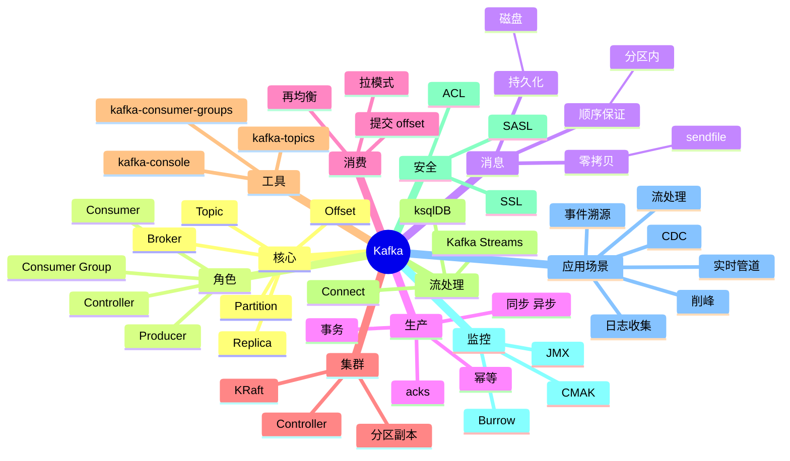

# Apache Kafka

## 前言

**定位**：分布式事件流平台，2011 年由 LinkedIn 开源至今是大数据、实时管道的事实标准，LinkedIn/Uber/Netflix/微博/字节跳动都深度使用，每天处理万亿级消息。

**核心价值**：
- 极高吞吐：单集群百万级 QPS
- 持久化：消息落盘，可重放
- 分布式：天然分片（Partition）+ 副本
- 生态丰富：Kafka Streams / Connect / Schema Registry

**五大特性**：
1. **分布式日志**：顺序写磁盘 + 零拷贝（sendfile）
2. **分区（Partition）**：水平扩展 + 顺序保证
3. **消费者组（Consumer Group）**：广播 + 负载均衡
4. **Exactly-Once**：事务 + 幂等
5. **流处理**：Kafka Streams / ksqlDB

**对比表**：

| 维度 | Kafka | RabbitMQ | RocketMQ | Pulsar | NATS |
|---|---|---|---|---|---|
| 架构 | 分区日志 | 队列/主题 | 分区队列 | 分段 | 主题 |
| 吞吐 | 百万级 | 万级 | 十万级 | 百万级 | 十万级 |
| 延迟 | ms | μs | ms | ms | ms |
| 持久化 | ✅ 强 | ⚠️ | ✅ | ✅ | ⚠️ |
| 消息重放 | ✅ | ❌ | ⚠️ | ✅ | ❌ |
| 适合 | 大数据/日志 | 业务消息 | 阿里系 | 多租户 | 云原生 |

## 思维导图



## 关键代码

### 一、基础操作

```bash
# 启动
bin/kafka-server-start.sh config/kraft/server.properties

# 创建 Topic
bin/kafka-topics.sh --bootstrap-server localhost:9092 --create \
  --topic my-topic --partitions 3 --replication-factor 2

# 列出 Topic
bin/kafka-topics.sh --bootstrap-server localhost:9092 --list

# 查看详情
bin/kafka-topics.sh --bootstrap-server localhost:9092 --describe --topic my-topic

# 修改分区
bin/kafka-topics.sh --bootstrap-server localhost:9092 --alter \
  --topic my-topic --partitions 6

# 删除 Topic
bin/kafka-topics.sh --bootstrap-server localhost:9092 --delete --topic my-topic

# 生产消息
bin/kafka-console-producer.sh --bootstrap-server localhost:9092 --topic my-topic
> hello kafka
> hello world

# 消费消息
bin/kafka-console-consumer.sh --bootstrap-server localhost:9092 --topic my-topic \
  --from-beginning --group test-group
```

```yaml
# server.properties (KRaft 模式)
process.roles=broker,controller
node.id=1
controller.quorum.voters=1@localhost:9093
listeners=PLAINTEXT://:9092,CONTROLLER://:9093
inter.broker.listener.name=PLAINTEXT
advertised.listeners=PLAINTEXT://localhost:9092
controller.listener.names=CONTROLLER
listener.security.protocol.map=CONTROLLER:PLAINTEXT,PLAINTEXT:PLAINTEXT
log.dirs=/tmp/kraft-combined-logs
num.partitions=1
num.network.threads=3
num.io.threads=8
```

### 二、Producer（Java）

```java
import org.apache.kafka.clients.producer.*;
import java.util.Properties;

public class MyProducer {
    public static void main(String[] args) {
        Properties props = new Properties();
        props.put(ProducerConfig.BOOTSTRAP_SERVERS_CONFIG, "localhost:9092");
        props.put(ProducerConfig.KEY_SERIALIZER_CLASS_CONFIG,
                  "org.apache.kafka.common.serialization.StringSerializer");
        props.put(ProducerConfig.VALUE_SERIALIZER_CLASS_CONFIG,
                  "org.apache.kafka.common.serialization.StringSerializer");

        // 可靠性
        props.put(ProducerConfig.ACKS_CONFIG, "all");              // -1
        props.put(ProducerConfig.RETRIES_CONFIG, Integer.MAX_VALUE);
        props.put(ProducerConfig.ENABLE_IDEMPOTENCE_CONFIG, true);  // 幂等

        // 性能
        props.put(ProducerConfig.LINGER_MS_CONFIG, 20);             // 批量
        props.put(ProducerConfig.BATCH_SIZE_CONFIG, 32 * 1024);
        props.put(ProducerConfig.COMPRESSION_TYPE_CONFIG, "lz4");

        try (KafkaProducer<String, String> producer = new KafkaProducer<>(props)) {
            for (int i = 0; i < 100; i++) {
                ProducerRecord<String, String> record = new ProducerRecord<>(
                    "my-topic",
                    "key-" + i,
                    "value-" + i
                );
                producer.send(record, (metadata, exception) -> {
                    if (exception == null) {
                        System.out.printf("Sent to %s-%d @ %d%n",
                            metadata.topic(), metadata.partition(), metadata.offset());
                    } else {
                        exception.printStackTrace();
                    }
                });
            }
        }
    }
}
```

### 三、Consumer（Java）

```java
import org.apache.kafka.clients.consumer.*;
import org.apache.kafka.common.serialization.StringDeserializer;
import java.time.Duration;
import java.util.*;

public class MyConsumer {
    public static void main(String[] args) {
        Properties props = new Properties();
        props.put(ConsumerConfig.BOOTSTRAP_SERVERS_CONFIG, "localhost:9092");
        props.put(ConsumerConfig.GROUP_ID_CONFIG, "my-group");
        props.put(ConsumerConfig.KEY_DESERIALIZER_CLASS_CONFIG, StringDeserializer.class.getName());
        props.put(ConsumerConfig.VALUE_DESERIALIZER_CLASS_CONFIG, StringDeserializer.class.getName());

        // 自动提交 offset
        props.put(ConsumerConfig.ENABLE_AUTO_COMMIT_CONFIG, true);
        props.put(ConsumerConfig.AUTO_COMMIT_INTERVAL_MS_CONFIG, 5000);
        props.put(ConsumerConfig.AUTO_OFFSET_RESET_CONFIG, "earliest");  // earliest/latest/none

        try (KafkaConsumer<String, String> consumer = new KafkaConsumer<>(props)) {
            consumer.subscribe(Arrays.asList("my-topic", "another-topic"));

            while (true) {
                ConsumerRecords<String, String> records = consumer.poll(Duration.ofMillis(1000));
                for (ConsumerRecord<String, String> record : records) {
                    System.out.printf("offset=%d key=%s value=%s%n",
                        record.offset(), record.key(), record.value());
                    // 业务处理
                }
            }
        }
    }
}
```

### 四、Producer（Node.js）

```javascript
// npm install kafkajs
const { Kafka, logLevel } = require('kafkajs')

const kafka = new Kafka({
  clientId: 'my-app',
  brokers: ['localhost:9092'],
  logLevel: logLevel.INFO
})

const producer = kafka.producer()
const consumer = kafka.consumer({ groupId: 'my-group' })

async function sendMessage() {
  await producer.connect()
  await producer.send({
    topic: 'my-topic',
    messages: [
      { key: 'key-1', value: 'Hello Kafka' },
      { key: 'key-2', value: 'Another message' }
    ]
  })
  await producer.disconnect()
}

async function consume() {
  await consumer.connect()
  await consumer.subscribe({ topic: 'my-topic', fromBeginning: true })

  await consumer.run({
    eachMessage: async ({ topic, partition, message }) => {
      console.log({
        topic,
        partition,
        offset: message.offset,
        key: message.key?.toString(),
        value: message.value?.toString()
      })
    }
  })
}
```

### 五、事务

```java
// 事务性 Producer
props.put(ProducerConfig.ENABLE_IDEMPOTENCE_CONFIG, true);
props.put(ProducerConfig.TRANSACTIONAL_ID_CONFIG, "my-tx-id");

try (KafkaProducer<String, String> producer = new KafkaProducer<>(props)) {
    producer.initTransactions();

    try {
        producer.beginTransaction();
        producer.send(new ProducerRecord<>("orders", "order-1", "create"));
        producer.send(new ProducerRecord<>("inventory", "item-1", "-1"));
        producer.commitTransaction();
    } catch (Exception e) {
        producer.abortTransaction();
    }
}
```

```java
// 消费-处理-生产（Exactly Once）
KafkaConsumer<String, String> consumer = new KafkaConsumer<>(consumerProps);
consumer.subscribe(Arrays.asList("input-topic"));
KafkaProducer<String, String> producer = new KafkaProducer<>(producerProps);
producer.initTransactions();

while (running) {
    ConsumerRecords<String, String> records = consumer.poll(Duration.ofMillis(1000));
    producer.beginTransaction();
    try {
        for (ConsumerRecord<String, String> record : records) {
            // 处理
            String output = transform(record.value());
            producer.send(new ProducerRecord<>("output-topic", record.key(), output));
        }
        // 同时提交消费 offset 到事务
        producer.sendOffsetsToTransaction(offsets, consumer.groupMetadata());
        producer.commitTransaction();
    } catch (Exception e) {
        producer.abortTransaction();
    }
}
```

### 六、Kafka Streams

```java
import org.apache.kafka.streams.*;
import org.apache.kafka.streams.kstream.*;
import java.util.Properties;

public class WordCount {
    public static void main(String[] args) {
        Properties props = new Properties();
        props.put(StreamsConfig.APPLICATION_ID_CONFIG, "word-count");
        props.put(StreamsConfig.BOOTSTRAP_SERVERS_CONFIG, "localhost:9092");

        StreamsBuilder builder = new StreamsBuilder();
        KStream<String, String> source = builder.stream("input-topic");

        KTable<String, Long> counts = source
            .flatMapValues(value -> Arrays.asList(value.toLowerCase().split(" ")))
            .groupBy((key, word) -> word)
            .count();

        counts.toStream().to("output-topic", Produced.with(Serdes.String(), Serdes.Long()));

        KafkaStreams streams = new KafkaStreams(builder.build(), props);
        streams.start();
    }
}
```

### 七、消费者组管理

```bash
# 列出消费者组
bin/kafka-consumer-groups.sh --bootstrap-server localhost:9092 --list

# 查看消费进度
bin/kafka-consumer-groups.sh --bootstrap-server localhost:9092 \
  --describe --group my-group

# 重置 offset
bin/kafka-consumer-groups.sh --bootstrap-server localhost:9092 \
  --group my-group --reset-offsets \
  --topic my-topic --to-earliest --execute

# 删除消费者组
bin/kafka-consumer-groups.sh --bootstrap-server localhost:9092 \
  --delete --group my-group
```

### 八、Kafka Connect

```bash
# 启动 Connect
bin/connect-distributed.sh config/connect-distributed.properties
```

```json
// Source: PostgreSQL -> Kafka
{
  "name": "postgres-source",
  "config": {
    "connector.class": "io.debezium.connector.postgresql.PostgresConnector",
    "database.hostname": "postgres",
    "database.port": "5432",
    "database.user": "debezium",
    "database.password": "secret",
    "database.dbname": "mydb",
    "database.server.name": "pg-server",
    "plugin.name": "pgoutput"
  }
}
```

```json
// Sink: Kafka -> Elasticsearch
{
  "name": "es-sink",
  "config": {
    "connector.class": "io.confluent.connect.elasticsearch.ElasticsearchSinkConnector",
    "topics": "my-topic",
    "connection.url": "http://elasticsearch:9200",
    "type.name": "_doc",
    "key.ignore": "false"
  }
}
```

### 九、Schema Registry

```bash
# 注册 schema
curl -X POST http://schema-registry:8081/subjects/my-topic-value/versions \
  -H "Content-Type: application/vnd.schemaregistry.v1+json" \
  -d '{
    "schema": "{\"type\": \"record\", \"name\": \"User\", \"fields\": [{\"name\": \"id\", \"type\": \"long\"}, {\"name\": \"name\", \"type\": \"string\"}]}"
  }'

# 查看 schema
curl http://schema-registry:8081/subjects/my-topic-value/versions/latest
```

```java
// Avro + Schema Registry
props.put(ProducerConfig.VALUE_SERIALIZER_CLASS_CONFIG,
          KafkaAvroSerializer.class.getName());
props.put("schema.registry.url", "http://schema-registry:8081");

User user = User.newBuilder().setId(1L).setName("Alice").build();
producer.send(new ProducerRecord<>("my-topic", user));
```

### 十、监控

```bash
# JMX 指标（通过 JMX exporter 暴露给 Prometheus）
KAFKA_OPTS="-javaagent:/opt/jmx_prometheus_javaagent.jar=7071:/opt/kafka-jmx.yml" \
  bin/kafka-server-start.sh config/server.properties

# 关键指标
# kafka.server:type=BrokerTopicMetrics,name=MessagesInPerSec
# kafka.server:type=BrokerTopicMetrics,name=BytesInPerSec
# kafka.controller:type=ControllerStats,name=ActiveControllerCount
# kafka.server:type=ReplicaManager,name=UnderReplicatedPartitions
# kafka.server:type=DelayedOperationPurgatory,name=Expiration
```

## 核心洞察

- **Kafka 的"分布式日志"是核心抽象**：不像传统 MQ，消息可重放
- **Kafka 的"顺序写 + 零拷贝"是性能关键**：磁盘顺序写比内存随机写更快
- **Kafka 的"分区"是水平扩展的基石**：每个分区单线程顺序处理
- **Kafka 的"消费者组"模式是设计精华**：广播（不同 group）和负载均衡（同 group）
- **Kafka 的"Exactly-Once"靠事务 + 幂等**：比 RabbitMQ 的"最多一次"复杂
- **Kafka 3.0 移除 ZooKeeper（KRaft）**：减少运维复杂度
- **Kafka 的"流处理"集成是趋势**：Kafka Streams 替代部分 Flink 场景
- **Kafka 的"分区分配"是消费者组关键**：Range / RoundRobin / Sticky
- **Kafka 的"消息顺序"是分区级**：跨分区无序、跨分区有键保序
- **Kafka 的"压缩"支持多种算法**：lz4、zstd、snappy，节省磁盘 50%+
- **Kafka 的 ISR 机制平衡一致性与可用性**：acks=all 等待 ISR
- **Kafka 的"冷数据"问题**：老的 partition segment 可以移到 S3（Hudi/Iceberg）

## 跨项目引用

- **[[linux]]**：Kafka 跑在 Linux 上
- **[[docker]]**：Kafka Docker 镜像（bitnami/wurstmeister）
- **[[kubernetes]]**：Strimzi / Confluent Operator 部署
- **[[zookeeper]]**：Kafka 2.x 依赖 ZK（3.0+ KRaft 不需要）
- **[[kafka connect]]**：Kafka Connect 生态
- **[[debezium]]**：PostgreSQL/MySQL/MongoDB CDC 到 Kafka
- **[[flink]]** / **[[spark streaming]]**：Kafka 的流处理引擎
- **[[elasticsearch]]**：Kafka 数据 sink 到 ES
- **[[postgresql]]** / **[[mysql]]** / **[[mongodb]]**：CDC 源数据库
- **[[redis]]** / **[[rabbitmq]]**：其他消息队列方案
- **[[prometheus]]** + **[[kafka_exporter]]**：Kafka 监控
- **[[confluent]]**：Confluent 是 Kafka 商业公司
