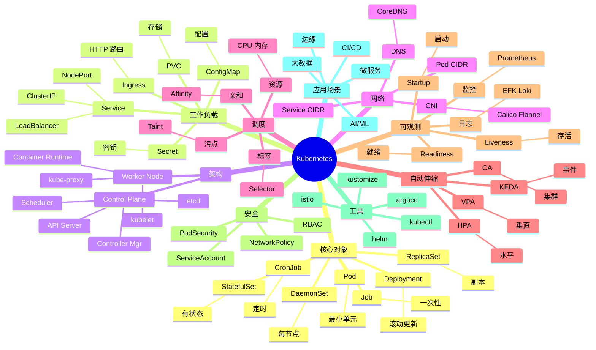

# Kubernetes (K8s)

## 前言

**定位**：开源容器编排平台，2014 年由 Google 开源（Borg 的精神继承者）至今是云原生时代的事实标准，被 CNCF 托管，全球 88%+ 容器编排市场份额。

**核心价值**：
- 自动部署、扩缩、滚动更新
- 自我修复：容器崩溃自动重启
- 服务发现与负载均衡
- 声明式配置：描述期望状态，自动调谐
- 跨云：AWS/GCP/Azure/阿里云一致体验

**五大特性**：
1. **Pod**：最小调度单元，1+ 共享网络/存储的容器
2. **Controller**：ReplicaSet/Deployment/StatefulSet 维持期望状态
3. **Service**：稳定 IP + 负载均衡，Pod 漂移不影响访问
4. **kubectl**：CLI 工具，imperative + declarative 双模式
5. **etcd**：分布式 KV 存储，集群状态真相源

**对比表**：

| 维度 | Kubernetes | Docker Swarm | Nomad | Mesos | ECS |
|---|---|---|---|---|---|
| 学习曲线 | 陡 | 缓 | 中 | 陡 | 中 |
| 生态 | ✅✅ 极强 | ⚠️ 弱 | ⚠️ 中 | ⚠️ | AWS only |
| 自动伸缩 | ✅ HPA/VPA/CA | ⚠️ | ⚠️ | ⚠️ | ✅ |
| 服务网格 | ✅ Istio/Linkerd | ❌ | ⚠️ Consul | ❌ | ⚠️ App Mesh |
| 多云 | ✅ | ⚠️ | ✅ | ✅ | ❌ |
| 适合 | 大规模生产 | 小团队 | 多 workload | 大数据 | AWS 用户 |

## 思维导图



## 关键代码

### 一、Pod 基础

```yaml
# pod.yaml
apiVersion: v1
kind: Pod
metadata:
  name: myapp
  labels:
    app: myapp
    tier: frontend
spec:
  containers:
  - name: app
    image: myapp:v1
    ports:
    - containerPort: 8080
    env:
    - name: NODE_ENV
      value: production
    - name: DB_HOST
      valueFrom:
        configMapKeyRef:
          name: app-config
          key: db.host
    - name: DB_PASSWORD
      valueFrom:
        secretKeyRef:
          name: app-secret
          key: password
    resources:
      requests:
        cpu: 100m
        memory: 128Mi
      limits:
        cpu: 500m
        memory: 512Mi
    livenessProbe:
      httpGet:
        path: /healthz
        port: 8080
      initialDelaySeconds: 30
      periodSeconds: 10
    readinessProbe:
      httpGet:
        path: /ready
        port: 8080
      periodSeconds: 5
    volumeMounts:
    - name: data
      mountPath: /app/data
  volumes:
  - name: data
    persistentVolumeClaim:
      claimName: myapp-data
```

```bash
# Pod 操作
kubectl apply -f pod.yaml
kubectl get pods
kubectl get pods -o wide
kubectl get pods -A
kubectl describe pod myapp
kubectl logs myapp
kubectl logs -f myapp
kubectl exec -it myapp -- bash
kubectl delete pod myapp
```

### 二、Deployment

```yaml
# deployment.yaml
apiVersion: apps/v1
kind: Deployment
metadata:
  name: myapp
  labels:
    app: myapp
spec:
  replicas: 3
  selector:
    matchLabels:
      app: myapp
  strategy:
    type: RollingUpdate
    rollingUpdate:
      maxSurge: 1
      maxUnavailable: 0
  template:
    metadata:
      labels:
        app: myapp
    spec:
      containers:
      - name: app
        image: myapp:v1
        ports:
        - containerPort: 8080
        resources:
          requests:
            cpu: 100m
            memory: 128Mi
```

```bash
# Deployment 操作
kubectl apply -f deployment.yaml
kubectl get deployments
kubectl scale deployment/myapp --replicas=5
kubectl set image deployment/myapp app=myapp:v2
kubectl rollout status deployment/myapp
kubectl rollout history deployment/myapp
kubectl rollout undo deployment/myapp
kubectl rollout undo deployment/myapp --to-revision=2
```

### 三、Service 与 Ingress

```yaml
# service.yaml - 集群内访问
apiVersion: v1
kind: Service
metadata:
  name: myapp
spec:
  type: ClusterIP         # 默认
  selector:
    app: myapp
  ports:
  - port: 80
    targetPort: 8080
---
# NodePort - 节点端口暴露
apiVersion: v1
kind: Service
metadata:
  name: myapp-nodeport
spec:
  type: NodePort
  selector:
    app: myapp
  ports:
  - port: 80
    targetPort: 8080
    nodePort: 30080        # 30000-32767
---
# LoadBalancer - 云厂商 LB
apiVersion: v1
kind: Service
metadata:
  name: myapp-lb
spec:
  type: LoadBalancer
  selector:
    app: myapp
  ports:
  - port: 80
    targetPort: 8080
```

```yaml
# ingress.yaml - HTTP 路由
apiVersion: networking.k8s.io/v1
kind: Ingress
metadata:
  name: myapp-ingress
  annotations:
    nginx.ingress.kubernetes.io/rewrite-target: /
    cert-manager.io/cluster-issuer: letsencrypt-prod
spec:
  ingressClassName: nginx
  tls:
  - hosts:
    - example.com
    secretName: example-tls
  rules:
  - host: example.com
    http:
      paths:
      - path: /
        pathType: Prefix
        backend:
          service:
            name: myapp
            port:
              number: 80
      - path: /api
        pathType: Prefix
        backend:
          service:
            name: api
            port:
              number: 8080
```

### 四、ConfigMap 与 Secret

```bash
# ConfigMap
kubectl create configmap app-config \
  --from-file=app.properties \
  --from-literal=db.host=mysql \
  --from-literal=log.level=info

# Secret
kubectl create secret generic app-secret \
  --from-literal=password=secret123 \
  --from-file=tls.crt \
  --from-file=tls.key

# 查看
kubectl get configmap app-config -o yaml
kubectl get secret app-secret -o yaml
```

```yaml
# configmap.yaml
apiVersion: v1
kind: ConfigMap
metadata:
  name: app-config
data:
  app.properties: |
    server.port=8080
    log.level=info
  db.host: postgres
  db.port: "5432"
---
# secret.yaml
apiVersion: v1
kind: Secret
metadata:
  name: app-secret
type: Opaque
stringData:
  password: secret123
  api-key: sk-xxx
```

### 五、有状态应用（StatefulSet）

```yaml
# statefulset.yaml - 数据库
apiVersion: apps/v1
kind: StatefulSet
metadata:
  name: postgres
spec:
  serviceName: postgres
  replicas: 3
  selector:
    matchLabels:
      app: postgres
  template:
    metadata:
      labels:
        app: postgres
    spec:
      containers:
      - name: postgres
        image: postgres:15
        ports:
        - containerPort: 5432
        env:
        - name: POSTGRES_PASSWORD
          valueFrom:
            secretKeyRef:
              name: pg-secret
              key: password
        volumeMounts:
        - name: data
          mountPath: /var/lib/postgresql/data
  volumeClaimTemplates:
  - metadata:
      name: data
    spec:
      accessModes: ["ReadWriteOnce"]
      storageClassName: ssd
      resources:
        requests:
          storage: 10Gi
---
apiVersion: v1
kind: Service
metadata:
  name: postgres
spec:
  clusterIP: None           # Headless Service
  selector:
    app: postgres
  ports:
  - port: 5432
```

### 六、HPA 自动伸缩

```yaml
# hpa.yaml
apiVersion: autoscaling/v2
kind: HorizontalPodAutoscaler
metadata:
  name: myapp-hpa
spec:
  scaleTargetRef:
    apiVersion: apps/v1
    kind: Deployment
    name: myapp
  minReplicas: 2
  maxReplicas: 10
  metrics:
  - type: Resource
    resource:
      name: cpu
      target:
        type: Utilization
        averageUtilization: 70
  - type: Resource
    resource:
      name: memory
      target:
        type: AverageValue
        averageValue: 500Mi
  behavior:
    scaleDown:
      stabilizationWindowSeconds: 300
    scaleUp:
      stabilizationWindowSeconds: 0
```

```bash
# 安装 metrics-server 后才能用 HPA
kubectl top nodes
kubectl top pods

# 手动扩缩
kubectl autoscale deployment myapp --min=2 --max=10 --cpu-percent=70
```

### 七、RBAC 权限

```yaml
# serviceaccount.yaml
apiVersion: v1
kind: ServiceAccount
metadata:
  name: myapp-sa
  namespace: production
---
# role.yaml
apiVersion: rbac.authorization.k8s.io/v1
kind: Role
metadata:
  name: pod-reader
  namespace: production
rules:
- apiGroups: [""]
  resources: ["pods", "pods/log"]
  verbs: ["get", "list", "watch"]
- apiGroups: [""]
  resources: ["configmaps"]
  verbs: ["get"]
---
# rolebinding.yaml
apiVersion: rbac.authorization.k8s.io/v1
kind: RoleBinding
metadata:
  name: read-pods
  namespace: production
subjects:
- kind: ServiceAccount
  name: myapp-sa
  namespace: production
roleRef:
  kind: Role
  name: pod-reader
  apiGroup: rbac.authorization.k8s.io
```

### 八、Helm 包管理

```yaml
# Chart.yaml
apiVersion: v2
name: myapp
version: 1.2.0
appVersion: "v1.0.0"
description: My Web Application
```

```yaml
# values.yaml
replicaCount: 3

image:
  repository: myapp
  tag: v1
  pullPolicy: IfNotPresent

service:
  type: ClusterIP
  port: 80

ingress:
  enabled: true
  className: nginx
  hosts:
    - host: example.com
      paths:
        - path: /
          pathType: Prefix

resources:
  requests:
    cpu: 100m
    memory: 128Mi
  limits:
    cpu: 500m
    memory: 512Mi
```

```yaml
# templates/deployment.yaml
apiVersion: apps/v1
kind: Deployment
metadata:
  name: {{ .Release.Name }}-myapp
spec:
  replicas: {{ .Values.replicaCount }}
  selector:
    matchLabels:
      app: myapp
  template:
    metadata:
      labels:
        app: myapp
    spec:
      containers:
      - name: app
        image: "{{ .Values.image.repository }}:{{ .Values.image.tag }}"
        ports:
        - containerPort: 8080
        resources:
          {{- toYaml .Values.resources | nindent 12 }}
```

```bash
# Helm 命令
helm create mychart
helm lint mychart
helm template myapp ./mychart
helm install myapp ./mychart --namespace production
helm upgrade myapp ./mychart --set replicaCount=5
helm list -A
helm rollback myapp 1
helm uninstall myapp

# 仓库
helm repo add bitnami https://charts.bitnami.com/bitnami
helm install postgres bitnami/postgresql
```

### 九、Kustomize 替代 Helm

```bash
# 目录结构
# base/
#   deployment.yaml
#   service.yaml
#   kustomization.yaml
# overlays/
#   prod/
#     kustomization.yaml
#     replica-patch.yaml
```

```yaml
# base/kustomization.yaml
apiVersion: kustomize.config.k8s.io/v1beta1
kind: Kustomization
resources:
- deployment.yaml
- service.yaml
commonLabels:
  app: myapp
```

```yaml
# overlays/prod/kustomization.yaml
apiVersion: kustomize.config.k8s.io/v1beta1
kind: Kustomization
namespace: production
resources:
- ../../base
replicas:
- name: myapp
  count: 5
images:
- name: myapp
  newTag: v2
patches:
- replica-patch.yaml
```

```bash
kubectl apply -k overlays/prod
```

## 核心洞察

- **Kubernetes 是云时代的 Linux**：成为分布式应用的标准操作系统
- **声明式 API 是 K8s 的灵魂**：描述"想要什么"而非"怎么做"
- **K8s 的核心是控制循环（Reconciliation Loop）**：观测当前→对比期望→调整
- **Pod 是原子单位**：1+ 共享网络/存储的容器，比容器更高层抽象
- **K8s 的设计是"水平扩展优先"**：所有组件无状态、易复制
- **etcd 是 K8s 的真相源**：单点故障风险（生产必须 3/5 节点）
- **K8s 的网络是"平坦"假设**：所有 Pod 可直接通信，需要 CNI 插件实现
- **K8s 的"云原生 12 要素"实践**：配置/无状态/端口/并发/一次性
- **K8s 的"Operator"模式扩展 API**：用自定义资源管理有状态应用
- **K8s 的学习曲线陡**：概念多（Pod/Service/Ingress/PVC/CNI/CSI/CRI...）
- **K8s 在边缘的延伸**：K3s / KubeEdge / MicroK8s 让 K8s 跑在小设备
- **K8s 的"GitOps"实践**：ArgoCD/Flux 把 Git 当作 K8s 唯一真相源

## 跨项目引用

- **[[docker]]**：K8s 编排容器（实际用 containerd/CRI-O）
- **[[linux]]**：K8s 全部运行在 Linux 之上
- **[[prometheus]]** / **[[grafana]]**：K8s 监控的事实标准
- **[[nginx]]**：Ingress 控制器最常用 Nginx
- **[[postgresql]]** / **[[mysql]]** / **[[redis]]**：StatefulSet 管理有状态服务
- **[[helm]]**：K8s 包管理
- **[[git]]**：K8s YAML 用 Git 管理（GitOps）
- **[[github actions]]** / **[[jenkins]]**：CI/CD 部署到 K8s
- **[[terraform]]** / **[[ansible]]**：基础设施即代码部署 K8s
- **[[etcd]]**：K8s 集群状态存储
- **[[grpc]]**：K8s 内部组件通信
- **[[istio]]** / **[[linkerd]]**：K8s 服务网格
