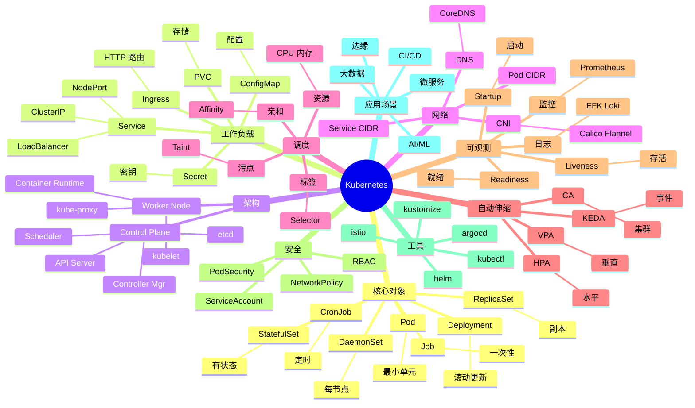

# Kubernetes (K8s)

## 前言

**定位**：开源容器编排平台，2014 年由 Google 开源（Borg 的精神继承者）至今是云原生时代的事实标准，被 CNCF 托管，全球 88%+ 容器编排市场份额。

**核心价值**：
- 自动部署、扩缩、滚动更新
- 自我修复：容器崩溃自动重启
- 服务发现与负载均衡
- 声明式配置：描述期望状态，自动调谐
- 跨云：AWS/GCP/Azure/阿里云一致体验

**五大特性**：
1. **Pod**：最小调度单元，1+ 共享网络/存储的容器
2. **Controller**：ReplicaSet/Deployment/StatefulSet 维持期望状态
3. **Service**：稳定 IP + 负载均衡，Pod 漂移不影响访问
4. **kubectl**：CLI 工具，imperative + declarative 双模式
5. **etcd**：分布式 KV 存储，集群状态真相源

**对比表**：

| 维度 | Kubernetes | Docker Swarm | Nomad | Mesos | ECS |
|---|---|---|---|---|---|
| 学习曲线 | 陡 | 缓 | 中 | 陡 | 中 |
| 生态 | ✅✅ 极强 | ⚠️ 弱 | ⚠️ 中 | ⚠️ | AWS only |
| 自动伸缩 | ✅ HPA/VPA/CA | ⚠️ | ⚠️ | ⚠️ | ✅ |
| 服务网格 | ✅ Istio/Linkerd | ❌ | ⚠️ Consul | ❌ | ⚠️ App Mesh |
| 多云 | ✅ | ⚠️ | ✅ | ✅ | ❌ |
| 适合 | 大规模生产 | 小团队 | 多 workload | 大数据 | AWS 用户 |

## 思维导图



## 关键代码

### 一、Pod 基础

```yaml
# pod.yaml
apiVersion: v1
kind: Pod
metadata:
  name: myapp
  labels:
    app: myapp
    tier: frontend
spec:
  containers:
  - name: app
    image: myapp:v1
    ports:
    - containerPort: 8080
    env:
    - name: NODE_ENV
      value: production
    - name: DB_HOST
      valueFrom:
        configMapKeyRef:
          name: app-config
          key: db.host
    - name: DB_PASSWORD
      valueFrom:
        secretKeyRef:
          name: app-secret
          key: password
    resources:
      requests:
        cpu: 100m
        memory: 128Mi
      limits:
        cpu: 500m
        memory: 512Mi
    livenessProbe:
      httpGet:
        path: /healthz
        port: 8080
      initialDelaySeconds: 30
      periodSeconds: 10
    readinessProbe:
      httpGet:
        path: /ready
        port: 8080
      periodSeconds: 5
    volumeMounts:
    - name: data
      mountPath: /app/data
  volumes:
  - name: data
    persistentVolumeClaim:
      claimName: myapp-data
```

```bash
# Pod 操作
kubectl apply -f pod.yaml
kubectl get pods
kubectl get pods -o wide
kubectl get pods -A
kubectl describe pod myapp
kubectl logs myapp
kubectl logs -f myapp
kubectl exec -it myapp -- bash
kubectl delete pod myapp
```

### 二、Deployment

```yaml
# deployment.yaml
apiVersion: apps/v1
kind: Deployment
metadata:
  name: myapp
  labels:
    app: myapp
spec:
  replicas: 3
  selector:
    matchLabels:
      app: myapp
  strategy:
    type: RollingUpdate
    rollingUpdate:
      maxSurge: 1
      maxUnavailable: 0
  template:
    metadata:
      labels:
        app: myapp
    spec:
      containers:
      - name: app
        image: myapp:v1
        ports:
        - containerPort: 8080
        resources:
          requests:
            cpu: 100m
            memory: 128Mi
```

```bash
# Deployment 操作
kubectl apply -f deployment.yaml
kubectl get deployments
kubectl scale deployment/myapp --replicas=5
kubectl set image deployment/myapp app=myapp:v2
kubectl rollout status deployment/myapp
kubectl rollout history deployment/myapp
kubectl rollout undo deployment/myapp
kubectl rollout undo deployment/myapp --to-revision=2
```

### 三、Service 与 Ingress

```yaml
# service.yaml - 集群内访问
apiVersion: v1
kind: Service
metadata:
  name: myapp
spec:
  type: ClusterIP         # 默认
  selector:
    app: myapp
  ports:
  - port: 80
    targetPort: 8080
---
# NodePort - 节点端口暴露
apiVersion: v1
kind: Service
metadata:
  name: myapp-nodeport
spec:
  type: NodePort
  selector:
    app: myapp
  ports:
  - port: 80
    targetPort: 8080
    nodePort: 30080        # 30000-32767
---
# LoadBalancer - 云厂商 LB
apiVersion: v1
kind: Service
metadata:
  name: myapp-lb
spec:
  type: LoadBalancer
  selector:
    app: myapp
  ports:
  - port: 80
    targetPort: 8080
```

```yaml
# ingress.yaml - HTTP 路由
apiVersion: networking.k8s.io/v1
kind: Ingress
metadata:
  name: myapp-ingress
  annotations:
    nginx.ingress.kubernetes.io/rewrite-target: /
    cert-manager.io/cluster-issuer: letsencrypt-prod
spec:
  ingressClassName: nginx
  tls:
  - hosts:
    - example.com
    secretName: example-tls
  rules:
  - host: example.com
    http:
      paths:
      - path: /
        pathType: Prefix
        backend:
          service:
            name: myapp
            port:
              number: 80
      - path: /api
        pathType: Prefix
        backend:
          service:
            name: api
            port:
              number: 8080
```

### 四、ConfigMap 与 Secret

```bash
# ConfigMap
kubectl create configmap app-config \
  --from-file=app.properties \
  --from-literal=db.host=mysql \
  --from-literal=log.level=info

# Secret
kubectl create secret generic app-secret \
  --from-literal=password=secret123 \
  --from-file=tls.crt \
  --from-file=tls.key

# 查看
kubectl get configmap app-config -o yaml
kubectl get secret app-secret -o yaml
```

```yaml
# configmap.yaml
apiVersion: v1
kind: ConfigMap
metadata:
  name: app-config
data:
  app.properties: |
    server.port=8080
    log.level=info
  db.host: postgres
  db.port: "5432"
---
# secret.yaml
apiVersion: v1
kind: Secret
metadata:
  name: app-secret
type: Opaque
stringData:
  password: secret123
  api-key: sk-xxx
```

### 五、有状态应用（StatefulSet）

```yaml
# statefulset.yaml - 数据库
apiVersion: apps/v1
kind: StatefulSet
metadata:
  name: postgres
spec:
  serviceName: postgres
  replicas: 3
  selector:
    matchLabels:
      app: postgres
  template:
    metadata:
      labels:
        app: postgres
    spec:
      containers:
      - name: postgres
        image: postgres:15
        ports:
        - containerPort: 5432
        env:
        - name: POSTGRES_PASSWORD
          valueFrom:
            secretKeyRef:
              name: pg-secret
              key: password
        volumeMounts:
        - name: data
          mountPath: /var/lib/postgresql/data
  volumeClaimTemplates:
  - metadata:
      name: data
    spec:
      accessModes: ["ReadWriteOnce"]
      storageClassName: ssd
      resources:
        requests:
          storage: 10Gi
---
apiVersion: v1
kind: Service
metadata:
  name: postgres
spec:
  clusterIP: None           # Headless Service
  selector:
    app: postgres
  ports:
  - port: 5432
```

### 六、HPA 自动伸缩

```yaml
# hpa.yaml
apiVersion: autoscaling/v2
kind: HorizontalPodAutoscaler
metadata:
  name: myapp-hpa
spec:
  scaleTargetRef:
    apiVersion: apps/v1
    kind: Deployment
    name: myapp
  minReplicas: 2
  maxReplicas: 10
  metrics:
  - type: Resource
    resource:
      name: cpu
      target:
        type: Utilization
        averageUtilization: 70
  - type: Resource
    resource:
      name: memory
      target:
        type: AverageValue
        averageValue: 500Mi
  behavior:
    scaleDown:
      stabilizationWindowSeconds: 300
    scaleUp:
      stabilizationWindowSeconds: 0
```

```bash
# 安装 metrics-server 后才能用 HPA
kubectl top nodes
kubectl top pods

# 手动扩缩
kubectl autoscale deployment myapp --min=2 --max=10 --cpu-percent=70
```

### 七、RBAC 权限

```yaml
# serviceaccount.yaml
apiVersion: v1
kind: ServiceAccount
metadata:
  name: myapp-sa
  namespace: production
---
# role.yaml
apiVersion: rbac.authorization.k8s.io/v1
kind: Role
metadata:
  name: pod-reader
  namespace: production
rules:
- apiGroups: [""]
  resources: ["pods", "pods/log"]
  verbs: ["get", "list", "watch"]
- apiGroups: [""]
  resources: ["configmaps"]
  verbs: ["get"]
---
# rolebinding.yaml
apiVersion: rbac.authorization.k8s.io/v1
kind: RoleBinding
metadata:
  name: read-pods
  namespace: production
subjects:
- kind: ServiceAccount
  name: myapp-sa
  namespace: production
roleRef:
  kind: Role
  name: pod-reader
  apiGroup: rbac.authorization.k8s.io
```

### 八、Helm 包管理

```yaml
# Chart.yaml
apiVersion: v2
name: myapp
version: 1.2.0
appVersion: "v1.0.0"
description: My Web Application
```

```yaml
# values.yaml
replicaCount: 3

image:
  repository: myapp
  tag: v1
  pullPolicy: IfNotPresent

service:
  type: ClusterIP
  port: 80

ingress:
  enabled: true
  className: nginx
  hosts:
    - host: example.com
      paths:
        - path: /
          pathType: Prefix

resources:
  requests:
    cpu: 100m
    memory: 128Mi
  limits:
    cpu: 500m
    memory: 512Mi
```

```yaml
# templates/deployment.yaml
apiVersion: apps/v1
kind: Deployment
metadata:
  name: {{ .Release.Name }}-myapp
spec:
  replicas: {{ .Values.replicaCount }}
  selector:
    matchLabels:
      app: myapp
  template:
    metadata:
      labels:
        app: myapp
    spec:
      containers:
      - name: app
        image: "{{ .Values.image.repository }}:{{ .Values.image.tag }}"
        ports:
        - containerPort: 8080
        resources:
          {{- toYaml .Values.resources | nindent 12 }}
```

```bash
# Helm 命令
helm create mychart
helm lint mychart
helm template myapp ./mychart
helm install myapp ./mychart --namespace production
helm upgrade myapp ./mychart --set replicaCount=5
helm list -A
helm rollback myapp 1
helm uninstall myapp

# 仓库
helm repo add bitnami https://charts.bitnami.com/bitnami
helm install postgres bitnami/postgresql
```

### 九、Kustomize 替代 Helm

```bash
# 目录结构
# base/
#   deployment.yaml
#   service.yaml
#   kustomization.yaml
# overlays/
#   prod/
#     kustomization.yaml
#     replica-patch.yaml
```

```yaml
# base/kustomization.yaml
apiVersion: kustomize.config.k8s.io/v1beta1
kind: Kustomization
resources:
- deployment.yaml
- service.yaml
commonLabels:
  app: myapp
```

```yaml
# overlays/prod/kustomization.yaml
apiVersion: kustomize.config.k8s.io/v1beta1
kind: Kustomization
namespace: production
resources:
- ../../base
replicas:
- name: myapp
  count: 5
images:
- name: myapp
  newTag: v2
patches:
- replica-patch.yaml
```

```bash
kubectl apply -k overlays/prod
```

## 进程管理：系统底层的调度与同步

Redis 是内存数据库的王者。单线程事件循环、IO 多路复用、AOF/RDB 持久化、Cluster 分片、Sentinel 高可用、Stream 消息队列、Module 扩展（如 RediSearch、RedisJSON）让 Redis 适用于更多场景。

混沌工程主动验证系统韧性。Chaos Monkey（Netflix）、ChaosBlade（阿里）、LitmusChaos、Gremlin 是工具。生产环境演练是检验架构的终极方式。


## 内存管理：系统底层的分配与回收

Kafka 是分布式消息系统的标杆。Page Cache、零拷贝、ISR 副本机制、Partition 水平扩展、Exactly-Once 语义、Kafka Connect、Kafka Streams 是其核心能力。

性能分析需要合适的工具。perf（Linux 采样分析器）、eBPF（内核可编程）、bpftrace、SystemTap、FlameGraph（火焰图）让性能瓶颈无所遁形。


## 文件系统：系统底层的VFS与Page Cache

Elasticsearch 是搜索与分析引擎。Lucene 倒排索引、Shard 分片、Replica 副本、Mapping 数据模型、聚合分析、Vector Search（kNN）、Reranker 是其能力栈。

安全是系统底层的最后一道防线。SELinux/AppArmor 提供强制访问控制，seccomp 限制系统调用，capabilities 细化权限，Cgroups v2 提供更强的资源隔离。


## 网络栈：系统底层的TCP/UDP与epoll

ZooKeeper/etcd 是分布式协调服务。ZAB 协议、Raft 一致性算法、Watch 机制、临时节点、Leader 选举是核心。etcd 是 K8s 的存储后端，TiKV 也基于 Raft。

Linux 内核是所有云原生系统的基石。进程调度（CFS、RT Scheduler）、内存管理（Buddy/Slab/Page Cache）、文件系统（VFS/Ext4/XFS/Btrfs）、网络栈（TCP/UDP/epoll）是核心子系统。


## 容器：系统底层的Namespace与Cgroup

Ceph 是分布式存储的代表。CRUSH 算法、PG（Placement Group）、OSD、Mon、MDS、RBD、RGW、CephFS 构成完整能力栈。MinIO 是 S3 兼容的轻量方案。

进程与线程是操作系统的基本概念。协程（Coroutine）作为用户态轻量级线程，Go goroutine、Erlang process、Kotlin coroutine、C++20 coroutine 各有实现。


## 虚拟化：系统底层的KVM与Xen

负载均衡是分布式系统的入口。LVS（IPVS）四层、Nginx 七层、HAProxy 四七层、Envoy 服务网格、Traefik 云原生网关是主流方案。

内存管理涉及虚拟内存、页表、TLB、Swap、OOM Killer 等概念。jemalloc、tcmalloc、mimalloc 是高性能内存分配器，对 LLM 推理性能影响巨大。


## 操作系统：系统底层的Linux内核

可观测性是 SRE 的核心能力。Metrics（Prometheus）、Logs（Loki/ELK）、Traces（Jaeger/Tempo）三大支柱缺一不可。OpenTelemetry 是统一标准。

网络栈是后端性能的关键。TCP 三次握手、拥塞控制（CUBIC/BBR）、零拷贝（sendfile/splice）、epoll 多路复用、io_uring 异步 IO 是核心技术。


## 数据库：系统底层的InnoDB与MVCC

混沌工程主动验证系统韧性。Chaos Monkey（Netflix）、ChaosBlade（阿里）、LitmusChaos、Gremlin 是工具。生产环境演练是检验架构的终极方式。

容器基于 Linux Namespace 和 Cgroup 实现隔离与资源限制。Docker 让容器变得易用，containerd/CRI-O 是工业级运行时，Podman 是 Docker 替代品。


## 缓存：系统底层的Redis与Memcached

性能分析需要合适的工具。perf（Linux 采样分析器）、eBPF（内核可编程）、bpftrace、SystemTap、FlameGraph（火焰图）让性能瓶颈无所遁形。

Kubernetes 是容器编排的事实标准。Pod、Deployment、StatefulSet、DaemonSet、Job、CronJob 是基础资源，Service、Ingress、NetworkPolicy 是网络抽象。


## 消息队列：系统底层的Kafka与Pulsar

安全是系统底层的最后一道防线。SELinux/AppArmor 提供强制访问控制，seccomp 限制系统调用，capabilities 细化权限，Cgroups v2 提供更强的资源隔离。

Helm 是 K8s 的包管理工具。Chart 是 Helm 的打包格式，模板化（Go Template）的 YAML 让复杂应用可配置化部署。Helmfile、ArgoCD ApplicationSet 是增强方案。


## 搜索引擎：系统底层的ES与Lucene

Linux 内核是所有云原生系统的基石。进程调度（CFS、RT Scheduler）、内存管理（Buddy/Slab/Page Cache）、文件系统（VFS/Ext4/XFS/Btrfs）、网络栈（TCP/UDP/epoll）是核心子系统。

Operator 模式将运维知识编码为 K8s 控制器。CoreOS Operator Framework、Kubebuilder、Operator SDK 简化了 Operator 开发。etcd Operator、Prometheus Operator 是经典案例。


## 协调服务：系统底层的ZooKeeper/etcd

进程与线程是操作系统的基本概念。协程（Coroutine）作为用户态轻量级线程，Go goroutine、Erlang process、Kotlin coroutine、C++20 coroutine 各有实现。

服务网格（Service Mesh）解决了微服务的网络治理。Istio + Envoy 是最完整方案，Linkerd 轻量，Consul Connect 与 HashiCorp 生态集成。Cilium Service Mesh 基于 eBPF 性能更优。


## 分布式存储：系统底层的Ceph与HDFS

内存管理涉及虚拟内存、页表、TLB、Swap、OOM Killer 等概念。jemalloc、tcmalloc、mimalloc 是高性能内存分配器，对 LLM 推理性能影响巨大。

数据库内核是系统软件的明珠。InnoDB 的 MVCC、B+ 树、Buffer Pool、Redo Log、Undo Log 是 MySQL 性能的关键。PostgreSQL 的进程模型、WAL、Vacuum 是它的特色。


## 负载均衡：系统底层的Nginx/LVS

网络栈是后端性能的关键。TCP 三次握手、拥塞控制（CUBIC/BBR）、零拷贝（sendfile/splice）、epoll 多路复用、io_uring 异步 IO 是核心技术。

Redis 是内存数据库的王者。单线程事件循环、IO 多路复用、AOF/RDB 持久化、Cluster 分片、Sentinel 高可用、Stream 消息队列、Module 扩展（如 RediSearch、RedisJSON）让 Redis 适用于更多场景。


## 反向代理：系统底层的Envoy/Traefik

容器基于 Linux Namespace 和 Cgroup 实现隔离与资源限制。Docker 让容器变得易用，containerd/CRI-O 是工业级运行时，Podman 是 Docker 替代品。

Kafka 是分布式消息系统的标杆。Page Cache、零拷贝、ISR 副本机制、Partition 水平扩展、Exactly-Once 语义、Kafka Connect、Kafka Streams 是其核心能力。


## 服务发现：系统底层的Consul

Kubernetes 是容器编排的事实标准。Pod、Deployment、StatefulSet、DaemonSet、Job、CronJob 是基础资源，Service、Ingress、NetworkPolicy 是网络抽象。

Elasticsearch 是搜索与分析引擎。Lucene 倒排索引、Shard 分片、Replica 副本、Mapping 数据模型、聚合分析、Vector Search（kNN）、Reranker 是其能力栈。


## 配置中心：系统底层的Nacos

Helm 是 K8s 的包管理工具。Chart 是 Helm 的打包格式，模板化（Go Template）的 YAML 让复杂应用可配置化部署。Helmfile、ArgoCD ApplicationSet 是增强方案。

ZooKeeper/etcd 是分布式协调服务。ZAB 协议、Raft 一致性算法、Watch 机制、临时节点、Leader 选举是核心。etcd 是 K8s 的存储后端，TiKV 也基于 Raft。


## 监控：系统底层的Prometheus

Operator 模式将运维知识编码为 K8s 控制器。CoreOS Operator Framework、Kubebuilder、Operator SDK 简化了 Operator 开发。etcd Operator、Prometheus Operator 是经典案例。

Ceph 是分布式存储的代表。CRUSH 算法、PG（Placement Group）、OSD、Mon、MDS、RBD、RGW、CephFS 构成完整能力栈。MinIO 是 S3 兼容的轻量方案。


## 日志：系统底层的ELK/Loki

服务网格（Service Mesh）解决了微服务的网络治理。Istio + Envoy 是最完整方案，Linkerd 轻量，Consul Connect 与 HashiCorp 生态集成。Cilium Service Mesh 基于 eBPF 性能更优。

负载均衡是分布式系统的入口。LVS（IPVS）四层、Nginx 七层、HAProxy 四七层、Envoy 服务网格、Traefik 云原生网关是主流方案。


## 链路追踪：系统底层的Jaeger

数据库内核是系统软件的明珠。InnoDB 的 MVCC、B+ 树、Buffer Pool、Redo Log、Undo Log 是 MySQL 性能的关键。PostgreSQL 的进程模型、WAL、Vacuum 是它的特色。

可观测性是 SRE 的核心能力。Metrics（Prometheus）、Logs（Loki/ELK）、Traces（Jaeger/Tempo）三大支柱缺一不可。OpenTelemetry 是统一标准。


## 混沌工程：系统底层的ChaosBlade

Redis 是内存数据库的王者。单线程事件循环、IO 多路复用、AOF/RDB 持久化、Cluster 分片、Sentinel 高可用、Stream 消息队列、Module 扩展（如 RediSearch、RedisJSON）让 Redis 适用于更多场景。

混沌工程主动验证系统韧性。Chaos Monkey（Netflix）、ChaosBlade（阿里）、LitmusChaos、Gremlin 是工具。生产环境演练是检验架构的终极方式。


## 性能分析：系统底层的perf/ebpf

Kafka 是分布式消息系统的标杆。Page Cache、零拷贝、ISR 副本机制、Partition 水平扩展、Exactly-Once 语义、Kafka Connect、Kafka Streams 是其核心能力。

性能分析需要合适的工具。perf（Linux 采样分析器）、eBPF（内核可编程）、bpftrace、SystemTap、FlameGraph（火焰图）让性能瓶颈无所遁形。


## 调优工具：系统底层的vmstat/iostat

Elasticsearch 是搜索与分析引擎。Lucene 倒排索引、Shard 分片、Replica 副本、Mapping 数据模型、聚合分析、Vector Search（kNN）、Reranker 是其能力栈。

安全是系统底层的最后一道防线。SELinux/AppArmor 提供强制访问控制，seccomp 限制系统调用，capabilities 细化权限，Cgroups v2 提供更强的资源隔离。


## 高可用：系统底层的多活与灾备

ZooKeeper/etcd 是分布式协调服务。ZAB 协议、Raft 一致性算法、Watch 机制、临时节点、Leader 选举是核心。etcd 是 K8s 的存储后端，TiKV 也基于 Raft。

Linux 内核是所有云原生系统的基石。进程调度（CFS、RT Scheduler）、内存管理（Buddy/Slab/Page Cache）、文件系统（VFS/Ext4/XFS/Btrfs）、网络栈（TCP/UDP/epoll）是核心子系统。


## 灾备：系统底层的备份与恢复

Ceph 是分布式存储的代表。CRUSH 算法、PG（Placement Group）、OSD、Mon、MDS、RBD、RGW、CephFS 构成完整能力栈。MinIO 是 S3 兼容的轻量方案。

进程与线程是操作系统的基本概念。协程（Coroutine）作为用户态轻量级线程，Go goroutine、Erlang process、Kotlin coroutine、C++20 coroutine 各有实现。


## 安全：系统底层的SELinux与AppArmor

负载均衡是分布式系统的入口。LVS（IPVS）四层、Nginx 七层、HAProxy 四七层、Envoy 服务网格、Traefik 云原生网关是主流方案。

内存管理涉及虚拟内存、页表、TLB、Swap、OOM Killer 等概念。jemalloc、tcmalloc、mimalloc 是高性能内存分配器，对 LLM 推理性能影响巨大。


## 加密：系统底层的国密与TLS

可观测性是 SRE 的核心能力。Metrics（Prometheus）、Logs（Loki/ELK）、Traces（Jaeger/Tempo）三大支柱缺一不可。OpenTelemetry 是统一标准。

网络栈是后端性能的关键。TCP 三次握手、拥塞控制（CUBIC/BBR）、零拷贝（sendfile/splice）、epoll 多路复用、io_uring 异步 IO 是核心技术。


## 性能压测：系统底层的wrk/ab

混沌工程主动验证系统韧性。Chaos Monkey（Netflix）、ChaosBlade（阿里）、LitmusChaos、Gremlin 是工具。生产环境演练是检验架构的终极方式。

容器基于 Linux Namespace 和 Cgroup 实现隔离与资源限制。Docker 让容器变得易用，containerd/CRI-O 是工业级运行时，Podman 是 Docker 替代品。


## 容量规划：系统底层的成本优化

性能分析需要合适的工具。perf（Linux 采样分析器）、eBPF（内核可编程）、bpftrace、SystemTap、FlameGraph（火焰图）让性能瓶颈无所遁形。

Kubernetes 是容器编排的事实标准。Pod、Deployment、StatefulSet、DaemonSet、Job、CronJob 是基础资源，Service、Ingress、NetworkPolicy 是网络抽象。


## 未来演进：系统底层的云原生

安全是系统底层的最后一道防线。SELinux/AppArmor 提供强制访问控制，seccomp 限制系统调用，capabilities 细化权限，Cgroups v2 提供更强的资源隔离。

Helm 是 K8s 的包管理工具。Chart 是 Helm 的打包格式，模板化（Go Template）的 YAML 让复杂应用可配置化部署。Helmfile、ArgoCD ApplicationSet 是增强方案。


## 进程管理：系统底层的调度与同步

Kafka 是分布式消息系统的标杆。Page Cache、零拷贝、ISR 副本机制、Partition 水平扩展、Exactly-Once 语义、Kafka Connect、Kafka Streams 是其核心能力。

性能分析需要合适的工具。perf（Linux 采样分析器）、eBPF（内核可编程）、bpftrace、SystemTap、FlameGraph（火焰图）让性能瓶颈无所遁形。


## 内存管理：系统底层的分配与回收

Elasticsearch 是搜索与分析引擎。Lucene 倒排索引、Shard 分片、Replica 副本、Mapping 数据模型、聚合分析、Vector Search（kNN）、Reranker 是其能力栈。

安全是系统底层的最后一道防线。SELinux/AppArmor 提供强制访问控制，seccomp 限制系统调用，capabilities 细化权限，Cgroups v2 提供更强的资源隔离。


## 文件系统：系统底层的VFS与Page Cache

ZooKeeper/etcd 是分布式协调服务。ZAB 协议、Raft 一致性算法、Watch 机制、临时节点、Leader 选举是核心。etcd 是 K8s 的存储后端，TiKV 也基于 Raft。

Linux 内核是所有云原生系统的基石。进程调度（CFS、RT Scheduler）、内存管理（Buddy/Slab/Page Cache）、文件系统（VFS/Ext4/XFS/Btrfs）、网络栈（TCP/UDP/epoll）是核心子系统。


## 网络栈：系统底层的TCP/UDP与epoll

Ceph 是分布式存储的代表。CRUSH 算法、PG（Placement Group）、OSD、Mon、MDS、RBD、RGW、CephFS 构成完整能力栈。MinIO 是 S3 兼容的轻量方案。

进程与线程是操作系统的基本概念。协程（Coroutine）作为用户态轻量级线程，Go goroutine、Erlang process、Kotlin coroutine、C++20 coroutine 各有实现。


## 容器：系统底层的Namespace与Cgroup

负载均衡是分布式系统的入口。LVS（IPVS）四层、Nginx 七层、HAProxy 四七层、Envoy 服务网格、Traefik 云原生网关是主流方案。

内存管理涉及虚拟内存、页表、TLB、Swap、OOM Killer 等概念。jemalloc、tcmalloc、mimalloc 是高性能内存分配器，对 LLM 推理性能影响巨大。


## 虚拟化：系统底层的KVM与Xen

可观测性是 SRE 的核心能力。Metrics（Prometheus）、Logs（Loki/ELK）、Traces（Jaeger/Tempo）三大支柱缺一不可。OpenTelemetry 是统一标准。

网络栈是后端性能的关键。TCP 三次握手、拥塞控制（CUBIC/BBR）、零拷贝（sendfile/splice）、epoll 多路复用、io_uring 异步 IO 是核心技术。


## 操作系统：系统底层的Linux内核

混沌工程主动验证系统韧性。Chaos Monkey（Netflix）、ChaosBlade（阿里）、LitmusChaos、Gremlin 是工具。生产环境演练是检验架构的终极方式。

容器基于 Linux Namespace 和 Cgroup 实现隔离与资源限制。Docker 让容器变得易用，containerd/CRI-O 是工业级运行时，Podman 是 Docker 替代品。


## 数据库：系统底层的InnoDB与MVCC

性能分析需要合适的工具。perf（Linux 采样分析器）、eBPF（内核可编程）、bpftrace、SystemTap、FlameGraph（火焰图）让性能瓶颈无所遁形。

Kubernetes 是容器编排的事实标准。Pod、Deployment、StatefulSet、DaemonSet、Job、CronJob 是基础资源，Service、Ingress、NetworkPolicy 是网络抽象。


## 缓存：系统底层的Redis与Memcached

安全是系统底层的最后一道防线。SELinux/AppArmor 提供强制访问控制，seccomp 限制系统调用，capabilities 细化权限，Cgroups v2 提供更强的资源隔离。

Helm 是 K8s 的包管理工具。Chart 是 Helm 的打包格式，模板化（Go Template）的 YAML 让复杂应用可配置化部署。Helmfile、ArgoCD ApplicationSet 是增强方案。


## 消息队列：系统底层的Kafka与Pulsar

Linux 内核是所有云原生系统的基石。进程调度（CFS、RT Scheduler）、内存管理（Buddy/Slab/Page Cache）、文件系统（VFS/Ext4/XFS/Btrfs）、网络栈（TCP/UDP/epoll）是核心子系统。

Operator 模式将运维知识编码为 K8s 控制器。CoreOS Operator Framework、Kubebuilder、Operator SDK 简化了 Operator 开发。etcd Operator、Prometheus Operator 是经典案例。


## 搜索引擎：系统底层的ES与Lucene

进程与线程是操作系统的基本概念。协程（Coroutine）作为用户态轻量级线程，Go goroutine、Erlang process、Kotlin coroutine、C++20 coroutine 各有实现。

服务网格（Service Mesh）解决了微服务的网络治理。Istio + Envoy 是最完整方案，Linkerd 轻量，Consul Connect 与 HashiCorp 生态集成。Cilium Service Mesh 基于 eBPF 性能更优。


## 协调服务：系统底层的ZooKeeper/etcd

内存管理涉及虚拟内存、页表、TLB、Swap、OOM Killer 等概念。jemalloc、tcmalloc、mimalloc 是高性能内存分配器，对 LLM 推理性能影响巨大。

数据库内核是系统软件的明珠。InnoDB 的 MVCC、B+ 树、Buffer Pool、Redo Log、Undo Log 是 MySQL 性能的关键。PostgreSQL 的进程模型、WAL、Vacuum 是它的特色。


## 分布式存储：系统底层的Ceph与HDFS

网络栈是后端性能的关键。TCP 三次握手、拥塞控制（CUBIC/BBR）、零拷贝（sendfile/splice）、epoll 多路复用、io_uring 异步 IO 是核心技术。

Redis 是内存数据库的王者。单线程事件循环、IO 多路复用、AOF/RDB 持久化、Cluster 分片、Sentinel 高可用、Stream 消息队列、Module 扩展（如 RediSearch、RedisJSON）让 Redis 适用于更多场景。


## 负载均衡：系统底层的Nginx/LVS

容器基于 Linux Namespace 和 Cgroup 实现隔离与资源限制。Docker 让容器变得易用，containerd/CRI-O 是工业级运行时，Podman 是 Docker 替代品。

Kafka 是分布式消息系统的标杆。Page Cache、零拷贝、ISR 副本机制、Partition 水平扩展、Exactly-Once 语义、Kafka Connect、Kafka Streams 是其核心能力。


## 反向代理：系统底层的Envoy/Traefik

Kubernetes 是容器编排的事实标准。Pod、Deployment、StatefulSet、DaemonSet、Job、CronJob 是基础资源，Service、Ingress、NetworkPolicy 是网络抽象。

Elasticsearch 是搜索与分析引擎。Lucene 倒排索引、Shard 分片、Replica 副本、Mapping 数据模型、聚合分析、Vector Search（kNN）、Reranker 是其能力栈。


## 服务发现：系统底层的Consul

Helm 是 K8s 的包管理工具。Chart 是 Helm 的打包格式，模板化（Go Template）的 YAML 让复杂应用可配置化部署。Helmfile、ArgoCD ApplicationSet 是增强方案。

ZooKeeper/etcd 是分布式协调服务。ZAB 协议、Raft 一致性算法、Watch 机制、临时节点、Leader 选举是核心。etcd 是 K8s 的存储后端，TiKV 也基于 Raft。


## 配置中心：系统底层的Nacos

Operator 模式将运维知识编码为 K8s 控制器。CoreOS Operator Framework、Kubebuilder、Operator SDK 简化了 Operator 开发。etcd Operator、Prometheus Operator 是经典案例。

Ceph 是分布式存储的代表。CRUSH 算法、PG（Placement Group）、OSD、Mon、MDS、RBD、RGW、CephFS 构成完整能力栈。MinIO 是 S3 兼容的轻量方案。


## 监控：系统底层的Prometheus

服务网格（Service Mesh）解决了微服务的网络治理。Istio + Envoy 是最完整方案，Linkerd 轻量，Consul Connect 与 HashiCorp 生态集成。Cilium Service Mesh 基于 eBPF 性能更优。

负载均衡是分布式系统的入口。LVS（IPVS）四层、Nginx 七层、HAProxy 四七层、Envoy 服务网格、Traefik 云原生网关是主流方案。


## 日志：系统底层的ELK/Loki

数据库内核是系统软件的明珠。InnoDB 的 MVCC、B+ 树、Buffer Pool、Redo Log、Undo Log 是 MySQL 性能的关键。PostgreSQL 的进程模型、WAL、Vacuum 是它的特色。

可观测性是 SRE 的核心能力。Metrics（Prometheus）、Logs（Loki/ELK）、Traces（Jaeger/Tempo）三大支柱缺一不可。OpenTelemetry 是统一标准。


## 链路追踪：系统底层的Jaeger

Redis 是内存数据库的王者。单线程事件循环、IO 多路复用、AOF/RDB 持久化、Cluster 分片、Sentinel 高可用、Stream 消息队列、Module 扩展（如 RediSearch、RedisJSON）让 Redis 适用于更多场景。

混沌工程主动验证系统韧性。Chaos Monkey（Netflix）、ChaosBlade（阿里）、LitmusChaos、Gremlin 是工具。生产环境演练是检验架构的终极方式。


## 混沌工程：系统底层的ChaosBlade

Kafka 是分布式消息系统的标杆。Page Cache、零拷贝、ISR 副本机制、Partition 水平扩展、Exactly-Once 语义、Kafka Connect、Kafka Streams 是其核心能力。

性能分析需要合适的工具。perf（Linux 采样分析器）、eBPF（内核可编程）、bpftrace、SystemTap、FlameGraph（火焰图）让性能瓶颈无所遁形。


## 性能分析：系统底层的perf/ebpf

Elasticsearch 是搜索与分析引擎。Lucene 倒排索引、Shard 分片、Replica 副本、Mapping 数据模型、聚合分析、Vector Search（kNN）、Reranker 是其能力栈。

安全是系统底层的最后一道防线。SELinux/AppArmor 提供强制访问控制，seccomp 限制系统调用，capabilities 细化权限，Cgroups v2 提供更强的资源隔离。


## 调优工具：系统底层的vmstat/iostat

ZooKeeper/etcd 是分布式协调服务。ZAB 协议、Raft 一致性算法、Watch 机制、临时节点、Leader 选举是核心。etcd 是 K8s 的存储后端，TiKV 也基于 Raft。

Linux 内核是所有云原生系统的基石。进程调度（CFS、RT Scheduler）、内存管理（Buddy/Slab/Page Cache）、文件系统（VFS/Ext4/XFS/Btrfs）、网络栈（TCP/UDP/epoll）是核心子系统。


## 高可用：系统底层的多活与灾备

Ceph 是分布式存储的代表。CRUSH 算法、PG（Placement Group）、OSD、Mon、MDS、RBD、RGW、CephFS 构成完整能力栈。MinIO 是 S3 兼容的轻量方案。

进程与线程是操作系统的基本概念。协程（Coroutine）作为用户态轻量级线程，Go goroutine、Erlang process、Kotlin coroutine、C++20 coroutine 各有实现。


## 灾备：系统底层的备份与恢复

负载均衡是分布式系统的入口。LVS（IPVS）四层、Nginx 七层、HAProxy 四七层、Envoy 服务网格、Traefik 云原生网关是主流方案。

内存管理涉及虚拟内存、页表、TLB、Swap、OOM Killer 等概念。jemalloc、tcmalloc、mimalloc 是高性能内存分配器，对 LLM 推理性能影响巨大。


## 安全：系统底层的SELinux与AppArmor

可观测性是 SRE 的核心能力。Metrics（Prometheus）、Logs（Loki/ELK）、Traces（Jaeger/Tempo）三大支柱缺一不可。OpenTelemetry 是统一标准。

网络栈是后端性能的关键。TCP 三次握手、拥塞控制（CUBIC/BBR）、零拷贝（sendfile/splice）、epoll 多路复用、io_uring 异步 IO 是核心技术。


## 加密：系统底层的国密与TLS

混沌工程主动验证系统韧性。Chaos Monkey（Netflix）、ChaosBlade（阿里）、LitmusChaos、Gremlin 是工具。生产环境演练是检验架构的终极方式。

容器基于 Linux Namespace 和 Cgroup 实现隔离与资源限制。Docker 让容器变得易用，containerd/CRI-O 是工业级运行时，Podman 是 Docker 替代品。


## 性能压测：系统底层的wrk/ab

性能分析需要合适的工具。perf（Linux 采样分析器）、eBPF（内核可编程）、bpftrace、SystemTap、FlameGraph（火焰图）让性能瓶颈无所遁形。

Kubernetes 是容器编排的事实标准。Pod、Deployment、StatefulSet、DaemonSet、Job、CronJob 是基础资源，Service、Ingress、NetworkPolicy 是网络抽象。


## 容量规划：系统底层的成本优化

安全是系统底层的最后一道防线。SELinux/AppArmor 提供强制访问控制，seccomp 限制系统调用，capabilities 细化权限，Cgroups v2 提供更强的资源隔离。

Helm 是 K8s 的包管理工具。Chart 是 Helm 的打包格式，模板化（Go Template）的 YAML 让复杂应用可配置化部署。Helmfile、ArgoCD ApplicationSet 是增强方案。


## 未来演进：系统底层的云原生

Linux 内核是所有云原生系统的基石。进程调度（CFS、RT Scheduler）、内存管理（Buddy/Slab/Page Cache）、文件系统（VFS/Ext4/XFS/Btrfs）、网络栈（TCP/UDP/epoll）是核心子系统。

Operator 模式将运维知识编码为 K8s 控制器。CoreOS Operator Framework、Kubebuilder、Operator SDK 简化了 Operator 开发。etcd Operator、Prometheus Operator 是经典案例。


## 进程管理：系统底层的调度与同步

Elasticsearch 是搜索与分析引擎。Lucene 倒排索引、Shard 分片、Replica 副本、Mapping 数据模型、聚合分析、Vector Search（kNN）、Reranker 是其能力栈。

安全是系统底层的最后一道防线。SELinux/AppArmor 提供强制访问控制，seccomp 限制系统调用，capabilities 细化权限，Cgroups v2 提供更强的资源隔离。


## 内存管理：系统底层的分配与回收

ZooKeeper/etcd 是分布式协调服务。ZAB 协议、Raft 一致性算法、Watch 机制、临时节点、Leader 选举是核心。etcd 是 K8s 的存储后端，TiKV 也基于 Raft。

Linux 内核是所有云原生系统的基石。进程调度（CFS、RT Scheduler）、内存管理（Buddy/Slab/Page Cache）、文件系统（VFS/Ext4/XFS/Btrfs）、网络栈（TCP/UDP/epoll）是核心子系统。


## 文件系统：系统底层的VFS与Page Cache

Ceph 是分布式存储的代表。CRUSH 算法、PG（Placement Group）、OSD、Mon、MDS、RBD、RGW、CephFS 构成完整能力栈。MinIO 是 S3 兼容的轻量方案。

进程与线程是操作系统的基本概念。协程（Coroutine）作为用户态轻量级线程，Go goroutine、Erlang process、Kotlin coroutine、C++20 coroutine 各有实现。


## 网络栈：系统底层的TCP/UDP与epoll

负载均衡是分布式系统的入口。LVS（IPVS）四层、Nginx 七层、HAProxy 四七层、Envoy 服务网格、Traefik 云原生网关是主流方案。

内存管理涉及虚拟内存、页表、TLB、Swap、OOM Killer 等概念。jemalloc、tcmalloc、mimalloc 是高性能内存分配器，对 LLM 推理性能影响巨大。


## 容器：系统底层的Namespace与Cgroup

可观测性是 SRE 的核心能力。Metrics（Prometheus）、Logs（Loki/ELK）、Traces（Jaeger/Tempo）三大支柱缺一不可。OpenTelemetry 是统一标准。

网络栈是后端性能的关键。TCP 三次握手、拥塞控制（CUBIC/BBR）、零拷贝（sendfile/splice）、epoll 多路复用、io_uring 异步 IO 是核心技术。


## 虚拟化：系统底层的KVM与Xen

混沌工程主动验证系统韧性。Chaos Monkey（Netflix）、ChaosBlade（阿里）、LitmusChaos、Gremlin 是工具。生产环境演练是检验架构的终极方式。

容器基于 Linux Namespace 和 Cgroup 实现隔离与资源限制。Docker 让容器变得易用，containerd/CRI-O 是工业级运行时，Podman 是 Docker 替代品。


## 操作系统：系统底层的Linux内核

性能分析需要合适的工具。perf（Linux 采样分析器）、eBPF（内核可编程）、bpftrace、SystemTap、FlameGraph（火焰图）让性能瓶颈无所遁形。

Kubernetes 是容器编排的事实标准。Pod、Deployment、StatefulSet、DaemonSet、Job、CronJob 是基础资源，Service、Ingress、NetworkPolicy 是网络抽象。


## 数据库：系统底层的InnoDB与MVCC

安全是系统底层的最后一道防线。SELinux/AppArmor 提供强制访问控制，seccomp 限制系统调用，capabilities 细化权限，Cgroups v2 提供更强的资源隔离。

Helm 是 K8s 的包管理工具。Chart 是 Helm 的打包格式，模板化（Go Template）的 YAML 让复杂应用可配置化部署。Helmfile、ArgoCD ApplicationSet 是增强方案。


## 缓存：系统底层的Redis与Memcached

Linux 内核是所有云原生系统的基石。进程调度（CFS、RT Scheduler）、内存管理（Buddy/Slab/Page Cache）、文件系统（VFS/Ext4/XFS/Btrfs）、网络栈（TCP/UDP/epoll）是核心子系统。

Operator 模式将运维知识编码为 K8s 控制器。CoreOS Operator Framework、Kubebuilder、Operator SDK 简化了 Operator 开发。etcd Operator、Prometheus Operator 是经典案例。


## 消息队列：系统底层的Kafka与Pulsar

进程与线程是操作系统的基本概念。协程（Coroutine）作为用户态轻量级线程，Go goroutine、Erlang process、Kotlin coroutine、C++20 coroutine 各有实现。

服务网格（Service Mesh）解决了微服务的网络治理。Istio + Envoy 是最完整方案，Linkerd 轻量，Consul Connect 与 HashiCorp 生态集成。Cilium Service Mesh 基于 eBPF 性能更优。


## 搜索引擎：系统底层的ES与Lucene

内存管理涉及虚拟内存、页表、TLB、Swap、OOM Killer 等概念。jemalloc、tcmalloc、mimalloc 是高性能内存分配器，对 LLM 推理性能影响巨大。

数据库内核是系统软件的明珠。InnoDB 的 MVCC、B+ 树、Buffer Pool、Redo Log、Undo Log 是 MySQL 性能的关键。PostgreSQL 的进程模型、WAL、Vacuum 是它的特色。


## 协调服务：系统底层的ZooKeeper/etcd

网络栈是后端性能的关键。TCP 三次握手、拥塞控制（CUBIC/BBR）、零拷贝（sendfile/splice）、epoll 多路复用、io_uring 异步 IO 是核心技术。

Redis 是内存数据库的王者。单线程事件循环、IO 多路复用、AOF/RDB 持久化、Cluster 分片、Sentinel 高可用、Stream 消息队列、Module 扩展（如 RediSearch、RedisJSON）让 Redis 适用于更多场景。


## 分布式存储：系统底层的Ceph与HDFS

容器基于 Linux Namespace 和 Cgroup 实现隔离与资源限制。Docker 让容器变得易用，containerd/CRI-O 是工业级运行时，Podman 是 Docker 替代品。

Kafka 是分布式消息系统的标杆。Page Cache、零拷贝、ISR 副本机制、Partition 水平扩展、Exactly-Once 语义、Kafka Connect、Kafka Streams 是其核心能力。


## 负载均衡：系统底层的Nginx/LVS

Kubernetes 是容器编排的事实标准。Pod、Deployment、StatefulSet、DaemonSet、Job、CronJob 是基础资源，Service、Ingress、NetworkPolicy 是网络抽象。

Elasticsearch 是搜索与分析引擎。Lucene 倒排索引、Shard 分片、Replica 副本、Mapping 数据模型、聚合分析、Vector Search（kNN）、Reranker 是其能力栈。


## 反向代理：系统底层的Envoy/Traefik

Helm 是 K8s 的包管理工具。Chart 是 Helm 的打包格式，模板化（Go Template）的 YAML 让复杂应用可配置化部署。Helmfile、ArgoCD ApplicationSet 是增强方案。

ZooKeeper/etcd 是分布式协调服务。ZAB 协议、Raft 一致性算法、Watch 机制、临时节点、Leader 选举是核心。etcd 是 K8s 的存储后端，TiKV 也基于 Raft。


## 服务发现：系统底层的Consul

Operator 模式将运维知识编码为 K8s 控制器。CoreOS Operator Framework、Kubebuilder、Operator SDK 简化了 Operator 开发。etcd Operator、Prometheus Operator 是经典案例。

Ceph 是分布式存储的代表。CRUSH 算法、PG（Placement Group）、OSD、Mon、MDS、RBD、RGW、CephFS 构成完整能力栈。MinIO 是 S3 兼容的轻量方案。


## 配置中心：系统底层的Nacos

服务网格（Service Mesh）解决了微服务的网络治理。Istio + Envoy 是最完整方案，Linkerd 轻量，Consul Connect 与 HashiCorp 生态集成。Cilium Service Mesh 基于 eBPF 性能更优。

负载均衡是分布式系统的入口。LVS（IPVS）四层、Nginx 七层、HAProxy 四七层、Envoy 服务网格、Traefik 云原生网关是主流方案。


## 监控：系统底层的Prometheus

数据库内核是系统软件的明珠。InnoDB 的 MVCC、B+ 树、Buffer Pool、Redo Log、Undo Log 是 MySQL 性能的关键。PostgreSQL 的进程模型、WAL、Vacuum 是它的特色。

可观测性是 SRE 的核心能力。Metrics（Prometheus）、Logs（Loki/ELK）、Traces（Jaeger/Tempo）三大支柱缺一不可。OpenTelemetry 是统一标准。


## 日志：系统底层的ELK/Loki

Redis 是内存数据库的王者。单线程事件循环、IO 多路复用、AOF/RDB 持久化、Cluster 分片、Sentinel 高可用、Stream 消息队列、Module 扩展（如 RediSearch、RedisJSON）让 Redis 适用于更多场景。

混沌工程主动验证系统韧性。Chaos Monkey（Netflix）、ChaosBlade（阿里）、LitmusChaos、Gremlin 是工具。生产环境演练是检验架构的终极方式。


## 链路追踪：系统底层的Jaeger

Kafka 是分布式消息系统的标杆。Page Cache、零拷贝、ISR 副本机制、Partition 水平扩展、Exactly-Once 语义、Kafka Connect、Kafka Streams 是其核心能力。

性能分析需要合适的工具。perf（Linux 采样分析器）、eBPF（内核可编程）、bpftrace、SystemTap、FlameGraph（火焰图）让性能瓶颈无所遁形。


## 混沌工程：系统底层的ChaosBlade

Elasticsearch 是搜索与分析引擎。Lucene 倒排索引、Shard 分片、Replica 副本、Mapping 数据模型、聚合分析、Vector Search（kNN）、Reranker 是其能力栈。

安全是系统底层的最后一道防线。SELinux/AppArmor 提供强制访问控制，seccomp 限制系统调用，capabilities 细化权限，Cgroups v2 提供更强的资源隔离。


## 性能分析：系统底层的perf/ebpf

ZooKeeper/etcd 是分布式协调服务。ZAB 协议、Raft 一致性算法、Watch 机制、临时节点、Leader 选举是核心。etcd 是 K8s 的存储后端，TiKV 也基于 Raft。

Linux 内核是所有云原生系统的基石。进程调度（CFS、RT Scheduler）、内存管理（Buddy/Slab/Page Cache）、文件系统（VFS/Ext4/XFS/Btrfs）、网络栈（TCP/UDP/epoll）是核心子系统。


## 调优工具：系统底层的vmstat/iostat

Ceph 是分布式存储的代表。CRUSH 算法、PG（Placement Group）、OSD、Mon、MDS、RBD、RGW、CephFS 构成完整能力栈。MinIO 是 S3 兼容的轻量方案。

进程与线程是操作系统的基本概念。协程（Coroutine）作为用户态轻量级线程，Go goroutine、Erlang process、Kotlin coroutine、C++20 coroutine 各有实现。


## 高可用：系统底层的多活与灾备

负载均衡是分布式系统的入口。LVS（IPVS）四层、Nginx 七层、HAProxy 四七层、Envoy 服务网格、Traefik 云原生网关是主流方案。

内存管理涉及虚拟内存、页表、TLB、Swap、OOM Killer 等概念。jemalloc、tcmalloc、mimalloc 是高性能内存分配器，对 LLM 推理性能影响巨大。


## 灾备：系统底层的备份与恢复

可观测性是 SRE 的核心能力。Metrics（Prometheus）、Logs（Loki/ELK）、Traces（Jaeger/Tempo）三大支柱缺一不可。OpenTelemetry 是统一标准。

网络栈是后端性能的关键。TCP 三次握手、拥塞控制（CUBIC/BBR）、零拷贝（sendfile/splice）、epoll 多路复用、io_uring 异步 IO 是核心技术。


## 安全：系统底层的SELinux与AppArmor

混沌工程主动验证系统韧性。Chaos Monkey（Netflix）、ChaosBlade（阿里）、LitmusChaos、Gremlin 是工具。生产环境演练是检验架构的终极方式。

容器基于 Linux Namespace 和 Cgroup 实现隔离与资源限制。Docker 让容器变得易用，containerd/CRI-O 是工业级运行时，Podman 是 Docker 替代品。


## 加密：系统底层的国密与TLS

性能分析需要合适的工具。perf（Linux 采样分析器）、eBPF（内核可编程）、bpftrace、SystemTap、FlameGraph（火焰图）让性能瓶颈无所遁形。

Kubernetes 是容器编排的事实标准。Pod、Deployment、StatefulSet、DaemonSet、Job、CronJob 是基础资源，Service、Ingress、NetworkPolicy 是网络抽象。


## 性能压测：系统底层的wrk/ab

安全是系统底层的最后一道防线。SELinux/AppArmor 提供强制访问控制，seccomp 限制系统调用，capabilities 细化权限，Cgroups v2 提供更强的资源隔离。

Helm 是 K8s 的包管理工具。Chart 是 Helm 的打包格式，模板化（Go Template）的 YAML 让复杂应用可配置化部署。Helmfile、ArgoCD ApplicationSet 是增强方案。


## 容量规划：系统底层的成本优化

Linux 内核是所有云原生系统的基石。进程调度（CFS、RT Scheduler）、内存管理（Buddy/Slab/Page Cache）、文件系统（VFS/Ext4/XFS/Btrfs）、网络栈（TCP/UDP/epoll）是核心子系统。

Operator 模式将运维知识编码为 K8s 控制器。CoreOS Operator Framework、Kubebuilder、Operator SDK 简化了 Operator 开发。etcd Operator、Prometheus Operator 是经典案例。


## 未来演进：系统底层的云原生

进程与线程是操作系统的基本概念。协程（Coroutine）作为用户态轻量级线程，Go goroutine、Erlang process、Kotlin coroutine、C++20 coroutine 各有实现。

服务网格（Service Mesh）解决了微服务的网络治理。Istio + Envoy 是最完整方案，Linkerd 轻量，Consul Connect 与 HashiCorp 生态集成。Cilium Service Mesh 基于 eBPF 性能更优。


## 进程管理：系统底层的调度与同步

ZooKeeper/etcd 是分布式协调服务。ZAB 协议、Raft 一致性算法、Watch 机制、临时节点、Leader 选举是核心。etcd 是 K8s 的存储后端，TiKV 也基于 Raft。

Linux 内核是所有云原生系统的基石。进程调度（CFS、RT Scheduler）、内存管理（Buddy/Slab/Page Cache）、文件系统（VFS/Ext4/XFS/Btrfs）、网络栈（TCP/UDP/epoll）是核心子系统。


## 内存管理：系统底层的分配与回收

Ceph 是分布式存储的代表。CRUSH 算法、PG（Placement Group）、OSD、Mon、MDS、RBD、RGW、CephFS 构成完整能力栈。MinIO 是 S3 兼容的轻量方案。

进程与线程是操作系统的基本概念。协程（Coroutine）作为用户态轻量级线程，Go goroutine、Erlang process、Kotlin coroutine、C++20 coroutine 各有实现。


## 文件系统：系统底层的VFS与Page Cache

负载均衡是分布式系统的入口。LVS（IPVS）四层、Nginx 七层、HAProxy 四七层、Envoy 服务网格、Traefik 云原生网关是主流方案。

内存管理涉及虚拟内存、页表、TLB、Swap、OOM Killer 等概念。jemalloc、tcmalloc、mimalloc 是高性能内存分配器，对 LLM 推理性能影响巨大。


## 网络栈：系统底层的TCP/UDP与epoll

可观测性是 SRE 的核心能力。Metrics（Prometheus）、Logs（Loki/ELK）、Traces（Jaeger/Tempo）三大支柱缺一不可。OpenTelemetry 是统一标准。

网络栈是后端性能的关键。TCP 三次握手、拥塞控制（CUBIC/BBR）、零拷贝（sendfile/splice）、epoll 多路复用、io_uring 异步 IO 是核心技术。


## 容器：系统底层的Namespace与Cgroup

混沌工程主动验证系统韧性。Chaos Monkey（Netflix）、ChaosBlade（阿里）、LitmusChaos、Gremlin 是工具。生产环境演练是检验架构的终极方式。

容器基于 Linux Namespace 和 Cgroup 实现隔离与资源限制。Docker 让容器变得易用，containerd/CRI-O 是工业级运行时，Podman 是 Docker 替代品。


## 虚拟化：系统底层的KVM与Xen

性能分析需要合适的工具。perf（Linux 采样分析器）、eBPF（内核可编程）、bpftrace、SystemTap、FlameGraph（火焰图）让性能瓶颈无所遁形。

Kubernetes 是容器编排的事实标准。Pod、Deployment、StatefulSet、DaemonSet、Job、CronJob 是基础资源，Service、Ingress、NetworkPolicy 是网络抽象。


## 操作系统：系统底层的Linux内核

安全是系统底层的最后一道防线。SELinux/AppArmor 提供强制访问控制，seccomp 限制系统调用，capabilities 细化权限，Cgroups v2 提供更强的资源隔离。

Helm 是 K8s 的包管理工具。Chart 是 Helm 的打包格式，模板化（Go Template）的 YAML 让复杂应用可配置化部署。Helmfile、ArgoCD ApplicationSet 是增强方案。


## 数据库：系统底层的InnoDB与MVCC

Linux 内核是所有云原生系统的基石。进程调度（CFS、RT Scheduler）、内存管理（Buddy/Slab/Page Cache）、文件系统（VFS/Ext4/XFS/Btrfs）、网络栈（TCP/UDP/epoll）是核心子系统。

Operator 模式将运维知识编码为 K8s 控制器。CoreOS Operator Framework、Kubebuilder、Operator SDK 简化了 Operator 开发。etcd Operator、Prometheus Operator 是经典案例。


## 缓存：系统底层的Redis与Memcached

进程与线程是操作系统的基本概念。协程（Coroutine）作为用户态轻量级线程，Go goroutine、Erlang process、Kotlin coroutine、C++20 coroutine 各有实现。

服务网格（Service Mesh）解决了微服务的网络治理。Istio + Envoy 是最完整方案，Linkerd 轻量，Consul Connect 与 HashiCorp 生态集成。Cilium Service Mesh 基于 eBPF 性能更优。


## 消息队列：系统底层的Kafka与Pulsar

内存管理涉及虚拟内存、页表、TLB、Swap、OOM Killer 等概念。jemalloc、tcmalloc、mimalloc 是高性能内存分配器，对 LLM 推理性能影响巨大。

数据库内核是系统软件的明珠。InnoDB 的 MVCC、B+ 树、Buffer Pool、Redo Log、Undo Log 是 MySQL 性能的关键。PostgreSQL 的进程模型、WAL、Vacuum 是它的特色。


## 搜索引擎：系统底层的ES与Lucene

网络栈是后端性能的关键。TCP 三次握手、拥塞控制（CUBIC/BBR）、零拷贝（sendfile/splice）、epoll 多路复用、io_uring 异步 IO 是核心技术。

Redis 是内存数据库的王者。单线程事件循环、IO 多路复用、AOF/RDB 持久化、Cluster 分片、Sentinel 高可用、Stream 消息队列、Module 扩展（如 RediSearch、RedisJSON）让 Redis 适用于更多场景。


## 协调服务：系统底层的ZooKeeper/etcd

容器基于 Linux Namespace 和 Cgroup 实现隔离与资源限制。Docker 让容器变得易用，containerd/CRI-O 是工业级运行时，Podman 是 Docker 替代品。

Kafka 是分布式消息系统的标杆。Page Cache、零拷贝、ISR 副本机制、Partition 水平扩展、Exactly-Once 语义、Kafka Connect、Kafka Streams 是其核心能力。


## 分布式存储：系统底层的Ceph与HDFS

Kubernetes 是容器编排的事实标准。Pod、Deployment、StatefulSet、DaemonSet、Job、CronJob 是基础资源，Service、Ingress、NetworkPolicy 是网络抽象。

Elasticsearch 是搜索与分析引擎。Lucene 倒排索引、Shard 分片、Replica 副本、Mapping 数据模型、聚合分析、Vector Search（kNN）、Reranker 是其能力栈。


## 负载均衡：系统底层的Nginx/LVS

Helm 是 K8s 的包管理工具。Chart 是 Helm 的打包格式，模板化（Go Template）的 YAML 让复杂应用可配置化部署。Helmfile、ArgoCD ApplicationSet 是增强方案。

ZooKeeper/etcd 是分布式协调服务。ZAB 协议、Raft 一致性算法、Watch 机制、临时节点、Leader 选举是核心。etcd 是 K8s 的存储后端，TiKV 也基于 Raft。


## 反向代理：系统底层的Envoy/Traefik

Operator 模式将运维知识编码为 K8s 控制器。CoreOS Operator Framework、Kubebuilder、Operator SDK 简化了 Operator 开发。etcd Operator、Prometheus Operator 是经典案例。

Ceph 是分布式存储的代表。CRUSH 算法、PG（Placement Group）、OSD、Mon、MDS、RBD、RGW、CephFS 构成完整能力栈。MinIO 是 S3 兼容的轻量方案。


## 服务发现：系统底层的Consul

服务网格（Service Mesh）解决了微服务的网络治理。Istio + Envoy 是最完整方案，Linkerd 轻量，Consul Connect 与 HashiCorp 生态集成。Cilium Service Mesh 基于 eBPF 性能更优。

负载均衡是分布式系统的入口。LVS（IPVS）四层、Nginx 七层、HAProxy 四七层、Envoy 服务网格、Traefik 云原生网关是主流方案。


## 配置中心：系统底层的Nacos

数据库内核是系统软件的明珠。InnoDB 的 MVCC、B+ 树、Buffer Pool、Redo Log、Undo Log 是 MySQL 性能的关键。PostgreSQL 的进程模型、WAL、Vacuum 是它的特色。

可观测性是 SRE 的核心能力。Metrics（Prometheus）、Logs（Loki/ELK）、Traces（Jaeger/Tempo）三大支柱缺一不可。OpenTelemetry 是统一标准。


## 监控：系统底层的Prometheus

Redis 是内存数据库的王者。单线程事件循环、IO 多路复用、AOF/RDB 持久化、Cluster 分片、Sentinel 高可用、Stream 消息队列、Module 扩展（如 RediSearch、RedisJSON）让 Redis 适用于更多场景。

混沌工程主动验证系统韧性。Chaos Monkey（Netflix）、ChaosBlade（阿里）、LitmusChaos、Gremlin 是工具。生产环境演练是检验架构的终极方式。


## 日志：系统底层的ELK/Loki

Kafka 是分布式消息系统的标杆。Page Cache、零拷贝、ISR 副本机制、Partition 水平扩展、Exactly-Once 语义、Kafka Connect、Kafka Streams 是其核心能力。

性能分析需要合适的工具。perf（Linux 采样分析器）、eBPF（内核可编程）、bpftrace、SystemTap、FlameGraph（火焰图）让性能瓶颈无所遁形。


## 链路追踪：系统底层的Jaeger

Elasticsearch 是搜索与分析引擎。Lucene 倒排索引、Shard 分片、Replica 副本、Mapping 数据模型、聚合分析、Vector Search（kNN）、Reranker 是其能力栈。

安全是系统底层的最后一道防线。SELinux/AppArmor 提供强制访问控制，seccomp 限制系统调用，capabilities 细化权限，Cgroups v2 提供更强的资源隔离。


## 混沌工程：系统底层的ChaosBlade

ZooKeeper/etcd 是分布式协调服务。ZAB 协议、Raft 一致性算法、Watch 机制、临时节点、Leader 选举是核心。etcd 是 K8s 的存储后端，TiKV 也基于 Raft。

Linux 内核是所有云原生系统的基石。进程调度（CFS、RT Scheduler）、内存管理（Buddy/Slab/Page Cache）、文件系统（VFS/Ext4/XFS/Btrfs）、网络栈（TCP/UDP/epoll）是核心子系统。


## 性能分析：系统底层的perf/ebpf

Ceph 是分布式存储的代表。CRUSH 算法、PG（Placement Group）、OSD、Mon、MDS、RBD、RGW、CephFS 构成完整能力栈。MinIO 是 S3 兼容的轻量方案。

进程与线程是操作系统的基本概念。协程（Coroutine）作为用户态轻量级线程，Go goroutine、Erlang process、Kotlin coroutine、C++20 coroutine 各有实现。


## 调优工具：系统底层的vmstat/iostat

负载均衡是分布式系统的入口。LVS（IPVS）四层、Nginx 七层、HAProxy 四七层、Envoy 服务网格、Traefik 云原生网关是主流方案。

内存管理涉及虚拟内存、页表、TLB、Swap、OOM Killer 等概念。jemalloc、tcmalloc、mimalloc 是高性能内存分配器，对 LLM 推理性能影响巨大。


## 高可用：系统底层的多活与灾备

可观测性是 SRE 的核心能力。Metrics（Prometheus）、Logs（Loki/ELK）、Traces（Jaeger/Tempo）三大支柱缺一不可。OpenTelemetry 是统一标准。

网络栈是后端性能的关键。TCP 三次握手、拥塞控制（CUBIC/BBR）、零拷贝（sendfile/splice）、epoll 多路复用、io_uring 异步 IO 是核心技术。


## 灾备：系统底层的备份与恢复

混沌工程主动验证系统韧性。Chaos Monkey（Netflix）、ChaosBlade（阿里）、LitmusChaos、Gremlin 是工具。生产环境演练是检验架构的终极方式。

容器基于 Linux Namespace 和 Cgroup 实现隔离与资源限制。Docker 让容器变得易用，containerd/CRI-O 是工业级运行时，Podman 是 Docker 替代品。


## 安全：系统底层的SELinux与AppArmor

性能分析需要合适的工具。perf（Linux 采样分析器）、eBPF（内核可编程）、bpftrace、SystemTap、FlameGraph（火焰图）让性能瓶颈无所遁形。

Kubernetes 是容器编排的事实标准。Pod、Deployment、StatefulSet、DaemonSet、Job、CronJob 是基础资源，Service、Ingress、NetworkPolicy 是网络抽象。


## 加密：系统底层的国密与TLS

安全是系统底层的最后一道防线。SELinux/AppArmor 提供强制访问控制，seccomp 限制系统调用，capabilities 细化权限，Cgroups v2 提供更强的资源隔离。

Helm 是 K8s 的包管理工具。Chart 是 Helm 的打包格式，模板化（Go Template）的 YAML 让复杂应用可配置化部署。Helmfile、ArgoCD ApplicationSet 是增强方案。


## 性能压测：系统底层的wrk/ab

Linux 内核是所有云原生系统的基石。进程调度（CFS、RT Scheduler）、内存管理（Buddy/Slab/Page Cache）、文件系统（VFS/Ext4/XFS/Btrfs）、网络栈（TCP/UDP/epoll）是核心子系统。

Operator 模式将运维知识编码为 K8s 控制器。CoreOS Operator Framework、Kubebuilder、Operator SDK 简化了 Operator 开发。etcd Operator、Prometheus Operator 是经典案例。


## 容量规划：系统底层的成本优化

进程与线程是操作系统的基本概念。协程（Coroutine）作为用户态轻量级线程，Go goroutine、Erlang process、Kotlin coroutine、C++20 coroutine 各有实现。

服务网格（Service Mesh）解决了微服务的网络治理。Istio + Envoy 是最完整方案，Linkerd 轻量，Consul Connect 与 HashiCorp 生态集成。Cilium Service Mesh 基于 eBPF 性能更优。


## 未来演进：系统底层的云原生

内存管理涉及虚拟内存、页表、TLB、Swap、OOM Killer 等概念。jemalloc、tcmalloc、mimalloc 是高性能内存分配器，对 LLM 推理性能影响巨大。

数据库内核是系统软件的明珠。InnoDB 的 MVCC、B+ 树、Buffer Pool、Redo Log、Undo Log 是 MySQL 性能的关键。PostgreSQL 的进程模型、WAL、Vacuum 是它的特色。


## 进程管理：系统底层的调度与同步

Ceph 是分布式存储的代表。CRUSH 算法、PG（Placement Group）、OSD、Mon、MDS、RBD、RGW、CephFS 构成完整能力栈。MinIO 是 S3 兼容的轻量方案。

进程与线程是操作系统的基本概念。协程（Coroutine）作为用户态轻量级线程，Go goroutine、Erlang process、Kotlin coroutine、C++20 coroutine 各有实现。


## 内存管理：系统底层的分配与回收

负载均衡是分布式系统的入口。LVS（IPVS）四层、Nginx 七层、HAProxy 四七层、Envoy 服务网格、Traefik 云原生网关是主流方案。

内存管理涉及虚拟内存、页表、TLB、Swap、OOM Killer 等概念。jemalloc、tcmalloc、mimalloc 是高性能内存分配器，对 LLM 推理性能影响巨大。


## 文件系统：系统底层的VFS与Page Cache

可观测性是 SRE 的核心能力。Metrics（Prometheus）、Logs（Loki/ELK）、Traces（Jaeger/Tempo）三大支柱缺一不可。OpenTelemetry 是统一标准。

网络栈是后端性能的关键。TCP 三次握手、拥塞控制（CUBIC/BBR）、零拷贝（sendfile/splice）、epoll 多路复用、io_uring 异步 IO 是核心技术。


## 网络栈：系统底层的TCP/UDP与epoll

混沌工程主动验证系统韧性。Chaos Monkey（Netflix）、ChaosBlade（阿里）、LitmusChaos、Gremlin 是工具。生产环境演练是检验架构的终极方式。

容器基于 Linux Namespace 和 Cgroup 实现隔离与资源限制。Docker 让容器变得易用，containerd/CRI-O 是工业级运行时，Podman 是 Docker 替代品。


## 容器：系统底层的Namespace与Cgroup

性能分析需要合适的工具。perf（Linux 采样分析器）、eBPF（内核可编程）、bpftrace、SystemTap、FlameGraph（火焰图）让性能瓶颈无所遁形。

Kubernetes 是容器编排的事实标准。Pod、Deployment、StatefulSet、DaemonSet、Job、CronJob 是基础资源，Service、Ingress、NetworkPolicy 是网络抽象。


## 虚拟化：系统底层的KVM与Xen

安全是系统底层的最后一道防线。SELinux/AppArmor 提供强制访问控制，seccomp 限制系统调用，capabilities 细化权限，Cgroups v2 提供更强的资源隔离。

Helm 是 K8s 的包管理工具。Chart 是 Helm 的打包格式，模板化（Go Template）的 YAML 让复杂应用可配置化部署。Helmfile、ArgoCD ApplicationSet 是增强方案。


## 操作系统：系统底层的Linux内核

Linux 内核是所有云原生系统的基石。进程调度（CFS、RT Scheduler）、内存管理（Buddy/Slab/Page Cache）、文件系统（VFS/Ext4/XFS/Btrfs）、网络栈（TCP/UDP/epoll）是核心子系统。

Operator 模式将运维知识编码为 K8s 控制器。CoreOS Operator Framework、Kubebuilder、Operator SDK 简化了 Operator 开发。etcd Operator、Prometheus Operator 是经典案例。


## 数据库：系统底层的InnoDB与MVCC

进程与线程是操作系统的基本概念。协程（Coroutine）作为用户态轻量级线程，Go goroutine、Erlang process、Kotlin coroutine、C++20 coroutine 各有实现。

服务网格（Service Mesh）解决了微服务的网络治理。Istio + Envoy 是最完整方案，Linkerd 轻量，Consul Connect 与 HashiCorp 生态集成。Cilium Service Mesh 基于 eBPF 性能更优。


## 缓存：系统底层的Redis与Memcached

内存管理涉及虚拟内存、页表、TLB、Swap、OOM Killer 等概念。jemalloc、tcmalloc、mimalloc 是高性能内存分配器，对 LLM 推理性能影响巨大。

数据库内核是系统软件的明珠。InnoDB 的 MVCC、B+ 树、Buffer Pool、Redo Log、Undo Log 是 MySQL 性能的关键。PostgreSQL 的进程模型、WAL、Vacuum 是它的特色。


## 消息队列：系统底层的Kafka与Pulsar

网络栈是后端性能的关键。TCP 三次握手、拥塞控制（CUBIC/BBR）、零拷贝（sendfile/splice）、epoll 多路复用、io_uring 异步 IO 是核心技术。

Redis 是内存数据库的王者。单线程事件循环、IO 多路复用、AOF/RDB 持久化、Cluster 分片、Sentinel 高可用、Stream 消息队列、Module 扩展（如 RediSearch、RedisJSON）让 Redis 适用于更多场景。


## 搜索引擎：系统底层的ES与Lucene

容器基于 Linux Namespace 和 Cgroup 实现隔离与资源限制。Docker 让容器变得易用，containerd/CRI-O 是工业级运行时，Podman 是 Docker 替代品。

Kafka 是分布式消息系统的标杆。Page Cache、零拷贝、ISR 副本机制、Partition 水平扩展、Exactly-Once 语义、Kafka Connect、Kafka Streams 是其核心能力。


## 协调服务：系统底层的ZooKeeper/etcd

Kubernetes 是容器编排的事实标准。Pod、Deployment、StatefulSet、DaemonSet、Job、CronJob 是基础资源，Service、Ingress、NetworkPolicy 是网络抽象。

Elasticsearch 是搜索与分析引擎。Lucene 倒排索引、Shard 分片、Replica 副本、Mapping 数据模型、聚合分析、Vector Search（kNN）、Reranker 是其能力栈。


## 分布式存储：系统底层的Ceph与HDFS

Helm 是 K8s 的包管理工具。Chart 是 Helm 的打包格式，模板化（Go Template）的 YAML 让复杂应用可配置化部署。Helmfile、ArgoCD ApplicationSet 是增强方案。

ZooKeeper/etcd 是分布式协调服务。ZAB 协议、Raft 一致性算法、Watch 机制、临时节点、Leader 选举是核心。etcd 是 K8s 的存储后端，TiKV 也基于 Raft。


## 负载均衡：系统底层的Nginx/LVS

Operator 模式将运维知识编码为 K8s 控制器。CoreOS Operator Framework、Kubebuilder、Operator SDK 简化了 Operator 开发。etcd Operator、Prometheus Operator 是经典案例。

Ceph 是分布式存储的代表。CRUSH 算法、PG（Placement Group）、OSD、Mon、MDS、RBD、RGW、CephFS 构成完整能力栈。MinIO 是 S3 兼容的轻量方案。


## 反向代理：系统底层的Envoy/Traefik

服务网格（Service Mesh）解决了微服务的网络治理。Istio + Envoy 是最完整方案，Linkerd 轻量，Consul Connect 与 HashiCorp 生态集成。Cilium Service Mesh 基于 eBPF 性能更优。

负载均衡是分布式系统的入口。LVS（IPVS）四层、Nginx 七层、HAProxy 四七层、Envoy 服务网格、Traefik 云原生网关是主流方案。


## 服务发现：系统底层的Consul

数据库内核是系统软件的明珠。InnoDB 的 MVCC、B+ 树、Buffer Pool、Redo Log、Undo Log 是 MySQL 性能的关键。PostgreSQL 的进程模型、WAL、Vacuum 是它的特色。

可观测性是 SRE 的核心能力。Metrics（Prometheus）、Logs（Loki/ELK）、Traces（Jaeger/Tempo）三大支柱缺一不可。OpenTelemetry 是统一标准。


## 配置中心：系统底层的Nacos

Redis 是内存数据库的王者。单线程事件循环、IO 多路复用、AOF/RDB 持久化、Cluster 分片、Sentinel 高可用、Stream 消息队列、Module 扩展（如 RediSearch、RedisJSON）让 Redis 适用于更多场景。

混沌工程主动验证系统韧性。Chaos Monkey（Netflix）、ChaosBlade（阿里）、LitmusChaos、Gremlin 是工具。生产环境演练是检验架构的终极方式。


## 监控：系统底层的Prometheus

Kafka 是分布式消息系统的标杆。Page Cache、零拷贝、ISR 副本机制、Partition 水平扩展、Exactly-Once 语义、Kafka Connect、Kafka Streams 是其核心能力。

性能分析需要合适的工具。perf（Linux 采样分析器）、eBPF（内核可编程）、bpftrace、SystemTap、FlameGraph（火焰图）让性能瓶颈无所遁形。


## 日志：系统底层的ELK/Loki

Elasticsearch 是搜索与分析引擎。Lucene 倒排索引、Shard 分片、Replica 副本、Mapping 数据模型、聚合分析、Vector Search（kNN）、Reranker 是其能力栈。

安全是系统底层的最后一道防线。SELinux/AppArmor 提供强制访问控制，seccomp 限制系统调用，capabilities 细化权限，Cgroups v2 提供更强的资源隔离。


## 链路追踪：系统底层的Jaeger

ZooKeeper/etcd 是分布式协调服务。ZAB 协议、Raft 一致性算法、Watch 机制、临时节点、Leader 选举是核心。etcd 是 K8s 的存储后端，TiKV 也基于 Raft。

Linux 内核是所有云原生系统的基石。进程调度（CFS、RT Scheduler）、内存管理（Buddy/Slab/Page Cache）、文件系统（VFS/Ext4/XFS/Btrfs）、网络栈（TCP/UDP/epoll）是核心子系统。


## 混沌工程：系统底层的ChaosBlade

Ceph 是分布式存储的代表。CRUSH 算法、PG（Placement Group）、OSD、Mon、MDS、RBD、RGW、CephFS 构成完整能力栈。MinIO 是 S3 兼容的轻量方案。

进程与线程是操作系统的基本概念。协程（Coroutine）作为用户态轻量级线程，Go goroutine、Erlang process、Kotlin coroutine、C++20 coroutine 各有实现。


## 性能分析：系统底层的perf/ebpf

负载均衡是分布式系统的入口。LVS（IPVS）四层、Nginx 七层、HAProxy 四七层、Envoy 服务网格、Traefik 云原生网关是主流方案。

内存管理涉及虚拟内存、页表、TLB、Swap、OOM Killer 等概念。jemalloc、tcmalloc、mimalloc 是高性能内存分配器，对 LLM 推理性能影响巨大。


## 调优工具：系统底层的vmstat/iostat

可观测性是 SRE 的核心能力。Metrics（Prometheus）、Logs（Loki/ELK）、Traces（Jaeger/Tempo）三大支柱缺一不可。OpenTelemetry 是统一标准。

网络栈是后端性能的关键。TCP 三次握手、拥塞控制（CUBIC/BBR）、零拷贝（sendfile/splice）、epoll 多路复用、io_uring 异步 IO 是核心技术。


## 高可用：系统底层的多活与灾备

混沌工程主动验证系统韧性。Chaos Monkey（Netflix）、ChaosBlade（阿里）、LitmusChaos、Gremlin 是工具。生产环境演练是检验架构的终极方式。

容器基于 Linux Namespace 和 Cgroup 实现隔离与资源限制。Docker 让容器变得易用，containerd/CRI-O 是工业级运行时，Podman 是 Docker 替代品。


## 灾备：系统底层的备份与恢复

性能分析需要合适的工具。perf（Linux 采样分析器）、eBPF（内核可编程）、bpftrace、SystemTap、FlameGraph（火焰图）让性能瓶颈无所遁形。

Kubernetes 是容器编排的事实标准。Pod、Deployment、StatefulSet、DaemonSet、Job、CronJob 是基础资源，Service、Ingress、NetworkPolicy 是网络抽象。


## 安全：系统底层的SELinux与AppArmor

安全是系统底层的最后一道防线。SELinux/AppArmor 提供强制访问控制，seccomp 限制系统调用，capabilities 细化权限，Cgroups v2 提供更强的资源隔离。

Helm 是 K8s 的包管理工具。Chart 是 Helm 的打包格式，模板化（Go Template）的 YAML 让复杂应用可配置化部署。Helmfile、ArgoCD ApplicationSet 是增强方案。


## 加密：系统底层的国密与TLS

Linux 内核是所有云原生系统的基石。进程调度（CFS、RT Scheduler）、内存管理（Buddy/Slab/Page Cache）、文件系统（VFS/Ext4/XFS/Btrfs）、网络栈（TCP/UDP/epoll）是核心子系统。

Operator 模式将运维知识编码为 K8s 控制器。CoreOS Operator Framework、Kubebuilder、Operator SDK 简化了 Operator 开发。etcd Operator、Prometheus Operator 是经典案例。


## 性能压测：系统底层的wrk/ab

进程与线程是操作系统的基本概念。协程（Coroutine）作为用户态轻量级线程，Go goroutine、Erlang process、Kotlin coroutine、C++20 coroutine 各有实现。

服务网格（Service Mesh）解决了微服务的网络治理。Istio + Envoy 是最完整方案，Linkerd 轻量，Consul Connect 与 HashiCorp 生态集成。Cilium Service Mesh 基于 eBPF 性能更优。


## 容量规划：系统底层的成本优化

内存管理涉及虚拟内存、页表、TLB、Swap、OOM Killer 等概念。jemalloc、tcmalloc、mimalloc 是高性能内存分配器，对 LLM 推理性能影响巨大。

数据库内核是系统软件的明珠。InnoDB 的 MVCC、B+ 树、Buffer Pool、Redo Log、Undo Log 是 MySQL 性能的关键。PostgreSQL 的进程模型、WAL、Vacuum 是它的特色。


## 未来演进：系统底层的云原生

网络栈是后端性能的关键。TCP 三次握手、拥塞控制（CUBIC/BBR）、零拷贝（sendfile/splice）、epoll 多路复用、io_uring 异步 IO 是核心技术。

Redis 是内存数据库的王者。单线程事件循环、IO 多路复用、AOF/RDB 持久化、Cluster 分片、Sentinel 高可用、Stream 消息队列、Module 扩展（如 RediSearch、RedisJSON）让 Redis 适用于更多场景。


## 进程管理：系统底层的调度与同步

负载均衡是分布式系统的入口。LVS（IPVS）四层、Nginx 七层、HAProxy 四七层、Envoy 服务网格、Traefik 云原生网关是主流方案。

内存管理涉及虚拟内存、页表、TLB、Swap、OOM Killer 等概念。jemalloc、tcmalloc、mimalloc 是高性能内存分配器，对 LLM 推理性能影响巨大。


## 内存管理：系统底层的分配与回收

可观测性是 SRE 的核心能力。Metrics（Prometheus）、Logs（Loki/ELK）、Traces（Jaeger/Tempo）三大支柱缺一不可。OpenTelemetry 是统一标准。

网络栈是后端性能的关键。TCP 三次握手、拥塞控制（CUBIC/BBR）、零拷贝（sendfile/splice）、epoll 多路复用、io_uring 异步 IO 是核心技术。


## 文件系统：系统底层的VFS与Page Cache

混沌工程主动验证系统韧性。Chaos Monkey（Netflix）、ChaosBlade（阿里）、LitmusChaos、Gremlin 是工具。生产环境演练是检验架构的终极方式。

容器基于 Linux Namespace 和 Cgroup 实现隔离与资源限制。Docker 让容器变得易用，containerd/CRI-O 是工业级运行时，Podman 是 Docker 替代品。


## 网络栈：系统底层的TCP/UDP与epoll

性能分析需要合适的工具。perf（Linux 采样分析器）、eBPF（内核可编程）、bpftrace、SystemTap、FlameGraph（火焰图）让性能瓶颈无所遁形。

Kubernetes 是容器编排的事实标准。Pod、Deployment、StatefulSet、DaemonSet、Job、CronJob 是基础资源，Service、Ingress、NetworkPolicy 是网络抽象。


## 容器：系统底层的Namespace与Cgroup

安全是系统底层的最后一道防线。SELinux/AppArmor 提供强制访问控制，seccomp 限制系统调用，capabilities 细化权限，Cgroups v2 提供更强的资源隔离。

Helm 是 K8s 的包管理工具。Chart 是 Helm 的打包格式，模板化（Go Template）的 YAML 让复杂应用可配置化部署。Helmfile、ArgoCD ApplicationSet 是增强方案。


## 虚拟化：系统底层的KVM与Xen

Linux 内核是所有云原生系统的基石。进程调度（CFS、RT Scheduler）、内存管理（Buddy/Slab/Page Cache）、文件系统（VFS/Ext4/XFS/Btrfs）、网络栈（TCP/UDP/epoll）是核心子系统。

Operator 模式将运维知识编码为 K8s 控制器。CoreOS Operator Framework、Kubebuilder、Operator SDK 简化了 Operator 开发。etcd Operator、Prometheus Operator 是经典案例。


## 操作系统：系统底层的Linux内核

进程与线程是操作系统的基本概念。协程（Coroutine）作为用户态轻量级线程，Go goroutine、Erlang process、Kotlin coroutine、C++20 coroutine 各有实现。

服务网格（Service Mesh）解决了微服务的网络治理。Istio + Envoy 是最完整方案，Linkerd 轻量，Consul Connect 与 HashiCorp 生态集成。Cilium Service Mesh 基于 eBPF 性能更优。


## 数据库：系统底层的InnoDB与MVCC

内存管理涉及虚拟内存、页表、TLB、Swap、OOM Killer 等概念。jemalloc、tcmalloc、mimalloc 是高性能内存分配器，对 LLM 推理性能影响巨大。

数据库内核是系统软件的明珠。InnoDB 的 MVCC、B+ 树、Buffer Pool、Redo Log、Undo Log 是 MySQL 性能的关键。PostgreSQL 的进程模型、WAL、Vacuum 是它的特色。


## 缓存：系统底层的Redis与Memcached

网络栈是后端性能的关键。TCP 三次握手、拥塞控制（CUBIC/BBR）、零拷贝（sendfile/splice）、epoll 多路复用、io_uring 异步 IO 是核心技术。

Redis 是内存数据库的王者。单线程事件循环、IO 多路复用、AOF/RDB 持久化、Cluster 分片、Sentinel 高可用、Stream 消息队列、Module 扩展（如 RediSearch、RedisJSON）让 Redis 适用于更多场景。


## 消息队列：系统底层的Kafka与Pulsar

容器基于 Linux Namespace 和 Cgroup 实现隔离与资源限制。Docker 让容器变得易用，containerd/CRI-O 是工业级运行时，Podman 是 Docker 替代品。

Kafka 是分布式消息系统的标杆。Page Cache、零拷贝、ISR 副本机制、Partition 水平扩展、Exactly-Once 语义、Kafka Connect、Kafka Streams 是其核心能力。


## 搜索引擎：系统底层的ES与Lucene

Kubernetes 是容器编排的事实标准。Pod、Deployment、StatefulSet、DaemonSet、Job、CronJob 是基础资源，Service、Ingress、NetworkPolicy 是网络抽象。

Elasticsearch 是搜索与分析引擎。Lucene 倒排索引、Shard 分片、Replica 副本、Mapping 数据模型、聚合分析、Vector Search（kNN）、Reranker 是其能力栈。


## 协调服务：系统底层的ZooKeeper/etcd

Helm 是 K8s 的包管理工具。Chart 是 Helm 的打包格式，模板化（Go Template）的 YAML 让复杂应用可配置化部署。Helmfile、ArgoCD ApplicationSet 是增强方案。

ZooKeeper/etcd 是分布式协调服务。ZAB 协议、Raft 一致性算法、Watch 机制、临时节点、Leader 选举是核心。etcd 是 K8s 的存储后端，TiKV 也基于 Raft。


## 分布式存储：系统底层的Ceph与HDFS

Operator 模式将运维知识编码为 K8s 控制器。CoreOS Operator Framework、Kubebuilder、Operator SDK 简化了 Operator 开发。etcd Operator、Prometheus Operator 是经典案例。

Ceph 是分布式存储的代表。CRUSH 算法、PG（Placement Group）、OSD、Mon、MDS、RBD、RGW、CephFS 构成完整能力栈。MinIO 是 S3 兼容的轻量方案。


## 负载均衡：系统底层的Nginx/LVS

服务网格（Service Mesh）解决了微服务的网络治理。Istio + Envoy 是最完整方案，Linkerd 轻量，Consul Connect 与 HashiCorp 生态集成。Cilium Service Mesh 基于 eBPF 性能更优。

负载均衡是分布式系统的入口。LVS（IPVS）四层、Nginx 七层、HAProxy 四七层、Envoy 服务网格、Traefik 云原生网关是主流方案。


## 反向代理：系统底层的Envoy/Traefik

数据库内核是系统软件的明珠。InnoDB 的 MVCC、B+ 树、Buffer Pool、Redo Log、Undo Log 是 MySQL 性能的关键。PostgreSQL 的进程模型、WAL、Vacuum 是它的特色。

可观测性是 SRE 的核心能力。Metrics（Prometheus）、Logs（Loki/ELK）、Traces（Jaeger/Tempo）三大支柱缺一不可。OpenTelemetry 是统一标准。


## 服务发现：系统底层的Consul

Redis 是内存数据库的王者。单线程事件循环、IO 多路复用、AOF/RDB 持久化、Cluster 分片、Sentinel 高可用、Stream 消息队列、Module 扩展（如 RediSearch、RedisJSON）让 Redis 适用于更多场景。

混沌工程主动验证系统韧性。Chaos Monkey（Netflix）、ChaosBlade（阿里）、LitmusChaos、Gremlin 是工具。生产环境演练是检验架构的终极方式。


## 配置中心：系统底层的Nacos

Kafka 是分布式消息系统的标杆。Page Cache、零拷贝、ISR 副本机制、Partition 水平扩展、Exactly-Once 语义、Kafka Connect、Kafka Streams 是其核心能力。

性能分析需要合适的工具。perf（Linux 采样分析器）、eBPF（内核可编程）、bpftrace、SystemTap、FlameGraph（火焰图）让性能瓶颈无所遁形。


## 监控：系统底层的Prometheus

Elasticsearch 是搜索与分析引擎。Lucene 倒排索引、Shard 分片、Replica 副本、Mapping 数据模型、聚合分析、Vector Search（kNN）、Reranker 是其能力栈。

安全是系统底层的最后一道防线。SELinux/AppArmor 提供强制访问控制，seccomp 限制系统调用，capabilities 细化权限，Cgroups v2 提供更强的资源隔离。


## 日志：系统底层的ELK/Loki

ZooKeeper/etcd 是分布式协调服务。ZAB 协议、Raft 一致性算法、Watch 机制、临时节点、Leader 选举是核心。etcd 是 K8s 的存储后端，TiKV 也基于 Raft。

Linux 内核是所有云原生系统的基石。进程调度（CFS、RT Scheduler）、内存管理（Buddy/Slab/Page Cache）、文件系统（VFS/Ext4/XFS/Btrfs）、网络栈（TCP/UDP/epoll）是核心子系统。


## 链路追踪：系统底层的Jaeger

Ceph 是分布式存储的代表。CRUSH 算法、PG（Placement Group）、OSD、Mon、MDS、RBD、RGW、CephFS 构成完整能力栈。MinIO 是 S3 兼容的轻量方案。

进程与线程是操作系统的基本概念。协程（Coroutine）作为用户态轻量级线程，Go goroutine、Erlang process、Kotlin coroutine、C++20 coroutine 各有实现。


## 混沌工程：系统底层的ChaosBlade

负载均衡是分布式系统的入口。LVS（IPVS）四层、Nginx 七层、HAProxy 四七层、Envoy 服务网格、Traefik 云原生网关是主流方案。

内存管理涉及虚拟内存、页表、TLB、Swap、OOM Killer 等概念。jemalloc、tcmalloc、mimalloc 是高性能内存分配器，对 LLM 推理性能影响巨大。


## 性能分析：系统底层的perf/ebpf

可观测性是 SRE 的核心能力。Metrics（Prometheus）、Logs（Loki/ELK）、Traces（Jaeger/Tempo）三大支柱缺一不可。OpenTelemetry 是统一标准。

网络栈是后端性能的关键。TCP 三次握手、拥塞控制（CUBIC/BBR）、零拷贝（sendfile/splice）、epoll 多路复用、io_uring 异步 IO 是核心技术。


## 调优工具：系统底层的vmstat/iostat

混沌工程主动验证系统韧性。Chaos Monkey（Netflix）、ChaosBlade（阿里）、LitmusChaos、Gremlin 是工具。生产环境演练是检验架构的终极方式。

容器基于 Linux Namespace 和 Cgroup 实现隔离与资源限制。Docker 让容器变得易用，containerd/CRI-O 是工业级运行时，Podman 是 Docker 替代品。


## 高可用：系统底层的多活与灾备

性能分析需要合适的工具。perf（Linux 采样分析器）、eBPF（内核可编程）、bpftrace、SystemTap、FlameGraph（火焰图）让性能瓶颈无所遁形。

Kubernetes 是容器编排的事实标准。Pod、Deployment、StatefulSet、DaemonSet、Job、CronJob 是基础资源，Service、Ingress、NetworkPolicy 是网络抽象。


## 灾备：系统底层的备份与恢复

安全是系统底层的最后一道防线。SELinux/AppArmor 提供强制访问控制，seccomp 限制系统调用，capabilities 细化权限，Cgroups v2 提供更强的资源隔离。

Helm 是 K8s 的包管理工具。Chart 是 Helm 的打包格式，模板化（Go Template）的 YAML 让复杂应用可配置化部署。Helmfile、ArgoCD ApplicationSet 是增强方案。


## 安全：系统底层的SELinux与AppArmor

Linux 内核是所有云原生系统的基石。进程调度（CFS、RT Scheduler）、内存管理（Buddy/Slab/Page Cache）、文件系统（VFS/Ext4/XFS/Btrfs）、网络栈（TCP/UDP/epoll）是核心子系统。

Operator 模式将运维知识编码为 K8s 控制器。CoreOS Operator Framework、Kubebuilder、Operator SDK 简化了 Operator 开发。etcd Operator、Prometheus Operator 是经典案例。


## 加密：系统底层的国密与TLS

进程与线程是操作系统的基本概念。协程（Coroutine）作为用户态轻量级线程，Go goroutine、Erlang process、Kotlin coroutine、C++20 coroutine 各有实现。

服务网格（Service Mesh）解决了微服务的网络治理。Istio + Envoy 是最完整方案，Linkerd 轻量，Consul Connect 与 HashiCorp 生态集成。Cilium Service Mesh 基于 eBPF 性能更优。


## 性能压测：系统底层的wrk/ab

内存管理涉及虚拟内存、页表、TLB、Swap、OOM Killer 等概念。jemalloc、tcmalloc、mimalloc 是高性能内存分配器，对 LLM 推理性能影响巨大。

数据库内核是系统软件的明珠。InnoDB 的 MVCC、B+ 树、Buffer Pool、Redo Log、Undo Log 是 MySQL 性能的关键。PostgreSQL 的进程模型、WAL、Vacuum 是它的特色。


## 容量规划：系统底层的成本优化

网络栈是后端性能的关键。TCP 三次握手、拥塞控制（CUBIC/BBR）、零拷贝（sendfile/splice）、epoll 多路复用、io_uring 异步 IO 是核心技术。

Redis 是内存数据库的王者。单线程事件循环、IO 多路复用、AOF/RDB 持久化、Cluster 分片、Sentinel 高可用、Stream 消息队列、Module 扩展（如 RediSearch、RedisJSON）让 Redis 适用于更多场景。


## 未来演进：系统底层的云原生

容器基于 Linux Namespace 和 Cgroup 实现隔离与资源限制。Docker 让容器变得易用，containerd/CRI-O 是工业级运行时，Podman 是 Docker 替代品。

Kafka 是分布式消息系统的标杆。Page Cache、零拷贝、ISR 副本机制、Partition 水平扩展、Exactly-Once 语义、Kafka Connect、Kafka Streams 是其核心能力。


## 进程管理：系统底层的调度与同步

可观测性是 SRE 的核心能力。Metrics（Prometheus）、Logs（Loki/ELK）、Traces（Jaeger/Tempo）三大支柱缺一不可。OpenTelemetry 是统一标准。

网络栈是后端性能的关键。TCP 三次握手、拥塞控制（CUBIC/BBR）、零拷贝（sendfile/splice）、epoll 多路复用、io_uring 异步 IO 是核心技术。


## 内存管理：系统底层的分配与回收

混沌工程主动验证系统韧性。Chaos Monkey（Netflix）、ChaosBlade（阿里）、LitmusChaos、Gremlin 是工具。生产环境演练是检验架构的终极方式。

容器基于 Linux Namespace 和 Cgroup 实现隔离与资源限制。Docker 让容器变得易用，containerd/CRI-O 是工业级运行时，Podman 是 Docker 替代品。


## 文件系统：系统底层的VFS与Page Cache

性能分析需要合适的工具。perf（Linux 采样分析器）、eBPF（内核可编程）、bpftrace、SystemTap、FlameGraph（火焰图）让性能瓶颈无所遁形。

Kubernetes 是容器编排的事实标准。Pod、Deployment、StatefulSet、DaemonSet、Job、CronJob 是基础资源，Service、Ingress、NetworkPolicy 是网络抽象。


## 网络栈：系统底层的TCP/UDP与epoll

安全是系统底层的最后一道防线。SELinux/AppArmor 提供强制访问控制，seccomp 限制系统调用，capabilities 细化权限，Cgroups v2 提供更强的资源隔离。

Helm 是 K8s 的包管理工具。Chart 是 Helm 的打包格式，模板化（Go Template）的 YAML 让复杂应用可配置化部署。Helmfile、ArgoCD ApplicationSet 是增强方案。


## 容器：系统底层的Namespace与Cgroup

Linux 内核是所有云原生系统的基石。进程调度（CFS、RT Scheduler）、内存管理（Buddy/Slab/Page Cache）、文件系统（VFS/Ext4/XFS/Btrfs）、网络栈（TCP/UDP/epoll）是核心子系统。

Operator 模式将运维知识编码为 K8s 控制器。CoreOS Operator Framework、Kubebuilder、Operator SDK 简化了 Operator 开发。etcd Operator、Prometheus Operator 是经典案例。


## 虚拟化：系统底层的KVM与Xen

进程与线程是操作系统的基本概念。协程（Coroutine）作为用户态轻量级线程，Go goroutine、Erlang process、Kotlin coroutine、C++20 coroutine 各有实现。

服务网格（Service Mesh）解决了微服务的网络治理。Istio + Envoy 是最完整方案，Linkerd 轻量，Consul Connect 与 HashiCorp 生态集成。Cilium Service Mesh 基于 eBPF 性能更优。


## 操作系统：系统底层的Linux内核

内存管理涉及虚拟内存、页表、TLB、Swap、OOM Killer 等概念。jemalloc、tcmalloc、mimalloc 是高性能内存分配器，对 LLM 推理性能影响巨大。

数据库内核是系统软件的明珠。InnoDB 的 MVCC、B+ 树、Buffer Pool、Redo Log、Undo Log 是 MySQL 性能的关键。PostgreSQL 的进程模型、WAL、Vacuum 是它的特色。


## 数据库：系统底层的InnoDB与MVCC

网络栈是后端性能的关键。TCP 三次握手、拥塞控制（CUBIC/BBR）、零拷贝（sendfile/splice）、epoll 多路复用、io_uring 异步 IO 是核心技术。

Redis 是内存数据库的王者。单线程事件循环、IO 多路复用、AOF/RDB 持久化、Cluster 分片、Sentinel 高可用、Stream 消息队列、Module 扩展（如 RediSearch、RedisJSON）让 Redis 适用于更多场景。


## 缓存：系统底层的Redis与Memcached

容器基于 Linux Namespace 和 Cgroup 实现隔离与资源限制。Docker 让容器变得易用，containerd/CRI-O 是工业级运行时，Podman 是 Docker 替代品。

Kafka 是分布式消息系统的标杆。Page Cache、零拷贝、ISR 副本机制、Partition 水平扩展、Exactly-Once 语义、Kafka Connect、Kafka Streams 是其核心能力。


## 消息队列：系统底层的Kafka与Pulsar

Kubernetes 是容器编排的事实标准。Pod、Deployment、StatefulSet、DaemonSet、Job、CronJob 是基础资源，Service、Ingress、NetworkPolicy 是网络抽象。

Elasticsearch 是搜索与分析引擎。Lucene 倒排索引、Shard 分片、Replica 副本、Mapping 数据模型、聚合分析、Vector Search（kNN）、Reranker 是其能力栈。


## 搜索引擎：系统底层的ES与Lucene

Helm 是 K8s 的包管理工具。Chart 是 Helm 的打包格式，模板化（Go Template）的 YAML 让复杂应用可配置化部署。Helmfile、ArgoCD ApplicationSet 是增强方案。

ZooKeeper/etcd 是分布式协调服务。ZAB 协议、Raft 一致性算法、Watch 机制、临时节点、Leader 选举是核心。etcd 是 K8s 的存储后端，TiKV 也基于 Raft。


## 协调服务：系统底层的ZooKeeper/etcd

Operator 模式将运维知识编码为 K8s 控制器。CoreOS Operator Framework、Kubebuilder、Operator SDK 简化了 Operator 开发。etcd Operator、Prometheus Operator 是经典案例。

Ceph 是分布式存储的代表。CRUSH 算法、PG（Placement Group）、OSD、Mon、MDS、RBD、RGW、CephFS 构成完整能力栈。MinIO 是 S3 兼容的轻量方案。


## 分布式存储：系统底层的Ceph与HDFS

服务网格（Service Mesh）解决了微服务的网络治理。Istio + Envoy 是最完整方案，Linkerd 轻量，Consul Connect 与 HashiCorp 生态集成。Cilium Service Mesh 基于 eBPF 性能更优。

负载均衡是分布式系统的入口。LVS（IPVS）四层、Nginx 七层、HAProxy 四七层、Envoy 服务网格、Traefik 云原生网关是主流方案。


## 负载均衡：系统底层的Nginx/LVS

数据库内核是系统软件的明珠。InnoDB 的 MVCC、B+ 树、Buffer Pool、Redo Log、Undo Log 是 MySQL 性能的关键。PostgreSQL 的进程模型、WAL、Vacuum 是它的特色。

可观测性是 SRE 的核心能力。Metrics（Prometheus）、Logs（Loki/ELK）、Traces（Jaeger/Tempo）三大支柱缺一不可。OpenTelemetry 是统一标准。


## 反向代理：系统底层的Envoy/Traefik

Redis 是内存数据库的王者。单线程事件循环、IO 多路复用、AOF/RDB 持久化、Cluster 分片、Sentinel 高可用、Stream 消息队列、Module 扩展（如 RediSearch、RedisJSON）让 Redis 适用于更多场景。

混沌工程主动验证系统韧性。Chaos Monkey（Netflix）、ChaosBlade（阿里）、LitmusChaos、Gremlin 是工具。生产环境演练是检验架构的终极方式。


## 服务发现：系统底层的Consul

Kafka 是分布式消息系统的标杆。Page Cache、零拷贝、ISR 副本机制、Partition 水平扩展、Exactly-Once 语义、Kafka Connect、Kafka Streams 是其核心能力。

性能分析需要合适的工具。perf（Linux 采样分析器）、eBPF（内核可编程）、bpftrace、SystemTap、FlameGraph（火焰图）让性能瓶颈无所遁形。


## 配置中心：系统底层的Nacos

Elasticsearch 是搜索与分析引擎。Lucene 倒排索引、Shard 分片、Replica 副本、Mapping 数据模型、聚合分析、Vector Search（kNN）、Reranker 是其能力栈。

安全是系统底层的最后一道防线。SELinux/AppArmor 提供强制访问控制，seccomp 限制系统调用，capabilities 细化权限，Cgroups v2 提供更强的资源隔离。


## 监控：系统底层的Prometheus

ZooKeeper/etcd 是分布式协调服务。ZAB 协议、Raft 一致性算法、Watch 机制、临时节点、Leader 选举是核心。etcd 是 K8s 的存储后端，TiKV 也基于 Raft。

Linux 内核是所有云原生系统的基石。进程调度（CFS、RT Scheduler）、内存管理（Buddy/Slab/Page Cache）、文件系统（VFS/Ext4/XFS/Btrfs）、网络栈（TCP/UDP/epoll）是核心子系统。


## 日志：系统底层的ELK/Loki

Ceph 是分布式存储的代表。CRUSH 算法、PG（Placement Group）、OSD、Mon、MDS、RBD、RGW、CephFS 构成完整能力栈。MinIO 是 S3 兼容的轻量方案。

进程与线程是操作系统的基本概念。协程（Coroutine）作为用户态轻量级线程，Go goroutine、Erlang process、Kotlin coroutine、C++20 coroutine 各有实现。


## 链路追踪：系统底层的Jaeger

负载均衡是分布式系统的入口。LVS（IPVS）四层、Nginx 七层、HAProxy 四七层、Envoy 服务网格、Traefik 云原生网关是主流方案。

内存管理涉及虚拟内存、页表、TLB、Swap、OOM Killer 等概念。jemalloc、tcmalloc、mimalloc 是高性能内存分配器，对 LLM 推理性能影响巨大。


## 混沌工程：系统底层的ChaosBlade

可观测性是 SRE 的核心能力。Metrics（Prometheus）、Logs（Loki/ELK）、Traces（Jaeger/Tempo）三大支柱缺一不可。OpenTelemetry 是统一标准。

网络栈是后端性能的关键。TCP 三次握手、拥塞控制（CUBIC/BBR）、零拷贝（sendfile/splice）、epoll 多路复用、io_uring 异步 IO 是核心技术。


## 性能分析：系统底层的perf/ebpf

混沌工程主动验证系统韧性。Chaos Monkey（Netflix）、ChaosBlade（阿里）、LitmusChaos、Gremlin 是工具。生产环境演练是检验架构的终极方式。

容器基于 Linux Namespace 和 Cgroup 实现隔离与资源限制。Docker 让容器变得易用，containerd/CRI-O 是工业级运行时，Podman 是 Docker 替代品。


## 调优工具：系统底层的vmstat/iostat

性能分析需要合适的工具。perf（Linux 采样分析器）、eBPF（内核可编程）、bpftrace、SystemTap、FlameGraph（火焰图）让性能瓶颈无所遁形。

Kubernetes 是容器编排的事实标准。Pod、Deployment、StatefulSet、DaemonSet、Job、CronJob 是基础资源，Service、Ingress、NetworkPolicy 是网络抽象。


## 高可用：系统底层的多活与灾备

安全是系统底层的最后一道防线。SELinux/AppArmor 提供强制访问控制，seccomp 限制系统调用，capabilities 细化权限，Cgroups v2 提供更强的资源隔离。

Helm 是 K8s 的包管理工具。Chart 是 Helm 的打包格式，模板化（Go Template）的 YAML 让复杂应用可配置化部署。Helmfile、ArgoCD ApplicationSet 是增强方案。


## 灾备：系统底层的备份与恢复

Linux 内核是所有云原生系统的基石。进程调度（CFS、RT Scheduler）、内存管理（Buddy/Slab/Page Cache）、文件系统（VFS/Ext4/XFS/Btrfs）、网络栈（TCP/UDP/epoll）是核心子系统。

Operator 模式将运维知识编码为 K8s 控制器。CoreOS Operator Framework、Kubebuilder、Operator SDK 简化了 Operator 开发。etcd Operator、Prometheus Operator 是经典案例。


## 安全：系统底层的SELinux与AppArmor

进程与线程是操作系统的基本概念。协程（Coroutine）作为用户态轻量级线程，Go goroutine、Erlang process、Kotlin coroutine、C++20 coroutine 各有实现。

服务网格（Service Mesh）解决了微服务的网络治理。Istio + Envoy 是最完整方案，Linkerd 轻量，Consul Connect 与 HashiCorp 生态集成。Cilium Service Mesh 基于 eBPF 性能更优。


## 加密：系统底层的国密与TLS

内存管理涉及虚拟内存、页表、TLB、Swap、OOM Killer 等概念。jemalloc、tcmalloc、mimalloc 是高性能内存分配器，对 LLM 推理性能影响巨大。

数据库内核是系统软件的明珠。InnoDB 的 MVCC、B+ 树、Buffer Pool、Redo Log、Undo Log 是 MySQL 性能的关键。PostgreSQL 的进程模型、WAL、Vacuum 是它的特色。


## 性能压测：系统底层的wrk/ab

网络栈是后端性能的关键。TCP 三次握手、拥塞控制（CUBIC/BBR）、零拷贝（sendfile/splice）、epoll 多路复用、io_uring 异步 IO 是核心技术。

Redis 是内存数据库的王者。单线程事件循环、IO 多路复用、AOF/RDB 持久化、Cluster 分片、Sentinel 高可用、Stream 消息队列、Module 扩展（如 RediSearch、RedisJSON）让 Redis 适用于更多场景。


## 容量规划：系统底层的成本优化

容器基于 Linux Namespace 和 Cgroup 实现隔离与资源限制。Docker 让容器变得易用，containerd/CRI-O 是工业级运行时，Podman 是 Docker 替代品。

Kafka 是分布式消息系统的标杆。Page Cache、零拷贝、ISR 副本机制、Partition 水平扩展、Exactly-Once 语义、Kafka Connect、Kafka Streams 是其核心能力。


## 未来演进：系统底层的云原生

Kubernetes 是容器编排的事实标准。Pod、Deployment、StatefulSet、DaemonSet、Job、CronJob 是基础资源，Service、Ingress、NetworkPolicy 是网络抽象。

Elasticsearch 是搜索与分析引擎。Lucene 倒排索引、Shard 分片、Replica 副本、Mapping 数据模型、聚合分析、Vector Search（kNN）、Reranker 是其能力栈。


## 进程管理：系统底层的调度与同步

混沌工程主动验证系统韧性。Chaos Monkey（Netflix）、ChaosBlade（阿里）、LitmusChaos、Gremlin 是工具。生产环境演练是检验架构的终极方式。

容器基于 Linux Namespace 和 Cgroup 实现隔离与资源限制。Docker 让容器变得易用，containerd/CRI-O 是工业级运行时，Podman 是 Docker 替代品。


## 内存管理：系统底层的分配与回收

性能分析需要合适的工具。perf（Linux 采样分析器）、eBPF（内核可编程）、bpftrace、SystemTap、FlameGraph（火焰图）让性能瓶颈无所遁形。

Kubernetes 是容器编排的事实标准。Pod、Deployment、StatefulSet、DaemonSet、Job、CronJob 是基础资源，Service、Ingress、NetworkPolicy 是网络抽象。


## 文件系统：系统底层的VFS与Page Cache

安全是系统底层的最后一道防线。SELinux/AppArmor 提供强制访问控制，seccomp 限制系统调用，capabilities 细化权限，Cgroups v2 提供更强的资源隔离。

Helm 是 K8s 的包管理工具。Chart 是 Helm 的打包格式，模板化（Go Template）的 YAML 让复杂应用可配置化部署。Helmfile、ArgoCD ApplicationSet 是增强方案。


## 网络栈：系统底层的TCP/UDP与epoll

Linux 内核是所有云原生系统的基石。进程调度（CFS、RT Scheduler）、内存管理（Buddy/Slab/Page Cache）、文件系统（VFS/Ext4/XFS/Btrfs）、网络栈（TCP/UDP/epoll）是核心子系统。

Operator 模式将运维知识编码为 K8s 控制器。CoreOS Operator Framework、Kubebuilder、Operator SDK 简化了 Operator 开发。etcd Operator、Prometheus Operator 是经典案例。


## 容器：系统底层的Namespace与Cgroup

进程与线程是操作系统的基本概念。协程（Coroutine）作为用户态轻量级线程，Go goroutine、Erlang process、Kotlin coroutine、C++20 coroutine 各有实现。

服务网格（Service Mesh）解决了微服务的网络治理。Istio + Envoy 是最完整方案，Linkerd 轻量，Consul Connect 与 HashiCorp 生态集成。Cilium Service Mesh 基于 eBPF 性能更优。


## 虚拟化：系统底层的KVM与Xen

内存管理涉及虚拟内存、页表、TLB、Swap、OOM Killer 等概念。jemalloc、tcmalloc、mimalloc 是高性能内存分配器，对 LLM 推理性能影响巨大。

数据库内核是系统软件的明珠。InnoDB 的 MVCC、B+ 树、Buffer Pool、Redo Log、Undo Log 是 MySQL 性能的关键。PostgreSQL 的进程模型、WAL、Vacuum 是它的特色。


## 操作系统：系统底层的Linux内核

网络栈是后端性能的关键。TCP 三次握手、拥塞控制（CUBIC/BBR）、零拷贝（sendfile/splice）、epoll 多路复用、io_uring 异步 IO 是核心技术。

Redis 是内存数据库的王者。单线程事件循环、IO 多路复用、AOF/RDB 持久化、Cluster 分片、Sentinel 高可用、Stream 消息队列、Module 扩展（如 RediSearch、RedisJSON）让 Redis 适用于更多场景。


## 数据库：系统底层的InnoDB与MVCC

容器基于 Linux Namespace 和 Cgroup 实现隔离与资源限制。Docker 让容器变得易用，containerd/CRI-O 是工业级运行时，Podman 是 Docker 替代品。

Kafka 是分布式消息系统的标杆。Page Cache、零拷贝、ISR 副本机制、Partition 水平扩展、Exactly-Once 语义、Kafka Connect、Kafka Streams 是其核心能力。


## 缓存：系统底层的Redis与Memcached

Kubernetes 是容器编排的事实标准。Pod、Deployment、StatefulSet、DaemonSet、Job、CronJob 是基础资源，Service、Ingress、NetworkPolicy 是网络抽象。

Elasticsearch 是搜索与分析引擎。Lucene 倒排索引、Shard 分片、Replica 副本、Mapping 数据模型、聚合分析、Vector Search（kNN）、Reranker 是其能力栈。


## 消息队列：系统底层的Kafka与Pulsar

Helm 是 K8s 的包管理工具。Chart 是 Helm 的打包格式，模板化（Go Template）的 YAML 让复杂应用可配置化部署。Helmfile、ArgoCD ApplicationSet 是增强方案。

ZooKeeper/etcd 是分布式协调服务。ZAB 协议、Raft 一致性算法、Watch 机制、临时节点、Leader 选举是核心。etcd 是 K8s 的存储后端，TiKV 也基于 Raft。


## 搜索引擎：系统底层的ES与Lucene

Operator 模式将运维知识编码为 K8s 控制器。CoreOS Operator Framework、Kubebuilder、Operator SDK 简化了 Operator 开发。etcd Operator、Prometheus Operator 是经典案例。

Ceph 是分布式存储的代表。CRUSH 算法、PG（Placement Group）、OSD、Mon、MDS、RBD、RGW、CephFS 构成完整能力栈。MinIO 是 S3 兼容的轻量方案。


## 协调服务：系统底层的ZooKeeper/etcd

服务网格（Service Mesh）解决了微服务的网络治理。Istio + Envoy 是最完整方案，Linkerd 轻量，Consul Connect 与 HashiCorp 生态集成。Cilium Service Mesh 基于 eBPF 性能更优。

负载均衡是分布式系统的入口。LVS（IPVS）四层、Nginx 七层、HAProxy 四七层、Envoy 服务网格、Traefik 云原生网关是主流方案。


## 分布式存储：系统底层的Ceph与HDFS

数据库内核是系统软件的明珠。InnoDB 的 MVCC、B+ 树、Buffer Pool、Redo Log、Undo Log 是 MySQL 性能的关键。PostgreSQL 的进程模型、WAL、Vacuum 是它的特色。

可观测性是 SRE 的核心能力。Metrics（Prometheus）、Logs（Loki/ELK）、Traces（Jaeger/Tempo）三大支柱缺一不可。OpenTelemetry 是统一标准。


## 负载均衡：系统底层的Nginx/LVS

Redis 是内存数据库的王者。单线程事件循环、IO 多路复用、AOF/RDB 持久化、Cluster 分片、Sentinel 高可用、Stream 消息队列、Module 扩展（如 RediSearch、RedisJSON）让 Redis 适用于更多场景。

混沌工程主动验证系统韧性。Chaos Monkey（Netflix）、ChaosBlade（阿里）、LitmusChaos、Gremlin 是工具。生产环境演练是检验架构的终极方式。


## 反向代理：系统底层的Envoy/Traefik

Kafka 是分布式消息系统的标杆。Page Cache、零拷贝、ISR 副本机制、Partition 水平扩展、Exactly-Once 语义、Kafka Connect、Kafka Streams 是其核心能力。

性能分析需要合适的工具。perf（Linux 采样分析器）、eBPF（内核可编程）、bpftrace、SystemTap、FlameGraph（火焰图）让性能瓶颈无所遁形。


## 服务发现：系统底层的Consul

Elasticsearch 是搜索与分析引擎。Lucene 倒排索引、Shard 分片、Replica 副本、Mapping 数据模型、聚合分析、Vector Search（kNN）、Reranker 是其能力栈。

安全是系统底层的最后一道防线。SELinux/AppArmor 提供强制访问控制，seccomp 限制系统调用，capabilities 细化权限，Cgroups v2 提供更强的资源隔离。


## 配置中心：系统底层的Nacos

ZooKeeper/etcd 是分布式协调服务。ZAB 协议、Raft 一致性算法、Watch 机制、临时节点、Leader 选举是核心。etcd 是 K8s 的存储后端，TiKV 也基于 Raft。

Linux 内核是所有云原生系统的基石。进程调度（CFS、RT Scheduler）、内存管理（Buddy/Slab/Page Cache）、文件系统（VFS/Ext4/XFS/Btrfs）、网络栈（TCP/UDP/epoll）是核心子系统。


## 监控：系统底层的Prometheus

Ceph 是分布式存储的代表。CRUSH 算法、PG（Placement Group）、OSD、Mon、MDS、RBD、RGW、CephFS 构成完整能力栈。MinIO 是 S3 兼容的轻量方案。

进程与线程是操作系统的基本概念。协程（Coroutine）作为用户态轻量级线程，Go goroutine、Erlang process、Kotlin coroutine、C++20 coroutine 各有实现。


## 日志：系统底层的ELK/Loki

负载均衡是分布式系统的入口。LVS（IPVS）四层、Nginx 七层、HAProxy 四七层、Envoy 服务网格、Traefik 云原生网关是主流方案。

内存管理涉及虚拟内存、页表、TLB、Swap、OOM Killer 等概念。jemalloc、tcmalloc、mimalloc 是高性能内存分配器，对 LLM 推理性能影响巨大。


## 链路追踪：系统底层的Jaeger

可观测性是 SRE 的核心能力。Metrics（Prometheus）、Logs（Loki/ELK）、Traces（Jaeger/Tempo）三大支柱缺一不可。OpenTelemetry 是统一标准。

网络栈是后端性能的关键。TCP 三次握手、拥塞控制（CUBIC/BBR）、零拷贝（sendfile/splice）、epoll 多路复用、io_uring 异步 IO 是核心技术。


## 混沌工程：系统底层的ChaosBlade

混沌工程主动验证系统韧性。Chaos Monkey（Netflix）、ChaosBlade（阿里）、LitmusChaos、Gremlin 是工具。生产环境演练是检验架构的终极方式。

容器基于 Linux Namespace 和 Cgroup 实现隔离与资源限制。Docker 让容器变得易用，containerd/CRI-O 是工业级运行时，Podman 是 Docker 替代品。


## 性能分析：系统底层的perf/ebpf

性能分析需要合适的工具。perf（Linux 采样分析器）、eBPF（内核可编程）、bpftrace、SystemTap、FlameGraph（火焰图）让性能瓶颈无所遁形。

Kubernetes 是容器编排的事实标准。Pod、Deployment、StatefulSet、DaemonSet、Job、CronJob 是基础资源，Service、Ingress、NetworkPolicy 是网络抽象。


## 调优工具：系统底层的vmstat/iostat

安全是系统底层的最后一道防线。SELinux/AppArmor 提供强制访问控制，seccomp 限制系统调用，capabilities 细化权限，Cgroups v2 提供更强的资源隔离。

Helm 是 K8s 的包管理工具。Chart 是 Helm 的打包格式，模板化（Go Template）的 YAML 让复杂应用可配置化部署。Helmfile、ArgoCD ApplicationSet 是增强方案。


## 高可用：系统底层的多活与灾备

Linux 内核是所有云原生系统的基石。进程调度（CFS、RT Scheduler）、内存管理（Buddy/Slab/Page Cache）、文件系统（VFS/Ext4/XFS/Btrfs）、网络栈（TCP/UDP/epoll）是核心子系统。

Operator 模式将运维知识编码为 K8s 控制器。CoreOS Operator Framework、Kubebuilder、Operator SDK 简化了 Operator 开发。etcd Operator、Prometheus Operator 是经典案例。


## 灾备：系统底层的备份与恢复

进程与线程是操作系统的基本概念。协程（Coroutine）作为用户态轻量级线程，Go goroutine、Erlang process、Kotlin coroutine、C++20 coroutine 各有实现。

服务网格（Service Mesh）解决了微服务的网络治理。Istio + Envoy 是最完整方案，Linkerd 轻量，Consul Connect 与 HashiCorp 生态集成。Cilium Service Mesh 基于 eBPF 性能更优。


## 安全：系统底层的SELinux与AppArmor

内存管理涉及虚拟内存、页表、TLB、Swap、OOM Killer 等概念。jemalloc、tcmalloc、mimalloc 是高性能内存分配器，对 LLM 推理性能影响巨大。

数据库内核是系统软件的明珠。InnoDB 的 MVCC、B+ 树、Buffer Pool、Redo Log、Undo Log 是 MySQL 性能的关键。PostgreSQL 的进程模型、WAL、Vacuum 是它的特色。


## 加密：系统底层的国密与TLS

网络栈是后端性能的关键。TCP 三次握手、拥塞控制（CUBIC/BBR）、零拷贝（sendfile/splice）、epoll 多路复用、io_uring 异步 IO 是核心技术。

Redis 是内存数据库的王者。单线程事件循环、IO 多路复用、AOF/RDB 持久化、Cluster 分片、Sentinel 高可用、Stream 消息队列、Module 扩展（如 RediSearch、RedisJSON）让 Redis 适用于更多场景。


## 性能压测：系统底层的wrk/ab

容器基于 Linux Namespace 和 Cgroup 实现隔离与资源限制。Docker 让容器变得易用，containerd/CRI-O 是工业级运行时，Podman 是 Docker 替代品。

Kafka 是分布式消息系统的标杆。Page Cache、零拷贝、ISR 副本机制、Partition 水平扩展、Exactly-Once 语义、Kafka Connect、Kafka Streams 是其核心能力。


## 容量规划：系统底层的成本优化

Kubernetes 是容器编排的事实标准。Pod、Deployment、StatefulSet、DaemonSet、Job、CronJob 是基础资源，Service、Ingress、NetworkPolicy 是网络抽象。

Elasticsearch 是搜索与分析引擎。Lucene 倒排索引、Shard 分片、Replica 副本、Mapping 数据模型、聚合分析、Vector Search（kNN）、Reranker 是其能力栈。


## 未来演进：系统底层的云原生

Helm 是 K8s 的包管理工具。Chart 是 Helm 的打包格式，模板化（Go Template）的 YAML 让复杂应用可配置化部署。Helmfile、ArgoCD ApplicationSet 是增强方案。

ZooKeeper/etcd 是分布式协调服务。ZAB 协议、Raft 一致性算法、Watch 机制、临时节点、Leader 选举是核心。etcd 是 K8s 的存储后端，TiKV 也基于 Raft。


## 进程管理：系统底层的调度与同步

性能分析需要合适的工具。perf（Linux 采样分析器）、eBPF（内核可编程）、bpftrace、SystemTap、FlameGraph（火焰图）让性能瓶颈无所遁形。

Kubernetes 是容器编排的事实标准。Pod、Deployment、StatefulSet、DaemonSet、Job、CronJob 是基础资源，Service、Ingress、NetworkPolicy 是网络抽象。


## 内存管理：系统底层的分配与回收

安全是系统底层的最后一道防线。SELinux/AppArmor 提供强制访问控制，seccomp 限制系统调用，capabilities 细化权限，Cgroups v2 提供更强的资源隔离。

Helm 是 K8s 的包管理工具。Chart 是 Helm 的打包格式，模板化（Go Template）的 YAML 让复杂应用可配置化部署。Helmfile、ArgoCD ApplicationSet 是增强方案。


## 文件系统：系统底层的VFS与Page Cache

Linux 内核是所有云原生系统的基石。进程调度（CFS、RT Scheduler）、内存管理（Buddy/Slab/Page Cache）、文件系统（VFS/Ext4/XFS/Btrfs）、网络栈（TCP/UDP/epoll）是核心子系统。

Operator 模式将运维知识编码为 K8s 控制器。CoreOS Operator Framework、Kubebuilder、Operator SDK 简化了 Operator 开发。etcd Operator、Prometheus Operator 是经典案例。


## 网络栈：系统底层的TCP/UDP与epoll

进程与线程是操作系统的基本概念。协程（Coroutine）作为用户态轻量级线程，Go goroutine、Erlang process、Kotlin coroutine、C++20 coroutine 各有实现。

服务网格（Service Mesh）解决了微服务的网络治理。Istio + Envoy 是最完整方案，Linkerd 轻量，Consul Connect 与 HashiCorp 生态集成。Cilium Service Mesh 基于 eBPF 性能更优。


## 容器：系统底层的Namespace与Cgroup

内存管理涉及虚拟内存、页表、TLB、Swap、OOM Killer 等概念。jemalloc、tcmalloc、mimalloc 是高性能内存分配器，对 LLM 推理性能影响巨大。

数据库内核是系统软件的明珠。InnoDB 的 MVCC、B+ 树、Buffer Pool、Redo Log、Undo Log 是 MySQL 性能的关键。PostgreSQL 的进程模型、WAL、Vacuum 是它的特色。


## 虚拟化：系统底层的KVM与Xen

网络栈是后端性能的关键。TCP 三次握手、拥塞控制（CUBIC/BBR）、零拷贝（sendfile/splice）、epoll 多路复用、io_uring 异步 IO 是核心技术。

Redis 是内存数据库的王者。单线程事件循环、IO 多路复用、AOF/RDB 持久化、Cluster 分片、Sentinel 高可用、Stream 消息队列、Module 扩展（如 RediSearch、RedisJSON）让 Redis 适用于更多场景。


## 操作系统：系统底层的Linux内核

容器基于 Linux Namespace 和 Cgroup 实现隔离与资源限制。Docker 让容器变得易用，containerd/CRI-O 是工业级运行时，Podman 是 Docker 替代品。

Kafka 是分布式消息系统的标杆。Page Cache、零拷贝、ISR 副本机制、Partition 水平扩展、Exactly-Once 语义、Kafka Connect、Kafka Streams 是其核心能力。


## 数据库：系统底层的InnoDB与MVCC

Kubernetes 是容器编排的事实标准。Pod、Deployment、StatefulSet、DaemonSet、Job、CronJob 是基础资源，Service、Ingress、NetworkPolicy 是网络抽象。

Elasticsearch 是搜索与分析引擎。Lucene 倒排索引、Shard 分片、Replica 副本、Mapping 数据模型、聚合分析、Vector Search（kNN）、Reranker 是其能力栈。


## 缓存：系统底层的Redis与Memcached

Helm 是 K8s 的包管理工具。Chart 是 Helm 的打包格式，模板化（Go Template）的 YAML 让复杂应用可配置化部署。Helmfile、ArgoCD ApplicationSet 是增强方案。

ZooKeeper/etcd 是分布式协调服务。ZAB 协议、Raft 一致性算法、Watch 机制、临时节点、Leader 选举是核心。etcd 是 K8s 的存储后端，TiKV 也基于 Raft。


## 消息队列：系统底层的Kafka与Pulsar

Operator 模式将运维知识编码为 K8s 控制器。CoreOS Operator Framework、Kubebuilder、Operator SDK 简化了 Operator 开发。etcd Operator、Prometheus Operator 是经典案例。

Ceph 是分布式存储的代表。CRUSH 算法、PG（Placement Group）、OSD、Mon、MDS、RBD、RGW、CephFS 构成完整能力栈。MinIO 是 S3 兼容的轻量方案。


## 搜索引擎：系统底层的ES与Lucene

服务网格（Service Mesh）解决了微服务的网络治理。Istio + Envoy 是最完整方案，Linkerd 轻量，Consul Connect 与 HashiCorp 生态集成。Cilium Service Mesh 基于 eBPF 性能更优。

负载均衡是分布式系统的入口。LVS（IPVS）四层、Nginx 七层、HAProxy 四七层、Envoy 服务网格、Traefik 云原生网关是主流方案。


## 协调服务：系统底层的ZooKeeper/etcd

数据库内核是系统软件的明珠。InnoDB 的 MVCC、B+ 树、Buffer Pool、Redo Log、Undo Log 是 MySQL 性能的关键。PostgreSQL 的进程模型、WAL、Vacuum 是它的特色。

可观测性是 SRE 的核心能力。Metrics（Prometheus）、Logs（Loki/ELK）、Traces（Jaeger/Tempo）三大支柱缺一不可。OpenTelemetry 是统一标准。


## 分布式存储：系统底层的Ceph与HDFS

Redis 是内存数据库的王者。单线程事件循环、IO 多路复用、AOF/RDB 持久化、Cluster 分片、Sentinel 高可用、Stream 消息队列、Module 扩展（如 RediSearch、RedisJSON）让 Redis 适用于更多场景。

混沌工程主动验证系统韧性。Chaos Monkey（Netflix）、ChaosBlade（阿里）、LitmusChaos、Gremlin 是工具。生产环境演练是检验架构的终极方式。


## 负载均衡：系统底层的Nginx/LVS

Kafka 是分布式消息系统的标杆。Page Cache、零拷贝、ISR 副本机制、Partition 水平扩展、Exactly-Once 语义、Kafka Connect、Kafka Streams 是其核心能力。

性能分析需要合适的工具。perf（Linux 采样分析器）、eBPF（内核可编程）、bpftrace、SystemTap、FlameGraph（火焰图）让性能瓶颈无所遁形。


## 反向代理：系统底层的Envoy/Traefik

Elasticsearch 是搜索与分析引擎。Lucene 倒排索引、Shard 分片、Replica 副本、Mapping 数据模型、聚合分析、Vector Search（kNN）、Reranker 是其能力栈。

安全是系统底层的最后一道防线。SELinux/AppArmor 提供强制访问控制，seccomp 限制系统调用，capabilities 细化权限，Cgroups v2 提供更强的资源隔离。


## 服务发现：系统底层的Consul

ZooKeeper/etcd 是分布式协调服务。ZAB 协议、Raft 一致性算法、Watch 机制、临时节点、Leader 选举是核心。etcd 是 K8s 的存储后端，TiKV 也基于 Raft。

Linux 内核是所有云原生系统的基石。进程调度（CFS、RT Scheduler）、内存管理（Buddy/Slab/Page Cache）、文件系统（VFS/Ext4/XFS/Btrfs）、网络栈（TCP/UDP/epoll）是核心子系统。


## 配置中心：系统底层的Nacos

Ceph 是分布式存储的代表。CRUSH 算法、PG（Placement Group）、OSD、Mon、MDS、RBD、RGW、CephFS 构成完整能力栈。MinIO 是 S3 兼容的轻量方案。

进程与线程是操作系统的基本概念。协程（Coroutine）作为用户态轻量级线程，Go goroutine、Erlang process、Kotlin coroutine、C++20 coroutine 各有实现。


## 监控：系统底层的Prometheus

负载均衡是分布式系统的入口。LVS（IPVS）四层、Nginx 七层、HAProxy 四七层、Envoy 服务网格、Traefik 云原生网关是主流方案。

内存管理涉及虚拟内存、页表、TLB、Swap、OOM Killer 等概念。jemalloc、tcmalloc、mimalloc 是高性能内存分配器，对 LLM 推理性能影响巨大。


## 日志：系统底层的ELK/Loki

可观测性是 SRE 的核心能力。Metrics（Prometheus）、Logs（Loki/ELK）、Traces（Jaeger/Tempo）三大支柱缺一不可。OpenTelemetry 是统一标准。

网络栈是后端性能的关键。TCP 三次握手、拥塞控制（CUBIC/BBR）、零拷贝（sendfile/splice）、epoll 多路复用、io_uring 异步 IO 是核心技术。


## 链路追踪：系统底层的Jaeger

混沌工程主动验证系统韧性。Chaos Monkey（Netflix）、ChaosBlade（阿里）、LitmusChaos、Gremlin 是工具。生产环境演练是检验架构的终极方式。

容器基于 Linux Namespace 和 Cgroup 实现隔离与资源限制。Docker 让容器变得易用，containerd/CRI-O 是工业级运行时，Podman 是 Docker 替代品。


## 混沌工程：系统底层的ChaosBlade

性能分析需要合适的工具。perf（Linux 采样分析器）、eBPF（内核可编程）、bpftrace、SystemTap、FlameGraph（火焰图）让性能瓶颈无所遁形。

Kubernetes 是容器编排的事实标准。Pod、Deployment、StatefulSet、DaemonSet、Job、CronJob 是基础资源，Service、Ingress、NetworkPolicy 是网络抽象。


## 性能分析：系统底层的perf/ebpf

安全是系统底层的最后一道防线。SELinux/AppArmor 提供强制访问控制，seccomp 限制系统调用，capabilities 细化权限，Cgroups v2 提供更强的资源隔离。

Helm 是 K8s 的包管理工具。Chart 是 Helm 的打包格式，模板化（Go Template）的 YAML 让复杂应用可配置化部署。Helmfile、ArgoCD ApplicationSet 是增强方案。


## 调优工具：系统底层的vmstat/iostat

Linux 内核是所有云原生系统的基石。进程调度（CFS、RT Scheduler）、内存管理（Buddy/Slab/Page Cache）、文件系统（VFS/Ext4/XFS/Btrfs）、网络栈（TCP/UDP/epoll）是核心子系统。

Operator 模式将运维知识编码为 K8s 控制器。CoreOS Operator Framework、Kubebuilder、Operator SDK 简化了 Operator 开发。etcd Operator、Prometheus Operator 是经典案例。


## 高可用：系统底层的多活与灾备

进程与线程是操作系统的基本概念。协程（Coroutine）作为用户态轻量级线程，Go goroutine、Erlang process、Kotlin coroutine、C++20 coroutine 各有实现。

服务网格（Service Mesh）解决了微服务的网络治理。Istio + Envoy 是最完整方案，Linkerd 轻量，Consul Connect 与 HashiCorp 生态集成。Cilium Service Mesh 基于 eBPF 性能更优。


## 灾备：系统底层的备份与恢复

内存管理涉及虚拟内存、页表、TLB、Swap、OOM Killer 等概念。jemalloc、tcmalloc、mimalloc 是高性能内存分配器，对 LLM 推理性能影响巨大。

数据库内核是系统软件的明珠。InnoDB 的 MVCC、B+ 树、Buffer Pool、Redo Log、Undo Log 是 MySQL 性能的关键。PostgreSQL 的进程模型、WAL、Vacuum 是它的特色。


## 安全：系统底层的SELinux与AppArmor

网络栈是后端性能的关键。TCP 三次握手、拥塞控制（CUBIC/BBR）、零拷贝（sendfile/splice）、epoll 多路复用、io_uring 异步 IO 是核心技术。

Redis 是内存数据库的王者。单线程事件循环、IO 多路复用、AOF/RDB 持久化、Cluster 分片、Sentinel 高可用、Stream 消息队列、Module 扩展（如 RediSearch、RedisJSON）让 Redis 适用于更多场景。


## 加密：系统底层的国密与TLS

容器基于 Linux Namespace 和 Cgroup 实现隔离与资源限制。Docker 让容器变得易用，containerd/CRI-O 是工业级运行时，Podman 是 Docker 替代品。

Kafka 是分布式消息系统的标杆。Page Cache、零拷贝、ISR 副本机制、Partition 水平扩展、Exactly-Once 语义、Kafka Connect、Kafka Streams 是其核心能力。


## 性能压测：系统底层的wrk/ab

Kubernetes 是容器编排的事实标准。Pod、Deployment、StatefulSet、DaemonSet、Job、CronJob 是基础资源，Service、Ingress、NetworkPolicy 是网络抽象。

Elasticsearch 是搜索与分析引擎。Lucene 倒排索引、Shard 分片、Replica 副本、Mapping 数据模型、聚合分析、Vector Search（kNN）、Reranker 是其能力栈。


## 容量规划：系统底层的成本优化

Helm 是 K8s 的包管理工具。Chart 是 Helm 的打包格式，模板化（Go Template）的 YAML 让复杂应用可配置化部署。Helmfile、ArgoCD ApplicationSet 是增强方案。

ZooKeeper/etcd 是分布式协调服务。ZAB 协议、Raft 一致性算法、Watch 机制、临时节点、Leader 选举是核心。etcd 是 K8s 的存储后端，TiKV 也基于 Raft。


## 未来演进：系统底层的云原生

Operator 模式将运维知识编码为 K8s 控制器。CoreOS Operator Framework、Kubebuilder、Operator SDK 简化了 Operator 开发。etcd Operator、Prometheus Operator 是经典案例。

Ceph 是分布式存储的代表。CRUSH 算法、PG（Placement Group）、OSD、Mon、MDS、RBD、RGW、CephFS 构成完整能力栈。MinIO 是 S3 兼容的轻量方案。


## 进程管理：系统底层的调度与同步

安全是系统底层的最后一道防线。SELinux/AppArmor 提供强制访问控制，seccomp 限制系统调用，capabilities 细化权限，Cgroups v2 提供更强的资源隔离。

Helm 是 K8s 的包管理工具。Chart 是 Helm 的打包格式，模板化（Go Template）的 YAML 让复杂应用可配置化部署。Helmfile、ArgoCD ApplicationSet 是增强方案。


## 内存管理：系统底层的分配与回收

Linux 内核是所有云原生系统的基石。进程调度（CFS、RT Scheduler）、内存管理（Buddy/Slab/Page Cache）、文件系统（VFS/Ext4/XFS/Btrfs）、网络栈（TCP/UDP/epoll）是核心子系统。

Operator 模式将运维知识编码为 K8s 控制器。CoreOS Operator Framework、Kubebuilder、Operator SDK 简化了 Operator 开发。etcd Operator、Prometheus Operator 是经典案例。


## 文件系统：系统底层的VFS与Page Cache

进程与线程是操作系统的基本概念。协程（Coroutine）作为用户态轻量级线程，Go goroutine、Erlang process、Kotlin coroutine、C++20 coroutine 各有实现。

服务网格（Service Mesh）解决了微服务的网络治理。Istio + Envoy 是最完整方案，Linkerd 轻量，Consul Connect 与 HashiCorp 生态集成。Cilium Service Mesh 基于 eBPF 性能更优。


## 网络栈：系统底层的TCP/UDP与epoll

内存管理涉及虚拟内存、页表、TLB、Swap、OOM Killer 等概念。jemalloc、tcmalloc、mimalloc 是高性能内存分配器，对 LLM 推理性能影响巨大。

数据库内核是系统软件的明珠。InnoDB 的 MVCC、B+ 树、Buffer Pool、Redo Log、Undo Log 是 MySQL 性能的关键。PostgreSQL 的进程模型、WAL、Vacuum 是它的特色。


## 容器：系统底层的Namespace与Cgroup

网络栈是后端性能的关键。TCP 三次握手、拥塞控制（CUBIC/BBR）、零拷贝（sendfile/splice）、epoll 多路复用、io_uring 异步 IO 是核心技术。

Redis 是内存数据库的王者。单线程事件循环、IO 多路复用、AOF/RDB 持久化、Cluster 分片、Sentinel 高可用、Stream 消息队列、Module 扩展（如 RediSearch、RedisJSON）让 Redis 适用于更多场景。


## 虚拟化：系统底层的KVM与Xen

容器基于 Linux Namespace 和 Cgroup 实现隔离与资源限制。Docker 让容器变得易用，containerd/CRI-O 是工业级运行时，Podman 是 Docker 替代品。

Kafka 是分布式消息系统的标杆。Page Cache、零拷贝、ISR 副本机制、Partition 水平扩展、Exactly-Once 语义、Kafka Connect、Kafka Streams 是其核心能力。


## 操作系统：系统底层的Linux内核

Kubernetes 是容器编排的事实标准。Pod、Deployment、StatefulSet、DaemonSet、Job、CronJob 是基础资源，Service、Ingress、NetworkPolicy 是网络抽象。

Elasticsearch 是搜索与分析引擎。Lucene 倒排索引、Shard 分片、Replica 副本、Mapping 数据模型、聚合分析、Vector Search（kNN）、Reranker 是其能力栈。


## 数据库：系统底层的InnoDB与MVCC

Helm 是 K8s 的包管理工具。Chart 是 Helm 的打包格式，模板化（Go Template）的 YAML 让复杂应用可配置化部署。Helmfile、ArgoCD ApplicationSet 是增强方案。

ZooKeeper/etcd 是分布式协调服务。ZAB 协议、Raft 一致性算法、Watch 机制、临时节点、Leader 选举是核心。etcd 是 K8s 的存储后端，TiKV 也基于 Raft。


## 缓存：系统底层的Redis与Memcached

Operator 模式将运维知识编码为 K8s 控制器。CoreOS Operator Framework、Kubebuilder、Operator SDK 简化了 Operator 开发。etcd Operator、Prometheus Operator 是经典案例。

Ceph 是分布式存储的代表。CRUSH 算法、PG（Placement Group）、OSD、Mon、MDS、RBD、RGW、CephFS 构成完整能力栈。MinIO 是 S3 兼容的轻量方案。


## 消息队列：系统底层的Kafka与Pulsar

服务网格（Service Mesh）解决了微服务的网络治理。Istio + Envoy 是最完整方案，Linkerd 轻量，Consul Connect 与 HashiCorp 生态集成。Cilium Service Mesh 基于 eBPF 性能更优。

负载均衡是分布式系统的入口。LVS（IPVS）四层、Nginx 七层、HAProxy 四七层、Envoy 服务网格、Traefik 云原生网关是主流方案。


## 搜索引擎：系统底层的ES与Lucene

数据库内核是系统软件的明珠。InnoDB 的 MVCC、B+ 树、Buffer Pool、Redo Log、Undo Log 是 MySQL 性能的关键。PostgreSQL 的进程模型、WAL、Vacuum 是它的特色。

可观测性是 SRE 的核心能力。Metrics（Prometheus）、Logs（Loki/ELK）、Traces（Jaeger/Tempo）三大支柱缺一不可。OpenTelemetry 是统一标准。


## 协调服务：系统底层的ZooKeeper/etcd

Redis 是内存数据库的王者。单线程事件循环、IO 多路复用、AOF/RDB 持久化、Cluster 分片、Sentinel 高可用、Stream 消息队列、Module 扩展（如 RediSearch、RedisJSON）让 Redis 适用于更多场景。

混沌工程主动验证系统韧性。Chaos Monkey（Netflix）、ChaosBlade（阿里）、LitmusChaos、Gremlin 是工具。生产环境演练是检验架构的终极方式。


## 分布式存储：系统底层的Ceph与HDFS

Kafka 是分布式消息系统的标杆。Page Cache、零拷贝、ISR 副本机制、Partition 水平扩展、Exactly-Once 语义、Kafka Connect、Kafka Streams 是其核心能力。

性能分析需要合适的工具。perf（Linux 采样分析器）、eBPF（内核可编程）、bpftrace、SystemTap、FlameGraph（火焰图）让性能瓶颈无所遁形。


## 负载均衡：系统底层的Nginx/LVS

Elasticsearch 是搜索与分析引擎。Lucene 倒排索引、Shard 分片、Replica 副本、Mapping 数据模型、聚合分析、Vector Search（kNN）、Reranker 是其能力栈。

安全是系统底层的最后一道防线。SELinux/AppArmor 提供强制访问控制，seccomp 限制系统调用，capabilities 细化权限，Cgroups v2 提供更强的资源隔离。


## 反向代理：系统底层的Envoy/Traefik

ZooKeeper/etcd 是分布式协调服务。ZAB 协议、Raft 一致性算法、Watch 机制、临时节点、Leader 选举是核心。etcd 是 K8s 的存储后端，TiKV 也基于 Raft。

Linux 内核是所有云原生系统的基石。进程调度（CFS、RT Scheduler）、内存管理（Buddy/Slab/Page Cache）、文件系统（VFS/Ext4/XFS/Btrfs）、网络栈（TCP/UDP/epoll）是核心子系统。


## 服务发现：系统底层的Consul

Ceph 是分布式存储的代表。CRUSH 算法、PG（Placement Group）、OSD、Mon、MDS、RBD、RGW、CephFS 构成完整能力栈。MinIO 是 S3 兼容的轻量方案。

进程与线程是操作系统的基本概念。协程（Coroutine）作为用户态轻量级线程，Go goroutine、Erlang process、Kotlin coroutine、C++20 coroutine 各有实现。


## 配置中心：系统底层的Nacos

负载均衡是分布式系统的入口。LVS（IPVS）四层、Nginx 七层、HAProxy 四七层、Envoy 服务网格、Traefik 云原生网关是主流方案。

内存管理涉及虚拟内存、页表、TLB、Swap、OOM Killer 等概念。jemalloc、tcmalloc、mimalloc 是高性能内存分配器，对 LLM 推理性能影响巨大。


## 监控：系统底层的Prometheus

可观测性是 SRE 的核心能力。Metrics（Prometheus）、Logs（Loki/ELK）、Traces（Jaeger/Tempo）三大支柱缺一不可。OpenTelemetry 是统一标准。

网络栈是后端性能的关键。TCP 三次握手、拥塞控制（CUBIC/BBR）、零拷贝（sendfile/splice）、epoll 多路复用、io_uring 异步 IO 是核心技术。


## 日志：系统底层的ELK/Loki

混沌工程主动验证系统韧性。Chaos Monkey（Netflix）、ChaosBlade（阿里）、LitmusChaos、Gremlin 是工具。生产环境演练是检验架构的终极方式。

容器基于 Linux Namespace 和 Cgroup 实现隔离与资源限制。Docker 让容器变得易用，containerd/CRI-O 是工业级运行时，Podman 是 Docker 替代品。


## 链路追踪：系统底层的Jaeger

性能分析需要合适的工具。perf（Linux 采样分析器）、eBPF（内核可编程）、bpftrace、SystemTap、FlameGraph（火焰图）让性能瓶颈无所遁形。

Kubernetes 是容器编排的事实标准。Pod、Deployment、StatefulSet、DaemonSet、Job、CronJob 是基础资源，Service、Ingress、NetworkPolicy 是网络抽象。


## 混沌工程：系统底层的ChaosBlade

安全是系统底层的最后一道防线。SELinux/AppArmor 提供强制访问控制，seccomp 限制系统调用，capabilities 细化权限，Cgroups v2 提供更强的资源隔离。

Helm 是 K8s 的包管理工具。Chart 是 Helm 的打包格式，模板化（Go Template）的 YAML 让复杂应用可配置化部署。Helmfile、ArgoCD ApplicationSet 是增强方案。


## 性能分析：系统底层的perf/ebpf

Linux 内核是所有云原生系统的基石。进程调度（CFS、RT Scheduler）、内存管理（Buddy/Slab/Page Cache）、文件系统（VFS/Ext4/XFS/Btrfs）、网络栈（TCP/UDP/epoll）是核心子系统。

Operator 模式将运维知识编码为 K8s 控制器。CoreOS Operator Framework、Kubebuilder、Operator SDK 简化了 Operator 开发。etcd Operator、Prometheus Operator 是经典案例。


## 调优工具：系统底层的vmstat/iostat

进程与线程是操作系统的基本概念。协程（Coroutine）作为用户态轻量级线程，Go goroutine、Erlang process、Kotlin coroutine、C++20 coroutine 各有实现。

服务网格（Service Mesh）解决了微服务的网络治理。Istio + Envoy 是最完整方案，Linkerd 轻量，Consul Connect 与 HashiCorp 生态集成。Cilium Service Mesh 基于 eBPF 性能更优。


## 高可用：系统底层的多活与灾备

内存管理涉及虚拟内存、页表、TLB、Swap、OOM Killer 等概念。jemalloc、tcmalloc、mimalloc 是高性能内存分配器，对 LLM 推理性能影响巨大。

数据库内核是系统软件的明珠。InnoDB 的 MVCC、B+ 树、Buffer Pool、Redo Log、Undo Log 是 MySQL 性能的关键。PostgreSQL 的进程模型、WAL、Vacuum 是它的特色。


## 灾备：系统底层的备份与恢复

网络栈是后端性能的关键。TCP 三次握手、拥塞控制（CUBIC/BBR）、零拷贝（sendfile/splice）、epoll 多路复用、io_uring 异步 IO 是核心技术。

Redis 是内存数据库的王者。单线程事件循环、IO 多路复用、AOF/RDB 持久化、Cluster 分片、Sentinel 高可用、Stream 消息队列、Module 扩展（如 RediSearch、RedisJSON）让 Redis 适用于更多场景。


## 安全：系统底层的SELinux与AppArmor

容器基于 Linux Namespace 和 Cgroup 实现隔离与资源限制。Docker 让容器变得易用，containerd/CRI-O 是工业级运行时，Podman 是 Docker 替代品。

Kafka 是分布式消息系统的标杆。Page Cache、零拷贝、ISR 副本机制、Partition 水平扩展、Exactly-Once 语义、Kafka Connect、Kafka Streams 是其核心能力。


## 加密：系统底层的国密与TLS

Kubernetes 是容器编排的事实标准。Pod、Deployment、StatefulSet、DaemonSet、Job、CronJob 是基础资源，Service、Ingress、NetworkPolicy 是网络抽象。

Elasticsearch 是搜索与分析引擎。Lucene 倒排索引、Shard 分片、Replica 副本、Mapping 数据模型、聚合分析、Vector Search（kNN）、Reranker 是其能力栈。


## 性能压测：系统底层的wrk/ab

Helm 是 K8s 的包管理工具。Chart 是 Helm 的打包格式，模板化（Go Template）的 YAML 让复杂应用可配置化部署。Helmfile、ArgoCD ApplicationSet 是增强方案。

ZooKeeper/etcd 是分布式协调服务。ZAB 协议、Raft 一致性算法、Watch 机制、临时节点、Leader 选举是核心。etcd 是 K8s 的存储后端，TiKV 也基于 Raft。


## 容量规划：系统底层的成本优化

Operator 模式将运维知识编码为 K8s 控制器。CoreOS Operator Framework、Kubebuilder、Operator SDK 简化了 Operator 开发。etcd Operator、Prometheus Operator 是经典案例。

Ceph 是分布式存储的代表。CRUSH 算法、PG（Placement Group）、OSD、Mon、MDS、RBD、RGW、CephFS 构成完整能力栈。MinIO 是 S3 兼容的轻量方案。


## 未来演进：系统底层的云原生

服务网格（Service Mesh）解决了微服务的网络治理。Istio + Envoy 是最完整方案，Linkerd 轻量，Consul Connect 与 HashiCorp 生态集成。Cilium Service Mesh 基于 eBPF 性能更优。

负载均衡是分布式系统的入口。LVS（IPVS）四层、Nginx 七层、HAProxy 四七层、Envoy 服务网格、Traefik 云原生网关是主流方案。


## 进程管理：系统底层的调度与同步

Linux 内核是所有云原生系统的基石。进程调度（CFS、RT Scheduler）、内存管理（Buddy/Slab/Page Cache）、文件系统（VFS/Ext4/XFS/Btrfs）、网络栈（TCP/UDP/epoll）是核心子系统。

Operator 模式将运维知识编码为 K8s 控制器。CoreOS Operator Framework、Kubebuilder、Operator SDK 简化了 Operator 开发。etcd Operator、Prometheus Operator 是经典案例。


## 内存管理：系统底层的分配与回收

进程与线程是操作系统的基本概念。协程（Coroutine）作为用户态轻量级线程，Go goroutine、Erlang process、Kotlin coroutine、C++20 coroutine 各有实现。

服务网格（Service Mesh）解决了微服务的网络治理。Istio + Envoy 是最完整方案，Linkerd 轻量，Consul Connect 与 HashiCorp 生态集成。Cilium Service Mesh 基于 eBPF 性能更优。


## 文件系统：系统底层的VFS与Page Cache

内存管理涉及虚拟内存、页表、TLB、Swap、OOM Killer 等概念。jemalloc、tcmalloc、mimalloc 是高性能内存分配器，对 LLM 推理性能影响巨大。

数据库内核是系统软件的明珠。InnoDB 的 MVCC、B+ 树、Buffer Pool、Redo Log、Undo Log 是 MySQL 性能的关键。PostgreSQL 的进程模型、WAL、Vacuum 是它的特色。


## 网络栈：系统底层的TCP/UDP与epoll

网络栈是后端性能的关键。TCP 三次握手、拥塞控制（CUBIC/BBR）、零拷贝（sendfile/splice）、epoll 多路复用、io_uring 异步 IO 是核心技术。

Redis 是内存数据库的王者。单线程事件循环、IO 多路复用、AOF/RDB 持久化、Cluster 分片、Sentinel 高可用、Stream 消息队列、Module 扩展（如 RediSearch、RedisJSON）让 Redis 适用于更多场景。


## 容器：系统底层的Namespace与Cgroup

容器基于 Linux Namespace 和 Cgroup 实现隔离与资源限制。Docker 让容器变得易用，containerd/CRI-O 是工业级运行时，Podman 是 Docker 替代品。

Kafka 是分布式消息系统的标杆。Page Cache、零拷贝、ISR 副本机制、Partition 水平扩展、Exactly-Once 语义、Kafka Connect、Kafka Streams 是其核心能力。


## 虚拟化：系统底层的KVM与Xen

Kubernetes 是容器编排的事实标准。Pod、Deployment、StatefulSet、DaemonSet、Job、CronJob 是基础资源，Service、Ingress、NetworkPolicy 是网络抽象。

Elasticsearch 是搜索与分析引擎。Lucene 倒排索引、Shard 分片、Replica 副本、Mapping 数据模型、聚合分析、Vector Search（kNN）、Reranker 是其能力栈。


## 操作系统：系统底层的Linux内核

Helm 是 K8s 的包管理工具。Chart 是 Helm 的打包格式，模板化（Go Template）的 YAML 让复杂应用可配置化部署。Helmfile、ArgoCD ApplicationSet 是增强方案。

ZooKeeper/etcd 是分布式协调服务。ZAB 协议、Raft 一致性算法、Watch 机制、临时节点、Leader 选举是核心。etcd 是 K8s 的存储后端，TiKV 也基于 Raft。


## 数据库：系统底层的InnoDB与MVCC

Operator 模式将运维知识编码为 K8s 控制器。CoreOS Operator Framework、Kubebuilder、Operator SDK 简化了 Operator 开发。etcd Operator、Prometheus Operator 是经典案例。

Ceph 是分布式存储的代表。CRUSH 算法、PG（Placement Group）、OSD、Mon、MDS、RBD、RGW、CephFS 构成完整能力栈。MinIO 是 S3 兼容的轻量方案。


## 缓存：系统底层的Redis与Memcached

服务网格（Service Mesh）解决了微服务的网络治理。Istio + Envoy 是最完整方案，Linkerd 轻量，Consul Connect 与 HashiCorp 生态集成。Cilium Service Mesh 基于 eBPF 性能更优。

负载均衡是分布式系统的入口。LVS（IPVS）四层、Nginx 七层、HAProxy 四七层、Envoy 服务网格、Traefik 云原生网关是主流方案。


## 消息队列：系统底层的Kafka与Pulsar

数据库内核是系统软件的明珠。InnoDB 的 MVCC、B+ 树、Buffer Pool、Redo Log、Undo Log 是 MySQL 性能的关键。PostgreSQL 的进程模型、WAL、Vacuum 是它的特色。

可观测性是 SRE 的核心能力。Metrics（Prometheus）、Logs（Loki/ELK）、Traces（Jaeger/Tempo）三大支柱缺一不可。OpenTelemetry 是统一标准。


## 搜索引擎：系统底层的ES与Lucene

Redis 是内存数据库的王者。单线程事件循环、IO 多路复用、AOF/RDB 持久化、Cluster 分片、Sentinel 高可用、Stream 消息队列、Module 扩展（如 RediSearch、RedisJSON）让 Redis 适用于更多场景。

混沌工程主动验证系统韧性。Chaos Monkey（Netflix）、ChaosBlade（阿里）、LitmusChaos、Gremlin 是工具。生产环境演练是检验架构的终极方式。


## 协调服务：系统底层的ZooKeeper/etcd

Kafka 是分布式消息系统的标杆。Page Cache、零拷贝、ISR 副本机制、Partition 水平扩展、Exactly-Once 语义、Kafka Connect、Kafka Streams 是其核心能力。

性能分析需要合适的工具。perf（Linux 采样分析器）、eBPF（内核可编程）、bpftrace、SystemTap、FlameGraph（火焰图）让性能瓶颈无所遁形。


## 分布式存储：系统底层的Ceph与HDFS

Elasticsearch 是搜索与分析引擎。Lucene 倒排索引、Shard 分片、Replica 副本、Mapping 数据模型、聚合分析、Vector Search（kNN）、Reranker 是其能力栈。

安全是系统底层的最后一道防线。SELinux/AppArmor 提供强制访问控制，seccomp 限制系统调用，capabilities 细化权限，Cgroups v2 提供更强的资源隔离。


## 负载均衡：系统底层的Nginx/LVS

ZooKeeper/etcd 是分布式协调服务。ZAB 协议、Raft 一致性算法、Watch 机制、临时节点、Leader 选举是核心。etcd 是 K8s 的存储后端，TiKV 也基于 Raft。

Linux 内核是所有云原生系统的基石。进程调度（CFS、RT Scheduler）、内存管理（Buddy/Slab/Page Cache）、文件系统（VFS/Ext4/XFS/Btrfs）、网络栈（TCP/UDP/epoll）是核心子系统。


## 反向代理：系统底层的Envoy/Traefik

Ceph 是分布式存储的代表。CRUSH 算法、PG（Placement Group）、OSD、Mon、MDS、RBD、RGW、CephFS 构成完整能力栈。MinIO 是 S3 兼容的轻量方案。

进程与线程是操作系统的基本概念。协程（Coroutine）作为用户态轻量级线程，Go goroutine、Erlang process、Kotlin coroutine、C++20 coroutine 各有实现。


## 服务发现：系统底层的Consul

负载均衡是分布式系统的入口。LVS（IPVS）四层、Nginx 七层、HAProxy 四七层、Envoy 服务网格、Traefik 云原生网关是主流方案。

内存管理涉及虚拟内存、页表、TLB、Swap、OOM Killer 等概念。jemalloc、tcmalloc、mimalloc 是高性能内存分配器，对 LLM 推理性能影响巨大。


## 配置中心：系统底层的Nacos

可观测性是 SRE 的核心能力。Metrics（Prometheus）、Logs（Loki/ELK）、Traces（Jaeger/Tempo）三大支柱缺一不可。OpenTelemetry 是统一标准。

网络栈是后端性能的关键。TCP 三次握手、拥塞控制（CUBIC/BBR）、零拷贝（sendfile/splice）、epoll 多路复用、io_uring 异步 IO 是核心技术。


## 监控：系统底层的Prometheus

混沌工程主动验证系统韧性。Chaos Monkey（Netflix）、ChaosBlade（阿里）、LitmusChaos、Gremlin 是工具。生产环境演练是检验架构的终极方式。

容器基于 Linux Namespace 和 Cgroup 实现隔离与资源限制。Docker 让容器变得易用，containerd/CRI-O 是工业级运行时，Podman 是 Docker 替代品。


## 日志：系统底层的ELK/Loki

性能分析需要合适的工具。perf（Linux 采样分析器）、eBPF（内核可编程）、bpftrace、SystemTap、FlameGraph（火焰图）让性能瓶颈无所遁形。

Kubernetes 是容器编排的事实标准。Pod、Deployment、StatefulSet、DaemonSet、Job、CronJob 是基础资源，Service、Ingress、NetworkPolicy 是网络抽象。


## 链路追踪：系统底层的Jaeger

安全是系统底层的最后一道防线。SELinux/AppArmor 提供强制访问控制，seccomp 限制系统调用，capabilities 细化权限，Cgroups v2 提供更强的资源隔离。

Helm 是 K8s 的包管理工具。Chart 是 Helm 的打包格式，模板化（Go Template）的 YAML 让复杂应用可配置化部署。Helmfile、ArgoCD ApplicationSet 是增强方案。


## 混沌工程：系统底层的ChaosBlade

Linux 内核是所有云原生系统的基石。进程调度（CFS、RT Scheduler）、内存管理（Buddy/Slab/Page Cache）、文件系统（VFS/Ext4/XFS/Btrfs）、网络栈（TCP/UDP/epoll）是核心子系统。

Operator 模式将运维知识编码为 K8s 控制器。CoreOS Operator Framework、Kubebuilder、Operator SDK 简化了 Operator 开发。etcd Operator、Prometheus Operator 是经典案例。


## 性能分析：系统底层的perf/ebpf

进程与线程是操作系统的基本概念。协程（Coroutine）作为用户态轻量级线程，Go goroutine、Erlang process、Kotlin coroutine、C++20 coroutine 各有实现。

服务网格（Service Mesh）解决了微服务的网络治理。Istio + Envoy 是最完整方案，Linkerd 轻量，Consul Connect 与 HashiCorp 生态集成。Cilium Service Mesh 基于 eBPF 性能更优。


## 调优工具：系统底层的vmstat/iostat

内存管理涉及虚拟内存、页表、TLB、Swap、OOM Killer 等概念。jemalloc、tcmalloc、mimalloc 是高性能内存分配器，对 LLM 推理性能影响巨大。

数据库内核是系统软件的明珠。InnoDB 的 MVCC、B+ 树、Buffer Pool、Redo Log、Undo Log 是 MySQL 性能的关键。PostgreSQL 的进程模型、WAL、Vacuum 是它的特色。


## 高可用：系统底层的多活与灾备

网络栈是后端性能的关键。TCP 三次握手、拥塞控制（CUBIC/BBR）、零拷贝（sendfile/splice）、epoll 多路复用、io_uring 异步 IO 是核心技术。

Redis 是内存数据库的王者。单线程事件循环、IO 多路复用、AOF/RDB 持久化、Cluster 分片、Sentinel 高可用、Stream 消息队列、Module 扩展（如 RediSearch、RedisJSON）让 Redis 适用于更多场景。


## 灾备：系统底层的备份与恢复

容器基于 Linux Namespace 和 Cgroup 实现隔离与资源限制。Docker 让容器变得易用，containerd/CRI-O 是工业级运行时，Podman 是 Docker 替代品。

Kafka 是分布式消息系统的标杆。Page Cache、零拷贝、ISR 副本机制、Partition 水平扩展、Exactly-Once 语义、Kafka Connect、Kafka Streams 是其核心能力。


## 安全：系统底层的SELinux与AppArmor

Kubernetes 是容器编排的事实标准。Pod、Deployment、StatefulSet、DaemonSet、Job、CronJob 是基础资源，Service、Ingress、NetworkPolicy 是网络抽象。

Elasticsearch 是搜索与分析引擎。Lucene 倒排索引、Shard 分片、Replica 副本、Mapping 数据模型、聚合分析、Vector Search（kNN）、Reranker 是其能力栈。


## 加密：系统底层的国密与TLS

Helm 是 K8s 的包管理工具。Chart 是 Helm 的打包格式，模板化（Go Template）的 YAML 让复杂应用可配置化部署。Helmfile、ArgoCD ApplicationSet 是增强方案。

ZooKeeper/etcd 是分布式协调服务。ZAB 协议、Raft 一致性算法、Watch 机制、临时节点、Leader 选举是核心。etcd 是 K8s 的存储后端，TiKV 也基于 Raft。


## 性能压测：系统底层的wrk/ab

Operator 模式将运维知识编码为 K8s 控制器。CoreOS Operator Framework、Kubebuilder、Operator SDK 简化了 Operator 开发。etcd Operator、Prometheus Operator 是经典案例。

Ceph 是分布式存储的代表。CRUSH 算法、PG（Placement Group）、OSD、Mon、MDS、RBD、RGW、CephFS 构成完整能力栈。MinIO 是 S3 兼容的轻量方案。


## 容量规划：系统底层的成本优化

服务网格（Service Mesh）解决了微服务的网络治理。Istio + Envoy 是最完整方案，Linkerd 轻量，Consul Connect 与 HashiCorp 生态集成。Cilium Service Mesh 基于 eBPF 性能更优。

负载均衡是分布式系统的入口。LVS（IPVS）四层、Nginx 七层、HAProxy 四七层、Envoy 服务网格、Traefik 云原生网关是主流方案。


## 未来演进：系统底层的云原生

数据库内核是系统软件的明珠。InnoDB 的 MVCC、B+ 树、Buffer Pool、Redo Log、Undo Log 是 MySQL 性能的关键。PostgreSQL 的进程模型、WAL、Vacuum 是它的特色。

可观测性是 SRE 的核心能力。Metrics（Prometheus）、Logs（Loki/ELK）、Traces（Jaeger/Tempo）三大支柱缺一不可。OpenTelemetry 是统一标准。


## 进程管理：系统底层的调度与同步

进程与线程是操作系统的基本概念。协程（Coroutine）作为用户态轻量级线程，Go goroutine、Erlang process、Kotlin coroutine、C++20 coroutine 各有实现。

服务网格（Service Mesh）解决了微服务的网络治理。Istio + Envoy 是最完整方案，Linkerd 轻量，Consul Connect 与 HashiCorp 生态集成。Cilium Service Mesh 基于 eBPF 性能更优。


## 内存管理：系统底层的分配与回收

内存管理涉及虚拟内存、页表、TLB、Swap、OOM Killer 等概念。jemalloc、tcmalloc、mimalloc 是高性能内存分配器，对 LLM 推理性能影响巨大。

数据库内核是系统软件的明珠。InnoDB 的 MVCC、B+ 树、Buffer Pool、Redo Log、Undo Log 是 MySQL 性能的关键。PostgreSQL 的进程模型、WAL、Vacuum 是它的特色。


## 文件系统：系统底层的VFS与Page Cache

网络栈是后端性能的关键。TCP 三次握手、拥塞控制（CUBIC/BBR）、零拷贝（sendfile/splice）、epoll 多路复用、io_uring 异步 IO 是核心技术。

Redis 是内存数据库的王者。单线程事件循环、IO 多路复用、AOF/RDB 持久化、Cluster 分片、Sentinel 高可用、Stream 消息队列、Module 扩展（如 RediSearch、RedisJSON）让 Redis 适用于更多场景。


## 网络栈：系统底层的TCP/UDP与epoll

容器基于 Linux Namespace 和 Cgroup 实现隔离与资源限制。Docker 让容器变得易用，containerd/CRI-O 是工业级运行时，Podman 是 Docker 替代品。

Kafka 是分布式消息系统的标杆。Page Cache、零拷贝、ISR 副本机制、Partition 水平扩展、Exactly-Once 语义、Kafka Connect、Kafka Streams 是其核心能力。


## 容器：系统底层的Namespace与Cgroup

Kubernetes 是容器编排的事实标准。Pod、Deployment、StatefulSet、DaemonSet、Job、CronJob 是基础资源，Service、Ingress、NetworkPolicy 是网络抽象。

Elasticsearch 是搜索与分析引擎。Lucene 倒排索引、Shard 分片、Replica 副本、Mapping 数据模型、聚合分析、Vector Search（kNN）、Reranker 是其能力栈。


## 虚拟化：系统底层的KVM与Xen

Helm 是 K8s 的包管理工具。Chart 是 Helm 的打包格式，模板化（Go Template）的 YAML 让复杂应用可配置化部署。Helmfile、ArgoCD ApplicationSet 是增强方案。

ZooKeeper/etcd 是分布式协调服务。ZAB 协议、Raft 一致性算法、Watch 机制、临时节点、Leader 选举是核心。etcd 是 K8s 的存储后端，TiKV 也基于 Raft。


## 操作系统：系统底层的Linux内核

Operator 模式将运维知识编码为 K8s 控制器。CoreOS Operator Framework、Kubebuilder、Operator SDK 简化了 Operator 开发。etcd Operator、Prometheus Operator 是经典案例。

Ceph 是分布式存储的代表。CRUSH 算法、PG（Placement Group）、OSD、Mon、MDS、RBD、RGW、CephFS 构成完整能力栈。MinIO 是 S3 兼容的轻量方案。


## 数据库：系统底层的InnoDB与MVCC

服务网格（Service Mesh）解决了微服务的网络治理。Istio + Envoy 是最完整方案，Linkerd 轻量，Consul Connect 与 HashiCorp 生态集成。Cilium Service Mesh 基于 eBPF 性能更优。

负载均衡是分布式系统的入口。LVS（IPVS）四层、Nginx 七层、HAProxy 四七层、Envoy 服务网格、Traefik 云原生网关是主流方案。


## 缓存：系统底层的Redis与Memcached

数据库内核是系统软件的明珠。InnoDB 的 MVCC、B+ 树、Buffer Pool、Redo Log、Undo Log 是 MySQL 性能的关键。PostgreSQL 的进程模型、WAL、Vacuum 是它的特色。

可观测性是 SRE 的核心能力。Metrics（Prometheus）、Logs（Loki/ELK）、Traces（Jaeger/Tempo）三大支柱缺一不可。OpenTelemetry 是统一标准。


## 消息队列：系统底层的Kafka与Pulsar

Redis 是内存数据库的王者。单线程事件循环、IO 多路复用、AOF/RDB 持久化、Cluster 分片、Sentinel 高可用、Stream 消息队列、Module 扩展（如 RediSearch、RedisJSON）让 Redis 适用于更多场景。

混沌工程主动验证系统韧性。Chaos Monkey（Netflix）、ChaosBlade（阿里）、LitmusChaos、Gremlin 是工具。生产环境演练是检验架构的终极方式。


## 搜索引擎：系统底层的ES与Lucene

Kafka 是分布式消息系统的标杆。Page Cache、零拷贝、ISR 副本机制、Partition 水平扩展、Exactly-Once 语义、Kafka Connect、Kafka Streams 是其核心能力。

性能分析需要合适的工具。perf（Linux 采样分析器）、eBPF（内核可编程）、bpftrace、SystemTap、FlameGraph（火焰图）让性能瓶颈无所遁形。


## 协调服务：系统底层的ZooKeeper/etcd

Elasticsearch 是搜索与分析引擎。Lucene 倒排索引、Shard 分片、Replica 副本、Mapping 数据模型、聚合分析、Vector Search（kNN）、Reranker 是其能力栈。

安全是系统底层的最后一道防线。SELinux/AppArmor 提供强制访问控制，seccomp 限制系统调用，capabilities 细化权限，Cgroups v2 提供更强的资源隔离。


## 分布式存储：系统底层的Ceph与HDFS

ZooKeeper/etcd 是分布式协调服务。ZAB 协议、Raft 一致性算法、Watch 机制、临时节点、Leader 选举是核心。etcd 是 K8s 的存储后端，TiKV 也基于 Raft。

Linux 内核是所有云原生系统的基石。进程调度（CFS、RT Scheduler）、内存管理（Buddy/Slab/Page Cache）、文件系统（VFS/Ext4/XFS/Btrfs）、网络栈（TCP/UDP/epoll）是核心子系统。


## 负载均衡：系统底层的Nginx/LVS

Ceph 是分布式存储的代表。CRUSH 算法、PG（Placement Group）、OSD、Mon、MDS、RBD、RGW、CephFS 构成完整能力栈。MinIO 是 S3 兼容的轻量方案。

进程与线程是操作系统的基本概念。协程（Coroutine）作为用户态轻量级线程，Go goroutine、Erlang process、Kotlin coroutine、C++20 coroutine 各有实现。


## 反向代理：系统底层的Envoy/Traefik

负载均衡是分布式系统的入口。LVS（IPVS）四层、Nginx 七层、HAProxy 四七层、Envoy 服务网格、Traefik 云原生网关是主流方案。

内存管理涉及虚拟内存、页表、TLB、Swap、OOM Killer 等概念。jemalloc、tcmalloc、mimalloc 是高性能内存分配器，对 LLM 推理性能影响巨大。


## 服务发现：系统底层的Consul

可观测性是 SRE 的核心能力。Metrics（Prometheus）、Logs（Loki/ELK）、Traces（Jaeger/Tempo）三大支柱缺一不可。OpenTelemetry 是统一标准。

网络栈是后端性能的关键。TCP 三次握手、拥塞控制（CUBIC/BBR）、零拷贝（sendfile/splice）、epoll 多路复用、io_uring 异步 IO 是核心技术。


## 配置中心：系统底层的Nacos

混沌工程主动验证系统韧性。Chaos Monkey（Netflix）、ChaosBlade（阿里）、LitmusChaos、Gremlin 是工具。生产环境演练是检验架构的终极方式。

容器基于 Linux Namespace 和 Cgroup 实现隔离与资源限制。Docker 让容器变得易用，containerd/CRI-O 是工业级运行时，Podman 是 Docker 替代品。


## 监控：系统底层的Prometheus

性能分析需要合适的工具。perf（Linux 采样分析器）、eBPF（内核可编程）、bpftrace、SystemTap、FlameGraph（火焰图）让性能瓶颈无所遁形。

Kubernetes 是容器编排的事实标准。Pod、Deployment、StatefulSet、DaemonSet、Job、CronJob 是基础资源，Service、Ingress、NetworkPolicy 是网络抽象。


## 日志：系统底层的ELK/Loki

安全是系统底层的最后一道防线。SELinux/AppArmor 提供强制访问控制，seccomp 限制系统调用，capabilities 细化权限，Cgroups v2 提供更强的资源隔离。

Helm 是 K8s 的包管理工具。Chart 是 Helm 的打包格式，模板化（Go Template）的 YAML 让复杂应用可配置化部署。Helmfile、ArgoCD ApplicationSet 是增强方案。


## 链路追踪：系统底层的Jaeger

Linux 内核是所有云原生系统的基石。进程调度（CFS、RT Scheduler）、内存管理（Buddy/Slab/Page Cache）、文件系统（VFS/Ext4/XFS/Btrfs）、网络栈（TCP/UDP/epoll）是核心子系统。

Operator 模式将运维知识编码为 K8s 控制器。CoreOS Operator Framework、Kubebuilder、Operator SDK 简化了 Operator 开发。etcd Operator、Prometheus Operator 是经典案例。


## 混沌工程：系统底层的ChaosBlade

进程与线程是操作系统的基本概念。协程（Coroutine）作为用户态轻量级线程，Go goroutine、Erlang process、Kotlin coroutine、C++20 coroutine 各有实现。

服务网格（Service Mesh）解决了微服务的网络治理。Istio + Envoy 是最完整方案，Linkerd 轻量，Consul Connect 与 HashiCorp 生态集成。Cilium Service Mesh 基于 eBPF 性能更优。


## 性能分析：系统底层的perf/ebpf

内存管理涉及虚拟内存、页表、TLB、Swap、OOM Killer 等概念。jemalloc、tcmalloc、mimalloc 是高性能内存分配器，对 LLM 推理性能影响巨大。

数据库内核是系统软件的明珠。InnoDB 的 MVCC、B+ 树、Buffer Pool、Redo Log、Undo Log 是 MySQL 性能的关键。PostgreSQL 的进程模型、WAL、Vacuum 是它的特色。


## 调优工具：系统底层的vmstat/iostat

网络栈是后端性能的关键。TCP 三次握手、拥塞控制（CUBIC/BBR）、零拷贝（sendfile/splice）、epoll 多路复用、io_uring 异步 IO 是核心技术。

Redis 是内存数据库的王者。单线程事件循环、IO 多路复用、AOF/RDB 持久化、Cluster 分片、Sentinel 高可用、Stream 消息队列、Module 扩展（如 RediSearch、RedisJSON）让 Redis 适用于更多场景。


## 高可用：系统底层的多活与灾备

容器基于 Linux Namespace 和 Cgroup 实现隔离与资源限制。Docker 让容器变得易用，containerd/CRI-O 是工业级运行时，Podman 是 Docker 替代品。

Kafka 是分布式消息系统的标杆。Page Cache、零拷贝、ISR 副本机制、Partition 水平扩展、Exactly-Once 语义、Kafka Connect、Kafka Streams 是其核心能力。


## 灾备：系统底层的备份与恢复

Kubernetes 是容器编排的事实标准。Pod、Deployment、StatefulSet、DaemonSet、Job、CronJob 是基础资源，Service、Ingress、NetworkPolicy 是网络抽象。

Elasticsearch 是搜索与分析引擎。Lucene 倒排索引、Shard 分片、Replica 副本、Mapping 数据模型、聚合分析、Vector Search（kNN）、Reranker 是其能力栈。


## 安全：系统底层的SELinux与AppArmor

Helm 是 K8s 的包管理工具。Chart 是 Helm 的打包格式，模板化（Go Template）的 YAML 让复杂应用可配置化部署。Helmfile、ArgoCD ApplicationSet 是增强方案。

ZooKeeper/etcd 是分布式协调服务。ZAB 协议、Raft 一致性算法、Watch 机制、临时节点、Leader 选举是核心。etcd 是 K8s 的存储后端，TiKV 也基于 Raft。


## 加密：系统底层的国密与TLS

Operator 模式将运维知识编码为 K8s 控制器。CoreOS Operator Framework、Kubebuilder、Operator SDK 简化了 Operator 开发。etcd Operator、Prometheus Operator 是经典案例。

Ceph 是分布式存储的代表。CRUSH 算法、PG（Placement Group）、OSD、Mon、MDS、RBD、RGW、CephFS 构成完整能力栈。MinIO 是 S3 兼容的轻量方案。


## 性能压测：系统底层的wrk/ab

服务网格（Service Mesh）解决了微服务的网络治理。Istio + Envoy 是最完整方案，Linkerd 轻量，Consul Connect 与 HashiCorp 生态集成。Cilium Service Mesh 基于 eBPF 性能更优。

负载均衡是分布式系统的入口。LVS（IPVS）四层、Nginx 七层、HAProxy 四七层、Envoy 服务网格、Traefik 云原生网关是主流方案。


## 容量规划：系统底层的成本优化

数据库内核是系统软件的明珠。InnoDB 的 MVCC、B+ 树、Buffer Pool、Redo Log、Undo Log 是 MySQL 性能的关键。PostgreSQL 的进程模型、WAL、Vacuum 是它的特色。

可观测性是 SRE 的核心能力。Metrics（Prometheus）、Logs（Loki/ELK）、Traces（Jaeger/Tempo）三大支柱缺一不可。OpenTelemetry 是统一标准。


## 未来演进：系统底层的云原生

Redis 是内存数据库的王者。单线程事件循环、IO 多路复用、AOF/RDB 持久化、Cluster 分片、Sentinel 高可用、Stream 消息队列、Module 扩展（如 RediSearch、RedisJSON）让 Redis 适用于更多场景。

混沌工程主动验证系统韧性。Chaos Monkey（Netflix）、ChaosBlade（阿里）、LitmusChaos、Gremlin 是工具。生产环境演练是检验架构的终极方式。


## 进程管理：系统底层的调度与同步

内存管理涉及虚拟内存、页表、TLB、Swap、OOM Killer 等概念。jemalloc、tcmalloc、mimalloc 是高性能内存分配器，对 LLM 推理性能影响巨大。

数据库内核是系统软件的明珠。InnoDB 的 MVCC、B+ 树、Buffer Pool、Redo Log、Undo Log 是 MySQL 性能的关键。PostgreSQL 的进程模型、WAL、Vacuum 是它的特色。


## 内存管理：系统底层的分配与回收

网络栈是后端性能的关键。TCP 三次握手、拥塞控制（CUBIC/BBR）、零拷贝（sendfile/splice）、epoll 多路复用、io_uring 异步 IO 是核心技术。

Redis 是内存数据库的王者。单线程事件循环、IO 多路复用、AOF/RDB 持久化、Cluster 分片、Sentinel 高可用、Stream 消息队列、Module 扩展（如 RediSearch、RedisJSON）让 Redis 适用于更多场景。


## 文件系统：系统底层的VFS与Page Cache

容器基于 Linux Namespace 和 Cgroup 实现隔离与资源限制。Docker 让容器变得易用，containerd/CRI-O 是工业级运行时，Podman 是 Docker 替代品。

Kafka 是分布式消息系统的标杆。Page Cache、零拷贝、ISR 副本机制、Partition 水平扩展、Exactly-Once 语义、Kafka Connect、Kafka Streams 是其核心能力。


## 网络栈：系统底层的TCP/UDP与epoll

Kubernetes 是容器编排的事实标准。Pod、Deployment、StatefulSet、DaemonSet、Job、CronJob 是基础资源，Service、Ingress、NetworkPolicy 是网络抽象。

Elasticsearch 是搜索与分析引擎。Lucene 倒排索引、Shard 分片、Replica 副本、Mapping 数据模型、聚合分析、Vector Search（kNN）、Reranker 是其能力栈。


## 容器：系统底层的Namespace与Cgroup

Helm 是 K8s 的包管理工具。Chart 是 Helm 的打包格式，模板化（Go Template）的 YAML 让复杂应用可配置化部署。Helmfile、ArgoCD ApplicationSet 是增强方案。

ZooKeeper/etcd 是分布式协调服务。ZAB 协议、Raft 一致性算法、Watch 机制、临时节点、Leader 选举是核心。etcd 是 K8s 的存储后端，TiKV 也基于 Raft。


## 虚拟化：系统底层的KVM与Xen

Operator 模式将运维知识编码为 K8s 控制器。CoreOS Operator Framework、Kubebuilder、Operator SDK 简化了 Operator 开发。etcd Operator、Prometheus Operator 是经典案例。

Ceph 是分布式存储的代表。CRUSH 算法、PG（Placement Group）、OSD、Mon、MDS、RBD、RGW、CephFS 构成完整能力栈。MinIO 是 S3 兼容的轻量方案。


## 操作系统：系统底层的Linux内核

服务网格（Service Mesh）解决了微服务的网络治理。Istio + Envoy 是最完整方案，Linkerd 轻量，Consul Connect 与 HashiCorp 生态集成。Cilium Service Mesh 基于 eBPF 性能更优。

负载均衡是分布式系统的入口。LVS（IPVS）四层、Nginx 七层、HAProxy 四七层、Envoy 服务网格、Traefik 云原生网关是主流方案。


## 数据库：系统底层的InnoDB与MVCC

数据库内核是系统软件的明珠。InnoDB 的 MVCC、B+ 树、Buffer Pool、Redo Log、Undo Log 是 MySQL 性能的关键。PostgreSQL 的进程模型、WAL、Vacuum 是它的特色。

可观测性是 SRE 的核心能力。Metrics（Prometheus）、Logs（Loki/ELK）、Traces（Jaeger/Tempo）三大支柱缺一不可。OpenTelemetry 是统一标准。


## 缓存：系统底层的Redis与Memcached

Redis 是内存数据库的王者。单线程事件循环、IO 多路复用、AOF/RDB 持久化、Cluster 分片、Sentinel 高可用、Stream 消息队列、Module 扩展（如 RediSearch、RedisJSON）让 Redis 适用于更多场景。

混沌工程主动验证系统韧性。Chaos Monkey（Netflix）、ChaosBlade（阿里）、LitmusChaos、Gremlin 是工具。生产环境演练是检验架构的终极方式。


## 消息队列：系统底层的Kafka与Pulsar

Kafka 是分布式消息系统的标杆。Page Cache、零拷贝、ISR 副本机制、Partition 水平扩展、Exactly-Once 语义、Kafka Connect、Kafka Streams 是其核心能力。

性能分析需要合适的工具。perf（Linux 采样分析器）、eBPF（内核可编程）、bpftrace、SystemTap、FlameGraph（火焰图）让性能瓶颈无所遁形。


## 搜索引擎：系统底层的ES与Lucene

Elasticsearch 是搜索与分析引擎。Lucene 倒排索引、Shard 分片、Replica 副本、Mapping 数据模型、聚合分析、Vector Search（kNN）、Reranker 是其能力栈。

安全是系统底层的最后一道防线。SELinux/AppArmor 提供强制访问控制，seccomp 限制系统调用，capabilities 细化权限，Cgroups v2 提供更强的资源隔离。


## 协调服务：系统底层的ZooKeeper/etcd

ZooKeeper/etcd 是分布式协调服务。ZAB 协议、Raft 一致性算法、Watch 机制、临时节点、Leader 选举是核心。etcd 是 K8s 的存储后端，TiKV 也基于 Raft。

Linux 内核是所有云原生系统的基石。进程调度（CFS、RT Scheduler）、内存管理（Buddy/Slab/Page Cache）、文件系统（VFS/Ext4/XFS/Btrfs）、网络栈（TCP/UDP/epoll）是核心子系统。


## 分布式存储：系统底层的Ceph与HDFS

Ceph 是分布式存储的代表。CRUSH 算法、PG（Placement Group）、OSD、Mon、MDS、RBD、RGW、CephFS 构成完整能力栈。MinIO 是 S3 兼容的轻量方案。

进程与线程是操作系统的基本概念。协程（Coroutine）作为用户态轻量级线程，Go goroutine、Erlang process、Kotlin coroutine、C++20 coroutine 各有实现。


## 负载均衡：系统底层的Nginx/LVS

负载均衡是分布式系统的入口。LVS（IPVS）四层、Nginx 七层、HAProxy 四七层、Envoy 服务网格、Traefik 云原生网关是主流方案。

内存管理涉及虚拟内存、页表、TLB、Swap、OOM Killer 等概念。jemalloc、tcmalloc、mimalloc 是高性能内存分配器，对 LLM 推理性能影响巨大。


## 反向代理：系统底层的Envoy/Traefik

可观测性是 SRE 的核心能力。Metrics（Prometheus）、Logs（Loki/ELK）、Traces（Jaeger/Tempo）三大支柱缺一不可。OpenTelemetry 是统一标准。

网络栈是后端性能的关键。TCP 三次握手、拥塞控制（CUBIC/BBR）、零拷贝（sendfile/splice）、epoll 多路复用、io_uring 异步 IO 是核心技术。


## 服务发现：系统底层的Consul

混沌工程主动验证系统韧性。Chaos Monkey（Netflix）、ChaosBlade（阿里）、LitmusChaos、Gremlin 是工具。生产环境演练是检验架构的终极方式。

容器基于 Linux Namespace 和 Cgroup 实现隔离与资源限制。Docker 让容器变得易用，containerd/CRI-O 是工业级运行时，Podman 是 Docker 替代品。


## 配置中心：系统底层的Nacos

性能分析需要合适的工具。perf（Linux 采样分析器）、eBPF（内核可编程）、bpftrace、SystemTap、FlameGraph（火焰图）让性能瓶颈无所遁形。

Kubernetes 是容器编排的事实标准。Pod、Deployment、StatefulSet、DaemonSet、Job、CronJob 是基础资源，Service、Ingress、NetworkPolicy 是网络抽象。


## 监控：系统底层的Prometheus

安全是系统底层的最后一道防线。SELinux/AppArmor 提供强制访问控制，seccomp 限制系统调用，capabilities 细化权限，Cgroups v2 提供更强的资源隔离。

Helm 是 K8s 的包管理工具。Chart 是 Helm 的打包格式，模板化（Go Template）的 YAML 让复杂应用可配置化部署。Helmfile、ArgoCD ApplicationSet 是增强方案。


## 日志：系统底层的ELK/Loki

Linux 内核是所有云原生系统的基石。进程调度（CFS、RT Scheduler）、内存管理（Buddy/Slab/Page Cache）、文件系统（VFS/Ext4/XFS/Btrfs）、网络栈（TCP/UDP/epoll）是核心子系统。

Operator 模式将运维知识编码为 K8s 控制器。CoreOS Operator Framework、Kubebuilder、Operator SDK 简化了 Operator 开发。etcd Operator、Prometheus Operator 是经典案例。


## 链路追踪：系统底层的Jaeger

进程与线程是操作系统的基本概念。协程（Coroutine）作为用户态轻量级线程，Go goroutine、Erlang process、Kotlin coroutine、C++20 coroutine 各有实现。

服务网格（Service Mesh）解决了微服务的网络治理。Istio + Envoy 是最完整方案，Linkerd 轻量，Consul Connect 与 HashiCorp 生态集成。Cilium Service Mesh 基于 eBPF 性能更优。


## 混沌工程：系统底层的ChaosBlade

内存管理涉及虚拟内存、页表、TLB、Swap、OOM Killer 等概念。jemalloc、tcmalloc、mimalloc 是高性能内存分配器，对 LLM 推理性能影响巨大。

数据库内核是系统软件的明珠。InnoDB 的 MVCC、B+ 树、Buffer Pool、Redo Log、Undo Log 是 MySQL 性能的关键。PostgreSQL 的进程模型、WAL、Vacuum 是它的特色。


## 性能分析：系统底层的perf/ebpf

网络栈是后端性能的关键。TCP 三次握手、拥塞控制（CUBIC/BBR）、零拷贝（sendfile/splice）、epoll 多路复用、io_uring 异步 IO 是核心技术。

Redis 是内存数据库的王者。单线程事件循环、IO 多路复用、AOF/RDB 持久化、Cluster 分片、Sentinel 高可用、Stream 消息队列、Module 扩展（如 RediSearch、RedisJSON）让 Redis 适用于更多场景。


## 调优工具：系统底层的vmstat/iostat

容器基于 Linux Namespace 和 Cgroup 实现隔离与资源限制。Docker 让容器变得易用，containerd/CRI-O 是工业级运行时，Podman 是 Docker 替代品。

Kafka 是分布式消息系统的标杆。Page Cache、零拷贝、ISR 副本机制、Partition 水平扩展、Exactly-Once 语义、Kafka Connect、Kafka Streams 是其核心能力。


## 高可用：系统底层的多活与灾备

Kubernetes 是容器编排的事实标准。Pod、Deployment、StatefulSet、DaemonSet、Job、CronJob 是基础资源，Service、Ingress、NetworkPolicy 是网络抽象。

Elasticsearch 是搜索与分析引擎。Lucene 倒排索引、Shard 分片、Replica 副本、Mapping 数据模型、聚合分析、Vector Search（kNN）、Reranker 是其能力栈。


## 灾备：系统底层的备份与恢复

Helm 是 K8s 的包管理工具。Chart 是 Helm 的打包格式，模板化（Go Template）的 YAML 让复杂应用可配置化部署。Helmfile、ArgoCD ApplicationSet 是增强方案。

ZooKeeper/etcd 是分布式协调服务。ZAB 协议、Raft 一致性算法、Watch 机制、临时节点、Leader 选举是核心。etcd 是 K8s 的存储后端，TiKV 也基于 Raft。


## 安全：系统底层的SELinux与AppArmor

Operator 模式将运维知识编码为 K8s 控制器。CoreOS Operator Framework、Kubebuilder、Operator SDK 简化了 Operator 开发。etcd Operator、Prometheus Operator 是经典案例。

Ceph 是分布式存储的代表。CRUSH 算法、PG（Placement Group）、OSD、Mon、MDS、RBD、RGW、CephFS 构成完整能力栈。MinIO 是 S3 兼容的轻量方案。


## 加密：系统底层的国密与TLS

服务网格（Service Mesh）解决了微服务的网络治理。Istio + Envoy 是最完整方案，Linkerd 轻量，Consul Connect 与 HashiCorp 生态集成。Cilium Service Mesh 基于 eBPF 性能更优。

负载均衡是分布式系统的入口。LVS（IPVS）四层、Nginx 七层、HAProxy 四七层、Envoy 服务网格、Traefik 云原生网关是主流方案。


## 性能压测：系统底层的wrk/ab

数据库内核是系统软件的明珠。InnoDB 的 MVCC、B+ 树、Buffer Pool、Redo Log、Undo Log 是 MySQL 性能的关键。PostgreSQL 的进程模型、WAL、Vacuum 是它的特色。

可观测性是 SRE 的核心能力。Metrics（Prometheus）、Logs（Loki/ELK）、Traces（Jaeger/Tempo）三大支柱缺一不可。OpenTelemetry 是统一标准。


## 容量规划：系统底层的成本优化

Redis 是内存数据库的王者。单线程事件循环、IO 多路复用、AOF/RDB 持久化、Cluster 分片、Sentinel 高可用、Stream 消息队列、Module 扩展（如 RediSearch、RedisJSON）让 Redis 适用于更多场景。

混沌工程主动验证系统韧性。Chaos Monkey（Netflix）、ChaosBlade（阿里）、LitmusChaos、Gremlin 是工具。生产环境演练是检验架构的终极方式。


## 未来演进：系统底层的云原生

Kafka 是分布式消息系统的标杆。Page Cache、零拷贝、ISR 副本机制、Partition 水平扩展、Exactly-Once 语义、Kafka Connect、Kafka Streams 是其核心能力。

性能分析需要合适的工具。perf（Linux 采样分析器）、eBPF（内核可编程）、bpftrace、SystemTap、FlameGraph（火焰图）让性能瓶颈无所遁形。


## 进程管理：系统底层的调度与同步

网络栈是后端性能的关键。TCP 三次握手、拥塞控制（CUBIC/BBR）、零拷贝（sendfile/splice）、epoll 多路复用、io_uring 异步 IO 是核心技术。

Redis 是内存数据库的王者。单线程事件循环、IO 多路复用、AOF/RDB 持久化、Cluster 分片、Sentinel 高可用、Stream 消息队列、Module 扩展（如 RediSearch、RedisJSON）让 Redis 适用于更多场景。


## 内存管理：系统底层的分配与回收

容器基于 Linux Namespace 和 Cgroup 实现隔离与资源限制。Docker 让容器变得易用，containerd/CRI-O 是工业级运行时，Podman 是 Docker 替代品。

Kafka 是分布式消息系统的标杆。Page Cache、零拷贝、ISR 副本机制、Partition 水平扩展、Exactly-Once 语义、Kafka Connect、Kafka Streams 是其核心能力。


## 文件系统：系统底层的VFS与Page Cache

Kubernetes 是容器编排的事实标准。Pod、Deployment、StatefulSet、DaemonSet、Job、CronJob 是基础资源，Service、Ingress、NetworkPolicy 是网络抽象。

Elasticsearch 是搜索与分析引擎。Lucene 倒排索引、Shard 分片、Replica 副本、Mapping 数据模型、聚合分析、Vector Search（kNN）、Reranker 是其能力栈。


## 网络栈：系统底层的TCP/UDP与epoll

Helm 是 K8s 的包管理工具。Chart 是 Helm 的打包格式，模板化（Go Template）的 YAML 让复杂应用可配置化部署。Helmfile、ArgoCD ApplicationSet 是增强方案。

ZooKeeper/etcd 是分布式协调服务。ZAB 协议、Raft 一致性算法、Watch 机制、临时节点、Leader 选举是核心。etcd 是 K8s 的存储后端，TiKV 也基于 Raft。


## 容器：系统底层的Namespace与Cgroup

Operator 模式将运维知识编码为 K8s 控制器。CoreOS Operator Framework、Kubebuilder、Operator SDK 简化了 Operator 开发。etcd Operator、Prometheus Operator 是经典案例。

Ceph 是分布式存储的代表。CRUSH 算法、PG（Placement Group）、OSD、Mon、MDS、RBD、RGW、CephFS 构成完整能力栈。MinIO 是 S3 兼容的轻量方案。


## 虚拟化：系统底层的KVM与Xen

服务网格（Service Mesh）解决了微服务的网络治理。Istio + Envoy 是最完整方案，Linkerd 轻量，Consul Connect 与 HashiCorp 生态集成。Cilium Service Mesh 基于 eBPF 性能更优。

负载均衡是分布式系统的入口。LVS（IPVS）四层、Nginx 七层、HAProxy 四七层、Envoy 服务网格、Traefik 云原生网关是主流方案。


## 操作系统：系统底层的Linux内核

数据库内核是系统软件的明珠。InnoDB 的 MVCC、B+ 树、Buffer Pool、Redo Log、Undo Log 是 MySQL 性能的关键。PostgreSQL 的进程模型、WAL、Vacuum 是它的特色。

可观测性是 SRE 的核心能力。Metrics（Prometheus）、Logs（Loki/ELK）、Traces（Jaeger/Tempo）三大支柱缺一不可。OpenTelemetry 是统一标准。


## 数据库：系统底层的InnoDB与MVCC

Redis 是内存数据库的王者。单线程事件循环、IO 多路复用、AOF/RDB 持久化、Cluster 分片、Sentinel 高可用、Stream 消息队列、Module 扩展（如 RediSearch、RedisJSON）让 Redis 适用于更多场景。

混沌工程主动验证系统韧性。Chaos Monkey（Netflix）、ChaosBlade（阿里）、LitmusChaos、Gremlin 是工具。生产环境演练是检验架构的终极方式。


## 缓存：系统底层的Redis与Memcached

Kafka 是分布式消息系统的标杆。Page Cache、零拷贝、ISR 副本机制、Partition 水平扩展、Exactly-Once 语义、Kafka Connect、Kafka Streams 是其核心能力。

性能分析需要合适的工具。perf（Linux 采样分析器）、eBPF（内核可编程）、bpftrace、SystemTap、FlameGraph（火焰图）让性能瓶颈无所遁形。


## 消息队列：系统底层的Kafka与Pulsar

Elasticsearch 是搜索与分析引擎。Lucene 倒排索引、Shard 分片、Replica 副本、Mapping 数据模型、聚合分析、Vector Search（kNN）、Reranker 是其能力栈。

安全是系统底层的最后一道防线。SELinux/AppArmor 提供强制访问控制，seccomp 限制系统调用，capabilities 细化权限，Cgroups v2 提供更强的资源隔离。


## 搜索引擎：系统底层的ES与Lucene

ZooKeeper/etcd 是分布式协调服务。ZAB 协议、Raft 一致性算法、Watch 机制、临时节点、Leader 选举是核心。etcd 是 K8s 的存储后端，TiKV 也基于 Raft。

Linux 内核是所有云原生系统的基石。进程调度（CFS、RT Scheduler）、内存管理（Buddy/Slab/Page Cache）、文件系统（VFS/Ext4/XFS/Btrfs）、网络栈（TCP/UDP/epoll）是核心子系统。


## 协调服务：系统底层的ZooKeeper/etcd

Ceph 是分布式存储的代表。CRUSH 算法、PG（Placement Group）、OSD、Mon、MDS、RBD、RGW、CephFS 构成完整能力栈。MinIO 是 S3 兼容的轻量方案。

进程与线程是操作系统的基本概念。协程（Coroutine）作为用户态轻量级线程，Go goroutine、Erlang process、Kotlin coroutine、C++20 coroutine 各有实现。


## 分布式存储：系统底层的Ceph与HDFS

负载均衡是分布式系统的入口。LVS（IPVS）四层、Nginx 七层、HAProxy 四七层、Envoy 服务网格、Traefik 云原生网关是主流方案。

内存管理涉及虚拟内存、页表、TLB、Swap、OOM Killer 等概念。jemalloc、tcmalloc、mimalloc 是高性能内存分配器，对 LLM 推理性能影响巨大。


## 负载均衡：系统底层的Nginx/LVS

可观测性是 SRE 的核心能力。Metrics（Prometheus）、Logs（Loki/ELK）、Traces（Jaeger/Tempo）三大支柱缺一不可。OpenTelemetry 是统一标准。

网络栈是后端性能的关键。TCP 三次握手、拥塞控制（CUBIC/BBR）、零拷贝（sendfile/splice）、epoll 多路复用、io_uring 异步 IO 是核心技术。


## 反向代理：系统底层的Envoy/Traefik

混沌工程主动验证系统韧性。Chaos Monkey（Netflix）、ChaosBlade（阿里）、LitmusChaos、Gremlin 是工具。生产环境演练是检验架构的终极方式。

容器基于 Linux Namespace 和 Cgroup 实现隔离与资源限制。Docker 让容器变得易用，containerd/CRI-O 是工业级运行时，Podman 是 Docker 替代品。


## 服务发现：系统底层的Consul

性能分析需要合适的工具。perf（Linux 采样分析器）、eBPF（内核可编程）、bpftrace、SystemTap、FlameGraph（火焰图）让性能瓶颈无所遁形。

Kubernetes 是容器编排的事实标准。Pod、Deployment、StatefulSet、DaemonSet、Job、CronJob 是基础资源，Service、Ingress、NetworkPolicy 是网络抽象。


## 配置中心：系统底层的Nacos

安全是系统底层的最后一道防线。SELinux/AppArmor 提供强制访问控制，seccomp 限制系统调用，capabilities 细化权限，Cgroups v2 提供更强的资源隔离。

Helm 是 K8s 的包管理工具。Chart 是 Helm 的打包格式，模板化（Go Template）的 YAML 让复杂应用可配置化部署。Helmfile、ArgoCD ApplicationSet 是增强方案。


## 监控：系统底层的Prometheus

Linux 内核是所有云原生系统的基石。进程调度（CFS、RT Scheduler）、内存管理（Buddy/Slab/Page Cache）、文件系统（VFS/Ext4/XFS/Btrfs）、网络栈（TCP/UDP/epoll）是核心子系统。

Operator 模式将运维知识编码为 K8s 控制器。CoreOS Operator Framework、Kubebuilder、Operator SDK 简化了 Operator 开发。etcd Operator、Prometheus Operator 是经典案例。


## 日志：系统底层的ELK/Loki

进程与线程是操作系统的基本概念。协程（Coroutine）作为用户态轻量级线程，Go goroutine、Erlang process、Kotlin coroutine、C++20 coroutine 各有实现。

服务网格（Service Mesh）解决了微服务的网络治理。Istio + Envoy 是最完整方案，Linkerd 轻量，Consul Connect 与 HashiCorp 生态集成。Cilium Service Mesh 基于 eBPF 性能更优。


## 链路追踪：系统底层的Jaeger

内存管理涉及虚拟内存、页表、TLB、Swap、OOM Killer 等概念。jemalloc、tcmalloc、mimalloc 是高性能内存分配器，对 LLM 推理性能影响巨大。

数据库内核是系统软件的明珠。InnoDB 的 MVCC、B+ 树、Buffer Pool、Redo Log、Undo Log 是 MySQL 性能的关键。PostgreSQL 的进程模型、WAL、Vacuum 是它的特色。


## 混沌工程：系统底层的ChaosBlade

网络栈是后端性能的关键。TCP 三次握手、拥塞控制（CUBIC/BBR）、零拷贝（sendfile/splice）、epoll 多路复用、io_uring 异步 IO 是核心技术。

Redis 是内存数据库的王者。单线程事件循环、IO 多路复用、AOF/RDB 持久化、Cluster 分片、Sentinel 高可用、Stream 消息队列、Module 扩展（如 RediSearch、RedisJSON）让 Redis 适用于更多场景。


## 性能分析：系统底层的perf/ebpf

容器基于 Linux Namespace 和 Cgroup 实现隔离与资源限制。Docker 让容器变得易用，containerd/CRI-O 是工业级运行时，Podman 是 Docker 替代品。

Kafka 是分布式消息系统的标杆。Page Cache、零拷贝、ISR 副本机制、Partition 水平扩展、Exactly-Once 语义、Kafka Connect、Kafka Streams 是其核心能力。


## 调优工具：系统底层的vmstat/iostat

Kubernetes 是容器编排的事实标准。Pod、Deployment、StatefulSet、DaemonSet、Job、CronJob 是基础资源，Service、Ingress、NetworkPolicy 是网络抽象。

Elasticsearch 是搜索与分析引擎。Lucene 倒排索引、Shard 分片、Replica 副本、Mapping 数据模型、聚合分析、Vector Search（kNN）、Reranker 是其能力栈。


## 高可用：系统底层的多活与灾备

Helm 是 K8s 的包管理工具。Chart 是 Helm 的打包格式，模板化（Go Template）的 YAML 让复杂应用可配置化部署。Helmfile、ArgoCD ApplicationSet 是增强方案。

ZooKeeper/etcd 是分布式协调服务。ZAB 协议、Raft 一致性算法、Watch 机制、临时节点、Leader 选举是核心。etcd 是 K8s 的存储后端，TiKV 也基于 Raft。


## 灾备：系统底层的备份与恢复

Operator 模式将运维知识编码为 K8s 控制器。CoreOS Operator Framework、Kubebuilder、Operator SDK 简化了 Operator 开发。etcd Operator、Prometheus Operator 是经典案例。

Ceph 是分布式存储的代表。CRUSH 算法、PG（Placement Group）、OSD、Mon、MDS、RBD、RGW、CephFS 构成完整能力栈。MinIO 是 S3 兼容的轻量方案。


## 安全：系统底层的SELinux与AppArmor

服务网格（Service Mesh）解决了微服务的网络治理。Istio + Envoy 是最完整方案，Linkerd 轻量，Consul Connect 与 HashiCorp 生态集成。Cilium Service Mesh 基于 eBPF 性能更优。

负载均衡是分布式系统的入口。LVS（IPVS）四层、Nginx 七层、HAProxy 四七层、Envoy 服务网格、Traefik 云原生网关是主流方案。


## 加密：系统底层的国密与TLS

数据库内核是系统软件的明珠。InnoDB 的 MVCC、B+ 树、Buffer Pool、Redo Log、Undo Log 是 MySQL 性能的关键。PostgreSQL 的进程模型、WAL、Vacuum 是它的特色。

可观测性是 SRE 的核心能力。Metrics（Prometheus）、Logs（Loki/ELK）、Traces（Jaeger/Tempo）三大支柱缺一不可。OpenTelemetry 是统一标准。


## 性能压测：系统底层的wrk/ab

Redis 是内存数据库的王者。单线程事件循环、IO 多路复用、AOF/RDB 持久化、Cluster 分片、Sentinel 高可用、Stream 消息队列、Module 扩展（如 RediSearch、RedisJSON）让 Redis 适用于更多场景。

混沌工程主动验证系统韧性。Chaos Monkey（Netflix）、ChaosBlade（阿里）、LitmusChaos、Gremlin 是工具。生产环境演练是检验架构的终极方式。


## 容量规划：系统底层的成本优化

Kafka 是分布式消息系统的标杆。Page Cache、零拷贝、ISR 副本机制、Partition 水平扩展、Exactly-Once 语义、Kafka Connect、Kafka Streams 是其核心能力。

性能分析需要合适的工具。perf（Linux 采样分析器）、eBPF（内核可编程）、bpftrace、SystemTap、FlameGraph（火焰图）让性能瓶颈无所遁形。


## 未来演进：系统底层的云原生

Elasticsearch 是搜索与分析引擎。Lucene 倒排索引、Shard 分片、Replica 副本、Mapping 数据模型、聚合分析、Vector Search（kNN）、Reranker 是其能力栈。

安全是系统底层的最后一道防线。SELinux/AppArmor 提供强制访问控制，seccomp 限制系统调用，capabilities 细化权限，Cgroups v2 提供更强的资源隔离。


## 进程管理：系统底层的调度与同步

容器基于 Linux Namespace 和 Cgroup 实现隔离与资源限制。Docker 让容器变得易用，containerd/CRI-O 是工业级运行时，Podman 是 Docker 替代品。

Kafka 是分布式消息系统的标杆。Page Cache、零拷贝、ISR 副本机制、Partition 水平扩展、Exactly-Once 语义、Kafka Connect、Kafka Streams 是其核心能力。


## 内存管理：系统底层的分配与回收

Kubernetes 是容器编排的事实标准。Pod、Deployment、StatefulSet、DaemonSet、Job、CronJob 是基础资源，Service、Ingress、NetworkPolicy 是网络抽象。

Elasticsearch 是搜索与分析引擎。Lucene 倒排索引、Shard 分片、Replica 副本、Mapping 数据模型、聚合分析、Vector Search（kNN）、Reranker 是其能力栈。


## 文件系统：系统底层的VFS与Page Cache

Helm 是 K8s 的包管理工具。Chart 是 Helm 的打包格式，模板化（Go Template）的 YAML 让复杂应用可配置化部署。Helmfile、ArgoCD ApplicationSet 是增强方案。

ZooKeeper/etcd 是分布式协调服务。ZAB 协议、Raft 一致性算法、Watch 机制、临时节点、Leader 选举是核心。etcd 是 K8s 的存储后端，TiKV 也基于 Raft。


## 网络栈：系统底层的TCP/UDP与epoll

Operator 模式将运维知识编码为 K8s 控制器。CoreOS Operator Framework、Kubebuilder、Operator SDK 简化了 Operator 开发。etcd Operator、Prometheus Operator 是经典案例。

Ceph 是分布式存储的代表。CRUSH 算法、PG（Placement Group）、OSD、Mon、MDS、RBD、RGW、CephFS 构成完整能力栈。MinIO 是 S3 兼容的轻量方案。


## 容器：系统底层的Namespace与Cgroup

服务网格（Service Mesh）解决了微服务的网络治理。Istio + Envoy 是最完整方案，Linkerd 轻量，Consul Connect 与 HashiCorp 生态集成。Cilium Service Mesh 基于 eBPF 性能更优。

负载均衡是分布式系统的入口。LVS（IPVS）四层、Nginx 七层、HAProxy 四七层、Envoy 服务网格、Traefik 云原生网关是主流方案。


## 虚拟化：系统底层的KVM与Xen

数据库内核是系统软件的明珠。InnoDB 的 MVCC、B+ 树、Buffer Pool、Redo Log、Undo Log 是 MySQL 性能的关键。PostgreSQL 的进程模型、WAL、Vacuum 是它的特色。

可观测性是 SRE 的核心能力。Metrics（Prometheus）、Logs（Loki/ELK）、Traces（Jaeger/Tempo）三大支柱缺一不可。OpenTelemetry 是统一标准。


## 操作系统：系统底层的Linux内核

Redis 是内存数据库的王者。单线程事件循环、IO 多路复用、AOF/RDB 持久化、Cluster 分片、Sentinel 高可用、Stream 消息队列、Module 扩展（如 RediSearch、RedisJSON）让 Redis 适用于更多场景。

混沌工程主动验证系统韧性。Chaos Monkey（Netflix）、ChaosBlade（阿里）、LitmusChaos、Gremlin 是工具。生产环境演练是检验架构的终极方式。


## 数据库：系统底层的InnoDB与MVCC

Kafka 是分布式消息系统的标杆。Page Cache、零拷贝、ISR 副本机制、Partition 水平扩展、Exactly-Once 语义、Kafka Connect、Kafka Streams 是其核心能力。

性能分析需要合适的工具。perf（Linux 采样分析器）、eBPF（内核可编程）、bpftrace、SystemTap、FlameGraph（火焰图）让性能瓶颈无所遁形。


## 缓存：系统底层的Redis与Memcached

Elasticsearch 是搜索与分析引擎。Lucene 倒排索引、Shard 分片、Replica 副本、Mapping 数据模型、聚合分析、Vector Search（kNN）、Reranker 是其能力栈。

安全是系统底层的最后一道防线。SELinux/AppArmor 提供强制访问控制，seccomp 限制系统调用，capabilities 细化权限，Cgroups v2 提供更强的资源隔离。


## 消息队列：系统底层的Kafka与Pulsar

ZooKeeper/etcd 是分布式协调服务。ZAB 协议、Raft 一致性算法、Watch 机制、临时节点、Leader 选举是核心。etcd 是 K8s 的存储后端，TiKV 也基于 Raft。

Linux 内核是所有云原生系统的基石。进程调度（CFS、RT Scheduler）、内存管理（Buddy/Slab/Page Cache）、文件系统（VFS/Ext4/XFS/Btrfs）、网络栈（TCP/UDP/epoll）是核心子系统。


## 搜索引擎：系统底层的ES与Lucene

Ceph 是分布式存储的代表。CRUSH 算法、PG（Placement Group）、OSD、Mon、MDS、RBD、RGW、CephFS 构成完整能力栈。MinIO 是 S3 兼容的轻量方案。

进程与线程是操作系统的基本概念。协程（Coroutine）作为用户态轻量级线程，Go goroutine、Erlang process、Kotlin coroutine、C++20 coroutine 各有实现。


## 协调服务：系统底层的ZooKeeper/etcd

负载均衡是分布式系统的入口。LVS（IPVS）四层、Nginx 七层、HAProxy 四七层、Envoy 服务网格、Traefik 云原生网关是主流方案。

内存管理涉及虚拟内存、页表、TLB、Swap、OOM Killer 等概念。jemalloc、tcmalloc、mimalloc 是高性能内存分配器，对 LLM 推理性能影响巨大。


## 分布式存储：系统底层的Ceph与HDFS

可观测性是 SRE 的核心能力。Metrics（Prometheus）、Logs（Loki/ELK）、Traces（Jaeger/Tempo）三大支柱缺一不可。OpenTelemetry 是统一标准。

网络栈是后端性能的关键。TCP 三次握手、拥塞控制（CUBIC/BBR）、零拷贝（sendfile/splice）、epoll 多路复用、io_uring 异步 IO 是核心技术。


## 负载均衡：系统底层的Nginx/LVS

混沌工程主动验证系统韧性。Chaos Monkey（Netflix）、ChaosBlade（阿里）、LitmusChaos、Gremlin 是工具。生产环境演练是检验架构的终极方式。

容器基于 Linux Namespace 和 Cgroup 实现隔离与资源限制。Docker 让容器变得易用，containerd/CRI-O 是工业级运行时，Podman 是 Docker 替代品。


## 反向代理：系统底层的Envoy/Traefik

性能分析需要合适的工具。perf（Linux 采样分析器）、eBPF（内核可编程）、bpftrace、SystemTap、FlameGraph（火焰图）让性能瓶颈无所遁形。

Kubernetes 是容器编排的事实标准。Pod、Deployment、StatefulSet、DaemonSet、Job、CronJob 是基础资源，Service、Ingress、NetworkPolicy 是网络抽象。


## 服务发现：系统底层的Consul

安全是系统底层的最后一道防线。SELinux/AppArmor 提供强制访问控制，seccomp 限制系统调用，capabilities 细化权限，Cgroups v2 提供更强的资源隔离。

Helm 是 K8s 的包管理工具。Chart 是 Helm 的打包格式，模板化（Go Template）的 YAML 让复杂应用可配置化部署。Helmfile、ArgoCD ApplicationSet 是增强方案。


## 配置中心：系统底层的Nacos

Linux 内核是所有云原生系统的基石。进程调度（CFS、RT Scheduler）、内存管理（Buddy/Slab/Page Cache）、文件系统（VFS/Ext4/XFS/Btrfs）、网络栈（TCP/UDP/epoll）是核心子系统。

Operator 模式将运维知识编码为 K8s 控制器。CoreOS Operator Framework、Kubebuilder、Operator SDK 简化了 Operator 开发。etcd Operator、Prometheus Operator 是经典案例。


## 监控：系统底层的Prometheus

进程与线程是操作系统的基本概念。协程（Coroutine）作为用户态轻量级线程，Go goroutine、Erlang process、Kotlin coroutine、C++20 coroutine 各有实现。

服务网格（Service Mesh）解决了微服务的网络治理。Istio + Envoy 是最完整方案，Linkerd 轻量，Consul Connect 与 HashiCorp 生态集成。Cilium Service Mesh 基于 eBPF 性能更优。


## 日志：系统底层的ELK/Loki

内存管理涉及虚拟内存、页表、TLB、Swap、OOM Killer 等概念。jemalloc、tcmalloc、mimalloc 是高性能内存分配器，对 LLM 推理性能影响巨大。

数据库内核是系统软件的明珠。InnoDB 的 MVCC、B+ 树、Buffer Pool、Redo Log、Undo Log 是 MySQL 性能的关键。PostgreSQL 的进程模型、WAL、Vacuum 是它的特色。


## 链路追踪：系统底层的Jaeger

网络栈是后端性能的关键。TCP 三次握手、拥塞控制（CUBIC/BBR）、零拷贝（sendfile/splice）、epoll 多路复用、io_uring 异步 IO 是核心技术。

Redis 是内存数据库的王者。单线程事件循环、IO 多路复用、AOF/RDB 持久化、Cluster 分片、Sentinel 高可用、Stream 消息队列、Module 扩展（如 RediSearch、RedisJSON）让 Redis 适用于更多场景。


## 混沌工程：系统底层的ChaosBlade

容器基于 Linux Namespace 和 Cgroup 实现隔离与资源限制。Docker 让容器变得易用，containerd/CRI-O 是工业级运行时，Podman 是 Docker 替代品。

Kafka 是分布式消息系统的标杆。Page Cache、零拷贝、ISR 副本机制、Partition 水平扩展、Exactly-Once 语义、Kafka Connect、Kafka Streams 是其核心能力。


## 性能分析：系统底层的perf/ebpf

Kubernetes 是容器编排的事实标准。Pod、Deployment、StatefulSet、DaemonSet、Job、CronJob 是基础资源，Service、Ingress、NetworkPolicy 是网络抽象。

Elasticsearch 是搜索与分析引擎。Lucene 倒排索引、Shard 分片、Replica 副本、Mapping 数据模型、聚合分析、Vector Search（kNN）、Reranker 是其能力栈。


## 调优工具：系统底层的vmstat/iostat

Helm 是 K8s 的包管理工具。Chart 是 Helm 的打包格式，模板化（Go Template）的 YAML 让复杂应用可配置化部署。Helmfile、ArgoCD ApplicationSet 是增强方案。

ZooKeeper/etcd 是分布式协调服务。ZAB 协议、Raft 一致性算法、Watch 机制、临时节点、Leader 选举是核心。etcd 是 K8s 的存储后端，TiKV 也基于 Raft。


## 高可用：系统底层的多活与灾备

Operator 模式将运维知识编码为 K8s 控制器。CoreOS Operator Framework、Kubebuilder、Operator SDK 简化了 Operator 开发。etcd Operator、Prometheus Operator 是经典案例。

Ceph 是分布式存储的代表。CRUSH 算法、PG（Placement Group）、OSD、Mon、MDS、RBD、RGW、CephFS 构成完整能力栈。MinIO 是 S3 兼容的轻量方案。


## 灾备：系统底层的备份与恢复

服务网格（Service Mesh）解决了微服务的网络治理。Istio + Envoy 是最完整方案，Linkerd 轻量，Consul Connect 与 HashiCorp 生态集成。Cilium Service Mesh 基于 eBPF 性能更优。

负载均衡是分布式系统的入口。LVS（IPVS）四层、Nginx 七层、HAProxy 四七层、Envoy 服务网格、Traefik 云原生网关是主流方案。


## 安全：系统底层的SELinux与AppArmor

数据库内核是系统软件的明珠。InnoDB 的 MVCC、B+ 树、Buffer Pool、Redo Log、Undo Log 是 MySQL 性能的关键。PostgreSQL 的进程模型、WAL、Vacuum 是它的特色。

可观测性是 SRE 的核心能力。Metrics（Prometheus）、Logs（Loki/ELK）、Traces（Jaeger/Tempo）三大支柱缺一不可。OpenTelemetry 是统一标准。


## 加密：系统底层的国密与TLS

Redis 是内存数据库的王者。单线程事件循环、IO 多路复用、AOF/RDB 持久化、Cluster 分片、Sentinel 高可用、Stream 消息队列、Module 扩展（如 RediSearch、RedisJSON）让 Redis 适用于更多场景。

混沌工程主动验证系统韧性。Chaos Monkey（Netflix）、ChaosBlade（阿里）、LitmusChaos、Gremlin 是工具。生产环境演练是检验架构的终极方式。


## 性能压测：系统底层的wrk/ab

Kafka 是分布式消息系统的标杆。Page Cache、零拷贝、ISR 副本机制、Partition 水平扩展、Exactly-Once 语义、Kafka Connect、Kafka Streams 是其核心能力。

性能分析需要合适的工具。perf（Linux 采样分析器）、eBPF（内核可编程）、bpftrace、SystemTap、FlameGraph（火焰图）让性能瓶颈无所遁形。


## 容量规划：系统底层的成本优化

Elasticsearch 是搜索与分析引擎。Lucene 倒排索引、Shard 分片、Replica 副本、Mapping 数据模型、聚合分析、Vector Search（kNN）、Reranker 是其能力栈。

安全是系统底层的最后一道防线。SELinux/AppArmor 提供强制访问控制，seccomp 限制系统调用，capabilities 细化权限，Cgroups v2 提供更强的资源隔离。


## 未来演进：系统底层的云原生

ZooKeeper/etcd 是分布式协调服务。ZAB 协议、Raft 一致性算法、Watch 机制、临时节点、Leader 选举是核心。etcd 是 K8s 的存储后端，TiKV 也基于 Raft。

Linux 内核是所有云原生系统的基石。进程调度（CFS、RT Scheduler）、内存管理（Buddy/Slab/Page Cache）、文件系统（VFS/Ext4/XFS/Btrfs）、网络栈（TCP/UDP/epoll）是核心子系统。


## 进程管理：系统底层的调度与同步

Kubernetes 是容器编排的事实标准。Pod、Deployment、StatefulSet、DaemonSet、Job、CronJob 是基础资源，Service、Ingress、NetworkPolicy 是网络抽象。

Elasticsearch 是搜索与分析引擎。Lucene 倒排索引、Shard 分片、Replica 副本、Mapping 数据模型、聚合分析、Vector Search（kNN）、Reranker 是其能力栈。


## 内存管理：系统底层的分配与回收

Helm 是 K8s 的包管理工具。Chart 是 Helm 的打包格式，模板化（Go Template）的 YAML 让复杂应用可配置化部署。Helmfile、ArgoCD ApplicationSet 是增强方案。

ZooKeeper/etcd 是分布式协调服务。ZAB 协议、Raft 一致性算法、Watch 机制、临时节点、Leader 选举是核心。etcd 是 K8s 的存储后端，TiKV 也基于 Raft。


## 文件系统：系统底层的VFS与Page Cache

Operator 模式将运维知识编码为 K8s 控制器。CoreOS Operator Framework、Kubebuilder、Operator SDK 简化了 Operator 开发。etcd Operator、Prometheus Operator 是经典案例。

Ceph 是分布式存储的代表。CRUSH 算法、PG（Placement Group）、OSD、Mon、MDS、RBD、RGW、CephFS 构成完整能力栈。MinIO 是 S3 兼容的轻量方案。


## 网络栈：系统底层的TCP/UDP与epoll

服务网格（Service Mesh）解决了微服务的网络治理。Istio + Envoy 是最完整方案，Linkerd 轻量，Consul Connect 与 HashiCorp 生态集成。Cilium Service Mesh 基于 eBPF 性能更优。

负载均衡是分布式系统的入口。LVS（IPVS）四层、Nginx 七层、HAProxy 四七层、Envoy 服务网格、Traefik 云原生网关是主流方案。


## 容器：系统底层的Namespace与Cgroup

数据库内核是系统软件的明珠。InnoDB 的 MVCC、B+ 树、Buffer Pool、Redo Log、Undo Log 是 MySQL 性能的关键。PostgreSQL 的进程模型、WAL、Vacuum 是它的特色。

可观测性是 SRE 的核心能力。Metrics（Prometheus）、Logs（Loki/ELK）、Traces（Jaeger/Tempo）三大支柱缺一不可。OpenTelemetry 是统一标准。


## 虚拟化：系统底层的KVM与Xen

Redis 是内存数据库的王者。单线程事件循环、IO 多路复用、AOF/RDB 持久化、Cluster 分片、Sentinel 高可用、Stream 消息队列、Module 扩展（如 RediSearch、RedisJSON）让 Redis 适用于更多场景。

混沌工程主动验证系统韧性。Chaos Monkey（Netflix）、ChaosBlade（阿里）、LitmusChaos、Gremlin 是工具。生产环境演练是检验架构的终极方式。


## 操作系统：系统底层的Linux内核

Kafka 是分布式消息系统的标杆。Page Cache、零拷贝、ISR 副本机制、Partition 水平扩展、Exactly-Once 语义、Kafka Connect、Kafka Streams 是其核心能力。

性能分析需要合适的工具。perf（Linux 采样分析器）、eBPF（内核可编程）、bpftrace、SystemTap、FlameGraph（火焰图）让性能瓶颈无所遁形。


## 数据库：系统底层的InnoDB与MVCC

Elasticsearch 是搜索与分析引擎。Lucene 倒排索引、Shard 分片、Replica 副本、Mapping 数据模型、聚合分析、Vector Search（kNN）、Reranker 是其能力栈。

安全是系统底层的最后一道防线。SELinux/AppArmor 提供强制访问控制，seccomp 限制系统调用，capabilities 细化权限，Cgroups v2 提供更强的资源隔离。


## 缓存：系统底层的Redis与Memcached

ZooKeeper/etcd 是分布式协调服务。ZAB 协议、Raft 一致性算法、Watch 机制、临时节点、Leader 选举是核心。etcd 是 K8s 的存储后端，TiKV 也基于 Raft。

Linux 内核是所有云原生系统的基石。进程调度（CFS、RT Scheduler）、内存管理（Buddy/Slab/Page Cache）、文件系统（VFS/Ext4/XFS/Btrfs）、网络栈（TCP/UDP/epoll）是核心子系统。


## 消息队列：系统底层的Kafka与Pulsar

Ceph 是分布式存储的代表。CRUSH 算法、PG（Placement Group）、OSD、Mon、MDS、RBD、RGW、CephFS 构成完整能力栈。MinIO 是 S3 兼容的轻量方案。

进程与线程是操作系统的基本概念。协程（Coroutine）作为用户态轻量级线程，Go goroutine、Erlang process、Kotlin coroutine、C++20 coroutine 各有实现。


## 搜索引擎：系统底层的ES与Lucene

负载均衡是分布式系统的入口。LVS（IPVS）四层、Nginx 七层、HAProxy 四七层、Envoy 服务网格、Traefik 云原生网关是主流方案。

内存管理涉及虚拟内存、页表、TLB、Swap、OOM Killer 等概念。jemalloc、tcmalloc、mimalloc 是高性能内存分配器，对 LLM 推理性能影响巨大。


## 协调服务：系统底层的ZooKeeper/etcd

可观测性是 SRE 的核心能力。Metrics（Prometheus）、Logs（Loki/ELK）、Traces（Jaeger/Tempo）三大支柱缺一不可。OpenTelemetry 是统一标准。

网络栈是后端性能的关键。TCP 三次握手、拥塞控制（CUBIC/BBR）、零拷贝（sendfile/splice）、epoll 多路复用、io_uring 异步 IO 是核心技术。


## 分布式存储：系统底层的Ceph与HDFS

混沌工程主动验证系统韧性。Chaos Monkey（Netflix）、ChaosBlade（阿里）、LitmusChaos、Gremlin 是工具。生产环境演练是检验架构的终极方式。

容器基于 Linux Namespace 和 Cgroup 实现隔离与资源限制。Docker 让容器变得易用，containerd/CRI-O 是工业级运行时，Podman 是 Docker 替代品。


## 负载均衡：系统底层的Nginx/LVS

性能分析需要合适的工具。perf（Linux 采样分析器）、eBPF（内核可编程）、bpftrace、SystemTap、FlameGraph（火焰图）让性能瓶颈无所遁形。

Kubernetes 是容器编排的事实标准。Pod、Deployment、StatefulSet、DaemonSet、Job、CronJob 是基础资源，Service、Ingress、NetworkPolicy 是网络抽象。


## 反向代理：系统底层的Envoy/Traefik

安全是系统底层的最后一道防线。SELinux/AppArmor 提供强制访问控制，seccomp 限制系统调用，capabilities 细化权限，Cgroups v2 提供更强的资源隔离。

Helm 是 K8s 的包管理工具。Chart 是 Helm 的打包格式，模板化（Go Template）的 YAML 让复杂应用可配置化部署。Helmfile、ArgoCD ApplicationSet 是增强方案。


## 服务发现：系统底层的Consul

Linux 内核是所有云原生系统的基石。进程调度（CFS、RT Scheduler）、内存管理（Buddy/Slab/Page Cache）、文件系统（VFS/Ext4/XFS/Btrfs）、网络栈（TCP/UDP/epoll）是核心子系统。

Operator 模式将运维知识编码为 K8s 控制器。CoreOS Operator Framework、Kubebuilder、Operator SDK 简化了 Operator 开发。etcd Operator、Prometheus Operator 是经典案例。


## 配置中心：系统底层的Nacos

进程与线程是操作系统的基本概念。协程（Coroutine）作为用户态轻量级线程，Go goroutine、Erlang process、Kotlin coroutine、C++20 coroutine 各有实现。

服务网格（Service Mesh）解决了微服务的网络治理。Istio + Envoy 是最完整方案，Linkerd 轻量，Consul Connect 与 HashiCorp 生态集成。Cilium Service Mesh 基于 eBPF 性能更优。


## 监控：系统底层的Prometheus

内存管理涉及虚拟内存、页表、TLB、Swap、OOM Killer 等概念。jemalloc、tcmalloc、mimalloc 是高性能内存分配器，对 LLM 推理性能影响巨大。

数据库内核是系统软件的明珠。InnoDB 的 MVCC、B+ 树、Buffer Pool、Redo Log、Undo Log 是 MySQL 性能的关键。PostgreSQL 的进程模型、WAL、Vacuum 是它的特色。


## 日志：系统底层的ELK/Loki

网络栈是后端性能的关键。TCP 三次握手、拥塞控制（CUBIC/BBR）、零拷贝（sendfile/splice）、epoll 多路复用、io_uring 异步 IO 是核心技术。

Redis 是内存数据库的王者。单线程事件循环、IO 多路复用、AOF/RDB 持久化、Cluster 分片、Sentinel 高可用、Stream 消息队列、Module 扩展（如 RediSearch、RedisJSON）让 Redis 适用于更多场景。


## 链路追踪：系统底层的Jaeger

容器基于 Linux Namespace 和 Cgroup 实现隔离与资源限制。Docker 让容器变得易用，containerd/CRI-O 是工业级运行时，Podman 是 Docker 替代品。

Kafka 是分布式消息系统的标杆。Page Cache、零拷贝、ISR 副本机制、Partition 水平扩展、Exactly-Once 语义、Kafka Connect、Kafka Streams 是其核心能力。


## 混沌工程：系统底层的ChaosBlade

Kubernetes 是容器编排的事实标准。Pod、Deployment、StatefulSet、DaemonSet、Job、CronJob 是基础资源，Service、Ingress、NetworkPolicy 是网络抽象。

Elasticsearch 是搜索与分析引擎。Lucene 倒排索引、Shard 分片、Replica 副本、Mapping 数据模型、聚合分析、Vector Search（kNN）、Reranker 是其能力栈。


## 性能分析：系统底层的perf/ebpf

Helm 是 K8s 的包管理工具。Chart 是 Helm 的打包格式，模板化（Go Template）的 YAML 让复杂应用可配置化部署。Helmfile、ArgoCD ApplicationSet 是增强方案。

ZooKeeper/etcd 是分布式协调服务。ZAB 协议、Raft 一致性算法、Watch 机制、临时节点、Leader 选举是核心。etcd 是 K8s 的存储后端，TiKV 也基于 Raft。


## 调优工具：系统底层的vmstat/iostat

Operator 模式将运维知识编码为 K8s 控制器。CoreOS Operator Framework、Kubebuilder、Operator SDK 简化了 Operator 开发。etcd Operator、Prometheus Operator 是经典案例。

Ceph 是分布式存储的代表。CRUSH 算法、PG（Placement Group）、OSD、Mon、MDS、RBD、RGW、CephFS 构成完整能力栈。MinIO 是 S3 兼容的轻量方案。


## 高可用：系统底层的多活与灾备

服务网格（Service Mesh）解决了微服务的网络治理。Istio + Envoy 是最完整方案，Linkerd 轻量，Consul Connect 与 HashiCorp 生态集成。Cilium Service Mesh 基于 eBPF 性能更优。

负载均衡是分布式系统的入口。LVS（IPVS）四层、Nginx 七层、HAProxy 四七层、Envoy 服务网格、Traefik 云原生网关是主流方案。


## 灾备：系统底层的备份与恢复

数据库内核是系统软件的明珠。InnoDB 的 MVCC、B+ 树、Buffer Pool、Redo Log、Undo Log 是 MySQL 性能的关键。PostgreSQL 的进程模型、WAL、Vacuum 是它的特色。

可观测性是 SRE 的核心能力。Metrics（Prometheus）、Logs（Loki/ELK）、Traces（Jaeger/Tempo）三大支柱缺一不可。OpenTelemetry 是统一标准。


## 安全：系统底层的SELinux与AppArmor

Redis 是内存数据库的王者。单线程事件循环、IO 多路复用、AOF/RDB 持久化、Cluster 分片、Sentinel 高可用、Stream 消息队列、Module 扩展（如 RediSearch、RedisJSON）让 Redis 适用于更多场景。

混沌工程主动验证系统韧性。Chaos Monkey（Netflix）、ChaosBlade（阿里）、LitmusChaos、Gremlin 是工具。生产环境演练是检验架构的终极方式。


## 加密：系统底层的国密与TLS

Kafka 是分布式消息系统的标杆。Page Cache、零拷贝、ISR 副本机制、Partition 水平扩展、Exactly-Once 语义、Kafka Connect、Kafka Streams 是其核心能力。

性能分析需要合适的工具。perf（Linux 采样分析器）、eBPF（内核可编程）、bpftrace、SystemTap、FlameGraph（火焰图）让性能瓶颈无所遁形。


## 性能压测：系统底层的wrk/ab

Elasticsearch 是搜索与分析引擎。Lucene 倒排索引、Shard 分片、Replica 副本、Mapping 数据模型、聚合分析、Vector Search（kNN）、Reranker 是其能力栈。

安全是系统底层的最后一道防线。SELinux/AppArmor 提供强制访问控制，seccomp 限制系统调用，capabilities 细化权限，Cgroups v2 提供更强的资源隔离。


## 容量规划：系统底层的成本优化

ZooKeeper/etcd 是分布式协调服务。ZAB 协议、Raft 一致性算法、Watch 机制、临时节点、Leader 选举是核心。etcd 是 K8s 的存储后端，TiKV 也基于 Raft。

Linux 内核是所有云原生系统的基石。进程调度（CFS、RT Scheduler）、内存管理（Buddy/Slab/Page Cache）、文件系统（VFS/Ext4/XFS/Btrfs）、网络栈（TCP/UDP/epoll）是核心子系统。


## 未来演进：系统底层的云原生

Ceph 是分布式存储的代表。CRUSH 算法、PG（Placement Group）、OSD、Mon、MDS、RBD、RGW、CephFS 构成完整能力栈。MinIO 是 S3 兼容的轻量方案。

进程与线程是操作系统的基本概念。协程（Coroutine）作为用户态轻量级线程，Go goroutine、Erlang process、Kotlin coroutine、C++20 coroutine 各有实现。


## 进程管理：系统底层的调度与同步

Helm 是 K8s 的包管理工具。Chart 是 Helm 的打包格式，模板化（Go Template）的 YAML 让复杂应用可配置化部署。Helmfile、ArgoCD ApplicationSet 是增强方案。

ZooKeeper/etcd 是分布式协调服务。ZAB 协议、Raft 一致性算法、Watch 机制、临时节点、Leader 选举是核心。etcd 是 K8s 的存储后端，TiKV 也基于 Raft。


## 内存管理：系统底层的分配与回收

Operator 模式将运维知识编码为 K8s 控制器。CoreOS Operator Framework、Kubebuilder、Operator SDK 简化了 Operator 开发。etcd Operator、Prometheus Operator 是经典案例。

Ceph 是分布式存储的代表。CRUSH 算法、PG（Placement Group）、OSD、Mon、MDS、RBD、RGW、CephFS 构成完整能力栈。MinIO 是 S3 兼容的轻量方案。


## 文件系统：系统底层的VFS与Page Cache

服务网格（Service Mesh）解决了微服务的网络治理。Istio + Envoy 是最完整方案，Linkerd 轻量，Consul Connect 与 HashiCorp 生态集成。Cilium Service Mesh 基于 eBPF 性能更优。

负载均衡是分布式系统的入口。LVS（IPVS）四层、Nginx 七层、HAProxy 四七层、Envoy 服务网格、Traefik 云原生网关是主流方案。


## 网络栈：系统底层的TCP/UDP与epoll

数据库内核是系统软件的明珠。InnoDB 的 MVCC、B+ 树、Buffer Pool、Redo Log、Undo Log 是 MySQL 性能的关键。PostgreSQL 的进程模型、WAL、Vacuum 是它的特色。

可观测性是 SRE 的核心能力。Metrics（Prometheus）、Logs（Loki/ELK）、Traces（Jaeger/Tempo）三大支柱缺一不可。OpenTelemetry 是统一标准。


## 容器：系统底层的Namespace与Cgroup

Redis 是内存数据库的王者。单线程事件循环、IO 多路复用、AOF/RDB 持久化、Cluster 分片、Sentinel 高可用、Stream 消息队列、Module 扩展（如 RediSearch、RedisJSON）让 Redis 适用于更多场景。

混沌工程主动验证系统韧性。Chaos Monkey（Netflix）、ChaosBlade（阿里）、LitmusChaos、Gremlin 是工具。生产环境演练是检验架构的终极方式。


## 虚拟化：系统底层的KVM与Xen

Kafka 是分布式消息系统的标杆。Page Cache、零拷贝、ISR 副本机制、Partition 水平扩展、Exactly-Once 语义、Kafka Connect、Kafka Streams 是其核心能力。

性能分析需要合适的工具。perf（Linux 采样分析器）、eBPF（内核可编程）、bpftrace、SystemTap、FlameGraph（火焰图）让性能瓶颈无所遁形。


## 操作系统：系统底层的Linux内核

Elasticsearch 是搜索与分析引擎。Lucene 倒排索引、Shard 分片、Replica 副本、Mapping 数据模型、聚合分析、Vector Search（kNN）、Reranker 是其能力栈。

安全是系统底层的最后一道防线。SELinux/AppArmor 提供强制访问控制，seccomp 限制系统调用，capabilities 细化权限，Cgroups v2 提供更强的资源隔离。


## 数据库：系统底层的InnoDB与MVCC

ZooKeeper/etcd 是分布式协调服务。ZAB 协议、Raft 一致性算法、Watch 机制、临时节点、Leader 选举是核心。etcd 是 K8s 的存储后端，TiKV 也基于 Raft。

Linux 内核是所有云原生系统的基石。进程调度（CFS、RT Scheduler）、内存管理（Buddy/Slab/Page Cache）、文件系统（VFS/Ext4/XFS/Btrfs）、网络栈（TCP/UDP/epoll）是核心子系统。


## 缓存：系统底层的Redis与Memcached

Ceph 是分布式存储的代表。CRUSH 算法、PG（Placement Group）、OSD、Mon、MDS、RBD、RGW、CephFS 构成完整能力栈。MinIO 是 S3 兼容的轻量方案。

进程与线程是操作系统的基本概念。协程（Coroutine）作为用户态轻量级线程，Go goroutine、Erlang process、Kotlin coroutine、C++20 coroutine 各有实现。


## 消息队列：系统底层的Kafka与Pulsar

负载均衡是分布式系统的入口。LVS（IPVS）四层、Nginx 七层、HAProxy 四七层、Envoy 服务网格、Traefik 云原生网关是主流方案。

内存管理涉及虚拟内存、页表、TLB、Swap、OOM Killer 等概念。jemalloc、tcmalloc、mimalloc 是高性能内存分配器，对 LLM 推理性能影响巨大。


## 搜索引擎：系统底层的ES与Lucene

可观测性是 SRE 的核心能力。Metrics（Prometheus）、Logs（Loki/ELK）、Traces（Jaeger/Tempo）三大支柱缺一不可。OpenTelemetry 是统一标准。

网络栈是后端性能的关键。TCP 三次握手、拥塞控制（CUBIC/BBR）、零拷贝（sendfile/splice）、epoll 多路复用、io_uring 异步 IO 是核心技术。


## 协调服务：系统底层的ZooKeeper/etcd

混沌工程主动验证系统韧性。Chaos Monkey（Netflix）、ChaosBlade（阿里）、LitmusChaos、Gremlin 是工具。生产环境演练是检验架构的终极方式。

容器基于 Linux Namespace 和 Cgroup 实现隔离与资源限制。Docker 让容器变得易用，containerd/CRI-O 是工业级运行时，Podman 是 Docker 替代品。


## 分布式存储：系统底层的Ceph与HDFS

性能分析需要合适的工具。perf（Linux 采样分析器）、eBPF（内核可编程）、bpftrace、SystemTap、FlameGraph（火焰图）让性能瓶颈无所遁形。

Kubernetes 是容器编排的事实标准。Pod、Deployment、StatefulSet、DaemonSet、Job、CronJob 是基础资源，Service、Ingress、NetworkPolicy 是网络抽象。


## 负载均衡：系统底层的Nginx/LVS

安全是系统底层的最后一道防线。SELinux/AppArmor 提供强制访问控制，seccomp 限制系统调用，capabilities 细化权限，Cgroups v2 提供更强的资源隔离。

Helm 是 K8s 的包管理工具。Chart 是 Helm 的打包格式，模板化（Go Template）的 YAML 让复杂应用可配置化部署。Helmfile、ArgoCD ApplicationSet 是增强方案。


## 反向代理：系统底层的Envoy/Traefik

Linux 内核是所有云原生系统的基石。进程调度（CFS、RT Scheduler）、内存管理（Buddy/Slab/Page Cache）、文件系统（VFS/Ext4/XFS/Btrfs）、网络栈（TCP/UDP/epoll）是核心子系统。

Operator 模式将运维知识编码为 K8s 控制器。CoreOS Operator Framework、Kubebuilder、Operator SDK 简化了 Operator 开发。etcd Operator、Prometheus Operator 是经典案例。


## 服务发现：系统底层的Consul

进程与线程是操作系统的基本概念。协程（Coroutine）作为用户态轻量级线程，Go goroutine、Erlang process、Kotlin coroutine、C++20 coroutine 各有实现。

服务网格（Service Mesh）解决了微服务的网络治理。Istio + Envoy 是最完整方案，Linkerd 轻量，Consul Connect 与 HashiCorp 生态集成。Cilium Service Mesh 基于 eBPF 性能更优。


## 配置中心：系统底层的Nacos

内存管理涉及虚拟内存、页表、TLB、Swap、OOM Killer 等概念。jemalloc、tcmalloc、mimalloc 是高性能内存分配器，对 LLM 推理性能影响巨大。

数据库内核是系统软件的明珠。InnoDB 的 MVCC、B+ 树、Buffer Pool、Redo Log、Undo Log 是 MySQL 性能的关键。PostgreSQL 的进程模型、WAL、Vacuum 是它的特色。


## 监控：系统底层的Prometheus

网络栈是后端性能的关键。TCP 三次握手、拥塞控制（CUBIC/BBR）、零拷贝（sendfile/splice）、epoll 多路复用、io_uring 异步 IO 是核心技术。

Redis 是内存数据库的王者。单线程事件循环、IO 多路复用、AOF/RDB 持久化、Cluster 分片、Sentinel 高可用、Stream 消息队列、Module 扩展（如 RediSearch、RedisJSON）让 Redis 适用于更多场景。


## 日志：系统底层的ELK/Loki

容器基于 Linux Namespace 和 Cgroup 实现隔离与资源限制。Docker 让容器变得易用，containerd/CRI-O 是工业级运行时，Podman 是 Docker 替代品。

Kafka 是分布式消息系统的标杆。Page Cache、零拷贝、ISR 副本机制、Partition 水平扩展、Exactly-Once 语义、Kafka Connect、Kafka Streams 是其核心能力。


## 链路追踪：系统底层的Jaeger

Kubernetes 是容器编排的事实标准。Pod、Deployment、StatefulSet、DaemonSet、Job、CronJob 是基础资源，Service、Ingress、NetworkPolicy 是网络抽象。

Elasticsearch 是搜索与分析引擎。Lucene 倒排索引、Shard 分片、Replica 副本、Mapping 数据模型、聚合分析、Vector Search（kNN）、Reranker 是其能力栈。


## 混沌工程：系统底层的ChaosBlade

Helm 是 K8s 的包管理工具。Chart 是 Helm 的打包格式，模板化（Go Template）的 YAML 让复杂应用可配置化部署。Helmfile、ArgoCD ApplicationSet 是增强方案。

ZooKeeper/etcd 是分布式协调服务。ZAB 协议、Raft 一致性算法、Watch 机制、临时节点、Leader 选举是核心。etcd 是 K8s 的存储后端，TiKV 也基于 Raft。


## 性能分析：系统底层的perf/ebpf

Operator 模式将运维知识编码为 K8s 控制器。CoreOS Operator Framework、Kubebuilder、Operator SDK 简化了 Operator 开发。etcd Operator、Prometheus Operator 是经典案例。

Ceph 是分布式存储的代表。CRUSH 算法、PG（Placement Group）、OSD、Mon、MDS、RBD、RGW、CephFS 构成完整能力栈。MinIO 是 S3 兼容的轻量方案。


## 调优工具：系统底层的vmstat/iostat

服务网格（Service Mesh）解决了微服务的网络治理。Istio + Envoy 是最完整方案，Linkerd 轻量，Consul Connect 与 HashiCorp 生态集成。Cilium Service Mesh 基于 eBPF 性能更优。

负载均衡是分布式系统的入口。LVS（IPVS）四层、Nginx 七层、HAProxy 四七层、Envoy 服务网格、Traefik 云原生网关是主流方案。


## 高可用：系统底层的多活与灾备

数据库内核是系统软件的明珠。InnoDB 的 MVCC、B+ 树、Buffer Pool、Redo Log、Undo Log 是 MySQL 性能的关键。PostgreSQL 的进程模型、WAL、Vacuum 是它的特色。

可观测性是 SRE 的核心能力。Metrics（Prometheus）、Logs（Loki/ELK）、Traces（Jaeger/Tempo）三大支柱缺一不可。OpenTelemetry 是统一标准。


## 灾备：系统底层的备份与恢复

Redis 是内存数据库的王者。单线程事件循环、IO 多路复用、AOF/RDB 持久化、Cluster 分片、Sentinel 高可用、Stream 消息队列、Module 扩展（如 RediSearch、RedisJSON）让 Redis 适用于更多场景。

混沌工程主动验证系统韧性。Chaos Monkey（Netflix）、ChaosBlade（阿里）、LitmusChaos、Gremlin 是工具。生产环境演练是检验架构的终极方式。


## 安全：系统底层的SELinux与AppArmor

Kafka 是分布式消息系统的标杆。Page Cache、零拷贝、ISR 副本机制、Partition 水平扩展、Exactly-Once 语义、Kafka Connect、Kafka Streams 是其核心能力。

性能分析需要合适的工具。perf（Linux 采样分析器）、eBPF（内核可编程）、bpftrace、SystemTap、FlameGraph（火焰图）让性能瓶颈无所遁形。


## 加密：系统底层的国密与TLS

Elasticsearch 是搜索与分析引擎。Lucene 倒排索引、Shard 分片、Replica 副本、Mapping 数据模型、聚合分析、Vector Search（kNN）、Reranker 是其能力栈。

安全是系统底层的最后一道防线。SELinux/AppArmor 提供强制访问控制，seccomp 限制系统调用，capabilities 细化权限，Cgroups v2 提供更强的资源隔离。


## 性能压测：系统底层的wrk/ab

ZooKeeper/etcd 是分布式协调服务。ZAB 协议、Raft 一致性算法、Watch 机制、临时节点、Leader 选举是核心。etcd 是 K8s 的存储后端，TiKV 也基于 Raft。

Linux 内核是所有云原生系统的基石。进程调度（CFS、RT Scheduler）、内存管理（Buddy/Slab/Page Cache）、文件系统（VFS/Ext4/XFS/Btrfs）、网络栈（TCP/UDP/epoll）是核心子系统。


## 容量规划：系统底层的成本优化

Ceph 是分布式存储的代表。CRUSH 算法、PG（Placement Group）、OSD、Mon、MDS、RBD、RGW、CephFS 构成完整能力栈。MinIO 是 S3 兼容的轻量方案。

进程与线程是操作系统的基本概念。协程（Coroutine）作为用户态轻量级线程，Go goroutine、Erlang process、Kotlin coroutine、C++20 coroutine 各有实现。


## 未来演进：系统底层的云原生

负载均衡是分布式系统的入口。LVS（IPVS）四层、Nginx 七层、HAProxy 四七层、Envoy 服务网格、Traefik 云原生网关是主流方案。

内存管理涉及虚拟内存、页表、TLB、Swap、OOM Killer 等概念。jemalloc、tcmalloc、mimalloc 是高性能内存分配器，对 LLM 推理性能影响巨大。


## 进程管理：系统底层的调度与同步

Operator 模式将运维知识编码为 K8s 控制器。CoreOS Operator Framework、Kubebuilder、Operator SDK 简化了 Operator 开发。etcd Operator、Prometheus Operator 是经典案例。

Ceph 是分布式存储的代表。CRUSH 算法、PG（Placement Group）、OSD、Mon、MDS、RBD、RGW、CephFS 构成完整能力栈。MinIO 是 S3 兼容的轻量方案。


## 内存管理：系统底层的分配与回收

服务网格（Service Mesh）解决了微服务的网络治理。Istio + Envoy 是最完整方案，Linkerd 轻量，Consul Connect 与 HashiCorp 生态集成。Cilium Service Mesh 基于 eBPF 性能更优。

负载均衡是分布式系统的入口。LVS（IPVS）四层、Nginx 七层、HAProxy 四七层、Envoy 服务网格、Traefik 云原生网关是主流方案。


## 文件系统：系统底层的VFS与Page Cache

数据库内核是系统软件的明珠。InnoDB 的 MVCC、B+ 树、Buffer Pool、Redo Log、Undo Log 是 MySQL 性能的关键。PostgreSQL 的进程模型、WAL、Vacuum 是它的特色。

可观测性是 SRE 的核心能力。Metrics（Prometheus）、Logs（Loki/ELK）、Traces（Jaeger/Tempo）三大支柱缺一不可。OpenTelemetry 是统一标准。


## 网络栈：系统底层的TCP/UDP与epoll

Redis 是内存数据库的王者。单线程事件循环、IO 多路复用、AOF/RDB 持久化、Cluster 分片、Sentinel 高可用、Stream 消息队列、Module 扩展（如 RediSearch、RedisJSON）让 Redis 适用于更多场景。

混沌工程主动验证系统韧性。Chaos Monkey（Netflix）、ChaosBlade（阿里）、LitmusChaos、Gremlin 是工具。生产环境演练是检验架构的终极方式。


## 容器：系统底层的Namespace与Cgroup

Kafka 是分布式消息系统的标杆。Page Cache、零拷贝、ISR 副本机制、Partition 水平扩展、Exactly-Once 语义、Kafka Connect、Kafka Streams 是其核心能力。

性能分析需要合适的工具。perf（Linux 采样分析器）、eBPF（内核可编程）、bpftrace、SystemTap、FlameGraph（火焰图）让性能瓶颈无所遁形。


## 虚拟化：系统底层的KVM与Xen

Elasticsearch 是搜索与分析引擎。Lucene 倒排索引、Shard 分片、Replica 副本、Mapping 数据模型、聚合分析、Vector Search（kNN）、Reranker 是其能力栈。

安全是系统底层的最后一道防线。SELinux/AppArmor 提供强制访问控制，seccomp 限制系统调用，capabilities 细化权限，Cgroups v2 提供更强的资源隔离。


## 操作系统：系统底层的Linux内核

ZooKeeper/etcd 是分布式协调服务。ZAB 协议、Raft 一致性算法、Watch 机制、临时节点、Leader 选举是核心。etcd 是 K8s 的存储后端，TiKV 也基于 Raft。

Linux 内核是所有云原生系统的基石。进程调度（CFS、RT Scheduler）、内存管理（Buddy/Slab/Page Cache）、文件系统（VFS/Ext4/XFS/Btrfs）、网络栈（TCP/UDP/epoll）是核心子系统。


## 数据库：系统底层的InnoDB与MVCC

Ceph 是分布式存储的代表。CRUSH 算法、PG（Placement Group）、OSD、Mon、MDS、RBD、RGW、CephFS 构成完整能力栈。MinIO 是 S3 兼容的轻量方案。

进程与线程是操作系统的基本概念。协程（Coroutine）作为用户态轻量级线程，Go goroutine、Erlang process、Kotlin coroutine、C++20 coroutine 各有实现。


## 缓存：系统底层的Redis与Memcached

负载均衡是分布式系统的入口。LVS（IPVS）四层、Nginx 七层、HAProxy 四七层、Envoy 服务网格、Traefik 云原生网关是主流方案。

内存管理涉及虚拟内存、页表、TLB、Swap、OOM Killer 等概念。jemalloc、tcmalloc、mimalloc 是高性能内存分配器，对 LLM 推理性能影响巨大。


## 消息队列：系统底层的Kafka与Pulsar

可观测性是 SRE 的核心能力。Metrics（Prometheus）、Logs（Loki/ELK）、Traces（Jaeger/Tempo）三大支柱缺一不可。OpenTelemetry 是统一标准。

网络栈是后端性能的关键。TCP 三次握手、拥塞控制（CUBIC/BBR）、零拷贝（sendfile/splice）、epoll 多路复用、io_uring 异步 IO 是核心技术。


## 搜索引擎：系统底层的ES与Lucene

混沌工程主动验证系统韧性。Chaos Monkey（Netflix）、ChaosBlade（阿里）、LitmusChaos、Gremlin 是工具。生产环境演练是检验架构的终极方式。

容器基于 Linux Namespace 和 Cgroup 实现隔离与资源限制。Docker 让容器变得易用，containerd/CRI-O 是工业级运行时，Podman 是 Docker 替代品。


## 协调服务：系统底层的ZooKeeper/etcd

性能分析需要合适的工具。perf（Linux 采样分析器）、eBPF（内核可编程）、bpftrace、SystemTap、FlameGraph（火焰图）让性能瓶颈无所遁形。

Kubernetes 是容器编排的事实标准。Pod、Deployment、StatefulSet、DaemonSet、Job、CronJob 是基础资源，Service、Ingress、NetworkPolicy 是网络抽象。


## 分布式存储：系统底层的Ceph与HDFS

安全是系统底层的最后一道防线。SELinux/AppArmor 提供强制访问控制，seccomp 限制系统调用，capabilities 细化权限，Cgroups v2 提供更强的资源隔离。

Helm 是 K8s 的包管理工具。Chart 是 Helm 的打包格式，模板化（Go Template）的 YAML 让复杂应用可配置化部署。Helmfile、ArgoCD ApplicationSet 是增强方案。


## 负载均衡：系统底层的Nginx/LVS

Linux 内核是所有云原生系统的基石。进程调度（CFS、RT Scheduler）、内存管理（Buddy/Slab/Page Cache）、文件系统（VFS/Ext4/XFS/Btrfs）、网络栈（TCP/UDP/epoll）是核心子系统。

Operator 模式将运维知识编码为 K8s 控制器。CoreOS Operator Framework、Kubebuilder、Operator SDK 简化了 Operator 开发。etcd Operator、Prometheus Operator 是经典案例。


## 反向代理：系统底层的Envoy/Traefik

进程与线程是操作系统的基本概念。协程（Coroutine）作为用户态轻量级线程，Go goroutine、Erlang process、Kotlin coroutine、C++20 coroutine 各有实现。

服务网格（Service Mesh）解决了微服务的网络治理。Istio + Envoy 是最完整方案，Linkerd 轻量，Consul Connect 与 HashiCorp 生态集成。Cilium Service Mesh 基于 eBPF 性能更优。


## 服务发现：系统底层的Consul

内存管理涉及虚拟内存、页表、TLB、Swap、OOM Killer 等概念。jemalloc、tcmalloc、mimalloc 是高性能内存分配器，对 LLM 推理性能影响巨大。

数据库内核是系统软件的明珠。InnoDB 的 MVCC、B+ 树、Buffer Pool、Redo Log、Undo Log 是 MySQL 性能的关键。PostgreSQL 的进程模型、WAL、Vacuum 是它的特色。


## 配置中心：系统底层的Nacos

网络栈是后端性能的关键。TCP 三次握手、拥塞控制（CUBIC/BBR）、零拷贝（sendfile/splice）、epoll 多路复用、io_uring 异步 IO 是核心技术。

Redis 是内存数据库的王者。单线程事件循环、IO 多路复用、AOF/RDB 持久化、Cluster 分片、Sentinel 高可用、Stream 消息队列、Module 扩展（如 RediSearch、RedisJSON）让 Redis 适用于更多场景。


## 监控：系统底层的Prometheus

容器基于 Linux Namespace 和 Cgroup 实现隔离与资源限制。Docker 让容器变得易用，containerd/CRI-O 是工业级运行时，Podman 是 Docker 替代品。

Kafka 是分布式消息系统的标杆。Page Cache、零拷贝、ISR 副本机制、Partition 水平扩展、Exactly-Once 语义、Kafka Connect、Kafka Streams 是其核心能力。


## 日志：系统底层的ELK/Loki

Kubernetes 是容器编排的事实标准。Pod、Deployment、StatefulSet、DaemonSet、Job、CronJob 是基础资源，Service、Ingress、NetworkPolicy 是网络抽象。

Elasticsearch 是搜索与分析引擎。Lucene 倒排索引、Shard 分片、Replica 副本、Mapping 数据模型、聚合分析、Vector Search（kNN）、Reranker 是其能力栈。


## 链路追踪：系统底层的Jaeger

Helm 是 K8s 的包管理工具。Chart 是 Helm 的打包格式，模板化（Go Template）的 YAML 让复杂应用可配置化部署。Helmfile、ArgoCD ApplicationSet 是增强方案。

ZooKeeper/etcd 是分布式协调服务。ZAB 协议、Raft 一致性算法、Watch 机制、临时节点、Leader 选举是核心。etcd 是 K8s 的存储后端，TiKV 也基于 Raft。


## 混沌工程：系统底层的ChaosBlade

Operator 模式将运维知识编码为 K8s 控制器。CoreOS Operator Framework、Kubebuilder、Operator SDK 简化了 Operator 开发。etcd Operator、Prometheus Operator 是经典案例。

Ceph 是分布式存储的代表。CRUSH 算法、PG（Placement Group）、OSD、Mon、MDS、RBD、RGW、CephFS 构成完整能力栈。MinIO 是 S3 兼容的轻量方案。


## 性能分析：系统底层的perf/ebpf

服务网格（Service Mesh）解决了微服务的网络治理。Istio + Envoy 是最完整方案，Linkerd 轻量，Consul Connect 与 HashiCorp 生态集成。Cilium Service Mesh 基于 eBPF 性能更优。

负载均衡是分布式系统的入口。LVS（IPVS）四层、Nginx 七层、HAProxy 四七层、Envoy 服务网格、Traefik 云原生网关是主流方案。


## 调优工具：系统底层的vmstat/iostat

数据库内核是系统软件的明珠。InnoDB 的 MVCC、B+ 树、Buffer Pool、Redo Log、Undo Log 是 MySQL 性能的关键。PostgreSQL 的进程模型、WAL、Vacuum 是它的特色。

可观测性是 SRE 的核心能力。Metrics（Prometheus）、Logs（Loki/ELK）、Traces（Jaeger/Tempo）三大支柱缺一不可。OpenTelemetry 是统一标准。


## 高可用：系统底层的多活与灾备

Redis 是内存数据库的王者。单线程事件循环、IO 多路复用、AOF/RDB 持久化、Cluster 分片、Sentinel 高可用、Stream 消息队列、Module 扩展（如 RediSearch、RedisJSON）让 Redis 适用于更多场景。

混沌工程主动验证系统韧性。Chaos Monkey（Netflix）、ChaosBlade（阿里）、LitmusChaos、Gremlin 是工具。生产环境演练是检验架构的终极方式。


## 灾备：系统底层的备份与恢复

Kafka 是分布式消息系统的标杆。Page Cache、零拷贝、ISR 副本机制、Partition 水平扩展、Exactly-Once 语义、Kafka Connect、Kafka Streams 是其核心能力。

性能分析需要合适的工具。perf（Linux 采样分析器）、eBPF（内核可编程）、bpftrace、SystemTap、FlameGraph（火焰图）让性能瓶颈无所遁形。


## 安全：系统底层的SELinux与AppArmor

Elasticsearch 是搜索与分析引擎。Lucene 倒排索引、Shard 分片、Replica 副本、Mapping 数据模型、聚合分析、Vector Search（kNN）、Reranker 是其能力栈。

安全是系统底层的最后一道防线。SELinux/AppArmor 提供强制访问控制，seccomp 限制系统调用，capabilities 细化权限，Cgroups v2 提供更强的资源隔离。


## 加密：系统底层的国密与TLS

ZooKeeper/etcd 是分布式协调服务。ZAB 协议、Raft 一致性算法、Watch 机制、临时节点、Leader 选举是核心。etcd 是 K8s 的存储后端，TiKV 也基于 Raft。

Linux 内核是所有云原生系统的基石。进程调度（CFS、RT Scheduler）、内存管理（Buddy/Slab/Page Cache）、文件系统（VFS/Ext4/XFS/Btrfs）、网络栈（TCP/UDP/epoll）是核心子系统。


## 性能压测：系统底层的wrk/ab

Ceph 是分布式存储的代表。CRUSH 算法、PG（Placement Group）、OSD、Mon、MDS、RBD、RGW、CephFS 构成完整能力栈。MinIO 是 S3 兼容的轻量方案。

进程与线程是操作系统的基本概念。协程（Coroutine）作为用户态轻量级线程，Go goroutine、Erlang process、Kotlin coroutine、C++20 coroutine 各有实现。


## 容量规划：系统底层的成本优化

负载均衡是分布式系统的入口。LVS（IPVS）四层、Nginx 七层、HAProxy 四七层、Envoy 服务网格、Traefik 云原生网关是主流方案。

内存管理涉及虚拟内存、页表、TLB、Swap、OOM Killer 等概念。jemalloc、tcmalloc、mimalloc 是高性能内存分配器，对 LLM 推理性能影响巨大。


## 未来演进：系统底层的云原生

可观测性是 SRE 的核心能力。Metrics（Prometheus）、Logs（Loki/ELK）、Traces（Jaeger/Tempo）三大支柱缺一不可。OpenTelemetry 是统一标准。

网络栈是后端性能的关键。TCP 三次握手、拥塞控制（CUBIC/BBR）、零拷贝（sendfile/splice）、epoll 多路复用、io_uring 异步 IO 是核心技术。


## 进程管理：系统底层的调度与同步

服务网格（Service Mesh）解决了微服务的网络治理。Istio + Envoy 是最完整方案，Linkerd 轻量，Consul Connect 与 HashiCorp 生态集成。Cilium Service Mesh 基于 eBPF 性能更优。

负载均衡是分布式系统的入口。LVS（IPVS）四层、Nginx 七层、HAProxy 四七层、Envoy 服务网格、Traefik 云原生网关是主流方案。


## 内存管理：系统底层的分配与回收

数据库内核是系统软件的明珠。InnoDB 的 MVCC、B+ 树、Buffer Pool、Redo Log、Undo Log 是 MySQL 性能的关键。PostgreSQL 的进程模型、WAL、Vacuum 是它的特色。

可观测性是 SRE 的核心能力。Metrics（Prometheus）、Logs（Loki/ELK）、Traces（Jaeger/Tempo）三大支柱缺一不可。OpenTelemetry 是统一标准。


## 文件系统：系统底层的VFS与Page Cache

Redis 是内存数据库的王者。单线程事件循环、IO 多路复用、AOF/RDB 持久化、Cluster 分片、Sentinel 高可用、Stream 消息队列、Module 扩展（如 RediSearch、RedisJSON）让 Redis 适用于更多场景。

混沌工程主动验证系统韧性。Chaos Monkey（Netflix）、ChaosBlade（阿里）、LitmusChaos、Gremlin 是工具。生产环境演练是检验架构的终极方式。


## 网络栈：系统底层的TCP/UDP与epoll

Kafka 是分布式消息系统的标杆。Page Cache、零拷贝、ISR 副本机制、Partition 水平扩展、Exactly-Once 语义、Kafka Connect、Kafka Streams 是其核心能力。

性能分析需要合适的工具。perf（Linux 采样分析器）、eBPF（内核可编程）、bpftrace、SystemTap、FlameGraph（火焰图）让性能瓶颈无所遁形。


## 容器：系统底层的Namespace与Cgroup

Elasticsearch 是搜索与分析引擎。Lucene 倒排索引、Shard 分片、Replica 副本、Mapping 数据模型、聚合分析、Vector Search（kNN）、Reranker 是其能力栈。

安全是系统底层的最后一道防线。SELinux/AppArmor 提供强制访问控制，seccomp 限制系统调用，capabilities 细化权限，Cgroups v2 提供更强的资源隔离。


## 虚拟化：系统底层的KVM与Xen

ZooKeeper/etcd 是分布式协调服务。ZAB 协议、Raft 一致性算法、Watch 机制、临时节点、Leader 选举是核心。etcd 是 K8s 的存储后端，TiKV 也基于 Raft。

Linux 内核是所有云原生系统的基石。进程调度（CFS、RT Scheduler）、内存管理（Buddy/Slab/Page Cache）、文件系统（VFS/Ext4/XFS/Btrfs）、网络栈（TCP/UDP/epoll）是核心子系统。


## 操作系统：系统底层的Linux内核

Ceph 是分布式存储的代表。CRUSH 算法、PG（Placement Group）、OSD、Mon、MDS、RBD、RGW、CephFS 构成完整能力栈。MinIO 是 S3 兼容的轻量方案。

进程与线程是操作系统的基本概念。协程（Coroutine）作为用户态轻量级线程，Go goroutine、Erlang process、Kotlin coroutine、C++20 coroutine 各有实现。


## 数据库：系统底层的InnoDB与MVCC

负载均衡是分布式系统的入口。LVS（IPVS）四层、Nginx 七层、HAProxy 四七层、Envoy 服务网格、Traefik 云原生网关是主流方案。

内存管理涉及虚拟内存、页表、TLB、Swap、OOM Killer 等概念。jemalloc、tcmalloc、mimalloc 是高性能内存分配器，对 LLM 推理性能影响巨大。


## 缓存：系统底层的Redis与Memcached

可观测性是 SRE 的核心能力。Metrics（Prometheus）、Logs（Loki/ELK）、Traces（Jaeger/Tempo）三大支柱缺一不可。OpenTelemetry 是统一标准。

网络栈是后端性能的关键。TCP 三次握手、拥塞控制（CUBIC/BBR）、零拷贝（sendfile/splice）、epoll 多路复用、io_uring 异步 IO 是核心技术。


## 消息队列：系统底层的Kafka与Pulsar

混沌工程主动验证系统韧性。Chaos Monkey（Netflix）、ChaosBlade（阿里）、LitmusChaos、Gremlin 是工具。生产环境演练是检验架构的终极方式。

容器基于 Linux Namespace 和 Cgroup 实现隔离与资源限制。Docker 让容器变得易用，containerd/CRI-O 是工业级运行时，Podman 是 Docker 替代品。


## 搜索引擎：系统底层的ES与Lucene

性能分析需要合适的工具。perf（Linux 采样分析器）、eBPF（内核可编程）、bpftrace、SystemTap、FlameGraph（火焰图）让性能瓶颈无所遁形。

Kubernetes 是容器编排的事实标准。Pod、Deployment、StatefulSet、DaemonSet、Job、CronJob 是基础资源，Service、Ingress、NetworkPolicy 是网络抽象。


## 协调服务：系统底层的ZooKeeper/etcd

安全是系统底层的最后一道防线。SELinux/AppArmor 提供强制访问控制，seccomp 限制系统调用，capabilities 细化权限，Cgroups v2 提供更强的资源隔离。

Helm 是 K8s 的包管理工具。Chart 是 Helm 的打包格式，模板化（Go Template）的 YAML 让复杂应用可配置化部署。Helmfile、ArgoCD ApplicationSet 是增强方案。


## 分布式存储：系统底层的Ceph与HDFS

Linux 内核是所有云原生系统的基石。进程调度（CFS、RT Scheduler）、内存管理（Buddy/Slab/Page Cache）、文件系统（VFS/Ext4/XFS/Btrfs）、网络栈（TCP/UDP/epoll）是核心子系统。

Operator 模式将运维知识编码为 K8s 控制器。CoreOS Operator Framework、Kubebuilder、Operator SDK 简化了 Operator 开发。etcd Operator、Prometheus Operator 是经典案例。


## 负载均衡：系统底层的Nginx/LVS

进程与线程是操作系统的基本概念。协程（Coroutine）作为用户态轻量级线程，Go goroutine、Erlang process、Kotlin coroutine、C++20 coroutine 各有实现。

服务网格（Service Mesh）解决了微服务的网络治理。Istio + Envoy 是最完整方案，Linkerd 轻量，Consul Connect 与 HashiCorp 生态集成。Cilium Service Mesh 基于 eBPF 性能更优。


## 反向代理：系统底层的Envoy/Traefik

内存管理涉及虚拟内存、页表、TLB、Swap、OOM Killer 等概念。jemalloc、tcmalloc、mimalloc 是高性能内存分配器，对 LLM 推理性能影响巨大。

数据库内核是系统软件的明珠。InnoDB 的 MVCC、B+ 树、Buffer Pool、Redo Log、Undo Log 是 MySQL 性能的关键。PostgreSQL 的进程模型、WAL、Vacuum 是它的特色。


## 服务发现：系统底层的Consul

网络栈是后端性能的关键。TCP 三次握手、拥塞控制（CUBIC/BBR）、零拷贝（sendfile/splice）、epoll 多路复用、io_uring 异步 IO 是核心技术。

Redis 是内存数据库的王者。单线程事件循环、IO 多路复用、AOF/RDB 持久化、Cluster 分片、Sentinel 高可用、Stream 消息队列、Module 扩展（如 RediSearch、RedisJSON）让 Redis 适用于更多场景。


## 配置中心：系统底层的Nacos

容器基于 Linux Namespace 和 Cgroup 实现隔离与资源限制。Docker 让容器变得易用，containerd/CRI-O 是工业级运行时，Podman 是 Docker 替代品。

Kafka 是分布式消息系统的标杆。Page Cache、零拷贝、ISR 副本机制、Partition 水平扩展、Exactly-Once 语义、Kafka Connect、Kafka Streams 是其核心能力。


## 监控：系统底层的Prometheus

Kubernetes 是容器编排的事实标准。Pod、Deployment、StatefulSet、DaemonSet、Job、CronJob 是基础资源，Service、Ingress、NetworkPolicy 是网络抽象。

Elasticsearch 是搜索与分析引擎。Lucene 倒排索引、Shard 分片、Replica 副本、Mapping 数据模型、聚合分析、Vector Search（kNN）、Reranker 是其能力栈。


## 日志：系统底层的ELK/Loki

Helm 是 K8s 的包管理工具。Chart 是 Helm 的打包格式，模板化（Go Template）的 YAML 让复杂应用可配置化部署。Helmfile、ArgoCD ApplicationSet 是增强方案。

ZooKeeper/etcd 是分布式协调服务。ZAB 协议、Raft 一致性算法、Watch 机制、临时节点、Leader 选举是核心。etcd 是 K8s 的存储后端，TiKV 也基于 Raft。


## 链路追踪：系统底层的Jaeger

Operator 模式将运维知识编码为 K8s 控制器。CoreOS Operator Framework、Kubebuilder、Operator SDK 简化了 Operator 开发。etcd Operator、Prometheus Operator 是经典案例。

Ceph 是分布式存储的代表。CRUSH 算法、PG（Placement Group）、OSD、Mon、MDS、RBD、RGW、CephFS 构成完整能力栈。MinIO 是 S3 兼容的轻量方案。


## 混沌工程：系统底层的ChaosBlade

服务网格（Service Mesh）解决了微服务的网络治理。Istio + Envoy 是最完整方案，Linkerd 轻量，Consul Connect 与 HashiCorp 生态集成。Cilium Service Mesh 基于 eBPF 性能更优。

负载均衡是分布式系统的入口。LVS（IPVS）四层、Nginx 七层、HAProxy 四七层、Envoy 服务网格、Traefik 云原生网关是主流方案。


## 性能分析：系统底层的perf/ebpf

数据库内核是系统软件的明珠。InnoDB 的 MVCC、B+ 树、Buffer Pool、Redo Log、Undo Log 是 MySQL 性能的关键。PostgreSQL 的进程模型、WAL、Vacuum 是它的特色。

可观测性是 SRE 的核心能力。Metrics（Prometheus）、Logs（Loki/ELK）、Traces（Jaeger/Tempo）三大支柱缺一不可。OpenTelemetry 是统一标准。


## 调优工具：系统底层的vmstat/iostat

Redis 是内存数据库的王者。单线程事件循环、IO 多路复用、AOF/RDB 持久化、Cluster 分片、Sentinel 高可用、Stream 消息队列、Module 扩展（如 RediSearch、RedisJSON）让 Redis 适用于更多场景。

混沌工程主动验证系统韧性。Chaos Monkey（Netflix）、ChaosBlade（阿里）、LitmusChaos、Gremlin 是工具。生产环境演练是检验架构的终极方式。


## 高可用：系统底层的多活与灾备

Kafka 是分布式消息系统的标杆。Page Cache、零拷贝、ISR 副本机制、Partition 水平扩展、Exactly-Once 语义、Kafka Connect、Kafka Streams 是其核心能力。

性能分析需要合适的工具。perf（Linux 采样分析器）、eBPF（内核可编程）、bpftrace、SystemTap、FlameGraph（火焰图）让性能瓶颈无所遁形。


## 灾备：系统底层的备份与恢复

Elasticsearch 是搜索与分析引擎。Lucene 倒排索引、Shard 分片、Replica 副本、Mapping 数据模型、聚合分析、Vector Search（kNN）、Reranker 是其能力栈。

安全是系统底层的最后一道防线。SELinux/AppArmor 提供强制访问控制，seccomp 限制系统调用，capabilities 细化权限，Cgroups v2 提供更强的资源隔离。


## 安全：系统底层的SELinux与AppArmor

ZooKeeper/etcd 是分布式协调服务。ZAB 协议、Raft 一致性算法、Watch 机制、临时节点、Leader 选举是核心。etcd 是 K8s 的存储后端，TiKV 也基于 Raft。

Linux 内核是所有云原生系统的基石。进程调度（CFS、RT Scheduler）、内存管理（Buddy/Slab/Page Cache）、文件系统（VFS/Ext4/XFS/Btrfs）、网络栈（TCP/UDP/epoll）是核心子系统。


## 加密：系统底层的国密与TLS

Ceph 是分布式存储的代表。CRUSH 算法、PG（Placement Group）、OSD、Mon、MDS、RBD、RGW、CephFS 构成完整能力栈。MinIO 是 S3 兼容的轻量方案。

进程与线程是操作系统的基本概念。协程（Coroutine）作为用户态轻量级线程，Go goroutine、Erlang process、Kotlin coroutine、C++20 coroutine 各有实现。


## 性能压测：系统底层的wrk/ab

负载均衡是分布式系统的入口。LVS（IPVS）四层、Nginx 七层、HAProxy 四七层、Envoy 服务网格、Traefik 云原生网关是主流方案。

内存管理涉及虚拟内存、页表、TLB、Swap、OOM Killer 等概念。jemalloc、tcmalloc、mimalloc 是高性能内存分配器，对 LLM 推理性能影响巨大。


## 容量规划：系统底层的成本优化

可观测性是 SRE 的核心能力。Metrics（Prometheus）、Logs（Loki/ELK）、Traces（Jaeger/Tempo）三大支柱缺一不可。OpenTelemetry 是统一标准。

网络栈是后端性能的关键。TCP 三次握手、拥塞控制（CUBIC/BBR）、零拷贝（sendfile/splice）、epoll 多路复用、io_uring 异步 IO 是核心技术。


## 未来演进：系统底层的云原生

混沌工程主动验证系统韧性。Chaos Monkey（Netflix）、ChaosBlade（阿里）、LitmusChaos、Gremlin 是工具。生产环境演练是检验架构的终极方式。

容器基于 Linux Namespace 和 Cgroup 实现隔离与资源限制。Docker 让容器变得易用，containerd/CRI-O 是工业级运行时，Podman 是 Docker 替代品。


## 进程管理：系统底层的调度与同步

数据库内核是系统软件的明珠。InnoDB 的 MVCC、B+ 树、Buffer Pool、Redo Log、Undo Log 是 MySQL 性能的关键。PostgreSQL 的进程模型、WAL、Vacuum 是它的特色。

可观测性是 SRE 的核心能力。Metrics（Prometheus）、Logs（Loki/ELK）、Traces（Jaeger/Tempo）三大支柱缺一不可。OpenTelemetry 是统一标准。


## 内存管理：系统底层的分配与回收

Redis 是内存数据库的王者。单线程事件循环、IO 多路复用、AOF/RDB 持久化、Cluster 分片、Sentinel 高可用、Stream 消息队列、Module 扩展（如 RediSearch、RedisJSON）让 Redis 适用于更多场景。

混沌工程主动验证系统韧性。Chaos Monkey（Netflix）、ChaosBlade（阿里）、LitmusChaos、Gremlin 是工具。生产环境演练是检验架构的终极方式。


## 文件系统：系统底层的VFS与Page Cache

Kafka 是分布式消息系统的标杆。Page Cache、零拷贝、ISR 副本机制、Partition 水平扩展、Exactly-Once 语义、Kafka Connect、Kafka Streams 是其核心能力。

性能分析需要合适的工具。perf（Linux 采样分析器）、eBPF（内核可编程）、bpftrace、SystemTap、FlameGraph（火焰图）让性能瓶颈无所遁形。


## 网络栈：系统底层的TCP/UDP与epoll

Elasticsearch 是搜索与分析引擎。Lucene 倒排索引、Shard 分片、Replica 副本、Mapping 数据模型、聚合分析、Vector Search（kNN）、Reranker 是其能力栈。

安全是系统底层的最后一道防线。SELinux/AppArmor 提供强制访问控制，seccomp 限制系统调用，capabilities 细化权限，Cgroups v2 提供更强的资源隔离。


## 容器：系统底层的Namespace与Cgroup

ZooKeeper/etcd 是分布式协调服务。ZAB 协议、Raft 一致性算法、Watch 机制、临时节点、Leader 选举是核心。etcd 是 K8s 的存储后端，TiKV 也基于 Raft。

Linux 内核是所有云原生系统的基石。进程调度（CFS、RT Scheduler）、内存管理（Buddy/Slab/Page Cache）、文件系统（VFS/Ext4/XFS/Btrfs）、网络栈（TCP/UDP/epoll）是核心子系统。


## 虚拟化：系统底层的KVM与Xen

Ceph 是分布式存储的代表。CRUSH 算法、PG（Placement Group）、OSD、Mon、MDS、RBD、RGW、CephFS 构成完整能力栈。MinIO 是 S3 兼容的轻量方案。

进程与线程是操作系统的基本概念。协程（Coroutine）作为用户态轻量级线程，Go goroutine、Erlang process、Kotlin coroutine、C++20 coroutine 各有实现。


## 操作系统：系统底层的Linux内核

负载均衡是分布式系统的入口。LVS（IPVS）四层、Nginx 七层、HAProxy 四七层、Envoy 服务网格、Traefik 云原生网关是主流方案。

内存管理涉及虚拟内存、页表、TLB、Swap、OOM Killer 等概念。jemalloc、tcmalloc、mimalloc 是高性能内存分配器，对 LLM 推理性能影响巨大。


## 数据库：系统底层的InnoDB与MVCC

可观测性是 SRE 的核心能力。Metrics（Prometheus）、Logs（Loki/ELK）、Traces（Jaeger/Tempo）三大支柱缺一不可。OpenTelemetry 是统一标准。

网络栈是后端性能的关键。TCP 三次握手、拥塞控制（CUBIC/BBR）、零拷贝（sendfile/splice）、epoll 多路复用、io_uring 异步 IO 是核心技术。


## 缓存：系统底层的Redis与Memcached

混沌工程主动验证系统韧性。Chaos Monkey（Netflix）、ChaosBlade（阿里）、LitmusChaos、Gremlin 是工具。生产环境演练是检验架构的终极方式。

容器基于 Linux Namespace 和 Cgroup 实现隔离与资源限制。Docker 让容器变得易用，containerd/CRI-O 是工业级运行时，Podman 是 Docker 替代品。


## 消息队列：系统底层的Kafka与Pulsar

性能分析需要合适的工具。perf（Linux 采样分析器）、eBPF（内核可编程）、bpftrace、SystemTap、FlameGraph（火焰图）让性能瓶颈无所遁形。

Kubernetes 是容器编排的事实标准。Pod、Deployment、StatefulSet、DaemonSet、Job、CronJob 是基础资源，Service、Ingress、NetworkPolicy 是网络抽象。


## 搜索引擎：系统底层的ES与Lucene

安全是系统底层的最后一道防线。SELinux/AppArmor 提供强制访问控制，seccomp 限制系统调用，capabilities 细化权限，Cgroups v2 提供更强的资源隔离。

Helm 是 K8s 的包管理工具。Chart 是 Helm 的打包格式，模板化（Go Template）的 YAML 让复杂应用可配置化部署。Helmfile、ArgoCD ApplicationSet 是增强方案。


## 协调服务：系统底层的ZooKeeper/etcd

Linux 内核是所有云原生系统的基石。进程调度（CFS、RT Scheduler）、内存管理（Buddy/Slab/Page Cache）、文件系统（VFS/Ext4/XFS/Btrfs）、网络栈（TCP/UDP/epoll）是核心子系统。

Operator 模式将运维知识编码为 K8s 控制器。CoreOS Operator Framework、Kubebuilder、Operator SDK 简化了 Operator 开发。etcd Operator、Prometheus Operator 是经典案例。


## 分布式存储：系统底层的Ceph与HDFS

进程与线程是操作系统的基本概念。协程（Coroutine）作为用户态轻量级线程，Go goroutine、Erlang process、Kotlin coroutine、C++20 coroutine 各有实现。

服务网格（Service Mesh）解决了微服务的网络治理。Istio + Envoy 是最完整方案，Linkerd 轻量，Consul Connect 与 HashiCorp 生态集成。Cilium Service Mesh 基于 eBPF 性能更优。


## 负载均衡：系统底层的Nginx/LVS

内存管理涉及虚拟内存、页表、TLB、Swap、OOM Killer 等概念。jemalloc、tcmalloc、mimalloc 是高性能内存分配器，对 LLM 推理性能影响巨大。

数据库内核是系统软件的明珠。InnoDB 的 MVCC、B+ 树、Buffer Pool、Redo Log、Undo Log 是 MySQL 性能的关键。PostgreSQL 的进程模型、WAL、Vacuum 是它的特色。


## 反向代理：系统底层的Envoy/Traefik

网络栈是后端性能的关键。TCP 三次握手、拥塞控制（CUBIC/BBR）、零拷贝（sendfile/splice）、epoll 多路复用、io_uring 异步 IO 是核心技术。

Redis 是内存数据库的王者。单线程事件循环、IO 多路复用、AOF/RDB 持久化、Cluster 分片、Sentinel 高可用、Stream 消息队列、Module 扩展（如 RediSearch、RedisJSON）让 Redis 适用于更多场景。


## 服务发现：系统底层的Consul

容器基于 Linux Namespace 和 Cgroup 实现隔离与资源限制。Docker 让容器变得易用，containerd/CRI-O 是工业级运行时，Podman 是 Docker 替代品。

Kafka 是分布式消息系统的标杆。Page Cache、零拷贝、ISR 副本机制、Partition 水平扩展、Exactly-Once 语义、Kafka Connect、Kafka Streams 是其核心能力。


## 配置中心：系统底层的Nacos

Kubernetes 是容器编排的事实标准。Pod、Deployment、StatefulSet、DaemonSet、Job、CronJob 是基础资源，Service、Ingress、NetworkPolicy 是网络抽象。

Elasticsearch 是搜索与分析引擎。Lucene 倒排索引、Shard 分片、Replica 副本、Mapping 数据模型、聚合分析、Vector Search（kNN）、Reranker 是其能力栈。


## 监控：系统底层的Prometheus

Helm 是 K8s 的包管理工具。Chart 是 Helm 的打包格式，模板化（Go Template）的 YAML 让复杂应用可配置化部署。Helmfile、ArgoCD ApplicationSet 是增强方案。

ZooKeeper/etcd 是分布式协调服务。ZAB 协议、Raft 一致性算法、Watch 机制、临时节点、Leader 选举是核心。etcd 是 K8s 的存储后端，TiKV 也基于 Raft。


## 日志：系统底层的ELK/Loki

Operator 模式将运维知识编码为 K8s 控制器。CoreOS Operator Framework、Kubebuilder、Operator SDK 简化了 Operator 开发。etcd Operator、Prometheus Operator 是经典案例。

Ceph 是分布式存储的代表。CRUSH 算法、PG（Placement Group）、OSD、Mon、MDS、RBD、RGW、CephFS 构成完整能力栈。MinIO 是 S3 兼容的轻量方案。


## 链路追踪：系统底层的Jaeger

服务网格（Service Mesh）解决了微服务的网络治理。Istio + Envoy 是最完整方案，Linkerd 轻量，Consul Connect 与 HashiCorp 生态集成。Cilium Service Mesh 基于 eBPF 性能更优。

负载均衡是分布式系统的入口。LVS（IPVS）四层、Nginx 七层、HAProxy 四七层、Envoy 服务网格、Traefik 云原生网关是主流方案。


## 混沌工程：系统底层的ChaosBlade

数据库内核是系统软件的明珠。InnoDB 的 MVCC、B+ 树、Buffer Pool、Redo Log、Undo Log 是 MySQL 性能的关键。PostgreSQL 的进程模型、WAL、Vacuum 是它的特色。

可观测性是 SRE 的核心能力。Metrics（Prometheus）、Logs（Loki/ELK）、Traces（Jaeger/Tempo）三大支柱缺一不可。OpenTelemetry 是统一标准。


## 性能分析：系统底层的perf/ebpf

Redis 是内存数据库的王者。单线程事件循环、IO 多路复用、AOF/RDB 持久化、Cluster 分片、Sentinel 高可用、Stream 消息队列、Module 扩展（如 RediSearch、RedisJSON）让 Redis 适用于更多场景。

混沌工程主动验证系统韧性。Chaos Monkey（Netflix）、ChaosBlade（阿里）、LitmusChaos、Gremlin 是工具。生产环境演练是检验架构的终极方式。


## 调优工具：系统底层的vmstat/iostat

Kafka 是分布式消息系统的标杆。Page Cache、零拷贝、ISR 副本机制、Partition 水平扩展、Exactly-Once 语义、Kafka Connect、Kafka Streams 是其核心能力。

性能分析需要合适的工具。perf（Linux 采样分析器）、eBPF（内核可编程）、bpftrace、SystemTap、FlameGraph（火焰图）让性能瓶颈无所遁形。


## 高可用：系统底层的多活与灾备

Elasticsearch 是搜索与分析引擎。Lucene 倒排索引、Shard 分片、Replica 副本、Mapping 数据模型、聚合分析、Vector Search（kNN）、Reranker 是其能力栈。

安全是系统底层的最后一道防线。SELinux/AppArmor 提供强制访问控制，seccomp 限制系统调用，capabilities 细化权限，Cgroups v2 提供更强的资源隔离。


## 灾备：系统底层的备份与恢复

ZooKeeper/etcd 是分布式协调服务。ZAB 协议、Raft 一致性算法、Watch 机制、临时节点、Leader 选举是核心。etcd 是 K8s 的存储后端，TiKV 也基于 Raft。

Linux 内核是所有云原生系统的基石。进程调度（CFS、RT Scheduler）、内存管理（Buddy/Slab/Page Cache）、文件系统（VFS/Ext4/XFS/Btrfs）、网络栈（TCP/UDP/epoll）是核心子系统。


## 安全：系统底层的SELinux与AppArmor

Ceph 是分布式存储的代表。CRUSH 算法、PG（Placement Group）、OSD、Mon、MDS、RBD、RGW、CephFS 构成完整能力栈。MinIO 是 S3 兼容的轻量方案。

进程与线程是操作系统的基本概念。协程（Coroutine）作为用户态轻量级线程，Go goroutine、Erlang process、Kotlin coroutine、C++20 coroutine 各有实现。


## 加密：系统底层的国密与TLS

负载均衡是分布式系统的入口。LVS（IPVS）四层、Nginx 七层、HAProxy 四七层、Envoy 服务网格、Traefik 云原生网关是主流方案。

内存管理涉及虚拟内存、页表、TLB、Swap、OOM Killer 等概念。jemalloc、tcmalloc、mimalloc 是高性能内存分配器，对 LLM 推理性能影响巨大。


## 性能压测：系统底层的wrk/ab

可观测性是 SRE 的核心能力。Metrics（Prometheus）、Logs（Loki/ELK）、Traces（Jaeger/Tempo）三大支柱缺一不可。OpenTelemetry 是统一标准。

网络栈是后端性能的关键。TCP 三次握手、拥塞控制（CUBIC/BBR）、零拷贝（sendfile/splice）、epoll 多路复用、io_uring 异步 IO 是核心技术。


## 容量规划：系统底层的成本优化

混沌工程主动验证系统韧性。Chaos Monkey（Netflix）、ChaosBlade（阿里）、LitmusChaos、Gremlin 是工具。生产环境演练是检验架构的终极方式。

容器基于 Linux Namespace 和 Cgroup 实现隔离与资源限制。Docker 让容器变得易用，containerd/CRI-O 是工业级运行时，Podman 是 Docker 替代品。


## 未来演进：系统底层的云原生

性能分析需要合适的工具。perf（Linux 采样分析器）、eBPF（内核可编程）、bpftrace、SystemTap、FlameGraph（火焰图）让性能瓶颈无所遁形。

Kubernetes 是容器编排的事实标准。Pod、Deployment、StatefulSet、DaemonSet、Job、CronJob 是基础资源，Service、Ingress、NetworkPolicy 是网络抽象。


## 进程管理：系统底层的调度与同步

Redis 是内存数据库的王者。单线程事件循环、IO 多路复用、AOF/RDB 持久化、Cluster 分片、Sentinel 高可用、Stream 消息队列、Module 扩展（如 RediSearch、RedisJSON）让 Redis 适用于更多场景。

混沌工程主动验证系统韧性。Chaos Monkey（Netflix）、ChaosBlade（阿里）、LitmusChaos、Gremlin 是工具。生产环境演练是检验架构的终极方式。


## 内存管理：系统底层的分配与回收

Kafka 是分布式消息系统的标杆。Page Cache、零拷贝、ISR 副本机制、Partition 水平扩展、Exactly-Once 语义、Kafka Connect、Kafka Streams 是其核心能力。

性能分析需要合适的工具。perf（Linux 采样分析器）、eBPF（内核可编程）、bpftrace、SystemTap、FlameGraph（火焰图）让性能瓶颈无所遁形。


## 文件系统：系统底层的VFS与Page Cache

Elasticsearch 是搜索与分析引擎。Lucene 倒排索引、Shard 分片、Replica 副本、Mapping 数据模型、聚合分析、Vector Search（kNN）、Reranker 是其能力栈。

安全是系统底层的最后一道防线。SELinux/AppArmor 提供强制访问控制，seccomp 限制系统调用，capabilities 细化权限，Cgroups v2 提供更强的资源隔离。


## 网络栈：系统底层的TCP/UDP与epoll

ZooKeeper/etcd 是分布式协调服务。ZAB 协议、Raft 一致性算法、Watch 机制、临时节点、Leader 选举是核心。etcd 是 K8s 的存储后端，TiKV 也基于 Raft。

Linux 内核是所有云原生系统的基石。进程调度（CFS、RT Scheduler）、内存管理（Buddy/Slab/Page Cache）、文件系统（VFS/Ext4/XFS/Btrfs）、网络栈（TCP/UDP/epoll）是核心子系统。


## 容器：系统底层的Namespace与Cgroup

Ceph 是分布式存储的代表。CRUSH 算法、PG（Placement Group）、OSD、Mon、MDS、RBD、RGW、CephFS 构成完整能力栈。MinIO 是 S3 兼容的轻量方案。

进程与线程是操作系统的基本概念。协程（Coroutine）作为用户态轻量级线程，Go goroutine、Erlang process、Kotlin coroutine、C++20 coroutine 各有实现。


## 虚拟化：系统底层的KVM与Xen

负载均衡是分布式系统的入口。LVS（IPVS）四层、Nginx 七层、HAProxy 四七层、Envoy 服务网格、Traefik 云原生网关是主流方案。

内存管理涉及虚拟内存、页表、TLB、Swap、OOM Killer 等概念。jemalloc、tcmalloc、mimalloc 是高性能内存分配器，对 LLM 推理性能影响巨大。


## 操作系统：系统底层的Linux内核

可观测性是 SRE 的核心能力。Metrics（Prometheus）、Logs（Loki/ELK）、Traces（Jaeger/Tempo）三大支柱缺一不可。OpenTelemetry 是统一标准。

网络栈是后端性能的关键。TCP 三次握手、拥塞控制（CUBIC/BBR）、零拷贝（sendfile/splice）、epoll 多路复用、io_uring 异步 IO 是核心技术。


## 数据库：系统底层的InnoDB与MVCC

混沌工程主动验证系统韧性。Chaos Monkey（Netflix）、ChaosBlade（阿里）、LitmusChaos、Gremlin 是工具。生产环境演练是检验架构的终极方式。

容器基于 Linux Namespace 和 Cgroup 实现隔离与资源限制。Docker 让容器变得易用，containerd/CRI-O 是工业级运行时，Podman 是 Docker 替代品。


## 缓存：系统底层的Redis与Memcached

性能分析需要合适的工具。perf（Linux 采样分析器）、eBPF（内核可编程）、bpftrace、SystemTap、FlameGraph（火焰图）让性能瓶颈无所遁形。

Kubernetes 是容器编排的事实标准。Pod、Deployment、StatefulSet、DaemonSet、Job、CronJob 是基础资源，Service、Ingress、NetworkPolicy 是网络抽象。


## 消息队列：系统底层的Kafka与Pulsar

安全是系统底层的最后一道防线。SELinux/AppArmor 提供强制访问控制，seccomp 限制系统调用，capabilities 细化权限，Cgroups v2 提供更强的资源隔离。

Helm 是 K8s 的包管理工具。Chart 是 Helm 的打包格式，模板化（Go Template）的 YAML 让复杂应用可配置化部署。Helmfile、ArgoCD ApplicationSet 是增强方案。


## 搜索引擎：系统底层的ES与Lucene

Linux 内核是所有云原生系统的基石。进程调度（CFS、RT Scheduler）、内存管理（Buddy/Slab/Page Cache）、文件系统（VFS/Ext4/XFS/Btrfs）、网络栈（TCP/UDP/epoll）是核心子系统。

Operator 模式将运维知识编码为 K8s 控制器。CoreOS Operator Framework、Kubebuilder、Operator SDK 简化了 Operator 开发。etcd Operator、Prometheus Operator 是经典案例。


## 协调服务：系统底层的ZooKeeper/etcd

进程与线程是操作系统的基本概念。协程（Coroutine）作为用户态轻量级线程，Go goroutine、Erlang process、Kotlin coroutine、C++20 coroutine 各有实现。

服务网格（Service Mesh）解决了微服务的网络治理。Istio + Envoy 是最完整方案，Linkerd 轻量，Consul Connect 与 HashiCorp 生态集成。Cilium Service Mesh 基于 eBPF 性能更优。


## 分布式存储：系统底层的Ceph与HDFS

内存管理涉及虚拟内存、页表、TLB、Swap、OOM Killer 等概念。jemalloc、tcmalloc、mimalloc 是高性能内存分配器，对 LLM 推理性能影响巨大。

数据库内核是系统软件的明珠。InnoDB 的 MVCC、B+ 树、Buffer Pool、Redo Log、Undo Log 是 MySQL 性能的关键。PostgreSQL 的进程模型、WAL、Vacuum 是它的特色。


## 负载均衡：系统底层的Nginx/LVS

网络栈是后端性能的关键。TCP 三次握手、拥塞控制（CUBIC/BBR）、零拷贝（sendfile/splice）、epoll 多路复用、io_uring 异步 IO 是核心技术。

Redis 是内存数据库的王者。单线程事件循环、IO 多路复用、AOF/RDB 持久化、Cluster 分片、Sentinel 高可用、Stream 消息队列、Module 扩展（如 RediSearch、RedisJSON）让 Redis 适用于更多场景。


## 反向代理：系统底层的Envoy/Traefik

容器基于 Linux Namespace 和 Cgroup 实现隔离与资源限制。Docker 让容器变得易用，containerd/CRI-O 是工业级运行时，Podman 是 Docker 替代品。

Kafka 是分布式消息系统的标杆。Page Cache、零拷贝、ISR 副本机制、Partition 水平扩展、Exactly-Once 语义、Kafka Connect、Kafka Streams 是其核心能力。


## 服务发现：系统底层的Consul

Kubernetes 是容器编排的事实标准。Pod、Deployment、StatefulSet、DaemonSet、Job、CronJob 是基础资源，Service、Ingress、NetworkPolicy 是网络抽象。

Elasticsearch 是搜索与分析引擎。Lucene 倒排索引、Shard 分片、Replica 副本、Mapping 数据模型、聚合分析、Vector Search（kNN）、Reranker 是其能力栈。


## 配置中心：系统底层的Nacos

Helm 是 K8s 的包管理工具。Chart 是 Helm 的打包格式，模板化（Go Template）的 YAML 让复杂应用可配置化部署。Helmfile、ArgoCD ApplicationSet 是增强方案。

ZooKeeper/etcd 是分布式协调服务。ZAB 协议、Raft 一致性算法、Watch 机制、临时节点、Leader 选举是核心。etcd 是 K8s 的存储后端，TiKV 也基于 Raft。


## 监控：系统底层的Prometheus

Operator 模式将运维知识编码为 K8s 控制器。CoreOS Operator Framework、Kubebuilder、Operator SDK 简化了 Operator 开发。etcd Operator、Prometheus Operator 是经典案例。

Ceph 是分布式存储的代表。CRUSH 算法、PG（Placement Group）、OSD、Mon、MDS、RBD、RGW、CephFS 构成完整能力栈。MinIO 是 S3 兼容的轻量方案。


## 日志：系统底层的ELK/Loki

服务网格（Service Mesh）解决了微服务的网络治理。Istio + Envoy 是最完整方案，Linkerd 轻量，Consul Connect 与 HashiCorp 生态集成。Cilium Service Mesh 基于 eBPF 性能更优。

负载均衡是分布式系统的入口。LVS（IPVS）四层、Nginx 七层、HAProxy 四七层、Envoy 服务网格、Traefik 云原生网关是主流方案。


## 链路追踪：系统底层的Jaeger

数据库内核是系统软件的明珠。InnoDB 的 MVCC、B+ 树、Buffer Pool、Redo Log、Undo Log 是 MySQL 性能的关键。PostgreSQL 的进程模型、WAL、Vacuum 是它的特色。

可观测性是 SRE 的核心能力。Metrics（Prometheus）、Logs（Loki/ELK）、Traces（Jaeger/Tempo）三大支柱缺一不可。OpenTelemetry 是统一标准。


## 混沌工程：系统底层的ChaosBlade

Redis 是内存数据库的王者。单线程事件循环、IO 多路复用、AOF/RDB 持久化、Cluster 分片、Sentinel 高可用、Stream 消息队列、Module 扩展（如 RediSearch、RedisJSON）让 Redis 适用于更多场景。

混沌工程主动验证系统韧性。Chaos Monkey（Netflix）、ChaosBlade（阿里）、LitmusChaos、Gremlin 是工具。生产环境演练是检验架构的终极方式。


## 性能分析：系统底层的perf/ebpf

Kafka 是分布式消息系统的标杆。Page Cache、零拷贝、ISR 副本机制、Partition 水平扩展、Exactly-Once 语义、Kafka Connect、Kafka Streams 是其核心能力。

性能分析需要合适的工具。perf（Linux 采样分析器）、eBPF（内核可编程）、bpftrace、SystemTap、FlameGraph（火焰图）让性能瓶颈无所遁形。


## 调优工具：系统底层的vmstat/iostat

Elasticsearch 是搜索与分析引擎。Lucene 倒排索引、Shard 分片、Replica 副本、Mapping 数据模型、聚合分析、Vector Search（kNN）、Reranker 是其能力栈。

安全是系统底层的最后一道防线。SELinux/AppArmor 提供强制访问控制，seccomp 限制系统调用，capabilities 细化权限，Cgroups v2 提供更强的资源隔离。


## 高可用：系统底层的多活与灾备

ZooKeeper/etcd 是分布式协调服务。ZAB 协议、Raft 一致性算法、Watch 机制、临时节点、Leader 选举是核心。etcd 是 K8s 的存储后端，TiKV 也基于 Raft。

Linux 内核是所有云原生系统的基石。进程调度（CFS、RT Scheduler）、内存管理（Buddy/Slab/Page Cache）、文件系统（VFS/Ext4/XFS/Btrfs）、网络栈（TCP/UDP/epoll）是核心子系统。


## 灾备：系统底层的备份与恢复

Ceph 是分布式存储的代表。CRUSH 算法、PG（Placement Group）、OSD、Mon、MDS、RBD、RGW、CephFS 构成完整能力栈。MinIO 是 S3 兼容的轻量方案。

进程与线程是操作系统的基本概念。协程（Coroutine）作为用户态轻量级线程，Go goroutine、Erlang process、Kotlin coroutine、C++20 coroutine 各有实现。


## 安全：系统底层的SELinux与AppArmor

负载均衡是分布式系统的入口。LVS（IPVS）四层、Nginx 七层、HAProxy 四七层、Envoy 服务网格、Traefik 云原生网关是主流方案。

内存管理涉及虚拟内存、页表、TLB、Swap、OOM Killer 等概念。jemalloc、tcmalloc、mimalloc 是高性能内存分配器，对 LLM 推理性能影响巨大。


## 加密：系统底层的国密与TLS

可观测性是 SRE 的核心能力。Metrics（Prometheus）、Logs（Loki/ELK）、Traces（Jaeger/Tempo）三大支柱缺一不可。OpenTelemetry 是统一标准。

网络栈是后端性能的关键。TCP 三次握手、拥塞控制（CUBIC/BBR）、零拷贝（sendfile/splice）、epoll 多路复用、io_uring 异步 IO 是核心技术。


## 性能压测：系统底层的wrk/ab

混沌工程主动验证系统韧性。Chaos Monkey（Netflix）、ChaosBlade（阿里）、LitmusChaos、Gremlin 是工具。生产环境演练是检验架构的终极方式。

容器基于 Linux Namespace 和 Cgroup 实现隔离与资源限制。Docker 让容器变得易用，containerd/CRI-O 是工业级运行时，Podman 是 Docker 替代品。


## 容量规划：系统底层的成本优化

性能分析需要合适的工具。perf（Linux 采样分析器）、eBPF（内核可编程）、bpftrace、SystemTap、FlameGraph（火焰图）让性能瓶颈无所遁形。

Kubernetes 是容器编排的事实标准。Pod、Deployment、StatefulSet、DaemonSet、Job、CronJob 是基础资源，Service、Ingress、NetworkPolicy 是网络抽象。


## 未来演进：系统底层的云原生

安全是系统底层的最后一道防线。SELinux/AppArmor 提供强制访问控制，seccomp 限制系统调用，capabilities 细化权限，Cgroups v2 提供更强的资源隔离。

Helm 是 K8s 的包管理工具。Chart 是 Helm 的打包格式，模板化（Go Template）的 YAML 让复杂应用可配置化部署。Helmfile、ArgoCD ApplicationSet 是增强方案。


## 进程管理：系统底层的调度与同步

Kafka 是分布式消息系统的标杆。Page Cache、零拷贝、ISR 副本机制、Partition 水平扩展、Exactly-Once 语义、Kafka Connect、Kafka Streams 是其核心能力。

性能分析需要合适的工具。perf（Linux 采样分析器）、eBPF（内核可编程）、bpftrace、SystemTap、FlameGraph（火焰图）让性能瓶颈无所遁形。


## 内存管理：系统底层的分配与回收

Elasticsearch 是搜索与分析引擎。Lucene 倒排索引、Shard 分片、Replica 副本、Mapping 数据模型、聚合分析、Vector Search（kNN）、Reranker 是其能力栈。

安全是系统底层的最后一道防线。SELinux/AppArmor 提供强制访问控制，seccomp 限制系统调用，capabilities 细化权限，Cgroups v2 提供更强的资源隔离。


## 文件系统：系统底层的VFS与Page Cache

ZooKeeper/etcd 是分布式协调服务。ZAB 协议、Raft 一致性算法、Watch 机制、临时节点、Leader 选举是核心。etcd 是 K8s 的存储后端，TiKV 也基于 Raft。

Linux 内核是所有云原生系统的基石。进程调度（CFS、RT Scheduler）、内存管理（Buddy/Slab/Page Cache）、文件系统（VFS/Ext4/XFS/Btrfs）、网络栈（TCP/UDP/epoll）是核心子系统。


## 网络栈：系统底层的TCP/UDP与epoll

Ceph 是分布式存储的代表。CRUSH 算法、PG（Placement Group）、OSD、Mon、MDS、RBD、RGW、CephFS 构成完整能力栈。MinIO 是 S3 兼容的轻量方案。

进程与线程是操作系统的基本概念。协程（Coroutine）作为用户态轻量级线程，Go goroutine、Erlang process、Kotlin coroutine、C++20 coroutine 各有实现。


## 容器：系统底层的Namespace与Cgroup

负载均衡是分布式系统的入口。LVS（IPVS）四层、Nginx 七层、HAProxy 四七层、Envoy 服务网格、Traefik 云原生网关是主流方案。

内存管理涉及虚拟内存、页表、TLB、Swap、OOM Killer 等概念。jemalloc、tcmalloc、mimalloc 是高性能内存分配器，对 LLM 推理性能影响巨大。


## 虚拟化：系统底层的KVM与Xen

可观测性是 SRE 的核心能力。Metrics（Prometheus）、Logs（Loki/ELK）、Traces（Jaeger/Tempo）三大支柱缺一不可。OpenTelemetry 是统一标准。

网络栈是后端性能的关键。TCP 三次握手、拥塞控制（CUBIC/BBR）、零拷贝（sendfile/splice）、epoll 多路复用、io_uring 异步 IO 是核心技术。


## 操作系统：系统底层的Linux内核

混沌工程主动验证系统韧性。Chaos Monkey（Netflix）、ChaosBlade（阿里）、LitmusChaos、Gremlin 是工具。生产环境演练是检验架构的终极方式。

容器基于 Linux Namespace 和 Cgroup 实现隔离与资源限制。Docker 让容器变得易用，containerd/CRI-O 是工业级运行时，Podman 是 Docker 替代品。


## 数据库：系统底层的InnoDB与MVCC

性能分析需要合适的工具。perf（Linux 采样分析器）、eBPF（内核可编程）、bpftrace、SystemTap、FlameGraph（火焰图）让性能瓶颈无所遁形。

Kubernetes 是容器编排的事实标准。Pod、Deployment、StatefulSet、DaemonSet、Job、CronJob 是基础资源，Service、Ingress、NetworkPolicy 是网络抽象。


## 缓存：系统底层的Redis与Memcached

安全是系统底层的最后一道防线。SELinux/AppArmor 提供强制访问控制，seccomp 限制系统调用，capabilities 细化权限，Cgroups v2 提供更强的资源隔离。

Helm 是 K8s 的包管理工具。Chart 是 Helm 的打包格式，模板化（Go Template）的 YAML 让复杂应用可配置化部署。Helmfile、ArgoCD ApplicationSet 是增强方案。


## 消息队列：系统底层的Kafka与Pulsar

Linux 内核是所有云原生系统的基石。进程调度（CFS、RT Scheduler）、内存管理（Buddy/Slab/Page Cache）、文件系统（VFS/Ext4/XFS/Btrfs）、网络栈（TCP/UDP/epoll）是核心子系统。

Operator 模式将运维知识编码为 K8s 控制器。CoreOS Operator Framework、Kubebuilder、Operator SDK 简化了 Operator 开发。etcd Operator、Prometheus Operator 是经典案例。


## 搜索引擎：系统底层的ES与Lucene

进程与线程是操作系统的基本概念。协程（Coroutine）作为用户态轻量级线程，Go goroutine、Erlang process、Kotlin coroutine、C++20 coroutine 各有实现。

服务网格（Service Mesh）解决了微服务的网络治理。Istio + Envoy 是最完整方案，Linkerd 轻量，Consul Connect 与 HashiCorp 生态集成。Cilium Service Mesh 基于 eBPF 性能更优。


## 协调服务：系统底层的ZooKeeper/etcd

内存管理涉及虚拟内存、页表、TLB、Swap、OOM Killer 等概念。jemalloc、tcmalloc、mimalloc 是高性能内存分配器，对 LLM 推理性能影响巨大。

数据库内核是系统软件的明珠。InnoDB 的 MVCC、B+ 树、Buffer Pool、Redo Log、Undo Log 是 MySQL 性能的关键。PostgreSQL 的进程模型、WAL、Vacuum 是它的特色。


## 分布式存储：系统底层的Ceph与HDFS

网络栈是后端性能的关键。TCP 三次握手、拥塞控制（CUBIC/BBR）、零拷贝（sendfile/splice）、epoll 多路复用、io_uring 异步 IO 是核心技术。

Redis 是内存数据库的王者。单线程事件循环、IO 多路复用、AOF/RDB 持久化、Cluster 分片、Sentinel 高可用、Stream 消息队列、Module 扩展（如 RediSearch、RedisJSON）让 Redis 适用于更多场景。


## 负载均衡：系统底层的Nginx/LVS

容器基于 Linux Namespace 和 Cgroup 实现隔离与资源限制。Docker 让容器变得易用，containerd/CRI-O 是工业级运行时，Podman 是 Docker 替代品。

Kafka 是分布式消息系统的标杆。Page Cache、零拷贝、ISR 副本机制、Partition 水平扩展、Exactly-Once 语义、Kafka Connect、Kafka Streams 是其核心能力。


## 反向代理：系统底层的Envoy/Traefik

Kubernetes 是容器编排的事实标准。Pod、Deployment、StatefulSet、DaemonSet、Job、CronJob 是基础资源，Service、Ingress、NetworkPolicy 是网络抽象。

Elasticsearch 是搜索与分析引擎。Lucene 倒排索引、Shard 分片、Replica 副本、Mapping 数据模型、聚合分析、Vector Search（kNN）、Reranker 是其能力栈。


## 服务发现：系统底层的Consul

Helm 是 K8s 的包管理工具。Chart 是 Helm 的打包格式，模板化（Go Template）的 YAML 让复杂应用可配置化部署。Helmfile、ArgoCD ApplicationSet 是增强方案。

ZooKeeper/etcd 是分布式协调服务。ZAB 协议、Raft 一致性算法、Watch 机制、临时节点、Leader 选举是核心。etcd 是 K8s 的存储后端，TiKV 也基于 Raft。


## 配置中心：系统底层的Nacos

Operator 模式将运维知识编码为 K8s 控制器。CoreOS Operator Framework、Kubebuilder、Operator SDK 简化了 Operator 开发。etcd Operator、Prometheus Operator 是经典案例。

Ceph 是分布式存储的代表。CRUSH 算法、PG（Placement Group）、OSD、Mon、MDS、RBD、RGW、CephFS 构成完整能力栈。MinIO 是 S3 兼容的轻量方案。


## 监控：系统底层的Prometheus

服务网格（Service Mesh）解决了微服务的网络治理。Istio + Envoy 是最完整方案，Linkerd 轻量，Consul Connect 与 HashiCorp 生态集成。Cilium Service Mesh 基于 eBPF 性能更优。

负载均衡是分布式系统的入口。LVS（IPVS）四层、Nginx 七层、HAProxy 四七层、Envoy 服务网格、Traefik 云原生网关是主流方案。


## 日志：系统底层的ELK/Loki

数据库内核是系统软件的明珠。InnoDB 的 MVCC、B+ 树、Buffer Pool、Redo Log、Undo Log 是 MySQL 性能的关键。PostgreSQL 的进程模型、WAL、Vacuum 是它的特色。

可观测性是 SRE 的核心能力。Metrics（Prometheus）、Logs（Loki/ELK）、Traces（Jaeger/Tempo）三大支柱缺一不可。OpenTelemetry 是统一标准。


## 链路追踪：系统底层的Jaeger

Redis 是内存数据库的王者。单线程事件循环、IO 多路复用、AOF/RDB 持久化、Cluster 分片、Sentinel 高可用、Stream 消息队列、Module 扩展（如 RediSearch、RedisJSON）让 Redis 适用于更多场景。

混沌工程主动验证系统韧性。Chaos Monkey（Netflix）、ChaosBlade（阿里）、LitmusChaos、Gremlin 是工具。生产环境演练是检验架构的终极方式。


## 混沌工程：系统底层的ChaosBlade

Kafka 是分布式消息系统的标杆。Page Cache、零拷贝、ISR 副本机制、Partition 水平扩展、Exactly-Once 语义、Kafka Connect、Kafka Streams 是其核心能力。

性能分析需要合适的工具。perf（Linux 采样分析器）、eBPF（内核可编程）、bpftrace、SystemTap、FlameGraph（火焰图）让性能瓶颈无所遁形。


## 性能分析：系统底层的perf/ebpf

Elasticsearch 是搜索与分析引擎。Lucene 倒排索引、Shard 分片、Replica 副本、Mapping 数据模型、聚合分析、Vector Search（kNN）、Reranker 是其能力栈。

安全是系统底层的最后一道防线。SELinux/AppArmor 提供强制访问控制，seccomp 限制系统调用，capabilities 细化权限，Cgroups v2 提供更强的资源隔离。


## 调优工具：系统底层的vmstat/iostat

ZooKeeper/etcd 是分布式协调服务。ZAB 协议、Raft 一致性算法、Watch 机制、临时节点、Leader 选举是核心。etcd 是 K8s 的存储后端，TiKV 也基于 Raft。

Linux 内核是所有云原生系统的基石。进程调度（CFS、RT Scheduler）、内存管理（Buddy/Slab/Page Cache）、文件系统（VFS/Ext4/XFS/Btrfs）、网络栈（TCP/UDP/epoll）是核心子系统。


## 高可用：系统底层的多活与灾备

Ceph 是分布式存储的代表。CRUSH 算法、PG（Placement Group）、OSD、Mon、MDS、RBD、RGW、CephFS 构成完整能力栈。MinIO 是 S3 兼容的轻量方案。

进程与线程是操作系统的基本概念。协程（Coroutine）作为用户态轻量级线程，Go goroutine、Erlang process、Kotlin coroutine、C++20 coroutine 各有实现。


## 灾备：系统底层的备份与恢复

负载均衡是分布式系统的入口。LVS（IPVS）四层、Nginx 七层、HAProxy 四七层、Envoy 服务网格、Traefik 云原生网关是主流方案。

内存管理涉及虚拟内存、页表、TLB、Swap、OOM Killer 等概念。jemalloc、tcmalloc、mimalloc 是高性能内存分配器，对 LLM 推理性能影响巨大。


## 安全：系统底层的SELinux与AppArmor

可观测性是 SRE 的核心能力。Metrics（Prometheus）、Logs（Loki/ELK）、Traces（Jaeger/Tempo）三大支柱缺一不可。OpenTelemetry 是统一标准。

网络栈是后端性能的关键。TCP 三次握手、拥塞控制（CUBIC/BBR）、零拷贝（sendfile/splice）、epoll 多路复用、io_uring 异步 IO 是核心技术。


## 加密：系统底层的国密与TLS

混沌工程主动验证系统韧性。Chaos Monkey（Netflix）、ChaosBlade（阿里）、LitmusChaos、Gremlin 是工具。生产环境演练是检验架构的终极方式。

容器基于 Linux Namespace 和 Cgroup 实现隔离与资源限制。Docker 让容器变得易用，containerd/CRI-O 是工业级运行时，Podman 是 Docker 替代品。


## 性能压测：系统底层的wrk/ab

性能分析需要合适的工具。perf（Linux 采样分析器）、eBPF（内核可编程）、bpftrace、SystemTap、FlameGraph（火焰图）让性能瓶颈无所遁形。

Kubernetes 是容器编排的事实标准。Pod、Deployment、StatefulSet、DaemonSet、Job、CronJob 是基础资源，Service、Ingress、NetworkPolicy 是网络抽象。


## 容量规划：系统底层的成本优化

安全是系统底层的最后一道防线。SELinux/AppArmor 提供强制访问控制，seccomp 限制系统调用，capabilities 细化权限，Cgroups v2 提供更强的资源隔离。

Helm 是 K8s 的包管理工具。Chart 是 Helm 的打包格式，模板化（Go Template）的 YAML 让复杂应用可配置化部署。Helmfile、ArgoCD ApplicationSet 是增强方案。


## 未来演进：系统底层的云原生

Linux 内核是所有云原生系统的基石。进程调度（CFS、RT Scheduler）、内存管理（Buddy/Slab/Page Cache）、文件系统（VFS/Ext4/XFS/Btrfs）、网络栈（TCP/UDP/epoll）是核心子系统。

Operator 模式将运维知识编码为 K8s 控制器。CoreOS Operator Framework、Kubebuilder、Operator SDK 简化了 Operator 开发。etcd Operator、Prometheus Operator 是经典案例。


## 进程管理：系统底层的调度与同步

Elasticsearch 是搜索与分析引擎。Lucene 倒排索引、Shard 分片、Replica 副本、Mapping 数据模型、聚合分析、Vector Search（kNN）、Reranker 是其能力栈。

安全是系统底层的最后一道防线。SELinux/AppArmor 提供强制访问控制，seccomp 限制系统调用，capabilities 细化权限，Cgroups v2 提供更强的资源隔离。


## 内存管理：系统底层的分配与回收

ZooKeeper/etcd 是分布式协调服务。ZAB 协议、Raft 一致性算法、Watch 机制、临时节点、Leader 选举是核心。etcd 是 K8s 的存储后端，TiKV 也基于 Raft。

Linux 内核是所有云原生系统的基石。进程调度（CFS、RT Scheduler）、内存管理（Buddy/Slab/Page Cache）、文件系统（VFS/Ext4/XFS/Btrfs）、网络栈（TCP/UDP/epoll）是核心子系统。


## 文件系统：系统底层的VFS与Page Cache

Ceph 是分布式存储的代表。CRUSH 算法、PG（Placement Group）、OSD、Mon、MDS、RBD、RGW、CephFS 构成完整能力栈。MinIO 是 S3 兼容的轻量方案。

进程与线程是操作系统的基本概念。协程（Coroutine）作为用户态轻量级线程，Go goroutine、Erlang process、Kotlin coroutine、C++20 coroutine 各有实现。


## 网络栈：系统底层的TCP/UDP与epoll

负载均衡是分布式系统的入口。LVS（IPVS）四层、Nginx 七层、HAProxy 四七层、Envoy 服务网格、Traefik 云原生网关是主流方案。

内存管理涉及虚拟内存、页表、TLB、Swap、OOM Killer 等概念。jemalloc、tcmalloc、mimalloc 是高性能内存分配器，对 LLM 推理性能影响巨大。


## 容器：系统底层的Namespace与Cgroup

可观测性是 SRE 的核心能力。Metrics（Prometheus）、Logs（Loki/ELK）、Traces（Jaeger/Tempo）三大支柱缺一不可。OpenTelemetry 是统一标准。

网络栈是后端性能的关键。TCP 三次握手、拥塞控制（CUBIC/BBR）、零拷贝（sendfile/splice）、epoll 多路复用、io_uring 异步 IO 是核心技术。


## 虚拟化：系统底层的KVM与Xen

混沌工程主动验证系统韧性。Chaos Monkey（Netflix）、ChaosBlade（阿里）、LitmusChaos、Gremlin 是工具。生产环境演练是检验架构的终极方式。

容器基于 Linux Namespace 和 Cgroup 实现隔离与资源限制。Docker 让容器变得易用，containerd/CRI-O 是工业级运行时，Podman 是 Docker 替代品。


## 操作系统：系统底层的Linux内核

性能分析需要合适的工具。perf（Linux 采样分析器）、eBPF（内核可编程）、bpftrace、SystemTap、FlameGraph（火焰图）让性能瓶颈无所遁形。

Kubernetes 是容器编排的事实标准。Pod、Deployment、StatefulSet、DaemonSet、Job、CronJob 是基础资源，Service、Ingress、NetworkPolicy 是网络抽象。


## 数据库：系统底层的InnoDB与MVCC

安全是系统底层的最后一道防线。SELinux/AppArmor 提供强制访问控制，seccomp 限制系统调用，capabilities 细化权限，Cgroups v2 提供更强的资源隔离。

Helm 是 K8s 的包管理工具。Chart 是 Helm 的打包格式，模板化（Go Template）的 YAML 让复杂应用可配置化部署。Helmfile、ArgoCD ApplicationSet 是增强方案。


## 缓存：系统底层的Redis与Memcached

Linux 内核是所有云原生系统的基石。进程调度（CFS、RT Scheduler）、内存管理（Buddy/Slab/Page Cache）、文件系统（VFS/Ext4/XFS/Btrfs）、网络栈（TCP/UDP/epoll）是核心子系统。

Operator 模式将运维知识编码为 K8s 控制器。CoreOS Operator Framework、Kubebuilder、Operator SDK 简化了 Operator 开发。etcd Operator、Prometheus Operator 是经典案例。


## 消息队列：系统底层的Kafka与Pulsar

进程与线程是操作系统的基本概念。协程（Coroutine）作为用户态轻量级线程，Go goroutine、Erlang process、Kotlin coroutine、C++20 coroutine 各有实现。

服务网格（Service Mesh）解决了微服务的网络治理。Istio + Envoy 是最完整方案，Linkerd 轻量，Consul Connect 与 HashiCorp 生态集成。Cilium Service Mesh 基于 eBPF 性能更优。


## 搜索引擎：系统底层的ES与Lucene

内存管理涉及虚拟内存、页表、TLB、Swap、OOM Killer 等概念。jemalloc、tcmalloc、mimalloc 是高性能内存分配器，对 LLM 推理性能影响巨大。

数据库内核是系统软件的明珠。InnoDB 的 MVCC、B+ 树、Buffer Pool、Redo Log、Undo Log 是 MySQL 性能的关键。PostgreSQL 的进程模型、WAL、Vacuum 是它的特色。


## 协调服务：系统底层的ZooKeeper/etcd

网络栈是后端性能的关键。TCP 三次握手、拥塞控制（CUBIC/BBR）、零拷贝（sendfile/splice）、epoll 多路复用、io_uring 异步 IO 是核心技术。

Redis 是内存数据库的王者。单线程事件循环、IO 多路复用、AOF/RDB 持久化、Cluster 分片、Sentinel 高可用、Stream 消息队列、Module 扩展（如 RediSearch、RedisJSON）让 Redis 适用于更多场景。


## 分布式存储：系统底层的Ceph与HDFS

容器基于 Linux Namespace 和 Cgroup 实现隔离与资源限制。Docker 让容器变得易用，containerd/CRI-O 是工业级运行时，Podman 是 Docker 替代品。

Kafka 是分布式消息系统的标杆。Page Cache、零拷贝、ISR 副本机制、Partition 水平扩展、Exactly-Once 语义、Kafka Connect、Kafka Streams 是其核心能力。


## 负载均衡：系统底层的Nginx/LVS

Kubernetes 是容器编排的事实标准。Pod、Deployment、StatefulSet、DaemonSet、Job、CronJob 是基础资源，Service、Ingress、NetworkPolicy 是网络抽象。

Elasticsearch 是搜索与分析引擎。Lucene 倒排索引、Shard 分片、Replica 副本、Mapping 数据模型、聚合分析、Vector Search（kNN）、Reranker 是其能力栈。


## 反向代理：系统底层的Envoy/Traefik

Helm 是 K8s 的包管理工具。Chart 是 Helm 的打包格式，模板化（Go Template）的 YAML 让复杂应用可配置化部署。Helmfile、ArgoCD ApplicationSet 是增强方案。

ZooKeeper/etcd 是分布式协调服务。ZAB 协议、Raft 一致性算法、Watch 机制、临时节点、Leader 选举是核心。etcd 是 K8s 的存储后端，TiKV 也基于 Raft。


## 服务发现：系统底层的Consul

Operator 模式将运维知识编码为 K8s 控制器。CoreOS Operator Framework、Kubebuilder、Operator SDK 简化了 Operator 开发。etcd Operator、Prometheus Operator 是经典案例。

Ceph 是分布式存储的代表。CRUSH 算法、PG（Placement Group）、OSD、Mon、MDS、RBD、RGW、CephFS 构成完整能力栈。MinIO 是 S3 兼容的轻量方案。


## 配置中心：系统底层的Nacos

服务网格（Service Mesh）解决了微服务的网络治理。Istio + Envoy 是最完整方案，Linkerd 轻量，Consul Connect 与 HashiCorp 生态集成。Cilium Service Mesh 基于 eBPF 性能更优。

负载均衡是分布式系统的入口。LVS（IPVS）四层、Nginx 七层、HAProxy 四七层、Envoy 服务网格、Traefik 云原生网关是主流方案。


## 监控：系统底层的Prometheus

数据库内核是系统软件的明珠。InnoDB 的 MVCC、B+ 树、Buffer Pool、Redo Log、Undo Log 是 MySQL 性能的关键。PostgreSQL 的进程模型、WAL、Vacuum 是它的特色。

可观测性是 SRE 的核心能力。Metrics（Prometheus）、Logs（Loki/ELK）、Traces（Jaeger/Tempo）三大支柱缺一不可。OpenTelemetry 是统一标准。


## 日志：系统底层的ELK/Loki

Redis 是内存数据库的王者。单线程事件循环、IO 多路复用、AOF/RDB 持久化、Cluster 分片、Sentinel 高可用、Stream 消息队列、Module 扩展（如 RediSearch、RedisJSON）让 Redis 适用于更多场景。

混沌工程主动验证系统韧性。Chaos Monkey（Netflix）、ChaosBlade（阿里）、LitmusChaos、Gremlin 是工具。生产环境演练是检验架构的终极方式。


## 链路追踪：系统底层的Jaeger

Kafka 是分布式消息系统的标杆。Page Cache、零拷贝、ISR 副本机制、Partition 水平扩展、Exactly-Once 语义、Kafka Connect、Kafka Streams 是其核心能力。

性能分析需要合适的工具。perf（Linux 采样分析器）、eBPF（内核可编程）、bpftrace、SystemTap、FlameGraph（火焰图）让性能瓶颈无所遁形。


## 混沌工程：系统底层的ChaosBlade

Elasticsearch 是搜索与分析引擎。Lucene 倒排索引、Shard 分片、Replica 副本、Mapping 数据模型、聚合分析、Vector Search（kNN）、Reranker 是其能力栈。

安全是系统底层的最后一道防线。SELinux/AppArmor 提供强制访问控制，seccomp 限制系统调用，capabilities 细化权限，Cgroups v2 提供更强的资源隔离。


## 性能分析：系统底层的perf/ebpf

ZooKeeper/etcd 是分布式协调服务。ZAB 协议、Raft 一致性算法、Watch 机制、临时节点、Leader 选举是核心。etcd 是 K8s 的存储后端，TiKV 也基于 Raft。

Linux 内核是所有云原生系统的基石。进程调度（CFS、RT Scheduler）、内存管理（Buddy/Slab/Page Cache）、文件系统（VFS/Ext4/XFS/Btrfs）、网络栈（TCP/UDP/epoll）是核心子系统。


## 调优工具：系统底层的vmstat/iostat

Ceph 是分布式存储的代表。CRUSH 算法、PG（Placement Group）、OSD、Mon、MDS、RBD、RGW、CephFS 构成完整能力栈。MinIO 是 S3 兼容的轻量方案。

进程与线程是操作系统的基本概念。协程（Coroutine）作为用户态轻量级线程，Go goroutine、Erlang process、Kotlin coroutine、C++20 coroutine 各有实现。


## 高可用：系统底层的多活与灾备

负载均衡是分布式系统的入口。LVS（IPVS）四层、Nginx 七层、HAProxy 四七层、Envoy 服务网格、Traefik 云原生网关是主流方案。

内存管理涉及虚拟内存、页表、TLB、Swap、OOM Killer 等概念。jemalloc、tcmalloc、mimalloc 是高性能内存分配器，对 LLM 推理性能影响巨大。


## 灾备：系统底层的备份与恢复

可观测性是 SRE 的核心能力。Metrics（Prometheus）、Logs（Loki/ELK）、Traces（Jaeger/Tempo）三大支柱缺一不可。OpenTelemetry 是统一标准。

网络栈是后端性能的关键。TCP 三次握手、拥塞控制（CUBIC/BBR）、零拷贝（sendfile/splice）、epoll 多路复用、io_uring 异步 IO 是核心技术。


## 安全：系统底层的SELinux与AppArmor

混沌工程主动验证系统韧性。Chaos Monkey（Netflix）、ChaosBlade（阿里）、LitmusChaos、Gremlin 是工具。生产环境演练是检验架构的终极方式。

容器基于 Linux Namespace 和 Cgroup 实现隔离与资源限制。Docker 让容器变得易用，containerd/CRI-O 是工业级运行时，Podman 是 Docker 替代品。


## 加密：系统底层的国密与TLS

性能分析需要合适的工具。perf（Linux 采样分析器）、eBPF（内核可编程）、bpftrace、SystemTap、FlameGraph（火焰图）让性能瓶颈无所遁形。

Kubernetes 是容器编排的事实标准。Pod、Deployment、StatefulSet、DaemonSet、Job、CronJob 是基础资源，Service、Ingress、NetworkPolicy 是网络抽象。


## 性能压测：系统底层的wrk/ab

安全是系统底层的最后一道防线。SELinux/AppArmor 提供强制访问控制，seccomp 限制系统调用，capabilities 细化权限，Cgroups v2 提供更强的资源隔离。

Helm 是 K8s 的包管理工具。Chart 是 Helm 的打包格式，模板化（Go Template）的 YAML 让复杂应用可配置化部署。Helmfile、ArgoCD ApplicationSet 是增强方案。


## 容量规划：系统底层的成本优化

Linux 内核是所有云原生系统的基石。进程调度（CFS、RT Scheduler）、内存管理（Buddy/Slab/Page Cache）、文件系统（VFS/Ext4/XFS/Btrfs）、网络栈（TCP/UDP/epoll）是核心子系统。

Operator 模式将运维知识编码为 K8s 控制器。CoreOS Operator Framework、Kubebuilder、Operator SDK 简化了 Operator 开发。etcd Operator、Prometheus Operator 是经典案例。


## 未来演进：系统底层的云原生

进程与线程是操作系统的基本概念。协程（Coroutine）作为用户态轻量级线程，Go goroutine、Erlang process、Kotlin coroutine、C++20 coroutine 各有实现。

服务网格（Service Mesh）解决了微服务的网络治理。Istio + Envoy 是最完整方案，Linkerd 轻量，Consul Connect 与 HashiCorp 生态集成。Cilium Service Mesh 基于 eBPF 性能更优。


## 进程管理：系统底层的调度与同步

ZooKeeper/etcd 是分布式协调服务。ZAB 协议、Raft 一致性算法、Watch 机制、临时节点、Leader 选举是核心。etcd 是 K8s 的存储后端，TiKV 也基于 Raft。

Linux 内核是所有云原生系统的基石。进程调度（CFS、RT Scheduler）、内存管理（Buddy/Slab/Page Cache）、文件系统（VFS/Ext4/XFS/Btrfs）、网络栈（TCP/UDP/epoll）是核心子系统。


## 内存管理：系统底层的分配与回收

Ceph 是分布式存储的代表。CRUSH 算法、PG（Placement Group）、OSD、Mon、MDS、RBD、RGW、CephFS 构成完整能力栈。MinIO 是 S3 兼容的轻量方案。

进程与线程是操作系统的基本概念。协程（Coroutine）作为用户态轻量级线程，Go goroutine、Erlang process、Kotlin coroutine、C++20 coroutine 各有实现。


## 文件系统：系统底层的VFS与Page Cache

负载均衡是分布式系统的入口。LVS（IPVS）四层、Nginx 七层、HAProxy 四七层、Envoy 服务网格、Traefik 云原生网关是主流方案。

内存管理涉及虚拟内存、页表、TLB、Swap、OOM Killer 等概念。jemalloc、tcmalloc、mimalloc 是高性能内存分配器，对 LLM 推理性能影响巨大。


## 网络栈：系统底层的TCP/UDP与epoll

可观测性是 SRE 的核心能力。Metrics（Prometheus）、Logs（Loki/ELK）、Traces（Jaeger/Tempo）三大支柱缺一不可。OpenTelemetry 是统一标准。

网络栈是后端性能的关键。TCP 三次握手、拥塞控制（CUBIC/BBR）、零拷贝（sendfile/splice）、epoll 多路复用、io_uring 异步 IO 是核心技术。


## 容器：系统底层的Namespace与Cgroup

混沌工程主动验证系统韧性。Chaos Monkey（Netflix）、ChaosBlade（阿里）、LitmusChaos、Gremlin 是工具。生产环境演练是检验架构的终极方式。

容器基于 Linux Namespace 和 Cgroup 实现隔离与资源限制。Docker 让容器变得易用，containerd/CRI-O 是工业级运行时，Podman 是 Docker 替代品。


## 虚拟化：系统底层的KVM与Xen

性能分析需要合适的工具。perf（Linux 采样分析器）、eBPF（内核可编程）、bpftrace、SystemTap、FlameGraph（火焰图）让性能瓶颈无所遁形。

Kubernetes 是容器编排的事实标准。Pod、Deployment、StatefulSet、DaemonSet、Job、CronJob 是基础资源，Service、Ingress、NetworkPolicy 是网络抽象。


## 操作系统：系统底层的Linux内核

安全是系统底层的最后一道防线。SELinux/AppArmor 提供强制访问控制，seccomp 限制系统调用，capabilities 细化权限，Cgroups v2 提供更强的资源隔离。

Helm 是 K8s 的包管理工具。Chart 是 Helm 的打包格式，模板化（Go Template）的 YAML 让复杂应用可配置化部署。Helmfile、ArgoCD ApplicationSet 是增强方案。


## 数据库：系统底层的InnoDB与MVCC

Linux 内核是所有云原生系统的基石。进程调度（CFS、RT Scheduler）、内存管理（Buddy/Slab/Page Cache）、文件系统（VFS/Ext4/XFS/Btrfs）、网络栈（TCP/UDP/epoll）是核心子系统。

Operator 模式将运维知识编码为 K8s 控制器。CoreOS Operator Framework、Kubebuilder、Operator SDK 简化了 Operator 开发。etcd Operator、Prometheus Operator 是经典案例。


## 缓存：系统底层的Redis与Memcached

进程与线程是操作系统的基本概念。协程（Coroutine）作为用户态轻量级线程，Go goroutine、Erlang process、Kotlin coroutine、C++20 coroutine 各有实现。

服务网格（Service Mesh）解决了微服务的网络治理。Istio + Envoy 是最完整方案，Linkerd 轻量，Consul Connect 与 HashiCorp 生态集成。Cilium Service Mesh 基于 eBPF 性能更优。


## 消息队列：系统底层的Kafka与Pulsar

内存管理涉及虚拟内存、页表、TLB、Swap、OOM Killer 等概念。jemalloc、tcmalloc、mimalloc 是高性能内存分配器，对 LLM 推理性能影响巨大。

数据库内核是系统软件的明珠。InnoDB 的 MVCC、B+ 树、Buffer Pool、Redo Log、Undo Log 是 MySQL 性能的关键。PostgreSQL 的进程模型、WAL、Vacuum 是它的特色。


## 搜索引擎：系统底层的ES与Lucene

网络栈是后端性能的关键。TCP 三次握手、拥塞控制（CUBIC/BBR）、零拷贝（sendfile/splice）、epoll 多路复用、io_uring 异步 IO 是核心技术。

Redis 是内存数据库的王者。单线程事件循环、IO 多路复用、AOF/RDB 持久化、Cluster 分片、Sentinel 高可用、Stream 消息队列、Module 扩展（如 RediSearch、RedisJSON）让 Redis 适用于更多场景。


## 协调服务：系统底层的ZooKeeper/etcd

容器基于 Linux Namespace 和 Cgroup 实现隔离与资源限制。Docker 让容器变得易用，containerd/CRI-O 是工业级运行时，Podman 是 Docker 替代品。

Kafka 是分布式消息系统的标杆。Page Cache、零拷贝、ISR 副本机制、Partition 水平扩展、Exactly-Once 语义、Kafka Connect、Kafka Streams 是其核心能力。


## 分布式存储：系统底层的Ceph与HDFS

Kubernetes 是容器编排的事实标准。Pod、Deployment、StatefulSet、DaemonSet、Job、CronJob 是基础资源，Service、Ingress、NetworkPolicy 是网络抽象。

Elasticsearch 是搜索与分析引擎。Lucene 倒排索引、Shard 分片、Replica 副本、Mapping 数据模型、聚合分析、Vector Search（kNN）、Reranker 是其能力栈。


## 负载均衡：系统底层的Nginx/LVS

Helm 是 K8s 的包管理工具。Chart 是 Helm 的打包格式，模板化（Go Template）的 YAML 让复杂应用可配置化部署。Helmfile、ArgoCD ApplicationSet 是增强方案。

ZooKeeper/etcd 是分布式协调服务。ZAB 协议、Raft 一致性算法、Watch 机制、临时节点、Leader 选举是核心。etcd 是 K8s 的存储后端，TiKV 也基于 Raft。


## 反向代理：系统底层的Envoy/Traefik

Operator 模式将运维知识编码为 K8s 控制器。CoreOS Operator Framework、Kubebuilder、Operator SDK 简化了 Operator 开发。etcd Operator、Prometheus Operator 是经典案例。

Ceph 是分布式存储的代表。CRUSH 算法、PG（Placement Group）、OSD、Mon、MDS、RBD、RGW、CephFS 构成完整能力栈。MinIO 是 S3 兼容的轻量方案。


## 服务发现：系统底层的Consul

服务网格（Service Mesh）解决了微服务的网络治理。Istio + Envoy 是最完整方案，Linkerd 轻量，Consul Connect 与 HashiCorp 生态集成。Cilium Service Mesh 基于 eBPF 性能更优。

负载均衡是分布式系统的入口。LVS（IPVS）四层、Nginx 七层、HAProxy 四七层、Envoy 服务网格、Traefik 云原生网关是主流方案。


## 配置中心：系统底层的Nacos

数据库内核是系统软件的明珠。InnoDB 的 MVCC、B+ 树、Buffer Pool、Redo Log、Undo Log 是 MySQL 性能的关键。PostgreSQL 的进程模型、WAL、Vacuum 是它的特色。

可观测性是 SRE 的核心能力。Metrics（Prometheus）、Logs（Loki/ELK）、Traces（Jaeger/Tempo）三大支柱缺一不可。OpenTelemetry 是统一标准。


## 监控：系统底层的Prometheus

Redis 是内存数据库的王者。单线程事件循环、IO 多路复用、AOF/RDB 持久化、Cluster 分片、Sentinel 高可用、Stream 消息队列、Module 扩展（如 RediSearch、RedisJSON）让 Redis 适用于更多场景。

混沌工程主动验证系统韧性。Chaos Monkey（Netflix）、ChaosBlade（阿里）、LitmusChaos、Gremlin 是工具。生产环境演练是检验架构的终极方式。


## 日志：系统底层的ELK/Loki

Kafka 是分布式消息系统的标杆。Page Cache、零拷贝、ISR 副本机制、Partition 水平扩展、Exactly-Once 语义、Kafka Connect、Kafka Streams 是其核心能力。

性能分析需要合适的工具。perf（Linux 采样分析器）、eBPF（内核可编程）、bpftrace、SystemTap、FlameGraph（火焰图）让性能瓶颈无所遁形。


## 链路追踪：系统底层的Jaeger

Elasticsearch 是搜索与分析引擎。Lucene 倒排索引、Shard 分片、Replica 副本、Mapping 数据模型、聚合分析、Vector Search（kNN）、Reranker 是其能力栈。

安全是系统底层的最后一道防线。SELinux/AppArmor 提供强制访问控制，seccomp 限制系统调用，capabilities 细化权限，Cgroups v2 提供更强的资源隔离。


## 混沌工程：系统底层的ChaosBlade

ZooKeeper/etcd 是分布式协调服务。ZAB 协议、Raft 一致性算法、Watch 机制、临时节点、Leader 选举是核心。etcd 是 K8s 的存储后端，TiKV 也基于 Raft。

Linux 内核是所有云原生系统的基石。进程调度（CFS、RT Scheduler）、内存管理（Buddy/Slab/Page Cache）、文件系统（VFS/Ext4/XFS/Btrfs）、网络栈（TCP/UDP/epoll）是核心子系统。


## 性能分析：系统底层的perf/ebpf

Ceph 是分布式存储的代表。CRUSH 算法、PG（Placement Group）、OSD、Mon、MDS、RBD、RGW、CephFS 构成完整能力栈。MinIO 是 S3 兼容的轻量方案。

进程与线程是操作系统的基本概念。协程（Coroutine）作为用户态轻量级线程，Go goroutine、Erlang process、Kotlin coroutine、C++20 coroutine 各有实现。


## 调优工具：系统底层的vmstat/iostat

负载均衡是分布式系统的入口。LVS（IPVS）四层、Nginx 七层、HAProxy 四七层、Envoy 服务网格、Traefik 云原生网关是主流方案。

内存管理涉及虚拟内存、页表、TLB、Swap、OOM Killer 等概念。jemalloc、tcmalloc、mimalloc 是高性能内存分配器，对 LLM 推理性能影响巨大。


## 高可用：系统底层的多活与灾备

可观测性是 SRE 的核心能力。Metrics（Prometheus）、Logs（Loki/ELK）、Traces（Jaeger/Tempo）三大支柱缺一不可。OpenTelemetry 是统一标准。

网络栈是后端性能的关键。TCP 三次握手、拥塞控制（CUBIC/BBR）、零拷贝（sendfile/splice）、epoll 多路复用、io_uring 异步 IO 是核心技术。


## 灾备：系统底层的备份与恢复

混沌工程主动验证系统韧性。Chaos Monkey（Netflix）、ChaosBlade（阿里）、LitmusChaos、Gremlin 是工具。生产环境演练是检验架构的终极方式。

容器基于 Linux Namespace 和 Cgroup 实现隔离与资源限制。Docker 让容器变得易用，containerd/CRI-O 是工业级运行时，Podman 是 Docker 替代品。


## 安全：系统底层的SELinux与AppArmor

性能分析需要合适的工具。perf（Linux 采样分析器）、eBPF（内核可编程）、bpftrace、SystemTap、FlameGraph（火焰图）让性能瓶颈无所遁形。

Kubernetes 是容器编排的事实标准。Pod、Deployment、StatefulSet、DaemonSet、Job、CronJob 是基础资源，Service、Ingress、NetworkPolicy 是网络抽象。


## 加密：系统底层的国密与TLS

安全是系统底层的最后一道防线。SELinux/AppArmor 提供强制访问控制，seccomp 限制系统调用，capabilities 细化权限，Cgroups v2 提供更强的资源隔离。

Helm 是 K8s 的包管理工具。Chart 是 Helm 的打包格式，模板化（Go Template）的 YAML 让复杂应用可配置化部署。Helmfile、ArgoCD ApplicationSet 是增强方案。


## 性能压测：系统底层的wrk/ab

Linux 内核是所有云原生系统的基石。进程调度（CFS、RT Scheduler）、内存管理（Buddy/Slab/Page Cache）、文件系统（VFS/Ext4/XFS/Btrfs）、网络栈（TCP/UDP/epoll）是核心子系统。

Operator 模式将运维知识编码为 K8s 控制器。CoreOS Operator Framework、Kubebuilder、Operator SDK 简化了 Operator 开发。etcd Operator、Prometheus Operator 是经典案例。


## 容量规划：系统底层的成本优化

进程与线程是操作系统的基本概念。协程（Coroutine）作为用户态轻量级线程，Go goroutine、Erlang process、Kotlin coroutine、C++20 coroutine 各有实现。

服务网格（Service Mesh）解决了微服务的网络治理。Istio + Envoy 是最完整方案，Linkerd 轻量，Consul Connect 与 HashiCorp 生态集成。Cilium Service Mesh 基于 eBPF 性能更优。


## 未来演进：系统底层的云原生

内存管理涉及虚拟内存、页表、TLB、Swap、OOM Killer 等概念。jemalloc、tcmalloc、mimalloc 是高性能内存分配器，对 LLM 推理性能影响巨大。

数据库内核是系统软件的明珠。InnoDB 的 MVCC、B+ 树、Buffer Pool、Redo Log、Undo Log 是 MySQL 性能的关键。PostgreSQL 的进程模型、WAL、Vacuum 是它的特色。


## 进程管理：系统底层的调度与同步

Ceph 是分布式存储的代表。CRUSH 算法、PG（Placement Group）、OSD、Mon、MDS、RBD、RGW、CephFS 构成完整能力栈。MinIO 是 S3 兼容的轻量方案。

进程与线程是操作系统的基本概念。协程（Coroutine）作为用户态轻量级线程，Go goroutine、Erlang process、Kotlin coroutine、C++20 coroutine 各有实现。


## 内存管理：系统底层的分配与回收

负载均衡是分布式系统的入口。LVS（IPVS）四层、Nginx 七层、HAProxy 四七层、Envoy 服务网格、Traefik 云原生网关是主流方案。

内存管理涉及虚拟内存、页表、TLB、Swap、OOM Killer 等概念。jemalloc、tcmalloc、mimalloc 是高性能内存分配器，对 LLM 推理性能影响巨大。


## 文件系统：系统底层的VFS与Page Cache

可观测性是 SRE 的核心能力。Metrics（Prometheus）、Logs（Loki/ELK）、Traces（Jaeger/Tempo）三大支柱缺一不可。OpenTelemetry 是统一标准。

网络栈是后端性能的关键。TCP 三次握手、拥塞控制（CUBIC/BBR）、零拷贝（sendfile/splice）、epoll 多路复用、io_uring 异步 IO 是核心技术。


## 网络栈：系统底层的TCP/UDP与epoll

混沌工程主动验证系统韧性。Chaos Monkey（Netflix）、ChaosBlade（阿里）、LitmusChaos、Gremlin 是工具。生产环境演练是检验架构的终极方式。

容器基于 Linux Namespace 和 Cgroup 实现隔离与资源限制。Docker 让容器变得易用，containerd/CRI-O 是工业级运行时，Podman 是 Docker 替代品。


## 容器：系统底层的Namespace与Cgroup

性能分析需要合适的工具。perf（Linux 采样分析器）、eBPF（内核可编程）、bpftrace、SystemTap、FlameGraph（火焰图）让性能瓶颈无所遁形。

Kubernetes 是容器编排的事实标准。Pod、Deployment、StatefulSet、DaemonSet、Job、CronJob 是基础资源，Service、Ingress、NetworkPolicy 是网络抽象。


## 虚拟化：系统底层的KVM与Xen

安全是系统底层的最后一道防线。SELinux/AppArmor 提供强制访问控制，seccomp 限制系统调用，capabilities 细化权限，Cgroups v2 提供更强的资源隔离。

Helm 是 K8s 的包管理工具。Chart 是 Helm 的打包格式，模板化（Go Template）的 YAML 让复杂应用可配置化部署。Helmfile、ArgoCD ApplicationSet 是增强方案。


## 操作系统：系统底层的Linux内核

Linux 内核是所有云原生系统的基石。进程调度（CFS、RT Scheduler）、内存管理（Buddy/Slab/Page Cache）、文件系统（VFS/Ext4/XFS/Btrfs）、网络栈（TCP/UDP/epoll）是核心子系统。

Operator 模式将运维知识编码为 K8s 控制器。CoreOS Operator Framework、Kubebuilder、Operator SDK 简化了 Operator 开发。etcd Operator、Prometheus Operator 是经典案例。


## 数据库：系统底层的InnoDB与MVCC

进程与线程是操作系统的基本概念。协程（Coroutine）作为用户态轻量级线程，Go goroutine、Erlang process、Kotlin coroutine、C++20 coroutine 各有实现。

服务网格（Service Mesh）解决了微服务的网络治理。Istio + Envoy 是最完整方案，Linkerd 轻量，Consul Connect 与 HashiCorp 生态集成。Cilium Service Mesh 基于 eBPF 性能更优。


## 缓存：系统底层的Redis与Memcached

内存管理涉及虚拟内存、页表、TLB、Swap、OOM Killer 等概念。jemalloc、tcmalloc、mimalloc 是高性能内存分配器，对 LLM 推理性能影响巨大。

数据库内核是系统软件的明珠。InnoDB 的 MVCC、B+ 树、Buffer Pool、Redo Log、Undo Log 是 MySQL 性能的关键。PostgreSQL 的进程模型、WAL、Vacuum 是它的特色。


## 消息队列：系统底层的Kafka与Pulsar

网络栈是后端性能的关键。TCP 三次握手、拥塞控制（CUBIC/BBR）、零拷贝（sendfile/splice）、epoll 多路复用、io_uring 异步 IO 是核心技术。

Redis 是内存数据库的王者。单线程事件循环、IO 多路复用、AOF/RDB 持久化、Cluster 分片、Sentinel 高可用、Stream 消息队列、Module 扩展（如 RediSearch、RedisJSON）让 Redis 适用于更多场景。


## 搜索引擎：系统底层的ES与Lucene

容器基于 Linux Namespace 和 Cgroup 实现隔离与资源限制。Docker 让容器变得易用，containerd/CRI-O 是工业级运行时，Podman 是 Docker 替代品。

Kafka 是分布式消息系统的标杆。Page Cache、零拷贝、ISR 副本机制、Partition 水平扩展、Exactly-Once 语义、Kafka Connect、Kafka Streams 是其核心能力。


## 协调服务：系统底层的ZooKeeper/etcd

Kubernetes 是容器编排的事实标准。Pod、Deployment、StatefulSet、DaemonSet、Job、CronJob 是基础资源，Service、Ingress、NetworkPolicy 是网络抽象。

Elasticsearch 是搜索与分析引擎。Lucene 倒排索引、Shard 分片、Replica 副本、Mapping 数据模型、聚合分析、Vector Search（kNN）、Reranker 是其能力栈。


## 分布式存储：系统底层的Ceph与HDFS

Helm 是 K8s 的包管理工具。Chart 是 Helm 的打包格式，模板化（Go Template）的 YAML 让复杂应用可配置化部署。Helmfile、ArgoCD ApplicationSet 是增强方案。

ZooKeeper/etcd 是分布式协调服务。ZAB 协议、Raft 一致性算法、Watch 机制、临时节点、Leader 选举是核心。etcd 是 K8s 的存储后端，TiKV 也基于 Raft。


## 负载均衡：系统底层的Nginx/LVS

Operator 模式将运维知识编码为 K8s 控制器。CoreOS Operator Framework、Kubebuilder、Operator SDK 简化了 Operator 开发。etcd Operator、Prometheus Operator 是经典案例。

Ceph 是分布式存储的代表。CRUSH 算法、PG（Placement Group）、OSD、Mon、MDS、RBD、RGW、CephFS 构成完整能力栈。MinIO 是 S3 兼容的轻量方案。


## 反向代理：系统底层的Envoy/Traefik

服务网格（Service Mesh）解决了微服务的网络治理。Istio + Envoy 是最完整方案，Linkerd 轻量，Consul Connect 与 HashiCorp 生态集成。Cilium Service Mesh 基于 eBPF 性能更优。

负载均衡是分布式系统的入口。LVS（IPVS）四层、Nginx 七层、HAProxy 四七层、Envoy 服务网格、Traefik 云原生网关是主流方案。


## 服务发现：系统底层的Consul

数据库内核是系统软件的明珠。InnoDB 的 MVCC、B+ 树、Buffer Pool、Redo Log、Undo Log 是 MySQL 性能的关键。PostgreSQL 的进程模型、WAL、Vacuum 是它的特色。

可观测性是 SRE 的核心能力。Metrics（Prometheus）、Logs（Loki/ELK）、Traces（Jaeger/Tempo）三大支柱缺一不可。OpenTelemetry 是统一标准。


## 配置中心：系统底层的Nacos

Redis 是内存数据库的王者。单线程事件循环、IO 多路复用、AOF/RDB 持久化、Cluster 分片、Sentinel 高可用、Stream 消息队列、Module 扩展（如 RediSearch、RedisJSON）让 Redis 适用于更多场景。

混沌工程主动验证系统韧性。Chaos Monkey（Netflix）、ChaosBlade（阿里）、LitmusChaos、Gremlin 是工具。生产环境演练是检验架构的终极方式。


## 监控：系统底层的Prometheus

Kafka 是分布式消息系统的标杆。Page Cache、零拷贝、ISR 副本机制、Partition 水平扩展、Exactly-Once 语义、Kafka Connect、Kafka Streams 是其核心能力。

性能分析需要合适的工具。perf（Linux 采样分析器）、eBPF（内核可编程）、bpftrace、SystemTap、FlameGraph（火焰图）让性能瓶颈无所遁形。


## 日志：系统底层的ELK/Loki

Elasticsearch 是搜索与分析引擎。Lucene 倒排索引、Shard 分片、Replica 副本、Mapping 数据模型、聚合分析、Vector Search（kNN）、Reranker 是其能力栈。

安全是系统底层的最后一道防线。SELinux/AppArmor 提供强制访问控制，seccomp 限制系统调用，capabilities 细化权限，Cgroups v2 提供更强的资源隔离。


## 链路追踪：系统底层的Jaeger

ZooKeeper/etcd 是分布式协调服务。ZAB 协议、Raft 一致性算法、Watch 机制、临时节点、Leader 选举是核心。etcd 是 K8s 的存储后端，TiKV 也基于 Raft。

Linux 内核是所有云原生系统的基石。进程调度（CFS、RT Scheduler）、内存管理（Buddy/Slab/Page Cache）、文件系统（VFS/Ext4/XFS/Btrfs）、网络栈（TCP/UDP/epoll）是核心子系统。


## 混沌工程：系统底层的ChaosBlade

Ceph 是分布式存储的代表。CRUSH 算法、PG（Placement Group）、OSD、Mon、MDS、RBD、RGW、CephFS 构成完整能力栈。MinIO 是 S3 兼容的轻量方案。

进程与线程是操作系统的基本概念。协程（Coroutine）作为用户态轻量级线程，Go goroutine、Erlang process、Kotlin coroutine、C++20 coroutine 各有实现。


## 性能分析：系统底层的perf/ebpf

负载均衡是分布式系统的入口。LVS（IPVS）四层、Nginx 七层、HAProxy 四七层、Envoy 服务网格、Traefik 云原生网关是主流方案。

内存管理涉及虚拟内存、页表、TLB、Swap、OOM Killer 等概念。jemalloc、tcmalloc、mimalloc 是高性能内存分配器，对 LLM 推理性能影响巨大。


## 调优工具：系统底层的vmstat/iostat

可观测性是 SRE 的核心能力。Metrics（Prometheus）、Logs（Loki/ELK）、Traces（Jaeger/Tempo）三大支柱缺一不可。OpenTelemetry 是统一标准。

网络栈是后端性能的关键。TCP 三次握手、拥塞控制（CUBIC/BBR）、零拷贝（sendfile/splice）、epoll 多路复用、io_uring 异步 IO 是核心技术。


## 高可用：系统底层的多活与灾备

混沌工程主动验证系统韧性。Chaos Monkey（Netflix）、ChaosBlade（阿里）、LitmusChaos、Gremlin 是工具。生产环境演练是检验架构的终极方式。

容器基于 Linux Namespace 和 Cgroup 实现隔离与资源限制。Docker 让容器变得易用，containerd/CRI-O 是工业级运行时，Podman 是 Docker 替代品。


## 灾备：系统底层的备份与恢复

性能分析需要合适的工具。perf（Linux 采样分析器）、eBPF（内核可编程）、bpftrace、SystemTap、FlameGraph（火焰图）让性能瓶颈无所遁形。

Kubernetes 是容器编排的事实标准。Pod、Deployment、StatefulSet、DaemonSet、Job、CronJob 是基础资源，Service、Ingress、NetworkPolicy 是网络抽象。


## 安全：系统底层的SELinux与AppArmor

安全是系统底层的最后一道防线。SELinux/AppArmor 提供强制访问控制，seccomp 限制系统调用，capabilities 细化权限，Cgroups v2 提供更强的资源隔离。

Helm 是 K8s 的包管理工具。Chart 是 Helm 的打包格式，模板化（Go Template）的 YAML 让复杂应用可配置化部署。Helmfile、ArgoCD ApplicationSet 是增强方案。


## 加密：系统底层的国密与TLS

Linux 内核是所有云原生系统的基石。进程调度（CFS、RT Scheduler）、内存管理（Buddy/Slab/Page Cache）、文件系统（VFS/Ext4/XFS/Btrfs）、网络栈（TCP/UDP/epoll）是核心子系统。

Operator 模式将运维知识编码为 K8s 控制器。CoreOS Operator Framework、Kubebuilder、Operator SDK 简化了 Operator 开发。etcd Operator、Prometheus Operator 是经典案例。


## 性能压测：系统底层的wrk/ab

进程与线程是操作系统的基本概念。协程（Coroutine）作为用户态轻量级线程，Go goroutine、Erlang process、Kotlin coroutine、C++20 coroutine 各有实现。

服务网格（Service Mesh）解决了微服务的网络治理。Istio + Envoy 是最完整方案，Linkerd 轻量，Consul Connect 与 HashiCorp 生态集成。Cilium Service Mesh 基于 eBPF 性能更优。


## 容量规划：系统底层的成本优化

内存管理涉及虚拟内存、页表、TLB、Swap、OOM Killer 等概念。jemalloc、tcmalloc、mimalloc 是高性能内存分配器，对 LLM 推理性能影响巨大。

数据库内核是系统软件的明珠。InnoDB 的 MVCC、B+ 树、Buffer Pool、Redo Log、Undo Log 是 MySQL 性能的关键。PostgreSQL 的进程模型、WAL、Vacuum 是它的特色。


## 未来演进：系统底层的云原生

网络栈是后端性能的关键。TCP 三次握手、拥塞控制（CUBIC/BBR）、零拷贝（sendfile/splice）、epoll 多路复用、io_uring 异步 IO 是核心技术。

Redis 是内存数据库的王者。单线程事件循环、IO 多路复用、AOF/RDB 持久化、Cluster 分片、Sentinel 高可用、Stream 消息队列、Module 扩展（如 RediSearch、RedisJSON）让 Redis 适用于更多场景。


## 进程管理：系统底层的调度与同步

负载均衡是分布式系统的入口。LVS（IPVS）四层、Nginx 七层、HAProxy 四七层、Envoy 服务网格、Traefik 云原生网关是主流方案。

内存管理涉及虚拟内存、页表、TLB、Swap、OOM Killer 等概念。jemalloc、tcmalloc、mimalloc 是高性能内存分配器，对 LLM 推理性能影响巨大。


## 内存管理：系统底层的分配与回收

可观测性是 SRE 的核心能力。Metrics（Prometheus）、Logs（Loki/ELK）、Traces（Jaeger/Tempo）三大支柱缺一不可。OpenTelemetry 是统一标准。

网络栈是后端性能的关键。TCP 三次握手、拥塞控制（CUBIC/BBR）、零拷贝（sendfile/splice）、epoll 多路复用、io_uring 异步 IO 是核心技术。


## 文件系统：系统底层的VFS与Page Cache

混沌工程主动验证系统韧性。Chaos Monkey（Netflix）、ChaosBlade（阿里）、LitmusChaos、Gremlin 是工具。生产环境演练是检验架构的终极方式。

容器基于 Linux Namespace 和 Cgroup 实现隔离与资源限制。Docker 让容器变得易用，containerd/CRI-O 是工业级运行时，Podman 是 Docker 替代品。


## 网络栈：系统底层的TCP/UDP与epoll

性能分析需要合适的工具。perf（Linux 采样分析器）、eBPF（内核可编程）、bpftrace、SystemTap、FlameGraph（火焰图）让性能瓶颈无所遁形。

Kubernetes 是容器编排的事实标准。Pod、Deployment、StatefulSet、DaemonSet、Job、CronJob 是基础资源，Service、Ingress、NetworkPolicy 是网络抽象。


## 容器：系统底层的Namespace与Cgroup

安全是系统底层的最后一道防线。SELinux/AppArmor 提供强制访问控制，seccomp 限制系统调用，capabilities 细化权限，Cgroups v2 提供更强的资源隔离。

Helm 是 K8s 的包管理工具。Chart 是 Helm 的打包格式，模板化（Go Template）的 YAML 让复杂应用可配置化部署。Helmfile、ArgoCD ApplicationSet 是增强方案。


## 虚拟化：系统底层的KVM与Xen

Linux 内核是所有云原生系统的基石。进程调度（CFS、RT Scheduler）、内存管理（Buddy/Slab/Page Cache）、文件系统（VFS/Ext4/XFS/Btrfs）、网络栈（TCP/UDP/epoll）是核心子系统。

Operator 模式将运维知识编码为 K8s 控制器。CoreOS Operator Framework、Kubebuilder、Operator SDK 简化了 Operator 开发。etcd Operator、Prometheus Operator 是经典案例。


## 操作系统：系统底层的Linux内核

进程与线程是操作系统的基本概念。协程（Coroutine）作为用户态轻量级线程，Go goroutine、Erlang process、Kotlin coroutine、C++20 coroutine 各有实现。

服务网格（Service Mesh）解决了微服务的网络治理。Istio + Envoy 是最完整方案，Linkerd 轻量，Consul Connect 与 HashiCorp 生态集成。Cilium Service Mesh 基于 eBPF 性能更优。


## 数据库：系统底层的InnoDB与MVCC

内存管理涉及虚拟内存、页表、TLB、Swap、OOM Killer 等概念。jemalloc、tcmalloc、mimalloc 是高性能内存分配器，对 LLM 推理性能影响巨大。

数据库内核是系统软件的明珠。InnoDB 的 MVCC、B+ 树、Buffer Pool、Redo Log、Undo Log 是 MySQL 性能的关键。PostgreSQL 的进程模型、WAL、Vacuum 是它的特色。


## 缓存：系统底层的Redis与Memcached

网络栈是后端性能的关键。TCP 三次握手、拥塞控制（CUBIC/BBR）、零拷贝（sendfile/splice）、epoll 多路复用、io_uring 异步 IO 是核心技术。

Redis 是内存数据库的王者。单线程事件循环、IO 多路复用、AOF/RDB 持久化、Cluster 分片、Sentinel 高可用、Stream 消息队列、Module 扩展（如 RediSearch、RedisJSON）让 Redis 适用于更多场景。


## 消息队列：系统底层的Kafka与Pulsar

容器基于 Linux Namespace 和 Cgroup 实现隔离与资源限制。Docker 让容器变得易用，containerd/CRI-O 是工业级运行时，Podman 是 Docker 替代品。

Kafka 是分布式消息系统的标杆。Page Cache、零拷贝、ISR 副本机制、Partition 水平扩展、Exactly-Once 语义、Kafka Connect、Kafka Streams 是其核心能力。


## 搜索引擎：系统底层的ES与Lucene

Kubernetes 是容器编排的事实标准。Pod、Deployment、StatefulSet、DaemonSet、Job、CronJob 是基础资源，Service、Ingress、NetworkPolicy 是网络抽象。

Elasticsearch 是搜索与分析引擎。Lucene 倒排索引、Shard 分片、Replica 副本、Mapping 数据模型、聚合分析、Vector Search（kNN）、Reranker 是其能力栈。


## 协调服务：系统底层的ZooKeeper/etcd

Helm 是 K8s 的包管理工具。Chart 是 Helm 的打包格式，模板化（Go Template）的 YAML 让复杂应用可配置化部署。Helmfile、ArgoCD ApplicationSet 是增强方案。

ZooKeeper/etcd 是分布式协调服务。ZAB 协议、Raft 一致性算法、Watch 机制、临时节点、Leader 选举是核心。etcd 是 K8s 的存储后端，TiKV 也基于 Raft。


## 分布式存储：系统底层的Ceph与HDFS

Operator 模式将运维知识编码为 K8s 控制器。CoreOS Operator Framework、Kubebuilder、Operator SDK 简化了 Operator 开发。etcd Operator、Prometheus Operator 是经典案例。

Ceph 是分布式存储的代表。CRUSH 算法、PG（Placement Group）、OSD、Mon、MDS、RBD、RGW、CephFS 构成完整能力栈。MinIO 是 S3 兼容的轻量方案。


## 负载均衡：系统底层的Nginx/LVS

服务网格（Service Mesh）解决了微服务的网络治理。Istio + Envoy 是最完整方案，Linkerd 轻量，Consul Connect 与 HashiCorp 生态集成。Cilium Service Mesh 基于 eBPF 性能更优。

负载均衡是分布式系统的入口。LVS（IPVS）四层、Nginx 七层、HAProxy 四七层、Envoy 服务网格、Traefik 云原生网关是主流方案。


## 反向代理：系统底层的Envoy/Traefik

数据库内核是系统软件的明珠。InnoDB 的 MVCC、B+ 树、Buffer Pool、Redo Log、Undo Log 是 MySQL 性能的关键。PostgreSQL 的进程模型、WAL、Vacuum 是它的特色。

可观测性是 SRE 的核心能力。Metrics（Prometheus）、Logs（Loki/ELK）、Traces（Jaeger/Tempo）三大支柱缺一不可。OpenTelemetry 是统一标准。


## 服务发现：系统底层的Consul

Redis 是内存数据库的王者。单线程事件循环、IO 多路复用、AOF/RDB 持久化、Cluster 分片、Sentinel 高可用、Stream 消息队列、Module 扩展（如 RediSearch、RedisJSON）让 Redis 适用于更多场景。

混沌工程主动验证系统韧性。Chaos Monkey（Netflix）、ChaosBlade（阿里）、LitmusChaos、Gremlin 是工具。生产环境演练是检验架构的终极方式。


## 配置中心：系统底层的Nacos

Kafka 是分布式消息系统的标杆。Page Cache、零拷贝、ISR 副本机制、Partition 水平扩展、Exactly-Once 语义、Kafka Connect、Kafka Streams 是其核心能力。

性能分析需要合适的工具。perf（Linux 采样分析器）、eBPF（内核可编程）、bpftrace、SystemTap、FlameGraph（火焰图）让性能瓶颈无所遁形。


## 监控：系统底层的Prometheus

Elasticsearch 是搜索与分析引擎。Lucene 倒排索引、Shard 分片、Replica 副本、Mapping 数据模型、聚合分析、Vector Search（kNN）、Reranker 是其能力栈。

安全是系统底层的最后一道防线。SELinux/AppArmor 提供强制访问控制，seccomp 限制系统调用，capabilities 细化权限，Cgroups v2 提供更强的资源隔离。


## 日志：系统底层的ELK/Loki

ZooKeeper/etcd 是分布式协调服务。ZAB 协议、Raft 一致性算法、Watch 机制、临时节点、Leader 选举是核心。etcd 是 K8s 的存储后端，TiKV 也基于 Raft。

Linux 内核是所有云原生系统的基石。进程调度（CFS、RT Scheduler）、内存管理（Buddy/Slab/Page Cache）、文件系统（VFS/Ext4/XFS/Btrfs）、网络栈（TCP/UDP/epoll）是核心子系统。


## 链路追踪：系统底层的Jaeger

Ceph 是分布式存储的代表。CRUSH 算法、PG（Placement Group）、OSD、Mon、MDS、RBD、RGW、CephFS 构成完整能力栈。MinIO 是 S3 兼容的轻量方案。

进程与线程是操作系统的基本概念。协程（Coroutine）作为用户态轻量级线程，Go goroutine、Erlang process、Kotlin coroutine、C++20 coroutine 各有实现。


## 混沌工程：系统底层的ChaosBlade

负载均衡是分布式系统的入口。LVS（IPVS）四层、Nginx 七层、HAProxy 四七层、Envoy 服务网格、Traefik 云原生网关是主流方案。

内存管理涉及虚拟内存、页表、TLB、Swap、OOM Killer 等概念。jemalloc、tcmalloc、mimalloc 是高性能内存分配器，对 LLM 推理性能影响巨大。


## 性能分析：系统底层的perf/ebpf

可观测性是 SRE 的核心能力。Metrics（Prometheus）、Logs（Loki/ELK）、Traces（Jaeger/Tempo）三大支柱缺一不可。OpenTelemetry 是统一标准。

网络栈是后端性能的关键。TCP 三次握手、拥塞控制（CUBIC/BBR）、零拷贝（sendfile/splice）、epoll 多路复用、io_uring 异步 IO 是核心技术。


## 调优工具：系统底层的vmstat/iostat

混沌工程主动验证系统韧性。Chaos Monkey（Netflix）、ChaosBlade（阿里）、LitmusChaos、Gremlin 是工具。生产环境演练是检验架构的终极方式。

容器基于 Linux Namespace 和 Cgroup 实现隔离与资源限制。Docker 让容器变得易用，containerd/CRI-O 是工业级运行时，Podman 是 Docker 替代品。


## 高可用：系统底层的多活与灾备

性能分析需要合适的工具。perf（Linux 采样分析器）、eBPF（内核可编程）、bpftrace、SystemTap、FlameGraph（火焰图）让性能瓶颈无所遁形。

Kubernetes 是容器编排的事实标准。Pod、Deployment、StatefulSet、DaemonSet、Job、CronJob 是基础资源，Service、Ingress、NetworkPolicy 是网络抽象。


## 灾备：系统底层的备份与恢复

安全是系统底层的最后一道防线。SELinux/AppArmor 提供强制访问控制，seccomp 限制系统调用，capabilities 细化权限，Cgroups v2 提供更强的资源隔离。

Helm 是 K8s 的包管理工具。Chart 是 Helm 的打包格式，模板化（Go Template）的 YAML 让复杂应用可配置化部署。Helmfile、ArgoCD ApplicationSet 是增强方案。


## 安全：系统底层的SELinux与AppArmor

Linux 内核是所有云原生系统的基石。进程调度（CFS、RT Scheduler）、内存管理（Buddy/Slab/Page Cache）、文件系统（VFS/Ext4/XFS/Btrfs）、网络栈（TCP/UDP/epoll）是核心子系统。

Operator 模式将运维知识编码为 K8s 控制器。CoreOS Operator Framework、Kubebuilder、Operator SDK 简化了 Operator 开发。etcd Operator、Prometheus Operator 是经典案例。


## 加密：系统底层的国密与TLS

进程与线程是操作系统的基本概念。协程（Coroutine）作为用户态轻量级线程，Go goroutine、Erlang process、Kotlin coroutine、C++20 coroutine 各有实现。

服务网格（Service Mesh）解决了微服务的网络治理。Istio + Envoy 是最完整方案，Linkerd 轻量，Consul Connect 与 HashiCorp 生态集成。Cilium Service Mesh 基于 eBPF 性能更优。


## 性能压测：系统底层的wrk/ab

内存管理涉及虚拟内存、页表、TLB、Swap、OOM Killer 等概念。jemalloc、tcmalloc、mimalloc 是高性能内存分配器，对 LLM 推理性能影响巨大。

数据库内核是系统软件的明珠。InnoDB 的 MVCC、B+ 树、Buffer Pool、Redo Log、Undo Log 是 MySQL 性能的关键。PostgreSQL 的进程模型、WAL、Vacuum 是它的特色。


## 容量规划：系统底层的成本优化

网络栈是后端性能的关键。TCP 三次握手、拥塞控制（CUBIC/BBR）、零拷贝（sendfile/splice）、epoll 多路复用、io_uring 异步 IO 是核心技术。

Redis 是内存数据库的王者。单线程事件循环、IO 多路复用、AOF/RDB 持久化、Cluster 分片、Sentinel 高可用、Stream 消息队列、Module 扩展（如 RediSearch、RedisJSON）让 Redis 适用于更多场景。


## 未来演进：系统底层的云原生

容器基于 Linux Namespace 和 Cgroup 实现隔离与资源限制。Docker 让容器变得易用，containerd/CRI-O 是工业级运行时，Podman 是 Docker 替代品。

Kafka 是分布式消息系统的标杆。Page Cache、零拷贝、ISR 副本机制、Partition 水平扩展、Exactly-Once 语义、Kafka Connect、Kafka Streams 是其核心能力。


## 进程管理：系统底层的调度与同步

可观测性是 SRE 的核心能力。Metrics（Prometheus）、Logs（Loki/ELK）、Traces（Jaeger/Tempo）三大支柱缺一不可。OpenTelemetry 是统一标准。

网络栈是后端性能的关键。TCP 三次握手、拥塞控制（CUBIC/BBR）、零拷贝（sendfile/splice）、epoll 多路复用、io_uring 异步 IO 是核心技术。


## 内存管理：系统底层的分配与回收

混沌工程主动验证系统韧性。Chaos Monkey（Netflix）、ChaosBlade（阿里）、LitmusChaos、Gremlin 是工具。生产环境演练是检验架构的终极方式。

容器基于 Linux Namespace 和 Cgroup 实现隔离与资源限制。Docker 让容器变得易用，containerd/CRI-O 是工业级运行时，Podman 是 Docker 替代品。


## 文件系统：系统底层的VFS与Page Cache

性能分析需要合适的工具。perf（Linux 采样分析器）、eBPF（内核可编程）、bpftrace、SystemTap、FlameGraph（火焰图）让性能瓶颈无所遁形。

Kubernetes 是容器编排的事实标准。Pod、Deployment、StatefulSet、DaemonSet、Job、CronJob 是基础资源，Service、Ingress、NetworkPolicy 是网络抽象。


## 网络栈：系统底层的TCP/UDP与epoll

安全是系统底层的最后一道防线。SELinux/AppArmor 提供强制访问控制，seccomp 限制系统调用，capabilities 细化权限，Cgroups v2 提供更强的资源隔离。

Helm 是 K8s 的包管理工具。Chart 是 Helm 的打包格式，模板化（Go Template）的 YAML 让复杂应用可配置化部署。Helmfile、ArgoCD ApplicationSet 是增强方案。


## 容器：系统底层的Namespace与Cgroup

Linux 内核是所有云原生系统的基石。进程调度（CFS、RT Scheduler）、内存管理（Buddy/Slab/Page Cache）、文件系统（VFS/Ext4/XFS/Btrfs）、网络栈（TCP/UDP/epoll）是核心子系统。

Operator 模式将运维知识编码为 K8s 控制器。CoreOS Operator Framework、Kubebuilder、Operator SDK 简化了 Operator 开发。etcd Operator、Prometheus Operator 是经典案例。


## 虚拟化：系统底层的KVM与Xen

进程与线程是操作系统的基本概念。协程（Coroutine）作为用户态轻量级线程，Go goroutine、Erlang process、Kotlin coroutine、C++20 coroutine 各有实现。

服务网格（Service Mesh）解决了微服务的网络治理。Istio + Envoy 是最完整方案，Linkerd 轻量，Consul Connect 与 HashiCorp 生态集成。Cilium Service Mesh 基于 eBPF 性能更优。


## 操作系统：系统底层的Linux内核

内存管理涉及虚拟内存、页表、TLB、Swap、OOM Killer 等概念。jemalloc、tcmalloc、mimalloc 是高性能内存分配器，对 LLM 推理性能影响巨大。

数据库内核是系统软件的明珠。InnoDB 的 MVCC、B+ 树、Buffer Pool、Redo Log、Undo Log 是 MySQL 性能的关键。PostgreSQL 的进程模型、WAL、Vacuum 是它的特色。


## 数据库：系统底层的InnoDB与MVCC

网络栈是后端性能的关键。TCP 三次握手、拥塞控制（CUBIC/BBR）、零拷贝（sendfile/splice）、epoll 多路复用、io_uring 异步 IO 是核心技术。

Redis 是内存数据库的王者。单线程事件循环、IO 多路复用、AOF/RDB 持久化、Cluster 分片、Sentinel 高可用、Stream 消息队列、Module 扩展（如 RediSearch、RedisJSON）让 Redis 适用于更多场景。


## 缓存：系统底层的Redis与Memcached

容器基于 Linux Namespace 和 Cgroup 实现隔离与资源限制。Docker 让容器变得易用，containerd/CRI-O 是工业级运行时，Podman 是 Docker 替代品。

Kafka 是分布式消息系统的标杆。Page Cache、零拷贝、ISR 副本机制、Partition 水平扩展、Exactly-Once 语义、Kafka Connect、Kafka Streams 是其核心能力。


## 消息队列：系统底层的Kafka与Pulsar

Kubernetes 是容器编排的事实标准。Pod、Deployment、StatefulSet、DaemonSet、Job、CronJob 是基础资源，Service、Ingress、NetworkPolicy 是网络抽象。

Elasticsearch 是搜索与分析引擎。Lucene 倒排索引、Shard 分片、Replica 副本、Mapping 数据模型、聚合分析、Vector Search（kNN）、Reranker 是其能力栈。


## 搜索引擎：系统底层的ES与Lucene

Helm 是 K8s 的包管理工具。Chart 是 Helm 的打包格式，模板化（Go Template）的 YAML 让复杂应用可配置化部署。Helmfile、ArgoCD ApplicationSet 是增强方案。

ZooKeeper/etcd 是分布式协调服务。ZAB 协议、Raft 一致性算法、Watch 机制、临时节点、Leader 选举是核心。etcd 是 K8s 的存储后端，TiKV 也基于 Raft。


## 协调服务：系统底层的ZooKeeper/etcd

Operator 模式将运维知识编码为 K8s 控制器。CoreOS Operator Framework、Kubebuilder、Operator SDK 简化了 Operator 开发。etcd Operator、Prometheus Operator 是经典案例。

Ceph 是分布式存储的代表。CRUSH 算法、PG（Placement Group）、OSD、Mon、MDS、RBD、RGW、CephFS 构成完整能力栈。MinIO 是 S3 兼容的轻量方案。


## 分布式存储：系统底层的Ceph与HDFS

服务网格（Service Mesh）解决了微服务的网络治理。Istio + Envoy 是最完整方案，Linkerd 轻量，Consul Connect 与 HashiCorp 生态集成。Cilium Service Mesh 基于 eBPF 性能更优。

负载均衡是分布式系统的入口。LVS（IPVS）四层、Nginx 七层、HAProxy 四七层、Envoy 服务网格、Traefik 云原生网关是主流方案。


## 负载均衡：系统底层的Nginx/LVS

数据库内核是系统软件的明珠。InnoDB 的 MVCC、B+ 树、Buffer Pool、Redo Log、Undo Log 是 MySQL 性能的关键。PostgreSQL 的进程模型、WAL、Vacuum 是它的特色。

可观测性是 SRE 的核心能力。Metrics（Prometheus）、Logs（Loki/ELK）、Traces（Jaeger/Tempo）三大支柱缺一不可。OpenTelemetry 是统一标准。


## 反向代理：系统底层的Envoy/Traefik

Redis 是内存数据库的王者。单线程事件循环、IO 多路复用、AOF/RDB 持久化、Cluster 分片、Sentinel 高可用、Stream 消息队列、Module 扩展（如 RediSearch、RedisJSON）让 Redis 适用于更多场景。

混沌工程主动验证系统韧性。Chaos Monkey（Netflix）、ChaosBlade（阿里）、LitmusChaos、Gremlin 是工具。生产环境演练是检验架构的终极方式。


## 服务发现：系统底层的Consul

Kafka 是分布式消息系统的标杆。Page Cache、零拷贝、ISR 副本机制、Partition 水平扩展、Exactly-Once 语义、Kafka Connect、Kafka Streams 是其核心能力。

性能分析需要合适的工具。perf（Linux 采样分析器）、eBPF（内核可编程）、bpftrace、SystemTap、FlameGraph（火焰图）让性能瓶颈无所遁形。


## 配置中心：系统底层的Nacos

Elasticsearch 是搜索与分析引擎。Lucene 倒排索引、Shard 分片、Replica 副本、Mapping 数据模型、聚合分析、Vector Search（kNN）、Reranker 是其能力栈。

安全是系统底层的最后一道防线。SELinux/AppArmor 提供强制访问控制，seccomp 限制系统调用，capabilities 细化权限，Cgroups v2 提供更强的资源隔离。


## 监控：系统底层的Prometheus

ZooKeeper/etcd 是分布式协调服务。ZAB 协议、Raft 一致性算法、Watch 机制、临时节点、Leader 选举是核心。etcd 是 K8s 的存储后端，TiKV 也基于 Raft。

Linux 内核是所有云原生系统的基石。进程调度（CFS、RT Scheduler）、内存管理（Buddy/Slab/Page Cache）、文件系统（VFS/Ext4/XFS/Btrfs）、网络栈（TCP/UDP/epoll）是核心子系统。


## 日志：系统底层的ELK/Loki

Ceph 是分布式存储的代表。CRUSH 算法、PG（Placement Group）、OSD、Mon、MDS、RBD、RGW、CephFS 构成完整能力栈。MinIO 是 S3 兼容的轻量方案。

进程与线程是操作系统的基本概念。协程（Coroutine）作为用户态轻量级线程，Go goroutine、Erlang process、Kotlin coroutine、C++20 coroutine 各有实现。


## 链路追踪：系统底层的Jaeger

负载均衡是分布式系统的入口。LVS（IPVS）四层、Nginx 七层、HAProxy 四七层、Envoy 服务网格、Traefik 云原生网关是主流方案。

内存管理涉及虚拟内存、页表、TLB、Swap、OOM Killer 等概念。jemalloc、tcmalloc、mimalloc 是高性能内存分配器，对 LLM 推理性能影响巨大。


## 混沌工程：系统底层的ChaosBlade

可观测性是 SRE 的核心能力。Metrics（Prometheus）、Logs（Loki/ELK）、Traces（Jaeger/Tempo）三大支柱缺一不可。OpenTelemetry 是统一标准。

网络栈是后端性能的关键。TCP 三次握手、拥塞控制（CUBIC/BBR）、零拷贝（sendfile/splice）、epoll 多路复用、io_uring 异步 IO 是核心技术。


## 性能分析：系统底层的perf/ebpf

混沌工程主动验证系统韧性。Chaos Monkey（Netflix）、ChaosBlade（阿里）、LitmusChaos、Gremlin 是工具。生产环境演练是检验架构的终极方式。

容器基于 Linux Namespace 和 Cgroup 实现隔离与资源限制。Docker 让容器变得易用，containerd/CRI-O 是工业级运行时，Podman 是 Docker 替代品。


## 调优工具：系统底层的vmstat/iostat

性能分析需要合适的工具。perf（Linux 采样分析器）、eBPF（内核可编程）、bpftrace、SystemTap、FlameGraph（火焰图）让性能瓶颈无所遁形。

Kubernetes 是容器编排的事实标准。Pod、Deployment、StatefulSet、DaemonSet、Job、CronJob 是基础资源，Service、Ingress、NetworkPolicy 是网络抽象。


## 高可用：系统底层的多活与灾备

安全是系统底层的最后一道防线。SELinux/AppArmor 提供强制访问控制，seccomp 限制系统调用，capabilities 细化权限，Cgroups v2 提供更强的资源隔离。

Helm 是 K8s 的包管理工具。Chart 是 Helm 的打包格式，模板化（Go Template）的 YAML 让复杂应用可配置化部署。Helmfile、ArgoCD ApplicationSet 是增强方案。


## 灾备：系统底层的备份与恢复

Linux 内核是所有云原生系统的基石。进程调度（CFS、RT Scheduler）、内存管理（Buddy/Slab/Page Cache）、文件系统（VFS/Ext4/XFS/Btrfs）、网络栈（TCP/UDP/epoll）是核心子系统。

Operator 模式将运维知识编码为 K8s 控制器。CoreOS Operator Framework、Kubebuilder、Operator SDK 简化了 Operator 开发。etcd Operator、Prometheus Operator 是经典案例。


## 安全：系统底层的SELinux与AppArmor

进程与线程是操作系统的基本概念。协程（Coroutine）作为用户态轻量级线程，Go goroutine、Erlang process、Kotlin coroutine、C++20 coroutine 各有实现。

服务网格（Service Mesh）解决了微服务的网络治理。Istio + Envoy 是最完整方案，Linkerd 轻量，Consul Connect 与 HashiCorp 生态集成。Cilium Service Mesh 基于 eBPF 性能更优。


## 加密：系统底层的国密与TLS

内存管理涉及虚拟内存、页表、TLB、Swap、OOM Killer 等概念。jemalloc、tcmalloc、mimalloc 是高性能内存分配器，对 LLM 推理性能影响巨大。

数据库内核是系统软件的明珠。InnoDB 的 MVCC、B+ 树、Buffer Pool、Redo Log、Undo Log 是 MySQL 性能的关键。PostgreSQL 的进程模型、WAL、Vacuum 是它的特色。


## 性能压测：系统底层的wrk/ab

网络栈是后端性能的关键。TCP 三次握手、拥塞控制（CUBIC/BBR）、零拷贝（sendfile/splice）、epoll 多路复用、io_uring 异步 IO 是核心技术。

Redis 是内存数据库的王者。单线程事件循环、IO 多路复用、AOF/RDB 持久化、Cluster 分片、Sentinel 高可用、Stream 消息队列、Module 扩展（如 RediSearch、RedisJSON）让 Redis 适用于更多场景。


## 容量规划：系统底层的成本优化

容器基于 Linux Namespace 和 Cgroup 实现隔离与资源限制。Docker 让容器变得易用，containerd/CRI-O 是工业级运行时，Podman 是 Docker 替代品。

Kafka 是分布式消息系统的标杆。Page Cache、零拷贝、ISR 副本机制、Partition 水平扩展、Exactly-Once 语义、Kafka Connect、Kafka Streams 是其核心能力。


## 未来演进：系统底层的云原生

Kubernetes 是容器编排的事实标准。Pod、Deployment、StatefulSet、DaemonSet、Job、CronJob 是基础资源，Service、Ingress、NetworkPolicy 是网络抽象。

Elasticsearch 是搜索与分析引擎。Lucene 倒排索引、Shard 分片、Replica 副本、Mapping 数据模型、聚合分析、Vector Search（kNN）、Reranker 是其能力栈。


## 进程管理：系统底层的调度与同步

混沌工程主动验证系统韧性。Chaos Monkey（Netflix）、ChaosBlade（阿里）、LitmusChaos、Gremlin 是工具。生产环境演练是检验架构的终极方式。

容器基于 Linux Namespace 和 Cgroup 实现隔离与资源限制。Docker 让容器变得易用，containerd/CRI-O 是工业级运行时，Podman 是 Docker 替代品。


## 内存管理：系统底层的分配与回收

性能分析需要合适的工具。perf（Linux 采样分析器）、eBPF（内核可编程）、bpftrace、SystemTap、FlameGraph（火焰图）让性能瓶颈无所遁形。

Kubernetes 是容器编排的事实标准。Pod、Deployment、StatefulSet、DaemonSet、Job、CronJob 是基础资源，Service、Ingress、NetworkPolicy 是网络抽象。


## 文件系统：系统底层的VFS与Page Cache

安全是系统底层的最后一道防线。SELinux/AppArmor 提供强制访问控制，seccomp 限制系统调用，capabilities 细化权限，Cgroups v2 提供更强的资源隔离。

Helm 是 K8s 的包管理工具。Chart 是 Helm 的打包格式，模板化（Go Template）的 YAML 让复杂应用可配置化部署。Helmfile、ArgoCD ApplicationSet 是增强方案。


## 网络栈：系统底层的TCP/UDP与epoll

Linux 内核是所有云原生系统的基石。进程调度（CFS、RT Scheduler）、内存管理（Buddy/Slab/Page Cache）、文件系统（VFS/Ext4/XFS/Btrfs）、网络栈（TCP/UDP/epoll）是核心子系统。

Operator 模式将运维知识编码为 K8s 控制器。CoreOS Operator Framework、Kubebuilder、Operator SDK 简化了 Operator 开发。etcd Operator、Prometheus Operator 是经典案例。


## 容器：系统底层的Namespace与Cgroup

进程与线程是操作系统的基本概念。协程（Coroutine）作为用户态轻量级线程，Go goroutine、Erlang process、Kotlin coroutine、C++20 coroutine 各有实现。

服务网格（Service Mesh）解决了微服务的网络治理。Istio + Envoy 是最完整方案，Linkerd 轻量，Consul Connect 与 HashiCorp 生态集成。Cilium Service Mesh 基于 eBPF 性能更优。


## 虚拟化：系统底层的KVM与Xen

内存管理涉及虚拟内存、页表、TLB、Swap、OOM Killer 等概念。jemalloc、tcmalloc、mimalloc 是高性能内存分配器，对 LLM 推理性能影响巨大。

数据库内核是系统软件的明珠。InnoDB 的 MVCC、B+ 树、Buffer Pool、Redo Log、Undo Log 是 MySQL 性能的关键。PostgreSQL 的进程模型、WAL、Vacuum 是它的特色。


## 操作系统：系统底层的Linux内核

网络栈是后端性能的关键。TCP 三次握手、拥塞控制（CUBIC/BBR）、零拷贝（sendfile/splice）、epoll 多路复用、io_uring 异步 IO 是核心技术。

Redis 是内存数据库的王者。单线程事件循环、IO 多路复用、AOF/RDB 持久化、Cluster 分片、Sentinel 高可用、Stream 消息队列、Module 扩展（如 RediSearch、RedisJSON）让 Redis 适用于更多场景。


## 数据库：系统底层的InnoDB与MVCC

容器基于 Linux Namespace 和 Cgroup 实现隔离与资源限制。Docker 让容器变得易用，containerd/CRI-O 是工业级运行时，Podman 是 Docker 替代品。

Kafka 是分布式消息系统的标杆。Page Cache、零拷贝、ISR 副本机制、Partition 水平扩展、Exactly-Once 语义、Kafka Connect、Kafka Streams 是其核心能力。


## 缓存：系统底层的Redis与Memcached

Kubernetes 是容器编排的事实标准。Pod、Deployment、StatefulSet、DaemonSet、Job、CronJob 是基础资源，Service、Ingress、NetworkPolicy 是网络抽象。

Elasticsearch 是搜索与分析引擎。Lucene 倒排索引、Shard 分片、Replica 副本、Mapping 数据模型、聚合分析、Vector Search（kNN）、Reranker 是其能力栈。


## 消息队列：系统底层的Kafka与Pulsar

Helm 是 K8s 的包管理工具。Chart 是 Helm 的打包格式，模板化（Go Template）的 YAML 让复杂应用可配置化部署。Helmfile、ArgoCD ApplicationSet 是增强方案。

ZooKeeper/etcd 是分布式协调服务。ZAB 协议、Raft 一致性算法、Watch 机制、临时节点、Leader 选举是核心。etcd 是 K8s 的存储后端，TiKV 也基于 Raft。


## 搜索引擎：系统底层的ES与Lucene

Operator 模式将运维知识编码为 K8s 控制器。CoreOS Operator Framework、Kubebuilder、Operator SDK 简化了 Operator 开发。etcd Operator、Prometheus Operator 是经典案例。

Ceph 是分布式存储的代表。CRUSH 算法、PG（Placement Group）、OSD、Mon、MDS、RBD、RGW、CephFS 构成完整能力栈。MinIO 是 S3 兼容的轻量方案。


## 协调服务：系统底层的ZooKeeper/etcd

服务网格（Service Mesh）解决了微服务的网络治理。Istio + Envoy 是最完整方案，Linkerd 轻量，Consul Connect 与 HashiCorp 生态集成。Cilium Service Mesh 基于 eBPF 性能更优。

负载均衡是分布式系统的入口。LVS（IPVS）四层、Nginx 七层、HAProxy 四七层、Envoy 服务网格、Traefik 云原生网关是主流方案。


## 分布式存储：系统底层的Ceph与HDFS

数据库内核是系统软件的明珠。InnoDB 的 MVCC、B+ 树、Buffer Pool、Redo Log、Undo Log 是 MySQL 性能的关键。PostgreSQL 的进程模型、WAL、Vacuum 是它的特色。

可观测性是 SRE 的核心能力。Metrics（Prometheus）、Logs（Loki/ELK）、Traces（Jaeger/Tempo）三大支柱缺一不可。OpenTelemetry 是统一标准。


## 负载均衡：系统底层的Nginx/LVS

Redis 是内存数据库的王者。单线程事件循环、IO 多路复用、AOF/RDB 持久化、Cluster 分片、Sentinel 高可用、Stream 消息队列、Module 扩展（如 RediSearch、RedisJSON）让 Redis 适用于更多场景。

混沌工程主动验证系统韧性。Chaos Monkey（Netflix）、ChaosBlade（阿里）、LitmusChaos、Gremlin 是工具。生产环境演练是检验架构的终极方式。


## 反向代理：系统底层的Envoy/Traefik

Kafka 是分布式消息系统的标杆。Page Cache、零拷贝、ISR 副本机制、Partition 水平扩展、Exactly-Once 语义、Kafka Connect、Kafka Streams 是其核心能力。

性能分析需要合适的工具。perf（Linux 采样分析器）、eBPF（内核可编程）、bpftrace、SystemTap、FlameGraph（火焰图）让性能瓶颈无所遁形。


## 服务发现：系统底层的Consul

Elasticsearch 是搜索与分析引擎。Lucene 倒排索引、Shard 分片、Replica 副本、Mapping 数据模型、聚合分析、Vector Search（kNN）、Reranker 是其能力栈。

安全是系统底层的最后一道防线。SELinux/AppArmor 提供强制访问控制，seccomp 限制系统调用，capabilities 细化权限，Cgroups v2 提供更强的资源隔离。


## 配置中心：系统底层的Nacos

ZooKeeper/etcd 是分布式协调服务。ZAB 协议、Raft 一致性算法、Watch 机制、临时节点、Leader 选举是核心。etcd 是 K8s 的存储后端，TiKV 也基于 Raft。

Linux 内核是所有云原生系统的基石。进程调度（CFS、RT Scheduler）、内存管理（Buddy/Slab/Page Cache）、文件系统（VFS/Ext4/XFS/Btrfs）、网络栈（TCP/UDP/epoll）是核心子系统。


## 监控：系统底层的Prometheus

Ceph 是分布式存储的代表。CRUSH 算法、PG（Placement Group）、OSD、Mon、MDS、RBD、RGW、CephFS 构成完整能力栈。MinIO 是 S3 兼容的轻量方案。

进程与线程是操作系统的基本概念。协程（Coroutine）作为用户态轻量级线程，Go goroutine、Erlang process、Kotlin coroutine、C++20 coroutine 各有实现。


## 日志：系统底层的ELK/Loki

负载均衡是分布式系统的入口。LVS（IPVS）四层、Nginx 七层、HAProxy 四七层、Envoy 服务网格、Traefik 云原生网关是主流方案。

内存管理涉及虚拟内存、页表、TLB、Swap、OOM Killer 等概念。jemalloc、tcmalloc、mimalloc 是高性能内存分配器，对 LLM 推理性能影响巨大。


## 链路追踪：系统底层的Jaeger

可观测性是 SRE 的核心能力。Metrics（Prometheus）、Logs（Loki/ELK）、Traces（Jaeger/Tempo）三大支柱缺一不可。OpenTelemetry 是统一标准。

网络栈是后端性能的关键。TCP 三次握手、拥塞控制（CUBIC/BBR）、零拷贝（sendfile/splice）、epoll 多路复用、io_uring 异步 IO 是核心技术。


## 混沌工程：系统底层的ChaosBlade

混沌工程主动验证系统韧性。Chaos Monkey（Netflix）、ChaosBlade（阿里）、LitmusChaos、Gremlin 是工具。生产环境演练是检验架构的终极方式。

容器基于 Linux Namespace 和 Cgroup 实现隔离与资源限制。Docker 让容器变得易用，containerd/CRI-O 是工业级运行时，Podman 是 Docker 替代品。


## 性能分析：系统底层的perf/ebpf

性能分析需要合适的工具。perf（Linux 采样分析器）、eBPF（内核可编程）、bpftrace、SystemTap、FlameGraph（火焰图）让性能瓶颈无所遁形。

Kubernetes 是容器编排的事实标准。Pod、Deployment、StatefulSet、DaemonSet、Job、CronJob 是基础资源，Service、Ingress、NetworkPolicy 是网络抽象。


## 调优工具：系统底层的vmstat/iostat

安全是系统底层的最后一道防线。SELinux/AppArmor 提供强制访问控制，seccomp 限制系统调用，capabilities 细化权限，Cgroups v2 提供更强的资源隔离。

Helm 是 K8s 的包管理工具。Chart 是 Helm 的打包格式，模板化（Go Template）的 YAML 让复杂应用可配置化部署。Helmfile、ArgoCD ApplicationSet 是增强方案。


## 高可用：系统底层的多活与灾备

Linux 内核是所有云原生系统的基石。进程调度（CFS、RT Scheduler）、内存管理（Buddy/Slab/Page Cache）、文件系统（VFS/Ext4/XFS/Btrfs）、网络栈（TCP/UDP/epoll）是核心子系统。

Operator 模式将运维知识编码为 K8s 控制器。CoreOS Operator Framework、Kubebuilder、Operator SDK 简化了 Operator 开发。etcd Operator、Prometheus Operator 是经典案例。


## 灾备：系统底层的备份与恢复

进程与线程是操作系统的基本概念。协程（Coroutine）作为用户态轻量级线程，Go goroutine、Erlang process、Kotlin coroutine、C++20 coroutine 各有实现。

服务网格（Service Mesh）解决了微服务的网络治理。Istio + Envoy 是最完整方案，Linkerd 轻量，Consul Connect 与 HashiCorp 生态集成。Cilium Service Mesh 基于 eBPF 性能更优。


## 安全：系统底层的SELinux与AppArmor

内存管理涉及虚拟内存、页表、TLB、Swap、OOM Killer 等概念。jemalloc、tcmalloc、mimalloc 是高性能内存分配器，对 LLM 推理性能影响巨大。

数据库内核是系统软件的明珠。InnoDB 的 MVCC、B+ 树、Buffer Pool、Redo Log、Undo Log 是 MySQL 性能的关键。PostgreSQL 的进程模型、WAL、Vacuum 是它的特色。


## 加密：系统底层的国密与TLS

网络栈是后端性能的关键。TCP 三次握手、拥塞控制（CUBIC/BBR）、零拷贝（sendfile/splice）、epoll 多路复用、io_uring 异步 IO 是核心技术。

Redis 是内存数据库的王者。单线程事件循环、IO 多路复用、AOF/RDB 持久化、Cluster 分片、Sentinel 高可用、Stream 消息队列、Module 扩展（如 RediSearch、RedisJSON）让 Redis 适用于更多场景。


## 性能压测：系统底层的wrk/ab

容器基于 Linux Namespace 和 Cgroup 实现隔离与资源限制。Docker 让容器变得易用，containerd/CRI-O 是工业级运行时，Podman 是 Docker 替代品。

Kafka 是分布式消息系统的标杆。Page Cache、零拷贝、ISR 副本机制、Partition 水平扩展、Exactly-Once 语义、Kafka Connect、Kafka Streams 是其核心能力。


## 容量规划：系统底层的成本优化

Kubernetes 是容器编排的事实标准。Pod、Deployment、StatefulSet、DaemonSet、Job、CronJob 是基础资源，Service、Ingress、NetworkPolicy 是网络抽象。

Elasticsearch 是搜索与分析引擎。Lucene 倒排索引、Shard 分片、Replica 副本、Mapping 数据模型、聚合分析、Vector Search（kNN）、Reranker 是其能力栈。


## 未来演进：系统底层的云原生

Helm 是 K8s 的包管理工具。Chart 是 Helm 的打包格式，模板化（Go Template）的 YAML 让复杂应用可配置化部署。Helmfile、ArgoCD ApplicationSet 是增强方案。

ZooKeeper/etcd 是分布式协调服务。ZAB 协议、Raft 一致性算法、Watch 机制、临时节点、Leader 选举是核心。etcd 是 K8s 的存储后端，TiKV 也基于 Raft。


## 进程管理：系统底层的调度与同步

性能分析需要合适的工具。perf（Linux 采样分析器）、eBPF（内核可编程）、bpftrace、SystemTap、FlameGraph（火焰图）让性能瓶颈无所遁形。

Kubernetes 是容器编排的事实标准。Pod、Deployment、StatefulSet、DaemonSet、Job、CronJob 是基础资源，Service、Ingress、NetworkPolicy 是网络抽象。


## 内存管理：系统底层的分配与回收

安全是系统底层的最后一道防线。SELinux/AppArmor 提供强制访问控制，seccomp 限制系统调用，capabilities 细化权限，Cgroups v2 提供更强的资源隔离。

Helm 是 K8s 的包管理工具。Chart 是 Helm 的打包格式，模板化（Go Template）的 YAML 让复杂应用可配置化部署。Helmfile、ArgoCD ApplicationSet 是增强方案。


## 文件系统：系统底层的VFS与Page Cache

Linux 内核是所有云原生系统的基石。进程调度（CFS、RT Scheduler）、内存管理（Buddy/Slab/Page Cache）、文件系统（VFS/Ext4/XFS/Btrfs）、网络栈（TCP/UDP/epoll）是核心子系统。

Operator 模式将运维知识编码为 K8s 控制器。CoreOS Operator Framework、Kubebuilder、Operator SDK 简化了 Operator 开发。etcd Operator、Prometheus Operator 是经典案例。


## 网络栈：系统底层的TCP/UDP与epoll

进程与线程是操作系统的基本概念。协程（Coroutine）作为用户态轻量级线程，Go goroutine、Erlang process、Kotlin coroutine、C++20 coroutine 各有实现。

服务网格（Service Mesh）解决了微服务的网络治理。Istio + Envoy 是最完整方案，Linkerd 轻量，Consul Connect 与 HashiCorp 生态集成。Cilium Service Mesh 基于 eBPF 性能更优。


## 容器：系统底层的Namespace与Cgroup

内存管理涉及虚拟内存、页表、TLB、Swap、OOM Killer 等概念。jemalloc、tcmalloc、mimalloc 是高性能内存分配器，对 LLM 推理性能影响巨大。

数据库内核是系统软件的明珠。InnoDB 的 MVCC、B+ 树、Buffer Pool、Redo Log、Undo Log 是 MySQL 性能的关键。PostgreSQL 的进程模型、WAL、Vacuum 是它的特色。


## 虚拟化：系统底层的KVM与Xen

网络栈是后端性能的关键。TCP 三次握手、拥塞控制（CUBIC/BBR）、零拷贝（sendfile/splice）、epoll 多路复用、io_uring 异步 IO 是核心技术。

Redis 是内存数据库的王者。单线程事件循环、IO 多路复用、AOF/RDB 持久化、Cluster 分片、Sentinel 高可用、Stream 消息队列、Module 扩展（如 RediSearch、RedisJSON）让 Redis 适用于更多场景。


## 操作系统：系统底层的Linux内核

容器基于 Linux Namespace 和 Cgroup 实现隔离与资源限制。Docker 让容器变得易用，containerd/CRI-O 是工业级运行时，Podman 是 Docker 替代品。

Kafka 是分布式消息系统的标杆。Page Cache、零拷贝、ISR 副本机制、Partition 水平扩展、Exactly-Once 语义、Kafka Connect、Kafka Streams 是其核心能力。


## 数据库：系统底层的InnoDB与MVCC

Kubernetes 是容器编排的事实标准。Pod、Deployment、StatefulSet、DaemonSet、Job、CronJob 是基础资源，Service、Ingress、NetworkPolicy 是网络抽象。

Elasticsearch 是搜索与分析引擎。Lucene 倒排索引、Shard 分片、Replica 副本、Mapping 数据模型、聚合分析、Vector Search（kNN）、Reranker 是其能力栈。


## 缓存：系统底层的Redis与Memcached

Helm 是 K8s 的包管理工具。Chart 是 Helm 的打包格式，模板化（Go Template）的 YAML 让复杂应用可配置化部署。Helmfile、ArgoCD ApplicationSet 是增强方案。

ZooKeeper/etcd 是分布式协调服务。ZAB 协议、Raft 一致性算法、Watch 机制、临时节点、Leader 选举是核心。etcd 是 K8s 的存储后端，TiKV 也基于 Raft。


## 消息队列：系统底层的Kafka与Pulsar

Operator 模式将运维知识编码为 K8s 控制器。CoreOS Operator Framework、Kubebuilder、Operator SDK 简化了 Operator 开发。etcd Operator、Prometheus Operator 是经典案例。

Ceph 是分布式存储的代表。CRUSH 算法、PG（Placement Group）、OSD、Mon、MDS、RBD、RGW、CephFS 构成完整能力栈。MinIO 是 S3 兼容的轻量方案。


## 搜索引擎：系统底层的ES与Lucene

服务网格（Service Mesh）解决了微服务的网络治理。Istio + Envoy 是最完整方案，Linkerd 轻量，Consul Connect 与 HashiCorp 生态集成。Cilium Service Mesh 基于 eBPF 性能更优。

负载均衡是分布式系统的入口。LVS（IPVS）四层、Nginx 七层、HAProxy 四七层、Envoy 服务网格、Traefik 云原生网关是主流方案。


## 协调服务：系统底层的ZooKeeper/etcd

数据库内核是系统软件的明珠。InnoDB 的 MVCC、B+ 树、Buffer Pool、Redo Log、Undo Log 是 MySQL 性能的关键。PostgreSQL 的进程模型、WAL、Vacuum 是它的特色。

可观测性是 SRE 的核心能力。Metrics（Prometheus）、Logs（Loki/ELK）、Traces（Jaeger/Tempo）三大支柱缺一不可。OpenTelemetry 是统一标准。


## 分布式存储：系统底层的Ceph与HDFS

Redis 是内存数据库的王者。单线程事件循环、IO 多路复用、AOF/RDB 持久化、Cluster 分片、Sentinel 高可用、Stream 消息队列、Module 扩展（如 RediSearch、RedisJSON）让 Redis 适用于更多场景。

混沌工程主动验证系统韧性。Chaos Monkey（Netflix）、ChaosBlade（阿里）、LitmusChaos、Gremlin 是工具。生产环境演练是检验架构的终极方式。


## 负载均衡：系统底层的Nginx/LVS

Kafka 是分布式消息系统的标杆。Page Cache、零拷贝、ISR 副本机制、Partition 水平扩展、Exactly-Once 语义、Kafka Connect、Kafka Streams 是其核心能力。

性能分析需要合适的工具。perf（Linux 采样分析器）、eBPF（内核可编程）、bpftrace、SystemTap、FlameGraph（火焰图）让性能瓶颈无所遁形。


## 反向代理：系统底层的Envoy/Traefik

Elasticsearch 是搜索与分析引擎。Lucene 倒排索引、Shard 分片、Replica 副本、Mapping 数据模型、聚合分析、Vector Search（kNN）、Reranker 是其能力栈。

安全是系统底层的最后一道防线。SELinux/AppArmor 提供强制访问控制，seccomp 限制系统调用，capabilities 细化权限，Cgroups v2 提供更强的资源隔离。


## 服务发现：系统底层的Consul

ZooKeeper/etcd 是分布式协调服务。ZAB 协议、Raft 一致性算法、Watch 机制、临时节点、Leader 选举是核心。etcd 是 K8s 的存储后端，TiKV 也基于 Raft。

Linux 内核是所有云原生系统的基石。进程调度（CFS、RT Scheduler）、内存管理（Buddy/Slab/Page Cache）、文件系统（VFS/Ext4/XFS/Btrfs）、网络栈（TCP/UDP/epoll）是核心子系统。


## 配置中心：系统底层的Nacos

Ceph 是分布式存储的代表。CRUSH 算法、PG（Placement Group）、OSD、Mon、MDS、RBD、RGW、CephFS 构成完整能力栈。MinIO 是 S3 兼容的轻量方案。

进程与线程是操作系统的基本概念。协程（Coroutine）作为用户态轻量级线程，Go goroutine、Erlang process、Kotlin coroutine、C++20 coroutine 各有实现。


## 监控：系统底层的Prometheus

负载均衡是分布式系统的入口。LVS（IPVS）四层、Nginx 七层、HAProxy 四七层、Envoy 服务网格、Traefik 云原生网关是主流方案。

内存管理涉及虚拟内存、页表、TLB、Swap、OOM Killer 等概念。jemalloc、tcmalloc、mimalloc 是高性能内存分配器，对 LLM 推理性能影响巨大。


## 日志：系统底层的ELK/Loki

可观测性是 SRE 的核心能力。Metrics（Prometheus）、Logs（Loki/ELK）、Traces（Jaeger/Tempo）三大支柱缺一不可。OpenTelemetry 是统一标准。

网络栈是后端性能的关键。TCP 三次握手、拥塞控制（CUBIC/BBR）、零拷贝（sendfile/splice）、epoll 多路复用、io_uring 异步 IO 是核心技术。


## 链路追踪：系统底层的Jaeger

混沌工程主动验证系统韧性。Chaos Monkey（Netflix）、ChaosBlade（阿里）、LitmusChaos、Gremlin 是工具。生产环境演练是检验架构的终极方式。

容器基于 Linux Namespace 和 Cgroup 实现隔离与资源限制。Docker 让容器变得易用，containerd/CRI-O 是工业级运行时，Podman 是 Docker 替代品。


## 混沌工程：系统底层的ChaosBlade

性能分析需要合适的工具。perf（Linux 采样分析器）、eBPF（内核可编程）、bpftrace、SystemTap、FlameGraph（火焰图）让性能瓶颈无所遁形。

Kubernetes 是容器编排的事实标准。Pod、Deployment、StatefulSet、DaemonSet、Job、CronJob 是基础资源，Service、Ingress、NetworkPolicy 是网络抽象。


## 性能分析：系统底层的perf/ebpf

安全是系统底层的最后一道防线。SELinux/AppArmor 提供强制访问控制，seccomp 限制系统调用，capabilities 细化权限，Cgroups v2 提供更强的资源隔离。

Helm 是 K8s 的包管理工具。Chart 是 Helm 的打包格式，模板化（Go Template）的 YAML 让复杂应用可配置化部署。Helmfile、ArgoCD ApplicationSet 是增强方案。


## 调优工具：系统底层的vmstat/iostat

Linux 内核是所有云原生系统的基石。进程调度（CFS、RT Scheduler）、内存管理（Buddy/Slab/Page Cache）、文件系统（VFS/Ext4/XFS/Btrfs）、网络栈（TCP/UDP/epoll）是核心子系统。

Operator 模式将运维知识编码为 K8s 控制器。CoreOS Operator Framework、Kubebuilder、Operator SDK 简化了 Operator 开发。etcd Operator、Prometheus Operator 是经典案例。


## 高可用：系统底层的多活与灾备

进程与线程是操作系统的基本概念。协程（Coroutine）作为用户态轻量级线程，Go goroutine、Erlang process、Kotlin coroutine、C++20 coroutine 各有实现。

服务网格（Service Mesh）解决了微服务的网络治理。Istio + Envoy 是最完整方案，Linkerd 轻量，Consul Connect 与 HashiCorp 生态集成。Cilium Service Mesh 基于 eBPF 性能更优。


## 灾备：系统底层的备份与恢复

内存管理涉及虚拟内存、页表、TLB、Swap、OOM Killer 等概念。jemalloc、tcmalloc、mimalloc 是高性能内存分配器，对 LLM 推理性能影响巨大。

数据库内核是系统软件的明珠。InnoDB 的 MVCC、B+ 树、Buffer Pool、Redo Log、Undo Log 是 MySQL 性能的关键。PostgreSQL 的进程模型、WAL、Vacuum 是它的特色。


## 安全：系统底层的SELinux与AppArmor

网络栈是后端性能的关键。TCP 三次握手、拥塞控制（CUBIC/BBR）、零拷贝（sendfile/splice）、epoll 多路复用、io_uring 异步 IO 是核心技术。

Redis 是内存数据库的王者。单线程事件循环、IO 多路复用、AOF/RDB 持久化、Cluster 分片、Sentinel 高可用、Stream 消息队列、Module 扩展（如 RediSearch、RedisJSON）让 Redis 适用于更多场景。


## 加密：系统底层的国密与TLS

容器基于 Linux Namespace 和 Cgroup 实现隔离与资源限制。Docker 让容器变得易用，containerd/CRI-O 是工业级运行时，Podman 是 Docker 替代品。

Kafka 是分布式消息系统的标杆。Page Cache、零拷贝、ISR 副本机制、Partition 水平扩展、Exactly-Once 语义、Kafka Connect、Kafka Streams 是其核心能力。


## 性能压测：系统底层的wrk/ab

Kubernetes 是容器编排的事实标准。Pod、Deployment、StatefulSet、DaemonSet、Job、CronJob 是基础资源，Service、Ingress、NetworkPolicy 是网络抽象。

Elasticsearch 是搜索与分析引擎。Lucene 倒排索引、Shard 分片、Replica 副本、Mapping 数据模型、聚合分析、Vector Search（kNN）、Reranker 是其能力栈。


## 容量规划：系统底层的成本优化

Helm 是 K8s 的包管理工具。Chart 是 Helm 的打包格式，模板化（Go Template）的 YAML 让复杂应用可配置化部署。Helmfile、ArgoCD ApplicationSet 是增强方案。

ZooKeeper/etcd 是分布式协调服务。ZAB 协议、Raft 一致性算法、Watch 机制、临时节点、Leader 选举是核心。etcd 是 K8s 的存储后端，TiKV 也基于 Raft。


## 未来演进：系统底层的云原生

Operator 模式将运维知识编码为 K8s 控制器。CoreOS Operator Framework、Kubebuilder、Operator SDK 简化了 Operator 开发。etcd Operator、Prometheus Operator 是经典案例。

Ceph 是分布式存储的代表。CRUSH 算法、PG（Placement Group）、OSD、Mon、MDS、RBD、RGW、CephFS 构成完整能力栈。MinIO 是 S3 兼容的轻量方案。


## 进程管理：系统底层的调度与同步

安全是系统底层的最后一道防线。SELinux/AppArmor 提供强制访问控制，seccomp 限制系统调用，capabilities 细化权限，Cgroups v2 提供更强的资源隔离。

Helm 是 K8s 的包管理工具。Chart 是 Helm 的打包格式，模板化（Go Template）的 YAML 让复杂应用可配置化部署。Helmfile、ArgoCD ApplicationSet 是增强方案。


## 内存管理：系统底层的分配与回收

Linux 内核是所有云原生系统的基石。进程调度（CFS、RT Scheduler）、内存管理（Buddy/Slab/Page Cache）、文件系统（VFS/Ext4/XFS/Btrfs）、网络栈（TCP/UDP/epoll）是核心子系统。

Operator 模式将运维知识编码为 K8s 控制器。CoreOS Operator Framework、Kubebuilder、Operator SDK 简化了 Operator 开发。etcd Operator、Prometheus Operator 是经典案例。


## 文件系统：系统底层的VFS与Page Cache

进程与线程是操作系统的基本概念。协程（Coroutine）作为用户态轻量级线程，Go goroutine、Erlang process、Kotlin coroutine、C++20 coroutine 各有实现。

服务网格（Service Mesh）解决了微服务的网络治理。Istio + Envoy 是最完整方案，Linkerd 轻量，Consul Connect 与 HashiCorp 生态集成。Cilium Service Mesh 基于 eBPF 性能更优。


## 网络栈：系统底层的TCP/UDP与epoll

内存管理涉及虚拟内存、页表、TLB、Swap、OOM Killer 等概念。jemalloc、tcmalloc、mimalloc 是高性能内存分配器，对 LLM 推理性能影响巨大。

数据库内核是系统软件的明珠。InnoDB 的 MVCC、B+ 树、Buffer Pool、Redo Log、Undo Log 是 MySQL 性能的关键。PostgreSQL 的进程模型、WAL、Vacuum 是它的特色。


## 容器：系统底层的Namespace与Cgroup

网络栈是后端性能的关键。TCP 三次握手、拥塞控制（CUBIC/BBR）、零拷贝（sendfile/splice）、epoll 多路复用、io_uring 异步 IO 是核心技术。

Redis 是内存数据库的王者。单线程事件循环、IO 多路复用、AOF/RDB 持久化、Cluster 分片、Sentinel 高可用、Stream 消息队列、Module 扩展（如 RediSearch、RedisJSON）让 Redis 适用于更多场景。


## 虚拟化：系统底层的KVM与Xen

容器基于 Linux Namespace 和 Cgroup 实现隔离与资源限制。Docker 让容器变得易用，containerd/CRI-O 是工业级运行时，Podman 是 Docker 替代品。

Kafka 是分布式消息系统的标杆。Page Cache、零拷贝、ISR 副本机制、Partition 水平扩展、Exactly-Once 语义、Kafka Connect、Kafka Streams 是其核心能力。


## 操作系统：系统底层的Linux内核

Kubernetes 是容器编排的事实标准。Pod、Deployment、StatefulSet、DaemonSet、Job、CronJob 是基础资源，Service、Ingress、NetworkPolicy 是网络抽象。

Elasticsearch 是搜索与分析引擎。Lucene 倒排索引、Shard 分片、Replica 副本、Mapping 数据模型、聚合分析、Vector Search（kNN）、Reranker 是其能力栈。


## 数据库：系统底层的InnoDB与MVCC

Helm 是 K8s 的包管理工具。Chart 是 Helm 的打包格式，模板化（Go Template）的 YAML 让复杂应用可配置化部署。Helmfile、ArgoCD ApplicationSet 是增强方案。

ZooKeeper/etcd 是分布式协调服务。ZAB 协议、Raft 一致性算法、Watch 机制、临时节点、Leader 选举是核心。etcd 是 K8s 的存储后端，TiKV 也基于 Raft。


## 缓存：系统底层的Redis与Memcached

Operator 模式将运维知识编码为 K8s 控制器。CoreOS Operator Framework、Kubebuilder、Operator SDK 简化了 Operator 开发。etcd Operator、Prometheus Operator 是经典案例。

Ceph 是分布式存储的代表。CRUSH 算法、PG（Placement Group）、OSD、Mon、MDS、RBD、RGW、CephFS 构成完整能力栈。MinIO 是 S3 兼容的轻量方案。


## 消息队列：系统底层的Kafka与Pulsar

服务网格（Service Mesh）解决了微服务的网络治理。Istio + Envoy 是最完整方案，Linkerd 轻量，Consul Connect 与 HashiCorp 生态集成。Cilium Service Mesh 基于 eBPF 性能更优。

负载均衡是分布式系统的入口。LVS（IPVS）四层、Nginx 七层、HAProxy 四七层、Envoy 服务网格、Traefik 云原生网关是主流方案。


## 搜索引擎：系统底层的ES与Lucene

数据库内核是系统软件的明珠。InnoDB 的 MVCC、B+ 树、Buffer Pool、Redo Log、Undo Log 是 MySQL 性能的关键。PostgreSQL 的进程模型、WAL、Vacuum 是它的特色。

可观测性是 SRE 的核心能力。Metrics（Prometheus）、Logs（Loki/ELK）、Traces（Jaeger/Tempo）三大支柱缺一不可。OpenTelemetry 是统一标准。


## 协调服务：系统底层的ZooKeeper/etcd

Redis 是内存数据库的王者。单线程事件循环、IO 多路复用、AOF/RDB 持久化、Cluster 分片、Sentinel 高可用、Stream 消息队列、Module 扩展（如 RediSearch、RedisJSON）让 Redis 适用于更多场景。

混沌工程主动验证系统韧性。Chaos Monkey（Netflix）、ChaosBlade（阿里）、LitmusChaos、Gremlin 是工具。生产环境演练是检验架构的终极方式。


## 分布式存储：系统底层的Ceph与HDFS

Kafka 是分布式消息系统的标杆。Page Cache、零拷贝、ISR 副本机制、Partition 水平扩展、Exactly-Once 语义、Kafka Connect、Kafka Streams 是其核心能力。

性能分析需要合适的工具。perf（Linux 采样分析器）、eBPF（内核可编程）、bpftrace、SystemTap、FlameGraph（火焰图）让性能瓶颈无所遁形。


## 负载均衡：系统底层的Nginx/LVS

Elasticsearch 是搜索与分析引擎。Lucene 倒排索引、Shard 分片、Replica 副本、Mapping 数据模型、聚合分析、Vector Search（kNN）、Reranker 是其能力栈。

安全是系统底层的最后一道防线。SELinux/AppArmor 提供强制访问控制，seccomp 限制系统调用，capabilities 细化权限，Cgroups v2 提供更强的资源隔离。


## 反向代理：系统底层的Envoy/Traefik

ZooKeeper/etcd 是分布式协调服务。ZAB 协议、Raft 一致性算法、Watch 机制、临时节点、Leader 选举是核心。etcd 是 K8s 的存储后端，TiKV 也基于 Raft。

Linux 内核是所有云原生系统的基石。进程调度（CFS、RT Scheduler）、内存管理（Buddy/Slab/Page Cache）、文件系统（VFS/Ext4/XFS/Btrfs）、网络栈（TCP/UDP/epoll）是核心子系统。


## 服务发现：系统底层的Consul

Ceph 是分布式存储的代表。CRUSH 算法、PG（Placement Group）、OSD、Mon、MDS、RBD、RGW、CephFS 构成完整能力栈。MinIO 是 S3 兼容的轻量方案。

进程与线程是操作系统的基本概念。协程（Coroutine）作为用户态轻量级线程，Go goroutine、Erlang process、Kotlin coroutine、C++20 coroutine 各有实现。


## 配置中心：系统底层的Nacos

负载均衡是分布式系统的入口。LVS（IPVS）四层、Nginx 七层、HAProxy 四七层、Envoy 服务网格、Traefik 云原生网关是主流方案。

内存管理涉及虚拟内存、页表、TLB、Swap、OOM Killer 等概念。jemalloc、tcmalloc、mimalloc 是高性能内存分配器，对 LLM 推理性能影响巨大。


## 监控：系统底层的Prometheus

可观测性是 SRE 的核心能力。Metrics（Prometheus）、Logs（Loki/ELK）、Traces（Jaeger/Tempo）三大支柱缺一不可。OpenTelemetry 是统一标准。

网络栈是后端性能的关键。TCP 三次握手、拥塞控制（CUBIC/BBR）、零拷贝（sendfile/splice）、epoll 多路复用、io_uring 异步 IO 是核心技术。


## 日志：系统底层的ELK/Loki

混沌工程主动验证系统韧性。Chaos Monkey（Netflix）、ChaosBlade（阿里）、LitmusChaos、Gremlin 是工具。生产环境演练是检验架构的终极方式。

容器基于 Linux Namespace 和 Cgroup 实现隔离与资源限制。Docker 让容器变得易用，containerd/CRI-O 是工业级运行时，Podman 是 Docker 替代品。


## 链路追踪：系统底层的Jaeger

性能分析需要合适的工具。perf（Linux 采样分析器）、eBPF（内核可编程）、bpftrace、SystemTap、FlameGraph（火焰图）让性能瓶颈无所遁形。

Kubernetes 是容器编排的事实标准。Pod、Deployment、StatefulSet、DaemonSet、Job、CronJob 是基础资源，Service、Ingress、NetworkPolicy 是网络抽象。


## 混沌工程：系统底层的ChaosBlade

安全是系统底层的最后一道防线。SELinux/AppArmor 提供强制访问控制，seccomp 限制系统调用，capabilities 细化权限，Cgroups v2 提供更强的资源隔离。

Helm 是 K8s 的包管理工具。Chart 是 Helm 的打包格式，模板化（Go Template）的 YAML 让复杂应用可配置化部署。Helmfile、ArgoCD ApplicationSet 是增强方案。


## 性能分析：系统底层的perf/ebpf

Linux 内核是所有云原生系统的基石。进程调度（CFS、RT Scheduler）、内存管理（Buddy/Slab/Page Cache）、文件系统（VFS/Ext4/XFS/Btrfs）、网络栈（TCP/UDP/epoll）是核心子系统。

Operator 模式将运维知识编码为 K8s 控制器。CoreOS Operator Framework、Kubebuilder、Operator SDK 简化了 Operator 开发。etcd Operator、Prometheus Operator 是经典案例。


## 调优工具：系统底层的vmstat/iostat

进程与线程是操作系统的基本概念。协程（Coroutine）作为用户态轻量级线程，Go goroutine、Erlang process、Kotlin coroutine、C++20 coroutine 各有实现。

服务网格（Service Mesh）解决了微服务的网络治理。Istio + Envoy 是最完整方案，Linkerd 轻量，Consul Connect 与 HashiCorp 生态集成。Cilium Service Mesh 基于 eBPF 性能更优。


## 高可用：系统底层的多活与灾备

内存管理涉及虚拟内存、页表、TLB、Swap、OOM Killer 等概念。jemalloc、tcmalloc、mimalloc 是高性能内存分配器，对 LLM 推理性能影响巨大。

数据库内核是系统软件的明珠。InnoDB 的 MVCC、B+ 树、Buffer Pool、Redo Log、Undo Log 是 MySQL 性能的关键。PostgreSQL 的进程模型、WAL、Vacuum 是它的特色。


## 灾备：系统底层的备份与恢复

网络栈是后端性能的关键。TCP 三次握手、拥塞控制（CUBIC/BBR）、零拷贝（sendfile/splice）、epoll 多路复用、io_uring 异步 IO 是核心技术。

Redis 是内存数据库的王者。单线程事件循环、IO 多路复用、AOF/RDB 持久化、Cluster 分片、Sentinel 高可用、Stream 消息队列、Module 扩展（如 RediSearch、RedisJSON）让 Redis 适用于更多场景。


## 安全：系统底层的SELinux与AppArmor

容器基于 Linux Namespace 和 Cgroup 实现隔离与资源限制。Docker 让容器变得易用，containerd/CRI-O 是工业级运行时，Podman 是 Docker 替代品。

Kafka 是分布式消息系统的标杆。Page Cache、零拷贝、ISR 副本机制、Partition 水平扩展、Exactly-Once 语义、Kafka Connect、Kafka Streams 是其核心能力。


## 加密：系统底层的国密与TLS

Kubernetes 是容器编排的事实标准。Pod、Deployment、StatefulSet、DaemonSet、Job、CronJob 是基础资源，Service、Ingress、NetworkPolicy 是网络抽象。

Elasticsearch 是搜索与分析引擎。Lucene 倒排索引、Shard 分片、Replica 副本、Mapping 数据模型、聚合分析、Vector Search（kNN）、Reranker 是其能力栈。


## 性能压测：系统底层的wrk/ab

Helm 是 K8s 的包管理工具。Chart 是 Helm 的打包格式，模板化（Go Template）的 YAML 让复杂应用可配置化部署。Helmfile、ArgoCD ApplicationSet 是增强方案。

ZooKeeper/etcd 是分布式协调服务。ZAB 协议、Raft 一致性算法、Watch 机制、临时节点、Leader 选举是核心。etcd 是 K8s 的存储后端，TiKV 也基于 Raft。


## 容量规划：系统底层的成本优化

Operator 模式将运维知识编码为 K8s 控制器。CoreOS Operator Framework、Kubebuilder、Operator SDK 简化了 Operator 开发。etcd Operator、Prometheus Operator 是经典案例。

Ceph 是分布式存储的代表。CRUSH 算法、PG（Placement Group）、OSD、Mon、MDS、RBD、RGW、CephFS 构成完整能力栈。MinIO 是 S3 兼容的轻量方案。


## 未来演进：系统底层的云原生

服务网格（Service Mesh）解决了微服务的网络治理。Istio + Envoy 是最完整方案，Linkerd 轻量，Consul Connect 与 HashiCorp 生态集成。Cilium Service Mesh 基于 eBPF 性能更优。

负载均衡是分布式系统的入口。LVS（IPVS）四层、Nginx 七层、HAProxy 四七层、Envoy 服务网格、Traefik 云原生网关是主流方案。


## 进程管理：系统底层的调度与同步

Linux 内核是所有云原生系统的基石。进程调度（CFS、RT Scheduler）、内存管理（Buddy/Slab/Page Cache）、文件系统（VFS/Ext4/XFS/Btrfs）、网络栈（TCP/UDP/epoll）是核心子系统。

Operator 模式将运维知识编码为 K8s 控制器。CoreOS Operator Framework、Kubebuilder、Operator SDK 简化了 Operator 开发。etcd Operator、Prometheus Operator 是经典案例。


## 内存管理：系统底层的分配与回收

进程与线程是操作系统的基本概念。协程（Coroutine）作为用户态轻量级线程，Go goroutine、Erlang process、Kotlin coroutine、C++20 coroutine 各有实现。

服务网格（Service Mesh）解决了微服务的网络治理。Istio + Envoy 是最完整方案，Linkerd 轻量，Consul Connect 与 HashiCorp 生态集成。Cilium Service Mesh 基于 eBPF 性能更优。


## 文件系统：系统底层的VFS与Page Cache

内存管理涉及虚拟内存、页表、TLB、Swap、OOM Killer 等概念。jemalloc、tcmalloc、mimalloc 是高性能内存分配器，对 LLM 推理性能影响巨大。

数据库内核是系统软件的明珠。InnoDB 的 MVCC、B+ 树、Buffer Pool、Redo Log、Undo Log 是 MySQL 性能的关键。PostgreSQL 的进程模型、WAL、Vacuum 是它的特色。


## 网络栈：系统底层的TCP/UDP与epoll

网络栈是后端性能的关键。TCP 三次握手、拥塞控制（CUBIC/BBR）、零拷贝（sendfile/splice）、epoll 多路复用、io_uring 异步 IO 是核心技术。

Redis 是内存数据库的王者。单线程事件循环、IO 多路复用、AOF/RDB 持久化、Cluster 分片、Sentinel 高可用、Stream 消息队列、Module 扩展（如 RediSearch、RedisJSON）让 Redis 适用于更多场景。


## 容器：系统底层的Namespace与Cgroup

容器基于 Linux Namespace 和 Cgroup 实现隔离与资源限制。Docker 让容器变得易用，containerd/CRI-O 是工业级运行时，Podman 是 Docker 替代品。

Kafka 是分布式消息系统的标杆。Page Cache、零拷贝、ISR 副本机制、Partition 水平扩展、Exactly-Once 语义、Kafka Connect、Kafka Streams 是其核心能力。


## 虚拟化：系统底层的KVM与Xen

Kubernetes 是容器编排的事实标准。Pod、Deployment、StatefulSet、DaemonSet、Job、CronJob 是基础资源，Service、Ingress、NetworkPolicy 是网络抽象。

Elasticsearch 是搜索与分析引擎。Lucene 倒排索引、Shard 分片、Replica 副本、Mapping 数据模型、聚合分析、Vector Search（kNN）、Reranker 是其能力栈。


## 操作系统：系统底层的Linux内核

Helm 是 K8s 的包管理工具。Chart 是 Helm 的打包格式，模板化（Go Template）的 YAML 让复杂应用可配置化部署。Helmfile、ArgoCD ApplicationSet 是增强方案。

ZooKeeper/etcd 是分布式协调服务。ZAB 协议、Raft 一致性算法、Watch 机制、临时节点、Leader 选举是核心。etcd 是 K8s 的存储后端，TiKV 也基于 Raft。


## 数据库：系统底层的InnoDB与MVCC

Operator 模式将运维知识编码为 K8s 控制器。CoreOS Operator Framework、Kubebuilder、Operator SDK 简化了 Operator 开发。etcd Operator、Prometheus Operator 是经典案例。

Ceph 是分布式存储的代表。CRUSH 算法、PG（Placement Group）、OSD、Mon、MDS、RBD、RGW、CephFS 构成完整能力栈。MinIO 是 S3 兼容的轻量方案。


## 缓存：系统底层的Redis与Memcached

服务网格（Service Mesh）解决了微服务的网络治理。Istio + Envoy 是最完整方案，Linkerd 轻量，Consul Connect 与 HashiCorp 生态集成。Cilium Service Mesh 基于 eBPF 性能更优。

负载均衡是分布式系统的入口。LVS（IPVS）四层、Nginx 七层、HAProxy 四七层、Envoy 服务网格、Traefik 云原生网关是主流方案。


## 消息队列：系统底层的Kafka与Pulsar

数据库内核是系统软件的明珠。InnoDB 的 MVCC、B+ 树、Buffer Pool、Redo Log、Undo Log 是 MySQL 性能的关键。PostgreSQL 的进程模型、WAL、Vacuum 是它的特色。

可观测性是 SRE 的核心能力。Metrics（Prometheus）、Logs（Loki/ELK）、Traces（Jaeger/Tempo）三大支柱缺一不可。OpenTelemetry 是统一标准。


## 搜索引擎：系统底层的ES与Lucene

Redis 是内存数据库的王者。单线程事件循环、IO 多路复用、AOF/RDB 持久化、Cluster 分片、Sentinel 高可用、Stream 消息队列、Module 扩展（如 RediSearch、RedisJSON）让 Redis 适用于更多场景。

混沌工程主动验证系统韧性。Chaos Monkey（Netflix）、ChaosBlade（阿里）、LitmusChaos、Gremlin 是工具。生产环境演练是检验架构的终极方式。


## 协调服务：系统底层的ZooKeeper/etcd

Kafka 是分布式消息系统的标杆。Page Cache、零拷贝、ISR 副本机制、Partition 水平扩展、Exactly-Once 语义、Kafka Connect、Kafka Streams 是其核心能力。

性能分析需要合适的工具。perf（Linux 采样分析器）、eBPF（内核可编程）、bpftrace、SystemTap、FlameGraph（火焰图）让性能瓶颈无所遁形。


## 分布式存储：系统底层的Ceph与HDFS

Elasticsearch 是搜索与分析引擎。Lucene 倒排索引、Shard 分片、Replica 副本、Mapping 数据模型、聚合分析、Vector Search（kNN）、Reranker 是其能力栈。

安全是系统底层的最后一道防线。SELinux/AppArmor 提供强制访问控制，seccomp 限制系统调用，capabilities 细化权限，Cgroups v2 提供更强的资源隔离。


## 负载均衡：系统底层的Nginx/LVS

ZooKeeper/etcd 是分布式协调服务。ZAB 协议、Raft 一致性算法、Watch 机制、临时节点、Leader 选举是核心。etcd 是 K8s 的存储后端，TiKV 也基于 Raft。

Linux 内核是所有云原生系统的基石。进程调度（CFS、RT Scheduler）、内存管理（Buddy/Slab/Page Cache）、文件系统（VFS/Ext4/XFS/Btrfs）、网络栈（TCP/UDP/epoll）是核心子系统。


## 反向代理：系统底层的Envoy/Traefik

Ceph 是分布式存储的代表。CRUSH 算法、PG（Placement Group）、OSD、Mon、MDS、RBD、RGW、CephFS 构成完整能力栈。MinIO 是 S3 兼容的轻量方案。

进程与线程是操作系统的基本概念。协程（Coroutine）作为用户态轻量级线程，Go goroutine、Erlang process、Kotlin coroutine、C++20 coroutine 各有实现。


## 服务发现：系统底层的Consul

负载均衡是分布式系统的入口。LVS（IPVS）四层、Nginx 七层、HAProxy 四七层、Envoy 服务网格、Traefik 云原生网关是主流方案。

内存管理涉及虚拟内存、页表、TLB、Swap、OOM Killer 等概念。jemalloc、tcmalloc、mimalloc 是高性能内存分配器，对 LLM 推理性能影响巨大。


## 配置中心：系统底层的Nacos

可观测性是 SRE 的核心能力。Metrics（Prometheus）、Logs（Loki/ELK）、Traces（Jaeger/Tempo）三大支柱缺一不可。OpenTelemetry 是统一标准。

网络栈是后端性能的关键。TCP 三次握手、拥塞控制（CUBIC/BBR）、零拷贝（sendfile/splice）、epoll 多路复用、io_uring 异步 IO 是核心技术。


## 监控：系统底层的Prometheus

混沌工程主动验证系统韧性。Chaos Monkey（Netflix）、ChaosBlade（阿里）、LitmusChaos、Gremlin 是工具。生产环境演练是检验架构的终极方式。

容器基于 Linux Namespace 和 Cgroup 实现隔离与资源限制。Docker 让容器变得易用，containerd/CRI-O 是工业级运行时，Podman 是 Docker 替代品。


## 日志：系统底层的ELK/Loki

性能分析需要合适的工具。perf（Linux 采样分析器）、eBPF（内核可编程）、bpftrace、SystemTap、FlameGraph（火焰图）让性能瓶颈无所遁形。

Kubernetes 是容器编排的事实标准。Pod、Deployment、StatefulSet、DaemonSet、Job、CronJob 是基础资源，Service、Ingress、NetworkPolicy 是网络抽象。


## 链路追踪：系统底层的Jaeger

安全是系统底层的最后一道防线。SELinux/AppArmor 提供强制访问控制，seccomp 限制系统调用，capabilities 细化权限，Cgroups v2 提供更强的资源隔离。

Helm 是 K8s 的包管理工具。Chart 是 Helm 的打包格式，模板化（Go Template）的 YAML 让复杂应用可配置化部署。Helmfile、ArgoCD ApplicationSet 是增强方案。


## 混沌工程：系统底层的ChaosBlade

Linux 内核是所有云原生系统的基石。进程调度（CFS、RT Scheduler）、内存管理（Buddy/Slab/Page Cache）、文件系统（VFS/Ext4/XFS/Btrfs）、网络栈（TCP/UDP/epoll）是核心子系统。

Operator 模式将运维知识编码为 K8s 控制器。CoreOS Operator Framework、Kubebuilder、Operator SDK 简化了 Operator 开发。etcd Operator、Prometheus Operator 是经典案例。


## 性能分析：系统底层的perf/ebpf

进程与线程是操作系统的基本概念。协程（Coroutine）作为用户态轻量级线程，Go goroutine、Erlang process、Kotlin coroutine、C++20 coroutine 各有实现。

服务网格（Service Mesh）解决了微服务的网络治理。Istio + Envoy 是最完整方案，Linkerd 轻量，Consul Connect 与 HashiCorp 生态集成。Cilium Service Mesh 基于 eBPF 性能更优。


## 调优工具：系统底层的vmstat/iostat

内存管理涉及虚拟内存、页表、TLB、Swap、OOM Killer 等概念。jemalloc、tcmalloc、mimalloc 是高性能内存分配器，对 LLM 推理性能影响巨大。

数据库内核是系统软件的明珠。InnoDB 的 MVCC、B+ 树、Buffer Pool、Redo Log、Undo Log 是 MySQL 性能的关键。PostgreSQL 的进程模型、WAL、Vacuum 是它的特色。


## 高可用：系统底层的多活与灾备

网络栈是后端性能的关键。TCP 三次握手、拥塞控制（CUBIC/BBR）、零拷贝（sendfile/splice）、epoll 多路复用、io_uring 异步 IO 是核心技术。

Redis 是内存数据库的王者。单线程事件循环、IO 多路复用、AOF/RDB 持久化、Cluster 分片、Sentinel 高可用、Stream 消息队列、Module 扩展（如 RediSearch、RedisJSON）让 Redis 适用于更多场景。


## 灾备：系统底层的备份与恢复

容器基于 Linux Namespace 和 Cgroup 实现隔离与资源限制。Docker 让容器变得易用，containerd/CRI-O 是工业级运行时，Podman 是 Docker 替代品。

Kafka 是分布式消息系统的标杆。Page Cache、零拷贝、ISR 副本机制、Partition 水平扩展、Exactly-Once 语义、Kafka Connect、Kafka Streams 是其核心能力。


## 安全：系统底层的SELinux与AppArmor

Kubernetes 是容器编排的事实标准。Pod、Deployment、StatefulSet、DaemonSet、Job、CronJob 是基础资源，Service、Ingress、NetworkPolicy 是网络抽象。

Elasticsearch 是搜索与分析引擎。Lucene 倒排索引、Shard 分片、Replica 副本、Mapping 数据模型、聚合分析、Vector Search（kNN）、Reranker 是其能力栈。


## 加密：系统底层的国密与TLS

Helm 是 K8s 的包管理工具。Chart 是 Helm 的打包格式，模板化（Go Template）的 YAML 让复杂应用可配置化部署。Helmfile、ArgoCD ApplicationSet 是增强方案。

ZooKeeper/etcd 是分布式协调服务。ZAB 协议、Raft 一致性算法、Watch 机制、临时节点、Leader 选举是核心。etcd 是 K8s 的存储后端，TiKV 也基于 Raft。


## 性能压测：系统底层的wrk/ab

Operator 模式将运维知识编码为 K8s 控制器。CoreOS Operator Framework、Kubebuilder、Operator SDK 简化了 Operator 开发。etcd Operator、Prometheus Operator 是经典案例。

Ceph 是分布式存储的代表。CRUSH 算法、PG（Placement Group）、OSD、Mon、MDS、RBD、RGW、CephFS 构成完整能力栈。MinIO 是 S3 兼容的轻量方案。


## 容量规划：系统底层的成本优化

服务网格（Service Mesh）解决了微服务的网络治理。Istio + Envoy 是最完整方案，Linkerd 轻量，Consul Connect 与 HashiCorp 生态集成。Cilium Service Mesh 基于 eBPF 性能更优。

负载均衡是分布式系统的入口。LVS（IPVS）四层、Nginx 七层、HAProxy 四七层、Envoy 服务网格、Traefik 云原生网关是主流方案。


## 未来演进：系统底层的云原生

数据库内核是系统软件的明珠。InnoDB 的 MVCC、B+ 树、Buffer Pool、Redo Log、Undo Log 是 MySQL 性能的关键。PostgreSQL 的进程模型、WAL、Vacuum 是它的特色。

可观测性是 SRE 的核心能力。Metrics（Prometheus）、Logs（Loki/ELK）、Traces（Jaeger/Tempo）三大支柱缺一不可。OpenTelemetry 是统一标准。


## 进程管理：系统底层的调度与同步

进程与线程是操作系统的基本概念。协程（Coroutine）作为用户态轻量级线程，Go goroutine、Erlang process、Kotlin coroutine、C++20 coroutine 各有实现。

服务网格（Service Mesh）解决了微服务的网络治理。Istio + Envoy 是最完整方案，Linkerd 轻量，Consul Connect 与 HashiCorp 生态集成。Cilium Service Mesh 基于 eBPF 性能更优。


## 内存管理：系统底层的分配与回收

内存管理涉及虚拟内存、页表、TLB、Swap、OOM Killer 等概念。jemalloc、tcmalloc、mimalloc 是高性能内存分配器，对 LLM 推理性能影响巨大。

数据库内核是系统软件的明珠。InnoDB 的 MVCC、B+ 树、Buffer Pool、Redo Log、Undo Log 是 MySQL 性能的关键。PostgreSQL 的进程模型、WAL、Vacuum 是它的特色。


## 文件系统：系统底层的VFS与Page Cache

网络栈是后端性能的关键。TCP 三次握手、拥塞控制（CUBIC/BBR）、零拷贝（sendfile/splice）、epoll 多路复用、io_uring 异步 IO 是核心技术。

Redis 是内存数据库的王者。单线程事件循环、IO 多路复用、AOF/RDB 持久化、Cluster 分片、Sentinel 高可用、Stream 消息队列、Module 扩展（如 RediSearch、RedisJSON）让 Redis 适用于更多场景。


## 网络栈：系统底层的TCP/UDP与epoll

容器基于 Linux Namespace 和 Cgroup 实现隔离与资源限制。Docker 让容器变得易用，containerd/CRI-O 是工业级运行时，Podman 是 Docker 替代品。

Kafka 是分布式消息系统的标杆。Page Cache、零拷贝、ISR 副本机制、Partition 水平扩展、Exactly-Once 语义、Kafka Connect、Kafka Streams 是其核心能力。


## 容器：系统底层的Namespace与Cgroup

Kubernetes 是容器编排的事实标准。Pod、Deployment、StatefulSet、DaemonSet、Job、CronJob 是基础资源，Service、Ingress、NetworkPolicy 是网络抽象。

Elasticsearch 是搜索与分析引擎。Lucene 倒排索引、Shard 分片、Replica 副本、Mapping 数据模型、聚合分析、Vector Search（kNN）、Reranker 是其能力栈。


## 虚拟化：系统底层的KVM与Xen

Helm 是 K8s 的包管理工具。Chart 是 Helm 的打包格式，模板化（Go Template）的 YAML 让复杂应用可配置化部署。Helmfile、ArgoCD ApplicationSet 是增强方案。

ZooKeeper/etcd 是分布式协调服务。ZAB 协议、Raft 一致性算法、Watch 机制、临时节点、Leader 选举是核心。etcd 是 K8s 的存储后端，TiKV 也基于 Raft。


## 操作系统：系统底层的Linux内核

Operator 模式将运维知识编码为 K8s 控制器。CoreOS Operator Framework、Kubebuilder、Operator SDK 简化了 Operator 开发。etcd Operator、Prometheus Operator 是经典案例。

Ceph 是分布式存储的代表。CRUSH 算法、PG（Placement Group）、OSD、Mon、MDS、RBD、RGW、CephFS 构成完整能力栈。MinIO 是 S3 兼容的轻量方案。


## 数据库：系统底层的InnoDB与MVCC

服务网格（Service Mesh）解决了微服务的网络治理。Istio + Envoy 是最完整方案，Linkerd 轻量，Consul Connect 与 HashiCorp 生态集成。Cilium Service Mesh 基于 eBPF 性能更优。

负载均衡是分布式系统的入口。LVS（IPVS）四层、Nginx 七层、HAProxy 四七层、Envoy 服务网格、Traefik 云原生网关是主流方案。


## 缓存：系统底层的Redis与Memcached

数据库内核是系统软件的明珠。InnoDB 的 MVCC、B+ 树、Buffer Pool、Redo Log、Undo Log 是 MySQL 性能的关键。PostgreSQL 的进程模型、WAL、Vacuum 是它的特色。

可观测性是 SRE 的核心能力。Metrics（Prometheus）、Logs（Loki/ELK）、Traces（Jaeger/Tempo）三大支柱缺一不可。OpenTelemetry 是统一标准。


## 消息队列：系统底层的Kafka与Pulsar

Redis 是内存数据库的王者。单线程事件循环、IO 多路复用、AOF/RDB 持久化、Cluster 分片、Sentinel 高可用、Stream 消息队列、Module 扩展（如 RediSearch、RedisJSON）让 Redis 适用于更多场景。

混沌工程主动验证系统韧性。Chaos Monkey（Netflix）、ChaosBlade（阿里）、LitmusChaos、Gremlin 是工具。生产环境演练是检验架构的终极方式。


## 搜索引擎：系统底层的ES与Lucene

Kafka 是分布式消息系统的标杆。Page Cache、零拷贝、ISR 副本机制、Partition 水平扩展、Exactly-Once 语义、Kafka Connect、Kafka Streams 是其核心能力。

性能分析需要合适的工具。perf（Linux 采样分析器）、eBPF（内核可编程）、bpftrace、SystemTap、FlameGraph（火焰图）让性能瓶颈无所遁形。


## 协调服务：系统底层的ZooKeeper/etcd

Elasticsearch 是搜索与分析引擎。Lucene 倒排索引、Shard 分片、Replica 副本、Mapping 数据模型、聚合分析、Vector Search（kNN）、Reranker 是其能力栈。

安全是系统底层的最后一道防线。SELinux/AppArmor 提供强制访问控制，seccomp 限制系统调用，capabilities 细化权限，Cgroups v2 提供更强的资源隔离。


## 分布式存储：系统底层的Ceph与HDFS

ZooKeeper/etcd 是分布式协调服务。ZAB 协议、Raft 一致性算法、Watch 机制、临时节点、Leader 选举是核心。etcd 是 K8s 的存储后端，TiKV 也基于 Raft。

Linux 内核是所有云原生系统的基石。进程调度（CFS、RT Scheduler）、内存管理（Buddy/Slab/Page Cache）、文件系统（VFS/Ext4/XFS/Btrfs）、网络栈（TCP/UDP/epoll）是核心子系统。


## 负载均衡：系统底层的Nginx/LVS

Ceph 是分布式存储的代表。CRUSH 算法、PG（Placement Group）、OSD、Mon、MDS、RBD、RGW、CephFS 构成完整能力栈。MinIO 是 S3 兼容的轻量方案。

进程与线程是操作系统的基本概念。协程（Coroutine）作为用户态轻量级线程，Go goroutine、Erlang process、Kotlin coroutine、C++20 coroutine 各有实现。


## 反向代理：系统底层的Envoy/Traefik

负载均衡是分布式系统的入口。LVS（IPVS）四层、Nginx 七层、HAProxy 四七层、Envoy 服务网格、Traefik 云原生网关是主流方案。

内存管理涉及虚拟内存、页表、TLB、Swap、OOM Killer 等概念。jemalloc、tcmalloc、mimalloc 是高性能内存分配器，对 LLM 推理性能影响巨大。


## 服务发现：系统底层的Consul

可观测性是 SRE 的核心能力。Metrics（Prometheus）、Logs（Loki/ELK）、Traces（Jaeger/Tempo）三大支柱缺一不可。OpenTelemetry 是统一标准。

网络栈是后端性能的关键。TCP 三次握手、拥塞控制（CUBIC/BBR）、零拷贝（sendfile/splice）、epoll 多路复用、io_uring 异步 IO 是核心技术。


## 配置中心：系统底层的Nacos

混沌工程主动验证系统韧性。Chaos Monkey（Netflix）、ChaosBlade（阿里）、LitmusChaos、Gremlin 是工具。生产环境演练是检验架构的终极方式。

容器基于 Linux Namespace 和 Cgroup 实现隔离与资源限制。Docker 让容器变得易用，containerd/CRI-O 是工业级运行时，Podman 是 Docker 替代品。


## 监控：系统底层的Prometheus

性能分析需要合适的工具。perf（Linux 采样分析器）、eBPF（内核可编程）、bpftrace、SystemTap、FlameGraph（火焰图）让性能瓶颈无所遁形。

Kubernetes 是容器编排的事实标准。Pod、Deployment、StatefulSet、DaemonSet、Job、CronJob 是基础资源，Service、Ingress、NetworkPolicy 是网络抽象。


## 日志：系统底层的ELK/Loki

安全是系统底层的最后一道防线。SELinux/AppArmor 提供强制访问控制，seccomp 限制系统调用，capabilities 细化权限，Cgroups v2 提供更强的资源隔离。

Helm 是 K8s 的包管理工具。Chart 是 Helm 的打包格式，模板化（Go Template）的 YAML 让复杂应用可配置化部署。Helmfile、ArgoCD ApplicationSet 是增强方案。


## 链路追踪：系统底层的Jaeger

Linux 内核是所有云原生系统的基石。进程调度（CFS、RT Scheduler）、内存管理（Buddy/Slab/Page Cache）、文件系统（VFS/Ext4/XFS/Btrfs）、网络栈（TCP/UDP/epoll）是核心子系统。

Operator 模式将运维知识编码为 K8s 控制器。CoreOS Operator Framework、Kubebuilder、Operator SDK 简化了 Operator 开发。etcd Operator、Prometheus Operator 是经典案例。


## 混沌工程：系统底层的ChaosBlade

进程与线程是操作系统的基本概念。协程（Coroutine）作为用户态轻量级线程，Go goroutine、Erlang process、Kotlin coroutine、C++20 coroutine 各有实现。

服务网格（Service Mesh）解决了微服务的网络治理。Istio + Envoy 是最完整方案，Linkerd 轻量，Consul Connect 与 HashiCorp 生态集成。Cilium Service Mesh 基于 eBPF 性能更优。


## 性能分析：系统底层的perf/ebpf

内存管理涉及虚拟内存、页表、TLB、Swap、OOM Killer 等概念。jemalloc、tcmalloc、mimalloc 是高性能内存分配器，对 LLM 推理性能影响巨大。

数据库内核是系统软件的明珠。InnoDB 的 MVCC、B+ 树、Buffer Pool、Redo Log、Undo Log 是 MySQL 性能的关键。PostgreSQL 的进程模型、WAL、Vacuum 是它的特色。


## 调优工具：系统底层的vmstat/iostat

网络栈是后端性能的关键。TCP 三次握手、拥塞控制（CUBIC/BBR）、零拷贝（sendfile/splice）、epoll 多路复用、io_uring 异步 IO 是核心技术。

Redis 是内存数据库的王者。单线程事件循环、IO 多路复用、AOF/RDB 持久化、Cluster 分片、Sentinel 高可用、Stream 消息队列、Module 扩展（如 RediSearch、RedisJSON）让 Redis 适用于更多场景。


## 高可用：系统底层的多活与灾备

容器基于 Linux Namespace 和 Cgroup 实现隔离与资源限制。Docker 让容器变得易用，containerd/CRI-O 是工业级运行时，Podman 是 Docker 替代品。

Kafka 是分布式消息系统的标杆。Page Cache、零拷贝、ISR 副本机制、Partition 水平扩展、Exactly-Once 语义、Kafka Connect、Kafka Streams 是其核心能力。


## 灾备：系统底层的备份与恢复

Kubernetes 是容器编排的事实标准。Pod、Deployment、StatefulSet、DaemonSet、Job、CronJob 是基础资源，Service、Ingress、NetworkPolicy 是网络抽象。

Elasticsearch 是搜索与分析引擎。Lucene 倒排索引、Shard 分片、Replica 副本、Mapping 数据模型、聚合分析、Vector Search（kNN）、Reranker 是其能力栈。


## 安全：系统底层的SELinux与AppArmor

Helm 是 K8s 的包管理工具。Chart 是 Helm 的打包格式，模板化（Go Template）的 YAML 让复杂应用可配置化部署。Helmfile、ArgoCD ApplicationSet 是增强方案。

ZooKeeper/etcd 是分布式协调服务。ZAB 协议、Raft 一致性算法、Watch 机制、临时节点、Leader 选举是核心。etcd 是 K8s 的存储后端，TiKV 也基于 Raft。


## 加密：系统底层的国密与TLS

Operator 模式将运维知识编码为 K8s 控制器。CoreOS Operator Framework、Kubebuilder、Operator SDK 简化了 Operator 开发。etcd Operator、Prometheus Operator 是经典案例。

Ceph 是分布式存储的代表。CRUSH 算法、PG（Placement Group）、OSD、Mon、MDS、RBD、RGW、CephFS 构成完整能力栈。MinIO 是 S3 兼容的轻量方案。


## 性能压测：系统底层的wrk/ab

服务网格（Service Mesh）解决了微服务的网络治理。Istio + Envoy 是最完整方案，Linkerd 轻量，Consul Connect 与 HashiCorp 生态集成。Cilium Service Mesh 基于 eBPF 性能更优。

负载均衡是分布式系统的入口。LVS（IPVS）四层、Nginx 七层、HAProxy 四七层、Envoy 服务网格、Traefik 云原生网关是主流方案。


## 容量规划：系统底层的成本优化

数据库内核是系统软件的明珠。InnoDB 的 MVCC、B+ 树、Buffer Pool、Redo Log、Undo Log 是 MySQL 性能的关键。PostgreSQL 的进程模型、WAL、Vacuum 是它的特色。

可观测性是 SRE 的核心能力。Metrics（Prometheus）、Logs（Loki/ELK）、Traces（Jaeger/Tempo）三大支柱缺一不可。OpenTelemetry 是统一标准。


## 未来演进：系统底层的云原生

Redis 是内存数据库的王者。单线程事件循环、IO 多路复用、AOF/RDB 持久化、Cluster 分片、Sentinel 高可用、Stream 消息队列、Module 扩展（如 RediSearch、RedisJSON）让 Redis 适用于更多场景。

混沌工程主动验证系统韧性。Chaos Monkey（Netflix）、ChaosBlade（阿里）、LitmusChaos、Gremlin 是工具。生产环境演练是检验架构的终极方式。


## 进程管理：系统底层的调度与同步

内存管理涉及虚拟内存、页表、TLB、Swap、OOM Killer 等概念。jemalloc、tcmalloc、mimalloc 是高性能内存分配器，对 LLM 推理性能影响巨大。

数据库内核是系统软件的明珠。InnoDB 的 MVCC、B+ 树、Buffer Pool、Redo Log、Undo Log 是 MySQL 性能的关键。PostgreSQL 的进程模型、WAL、Vacuum 是它的特色。


## 内存管理：系统底层的分配与回收

网络栈是后端性能的关键。TCP 三次握手、拥塞控制（CUBIC/BBR）、零拷贝（sendfile/splice）、epoll 多路复用、io_uring 异步 IO 是核心技术。

Redis 是内存数据库的王者。单线程事件循环、IO 多路复用、AOF/RDB 持久化、Cluster 分片、Sentinel 高可用、Stream 消息队列、Module 扩展（如 RediSearch、RedisJSON）让 Redis 适用于更多场景。


## 文件系统：系统底层的VFS与Page Cache

容器基于 Linux Namespace 和 Cgroup 实现隔离与资源限制。Docker 让容器变得易用，containerd/CRI-O 是工业级运行时，Podman 是 Docker 替代品。

Kafka 是分布式消息系统的标杆。Page Cache、零拷贝、ISR 副本机制、Partition 水平扩展、Exactly-Once 语义、Kafka Connect、Kafka Streams 是其核心能力。


## 网络栈：系统底层的TCP/UDP与epoll

Kubernetes 是容器编排的事实标准。Pod、Deployment、StatefulSet、DaemonSet、Job、CronJob 是基础资源，Service、Ingress、NetworkPolicy 是网络抽象。

Elasticsearch 是搜索与分析引擎。Lucene 倒排索引、Shard 分片、Replica 副本、Mapping 数据模型、聚合分析、Vector Search（kNN）、Reranker 是其能力栈。


## 容器：系统底层的Namespace与Cgroup

Helm 是 K8s 的包管理工具。Chart 是 Helm 的打包格式，模板化（Go Template）的 YAML 让复杂应用可配置化部署。Helmfile、ArgoCD ApplicationSet 是增强方案。

ZooKeeper/etcd 是分布式协调服务。ZAB 协议、Raft 一致性算法、Watch 机制、临时节点、Leader 选举是核心。etcd 是 K8s 的存储后端，TiKV 也基于 Raft。


## 虚拟化：系统底层的KVM与Xen

Operator 模式将运维知识编码为 K8s 控制器。CoreOS Operator Framework、Kubebuilder、Operator SDK 简化了 Operator 开发。etcd Operator、Prometheus Operator 是经典案例。

Ceph 是分布式存储的代表。CRUSH 算法、PG（Placement Group）、OSD、Mon、MDS、RBD、RGW、CephFS 构成完整能力栈。MinIO 是 S3 兼容的轻量方案。


## 操作系统：系统底层的Linux内核

服务网格（Service Mesh）解决了微服务的网络治理。Istio + Envoy 是最完整方案，Linkerd 轻量，Consul Connect 与 HashiCorp 生态集成。Cilium Service Mesh 基于 eBPF 性能更优。

负载均衡是分布式系统的入口。LVS（IPVS）四层、Nginx 七层、HAProxy 四七层、Envoy 服务网格、Traefik 云原生网关是主流方案。


## 数据库：系统底层的InnoDB与MVCC

数据库内核是系统软件的明珠。InnoDB 的 MVCC、B+ 树、Buffer Pool、Redo Log、Undo Log 是 MySQL 性能的关键。PostgreSQL 的进程模型、WAL、Vacuum 是它的特色。

可观测性是 SRE 的核心能力。Metrics（Prometheus）、Logs（Loki/ELK）、Traces（Jaeger/Tempo）三大支柱缺一不可。OpenTelemetry 是统一标准。


## 缓存：系统底层的Redis与Memcached

Redis 是内存数据库的王者。单线程事件循环、IO 多路复用、AOF/RDB 持久化、Cluster 分片、Sentinel 高可用、Stream 消息队列、Module 扩展（如 RediSearch、RedisJSON）让 Redis 适用于更多场景。

混沌工程主动验证系统韧性。Chaos Monkey（Netflix）、ChaosBlade（阿里）、LitmusChaos、Gremlin 是工具。生产环境演练是检验架构的终极方式。


## 消息队列：系统底层的Kafka与Pulsar

Kafka 是分布式消息系统的标杆。Page Cache、零拷贝、ISR 副本机制、Partition 水平扩展、Exactly-Once 语义、Kafka Connect、Kafka Streams 是其核心能力。

性能分析需要合适的工具。perf（Linux 采样分析器）、eBPF（内核可编程）、bpftrace、SystemTap、FlameGraph（火焰图）让性能瓶颈无所遁形。


## 搜索引擎：系统底层的ES与Lucene

Elasticsearch 是搜索与分析引擎。Lucene 倒排索引、Shard 分片、Replica 副本、Mapping 数据模型、聚合分析、Vector Search（kNN）、Reranker 是其能力栈。

安全是系统底层的最后一道防线。SELinux/AppArmor 提供强制访问控制，seccomp 限制系统调用，capabilities 细化权限，Cgroups v2 提供更强的资源隔离。


## 协调服务：系统底层的ZooKeeper/etcd

ZooKeeper/etcd 是分布式协调服务。ZAB 协议、Raft 一致性算法、Watch 机制、临时节点、Leader 选举是核心。etcd 是 K8s 的存储后端，TiKV 也基于 Raft。

Linux 内核是所有云原生系统的基石。进程调度（CFS、RT Scheduler）、内存管理（Buddy/Slab/Page Cache）、文件系统（VFS/Ext4/XFS/Btrfs）、网络栈（TCP/UDP/epoll）是核心子系统。


## 分布式存储：系统底层的Ceph与HDFS

Ceph 是分布式存储的代表。CRUSH 算法、PG（Placement Group）、OSD、Mon、MDS、RBD、RGW、CephFS 构成完整能力栈。MinIO 是 S3 兼容的轻量方案。

进程与线程是操作系统的基本概念。协程（Coroutine）作为用户态轻量级线程，Go goroutine、Erlang process、Kotlin coroutine、C++20 coroutine 各有实现。


## 负载均衡：系统底层的Nginx/LVS

负载均衡是分布式系统的入口。LVS（IPVS）四层、Nginx 七层、HAProxy 四七层、Envoy 服务网格、Traefik 云原生网关是主流方案。

内存管理涉及虚拟内存、页表、TLB、Swap、OOM Killer 等概念。jemalloc、tcmalloc、mimalloc 是高性能内存分配器，对 LLM 推理性能影响巨大。


## 反向代理：系统底层的Envoy/Traefik

可观测性是 SRE 的核心能力。Metrics（Prometheus）、Logs（Loki/ELK）、Traces（Jaeger/Tempo）三大支柱缺一不可。OpenTelemetry 是统一标准。

网络栈是后端性能的关键。TCP 三次握手、拥塞控制（CUBIC/BBR）、零拷贝（sendfile/splice）、epoll 多路复用、io_uring 异步 IO 是核心技术。


## 服务发现：系统底层的Consul

混沌工程主动验证系统韧性。Chaos Monkey（Netflix）、ChaosBlade（阿里）、LitmusChaos、Gremlin 是工具。生产环境演练是检验架构的终极方式。

容器基于 Linux Namespace 和 Cgroup 实现隔离与资源限制。Docker 让容器变得易用，containerd/CRI-O 是工业级运行时，Podman 是 Docker 替代品。


## 配置中心：系统底层的Nacos

性能分析需要合适的工具。perf（Linux 采样分析器）、eBPF（内核可编程）、bpftrace、SystemTap、FlameGraph（火焰图）让性能瓶颈无所遁形。

Kubernetes 是容器编排的事实标准。Pod、Deployment、StatefulSet、DaemonSet、Job、CronJob 是基础资源，Service、Ingress、NetworkPolicy 是网络抽象。


## 监控：系统底层的Prometheus

安全是系统底层的最后一道防线。SELinux/AppArmor 提供强制访问控制，seccomp 限制系统调用，capabilities 细化权限，Cgroups v2 提供更强的资源隔离。

Helm 是 K8s 的包管理工具。Chart 是 Helm 的打包格式，模板化（Go Template）的 YAML 让复杂应用可配置化部署。Helmfile、ArgoCD ApplicationSet 是增强方案。


## 日志：系统底层的ELK/Loki

Linux 内核是所有云原生系统的基石。进程调度（CFS、RT Scheduler）、内存管理（Buddy/Slab/Page Cache）、文件系统（VFS/Ext4/XFS/Btrfs）、网络栈（TCP/UDP/epoll）是核心子系统。

Operator 模式将运维知识编码为 K8s 控制器。CoreOS Operator Framework、Kubebuilder、Operator SDK 简化了 Operator 开发。etcd Operator、Prometheus Operator 是经典案例。


## 链路追踪：系统底层的Jaeger

进程与线程是操作系统的基本概念。协程（Coroutine）作为用户态轻量级线程，Go goroutine、Erlang process、Kotlin coroutine、C++20 coroutine 各有实现。

服务网格（Service Mesh）解决了微服务的网络治理。Istio + Envoy 是最完整方案，Linkerd 轻量，Consul Connect 与 HashiCorp 生态集成。Cilium Service Mesh 基于 eBPF 性能更优。


## 混沌工程：系统底层的ChaosBlade

内存管理涉及虚拟内存、页表、TLB、Swap、OOM Killer 等概念。jemalloc、tcmalloc、mimalloc 是高性能内存分配器，对 LLM 推理性能影响巨大。

数据库内核是系统软件的明珠。InnoDB 的 MVCC、B+ 树、Buffer Pool、Redo Log、Undo Log 是 MySQL 性能的关键。PostgreSQL 的进程模型、WAL、Vacuum 是它的特色。


## 性能分析：系统底层的perf/ebpf

网络栈是后端性能的关键。TCP 三次握手、拥塞控制（CUBIC/BBR）、零拷贝（sendfile/splice）、epoll 多路复用、io_uring 异步 IO 是核心技术。

Redis 是内存数据库的王者。单线程事件循环、IO 多路复用、AOF/RDB 持久化、Cluster 分片、Sentinel 高可用、Stream 消息队列、Module 扩展（如 RediSearch、RedisJSON）让 Redis 适用于更多场景。


## 调优工具：系统底层的vmstat/iostat

容器基于 Linux Namespace 和 Cgroup 实现隔离与资源限制。Docker 让容器变得易用，containerd/CRI-O 是工业级运行时，Podman 是 Docker 替代品。

Kafka 是分布式消息系统的标杆。Page Cache、零拷贝、ISR 副本机制、Partition 水平扩展、Exactly-Once 语义、Kafka Connect、Kafka Streams 是其核心能力。


## 高可用：系统底层的多活与灾备

Kubernetes 是容器编排的事实标准。Pod、Deployment、StatefulSet、DaemonSet、Job、CronJob 是基础资源，Service、Ingress、NetworkPolicy 是网络抽象。

Elasticsearch 是搜索与分析引擎。Lucene 倒排索引、Shard 分片、Replica 副本、Mapping 数据模型、聚合分析、Vector Search（kNN）、Reranker 是其能力栈。


## 灾备：系统底层的备份与恢复

Helm 是 K8s 的包管理工具。Chart 是 Helm 的打包格式，模板化（Go Template）的 YAML 让复杂应用可配置化部署。Helmfile、ArgoCD ApplicationSet 是增强方案。

ZooKeeper/etcd 是分布式协调服务。ZAB 协议、Raft 一致性算法、Watch 机制、临时节点、Leader 选举是核心。etcd 是 K8s 的存储后端，TiKV 也基于 Raft。


## 安全：系统底层的SELinux与AppArmor

Operator 模式将运维知识编码为 K8s 控制器。CoreOS Operator Framework、Kubebuilder、Operator SDK 简化了 Operator 开发。etcd Operator、Prometheus Operator 是经典案例。

Ceph 是分布式存储的代表。CRUSH 算法、PG（Placement Group）、OSD、Mon、MDS、RBD、RGW、CephFS 构成完整能力栈。MinIO 是 S3 兼容的轻量方案。


## 加密：系统底层的国密与TLS

服务网格（Service Mesh）解决了微服务的网络治理。Istio + Envoy 是最完整方案，Linkerd 轻量，Consul Connect 与 HashiCorp 生态集成。Cilium Service Mesh 基于 eBPF 性能更优。

负载均衡是分布式系统的入口。LVS（IPVS）四层、Nginx 七层、HAProxy 四七层、Envoy 服务网格、Traefik 云原生网关是主流方案。


## 性能压测：系统底层的wrk/ab

数据库内核是系统软件的明珠。InnoDB 的 MVCC、B+ 树、Buffer Pool、Redo Log、Undo Log 是 MySQL 性能的关键。PostgreSQL 的进程模型、WAL、Vacuum 是它的特色。

可观测性是 SRE 的核心能力。Metrics（Prometheus）、Logs（Loki/ELK）、Traces（Jaeger/Tempo）三大支柱缺一不可。OpenTelemetry 是统一标准。


## 容量规划：系统底层的成本优化

Redis 是内存数据库的王者。单线程事件循环、IO 多路复用、AOF/RDB 持久化、Cluster 分片、Sentinel 高可用、Stream 消息队列、Module 扩展（如 RediSearch、RedisJSON）让 Redis 适用于更多场景。

混沌工程主动验证系统韧性。Chaos Monkey（Netflix）、ChaosBlade（阿里）、LitmusChaos、Gremlin 是工具。生产环境演练是检验架构的终极方式。


## 未来演进：系统底层的云原生

Kafka 是分布式消息系统的标杆。Page Cache、零拷贝、ISR 副本机制、Partition 水平扩展、Exactly-Once 语义、Kafka Connect、Kafka Streams 是其核心能力。

性能分析需要合适的工具。perf（Linux 采样分析器）、eBPF（内核可编程）、bpftrace、SystemTap、FlameGraph（火焰图）让性能瓶颈无所遁形。


## 进程管理：系统底层的调度与同步

网络栈是后端性能的关键。TCP 三次握手、拥塞控制（CUBIC/BBR）、零拷贝（sendfile/splice）、epoll 多路复用、io_uring 异步 IO 是核心技术。

Redis 是内存数据库的王者。单线程事件循环、IO 多路复用、AOF/RDB 持久化、Cluster 分片、Sentinel 高可用、Stream 消息队列、Module 扩展（如 RediSearch、RedisJSON）让 Redis 适用于更多场景。


## 内存管理：系统底层的分配与回收

容器基于 Linux Namespace 和 Cgroup 实现隔离与资源限制。Docker 让容器变得易用，containerd/CRI-O 是工业级运行时，Podman 是 Docker 替代品。

Kafka 是分布式消息系统的标杆。Page Cache、零拷贝、ISR 副本机制、Partition 水平扩展、Exactly-Once 语义、Kafka Connect、Kafka Streams 是其核心能力。


## 文件系统：系统底层的VFS与Page Cache

Kubernetes 是容器编排的事实标准。Pod、Deployment、StatefulSet、DaemonSet、Job、CronJob 是基础资源，Service、Ingress、NetworkPolicy 是网络抽象。

Elasticsearch 是搜索与分析引擎。Lucene 倒排索引、Shard 分片、Replica 副本、Mapping 数据模型、聚合分析、Vector Search（kNN）、Reranker 是其能力栈。


## 网络栈：系统底层的TCP/UDP与epoll

Helm 是 K8s 的包管理工具。Chart 是 Helm 的打包格式，模板化（Go Template）的 YAML 让复杂应用可配置化部署。Helmfile、ArgoCD ApplicationSet 是增强方案。

ZooKeeper/etcd 是分布式协调服务。ZAB 协议、Raft 一致性算法、Watch 机制、临时节点、Leader 选举是核心。etcd 是 K8s 的存储后端，TiKV 也基于 Raft。


## 容器：系统底层的Namespace与Cgroup

Operator 模式将运维知识编码为 K8s 控制器。CoreOS Operator Framework、Kubebuilder、Operator SDK 简化了 Operator 开发。etcd Operator、Prometheus Operator 是经典案例。

Ceph 是分布式存储的代表。CRUSH 算法、PG（Placement Group）、OSD、Mon、MDS、RBD、RGW、CephFS 构成完整能力栈。MinIO 是 S3 兼容的轻量方案。


## 虚拟化：系统底层的KVM与Xen

服务网格（Service Mesh）解决了微服务的网络治理。Istio + Envoy 是最完整方案，Linkerd 轻量，Consul Connect 与 HashiCorp 生态集成。Cilium Service Mesh 基于 eBPF 性能更优。

负载均衡是分布式系统的入口。LVS（IPVS）四层、Nginx 七层、HAProxy 四七层、Envoy 服务网格、Traefik 云原生网关是主流方案。


## 操作系统：系统底层的Linux内核

数据库内核是系统软件的明珠。InnoDB 的 MVCC、B+ 树、Buffer Pool、Redo Log、Undo Log 是 MySQL 性能的关键。PostgreSQL 的进程模型、WAL、Vacuum 是它的特色。

可观测性是 SRE 的核心能力。Metrics（Prometheus）、Logs（Loki/ELK）、Traces（Jaeger/Tempo）三大支柱缺一不可。OpenTelemetry 是统一标准。


## 数据库：系统底层的InnoDB与MVCC

Redis 是内存数据库的王者。单线程事件循环、IO 多路复用、AOF/RDB 持久化、Cluster 分片、Sentinel 高可用、Stream 消息队列、Module 扩展（如 RediSearch、RedisJSON）让 Redis 适用于更多场景。

混沌工程主动验证系统韧性。Chaos Monkey（Netflix）、ChaosBlade（阿里）、LitmusChaos、Gremlin 是工具。生产环境演练是检验架构的终极方式。


## 缓存：系统底层的Redis与Memcached

Kafka 是分布式消息系统的标杆。Page Cache、零拷贝、ISR 副本机制、Partition 水平扩展、Exactly-Once 语义、Kafka Connect、Kafka Streams 是其核心能力。

性能分析需要合适的工具。perf（Linux 采样分析器）、eBPF（内核可编程）、bpftrace、SystemTap、FlameGraph（火焰图）让性能瓶颈无所遁形。


## 消息队列：系统底层的Kafka与Pulsar

Elasticsearch 是搜索与分析引擎。Lucene 倒排索引、Shard 分片、Replica 副本、Mapping 数据模型、聚合分析、Vector Search（kNN）、Reranker 是其能力栈。

安全是系统底层的最后一道防线。SELinux/AppArmor 提供强制访问控制，seccomp 限制系统调用，capabilities 细化权限，Cgroups v2 提供更强的资源隔离。


## 搜索引擎：系统底层的ES与Lucene

ZooKeeper/etcd 是分布式协调服务。ZAB 协议、Raft 一致性算法、Watch 机制、临时节点、Leader 选举是核心。etcd 是 K8s 的存储后端，TiKV 也基于 Raft。

Linux 内核是所有云原生系统的基石。进程调度（CFS、RT Scheduler）、内存管理（Buddy/Slab/Page Cache）、文件系统（VFS/Ext4/XFS/Btrfs）、网络栈（TCP/UDP/epoll）是核心子系统。


## 协调服务：系统底层的ZooKeeper/etcd

Ceph 是分布式存储的代表。CRUSH 算法、PG（Placement Group）、OSD、Mon、MDS、RBD、RGW、CephFS 构成完整能力栈。MinIO 是 S3 兼容的轻量方案。

进程与线程是操作系统的基本概念。协程（Coroutine）作为用户态轻量级线程，Go goroutine、Erlang process、Kotlin coroutine、C++20 coroutine 各有实现。


## 分布式存储：系统底层的Ceph与HDFS

负载均衡是分布式系统的入口。LVS（IPVS）四层、Nginx 七层、HAProxy 四七层、Envoy 服务网格、Traefik 云原生网关是主流方案。

内存管理涉及虚拟内存、页表、TLB、Swap、OOM Killer 等概念。jemalloc、tcmalloc、mimalloc 是高性能内存分配器，对 LLM 推理性能影响巨大。


## 负载均衡：系统底层的Nginx/LVS

可观测性是 SRE 的核心能力。Metrics（Prometheus）、Logs（Loki/ELK）、Traces（Jaeger/Tempo）三大支柱缺一不可。OpenTelemetry 是统一标准。

网络栈是后端性能的关键。TCP 三次握手、拥塞控制（CUBIC/BBR）、零拷贝（sendfile/splice）、epoll 多路复用、io_uring 异步 IO 是核心技术。


## 反向代理：系统底层的Envoy/Traefik

混沌工程主动验证系统韧性。Chaos Monkey（Netflix）、ChaosBlade（阿里）、LitmusChaos、Gremlin 是工具。生产环境演练是检验架构的终极方式。

容器基于 Linux Namespace 和 Cgroup 实现隔离与资源限制。Docker 让容器变得易用，containerd/CRI-O 是工业级运行时，Podman 是 Docker 替代品。


## 服务发现：系统底层的Consul

性能分析需要合适的工具。perf（Linux 采样分析器）、eBPF（内核可编程）、bpftrace、SystemTap、FlameGraph（火焰图）让性能瓶颈无所遁形。

Kubernetes 是容器编排的事实标准。Pod、Deployment、StatefulSet、DaemonSet、Job、CronJob 是基础资源，Service、Ingress、NetworkPolicy 是网络抽象。


## 配置中心：系统底层的Nacos

安全是系统底层的最后一道防线。SELinux/AppArmor 提供强制访问控制，seccomp 限制系统调用，capabilities 细化权限，Cgroups v2 提供更强的资源隔离。

Helm 是 K8s 的包管理工具。Chart 是 Helm 的打包格式，模板化（Go Template）的 YAML 让复杂应用可配置化部署。Helmfile、ArgoCD ApplicationSet 是增强方案。


## 监控：系统底层的Prometheus

Linux 内核是所有云原生系统的基石。进程调度（CFS、RT Scheduler）、内存管理（Buddy/Slab/Page Cache）、文件系统（VFS/Ext4/XFS/Btrfs）、网络栈（TCP/UDP/epoll）是核心子系统。

Operator 模式将运维知识编码为 K8s 控制器。CoreOS Operator Framework、Kubebuilder、Operator SDK 简化了 Operator 开发。etcd Operator、Prometheus Operator 是经典案例。


## 日志：系统底层的ELK/Loki

进程与线程是操作系统的基本概念。协程（Coroutine）作为用户态轻量级线程，Go goroutine、Erlang process、Kotlin coroutine、C++20 coroutine 各有实现。

服务网格（Service Mesh）解决了微服务的网络治理。Istio + Envoy 是最完整方案，Linkerd 轻量，Consul Connect 与 HashiCorp 生态集成。Cilium Service Mesh 基于 eBPF 性能更优。


## 链路追踪：系统底层的Jaeger

内存管理涉及虚拟内存、页表、TLB、Swap、OOM Killer 等概念。jemalloc、tcmalloc、mimalloc 是高性能内存分配器，对 LLM 推理性能影响巨大。

数据库内核是系统软件的明珠。InnoDB 的 MVCC、B+ 树、Buffer Pool、Redo Log、Undo Log 是 MySQL 性能的关键。PostgreSQL 的进程模型、WAL、Vacuum 是它的特色。


## 混沌工程：系统底层的ChaosBlade

网络栈是后端性能的关键。TCP 三次握手、拥塞控制（CUBIC/BBR）、零拷贝（sendfile/splice）、epoll 多路复用、io_uring 异步 IO 是核心技术。

Redis 是内存数据库的王者。单线程事件循环、IO 多路复用、AOF/RDB 持久化、Cluster 分片、Sentinel 高可用、Stream 消息队列、Module 扩展（如 RediSearch、RedisJSON）让 Redis 适用于更多场景。


## 性能分析：系统底层的perf/ebpf

容器基于 Linux Namespace 和 Cgroup 实现隔离与资源限制。Docker 让容器变得易用，containerd/CRI-O 是工业级运行时，Podman 是 Docker 替代品。

Kafka 是分布式消息系统的标杆。Page Cache、零拷贝、ISR 副本机制、Partition 水平扩展、Exactly-Once 语义、Kafka Connect、Kafka Streams 是其核心能力。


## 调优工具：系统底层的vmstat/iostat

Kubernetes 是容器编排的事实标准。Pod、Deployment、StatefulSet、DaemonSet、Job、CronJob 是基础资源，Service、Ingress、NetworkPolicy 是网络抽象。

Elasticsearch 是搜索与分析引擎。Lucene 倒排索引、Shard 分片、Replica 副本、Mapping 数据模型、聚合分析、Vector Search（kNN）、Reranker 是其能力栈。


## 高可用：系统底层的多活与灾备

Helm 是 K8s 的包管理工具。Chart 是 Helm 的打包格式，模板化（Go Template）的 YAML 让复杂应用可配置化部署。Helmfile、ArgoCD ApplicationSet 是增强方案。

ZooKeeper/etcd 是分布式协调服务。ZAB 协议、Raft 一致性算法、Watch 机制、临时节点、Leader 选举是核心。etcd 是 K8s 的存储后端，TiKV 也基于 Raft。


## 灾备：系统底层的备份与恢复

Operator 模式将运维知识编码为 K8s 控制器。CoreOS Operator Framework、Kubebuilder、Operator SDK 简化了 Operator 开发。etcd Operator、Prometheus Operator 是经典案例。

Ceph 是分布式存储的代表。CRUSH 算法、PG（Placement Group）、OSD、Mon、MDS、RBD、RGW、CephFS 构成完整能力栈。MinIO 是 S3 兼容的轻量方案。


## 安全：系统底层的SELinux与AppArmor

服务网格（Service Mesh）解决了微服务的网络治理。Istio + Envoy 是最完整方案，Linkerd 轻量，Consul Connect 与 HashiCorp 生态集成。Cilium Service Mesh 基于 eBPF 性能更优。

负载均衡是分布式系统的入口。LVS（IPVS）四层、Nginx 七层、HAProxy 四七层、Envoy 服务网格、Traefik 云原生网关是主流方案。


## 加密：系统底层的国密与TLS

数据库内核是系统软件的明珠。InnoDB 的 MVCC、B+ 树、Buffer Pool、Redo Log、Undo Log 是 MySQL 性能的关键。PostgreSQL 的进程模型、WAL、Vacuum 是它的特色。

可观测性是 SRE 的核心能力。Metrics（Prometheus）、Logs（Loki/ELK）、Traces（Jaeger/Tempo）三大支柱缺一不可。OpenTelemetry 是统一标准。


## 性能压测：系统底层的wrk/ab

Redis 是内存数据库的王者。单线程事件循环、IO 多路复用、AOF/RDB 持久化、Cluster 分片、Sentinel 高可用、Stream 消息队列、Module 扩展（如 RediSearch、RedisJSON）让 Redis 适用于更多场景。

混沌工程主动验证系统韧性。Chaos Monkey（Netflix）、ChaosBlade（阿里）、LitmusChaos、Gremlin 是工具。生产环境演练是检验架构的终极方式。


## 容量规划：系统底层的成本优化

Kafka 是分布式消息系统的标杆。Page Cache、零拷贝、ISR 副本机制、Partition 水平扩展、Exactly-Once 语义、Kafka Connect、Kafka Streams 是其核心能力。

性能分析需要合适的工具。perf（Linux 采样分析器）、eBPF（内核可编程）、bpftrace、SystemTap、FlameGraph（火焰图）让性能瓶颈无所遁形。


## 未来演进：系统底层的云原生

Elasticsearch 是搜索与分析引擎。Lucene 倒排索引、Shard 分片、Replica 副本、Mapping 数据模型、聚合分析、Vector Search（kNN）、Reranker 是其能力栈。

安全是系统底层的最后一道防线。SELinux/AppArmor 提供强制访问控制，seccomp 限制系统调用，capabilities 细化权限，Cgroups v2 提供更强的资源隔离。


## 进程管理：系统底层的调度与同步

Redis 是内存数据库的王者。单线程事件循环、IO 多路复用、AOF/RDB 持久化、Cluster 分片、Sentinel 高可用、Stream 消息队列、Module 扩展（如 RediSearch、RedisJSON）让 Redis 适用于更多场景。

混沌工程主动验证系统韧性。Chaos Monkey（Netflix）、ChaosBlade（阿里）、LitmusChaos、Gremlin 是工具。生产环境演练是检验架构的终极方式。


## 内存管理：系统底层的分配与回收

Kafka 是分布式消息系统的标杆。Page Cache、零拷贝、ISR 副本机制、Partition 水平扩展、Exactly-Once 语义、Kafka Connect、Kafka Streams 是其核心能力。

性能分析需要合适的工具。perf（Linux 采样分析器）、eBPF（内核可编程）、bpftrace、SystemTap、FlameGraph（火焰图）让性能瓶颈无所遁形。


## 文件系统：系统底层的VFS与Page Cache

Elasticsearch 是搜索与分析引擎。Lucene 倒排索引、Shard 分片、Replica 副本、Mapping 数据模型、聚合分析、Vector Search（kNN）、Reranker 是其能力栈。

安全是系统底层的最后一道防线。SELinux/AppArmor 提供强制访问控制，seccomp 限制系统调用，capabilities 细化权限，Cgroups v2 提供更强的资源隔离。


## 网络栈：系统底层的TCP/UDP与epoll

ZooKeeper/etcd 是分布式协调服务。ZAB 协议、Raft 一致性算法、Watch 机制、临时节点、Leader 选举是核心。etcd 是 K8s 的存储后端，TiKV 也基于 Raft。

Linux 内核是所有云原生系统的基石。进程调度（CFS、RT Scheduler）、内存管理（Buddy/Slab/Page Cache）、文件系统（VFS/Ext4/XFS/Btrfs）、网络栈（TCP/UDP/epoll）是核心子系统。


## 容器：系统底层的Namespace与Cgroup

Ceph 是分布式存储的代表。CRUSH 算法、PG（Placement Group）、OSD、Mon、MDS、RBD、RGW、CephFS 构成完整能力栈。MinIO 是 S3 兼容的轻量方案。

进程与线程是操作系统的基本概念。协程（Coroutine）作为用户态轻量级线程，Go goroutine、Erlang process、Kotlin coroutine、C++20 coroutine 各有实现。


## 虚拟化：系统底层的KVM与Xen

负载均衡是分布式系统的入口。LVS（IPVS）四层、Nginx 七层、HAProxy 四七层、Envoy 服务网格、Traefik 云原生网关是主流方案。

内存管理涉及虚拟内存、页表、TLB、Swap、OOM Killer 等概念。jemalloc、tcmalloc、mimalloc 是高性能内存分配器，对 LLM 推理性能影响巨大。


## 操作系统：系统底层的Linux内核

可观测性是 SRE 的核心能力。Metrics（Prometheus）、Logs（Loki/ELK）、Traces（Jaeger/Tempo）三大支柱缺一不可。OpenTelemetry 是统一标准。

网络栈是后端性能的关键。TCP 三次握手、拥塞控制（CUBIC/BBR）、零拷贝（sendfile/splice）、epoll 多路复用、io_uring 异步 IO 是核心技术。


## 数据库：系统底层的InnoDB与MVCC

混沌工程主动验证系统韧性。Chaos Monkey（Netflix）、ChaosBlade（阿里）、LitmusChaos、Gremlin 是工具。生产环境演练是检验架构的终极方式。

容器基于 Linux Namespace 和 Cgroup 实现隔离与资源限制。Docker 让容器变得易用，containerd/CRI-O 是工业级运行时，Podman 是 Docker 替代品。


## 缓存：系统底层的Redis与Memcached

性能分析需要合适的工具。perf（Linux 采样分析器）、eBPF（内核可编程）、bpftrace、SystemTap、FlameGraph（火焰图）让性能瓶颈无所遁形。

Kubernetes 是容器编排的事实标准。Pod、Deployment、StatefulSet、DaemonSet、Job、CronJob 是基础资源，Service、Ingress、NetworkPolicy 是网络抽象。


## 消息队列：系统底层的Kafka与Pulsar

安全是系统底层的最后一道防线。SELinux/AppArmor 提供强制访问控制，seccomp 限制系统调用，capabilities 细化权限，Cgroups v2 提供更强的资源隔离。

Helm 是 K8s 的包管理工具。Chart 是 Helm 的打包格式，模板化（Go Template）的 YAML 让复杂应用可配置化部署。Helmfile、ArgoCD ApplicationSet 是增强方案。


## 搜索引擎：系统底层的ES与Lucene

Linux 内核是所有云原生系统的基石。进程调度（CFS、RT Scheduler）、内存管理（Buddy/Slab/Page Cache）、文件系统（VFS/Ext4/XFS/Btrfs）、网络栈（TCP/UDP/epoll）是核心子系统。

Operator 模式将运维知识编码为 K8s 控制器。CoreOS Operator Framework、Kubebuilder、Operator SDK 简化了 Operator 开发。etcd Operator、Prometheus Operator 是经典案例。


## 协调服务：系统底层的ZooKeeper/etcd

进程与线程是操作系统的基本概念。协程（Coroutine）作为用户态轻量级线程，Go goroutine、Erlang process、Kotlin coroutine、C++20 coroutine 各有实现。

服务网格（Service Mesh）解决了微服务的网络治理。Istio + Envoy 是最完整方案，Linkerd 轻量，Consul Connect 与 HashiCorp 生态集成。Cilium Service Mesh 基于 eBPF 性能更优。


## 分布式存储：系统底层的Ceph与HDFS

内存管理涉及虚拟内存、页表、TLB、Swap、OOM Killer 等概念。jemalloc、tcmalloc、mimalloc 是高性能内存分配器，对 LLM 推理性能影响巨大。

数据库内核是系统软件的明珠。InnoDB 的 MVCC、B+ 树、Buffer Pool、Redo Log、Undo Log 是 MySQL 性能的关键。PostgreSQL 的进程模型、WAL、Vacuum 是它的特色。


## 负载均衡：系统底层的Nginx/LVS

网络栈是后端性能的关键。TCP 三次握手、拥塞控制（CUBIC/BBR）、零拷贝（sendfile/splice）、epoll 多路复用、io_uring 异步 IO 是核心技术。

Redis 是内存数据库的王者。单线程事件循环、IO 多路复用、AOF/RDB 持久化、Cluster 分片、Sentinel 高可用、Stream 消息队列、Module 扩展（如 RediSearch、RedisJSON）让 Redis 适用于更多场景。


## 反向代理：系统底层的Envoy/Traefik

容器基于 Linux Namespace 和 Cgroup 实现隔离与资源限制。Docker 让容器变得易用，containerd/CRI-O 是工业级运行时，Podman 是 Docker 替代品。

Kafka 是分布式消息系统的标杆。Page Cache、零拷贝、ISR 副本机制、Partition 水平扩展、Exactly-Once 语义、Kafka Connect、Kafka Streams 是其核心能力。


## 服务发现：系统底层的Consul

Kubernetes 是容器编排的事实标准。Pod、Deployment、StatefulSet、DaemonSet、Job、CronJob 是基础资源，Service、Ingress、NetworkPolicy 是网络抽象。

Elasticsearch 是搜索与分析引擎。Lucene 倒排索引、Shard 分片、Replica 副本、Mapping 数据模型、聚合分析、Vector Search（kNN）、Reranker 是其能力栈。


## 配置中心：系统底层的Nacos

Helm 是 K8s 的包管理工具。Chart 是 Helm 的打包格式，模板化（Go Template）的 YAML 让复杂应用可配置化部署。Helmfile、ArgoCD ApplicationSet 是增强方案。

ZooKeeper/etcd 是分布式协调服务。ZAB 协议、Raft 一致性算法、Watch 机制、临时节点、Leader 选举是核心。etcd 是 K8s 的存储后端，TiKV 也基于 Raft。


## 监控：系统底层的Prometheus

Operator 模式将运维知识编码为 K8s 控制器。CoreOS Operator Framework、Kubebuilder、Operator SDK 简化了 Operator 开发。etcd Operator、Prometheus Operator 是经典案例。

Ceph 是分布式存储的代表。CRUSH 算法、PG（Placement Group）、OSD、Mon、MDS、RBD、RGW、CephFS 构成完整能力栈。MinIO 是 S3 兼容的轻量方案。


## 日志：系统底层的ELK/Loki

服务网格（Service Mesh）解决了微服务的网络治理。Istio + Envoy 是最完整方案，Linkerd 轻量，Consul Connect 与 HashiCorp 生态集成。Cilium Service Mesh 基于 eBPF 性能更优。

负载均衡是分布式系统的入口。LVS（IPVS）四层、Nginx 七层、HAProxy 四七层、Envoy 服务网格、Traefik 云原生网关是主流方案。


## 链路追踪：系统底层的Jaeger

数据库内核是系统软件的明珠。InnoDB 的 MVCC、B+ 树、Buffer Pool、Redo Log、Undo Log 是 MySQL 性能的关键。PostgreSQL 的进程模型、WAL、Vacuum 是它的特色。

可观测性是 SRE 的核心能力。Metrics（Prometheus）、Logs（Loki/ELK）、Traces（Jaeger/Tempo）三大支柱缺一不可。OpenTelemetry 是统一标准。


## 混沌工程：系统底层的ChaosBlade

Redis 是内存数据库的王者。单线程事件循环、IO 多路复用、AOF/RDB 持久化、Cluster 分片、Sentinel 高可用、Stream 消息队列、Module 扩展（如 RediSearch、RedisJSON）让 Redis 适用于更多场景。

混沌工程主动验证系统韧性。Chaos Monkey（Netflix）、ChaosBlade（阿里）、LitmusChaos、Gremlin 是工具。生产环境演练是检验架构的终极方式。


## 性能分析：系统底层的perf/ebpf

Kafka 是分布式消息系统的标杆。Page Cache、零拷贝、ISR 副本机制、Partition 水平扩展、Exactly-Once 语义、Kafka Connect、Kafka Streams 是其核心能力。

性能分析需要合适的工具。perf（Linux 采样分析器）、eBPF（内核可编程）、bpftrace、SystemTap、FlameGraph（火焰图）让性能瓶颈无所遁形。


## 调优工具：系统底层的vmstat/iostat

Elasticsearch 是搜索与分析引擎。Lucene 倒排索引、Shard 分片、Replica 副本、Mapping 数据模型、聚合分析、Vector Search（kNN）、Reranker 是其能力栈。

安全是系统底层的最后一道防线。SELinux/AppArmor 提供强制访问控制，seccomp 限制系统调用，capabilities 细化权限，Cgroups v2 提供更强的资源隔离。


## 高可用：系统底层的多活与灾备

ZooKeeper/etcd 是分布式协调服务。ZAB 协议、Raft 一致性算法、Watch 机制、临时节点、Leader 选举是核心。etcd 是 K8s 的存储后端，TiKV 也基于 Raft。

Linux 内核是所有云原生系统的基石。进程调度（CFS、RT Scheduler）、内存管理（Buddy/Slab/Page Cache）、文件系统（VFS/Ext4/XFS/Btrfs）、网络栈（TCP/UDP/epoll）是核心子系统。


## 灾备：系统底层的备份与恢复

Ceph 是分布式存储的代表。CRUSH 算法、PG（Placement Group）、OSD、Mon、MDS、RBD、RGW、CephFS 构成完整能力栈。MinIO 是 S3 兼容的轻量方案。

进程与线程是操作系统的基本概念。协程（Coroutine）作为用户态轻量级线程，Go goroutine、Erlang process、Kotlin coroutine、C++20 coroutine 各有实现。


## 安全：系统底层的SELinux与AppArmor

负载均衡是分布式系统的入口。LVS（IPVS）四层、Nginx 七层、HAProxy 四七层、Envoy 服务网格、Traefik 云原生网关是主流方案。

内存管理涉及虚拟内存、页表、TLB、Swap、OOM Killer 等概念。jemalloc、tcmalloc、mimalloc 是高性能内存分配器，对 LLM 推理性能影响巨大。


## 加密：系统底层的国密与TLS

可观测性是 SRE 的核心能力。Metrics（Prometheus）、Logs（Loki/ELK）、Traces（Jaeger/Tempo）三大支柱缺一不可。OpenTelemetry 是统一标准。

网络栈是后端性能的关键。TCP 三次握手、拥塞控制（CUBIC/BBR）、零拷贝（sendfile/splice）、epoll 多路复用、io_uring 异步 IO 是核心技术。


## 性能压测：系统底层的wrk/ab

混沌工程主动验证系统韧性。Chaos Monkey（Netflix）、ChaosBlade（阿里）、LitmusChaos、Gremlin 是工具。生产环境演练是检验架构的终极方式。

容器基于 Linux Namespace 和 Cgroup 实现隔离与资源限制。Docker 让容器变得易用，containerd/CRI-O 是工业级运行时，Podman 是 Docker 替代品。


## 容量规划：系统底层的成本优化

性能分析需要合适的工具。perf（Linux 采样分析器）、eBPF（内核可编程）、bpftrace、SystemTap、FlameGraph（火焰图）让性能瓶颈无所遁形。

Kubernetes 是容器编排的事实标准。Pod、Deployment、StatefulSet、DaemonSet、Job、CronJob 是基础资源，Service、Ingress、NetworkPolicy 是网络抽象。


## 未来演进：系统底层的云原生

安全是系统底层的最后一道防线。SELinux/AppArmor 提供强制访问控制，seccomp 限制系统调用，capabilities 细化权限，Cgroups v2 提供更强的资源隔离。

Helm 是 K8s 的包管理工具。Chart 是 Helm 的打包格式，模板化（Go Template）的 YAML 让复杂应用可配置化部署。Helmfile、ArgoCD ApplicationSet 是增强方案。


## 进程管理：系统底层的调度与同步

Kafka 是分布式消息系统的标杆。Page Cache、零拷贝、ISR 副本机制、Partition 水平扩展、Exactly-Once 语义、Kafka Connect、Kafka Streams 是其核心能力。

性能分析需要合适的工具。perf（Linux 采样分析器）、eBPF（内核可编程）、bpftrace、SystemTap、FlameGraph（火焰图）让性能瓶颈无所遁形。


## 内存管理：系统底层的分配与回收

Elasticsearch 是搜索与分析引擎。Lucene 倒排索引、Shard 分片、Replica 副本、Mapping 数据模型、聚合分析、Vector Search（kNN）、Reranker 是其能力栈。

安全是系统底层的最后一道防线。SELinux/AppArmor 提供强制访问控制，seccomp 限制系统调用，capabilities 细化权限，Cgroups v2 提供更强的资源隔离。


## 文件系统：系统底层的VFS与Page Cache

ZooKeeper/etcd 是分布式协调服务。ZAB 协议、Raft 一致性算法、Watch 机制、临时节点、Leader 选举是核心。etcd 是 K8s 的存储后端，TiKV 也基于 Raft。

Linux 内核是所有云原生系统的基石。进程调度（CFS、RT Scheduler）、内存管理（Buddy/Slab/Page Cache）、文件系统（VFS/Ext4/XFS/Btrfs）、网络栈（TCP/UDP/epoll）是核心子系统。


## 网络栈：系统底层的TCP/UDP与epoll

Ceph 是分布式存储的代表。CRUSH 算法、PG（Placement Group）、OSD、Mon、MDS、RBD、RGW、CephFS 构成完整能力栈。MinIO 是 S3 兼容的轻量方案。

进程与线程是操作系统的基本概念。协程（Coroutine）作为用户态轻量级线程，Go goroutine、Erlang process、Kotlin coroutine、C++20 coroutine 各有实现。


## 容器：系统底层的Namespace与Cgroup

负载均衡是分布式系统的入口。LVS（IPVS）四层、Nginx 七层、HAProxy 四七层、Envoy 服务网格、Traefik 云原生网关是主流方案。

内存管理涉及虚拟内存、页表、TLB、Swap、OOM Killer 等概念。jemalloc、tcmalloc、mimalloc 是高性能内存分配器，对 LLM 推理性能影响巨大。


## 虚拟化：系统底层的KVM与Xen

可观测性是 SRE 的核心能力。Metrics（Prometheus）、Logs（Loki/ELK）、Traces（Jaeger/Tempo）三大支柱缺一不可。OpenTelemetry 是统一标准。

网络栈是后端性能的关键。TCP 三次握手、拥塞控制（CUBIC/BBR）、零拷贝（sendfile/splice）、epoll 多路复用、io_uring 异步 IO 是核心技术。


## 操作系统：系统底层的Linux内核

混沌工程主动验证系统韧性。Chaos Monkey（Netflix）、ChaosBlade（阿里）、LitmusChaos、Gremlin 是工具。生产环境演练是检验架构的终极方式。

容器基于 Linux Namespace 和 Cgroup 实现隔离与资源限制。Docker 让容器变得易用，containerd/CRI-O 是工业级运行时，Podman 是 Docker 替代品。


## 数据库：系统底层的InnoDB与MVCC

性能分析需要合适的工具。perf（Linux 采样分析器）、eBPF（内核可编程）、bpftrace、SystemTap、FlameGraph（火焰图）让性能瓶颈无所遁形。

Kubernetes 是容器编排的事实标准。Pod、Deployment、StatefulSet、DaemonSet、Job、CronJob 是基础资源，Service、Ingress、NetworkPolicy 是网络抽象。


## 缓存：系统底层的Redis与Memcached

安全是系统底层的最后一道防线。SELinux/AppArmor 提供强制访问控制，seccomp 限制系统调用，capabilities 细化权限，Cgroups v2 提供更强的资源隔离。

Helm 是 K8s 的包管理工具。Chart 是 Helm 的打包格式，模板化（Go Template）的 YAML 让复杂应用可配置化部署。Helmfile、ArgoCD ApplicationSet 是增强方案。


## 消息队列：系统底层的Kafka与Pulsar

Linux 内核是所有云原生系统的基石。进程调度（CFS、RT Scheduler）、内存管理（Buddy/Slab/Page Cache）、文件系统（VFS/Ext4/XFS/Btrfs）、网络栈（TCP/UDP/epoll）是核心子系统。

Operator 模式将运维知识编码为 K8s 控制器。CoreOS Operator Framework、Kubebuilder、Operator SDK 简化了 Operator 开发。etcd Operator、Prometheus Operator 是经典案例。


## 搜索引擎：系统底层的ES与Lucene

进程与线程是操作系统的基本概念。协程（Coroutine）作为用户态轻量级线程，Go goroutine、Erlang process、Kotlin coroutine、C++20 coroutine 各有实现。

服务网格（Service Mesh）解决了微服务的网络治理。Istio + Envoy 是最完整方案，Linkerd 轻量，Consul Connect 与 HashiCorp 生态集成。Cilium Service Mesh 基于 eBPF 性能更优。


## 协调服务：系统底层的ZooKeeper/etcd

内存管理涉及虚拟内存、页表、TLB、Swap、OOM Killer 等概念。jemalloc、tcmalloc、mimalloc 是高性能内存分配器，对 LLM 推理性能影响巨大。

数据库内核是系统软件的明珠。InnoDB 的 MVCC、B+ 树、Buffer Pool、Redo Log、Undo Log 是 MySQL 性能的关键。PostgreSQL 的进程模型、WAL、Vacuum 是它的特色。


## 分布式存储：系统底层的Ceph与HDFS

网络栈是后端性能的关键。TCP 三次握手、拥塞控制（CUBIC/BBR）、零拷贝（sendfile/splice）、epoll 多路复用、io_uring 异步 IO 是核心技术。

Redis 是内存数据库的王者。单线程事件循环、IO 多路复用、AOF/RDB 持久化、Cluster 分片、Sentinel 高可用、Stream 消息队列、Module 扩展（如 RediSearch、RedisJSON）让 Redis 适用于更多场景。


## 负载均衡：系统底层的Nginx/LVS

容器基于 Linux Namespace 和 Cgroup 实现隔离与资源限制。Docker 让容器变得易用，containerd/CRI-O 是工业级运行时，Podman 是 Docker 替代品。

Kafka 是分布式消息系统的标杆。Page Cache、零拷贝、ISR 副本机制、Partition 水平扩展、Exactly-Once 语义、Kafka Connect、Kafka Streams 是其核心能力。


## 反向代理：系统底层的Envoy/Traefik

Kubernetes 是容器编排的事实标准。Pod、Deployment、StatefulSet、DaemonSet、Job、CronJob 是基础资源，Service、Ingress、NetworkPolicy 是网络抽象。

Elasticsearch 是搜索与分析引擎。Lucene 倒排索引、Shard 分片、Replica 副本、Mapping 数据模型、聚合分析、Vector Search（kNN）、Reranker 是其能力栈。


## 服务发现：系统底层的Consul

Helm 是 K8s 的包管理工具。Chart 是 Helm 的打包格式，模板化（Go Template）的 YAML 让复杂应用可配置化部署。Helmfile、ArgoCD ApplicationSet 是增强方案。

ZooKeeper/etcd 是分布式协调服务。ZAB 协议、Raft 一致性算法、Watch 机制、临时节点、Leader 选举是核心。etcd 是 K8s 的存储后端，TiKV 也基于 Raft。


## 配置中心：系统底层的Nacos

Operator 模式将运维知识编码为 K8s 控制器。CoreOS Operator Framework、Kubebuilder、Operator SDK 简化了 Operator 开发。etcd Operator、Prometheus Operator 是经典案例。

Ceph 是分布式存储的代表。CRUSH 算法、PG（Placement Group）、OSD、Mon、MDS、RBD、RGW、CephFS 构成完整能力栈。MinIO 是 S3 兼容的轻量方案。


## 监控：系统底层的Prometheus

服务网格（Service Mesh）解决了微服务的网络治理。Istio + Envoy 是最完整方案，Linkerd 轻量，Consul Connect 与 HashiCorp 生态集成。Cilium Service Mesh 基于 eBPF 性能更优。

负载均衡是分布式系统的入口。LVS（IPVS）四层、Nginx 七层、HAProxy 四七层、Envoy 服务网格、Traefik 云原生网关是主流方案。


## 日志：系统底层的ELK/Loki

数据库内核是系统软件的明珠。InnoDB 的 MVCC、B+ 树、Buffer Pool、Redo Log、Undo Log 是 MySQL 性能的关键。PostgreSQL 的进程模型、WAL、Vacuum 是它的特色。

可观测性是 SRE 的核心能力。Metrics（Prometheus）、Logs（Loki/ELK）、Traces（Jaeger/Tempo）三大支柱缺一不可。OpenTelemetry 是统一标准。


## 链路追踪：系统底层的Jaeger

Redis 是内存数据库的王者。单线程事件循环、IO 多路复用、AOF/RDB 持久化、Cluster 分片、Sentinel 高可用、Stream 消息队列、Module 扩展（如 RediSearch、RedisJSON）让 Redis 适用于更多场景。

混沌工程主动验证系统韧性。Chaos Monkey（Netflix）、ChaosBlade（阿里）、LitmusChaos、Gremlin 是工具。生产环境演练是检验架构的终极方式。


## 混沌工程：系统底层的ChaosBlade

Kafka 是分布式消息系统的标杆。Page Cache、零拷贝、ISR 副本机制、Partition 水平扩展、Exactly-Once 语义、Kafka Connect、Kafka Streams 是其核心能力。

性能分析需要合适的工具。perf（Linux 采样分析器）、eBPF（内核可编程）、bpftrace、SystemTap、FlameGraph（火焰图）让性能瓶颈无所遁形。


## 性能分析：系统底层的perf/ebpf

Elasticsearch 是搜索与分析引擎。Lucene 倒排索引、Shard 分片、Replica 副本、Mapping 数据模型、聚合分析、Vector Search（kNN）、Reranker 是其能力栈。

安全是系统底层的最后一道防线。SELinux/AppArmor 提供强制访问控制，seccomp 限制系统调用，capabilities 细化权限，Cgroups v2 提供更强的资源隔离。


## 调优工具：系统底层的vmstat/iostat

ZooKeeper/etcd 是分布式协调服务。ZAB 协议、Raft 一致性算法、Watch 机制、临时节点、Leader 选举是核心。etcd 是 K8s 的存储后端，TiKV 也基于 Raft。

Linux 内核是所有云原生系统的基石。进程调度（CFS、RT Scheduler）、内存管理（Buddy/Slab/Page Cache）、文件系统（VFS/Ext4/XFS/Btrfs）、网络栈（TCP/UDP/epoll）是核心子系统。


## 高可用：系统底层的多活与灾备

Ceph 是分布式存储的代表。CRUSH 算法、PG（Placement Group）、OSD、Mon、MDS、RBD、RGW、CephFS 构成完整能力栈。MinIO 是 S3 兼容的轻量方案。

进程与线程是操作系统的基本概念。协程（Coroutine）作为用户态轻量级线程，Go goroutine、Erlang process、Kotlin coroutine、C++20 coroutine 各有实现。


## 灾备：系统底层的备份与恢复

负载均衡是分布式系统的入口。LVS（IPVS）四层、Nginx 七层、HAProxy 四七层、Envoy 服务网格、Traefik 云原生网关是主流方案。

内存管理涉及虚拟内存、页表、TLB、Swap、OOM Killer 等概念。jemalloc、tcmalloc、mimalloc 是高性能内存分配器，对 LLM 推理性能影响巨大。


## 安全：系统底层的SELinux与AppArmor

可观测性是 SRE 的核心能力。Metrics（Prometheus）、Logs（Loki/ELK）、Traces（Jaeger/Tempo）三大支柱缺一不可。OpenTelemetry 是统一标准。

网络栈是后端性能的关键。TCP 三次握手、拥塞控制（CUBIC/BBR）、零拷贝（sendfile/splice）、epoll 多路复用、io_uring 异步 IO 是核心技术。


## 加密：系统底层的国密与TLS

混沌工程主动验证系统韧性。Chaos Monkey（Netflix）、ChaosBlade（阿里）、LitmusChaos、Gremlin 是工具。生产环境演练是检验架构的终极方式。

容器基于 Linux Namespace 和 Cgroup 实现隔离与资源限制。Docker 让容器变得易用，containerd/CRI-O 是工业级运行时，Podman 是 Docker 替代品。


## 性能压测：系统底层的wrk/ab

性能分析需要合适的工具。perf（Linux 采样分析器）、eBPF（内核可编程）、bpftrace、SystemTap、FlameGraph（火焰图）让性能瓶颈无所遁形。

Kubernetes 是容器编排的事实标准。Pod、Deployment、StatefulSet、DaemonSet、Job、CronJob 是基础资源，Service、Ingress、NetworkPolicy 是网络抽象。


## 容量规划：系统底层的成本优化

安全是系统底层的最后一道防线。SELinux/AppArmor 提供强制访问控制，seccomp 限制系统调用，capabilities 细化权限，Cgroups v2 提供更强的资源隔离。

Helm 是 K8s 的包管理工具。Chart 是 Helm 的打包格式，模板化（Go Template）的 YAML 让复杂应用可配置化部署。Helmfile、ArgoCD ApplicationSet 是增强方案。


## 未来演进：系统底层的云原生

Linux 内核是所有云原生系统的基石。进程调度（CFS、RT Scheduler）、内存管理（Buddy/Slab/Page Cache）、文件系统（VFS/Ext4/XFS/Btrfs）、网络栈（TCP/UDP/epoll）是核心子系统。

Operator 模式将运维知识编码为 K8s 控制器。CoreOS Operator Framework、Kubebuilder、Operator SDK 简化了 Operator 开发。etcd Operator、Prometheus Operator 是经典案例。


## 进程管理：系统底层的调度与同步

Elasticsearch 是搜索与分析引擎。Lucene 倒排索引、Shard 分片、Replica 副本、Mapping 数据模型、聚合分析、Vector Search（kNN）、Reranker 是其能力栈。

安全是系统底层的最后一道防线。SELinux/AppArmor 提供强制访问控制，seccomp 限制系统调用，capabilities 细化权限，Cgroups v2 提供更强的资源隔离。


## 内存管理：系统底层的分配与回收

ZooKeeper/etcd 是分布式协调服务。ZAB 协议、Raft 一致性算法、Watch 机制、临时节点、Leader 选举是核心。etcd 是 K8s 的存储后端，TiKV 也基于 Raft。

Linux 内核是所有云原生系统的基石。进程调度（CFS、RT Scheduler）、内存管理（Buddy/Slab/Page Cache）、文件系统（VFS/Ext4/XFS/Btrfs）、网络栈（TCP/UDP/epoll）是核心子系统。


## 文件系统：系统底层的VFS与Page Cache

Ceph 是分布式存储的代表。CRUSH 算法、PG（Placement Group）、OSD、Mon、MDS、RBD、RGW、CephFS 构成完整能力栈。MinIO 是 S3 兼容的轻量方案。

进程与线程是操作系统的基本概念。协程（Coroutine）作为用户态轻量级线程，Go goroutine、Erlang process、Kotlin coroutine、C++20 coroutine 各有实现。


## 网络栈：系统底层的TCP/UDP与epoll

负载均衡是分布式系统的入口。LVS（IPVS）四层、Nginx 七层、HAProxy 四七层、Envoy 服务网格、Traefik 云原生网关是主流方案。

内存管理涉及虚拟内存、页表、TLB、Swap、OOM Killer 等概念。jemalloc、tcmalloc、mimalloc 是高性能内存分配器，对 LLM 推理性能影响巨大。


## 容器：系统底层的Namespace与Cgroup

可观测性是 SRE 的核心能力。Metrics（Prometheus）、Logs（Loki/ELK）、Traces（Jaeger/Tempo）三大支柱缺一不可。OpenTelemetry 是统一标准。

网络栈是后端性能的关键。TCP 三次握手、拥塞控制（CUBIC/BBR）、零拷贝（sendfile/splice）、epoll 多路复用、io_uring 异步 IO 是核心技术。


## 虚拟化：系统底层的KVM与Xen

混沌工程主动验证系统韧性。Chaos Monkey（Netflix）、ChaosBlade（阿里）、LitmusChaos、Gremlin 是工具。生产环境演练是检验架构的终极方式。

容器基于 Linux Namespace 和 Cgroup 实现隔离与资源限制。Docker 让容器变得易用，containerd/CRI-O 是工业级运行时，Podman 是 Docker 替代品。


## 操作系统：系统底层的Linux内核

性能分析需要合适的工具。perf（Linux 采样分析器）、eBPF（内核可编程）、bpftrace、SystemTap、FlameGraph（火焰图）让性能瓶颈无所遁形。

Kubernetes 是容器编排的事实标准。Pod、Deployment、StatefulSet、DaemonSet、Job、CronJob 是基础资源，Service、Ingress、NetworkPolicy 是网络抽象。


## 数据库：系统底层的InnoDB与MVCC

安全是系统底层的最后一道防线。SELinux/AppArmor 提供强制访问控制，seccomp 限制系统调用，capabilities 细化权限，Cgroups v2 提供更强的资源隔离。

Helm 是 K8s 的包管理工具。Chart 是 Helm 的打包格式，模板化（Go Template）的 YAML 让复杂应用可配置化部署。Helmfile、ArgoCD ApplicationSet 是增强方案。


## 缓存：系统底层的Redis与Memcached

Linux 内核是所有云原生系统的基石。进程调度（CFS、RT Scheduler）、内存管理（Buddy/Slab/Page Cache）、文件系统（VFS/Ext4/XFS/Btrfs）、网络栈（TCP/UDP/epoll）是核心子系统。

Operator 模式将运维知识编码为 K8s 控制器。CoreOS Operator Framework、Kubebuilder、Operator SDK 简化了 Operator 开发。etcd Operator、Prometheus Operator 是经典案例。


## 消息队列：系统底层的Kafka与Pulsar

进程与线程是操作系统的基本概念。协程（Coroutine）作为用户态轻量级线程，Go goroutine、Erlang process、Kotlin coroutine、C++20 coroutine 各有实现。

服务网格（Service Mesh）解决了微服务的网络治理。Istio + Envoy 是最完整方案，Linkerd 轻量，Consul Connect 与 HashiCorp 生态集成。Cilium Service Mesh 基于 eBPF 性能更优。


## 搜索引擎：系统底层的ES与Lucene

内存管理涉及虚拟内存、页表、TLB、Swap、OOM Killer 等概念。jemalloc、tcmalloc、mimalloc 是高性能内存分配器，对 LLM 推理性能影响巨大。

数据库内核是系统软件的明珠。InnoDB 的 MVCC、B+ 树、Buffer Pool、Redo Log、Undo Log 是 MySQL 性能的关键。PostgreSQL 的进程模型、WAL、Vacuum 是它的特色。


## 协调服务：系统底层的ZooKeeper/etcd

网络栈是后端性能的关键。TCP 三次握手、拥塞控制（CUBIC/BBR）、零拷贝（sendfile/splice）、epoll 多路复用、io_uring 异步 IO 是核心技术。

Redis 是内存数据库的王者。单线程事件循环、IO 多路复用、AOF/RDB 持久化、Cluster 分片、Sentinel 高可用、Stream 消息队列、Module 扩展（如 RediSearch、RedisJSON）让 Redis 适用于更多场景。


## 分布式存储：系统底层的Ceph与HDFS

容器基于 Linux Namespace 和 Cgroup 实现隔离与资源限制。Docker 让容器变得易用，containerd/CRI-O 是工业级运行时，Podman 是 Docker 替代品。

Kafka 是分布式消息系统的标杆。Page Cache、零拷贝、ISR 副本机制、Partition 水平扩展、Exactly-Once 语义、Kafka Connect、Kafka Streams 是其核心能力。


## 负载均衡：系统底层的Nginx/LVS

Kubernetes 是容器编排的事实标准。Pod、Deployment、StatefulSet、DaemonSet、Job、CronJob 是基础资源，Service、Ingress、NetworkPolicy 是网络抽象。

Elasticsearch 是搜索与分析引擎。Lucene 倒排索引、Shard 分片、Replica 副本、Mapping 数据模型、聚合分析、Vector Search（kNN）、Reranker 是其能力栈。


## 反向代理：系统底层的Envoy/Traefik

Helm 是 K8s 的包管理工具。Chart 是 Helm 的打包格式，模板化（Go Template）的 YAML 让复杂应用可配置化部署。Helmfile、ArgoCD ApplicationSet 是增强方案。

ZooKeeper/etcd 是分布式协调服务。ZAB 协议、Raft 一致性算法、Watch 机制、临时节点、Leader 选举是核心。etcd 是 K8s 的存储后端，TiKV 也基于 Raft。


## 服务发现：系统底层的Consul

Operator 模式将运维知识编码为 K8s 控制器。CoreOS Operator Framework、Kubebuilder、Operator SDK 简化了 Operator 开发。etcd Operator、Prometheus Operator 是经典案例。

Ceph 是分布式存储的代表。CRUSH 算法、PG（Placement Group）、OSD、Mon、MDS、RBD、RGW、CephFS 构成完整能力栈。MinIO 是 S3 兼容的轻量方案。


## 配置中心：系统底层的Nacos

服务网格（Service Mesh）解决了微服务的网络治理。Istio + Envoy 是最完整方案，Linkerd 轻量，Consul Connect 与 HashiCorp 生态集成。Cilium Service Mesh 基于 eBPF 性能更优。

负载均衡是分布式系统的入口。LVS（IPVS）四层、Nginx 七层、HAProxy 四七层、Envoy 服务网格、Traefik 云原生网关是主流方案。


## 监控：系统底层的Prometheus

数据库内核是系统软件的明珠。InnoDB 的 MVCC、B+ 树、Buffer Pool、Redo Log、Undo Log 是 MySQL 性能的关键。PostgreSQL 的进程模型、WAL、Vacuum 是它的特色。

可观测性是 SRE 的核心能力。Metrics（Prometheus）、Logs（Loki/ELK）、Traces（Jaeger/Tempo）三大支柱缺一不可。OpenTelemetry 是统一标准。


## 日志：系统底层的ELK/Loki

Redis 是内存数据库的王者。单线程事件循环、IO 多路复用、AOF/RDB 持久化、Cluster 分片、Sentinel 高可用、Stream 消息队列、Module 扩展（如 RediSearch、RedisJSON）让 Redis 适用于更多场景。

混沌工程主动验证系统韧性。Chaos Monkey（Netflix）、ChaosBlade（阿里）、LitmusChaos、Gremlin 是工具。生产环境演练是检验架构的终极方式。


## 链路追踪：系统底层的Jaeger

Kafka 是分布式消息系统的标杆。Page Cache、零拷贝、ISR 副本机制、Partition 水平扩展、Exactly-Once 语义、Kafka Connect、Kafka Streams 是其核心能力。

性能分析需要合适的工具。perf（Linux 采样分析器）、eBPF（内核可编程）、bpftrace、SystemTap、FlameGraph（火焰图）让性能瓶颈无所遁形。


## 混沌工程：系统底层的ChaosBlade

Elasticsearch 是搜索与分析引擎。Lucene 倒排索引、Shard 分片、Replica 副本、Mapping 数据模型、聚合分析、Vector Search（kNN）、Reranker 是其能力栈。

安全是系统底层的最后一道防线。SELinux/AppArmor 提供强制访问控制，seccomp 限制系统调用，capabilities 细化权限，Cgroups v2 提供更强的资源隔离。


## 性能分析：系统底层的perf/ebpf

ZooKeeper/etcd 是分布式协调服务。ZAB 协议、Raft 一致性算法、Watch 机制、临时节点、Leader 选举是核心。etcd 是 K8s 的存储后端，TiKV 也基于 Raft。

Linux 内核是所有云原生系统的基石。进程调度（CFS、RT Scheduler）、内存管理（Buddy/Slab/Page Cache）、文件系统（VFS/Ext4/XFS/Btrfs）、网络栈（TCP/UDP/epoll）是核心子系统。


## 调优工具：系统底层的vmstat/iostat

Ceph 是分布式存储的代表。CRUSH 算法、PG（Placement Group）、OSD、Mon、MDS、RBD、RGW、CephFS 构成完整能力栈。MinIO 是 S3 兼容的轻量方案。

进程与线程是操作系统的基本概念。协程（Coroutine）作为用户态轻量级线程，Go goroutine、Erlang process、Kotlin coroutine、C++20 coroutine 各有实现。


## 高可用：系统底层的多活与灾备

负载均衡是分布式系统的入口。LVS（IPVS）四层、Nginx 七层、HAProxy 四七层、Envoy 服务网格、Traefik 云原生网关是主流方案。

内存管理涉及虚拟内存、页表、TLB、Swap、OOM Killer 等概念。jemalloc、tcmalloc、mimalloc 是高性能内存分配器，对 LLM 推理性能影响巨大。


## 灾备：系统底层的备份与恢复

可观测性是 SRE 的核心能力。Metrics（Prometheus）、Logs（Loki/ELK）、Traces（Jaeger/Tempo）三大支柱缺一不可。OpenTelemetry 是统一标准。

网络栈是后端性能的关键。TCP 三次握手、拥塞控制（CUBIC/BBR）、零拷贝（sendfile/splice）、epoll 多路复用、io_uring 异步 IO 是核心技术。


## 安全：系统底层的SELinux与AppArmor

混沌工程主动验证系统韧性。Chaos Monkey（Netflix）、ChaosBlade（阿里）、LitmusChaos、Gremlin 是工具。生产环境演练是检验架构的终极方式。

容器基于 Linux Namespace 和 Cgroup 实现隔离与资源限制。Docker 让容器变得易用，containerd/CRI-O 是工业级运行时，Podman 是 Docker 替代品。


## 加密：系统底层的国密与TLS

性能分析需要合适的工具。perf（Linux 采样分析器）、eBPF（内核可编程）、bpftrace、SystemTap、FlameGraph（火焰图）让性能瓶颈无所遁形。

Kubernetes 是容器编排的事实标准。Pod、Deployment、StatefulSet、DaemonSet、Job、CronJob 是基础资源，Service、Ingress、NetworkPolicy 是网络抽象。


## 性能压测：系统底层的wrk/ab

安全是系统底层的最后一道防线。SELinux/AppArmor 提供强制访问控制，seccomp 限制系统调用，capabilities 细化权限，Cgroups v2 提供更强的资源隔离。

Helm 是 K8s 的包管理工具。Chart 是 Helm 的打包格式，模板化（Go Template）的 YAML 让复杂应用可配置化部署。Helmfile、ArgoCD ApplicationSet 是增强方案。


## 容量规划：系统底层的成本优化

Linux 内核是所有云原生系统的基石。进程调度（CFS、RT Scheduler）、内存管理（Buddy/Slab/Page Cache）、文件系统（VFS/Ext4/XFS/Btrfs）、网络栈（TCP/UDP/epoll）是核心子系统。

Operator 模式将运维知识编码为 K8s 控制器。CoreOS Operator Framework、Kubebuilder、Operator SDK 简化了 Operator 开发。etcd Operator、Prometheus Operator 是经典案例。


## 未来演进：系统底层的云原生

进程与线程是操作系统的基本概念。协程（Coroutine）作为用户态轻量级线程，Go goroutine、Erlang process、Kotlin coroutine、C++20 coroutine 各有实现。

服务网格（Service Mesh）解决了微服务的网络治理。Istio + Envoy 是最完整方案，Linkerd 轻量，Consul Connect 与 HashiCorp 生态集成。Cilium Service Mesh 基于 eBPF 性能更优。


## 进程管理：系统底层的调度与同步

ZooKeeper/etcd 是分布式协调服务。ZAB 协议、Raft 一致性算法、Watch 机制、临时节点、Leader 选举是核心。etcd 是 K8s 的存储后端，TiKV 也基于 Raft。

Linux 内核是所有云原生系统的基石。进程调度（CFS、RT Scheduler）、内存管理（Buddy/Slab/Page Cache）、文件系统（VFS/Ext4/XFS/Btrfs）、网络栈（TCP/UDP/epoll）是核心子系统。


## 内存管理：系统底层的分配与回收

Ceph 是分布式存储的代表。CRUSH 算法、PG（Placement Group）、OSD、Mon、MDS、RBD、RGW、CephFS 构成完整能力栈。MinIO 是 S3 兼容的轻量方案。

进程与线程是操作系统的基本概念。协程（Coroutine）作为用户态轻量级线程，Go goroutine、Erlang process、Kotlin coroutine、C++20 coroutine 各有实现。


## 文件系统：系统底层的VFS与Page Cache

负载均衡是分布式系统的入口。LVS（IPVS）四层、Nginx 七层、HAProxy 四七层、Envoy 服务网格、Traefik 云原生网关是主流方案。

内存管理涉及虚拟内存、页表、TLB、Swap、OOM Killer 等概念。jemalloc、tcmalloc、mimalloc 是高性能内存分配器，对 LLM 推理性能影响巨大。


## 网络栈：系统底层的TCP/UDP与epoll

可观测性是 SRE 的核心能力。Metrics（Prometheus）、Logs（Loki/ELK）、Traces（Jaeger/Tempo）三大支柱缺一不可。OpenTelemetry 是统一标准。

网络栈是后端性能的关键。TCP 三次握手、拥塞控制（CUBIC/BBR）、零拷贝（sendfile/splice）、epoll 多路复用、io_uring 异步 IO 是核心技术。


## 容器：系统底层的Namespace与Cgroup

混沌工程主动验证系统韧性。Chaos Monkey（Netflix）、ChaosBlade（阿里）、LitmusChaos、Gremlin 是工具。生产环境演练是检验架构的终极方式。

容器基于 Linux Namespace 和 Cgroup 实现隔离与资源限制。Docker 让容器变得易用，containerd/CRI-O 是工业级运行时，Podman 是 Docker 替代品。


## 虚拟化：系统底层的KVM与Xen

性能分析需要合适的工具。perf（Linux 采样分析器）、eBPF（内核可编程）、bpftrace、SystemTap、FlameGraph（火焰图）让性能瓶颈无所遁形。

Kubernetes 是容器编排的事实标准。Pod、Deployment、StatefulSet、DaemonSet、Job、CronJob 是基础资源，Service、Ingress、NetworkPolicy 是网络抽象。


## 操作系统：系统底层的Linux内核

安全是系统底层的最后一道防线。SELinux/AppArmor 提供强制访问控制，seccomp 限制系统调用，capabilities 细化权限，Cgroups v2 提供更强的资源隔离。

Helm 是 K8s 的包管理工具。Chart 是 Helm 的打包格式，模板化（Go Template）的 YAML 让复杂应用可配置化部署。Helmfile、ArgoCD ApplicationSet 是增强方案。


## 数据库：系统底层的InnoDB与MVCC

Linux 内核是所有云原生系统的基石。进程调度（CFS、RT Scheduler）、内存管理（Buddy/Slab/Page Cache）、文件系统（VFS/Ext4/XFS/Btrfs）、网络栈（TCP/UDP/epoll）是核心子系统。

Operator 模式将运维知识编码为 K8s 控制器。CoreOS Operator Framework、Kubebuilder、Operator SDK 简化了 Operator 开发。etcd Operator、Prometheus Operator 是经典案例。


## 缓存：系统底层的Redis与Memcached

进程与线程是操作系统的基本概念。协程（Coroutine）作为用户态轻量级线程，Go goroutine、Erlang process、Kotlin coroutine、C++20 coroutine 各有实现。

服务网格（Service Mesh）解决了微服务的网络治理。Istio + Envoy 是最完整方案，Linkerd 轻量，Consul Connect 与 HashiCorp 生态集成。Cilium Service Mesh 基于 eBPF 性能更优。


## 消息队列：系统底层的Kafka与Pulsar

内存管理涉及虚拟内存、页表、TLB、Swap、OOM Killer 等概念。jemalloc、tcmalloc、mimalloc 是高性能内存分配器，对 LLM 推理性能影响巨大。

数据库内核是系统软件的明珠。InnoDB 的 MVCC、B+ 树、Buffer Pool、Redo Log、Undo Log 是 MySQL 性能的关键。PostgreSQL 的进程模型、WAL、Vacuum 是它的特色。


## 搜索引擎：系统底层的ES与Lucene

网络栈是后端性能的关键。TCP 三次握手、拥塞控制（CUBIC/BBR）、零拷贝（sendfile/splice）、epoll 多路复用、io_uring 异步 IO 是核心技术。

Redis 是内存数据库的王者。单线程事件循环、IO 多路复用、AOF/RDB 持久化、Cluster 分片、Sentinel 高可用、Stream 消息队列、Module 扩展（如 RediSearch、RedisJSON）让 Redis 适用于更多场景。


## 协调服务：系统底层的ZooKeeper/etcd

容器基于 Linux Namespace 和 Cgroup 实现隔离与资源限制。Docker 让容器变得易用，containerd/CRI-O 是工业级运行时，Podman 是 Docker 替代品。

Kafka 是分布式消息系统的标杆。Page Cache、零拷贝、ISR 副本机制、Partition 水平扩展、Exactly-Once 语义、Kafka Connect、Kafka Streams 是其核心能力。


## 分布式存储：系统底层的Ceph与HDFS

Kubernetes 是容器编排的事实标准。Pod、Deployment、StatefulSet、DaemonSet、Job、CronJob 是基础资源，Service、Ingress、NetworkPolicy 是网络抽象。

Elasticsearch 是搜索与分析引擎。Lucene 倒排索引、Shard 分片、Replica 副本、Mapping 数据模型、聚合分析、Vector Search（kNN）、Reranker 是其能力栈。


## 负载均衡：系统底层的Nginx/LVS

Helm 是 K8s 的包管理工具。Chart 是 Helm 的打包格式，模板化（Go Template）的 YAML 让复杂应用可配置化部署。Helmfile、ArgoCD ApplicationSet 是增强方案。

ZooKeeper/etcd 是分布式协调服务。ZAB 协议、Raft 一致性算法、Watch 机制、临时节点、Leader 选举是核心。etcd 是 K8s 的存储后端，TiKV 也基于 Raft。


## 反向代理：系统底层的Envoy/Traefik

Operator 模式将运维知识编码为 K8s 控制器。CoreOS Operator Framework、Kubebuilder、Operator SDK 简化了 Operator 开发。etcd Operator、Prometheus Operator 是经典案例。

Ceph 是分布式存储的代表。CRUSH 算法、PG（Placement Group）、OSD、Mon、MDS、RBD、RGW、CephFS 构成完整能力栈。MinIO 是 S3 兼容的轻量方案。


## 服务发现：系统底层的Consul

服务网格（Service Mesh）解决了微服务的网络治理。Istio + Envoy 是最完整方案，Linkerd 轻量，Consul Connect 与 HashiCorp 生态集成。Cilium Service Mesh 基于 eBPF 性能更优。

负载均衡是分布式系统的入口。LVS（IPVS）四层、Nginx 七层、HAProxy 四七层、Envoy 服务网格、Traefik 云原生网关是主流方案。


## 配置中心：系统底层的Nacos

数据库内核是系统软件的明珠。InnoDB 的 MVCC、B+ 树、Buffer Pool、Redo Log、Undo Log 是 MySQL 性能的关键。PostgreSQL 的进程模型、WAL、Vacuum 是它的特色。

可观测性是 SRE 的核心能力。Metrics（Prometheus）、Logs（Loki/ELK）、Traces（Jaeger/Tempo）三大支柱缺一不可。OpenTelemetry 是统一标准。


## 监控：系统底层的Prometheus

Redis 是内存数据库的王者。单线程事件循环、IO 多路复用、AOF/RDB 持久化、Cluster 分片、Sentinel 高可用、Stream 消息队列、Module 扩展（如 RediSearch、RedisJSON）让 Redis 适用于更多场景。

混沌工程主动验证系统韧性。Chaos Monkey（Netflix）、ChaosBlade（阿里）、LitmusChaos、Gremlin 是工具。生产环境演练是检验架构的终极方式。


## 日志：系统底层的ELK/Loki

Kafka 是分布式消息系统的标杆。Page Cache、零拷贝、ISR 副本机制、Partition 水平扩展、Exactly-Once 语义、Kafka Connect、Kafka Streams 是其核心能力。

性能分析需要合适的工具。perf（Linux 采样分析器）、eBPF（内核可编程）、bpftrace、SystemTap、FlameGraph（火焰图）让性能瓶颈无所遁形。


## 链路追踪：系统底层的Jaeger

Elasticsearch 是搜索与分析引擎。Lucene 倒排索引、Shard 分片、Replica 副本、Mapping 数据模型、聚合分析、Vector Search（kNN）、Reranker 是其能力栈。

安全是系统底层的最后一道防线。SELinux/AppArmor 提供强制访问控制，seccomp 限制系统调用，capabilities 细化权限，Cgroups v2 提供更强的资源隔离。


## 混沌工程：系统底层的ChaosBlade

ZooKeeper/etcd 是分布式协调服务。ZAB 协议、Raft 一致性算法、Watch 机制、临时节点、Leader 选举是核心。etcd 是 K8s 的存储后端，TiKV 也基于 Raft。

Linux 内核是所有云原生系统的基石。进程调度（CFS、RT Scheduler）、内存管理（Buddy/Slab/Page Cache）、文件系统（VFS/Ext4/XFS/Btrfs）、网络栈（TCP/UDP/epoll）是核心子系统。


## 性能分析：系统底层的perf/ebpf

Ceph 是分布式存储的代表。CRUSH 算法、PG（Placement Group）、OSD、Mon、MDS、RBD、RGW、CephFS 构成完整能力栈。MinIO 是 S3 兼容的轻量方案。

进程与线程是操作系统的基本概念。协程（Coroutine）作为用户态轻量级线程，Go goroutine、Erlang process、Kotlin coroutine、C++20 coroutine 各有实现。


## 调优工具：系统底层的vmstat/iostat

负载均衡是分布式系统的入口。LVS（IPVS）四层、Nginx 七层、HAProxy 四七层、Envoy 服务网格、Traefik 云原生网关是主流方案。

内存管理涉及虚拟内存、页表、TLB、Swap、OOM Killer 等概念。jemalloc、tcmalloc、mimalloc 是高性能内存分配器，对 LLM 推理性能影响巨大。


## 高可用：系统底层的多活与灾备

可观测性是 SRE 的核心能力。Metrics（Prometheus）、Logs（Loki/ELK）、Traces（Jaeger/Tempo）三大支柱缺一不可。OpenTelemetry 是统一标准。

网络栈是后端性能的关键。TCP 三次握手、拥塞控制（CUBIC/BBR）、零拷贝（sendfile/splice）、epoll 多路复用、io_uring 异步 IO 是核心技术。


## 灾备：系统底层的备份与恢复

混沌工程主动验证系统韧性。Chaos Monkey（Netflix）、ChaosBlade（阿里）、LitmusChaos、Gremlin 是工具。生产环境演练是检验架构的终极方式。

容器基于 Linux Namespace 和 Cgroup 实现隔离与资源限制。Docker 让容器变得易用，containerd/CRI-O 是工业级运行时，Podman 是 Docker 替代品。


## 安全：系统底层的SELinux与AppArmor

性能分析需要合适的工具。perf（Linux 采样分析器）、eBPF（内核可编程）、bpftrace、SystemTap、FlameGraph（火焰图）让性能瓶颈无所遁形。

Kubernetes 是容器编排的事实标准。Pod、Deployment、StatefulSet、DaemonSet、Job、CronJob 是基础资源，Service、Ingress、NetworkPolicy 是网络抽象。


## 加密：系统底层的国密与TLS

安全是系统底层的最后一道防线。SELinux/AppArmor 提供强制访问控制，seccomp 限制系统调用，capabilities 细化权限，Cgroups v2 提供更强的资源隔离。

Helm 是 K8s 的包管理工具。Chart 是 Helm 的打包格式，模板化（Go Template）的 YAML 让复杂应用可配置化部署。Helmfile、ArgoCD ApplicationSet 是增强方案。


## 性能压测：系统底层的wrk/ab

Linux 内核是所有云原生系统的基石。进程调度（CFS、RT Scheduler）、内存管理（Buddy/Slab/Page Cache）、文件系统（VFS/Ext4/XFS/Btrfs）、网络栈（TCP/UDP/epoll）是核心子系统。

Operator 模式将运维知识编码为 K8s 控制器。CoreOS Operator Framework、Kubebuilder、Operator SDK 简化了 Operator 开发。etcd Operator、Prometheus Operator 是经典案例。


## 容量规划：系统底层的成本优化

进程与线程是操作系统的基本概念。协程（Coroutine）作为用户态轻量级线程，Go goroutine、Erlang process、Kotlin coroutine、C++20 coroutine 各有实现。

服务网格（Service Mesh）解决了微服务的网络治理。Istio + Envoy 是最完整方案，Linkerd 轻量，Consul Connect 与 HashiCorp 生态集成。Cilium Service Mesh 基于 eBPF 性能更优。


## 未来演进：系统底层的云原生

内存管理涉及虚拟内存、页表、TLB、Swap、OOM Killer 等概念。jemalloc、tcmalloc、mimalloc 是高性能内存分配器，对 LLM 推理性能影响巨大。

数据库内核是系统软件的明珠。InnoDB 的 MVCC、B+ 树、Buffer Pool、Redo Log、Undo Log 是 MySQL 性能的关键。PostgreSQL 的进程模型、WAL、Vacuum 是它的特色。


## 进程管理：系统底层的调度与同步

Ceph 是分布式存储的代表。CRUSH 算法、PG（Placement Group）、OSD、Mon、MDS、RBD、RGW、CephFS 构成完整能力栈。MinIO 是 S3 兼容的轻量方案。

进程与线程是操作系统的基本概念。协程（Coroutine）作为用户态轻量级线程，Go goroutine、Erlang process、Kotlin coroutine、C++20 coroutine 各有实现。


## 内存管理：系统底层的分配与回收

负载均衡是分布式系统的入口。LVS（IPVS）四层、Nginx 七层、HAProxy 四七层、Envoy 服务网格、Traefik 云原生网关是主流方案。

内存管理涉及虚拟内存、页表、TLB、Swap、OOM Killer 等概念。jemalloc、tcmalloc、mimalloc 是高性能内存分配器，对 LLM 推理性能影响巨大。


## 文件系统：系统底层的VFS与Page Cache

可观测性是 SRE 的核心能力。Metrics（Prometheus）、Logs（Loki/ELK）、Traces（Jaeger/Tempo）三大支柱缺一不可。OpenTelemetry 是统一标准。

网络栈是后端性能的关键。TCP 三次握手、拥塞控制（CUBIC/BBR）、零拷贝（sendfile/splice）、epoll 多路复用、io_uring 异步 IO 是核心技术。


## 网络栈：系统底层的TCP/UDP与epoll

混沌工程主动验证系统韧性。Chaos Monkey（Netflix）、ChaosBlade（阿里）、LitmusChaos、Gremlin 是工具。生产环境演练是检验架构的终极方式。

容器基于 Linux Namespace 和 Cgroup 实现隔离与资源限制。Docker 让容器变得易用，containerd/CRI-O 是工业级运行时，Podman 是 Docker 替代品。


## 容器：系统底层的Namespace与Cgroup

性能分析需要合适的工具。perf（Linux 采样分析器）、eBPF（内核可编程）、bpftrace、SystemTap、FlameGraph（火焰图）让性能瓶颈无所遁形。

Kubernetes 是容器编排的事实标准。Pod、Deployment、StatefulSet、DaemonSet、Job、CronJob 是基础资源，Service、Ingress、NetworkPolicy 是网络抽象。


## 虚拟化：系统底层的KVM与Xen

安全是系统底层的最后一道防线。SELinux/AppArmor 提供强制访问控制，seccomp 限制系统调用，capabilities 细化权限，Cgroups v2 提供更强的资源隔离。

Helm 是 K8s 的包管理工具。Chart 是 Helm 的打包格式，模板化（Go Template）的 YAML 让复杂应用可配置化部署。Helmfile、ArgoCD ApplicationSet 是增强方案。


## 操作系统：系统底层的Linux内核

Linux 内核是所有云原生系统的基石。进程调度（CFS、RT Scheduler）、内存管理（Buddy/Slab/Page Cache）、文件系统（VFS/Ext4/XFS/Btrfs）、网络栈（TCP/UDP/epoll）是核心子系统。

Operator 模式将运维知识编码为 K8s 控制器。CoreOS Operator Framework、Kubebuilder、Operator SDK 简化了 Operator 开发。etcd Operator、Prometheus Operator 是经典案例。


## 数据库：系统底层的InnoDB与MVCC

进程与线程是操作系统的基本概念。协程（Coroutine）作为用户态轻量级线程，Go goroutine、Erlang process、Kotlin coroutine、C++20 coroutine 各有实现。

服务网格（Service Mesh）解决了微服务的网络治理。Istio + Envoy 是最完整方案，Linkerd 轻量，Consul Connect 与 HashiCorp 生态集成。Cilium Service Mesh 基于 eBPF 性能更优。


## 缓存：系统底层的Redis与Memcached

内存管理涉及虚拟内存、页表、TLB、Swap、OOM Killer 等概念。jemalloc、tcmalloc、mimalloc 是高性能内存分配器，对 LLM 推理性能影响巨大。

数据库内核是系统软件的明珠。InnoDB 的 MVCC、B+ 树、Buffer Pool、Redo Log、Undo Log 是 MySQL 性能的关键。PostgreSQL 的进程模型、WAL、Vacuum 是它的特色。


## 消息队列：系统底层的Kafka与Pulsar

网络栈是后端性能的关键。TCP 三次握手、拥塞控制（CUBIC/BBR）、零拷贝（sendfile/splice）、epoll 多路复用、io_uring 异步 IO 是核心技术。

Redis 是内存数据库的王者。单线程事件循环、IO 多路复用、AOF/RDB 持久化、Cluster 分片、Sentinel 高可用、Stream 消息队列、Module 扩展（如 RediSearch、RedisJSON）让 Redis 适用于更多场景。


## 搜索引擎：系统底层的ES与Lucene

容器基于 Linux Namespace 和 Cgroup 实现隔离与资源限制。Docker 让容器变得易用，containerd/CRI-O 是工业级运行时，Podman 是 Docker 替代品。

Kafka 是分布式消息系统的标杆。Page Cache、零拷贝、ISR 副本机制、Partition 水平扩展、Exactly-Once 语义、Kafka Connect、Kafka Streams 是其核心能力。


## 协调服务：系统底层的ZooKeeper/etcd

Kubernetes 是容器编排的事实标准。Pod、Deployment、StatefulSet、DaemonSet、Job、CronJob 是基础资源，Service、Ingress、NetworkPolicy 是网络抽象。

Elasticsearch 是搜索与分析引擎。Lucene 倒排索引、Shard 分片、Replica 副本、Mapping 数据模型、聚合分析、Vector Search（kNN）、Reranker 是其能力栈。


## 分布式存储：系统底层的Ceph与HDFS

Helm 是 K8s 的包管理工具。Chart 是 Helm 的打包格式，模板化（Go Template）的 YAML 让复杂应用可配置化部署。Helmfile、ArgoCD ApplicationSet 是增强方案。

ZooKeeper/etcd 是分布式协调服务。ZAB 协议、Raft 一致性算法、Watch 机制、临时节点、Leader 选举是核心。etcd 是 K8s 的存储后端，TiKV 也基于 Raft。


## 负载均衡：系统底层的Nginx/LVS

Operator 模式将运维知识编码为 K8s 控制器。CoreOS Operator Framework、Kubebuilder、Operator SDK 简化了 Operator 开发。etcd Operator、Prometheus Operator 是经典案例。

Ceph 是分布式存储的代表。CRUSH 算法、PG（Placement Group）、OSD、Mon、MDS、RBD、RGW、CephFS 构成完整能力栈。MinIO 是 S3 兼容的轻量方案。


## 反向代理：系统底层的Envoy/Traefik

服务网格（Service Mesh）解决了微服务的网络治理。Istio + Envoy 是最完整方案，Linkerd 轻量，Consul Connect 与 HashiCorp 生态集成。Cilium Service Mesh 基于 eBPF 性能更优。

负载均衡是分布式系统的入口。LVS（IPVS）四层、Nginx 七层、HAProxy 四七层、Envoy 服务网格、Traefik 云原生网关是主流方案。


## 服务发现：系统底层的Consul

数据库内核是系统软件的明珠。InnoDB 的 MVCC、B+ 树、Buffer Pool、Redo Log、Undo Log 是 MySQL 性能的关键。PostgreSQL 的进程模型、WAL、Vacuum 是它的特色。

可观测性是 SRE 的核心能力。Metrics（Prometheus）、Logs（Loki/ELK）、Traces（Jaeger/Tempo）三大支柱缺一不可。OpenTelemetry 是统一标准。


## 配置中心：系统底层的Nacos

Redis 是内存数据库的王者。单线程事件循环、IO 多路复用、AOF/RDB 持久化、Cluster 分片、Sentinel 高可用、Stream 消息队列、Module 扩展（如 RediSearch、RedisJSON）让 Redis 适用于更多场景。

混沌工程主动验证系统韧性。Chaos Monkey（Netflix）、ChaosBlade（阿里）、LitmusChaos、Gremlin 是工具。生产环境演练是检验架构的终极方式。


## 监控：系统底层的Prometheus

Kafka 是分布式消息系统的标杆。Page Cache、零拷贝、ISR 副本机制、Partition 水平扩展、Exactly-Once 语义、Kafka Connect、Kafka Streams 是其核心能力。

性能分析需要合适的工具。perf（Linux 采样分析器）、eBPF（内核可编程）、bpftrace、SystemTap、FlameGraph（火焰图）让性能瓶颈无所遁形。


## 日志：系统底层的ELK/Loki

Elasticsearch 是搜索与分析引擎。Lucene 倒排索引、Shard 分片、Replica 副本、Mapping 数据模型、聚合分析、Vector Search（kNN）、Reranker 是其能力栈。

安全是系统底层的最后一道防线。SELinux/AppArmor 提供强制访问控制，seccomp 限制系统调用，capabilities 细化权限，Cgroups v2 提供更强的资源隔离。


## 链路追踪：系统底层的Jaeger

ZooKeeper/etcd 是分布式协调服务。ZAB 协议、Raft 一致性算法、Watch 机制、临时节点、Leader 选举是核心。etcd 是 K8s 的存储后端，TiKV 也基于 Raft。

Linux 内核是所有云原生系统的基石。进程调度（CFS、RT Scheduler）、内存管理（Buddy/Slab/Page Cache）、文件系统（VFS/Ext4/XFS/Btrfs）、网络栈（TCP/UDP/epoll）是核心子系统。


## 混沌工程：系统底层的ChaosBlade

Ceph 是分布式存储的代表。CRUSH 算法、PG（Placement Group）、OSD、Mon、MDS、RBD、RGW、CephFS 构成完整能力栈。MinIO 是 S3 兼容的轻量方案。

进程与线程是操作系统的基本概念。协程（Coroutine）作为用户态轻量级线程，Go goroutine、Erlang process、Kotlin coroutine、C++20 coroutine 各有实现。


## 性能分析：系统底层的perf/ebpf

负载均衡是分布式系统的入口。LVS（IPVS）四层、Nginx 七层、HAProxy 四七层、Envoy 服务网格、Traefik 云原生网关是主流方案。

内存管理涉及虚拟内存、页表、TLB、Swap、OOM Killer 等概念。jemalloc、tcmalloc、mimalloc 是高性能内存分配器，对 LLM 推理性能影响巨大。


## 调优工具：系统底层的vmstat/iostat

可观测性是 SRE 的核心能力。Metrics（Prometheus）、Logs（Loki/ELK）、Traces（Jaeger/Tempo）三大支柱缺一不可。OpenTelemetry 是统一标准。

网络栈是后端性能的关键。TCP 三次握手、拥塞控制（CUBIC/BBR）、零拷贝（sendfile/splice）、epoll 多路复用、io_uring 异步 IO 是核心技术。


## 高可用：系统底层的多活与灾备

混沌工程主动验证系统韧性。Chaos Monkey（Netflix）、ChaosBlade（阿里）、LitmusChaos、Gremlin 是工具。生产环境演练是检验架构的终极方式。

容器基于 Linux Namespace 和 Cgroup 实现隔离与资源限制。Docker 让容器变得易用，containerd/CRI-O 是工业级运行时，Podman 是 Docker 替代品。


## 灾备：系统底层的备份与恢复

性能分析需要合适的工具。perf（Linux 采样分析器）、eBPF（内核可编程）、bpftrace、SystemTap、FlameGraph（火焰图）让性能瓶颈无所遁形。

Kubernetes 是容器编排的事实标准。Pod、Deployment、StatefulSet、DaemonSet、Job、CronJob 是基础资源，Service、Ingress、NetworkPolicy 是网络抽象。


## 安全：系统底层的SELinux与AppArmor

安全是系统底层的最后一道防线。SELinux/AppArmor 提供强制访问控制，seccomp 限制系统调用，capabilities 细化权限，Cgroups v2 提供更强的资源隔离。

Helm 是 K8s 的包管理工具。Chart 是 Helm 的打包格式，模板化（Go Template）的 YAML 让复杂应用可配置化部署。Helmfile、ArgoCD ApplicationSet 是增强方案。


## 加密：系统底层的国密与TLS

Linux 内核是所有云原生系统的基石。进程调度（CFS、RT Scheduler）、内存管理（Buddy/Slab/Page Cache）、文件系统（VFS/Ext4/XFS/Btrfs）、网络栈（TCP/UDP/epoll）是核心子系统。

Operator 模式将运维知识编码为 K8s 控制器。CoreOS Operator Framework、Kubebuilder、Operator SDK 简化了 Operator 开发。etcd Operator、Prometheus Operator 是经典案例。


## 性能压测：系统底层的wrk/ab

进程与线程是操作系统的基本概念。协程（Coroutine）作为用户态轻量级线程，Go goroutine、Erlang process、Kotlin coroutine、C++20 coroutine 各有实现。

服务网格（Service Mesh）解决了微服务的网络治理。Istio + Envoy 是最完整方案，Linkerd 轻量，Consul Connect 与 HashiCorp 生态集成。Cilium Service Mesh 基于 eBPF 性能更优。


## 容量规划：系统底层的成本优化

内存管理涉及虚拟内存、页表、TLB、Swap、OOM Killer 等概念。jemalloc、tcmalloc、mimalloc 是高性能内存分配器，对 LLM 推理性能影响巨大。

数据库内核是系统软件的明珠。InnoDB 的 MVCC、B+ 树、Buffer Pool、Redo Log、Undo Log 是 MySQL 性能的关键。PostgreSQL 的进程模型、WAL、Vacuum 是它的特色。


## 未来演进：系统底层的云原生

网络栈是后端性能的关键。TCP 三次握手、拥塞控制（CUBIC/BBR）、零拷贝（sendfile/splice）、epoll 多路复用、io_uring 异步 IO 是核心技术。

Redis 是内存数据库的王者。单线程事件循环、IO 多路复用、AOF/RDB 持久化、Cluster 分片、Sentinel 高可用、Stream 消息队列、Module 扩展（如 RediSearch、RedisJSON）让 Redis 适用于更多场景。


## 进程管理：系统底层的调度与同步

负载均衡是分布式系统的入口。LVS（IPVS）四层、Nginx 七层、HAProxy 四七层、Envoy 服务网格、Traefik 云原生网关是主流方案。

内存管理涉及虚拟内存、页表、TLB、Swap、OOM Killer 等概念。jemalloc、tcmalloc、mimalloc 是高性能内存分配器，对 LLM 推理性能影响巨大。


## 内存管理：系统底层的分配与回收

可观测性是 SRE 的核心能力。Metrics（Prometheus）、Logs（Loki/ELK）、Traces（Jaeger/Tempo）三大支柱缺一不可。OpenTelemetry 是统一标准。

网络栈是后端性能的关键。TCP 三次握手、拥塞控制（CUBIC/BBR）、零拷贝（sendfile/splice）、epoll 多路复用、io_uring 异步 IO 是核心技术。


## 文件系统：系统底层的VFS与Page Cache

混沌工程主动验证系统韧性。Chaos Monkey（Netflix）、ChaosBlade（阿里）、LitmusChaos、Gremlin 是工具。生产环境演练是检验架构的终极方式。

容器基于 Linux Namespace 和 Cgroup 实现隔离与资源限制。Docker 让容器变得易用，containerd/CRI-O 是工业级运行时，Podman 是 Docker 替代品。


## 网络栈：系统底层的TCP/UDP与epoll

性能分析需要合适的工具。perf（Linux 采样分析器）、eBPF（内核可编程）、bpftrace、SystemTap、FlameGraph（火焰图）让性能瓶颈无所遁形。

Kubernetes 是容器编排的事实标准。Pod、Deployment、StatefulSet、DaemonSet、Job、CronJob 是基础资源，Service、Ingress、NetworkPolicy 是网络抽象。


## 容器：系统底层的Namespace与Cgroup

安全是系统底层的最后一道防线。SELinux/AppArmor 提供强制访问控制，seccomp 限制系统调用，capabilities 细化权限，Cgroups v2 提供更强的资源隔离。

Helm 是 K8s 的包管理工具。Chart 是 Helm 的打包格式，模板化（Go Template）的 YAML 让复杂应用可配置化部署。Helmfile、ArgoCD ApplicationSet 是增强方案。


## 虚拟化：系统底层的KVM与Xen

Linux 内核是所有云原生系统的基石。进程调度（CFS、RT Scheduler）、内存管理（Buddy/Slab/Page Cache）、文件系统（VFS/Ext4/XFS/Btrfs）、网络栈（TCP/UDP/epoll）是核心子系统。

Operator 模式将运维知识编码为 K8s 控制器。CoreOS Operator Framework、Kubebuilder、Operator SDK 简化了 Operator 开发。etcd Operator、Prometheus Operator 是经典案例。


## 操作系统：系统底层的Linux内核

进程与线程是操作系统的基本概念。协程（Coroutine）作为用户态轻量级线程，Go goroutine、Erlang process、Kotlin coroutine、C++20 coroutine 各有实现。

服务网格（Service Mesh）解决了微服务的网络治理。Istio + Envoy 是最完整方案，Linkerd 轻量，Consul Connect 与 HashiCorp 生态集成。Cilium Service Mesh 基于 eBPF 性能更优。


## 数据库：系统底层的InnoDB与MVCC

内存管理涉及虚拟内存、页表、TLB、Swap、OOM Killer 等概念。jemalloc、tcmalloc、mimalloc 是高性能内存分配器，对 LLM 推理性能影响巨大。

数据库内核是系统软件的明珠。InnoDB 的 MVCC、B+ 树、Buffer Pool、Redo Log、Undo Log 是 MySQL 性能的关键。PostgreSQL 的进程模型、WAL、Vacuum 是它的特色。


## 缓存：系统底层的Redis与Memcached

网络栈是后端性能的关键。TCP 三次握手、拥塞控制（CUBIC/BBR）、零拷贝（sendfile/splice）、epoll 多路复用、io_uring 异步 IO 是核心技术。

Redis 是内存数据库的王者。单线程事件循环、IO 多路复用、AOF/RDB 持久化、Cluster 分片、Sentinel 高可用、Stream 消息队列、Module 扩展（如 RediSearch、RedisJSON）让 Redis 适用于更多场景。


## 消息队列：系统底层的Kafka与Pulsar

容器基于 Linux Namespace 和 Cgroup 实现隔离与资源限制。Docker 让容器变得易用，containerd/CRI-O 是工业级运行时，Podman 是 Docker 替代品。

Kafka 是分布式消息系统的标杆。Page Cache、零拷贝、ISR 副本机制、Partition 水平扩展、Exactly-Once 语义、Kafka Connect、Kafka Streams 是其核心能力。


## 搜索引擎：系统底层的ES与Lucene

Kubernetes 是容器编排的事实标准。Pod、Deployment、StatefulSet、DaemonSet、Job、CronJob 是基础资源，Service、Ingress、NetworkPolicy 是网络抽象。

Elasticsearch 是搜索与分析引擎。Lucene 倒排索引、Shard 分片、Replica 副本、Mapping 数据模型、聚合分析、Vector Search（kNN）、Reranker 是其能力栈。


## 协调服务：系统底层的ZooKeeper/etcd

Helm 是 K8s 的包管理工具。Chart 是 Helm 的打包格式，模板化（Go Template）的 YAML 让复杂应用可配置化部署。Helmfile、ArgoCD ApplicationSet 是增强方案。

ZooKeeper/etcd 是分布式协调服务。ZAB 协议、Raft 一致性算法、Watch 机制、临时节点、Leader 选举是核心。etcd 是 K8s 的存储后端，TiKV 也基于 Raft。


## 分布式存储：系统底层的Ceph与HDFS

Operator 模式将运维知识编码为 K8s 控制器。CoreOS Operator Framework、Kubebuilder、Operator SDK 简化了 Operator 开发。etcd Operator、Prometheus Operator 是经典案例。

Ceph 是分布式存储的代表。CRUSH 算法、PG（Placement Group）、OSD、Mon、MDS、RBD、RGW、CephFS 构成完整能力栈。MinIO 是 S3 兼容的轻量方案。


## 负载均衡：系统底层的Nginx/LVS

服务网格（Service Mesh）解决了微服务的网络治理。Istio + Envoy 是最完整方案，Linkerd 轻量，Consul Connect 与 HashiCorp 生态集成。Cilium Service Mesh 基于 eBPF 性能更优。

负载均衡是分布式系统的入口。LVS（IPVS）四层、Nginx 七层、HAProxy 四七层、Envoy 服务网格、Traefik 云原生网关是主流方案。


## 反向代理：系统底层的Envoy/Traefik

数据库内核是系统软件的明珠。InnoDB 的 MVCC、B+ 树、Buffer Pool、Redo Log、Undo Log 是 MySQL 性能的关键。PostgreSQL 的进程模型、WAL、Vacuum 是它的特色。

可观测性是 SRE 的核心能力。Metrics（Prometheus）、Logs（Loki/ELK）、Traces（Jaeger/Tempo）三大支柱缺一不可。OpenTelemetry 是统一标准。


## 服务发现：系统底层的Consul

Redis 是内存数据库的王者。单线程事件循环、IO 多路复用、AOF/RDB 持久化、Cluster 分片、Sentinel 高可用、Stream 消息队列、Module 扩展（如 RediSearch、RedisJSON）让 Redis 适用于更多场景。

混沌工程主动验证系统韧性。Chaos Monkey（Netflix）、ChaosBlade（阿里）、LitmusChaos、Gremlin 是工具。生产环境演练是检验架构的终极方式。


## 配置中心：系统底层的Nacos

Kafka 是分布式消息系统的标杆。Page Cache、零拷贝、ISR 副本机制、Partition 水平扩展、Exactly-Once 语义、Kafka Connect、Kafka Streams 是其核心能力。

性能分析需要合适的工具。perf（Linux 采样分析器）、eBPF（内核可编程）、bpftrace、SystemTap、FlameGraph（火焰图）让性能瓶颈无所遁形。


## 监控：系统底层的Prometheus

Elasticsearch 是搜索与分析引擎。Lucene 倒排索引、Shard 分片、Replica 副本、Mapping 数据模型、聚合分析、Vector Search（kNN）、Reranker 是其能力栈。

安全是系统底层的最后一道防线。SELinux/AppArmor 提供强制访问控制，seccomp 限制系统调用，capabilities 细化权限，Cgroups v2 提供更强的资源隔离。


## 日志：系统底层的ELK/Loki

ZooKeeper/etcd 是分布式协调服务。ZAB 协议、Raft 一致性算法、Watch 机制、临时节点、Leader 选举是核心。etcd 是 K8s 的存储后端，TiKV 也基于 Raft。

Linux 内核是所有云原生系统的基石。进程调度（CFS、RT Scheduler）、内存管理（Buddy/Slab/Page Cache）、文件系统（VFS/Ext4/XFS/Btrfs）、网络栈（TCP/UDP/epoll）是核心子系统。


## 链路追踪：系统底层的Jaeger

Ceph 是分布式存储的代表。CRUSH 算法、PG（Placement Group）、OSD、Mon、MDS、RBD、RGW、CephFS 构成完整能力栈。MinIO 是 S3 兼容的轻量方案。

进程与线程是操作系统的基本概念。协程（Coroutine）作为用户态轻量级线程，Go goroutine、Erlang process、Kotlin coroutine、C++20 coroutine 各有实现。


## 混沌工程：系统底层的ChaosBlade

负载均衡是分布式系统的入口。LVS（IPVS）四层、Nginx 七层、HAProxy 四七层、Envoy 服务网格、Traefik 云原生网关是主流方案。

内存管理涉及虚拟内存、页表、TLB、Swap、OOM Killer 等概念。jemalloc、tcmalloc、mimalloc 是高性能内存分配器，对 LLM 推理性能影响巨大。


## 性能分析：系统底层的perf/ebpf

可观测性是 SRE 的核心能力。Metrics（Prometheus）、Logs（Loki/ELK）、Traces（Jaeger/Tempo）三大支柱缺一不可。OpenTelemetry 是统一标准。

网络栈是后端性能的关键。TCP 三次握手、拥塞控制（CUBIC/BBR）、零拷贝（sendfile/splice）、epoll 多路复用、io_uring 异步 IO 是核心技术。


## 调优工具：系统底层的vmstat/iostat

混沌工程主动验证系统韧性。Chaos Monkey（Netflix）、ChaosBlade（阿里）、LitmusChaos、Gremlin 是工具。生产环境演练是检验架构的终极方式。

容器基于 Linux Namespace 和 Cgroup 实现隔离与资源限制。Docker 让容器变得易用，containerd/CRI-O 是工业级运行时，Podman 是 Docker 替代品。


## 高可用：系统底层的多活与灾备

性能分析需要合适的工具。perf（Linux 采样分析器）、eBPF（内核可编程）、bpftrace、SystemTap、FlameGraph（火焰图）让性能瓶颈无所遁形。

Kubernetes 是容器编排的事实标准。Pod、Deployment、StatefulSet、DaemonSet、Job、CronJob 是基础资源，Service、Ingress、NetworkPolicy 是网络抽象。


## 灾备：系统底层的备份与恢复

安全是系统底层的最后一道防线。SELinux/AppArmor 提供强制访问控制，seccomp 限制系统调用，capabilities 细化权限，Cgroups v2 提供更强的资源隔离。

Helm 是 K8s 的包管理工具。Chart 是 Helm 的打包格式，模板化（Go Template）的 YAML 让复杂应用可配置化部署。Helmfile、ArgoCD ApplicationSet 是增强方案。


## 安全：系统底层的SELinux与AppArmor

Linux 内核是所有云原生系统的基石。进程调度（CFS、RT Scheduler）、内存管理（Buddy/Slab/Page Cache）、文件系统（VFS/Ext4/XFS/Btrfs）、网络栈（TCP/UDP/epoll）是核心子系统。

Operator 模式将运维知识编码为 K8s 控制器。CoreOS Operator Framework、Kubebuilder、Operator SDK 简化了 Operator 开发。etcd Operator、Prometheus Operator 是经典案例。


## 加密：系统底层的国密与TLS

进程与线程是操作系统的基本概念。协程（Coroutine）作为用户态轻量级线程，Go goroutine、Erlang process、Kotlin coroutine、C++20 coroutine 各有实现。

服务网格（Service Mesh）解决了微服务的网络治理。Istio + Envoy 是最完整方案，Linkerd 轻量，Consul Connect 与 HashiCorp 生态集成。Cilium Service Mesh 基于 eBPF 性能更优。


## 性能压测：系统底层的wrk/ab

内存管理涉及虚拟内存、页表、TLB、Swap、OOM Killer 等概念。jemalloc、tcmalloc、mimalloc 是高性能内存分配器，对 LLM 推理性能影响巨大。

数据库内核是系统软件的明珠。InnoDB 的 MVCC、B+ 树、Buffer Pool、Redo Log、Undo Log 是 MySQL 性能的关键。PostgreSQL 的进程模型、WAL、Vacuum 是它的特色。


## 容量规划：系统底层的成本优化

网络栈是后端性能的关键。TCP 三次握手、拥塞控制（CUBIC/BBR）、零拷贝（sendfile/splice）、epoll 多路复用、io_uring 异步 IO 是核心技术。

Redis 是内存数据库的王者。单线程事件循环、IO 多路复用、AOF/RDB 持久化、Cluster 分片、Sentinel 高可用、Stream 消息队列、Module 扩展（如 RediSearch、RedisJSON）让 Redis 适用于更多场景。


## 未来演进：系统底层的云原生

容器基于 Linux Namespace 和 Cgroup 实现隔离与资源限制。Docker 让容器变得易用，containerd/CRI-O 是工业级运行时，Podman 是 Docker 替代品。

Kafka 是分布式消息系统的标杆。Page Cache、零拷贝、ISR 副本机制、Partition 水平扩展、Exactly-Once 语义、Kafka Connect、Kafka Streams 是其核心能力。


## 进程管理：系统底层的调度与同步

可观测性是 SRE 的核心能力。Metrics（Prometheus）、Logs（Loki/ELK）、Traces（Jaeger/Tempo）三大支柱缺一不可。OpenTelemetry 是统一标准。

网络栈是后端性能的关键。TCP 三次握手、拥塞控制（CUBIC/BBR）、零拷贝（sendfile/splice）、epoll 多路复用、io_uring 异步 IO 是核心技术。


## 内存管理：系统底层的分配与回收

混沌工程主动验证系统韧性。Chaos Monkey（Netflix）、ChaosBlade（阿里）、LitmusChaos、Gremlin 是工具。生产环境演练是检验架构的终极方式。

容器基于 Linux Namespace 和 Cgroup 实现隔离与资源限制。Docker 让容器变得易用，containerd/CRI-O 是工业级运行时，Podman 是 Docker 替代品。


## 文件系统：系统底层的VFS与Page Cache

性能分析需要合适的工具。perf（Linux 采样分析器）、eBPF（内核可编程）、bpftrace、SystemTap、FlameGraph（火焰图）让性能瓶颈无所遁形。

Kubernetes 是容器编排的事实标准。Pod、Deployment、StatefulSet、DaemonSet、Job、CronJob 是基础资源，Service、Ingress、NetworkPolicy 是网络抽象。


## 网络栈：系统底层的TCP/UDP与epoll

安全是系统底层的最后一道防线。SELinux/AppArmor 提供强制访问控制，seccomp 限制系统调用，capabilities 细化权限，Cgroups v2 提供更强的资源隔离。

Helm 是 K8s 的包管理工具。Chart 是 Helm 的打包格式，模板化（Go Template）的 YAML 让复杂应用可配置化部署。Helmfile、ArgoCD ApplicationSet 是增强方案。


## 容器：系统底层的Namespace与Cgroup

Linux 内核是所有云原生系统的基石。进程调度（CFS、RT Scheduler）、内存管理（Buddy/Slab/Page Cache）、文件系统（VFS/Ext4/XFS/Btrfs）、网络栈（TCP/UDP/epoll）是核心子系统。

Operator 模式将运维知识编码为 K8s 控制器。CoreOS Operator Framework、Kubebuilder、Operator SDK 简化了 Operator 开发。etcd Operator、Prometheus Operator 是经典案例。


## 虚拟化：系统底层的KVM与Xen

进程与线程是操作系统的基本概念。协程（Coroutine）作为用户态轻量级线程，Go goroutine、Erlang process、Kotlin coroutine、C++20 coroutine 各有实现。

服务网格（Service Mesh）解决了微服务的网络治理。Istio + Envoy 是最完整方案，Linkerd 轻量，Consul Connect 与 HashiCorp 生态集成。Cilium Service Mesh 基于 eBPF 性能更优。


## 操作系统：系统底层的Linux内核

内存管理涉及虚拟内存、页表、TLB、Swap、OOM Killer 等概念。jemalloc、tcmalloc、mimalloc 是高性能内存分配器，对 LLM 推理性能影响巨大。

数据库内核是系统软件的明珠。InnoDB 的 MVCC、B+ 树、Buffer Pool、Redo Log、Undo Log 是 MySQL 性能的关键。PostgreSQL 的进程模型、WAL、Vacuum 是它的特色。


## 数据库：系统底层的InnoDB与MVCC

网络栈是后端性能的关键。TCP 三次握手、拥塞控制（CUBIC/BBR）、零拷贝（sendfile/splice）、epoll 多路复用、io_uring 异步 IO 是核心技术。

Redis 是内存数据库的王者。单线程事件循环、IO 多路复用、AOF/RDB 持久化、Cluster 分片、Sentinel 高可用、Stream 消息队列、Module 扩展（如 RediSearch、RedisJSON）让 Redis 适用于更多场景。


## 缓存：系统底层的Redis与Memcached

容器基于 Linux Namespace 和 Cgroup 实现隔离与资源限制。Docker 让容器变得易用，containerd/CRI-O 是工业级运行时，Podman 是 Docker 替代品。

Kafka 是分布式消息系统的标杆。Page Cache、零拷贝、ISR 副本机制、Partition 水平扩展、Exactly-Once 语义、Kafka Connect、Kafka Streams 是其核心能力。


## 消息队列：系统底层的Kafka与Pulsar

Kubernetes 是容器编排的事实标准。Pod、Deployment、StatefulSet、DaemonSet、Job、CronJob 是基础资源，Service、Ingress、NetworkPolicy 是网络抽象。

Elasticsearch 是搜索与分析引擎。Lucene 倒排索引、Shard 分片、Replica 副本、Mapping 数据模型、聚合分析、Vector Search（kNN）、Reranker 是其能力栈。


## 搜索引擎：系统底层的ES与Lucene

Helm 是 K8s 的包管理工具。Chart 是 Helm 的打包格式，模板化（Go Template）的 YAML 让复杂应用可配置化部署。Helmfile、ArgoCD ApplicationSet 是增强方案。

ZooKeeper/etcd 是分布式协调服务。ZAB 协议、Raft 一致性算法、Watch 机制、临时节点、Leader 选举是核心。etcd 是 K8s 的存储后端，TiKV 也基于 Raft。


## 协调服务：系统底层的ZooKeeper/etcd

Operator 模式将运维知识编码为 K8s 控制器。CoreOS Operator Framework、Kubebuilder、Operator SDK 简化了 Operator 开发。etcd Operator、Prometheus Operator 是经典案例。

Ceph 是分布式存储的代表。CRUSH 算法、PG（Placement Group）、OSD、Mon、MDS、RBD、RGW、CephFS 构成完整能力栈。MinIO 是 S3 兼容的轻量方案。


## 分布式存储：系统底层的Ceph与HDFS

服务网格（Service Mesh）解决了微服务的网络治理。Istio + Envoy 是最完整方案，Linkerd 轻量，Consul Connect 与 HashiCorp 生态集成。Cilium Service Mesh 基于 eBPF 性能更优。

负载均衡是分布式系统的入口。LVS（IPVS）四层、Nginx 七层、HAProxy 四七层、Envoy 服务网格、Traefik 云原生网关是主流方案。


## 负载均衡：系统底层的Nginx/LVS

数据库内核是系统软件的明珠。InnoDB 的 MVCC、B+ 树、Buffer Pool、Redo Log、Undo Log 是 MySQL 性能的关键。PostgreSQL 的进程模型、WAL、Vacuum 是它的特色。

可观测性是 SRE 的核心能力。Metrics（Prometheus）、Logs（Loki/ELK）、Traces（Jaeger/Tempo）三大支柱缺一不可。OpenTelemetry 是统一标准。


## 反向代理：系统底层的Envoy/Traefik

Redis 是内存数据库的王者。单线程事件循环、IO 多路复用、AOF/RDB 持久化、Cluster 分片、Sentinel 高可用、Stream 消息队列、Module 扩展（如 RediSearch、RedisJSON）让 Redis 适用于更多场景。

混沌工程主动验证系统韧性。Chaos Monkey（Netflix）、ChaosBlade（阿里）、LitmusChaos、Gremlin 是工具。生产环境演练是检验架构的终极方式。


## 服务发现：系统底层的Consul

Kafka 是分布式消息系统的标杆。Page Cache、零拷贝、ISR 副本机制、Partition 水平扩展、Exactly-Once 语义、Kafka Connect、Kafka Streams 是其核心能力。

性能分析需要合适的工具。perf（Linux 采样分析器）、eBPF（内核可编程）、bpftrace、SystemTap、FlameGraph（火焰图）让性能瓶颈无所遁形。


## 配置中心：系统底层的Nacos

Elasticsearch 是搜索与分析引擎。Lucene 倒排索引、Shard 分片、Replica 副本、Mapping 数据模型、聚合分析、Vector Search（kNN）、Reranker 是其能力栈。

安全是系统底层的最后一道防线。SELinux/AppArmor 提供强制访问控制，seccomp 限制系统调用，capabilities 细化权限，Cgroups v2 提供更强的资源隔离。


## 监控：系统底层的Prometheus

ZooKeeper/etcd 是分布式协调服务。ZAB 协议、Raft 一致性算法、Watch 机制、临时节点、Leader 选举是核心。etcd 是 K8s 的存储后端，TiKV 也基于 Raft。

Linux 内核是所有云原生系统的基石。进程调度（CFS、RT Scheduler）、内存管理（Buddy/Slab/Page Cache）、文件系统（VFS/Ext4/XFS/Btrfs）、网络栈（TCP/UDP/epoll）是核心子系统。


## 日志：系统底层的ELK/Loki

Ceph 是分布式存储的代表。CRUSH 算法、PG（Placement Group）、OSD、Mon、MDS、RBD、RGW、CephFS 构成完整能力栈。MinIO 是 S3 兼容的轻量方案。

进程与线程是操作系统的基本概念。协程（Coroutine）作为用户态轻量级线程，Go goroutine、Erlang process、Kotlin coroutine、C++20 coroutine 各有实现。


## 链路追踪：系统底层的Jaeger

负载均衡是分布式系统的入口。LVS（IPVS）四层、Nginx 七层、HAProxy 四七层、Envoy 服务网格、Traefik 云原生网关是主流方案。

内存管理涉及虚拟内存、页表、TLB、Swap、OOM Killer 等概念。jemalloc、tcmalloc、mimalloc 是高性能内存分配器，对 LLM 推理性能影响巨大。


## 混沌工程：系统底层的ChaosBlade

可观测性是 SRE 的核心能力。Metrics（Prometheus）、Logs（Loki/ELK）、Traces（Jaeger/Tempo）三大支柱缺一不可。OpenTelemetry 是统一标准。

网络栈是后端性能的关键。TCP 三次握手、拥塞控制（CUBIC/BBR）、零拷贝（sendfile/splice）、epoll 多路复用、io_uring 异步 IO 是核心技术。


## 性能分析：系统底层的perf/ebpf

混沌工程主动验证系统韧性。Chaos Monkey（Netflix）、ChaosBlade（阿里）、LitmusChaos、Gremlin 是工具。生产环境演练是检验架构的终极方式。

容器基于 Linux Namespace 和 Cgroup 实现隔离与资源限制。Docker 让容器变得易用，containerd/CRI-O 是工业级运行时，Podman 是 Docker 替代品。


## 调优工具：系统底层的vmstat/iostat

性能分析需要合适的工具。perf（Linux 采样分析器）、eBPF（内核可编程）、bpftrace、SystemTap、FlameGraph（火焰图）让性能瓶颈无所遁形。

Kubernetes 是容器编排的事实标准。Pod、Deployment、StatefulSet、DaemonSet、Job、CronJob 是基础资源，Service、Ingress、NetworkPolicy 是网络抽象。


## 高可用：系统底层的多活与灾备

安全是系统底层的最后一道防线。SELinux/AppArmor 提供强制访问控制，seccomp 限制系统调用，capabilities 细化权限，Cgroups v2 提供更强的资源隔离。

Helm 是 K8s 的包管理工具。Chart 是 Helm 的打包格式，模板化（Go Template）的 YAML 让复杂应用可配置化部署。Helmfile、ArgoCD ApplicationSet 是增强方案。


## 灾备：系统底层的备份与恢复

Linux 内核是所有云原生系统的基石。进程调度（CFS、RT Scheduler）、内存管理（Buddy/Slab/Page Cache）、文件系统（VFS/Ext4/XFS/Btrfs）、网络栈（TCP/UDP/epoll）是核心子系统。

Operator 模式将运维知识编码为 K8s 控制器。CoreOS Operator Framework、Kubebuilder、Operator SDK 简化了 Operator 开发。etcd Operator、Prometheus Operator 是经典案例。


## 安全：系统底层的SELinux与AppArmor

进程与线程是操作系统的基本概念。协程（Coroutine）作为用户态轻量级线程，Go goroutine、Erlang process、Kotlin coroutine、C++20 coroutine 各有实现。

服务网格（Service Mesh）解决了微服务的网络治理。Istio + Envoy 是最完整方案，Linkerd 轻量，Consul Connect 与 HashiCorp 生态集成。Cilium Service Mesh 基于 eBPF 性能更优。


## 加密：系统底层的国密与TLS

内存管理涉及虚拟内存、页表、TLB、Swap、OOM Killer 等概念。jemalloc、tcmalloc、mimalloc 是高性能内存分配器，对 LLM 推理性能影响巨大。

数据库内核是系统软件的明珠。InnoDB 的 MVCC、B+ 树、Buffer Pool、Redo Log、Undo Log 是 MySQL 性能的关键。PostgreSQL 的进程模型、WAL、Vacuum 是它的特色。


## 性能压测：系统底层的wrk/ab

网络栈是后端性能的关键。TCP 三次握手、拥塞控制（CUBIC/BBR）、零拷贝（sendfile/splice）、epoll 多路复用、io_uring 异步 IO 是核心技术。

Redis 是内存数据库的王者。单线程事件循环、IO 多路复用、AOF/RDB 持久化、Cluster 分片、Sentinel 高可用、Stream 消息队列、Module 扩展（如 RediSearch、RedisJSON）让 Redis 适用于更多场景。


## 容量规划：系统底层的成本优化

容器基于 Linux Namespace 和 Cgroup 实现隔离与资源限制。Docker 让容器变得易用，containerd/CRI-O 是工业级运行时，Podman 是 Docker 替代品。

Kafka 是分布式消息系统的标杆。Page Cache、零拷贝、ISR 副本机制、Partition 水平扩展、Exactly-Once 语义、Kafka Connect、Kafka Streams 是其核心能力。


## 未来演进：系统底层的云原生

Kubernetes 是容器编排的事实标准。Pod、Deployment、StatefulSet、DaemonSet、Job、CronJob 是基础资源，Service、Ingress、NetworkPolicy 是网络抽象。

Elasticsearch 是搜索与分析引擎。Lucene 倒排索引、Shard 分片、Replica 副本、Mapping 数据模型、聚合分析、Vector Search（kNN）、Reranker 是其能力栈。


## 进程管理：系统底层的调度与同步

混沌工程主动验证系统韧性。Chaos Monkey（Netflix）、ChaosBlade（阿里）、LitmusChaos、Gremlin 是工具。生产环境演练是检验架构的终极方式。

容器基于 Linux Namespace 和 Cgroup 实现隔离与资源限制。Docker 让容器变得易用，containerd/CRI-O 是工业级运行时，Podman 是 Docker 替代品。


## 内存管理：系统底层的分配与回收

性能分析需要合适的工具。perf（Linux 采样分析器）、eBPF（内核可编程）、bpftrace、SystemTap、FlameGraph（火焰图）让性能瓶颈无所遁形。

Kubernetes 是容器编排的事实标准。Pod、Deployment、StatefulSet、DaemonSet、Job、CronJob 是基础资源，Service、Ingress、NetworkPolicy 是网络抽象。


## 文件系统：系统底层的VFS与Page Cache

安全是系统底层的最后一道防线。SELinux/AppArmor 提供强制访问控制，seccomp 限制系统调用，capabilities 细化权限，Cgroups v2 提供更强的资源隔离。

Helm 是 K8s 的包管理工具。Chart 是 Helm 的打包格式，模板化（Go Template）的 YAML 让复杂应用可配置化部署。Helmfile、ArgoCD ApplicationSet 是增强方案。


## 网络栈：系统底层的TCP/UDP与epoll

Linux 内核是所有云原生系统的基石。进程调度（CFS、RT Scheduler）、内存管理（Buddy/Slab/Page Cache）、文件系统（VFS/Ext4/XFS/Btrfs）、网络栈（TCP/UDP/epoll）是核心子系统。

Operator 模式将运维知识编码为 K8s 控制器。CoreOS Operator Framework、Kubebuilder、Operator SDK 简化了 Operator 开发。etcd Operator、Prometheus Operator 是经典案例。


## 容器：系统底层的Namespace与Cgroup

进程与线程是操作系统的基本概念。协程（Coroutine）作为用户态轻量级线程，Go goroutine、Erlang process、Kotlin coroutine、C++20 coroutine 各有实现。

服务网格（Service Mesh）解决了微服务的网络治理。Istio + Envoy 是最完整方案，Linkerd 轻量，Consul Connect 与 HashiCorp 生态集成。Cilium Service Mesh 基于 eBPF 性能更优。


## 虚拟化：系统底层的KVM与Xen

内存管理涉及虚拟内存、页表、TLB、Swap、OOM Killer 等概念。jemalloc、tcmalloc、mimalloc 是高性能内存分配器，对 LLM 推理性能影响巨大。

数据库内核是系统软件的明珠。InnoDB 的 MVCC、B+ 树、Buffer Pool、Redo Log、Undo Log 是 MySQL 性能的关键。PostgreSQL 的进程模型、WAL、Vacuum 是它的特色。


## 操作系统：系统底层的Linux内核

网络栈是后端性能的关键。TCP 三次握手、拥塞控制（CUBIC/BBR）、零拷贝（sendfile/splice）、epoll 多路复用、io_uring 异步 IO 是核心技术。

Redis 是内存数据库的王者。单线程事件循环、IO 多路复用、AOF/RDB 持久化、Cluster 分片、Sentinel 高可用、Stream 消息队列、Module 扩展（如 RediSearch、RedisJSON）让 Redis 适用于更多场景。


## 数据库：系统底层的InnoDB与MVCC

容器基于 Linux Namespace 和 Cgroup 实现隔离与资源限制。Docker 让容器变得易用，containerd/CRI-O 是工业级运行时，Podman 是 Docker 替代品。

Kafka 是分布式消息系统的标杆。Page Cache、零拷贝、ISR 副本机制、Partition 水平扩展、Exactly-Once 语义、Kafka Connect、Kafka Streams 是其核心能力。


## 缓存：系统底层的Redis与Memcached

Kubernetes 是容器编排的事实标准。Pod、Deployment、StatefulSet、DaemonSet、Job、CronJob 是基础资源，Service、Ingress、NetworkPolicy 是网络抽象。

Elasticsearch 是搜索与分析引擎。Lucene 倒排索引、Shard 分片、Replica 副本、Mapping 数据模型、聚合分析、Vector Search（kNN）、Reranker 是其能力栈。


## 消息队列：系统底层的Kafka与Pulsar

Helm 是 K8s 的包管理工具。Chart 是 Helm 的打包格式，模板化（Go Template）的 YAML 让复杂应用可配置化部署。Helmfile、ArgoCD ApplicationSet 是增强方案。

ZooKeeper/etcd 是分布式协调服务。ZAB 协议、Raft 一致性算法、Watch 机制、临时节点、Leader 选举是核心。etcd 是 K8s 的存储后端，TiKV 也基于 Raft。


## 搜索引擎：系统底层的ES与Lucene

Operator 模式将运维知识编码为 K8s 控制器。CoreOS Operator Framework、Kubebuilder、Operator SDK 简化了 Operator 开发。etcd Operator、Prometheus Operator 是经典案例。

Ceph 是分布式存储的代表。CRUSH 算法、PG（Placement Group）、OSD、Mon、MDS、RBD、RGW、CephFS 构成完整能力栈。MinIO 是 S3 兼容的轻量方案。


## 协调服务：系统底层的ZooKeeper/etcd

服务网格（Service Mesh）解决了微服务的网络治理。Istio + Envoy 是最完整方案，Linkerd 轻量，Consul Connect 与 HashiCorp 生态集成。Cilium Service Mesh 基于 eBPF 性能更优。

负载均衡是分布式系统的入口。LVS（IPVS）四层、Nginx 七层、HAProxy 四七层、Envoy 服务网格、Traefik 云原生网关是主流方案。


## 分布式存储：系统底层的Ceph与HDFS

数据库内核是系统软件的明珠。InnoDB 的 MVCC、B+ 树、Buffer Pool、Redo Log、Undo Log 是 MySQL 性能的关键。PostgreSQL 的进程模型、WAL、Vacuum 是它的特色。

可观测性是 SRE 的核心能力。Metrics（Prometheus）、Logs（Loki/ELK）、Traces（Jaeger/Tempo）三大支柱缺一不可。OpenTelemetry 是统一标准。


## 负载均衡：系统底层的Nginx/LVS

Redis 是内存数据库的王者。单线程事件循环、IO 多路复用、AOF/RDB 持久化、Cluster 分片、Sentinel 高可用、Stream 消息队列、Module 扩展（如 RediSearch、RedisJSON）让 Redis 适用于更多场景。

混沌工程主动验证系统韧性。Chaos Monkey（Netflix）、ChaosBlade（阿里）、LitmusChaos、Gremlin 是工具。生产环境演练是检验架构的终极方式。


## 反向代理：系统底层的Envoy/Traefik

Kafka 是分布式消息系统的标杆。Page Cache、零拷贝、ISR 副本机制、Partition 水平扩展、Exactly-Once 语义、Kafka Connect、Kafka Streams 是其核心能力。

性能分析需要合适的工具。perf（Linux 采样分析器）、eBPF（内核可编程）、bpftrace、SystemTap、FlameGraph（火焰图）让性能瓶颈无所遁形。


## 服务发现：系统底层的Consul

Elasticsearch 是搜索与分析引擎。Lucene 倒排索引、Shard 分片、Replica 副本、Mapping 数据模型、聚合分析、Vector Search（kNN）、Reranker 是其能力栈。

安全是系统底层的最后一道防线。SELinux/AppArmor 提供强制访问控制，seccomp 限制系统调用，capabilities 细化权限，Cgroups v2 提供更强的资源隔离。


## 配置中心：系统底层的Nacos

ZooKeeper/etcd 是分布式协调服务。ZAB 协议、Raft 一致性算法、Watch 机制、临时节点、Leader 选举是核心。etcd 是 K8s 的存储后端，TiKV 也基于 Raft。

Linux 内核是所有云原生系统的基石。进程调度（CFS、RT Scheduler）、内存管理（Buddy/Slab/Page Cache）、文件系统（VFS/Ext4/XFS/Btrfs）、网络栈（TCP/UDP/epoll）是核心子系统。


## 监控：系统底层的Prometheus

Ceph 是分布式存储的代表。CRUSH 算法、PG（Placement Group）、OSD、Mon、MDS、RBD、RGW、CephFS 构成完整能力栈。MinIO 是 S3 兼容的轻量方案。

进程与线程是操作系统的基本概念。协程（Coroutine）作为用户态轻量级线程，Go goroutine、Erlang process、Kotlin coroutine、C++20 coroutine 各有实现。


## 日志：系统底层的ELK/Loki

负载均衡是分布式系统的入口。LVS（IPVS）四层、Nginx 七层、HAProxy 四七层、Envoy 服务网格、Traefik 云原生网关是主流方案。

内存管理涉及虚拟内存、页表、TLB、Swap、OOM Killer 等概念。jemalloc、tcmalloc、mimalloc 是高性能内存分配器，对 LLM 推理性能影响巨大。


## 链路追踪：系统底层的Jaeger

可观测性是 SRE 的核心能力。Metrics（Prometheus）、Logs（Loki/ELK）、Traces（Jaeger/Tempo）三大支柱缺一不可。OpenTelemetry 是统一标准。

网络栈是后端性能的关键。TCP 三次握手、拥塞控制（CUBIC/BBR）、零拷贝（sendfile/splice）、epoll 多路复用、io_uring 异步 IO 是核心技术。


## 混沌工程：系统底层的ChaosBlade

混沌工程主动验证系统韧性。Chaos Monkey（Netflix）、ChaosBlade（阿里）、LitmusChaos、Gremlin 是工具。生产环境演练是检验架构的终极方式。

容器基于 Linux Namespace 和 Cgroup 实现隔离与资源限制。Docker 让容器变得易用，containerd/CRI-O 是工业级运行时，Podman 是 Docker 替代品。


## 性能分析：系统底层的perf/ebpf

性能分析需要合适的工具。perf（Linux 采样分析器）、eBPF（内核可编程）、bpftrace、SystemTap、FlameGraph（火焰图）让性能瓶颈无所遁形。

Kubernetes 是容器编排的事实标准。Pod、Deployment、StatefulSet、DaemonSet、Job、CronJob 是基础资源，Service、Ingress、NetworkPolicy 是网络抽象。


## 调优工具：系统底层的vmstat/iostat

安全是系统底层的最后一道防线。SELinux/AppArmor 提供强制访问控制，seccomp 限制系统调用，capabilities 细化权限，Cgroups v2 提供更强的资源隔离。

Helm 是 K8s 的包管理工具。Chart 是 Helm 的打包格式，模板化（Go Template）的 YAML 让复杂应用可配置化部署。Helmfile、ArgoCD ApplicationSet 是增强方案。


## 高可用：系统底层的多活与灾备

Linux 内核是所有云原生系统的基石。进程调度（CFS、RT Scheduler）、内存管理（Buddy/Slab/Page Cache）、文件系统（VFS/Ext4/XFS/Btrfs）、网络栈（TCP/UDP/epoll）是核心子系统。

Operator 模式将运维知识编码为 K8s 控制器。CoreOS Operator Framework、Kubebuilder、Operator SDK 简化了 Operator 开发。etcd Operator、Prometheus Operator 是经典案例。


## 灾备：系统底层的备份与恢复

进程与线程是操作系统的基本概念。协程（Coroutine）作为用户态轻量级线程，Go goroutine、Erlang process、Kotlin coroutine、C++20 coroutine 各有实现。

服务网格（Service Mesh）解决了微服务的网络治理。Istio + Envoy 是最完整方案，Linkerd 轻量，Consul Connect 与 HashiCorp 生态集成。Cilium Service Mesh 基于 eBPF 性能更优。


## 安全：系统底层的SELinux与AppArmor

内存管理涉及虚拟内存、页表、TLB、Swap、OOM Killer 等概念。jemalloc、tcmalloc、mimalloc 是高性能内存分配器，对 LLM 推理性能影响巨大。

数据库内核是系统软件的明珠。InnoDB 的 MVCC、B+ 树、Buffer Pool、Redo Log、Undo Log 是 MySQL 性能的关键。PostgreSQL 的进程模型、WAL、Vacuum 是它的特色。


## 加密：系统底层的国密与TLS

网络栈是后端性能的关键。TCP 三次握手、拥塞控制（CUBIC/BBR）、零拷贝（sendfile/splice）、epoll 多路复用、io_uring 异步 IO 是核心技术。

Redis 是内存数据库的王者。单线程事件循环、IO 多路复用、AOF/RDB 持久化、Cluster 分片、Sentinel 高可用、Stream 消息队列、Module 扩展（如 RediSearch、RedisJSON）让 Redis 适用于更多场景。


## 性能压测：系统底层的wrk/ab

容器基于 Linux Namespace 和 Cgroup 实现隔离与资源限制。Docker 让容器变得易用，containerd/CRI-O 是工业级运行时，Podman 是 Docker 替代品。

Kafka 是分布式消息系统的标杆。Page Cache、零拷贝、ISR 副本机制、Partition 水平扩展、Exactly-Once 语义、Kafka Connect、Kafka Streams 是其核心能力。


## 容量规划：系统底层的成本优化

Kubernetes 是容器编排的事实标准。Pod、Deployment、StatefulSet、DaemonSet、Job、CronJob 是基础资源，Service、Ingress、NetworkPolicy 是网络抽象。

Elasticsearch 是搜索与分析引擎。Lucene 倒排索引、Shard 分片、Replica 副本、Mapping 数据模型、聚合分析、Vector Search（kNN）、Reranker 是其能力栈。


## 未来演进：系统底层的云原生

Helm 是 K8s 的包管理工具。Chart 是 Helm 的打包格式，模板化（Go Template）的 YAML 让复杂应用可配置化部署。Helmfile、ArgoCD ApplicationSet 是增强方案。

ZooKeeper/etcd 是分布式协调服务。ZAB 协议、Raft 一致性算法、Watch 机制、临时节点、Leader 选举是核心。etcd 是 K8s 的存储后端，TiKV 也基于 Raft。


## 进程管理：系统底层的调度与同步

性能分析需要合适的工具。perf（Linux 采样分析器）、eBPF（内核可编程）、bpftrace、SystemTap、FlameGraph（火焰图）让性能瓶颈无所遁形。

Kubernetes 是容器编排的事实标准。Pod、Deployment、StatefulSet、DaemonSet、Job、CronJob 是基础资源，Service、Ingress、NetworkPolicy 是网络抽象。


## 内存管理：系统底层的分配与回收

安全是系统底层的最后一道防线。SELinux/AppArmor 提供强制访问控制，seccomp 限制系统调用，capabilities 细化权限，Cgroups v2 提供更强的资源隔离。

Helm 是 K8s 的包管理工具。Chart 是 Helm 的打包格式，模板化（Go Template）的 YAML 让复杂应用可配置化部署。Helmfile、ArgoCD ApplicationSet 是增强方案。


## 文件系统：系统底层的VFS与Page Cache

Linux 内核是所有云原生系统的基石。进程调度（CFS、RT Scheduler）、内存管理（Buddy/Slab/Page Cache）、文件系统（VFS/Ext4/XFS/Btrfs）、网络栈（TCP/UDP/epoll）是核心子系统。

Operator 模式将运维知识编码为 K8s 控制器。CoreOS Operator Framework、Kubebuilder、Operator SDK 简化了 Operator 开发。etcd Operator、Prometheus Operator 是经典案例。


## 网络栈：系统底层的TCP/UDP与epoll

进程与线程是操作系统的基本概念。协程（Coroutine）作为用户态轻量级线程，Go goroutine、Erlang process、Kotlin coroutine、C++20 coroutine 各有实现。

服务网格（Service Mesh）解决了微服务的网络治理。Istio + Envoy 是最完整方案，Linkerd 轻量，Consul Connect 与 HashiCorp 生态集成。Cilium Service Mesh 基于 eBPF 性能更优。


## 容器：系统底层的Namespace与Cgroup

内存管理涉及虚拟内存、页表、TLB、Swap、OOM Killer 等概念。jemalloc、tcmalloc、mimalloc 是高性能内存分配器，对 LLM 推理性能影响巨大。

数据库内核是系统软件的明珠。InnoDB 的 MVCC、B+ 树、Buffer Pool、Redo Log、Undo Log 是 MySQL 性能的关键。PostgreSQL 的进程模型、WAL、Vacuum 是它的特色。


## 虚拟化：系统底层的KVM与Xen

网络栈是后端性能的关键。TCP 三次握手、拥塞控制（CUBIC/BBR）、零拷贝（sendfile/splice）、epoll 多路复用、io_uring 异步 IO 是核心技术。

Redis 是内存数据库的王者。单线程事件循环、IO 多路复用、AOF/RDB 持久化、Cluster 分片、Sentinel 高可用、Stream 消息队列、Module 扩展（如 RediSearch、RedisJSON）让 Redis 适用于更多场景。


## 操作系统：系统底层的Linux内核

容器基于 Linux Namespace 和 Cgroup 实现隔离与资源限制。Docker 让容器变得易用，containerd/CRI-O 是工业级运行时，Podman 是 Docker 替代品。

Kafka 是分布式消息系统的标杆。Page Cache、零拷贝、ISR 副本机制、Partition 水平扩展、Exactly-Once 语义、Kafka Connect、Kafka Streams 是其核心能力。


## 数据库：系统底层的InnoDB与MVCC

Kubernetes 是容器编排的事实标准。Pod、Deployment、StatefulSet、DaemonSet、Job、CronJob 是基础资源，Service、Ingress、NetworkPolicy 是网络抽象。

Elasticsearch 是搜索与分析引擎。Lucene 倒排索引、Shard 分片、Replica 副本、Mapping 数据模型、聚合分析、Vector Search（kNN）、Reranker 是其能力栈。


## 缓存：系统底层的Redis与Memcached

Helm 是 K8s 的包管理工具。Chart 是 Helm 的打包格式，模板化（Go Template）的 YAML 让复杂应用可配置化部署。Helmfile、ArgoCD ApplicationSet 是增强方案。

ZooKeeper/etcd 是分布式协调服务。ZAB 协议、Raft 一致性算法、Watch 机制、临时节点、Leader 选举是核心。etcd 是 K8s 的存储后端，TiKV 也基于 Raft。


## 消息队列：系统底层的Kafka与Pulsar

Operator 模式将运维知识编码为 K8s 控制器。CoreOS Operator Framework、Kubebuilder、Operator SDK 简化了 Operator 开发。etcd Operator、Prometheus Operator 是经典案例。

Ceph 是分布式存储的代表。CRUSH 算法、PG（Placement Group）、OSD、Mon、MDS、RBD、RGW、CephFS 构成完整能力栈。MinIO 是 S3 兼容的轻量方案。


## 搜索引擎：系统底层的ES与Lucene

服务网格（Service Mesh）解决了微服务的网络治理。Istio + Envoy 是最完整方案，Linkerd 轻量，Consul Connect 与 HashiCorp 生态集成。Cilium Service Mesh 基于 eBPF 性能更优。

负载均衡是分布式系统的入口。LVS（IPVS）四层、Nginx 七层、HAProxy 四七层、Envoy 服务网格、Traefik 云原生网关是主流方案。


## 协调服务：系统底层的ZooKeeper/etcd

数据库内核是系统软件的明珠。InnoDB 的 MVCC、B+ 树、Buffer Pool、Redo Log、Undo Log 是 MySQL 性能的关键。PostgreSQL 的进程模型、WAL、Vacuum 是它的特色。

可观测性是 SRE 的核心能力。Metrics（Prometheus）、Logs（Loki/ELK）、Traces（Jaeger/Tempo）三大支柱缺一不可。OpenTelemetry 是统一标准。


## 分布式存储：系统底层的Ceph与HDFS

Redis 是内存数据库的王者。单线程事件循环、IO 多路复用、AOF/RDB 持久化、Cluster 分片、Sentinel 高可用、Stream 消息队列、Module 扩展（如 RediSearch、RedisJSON）让 Redis 适用于更多场景。

混沌工程主动验证系统韧性。Chaos Monkey（Netflix）、ChaosBlade（阿里）、LitmusChaos、Gremlin 是工具。生产环境演练是检验架构的终极方式。


## 负载均衡：系统底层的Nginx/LVS

Kafka 是分布式消息系统的标杆。Page Cache、零拷贝、ISR 副本机制、Partition 水平扩展、Exactly-Once 语义、Kafka Connect、Kafka Streams 是其核心能力。

性能分析需要合适的工具。perf（Linux 采样分析器）、eBPF（内核可编程）、bpftrace、SystemTap、FlameGraph（火焰图）让性能瓶颈无所遁形。


## 反向代理：系统底层的Envoy/Traefik

Elasticsearch 是搜索与分析引擎。Lucene 倒排索引、Shard 分片、Replica 副本、Mapping 数据模型、聚合分析、Vector Search（kNN）、Reranker 是其能力栈。

安全是系统底层的最后一道防线。SELinux/AppArmor 提供强制访问控制，seccomp 限制系统调用，capabilities 细化权限，Cgroups v2 提供更强的资源隔离。


## 服务发现：系统底层的Consul

ZooKeeper/etcd 是分布式协调服务。ZAB 协议、Raft 一致性算法、Watch 机制、临时节点、Leader 选举是核心。etcd 是 K8s 的存储后端，TiKV 也基于 Raft。

Linux 内核是所有云原生系统的基石。进程调度（CFS、RT Scheduler）、内存管理（Buddy/Slab/Page Cache）、文件系统（VFS/Ext4/XFS/Btrfs）、网络栈（TCP/UDP/epoll）是核心子系统。


## 配置中心：系统底层的Nacos

Ceph 是分布式存储的代表。CRUSH 算法、PG（Placement Group）、OSD、Mon、MDS、RBD、RGW、CephFS 构成完整能力栈。MinIO 是 S3 兼容的轻量方案。

进程与线程是操作系统的基本概念。协程（Coroutine）作为用户态轻量级线程，Go goroutine、Erlang process、Kotlin coroutine、C++20 coroutine 各有实现。


## 监控：系统底层的Prometheus

负载均衡是分布式系统的入口。LVS（IPVS）四层、Nginx 七层、HAProxy 四七层、Envoy 服务网格、Traefik 云原生网关是主流方案。

内存管理涉及虚拟内存、页表、TLB、Swap、OOM Killer 等概念。jemalloc、tcmalloc、mimalloc 是高性能内存分配器，对 LLM 推理性能影响巨大。


## 日志：系统底层的ELK/Loki

可观测性是 SRE 的核心能力。Metrics（Prometheus）、Logs（Loki/ELK）、Traces（Jaeger/Tempo）三大支柱缺一不可。OpenTelemetry 是统一标准。

网络栈是后端性能的关键。TCP 三次握手、拥塞控制（CUBIC/BBR）、零拷贝（sendfile/splice）、epoll 多路复用、io_uring 异步 IO 是核心技术。


## 链路追踪：系统底层的Jaeger

混沌工程主动验证系统韧性。Chaos Monkey（Netflix）、ChaosBlade（阿里）、LitmusChaos、Gremlin 是工具。生产环境演练是检验架构的终极方式。

容器基于 Linux Namespace 和 Cgroup 实现隔离与资源限制。Docker 让容器变得易用，containerd/CRI-O 是工业级运行时，Podman 是 Docker 替代品。


## 混沌工程：系统底层的ChaosBlade

性能分析需要合适的工具。perf（Linux 采样分析器）、eBPF（内核可编程）、bpftrace、SystemTap、FlameGraph（火焰图）让性能瓶颈无所遁形。

Kubernetes 是容器编排的事实标准。Pod、Deployment、StatefulSet、DaemonSet、Job、CronJob 是基础资源，Service、Ingress、NetworkPolicy 是网络抽象。


## 性能分析：系统底层的perf/ebpf

安全是系统底层的最后一道防线。SELinux/AppArmor 提供强制访问控制，seccomp 限制系统调用，capabilities 细化权限，Cgroups v2 提供更强的资源隔离。

Helm 是 K8s 的包管理工具。Chart 是 Helm 的打包格式，模板化（Go Template）的 YAML 让复杂应用可配置化部署。Helmfile、ArgoCD ApplicationSet 是增强方案。


## 调优工具：系统底层的vmstat/iostat

Linux 内核是所有云原生系统的基石。进程调度（CFS、RT Scheduler）、内存管理（Buddy/Slab/Page Cache）、文件系统（VFS/Ext4/XFS/Btrfs）、网络栈（TCP/UDP/epoll）是核心子系统。

Operator 模式将运维知识编码为 K8s 控制器。CoreOS Operator Framework、Kubebuilder、Operator SDK 简化了 Operator 开发。etcd Operator、Prometheus Operator 是经典案例。


## 高可用：系统底层的多活与灾备

进程与线程是操作系统的基本概念。协程（Coroutine）作为用户态轻量级线程，Go goroutine、Erlang process、Kotlin coroutine、C++20 coroutine 各有实现。

服务网格（Service Mesh）解决了微服务的网络治理。Istio + Envoy 是最完整方案，Linkerd 轻量，Consul Connect 与 HashiCorp 生态集成。Cilium Service Mesh 基于 eBPF 性能更优。


## 灾备：系统底层的备份与恢复

内存管理涉及虚拟内存、页表、TLB、Swap、OOM Killer 等概念。jemalloc、tcmalloc、mimalloc 是高性能内存分配器，对 LLM 推理性能影响巨大。

数据库内核是系统软件的明珠。InnoDB 的 MVCC、B+ 树、Buffer Pool、Redo Log、Undo Log 是 MySQL 性能的关键。PostgreSQL 的进程模型、WAL、Vacuum 是它的特色。


## 安全：系统底层的SELinux与AppArmor

网络栈是后端性能的关键。TCP 三次握手、拥塞控制（CUBIC/BBR）、零拷贝（sendfile/splice）、epoll 多路复用、io_uring 异步 IO 是核心技术。

Redis 是内存数据库的王者。单线程事件循环、IO 多路复用、AOF/RDB 持久化、Cluster 分片、Sentinel 高可用、Stream 消息队列、Module 扩展（如 RediSearch、RedisJSON）让 Redis 适用于更多场景。


## 加密：系统底层的国密与TLS

容器基于 Linux Namespace 和 Cgroup 实现隔离与资源限制。Docker 让容器变得易用，containerd/CRI-O 是工业级运行时，Podman 是 Docker 替代品。

Kafka 是分布式消息系统的标杆。Page Cache、零拷贝、ISR 副本机制、Partition 水平扩展、Exactly-Once 语义、Kafka Connect、Kafka Streams 是其核心能力。


## 性能压测：系统底层的wrk/ab

Kubernetes 是容器编排的事实标准。Pod、Deployment、StatefulSet、DaemonSet、Job、CronJob 是基础资源，Service、Ingress、NetworkPolicy 是网络抽象。

Elasticsearch 是搜索与分析引擎。Lucene 倒排索引、Shard 分片、Replica 副本、Mapping 数据模型、聚合分析、Vector Search（kNN）、Reranker 是其能力栈。


## 容量规划：系统底层的成本优化

Helm 是 K8s 的包管理工具。Chart 是 Helm 的打包格式，模板化（Go Template）的 YAML 让复杂应用可配置化部署。Helmfile、ArgoCD ApplicationSet 是增强方案。

ZooKeeper/etcd 是分布式协调服务。ZAB 协议、Raft 一致性算法、Watch 机制、临时节点、Leader 选举是核心。etcd 是 K8s 的存储后端，TiKV 也基于 Raft。


## 未来演进：系统底层的云原生

Operator 模式将运维知识编码为 K8s 控制器。CoreOS Operator Framework、Kubebuilder、Operator SDK 简化了 Operator 开发。etcd Operator、Prometheus Operator 是经典案例。

Ceph 是分布式存储的代表。CRUSH 算法、PG（Placement Group）、OSD、Mon、MDS、RBD、RGW、CephFS 构成完整能力栈。MinIO 是 S3 兼容的轻量方案。


## 进程管理：系统底层的调度与同步

安全是系统底层的最后一道防线。SELinux/AppArmor 提供强制访问控制，seccomp 限制系统调用，capabilities 细化权限，Cgroups v2 提供更强的资源隔离。

Helm 是 K8s 的包管理工具。Chart 是 Helm 的打包格式，模板化（Go Template）的 YAML 让复杂应用可配置化部署。Helmfile、ArgoCD ApplicationSet 是增强方案。


## 内存管理：系统底层的分配与回收

Linux 内核是所有云原生系统的基石。进程调度（CFS、RT Scheduler）、内存管理（Buddy/Slab/Page Cache）、文件系统（VFS/Ext4/XFS/Btrfs）、网络栈（TCP/UDP/epoll）是核心子系统。

Operator 模式将运维知识编码为 K8s 控制器。CoreOS Operator Framework、Kubebuilder、Operator SDK 简化了 Operator 开发。etcd Operator、Prometheus Operator 是经典案例。


## 文件系统：系统底层的VFS与Page Cache

进程与线程是操作系统的基本概念。协程（Coroutine）作为用户态轻量级线程，Go goroutine、Erlang process、Kotlin coroutine、C++20 coroutine 各有实现。

服务网格（Service Mesh）解决了微服务的网络治理。Istio + Envoy 是最完整方案，Linkerd 轻量，Consul Connect 与 HashiCorp 生态集成。Cilium Service Mesh 基于 eBPF 性能更优。


## 网络栈：系统底层的TCP/UDP与epoll

内存管理涉及虚拟内存、页表、TLB、Swap、OOM Killer 等概念。jemalloc、tcmalloc、mimalloc 是高性能内存分配器，对 LLM 推理性能影响巨大。

数据库内核是系统软件的明珠。InnoDB 的 MVCC、B+ 树、Buffer Pool、Redo Log、Undo Log 是 MySQL 性能的关键。PostgreSQL 的进程模型、WAL、Vacuum 是它的特色。


## 容器：系统底层的Namespace与Cgroup

网络栈是后端性能的关键。TCP 三次握手、拥塞控制（CUBIC/BBR）、零拷贝（sendfile/splice）、epoll 多路复用、io_uring 异步 IO 是核心技术。

Redis 是内存数据库的王者。单线程事件循环、IO 多路复用、AOF/RDB 持久化、Cluster 分片、Sentinel 高可用、Stream 消息队列、Module 扩展（如 RediSearch、RedisJSON）让 Redis 适用于更多场景。


## 虚拟化：系统底层的KVM与Xen

容器基于 Linux Namespace 和 Cgroup 实现隔离与资源限制。Docker 让容器变得易用，containerd/CRI-O 是工业级运行时，Podman 是 Docker 替代品。

Kafka 是分布式消息系统的标杆。Page Cache、零拷贝、ISR 副本机制、Partition 水平扩展、Exactly-Once 语义、Kafka Connect、Kafka Streams 是其核心能力。


## 操作系统：系统底层的Linux内核

Kubernetes 是容器编排的事实标准。Pod、Deployment、StatefulSet、DaemonSet、Job、CronJob 是基础资源，Service、Ingress、NetworkPolicy 是网络抽象。

Elasticsearch 是搜索与分析引擎。Lucene 倒排索引、Shard 分片、Replica 副本、Mapping 数据模型、聚合分析、Vector Search（kNN）、Reranker 是其能力栈。


## 数据库：系统底层的InnoDB与MVCC

Helm 是 K8s 的包管理工具。Chart 是 Helm 的打包格式，模板化（Go Template）的 YAML 让复杂应用可配置化部署。Helmfile、ArgoCD ApplicationSet 是增强方案。

ZooKeeper/etcd 是分布式协调服务。ZAB 协议、Raft 一致性算法、Watch 机制、临时节点、Leader 选举是核心。etcd 是 K8s 的存储后端，TiKV 也基于 Raft。


## 缓存：系统底层的Redis与Memcached

Operator 模式将运维知识编码为 K8s 控制器。CoreOS Operator Framework、Kubebuilder、Operator SDK 简化了 Operator 开发。etcd Operator、Prometheus Operator 是经典案例。

Ceph 是分布式存储的代表。CRUSH 算法、PG（Placement Group）、OSD、Mon、MDS、RBD、RGW、CephFS 构成完整能力栈。MinIO 是 S3 兼容的轻量方案。


## 消息队列：系统底层的Kafka与Pulsar

服务网格（Service Mesh）解决了微服务的网络治理。Istio + Envoy 是最完整方案，Linkerd 轻量，Consul Connect 与 HashiCorp 生态集成。Cilium Service Mesh 基于 eBPF 性能更优。

负载均衡是分布式系统的入口。LVS（IPVS）四层、Nginx 七层、HAProxy 四七层、Envoy 服务网格、Traefik 云原生网关是主流方案。


## 搜索引擎：系统底层的ES与Lucene

数据库内核是系统软件的明珠。InnoDB 的 MVCC、B+ 树、Buffer Pool、Redo Log、Undo Log 是 MySQL 性能的关键。PostgreSQL 的进程模型、WAL、Vacuum 是它的特色。

可观测性是 SRE 的核心能力。Metrics（Prometheus）、Logs（Loki/ELK）、Traces（Jaeger/Tempo）三大支柱缺一不可。OpenTelemetry 是统一标准。


## 协调服务：系统底层的ZooKeeper/etcd

Redis 是内存数据库的王者。单线程事件循环、IO 多路复用、AOF/RDB 持久化、Cluster 分片、Sentinel 高可用、Stream 消息队列、Module 扩展（如 RediSearch、RedisJSON）让 Redis 适用于更多场景。

混沌工程主动验证系统韧性。Chaos Monkey（Netflix）、ChaosBlade（阿里）、LitmusChaos、Gremlin 是工具。生产环境演练是检验架构的终极方式。


## 分布式存储：系统底层的Ceph与HDFS

Kafka 是分布式消息系统的标杆。Page Cache、零拷贝、ISR 副本机制、Partition 水平扩展、Exactly-Once 语义、Kafka Connect、Kafka Streams 是其核心能力。

性能分析需要合适的工具。perf（Linux 采样分析器）、eBPF（内核可编程）、bpftrace、SystemTap、FlameGraph（火焰图）让性能瓶颈无所遁形。


## 负载均衡：系统底层的Nginx/LVS

Elasticsearch 是搜索与分析引擎。Lucene 倒排索引、Shard 分片、Replica 副本、Mapping 数据模型、聚合分析、Vector Search（kNN）、Reranker 是其能力栈。

安全是系统底层的最后一道防线。SELinux/AppArmor 提供强制访问控制，seccomp 限制系统调用，capabilities 细化权限，Cgroups v2 提供更强的资源隔离。


## 反向代理：系统底层的Envoy/Traefik

ZooKeeper/etcd 是分布式协调服务。ZAB 协议、Raft 一致性算法、Watch 机制、临时节点、Leader 选举是核心。etcd 是 K8s 的存储后端，TiKV 也基于 Raft。

Linux 内核是所有云原生系统的基石。进程调度（CFS、RT Scheduler）、内存管理（Buddy/Slab/Page Cache）、文件系统（VFS/Ext4/XFS/Btrfs）、网络栈（TCP/UDP/epoll）是核心子系统。


## 服务发现：系统底层的Consul

Ceph 是分布式存储的代表。CRUSH 算法、PG（Placement Group）、OSD、Mon、MDS、RBD、RGW、CephFS 构成完整能力栈。MinIO 是 S3 兼容的轻量方案。

进程与线程是操作系统的基本概念。协程（Coroutine）作为用户态轻量级线程，Go goroutine、Erlang process、Kotlin coroutine、C++20 coroutine 各有实现。


## 配置中心：系统底层的Nacos

负载均衡是分布式系统的入口。LVS（IPVS）四层、Nginx 七层、HAProxy 四七层、Envoy 服务网格、Traefik 云原生网关是主流方案。

内存管理涉及虚拟内存、页表、TLB、Swap、OOM Killer 等概念。jemalloc、tcmalloc、mimalloc 是高性能内存分配器，对 LLM 推理性能影响巨大。


## 监控：系统底层的Prometheus

可观测性是 SRE 的核心能力。Metrics（Prometheus）、Logs（Loki/ELK）、Traces（Jaeger/Tempo）三大支柱缺一不可。OpenTelemetry 是统一标准。

网络栈是后端性能的关键。TCP 三次握手、拥塞控制（CUBIC/BBR）、零拷贝（sendfile/splice）、epoll 多路复用、io_uring 异步 IO 是核心技术。


## 日志：系统底层的ELK/Loki

混沌工程主动验证系统韧性。Chaos Monkey（Netflix）、ChaosBlade（阿里）、LitmusChaos、Gremlin 是工具。生产环境演练是检验架构的终极方式。

容器基于 Linux Namespace 和 Cgroup 实现隔离与资源限制。Docker 让容器变得易用，containerd/CRI-O 是工业级运行时，Podman 是 Docker 替代品。


## 链路追踪：系统底层的Jaeger

性能分析需要合适的工具。perf（Linux 采样分析器）、eBPF（内核可编程）、bpftrace、SystemTap、FlameGraph（火焰图）让性能瓶颈无所遁形。

Kubernetes 是容器编排的事实标准。Pod、Deployment、StatefulSet、DaemonSet、Job、CronJob 是基础资源，Service、Ingress、NetworkPolicy 是网络抽象。


## 混沌工程：系统底层的ChaosBlade

安全是系统底层的最后一道防线。SELinux/AppArmor 提供强制访问控制，seccomp 限制系统调用，capabilities 细化权限，Cgroups v2 提供更强的资源隔离。

Helm 是 K8s 的包管理工具。Chart 是 Helm 的打包格式，模板化（Go Template）的 YAML 让复杂应用可配置化部署。Helmfile、ArgoCD ApplicationSet 是增强方案。


## 性能分析：系统底层的perf/ebpf

Linux 内核是所有云原生系统的基石。进程调度（CFS、RT Scheduler）、内存管理（Buddy/Slab/Page Cache）、文件系统（VFS/Ext4/XFS/Btrfs）、网络栈（TCP/UDP/epoll）是核心子系统。

Operator 模式将运维知识编码为 K8s 控制器。CoreOS Operator Framework、Kubebuilder、Operator SDK 简化了 Operator 开发。etcd Operator、Prometheus Operator 是经典案例。


## 调优工具：系统底层的vmstat/iostat

进程与线程是操作系统的基本概念。协程（Coroutine）作为用户态轻量级线程，Go goroutine、Erlang process、Kotlin coroutine、C++20 coroutine 各有实现。

服务网格（Service Mesh）解决了微服务的网络治理。Istio + Envoy 是最完整方案，Linkerd 轻量，Consul Connect 与 HashiCorp 生态集成。Cilium Service Mesh 基于 eBPF 性能更优。


## 高可用：系统底层的多活与灾备

内存管理涉及虚拟内存、页表、TLB、Swap、OOM Killer 等概念。jemalloc、tcmalloc、mimalloc 是高性能内存分配器，对 LLM 推理性能影响巨大。

数据库内核是系统软件的明珠。InnoDB 的 MVCC、B+ 树、Buffer Pool、Redo Log、Undo Log 是 MySQL 性能的关键。PostgreSQL 的进程模型、WAL、Vacuum 是它的特色。


## 灾备：系统底层的备份与恢复

网络栈是后端性能的关键。TCP 三次握手、拥塞控制（CUBIC/BBR）、零拷贝（sendfile/splice）、epoll 多路复用、io_uring 异步 IO 是核心技术。

Redis 是内存数据库的王者。单线程事件循环、IO 多路复用、AOF/RDB 持久化、Cluster 分片、Sentinel 高可用、Stream 消息队列、Module 扩展（如 RediSearch、RedisJSON）让 Redis 适用于更多场景。


## 安全：系统底层的SELinux与AppArmor

容器基于 Linux Namespace 和 Cgroup 实现隔离与资源限制。Docker 让容器变得易用，containerd/CRI-O 是工业级运行时，Podman 是 Docker 替代品。

Kafka 是分布式消息系统的标杆。Page Cache、零拷贝、ISR 副本机制、Partition 水平扩展、Exactly-Once 语义、Kafka Connect、Kafka Streams 是其核心能力。


## 加密：系统底层的国密与TLS

Kubernetes 是容器编排的事实标准。Pod、Deployment、StatefulSet、DaemonSet、Job、CronJob 是基础资源，Service、Ingress、NetworkPolicy 是网络抽象。

Elasticsearch 是搜索与分析引擎。Lucene 倒排索引、Shard 分片、Replica 副本、Mapping 数据模型、聚合分析、Vector Search（kNN）、Reranker 是其能力栈。


## 性能压测：系统底层的wrk/ab

Helm 是 K8s 的包管理工具。Chart 是 Helm 的打包格式，模板化（Go Template）的 YAML 让复杂应用可配置化部署。Helmfile、ArgoCD ApplicationSet 是增强方案。

ZooKeeper/etcd 是分布式协调服务。ZAB 协议、Raft 一致性算法、Watch 机制、临时节点、Leader 选举是核心。etcd 是 K8s 的存储后端，TiKV 也基于 Raft。


## 容量规划：系统底层的成本优化

Operator 模式将运维知识编码为 K8s 控制器。CoreOS Operator Framework、Kubebuilder、Operator SDK 简化了 Operator 开发。etcd Operator、Prometheus Operator 是经典案例。

Ceph 是分布式存储的代表。CRUSH 算法、PG（Placement Group）、OSD、Mon、MDS、RBD、RGW、CephFS 构成完整能力栈。MinIO 是 S3 兼容的轻量方案。


## 未来演进：系统底层的云原生

服务网格（Service Mesh）解决了微服务的网络治理。Istio + Envoy 是最完整方案，Linkerd 轻量，Consul Connect 与 HashiCorp 生态集成。Cilium Service Mesh 基于 eBPF 性能更优。

负载均衡是分布式系统的入口。LVS（IPVS）四层、Nginx 七层、HAProxy 四七层、Envoy 服务网格、Traefik 云原生网关是主流方案。


## 进程管理：系统底层的调度与同步

Linux 内核是所有云原生系统的基石。进程调度（CFS、RT Scheduler）、内存管理（Buddy/Slab/Page Cache）、文件系统（VFS/Ext4/XFS/Btrfs）、网络栈（TCP/UDP/epoll）是核心子系统。

Operator 模式将运维知识编码为 K8s 控制器。CoreOS Operator Framework、Kubebuilder、Operator SDK 简化了 Operator 开发。etcd Operator、Prometheus Operator 是经典案例。


## 内存管理：系统底层的分配与回收

进程与线程是操作系统的基本概念。协程（Coroutine）作为用户态轻量级线程，Go goroutine、Erlang process、Kotlin coroutine、C++20 coroutine 各有实现。

服务网格（Service Mesh）解决了微服务的网络治理。Istio + Envoy 是最完整方案，Linkerd 轻量，Consul Connect 与 HashiCorp 生态集成。Cilium Service Mesh 基于 eBPF 性能更优。


## 文件系统：系统底层的VFS与Page Cache

内存管理涉及虚拟内存、页表、TLB、Swap、OOM Killer 等概念。jemalloc、tcmalloc、mimalloc 是高性能内存分配器，对 LLM 推理性能影响巨大。

数据库内核是系统软件的明珠。InnoDB 的 MVCC、B+ 树、Buffer Pool、Redo Log、Undo Log 是 MySQL 性能的关键。PostgreSQL 的进程模型、WAL、Vacuum 是它的特色。


## 网络栈：系统底层的TCP/UDP与epoll

网络栈是后端性能的关键。TCP 三次握手、拥塞控制（CUBIC/BBR）、零拷贝（sendfile/splice）、epoll 多路复用、io_uring 异步 IO 是核心技术。

Redis 是内存数据库的王者。单线程事件循环、IO 多路复用、AOF/RDB 持久化、Cluster 分片、Sentinel 高可用、Stream 消息队列、Module 扩展（如 RediSearch、RedisJSON）让 Redis 适用于更多场景。


## 容器：系统底层的Namespace与Cgroup

容器基于 Linux Namespace 和 Cgroup 实现隔离与资源限制。Docker 让容器变得易用，containerd/CRI-O 是工业级运行时，Podman 是 Docker 替代品。

Kafka 是分布式消息系统的标杆。Page Cache、零拷贝、ISR 副本机制、Partition 水平扩展、Exactly-Once 语义、Kafka Connect、Kafka Streams 是其核心能力。


## 虚拟化：系统底层的KVM与Xen

Kubernetes 是容器编排的事实标准。Pod、Deployment、StatefulSet、DaemonSet、Job、CronJob 是基础资源，Service、Ingress、NetworkPolicy 是网络抽象。

Elasticsearch 是搜索与分析引擎。Lucene 倒排索引、Shard 分片、Replica 副本、Mapping 数据模型、聚合分析、Vector Search（kNN）、Reranker 是其能力栈。


## 操作系统：系统底层的Linux内核

Helm 是 K8s 的包管理工具。Chart 是 Helm 的打包格式，模板化（Go Template）的 YAML 让复杂应用可配置化部署。Helmfile、ArgoCD ApplicationSet 是增强方案。

ZooKeeper/etcd 是分布式协调服务。ZAB 协议、Raft 一致性算法、Watch 机制、临时节点、Leader 选举是核心。etcd 是 K8s 的存储后端，TiKV 也基于 Raft。


## 数据库：系统底层的InnoDB与MVCC

Operator 模式将运维知识编码为 K8s 控制器。CoreOS Operator Framework、Kubebuilder、Operator SDK 简化了 Operator 开发。etcd Operator、Prometheus Operator 是经典案例。

Ceph 是分布式存储的代表。CRUSH 算法、PG（Placement Group）、OSD、Mon、MDS、RBD、RGW、CephFS 构成完整能力栈。MinIO 是 S3 兼容的轻量方案。


## 缓存：系统底层的Redis与Memcached

服务网格（Service Mesh）解决了微服务的网络治理。Istio + Envoy 是最完整方案，Linkerd 轻量，Consul Connect 与 HashiCorp 生态集成。Cilium Service Mesh 基于 eBPF 性能更优。

负载均衡是分布式系统的入口。LVS（IPVS）四层、Nginx 七层、HAProxy 四七层、Envoy 服务网格、Traefik 云原生网关是主流方案。


## 消息队列：系统底层的Kafka与Pulsar

数据库内核是系统软件的明珠。InnoDB 的 MVCC、B+ 树、Buffer Pool、Redo Log、Undo Log 是 MySQL 性能的关键。PostgreSQL 的进程模型、WAL、Vacuum 是它的特色。

可观测性是 SRE 的核心能力。Metrics（Prometheus）、Logs（Loki/ELK）、Traces（Jaeger/Tempo）三大支柱缺一不可。OpenTelemetry 是统一标准。


## 搜索引擎：系统底层的ES与Lucene

Redis 是内存数据库的王者。单线程事件循环、IO 多路复用、AOF/RDB 持久化、Cluster 分片、Sentinel 高可用、Stream 消息队列、Module 扩展（如 RediSearch、RedisJSON）让 Redis 适用于更多场景。

混沌工程主动验证系统韧性。Chaos Monkey（Netflix）、ChaosBlade（阿里）、LitmusChaos、Gremlin 是工具。生产环境演练是检验架构的终极方式。


## 协调服务：系统底层的ZooKeeper/etcd

Kafka 是分布式消息系统的标杆。Page Cache、零拷贝、ISR 副本机制、Partition 水平扩展、Exactly-Once 语义、Kafka Connect、Kafka Streams 是其核心能力。

性能分析需要合适的工具。perf（Linux 采样分析器）、eBPF（内核可编程）、bpftrace、SystemTap、FlameGraph（火焰图）让性能瓶颈无所遁形。


## 分布式存储：系统底层的Ceph与HDFS

Elasticsearch 是搜索与分析引擎。Lucene 倒排索引、Shard 分片、Replica 副本、Mapping 数据模型、聚合分析、Vector Search（kNN）、Reranker 是其能力栈。

安全是系统底层的最后一道防线。SELinux/AppArmor 提供强制访问控制，seccomp 限制系统调用，capabilities 细化权限，Cgroups v2 提供更强的资源隔离。


## 负载均衡：系统底层的Nginx/LVS

ZooKeeper/etcd 是分布式协调服务。ZAB 协议、Raft 一致性算法、Watch 机制、临时节点、Leader 选举是核心。etcd 是 K8s 的存储后端，TiKV 也基于 Raft。

Linux 内核是所有云原生系统的基石。进程调度（CFS、RT Scheduler）、内存管理（Buddy/Slab/Page Cache）、文件系统（VFS/Ext4/XFS/Btrfs）、网络栈（TCP/UDP/epoll）是核心子系统。


## 反向代理：系统底层的Envoy/Traefik

Ceph 是分布式存储的代表。CRUSH 算法、PG（Placement Group）、OSD、Mon、MDS、RBD、RGW、CephFS 构成完整能力栈。MinIO 是 S3 兼容的轻量方案。

进程与线程是操作系统的基本概念。协程（Coroutine）作为用户态轻量级线程，Go goroutine、Erlang process、Kotlin coroutine、C++20 coroutine 各有实现。


## 服务发现：系统底层的Consul

负载均衡是分布式系统的入口。LVS（IPVS）四层、Nginx 七层、HAProxy 四七层、Envoy 服务网格、Traefik 云原生网关是主流方案。

内存管理涉及虚拟内存、页表、TLB、Swap、OOM Killer 等概念。jemalloc、tcmalloc、mimalloc 是高性能内存分配器，对 LLM 推理性能影响巨大。


## 配置中心：系统底层的Nacos

可观测性是 SRE 的核心能力。Metrics（Prometheus）、Logs（Loki/ELK）、Traces（Jaeger/Tempo）三大支柱缺一不可。OpenTelemetry 是统一标准。

网络栈是后端性能的关键。TCP 三次握手、拥塞控制（CUBIC/BBR）、零拷贝（sendfile/splice）、epoll 多路复用、io_uring 异步 IO 是核心技术。


## 监控：系统底层的Prometheus

混沌工程主动验证系统韧性。Chaos Monkey（Netflix）、ChaosBlade（阿里）、LitmusChaos、Gremlin 是工具。生产环境演练是检验架构的终极方式。

容器基于 Linux Namespace 和 Cgroup 实现隔离与资源限制。Docker 让容器变得易用，containerd/CRI-O 是工业级运行时，Podman 是 Docker 替代品。


## 日志：系统底层的ELK/Loki

性能分析需要合适的工具。perf（Linux 采样分析器）、eBPF（内核可编程）、bpftrace、SystemTap、FlameGraph（火焰图）让性能瓶颈无所遁形。

Kubernetes 是容器编排的事实标准。Pod、Deployment、StatefulSet、DaemonSet、Job、CronJob 是基础资源，Service、Ingress、NetworkPolicy 是网络抽象。


## 链路追踪：系统底层的Jaeger

安全是系统底层的最后一道防线。SELinux/AppArmor 提供强制访问控制，seccomp 限制系统调用，capabilities 细化权限，Cgroups v2 提供更强的资源隔离。

Helm 是 K8s 的包管理工具。Chart 是 Helm 的打包格式，模板化（Go Template）的 YAML 让复杂应用可配置化部署。Helmfile、ArgoCD ApplicationSet 是增强方案。


## 混沌工程：系统底层的ChaosBlade

Linux 内核是所有云原生系统的基石。进程调度（CFS、RT Scheduler）、内存管理（Buddy/Slab/Page Cache）、文件系统（VFS/Ext4/XFS/Btrfs）、网络栈（TCP/UDP/epoll）是核心子系统。

Operator 模式将运维知识编码为 K8s 控制器。CoreOS Operator Framework、Kubebuilder、Operator SDK 简化了 Operator 开发。etcd Operator、Prometheus Operator 是经典案例。


## 性能分析：系统底层的perf/ebpf

进程与线程是操作系统的基本概念。协程（Coroutine）作为用户态轻量级线程，Go goroutine、Erlang process、Kotlin coroutine、C++20 coroutine 各有实现。

服务网格（Service Mesh）解决了微服务的网络治理。Istio + Envoy 是最完整方案，Linkerd 轻量，Consul Connect 与 HashiCorp 生态集成。Cilium Service Mesh 基于 eBPF 性能更优。


## 调优工具：系统底层的vmstat/iostat

内存管理涉及虚拟内存、页表、TLB、Swap、OOM Killer 等概念。jemalloc、tcmalloc、mimalloc 是高性能内存分配器，对 LLM 推理性能影响巨大。

数据库内核是系统软件的明珠。InnoDB 的 MVCC、B+ 树、Buffer Pool、Redo Log、Undo Log 是 MySQL 性能的关键。PostgreSQL 的进程模型、WAL、Vacuum 是它的特色。


## 高可用：系统底层的多活与灾备

网络栈是后端性能的关键。TCP 三次握手、拥塞控制（CUBIC/BBR）、零拷贝（sendfile/splice）、epoll 多路复用、io_uring 异步 IO 是核心技术。

Redis 是内存数据库的王者。单线程事件循环、IO 多路复用、AOF/RDB 持久化、Cluster 分片、Sentinel 高可用、Stream 消息队列、Module 扩展（如 RediSearch、RedisJSON）让 Redis 适用于更多场景。


## 灾备：系统底层的备份与恢复

容器基于 Linux Namespace 和 Cgroup 实现隔离与资源限制。Docker 让容器变得易用，containerd/CRI-O 是工业级运行时，Podman 是 Docker 替代品。

Kafka 是分布式消息系统的标杆。Page Cache、零拷贝、ISR 副本机制、Partition 水平扩展、Exactly-Once 语义、Kafka Connect、Kafka Streams 是其核心能力。


## 安全：系统底层的SELinux与AppArmor

Kubernetes 是容器编排的事实标准。Pod、Deployment、StatefulSet、DaemonSet、Job、CronJob 是基础资源，Service、Ingress、NetworkPolicy 是网络抽象。

Elasticsearch 是搜索与分析引擎。Lucene 倒排索引、Shard 分片、Replica 副本、Mapping 数据模型、聚合分析、Vector Search（kNN）、Reranker 是其能力栈。


## 加密：系统底层的国密与TLS

Helm 是 K8s 的包管理工具。Chart 是 Helm 的打包格式，模板化（Go Template）的 YAML 让复杂应用可配置化部署。Helmfile、ArgoCD ApplicationSet 是增强方案。

ZooKeeper/etcd 是分布式协调服务。ZAB 协议、Raft 一致性算法、Watch 机制、临时节点、Leader 选举是核心。etcd 是 K8s 的存储后端，TiKV 也基于 Raft。


## 性能压测：系统底层的wrk/ab

Operator 模式将运维知识编码为 K8s 控制器。CoreOS Operator Framework、Kubebuilder、Operator SDK 简化了 Operator 开发。etcd Operator、Prometheus Operator 是经典案例。

Ceph 是分布式存储的代表。CRUSH 算法、PG（Placement Group）、OSD、Mon、MDS、RBD、RGW、CephFS 构成完整能力栈。MinIO 是 S3 兼容的轻量方案。


## 容量规划：系统底层的成本优化

服务网格（Service Mesh）解决了微服务的网络治理。Istio + Envoy 是最完整方案，Linkerd 轻量，Consul Connect 与 HashiCorp 生态集成。Cilium Service Mesh 基于 eBPF 性能更优。

负载均衡是分布式系统的入口。LVS（IPVS）四层、Nginx 七层、HAProxy 四七层、Envoy 服务网格、Traefik 云原生网关是主流方案。


## 未来演进：系统底层的云原生

数据库内核是系统软件的明珠。InnoDB 的 MVCC、B+ 树、Buffer Pool、Redo Log、Undo Log 是 MySQL 性能的关键。PostgreSQL 的进程模型、WAL、Vacuum 是它的特色。

可观测性是 SRE 的核心能力。Metrics（Prometheus）、Logs（Loki/ELK）、Traces（Jaeger/Tempo）三大支柱缺一不可。OpenTelemetry 是统一标准。


## 进程管理：系统底层的调度与同步

进程与线程是操作系统的基本概念。协程（Coroutine）作为用户态轻量级线程，Go goroutine、Erlang process、Kotlin coroutine、C++20 coroutine 各有实现。

服务网格（Service Mesh）解决了微服务的网络治理。Istio + Envoy 是最完整方案，Linkerd 轻量，Consul Connect 与 HashiCorp 生态集成。Cilium Service Mesh 基于 eBPF 性能更优。


## 内存管理：系统底层的分配与回收

内存管理涉及虚拟内存、页表、TLB、Swap、OOM Killer 等概念。jemalloc、tcmalloc、mimalloc 是高性能内存分配器，对 LLM 推理性能影响巨大。

数据库内核是系统软件的明珠。InnoDB 的 MVCC、B+ 树、Buffer Pool、Redo Log、Undo Log 是 MySQL 性能的关键。PostgreSQL 的进程模型、WAL、Vacuum 是它的特色。


## 文件系统：系统底层的VFS与Page Cache

网络栈是后端性能的关键。TCP 三次握手、拥塞控制（CUBIC/BBR）、零拷贝（sendfile/splice）、epoll 多路复用、io_uring 异步 IO 是核心技术。

Redis 是内存数据库的王者。单线程事件循环、IO 多路复用、AOF/RDB 持久化、Cluster 分片、Sentinel 高可用、Stream 消息队列、Module 扩展（如 RediSearch、RedisJSON）让 Redis 适用于更多场景。


## 网络栈：系统底层的TCP/UDP与epoll

容器基于 Linux Namespace 和 Cgroup 实现隔离与资源限制。Docker 让容器变得易用，containerd/CRI-O 是工业级运行时，Podman 是 Docker 替代品。

Kafka 是分布式消息系统的标杆。Page Cache、零拷贝、ISR 副本机制、Partition 水平扩展、Exactly-Once 语义、Kafka Connect、Kafka Streams 是其核心能力。


## 容器：系统底层的Namespace与Cgroup

Kubernetes 是容器编排的事实标准。Pod、Deployment、StatefulSet、DaemonSet、Job、CronJob 是基础资源，Service、Ingress、NetworkPolicy 是网络抽象。

Elasticsearch 是搜索与分析引擎。Lucene 倒排索引、Shard 分片、Replica 副本、Mapping 数据模型、聚合分析、Vector Search（kNN）、Reranker 是其能力栈。


## 虚拟化：系统底层的KVM与Xen

Helm 是 K8s 的包管理工具。Chart 是 Helm 的打包格式，模板化（Go Template）的 YAML 让复杂应用可配置化部署。Helmfile、ArgoCD ApplicationSet 是增强方案。

ZooKeeper/etcd 是分布式协调服务。ZAB 协议、Raft 一致性算法、Watch 机制、临时节点、Leader 选举是核心。etcd 是 K8s 的存储后端，TiKV 也基于 Raft。


## 操作系统：系统底层的Linux内核

Operator 模式将运维知识编码为 K8s 控制器。CoreOS Operator Framework、Kubebuilder、Operator SDK 简化了 Operator 开发。etcd Operator、Prometheus Operator 是经典案例。

Ceph 是分布式存储的代表。CRUSH 算法、PG（Placement Group）、OSD、Mon、MDS、RBD、RGW、CephFS 构成完整能力栈。MinIO 是 S3 兼容的轻量方案。


## 数据库：系统底层的InnoDB与MVCC

服务网格（Service Mesh）解决了微服务的网络治理。Istio + Envoy 是最完整方案，Linkerd 轻量，Consul Connect 与 HashiCorp 生态集成。Cilium Service Mesh 基于 eBPF 性能更优。

负载均衡是分布式系统的入口。LVS（IPVS）四层、Nginx 七层、HAProxy 四七层、Envoy 服务网格、Traefik 云原生网关是主流方案。


## 缓存：系统底层的Redis与Memcached

数据库内核是系统软件的明珠。InnoDB 的 MVCC、B+ 树、Buffer Pool、Redo Log、Undo Log 是 MySQL 性能的关键。PostgreSQL 的进程模型、WAL、Vacuum 是它的特色。

可观测性是 SRE 的核心能力。Metrics（Prometheus）、Logs（Loki/ELK）、Traces（Jaeger/Tempo）三大支柱缺一不可。OpenTelemetry 是统一标准。


## 消息队列：系统底层的Kafka与Pulsar

Redis 是内存数据库的王者。单线程事件循环、IO 多路复用、AOF/RDB 持久化、Cluster 分片、Sentinel 高可用、Stream 消息队列、Module 扩展（如 RediSearch、RedisJSON）让 Redis 适用于更多场景。

混沌工程主动验证系统韧性。Chaos Monkey（Netflix）、ChaosBlade（阿里）、LitmusChaos、Gremlin 是工具。生产环境演练是检验架构的终极方式。


## 搜索引擎：系统底层的ES与Lucene

Kafka 是分布式消息系统的标杆。Page Cache、零拷贝、ISR 副本机制、Partition 水平扩展、Exactly-Once 语义、Kafka Connect、Kafka Streams 是其核心能力。

性能分析需要合适的工具。perf（Linux 采样分析器）、eBPF（内核可编程）、bpftrace、SystemTap、FlameGraph（火焰图）让性能瓶颈无所遁形。


## 协调服务：系统底层的ZooKeeper/etcd

Elasticsearch 是搜索与分析引擎。Lucene 倒排索引、Shard 分片、Replica 副本、Mapping 数据模型、聚合分析、Vector Search（kNN）、Reranker 是其能力栈。

安全是系统底层的最后一道防线。SELinux/AppArmor 提供强制访问控制，seccomp 限制系统调用，capabilities 细化权限，Cgroups v2 提供更强的资源隔离。


## 分布式存储：系统底层的Ceph与HDFS

ZooKeeper/etcd 是分布式协调服务。ZAB 协议、Raft 一致性算法、Watch 机制、临时节点、Leader 选举是核心。etcd 是 K8s 的存储后端，TiKV 也基于 Raft。

Linux 内核是所有云原生系统的基石。进程调度（CFS、RT Scheduler）、内存管理（Buddy/Slab/Page Cache）、文件系统（VFS/Ext4/XFS/Btrfs）、网络栈（TCP/UDP/epoll）是核心子系统。


## 负载均衡：系统底层的Nginx/LVS

Ceph 是分布式存储的代表。CRUSH 算法、PG（Placement Group）、OSD、Mon、MDS、RBD、RGW、CephFS 构成完整能力栈。MinIO 是 S3 兼容的轻量方案。

进程与线程是操作系统的基本概念。协程（Coroutine）作为用户态轻量级线程，Go goroutine、Erlang process、Kotlin coroutine、C++20 coroutine 各有实现。


## 反向代理：系统底层的Envoy/Traefik

负载均衡是分布式系统的入口。LVS（IPVS）四层、Nginx 七层、HAProxy 四七层、Envoy 服务网格、Traefik 云原生网关是主流方案。

内存管理涉及虚拟内存、页表、TLB、Swap、OOM Killer 等概念。jemalloc、tcmalloc、mimalloc 是高性能内存分配器，对 LLM 推理性能影响巨大。


## 服务发现：系统底层的Consul

可观测性是 SRE 的核心能力。Metrics（Prometheus）、Logs（Loki/ELK）、Traces（Jaeger/Tempo）三大支柱缺一不可。OpenTelemetry 是统一标准。

网络栈是后端性能的关键。TCP 三次握手、拥塞控制（CUBIC/BBR）、零拷贝（sendfile/splice）、epoll 多路复用、io_uring 异步 IO 是核心技术。


## 配置中心：系统底层的Nacos

混沌工程主动验证系统韧性。Chaos Monkey（Netflix）、ChaosBlade（阿里）、LitmusChaos、Gremlin 是工具。生产环境演练是检验架构的终极方式。

容器基于 Linux Namespace 和 Cgroup 实现隔离与资源限制。Docker 让容器变得易用，containerd/CRI-O 是工业级运行时，Podman 是 Docker 替代品。


## 监控：系统底层的Prometheus

性能分析需要合适的工具。perf（Linux 采样分析器）、eBPF（内核可编程）、bpftrace、SystemTap、FlameGraph（火焰图）让性能瓶颈无所遁形。

Kubernetes 是容器编排的事实标准。Pod、Deployment、StatefulSet、DaemonSet、Job、CronJob 是基础资源，Service、Ingress、NetworkPolicy 是网络抽象。


## 日志：系统底层的ELK/Loki

安全是系统底层的最后一道防线。SELinux/AppArmor 提供强制访问控制，seccomp 限制系统调用，capabilities 细化权限，Cgroups v2 提供更强的资源隔离。

Helm 是 K8s 的包管理工具。Chart 是 Helm 的打包格式，模板化（Go Template）的 YAML 让复杂应用可配置化部署。Helmfile、ArgoCD ApplicationSet 是增强方案。


## 链路追踪：系统底层的Jaeger

Linux 内核是所有云原生系统的基石。进程调度（CFS、RT Scheduler）、内存管理（Buddy/Slab/Page Cache）、文件系统（VFS/Ext4/XFS/Btrfs）、网络栈（TCP/UDP/epoll）是核心子系统。

Operator 模式将运维知识编码为 K8s 控制器。CoreOS Operator Framework、Kubebuilder、Operator SDK 简化了 Operator 开发。etcd Operator、Prometheus Operator 是经典案例。


## 混沌工程：系统底层的ChaosBlade

进程与线程是操作系统的基本概念。协程（Coroutine）作为用户态轻量级线程，Go goroutine、Erlang process、Kotlin coroutine、C++20 coroutine 各有实现。

服务网格（Service Mesh）解决了微服务的网络治理。Istio + Envoy 是最完整方案，Linkerd 轻量，Consul Connect 与 HashiCorp 生态集成。Cilium Service Mesh 基于 eBPF 性能更优。


## 性能分析：系统底层的perf/ebpf

内存管理涉及虚拟内存、页表、TLB、Swap、OOM Killer 等概念。jemalloc、tcmalloc、mimalloc 是高性能内存分配器，对 LLM 推理性能影响巨大。

数据库内核是系统软件的明珠。InnoDB 的 MVCC、B+ 树、Buffer Pool、Redo Log、Undo Log 是 MySQL 性能的关键。PostgreSQL 的进程模型、WAL、Vacuum 是它的特色。


## 调优工具：系统底层的vmstat/iostat

网络栈是后端性能的关键。TCP 三次握手、拥塞控制（CUBIC/BBR）、零拷贝（sendfile/splice）、epoll 多路复用、io_uring 异步 IO 是核心技术。

Redis 是内存数据库的王者。单线程事件循环、IO 多路复用、AOF/RDB 持久化、Cluster 分片、Sentinel 高可用、Stream 消息队列、Module 扩展（如 RediSearch、RedisJSON）让 Redis 适用于更多场景。


## 高可用：系统底层的多活与灾备

容器基于 Linux Namespace 和 Cgroup 实现隔离与资源限制。Docker 让容器变得易用，containerd/CRI-O 是工业级运行时，Podman 是 Docker 替代品。

Kafka 是分布式消息系统的标杆。Page Cache、零拷贝、ISR 副本机制、Partition 水平扩展、Exactly-Once 语义、Kafka Connect、Kafka Streams 是其核心能力。


## 灾备：系统底层的备份与恢复

Kubernetes 是容器编排的事实标准。Pod、Deployment、StatefulSet、DaemonSet、Job、CronJob 是基础资源，Service、Ingress、NetworkPolicy 是网络抽象。

Elasticsearch 是搜索与分析引擎。Lucene 倒排索引、Shard 分片、Replica 副本、Mapping 数据模型、聚合分析、Vector Search（kNN）、Reranker 是其能力栈。


## 安全：系统底层的SELinux与AppArmor

Helm 是 K8s 的包管理工具。Chart 是 Helm 的打包格式，模板化（Go Template）的 YAML 让复杂应用可配置化部署。Helmfile、ArgoCD ApplicationSet 是增强方案。

ZooKeeper/etcd 是分布式协调服务。ZAB 协议、Raft 一致性算法、Watch 机制、临时节点、Leader 选举是核心。etcd 是 K8s 的存储后端，TiKV 也基于 Raft。


## 加密：系统底层的国密与TLS

Operator 模式将运维知识编码为 K8s 控制器。CoreOS Operator Framework、Kubebuilder、Operator SDK 简化了 Operator 开发。etcd Operator、Prometheus Operator 是经典案例。

Ceph 是分布式存储的代表。CRUSH 算法、PG（Placement Group）、OSD、Mon、MDS、RBD、RGW、CephFS 构成完整能力栈。MinIO 是 S3 兼容的轻量方案。


## 性能压测：系统底层的wrk/ab

服务网格（Service Mesh）解决了微服务的网络治理。Istio + Envoy 是最完整方案，Linkerd 轻量，Consul Connect 与 HashiCorp 生态集成。Cilium Service Mesh 基于 eBPF 性能更优。

负载均衡是分布式系统的入口。LVS（IPVS）四层、Nginx 七层、HAProxy 四七层、Envoy 服务网格、Traefik 云原生网关是主流方案。


## 容量规划：系统底层的成本优化

数据库内核是系统软件的明珠。InnoDB 的 MVCC、B+ 树、Buffer Pool、Redo Log、Undo Log 是 MySQL 性能的关键。PostgreSQL 的进程模型、WAL、Vacuum 是它的特色。

可观测性是 SRE 的核心能力。Metrics（Prometheus）、Logs（Loki/ELK）、Traces（Jaeger/Tempo）三大支柱缺一不可。OpenTelemetry 是统一标准。


## 未来演进：系统底层的云原生

Redis 是内存数据库的王者。单线程事件循环、IO 多路复用、AOF/RDB 持久化、Cluster 分片、Sentinel 高可用、Stream 消息队列、Module 扩展（如 RediSearch、RedisJSON）让 Redis 适用于更多场景。

混沌工程主动验证系统韧性。Chaos Monkey（Netflix）、ChaosBlade（阿里）、LitmusChaos、Gremlin 是工具。生产环境演练是检验架构的终极方式。


## 进程管理：系统底层的调度与同步

内存管理涉及虚拟内存、页表、TLB、Swap、OOM Killer 等概念。jemalloc、tcmalloc、mimalloc 是高性能内存分配器，对 LLM 推理性能影响巨大。

数据库内核是系统软件的明珠。InnoDB 的 MVCC、B+ 树、Buffer Pool、Redo Log、Undo Log 是 MySQL 性能的关键。PostgreSQL 的进程模型、WAL、Vacuum 是它的特色。


## 内存管理：系统底层的分配与回收

网络栈是后端性能的关键。TCP 三次握手、拥塞控制（CUBIC/BBR）、零拷贝（sendfile/splice）、epoll 多路复用、io_uring 异步 IO 是核心技术。

Redis 是内存数据库的王者。单线程事件循环、IO 多路复用、AOF/RDB 持久化、Cluster 分片、Sentinel 高可用、Stream 消息队列、Module 扩展（如 RediSearch、RedisJSON）让 Redis 适用于更多场景。


## 文件系统：系统底层的VFS与Page Cache

容器基于 Linux Namespace 和 Cgroup 实现隔离与资源限制。Docker 让容器变得易用，containerd/CRI-O 是工业级运行时，Podman 是 Docker 替代品。

Kafka 是分布式消息系统的标杆。Page Cache、零拷贝、ISR 副本机制、Partition 水平扩展、Exactly-Once 语义、Kafka Connect、Kafka Streams 是其核心能力。


## 网络栈：系统底层的TCP/UDP与epoll

Kubernetes 是容器编排的事实标准。Pod、Deployment、StatefulSet、DaemonSet、Job、CronJob 是基础资源，Service、Ingress、NetworkPolicy 是网络抽象。

Elasticsearch 是搜索与分析引擎。Lucene 倒排索引、Shard 分片、Replica 副本、Mapping 数据模型、聚合分析、Vector Search（kNN）、Reranker 是其能力栈。


## 容器：系统底层的Namespace与Cgroup

Helm 是 K8s 的包管理工具。Chart 是 Helm 的打包格式，模板化（Go Template）的 YAML 让复杂应用可配置化部署。Helmfile、ArgoCD ApplicationSet 是增强方案。

ZooKeeper/etcd 是分布式协调服务。ZAB 协议、Raft 一致性算法、Watch 机制、临时节点、Leader 选举是核心。etcd 是 K8s 的存储后端，TiKV 也基于 Raft。


## 虚拟化：系统底层的KVM与Xen

Operator 模式将运维知识编码为 K8s 控制器。CoreOS Operator Framework、Kubebuilder、Operator SDK 简化了 Operator 开发。etcd Operator、Prometheus Operator 是经典案例。

Ceph 是分布式存储的代表。CRUSH 算法、PG（Placement Group）、OSD、Mon、MDS、RBD、RGW、CephFS 构成完整能力栈。MinIO 是 S3 兼容的轻量方案。


## 操作系统：系统底层的Linux内核

服务网格（Service Mesh）解决了微服务的网络治理。Istio + Envoy 是最完整方案，Linkerd 轻量，Consul Connect 与 HashiCorp 生态集成。Cilium Service Mesh 基于 eBPF 性能更优。

负载均衡是分布式系统的入口。LVS（IPVS）四层、Nginx 七层、HAProxy 四七层、Envoy 服务网格、Traefik 云原生网关是主流方案。


## 数据库：系统底层的InnoDB与MVCC

数据库内核是系统软件的明珠。InnoDB 的 MVCC、B+ 树、Buffer Pool、Redo Log、Undo Log 是 MySQL 性能的关键。PostgreSQL 的进程模型、WAL、Vacuum 是它的特色。

可观测性是 SRE 的核心能力。Metrics（Prometheus）、Logs（Loki/ELK）、Traces（Jaeger/Tempo）三大支柱缺一不可。OpenTelemetry 是统一标准。


## 缓存：系统底层的Redis与Memcached

Redis 是内存数据库的王者。单线程事件循环、IO 多路复用、AOF/RDB 持久化、Cluster 分片、Sentinel 高可用、Stream 消息队列、Module 扩展（如 RediSearch、RedisJSON）让 Redis 适用于更多场景。

混沌工程主动验证系统韧性。Chaos Monkey（Netflix）、ChaosBlade（阿里）、LitmusChaos、Gremlin 是工具。生产环境演练是检验架构的终极方式。


## 消息队列：系统底层的Kafka与Pulsar

Kafka 是分布式消息系统的标杆。Page Cache、零拷贝、ISR 副本机制、Partition 水平扩展、Exactly-Once 语义、Kafka Connect、Kafka Streams 是其核心能力。

性能分析需要合适的工具。perf（Linux 采样分析器）、eBPF（内核可编程）、bpftrace、SystemTap、FlameGraph（火焰图）让性能瓶颈无所遁形。


## 搜索引擎：系统底层的ES与Lucene

Elasticsearch 是搜索与分析引擎。Lucene 倒排索引、Shard 分片、Replica 副本、Mapping 数据模型、聚合分析、Vector Search（kNN）、Reranker 是其能力栈。

安全是系统底层的最后一道防线。SELinux/AppArmor 提供强制访问控制，seccomp 限制系统调用，capabilities 细化权限，Cgroups v2 提供更强的资源隔离。


## 协调服务：系统底层的ZooKeeper/etcd

ZooKeeper/etcd 是分布式协调服务。ZAB 协议、Raft 一致性算法、Watch 机制、临时节点、Leader 选举是核心。etcd 是 K8s 的存储后端，TiKV 也基于 Raft。

Linux 内核是所有云原生系统的基石。进程调度（CFS、RT Scheduler）、内存管理（Buddy/Slab/Page Cache）、文件系统（VFS/Ext4/XFS/Btrfs）、网络栈（TCP/UDP/epoll）是核心子系统。


## 分布式存储：系统底层的Ceph与HDFS

Ceph 是分布式存储的代表。CRUSH 算法、PG（Placement Group）、OSD、Mon、MDS、RBD、RGW、CephFS 构成完整能力栈。MinIO 是 S3 兼容的轻量方案。

进程与线程是操作系统的基本概念。协程（Coroutine）作为用户态轻量级线程，Go goroutine、Erlang process、Kotlin coroutine、C++20 coroutine 各有实现。


## 负载均衡：系统底层的Nginx/LVS

负载均衡是分布式系统的入口。LVS（IPVS）四层、Nginx 七层、HAProxy 四七层、Envoy 服务网格、Traefik 云原生网关是主流方案。

内存管理涉及虚拟内存、页表、TLB、Swap、OOM Killer 等概念。jemalloc、tcmalloc、mimalloc 是高性能内存分配器，对 LLM 推理性能影响巨大。


## 反向代理：系统底层的Envoy/Traefik

可观测性是 SRE 的核心能力。Metrics（Prometheus）、Logs（Loki/ELK）、Traces（Jaeger/Tempo）三大支柱缺一不可。OpenTelemetry 是统一标准。

网络栈是后端性能的关键。TCP 三次握手、拥塞控制（CUBIC/BBR）、零拷贝（sendfile/splice）、epoll 多路复用、io_uring 异步 IO 是核心技术。


## 服务发现：系统底层的Consul

混沌工程主动验证系统韧性。Chaos Monkey（Netflix）、ChaosBlade（阿里）、LitmusChaos、Gremlin 是工具。生产环境演练是检验架构的终极方式。

容器基于 Linux Namespace 和 Cgroup 实现隔离与资源限制。Docker 让容器变得易用，containerd/CRI-O 是工业级运行时，Podman 是 Docker 替代品。


## 配置中心：系统底层的Nacos

性能分析需要合适的工具。perf（Linux 采样分析器）、eBPF（内核可编程）、bpftrace、SystemTap、FlameGraph（火焰图）让性能瓶颈无所遁形。

Kubernetes 是容器编排的事实标准。Pod、Deployment、StatefulSet、DaemonSet、Job、CronJob 是基础资源，Service、Ingress、NetworkPolicy 是网络抽象。


## 监控：系统底层的Prometheus

安全是系统底层的最后一道防线。SELinux/AppArmor 提供强制访问控制，seccomp 限制系统调用，capabilities 细化权限，Cgroups v2 提供更强的资源隔离。

Helm 是 K8s 的包管理工具。Chart 是 Helm 的打包格式，模板化（Go Template）的 YAML 让复杂应用可配置化部署。Helmfile、ArgoCD ApplicationSet 是增强方案。


## 日志：系统底层的ELK/Loki

Linux 内核是所有云原生系统的基石。进程调度（CFS、RT Scheduler）、内存管理（Buddy/Slab/Page Cache）、文件系统（VFS/Ext4/XFS/Btrfs）、网络栈（TCP/UDP/epoll）是核心子系统。

Operator 模式将运维知识编码为 K8s 控制器。CoreOS Operator Framework、Kubebuilder、Operator SDK 简化了 Operator 开发。etcd Operator、Prometheus Operator 是经典案例。


## 链路追踪：系统底层的Jaeger

进程与线程是操作系统的基本概念。协程（Coroutine）作为用户态轻量级线程，Go goroutine、Erlang process、Kotlin coroutine、C++20 coroutine 各有实现。

服务网格（Service Mesh）解决了微服务的网络治理。Istio + Envoy 是最完整方案，Linkerd 轻量，Consul Connect 与 HashiCorp 生态集成。Cilium Service Mesh 基于 eBPF 性能更优。


## 混沌工程：系统底层的ChaosBlade

内存管理涉及虚拟内存、页表、TLB、Swap、OOM Killer 等概念。jemalloc、tcmalloc、mimalloc 是高性能内存分配器，对 LLM 推理性能影响巨大。

数据库内核是系统软件的明珠。InnoDB 的 MVCC、B+ 树、Buffer Pool、Redo Log、Undo Log 是 MySQL 性能的关键。PostgreSQL 的进程模型、WAL、Vacuum 是它的特色。


## 性能分析：系统底层的perf/ebpf

网络栈是后端性能的关键。TCP 三次握手、拥塞控制（CUBIC/BBR）、零拷贝（sendfile/splice）、epoll 多路复用、io_uring 异步 IO 是核心技术。

Redis 是内存数据库的王者。单线程事件循环、IO 多路复用、AOF/RDB 持久化、Cluster 分片、Sentinel 高可用、Stream 消息队列、Module 扩展（如 RediSearch、RedisJSON）让 Redis 适用于更多场景。


## 调优工具：系统底层的vmstat/iostat

容器基于 Linux Namespace 和 Cgroup 实现隔离与资源限制。Docker 让容器变得易用，containerd/CRI-O 是工业级运行时，Podman 是 Docker 替代品。

Kafka 是分布式消息系统的标杆。Page Cache、零拷贝、ISR 副本机制、Partition 水平扩展、Exactly-Once 语义、Kafka Connect、Kafka Streams 是其核心能力。


## 高可用：系统底层的多活与灾备

Kubernetes 是容器编排的事实标准。Pod、Deployment、StatefulSet、DaemonSet、Job、CronJob 是基础资源，Service、Ingress、NetworkPolicy 是网络抽象。

Elasticsearch 是搜索与分析引擎。Lucene 倒排索引、Shard 分片、Replica 副本、Mapping 数据模型、聚合分析、Vector Search（kNN）、Reranker 是其能力栈。


## 灾备：系统底层的备份与恢复

Helm 是 K8s 的包管理工具。Chart 是 Helm 的打包格式，模板化（Go Template）的 YAML 让复杂应用可配置化部署。Helmfile、ArgoCD ApplicationSet 是增强方案。

ZooKeeper/etcd 是分布式协调服务。ZAB 协议、Raft 一致性算法、Watch 机制、临时节点、Leader 选举是核心。etcd 是 K8s 的存储后端，TiKV 也基于 Raft。


## 安全：系统底层的SELinux与AppArmor

Operator 模式将运维知识编码为 K8s 控制器。CoreOS Operator Framework、Kubebuilder、Operator SDK 简化了 Operator 开发。etcd Operator、Prometheus Operator 是经典案例。

Ceph 是分布式存储的代表。CRUSH 算法、PG（Placement Group）、OSD、Mon、MDS、RBD、RGW、CephFS 构成完整能力栈。MinIO 是 S3 兼容的轻量方案。


## 加密：系统底层的国密与TLS

服务网格（Service Mesh）解决了微服务的网络治理。Istio + Envoy 是最完整方案，Linkerd 轻量，Consul Connect 与 HashiCorp 生态集成。Cilium Service Mesh 基于 eBPF 性能更优。

负载均衡是分布式系统的入口。LVS（IPVS）四层、Nginx 七层、HAProxy 四七层、Envoy 服务网格、Traefik 云原生网关是主流方案。


## 性能压测：系统底层的wrk/ab

数据库内核是系统软件的明珠。InnoDB 的 MVCC、B+ 树、Buffer Pool、Redo Log、Undo Log 是 MySQL 性能的关键。PostgreSQL 的进程模型、WAL、Vacuum 是它的特色。

可观测性是 SRE 的核心能力。Metrics（Prometheus）、Logs（Loki/ELK）、Traces（Jaeger/Tempo）三大支柱缺一不可。OpenTelemetry 是统一标准。


## 容量规划：系统底层的成本优化

Redis 是内存数据库的王者。单线程事件循环、IO 多路复用、AOF/RDB 持久化、Cluster 分片、Sentinel 高可用、Stream 消息队列、Module 扩展（如 RediSearch、RedisJSON）让 Redis 适用于更多场景。

混沌工程主动验证系统韧性。Chaos Monkey（Netflix）、ChaosBlade（阿里）、LitmusChaos、Gremlin 是工具。生产环境演练是检验架构的终极方式。


## 未来演进：系统底层的云原生

Kafka 是分布式消息系统的标杆。Page Cache、零拷贝、ISR 副本机制、Partition 水平扩展、Exactly-Once 语义、Kafka Connect、Kafka Streams 是其核心能力。

性能分析需要合适的工具。perf（Linux 采样分析器）、eBPF（内核可编程）、bpftrace、SystemTap、FlameGraph（火焰图）让性能瓶颈无所遁形。


## 进程管理：系统底层的调度与同步

网络栈是后端性能的关键。TCP 三次握手、拥塞控制（CUBIC/BBR）、零拷贝（sendfile/splice）、epoll 多路复用、io_uring 异步 IO 是核心技术。

Redis 是内存数据库的王者。单线程事件循环、IO 多路复用、AOF/RDB 持久化、Cluster 分片、Sentinel 高可用、Stream 消息队列、Module 扩展（如 RediSearch、RedisJSON）让 Redis 适用于更多场景。


## 内存管理：系统底层的分配与回收

容器基于 Linux Namespace 和 Cgroup 实现隔离与资源限制。Docker 让容器变得易用，containerd/CRI-O 是工业级运行时，Podman 是 Docker 替代品。

Kafka 是分布式消息系统的标杆。Page Cache、零拷贝、ISR 副本机制、Partition 水平扩展、Exactly-Once 语义、Kafka Connect、Kafka Streams 是其核心能力。


## 文件系统：系统底层的VFS与Page Cache

Kubernetes 是容器编排的事实标准。Pod、Deployment、StatefulSet、DaemonSet、Job、CronJob 是基础资源，Service、Ingress、NetworkPolicy 是网络抽象。

Elasticsearch 是搜索与分析引擎。Lucene 倒排索引、Shard 分片、Replica 副本、Mapping 数据模型、聚合分析、Vector Search（kNN）、Reranker 是其能力栈。


## 网络栈：系统底层的TCP/UDP与epoll

Helm 是 K8s 的包管理工具。Chart 是 Helm 的打包格式，模板化（Go Template）的 YAML 让复杂应用可配置化部署。Helmfile、ArgoCD ApplicationSet 是增强方案。

ZooKeeper/etcd 是分布式协调服务。ZAB 协议、Raft 一致性算法、Watch 机制、临时节点、Leader 选举是核心。etcd 是 K8s 的存储后端，TiKV 也基于 Raft。


## 容器：系统底层的Namespace与Cgroup

Operator 模式将运维知识编码为 K8s 控制器。CoreOS Operator Framework、Kubebuilder、Operator SDK 简化了 Operator 开发。etcd Operator、Prometheus Operator 是经典案例。

Ceph 是分布式存储的代表。CRUSH 算法、PG（Placement Group）、OSD、Mon、MDS、RBD、RGW、CephFS 构成完整能力栈。MinIO 是 S3 兼容的轻量方案。


## 虚拟化：系统底层的KVM与Xen

服务网格（Service Mesh）解决了微服务的网络治理。Istio + Envoy 是最完整方案，Linkerd 轻量，Consul Connect 与 HashiCorp 生态集成。Cilium Service Mesh 基于 eBPF 性能更优。

负载均衡是分布式系统的入口。LVS（IPVS）四层、Nginx 七层、HAProxy 四七层、Envoy 服务网格、Traefik 云原生网关是主流方案。


## 操作系统：系统底层的Linux内核

数据库内核是系统软件的明珠。InnoDB 的 MVCC、B+ 树、Buffer Pool、Redo Log、Undo Log 是 MySQL 性能的关键。PostgreSQL 的进程模型、WAL、Vacuum 是它的特色。

可观测性是 SRE 的核心能力。Metrics（Prometheus）、Logs（Loki/ELK）、Traces（Jaeger/Tempo）三大支柱缺一不可。OpenTelemetry 是统一标准。


## 数据库：系统底层的InnoDB与MVCC

Redis 是内存数据库的王者。单线程事件循环、IO 多路复用、AOF/RDB 持久化、Cluster 分片、Sentinel 高可用、Stream 消息队列、Module 扩展（如 RediSearch、RedisJSON）让 Redis 适用于更多场景。

混沌工程主动验证系统韧性。Chaos Monkey（Netflix）、ChaosBlade（阿里）、LitmusChaos、Gremlin 是工具。生产环境演练是检验架构的终极方式。


## 缓存：系统底层的Redis与Memcached

Kafka 是分布式消息系统的标杆。Page Cache、零拷贝、ISR 副本机制、Partition 水平扩展、Exactly-Once 语义、Kafka Connect、Kafka Streams 是其核心能力。

性能分析需要合适的工具。perf（Linux 采样分析器）、eBPF（内核可编程）、bpftrace、SystemTap、FlameGraph（火焰图）让性能瓶颈无所遁形。


## 消息队列：系统底层的Kafka与Pulsar

Elasticsearch 是搜索与分析引擎。Lucene 倒排索引、Shard 分片、Replica 副本、Mapping 数据模型、聚合分析、Vector Search（kNN）、Reranker 是其能力栈。

安全是系统底层的最后一道防线。SELinux/AppArmor 提供强制访问控制，seccomp 限制系统调用，capabilities 细化权限，Cgroups v2 提供更强的资源隔离。


## 搜索引擎：系统底层的ES与Lucene

ZooKeeper/etcd 是分布式协调服务。ZAB 协议、Raft 一致性算法、Watch 机制、临时节点、Leader 选举是核心。etcd 是 K8s 的存储后端，TiKV 也基于 Raft。

Linux 内核是所有云原生系统的基石。进程调度（CFS、RT Scheduler）、内存管理（Buddy/Slab/Page Cache）、文件系统（VFS/Ext4/XFS/Btrfs）、网络栈（TCP/UDP/epoll）是核心子系统。


## 协调服务：系统底层的ZooKeeper/etcd

Ceph 是分布式存储的代表。CRUSH 算法、PG（Placement Group）、OSD、Mon、MDS、RBD、RGW、CephFS 构成完整能力栈。MinIO 是 S3 兼容的轻量方案。

进程与线程是操作系统的基本概念。协程（Coroutine）作为用户态轻量级线程，Go goroutine、Erlang process、Kotlin coroutine、C++20 coroutine 各有实现。


## 分布式存储：系统底层的Ceph与HDFS

负载均衡是分布式系统的入口。LVS（IPVS）四层、Nginx 七层、HAProxy 四七层、Envoy 服务网格、Traefik 云原生网关是主流方案。

内存管理涉及虚拟内存、页表、TLB、Swap、OOM Killer 等概念。jemalloc、tcmalloc、mimalloc 是高性能内存分配器，对 LLM 推理性能影响巨大。


## 负载均衡：系统底层的Nginx/LVS

可观测性是 SRE 的核心能力。Metrics（Prometheus）、Logs（Loki/ELK）、Traces（Jaeger/Tempo）三大支柱缺一不可。OpenTelemetry 是统一标准。

网络栈是后端性能的关键。TCP 三次握手、拥塞控制（CUBIC/BBR）、零拷贝（sendfile/splice）、epoll 多路复用、io_uring 异步 IO 是核心技术。


## 反向代理：系统底层的Envoy/Traefik

混沌工程主动验证系统韧性。Chaos Monkey（Netflix）、ChaosBlade（阿里）、LitmusChaos、Gremlin 是工具。生产环境演练是检验架构的终极方式。

容器基于 Linux Namespace 和 Cgroup 实现隔离与资源限制。Docker 让容器变得易用，containerd/CRI-O 是工业级运行时，Podman 是 Docker 替代品。


## 服务发现：系统底层的Consul

性能分析需要合适的工具。perf（Linux 采样分析器）、eBPF（内核可编程）、bpftrace、SystemTap、FlameGraph（火焰图）让性能瓶颈无所遁形。

Kubernetes 是容器编排的事实标准。Pod、Deployment、StatefulSet、DaemonSet、Job、CronJob 是基础资源，Service、Ingress、NetworkPolicy 是网络抽象。


## 配置中心：系统底层的Nacos

安全是系统底层的最后一道防线。SELinux/AppArmor 提供强制访问控制，seccomp 限制系统调用，capabilities 细化权限，Cgroups v2 提供更强的资源隔离。

Helm 是 K8s 的包管理工具。Chart 是 Helm 的打包格式，模板化（Go Template）的 YAML 让复杂应用可配置化部署。Helmfile、ArgoCD ApplicationSet 是增强方案。


## 监控：系统底层的Prometheus

Linux 内核是所有云原生系统的基石。进程调度（CFS、RT Scheduler）、内存管理（Buddy/Slab/Page Cache）、文件系统（VFS/Ext4/XFS/Btrfs）、网络栈（TCP/UDP/epoll）是核心子系统。

Operator 模式将运维知识编码为 K8s 控制器。CoreOS Operator Framework、Kubebuilder、Operator SDK 简化了 Operator 开发。etcd Operator、Prometheus Operator 是经典案例。


## 日志：系统底层的ELK/Loki

进程与线程是操作系统的基本概念。协程（Coroutine）作为用户态轻量级线程，Go goroutine、Erlang process、Kotlin coroutine、C++20 coroutine 各有实现。

服务网格（Service Mesh）解决了微服务的网络治理。Istio + Envoy 是最完整方案，Linkerd 轻量，Consul Connect 与 HashiCorp 生态集成。Cilium Service Mesh 基于 eBPF 性能更优。


## 链路追踪：系统底层的Jaeger

内存管理涉及虚拟内存、页表、TLB、Swap、OOM Killer 等概念。jemalloc、tcmalloc、mimalloc 是高性能内存分配器，对 LLM 推理性能影响巨大。

数据库内核是系统软件的明珠。InnoDB 的 MVCC、B+ 树、Buffer Pool、Redo Log、Undo Log 是 MySQL 性能的关键。PostgreSQL 的进程模型、WAL、Vacuum 是它的特色。


## 混沌工程：系统底层的ChaosBlade

网络栈是后端性能的关键。TCP 三次握手、拥塞控制（CUBIC/BBR）、零拷贝（sendfile/splice）、epoll 多路复用、io_uring 异步 IO 是核心技术。

Redis 是内存数据库的王者。单线程事件循环、IO 多路复用、AOF/RDB 持久化、Cluster 分片、Sentinel 高可用、Stream 消息队列、Module 扩展（如 RediSearch、RedisJSON）让 Redis 适用于更多场景。


## 性能分析：系统底层的perf/ebpf

容器基于 Linux Namespace 和 Cgroup 实现隔离与资源限制。Docker 让容器变得易用，containerd/CRI-O 是工业级运行时，Podman 是 Docker 替代品。

Kafka 是分布式消息系统的标杆。Page Cache、零拷贝、ISR 副本机制、Partition 水平扩展、Exactly-Once 语义、Kafka Connect、Kafka Streams 是其核心能力。


## 调优工具：系统底层的vmstat/iostat

Kubernetes 是容器编排的事实标准。Pod、Deployment、StatefulSet、DaemonSet、Job、CronJob 是基础资源，Service、Ingress、NetworkPolicy 是网络抽象。

Elasticsearch 是搜索与分析引擎。Lucene 倒排索引、Shard 分片、Replica 副本、Mapping 数据模型、聚合分析、Vector Search（kNN）、Reranker 是其能力栈。


## 高可用：系统底层的多活与灾备

Helm 是 K8s 的包管理工具。Chart 是 Helm 的打包格式，模板化（Go Template）的 YAML 让复杂应用可配置化部署。Helmfile、ArgoCD ApplicationSet 是增强方案。

ZooKeeper/etcd 是分布式协调服务。ZAB 协议、Raft 一致性算法、Watch 机制、临时节点、Leader 选举是核心。etcd 是 K8s 的存储后端，TiKV 也基于 Raft。


## 灾备：系统底层的备份与恢复

Operator 模式将运维知识编码为 K8s 控制器。CoreOS Operator Framework、Kubebuilder、Operator SDK 简化了 Operator 开发。etcd Operator、Prometheus Operator 是经典案例。

Ceph 是分布式存储的代表。CRUSH 算法、PG（Placement Group）、OSD、Mon、MDS、RBD、RGW、CephFS 构成完整能力栈。MinIO 是 S3 兼容的轻量方案。


## 安全：系统底层的SELinux与AppArmor

服务网格（Service Mesh）解决了微服务的网络治理。Istio + Envoy 是最完整方案，Linkerd 轻量，Consul Connect 与 HashiCorp 生态集成。Cilium Service Mesh 基于 eBPF 性能更优。

负载均衡是分布式系统的入口。LVS（IPVS）四层、Nginx 七层、HAProxy 四七层、Envoy 服务网格、Traefik 云原生网关是主流方案。


## 加密：系统底层的国密与TLS

数据库内核是系统软件的明珠。InnoDB 的 MVCC、B+ 树、Buffer Pool、Redo Log、Undo Log 是 MySQL 性能的关键。PostgreSQL 的进程模型、WAL、Vacuum 是它的特色。

可观测性是 SRE 的核心能力。Metrics（Prometheus）、Logs（Loki/ELK）、Traces（Jaeger/Tempo）三大支柱缺一不可。OpenTelemetry 是统一标准。


## 性能压测：系统底层的wrk/ab

Redis 是内存数据库的王者。单线程事件循环、IO 多路复用、AOF/RDB 持久化、Cluster 分片、Sentinel 高可用、Stream 消息队列、Module 扩展（如 RediSearch、RedisJSON）让 Redis 适用于更多场景。

混沌工程主动验证系统韧性。Chaos Monkey（Netflix）、ChaosBlade（阿里）、LitmusChaos、Gremlin 是工具。生产环境演练是检验架构的终极方式。


## 容量规划：系统底层的成本优化

Kafka 是分布式消息系统的标杆。Page Cache、零拷贝、ISR 副本机制、Partition 水平扩展、Exactly-Once 语义、Kafka Connect、Kafka Streams 是其核心能力。

性能分析需要合适的工具。perf（Linux 采样分析器）、eBPF（内核可编程）、bpftrace、SystemTap、FlameGraph（火焰图）让性能瓶颈无所遁形。


## 未来演进：系统底层的云原生

Elasticsearch 是搜索与分析引擎。Lucene 倒排索引、Shard 分片、Replica 副本、Mapping 数据模型、聚合分析、Vector Search（kNN）、Reranker 是其能力栈。

安全是系统底层的最后一道防线。SELinux/AppArmor 提供强制访问控制，seccomp 限制系统调用，capabilities 细化权限，Cgroups v2 提供更强的资源隔离。


## 进程管理：系统底层的调度与同步

容器基于 Linux Namespace 和 Cgroup 实现隔离与资源限制。Docker 让容器变得易用，containerd/CRI-O 是工业级运行时，Podman 是 Docker 替代品。

Kafka 是分布式消息系统的标杆。Page Cache、零拷贝、ISR 副本机制、Partition 水平扩展、Exactly-Once 语义、Kafka Connect、Kafka Streams 是其核心能力。


## 内存管理：系统底层的分配与回收

Kubernetes 是容器编排的事实标准。Pod、Deployment、StatefulSet、DaemonSet、Job、CronJob 是基础资源，Service、Ingress、NetworkPolicy 是网络抽象。

Elasticsearch 是搜索与分析引擎。Lucene 倒排索引、Shard 分片、Replica 副本、Mapping 数据模型、聚合分析、Vector Search（kNN）、Reranker 是其能力栈。


## 文件系统：系统底层的VFS与Page Cache

Helm 是 K8s 的包管理工具。Chart 是 Helm 的打包格式，模板化（Go Template）的 YAML 让复杂应用可配置化部署。Helmfile、ArgoCD ApplicationSet 是增强方案。

ZooKeeper/etcd 是分布式协调服务。ZAB 协议、Raft 一致性算法、Watch 机制、临时节点、Leader 选举是核心。etcd 是 K8s 的存储后端，TiKV 也基于 Raft。


## 网络栈：系统底层的TCP/UDP与epoll

Operator 模式将运维知识编码为 K8s 控制器。CoreOS Operator Framework、Kubebuilder、Operator SDK 简化了 Operator 开发。etcd Operator、Prometheus Operator 是经典案例。

Ceph 是分布式存储的代表。CRUSH 算法、PG（Placement Group）、OSD、Mon、MDS、RBD、RGW、CephFS 构成完整能力栈。MinIO 是 S3 兼容的轻量方案。


## 容器：系统底层的Namespace与Cgroup

服务网格（Service Mesh）解决了微服务的网络治理。Istio + Envoy 是最完整方案，Linkerd 轻量，Consul Connect 与 HashiCorp 生态集成。Cilium Service Mesh 基于 eBPF 性能更优。

负载均衡是分布式系统的入口。LVS（IPVS）四层、Nginx 七层、HAProxy 四七层、Envoy 服务网格、Traefik 云原生网关是主流方案。


## 虚拟化：系统底层的KVM与Xen

数据库内核是系统软件的明珠。InnoDB 的 MVCC、B+ 树、Buffer Pool、Redo Log、Undo Log 是 MySQL 性能的关键。PostgreSQL 的进程模型、WAL、Vacuum 是它的特色。

可观测性是 SRE 的核心能力。Metrics（Prometheus）、Logs（Loki/ELK）、Traces（Jaeger/Tempo）三大支柱缺一不可。OpenTelemetry 是统一标准。


## 操作系统：系统底层的Linux内核

Redis 是内存数据库的王者。单线程事件循环、IO 多路复用、AOF/RDB 持久化、Cluster 分片、Sentinel 高可用、Stream 消息队列、Module 扩展（如 RediSearch、RedisJSON）让 Redis 适用于更多场景。

混沌工程主动验证系统韧性。Chaos Monkey（Netflix）、ChaosBlade（阿里）、LitmusChaos、Gremlin 是工具。生产环境演练是检验架构的终极方式。


## 数据库：系统底层的InnoDB与MVCC

Kafka 是分布式消息系统的标杆。Page Cache、零拷贝、ISR 副本机制、Partition 水平扩展、Exactly-Once 语义、Kafka Connect、Kafka Streams 是其核心能力。

性能分析需要合适的工具。perf（Linux 采样分析器）、eBPF（内核可编程）、bpftrace、SystemTap、FlameGraph（火焰图）让性能瓶颈无所遁形。


## 缓存：系统底层的Redis与Memcached

Elasticsearch 是搜索与分析引擎。Lucene 倒排索引、Shard 分片、Replica 副本、Mapping 数据模型、聚合分析、Vector Search（kNN）、Reranker 是其能力栈。

安全是系统底层的最后一道防线。SELinux/AppArmor 提供强制访问控制，seccomp 限制系统调用，capabilities 细化权限，Cgroups v2 提供更强的资源隔离。


## 消息队列：系统底层的Kafka与Pulsar

ZooKeeper/etcd 是分布式协调服务。ZAB 协议、Raft 一致性算法、Watch 机制、临时节点、Leader 选举是核心。etcd 是 K8s 的存储后端，TiKV 也基于 Raft。

Linux 内核是所有云原生系统的基石。进程调度（CFS、RT Scheduler）、内存管理（Buddy/Slab/Page Cache）、文件系统（VFS/Ext4/XFS/Btrfs）、网络栈（TCP/UDP/epoll）是核心子系统。


## 搜索引擎：系统底层的ES与Lucene

Ceph 是分布式存储的代表。CRUSH 算法、PG（Placement Group）、OSD、Mon、MDS、RBD、RGW、CephFS 构成完整能力栈。MinIO 是 S3 兼容的轻量方案。

进程与线程是操作系统的基本概念。协程（Coroutine）作为用户态轻量级线程，Go goroutine、Erlang process、Kotlin coroutine、C++20 coroutine 各有实现。


## 协调服务：系统底层的ZooKeeper/etcd

负载均衡是分布式系统的入口。LVS（IPVS）四层、Nginx 七层、HAProxy 四七层、Envoy 服务网格、Traefik 云原生网关是主流方案。

内存管理涉及虚拟内存、页表、TLB、Swap、OOM Killer 等概念。jemalloc、tcmalloc、mimalloc 是高性能内存分配器，对 LLM 推理性能影响巨大。


## 分布式存储：系统底层的Ceph与HDFS

可观测性是 SRE 的核心能力。Metrics（Prometheus）、Logs（Loki/ELK）、Traces（Jaeger/Tempo）三大支柱缺一不可。OpenTelemetry 是统一标准。

网络栈是后端性能的关键。TCP 三次握手、拥塞控制（CUBIC/BBR）、零拷贝（sendfile/splice）、epoll 多路复用、io_uring 异步 IO 是核心技术。


## 负载均衡：系统底层的Nginx/LVS

混沌工程主动验证系统韧性。Chaos Monkey（Netflix）、ChaosBlade（阿里）、LitmusChaos、Gremlin 是工具。生产环境演练是检验架构的终极方式。

容器基于 Linux Namespace 和 Cgroup 实现隔离与资源限制。Docker 让容器变得易用，containerd/CRI-O 是工业级运行时，Podman 是 Docker 替代品。


## 反向代理：系统底层的Envoy/Traefik

性能分析需要合适的工具。perf（Linux 采样分析器）、eBPF（内核可编程）、bpftrace、SystemTap、FlameGraph（火焰图）让性能瓶颈无所遁形。

Kubernetes 是容器编排的事实标准。Pod、Deployment、StatefulSet、DaemonSet、Job、CronJob 是基础资源，Service、Ingress、NetworkPolicy 是网络抽象。


## 服务发现：系统底层的Consul

安全是系统底层的最后一道防线。SELinux/AppArmor 提供强制访问控制，seccomp 限制系统调用，capabilities 细化权限，Cgroups v2 提供更强的资源隔离。

Helm 是 K8s 的包管理工具。Chart 是 Helm 的打包格式，模板化（Go Template）的 YAML 让复杂应用可配置化部署。Helmfile、ArgoCD ApplicationSet 是增强方案。


## 配置中心：系统底层的Nacos

Linux 内核是所有云原生系统的基石。进程调度（CFS、RT Scheduler）、内存管理（Buddy/Slab/Page Cache）、文件系统（VFS/Ext4/XFS/Btrfs）、网络栈（TCP/UDP/epoll）是核心子系统。

Operator 模式将运维知识编码为 K8s 控制器。CoreOS Operator Framework、Kubebuilder、Operator SDK 简化了 Operator 开发。etcd Operator、Prometheus Operator 是经典案例。


## 监控：系统底层的Prometheus

进程与线程是操作系统的基本概念。协程（Coroutine）作为用户态轻量级线程，Go goroutine、Erlang process、Kotlin coroutine、C++20 coroutine 各有实现。

服务网格（Service Mesh）解决了微服务的网络治理。Istio + Envoy 是最完整方案，Linkerd 轻量，Consul Connect 与 HashiCorp 生态集成。Cilium Service Mesh 基于 eBPF 性能更优。


## 日志：系统底层的ELK/Loki

内存管理涉及虚拟内存、页表、TLB、Swap、OOM Killer 等概念。jemalloc、tcmalloc、mimalloc 是高性能内存分配器，对 LLM 推理性能影响巨大。

数据库内核是系统软件的明珠。InnoDB 的 MVCC、B+ 树、Buffer Pool、Redo Log、Undo Log 是 MySQL 性能的关键。PostgreSQL 的进程模型、WAL、Vacuum 是它的特色。


## 链路追踪：系统底层的Jaeger

网络栈是后端性能的关键。TCP 三次握手、拥塞控制（CUBIC/BBR）、零拷贝（sendfile/splice）、epoll 多路复用、io_uring 异步 IO 是核心技术。

Redis 是内存数据库的王者。单线程事件循环、IO 多路复用、AOF/RDB 持久化、Cluster 分片、Sentinel 高可用、Stream 消息队列、Module 扩展（如 RediSearch、RedisJSON）让 Redis 适用于更多场景。


## 混沌工程：系统底层的ChaosBlade

容器基于 Linux Namespace 和 Cgroup 实现隔离与资源限制。Docker 让容器变得易用，containerd/CRI-O 是工业级运行时，Podman 是 Docker 替代品。

Kafka 是分布式消息系统的标杆。Page Cache、零拷贝、ISR 副本机制、Partition 水平扩展、Exactly-Once 语义、Kafka Connect、Kafka Streams 是其核心能力。


## 性能分析：系统底层的perf/ebpf

Kubernetes 是容器编排的事实标准。Pod、Deployment、StatefulSet、DaemonSet、Job、CronJob 是基础资源，Service、Ingress、NetworkPolicy 是网络抽象。

Elasticsearch 是搜索与分析引擎。Lucene 倒排索引、Shard 分片、Replica 副本、Mapping 数据模型、聚合分析、Vector Search（kNN）、Reranker 是其能力栈。


## 调优工具：系统底层的vmstat/iostat

Helm 是 K8s 的包管理工具。Chart 是 Helm 的打包格式，模板化（Go Template）的 YAML 让复杂应用可配置化部署。Helmfile、ArgoCD ApplicationSet 是增强方案。

ZooKeeper/etcd 是分布式协调服务。ZAB 协议、Raft 一致性算法、Watch 机制、临时节点、Leader 选举是核心。etcd 是 K8s 的存储后端，TiKV 也基于 Raft。


## 高可用：系统底层的多活与灾备

Operator 模式将运维知识编码为 K8s 控制器。CoreOS Operator Framework、Kubebuilder、Operator SDK 简化了 Operator 开发。etcd Operator、Prometheus Operator 是经典案例。

Ceph 是分布式存储的代表。CRUSH 算法、PG（Placement Group）、OSD、Mon、MDS、RBD、RGW、CephFS 构成完整能力栈。MinIO 是 S3 兼容的轻量方案。


## 灾备：系统底层的备份与恢复

服务网格（Service Mesh）解决了微服务的网络治理。Istio + Envoy 是最完整方案，Linkerd 轻量，Consul Connect 与 HashiCorp 生态集成。Cilium Service Mesh 基于 eBPF 性能更优。

负载均衡是分布式系统的入口。LVS（IPVS）四层、Nginx 七层、HAProxy 四七层、Envoy 服务网格、Traefik 云原生网关是主流方案。


## 安全：系统底层的SELinux与AppArmor

数据库内核是系统软件的明珠。InnoDB 的 MVCC、B+ 树、Buffer Pool、Redo Log、Undo Log 是 MySQL 性能的关键。PostgreSQL 的进程模型、WAL、Vacuum 是它的特色。

可观测性是 SRE 的核心能力。Metrics（Prometheus）、Logs（Loki/ELK）、Traces（Jaeger/Tempo）三大支柱缺一不可。OpenTelemetry 是统一标准。


## 加密：系统底层的国密与TLS

Redis 是内存数据库的王者。单线程事件循环、IO 多路复用、AOF/RDB 持久化、Cluster 分片、Sentinel 高可用、Stream 消息队列、Module 扩展（如 RediSearch、RedisJSON）让 Redis 适用于更多场景。

混沌工程主动验证系统韧性。Chaos Monkey（Netflix）、ChaosBlade（阿里）、LitmusChaos、Gremlin 是工具。生产环境演练是检验架构的终极方式。


## 性能压测：系统底层的wrk/ab

Kafka 是分布式消息系统的标杆。Page Cache、零拷贝、ISR 副本机制、Partition 水平扩展、Exactly-Once 语义、Kafka Connect、Kafka Streams 是其核心能力。

性能分析需要合适的工具。perf（Linux 采样分析器）、eBPF（内核可编程）、bpftrace、SystemTap、FlameGraph（火焰图）让性能瓶颈无所遁形。


## 容量规划：系统底层的成本优化

Elasticsearch 是搜索与分析引擎。Lucene 倒排索引、Shard 分片、Replica 副本、Mapping 数据模型、聚合分析、Vector Search（kNN）、Reranker 是其能力栈。

安全是系统底层的最后一道防线。SELinux/AppArmor 提供强制访问控制，seccomp 限制系统调用，capabilities 细化权限，Cgroups v2 提供更强的资源隔离。


## 未来演进：系统底层的云原生

ZooKeeper/etcd 是分布式协调服务。ZAB 协议、Raft 一致性算法、Watch 机制、临时节点、Leader 选举是核心。etcd 是 K8s 的存储后端，TiKV 也基于 Raft。

Linux 内核是所有云原生系统的基石。进程调度（CFS、RT Scheduler）、内存管理（Buddy/Slab/Page Cache）、文件系统（VFS/Ext4/XFS/Btrfs）、网络栈（TCP/UDP/epoll）是核心子系统。


## 进程管理：系统底层的调度与同步

Kubernetes 是容器编排的事实标准。Pod、Deployment、StatefulSet、DaemonSet、Job、CronJob 是基础资源，Service、Ingress、NetworkPolicy 是网络抽象。

Elasticsearch 是搜索与分析引擎。Lucene 倒排索引、Shard 分片、Replica 副本、Mapping 数据模型、聚合分析、Vector Search（kNN）、Reranker 是其能力栈。


## 内存管理：系统底层的分配与回收

Helm 是 K8s 的包管理工具。Chart 是 Helm 的打包格式，模板化（Go Template）的 YAML 让复杂应用可配置化部署。Helmfile、ArgoCD ApplicationSet 是增强方案。

ZooKeeper/etcd 是分布式协调服务。ZAB 协议、Raft 一致性算法、Watch 机制、临时节点、Leader 选举是核心。etcd 是 K8s 的存储后端，TiKV 也基于 Raft。


## 文件系统：系统底层的VFS与Page Cache

Operator 模式将运维知识编码为 K8s 控制器。CoreOS Operator Framework、Kubebuilder、Operator SDK 简化了 Operator 开发。etcd Operator、Prometheus Operator 是经典案例。

Ceph 是分布式存储的代表。CRUSH 算法、PG（Placement Group）、OSD、Mon、MDS、RBD、RGW、CephFS 构成完整能力栈。MinIO 是 S3 兼容的轻量方案。


## 网络栈：系统底层的TCP/UDP与epoll

服务网格（Service Mesh）解决了微服务的网络治理。Istio + Envoy 是最完整方案，Linkerd 轻量，Consul Connect 与 HashiCorp 生态集成。Cilium Service Mesh 基于 eBPF 性能更优。

负载均衡是分布式系统的入口。LVS（IPVS）四层、Nginx 七层、HAProxy 四七层、Envoy 服务网格、Traefik 云原生网关是主流方案。


## 容器：系统底层的Namespace与Cgroup

数据库内核是系统软件的明珠。InnoDB 的 MVCC、B+ 树、Buffer Pool、Redo Log、Undo Log 是 MySQL 性能的关键。PostgreSQL 的进程模型、WAL、Vacuum 是它的特色。

可观测性是 SRE 的核心能力。Metrics（Prometheus）、Logs（Loki/ELK）、Traces（Jaeger/Tempo）三大支柱缺一不可。OpenTelemetry 是统一标准。


## 虚拟化：系统底层的KVM与Xen

Redis 是内存数据库的王者。单线程事件循环、IO 多路复用、AOF/RDB 持久化、Cluster 分片、Sentinel 高可用、Stream 消息队列、Module 扩展（如 RediSearch、RedisJSON）让 Redis 适用于更多场景。

混沌工程主动验证系统韧性。Chaos Monkey（Netflix）、ChaosBlade（阿里）、LitmusChaos、Gremlin 是工具。生产环境演练是检验架构的终极方式。


## 操作系统：系统底层的Linux内核

Kafka 是分布式消息系统的标杆。Page Cache、零拷贝、ISR 副本机制、Partition 水平扩展、Exactly-Once 语义、Kafka Connect、Kafka Streams 是其核心能力。

性能分析需要合适的工具。perf（Linux 采样分析器）、eBPF（内核可编程）、bpftrace、SystemTap、FlameGraph（火焰图）让性能瓶颈无所遁形。


## 数据库：系统底层的InnoDB与MVCC

Elasticsearch 是搜索与分析引擎。Lucene 倒排索引、Shard 分片、Replica 副本、Mapping 数据模型、聚合分析、Vector Search（kNN）、Reranker 是其能力栈。

安全是系统底层的最后一道防线。SELinux/AppArmor 提供强制访问控制，seccomp 限制系统调用，capabilities 细化权限，Cgroups v2 提供更强的资源隔离。


## 缓存：系统底层的Redis与Memcached

ZooKeeper/etcd 是分布式协调服务。ZAB 协议、Raft 一致性算法、Watch 机制、临时节点、Leader 选举是核心。etcd 是 K8s 的存储后端，TiKV 也基于 Raft。

Linux 内核是所有云原生系统的基石。进程调度（CFS、RT Scheduler）、内存管理（Buddy/Slab/Page Cache）、文件系统（VFS/Ext4/XFS/Btrfs）、网络栈（TCP/UDP/epoll）是核心子系统。


## 消息队列：系统底层的Kafka与Pulsar

Ceph 是分布式存储的代表。CRUSH 算法、PG（Placement Group）、OSD、Mon、MDS、RBD、RGW、CephFS 构成完整能力栈。MinIO 是 S3 兼容的轻量方案。

进程与线程是操作系统的基本概念。协程（Coroutine）作为用户态轻量级线程，Go goroutine、Erlang process、Kotlin coroutine、C++20 coroutine 各有实现。


## 搜索引擎：系统底层的ES与Lucene

负载均衡是分布式系统的入口。LVS（IPVS）四层、Nginx 七层、HAProxy 四七层、Envoy 服务网格、Traefik 云原生网关是主流方案。

内存管理涉及虚拟内存、页表、TLB、Swap、OOM Killer 等概念。jemalloc、tcmalloc、mimalloc 是高性能内存分配器，对 LLM 推理性能影响巨大。


## 协调服务：系统底层的ZooKeeper/etcd

可观测性是 SRE 的核心能力。Metrics（Prometheus）、Logs（Loki/ELK）、Traces（Jaeger/Tempo）三大支柱缺一不可。OpenTelemetry 是统一标准。

网络栈是后端性能的关键。TCP 三次握手、拥塞控制（CUBIC/BBR）、零拷贝（sendfile/splice）、epoll 多路复用、io_uring 异步 IO 是核心技术。


## 分布式存储：系统底层的Ceph与HDFS

混沌工程主动验证系统韧性。Chaos Monkey（Netflix）、ChaosBlade（阿里）、LitmusChaos、Gremlin 是工具。生产环境演练是检验架构的终极方式。

容器基于 Linux Namespace 和 Cgroup 实现隔离与资源限制。Docker 让容器变得易用，containerd/CRI-O 是工业级运行时，Podman 是 Docker 替代品。


## 负载均衡：系统底层的Nginx/LVS

性能分析需要合适的工具。perf（Linux 采样分析器）、eBPF（内核可编程）、bpftrace、SystemTap、FlameGraph（火焰图）让性能瓶颈无所遁形。

Kubernetes 是容器编排的事实标准。Pod、Deployment、StatefulSet、DaemonSet、Job、CronJob 是基础资源，Service、Ingress、NetworkPolicy 是网络抽象。


## 反向代理：系统底层的Envoy/Traefik

安全是系统底层的最后一道防线。SELinux/AppArmor 提供强制访问控制，seccomp 限制系统调用，capabilities 细化权限，Cgroups v2 提供更强的资源隔离。

Helm 是 K8s 的包管理工具。Chart 是 Helm 的打包格式，模板化（Go Template）的 YAML 让复杂应用可配置化部署。Helmfile、ArgoCD ApplicationSet 是增强方案。


## 服务发现：系统底层的Consul

Linux 内核是所有云原生系统的基石。进程调度（CFS、RT Scheduler）、内存管理（Buddy/Slab/Page Cache）、文件系统（VFS/Ext4/XFS/Btrfs）、网络栈（TCP/UDP/epoll）是核心子系统。

Operator 模式将运维知识编码为 K8s 控制器。CoreOS Operator Framework、Kubebuilder、Operator SDK 简化了 Operator 开发。etcd Operator、Prometheus Operator 是经典案例。


## 配置中心：系统底层的Nacos

进程与线程是操作系统的基本概念。协程（Coroutine）作为用户态轻量级线程，Go goroutine、Erlang process、Kotlin coroutine、C++20 coroutine 各有实现。

服务网格（Service Mesh）解决了微服务的网络治理。Istio + Envoy 是最完整方案，Linkerd 轻量，Consul Connect 与 HashiCorp 生态集成。Cilium Service Mesh 基于 eBPF 性能更优。


## 监控：系统底层的Prometheus

内存管理涉及虚拟内存、页表、TLB、Swap、OOM Killer 等概念。jemalloc、tcmalloc、mimalloc 是高性能内存分配器，对 LLM 推理性能影响巨大。

数据库内核是系统软件的明珠。InnoDB 的 MVCC、B+ 树、Buffer Pool、Redo Log、Undo Log 是 MySQL 性能的关键。PostgreSQL 的进程模型、WAL、Vacuum 是它的特色。


## 日志：系统底层的ELK/Loki

网络栈是后端性能的关键。TCP 三次握手、拥塞控制（CUBIC/BBR）、零拷贝（sendfile/splice）、epoll 多路复用、io_uring 异步 IO 是核心技术。

Redis 是内存数据库的王者。单线程事件循环、IO 多路复用、AOF/RDB 持久化、Cluster 分片、Sentinel 高可用、Stream 消息队列、Module 扩展（如 RediSearch、RedisJSON）让 Redis 适用于更多场景。


## 链路追踪：系统底层的Jaeger

容器基于 Linux Namespace 和 Cgroup 实现隔离与资源限制。Docker 让容器变得易用，containerd/CRI-O 是工业级运行时，Podman 是 Docker 替代品。

Kafka 是分布式消息系统的标杆。Page Cache、零拷贝、ISR 副本机制、Partition 水平扩展、Exactly-Once 语义、Kafka Connect、Kafka Streams 是其核心能力。


## 混沌工程：系统底层的ChaosBlade

Kubernetes 是容器编排的事实标准。Pod、Deployment、StatefulSet、DaemonSet、Job、CronJob 是基础资源，Service、Ingress、NetworkPolicy 是网络抽象。

Elasticsearch 是搜索与分析引擎。Lucene 倒排索引、Shard 分片、Replica 副本、Mapping 数据模型、聚合分析、Vector Search（kNN）、Reranker 是其能力栈。


## 性能分析：系统底层的perf/ebpf

Helm 是 K8s 的包管理工具。Chart 是 Helm 的打包格式，模板化（Go Template）的 YAML 让复杂应用可配置化部署。Helmfile、ArgoCD ApplicationSet 是增强方案。

ZooKeeper/etcd 是分布式协调服务。ZAB 协议、Raft 一致性算法、Watch 机制、临时节点、Leader 选举是核心。etcd 是 K8s 的存储后端，TiKV 也基于 Raft。


## 调优工具：系统底层的vmstat/iostat

Operator 模式将运维知识编码为 K8s 控制器。CoreOS Operator Framework、Kubebuilder、Operator SDK 简化了 Operator 开发。etcd Operator、Prometheus Operator 是经典案例。

Ceph 是分布式存储的代表。CRUSH 算法、PG（Placement Group）、OSD、Mon、MDS、RBD、RGW、CephFS 构成完整能力栈。MinIO 是 S3 兼容的轻量方案。


## 高可用：系统底层的多活与灾备

服务网格（Service Mesh）解决了微服务的网络治理。Istio + Envoy 是最完整方案，Linkerd 轻量，Consul Connect 与 HashiCorp 生态集成。Cilium Service Mesh 基于 eBPF 性能更优。

负载均衡是分布式系统的入口。LVS（IPVS）四层、Nginx 七层、HAProxy 四七层、Envoy 服务网格、Traefik 云原生网关是主流方案。


## 灾备：系统底层的备份与恢复

数据库内核是系统软件的明珠。InnoDB 的 MVCC、B+ 树、Buffer Pool、Redo Log、Undo Log 是 MySQL 性能的关键。PostgreSQL 的进程模型、WAL、Vacuum 是它的特色。

可观测性是 SRE 的核心能力。Metrics（Prometheus）、Logs（Loki/ELK）、Traces（Jaeger/Tempo）三大支柱缺一不可。OpenTelemetry 是统一标准。


## 安全：系统底层的SELinux与AppArmor

Redis 是内存数据库的王者。单线程事件循环、IO 多路复用、AOF/RDB 持久化、Cluster 分片、Sentinel 高可用、Stream 消息队列、Module 扩展（如 RediSearch、RedisJSON）让 Redis 适用于更多场景。

混沌工程主动验证系统韧性。Chaos Monkey（Netflix）、ChaosBlade（阿里）、LitmusChaos、Gremlin 是工具。生产环境演练是检验架构的终极方式。


## 加密：系统底层的国密与TLS

Kafka 是分布式消息系统的标杆。Page Cache、零拷贝、ISR 副本机制、Partition 水平扩展、Exactly-Once 语义、Kafka Connect、Kafka Streams 是其核心能力。

性能分析需要合适的工具。perf（Linux 采样分析器）、eBPF（内核可编程）、bpftrace、SystemTap、FlameGraph（火焰图）让性能瓶颈无所遁形。


## 性能压测：系统底层的wrk/ab

Elasticsearch 是搜索与分析引擎。Lucene 倒排索引、Shard 分片、Replica 副本、Mapping 数据模型、聚合分析、Vector Search（kNN）、Reranker 是其能力栈。

安全是系统底层的最后一道防线。SELinux/AppArmor 提供强制访问控制，seccomp 限制系统调用，capabilities 细化权限，Cgroups v2 提供更强的资源隔离。


## 容量规划：系统底层的成本优化

ZooKeeper/etcd 是分布式协调服务。ZAB 协议、Raft 一致性算法、Watch 机制、临时节点、Leader 选举是核心。etcd 是 K8s 的存储后端，TiKV 也基于 Raft。

Linux 内核是所有云原生系统的基石。进程调度（CFS、RT Scheduler）、内存管理（Buddy/Slab/Page Cache）、文件系统（VFS/Ext4/XFS/Btrfs）、网络栈（TCP/UDP/epoll）是核心子系统。


## 未来演进：系统底层的云原生

Ceph 是分布式存储的代表。CRUSH 算法、PG（Placement Group）、OSD、Mon、MDS、RBD、RGW、CephFS 构成完整能力栈。MinIO 是 S3 兼容的轻量方案。

进程与线程是操作系统的基本概念。协程（Coroutine）作为用户态轻量级线程，Go goroutine、Erlang process、Kotlin coroutine、C++20 coroutine 各有实现。


## 进程管理：系统底层的调度与同步

Helm 是 K8s 的包管理工具。Chart 是 Helm 的打包格式，模板化（Go Template）的 YAML 让复杂应用可配置化部署。Helmfile、ArgoCD ApplicationSet 是增强方案。

ZooKeeper/etcd 是分布式协调服务。ZAB 协议、Raft 一致性算法、Watch 机制、临时节点、Leader 选举是核心。etcd 是 K8s 的存储后端，TiKV 也基于 Raft。


## 内存管理：系统底层的分配与回收

Operator 模式将运维知识编码为 K8s 控制器。CoreOS Operator Framework、Kubebuilder、Operator SDK 简化了 Operator 开发。etcd Operator、Prometheus Operator 是经典案例。

Ceph 是分布式存储的代表。CRUSH 算法、PG（Placement Group）、OSD、Mon、MDS、RBD、RGW、CephFS 构成完整能力栈。MinIO 是 S3 兼容的轻量方案。


## 文件系统：系统底层的VFS与Page Cache

服务网格（Service Mesh）解决了微服务的网络治理。Istio + Envoy 是最完整方案，Linkerd 轻量，Consul Connect 与 HashiCorp 生态集成。Cilium Service Mesh 基于 eBPF 性能更优。

负载均衡是分布式系统的入口。LVS（IPVS）四层、Nginx 七层、HAProxy 四七层、Envoy 服务网格、Traefik 云原生网关是主流方案。


## 网络栈：系统底层的TCP/UDP与epoll

数据库内核是系统软件的明珠。InnoDB 的 MVCC、B+ 树、Buffer Pool、Redo Log、Undo Log 是 MySQL 性能的关键。PostgreSQL 的进程模型、WAL、Vacuum 是它的特色。

可观测性是 SRE 的核心能力。Metrics（Prometheus）、Logs（Loki/ELK）、Traces（Jaeger/Tempo）三大支柱缺一不可。OpenTelemetry 是统一标准。


## 容器：系统底层的Namespace与Cgroup

Redis 是内存数据库的王者。单线程事件循环、IO 多路复用、AOF/RDB 持久化、Cluster 分片、Sentinel 高可用、Stream 消息队列、Module 扩展（如 RediSearch、RedisJSON）让 Redis 适用于更多场景。

混沌工程主动验证系统韧性。Chaos Monkey（Netflix）、ChaosBlade（阿里）、LitmusChaos、Gremlin 是工具。生产环境演练是检验架构的终极方式。


## 虚拟化：系统底层的KVM与Xen

Kafka 是分布式消息系统的标杆。Page Cache、零拷贝、ISR 副本机制、Partition 水平扩展、Exactly-Once 语义、Kafka Connect、Kafka Streams 是其核心能力。

性能分析需要合适的工具。perf（Linux 采样分析器）、eBPF（内核可编程）、bpftrace、SystemTap、FlameGraph（火焰图）让性能瓶颈无所遁形。


## 操作系统：系统底层的Linux内核

Elasticsearch 是搜索与分析引擎。Lucene 倒排索引、Shard 分片、Replica 副本、Mapping 数据模型、聚合分析、Vector Search（kNN）、Reranker 是其能力栈。

安全是系统底层的最后一道防线。SELinux/AppArmor 提供强制访问控制，seccomp 限制系统调用，capabilities 细化权限，Cgroups v2 提供更强的资源隔离。


## 数据库：系统底层的InnoDB与MVCC

ZooKeeper/etcd 是分布式协调服务。ZAB 协议、Raft 一致性算法、Watch 机制、临时节点、Leader 选举是核心。etcd 是 K8s 的存储后端，TiKV 也基于 Raft。

Linux 内核是所有云原生系统的基石。进程调度（CFS、RT Scheduler）、内存管理（Buddy/Slab/Page Cache）、文件系统（VFS/Ext4/XFS/Btrfs）、网络栈（TCP/UDP/epoll）是核心子系统。


## 缓存：系统底层的Redis与Memcached

Ceph 是分布式存储的代表。CRUSH 算法、PG（Placement Group）、OSD、Mon、MDS、RBD、RGW、CephFS 构成完整能力栈。MinIO 是 S3 兼容的轻量方案。

进程与线程是操作系统的基本概念。协程（Coroutine）作为用户态轻量级线程，Go goroutine、Erlang process、Kotlin coroutine、C++20 coroutine 各有实现。


## 消息队列：系统底层的Kafka与Pulsar

负载均衡是分布式系统的入口。LVS（IPVS）四层、Nginx 七层、HAProxy 四七层、Envoy 服务网格、Traefik 云原生网关是主流方案。

内存管理涉及虚拟内存、页表、TLB、Swap、OOM Killer 等概念。jemalloc、tcmalloc、mimalloc 是高性能内存分配器，对 LLM 推理性能影响巨大。


## 搜索引擎：系统底层的ES与Lucene

可观测性是 SRE 的核心能力。Metrics（Prometheus）、Logs（Loki/ELK）、Traces（Jaeger/Tempo）三大支柱缺一不可。OpenTelemetry 是统一标准。

网络栈是后端性能的关键。TCP 三次握手、拥塞控制（CUBIC/BBR）、零拷贝（sendfile/splice）、epoll 多路复用、io_uring 异步 IO 是核心技术。


## 协调服务：系统底层的ZooKeeper/etcd

混沌工程主动验证系统韧性。Chaos Monkey（Netflix）、ChaosBlade（阿里）、LitmusChaos、Gremlin 是工具。生产环境演练是检验架构的终极方式。

容器基于 Linux Namespace 和 Cgroup 实现隔离与资源限制。Docker 让容器变得易用，containerd/CRI-O 是工业级运行时，Podman 是 Docker 替代品。


## 分布式存储：系统底层的Ceph与HDFS

性能分析需要合适的工具。perf（Linux 采样分析器）、eBPF（内核可编程）、bpftrace、SystemTap、FlameGraph（火焰图）让性能瓶颈无所遁形。

Kubernetes 是容器编排的事实标准。Pod、Deployment、StatefulSet、DaemonSet、Job、CronJob 是基础资源，Service、Ingress、NetworkPolicy 是网络抽象。


## 负载均衡：系统底层的Nginx/LVS

安全是系统底层的最后一道防线。SELinux/AppArmor 提供强制访问控制，seccomp 限制系统调用，capabilities 细化权限，Cgroups v2 提供更强的资源隔离。

Helm 是 K8s 的包管理工具。Chart 是 Helm 的打包格式，模板化（Go Template）的 YAML 让复杂应用可配置化部署。Helmfile、ArgoCD ApplicationSet 是增强方案。


## 反向代理：系统底层的Envoy/Traefik

Linux 内核是所有云原生系统的基石。进程调度（CFS、RT Scheduler）、内存管理（Buddy/Slab/Page Cache）、文件系统（VFS/Ext4/XFS/Btrfs）、网络栈（TCP/UDP/epoll）是核心子系统。

Operator 模式将运维知识编码为 K8s 控制器。CoreOS Operator Framework、Kubebuilder、Operator SDK 简化了 Operator 开发。etcd Operator、Prometheus Operator 是经典案例。


## 服务发现：系统底层的Consul

进程与线程是操作系统的基本概念。协程（Coroutine）作为用户态轻量级线程，Go goroutine、Erlang process、Kotlin coroutine、C++20 coroutine 各有实现。

服务网格（Service Mesh）解决了微服务的网络治理。Istio + Envoy 是最完整方案，Linkerd 轻量，Consul Connect 与 HashiCorp 生态集成。Cilium Service Mesh 基于 eBPF 性能更优。


## 配置中心：系统底层的Nacos

内存管理涉及虚拟内存、页表、TLB、Swap、OOM Killer 等概念。jemalloc、tcmalloc、mimalloc 是高性能内存分配器，对 LLM 推理性能影响巨大。

数据库内核是系统软件的明珠。InnoDB 的 MVCC、B+ 树、Buffer Pool、Redo Log、Undo Log 是 MySQL 性能的关键。PostgreSQL 的进程模型、WAL、Vacuum 是它的特色。


## 监控：系统底层的Prometheus

网络栈是后端性能的关键。TCP 三次握手、拥塞控制（CUBIC/BBR）、零拷贝（sendfile/splice）、epoll 多路复用、io_uring 异步 IO 是核心技术。

Redis 是内存数据库的王者。单线程事件循环、IO 多路复用、AOF/RDB 持久化、Cluster 分片、Sentinel 高可用、Stream 消息队列、Module 扩展（如 RediSearch、RedisJSON）让 Redis 适用于更多场景。


## 日志：系统底层的ELK/Loki

容器基于 Linux Namespace 和 Cgroup 实现隔离与资源限制。Docker 让容器变得易用，containerd/CRI-O 是工业级运行时，Podman 是 Docker 替代品。

Kafka 是分布式消息系统的标杆。Page Cache、零拷贝、ISR 副本机制、Partition 水平扩展、Exactly-Once 语义、Kafka Connect、Kafka Streams 是其核心能力。


## 链路追踪：系统底层的Jaeger

Kubernetes 是容器编排的事实标准。Pod、Deployment、StatefulSet、DaemonSet、Job、CronJob 是基础资源，Service、Ingress、NetworkPolicy 是网络抽象。

Elasticsearch 是搜索与分析引擎。Lucene 倒排索引、Shard 分片、Replica 副本、Mapping 数据模型、聚合分析、Vector Search（kNN）、Reranker 是其能力栈。


## 混沌工程：系统底层的ChaosBlade

Helm 是 K8s 的包管理工具。Chart 是 Helm 的打包格式，模板化（Go Template）的 YAML 让复杂应用可配置化部署。Helmfile、ArgoCD ApplicationSet 是增强方案。

ZooKeeper/etcd 是分布式协调服务。ZAB 协议、Raft 一致性算法、Watch 机制、临时节点、Leader 选举是核心。etcd 是 K8s 的存储后端，TiKV 也基于 Raft。


## 性能分析：系统底层的perf/ebpf

Operator 模式将运维知识编码为 K8s 控制器。CoreOS Operator Framework、Kubebuilder、Operator SDK 简化了 Operator 开发。etcd Operator、Prometheus Operator 是经典案例。

Ceph 是分布式存储的代表。CRUSH 算法、PG（Placement Group）、OSD、Mon、MDS、RBD、RGW、CephFS 构成完整能力栈。MinIO 是 S3 兼容的轻量方案。


## 调优工具：系统底层的vmstat/iostat

服务网格（Service Mesh）解决了微服务的网络治理。Istio + Envoy 是最完整方案，Linkerd 轻量，Consul Connect 与 HashiCorp 生态集成。Cilium Service Mesh 基于 eBPF 性能更优。

负载均衡是分布式系统的入口。LVS（IPVS）四层、Nginx 七层、HAProxy 四七层、Envoy 服务网格、Traefik 云原生网关是主流方案。


## 高可用：系统底层的多活与灾备

数据库内核是系统软件的明珠。InnoDB 的 MVCC、B+ 树、Buffer Pool、Redo Log、Undo Log 是 MySQL 性能的关键。PostgreSQL 的进程模型、WAL、Vacuum 是它的特色。

可观测性是 SRE 的核心能力。Metrics（Prometheus）、Logs（Loki/ELK）、Traces（Jaeger/Tempo）三大支柱缺一不可。OpenTelemetry 是统一标准。


## 灾备：系统底层的备份与恢复

Redis 是内存数据库的王者。单线程事件循环、IO 多路复用、AOF/RDB 持久化、Cluster 分片、Sentinel 高可用、Stream 消息队列、Module 扩展（如 RediSearch、RedisJSON）让 Redis 适用于更多场景。

混沌工程主动验证系统韧性。Chaos Monkey（Netflix）、ChaosBlade（阿里）、LitmusChaos、Gremlin 是工具。生产环境演练是检验架构的终极方式。


## 安全：系统底层的SELinux与AppArmor

Kafka 是分布式消息系统的标杆。Page Cache、零拷贝、ISR 副本机制、Partition 水平扩展、Exactly-Once 语义、Kafka Connect、Kafka Streams 是其核心能力。

性能分析需要合适的工具。perf（Linux 采样分析器）、eBPF（内核可编程）、bpftrace、SystemTap、FlameGraph（火焰图）让性能瓶颈无所遁形。


## 加密：系统底层的国密与TLS

Elasticsearch 是搜索与分析引擎。Lucene 倒排索引、Shard 分片、Replica 副本、Mapping 数据模型、聚合分析、Vector Search（kNN）、Reranker 是其能力栈。

安全是系统底层的最后一道防线。SELinux/AppArmor 提供强制访问控制，seccomp 限制系统调用，capabilities 细化权限，Cgroups v2 提供更强的资源隔离。


## 性能压测：系统底层的wrk/ab

ZooKeeper/etcd 是分布式协调服务。ZAB 协议、Raft 一致性算法、Watch 机制、临时节点、Leader 选举是核心。etcd 是 K8s 的存储后端，TiKV 也基于 Raft。

Linux 内核是所有云原生系统的基石。进程调度（CFS、RT Scheduler）、内存管理（Buddy/Slab/Page Cache）、文件系统（VFS/Ext4/XFS/Btrfs）、网络栈（TCP/UDP/epoll）是核心子系统。


## 容量规划：系统底层的成本优化

Ceph 是分布式存储的代表。CRUSH 算法、PG（Placement Group）、OSD、Mon、MDS、RBD、RGW、CephFS 构成完整能力栈。MinIO 是 S3 兼容的轻量方案。

进程与线程是操作系统的基本概念。协程（Coroutine）作为用户态轻量级线程，Go goroutine、Erlang process、Kotlin coroutine、C++20 coroutine 各有实现。


## 未来演进：系统底层的云原生

负载均衡是分布式系统的入口。LVS（IPVS）四层、Nginx 七层、HAProxy 四七层、Envoy 服务网格、Traefik 云原生网关是主流方案。

内存管理涉及虚拟内存、页表、TLB、Swap、OOM Killer 等概念。jemalloc、tcmalloc、mimalloc 是高性能内存分配器，对 LLM 推理性能影响巨大。


## 进程管理：系统底层的调度与同步

Operator 模式将运维知识编码为 K8s 控制器。CoreOS Operator Framework、Kubebuilder、Operator SDK 简化了 Operator 开发。etcd Operator、Prometheus Operator 是经典案例。

Ceph 是分布式存储的代表。CRUSH 算法、PG（Placement Group）、OSD、Mon、MDS、RBD、RGW、CephFS 构成完整能力栈。MinIO 是 S3 兼容的轻量方案。


## 内存管理：系统底层的分配与回收

服务网格（Service Mesh）解决了微服务的网络治理。Istio + Envoy 是最完整方案，Linkerd 轻量，Consul Connect 与 HashiCorp 生态集成。Cilium Service Mesh 基于 eBPF 性能更优。

负载均衡是分布式系统的入口。LVS（IPVS）四层、Nginx 七层、HAProxy 四七层、Envoy 服务网格、Traefik 云原生网关是主流方案。


## 文件系统：系统底层的VFS与Page Cache

数据库内核是系统软件的明珠。InnoDB 的 MVCC、B+ 树、Buffer Pool、Redo Log、Undo Log 是 MySQL 性能的关键。PostgreSQL 的进程模型、WAL、Vacuum 是它的特色。

可观测性是 SRE 的核心能力。Metrics（Prometheus）、Logs（Loki/ELK）、Traces（Jaeger/Tempo）三大支柱缺一不可。OpenTelemetry 是统一标准。


## 网络栈：系统底层的TCP/UDP与epoll

Redis 是内存数据库的王者。单线程事件循环、IO 多路复用、AOF/RDB 持久化、Cluster 分片、Sentinel 高可用、Stream 消息队列、Module 扩展（如 RediSearch、RedisJSON）让 Redis 适用于更多场景。

混沌工程主动验证系统韧性。Chaos Monkey（Netflix）、ChaosBlade（阿里）、LitmusChaos、Gremlin 是工具。生产环境演练是检验架构的终极方式。


## 容器：系统底层的Namespace与Cgroup

Kafka 是分布式消息系统的标杆。Page Cache、零拷贝、ISR 副本机制、Partition 水平扩展、Exactly-Once 语义、Kafka Connect、Kafka Streams 是其核心能力。

性能分析需要合适的工具。perf（Linux 采样分析器）、eBPF（内核可编程）、bpftrace、SystemTap、FlameGraph（火焰图）让性能瓶颈无所遁形。


## 虚拟化：系统底层的KVM与Xen

Elasticsearch 是搜索与分析引擎。Lucene 倒排索引、Shard 分片、Replica 副本、Mapping 数据模型、聚合分析、Vector Search（kNN）、Reranker 是其能力栈。

安全是系统底层的最后一道防线。SELinux/AppArmor 提供强制访问控制，seccomp 限制系统调用，capabilities 细化权限，Cgroups v2 提供更强的资源隔离。


## 操作系统：系统底层的Linux内核

ZooKeeper/etcd 是分布式协调服务。ZAB 协议、Raft 一致性算法、Watch 机制、临时节点、Leader 选举是核心。etcd 是 K8s 的存储后端，TiKV 也基于 Raft。

Linux 内核是所有云原生系统的基石。进程调度（CFS、RT Scheduler）、内存管理（Buddy/Slab/Page Cache）、文件系统（VFS/Ext4/XFS/Btrfs）、网络栈（TCP/UDP/epoll）是核心子系统。


## 数据库：系统底层的InnoDB与MVCC

Ceph 是分布式存储的代表。CRUSH 算法、PG（Placement Group）、OSD、Mon、MDS、RBD、RGW、CephFS 构成完整能力栈。MinIO 是 S3 兼容的轻量方案。

进程与线程是操作系统的基本概念。协程（Coroutine）作为用户态轻量级线程，Go goroutine、Erlang process、Kotlin coroutine、C++20 coroutine 各有实现。


## 缓存：系统底层的Redis与Memcached

负载均衡是分布式系统的入口。LVS（IPVS）四层、Nginx 七层、HAProxy 四七层、Envoy 服务网格、Traefik 云原生网关是主流方案。

内存管理涉及虚拟内存、页表、TLB、Swap、OOM Killer 等概念。jemalloc、tcmalloc、mimalloc 是高性能内存分配器，对 LLM 推理性能影响巨大。


## 消息队列：系统底层的Kafka与Pulsar

可观测性是 SRE 的核心能力。Metrics（Prometheus）、Logs（Loki/ELK）、Traces（Jaeger/Tempo）三大支柱缺一不可。OpenTelemetry 是统一标准。

网络栈是后端性能的关键。TCP 三次握手、拥塞控制（CUBIC/BBR）、零拷贝（sendfile/splice）、epoll 多路复用、io_uring 异步 IO 是核心技术。


## 搜索引擎：系统底层的ES与Lucene

混沌工程主动验证系统韧性。Chaos Monkey（Netflix）、ChaosBlade（阿里）、LitmusChaos、Gremlin 是工具。生产环境演练是检验架构的终极方式。

容器基于 Linux Namespace 和 Cgroup 实现隔离与资源限制。Docker 让容器变得易用，containerd/CRI-O 是工业级运行时，Podman 是 Docker 替代品。


## 协调服务：系统底层的ZooKeeper/etcd

性能分析需要合适的工具。perf（Linux 采样分析器）、eBPF（内核可编程）、bpftrace、SystemTap、FlameGraph（火焰图）让性能瓶颈无所遁形。

Kubernetes 是容器编排的事实标准。Pod、Deployment、StatefulSet、DaemonSet、Job、CronJob 是基础资源，Service、Ingress、NetworkPolicy 是网络抽象。


## 分布式存储：系统底层的Ceph与HDFS

安全是系统底层的最后一道防线。SELinux/AppArmor 提供强制访问控制，seccomp 限制系统调用，capabilities 细化权限，Cgroups v2 提供更强的资源隔离。

Helm 是 K8s 的包管理工具。Chart 是 Helm 的打包格式，模板化（Go Template）的 YAML 让复杂应用可配置化部署。Helmfile、ArgoCD ApplicationSet 是增强方案。


## 负载均衡：系统底层的Nginx/LVS

Linux 内核是所有云原生系统的基石。进程调度（CFS、RT Scheduler）、内存管理（Buddy/Slab/Page Cache）、文件系统（VFS/Ext4/XFS/Btrfs）、网络栈（TCP/UDP/epoll）是核心子系统。

Operator 模式将运维知识编码为 K8s 控制器。CoreOS Operator Framework、Kubebuilder、Operator SDK 简化了 Operator 开发。etcd Operator、Prometheus Operator 是经典案例。


## 反向代理：系统底层的Envoy/Traefik

进程与线程是操作系统的基本概念。协程（Coroutine）作为用户态轻量级线程，Go goroutine、Erlang process、Kotlin coroutine、C++20 coroutine 各有实现。

服务网格（Service Mesh）解决了微服务的网络治理。Istio + Envoy 是最完整方案，Linkerd 轻量，Consul Connect 与 HashiCorp 生态集成。Cilium Service Mesh 基于 eBPF 性能更优。


## 服务发现：系统底层的Consul

内存管理涉及虚拟内存、页表、TLB、Swap、OOM Killer 等概念。jemalloc、tcmalloc、mimalloc 是高性能内存分配器，对 LLM 推理性能影响巨大。

数据库内核是系统软件的明珠。InnoDB 的 MVCC、B+ 树、Buffer Pool、Redo Log、Undo Log 是 MySQL 性能的关键。PostgreSQL 的进程模型、WAL、Vacuum 是它的特色。


## 配置中心：系统底层的Nacos

网络栈是后端性能的关键。TCP 三次握手、拥塞控制（CUBIC/BBR）、零拷贝（sendfile/splice）、epoll 多路复用、io_uring 异步 IO 是核心技术。

Redis 是内存数据库的王者。单线程事件循环、IO 多路复用、AOF/RDB 持久化、Cluster 分片、Sentinel 高可用、Stream 消息队列、Module 扩展（如 RediSearch、RedisJSON）让 Redis 适用于更多场景。


## 监控：系统底层的Prometheus

容器基于 Linux Namespace 和 Cgroup 实现隔离与资源限制。Docker 让容器变得易用，containerd/CRI-O 是工业级运行时，Podman 是 Docker 替代品。

Kafka 是分布式消息系统的标杆。Page Cache、零拷贝、ISR 副本机制、Partition 水平扩展、Exactly-Once 语义、Kafka Connect、Kafka Streams 是其核心能力。


## 日志：系统底层的ELK/Loki

Kubernetes 是容器编排的事实标准。Pod、Deployment、StatefulSet、DaemonSet、Job、CronJob 是基础资源，Service、Ingress、NetworkPolicy 是网络抽象。

Elasticsearch 是搜索与分析引擎。Lucene 倒排索引、Shard 分片、Replica 副本、Mapping 数据模型、聚合分析、Vector Search（kNN）、Reranker 是其能力栈。


## 链路追踪：系统底层的Jaeger

Helm 是 K8s 的包管理工具。Chart 是 Helm 的打包格式，模板化（Go Template）的 YAML 让复杂应用可配置化部署。Helmfile、ArgoCD ApplicationSet 是增强方案。

ZooKeeper/etcd 是分布式协调服务。ZAB 协议、Raft 一致性算法、Watch 机制、临时节点、Leader 选举是核心。etcd 是 K8s 的存储后端，TiKV 也基于 Raft。


## 混沌工程：系统底层的ChaosBlade

Operator 模式将运维知识编码为 K8s 控制器。CoreOS Operator Framework、Kubebuilder、Operator SDK 简化了 Operator 开发。etcd Operator、Prometheus Operator 是经典案例。

Ceph 是分布式存储的代表。CRUSH 算法、PG（Placement Group）、OSD、Mon、MDS、RBD、RGW、CephFS 构成完整能力栈。MinIO 是 S3 兼容的轻量方案。


## 性能分析：系统底层的perf/ebpf

服务网格（Service Mesh）解决了微服务的网络治理。Istio + Envoy 是最完整方案，Linkerd 轻量，Consul Connect 与 HashiCorp 生态集成。Cilium Service Mesh 基于 eBPF 性能更优。

负载均衡是分布式系统的入口。LVS（IPVS）四层、Nginx 七层、HAProxy 四七层、Envoy 服务网格、Traefik 云原生网关是主流方案。


## 调优工具：系统底层的vmstat/iostat

数据库内核是系统软件的明珠。InnoDB 的 MVCC、B+ 树、Buffer Pool、Redo Log、Undo Log 是 MySQL 性能的关键。PostgreSQL 的进程模型、WAL、Vacuum 是它的特色。

可观测性是 SRE 的核心能力。Metrics（Prometheus）、Logs（Loki/ELK）、Traces（Jaeger/Tempo）三大支柱缺一不可。OpenTelemetry 是统一标准。


## 高可用：系统底层的多活与灾备

Redis 是内存数据库的王者。单线程事件循环、IO 多路复用、AOF/RDB 持久化、Cluster 分片、Sentinel 高可用、Stream 消息队列、Module 扩展（如 RediSearch、RedisJSON）让 Redis 适用于更多场景。

混沌工程主动验证系统韧性。Chaos Monkey（Netflix）、ChaosBlade（阿里）、LitmusChaos、Gremlin 是工具。生产环境演练是检验架构的终极方式。


## 灾备：系统底层的备份与恢复

Kafka 是分布式消息系统的标杆。Page Cache、零拷贝、ISR 副本机制、Partition 水平扩展、Exactly-Once 语义、Kafka Connect、Kafka Streams 是其核心能力。

性能分析需要合适的工具。perf（Linux 采样分析器）、eBPF（内核可编程）、bpftrace、SystemTap、FlameGraph（火焰图）让性能瓶颈无所遁形。


## 安全：系统底层的SELinux与AppArmor

Elasticsearch 是搜索与分析引擎。Lucene 倒排索引、Shard 分片、Replica 副本、Mapping 数据模型、聚合分析、Vector Search（kNN）、Reranker 是其能力栈。

安全是系统底层的最后一道防线。SELinux/AppArmor 提供强制访问控制，seccomp 限制系统调用，capabilities 细化权限，Cgroups v2 提供更强的资源隔离。


## 加密：系统底层的国密与TLS

ZooKeeper/etcd 是分布式协调服务。ZAB 协议、Raft 一致性算法、Watch 机制、临时节点、Leader 选举是核心。etcd 是 K8s 的存储后端，TiKV 也基于 Raft。

Linux 内核是所有云原生系统的基石。进程调度（CFS、RT Scheduler）、内存管理（Buddy/Slab/Page Cache）、文件系统（VFS/Ext4/XFS/Btrfs）、网络栈（TCP/UDP/epoll）是核心子系统。


## 性能压测：系统底层的wrk/ab

Ceph 是分布式存储的代表。CRUSH 算法、PG（Placement Group）、OSD、Mon、MDS、RBD、RGW、CephFS 构成完整能力栈。MinIO 是 S3 兼容的轻量方案。

进程与线程是操作系统的基本概念。协程（Coroutine）作为用户态轻量级线程，Go goroutine、Erlang process、Kotlin coroutine、C++20 coroutine 各有实现。


## 容量规划：系统底层的成本优化

负载均衡是分布式系统的入口。LVS（IPVS）四层、Nginx 七层、HAProxy 四七层、Envoy 服务网格、Traefik 云原生网关是主流方案。

内存管理涉及虚拟内存、页表、TLB、Swap、OOM Killer 等概念。jemalloc、tcmalloc、mimalloc 是高性能内存分配器，对 LLM 推理性能影响巨大。


## 未来演进：系统底层的云原生

可观测性是 SRE 的核心能力。Metrics（Prometheus）、Logs（Loki/ELK）、Traces（Jaeger/Tempo）三大支柱缺一不可。OpenTelemetry 是统一标准。

网络栈是后端性能的关键。TCP 三次握手、拥塞控制（CUBIC/BBR）、零拷贝（sendfile/splice）、epoll 多路复用、io_uring 异步 IO 是核心技术。


## 进程管理：系统底层的调度与同步

服务网格（Service Mesh）解决了微服务的网络治理。Istio + Envoy 是最完整方案，Linkerd 轻量，Consul Connect 与 HashiCorp 生态集成。Cilium Service Mesh 基于 eBPF 性能更优。

负载均衡是分布式系统的入口。LVS（IPVS）四层、Nginx 七层、HAProxy 四七层、Envoy 服务网格、Traefik 云原生网关是主流方案。


## 内存管理：系统底层的分配与回收

数据库内核是系统软件的明珠。InnoDB 的 MVCC、B+ 树、Buffer Pool、Redo Log、Undo Log 是 MySQL 性能的关键。PostgreSQL 的进程模型、WAL、Vacuum 是它的特色。

可观测性是 SRE 的核心能力。Metrics（Prometheus）、Logs（Loki/ELK）、Traces（Jaeger/Tempo）三大支柱缺一不可。OpenTelemetry 是统一标准。


## 文件系统：系统底层的VFS与Page Cache

Redis 是内存数据库的王者。单线程事件循环、IO 多路复用、AOF/RDB 持久化、Cluster 分片、Sentinel 高可用、Stream 消息队列、Module 扩展（如 RediSearch、RedisJSON）让 Redis 适用于更多场景。

混沌工程主动验证系统韧性。Chaos Monkey（Netflix）、ChaosBlade（阿里）、LitmusChaos、Gremlin 是工具。生产环境演练是检验架构的终极方式。


## 网络栈：系统底层的TCP/UDP与epoll

Kafka 是分布式消息系统的标杆。Page Cache、零拷贝、ISR 副本机制、Partition 水平扩展、Exactly-Once 语义、Kafka Connect、Kafka Streams 是其核心能力。

性能分析需要合适的工具。perf（Linux 采样分析器）、eBPF（内核可编程）、bpftrace、SystemTap、FlameGraph（火焰图）让性能瓶颈无所遁形。


## 容器：系统底层的Namespace与Cgroup

Elasticsearch 是搜索与分析引擎。Lucene 倒排索引、Shard 分片、Replica 副本、Mapping 数据模型、聚合分析、Vector Search（kNN）、Reranker 是其能力栈。

安全是系统底层的最后一道防线。SELinux/AppArmor 提供强制访问控制，seccomp 限制系统调用，capabilities 细化权限，Cgroups v2 提供更强的资源隔离。


## 虚拟化：系统底层的KVM与Xen

ZooKeeper/etcd 是分布式协调服务。ZAB 协议、Raft 一致性算法、Watch 机制、临时节点、Leader 选举是核心。etcd 是 K8s 的存储后端，TiKV 也基于 Raft。

Linux 内核是所有云原生系统的基石。进程调度（CFS、RT Scheduler）、内存管理（Buddy/Slab/Page Cache）、文件系统（VFS/Ext4/XFS/Btrfs）、网络栈（TCP/UDP/epoll）是核心子系统。


## 操作系统：系统底层的Linux内核

Ceph 是分布式存储的代表。CRUSH 算法、PG（Placement Group）、OSD、Mon、MDS、RBD、RGW、CephFS 构成完整能力栈。MinIO 是 S3 兼容的轻量方案。

进程与线程是操作系统的基本概念。协程（Coroutine）作为用户态轻量级线程，Go goroutine、Erlang process、Kotlin coroutine、C++20 coroutine 各有实现。


## 数据库：系统底层的InnoDB与MVCC

负载均衡是分布式系统的入口。LVS（IPVS）四层、Nginx 七层、HAProxy 四七层、Envoy 服务网格、Traefik 云原生网关是主流方案。

内存管理涉及虚拟内存、页表、TLB、Swap、OOM Killer 等概念。jemalloc、tcmalloc、mimalloc 是高性能内存分配器，对 LLM 推理性能影响巨大。


## 缓存：系统底层的Redis与Memcached

可观测性是 SRE 的核心能力。Metrics（Prometheus）、Logs（Loki/ELK）、Traces（Jaeger/Tempo）三大支柱缺一不可。OpenTelemetry 是统一标准。

网络栈是后端性能的关键。TCP 三次握手、拥塞控制（CUBIC/BBR）、零拷贝（sendfile/splice）、epoll 多路复用、io_uring 异步 IO 是核心技术。


## 消息队列：系统底层的Kafka与Pulsar

混沌工程主动验证系统韧性。Chaos Monkey（Netflix）、ChaosBlade（阿里）、LitmusChaos、Gremlin 是工具。生产环境演练是检验架构的终极方式。

容器基于 Linux Namespace 和 Cgroup 实现隔离与资源限制。Docker 让容器变得易用，containerd/CRI-O 是工业级运行时，Podman 是 Docker 替代品。


## 搜索引擎：系统底层的ES与Lucene

性能分析需要合适的工具。perf（Linux 采样分析器）、eBPF（内核可编程）、bpftrace、SystemTap、FlameGraph（火焰图）让性能瓶颈无所遁形。

Kubernetes 是容器编排的事实标准。Pod、Deployment、StatefulSet、DaemonSet、Job、CronJob 是基础资源，Service、Ingress、NetworkPolicy 是网络抽象。


## 协调服务：系统底层的ZooKeeper/etcd

安全是系统底层的最后一道防线。SELinux/AppArmor 提供强制访问控制，seccomp 限制系统调用，capabilities 细化权限，Cgroups v2 提供更强的资源隔离。

Helm 是 K8s 的包管理工具。Chart 是 Helm 的打包格式，模板化（Go Template）的 YAML 让复杂应用可配置化部署。Helmfile、ArgoCD ApplicationSet 是增强方案。


## 分布式存储：系统底层的Ceph与HDFS

Linux 内核是所有云原生系统的基石。进程调度（CFS、RT Scheduler）、内存管理（Buddy/Slab/Page Cache）、文件系统（VFS/Ext4/XFS/Btrfs）、网络栈（TCP/UDP/epoll）是核心子系统。

Operator 模式将运维知识编码为 K8s 控制器。CoreOS Operator Framework、Kubebuilder、Operator SDK 简化了 Operator 开发。etcd Operator、Prometheus Operator 是经典案例。


## 负载均衡：系统底层的Nginx/LVS

进程与线程是操作系统的基本概念。协程（Coroutine）作为用户态轻量级线程，Go goroutine、Erlang process、Kotlin coroutine、C++20 coroutine 各有实现。

服务网格（Service Mesh）解决了微服务的网络治理。Istio + Envoy 是最完整方案，Linkerd 轻量，Consul Connect 与 HashiCorp 生态集成。Cilium Service Mesh 基于 eBPF 性能更优。


## 反向代理：系统底层的Envoy/Traefik

内存管理涉及虚拟内存、页表、TLB、Swap、OOM Killer 等概念。jemalloc、tcmalloc、mimalloc 是高性能内存分配器，对 LLM 推理性能影响巨大。

数据库内核是系统软件的明珠。InnoDB 的 MVCC、B+ 树、Buffer Pool、Redo Log、Undo Log 是 MySQL 性能的关键。PostgreSQL 的进程模型、WAL、Vacuum 是它的特色。


## 服务发现：系统底层的Consul

网络栈是后端性能的关键。TCP 三次握手、拥塞控制（CUBIC/BBR）、零拷贝（sendfile/splice）、epoll 多路复用、io_uring 异步 IO 是核心技术。

Redis 是内存数据库的王者。单线程事件循环、IO 多路复用、AOF/RDB 持久化、Cluster 分片、Sentinel 高可用、Stream 消息队列、Module 扩展（如 RediSearch、RedisJSON）让 Redis 适用于更多场景。


## 配置中心：系统底层的Nacos

容器基于 Linux Namespace 和 Cgroup 实现隔离与资源限制。Docker 让容器变得易用，containerd/CRI-O 是工业级运行时，Podman 是 Docker 替代品。

Kafka 是分布式消息系统的标杆。Page Cache、零拷贝、ISR 副本机制、Partition 水平扩展、Exactly-Once 语义、Kafka Connect、Kafka Streams 是其核心能力。


## 监控：系统底层的Prometheus

Kubernetes 是容器编排的事实标准。Pod、Deployment、StatefulSet、DaemonSet、Job、CronJob 是基础资源，Service、Ingress、NetworkPolicy 是网络抽象。

Elasticsearch 是搜索与分析引擎。Lucene 倒排索引、Shard 分片、Replica 副本、Mapping 数据模型、聚合分析、Vector Search（kNN）、Reranker 是其能力栈。


## 日志：系统底层的ELK/Loki

Helm 是 K8s 的包管理工具。Chart 是 Helm 的打包格式，模板化（Go Template）的 YAML 让复杂应用可配置化部署。Helmfile、ArgoCD ApplicationSet 是增强方案。

ZooKeeper/etcd 是分布式协调服务。ZAB 协议、Raft 一致性算法、Watch 机制、临时节点、Leader 选举是核心。etcd 是 K8s 的存储后端，TiKV 也基于 Raft。


## 链路追踪：系统底层的Jaeger

Operator 模式将运维知识编码为 K8s 控制器。CoreOS Operator Framework、Kubebuilder、Operator SDK 简化了 Operator 开发。etcd Operator、Prometheus Operator 是经典案例。

Ceph 是分布式存储的代表。CRUSH 算法、PG（Placement Group）、OSD、Mon、MDS、RBD、RGW、CephFS 构成完整能力栈。MinIO 是 S3 兼容的轻量方案。


## 混沌工程：系统底层的ChaosBlade

服务网格（Service Mesh）解决了微服务的网络治理。Istio + Envoy 是最完整方案，Linkerd 轻量，Consul Connect 与 HashiCorp 生态集成。Cilium Service Mesh 基于 eBPF 性能更优。

负载均衡是分布式系统的入口。LVS（IPVS）四层、Nginx 七层、HAProxy 四七层、Envoy 服务网格、Traefik 云原生网关是主流方案。


## 性能分析：系统底层的perf/ebpf

数据库内核是系统软件的明珠。InnoDB 的 MVCC、B+ 树、Buffer Pool、Redo Log、Undo Log 是 MySQL 性能的关键。PostgreSQL 的进程模型、WAL、Vacuum 是它的特色。

可观测性是 SRE 的核心能力。Metrics（Prometheus）、Logs（Loki/ELK）、Traces（Jaeger/Tempo）三大支柱缺一不可。OpenTelemetry 是统一标准。


## 调优工具：系统底层的vmstat/iostat

Redis 是内存数据库的王者。单线程事件循环、IO 多路复用、AOF/RDB 持久化、Cluster 分片、Sentinel 高可用、Stream 消息队列、Module 扩展（如 RediSearch、RedisJSON）让 Redis 适用于更多场景。

混沌工程主动验证系统韧性。Chaos Monkey（Netflix）、ChaosBlade（阿里）、LitmusChaos、Gremlin 是工具。生产环境演练是检验架构的终极方式。


## 高可用：系统底层的多活与灾备

Kafka 是分布式消息系统的标杆。Page Cache、零拷贝、ISR 副本机制、Partition 水平扩展、Exactly-Once 语义、Kafka Connect、Kafka Streams 是其核心能力。

性能分析需要合适的工具。perf（Linux 采样分析器）、eBPF（内核可编程）、bpftrace、SystemTap、FlameGraph（火焰图）让性能瓶颈无所遁形。


## 灾备：系统底层的备份与恢复

Elasticsearch 是搜索与分析引擎。Lucene 倒排索引、Shard 分片、Replica 副本、Mapping 数据模型、聚合分析、Vector Search（kNN）、Reranker 是其能力栈。

安全是系统底层的最后一道防线。SELinux/AppArmor 提供强制访问控制，seccomp 限制系统调用，capabilities 细化权限，Cgroups v2 提供更强的资源隔离。


## 安全：系统底层的SELinux与AppArmor

ZooKeeper/etcd 是分布式协调服务。ZAB 协议、Raft 一致性算法、Watch 机制、临时节点、Leader 选举是核心。etcd 是 K8s 的存储后端，TiKV 也基于 Raft。

Linux 内核是所有云原生系统的基石。进程调度（CFS、RT Scheduler）、内存管理（Buddy/Slab/Page Cache）、文件系统（VFS/Ext4/XFS/Btrfs）、网络栈（TCP/UDP/epoll）是核心子系统。


## 加密：系统底层的国密与TLS

Ceph 是分布式存储的代表。CRUSH 算法、PG（Placement Group）、OSD、Mon、MDS、RBD、RGW、CephFS 构成完整能力栈。MinIO 是 S3 兼容的轻量方案。

进程与线程是操作系统的基本概念。协程（Coroutine）作为用户态轻量级线程，Go goroutine、Erlang process、Kotlin coroutine、C++20 coroutine 各有实现。


## 性能压测：系统底层的wrk/ab

负载均衡是分布式系统的入口。LVS（IPVS）四层、Nginx 七层、HAProxy 四七层、Envoy 服务网格、Traefik 云原生网关是主流方案。

内存管理涉及虚拟内存、页表、TLB、Swap、OOM Killer 等概念。jemalloc、tcmalloc、mimalloc 是高性能内存分配器，对 LLM 推理性能影响巨大。


## 容量规划：系统底层的成本优化

可观测性是 SRE 的核心能力。Metrics（Prometheus）、Logs（Loki/ELK）、Traces（Jaeger/Tempo）三大支柱缺一不可。OpenTelemetry 是统一标准。

网络栈是后端性能的关键。TCP 三次握手、拥塞控制（CUBIC/BBR）、零拷贝（sendfile/splice）、epoll 多路复用、io_uring 异步 IO 是核心技术。


## 未来演进：系统底层的云原生

混沌工程主动验证系统韧性。Chaos Monkey（Netflix）、ChaosBlade（阿里）、LitmusChaos、Gremlin 是工具。生产环境演练是检验架构的终极方式。

容器基于 Linux Namespace 和 Cgroup 实现隔离与资源限制。Docker 让容器变得易用，containerd/CRI-O 是工业级运行时，Podman 是 Docker 替代品。


## 进程管理：系统底层的调度与同步

数据库内核是系统软件的明珠。InnoDB 的 MVCC、B+ 树、Buffer Pool、Redo Log、Undo Log 是 MySQL 性能的关键。PostgreSQL 的进程模型、WAL、Vacuum 是它的特色。

可观测性是 SRE 的核心能力。Metrics（Prometheus）、Logs（Loki/ELK）、Traces（Jaeger/Tempo）三大支柱缺一不可。OpenTelemetry 是统一标准。


## 内存管理：系统底层的分配与回收

Redis 是内存数据库的王者。单线程事件循环、IO 多路复用、AOF/RDB 持久化、Cluster 分片、Sentinel 高可用、Stream 消息队列、Module 扩展（如 RediSearch、RedisJSON）让 Redis 适用于更多场景。

混沌工程主动验证系统韧性。Chaos Monkey（Netflix）、ChaosBlade（阿里）、LitmusChaos、Gremlin 是工具。生产环境演练是检验架构的终极方式。


## 文件系统：系统底层的VFS与Page Cache

Kafka 是分布式消息系统的标杆。Page Cache、零拷贝、ISR 副本机制、Partition 水平扩展、Exactly-Once 语义、Kafka Connect、Kafka Streams 是其核心能力。

性能分析需要合适的工具。perf（Linux 采样分析器）、eBPF（内核可编程）、bpftrace、SystemTap、FlameGraph（火焰图）让性能瓶颈无所遁形。


## 网络栈：系统底层的TCP/UDP与epoll

Elasticsearch 是搜索与分析引擎。Lucene 倒排索引、Shard 分片、Replica 副本、Mapping 数据模型、聚合分析、Vector Search（kNN）、Reranker 是其能力栈。

安全是系统底层的最后一道防线。SELinux/AppArmor 提供强制访问控制，seccomp 限制系统调用，capabilities 细化权限，Cgroups v2 提供更强的资源隔离。


## 容器：系统底层的Namespace与Cgroup

ZooKeeper/etcd 是分布式协调服务。ZAB 协议、Raft 一致性算法、Watch 机制、临时节点、Leader 选举是核心。etcd 是 K8s 的存储后端，TiKV 也基于 Raft。

Linux 内核是所有云原生系统的基石。进程调度（CFS、RT Scheduler）、内存管理（Buddy/Slab/Page Cache）、文件系统（VFS/Ext4/XFS/Btrfs）、网络栈（TCP/UDP/epoll）是核心子系统。


## 虚拟化：系统底层的KVM与Xen

Ceph 是分布式存储的代表。CRUSH 算法、PG（Placement Group）、OSD、Mon、MDS、RBD、RGW、CephFS 构成完整能力栈。MinIO 是 S3 兼容的轻量方案。

进程与线程是操作系统的基本概念。协程（Coroutine）作为用户态轻量级线程，Go goroutine、Erlang process、Kotlin coroutine、C++20 coroutine 各有实现。


## 操作系统：系统底层的Linux内核

负载均衡是分布式系统的入口。LVS（IPVS）四层、Nginx 七层、HAProxy 四七层、Envoy 服务网格、Traefik 云原生网关是主流方案。

内存管理涉及虚拟内存、页表、TLB、Swap、OOM Killer 等概念。jemalloc、tcmalloc、mimalloc 是高性能内存分配器，对 LLM 推理性能影响巨大。


## 数据库：系统底层的InnoDB与MVCC

可观测性是 SRE 的核心能力。Metrics（Prometheus）、Logs（Loki/ELK）、Traces（Jaeger/Tempo）三大支柱缺一不可。OpenTelemetry 是统一标准。

网络栈是后端性能的关键。TCP 三次握手、拥塞控制（CUBIC/BBR）、零拷贝（sendfile/splice）、epoll 多路复用、io_uring 异步 IO 是核心技术。


## 缓存：系统底层的Redis与Memcached

混沌工程主动验证系统韧性。Chaos Monkey（Netflix）、ChaosBlade（阿里）、LitmusChaos、Gremlin 是工具。生产环境演练是检验架构的终极方式。

容器基于 Linux Namespace 和 Cgroup 实现隔离与资源限制。Docker 让容器变得易用，containerd/CRI-O 是工业级运行时，Podman 是 Docker 替代品。


## 消息队列：系统底层的Kafka与Pulsar

性能分析需要合适的工具。perf（Linux 采样分析器）、eBPF（内核可编程）、bpftrace、SystemTap、FlameGraph（火焰图）让性能瓶颈无所遁形。

Kubernetes 是容器编排的事实标准。Pod、Deployment、StatefulSet、DaemonSet、Job、CronJob 是基础资源，Service、Ingress、NetworkPolicy 是网络抽象。


## 搜索引擎：系统底层的ES与Lucene

安全是系统底层的最后一道防线。SELinux/AppArmor 提供强制访问控制，seccomp 限制系统调用，capabilities 细化权限，Cgroups v2 提供更强的资源隔离。

Helm 是 K8s 的包管理工具。Chart 是 Helm 的打包格式，模板化（Go Template）的 YAML 让复杂应用可配置化部署。Helmfile、ArgoCD ApplicationSet 是增强方案。


## 协调服务：系统底层的ZooKeeper/etcd

Linux 内核是所有云原生系统的基石。进程调度（CFS、RT Scheduler）、内存管理（Buddy/Slab/Page Cache）、文件系统（VFS/Ext4/XFS/Btrfs）、网络栈（TCP/UDP/epoll）是核心子系统。

Operator 模式将运维知识编码为 K8s 控制器。CoreOS Operator Framework、Kubebuilder、Operator SDK 简化了 Operator 开发。etcd Operator、Prometheus Operator 是经典案例。


## 分布式存储：系统底层的Ceph与HDFS

进程与线程是操作系统的基本概念。协程（Coroutine）作为用户态轻量级线程，Go goroutine、Erlang process、Kotlin coroutine、C++20 coroutine 各有实现。

服务网格（Service Mesh）解决了微服务的网络治理。Istio + Envoy 是最完整方案，Linkerd 轻量，Consul Connect 与 HashiCorp 生态集成。Cilium Service Mesh 基于 eBPF 性能更优。


## 负载均衡：系统底层的Nginx/LVS

内存管理涉及虚拟内存、页表、TLB、Swap、OOM Killer 等概念。jemalloc、tcmalloc、mimalloc 是高性能内存分配器，对 LLM 推理性能影响巨大。

数据库内核是系统软件的明珠。InnoDB 的 MVCC、B+ 树、Buffer Pool、Redo Log、Undo Log 是 MySQL 性能的关键。PostgreSQL 的进程模型、WAL、Vacuum 是它的特色。


## 反向代理：系统底层的Envoy/Traefik

网络栈是后端性能的关键。TCP 三次握手、拥塞控制（CUBIC/BBR）、零拷贝（sendfile/splice）、epoll 多路复用、io_uring 异步 IO 是核心技术。

Redis 是内存数据库的王者。单线程事件循环、IO 多路复用、AOF/RDB 持久化、Cluster 分片、Sentinel 高可用、Stream 消息队列、Module 扩展（如 RediSearch、RedisJSON）让 Redis 适用于更多场景。


## 服务发现：系统底层的Consul

容器基于 Linux Namespace 和 Cgroup 实现隔离与资源限制。Docker 让容器变得易用，containerd/CRI-O 是工业级运行时，Podman 是 Docker 替代品。

Kafka 是分布式消息系统的标杆。Page Cache、零拷贝、ISR 副本机制、Partition 水平扩展、Exactly-Once 语义、Kafka Connect、Kafka Streams 是其核心能力。


## 配置中心：系统底层的Nacos

Kubernetes 是容器编排的事实标准。Pod、Deployment、StatefulSet、DaemonSet、Job、CronJob 是基础资源，Service、Ingress、NetworkPolicy 是网络抽象。

Elasticsearch 是搜索与分析引擎。Lucene 倒排索引、Shard 分片、Replica 副本、Mapping 数据模型、聚合分析、Vector Search（kNN）、Reranker 是其能力栈。


## 监控：系统底层的Prometheus

Helm 是 K8s 的包管理工具。Chart 是 Helm 的打包格式，模板化（Go Template）的 YAML 让复杂应用可配置化部署。Helmfile、ArgoCD ApplicationSet 是增强方案。

ZooKeeper/etcd 是分布式协调服务。ZAB 协议、Raft 一致性算法、Watch 机制、临时节点、Leader 选举是核心。etcd 是 K8s 的存储后端，TiKV 也基于 Raft。


## 日志：系统底层的ELK/Loki

Operator 模式将运维知识编码为 K8s 控制器。CoreOS Operator Framework、Kubebuilder、Operator SDK 简化了 Operator 开发。etcd Operator、Prometheus Operator 是经典案例。

Ceph 是分布式存储的代表。CRUSH 算法、PG（Placement Group）、OSD、Mon、MDS、RBD、RGW、CephFS 构成完整能力栈。MinIO 是 S3 兼容的轻量方案。


## 链路追踪：系统底层的Jaeger

服务网格（Service Mesh）解决了微服务的网络治理。Istio + Envoy 是最完整方案，Linkerd 轻量，Consul Connect 与 HashiCorp 生态集成。Cilium Service Mesh 基于 eBPF 性能更优。

负载均衡是分布式系统的入口。LVS（IPVS）四层、Nginx 七层、HAProxy 四七层、Envoy 服务网格、Traefik 云原生网关是主流方案。


## 混沌工程：系统底层的ChaosBlade

数据库内核是系统软件的明珠。InnoDB 的 MVCC、B+ 树、Buffer Pool、Redo Log、Undo Log 是 MySQL 性能的关键。PostgreSQL 的进程模型、WAL、Vacuum 是它的特色。

可观测性是 SRE 的核心能力。Metrics（Prometheus）、Logs（Loki/ELK）、Traces（Jaeger/Tempo）三大支柱缺一不可。OpenTelemetry 是统一标准。


## 性能分析：系统底层的perf/ebpf

Redis 是内存数据库的王者。单线程事件循环、IO 多路复用、AOF/RDB 持久化、Cluster 分片、Sentinel 高可用、Stream 消息队列、Module 扩展（如 RediSearch、RedisJSON）让 Redis 适用于更多场景。

混沌工程主动验证系统韧性。Chaos Monkey（Netflix）、ChaosBlade（阿里）、LitmusChaos、Gremlin 是工具。生产环境演练是检验架构的终极方式。


## 调优工具：系统底层的vmstat/iostat

Kafka 是分布式消息系统的标杆。Page Cache、零拷贝、ISR 副本机制、Partition 水平扩展、Exactly-Once 语义、Kafka Connect、Kafka Streams 是其核心能力。

性能分析需要合适的工具。perf（Linux 采样分析器）、eBPF（内核可编程）、bpftrace、SystemTap、FlameGraph（火焰图）让性能瓶颈无所遁形。


## 高可用：系统底层的多活与灾备

Elasticsearch 是搜索与分析引擎。Lucene 倒排索引、Shard 分片、Replica 副本、Mapping 数据模型、聚合分析、Vector Search（kNN）、Reranker 是其能力栈。

安全是系统底层的最后一道防线。SELinux/AppArmor 提供强制访问控制，seccomp 限制系统调用，capabilities 细化权限，Cgroups v2 提供更强的资源隔离。


## 灾备：系统底层的备份与恢复

ZooKeeper/etcd 是分布式协调服务。ZAB 协议、Raft 一致性算法、Watch 机制、临时节点、Leader 选举是核心。etcd 是 K8s 的存储后端，TiKV 也基于 Raft。

Linux 内核是所有云原生系统的基石。进程调度（CFS、RT Scheduler）、内存管理（Buddy/Slab/Page Cache）、文件系统（VFS/Ext4/XFS/Btrfs）、网络栈（TCP/UDP/epoll）是核心子系统。


## 安全：系统底层的SELinux与AppArmor

Ceph 是分布式存储的代表。CRUSH 算法、PG（Placement Group）、OSD、Mon、MDS、RBD、RGW、CephFS 构成完整能力栈。MinIO 是 S3 兼容的轻量方案。

进程与线程是操作系统的基本概念。协程（Coroutine）作为用户态轻量级线程，Go goroutine、Erlang process、Kotlin coroutine、C++20 coroutine 各有实现。


## 加密：系统底层的国密与TLS

负载均衡是分布式系统的入口。LVS（IPVS）四层、Nginx 七层、HAProxy 四七层、Envoy 服务网格、Traefik 云原生网关是主流方案。

内存管理涉及虚拟内存、页表、TLB、Swap、OOM Killer 等概念。jemalloc、tcmalloc、mimalloc 是高性能内存分配器，对 LLM 推理性能影响巨大。


## 性能压测：系统底层的wrk/ab

可观测性是 SRE 的核心能力。Metrics（Prometheus）、Logs（Loki/ELK）、Traces（Jaeger/Tempo）三大支柱缺一不可。OpenTelemetry 是统一标准。

网络栈是后端性能的关键。TCP 三次握手、拥塞控制（CUBIC/BBR）、零拷贝（sendfile/splice）、epoll 多路复用、io_uring 异步 IO 是核心技术。


## 容量规划：系统底层的成本优化

混沌工程主动验证系统韧性。Chaos Monkey（Netflix）、ChaosBlade（阿里）、LitmusChaos、Gremlin 是工具。生产环境演练是检验架构的终极方式。

容器基于 Linux Namespace 和 Cgroup 实现隔离与资源限制。Docker 让容器变得易用，containerd/CRI-O 是工业级运行时，Podman 是 Docker 替代品。


## 未来演进：系统底层的云原生

性能分析需要合适的工具。perf（Linux 采样分析器）、eBPF（内核可编程）、bpftrace、SystemTap、FlameGraph（火焰图）让性能瓶颈无所遁形。

Kubernetes 是容器编排的事实标准。Pod、Deployment、StatefulSet、DaemonSet、Job、CronJob 是基础资源，Service、Ingress、NetworkPolicy 是网络抽象。


## 进程管理：系统底层的调度与同步

Redis 是内存数据库的王者。单线程事件循环、IO 多路复用、AOF/RDB 持久化、Cluster 分片、Sentinel 高可用、Stream 消息队列、Module 扩展（如 RediSearch、RedisJSON）让 Redis 适用于更多场景。

混沌工程主动验证系统韧性。Chaos Monkey（Netflix）、ChaosBlade（阿里）、LitmusChaos、Gremlin 是工具。生产环境演练是检验架构的终极方式。


## 内存管理：系统底层的分配与回收

Kafka 是分布式消息系统的标杆。Page Cache、零拷贝、ISR 副本机制、Partition 水平扩展、Exactly-Once 语义、Kafka Connect、Kafka Streams 是其核心能力。

性能分析需要合适的工具。perf（Linux 采样分析器）、eBPF（内核可编程）、bpftrace、SystemTap、FlameGraph（火焰图）让性能瓶颈无所遁形。


## 文件系统：系统底层的VFS与Page Cache

Elasticsearch 是搜索与分析引擎。Lucene 倒排索引、Shard 分片、Replica 副本、Mapping 数据模型、聚合分析、Vector Search（kNN）、Reranker 是其能力栈。

安全是系统底层的最后一道防线。SELinux/AppArmor 提供强制访问控制，seccomp 限制系统调用，capabilities 细化权限，Cgroups v2 提供更强的资源隔离。


## 网络栈：系统底层的TCP/UDP与epoll

ZooKeeper/etcd 是分布式协调服务。ZAB 协议、Raft 一致性算法、Watch 机制、临时节点、Leader 选举是核心。etcd 是 K8s 的存储后端，TiKV 也基于 Raft。

Linux 内核是所有云原生系统的基石。进程调度（CFS、RT Scheduler）、内存管理（Buddy/Slab/Page Cache）、文件系统（VFS/Ext4/XFS/Btrfs）、网络栈（TCP/UDP/epoll）是核心子系统。


## 容器：系统底层的Namespace与Cgroup

Ceph 是分布式存储的代表。CRUSH 算法、PG（Placement Group）、OSD、Mon、MDS、RBD、RGW、CephFS 构成完整能力栈。MinIO 是 S3 兼容的轻量方案。

进程与线程是操作系统的基本概念。协程（Coroutine）作为用户态轻量级线程，Go goroutine、Erlang process、Kotlin coroutine、C++20 coroutine 各有实现。


## 虚拟化：系统底层的KVM与Xen

负载均衡是分布式系统的入口。LVS（IPVS）四层、Nginx 七层、HAProxy 四七层、Envoy 服务网格、Traefik 云原生网关是主流方案。

内存管理涉及虚拟内存、页表、TLB、Swap、OOM Killer 等概念。jemalloc、tcmalloc、mimalloc 是高性能内存分配器，对 LLM 推理性能影响巨大。


## 操作系统：系统底层的Linux内核

可观测性是 SRE 的核心能力。Metrics（Prometheus）、Logs（Loki/ELK）、Traces（Jaeger/Tempo）三大支柱缺一不可。OpenTelemetry 是统一标准。

网络栈是后端性能的关键。TCP 三次握手、拥塞控制（CUBIC/BBR）、零拷贝（sendfile/splice）、epoll 多路复用、io_uring 异步 IO 是核心技术。


## 数据库：系统底层的InnoDB与MVCC

混沌工程主动验证系统韧性。Chaos Monkey（Netflix）、ChaosBlade（阿里）、LitmusChaos、Gremlin 是工具。生产环境演练是检验架构的终极方式。

容器基于 Linux Namespace 和 Cgroup 实现隔离与资源限制。Docker 让容器变得易用，containerd/CRI-O 是工业级运行时，Podman 是 Docker 替代品。


## 缓存：系统底层的Redis与Memcached

性能分析需要合适的工具。perf（Linux 采样分析器）、eBPF（内核可编程）、bpftrace、SystemTap、FlameGraph（火焰图）让性能瓶颈无所遁形。

Kubernetes 是容器编排的事实标准。Pod、Deployment、StatefulSet、DaemonSet、Job、CronJob 是基础资源，Service、Ingress、NetworkPolicy 是网络抽象。


## 消息队列：系统底层的Kafka与Pulsar

安全是系统底层的最后一道防线。SELinux/AppArmor 提供强制访问控制，seccomp 限制系统调用，capabilities 细化权限，Cgroups v2 提供更强的资源隔离。

Helm 是 K8s 的包管理工具。Chart 是 Helm 的打包格式，模板化（Go Template）的 YAML 让复杂应用可配置化部署。Helmfile、ArgoCD ApplicationSet 是增强方案。


## 搜索引擎：系统底层的ES与Lucene

Linux 内核是所有云原生系统的基石。进程调度（CFS、RT Scheduler）、内存管理（Buddy/Slab/Page Cache）、文件系统（VFS/Ext4/XFS/Btrfs）、网络栈（TCP/UDP/epoll）是核心子系统。

Operator 模式将运维知识编码为 K8s 控制器。CoreOS Operator Framework、Kubebuilder、Operator SDK 简化了 Operator 开发。etcd Operator、Prometheus Operator 是经典案例。


## 协调服务：系统底层的ZooKeeper/etcd

进程与线程是操作系统的基本概念。协程（Coroutine）作为用户态轻量级线程，Go goroutine、Erlang process、Kotlin coroutine、C++20 coroutine 各有实现。

服务网格（Service Mesh）解决了微服务的网络治理。Istio + Envoy 是最完整方案，Linkerd 轻量，Consul Connect 与 HashiCorp 生态集成。Cilium Service Mesh 基于 eBPF 性能更优。


## 分布式存储：系统底层的Ceph与HDFS

内存管理涉及虚拟内存、页表、TLB、Swap、OOM Killer 等概念。jemalloc、tcmalloc、mimalloc 是高性能内存分配器，对 LLM 推理性能影响巨大。

数据库内核是系统软件的明珠。InnoDB 的 MVCC、B+ 树、Buffer Pool、Redo Log、Undo Log 是 MySQL 性能的关键。PostgreSQL 的进程模型、WAL、Vacuum 是它的特色。


## 负载均衡：系统底层的Nginx/LVS

网络栈是后端性能的关键。TCP 三次握手、拥塞控制（CUBIC/BBR）、零拷贝（sendfile/splice）、epoll 多路复用、io_uring 异步 IO 是核心技术。

Redis 是内存数据库的王者。单线程事件循环、IO 多路复用、AOF/RDB 持久化、Cluster 分片、Sentinel 高可用、Stream 消息队列、Module 扩展（如 RediSearch、RedisJSON）让 Redis 适用于更多场景。


## 反向代理：系统底层的Envoy/Traefik

容器基于 Linux Namespace 和 Cgroup 实现隔离与资源限制。Docker 让容器变得易用，containerd/CRI-O 是工业级运行时，Podman 是 Docker 替代品。

Kafka 是分布式消息系统的标杆。Page Cache、零拷贝、ISR 副本机制、Partition 水平扩展、Exactly-Once 语义、Kafka Connect、Kafka Streams 是其核心能力。


## 服务发现：系统底层的Consul

Kubernetes 是容器编排的事实标准。Pod、Deployment、StatefulSet、DaemonSet、Job、CronJob 是基础资源，Service、Ingress、NetworkPolicy 是网络抽象。

Elasticsearch 是搜索与分析引擎。Lucene 倒排索引、Shard 分片、Replica 副本、Mapping 数据模型、聚合分析、Vector Search（kNN）、Reranker 是其能力栈。


## 配置中心：系统底层的Nacos

Helm 是 K8s 的包管理工具。Chart 是 Helm 的打包格式，模板化（Go Template）的 YAML 让复杂应用可配置化部署。Helmfile、ArgoCD ApplicationSet 是增强方案。

ZooKeeper/etcd 是分布式协调服务。ZAB 协议、Raft 一致性算法、Watch 机制、临时节点、Leader 选举是核心。etcd 是 K8s 的存储后端，TiKV 也基于 Raft。


## 监控：系统底层的Prometheus

Operator 模式将运维知识编码为 K8s 控制器。CoreOS Operator Framework、Kubebuilder、Operator SDK 简化了 Operator 开发。etcd Operator、Prometheus Operator 是经典案例。

Ceph 是分布式存储的代表。CRUSH 算法、PG（Placement Group）、OSD、Mon、MDS、RBD、RGW、CephFS 构成完整能力栈。MinIO 是 S3 兼容的轻量方案。


## 日志：系统底层的ELK/Loki

服务网格（Service Mesh）解决了微服务的网络治理。Istio + Envoy 是最完整方案，Linkerd 轻量，Consul Connect 与 HashiCorp 生态集成。Cilium Service Mesh 基于 eBPF 性能更优。

负载均衡是分布式系统的入口。LVS（IPVS）四层、Nginx 七层、HAProxy 四七层、Envoy 服务网格、Traefik 云原生网关是主流方案。


## 链路追踪：系统底层的Jaeger

数据库内核是系统软件的明珠。InnoDB 的 MVCC、B+ 树、Buffer Pool、Redo Log、Undo Log 是 MySQL 性能的关键。PostgreSQL 的进程模型、WAL、Vacuum 是它的特色。

可观测性是 SRE 的核心能力。Metrics（Prometheus）、Logs（Loki/ELK）、Traces（Jaeger/Tempo）三大支柱缺一不可。OpenTelemetry 是统一标准。


## 混沌工程：系统底层的ChaosBlade

Redis 是内存数据库的王者。单线程事件循环、IO 多路复用、AOF/RDB 持久化、Cluster 分片、Sentinel 高可用、Stream 消息队列、Module 扩展（如 RediSearch、RedisJSON）让 Redis 适用于更多场景。

混沌工程主动验证系统韧性。Chaos Monkey（Netflix）、ChaosBlade（阿里）、LitmusChaos、Gremlin 是工具。生产环境演练是检验架构的终极方式。


## 性能分析：系统底层的perf/ebpf

Kafka 是分布式消息系统的标杆。Page Cache、零拷贝、ISR 副本机制、Partition 水平扩展、Exactly-Once 语义、Kafka Connect、Kafka Streams 是其核心能力。

性能分析需要合适的工具。perf（Linux 采样分析器）、eBPF（内核可编程）、bpftrace、SystemTap、FlameGraph（火焰图）让性能瓶颈无所遁形。


## 调优工具：系统底层的vmstat/iostat

Elasticsearch 是搜索与分析引擎。Lucene 倒排索引、Shard 分片、Replica 副本、Mapping 数据模型、聚合分析、Vector Search（kNN）、Reranker 是其能力栈。

安全是系统底层的最后一道防线。SELinux/AppArmor 提供强制访问控制，seccomp 限制系统调用，capabilities 细化权限，Cgroups v2 提供更强的资源隔离。


## 高可用：系统底层的多活与灾备

ZooKeeper/etcd 是分布式协调服务。ZAB 协议、Raft 一致性算法、Watch 机制、临时节点、Leader 选举是核心。etcd 是 K8s 的存储后端，TiKV 也基于 Raft。

Linux 内核是所有云原生系统的基石。进程调度（CFS、RT Scheduler）、内存管理（Buddy/Slab/Page Cache）、文件系统（VFS/Ext4/XFS/Btrfs）、网络栈（TCP/UDP/epoll）是核心子系统。


## 灾备：系统底层的备份与恢复

Ceph 是分布式存储的代表。CRUSH 算法、PG（Placement Group）、OSD、Mon、MDS、RBD、RGW、CephFS 构成完整能力栈。MinIO 是 S3 兼容的轻量方案。

进程与线程是操作系统的基本概念。协程（Coroutine）作为用户态轻量级线程，Go goroutine、Erlang process、Kotlin coroutine、C++20 coroutine 各有实现。


## 安全：系统底层的SELinux与AppArmor

负载均衡是分布式系统的入口。LVS（IPVS）四层、Nginx 七层、HAProxy 四七层、Envoy 服务网格、Traefik 云原生网关是主流方案。

内存管理涉及虚拟内存、页表、TLB、Swap、OOM Killer 等概念。jemalloc、tcmalloc、mimalloc 是高性能内存分配器，对 LLM 推理性能影响巨大。


## 加密：系统底层的国密与TLS

可观测性是 SRE 的核心能力。Metrics（Prometheus）、Logs（Loki/ELK）、Traces（Jaeger/Tempo）三大支柱缺一不可。OpenTelemetry 是统一标准。

网络栈是后端性能的关键。TCP 三次握手、拥塞控制（CUBIC/BBR）、零拷贝（sendfile/splice）、epoll 多路复用、io_uring 异步 IO 是核心技术。


## 性能压测：系统底层的wrk/ab

混沌工程主动验证系统韧性。Chaos Monkey（Netflix）、ChaosBlade（阿里）、LitmusChaos、Gremlin 是工具。生产环境演练是检验架构的终极方式。

容器基于 Linux Namespace 和 Cgroup 实现隔离与资源限制。Docker 让容器变得易用，containerd/CRI-O 是工业级运行时，Podman 是 Docker 替代品。


## 容量规划：系统底层的成本优化

性能分析需要合适的工具。perf（Linux 采样分析器）、eBPF（内核可编程）、bpftrace、SystemTap、FlameGraph（火焰图）让性能瓶颈无所遁形。

Kubernetes 是容器编排的事实标准。Pod、Deployment、StatefulSet、DaemonSet、Job、CronJob 是基础资源，Service、Ingress、NetworkPolicy 是网络抽象。


## 未来演进：系统底层的云原生

安全是系统底层的最后一道防线。SELinux/AppArmor 提供强制访问控制，seccomp 限制系统调用，capabilities 细化权限，Cgroups v2 提供更强的资源隔离。

Helm 是 K8s 的包管理工具。Chart 是 Helm 的打包格式，模板化（Go Template）的 YAML 让复杂应用可配置化部署。Helmfile、ArgoCD ApplicationSet 是增强方案。


## 进程管理：系统底层的调度与同步

Kafka 是分布式消息系统的标杆。Page Cache、零拷贝、ISR 副本机制、Partition 水平扩展、Exactly-Once 语义、Kafka Connect、Kafka Streams 是其核心能力。

性能分析需要合适的工具。perf（Linux 采样分析器）、eBPF（内核可编程）、bpftrace、SystemTap、FlameGraph（火焰图）让性能瓶颈无所遁形。


## 内存管理：系统底层的分配与回收

Elasticsearch 是搜索与分析引擎。Lucene 倒排索引、Shard 分片、Replica 副本、Mapping 数据模型、聚合分析、Vector Search（kNN）、Reranker 是其能力栈。

安全是系统底层的最后一道防线。SELinux/AppArmor 提供强制访问控制，seccomp 限制系统调用，capabilities 细化权限，Cgroups v2 提供更强的资源隔离。


## 文件系统：系统底层的VFS与Page Cache

ZooKeeper/etcd 是分布式协调服务。ZAB 协议、Raft 一致性算法、Watch 机制、临时节点、Leader 选举是核心。etcd 是 K8s 的存储后端，TiKV 也基于 Raft。

Linux 内核是所有云原生系统的基石。进程调度（CFS、RT Scheduler）、内存管理（Buddy/Slab/Page Cache）、文件系统（VFS/Ext4/XFS/Btrfs）、网络栈（TCP/UDP/epoll）是核心子系统。


## 网络栈：系统底层的TCP/UDP与epoll

Ceph 是分布式存储的代表。CRUSH 算法、PG（Placement Group）、OSD、Mon、MDS、RBD、RGW、CephFS 构成完整能力栈。MinIO 是 S3 兼容的轻量方案。

进程与线程是操作系统的基本概念。协程（Coroutine）作为用户态轻量级线程，Go goroutine、Erlang process、Kotlin coroutine、C++20 coroutine 各有实现。


## 容器：系统底层的Namespace与Cgroup

负载均衡是分布式系统的入口。LVS（IPVS）四层、Nginx 七层、HAProxy 四七层、Envoy 服务网格、Traefik 云原生网关是主流方案。

内存管理涉及虚拟内存、页表、TLB、Swap、OOM Killer 等概念。jemalloc、tcmalloc、mimalloc 是高性能内存分配器，对 LLM 推理性能影响巨大。


## 虚拟化：系统底层的KVM与Xen

可观测性是 SRE 的核心能力。Metrics（Prometheus）、Logs（Loki/ELK）、Traces（Jaeger/Tempo）三大支柱缺一不可。OpenTelemetry 是统一标准。

网络栈是后端性能的关键。TCP 三次握手、拥塞控制（CUBIC/BBR）、零拷贝（sendfile/splice）、epoll 多路复用、io_uring 异步 IO 是核心技术。


## 操作系统：系统底层的Linux内核

混沌工程主动验证系统韧性。Chaos Monkey（Netflix）、ChaosBlade（阿里）、LitmusChaos、Gremlin 是工具。生产环境演练是检验架构的终极方式。

容器基于 Linux Namespace 和 Cgroup 实现隔离与资源限制。Docker 让容器变得易用，containerd/CRI-O 是工业级运行时，Podman 是 Docker 替代品。


## 数据库：系统底层的InnoDB与MVCC

性能分析需要合适的工具。perf（Linux 采样分析器）、eBPF（内核可编程）、bpftrace、SystemTap、FlameGraph（火焰图）让性能瓶颈无所遁形。

Kubernetes 是容器编排的事实标准。Pod、Deployment、StatefulSet、DaemonSet、Job、CronJob 是基础资源，Service、Ingress、NetworkPolicy 是网络抽象。


## 缓存：系统底层的Redis与Memcached

安全是系统底层的最后一道防线。SELinux/AppArmor 提供强制访问控制，seccomp 限制系统调用，capabilities 细化权限，Cgroups v2 提供更强的资源隔离。

Helm 是 K8s 的包管理工具。Chart 是 Helm 的打包格式，模板化（Go Template）的 YAML 让复杂应用可配置化部署。Helmfile、ArgoCD ApplicationSet 是增强方案。


## 消息队列：系统底层的Kafka与Pulsar

Linux 内核是所有云原生系统的基石。进程调度（CFS、RT Scheduler）、内存管理（Buddy/Slab/Page Cache）、文件系统（VFS/Ext4/XFS/Btrfs）、网络栈（TCP/UDP/epoll）是核心子系统。

Operator 模式将运维知识编码为 K8s 控制器。CoreOS Operator Framework、Kubebuilder、Operator SDK 简化了 Operator 开发。etcd Operator、Prometheus Operator 是经典案例。


## 搜索引擎：系统底层的ES与Lucene

进程与线程是操作系统的基本概念。协程（Coroutine）作为用户态轻量级线程，Go goroutine、Erlang process、Kotlin coroutine、C++20 coroutine 各有实现。

服务网格（Service Mesh）解决了微服务的网络治理。Istio + Envoy 是最完整方案，Linkerd 轻量，Consul Connect 与 HashiCorp 生态集成。Cilium Service Mesh 基于 eBPF 性能更优。


## 协调服务：系统底层的ZooKeeper/etcd

内存管理涉及虚拟内存、页表、TLB、Swap、OOM Killer 等概念。jemalloc、tcmalloc、mimalloc 是高性能内存分配器，对 LLM 推理性能影响巨大。

数据库内核是系统软件的明珠。InnoDB 的 MVCC、B+ 树、Buffer Pool、Redo Log、Undo Log 是 MySQL 性能的关键。PostgreSQL 的进程模型、WAL、Vacuum 是它的特色。


## 分布式存储：系统底层的Ceph与HDFS

网络栈是后端性能的关键。TCP 三次握手、拥塞控制（CUBIC/BBR）、零拷贝（sendfile/splice）、epoll 多路复用、io_uring 异步 IO 是核心技术。

Redis 是内存数据库的王者。单线程事件循环、IO 多路复用、AOF/RDB 持久化、Cluster 分片、Sentinel 高可用、Stream 消息队列、Module 扩展（如 RediSearch、RedisJSON）让 Redis 适用于更多场景。


## 负载均衡：系统底层的Nginx/LVS

容器基于 Linux Namespace 和 Cgroup 实现隔离与资源限制。Docker 让容器变得易用，containerd/CRI-O 是工业级运行时，Podman 是 Docker 替代品。

Kafka 是分布式消息系统的标杆。Page Cache、零拷贝、ISR 副本机制、Partition 水平扩展、Exactly-Once 语义、Kafka Connect、Kafka Streams 是其核心能力。


## 反向代理：系统底层的Envoy/Traefik

Kubernetes 是容器编排的事实标准。Pod、Deployment、StatefulSet、DaemonSet、Job、CronJob 是基础资源，Service、Ingress、NetworkPolicy 是网络抽象。

Elasticsearch 是搜索与分析引擎。Lucene 倒排索引、Shard 分片、Replica 副本、Mapping 数据模型、聚合分析、Vector Search（kNN）、Reranker 是其能力栈。


## 服务发现：系统底层的Consul

Helm 是 K8s 的包管理工具。Chart 是 Helm 的打包格式，模板化（Go Template）的 YAML 让复杂应用可配置化部署。Helmfile、ArgoCD ApplicationSet 是增强方案。

ZooKeeper/etcd 是分布式协调服务。ZAB 协议、Raft 一致性算法、Watch 机制、临时节点、Leader 选举是核心。etcd 是 K8s 的存储后端，TiKV 也基于 Raft。


## 配置中心：系统底层的Nacos

Operator 模式将运维知识编码为 K8s 控制器。CoreOS Operator Framework、Kubebuilder、Operator SDK 简化了 Operator 开发。etcd Operator、Prometheus Operator 是经典案例。

Ceph 是分布式存储的代表。CRUSH 算法、PG（Placement Group）、OSD、Mon、MDS、RBD、RGW、CephFS 构成完整能力栈。MinIO 是 S3 兼容的轻量方案。


## 监控：系统底层的Prometheus

服务网格（Service Mesh）解决了微服务的网络治理。Istio + Envoy 是最完整方案，Linkerd 轻量，Consul Connect 与 HashiCorp 生态集成。Cilium Service Mesh 基于 eBPF 性能更优。

负载均衡是分布式系统的入口。LVS（IPVS）四层、Nginx 七层、HAProxy 四七层、Envoy 服务网格、Traefik 云原生网关是主流方案。


## 日志：系统底层的ELK/Loki

数据库内核是系统软件的明珠。InnoDB 的 MVCC、B+ 树、Buffer Pool、Redo Log、Undo Log 是 MySQL 性能的关键。PostgreSQL 的进程模型、WAL、Vacuum 是它的特色。

可观测性是 SRE 的核心能力。Metrics（Prometheus）、Logs（Loki/ELK）、Traces（Jaeger/Tempo）三大支柱缺一不可。OpenTelemetry 是统一标准。


## 链路追踪：系统底层的Jaeger

Redis 是内存数据库的王者。单线程事件循环、IO 多路复用、AOF/RDB 持久化、Cluster 分片、Sentinel 高可用、Stream 消息队列、Module 扩展（如 RediSearch、RedisJSON）让 Redis 适用于更多场景。

混沌工程主动验证系统韧性。Chaos Monkey（Netflix）、ChaosBlade（阿里）、LitmusChaos、Gremlin 是工具。生产环境演练是检验架构的终极方式。


## 混沌工程：系统底层的ChaosBlade

Kafka 是分布式消息系统的标杆。Page Cache、零拷贝、ISR 副本机制、Partition 水平扩展、Exactly-Once 语义、Kafka Connect、Kafka Streams 是其核心能力。

性能分析需要合适的工具。perf（Linux 采样分析器）、eBPF（内核可编程）、bpftrace、SystemTap、FlameGraph（火焰图）让性能瓶颈无所遁形。


## 性能分析：系统底层的perf/ebpf

Elasticsearch 是搜索与分析引擎。Lucene 倒排索引、Shard 分片、Replica 副本、Mapping 数据模型、聚合分析、Vector Search（kNN）、Reranker 是其能力栈。

安全是系统底层的最后一道防线。SELinux/AppArmor 提供强制访问控制，seccomp 限制系统调用，capabilities 细化权限，Cgroups v2 提供更强的资源隔离。


## 调优工具：系统底层的vmstat/iostat

ZooKeeper/etcd 是分布式协调服务。ZAB 协议、Raft 一致性算法、Watch 机制、临时节点、Leader 选举是核心。etcd 是 K8s 的存储后端，TiKV 也基于 Raft。

Linux 内核是所有云原生系统的基石。进程调度（CFS、RT Scheduler）、内存管理（Buddy/Slab/Page Cache）、文件系统（VFS/Ext4/XFS/Btrfs）、网络栈（TCP/UDP/epoll）是核心子系统。


## 高可用：系统底层的多活与灾备

Ceph 是分布式存储的代表。CRUSH 算法、PG（Placement Group）、OSD、Mon、MDS、RBD、RGW、CephFS 构成完整能力栈。MinIO 是 S3 兼容的轻量方案。

进程与线程是操作系统的基本概念。协程（Coroutine）作为用户态轻量级线程，Go goroutine、Erlang process、Kotlin coroutine、C++20 coroutine 各有实现。


## 灾备：系统底层的备份与恢复

负载均衡是分布式系统的入口。LVS（IPVS）四层、Nginx 七层、HAProxy 四七层、Envoy 服务网格、Traefik 云原生网关是主流方案。

内存管理涉及虚拟内存、页表、TLB、Swap、OOM Killer 等概念。jemalloc、tcmalloc、mimalloc 是高性能内存分配器，对 LLM 推理性能影响巨大。


## 安全：系统底层的SELinux与AppArmor

可观测性是 SRE 的核心能力。Metrics（Prometheus）、Logs（Loki/ELK）、Traces（Jaeger/Tempo）三大支柱缺一不可。OpenTelemetry 是统一标准。

网络栈是后端性能的关键。TCP 三次握手、拥塞控制（CUBIC/BBR）、零拷贝（sendfile/splice）、epoll 多路复用、io_uring 异步 IO 是核心技术。


## 加密：系统底层的国密与TLS

混沌工程主动验证系统韧性。Chaos Monkey（Netflix）、ChaosBlade（阿里）、LitmusChaos、Gremlin 是工具。生产环境演练是检验架构的终极方式。

容器基于 Linux Namespace 和 Cgroup 实现隔离与资源限制。Docker 让容器变得易用，containerd/CRI-O 是工业级运行时，Podman 是 Docker 替代品。


## 性能压测：系统底层的wrk/ab

性能分析需要合适的工具。perf（Linux 采样分析器）、eBPF（内核可编程）、bpftrace、SystemTap、FlameGraph（火焰图）让性能瓶颈无所遁形。

Kubernetes 是容器编排的事实标准。Pod、Deployment、StatefulSet、DaemonSet、Job、CronJob 是基础资源，Service、Ingress、NetworkPolicy 是网络抽象。


## 容量规划：系统底层的成本优化

安全是系统底层的最后一道防线。SELinux/AppArmor 提供强制访问控制，seccomp 限制系统调用，capabilities 细化权限，Cgroups v2 提供更强的资源隔离。

Helm 是 K8s 的包管理工具。Chart 是 Helm 的打包格式，模板化（Go Template）的 YAML 让复杂应用可配置化部署。Helmfile、ArgoCD ApplicationSet 是增强方案。


## 未来演进：系统底层的云原生

Linux 内核是所有云原生系统的基石。进程调度（CFS、RT Scheduler）、内存管理（Buddy/Slab/Page Cache）、文件系统（VFS/Ext4/XFS/Btrfs）、网络栈（TCP/UDP/epoll）是核心子系统。

Operator 模式将运维知识编码为 K8s 控制器。CoreOS Operator Framework、Kubebuilder、Operator SDK 简化了 Operator 开发。etcd Operator、Prometheus Operator 是经典案例。


## 进程管理：系统底层的调度与同步

Elasticsearch 是搜索与分析引擎。Lucene 倒排索引、Shard 分片、Replica 副本、Mapping 数据模型、聚合分析、Vector Search（kNN）、Reranker 是其能力栈。

安全是系统底层的最后一道防线。SELinux/AppArmor 提供强制访问控制，seccomp 限制系统调用，capabilities 细化权限，Cgroups v2 提供更强的资源隔离。


## 内存管理：系统底层的分配与回收

ZooKeeper/etcd 是分布式协调服务。ZAB 协议、Raft 一致性算法、Watch 机制、临时节点、Leader 选举是核心。etcd 是 K8s 的存储后端，TiKV 也基于 Raft。

Linux 内核是所有云原生系统的基石。进程调度（CFS、RT Scheduler）、内存管理（Buddy/Slab/Page Cache）、文件系统（VFS/Ext4/XFS/Btrfs）、网络栈（TCP/UDP/epoll）是核心子系统。


## 文件系统：系统底层的VFS与Page Cache

Ceph 是分布式存储的代表。CRUSH 算法、PG（Placement Group）、OSD、Mon、MDS、RBD、RGW、CephFS 构成完整能力栈。MinIO 是 S3 兼容的轻量方案。

进程与线程是操作系统的基本概念。协程（Coroutine）作为用户态轻量级线程，Go goroutine、Erlang process、Kotlin coroutine、C++20 coroutine 各有实现。


## 网络栈：系统底层的TCP/UDP与epoll

负载均衡是分布式系统的入口。LVS（IPVS）四层、Nginx 七层、HAProxy 四七层、Envoy 服务网格、Traefik 云原生网关是主流方案。

内存管理涉及虚拟内存、页表、TLB、Swap、OOM Killer 等概念。jemalloc、tcmalloc、mimalloc 是高性能内存分配器，对 LLM 推理性能影响巨大。


## 容器：系统底层的Namespace与Cgroup

可观测性是 SRE 的核心能力。Metrics（Prometheus）、Logs（Loki/ELK）、Traces（Jaeger/Tempo）三大支柱缺一不可。OpenTelemetry 是统一标准。

网络栈是后端性能的关键。TCP 三次握手、拥塞控制（CUBIC/BBR）、零拷贝（sendfile/splice）、epoll 多路复用、io_uring 异步 IO 是核心技术。


## 虚拟化：系统底层的KVM与Xen

混沌工程主动验证系统韧性。Chaos Monkey（Netflix）、ChaosBlade（阿里）、LitmusChaos、Gremlin 是工具。生产环境演练是检验架构的终极方式。

容器基于 Linux Namespace 和 Cgroup 实现隔离与资源限制。Docker 让容器变得易用，containerd/CRI-O 是工业级运行时，Podman 是 Docker 替代品。


## 操作系统：系统底层的Linux内核

性能分析需要合适的工具。perf（Linux 采样分析器）、eBPF（内核可编程）、bpftrace、SystemTap、FlameGraph（火焰图）让性能瓶颈无所遁形。

Kubernetes 是容器编排的事实标准。Pod、Deployment、StatefulSet、DaemonSet、Job、CronJob 是基础资源，Service、Ingress、NetworkPolicy 是网络抽象。


## 数据库：系统底层的InnoDB与MVCC

安全是系统底层的最后一道防线。SELinux/AppArmor 提供强制访问控制，seccomp 限制系统调用，capabilities 细化权限，Cgroups v2 提供更强的资源隔离。

Helm 是 K8s 的包管理工具。Chart 是 Helm 的打包格式，模板化（Go Template）的 YAML 让复杂应用可配置化部署。Helmfile、ArgoCD ApplicationSet 是增强方案。


## 缓存：系统底层的Redis与Memcached

Linux 内核是所有云原生系统的基石。进程调度（CFS、RT Scheduler）、内存管理（Buddy/Slab/Page Cache）、文件系统（VFS/Ext4/XFS/Btrfs）、网络栈（TCP/UDP/epoll）是核心子系统。

Operator 模式将运维知识编码为 K8s 控制器。CoreOS Operator Framework、Kubebuilder、Operator SDK 简化了 Operator 开发。etcd Operator、Prometheus Operator 是经典案例。


## 消息队列：系统底层的Kafka与Pulsar

进程与线程是操作系统的基本概念。协程（Coroutine）作为用户态轻量级线程，Go goroutine、Erlang process、Kotlin coroutine、C++20 coroutine 各有实现。

服务网格（Service Mesh）解决了微服务的网络治理。Istio + Envoy 是最完整方案，Linkerd 轻量，Consul Connect 与 HashiCorp 生态集成。Cilium Service Mesh 基于 eBPF 性能更优。


## 搜索引擎：系统底层的ES与Lucene

内存管理涉及虚拟内存、页表、TLB、Swap、OOM Killer 等概念。jemalloc、tcmalloc、mimalloc 是高性能内存分配器，对 LLM 推理性能影响巨大。

数据库内核是系统软件的明珠。InnoDB 的 MVCC、B+ 树、Buffer Pool、Redo Log、Undo Log 是 MySQL 性能的关键。PostgreSQL 的进程模型、WAL、Vacuum 是它的特色。


## 协调服务：系统底层的ZooKeeper/etcd

网络栈是后端性能的关键。TCP 三次握手、拥塞控制（CUBIC/BBR）、零拷贝（sendfile/splice）、epoll 多路复用、io_uring 异步 IO 是核心技术。

Redis 是内存数据库的王者。单线程事件循环、IO 多路复用、AOF/RDB 持久化、Cluster 分片、Sentinel 高可用、Stream 消息队列、Module 扩展（如 RediSearch、RedisJSON）让 Redis 适用于更多场景。


## 分布式存储：系统底层的Ceph与HDFS

容器基于 Linux Namespace 和 Cgroup 实现隔离与资源限制。Docker 让容器变得易用，containerd/CRI-O 是工业级运行时，Podman 是 Docker 替代品。

Kafka 是分布式消息系统的标杆。Page Cache、零拷贝、ISR 副本机制、Partition 水平扩展、Exactly-Once 语义、Kafka Connect、Kafka Streams 是其核心能力。


## 负载均衡：系统底层的Nginx/LVS

Kubernetes 是容器编排的事实标准。Pod、Deployment、StatefulSet、DaemonSet、Job、CronJob 是基础资源，Service、Ingress、NetworkPolicy 是网络抽象。

Elasticsearch 是搜索与分析引擎。Lucene 倒排索引、Shard 分片、Replica 副本、Mapping 数据模型、聚合分析、Vector Search（kNN）、Reranker 是其能力栈。


## 反向代理：系统底层的Envoy/Traefik

Helm 是 K8s 的包管理工具。Chart 是 Helm 的打包格式，模板化（Go Template）的 YAML 让复杂应用可配置化部署。Helmfile、ArgoCD ApplicationSet 是增强方案。

ZooKeeper/etcd 是分布式协调服务。ZAB 协议、Raft 一致性算法、Watch 机制、临时节点、Leader 选举是核心。etcd 是 K8s 的存储后端，TiKV 也基于 Raft。


## 服务发现：系统底层的Consul

Operator 模式将运维知识编码为 K8s 控制器。CoreOS Operator Framework、Kubebuilder、Operator SDK 简化了 Operator 开发。etcd Operator、Prometheus Operator 是经典案例。

Ceph 是分布式存储的代表。CRUSH 算法、PG（Placement Group）、OSD、Mon、MDS、RBD、RGW、CephFS 构成完整能力栈。MinIO 是 S3 兼容的轻量方案。


## 配置中心：系统底层的Nacos

服务网格（Service Mesh）解决了微服务的网络治理。Istio + Envoy 是最完整方案，Linkerd 轻量，Consul Connect 与 HashiCorp 生态集成。Cilium Service Mesh 基于 eBPF 性能更优。

负载均衡是分布式系统的入口。LVS（IPVS）四层、Nginx 七层、HAProxy 四七层、Envoy 服务网格、Traefik 云原生网关是主流方案。


## 监控：系统底层的Prometheus

数据库内核是系统软件的明珠。InnoDB 的 MVCC、B+ 树、Buffer Pool、Redo Log、Undo Log 是 MySQL 性能的关键。PostgreSQL 的进程模型、WAL、Vacuum 是它的特色。

可观测性是 SRE 的核心能力。Metrics（Prometheus）、Logs（Loki/ELK）、Traces（Jaeger/Tempo）三大支柱缺一不可。OpenTelemetry 是统一标准。


## 日志：系统底层的ELK/Loki

Redis 是内存数据库的王者。单线程事件循环、IO 多路复用、AOF/RDB 持久化、Cluster 分片、Sentinel 高可用、Stream 消息队列、Module 扩展（如 RediSearch、RedisJSON）让 Redis 适用于更多场景。

混沌工程主动验证系统韧性。Chaos Monkey（Netflix）、ChaosBlade（阿里）、LitmusChaos、Gremlin 是工具。生产环境演练是检验架构的终极方式。


## 链路追踪：系统底层的Jaeger

Kafka 是分布式消息系统的标杆。Page Cache、零拷贝、ISR 副本机制、Partition 水平扩展、Exactly-Once 语义、Kafka Connect、Kafka Streams 是其核心能力。

性能分析需要合适的工具。perf（Linux 采样分析器）、eBPF（内核可编程）、bpftrace、SystemTap、FlameGraph（火焰图）让性能瓶颈无所遁形。


## 混沌工程：系统底层的ChaosBlade

Elasticsearch 是搜索与分析引擎。Lucene 倒排索引、Shard 分片、Replica 副本、Mapping 数据模型、聚合分析、Vector Search（kNN）、Reranker 是其能力栈。

安全是系统底层的最后一道防线。SELinux/AppArmor 提供强制访问控制，seccomp 限制系统调用，capabilities 细化权限，Cgroups v2 提供更强的资源隔离。


## 性能分析：系统底层的perf/ebpf

ZooKeeper/etcd 是分布式协调服务。ZAB 协议、Raft 一致性算法、Watch 机制、临时节点、Leader 选举是核心。etcd 是 K8s 的存储后端，TiKV 也基于 Raft。

Linux 内核是所有云原生系统的基石。进程调度（CFS、RT Scheduler）、内存管理（Buddy/Slab/Page Cache）、文件系统（VFS/Ext4/XFS/Btrfs）、网络栈（TCP/UDP/epoll）是核心子系统。


## 调优工具：系统底层的vmstat/iostat

Ceph 是分布式存储的代表。CRUSH 算法、PG（Placement Group）、OSD、Mon、MDS、RBD、RGW、CephFS 构成完整能力栈。MinIO 是 S3 兼容的轻量方案。

进程与线程是操作系统的基本概念。协程（Coroutine）作为用户态轻量级线程，Go goroutine、Erlang process、Kotlin coroutine、C++20 coroutine 各有实现。


## 高可用：系统底层的多活与灾备

负载均衡是分布式系统的入口。LVS（IPVS）四层、Nginx 七层、HAProxy 四七层、Envoy 服务网格、Traefik 云原生网关是主流方案。

内存管理涉及虚拟内存、页表、TLB、Swap、OOM Killer 等概念。jemalloc、tcmalloc、mimalloc 是高性能内存分配器，对 LLM 推理性能影响巨大。


## 灾备：系统底层的备份与恢复

可观测性是 SRE 的核心能力。Metrics（Prometheus）、Logs（Loki/ELK）、Traces（Jaeger/Tempo）三大支柱缺一不可。OpenTelemetry 是统一标准。

网络栈是后端性能的关键。TCP 三次握手、拥塞控制（CUBIC/BBR）、零拷贝（sendfile/splice）、epoll 多路复用、io_uring 异步 IO 是核心技术。


## 安全：系统底层的SELinux与AppArmor

混沌工程主动验证系统韧性。Chaos Monkey（Netflix）、ChaosBlade（阿里）、LitmusChaos、Gremlin 是工具。生产环境演练是检验架构的终极方式。

容器基于 Linux Namespace 和 Cgroup 实现隔离与资源限制。Docker 让容器变得易用，containerd/CRI-O 是工业级运行时，Podman 是 Docker 替代品。


## 加密：系统底层的国密与TLS

性能分析需要合适的工具。perf（Linux 采样分析器）、eBPF（内核可编程）、bpftrace、SystemTap、FlameGraph（火焰图）让性能瓶颈无所遁形。

Kubernetes 是容器编排的事实标准。Pod、Deployment、StatefulSet、DaemonSet、Job、CronJob 是基础资源，Service、Ingress、NetworkPolicy 是网络抽象。


## 性能压测：系统底层的wrk/ab

安全是系统底层的最后一道防线。SELinux/AppArmor 提供强制访问控制，seccomp 限制系统调用，capabilities 细化权限，Cgroups v2 提供更强的资源隔离。

Helm 是 K8s 的包管理工具。Chart 是 Helm 的打包格式，模板化（Go Template）的 YAML 让复杂应用可配置化部署。Helmfile、ArgoCD ApplicationSet 是增强方案。


## 容量规划：系统底层的成本优化

Linux 内核是所有云原生系统的基石。进程调度（CFS、RT Scheduler）、内存管理（Buddy/Slab/Page Cache）、文件系统（VFS/Ext4/XFS/Btrfs）、网络栈（TCP/UDP/epoll）是核心子系统。

Operator 模式将运维知识编码为 K8s 控制器。CoreOS Operator Framework、Kubebuilder、Operator SDK 简化了 Operator 开发。etcd Operator、Prometheus Operator 是经典案例。


## 未来演进：系统底层的云原生

进程与线程是操作系统的基本概念。协程（Coroutine）作为用户态轻量级线程，Go goroutine、Erlang process、Kotlin coroutine、C++20 coroutine 各有实现。

服务网格（Service Mesh）解决了微服务的网络治理。Istio + Envoy 是最完整方案，Linkerd 轻量，Consul Connect 与 HashiCorp 生态集成。Cilium Service Mesh 基于 eBPF 性能更优。


## 进程管理：系统底层的调度与同步

ZooKeeper/etcd 是分布式协调服务。ZAB 协议、Raft 一致性算法、Watch 机制、临时节点、Leader 选举是核心。etcd 是 K8s 的存储后端，TiKV 也基于 Raft。

Linux 内核是所有云原生系统的基石。进程调度（CFS、RT Scheduler）、内存管理（Buddy/Slab/Page Cache）、文件系统（VFS/Ext4/XFS/Btrfs）、网络栈（TCP/UDP/epoll）是核心子系统。


## 内存管理：系统底层的分配与回收

Ceph 是分布式存储的代表。CRUSH 算法、PG（Placement Group）、OSD、Mon、MDS、RBD、RGW、CephFS 构成完整能力栈。MinIO 是 S3 兼容的轻量方案。

进程与线程是操作系统的基本概念。协程（Coroutine）作为用户态轻量级线程，Go goroutine、Erlang process、Kotlin coroutine、C++20 coroutine 各有实现。


## 文件系统：系统底层的VFS与Page Cache

负载均衡是分布式系统的入口。LVS（IPVS）四层、Nginx 七层、HAProxy 四七层、Envoy 服务网格、Traefik 云原生网关是主流方案。

内存管理涉及虚拟内存、页表、TLB、Swap、OOM Killer 等概念。jemalloc、tcmalloc、mimalloc 是高性能内存分配器，对 LLM 推理性能影响巨大。


## 网络栈：系统底层的TCP/UDP与epoll

可观测性是 SRE 的核心能力。Metrics（Prometheus）、Logs（Loki/ELK）、Traces（Jaeger/Tempo）三大支柱缺一不可。OpenTelemetry 是统一标准。

网络栈是后端性能的关键。TCP 三次握手、拥塞控制（CUBIC/BBR）、零拷贝（sendfile/splice）、epoll 多路复用、io_uring 异步 IO 是核心技术。


## 容器：系统底层的Namespace与Cgroup

混沌工程主动验证系统韧性。Chaos Monkey（Netflix）、ChaosBlade（阿里）、LitmusChaos、Gremlin 是工具。生产环境演练是检验架构的终极方式。

容器基于 Linux Namespace 和 Cgroup 实现隔离与资源限制。Docker 让容器变得易用，containerd/CRI-O 是工业级运行时，Podman 是 Docker 替代品。


## 虚拟化：系统底层的KVM与Xen

性能分析需要合适的工具。perf（Linux 采样分析器）、eBPF（内核可编程）、bpftrace、SystemTap、FlameGraph（火焰图）让性能瓶颈无所遁形。

Kubernetes 是容器编排的事实标准。Pod、Deployment、StatefulSet、DaemonSet、Job、CronJob 是基础资源，Service、Ingress、NetworkPolicy 是网络抽象。


## 操作系统：系统底层的Linux内核

安全是系统底层的最后一道防线。SELinux/AppArmor 提供强制访问控制，seccomp 限制系统调用，capabilities 细化权限，Cgroups v2 提供更强的资源隔离。

Helm 是 K8s 的包管理工具。Chart 是 Helm 的打包格式，模板化（Go Template）的 YAML 让复杂应用可配置化部署。Helmfile、ArgoCD ApplicationSet 是增强方案。


## 数据库：系统底层的InnoDB与MVCC

Linux 内核是所有云原生系统的基石。进程调度（CFS、RT Scheduler）、内存管理（Buddy/Slab/Page Cache）、文件系统（VFS/Ext4/XFS/Btrfs）、网络栈（TCP/UDP/epoll）是核心子系统。

Operator 模式将运维知识编码为 K8s 控制器。CoreOS Operator Framework、Kubebuilder、Operator SDK 简化了 Operator 开发。etcd Operator、Prometheus Operator 是经典案例。


## 缓存：系统底层的Redis与Memcached

进程与线程是操作系统的基本概念。协程（Coroutine）作为用户态轻量级线程，Go goroutine、Erlang process、Kotlin coroutine、C++20 coroutine 各有实现。

服务网格（Service Mesh）解决了微服务的网络治理。Istio + Envoy 是最完整方案，Linkerd 轻量，Consul Connect 与 HashiCorp 生态集成。Cilium Service Mesh 基于 eBPF 性能更优。


## 消息队列：系统底层的Kafka与Pulsar

内存管理涉及虚拟内存、页表、TLB、Swap、OOM Killer 等概念。jemalloc、tcmalloc、mimalloc 是高性能内存分配器，对 LLM 推理性能影响巨大。

数据库内核是系统软件的明珠。InnoDB 的 MVCC、B+ 树、Buffer Pool、Redo Log、Undo Log 是 MySQL 性能的关键。PostgreSQL 的进程模型、WAL、Vacuum 是它的特色。


## 搜索引擎：系统底层的ES与Lucene

网络栈是后端性能的关键。TCP 三次握手、拥塞控制（CUBIC/BBR）、零拷贝（sendfile/splice）、epoll 多路复用、io_uring 异步 IO 是核心技术。

Redis 是内存数据库的王者。单线程事件循环、IO 多路复用、AOF/RDB 持久化、Cluster 分片、Sentinel 高可用、Stream 消息队列、Module 扩展（如 RediSearch、RedisJSON）让 Redis 适用于更多场景。


## 协调服务：系统底层的ZooKeeper/etcd

容器基于 Linux Namespace 和 Cgroup 实现隔离与资源限制。Docker 让容器变得易用，containerd/CRI-O 是工业级运行时，Podman 是 Docker 替代品。

Kafka 是分布式消息系统的标杆。Page Cache、零拷贝、ISR 副本机制、Partition 水平扩展、Exactly-Once 语义、Kafka Connect、Kafka Streams 是其核心能力。


## 分布式存储：系统底层的Ceph与HDFS

Kubernetes 是容器编排的事实标准。Pod、Deployment、StatefulSet、DaemonSet、Job、CronJob 是基础资源，Service、Ingress、NetworkPolicy 是网络抽象。

Elasticsearch 是搜索与分析引擎。Lucene 倒排索引、Shard 分片、Replica 副本、Mapping 数据模型、聚合分析、Vector Search（kNN）、Reranker 是其能力栈。


## 负载均衡：系统底层的Nginx/LVS

Helm 是 K8s 的包管理工具。Chart 是 Helm 的打包格式，模板化（Go Template）的 YAML 让复杂应用可配置化部署。Helmfile、ArgoCD ApplicationSet 是增强方案。

ZooKeeper/etcd 是分布式协调服务。ZAB 协议、Raft 一致性算法、Watch 机制、临时节点、Leader 选举是核心。etcd 是 K8s 的存储后端，TiKV 也基于 Raft。


## 反向代理：系统底层的Envoy/Traefik

Operator 模式将运维知识编码为 K8s 控制器。CoreOS Operator Framework、Kubebuilder、Operator SDK 简化了 Operator 开发。etcd Operator、Prometheus Operator 是经典案例。

Ceph 是分布式存储的代表。CRUSH 算法、PG（Placement Group）、OSD、Mon、MDS、RBD、RGW、CephFS 构成完整能力栈。MinIO 是 S3 兼容的轻量方案。


## 服务发现：系统底层的Consul

服务网格（Service Mesh）解决了微服务的网络治理。Istio + Envoy 是最完整方案，Linkerd 轻量，Consul Connect 与 HashiCorp 生态集成。Cilium Service Mesh 基于 eBPF 性能更优。

负载均衡是分布式系统的入口。LVS（IPVS）四层、Nginx 七层、HAProxy 四七层、Envoy 服务网格、Traefik 云原生网关是主流方案。


## 配置中心：系统底层的Nacos

数据库内核是系统软件的明珠。InnoDB 的 MVCC、B+ 树、Buffer Pool、Redo Log、Undo Log 是 MySQL 性能的关键。PostgreSQL 的进程模型、WAL、Vacuum 是它的特色。

可观测性是 SRE 的核心能力。Metrics（Prometheus）、Logs（Loki/ELK）、Traces（Jaeger/Tempo）三大支柱缺一不可。OpenTelemetry 是统一标准。


## 监控：系统底层的Prometheus

Redis 是内存数据库的王者。单线程事件循环、IO 多路复用、AOF/RDB 持久化、Cluster 分片、Sentinel 高可用、Stream 消息队列、Module 扩展（如 RediSearch、RedisJSON）让 Redis 适用于更多场景。

混沌工程主动验证系统韧性。Chaos Monkey（Netflix）、ChaosBlade（阿里）、LitmusChaos、Gremlin 是工具。生产环境演练是检验架构的终极方式。


## 日志：系统底层的ELK/Loki

Kafka 是分布式消息系统的标杆。Page Cache、零拷贝、ISR 副本机制、Partition 水平扩展、Exactly-Once 语义、Kafka Connect、Kafka Streams 是其核心能力。

性能分析需要合适的工具。perf（Linux 采样分析器）、eBPF（内核可编程）、bpftrace、SystemTap、FlameGraph（火焰图）让性能瓶颈无所遁形。


## 链路追踪：系统底层的Jaeger

Elasticsearch 是搜索与分析引擎。Lucene 倒排索引、Shard 分片、Replica 副本、Mapping 数据模型、聚合分析、Vector Search（kNN）、Reranker 是其能力栈。

安全是系统底层的最后一道防线。SELinux/AppArmor 提供强制访问控制，seccomp 限制系统调用，capabilities 细化权限，Cgroups v2 提供更强的资源隔离。


## 混沌工程：系统底层的ChaosBlade

ZooKeeper/etcd 是分布式协调服务。ZAB 协议、Raft 一致性算法、Watch 机制、临时节点、Leader 选举是核心。etcd 是 K8s 的存储后端，TiKV 也基于 Raft。

Linux 内核是所有云原生系统的基石。进程调度（CFS、RT Scheduler）、内存管理（Buddy/Slab/Page Cache）、文件系统（VFS/Ext4/XFS/Btrfs）、网络栈（TCP/UDP/epoll）是核心子系统。


## 性能分析：系统底层的perf/ebpf

Ceph 是分布式存储的代表。CRUSH 算法、PG（Placement Group）、OSD、Mon、MDS、RBD、RGW、CephFS 构成完整能力栈。MinIO 是 S3 兼容的轻量方案。

进程与线程是操作系统的基本概念。协程（Coroutine）作为用户态轻量级线程，Go goroutine、Erlang process、Kotlin coroutine、C++20 coroutine 各有实现。


## 调优工具：系统底层的vmstat/iostat

负载均衡是分布式系统的入口。LVS（IPVS）四层、Nginx 七层、HAProxy 四七层、Envoy 服务网格、Traefik 云原生网关是主流方案。

内存管理涉及虚拟内存、页表、TLB、Swap、OOM Killer 等概念。jemalloc、tcmalloc、mimalloc 是高性能内存分配器，对 LLM 推理性能影响巨大。


## 高可用：系统底层的多活与灾备

可观测性是 SRE 的核心能力。Metrics（Prometheus）、Logs（Loki/ELK）、Traces（Jaeger/Tempo）三大支柱缺一不可。OpenTelemetry 是统一标准。

网络栈是后端性能的关键。TCP 三次握手、拥塞控制（CUBIC/BBR）、零拷贝（sendfile/splice）、epoll 多路复用、io_uring 异步 IO 是核心技术。


## 灾备：系统底层的备份与恢复

混沌工程主动验证系统韧性。Chaos Monkey（Netflix）、ChaosBlade（阿里）、LitmusChaos、Gremlin 是工具。生产环境演练是检验架构的终极方式。

容器基于 Linux Namespace 和 Cgroup 实现隔离与资源限制。Docker 让容器变得易用，containerd/CRI-O 是工业级运行时，Podman 是 Docker 替代品。


## 安全：系统底层的SELinux与AppArmor

性能分析需要合适的工具。perf（Linux 采样分析器）、eBPF（内核可编程）、bpftrace、SystemTap、FlameGraph（火焰图）让性能瓶颈无所遁形。

Kubernetes 是容器编排的事实标准。Pod、Deployment、StatefulSet、DaemonSet、Job、CronJob 是基础资源，Service、Ingress、NetworkPolicy 是网络抽象。


## 加密：系统底层的国密与TLS

安全是系统底层的最后一道防线。SELinux/AppArmor 提供强制访问控制，seccomp 限制系统调用，capabilities 细化权限，Cgroups v2 提供更强的资源隔离。

Helm 是 K8s 的包管理工具。Chart 是 Helm 的打包格式，模板化（Go Template）的 YAML 让复杂应用可配置化部署。Helmfile、ArgoCD ApplicationSet 是增强方案。


## 性能压测：系统底层的wrk/ab

Linux 内核是所有云原生系统的基石。进程调度（CFS、RT Scheduler）、内存管理（Buddy/Slab/Page Cache）、文件系统（VFS/Ext4/XFS/Btrfs）、网络栈（TCP/UDP/epoll）是核心子系统。

Operator 模式将运维知识编码为 K8s 控制器。CoreOS Operator Framework、Kubebuilder、Operator SDK 简化了 Operator 开发。etcd Operator、Prometheus Operator 是经典案例。


## 容量规划：系统底层的成本优化

进程与线程是操作系统的基本概念。协程（Coroutine）作为用户态轻量级线程，Go goroutine、Erlang process、Kotlin coroutine、C++20 coroutine 各有实现。

服务网格（Service Mesh）解决了微服务的网络治理。Istio + Envoy 是最完整方案，Linkerd 轻量，Consul Connect 与 HashiCorp 生态集成。Cilium Service Mesh 基于 eBPF 性能更优。


## 未来演进：系统底层的云原生

内存管理涉及虚拟内存、页表、TLB、Swap、OOM Killer 等概念。jemalloc、tcmalloc、mimalloc 是高性能内存分配器，对 LLM 推理性能影响巨大。

数据库内核是系统软件的明珠。InnoDB 的 MVCC、B+ 树、Buffer Pool、Redo Log、Undo Log 是 MySQL 性能的关键。PostgreSQL 的进程模型、WAL、Vacuum 是它的特色。


## 进程管理：系统底层的调度与同步

Ceph 是分布式存储的代表。CRUSH 算法、PG（Placement Group）、OSD、Mon、MDS、RBD、RGW、CephFS 构成完整能力栈。MinIO 是 S3 兼容的轻量方案。

进程与线程是操作系统的基本概念。协程（Coroutine）作为用户态轻量级线程，Go goroutine、Erlang process、Kotlin coroutine、C++20 coroutine 各有实现。


## 内存管理：系统底层的分配与回收

负载均衡是分布式系统的入口。LVS（IPVS）四层、Nginx 七层、HAProxy 四七层、Envoy 服务网格、Traefik 云原生网关是主流方案。

内存管理涉及虚拟内存、页表、TLB、Swap、OOM Killer 等概念。jemalloc、tcmalloc、mimalloc 是高性能内存分配器，对 LLM 推理性能影响巨大。


## 文件系统：系统底层的VFS与Page Cache

可观测性是 SRE 的核心能力。Metrics（Prometheus）、Logs（Loki/ELK）、Traces（Jaeger/Tempo）三大支柱缺一不可。OpenTelemetry 是统一标准。

网络栈是后端性能的关键。TCP 三次握手、拥塞控制（CUBIC/BBR）、零拷贝（sendfile/splice）、epoll 多路复用、io_uring 异步 IO 是核心技术。


## 网络栈：系统底层的TCP/UDP与epoll

混沌工程主动验证系统韧性。Chaos Monkey（Netflix）、ChaosBlade（阿里）、LitmusChaos、Gremlin 是工具。生产环境演练是检验架构的终极方式。

容器基于 Linux Namespace 和 Cgroup 实现隔离与资源限制。Docker 让容器变得易用，containerd/CRI-O 是工业级运行时，Podman 是 Docker 替代品。


## 容器：系统底层的Namespace与Cgroup

性能分析需要合适的工具。perf（Linux 采样分析器）、eBPF（内核可编程）、bpftrace、SystemTap、FlameGraph（火焰图）让性能瓶颈无所遁形。

Kubernetes 是容器编排的事实标准。Pod、Deployment、StatefulSet、DaemonSet、Job、CronJob 是基础资源，Service、Ingress、NetworkPolicy 是网络抽象。


## 虚拟化：系统底层的KVM与Xen

安全是系统底层的最后一道防线。SELinux/AppArmor 提供强制访问控制，seccomp 限制系统调用，capabilities 细化权限，Cgroups v2 提供更强的资源隔离。

Helm 是 K8s 的包管理工具。Chart 是 Helm 的打包格式，模板化（Go Template）的 YAML 让复杂应用可配置化部署。Helmfile、ArgoCD ApplicationSet 是增强方案。


## 操作系统：系统底层的Linux内核

Linux 内核是所有云原生系统的基石。进程调度（CFS、RT Scheduler）、内存管理（Buddy/Slab/Page Cache）、文件系统（VFS/Ext4/XFS/Btrfs）、网络栈（TCP/UDP/epoll）是核心子系统。

Operator 模式将运维知识编码为 K8s 控制器。CoreOS Operator Framework、Kubebuilder、Operator SDK 简化了 Operator 开发。etcd Operator、Prometheus Operator 是经典案例。


## 数据库：系统底层的InnoDB与MVCC

进程与线程是操作系统的基本概念。协程（Coroutine）作为用户态轻量级线程，Go goroutine、Erlang process、Kotlin coroutine、C++20 coroutine 各有实现。

服务网格（Service Mesh）解决了微服务的网络治理。Istio + Envoy 是最完整方案，Linkerd 轻量，Consul Connect 与 HashiCorp 生态集成。Cilium Service Mesh 基于 eBPF 性能更优。


## 缓存：系统底层的Redis与Memcached

内存管理涉及虚拟内存、页表、TLB、Swap、OOM Killer 等概念。jemalloc、tcmalloc、mimalloc 是高性能内存分配器，对 LLM 推理性能影响巨大。

数据库内核是系统软件的明珠。InnoDB 的 MVCC、B+ 树、Buffer Pool、Redo Log、Undo Log 是 MySQL 性能的关键。PostgreSQL 的进程模型、WAL、Vacuum 是它的特色。


## 消息队列：系统底层的Kafka与Pulsar

网络栈是后端性能的关键。TCP 三次握手、拥塞控制（CUBIC/BBR）、零拷贝（sendfile/splice）、epoll 多路复用、io_uring 异步 IO 是核心技术。

Redis 是内存数据库的王者。单线程事件循环、IO 多路复用、AOF/RDB 持久化、Cluster 分片、Sentinel 高可用、Stream 消息队列、Module 扩展（如 RediSearch、RedisJSON）让 Redis 适用于更多场景。


## 搜索引擎：系统底层的ES与Lucene

容器基于 Linux Namespace 和 Cgroup 实现隔离与资源限制。Docker 让容器变得易用，containerd/CRI-O 是工业级运行时，Podman 是 Docker 替代品。

Kafka 是分布式消息系统的标杆。Page Cache、零拷贝、ISR 副本机制、Partition 水平扩展、Exactly-Once 语义、Kafka Connect、Kafka Streams 是其核心能力。


## 协调服务：系统底层的ZooKeeper/etcd

Kubernetes 是容器编排的事实标准。Pod、Deployment、StatefulSet、DaemonSet、Job、CronJob 是基础资源，Service、Ingress、NetworkPolicy 是网络抽象。

Elasticsearch 是搜索与分析引擎。Lucene 倒排索引、Shard 分片、Replica 副本、Mapping 数据模型、聚合分析、Vector Search（kNN）、Reranker 是其能力栈。


## 分布式存储：系统底层的Ceph与HDFS

Helm 是 K8s 的包管理工具。Chart 是 Helm 的打包格式，模板化（Go Template）的 YAML 让复杂应用可配置化部署。Helmfile、ArgoCD ApplicationSet 是增强方案。

ZooKeeper/etcd 是分布式协调服务。ZAB 协议、Raft 一致性算法、Watch 机制、临时节点、Leader 选举是核心。etcd 是 K8s 的存储后端，TiKV 也基于 Raft。


## 负载均衡：系统底层的Nginx/LVS

Operator 模式将运维知识编码为 K8s 控制器。CoreOS Operator Framework、Kubebuilder、Operator SDK 简化了 Operator 开发。etcd Operator、Prometheus Operator 是经典案例。

Ceph 是分布式存储的代表。CRUSH 算法、PG（Placement Group）、OSD、Mon、MDS、RBD、RGW、CephFS 构成完整能力栈。MinIO 是 S3 兼容的轻量方案。


## 反向代理：系统底层的Envoy/Traefik

服务网格（Service Mesh）解决了微服务的网络治理。Istio + Envoy 是最完整方案，Linkerd 轻量，Consul Connect 与 HashiCorp 生态集成。Cilium Service Mesh 基于 eBPF 性能更优。

负载均衡是分布式系统的入口。LVS（IPVS）四层、Nginx 七层、HAProxy 四七层、Envoy 服务网格、Traefik 云原生网关是主流方案。


## 服务发现：系统底层的Consul

数据库内核是系统软件的明珠。InnoDB 的 MVCC、B+ 树、Buffer Pool、Redo Log、Undo Log 是 MySQL 性能的关键。PostgreSQL 的进程模型、WAL、Vacuum 是它的特色。

可观测性是 SRE 的核心能力。Metrics（Prometheus）、Logs（Loki/ELK）、Traces（Jaeger/Tempo）三大支柱缺一不可。OpenTelemetry 是统一标准。


## 配置中心：系统底层的Nacos

Redis 是内存数据库的王者。单线程事件循环、IO 多路复用、AOF/RDB 持久化、Cluster 分片、Sentinel 高可用、Stream 消息队列、Module 扩展（如 RediSearch、RedisJSON）让 Redis 适用于更多场景。

混沌工程主动验证系统韧性。Chaos Monkey（Netflix）、ChaosBlade（阿里）、LitmusChaos、Gremlin 是工具。生产环境演练是检验架构的终极方式。


## 监控：系统底层的Prometheus

Kafka 是分布式消息系统的标杆。Page Cache、零拷贝、ISR 副本机制、Partition 水平扩展、Exactly-Once 语义、Kafka Connect、Kafka Streams 是其核心能力。

性能分析需要合适的工具。perf（Linux 采样分析器）、eBPF（内核可编程）、bpftrace、SystemTap、FlameGraph（火焰图）让性能瓶颈无所遁形。


## 日志：系统底层的ELK/Loki

Elasticsearch 是搜索与分析引擎。Lucene 倒排索引、Shard 分片、Replica 副本、Mapping 数据模型、聚合分析、Vector Search（kNN）、Reranker 是其能力栈。

安全是系统底层的最后一道防线。SELinux/AppArmor 提供强制访问控制，seccomp 限制系统调用，capabilities 细化权限，Cgroups v2 提供更强的资源隔离。


## 链路追踪：系统底层的Jaeger

ZooKeeper/etcd 是分布式协调服务。ZAB 协议、Raft 一致性算法、Watch 机制、临时节点、Leader 选举是核心。etcd 是 K8s 的存储后端，TiKV 也基于 Raft。

Linux 内核是所有云原生系统的基石。进程调度（CFS、RT Scheduler）、内存管理（Buddy/Slab/Page Cache）、文件系统（VFS/Ext4/XFS/Btrfs）、网络栈（TCP/UDP/epoll）是核心子系统。


## 混沌工程：系统底层的ChaosBlade

Ceph 是分布式存储的代表。CRUSH 算法、PG（Placement Group）、OSD、Mon、MDS、RBD、RGW、CephFS 构成完整能力栈。MinIO 是 S3 兼容的轻量方案。

进程与线程是操作系统的基本概念。协程（Coroutine）作为用户态轻量级线程，Go goroutine、Erlang process、Kotlin coroutine、C++20 coroutine 各有实现。


## 性能分析：系统底层的perf/ebpf

负载均衡是分布式系统的入口。LVS（IPVS）四层、Nginx 七层、HAProxy 四七层、Envoy 服务网格、Traefik 云原生网关是主流方案。

内存管理涉及虚拟内存、页表、TLB、Swap、OOM Killer 等概念。jemalloc、tcmalloc、mimalloc 是高性能内存分配器，对 LLM 推理性能影响巨大。


## 调优工具：系统底层的vmstat/iostat

可观测性是 SRE 的核心能力。Metrics（Prometheus）、Logs（Loki/ELK）、Traces（Jaeger/Tempo）三大支柱缺一不可。OpenTelemetry 是统一标准。

网络栈是后端性能的关键。TCP 三次握手、拥塞控制（CUBIC/BBR）、零拷贝（sendfile/splice）、epoll 多路复用、io_uring 异步 IO 是核心技术。


## 高可用：系统底层的多活与灾备

混沌工程主动验证系统韧性。Chaos Monkey（Netflix）、ChaosBlade（阿里）、LitmusChaos、Gremlin 是工具。生产环境演练是检验架构的终极方式。

容器基于 Linux Namespace 和 Cgroup 实现隔离与资源限制。Docker 让容器变得易用，containerd/CRI-O 是工业级运行时，Podman 是 Docker 替代品。


## 灾备：系统底层的备份与恢复

性能分析需要合适的工具。perf（Linux 采样分析器）、eBPF（内核可编程）、bpftrace、SystemTap、FlameGraph（火焰图）让性能瓶颈无所遁形。

Kubernetes 是容器编排的事实标准。Pod、Deployment、StatefulSet、DaemonSet、Job、CronJob 是基础资源，Service、Ingress、NetworkPolicy 是网络抽象。


## 安全：系统底层的SELinux与AppArmor

安全是系统底层的最后一道防线。SELinux/AppArmor 提供强制访问控制，seccomp 限制系统调用，capabilities 细化权限，Cgroups v2 提供更强的资源隔离。

Helm 是 K8s 的包管理工具。Chart 是 Helm 的打包格式，模板化（Go Template）的 YAML 让复杂应用可配置化部署。Helmfile、ArgoCD ApplicationSet 是增强方案。


## 加密：系统底层的国密与TLS

Linux 内核是所有云原生系统的基石。进程调度（CFS、RT Scheduler）、内存管理（Buddy/Slab/Page Cache）、文件系统（VFS/Ext4/XFS/Btrfs）、网络栈（TCP/UDP/epoll）是核心子系统。

Operator 模式将运维知识编码为 K8s 控制器。CoreOS Operator Framework、Kubebuilder、Operator SDK 简化了 Operator 开发。etcd Operator、Prometheus Operator 是经典案例。


## 性能压测：系统底层的wrk/ab

进程与线程是操作系统的基本概念。协程（Coroutine）作为用户态轻量级线程，Go goroutine、Erlang process、Kotlin coroutine、C++20 coroutine 各有实现。

服务网格（Service Mesh）解决了微服务的网络治理。Istio + Envoy 是最完整方案，Linkerd 轻量，Consul Connect 与 HashiCorp 生态集成。Cilium Service Mesh 基于 eBPF 性能更优。


## 容量规划：系统底层的成本优化

内存管理涉及虚拟内存、页表、TLB、Swap、OOM Killer 等概念。jemalloc、tcmalloc、mimalloc 是高性能内存分配器，对 LLM 推理性能影响巨大。

数据库内核是系统软件的明珠。InnoDB 的 MVCC、B+ 树、Buffer Pool、Redo Log、Undo Log 是 MySQL 性能的关键。PostgreSQL 的进程模型、WAL、Vacuum 是它的特色。


## 未来演进：系统底层的云原生

网络栈是后端性能的关键。TCP 三次握手、拥塞控制（CUBIC/BBR）、零拷贝（sendfile/splice）、epoll 多路复用、io_uring 异步 IO 是核心技术。

Redis 是内存数据库的王者。单线程事件循环、IO 多路复用、AOF/RDB 持久化、Cluster 分片、Sentinel 高可用、Stream 消息队列、Module 扩展（如 RediSearch、RedisJSON）让 Redis 适用于更多场景。


## 进程管理：系统底层的调度与同步

负载均衡是分布式系统的入口。LVS（IPVS）四层、Nginx 七层、HAProxy 四七层、Envoy 服务网格、Traefik 云原生网关是主流方案。

内存管理涉及虚拟内存、页表、TLB、Swap、OOM Killer 等概念。jemalloc、tcmalloc、mimalloc 是高性能内存分配器，对 LLM 推理性能影响巨大。


## 内存管理：系统底层的分配与回收

可观测性是 SRE 的核心能力。Metrics（Prometheus）、Logs（Loki/ELK）、Traces（Jaeger/Tempo）三大支柱缺一不可。OpenTelemetry 是统一标准。

网络栈是后端性能的关键。TCP 三次握手、拥塞控制（CUBIC/BBR）、零拷贝（sendfile/splice）、epoll 多路复用、io_uring 异步 IO 是核心技术。


## 文件系统：系统底层的VFS与Page Cache

混沌工程主动验证系统韧性。Chaos Monkey（Netflix）、ChaosBlade（阿里）、LitmusChaos、Gremlin 是工具。生产环境演练是检验架构的终极方式。

容器基于 Linux Namespace 和 Cgroup 实现隔离与资源限制。Docker 让容器变得易用，containerd/CRI-O 是工业级运行时，Podman 是 Docker 替代品。


## 网络栈：系统底层的TCP/UDP与epoll

性能分析需要合适的工具。perf（Linux 采样分析器）、eBPF（内核可编程）、bpftrace、SystemTap、FlameGraph（火焰图）让性能瓶颈无所遁形。

Kubernetes 是容器编排的事实标准。Pod、Deployment、StatefulSet、DaemonSet、Job、CronJob 是基础资源，Service、Ingress、NetworkPolicy 是网络抽象。


## 容器：系统底层的Namespace与Cgroup

安全是系统底层的最后一道防线。SELinux/AppArmor 提供强制访问控制，seccomp 限制系统调用，capabilities 细化权限，Cgroups v2 提供更强的资源隔离。

Helm 是 K8s 的包管理工具。Chart 是 Helm 的打包格式，模板化（Go Template）的 YAML 让复杂应用可配置化部署。Helmfile、ArgoCD ApplicationSet 是增强方案。


## 虚拟化：系统底层的KVM与Xen

Linux 内核是所有云原生系统的基石。进程调度（CFS、RT Scheduler）、内存管理（Buddy/Slab/Page Cache）、文件系统（VFS/Ext4/XFS/Btrfs）、网络栈（TCP/UDP/epoll）是核心子系统。

Operator 模式将运维知识编码为 K8s 控制器。CoreOS Operator Framework、Kubebuilder、Operator SDK 简化了 Operator 开发。etcd Operator、Prometheus Operator 是经典案例。


## 操作系统：系统底层的Linux内核

进程与线程是操作系统的基本概念。协程（Coroutine）作为用户态轻量级线程，Go goroutine、Erlang process、Kotlin coroutine、C++20 coroutine 各有实现。

服务网格（Service Mesh）解决了微服务的网络治理。Istio + Envoy 是最完整方案，Linkerd 轻量，Consul Connect 与 HashiCorp 生态集成。Cilium Service Mesh 基于 eBPF 性能更优。


## 数据库：系统底层的InnoDB与MVCC

内存管理涉及虚拟内存、页表、TLB、Swap、OOM Killer 等概念。jemalloc、tcmalloc、mimalloc 是高性能内存分配器，对 LLM 推理性能影响巨大。

数据库内核是系统软件的明珠。InnoDB 的 MVCC、B+ 树、Buffer Pool、Redo Log、Undo Log 是 MySQL 性能的关键。PostgreSQL 的进程模型、WAL、Vacuum 是它的特色。


## 缓存：系统底层的Redis与Memcached

网络栈是后端性能的关键。TCP 三次握手、拥塞控制（CUBIC/BBR）、零拷贝（sendfile/splice）、epoll 多路复用、io_uring 异步 IO 是核心技术。

Redis 是内存数据库的王者。单线程事件循环、IO 多路复用、AOF/RDB 持久化、Cluster 分片、Sentinel 高可用、Stream 消息队列、Module 扩展（如 RediSearch、RedisJSON）让 Redis 适用于更多场景。


## 消息队列：系统底层的Kafka与Pulsar

容器基于 Linux Namespace 和 Cgroup 实现隔离与资源限制。Docker 让容器变得易用，containerd/CRI-O 是工业级运行时，Podman 是 Docker 替代品。

Kafka 是分布式消息系统的标杆。Page Cache、零拷贝、ISR 副本机制、Partition 水平扩展、Exactly-Once 语义、Kafka Connect、Kafka Streams 是其核心能力。


## 搜索引擎：系统底层的ES与Lucene

Kubernetes 是容器编排的事实标准。Pod、Deployment、StatefulSet、DaemonSet、Job、CronJob 是基础资源，Service、Ingress、NetworkPolicy 是网络抽象。

Elasticsearch 是搜索与分析引擎。Lucene 倒排索引、Shard 分片、Replica 副本、Mapping 数据模型、聚合分析、Vector Search（kNN）、Reranker 是其能力栈。


## 协调服务：系统底层的ZooKeeper/etcd

Helm 是 K8s 的包管理工具。Chart 是 Helm 的打包格式，模板化（Go Template）的 YAML 让复杂应用可配置化部署。Helmfile、ArgoCD ApplicationSet 是增强方案。

ZooKeeper/etcd 是分布式协调服务。ZAB 协议、Raft 一致性算法、Watch 机制、临时节点、Leader 选举是核心。etcd 是 K8s 的存储后端，TiKV 也基于 Raft。


## 分布式存储：系统底层的Ceph与HDFS

Operator 模式将运维知识编码为 K8s 控制器。CoreOS Operator Framework、Kubebuilder、Operator SDK 简化了 Operator 开发。etcd Operator、Prometheus Operator 是经典案例。

Ceph 是分布式存储的代表。CRUSH 算法、PG（Placement Group）、OSD、Mon、MDS、RBD、RGW、CephFS 构成完整能力栈。MinIO 是 S3 兼容的轻量方案。


## 负载均衡：系统底层的Nginx/LVS

服务网格（Service Mesh）解决了微服务的网络治理。Istio + Envoy 是最完整方案，Linkerd 轻量，Consul Connect 与 HashiCorp 生态集成。Cilium Service Mesh 基于 eBPF 性能更优。

负载均衡是分布式系统的入口。LVS（IPVS）四层、Nginx 七层、HAProxy 四七层、Envoy 服务网格、Traefik 云原生网关是主流方案。


## 反向代理：系统底层的Envoy/Traefik

数据库内核是系统软件的明珠。InnoDB 的 MVCC、B+ 树、Buffer Pool、Redo Log、Undo Log 是 MySQL 性能的关键。PostgreSQL 的进程模型、WAL、Vacuum 是它的特色。

可观测性是 SRE 的核心能力。Metrics（Prometheus）、Logs（Loki/ELK）、Traces（Jaeger/Tempo）三大支柱缺一不可。OpenTelemetry 是统一标准。


## 服务发现：系统底层的Consul

Redis 是内存数据库的王者。单线程事件循环、IO 多路复用、AOF/RDB 持久化、Cluster 分片、Sentinel 高可用、Stream 消息队列、Module 扩展（如 RediSearch、RedisJSON）让 Redis 适用于更多场景。

混沌工程主动验证系统韧性。Chaos Monkey（Netflix）、ChaosBlade（阿里）、LitmusChaos、Gremlin 是工具。生产环境演练是检验架构的终极方式。


## 配置中心：系统底层的Nacos

Kafka 是分布式消息系统的标杆。Page Cache、零拷贝、ISR 副本机制、Partition 水平扩展、Exactly-Once 语义、Kafka Connect、Kafka Streams 是其核心能力。

性能分析需要合适的工具。perf（Linux 采样分析器）、eBPF（内核可编程）、bpftrace、SystemTap、FlameGraph（火焰图）让性能瓶颈无所遁形。


## 监控：系统底层的Prometheus

Elasticsearch 是搜索与分析引擎。Lucene 倒排索引、Shard 分片、Replica 副本、Mapping 数据模型、聚合分析、Vector Search（kNN）、Reranker 是其能力栈。

安全是系统底层的最后一道防线。SELinux/AppArmor 提供强制访问控制，seccomp 限制系统调用，capabilities 细化权限，Cgroups v2 提供更强的资源隔离。


## 日志：系统底层的ELK/Loki

ZooKeeper/etcd 是分布式协调服务。ZAB 协议、Raft 一致性算法、Watch 机制、临时节点、Leader 选举是核心。etcd 是 K8s 的存储后端，TiKV 也基于 Raft。

Linux 内核是所有云原生系统的基石。进程调度（CFS、RT Scheduler）、内存管理（Buddy/Slab/Page Cache）、文件系统（VFS/Ext4/XFS/Btrfs）、网络栈（TCP/UDP/epoll）是核心子系统。


## 链路追踪：系统底层的Jaeger

Ceph 是分布式存储的代表。CRUSH 算法、PG（Placement Group）、OSD、Mon、MDS、RBD、RGW、CephFS 构成完整能力栈。MinIO 是 S3 兼容的轻量方案。

进程与线程是操作系统的基本概念。协程（Coroutine）作为用户态轻量级线程，Go goroutine、Erlang process、Kotlin coroutine、C++20 coroutine 各有实现。


## 混沌工程：系统底层的ChaosBlade

负载均衡是分布式系统的入口。LVS（IPVS）四层、Nginx 七层、HAProxy 四七层、Envoy 服务网格、Traefik 云原生网关是主流方案。

内存管理涉及虚拟内存、页表、TLB、Swap、OOM Killer 等概念。jemalloc、tcmalloc、mimalloc 是高性能内存分配器，对 LLM 推理性能影响巨大。


## 性能分析：系统底层的perf/ebpf

可观测性是 SRE 的核心能力。Metrics（Prometheus）、Logs（Loki/ELK）、Traces（Jaeger/Tempo）三大支柱缺一不可。OpenTelemetry 是统一标准。

网络栈是后端性能的关键。TCP 三次握手、拥塞控制（CUBIC/BBR）、零拷贝（sendfile/splice）、epoll 多路复用、io_uring 异步 IO 是核心技术。


## 调优工具：系统底层的vmstat/iostat

混沌工程主动验证系统韧性。Chaos Monkey（Netflix）、ChaosBlade（阿里）、LitmusChaos、Gremlin 是工具。生产环境演练是检验架构的终极方式。

容器基于 Linux Namespace 和 Cgroup 实现隔离与资源限制。Docker 让容器变得易用，containerd/CRI-O 是工业级运行时，Podman 是 Docker 替代品。


## 高可用：系统底层的多活与灾备

性能分析需要合适的工具。perf（Linux 采样分析器）、eBPF（内核可编程）、bpftrace、SystemTap、FlameGraph（火焰图）让性能瓶颈无所遁形。

Kubernetes 是容器编排的事实标准。Pod、Deployment、StatefulSet、DaemonSet、Job、CronJob 是基础资源，Service、Ingress、NetworkPolicy 是网络抽象。


## 灾备：系统底层的备份与恢复

安全是系统底层的最后一道防线。SELinux/AppArmor 提供强制访问控制，seccomp 限制系统调用，capabilities 细化权限，Cgroups v2 提供更强的资源隔离。

Helm 是 K8s 的包管理工具。Chart 是 Helm 的打包格式，模板化（Go Template）的 YAML 让复杂应用可配置化部署。Helmfile、ArgoCD ApplicationSet 是增强方案。


## 安全：系统底层的SELinux与AppArmor

Linux 内核是所有云原生系统的基石。进程调度（CFS、RT Scheduler）、内存管理（Buddy/Slab/Page Cache）、文件系统（VFS/Ext4/XFS/Btrfs）、网络栈（TCP/UDP/epoll）是核心子系统。

Operator 模式将运维知识编码为 K8s 控制器。CoreOS Operator Framework、Kubebuilder、Operator SDK 简化了 Operator 开发。etcd Operator、Prometheus Operator 是经典案例。


## 加密：系统底层的国密与TLS

进程与线程是操作系统的基本概念。协程（Coroutine）作为用户态轻量级线程，Go goroutine、Erlang process、Kotlin coroutine、C++20 coroutine 各有实现。

服务网格（Service Mesh）解决了微服务的网络治理。Istio + Envoy 是最完整方案，Linkerd 轻量，Consul Connect 与 HashiCorp 生态集成。Cilium Service Mesh 基于 eBPF 性能更优。


## 性能压测：系统底层的wrk/ab

内存管理涉及虚拟内存、页表、TLB、Swap、OOM Killer 等概念。jemalloc、tcmalloc、mimalloc 是高性能内存分配器，对 LLM 推理性能影响巨大。

数据库内核是系统软件的明珠。InnoDB 的 MVCC、B+ 树、Buffer Pool、Redo Log、Undo Log 是 MySQL 性能的关键。PostgreSQL 的进程模型、WAL、Vacuum 是它的特色。


## 容量规划：系统底层的成本优化

网络栈是后端性能的关键。TCP 三次握手、拥塞控制（CUBIC/BBR）、零拷贝（sendfile/splice）、epoll 多路复用、io_uring 异步 IO 是核心技术。

Redis 是内存数据库的王者。单线程事件循环、IO 多路复用、AOF/RDB 持久化、Cluster 分片、Sentinel 高可用、Stream 消息队列、Module 扩展（如 RediSearch、RedisJSON）让 Redis 适用于更多场景。


## 未来演进：系统底层的云原生

容器基于 Linux Namespace 和 Cgroup 实现隔离与资源限制。Docker 让容器变得易用，containerd/CRI-O 是工业级运行时，Podman 是 Docker 替代品。

Kafka 是分布式消息系统的标杆。Page Cache、零拷贝、ISR 副本机制、Partition 水平扩展、Exactly-Once 语义、Kafka Connect、Kafka Streams 是其核心能力。


## 进程管理：系统底层的调度与同步

可观测性是 SRE 的核心能力。Metrics（Prometheus）、Logs（Loki/ELK）、Traces（Jaeger/Tempo）三大支柱缺一不可。OpenTelemetry 是统一标准。

网络栈是后端性能的关键。TCP 三次握手、拥塞控制（CUBIC/BBR）、零拷贝（sendfile/splice）、epoll 多路复用、io_uring 异步 IO 是核心技术。


## 内存管理：系统底层的分配与回收

混沌工程主动验证系统韧性。Chaos Monkey（Netflix）、ChaosBlade（阿里）、LitmusChaos、Gremlin 是工具。生产环境演练是检验架构的终极方式。

容器基于 Linux Namespace 和 Cgroup 实现隔离与资源限制。Docker 让容器变得易用，containerd/CRI-O 是工业级运行时，Podman 是 Docker 替代品。


## 文件系统：系统底层的VFS与Page Cache

性能分析需要合适的工具。perf（Linux 采样分析器）、eBPF（内核可编程）、bpftrace、SystemTap、FlameGraph（火焰图）让性能瓶颈无所遁形。

Kubernetes 是容器编排的事实标准。Pod、Deployment、StatefulSet、DaemonSet、Job、CronJob 是基础资源，Service、Ingress、NetworkPolicy 是网络抽象。


## 网络栈：系统底层的TCP/UDP与epoll

安全是系统底层的最后一道防线。SELinux/AppArmor 提供强制访问控制，seccomp 限制系统调用，capabilities 细化权限，Cgroups v2 提供更强的资源隔离。

Helm 是 K8s 的包管理工具。Chart 是 Helm 的打包格式，模板化（Go Template）的 YAML 让复杂应用可配置化部署。Helmfile、ArgoCD ApplicationSet 是增强方案。


## 容器：系统底层的Namespace与Cgroup

Linux 内核是所有云原生系统的基石。进程调度（CFS、RT Scheduler）、内存管理（Buddy/Slab/Page Cache）、文件系统（VFS/Ext4/XFS/Btrfs）、网络栈（TCP/UDP/epoll）是核心子系统。

Operator 模式将运维知识编码为 K8s 控制器。CoreOS Operator Framework、Kubebuilder、Operator SDK 简化了 Operator 开发。etcd Operator、Prometheus Operator 是经典案例。


## 虚拟化：系统底层的KVM与Xen

进程与线程是操作系统的基本概念。协程（Coroutine）作为用户态轻量级线程，Go goroutine、Erlang process、Kotlin coroutine、C++20 coroutine 各有实现。

服务网格（Service Mesh）解决了微服务的网络治理。Istio + Envoy 是最完整方案，Linkerd 轻量，Consul Connect 与 HashiCorp 生态集成。Cilium Service Mesh 基于 eBPF 性能更优。


## 操作系统：系统底层的Linux内核

内存管理涉及虚拟内存、页表、TLB、Swap、OOM Killer 等概念。jemalloc、tcmalloc、mimalloc 是高性能内存分配器，对 LLM 推理性能影响巨大。

数据库内核是系统软件的明珠。InnoDB 的 MVCC、B+ 树、Buffer Pool、Redo Log、Undo Log 是 MySQL 性能的关键。PostgreSQL 的进程模型、WAL、Vacuum 是它的特色。


## 数据库：系统底层的InnoDB与MVCC

网络栈是后端性能的关键。TCP 三次握手、拥塞控制（CUBIC/BBR）、零拷贝（sendfile/splice）、epoll 多路复用、io_uring 异步 IO 是核心技术。

Redis 是内存数据库的王者。单线程事件循环、IO 多路复用、AOF/RDB 持久化、Cluster 分片、Sentinel 高可用、Stream 消息队列、Module 扩展（如 RediSearch、RedisJSON）让 Redis 适用于更多场景。


## 缓存：系统底层的Redis与Memcached

容器基于 Linux Namespace 和 Cgroup 实现隔离与资源限制。Docker 让容器变得易用，containerd/CRI-O 是工业级运行时，Podman 是 Docker 替代品。

Kafka 是分布式消息系统的标杆。Page Cache、零拷贝、ISR 副本机制、Partition 水平扩展、Exactly-Once 语义、Kafka Connect、Kafka Streams 是其核心能力。


## 消息队列：系统底层的Kafka与Pulsar

Kubernetes 是容器编排的事实标准。Pod、Deployment、StatefulSet、DaemonSet、Job、CronJob 是基础资源，Service、Ingress、NetworkPolicy 是网络抽象。

Elasticsearch 是搜索与分析引擎。Lucene 倒排索引、Shard 分片、Replica 副本、Mapping 数据模型、聚合分析、Vector Search（kNN）、Reranker 是其能力栈。


## 搜索引擎：系统底层的ES与Lucene

Helm 是 K8s 的包管理工具。Chart 是 Helm 的打包格式，模板化（Go Template）的 YAML 让复杂应用可配置化部署。Helmfile、ArgoCD ApplicationSet 是增强方案。

ZooKeeper/etcd 是分布式协调服务。ZAB 协议、Raft 一致性算法、Watch 机制、临时节点、Leader 选举是核心。etcd 是 K8s 的存储后端，TiKV 也基于 Raft。


## 协调服务：系统底层的ZooKeeper/etcd

Operator 模式将运维知识编码为 K8s 控制器。CoreOS Operator Framework、Kubebuilder、Operator SDK 简化了 Operator 开发。etcd Operator、Prometheus Operator 是经典案例。

Ceph 是分布式存储的代表。CRUSH 算法、PG（Placement Group）、OSD、Mon、MDS、RBD、RGW、CephFS 构成完整能力栈。MinIO 是 S3 兼容的轻量方案。


## 分布式存储：系统底层的Ceph与HDFS

服务网格（Service Mesh）解决了微服务的网络治理。Istio + Envoy 是最完整方案，Linkerd 轻量，Consul Connect 与 HashiCorp 生态集成。Cilium Service Mesh 基于 eBPF 性能更优。

负载均衡是分布式系统的入口。LVS（IPVS）四层、Nginx 七层、HAProxy 四七层、Envoy 服务网格、Traefik 云原生网关是主流方案。


## 负载均衡：系统底层的Nginx/LVS

数据库内核是系统软件的明珠。InnoDB 的 MVCC、B+ 树、Buffer Pool、Redo Log、Undo Log 是 MySQL 性能的关键。PostgreSQL 的进程模型、WAL、Vacuum 是它的特色。

可观测性是 SRE 的核心能力。Metrics（Prometheus）、Logs（Loki/ELK）、Traces（Jaeger/Tempo）三大支柱缺一不可。OpenTelemetry 是统一标准。


## 反向代理：系统底层的Envoy/Traefik

Redis 是内存数据库的王者。单线程事件循环、IO 多路复用、AOF/RDB 持久化、Cluster 分片、Sentinel 高可用、Stream 消息队列、Module 扩展（如 RediSearch、RedisJSON）让 Redis 适用于更多场景。

混沌工程主动验证系统韧性。Chaos Monkey（Netflix）、ChaosBlade（阿里）、LitmusChaos、Gremlin 是工具。生产环境演练是检验架构的终极方式。


## 服务发现：系统底层的Consul

Kafka 是分布式消息系统的标杆。Page Cache、零拷贝、ISR 副本机制、Partition 水平扩展、Exactly-Once 语义、Kafka Connect、Kafka Streams 是其核心能力。

性能分析需要合适的工具。perf（Linux 采样分析器）、eBPF（内核可编程）、bpftrace、SystemTap、FlameGraph（火焰图）让性能瓶颈无所遁形。


## 配置中心：系统底层的Nacos

Elasticsearch 是搜索与分析引擎。Lucene 倒排索引、Shard 分片、Replica 副本、Mapping 数据模型、聚合分析、Vector Search（kNN）、Reranker 是其能力栈。

安全是系统底层的最后一道防线。SELinux/AppArmor 提供强制访问控制，seccomp 限制系统调用，capabilities 细化权限，Cgroups v2 提供更强的资源隔离。


## 监控：系统底层的Prometheus

ZooKeeper/etcd 是分布式协调服务。ZAB 协议、Raft 一致性算法、Watch 机制、临时节点、Leader 选举是核心。etcd 是 K8s 的存储后端，TiKV 也基于 Raft。

Linux 内核是所有云原生系统的基石。进程调度（CFS、RT Scheduler）、内存管理（Buddy/Slab/Page Cache）、文件系统（VFS/Ext4/XFS/Btrfs）、网络栈（TCP/UDP/epoll）是核心子系统。


## 日志：系统底层的ELK/Loki

Ceph 是分布式存储的代表。CRUSH 算法、PG（Placement Group）、OSD、Mon、MDS、RBD、RGW、CephFS 构成完整能力栈。MinIO 是 S3 兼容的轻量方案。

进程与线程是操作系统的基本概念。协程（Coroutine）作为用户态轻量级线程，Go goroutine、Erlang process、Kotlin coroutine、C++20 coroutine 各有实现。


## 链路追踪：系统底层的Jaeger

负载均衡是分布式系统的入口。LVS（IPVS）四层、Nginx 七层、HAProxy 四七层、Envoy 服务网格、Traefik 云原生网关是主流方案。

内存管理涉及虚拟内存、页表、TLB、Swap、OOM Killer 等概念。jemalloc、tcmalloc、mimalloc 是高性能内存分配器，对 LLM 推理性能影响巨大。


## 混沌工程：系统底层的ChaosBlade

可观测性是 SRE 的核心能力。Metrics（Prometheus）、Logs（Loki/ELK）、Traces（Jaeger/Tempo）三大支柱缺一不可。OpenTelemetry 是统一标准。

网络栈是后端性能的关键。TCP 三次握手、拥塞控制（CUBIC/BBR）、零拷贝（sendfile/splice）、epoll 多路复用、io_uring 异步 IO 是核心技术。


## 性能分析：系统底层的perf/ebpf

混沌工程主动验证系统韧性。Chaos Monkey（Netflix）、ChaosBlade（阿里）、LitmusChaos、Gremlin 是工具。生产环境演练是检验架构的终极方式。

容器基于 Linux Namespace 和 Cgroup 实现隔离与资源限制。Docker 让容器变得易用，containerd/CRI-O 是工业级运行时，Podman 是 Docker 替代品。


## 调优工具：系统底层的vmstat/iostat

性能分析需要合适的工具。perf（Linux 采样分析器）、eBPF（内核可编程）、bpftrace、SystemTap、FlameGraph（火焰图）让性能瓶颈无所遁形。

Kubernetes 是容器编排的事实标准。Pod、Deployment、StatefulSet、DaemonSet、Job、CronJob 是基础资源，Service、Ingress、NetworkPolicy 是网络抽象。


## 高可用：系统底层的多活与灾备

安全是系统底层的最后一道防线。SELinux/AppArmor 提供强制访问控制，seccomp 限制系统调用，capabilities 细化权限，Cgroups v2 提供更强的资源隔离。

Helm 是 K8s 的包管理工具。Chart 是 Helm 的打包格式，模板化（Go Template）的 YAML 让复杂应用可配置化部署。Helmfile、ArgoCD ApplicationSet 是增强方案。


## 灾备：系统底层的备份与恢复

Linux 内核是所有云原生系统的基石。进程调度（CFS、RT Scheduler）、内存管理（Buddy/Slab/Page Cache）、文件系统（VFS/Ext4/XFS/Btrfs）、网络栈（TCP/UDP/epoll）是核心子系统。

Operator 模式将运维知识编码为 K8s 控制器。CoreOS Operator Framework、Kubebuilder、Operator SDK 简化了 Operator 开发。etcd Operator、Prometheus Operator 是经典案例。


## 安全：系统底层的SELinux与AppArmor

进程与线程是操作系统的基本概念。协程（Coroutine）作为用户态轻量级线程，Go goroutine、Erlang process、Kotlin coroutine、C++20 coroutine 各有实现。

服务网格（Service Mesh）解决了微服务的网络治理。Istio + Envoy 是最完整方案，Linkerd 轻量，Consul Connect 与 HashiCorp 生态集成。Cilium Service Mesh 基于 eBPF 性能更优。


## 加密：系统底层的国密与TLS

内存管理涉及虚拟内存、页表、TLB、Swap、OOM Killer 等概念。jemalloc、tcmalloc、mimalloc 是高性能内存分配器，对 LLM 推理性能影响巨大。

数据库内核是系统软件的明珠。InnoDB 的 MVCC、B+ 树、Buffer Pool、Redo Log、Undo Log 是 MySQL 性能的关键。PostgreSQL 的进程模型、WAL、Vacuum 是它的特色。


## 性能压测：系统底层的wrk/ab

网络栈是后端性能的关键。TCP 三次握手、拥塞控制（CUBIC/BBR）、零拷贝（sendfile/splice）、epoll 多路复用、io_uring 异步 IO 是核心技术。

Redis 是内存数据库的王者。单线程事件循环、IO 多路复用、AOF/RDB 持久化、Cluster 分片、Sentinel 高可用、Stream 消息队列、Module 扩展（如 RediSearch、RedisJSON）让 Redis 适用于更多场景。


## 容量规划：系统底层的成本优化

容器基于 Linux Namespace 和 Cgroup 实现隔离与资源限制。Docker 让容器变得易用，containerd/CRI-O 是工业级运行时，Podman 是 Docker 替代品。

Kafka 是分布式消息系统的标杆。Page Cache、零拷贝、ISR 副本机制、Partition 水平扩展、Exactly-Once 语义、Kafka Connect、Kafka Streams 是其核心能力。


## 未来演进：系统底层的云原生

Kubernetes 是容器编排的事实标准。Pod、Deployment、StatefulSet、DaemonSet、Job、CronJob 是基础资源，Service、Ingress、NetworkPolicy 是网络抽象。

Elasticsearch 是搜索与分析引擎。Lucene 倒排索引、Shard 分片、Replica 副本、Mapping 数据模型、聚合分析、Vector Search（kNN）、Reranker 是其能力栈。


## 进程管理：系统底层的调度与同步

混沌工程主动验证系统韧性。Chaos Monkey（Netflix）、ChaosBlade（阿里）、LitmusChaos、Gremlin 是工具。生产环境演练是检验架构的终极方式。

容器基于 Linux Namespace 和 Cgroup 实现隔离与资源限制。Docker 让容器变得易用，containerd/CRI-O 是工业级运行时，Podman 是 Docker 替代品。


## 内存管理：系统底层的分配与回收

性能分析需要合适的工具。perf（Linux 采样分析器）、eBPF（内核可编程）、bpftrace、SystemTap、FlameGraph（火焰图）让性能瓶颈无所遁形。

Kubernetes 是容器编排的事实标准。Pod、Deployment、StatefulSet、DaemonSet、Job、CronJob 是基础资源，Service、Ingress、NetworkPolicy 是网络抽象。


## 文件系统：系统底层的VFS与Page Cache

安全是系统底层的最后一道防线。SELinux/AppArmor 提供强制访问控制，seccomp 限制系统调用，capabilities 细化权限，Cgroups v2 提供更强的资源隔离。

Helm 是 K8s 的包管理工具。Chart 是 Helm 的打包格式，模板化（Go Template）的 YAML 让复杂应用可配置化部署。Helmfile、ArgoCD ApplicationSet 是增强方案。


## 网络栈：系统底层的TCP/UDP与epoll

Linux 内核是所有云原生系统的基石。进程调度（CFS、RT Scheduler）、内存管理（Buddy/Slab/Page Cache）、文件系统（VFS/Ext4/XFS/Btrfs）、网络栈（TCP/UDP/epoll）是核心子系统。

Operator 模式将运维知识编码为 K8s 控制器。CoreOS Operator Framework、Kubebuilder、Operator SDK 简化了 Operator 开发。etcd Operator、Prometheus Operator 是经典案例。


## 容器：系统底层的Namespace与Cgroup

进程与线程是操作系统的基本概念。协程（Coroutine）作为用户态轻量级线程，Go goroutine、Erlang process、Kotlin coroutine、C++20 coroutine 各有实现。

服务网格（Service Mesh）解决了微服务的网络治理。Istio + Envoy 是最完整方案，Linkerd 轻量，Consul Connect 与 HashiCorp 生态集成。Cilium Service Mesh 基于 eBPF 性能更优。


## 虚拟化：系统底层的KVM与Xen

内存管理涉及虚拟内存、页表、TLB、Swap、OOM Killer 等概念。jemalloc、tcmalloc、mimalloc 是高性能内存分配器，对 LLM 推理性能影响巨大。

数据库内核是系统软件的明珠。InnoDB 的 MVCC、B+ 树、Buffer Pool、Redo Log、Undo Log 是 MySQL 性能的关键。PostgreSQL 的进程模型、WAL、Vacuum 是它的特色。


## 操作系统：系统底层的Linux内核

网络栈是后端性能的关键。TCP 三次握手、拥塞控制（CUBIC/BBR）、零拷贝（sendfile/splice）、epoll 多路复用、io_uring 异步 IO 是核心技术。

Redis 是内存数据库的王者。单线程事件循环、IO 多路复用、AOF/RDB 持久化、Cluster 分片、Sentinel 高可用、Stream 消息队列、Module 扩展（如 RediSearch、RedisJSON）让 Redis 适用于更多场景。


## 数据库：系统底层的InnoDB与MVCC

容器基于 Linux Namespace 和 Cgroup 实现隔离与资源限制。Docker 让容器变得易用，containerd/CRI-O 是工业级运行时，Podman 是 Docker 替代品。

Kafka 是分布式消息系统的标杆。Page Cache、零拷贝、ISR 副本机制、Partition 水平扩展、Exactly-Once 语义、Kafka Connect、Kafka Streams 是其核心能力。


## 缓存：系统底层的Redis与Memcached

Kubernetes 是容器编排的事实标准。Pod、Deployment、StatefulSet、DaemonSet、Job、CronJob 是基础资源，Service、Ingress、NetworkPolicy 是网络抽象。

Elasticsearch 是搜索与分析引擎。Lucene 倒排索引、Shard 分片、Replica 副本、Mapping 数据模型、聚合分析、Vector Search（kNN）、Reranker 是其能力栈。


## 消息队列：系统底层的Kafka与Pulsar

Helm 是 K8s 的包管理工具。Chart 是 Helm 的打包格式，模板化（Go Template）的 YAML 让复杂应用可配置化部署。Helmfile、ArgoCD ApplicationSet 是增强方案。

ZooKeeper/etcd 是分布式协调服务。ZAB 协议、Raft 一致性算法、Watch 机制、临时节点、Leader 选举是核心。etcd 是 K8s 的存储后端，TiKV 也基于 Raft。


## 搜索引擎：系统底层的ES与Lucene

Operator 模式将运维知识编码为 K8s 控制器。CoreOS Operator Framework、Kubebuilder、Operator SDK 简化了 Operator 开发。etcd Operator、Prometheus Operator 是经典案例。

Ceph 是分布式存储的代表。CRUSH 算法、PG（Placement Group）、OSD、Mon、MDS、RBD、RGW、CephFS 构成完整能力栈。MinIO 是 S3 兼容的轻量方案。


## 协调服务：系统底层的ZooKeeper/etcd

服务网格（Service Mesh）解决了微服务的网络治理。Istio + Envoy 是最完整方案，Linkerd 轻量，Consul Connect 与 HashiCorp 生态集成。Cilium Service Mesh 基于 eBPF 性能更优。

负载均衡是分布式系统的入口。LVS（IPVS）四层、Nginx 七层、HAProxy 四七层、Envoy 服务网格、Traefik 云原生网关是主流方案。


## 分布式存储：系统底层的Ceph与HDFS

数据库内核是系统软件的明珠。InnoDB 的 MVCC、B+ 树、Buffer Pool、Redo Log、Undo Log 是 MySQL 性能的关键。PostgreSQL 的进程模型、WAL、Vacuum 是它的特色。

可观测性是 SRE 的核心能力。Metrics（Prometheus）、Logs（Loki/ELK）、Traces（Jaeger/Tempo）三大支柱缺一不可。OpenTelemetry 是统一标准。


## 负载均衡：系统底层的Nginx/LVS

Redis 是内存数据库的王者。单线程事件循环、IO 多路复用、AOF/RDB 持久化、Cluster 分片、Sentinel 高可用、Stream 消息队列、Module 扩展（如 RediSearch、RedisJSON）让 Redis 适用于更多场景。

混沌工程主动验证系统韧性。Chaos Monkey（Netflix）、ChaosBlade（阿里）、LitmusChaos、Gremlin 是工具。生产环境演练是检验架构的终极方式。


## 反向代理：系统底层的Envoy/Traefik

Kafka 是分布式消息系统的标杆。Page Cache、零拷贝、ISR 副本机制、Partition 水平扩展、Exactly-Once 语义、Kafka Connect、Kafka Streams 是其核心能力。

性能分析需要合适的工具。perf（Linux 采样分析器）、eBPF（内核可编程）、bpftrace、SystemTap、FlameGraph（火焰图）让性能瓶颈无所遁形。


## 服务发现：系统底层的Consul

Elasticsearch 是搜索与分析引擎。Lucene 倒排索引、Shard 分片、Replica 副本、Mapping 数据模型、聚合分析、Vector Search（kNN）、Reranker 是其能力栈。

安全是系统底层的最后一道防线。SELinux/AppArmor 提供强制访问控制，seccomp 限制系统调用，capabilities 细化权限，Cgroups v2 提供更强的资源隔离。


## 配置中心：系统底层的Nacos

ZooKeeper/etcd 是分布式协调服务。ZAB 协议、Raft 一致性算法、Watch 机制、临时节点、Leader 选举是核心。etcd 是 K8s 的存储后端，TiKV 也基于 Raft。

Linux 内核是所有云原生系统的基石。进程调度（CFS、RT Scheduler）、内存管理（Buddy/Slab/Page Cache）、文件系统（VFS/Ext4/XFS/Btrfs）、网络栈（TCP/UDP/epoll）是核心子系统。


## 监控：系统底层的Prometheus

Ceph 是分布式存储的代表。CRUSH 算法、PG（Placement Group）、OSD、Mon、MDS、RBD、RGW、CephFS 构成完整能力栈。MinIO 是 S3 兼容的轻量方案。

进程与线程是操作系统的基本概念。协程（Coroutine）作为用户态轻量级线程，Go goroutine、Erlang process、Kotlin coroutine、C++20 coroutine 各有实现。


## 日志：系统底层的ELK/Loki

负载均衡是分布式系统的入口。LVS（IPVS）四层、Nginx 七层、HAProxy 四七层、Envoy 服务网格、Traefik 云原生网关是主流方案。

内存管理涉及虚拟内存、页表、TLB、Swap、OOM Killer 等概念。jemalloc、tcmalloc、mimalloc 是高性能内存分配器，对 LLM 推理性能影响巨大。


## 链路追踪：系统底层的Jaeger

可观测性是 SRE 的核心能力。Metrics（Prometheus）、Logs（Loki/ELK）、Traces（Jaeger/Tempo）三大支柱缺一不可。OpenTelemetry 是统一标准。

网络栈是后端性能的关键。TCP 三次握手、拥塞控制（CUBIC/BBR）、零拷贝（sendfile/splice）、epoll 多路复用、io_uring 异步 IO 是核心技术。


## 混沌工程：系统底层的ChaosBlade

混沌工程主动验证系统韧性。Chaos Monkey（Netflix）、ChaosBlade（阿里）、LitmusChaos、Gremlin 是工具。生产环境演练是检验架构的终极方式。

容器基于 Linux Namespace 和 Cgroup 实现隔离与资源限制。Docker 让容器变得易用，containerd/CRI-O 是工业级运行时，Podman 是 Docker 替代品。


## 性能分析：系统底层的perf/ebpf

性能分析需要合适的工具。perf（Linux 采样分析器）、eBPF（内核可编程）、bpftrace、SystemTap、FlameGraph（火焰图）让性能瓶颈无所遁形。

Kubernetes 是容器编排的事实标准。Pod、Deployment、StatefulSet、DaemonSet、Job、CronJob 是基础资源，Service、Ingress、NetworkPolicy 是网络抽象。


## 调优工具：系统底层的vmstat/iostat

安全是系统底层的最后一道防线。SELinux/AppArmor 提供强制访问控制，seccomp 限制系统调用，capabilities 细化权限，Cgroups v2 提供更强的资源隔离。

Helm 是 K8s 的包管理工具。Chart 是 Helm 的打包格式，模板化（Go Template）的 YAML 让复杂应用可配置化部署。Helmfile、ArgoCD ApplicationSet 是增强方案。


## 高可用：系统底层的多活与灾备

Linux 内核是所有云原生系统的基石。进程调度（CFS、RT Scheduler）、内存管理（Buddy/Slab/Page Cache）、文件系统（VFS/Ext4/XFS/Btrfs）、网络栈（TCP/UDP/epoll）是核心子系统。

Operator 模式将运维知识编码为 K8s 控制器。CoreOS Operator Framework、Kubebuilder、Operator SDK 简化了 Operator 开发。etcd Operator、Prometheus Operator 是经典案例。


## 灾备：系统底层的备份与恢复

进程与线程是操作系统的基本概念。协程（Coroutine）作为用户态轻量级线程，Go goroutine、Erlang process、Kotlin coroutine、C++20 coroutine 各有实现。

服务网格（Service Mesh）解决了微服务的网络治理。Istio + Envoy 是最完整方案，Linkerd 轻量，Consul Connect 与 HashiCorp 生态集成。Cilium Service Mesh 基于 eBPF 性能更优。


## 安全：系统底层的SELinux与AppArmor

内存管理涉及虚拟内存、页表、TLB、Swap、OOM Killer 等概念。jemalloc、tcmalloc、mimalloc 是高性能内存分配器，对 LLM 推理性能影响巨大。

数据库内核是系统软件的明珠。InnoDB 的 MVCC、B+ 树、Buffer Pool、Redo Log、Undo Log 是 MySQL 性能的关键。PostgreSQL 的进程模型、WAL、Vacuum 是它的特色。


## 加密：系统底层的国密与TLS

网络栈是后端性能的关键。TCP 三次握手、拥塞控制（CUBIC/BBR）、零拷贝（sendfile/splice）、epoll 多路复用、io_uring 异步 IO 是核心技术。

Redis 是内存数据库的王者。单线程事件循环、IO 多路复用、AOF/RDB 持久化、Cluster 分片、Sentinel 高可用、Stream 消息队列、Module 扩展（如 RediSearch、RedisJSON）让 Redis 适用于更多场景。


## 性能压测：系统底层的wrk/ab

容器基于 Linux Namespace 和 Cgroup 实现隔离与资源限制。Docker 让容器变得易用，containerd/CRI-O 是工业级运行时，Podman 是 Docker 替代品。

Kafka 是分布式消息系统的标杆。Page Cache、零拷贝、ISR 副本机制、Partition 水平扩展、Exactly-Once 语义、Kafka Connect、Kafka Streams 是其核心能力。


## 容量规划：系统底层的成本优化

Kubernetes 是容器编排的事实标准。Pod、Deployment、StatefulSet、DaemonSet、Job、CronJob 是基础资源，Service、Ingress、NetworkPolicy 是网络抽象。

Elasticsearch 是搜索与分析引擎。Lucene 倒排索引、Shard 分片、Replica 副本、Mapping 数据模型、聚合分析、Vector Search（kNN）、Reranker 是其能力栈。


## 未来演进：系统底层的云原生

Helm 是 K8s 的包管理工具。Chart 是 Helm 的打包格式，模板化（Go Template）的 YAML 让复杂应用可配置化部署。Helmfile、ArgoCD ApplicationSet 是增强方案。

ZooKeeper/etcd 是分布式协调服务。ZAB 协议、Raft 一致性算法、Watch 机制、临时节点、Leader 选举是核心。etcd 是 K8s 的存储后端，TiKV 也基于 Raft。


## 进程管理：系统底层的调度与同步

性能分析需要合适的工具。perf（Linux 采样分析器）、eBPF（内核可编程）、bpftrace、SystemTap、FlameGraph（火焰图）让性能瓶颈无所遁形。

Kubernetes 是容器编排的事实标准。Pod、Deployment、StatefulSet、DaemonSet、Job、CronJob 是基础资源，Service、Ingress、NetworkPolicy 是网络抽象。


## 内存管理：系统底层的分配与回收

安全是系统底层的最后一道防线。SELinux/AppArmor 提供强制访问控制，seccomp 限制系统调用，capabilities 细化权限，Cgroups v2 提供更强的资源隔离。

Helm 是 K8s 的包管理工具。Chart 是 Helm 的打包格式，模板化（Go Template）的 YAML 让复杂应用可配置化部署。Helmfile、ArgoCD ApplicationSet 是增强方案。


## 文件系统：系统底层的VFS与Page Cache

Linux 内核是所有云原生系统的基石。进程调度（CFS、RT Scheduler）、内存管理（Buddy/Slab/Page Cache）、文件系统（VFS/Ext4/XFS/Btrfs）、网络栈（TCP/UDP/epoll）是核心子系统。

Operator 模式将运维知识编码为 K8s 控制器。CoreOS Operator Framework、Kubebuilder、Operator SDK 简化了 Operator 开发。etcd Operator、Prometheus Operator 是经典案例。


## 网络栈：系统底层的TCP/UDP与epoll

进程与线程是操作系统的基本概念。协程（Coroutine）作为用户态轻量级线程，Go goroutine、Erlang process、Kotlin coroutine、C++20 coroutine 各有实现。

服务网格（Service Mesh）解决了微服务的网络治理。Istio + Envoy 是最完整方案，Linkerd 轻量，Consul Connect 与 HashiCorp 生态集成。Cilium Service Mesh 基于 eBPF 性能更优。


## 容器：系统底层的Namespace与Cgroup

内存管理涉及虚拟内存、页表、TLB、Swap、OOM Killer 等概念。jemalloc、tcmalloc、mimalloc 是高性能内存分配器，对 LLM 推理性能影响巨大。

数据库内核是系统软件的明珠。InnoDB 的 MVCC、B+ 树、Buffer Pool、Redo Log、Undo Log 是 MySQL 性能的关键。PostgreSQL 的进程模型、WAL、Vacuum 是它的特色。


## 虚拟化：系统底层的KVM与Xen

网络栈是后端性能的关键。TCP 三次握手、拥塞控制（CUBIC/BBR）、零拷贝（sendfile/splice）、epoll 多路复用、io_uring 异步 IO 是核心技术。

Redis 是内存数据库的王者。单线程事件循环、IO 多路复用、AOF/RDB 持久化、Cluster 分片、Sentinel 高可用、Stream 消息队列、Module 扩展（如 RediSearch、RedisJSON）让 Redis 适用于更多场景。


## 操作系统：系统底层的Linux内核

容器基于 Linux Namespace 和 Cgroup 实现隔离与资源限制。Docker 让容器变得易用，containerd/CRI-O 是工业级运行时，Podman 是 Docker 替代品。

Kafka 是分布式消息系统的标杆。Page Cache、零拷贝、ISR 副本机制、Partition 水平扩展、Exactly-Once 语义、Kafka Connect、Kafka Streams 是其核心能力。


## 数据库：系统底层的InnoDB与MVCC

Kubernetes 是容器编排的事实标准。Pod、Deployment、StatefulSet、DaemonSet、Job、CronJob 是基础资源，Service、Ingress、NetworkPolicy 是网络抽象。

Elasticsearch 是搜索与分析引擎。Lucene 倒排索引、Shard 分片、Replica 副本、Mapping 数据模型、聚合分析、Vector Search（kNN）、Reranker 是其能力栈。


## 缓存：系统底层的Redis与Memcached

Helm 是 K8s 的包管理工具。Chart 是 Helm 的打包格式，模板化（Go Template）的 YAML 让复杂应用可配置化部署。Helmfile、ArgoCD ApplicationSet 是增强方案。

ZooKeeper/etcd 是分布式协调服务。ZAB 协议、Raft 一致性算法、Watch 机制、临时节点、Leader 选举是核心。etcd 是 K8s 的存储后端，TiKV 也基于 Raft。


## 消息队列：系统底层的Kafka与Pulsar

Operator 模式将运维知识编码为 K8s 控制器。CoreOS Operator Framework、Kubebuilder、Operator SDK 简化了 Operator 开发。etcd Operator、Prometheus Operator 是经典案例。

Ceph 是分布式存储的代表。CRUSH 算法、PG（Placement Group）、OSD、Mon、MDS、RBD、RGW、CephFS 构成完整能力栈。MinIO 是 S3 兼容的轻量方案。


## 搜索引擎：系统底层的ES与Lucene

服务网格（Service Mesh）解决了微服务的网络治理。Istio + Envoy 是最完整方案，Linkerd 轻量，Consul Connect 与 HashiCorp 生态集成。Cilium Service Mesh 基于 eBPF 性能更优。

负载均衡是分布式系统的入口。LVS（IPVS）四层、Nginx 七层、HAProxy 四七层、Envoy 服务网格、Traefik 云原生网关是主流方案。


## 协调服务：系统底层的ZooKeeper/etcd

数据库内核是系统软件的明珠。InnoDB 的 MVCC、B+ 树、Buffer Pool、Redo Log、Undo Log 是 MySQL 性能的关键。PostgreSQL 的进程模型、WAL、Vacuum 是它的特色。

可观测性是 SRE 的核心能力。Metrics（Prometheus）、Logs（Loki/ELK）、Traces（Jaeger/Tempo）三大支柱缺一不可。OpenTelemetry 是统一标准。


## 分布式存储：系统底层的Ceph与HDFS

Redis 是内存数据库的王者。单线程事件循环、IO 多路复用、AOF/RDB 持久化、Cluster 分片、Sentinel 高可用、Stream 消息队列、Module 扩展（如 RediSearch、RedisJSON）让 Redis 适用于更多场景。

混沌工程主动验证系统韧性。Chaos Monkey（Netflix）、ChaosBlade（阿里）、LitmusChaos、Gremlin 是工具。生产环境演练是检验架构的终极方式。


## 负载均衡：系统底层的Nginx/LVS

Kafka 是分布式消息系统的标杆。Page Cache、零拷贝、ISR 副本机制、Partition 水平扩展、Exactly-Once 语义、Kafka Connect、Kafka Streams 是其核心能力。

性能分析需要合适的工具。perf（Linux 采样分析器）、eBPF（内核可编程）、bpftrace、SystemTap、FlameGraph（火焰图）让性能瓶颈无所遁形。


## 反向代理：系统底层的Envoy/Traefik

Elasticsearch 是搜索与分析引擎。Lucene 倒排索引、Shard 分片、Replica 副本、Mapping 数据模型、聚合分析、Vector Search（kNN）、Reranker 是其能力栈。

安全是系统底层的最后一道防线。SELinux/AppArmor 提供强制访问控制，seccomp 限制系统调用，capabilities 细化权限，Cgroups v2 提供更强的资源隔离。


## 服务发现：系统底层的Consul

ZooKeeper/etcd 是分布式协调服务。ZAB 协议、Raft 一致性算法、Watch 机制、临时节点、Leader 选举是核心。etcd 是 K8s 的存储后端，TiKV 也基于 Raft。

Linux 内核是所有云原生系统的基石。进程调度（CFS、RT Scheduler）、内存管理（Buddy/Slab/Page Cache）、文件系统（VFS/Ext4/XFS/Btrfs）、网络栈（TCP/UDP/epoll）是核心子系统。


## 配置中心：系统底层的Nacos

Ceph 是分布式存储的代表。CRUSH 算法、PG（Placement Group）、OSD、Mon、MDS、RBD、RGW、CephFS 构成完整能力栈。MinIO 是 S3 兼容的轻量方案。

进程与线程是操作系统的基本概念。协程（Coroutine）作为用户态轻量级线程，Go goroutine、Erlang process、Kotlin coroutine、C++20 coroutine 各有实现。


## 监控：系统底层的Prometheus

负载均衡是分布式系统的入口。LVS（IPVS）四层、Nginx 七层、HAProxy 四七层、Envoy 服务网格、Traefik 云原生网关是主流方案。

内存管理涉及虚拟内存、页表、TLB、Swap、OOM Killer 等概念。jemalloc、tcmalloc、mimalloc 是高性能内存分配器，对 LLM 推理性能影响巨大。


## 日志：系统底层的ELK/Loki

可观测性是 SRE 的核心能力。Metrics（Prometheus）、Logs（Loki/ELK）、Traces（Jaeger/Tempo）三大支柱缺一不可。OpenTelemetry 是统一标准。

网络栈是后端性能的关键。TCP 三次握手、拥塞控制（CUBIC/BBR）、零拷贝（sendfile/splice）、epoll 多路复用、io_uring 异步 IO 是核心技术。


## 链路追踪：系统底层的Jaeger

混沌工程主动验证系统韧性。Chaos Monkey（Netflix）、ChaosBlade（阿里）、LitmusChaos、Gremlin 是工具。生产环境演练是检验架构的终极方式。

容器基于 Linux Namespace 和 Cgroup 实现隔离与资源限制。Docker 让容器变得易用，containerd/CRI-O 是工业级运行时，Podman 是 Docker 替代品。


## 混沌工程：系统底层的ChaosBlade

性能分析需要合适的工具。perf（Linux 采样分析器）、eBPF（内核可编程）、bpftrace、SystemTap、FlameGraph（火焰图）让性能瓶颈无所遁形。

Kubernetes 是容器编排的事实标准。Pod、Deployment、StatefulSet、DaemonSet、Job、CronJob 是基础资源，Service、Ingress、NetworkPolicy 是网络抽象。


## 性能分析：系统底层的perf/ebpf

安全是系统底层的最后一道防线。SELinux/AppArmor 提供强制访问控制，seccomp 限制系统调用，capabilities 细化权限，Cgroups v2 提供更强的资源隔离。

Helm 是 K8s 的包管理工具。Chart 是 Helm 的打包格式，模板化（Go Template）的 YAML 让复杂应用可配置化部署。Helmfile、ArgoCD ApplicationSet 是增强方案。


## 调优工具：系统底层的vmstat/iostat

Linux 内核是所有云原生系统的基石。进程调度（CFS、RT Scheduler）、内存管理（Buddy/Slab/Page Cache）、文件系统（VFS/Ext4/XFS/Btrfs）、网络栈（TCP/UDP/epoll）是核心子系统。

Operator 模式将运维知识编码为 K8s 控制器。CoreOS Operator Framework、Kubebuilder、Operator SDK 简化了 Operator 开发。etcd Operator、Prometheus Operator 是经典案例。


## 高可用：系统底层的多活与灾备

进程与线程是操作系统的基本概念。协程（Coroutine）作为用户态轻量级线程，Go goroutine、Erlang process、Kotlin coroutine、C++20 coroutine 各有实现。

服务网格（Service Mesh）解决了微服务的网络治理。Istio + Envoy 是最完整方案，Linkerd 轻量，Consul Connect 与 HashiCorp 生态集成。Cilium Service Mesh 基于 eBPF 性能更优。


## 灾备：系统底层的备份与恢复

内存管理涉及虚拟内存、页表、TLB、Swap、OOM Killer 等概念。jemalloc、tcmalloc、mimalloc 是高性能内存分配器，对 LLM 推理性能影响巨大。

数据库内核是系统软件的明珠。InnoDB 的 MVCC、B+ 树、Buffer Pool、Redo Log、Undo Log 是 MySQL 性能的关键。PostgreSQL 的进程模型、WAL、Vacuum 是它的特色。


## 安全：系统底层的SELinux与AppArmor

网络栈是后端性能的关键。TCP 三次握手、拥塞控制（CUBIC/BBR）、零拷贝（sendfile/splice）、epoll 多路复用、io_uring 异步 IO 是核心技术。

Redis 是内存数据库的王者。单线程事件循环、IO 多路复用、AOF/RDB 持久化、Cluster 分片、Sentinel 高可用、Stream 消息队列、Module 扩展（如 RediSearch、RedisJSON）让 Redis 适用于更多场景。


## 加密：系统底层的国密与TLS

容器基于 Linux Namespace 和 Cgroup 实现隔离与资源限制。Docker 让容器变得易用，containerd/CRI-O 是工业级运行时，Podman 是 Docker 替代品。

Kafka 是分布式消息系统的标杆。Page Cache、零拷贝、ISR 副本机制、Partition 水平扩展、Exactly-Once 语义、Kafka Connect、Kafka Streams 是其核心能力。


## 性能压测：系统底层的wrk/ab

Kubernetes 是容器编排的事实标准。Pod、Deployment、StatefulSet、DaemonSet、Job、CronJob 是基础资源，Service、Ingress、NetworkPolicy 是网络抽象。

Elasticsearch 是搜索与分析引擎。Lucene 倒排索引、Shard 分片、Replica 副本、Mapping 数据模型、聚合分析、Vector Search（kNN）、Reranker 是其能力栈。


## 容量规划：系统底层的成本优化

Helm 是 K8s 的包管理工具。Chart 是 Helm 的打包格式，模板化（Go Template）的 YAML 让复杂应用可配置化部署。Helmfile、ArgoCD ApplicationSet 是增强方案。

ZooKeeper/etcd 是分布式协调服务。ZAB 协议、Raft 一致性算法、Watch 机制、临时节点、Leader 选举是核心。etcd 是 K8s 的存储后端，TiKV 也基于 Raft。


## 未来演进：系统底层的云原生

Operator 模式将运维知识编码为 K8s 控制器。CoreOS Operator Framework、Kubebuilder、Operator SDK 简化了 Operator 开发。etcd Operator、Prometheus Operator 是经典案例。

Ceph 是分布式存储的代表。CRUSH 算法、PG（Placement Group）、OSD、Mon、MDS、RBD、RGW、CephFS 构成完整能力栈。MinIO 是 S3 兼容的轻量方案。


## 进程管理：系统底层的调度与同步

安全是系统底层的最后一道防线。SELinux/AppArmor 提供强制访问控制，seccomp 限制系统调用，capabilities 细化权限，Cgroups v2 提供更强的资源隔离。

Helm 是 K8s 的包管理工具。Chart 是 Helm 的打包格式，模板化（Go Template）的 YAML 让复杂应用可配置化部署。Helmfile、ArgoCD ApplicationSet 是增强方案。


## 内存管理：系统底层的分配与回收

Linux 内核是所有云原生系统的基石。进程调度（CFS、RT Scheduler）、内存管理（Buddy/Slab/Page Cache）、文件系统（VFS/Ext4/XFS/Btrfs）、网络栈（TCP/UDP/epoll）是核心子系统。

Operator 模式将运维知识编码为 K8s 控制器。CoreOS Operator Framework、Kubebuilder、Operator SDK 简化了 Operator 开发。etcd Operator、Prometheus Operator 是经典案例。


## 文件系统：系统底层的VFS与Page Cache

进程与线程是操作系统的基本概念。协程（Coroutine）作为用户态轻量级线程，Go goroutine、Erlang process、Kotlin coroutine、C++20 coroutine 各有实现。

服务网格（Service Mesh）解决了微服务的网络治理。Istio + Envoy 是最完整方案，Linkerd 轻量，Consul Connect 与 HashiCorp 生态集成。Cilium Service Mesh 基于 eBPF 性能更优。


## 网络栈：系统底层的TCP/UDP与epoll

内存管理涉及虚拟内存、页表、TLB、Swap、OOM Killer 等概念。jemalloc、tcmalloc、mimalloc 是高性能内存分配器，对 LLM 推理性能影响巨大。

数据库内核是系统软件的明珠。InnoDB 的 MVCC、B+ 树、Buffer Pool、Redo Log、Undo Log 是 MySQL 性能的关键。PostgreSQL 的进程模型、WAL、Vacuum 是它的特色。


## 容器：系统底层的Namespace与Cgroup

网络栈是后端性能的关键。TCP 三次握手、拥塞控制（CUBIC/BBR）、零拷贝（sendfile/splice）、epoll 多路复用、io_uring 异步 IO 是核心技术。

Redis 是内存数据库的王者。单线程事件循环、IO 多路复用、AOF/RDB 持久化、Cluster 分片、Sentinel 高可用、Stream 消息队列、Module 扩展（如 RediSearch、RedisJSON）让 Redis 适用于更多场景。


## 虚拟化：系统底层的KVM与Xen

容器基于 Linux Namespace 和 Cgroup 实现隔离与资源限制。Docker 让容器变得易用，containerd/CRI-O 是工业级运行时，Podman 是 Docker 替代品。

Kafka 是分布式消息系统的标杆。Page Cache、零拷贝、ISR 副本机制、Partition 水平扩展、Exactly-Once 语义、Kafka Connect、Kafka Streams 是其核心能力。


## 操作系统：系统底层的Linux内核

Kubernetes 是容器编排的事实标准。Pod、Deployment、StatefulSet、DaemonSet、Job、CronJob 是基础资源，Service、Ingress、NetworkPolicy 是网络抽象。

Elasticsearch 是搜索与分析引擎。Lucene 倒排索引、Shard 分片、Replica 副本、Mapping 数据模型、聚合分析、Vector Search（kNN）、Reranker 是其能力栈。


## 数据库：系统底层的InnoDB与MVCC

Helm 是 K8s 的包管理工具。Chart 是 Helm 的打包格式，模板化（Go Template）的 YAML 让复杂应用可配置化部署。Helmfile、ArgoCD ApplicationSet 是增强方案。

ZooKeeper/etcd 是分布式协调服务。ZAB 协议、Raft 一致性算法、Watch 机制、临时节点、Leader 选举是核心。etcd 是 K8s 的存储后端，TiKV 也基于 Raft。


## 缓存：系统底层的Redis与Memcached

Operator 模式将运维知识编码为 K8s 控制器。CoreOS Operator Framework、Kubebuilder、Operator SDK 简化了 Operator 开发。etcd Operator、Prometheus Operator 是经典案例。

Ceph 是分布式存储的代表。CRUSH 算法、PG（Placement Group）、OSD、Mon、MDS、RBD、RGW、CephFS 构成完整能力栈。MinIO 是 S3 兼容的轻量方案。


## 消息队列：系统底层的Kafka与Pulsar

服务网格（Service Mesh）解决了微服务的网络治理。Istio + Envoy 是最完整方案，Linkerd 轻量，Consul Connect 与 HashiCorp 生态集成。Cilium Service Mesh 基于 eBPF 性能更优。

负载均衡是分布式系统的入口。LVS（IPVS）四层、Nginx 七层、HAProxy 四七层、Envoy 服务网格、Traefik 云原生网关是主流方案。


## 搜索引擎：系统底层的ES与Lucene

数据库内核是系统软件的明珠。InnoDB 的 MVCC、B+ 树、Buffer Pool、Redo Log、Undo Log 是 MySQL 性能的关键。PostgreSQL 的进程模型、WAL、Vacuum 是它的特色。

可观测性是 SRE 的核心能力。Metrics（Prometheus）、Logs（Loki/ELK）、Traces（Jaeger/Tempo）三大支柱缺一不可。OpenTelemetry 是统一标准。


## 协调服务：系统底层的ZooKeeper/etcd

Redis 是内存数据库的王者。单线程事件循环、IO 多路复用、AOF/RDB 持久化、Cluster 分片、Sentinel 高可用、Stream 消息队列、Module 扩展（如 RediSearch、RedisJSON）让 Redis 适用于更多场景。

混沌工程主动验证系统韧性。Chaos Monkey（Netflix）、ChaosBlade（阿里）、LitmusChaos、Gremlin 是工具。生产环境演练是检验架构的终极方式。


## 分布式存储：系统底层的Ceph与HDFS

Kafka 是分布式消息系统的标杆。Page Cache、零拷贝、ISR 副本机制、Partition 水平扩展、Exactly-Once 语义、Kafka Connect、Kafka Streams 是其核心能力。

性能分析需要合适的工具。perf（Linux 采样分析器）、eBPF（内核可编程）、bpftrace、SystemTap、FlameGraph（火焰图）让性能瓶颈无所遁形。


## 负载均衡：系统底层的Nginx/LVS

Elasticsearch 是搜索与分析引擎。Lucene 倒排索引、Shard 分片、Replica 副本、Mapping 数据模型、聚合分析、Vector Search（kNN）、Reranker 是其能力栈。

安全是系统底层的最后一道防线。SELinux/AppArmor 提供强制访问控制，seccomp 限制系统调用，capabilities 细化权限，Cgroups v2 提供更强的资源隔离。


## 反向代理：系统底层的Envoy/Traefik

ZooKeeper/etcd 是分布式协调服务。ZAB 协议、Raft 一致性算法、Watch 机制、临时节点、Leader 选举是核心。etcd 是 K8s 的存储后端，TiKV 也基于 Raft。

Linux 内核是所有云原生系统的基石。进程调度（CFS、RT Scheduler）、内存管理（Buddy/Slab/Page Cache）、文件系统（VFS/Ext4/XFS/Btrfs）、网络栈（TCP/UDP/epoll）是核心子系统。


## 服务发现：系统底层的Consul

Ceph 是分布式存储的代表。CRUSH 算法、PG（Placement Group）、OSD、Mon、MDS、RBD、RGW、CephFS 构成完整能力栈。MinIO 是 S3 兼容的轻量方案。

进程与线程是操作系统的基本概念。协程（Coroutine）作为用户态轻量级线程，Go goroutine、Erlang process、Kotlin coroutine、C++20 coroutine 各有实现。


## 配置中心：系统底层的Nacos

负载均衡是分布式系统的入口。LVS（IPVS）四层、Nginx 七层、HAProxy 四七层、Envoy 服务网格、Traefik 云原生网关是主流方案。

内存管理涉及虚拟内存、页表、TLB、Swap、OOM Killer 等概念。jemalloc、tcmalloc、mimalloc 是高性能内存分配器，对 LLM 推理性能影响巨大。


## 监控：系统底层的Prometheus

可观测性是 SRE 的核心能力。Metrics（Prometheus）、Logs（Loki/ELK）、Traces（Jaeger/Tempo）三大支柱缺一不可。OpenTelemetry 是统一标准。

网络栈是后端性能的关键。TCP 三次握手、拥塞控制（CUBIC/BBR）、零拷贝（sendfile/splice）、epoll 多路复用、io_uring 异步 IO 是核心技术。


## 日志：系统底层的ELK/Loki

混沌工程主动验证系统韧性。Chaos Monkey（Netflix）、ChaosBlade（阿里）、LitmusChaos、Gremlin 是工具。生产环境演练是检验架构的终极方式。

容器基于 Linux Namespace 和 Cgroup 实现隔离与资源限制。Docker 让容器变得易用，containerd/CRI-O 是工业级运行时，Podman 是 Docker 替代品。


## 链路追踪：系统底层的Jaeger

性能分析需要合适的工具。perf（Linux 采样分析器）、eBPF（内核可编程）、bpftrace、SystemTap、FlameGraph（火焰图）让性能瓶颈无所遁形。

Kubernetes 是容器编排的事实标准。Pod、Deployment、StatefulSet、DaemonSet、Job、CronJob 是基础资源，Service、Ingress、NetworkPolicy 是网络抽象。


## 混沌工程：系统底层的ChaosBlade

安全是系统底层的最后一道防线。SELinux/AppArmor 提供强制访问控制，seccomp 限制系统调用，capabilities 细化权限，Cgroups v2 提供更强的资源隔离。

Helm 是 K8s 的包管理工具。Chart 是 Helm 的打包格式，模板化（Go Template）的 YAML 让复杂应用可配置化部署。Helmfile、ArgoCD ApplicationSet 是增强方案。


## 性能分析：系统底层的perf/ebpf

Linux 内核是所有云原生系统的基石。进程调度（CFS、RT Scheduler）、内存管理（Buddy/Slab/Page Cache）、文件系统（VFS/Ext4/XFS/Btrfs）、网络栈（TCP/UDP/epoll）是核心子系统。

Operator 模式将运维知识编码为 K8s 控制器。CoreOS Operator Framework、Kubebuilder、Operator SDK 简化了 Operator 开发。etcd Operator、Prometheus Operator 是经典案例。


## 调优工具：系统底层的vmstat/iostat

进程与线程是操作系统的基本概念。协程（Coroutine）作为用户态轻量级线程，Go goroutine、Erlang process、Kotlin coroutine、C++20 coroutine 各有实现。

服务网格（Service Mesh）解决了微服务的网络治理。Istio + Envoy 是最完整方案，Linkerd 轻量，Consul Connect 与 HashiCorp 生态集成。Cilium Service Mesh 基于 eBPF 性能更优。


## 高可用：系统底层的多活与灾备

内存管理涉及虚拟内存、页表、TLB、Swap、OOM Killer 等概念。jemalloc、tcmalloc、mimalloc 是高性能内存分配器，对 LLM 推理性能影响巨大。

数据库内核是系统软件的明珠。InnoDB 的 MVCC、B+ 树、Buffer Pool、Redo Log、Undo Log 是 MySQL 性能的关键。PostgreSQL 的进程模型、WAL、Vacuum 是它的特色。


## 灾备：系统底层的备份与恢复

网络栈是后端性能的关键。TCP 三次握手、拥塞控制（CUBIC/BBR）、零拷贝（sendfile/splice）、epoll 多路复用、io_uring 异步 IO 是核心技术。

Redis 是内存数据库的王者。单线程事件循环、IO 多路复用、AOF/RDB 持久化、Cluster 分片、Sentinel 高可用、Stream 消息队列、Module 扩展（如 RediSearch、RedisJSON）让 Redis 适用于更多场景。


## 安全：系统底层的SELinux与AppArmor

容器基于 Linux Namespace 和 Cgroup 实现隔离与资源限制。Docker 让容器变得易用，containerd/CRI-O 是工业级运行时，Podman 是 Docker 替代品。

Kafka 是分布式消息系统的标杆。Page Cache、零拷贝、ISR 副本机制、Partition 水平扩展、Exactly-Once 语义、Kafka Connect、Kafka Streams 是其核心能力。


## 加密：系统底层的国密与TLS

Kubernetes 是容器编排的事实标准。Pod、Deployment、StatefulSet、DaemonSet、Job、CronJob 是基础资源，Service、Ingress、NetworkPolicy 是网络抽象。

Elasticsearch 是搜索与分析引擎。Lucene 倒排索引、Shard 分片、Replica 副本、Mapping 数据模型、聚合分析、Vector Search（kNN）、Reranker 是其能力栈。


## 性能压测：系统底层的wrk/ab

Helm 是 K8s 的包管理工具。Chart 是 Helm 的打包格式，模板化（Go Template）的 YAML 让复杂应用可配置化部署。Helmfile、ArgoCD ApplicationSet 是增强方案。

ZooKeeper/etcd 是分布式协调服务。ZAB 协议、Raft 一致性算法、Watch 机制、临时节点、Leader 选举是核心。etcd 是 K8s 的存储后端，TiKV 也基于 Raft。


## 容量规划：系统底层的成本优化

Operator 模式将运维知识编码为 K8s 控制器。CoreOS Operator Framework、Kubebuilder、Operator SDK 简化了 Operator 开发。etcd Operator、Prometheus Operator 是经典案例。

Ceph 是分布式存储的代表。CRUSH 算法、PG（Placement Group）、OSD、Mon、MDS、RBD、RGW、CephFS 构成完整能力栈。MinIO 是 S3 兼容的轻量方案。


## 未来演进：系统底层的云原生

服务网格（Service Mesh）解决了微服务的网络治理。Istio + Envoy 是最完整方案，Linkerd 轻量，Consul Connect 与 HashiCorp 生态集成。Cilium Service Mesh 基于 eBPF 性能更优。

负载均衡是分布式系统的入口。LVS（IPVS）四层、Nginx 七层、HAProxy 四七层、Envoy 服务网格、Traefik 云原生网关是主流方案。


## 进程管理：系统底层的调度与同步

Linux 内核是所有云原生系统的基石。进程调度（CFS、RT Scheduler）、内存管理（Buddy/Slab/Page Cache）、文件系统（VFS/Ext4/XFS/Btrfs）、网络栈（TCP/UDP/epoll）是核心子系统。

Operator 模式将运维知识编码为 K8s 控制器。CoreOS Operator Framework、Kubebuilder、Operator SDK 简化了 Operator 开发。etcd Operator、Prometheus Operator 是经典案例。


## 内存管理：系统底层的分配与回收

进程与线程是操作系统的基本概念。协程（Coroutine）作为用户态轻量级线程，Go goroutine、Erlang process、Kotlin coroutine、C++20 coroutine 各有实现。

服务网格（Service Mesh）解决了微服务的网络治理。Istio + Envoy 是最完整方案，Linkerd 轻量，Consul Connect 与 HashiCorp 生态集成。Cilium Service Mesh 基于 eBPF 性能更优。


## 文件系统：系统底层的VFS与Page Cache

内存管理涉及虚拟内存、页表、TLB、Swap、OOM Killer 等概念。jemalloc、tcmalloc、mimalloc 是高性能内存分配器，对 LLM 推理性能影响巨大。

数据库内核是系统软件的明珠。InnoDB 的 MVCC、B+ 树、Buffer Pool、Redo Log、Undo Log 是 MySQL 性能的关键。PostgreSQL 的进程模型、WAL、Vacuum 是它的特色。


## 网络栈：系统底层的TCP/UDP与epoll

网络栈是后端性能的关键。TCP 三次握手、拥塞控制（CUBIC/BBR）、零拷贝（sendfile/splice）、epoll 多路复用、io_uring 异步 IO 是核心技术。

Redis 是内存数据库的王者。单线程事件循环、IO 多路复用、AOF/RDB 持久化、Cluster 分片、Sentinel 高可用、Stream 消息队列、Module 扩展（如 RediSearch、RedisJSON）让 Redis 适用于更多场景。


## 容器：系统底层的Namespace与Cgroup

容器基于 Linux Namespace 和 Cgroup 实现隔离与资源限制。Docker 让容器变得易用，containerd/CRI-O 是工业级运行时，Podman 是 Docker 替代品。

Kafka 是分布式消息系统的标杆。Page Cache、零拷贝、ISR 副本机制、Partition 水平扩展、Exactly-Once 语义、Kafka Connect、Kafka Streams 是其核心能力。


## 虚拟化：系统底层的KVM与Xen

Kubernetes 是容器编排的事实标准。Pod、Deployment、StatefulSet、DaemonSet、Job、CronJob 是基础资源，Service、Ingress、NetworkPolicy 是网络抽象。

Elasticsearch 是搜索与分析引擎。Lucene 倒排索引、Shard 分片、Replica 副本、Mapping 数据模型、聚合分析、Vector Search（kNN）、Reranker 是其能力栈。


## 操作系统：系统底层的Linux内核

Helm 是 K8s 的包管理工具。Chart 是 Helm 的打包格式，模板化（Go Template）的 YAML 让复杂应用可配置化部署。Helmfile、ArgoCD ApplicationSet 是增强方案。

ZooKeeper/etcd 是分布式协调服务。ZAB 协议、Raft 一致性算法、Watch 机制、临时节点、Leader 选举是核心。etcd 是 K8s 的存储后端，TiKV 也基于 Raft。


## 数据库：系统底层的InnoDB与MVCC

Operator 模式将运维知识编码为 K8s 控制器。CoreOS Operator Framework、Kubebuilder、Operator SDK 简化了 Operator 开发。etcd Operator、Prometheus Operator 是经典案例。

Ceph 是分布式存储的代表。CRUSH 算法、PG（Placement Group）、OSD、Mon、MDS、RBD、RGW、CephFS 构成完整能力栈。MinIO 是 S3 兼容的轻量方案。


## 缓存：系统底层的Redis与Memcached

服务网格（Service Mesh）解决了微服务的网络治理。Istio + Envoy 是最完整方案，Linkerd 轻量，Consul Connect 与 HashiCorp 生态集成。Cilium Service Mesh 基于 eBPF 性能更优。

负载均衡是分布式系统的入口。LVS（IPVS）四层、Nginx 七层、HAProxy 四七层、Envoy 服务网格、Traefik 云原生网关是主流方案。


## 消息队列：系统底层的Kafka与Pulsar

数据库内核是系统软件的明珠。InnoDB 的 MVCC、B+ 树、Buffer Pool、Redo Log、Undo Log 是 MySQL 性能的关键。PostgreSQL 的进程模型、WAL、Vacuum 是它的特色。

可观测性是 SRE 的核心能力。Metrics（Prometheus）、Logs（Loki/ELK）、Traces（Jaeger/Tempo）三大支柱缺一不可。OpenTelemetry 是统一标准。


## 搜索引擎：系统底层的ES与Lucene

Redis 是内存数据库的王者。单线程事件循环、IO 多路复用、AOF/RDB 持久化、Cluster 分片、Sentinel 高可用、Stream 消息队列、Module 扩展（如 RediSearch、RedisJSON）让 Redis 适用于更多场景。

混沌工程主动验证系统韧性。Chaos Monkey（Netflix）、ChaosBlade（阿里）、LitmusChaos、Gremlin 是工具。生产环境演练是检验架构的终极方式。


## 协调服务：系统底层的ZooKeeper/etcd

Kafka 是分布式消息系统的标杆。Page Cache、零拷贝、ISR 副本机制、Partition 水平扩展、Exactly-Once 语义、Kafka Connect、Kafka Streams 是其核心能力。

性能分析需要合适的工具。perf（Linux 采样分析器）、eBPF（内核可编程）、bpftrace、SystemTap、FlameGraph（火焰图）让性能瓶颈无所遁形。


## 分布式存储：系统底层的Ceph与HDFS

Elasticsearch 是搜索与分析引擎。Lucene 倒排索引、Shard 分片、Replica 副本、Mapping 数据模型、聚合分析、Vector Search（kNN）、Reranker 是其能力栈。

安全是系统底层的最后一道防线。SELinux/AppArmor 提供强制访问控制，seccomp 限制系统调用，capabilities 细化权限，Cgroups v2 提供更强的资源隔离。


## 负载均衡：系统底层的Nginx/LVS

ZooKeeper/etcd 是分布式协调服务。ZAB 协议、Raft 一致性算法、Watch 机制、临时节点、Leader 选举是核心。etcd 是 K8s 的存储后端，TiKV 也基于 Raft。

Linux 内核是所有云原生系统的基石。进程调度（CFS、RT Scheduler）、内存管理（Buddy/Slab/Page Cache）、文件系统（VFS/Ext4/XFS/Btrfs）、网络栈（TCP/UDP/epoll）是核心子系统。


## 反向代理：系统底层的Envoy/Traefik

Ceph 是分布式存储的代表。CRUSH 算法、PG（Placement Group）、OSD、Mon、MDS、RBD、RGW、CephFS 构成完整能力栈。MinIO 是 S3 兼容的轻量方案。

进程与线程是操作系统的基本概念。协程（Coroutine）作为用户态轻量级线程，Go goroutine、Erlang process、Kotlin coroutine、C++20 coroutine 各有实现。


## 服务发现：系统底层的Consul

负载均衡是分布式系统的入口。LVS（IPVS）四层、Nginx 七层、HAProxy 四七层、Envoy 服务网格、Traefik 云原生网关是主流方案。

内存管理涉及虚拟内存、页表、TLB、Swap、OOM Killer 等概念。jemalloc、tcmalloc、mimalloc 是高性能内存分配器，对 LLM 推理性能影响巨大。


## 配置中心：系统底层的Nacos

可观测性是 SRE 的核心能力。Metrics（Prometheus）、Logs（Loki/ELK）、Traces（Jaeger/Tempo）三大支柱缺一不可。OpenTelemetry 是统一标准。

网络栈是后端性能的关键。TCP 三次握手、拥塞控制（CUBIC/BBR）、零拷贝（sendfile/splice）、epoll 多路复用、io_uring 异步 IO 是核心技术。


## 监控：系统底层的Prometheus

混沌工程主动验证系统韧性。Chaos Monkey（Netflix）、ChaosBlade（阿里）、LitmusChaos、Gremlin 是工具。生产环境演练是检验架构的终极方式。

容器基于 Linux Namespace 和 Cgroup 实现隔离与资源限制。Docker 让容器变得易用，containerd/CRI-O 是工业级运行时，Podman 是 Docker 替代品。


## 日志：系统底层的ELK/Loki

性能分析需要合适的工具。perf（Linux 采样分析器）、eBPF（内核可编程）、bpftrace、SystemTap、FlameGraph（火焰图）让性能瓶颈无所遁形。

Kubernetes 是容器编排的事实标准。Pod、Deployment、StatefulSet、DaemonSet、Job、CronJob 是基础资源，Service、Ingress、NetworkPolicy 是网络抽象。


## 链路追踪：系统底层的Jaeger

安全是系统底层的最后一道防线。SELinux/AppArmor 提供强制访问控制，seccomp 限制系统调用，capabilities 细化权限，Cgroups v2 提供更强的资源隔离。

Helm 是 K8s 的包管理工具。Chart 是 Helm 的打包格式，模板化（Go Template）的 YAML 让复杂应用可配置化部署。Helmfile、ArgoCD ApplicationSet 是增强方案。


## 混沌工程：系统底层的ChaosBlade

Linux 内核是所有云原生系统的基石。进程调度（CFS、RT Scheduler）、内存管理（Buddy/Slab/Page Cache）、文件系统（VFS/Ext4/XFS/Btrfs）、网络栈（TCP/UDP/epoll）是核心子系统。

Operator 模式将运维知识编码为 K8s 控制器。CoreOS Operator Framework、Kubebuilder、Operator SDK 简化了 Operator 开发。etcd Operator、Prometheus Operator 是经典案例。


## 性能分析：系统底层的perf/ebpf

进程与线程是操作系统的基本概念。协程（Coroutine）作为用户态轻量级线程，Go goroutine、Erlang process、Kotlin coroutine、C++20 coroutine 各有实现。

服务网格（Service Mesh）解决了微服务的网络治理。Istio + Envoy 是最完整方案，Linkerd 轻量，Consul Connect 与 HashiCorp 生态集成。Cilium Service Mesh 基于 eBPF 性能更优。


## 调优工具：系统底层的vmstat/iostat

内存管理涉及虚拟内存、页表、TLB、Swap、OOM Killer 等概念。jemalloc、tcmalloc、mimalloc 是高性能内存分配器，对 LLM 推理性能影响巨大。

数据库内核是系统软件的明珠。InnoDB 的 MVCC、B+ 树、Buffer Pool、Redo Log、Undo Log 是 MySQL 性能的关键。PostgreSQL 的进程模型、WAL、Vacuum 是它的特色。


## 高可用：系统底层的多活与灾备

网络栈是后端性能的关键。TCP 三次握手、拥塞控制（CUBIC/BBR）、零拷贝（sendfile/splice）、epoll 多路复用、io_uring 异步 IO 是核心技术。

Redis 是内存数据库的王者。单线程事件循环、IO 多路复用、AOF/RDB 持久化、Cluster 分片、Sentinel 高可用、Stream 消息队列、Module 扩展（如 RediSearch、RedisJSON）让 Redis 适用于更多场景。


## 灾备：系统底层的备份与恢复

容器基于 Linux Namespace 和 Cgroup 实现隔离与资源限制。Docker 让容器变得易用，containerd/CRI-O 是工业级运行时，Podman 是 Docker 替代品。

Kafka 是分布式消息系统的标杆。Page Cache、零拷贝、ISR 副本机制、Partition 水平扩展、Exactly-Once 语义、Kafka Connect、Kafka Streams 是其核心能力。


## 安全：系统底层的SELinux与AppArmor

Kubernetes 是容器编排的事实标准。Pod、Deployment、StatefulSet、DaemonSet、Job、CronJob 是基础资源，Service、Ingress、NetworkPolicy 是网络抽象。

Elasticsearch 是搜索与分析引擎。Lucene 倒排索引、Shard 分片、Replica 副本、Mapping 数据模型、聚合分析、Vector Search（kNN）、Reranker 是其能力栈。


## 加密：系统底层的国密与TLS

Helm 是 K8s 的包管理工具。Chart 是 Helm 的打包格式，模板化（Go Template）的 YAML 让复杂应用可配置化部署。Helmfile、ArgoCD ApplicationSet 是增强方案。

ZooKeeper/etcd 是分布式协调服务。ZAB 协议、Raft 一致性算法、Watch 机制、临时节点、Leader 选举是核心。etcd 是 K8s 的存储后端，TiKV 也基于 Raft。


## 性能压测：系统底层的wrk/ab

Operator 模式将运维知识编码为 K8s 控制器。CoreOS Operator Framework、Kubebuilder、Operator SDK 简化了 Operator 开发。etcd Operator、Prometheus Operator 是经典案例。

Ceph 是分布式存储的代表。CRUSH 算法、PG（Placement Group）、OSD、Mon、MDS、RBD、RGW、CephFS 构成完整能力栈。MinIO 是 S3 兼容的轻量方案。


## 容量规划：系统底层的成本优化

服务网格（Service Mesh）解决了微服务的网络治理。Istio + Envoy 是最完整方案，Linkerd 轻量，Consul Connect 与 HashiCorp 生态集成。Cilium Service Mesh 基于 eBPF 性能更优。

负载均衡是分布式系统的入口。LVS（IPVS）四层、Nginx 七层、HAProxy 四七层、Envoy 服务网格、Traefik 云原生网关是主流方案。


## 未来演进：系统底层的云原生

数据库内核是系统软件的明珠。InnoDB 的 MVCC、B+ 树、Buffer Pool、Redo Log、Undo Log 是 MySQL 性能的关键。PostgreSQL 的进程模型、WAL、Vacuum 是它的特色。

可观测性是 SRE 的核心能力。Metrics（Prometheus）、Logs（Loki/ELK）、Traces（Jaeger/Tempo）三大支柱缺一不可。OpenTelemetry 是统一标准。


## 进程管理：系统底层的调度与同步

进程与线程是操作系统的基本概念。协程（Coroutine）作为用户态轻量级线程，Go goroutine、Erlang process、Kotlin coroutine、C++20 coroutine 各有实现。

服务网格（Service Mesh）解决了微服务的网络治理。Istio + Envoy 是最完整方案，Linkerd 轻量，Consul Connect 与 HashiCorp 生态集成。Cilium Service Mesh 基于 eBPF 性能更优。


## 内存管理：系统底层的分配与回收

内存管理涉及虚拟内存、页表、TLB、Swap、OOM Killer 等概念。jemalloc、tcmalloc、mimalloc 是高性能内存分配器，对 LLM 推理性能影响巨大。

数据库内核是系统软件的明珠。InnoDB 的 MVCC、B+ 树、Buffer Pool、Redo Log、Undo Log 是 MySQL 性能的关键。PostgreSQL 的进程模型、WAL、Vacuum 是它的特色。


## 文件系统：系统底层的VFS与Page Cache

网络栈是后端性能的关键。TCP 三次握手、拥塞控制（CUBIC/BBR）、零拷贝（sendfile/splice）、epoll 多路复用、io_uring 异步 IO 是核心技术。

Redis 是内存数据库的王者。单线程事件循环、IO 多路复用、AOF/RDB 持久化、Cluster 分片、Sentinel 高可用、Stream 消息队列、Module 扩展（如 RediSearch、RedisJSON）让 Redis 适用于更多场景。


## 网络栈：系统底层的TCP/UDP与epoll

容器基于 Linux Namespace 和 Cgroup 实现隔离与资源限制。Docker 让容器变得易用，containerd/CRI-O 是工业级运行时，Podman 是 Docker 替代品。

Kafka 是分布式消息系统的标杆。Page Cache、零拷贝、ISR 副本机制、Partition 水平扩展、Exactly-Once 语义、Kafka Connect、Kafka Streams 是其核心能力。


## 容器：系统底层的Namespace与Cgroup

Kubernetes 是容器编排的事实标准。Pod、Deployment、StatefulSet、DaemonSet、Job、CronJob 是基础资源，Service、Ingress、NetworkPolicy 是网络抽象。

Elasticsearch 是搜索与分析引擎。Lucene 倒排索引、Shard 分片、Replica 副本、Mapping 数据模型、聚合分析、Vector Search（kNN）、Reranker 是其能力栈。


## 虚拟化：系统底层的KVM与Xen

Helm 是 K8s 的包管理工具。Chart 是 Helm 的打包格式，模板化（Go Template）的 YAML 让复杂应用可配置化部署。Helmfile、ArgoCD ApplicationSet 是增强方案。

ZooKeeper/etcd 是分布式协调服务。ZAB 协议、Raft 一致性算法、Watch 机制、临时节点、Leader 选举是核心。etcd 是 K8s 的存储后端，TiKV 也基于 Raft。


## 操作系统：系统底层的Linux内核

Operator 模式将运维知识编码为 K8s 控制器。CoreOS Operator Framework、Kubebuilder、Operator SDK 简化了 Operator 开发。etcd Operator、Prometheus Operator 是经典案例。

Ceph 是分布式存储的代表。CRUSH 算法、PG（Placement Group）、OSD、Mon、MDS、RBD、RGW、CephFS 构成完整能力栈。MinIO 是 S3 兼容的轻量方案。


## 数据库：系统底层的InnoDB与MVCC

服务网格（Service Mesh）解决了微服务的网络治理。Istio + Envoy 是最完整方案，Linkerd 轻量，Consul Connect 与 HashiCorp 生态集成。Cilium Service Mesh 基于 eBPF 性能更优。

负载均衡是分布式系统的入口。LVS（IPVS）四层、Nginx 七层、HAProxy 四七层、Envoy 服务网格、Traefik 云原生网关是主流方案。


## 缓存：系统底层的Redis与Memcached

数据库内核是系统软件的明珠。InnoDB 的 MVCC、B+ 树、Buffer Pool、Redo Log、Undo Log 是 MySQL 性能的关键。PostgreSQL 的进程模型、WAL、Vacuum 是它的特色。

可观测性是 SRE 的核心能力。Metrics（Prometheus）、Logs（Loki/ELK）、Traces（Jaeger/Tempo）三大支柱缺一不可。OpenTelemetry 是统一标准。


## 消息队列：系统底层的Kafka与Pulsar

Redis 是内存数据库的王者。单线程事件循环、IO 多路复用、AOF/RDB 持久化、Cluster 分片、Sentinel 高可用、Stream 消息队列、Module 扩展（如 RediSearch、RedisJSON）让 Redis 适用于更多场景。

混沌工程主动验证系统韧性。Chaos Monkey（Netflix）、ChaosBlade（阿里）、LitmusChaos、Gremlin 是工具。生产环境演练是检验架构的终极方式。


## 搜索引擎：系统底层的ES与Lucene

Kafka 是分布式消息系统的标杆。Page Cache、零拷贝、ISR 副本机制、Partition 水平扩展、Exactly-Once 语义、Kafka Connect、Kafka Streams 是其核心能力。

性能分析需要合适的工具。perf（Linux 采样分析器）、eBPF（内核可编程）、bpftrace、SystemTap、FlameGraph（火焰图）让性能瓶颈无所遁形。


## 协调服务：系统底层的ZooKeeper/etcd

Elasticsearch 是搜索与分析引擎。Lucene 倒排索引、Shard 分片、Replica 副本、Mapping 数据模型、聚合分析、Vector Search（kNN）、Reranker 是其能力栈。

安全是系统底层的最后一道防线。SELinux/AppArmor 提供强制访问控制，seccomp 限制系统调用，capabilities 细化权限，Cgroups v2 提供更强的资源隔离。


## 分布式存储：系统底层的Ceph与HDFS

ZooKeeper/etcd 是分布式协调服务。ZAB 协议、Raft 一致性算法、Watch 机制、临时节点、Leader 选举是核心。etcd 是 K8s 的存储后端，TiKV 也基于 Raft。

Linux 内核是所有云原生系统的基石。进程调度（CFS、RT Scheduler）、内存管理（Buddy/Slab/Page Cache）、文件系统（VFS/Ext4/XFS/Btrfs）、网络栈（TCP/UDP/epoll）是核心子系统。


## 负载均衡：系统底层的Nginx/LVS

Ceph 是分布式存储的代表。CRUSH 算法、PG（Placement Group）、OSD、Mon、MDS、RBD、RGW、CephFS 构成完整能力栈。MinIO 是 S3 兼容的轻量方案。

进程与线程是操作系统的基本概念。协程（Coroutine）作为用户态轻量级线程，Go goroutine、Erlang process、Kotlin coroutine、C++20 coroutine 各有实现。


## 反向代理：系统底层的Envoy/Traefik

负载均衡是分布式系统的入口。LVS（IPVS）四层、Nginx 七层、HAProxy 四七层、Envoy 服务网格、Traefik 云原生网关是主流方案。

内存管理涉及虚拟内存、页表、TLB、Swap、OOM Killer 等概念。jemalloc、tcmalloc、mimalloc 是高性能内存分配器，对 LLM 推理性能影响巨大。


## 服务发现：系统底层的Consul

可观测性是 SRE 的核心能力。Metrics（Prometheus）、Logs（Loki/ELK）、Traces（Jaeger/Tempo）三大支柱缺一不可。OpenTelemetry 是统一标准。

网络栈是后端性能的关键。TCP 三次握手、拥塞控制（CUBIC/BBR）、零拷贝（sendfile/splice）、epoll 多路复用、io_uring 异步 IO 是核心技术。


## 配置中心：系统底层的Nacos

混沌工程主动验证系统韧性。Chaos Monkey（Netflix）、ChaosBlade（阿里）、LitmusChaos、Gremlin 是工具。生产环境演练是检验架构的终极方式。

容器基于 Linux Namespace 和 Cgroup 实现隔离与资源限制。Docker 让容器变得易用，containerd/CRI-O 是工业级运行时，Podman 是 Docker 替代品。


## 监控：系统底层的Prometheus

性能分析需要合适的工具。perf（Linux 采样分析器）、eBPF（内核可编程）、bpftrace、SystemTap、FlameGraph（火焰图）让性能瓶颈无所遁形。

Kubernetes 是容器编排的事实标准。Pod、Deployment、StatefulSet、DaemonSet、Job、CronJob 是基础资源，Service、Ingress、NetworkPolicy 是网络抽象。


## 日志：系统底层的ELK/Loki

安全是系统底层的最后一道防线。SELinux/AppArmor 提供强制访问控制，seccomp 限制系统调用，capabilities 细化权限，Cgroups v2 提供更强的资源隔离。

Helm 是 K8s 的包管理工具。Chart 是 Helm 的打包格式，模板化（Go Template）的 YAML 让复杂应用可配置化部署。Helmfile、ArgoCD ApplicationSet 是增强方案。


## 链路追踪：系统底层的Jaeger

Linux 内核是所有云原生系统的基石。进程调度（CFS、RT Scheduler）、内存管理（Buddy/Slab/Page Cache）、文件系统（VFS/Ext4/XFS/Btrfs）、网络栈（TCP/UDP/epoll）是核心子系统。

Operator 模式将运维知识编码为 K8s 控制器。CoreOS Operator Framework、Kubebuilder、Operator SDK 简化了 Operator 开发。etcd Operator、Prometheus Operator 是经典案例。


## 混沌工程：系统底层的ChaosBlade

进程与线程是操作系统的基本概念。协程（Coroutine）作为用户态轻量级线程，Go goroutine、Erlang process、Kotlin coroutine、C++20 coroutine 各有实现。

服务网格（Service Mesh）解决了微服务的网络治理。Istio + Envoy 是最完整方案，Linkerd 轻量，Consul Connect 与 HashiCorp 生态集成。Cilium Service Mesh 基于 eBPF 性能更优。


## 性能分析：系统底层的perf/ebpf

内存管理涉及虚拟内存、页表、TLB、Swap、OOM Killer 等概念。jemalloc、tcmalloc、mimalloc 是高性能内存分配器，对 LLM 推理性能影响巨大。

数据库内核是系统软件的明珠。InnoDB 的 MVCC、B+ 树、Buffer Pool、Redo Log、Undo Log 是 MySQL 性能的关键。PostgreSQL 的进程模型、WAL、Vacuum 是它的特色。


## 调优工具：系统底层的vmstat/iostat

网络栈是后端性能的关键。TCP 三次握手、拥塞控制（CUBIC/BBR）、零拷贝（sendfile/splice）、epoll 多路复用、io_uring 异步 IO 是核心技术。

Redis 是内存数据库的王者。单线程事件循环、IO 多路复用、AOF/RDB 持久化、Cluster 分片、Sentinel 高可用、Stream 消息队列、Module 扩展（如 RediSearch、RedisJSON）让 Redis 适用于更多场景。


## 高可用：系统底层的多活与灾备

容器基于 Linux Namespace 和 Cgroup 实现隔离与资源限制。Docker 让容器变得易用，containerd/CRI-O 是工业级运行时，Podman 是 Docker 替代品。

Kafka 是分布式消息系统的标杆。Page Cache、零拷贝、ISR 副本机制、Partition 水平扩展、Exactly-Once 语义、Kafka Connect、Kafka Streams 是其核心能力。


## 灾备：系统底层的备份与恢复

Kubernetes 是容器编排的事实标准。Pod、Deployment、StatefulSet、DaemonSet、Job、CronJob 是基础资源，Service、Ingress、NetworkPolicy 是网络抽象。

Elasticsearch 是搜索与分析引擎。Lucene 倒排索引、Shard 分片、Replica 副本、Mapping 数据模型、聚合分析、Vector Search（kNN）、Reranker 是其能力栈。


## 安全：系统底层的SELinux与AppArmor

Helm 是 K8s 的包管理工具。Chart 是 Helm 的打包格式，模板化（Go Template）的 YAML 让复杂应用可配置化部署。Helmfile、ArgoCD ApplicationSet 是增强方案。

ZooKeeper/etcd 是分布式协调服务。ZAB 协议、Raft 一致性算法、Watch 机制、临时节点、Leader 选举是核心。etcd 是 K8s 的存储后端，TiKV 也基于 Raft。


## 加密：系统底层的国密与TLS

Operator 模式将运维知识编码为 K8s 控制器。CoreOS Operator Framework、Kubebuilder、Operator SDK 简化了 Operator 开发。etcd Operator、Prometheus Operator 是经典案例。

Ceph 是分布式存储的代表。CRUSH 算法、PG（Placement Group）、OSD、Mon、MDS、RBD、RGW、CephFS 构成完整能力栈。MinIO 是 S3 兼容的轻量方案。


## 性能压测：系统底层的wrk/ab

服务网格（Service Mesh）解决了微服务的网络治理。Istio + Envoy 是最完整方案，Linkerd 轻量，Consul Connect 与 HashiCorp 生态集成。Cilium Service Mesh 基于 eBPF 性能更优。

负载均衡是分布式系统的入口。LVS（IPVS）四层、Nginx 七层、HAProxy 四七层、Envoy 服务网格、Traefik 云原生网关是主流方案。


## 容量规划：系统底层的成本优化

数据库内核是系统软件的明珠。InnoDB 的 MVCC、B+ 树、Buffer Pool、Redo Log、Undo Log 是 MySQL 性能的关键。PostgreSQL 的进程模型、WAL、Vacuum 是它的特色。

可观测性是 SRE 的核心能力。Metrics（Prometheus）、Logs（Loki/ELK）、Traces（Jaeger/Tempo）三大支柱缺一不可。OpenTelemetry 是统一标准。


## 未来演进：系统底层的云原生

Redis 是内存数据库的王者。单线程事件循环、IO 多路复用、AOF/RDB 持久化、Cluster 分片、Sentinel 高可用、Stream 消息队列、Module 扩展（如 RediSearch、RedisJSON）让 Redis 适用于更多场景。

混沌工程主动验证系统韧性。Chaos Monkey（Netflix）、ChaosBlade（阿里）、LitmusChaos、Gremlin 是工具。生产环境演练是检验架构的终极方式。


## 进程管理：系统底层的调度与同步

内存管理涉及虚拟内存、页表、TLB、Swap、OOM Killer 等概念。jemalloc、tcmalloc、mimalloc 是高性能内存分配器，对 LLM 推理性能影响巨大。

数据库内核是系统软件的明珠。InnoDB 的 MVCC、B+ 树、Buffer Pool、Redo Log、Undo Log 是 MySQL 性能的关键。PostgreSQL 的进程模型、WAL、Vacuum 是它的特色。


## 内存管理：系统底层的分配与回收

网络栈是后端性能的关键。TCP 三次握手、拥塞控制（CUBIC/BBR）、零拷贝（sendfile/splice）、epoll 多路复用、io_uring 异步 IO 是核心技术。

Redis 是内存数据库的王者。单线程事件循环、IO 多路复用、AOF/RDB 持久化、Cluster 分片、Sentinel 高可用、Stream 消息队列、Module 扩展（如 RediSearch、RedisJSON）让 Redis 适用于更多场景。


## 文件系统：系统底层的VFS与Page Cache

容器基于 Linux Namespace 和 Cgroup 实现隔离与资源限制。Docker 让容器变得易用，containerd/CRI-O 是工业级运行时，Podman 是 Docker 替代品。

Kafka 是分布式消息系统的标杆。Page Cache、零拷贝、ISR 副本机制、Partition 水平扩展、Exactly-Once 语义、Kafka Connect、Kafka Streams 是其核心能力。


## 网络栈：系统底层的TCP/UDP与epoll

Kubernetes 是容器编排的事实标准。Pod、Deployment、StatefulSet、DaemonSet、Job、CronJob 是基础资源，Service、Ingress、NetworkPolicy 是网络抽象。

Elasticsearch 是搜索与分析引擎。Lucene 倒排索引、Shard 分片、Replica 副本、Mapping 数据模型、聚合分析、Vector Search（kNN）、Reranker 是其能力栈。


## 容器：系统底层的Namespace与Cgroup

Helm 是 K8s 的包管理工具。Chart 是 Helm 的打包格式，模板化（Go Template）的 YAML 让复杂应用可配置化部署。Helmfile、ArgoCD ApplicationSet 是增强方案。

ZooKeeper/etcd 是分布式协调服务。ZAB 协议、Raft 一致性算法、Watch 机制、临时节点、Leader 选举是核心。etcd 是 K8s 的存储后端，TiKV 也基于 Raft。


## 虚拟化：系统底层的KVM与Xen

Operator 模式将运维知识编码为 K8s 控制器。CoreOS Operator Framework、Kubebuilder、Operator SDK 简化了 Operator 开发。etcd Operator、Prometheus Operator 是经典案例。

Ceph 是分布式存储的代表。CRUSH 算法、PG（Placement Group）、OSD、Mon、MDS、RBD、RGW、CephFS 构成完整能力栈。MinIO 是 S3 兼容的轻量方案。


## 操作系统：系统底层的Linux内核

服务网格（Service Mesh）解决了微服务的网络治理。Istio + Envoy 是最完整方案，Linkerd 轻量，Consul Connect 与 HashiCorp 生态集成。Cilium Service Mesh 基于 eBPF 性能更优。

负载均衡是分布式系统的入口。LVS（IPVS）四层、Nginx 七层、HAProxy 四七层、Envoy 服务网格、Traefik 云原生网关是主流方案。


## 数据库：系统底层的InnoDB与MVCC

数据库内核是系统软件的明珠。InnoDB 的 MVCC、B+ 树、Buffer Pool、Redo Log、Undo Log 是 MySQL 性能的关键。PostgreSQL 的进程模型、WAL、Vacuum 是它的特色。

可观测性是 SRE 的核心能力。Metrics（Prometheus）、Logs（Loki/ELK）、Traces（Jaeger/Tempo）三大支柱缺一不可。OpenTelemetry 是统一标准。


## 缓存：系统底层的Redis与Memcached

Redis 是内存数据库的王者。单线程事件循环、IO 多路复用、AOF/RDB 持久化、Cluster 分片、Sentinel 高可用、Stream 消息队列、Module 扩展（如 RediSearch、RedisJSON）让 Redis 适用于更多场景。

混沌工程主动验证系统韧性。Chaos Monkey（Netflix）、ChaosBlade（阿里）、LitmusChaos、Gremlin 是工具。生产环境演练是检验架构的终极方式。


## 消息队列：系统底层的Kafka与Pulsar

Kafka 是分布式消息系统的标杆。Page Cache、零拷贝、ISR 副本机制、Partition 水平扩展、Exactly-Once 语义、Kafka Connect、Kafka Streams 是其核心能力。

性能分析需要合适的工具。perf（Linux 采样分析器）、eBPF（内核可编程）、bpftrace、SystemTap、FlameGraph（火焰图）让性能瓶颈无所遁形。


## 搜索引擎：系统底层的ES与Lucene

Elasticsearch 是搜索与分析引擎。Lucene 倒排索引、Shard 分片、Replica 副本、Mapping 数据模型、聚合分析、Vector Search（kNN）、Reranker 是其能力栈。

安全是系统底层的最后一道防线。SELinux/AppArmor 提供强制访问控制，seccomp 限制系统调用，capabilities 细化权限，Cgroups v2 提供更强的资源隔离。


## 协调服务：系统底层的ZooKeeper/etcd

ZooKeeper/etcd 是分布式协调服务。ZAB 协议、Raft 一致性算法、Watch 机制、临时节点、Leader 选举是核心。etcd 是 K8s 的存储后端，TiKV 也基于 Raft。

Linux 内核是所有云原生系统的基石。进程调度（CFS、RT Scheduler）、内存管理（Buddy/Slab/Page Cache）、文件系统（VFS/Ext4/XFS/Btrfs）、网络栈（TCP/UDP/epoll）是核心子系统。


## 分布式存储：系统底层的Ceph与HDFS

Ceph 是分布式存储的代表。CRUSH 算法、PG（Placement Group）、OSD、Mon、MDS、RBD、RGW、CephFS 构成完整能力栈。MinIO 是 S3 兼容的轻量方案。

进程与线程是操作系统的基本概念。协程（Coroutine）作为用户态轻量级线程，Go goroutine、Erlang process、Kotlin coroutine、C++20 coroutine 各有实现。


## 负载均衡：系统底层的Nginx/LVS

负载均衡是分布式系统的入口。LVS（IPVS）四层、Nginx 七层、HAProxy 四七层、Envoy 服务网格、Traefik 云原生网关是主流方案。

内存管理涉及虚拟内存、页表、TLB、Swap、OOM Killer 等概念。jemalloc、tcmalloc、mimalloc 是高性能内存分配器，对 LLM 推理性能影响巨大。


## 反向代理：系统底层的Envoy/Traefik

可观测性是 SRE 的核心能力。Metrics（Prometheus）、Logs（Loki/ELK）、Traces（Jaeger/Tempo）三大支柱缺一不可。OpenTelemetry 是统一标准。

网络栈是后端性能的关键。TCP 三次握手、拥塞控制（CUBIC/BBR）、零拷贝（sendfile/splice）、epoll 多路复用、io_uring 异步 IO 是核心技术。


## 服务发现：系统底层的Consul

混沌工程主动验证系统韧性。Chaos Monkey（Netflix）、ChaosBlade（阿里）、LitmusChaos、Gremlin 是工具。生产环境演练是检验架构的终极方式。

容器基于 Linux Namespace 和 Cgroup 实现隔离与资源限制。Docker 让容器变得易用，containerd/CRI-O 是工业级运行时，Podman 是 Docker 替代品。


## 配置中心：系统底层的Nacos

性能分析需要合适的工具。perf（Linux 采样分析器）、eBPF（内核可编程）、bpftrace、SystemTap、FlameGraph（火焰图）让性能瓶颈无所遁形。

Kubernetes 是容器编排的事实标准。Pod、Deployment、StatefulSet、DaemonSet、Job、CronJob 是基础资源，Service、Ingress、NetworkPolicy 是网络抽象。


## 监控：系统底层的Prometheus

安全是系统底层的最后一道防线。SELinux/AppArmor 提供强制访问控制，seccomp 限制系统调用，capabilities 细化权限，Cgroups v2 提供更强的资源隔离。

Helm 是 K8s 的包管理工具。Chart 是 Helm 的打包格式，模板化（Go Template）的 YAML 让复杂应用可配置化部署。Helmfile、ArgoCD ApplicationSet 是增强方案。


## 日志：系统底层的ELK/Loki

Linux 内核是所有云原生系统的基石。进程调度（CFS、RT Scheduler）、内存管理（Buddy/Slab/Page Cache）、文件系统（VFS/Ext4/XFS/Btrfs）、网络栈（TCP/UDP/epoll）是核心子系统。

Operator 模式将运维知识编码为 K8s 控制器。CoreOS Operator Framework、Kubebuilder、Operator SDK 简化了 Operator 开发。etcd Operator、Prometheus Operator 是经典案例。


## 链路追踪：系统底层的Jaeger

进程与线程是操作系统的基本概念。协程（Coroutine）作为用户态轻量级线程，Go goroutine、Erlang process、Kotlin coroutine、C++20 coroutine 各有实现。

服务网格（Service Mesh）解决了微服务的网络治理。Istio + Envoy 是最完整方案，Linkerd 轻量，Consul Connect 与 HashiCorp 生态集成。Cilium Service Mesh 基于 eBPF 性能更优。


## 混沌工程：系统底层的ChaosBlade

内存管理涉及虚拟内存、页表、TLB、Swap、OOM Killer 等概念。jemalloc、tcmalloc、mimalloc 是高性能内存分配器，对 LLM 推理性能影响巨大。

数据库内核是系统软件的明珠。InnoDB 的 MVCC、B+ 树、Buffer Pool、Redo Log、Undo Log 是 MySQL 性能的关键。PostgreSQL 的进程模型、WAL、Vacuum 是它的特色。


## 性能分析：系统底层的perf/ebpf

网络栈是后端性能的关键。TCP 三次握手、拥塞控制（CUBIC/BBR）、零拷贝（sendfile/splice）、epoll 多路复用、io_uring 异步 IO 是核心技术。

Redis 是内存数据库的王者。单线程事件循环、IO 多路复用、AOF/RDB 持久化、Cluster 分片、Sentinel 高可用、Stream 消息队列、Module 扩展（如 RediSearch、RedisJSON）让 Redis 适用于更多场景。


## 调优工具：系统底层的vmstat/iostat

容器基于 Linux Namespace 和 Cgroup 实现隔离与资源限制。Docker 让容器变得易用，containerd/CRI-O 是工业级运行时，Podman 是 Docker 替代品。

Kafka 是分布式消息系统的标杆。Page Cache、零拷贝、ISR 副本机制、Partition 水平扩展、Exactly-Once 语义、Kafka Connect、Kafka Streams 是其核心能力。


## 高可用：系统底层的多活与灾备

Kubernetes 是容器编排的事实标准。Pod、Deployment、StatefulSet、DaemonSet、Job、CronJob 是基础资源，Service、Ingress、NetworkPolicy 是网络抽象。

Elasticsearch 是搜索与分析引擎。Lucene 倒排索引、Shard 分片、Replica 副本、Mapping 数据模型、聚合分析、Vector Search（kNN）、Reranker 是其能力栈。


## 灾备：系统底层的备份与恢复

Helm 是 K8s 的包管理工具。Chart 是 Helm 的打包格式，模板化（Go Template）的 YAML 让复杂应用可配置化部署。Helmfile、ArgoCD ApplicationSet 是增强方案。

ZooKeeper/etcd 是分布式协调服务。ZAB 协议、Raft 一致性算法、Watch 机制、临时节点、Leader 选举是核心。etcd 是 K8s 的存储后端，TiKV 也基于 Raft。


## 安全：系统底层的SELinux与AppArmor

Operator 模式将运维知识编码为 K8s 控制器。CoreOS Operator Framework、Kubebuilder、Operator SDK 简化了 Operator 开发。etcd Operator、Prometheus Operator 是经典案例。

Ceph 是分布式存储的代表。CRUSH 算法、PG（Placement Group）、OSD、Mon、MDS、RBD、RGW、CephFS 构成完整能力栈。MinIO 是 S3 兼容的轻量方案。


## 加密：系统底层的国密与TLS

服务网格（Service Mesh）解决了微服务的网络治理。Istio + Envoy 是最完整方案，Linkerd 轻量，Consul Connect 与 HashiCorp 生态集成。Cilium Service Mesh 基于 eBPF 性能更优。

负载均衡是分布式系统的入口。LVS（IPVS）四层、Nginx 七层、HAProxy 四七层、Envoy 服务网格、Traefik 云原生网关是主流方案。


## 性能压测：系统底层的wrk/ab

数据库内核是系统软件的明珠。InnoDB 的 MVCC、B+ 树、Buffer Pool、Redo Log、Undo Log 是 MySQL 性能的关键。PostgreSQL 的进程模型、WAL、Vacuum 是它的特色。

可观测性是 SRE 的核心能力。Metrics（Prometheus）、Logs（Loki/ELK）、Traces（Jaeger/Tempo）三大支柱缺一不可。OpenTelemetry 是统一标准。


## 容量规划：系统底层的成本优化

Redis 是内存数据库的王者。单线程事件循环、IO 多路复用、AOF/RDB 持久化、Cluster 分片、Sentinel 高可用、Stream 消息队列、Module 扩展（如 RediSearch、RedisJSON）让 Redis 适用于更多场景。

混沌工程主动验证系统韧性。Chaos Monkey（Netflix）、ChaosBlade（阿里）、LitmusChaos、Gremlin 是工具。生产环境演练是检验架构的终极方式。


## 未来演进：系统底层的云原生

Kafka 是分布式消息系统的标杆。Page Cache、零拷贝、ISR 副本机制、Partition 水平扩展、Exactly-Once 语义、Kafka Connect、Kafka Streams 是其核心能力。

性能分析需要合适的工具。perf（Linux 采样分析器）、eBPF（内核可编程）、bpftrace、SystemTap、FlameGraph（火焰图）让性能瓶颈无所遁形。


## 进程管理：系统底层的调度与同步

网络栈是后端性能的关键。TCP 三次握手、拥塞控制（CUBIC/BBR）、零拷贝（sendfile/splice）、epoll 多路复用、io_uring 异步 IO 是核心技术。

Redis 是内存数据库的王者。单线程事件循环、IO 多路复用、AOF/RDB 持久化、Cluster 分片、Sentinel 高可用、Stream 消息队列、Module 扩展（如 RediSearch、RedisJSON）让 Redis 适用于更多场景。


## 内存管理：系统底层的分配与回收

容器基于 Linux Namespace 和 Cgroup 实现隔离与资源限制。Docker 让容器变得易用，containerd/CRI-O 是工业级运行时，Podman 是 Docker 替代品。

Kafka 是分布式消息系统的标杆。Page Cache、零拷贝、ISR 副本机制、Partition 水平扩展、Exactly-Once 语义、Kafka Connect、Kafka Streams 是其核心能力。


## 文件系统：系统底层的VFS与Page Cache

Kubernetes 是容器编排的事实标准。Pod、Deployment、StatefulSet、DaemonSet、Job、CronJob 是基础资源，Service、Ingress、NetworkPolicy 是网络抽象。

Elasticsearch 是搜索与分析引擎。Lucene 倒排索引、Shard 分片、Replica 副本、Mapping 数据模型、聚合分析、Vector Search（kNN）、Reranker 是其能力栈。


## 网络栈：系统底层的TCP/UDP与epoll

Helm 是 K8s 的包管理工具。Chart 是 Helm 的打包格式，模板化（Go Template）的 YAML 让复杂应用可配置化部署。Helmfile、ArgoCD ApplicationSet 是增强方案。

ZooKeeper/etcd 是分布式协调服务。ZAB 协议、Raft 一致性算法、Watch 机制、临时节点、Leader 选举是核心。etcd 是 K8s 的存储后端，TiKV 也基于 Raft。


## 容器：系统底层的Namespace与Cgroup

Operator 模式将运维知识编码为 K8s 控制器。CoreOS Operator Framework、Kubebuilder、Operator SDK 简化了 Operator 开发。etcd Operator、Prometheus Operator 是经典案例。

Ceph 是分布式存储的代表。CRUSH 算法、PG（Placement Group）、OSD、Mon、MDS、RBD、RGW、CephFS 构成完整能力栈。MinIO 是 S3 兼容的轻量方案。


## 虚拟化：系统底层的KVM与Xen

服务网格（Service Mesh）解决了微服务的网络治理。Istio + Envoy 是最完整方案，Linkerd 轻量，Consul Connect 与 HashiCorp 生态集成。Cilium Service Mesh 基于 eBPF 性能更优。

负载均衡是分布式系统的入口。LVS（IPVS）四层、Nginx 七层、HAProxy 四七层、Envoy 服务网格、Traefik 云原生网关是主流方案。


## 操作系统：系统底层的Linux内核

数据库内核是系统软件的明珠。InnoDB 的 MVCC、B+ 树、Buffer Pool、Redo Log、Undo Log 是 MySQL 性能的关键。PostgreSQL 的进程模型、WAL、Vacuum 是它的特色。

可观测性是 SRE 的核心能力。Metrics（Prometheus）、Logs（Loki/ELK）、Traces（Jaeger/Tempo）三大支柱缺一不可。OpenTelemetry 是统一标准。


## 数据库：系统底层的InnoDB与MVCC

Redis 是内存数据库的王者。单线程事件循环、IO 多路复用、AOF/RDB 持久化、Cluster 分片、Sentinel 高可用、Stream 消息队列、Module 扩展（如 RediSearch、RedisJSON）让 Redis 适用于更多场景。

混沌工程主动验证系统韧性。Chaos Monkey（Netflix）、ChaosBlade（阿里）、LitmusChaos、Gremlin 是工具。生产环境演练是检验架构的终极方式。


## 缓存：系统底层的Redis与Memcached

Kafka 是分布式消息系统的标杆。Page Cache、零拷贝、ISR 副本机制、Partition 水平扩展、Exactly-Once 语义、Kafka Connect、Kafka Streams 是其核心能力。

性能分析需要合适的工具。perf（Linux 采样分析器）、eBPF（内核可编程）、bpftrace、SystemTap、FlameGraph（火焰图）让性能瓶颈无所遁形。


## 消息队列：系统底层的Kafka与Pulsar

Elasticsearch 是搜索与分析引擎。Lucene 倒排索引、Shard 分片、Replica 副本、Mapping 数据模型、聚合分析、Vector Search（kNN）、Reranker 是其能力栈。

安全是系统底层的最后一道防线。SELinux/AppArmor 提供强制访问控制，seccomp 限制系统调用，capabilities 细化权限，Cgroups v2 提供更强的资源隔离。


## 搜索引擎：系统底层的ES与Lucene

ZooKeeper/etcd 是分布式协调服务。ZAB 协议、Raft 一致性算法、Watch 机制、临时节点、Leader 选举是核心。etcd 是 K8s 的存储后端，TiKV 也基于 Raft。

Linux 内核是所有云原生系统的基石。进程调度（CFS、RT Scheduler）、内存管理（Buddy/Slab/Page Cache）、文件系统（VFS/Ext4/XFS/Btrfs）、网络栈（TCP/UDP/epoll）是核心子系统。


## 协调服务：系统底层的ZooKeeper/etcd

Ceph 是分布式存储的代表。CRUSH 算法、PG（Placement Group）、OSD、Mon、MDS、RBD、RGW、CephFS 构成完整能力栈。MinIO 是 S3 兼容的轻量方案。

进程与线程是操作系统的基本概念。协程（Coroutine）作为用户态轻量级线程，Go goroutine、Erlang process、Kotlin coroutine、C++20 coroutine 各有实现。


## 分布式存储：系统底层的Ceph与HDFS

负载均衡是分布式系统的入口。LVS（IPVS）四层、Nginx 七层、HAProxy 四七层、Envoy 服务网格、Traefik 云原生网关是主流方案。

内存管理涉及虚拟内存、页表、TLB、Swap、OOM Killer 等概念。jemalloc、tcmalloc、mimalloc 是高性能内存分配器，对 LLM 推理性能影响巨大。


## 负载均衡：系统底层的Nginx/LVS

可观测性是 SRE 的核心能力。Metrics（Prometheus）、Logs（Loki/ELK）、Traces（Jaeger/Tempo）三大支柱缺一不可。OpenTelemetry 是统一标准。

网络栈是后端性能的关键。TCP 三次握手、拥塞控制（CUBIC/BBR）、零拷贝（sendfile/splice）、epoll 多路复用、io_uring 异步 IO 是核心技术。


## 反向代理：系统底层的Envoy/Traefik

混沌工程主动验证系统韧性。Chaos Monkey（Netflix）、ChaosBlade（阿里）、LitmusChaos、Gremlin 是工具。生产环境演练是检验架构的终极方式。

容器基于 Linux Namespace 和 Cgroup 实现隔离与资源限制。Docker 让容器变得易用，containerd/CRI-O 是工业级运行时，Podman 是 Docker 替代品。


## 服务发现：系统底层的Consul

性能分析需要合适的工具。perf（Linux 采样分析器）、eBPF（内核可编程）、bpftrace、SystemTap、FlameGraph（火焰图）让性能瓶颈无所遁形。

Kubernetes 是容器编排的事实标准。Pod、Deployment、StatefulSet、DaemonSet、Job、CronJob 是基础资源，Service、Ingress、NetworkPolicy 是网络抽象。


## 配置中心：系统底层的Nacos

安全是系统底层的最后一道防线。SELinux/AppArmor 提供强制访问控制，seccomp 限制系统调用，capabilities 细化权限，Cgroups v2 提供更强的资源隔离。

Helm 是 K8s 的包管理工具。Chart 是 Helm 的打包格式，模板化（Go Template）的 YAML 让复杂应用可配置化部署。Helmfile、ArgoCD ApplicationSet 是增强方案。


## 监控：系统底层的Prometheus

Linux 内核是所有云原生系统的基石。进程调度（CFS、RT Scheduler）、内存管理（Buddy/Slab/Page Cache）、文件系统（VFS/Ext4/XFS/Btrfs）、网络栈（TCP/UDP/epoll）是核心子系统。

Operator 模式将运维知识编码为 K8s 控制器。CoreOS Operator Framework、Kubebuilder、Operator SDK 简化了 Operator 开发。etcd Operator、Prometheus Operator 是经典案例。


## 日志：系统底层的ELK/Loki

进程与线程是操作系统的基本概念。协程（Coroutine）作为用户态轻量级线程，Go goroutine、Erlang process、Kotlin coroutine、C++20 coroutine 各有实现。

服务网格（Service Mesh）解决了微服务的网络治理。Istio + Envoy 是最完整方案，Linkerd 轻量，Consul Connect 与 HashiCorp 生态集成。Cilium Service Mesh 基于 eBPF 性能更优。


## 链路追踪：系统底层的Jaeger

内存管理涉及虚拟内存、页表、TLB、Swap、OOM Killer 等概念。jemalloc、tcmalloc、mimalloc 是高性能内存分配器，对 LLM 推理性能影响巨大。

数据库内核是系统软件的明珠。InnoDB 的 MVCC、B+ 树、Buffer Pool、Redo Log、Undo Log 是 MySQL 性能的关键。PostgreSQL 的进程模型、WAL、Vacuum 是它的特色。


## 混沌工程：系统底层的ChaosBlade

网络栈是后端性能的关键。TCP 三次握手、拥塞控制（CUBIC/BBR）、零拷贝（sendfile/splice）、epoll 多路复用、io_uring 异步 IO 是核心技术。

Redis 是内存数据库的王者。单线程事件循环、IO 多路复用、AOF/RDB 持久化、Cluster 分片、Sentinel 高可用、Stream 消息队列、Module 扩展（如 RediSearch、RedisJSON）让 Redis 适用于更多场景。


## 性能分析：系统底层的perf/ebpf

容器基于 Linux Namespace 和 Cgroup 实现隔离与资源限制。Docker 让容器变得易用，containerd/CRI-O 是工业级运行时，Podman 是 Docker 替代品。

Kafka 是分布式消息系统的标杆。Page Cache、零拷贝、ISR 副本机制、Partition 水平扩展、Exactly-Once 语义、Kafka Connect、Kafka Streams 是其核心能力。


## 调优工具：系统底层的vmstat/iostat

Kubernetes 是容器编排的事实标准。Pod、Deployment、StatefulSet、DaemonSet、Job、CronJob 是基础资源，Service、Ingress、NetworkPolicy 是网络抽象。

Elasticsearch 是搜索与分析引擎。Lucene 倒排索引、Shard 分片、Replica 副本、Mapping 数据模型、聚合分析、Vector Search（kNN）、Reranker 是其能力栈。


## 高可用：系统底层的多活与灾备

Helm 是 K8s 的包管理工具。Chart 是 Helm 的打包格式，模板化（Go Template）的 YAML 让复杂应用可配置化部署。Helmfile、ArgoCD ApplicationSet 是增强方案。

ZooKeeper/etcd 是分布式协调服务。ZAB 协议、Raft 一致性算法、Watch 机制、临时节点、Leader 选举是核心。etcd 是 K8s 的存储后端，TiKV 也基于 Raft。


## 灾备：系统底层的备份与恢复

Operator 模式将运维知识编码为 K8s 控制器。CoreOS Operator Framework、Kubebuilder、Operator SDK 简化了 Operator 开发。etcd Operator、Prometheus Operator 是经典案例。

Ceph 是分布式存储的代表。CRUSH 算法、PG（Placement Group）、OSD、Mon、MDS、RBD、RGW、CephFS 构成完整能力栈。MinIO 是 S3 兼容的轻量方案。


## 安全：系统底层的SELinux与AppArmor

服务网格（Service Mesh）解决了微服务的网络治理。Istio + Envoy 是最完整方案，Linkerd 轻量，Consul Connect 与 HashiCorp 生态集成。Cilium Service Mesh 基于 eBPF 性能更优。

负载均衡是分布式系统的入口。LVS（IPVS）四层、Nginx 七层、HAProxy 四七层、Envoy 服务网格、Traefik 云原生网关是主流方案。


## 加密：系统底层的国密与TLS

数据库内核是系统软件的明珠。InnoDB 的 MVCC、B+ 树、Buffer Pool、Redo Log、Undo Log 是 MySQL 性能的关键。PostgreSQL 的进程模型、WAL、Vacuum 是它的特色。

可观测性是 SRE 的核心能力。Metrics（Prometheus）、Logs（Loki/ELK）、Traces（Jaeger/Tempo）三大支柱缺一不可。OpenTelemetry 是统一标准。


## 性能压测：系统底层的wrk/ab

Redis 是内存数据库的王者。单线程事件循环、IO 多路复用、AOF/RDB 持久化、Cluster 分片、Sentinel 高可用、Stream 消息队列、Module 扩展（如 RediSearch、RedisJSON）让 Redis 适用于更多场景。

混沌工程主动验证系统韧性。Chaos Monkey（Netflix）、ChaosBlade（阿里）、LitmusChaos、Gremlin 是工具。生产环境演练是检验架构的终极方式。


## 容量规划：系统底层的成本优化

Kafka 是分布式消息系统的标杆。Page Cache、零拷贝、ISR 副本机制、Partition 水平扩展、Exactly-Once 语义、Kafka Connect、Kafka Streams 是其核心能力。

性能分析需要合适的工具。perf（Linux 采样分析器）、eBPF（内核可编程）、bpftrace、SystemTap、FlameGraph（火焰图）让性能瓶颈无所遁形。


## 未来演进：系统底层的云原生

Elasticsearch 是搜索与分析引擎。Lucene 倒排索引、Shard 分片、Replica 副本、Mapping 数据模型、聚合分析、Vector Search（kNN）、Reranker 是其能力栈。

安全是系统底层的最后一道防线。SELinux/AppArmor 提供强制访问控制，seccomp 限制系统调用，capabilities 细化权限，Cgroups v2 提供更强的资源隔离。


## 进程管理：系统底层的调度与同步

容器基于 Linux Namespace 和 Cgroup 实现隔离与资源限制。Docker 让容器变得易用，containerd/CRI-O 是工业级运行时，Podman 是 Docker 替代品。

Kafka 是分布式消息系统的标杆。Page Cache、零拷贝、ISR 副本机制、Partition 水平扩展、Exactly-Once 语义、Kafka Connect、Kafka Streams 是其核心能力。


## 内存管理：系统底层的分配与回收

Kubernetes 是容器编排的事实标准。Pod、Deployment、StatefulSet、DaemonSet、Job、CronJob 是基础资源，Service、Ingress、NetworkPolicy 是网络抽象。

Elasticsearch 是搜索与分析引擎。Lucene 倒排索引、Shard 分片、Replica 副本、Mapping 数据模型、聚合分析、Vector Search（kNN）、Reranker 是其能力栈。


## 文件系统：系统底层的VFS与Page Cache

Helm 是 K8s 的包管理工具。Chart 是 Helm 的打包格式，模板化（Go Template）的 YAML 让复杂应用可配置化部署。Helmfile、ArgoCD ApplicationSet 是增强方案。

ZooKeeper/etcd 是分布式协调服务。ZAB 协议、Raft 一致性算法、Watch 机制、临时节点、Leader 选举是核心。etcd 是 K8s 的存储后端，TiKV 也基于 Raft。


## 网络栈：系统底层的TCP/UDP与epoll

Operator 模式将运维知识编码为 K8s 控制器。CoreOS Operator Framework、Kubebuilder、Operator SDK 简化了 Operator 开发。etcd Operator、Prometheus Operator 是经典案例。

Ceph 是分布式存储的代表。CRUSH 算法、PG（Placement Group）、OSD、Mon、MDS、RBD、RGW、CephFS 构成完整能力栈。MinIO 是 S3 兼容的轻量方案。


## 容器：系统底层的Namespace与Cgroup

服务网格（Service Mesh）解决了微服务的网络治理。Istio + Envoy 是最完整方案，Linkerd 轻量，Consul Connect 与 HashiCorp 生态集成。Cilium Service Mesh 基于 eBPF 性能更优。

负载均衡是分布式系统的入口。LVS（IPVS）四层、Nginx 七层、HAProxy 四七层、Envoy 服务网格、Traefik 云原生网关是主流方案。


## 虚拟化：系统底层的KVM与Xen

数据库内核是系统软件的明珠。InnoDB 的 MVCC、B+ 树、Buffer Pool、Redo Log、Undo Log 是 MySQL 性能的关键。PostgreSQL 的进程模型、WAL、Vacuum 是它的特色。

可观测性是 SRE 的核心能力。Metrics（Prometheus）、Logs（Loki/ELK）、Traces（Jaeger/Tempo）三大支柱缺一不可。OpenTelemetry 是统一标准。


## 操作系统：系统底层的Linux内核

Redis 是内存数据库的王者。单线程事件循环、IO 多路复用、AOF/RDB 持久化、Cluster 分片、Sentinel 高可用、Stream 消息队列、Module 扩展（如 RediSearch、RedisJSON）让 Redis 适用于更多场景。

混沌工程主动验证系统韧性。Chaos Monkey（Netflix）、ChaosBlade（阿里）、LitmusChaos、Gremlin 是工具。生产环境演练是检验架构的终极方式。


## 数据库：系统底层的InnoDB与MVCC

Kafka 是分布式消息系统的标杆。Page Cache、零拷贝、ISR 副本机制、Partition 水平扩展、Exactly-Once 语义、Kafka Connect、Kafka Streams 是其核心能力。

性能分析需要合适的工具。perf（Linux 采样分析器）、eBPF（内核可编程）、bpftrace、SystemTap、FlameGraph（火焰图）让性能瓶颈无所遁形。


## 缓存：系统底层的Redis与Memcached

Elasticsearch 是搜索与分析引擎。Lucene 倒排索引、Shard 分片、Replica 副本、Mapping 数据模型、聚合分析、Vector Search（kNN）、Reranker 是其能力栈。

安全是系统底层的最后一道防线。SELinux/AppArmor 提供强制访问控制，seccomp 限制系统调用，capabilities 细化权限，Cgroups v2 提供更强的资源隔离。


## 消息队列：系统底层的Kafka与Pulsar

ZooKeeper/etcd 是分布式协调服务。ZAB 协议、Raft 一致性算法、Watch 机制、临时节点、Leader 选举是核心。etcd 是 K8s 的存储后端，TiKV 也基于 Raft。

Linux 内核是所有云原生系统的基石。进程调度（CFS、RT Scheduler）、内存管理（Buddy/Slab/Page Cache）、文件系统（VFS/Ext4/XFS/Btrfs）、网络栈（TCP/UDP/epoll）是核心子系统。


## 搜索引擎：系统底层的ES与Lucene

Ceph 是分布式存储的代表。CRUSH 算法、PG（Placement Group）、OSD、Mon、MDS、RBD、RGW、CephFS 构成完整能力栈。MinIO 是 S3 兼容的轻量方案。

进程与线程是操作系统的基本概念。协程（Coroutine）作为用户态轻量级线程，Go goroutine、Erlang process、Kotlin coroutine、C++20 coroutine 各有实现。


## 协调服务：系统底层的ZooKeeper/etcd

负载均衡是分布式系统的入口。LVS（IPVS）四层、Nginx 七层、HAProxy 四七层、Envoy 服务网格、Traefik 云原生网关是主流方案。

内存管理涉及虚拟内存、页表、TLB、Swap、OOM Killer 等概念。jemalloc、tcmalloc、mimalloc 是高性能内存分配器，对 LLM 推理性能影响巨大。


## 分布式存储：系统底层的Ceph与HDFS

可观测性是 SRE 的核心能力。Metrics（Prometheus）、Logs（Loki/ELK）、Traces（Jaeger/Tempo）三大支柱缺一不可。OpenTelemetry 是统一标准。

网络栈是后端性能的关键。TCP 三次握手、拥塞控制（CUBIC/BBR）、零拷贝（sendfile/splice）、epoll 多路复用、io_uring 异步 IO 是核心技术。


## 负载均衡：系统底层的Nginx/LVS

混沌工程主动验证系统韧性。Chaos Monkey（Netflix）、ChaosBlade（阿里）、LitmusChaos、Gremlin 是工具。生产环境演练是检验架构的终极方式。

容器基于 Linux Namespace 和 Cgroup 实现隔离与资源限制。Docker 让容器变得易用，containerd/CRI-O 是工业级运行时，Podman 是 Docker 替代品。


## 反向代理：系统底层的Envoy/Traefik

性能分析需要合适的工具。perf（Linux 采样分析器）、eBPF（内核可编程）、bpftrace、SystemTap、FlameGraph（火焰图）让性能瓶颈无所遁形。

Kubernetes 是容器编排的事实标准。Pod、Deployment、StatefulSet、DaemonSet、Job、CronJob 是基础资源，Service、Ingress、NetworkPolicy 是网络抽象。


## 服务发现：系统底层的Consul

安全是系统底层的最后一道防线。SELinux/AppArmor 提供强制访问控制，seccomp 限制系统调用，capabilities 细化权限，Cgroups v2 提供更强的资源隔离。

Helm 是 K8s 的包管理工具。Chart 是 Helm 的打包格式，模板化（Go Template）的 YAML 让复杂应用可配置化部署。Helmfile、ArgoCD ApplicationSet 是增强方案。


## 配置中心：系统底层的Nacos

Linux 内核是所有云原生系统的基石。进程调度（CFS、RT Scheduler）、内存管理（Buddy/Slab/Page Cache）、文件系统（VFS/Ext4/XFS/Btrfs）、网络栈（TCP/UDP/epoll）是核心子系统。

Operator 模式将运维知识编码为 K8s 控制器。CoreOS Operator Framework、Kubebuilder、Operator SDK 简化了 Operator 开发。etcd Operator、Prometheus Operator 是经典案例。


## 监控：系统底层的Prometheus

进程与线程是操作系统的基本概念。协程（Coroutine）作为用户态轻量级线程，Go goroutine、Erlang process、Kotlin coroutine、C++20 coroutine 各有实现。

服务网格（Service Mesh）解决了微服务的网络治理。Istio + Envoy 是最完整方案，Linkerd 轻量，Consul Connect 与 HashiCorp 生态集成。Cilium Service Mesh 基于 eBPF 性能更优。


## 日志：系统底层的ELK/Loki

内存管理涉及虚拟内存、页表、TLB、Swap、OOM Killer 等概念。jemalloc、tcmalloc、mimalloc 是高性能内存分配器，对 LLM 推理性能影响巨大。

数据库内核是系统软件的明珠。InnoDB 的 MVCC、B+ 树、Buffer Pool、Redo Log、Undo Log 是 MySQL 性能的关键。PostgreSQL 的进程模型、WAL、Vacuum 是它的特色。


## 链路追踪：系统底层的Jaeger

网络栈是后端性能的关键。TCP 三次握手、拥塞控制（CUBIC/BBR）、零拷贝（sendfile/splice）、epoll 多路复用、io_uring 异步 IO 是核心技术。

Redis 是内存数据库的王者。单线程事件循环、IO 多路复用、AOF/RDB 持久化、Cluster 分片、Sentinel 高可用、Stream 消息队列、Module 扩展（如 RediSearch、RedisJSON）让 Redis 适用于更多场景。


## 混沌工程：系统底层的ChaosBlade

容器基于 Linux Namespace 和 Cgroup 实现隔离与资源限制。Docker 让容器变得易用，containerd/CRI-O 是工业级运行时，Podman 是 Docker 替代品。

Kafka 是分布式消息系统的标杆。Page Cache、零拷贝、ISR 副本机制、Partition 水平扩展、Exactly-Once 语义、Kafka Connect、Kafka Streams 是其核心能力。


## 性能分析：系统底层的perf/ebpf

Kubernetes 是容器编排的事实标准。Pod、Deployment、StatefulSet、DaemonSet、Job、CronJob 是基础资源，Service、Ingress、NetworkPolicy 是网络抽象。

Elasticsearch 是搜索与分析引擎。Lucene 倒排索引、Shard 分片、Replica 副本、Mapping 数据模型、聚合分析、Vector Search（kNN）、Reranker 是其能力栈。


## 调优工具：系统底层的vmstat/iostat

Helm 是 K8s 的包管理工具。Chart 是 Helm 的打包格式，模板化（Go Template）的 YAML 让复杂应用可配置化部署。Helmfile、ArgoCD ApplicationSet 是增强方案。

ZooKeeper/etcd 是分布式协调服务。ZAB 协议、Raft 一致性算法、Watch 机制、临时节点、Leader 选举是核心。etcd 是 K8s 的存储后端，TiKV 也基于 Raft。


## 高可用：系统底层的多活与灾备

Operator 模式将运维知识编码为 K8s 控制器。CoreOS Operator Framework、Kubebuilder、Operator SDK 简化了 Operator 开发。etcd Operator、Prometheus Operator 是经典案例。

Ceph 是分布式存储的代表。CRUSH 算法、PG（Placement Group）、OSD、Mon、MDS、RBD、RGW、CephFS 构成完整能力栈。MinIO 是 S3 兼容的轻量方案。


## 灾备：系统底层的备份与恢复

服务网格（Service Mesh）解决了微服务的网络治理。Istio + Envoy 是最完整方案，Linkerd 轻量，Consul Connect 与 HashiCorp 生态集成。Cilium Service Mesh 基于 eBPF 性能更优。

负载均衡是分布式系统的入口。LVS（IPVS）四层、Nginx 七层、HAProxy 四七层、Envoy 服务网格、Traefik 云原生网关是主流方案。


## 安全：系统底层的SELinux与AppArmor

数据库内核是系统软件的明珠。InnoDB 的 MVCC、B+ 树、Buffer Pool、Redo Log、Undo Log 是 MySQL 性能的关键。PostgreSQL 的进程模型、WAL、Vacuum 是它的特色。

可观测性是 SRE 的核心能力。Metrics（Prometheus）、Logs（Loki/ELK）、Traces（Jaeger/Tempo）三大支柱缺一不可。OpenTelemetry 是统一标准。


## 加密：系统底层的国密与TLS

Redis 是内存数据库的王者。单线程事件循环、IO 多路复用、AOF/RDB 持久化、Cluster 分片、Sentinel 高可用、Stream 消息队列、Module 扩展（如 RediSearch、RedisJSON）让 Redis 适用于更多场景。

混沌工程主动验证系统韧性。Chaos Monkey（Netflix）、ChaosBlade（阿里）、LitmusChaos、Gremlin 是工具。生产环境演练是检验架构的终极方式。


## 性能压测：系统底层的wrk/ab

Kafka 是分布式消息系统的标杆。Page Cache、零拷贝、ISR 副本机制、Partition 水平扩展、Exactly-Once 语义、Kafka Connect、Kafka Streams 是其核心能力。

性能分析需要合适的工具。perf（Linux 采样分析器）、eBPF（内核可编程）、bpftrace、SystemTap、FlameGraph（火焰图）让性能瓶颈无所遁形。


## 容量规划：系统底层的成本优化

Elasticsearch 是搜索与分析引擎。Lucene 倒排索引、Shard 分片、Replica 副本、Mapping 数据模型、聚合分析、Vector Search（kNN）、Reranker 是其能力栈。

安全是系统底层的最后一道防线。SELinux/AppArmor 提供强制访问控制，seccomp 限制系统调用，capabilities 细化权限，Cgroups v2 提供更强的资源隔离。


## 未来演进：系统底层的云原生

ZooKeeper/etcd 是分布式协调服务。ZAB 协议、Raft 一致性算法、Watch 机制、临时节点、Leader 选举是核心。etcd 是 K8s 的存储后端，TiKV 也基于 Raft。

Linux 内核是所有云原生系统的基石。进程调度（CFS、RT Scheduler）、内存管理（Buddy/Slab/Page Cache）、文件系统（VFS/Ext4/XFS/Btrfs）、网络栈（TCP/UDP/epoll）是核心子系统。


## 进程管理：系统底层的调度与同步

Kubernetes 是容器编排的事实标准。Pod、Deployment、StatefulSet、DaemonSet、Job、CronJob 是基础资源，Service、Ingress、NetworkPolicy 是网络抽象。

Elasticsearch 是搜索与分析引擎。Lucene 倒排索引、Shard 分片、Replica 副本、Mapping 数据模型、聚合分析、Vector Search（kNN）、Reranker 是其能力栈。


## 内存管理：系统底层的分配与回收

Helm 是 K8s 的包管理工具。Chart 是 Helm 的打包格式，模板化（Go Template）的 YAML 让复杂应用可配置化部署。Helmfile、ArgoCD ApplicationSet 是增强方案。

ZooKeeper/etcd 是分布式协调服务。ZAB 协议、Raft 一致性算法、Watch 机制、临时节点、Leader 选举是核心。etcd 是 K8s 的存储后端，TiKV 也基于 Raft。


## 文件系统：系统底层的VFS与Page Cache

Operator 模式将运维知识编码为 K8s 控制器。CoreOS Operator Framework、Kubebuilder、Operator SDK 简化了 Operator 开发。etcd Operator、Prometheus Operator 是经典案例。

Ceph 是分布式存储的代表。CRUSH 算法、PG（Placement Group）、OSD、Mon、MDS、RBD、RGW、CephFS 构成完整能力栈。MinIO 是 S3 兼容的轻量方案。


## 网络栈：系统底层的TCP/UDP与epoll

服务网格（Service Mesh）解决了微服务的网络治理。Istio + Envoy 是最完整方案，Linkerd 轻量，Consul Connect 与 HashiCorp 生态集成。Cilium Service Mesh 基于 eBPF 性能更优。

负载均衡是分布式系统的入口。LVS（IPVS）四层、Nginx 七层、HAProxy 四七层、Envoy 服务网格、Traefik 云原生网关是主流方案。


## 容器：系统底层的Namespace与Cgroup

数据库内核是系统软件的明珠。InnoDB 的 MVCC、B+ 树、Buffer Pool、Redo Log、Undo Log 是 MySQL 性能的关键。PostgreSQL 的进程模型、WAL、Vacuum 是它的特色。

可观测性是 SRE 的核心能力。Metrics（Prometheus）、Logs（Loki/ELK）、Traces（Jaeger/Tempo）三大支柱缺一不可。OpenTelemetry 是统一标准。


## 虚拟化：系统底层的KVM与Xen

Redis 是内存数据库的王者。单线程事件循环、IO 多路复用、AOF/RDB 持久化、Cluster 分片、Sentinel 高可用、Stream 消息队列、Module 扩展（如 RediSearch、RedisJSON）让 Redis 适用于更多场景。

混沌工程主动验证系统韧性。Chaos Monkey（Netflix）、ChaosBlade（阿里）、LitmusChaos、Gremlin 是工具。生产环境演练是检验架构的终极方式。


## 操作系统：系统底层的Linux内核

Kafka 是分布式消息系统的标杆。Page Cache、零拷贝、ISR 副本机制、Partition 水平扩展、Exactly-Once 语义、Kafka Connect、Kafka Streams 是其核心能力。

性能分析需要合适的工具。perf（Linux 采样分析器）、eBPF（内核可编程）、bpftrace、SystemTap、FlameGraph（火焰图）让性能瓶颈无所遁形。


## 数据库：系统底层的InnoDB与MVCC

Elasticsearch 是搜索与分析引擎。Lucene 倒排索引、Shard 分片、Replica 副本、Mapping 数据模型、聚合分析、Vector Search（kNN）、Reranker 是其能力栈。

安全是系统底层的最后一道防线。SELinux/AppArmor 提供强制访问控制，seccomp 限制系统调用，capabilities 细化权限，Cgroups v2 提供更强的资源隔离。


## 缓存：系统底层的Redis与Memcached

ZooKeeper/etcd 是分布式协调服务。ZAB 协议、Raft 一致性算法、Watch 机制、临时节点、Leader 选举是核心。etcd 是 K8s 的存储后端，TiKV 也基于 Raft。

Linux 内核是所有云原生系统的基石。进程调度（CFS、RT Scheduler）、内存管理（Buddy/Slab/Page Cache）、文件系统（VFS/Ext4/XFS/Btrfs）、网络栈（TCP/UDP/epoll）是核心子系统。


## 消息队列：系统底层的Kafka与Pulsar

Ceph 是分布式存储的代表。CRUSH 算法、PG（Placement Group）、OSD、Mon、MDS、RBD、RGW、CephFS 构成完整能力栈。MinIO 是 S3 兼容的轻量方案。

进程与线程是操作系统的基本概念。协程（Coroutine）作为用户态轻量级线程，Go goroutine、Erlang process、Kotlin coroutine、C++20 coroutine 各有实现。


## 搜索引擎：系统底层的ES与Lucene

负载均衡是分布式系统的入口。LVS（IPVS）四层、Nginx 七层、HAProxy 四七层、Envoy 服务网格、Traefik 云原生网关是主流方案。

内存管理涉及虚拟内存、页表、TLB、Swap、OOM Killer 等概念。jemalloc、tcmalloc、mimalloc 是高性能内存分配器，对 LLM 推理性能影响巨大。


## 协调服务：系统底层的ZooKeeper/etcd

可观测性是 SRE 的核心能力。Metrics（Prometheus）、Logs（Loki/ELK）、Traces（Jaeger/Tempo）三大支柱缺一不可。OpenTelemetry 是统一标准。

网络栈是后端性能的关键。TCP 三次握手、拥塞控制（CUBIC/BBR）、零拷贝（sendfile/splice）、epoll 多路复用、io_uring 异步 IO 是核心技术。


## 分布式存储：系统底层的Ceph与HDFS

混沌工程主动验证系统韧性。Chaos Monkey（Netflix）、ChaosBlade（阿里）、LitmusChaos、Gremlin 是工具。生产环境演练是检验架构的终极方式。

容器基于 Linux Namespace 和 Cgroup 实现隔离与资源限制。Docker 让容器变得易用，containerd/CRI-O 是工业级运行时，Podman 是 Docker 替代品。


## 负载均衡：系统底层的Nginx/LVS

性能分析需要合适的工具。perf（Linux 采样分析器）、eBPF（内核可编程）、bpftrace、SystemTap、FlameGraph（火焰图）让性能瓶颈无所遁形。

Kubernetes 是容器编排的事实标准。Pod、Deployment、StatefulSet、DaemonSet、Job、CronJob 是基础资源，Service、Ingress、NetworkPolicy 是网络抽象。


## 反向代理：系统底层的Envoy/Traefik

安全是系统底层的最后一道防线。SELinux/AppArmor 提供强制访问控制，seccomp 限制系统调用，capabilities 细化权限，Cgroups v2 提供更强的资源隔离。

Helm 是 K8s 的包管理工具。Chart 是 Helm 的打包格式，模板化（Go Template）的 YAML 让复杂应用可配置化部署。Helmfile、ArgoCD ApplicationSet 是增强方案。


## 服务发现：系统底层的Consul

Linux 内核是所有云原生系统的基石。进程调度（CFS、RT Scheduler）、内存管理（Buddy/Slab/Page Cache）、文件系统（VFS/Ext4/XFS/Btrfs）、网络栈（TCP/UDP/epoll）是核心子系统。

Operator 模式将运维知识编码为 K8s 控制器。CoreOS Operator Framework、Kubebuilder、Operator SDK 简化了 Operator 开发。etcd Operator、Prometheus Operator 是经典案例。


## 配置中心：系统底层的Nacos

进程与线程是操作系统的基本概念。协程（Coroutine）作为用户态轻量级线程，Go goroutine、Erlang process、Kotlin coroutine、C++20 coroutine 各有实现。

服务网格（Service Mesh）解决了微服务的网络治理。Istio + Envoy 是最完整方案，Linkerd 轻量，Consul Connect 与 HashiCorp 生态集成。Cilium Service Mesh 基于 eBPF 性能更优。


## 监控：系统底层的Prometheus

内存管理涉及虚拟内存、页表、TLB、Swap、OOM Killer 等概念。jemalloc、tcmalloc、mimalloc 是高性能内存分配器，对 LLM 推理性能影响巨大。

数据库内核是系统软件的明珠。InnoDB 的 MVCC、B+ 树、Buffer Pool、Redo Log、Undo Log 是 MySQL 性能的关键。PostgreSQL 的进程模型、WAL、Vacuum 是它的特色。


## 日志：系统底层的ELK/Loki

网络栈是后端性能的关键。TCP 三次握手、拥塞控制（CUBIC/BBR）、零拷贝（sendfile/splice）、epoll 多路复用、io_uring 异步 IO 是核心技术。

Redis 是内存数据库的王者。单线程事件循环、IO 多路复用、AOF/RDB 持久化、Cluster 分片、Sentinel 高可用、Stream 消息队列、Module 扩展（如 RediSearch、RedisJSON）让 Redis 适用于更多场景。


## 链路追踪：系统底层的Jaeger

容器基于 Linux Namespace 和 Cgroup 实现隔离与资源限制。Docker 让容器变得易用，containerd/CRI-O 是工业级运行时，Podman 是 Docker 替代品。

Kafka 是分布式消息系统的标杆。Page Cache、零拷贝、ISR 副本机制、Partition 水平扩展、Exactly-Once 语义、Kafka Connect、Kafka Streams 是其核心能力。


## 混沌工程：系统底层的ChaosBlade

Kubernetes 是容器编排的事实标准。Pod、Deployment、StatefulSet、DaemonSet、Job、CronJob 是基础资源，Service、Ingress、NetworkPolicy 是网络抽象。

Elasticsearch 是搜索与分析引擎。Lucene 倒排索引、Shard 分片、Replica 副本、Mapping 数据模型、聚合分析、Vector Search（kNN）、Reranker 是其能力栈。


## 性能分析：系统底层的perf/ebpf

Helm 是 K8s 的包管理工具。Chart 是 Helm 的打包格式，模板化（Go Template）的 YAML 让复杂应用可配置化部署。Helmfile、ArgoCD ApplicationSet 是增强方案。

ZooKeeper/etcd 是分布式协调服务。ZAB 协议、Raft 一致性算法、Watch 机制、临时节点、Leader 选举是核心。etcd 是 K8s 的存储后端，TiKV 也基于 Raft。


## 调优工具：系统底层的vmstat/iostat

Operator 模式将运维知识编码为 K8s 控制器。CoreOS Operator Framework、Kubebuilder、Operator SDK 简化了 Operator 开发。etcd Operator、Prometheus Operator 是经典案例。

Ceph 是分布式存储的代表。CRUSH 算法、PG（Placement Group）、OSD、Mon、MDS、RBD、RGW、CephFS 构成完整能力栈。MinIO 是 S3 兼容的轻量方案。


## 高可用：系统底层的多活与灾备

服务网格（Service Mesh）解决了微服务的网络治理。Istio + Envoy 是最完整方案，Linkerd 轻量，Consul Connect 与 HashiCorp 生态集成。Cilium Service Mesh 基于 eBPF 性能更优。

负载均衡是分布式系统的入口。LVS（IPVS）四层、Nginx 七层、HAProxy 四七层、Envoy 服务网格、Traefik 云原生网关是主流方案。


## 灾备：系统底层的备份与恢复

数据库内核是系统软件的明珠。InnoDB 的 MVCC、B+ 树、Buffer Pool、Redo Log、Undo Log 是 MySQL 性能的关键。PostgreSQL 的进程模型、WAL、Vacuum 是它的特色。

可观测性是 SRE 的核心能力。Metrics（Prometheus）、Logs（Loki/ELK）、Traces（Jaeger/Tempo）三大支柱缺一不可。OpenTelemetry 是统一标准。


## 安全：系统底层的SELinux与AppArmor

Redis 是内存数据库的王者。单线程事件循环、IO 多路复用、AOF/RDB 持久化、Cluster 分片、Sentinel 高可用、Stream 消息队列、Module 扩展（如 RediSearch、RedisJSON）让 Redis 适用于更多场景。

混沌工程主动验证系统韧性。Chaos Monkey（Netflix）、ChaosBlade（阿里）、LitmusChaos、Gremlin 是工具。生产环境演练是检验架构的终极方式。


## 加密：系统底层的国密与TLS

Kafka 是分布式消息系统的标杆。Page Cache、零拷贝、ISR 副本机制、Partition 水平扩展、Exactly-Once 语义、Kafka Connect、Kafka Streams 是其核心能力。

性能分析需要合适的工具。perf（Linux 采样分析器）、eBPF（内核可编程）、bpftrace、SystemTap、FlameGraph（火焰图）让性能瓶颈无所遁形。


## 性能压测：系统底层的wrk/ab

Elasticsearch 是搜索与分析引擎。Lucene 倒排索引、Shard 分片、Replica 副本、Mapping 数据模型、聚合分析、Vector Search（kNN）、Reranker 是其能力栈。

安全是系统底层的最后一道防线。SELinux/AppArmor 提供强制访问控制，seccomp 限制系统调用，capabilities 细化权限，Cgroups v2 提供更强的资源隔离。


## 容量规划：系统底层的成本优化

ZooKeeper/etcd 是分布式协调服务。ZAB 协议、Raft 一致性算法、Watch 机制、临时节点、Leader 选举是核心。etcd 是 K8s 的存储后端，TiKV 也基于 Raft。

Linux 内核是所有云原生系统的基石。进程调度（CFS、RT Scheduler）、内存管理（Buddy/Slab/Page Cache）、文件系统（VFS/Ext4/XFS/Btrfs）、网络栈（TCP/UDP/epoll）是核心子系统。


## 未来演进：系统底层的云原生

Ceph 是分布式存储的代表。CRUSH 算法、PG（Placement Group）、OSD、Mon、MDS、RBD、RGW、CephFS 构成完整能力栈。MinIO 是 S3 兼容的轻量方案。

进程与线程是操作系统的基本概念。协程（Coroutine）作为用户态轻量级线程，Go goroutine、Erlang process、Kotlin coroutine、C++20 coroutine 各有实现。


## 进程管理：系统底层的调度与同步

Helm 是 K8s 的包管理工具。Chart 是 Helm 的打包格式，模板化（Go Template）的 YAML 让复杂应用可配置化部署。Helmfile、ArgoCD ApplicationSet 是增强方案。

ZooKeeper/etcd 是分布式协调服务。ZAB 协议、Raft 一致性算法、Watch 机制、临时节点、Leader 选举是核心。etcd 是 K8s 的存储后端，TiKV 也基于 Raft。


## 内存管理：系统底层的分配与回收

Operator 模式将运维知识编码为 K8s 控制器。CoreOS Operator Framework、Kubebuilder、Operator SDK 简化了 Operator 开发。etcd Operator、Prometheus Operator 是经典案例。

Ceph 是分布式存储的代表。CRUSH 算法、PG（Placement Group）、OSD、Mon、MDS、RBD、RGW、CephFS 构成完整能力栈。MinIO 是 S3 兼容的轻量方案。


## 文件系统：系统底层的VFS与Page Cache

服务网格（Service Mesh）解决了微服务的网络治理。Istio + Envoy 是最完整方案，Linkerd 轻量，Consul Connect 与 HashiCorp 生态集成。Cilium Service Mesh 基于 eBPF 性能更优。

负载均衡是分布式系统的入口。LVS（IPVS）四层、Nginx 七层、HAProxy 四七层、Envoy 服务网格、Traefik 云原生网关是主流方案。


## 网络栈：系统底层的TCP/UDP与epoll

数据库内核是系统软件的明珠。InnoDB 的 MVCC、B+ 树、Buffer Pool、Redo Log、Undo Log 是 MySQL 性能的关键。PostgreSQL 的进程模型、WAL、Vacuum 是它的特色。

可观测性是 SRE 的核心能力。Metrics（Prometheus）、Logs（Loki/ELK）、Traces（Jaeger/Tempo）三大支柱缺一不可。OpenTelemetry 是统一标准。


## 容器：系统底层的Namespace与Cgroup

Redis 是内存数据库的王者。单线程事件循环、IO 多路复用、AOF/RDB 持久化、Cluster 分片、Sentinel 高可用、Stream 消息队列、Module 扩展（如 RediSearch、RedisJSON）让 Redis 适用于更多场景。

混沌工程主动验证系统韧性。Chaos Monkey（Netflix）、ChaosBlade（阿里）、LitmusChaos、Gremlin 是工具。生产环境演练是检验架构的终极方式。


## 虚拟化：系统底层的KVM与Xen

Kafka 是分布式消息系统的标杆。Page Cache、零拷贝、ISR 副本机制、Partition 水平扩展、Exactly-Once 语义、Kafka Connect、Kafka Streams 是其核心能力。

性能分析需要合适的工具。perf（Linux 采样分析器）、eBPF（内核可编程）、bpftrace、SystemTap、FlameGraph（火焰图）让性能瓶颈无所遁形。


## 操作系统：系统底层的Linux内核

Elasticsearch 是搜索与分析引擎。Lucene 倒排索引、Shard 分片、Replica 副本、Mapping 数据模型、聚合分析、Vector Search（kNN）、Reranker 是其能力栈。

安全是系统底层的最后一道防线。SELinux/AppArmor 提供强制访问控制，seccomp 限制系统调用，capabilities 细化权限，Cgroups v2 提供更强的资源隔离。


## 数据库：系统底层的InnoDB与MVCC

ZooKeeper/etcd 是分布式协调服务。ZAB 协议、Raft 一致性算法、Watch 机制、临时节点、Leader 选举是核心。etcd 是 K8s 的存储后端，TiKV 也基于 Raft。

Linux 内核是所有云原生系统的基石。进程调度（CFS、RT Scheduler）、内存管理（Buddy/Slab/Page Cache）、文件系统（VFS/Ext4/XFS/Btrfs）、网络栈（TCP/UDP/epoll）是核心子系统。


## 缓存：系统底层的Redis与Memcached

Ceph 是分布式存储的代表。CRUSH 算法、PG（Placement Group）、OSD、Mon、MDS、RBD、RGW、CephFS 构成完整能力栈。MinIO 是 S3 兼容的轻量方案。

进程与线程是操作系统的基本概念。协程（Coroutine）作为用户态轻量级线程，Go goroutine、Erlang process、Kotlin coroutine、C++20 coroutine 各有实现。


## 消息队列：系统底层的Kafka与Pulsar

负载均衡是分布式系统的入口。LVS（IPVS）四层、Nginx 七层、HAProxy 四七层、Envoy 服务网格、Traefik 云原生网关是主流方案。

内存管理涉及虚拟内存、页表、TLB、Swap、OOM Killer 等概念。jemalloc、tcmalloc、mimalloc 是高性能内存分配器，对 LLM 推理性能影响巨大。


## 搜索引擎：系统底层的ES与Lucene

可观测性是 SRE 的核心能力。Metrics（Prometheus）、Logs（Loki/ELK）、Traces（Jaeger/Tempo）三大支柱缺一不可。OpenTelemetry 是统一标准。

网络栈是后端性能的关键。TCP 三次握手、拥塞控制（CUBIC/BBR）、零拷贝（sendfile/splice）、epoll 多路复用、io_uring 异步 IO 是核心技术。


## 协调服务：系统底层的ZooKeeper/etcd

混沌工程主动验证系统韧性。Chaos Monkey（Netflix）、ChaosBlade（阿里）、LitmusChaos、Gremlin 是工具。生产环境演练是检验架构的终极方式。

容器基于 Linux Namespace 和 Cgroup 实现隔离与资源限制。Docker 让容器变得易用，containerd/CRI-O 是工业级运行时，Podman 是 Docker 替代品。


## 分布式存储：系统底层的Ceph与HDFS

性能分析需要合适的工具。perf（Linux 采样分析器）、eBPF（内核可编程）、bpftrace、SystemTap、FlameGraph（火焰图）让性能瓶颈无所遁形。

Kubernetes 是容器编排的事实标准。Pod、Deployment、StatefulSet、DaemonSet、Job、CronJob 是基础资源，Service、Ingress、NetworkPolicy 是网络抽象。


## 负载均衡：系统底层的Nginx/LVS

安全是系统底层的最后一道防线。SELinux/AppArmor 提供强制访问控制，seccomp 限制系统调用，capabilities 细化权限，Cgroups v2 提供更强的资源隔离。

Helm 是 K8s 的包管理工具。Chart 是 Helm 的打包格式，模板化（Go Template）的 YAML 让复杂应用可配置化部署。Helmfile、ArgoCD ApplicationSet 是增强方案。


## 反向代理：系统底层的Envoy/Traefik

Linux 内核是所有云原生系统的基石。进程调度（CFS、RT Scheduler）、内存管理（Buddy/Slab/Page Cache）、文件系统（VFS/Ext4/XFS/Btrfs）、网络栈（TCP/UDP/epoll）是核心子系统。

Operator 模式将运维知识编码为 K8s 控制器。CoreOS Operator Framework、Kubebuilder、Operator SDK 简化了 Operator 开发。etcd Operator、Prometheus Operator 是经典案例。


## 服务发现：系统底层的Consul

进程与线程是操作系统的基本概念。协程（Coroutine）作为用户态轻量级线程，Go goroutine、Erlang process、Kotlin coroutine、C++20 coroutine 各有实现。

服务网格（Service Mesh）解决了微服务的网络治理。Istio + Envoy 是最完整方案，Linkerd 轻量，Consul Connect 与 HashiCorp 生态集成。Cilium Service Mesh 基于 eBPF 性能更优。


## 配置中心：系统底层的Nacos

内存管理涉及虚拟内存、页表、TLB、Swap、OOM Killer 等概念。jemalloc、tcmalloc、mimalloc 是高性能内存分配器，对 LLM 推理性能影响巨大。

数据库内核是系统软件的明珠。InnoDB 的 MVCC、B+ 树、Buffer Pool、Redo Log、Undo Log 是 MySQL 性能的关键。PostgreSQL 的进程模型、WAL、Vacuum 是它的特色。


## 监控：系统底层的Prometheus

网络栈是后端性能的关键。TCP 三次握手、拥塞控制（CUBIC/BBR）、零拷贝（sendfile/splice）、epoll 多路复用、io_uring 异步 IO 是核心技术。

Redis 是内存数据库的王者。单线程事件循环、IO 多路复用、AOF/RDB 持久化、Cluster 分片、Sentinel 高可用、Stream 消息队列、Module 扩展（如 RediSearch、RedisJSON）让 Redis 适用于更多场景。


## 日志：系统底层的ELK/Loki

容器基于 Linux Namespace 和 Cgroup 实现隔离与资源限制。Docker 让容器变得易用，containerd/CRI-O 是工业级运行时，Podman 是 Docker 替代品。

Kafka 是分布式消息系统的标杆。Page Cache、零拷贝、ISR 副本机制、Partition 水平扩展、Exactly-Once 语义、Kafka Connect、Kafka Streams 是其核心能力。


## 链路追踪：系统底层的Jaeger

Kubernetes 是容器编排的事实标准。Pod、Deployment、StatefulSet、DaemonSet、Job、CronJob 是基础资源，Service、Ingress、NetworkPolicy 是网络抽象。

Elasticsearch 是搜索与分析引擎。Lucene 倒排索引、Shard 分片、Replica 副本、Mapping 数据模型、聚合分析、Vector Search（kNN）、Reranker 是其能力栈。


## 混沌工程：系统底层的ChaosBlade

Helm 是 K8s 的包管理工具。Chart 是 Helm 的打包格式，模板化（Go Template）的 YAML 让复杂应用可配置化部署。Helmfile、ArgoCD ApplicationSet 是增强方案。

ZooKeeper/etcd 是分布式协调服务。ZAB 协议、Raft 一致性算法、Watch 机制、临时节点、Leader 选举是核心。etcd 是 K8s 的存储后端，TiKV 也基于 Raft。


## 性能分析：系统底层的perf/ebpf

Operator 模式将运维知识编码为 K8s 控制器。CoreOS Operator Framework、Kubebuilder、Operator SDK 简化了 Operator 开发。etcd Operator、Prometheus Operator 是经典案例。

Ceph 是分布式存储的代表。CRUSH 算法、PG（Placement Group）、OSD、Mon、MDS、RBD、RGW、CephFS 构成完整能力栈。MinIO 是 S3 兼容的轻量方案。


## 调优工具：系统底层的vmstat/iostat

服务网格（Service Mesh）解决了微服务的网络治理。Istio + Envoy 是最完整方案，Linkerd 轻量，Consul Connect 与 HashiCorp 生态集成。Cilium Service Mesh 基于 eBPF 性能更优。

负载均衡是分布式系统的入口。LVS（IPVS）四层、Nginx 七层、HAProxy 四七层、Envoy 服务网格、Traefik 云原生网关是主流方案。


## 高可用：系统底层的多活与灾备

数据库内核是系统软件的明珠。InnoDB 的 MVCC、B+ 树、Buffer Pool、Redo Log、Undo Log 是 MySQL 性能的关键。PostgreSQL 的进程模型、WAL、Vacuum 是它的特色。

可观测性是 SRE 的核心能力。Metrics（Prometheus）、Logs（Loki/ELK）、Traces（Jaeger/Tempo）三大支柱缺一不可。OpenTelemetry 是统一标准。


## 灾备：系统底层的备份与恢复

Redis 是内存数据库的王者。单线程事件循环、IO 多路复用、AOF/RDB 持久化、Cluster 分片、Sentinel 高可用、Stream 消息队列、Module 扩展（如 RediSearch、RedisJSON）让 Redis 适用于更多场景。

混沌工程主动验证系统韧性。Chaos Monkey（Netflix）、ChaosBlade（阿里）、LitmusChaos、Gremlin 是工具。生产环境演练是检验架构的终极方式。


## 安全：系统底层的SELinux与AppArmor

Kafka 是分布式消息系统的标杆。Page Cache、零拷贝、ISR 副本机制、Partition 水平扩展、Exactly-Once 语义、Kafka Connect、Kafka Streams 是其核心能力。

性能分析需要合适的工具。perf（Linux 采样分析器）、eBPF（内核可编程）、bpftrace、SystemTap、FlameGraph（火焰图）让性能瓶颈无所遁形。


## 加密：系统底层的国密与TLS

Elasticsearch 是搜索与分析引擎。Lucene 倒排索引、Shard 分片、Replica 副本、Mapping 数据模型、聚合分析、Vector Search（kNN）、Reranker 是其能力栈。

安全是系统底层的最后一道防线。SELinux/AppArmor 提供强制访问控制，seccomp 限制系统调用，capabilities 细化权限，Cgroups v2 提供更强的资源隔离。


## 性能压测：系统底层的wrk/ab

ZooKeeper/etcd 是分布式协调服务。ZAB 协议、Raft 一致性算法、Watch 机制、临时节点、Leader 选举是核心。etcd 是 K8s 的存储后端，TiKV 也基于 Raft。

Linux 内核是所有云原生系统的基石。进程调度（CFS、RT Scheduler）、内存管理（Buddy/Slab/Page Cache）、文件系统（VFS/Ext4/XFS/Btrfs）、网络栈（TCP/UDP/epoll）是核心子系统。


## 容量规划：系统底层的成本优化

Ceph 是分布式存储的代表。CRUSH 算法、PG（Placement Group）、OSD、Mon、MDS、RBD、RGW、CephFS 构成完整能力栈。MinIO 是 S3 兼容的轻量方案。

进程与线程是操作系统的基本概念。协程（Coroutine）作为用户态轻量级线程，Go goroutine、Erlang process、Kotlin coroutine、C++20 coroutine 各有实现。


## 未来演进：系统底层的云原生

负载均衡是分布式系统的入口。LVS（IPVS）四层、Nginx 七层、HAProxy 四七层、Envoy 服务网格、Traefik 云原生网关是主流方案。

内存管理涉及虚拟内存、页表、TLB、Swap、OOM Killer 等概念。jemalloc、tcmalloc、mimalloc 是高性能内存分配器，对 LLM 推理性能影响巨大。


## 进程管理：系统底层的调度与同步

Operator 模式将运维知识编码为 K8s 控制器。CoreOS Operator Framework、Kubebuilder、Operator SDK 简化了 Operator 开发。etcd Operator、Prometheus Operator 是经典案例。

Ceph 是分布式存储的代表。CRUSH 算法、PG（Placement Group）、OSD、Mon、MDS、RBD、RGW、CephFS 构成完整能力栈。MinIO 是 S3 兼容的轻量方案。


## 内存管理：系统底层的分配与回收

服务网格（Service Mesh）解决了微服务的网络治理。Istio + Envoy 是最完整方案，Linkerd 轻量，Consul Connect 与 HashiCorp 生态集成。Cilium Service Mesh 基于 eBPF 性能更优。

负载均衡是分布式系统的入口。LVS（IPVS）四层、Nginx 七层、HAProxy 四七层、Envoy 服务网格、Traefik 云原生网关是主流方案。


## 文件系统：系统底层的VFS与Page Cache

数据库内核是系统软件的明珠。InnoDB 的 MVCC、B+ 树、Buffer Pool、Redo Log、Undo Log 是 MySQL 性能的关键。PostgreSQL 的进程模型、WAL、Vacuum 是它的特色。

可观测性是 SRE 的核心能力。Metrics（Prometheus）、Logs（Loki/ELK）、Traces（Jaeger/Tempo）三大支柱缺一不可。OpenTelemetry 是统一标准。


## 网络栈：系统底层的TCP/UDP与epoll

Redis 是内存数据库的王者。单线程事件循环、IO 多路复用、AOF/RDB 持久化、Cluster 分片、Sentinel 高可用、Stream 消息队列、Module 扩展（如 RediSearch、RedisJSON）让 Redis 适用于更多场景。

混沌工程主动验证系统韧性。Chaos Monkey（Netflix）、ChaosBlade（阿里）、LitmusChaos、Gremlin 是工具。生产环境演练是检验架构的终极方式。


## 容器：系统底层的Namespace与Cgroup

Kafka 是分布式消息系统的标杆。Page Cache、零拷贝、ISR 副本机制、Partition 水平扩展、Exactly-Once 语义、Kafka Connect、Kafka Streams 是其核心能力。

性能分析需要合适的工具。perf（Linux 采样分析器）、eBPF（内核可编程）、bpftrace、SystemTap、FlameGraph（火焰图）让性能瓶颈无所遁形。


## 虚拟化：系统底层的KVM与Xen

Elasticsearch 是搜索与分析引擎。Lucene 倒排索引、Shard 分片、Replica 副本、Mapping 数据模型、聚合分析、Vector Search（kNN）、Reranker 是其能力栈。

安全是系统底层的最后一道防线。SELinux/AppArmor 提供强制访问控制，seccomp 限制系统调用，capabilities 细化权限，Cgroups v2 提供更强的资源隔离。


## 操作系统：系统底层的Linux内核

ZooKeeper/etcd 是分布式协调服务。ZAB 协议、Raft 一致性算法、Watch 机制、临时节点、Leader 选举是核心。etcd 是 K8s 的存储后端，TiKV 也基于 Raft。

Linux 内核是所有云原生系统的基石。进程调度（CFS、RT Scheduler）、内存管理（Buddy/Slab/Page Cache）、文件系统（VFS/Ext4/XFS/Btrfs）、网络栈（TCP/UDP/epoll）是核心子系统。


## 数据库：系统底层的InnoDB与MVCC

Ceph 是分布式存储的代表。CRUSH 算法、PG（Placement Group）、OSD、Mon、MDS、RBD、RGW、CephFS 构成完整能力栈。MinIO 是 S3 兼容的轻量方案。

进程与线程是操作系统的基本概念。协程（Coroutine）作为用户态轻量级线程，Go goroutine、Erlang process、Kotlin coroutine、C++20 coroutine 各有实现。


## 缓存：系统底层的Redis与Memcached

负载均衡是分布式系统的入口。LVS（IPVS）四层、Nginx 七层、HAProxy 四七层、Envoy 服务网格、Traefik 云原生网关是主流方案。

内存管理涉及虚拟内存、页表、TLB、Swap、OOM Killer 等概念。jemalloc、tcmalloc、mimalloc 是高性能内存分配器，对 LLM 推理性能影响巨大。


## 消息队列：系统底层的Kafka与Pulsar

可观测性是 SRE 的核心能力。Metrics（Prometheus）、Logs（Loki/ELK）、Traces（Jaeger/Tempo）三大支柱缺一不可。OpenTelemetry 是统一标准。

网络栈是后端性能的关键。TCP 三次握手、拥塞控制（CUBIC/BBR）、零拷贝（sendfile/splice）、epoll 多路复用、io_uring 异步 IO 是核心技术。


## 搜索引擎：系统底层的ES与Lucene

混沌工程主动验证系统韧性。Chaos Monkey（Netflix）、ChaosBlade（阿里）、LitmusChaos、Gremlin 是工具。生产环境演练是检验架构的终极方式。

容器基于 Linux Namespace 和 Cgroup 实现隔离与资源限制。Docker 让容器变得易用，containerd/CRI-O 是工业级运行时，Podman 是 Docker 替代品。


## 协调服务：系统底层的ZooKeeper/etcd

性能分析需要合适的工具。perf（Linux 采样分析器）、eBPF（内核可编程）、bpftrace、SystemTap、FlameGraph（火焰图）让性能瓶颈无所遁形。

Kubernetes 是容器编排的事实标准。Pod、Deployment、StatefulSet、DaemonSet、Job、CronJob 是基础资源，Service、Ingress、NetworkPolicy 是网络抽象。


## 分布式存储：系统底层的Ceph与HDFS

安全是系统底层的最后一道防线。SELinux/AppArmor 提供强制访问控制，seccomp 限制系统调用，capabilities 细化权限，Cgroups v2 提供更强的资源隔离。

Helm 是 K8s 的包管理工具。Chart 是 Helm 的打包格式，模板化（Go Template）的 YAML 让复杂应用可配置化部署。Helmfile、ArgoCD ApplicationSet 是增强方案。


## 负载均衡：系统底层的Nginx/LVS

Linux 内核是所有云原生系统的基石。进程调度（CFS、RT Scheduler）、内存管理（Buddy/Slab/Page Cache）、文件系统（VFS/Ext4/XFS/Btrfs）、网络栈（TCP/UDP/epoll）是核心子系统。

Operator 模式将运维知识编码为 K8s 控制器。CoreOS Operator Framework、Kubebuilder、Operator SDK 简化了 Operator 开发。etcd Operator、Prometheus Operator 是经典案例。


## 反向代理：系统底层的Envoy/Traefik

进程与线程是操作系统的基本概念。协程（Coroutine）作为用户态轻量级线程，Go goroutine、Erlang process、Kotlin coroutine、C++20 coroutine 各有实现。

服务网格（Service Mesh）解决了微服务的网络治理。Istio + Envoy 是最完整方案，Linkerd 轻量，Consul Connect 与 HashiCorp 生态集成。Cilium Service Mesh 基于 eBPF 性能更优。


## 服务发现：系统底层的Consul

内存管理涉及虚拟内存、页表、TLB、Swap、OOM Killer 等概念。jemalloc、tcmalloc、mimalloc 是高性能内存分配器，对 LLM 推理性能影响巨大。

数据库内核是系统软件的明珠。InnoDB 的 MVCC、B+ 树、Buffer Pool、Redo Log、Undo Log 是 MySQL 性能的关键。PostgreSQL 的进程模型、WAL、Vacuum 是它的特色。


## 配置中心：系统底层的Nacos

网络栈是后端性能的关键。TCP 三次握手、拥塞控制（CUBIC/BBR）、零拷贝（sendfile/splice）、epoll 多路复用、io_uring 异步 IO 是核心技术。

Redis 是内存数据库的王者。单线程事件循环、IO 多路复用、AOF/RDB 持久化、Cluster 分片、Sentinel 高可用、Stream 消息队列、Module 扩展（如 RediSearch、RedisJSON）让 Redis 适用于更多场景。


## 监控：系统底层的Prometheus

容器基于 Linux Namespace 和 Cgroup 实现隔离与资源限制。Docker 让容器变得易用，containerd/CRI-O 是工业级运行时，Podman 是 Docker 替代品。

Kafka 是分布式消息系统的标杆。Page Cache、零拷贝、ISR 副本机制、Partition 水平扩展、Exactly-Once 语义、Kafka Connect、Kafka Streams 是其核心能力。


## 日志：系统底层的ELK/Loki

Kubernetes 是容器编排的事实标准。Pod、Deployment、StatefulSet、DaemonSet、Job、CronJob 是基础资源，Service、Ingress、NetworkPolicy 是网络抽象。

Elasticsearch 是搜索与分析引擎。Lucene 倒排索引、Shard 分片、Replica 副本、Mapping 数据模型、聚合分析、Vector Search（kNN）、Reranker 是其能力栈。


## 链路追踪：系统底层的Jaeger

Helm 是 K8s 的包管理工具。Chart 是 Helm 的打包格式，模板化（Go Template）的 YAML 让复杂应用可配置化部署。Helmfile、ArgoCD ApplicationSet 是增强方案。

ZooKeeper/etcd 是分布式协调服务。ZAB 协议、Raft 一致性算法、Watch 机制、临时节点、Leader 选举是核心。etcd 是 K8s 的存储后端，TiKV 也基于 Raft。


## 混沌工程：系统底层的ChaosBlade

Operator 模式将运维知识编码为 K8s 控制器。CoreOS Operator Framework、Kubebuilder、Operator SDK 简化了 Operator 开发。etcd Operator、Prometheus Operator 是经典案例。

Ceph 是分布式存储的代表。CRUSH 算法、PG（Placement Group）、OSD、Mon、MDS、RBD、RGW、CephFS 构成完整能力栈。MinIO 是 S3 兼容的轻量方案。


## 性能分析：系统底层的perf/ebpf

服务网格（Service Mesh）解决了微服务的网络治理。Istio + Envoy 是最完整方案，Linkerd 轻量，Consul Connect 与 HashiCorp 生态集成。Cilium Service Mesh 基于 eBPF 性能更优。

负载均衡是分布式系统的入口。LVS（IPVS）四层、Nginx 七层、HAProxy 四七层、Envoy 服务网格、Traefik 云原生网关是主流方案。


## 调优工具：系统底层的vmstat/iostat

数据库内核是系统软件的明珠。InnoDB 的 MVCC、B+ 树、Buffer Pool、Redo Log、Undo Log 是 MySQL 性能的关键。PostgreSQL 的进程模型、WAL、Vacuum 是它的特色。

可观测性是 SRE 的核心能力。Metrics（Prometheus）、Logs（Loki/ELK）、Traces（Jaeger/Tempo）三大支柱缺一不可。OpenTelemetry 是统一标准。


## 高可用：系统底层的多活与灾备

Redis 是内存数据库的王者。单线程事件循环、IO 多路复用、AOF/RDB 持久化、Cluster 分片、Sentinel 高可用、Stream 消息队列、Module 扩展（如 RediSearch、RedisJSON）让 Redis 适用于更多场景。

混沌工程主动验证系统韧性。Chaos Monkey（Netflix）、ChaosBlade（阿里）、LitmusChaos、Gremlin 是工具。生产环境演练是检验架构的终极方式。


## 灾备：系统底层的备份与恢复

Kafka 是分布式消息系统的标杆。Page Cache、零拷贝、ISR 副本机制、Partition 水平扩展、Exactly-Once 语义、Kafka Connect、Kafka Streams 是其核心能力。

性能分析需要合适的工具。perf（Linux 采样分析器）、eBPF（内核可编程）、bpftrace、SystemTap、FlameGraph（火焰图）让性能瓶颈无所遁形。


## 安全：系统底层的SELinux与AppArmor

Elasticsearch 是搜索与分析引擎。Lucene 倒排索引、Shard 分片、Replica 副本、Mapping 数据模型、聚合分析、Vector Search（kNN）、Reranker 是其能力栈。

安全是系统底层的最后一道防线。SELinux/AppArmor 提供强制访问控制，seccomp 限制系统调用，capabilities 细化权限，Cgroups v2 提供更强的资源隔离。


## 加密：系统底层的国密与TLS

ZooKeeper/etcd 是分布式协调服务。ZAB 协议、Raft 一致性算法、Watch 机制、临时节点、Leader 选举是核心。etcd 是 K8s 的存储后端，TiKV 也基于 Raft。

Linux 内核是所有云原生系统的基石。进程调度（CFS、RT Scheduler）、内存管理（Buddy/Slab/Page Cache）、文件系统（VFS/Ext4/XFS/Btrfs）、网络栈（TCP/UDP/epoll）是核心子系统。


## 性能压测：系统底层的wrk/ab

Ceph 是分布式存储的代表。CRUSH 算法、PG（Placement Group）、OSD、Mon、MDS、RBD、RGW、CephFS 构成完整能力栈。MinIO 是 S3 兼容的轻量方案。

进程与线程是操作系统的基本概念。协程（Coroutine）作为用户态轻量级线程，Go goroutine、Erlang process、Kotlin coroutine、C++20 coroutine 各有实现。


## 容量规划：系统底层的成本优化

负载均衡是分布式系统的入口。LVS（IPVS）四层、Nginx 七层、HAProxy 四七层、Envoy 服务网格、Traefik 云原生网关是主流方案。

内存管理涉及虚拟内存、页表、TLB、Swap、OOM Killer 等概念。jemalloc、tcmalloc、mimalloc 是高性能内存分配器，对 LLM 推理性能影响巨大。


## 未来演进：系统底层的云原生

可观测性是 SRE 的核心能力。Metrics（Prometheus）、Logs（Loki/ELK）、Traces（Jaeger/Tempo）三大支柱缺一不可。OpenTelemetry 是统一标准。

网络栈是后端性能的关键。TCP 三次握手、拥塞控制（CUBIC/BBR）、零拷贝（sendfile/splice）、epoll 多路复用、io_uring 异步 IO 是核心技术。


## 进程管理：系统底层的调度与同步

服务网格（Service Mesh）解决了微服务的网络治理。Istio + Envoy 是最完整方案，Linkerd 轻量，Consul Connect 与 HashiCorp 生态集成。Cilium Service Mesh 基于 eBPF 性能更优。

负载均衡是分布式系统的入口。LVS（IPVS）四层、Nginx 七层、HAProxy 四七层、Envoy 服务网格、Traefik 云原生网关是主流方案。


## 内存管理：系统底层的分配与回收

数据库内核是系统软件的明珠。InnoDB 的 MVCC、B+ 树、Buffer Pool、Redo Log、Undo Log 是 MySQL 性能的关键。PostgreSQL 的进程模型、WAL、Vacuum 是它的特色。

可观测性是 SRE 的核心能力。Metrics（Prometheus）、Logs（Loki/ELK）、Traces（Jaeger/Tempo）三大支柱缺一不可。OpenTelemetry 是统一标准。


## 文件系统：系统底层的VFS与Page Cache

Redis 是内存数据库的王者。单线程事件循环、IO 多路复用、AOF/RDB 持久化、Cluster 分片、Sentinel 高可用、Stream 消息队列、Module 扩展（如 RediSearch、RedisJSON）让 Redis 适用于更多场景。

混沌工程主动验证系统韧性。Chaos Monkey（Netflix）、ChaosBlade（阿里）、LitmusChaos、Gremlin 是工具。生产环境演练是检验架构的终极方式。


## 网络栈：系统底层的TCP/UDP与epoll

Kafka 是分布式消息系统的标杆。Page Cache、零拷贝、ISR 副本机制、Partition 水平扩展、Exactly-Once 语义、Kafka Connect、Kafka Streams 是其核心能力。

性能分析需要合适的工具。perf（Linux 采样分析器）、eBPF（内核可编程）、bpftrace、SystemTap、FlameGraph（火焰图）让性能瓶颈无所遁形。


## 容器：系统底层的Namespace与Cgroup

Elasticsearch 是搜索与分析引擎。Lucene 倒排索引、Shard 分片、Replica 副本、Mapping 数据模型、聚合分析、Vector Search（kNN）、Reranker 是其能力栈。

安全是系统底层的最后一道防线。SELinux/AppArmor 提供强制访问控制，seccomp 限制系统调用，capabilities 细化权限，Cgroups v2 提供更强的资源隔离。


## 虚拟化：系统底层的KVM与Xen

ZooKeeper/etcd 是分布式协调服务。ZAB 协议、Raft 一致性算法、Watch 机制、临时节点、Leader 选举是核心。etcd 是 K8s 的存储后端，TiKV 也基于 Raft。

Linux 内核是所有云原生系统的基石。进程调度（CFS、RT Scheduler）、内存管理（Buddy/Slab/Page Cache）、文件系统（VFS/Ext4/XFS/Btrfs）、网络栈（TCP/UDP/epoll）是核心子系统。


## 操作系统：系统底层的Linux内核

Ceph 是分布式存储的代表。CRUSH 算法、PG（Placement Group）、OSD、Mon、MDS、RBD、RGW、CephFS 构成完整能力栈。MinIO 是 S3 兼容的轻量方案。

进程与线程是操作系统的基本概念。协程（Coroutine）作为用户态轻量级线程，Go goroutine、Erlang process、Kotlin coroutine、C++20 coroutine 各有实现。


## 数据库：系统底层的InnoDB与MVCC

负载均衡是分布式系统的入口。LVS（IPVS）四层、Nginx 七层、HAProxy 四七层、Envoy 服务网格、Traefik 云原生网关是主流方案。

内存管理涉及虚拟内存、页表、TLB、Swap、OOM Killer 等概念。jemalloc、tcmalloc、mimalloc 是高性能内存分配器，对 LLM 推理性能影响巨大。


## 缓存：系统底层的Redis与Memcached

可观测性是 SRE 的核心能力。Metrics（Prometheus）、Logs（Loki/ELK）、Traces（Jaeger/Tempo）三大支柱缺一不可。OpenTelemetry 是统一标准。

网络栈是后端性能的关键。TCP 三次握手、拥塞控制（CUBIC/BBR）、零拷贝（sendfile/splice）、epoll 多路复用、io_uring 异步 IO 是核心技术。


## 消息队列：系统底层的Kafka与Pulsar

混沌工程主动验证系统韧性。Chaos Monkey（Netflix）、ChaosBlade（阿里）、LitmusChaos、Gremlin 是工具。生产环境演练是检验架构的终极方式。

容器基于 Linux Namespace 和 Cgroup 实现隔离与资源限制。Docker 让容器变得易用，containerd/CRI-O 是工业级运行时，Podman 是 Docker 替代品。


## 搜索引擎：系统底层的ES与Lucene

性能分析需要合适的工具。perf（Linux 采样分析器）、eBPF（内核可编程）、bpftrace、SystemTap、FlameGraph（火焰图）让性能瓶颈无所遁形。

Kubernetes 是容器编排的事实标准。Pod、Deployment、StatefulSet、DaemonSet、Job、CronJob 是基础资源，Service、Ingress、NetworkPolicy 是网络抽象。


## 协调服务：系统底层的ZooKeeper/etcd

安全是系统底层的最后一道防线。SELinux/AppArmor 提供强制访问控制，seccomp 限制系统调用，capabilities 细化权限，Cgroups v2 提供更强的资源隔离。

Helm 是 K8s 的包管理工具。Chart 是 Helm 的打包格式，模板化（Go Template）的 YAML 让复杂应用可配置化部署。Helmfile、ArgoCD ApplicationSet 是增强方案。


## 分布式存储：系统底层的Ceph与HDFS

Linux 内核是所有云原生系统的基石。进程调度（CFS、RT Scheduler）、内存管理（Buddy/Slab/Page Cache）、文件系统（VFS/Ext4/XFS/Btrfs）、网络栈（TCP/UDP/epoll）是核心子系统。

Operator 模式将运维知识编码为 K8s 控制器。CoreOS Operator Framework、Kubebuilder、Operator SDK 简化了 Operator 开发。etcd Operator、Prometheus Operator 是经典案例。


## 负载均衡：系统底层的Nginx/LVS

进程与线程是操作系统的基本概念。协程（Coroutine）作为用户态轻量级线程，Go goroutine、Erlang process、Kotlin coroutine、C++20 coroutine 各有实现。

服务网格（Service Mesh）解决了微服务的网络治理。Istio + Envoy 是最完整方案，Linkerd 轻量，Consul Connect 与 HashiCorp 生态集成。Cilium Service Mesh 基于 eBPF 性能更优。


## 反向代理：系统底层的Envoy/Traefik

内存管理涉及虚拟内存、页表、TLB、Swap、OOM Killer 等概念。jemalloc、tcmalloc、mimalloc 是高性能内存分配器，对 LLM 推理性能影响巨大。

数据库内核是系统软件的明珠。InnoDB 的 MVCC、B+ 树、Buffer Pool、Redo Log、Undo Log 是 MySQL 性能的关键。PostgreSQL 的进程模型、WAL、Vacuum 是它的特色。


## 服务发现：系统底层的Consul

网络栈是后端性能的关键。TCP 三次握手、拥塞控制（CUBIC/BBR）、零拷贝（sendfile/splice）、epoll 多路复用、io_uring 异步 IO 是核心技术。

Redis 是内存数据库的王者。单线程事件循环、IO 多路复用、AOF/RDB 持久化、Cluster 分片、Sentinel 高可用、Stream 消息队列、Module 扩展（如 RediSearch、RedisJSON）让 Redis 适用于更多场景。


## 配置中心：系统底层的Nacos

容器基于 Linux Namespace 和 Cgroup 实现隔离与资源限制。Docker 让容器变得易用，containerd/CRI-O 是工业级运行时，Podman 是 Docker 替代品。

Kafka 是分布式消息系统的标杆。Page Cache、零拷贝、ISR 副本机制、Partition 水平扩展、Exactly-Once 语义、Kafka Connect、Kafka Streams 是其核心能力。


## 监控：系统底层的Prometheus

Kubernetes 是容器编排的事实标准。Pod、Deployment、StatefulSet、DaemonSet、Job、CronJob 是基础资源，Service、Ingress、NetworkPolicy 是网络抽象。

Elasticsearch 是搜索与分析引擎。Lucene 倒排索引、Shard 分片、Replica 副本、Mapping 数据模型、聚合分析、Vector Search（kNN）、Reranker 是其能力栈。


## 日志：系统底层的ELK/Loki

Helm 是 K8s 的包管理工具。Chart 是 Helm 的打包格式，模板化（Go Template）的 YAML 让复杂应用可配置化部署。Helmfile、ArgoCD ApplicationSet 是增强方案。

ZooKeeper/etcd 是分布式协调服务。ZAB 协议、Raft 一致性算法、Watch 机制、临时节点、Leader 选举是核心。etcd 是 K8s 的存储后端，TiKV 也基于 Raft。


## 链路追踪：系统底层的Jaeger

Operator 模式将运维知识编码为 K8s 控制器。CoreOS Operator Framework、Kubebuilder、Operator SDK 简化了 Operator 开发。etcd Operator、Prometheus Operator 是经典案例。

Ceph 是分布式存储的代表。CRUSH 算法、PG（Placement Group）、OSD、Mon、MDS、RBD、RGW、CephFS 构成完整能力栈。MinIO 是 S3 兼容的轻量方案。


## 混沌工程：系统底层的ChaosBlade

服务网格（Service Mesh）解决了微服务的网络治理。Istio + Envoy 是最完整方案，Linkerd 轻量，Consul Connect 与 HashiCorp 生态集成。Cilium Service Mesh 基于 eBPF 性能更优。

负载均衡是分布式系统的入口。LVS（IPVS）四层、Nginx 七层、HAProxy 四七层、Envoy 服务网格、Traefik 云原生网关是主流方案。


## 性能分析：系统底层的perf/ebpf

数据库内核是系统软件的明珠。InnoDB 的 MVCC、B+ 树、Buffer Pool、Redo Log、Undo Log 是 MySQL 性能的关键。PostgreSQL 的进程模型、WAL、Vacuum 是它的特色。

可观测性是 SRE 的核心能力。Metrics（Prometheus）、Logs（Loki/ELK）、Traces（Jaeger/Tempo）三大支柱缺一不可。OpenTelemetry 是统一标准。


## 调优工具：系统底层的vmstat/iostat

Redis 是内存数据库的王者。单线程事件循环、IO 多路复用、AOF/RDB 持久化、Cluster 分片、Sentinel 高可用、Stream 消息队列、Module 扩展（如 RediSearch、RedisJSON）让 Redis 适用于更多场景。

混沌工程主动验证系统韧性。Chaos Monkey（Netflix）、ChaosBlade（阿里）、LitmusChaos、Gremlin 是工具。生产环境演练是检验架构的终极方式。


## 高可用：系统底层的多活与灾备

Kafka 是分布式消息系统的标杆。Page Cache、零拷贝、ISR 副本机制、Partition 水平扩展、Exactly-Once 语义、Kafka Connect、Kafka Streams 是其核心能力。

性能分析需要合适的工具。perf（Linux 采样分析器）、eBPF（内核可编程）、bpftrace、SystemTap、FlameGraph（火焰图）让性能瓶颈无所遁形。


## 灾备：系统底层的备份与恢复

Elasticsearch 是搜索与分析引擎。Lucene 倒排索引、Shard 分片、Replica 副本、Mapping 数据模型、聚合分析、Vector Search（kNN）、Reranker 是其能力栈。

安全是系统底层的最后一道防线。SELinux/AppArmor 提供强制访问控制，seccomp 限制系统调用，capabilities 细化权限，Cgroups v2 提供更强的资源隔离。


## 安全：系统底层的SELinux与AppArmor

ZooKeeper/etcd 是分布式协调服务。ZAB 协议、Raft 一致性算法、Watch 机制、临时节点、Leader 选举是核心。etcd 是 K8s 的存储后端，TiKV 也基于 Raft。

Linux 内核是所有云原生系统的基石。进程调度（CFS、RT Scheduler）、内存管理（Buddy/Slab/Page Cache）、文件系统（VFS/Ext4/XFS/Btrfs）、网络栈（TCP/UDP/epoll）是核心子系统。


## 加密：系统底层的国密与TLS

Ceph 是分布式存储的代表。CRUSH 算法、PG（Placement Group）、OSD、Mon、MDS、RBD、RGW、CephFS 构成完整能力栈。MinIO 是 S3 兼容的轻量方案。

进程与线程是操作系统的基本概念。协程（Coroutine）作为用户态轻量级线程，Go goroutine、Erlang process、Kotlin coroutine、C++20 coroutine 各有实现。


## 性能压测：系统底层的wrk/ab

负载均衡是分布式系统的入口。LVS（IPVS）四层、Nginx 七层、HAProxy 四七层、Envoy 服务网格、Traefik 云原生网关是主流方案。

内存管理涉及虚拟内存、页表、TLB、Swap、OOM Killer 等概念。jemalloc、tcmalloc、mimalloc 是高性能内存分配器，对 LLM 推理性能影响巨大。


## 容量规划：系统底层的成本优化

可观测性是 SRE 的核心能力。Metrics（Prometheus）、Logs（Loki/ELK）、Traces（Jaeger/Tempo）三大支柱缺一不可。OpenTelemetry 是统一标准。

网络栈是后端性能的关键。TCP 三次握手、拥塞控制（CUBIC/BBR）、零拷贝（sendfile/splice）、epoll 多路复用、io_uring 异步 IO 是核心技术。


## 未来演进：系统底层的云原生

混沌工程主动验证系统韧性。Chaos Monkey（Netflix）、ChaosBlade（阿里）、LitmusChaos、Gremlin 是工具。生产环境演练是检验架构的终极方式。

容器基于 Linux Namespace 和 Cgroup 实现隔离与资源限制。Docker 让容器变得易用，containerd/CRI-O 是工业级运行时，Podman 是 Docker 替代品。


## 进程管理：系统底层的调度与同步

数据库内核是系统软件的明珠。InnoDB 的 MVCC、B+ 树、Buffer Pool、Redo Log、Undo Log 是 MySQL 性能的关键。PostgreSQL 的进程模型、WAL、Vacuum 是它的特色。

可观测性是 SRE 的核心能力。Metrics（Prometheus）、Logs（Loki/ELK）、Traces（Jaeger/Tempo）三大支柱缺一不可。OpenTelemetry 是统一标准。


## 内存管理：系统底层的分配与回收

Redis 是内存数据库的王者。单线程事件循环、IO 多路复用、AOF/RDB 持久化、Cluster 分片、Sentinel 高可用、Stream 消息队列、Module 扩展（如 RediSearch、RedisJSON）让 Redis 适用于更多场景。

混沌工程主动验证系统韧性。Chaos Monkey（Netflix）、ChaosBlade（阿里）、LitmusChaos、Gremlin 是工具。生产环境演练是检验架构的终极方式。


## 文件系统：系统底层的VFS与Page Cache

Kafka 是分布式消息系统的标杆。Page Cache、零拷贝、ISR 副本机制、Partition 水平扩展、Exactly-Once 语义、Kafka Connect、Kafka Streams 是其核心能力。

性能分析需要合适的工具。perf（Linux 采样分析器）、eBPF（内核可编程）、bpftrace、SystemTap、FlameGraph（火焰图）让性能瓶颈无所遁形。


## 网络栈：系统底层的TCP/UDP与epoll

Elasticsearch 是搜索与分析引擎。Lucene 倒排索引、Shard 分片、Replica 副本、Mapping 数据模型、聚合分析、Vector Search（kNN）、Reranker 是其能力栈。

安全是系统底层的最后一道防线。SELinux/AppArmor 提供强制访问控制，seccomp 限制系统调用，capabilities 细化权限，Cgroups v2 提供更强的资源隔离。


## 容器：系统底层的Namespace与Cgroup

ZooKeeper/etcd 是分布式协调服务。ZAB 协议、Raft 一致性算法、Watch 机制、临时节点、Leader 选举是核心。etcd 是 K8s 的存储后端，TiKV 也基于 Raft。

Linux 内核是所有云原生系统的基石。进程调度（CFS、RT Scheduler）、内存管理（Buddy/Slab/Page Cache）、文件系统（VFS/Ext4/XFS/Btrfs）、网络栈（TCP/UDP/epoll）是核心子系统。


## 虚拟化：系统底层的KVM与Xen

Ceph 是分布式存储的代表。CRUSH 算法、PG（Placement Group）、OSD、Mon、MDS、RBD、RGW、CephFS 构成完整能力栈。MinIO 是 S3 兼容的轻量方案。

进程与线程是操作系统的基本概念。协程（Coroutine）作为用户态轻量级线程，Go goroutine、Erlang process、Kotlin coroutine、C++20 coroutine 各有实现。


## 操作系统：系统底层的Linux内核

负载均衡是分布式系统的入口。LVS（IPVS）四层、Nginx 七层、HAProxy 四七层、Envoy 服务网格、Traefik 云原生网关是主流方案。

内存管理涉及虚拟内存、页表、TLB、Swap、OOM Killer 等概念。jemalloc、tcmalloc、mimalloc 是高性能内存分配器，对 LLM 推理性能影响巨大。


## 数据库：系统底层的InnoDB与MVCC

可观测性是 SRE 的核心能力。Metrics（Prometheus）、Logs（Loki/ELK）、Traces（Jaeger/Tempo）三大支柱缺一不可。OpenTelemetry 是统一标准。

网络栈是后端性能的关键。TCP 三次握手、拥塞控制（CUBIC/BBR）、零拷贝（sendfile/splice）、epoll 多路复用、io_uring 异步 IO 是核心技术。


## 缓存：系统底层的Redis与Memcached

混沌工程主动验证系统韧性。Chaos Monkey（Netflix）、ChaosBlade（阿里）、LitmusChaos、Gremlin 是工具。生产环境演练是检验架构的终极方式。

容器基于 Linux Namespace 和 Cgroup 实现隔离与资源限制。Docker 让容器变得易用，containerd/CRI-O 是工业级运行时，Podman 是 Docker 替代品。


## 消息队列：系统底层的Kafka与Pulsar

性能分析需要合适的工具。perf（Linux 采样分析器）、eBPF（内核可编程）、bpftrace、SystemTap、FlameGraph（火焰图）让性能瓶颈无所遁形。

Kubernetes 是容器编排的事实标准。Pod、Deployment、StatefulSet、DaemonSet、Job、CronJob 是基础资源，Service、Ingress、NetworkPolicy 是网络抽象。


## 搜索引擎：系统底层的ES与Lucene

安全是系统底层的最后一道防线。SELinux/AppArmor 提供强制访问控制，seccomp 限制系统调用，capabilities 细化权限，Cgroups v2 提供更强的资源隔离。

Helm 是 K8s 的包管理工具。Chart 是 Helm 的打包格式，模板化（Go Template）的 YAML 让复杂应用可配置化部署。Helmfile、ArgoCD ApplicationSet 是增强方案。


## 协调服务：系统底层的ZooKeeper/etcd

Linux 内核是所有云原生系统的基石。进程调度（CFS、RT Scheduler）、内存管理（Buddy/Slab/Page Cache）、文件系统（VFS/Ext4/XFS/Btrfs）、网络栈（TCP/UDP/epoll）是核心子系统。

Operator 模式将运维知识编码为 K8s 控制器。CoreOS Operator Framework、Kubebuilder、Operator SDK 简化了 Operator 开发。etcd Operator、Prometheus Operator 是经典案例。


## 分布式存储：系统底层的Ceph与HDFS

进程与线程是操作系统的基本概念。协程（Coroutine）作为用户态轻量级线程，Go goroutine、Erlang process、Kotlin coroutine、C++20 coroutine 各有实现。

服务网格（Service Mesh）解决了微服务的网络治理。Istio + Envoy 是最完整方案，Linkerd 轻量，Consul Connect 与 HashiCorp 生态集成。Cilium Service Mesh 基于 eBPF 性能更优。


## 负载均衡：系统底层的Nginx/LVS

内存管理涉及虚拟内存、页表、TLB、Swap、OOM Killer 等概念。jemalloc、tcmalloc、mimalloc 是高性能内存分配器，对 LLM 推理性能影响巨大。

数据库内核是系统软件的明珠。InnoDB 的 MVCC、B+ 树、Buffer Pool、Redo Log、Undo Log 是 MySQL 性能的关键。PostgreSQL 的进程模型、WAL、Vacuum 是它的特色。


## 反向代理：系统底层的Envoy/Traefik

网络栈是后端性能的关键。TCP 三次握手、拥塞控制（CUBIC/BBR）、零拷贝（sendfile/splice）、epoll 多路复用、io_uring 异步 IO 是核心技术。

Redis 是内存数据库的王者。单线程事件循环、IO 多路复用、AOF/RDB 持久化、Cluster 分片、Sentinel 高可用、Stream 消息队列、Module 扩展（如 RediSearch、RedisJSON）让 Redis 适用于更多场景。


## 服务发现：系统底层的Consul

容器基于 Linux Namespace 和 Cgroup 实现隔离与资源限制。Docker 让容器变得易用，containerd/CRI-O 是工业级运行时，Podman 是 Docker 替代品。

Kafka 是分布式消息系统的标杆。Page Cache、零拷贝、ISR 副本机制、Partition 水平扩展、Exactly-Once 语义、Kafka Connect、Kafka Streams 是其核心能力。


## 配置中心：系统底层的Nacos

Kubernetes 是容器编排的事实标准。Pod、Deployment、StatefulSet、DaemonSet、Job、CronJob 是基础资源，Service、Ingress、NetworkPolicy 是网络抽象。

Elasticsearch 是搜索与分析引擎。Lucene 倒排索引、Shard 分片、Replica 副本、Mapping 数据模型、聚合分析、Vector Search（kNN）、Reranker 是其能力栈。


## 监控：系统底层的Prometheus

Helm 是 K8s 的包管理工具。Chart 是 Helm 的打包格式，模板化（Go Template）的 YAML 让复杂应用可配置化部署。Helmfile、ArgoCD ApplicationSet 是增强方案。

ZooKeeper/etcd 是分布式协调服务。ZAB 协议、Raft 一致性算法、Watch 机制、临时节点、Leader 选举是核心。etcd 是 K8s 的存储后端，TiKV 也基于 Raft。


## 日志：系统底层的ELK/Loki

Operator 模式将运维知识编码为 K8s 控制器。CoreOS Operator Framework、Kubebuilder、Operator SDK 简化了 Operator 开发。etcd Operator、Prometheus Operator 是经典案例。

Ceph 是分布式存储的代表。CRUSH 算法、PG（Placement Group）、OSD、Mon、MDS、RBD、RGW、CephFS 构成完整能力栈。MinIO 是 S3 兼容的轻量方案。


## 链路追踪：系统底层的Jaeger

服务网格（Service Mesh）解决了微服务的网络治理。Istio + Envoy 是最完整方案，Linkerd 轻量，Consul Connect 与 HashiCorp 生态集成。Cilium Service Mesh 基于 eBPF 性能更优。

负载均衡是分布式系统的入口。LVS（IPVS）四层、Nginx 七层、HAProxy 四七层、Envoy 服务网格、Traefik 云原生网关是主流方案。


## 混沌工程：系统底层的ChaosBlade

数据库内核是系统软件的明珠。InnoDB 的 MVCC、B+ 树、Buffer Pool、Redo Log、Undo Log 是 MySQL 性能的关键。PostgreSQL 的进程模型、WAL、Vacuum 是它的特色。

可观测性是 SRE 的核心能力。Metrics（Prometheus）、Logs（Loki/ELK）、Traces（Jaeger/Tempo）三大支柱缺一不可。OpenTelemetry 是统一标准。


## 性能分析：系统底层的perf/ebpf

Redis 是内存数据库的王者。单线程事件循环、IO 多路复用、AOF/RDB 持久化、Cluster 分片、Sentinel 高可用、Stream 消息队列、Module 扩展（如 RediSearch、RedisJSON）让 Redis 适用于更多场景。

混沌工程主动验证系统韧性。Chaos Monkey（Netflix）、ChaosBlade（阿里）、LitmusChaos、Gremlin 是工具。生产环境演练是检验架构的终极方式。


## 调优工具：系统底层的vmstat/iostat

Kafka 是分布式消息系统的标杆。Page Cache、零拷贝、ISR 副本机制、Partition 水平扩展、Exactly-Once 语义、Kafka Connect、Kafka Streams 是其核心能力。

性能分析需要合适的工具。perf（Linux 采样分析器）、eBPF（内核可编程）、bpftrace、SystemTap、FlameGraph（火焰图）让性能瓶颈无所遁形。


## 高可用：系统底层的多活与灾备

Elasticsearch 是搜索与分析引擎。Lucene 倒排索引、Shard 分片、Replica 副本、Mapping 数据模型、聚合分析、Vector Search（kNN）、Reranker 是其能力栈。

安全是系统底层的最后一道防线。SELinux/AppArmor 提供强制访问控制，seccomp 限制系统调用，capabilities 细化权限，Cgroups v2 提供更强的资源隔离。


## 灾备：系统底层的备份与恢复

ZooKeeper/etcd 是分布式协调服务。ZAB 协议、Raft 一致性算法、Watch 机制、临时节点、Leader 选举是核心。etcd 是 K8s 的存储后端，TiKV 也基于 Raft。

Linux 内核是所有云原生系统的基石。进程调度（CFS、RT Scheduler）、内存管理（Buddy/Slab/Page Cache）、文件系统（VFS/Ext4/XFS/Btrfs）、网络栈（TCP/UDP/epoll）是核心子系统。


## 安全：系统底层的SELinux与AppArmor

Ceph 是分布式存储的代表。CRUSH 算法、PG（Placement Group）、OSD、Mon、MDS、RBD、RGW、CephFS 构成完整能力栈。MinIO 是 S3 兼容的轻量方案。

进程与线程是操作系统的基本概念。协程（Coroutine）作为用户态轻量级线程，Go goroutine、Erlang process、Kotlin coroutine、C++20 coroutine 各有实现。


## 加密：系统底层的国密与TLS

负载均衡是分布式系统的入口。LVS（IPVS）四层、Nginx 七层、HAProxy 四七层、Envoy 服务网格、Traefik 云原生网关是主流方案。

内存管理涉及虚拟内存、页表、TLB、Swap、OOM Killer 等概念。jemalloc、tcmalloc、mimalloc 是高性能内存分配器，对 LLM 推理性能影响巨大。


## 性能压测：系统底层的wrk/ab

可观测性是 SRE 的核心能力。Metrics（Prometheus）、Logs（Loki/ELK）、Traces（Jaeger/Tempo）三大支柱缺一不可。OpenTelemetry 是统一标准。

网络栈是后端性能的关键。TCP 三次握手、拥塞控制（CUBIC/BBR）、零拷贝（sendfile/splice）、epoll 多路复用、io_uring 异步 IO 是核心技术。


## 容量规划：系统底层的成本优化

混沌工程主动验证系统韧性。Chaos Monkey（Netflix）、ChaosBlade（阿里）、LitmusChaos、Gremlin 是工具。生产环境演练是检验架构的终极方式。

容器基于 Linux Namespace 和 Cgroup 实现隔离与资源限制。Docker 让容器变得易用，containerd/CRI-O 是工业级运行时，Podman 是 Docker 替代品。


## 未来演进：系统底层的云原生

性能分析需要合适的工具。perf（Linux 采样分析器）、eBPF（内核可编程）、bpftrace、SystemTap、FlameGraph（火焰图）让性能瓶颈无所遁形。

Kubernetes 是容器编排的事实标准。Pod、Deployment、StatefulSet、DaemonSet、Job、CronJob 是基础资源，Service、Ingress、NetworkPolicy 是网络抽象。


## 进程管理：系统底层的调度与同步

Redis 是内存数据库的王者。单线程事件循环、IO 多路复用、AOF/RDB 持久化、Cluster 分片、Sentinel 高可用、Stream 消息队列、Module 扩展（如 RediSearch、RedisJSON）让 Redis 适用于更多场景。

混沌工程主动验证系统韧性。Chaos Monkey（Netflix）、ChaosBlade（阿里）、LitmusChaos、Gremlin 是工具。生产环境演练是检验架构的终极方式。


## 内存管理：系统底层的分配与回收

Kafka 是分布式消息系统的标杆。Page Cache、零拷贝、ISR 副本机制、Partition 水平扩展、Exactly-Once 语义、Kafka Connect、Kafka Streams 是其核心能力。

性能分析需要合适的工具。perf（Linux 采样分析器）、eBPF（内核可编程）、bpftrace、SystemTap、FlameGraph（火焰图）让性能瓶颈无所遁形。


## 文件系统：系统底层的VFS与Page Cache

Elasticsearch 是搜索与分析引擎。Lucene 倒排索引、Shard 分片、Replica 副本、Mapping 数据模型、聚合分析、Vector Search（kNN）、Reranker 是其能力栈。

安全是系统底层的最后一道防线。SELinux/AppArmor 提供强制访问控制，seccomp 限制系统调用，capabilities 细化权限，Cgroups v2 提供更强的资源隔离。


## 网络栈：系统底层的TCP/UDP与epoll

ZooKeeper/etcd 是分布式协调服务。ZAB 协议、Raft 一致性算法、Watch 机制、临时节点、Leader 选举是核心。etcd 是 K8s 的存储后端，TiKV 也基于 Raft。

Linux 内核是所有云原生系统的基石。进程调度（CFS、RT Scheduler）、内存管理（Buddy/Slab/Page Cache）、文件系统（VFS/Ext4/XFS/Btrfs）、网络栈（TCP/UDP/epoll）是核心子系统。


## 容器：系统底层的Namespace与Cgroup

Ceph 是分布式存储的代表。CRUSH 算法、PG（Placement Group）、OSD、Mon、MDS、RBD、RGW、CephFS 构成完整能力栈。MinIO 是 S3 兼容的轻量方案。

进程与线程是操作系统的基本概念。协程（Coroutine）作为用户态轻量级线程，Go goroutine、Erlang process、Kotlin coroutine、C++20 coroutine 各有实现。


## 虚拟化：系统底层的KVM与Xen

负载均衡是分布式系统的入口。LVS（IPVS）四层、Nginx 七层、HAProxy 四七层、Envoy 服务网格、Traefik 云原生网关是主流方案。

内存管理涉及虚拟内存、页表、TLB、Swap、OOM Killer 等概念。jemalloc、tcmalloc、mimalloc 是高性能内存分配器，对 LLM 推理性能影响巨大。


## 操作系统：系统底层的Linux内核

可观测性是 SRE 的核心能力。Metrics（Prometheus）、Logs（Loki/ELK）、Traces（Jaeger/Tempo）三大支柱缺一不可。OpenTelemetry 是统一标准。

网络栈是后端性能的关键。TCP 三次握手、拥塞控制（CUBIC/BBR）、零拷贝（sendfile/splice）、epoll 多路复用、io_uring 异步 IO 是核心技术。


## 数据库：系统底层的InnoDB与MVCC

混沌工程主动验证系统韧性。Chaos Monkey（Netflix）、ChaosBlade（阿里）、LitmusChaos、Gremlin 是工具。生产环境演练是检验架构的终极方式。

容器基于 Linux Namespace 和 Cgroup 实现隔离与资源限制。Docker 让容器变得易用，containerd/CRI-O 是工业级运行时，Podman 是 Docker 替代品。


## 缓存：系统底层的Redis与Memcached

性能分析需要合适的工具。perf（Linux 采样分析器）、eBPF（内核可编程）、bpftrace、SystemTap、FlameGraph（火焰图）让性能瓶颈无所遁形。

Kubernetes 是容器编排的事实标准。Pod、Deployment、StatefulSet、DaemonSet、Job、CronJob 是基础资源，Service、Ingress、NetworkPolicy 是网络抽象。


## 消息队列：系统底层的Kafka与Pulsar

安全是系统底层的最后一道防线。SELinux/AppArmor 提供强制访问控制，seccomp 限制系统调用，capabilities 细化权限，Cgroups v2 提供更强的资源隔离。

Helm 是 K8s 的包管理工具。Chart 是 Helm 的打包格式，模板化（Go Template）的 YAML 让复杂应用可配置化部署。Helmfile、ArgoCD ApplicationSet 是增强方案。


## 搜索引擎：系统底层的ES与Lucene

Linux 内核是所有云原生系统的基石。进程调度（CFS、RT Scheduler）、内存管理（Buddy/Slab/Page Cache）、文件系统（VFS/Ext4/XFS/Btrfs）、网络栈（TCP/UDP/epoll）是核心子系统。

Operator 模式将运维知识编码为 K8s 控制器。CoreOS Operator Framework、Kubebuilder、Operator SDK 简化了 Operator 开发。etcd Operator、Prometheus Operator 是经典案例。


## 协调服务：系统底层的ZooKeeper/etcd

进程与线程是操作系统的基本概念。协程（Coroutine）作为用户态轻量级线程，Go goroutine、Erlang process、Kotlin coroutine、C++20 coroutine 各有实现。

服务网格（Service Mesh）解决了微服务的网络治理。Istio + Envoy 是最完整方案，Linkerd 轻量，Consul Connect 与 HashiCorp 生态集成。Cilium Service Mesh 基于 eBPF 性能更优。


## 分布式存储：系统底层的Ceph与HDFS

内存管理涉及虚拟内存、页表、TLB、Swap、OOM Killer 等概念。jemalloc、tcmalloc、mimalloc 是高性能内存分配器，对 LLM 推理性能影响巨大。

数据库内核是系统软件的明珠。InnoDB 的 MVCC、B+ 树、Buffer Pool、Redo Log、Undo Log 是 MySQL 性能的关键。PostgreSQL 的进程模型、WAL、Vacuum 是它的特色。


## 负载均衡：系统底层的Nginx/LVS

网络栈是后端性能的关键。TCP 三次握手、拥塞控制（CUBIC/BBR）、零拷贝（sendfile/splice）、epoll 多路复用、io_uring 异步 IO 是核心技术。

Redis 是内存数据库的王者。单线程事件循环、IO 多路复用、AOF/RDB 持久化、Cluster 分片、Sentinel 高可用、Stream 消息队列、Module 扩展（如 RediSearch、RedisJSON）让 Redis 适用于更多场景。


## 反向代理：系统底层的Envoy/Traefik

容器基于 Linux Namespace 和 Cgroup 实现隔离与资源限制。Docker 让容器变得易用，containerd/CRI-O 是工业级运行时，Podman 是 Docker 替代品。

Kafka 是分布式消息系统的标杆。Page Cache、零拷贝、ISR 副本机制、Partition 水平扩展、Exactly-Once 语义、Kafka Connect、Kafka Streams 是其核心能力。


## 服务发现：系统底层的Consul

Kubernetes 是容器编排的事实标准。Pod、Deployment、StatefulSet、DaemonSet、Job、CronJob 是基础资源，Service、Ingress、NetworkPolicy 是网络抽象。

Elasticsearch 是搜索与分析引擎。Lucene 倒排索引、Shard 分片、Replica 副本、Mapping 数据模型、聚合分析、Vector Search（kNN）、Reranker 是其能力栈。


## 配置中心：系统底层的Nacos

Helm 是 K8s 的包管理工具。Chart 是 Helm 的打包格式，模板化（Go Template）的 YAML 让复杂应用可配置化部署。Helmfile、ArgoCD ApplicationSet 是增强方案。

ZooKeeper/etcd 是分布式协调服务。ZAB 协议、Raft 一致性算法、Watch 机制、临时节点、Leader 选举是核心。etcd 是 K8s 的存储后端，TiKV 也基于 Raft。


## 监控：系统底层的Prometheus

Operator 模式将运维知识编码为 K8s 控制器。CoreOS Operator Framework、Kubebuilder、Operator SDK 简化了 Operator 开发。etcd Operator、Prometheus Operator 是经典案例。

Ceph 是分布式存储的代表。CRUSH 算法、PG（Placement Group）、OSD、Mon、MDS、RBD、RGW、CephFS 构成完整能力栈。MinIO 是 S3 兼容的轻量方案。


## 日志：系统底层的ELK/Loki

服务网格（Service Mesh）解决了微服务的网络治理。Istio + Envoy 是最完整方案，Linkerd 轻量，Consul Connect 与 HashiCorp 生态集成。Cilium Service Mesh 基于 eBPF 性能更优。

负载均衡是分布式系统的入口。LVS（IPVS）四层、Nginx 七层、HAProxy 四七层、Envoy 服务网格、Traefik 云原生网关是主流方案。


## 链路追踪：系统底层的Jaeger

数据库内核是系统软件的明珠。InnoDB 的 MVCC、B+ 树、Buffer Pool、Redo Log、Undo Log 是 MySQL 性能的关键。PostgreSQL 的进程模型、WAL、Vacuum 是它的特色。

可观测性是 SRE 的核心能力。Metrics（Prometheus）、Logs（Loki/ELK）、Traces（Jaeger/Tempo）三大支柱缺一不可。OpenTelemetry 是统一标准。


## 混沌工程：系统底层的ChaosBlade

Redis 是内存数据库的王者。单线程事件循环、IO 多路复用、AOF/RDB 持久化、Cluster 分片、Sentinel 高可用、Stream 消息队列、Module 扩展（如 RediSearch、RedisJSON）让 Redis 适用于更多场景。

混沌工程主动验证系统韧性。Chaos Monkey（Netflix）、ChaosBlade（阿里）、LitmusChaos、Gremlin 是工具。生产环境演练是检验架构的终极方式。


## 性能分析：系统底层的perf/ebpf

Kafka 是分布式消息系统的标杆。Page Cache、零拷贝、ISR 副本机制、Partition 水平扩展、Exactly-Once 语义、Kafka Connect、Kafka Streams 是其核心能力。

性能分析需要合适的工具。perf（Linux 采样分析器）、eBPF（内核可编程）、bpftrace、SystemTap、FlameGraph（火焰图）让性能瓶颈无所遁形。


## 调优工具：系统底层的vmstat/iostat

Elasticsearch 是搜索与分析引擎。Lucene 倒排索引、Shard 分片、Replica 副本、Mapping 数据模型、聚合分析、Vector Search（kNN）、Reranker 是其能力栈。

安全是系统底层的最后一道防线。SELinux/AppArmor 提供强制访问控制，seccomp 限制系统调用，capabilities 细化权限，Cgroups v2 提供更强的资源隔离。


## 高可用：系统底层的多活与灾备

ZooKeeper/etcd 是分布式协调服务。ZAB 协议、Raft 一致性算法、Watch 机制、临时节点、Leader 选举是核心。etcd 是 K8s 的存储后端，TiKV 也基于 Raft。

Linux 内核是所有云原生系统的基石。进程调度（CFS、RT Scheduler）、内存管理（Buddy/Slab/Page Cache）、文件系统（VFS/Ext4/XFS/Btrfs）、网络栈（TCP/UDP/epoll）是核心子系统。


## 灾备：系统底层的备份与恢复

Ceph 是分布式存储的代表。CRUSH 算法、PG（Placement Group）、OSD、Mon、MDS、RBD、RGW、CephFS 构成完整能力栈。MinIO 是 S3 兼容的轻量方案。

进程与线程是操作系统的基本概念。协程（Coroutine）作为用户态轻量级线程，Go goroutine、Erlang process、Kotlin coroutine、C++20 coroutine 各有实现。


## 安全：系统底层的SELinux与AppArmor

负载均衡是分布式系统的入口。LVS（IPVS）四层、Nginx 七层、HAProxy 四七层、Envoy 服务网格、Traefik 云原生网关是主流方案。

内存管理涉及虚拟内存、页表、TLB、Swap、OOM Killer 等概念。jemalloc、tcmalloc、mimalloc 是高性能内存分配器，对 LLM 推理性能影响巨大。


## 加密：系统底层的国密与TLS

可观测性是 SRE 的核心能力。Metrics（Prometheus）、Logs（Loki/ELK）、Traces（Jaeger/Tempo）三大支柱缺一不可。OpenTelemetry 是统一标准。

网络栈是后端性能的关键。TCP 三次握手、拥塞控制（CUBIC/BBR）、零拷贝（sendfile/splice）、epoll 多路复用、io_uring 异步 IO 是核心技术。


## 性能压测：系统底层的wrk/ab

混沌工程主动验证系统韧性。Chaos Monkey（Netflix）、ChaosBlade（阿里）、LitmusChaos、Gremlin 是工具。生产环境演练是检验架构的终极方式。

容器基于 Linux Namespace 和 Cgroup 实现隔离与资源限制。Docker 让容器变得易用，containerd/CRI-O 是工业级运行时，Podman 是 Docker 替代品。


## 容量规划：系统底层的成本优化

性能分析需要合适的工具。perf（Linux 采样分析器）、eBPF（内核可编程）、bpftrace、SystemTap、FlameGraph（火焰图）让性能瓶颈无所遁形。

Kubernetes 是容器编排的事实标准。Pod、Deployment、StatefulSet、DaemonSet、Job、CronJob 是基础资源，Service、Ingress、NetworkPolicy 是网络抽象。


## 未来演进：系统底层的云原生

安全是系统底层的最后一道防线。SELinux/AppArmor 提供强制访问控制，seccomp 限制系统调用，capabilities 细化权限，Cgroups v2 提供更强的资源隔离。

Helm 是 K8s 的包管理工具。Chart 是 Helm 的打包格式，模板化（Go Template）的 YAML 让复杂应用可配置化部署。Helmfile、ArgoCD ApplicationSet 是增强方案。


## 进程管理：系统底层的调度与同步

Kafka 是分布式消息系统的标杆。Page Cache、零拷贝、ISR 副本机制、Partition 水平扩展、Exactly-Once 语义、Kafka Connect、Kafka Streams 是其核心能力。

性能分析需要合适的工具。perf（Linux 采样分析器）、eBPF（内核可编程）、bpftrace、SystemTap、FlameGraph（火焰图）让性能瓶颈无所遁形。


## 内存管理：系统底层的分配与回收

Elasticsearch 是搜索与分析引擎。Lucene 倒排索引、Shard 分片、Replica 副本、Mapping 数据模型、聚合分析、Vector Search（kNN）、Reranker 是其能力栈。

安全是系统底层的最后一道防线。SELinux/AppArmor 提供强制访问控制，seccomp 限制系统调用，capabilities 细化权限，Cgroups v2 提供更强的资源隔离。


## 文件系统：系统底层的VFS与Page Cache

ZooKeeper/etcd 是分布式协调服务。ZAB 协议、Raft 一致性算法、Watch 机制、临时节点、Leader 选举是核心。etcd 是 K8s 的存储后端，TiKV 也基于 Raft。

Linux 内核是所有云原生系统的基石。进程调度（CFS、RT Scheduler）、内存管理（Buddy/Slab/Page Cache）、文件系统（VFS/Ext4/XFS/Btrfs）、网络栈（TCP/UDP/epoll）是核心子系统。


## 网络栈：系统底层的TCP/UDP与epoll

Ceph 是分布式存储的代表。CRUSH 算法、PG（Placement Group）、OSD、Mon、MDS、RBD、RGW、CephFS 构成完整能力栈。MinIO 是 S3 兼容的轻量方案。

进程与线程是操作系统的基本概念。协程（Coroutine）作为用户态轻量级线程，Go goroutine、Erlang process、Kotlin coroutine、C++20 coroutine 各有实现。


## 容器：系统底层的Namespace与Cgroup

负载均衡是分布式系统的入口。LVS（IPVS）四层、Nginx 七层、HAProxy 四七层、Envoy 服务网格、Traefik 云原生网关是主流方案。

内存管理涉及虚拟内存、页表、TLB、Swap、OOM Killer 等概念。jemalloc、tcmalloc、mimalloc 是高性能内存分配器，对 LLM 推理性能影响巨大。


## 虚拟化：系统底层的KVM与Xen

可观测性是 SRE 的核心能力。Metrics（Prometheus）、Logs（Loki/ELK）、Traces（Jaeger/Tempo）三大支柱缺一不可。OpenTelemetry 是统一标准。

网络栈是后端性能的关键。TCP 三次握手、拥塞控制（CUBIC/BBR）、零拷贝（sendfile/splice）、epoll 多路复用、io_uring 异步 IO 是核心技术。


## 操作系统：系统底层的Linux内核

混沌工程主动验证系统韧性。Chaos Monkey（Netflix）、ChaosBlade（阿里）、LitmusChaos、Gremlin 是工具。生产环境演练是检验架构的终极方式。

容器基于 Linux Namespace 和 Cgroup 实现隔离与资源限制。Docker 让容器变得易用，containerd/CRI-O 是工业级运行时，Podman 是 Docker 替代品。


## 数据库：系统底层的InnoDB与MVCC

性能分析需要合适的工具。perf（Linux 采样分析器）、eBPF（内核可编程）、bpftrace、SystemTap、FlameGraph（火焰图）让性能瓶颈无所遁形。

Kubernetes 是容器编排的事实标准。Pod、Deployment、StatefulSet、DaemonSet、Job、CronJob 是基础资源，Service、Ingress、NetworkPolicy 是网络抽象。


## 缓存：系统底层的Redis与Memcached

安全是系统底层的最后一道防线。SELinux/AppArmor 提供强制访问控制，seccomp 限制系统调用，capabilities 细化权限，Cgroups v2 提供更强的资源隔离。

Helm 是 K8s 的包管理工具。Chart 是 Helm 的打包格式，模板化（Go Template）的 YAML 让复杂应用可配置化部署。Helmfile、ArgoCD ApplicationSet 是增强方案。


## 消息队列：系统底层的Kafka与Pulsar

Linux 内核是所有云原生系统的基石。进程调度（CFS、RT Scheduler）、内存管理（Buddy/Slab/Page Cache）、文件系统（VFS/Ext4/XFS/Btrfs）、网络栈（TCP/UDP/epoll）是核心子系统。

Operator 模式将运维知识编码为 K8s 控制器。CoreOS Operator Framework、Kubebuilder、Operator SDK 简化了 Operator 开发。etcd Operator、Prometheus Operator 是经典案例。


## 搜索引擎：系统底层的ES与Lucene

进程与线程是操作系统的基本概念。协程（Coroutine）作为用户态轻量级线程，Go goroutine、Erlang process、Kotlin coroutine、C++20 coroutine 各有实现。

服务网格（Service Mesh）解决了微服务的网络治理。Istio + Envoy 是最完整方案，Linkerd 轻量，Consul Connect 与 HashiCorp 生态集成。Cilium Service Mesh 基于 eBPF 性能更优。


## 协调服务：系统底层的ZooKeeper/etcd

内存管理涉及虚拟内存、页表、TLB、Swap、OOM Killer 等概念。jemalloc、tcmalloc、mimalloc 是高性能内存分配器，对 LLM 推理性能影响巨大。

数据库内核是系统软件的明珠。InnoDB 的 MVCC、B+ 树、Buffer Pool、Redo Log、Undo Log 是 MySQL 性能的关键。PostgreSQL 的进程模型、WAL、Vacuum 是它的特色。


## 分布式存储：系统底层的Ceph与HDFS

网络栈是后端性能的关键。TCP 三次握手、拥塞控制（CUBIC/BBR）、零拷贝（sendfile/splice）、epoll 多路复用、io_uring 异步 IO 是核心技术。

Redis 是内存数据库的王者。单线程事件循环、IO 多路复用、AOF/RDB 持久化、Cluster 分片、Sentinel 高可用、Stream 消息队列、Module 扩展（如 RediSearch、RedisJSON）让 Redis 适用于更多场景。


## 负载均衡：系统底层的Nginx/LVS

容器基于 Linux Namespace 和 Cgroup 实现隔离与资源限制。Docker 让容器变得易用，containerd/CRI-O 是工业级运行时，Podman 是 Docker 替代品。

Kafka 是分布式消息系统的标杆。Page Cache、零拷贝、ISR 副本机制、Partition 水平扩展、Exactly-Once 语义、Kafka Connect、Kafka Streams 是其核心能力。


## 反向代理：系统底层的Envoy/Traefik

Kubernetes 是容器编排的事实标准。Pod、Deployment、StatefulSet、DaemonSet、Job、CronJob 是基础资源，Service、Ingress、NetworkPolicy 是网络抽象。

Elasticsearch 是搜索与分析引擎。Lucene 倒排索引、Shard 分片、Replica 副本、Mapping 数据模型、聚合分析、Vector Search（kNN）、Reranker 是其能力栈。


## 服务发现：系统底层的Consul

Helm 是 K8s 的包管理工具。Chart 是 Helm 的打包格式，模板化（Go Template）的 YAML 让复杂应用可配置化部署。Helmfile、ArgoCD ApplicationSet 是增强方案。

ZooKeeper/etcd 是分布式协调服务。ZAB 协议、Raft 一致性算法、Watch 机制、临时节点、Leader 选举是核心。etcd 是 K8s 的存储后端，TiKV 也基于 Raft。


## 配置中心：系统底层的Nacos

Operator 模式将运维知识编码为 K8s 控制器。CoreOS Operator Framework、Kubebuilder、Operator SDK 简化了 Operator 开发。etcd Operator、Prometheus Operator 是经典案例。

Ceph 是分布式存储的代表。CRUSH 算法、PG（Placement Group）、OSD、Mon、MDS、RBD、RGW、CephFS 构成完整能力栈。MinIO 是 S3 兼容的轻量方案。


## 监控：系统底层的Prometheus

服务网格（Service Mesh）解决了微服务的网络治理。Istio + Envoy 是最完整方案，Linkerd 轻量，Consul Connect 与 HashiCorp 生态集成。Cilium Service Mesh 基于 eBPF 性能更优。

负载均衡是分布式系统的入口。LVS（IPVS）四层、Nginx 七层、HAProxy 四七层、Envoy 服务网格、Traefik 云原生网关是主流方案。


## 日志：系统底层的ELK/Loki

数据库内核是系统软件的明珠。InnoDB 的 MVCC、B+ 树、Buffer Pool、Redo Log、Undo Log 是 MySQL 性能的关键。PostgreSQL 的进程模型、WAL、Vacuum 是它的特色。

可观测性是 SRE 的核心能力。Metrics（Prometheus）、Logs（Loki/ELK）、Traces（Jaeger/Tempo）三大支柱缺一不可。OpenTelemetry 是统一标准。


## 链路追踪：系统底层的Jaeger

Redis 是内存数据库的王者。单线程事件循环、IO 多路复用、AOF/RDB 持久化、Cluster 分片、Sentinel 高可用、Stream 消息队列、Module 扩展（如 RediSearch、RedisJSON）让 Redis 适用于更多场景。

混沌工程主动验证系统韧性。Chaos Monkey（Netflix）、ChaosBlade（阿里）、LitmusChaos、Gremlin 是工具。生产环境演练是检验架构的终极方式。


## 混沌工程：系统底层的ChaosBlade

Kafka 是分布式消息系统的标杆。Page Cache、零拷贝、ISR 副本机制、Partition 水平扩展、Exactly-Once 语义、Kafka Connect、Kafka Streams 是其核心能力。

性能分析需要合适的工具。perf（Linux 采样分析器）、eBPF（内核可编程）、bpftrace、SystemTap、FlameGraph（火焰图）让性能瓶颈无所遁形。


## 性能分析：系统底层的perf/ebpf

Elasticsearch 是搜索与分析引擎。Lucene 倒排索引、Shard 分片、Replica 副本、Mapping 数据模型、聚合分析、Vector Search（kNN）、Reranker 是其能力栈。

安全是系统底层的最后一道防线。SELinux/AppArmor 提供强制访问控制，seccomp 限制系统调用，capabilities 细化权限，Cgroups v2 提供更强的资源隔离。


## 调优工具：系统底层的vmstat/iostat

ZooKeeper/etcd 是分布式协调服务。ZAB 协议、Raft 一致性算法、Watch 机制、临时节点、Leader 选举是核心。etcd 是 K8s 的存储后端，TiKV 也基于 Raft。

Linux 内核是所有云原生系统的基石。进程调度（CFS、RT Scheduler）、内存管理（Buddy/Slab/Page Cache）、文件系统（VFS/Ext4/XFS/Btrfs）、网络栈（TCP/UDP/epoll）是核心子系统。


## 高可用：系统底层的多活与灾备

Ceph 是分布式存储的代表。CRUSH 算法、PG（Placement Group）、OSD、Mon、MDS、RBD、RGW、CephFS 构成完整能力栈。MinIO 是 S3 兼容的轻量方案。

进程与线程是操作系统的基本概念。协程（Coroutine）作为用户态轻量级线程，Go goroutine、Erlang process、Kotlin coroutine、C++20 coroutine 各有实现。


## 灾备：系统底层的备份与恢复

负载均衡是分布式系统的入口。LVS（IPVS）四层、Nginx 七层、HAProxy 四七层、Envoy 服务网格、Traefik 云原生网关是主流方案。

内存管理涉及虚拟内存、页表、TLB、Swap、OOM Killer 等概念。jemalloc、tcmalloc、mimalloc 是高性能内存分配器，对 LLM 推理性能影响巨大。


## 安全：系统底层的SELinux与AppArmor

可观测性是 SRE 的核心能力。Metrics（Prometheus）、Logs（Loki/ELK）、Traces（Jaeger/Tempo）三大支柱缺一不可。OpenTelemetry 是统一标准。

网络栈是后端性能的关键。TCP 三次握手、拥塞控制（CUBIC/BBR）、零拷贝（sendfile/splice）、epoll 多路复用、io_uring 异步 IO 是核心技术。


## 加密：系统底层的国密与TLS

混沌工程主动验证系统韧性。Chaos Monkey（Netflix）、ChaosBlade（阿里）、LitmusChaos、Gremlin 是工具。生产环境演练是检验架构的终极方式。

容器基于 Linux Namespace 和 Cgroup 实现隔离与资源限制。Docker 让容器变得易用，containerd/CRI-O 是工业级运行时，Podman 是 Docker 替代品。


## 性能压测：系统底层的wrk/ab

性能分析需要合适的工具。perf（Linux 采样分析器）、eBPF（内核可编程）、bpftrace、SystemTap、FlameGraph（火焰图）让性能瓶颈无所遁形。

Kubernetes 是容器编排的事实标准。Pod、Deployment、StatefulSet、DaemonSet、Job、CronJob 是基础资源，Service、Ingress、NetworkPolicy 是网络抽象。


## 容量规划：系统底层的成本优化

安全是系统底层的最后一道防线。SELinux/AppArmor 提供强制访问控制，seccomp 限制系统调用，capabilities 细化权限，Cgroups v2 提供更强的资源隔离。

Helm 是 K8s 的包管理工具。Chart 是 Helm 的打包格式，模板化（Go Template）的 YAML 让复杂应用可配置化部署。Helmfile、ArgoCD ApplicationSet 是增强方案。


## 未来演进：系统底层的云原生

Linux 内核是所有云原生系统的基石。进程调度（CFS、RT Scheduler）、内存管理（Buddy/Slab/Page Cache）、文件系统（VFS/Ext4/XFS/Btrfs）、网络栈（TCP/UDP/epoll）是核心子系统。

Operator 模式将运维知识编码为 K8s 控制器。CoreOS Operator Framework、Kubebuilder、Operator SDK 简化了 Operator 开发。etcd Operator、Prometheus Operator 是经典案例。


## 进程管理：系统底层的调度与同步

Elasticsearch 是搜索与分析引擎。Lucene 倒排索引、Shard 分片、Replica 副本、Mapping 数据模型、聚合分析、Vector Search（kNN）、Reranker 是其能力栈。

安全是系统底层的最后一道防线。SELinux/AppArmor 提供强制访问控制，seccomp 限制系统调用，capabilities 细化权限，Cgroups v2 提供更强的资源隔离。


## 内存管理：系统底层的分配与回收

ZooKeeper/etcd 是分布式协调服务。ZAB 协议、Raft 一致性算法、Watch 机制、临时节点、Leader 选举是核心。etcd 是 K8s 的存储后端，TiKV 也基于 Raft。

Linux 内核是所有云原生系统的基石。进程调度（CFS、RT Scheduler）、内存管理（Buddy/Slab/Page Cache）、文件系统（VFS/Ext4/XFS/Btrfs）、网络栈（TCP/UDP/epoll）是核心子系统。


## 文件系统：系统底层的VFS与Page Cache

Ceph 是分布式存储的代表。CRUSH 算法、PG（Placement Group）、OSD、Mon、MDS、RBD、RGW、CephFS 构成完整能力栈。MinIO 是 S3 兼容的轻量方案。

进程与线程是操作系统的基本概念。协程（Coroutine）作为用户态轻量级线程，Go goroutine、Erlang process、Kotlin coroutine、C++20 coroutine 各有实现。


## 网络栈：系统底层的TCP/UDP与epoll

负载均衡是分布式系统的入口。LVS（IPVS）四层、Nginx 七层、HAProxy 四七层、Envoy 服务网格、Traefik 云原生网关是主流方案。

内存管理涉及虚拟内存、页表、TLB、Swap、OOM Killer 等概念。jemalloc、tcmalloc、mimalloc 是高性能内存分配器，对 LLM 推理性能影响巨大。


## 容器：系统底层的Namespace与Cgroup

可观测性是 SRE 的核心能力。Metrics（Prometheus）、Logs（Loki/ELK）、Traces（Jaeger/Tempo）三大支柱缺一不可。OpenTelemetry 是统一标准。

网络栈是后端性能的关键。TCP 三次握手、拥塞控制（CUBIC/BBR）、零拷贝（sendfile/splice）、epoll 多路复用、io_uring 异步 IO 是核心技术。


## 虚拟化：系统底层的KVM与Xen

混沌工程主动验证系统韧性。Chaos Monkey（Netflix）、ChaosBlade（阿里）、LitmusChaos、Gremlin 是工具。生产环境演练是检验架构的终极方式。

容器基于 Linux Namespace 和 Cgroup 实现隔离与资源限制。Docker 让容器变得易用，containerd/CRI-O 是工业级运行时，Podman 是 Docker 替代品。


## 操作系统：系统底层的Linux内核

性能分析需要合适的工具。perf（Linux 采样分析器）、eBPF（内核可编程）、bpftrace、SystemTap、FlameGraph（火焰图）让性能瓶颈无所遁形。

Kubernetes 是容器编排的事实标准。Pod、Deployment、StatefulSet、DaemonSet、Job、CronJob 是基础资源，Service、Ingress、NetworkPolicy 是网络抽象。


## 数据库：系统底层的InnoDB与MVCC

安全是系统底层的最后一道防线。SELinux/AppArmor 提供强制访问控制，seccomp 限制系统调用，capabilities 细化权限，Cgroups v2 提供更强的资源隔离。

Helm 是 K8s 的包管理工具。Chart 是 Helm 的打包格式，模板化（Go Template）的 YAML 让复杂应用可配置化部署。Helmfile、ArgoCD ApplicationSet 是增强方案。


## 缓存：系统底层的Redis与Memcached

Linux 内核是所有云原生系统的基石。进程调度（CFS、RT Scheduler）、内存管理（Buddy/Slab/Page Cache）、文件系统（VFS/Ext4/XFS/Btrfs）、网络栈（TCP/UDP/epoll）是核心子系统。

Operator 模式将运维知识编码为 K8s 控制器。CoreOS Operator Framework、Kubebuilder、Operator SDK 简化了 Operator 开发。etcd Operator、Prometheus Operator 是经典案例。


## 消息队列：系统底层的Kafka与Pulsar

进程与线程是操作系统的基本概念。协程（Coroutine）作为用户态轻量级线程，Go goroutine、Erlang process、Kotlin coroutine、C++20 coroutine 各有实现。

服务网格（Service Mesh）解决了微服务的网络治理。Istio + Envoy 是最完整方案，Linkerd 轻量，Consul Connect 与 HashiCorp 生态集成。Cilium Service Mesh 基于 eBPF 性能更优。


## 搜索引擎：系统底层的ES与Lucene

内存管理涉及虚拟内存、页表、TLB、Swap、OOM Killer 等概念。jemalloc、tcmalloc、mimalloc 是高性能内存分配器，对 LLM 推理性能影响巨大。

数据库内核是系统软件的明珠。InnoDB 的 MVCC、B+ 树、Buffer Pool、Redo Log、Undo Log 是 MySQL 性能的关键。PostgreSQL 的进程模型、WAL、Vacuum 是它的特色。


## 协调服务：系统底层的ZooKeeper/etcd

网络栈是后端性能的关键。TCP 三次握手、拥塞控制（CUBIC/BBR）、零拷贝（sendfile/splice）、epoll 多路复用、io_uring 异步 IO 是核心技术。

Redis 是内存数据库的王者。单线程事件循环、IO 多路复用、AOF/RDB 持久化、Cluster 分片、Sentinel 高可用、Stream 消息队列、Module 扩展（如 RediSearch、RedisJSON）让 Redis 适用于更多场景。


## 分布式存储：系统底层的Ceph与HDFS

容器基于 Linux Namespace 和 Cgroup 实现隔离与资源限制。Docker 让容器变得易用，containerd/CRI-O 是工业级运行时，Podman 是 Docker 替代品。

Kafka 是分布式消息系统的标杆。Page Cache、零拷贝、ISR 副本机制、Partition 水平扩展、Exactly-Once 语义、Kafka Connect、Kafka Streams 是其核心能力。


## 负载均衡：系统底层的Nginx/LVS

Kubernetes 是容器编排的事实标准。Pod、Deployment、StatefulSet、DaemonSet、Job、CronJob 是基础资源，Service、Ingress、NetworkPolicy 是网络抽象。

Elasticsearch 是搜索与分析引擎。Lucene 倒排索引、Shard 分片、Replica 副本、Mapping 数据模型、聚合分析、Vector Search（kNN）、Reranker 是其能力栈。


## 反向代理：系统底层的Envoy/Traefik

Helm 是 K8s 的包管理工具。Chart 是 Helm 的打包格式，模板化（Go Template）的 YAML 让复杂应用可配置化部署。Helmfile、ArgoCD ApplicationSet 是增强方案。

ZooKeeper/etcd 是分布式协调服务。ZAB 协议、Raft 一致性算法、Watch 机制、临时节点、Leader 选举是核心。etcd 是 K8s 的存储后端，TiKV 也基于 Raft。


## 服务发现：系统底层的Consul

Operator 模式将运维知识编码为 K8s 控制器。CoreOS Operator Framework、Kubebuilder、Operator SDK 简化了 Operator 开发。etcd Operator、Prometheus Operator 是经典案例。

Ceph 是分布式存储的代表。CRUSH 算法、PG（Placement Group）、OSD、Mon、MDS、RBD、RGW、CephFS 构成完整能力栈。MinIO 是 S3 兼容的轻量方案。


## 配置中心：系统底层的Nacos

服务网格（Service Mesh）解决了微服务的网络治理。Istio + Envoy 是最完整方案，Linkerd 轻量，Consul Connect 与 HashiCorp 生态集成。Cilium Service Mesh 基于 eBPF 性能更优。

负载均衡是分布式系统的入口。LVS（IPVS）四层、Nginx 七层、HAProxy 四七层、Envoy 服务网格、Traefik 云原生网关是主流方案。


## 监控：系统底层的Prometheus

数据库内核是系统软件的明珠。InnoDB 的 MVCC、B+ 树、Buffer Pool、Redo Log、Undo Log 是 MySQL 性能的关键。PostgreSQL 的进程模型、WAL、Vacuum 是它的特色。

可观测性是 SRE 的核心能力。Metrics（Prometheus）、Logs（Loki/ELK）、Traces（Jaeger/Tempo）三大支柱缺一不可。OpenTelemetry 是统一标准。


## 日志：系统底层的ELK/Loki

Redis 是内存数据库的王者。单线程事件循环、IO 多路复用、AOF/RDB 持久化、Cluster 分片、Sentinel 高可用、Stream 消息队列、Module 扩展（如 RediSearch、RedisJSON）让 Redis 适用于更多场景。

混沌工程主动验证系统韧性。Chaos Monkey（Netflix）、ChaosBlade（阿里）、LitmusChaos、Gremlin 是工具。生产环境演练是检验架构的终极方式。


## 链路追踪：系统底层的Jaeger

Kafka 是分布式消息系统的标杆。Page Cache、零拷贝、ISR 副本机制、Partition 水平扩展、Exactly-Once 语义、Kafka Connect、Kafka Streams 是其核心能力。

性能分析需要合适的工具。perf（Linux 采样分析器）、eBPF（内核可编程）、bpftrace、SystemTap、FlameGraph（火焰图）让性能瓶颈无所遁形。


## 混沌工程：系统底层的ChaosBlade

Elasticsearch 是搜索与分析引擎。Lucene 倒排索引、Shard 分片、Replica 副本、Mapping 数据模型、聚合分析、Vector Search（kNN）、Reranker 是其能力栈。

安全是系统底层的最后一道防线。SELinux/AppArmor 提供强制访问控制，seccomp 限制系统调用，capabilities 细化权限，Cgroups v2 提供更强的资源隔离。


## 性能分析：系统底层的perf/ebpf

ZooKeeper/etcd 是分布式协调服务。ZAB 协议、Raft 一致性算法、Watch 机制、临时节点、Leader 选举是核心。etcd 是 K8s 的存储后端，TiKV 也基于 Raft。

Linux 内核是所有云原生系统的基石。进程调度（CFS、RT Scheduler）、内存管理（Buddy/Slab/Page Cache）、文件系统（VFS/Ext4/XFS/Btrfs）、网络栈（TCP/UDP/epoll）是核心子系统。


## 调优工具：系统底层的vmstat/iostat

Ceph 是分布式存储的代表。CRUSH 算法、PG（Placement Group）、OSD、Mon、MDS、RBD、RGW、CephFS 构成完整能力栈。MinIO 是 S3 兼容的轻量方案。

进程与线程是操作系统的基本概念。协程（Coroutine）作为用户态轻量级线程，Go goroutine、Erlang process、Kotlin coroutine、C++20 coroutine 各有实现。


## 高可用：系统底层的多活与灾备

负载均衡是分布式系统的入口。LVS（IPVS）四层、Nginx 七层、HAProxy 四七层、Envoy 服务网格、Traefik 云原生网关是主流方案。

内存管理涉及虚拟内存、页表、TLB、Swap、OOM Killer 等概念。jemalloc、tcmalloc、mimalloc 是高性能内存分配器，对 LLM 推理性能影响巨大。


## 灾备：系统底层的备份与恢复

可观测性是 SRE 的核心能力。Metrics（Prometheus）、Logs（Loki/ELK）、Traces（Jaeger/Tempo）三大支柱缺一不可。OpenTelemetry 是统一标准。

网络栈是后端性能的关键。TCP 三次握手、拥塞控制（CUBIC/BBR）、零拷贝（sendfile/splice）、epoll 多路复用、io_uring 异步 IO 是核心技术。


## 安全：系统底层的SELinux与AppArmor

混沌工程主动验证系统韧性。Chaos Monkey（Netflix）、ChaosBlade（阿里）、LitmusChaos、Gremlin 是工具。生产环境演练是检验架构的终极方式。

容器基于 Linux Namespace 和 Cgroup 实现隔离与资源限制。Docker 让容器变得易用，containerd/CRI-O 是工业级运行时，Podman 是 Docker 替代品。


## 加密：系统底层的国密与TLS

性能分析需要合适的工具。perf（Linux 采样分析器）、eBPF（内核可编程）、bpftrace、SystemTap、FlameGraph（火焰图）让性能瓶颈无所遁形。

Kubernetes 是容器编排的事实标准。Pod、Deployment、StatefulSet、DaemonSet、Job、CronJob 是基础资源，Service、Ingress、NetworkPolicy 是网络抽象。


## 性能压测：系统底层的wrk/ab

安全是系统底层的最后一道防线。SELinux/AppArmor 提供强制访问控制，seccomp 限制系统调用，capabilities 细化权限，Cgroups v2 提供更强的资源隔离。

Helm 是 K8s 的包管理工具。Chart 是 Helm 的打包格式，模板化（Go Template）的 YAML 让复杂应用可配置化部署。Helmfile、ArgoCD ApplicationSet 是增强方案。


## 容量规划：系统底层的成本优化

Linux 内核是所有云原生系统的基石。进程调度（CFS、RT Scheduler）、内存管理（Buddy/Slab/Page Cache）、文件系统（VFS/Ext4/XFS/Btrfs）、网络栈（TCP/UDP/epoll）是核心子系统。

Operator 模式将运维知识编码为 K8s 控制器。CoreOS Operator Framework、Kubebuilder、Operator SDK 简化了 Operator 开发。etcd Operator、Prometheus Operator 是经典案例。


## 未来演进：系统底层的云原生

进程与线程是操作系统的基本概念。协程（Coroutine）作为用户态轻量级线程，Go goroutine、Erlang process、Kotlin coroutine、C++20 coroutine 各有实现。

服务网格（Service Mesh）解决了微服务的网络治理。Istio + Envoy 是最完整方案，Linkerd 轻量，Consul Connect 与 HashiCorp 生态集成。Cilium Service Mesh 基于 eBPF 性能更优。


## 进程管理：系统底层的调度与同步

ZooKeeper/etcd 是分布式协调服务。ZAB 协议、Raft 一致性算法、Watch 机制、临时节点、Leader 选举是核心。etcd 是 K8s 的存储后端，TiKV 也基于 Raft。

Linux 内核是所有云原生系统的基石。进程调度（CFS、RT Scheduler）、内存管理（Buddy/Slab/Page Cache）、文件系统（VFS/Ext4/XFS/Btrfs）、网络栈（TCP/UDP/epoll）是核心子系统。


## 内存管理：系统底层的分配与回收

Ceph 是分布式存储的代表。CRUSH 算法、PG（Placement Group）、OSD、Mon、MDS、RBD、RGW、CephFS 构成完整能力栈。MinIO 是 S3 兼容的轻量方案。

进程与线程是操作系统的基本概念。协程（Coroutine）作为用户态轻量级线程，Go goroutine、Erlang process、Kotlin coroutine、C++20 coroutine 各有实现。


## 文件系统：系统底层的VFS与Page Cache

负载均衡是分布式系统的入口。LVS（IPVS）四层、Nginx 七层、HAProxy 四七层、Envoy 服务网格、Traefik 云原生网关是主流方案。

内存管理涉及虚拟内存、页表、TLB、Swap、OOM Killer 等概念。jemalloc、tcmalloc、mimalloc 是高性能内存分配器，对 LLM 推理性能影响巨大。


## 网络栈：系统底层的TCP/UDP与epoll

可观测性是 SRE 的核心能力。Metrics（Prometheus）、Logs（Loki/ELK）、Traces（Jaeger/Tempo）三大支柱缺一不可。OpenTelemetry 是统一标准。

网络栈是后端性能的关键。TCP 三次握手、拥塞控制（CUBIC/BBR）、零拷贝（sendfile/splice）、epoll 多路复用、io_uring 异步 IO 是核心技术。


## 容器：系统底层的Namespace与Cgroup

混沌工程主动验证系统韧性。Chaos Monkey（Netflix）、ChaosBlade（阿里）、LitmusChaos、Gremlin 是工具。生产环境演练是检验架构的终极方式。

容器基于 Linux Namespace 和 Cgroup 实现隔离与资源限制。Docker 让容器变得易用，containerd/CRI-O 是工业级运行时，Podman 是 Docker 替代品。


## 虚拟化：系统底层的KVM与Xen

性能分析需要合适的工具。perf（Linux 采样分析器）、eBPF（内核可编程）、bpftrace、SystemTap、FlameGraph（火焰图）让性能瓶颈无所遁形。

Kubernetes 是容器编排的事实标准。Pod、Deployment、StatefulSet、DaemonSet、Job、CronJob 是基础资源，Service、Ingress、NetworkPolicy 是网络抽象。


## 操作系统：系统底层的Linux内核

安全是系统底层的最后一道防线。SELinux/AppArmor 提供强制访问控制，seccomp 限制系统调用，capabilities 细化权限，Cgroups v2 提供更强的资源隔离。

Helm 是 K8s 的包管理工具。Chart 是 Helm 的打包格式，模板化（Go Template）的 YAML 让复杂应用可配置化部署。Helmfile、ArgoCD ApplicationSet 是增强方案。


## 数据库：系统底层的InnoDB与MVCC

Linux 内核是所有云原生系统的基石。进程调度（CFS、RT Scheduler）、内存管理（Buddy/Slab/Page Cache）、文件系统（VFS/Ext4/XFS/Btrfs）、网络栈（TCP/UDP/epoll）是核心子系统。

Operator 模式将运维知识编码为 K8s 控制器。CoreOS Operator Framework、Kubebuilder、Operator SDK 简化了 Operator 开发。etcd Operator、Prometheus Operator 是经典案例。


## 缓存：系统底层的Redis与Memcached

进程与线程是操作系统的基本概念。协程（Coroutine）作为用户态轻量级线程，Go goroutine、Erlang process、Kotlin coroutine、C++20 coroutine 各有实现。

服务网格（Service Mesh）解决了微服务的网络治理。Istio + Envoy 是最完整方案，Linkerd 轻量，Consul Connect 与 HashiCorp 生态集成。Cilium Service Mesh 基于 eBPF 性能更优。


## 消息队列：系统底层的Kafka与Pulsar

内存管理涉及虚拟内存、页表、TLB、Swap、OOM Killer 等概念。jemalloc、tcmalloc、mimalloc 是高性能内存分配器，对 LLM 推理性能影响巨大。

数据库内核是系统软件的明珠。InnoDB 的 MVCC、B+ 树、Buffer Pool、Redo Log、Undo Log 是 MySQL 性能的关键。PostgreSQL 的进程模型、WAL、Vacuum 是它的特色。


## 搜索引擎：系统底层的ES与Lucene

网络栈是后端性能的关键。TCP 三次握手、拥塞控制（CUBIC/BBR）、零拷贝（sendfile/splice）、epoll 多路复用、io_uring 异步 IO 是核心技术。

Redis 是内存数据库的王者。单线程事件循环、IO 多路复用、AOF/RDB 持久化、Cluster 分片、Sentinel 高可用、Stream 消息队列、Module 扩展（如 RediSearch、RedisJSON）让 Redis 适用于更多场景。


## 协调服务：系统底层的ZooKeeper/etcd

容器基于 Linux Namespace 和 Cgroup 实现隔离与资源限制。Docker 让容器变得易用，containerd/CRI-O 是工业级运行时，Podman 是 Docker 替代品。

Kafka 是分布式消息系统的标杆。Page Cache、零拷贝、ISR 副本机制、Partition 水平扩展、Exactly-Once 语义、Kafka Connect、Kafka Streams 是其核心能力。


## 分布式存储：系统底层的Ceph与HDFS

Kubernetes 是容器编排的事实标准。Pod、Deployment、StatefulSet、DaemonSet、Job、CronJob 是基础资源，Service、Ingress、NetworkPolicy 是网络抽象。

Elasticsearch 是搜索与分析引擎。Lucene 倒排索引、Shard 分片、Replica 副本、Mapping 数据模型、聚合分析、Vector Search（kNN）、Reranker 是其能力栈。


## 负载均衡：系统底层的Nginx/LVS

Helm 是 K8s 的包管理工具。Chart 是 Helm 的打包格式，模板化（Go Template）的 YAML 让复杂应用可配置化部署。Helmfile、ArgoCD ApplicationSet 是增强方案。

ZooKeeper/etcd 是分布式协调服务。ZAB 协议、Raft 一致性算法、Watch 机制、临时节点、Leader 选举是核心。etcd 是 K8s 的存储后端，TiKV 也基于 Raft。


## 反向代理：系统底层的Envoy/Traefik

Operator 模式将运维知识编码为 K8s 控制器。CoreOS Operator Framework、Kubebuilder、Operator SDK 简化了 Operator 开发。etcd Operator、Prometheus Operator 是经典案例。

Ceph 是分布式存储的代表。CRUSH 算法、PG（Placement Group）、OSD、Mon、MDS、RBD、RGW、CephFS 构成完整能力栈。MinIO 是 S3 兼容的轻量方案。


## 服务发现：系统底层的Consul

服务网格（Service Mesh）解决了微服务的网络治理。Istio + Envoy 是最完整方案，Linkerd 轻量，Consul Connect 与 HashiCorp 生态集成。Cilium Service Mesh 基于 eBPF 性能更优。

负载均衡是分布式系统的入口。LVS（IPVS）四层、Nginx 七层、HAProxy 四七层、Envoy 服务网格、Traefik 云原生网关是主流方案。


## 配置中心：系统底层的Nacos

数据库内核是系统软件的明珠。InnoDB 的 MVCC、B+ 树、Buffer Pool、Redo Log、Undo Log 是 MySQL 性能的关键。PostgreSQL 的进程模型、WAL、Vacuum 是它的特色。

可观测性是 SRE 的核心能力。Metrics（Prometheus）、Logs（Loki/ELK）、Traces（Jaeger/Tempo）三大支柱缺一不可。OpenTelemetry 是统一标准。


## 监控：系统底层的Prometheus

Redis 是内存数据库的王者。单线程事件循环、IO 多路复用、AOF/RDB 持久化、Cluster 分片、Sentinel 高可用、Stream 消息队列、Module 扩展（如 RediSearch、RedisJSON）让 Redis 适用于更多场景。

混沌工程主动验证系统韧性。Chaos Monkey（Netflix）、ChaosBlade（阿里）、LitmusChaos、Gremlin 是工具。生产环境演练是检验架构的终极方式。


## 日志：系统底层的ELK/Loki

Kafka 是分布式消息系统的标杆。Page Cache、零拷贝、ISR 副本机制、Partition 水平扩展、Exactly-Once 语义、Kafka Connect、Kafka Streams 是其核心能力。

性能分析需要合适的工具。perf（Linux 采样分析器）、eBPF（内核可编程）、bpftrace、SystemTap、FlameGraph（火焰图）让性能瓶颈无所遁形。


## 链路追踪：系统底层的Jaeger

Elasticsearch 是搜索与分析引擎。Lucene 倒排索引、Shard 分片、Replica 副本、Mapping 数据模型、聚合分析、Vector Search（kNN）、Reranker 是其能力栈。

安全是系统底层的最后一道防线。SELinux/AppArmor 提供强制访问控制，seccomp 限制系统调用，capabilities 细化权限，Cgroups v2 提供更强的资源隔离。


## 混沌工程：系统底层的ChaosBlade

ZooKeeper/etcd 是分布式协调服务。ZAB 协议、Raft 一致性算法、Watch 机制、临时节点、Leader 选举是核心。etcd 是 K8s 的存储后端，TiKV 也基于 Raft。

Linux 内核是所有云原生系统的基石。进程调度（CFS、RT Scheduler）、内存管理（Buddy/Slab/Page Cache）、文件系统（VFS/Ext4/XFS/Btrfs）、网络栈（TCP/UDP/epoll）是核心子系统。


## 性能分析：系统底层的perf/ebpf

Ceph 是分布式存储的代表。CRUSH 算法、PG（Placement Group）、OSD、Mon、MDS、RBD、RGW、CephFS 构成完整能力栈。MinIO 是 S3 兼容的轻量方案。

进程与线程是操作系统的基本概念。协程（Coroutine）作为用户态轻量级线程，Go goroutine、Erlang process、Kotlin coroutine、C++20 coroutine 各有实现。


## 调优工具：系统底层的vmstat/iostat

负载均衡是分布式系统的入口。LVS（IPVS）四层、Nginx 七层、HAProxy 四七层、Envoy 服务网格、Traefik 云原生网关是主流方案。

内存管理涉及虚拟内存、页表、TLB、Swap、OOM Killer 等概念。jemalloc、tcmalloc、mimalloc 是高性能内存分配器，对 LLM 推理性能影响巨大。


## 高可用：系统底层的多活与灾备

可观测性是 SRE 的核心能力。Metrics（Prometheus）、Logs（Loki/ELK）、Traces（Jaeger/Tempo）三大支柱缺一不可。OpenTelemetry 是统一标准。

网络栈是后端性能的关键。TCP 三次握手、拥塞控制（CUBIC/BBR）、零拷贝（sendfile/splice）、epoll 多路复用、io_uring 异步 IO 是核心技术。


## 灾备：系统底层的备份与恢复

混沌工程主动验证系统韧性。Chaos Monkey（Netflix）、ChaosBlade（阿里）、LitmusChaos、Gremlin 是工具。生产环境演练是检验架构的终极方式。

容器基于 Linux Namespace 和 Cgroup 实现隔离与资源限制。Docker 让容器变得易用，containerd/CRI-O 是工业级运行时，Podman 是 Docker 替代品。


## 安全：系统底层的SELinux与AppArmor

性能分析需要合适的工具。perf（Linux 采样分析器）、eBPF（内核可编程）、bpftrace、SystemTap、FlameGraph（火焰图）让性能瓶颈无所遁形。

Kubernetes 是容器编排的事实标准。Pod、Deployment、StatefulSet、DaemonSet、Job、CronJob 是基础资源，Service、Ingress、NetworkPolicy 是网络抽象。


## 加密：系统底层的国密与TLS

安全是系统底层的最后一道防线。SELinux/AppArmor 提供强制访问控制，seccomp 限制系统调用，capabilities 细化权限，Cgroups v2 提供更强的资源隔离。

Helm 是 K8s 的包管理工具。Chart 是 Helm 的打包格式，模板化（Go Template）的 YAML 让复杂应用可配置化部署。Helmfile、ArgoCD ApplicationSet 是增强方案。


## 性能压测：系统底层的wrk/ab

Linux 内核是所有云原生系统的基石。进程调度（CFS、RT Scheduler）、内存管理（Buddy/Slab/Page Cache）、文件系统（VFS/Ext4/XFS/Btrfs）、网络栈（TCP/UDP/epoll）是核心子系统。

Operator 模式将运维知识编码为 K8s 控制器。CoreOS Operator Framework、Kubebuilder、Operator SDK 简化了 Operator 开发。etcd Operator、Prometheus Operator 是经典案例。


## 容量规划：系统底层的成本优化

进程与线程是操作系统的基本概念。协程（Coroutine）作为用户态轻量级线程，Go goroutine、Erlang process、Kotlin coroutine、C++20 coroutine 各有实现。

服务网格（Service Mesh）解决了微服务的网络治理。Istio + Envoy 是最完整方案，Linkerd 轻量，Consul Connect 与 HashiCorp 生态集成。Cilium Service Mesh 基于 eBPF 性能更优。


## 未来演进：系统底层的云原生

内存管理涉及虚拟内存、页表、TLB、Swap、OOM Killer 等概念。jemalloc、tcmalloc、mimalloc 是高性能内存分配器，对 LLM 推理性能影响巨大。

数据库内核是系统软件的明珠。InnoDB 的 MVCC、B+ 树、Buffer Pool、Redo Log、Undo Log 是 MySQL 性能的关键。PostgreSQL 的进程模型、WAL、Vacuum 是它的特色。


## 进程管理：系统底层的调度与同步

Ceph 是分布式存储的代表。CRUSH 算法、PG（Placement Group）、OSD、Mon、MDS、RBD、RGW、CephFS 构成完整能力栈。MinIO 是 S3 兼容的轻量方案。

进程与线程是操作系统的基本概念。协程（Coroutine）作为用户态轻量级线程，Go goroutine、Erlang process、Kotlin coroutine、C++20 coroutine 各有实现。


## 内存管理：系统底层的分配与回收

负载均衡是分布式系统的入口。LVS（IPVS）四层、Nginx 七层、HAProxy 四七层、Envoy 服务网格、Traefik 云原生网关是主流方案。

内存管理涉及虚拟内存、页表、TLB、Swap、OOM Killer 等概念。jemalloc、tcmalloc、mimalloc 是高性能内存分配器，对 LLM 推理性能影响巨大。


## 文件系统：系统底层的VFS与Page Cache

可观测性是 SRE 的核心能力。Metrics（Prometheus）、Logs（Loki/ELK）、Traces（Jaeger/Tempo）三大支柱缺一不可。OpenTelemetry 是统一标准。

网络栈是后端性能的关键。TCP 三次握手、拥塞控制（CUBIC/BBR）、零拷贝（sendfile/splice）、epoll 多路复用、io_uring 异步 IO 是核心技术。


## 网络栈：系统底层的TCP/UDP与epoll

混沌工程主动验证系统韧性。Chaos Monkey（Netflix）、ChaosBlade（阿里）、LitmusChaos、Gremlin 是工具。生产环境演练是检验架构的终极方式。

容器基于 Linux Namespace 和 Cgroup 实现隔离与资源限制。Docker 让容器变得易用，containerd/CRI-O 是工业级运行时，Podman 是 Docker 替代品。


## 容器：系统底层的Namespace与Cgroup

性能分析需要合适的工具。perf（Linux 采样分析器）、eBPF（内核可编程）、bpftrace、SystemTap、FlameGraph（火焰图）让性能瓶颈无所遁形。

Kubernetes 是容器编排的事实标准。Pod、Deployment、StatefulSet、DaemonSet、Job、CronJob 是基础资源，Service、Ingress、NetworkPolicy 是网络抽象。


## 虚拟化：系统底层的KVM与Xen

安全是系统底层的最后一道防线。SELinux/AppArmor 提供强制访问控制，seccomp 限制系统调用，capabilities 细化权限，Cgroups v2 提供更强的资源隔离。

Helm 是 K8s 的包管理工具。Chart 是 Helm 的打包格式，模板化（Go Template）的 YAML 让复杂应用可配置化部署。Helmfile、ArgoCD ApplicationSet 是增强方案。


## 操作系统：系统底层的Linux内核

Linux 内核是所有云原生系统的基石。进程调度（CFS、RT Scheduler）、内存管理（Buddy/Slab/Page Cache）、文件系统（VFS/Ext4/XFS/Btrfs）、网络栈（TCP/UDP/epoll）是核心子系统。

Operator 模式将运维知识编码为 K8s 控制器。CoreOS Operator Framework、Kubebuilder、Operator SDK 简化了 Operator 开发。etcd Operator、Prometheus Operator 是经典案例。


## 数据库：系统底层的InnoDB与MVCC

进程与线程是操作系统的基本概念。协程（Coroutine）作为用户态轻量级线程，Go goroutine、Erlang process、Kotlin coroutine、C++20 coroutine 各有实现。

服务网格（Service Mesh）解决了微服务的网络治理。Istio + Envoy 是最完整方案，Linkerd 轻量，Consul Connect 与 HashiCorp 生态集成。Cilium Service Mesh 基于 eBPF 性能更优。


## 缓存：系统底层的Redis与Memcached

内存管理涉及虚拟内存、页表、TLB、Swap、OOM Killer 等概念。jemalloc、tcmalloc、mimalloc 是高性能内存分配器，对 LLM 推理性能影响巨大。

数据库内核是系统软件的明珠。InnoDB 的 MVCC、B+ 树、Buffer Pool、Redo Log、Undo Log 是 MySQL 性能的关键。PostgreSQL 的进程模型、WAL、Vacuum 是它的特色。


## 消息队列：系统底层的Kafka与Pulsar

网络栈是后端性能的关键。TCP 三次握手、拥塞控制（CUBIC/BBR）、零拷贝（sendfile/splice）、epoll 多路复用、io_uring 异步 IO 是核心技术。

Redis 是内存数据库的王者。单线程事件循环、IO 多路复用、AOF/RDB 持久化、Cluster 分片、Sentinel 高可用、Stream 消息队列、Module 扩展（如 RediSearch、RedisJSON）让 Redis 适用于更多场景。


## 搜索引擎：系统底层的ES与Lucene

容器基于 Linux Namespace 和 Cgroup 实现隔离与资源限制。Docker 让容器变得易用，containerd/CRI-O 是工业级运行时，Podman 是 Docker 替代品。

Kafka 是分布式消息系统的标杆。Page Cache、零拷贝、ISR 副本机制、Partition 水平扩展、Exactly-Once 语义、Kafka Connect、Kafka Streams 是其核心能力。


## 协调服务：系统底层的ZooKeeper/etcd

Kubernetes 是容器编排的事实标准。Pod、Deployment、StatefulSet、DaemonSet、Job、CronJob 是基础资源，Service、Ingress、NetworkPolicy 是网络抽象。

Elasticsearch 是搜索与分析引擎。Lucene 倒排索引、Shard 分片、Replica 副本、Mapping 数据模型、聚合分析、Vector Search（kNN）、Reranker 是其能力栈。


## 分布式存储：系统底层的Ceph与HDFS

Helm 是 K8s 的包管理工具。Chart 是 Helm 的打包格式，模板化（Go Template）的 YAML 让复杂应用可配置化部署。Helmfile、ArgoCD ApplicationSet 是增强方案。

ZooKeeper/etcd 是分布式协调服务。ZAB 协议、Raft 一致性算法、Watch 机制、临时节点、Leader 选举是核心。etcd 是 K8s 的存储后端，TiKV 也基于 Raft。


## 负载均衡：系统底层的Nginx/LVS

Operator 模式将运维知识编码为 K8s 控制器。CoreOS Operator Framework、Kubebuilder、Operator SDK 简化了 Operator 开发。etcd Operator、Prometheus Operator 是经典案例。

Ceph 是分布式存储的代表。CRUSH 算法、PG（Placement Group）、OSD、Mon、MDS、RBD、RGW、CephFS 构成完整能力栈。MinIO 是 S3 兼容的轻量方案。


## 反向代理：系统底层的Envoy/Traefik

服务网格（Service Mesh）解决了微服务的网络治理。Istio + Envoy 是最完整方案，Linkerd 轻量，Consul Connect 与 HashiCorp 生态集成。Cilium Service Mesh 基于 eBPF 性能更优。

负载均衡是分布式系统的入口。LVS（IPVS）四层、Nginx 七层、HAProxy 四七层、Envoy 服务网格、Traefik 云原生网关是主流方案。


## 服务发现：系统底层的Consul

数据库内核是系统软件的明珠。InnoDB 的 MVCC、B+ 树、Buffer Pool、Redo Log、Undo Log 是 MySQL 性能的关键。PostgreSQL 的进程模型、WAL、Vacuum 是它的特色。

可观测性是 SRE 的核心能力。Metrics（Prometheus）、Logs（Loki/ELK）、Traces（Jaeger/Tempo）三大支柱缺一不可。OpenTelemetry 是统一标准。


## 配置中心：系统底层的Nacos

Redis 是内存数据库的王者。单线程事件循环、IO 多路复用、AOF/RDB 持久化、Cluster 分片、Sentinel 高可用、Stream 消息队列、Module 扩展（如 RediSearch、RedisJSON）让 Redis 适用于更多场景。

混沌工程主动验证系统韧性。Chaos Monkey（Netflix）、ChaosBlade（阿里）、LitmusChaos、Gremlin 是工具。生产环境演练是检验架构的终极方式。


## 监控：系统底层的Prometheus

Kafka 是分布式消息系统的标杆。Page Cache、零拷贝、ISR 副本机制、Partition 水平扩展、Exactly-Once 语义、Kafka Connect、Kafka Streams 是其核心能力。

性能分析需要合适的工具。perf（Linux 采样分析器）、eBPF（内核可编程）、bpftrace、SystemTap、FlameGraph（火焰图）让性能瓶颈无所遁形。


## 日志：系统底层的ELK/Loki

Elasticsearch 是搜索与分析引擎。Lucene 倒排索引、Shard 分片、Replica 副本、Mapping 数据模型、聚合分析、Vector Search（kNN）、Reranker 是其能力栈。

安全是系统底层的最后一道防线。SELinux/AppArmor 提供强制访问控制，seccomp 限制系统调用，capabilities 细化权限，Cgroups v2 提供更强的资源隔离。


## 链路追踪：系统底层的Jaeger

ZooKeeper/etcd 是分布式协调服务。ZAB 协议、Raft 一致性算法、Watch 机制、临时节点、Leader 选举是核心。etcd 是 K8s 的存储后端，TiKV 也基于 Raft。

Linux 内核是所有云原生系统的基石。进程调度（CFS、RT Scheduler）、内存管理（Buddy/Slab/Page Cache）、文件系统（VFS/Ext4/XFS/Btrfs）、网络栈（TCP/UDP/epoll）是核心子系统。


## 混沌工程：系统底层的ChaosBlade

Ceph 是分布式存储的代表。CRUSH 算法、PG（Placement Group）、OSD、Mon、MDS、RBD、RGW、CephFS 构成完整能力栈。MinIO 是 S3 兼容的轻量方案。

进程与线程是操作系统的基本概念。协程（Coroutine）作为用户态轻量级线程，Go goroutine、Erlang process、Kotlin coroutine、C++20 coroutine 各有实现。


## 性能分析：系统底层的perf/ebpf

负载均衡是分布式系统的入口。LVS（IPVS）四层、Nginx 七层、HAProxy 四七层、Envoy 服务网格、Traefik 云原生网关是主流方案。

内存管理涉及虚拟内存、页表、TLB、Swap、OOM Killer 等概念。jemalloc、tcmalloc、mimalloc 是高性能内存分配器，对 LLM 推理性能影响巨大。


## 调优工具：系统底层的vmstat/iostat

可观测性是 SRE 的核心能力。Metrics（Prometheus）、Logs（Loki/ELK）、Traces（Jaeger/Tempo）三大支柱缺一不可。OpenTelemetry 是统一标准。

网络栈是后端性能的关键。TCP 三次握手、拥塞控制（CUBIC/BBR）、零拷贝（sendfile/splice）、epoll 多路复用、io_uring 异步 IO 是核心技术。


## 高可用：系统底层的多活与灾备

混沌工程主动验证系统韧性。Chaos Monkey（Netflix）、ChaosBlade（阿里）、LitmusChaos、Gremlin 是工具。生产环境演练是检验架构的终极方式。

容器基于 Linux Namespace 和 Cgroup 实现隔离与资源限制。Docker 让容器变得易用，containerd/CRI-O 是工业级运行时，Podman 是 Docker 替代品。


## 灾备：系统底层的备份与恢复

性能分析需要合适的工具。perf（Linux 采样分析器）、eBPF（内核可编程）、bpftrace、SystemTap、FlameGraph（火焰图）让性能瓶颈无所遁形。

Kubernetes 是容器编排的事实标准。Pod、Deployment、StatefulSet、DaemonSet、Job、CronJob 是基础资源，Service、Ingress、NetworkPolicy 是网络抽象。


## 安全：系统底层的SELinux与AppArmor

安全是系统底层的最后一道防线。SELinux/AppArmor 提供强制访问控制，seccomp 限制系统调用，capabilities 细化权限，Cgroups v2 提供更强的资源隔离。

Helm 是 K8s 的包管理工具。Chart 是 Helm 的打包格式，模板化（Go Template）的 YAML 让复杂应用可配置化部署。Helmfile、ArgoCD ApplicationSet 是增强方案。


## 加密：系统底层的国密与TLS

Linux 内核是所有云原生系统的基石。进程调度（CFS、RT Scheduler）、内存管理（Buddy/Slab/Page Cache）、文件系统（VFS/Ext4/XFS/Btrfs）、网络栈（TCP/UDP/epoll）是核心子系统。

Operator 模式将运维知识编码为 K8s 控制器。CoreOS Operator Framework、Kubebuilder、Operator SDK 简化了 Operator 开发。etcd Operator、Prometheus Operator 是经典案例。


## 性能压测：系统底层的wrk/ab

进程与线程是操作系统的基本概念。协程（Coroutine）作为用户态轻量级线程，Go goroutine、Erlang process、Kotlin coroutine、C++20 coroutine 各有实现。

服务网格（Service Mesh）解决了微服务的网络治理。Istio + Envoy 是最完整方案，Linkerd 轻量，Consul Connect 与 HashiCorp 生态集成。Cilium Service Mesh 基于 eBPF 性能更优。


## 容量规划：系统底层的成本优化

内存管理涉及虚拟内存、页表、TLB、Swap、OOM Killer 等概念。jemalloc、tcmalloc、mimalloc 是高性能内存分配器，对 LLM 推理性能影响巨大。

数据库内核是系统软件的明珠。InnoDB 的 MVCC、B+ 树、Buffer Pool、Redo Log、Undo Log 是 MySQL 性能的关键。PostgreSQL 的进程模型、WAL、Vacuum 是它的特色。


## 未来演进：系统底层的云原生

网络栈是后端性能的关键。TCP 三次握手、拥塞控制（CUBIC/BBR）、零拷贝（sendfile/splice）、epoll 多路复用、io_uring 异步 IO 是核心技术。

Redis 是内存数据库的王者。单线程事件循环、IO 多路复用、AOF/RDB 持久化、Cluster 分片、Sentinel 高可用、Stream 消息队列、Module 扩展（如 RediSearch、RedisJSON）让 Redis 适用于更多场景。


## 进程管理：系统底层的调度与同步

负载均衡是分布式系统的入口。LVS（IPVS）四层、Nginx 七层、HAProxy 四七层、Envoy 服务网格、Traefik 云原生网关是主流方案。

内存管理涉及虚拟内存、页表、TLB、Swap、OOM Killer 等概念。jemalloc、tcmalloc、mimalloc 是高性能内存分配器，对 LLM 推理性能影响巨大。


## 内存管理：系统底层的分配与回收

可观测性是 SRE 的核心能力。Metrics（Prometheus）、Logs（Loki/ELK）、Traces（Jaeger/Tempo）三大支柱缺一不可。OpenTelemetry 是统一标准。

网络栈是后端性能的关键。TCP 三次握手、拥塞控制（CUBIC/BBR）、零拷贝（sendfile/splice）、epoll 多路复用、io_uring 异步 IO 是核心技术。


## 文件系统：系统底层的VFS与Page Cache

混沌工程主动验证系统韧性。Chaos Monkey（Netflix）、ChaosBlade（阿里）、LitmusChaos、Gremlin 是工具。生产环境演练是检验架构的终极方式。

容器基于 Linux Namespace 和 Cgroup 实现隔离与资源限制。Docker 让容器变得易用，containerd/CRI-O 是工业级运行时，Podman 是 Docker 替代品。


## 网络栈：系统底层的TCP/UDP与epoll

性能分析需要合适的工具。perf（Linux 采样分析器）、eBPF（内核可编程）、bpftrace、SystemTap、FlameGraph（火焰图）让性能瓶颈无所遁形。

Kubernetes 是容器编排的事实标准。Pod、Deployment、StatefulSet、DaemonSet、Job、CronJob 是基础资源，Service、Ingress、NetworkPolicy 是网络抽象。


## 容器：系统底层的Namespace与Cgroup

安全是系统底层的最后一道防线。SELinux/AppArmor 提供强制访问控制，seccomp 限制系统调用，capabilities 细化权限，Cgroups v2 提供更强的资源隔离。

Helm 是 K8s 的包管理工具。Chart 是 Helm 的打包格式，模板化（Go Template）的 YAML 让复杂应用可配置化部署。Helmfile、ArgoCD ApplicationSet 是增强方案。


## 虚拟化：系统底层的KVM与Xen

Linux 内核是所有云原生系统的基石。进程调度（CFS、RT Scheduler）、内存管理（Buddy/Slab/Page Cache）、文件系统（VFS/Ext4/XFS/Btrfs）、网络栈（TCP/UDP/epoll）是核心子系统。

Operator 模式将运维知识编码为 K8s 控制器。CoreOS Operator Framework、Kubebuilder、Operator SDK 简化了 Operator 开发。etcd Operator、Prometheus Operator 是经典案例。


## 操作系统：系统底层的Linux内核

进程与线程是操作系统的基本概念。协程（Coroutine）作为用户态轻量级线程，Go goroutine、Erlang process、Kotlin coroutine、C++20 coroutine 各有实现。

服务网格（Service Mesh）解决了微服务的网络治理。Istio + Envoy 是最完整方案，Linkerd 轻量，Consul Connect 与 HashiCorp 生态集成。Cilium Service Mesh 基于 eBPF 性能更优。


## 数据库：系统底层的InnoDB与MVCC

内存管理涉及虚拟内存、页表、TLB、Swap、OOM Killer 等概念。jemalloc、tcmalloc、mimalloc 是高性能内存分配器，对 LLM 推理性能影响巨大。

数据库内核是系统软件的明珠。InnoDB 的 MVCC、B+ 树、Buffer Pool、Redo Log、Undo Log 是 MySQL 性能的关键。PostgreSQL 的进程模型、WAL、Vacuum 是它的特色。


## 缓存：系统底层的Redis与Memcached

网络栈是后端性能的关键。TCP 三次握手、拥塞控制（CUBIC/BBR）、零拷贝（sendfile/splice）、epoll 多路复用、io_uring 异步 IO 是核心技术。

Redis 是内存数据库的王者。单线程事件循环、IO 多路复用、AOF/RDB 持久化、Cluster 分片、Sentinel 高可用、Stream 消息队列、Module 扩展（如 RediSearch、RedisJSON）让 Redis 适用于更多场景。


## 消息队列：系统底层的Kafka与Pulsar

容器基于 Linux Namespace 和 Cgroup 实现隔离与资源限制。Docker 让容器变得易用，containerd/CRI-O 是工业级运行时，Podman 是 Docker 替代品。

Kafka 是分布式消息系统的标杆。Page Cache、零拷贝、ISR 副本机制、Partition 水平扩展、Exactly-Once 语义、Kafka Connect、Kafka Streams 是其核心能力。


## 搜索引擎：系统底层的ES与Lucene

Kubernetes 是容器编排的事实标准。Pod、Deployment、StatefulSet、DaemonSet、Job、CronJob 是基础资源，Service、Ingress、NetworkPolicy 是网络抽象。

Elasticsearch 是搜索与分析引擎。Lucene 倒排索引、Shard 分片、Replica 副本、Mapping 数据模型、聚合分析、Vector Search（kNN）、Reranker 是其能力栈。


## 协调服务：系统底层的ZooKeeper/etcd

Helm 是 K8s 的包管理工具。Chart 是 Helm 的打包格式，模板化（Go Template）的 YAML 让复杂应用可配置化部署。Helmfile、ArgoCD ApplicationSet 是增强方案。

ZooKeeper/etcd 是分布式协调服务。ZAB 协议、Raft 一致性算法、Watch 机制、临时节点、Leader 选举是核心。etcd 是 K8s 的存储后端，TiKV 也基于 Raft。


## 分布式存储：系统底层的Ceph与HDFS

Operator 模式将运维知识编码为 K8s 控制器。CoreOS Operator Framework、Kubebuilder、Operator SDK 简化了 Operator 开发。etcd Operator、Prometheus Operator 是经典案例。

Ceph 是分布式存储的代表。CRUSH 算法、PG（Placement Group）、OSD、Mon、MDS、RBD、RGW、CephFS 构成完整能力栈。MinIO 是 S3 兼容的轻量方案。


## 负载均衡：系统底层的Nginx/LVS

服务网格（Service Mesh）解决了微服务的网络治理。Istio + Envoy 是最完整方案，Linkerd 轻量，Consul Connect 与 HashiCorp 生态集成。Cilium Service Mesh 基于 eBPF 性能更优。

负载均衡是分布式系统的入口。LVS（IPVS）四层、Nginx 七层、HAProxy 四七层、Envoy 服务网格、Traefik 云原生网关是主流方案。


## 反向代理：系统底层的Envoy/Traefik

数据库内核是系统软件的明珠。InnoDB 的 MVCC、B+ 树、Buffer Pool、Redo Log、Undo Log 是 MySQL 性能的关键。PostgreSQL 的进程模型、WAL、Vacuum 是它的特色。

可观测性是 SRE 的核心能力。Metrics（Prometheus）、Logs（Loki/ELK）、Traces（Jaeger/Tempo）三大支柱缺一不可。OpenTelemetry 是统一标准。


## 服务发现：系统底层的Consul

Redis 是内存数据库的王者。单线程事件循环、IO 多路复用、AOF/RDB 持久化、Cluster 分片、Sentinel 高可用、Stream 消息队列、Module 扩展（如 RediSearch、RedisJSON）让 Redis 适用于更多场景。

混沌工程主动验证系统韧性。Chaos Monkey（Netflix）、ChaosBlade（阿里）、LitmusChaos、Gremlin 是工具。生产环境演练是检验架构的终极方式。


## 配置中心：系统底层的Nacos

Kafka 是分布式消息系统的标杆。Page Cache、零拷贝、ISR 副本机制、Partition 水平扩展、Exactly-Once 语义、Kafka Connect、Kafka Streams 是其核心能力。

性能分析需要合适的工具。perf（Linux 采样分析器）、eBPF（内核可编程）、bpftrace、SystemTap、FlameGraph（火焰图）让性能瓶颈无所遁形。


## 监控：系统底层的Prometheus

Elasticsearch 是搜索与分析引擎。Lucene 倒排索引、Shard 分片、Replica 副本、Mapping 数据模型、聚合分析、Vector Search（kNN）、Reranker 是其能力栈。

安全是系统底层的最后一道防线。SELinux/AppArmor 提供强制访问控制，seccomp 限制系统调用，capabilities 细化权限，Cgroups v2 提供更强的资源隔离。


## 日志：系统底层的ELK/Loki

ZooKeeper/etcd 是分布式协调服务。ZAB 协议、Raft 一致性算法、Watch 机制、临时节点、Leader 选举是核心。etcd 是 K8s 的存储后端，TiKV 也基于 Raft。

Linux 内核是所有云原生系统的基石。进程调度（CFS、RT Scheduler）、内存管理（Buddy/Slab/Page Cache）、文件系统（VFS/Ext4/XFS/Btrfs）、网络栈（TCP/UDP/epoll）是核心子系统。


## 链路追踪：系统底层的Jaeger

Ceph 是分布式存储的代表。CRUSH 算法、PG（Placement Group）、OSD、Mon、MDS、RBD、RGW、CephFS 构成完整能力栈。MinIO 是 S3 兼容的轻量方案。

进程与线程是操作系统的基本概念。协程（Coroutine）作为用户态轻量级线程，Go goroutine、Erlang process、Kotlin coroutine、C++20 coroutine 各有实现。


## 混沌工程：系统底层的ChaosBlade

负载均衡是分布式系统的入口。LVS（IPVS）四层、Nginx 七层、HAProxy 四七层、Envoy 服务网格、Traefik 云原生网关是主流方案。

内存管理涉及虚拟内存、页表、TLB、Swap、OOM Killer 等概念。jemalloc、tcmalloc、mimalloc 是高性能内存分配器，对 LLM 推理性能影响巨大。


## 性能分析：系统底层的perf/ebpf

可观测性是 SRE 的核心能力。Metrics（Prometheus）、Logs（Loki/ELK）、Traces（Jaeger/Tempo）三大支柱缺一不可。OpenTelemetry 是统一标准。

网络栈是后端性能的关键。TCP 三次握手、拥塞控制（CUBIC/BBR）、零拷贝（sendfile/splice）、epoll 多路复用、io_uring 异步 IO 是核心技术。


## 调优工具：系统底层的vmstat/iostat

混沌工程主动验证系统韧性。Chaos Monkey（Netflix）、ChaosBlade（阿里）、LitmusChaos、Gremlin 是工具。生产环境演练是检验架构的终极方式。

容器基于 Linux Namespace 和 Cgroup 实现隔离与资源限制。Docker 让容器变得易用，containerd/CRI-O 是工业级运行时，Podman 是 Docker 替代品。


## 高可用：系统底层的多活与灾备

性能分析需要合适的工具。perf（Linux 采样分析器）、eBPF（内核可编程）、bpftrace、SystemTap、FlameGraph（火焰图）让性能瓶颈无所遁形。

Kubernetes 是容器编排的事实标准。Pod、Deployment、StatefulSet、DaemonSet、Job、CronJob 是基础资源，Service、Ingress、NetworkPolicy 是网络抽象。


## 灾备：系统底层的备份与恢复

安全是系统底层的最后一道防线。SELinux/AppArmor 提供强制访问控制，seccomp 限制系统调用，capabilities 细化权限，Cgroups v2 提供更强的资源隔离。

Helm 是 K8s 的包管理工具。Chart 是 Helm 的打包格式，模板化（Go Template）的 YAML 让复杂应用可配置化部署。Helmfile、ArgoCD ApplicationSet 是增强方案。


## 安全：系统底层的SELinux与AppArmor

Linux 内核是所有云原生系统的基石。进程调度（CFS、RT Scheduler）、内存管理（Buddy/Slab/Page Cache）、文件系统（VFS/Ext4/XFS/Btrfs）、网络栈（TCP/UDP/epoll）是核心子系统。

Operator 模式将运维知识编码为 K8s 控制器。CoreOS Operator Framework、Kubebuilder、Operator SDK 简化了 Operator 开发。etcd Operator、Prometheus Operator 是经典案例。


## 加密：系统底层的国密与TLS

进程与线程是操作系统的基本概念。协程（Coroutine）作为用户态轻量级线程，Go goroutine、Erlang process、Kotlin coroutine、C++20 coroutine 各有实现。

服务网格（Service Mesh）解决了微服务的网络治理。Istio + Envoy 是最完整方案，Linkerd 轻量，Consul Connect 与 HashiCorp 生态集成。Cilium Service Mesh 基于 eBPF 性能更优。


## 性能压测：系统底层的wrk/ab

内存管理涉及虚拟内存、页表、TLB、Swap、OOM Killer 等概念。jemalloc、tcmalloc、mimalloc 是高性能内存分配器，对 LLM 推理性能影响巨大。

数据库内核是系统软件的明珠。InnoDB 的 MVCC、B+ 树、Buffer Pool、Redo Log、Undo Log 是 MySQL 性能的关键。PostgreSQL 的进程模型、WAL、Vacuum 是它的特色。


## 容量规划：系统底层的成本优化

网络栈是后端性能的关键。TCP 三次握手、拥塞控制（CUBIC/BBR）、零拷贝（sendfile/splice）、epoll 多路复用、io_uring 异步 IO 是核心技术。

Redis 是内存数据库的王者。单线程事件循环、IO 多路复用、AOF/RDB 持久化、Cluster 分片、Sentinel 高可用、Stream 消息队列、Module 扩展（如 RediSearch、RedisJSON）让 Redis 适用于更多场景。


## 未来演进：系统底层的云原生

容器基于 Linux Namespace 和 Cgroup 实现隔离与资源限制。Docker 让容器变得易用，containerd/CRI-O 是工业级运行时，Podman 是 Docker 替代品。

Kafka 是分布式消息系统的标杆。Page Cache、零拷贝、ISR 副本机制、Partition 水平扩展、Exactly-Once 语义、Kafka Connect、Kafka Streams 是其核心能力。


## 进程管理：系统底层的调度与同步

Redis 是内存数据库的王者。单线程事件循环、IO 多路复用、AOF/RDB 持久化、Cluster 分片、Sentinel 高可用、Stream 消息队列、Module 扩展（如 RediSearch、RedisJSON）让 Redis 适用于更多场景。

混沌工程主动验证系统韧性。Chaos Monkey（Netflix）、ChaosBlade（阿里）、LitmusChaos、Gremlin 是工具。生产环境演练是检验架构的终极方式。


## 内存管理：系统底层的分配与回收

Kafka 是分布式消息系统的标杆。Page Cache、零拷贝、ISR 副本机制、Partition 水平扩展、Exactly-Once 语义、Kafka Connect、Kafka Streams 是其核心能力。

性能分析需要合适的工具。perf（Linux 采样分析器）、eBPF（内核可编程）、bpftrace、SystemTap、FlameGraph（火焰图）让性能瓶颈无所遁形。


## 文件系统：系统底层的VFS与Page Cache

Elasticsearch 是搜索与分析引擎。Lucene 倒排索引、Shard 分片、Replica 副本、Mapping 数据模型、聚合分析、Vector Search（kNN）、Reranker 是其能力栈。

安全是系统底层的最后一道防线。SELinux/AppArmor 提供强制访问控制，seccomp 限制系统调用，capabilities 细化权限，Cgroups v2 提供更强的资源隔离。


## 网络栈：系统底层的TCP/UDP与epoll

ZooKeeper/etcd 是分布式协调服务。ZAB 协议、Raft 一致性算法、Watch 机制、临时节点、Leader 选举是核心。etcd 是 K8s 的存储后端，TiKV 也基于 Raft。

Linux 内核是所有云原生系统的基石。进程调度（CFS、RT Scheduler）、内存管理（Buddy/Slab/Page Cache）、文件系统（VFS/Ext4/XFS/Btrfs）、网络栈（TCP/UDP/epoll）是核心子系统。


## 容器：系统底层的Namespace与Cgroup

Ceph 是分布式存储的代表。CRUSH 算法、PG（Placement Group）、OSD、Mon、MDS、RBD、RGW、CephFS 构成完整能力栈。MinIO 是 S3 兼容的轻量方案。

进程与线程是操作系统的基本概念。协程（Coroutine）作为用户态轻量级线程，Go goroutine、Erlang process、Kotlin coroutine、C++20 coroutine 各有实现。


## 虚拟化：系统底层的KVM与Xen

负载均衡是分布式系统的入口。LVS（IPVS）四层、Nginx 七层、HAProxy 四七层、Envoy 服务网格、Traefik 云原生网关是主流方案。

内存管理涉及虚拟内存、页表、TLB、Swap、OOM Killer 等概念。jemalloc、tcmalloc、mimalloc 是高性能内存分配器，对 LLM 推理性能影响巨大。


## 操作系统：系统底层的Linux内核

可观测性是 SRE 的核心能力。Metrics（Prometheus）、Logs（Loki/ELK）、Traces（Jaeger/Tempo）三大支柱缺一不可。OpenTelemetry 是统一标准。

网络栈是后端性能的关键。TCP 三次握手、拥塞控制（CUBIC/BBR）、零拷贝（sendfile/splice）、epoll 多路复用、io_uring 异步 IO 是核心技术。


## 数据库：系统底层的InnoDB与MVCC

混沌工程主动验证系统韧性。Chaos Monkey（Netflix）、ChaosBlade（阿里）、LitmusChaos、Gremlin 是工具。生产环境演练是检验架构的终极方式。

容器基于 Linux Namespace 和 Cgroup 实现隔离与资源限制。Docker 让容器变得易用，containerd/CRI-O 是工业级运行时，Podman 是 Docker 替代品。


## 缓存：系统底层的Redis与Memcached

性能分析需要合适的工具。perf（Linux 采样分析器）、eBPF（内核可编程）、bpftrace、SystemTap、FlameGraph（火焰图）让性能瓶颈无所遁形。

Kubernetes 是容器编排的事实标准。Pod、Deployment、StatefulSet、DaemonSet、Job、CronJob 是基础资源，Service、Ingress、NetworkPolicy 是网络抽象。


## 消息队列：系统底层的Kafka与Pulsar

安全是系统底层的最后一道防线。SELinux/AppArmor 提供强制访问控制，seccomp 限制系统调用，capabilities 细化权限，Cgroups v2 提供更强的资源隔离。

Helm 是 K8s 的包管理工具。Chart 是 Helm 的打包格式，模板化（Go Template）的 YAML 让复杂应用可配置化部署。Helmfile、ArgoCD ApplicationSet 是增强方案。


## 搜索引擎：系统底层的ES与Lucene

Linux 内核是所有云原生系统的基石。进程调度（CFS、RT Scheduler）、内存管理（Buddy/Slab/Page Cache）、文件系统（VFS/Ext4/XFS/Btrfs）、网络栈（TCP/UDP/epoll）是核心子系统。

Operator 模式将运维知识编码为 K8s 控制器。CoreOS Operator Framework、Kubebuilder、Operator SDK 简化了 Operator 开发。etcd Operator、Prometheus Operator 是经典案例。


## 协调服务：系统底层的ZooKeeper/etcd

进程与线程是操作系统的基本概念。协程（Coroutine）作为用户态轻量级线程，Go goroutine、Erlang process、Kotlin coroutine、C++20 coroutine 各有实现。

服务网格（Service Mesh）解决了微服务的网络治理。Istio + Envoy 是最完整方案，Linkerd 轻量，Consul Connect 与 HashiCorp 生态集成。Cilium Service Mesh 基于 eBPF 性能更优。


## 分布式存储：系统底层的Ceph与HDFS

内存管理涉及虚拟内存、页表、TLB、Swap、OOM Killer 等概念。jemalloc、tcmalloc、mimalloc 是高性能内存分配器，对 LLM 推理性能影响巨大。

数据库内核是系统软件的明珠。InnoDB 的 MVCC、B+ 树、Buffer Pool、Redo Log、Undo Log 是 MySQL 性能的关键。PostgreSQL 的进程模型、WAL、Vacuum 是它的特色。


## 负载均衡：系统底层的Nginx/LVS

网络栈是后端性能的关键。TCP 三次握手、拥塞控制（CUBIC/BBR）、零拷贝（sendfile/splice）、epoll 多路复用、io_uring 异步 IO 是核心技术。

Redis 是内存数据库的王者。单线程事件循环、IO 多路复用、AOF/RDB 持久化、Cluster 分片、Sentinel 高可用、Stream 消息队列、Module 扩展（如 RediSearch、RedisJSON）让 Redis 适用于更多场景。


## 反向代理：系统底层的Envoy/Traefik

容器基于 Linux Namespace 和 Cgroup 实现隔离与资源限制。Docker 让容器变得易用，containerd/CRI-O 是工业级运行时，Podman 是 Docker 替代品。

Kafka 是分布式消息系统的标杆。Page Cache、零拷贝、ISR 副本机制、Partition 水平扩展、Exactly-Once 语义、Kafka Connect、Kafka Streams 是其核心能力。


## 服务发现：系统底层的Consul

Kubernetes 是容器编排的事实标准。Pod、Deployment、StatefulSet、DaemonSet、Job、CronJob 是基础资源，Service、Ingress、NetworkPolicy 是网络抽象。

Elasticsearch 是搜索与分析引擎。Lucene 倒排索引、Shard 分片、Replica 副本、Mapping 数据模型、聚合分析、Vector Search（kNN）、Reranker 是其能力栈。


## 配置中心：系统底层的Nacos

Helm 是 K8s 的包管理工具。Chart 是 Helm 的打包格式，模板化（Go Template）的 YAML 让复杂应用可配置化部署。Helmfile、ArgoCD ApplicationSet 是增强方案。

ZooKeeper/etcd 是分布式协调服务。ZAB 协议、Raft 一致性算法、Watch 机制、临时节点、Leader 选举是核心。etcd 是 K8s 的存储后端，TiKV 也基于 Raft。


## 监控：系统底层的Prometheus

Operator 模式将运维知识编码为 K8s 控制器。CoreOS Operator Framework、Kubebuilder、Operator SDK 简化了 Operator 开发。etcd Operator、Prometheus Operator 是经典案例。

Ceph 是分布式存储的代表。CRUSH 算法、PG（Placement Group）、OSD、Mon、MDS、RBD、RGW、CephFS 构成完整能力栈。MinIO 是 S3 兼容的轻量方案。


## 日志：系统底层的ELK/Loki

服务网格（Service Mesh）解决了微服务的网络治理。Istio + Envoy 是最完整方案，Linkerd 轻量，Consul Connect 与 HashiCorp 生态集成。Cilium Service Mesh 基于 eBPF 性能更优。

负载均衡是分布式系统的入口。LVS（IPVS）四层、Nginx 七层、HAProxy 四七层、Envoy 服务网格、Traefik 云原生网关是主流方案。


## 链路追踪：系统底层的Jaeger

数据库内核是系统软件的明珠。InnoDB 的 MVCC、B+ 树、Buffer Pool、Redo Log、Undo Log 是 MySQL 性能的关键。PostgreSQL 的进程模型、WAL、Vacuum 是它的特色。

可观测性是 SRE 的核心能力。Metrics（Prometheus）、Logs（Loki/ELK）、Traces（Jaeger/Tempo）三大支柱缺一不可。OpenTelemetry 是统一标准。


## 混沌工程：系统底层的ChaosBlade

Redis 是内存数据库的王者。单线程事件循环、IO 多路复用、AOF/RDB 持久化、Cluster 分片、Sentinel 高可用、Stream 消息队列、Module 扩展（如 RediSearch、RedisJSON）让 Redis 适用于更多场景。

混沌工程主动验证系统韧性。Chaos Monkey（Netflix）、ChaosBlade（阿里）、LitmusChaos、Gremlin 是工具。生产环境演练是检验架构的终极方式。


## 性能分析：系统底层的perf/ebpf

Kafka 是分布式消息系统的标杆。Page Cache、零拷贝、ISR 副本机制、Partition 水平扩展、Exactly-Once 语义、Kafka Connect、Kafka Streams 是其核心能力。

性能分析需要合适的工具。perf（Linux 采样分析器）、eBPF（内核可编程）、bpftrace、SystemTap、FlameGraph（火焰图）让性能瓶颈无所遁形。


## 调优工具：系统底层的vmstat/iostat

Elasticsearch 是搜索与分析引擎。Lucene 倒排索引、Shard 分片、Replica 副本、Mapping 数据模型、聚合分析、Vector Search（kNN）、Reranker 是其能力栈。

安全是系统底层的最后一道防线。SELinux/AppArmor 提供强制访问控制，seccomp 限制系统调用，capabilities 细化权限，Cgroups v2 提供更强的资源隔离。


## 高可用：系统底层的多活与灾备

ZooKeeper/etcd 是分布式协调服务。ZAB 协议、Raft 一致性算法、Watch 机制、临时节点、Leader 选举是核心。etcd 是 K8s 的存储后端，TiKV 也基于 Raft。

Linux 内核是所有云原生系统的基石。进程调度（CFS、RT Scheduler）、内存管理（Buddy/Slab/Page Cache）、文件系统（VFS/Ext4/XFS/Btrfs）、网络栈（TCP/UDP/epoll）是核心子系统。


## 灾备：系统底层的备份与恢复

Ceph 是分布式存储的代表。CRUSH 算法、PG（Placement Group）、OSD、Mon、MDS、RBD、RGW、CephFS 构成完整能力栈。MinIO 是 S3 兼容的轻量方案。

进程与线程是操作系统的基本概念。协程（Coroutine）作为用户态轻量级线程，Go goroutine、Erlang process、Kotlin coroutine、C++20 coroutine 各有实现。


## 安全：系统底层的SELinux与AppArmor

负载均衡是分布式系统的入口。LVS（IPVS）四层、Nginx 七层、HAProxy 四七层、Envoy 服务网格、Traefik 云原生网关是主流方案。

内存管理涉及虚拟内存、页表、TLB、Swap、OOM Killer 等概念。jemalloc、tcmalloc、mimalloc 是高性能内存分配器，对 LLM 推理性能影响巨大。


## 加密：系统底层的国密与TLS

可观测性是 SRE 的核心能力。Metrics（Prometheus）、Logs（Loki/ELK）、Traces（Jaeger/Tempo）三大支柱缺一不可。OpenTelemetry 是统一标准。

网络栈是后端性能的关键。TCP 三次握手、拥塞控制（CUBIC/BBR）、零拷贝（sendfile/splice）、epoll 多路复用、io_uring 异步 IO 是核心技术。


## 性能压测：系统底层的wrk/ab

混沌工程主动验证系统韧性。Chaos Monkey（Netflix）、ChaosBlade（阿里）、LitmusChaos、Gremlin 是工具。生产环境演练是检验架构的终极方式。

容器基于 Linux Namespace 和 Cgroup 实现隔离与资源限制。Docker 让容器变得易用，containerd/CRI-O 是工业级运行时，Podman 是 Docker 替代品。


## 容量规划：系统底层的成本优化

性能分析需要合适的工具。perf（Linux 采样分析器）、eBPF（内核可编程）、bpftrace、SystemTap、FlameGraph（火焰图）让性能瓶颈无所遁形。

Kubernetes 是容器编排的事实标准。Pod、Deployment、StatefulSet、DaemonSet、Job、CronJob 是基础资源，Service、Ingress、NetworkPolicy 是网络抽象。


## 未来演进：系统底层的云原生

安全是系统底层的最后一道防线。SELinux/AppArmor 提供强制访问控制，seccomp 限制系统调用，capabilities 细化权限，Cgroups v2 提供更强的资源隔离。

Helm 是 K8s 的包管理工具。Chart 是 Helm 的打包格式，模板化（Go Template）的 YAML 让复杂应用可配置化部署。Helmfile、ArgoCD ApplicationSet 是增强方案。


## 进程管理：系统底层的调度与同步

Kafka 是分布式消息系统的标杆。Page Cache、零拷贝、ISR 副本机制、Partition 水平扩展、Exactly-Once 语义、Kafka Connect、Kafka Streams 是其核心能力。

性能分析需要合适的工具。perf（Linux 采样分析器）、eBPF（内核可编程）、bpftrace、SystemTap、FlameGraph（火焰图）让性能瓶颈无所遁形。


## 内存管理：系统底层的分配与回收

Elasticsearch 是搜索与分析引擎。Lucene 倒排索引、Shard 分片、Replica 副本、Mapping 数据模型、聚合分析、Vector Search（kNN）、Reranker 是其能力栈。

安全是系统底层的最后一道防线。SELinux/AppArmor 提供强制访问控制，seccomp 限制系统调用，capabilities 细化权限，Cgroups v2 提供更强的资源隔离。


## 文件系统：系统底层的VFS与Page Cache

ZooKeeper/etcd 是分布式协调服务。ZAB 协议、Raft 一致性算法、Watch 机制、临时节点、Leader 选举是核心。etcd 是 K8s 的存储后端，TiKV 也基于 Raft。

Linux 内核是所有云原生系统的基石。进程调度（CFS、RT Scheduler）、内存管理（Buddy/Slab/Page Cache）、文件系统（VFS/Ext4/XFS/Btrfs）、网络栈（TCP/UDP/epoll）是核心子系统。


## 网络栈：系统底层的TCP/UDP与epoll

Ceph 是分布式存储的代表。CRUSH 算法、PG（Placement Group）、OSD、Mon、MDS、RBD、RGW、CephFS 构成完整能力栈。MinIO 是 S3 兼容的轻量方案。

进程与线程是操作系统的基本概念。协程（Coroutine）作为用户态轻量级线程，Go goroutine、Erlang process、Kotlin coroutine、C++20 coroutine 各有实现。


## 容器：系统底层的Namespace与Cgroup

负载均衡是分布式系统的入口。LVS（IPVS）四层、Nginx 七层、HAProxy 四七层、Envoy 服务网格、Traefik 云原生网关是主流方案。

内存管理涉及虚拟内存、页表、TLB、Swap、OOM Killer 等概念。jemalloc、tcmalloc、mimalloc 是高性能内存分配器，对 LLM 推理性能影响巨大。


## 虚拟化：系统底层的KVM与Xen

可观测性是 SRE 的核心能力。Metrics（Prometheus）、Logs（Loki/ELK）、Traces（Jaeger/Tempo）三大支柱缺一不可。OpenTelemetry 是统一标准。

网络栈是后端性能的关键。TCP 三次握手、拥塞控制（CUBIC/BBR）、零拷贝（sendfile/splice）、epoll 多路复用、io_uring 异步 IO 是核心技术。


## 操作系统：系统底层的Linux内核

混沌工程主动验证系统韧性。Chaos Monkey（Netflix）、ChaosBlade（阿里）、LitmusChaos、Gremlin 是工具。生产环境演练是检验架构的终极方式。

容器基于 Linux Namespace 和 Cgroup 实现隔离与资源限制。Docker 让容器变得易用，containerd/CRI-O 是工业级运行时，Podman 是 Docker 替代品。


## 数据库：系统底层的InnoDB与MVCC

性能分析需要合适的工具。perf（Linux 采样分析器）、eBPF（内核可编程）、bpftrace、SystemTap、FlameGraph（火焰图）让性能瓶颈无所遁形。

Kubernetes 是容器编排的事实标准。Pod、Deployment、StatefulSet、DaemonSet、Job、CronJob 是基础资源，Service、Ingress、NetworkPolicy 是网络抽象。


## 缓存：系统底层的Redis与Memcached

安全是系统底层的最后一道防线。SELinux/AppArmor 提供强制访问控制，seccomp 限制系统调用，capabilities 细化权限，Cgroups v2 提供更强的资源隔离。

Helm 是 K8s 的包管理工具。Chart 是 Helm 的打包格式，模板化（Go Template）的 YAML 让复杂应用可配置化部署。Helmfile、ArgoCD ApplicationSet 是增强方案。


## 消息队列：系统底层的Kafka与Pulsar

Linux 内核是所有云原生系统的基石。进程调度（CFS、RT Scheduler）、内存管理（Buddy/Slab/Page Cache）、文件系统（VFS/Ext4/XFS/Btrfs）、网络栈（TCP/UDP/epoll）是核心子系统。

Operator 模式将运维知识编码为 K8s 控制器。CoreOS Operator Framework、Kubebuilder、Operator SDK 简化了 Operator 开发。etcd Operator、Prometheus Operator 是经典案例。


## 搜索引擎：系统底层的ES与Lucene

进程与线程是操作系统的基本概念。协程（Coroutine）作为用户态轻量级线程，Go goroutine、Erlang process、Kotlin coroutine、C++20 coroutine 各有实现。

服务网格（Service Mesh）解决了微服务的网络治理。Istio + Envoy 是最完整方案，Linkerd 轻量，Consul Connect 与 HashiCorp 生态集成。Cilium Service Mesh 基于 eBPF 性能更优。


## 协调服务：系统底层的ZooKeeper/etcd

内存管理涉及虚拟内存、页表、TLB、Swap、OOM Killer 等概念。jemalloc、tcmalloc、mimalloc 是高性能内存分配器，对 LLM 推理性能影响巨大。

数据库内核是系统软件的明珠。InnoDB 的 MVCC、B+ 树、Buffer Pool、Redo Log、Undo Log 是 MySQL 性能的关键。PostgreSQL 的进程模型、WAL、Vacuum 是它的特色。


## 分布式存储：系统底层的Ceph与HDFS

网络栈是后端性能的关键。TCP 三次握手、拥塞控制（CUBIC/BBR）、零拷贝（sendfile/splice）、epoll 多路复用、io_uring 异步 IO 是核心技术。

Redis 是内存数据库的王者。单线程事件循环、IO 多路复用、AOF/RDB 持久化、Cluster 分片、Sentinel 高可用、Stream 消息队列、Module 扩展（如 RediSearch、RedisJSON）让 Redis 适用于更多场景。


## 负载均衡：系统底层的Nginx/LVS

容器基于 Linux Namespace 和 Cgroup 实现隔离与资源限制。Docker 让容器变得易用，containerd/CRI-O 是工业级运行时，Podman 是 Docker 替代品。

Kafka 是分布式消息系统的标杆。Page Cache、零拷贝、ISR 副本机制、Partition 水平扩展、Exactly-Once 语义、Kafka Connect、Kafka Streams 是其核心能力。


## 反向代理：系统底层的Envoy/Traefik

Kubernetes 是容器编排的事实标准。Pod、Deployment、StatefulSet、DaemonSet、Job、CronJob 是基础资源，Service、Ingress、NetworkPolicy 是网络抽象。

Elasticsearch 是搜索与分析引擎。Lucene 倒排索引、Shard 分片、Replica 副本、Mapping 数据模型、聚合分析、Vector Search（kNN）、Reranker 是其能力栈。


## 服务发现：系统底层的Consul

Helm 是 K8s 的包管理工具。Chart 是 Helm 的打包格式，模板化（Go Template）的 YAML 让复杂应用可配置化部署。Helmfile、ArgoCD ApplicationSet 是增强方案。

ZooKeeper/etcd 是分布式协调服务。ZAB 协议、Raft 一致性算法、Watch 机制、临时节点、Leader 选举是核心。etcd 是 K8s 的存储后端，TiKV 也基于 Raft。


## 配置中心：系统底层的Nacos

Operator 模式将运维知识编码为 K8s 控制器。CoreOS Operator Framework、Kubebuilder、Operator SDK 简化了 Operator 开发。etcd Operator、Prometheus Operator 是经典案例。

Ceph 是分布式存储的代表。CRUSH 算法、PG（Placement Group）、OSD、Mon、MDS、RBD、RGW、CephFS 构成完整能力栈。MinIO 是 S3 兼容的轻量方案。


## 监控：系统底层的Prometheus

服务网格（Service Mesh）解决了微服务的网络治理。Istio + Envoy 是最完整方案，Linkerd 轻量，Consul Connect 与 HashiCorp 生态集成。Cilium Service Mesh 基于 eBPF 性能更优。

负载均衡是分布式系统的入口。LVS（IPVS）四层、Nginx 七层、HAProxy 四七层、Envoy 服务网格、Traefik 云原生网关是主流方案。


## 日志：系统底层的ELK/Loki

数据库内核是系统软件的明珠。InnoDB 的 MVCC、B+ 树、Buffer Pool、Redo Log、Undo Log 是 MySQL 性能的关键。PostgreSQL 的进程模型、WAL、Vacuum 是它的特色。

可观测性是 SRE 的核心能力。Metrics（Prometheus）、Logs（Loki/ELK）、Traces（Jaeger/Tempo）三大支柱缺一不可。OpenTelemetry 是统一标准。


## 链路追踪：系统底层的Jaeger

Redis 是内存数据库的王者。单线程事件循环、IO 多路复用、AOF/RDB 持久化、Cluster 分片、Sentinel 高可用、Stream 消息队列、Module 扩展（如 RediSearch、RedisJSON）让 Redis 适用于更多场景。

混沌工程主动验证系统韧性。Chaos Monkey（Netflix）、ChaosBlade（阿里）、LitmusChaos、Gremlin 是工具。生产环境演练是检验架构的终极方式。


## 混沌工程：系统底层的ChaosBlade

Kafka 是分布式消息系统的标杆。Page Cache、零拷贝、ISR 副本机制、Partition 水平扩展、Exactly-Once 语义、Kafka Connect、Kafka Streams 是其核心能力。

性能分析需要合适的工具。perf（Linux 采样分析器）、eBPF（内核可编程）、bpftrace、SystemTap、FlameGraph（火焰图）让性能瓶颈无所遁形。


## 性能分析：系统底层的perf/ebpf

Elasticsearch 是搜索与分析引擎。Lucene 倒排索引、Shard 分片、Replica 副本、Mapping 数据模型、聚合分析、Vector Search（kNN）、Reranker 是其能力栈。

安全是系统底层的最后一道防线。SELinux/AppArmor 提供强制访问控制，seccomp 限制系统调用，capabilities 细化权限，Cgroups v2 提供更强的资源隔离。


## 调优工具：系统底层的vmstat/iostat

ZooKeeper/etcd 是分布式协调服务。ZAB 协议、Raft 一致性算法、Watch 机制、临时节点、Leader 选举是核心。etcd 是 K8s 的存储后端，TiKV 也基于 Raft。

Linux 内核是所有云原生系统的基石。进程调度（CFS、RT Scheduler）、内存管理（Buddy/Slab/Page Cache）、文件系统（VFS/Ext4/XFS/Btrfs）、网络栈（TCP/UDP/epoll）是核心子系统。


## 高可用：系统底层的多活与灾备

Ceph 是分布式存储的代表。CRUSH 算法、PG（Placement Group）、OSD、Mon、MDS、RBD、RGW、CephFS 构成完整能力栈。MinIO 是 S3 兼容的轻量方案。

进程与线程是操作系统的基本概念。协程（Coroutine）作为用户态轻量级线程，Go goroutine、Erlang process、Kotlin coroutine、C++20 coroutine 各有实现。


## 灾备：系统底层的备份与恢复

负载均衡是分布式系统的入口。LVS（IPVS）四层、Nginx 七层、HAProxy 四七层、Envoy 服务网格、Traefik 云原生网关是主流方案。

内存管理涉及虚拟内存、页表、TLB、Swap、OOM Killer 等概念。jemalloc、tcmalloc、mimalloc 是高性能内存分配器，对 LLM 推理性能影响巨大。


## 安全：系统底层的SELinux与AppArmor

可观测性是 SRE 的核心能力。Metrics（Prometheus）、Logs（Loki/ELK）、Traces（Jaeger/Tempo）三大支柱缺一不可。OpenTelemetry 是统一标准。

网络栈是后端性能的关键。TCP 三次握手、拥塞控制（CUBIC/BBR）、零拷贝（sendfile/splice）、epoll 多路复用、io_uring 异步 IO 是核心技术。


## 加密：系统底层的国密与TLS

混沌工程主动验证系统韧性。Chaos Monkey（Netflix）、ChaosBlade（阿里）、LitmusChaos、Gremlin 是工具。生产环境演练是检验架构的终极方式。

容器基于 Linux Namespace 和 Cgroup 实现隔离与资源限制。Docker 让容器变得易用，containerd/CRI-O 是工业级运行时，Podman 是 Docker 替代品。


## 性能压测：系统底层的wrk/ab

性能分析需要合适的工具。perf（Linux 采样分析器）、eBPF（内核可编程）、bpftrace、SystemTap、FlameGraph（火焰图）让性能瓶颈无所遁形。

Kubernetes 是容器编排的事实标准。Pod、Deployment、StatefulSet、DaemonSet、Job、CronJob 是基础资源，Service、Ingress、NetworkPolicy 是网络抽象。


## 容量规划：系统底层的成本优化

安全是系统底层的最后一道防线。SELinux/AppArmor 提供强制访问控制，seccomp 限制系统调用，capabilities 细化权限，Cgroups v2 提供更强的资源隔离。

Helm 是 K8s 的包管理工具。Chart 是 Helm 的打包格式，模板化（Go Template）的 YAML 让复杂应用可配置化部署。Helmfile、ArgoCD ApplicationSet 是增强方案。


## 未来演进：系统底层的云原生

Linux 内核是所有云原生系统的基石。进程调度（CFS、RT Scheduler）、内存管理（Buddy/Slab/Page Cache）、文件系统（VFS/Ext4/XFS/Btrfs）、网络栈（TCP/UDP/epoll）是核心子系统。

Operator 模式将运维知识编码为 K8s 控制器。CoreOS Operator Framework、Kubebuilder、Operator SDK 简化了 Operator 开发。etcd Operator、Prometheus Operator 是经典案例。


## 进程管理：系统底层的调度与同步

Elasticsearch 是搜索与分析引擎。Lucene 倒排索引、Shard 分片、Replica 副本、Mapping 数据模型、聚合分析、Vector Search（kNN）、Reranker 是其能力栈。

安全是系统底层的最后一道防线。SELinux/AppArmor 提供强制访问控制，seccomp 限制系统调用，capabilities 细化权限，Cgroups v2 提供更强的资源隔离。


## 内存管理：系统底层的分配与回收

ZooKeeper/etcd 是分布式协调服务。ZAB 协议、Raft 一致性算法、Watch 机制、临时节点、Leader 选举是核心。etcd 是 K8s 的存储后端，TiKV 也基于 Raft。

Linux 内核是所有云原生系统的基石。进程调度（CFS、RT Scheduler）、内存管理（Buddy/Slab/Page Cache）、文件系统（VFS/Ext4/XFS/Btrfs）、网络栈（TCP/UDP/epoll）是核心子系统。


## 文件系统：系统底层的VFS与Page Cache

Ceph 是分布式存储的代表。CRUSH 算法、PG（Placement Group）、OSD、Mon、MDS、RBD、RGW、CephFS 构成完整能力栈。MinIO 是 S3 兼容的轻量方案。

进程与线程是操作系统的基本概念。协程（Coroutine）作为用户态轻量级线程，Go goroutine、Erlang process、Kotlin coroutine、C++20 coroutine 各有实现。


## 网络栈：系统底层的TCP/UDP与epoll

负载均衡是分布式系统的入口。LVS（IPVS）四层、Nginx 七层、HAProxy 四七层、Envoy 服务网格、Traefik 云原生网关是主流方案。

内存管理涉及虚拟内存、页表、TLB、Swap、OOM Killer 等概念。jemalloc、tcmalloc、mimalloc 是高性能内存分配器，对 LLM 推理性能影响巨大。


## 容器：系统底层的Namespace与Cgroup

可观测性是 SRE 的核心能力。Metrics（Prometheus）、Logs（Loki/ELK）、Traces（Jaeger/Tempo）三大支柱缺一不可。OpenTelemetry 是统一标准。

网络栈是后端性能的关键。TCP 三次握手、拥塞控制（CUBIC/BBR）、零拷贝（sendfile/splice）、epoll 多路复用、io_uring 异步 IO 是核心技术。


## 虚拟化：系统底层的KVM与Xen

混沌工程主动验证系统韧性。Chaos Monkey（Netflix）、ChaosBlade（阿里）、LitmusChaos、Gremlin 是工具。生产环境演练是检验架构的终极方式。

容器基于 Linux Namespace 和 Cgroup 实现隔离与资源限制。Docker 让容器变得易用，containerd/CRI-O 是工业级运行时，Podman 是 Docker 替代品。


## 操作系统：系统底层的Linux内核

性能分析需要合适的工具。perf（Linux 采样分析器）、eBPF（内核可编程）、bpftrace、SystemTap、FlameGraph（火焰图）让性能瓶颈无所遁形。

Kubernetes 是容器编排的事实标准。Pod、Deployment、StatefulSet、DaemonSet、Job、CronJob 是基础资源，Service、Ingress、NetworkPolicy 是网络抽象。


## 数据库：系统底层的InnoDB与MVCC

安全是系统底层的最后一道防线。SELinux/AppArmor 提供强制访问控制，seccomp 限制系统调用，capabilities 细化权限，Cgroups v2 提供更强的资源隔离。

Helm 是 K8s 的包管理工具。Chart 是 Helm 的打包格式，模板化（Go Template）的 YAML 让复杂应用可配置化部署。Helmfile、ArgoCD ApplicationSet 是增强方案。


## 缓存：系统底层的Redis与Memcached

Linux 内核是所有云原生系统的基石。进程调度（CFS、RT Scheduler）、内存管理（Buddy/Slab/Page Cache）、文件系统（VFS/Ext4/XFS/Btrfs）、网络栈（TCP/UDP/epoll）是核心子系统。

Operator 模式将运维知识编码为 K8s 控制器。CoreOS Operator Framework、Kubebuilder、Operator SDK 简化了 Operator 开发。etcd Operator、Prometheus Operator 是经典案例。


## 消息队列：系统底层的Kafka与Pulsar

进程与线程是操作系统的基本概念。协程（Coroutine）作为用户态轻量级线程，Go goroutine、Erlang process、Kotlin coroutine、C++20 coroutine 各有实现。

服务网格（Service Mesh）解决了微服务的网络治理。Istio + Envoy 是最完整方案，Linkerd 轻量，Consul Connect 与 HashiCorp 生态集成。Cilium Service Mesh 基于 eBPF 性能更优。


## 搜索引擎：系统底层的ES与Lucene

内存管理涉及虚拟内存、页表、TLB、Swap、OOM Killer 等概念。jemalloc、tcmalloc、mimalloc 是高性能内存分配器，对 LLM 推理性能影响巨大。

数据库内核是系统软件的明珠。InnoDB 的 MVCC、B+ 树、Buffer Pool、Redo Log、Undo Log 是 MySQL 性能的关键。PostgreSQL 的进程模型、WAL、Vacuum 是它的特色。


## 协调服务：系统底层的ZooKeeper/etcd

网络栈是后端性能的关键。TCP 三次握手、拥塞控制（CUBIC/BBR）、零拷贝（sendfile/splice）、epoll 多路复用、io_uring 异步 IO 是核心技术。

Redis 是内存数据库的王者。单线程事件循环、IO 多路复用、AOF/RDB 持久化、Cluster 分片、Sentinel 高可用、Stream 消息队列、Module 扩展（如 RediSearch、RedisJSON）让 Redis 适用于更多场景。


## 分布式存储：系统底层的Ceph与HDFS

容器基于 Linux Namespace 和 Cgroup 实现隔离与资源限制。Docker 让容器变得易用，containerd/CRI-O 是工业级运行时，Podman 是 Docker 替代品。

Kafka 是分布式消息系统的标杆。Page Cache、零拷贝、ISR 副本机制、Partition 水平扩展、Exactly-Once 语义、Kafka Connect、Kafka Streams 是其核心能力。


## 负载均衡：系统底层的Nginx/LVS

Kubernetes 是容器编排的事实标准。Pod、Deployment、StatefulSet、DaemonSet、Job、CronJob 是基础资源，Service、Ingress、NetworkPolicy 是网络抽象。

Elasticsearch 是搜索与分析引擎。Lucene 倒排索引、Shard 分片、Replica 副本、Mapping 数据模型、聚合分析、Vector Search（kNN）、Reranker 是其能力栈。


## 反向代理：系统底层的Envoy/Traefik

Helm 是 K8s 的包管理工具。Chart 是 Helm 的打包格式，模板化（Go Template）的 YAML 让复杂应用可配置化部署。Helmfile、ArgoCD ApplicationSet 是增强方案。

ZooKeeper/etcd 是分布式协调服务。ZAB 协议、Raft 一致性算法、Watch 机制、临时节点、Leader 选举是核心。etcd 是 K8s 的存储后端，TiKV 也基于 Raft。


## 服务发现：系统底层的Consul

Operator 模式将运维知识编码为 K8s 控制器。CoreOS Operator Framework、Kubebuilder、Operator SDK 简化了 Operator 开发。etcd Operator、Prometheus Operator 是经典案例。

Ceph 是分布式存储的代表。CRUSH 算法、PG（Placement Group）、OSD、Mon、MDS、RBD、RGW、CephFS 构成完整能力栈。MinIO 是 S3 兼容的轻量方案。


## 配置中心：系统底层的Nacos

服务网格（Service Mesh）解决了微服务的网络治理。Istio + Envoy 是最完整方案，Linkerd 轻量，Consul Connect 与 HashiCorp 生态集成。Cilium Service Mesh 基于 eBPF 性能更优。

负载均衡是分布式系统的入口。LVS（IPVS）四层、Nginx 七层、HAProxy 四七层、Envoy 服务网格、Traefik 云原生网关是主流方案。


## 监控：系统底层的Prometheus

数据库内核是系统软件的明珠。InnoDB 的 MVCC、B+ 树、Buffer Pool、Redo Log、Undo Log 是 MySQL 性能的关键。PostgreSQL 的进程模型、WAL、Vacuum 是它的特色。

可观测性是 SRE 的核心能力。Metrics（Prometheus）、Logs（Loki/ELK）、Traces（Jaeger/Tempo）三大支柱缺一不可。OpenTelemetry 是统一标准。


## 日志：系统底层的ELK/Loki

Redis 是内存数据库的王者。单线程事件循环、IO 多路复用、AOF/RDB 持久化、Cluster 分片、Sentinel 高可用、Stream 消息队列、Module 扩展（如 RediSearch、RedisJSON）让 Redis 适用于更多场景。

混沌工程主动验证系统韧性。Chaos Monkey（Netflix）、ChaosBlade（阿里）、LitmusChaos、Gremlin 是工具。生产环境演练是检验架构的终极方式。


## 链路追踪：系统底层的Jaeger

Kafka 是分布式消息系统的标杆。Page Cache、零拷贝、ISR 副本机制、Partition 水平扩展、Exactly-Once 语义、Kafka Connect、Kafka Streams 是其核心能力。

性能分析需要合适的工具。perf（Linux 采样分析器）、eBPF（内核可编程）、bpftrace、SystemTap、FlameGraph（火焰图）让性能瓶颈无所遁形。


## 混沌工程：系统底层的ChaosBlade

Elasticsearch 是搜索与分析引擎。Lucene 倒排索引、Shard 分片、Replica 副本、Mapping 数据模型、聚合分析、Vector Search（kNN）、Reranker 是其能力栈。

安全是系统底层的最后一道防线。SELinux/AppArmor 提供强制访问控制，seccomp 限制系统调用，capabilities 细化权限，Cgroups v2 提供更强的资源隔离。


## 性能分析：系统底层的perf/ebpf

ZooKeeper/etcd 是分布式协调服务。ZAB 协议、Raft 一致性算法、Watch 机制、临时节点、Leader 选举是核心。etcd 是 K8s 的存储后端，TiKV 也基于 Raft。

Linux 内核是所有云原生系统的基石。进程调度（CFS、RT Scheduler）、内存管理（Buddy/Slab/Page Cache）、文件系统（VFS/Ext4/XFS/Btrfs）、网络栈（TCP/UDP/epoll）是核心子系统。


## 调优工具：系统底层的vmstat/iostat

Ceph 是分布式存储的代表。CRUSH 算法、PG（Placement Group）、OSD、Mon、MDS、RBD、RGW、CephFS 构成完整能力栈。MinIO 是 S3 兼容的轻量方案。

进程与线程是操作系统的基本概念。协程（Coroutine）作为用户态轻量级线程，Go goroutine、Erlang process、Kotlin coroutine、C++20 coroutine 各有实现。


## 高可用：系统底层的多活与灾备

负载均衡是分布式系统的入口。LVS（IPVS）四层、Nginx 七层、HAProxy 四七层、Envoy 服务网格、Traefik 云原生网关是主流方案。

内存管理涉及虚拟内存、页表、TLB、Swap、OOM Killer 等概念。jemalloc、tcmalloc、mimalloc 是高性能内存分配器，对 LLM 推理性能影响巨大。


## 灾备：系统底层的备份与恢复

可观测性是 SRE 的核心能力。Metrics（Prometheus）、Logs（Loki/ELK）、Traces（Jaeger/Tempo）三大支柱缺一不可。OpenTelemetry 是统一标准。

网络栈是后端性能的关键。TCP 三次握手、拥塞控制（CUBIC/BBR）、零拷贝（sendfile/splice）、epoll 多路复用、io_uring 异步 IO 是核心技术。


## 安全：系统底层的SELinux与AppArmor

混沌工程主动验证系统韧性。Chaos Monkey（Netflix）、ChaosBlade（阿里）、LitmusChaos、Gremlin 是工具。生产环境演练是检验架构的终极方式。

容器基于 Linux Namespace 和 Cgroup 实现隔离与资源限制。Docker 让容器变得易用，containerd/CRI-O 是工业级运行时，Podman 是 Docker 替代品。


## 加密：系统底层的国密与TLS

性能分析需要合适的工具。perf（Linux 采样分析器）、eBPF（内核可编程）、bpftrace、SystemTap、FlameGraph（火焰图）让性能瓶颈无所遁形。

Kubernetes 是容器编排的事实标准。Pod、Deployment、StatefulSet、DaemonSet、Job、CronJob 是基础资源，Service、Ingress、NetworkPolicy 是网络抽象。


## 性能压测：系统底层的wrk/ab

安全是系统底层的最后一道防线。SELinux/AppArmor 提供强制访问控制，seccomp 限制系统调用，capabilities 细化权限，Cgroups v2 提供更强的资源隔离。

Helm 是 K8s 的包管理工具。Chart 是 Helm 的打包格式，模板化（Go Template）的 YAML 让复杂应用可配置化部署。Helmfile、ArgoCD ApplicationSet 是增强方案。


## 容量规划：系统底层的成本优化

Linux 内核是所有云原生系统的基石。进程调度（CFS、RT Scheduler）、内存管理（Buddy/Slab/Page Cache）、文件系统（VFS/Ext4/XFS/Btrfs）、网络栈（TCP/UDP/epoll）是核心子系统。

Operator 模式将运维知识编码为 K8s 控制器。CoreOS Operator Framework、Kubebuilder、Operator SDK 简化了 Operator 开发。etcd Operator、Prometheus Operator 是经典案例。


## 未来演进：系统底层的云原生

进程与线程是操作系统的基本概念。协程（Coroutine）作为用户态轻量级线程，Go goroutine、Erlang process、Kotlin coroutine、C++20 coroutine 各有实现。

服务网格（Service Mesh）解决了微服务的网络治理。Istio + Envoy 是最完整方案，Linkerd 轻量，Consul Connect 与 HashiCorp 生态集成。Cilium Service Mesh 基于 eBPF 性能更优。


## 进程管理：系统底层的调度与同步

ZooKeeper/etcd 是分布式协调服务。ZAB 协议、Raft 一致性算法、Watch 机制、临时节点、Leader 选举是核心。etcd 是 K8s 的存储后端，TiKV 也基于 Raft。

Linux 内核是所有云原生系统的基石。进程调度（CFS、RT Scheduler）、内存管理（Buddy/Slab/Page Cache）、文件系统（VFS/Ext4/XFS/Btrfs）、网络栈（TCP/UDP/epoll）是核心子系统。


## 内存管理：系统底层的分配与回收

Ceph 是分布式存储的代表。CRUSH 算法、PG（Placement Group）、OSD、Mon、MDS、RBD、RGW、CephFS 构成完整能力栈。MinIO 是 S3 兼容的轻量方案。

进程与线程是操作系统的基本概念。协程（Coroutine）作为用户态轻量级线程，Go goroutine、Erlang process、Kotlin coroutine、C++20 coroutine 各有实现。


## 文件系统：系统底层的VFS与Page Cache

负载均衡是分布式系统的入口。LVS（IPVS）四层、Nginx 七层、HAProxy 四七层、Envoy 服务网格、Traefik 云原生网关是主流方案。

内存管理涉及虚拟内存、页表、TLB、Swap、OOM Killer 等概念。jemalloc、tcmalloc、mimalloc 是高性能内存分配器，对 LLM 推理性能影响巨大。


## 网络栈：系统底层的TCP/UDP与epoll

可观测性是 SRE 的核心能力。Metrics（Prometheus）、Logs（Loki/ELK）、Traces（Jaeger/Tempo）三大支柱缺一不可。OpenTelemetry 是统一标准。

网络栈是后端性能的关键。TCP 三次握手、拥塞控制（CUBIC/BBR）、零拷贝（sendfile/splice）、epoll 多路复用、io_uring 异步 IO 是核心技术。


## 容器：系统底层的Namespace与Cgroup

混沌工程主动验证系统韧性。Chaos Monkey（Netflix）、ChaosBlade（阿里）、LitmusChaos、Gremlin 是工具。生产环境演练是检验架构的终极方式。

容器基于 Linux Namespace 和 Cgroup 实现隔离与资源限制。Docker 让容器变得易用，containerd/CRI-O 是工业级运行时，Podman 是 Docker 替代品。


## 虚拟化：系统底层的KVM与Xen

性能分析需要合适的工具。perf（Linux 采样分析器）、eBPF（内核可编程）、bpftrace、SystemTap、FlameGraph（火焰图）让性能瓶颈无所遁形。

Kubernetes 是容器编排的事实标准。Pod、Deployment、StatefulSet、DaemonSet、Job、CronJob 是基础资源，Service、Ingress、NetworkPolicy 是网络抽象。


## 操作系统：系统底层的Linux内核

安全是系统底层的最后一道防线。SELinux/AppArmor 提供强制访问控制，seccomp 限制系统调用，capabilities 细化权限，Cgroups v2 提供更强的资源隔离。

Helm 是 K8s 的包管理工具。Chart 是 Helm 的打包格式，模板化（Go Template）的 YAML 让复杂应用可配置化部署。Helmfile、ArgoCD ApplicationSet 是增强方案。


## 数据库：系统底层的InnoDB与MVCC

Linux 内核是所有云原生系统的基石。进程调度（CFS、RT Scheduler）、内存管理（Buddy/Slab/Page Cache）、文件系统（VFS/Ext4/XFS/Btrfs）、网络栈（TCP/UDP/epoll）是核心子系统。

Operator 模式将运维知识编码为 K8s 控制器。CoreOS Operator Framework、Kubebuilder、Operator SDK 简化了 Operator 开发。etcd Operator、Prometheus Operator 是经典案例。


## 缓存：系统底层的Redis与Memcached

进程与线程是操作系统的基本概念。协程（Coroutine）作为用户态轻量级线程，Go goroutine、Erlang process、Kotlin coroutine、C++20 coroutine 各有实现。

服务网格（Service Mesh）解决了微服务的网络治理。Istio + Envoy 是最完整方案，Linkerd 轻量，Consul Connect 与 HashiCorp 生态集成。Cilium Service Mesh 基于 eBPF 性能更优。


## 消息队列：系统底层的Kafka与Pulsar

内存管理涉及虚拟内存、页表、TLB、Swap、OOM Killer 等概念。jemalloc、tcmalloc、mimalloc 是高性能内存分配器，对 LLM 推理性能影响巨大。

数据库内核是系统软件的明珠。InnoDB 的 MVCC、B+ 树、Buffer Pool、Redo Log、Undo Log 是 MySQL 性能的关键。PostgreSQL 的进程模型、WAL、Vacuum 是它的特色。


## 搜索引擎：系统底层的ES与Lucene

网络栈是后端性能的关键。TCP 三次握手、拥塞控制（CUBIC/BBR）、零拷贝（sendfile/splice）、epoll 多路复用、io_uring 异步 IO 是核心技术。

Redis 是内存数据库的王者。单线程事件循环、IO 多路复用、AOF/RDB 持久化、Cluster 分片、Sentinel 高可用、Stream 消息队列、Module 扩展（如 RediSearch、RedisJSON）让 Redis 适用于更多场景。


## 协调服务：系统底层的ZooKeeper/etcd

容器基于 Linux Namespace 和 Cgroup 实现隔离与资源限制。Docker 让容器变得易用，containerd/CRI-O 是工业级运行时，Podman 是 Docker 替代品。

Kafka 是分布式消息系统的标杆。Page Cache、零拷贝、ISR 副本机制、Partition 水平扩展、Exactly-Once 语义、Kafka Connect、Kafka Streams 是其核心能力。


## 分布式存储：系统底层的Ceph与HDFS

Kubernetes 是容器编排的事实标准。Pod、Deployment、StatefulSet、DaemonSet、Job、CronJob 是基础资源，Service、Ingress、NetworkPolicy 是网络抽象。

Elasticsearch 是搜索与分析引擎。Lucene 倒排索引、Shard 分片、Replica 副本、Mapping 数据模型、聚合分析、Vector Search（kNN）、Reranker 是其能力栈。


## 负载均衡：系统底层的Nginx/LVS

Helm 是 K8s 的包管理工具。Chart 是 Helm 的打包格式，模板化（Go Template）的 YAML 让复杂应用可配置化部署。Helmfile、ArgoCD ApplicationSet 是增强方案。

ZooKeeper/etcd 是分布式协调服务。ZAB 协议、Raft 一致性算法、Watch 机制、临时节点、Leader 选举是核心。etcd 是 K8s 的存储后端，TiKV 也基于 Raft。


## 反向代理：系统底层的Envoy/Traefik

Operator 模式将运维知识编码为 K8s 控制器。CoreOS Operator Framework、Kubebuilder、Operator SDK 简化了 Operator 开发。etcd Operator、Prometheus Operator 是经典案例。

Ceph 是分布式存储的代表。CRUSH 算法、PG（Placement Group）、OSD、Mon、MDS、RBD、RGW、CephFS 构成完整能力栈。MinIO 是 S3 兼容的轻量方案。


## 服务发现：系统底层的Consul

服务网格（Service Mesh）解决了微服务的网络治理。Istio + Envoy 是最完整方案，Linkerd 轻量，Consul Connect 与 HashiCorp 生态集成。Cilium Service Mesh 基于 eBPF 性能更优。

负载均衡是分布式系统的入口。LVS（IPVS）四层、Nginx 七层、HAProxy 四七层、Envoy 服务网格、Traefik 云原生网关是主流方案。


## 配置中心：系统底层的Nacos

数据库内核是系统软件的明珠。InnoDB 的 MVCC、B+ 树、Buffer Pool、Redo Log、Undo Log 是 MySQL 性能的关键。PostgreSQL 的进程模型、WAL、Vacuum 是它的特色。

可观测性是 SRE 的核心能力。Metrics（Prometheus）、Logs（Loki/ELK）、Traces（Jaeger/Tempo）三大支柱缺一不可。OpenTelemetry 是统一标准。


## 监控：系统底层的Prometheus

Redis 是内存数据库的王者。单线程事件循环、IO 多路复用、AOF/RDB 持久化、Cluster 分片、Sentinel 高可用、Stream 消息队列、Module 扩展（如 RediSearch、RedisJSON）让 Redis 适用于更多场景。

混沌工程主动验证系统韧性。Chaos Monkey（Netflix）、ChaosBlade（阿里）、LitmusChaos、Gremlin 是工具。生产环境演练是检验架构的终极方式。


## 日志：系统底层的ELK/Loki

Kafka 是分布式消息系统的标杆。Page Cache、零拷贝、ISR 副本机制、Partition 水平扩展、Exactly-Once 语义、Kafka Connect、Kafka Streams 是其核心能力。

性能分析需要合适的工具。perf（Linux 采样分析器）、eBPF（内核可编程）、bpftrace、SystemTap、FlameGraph（火焰图）让性能瓶颈无所遁形。


## 链路追踪：系统底层的Jaeger

Elasticsearch 是搜索与分析引擎。Lucene 倒排索引、Shard 分片、Replica 副本、Mapping 数据模型、聚合分析、Vector Search（kNN）、Reranker 是其能力栈。

安全是系统底层的最后一道防线。SELinux/AppArmor 提供强制访问控制，seccomp 限制系统调用，capabilities 细化权限，Cgroups v2 提供更强的资源隔离。


## 混沌工程：系统底层的ChaosBlade

ZooKeeper/etcd 是分布式协调服务。ZAB 协议、Raft 一致性算法、Watch 机制、临时节点、Leader 选举是核心。etcd 是 K8s 的存储后端，TiKV 也基于 Raft。

Linux 内核是所有云原生系统的基石。进程调度（CFS、RT Scheduler）、内存管理（Buddy/Slab/Page Cache）、文件系统（VFS/Ext4/XFS/Btrfs）、网络栈（TCP/UDP/epoll）是核心子系统。


## 性能分析：系统底层的perf/ebpf

Ceph 是分布式存储的代表。CRUSH 算法、PG（Placement Group）、OSD、Mon、MDS、RBD、RGW、CephFS 构成完整能力栈。MinIO 是 S3 兼容的轻量方案。

进程与线程是操作系统的基本概念。协程（Coroutine）作为用户态轻量级线程，Go goroutine、Erlang process、Kotlin coroutine、C++20 coroutine 各有实现。


## 调优工具：系统底层的vmstat/iostat

负载均衡是分布式系统的入口。LVS（IPVS）四层、Nginx 七层、HAProxy 四七层、Envoy 服务网格、Traefik 云原生网关是主流方案。

内存管理涉及虚拟内存、页表、TLB、Swap、OOM Killer 等概念。jemalloc、tcmalloc、mimalloc 是高性能内存分配器，对 LLM 推理性能影响巨大。


## 高可用：系统底层的多活与灾备

可观测性是 SRE 的核心能力。Metrics（Prometheus）、Logs（Loki/ELK）、Traces（Jaeger/Tempo）三大支柱缺一不可。OpenTelemetry 是统一标准。

网络栈是后端性能的关键。TCP 三次握手、拥塞控制（CUBIC/BBR）、零拷贝（sendfile/splice）、epoll 多路复用、io_uring 异步 IO 是核心技术。


## 灾备：系统底层的备份与恢复

混沌工程主动验证系统韧性。Chaos Monkey（Netflix）、ChaosBlade（阿里）、LitmusChaos、Gremlin 是工具。生产环境演练是检验架构的终极方式。

容器基于 Linux Namespace 和 Cgroup 实现隔离与资源限制。Docker 让容器变得易用，containerd/CRI-O 是工业级运行时，Podman 是 Docker 替代品。


## 安全：系统底层的SELinux与AppArmor

性能分析需要合适的工具。perf（Linux 采样分析器）、eBPF（内核可编程）、bpftrace、SystemTap、FlameGraph（火焰图）让性能瓶颈无所遁形。

Kubernetes 是容器编排的事实标准。Pod、Deployment、StatefulSet、DaemonSet、Job、CronJob 是基础资源，Service、Ingress、NetworkPolicy 是网络抽象。


## 加密：系统底层的国密与TLS

安全是系统底层的最后一道防线。SELinux/AppArmor 提供强制访问控制，seccomp 限制系统调用，capabilities 细化权限，Cgroups v2 提供更强的资源隔离。

Helm 是 K8s 的包管理工具。Chart 是 Helm 的打包格式，模板化（Go Template）的 YAML 让复杂应用可配置化部署。Helmfile、ArgoCD ApplicationSet 是增强方案。


## 性能压测：系统底层的wrk/ab

Linux 内核是所有云原生系统的基石。进程调度（CFS、RT Scheduler）、内存管理（Buddy/Slab/Page Cache）、文件系统（VFS/Ext4/XFS/Btrfs）、网络栈（TCP/UDP/epoll）是核心子系统。

Operator 模式将运维知识编码为 K8s 控制器。CoreOS Operator Framework、Kubebuilder、Operator SDK 简化了 Operator 开发。etcd Operator、Prometheus Operator 是经典案例。


## 容量规划：系统底层的成本优化

进程与线程是操作系统的基本概念。协程（Coroutine）作为用户态轻量级线程，Go goroutine、Erlang process、Kotlin coroutine、C++20 coroutine 各有实现。

服务网格（Service Mesh）解决了微服务的网络治理。Istio + Envoy 是最完整方案，Linkerd 轻量，Consul Connect 与 HashiCorp 生态集成。Cilium Service Mesh 基于 eBPF 性能更优。


## 未来演进：系统底层的云原生

内存管理涉及虚拟内存、页表、TLB、Swap、OOM Killer 等概念。jemalloc、tcmalloc、mimalloc 是高性能内存分配器，对 LLM 推理性能影响巨大。

数据库内核是系统软件的明珠。InnoDB 的 MVCC、B+ 树、Buffer Pool、Redo Log、Undo Log 是 MySQL 性能的关键。PostgreSQL 的进程模型、WAL、Vacuum 是它的特色。


## 进程管理：系统底层的调度与同步

Ceph 是分布式存储的代表。CRUSH 算法、PG（Placement Group）、OSD、Mon、MDS、RBD、RGW、CephFS 构成完整能力栈。MinIO 是 S3 兼容的轻量方案。

进程与线程是操作系统的基本概念。协程（Coroutine）作为用户态轻量级线程，Go goroutine、Erlang process、Kotlin coroutine、C++20 coroutine 各有实现。


## 内存管理：系统底层的分配与回收

负载均衡是分布式系统的入口。LVS（IPVS）四层、Nginx 七层、HAProxy 四七层、Envoy 服务网格、Traefik 云原生网关是主流方案。

内存管理涉及虚拟内存、页表、TLB、Swap、OOM Killer 等概念。jemalloc、tcmalloc、mimalloc 是高性能内存分配器，对 LLM 推理性能影响巨大。


## 文件系统：系统底层的VFS与Page Cache

可观测性是 SRE 的核心能力。Metrics（Prometheus）、Logs（Loki/ELK）、Traces（Jaeger/Tempo）三大支柱缺一不可。OpenTelemetry 是统一标准。

网络栈是后端性能的关键。TCP 三次握手、拥塞控制（CUBIC/BBR）、零拷贝（sendfile/splice）、epoll 多路复用、io_uring 异步 IO 是核心技术。


## 网络栈：系统底层的TCP/UDP与epoll

混沌工程主动验证系统韧性。Chaos Monkey（Netflix）、ChaosBlade（阿里）、LitmusChaos、Gremlin 是工具。生产环境演练是检验架构的终极方式。

容器基于 Linux Namespace 和 Cgroup 实现隔离与资源限制。Docker 让容器变得易用，containerd/CRI-O 是工业级运行时，Podman 是 Docker 替代品。


## 容器：系统底层的Namespace与Cgroup

性能分析需要合适的工具。perf（Linux 采样分析器）、eBPF（内核可编程）、bpftrace、SystemTap、FlameGraph（火焰图）让性能瓶颈无所遁形。

Kubernetes 是容器编排的事实标准。Pod、Deployment、StatefulSet、DaemonSet、Job、CronJob 是基础资源，Service、Ingress、NetworkPolicy 是网络抽象。


## 虚拟化：系统底层的KVM与Xen

安全是系统底层的最后一道防线。SELinux/AppArmor 提供强制访问控制，seccomp 限制系统调用，capabilities 细化权限，Cgroups v2 提供更强的资源隔离。

Helm 是 K8s 的包管理工具。Chart 是 Helm 的打包格式，模板化（Go Template）的 YAML 让复杂应用可配置化部署。Helmfile、ArgoCD ApplicationSet 是增强方案。


## 操作系统：系统底层的Linux内核

Linux 内核是所有云原生系统的基石。进程调度（CFS、RT Scheduler）、内存管理（Buddy/Slab/Page Cache）、文件系统（VFS/Ext4/XFS/Btrfs）、网络栈（TCP/UDP/epoll）是核心子系统。

Operator 模式将运维知识编码为 K8s 控制器。CoreOS Operator Framework、Kubebuilder、Operator SDK 简化了 Operator 开发。etcd Operator、Prometheus Operator 是经典案例。


## 数据库：系统底层的InnoDB与MVCC

进程与线程是操作系统的基本概念。协程（Coroutine）作为用户态轻量级线程，Go goroutine、Erlang process、Kotlin coroutine、C++20 coroutine 各有实现。

服务网格（Service Mesh）解决了微服务的网络治理。Istio + Envoy 是最完整方案，Linkerd 轻量，Consul Connect 与 HashiCorp 生态集成。Cilium Service Mesh 基于 eBPF 性能更优。


## 缓存：系统底层的Redis与Memcached

内存管理涉及虚拟内存、页表、TLB、Swap、OOM Killer 等概念。jemalloc、tcmalloc、mimalloc 是高性能内存分配器，对 LLM 推理性能影响巨大。

数据库内核是系统软件的明珠。InnoDB 的 MVCC、B+ 树、Buffer Pool、Redo Log、Undo Log 是 MySQL 性能的关键。PostgreSQL 的进程模型、WAL、Vacuum 是它的特色。


## 消息队列：系统底层的Kafka与Pulsar

网络栈是后端性能的关键。TCP 三次握手、拥塞控制（CUBIC/BBR）、零拷贝（sendfile/splice）、epoll 多路复用、io_uring 异步 IO 是核心技术。

Redis 是内存数据库的王者。单线程事件循环、IO 多路复用、AOF/RDB 持久化、Cluster 分片、Sentinel 高可用、Stream 消息队列、Module 扩展（如 RediSearch、RedisJSON）让 Redis 适用于更多场景。


## 搜索引擎：系统底层的ES与Lucene

容器基于 Linux Namespace 和 Cgroup 实现隔离与资源限制。Docker 让容器变得易用，containerd/CRI-O 是工业级运行时，Podman 是 Docker 替代品。

Kafka 是分布式消息系统的标杆。Page Cache、零拷贝、ISR 副本机制、Partition 水平扩展、Exactly-Once 语义、Kafka Connect、Kafka Streams 是其核心能力。


## 协调服务：系统底层的ZooKeeper/etcd

Kubernetes 是容器编排的事实标准。Pod、Deployment、StatefulSet、DaemonSet、Job、CronJob 是基础资源，Service、Ingress、NetworkPolicy 是网络抽象。

Elasticsearch 是搜索与分析引擎。Lucene 倒排索引、Shard 分片、Replica 副本、Mapping 数据模型、聚合分析、Vector Search（kNN）、Reranker 是其能力栈。


## 分布式存储：系统底层的Ceph与HDFS

Helm 是 K8s 的包管理工具。Chart 是 Helm 的打包格式，模板化（Go Template）的 YAML 让复杂应用可配置化部署。Helmfile、ArgoCD ApplicationSet 是增强方案。

ZooKeeper/etcd 是分布式协调服务。ZAB 协议、Raft 一致性算法、Watch 机制、临时节点、Leader 选举是核心。etcd 是 K8s 的存储后端，TiKV 也基于 Raft。


## 负载均衡：系统底层的Nginx/LVS

Operator 模式将运维知识编码为 K8s 控制器。CoreOS Operator Framework、Kubebuilder、Operator SDK 简化了 Operator 开发。etcd Operator、Prometheus Operator 是经典案例。

Ceph 是分布式存储的代表。CRUSH 算法、PG（Placement Group）、OSD、Mon、MDS、RBD、RGW、CephFS 构成完整能力栈。MinIO 是 S3 兼容的轻量方案。


## 反向代理：系统底层的Envoy/Traefik

服务网格（Service Mesh）解决了微服务的网络治理。Istio + Envoy 是最完整方案，Linkerd 轻量，Consul Connect 与 HashiCorp 生态集成。Cilium Service Mesh 基于 eBPF 性能更优。

负载均衡是分布式系统的入口。LVS（IPVS）四层、Nginx 七层、HAProxy 四七层、Envoy 服务网格、Traefik 云原生网关是主流方案。


## 服务发现：系统底层的Consul

数据库内核是系统软件的明珠。InnoDB 的 MVCC、B+ 树、Buffer Pool、Redo Log、Undo Log 是 MySQL 性能的关键。PostgreSQL 的进程模型、WAL、Vacuum 是它的特色。

可观测性是 SRE 的核心能力。Metrics（Prometheus）、Logs（Loki/ELK）、Traces（Jaeger/Tempo）三大支柱缺一不可。OpenTelemetry 是统一标准。


## 配置中心：系统底层的Nacos

Redis 是内存数据库的王者。单线程事件循环、IO 多路复用、AOF/RDB 持久化、Cluster 分片、Sentinel 高可用、Stream 消息队列、Module 扩展（如 RediSearch、RedisJSON）让 Redis 适用于更多场景。

混沌工程主动验证系统韧性。Chaos Monkey（Netflix）、ChaosBlade（阿里）、LitmusChaos、Gremlin 是工具。生产环境演练是检验架构的终极方式。


## 监控：系统底层的Prometheus

Kafka 是分布式消息系统的标杆。Page Cache、零拷贝、ISR 副本机制、Partition 水平扩展、Exactly-Once 语义、Kafka Connect、Kafka Streams 是其核心能力。

性能分析需要合适的工具。perf（Linux 采样分析器）、eBPF（内核可编程）、bpftrace、SystemTap、FlameGraph（火焰图）让性能瓶颈无所遁形。


## 日志：系统底层的ELK/Loki

Elasticsearch 是搜索与分析引擎。Lucene 倒排索引、Shard 分片、Replica 副本、Mapping 数据模型、聚合分析、Vector Search（kNN）、Reranker 是其能力栈。

安全是系统底层的最后一道防线。SELinux/AppArmor 提供强制访问控制，seccomp 限制系统调用，capabilities 细化权限，Cgroups v2 提供更强的资源隔离。


## 链路追踪：系统底层的Jaeger

ZooKeeper/etcd 是分布式协调服务。ZAB 协议、Raft 一致性算法、Watch 机制、临时节点、Leader 选举是核心。etcd 是 K8s 的存储后端，TiKV 也基于 Raft。

Linux 内核是所有云原生系统的基石。进程调度（CFS、RT Scheduler）、内存管理（Buddy/Slab/Page Cache）、文件系统（VFS/Ext4/XFS/Btrfs）、网络栈（TCP/UDP/epoll）是核心子系统。


## 混沌工程：系统底层的ChaosBlade

Ceph 是分布式存储的代表。CRUSH 算法、PG（Placement Group）、OSD、Mon、MDS、RBD、RGW、CephFS 构成完整能力栈。MinIO 是 S3 兼容的轻量方案。

进程与线程是操作系统的基本概念。协程（Coroutine）作为用户态轻量级线程，Go goroutine、Erlang process、Kotlin coroutine、C++20 coroutine 各有实现。


## 性能分析：系统底层的perf/ebpf

负载均衡是分布式系统的入口。LVS（IPVS）四层、Nginx 七层、HAProxy 四七层、Envoy 服务网格、Traefik 云原生网关是主流方案。

内存管理涉及虚拟内存、页表、TLB、Swap、OOM Killer 等概念。jemalloc、tcmalloc、mimalloc 是高性能内存分配器，对 LLM 推理性能影响巨大。


## 调优工具：系统底层的vmstat/iostat

可观测性是 SRE 的核心能力。Metrics（Prometheus）、Logs（Loki/ELK）、Traces（Jaeger/Tempo）三大支柱缺一不可。OpenTelemetry 是统一标准。

网络栈是后端性能的关键。TCP 三次握手、拥塞控制（CUBIC/BBR）、零拷贝（sendfile/splice）、epoll 多路复用、io_uring 异步 IO 是核心技术。


## 高可用：系统底层的多活与灾备

混沌工程主动验证系统韧性。Chaos Monkey（Netflix）、ChaosBlade（阿里）、LitmusChaos、Gremlin 是工具。生产环境演练是检验架构的终极方式。

容器基于 Linux Namespace 和 Cgroup 实现隔离与资源限制。Docker 让容器变得易用，containerd/CRI-O 是工业级运行时，Podman 是 Docker 替代品。


## 灾备：系统底层的备份与恢复

性能分析需要合适的工具。perf（Linux 采样分析器）、eBPF（内核可编程）、bpftrace、SystemTap、FlameGraph（火焰图）让性能瓶颈无所遁形。

Kubernetes 是容器编排的事实标准。Pod、Deployment、StatefulSet、DaemonSet、Job、CronJob 是基础资源，Service、Ingress、NetworkPolicy 是网络抽象。


## 安全：系统底层的SELinux与AppArmor

安全是系统底层的最后一道防线。SELinux/AppArmor 提供强制访问控制，seccomp 限制系统调用，capabilities 细化权限，Cgroups v2 提供更强的资源隔离。

Helm 是 K8s 的包管理工具。Chart 是 Helm 的打包格式，模板化（Go Template）的 YAML 让复杂应用可配置化部署。Helmfile、ArgoCD ApplicationSet 是增强方案。


## 加密：系统底层的国密与TLS

Linux 内核是所有云原生系统的基石。进程调度（CFS、RT Scheduler）、内存管理（Buddy/Slab/Page Cache）、文件系统（VFS/Ext4/XFS/Btrfs）、网络栈（TCP/UDP/epoll）是核心子系统。

Operator 模式将运维知识编码为 K8s 控制器。CoreOS Operator Framework、Kubebuilder、Operator SDK 简化了 Operator 开发。etcd Operator、Prometheus Operator 是经典案例。


## 性能压测：系统底层的wrk/ab

进程与线程是操作系统的基本概念。协程（Coroutine）作为用户态轻量级线程，Go goroutine、Erlang process、Kotlin coroutine、C++20 coroutine 各有实现。

服务网格（Service Mesh）解决了微服务的网络治理。Istio + Envoy 是最完整方案，Linkerd 轻量，Consul Connect 与 HashiCorp 生态集成。Cilium Service Mesh 基于 eBPF 性能更优。


## 容量规划：系统底层的成本优化

内存管理涉及虚拟内存、页表、TLB、Swap、OOM Killer 等概念。jemalloc、tcmalloc、mimalloc 是高性能内存分配器，对 LLM 推理性能影响巨大。

数据库内核是系统软件的明珠。InnoDB 的 MVCC、B+ 树、Buffer Pool、Redo Log、Undo Log 是 MySQL 性能的关键。PostgreSQL 的进程模型、WAL、Vacuum 是它的特色。


## 未来演进：系统底层的云原生

网络栈是后端性能的关键。TCP 三次握手、拥塞控制（CUBIC/BBR）、零拷贝（sendfile/splice）、epoll 多路复用、io_uring 异步 IO 是核心技术。

Redis 是内存数据库的王者。单线程事件循环、IO 多路复用、AOF/RDB 持久化、Cluster 分片、Sentinel 高可用、Stream 消息队列、Module 扩展（如 RediSearch、RedisJSON）让 Redis 适用于更多场景。


## 进程管理：系统底层的调度与同步

负载均衡是分布式系统的入口。LVS（IPVS）四层、Nginx 七层、HAProxy 四七层、Envoy 服务网格、Traefik 云原生网关是主流方案。

内存管理涉及虚拟内存、页表、TLB、Swap、OOM Killer 等概念。jemalloc、tcmalloc、mimalloc 是高性能内存分配器，对 LLM 推理性能影响巨大。


## 内存管理：系统底层的分配与回收

可观测性是 SRE 的核心能力。Metrics（Prometheus）、Logs（Loki/ELK）、Traces（Jaeger/Tempo）三大支柱缺一不可。OpenTelemetry 是统一标准。

网络栈是后端性能的关键。TCP 三次握手、拥塞控制（CUBIC/BBR）、零拷贝（sendfile/splice）、epoll 多路复用、io_uring 异步 IO 是核心技术。


## 文件系统：系统底层的VFS与Page Cache

混沌工程主动验证系统韧性。Chaos Monkey（Netflix）、ChaosBlade（阿里）、LitmusChaos、Gremlin 是工具。生产环境演练是检验架构的终极方式。

容器基于 Linux Namespace 和 Cgroup 实现隔离与资源限制。Docker 让容器变得易用，containerd/CRI-O 是工业级运行时，Podman 是 Docker 替代品。


## 网络栈：系统底层的TCP/UDP与epoll

性能分析需要合适的工具。perf（Linux 采样分析器）、eBPF（内核可编程）、bpftrace、SystemTap、FlameGraph（火焰图）让性能瓶颈无所遁形。

Kubernetes 是容器编排的事实标准。Pod、Deployment、StatefulSet、DaemonSet、Job、CronJob 是基础资源，Service、Ingress、NetworkPolicy 是网络抽象。


## 容器：系统底层的Namespace与Cgroup

安全是系统底层的最后一道防线。SELinux/AppArmor 提供强制访问控制，seccomp 限制系统调用，capabilities 细化权限，Cgroups v2 提供更强的资源隔离。

Helm 是 K8s 的包管理工具。Chart 是 Helm 的打包格式，模板化（Go Template）的 YAML 让复杂应用可配置化部署。Helmfile、ArgoCD ApplicationSet 是增强方案。


## 虚拟化：系统底层的KVM与Xen

Linux 内核是所有云原生系统的基石。进程调度（CFS、RT Scheduler）、内存管理（Buddy/Slab/Page Cache）、文件系统（VFS/Ext4/XFS/Btrfs）、网络栈（TCP/UDP/epoll）是核心子系统。

Operator 模式将运维知识编码为 K8s 控制器。CoreOS Operator Framework、Kubebuilder、Operator SDK 简化了 Operator 开发。etcd Operator、Prometheus Operator 是经典案例。


## 操作系统：系统底层的Linux内核

进程与线程是操作系统的基本概念。协程（Coroutine）作为用户态轻量级线程，Go goroutine、Erlang process、Kotlin coroutine、C++20 coroutine 各有实现。

服务网格（Service Mesh）解决了微服务的网络治理。Istio + Envoy 是最完整方案，Linkerd 轻量，Consul Connect 与 HashiCorp 生态集成。Cilium Service Mesh 基于 eBPF 性能更优。


## 数据库：系统底层的InnoDB与MVCC

内存管理涉及虚拟内存、页表、TLB、Swap、OOM Killer 等概念。jemalloc、tcmalloc、mimalloc 是高性能内存分配器，对 LLM 推理性能影响巨大。

数据库内核是系统软件的明珠。InnoDB 的 MVCC、B+ 树、Buffer Pool、Redo Log、Undo Log 是 MySQL 性能的关键。PostgreSQL 的进程模型、WAL、Vacuum 是它的特色。


## 缓存：系统底层的Redis与Memcached

网络栈是后端性能的关键。TCP 三次握手、拥塞控制（CUBIC/BBR）、零拷贝（sendfile/splice）、epoll 多路复用、io_uring 异步 IO 是核心技术。

Redis 是内存数据库的王者。单线程事件循环、IO 多路复用、AOF/RDB 持久化、Cluster 分片、Sentinel 高可用、Stream 消息队列、Module 扩展（如 RediSearch、RedisJSON）让 Redis 适用于更多场景。


## 消息队列：系统底层的Kafka与Pulsar

容器基于 Linux Namespace 和 Cgroup 实现隔离与资源限制。Docker 让容器变得易用，containerd/CRI-O 是工业级运行时，Podman 是 Docker 替代品。

Kafka 是分布式消息系统的标杆。Page Cache、零拷贝、ISR 副本机制、Partition 水平扩展、Exactly-Once 语义、Kafka Connect、Kafka Streams 是其核心能力。


## 搜索引擎：系统底层的ES与Lucene

Kubernetes 是容器编排的事实标准。Pod、Deployment、StatefulSet、DaemonSet、Job、CronJob 是基础资源，Service、Ingress、NetworkPolicy 是网络抽象。

Elasticsearch 是搜索与分析引擎。Lucene 倒排索引、Shard 分片、Replica 副本、Mapping 数据模型、聚合分析、Vector Search（kNN）、Reranker 是其能力栈。


## 协调服务：系统底层的ZooKeeper/etcd

Helm 是 K8s 的包管理工具。Chart 是 Helm 的打包格式，模板化（Go Template）的 YAML 让复杂应用可配置化部署。Helmfile、ArgoCD ApplicationSet 是增强方案。

ZooKeeper/etcd 是分布式协调服务。ZAB 协议、Raft 一致性算法、Watch 机制、临时节点、Leader 选举是核心。etcd 是 K8s 的存储后端，TiKV 也基于 Raft。


## 分布式存储：系统底层的Ceph与HDFS

Operator 模式将运维知识编码为 K8s 控制器。CoreOS Operator Framework、Kubebuilder、Operator SDK 简化了 Operator 开发。etcd Operator、Prometheus Operator 是经典案例。

Ceph 是分布式存储的代表。CRUSH 算法、PG（Placement Group）、OSD、Mon、MDS、RBD、RGW、CephFS 构成完整能力栈。MinIO 是 S3 兼容的轻量方案。


## 负载均衡：系统底层的Nginx/LVS

服务网格（Service Mesh）解决了微服务的网络治理。Istio + Envoy 是最完整方案，Linkerd 轻量，Consul Connect 与 HashiCorp 生态集成。Cilium Service Mesh 基于 eBPF 性能更优。

负载均衡是分布式系统的入口。LVS（IPVS）四层、Nginx 七层、HAProxy 四七层、Envoy 服务网格、Traefik 云原生网关是主流方案。


## 反向代理：系统底层的Envoy/Traefik

数据库内核是系统软件的明珠。InnoDB 的 MVCC、B+ 树、Buffer Pool、Redo Log、Undo Log 是 MySQL 性能的关键。PostgreSQL 的进程模型、WAL、Vacuum 是它的特色。

可观测性是 SRE 的核心能力。Metrics（Prometheus）、Logs（Loki/ELK）、Traces（Jaeger/Tempo）三大支柱缺一不可。OpenTelemetry 是统一标准。


## 服务发现：系统底层的Consul

Redis 是内存数据库的王者。单线程事件循环、IO 多路复用、AOF/RDB 持久化、Cluster 分片、Sentinel 高可用、Stream 消息队列、Module 扩展（如 RediSearch、RedisJSON）让 Redis 适用于更多场景。

混沌工程主动验证系统韧性。Chaos Monkey（Netflix）、ChaosBlade（阿里）、LitmusChaos、Gremlin 是工具。生产环境演练是检验架构的终极方式。


## 配置中心：系统底层的Nacos

Kafka 是分布式消息系统的标杆。Page Cache、零拷贝、ISR 副本机制、Partition 水平扩展、Exactly-Once 语义、Kafka Connect、Kafka Streams 是其核心能力。

性能分析需要合适的工具。perf（Linux 采样分析器）、eBPF（内核可编程）、bpftrace、SystemTap、FlameGraph（火焰图）让性能瓶颈无所遁形。


## 监控：系统底层的Prometheus

Elasticsearch 是搜索与分析引擎。Lucene 倒排索引、Shard 分片、Replica 副本、Mapping 数据模型、聚合分析、Vector Search（kNN）、Reranker 是其能力栈。

安全是系统底层的最后一道防线。SELinux/AppArmor 提供强制访问控制，seccomp 限制系统调用，capabilities 细化权限，Cgroups v2 提供更强的资源隔离。


## 日志：系统底层的ELK/Loki

ZooKeeper/etcd 是分布式协调服务。ZAB 协议、Raft 一致性算法、Watch 机制、临时节点、Leader 选举是核心。etcd 是 K8s 的存储后端，TiKV 也基于 Raft。

Linux 内核是所有云原生系统的基石。进程调度（CFS、RT Scheduler）、内存管理（Buddy/Slab/Page Cache）、文件系统（VFS/Ext4/XFS/Btrfs）、网络栈（TCP/UDP/epoll）是核心子系统。


## 链路追踪：系统底层的Jaeger

Ceph 是分布式存储的代表。CRUSH 算法、PG（Placement Group）、OSD、Mon、MDS、RBD、RGW、CephFS 构成完整能力栈。MinIO 是 S3 兼容的轻量方案。

进程与线程是操作系统的基本概念。协程（Coroutine）作为用户态轻量级线程，Go goroutine、Erlang process、Kotlin coroutine、C++20 coroutine 各有实现。


## 混沌工程：系统底层的ChaosBlade

负载均衡是分布式系统的入口。LVS（IPVS）四层、Nginx 七层、HAProxy 四七层、Envoy 服务网格、Traefik 云原生网关是主流方案。

内存管理涉及虚拟内存、页表、TLB、Swap、OOM Killer 等概念。jemalloc、tcmalloc、mimalloc 是高性能内存分配器，对 LLM 推理性能影响巨大。


## 性能分析：系统底层的perf/ebpf

可观测性是 SRE 的核心能力。Metrics（Prometheus）、Logs（Loki/ELK）、Traces（Jaeger/Tempo）三大支柱缺一不可。OpenTelemetry 是统一标准。

网络栈是后端性能的关键。TCP 三次握手、拥塞控制（CUBIC/BBR）、零拷贝（sendfile/splice）、epoll 多路复用、io_uring 异步 IO 是核心技术。


## 调优工具：系统底层的vmstat/iostat

混沌工程主动验证系统韧性。Chaos Monkey（Netflix）、ChaosBlade（阿里）、LitmusChaos、Gremlin 是工具。生产环境演练是检验架构的终极方式。

容器基于 Linux Namespace 和 Cgroup 实现隔离与资源限制。Docker 让容器变得易用，containerd/CRI-O 是工业级运行时，Podman 是 Docker 替代品。


## 高可用：系统底层的多活与灾备

性能分析需要合适的工具。perf（Linux 采样分析器）、eBPF（内核可编程）、bpftrace、SystemTap、FlameGraph（火焰图）让性能瓶颈无所遁形。

Kubernetes 是容器编排的事实标准。Pod、Deployment、StatefulSet、DaemonSet、Job、CronJob 是基础资源，Service、Ingress、NetworkPolicy 是网络抽象。


## 灾备：系统底层的备份与恢复

安全是系统底层的最后一道防线。SELinux/AppArmor 提供强制访问控制，seccomp 限制系统调用，capabilities 细化权限，Cgroups v2 提供更强的资源隔离。

Helm 是 K8s 的包管理工具。Chart 是 Helm 的打包格式，模板化（Go Template）的 YAML 让复杂应用可配置化部署。Helmfile、ArgoCD ApplicationSet 是增强方案。


## 安全：系统底层的SELinux与AppArmor

Linux 内核是所有云原生系统的基石。进程调度（CFS、RT Scheduler）、内存管理（Buddy/Slab/Page Cache）、文件系统（VFS/Ext4/XFS/Btrfs）、网络栈（TCP/UDP/epoll）是核心子系统。

Operator 模式将运维知识编码为 K8s 控制器。CoreOS Operator Framework、Kubebuilder、Operator SDK 简化了 Operator 开发。etcd Operator、Prometheus Operator 是经典案例。


## 加密：系统底层的国密与TLS

进程与线程是操作系统的基本概念。协程（Coroutine）作为用户态轻量级线程，Go goroutine、Erlang process、Kotlin coroutine、C++20 coroutine 各有实现。

服务网格（Service Mesh）解决了微服务的网络治理。Istio + Envoy 是最完整方案，Linkerd 轻量，Consul Connect 与 HashiCorp 生态集成。Cilium Service Mesh 基于 eBPF 性能更优。


## 性能压测：系统底层的wrk/ab

内存管理涉及虚拟内存、页表、TLB、Swap、OOM Killer 等概念。jemalloc、tcmalloc、mimalloc 是高性能内存分配器，对 LLM 推理性能影响巨大。

数据库内核是系统软件的明珠。InnoDB 的 MVCC、B+ 树、Buffer Pool、Redo Log、Undo Log 是 MySQL 性能的关键。PostgreSQL 的进程模型、WAL、Vacuum 是它的特色。


## 容量规划：系统底层的成本优化

网络栈是后端性能的关键。TCP 三次握手、拥塞控制（CUBIC/BBR）、零拷贝（sendfile/splice）、epoll 多路复用、io_uring 异步 IO 是核心技术。

Redis 是内存数据库的王者。单线程事件循环、IO 多路复用、AOF/RDB 持久化、Cluster 分片、Sentinel 高可用、Stream 消息队列、Module 扩展（如 RediSearch、RedisJSON）让 Redis 适用于更多场景。


## 未来演进：系统底层的云原生

容器基于 Linux Namespace 和 Cgroup 实现隔离与资源限制。Docker 让容器变得易用，containerd/CRI-O 是工业级运行时，Podman 是 Docker 替代品。

Kafka 是分布式消息系统的标杆。Page Cache、零拷贝、ISR 副本机制、Partition 水平扩展、Exactly-Once 语义、Kafka Connect、Kafka Streams 是其核心能力。


## 进程管理：系统底层的调度与同步

可观测性是 SRE 的核心能力。Metrics（Prometheus）、Logs（Loki/ELK）、Traces（Jaeger/Tempo）三大支柱缺一不可。OpenTelemetry 是统一标准。

网络栈是后端性能的关键。TCP 三次握手、拥塞控制（CUBIC/BBR）、零拷贝（sendfile/splice）、epoll 多路复用、io_uring 异步 IO 是核心技术。


## 内存管理：系统底层的分配与回收

混沌工程主动验证系统韧性。Chaos Monkey（Netflix）、ChaosBlade（阿里）、LitmusChaos、Gremlin 是工具。生产环境演练是检验架构的终极方式。

容器基于 Linux Namespace 和 Cgroup 实现隔离与资源限制。Docker 让容器变得易用，containerd/CRI-O 是工业级运行时，Podman 是 Docker 替代品。


## 文件系统：系统底层的VFS与Page Cache

性能分析需要合适的工具。perf（Linux 采样分析器）、eBPF（内核可编程）、bpftrace、SystemTap、FlameGraph（火焰图）让性能瓶颈无所遁形。

Kubernetes 是容器编排的事实标准。Pod、Deployment、StatefulSet、DaemonSet、Job、CronJob 是基础资源，Service、Ingress、NetworkPolicy 是网络抽象。


## 网络栈：系统底层的TCP/UDP与epoll

安全是系统底层的最后一道防线。SELinux/AppArmor 提供强制访问控制，seccomp 限制系统调用，capabilities 细化权限，Cgroups v2 提供更强的资源隔离。

Helm 是 K8s 的包管理工具。Chart 是 Helm 的打包格式，模板化（Go Template）的 YAML 让复杂应用可配置化部署。Helmfile、ArgoCD ApplicationSet 是增强方案。


## 容器：系统底层的Namespace与Cgroup

Linux 内核是所有云原生系统的基石。进程调度（CFS、RT Scheduler）、内存管理（Buddy/Slab/Page Cache）、文件系统（VFS/Ext4/XFS/Btrfs）、网络栈（TCP/UDP/epoll）是核心子系统。

Operator 模式将运维知识编码为 K8s 控制器。CoreOS Operator Framework、Kubebuilder、Operator SDK 简化了 Operator 开发。etcd Operator、Prometheus Operator 是经典案例。


## 虚拟化：系统底层的KVM与Xen

进程与线程是操作系统的基本概念。协程（Coroutine）作为用户态轻量级线程，Go goroutine、Erlang process、Kotlin coroutine、C++20 coroutine 各有实现。

服务网格（Service Mesh）解决了微服务的网络治理。Istio + Envoy 是最完整方案，Linkerd 轻量，Consul Connect 与 HashiCorp 生态集成。Cilium Service Mesh 基于 eBPF 性能更优。


## 操作系统：系统底层的Linux内核

内存管理涉及虚拟内存、页表、TLB、Swap、OOM Killer 等概念。jemalloc、tcmalloc、mimalloc 是高性能内存分配器，对 LLM 推理性能影响巨大。

数据库内核是系统软件的明珠。InnoDB 的 MVCC、B+ 树、Buffer Pool、Redo Log、Undo Log 是 MySQL 性能的关键。PostgreSQL 的进程模型、WAL、Vacuum 是它的特色。


## 数据库：系统底层的InnoDB与MVCC

网络栈是后端性能的关键。TCP 三次握手、拥塞控制（CUBIC/BBR）、零拷贝（sendfile/splice）、epoll 多路复用、io_uring 异步 IO 是核心技术。

Redis 是内存数据库的王者。单线程事件循环、IO 多路复用、AOF/RDB 持久化、Cluster 分片、Sentinel 高可用、Stream 消息队列、Module 扩展（如 RediSearch、RedisJSON）让 Redis 适用于更多场景。


## 缓存：系统底层的Redis与Memcached

容器基于 Linux Namespace 和 Cgroup 实现隔离与资源限制。Docker 让容器变得易用，containerd/CRI-O 是工业级运行时，Podman 是 Docker 替代品。

Kafka 是分布式消息系统的标杆。Page Cache、零拷贝、ISR 副本机制、Partition 水平扩展、Exactly-Once 语义、Kafka Connect、Kafka Streams 是其核心能力。


## 消息队列：系统底层的Kafka与Pulsar

Kubernetes 是容器编排的事实标准。Pod、Deployment、StatefulSet、DaemonSet、Job、CronJob 是基础资源，Service、Ingress、NetworkPolicy 是网络抽象。

Elasticsearch 是搜索与分析引擎。Lucene 倒排索引、Shard 分片、Replica 副本、Mapping 数据模型、聚合分析、Vector Search（kNN）、Reranker 是其能力栈。


## 搜索引擎：系统底层的ES与Lucene

Helm 是 K8s 的包管理工具。Chart 是 Helm 的打包格式，模板化（Go Template）的 YAML 让复杂应用可配置化部署。Helmfile、ArgoCD ApplicationSet 是增强方案。

ZooKeeper/etcd 是分布式协调服务。ZAB 协议、Raft 一致性算法、Watch 机制、临时节点、Leader 选举是核心。etcd 是 K8s 的存储后端，TiKV 也基于 Raft。


## 协调服务：系统底层的ZooKeeper/etcd

Operator 模式将运维知识编码为 K8s 控制器。CoreOS Operator Framework、Kubebuilder、Operator SDK 简化了 Operator 开发。etcd Operator、Prometheus Operator 是经典案例。

Ceph 是分布式存储的代表。CRUSH 算法、PG（Placement Group）、OSD、Mon、MDS、RBD、RGW、CephFS 构成完整能力栈。MinIO 是 S3 兼容的轻量方案。


## 分布式存储：系统底层的Ceph与HDFS

服务网格（Service Mesh）解决了微服务的网络治理。Istio + Envoy 是最完整方案，Linkerd 轻量，Consul Connect 与 HashiCorp 生态集成。Cilium Service Mesh 基于 eBPF 性能更优。

负载均衡是分布式系统的入口。LVS（IPVS）四层、Nginx 七层、HAProxy 四七层、Envoy 服务网格、Traefik 云原生网关是主流方案。


## 负载均衡：系统底层的Nginx/LVS

数据库内核是系统软件的明珠。InnoDB 的 MVCC、B+ 树、Buffer Pool、Redo Log、Undo Log 是 MySQL 性能的关键。PostgreSQL 的进程模型、WAL、Vacuum 是它的特色。

可观测性是 SRE 的核心能力。Metrics（Prometheus）、Logs（Loki/ELK）、Traces（Jaeger/Tempo）三大支柱缺一不可。OpenTelemetry 是统一标准。


## 反向代理：系统底层的Envoy/Traefik

Redis 是内存数据库的王者。单线程事件循环、IO 多路复用、AOF/RDB 持久化、Cluster 分片、Sentinel 高可用、Stream 消息队列、Module 扩展（如 RediSearch、RedisJSON）让 Redis 适用于更多场景。

混沌工程主动验证系统韧性。Chaos Monkey（Netflix）、ChaosBlade（阿里）、LitmusChaos、Gremlin 是工具。生产环境演练是检验架构的终极方式。


## 服务发现：系统底层的Consul

Kafka 是分布式消息系统的标杆。Page Cache、零拷贝、ISR 副本机制、Partition 水平扩展、Exactly-Once 语义、Kafka Connect、Kafka Streams 是其核心能力。

性能分析需要合适的工具。perf（Linux 采样分析器）、eBPF（内核可编程）、bpftrace、SystemTap、FlameGraph（火焰图）让性能瓶颈无所遁形。


## 配置中心：系统底层的Nacos

Elasticsearch 是搜索与分析引擎。Lucene 倒排索引、Shard 分片、Replica 副本、Mapping 数据模型、聚合分析、Vector Search（kNN）、Reranker 是其能力栈。

安全是系统底层的最后一道防线。SELinux/AppArmor 提供强制访问控制，seccomp 限制系统调用，capabilities 细化权限，Cgroups v2 提供更强的资源隔离。


## 监控：系统底层的Prometheus

ZooKeeper/etcd 是分布式协调服务。ZAB 协议、Raft 一致性算法、Watch 机制、临时节点、Leader 选举是核心。etcd 是 K8s 的存储后端，TiKV 也基于 Raft。

Linux 内核是所有云原生系统的基石。进程调度（CFS、RT Scheduler）、内存管理（Buddy/Slab/Page Cache）、文件系统（VFS/Ext4/XFS/Btrfs）、网络栈（TCP/UDP/epoll）是核心子系统。


## 日志：系统底层的ELK/Loki

Ceph 是分布式存储的代表。CRUSH 算法、PG（Placement Group）、OSD、Mon、MDS、RBD、RGW、CephFS 构成完整能力栈。MinIO 是 S3 兼容的轻量方案。

进程与线程是操作系统的基本概念。协程（Coroutine）作为用户态轻量级线程，Go goroutine、Erlang process、Kotlin coroutine、C++20 coroutine 各有实现。


## 链路追踪：系统底层的Jaeger

负载均衡是分布式系统的入口。LVS（IPVS）四层、Nginx 七层、HAProxy 四七层、Envoy 服务网格、Traefik 云原生网关是主流方案。

内存管理涉及虚拟内存、页表、TLB、Swap、OOM Killer 等概念。jemalloc、tcmalloc、mimalloc 是高性能内存分配器，对 LLM 推理性能影响巨大。


## 混沌工程：系统底层的ChaosBlade

可观测性是 SRE 的核心能力。Metrics（Prometheus）、Logs（Loki/ELK）、Traces（Jaeger/Tempo）三大支柱缺一不可。OpenTelemetry 是统一标准。

网络栈是后端性能的关键。TCP 三次握手、拥塞控制（CUBIC/BBR）、零拷贝（sendfile/splice）、epoll 多路复用、io_uring 异步 IO 是核心技术。


## 性能分析：系统底层的perf/ebpf

混沌工程主动验证系统韧性。Chaos Monkey（Netflix）、ChaosBlade（阿里）、LitmusChaos、Gremlin 是工具。生产环境演练是检验架构的终极方式。

容器基于 Linux Namespace 和 Cgroup 实现隔离与资源限制。Docker 让容器变得易用，containerd/CRI-O 是工业级运行时，Podman 是 Docker 替代品。


## 调优工具：系统底层的vmstat/iostat

性能分析需要合适的工具。perf（Linux 采样分析器）、eBPF（内核可编程）、bpftrace、SystemTap、FlameGraph（火焰图）让性能瓶颈无所遁形。

Kubernetes 是容器编排的事实标准。Pod、Deployment、StatefulSet、DaemonSet、Job、CronJob 是基础资源，Service、Ingress、NetworkPolicy 是网络抽象。


## 高可用：系统底层的多活与灾备

安全是系统底层的最后一道防线。SELinux/AppArmor 提供强制访问控制，seccomp 限制系统调用，capabilities 细化权限，Cgroups v2 提供更强的资源隔离。

Helm 是 K8s 的包管理工具。Chart 是 Helm 的打包格式，模板化（Go Template）的 YAML 让复杂应用可配置化部署。Helmfile、ArgoCD ApplicationSet 是增强方案。


## 灾备：系统底层的备份与恢复

Linux 内核是所有云原生系统的基石。进程调度（CFS、RT Scheduler）、内存管理（Buddy/Slab/Page Cache）、文件系统（VFS/Ext4/XFS/Btrfs）、网络栈（TCP/UDP/epoll）是核心子系统。

Operator 模式将运维知识编码为 K8s 控制器。CoreOS Operator Framework、Kubebuilder、Operator SDK 简化了 Operator 开发。etcd Operator、Prometheus Operator 是经典案例。


## 安全：系统底层的SELinux与AppArmor

进程与线程是操作系统的基本概念。协程（Coroutine）作为用户态轻量级线程，Go goroutine、Erlang process、Kotlin coroutine、C++20 coroutine 各有实现。

服务网格（Service Mesh）解决了微服务的网络治理。Istio + Envoy 是最完整方案，Linkerd 轻量，Consul Connect 与 HashiCorp 生态集成。Cilium Service Mesh 基于 eBPF 性能更优。


## 加密：系统底层的国密与TLS

内存管理涉及虚拟内存、页表、TLB、Swap、OOM Killer 等概念。jemalloc、tcmalloc、mimalloc 是高性能内存分配器，对 LLM 推理性能影响巨大。

数据库内核是系统软件的明珠。InnoDB 的 MVCC、B+ 树、Buffer Pool、Redo Log、Undo Log 是 MySQL 性能的关键。PostgreSQL 的进程模型、WAL、Vacuum 是它的特色。


## 性能压测：系统底层的wrk/ab

网络栈是后端性能的关键。TCP 三次握手、拥塞控制（CUBIC/BBR）、零拷贝（sendfile/splice）、epoll 多路复用、io_uring 异步 IO 是核心技术。

Redis 是内存数据库的王者。单线程事件循环、IO 多路复用、AOF/RDB 持久化、Cluster 分片、Sentinel 高可用、Stream 消息队列、Module 扩展（如 RediSearch、RedisJSON）让 Redis 适用于更多场景。


## 容量规划：系统底层的成本优化

容器基于 Linux Namespace 和 Cgroup 实现隔离与资源限制。Docker 让容器变得易用，containerd/CRI-O 是工业级运行时，Podman 是 Docker 替代品。

Kafka 是分布式消息系统的标杆。Page Cache、零拷贝、ISR 副本机制、Partition 水平扩展、Exactly-Once 语义、Kafka Connect、Kafka Streams 是其核心能力。


## 未来演进：系统底层的云原生

Kubernetes 是容器编排的事实标准。Pod、Deployment、StatefulSet、DaemonSet、Job、CronJob 是基础资源，Service、Ingress、NetworkPolicy 是网络抽象。

Elasticsearch 是搜索与分析引擎。Lucene 倒排索引、Shard 分片、Replica 副本、Mapping 数据模型、聚合分析、Vector Search（kNN）、Reranker 是其能力栈。


## 进程管理：系统底层的调度与同步

混沌工程主动验证系统韧性。Chaos Monkey（Netflix）、ChaosBlade（阿里）、LitmusChaos、Gremlin 是工具。生产环境演练是检验架构的终极方式。

容器基于 Linux Namespace 和 Cgroup 实现隔离与资源限制。Docker 让容器变得易用，containerd/CRI-O 是工业级运行时，Podman 是 Docker 替代品。


## 内存管理：系统底层的分配与回收

性能分析需要合适的工具。perf（Linux 采样分析器）、eBPF（内核可编程）、bpftrace、SystemTap、FlameGraph（火焰图）让性能瓶颈无所遁形。

Kubernetes 是容器编排的事实标准。Pod、Deployment、StatefulSet、DaemonSet、Job、CronJob 是基础资源，Service、Ingress、NetworkPolicy 是网络抽象。


## 文件系统：系统底层的VFS与Page Cache

安全是系统底层的最后一道防线。SELinux/AppArmor 提供强制访问控制，seccomp 限制系统调用，capabilities 细化权限，Cgroups v2 提供更强的资源隔离。

Helm 是 K8s 的包管理工具。Chart 是 Helm 的打包格式，模板化（Go Template）的 YAML 让复杂应用可配置化部署。Helmfile、ArgoCD ApplicationSet 是增强方案。


## 网络栈：系统底层的TCP/UDP与epoll

Linux 内核是所有云原生系统的基石。进程调度（CFS、RT Scheduler）、内存管理（Buddy/Slab/Page Cache）、文件系统（VFS/Ext4/XFS/Btrfs）、网络栈（TCP/UDP/epoll）是核心子系统。

Operator 模式将运维知识编码为 K8s 控制器。CoreOS Operator Framework、Kubebuilder、Operator SDK 简化了 Operator 开发。etcd Operator、Prometheus Operator 是经典案例。


## 容器：系统底层的Namespace与Cgroup

进程与线程是操作系统的基本概念。协程（Coroutine）作为用户态轻量级线程，Go goroutine、Erlang process、Kotlin coroutine、C++20 coroutine 各有实现。

服务网格（Service Mesh）解决了微服务的网络治理。Istio + Envoy 是最完整方案，Linkerd 轻量，Consul Connect 与 HashiCorp 生态集成。Cilium Service Mesh 基于 eBPF 性能更优。


## 虚拟化：系统底层的KVM与Xen

内存管理涉及虚拟内存、页表、TLB、Swap、OOM Killer 等概念。jemalloc、tcmalloc、mimalloc 是高性能内存分配器，对 LLM 推理性能影响巨大。

数据库内核是系统软件的明珠。InnoDB 的 MVCC、B+ 树、Buffer Pool、Redo Log、Undo Log 是 MySQL 性能的关键。PostgreSQL 的进程模型、WAL、Vacuum 是它的特色。


## 操作系统：系统底层的Linux内核

网络栈是后端性能的关键。TCP 三次握手、拥塞控制（CUBIC/BBR）、零拷贝（sendfile/splice）、epoll 多路复用、io_uring 异步 IO 是核心技术。

Redis 是内存数据库的王者。单线程事件循环、IO 多路复用、AOF/RDB 持久化、Cluster 分片、Sentinel 高可用、Stream 消息队列、Module 扩展（如 RediSearch、RedisJSON）让 Redis 适用于更多场景。


## 数据库：系统底层的InnoDB与MVCC

容器基于 Linux Namespace 和 Cgroup 实现隔离与资源限制。Docker 让容器变得易用，containerd/CRI-O 是工业级运行时，Podman 是 Docker 替代品。

Kafka 是分布式消息系统的标杆。Page Cache、零拷贝、ISR 副本机制、Partition 水平扩展、Exactly-Once 语义、Kafka Connect、Kafka Streams 是其核心能力。


## 缓存：系统底层的Redis与Memcached

Kubernetes 是容器编排的事实标准。Pod、Deployment、StatefulSet、DaemonSet、Job、CronJob 是基础资源，Service、Ingress、NetworkPolicy 是网络抽象。

Elasticsearch 是搜索与分析引擎。Lucene 倒排索引、Shard 分片、Replica 副本、Mapping 数据模型、聚合分析、Vector Search（kNN）、Reranker 是其能力栈。


## 消息队列：系统底层的Kafka与Pulsar

Helm 是 K8s 的包管理工具。Chart 是 Helm 的打包格式，模板化（Go Template）的 YAML 让复杂应用可配置化部署。Helmfile、ArgoCD ApplicationSet 是增强方案。

ZooKeeper/etcd 是分布式协调服务。ZAB 协议、Raft 一致性算法、Watch 机制、临时节点、Leader 选举是核心。etcd 是 K8s 的存储后端，TiKV 也基于 Raft。


## 搜索引擎：系统底层的ES与Lucene

Operator 模式将运维知识编码为 K8s 控制器。CoreOS Operator Framework、Kubebuilder、Operator SDK 简化了 Operator 开发。etcd Operator、Prometheus Operator 是经典案例。

Ceph 是分布式存储的代表。CRUSH 算法、PG（Placement Group）、OSD、Mon、MDS、RBD、RGW、CephFS 构成完整能力栈。MinIO 是 S3 兼容的轻量方案。


## 协调服务：系统底层的ZooKeeper/etcd

服务网格（Service Mesh）解决了微服务的网络治理。Istio + Envoy 是最完整方案，Linkerd 轻量，Consul Connect 与 HashiCorp 生态集成。Cilium Service Mesh 基于 eBPF 性能更优。

负载均衡是分布式系统的入口。LVS（IPVS）四层、Nginx 七层、HAProxy 四七层、Envoy 服务网格、Traefik 云原生网关是主流方案。


## 分布式存储：系统底层的Ceph与HDFS

数据库内核是系统软件的明珠。InnoDB 的 MVCC、B+ 树、Buffer Pool、Redo Log、Undo Log 是 MySQL 性能的关键。PostgreSQL 的进程模型、WAL、Vacuum 是它的特色。

可观测性是 SRE 的核心能力。Metrics（Prometheus）、Logs（Loki/ELK）、Traces（Jaeger/Tempo）三大支柱缺一不可。OpenTelemetry 是统一标准。


## 负载均衡：系统底层的Nginx/LVS

Redis 是内存数据库的王者。单线程事件循环、IO 多路复用、AOF/RDB 持久化、Cluster 分片、Sentinel 高可用、Stream 消息队列、Module 扩展（如 RediSearch、RedisJSON）让 Redis 适用于更多场景。

混沌工程主动验证系统韧性。Chaos Monkey（Netflix）、ChaosBlade（阿里）、LitmusChaos、Gremlin 是工具。生产环境演练是检验架构的终极方式。


## 反向代理：系统底层的Envoy/Traefik

Kafka 是分布式消息系统的标杆。Page Cache、零拷贝、ISR 副本机制、Partition 水平扩展、Exactly-Once 语义、Kafka Connect、Kafka Streams 是其核心能力。

性能分析需要合适的工具。perf（Linux 采样分析器）、eBPF（内核可编程）、bpftrace、SystemTap、FlameGraph（火焰图）让性能瓶颈无所遁形。


## 服务发现：系统底层的Consul

Elasticsearch 是搜索与分析引擎。Lucene 倒排索引、Shard 分片、Replica 副本、Mapping 数据模型、聚合分析、Vector Search（kNN）、Reranker 是其能力栈。

安全是系统底层的最后一道防线。SELinux/AppArmor 提供强制访问控制，seccomp 限制系统调用，capabilities 细化权限，Cgroups v2 提供更强的资源隔离。


## 配置中心：系统底层的Nacos

ZooKeeper/etcd 是分布式协调服务。ZAB 协议、Raft 一致性算法、Watch 机制、临时节点、Leader 选举是核心。etcd 是 K8s 的存储后端，TiKV 也基于 Raft。

Linux 内核是所有云原生系统的基石。进程调度（CFS、RT Scheduler）、内存管理（Buddy/Slab/Page Cache）、文件系统（VFS/Ext4/XFS/Btrfs）、网络栈（TCP/UDP/epoll）是核心子系统。


## 监控：系统底层的Prometheus

Ceph 是分布式存储的代表。CRUSH 算法、PG（Placement Group）、OSD、Mon、MDS、RBD、RGW、CephFS 构成完整能力栈。MinIO 是 S3 兼容的轻量方案。

进程与线程是操作系统的基本概念。协程（Coroutine）作为用户态轻量级线程，Go goroutine、Erlang process、Kotlin coroutine、C++20 coroutine 各有实现。


## 日志：系统底层的ELK/Loki

负载均衡是分布式系统的入口。LVS（IPVS）四层、Nginx 七层、HAProxy 四七层、Envoy 服务网格、Traefik 云原生网关是主流方案。

内存管理涉及虚拟内存、页表、TLB、Swap、OOM Killer 等概念。jemalloc、tcmalloc、mimalloc 是高性能内存分配器，对 LLM 推理性能影响巨大。


## 链路追踪：系统底层的Jaeger

可观测性是 SRE 的核心能力。Metrics（Prometheus）、Logs（Loki/ELK）、Traces（Jaeger/Tempo）三大支柱缺一不可。OpenTelemetry 是统一标准。

网络栈是后端性能的关键。TCP 三次握手、拥塞控制（CUBIC/BBR）、零拷贝（sendfile/splice）、epoll 多路复用、io_uring 异步 IO 是核心技术。


## 混沌工程：系统底层的ChaosBlade

混沌工程主动验证系统韧性。Chaos Monkey（Netflix）、ChaosBlade（阿里）、LitmusChaos、Gremlin 是工具。生产环境演练是检验架构的终极方式。

容器基于 Linux Namespace 和 Cgroup 实现隔离与资源限制。Docker 让容器变得易用，containerd/CRI-O 是工业级运行时，Podman 是 Docker 替代品。


## 性能分析：系统底层的perf/ebpf

性能分析需要合适的工具。perf（Linux 采样分析器）、eBPF（内核可编程）、bpftrace、SystemTap、FlameGraph（火焰图）让性能瓶颈无所遁形。

Kubernetes 是容器编排的事实标准。Pod、Deployment、StatefulSet、DaemonSet、Job、CronJob 是基础资源，Service、Ingress、NetworkPolicy 是网络抽象。


## 调优工具：系统底层的vmstat/iostat

安全是系统底层的最后一道防线。SELinux/AppArmor 提供强制访问控制，seccomp 限制系统调用，capabilities 细化权限，Cgroups v2 提供更强的资源隔离。

Helm 是 K8s 的包管理工具。Chart 是 Helm 的打包格式，模板化（Go Template）的 YAML 让复杂应用可配置化部署。Helmfile、ArgoCD ApplicationSet 是增强方案。


## 高可用：系统底层的多活与灾备

Linux 内核是所有云原生系统的基石。进程调度（CFS、RT Scheduler）、内存管理（Buddy/Slab/Page Cache）、文件系统（VFS/Ext4/XFS/Btrfs）、网络栈（TCP/UDP/epoll）是核心子系统。

Operator 模式将运维知识编码为 K8s 控制器。CoreOS Operator Framework、Kubebuilder、Operator SDK 简化了 Operator 开发。etcd Operator、Prometheus Operator 是经典案例。


## 灾备：系统底层的备份与恢复

进程与线程是操作系统的基本概念。协程（Coroutine）作为用户态轻量级线程，Go goroutine、Erlang process、Kotlin coroutine、C++20 coroutine 各有实现。

服务网格（Service Mesh）解决了微服务的网络治理。Istio + Envoy 是最完整方案，Linkerd 轻量，Consul Connect 与 HashiCorp 生态集成。Cilium Service Mesh 基于 eBPF 性能更优。


## 安全：系统底层的SELinux与AppArmor

内存管理涉及虚拟内存、页表、TLB、Swap、OOM Killer 等概念。jemalloc、tcmalloc、mimalloc 是高性能内存分配器，对 LLM 推理性能影响巨大。

数据库内核是系统软件的明珠。InnoDB 的 MVCC、B+ 树、Buffer Pool、Redo Log、Undo Log 是 MySQL 性能的关键。PostgreSQL 的进程模型、WAL、Vacuum 是它的特色。


## 加密：系统底层的国密与TLS

网络栈是后端性能的关键。TCP 三次握手、拥塞控制（CUBIC/BBR）、零拷贝（sendfile/splice）、epoll 多路复用、io_uring 异步 IO 是核心技术。

Redis 是内存数据库的王者。单线程事件循环、IO 多路复用、AOF/RDB 持久化、Cluster 分片、Sentinel 高可用、Stream 消息队列、Module 扩展（如 RediSearch、RedisJSON）让 Redis 适用于更多场景。


## 性能压测：系统底层的wrk/ab

容器基于 Linux Namespace 和 Cgroup 实现隔离与资源限制。Docker 让容器变得易用，containerd/CRI-O 是工业级运行时，Podman 是 Docker 替代品。

Kafka 是分布式消息系统的标杆。Page Cache、零拷贝、ISR 副本机制、Partition 水平扩展、Exactly-Once 语义、Kafka Connect、Kafka Streams 是其核心能力。


## 容量规划：系统底层的成本优化

Kubernetes 是容器编排的事实标准。Pod、Deployment、StatefulSet、DaemonSet、Job、CronJob 是基础资源，Service、Ingress、NetworkPolicy 是网络抽象。

Elasticsearch 是搜索与分析引擎。Lucene 倒排索引、Shard 分片、Replica 副本、Mapping 数据模型、聚合分析、Vector Search（kNN）、Reranker 是其能力栈。


## 未来演进：系统底层的云原生

Helm 是 K8s 的包管理工具。Chart 是 Helm 的打包格式，模板化（Go Template）的 YAML 让复杂应用可配置化部署。Helmfile、ArgoCD ApplicationSet 是增强方案。

ZooKeeper/etcd 是分布式协调服务。ZAB 协议、Raft 一致性算法、Watch 机制、临时节点、Leader 选举是核心。etcd 是 K8s 的存储后端，TiKV 也基于 Raft。


## 进程管理：系统底层的调度与同步

性能分析需要合适的工具。perf（Linux 采样分析器）、eBPF（内核可编程）、bpftrace、SystemTap、FlameGraph（火焰图）让性能瓶颈无所遁形。

Kubernetes 是容器编排的事实标准。Pod、Deployment、StatefulSet、DaemonSet、Job、CronJob 是基础资源，Service、Ingress、NetworkPolicy 是网络抽象。


## 内存管理：系统底层的分配与回收

安全是系统底层的最后一道防线。SELinux/AppArmor 提供强制访问控制，seccomp 限制系统调用，capabilities 细化权限，Cgroups v2 提供更强的资源隔离。

Helm 是 K8s 的包管理工具。Chart 是 Helm 的打包格式，模板化（Go Template）的 YAML 让复杂应用可配置化部署。Helmfile、ArgoCD ApplicationSet 是增强方案。


## 文件系统：系统底层的VFS与Page Cache

Linux 内核是所有云原生系统的基石。进程调度（CFS、RT Scheduler）、内存管理（Buddy/Slab/Page Cache）、文件系统（VFS/Ext4/XFS/Btrfs）、网络栈（TCP/UDP/epoll）是核心子系统。

Operator 模式将运维知识编码为 K8s 控制器。CoreOS Operator Framework、Kubebuilder、Operator SDK 简化了 Operator 开发。etcd Operator、Prometheus Operator 是经典案例。


## 网络栈：系统底层的TCP/UDP与epoll

进程与线程是操作系统的基本概念。协程（Coroutine）作为用户态轻量级线程，Go goroutine、Erlang process、Kotlin coroutine、C++20 coroutine 各有实现。

服务网格（Service Mesh）解决了微服务的网络治理。Istio + Envoy 是最完整方案，Linkerd 轻量，Consul Connect 与 HashiCorp 生态集成。Cilium Service Mesh 基于 eBPF 性能更优。


## 容器：系统底层的Namespace与Cgroup

内存管理涉及虚拟内存、页表、TLB、Swap、OOM Killer 等概念。jemalloc、tcmalloc、mimalloc 是高性能内存分配器，对 LLM 推理性能影响巨大。

数据库内核是系统软件的明珠。InnoDB 的 MVCC、B+ 树、Buffer Pool、Redo Log、Undo Log 是 MySQL 性能的关键。PostgreSQL 的进程模型、WAL、Vacuum 是它的特色。


## 虚拟化：系统底层的KVM与Xen

网络栈是后端性能的关键。TCP 三次握手、拥塞控制（CUBIC/BBR）、零拷贝（sendfile/splice）、epoll 多路复用、io_uring 异步 IO 是核心技术。

Redis 是内存数据库的王者。单线程事件循环、IO 多路复用、AOF/RDB 持久化、Cluster 分片、Sentinel 高可用、Stream 消息队列、Module 扩展（如 RediSearch、RedisJSON）让 Redis 适用于更多场景。


## 操作系统：系统底层的Linux内核

容器基于 Linux Namespace 和 Cgroup 实现隔离与资源限制。Docker 让容器变得易用，containerd/CRI-O 是工业级运行时，Podman 是 Docker 替代品。

Kafka 是分布式消息系统的标杆。Page Cache、零拷贝、ISR 副本机制、Partition 水平扩展、Exactly-Once 语义、Kafka Connect、Kafka Streams 是其核心能力。


## 数据库：系统底层的InnoDB与MVCC

Kubernetes 是容器编排的事实标准。Pod、Deployment、StatefulSet、DaemonSet、Job、CronJob 是基础资源，Service、Ingress、NetworkPolicy 是网络抽象。

Elasticsearch 是搜索与分析引擎。Lucene 倒排索引、Shard 分片、Replica 副本、Mapping 数据模型、聚合分析、Vector Search（kNN）、Reranker 是其能力栈。


## 缓存：系统底层的Redis与Memcached

Helm 是 K8s 的包管理工具。Chart 是 Helm 的打包格式，模板化（Go Template）的 YAML 让复杂应用可配置化部署。Helmfile、ArgoCD ApplicationSet 是增强方案。

ZooKeeper/etcd 是分布式协调服务。ZAB 协议、Raft 一致性算法、Watch 机制、临时节点、Leader 选举是核心。etcd 是 K8s 的存储后端，TiKV 也基于 Raft。


## 消息队列：系统底层的Kafka与Pulsar

Operator 模式将运维知识编码为 K8s 控制器。CoreOS Operator Framework、Kubebuilder、Operator SDK 简化了 Operator 开发。etcd Operator、Prometheus Operator 是经典案例。

Ceph 是分布式存储的代表。CRUSH 算法、PG（Placement Group）、OSD、Mon、MDS、RBD、RGW、CephFS 构成完整能力栈。MinIO 是 S3 兼容的轻量方案。


## 搜索引擎：系统底层的ES与Lucene

服务网格（Service Mesh）解决了微服务的网络治理。Istio + Envoy 是最完整方案，Linkerd 轻量，Consul Connect 与 HashiCorp 生态集成。Cilium Service Mesh 基于 eBPF 性能更优。

负载均衡是分布式系统的入口。LVS（IPVS）四层、Nginx 七层、HAProxy 四七层、Envoy 服务网格、Traefik 云原生网关是主流方案。


## 协调服务：系统底层的ZooKeeper/etcd

数据库内核是系统软件的明珠。InnoDB 的 MVCC、B+ 树、Buffer Pool、Redo Log、Undo Log 是 MySQL 性能的关键。PostgreSQL 的进程模型、WAL、Vacuum 是它的特色。

可观测性是 SRE 的核心能力。Metrics（Prometheus）、Logs（Loki/ELK）、Traces（Jaeger/Tempo）三大支柱缺一不可。OpenTelemetry 是统一标准。


## 分布式存储：系统底层的Ceph与HDFS

Redis 是内存数据库的王者。单线程事件循环、IO 多路复用、AOF/RDB 持久化、Cluster 分片、Sentinel 高可用、Stream 消息队列、Module 扩展（如 RediSearch、RedisJSON）让 Redis 适用于更多场景。

混沌工程主动验证系统韧性。Chaos Monkey（Netflix）、ChaosBlade（阿里）、LitmusChaos、Gremlin 是工具。生产环境演练是检验架构的终极方式。


## 负载均衡：系统底层的Nginx/LVS

Kafka 是分布式消息系统的标杆。Page Cache、零拷贝、ISR 副本机制、Partition 水平扩展、Exactly-Once 语义、Kafka Connect、Kafka Streams 是其核心能力。

性能分析需要合适的工具。perf（Linux 采样分析器）、eBPF（内核可编程）、bpftrace、SystemTap、FlameGraph（火焰图）让性能瓶颈无所遁形。


## 反向代理：系统底层的Envoy/Traefik

Elasticsearch 是搜索与分析引擎。Lucene 倒排索引、Shard 分片、Replica 副本、Mapping 数据模型、聚合分析、Vector Search（kNN）、Reranker 是其能力栈。

安全是系统底层的最后一道防线。SELinux/AppArmor 提供强制访问控制，seccomp 限制系统调用，capabilities 细化权限，Cgroups v2 提供更强的资源隔离。


## 服务发现：系统底层的Consul

ZooKeeper/etcd 是分布式协调服务。ZAB 协议、Raft 一致性算法、Watch 机制、临时节点、Leader 选举是核心。etcd 是 K8s 的存储后端，TiKV 也基于 Raft。

Linux 内核是所有云原生系统的基石。进程调度（CFS、RT Scheduler）、内存管理（Buddy/Slab/Page Cache）、文件系统（VFS/Ext4/XFS/Btrfs）、网络栈（TCP/UDP/epoll）是核心子系统。


## 配置中心：系统底层的Nacos

Ceph 是分布式存储的代表。CRUSH 算法、PG（Placement Group）、OSD、Mon、MDS、RBD、RGW、CephFS 构成完整能力栈。MinIO 是 S3 兼容的轻量方案。

进程与线程是操作系统的基本概念。协程（Coroutine）作为用户态轻量级线程，Go goroutine、Erlang process、Kotlin coroutine、C++20 coroutine 各有实现。


## 监控：系统底层的Prometheus

负载均衡是分布式系统的入口。LVS（IPVS）四层、Nginx 七层、HAProxy 四七层、Envoy 服务网格、Traefik 云原生网关是主流方案。

内存管理涉及虚拟内存、页表、TLB、Swap、OOM Killer 等概念。jemalloc、tcmalloc、mimalloc 是高性能内存分配器，对 LLM 推理性能影响巨大。


## 日志：系统底层的ELK/Loki

可观测性是 SRE 的核心能力。Metrics（Prometheus）、Logs（Loki/ELK）、Traces（Jaeger/Tempo）三大支柱缺一不可。OpenTelemetry 是统一标准。

网络栈是后端性能的关键。TCP 三次握手、拥塞控制（CUBIC/BBR）、零拷贝（sendfile/splice）、epoll 多路复用、io_uring 异步 IO 是核心技术。


## 链路追踪：系统底层的Jaeger

混沌工程主动验证系统韧性。Chaos Monkey（Netflix）、ChaosBlade（阿里）、LitmusChaos、Gremlin 是工具。生产环境演练是检验架构的终极方式。

容器基于 Linux Namespace 和 Cgroup 实现隔离与资源限制。Docker 让容器变得易用，containerd/CRI-O 是工业级运行时，Podman 是 Docker 替代品。


## 混沌工程：系统底层的ChaosBlade

性能分析需要合适的工具。perf（Linux 采样分析器）、eBPF（内核可编程）、bpftrace、SystemTap、FlameGraph（火焰图）让性能瓶颈无所遁形。

Kubernetes 是容器编排的事实标准。Pod、Deployment、StatefulSet、DaemonSet、Job、CronJob 是基础资源，Service、Ingress、NetworkPolicy 是网络抽象。


## 性能分析：系统底层的perf/ebpf

安全是系统底层的最后一道防线。SELinux/AppArmor 提供强制访问控制，seccomp 限制系统调用，capabilities 细化权限，Cgroups v2 提供更强的资源隔离。

Helm 是 K8s 的包管理工具。Chart 是 Helm 的打包格式，模板化（Go Template）的 YAML 让复杂应用可配置化部署。Helmfile、ArgoCD ApplicationSet 是增强方案。


## 调优工具：系统底层的vmstat/iostat

Linux 内核是所有云原生系统的基石。进程调度（CFS、RT Scheduler）、内存管理（Buddy/Slab/Page Cache）、文件系统（VFS/Ext4/XFS/Btrfs）、网络栈（TCP/UDP/epoll）是核心子系统。

Operator 模式将运维知识编码为 K8s 控制器。CoreOS Operator Framework、Kubebuilder、Operator SDK 简化了 Operator 开发。etcd Operator、Prometheus Operator 是经典案例。


## 高可用：系统底层的多活与灾备

进程与线程是操作系统的基本概念。协程（Coroutine）作为用户态轻量级线程，Go goroutine、Erlang process、Kotlin coroutine、C++20 coroutine 各有实现。

服务网格（Service Mesh）解决了微服务的网络治理。Istio + Envoy 是最完整方案，Linkerd 轻量，Consul Connect 与 HashiCorp 生态集成。Cilium Service Mesh 基于 eBPF 性能更优。


## 灾备：系统底层的备份与恢复

内存管理涉及虚拟内存、页表、TLB、Swap、OOM Killer 等概念。jemalloc、tcmalloc、mimalloc 是高性能内存分配器，对 LLM 推理性能影响巨大。

数据库内核是系统软件的明珠。InnoDB 的 MVCC、B+ 树、Buffer Pool、Redo Log、Undo Log 是 MySQL 性能的关键。PostgreSQL 的进程模型、WAL、Vacuum 是它的特色。


## 安全：系统底层的SELinux与AppArmor

网络栈是后端性能的关键。TCP 三次握手、拥塞控制（CUBIC/BBR）、零拷贝（sendfile/splice）、epoll 多路复用、io_uring 异步 IO 是核心技术。

Redis 是内存数据库的王者。单线程事件循环、IO 多路复用、AOF/RDB 持久化、Cluster 分片、Sentinel 高可用、Stream 消息队列、Module 扩展（如 RediSearch、RedisJSON）让 Redis 适用于更多场景。


## 加密：系统底层的国密与TLS

容器基于 Linux Namespace 和 Cgroup 实现隔离与资源限制。Docker 让容器变得易用，containerd/CRI-O 是工业级运行时，Podman 是 Docker 替代品。

Kafka 是分布式消息系统的标杆。Page Cache、零拷贝、ISR 副本机制、Partition 水平扩展、Exactly-Once 语义、Kafka Connect、Kafka Streams 是其核心能力。


## 性能压测：系统底层的wrk/ab

Kubernetes 是容器编排的事实标准。Pod、Deployment、StatefulSet、DaemonSet、Job、CronJob 是基础资源，Service、Ingress、NetworkPolicy 是网络抽象。

Elasticsearch 是搜索与分析引擎。Lucene 倒排索引、Shard 分片、Replica 副本、Mapping 数据模型、聚合分析、Vector Search（kNN）、Reranker 是其能力栈。


## 容量规划：系统底层的成本优化

Helm 是 K8s 的包管理工具。Chart 是 Helm 的打包格式，模板化（Go Template）的 YAML 让复杂应用可配置化部署。Helmfile、ArgoCD ApplicationSet 是增强方案。

ZooKeeper/etcd 是分布式协调服务。ZAB 协议、Raft 一致性算法、Watch 机制、临时节点、Leader 选举是核心。etcd 是 K8s 的存储后端，TiKV 也基于 Raft。


## 未来演进：系统底层的云原生

Operator 模式将运维知识编码为 K8s 控制器。CoreOS Operator Framework、Kubebuilder、Operator SDK 简化了 Operator 开发。etcd Operator、Prometheus Operator 是经典案例。

Ceph 是分布式存储的代表。CRUSH 算法、PG（Placement Group）、OSD、Mon、MDS、RBD、RGW、CephFS 构成完整能力栈。MinIO 是 S3 兼容的轻量方案。


## 进程管理：系统底层的调度与同步

安全是系统底层的最后一道防线。SELinux/AppArmor 提供强制访问控制，seccomp 限制系统调用，capabilities 细化权限，Cgroups v2 提供更强的资源隔离。

Helm 是 K8s 的包管理工具。Chart 是 Helm 的打包格式，模板化（Go Template）的 YAML 让复杂应用可配置化部署。Helmfile、ArgoCD ApplicationSet 是增强方案。


## 内存管理：系统底层的分配与回收

Linux 内核是所有云原生系统的基石。进程调度（CFS、RT Scheduler）、内存管理（Buddy/Slab/Page Cache）、文件系统（VFS/Ext4/XFS/Btrfs）、网络栈（TCP/UDP/epoll）是核心子系统。

Operator 模式将运维知识编码为 K8s 控制器。CoreOS Operator Framework、Kubebuilder、Operator SDK 简化了 Operator 开发。etcd Operator、Prometheus Operator 是经典案例。


## 文件系统：系统底层的VFS与Page Cache

进程与线程是操作系统的基本概念。协程（Coroutine）作为用户态轻量级线程，Go goroutine、Erlang process、Kotlin coroutine、C++20 coroutine 各有实现。

服务网格（Service Mesh）解决了微服务的网络治理。Istio + Envoy 是最完整方案，Linkerd 轻量，Consul Connect 与 HashiCorp 生态集成。Cilium Service Mesh 基于 eBPF 性能更优。


## 网络栈：系统底层的TCP/UDP与epoll

内存管理涉及虚拟内存、页表、TLB、Swap、OOM Killer 等概念。jemalloc、tcmalloc、mimalloc 是高性能内存分配器，对 LLM 推理性能影响巨大。

数据库内核是系统软件的明珠。InnoDB 的 MVCC、B+ 树、Buffer Pool、Redo Log、Undo Log 是 MySQL 性能的关键。PostgreSQL 的进程模型、WAL、Vacuum 是它的特色。


## 容器：系统底层的Namespace与Cgroup

网络栈是后端性能的关键。TCP 三次握手、拥塞控制（CUBIC/BBR）、零拷贝（sendfile/splice）、epoll 多路复用、io_uring 异步 IO 是核心技术。

Redis 是内存数据库的王者。单线程事件循环、IO 多路复用、AOF/RDB 持久化、Cluster 分片、Sentinel 高可用、Stream 消息队列、Module 扩展（如 RediSearch、RedisJSON）让 Redis 适用于更多场景。


## 虚拟化：系统底层的KVM与Xen

容器基于 Linux Namespace 和 Cgroup 实现隔离与资源限制。Docker 让容器变得易用，containerd/CRI-O 是工业级运行时，Podman 是 Docker 替代品。

Kafka 是分布式消息系统的标杆。Page Cache、零拷贝、ISR 副本机制、Partition 水平扩展、Exactly-Once 语义、Kafka Connect、Kafka Streams 是其核心能力。


## 操作系统：系统底层的Linux内核

Kubernetes 是容器编排的事实标准。Pod、Deployment、StatefulSet、DaemonSet、Job、CronJob 是基础资源，Service、Ingress、NetworkPolicy 是网络抽象。

Elasticsearch 是搜索与分析引擎。Lucene 倒排索引、Shard 分片、Replica 副本、Mapping 数据模型、聚合分析、Vector Search（kNN）、Reranker 是其能力栈。


## 数据库：系统底层的InnoDB与MVCC

Helm 是 K8s 的包管理工具。Chart 是 Helm 的打包格式，模板化（Go Template）的 YAML 让复杂应用可配置化部署。Helmfile、ArgoCD ApplicationSet 是增强方案。

ZooKeeper/etcd 是分布式协调服务。ZAB 协议、Raft 一致性算法、Watch 机制、临时节点、Leader 选举是核心。etcd 是 K8s 的存储后端，TiKV 也基于 Raft。


## 缓存：系统底层的Redis与Memcached

Operator 模式将运维知识编码为 K8s 控制器。CoreOS Operator Framework、Kubebuilder、Operator SDK 简化了 Operator 开发。etcd Operator、Prometheus Operator 是经典案例。

Ceph 是分布式存储的代表。CRUSH 算法、PG（Placement Group）、OSD、Mon、MDS、RBD、RGW、CephFS 构成完整能力栈。MinIO 是 S3 兼容的轻量方案。


## 消息队列：系统底层的Kafka与Pulsar

服务网格（Service Mesh）解决了微服务的网络治理。Istio + Envoy 是最完整方案，Linkerd 轻量，Consul Connect 与 HashiCorp 生态集成。Cilium Service Mesh 基于 eBPF 性能更优。

负载均衡是分布式系统的入口。LVS（IPVS）四层、Nginx 七层、HAProxy 四七层、Envoy 服务网格、Traefik 云原生网关是主流方案。


## 搜索引擎：系统底层的ES与Lucene

数据库内核是系统软件的明珠。InnoDB 的 MVCC、B+ 树、Buffer Pool、Redo Log、Undo Log 是 MySQL 性能的关键。PostgreSQL 的进程模型、WAL、Vacuum 是它的特色。

可观测性是 SRE 的核心能力。Metrics（Prometheus）、Logs（Loki/ELK）、Traces（Jaeger/Tempo）三大支柱缺一不可。OpenTelemetry 是统一标准。


## 协调服务：系统底层的ZooKeeper/etcd

Redis 是内存数据库的王者。单线程事件循环、IO 多路复用、AOF/RDB 持久化、Cluster 分片、Sentinel 高可用、Stream 消息队列、Module 扩展（如 RediSearch、RedisJSON）让 Redis 适用于更多场景。

混沌工程主动验证系统韧性。Chaos Monkey（Netflix）、ChaosBlade（阿里）、LitmusChaos、Gremlin 是工具。生产环境演练是检验架构的终极方式。


## 分布式存储：系统底层的Ceph与HDFS

Kafka 是分布式消息系统的标杆。Page Cache、零拷贝、ISR 副本机制、Partition 水平扩展、Exactly-Once 语义、Kafka Connect、Kafka Streams 是其核心能力。

性能分析需要合适的工具。perf（Linux 采样分析器）、eBPF（内核可编程）、bpftrace、SystemTap、FlameGraph（火焰图）让性能瓶颈无所遁形。


## 负载均衡：系统底层的Nginx/LVS

Elasticsearch 是搜索与分析引擎。Lucene 倒排索引、Shard 分片、Replica 副本、Mapping 数据模型、聚合分析、Vector Search（kNN）、Reranker 是其能力栈。

安全是系统底层的最后一道防线。SELinux/AppArmor 提供强制访问控制，seccomp 限制系统调用，capabilities 细化权限，Cgroups v2 提供更强的资源隔离。


## 反向代理：系统底层的Envoy/Traefik

ZooKeeper/etcd 是分布式协调服务。ZAB 协议、Raft 一致性算法、Watch 机制、临时节点、Leader 选举是核心。etcd 是 K8s 的存储后端，TiKV 也基于 Raft。

Linux 内核是所有云原生系统的基石。进程调度（CFS、RT Scheduler）、内存管理（Buddy/Slab/Page Cache）、文件系统（VFS/Ext4/XFS/Btrfs）、网络栈（TCP/UDP/epoll）是核心子系统。


## 服务发现：系统底层的Consul

Ceph 是分布式存储的代表。CRUSH 算法、PG（Placement Group）、OSD、Mon、MDS、RBD、RGW、CephFS 构成完整能力栈。MinIO 是 S3 兼容的轻量方案。

进程与线程是操作系统的基本概念。协程（Coroutine）作为用户态轻量级线程，Go goroutine、Erlang process、Kotlin coroutine、C++20 coroutine 各有实现。


## 配置中心：系统底层的Nacos

负载均衡是分布式系统的入口。LVS（IPVS）四层、Nginx 七层、HAProxy 四七层、Envoy 服务网格、Traefik 云原生网关是主流方案。

内存管理涉及虚拟内存、页表、TLB、Swap、OOM Killer 等概念。jemalloc、tcmalloc、mimalloc 是高性能内存分配器，对 LLM 推理性能影响巨大。


## 监控：系统底层的Prometheus

可观测性是 SRE 的核心能力。Metrics（Prometheus）、Logs（Loki/ELK）、Traces（Jaeger/Tempo）三大支柱缺一不可。OpenTelemetry 是统一标准。

网络栈是后端性能的关键。TCP 三次握手、拥塞控制（CUBIC/BBR）、零拷贝（sendfile/splice）、epoll 多路复用、io_uring 异步 IO 是核心技术。


## 日志：系统底层的ELK/Loki

混沌工程主动验证系统韧性。Chaos Monkey（Netflix）、ChaosBlade（阿里）、LitmusChaos、Gremlin 是工具。生产环境演练是检验架构的终极方式。

容器基于 Linux Namespace 和 Cgroup 实现隔离与资源限制。Docker 让容器变得易用，containerd/CRI-O 是工业级运行时，Podman 是 Docker 替代品。


## 链路追踪：系统底层的Jaeger

性能分析需要合适的工具。perf（Linux 采样分析器）、eBPF（内核可编程）、bpftrace、SystemTap、FlameGraph（火焰图）让性能瓶颈无所遁形。

Kubernetes 是容器编排的事实标准。Pod、Deployment、StatefulSet、DaemonSet、Job、CronJob 是基础资源，Service、Ingress、NetworkPolicy 是网络抽象。


## 混沌工程：系统底层的ChaosBlade

安全是系统底层的最后一道防线。SELinux/AppArmor 提供强制访问控制，seccomp 限制系统调用，capabilities 细化权限，Cgroups v2 提供更强的资源隔离。

Helm 是 K8s 的包管理工具。Chart 是 Helm 的打包格式，模板化（Go Template）的 YAML 让复杂应用可配置化部署。Helmfile、ArgoCD ApplicationSet 是增强方案。


## 性能分析：系统底层的perf/ebpf

Linux 内核是所有云原生系统的基石。进程调度（CFS、RT Scheduler）、内存管理（Buddy/Slab/Page Cache）、文件系统（VFS/Ext4/XFS/Btrfs）、网络栈（TCP/UDP/epoll）是核心子系统。

Operator 模式将运维知识编码为 K8s 控制器。CoreOS Operator Framework、Kubebuilder、Operator SDK 简化了 Operator 开发。etcd Operator、Prometheus Operator 是经典案例。


## 调优工具：系统底层的vmstat/iostat

进程与线程是操作系统的基本概念。协程（Coroutine）作为用户态轻量级线程，Go goroutine、Erlang process、Kotlin coroutine、C++20 coroutine 各有实现。

服务网格（Service Mesh）解决了微服务的网络治理。Istio + Envoy 是最完整方案，Linkerd 轻量，Consul Connect 与 HashiCorp 生态集成。Cilium Service Mesh 基于 eBPF 性能更优。


## 高可用：系统底层的多活与灾备

内存管理涉及虚拟内存、页表、TLB、Swap、OOM Killer 等概念。jemalloc、tcmalloc、mimalloc 是高性能内存分配器，对 LLM 推理性能影响巨大。

数据库内核是系统软件的明珠。InnoDB 的 MVCC、B+ 树、Buffer Pool、Redo Log、Undo Log 是 MySQL 性能的关键。PostgreSQL 的进程模型、WAL、Vacuum 是它的特色。


## 灾备：系统底层的备份与恢复

网络栈是后端性能的关键。TCP 三次握手、拥塞控制（CUBIC/BBR）、零拷贝（sendfile/splice）、epoll 多路复用、io_uring 异步 IO 是核心技术。

Redis 是内存数据库的王者。单线程事件循环、IO 多路复用、AOF/RDB 持久化、Cluster 分片、Sentinel 高可用、Stream 消息队列、Module 扩展（如 RediSearch、RedisJSON）让 Redis 适用于更多场景。


## 安全：系统底层的SELinux与AppArmor

容器基于 Linux Namespace 和 Cgroup 实现隔离与资源限制。Docker 让容器变得易用，containerd/CRI-O 是工业级运行时，Podman 是 Docker 替代品。

Kafka 是分布式消息系统的标杆。Page Cache、零拷贝、ISR 副本机制、Partition 水平扩展、Exactly-Once 语义、Kafka Connect、Kafka Streams 是其核心能力。


## 加密：系统底层的国密与TLS

Kubernetes 是容器编排的事实标准。Pod、Deployment、StatefulSet、DaemonSet、Job、CronJob 是基础资源，Service、Ingress、NetworkPolicy 是网络抽象。

Elasticsearch 是搜索与分析引擎。Lucene 倒排索引、Shard 分片、Replica 副本、Mapping 数据模型、聚合分析、Vector Search（kNN）、Reranker 是其能力栈。


## 性能压测：系统底层的wrk/ab

Helm 是 K8s 的包管理工具。Chart 是 Helm 的打包格式，模板化（Go Template）的 YAML 让复杂应用可配置化部署。Helmfile、ArgoCD ApplicationSet 是增强方案。

ZooKeeper/etcd 是分布式协调服务。ZAB 协议、Raft 一致性算法、Watch 机制、临时节点、Leader 选举是核心。etcd 是 K8s 的存储后端，TiKV 也基于 Raft。


## 容量规划：系统底层的成本优化

Operator 模式将运维知识编码为 K8s 控制器。CoreOS Operator Framework、Kubebuilder、Operator SDK 简化了 Operator 开发。etcd Operator、Prometheus Operator 是经典案例。

Ceph 是分布式存储的代表。CRUSH 算法、PG（Placement Group）、OSD、Mon、MDS、RBD、RGW、CephFS 构成完整能力栈。MinIO 是 S3 兼容的轻量方案。


## 未来演进：系统底层的云原生

服务网格（Service Mesh）解决了微服务的网络治理。Istio + Envoy 是最完整方案，Linkerd 轻量，Consul Connect 与 HashiCorp 生态集成。Cilium Service Mesh 基于 eBPF 性能更优。

负载均衡是分布式系统的入口。LVS（IPVS）四层、Nginx 七层、HAProxy 四七层、Envoy 服务网格、Traefik 云原生网关是主流方案。


## 进程管理：系统底层的调度与同步

Linux 内核是所有云原生系统的基石。进程调度（CFS、RT Scheduler）、内存管理（Buddy/Slab/Page Cache）、文件系统（VFS/Ext4/XFS/Btrfs）、网络栈（TCP/UDP/epoll）是核心子系统。

Operator 模式将运维知识编码为 K8s 控制器。CoreOS Operator Framework、Kubebuilder、Operator SDK 简化了 Operator 开发。etcd Operator、Prometheus Operator 是经典案例。


## 内存管理：系统底层的分配与回收

进程与线程是操作系统的基本概念。协程（Coroutine）作为用户态轻量级线程，Go goroutine、Erlang process、Kotlin coroutine、C++20 coroutine 各有实现。

服务网格（Service Mesh）解决了微服务的网络治理。Istio + Envoy 是最完整方案，Linkerd 轻量，Consul Connect 与 HashiCorp 生态集成。Cilium Service Mesh 基于 eBPF 性能更优。


## 文件系统：系统底层的VFS与Page Cache

内存管理涉及虚拟内存、页表、TLB、Swap、OOM Killer 等概念。jemalloc、tcmalloc、mimalloc 是高性能内存分配器，对 LLM 推理性能影响巨大。

数据库内核是系统软件的明珠。InnoDB 的 MVCC、B+ 树、Buffer Pool、Redo Log、Undo Log 是 MySQL 性能的关键。PostgreSQL 的进程模型、WAL、Vacuum 是它的特色。


## 网络栈：系统底层的TCP/UDP与epoll

网络栈是后端性能的关键。TCP 三次握手、拥塞控制（CUBIC/BBR）、零拷贝（sendfile/splice）、epoll 多路复用、io_uring 异步 IO 是核心技术。

Redis 是内存数据库的王者。单线程事件循环、IO 多路复用、AOF/RDB 持久化、Cluster 分片、Sentinel 高可用、Stream 消息队列、Module 扩展（如 RediSearch、RedisJSON）让 Redis 适用于更多场景。


## 容器：系统底层的Namespace与Cgroup

容器基于 Linux Namespace 和 Cgroup 实现隔离与资源限制。Docker 让容器变得易用，containerd/CRI-O 是工业级运行时，Podman 是 Docker 替代品。

Kafka 是分布式消息系统的标杆。Page Cache、零拷贝、ISR 副本机制、Partition 水平扩展、Exactly-Once 语义、Kafka Connect、Kafka Streams 是其核心能力。


## 虚拟化：系统底层的KVM与Xen

Kubernetes 是容器编排的事实标准。Pod、Deployment、StatefulSet、DaemonSet、Job、CronJob 是基础资源，Service、Ingress、NetworkPolicy 是网络抽象。

Elasticsearch 是搜索与分析引擎。Lucene 倒排索引、Shard 分片、Replica 副本、Mapping 数据模型、聚合分析、Vector Search（kNN）、Reranker 是其能力栈。


## 操作系统：系统底层的Linux内核

Helm 是 K8s 的包管理工具。Chart 是 Helm 的打包格式，模板化（Go Template）的 YAML 让复杂应用可配置化部署。Helmfile、ArgoCD ApplicationSet 是增强方案。

ZooKeeper/etcd 是分布式协调服务。ZAB 协议、Raft 一致性算法、Watch 机制、临时节点、Leader 选举是核心。etcd 是 K8s 的存储后端，TiKV 也基于 Raft。


## 数据库：系统底层的InnoDB与MVCC

Operator 模式将运维知识编码为 K8s 控制器。CoreOS Operator Framework、Kubebuilder、Operator SDK 简化了 Operator 开发。etcd Operator、Prometheus Operator 是经典案例。

Ceph 是分布式存储的代表。CRUSH 算法、PG（Placement Group）、OSD、Mon、MDS、RBD、RGW、CephFS 构成完整能力栈。MinIO 是 S3 兼容的轻量方案。


## 缓存：系统底层的Redis与Memcached

服务网格（Service Mesh）解决了微服务的网络治理。Istio + Envoy 是最完整方案，Linkerd 轻量，Consul Connect 与 HashiCorp 生态集成。Cilium Service Mesh 基于 eBPF 性能更优。

负载均衡是分布式系统的入口。LVS（IPVS）四层、Nginx 七层、HAProxy 四七层、Envoy 服务网格、Traefik 云原生网关是主流方案。


## 消息队列：系统底层的Kafka与Pulsar

数据库内核是系统软件的明珠。InnoDB 的 MVCC、B+ 树、Buffer Pool、Redo Log、Undo Log 是 MySQL 性能的关键。PostgreSQL 的进程模型、WAL、Vacuum 是它的特色。

可观测性是 SRE 的核心能力。Metrics（Prometheus）、Logs（Loki/ELK）、Traces（Jaeger/Tempo）三大支柱缺一不可。OpenTelemetry 是统一标准。


## 搜索引擎：系统底层的ES与Lucene

Redis 是内存数据库的王者。单线程事件循环、IO 多路复用、AOF/RDB 持久化、Cluster 分片、Sentinel 高可用、Stream 消息队列、Module 扩展（如 RediSearch、RedisJSON）让 Redis 适用于更多场景。

混沌工程主动验证系统韧性。Chaos Monkey（Netflix）、ChaosBlade（阿里）、LitmusChaos、Gremlin 是工具。生产环境演练是检验架构的终极方式。


## 协调服务：系统底层的ZooKeeper/etcd

Kafka 是分布式消息系统的标杆。Page Cache、零拷贝、ISR 副本机制、Partition 水平扩展、Exactly-Once 语义、Kafka Connect、Kafka Streams 是其核心能力。

性能分析需要合适的工具。perf（Linux 采样分析器）、eBPF（内核可编程）、bpftrace、SystemTap、FlameGraph（火焰图）让性能瓶颈无所遁形。


## 分布式存储：系统底层的Ceph与HDFS

Elasticsearch 是搜索与分析引擎。Lucene 倒排索引、Shard 分片、Replica 副本、Mapping 数据模型、聚合分析、Vector Search（kNN）、Reranker 是其能力栈。

安全是系统底层的最后一道防线。SELinux/AppArmor 提供强制访问控制，seccomp 限制系统调用，capabilities 细化权限，Cgroups v2 提供更强的资源隔离。


## 负载均衡：系统底层的Nginx/LVS

ZooKeeper/etcd 是分布式协调服务。ZAB 协议、Raft 一致性算法、Watch 机制、临时节点、Leader 选举是核心。etcd 是 K8s 的存储后端，TiKV 也基于 Raft。

Linux 内核是所有云原生系统的基石。进程调度（CFS、RT Scheduler）、内存管理（Buddy/Slab/Page Cache）、文件系统（VFS/Ext4/XFS/Btrfs）、网络栈（TCP/UDP/epoll）是核心子系统。


## 反向代理：系统底层的Envoy/Traefik

Ceph 是分布式存储的代表。CRUSH 算法、PG（Placement Group）、OSD、Mon、MDS、RBD、RGW、CephFS 构成完整能力栈。MinIO 是 S3 兼容的轻量方案。

进程与线程是操作系统的基本概念。协程（Coroutine）作为用户态轻量级线程，Go goroutine、Erlang process、Kotlin coroutine、C++20 coroutine 各有实现。


## 服务发现：系统底层的Consul

负载均衡是分布式系统的入口。LVS（IPVS）四层、Nginx 七层、HAProxy 四七层、Envoy 服务网格、Traefik 云原生网关是主流方案。

内存管理涉及虚拟内存、页表、TLB、Swap、OOM Killer 等概念。jemalloc、tcmalloc、mimalloc 是高性能内存分配器，对 LLM 推理性能影响巨大。


## 配置中心：系统底层的Nacos

可观测性是 SRE 的核心能力。Metrics（Prometheus）、Logs（Loki/ELK）、Traces（Jaeger/Tempo）三大支柱缺一不可。OpenTelemetry 是统一标准。

网络栈是后端性能的关键。TCP 三次握手、拥塞控制（CUBIC/BBR）、零拷贝（sendfile/splice）、epoll 多路复用、io_uring 异步 IO 是核心技术。


## 监控：系统底层的Prometheus

混沌工程主动验证系统韧性。Chaos Monkey（Netflix）、ChaosBlade（阿里）、LitmusChaos、Gremlin 是工具。生产环境演练是检验架构的终极方式。

容器基于 Linux Namespace 和 Cgroup 实现隔离与资源限制。Docker 让容器变得易用，containerd/CRI-O 是工业级运行时，Podman 是 Docker 替代品。


## 日志：系统底层的ELK/Loki

性能分析需要合适的工具。perf（Linux 采样分析器）、eBPF（内核可编程）、bpftrace、SystemTap、FlameGraph（火焰图）让性能瓶颈无所遁形。

Kubernetes 是容器编排的事实标准。Pod、Deployment、StatefulSet、DaemonSet、Job、CronJob 是基础资源，Service、Ingress、NetworkPolicy 是网络抽象。


## 链路追踪：系统底层的Jaeger

安全是系统底层的最后一道防线。SELinux/AppArmor 提供强制访问控制，seccomp 限制系统调用，capabilities 细化权限，Cgroups v2 提供更强的资源隔离。

Helm 是 K8s 的包管理工具。Chart 是 Helm 的打包格式，模板化（Go Template）的 YAML 让复杂应用可配置化部署。Helmfile、ArgoCD ApplicationSet 是增强方案。


## 混沌工程：系统底层的ChaosBlade

Linux 内核是所有云原生系统的基石。进程调度（CFS、RT Scheduler）、内存管理（Buddy/Slab/Page Cache）、文件系统（VFS/Ext4/XFS/Btrfs）、网络栈（TCP/UDP/epoll）是核心子系统。

Operator 模式将运维知识编码为 K8s 控制器。CoreOS Operator Framework、Kubebuilder、Operator SDK 简化了 Operator 开发。etcd Operator、Prometheus Operator 是经典案例。


## 性能分析：系统底层的perf/ebpf

进程与线程是操作系统的基本概念。协程（Coroutine）作为用户态轻量级线程，Go goroutine、Erlang process、Kotlin coroutine、C++20 coroutine 各有实现。

服务网格（Service Mesh）解决了微服务的网络治理。Istio + Envoy 是最完整方案，Linkerd 轻量，Consul Connect 与 HashiCorp 生态集成。Cilium Service Mesh 基于 eBPF 性能更优。


## 调优工具：系统底层的vmstat/iostat

内存管理涉及虚拟内存、页表、TLB、Swap、OOM Killer 等概念。jemalloc、tcmalloc、mimalloc 是高性能内存分配器，对 LLM 推理性能影响巨大。

数据库内核是系统软件的明珠。InnoDB 的 MVCC、B+ 树、Buffer Pool、Redo Log、Undo Log 是 MySQL 性能的关键。PostgreSQL 的进程模型、WAL、Vacuum 是它的特色。


## 高可用：系统底层的多活与灾备

网络栈是后端性能的关键。TCP 三次握手、拥塞控制（CUBIC/BBR）、零拷贝（sendfile/splice）、epoll 多路复用、io_uring 异步 IO 是核心技术。

Redis 是内存数据库的王者。单线程事件循环、IO 多路复用、AOF/RDB 持久化、Cluster 分片、Sentinel 高可用、Stream 消息队列、Module 扩展（如 RediSearch、RedisJSON）让 Redis 适用于更多场景。


## 灾备：系统底层的备份与恢复

容器基于 Linux Namespace 和 Cgroup 实现隔离与资源限制。Docker 让容器变得易用，containerd/CRI-O 是工业级运行时，Podman 是 Docker 替代品。

Kafka 是分布式消息系统的标杆。Page Cache、零拷贝、ISR 副本机制、Partition 水平扩展、Exactly-Once 语义、Kafka Connect、Kafka Streams 是其核心能力。


## 安全：系统底层的SELinux与AppArmor

Kubernetes 是容器编排的事实标准。Pod、Deployment、StatefulSet、DaemonSet、Job、CronJob 是基础资源，Service、Ingress、NetworkPolicy 是网络抽象。

Elasticsearch 是搜索与分析引擎。Lucene 倒排索引、Shard 分片、Replica 副本、Mapping 数据模型、聚合分析、Vector Search（kNN）、Reranker 是其能力栈。


## 加密：系统底层的国密与TLS

Helm 是 K8s 的包管理工具。Chart 是 Helm 的打包格式，模板化（Go Template）的 YAML 让复杂应用可配置化部署。Helmfile、ArgoCD ApplicationSet 是增强方案。

ZooKeeper/etcd 是分布式协调服务。ZAB 协议、Raft 一致性算法、Watch 机制、临时节点、Leader 选举是核心。etcd 是 K8s 的存储后端，TiKV 也基于 Raft。


## 性能压测：系统底层的wrk/ab

Operator 模式将运维知识编码为 K8s 控制器。CoreOS Operator Framework、Kubebuilder、Operator SDK 简化了 Operator 开发。etcd Operator、Prometheus Operator 是经典案例。

Ceph 是分布式存储的代表。CRUSH 算法、PG（Placement Group）、OSD、Mon、MDS、RBD、RGW、CephFS 构成完整能力栈。MinIO 是 S3 兼容的轻量方案。


## 容量规划：系统底层的成本优化

服务网格（Service Mesh）解决了微服务的网络治理。Istio + Envoy 是最完整方案，Linkerd 轻量，Consul Connect 与 HashiCorp 生态集成。Cilium Service Mesh 基于 eBPF 性能更优。

负载均衡是分布式系统的入口。LVS（IPVS）四层、Nginx 七层、HAProxy 四七层、Envoy 服务网格、Traefik 云原生网关是主流方案。


## 未来演进：系统底层的云原生

数据库内核是系统软件的明珠。InnoDB 的 MVCC、B+ 树、Buffer Pool、Redo Log、Undo Log 是 MySQL 性能的关键。PostgreSQL 的进程模型、WAL、Vacuum 是它的特色。

可观测性是 SRE 的核心能力。Metrics（Prometheus）、Logs（Loki/ELK）、Traces（Jaeger/Tempo）三大支柱缺一不可。OpenTelemetry 是统一标准。


## 进程管理：系统底层的调度与同步

进程与线程是操作系统的基本概念。协程（Coroutine）作为用户态轻量级线程，Go goroutine、Erlang process、Kotlin coroutine、C++20 coroutine 各有实现。

服务网格（Service Mesh）解决了微服务的网络治理。Istio + Envoy 是最完整方案，Linkerd 轻量，Consul Connect 与 HashiCorp 生态集成。Cilium Service Mesh 基于 eBPF 性能更优。


## 内存管理：系统底层的分配与回收

内存管理涉及虚拟内存、页表、TLB、Swap、OOM Killer 等概念。jemalloc、tcmalloc、mimalloc 是高性能内存分配器，对 LLM 推理性能影响巨大。

数据库内核是系统软件的明珠。InnoDB 的 MVCC、B+ 树、Buffer Pool、Redo Log、Undo Log 是 MySQL 性能的关键。PostgreSQL 的进程模型、WAL、Vacuum 是它的特色。


## 文件系统：系统底层的VFS与Page Cache

网络栈是后端性能的关键。TCP 三次握手、拥塞控制（CUBIC/BBR）、零拷贝（sendfile/splice）、epoll 多路复用、io_uring 异步 IO 是核心技术。

Redis 是内存数据库的王者。单线程事件循环、IO 多路复用、AOF/RDB 持久化、Cluster 分片、Sentinel 高可用、Stream 消息队列、Module 扩展（如 RediSearch、RedisJSON）让 Redis 适用于更多场景。


## 网络栈：系统底层的TCP/UDP与epoll

容器基于 Linux Namespace 和 Cgroup 实现隔离与资源限制。Docker 让容器变得易用，containerd/CRI-O 是工业级运行时，Podman 是 Docker 替代品。

Kafka 是分布式消息系统的标杆。Page Cache、零拷贝、ISR 副本机制、Partition 水平扩展、Exactly-Once 语义、Kafka Connect、Kafka Streams 是其核心能力。


## 容器：系统底层的Namespace与Cgroup

Kubernetes 是容器编排的事实标准。Pod、Deployment、StatefulSet、DaemonSet、Job、CronJob 是基础资源，Service、Ingress、NetworkPolicy 是网络抽象。

Elasticsearch 是搜索与分析引擎。Lucene 倒排索引、Shard 分片、Replica 副本、Mapping 数据模型、聚合分析、Vector Search（kNN）、Reranker 是其能力栈。


## 虚拟化：系统底层的KVM与Xen

Helm 是 K8s 的包管理工具。Chart 是 Helm 的打包格式，模板化（Go Template）的 YAML 让复杂应用可配置化部署。Helmfile、ArgoCD ApplicationSet 是增强方案。

ZooKeeper/etcd 是分布式协调服务。ZAB 协议、Raft 一致性算法、Watch 机制、临时节点、Leader 选举是核心。etcd 是 K8s 的存储后端，TiKV 也基于 Raft。


## 操作系统：系统底层的Linux内核

Operator 模式将运维知识编码为 K8s 控制器。CoreOS Operator Framework、Kubebuilder、Operator SDK 简化了 Operator 开发。etcd Operator、Prometheus Operator 是经典案例。

Ceph 是分布式存储的代表。CRUSH 算法、PG（Placement Group）、OSD、Mon、MDS、RBD、RGW、CephFS 构成完整能力栈。MinIO 是 S3 兼容的轻量方案。


## 数据库：系统底层的InnoDB与MVCC

服务网格（Service Mesh）解决了微服务的网络治理。Istio + Envoy 是最完整方案，Linkerd 轻量，Consul Connect 与 HashiCorp 生态集成。Cilium Service Mesh 基于 eBPF 性能更优。

负载均衡是分布式系统的入口。LVS（IPVS）四层、Nginx 七层、HAProxy 四七层、Envoy 服务网格、Traefik 云原生网关是主流方案。


## 缓存：系统底层的Redis与Memcached

数据库内核是系统软件的明珠。InnoDB 的 MVCC、B+ 树、Buffer Pool、Redo Log、Undo Log 是 MySQL 性能的关键。PostgreSQL 的进程模型、WAL、Vacuum 是它的特色。

可观测性是 SRE 的核心能力。Metrics（Prometheus）、Logs（Loki/ELK）、Traces（Jaeger/Tempo）三大支柱缺一不可。OpenTelemetry 是统一标准。


## 消息队列：系统底层的Kafka与Pulsar

Redis 是内存数据库的王者。单线程事件循环、IO 多路复用、AOF/RDB 持久化、Cluster 分片、Sentinel 高可用、Stream 消息队列、Module 扩展（如 RediSearch、RedisJSON）让 Redis 适用于更多场景。

混沌工程主动验证系统韧性。Chaos Monkey（Netflix）、ChaosBlade（阿里）、LitmusChaos、Gremlin 是工具。生产环境演练是检验架构的终极方式。


## 搜索引擎：系统底层的ES与Lucene

Kafka 是分布式消息系统的标杆。Page Cache、零拷贝、ISR 副本机制、Partition 水平扩展、Exactly-Once 语义、Kafka Connect、Kafka Streams 是其核心能力。

性能分析需要合适的工具。perf（Linux 采样分析器）、eBPF（内核可编程）、bpftrace、SystemTap、FlameGraph（火焰图）让性能瓶颈无所遁形。


## 协调服务：系统底层的ZooKeeper/etcd

Elasticsearch 是搜索与分析引擎。Lucene 倒排索引、Shard 分片、Replica 副本、Mapping 数据模型、聚合分析、Vector Search（kNN）、Reranker 是其能力栈。

安全是系统底层的最后一道防线。SELinux/AppArmor 提供强制访问控制，seccomp 限制系统调用，capabilities 细化权限，Cgroups v2 提供更强的资源隔离。


## 分布式存储：系统底层的Ceph与HDFS

ZooKeeper/etcd 是分布式协调服务。ZAB 协议、Raft 一致性算法、Watch 机制、临时节点、Leader 选举是核心。etcd 是 K8s 的存储后端，TiKV 也基于 Raft。

Linux 内核是所有云原生系统的基石。进程调度（CFS、RT Scheduler）、内存管理（Buddy/Slab/Page Cache）、文件系统（VFS/Ext4/XFS/Btrfs）、网络栈（TCP/UDP/epoll）是核心子系统。


## 负载均衡：系统底层的Nginx/LVS

Ceph 是分布式存储的代表。CRUSH 算法、PG（Placement Group）、OSD、Mon、MDS、RBD、RGW、CephFS 构成完整能力栈。MinIO 是 S3 兼容的轻量方案。

进程与线程是操作系统的基本概念。协程（Coroutine）作为用户态轻量级线程，Go goroutine、Erlang process、Kotlin coroutine、C++20 coroutine 各有实现。


## 反向代理：系统底层的Envoy/Traefik

负载均衡是分布式系统的入口。LVS（IPVS）四层、Nginx 七层、HAProxy 四七层、Envoy 服务网格、Traefik 云原生网关是主流方案。

内存管理涉及虚拟内存、页表、TLB、Swap、OOM Killer 等概念。jemalloc、tcmalloc、mimalloc 是高性能内存分配器，对 LLM 推理性能影响巨大。


## 服务发现：系统底层的Consul

可观测性是 SRE 的核心能力。Metrics（Prometheus）、Logs（Loki/ELK）、Traces（Jaeger/Tempo）三大支柱缺一不可。OpenTelemetry 是统一标准。

网络栈是后端性能的关键。TCP 三次握手、拥塞控制（CUBIC/BBR）、零拷贝（sendfile/splice）、epoll 多路复用、io_uring 异步 IO 是核心技术。


## 配置中心：系统底层的Nacos

混沌工程主动验证系统韧性。Chaos Monkey（Netflix）、ChaosBlade（阿里）、LitmusChaos、Gremlin 是工具。生产环境演练是检验架构的终极方式。

容器基于 Linux Namespace 和 Cgroup 实现隔离与资源限制。Docker 让容器变得易用，containerd/CRI-O 是工业级运行时，Podman 是 Docker 替代品。


## 监控：系统底层的Prometheus

性能分析需要合适的工具。perf（Linux 采样分析器）、eBPF（内核可编程）、bpftrace、SystemTap、FlameGraph（火焰图）让性能瓶颈无所遁形。

Kubernetes 是容器编排的事实标准。Pod、Deployment、StatefulSet、DaemonSet、Job、CronJob 是基础资源，Service、Ingress、NetworkPolicy 是网络抽象。


## 日志：系统底层的ELK/Loki

安全是系统底层的最后一道防线。SELinux/AppArmor 提供强制访问控制，seccomp 限制系统调用，capabilities 细化权限，Cgroups v2 提供更强的资源隔离。

Helm 是 K8s 的包管理工具。Chart 是 Helm 的打包格式，模板化（Go Template）的 YAML 让复杂应用可配置化部署。Helmfile、ArgoCD ApplicationSet 是增强方案。


## 链路追踪：系统底层的Jaeger

Linux 内核是所有云原生系统的基石。进程调度（CFS、RT Scheduler）、内存管理（Buddy/Slab/Page Cache）、文件系统（VFS/Ext4/XFS/Btrfs）、网络栈（TCP/UDP/epoll）是核心子系统。

Operator 模式将运维知识编码为 K8s 控制器。CoreOS Operator Framework、Kubebuilder、Operator SDK 简化了 Operator 开发。etcd Operator、Prometheus Operator 是经典案例。


## 混沌工程：系统底层的ChaosBlade

进程与线程是操作系统的基本概念。协程（Coroutine）作为用户态轻量级线程，Go goroutine、Erlang process、Kotlin coroutine、C++20 coroutine 各有实现。

服务网格（Service Mesh）解决了微服务的网络治理。Istio + Envoy 是最完整方案，Linkerd 轻量，Consul Connect 与 HashiCorp 生态集成。Cilium Service Mesh 基于 eBPF 性能更优。


## 性能分析：系统底层的perf/ebpf

内存管理涉及虚拟内存、页表、TLB、Swap、OOM Killer 等概念。jemalloc、tcmalloc、mimalloc 是高性能内存分配器，对 LLM 推理性能影响巨大。

数据库内核是系统软件的明珠。InnoDB 的 MVCC、B+ 树、Buffer Pool、Redo Log、Undo Log 是 MySQL 性能的关键。PostgreSQL 的进程模型、WAL、Vacuum 是它的特色。


## 调优工具：系统底层的vmstat/iostat

网络栈是后端性能的关键。TCP 三次握手、拥塞控制（CUBIC/BBR）、零拷贝（sendfile/splice）、epoll 多路复用、io_uring 异步 IO 是核心技术。

Redis 是内存数据库的王者。单线程事件循环、IO 多路复用、AOF/RDB 持久化、Cluster 分片、Sentinel 高可用、Stream 消息队列、Module 扩展（如 RediSearch、RedisJSON）让 Redis 适用于更多场景。


## 高可用：系统底层的多活与灾备

容器基于 Linux Namespace 和 Cgroup 实现隔离与资源限制。Docker 让容器变得易用，containerd/CRI-O 是工业级运行时，Podman 是 Docker 替代品。

Kafka 是分布式消息系统的标杆。Page Cache、零拷贝、ISR 副本机制、Partition 水平扩展、Exactly-Once 语义、Kafka Connect、Kafka Streams 是其核心能力。


## 灾备：系统底层的备份与恢复

Kubernetes 是容器编排的事实标准。Pod、Deployment、StatefulSet、DaemonSet、Job、CronJob 是基础资源，Service、Ingress、NetworkPolicy 是网络抽象。

Elasticsearch 是搜索与分析引擎。Lucene 倒排索引、Shard 分片、Replica 副本、Mapping 数据模型、聚合分析、Vector Search（kNN）、Reranker 是其能力栈。


## 安全：系统底层的SELinux与AppArmor

Helm 是 K8s 的包管理工具。Chart 是 Helm 的打包格式，模板化（Go Template）的 YAML 让复杂应用可配置化部署。Helmfile、ArgoCD ApplicationSet 是增强方案。

ZooKeeper/etcd 是分布式协调服务。ZAB 协议、Raft 一致性算法、Watch 机制、临时节点、Leader 选举是核心。etcd 是 K8s 的存储后端，TiKV 也基于 Raft。


## 加密：系统底层的国密与TLS

Operator 模式将运维知识编码为 K8s 控制器。CoreOS Operator Framework、Kubebuilder、Operator SDK 简化了 Operator 开发。etcd Operator、Prometheus Operator 是经典案例。

Ceph 是分布式存储的代表。CRUSH 算法、PG（Placement Group）、OSD、Mon、MDS、RBD、RGW、CephFS 构成完整能力栈。MinIO 是 S3 兼容的轻量方案。


## 性能压测：系统底层的wrk/ab

服务网格（Service Mesh）解决了微服务的网络治理。Istio + Envoy 是最完整方案，Linkerd 轻量，Consul Connect 与 HashiCorp 生态集成。Cilium Service Mesh 基于 eBPF 性能更优。

负载均衡是分布式系统的入口。LVS（IPVS）四层、Nginx 七层、HAProxy 四七层、Envoy 服务网格、Traefik 云原生网关是主流方案。


## 容量规划：系统底层的成本优化

数据库内核是系统软件的明珠。InnoDB 的 MVCC、B+ 树、Buffer Pool、Redo Log、Undo Log 是 MySQL 性能的关键。PostgreSQL 的进程模型、WAL、Vacuum 是它的特色。

可观测性是 SRE 的核心能力。Metrics（Prometheus）、Logs（Loki/ELK）、Traces（Jaeger/Tempo）三大支柱缺一不可。OpenTelemetry 是统一标准。


## 未来演进：系统底层的云原生

Redis 是内存数据库的王者。单线程事件循环、IO 多路复用、AOF/RDB 持久化、Cluster 分片、Sentinel 高可用、Stream 消息队列、Module 扩展（如 RediSearch、RedisJSON）让 Redis 适用于更多场景。

混沌工程主动验证系统韧性。Chaos Monkey（Netflix）、ChaosBlade（阿里）、LitmusChaos、Gremlin 是工具。生产环境演练是检验架构的终极方式。


## 进程管理：系统底层的调度与同步

内存管理涉及虚拟内存、页表、TLB、Swap、OOM Killer 等概念。jemalloc、tcmalloc、mimalloc 是高性能内存分配器，对 LLM 推理性能影响巨大。

数据库内核是系统软件的明珠。InnoDB 的 MVCC、B+ 树、Buffer Pool、Redo Log、Undo Log 是 MySQL 性能的关键。PostgreSQL 的进程模型、WAL、Vacuum 是它的特色。


## 内存管理：系统底层的分配与回收

网络栈是后端性能的关键。TCP 三次握手、拥塞控制（CUBIC/BBR）、零拷贝（sendfile/splice）、epoll 多路复用、io_uring 异步 IO 是核心技术。

Redis 是内存数据库的王者。单线程事件循环、IO 多路复用、AOF/RDB 持久化、Cluster 分片、Sentinel 高可用、Stream 消息队列、Module 扩展（如 RediSearch、RedisJSON）让 Redis 适用于更多场景。


## 文件系统：系统底层的VFS与Page Cache

容器基于 Linux Namespace 和 Cgroup 实现隔离与资源限制。Docker 让容器变得易用，containerd/CRI-O 是工业级运行时，Podman 是 Docker 替代品。

Kafka 是分布式消息系统的标杆。Page Cache、零拷贝、ISR 副本机制、Partition 水平扩展、Exactly-Once 语义、Kafka Connect、Kafka Streams 是其核心能力。


## 网络栈：系统底层的TCP/UDP与epoll

Kubernetes 是容器编排的事实标准。Pod、Deployment、StatefulSet、DaemonSet、Job、CronJob 是基础资源，Service、Ingress、NetworkPolicy 是网络抽象。

Elasticsearch 是搜索与分析引擎。Lucene 倒排索引、Shard 分片、Replica 副本、Mapping 数据模型、聚合分析、Vector Search（kNN）、Reranker 是其能力栈。


## 容器：系统底层的Namespace与Cgroup

Helm 是 K8s 的包管理工具。Chart 是 Helm 的打包格式，模板化（Go Template）的 YAML 让复杂应用可配置化部署。Helmfile、ArgoCD ApplicationSet 是增强方案。

ZooKeeper/etcd 是分布式协调服务。ZAB 协议、Raft 一致性算法、Watch 机制、临时节点、Leader 选举是核心。etcd 是 K8s 的存储后端，TiKV 也基于 Raft。


## 虚拟化：系统底层的KVM与Xen

Operator 模式将运维知识编码为 K8s 控制器。CoreOS Operator Framework、Kubebuilder、Operator SDK 简化了 Operator 开发。etcd Operator、Prometheus Operator 是经典案例。

Ceph 是分布式存储的代表。CRUSH 算法、PG（Placement Group）、OSD、Mon、MDS、RBD、RGW、CephFS 构成完整能力栈。MinIO 是 S3 兼容的轻量方案。


## 操作系统：系统底层的Linux内核

服务网格（Service Mesh）解决了微服务的网络治理。Istio + Envoy 是最完整方案，Linkerd 轻量，Consul Connect 与 HashiCorp 生态集成。Cilium Service Mesh 基于 eBPF 性能更优。

负载均衡是分布式系统的入口。LVS（IPVS）四层、Nginx 七层、HAProxy 四七层、Envoy 服务网格、Traefik 云原生网关是主流方案。


## 数据库：系统底层的InnoDB与MVCC

数据库内核是系统软件的明珠。InnoDB 的 MVCC、B+ 树、Buffer Pool、Redo Log、Undo Log 是 MySQL 性能的关键。PostgreSQL 的进程模型、WAL、Vacuum 是它的特色。

可观测性是 SRE 的核心能力。Metrics（Prometheus）、Logs（Loki/ELK）、Traces（Jaeger/Tempo）三大支柱缺一不可。OpenTelemetry 是统一标准。


## 缓存：系统底层的Redis与Memcached

Redis 是内存数据库的王者。单线程事件循环、IO 多路复用、AOF/RDB 持久化、Cluster 分片、Sentinel 高可用、Stream 消息队列、Module 扩展（如 RediSearch、RedisJSON）让 Redis 适用于更多场景。

混沌工程主动验证系统韧性。Chaos Monkey（Netflix）、ChaosBlade（阿里）、LitmusChaos、Gremlin 是工具。生产环境演练是检验架构的终极方式。


## 消息队列：系统底层的Kafka与Pulsar

Kafka 是分布式消息系统的标杆。Page Cache、零拷贝、ISR 副本机制、Partition 水平扩展、Exactly-Once 语义、Kafka Connect、Kafka Streams 是其核心能力。

性能分析需要合适的工具。perf（Linux 采样分析器）、eBPF（内核可编程）、bpftrace、SystemTap、FlameGraph（火焰图）让性能瓶颈无所遁形。


## 搜索引擎：系统底层的ES与Lucene

Elasticsearch 是搜索与分析引擎。Lucene 倒排索引、Shard 分片、Replica 副本、Mapping 数据模型、聚合分析、Vector Search（kNN）、Reranker 是其能力栈。

安全是系统底层的最后一道防线。SELinux/AppArmor 提供强制访问控制，seccomp 限制系统调用，capabilities 细化权限，Cgroups v2 提供更强的资源隔离。


## 协调服务：系统底层的ZooKeeper/etcd

ZooKeeper/etcd 是分布式协调服务。ZAB 协议、Raft 一致性算法、Watch 机制、临时节点、Leader 选举是核心。etcd 是 K8s 的存储后端，TiKV 也基于 Raft。

Linux 内核是所有云原生系统的基石。进程调度（CFS、RT Scheduler）、内存管理（Buddy/Slab/Page Cache）、文件系统（VFS/Ext4/XFS/Btrfs）、网络栈（TCP/UDP/epoll）是核心子系统。


## 分布式存储：系统底层的Ceph与HDFS

Ceph 是分布式存储的代表。CRUSH 算法、PG（Placement Group）、OSD、Mon、MDS、RBD、RGW、CephFS 构成完整能力栈。MinIO 是 S3 兼容的轻量方案。

进程与线程是操作系统的基本概念。协程（Coroutine）作为用户态轻量级线程，Go goroutine、Erlang process、Kotlin coroutine、C++20 coroutine 各有实现。


## 负载均衡：系统底层的Nginx/LVS

负载均衡是分布式系统的入口。LVS（IPVS）四层、Nginx 七层、HAProxy 四七层、Envoy 服务网格、Traefik 云原生网关是主流方案。

内存管理涉及虚拟内存、页表、TLB、Swap、OOM Killer 等概念。jemalloc、tcmalloc、mimalloc 是高性能内存分配器，对 LLM 推理性能影响巨大。


## 反向代理：系统底层的Envoy/Traefik

可观测性是 SRE 的核心能力。Metrics（Prometheus）、Logs（Loki/ELK）、Traces（Jaeger/Tempo）三大支柱缺一不可。OpenTelemetry 是统一标准。

网络栈是后端性能的关键。TCP 三次握手、拥塞控制（CUBIC/BBR）、零拷贝（sendfile/splice）、epoll 多路复用、io_uring 异步 IO 是核心技术。


## 服务发现：系统底层的Consul

混沌工程主动验证系统韧性。Chaos Monkey（Netflix）、ChaosBlade（阿里）、LitmusChaos、Gremlin 是工具。生产环境演练是检验架构的终极方式。

容器基于 Linux Namespace 和 Cgroup 实现隔离与资源限制。Docker 让容器变得易用，containerd/CRI-O 是工业级运行时，Podman 是 Docker 替代品。


## 配置中心：系统底层的Nacos

性能分析需要合适的工具。perf（Linux 采样分析器）、eBPF（内核可编程）、bpftrace、SystemTap、FlameGraph（火焰图）让性能瓶颈无所遁形。

Kubernetes 是容器编排的事实标准。Pod、Deployment、StatefulSet、DaemonSet、Job、CronJob 是基础资源，Service、Ingress、NetworkPolicy 是网络抽象。


## 监控：系统底层的Prometheus

安全是系统底层的最后一道防线。SELinux/AppArmor 提供强制访问控制，seccomp 限制系统调用，capabilities 细化权限，Cgroups v2 提供更强的资源隔离。

Helm 是 K8s 的包管理工具。Chart 是 Helm 的打包格式，模板化（Go Template）的 YAML 让复杂应用可配置化部署。Helmfile、ArgoCD ApplicationSet 是增强方案。


## 日志：系统底层的ELK/Loki

Linux 内核是所有云原生系统的基石。进程调度（CFS、RT Scheduler）、内存管理（Buddy/Slab/Page Cache）、文件系统（VFS/Ext4/XFS/Btrfs）、网络栈（TCP/UDP/epoll）是核心子系统。

Operator 模式将运维知识编码为 K8s 控制器。CoreOS Operator Framework、Kubebuilder、Operator SDK 简化了 Operator 开发。etcd Operator、Prometheus Operator 是经典案例。


## 链路追踪：系统底层的Jaeger

进程与线程是操作系统的基本概念。协程（Coroutine）作为用户态轻量级线程，Go goroutine、Erlang process、Kotlin coroutine、C++20 coroutine 各有实现。

服务网格（Service Mesh）解决了微服务的网络治理。Istio + Envoy 是最完整方案，Linkerd 轻量，Consul Connect 与 HashiCorp 生态集成。Cilium Service Mesh 基于 eBPF 性能更优。


## 混沌工程：系统底层的ChaosBlade

内存管理涉及虚拟内存、页表、TLB、Swap、OOM Killer 等概念。jemalloc、tcmalloc、mimalloc 是高性能内存分配器，对 LLM 推理性能影响巨大。

数据库内核是系统软件的明珠。InnoDB 的 MVCC、B+ 树、Buffer Pool、Redo Log、Undo Log 是 MySQL 性能的关键。PostgreSQL 的进程模型、WAL、Vacuum 是它的特色。


## 性能分析：系统底层的perf/ebpf

网络栈是后端性能的关键。TCP 三次握手、拥塞控制（CUBIC/BBR）、零拷贝（sendfile/splice）、epoll 多路复用、io_uring 异步 IO 是核心技术。

Redis 是内存数据库的王者。单线程事件循环、IO 多路复用、AOF/RDB 持久化、Cluster 分片、Sentinel 高可用、Stream 消息队列、Module 扩展（如 RediSearch、RedisJSON）让 Redis 适用于更多场景。


## 调优工具：系统底层的vmstat/iostat

容器基于 Linux Namespace 和 Cgroup 实现隔离与资源限制。Docker 让容器变得易用，containerd/CRI-O 是工业级运行时，Podman 是 Docker 替代品。

Kafka 是分布式消息系统的标杆。Page Cache、零拷贝、ISR 副本机制、Partition 水平扩展、Exactly-Once 语义、Kafka Connect、Kafka Streams 是其核心能力。


## 高可用：系统底层的多活与灾备

Kubernetes 是容器编排的事实标准。Pod、Deployment、StatefulSet、DaemonSet、Job、CronJob 是基础资源，Service、Ingress、NetworkPolicy 是网络抽象。

Elasticsearch 是搜索与分析引擎。Lucene 倒排索引、Shard 分片、Replica 副本、Mapping 数据模型、聚合分析、Vector Search（kNN）、Reranker 是其能力栈。


## 灾备：系统底层的备份与恢复

Helm 是 K8s 的包管理工具。Chart 是 Helm 的打包格式，模板化（Go Template）的 YAML 让复杂应用可配置化部署。Helmfile、ArgoCD ApplicationSet 是增强方案。

ZooKeeper/etcd 是分布式协调服务。ZAB 协议、Raft 一致性算法、Watch 机制、临时节点、Leader 选举是核心。etcd 是 K8s 的存储后端，TiKV 也基于 Raft。


## 安全：系统底层的SELinux与AppArmor

Operator 模式将运维知识编码为 K8s 控制器。CoreOS Operator Framework、Kubebuilder、Operator SDK 简化了 Operator 开发。etcd Operator、Prometheus Operator 是经典案例。

Ceph 是分布式存储的代表。CRUSH 算法、PG（Placement Group）、OSD、Mon、MDS、RBD、RGW、CephFS 构成完整能力栈。MinIO 是 S3 兼容的轻量方案。


## 加密：系统底层的国密与TLS

服务网格（Service Mesh）解决了微服务的网络治理。Istio + Envoy 是最完整方案，Linkerd 轻量，Consul Connect 与 HashiCorp 生态集成。Cilium Service Mesh 基于 eBPF 性能更优。

负载均衡是分布式系统的入口。LVS（IPVS）四层、Nginx 七层、HAProxy 四七层、Envoy 服务网格、Traefik 云原生网关是主流方案。


## 性能压测：系统底层的wrk/ab

数据库内核是系统软件的明珠。InnoDB 的 MVCC、B+ 树、Buffer Pool、Redo Log、Undo Log 是 MySQL 性能的关键。PostgreSQL 的进程模型、WAL、Vacuum 是它的特色。

可观测性是 SRE 的核心能力。Metrics（Prometheus）、Logs（Loki/ELK）、Traces（Jaeger/Tempo）三大支柱缺一不可。OpenTelemetry 是统一标准。


## 容量规划：系统底层的成本优化

Redis 是内存数据库的王者。单线程事件循环、IO 多路复用、AOF/RDB 持久化、Cluster 分片、Sentinel 高可用、Stream 消息队列、Module 扩展（如 RediSearch、RedisJSON）让 Redis 适用于更多场景。

混沌工程主动验证系统韧性。Chaos Monkey（Netflix）、ChaosBlade（阿里）、LitmusChaos、Gremlin 是工具。生产环境演练是检验架构的终极方式。


## 未来演进：系统底层的云原生

Kafka 是分布式消息系统的标杆。Page Cache、零拷贝、ISR 副本机制、Partition 水平扩展、Exactly-Once 语义、Kafka Connect、Kafka Streams 是其核心能力。

性能分析需要合适的工具。perf（Linux 采样分析器）、eBPF（内核可编程）、bpftrace、SystemTap、FlameGraph（火焰图）让性能瓶颈无所遁形。


## 进程管理：系统底层的调度与同步

网络栈是后端性能的关键。TCP 三次握手、拥塞控制（CUBIC/BBR）、零拷贝（sendfile/splice）、epoll 多路复用、io_uring 异步 IO 是核心技术。

Redis 是内存数据库的王者。单线程事件循环、IO 多路复用、AOF/RDB 持久化、Cluster 分片、Sentinel 高可用、Stream 消息队列、Module 扩展（如 RediSearch、RedisJSON）让 Redis 适用于更多场景。


## 内存管理：系统底层的分配与回收

容器基于 Linux Namespace 和 Cgroup 实现隔离与资源限制。Docker 让容器变得易用，containerd/CRI-O 是工业级运行时，Podman 是 Docker 替代品。

Kafka 是分布式消息系统的标杆。Page Cache、零拷贝、ISR 副本机制、Partition 水平扩展、Exactly-Once 语义、Kafka Connect、Kafka Streams 是其核心能力。


## 文件系统：系统底层的VFS与Page Cache

Kubernetes 是容器编排的事实标准。Pod、Deployment、StatefulSet、DaemonSet、Job、CronJob 是基础资源，Service、Ingress、NetworkPolicy 是网络抽象。

Elasticsearch 是搜索与分析引擎。Lucene 倒排索引、Shard 分片、Replica 副本、Mapping 数据模型、聚合分析、Vector Search（kNN）、Reranker 是其能力栈。


## 网络栈：系统底层的TCP/UDP与epoll

Helm 是 K8s 的包管理工具。Chart 是 Helm 的打包格式，模板化（Go Template）的 YAML 让复杂应用可配置化部署。Helmfile、ArgoCD ApplicationSet 是增强方案。

ZooKeeper/etcd 是分布式协调服务。ZAB 协议、Raft 一致性算法、Watch 机制、临时节点、Leader 选举是核心。etcd 是 K8s 的存储后端，TiKV 也基于 Raft。


## 容器：系统底层的Namespace与Cgroup

Operator 模式将运维知识编码为 K8s 控制器。CoreOS Operator Framework、Kubebuilder、Operator SDK 简化了 Operator 开发。etcd Operator、Prometheus Operator 是经典案例。

Ceph 是分布式存储的代表。CRUSH 算法、PG（Placement Group）、OSD、Mon、MDS、RBD、RGW、CephFS 构成完整能力栈。MinIO 是 S3 兼容的轻量方案。


## 虚拟化：系统底层的KVM与Xen

服务网格（Service Mesh）解决了微服务的网络治理。Istio + Envoy 是最完整方案，Linkerd 轻量，Consul Connect 与 HashiCorp 生态集成。Cilium Service Mesh 基于 eBPF 性能更优。

负载均衡是分布式系统的入口。LVS（IPVS）四层、Nginx 七层、HAProxy 四七层、Envoy 服务网格、Traefik 云原生网关是主流方案。


## 操作系统：系统底层的Linux内核

数据库内核是系统软件的明珠。InnoDB 的 MVCC、B+ 树、Buffer Pool、Redo Log、Undo Log 是 MySQL 性能的关键。PostgreSQL 的进程模型、WAL、Vacuum 是它的特色。

可观测性是 SRE 的核心能力。Metrics（Prometheus）、Logs（Loki/ELK）、Traces（Jaeger/Tempo）三大支柱缺一不可。OpenTelemetry 是统一标准。


## 数据库：系统底层的InnoDB与MVCC

Redis 是内存数据库的王者。单线程事件循环、IO 多路复用、AOF/RDB 持久化、Cluster 分片、Sentinel 高可用、Stream 消息队列、Module 扩展（如 RediSearch、RedisJSON）让 Redis 适用于更多场景。

混沌工程主动验证系统韧性。Chaos Monkey（Netflix）、ChaosBlade（阿里）、LitmusChaos、Gremlin 是工具。生产环境演练是检验架构的终极方式。


## 缓存：系统底层的Redis与Memcached

Kafka 是分布式消息系统的标杆。Page Cache、零拷贝、ISR 副本机制、Partition 水平扩展、Exactly-Once 语义、Kafka Connect、Kafka Streams 是其核心能力。

性能分析需要合适的工具。perf（Linux 采样分析器）、eBPF（内核可编程）、bpftrace、SystemTap、FlameGraph（火焰图）让性能瓶颈无所遁形。


## 消息队列：系统底层的Kafka与Pulsar

Elasticsearch 是搜索与分析引擎。Lucene 倒排索引、Shard 分片、Replica 副本、Mapping 数据模型、聚合分析、Vector Search（kNN）、Reranker 是其能力栈。

安全是系统底层的最后一道防线。SELinux/AppArmor 提供强制访问控制，seccomp 限制系统调用，capabilities 细化权限，Cgroups v2 提供更强的资源隔离。


## 搜索引擎：系统底层的ES与Lucene

ZooKeeper/etcd 是分布式协调服务。ZAB 协议、Raft 一致性算法、Watch 机制、临时节点、Leader 选举是核心。etcd 是 K8s 的存储后端，TiKV 也基于 Raft。

Linux 内核是所有云原生系统的基石。进程调度（CFS、RT Scheduler）、内存管理（Buddy/Slab/Page Cache）、文件系统（VFS/Ext4/XFS/Btrfs）、网络栈（TCP/UDP/epoll）是核心子系统。


## 协调服务：系统底层的ZooKeeper/etcd

Ceph 是分布式存储的代表。CRUSH 算法、PG（Placement Group）、OSD、Mon、MDS、RBD、RGW、CephFS 构成完整能力栈。MinIO 是 S3 兼容的轻量方案。

进程与线程是操作系统的基本概念。协程（Coroutine）作为用户态轻量级线程，Go goroutine、Erlang process、Kotlin coroutine、C++20 coroutine 各有实现。


## 分布式存储：系统底层的Ceph与HDFS

负载均衡是分布式系统的入口。LVS（IPVS）四层、Nginx 七层、HAProxy 四七层、Envoy 服务网格、Traefik 云原生网关是主流方案。

内存管理涉及虚拟内存、页表、TLB、Swap、OOM Killer 等概念。jemalloc、tcmalloc、mimalloc 是高性能内存分配器，对 LLM 推理性能影响巨大。


## 负载均衡：系统底层的Nginx/LVS

可观测性是 SRE 的核心能力。Metrics（Prometheus）、Logs（Loki/ELK）、Traces（Jaeger/Tempo）三大支柱缺一不可。OpenTelemetry 是统一标准。

网络栈是后端性能的关键。TCP 三次握手、拥塞控制（CUBIC/BBR）、零拷贝（sendfile/splice）、epoll 多路复用、io_uring 异步 IO 是核心技术。


## 反向代理：系统底层的Envoy/Traefik

混沌工程主动验证系统韧性。Chaos Monkey（Netflix）、ChaosBlade（阿里）、LitmusChaos、Gremlin 是工具。生产环境演练是检验架构的终极方式。

容器基于 Linux Namespace 和 Cgroup 实现隔离与资源限制。Docker 让容器变得易用，containerd/CRI-O 是工业级运行时，Podman 是 Docker 替代品。


## 服务发现：系统底层的Consul

性能分析需要合适的工具。perf（Linux 采样分析器）、eBPF（内核可编程）、bpftrace、SystemTap、FlameGraph（火焰图）让性能瓶颈无所遁形。

Kubernetes 是容器编排的事实标准。Pod、Deployment、StatefulSet、DaemonSet、Job、CronJob 是基础资源，Service、Ingress、NetworkPolicy 是网络抽象。


## 配置中心：系统底层的Nacos

安全是系统底层的最后一道防线。SELinux/AppArmor 提供强制访问控制，seccomp 限制系统调用，capabilities 细化权限，Cgroups v2 提供更强的资源隔离。

Helm 是 K8s 的包管理工具。Chart 是 Helm 的打包格式，模板化（Go Template）的 YAML 让复杂应用可配置化部署。Helmfile、ArgoCD ApplicationSet 是增强方案。


## 监控：系统底层的Prometheus

Linux 内核是所有云原生系统的基石。进程调度（CFS、RT Scheduler）、内存管理（Buddy/Slab/Page Cache）、文件系统（VFS/Ext4/XFS/Btrfs）、网络栈（TCP/UDP/epoll）是核心子系统。

Operator 模式将运维知识编码为 K8s 控制器。CoreOS Operator Framework、Kubebuilder、Operator SDK 简化了 Operator 开发。etcd Operator、Prometheus Operator 是经典案例。


## 日志：系统底层的ELK/Loki

进程与线程是操作系统的基本概念。协程（Coroutine）作为用户态轻量级线程，Go goroutine、Erlang process、Kotlin coroutine、C++20 coroutine 各有实现。

服务网格（Service Mesh）解决了微服务的网络治理。Istio + Envoy 是最完整方案，Linkerd 轻量，Consul Connect 与 HashiCorp 生态集成。Cilium Service Mesh 基于 eBPF 性能更优。


## 链路追踪：系统底层的Jaeger

内存管理涉及虚拟内存、页表、TLB、Swap、OOM Killer 等概念。jemalloc、tcmalloc、mimalloc 是高性能内存分配器，对 LLM 推理性能影响巨大。

数据库内核是系统软件的明珠。InnoDB 的 MVCC、B+ 树、Buffer Pool、Redo Log、Undo Log 是 MySQL 性能的关键。PostgreSQL 的进程模型、WAL、Vacuum 是它的特色。


## 混沌工程：系统底层的ChaosBlade

网络栈是后端性能的关键。TCP 三次握手、拥塞控制（CUBIC/BBR）、零拷贝（sendfile/splice）、epoll 多路复用、io_uring 异步 IO 是核心技术。

Redis 是内存数据库的王者。单线程事件循环、IO 多路复用、AOF/RDB 持久化、Cluster 分片、Sentinel 高可用、Stream 消息队列、Module 扩展（如 RediSearch、RedisJSON）让 Redis 适用于更多场景。


## 性能分析：系统底层的perf/ebpf

容器基于 Linux Namespace 和 Cgroup 实现隔离与资源限制。Docker 让容器变得易用，containerd/CRI-O 是工业级运行时，Podman 是 Docker 替代品。

Kafka 是分布式消息系统的标杆。Page Cache、零拷贝、ISR 副本机制、Partition 水平扩展、Exactly-Once 语义、Kafka Connect、Kafka Streams 是其核心能力。


## 调优工具：系统底层的vmstat/iostat

Kubernetes 是容器编排的事实标准。Pod、Deployment、StatefulSet、DaemonSet、Job、CronJob 是基础资源，Service、Ingress、NetworkPolicy 是网络抽象。

Elasticsearch 是搜索与分析引擎。Lucene 倒排索引、Shard 分片、Replica 副本、Mapping 数据模型、聚合分析、Vector Search（kNN）、Reranker 是其能力栈。


## 高可用：系统底层的多活与灾备

Helm 是 K8s 的包管理工具。Chart 是 Helm 的打包格式，模板化（Go Template）的 YAML 让复杂应用可配置化部署。Helmfile、ArgoCD ApplicationSet 是增强方案。

ZooKeeper/etcd 是分布式协调服务。ZAB 协议、Raft 一致性算法、Watch 机制、临时节点、Leader 选举是核心。etcd 是 K8s 的存储后端，TiKV 也基于 Raft。


## 灾备：系统底层的备份与恢复

Operator 模式将运维知识编码为 K8s 控制器。CoreOS Operator Framework、Kubebuilder、Operator SDK 简化了 Operator 开发。etcd Operator、Prometheus Operator 是经典案例。

Ceph 是分布式存储的代表。CRUSH 算法、PG（Placement Group）、OSD、Mon、MDS、RBD、RGW、CephFS 构成完整能力栈。MinIO 是 S3 兼容的轻量方案。


## 安全：系统底层的SELinux与AppArmor

服务网格（Service Mesh）解决了微服务的网络治理。Istio + Envoy 是最完整方案，Linkerd 轻量，Consul Connect 与 HashiCorp 生态集成。Cilium Service Mesh 基于 eBPF 性能更优。

负载均衡是分布式系统的入口。LVS（IPVS）四层、Nginx 七层、HAProxy 四七层、Envoy 服务网格、Traefik 云原生网关是主流方案。


## 加密：系统底层的国密与TLS

数据库内核是系统软件的明珠。InnoDB 的 MVCC、B+ 树、Buffer Pool、Redo Log、Undo Log 是 MySQL 性能的关键。PostgreSQL 的进程模型、WAL、Vacuum 是它的特色。

可观测性是 SRE 的核心能力。Metrics（Prometheus）、Logs（Loki/ELK）、Traces（Jaeger/Tempo）三大支柱缺一不可。OpenTelemetry 是统一标准。


## 性能压测：系统底层的wrk/ab

Redis 是内存数据库的王者。单线程事件循环、IO 多路复用、AOF/RDB 持久化、Cluster 分片、Sentinel 高可用、Stream 消息队列、Module 扩展（如 RediSearch、RedisJSON）让 Redis 适用于更多场景。

混沌工程主动验证系统韧性。Chaos Monkey（Netflix）、ChaosBlade（阿里）、LitmusChaos、Gremlin 是工具。生产环境演练是检验架构的终极方式。


## 容量规划：系统底层的成本优化

Kafka 是分布式消息系统的标杆。Page Cache、零拷贝、ISR 副本机制、Partition 水平扩展、Exactly-Once 语义、Kafka Connect、Kafka Streams 是其核心能力。

性能分析需要合适的工具。perf（Linux 采样分析器）、eBPF（内核可编程）、bpftrace、SystemTap、FlameGraph（火焰图）让性能瓶颈无所遁形。


## 未来演进：系统底层的云原生

Elasticsearch 是搜索与分析引擎。Lucene 倒排索引、Shard 分片、Replica 副本、Mapping 数据模型、聚合分析、Vector Search（kNN）、Reranker 是其能力栈。

安全是系统底层的最后一道防线。SELinux/AppArmor 提供强制访问控制，seccomp 限制系统调用，capabilities 细化权限，Cgroups v2 提供更强的资源隔离。


## 进程管理：系统底层的调度与同步

容器基于 Linux Namespace 和 Cgroup 实现隔离与资源限制。Docker 让容器变得易用，containerd/CRI-O 是工业级运行时，Podman 是 Docker 替代品。

Kafka 是分布式消息系统的标杆。Page Cache、零拷贝、ISR 副本机制、Partition 水平扩展、Exactly-Once 语义、Kafka Connect、Kafka Streams 是其核心能力。


## 内存管理：系统底层的分配与回收

Kubernetes 是容器编排的事实标准。Pod、Deployment、StatefulSet、DaemonSet、Job、CronJob 是基础资源，Service、Ingress、NetworkPolicy 是网络抽象。

Elasticsearch 是搜索与分析引擎。Lucene 倒排索引、Shard 分片、Replica 副本、Mapping 数据模型、聚合分析、Vector Search（kNN）、Reranker 是其能力栈。


## 文件系统：系统底层的VFS与Page Cache

Helm 是 K8s 的包管理工具。Chart 是 Helm 的打包格式，模板化（Go Template）的 YAML 让复杂应用可配置化部署。Helmfile、ArgoCD ApplicationSet 是增强方案。

ZooKeeper/etcd 是分布式协调服务。ZAB 协议、Raft 一致性算法、Watch 机制、临时节点、Leader 选举是核心。etcd 是 K8s 的存储后端，TiKV 也基于 Raft。


## 网络栈：系统底层的TCP/UDP与epoll

Operator 模式将运维知识编码为 K8s 控制器。CoreOS Operator Framework、Kubebuilder、Operator SDK 简化了 Operator 开发。etcd Operator、Prometheus Operator 是经典案例。

Ceph 是分布式存储的代表。CRUSH 算法、PG（Placement Group）、OSD、Mon、MDS、RBD、RGW、CephFS 构成完整能力栈。MinIO 是 S3 兼容的轻量方案。


## 容器：系统底层的Namespace与Cgroup

服务网格（Service Mesh）解决了微服务的网络治理。Istio + Envoy 是最完整方案，Linkerd 轻量，Consul Connect 与 HashiCorp 生态集成。Cilium Service Mesh 基于 eBPF 性能更优。

负载均衡是分布式系统的入口。LVS（IPVS）四层、Nginx 七层、HAProxy 四七层、Envoy 服务网格、Traefik 云原生网关是主流方案。


## 虚拟化：系统底层的KVM与Xen

数据库内核是系统软件的明珠。InnoDB 的 MVCC、B+ 树、Buffer Pool、Redo Log、Undo Log 是 MySQL 性能的关键。PostgreSQL 的进程模型、WAL、Vacuum 是它的特色。

可观测性是 SRE 的核心能力。Metrics（Prometheus）、Logs（Loki/ELK）、Traces（Jaeger/Tempo）三大支柱缺一不可。OpenTelemetry 是统一标准。


## 操作系统：系统底层的Linux内核

Redis 是内存数据库的王者。单线程事件循环、IO 多路复用、AOF/RDB 持久化、Cluster 分片、Sentinel 高可用、Stream 消息队列、Module 扩展（如 RediSearch、RedisJSON）让 Redis 适用于更多场景。

混沌工程主动验证系统韧性。Chaos Monkey（Netflix）、ChaosBlade（阿里）、LitmusChaos、Gremlin 是工具。生产环境演练是检验架构的终极方式。


## 数据库：系统底层的InnoDB与MVCC

Kafka 是分布式消息系统的标杆。Page Cache、零拷贝、ISR 副本机制、Partition 水平扩展、Exactly-Once 语义、Kafka Connect、Kafka Streams 是其核心能力。

性能分析需要合适的工具。perf（Linux 采样分析器）、eBPF（内核可编程）、bpftrace、SystemTap、FlameGraph（火焰图）让性能瓶颈无所遁形。


## 缓存：系统底层的Redis与Memcached

Elasticsearch 是搜索与分析引擎。Lucene 倒排索引、Shard 分片、Replica 副本、Mapping 数据模型、聚合分析、Vector Search（kNN）、Reranker 是其能力栈。

安全是系统底层的最后一道防线。SELinux/AppArmor 提供强制访问控制，seccomp 限制系统调用，capabilities 细化权限，Cgroups v2 提供更强的资源隔离。


## 消息队列：系统底层的Kafka与Pulsar

ZooKeeper/etcd 是分布式协调服务。ZAB 协议、Raft 一致性算法、Watch 机制、临时节点、Leader 选举是核心。etcd 是 K8s 的存储后端，TiKV 也基于 Raft。

Linux 内核是所有云原生系统的基石。进程调度（CFS、RT Scheduler）、内存管理（Buddy/Slab/Page Cache）、文件系统（VFS/Ext4/XFS/Btrfs）、网络栈（TCP/UDP/epoll）是核心子系统。


## 搜索引擎：系统底层的ES与Lucene

Ceph 是分布式存储的代表。CRUSH 算法、PG（Placement Group）、OSD、Mon、MDS、RBD、RGW、CephFS 构成完整能力栈。MinIO 是 S3 兼容的轻量方案。

进程与线程是操作系统的基本概念。协程（Coroutine）作为用户态轻量级线程，Go goroutine、Erlang process、Kotlin coroutine、C++20 coroutine 各有实现。


## 协调服务：系统底层的ZooKeeper/etcd

负载均衡是分布式系统的入口。LVS（IPVS）四层、Nginx 七层、HAProxy 四七层、Envoy 服务网格、Traefik 云原生网关是主流方案。

内存管理涉及虚拟内存、页表、TLB、Swap、OOM Killer 等概念。jemalloc、tcmalloc、mimalloc 是高性能内存分配器，对 LLM 推理性能影响巨大。


## 分布式存储：系统底层的Ceph与HDFS

可观测性是 SRE 的核心能力。Metrics（Prometheus）、Logs（Loki/ELK）、Traces（Jaeger/Tempo）三大支柱缺一不可。OpenTelemetry 是统一标准。

网络栈是后端性能的关键。TCP 三次握手、拥塞控制（CUBIC/BBR）、零拷贝（sendfile/splice）、epoll 多路复用、io_uring 异步 IO 是核心技术。


## 负载均衡：系统底层的Nginx/LVS

混沌工程主动验证系统韧性。Chaos Monkey（Netflix）、ChaosBlade（阿里）、LitmusChaos、Gremlin 是工具。生产环境演练是检验架构的终极方式。

容器基于 Linux Namespace 和 Cgroup 实现隔离与资源限制。Docker 让容器变得易用，containerd/CRI-O 是工业级运行时，Podman 是 Docker 替代品。


## 反向代理：系统底层的Envoy/Traefik

性能分析需要合适的工具。perf（Linux 采样分析器）、eBPF（内核可编程）、bpftrace、SystemTap、FlameGraph（火焰图）让性能瓶颈无所遁形。

Kubernetes 是容器编排的事实标准。Pod、Deployment、StatefulSet、DaemonSet、Job、CronJob 是基础资源，Service、Ingress、NetworkPolicy 是网络抽象。


## 服务发现：系统底层的Consul

安全是系统底层的最后一道防线。SELinux/AppArmor 提供强制访问控制，seccomp 限制系统调用，capabilities 细化权限，Cgroups v2 提供更强的资源隔离。

Helm 是 K8s 的包管理工具。Chart 是 Helm 的打包格式，模板化（Go Template）的 YAML 让复杂应用可配置化部署。Helmfile、ArgoCD ApplicationSet 是增强方案。


## 配置中心：系统底层的Nacos

Linux 内核是所有云原生系统的基石。进程调度（CFS、RT Scheduler）、内存管理（Buddy/Slab/Page Cache）、文件系统（VFS/Ext4/XFS/Btrfs）、网络栈（TCP/UDP/epoll）是核心子系统。

Operator 模式将运维知识编码为 K8s 控制器。CoreOS Operator Framework、Kubebuilder、Operator SDK 简化了 Operator 开发。etcd Operator、Prometheus Operator 是经典案例。


## 监控：系统底层的Prometheus

进程与线程是操作系统的基本概念。协程（Coroutine）作为用户态轻量级线程，Go goroutine、Erlang process、Kotlin coroutine、C++20 coroutine 各有实现。

服务网格（Service Mesh）解决了微服务的网络治理。Istio + Envoy 是最完整方案，Linkerd 轻量，Consul Connect 与 HashiCorp 生态集成。Cilium Service Mesh 基于 eBPF 性能更优。


## 日志：系统底层的ELK/Loki

内存管理涉及虚拟内存、页表、TLB、Swap、OOM Killer 等概念。jemalloc、tcmalloc、mimalloc 是高性能内存分配器，对 LLM 推理性能影响巨大。

数据库内核是系统软件的明珠。InnoDB 的 MVCC、B+ 树、Buffer Pool、Redo Log、Undo Log 是 MySQL 性能的关键。PostgreSQL 的进程模型、WAL、Vacuum 是它的特色。


## 链路追踪：系统底层的Jaeger

网络栈是后端性能的关键。TCP 三次握手、拥塞控制（CUBIC/BBR）、零拷贝（sendfile/splice）、epoll 多路复用、io_uring 异步 IO 是核心技术。

Redis 是内存数据库的王者。单线程事件循环、IO 多路复用、AOF/RDB 持久化、Cluster 分片、Sentinel 高可用、Stream 消息队列、Module 扩展（如 RediSearch、RedisJSON）让 Redis 适用于更多场景。


## 混沌工程：系统底层的ChaosBlade

容器基于 Linux Namespace 和 Cgroup 实现隔离与资源限制。Docker 让容器变得易用，containerd/CRI-O 是工业级运行时，Podman 是 Docker 替代品。

Kafka 是分布式消息系统的标杆。Page Cache、零拷贝、ISR 副本机制、Partition 水平扩展、Exactly-Once 语义、Kafka Connect、Kafka Streams 是其核心能力。


## 性能分析：系统底层的perf/ebpf

Kubernetes 是容器编排的事实标准。Pod、Deployment、StatefulSet、DaemonSet、Job、CronJob 是基础资源，Service、Ingress、NetworkPolicy 是网络抽象。

Elasticsearch 是搜索与分析引擎。Lucene 倒排索引、Shard 分片、Replica 副本、Mapping 数据模型、聚合分析、Vector Search（kNN）、Reranker 是其能力栈。


## 调优工具：系统底层的vmstat/iostat

Helm 是 K8s 的包管理工具。Chart 是 Helm 的打包格式，模板化（Go Template）的 YAML 让复杂应用可配置化部署。Helmfile、ArgoCD ApplicationSet 是增强方案。

ZooKeeper/etcd 是分布式协调服务。ZAB 协议、Raft 一致性算法、Watch 机制、临时节点、Leader 选举是核心。etcd 是 K8s 的存储后端，TiKV 也基于 Raft。


## 高可用：系统底层的多活与灾备

Operator 模式将运维知识编码为 K8s 控制器。CoreOS Operator Framework、Kubebuilder、Operator SDK 简化了 Operator 开发。etcd Operator、Prometheus Operator 是经典案例。

Ceph 是分布式存储的代表。CRUSH 算法、PG（Placement Group）、OSD、Mon、MDS、RBD、RGW、CephFS 构成完整能力栈。MinIO 是 S3 兼容的轻量方案。


## 灾备：系统底层的备份与恢复

服务网格（Service Mesh）解决了微服务的网络治理。Istio + Envoy 是最完整方案，Linkerd 轻量，Consul Connect 与 HashiCorp 生态集成。Cilium Service Mesh 基于 eBPF 性能更优。

负载均衡是分布式系统的入口。LVS（IPVS）四层、Nginx 七层、HAProxy 四七层、Envoy 服务网格、Traefik 云原生网关是主流方案。


## 安全：系统底层的SELinux与AppArmor

数据库内核是系统软件的明珠。InnoDB 的 MVCC、B+ 树、Buffer Pool、Redo Log、Undo Log 是 MySQL 性能的关键。PostgreSQL 的进程模型、WAL、Vacuum 是它的特色。

可观测性是 SRE 的核心能力。Metrics（Prometheus）、Logs（Loki/ELK）、Traces（Jaeger/Tempo）三大支柱缺一不可。OpenTelemetry 是统一标准。


## 加密：系统底层的国密与TLS

Redis 是内存数据库的王者。单线程事件循环、IO 多路复用、AOF/RDB 持久化、Cluster 分片、Sentinel 高可用、Stream 消息队列、Module 扩展（如 RediSearch、RedisJSON）让 Redis 适用于更多场景。

混沌工程主动验证系统韧性。Chaos Monkey（Netflix）、ChaosBlade（阿里）、LitmusChaos、Gremlin 是工具。生产环境演练是检验架构的终极方式。


## 性能压测：系统底层的wrk/ab

Kafka 是分布式消息系统的标杆。Page Cache、零拷贝、ISR 副本机制、Partition 水平扩展、Exactly-Once 语义、Kafka Connect、Kafka Streams 是其核心能力。

性能分析需要合适的工具。perf（Linux 采样分析器）、eBPF（内核可编程）、bpftrace、SystemTap、FlameGraph（火焰图）让性能瓶颈无所遁形。


## 容量规划：系统底层的成本优化

Elasticsearch 是搜索与分析引擎。Lucene 倒排索引、Shard 分片、Replica 副本、Mapping 数据模型、聚合分析、Vector Search（kNN）、Reranker 是其能力栈。

安全是系统底层的最后一道防线。SELinux/AppArmor 提供强制访问控制，seccomp 限制系统调用，capabilities 细化权限，Cgroups v2 提供更强的资源隔离。


## 未来演进：系统底层的云原生

ZooKeeper/etcd 是分布式协调服务。ZAB 协议、Raft 一致性算法、Watch 机制、临时节点、Leader 选举是核心。etcd 是 K8s 的存储后端，TiKV 也基于 Raft。

Linux 内核是所有云原生系统的基石。进程调度（CFS、RT Scheduler）、内存管理（Buddy/Slab/Page Cache）、文件系统（VFS/Ext4/XFS/Btrfs）、网络栈（TCP/UDP/epoll）是核心子系统。


## 进程管理：系统底层的调度与同步

Kubernetes 是容器编排的事实标准。Pod、Deployment、StatefulSet、DaemonSet、Job、CronJob 是基础资源，Service、Ingress、NetworkPolicy 是网络抽象。

Elasticsearch 是搜索与分析引擎。Lucene 倒排索引、Shard 分片、Replica 副本、Mapping 数据模型、聚合分析、Vector Search（kNN）、Reranker 是其能力栈。


## 内存管理：系统底层的分配与回收

Helm 是 K8s 的包管理工具。Chart 是 Helm 的打包格式，模板化（Go Template）的 YAML 让复杂应用可配置化部署。Helmfile、ArgoCD ApplicationSet 是增强方案。

ZooKeeper/etcd 是分布式协调服务。ZAB 协议、Raft 一致性算法、Watch 机制、临时节点、Leader 选举是核心。etcd 是 K8s 的存储后端，TiKV 也基于 Raft。


## 文件系统：系统底层的VFS与Page Cache

Operator 模式将运维知识编码为 K8s 控制器。CoreOS Operator Framework、Kubebuilder、Operator SDK 简化了 Operator 开发。etcd Operator、Prometheus Operator 是经典案例。

Ceph 是分布式存储的代表。CRUSH 算法、PG（Placement Group）、OSD、Mon、MDS、RBD、RGW、CephFS 构成完整能力栈。MinIO 是 S3 兼容的轻量方案。


## 网络栈：系统底层的TCP/UDP与epoll

服务网格（Service Mesh）解决了微服务的网络治理。Istio + Envoy 是最完整方案，Linkerd 轻量，Consul Connect 与 HashiCorp 生态集成。Cilium Service Mesh 基于 eBPF 性能更优。

负载均衡是分布式系统的入口。LVS（IPVS）四层、Nginx 七层、HAProxy 四七层、Envoy 服务网格、Traefik 云原生网关是主流方案。


## 容器：系统底层的Namespace与Cgroup

数据库内核是系统软件的明珠。InnoDB 的 MVCC、B+ 树、Buffer Pool、Redo Log、Undo Log 是 MySQL 性能的关键。PostgreSQL 的进程模型、WAL、Vacuum 是它的特色。

可观测性是 SRE 的核心能力。Metrics（Prometheus）、Logs（Loki/ELK）、Traces（Jaeger/Tempo）三大支柱缺一不可。OpenTelemetry 是统一标准。


## 虚拟化：系统底层的KVM与Xen

Redis 是内存数据库的王者。单线程事件循环、IO 多路复用、AOF/RDB 持久化、Cluster 分片、Sentinel 高可用、Stream 消息队列、Module 扩展（如 RediSearch、RedisJSON）让 Redis 适用于更多场景。

混沌工程主动验证系统韧性。Chaos Monkey（Netflix）、ChaosBlade（阿里）、LitmusChaos、Gremlin 是工具。生产环境演练是检验架构的终极方式。


## 操作系统：系统底层的Linux内核

Kafka 是分布式消息系统的标杆。Page Cache、零拷贝、ISR 副本机制、Partition 水平扩展、Exactly-Once 语义、Kafka Connect、Kafka Streams 是其核心能力。

性能分析需要合适的工具。perf（Linux 采样分析器）、eBPF（内核可编程）、bpftrace、SystemTap、FlameGraph（火焰图）让性能瓶颈无所遁形。


## 数据库：系统底层的InnoDB与MVCC

Elasticsearch 是搜索与分析引擎。Lucene 倒排索引、Shard 分片、Replica 副本、Mapping 数据模型、聚合分析、Vector Search（kNN）、Reranker 是其能力栈。

安全是系统底层的最后一道防线。SELinux/AppArmor 提供强制访问控制，seccomp 限制系统调用，capabilities 细化权限，Cgroups v2 提供更强的资源隔离。


## 缓存：系统底层的Redis与Memcached

ZooKeeper/etcd 是分布式协调服务。ZAB 协议、Raft 一致性算法、Watch 机制、临时节点、Leader 选举是核心。etcd 是 K8s 的存储后端，TiKV 也基于 Raft。

Linux 内核是所有云原生系统的基石。进程调度（CFS、RT Scheduler）、内存管理（Buddy/Slab/Page Cache）、文件系统（VFS/Ext4/XFS/Btrfs）、网络栈（TCP/UDP/epoll）是核心子系统。


## 消息队列：系统底层的Kafka与Pulsar

Ceph 是分布式存储的代表。CRUSH 算法、PG（Placement Group）、OSD、Mon、MDS、RBD、RGW、CephFS 构成完整能力栈。MinIO 是 S3 兼容的轻量方案。

进程与线程是操作系统的基本概念。协程（Coroutine）作为用户态轻量级线程，Go goroutine、Erlang process、Kotlin coroutine、C++20 coroutine 各有实现。


## 搜索引擎：系统底层的ES与Lucene

负载均衡是分布式系统的入口。LVS（IPVS）四层、Nginx 七层、HAProxy 四七层、Envoy 服务网格、Traefik 云原生网关是主流方案。

内存管理涉及虚拟内存、页表、TLB、Swap、OOM Killer 等概念。jemalloc、tcmalloc、mimalloc 是高性能内存分配器，对 LLM 推理性能影响巨大。


## 协调服务：系统底层的ZooKeeper/etcd

可观测性是 SRE 的核心能力。Metrics（Prometheus）、Logs（Loki/ELK）、Traces（Jaeger/Tempo）三大支柱缺一不可。OpenTelemetry 是统一标准。

网络栈是后端性能的关键。TCP 三次握手、拥塞控制（CUBIC/BBR）、零拷贝（sendfile/splice）、epoll 多路复用、io_uring 异步 IO 是核心技术。


## 分布式存储：系统底层的Ceph与HDFS

混沌工程主动验证系统韧性。Chaos Monkey（Netflix）、ChaosBlade（阿里）、LitmusChaos、Gremlin 是工具。生产环境演练是检验架构的终极方式。

容器基于 Linux Namespace 和 Cgroup 实现隔离与资源限制。Docker 让容器变得易用，containerd/CRI-O 是工业级运行时，Podman 是 Docker 替代品。


## 负载均衡：系统底层的Nginx/LVS

性能分析需要合适的工具。perf（Linux 采样分析器）、eBPF（内核可编程）、bpftrace、SystemTap、FlameGraph（火焰图）让性能瓶颈无所遁形。

Kubernetes 是容器编排的事实标准。Pod、Deployment、StatefulSet、DaemonSet、Job、CronJob 是基础资源，Service、Ingress、NetworkPolicy 是网络抽象。


## 反向代理：系统底层的Envoy/Traefik

安全是系统底层的最后一道防线。SELinux/AppArmor 提供强制访问控制，seccomp 限制系统调用，capabilities 细化权限，Cgroups v2 提供更强的资源隔离。

Helm 是 K8s 的包管理工具。Chart 是 Helm 的打包格式，模板化（Go Template）的 YAML 让复杂应用可配置化部署。Helmfile、ArgoCD ApplicationSet 是增强方案。


## 服务发现：系统底层的Consul

Linux 内核是所有云原生系统的基石。进程调度（CFS、RT Scheduler）、内存管理（Buddy/Slab/Page Cache）、文件系统（VFS/Ext4/XFS/Btrfs）、网络栈（TCP/UDP/epoll）是核心子系统。

Operator 模式将运维知识编码为 K8s 控制器。CoreOS Operator Framework、Kubebuilder、Operator SDK 简化了 Operator 开发。etcd Operator、Prometheus Operator 是经典案例。


## 配置中心：系统底层的Nacos

进程与线程是操作系统的基本概念。协程（Coroutine）作为用户态轻量级线程，Go goroutine、Erlang process、Kotlin coroutine、C++20 coroutine 各有实现。

服务网格（Service Mesh）解决了微服务的网络治理。Istio + Envoy 是最完整方案，Linkerd 轻量，Consul Connect 与 HashiCorp 生态集成。Cilium Service Mesh 基于 eBPF 性能更优。


## 监控：系统底层的Prometheus

内存管理涉及虚拟内存、页表、TLB、Swap、OOM Killer 等概念。jemalloc、tcmalloc、mimalloc 是高性能内存分配器，对 LLM 推理性能影响巨大。

数据库内核是系统软件的明珠。InnoDB 的 MVCC、B+ 树、Buffer Pool、Redo Log、Undo Log 是 MySQL 性能的关键。PostgreSQL 的进程模型、WAL、Vacuum 是它的特色。


## 日志：系统底层的ELK/Loki

网络栈是后端性能的关键。TCP 三次握手、拥塞控制（CUBIC/BBR）、零拷贝（sendfile/splice）、epoll 多路复用、io_uring 异步 IO 是核心技术。

Redis 是内存数据库的王者。单线程事件循环、IO 多路复用、AOF/RDB 持久化、Cluster 分片、Sentinel 高可用、Stream 消息队列、Module 扩展（如 RediSearch、RedisJSON）让 Redis 适用于更多场景。


## 链路追踪：系统底层的Jaeger

容器基于 Linux Namespace 和 Cgroup 实现隔离与资源限制。Docker 让容器变得易用，containerd/CRI-O 是工业级运行时，Podman 是 Docker 替代品。

Kafka 是分布式消息系统的标杆。Page Cache、零拷贝、ISR 副本机制、Partition 水平扩展、Exactly-Once 语义、Kafka Connect、Kafka Streams 是其核心能力。


## 混沌工程：系统底层的ChaosBlade

Kubernetes 是容器编排的事实标准。Pod、Deployment、StatefulSet、DaemonSet、Job、CronJob 是基础资源，Service、Ingress、NetworkPolicy 是网络抽象。

Elasticsearch 是搜索与分析引擎。Lucene 倒排索引、Shard 分片、Replica 副本、Mapping 数据模型、聚合分析、Vector Search（kNN）、Reranker 是其能力栈。


## 性能分析：系统底层的perf/ebpf

Helm 是 K8s 的包管理工具。Chart 是 Helm 的打包格式，模板化（Go Template）的 YAML 让复杂应用可配置化部署。Helmfile、ArgoCD ApplicationSet 是增强方案。

ZooKeeper/etcd 是分布式协调服务。ZAB 协议、Raft 一致性算法、Watch 机制、临时节点、Leader 选举是核心。etcd 是 K8s 的存储后端，TiKV 也基于 Raft。


## 调优工具：系统底层的vmstat/iostat

Operator 模式将运维知识编码为 K8s 控制器。CoreOS Operator Framework、Kubebuilder、Operator SDK 简化了 Operator 开发。etcd Operator、Prometheus Operator 是经典案例。

Ceph 是分布式存储的代表。CRUSH 算法、PG（Placement Group）、OSD、Mon、MDS、RBD、RGW、CephFS 构成完整能力栈。MinIO 是 S3 兼容的轻量方案。


## 高可用：系统底层的多活与灾备

服务网格（Service Mesh）解决了微服务的网络治理。Istio + Envoy 是最完整方案，Linkerd 轻量，Consul Connect 与 HashiCorp 生态集成。Cilium Service Mesh 基于 eBPF 性能更优。

负载均衡是分布式系统的入口。LVS（IPVS）四层、Nginx 七层、HAProxy 四七层、Envoy 服务网格、Traefik 云原生网关是主流方案。


## 灾备：系统底层的备份与恢复

数据库内核是系统软件的明珠。InnoDB 的 MVCC、B+ 树、Buffer Pool、Redo Log、Undo Log 是 MySQL 性能的关键。PostgreSQL 的进程模型、WAL、Vacuum 是它的特色。

可观测性是 SRE 的核心能力。Metrics（Prometheus）、Logs（Loki/ELK）、Traces（Jaeger/Tempo）三大支柱缺一不可。OpenTelemetry 是统一标准。


## 安全：系统底层的SELinux与AppArmor

Redis 是内存数据库的王者。单线程事件循环、IO 多路复用、AOF/RDB 持久化、Cluster 分片、Sentinel 高可用、Stream 消息队列、Module 扩展（如 RediSearch、RedisJSON）让 Redis 适用于更多场景。

混沌工程主动验证系统韧性。Chaos Monkey（Netflix）、ChaosBlade（阿里）、LitmusChaos、Gremlin 是工具。生产环境演练是检验架构的终极方式。


## 加密：系统底层的国密与TLS

Kafka 是分布式消息系统的标杆。Page Cache、零拷贝、ISR 副本机制、Partition 水平扩展、Exactly-Once 语义、Kafka Connect、Kafka Streams 是其核心能力。

性能分析需要合适的工具。perf（Linux 采样分析器）、eBPF（内核可编程）、bpftrace、SystemTap、FlameGraph（火焰图）让性能瓶颈无所遁形。


## 性能压测：系统底层的wrk/ab

Elasticsearch 是搜索与分析引擎。Lucene 倒排索引、Shard 分片、Replica 副本、Mapping 数据模型、聚合分析、Vector Search（kNN）、Reranker 是其能力栈。

安全是系统底层的最后一道防线。SELinux/AppArmor 提供强制访问控制，seccomp 限制系统调用，capabilities 细化权限，Cgroups v2 提供更强的资源隔离。


## 容量规划：系统底层的成本优化

ZooKeeper/etcd 是分布式协调服务。ZAB 协议、Raft 一致性算法、Watch 机制、临时节点、Leader 选举是核心。etcd 是 K8s 的存储后端，TiKV 也基于 Raft。

Linux 内核是所有云原生系统的基石。进程调度（CFS、RT Scheduler）、内存管理（Buddy/Slab/Page Cache）、文件系统（VFS/Ext4/XFS/Btrfs）、网络栈（TCP/UDP/epoll）是核心子系统。


## 未来演进：系统底层的云原生

Ceph 是分布式存储的代表。CRUSH 算法、PG（Placement Group）、OSD、Mon、MDS、RBD、RGW、CephFS 构成完整能力栈。MinIO 是 S3 兼容的轻量方案。

进程与线程是操作系统的基本概念。协程（Coroutine）作为用户态轻量级线程，Go goroutine、Erlang process、Kotlin coroutine、C++20 coroutine 各有实现。


## 进程管理：系统底层的调度与同步

Helm 是 K8s 的包管理工具。Chart 是 Helm 的打包格式，模板化（Go Template）的 YAML 让复杂应用可配置化部署。Helmfile、ArgoCD ApplicationSet 是增强方案。

ZooKeeper/etcd 是分布式协调服务。ZAB 协议、Raft 一致性算法、Watch 机制、临时节点、Leader 选举是核心。etcd 是 K8s 的存储后端，TiKV 也基于 Raft。


## 内存管理：系统底层的分配与回收

Operator 模式将运维知识编码为 K8s 控制器。CoreOS Operator Framework、Kubebuilder、Operator SDK 简化了 Operator 开发。etcd Operator、Prometheus Operator 是经典案例。

Ceph 是分布式存储的代表。CRUSH 算法、PG（Placement Group）、OSD、Mon、MDS、RBD、RGW、CephFS 构成完整能力栈。MinIO 是 S3 兼容的轻量方案。


## 文件系统：系统底层的VFS与Page Cache

服务网格（Service Mesh）解决了微服务的网络治理。Istio + Envoy 是最完整方案，Linkerd 轻量，Consul Connect 与 HashiCorp 生态集成。Cilium Service Mesh 基于 eBPF 性能更优。

负载均衡是分布式系统的入口。LVS（IPVS）四层、Nginx 七层、HAProxy 四七层、Envoy 服务网格、Traefik 云原生网关是主流方案。


## 网络栈：系统底层的TCP/UDP与epoll

数据库内核是系统软件的明珠。InnoDB 的 MVCC、B+ 树、Buffer Pool、Redo Log、Undo Log 是 MySQL 性能的关键。PostgreSQL 的进程模型、WAL、Vacuum 是它的特色。

可观测性是 SRE 的核心能力。Metrics（Prometheus）、Logs（Loki/ELK）、Traces（Jaeger/Tempo）三大支柱缺一不可。OpenTelemetry 是统一标准。


## 容器：系统底层的Namespace与Cgroup

Redis 是内存数据库的王者。单线程事件循环、IO 多路复用、AOF/RDB 持久化、Cluster 分片、Sentinel 高可用、Stream 消息队列、Module 扩展（如 RediSearch、RedisJSON）让 Redis 适用于更多场景。

混沌工程主动验证系统韧性。Chaos Monkey（Netflix）、ChaosBlade（阿里）、LitmusChaos、Gremlin 是工具。生产环境演练是检验架构的终极方式。


## 虚拟化：系统底层的KVM与Xen

Kafka 是分布式消息系统的标杆。Page Cache、零拷贝、ISR 副本机制、Partition 水平扩展、Exactly-Once 语义、Kafka Connect、Kafka Streams 是其核心能力。

性能分析需要合适的工具。perf（Linux 采样分析器）、eBPF（内核可编程）、bpftrace、SystemTap、FlameGraph（火焰图）让性能瓶颈无所遁形。


## 操作系统：系统底层的Linux内核

Elasticsearch 是搜索与分析引擎。Lucene 倒排索引、Shard 分片、Replica 副本、Mapping 数据模型、聚合分析、Vector Search（kNN）、Reranker 是其能力栈。

安全是系统底层的最后一道防线。SELinux/AppArmor 提供强制访问控制，seccomp 限制系统调用，capabilities 细化权限，Cgroups v2 提供更强的资源隔离。


## 数据库：系统底层的InnoDB与MVCC

ZooKeeper/etcd 是分布式协调服务。ZAB 协议、Raft 一致性算法、Watch 机制、临时节点、Leader 选举是核心。etcd 是 K8s 的存储后端，TiKV 也基于 Raft。

Linux 内核是所有云原生系统的基石。进程调度（CFS、RT Scheduler）、内存管理（Buddy/Slab/Page Cache）、文件系统（VFS/Ext4/XFS/Btrfs）、网络栈（TCP/UDP/epoll）是核心子系统。


## 缓存：系统底层的Redis与Memcached

Ceph 是分布式存储的代表。CRUSH 算法、PG（Placement Group）、OSD、Mon、MDS、RBD、RGW、CephFS 构成完整能力栈。MinIO 是 S3 兼容的轻量方案。

进程与线程是操作系统的基本概念。协程（Coroutine）作为用户态轻量级线程，Go goroutine、Erlang process、Kotlin coroutine、C++20 coroutine 各有实现。


## 消息队列：系统底层的Kafka与Pulsar

负载均衡是分布式系统的入口。LVS（IPVS）四层、Nginx 七层、HAProxy 四七层、Envoy 服务网格、Traefik 云原生网关是主流方案。

内存管理涉及虚拟内存、页表、TLB、Swap、OOM Killer 等概念。jemalloc、tcmalloc、mimalloc 是高性能内存分配器，对 LLM 推理性能影响巨大。


## 搜索引擎：系统底层的ES与Lucene

可观测性是 SRE 的核心能力。Metrics（Prometheus）、Logs（Loki/ELK）、Traces（Jaeger/Tempo）三大支柱缺一不可。OpenTelemetry 是统一标准。

网络栈是后端性能的关键。TCP 三次握手、拥塞控制（CUBIC/BBR）、零拷贝（sendfile/splice）、epoll 多路复用、io_uring 异步 IO 是核心技术。


## 协调服务：系统底层的ZooKeeper/etcd

混沌工程主动验证系统韧性。Chaos Monkey（Netflix）、ChaosBlade（阿里）、LitmusChaos、Gremlin 是工具。生产环境演练是检验架构的终极方式。

容器基于 Linux Namespace 和 Cgroup 实现隔离与资源限制。Docker 让容器变得易用，containerd/CRI-O 是工业级运行时，Podman 是 Docker 替代品。


## 分布式存储：系统底层的Ceph与HDFS

性能分析需要合适的工具。perf（Linux 采样分析器）、eBPF（内核可编程）、bpftrace、SystemTap、FlameGraph（火焰图）让性能瓶颈无所遁形。

Kubernetes 是容器编排的事实标准。Pod、Deployment、StatefulSet、DaemonSet、Job、CronJob 是基础资源，Service、Ingress、NetworkPolicy 是网络抽象。


## 负载均衡：系统底层的Nginx/LVS

安全是系统底层的最后一道防线。SELinux/AppArmor 提供强制访问控制，seccomp 限制系统调用，capabilities 细化权限，Cgroups v2 提供更强的资源隔离。

Helm 是 K8s 的包管理工具。Chart 是 Helm 的打包格式，模板化（Go Template）的 YAML 让复杂应用可配置化部署。Helmfile、ArgoCD ApplicationSet 是增强方案。


## 反向代理：系统底层的Envoy/Traefik

Linux 内核是所有云原生系统的基石。进程调度（CFS、RT Scheduler）、内存管理（Buddy/Slab/Page Cache）、文件系统（VFS/Ext4/XFS/Btrfs）、网络栈（TCP/UDP/epoll）是核心子系统。

Operator 模式将运维知识编码为 K8s 控制器。CoreOS Operator Framework、Kubebuilder、Operator SDK 简化了 Operator 开发。etcd Operator、Prometheus Operator 是经典案例。


## 服务发现：系统底层的Consul

进程与线程是操作系统的基本概念。协程（Coroutine）作为用户态轻量级线程，Go goroutine、Erlang process、Kotlin coroutine、C++20 coroutine 各有实现。

服务网格（Service Mesh）解决了微服务的网络治理。Istio + Envoy 是最完整方案，Linkerd 轻量，Consul Connect 与 HashiCorp 生态集成。Cilium Service Mesh 基于 eBPF 性能更优。


## 配置中心：系统底层的Nacos

内存管理涉及虚拟内存、页表、TLB、Swap、OOM Killer 等概念。jemalloc、tcmalloc、mimalloc 是高性能内存分配器，对 LLM 推理性能影响巨大。

数据库内核是系统软件的明珠。InnoDB 的 MVCC、B+ 树、Buffer Pool、Redo Log、Undo Log 是 MySQL 性能的关键。PostgreSQL 的进程模型、WAL、Vacuum 是它的特色。


## 监控：系统底层的Prometheus

网络栈是后端性能的关键。TCP 三次握手、拥塞控制（CUBIC/BBR）、零拷贝（sendfile/splice）、epoll 多路复用、io_uring 异步 IO 是核心技术。

Redis 是内存数据库的王者。单线程事件循环、IO 多路复用、AOF/RDB 持久化、Cluster 分片、Sentinel 高可用、Stream 消息队列、Module 扩展（如 RediSearch、RedisJSON）让 Redis 适用于更多场景。


## 日志：系统底层的ELK/Loki

容器基于 Linux Namespace 和 Cgroup 实现隔离与资源限制。Docker 让容器变得易用，containerd/CRI-O 是工业级运行时，Podman 是 Docker 替代品。

Kafka 是分布式消息系统的标杆。Page Cache、零拷贝、ISR 副本机制、Partition 水平扩展、Exactly-Once 语义、Kafka Connect、Kafka Streams 是其核心能力。


## 链路追踪：系统底层的Jaeger

Kubernetes 是容器编排的事实标准。Pod、Deployment、StatefulSet、DaemonSet、Job、CronJob 是基础资源，Service、Ingress、NetworkPolicy 是网络抽象。

Elasticsearch 是搜索与分析引擎。Lucene 倒排索引、Shard 分片、Replica 副本、Mapping 数据模型、聚合分析、Vector Search（kNN）、Reranker 是其能力栈。


## 混沌工程：系统底层的ChaosBlade

Helm 是 K8s 的包管理工具。Chart 是 Helm 的打包格式，模板化（Go Template）的 YAML 让复杂应用可配置化部署。Helmfile、ArgoCD ApplicationSet 是增强方案。

ZooKeeper/etcd 是分布式协调服务。ZAB 协议、Raft 一致性算法、Watch 机制、临时节点、Leader 选举是核心。etcd 是 K8s 的存储后端，TiKV 也基于 Raft。


## 性能分析：系统底层的perf/ebpf

Operator 模式将运维知识编码为 K8s 控制器。CoreOS Operator Framework、Kubebuilder、Operator SDK 简化了 Operator 开发。etcd Operator、Prometheus Operator 是经典案例。

Ceph 是分布式存储的代表。CRUSH 算法、PG（Placement Group）、OSD、Mon、MDS、RBD、RGW、CephFS 构成完整能力栈。MinIO 是 S3 兼容的轻量方案。


## 调优工具：系统底层的vmstat/iostat

服务网格（Service Mesh）解决了微服务的网络治理。Istio + Envoy 是最完整方案，Linkerd 轻量，Consul Connect 与 HashiCorp 生态集成。Cilium Service Mesh 基于 eBPF 性能更优。

负载均衡是分布式系统的入口。LVS（IPVS）四层、Nginx 七层、HAProxy 四七层、Envoy 服务网格、Traefik 云原生网关是主流方案。


## 高可用：系统底层的多活与灾备

数据库内核是系统软件的明珠。InnoDB 的 MVCC、B+ 树、Buffer Pool、Redo Log、Undo Log 是 MySQL 性能的关键。PostgreSQL 的进程模型、WAL、Vacuum 是它的特色。

可观测性是 SRE 的核心能力。Metrics（Prometheus）、Logs（Loki/ELK）、Traces（Jaeger/Tempo）三大支柱缺一不可。OpenTelemetry 是统一标准。


## 灾备：系统底层的备份与恢复

Redis 是内存数据库的王者。单线程事件循环、IO 多路复用、AOF/RDB 持久化、Cluster 分片、Sentinel 高可用、Stream 消息队列、Module 扩展（如 RediSearch、RedisJSON）让 Redis 适用于更多场景。

混沌工程主动验证系统韧性。Chaos Monkey（Netflix）、ChaosBlade（阿里）、LitmusChaos、Gremlin 是工具。生产环境演练是检验架构的终极方式。


## 安全：系统底层的SELinux与AppArmor

Kafka 是分布式消息系统的标杆。Page Cache、零拷贝、ISR 副本机制、Partition 水平扩展、Exactly-Once 语义、Kafka Connect、Kafka Streams 是其核心能力。

性能分析需要合适的工具。perf（Linux 采样分析器）、eBPF（内核可编程）、bpftrace、SystemTap、FlameGraph（火焰图）让性能瓶颈无所遁形。


## 加密：系统底层的国密与TLS

Elasticsearch 是搜索与分析引擎。Lucene 倒排索引、Shard 分片、Replica 副本、Mapping 数据模型、聚合分析、Vector Search（kNN）、Reranker 是其能力栈。

安全是系统底层的最后一道防线。SELinux/AppArmor 提供强制访问控制，seccomp 限制系统调用，capabilities 细化权限，Cgroups v2 提供更强的资源隔离。


## 性能压测：系统底层的wrk/ab

ZooKeeper/etcd 是分布式协调服务。ZAB 协议、Raft 一致性算法、Watch 机制、临时节点、Leader 选举是核心。etcd 是 K8s 的存储后端，TiKV 也基于 Raft。

Linux 内核是所有云原生系统的基石。进程调度（CFS、RT Scheduler）、内存管理（Buddy/Slab/Page Cache）、文件系统（VFS/Ext4/XFS/Btrfs）、网络栈（TCP/UDP/epoll）是核心子系统。


## 容量规划：系统底层的成本优化

Ceph 是分布式存储的代表。CRUSH 算法、PG（Placement Group）、OSD、Mon、MDS、RBD、RGW、CephFS 构成完整能力栈。MinIO 是 S3 兼容的轻量方案。

进程与线程是操作系统的基本概念。协程（Coroutine）作为用户态轻量级线程，Go goroutine、Erlang process、Kotlin coroutine、C++20 coroutine 各有实现。


## 未来演进：系统底层的云原生

负载均衡是分布式系统的入口。LVS（IPVS）四层、Nginx 七层、HAProxy 四七层、Envoy 服务网格、Traefik 云原生网关是主流方案。

内存管理涉及虚拟内存、页表、TLB、Swap、OOM Killer 等概念。jemalloc、tcmalloc、mimalloc 是高性能内存分配器，对 LLM 推理性能影响巨大。


## 进程管理：系统底层的调度与同步

Operator 模式将运维知识编码为 K8s 控制器。CoreOS Operator Framework、Kubebuilder、Operator SDK 简化了 Operator 开发。etcd Operator、Prometheus Operator 是经典案例。

Ceph 是分布式存储的代表。CRUSH 算法、PG（Placement Group）、OSD、Mon、MDS、RBD、RGW、CephFS 构成完整能力栈。MinIO 是 S3 兼容的轻量方案。


## 内存管理：系统底层的分配与回收

服务网格（Service Mesh）解决了微服务的网络治理。Istio + Envoy 是最完整方案，Linkerd 轻量，Consul Connect 与 HashiCorp 生态集成。Cilium Service Mesh 基于 eBPF 性能更优。

负载均衡是分布式系统的入口。LVS（IPVS）四层、Nginx 七层、HAProxy 四七层、Envoy 服务网格、Traefik 云原生网关是主流方案。


## 文件系统：系统底层的VFS与Page Cache

数据库内核是系统软件的明珠。InnoDB 的 MVCC、B+ 树、Buffer Pool、Redo Log、Undo Log 是 MySQL 性能的关键。PostgreSQL 的进程模型、WAL、Vacuum 是它的特色。

可观测性是 SRE 的核心能力。Metrics（Prometheus）、Logs（Loki/ELK）、Traces（Jaeger/Tempo）三大支柱缺一不可。OpenTelemetry 是统一标准。


## 网络栈：系统底层的TCP/UDP与epoll

Redis 是内存数据库的王者。单线程事件循环、IO 多路复用、AOF/RDB 持久化、Cluster 分片、Sentinel 高可用、Stream 消息队列、Module 扩展（如 RediSearch、RedisJSON）让 Redis 适用于更多场景。

混沌工程主动验证系统韧性。Chaos Monkey（Netflix）、ChaosBlade（阿里）、LitmusChaos、Gremlin 是工具。生产环境演练是检验架构的终极方式。


## 容器：系统底层的Namespace与Cgroup

Kafka 是分布式消息系统的标杆。Page Cache、零拷贝、ISR 副本机制、Partition 水平扩展、Exactly-Once 语义、Kafka Connect、Kafka Streams 是其核心能力。

性能分析需要合适的工具。perf（Linux 采样分析器）、eBPF（内核可编程）、bpftrace、SystemTap、FlameGraph（火焰图）让性能瓶颈无所遁形。


## 虚拟化：系统底层的KVM与Xen

Elasticsearch 是搜索与分析引擎。Lucene 倒排索引、Shard 分片、Replica 副本、Mapping 数据模型、聚合分析、Vector Search（kNN）、Reranker 是其能力栈。

安全是系统底层的最后一道防线。SELinux/AppArmor 提供强制访问控制，seccomp 限制系统调用，capabilities 细化权限，Cgroups v2 提供更强的资源隔离。


## 操作系统：系统底层的Linux内核

ZooKeeper/etcd 是分布式协调服务。ZAB 协议、Raft 一致性算法、Watch 机制、临时节点、Leader 选举是核心。etcd 是 K8s 的存储后端，TiKV 也基于 Raft。

Linux 内核是所有云原生系统的基石。进程调度（CFS、RT Scheduler）、内存管理（Buddy/Slab/Page Cache）、文件系统（VFS/Ext4/XFS/Btrfs）、网络栈（TCP/UDP/epoll）是核心子系统。


## 数据库：系统底层的InnoDB与MVCC

Ceph 是分布式存储的代表。CRUSH 算法、PG（Placement Group）、OSD、Mon、MDS、RBD、RGW、CephFS 构成完整能力栈。MinIO 是 S3 兼容的轻量方案。

进程与线程是操作系统的基本概念。协程（Coroutine）作为用户态轻量级线程，Go goroutine、Erlang process、Kotlin coroutine、C++20 coroutine 各有实现。


## 缓存：系统底层的Redis与Memcached

负载均衡是分布式系统的入口。LVS（IPVS）四层、Nginx 七层、HAProxy 四七层、Envoy 服务网格、Traefik 云原生网关是主流方案。

内存管理涉及虚拟内存、页表、TLB、Swap、OOM Killer 等概念。jemalloc、tcmalloc、mimalloc 是高性能内存分配器，对 LLM 推理性能影响巨大。


## 消息队列：系统底层的Kafka与Pulsar

可观测性是 SRE 的核心能力。Metrics（Prometheus）、Logs（Loki/ELK）、Traces（Jaeger/Tempo）三大支柱缺一不可。OpenTelemetry 是统一标准。

网络栈是后端性能的关键。TCP 三次握手、拥塞控制（CUBIC/BBR）、零拷贝（sendfile/splice）、epoll 多路复用、io_uring 异步 IO 是核心技术。


## 搜索引擎：系统底层的ES与Lucene

混沌工程主动验证系统韧性。Chaos Monkey（Netflix）、ChaosBlade（阿里）、LitmusChaos、Gremlin 是工具。生产环境演练是检验架构的终极方式。

容器基于 Linux Namespace 和 Cgroup 实现隔离与资源限制。Docker 让容器变得易用，containerd/CRI-O 是工业级运行时，Podman 是 Docker 替代品。


## 协调服务：系统底层的ZooKeeper/etcd

性能分析需要合适的工具。perf（Linux 采样分析器）、eBPF（内核可编程）、bpftrace、SystemTap、FlameGraph（火焰图）让性能瓶颈无所遁形。

Kubernetes 是容器编排的事实标准。Pod、Deployment、StatefulSet、DaemonSet、Job、CronJob 是基础资源，Service、Ingress、NetworkPolicy 是网络抽象。


## 分布式存储：系统底层的Ceph与HDFS

安全是系统底层的最后一道防线。SELinux/AppArmor 提供强制访问控制，seccomp 限制系统调用，capabilities 细化权限，Cgroups v2 提供更强的资源隔离。

Helm 是 K8s 的包管理工具。Chart 是 Helm 的打包格式，模板化（Go Template）的 YAML 让复杂应用可配置化部署。Helmfile、ArgoCD ApplicationSet 是增强方案。


## 负载均衡：系统底层的Nginx/LVS

Linux 内核是所有云原生系统的基石。进程调度（CFS、RT Scheduler）、内存管理（Buddy/Slab/Page Cache）、文件系统（VFS/Ext4/XFS/Btrfs）、网络栈（TCP/UDP/epoll）是核心子系统。

Operator 模式将运维知识编码为 K8s 控制器。CoreOS Operator Framework、Kubebuilder、Operator SDK 简化了 Operator 开发。etcd Operator、Prometheus Operator 是经典案例。


## 反向代理：系统底层的Envoy/Traefik

进程与线程是操作系统的基本概念。协程（Coroutine）作为用户态轻量级线程，Go goroutine、Erlang process、Kotlin coroutine、C++20 coroutine 各有实现。

服务网格（Service Mesh）解决了微服务的网络治理。Istio + Envoy 是最完整方案，Linkerd 轻量，Consul Connect 与 HashiCorp 生态集成。Cilium Service Mesh 基于 eBPF 性能更优。


## 服务发现：系统底层的Consul

内存管理涉及虚拟内存、页表、TLB、Swap、OOM Killer 等概念。jemalloc、tcmalloc、mimalloc 是高性能内存分配器，对 LLM 推理性能影响巨大。

数据库内核是系统软件的明珠。InnoDB 的 MVCC、B+ 树、Buffer Pool、Redo Log、Undo Log 是 MySQL 性能的关键。PostgreSQL 的进程模型、WAL、Vacuum 是它的特色。


## 配置中心：系统底层的Nacos

网络栈是后端性能的关键。TCP 三次握手、拥塞控制（CUBIC/BBR）、零拷贝（sendfile/splice）、epoll 多路复用、io_uring 异步 IO 是核心技术。

Redis 是内存数据库的王者。单线程事件循环、IO 多路复用、AOF/RDB 持久化、Cluster 分片、Sentinel 高可用、Stream 消息队列、Module 扩展（如 RediSearch、RedisJSON）让 Redis 适用于更多场景。


## 监控：系统底层的Prometheus

容器基于 Linux Namespace 和 Cgroup 实现隔离与资源限制。Docker 让容器变得易用，containerd/CRI-O 是工业级运行时，Podman 是 Docker 替代品。

Kafka 是分布式消息系统的标杆。Page Cache、零拷贝、ISR 副本机制、Partition 水平扩展、Exactly-Once 语义、Kafka Connect、Kafka Streams 是其核心能力。


## 日志：系统底层的ELK/Loki

Kubernetes 是容器编排的事实标准。Pod、Deployment、StatefulSet、DaemonSet、Job、CronJob 是基础资源，Service、Ingress、NetworkPolicy 是网络抽象。

Elasticsearch 是搜索与分析引擎。Lucene 倒排索引、Shard 分片、Replica 副本、Mapping 数据模型、聚合分析、Vector Search（kNN）、Reranker 是其能力栈。


## 链路追踪：系统底层的Jaeger

Helm 是 K8s 的包管理工具。Chart 是 Helm 的打包格式，模板化（Go Template）的 YAML 让复杂应用可配置化部署。Helmfile、ArgoCD ApplicationSet 是增强方案。

ZooKeeper/etcd 是分布式协调服务。ZAB 协议、Raft 一致性算法、Watch 机制、临时节点、Leader 选举是核心。etcd 是 K8s 的存储后端，TiKV 也基于 Raft。


## 混沌工程：系统底层的ChaosBlade

Operator 模式将运维知识编码为 K8s 控制器。CoreOS Operator Framework、Kubebuilder、Operator SDK 简化了 Operator 开发。etcd Operator、Prometheus Operator 是经典案例。

Ceph 是分布式存储的代表。CRUSH 算法、PG（Placement Group）、OSD、Mon、MDS、RBD、RGW、CephFS 构成完整能力栈。MinIO 是 S3 兼容的轻量方案。


## 性能分析：系统底层的perf/ebpf

服务网格（Service Mesh）解决了微服务的网络治理。Istio + Envoy 是最完整方案，Linkerd 轻量，Consul Connect 与 HashiCorp 生态集成。Cilium Service Mesh 基于 eBPF 性能更优。

负载均衡是分布式系统的入口。LVS（IPVS）四层、Nginx 七层、HAProxy 四七层、Envoy 服务网格、Traefik 云原生网关是主流方案。


## 调优工具：系统底层的vmstat/iostat

数据库内核是系统软件的明珠。InnoDB 的 MVCC、B+ 树、Buffer Pool、Redo Log、Undo Log 是 MySQL 性能的关键。PostgreSQL 的进程模型、WAL、Vacuum 是它的特色。

可观测性是 SRE 的核心能力。Metrics（Prometheus）、Logs（Loki/ELK）、Traces（Jaeger/Tempo）三大支柱缺一不可。OpenTelemetry 是统一标准。


## 高可用：系统底层的多活与灾备

Redis 是内存数据库的王者。单线程事件循环、IO 多路复用、AOF/RDB 持久化、Cluster 分片、Sentinel 高可用、Stream 消息队列、Module 扩展（如 RediSearch、RedisJSON）让 Redis 适用于更多场景。

混沌工程主动验证系统韧性。Chaos Monkey（Netflix）、ChaosBlade（阿里）、LitmusChaos、Gremlin 是工具。生产环境演练是检验架构的终极方式。


## 灾备：系统底层的备份与恢复

Kafka 是分布式消息系统的标杆。Page Cache、零拷贝、ISR 副本机制、Partition 水平扩展、Exactly-Once 语义、Kafka Connect、Kafka Streams 是其核心能力。

性能分析需要合适的工具。perf（Linux 采样分析器）、eBPF（内核可编程）、bpftrace、SystemTap、FlameGraph（火焰图）让性能瓶颈无所遁形。


## 安全：系统底层的SELinux与AppArmor

Elasticsearch 是搜索与分析引擎。Lucene 倒排索引、Shard 分片、Replica 副本、Mapping 数据模型、聚合分析、Vector Search（kNN）、Reranker 是其能力栈。

安全是系统底层的最后一道防线。SELinux/AppArmor 提供强制访问控制，seccomp 限制系统调用，capabilities 细化权限，Cgroups v2 提供更强的资源隔离。


## 加密：系统底层的国密与TLS

ZooKeeper/etcd 是分布式协调服务。ZAB 协议、Raft 一致性算法、Watch 机制、临时节点、Leader 选举是核心。etcd 是 K8s 的存储后端，TiKV 也基于 Raft。

Linux 内核是所有云原生系统的基石。进程调度（CFS、RT Scheduler）、内存管理（Buddy/Slab/Page Cache）、文件系统（VFS/Ext4/XFS/Btrfs）、网络栈（TCP/UDP/epoll）是核心子系统。


## 性能压测：系统底层的wrk/ab

Ceph 是分布式存储的代表。CRUSH 算法、PG（Placement Group）、OSD、Mon、MDS、RBD、RGW、CephFS 构成完整能力栈。MinIO 是 S3 兼容的轻量方案。

进程与线程是操作系统的基本概念。协程（Coroutine）作为用户态轻量级线程，Go goroutine、Erlang process、Kotlin coroutine、C++20 coroutine 各有实现。


## 容量规划：系统底层的成本优化

负载均衡是分布式系统的入口。LVS（IPVS）四层、Nginx 七层、HAProxy 四七层、Envoy 服务网格、Traefik 云原生网关是主流方案。

内存管理涉及虚拟内存、页表、TLB、Swap、OOM Killer 等概念。jemalloc、tcmalloc、mimalloc 是高性能内存分配器，对 LLM 推理性能影响巨大。


## 未来演进：系统底层的云原生

可观测性是 SRE 的核心能力。Metrics（Prometheus）、Logs（Loki/ELK）、Traces（Jaeger/Tempo）三大支柱缺一不可。OpenTelemetry 是统一标准。

网络栈是后端性能的关键。TCP 三次握手、拥塞控制（CUBIC/BBR）、零拷贝（sendfile/splice）、epoll 多路复用、io_uring 异步 IO 是核心技术。


## 进程管理：系统底层的调度与同步

服务网格（Service Mesh）解决了微服务的网络治理。Istio + Envoy 是最完整方案，Linkerd 轻量，Consul Connect 与 HashiCorp 生态集成。Cilium Service Mesh 基于 eBPF 性能更优。

负载均衡是分布式系统的入口。LVS（IPVS）四层、Nginx 七层、HAProxy 四七层、Envoy 服务网格、Traefik 云原生网关是主流方案。


## 内存管理：系统底层的分配与回收

数据库内核是系统软件的明珠。InnoDB 的 MVCC、B+ 树、Buffer Pool、Redo Log、Undo Log 是 MySQL 性能的关键。PostgreSQL 的进程模型、WAL、Vacuum 是它的特色。

可观测性是 SRE 的核心能力。Metrics（Prometheus）、Logs（Loki/ELK）、Traces（Jaeger/Tempo）三大支柱缺一不可。OpenTelemetry 是统一标准。


## 文件系统：系统底层的VFS与Page Cache

Redis 是内存数据库的王者。单线程事件循环、IO 多路复用、AOF/RDB 持久化、Cluster 分片、Sentinel 高可用、Stream 消息队列、Module 扩展（如 RediSearch、RedisJSON）让 Redis 适用于更多场景。

混沌工程主动验证系统韧性。Chaos Monkey（Netflix）、ChaosBlade（阿里）、LitmusChaos、Gremlin 是工具。生产环境演练是检验架构的终极方式。


## 网络栈：系统底层的TCP/UDP与epoll

Kafka 是分布式消息系统的标杆。Page Cache、零拷贝、ISR 副本机制、Partition 水平扩展、Exactly-Once 语义、Kafka Connect、Kafka Streams 是其核心能力。

性能分析需要合适的工具。perf（Linux 采样分析器）、eBPF（内核可编程）、bpftrace、SystemTap、FlameGraph（火焰图）让性能瓶颈无所遁形。


## 容器：系统底层的Namespace与Cgroup

Elasticsearch 是搜索与分析引擎。Lucene 倒排索引、Shard 分片、Replica 副本、Mapping 数据模型、聚合分析、Vector Search（kNN）、Reranker 是其能力栈。

安全是系统底层的最后一道防线。SELinux/AppArmor 提供强制访问控制，seccomp 限制系统调用，capabilities 细化权限，Cgroups v2 提供更强的资源隔离。


## 虚拟化：系统底层的KVM与Xen

ZooKeeper/etcd 是分布式协调服务。ZAB 协议、Raft 一致性算法、Watch 机制、临时节点、Leader 选举是核心。etcd 是 K8s 的存储后端，TiKV 也基于 Raft。

Linux 内核是所有云原生系统的基石。进程调度（CFS、RT Scheduler）、内存管理（Buddy/Slab/Page Cache）、文件系统（VFS/Ext4/XFS/Btrfs）、网络栈（TCP/UDP/epoll）是核心子系统。


## 操作系统：系统底层的Linux内核

Ceph 是分布式存储的代表。CRUSH 算法、PG（Placement Group）、OSD、Mon、MDS、RBD、RGW、CephFS 构成完整能力栈。MinIO 是 S3 兼容的轻量方案。

进程与线程是操作系统的基本概念。协程（Coroutine）作为用户态轻量级线程，Go goroutine、Erlang process、Kotlin coroutine、C++20 coroutine 各有实现。


## 数据库：系统底层的InnoDB与MVCC

负载均衡是分布式系统的入口。LVS（IPVS）四层、Nginx 七层、HAProxy 四七层、Envoy 服务网格、Traefik 云原生网关是主流方案。

内存管理涉及虚拟内存、页表、TLB、Swap、OOM Killer 等概念。jemalloc、tcmalloc、mimalloc 是高性能内存分配器，对 LLM 推理性能影响巨大。


## 缓存：系统底层的Redis与Memcached

可观测性是 SRE 的核心能力。Metrics（Prometheus）、Logs（Loki/ELK）、Traces（Jaeger/Tempo）三大支柱缺一不可。OpenTelemetry 是统一标准。

网络栈是后端性能的关键。TCP 三次握手、拥塞控制（CUBIC/BBR）、零拷贝（sendfile/splice）、epoll 多路复用、io_uring 异步 IO 是核心技术。


## 消息队列：系统底层的Kafka与Pulsar

混沌工程主动验证系统韧性。Chaos Monkey（Netflix）、ChaosBlade（阿里）、LitmusChaos、Gremlin 是工具。生产环境演练是检验架构的终极方式。

容器基于 Linux Namespace 和 Cgroup 实现隔离与资源限制。Docker 让容器变得易用，containerd/CRI-O 是工业级运行时，Podman 是 Docker 替代品。


## 搜索引擎：系统底层的ES与Lucene

性能分析需要合适的工具。perf（Linux 采样分析器）、eBPF（内核可编程）、bpftrace、SystemTap、FlameGraph（火焰图）让性能瓶颈无所遁形。

Kubernetes 是容器编排的事实标准。Pod、Deployment、StatefulSet、DaemonSet、Job、CronJob 是基础资源，Service、Ingress、NetworkPolicy 是网络抽象。


## 协调服务：系统底层的ZooKeeper/etcd

安全是系统底层的最后一道防线。SELinux/AppArmor 提供强制访问控制，seccomp 限制系统调用，capabilities 细化权限，Cgroups v2 提供更强的资源隔离。

Helm 是 K8s 的包管理工具。Chart 是 Helm 的打包格式，模板化（Go Template）的 YAML 让复杂应用可配置化部署。Helmfile、ArgoCD ApplicationSet 是增强方案。


## 分布式存储：系统底层的Ceph与HDFS

Linux 内核是所有云原生系统的基石。进程调度（CFS、RT Scheduler）、内存管理（Buddy/Slab/Page Cache）、文件系统（VFS/Ext4/XFS/Btrfs）、网络栈（TCP/UDP/epoll）是核心子系统。

Operator 模式将运维知识编码为 K8s 控制器。CoreOS Operator Framework、Kubebuilder、Operator SDK 简化了 Operator 开发。etcd Operator、Prometheus Operator 是经典案例。


## 负载均衡：系统底层的Nginx/LVS

进程与线程是操作系统的基本概念。协程（Coroutine）作为用户态轻量级线程，Go goroutine、Erlang process、Kotlin coroutine、C++20 coroutine 各有实现。

服务网格（Service Mesh）解决了微服务的网络治理。Istio + Envoy 是最完整方案，Linkerd 轻量，Consul Connect 与 HashiCorp 生态集成。Cilium Service Mesh 基于 eBPF 性能更优。


## 反向代理：系统底层的Envoy/Traefik

内存管理涉及虚拟内存、页表、TLB、Swap、OOM Killer 等概念。jemalloc、tcmalloc、mimalloc 是高性能内存分配器，对 LLM 推理性能影响巨大。

数据库内核是系统软件的明珠。InnoDB 的 MVCC、B+ 树、Buffer Pool、Redo Log、Undo Log 是 MySQL 性能的关键。PostgreSQL 的进程模型、WAL、Vacuum 是它的特色。


## 服务发现：系统底层的Consul

网络栈是后端性能的关键。TCP 三次握手、拥塞控制（CUBIC/BBR）、零拷贝（sendfile/splice）、epoll 多路复用、io_uring 异步 IO 是核心技术。

Redis 是内存数据库的王者。单线程事件循环、IO 多路复用、AOF/RDB 持久化、Cluster 分片、Sentinel 高可用、Stream 消息队列、Module 扩展（如 RediSearch、RedisJSON）让 Redis 适用于更多场景。


## 配置中心：系统底层的Nacos

容器基于 Linux Namespace 和 Cgroup 实现隔离与资源限制。Docker 让容器变得易用，containerd/CRI-O 是工业级运行时，Podman 是 Docker 替代品。

Kafka 是分布式消息系统的标杆。Page Cache、零拷贝、ISR 副本机制、Partition 水平扩展、Exactly-Once 语义、Kafka Connect、Kafka Streams 是其核心能力。


## 监控：系统底层的Prometheus

Kubernetes 是容器编排的事实标准。Pod、Deployment、StatefulSet、DaemonSet、Job、CronJob 是基础资源，Service、Ingress、NetworkPolicy 是网络抽象。

Elasticsearch 是搜索与分析引擎。Lucene 倒排索引、Shard 分片、Replica 副本、Mapping 数据模型、聚合分析、Vector Search（kNN）、Reranker 是其能力栈。


## 日志：系统底层的ELK/Loki

Helm 是 K8s 的包管理工具。Chart 是 Helm 的打包格式，模板化（Go Template）的 YAML 让复杂应用可配置化部署。Helmfile、ArgoCD ApplicationSet 是增强方案。

ZooKeeper/etcd 是分布式协调服务。ZAB 协议、Raft 一致性算法、Watch 机制、临时节点、Leader 选举是核心。etcd 是 K8s 的存储后端，TiKV 也基于 Raft。


## 链路追踪：系统底层的Jaeger

Operator 模式将运维知识编码为 K8s 控制器。CoreOS Operator Framework、Kubebuilder、Operator SDK 简化了 Operator 开发。etcd Operator、Prometheus Operator 是经典案例。

Ceph 是分布式存储的代表。CRUSH 算法、PG（Placement Group）、OSD、Mon、MDS、RBD、RGW、CephFS 构成完整能力栈。MinIO 是 S3 兼容的轻量方案。


## 混沌工程：系统底层的ChaosBlade

服务网格（Service Mesh）解决了微服务的网络治理。Istio + Envoy 是最完整方案，Linkerd 轻量，Consul Connect 与 HashiCorp 生态集成。Cilium Service Mesh 基于 eBPF 性能更优。

负载均衡是分布式系统的入口。LVS（IPVS）四层、Nginx 七层、HAProxy 四七层、Envoy 服务网格、Traefik 云原生网关是主流方案。


## 性能分析：系统底层的perf/ebpf

数据库内核是系统软件的明珠。InnoDB 的 MVCC、B+ 树、Buffer Pool、Redo Log、Undo Log 是 MySQL 性能的关键。PostgreSQL 的进程模型、WAL、Vacuum 是它的特色。

可观测性是 SRE 的核心能力。Metrics（Prometheus）、Logs（Loki/ELK）、Traces（Jaeger/Tempo）三大支柱缺一不可。OpenTelemetry 是统一标准。


## 调优工具：系统底层的vmstat/iostat

Redis 是内存数据库的王者。单线程事件循环、IO 多路复用、AOF/RDB 持久化、Cluster 分片、Sentinel 高可用、Stream 消息队列、Module 扩展（如 RediSearch、RedisJSON）让 Redis 适用于更多场景。

混沌工程主动验证系统韧性。Chaos Monkey（Netflix）、ChaosBlade（阿里）、LitmusChaos、Gremlin 是工具。生产环境演练是检验架构的终极方式。


## 高可用：系统底层的多活与灾备

Kafka 是分布式消息系统的标杆。Page Cache、零拷贝、ISR 副本机制、Partition 水平扩展、Exactly-Once 语义、Kafka Connect、Kafka Streams 是其核心能力。

性能分析需要合适的工具。perf（Linux 采样分析器）、eBPF（内核可编程）、bpftrace、SystemTap、FlameGraph（火焰图）让性能瓶颈无所遁形。


## 灾备：系统底层的备份与恢复

Elasticsearch 是搜索与分析引擎。Lucene 倒排索引、Shard 分片、Replica 副本、Mapping 数据模型、聚合分析、Vector Search（kNN）、Reranker 是其能力栈。

安全是系统底层的最后一道防线。SELinux/AppArmor 提供强制访问控制，seccomp 限制系统调用，capabilities 细化权限，Cgroups v2 提供更强的资源隔离。


## 安全：系统底层的SELinux与AppArmor

ZooKeeper/etcd 是分布式协调服务。ZAB 协议、Raft 一致性算法、Watch 机制、临时节点、Leader 选举是核心。etcd 是 K8s 的存储后端，TiKV 也基于 Raft。

Linux 内核是所有云原生系统的基石。进程调度（CFS、RT Scheduler）、内存管理（Buddy/Slab/Page Cache）、文件系统（VFS/Ext4/XFS/Btrfs）、网络栈（TCP/UDP/epoll）是核心子系统。


## 加密：系统底层的国密与TLS

Ceph 是分布式存储的代表。CRUSH 算法、PG（Placement Group）、OSD、Mon、MDS、RBD、RGW、CephFS 构成完整能力栈。MinIO 是 S3 兼容的轻量方案。

进程与线程是操作系统的基本概念。协程（Coroutine）作为用户态轻量级线程，Go goroutine、Erlang process、Kotlin coroutine、C++20 coroutine 各有实现。


## 性能压测：系统底层的wrk/ab

负载均衡是分布式系统的入口。LVS（IPVS）四层、Nginx 七层、HAProxy 四七层、Envoy 服务网格、Traefik 云原生网关是主流方案。

内存管理涉及虚拟内存、页表、TLB、Swap、OOM Killer 等概念。jemalloc、tcmalloc、mimalloc 是高性能内存分配器，对 LLM 推理性能影响巨大。


## 容量规划：系统底层的成本优化

可观测性是 SRE 的核心能力。Metrics（Prometheus）、Logs（Loki/ELK）、Traces（Jaeger/Tempo）三大支柱缺一不可。OpenTelemetry 是统一标准。

网络栈是后端性能的关键。TCP 三次握手、拥塞控制（CUBIC/BBR）、零拷贝（sendfile/splice）、epoll 多路复用、io_uring 异步 IO 是核心技术。


## 未来演进：系统底层的云原生

混沌工程主动验证系统韧性。Chaos Monkey（Netflix）、ChaosBlade（阿里）、LitmusChaos、Gremlin 是工具。生产环境演练是检验架构的终极方式。

容器基于 Linux Namespace 和 Cgroup 实现隔离与资源限制。Docker 让容器变得易用，containerd/CRI-O 是工业级运行时，Podman 是 Docker 替代品。


## 进程管理：系统底层的调度与同步

数据库内核是系统软件的明珠。InnoDB 的 MVCC、B+ 树、Buffer Pool、Redo Log、Undo Log 是 MySQL 性能的关键。PostgreSQL 的进程模型、WAL、Vacuum 是它的特色。

可观测性是 SRE 的核心能力。Metrics（Prometheus）、Logs（Loki/ELK）、Traces（Jaeger/Tempo）三大支柱缺一不可。OpenTelemetry 是统一标准。


## 内存管理：系统底层的分配与回收

Redis 是内存数据库的王者。单线程事件循环、IO 多路复用、AOF/RDB 持久化、Cluster 分片、Sentinel 高可用、Stream 消息队列、Module 扩展（如 RediSearch、RedisJSON）让 Redis 适用于更多场景。

混沌工程主动验证系统韧性。Chaos Monkey（Netflix）、ChaosBlade（阿里）、LitmusChaos、Gremlin 是工具。生产环境演练是检验架构的终极方式。


## 文件系统：系统底层的VFS与Page Cache

Kafka 是分布式消息系统的标杆。Page Cache、零拷贝、ISR 副本机制、Partition 水平扩展、Exactly-Once 语义、Kafka Connect、Kafka Streams 是其核心能力。

性能分析需要合适的工具。perf（Linux 采样分析器）、eBPF（内核可编程）、bpftrace、SystemTap、FlameGraph（火焰图）让性能瓶颈无所遁形。


## 网络栈：系统底层的TCP/UDP与epoll

Elasticsearch 是搜索与分析引擎。Lucene 倒排索引、Shard 分片、Replica 副本、Mapping 数据模型、聚合分析、Vector Search（kNN）、Reranker 是其能力栈。

安全是系统底层的最后一道防线。SELinux/AppArmor 提供强制访问控制，seccomp 限制系统调用，capabilities 细化权限，Cgroups v2 提供更强的资源隔离。


## 容器：系统底层的Namespace与Cgroup

ZooKeeper/etcd 是分布式协调服务。ZAB 协议、Raft 一致性算法、Watch 机制、临时节点、Leader 选举是核心。etcd 是 K8s 的存储后端，TiKV 也基于 Raft。

Linux 内核是所有云原生系统的基石。进程调度（CFS、RT Scheduler）、内存管理（Buddy/Slab/Page Cache）、文件系统（VFS/Ext4/XFS/Btrfs）、网络栈（TCP/UDP/epoll）是核心子系统。


## 虚拟化：系统底层的KVM与Xen

Ceph 是分布式存储的代表。CRUSH 算法、PG（Placement Group）、OSD、Mon、MDS、RBD、RGW、CephFS 构成完整能力栈。MinIO 是 S3 兼容的轻量方案。

进程与线程是操作系统的基本概念。协程（Coroutine）作为用户态轻量级线程，Go goroutine、Erlang process、Kotlin coroutine、C++20 coroutine 各有实现。


## 操作系统：系统底层的Linux内核

负载均衡是分布式系统的入口。LVS（IPVS）四层、Nginx 七层、HAProxy 四七层、Envoy 服务网格、Traefik 云原生网关是主流方案。

内存管理涉及虚拟内存、页表、TLB、Swap、OOM Killer 等概念。jemalloc、tcmalloc、mimalloc 是高性能内存分配器，对 LLM 推理性能影响巨大。


## 数据库：系统底层的InnoDB与MVCC

可观测性是 SRE 的核心能力。Metrics（Prometheus）、Logs（Loki/ELK）、Traces（Jaeger/Tempo）三大支柱缺一不可。OpenTelemetry 是统一标准。

网络栈是后端性能的关键。TCP 三次握手、拥塞控制（CUBIC/BBR）、零拷贝（sendfile/splice）、epoll 多路复用、io_uring 异步 IO 是核心技术。


## 缓存：系统底层的Redis与Memcached

混沌工程主动验证系统韧性。Chaos Monkey（Netflix）、ChaosBlade（阿里）、LitmusChaos、Gremlin 是工具。生产环境演练是检验架构的终极方式。

容器基于 Linux Namespace 和 Cgroup 实现隔离与资源限制。Docker 让容器变得易用，containerd/CRI-O 是工业级运行时，Podman 是 Docker 替代品。


## 消息队列：系统底层的Kafka与Pulsar

性能分析需要合适的工具。perf（Linux 采样分析器）、eBPF（内核可编程）、bpftrace、SystemTap、FlameGraph（火焰图）让性能瓶颈无所遁形。

Kubernetes 是容器编排的事实标准。Pod、Deployment、StatefulSet、DaemonSet、Job、CronJob 是基础资源，Service、Ingress、NetworkPolicy 是网络抽象。


## 搜索引擎：系统底层的ES与Lucene

安全是系统底层的最后一道防线。SELinux/AppArmor 提供强制访问控制，seccomp 限制系统调用，capabilities 细化权限，Cgroups v2 提供更强的资源隔离。

Helm 是 K8s 的包管理工具。Chart 是 Helm 的打包格式，模板化（Go Template）的 YAML 让复杂应用可配置化部署。Helmfile、ArgoCD ApplicationSet 是增强方案。


## 协调服务：系统底层的ZooKeeper/etcd

Linux 内核是所有云原生系统的基石。进程调度（CFS、RT Scheduler）、内存管理（Buddy/Slab/Page Cache）、文件系统（VFS/Ext4/XFS/Btrfs）、网络栈（TCP/UDP/epoll）是核心子系统。

Operator 模式将运维知识编码为 K8s 控制器。CoreOS Operator Framework、Kubebuilder、Operator SDK 简化了 Operator 开发。etcd Operator、Prometheus Operator 是经典案例。


## 分布式存储：系统底层的Ceph与HDFS

进程与线程是操作系统的基本概念。协程（Coroutine）作为用户态轻量级线程，Go goroutine、Erlang process、Kotlin coroutine、C++20 coroutine 各有实现。

服务网格（Service Mesh）解决了微服务的网络治理。Istio + Envoy 是最完整方案，Linkerd 轻量，Consul Connect 与 HashiCorp 生态集成。Cilium Service Mesh 基于 eBPF 性能更优。


## 负载均衡：系统底层的Nginx/LVS

内存管理涉及虚拟内存、页表、TLB、Swap、OOM Killer 等概念。jemalloc、tcmalloc、mimalloc 是高性能内存分配器，对 LLM 推理性能影响巨大。

数据库内核是系统软件的明珠。InnoDB 的 MVCC、B+ 树、Buffer Pool、Redo Log、Undo Log 是 MySQL 性能的关键。PostgreSQL 的进程模型、WAL、Vacuum 是它的特色。


## 反向代理：系统底层的Envoy/Traefik

网络栈是后端性能的关键。TCP 三次握手、拥塞控制（CUBIC/BBR）、零拷贝（sendfile/splice）、epoll 多路复用、io_uring 异步 IO 是核心技术。

Redis 是内存数据库的王者。单线程事件循环、IO 多路复用、AOF/RDB 持久化、Cluster 分片、Sentinel 高可用、Stream 消息队列、Module 扩展（如 RediSearch、RedisJSON）让 Redis 适用于更多场景。


## 服务发现：系统底层的Consul

容器基于 Linux Namespace 和 Cgroup 实现隔离与资源限制。Docker 让容器变得易用，containerd/CRI-O 是工业级运行时，Podman 是 Docker 替代品。

Kafka 是分布式消息系统的标杆。Page Cache、零拷贝、ISR 副本机制、Partition 水平扩展、Exactly-Once 语义、Kafka Connect、Kafka Streams 是其核心能力。


## 配置中心：系统底层的Nacos

Kubernetes 是容器编排的事实标准。Pod、Deployment、StatefulSet、DaemonSet、Job、CronJob 是基础资源，Service、Ingress、NetworkPolicy 是网络抽象。

Elasticsearch 是搜索与分析引擎。Lucene 倒排索引、Shard 分片、Replica 副本、Mapping 数据模型、聚合分析、Vector Search（kNN）、Reranker 是其能力栈。


## 监控：系统底层的Prometheus

Helm 是 K8s 的包管理工具。Chart 是 Helm 的打包格式，模板化（Go Template）的 YAML 让复杂应用可配置化部署。Helmfile、ArgoCD ApplicationSet 是增强方案。

ZooKeeper/etcd 是分布式协调服务。ZAB 协议、Raft 一致性算法、Watch 机制、临时节点、Leader 选举是核心。etcd 是 K8s 的存储后端，TiKV 也基于 Raft。


## 日志：系统底层的ELK/Loki

Operator 模式将运维知识编码为 K8s 控制器。CoreOS Operator Framework、Kubebuilder、Operator SDK 简化了 Operator 开发。etcd Operator、Prometheus Operator 是经典案例。

Ceph 是分布式存储的代表。CRUSH 算法、PG（Placement Group）、OSD、Mon、MDS、RBD、RGW、CephFS 构成完整能力栈。MinIO 是 S3 兼容的轻量方案。


## 链路追踪：系统底层的Jaeger

服务网格（Service Mesh）解决了微服务的网络治理。Istio + Envoy 是最完整方案，Linkerd 轻量，Consul Connect 与 HashiCorp 生态集成。Cilium Service Mesh 基于 eBPF 性能更优。

负载均衡是分布式系统的入口。LVS（IPVS）四层、Nginx 七层、HAProxy 四七层、Envoy 服务网格、Traefik 云原生网关是主流方案。


## 混沌工程：系统底层的ChaosBlade

数据库内核是系统软件的明珠。InnoDB 的 MVCC、B+ 树、Buffer Pool、Redo Log、Undo Log 是 MySQL 性能的关键。PostgreSQL 的进程模型、WAL、Vacuum 是它的特色。

可观测性是 SRE 的核心能力。Metrics（Prometheus）、Logs（Loki/ELK）、Traces（Jaeger/Tempo）三大支柱缺一不可。OpenTelemetry 是统一标准。


## 性能分析：系统底层的perf/ebpf

Redis 是内存数据库的王者。单线程事件循环、IO 多路复用、AOF/RDB 持久化、Cluster 分片、Sentinel 高可用、Stream 消息队列、Module 扩展（如 RediSearch、RedisJSON）让 Redis 适用于更多场景。

混沌工程主动验证系统韧性。Chaos Monkey（Netflix）、ChaosBlade（阿里）、LitmusChaos、Gremlin 是工具。生产环境演练是检验架构的终极方式。


## 调优工具：系统底层的vmstat/iostat

Kafka 是分布式消息系统的标杆。Page Cache、零拷贝、ISR 副本机制、Partition 水平扩展、Exactly-Once 语义、Kafka Connect、Kafka Streams 是其核心能力。

性能分析需要合适的工具。perf（Linux 采样分析器）、eBPF（内核可编程）、bpftrace、SystemTap、FlameGraph（火焰图）让性能瓶颈无所遁形。


## 高可用：系统底层的多活与灾备

Elasticsearch 是搜索与分析引擎。Lucene 倒排索引、Shard 分片、Replica 副本、Mapping 数据模型、聚合分析、Vector Search（kNN）、Reranker 是其能力栈。

安全是系统底层的最后一道防线。SELinux/AppArmor 提供强制访问控制，seccomp 限制系统调用，capabilities 细化权限，Cgroups v2 提供更强的资源隔离。


## 灾备：系统底层的备份与恢复

ZooKeeper/etcd 是分布式协调服务。ZAB 协议、Raft 一致性算法、Watch 机制、临时节点、Leader 选举是核心。etcd 是 K8s 的存储后端，TiKV 也基于 Raft。

Linux 内核是所有云原生系统的基石。进程调度（CFS、RT Scheduler）、内存管理（Buddy/Slab/Page Cache）、文件系统（VFS/Ext4/XFS/Btrfs）、网络栈（TCP/UDP/epoll）是核心子系统。


## 安全：系统底层的SELinux与AppArmor

Ceph 是分布式存储的代表。CRUSH 算法、PG（Placement Group）、OSD、Mon、MDS、RBD、RGW、CephFS 构成完整能力栈。MinIO 是 S3 兼容的轻量方案。

进程与线程是操作系统的基本概念。协程（Coroutine）作为用户态轻量级线程，Go goroutine、Erlang process、Kotlin coroutine、C++20 coroutine 各有实现。


## 加密：系统底层的国密与TLS

负载均衡是分布式系统的入口。LVS（IPVS）四层、Nginx 七层、HAProxy 四七层、Envoy 服务网格、Traefik 云原生网关是主流方案。

内存管理涉及虚拟内存、页表、TLB、Swap、OOM Killer 等概念。jemalloc、tcmalloc、mimalloc 是高性能内存分配器，对 LLM 推理性能影响巨大。


## 性能压测：系统底层的wrk/ab

可观测性是 SRE 的核心能力。Metrics（Prometheus）、Logs（Loki/ELK）、Traces（Jaeger/Tempo）三大支柱缺一不可。OpenTelemetry 是统一标准。

网络栈是后端性能的关键。TCP 三次握手、拥塞控制（CUBIC/BBR）、零拷贝（sendfile/splice）、epoll 多路复用、io_uring 异步 IO 是核心技术。


## 容量规划：系统底层的成本优化

混沌工程主动验证系统韧性。Chaos Monkey（Netflix）、ChaosBlade（阿里）、LitmusChaos、Gremlin 是工具。生产环境演练是检验架构的终极方式。

容器基于 Linux Namespace 和 Cgroup 实现隔离与资源限制。Docker 让容器变得易用，containerd/CRI-O 是工业级运行时，Podman 是 Docker 替代品。


## 未来演进：系统底层的云原生

性能分析需要合适的工具。perf（Linux 采样分析器）、eBPF（内核可编程）、bpftrace、SystemTap、FlameGraph（火焰图）让性能瓶颈无所遁形。

Kubernetes 是容器编排的事实标准。Pod、Deployment、StatefulSet、DaemonSet、Job、CronJob 是基础资源，Service、Ingress、NetworkPolicy 是网络抽象。


## 进程管理：系统底层的调度与同步

Redis 是内存数据库的王者。单线程事件循环、IO 多路复用、AOF/RDB 持久化、Cluster 分片、Sentinel 高可用、Stream 消息队列、Module 扩展（如 RediSearch、RedisJSON）让 Redis 适用于更多场景。

混沌工程主动验证系统韧性。Chaos Monkey（Netflix）、ChaosBlade（阿里）、LitmusChaos、Gremlin 是工具。生产环境演练是检验架构的终极方式。


## 内存管理：系统底层的分配与回收

Kafka 是分布式消息系统的标杆。Page Cache、零拷贝、ISR 副本机制、Partition 水平扩展、Exactly-Once 语义、Kafka Connect、Kafka Streams 是其核心能力。

性能分析需要合适的工具。perf（Linux 采样分析器）、eBPF（内核可编程）、bpftrace、SystemTap、FlameGraph（火焰图）让性能瓶颈无所遁形。


## 文件系统：系统底层的VFS与Page Cache

Elasticsearch 是搜索与分析引擎。Lucene 倒排索引、Shard 分片、Replica 副本、Mapping 数据模型、聚合分析、Vector Search（kNN）、Reranker 是其能力栈。

安全是系统底层的最后一道防线。SELinux/AppArmor 提供强制访问控制，seccomp 限制系统调用，capabilities 细化权限，Cgroups v2 提供更强的资源隔离。


## 网络栈：系统底层的TCP/UDP与epoll

ZooKeeper/etcd 是分布式协调服务。ZAB 协议、Raft 一致性算法、Watch 机制、临时节点、Leader 选举是核心。etcd 是 K8s 的存储后端，TiKV 也基于 Raft。

Linux 内核是所有云原生系统的基石。进程调度（CFS、RT Scheduler）、内存管理（Buddy/Slab/Page Cache）、文件系统（VFS/Ext4/XFS/Btrfs）、网络栈（TCP/UDP/epoll）是核心子系统。


## 容器：系统底层的Namespace与Cgroup

Ceph 是分布式存储的代表。CRUSH 算法、PG（Placement Group）、OSD、Mon、MDS、RBD、RGW、CephFS 构成完整能力栈。MinIO 是 S3 兼容的轻量方案。

进程与线程是操作系统的基本概念。协程（Coroutine）作为用户态轻量级线程，Go goroutine、Erlang process、Kotlin coroutine、C++20 coroutine 各有实现。


## 虚拟化：系统底层的KVM与Xen

负载均衡是分布式系统的入口。LVS（IPVS）四层、Nginx 七层、HAProxy 四七层、Envoy 服务网格、Traefik 云原生网关是主流方案。

内存管理涉及虚拟内存、页表、TLB、Swap、OOM Killer 等概念。jemalloc、tcmalloc、mimalloc 是高性能内存分配器，对 LLM 推理性能影响巨大。


## 操作系统：系统底层的Linux内核

可观测性是 SRE 的核心能力。Metrics（Prometheus）、Logs（Loki/ELK）、Traces（Jaeger/Tempo）三大支柱缺一不可。OpenTelemetry 是统一标准。

网络栈是后端性能的关键。TCP 三次握手、拥塞控制（CUBIC/BBR）、零拷贝（sendfile/splice）、epoll 多路复用、io_uring 异步 IO 是核心技术。


## 数据库：系统底层的InnoDB与MVCC

混沌工程主动验证系统韧性。Chaos Monkey（Netflix）、ChaosBlade（阿里）、LitmusChaos、Gremlin 是工具。生产环境演练是检验架构的终极方式。

容器基于 Linux Namespace 和 Cgroup 实现隔离与资源限制。Docker 让容器变得易用，containerd/CRI-O 是工业级运行时，Podman 是 Docker 替代品。


## 缓存：系统底层的Redis与Memcached

性能分析需要合适的工具。perf（Linux 采样分析器）、eBPF（内核可编程）、bpftrace、SystemTap、FlameGraph（火焰图）让性能瓶颈无所遁形。

Kubernetes 是容器编排的事实标准。Pod、Deployment、StatefulSet、DaemonSet、Job、CronJob 是基础资源，Service、Ingress、NetworkPolicy 是网络抽象。


## 消息队列：系统底层的Kafka与Pulsar

安全是系统底层的最后一道防线。SELinux/AppArmor 提供强制访问控制，seccomp 限制系统调用，capabilities 细化权限，Cgroups v2 提供更强的资源隔离。

Helm 是 K8s 的包管理工具。Chart 是 Helm 的打包格式，模板化（Go Template）的 YAML 让复杂应用可配置化部署。Helmfile、ArgoCD ApplicationSet 是增强方案。


## 搜索引擎：系统底层的ES与Lucene

Linux 内核是所有云原生系统的基石。进程调度（CFS、RT Scheduler）、内存管理（Buddy/Slab/Page Cache）、文件系统（VFS/Ext4/XFS/Btrfs）、网络栈（TCP/UDP/epoll）是核心子系统。

Operator 模式将运维知识编码为 K8s 控制器。CoreOS Operator Framework、Kubebuilder、Operator SDK 简化了 Operator 开发。etcd Operator、Prometheus Operator 是经典案例。


## 协调服务：系统底层的ZooKeeper/etcd

进程与线程是操作系统的基本概念。协程（Coroutine）作为用户态轻量级线程，Go goroutine、Erlang process、Kotlin coroutine、C++20 coroutine 各有实现。

服务网格（Service Mesh）解决了微服务的网络治理。Istio + Envoy 是最完整方案，Linkerd 轻量，Consul Connect 与 HashiCorp 生态集成。Cilium Service Mesh 基于 eBPF 性能更优。


## 分布式存储：系统底层的Ceph与HDFS

内存管理涉及虚拟内存、页表、TLB、Swap、OOM Killer 等概念。jemalloc、tcmalloc、mimalloc 是高性能内存分配器，对 LLM 推理性能影响巨大。

数据库内核是系统软件的明珠。InnoDB 的 MVCC、B+ 树、Buffer Pool、Redo Log、Undo Log 是 MySQL 性能的关键。PostgreSQL 的进程模型、WAL、Vacuum 是它的特色。


## 负载均衡：系统底层的Nginx/LVS

网络栈是后端性能的关键。TCP 三次握手、拥塞控制（CUBIC/BBR）、零拷贝（sendfile/splice）、epoll 多路复用、io_uring 异步 IO 是核心技术。

Redis 是内存数据库的王者。单线程事件循环、IO 多路复用、AOF/RDB 持久化、Cluster 分片、Sentinel 高可用、Stream 消息队列、Module 扩展（如 RediSearch、RedisJSON）让 Redis 适用于更多场景。


## 反向代理：系统底层的Envoy/Traefik

容器基于 Linux Namespace 和 Cgroup 实现隔离与资源限制。Docker 让容器变得易用，containerd/CRI-O 是工业级运行时，Podman 是 Docker 替代品。

Kafka 是分布式消息系统的标杆。Page Cache、零拷贝、ISR 副本机制、Partition 水平扩展、Exactly-Once 语义、Kafka Connect、Kafka Streams 是其核心能力。


## 服务发现：系统底层的Consul

Kubernetes 是容器编排的事实标准。Pod、Deployment、StatefulSet、DaemonSet、Job、CronJob 是基础资源，Service、Ingress、NetworkPolicy 是网络抽象。

Elasticsearch 是搜索与分析引擎。Lucene 倒排索引、Shard 分片、Replica 副本、Mapping 数据模型、聚合分析、Vector Search（kNN）、Reranker 是其能力栈。


## 配置中心：系统底层的Nacos

Helm 是 K8s 的包管理工具。Chart 是 Helm 的打包格式，模板化（Go Template）的 YAML 让复杂应用可配置化部署。Helmfile、ArgoCD ApplicationSet 是增强方案。

ZooKeeper/etcd 是分布式协调服务。ZAB 协议、Raft 一致性算法、Watch 机制、临时节点、Leader 选举是核心。etcd 是 K8s 的存储后端，TiKV 也基于 Raft。


## 监控：系统底层的Prometheus

Operator 模式将运维知识编码为 K8s 控制器。CoreOS Operator Framework、Kubebuilder、Operator SDK 简化了 Operator 开发。etcd Operator、Prometheus Operator 是经典案例。

Ceph 是分布式存储的代表。CRUSH 算法、PG（Placement Group）、OSD、Mon、MDS、RBD、RGW、CephFS 构成完整能力栈。MinIO 是 S3 兼容的轻量方案。


## 日志：系统底层的ELK/Loki

服务网格（Service Mesh）解决了微服务的网络治理。Istio + Envoy 是最完整方案，Linkerd 轻量，Consul Connect 与 HashiCorp 生态集成。Cilium Service Mesh 基于 eBPF 性能更优。

负载均衡是分布式系统的入口。LVS（IPVS）四层、Nginx 七层、HAProxy 四七层、Envoy 服务网格、Traefik 云原生网关是主流方案。


## 链路追踪：系统底层的Jaeger

数据库内核是系统软件的明珠。InnoDB 的 MVCC、B+ 树、Buffer Pool、Redo Log、Undo Log 是 MySQL 性能的关键。PostgreSQL 的进程模型、WAL、Vacuum 是它的特色。

可观测性是 SRE 的核心能力。Metrics（Prometheus）、Logs（Loki/ELK）、Traces（Jaeger/Tempo）三大支柱缺一不可。OpenTelemetry 是统一标准。


## 混沌工程：系统底层的ChaosBlade

Redis 是内存数据库的王者。单线程事件循环、IO 多路复用、AOF/RDB 持久化、Cluster 分片、Sentinel 高可用、Stream 消息队列、Module 扩展（如 RediSearch、RedisJSON）让 Redis 适用于更多场景。

混沌工程主动验证系统韧性。Chaos Monkey（Netflix）、ChaosBlade（阿里）、LitmusChaos、Gremlin 是工具。生产环境演练是检验架构的终极方式。


## 性能分析：系统底层的perf/ebpf

Kafka 是分布式消息系统的标杆。Page Cache、零拷贝、ISR 副本机制、Partition 水平扩展、Exactly-Once 语义、Kafka Connect、Kafka Streams 是其核心能力。

性能分析需要合适的工具。perf（Linux 采样分析器）、eBPF（内核可编程）、bpftrace、SystemTap、FlameGraph（火焰图）让性能瓶颈无所遁形。


## 调优工具：系统底层的vmstat/iostat

Elasticsearch 是搜索与分析引擎。Lucene 倒排索引、Shard 分片、Replica 副本、Mapping 数据模型、聚合分析、Vector Search（kNN）、Reranker 是其能力栈。

安全是系统底层的最后一道防线。SELinux/AppArmor 提供强制访问控制，seccomp 限制系统调用，capabilities 细化权限，Cgroups v2 提供更强的资源隔离。


## 高可用：系统底层的多活与灾备

ZooKeeper/etcd 是分布式协调服务。ZAB 协议、Raft 一致性算法、Watch 机制、临时节点、Leader 选举是核心。etcd 是 K8s 的存储后端，TiKV 也基于 Raft。

Linux 内核是所有云原生系统的基石。进程调度（CFS、RT Scheduler）、内存管理（Buddy/Slab/Page Cache）、文件系统（VFS/Ext4/XFS/Btrfs）、网络栈（TCP/UDP/epoll）是核心子系统。


## 灾备：系统底层的备份与恢复

Ceph 是分布式存储的代表。CRUSH 算法、PG（Placement Group）、OSD、Mon、MDS、RBD、RGW、CephFS 构成完整能力栈。MinIO 是 S3 兼容的轻量方案。

进程与线程是操作系统的基本概念。协程（Coroutine）作为用户态轻量级线程，Go goroutine、Erlang process、Kotlin coroutine、C++20 coroutine 各有实现。


## 安全：系统底层的SELinux与AppArmor

负载均衡是分布式系统的入口。LVS（IPVS）四层、Nginx 七层、HAProxy 四七层、Envoy 服务网格、Traefik 云原生网关是主流方案。

内存管理涉及虚拟内存、页表、TLB、Swap、OOM Killer 等概念。jemalloc、tcmalloc、mimalloc 是高性能内存分配器，对 LLM 推理性能影响巨大。


## 加密：系统底层的国密与TLS

可观测性是 SRE 的核心能力。Metrics（Prometheus）、Logs（Loki/ELK）、Traces（Jaeger/Tempo）三大支柱缺一不可。OpenTelemetry 是统一标准。

网络栈是后端性能的关键。TCP 三次握手、拥塞控制（CUBIC/BBR）、零拷贝（sendfile/splice）、epoll 多路复用、io_uring 异步 IO 是核心技术。


## 性能压测：系统底层的wrk/ab

混沌工程主动验证系统韧性。Chaos Monkey（Netflix）、ChaosBlade（阿里）、LitmusChaos、Gremlin 是工具。生产环境演练是检验架构的终极方式。

容器基于 Linux Namespace 和 Cgroup 实现隔离与资源限制。Docker 让容器变得易用，containerd/CRI-O 是工业级运行时，Podman 是 Docker 替代品。


## 容量规划：系统底层的成本优化

性能分析需要合适的工具。perf（Linux 采样分析器）、eBPF（内核可编程）、bpftrace、SystemTap、FlameGraph（火焰图）让性能瓶颈无所遁形。

Kubernetes 是容器编排的事实标准。Pod、Deployment、StatefulSet、DaemonSet、Job、CronJob 是基础资源，Service、Ingress、NetworkPolicy 是网络抽象。


## 未来演进：系统底层的云原生

安全是系统底层的最后一道防线。SELinux/AppArmor 提供强制访问控制，seccomp 限制系统调用，capabilities 细化权限，Cgroups v2 提供更强的资源隔离。

Helm 是 K8s 的包管理工具。Chart 是 Helm 的打包格式，模板化（Go Template）的 YAML 让复杂应用可配置化部署。Helmfile、ArgoCD ApplicationSet 是增强方案。


## 进程管理：系统底层的调度与同步

Kafka 是分布式消息系统的标杆。Page Cache、零拷贝、ISR 副本机制、Partition 水平扩展、Exactly-Once 语义、Kafka Connect、Kafka Streams 是其核心能力。

性能分析需要合适的工具。perf（Linux 采样分析器）、eBPF（内核可编程）、bpftrace、SystemTap、FlameGraph（火焰图）让性能瓶颈无所遁形。


## 内存管理：系统底层的分配与回收

Elasticsearch 是搜索与分析引擎。Lucene 倒排索引、Shard 分片、Replica 副本、Mapping 数据模型、聚合分析、Vector Search（kNN）、Reranker 是其能力栈。

安全是系统底层的最后一道防线。SELinux/AppArmor 提供强制访问控制，seccomp 限制系统调用，capabilities 细化权限，Cgroups v2 提供更强的资源隔离。


## 文件系统：系统底层的VFS与Page Cache

ZooKeeper/etcd 是分布式协调服务。ZAB 协议、Raft 一致性算法、Watch 机制、临时节点、Leader 选举是核心。etcd 是 K8s 的存储后端，TiKV 也基于 Raft。

Linux 内核是所有云原生系统的基石。进程调度（CFS、RT Scheduler）、内存管理（Buddy/Slab/Page Cache）、文件系统（VFS/Ext4/XFS/Btrfs）、网络栈（TCP/UDP/epoll）是核心子系统。


## 网络栈：系统底层的TCP/UDP与epoll

Ceph 是分布式存储的代表。CRUSH 算法、PG（Placement Group）、OSD、Mon、MDS、RBD、RGW、CephFS 构成完整能力栈。MinIO 是 S3 兼容的轻量方案。

进程与线程是操作系统的基本概念。协程（Coroutine）作为用户态轻量级线程，Go goroutine、Erlang process、Kotlin coroutine、C++20 coroutine 各有实现。


## 容器：系统底层的Namespace与Cgroup

负载均衡是分布式系统的入口。LVS（IPVS）四层、Nginx 七层、HAProxy 四七层、Envoy 服务网格、Traefik 云原生网关是主流方案。

内存管理涉及虚拟内存、页表、TLB、Swap、OOM Killer 等概念。jemalloc、tcmalloc、mimalloc 是高性能内存分配器，对 LLM 推理性能影响巨大。


## 虚拟化：系统底层的KVM与Xen

可观测性是 SRE 的核心能力。Metrics（Prometheus）、Logs（Loki/ELK）、Traces（Jaeger/Tempo）三大支柱缺一不可。OpenTelemetry 是统一标准。

网络栈是后端性能的关键。TCP 三次握手、拥塞控制（CUBIC/BBR）、零拷贝（sendfile/splice）、epoll 多路复用、io_uring 异步 IO 是核心技术。


## 操作系统：系统底层的Linux内核

混沌工程主动验证系统韧性。Chaos Monkey（Netflix）、ChaosBlade（阿里）、LitmusChaos、Gremlin 是工具。生产环境演练是检验架构的终极方式。

容器基于 Linux Namespace 和 Cgroup 实现隔离与资源限制。Docker 让容器变得易用，containerd/CRI-O 是工业级运行时，Podman 是 Docker 替代品。


## 数据库：系统底层的InnoDB与MVCC

性能分析需要合适的工具。perf（Linux 采样分析器）、eBPF（内核可编程）、bpftrace、SystemTap、FlameGraph（火焰图）让性能瓶颈无所遁形。

Kubernetes 是容器编排的事实标准。Pod、Deployment、StatefulSet、DaemonSet、Job、CronJob 是基础资源，Service、Ingress、NetworkPolicy 是网络抽象。


## 缓存：系统底层的Redis与Memcached

安全是系统底层的最后一道防线。SELinux/AppArmor 提供强制访问控制，seccomp 限制系统调用，capabilities 细化权限，Cgroups v2 提供更强的资源隔离。

Helm 是 K8s 的包管理工具。Chart 是 Helm 的打包格式，模板化（Go Template）的 YAML 让复杂应用可配置化部署。Helmfile、ArgoCD ApplicationSet 是增强方案。


## 消息队列：系统底层的Kafka与Pulsar

Linux 内核是所有云原生系统的基石。进程调度（CFS、RT Scheduler）、内存管理（Buddy/Slab/Page Cache）、文件系统（VFS/Ext4/XFS/Btrfs）、网络栈（TCP/UDP/epoll）是核心子系统。

Operator 模式将运维知识编码为 K8s 控制器。CoreOS Operator Framework、Kubebuilder、Operator SDK 简化了 Operator 开发。etcd Operator、Prometheus Operator 是经典案例。


## 搜索引擎：系统底层的ES与Lucene

进程与线程是操作系统的基本概念。协程（Coroutine）作为用户态轻量级线程，Go goroutine、Erlang process、Kotlin coroutine、C++20 coroutine 各有实现。

服务网格（Service Mesh）解决了微服务的网络治理。Istio + Envoy 是最完整方案，Linkerd 轻量，Consul Connect 与 HashiCorp 生态集成。Cilium Service Mesh 基于 eBPF 性能更优。


## 协调服务：系统底层的ZooKeeper/etcd

内存管理涉及虚拟内存、页表、TLB、Swap、OOM Killer 等概念。jemalloc、tcmalloc、mimalloc 是高性能内存分配器，对 LLM 推理性能影响巨大。

数据库内核是系统软件的明珠。InnoDB 的 MVCC、B+ 树、Buffer Pool、Redo Log、Undo Log 是 MySQL 性能的关键。PostgreSQL 的进程模型、WAL、Vacuum 是它的特色。


## 分布式存储：系统底层的Ceph与HDFS

网络栈是后端性能的关键。TCP 三次握手、拥塞控制（CUBIC/BBR）、零拷贝（sendfile/splice）、epoll 多路复用、io_uring 异步 IO 是核心技术。

Redis 是内存数据库的王者。单线程事件循环、IO 多路复用、AOF/RDB 持久化、Cluster 分片、Sentinel 高可用、Stream 消息队列、Module 扩展（如 RediSearch、RedisJSON）让 Redis 适用于更多场景。


## 负载均衡：系统底层的Nginx/LVS

容器基于 Linux Namespace 和 Cgroup 实现隔离与资源限制。Docker 让容器变得易用，containerd/CRI-O 是工业级运行时，Podman 是 Docker 替代品。

Kafka 是分布式消息系统的标杆。Page Cache、零拷贝、ISR 副本机制、Partition 水平扩展、Exactly-Once 语义、Kafka Connect、Kafka Streams 是其核心能力。


## 反向代理：系统底层的Envoy/Traefik

Kubernetes 是容器编排的事实标准。Pod、Deployment、StatefulSet、DaemonSet、Job、CronJob 是基础资源，Service、Ingress、NetworkPolicy 是网络抽象。

Elasticsearch 是搜索与分析引擎。Lucene 倒排索引、Shard 分片、Replica 副本、Mapping 数据模型、聚合分析、Vector Search（kNN）、Reranker 是其能力栈。


## 服务发现：系统底层的Consul

Helm 是 K8s 的包管理工具。Chart 是 Helm 的打包格式，模板化（Go Template）的 YAML 让复杂应用可配置化部署。Helmfile、ArgoCD ApplicationSet 是增强方案。

ZooKeeper/etcd 是分布式协调服务。ZAB 协议、Raft 一致性算法、Watch 机制、临时节点、Leader 选举是核心。etcd 是 K8s 的存储后端，TiKV 也基于 Raft。


## 配置中心：系统底层的Nacos

Operator 模式将运维知识编码为 K8s 控制器。CoreOS Operator Framework、Kubebuilder、Operator SDK 简化了 Operator 开发。etcd Operator、Prometheus Operator 是经典案例。

Ceph 是分布式存储的代表。CRUSH 算法、PG（Placement Group）、OSD、Mon、MDS、RBD、RGW、CephFS 构成完整能力栈。MinIO 是 S3 兼容的轻量方案。


## 监控：系统底层的Prometheus

服务网格（Service Mesh）解决了微服务的网络治理。Istio + Envoy 是最完整方案，Linkerd 轻量，Consul Connect 与 HashiCorp 生态集成。Cilium Service Mesh 基于 eBPF 性能更优。

负载均衡是分布式系统的入口。LVS（IPVS）四层、Nginx 七层、HAProxy 四七层、Envoy 服务网格、Traefik 云原生网关是主流方案。


## 日志：系统底层的ELK/Loki

数据库内核是系统软件的明珠。InnoDB 的 MVCC、B+ 树、Buffer Pool、Redo Log、Undo Log 是 MySQL 性能的关键。PostgreSQL 的进程模型、WAL、Vacuum 是它的特色。

可观测性是 SRE 的核心能力。Metrics（Prometheus）、Logs（Loki/ELK）、Traces（Jaeger/Tempo）三大支柱缺一不可。OpenTelemetry 是统一标准。


## 链路追踪：系统底层的Jaeger

Redis 是内存数据库的王者。单线程事件循环、IO 多路复用、AOF/RDB 持久化、Cluster 分片、Sentinel 高可用、Stream 消息队列、Module 扩展（如 RediSearch、RedisJSON）让 Redis 适用于更多场景。

混沌工程主动验证系统韧性。Chaos Monkey（Netflix）、ChaosBlade（阿里）、LitmusChaos、Gremlin 是工具。生产环境演练是检验架构的终极方式。


## 混沌工程：系统底层的ChaosBlade

Kafka 是分布式消息系统的标杆。Page Cache、零拷贝、ISR 副本机制、Partition 水平扩展、Exactly-Once 语义、Kafka Connect、Kafka Streams 是其核心能力。

性能分析需要合适的工具。perf（Linux 采样分析器）、eBPF（内核可编程）、bpftrace、SystemTap、FlameGraph（火焰图）让性能瓶颈无所遁形。


## 性能分析：系统底层的perf/ebpf

Elasticsearch 是搜索与分析引擎。Lucene 倒排索引、Shard 分片、Replica 副本、Mapping 数据模型、聚合分析、Vector Search（kNN）、Reranker 是其能力栈。

安全是系统底层的最后一道防线。SELinux/AppArmor 提供强制访问控制，seccomp 限制系统调用，capabilities 细化权限，Cgroups v2 提供更强的资源隔离。


## 调优工具：系统底层的vmstat/iostat

ZooKeeper/etcd 是分布式协调服务。ZAB 协议、Raft 一致性算法、Watch 机制、临时节点、Leader 选举是核心。etcd 是 K8s 的存储后端，TiKV 也基于 Raft。

Linux 内核是所有云原生系统的基石。进程调度（CFS、RT Scheduler）、内存管理（Buddy/Slab/Page Cache）、文件系统（VFS/Ext4/XFS/Btrfs）、网络栈（TCP/UDP/epoll）是核心子系统。


## 高可用：系统底层的多活与灾备

Ceph 是分布式存储的代表。CRUSH 算法、PG（Placement Group）、OSD、Mon、MDS、RBD、RGW、CephFS 构成完整能力栈。MinIO 是 S3 兼容的轻量方案。

进程与线程是操作系统的基本概念。协程（Coroutine）作为用户态轻量级线程，Go goroutine、Erlang process、Kotlin coroutine、C++20 coroutine 各有实现。


## 灾备：系统底层的备份与恢复

负载均衡是分布式系统的入口。LVS（IPVS）四层、Nginx 七层、HAProxy 四七层、Envoy 服务网格、Traefik 云原生网关是主流方案。

内存管理涉及虚拟内存、页表、TLB、Swap、OOM Killer 等概念。jemalloc、tcmalloc、mimalloc 是高性能内存分配器，对 LLM 推理性能影响巨大。


## 安全：系统底层的SELinux与AppArmor

可观测性是 SRE 的核心能力。Metrics（Prometheus）、Logs（Loki/ELK）、Traces（Jaeger/Tempo）三大支柱缺一不可。OpenTelemetry 是统一标准。

网络栈是后端性能的关键。TCP 三次握手、拥塞控制（CUBIC/BBR）、零拷贝（sendfile/splice）、epoll 多路复用、io_uring 异步 IO 是核心技术。


## 加密：系统底层的国密与TLS

混沌工程主动验证系统韧性。Chaos Monkey（Netflix）、ChaosBlade（阿里）、LitmusChaos、Gremlin 是工具。生产环境演练是检验架构的终极方式。

容器基于 Linux Namespace 和 Cgroup 实现隔离与资源限制。Docker 让容器变得易用，containerd/CRI-O 是工业级运行时，Podman 是 Docker 替代品。


## 性能压测：系统底层的wrk/ab

性能分析需要合适的工具。perf（Linux 采样分析器）、eBPF（内核可编程）、bpftrace、SystemTap、FlameGraph（火焰图）让性能瓶颈无所遁形。

Kubernetes 是容器编排的事实标准。Pod、Deployment、StatefulSet、DaemonSet、Job、CronJob 是基础资源，Service、Ingress、NetworkPolicy 是网络抽象。


## 容量规划：系统底层的成本优化

安全是系统底层的最后一道防线。SELinux/AppArmor 提供强制访问控制，seccomp 限制系统调用，capabilities 细化权限，Cgroups v2 提供更强的资源隔离。

Helm 是 K8s 的包管理工具。Chart 是 Helm 的打包格式，模板化（Go Template）的 YAML 让复杂应用可配置化部署。Helmfile、ArgoCD ApplicationSet 是增强方案。


## 未来演进：系统底层的云原生

Linux 内核是所有云原生系统的基石。进程调度（CFS、RT Scheduler）、内存管理（Buddy/Slab/Page Cache）、文件系统（VFS/Ext4/XFS/Btrfs）、网络栈（TCP/UDP/epoll）是核心子系统。

Operator 模式将运维知识编码为 K8s 控制器。CoreOS Operator Framework、Kubebuilder、Operator SDK 简化了 Operator 开发。etcd Operator、Prometheus Operator 是经典案例。


## 进程管理：系统底层的调度与同步

Elasticsearch 是搜索与分析引擎。Lucene 倒排索引、Shard 分片、Replica 副本、Mapping 数据模型、聚合分析、Vector Search（kNN）、Reranker 是其能力栈。

安全是系统底层的最后一道防线。SELinux/AppArmor 提供强制访问控制，seccomp 限制系统调用，capabilities 细化权限，Cgroups v2 提供更强的资源隔离。


## 内存管理：系统底层的分配与回收

ZooKeeper/etcd 是分布式协调服务。ZAB 协议、Raft 一致性算法、Watch 机制、临时节点、Leader 选举是核心。etcd 是 K8s 的存储后端，TiKV 也基于 Raft。

Linux 内核是所有云原生系统的基石。进程调度（CFS、RT Scheduler）、内存管理（Buddy/Slab/Page Cache）、文件系统（VFS/Ext4/XFS/Btrfs）、网络栈（TCP/UDP/epoll）是核心子系统。


## 文件系统：系统底层的VFS与Page Cache

Ceph 是分布式存储的代表。CRUSH 算法、PG（Placement Group）、OSD、Mon、MDS、RBD、RGW、CephFS 构成完整能力栈。MinIO 是 S3 兼容的轻量方案。

进程与线程是操作系统的基本概念。协程（Coroutine）作为用户态轻量级线程，Go goroutine、Erlang process、Kotlin coroutine、C++20 coroutine 各有实现。


## 网络栈：系统底层的TCP/UDP与epoll

负载均衡是分布式系统的入口。LVS（IPVS）四层、Nginx 七层、HAProxy 四七层、Envoy 服务网格、Traefik 云原生网关是主流方案。

内存管理涉及虚拟内存、页表、TLB、Swap、OOM Killer 等概念。jemalloc、tcmalloc、mimalloc 是高性能内存分配器，对 LLM 推理性能影响巨大。


## 容器：系统底层的Namespace与Cgroup

可观测性是 SRE 的核心能力。Metrics（Prometheus）、Logs（Loki/ELK）、Traces（Jaeger/Tempo）三大支柱缺一不可。OpenTelemetry 是统一标准。

网络栈是后端性能的关键。TCP 三次握手、拥塞控制（CUBIC/BBR）、零拷贝（sendfile/splice）、epoll 多路复用、io_uring 异步 IO 是核心技术。


## 虚拟化：系统底层的KVM与Xen

混沌工程主动验证系统韧性。Chaos Monkey（Netflix）、ChaosBlade（阿里）、LitmusChaos、Gremlin 是工具。生产环境演练是检验架构的终极方式。

容器基于 Linux Namespace 和 Cgroup 实现隔离与资源限制。Docker 让容器变得易用，containerd/CRI-O 是工业级运行时，Podman 是 Docker 替代品。


## 操作系统：系统底层的Linux内核

性能分析需要合适的工具。perf（Linux 采样分析器）、eBPF（内核可编程）、bpftrace、SystemTap、FlameGraph（火焰图）让性能瓶颈无所遁形。

Kubernetes 是容器编排的事实标准。Pod、Deployment、StatefulSet、DaemonSet、Job、CronJob 是基础资源，Service、Ingress、NetworkPolicy 是网络抽象。


## 数据库：系统底层的InnoDB与MVCC

安全是系统底层的最后一道防线。SELinux/AppArmor 提供强制访问控制，seccomp 限制系统调用，capabilities 细化权限，Cgroups v2 提供更强的资源隔离。

Helm 是 K8s 的包管理工具。Chart 是 Helm 的打包格式，模板化（Go Template）的 YAML 让复杂应用可配置化部署。Helmfile、ArgoCD ApplicationSet 是增强方案。


## 缓存：系统底层的Redis与Memcached

Linux 内核是所有云原生系统的基石。进程调度（CFS、RT Scheduler）、内存管理（Buddy/Slab/Page Cache）、文件系统（VFS/Ext4/XFS/Btrfs）、网络栈（TCP/UDP/epoll）是核心子系统。

Operator 模式将运维知识编码为 K8s 控制器。CoreOS Operator Framework、Kubebuilder、Operator SDK 简化了 Operator 开发。etcd Operator、Prometheus Operator 是经典案例。


## 消息队列：系统底层的Kafka与Pulsar

进程与线程是操作系统的基本概念。协程（Coroutine）作为用户态轻量级线程，Go goroutine、Erlang process、Kotlin coroutine、C++20 coroutine 各有实现。

服务网格（Service Mesh）解决了微服务的网络治理。Istio + Envoy 是最完整方案，Linkerd 轻量，Consul Connect 与 HashiCorp 生态集成。Cilium Service Mesh 基于 eBPF 性能更优。


## 搜索引擎：系统底层的ES与Lucene

内存管理涉及虚拟内存、页表、TLB、Swap、OOM Killer 等概念。jemalloc、tcmalloc、mimalloc 是高性能内存分配器，对 LLM 推理性能影响巨大。

数据库内核是系统软件的明珠。InnoDB 的 MVCC、B+ 树、Buffer Pool、Redo Log、Undo Log 是 MySQL 性能的关键。PostgreSQL 的进程模型、WAL、Vacuum 是它的特色。


## 协调服务：系统底层的ZooKeeper/etcd

网络栈是后端性能的关键。TCP 三次握手、拥塞控制（CUBIC/BBR）、零拷贝（sendfile/splice）、epoll 多路复用、io_uring 异步 IO 是核心技术。

Redis 是内存数据库的王者。单线程事件循环、IO 多路复用、AOF/RDB 持久化、Cluster 分片、Sentinel 高可用、Stream 消息队列、Module 扩展（如 RediSearch、RedisJSON）让 Redis 适用于更多场景。


## 分布式存储：系统底层的Ceph与HDFS

容器基于 Linux Namespace 和 Cgroup 实现隔离与资源限制。Docker 让容器变得易用，containerd/CRI-O 是工业级运行时，Podman 是 Docker 替代品。

Kafka 是分布式消息系统的标杆。Page Cache、零拷贝、ISR 副本机制、Partition 水平扩展、Exactly-Once 语义、Kafka Connect、Kafka Streams 是其核心能力。


## 负载均衡：系统底层的Nginx/LVS

Kubernetes 是容器编排的事实标准。Pod、Deployment、StatefulSet、DaemonSet、Job、CronJob 是基础资源，Service、Ingress、NetworkPolicy 是网络抽象。

Elasticsearch 是搜索与分析引擎。Lucene 倒排索引、Shard 分片、Replica 副本、Mapping 数据模型、聚合分析、Vector Search（kNN）、Reranker 是其能力栈。


## 反向代理：系统底层的Envoy/Traefik

Helm 是 K8s 的包管理工具。Chart 是 Helm 的打包格式，模板化（Go Template）的 YAML 让复杂应用可配置化部署。Helmfile、ArgoCD ApplicationSet 是增强方案。

ZooKeeper/etcd 是分布式协调服务。ZAB 协议、Raft 一致性算法、Watch 机制、临时节点、Leader 选举是核心。etcd 是 K8s 的存储后端，TiKV 也基于 Raft。


## 服务发现：系统底层的Consul

Operator 模式将运维知识编码为 K8s 控制器。CoreOS Operator Framework、Kubebuilder、Operator SDK 简化了 Operator 开发。etcd Operator、Prometheus Operator 是经典案例。

Ceph 是分布式存储的代表。CRUSH 算法、PG（Placement Group）、OSD、Mon、MDS、RBD、RGW、CephFS 构成完整能力栈。MinIO 是 S3 兼容的轻量方案。


## 配置中心：系统底层的Nacos

服务网格（Service Mesh）解决了微服务的网络治理。Istio + Envoy 是最完整方案，Linkerd 轻量，Consul Connect 与 HashiCorp 生态集成。Cilium Service Mesh 基于 eBPF 性能更优。

负载均衡是分布式系统的入口。LVS（IPVS）四层、Nginx 七层、HAProxy 四七层、Envoy 服务网格、Traefik 云原生网关是主流方案。


## 监控：系统底层的Prometheus

数据库内核是系统软件的明珠。InnoDB 的 MVCC、B+ 树、Buffer Pool、Redo Log、Undo Log 是 MySQL 性能的关键。PostgreSQL 的进程模型、WAL、Vacuum 是它的特色。

可观测性是 SRE 的核心能力。Metrics（Prometheus）、Logs（Loki/ELK）、Traces（Jaeger/Tempo）三大支柱缺一不可。OpenTelemetry 是统一标准。


## 日志：系统底层的ELK/Loki

Redis 是内存数据库的王者。单线程事件循环、IO 多路复用、AOF/RDB 持久化、Cluster 分片、Sentinel 高可用、Stream 消息队列、Module 扩展（如 RediSearch、RedisJSON）让 Redis 适用于更多场景。

混沌工程主动验证系统韧性。Chaos Monkey（Netflix）、ChaosBlade（阿里）、LitmusChaos、Gremlin 是工具。生产环境演练是检验架构的终极方式。


## 链路追踪：系统底层的Jaeger

Kafka 是分布式消息系统的标杆。Page Cache、零拷贝、ISR 副本机制、Partition 水平扩展、Exactly-Once 语义、Kafka Connect、Kafka Streams 是其核心能力。

性能分析需要合适的工具。perf（Linux 采样分析器）、eBPF（内核可编程）、bpftrace、SystemTap、FlameGraph（火焰图）让性能瓶颈无所遁形。


## 混沌工程：系统底层的ChaosBlade

Elasticsearch 是搜索与分析引擎。Lucene 倒排索引、Shard 分片、Replica 副本、Mapping 数据模型、聚合分析、Vector Search（kNN）、Reranker 是其能力栈。

安全是系统底层的最后一道防线。SELinux/AppArmor 提供强制访问控制，seccomp 限制系统调用，capabilities 细化权限，Cgroups v2 提供更强的资源隔离。


## 性能分析：系统底层的perf/ebpf

ZooKeeper/etcd 是分布式协调服务。ZAB 协议、Raft 一致性算法、Watch 机制、临时节点、Leader 选举是核心。etcd 是 K8s 的存储后端，TiKV 也基于 Raft。

Linux 内核是所有云原生系统的基石。进程调度（CFS、RT Scheduler）、内存管理（Buddy/Slab/Page Cache）、文件系统（VFS/Ext4/XFS/Btrfs）、网络栈（TCP/UDP/epoll）是核心子系统。


## 调优工具：系统底层的vmstat/iostat

Ceph 是分布式存储的代表。CRUSH 算法、PG（Placement Group）、OSD、Mon、MDS、RBD、RGW、CephFS 构成完整能力栈。MinIO 是 S3 兼容的轻量方案。

进程与线程是操作系统的基本概念。协程（Coroutine）作为用户态轻量级线程，Go goroutine、Erlang process、Kotlin coroutine、C++20 coroutine 各有实现。


## 高可用：系统底层的多活与灾备

负载均衡是分布式系统的入口。LVS（IPVS）四层、Nginx 七层、HAProxy 四七层、Envoy 服务网格、Traefik 云原生网关是主流方案。

内存管理涉及虚拟内存、页表、TLB、Swap、OOM Killer 等概念。jemalloc、tcmalloc、mimalloc 是高性能内存分配器，对 LLM 推理性能影响巨大。


## 灾备：系统底层的备份与恢复

可观测性是 SRE 的核心能力。Metrics（Prometheus）、Logs（Loki/ELK）、Traces（Jaeger/Tempo）三大支柱缺一不可。OpenTelemetry 是统一标准。

网络栈是后端性能的关键。TCP 三次握手、拥塞控制（CUBIC/BBR）、零拷贝（sendfile/splice）、epoll 多路复用、io_uring 异步 IO 是核心技术。


## 安全：系统底层的SELinux与AppArmor

混沌工程主动验证系统韧性。Chaos Monkey（Netflix）、ChaosBlade（阿里）、LitmusChaos、Gremlin 是工具。生产环境演练是检验架构的终极方式。

容器基于 Linux Namespace 和 Cgroup 实现隔离与资源限制。Docker 让容器变得易用，containerd/CRI-O 是工业级运行时，Podman 是 Docker 替代品。


## 加密：系统底层的国密与TLS

性能分析需要合适的工具。perf（Linux 采样分析器）、eBPF（内核可编程）、bpftrace、SystemTap、FlameGraph（火焰图）让性能瓶颈无所遁形。

Kubernetes 是容器编排的事实标准。Pod、Deployment、StatefulSet、DaemonSet、Job、CronJob 是基础资源，Service、Ingress、NetworkPolicy 是网络抽象。


## 性能压测：系统底层的wrk/ab

安全是系统底层的最后一道防线。SELinux/AppArmor 提供强制访问控制，seccomp 限制系统调用，capabilities 细化权限，Cgroups v2 提供更强的资源隔离。

Helm 是 K8s 的包管理工具。Chart 是 Helm 的打包格式，模板化（Go Template）的 YAML 让复杂应用可配置化部署。Helmfile、ArgoCD ApplicationSet 是增强方案。


## 容量规划：系统底层的成本优化

Linux 内核是所有云原生系统的基石。进程调度（CFS、RT Scheduler）、内存管理（Buddy/Slab/Page Cache）、文件系统（VFS/Ext4/XFS/Btrfs）、网络栈（TCP/UDP/epoll）是核心子系统。

Operator 模式将运维知识编码为 K8s 控制器。CoreOS Operator Framework、Kubebuilder、Operator SDK 简化了 Operator 开发。etcd Operator、Prometheus Operator 是经典案例。


## 未来演进：系统底层的云原生

进程与线程是操作系统的基本概念。协程（Coroutine）作为用户态轻量级线程，Go goroutine、Erlang process、Kotlin coroutine、C++20 coroutine 各有实现。

服务网格（Service Mesh）解决了微服务的网络治理。Istio + Envoy 是最完整方案，Linkerd 轻量，Consul Connect 与 HashiCorp 生态集成。Cilium Service Mesh 基于 eBPF 性能更优。


## 进程管理：系统底层的调度与同步

ZooKeeper/etcd 是分布式协调服务。ZAB 协议、Raft 一致性算法、Watch 机制、临时节点、Leader 选举是核心。etcd 是 K8s 的存储后端，TiKV 也基于 Raft。

Linux 内核是所有云原生系统的基石。进程调度（CFS、RT Scheduler）、内存管理（Buddy/Slab/Page Cache）、文件系统（VFS/Ext4/XFS/Btrfs）、网络栈（TCP/UDP/epoll）是核心子系统。


## 内存管理：系统底层的分配与回收

Ceph 是分布式存储的代表。CRUSH 算法、PG（Placement Group）、OSD、Mon、MDS、RBD、RGW、CephFS 构成完整能力栈。MinIO 是 S3 兼容的轻量方案。

进程与线程是操作系统的基本概念。协程（Coroutine）作为用户态轻量级线程，Go goroutine、Erlang process、Kotlin coroutine、C++20 coroutine 各有实现。


## 文件系统：系统底层的VFS与Page Cache

负载均衡是分布式系统的入口。LVS（IPVS）四层、Nginx 七层、HAProxy 四七层、Envoy 服务网格、Traefik 云原生网关是主流方案。

内存管理涉及虚拟内存、页表、TLB、Swap、OOM Killer 等概念。jemalloc、tcmalloc、mimalloc 是高性能内存分配器，对 LLM 推理性能影响巨大。


## 网络栈：系统底层的TCP/UDP与epoll

可观测性是 SRE 的核心能力。Metrics（Prometheus）、Logs（Loki/ELK）、Traces（Jaeger/Tempo）三大支柱缺一不可。OpenTelemetry 是统一标准。

网络栈是后端性能的关键。TCP 三次握手、拥塞控制（CUBIC/BBR）、零拷贝（sendfile/splice）、epoll 多路复用、io_uring 异步 IO 是核心技术。


## 容器：系统底层的Namespace与Cgroup

混沌工程主动验证系统韧性。Chaos Monkey（Netflix）、ChaosBlade（阿里）、LitmusChaos、Gremlin 是工具。生产环境演练是检验架构的终极方式。

容器基于 Linux Namespace 和 Cgroup 实现隔离与资源限制。Docker 让容器变得易用，containerd/CRI-O 是工业级运行时，Podman 是 Docker 替代品。


## 虚拟化：系统底层的KVM与Xen

性能分析需要合适的工具。perf（Linux 采样分析器）、eBPF（内核可编程）、bpftrace、SystemTap、FlameGraph（火焰图）让性能瓶颈无所遁形。

Kubernetes 是容器编排的事实标准。Pod、Deployment、StatefulSet、DaemonSet、Job、CronJob 是基础资源，Service、Ingress、NetworkPolicy 是网络抽象。


## 操作系统：系统底层的Linux内核

安全是系统底层的最后一道防线。SELinux/AppArmor 提供强制访问控制，seccomp 限制系统调用，capabilities 细化权限，Cgroups v2 提供更强的资源隔离。

Helm 是 K8s 的包管理工具。Chart 是 Helm 的打包格式，模板化（Go Template）的 YAML 让复杂应用可配置化部署。Helmfile、ArgoCD ApplicationSet 是增强方案。


## 数据库：系统底层的InnoDB与MVCC

Linux 内核是所有云原生系统的基石。进程调度（CFS、RT Scheduler）、内存管理（Buddy/Slab/Page Cache）、文件系统（VFS/Ext4/XFS/Btrfs）、网络栈（TCP/UDP/epoll）是核心子系统。

Operator 模式将运维知识编码为 K8s 控制器。CoreOS Operator Framework、Kubebuilder、Operator SDK 简化了 Operator 开发。etcd Operator、Prometheus Operator 是经典案例。


## 缓存：系统底层的Redis与Memcached

进程与线程是操作系统的基本概念。协程（Coroutine）作为用户态轻量级线程，Go goroutine、Erlang process、Kotlin coroutine、C++20 coroutine 各有实现。

服务网格（Service Mesh）解决了微服务的网络治理。Istio + Envoy 是最完整方案，Linkerd 轻量，Consul Connect 与 HashiCorp 生态集成。Cilium Service Mesh 基于 eBPF 性能更优。


## 消息队列：系统底层的Kafka与Pulsar

内存管理涉及虚拟内存、页表、TLB、Swap、OOM Killer 等概念。jemalloc、tcmalloc、mimalloc 是高性能内存分配器，对 LLM 推理性能影响巨大。

数据库内核是系统软件的明珠。InnoDB 的 MVCC、B+ 树、Buffer Pool、Redo Log、Undo Log 是 MySQL 性能的关键。PostgreSQL 的进程模型、WAL、Vacuum 是它的特色。


## 搜索引擎：系统底层的ES与Lucene

网络栈是后端性能的关键。TCP 三次握手、拥塞控制（CUBIC/BBR）、零拷贝（sendfile/splice）、epoll 多路复用、io_uring 异步 IO 是核心技术。

Redis 是内存数据库的王者。单线程事件循环、IO 多路复用、AOF/RDB 持久化、Cluster 分片、Sentinel 高可用、Stream 消息队列、Module 扩展（如 RediSearch、RedisJSON）让 Redis 适用于更多场景。


## 协调服务：系统底层的ZooKeeper/etcd

容器基于 Linux Namespace 和 Cgroup 实现隔离与资源限制。Docker 让容器变得易用，containerd/CRI-O 是工业级运行时，Podman 是 Docker 替代品。

Kafka 是分布式消息系统的标杆。Page Cache、零拷贝、ISR 副本机制、Partition 水平扩展、Exactly-Once 语义、Kafka Connect、Kafka Streams 是其核心能力。


## 分布式存储：系统底层的Ceph与HDFS

Kubernetes 是容器编排的事实标准。Pod、Deployment、StatefulSet、DaemonSet、Job、CronJob 是基础资源，Service、Ingress、NetworkPolicy 是网络抽象。

Elasticsearch 是搜索与分析引擎。Lucene 倒排索引、Shard 分片、Replica 副本、Mapping 数据模型、聚合分析、Vector Search（kNN）、Reranker 是其能力栈。


## 负载均衡：系统底层的Nginx/LVS

Helm 是 K8s 的包管理工具。Chart 是 Helm 的打包格式，模板化（Go Template）的 YAML 让复杂应用可配置化部署。Helmfile、ArgoCD ApplicationSet 是增强方案。

ZooKeeper/etcd 是分布式协调服务。ZAB 协议、Raft 一致性算法、Watch 机制、临时节点、Leader 选举是核心。etcd 是 K8s 的存储后端，TiKV 也基于 Raft。


## 反向代理：系统底层的Envoy/Traefik

Operator 模式将运维知识编码为 K8s 控制器。CoreOS Operator Framework、Kubebuilder、Operator SDK 简化了 Operator 开发。etcd Operator、Prometheus Operator 是经典案例。

Ceph 是分布式存储的代表。CRUSH 算法、PG（Placement Group）、OSD、Mon、MDS、RBD、RGW、CephFS 构成完整能力栈。MinIO 是 S3 兼容的轻量方案。


## 服务发现：系统底层的Consul

服务网格（Service Mesh）解决了微服务的网络治理。Istio + Envoy 是最完整方案，Linkerd 轻量，Consul Connect 与 HashiCorp 生态集成。Cilium Service Mesh 基于 eBPF 性能更优。

负载均衡是分布式系统的入口。LVS（IPVS）四层、Nginx 七层、HAProxy 四七层、Envoy 服务网格、Traefik 云原生网关是主流方案。


## 配置中心：系统底层的Nacos

数据库内核是系统软件的明珠。InnoDB 的 MVCC、B+ 树、Buffer Pool、Redo Log、Undo Log 是 MySQL 性能的关键。PostgreSQL 的进程模型、WAL、Vacuum 是它的特色。

可观测性是 SRE 的核心能力。Metrics（Prometheus）、Logs（Loki/ELK）、Traces（Jaeger/Tempo）三大支柱缺一不可。OpenTelemetry 是统一标准。


## 监控：系统底层的Prometheus

Redis 是内存数据库的王者。单线程事件循环、IO 多路复用、AOF/RDB 持久化、Cluster 分片、Sentinel 高可用、Stream 消息队列、Module 扩展（如 RediSearch、RedisJSON）让 Redis 适用于更多场景。

混沌工程主动验证系统韧性。Chaos Monkey（Netflix）、ChaosBlade（阿里）、LitmusChaos、Gremlin 是工具。生产环境演练是检验架构的终极方式。


## 日志：系统底层的ELK/Loki

Kafka 是分布式消息系统的标杆。Page Cache、零拷贝、ISR 副本机制、Partition 水平扩展、Exactly-Once 语义、Kafka Connect、Kafka Streams 是其核心能力。

性能分析需要合适的工具。perf（Linux 采样分析器）、eBPF（内核可编程）、bpftrace、SystemTap、FlameGraph（火焰图）让性能瓶颈无所遁形。


## 链路追踪：系统底层的Jaeger

Elasticsearch 是搜索与分析引擎。Lucene 倒排索引、Shard 分片、Replica 副本、Mapping 数据模型、聚合分析、Vector Search（kNN）、Reranker 是其能力栈。

安全是系统底层的最后一道防线。SELinux/AppArmor 提供强制访问控制，seccomp 限制系统调用，capabilities 细化权限，Cgroups v2 提供更强的资源隔离。


## 混沌工程：系统底层的ChaosBlade

ZooKeeper/etcd 是分布式协调服务。ZAB 协议、Raft 一致性算法、Watch 机制、临时节点、Leader 选举是核心。etcd 是 K8s 的存储后端，TiKV 也基于 Raft。

Linux 内核是所有云原生系统的基石。进程调度（CFS、RT Scheduler）、内存管理（Buddy/Slab/Page Cache）、文件系统（VFS/Ext4/XFS/Btrfs）、网络栈（TCP/UDP/epoll）是核心子系统。


## 性能分析：系统底层的perf/ebpf

Ceph 是分布式存储的代表。CRUSH 算法、PG（Placement Group）、OSD、Mon、MDS、RBD、RGW、CephFS 构成完整能力栈。MinIO 是 S3 兼容的轻量方案。

进程与线程是操作系统的基本概念。协程（Coroutine）作为用户态轻量级线程，Go goroutine、Erlang process、Kotlin coroutine、C++20 coroutine 各有实现。


## 调优工具：系统底层的vmstat/iostat

负载均衡是分布式系统的入口。LVS（IPVS）四层、Nginx 七层、HAProxy 四七层、Envoy 服务网格、Traefik 云原生网关是主流方案。

内存管理涉及虚拟内存、页表、TLB、Swap、OOM Killer 等概念。jemalloc、tcmalloc、mimalloc 是高性能内存分配器，对 LLM 推理性能影响巨大。


## 高可用：系统底层的多活与灾备

可观测性是 SRE 的核心能力。Metrics（Prometheus）、Logs（Loki/ELK）、Traces（Jaeger/Tempo）三大支柱缺一不可。OpenTelemetry 是统一标准。

网络栈是后端性能的关键。TCP 三次握手、拥塞控制（CUBIC/BBR）、零拷贝（sendfile/splice）、epoll 多路复用、io_uring 异步 IO 是核心技术。


## 灾备：系统底层的备份与恢复

混沌工程主动验证系统韧性。Chaos Monkey（Netflix）、ChaosBlade（阿里）、LitmusChaos、Gremlin 是工具。生产环境演练是检验架构的终极方式。

容器基于 Linux Namespace 和 Cgroup 实现隔离与资源限制。Docker 让容器变得易用，containerd/CRI-O 是工业级运行时，Podman 是 Docker 替代品。


## 安全：系统底层的SELinux与AppArmor

性能分析需要合适的工具。perf（Linux 采样分析器）、eBPF（内核可编程）、bpftrace、SystemTap、FlameGraph（火焰图）让性能瓶颈无所遁形。

Kubernetes 是容器编排的事实标准。Pod、Deployment、StatefulSet、DaemonSet、Job、CronJob 是基础资源，Service、Ingress、NetworkPolicy 是网络抽象。


## 加密：系统底层的国密与TLS

安全是系统底层的最后一道防线。SELinux/AppArmor 提供强制访问控制，seccomp 限制系统调用，capabilities 细化权限，Cgroups v2 提供更强的资源隔离。

Helm 是 K8s 的包管理工具。Chart 是 Helm 的打包格式，模板化（Go Template）的 YAML 让复杂应用可配置化部署。Helmfile、ArgoCD ApplicationSet 是增强方案。


## 性能压测：系统底层的wrk/ab

Linux 内核是所有云原生系统的基石。进程调度（CFS、RT Scheduler）、内存管理（Buddy/Slab/Page Cache）、文件系统（VFS/Ext4/XFS/Btrfs）、网络栈（TCP/UDP/epoll）是核心子系统。

Operator 模式将运维知识编码为 K8s 控制器。CoreOS Operator Framework、Kubebuilder、Operator SDK 简化了 Operator 开发。etcd Operator、Prometheus Operator 是经典案例。


## 容量规划：系统底层的成本优化

进程与线程是操作系统的基本概念。协程（Coroutine）作为用户态轻量级线程，Go goroutine、Erlang process、Kotlin coroutine、C++20 coroutine 各有实现。

服务网格（Service Mesh）解决了微服务的网络治理。Istio + Envoy 是最完整方案，Linkerd 轻量，Consul Connect 与 HashiCorp 生态集成。Cilium Service Mesh 基于 eBPF 性能更优。


## 未来演进：系统底层的云原生

内存管理涉及虚拟内存、页表、TLB、Swap、OOM Killer 等概念。jemalloc、tcmalloc、mimalloc 是高性能内存分配器，对 LLM 推理性能影响巨大。

数据库内核是系统软件的明珠。InnoDB 的 MVCC、B+ 树、Buffer Pool、Redo Log、Undo Log 是 MySQL 性能的关键。PostgreSQL 的进程模型、WAL、Vacuum 是它的特色。


## 进程管理：系统底层的调度与同步

Ceph 是分布式存储的代表。CRUSH 算法、PG（Placement Group）、OSD、Mon、MDS、RBD、RGW、CephFS 构成完整能力栈。MinIO 是 S3 兼容的轻量方案。

进程与线程是操作系统的基本概念。协程（Coroutine）作为用户态轻量级线程，Go goroutine、Erlang process、Kotlin coroutine、C++20 coroutine 各有实现。


## 内存管理：系统底层的分配与回收

负载均衡是分布式系统的入口。LVS（IPVS）四层、Nginx 七层、HAProxy 四七层、Envoy 服务网格、Traefik 云原生网关是主流方案。

内存管理涉及虚拟内存、页表、TLB、Swap、OOM Killer 等概念。jemalloc、tcmalloc、mimalloc 是高性能内存分配器，对 LLM 推理性能影响巨大。


## 文件系统：系统底层的VFS与Page Cache

可观测性是 SRE 的核心能力。Metrics（Prometheus）、Logs（Loki/ELK）、Traces（Jaeger/Tempo）三大支柱缺一不可。OpenTelemetry 是统一标准。

网络栈是后端性能的关键。TCP 三次握手、拥塞控制（CUBIC/BBR）、零拷贝（sendfile/splice）、epoll 多路复用、io_uring 异步 IO 是核心技术。


## 网络栈：系统底层的TCP/UDP与epoll

混沌工程主动验证系统韧性。Chaos Monkey（Netflix）、ChaosBlade（阿里）、LitmusChaos、Gremlin 是工具。生产环境演练是检验架构的终极方式。

容器基于 Linux Namespace 和 Cgroup 实现隔离与资源限制。Docker 让容器变得易用，containerd/CRI-O 是工业级运行时，Podman 是 Docker 替代品。


## 容器：系统底层的Namespace与Cgroup

性能分析需要合适的工具。perf（Linux 采样分析器）、eBPF（内核可编程）、bpftrace、SystemTap、FlameGraph（火焰图）让性能瓶颈无所遁形。

Kubernetes 是容器编排的事实标准。Pod、Deployment、StatefulSet、DaemonSet、Job、CronJob 是基础资源，Service、Ingress、NetworkPolicy 是网络抽象。


## 虚拟化：系统底层的KVM与Xen

安全是系统底层的最后一道防线。SELinux/AppArmor 提供强制访问控制，seccomp 限制系统调用，capabilities 细化权限，Cgroups v2 提供更强的资源隔离。

Helm 是 K8s 的包管理工具。Chart 是 Helm 的打包格式，模板化（Go Template）的 YAML 让复杂应用可配置化部署。Helmfile、ArgoCD ApplicationSet 是增强方案。


## 操作系统：系统底层的Linux内核

Linux 内核是所有云原生系统的基石。进程调度（CFS、RT Scheduler）、内存管理（Buddy/Slab/Page Cache）、文件系统（VFS/Ext4/XFS/Btrfs）、网络栈（TCP/UDP/epoll）是核心子系统。

Operator 模式将运维知识编码为 K8s 控制器。CoreOS Operator Framework、Kubebuilder、Operator SDK 简化了 Operator 开发。etcd Operator、Prometheus Operator 是经典案例。


## 数据库：系统底层的InnoDB与MVCC

进程与线程是操作系统的基本概念。协程（Coroutine）作为用户态轻量级线程，Go goroutine、Erlang process、Kotlin coroutine、C++20 coroutine 各有实现。

服务网格（Service Mesh）解决了微服务的网络治理。Istio + Envoy 是最完整方案，Linkerd 轻量，Consul Connect 与 HashiCorp 生态集成。Cilium Service Mesh 基于 eBPF 性能更优。


## 缓存：系统底层的Redis与Memcached

内存管理涉及虚拟内存、页表、TLB、Swap、OOM Killer 等概念。jemalloc、tcmalloc、mimalloc 是高性能内存分配器，对 LLM 推理性能影响巨大。

数据库内核是系统软件的明珠。InnoDB 的 MVCC、B+ 树、Buffer Pool、Redo Log、Undo Log 是 MySQL 性能的关键。PostgreSQL 的进程模型、WAL、Vacuum 是它的特色。


## 消息队列：系统底层的Kafka与Pulsar

网络栈是后端性能的关键。TCP 三次握手、拥塞控制（CUBIC/BBR）、零拷贝（sendfile/splice）、epoll 多路复用、io_uring 异步 IO 是核心技术。

Redis 是内存数据库的王者。单线程事件循环、IO 多路复用、AOF/RDB 持久化、Cluster 分片、Sentinel 高可用、Stream 消息队列、Module 扩展（如 RediSearch、RedisJSON）让 Redis 适用于更多场景。


## 搜索引擎：系统底层的ES与Lucene

容器基于 Linux Namespace 和 Cgroup 实现隔离与资源限制。Docker 让容器变得易用，containerd/CRI-O 是工业级运行时，Podman 是 Docker 替代品。

Kafka 是分布式消息系统的标杆。Page Cache、零拷贝、ISR 副本机制、Partition 水平扩展、Exactly-Once 语义、Kafka Connect、Kafka Streams 是其核心能力。


## 协调服务：系统底层的ZooKeeper/etcd

Kubernetes 是容器编排的事实标准。Pod、Deployment、StatefulSet、DaemonSet、Job、CronJob 是基础资源，Service、Ingress、NetworkPolicy 是网络抽象。

Elasticsearch 是搜索与分析引擎。Lucene 倒排索引、Shard 分片、Replica 副本、Mapping 数据模型、聚合分析、Vector Search（kNN）、Reranker 是其能力栈。


## 分布式存储：系统底层的Ceph与HDFS

Helm 是 K8s 的包管理工具。Chart 是 Helm 的打包格式，模板化（Go Template）的 YAML 让复杂应用可配置化部署。Helmfile、ArgoCD ApplicationSet 是增强方案。

ZooKeeper/etcd 是分布式协调服务。ZAB 协议、Raft 一致性算法、Watch 机制、临时节点、Leader 选举是核心。etcd 是 K8s 的存储后端，TiKV 也基于 Raft。


## 负载均衡：系统底层的Nginx/LVS

Operator 模式将运维知识编码为 K8s 控制器。CoreOS Operator Framework、Kubebuilder、Operator SDK 简化了 Operator 开发。etcd Operator、Prometheus Operator 是经典案例。

Ceph 是分布式存储的代表。CRUSH 算法、PG（Placement Group）、OSD、Mon、MDS、RBD、RGW、CephFS 构成完整能力栈。MinIO 是 S3 兼容的轻量方案。


## 反向代理：系统底层的Envoy/Traefik

服务网格（Service Mesh）解决了微服务的网络治理。Istio + Envoy 是最完整方案，Linkerd 轻量，Consul Connect 与 HashiCorp 生态集成。Cilium Service Mesh 基于 eBPF 性能更优。

负载均衡是分布式系统的入口。LVS（IPVS）四层、Nginx 七层、HAProxy 四七层、Envoy 服务网格、Traefik 云原生网关是主流方案。


## 服务发现：系统底层的Consul

数据库内核是系统软件的明珠。InnoDB 的 MVCC、B+ 树、Buffer Pool、Redo Log、Undo Log 是 MySQL 性能的关键。PostgreSQL 的进程模型、WAL、Vacuum 是它的特色。

可观测性是 SRE 的核心能力。Metrics（Prometheus）、Logs（Loki/ELK）、Traces（Jaeger/Tempo）三大支柱缺一不可。OpenTelemetry 是统一标准。


## 配置中心：系统底层的Nacos

Redis 是内存数据库的王者。单线程事件循环、IO 多路复用、AOF/RDB 持久化、Cluster 分片、Sentinel 高可用、Stream 消息队列、Module 扩展（如 RediSearch、RedisJSON）让 Redis 适用于更多场景。

混沌工程主动验证系统韧性。Chaos Monkey（Netflix）、ChaosBlade（阿里）、LitmusChaos、Gremlin 是工具。生产环境演练是检验架构的终极方式。


## 监控：系统底层的Prometheus

Kafka 是分布式消息系统的标杆。Page Cache、零拷贝、ISR 副本机制、Partition 水平扩展、Exactly-Once 语义、Kafka Connect、Kafka Streams 是其核心能力。

性能分析需要合适的工具。perf（Linux 采样分析器）、eBPF（内核可编程）、bpftrace、SystemTap、FlameGraph（火焰图）让性能瓶颈无所遁形。


## 日志：系统底层的ELK/Loki

Elasticsearch 是搜索与分析引擎。Lucene 倒排索引、Shard 分片、Replica 副本、Mapping 数据模型、聚合分析、Vector Search（kNN）、Reranker 是其能力栈。

安全是系统底层的最后一道防线。SELinux/AppArmor 提供强制访问控制，seccomp 限制系统调用，capabilities 细化权限，Cgroups v2 提供更强的资源隔离。


## 链路追踪：系统底层的Jaeger

ZooKeeper/etcd 是分布式协调服务。ZAB 协议、Raft 一致性算法、Watch 机制、临时节点、Leader 选举是核心。etcd 是 K8s 的存储后端，TiKV 也基于 Raft。

Linux 内核是所有云原生系统的基石。进程调度（CFS、RT Scheduler）、内存管理（Buddy/Slab/Page Cache）、文件系统（VFS/Ext4/XFS/Btrfs）、网络栈（TCP/UDP/epoll）是核心子系统。


## 混沌工程：系统底层的ChaosBlade

Ceph 是分布式存储的代表。CRUSH 算法、PG（Placement Group）、OSD、Mon、MDS、RBD、RGW、CephFS 构成完整能力栈。MinIO 是 S3 兼容的轻量方案。

进程与线程是操作系统的基本概念。协程（Coroutine）作为用户态轻量级线程，Go goroutine、Erlang process、Kotlin coroutine、C++20 coroutine 各有实现。


## 性能分析：系统底层的perf/ebpf

负载均衡是分布式系统的入口。LVS（IPVS）四层、Nginx 七层、HAProxy 四七层、Envoy 服务网格、Traefik 云原生网关是主流方案。

内存管理涉及虚拟内存、页表、TLB、Swap、OOM Killer 等概念。jemalloc、tcmalloc、mimalloc 是高性能内存分配器，对 LLM 推理性能影响巨大。


## 调优工具：系统底层的vmstat/iostat

可观测性是 SRE 的核心能力。Metrics（Prometheus）、Logs（Loki/ELK）、Traces（Jaeger/Tempo）三大支柱缺一不可。OpenTelemetry 是统一标准。

网络栈是后端性能的关键。TCP 三次握手、拥塞控制（CUBIC/BBR）、零拷贝（sendfile/splice）、epoll 多路复用、io_uring 异步 IO 是核心技术。


## 高可用：系统底层的多活与灾备

混沌工程主动验证系统韧性。Chaos Monkey（Netflix）、ChaosBlade（阿里）、LitmusChaos、Gremlin 是工具。生产环境演练是检验架构的终极方式。

容器基于 Linux Namespace 和 Cgroup 实现隔离与资源限制。Docker 让容器变得易用，containerd/CRI-O 是工业级运行时，Podman 是 Docker 替代品。


## 灾备：系统底层的备份与恢复

性能分析需要合适的工具。perf（Linux 采样分析器）、eBPF（内核可编程）、bpftrace、SystemTap、FlameGraph（火焰图）让性能瓶颈无所遁形。

Kubernetes 是容器编排的事实标准。Pod、Deployment、StatefulSet、DaemonSet、Job、CronJob 是基础资源，Service、Ingress、NetworkPolicy 是网络抽象。


## 安全：系统底层的SELinux与AppArmor

安全是系统底层的最后一道防线。SELinux/AppArmor 提供强制访问控制，seccomp 限制系统调用，capabilities 细化权限，Cgroups v2 提供更强的资源隔离。

Helm 是 K8s 的包管理工具。Chart 是 Helm 的打包格式，模板化（Go Template）的 YAML 让复杂应用可配置化部署。Helmfile、ArgoCD ApplicationSet 是增强方案。


## 加密：系统底层的国密与TLS

Linux 内核是所有云原生系统的基石。进程调度（CFS、RT Scheduler）、内存管理（Buddy/Slab/Page Cache）、文件系统（VFS/Ext4/XFS/Btrfs）、网络栈（TCP/UDP/epoll）是核心子系统。

Operator 模式将运维知识编码为 K8s 控制器。CoreOS Operator Framework、Kubebuilder、Operator SDK 简化了 Operator 开发。etcd Operator、Prometheus Operator 是经典案例。


## 性能压测：系统底层的wrk/ab

进程与线程是操作系统的基本概念。协程（Coroutine）作为用户态轻量级线程，Go goroutine、Erlang process、Kotlin coroutine、C++20 coroutine 各有实现。

服务网格（Service Mesh）解决了微服务的网络治理。Istio + Envoy 是最完整方案，Linkerd 轻量，Consul Connect 与 HashiCorp 生态集成。Cilium Service Mesh 基于 eBPF 性能更优。


## 容量规划：系统底层的成本优化

内存管理涉及虚拟内存、页表、TLB、Swap、OOM Killer 等概念。jemalloc、tcmalloc、mimalloc 是高性能内存分配器，对 LLM 推理性能影响巨大。

数据库内核是系统软件的明珠。InnoDB 的 MVCC、B+ 树、Buffer Pool、Redo Log、Undo Log 是 MySQL 性能的关键。PostgreSQL 的进程模型、WAL、Vacuum 是它的特色。


## 未来演进：系统底层的云原生

网络栈是后端性能的关键。TCP 三次握手、拥塞控制（CUBIC/BBR）、零拷贝（sendfile/splice）、epoll 多路复用、io_uring 异步 IO 是核心技术。

Redis 是内存数据库的王者。单线程事件循环、IO 多路复用、AOF/RDB 持久化、Cluster 分片、Sentinel 高可用、Stream 消息队列、Module 扩展（如 RediSearch、RedisJSON）让 Redis 适用于更多场景。


## 进程管理：系统底层的调度与同步

负载均衡是分布式系统的入口。LVS（IPVS）四层、Nginx 七层、HAProxy 四七层、Envoy 服务网格、Traefik 云原生网关是主流方案。

内存管理涉及虚拟内存、页表、TLB、Swap、OOM Killer 等概念。jemalloc、tcmalloc、mimalloc 是高性能内存分配器，对 LLM 推理性能影响巨大。


## 内存管理：系统底层的分配与回收

可观测性是 SRE 的核心能力。Metrics（Prometheus）、Logs（Loki/ELK）、Traces（Jaeger/Tempo）三大支柱缺一不可。OpenTelemetry 是统一标准。

网络栈是后端性能的关键。TCP 三次握手、拥塞控制（CUBIC/BBR）、零拷贝（sendfile/splice）、epoll 多路复用、io_uring 异步 IO 是核心技术。


## 文件系统：系统底层的VFS与Page Cache

混沌工程主动验证系统韧性。Chaos Monkey（Netflix）、ChaosBlade（阿里）、LitmusChaos、Gremlin 是工具。生产环境演练是检验架构的终极方式。

容器基于 Linux Namespace 和 Cgroup 实现隔离与资源限制。Docker 让容器变得易用，containerd/CRI-O 是工业级运行时，Podman 是 Docker 替代品。


## 网络栈：系统底层的TCP/UDP与epoll

性能分析需要合适的工具。perf（Linux 采样分析器）、eBPF（内核可编程）、bpftrace、SystemTap、FlameGraph（火焰图）让性能瓶颈无所遁形。

Kubernetes 是容器编排的事实标准。Pod、Deployment、StatefulSet、DaemonSet、Job、CronJob 是基础资源，Service、Ingress、NetworkPolicy 是网络抽象。


## 容器：系统底层的Namespace与Cgroup

安全是系统底层的最后一道防线。SELinux/AppArmor 提供强制访问控制，seccomp 限制系统调用，capabilities 细化权限，Cgroups v2 提供更强的资源隔离。

Helm 是 K8s 的包管理工具。Chart 是 Helm 的打包格式，模板化（Go Template）的 YAML 让复杂应用可配置化部署。Helmfile、ArgoCD ApplicationSet 是增强方案。


## 虚拟化：系统底层的KVM与Xen

Linux 内核是所有云原生系统的基石。进程调度（CFS、RT Scheduler）、内存管理（Buddy/Slab/Page Cache）、文件系统（VFS/Ext4/XFS/Btrfs）、网络栈（TCP/UDP/epoll）是核心子系统。

Operator 模式将运维知识编码为 K8s 控制器。CoreOS Operator Framework、Kubebuilder、Operator SDK 简化了 Operator 开发。etcd Operator、Prometheus Operator 是经典案例。


## 操作系统：系统底层的Linux内核

进程与线程是操作系统的基本概念。协程（Coroutine）作为用户态轻量级线程，Go goroutine、Erlang process、Kotlin coroutine、C++20 coroutine 各有实现。

服务网格（Service Mesh）解决了微服务的网络治理。Istio + Envoy 是最完整方案，Linkerd 轻量，Consul Connect 与 HashiCorp 生态集成。Cilium Service Mesh 基于 eBPF 性能更优。


## 数据库：系统底层的InnoDB与MVCC

内存管理涉及虚拟内存、页表、TLB、Swap、OOM Killer 等概念。jemalloc、tcmalloc、mimalloc 是高性能内存分配器，对 LLM 推理性能影响巨大。

数据库内核是系统软件的明珠。InnoDB 的 MVCC、B+ 树、Buffer Pool、Redo Log、Undo Log 是 MySQL 性能的关键。PostgreSQL 的进程模型、WAL、Vacuum 是它的特色。


## 缓存：系统底层的Redis与Memcached

网络栈是后端性能的关键。TCP 三次握手、拥塞控制（CUBIC/BBR）、零拷贝（sendfile/splice）、epoll 多路复用、io_uring 异步 IO 是核心技术。

Redis 是内存数据库的王者。单线程事件循环、IO 多路复用、AOF/RDB 持久化、Cluster 分片、Sentinel 高可用、Stream 消息队列、Module 扩展（如 RediSearch、RedisJSON）让 Redis 适用于更多场景。


## 消息队列：系统底层的Kafka与Pulsar

容器基于 Linux Namespace 和 Cgroup 实现隔离与资源限制。Docker 让容器变得易用，containerd/CRI-O 是工业级运行时，Podman 是 Docker 替代品。

Kafka 是分布式消息系统的标杆。Page Cache、零拷贝、ISR 副本机制、Partition 水平扩展、Exactly-Once 语义、Kafka Connect、Kafka Streams 是其核心能力。


## 搜索引擎：系统底层的ES与Lucene

Kubernetes 是容器编排的事实标准。Pod、Deployment、StatefulSet、DaemonSet、Job、CronJob 是基础资源，Service、Ingress、NetworkPolicy 是网络抽象。

Elasticsearch 是搜索与分析引擎。Lucene 倒排索引、Shard 分片、Replica 副本、Mapping 数据模型、聚合分析、Vector Search（kNN）、Reranker 是其能力栈。


## 协调服务：系统底层的ZooKeeper/etcd

Helm 是 K8s 的包管理工具。Chart 是 Helm 的打包格式，模板化（Go Template）的 YAML 让复杂应用可配置化部署。Helmfile、ArgoCD ApplicationSet 是增强方案。

ZooKeeper/etcd 是分布式协调服务。ZAB 协议、Raft 一致性算法、Watch 机制、临时节点、Leader 选举是核心。etcd 是 K8s 的存储后端，TiKV 也基于 Raft。


## 分布式存储：系统底层的Ceph与HDFS

Operator 模式将运维知识编码为 K8s 控制器。CoreOS Operator Framework、Kubebuilder、Operator SDK 简化了 Operator 开发。etcd Operator、Prometheus Operator 是经典案例。

Ceph 是分布式存储的代表。CRUSH 算法、PG（Placement Group）、OSD、Mon、MDS、RBD、RGW、CephFS 构成完整能力栈。MinIO 是 S3 兼容的轻量方案。


## 负载均衡：系统底层的Nginx/LVS

服务网格（Service Mesh）解决了微服务的网络治理。Istio + Envoy 是最完整方案，Linkerd 轻量，Consul Connect 与 HashiCorp 生态集成。Cilium Service Mesh 基于 eBPF 性能更优。

负载均衡是分布式系统的入口。LVS（IPVS）四层、Nginx 七层、HAProxy 四七层、Envoy 服务网格、Traefik 云原生网关是主流方案。


## 反向代理：系统底层的Envoy/Traefik

数据库内核是系统软件的明珠。InnoDB 的 MVCC、B+ 树、Buffer Pool、Redo Log、Undo Log 是 MySQL 性能的关键。PostgreSQL 的进程模型、WAL、Vacuum 是它的特色。

可观测性是 SRE 的核心能力。Metrics（Prometheus）、Logs（Loki/ELK）、Traces（Jaeger/Tempo）三大支柱缺一不可。OpenTelemetry 是统一标准。


## 服务发现：系统底层的Consul

Redis 是内存数据库的王者。单线程事件循环、IO 多路复用、AOF/RDB 持久化、Cluster 分片、Sentinel 高可用、Stream 消息队列、Module 扩展（如 RediSearch、RedisJSON）让 Redis 适用于更多场景。

混沌工程主动验证系统韧性。Chaos Monkey（Netflix）、ChaosBlade（阿里）、LitmusChaos、Gremlin 是工具。生产环境演练是检验架构的终极方式。


## 配置中心：系统底层的Nacos

Kafka 是分布式消息系统的标杆。Page Cache、零拷贝、ISR 副本机制、Partition 水平扩展、Exactly-Once 语义、Kafka Connect、Kafka Streams 是其核心能力。

性能分析需要合适的工具。perf（Linux 采样分析器）、eBPF（内核可编程）、bpftrace、SystemTap、FlameGraph（火焰图）让性能瓶颈无所遁形。


## 监控：系统底层的Prometheus

Elasticsearch 是搜索与分析引擎。Lucene 倒排索引、Shard 分片、Replica 副本、Mapping 数据模型、聚合分析、Vector Search（kNN）、Reranker 是其能力栈。

安全是系统底层的最后一道防线。SELinux/AppArmor 提供强制访问控制，seccomp 限制系统调用，capabilities 细化权限，Cgroups v2 提供更强的资源隔离。


## 日志：系统底层的ELK/Loki

ZooKeeper/etcd 是分布式协调服务。ZAB 协议、Raft 一致性算法、Watch 机制、临时节点、Leader 选举是核心。etcd 是 K8s 的存储后端，TiKV 也基于 Raft。

Linux 内核是所有云原生系统的基石。进程调度（CFS、RT Scheduler）、内存管理（Buddy/Slab/Page Cache）、文件系统（VFS/Ext4/XFS/Btrfs）、网络栈（TCP/UDP/epoll）是核心子系统。


## 链路追踪：系统底层的Jaeger

Ceph 是分布式存储的代表。CRUSH 算法、PG（Placement Group）、OSD、Mon、MDS、RBD、RGW、CephFS 构成完整能力栈。MinIO 是 S3 兼容的轻量方案。

进程与线程是操作系统的基本概念。协程（Coroutine）作为用户态轻量级线程，Go goroutine、Erlang process、Kotlin coroutine、C++20 coroutine 各有实现。


## 混沌工程：系统底层的ChaosBlade

负载均衡是分布式系统的入口。LVS（IPVS）四层、Nginx 七层、HAProxy 四七层、Envoy 服务网格、Traefik 云原生网关是主流方案。

内存管理涉及虚拟内存、页表、TLB、Swap、OOM Killer 等概念。jemalloc、tcmalloc、mimalloc 是高性能内存分配器，对 LLM 推理性能影响巨大。


## 性能分析：系统底层的perf/ebpf

可观测性是 SRE 的核心能力。Metrics（Prometheus）、Logs（Loki/ELK）、Traces（Jaeger/Tempo）三大支柱缺一不可。OpenTelemetry 是统一标准。

网络栈是后端性能的关键。TCP 三次握手、拥塞控制（CUBIC/BBR）、零拷贝（sendfile/splice）、epoll 多路复用、io_uring 异步 IO 是核心技术。


## 调优工具：系统底层的vmstat/iostat

混沌工程主动验证系统韧性。Chaos Monkey（Netflix）、ChaosBlade（阿里）、LitmusChaos、Gremlin 是工具。生产环境演练是检验架构的终极方式。

容器基于 Linux Namespace 和 Cgroup 实现隔离与资源限制。Docker 让容器变得易用，containerd/CRI-O 是工业级运行时，Podman 是 Docker 替代品。


## 高可用：系统底层的多活与灾备

性能分析需要合适的工具。perf（Linux 采样分析器）、eBPF（内核可编程）、bpftrace、SystemTap、FlameGraph（火焰图）让性能瓶颈无所遁形。

Kubernetes 是容器编排的事实标准。Pod、Deployment、StatefulSet、DaemonSet、Job、CronJob 是基础资源，Service、Ingress、NetworkPolicy 是网络抽象。


## 灾备：系统底层的备份与恢复

安全是系统底层的最后一道防线。SELinux/AppArmor 提供强制访问控制，seccomp 限制系统调用，capabilities 细化权限，Cgroups v2 提供更强的资源隔离。

Helm 是 K8s 的包管理工具。Chart 是 Helm 的打包格式，模板化（Go Template）的 YAML 让复杂应用可配置化部署。Helmfile、ArgoCD ApplicationSet 是增强方案。


## 安全：系统底层的SELinux与AppArmor

Linux 内核是所有云原生系统的基石。进程调度（CFS、RT Scheduler）、内存管理（Buddy/Slab/Page Cache）、文件系统（VFS/Ext4/XFS/Btrfs）、网络栈（TCP/UDP/epoll）是核心子系统。

Operator 模式将运维知识编码为 K8s 控制器。CoreOS Operator Framework、Kubebuilder、Operator SDK 简化了 Operator 开发。etcd Operator、Prometheus Operator 是经典案例。


## 加密：系统底层的国密与TLS

进程与线程是操作系统的基本概念。协程（Coroutine）作为用户态轻量级线程，Go goroutine、Erlang process、Kotlin coroutine、C++20 coroutine 各有实现。

服务网格（Service Mesh）解决了微服务的网络治理。Istio + Envoy 是最完整方案，Linkerd 轻量，Consul Connect 与 HashiCorp 生态集成。Cilium Service Mesh 基于 eBPF 性能更优。


## 性能压测：系统底层的wrk/ab

内存管理涉及虚拟内存、页表、TLB、Swap、OOM Killer 等概念。jemalloc、tcmalloc、mimalloc 是高性能内存分配器，对 LLM 推理性能影响巨大。

数据库内核是系统软件的明珠。InnoDB 的 MVCC、B+ 树、Buffer Pool、Redo Log、Undo Log 是 MySQL 性能的关键。PostgreSQL 的进程模型、WAL、Vacuum 是它的特色。


## 容量规划：系统底层的成本优化

网络栈是后端性能的关键。TCP 三次握手、拥塞控制（CUBIC/BBR）、零拷贝（sendfile/splice）、epoll 多路复用、io_uring 异步 IO 是核心技术。

Redis 是内存数据库的王者。单线程事件循环、IO 多路复用、AOF/RDB 持久化、Cluster 分片、Sentinel 高可用、Stream 消息队列、Module 扩展（如 RediSearch、RedisJSON）让 Redis 适用于更多场景。


## 未来演进：系统底层的云原生

容器基于 Linux Namespace 和 Cgroup 实现隔离与资源限制。Docker 让容器变得易用，containerd/CRI-O 是工业级运行时，Podman 是 Docker 替代品。

Kafka 是分布式消息系统的标杆。Page Cache、零拷贝、ISR 副本机制、Partition 水平扩展、Exactly-Once 语义、Kafka Connect、Kafka Streams 是其核心能力。


## 进程管理：系统底层的调度与同步

可观测性是 SRE 的核心能力。Metrics（Prometheus）、Logs（Loki/ELK）、Traces（Jaeger/Tempo）三大支柱缺一不可。OpenTelemetry 是统一标准。

网络栈是后端性能的关键。TCP 三次握手、拥塞控制（CUBIC/BBR）、零拷贝（sendfile/splice）、epoll 多路复用、io_uring 异步 IO 是核心技术。


## 内存管理：系统底层的分配与回收

混沌工程主动验证系统韧性。Chaos Monkey（Netflix）、ChaosBlade（阿里）、LitmusChaos、Gremlin 是工具。生产环境演练是检验架构的终极方式。

容器基于 Linux Namespace 和 Cgroup 实现隔离与资源限制。Docker 让容器变得易用，containerd/CRI-O 是工业级运行时，Podman 是 Docker 替代品。


## 文件系统：系统底层的VFS与Page Cache

性能分析需要合适的工具。perf（Linux 采样分析器）、eBPF（内核可编程）、bpftrace、SystemTap、FlameGraph（火焰图）让性能瓶颈无所遁形。

Kubernetes 是容器编排的事实标准。Pod、Deployment、StatefulSet、DaemonSet、Job、CronJob 是基础资源，Service、Ingress、NetworkPolicy 是网络抽象。


## 网络栈：系统底层的TCP/UDP与epoll

安全是系统底层的最后一道防线。SELinux/AppArmor 提供强制访问控制，seccomp 限制系统调用，capabilities 细化权限，Cgroups v2 提供更强的资源隔离。

Helm 是 K8s 的包管理工具。Chart 是 Helm 的打包格式，模板化（Go Template）的 YAML 让复杂应用可配置化部署。Helmfile、ArgoCD ApplicationSet 是增强方案。


## 容器：系统底层的Namespace与Cgroup

Linux 内核是所有云原生系统的基石。进程调度（CFS、RT Scheduler）、内存管理（Buddy/Slab/Page Cache）、文件系统（VFS/Ext4/XFS/Btrfs）、网络栈（TCP/UDP/epoll）是核心子系统。

Operator 模式将运维知识编码为 K8s 控制器。CoreOS Operator Framework、Kubebuilder、Operator SDK 简化了 Operator 开发。etcd Operator、Prometheus Operator 是经典案例。


## 虚拟化：系统底层的KVM与Xen

进程与线程是操作系统的基本概念。协程（Coroutine）作为用户态轻量级线程，Go goroutine、Erlang process、Kotlin coroutine、C++20 coroutine 各有实现。

服务网格（Service Mesh）解决了微服务的网络治理。Istio + Envoy 是最完整方案，Linkerd 轻量，Consul Connect 与 HashiCorp 生态集成。Cilium Service Mesh 基于 eBPF 性能更优。


## 操作系统：系统底层的Linux内核

内存管理涉及虚拟内存、页表、TLB、Swap、OOM Killer 等概念。jemalloc、tcmalloc、mimalloc 是高性能内存分配器，对 LLM 推理性能影响巨大。

数据库内核是系统软件的明珠。InnoDB 的 MVCC、B+ 树、Buffer Pool、Redo Log、Undo Log 是 MySQL 性能的关键。PostgreSQL 的进程模型、WAL、Vacuum 是它的特色。


## 数据库：系统底层的InnoDB与MVCC

网络栈是后端性能的关键。TCP 三次握手、拥塞控制（CUBIC/BBR）、零拷贝（sendfile/splice）、epoll 多路复用、io_uring 异步 IO 是核心技术。

Redis 是内存数据库的王者。单线程事件循环、IO 多路复用、AOF/RDB 持久化、Cluster 分片、Sentinel 高可用、Stream 消息队列、Module 扩展（如 RediSearch、RedisJSON）让 Redis 适用于更多场景。


## 缓存：系统底层的Redis与Memcached

容器基于 Linux Namespace 和 Cgroup 实现隔离与资源限制。Docker 让容器变得易用，containerd/CRI-O 是工业级运行时，Podman 是 Docker 替代品。

Kafka 是分布式消息系统的标杆。Page Cache、零拷贝、ISR 副本机制、Partition 水平扩展、Exactly-Once 语义、Kafka Connect、Kafka Streams 是其核心能力。


## 消息队列：系统底层的Kafka与Pulsar

Kubernetes 是容器编排的事实标准。Pod、Deployment、StatefulSet、DaemonSet、Job、CronJob 是基础资源，Service、Ingress、NetworkPolicy 是网络抽象。

Elasticsearch 是搜索与分析引擎。Lucene 倒排索引、Shard 分片、Replica 副本、Mapping 数据模型、聚合分析、Vector Search（kNN）、Reranker 是其能力栈。


## 搜索引擎：系统底层的ES与Lucene

Helm 是 K8s 的包管理工具。Chart 是 Helm 的打包格式，模板化（Go Template）的 YAML 让复杂应用可配置化部署。Helmfile、ArgoCD ApplicationSet 是增强方案。

ZooKeeper/etcd 是分布式协调服务。ZAB 协议、Raft 一致性算法、Watch 机制、临时节点、Leader 选举是核心。etcd 是 K8s 的存储后端，TiKV 也基于 Raft。


## 协调服务：系统底层的ZooKeeper/etcd

Operator 模式将运维知识编码为 K8s 控制器。CoreOS Operator Framework、Kubebuilder、Operator SDK 简化了 Operator 开发。etcd Operator、Prometheus Operator 是经典案例。

Ceph 是分布式存储的代表。CRUSH 算法、PG（Placement Group）、OSD、Mon、MDS、RBD、RGW、CephFS 构成完整能力栈。MinIO 是 S3 兼容的轻量方案。


## 分布式存储：系统底层的Ceph与HDFS

服务网格（Service Mesh）解决了微服务的网络治理。Istio + Envoy 是最完整方案，Linkerd 轻量，Consul Connect 与 HashiCorp 生态集成。Cilium Service Mesh 基于 eBPF 性能更优。

负载均衡是分布式系统的入口。LVS（IPVS）四层、Nginx 七层、HAProxy 四七层、Envoy 服务网格、Traefik 云原生网关是主流方案。


## 负载均衡：系统底层的Nginx/LVS

数据库内核是系统软件的明珠。InnoDB 的 MVCC、B+ 树、Buffer Pool、Redo Log、Undo Log 是 MySQL 性能的关键。PostgreSQL 的进程模型、WAL、Vacuum 是它的特色。

可观测性是 SRE 的核心能力。Metrics（Prometheus）、Logs（Loki/ELK）、Traces（Jaeger/Tempo）三大支柱缺一不可。OpenTelemetry 是统一标准。


## 反向代理：系统底层的Envoy/Traefik

Redis 是内存数据库的王者。单线程事件循环、IO 多路复用、AOF/RDB 持久化、Cluster 分片、Sentinel 高可用、Stream 消息队列、Module 扩展（如 RediSearch、RedisJSON）让 Redis 适用于更多场景。

混沌工程主动验证系统韧性。Chaos Monkey（Netflix）、ChaosBlade（阿里）、LitmusChaos、Gremlin 是工具。生产环境演练是检验架构的终极方式。


## 服务发现：系统底层的Consul

Kafka 是分布式消息系统的标杆。Page Cache、零拷贝、ISR 副本机制、Partition 水平扩展、Exactly-Once 语义、Kafka Connect、Kafka Streams 是其核心能力。

性能分析需要合适的工具。perf（Linux 采样分析器）、eBPF（内核可编程）、bpftrace、SystemTap、FlameGraph（火焰图）让性能瓶颈无所遁形。


## 配置中心：系统底层的Nacos

Elasticsearch 是搜索与分析引擎。Lucene 倒排索引、Shard 分片、Replica 副本、Mapping 数据模型、聚合分析、Vector Search（kNN）、Reranker 是其能力栈。

安全是系统底层的最后一道防线。SELinux/AppArmor 提供强制访问控制，seccomp 限制系统调用，capabilities 细化权限，Cgroups v2 提供更强的资源隔离。


## 监控：系统底层的Prometheus

ZooKeeper/etcd 是分布式协调服务。ZAB 协议、Raft 一致性算法、Watch 机制、临时节点、Leader 选举是核心。etcd 是 K8s 的存储后端，TiKV 也基于 Raft。

Linux 内核是所有云原生系统的基石。进程调度（CFS、RT Scheduler）、内存管理（Buddy/Slab/Page Cache）、文件系统（VFS/Ext4/XFS/Btrfs）、网络栈（TCP/UDP/epoll）是核心子系统。


## 日志：系统底层的ELK/Loki

Ceph 是分布式存储的代表。CRUSH 算法、PG（Placement Group）、OSD、Mon、MDS、RBD、RGW、CephFS 构成完整能力栈。MinIO 是 S3 兼容的轻量方案。

进程与线程是操作系统的基本概念。协程（Coroutine）作为用户态轻量级线程，Go goroutine、Erlang process、Kotlin coroutine、C++20 coroutine 各有实现。


## 链路追踪：系统底层的Jaeger

负载均衡是分布式系统的入口。LVS（IPVS）四层、Nginx 七层、HAProxy 四七层、Envoy 服务网格、Traefik 云原生网关是主流方案。

内存管理涉及虚拟内存、页表、TLB、Swap、OOM Killer 等概念。jemalloc、tcmalloc、mimalloc 是高性能内存分配器，对 LLM 推理性能影响巨大。


## 混沌工程：系统底层的ChaosBlade

可观测性是 SRE 的核心能力。Metrics（Prometheus）、Logs（Loki/ELK）、Traces（Jaeger/Tempo）三大支柱缺一不可。OpenTelemetry 是统一标准。

网络栈是后端性能的关键。TCP 三次握手、拥塞控制（CUBIC/BBR）、零拷贝（sendfile/splice）、epoll 多路复用、io_uring 异步 IO 是核心技术。


## 性能分析：系统底层的perf/ebpf

混沌工程主动验证系统韧性。Chaos Monkey（Netflix）、ChaosBlade（阿里）、LitmusChaos、Gremlin 是工具。生产环境演练是检验架构的终极方式。

容器基于 Linux Namespace 和 Cgroup 实现隔离与资源限制。Docker 让容器变得易用，containerd/CRI-O 是工业级运行时，Podman 是 Docker 替代品。


## 调优工具：系统底层的vmstat/iostat

性能分析需要合适的工具。perf（Linux 采样分析器）、eBPF（内核可编程）、bpftrace、SystemTap、FlameGraph（火焰图）让性能瓶颈无所遁形。

Kubernetes 是容器编排的事实标准。Pod、Deployment、StatefulSet、DaemonSet、Job、CronJob 是基础资源，Service、Ingress、NetworkPolicy 是网络抽象。


## 高可用：系统底层的多活与灾备

安全是系统底层的最后一道防线。SELinux/AppArmor 提供强制访问控制，seccomp 限制系统调用，capabilities 细化权限，Cgroups v2 提供更强的资源隔离。

Helm 是 K8s 的包管理工具。Chart 是 Helm 的打包格式，模板化（Go Template）的 YAML 让复杂应用可配置化部署。Helmfile、ArgoCD ApplicationSet 是增强方案。


## 灾备：系统底层的备份与恢复

Linux 内核是所有云原生系统的基石。进程调度（CFS、RT Scheduler）、内存管理（Buddy/Slab/Page Cache）、文件系统（VFS/Ext4/XFS/Btrfs）、网络栈（TCP/UDP/epoll）是核心子系统。

Operator 模式将运维知识编码为 K8s 控制器。CoreOS Operator Framework、Kubebuilder、Operator SDK 简化了 Operator 开发。etcd Operator、Prometheus Operator 是经典案例。


## 安全：系统底层的SELinux与AppArmor

进程与线程是操作系统的基本概念。协程（Coroutine）作为用户态轻量级线程，Go goroutine、Erlang process、Kotlin coroutine、C++20 coroutine 各有实现。

服务网格（Service Mesh）解决了微服务的网络治理。Istio + Envoy 是最完整方案，Linkerd 轻量，Consul Connect 与 HashiCorp 生态集成。Cilium Service Mesh 基于 eBPF 性能更优。


## 加密：系统底层的国密与TLS

内存管理涉及虚拟内存、页表、TLB、Swap、OOM Killer 等概念。jemalloc、tcmalloc、mimalloc 是高性能内存分配器，对 LLM 推理性能影响巨大。

数据库内核是系统软件的明珠。InnoDB 的 MVCC、B+ 树、Buffer Pool、Redo Log、Undo Log 是 MySQL 性能的关键。PostgreSQL 的进程模型、WAL、Vacuum 是它的特色。


## 性能压测：系统底层的wrk/ab

网络栈是后端性能的关键。TCP 三次握手、拥塞控制（CUBIC/BBR）、零拷贝（sendfile/splice）、epoll 多路复用、io_uring 异步 IO 是核心技术。

Redis 是内存数据库的王者。单线程事件循环、IO 多路复用、AOF/RDB 持久化、Cluster 分片、Sentinel 高可用、Stream 消息队列、Module 扩展（如 RediSearch、RedisJSON）让 Redis 适用于更多场景。


## 容量规划：系统底层的成本优化

容器基于 Linux Namespace 和 Cgroup 实现隔离与资源限制。Docker 让容器变得易用，containerd/CRI-O 是工业级运行时，Podman 是 Docker 替代品。

Kafka 是分布式消息系统的标杆。Page Cache、零拷贝、ISR 副本机制、Partition 水平扩展、Exactly-Once 语义、Kafka Connect、Kafka Streams 是其核心能力。


## 未来演进：系统底层的云原生

Kubernetes 是容器编排的事实标准。Pod、Deployment、StatefulSet、DaemonSet、Job、CronJob 是基础资源，Service、Ingress、NetworkPolicy 是网络抽象。

Elasticsearch 是搜索与分析引擎。Lucene 倒排索引、Shard 分片、Replica 副本、Mapping 数据模型、聚合分析、Vector Search（kNN）、Reranker 是其能力栈。


## 进程管理：系统底层的调度与同步

混沌工程主动验证系统韧性。Chaos Monkey（Netflix）、ChaosBlade（阿里）、LitmusChaos、Gremlin 是工具。生产环境演练是检验架构的终极方式。

容器基于 Linux Namespace 和 Cgroup 实现隔离与资源限制。Docker 让容器变得易用，containerd/CRI-O 是工业级运行时，Podman 是 Docker 替代品。


## 内存管理：系统底层的分配与回收

性能分析需要合适的工具。perf（Linux 采样分析器）、eBPF（内核可编程）、bpftrace、SystemTap、FlameGraph（火焰图）让性能瓶颈无所遁形。

Kubernetes 是容器编排的事实标准。Pod、Deployment、StatefulSet、DaemonSet、Job、CronJob 是基础资源，Service、Ingress、NetworkPolicy 是网络抽象。


## 文件系统：系统底层的VFS与Page Cache

安全是系统底层的最后一道防线。SELinux/AppArmor 提供强制访问控制，seccomp 限制系统调用，capabilities 细化权限，Cgroups v2 提供更强的资源隔离。

Helm 是 K8s 的包管理工具。Chart 是 Helm 的打包格式，模板化（Go Template）的 YAML 让复杂应用可配置化部署。Helmfile、ArgoCD ApplicationSet 是增强方案。


## 网络栈：系统底层的TCP/UDP与epoll

Linux 内核是所有云原生系统的基石。进程调度（CFS、RT Scheduler）、内存管理（Buddy/Slab/Page Cache）、文件系统（VFS/Ext4/XFS/Btrfs）、网络栈（TCP/UDP/epoll）是核心子系统。

Operator 模式将运维知识编码为 K8s 控制器。CoreOS Operator Framework、Kubebuilder、Operator SDK 简化了 Operator 开发。etcd Operator、Prometheus Operator 是经典案例。


## 容器：系统底层的Namespace与Cgroup

进程与线程是操作系统的基本概念。协程（Coroutine）作为用户态轻量级线程，Go goroutine、Erlang process、Kotlin coroutine、C++20 coroutine 各有实现。

服务网格（Service Mesh）解决了微服务的网络治理。Istio + Envoy 是最完整方案，Linkerd 轻量，Consul Connect 与 HashiCorp 生态集成。Cilium Service Mesh 基于 eBPF 性能更优。


## 虚拟化：系统底层的KVM与Xen

内存管理涉及虚拟内存、页表、TLB、Swap、OOM Killer 等概念。jemalloc、tcmalloc、mimalloc 是高性能内存分配器，对 LLM 推理性能影响巨大。

数据库内核是系统软件的明珠。InnoDB 的 MVCC、B+ 树、Buffer Pool、Redo Log、Undo Log 是 MySQL 性能的关键。PostgreSQL 的进程模型、WAL、Vacuum 是它的特色。


## 操作系统：系统底层的Linux内核

网络栈是后端性能的关键。TCP 三次握手、拥塞控制（CUBIC/BBR）、零拷贝（sendfile/splice）、epoll 多路复用、io_uring 异步 IO 是核心技术。

Redis 是内存数据库的王者。单线程事件循环、IO 多路复用、AOF/RDB 持久化、Cluster 分片、Sentinel 高可用、Stream 消息队列、Module 扩展（如 RediSearch、RedisJSON）让 Redis 适用于更多场景。


## 数据库：系统底层的InnoDB与MVCC

容器基于 Linux Namespace 和 Cgroup 实现隔离与资源限制。Docker 让容器变得易用，containerd/CRI-O 是工业级运行时，Podman 是 Docker 替代品。

Kafka 是分布式消息系统的标杆。Page Cache、零拷贝、ISR 副本机制、Partition 水平扩展、Exactly-Once 语义、Kafka Connect、Kafka Streams 是其核心能力。


## 缓存：系统底层的Redis与Memcached

Kubernetes 是容器编排的事实标准。Pod、Deployment、StatefulSet、DaemonSet、Job、CronJob 是基础资源，Service、Ingress、NetworkPolicy 是网络抽象。

Elasticsearch 是搜索与分析引擎。Lucene 倒排索引、Shard 分片、Replica 副本、Mapping 数据模型、聚合分析、Vector Search（kNN）、Reranker 是其能力栈。


## 消息队列：系统底层的Kafka与Pulsar

Helm 是 K8s 的包管理工具。Chart 是 Helm 的打包格式，模板化（Go Template）的 YAML 让复杂应用可配置化部署。Helmfile、ArgoCD ApplicationSet 是增强方案。

ZooKeeper/etcd 是分布式协调服务。ZAB 协议、Raft 一致性算法、Watch 机制、临时节点、Leader 选举是核心。etcd 是 K8s 的存储后端，TiKV 也基于 Raft。


## 搜索引擎：系统底层的ES与Lucene

Operator 模式将运维知识编码为 K8s 控制器。CoreOS Operator Framework、Kubebuilder、Operator SDK 简化了 Operator 开发。etcd Operator、Prometheus Operator 是经典案例。

Ceph 是分布式存储的代表。CRUSH 算法、PG（Placement Group）、OSD、Mon、MDS、RBD、RGW、CephFS 构成完整能力栈。MinIO 是 S3 兼容的轻量方案。


## 协调服务：系统底层的ZooKeeper/etcd

服务网格（Service Mesh）解决了微服务的网络治理。Istio + Envoy 是最完整方案，Linkerd 轻量，Consul Connect 与 HashiCorp 生态集成。Cilium Service Mesh 基于 eBPF 性能更优。

负载均衡是分布式系统的入口。LVS（IPVS）四层、Nginx 七层、HAProxy 四七层、Envoy 服务网格、Traefik 云原生网关是主流方案。


## 分布式存储：系统底层的Ceph与HDFS

数据库内核是系统软件的明珠。InnoDB 的 MVCC、B+ 树、Buffer Pool、Redo Log、Undo Log 是 MySQL 性能的关键。PostgreSQL 的进程模型、WAL、Vacuum 是它的特色。

可观测性是 SRE 的核心能力。Metrics（Prometheus）、Logs（Loki/ELK）、Traces（Jaeger/Tempo）三大支柱缺一不可。OpenTelemetry 是统一标准。


## 负载均衡：系统底层的Nginx/LVS

Redis 是内存数据库的王者。单线程事件循环、IO 多路复用、AOF/RDB 持久化、Cluster 分片、Sentinel 高可用、Stream 消息队列、Module 扩展（如 RediSearch、RedisJSON）让 Redis 适用于更多场景。

混沌工程主动验证系统韧性。Chaos Monkey（Netflix）、ChaosBlade（阿里）、LitmusChaos、Gremlin 是工具。生产环境演练是检验架构的终极方式。


## 反向代理：系统底层的Envoy/Traefik

Kafka 是分布式消息系统的标杆。Page Cache、零拷贝、ISR 副本机制、Partition 水平扩展、Exactly-Once 语义、Kafka Connect、Kafka Streams 是其核心能力。

性能分析需要合适的工具。perf（Linux 采样分析器）、eBPF（内核可编程）、bpftrace、SystemTap、FlameGraph（火焰图）让性能瓶颈无所遁形。


## 服务发现：系统底层的Consul

Elasticsearch 是搜索与分析引擎。Lucene 倒排索引、Shard 分片、Replica 副本、Mapping 数据模型、聚合分析、Vector Search（kNN）、Reranker 是其能力栈。

安全是系统底层的最后一道防线。SELinux/AppArmor 提供强制访问控制，seccomp 限制系统调用，capabilities 细化权限，Cgroups v2 提供更强的资源隔离。


## 配置中心：系统底层的Nacos

ZooKeeper/etcd 是分布式协调服务。ZAB 协议、Raft 一致性算法、Watch 机制、临时节点、Leader 选举是核心。etcd 是 K8s 的存储后端，TiKV 也基于 Raft。

Linux 内核是所有云原生系统的基石。进程调度（CFS、RT Scheduler）、内存管理（Buddy/Slab/Page Cache）、文件系统（VFS/Ext4/XFS/Btrfs）、网络栈（TCP/UDP/epoll）是核心子系统。


## 监控：系统底层的Prometheus

Ceph 是分布式存储的代表。CRUSH 算法、PG（Placement Group）、OSD、Mon、MDS、RBD、RGW、CephFS 构成完整能力栈。MinIO 是 S3 兼容的轻量方案。

进程与线程是操作系统的基本概念。协程（Coroutine）作为用户态轻量级线程，Go goroutine、Erlang process、Kotlin coroutine、C++20 coroutine 各有实现。


## 日志：系统底层的ELK/Loki

负载均衡是分布式系统的入口。LVS（IPVS）四层、Nginx 七层、HAProxy 四七层、Envoy 服务网格、Traefik 云原生网关是主流方案。

内存管理涉及虚拟内存、页表、TLB、Swap、OOM Killer 等概念。jemalloc、tcmalloc、mimalloc 是高性能内存分配器，对 LLM 推理性能影响巨大。


## 链路追踪：系统底层的Jaeger

可观测性是 SRE 的核心能力。Metrics（Prometheus）、Logs（Loki/ELK）、Traces（Jaeger/Tempo）三大支柱缺一不可。OpenTelemetry 是统一标准。

网络栈是后端性能的关键。TCP 三次握手、拥塞控制（CUBIC/BBR）、零拷贝（sendfile/splice）、epoll 多路复用、io_uring 异步 IO 是核心技术。


## 混沌工程：系统底层的ChaosBlade

混沌工程主动验证系统韧性。Chaos Monkey（Netflix）、ChaosBlade（阿里）、LitmusChaos、Gremlin 是工具。生产环境演练是检验架构的终极方式。

容器基于 Linux Namespace 和 Cgroup 实现隔离与资源限制。Docker 让容器变得易用，containerd/CRI-O 是工业级运行时，Podman 是 Docker 替代品。


## 性能分析：系统底层的perf/ebpf

性能分析需要合适的工具。perf（Linux 采样分析器）、eBPF（内核可编程）、bpftrace、SystemTap、FlameGraph（火焰图）让性能瓶颈无所遁形。

Kubernetes 是容器编排的事实标准。Pod、Deployment、StatefulSet、DaemonSet、Job、CronJob 是基础资源，Service、Ingress、NetworkPolicy 是网络抽象。


## 调优工具：系统底层的vmstat/iostat

安全是系统底层的最后一道防线。SELinux/AppArmor 提供强制访问控制，seccomp 限制系统调用，capabilities 细化权限，Cgroups v2 提供更强的资源隔离。

Helm 是 K8s 的包管理工具。Chart 是 Helm 的打包格式，模板化（Go Template）的 YAML 让复杂应用可配置化部署。Helmfile、ArgoCD ApplicationSet 是增强方案。


## 高可用：系统底层的多活与灾备

Linux 内核是所有云原生系统的基石。进程调度（CFS、RT Scheduler）、内存管理（Buddy/Slab/Page Cache）、文件系统（VFS/Ext4/XFS/Btrfs）、网络栈（TCP/UDP/epoll）是核心子系统。

Operator 模式将运维知识编码为 K8s 控制器。CoreOS Operator Framework、Kubebuilder、Operator SDK 简化了 Operator 开发。etcd Operator、Prometheus Operator 是经典案例。


## 灾备：系统底层的备份与恢复

进程与线程是操作系统的基本概念。协程（Coroutine）作为用户态轻量级线程，Go goroutine、Erlang process、Kotlin coroutine、C++20 coroutine 各有实现。

服务网格（Service Mesh）解决了微服务的网络治理。Istio + Envoy 是最完整方案，Linkerd 轻量，Consul Connect 与 HashiCorp 生态集成。Cilium Service Mesh 基于 eBPF 性能更优。


## 安全：系统底层的SELinux与AppArmor

内存管理涉及虚拟内存、页表、TLB、Swap、OOM Killer 等概念。jemalloc、tcmalloc、mimalloc 是高性能内存分配器，对 LLM 推理性能影响巨大。

数据库内核是系统软件的明珠。InnoDB 的 MVCC、B+ 树、Buffer Pool、Redo Log、Undo Log 是 MySQL 性能的关键。PostgreSQL 的进程模型、WAL、Vacuum 是它的特色。


## 加密：系统底层的国密与TLS

网络栈是后端性能的关键。TCP 三次握手、拥塞控制（CUBIC/BBR）、零拷贝（sendfile/splice）、epoll 多路复用、io_uring 异步 IO 是核心技术。

Redis 是内存数据库的王者。单线程事件循环、IO 多路复用、AOF/RDB 持久化、Cluster 分片、Sentinel 高可用、Stream 消息队列、Module 扩展（如 RediSearch、RedisJSON）让 Redis 适用于更多场景。


## 性能压测：系统底层的wrk/ab

容器基于 Linux Namespace 和 Cgroup 实现隔离与资源限制。Docker 让容器变得易用，containerd/CRI-O 是工业级运行时，Podman 是 Docker 替代品。

Kafka 是分布式消息系统的标杆。Page Cache、零拷贝、ISR 副本机制、Partition 水平扩展、Exactly-Once 语义、Kafka Connect、Kafka Streams 是其核心能力。


## 容量规划：系统底层的成本优化

Kubernetes 是容器编排的事实标准。Pod、Deployment、StatefulSet、DaemonSet、Job、CronJob 是基础资源，Service、Ingress、NetworkPolicy 是网络抽象。

Elasticsearch 是搜索与分析引擎。Lucene 倒排索引、Shard 分片、Replica 副本、Mapping 数据模型、聚合分析、Vector Search（kNN）、Reranker 是其能力栈。


## 未来演进：系统底层的云原生

Helm 是 K8s 的包管理工具。Chart 是 Helm 的打包格式，模板化（Go Template）的 YAML 让复杂应用可配置化部署。Helmfile、ArgoCD ApplicationSet 是增强方案。

ZooKeeper/etcd 是分布式协调服务。ZAB 协议、Raft 一致性算法、Watch 机制、临时节点、Leader 选举是核心。etcd 是 K8s 的存储后端，TiKV 也基于 Raft。


## 进程管理：系统底层的调度与同步

性能分析需要合适的工具。perf（Linux 采样分析器）、eBPF（内核可编程）、bpftrace、SystemTap、FlameGraph（火焰图）让性能瓶颈无所遁形。

Kubernetes 是容器编排的事实标准。Pod、Deployment、StatefulSet、DaemonSet、Job、CronJob 是基础资源，Service、Ingress、NetworkPolicy 是网络抽象。


## 内存管理：系统底层的分配与回收

安全是系统底层的最后一道防线。SELinux/AppArmor 提供强制访问控制，seccomp 限制系统调用，capabilities 细化权限，Cgroups v2 提供更强的资源隔离。

Helm 是 K8s 的包管理工具。Chart 是 Helm 的打包格式，模板化（Go Template）的 YAML 让复杂应用可配置化部署。Helmfile、ArgoCD ApplicationSet 是增强方案。


## 文件系统：系统底层的VFS与Page Cache

Linux 内核是所有云原生系统的基石。进程调度（CFS、RT Scheduler）、内存管理（Buddy/Slab/Page Cache）、文件系统（VFS/Ext4/XFS/Btrfs）、网络栈（TCP/UDP/epoll）是核心子系统。

Operator 模式将运维知识编码为 K8s 控制器。CoreOS Operator Framework、Kubebuilder、Operator SDK 简化了 Operator 开发。etcd Operator、Prometheus Operator 是经典案例。


## 网络栈：系统底层的TCP/UDP与epoll

进程与线程是操作系统的基本概念。协程（Coroutine）作为用户态轻量级线程，Go goroutine、Erlang process、Kotlin coroutine、C++20 coroutine 各有实现。

服务网格（Service Mesh）解决了微服务的网络治理。Istio + Envoy 是最完整方案，Linkerd 轻量，Consul Connect 与 HashiCorp 生态集成。Cilium Service Mesh 基于 eBPF 性能更优。


## 容器：系统底层的Namespace与Cgroup

内存管理涉及虚拟内存、页表、TLB、Swap、OOM Killer 等概念。jemalloc、tcmalloc、mimalloc 是高性能内存分配器，对 LLM 推理性能影响巨大。

数据库内核是系统软件的明珠。InnoDB 的 MVCC、B+ 树、Buffer Pool、Redo Log、Undo Log 是 MySQL 性能的关键。PostgreSQL 的进程模型、WAL、Vacuum 是它的特色。


## 虚拟化：系统底层的KVM与Xen

网络栈是后端性能的关键。TCP 三次握手、拥塞控制（CUBIC/BBR）、零拷贝（sendfile/splice）、epoll 多路复用、io_uring 异步 IO 是核心技术。

Redis 是内存数据库的王者。单线程事件循环、IO 多路复用、AOF/RDB 持久化、Cluster 分片、Sentinel 高可用、Stream 消息队列、Module 扩展（如 RediSearch、RedisJSON）让 Redis 适用于更多场景。


## 操作系统：系统底层的Linux内核

容器基于 Linux Namespace 和 Cgroup 实现隔离与资源限制。Docker 让容器变得易用，containerd/CRI-O 是工业级运行时，Podman 是 Docker 替代品。

Kafka 是分布式消息系统的标杆。Page Cache、零拷贝、ISR 副本机制、Partition 水平扩展、Exactly-Once 语义、Kafka Connect、Kafka Streams 是其核心能力。


## 数据库：系统底层的InnoDB与MVCC

Kubernetes 是容器编排的事实标准。Pod、Deployment、StatefulSet、DaemonSet、Job、CronJob 是基础资源，Service、Ingress、NetworkPolicy 是网络抽象。

Elasticsearch 是搜索与分析引擎。Lucene 倒排索引、Shard 分片、Replica 副本、Mapping 数据模型、聚合分析、Vector Search（kNN）、Reranker 是其能力栈。


## 缓存：系统底层的Redis与Memcached

Helm 是 K8s 的包管理工具。Chart 是 Helm 的打包格式，模板化（Go Template）的 YAML 让复杂应用可配置化部署。Helmfile、ArgoCD ApplicationSet 是增强方案。

ZooKeeper/etcd 是分布式协调服务。ZAB 协议、Raft 一致性算法、Watch 机制、临时节点、Leader 选举是核心。etcd 是 K8s 的存储后端，TiKV 也基于 Raft。


## 消息队列：系统底层的Kafka与Pulsar

Operator 模式将运维知识编码为 K8s 控制器。CoreOS Operator Framework、Kubebuilder、Operator SDK 简化了 Operator 开发。etcd Operator、Prometheus Operator 是经典案例。

Ceph 是分布式存储的代表。CRUSH 算法、PG（Placement Group）、OSD、Mon、MDS、RBD、RGW、CephFS 构成完整能力栈。MinIO 是 S3 兼容的轻量方案。


## 搜索引擎：系统底层的ES与Lucene

服务网格（Service Mesh）解决了微服务的网络治理。Istio + Envoy 是最完整方案，Linkerd 轻量，Consul Connect 与 HashiCorp 生态集成。Cilium Service Mesh 基于 eBPF 性能更优。

负载均衡是分布式系统的入口。LVS（IPVS）四层、Nginx 七层、HAProxy 四七层、Envoy 服务网格、Traefik 云原生网关是主流方案。


## 协调服务：系统底层的ZooKeeper/etcd

数据库内核是系统软件的明珠。InnoDB 的 MVCC、B+ 树、Buffer Pool、Redo Log、Undo Log 是 MySQL 性能的关键。PostgreSQL 的进程模型、WAL、Vacuum 是它的特色。

可观测性是 SRE 的核心能力。Metrics（Prometheus）、Logs（Loki/ELK）、Traces（Jaeger/Tempo）三大支柱缺一不可。OpenTelemetry 是统一标准。


## 分布式存储：系统底层的Ceph与HDFS

Redis 是内存数据库的王者。单线程事件循环、IO 多路复用、AOF/RDB 持久化、Cluster 分片、Sentinel 高可用、Stream 消息队列、Module 扩展（如 RediSearch、RedisJSON）让 Redis 适用于更多场景。

混沌工程主动验证系统韧性。Chaos Monkey（Netflix）、ChaosBlade（阿里）、LitmusChaos、Gremlin 是工具。生产环境演练是检验架构的终极方式。


## 负载均衡：系统底层的Nginx/LVS

Kafka 是分布式消息系统的标杆。Page Cache、零拷贝、ISR 副本机制、Partition 水平扩展、Exactly-Once 语义、Kafka Connect、Kafka Streams 是其核心能力。

性能分析需要合适的工具。perf（Linux 采样分析器）、eBPF（内核可编程）、bpftrace、SystemTap、FlameGraph（火焰图）让性能瓶颈无所遁形。


## 反向代理：系统底层的Envoy/Traefik

Elasticsearch 是搜索与分析引擎。Lucene 倒排索引、Shard 分片、Replica 副本、Mapping 数据模型、聚合分析、Vector Search（kNN）、Reranker 是其能力栈。

安全是系统底层的最后一道防线。SELinux/AppArmor 提供强制访问控制，seccomp 限制系统调用，capabilities 细化权限，Cgroups v2 提供更强的资源隔离。


## 服务发现：系统底层的Consul

ZooKeeper/etcd 是分布式协调服务。ZAB 协议、Raft 一致性算法、Watch 机制、临时节点、Leader 选举是核心。etcd 是 K8s 的存储后端，TiKV 也基于 Raft。

Linux 内核是所有云原生系统的基石。进程调度（CFS、RT Scheduler）、内存管理（Buddy/Slab/Page Cache）、文件系统（VFS/Ext4/XFS/Btrfs）、网络栈（TCP/UDP/epoll）是核心子系统。


## 配置中心：系统底层的Nacos

Ceph 是分布式存储的代表。CRUSH 算法、PG（Placement Group）、OSD、Mon、MDS、RBD、RGW、CephFS 构成完整能力栈。MinIO 是 S3 兼容的轻量方案。

进程与线程是操作系统的基本概念。协程（Coroutine）作为用户态轻量级线程，Go goroutine、Erlang process、Kotlin coroutine、C++20 coroutine 各有实现。


## 监控：系统底层的Prometheus

负载均衡是分布式系统的入口。LVS（IPVS）四层、Nginx 七层、HAProxy 四七层、Envoy 服务网格、Traefik 云原生网关是主流方案。

内存管理涉及虚拟内存、页表、TLB、Swap、OOM Killer 等概念。jemalloc、tcmalloc、mimalloc 是高性能内存分配器，对 LLM 推理性能影响巨大。


## 日志：系统底层的ELK/Loki

可观测性是 SRE 的核心能力。Metrics（Prometheus）、Logs（Loki/ELK）、Traces（Jaeger/Tempo）三大支柱缺一不可。OpenTelemetry 是统一标准。

网络栈是后端性能的关键。TCP 三次握手、拥塞控制（CUBIC/BBR）、零拷贝（sendfile/splice）、epoll 多路复用、io_uring 异步 IO 是核心技术。


## 链路追踪：系统底层的Jaeger

混沌工程主动验证系统韧性。Chaos Monkey（Netflix）、ChaosBlade（阿里）、LitmusChaos、Gremlin 是工具。生产环境演练是检验架构的终极方式。

容器基于 Linux Namespace 和 Cgroup 实现隔离与资源限制。Docker 让容器变得易用，containerd/CRI-O 是工业级运行时，Podman 是 Docker 替代品。


## 混沌工程：系统底层的ChaosBlade

性能分析需要合适的工具。perf（Linux 采样分析器）、eBPF（内核可编程）、bpftrace、SystemTap、FlameGraph（火焰图）让性能瓶颈无所遁形。

Kubernetes 是容器编排的事实标准。Pod、Deployment、StatefulSet、DaemonSet、Job、CronJob 是基础资源，Service、Ingress、NetworkPolicy 是网络抽象。


## 性能分析：系统底层的perf/ebpf

安全是系统底层的最后一道防线。SELinux/AppArmor 提供强制访问控制，seccomp 限制系统调用，capabilities 细化权限，Cgroups v2 提供更强的资源隔离。

Helm 是 K8s 的包管理工具。Chart 是 Helm 的打包格式，模板化（Go Template）的 YAML 让复杂应用可配置化部署。Helmfile、ArgoCD ApplicationSet 是增强方案。


## 调优工具：系统底层的vmstat/iostat

Linux 内核是所有云原生系统的基石。进程调度（CFS、RT Scheduler）、内存管理（Buddy/Slab/Page Cache）、文件系统（VFS/Ext4/XFS/Btrfs）、网络栈（TCP/UDP/epoll）是核心子系统。

Operator 模式将运维知识编码为 K8s 控制器。CoreOS Operator Framework、Kubebuilder、Operator SDK 简化了 Operator 开发。etcd Operator、Prometheus Operator 是经典案例。


## 高可用：系统底层的多活与灾备

进程与线程是操作系统的基本概念。协程（Coroutine）作为用户态轻量级线程，Go goroutine、Erlang process、Kotlin coroutine、C++20 coroutine 各有实现。

服务网格（Service Mesh）解决了微服务的网络治理。Istio + Envoy 是最完整方案，Linkerd 轻量，Consul Connect 与 HashiCorp 生态集成。Cilium Service Mesh 基于 eBPF 性能更优。


## 灾备：系统底层的备份与恢复

内存管理涉及虚拟内存、页表、TLB、Swap、OOM Killer 等概念。jemalloc、tcmalloc、mimalloc 是高性能内存分配器，对 LLM 推理性能影响巨大。

数据库内核是系统软件的明珠。InnoDB 的 MVCC、B+ 树、Buffer Pool、Redo Log、Undo Log 是 MySQL 性能的关键。PostgreSQL 的进程模型、WAL、Vacuum 是它的特色。


## 安全：系统底层的SELinux与AppArmor

网络栈是后端性能的关键。TCP 三次握手、拥塞控制（CUBIC/BBR）、零拷贝（sendfile/splice）、epoll 多路复用、io_uring 异步 IO 是核心技术。

Redis 是内存数据库的王者。单线程事件循环、IO 多路复用、AOF/RDB 持久化、Cluster 分片、Sentinel 高可用、Stream 消息队列、Module 扩展（如 RediSearch、RedisJSON）让 Redis 适用于更多场景。


## 加密：系统底层的国密与TLS

容器基于 Linux Namespace 和 Cgroup 实现隔离与资源限制。Docker 让容器变得易用，containerd/CRI-O 是工业级运行时，Podman 是 Docker 替代品。

Kafka 是分布式消息系统的标杆。Page Cache、零拷贝、ISR 副本机制、Partition 水平扩展、Exactly-Once 语义、Kafka Connect、Kafka Streams 是其核心能力。


## 性能压测：系统底层的wrk/ab

Kubernetes 是容器编排的事实标准。Pod、Deployment、StatefulSet、DaemonSet、Job、CronJob 是基础资源，Service、Ingress、NetworkPolicy 是网络抽象。

Elasticsearch 是搜索与分析引擎。Lucene 倒排索引、Shard 分片、Replica 副本、Mapping 数据模型、聚合分析、Vector Search（kNN）、Reranker 是其能力栈。


## 容量规划：系统底层的成本优化

Helm 是 K8s 的包管理工具。Chart 是 Helm 的打包格式，模板化（Go Template）的 YAML 让复杂应用可配置化部署。Helmfile、ArgoCD ApplicationSet 是增强方案。

ZooKeeper/etcd 是分布式协调服务。ZAB 协议、Raft 一致性算法、Watch 机制、临时节点、Leader 选举是核心。etcd 是 K8s 的存储后端，TiKV 也基于 Raft。


## 未来演进：系统底层的云原生

Operator 模式将运维知识编码为 K8s 控制器。CoreOS Operator Framework、Kubebuilder、Operator SDK 简化了 Operator 开发。etcd Operator、Prometheus Operator 是经典案例。

Ceph 是分布式存储的代表。CRUSH 算法、PG（Placement Group）、OSD、Mon、MDS、RBD、RGW、CephFS 构成完整能力栈。MinIO 是 S3 兼容的轻量方案。


## 进程管理：系统底层的调度与同步

安全是系统底层的最后一道防线。SELinux/AppArmor 提供强制访问控制，seccomp 限制系统调用，capabilities 细化权限，Cgroups v2 提供更强的资源隔离。

Helm 是 K8s 的包管理工具。Chart 是 Helm 的打包格式，模板化（Go Template）的 YAML 让复杂应用可配置化部署。Helmfile、ArgoCD ApplicationSet 是增强方案。


## 内存管理：系统底层的分配与回收

Linux 内核是所有云原生系统的基石。进程调度（CFS、RT Scheduler）、内存管理（Buddy/Slab/Page Cache）、文件系统（VFS/Ext4/XFS/Btrfs）、网络栈（TCP/UDP/epoll）是核心子系统。

Operator 模式将运维知识编码为 K8s 控制器。CoreOS Operator Framework、Kubebuilder、Operator SDK 简化了 Operator 开发。etcd Operator、Prometheus Operator 是经典案例。


## 文件系统：系统底层的VFS与Page Cache

进程与线程是操作系统的基本概念。协程（Coroutine）作为用户态轻量级线程，Go goroutine、Erlang process、Kotlin coroutine、C++20 coroutine 各有实现。

服务网格（Service Mesh）解决了微服务的网络治理。Istio + Envoy 是最完整方案，Linkerd 轻量，Consul Connect 与 HashiCorp 生态集成。Cilium Service Mesh 基于 eBPF 性能更优。


## 网络栈：系统底层的TCP/UDP与epoll

内存管理涉及虚拟内存、页表、TLB、Swap、OOM Killer 等概念。jemalloc、tcmalloc、mimalloc 是高性能内存分配器，对 LLM 推理性能影响巨大。

数据库内核是系统软件的明珠。InnoDB 的 MVCC、B+ 树、Buffer Pool、Redo Log、Undo Log 是 MySQL 性能的关键。PostgreSQL 的进程模型、WAL、Vacuum 是它的特色。


## 容器：系统底层的Namespace与Cgroup

网络栈是后端性能的关键。TCP 三次握手、拥塞控制（CUBIC/BBR）、零拷贝（sendfile/splice）、epoll 多路复用、io_uring 异步 IO 是核心技术。

Redis 是内存数据库的王者。单线程事件循环、IO 多路复用、AOF/RDB 持久化、Cluster 分片、Sentinel 高可用、Stream 消息队列、Module 扩展（如 RediSearch、RedisJSON）让 Redis 适用于更多场景。


## 虚拟化：系统底层的KVM与Xen

容器基于 Linux Namespace 和 Cgroup 实现隔离与资源限制。Docker 让容器变得易用，containerd/CRI-O 是工业级运行时，Podman 是 Docker 替代品。

Kafka 是分布式消息系统的标杆。Page Cache、零拷贝、ISR 副本机制、Partition 水平扩展、Exactly-Once 语义、Kafka Connect、Kafka Streams 是其核心能力。


## 操作系统：系统底层的Linux内核

Kubernetes 是容器编排的事实标准。Pod、Deployment、StatefulSet、DaemonSet、Job、CronJob 是基础资源，Service、Ingress、NetworkPolicy 是网络抽象。

Elasticsearch 是搜索与分析引擎。Lucene 倒排索引、Shard 分片、Replica 副本、Mapping 数据模型、聚合分析、Vector Search（kNN）、Reranker 是其能力栈。


## 数据库：系统底层的InnoDB与MVCC

Helm 是 K8s 的包管理工具。Chart 是 Helm 的打包格式，模板化（Go Template）的 YAML 让复杂应用可配置化部署。Helmfile、ArgoCD ApplicationSet 是增强方案。

ZooKeeper/etcd 是分布式协调服务。ZAB 协议、Raft 一致性算法、Watch 机制、临时节点、Leader 选举是核心。etcd 是 K8s 的存储后端，TiKV 也基于 Raft。


## 缓存：系统底层的Redis与Memcached

Operator 模式将运维知识编码为 K8s 控制器。CoreOS Operator Framework、Kubebuilder、Operator SDK 简化了 Operator 开发。etcd Operator、Prometheus Operator 是经典案例。

Ceph 是分布式存储的代表。CRUSH 算法、PG（Placement Group）、OSD、Mon、MDS、RBD、RGW、CephFS 构成完整能力栈。MinIO 是 S3 兼容的轻量方案。


## 消息队列：系统底层的Kafka与Pulsar

服务网格（Service Mesh）解决了微服务的网络治理。Istio + Envoy 是最完整方案，Linkerd 轻量，Consul Connect 与 HashiCorp 生态集成。Cilium Service Mesh 基于 eBPF 性能更优。

负载均衡是分布式系统的入口。LVS（IPVS）四层、Nginx 七层、HAProxy 四七层、Envoy 服务网格、Traefik 云原生网关是主流方案。


## 搜索引擎：系统底层的ES与Lucene

数据库内核是系统软件的明珠。InnoDB 的 MVCC、B+ 树、Buffer Pool、Redo Log、Undo Log 是 MySQL 性能的关键。PostgreSQL 的进程模型、WAL、Vacuum 是它的特色。

可观测性是 SRE 的核心能力。Metrics（Prometheus）、Logs（Loki/ELK）、Traces（Jaeger/Tempo）三大支柱缺一不可。OpenTelemetry 是统一标准。


## 协调服务：系统底层的ZooKeeper/etcd

Redis 是内存数据库的王者。单线程事件循环、IO 多路复用、AOF/RDB 持久化、Cluster 分片、Sentinel 高可用、Stream 消息队列、Module 扩展（如 RediSearch、RedisJSON）让 Redis 适用于更多场景。

混沌工程主动验证系统韧性。Chaos Monkey（Netflix）、ChaosBlade（阿里）、LitmusChaos、Gremlin 是工具。生产环境演练是检验架构的终极方式。


## 分布式存储：系统底层的Ceph与HDFS

Kafka 是分布式消息系统的标杆。Page Cache、零拷贝、ISR 副本机制、Partition 水平扩展、Exactly-Once 语义、Kafka Connect、Kafka Streams 是其核心能力。

性能分析需要合适的工具。perf（Linux 采样分析器）、eBPF（内核可编程）、bpftrace、SystemTap、FlameGraph（火焰图）让性能瓶颈无所遁形。


## 负载均衡：系统底层的Nginx/LVS

Elasticsearch 是搜索与分析引擎。Lucene 倒排索引、Shard 分片、Replica 副本、Mapping 数据模型、聚合分析、Vector Search（kNN）、Reranker 是其能力栈。

安全是系统底层的最后一道防线。SELinux/AppArmor 提供强制访问控制，seccomp 限制系统调用，capabilities 细化权限，Cgroups v2 提供更强的资源隔离。


## 反向代理：系统底层的Envoy/Traefik

ZooKeeper/etcd 是分布式协调服务。ZAB 协议、Raft 一致性算法、Watch 机制、临时节点、Leader 选举是核心。etcd 是 K8s 的存储后端，TiKV 也基于 Raft。

Linux 内核是所有云原生系统的基石。进程调度（CFS、RT Scheduler）、内存管理（Buddy/Slab/Page Cache）、文件系统（VFS/Ext4/XFS/Btrfs）、网络栈（TCP/UDP/epoll）是核心子系统。


## 服务发现：系统底层的Consul

Ceph 是分布式存储的代表。CRUSH 算法、PG（Placement Group）、OSD、Mon、MDS、RBD、RGW、CephFS 构成完整能力栈。MinIO 是 S3 兼容的轻量方案。

进程与线程是操作系统的基本概念。协程（Coroutine）作为用户态轻量级线程，Go goroutine、Erlang process、Kotlin coroutine、C++20 coroutine 各有实现。


## 配置中心：系统底层的Nacos

负载均衡是分布式系统的入口。LVS（IPVS）四层、Nginx 七层、HAProxy 四七层、Envoy 服务网格、Traefik 云原生网关是主流方案。

内存管理涉及虚拟内存、页表、TLB、Swap、OOM Killer 等概念。jemalloc、tcmalloc、mimalloc 是高性能内存分配器，对 LLM 推理性能影响巨大。


## 监控：系统底层的Prometheus

可观测性是 SRE 的核心能力。Metrics（Prometheus）、Logs（Loki/ELK）、Traces（Jaeger/Tempo）三大支柱缺一不可。OpenTelemetry 是统一标准。

网络栈是后端性能的关键。TCP 三次握手、拥塞控制（CUBIC/BBR）、零拷贝（sendfile/splice）、epoll 多路复用、io_uring 异步 IO 是核心技术。


## 日志：系统底层的ELK/Loki

混沌工程主动验证系统韧性。Chaos Monkey（Netflix）、ChaosBlade（阿里）、LitmusChaos、Gremlin 是工具。生产环境演练是检验架构的终极方式。

容器基于 Linux Namespace 和 Cgroup 实现隔离与资源限制。Docker 让容器变得易用，containerd/CRI-O 是工业级运行时，Podman 是 Docker 替代品。


## 链路追踪：系统底层的Jaeger

性能分析需要合适的工具。perf（Linux 采样分析器）、eBPF（内核可编程）、bpftrace、SystemTap、FlameGraph（火焰图）让性能瓶颈无所遁形。

Kubernetes 是容器编排的事实标准。Pod、Deployment、StatefulSet、DaemonSet、Job、CronJob 是基础资源，Service、Ingress、NetworkPolicy 是网络抽象。


## 混沌工程：系统底层的ChaosBlade

安全是系统底层的最后一道防线。SELinux/AppArmor 提供强制访问控制，seccomp 限制系统调用，capabilities 细化权限，Cgroups v2 提供更强的资源隔离。

Helm 是 K8s 的包管理工具。Chart 是 Helm 的打包格式，模板化（Go Template）的 YAML 让复杂应用可配置化部署。Helmfile、ArgoCD ApplicationSet 是增强方案。


## 性能分析：系统底层的perf/ebpf

Linux 内核是所有云原生系统的基石。进程调度（CFS、RT Scheduler）、内存管理（Buddy/Slab/Page Cache）、文件系统（VFS/Ext4/XFS/Btrfs）、网络栈（TCP/UDP/epoll）是核心子系统。

Operator 模式将运维知识编码为 K8s 控制器。CoreOS Operator Framework、Kubebuilder、Operator SDK 简化了 Operator 开发。etcd Operator、Prometheus Operator 是经典案例。


## 调优工具：系统底层的vmstat/iostat

进程与线程是操作系统的基本概念。协程（Coroutine）作为用户态轻量级线程，Go goroutine、Erlang process、Kotlin coroutine、C++20 coroutine 各有实现。

服务网格（Service Mesh）解决了微服务的网络治理。Istio + Envoy 是最完整方案，Linkerd 轻量，Consul Connect 与 HashiCorp 生态集成。Cilium Service Mesh 基于 eBPF 性能更优。


## 高可用：系统底层的多活与灾备

内存管理涉及虚拟内存、页表、TLB、Swap、OOM Killer 等概念。jemalloc、tcmalloc、mimalloc 是高性能内存分配器，对 LLM 推理性能影响巨大。

数据库内核是系统软件的明珠。InnoDB 的 MVCC、B+ 树、Buffer Pool、Redo Log、Undo Log 是 MySQL 性能的关键。PostgreSQL 的进程模型、WAL、Vacuum 是它的特色。


## 灾备：系统底层的备份与恢复

网络栈是后端性能的关键。TCP 三次握手、拥塞控制（CUBIC/BBR）、零拷贝（sendfile/splice）、epoll 多路复用、io_uring 异步 IO 是核心技术。

Redis 是内存数据库的王者。单线程事件循环、IO 多路复用、AOF/RDB 持久化、Cluster 分片、Sentinel 高可用、Stream 消息队列、Module 扩展（如 RediSearch、RedisJSON）让 Redis 适用于更多场景。


## 安全：系统底层的SELinux与AppArmor

容器基于 Linux Namespace 和 Cgroup 实现隔离与资源限制。Docker 让容器变得易用，containerd/CRI-O 是工业级运行时，Podman 是 Docker 替代品。

Kafka 是分布式消息系统的标杆。Page Cache、零拷贝、ISR 副本机制、Partition 水平扩展、Exactly-Once 语义、Kafka Connect、Kafka Streams 是其核心能力。


## 加密：系统底层的国密与TLS

Kubernetes 是容器编排的事实标准。Pod、Deployment、StatefulSet、DaemonSet、Job、CronJob 是基础资源，Service、Ingress、NetworkPolicy 是网络抽象。

Elasticsearch 是搜索与分析引擎。Lucene 倒排索引、Shard 分片、Replica 副本、Mapping 数据模型、聚合分析、Vector Search（kNN）、Reranker 是其能力栈。


## 性能压测：系统底层的wrk/ab

Helm 是 K8s 的包管理工具。Chart 是 Helm 的打包格式，模板化（Go Template）的 YAML 让复杂应用可配置化部署。Helmfile、ArgoCD ApplicationSet 是增强方案。

ZooKeeper/etcd 是分布式协调服务。ZAB 协议、Raft 一致性算法、Watch 机制、临时节点、Leader 选举是核心。etcd 是 K8s 的存储后端，TiKV 也基于 Raft。


## 容量规划：系统底层的成本优化

Operator 模式将运维知识编码为 K8s 控制器。CoreOS Operator Framework、Kubebuilder、Operator SDK 简化了 Operator 开发。etcd Operator、Prometheus Operator 是经典案例。

Ceph 是分布式存储的代表。CRUSH 算法、PG（Placement Group）、OSD、Mon、MDS、RBD、RGW、CephFS 构成完整能力栈。MinIO 是 S3 兼容的轻量方案。


## 未来演进：系统底层的云原生

服务网格（Service Mesh）解决了微服务的网络治理。Istio + Envoy 是最完整方案，Linkerd 轻量，Consul Connect 与 HashiCorp 生态集成。Cilium Service Mesh 基于 eBPF 性能更优。

负载均衡是分布式系统的入口。LVS（IPVS）四层、Nginx 七层、HAProxy 四七层、Envoy 服务网格、Traefik 云原生网关是主流方案。


## 进程管理：系统底层的调度与同步

Linux 内核是所有云原生系统的基石。进程调度（CFS、RT Scheduler）、内存管理（Buddy/Slab/Page Cache）、文件系统（VFS/Ext4/XFS/Btrfs）、网络栈（TCP/UDP/epoll）是核心子系统。

Operator 模式将运维知识编码为 K8s 控制器。CoreOS Operator Framework、Kubebuilder、Operator SDK 简化了 Operator 开发。etcd Operator、Prometheus Operator 是经典案例。


## 内存管理：系统底层的分配与回收

进程与线程是操作系统的基本概念。协程（Coroutine）作为用户态轻量级线程，Go goroutine、Erlang process、Kotlin coroutine、C++20 coroutine 各有实现。

服务网格（Service Mesh）解决了微服务的网络治理。Istio + Envoy 是最完整方案，Linkerd 轻量，Consul Connect 与 HashiCorp 生态集成。Cilium Service Mesh 基于 eBPF 性能更优。


## 文件系统：系统底层的VFS与Page Cache

内存管理涉及虚拟内存、页表、TLB、Swap、OOM Killer 等概念。jemalloc、tcmalloc、mimalloc 是高性能内存分配器，对 LLM 推理性能影响巨大。

数据库内核是系统软件的明珠。InnoDB 的 MVCC、B+ 树、Buffer Pool、Redo Log、Undo Log 是 MySQL 性能的关键。PostgreSQL 的进程模型、WAL、Vacuum 是它的特色。


## 网络栈：系统底层的TCP/UDP与epoll

网络栈是后端性能的关键。TCP 三次握手、拥塞控制（CUBIC/BBR）、零拷贝（sendfile/splice）、epoll 多路复用、io_uring 异步 IO 是核心技术。

Redis 是内存数据库的王者。单线程事件循环、IO 多路复用、AOF/RDB 持久化、Cluster 分片、Sentinel 高可用、Stream 消息队列、Module 扩展（如 RediSearch、RedisJSON）让 Redis 适用于更多场景。


## 容器：系统底层的Namespace与Cgroup

容器基于 Linux Namespace 和 Cgroup 实现隔离与资源限制。Docker 让容器变得易用，containerd/CRI-O 是工业级运行时，Podman 是 Docker 替代品。

Kafka 是分布式消息系统的标杆。Page Cache、零拷贝、ISR 副本机制、Partition 水平扩展、Exactly-Once 语义、Kafka Connect、Kafka Streams 是其核心能力。


## 虚拟化：系统底层的KVM与Xen

Kubernetes 是容器编排的事实标准。Pod、Deployment、StatefulSet、DaemonSet、Job、CronJob 是基础资源，Service、Ingress、NetworkPolicy 是网络抽象。

Elasticsearch 是搜索与分析引擎。Lucene 倒排索引、Shard 分片、Replica 副本、Mapping 数据模型、聚合分析、Vector Search（kNN）、Reranker 是其能力栈。


## 操作系统：系统底层的Linux内核

Helm 是 K8s 的包管理工具。Chart 是 Helm 的打包格式，模板化（Go Template）的 YAML 让复杂应用可配置化部署。Helmfile、ArgoCD ApplicationSet 是增强方案。

ZooKeeper/etcd 是分布式协调服务。ZAB 协议、Raft 一致性算法、Watch 机制、临时节点、Leader 选举是核心。etcd 是 K8s 的存储后端，TiKV 也基于 Raft。


## 数据库：系统底层的InnoDB与MVCC

Operator 模式将运维知识编码为 K8s 控制器。CoreOS Operator Framework、Kubebuilder、Operator SDK 简化了 Operator 开发。etcd Operator、Prometheus Operator 是经典案例。

Ceph 是分布式存储的代表。CRUSH 算法、PG（Placement Group）、OSD、Mon、MDS、RBD、RGW、CephFS 构成完整能力栈。MinIO 是 S3 兼容的轻量方案。


## 缓存：系统底层的Redis与Memcached

服务网格（Service Mesh）解决了微服务的网络治理。Istio + Envoy 是最完整方案，Linkerd 轻量，Consul Connect 与 HashiCorp 生态集成。Cilium Service Mesh 基于 eBPF 性能更优。

负载均衡是分布式系统的入口。LVS（IPVS）四层、Nginx 七层、HAProxy 四七层、Envoy 服务网格、Traefik 云原生网关是主流方案。


## 消息队列：系统底层的Kafka与Pulsar

数据库内核是系统软件的明珠。InnoDB 的 MVCC、B+ 树、Buffer Pool、Redo Log、Undo Log 是 MySQL 性能的关键。PostgreSQL 的进程模型、WAL、Vacuum 是它的特色。

可观测性是 SRE 的核心能力。Metrics（Prometheus）、Logs（Loki/ELK）、Traces（Jaeger/Tempo）三大支柱缺一不可。OpenTelemetry 是统一标准。


## 搜索引擎：系统底层的ES与Lucene

Redis 是内存数据库的王者。单线程事件循环、IO 多路复用、AOF/RDB 持久化、Cluster 分片、Sentinel 高可用、Stream 消息队列、Module 扩展（如 RediSearch、RedisJSON）让 Redis 适用于更多场景。

混沌工程主动验证系统韧性。Chaos Monkey（Netflix）、ChaosBlade（阿里）、LitmusChaos、Gremlin 是工具。生产环境演练是检验架构的终极方式。


## 协调服务：系统底层的ZooKeeper/etcd

Kafka 是分布式消息系统的标杆。Page Cache、零拷贝、ISR 副本机制、Partition 水平扩展、Exactly-Once 语义、Kafka Connect、Kafka Streams 是其核心能力。

性能分析需要合适的工具。perf（Linux 采样分析器）、eBPF（内核可编程）、bpftrace、SystemTap、FlameGraph（火焰图）让性能瓶颈无所遁形。


## 分布式存储：系统底层的Ceph与HDFS

Elasticsearch 是搜索与分析引擎。Lucene 倒排索引、Shard 分片、Replica 副本、Mapping 数据模型、聚合分析、Vector Search（kNN）、Reranker 是其能力栈。

安全是系统底层的最后一道防线。SELinux/AppArmor 提供强制访问控制，seccomp 限制系统调用，capabilities 细化权限，Cgroups v2 提供更强的资源隔离。


## 负载均衡：系统底层的Nginx/LVS

ZooKeeper/etcd 是分布式协调服务。ZAB 协议、Raft 一致性算法、Watch 机制、临时节点、Leader 选举是核心。etcd 是 K8s 的存储后端，TiKV 也基于 Raft。

Linux 内核是所有云原生系统的基石。进程调度（CFS、RT Scheduler）、内存管理（Buddy/Slab/Page Cache）、文件系统（VFS/Ext4/XFS/Btrfs）、网络栈（TCP/UDP/epoll）是核心子系统。


## 反向代理：系统底层的Envoy/Traefik

Ceph 是分布式存储的代表。CRUSH 算法、PG（Placement Group）、OSD、Mon、MDS、RBD、RGW、CephFS 构成完整能力栈。MinIO 是 S3 兼容的轻量方案。

进程与线程是操作系统的基本概念。协程（Coroutine）作为用户态轻量级线程，Go goroutine、Erlang process、Kotlin coroutine、C++20 coroutine 各有实现。


## 服务发现：系统底层的Consul

负载均衡是分布式系统的入口。LVS（IPVS）四层、Nginx 七层、HAProxy 四七层、Envoy 服务网格、Traefik 云原生网关是主流方案。

内存管理涉及虚拟内存、页表、TLB、Swap、OOM Killer 等概念。jemalloc、tcmalloc、mimalloc 是高性能内存分配器，对 LLM 推理性能影响巨大。


## 配置中心：系统底层的Nacos

可观测性是 SRE 的核心能力。Metrics（Prometheus）、Logs（Loki/ELK）、Traces（Jaeger/Tempo）三大支柱缺一不可。OpenTelemetry 是统一标准。

网络栈是后端性能的关键。TCP 三次握手、拥塞控制（CUBIC/BBR）、零拷贝（sendfile/splice）、epoll 多路复用、io_uring 异步 IO 是核心技术。


## 监控：系统底层的Prometheus

混沌工程主动验证系统韧性。Chaos Monkey（Netflix）、ChaosBlade（阿里）、LitmusChaos、Gremlin 是工具。生产环境演练是检验架构的终极方式。

容器基于 Linux Namespace 和 Cgroup 实现隔离与资源限制。Docker 让容器变得易用，containerd/CRI-O 是工业级运行时，Podman 是 Docker 替代品。


## 日志：系统底层的ELK/Loki

性能分析需要合适的工具。perf（Linux 采样分析器）、eBPF（内核可编程）、bpftrace、SystemTap、FlameGraph（火焰图）让性能瓶颈无所遁形。

Kubernetes 是容器编排的事实标准。Pod、Deployment、StatefulSet、DaemonSet、Job、CronJob 是基础资源，Service、Ingress、NetworkPolicy 是网络抽象。


## 链路追踪：系统底层的Jaeger

安全是系统底层的最后一道防线。SELinux/AppArmor 提供强制访问控制，seccomp 限制系统调用，capabilities 细化权限，Cgroups v2 提供更强的资源隔离。

Helm 是 K8s 的包管理工具。Chart 是 Helm 的打包格式，模板化（Go Template）的 YAML 让复杂应用可配置化部署。Helmfile、ArgoCD ApplicationSet 是增强方案。


## 混沌工程：系统底层的ChaosBlade

Linux 内核是所有云原生系统的基石。进程调度（CFS、RT Scheduler）、内存管理（Buddy/Slab/Page Cache）、文件系统（VFS/Ext4/XFS/Btrfs）、网络栈（TCP/UDP/epoll）是核心子系统。

Operator 模式将运维知识编码为 K8s 控制器。CoreOS Operator Framework、Kubebuilder、Operator SDK 简化了 Operator 开发。etcd Operator、Prometheus Operator 是经典案例。


## 性能分析：系统底层的perf/ebpf

进程与线程是操作系统的基本概念。协程（Coroutine）作为用户态轻量级线程，Go goroutine、Erlang process、Kotlin coroutine、C++20 coroutine 各有实现。

服务网格（Service Mesh）解决了微服务的网络治理。Istio + Envoy 是最完整方案，Linkerd 轻量，Consul Connect 与 HashiCorp 生态集成。Cilium Service Mesh 基于 eBPF 性能更优。


## 调优工具：系统底层的vmstat/iostat

内存管理涉及虚拟内存、页表、TLB、Swap、OOM Killer 等概念。jemalloc、tcmalloc、mimalloc 是高性能内存分配器，对 LLM 推理性能影响巨大。

数据库内核是系统软件的明珠。InnoDB 的 MVCC、B+ 树、Buffer Pool、Redo Log、Undo Log 是 MySQL 性能的关键。PostgreSQL 的进程模型、WAL、Vacuum 是它的特色。


## 高可用：系统底层的多活与灾备

网络栈是后端性能的关键。TCP 三次握手、拥塞控制（CUBIC/BBR）、零拷贝（sendfile/splice）、epoll 多路复用、io_uring 异步 IO 是核心技术。

Redis 是内存数据库的王者。单线程事件循环、IO 多路复用、AOF/RDB 持久化、Cluster 分片、Sentinel 高可用、Stream 消息队列、Module 扩展（如 RediSearch、RedisJSON）让 Redis 适用于更多场景。


## 灾备：系统底层的备份与恢复

容器基于 Linux Namespace 和 Cgroup 实现隔离与资源限制。Docker 让容器变得易用，containerd/CRI-O 是工业级运行时，Podman 是 Docker 替代品。

Kafka 是分布式消息系统的标杆。Page Cache、零拷贝、ISR 副本机制、Partition 水平扩展、Exactly-Once 语义、Kafka Connect、Kafka Streams 是其核心能力。


## 安全：系统底层的SELinux与AppArmor

Kubernetes 是容器编排的事实标准。Pod、Deployment、StatefulSet、DaemonSet、Job、CronJob 是基础资源，Service、Ingress、NetworkPolicy 是网络抽象。

Elasticsearch 是搜索与分析引擎。Lucene 倒排索引、Shard 分片、Replica 副本、Mapping 数据模型、聚合分析、Vector Search（kNN）、Reranker 是其能力栈。


## 加密：系统底层的国密与TLS

Helm 是 K8s 的包管理工具。Chart 是 Helm 的打包格式，模板化（Go Template）的 YAML 让复杂应用可配置化部署。Helmfile、ArgoCD ApplicationSet 是增强方案。

ZooKeeper/etcd 是分布式协调服务。ZAB 协议、Raft 一致性算法、Watch 机制、临时节点、Leader 选举是核心。etcd 是 K8s 的存储后端，TiKV 也基于 Raft。


## 性能压测：系统底层的wrk/ab

Operator 模式将运维知识编码为 K8s 控制器。CoreOS Operator Framework、Kubebuilder、Operator SDK 简化了 Operator 开发。etcd Operator、Prometheus Operator 是经典案例。

Ceph 是分布式存储的代表。CRUSH 算法、PG（Placement Group）、OSD、Mon、MDS、RBD、RGW、CephFS 构成完整能力栈。MinIO 是 S3 兼容的轻量方案。


## 容量规划：系统底层的成本优化

服务网格（Service Mesh）解决了微服务的网络治理。Istio + Envoy 是最完整方案，Linkerd 轻量，Consul Connect 与 HashiCorp 生态集成。Cilium Service Mesh 基于 eBPF 性能更优。

负载均衡是分布式系统的入口。LVS（IPVS）四层、Nginx 七层、HAProxy 四七层、Envoy 服务网格、Traefik 云原生网关是主流方案。


## 未来演进：系统底层的云原生

数据库内核是系统软件的明珠。InnoDB 的 MVCC、B+ 树、Buffer Pool、Redo Log、Undo Log 是 MySQL 性能的关键。PostgreSQL 的进程模型、WAL、Vacuum 是它的特色。

可观测性是 SRE 的核心能力。Metrics（Prometheus）、Logs（Loki/ELK）、Traces（Jaeger/Tempo）三大支柱缺一不可。OpenTelemetry 是统一标准。


## 进程管理：系统底层的调度与同步

进程与线程是操作系统的基本概念。协程（Coroutine）作为用户态轻量级线程，Go goroutine、Erlang process、Kotlin coroutine、C++20 coroutine 各有实现。

服务网格（Service Mesh）解决了微服务的网络治理。Istio + Envoy 是最完整方案，Linkerd 轻量，Consul Connect 与 HashiCorp 生态集成。Cilium Service Mesh 基于 eBPF 性能更优。


## 内存管理：系统底层的分配与回收

内存管理涉及虚拟内存、页表、TLB、Swap、OOM Killer 等概念。jemalloc、tcmalloc、mimalloc 是高性能内存分配器，对 LLM 推理性能影响巨大。

数据库内核是系统软件的明珠。InnoDB 的 MVCC、B+ 树、Buffer Pool、Redo Log、Undo Log 是 MySQL 性能的关键。PostgreSQL 的进程模型、WAL、Vacuum 是它的特色。


## 文件系统：系统底层的VFS与Page Cache

网络栈是后端性能的关键。TCP 三次握手、拥塞控制（CUBIC/BBR）、零拷贝（sendfile/splice）、epoll 多路复用、io_uring 异步 IO 是核心技术。

Redis 是内存数据库的王者。单线程事件循环、IO 多路复用、AOF/RDB 持久化、Cluster 分片、Sentinel 高可用、Stream 消息队列、Module 扩展（如 RediSearch、RedisJSON）让 Redis 适用于更多场景。


## 网络栈：系统底层的TCP/UDP与epoll

容器基于 Linux Namespace 和 Cgroup 实现隔离与资源限制。Docker 让容器变得易用，containerd/CRI-O 是工业级运行时，Podman 是 Docker 替代品。

Kafka 是分布式消息系统的标杆。Page Cache、零拷贝、ISR 副本机制、Partition 水平扩展、Exactly-Once 语义、Kafka Connect、Kafka Streams 是其核心能力。


## 容器：系统底层的Namespace与Cgroup

Kubernetes 是容器编排的事实标准。Pod、Deployment、StatefulSet、DaemonSet、Job、CronJob 是基础资源，Service、Ingress、NetworkPolicy 是网络抽象。

Elasticsearch 是搜索与分析引擎。Lucene 倒排索引、Shard 分片、Replica 副本、Mapping 数据模型、聚合分析、Vector Search（kNN）、Reranker 是其能力栈。


## 虚拟化：系统底层的KVM与Xen

Helm 是 K8s 的包管理工具。Chart 是 Helm 的打包格式，模板化（Go Template）的 YAML 让复杂应用可配置化部署。Helmfile、ArgoCD ApplicationSet 是增强方案。

ZooKeeper/etcd 是分布式协调服务。ZAB 协议、Raft 一致性算法、Watch 机制、临时节点、Leader 选举是核心。etcd 是 K8s 的存储后端，TiKV 也基于 Raft。


## 操作系统：系统底层的Linux内核

Operator 模式将运维知识编码为 K8s 控制器。CoreOS Operator Framework、Kubebuilder、Operator SDK 简化了 Operator 开发。etcd Operator、Prometheus Operator 是经典案例。

Ceph 是分布式存储的代表。CRUSH 算法、PG（Placement Group）、OSD、Mon、MDS、RBD、RGW、CephFS 构成完整能力栈。MinIO 是 S3 兼容的轻量方案。


## 数据库：系统底层的InnoDB与MVCC

服务网格（Service Mesh）解决了微服务的网络治理。Istio + Envoy 是最完整方案，Linkerd 轻量，Consul Connect 与 HashiCorp 生态集成。Cilium Service Mesh 基于 eBPF 性能更优。

负载均衡是分布式系统的入口。LVS（IPVS）四层、Nginx 七层、HAProxy 四七层、Envoy 服务网格、Traefik 云原生网关是主流方案。


## 缓存：系统底层的Redis与Memcached

数据库内核是系统软件的明珠。InnoDB 的 MVCC、B+ 树、Buffer Pool、Redo Log、Undo Log 是 MySQL 性能的关键。PostgreSQL 的进程模型、WAL、Vacuum 是它的特色。

可观测性是 SRE 的核心能力。Metrics（Prometheus）、Logs（Loki/ELK）、Traces（Jaeger/Tempo）三大支柱缺一不可。OpenTelemetry 是统一标准。


## 消息队列：系统底层的Kafka与Pulsar

Redis 是内存数据库的王者。单线程事件循环、IO 多路复用、AOF/RDB 持久化、Cluster 分片、Sentinel 高可用、Stream 消息队列、Module 扩展（如 RediSearch、RedisJSON）让 Redis 适用于更多场景。

混沌工程主动验证系统韧性。Chaos Monkey（Netflix）、ChaosBlade（阿里）、LitmusChaos、Gremlin 是工具。生产环境演练是检验架构的终极方式。


## 搜索引擎：系统底层的ES与Lucene

Kafka 是分布式消息系统的标杆。Page Cache、零拷贝、ISR 副本机制、Partition 水平扩展、Exactly-Once 语义、Kafka Connect、Kafka Streams 是其核心能力。

性能分析需要合适的工具。perf（Linux 采样分析器）、eBPF（内核可编程）、bpftrace、SystemTap、FlameGraph（火焰图）让性能瓶颈无所遁形。


## 协调服务：系统底层的ZooKeeper/etcd

Elasticsearch 是搜索与分析引擎。Lucene 倒排索引、Shard 分片、Replica 副本、Mapping 数据模型、聚合分析、Vector Search（kNN）、Reranker 是其能力栈。

安全是系统底层的最后一道防线。SELinux/AppArmor 提供强制访问控制，seccomp 限制系统调用，capabilities 细化权限，Cgroups v2 提供更强的资源隔离。


## 分布式存储：系统底层的Ceph与HDFS

ZooKeeper/etcd 是分布式协调服务。ZAB 协议、Raft 一致性算法、Watch 机制、临时节点、Leader 选举是核心。etcd 是 K8s 的存储后端，TiKV 也基于 Raft。

Linux 内核是所有云原生系统的基石。进程调度（CFS、RT Scheduler）、内存管理（Buddy/Slab/Page Cache）、文件系统（VFS/Ext4/XFS/Btrfs）、网络栈（TCP/UDP/epoll）是核心子系统。


## 负载均衡：系统底层的Nginx/LVS

Ceph 是分布式存储的代表。CRUSH 算法、PG（Placement Group）、OSD、Mon、MDS、RBD、RGW、CephFS 构成完整能力栈。MinIO 是 S3 兼容的轻量方案。

进程与线程是操作系统的基本概念。协程（Coroutine）作为用户态轻量级线程，Go goroutine、Erlang process、Kotlin coroutine、C++20 coroutine 各有实现。


## 反向代理：系统底层的Envoy/Traefik

负载均衡是分布式系统的入口。LVS（IPVS）四层、Nginx 七层、HAProxy 四七层、Envoy 服务网格、Traefik 云原生网关是主流方案。

内存管理涉及虚拟内存、页表、TLB、Swap、OOM Killer 等概念。jemalloc、tcmalloc、mimalloc 是高性能内存分配器，对 LLM 推理性能影响巨大。


## 服务发现：系统底层的Consul

可观测性是 SRE 的核心能力。Metrics（Prometheus）、Logs（Loki/ELK）、Traces（Jaeger/Tempo）三大支柱缺一不可。OpenTelemetry 是统一标准。

网络栈是后端性能的关键。TCP 三次握手、拥塞控制（CUBIC/BBR）、零拷贝（sendfile/splice）、epoll 多路复用、io_uring 异步 IO 是核心技术。


## 配置中心：系统底层的Nacos

混沌工程主动验证系统韧性。Chaos Monkey（Netflix）、ChaosBlade（阿里）、LitmusChaos、Gremlin 是工具。生产环境演练是检验架构的终极方式。

容器基于 Linux Namespace 和 Cgroup 实现隔离与资源限制。Docker 让容器变得易用，containerd/CRI-O 是工业级运行时，Podman 是 Docker 替代品。


## 监控：系统底层的Prometheus

性能分析需要合适的工具。perf（Linux 采样分析器）、eBPF（内核可编程）、bpftrace、SystemTap、FlameGraph（火焰图）让性能瓶颈无所遁形。

Kubernetes 是容器编排的事实标准。Pod、Deployment、StatefulSet、DaemonSet、Job、CronJob 是基础资源，Service、Ingress、NetworkPolicy 是网络抽象。


## 日志：系统底层的ELK/Loki

安全是系统底层的最后一道防线。SELinux/AppArmor 提供强制访问控制，seccomp 限制系统调用，capabilities 细化权限，Cgroups v2 提供更强的资源隔离。

Helm 是 K8s 的包管理工具。Chart 是 Helm 的打包格式，模板化（Go Template）的 YAML 让复杂应用可配置化部署。Helmfile、ArgoCD ApplicationSet 是增强方案。


## 链路追踪：系统底层的Jaeger

Linux 内核是所有云原生系统的基石。进程调度（CFS、RT Scheduler）、内存管理（Buddy/Slab/Page Cache）、文件系统（VFS/Ext4/XFS/Btrfs）、网络栈（TCP/UDP/epoll）是核心子系统。

Operator 模式将运维知识编码为 K8s 控制器。CoreOS Operator Framework、Kubebuilder、Operator SDK 简化了 Operator 开发。etcd Operator、Prometheus Operator 是经典案例。


## 混沌工程：系统底层的ChaosBlade

进程与线程是操作系统的基本概念。协程（Coroutine）作为用户态轻量级线程，Go goroutine、Erlang process、Kotlin coroutine、C++20 coroutine 各有实现。

服务网格（Service Mesh）解决了微服务的网络治理。Istio + Envoy 是最完整方案，Linkerd 轻量，Consul Connect 与 HashiCorp 生态集成。Cilium Service Mesh 基于 eBPF 性能更优。


## 性能分析：系统底层的perf/ebpf

内存管理涉及虚拟内存、页表、TLB、Swap、OOM Killer 等概念。jemalloc、tcmalloc、mimalloc 是高性能内存分配器，对 LLM 推理性能影响巨大。

数据库内核是系统软件的明珠。InnoDB 的 MVCC、B+ 树、Buffer Pool、Redo Log、Undo Log 是 MySQL 性能的关键。PostgreSQL 的进程模型、WAL、Vacuum 是它的特色。


## 调优工具：系统底层的vmstat/iostat

网络栈是后端性能的关键。TCP 三次握手、拥塞控制（CUBIC/BBR）、零拷贝（sendfile/splice）、epoll 多路复用、io_uring 异步 IO 是核心技术。

Redis 是内存数据库的王者。单线程事件循环、IO 多路复用、AOF/RDB 持久化、Cluster 分片、Sentinel 高可用、Stream 消息队列、Module 扩展（如 RediSearch、RedisJSON）让 Redis 适用于更多场景。


## 高可用：系统底层的多活与灾备

容器基于 Linux Namespace 和 Cgroup 实现隔离与资源限制。Docker 让容器变得易用，containerd/CRI-O 是工业级运行时，Podman 是 Docker 替代品。

Kafka 是分布式消息系统的标杆。Page Cache、零拷贝、ISR 副本机制、Partition 水平扩展、Exactly-Once 语义、Kafka Connect、Kafka Streams 是其核心能力。


## 灾备：系统底层的备份与恢复

Kubernetes 是容器编排的事实标准。Pod、Deployment、StatefulSet、DaemonSet、Job、CronJob 是基础资源，Service、Ingress、NetworkPolicy 是网络抽象。

Elasticsearch 是搜索与分析引擎。Lucene 倒排索引、Shard 分片、Replica 副本、Mapping 数据模型、聚合分析、Vector Search（kNN）、Reranker 是其能力栈。


## 安全：系统底层的SELinux与AppArmor

Helm 是 K8s 的包管理工具。Chart 是 Helm 的打包格式，模板化（Go Template）的 YAML 让复杂应用可配置化部署。Helmfile、ArgoCD ApplicationSet 是增强方案。

ZooKeeper/etcd 是分布式协调服务。ZAB 协议、Raft 一致性算法、Watch 机制、临时节点、Leader 选举是核心。etcd 是 K8s 的存储后端，TiKV 也基于 Raft。


## 加密：系统底层的国密与TLS

Operator 模式将运维知识编码为 K8s 控制器。CoreOS Operator Framework、Kubebuilder、Operator SDK 简化了 Operator 开发。etcd Operator、Prometheus Operator 是经典案例。

Ceph 是分布式存储的代表。CRUSH 算法、PG（Placement Group）、OSD、Mon、MDS、RBD、RGW、CephFS 构成完整能力栈。MinIO 是 S3 兼容的轻量方案。


## 性能压测：系统底层的wrk/ab

服务网格（Service Mesh）解决了微服务的网络治理。Istio + Envoy 是最完整方案，Linkerd 轻量，Consul Connect 与 HashiCorp 生态集成。Cilium Service Mesh 基于 eBPF 性能更优。

负载均衡是分布式系统的入口。LVS（IPVS）四层、Nginx 七层、HAProxy 四七层、Envoy 服务网格、Traefik 云原生网关是主流方案。


## 容量规划：系统底层的成本优化

数据库内核是系统软件的明珠。InnoDB 的 MVCC、B+ 树、Buffer Pool、Redo Log、Undo Log 是 MySQL 性能的关键。PostgreSQL 的进程模型、WAL、Vacuum 是它的特色。

可观测性是 SRE 的核心能力。Metrics（Prometheus）、Logs（Loki/ELK）、Traces（Jaeger/Tempo）三大支柱缺一不可。OpenTelemetry 是统一标准。


## 未来演进：系统底层的云原生

Redis 是内存数据库的王者。单线程事件循环、IO 多路复用、AOF/RDB 持久化、Cluster 分片、Sentinel 高可用、Stream 消息队列、Module 扩展（如 RediSearch、RedisJSON）让 Redis 适用于更多场景。

混沌工程主动验证系统韧性。Chaos Monkey（Netflix）、ChaosBlade（阿里）、LitmusChaos、Gremlin 是工具。生产环境演练是检验架构的终极方式。


## 进程管理：系统底层的调度与同步

内存管理涉及虚拟内存、页表、TLB、Swap、OOM Killer 等概念。jemalloc、tcmalloc、mimalloc 是高性能内存分配器，对 LLM 推理性能影响巨大。

数据库内核是系统软件的明珠。InnoDB 的 MVCC、B+ 树、Buffer Pool、Redo Log、Undo Log 是 MySQL 性能的关键。PostgreSQL 的进程模型、WAL、Vacuum 是它的特色。


## 内存管理：系统底层的分配与回收

网络栈是后端性能的关键。TCP 三次握手、拥塞控制（CUBIC/BBR）、零拷贝（sendfile/splice）、epoll 多路复用、io_uring 异步 IO 是核心技术。

Redis 是内存数据库的王者。单线程事件循环、IO 多路复用、AOF/RDB 持久化、Cluster 分片、Sentinel 高可用、Stream 消息队列、Module 扩展（如 RediSearch、RedisJSON）让 Redis 适用于更多场景。


## 文件系统：系统底层的VFS与Page Cache

容器基于 Linux Namespace 和 Cgroup 实现隔离与资源限制。Docker 让容器变得易用，containerd/CRI-O 是工业级运行时，Podman 是 Docker 替代品。

Kafka 是分布式消息系统的标杆。Page Cache、零拷贝、ISR 副本机制、Partition 水平扩展、Exactly-Once 语义、Kafka Connect、Kafka Streams 是其核心能力。


## 网络栈：系统底层的TCP/UDP与epoll

Kubernetes 是容器编排的事实标准。Pod、Deployment、StatefulSet、DaemonSet、Job、CronJob 是基础资源，Service、Ingress、NetworkPolicy 是网络抽象。

Elasticsearch 是搜索与分析引擎。Lucene 倒排索引、Shard 分片、Replica 副本、Mapping 数据模型、聚合分析、Vector Search（kNN）、Reranker 是其能力栈。


## 容器：系统底层的Namespace与Cgroup

Helm 是 K8s 的包管理工具。Chart 是 Helm 的打包格式，模板化（Go Template）的 YAML 让复杂应用可配置化部署。Helmfile、ArgoCD ApplicationSet 是增强方案。

ZooKeeper/etcd 是分布式协调服务。ZAB 协议、Raft 一致性算法、Watch 机制、临时节点、Leader 选举是核心。etcd 是 K8s 的存储后端，TiKV 也基于 Raft。


## 虚拟化：系统底层的KVM与Xen

Operator 模式将运维知识编码为 K8s 控制器。CoreOS Operator Framework、Kubebuilder、Operator SDK 简化了 Operator 开发。etcd Operator、Prometheus Operator 是经典案例。

Ceph 是分布式存储的代表。CRUSH 算法、PG（Placement Group）、OSD、Mon、MDS、RBD、RGW、CephFS 构成完整能力栈。MinIO 是 S3 兼容的轻量方案。


## 操作系统：系统底层的Linux内核

服务网格（Service Mesh）解决了微服务的网络治理。Istio + Envoy 是最完整方案，Linkerd 轻量，Consul Connect 与 HashiCorp 生态集成。Cilium Service Mesh 基于 eBPF 性能更优。

负载均衡是分布式系统的入口。LVS（IPVS）四层、Nginx 七层、HAProxy 四七层、Envoy 服务网格、Traefik 云原生网关是主流方案。


## 数据库：系统底层的InnoDB与MVCC

数据库内核是系统软件的明珠。InnoDB 的 MVCC、B+ 树、Buffer Pool、Redo Log、Undo Log 是 MySQL 性能的关键。PostgreSQL 的进程模型、WAL、Vacuum 是它的特色。

可观测性是 SRE 的核心能力。Metrics（Prometheus）、Logs（Loki/ELK）、Traces（Jaeger/Tempo）三大支柱缺一不可。OpenTelemetry 是统一标准。


## 缓存：系统底层的Redis与Memcached

Redis 是内存数据库的王者。单线程事件循环、IO 多路复用、AOF/RDB 持久化、Cluster 分片、Sentinel 高可用、Stream 消息队列、Module 扩展（如 RediSearch、RedisJSON）让 Redis 适用于更多场景。

混沌工程主动验证系统韧性。Chaos Monkey（Netflix）、ChaosBlade（阿里）、LitmusChaos、Gremlin 是工具。生产环境演练是检验架构的终极方式。


## 消息队列：系统底层的Kafka与Pulsar

Kafka 是分布式消息系统的标杆。Page Cache、零拷贝、ISR 副本机制、Partition 水平扩展、Exactly-Once 语义、Kafka Connect、Kafka Streams 是其核心能力。

性能分析需要合适的工具。perf（Linux 采样分析器）、eBPF（内核可编程）、bpftrace、SystemTap、FlameGraph（火焰图）让性能瓶颈无所遁形。


## 搜索引擎：系统底层的ES与Lucene

Elasticsearch 是搜索与分析引擎。Lucene 倒排索引、Shard 分片、Replica 副本、Mapping 数据模型、聚合分析、Vector Search（kNN）、Reranker 是其能力栈。

安全是系统底层的最后一道防线。SELinux/AppArmor 提供强制访问控制，seccomp 限制系统调用，capabilities 细化权限，Cgroups v2 提供更强的资源隔离。


## 协调服务：系统底层的ZooKeeper/etcd

ZooKeeper/etcd 是分布式协调服务。ZAB 协议、Raft 一致性算法、Watch 机制、临时节点、Leader 选举是核心。etcd 是 K8s 的存储后端，TiKV 也基于 Raft。

Linux 内核是所有云原生系统的基石。进程调度（CFS、RT Scheduler）、内存管理（Buddy/Slab/Page Cache）、文件系统（VFS/Ext4/XFS/Btrfs）、网络栈（TCP/UDP/epoll）是核心子系统。


## 分布式存储：系统底层的Ceph与HDFS

Ceph 是分布式存储的代表。CRUSH 算法、PG（Placement Group）、OSD、Mon、MDS、RBD、RGW、CephFS 构成完整能力栈。MinIO 是 S3 兼容的轻量方案。

进程与线程是操作系统的基本概念。协程（Coroutine）作为用户态轻量级线程，Go goroutine、Erlang process、Kotlin coroutine、C++20 coroutine 各有实现。


## 负载均衡：系统底层的Nginx/LVS

负载均衡是分布式系统的入口。LVS（IPVS）四层、Nginx 七层、HAProxy 四七层、Envoy 服务网格、Traefik 云原生网关是主流方案。

内存管理涉及虚拟内存、页表、TLB、Swap、OOM Killer 等概念。jemalloc、tcmalloc、mimalloc 是高性能内存分配器，对 LLM 推理性能影响巨大。


## 反向代理：系统底层的Envoy/Traefik

可观测性是 SRE 的核心能力。Metrics（Prometheus）、Logs（Loki/ELK）、Traces（Jaeger/Tempo）三大支柱缺一不可。OpenTelemetry 是统一标准。

网络栈是后端性能的关键。TCP 三次握手、拥塞控制（CUBIC/BBR）、零拷贝（sendfile/splice）、epoll 多路复用、io_uring 异步 IO 是核心技术。


## 服务发现：系统底层的Consul

混沌工程主动验证系统韧性。Chaos Monkey（Netflix）、ChaosBlade（阿里）、LitmusChaos、Gremlin 是工具。生产环境演练是检验架构的终极方式。

容器基于 Linux Namespace 和 Cgroup 实现隔离与资源限制。Docker 让容器变得易用，containerd/CRI-O 是工业级运行时，Podman 是 Docker 替代品。


## 配置中心：系统底层的Nacos

性能分析需要合适的工具。perf（Linux 采样分析器）、eBPF（内核可编程）、bpftrace、SystemTap、FlameGraph（火焰图）让性能瓶颈无所遁形。

Kubernetes 是容器编排的事实标准。Pod、Deployment、StatefulSet、DaemonSet、Job、CronJob 是基础资源，Service、Ingress、NetworkPolicy 是网络抽象。


## 监控：系统底层的Prometheus

安全是系统底层的最后一道防线。SELinux/AppArmor 提供强制访问控制，seccomp 限制系统调用，capabilities 细化权限，Cgroups v2 提供更强的资源隔离。

Helm 是 K8s 的包管理工具。Chart 是 Helm 的打包格式，模板化（Go Template）的 YAML 让复杂应用可配置化部署。Helmfile、ArgoCD ApplicationSet 是增强方案。


## 日志：系统底层的ELK/Loki

Linux 内核是所有云原生系统的基石。进程调度（CFS、RT Scheduler）、内存管理（Buddy/Slab/Page Cache）、文件系统（VFS/Ext4/XFS/Btrfs）、网络栈（TCP/UDP/epoll）是核心子系统。

Operator 模式将运维知识编码为 K8s 控制器。CoreOS Operator Framework、Kubebuilder、Operator SDK 简化了 Operator 开发。etcd Operator、Prometheus Operator 是经典案例。


## 链路追踪：系统底层的Jaeger

进程与线程是操作系统的基本概念。协程（Coroutine）作为用户态轻量级线程，Go goroutine、Erlang process、Kotlin coroutine、C++20 coroutine 各有实现。

服务网格（Service Mesh）解决了微服务的网络治理。Istio + Envoy 是最完整方案，Linkerd 轻量，Consul Connect 与 HashiCorp 生态集成。Cilium Service Mesh 基于 eBPF 性能更优。


## 混沌工程：系统底层的ChaosBlade

内存管理涉及虚拟内存、页表、TLB、Swap、OOM Killer 等概念。jemalloc、tcmalloc、mimalloc 是高性能内存分配器，对 LLM 推理性能影响巨大。

数据库内核是系统软件的明珠。InnoDB 的 MVCC、B+ 树、Buffer Pool、Redo Log、Undo Log 是 MySQL 性能的关键。PostgreSQL 的进程模型、WAL、Vacuum 是它的特色。


## 性能分析：系统底层的perf/ebpf

网络栈是后端性能的关键。TCP 三次握手、拥塞控制（CUBIC/BBR）、零拷贝（sendfile/splice）、epoll 多路复用、io_uring 异步 IO 是核心技术。

Redis 是内存数据库的王者。单线程事件循环、IO 多路复用、AOF/RDB 持久化、Cluster 分片、Sentinel 高可用、Stream 消息队列、Module 扩展（如 RediSearch、RedisJSON）让 Redis 适用于更多场景。


## 调优工具：系统底层的vmstat/iostat

容器基于 Linux Namespace 和 Cgroup 实现隔离与资源限制。Docker 让容器变得易用，containerd/CRI-O 是工业级运行时，Podman 是 Docker 替代品。

Kafka 是分布式消息系统的标杆。Page Cache、零拷贝、ISR 副本机制、Partition 水平扩展、Exactly-Once 语义、Kafka Connect、Kafka Streams 是其核心能力。


## 高可用：系统底层的多活与灾备

Kubernetes 是容器编排的事实标准。Pod、Deployment、StatefulSet、DaemonSet、Job、CronJob 是基础资源，Service、Ingress、NetworkPolicy 是网络抽象。

Elasticsearch 是搜索与分析引擎。Lucene 倒排索引、Shard 分片、Replica 副本、Mapping 数据模型、聚合分析、Vector Search（kNN）、Reranker 是其能力栈。


## 灾备：系统底层的备份与恢复

Helm 是 K8s 的包管理工具。Chart 是 Helm 的打包格式，模板化（Go Template）的 YAML 让复杂应用可配置化部署。Helmfile、ArgoCD ApplicationSet 是增强方案。

ZooKeeper/etcd 是分布式协调服务。ZAB 协议、Raft 一致性算法、Watch 机制、临时节点、Leader 选举是核心。etcd 是 K8s 的存储后端，TiKV 也基于 Raft。


## 安全：系统底层的SELinux与AppArmor

Operator 模式将运维知识编码为 K8s 控制器。CoreOS Operator Framework、Kubebuilder、Operator SDK 简化了 Operator 开发。etcd Operator、Prometheus Operator 是经典案例。

Ceph 是分布式存储的代表。CRUSH 算法、PG（Placement Group）、OSD、Mon、MDS、RBD、RGW、CephFS 构成完整能力栈。MinIO 是 S3 兼容的轻量方案。


## 加密：系统底层的国密与TLS

服务网格（Service Mesh）解决了微服务的网络治理。Istio + Envoy 是最完整方案，Linkerd 轻量，Consul Connect 与 HashiCorp 生态集成。Cilium Service Mesh 基于 eBPF 性能更优。

负载均衡是分布式系统的入口。LVS（IPVS）四层、Nginx 七层、HAProxy 四七层、Envoy 服务网格、Traefik 云原生网关是主流方案。


## 性能压测：系统底层的wrk/ab

数据库内核是系统软件的明珠。InnoDB 的 MVCC、B+ 树、Buffer Pool、Redo Log、Undo Log 是 MySQL 性能的关键。PostgreSQL 的进程模型、WAL、Vacuum 是它的特色。

可观测性是 SRE 的核心能力。Metrics（Prometheus）、Logs（Loki/ELK）、Traces（Jaeger/Tempo）三大支柱缺一不可。OpenTelemetry 是统一标准。


## 容量规划：系统底层的成本优化

Redis 是内存数据库的王者。单线程事件循环、IO 多路复用、AOF/RDB 持久化、Cluster 分片、Sentinel 高可用、Stream 消息队列、Module 扩展（如 RediSearch、RedisJSON）让 Redis 适用于更多场景。

混沌工程主动验证系统韧性。Chaos Monkey（Netflix）、ChaosBlade（阿里）、LitmusChaos、Gremlin 是工具。生产环境演练是检验架构的终极方式。


## 未来演进：系统底层的云原生

Kafka 是分布式消息系统的标杆。Page Cache、零拷贝、ISR 副本机制、Partition 水平扩展、Exactly-Once 语义、Kafka Connect、Kafka Streams 是其核心能力。

性能分析需要合适的工具。perf（Linux 采样分析器）、eBPF（内核可编程）、bpftrace、SystemTap、FlameGraph（火焰图）让性能瓶颈无所遁形。


## 进程管理：系统底层的调度与同步

网络栈是后端性能的关键。TCP 三次握手、拥塞控制（CUBIC/BBR）、零拷贝（sendfile/splice）、epoll 多路复用、io_uring 异步 IO 是核心技术。

Redis 是内存数据库的王者。单线程事件循环、IO 多路复用、AOF/RDB 持久化、Cluster 分片、Sentinel 高可用、Stream 消息队列、Module 扩展（如 RediSearch、RedisJSON）让 Redis 适用于更多场景。


## 内存管理：系统底层的分配与回收

容器基于 Linux Namespace 和 Cgroup 实现隔离与资源限制。Docker 让容器变得易用，containerd/CRI-O 是工业级运行时，Podman 是 Docker 替代品。

Kafka 是分布式消息系统的标杆。Page Cache、零拷贝、ISR 副本机制、Partition 水平扩展、Exactly-Once 语义、Kafka Connect、Kafka Streams 是其核心能力。


## 文件系统：系统底层的VFS与Page Cache

Kubernetes 是容器编排的事实标准。Pod、Deployment、StatefulSet、DaemonSet、Job、CronJob 是基础资源，Service、Ingress、NetworkPolicy 是网络抽象。

Elasticsearch 是搜索与分析引擎。Lucene 倒排索引、Shard 分片、Replica 副本、Mapping 数据模型、聚合分析、Vector Search（kNN）、Reranker 是其能力栈。


## 网络栈：系统底层的TCP/UDP与epoll

Helm 是 K8s 的包管理工具。Chart 是 Helm 的打包格式，模板化（Go Template）的 YAML 让复杂应用可配置化部署。Helmfile、ArgoCD ApplicationSet 是增强方案。

ZooKeeper/etcd 是分布式协调服务。ZAB 协议、Raft 一致性算法、Watch 机制、临时节点、Leader 选举是核心。etcd 是 K8s 的存储后端，TiKV 也基于 Raft。


## 容器：系统底层的Namespace与Cgroup

Operator 模式将运维知识编码为 K8s 控制器。CoreOS Operator Framework、Kubebuilder、Operator SDK 简化了 Operator 开发。etcd Operator、Prometheus Operator 是经典案例。

Ceph 是分布式存储的代表。CRUSH 算法、PG（Placement Group）、OSD、Mon、MDS、RBD、RGW、CephFS 构成完整能力栈。MinIO 是 S3 兼容的轻量方案。


## 虚拟化：系统底层的KVM与Xen

服务网格（Service Mesh）解决了微服务的网络治理。Istio + Envoy 是最完整方案，Linkerd 轻量，Consul Connect 与 HashiCorp 生态集成。Cilium Service Mesh 基于 eBPF 性能更优。

负载均衡是分布式系统的入口。LVS（IPVS）四层、Nginx 七层、HAProxy 四七层、Envoy 服务网格、Traefik 云原生网关是主流方案。


## 操作系统：系统底层的Linux内核

数据库内核是系统软件的明珠。InnoDB 的 MVCC、B+ 树、Buffer Pool、Redo Log、Undo Log 是 MySQL 性能的关键。PostgreSQL 的进程模型、WAL、Vacuum 是它的特色。

可观测性是 SRE 的核心能力。Metrics（Prometheus）、Logs（Loki/ELK）、Traces（Jaeger/Tempo）三大支柱缺一不可。OpenTelemetry 是统一标准。


## 数据库：系统底层的InnoDB与MVCC

Redis 是内存数据库的王者。单线程事件循环、IO 多路复用、AOF/RDB 持久化、Cluster 分片、Sentinel 高可用、Stream 消息队列、Module 扩展（如 RediSearch、RedisJSON）让 Redis 适用于更多场景。

混沌工程主动验证系统韧性。Chaos Monkey（Netflix）、ChaosBlade（阿里）、LitmusChaos、Gremlin 是工具。生产环境演练是检验架构的终极方式。


## 缓存：系统底层的Redis与Memcached

Kafka 是分布式消息系统的标杆。Page Cache、零拷贝、ISR 副本机制、Partition 水平扩展、Exactly-Once 语义、Kafka Connect、Kafka Streams 是其核心能力。

性能分析需要合适的工具。perf（Linux 采样分析器）、eBPF（内核可编程）、bpftrace、SystemTap、FlameGraph（火焰图）让性能瓶颈无所遁形。


## 消息队列：系统底层的Kafka与Pulsar

Elasticsearch 是搜索与分析引擎。Lucene 倒排索引、Shard 分片、Replica 副本、Mapping 数据模型、聚合分析、Vector Search（kNN）、Reranker 是其能力栈。

安全是系统底层的最后一道防线。SELinux/AppArmor 提供强制访问控制，seccomp 限制系统调用，capabilities 细化权限，Cgroups v2 提供更强的资源隔离。


## 搜索引擎：系统底层的ES与Lucene

ZooKeeper/etcd 是分布式协调服务。ZAB 协议、Raft 一致性算法、Watch 机制、临时节点、Leader 选举是核心。etcd 是 K8s 的存储后端，TiKV 也基于 Raft。

Linux 内核是所有云原生系统的基石。进程调度（CFS、RT Scheduler）、内存管理（Buddy/Slab/Page Cache）、文件系统（VFS/Ext4/XFS/Btrfs）、网络栈（TCP/UDP/epoll）是核心子系统。


## 协调服务：系统底层的ZooKeeper/etcd

Ceph 是分布式存储的代表。CRUSH 算法、PG（Placement Group）、OSD、Mon、MDS、RBD、RGW、CephFS 构成完整能力栈。MinIO 是 S3 兼容的轻量方案。

进程与线程是操作系统的基本概念。协程（Coroutine）作为用户态轻量级线程，Go goroutine、Erlang process、Kotlin coroutine、C++20 coroutine 各有实现。


## 分布式存储：系统底层的Ceph与HDFS

负载均衡是分布式系统的入口。LVS（IPVS）四层、Nginx 七层、HAProxy 四七层、Envoy 服务网格、Traefik 云原生网关是主流方案。

内存管理涉及虚拟内存、页表、TLB、Swap、OOM Killer 等概念。jemalloc、tcmalloc、mimalloc 是高性能内存分配器，对 LLM 推理性能影响巨大。


## 负载均衡：系统底层的Nginx/LVS

可观测性是 SRE 的核心能力。Metrics（Prometheus）、Logs（Loki/ELK）、Traces（Jaeger/Tempo）三大支柱缺一不可。OpenTelemetry 是统一标准。

网络栈是后端性能的关键。TCP 三次握手、拥塞控制（CUBIC/BBR）、零拷贝（sendfile/splice）、epoll 多路复用、io_uring 异步 IO 是核心技术。


## 反向代理：系统底层的Envoy/Traefik

混沌工程主动验证系统韧性。Chaos Monkey（Netflix）、ChaosBlade（阿里）、LitmusChaos、Gremlin 是工具。生产环境演练是检验架构的终极方式。

容器基于 Linux Namespace 和 Cgroup 实现隔离与资源限制。Docker 让容器变得易用，containerd/CRI-O 是工业级运行时，Podman 是 Docker 替代品。


## 服务发现：系统底层的Consul

性能分析需要合适的工具。perf（Linux 采样分析器）、eBPF（内核可编程）、bpftrace、SystemTap、FlameGraph（火焰图）让性能瓶颈无所遁形。

Kubernetes 是容器编排的事实标准。Pod、Deployment、StatefulSet、DaemonSet、Job、CronJob 是基础资源，Service、Ingress、NetworkPolicy 是网络抽象。


## 配置中心：系统底层的Nacos

安全是系统底层的最后一道防线。SELinux/AppArmor 提供强制访问控制，seccomp 限制系统调用，capabilities 细化权限，Cgroups v2 提供更强的资源隔离。

Helm 是 K8s 的包管理工具。Chart 是 Helm 的打包格式，模板化（Go Template）的 YAML 让复杂应用可配置化部署。Helmfile、ArgoCD ApplicationSet 是增强方案。


## 监控：系统底层的Prometheus

Linux 内核是所有云原生系统的基石。进程调度（CFS、RT Scheduler）、内存管理（Buddy/Slab/Page Cache）、文件系统（VFS/Ext4/XFS/Btrfs）、网络栈（TCP/UDP/epoll）是核心子系统。

Operator 模式将运维知识编码为 K8s 控制器。CoreOS Operator Framework、Kubebuilder、Operator SDK 简化了 Operator 开发。etcd Operator、Prometheus Operator 是经典案例。


## 日志：系统底层的ELK/Loki

进程与线程是操作系统的基本概念。协程（Coroutine）作为用户态轻量级线程，Go goroutine、Erlang process、Kotlin coroutine、C++20 coroutine 各有实现。

服务网格（Service Mesh）解决了微服务的网络治理。Istio + Envoy 是最完整方案，Linkerd 轻量，Consul Connect 与 HashiCorp 生态集成。Cilium Service Mesh 基于 eBPF 性能更优。


## 链路追踪：系统底层的Jaeger

内存管理涉及虚拟内存、页表、TLB、Swap、OOM Killer 等概念。jemalloc、tcmalloc、mimalloc 是高性能内存分配器，对 LLM 推理性能影响巨大。

数据库内核是系统软件的明珠。InnoDB 的 MVCC、B+ 树、Buffer Pool、Redo Log、Undo Log 是 MySQL 性能的关键。PostgreSQL 的进程模型、WAL、Vacuum 是它的特色。


## 混沌工程：系统底层的ChaosBlade

网络栈是后端性能的关键。TCP 三次握手、拥塞控制（CUBIC/BBR）、零拷贝（sendfile/splice）、epoll 多路复用、io_uring 异步 IO 是核心技术。

Redis 是内存数据库的王者。单线程事件循环、IO 多路复用、AOF/RDB 持久化、Cluster 分片、Sentinel 高可用、Stream 消息队列、Module 扩展（如 RediSearch、RedisJSON）让 Redis 适用于更多场景。


## 性能分析：系统底层的perf/ebpf

容器基于 Linux Namespace 和 Cgroup 实现隔离与资源限制。Docker 让容器变得易用，containerd/CRI-O 是工业级运行时，Podman 是 Docker 替代品。

Kafka 是分布式消息系统的标杆。Page Cache、零拷贝、ISR 副本机制、Partition 水平扩展、Exactly-Once 语义、Kafka Connect、Kafka Streams 是其核心能力。


## 调优工具：系统底层的vmstat/iostat

Kubernetes 是容器编排的事实标准。Pod、Deployment、StatefulSet、DaemonSet、Job、CronJob 是基础资源，Service、Ingress、NetworkPolicy 是网络抽象。

Elasticsearch 是搜索与分析引擎。Lucene 倒排索引、Shard 分片、Replica 副本、Mapping 数据模型、聚合分析、Vector Search（kNN）、Reranker 是其能力栈。


## 高可用：系统底层的多活与灾备

Helm 是 K8s 的包管理工具。Chart 是 Helm 的打包格式，模板化（Go Template）的 YAML 让复杂应用可配置化部署。Helmfile、ArgoCD ApplicationSet 是增强方案。

ZooKeeper/etcd 是分布式协调服务。ZAB 协议、Raft 一致性算法、Watch 机制、临时节点、Leader 选举是核心。etcd 是 K8s 的存储后端，TiKV 也基于 Raft。


## 灾备：系统底层的备份与恢复

Operator 模式将运维知识编码为 K8s 控制器。CoreOS Operator Framework、Kubebuilder、Operator SDK 简化了 Operator 开发。etcd Operator、Prometheus Operator 是经典案例。

Ceph 是分布式存储的代表。CRUSH 算法、PG（Placement Group）、OSD、Mon、MDS、RBD、RGW、CephFS 构成完整能力栈。MinIO 是 S3 兼容的轻量方案。


## 安全：系统底层的SELinux与AppArmor

服务网格（Service Mesh）解决了微服务的网络治理。Istio + Envoy 是最完整方案，Linkerd 轻量，Consul Connect 与 HashiCorp 生态集成。Cilium Service Mesh 基于 eBPF 性能更优。

负载均衡是分布式系统的入口。LVS（IPVS）四层、Nginx 七层、HAProxy 四七层、Envoy 服务网格、Traefik 云原生网关是主流方案。


## 加密：系统底层的国密与TLS

数据库内核是系统软件的明珠。InnoDB 的 MVCC、B+ 树、Buffer Pool、Redo Log、Undo Log 是 MySQL 性能的关键。PostgreSQL 的进程模型、WAL、Vacuum 是它的特色。

可观测性是 SRE 的核心能力。Metrics（Prometheus）、Logs（Loki/ELK）、Traces（Jaeger/Tempo）三大支柱缺一不可。OpenTelemetry 是统一标准。


## 性能压测：系统底层的wrk/ab

Redis 是内存数据库的王者。单线程事件循环、IO 多路复用、AOF/RDB 持久化、Cluster 分片、Sentinel 高可用、Stream 消息队列、Module 扩展（如 RediSearch、RedisJSON）让 Redis 适用于更多场景。

混沌工程主动验证系统韧性。Chaos Monkey（Netflix）、ChaosBlade（阿里）、LitmusChaos、Gremlin 是工具。生产环境演练是检验架构的终极方式。


## 容量规划：系统底层的成本优化

Kafka 是分布式消息系统的标杆。Page Cache、零拷贝、ISR 副本机制、Partition 水平扩展、Exactly-Once 语义、Kafka Connect、Kafka Streams 是其核心能力。

性能分析需要合适的工具。perf（Linux 采样分析器）、eBPF（内核可编程）、bpftrace、SystemTap、FlameGraph（火焰图）让性能瓶颈无所遁形。


## 未来演进：系统底层的云原生

Elasticsearch 是搜索与分析引擎。Lucene 倒排索引、Shard 分片、Replica 副本、Mapping 数据模型、聚合分析、Vector Search（kNN）、Reranker 是其能力栈。

安全是系统底层的最后一道防线。SELinux/AppArmor 提供强制访问控制，seccomp 限制系统调用，capabilities 细化权限，Cgroups v2 提供更强的资源隔离。


## 进程管理：系统底层的调度与同步

容器基于 Linux Namespace 和 Cgroup 实现隔离与资源限制。Docker 让容器变得易用，containerd/CRI-O 是工业级运行时，Podman 是 Docker 替代品。

Kafka 是分布式消息系统的标杆。Page Cache、零拷贝、ISR 副本机制、Partition 水平扩展、Exactly-Once 语义、Kafka Connect、Kafka Streams 是其核心能力。


## 内存管理：系统底层的分配与回收

Kubernetes 是容器编排的事实标准。Pod、Deployment、StatefulSet、DaemonSet、Job、CronJob 是基础资源，Service、Ingress、NetworkPolicy 是网络抽象。

Elasticsearch 是搜索与分析引擎。Lucene 倒排索引、Shard 分片、Replica 副本、Mapping 数据模型、聚合分析、Vector Search（kNN）、Reranker 是其能力栈。


## 文件系统：系统底层的VFS与Page Cache

Helm 是 K8s 的包管理工具。Chart 是 Helm 的打包格式，模板化（Go Template）的 YAML 让复杂应用可配置化部署。Helmfile、ArgoCD ApplicationSet 是增强方案。

ZooKeeper/etcd 是分布式协调服务。ZAB 协议、Raft 一致性算法、Watch 机制、临时节点、Leader 选举是核心。etcd 是 K8s 的存储后端，TiKV 也基于 Raft。


## 网络栈：系统底层的TCP/UDP与epoll

Operator 模式将运维知识编码为 K8s 控制器。CoreOS Operator Framework、Kubebuilder、Operator SDK 简化了 Operator 开发。etcd Operator、Prometheus Operator 是经典案例。

Ceph 是分布式存储的代表。CRUSH 算法、PG（Placement Group）、OSD、Mon、MDS、RBD、RGW、CephFS 构成完整能力栈。MinIO 是 S3 兼容的轻量方案。


## 容器：系统底层的Namespace与Cgroup

服务网格（Service Mesh）解决了微服务的网络治理。Istio + Envoy 是最完整方案，Linkerd 轻量，Consul Connect 与 HashiCorp 生态集成。Cilium Service Mesh 基于 eBPF 性能更优。

负载均衡是分布式系统的入口。LVS（IPVS）四层、Nginx 七层、HAProxy 四七层、Envoy 服务网格、Traefik 云原生网关是主流方案。


## 虚拟化：系统底层的KVM与Xen

数据库内核是系统软件的明珠。InnoDB 的 MVCC、B+ 树、Buffer Pool、Redo Log、Undo Log 是 MySQL 性能的关键。PostgreSQL 的进程模型、WAL、Vacuum 是它的特色。

可观测性是 SRE 的核心能力。Metrics（Prometheus）、Logs（Loki/ELK）、Traces（Jaeger/Tempo）三大支柱缺一不可。OpenTelemetry 是统一标准。


## 操作系统：系统底层的Linux内核

Redis 是内存数据库的王者。单线程事件循环、IO 多路复用、AOF/RDB 持久化、Cluster 分片、Sentinel 高可用、Stream 消息队列、Module 扩展（如 RediSearch、RedisJSON）让 Redis 适用于更多场景。

混沌工程主动验证系统韧性。Chaos Monkey（Netflix）、ChaosBlade（阿里）、LitmusChaos、Gremlin 是工具。生产环境演练是检验架构的终极方式。


## 数据库：系统底层的InnoDB与MVCC

Kafka 是分布式消息系统的标杆。Page Cache、零拷贝、ISR 副本机制、Partition 水平扩展、Exactly-Once 语义、Kafka Connect、Kafka Streams 是其核心能力。

性能分析需要合适的工具。perf（Linux 采样分析器）、eBPF（内核可编程）、bpftrace、SystemTap、FlameGraph（火焰图）让性能瓶颈无所遁形。


## 缓存：系统底层的Redis与Memcached

Elasticsearch 是搜索与分析引擎。Lucene 倒排索引、Shard 分片、Replica 副本、Mapping 数据模型、聚合分析、Vector Search（kNN）、Reranker 是其能力栈。

安全是系统底层的最后一道防线。SELinux/AppArmor 提供强制访问控制，seccomp 限制系统调用，capabilities 细化权限，Cgroups v2 提供更强的资源隔离。


## 消息队列：系统底层的Kafka与Pulsar

ZooKeeper/etcd 是分布式协调服务。ZAB 协议、Raft 一致性算法、Watch 机制、临时节点、Leader 选举是核心。etcd 是 K8s 的存储后端，TiKV 也基于 Raft。

Linux 内核是所有云原生系统的基石。进程调度（CFS、RT Scheduler）、内存管理（Buddy/Slab/Page Cache）、文件系统（VFS/Ext4/XFS/Btrfs）、网络栈（TCP/UDP/epoll）是核心子系统。


## 搜索引擎：系统底层的ES与Lucene

Ceph 是分布式存储的代表。CRUSH 算法、PG（Placement Group）、OSD、Mon、MDS、RBD、RGW、CephFS 构成完整能力栈。MinIO 是 S3 兼容的轻量方案。

进程与线程是操作系统的基本概念。协程（Coroutine）作为用户态轻量级线程，Go goroutine、Erlang process、Kotlin coroutine、C++20 coroutine 各有实现。


## 协调服务：系统底层的ZooKeeper/etcd

负载均衡是分布式系统的入口。LVS（IPVS）四层、Nginx 七层、HAProxy 四七层、Envoy 服务网格、Traefik 云原生网关是主流方案。

内存管理涉及虚拟内存、页表、TLB、Swap、OOM Killer 等概念。jemalloc、tcmalloc、mimalloc 是高性能内存分配器，对 LLM 推理性能影响巨大。


## 分布式存储：系统底层的Ceph与HDFS

可观测性是 SRE 的核心能力。Metrics（Prometheus）、Logs（Loki/ELK）、Traces（Jaeger/Tempo）三大支柱缺一不可。OpenTelemetry 是统一标准。

网络栈是后端性能的关键。TCP 三次握手、拥塞控制（CUBIC/BBR）、零拷贝（sendfile/splice）、epoll 多路复用、io_uring 异步 IO 是核心技术。


## 负载均衡：系统底层的Nginx/LVS

混沌工程主动验证系统韧性。Chaos Monkey（Netflix）、ChaosBlade（阿里）、LitmusChaos、Gremlin 是工具。生产环境演练是检验架构的终极方式。

容器基于 Linux Namespace 和 Cgroup 实现隔离与资源限制。Docker 让容器变得易用，containerd/CRI-O 是工业级运行时，Podman 是 Docker 替代品。


## 反向代理：系统底层的Envoy/Traefik

性能分析需要合适的工具。perf（Linux 采样分析器）、eBPF（内核可编程）、bpftrace、SystemTap、FlameGraph（火焰图）让性能瓶颈无所遁形。

Kubernetes 是容器编排的事实标准。Pod、Deployment、StatefulSet、DaemonSet、Job、CronJob 是基础资源，Service、Ingress、NetworkPolicy 是网络抽象。


## 服务发现：系统底层的Consul

安全是系统底层的最后一道防线。SELinux/AppArmor 提供强制访问控制，seccomp 限制系统调用，capabilities 细化权限，Cgroups v2 提供更强的资源隔离。

Helm 是 K8s 的包管理工具。Chart 是 Helm 的打包格式，模板化（Go Template）的 YAML 让复杂应用可配置化部署。Helmfile、ArgoCD ApplicationSet 是增强方案。


## 配置中心：系统底层的Nacos

Linux 内核是所有云原生系统的基石。进程调度（CFS、RT Scheduler）、内存管理（Buddy/Slab/Page Cache）、文件系统（VFS/Ext4/XFS/Btrfs）、网络栈（TCP/UDP/epoll）是核心子系统。

Operator 模式将运维知识编码为 K8s 控制器。CoreOS Operator Framework、Kubebuilder、Operator SDK 简化了 Operator 开发。etcd Operator、Prometheus Operator 是经典案例。


## 监控：系统底层的Prometheus

进程与线程是操作系统的基本概念。协程（Coroutine）作为用户态轻量级线程，Go goroutine、Erlang process、Kotlin coroutine、C++20 coroutine 各有实现。

服务网格（Service Mesh）解决了微服务的网络治理。Istio + Envoy 是最完整方案，Linkerd 轻量，Consul Connect 与 HashiCorp 生态集成。Cilium Service Mesh 基于 eBPF 性能更优。


## 日志：系统底层的ELK/Loki

内存管理涉及虚拟内存、页表、TLB、Swap、OOM Killer 等概念。jemalloc、tcmalloc、mimalloc 是高性能内存分配器，对 LLM 推理性能影响巨大。

数据库内核是系统软件的明珠。InnoDB 的 MVCC、B+ 树、Buffer Pool、Redo Log、Undo Log 是 MySQL 性能的关键。PostgreSQL 的进程模型、WAL、Vacuum 是它的特色。


## 链路追踪：系统底层的Jaeger

网络栈是后端性能的关键。TCP 三次握手、拥塞控制（CUBIC/BBR）、零拷贝（sendfile/splice）、epoll 多路复用、io_uring 异步 IO 是核心技术。

Redis 是内存数据库的王者。单线程事件循环、IO 多路复用、AOF/RDB 持久化、Cluster 分片、Sentinel 高可用、Stream 消息队列、Module 扩展（如 RediSearch、RedisJSON）让 Redis 适用于更多场景。


## 混沌工程：系统底层的ChaosBlade

容器基于 Linux Namespace 和 Cgroup 实现隔离与资源限制。Docker 让容器变得易用，containerd/CRI-O 是工业级运行时，Podman 是 Docker 替代品。

Kafka 是分布式消息系统的标杆。Page Cache、零拷贝、ISR 副本机制、Partition 水平扩展、Exactly-Once 语义、Kafka Connect、Kafka Streams 是其核心能力。


## 性能分析：系统底层的perf/ebpf

Kubernetes 是容器编排的事实标准。Pod、Deployment、StatefulSet、DaemonSet、Job、CronJob 是基础资源，Service、Ingress、NetworkPolicy 是网络抽象。

Elasticsearch 是搜索与分析引擎。Lucene 倒排索引、Shard 分片、Replica 副本、Mapping 数据模型、聚合分析、Vector Search（kNN）、Reranker 是其能力栈。


## 调优工具：系统底层的vmstat/iostat

Helm 是 K8s 的包管理工具。Chart 是 Helm 的打包格式，模板化（Go Template）的 YAML 让复杂应用可配置化部署。Helmfile、ArgoCD ApplicationSet 是增强方案。

ZooKeeper/etcd 是分布式协调服务。ZAB 协议、Raft 一致性算法、Watch 机制、临时节点、Leader 选举是核心。etcd 是 K8s 的存储后端，TiKV 也基于 Raft。


## 高可用：系统底层的多活与灾备

Operator 模式将运维知识编码为 K8s 控制器。CoreOS Operator Framework、Kubebuilder、Operator SDK 简化了 Operator 开发。etcd Operator、Prometheus Operator 是经典案例。

Ceph 是分布式存储的代表。CRUSH 算法、PG（Placement Group）、OSD、Mon、MDS、RBD、RGW、CephFS 构成完整能力栈。MinIO 是 S3 兼容的轻量方案。


## 灾备：系统底层的备份与恢复

服务网格（Service Mesh）解决了微服务的网络治理。Istio + Envoy 是最完整方案，Linkerd 轻量，Consul Connect 与 HashiCorp 生态集成。Cilium Service Mesh 基于 eBPF 性能更优。

负载均衡是分布式系统的入口。LVS（IPVS）四层、Nginx 七层、HAProxy 四七层、Envoy 服务网格、Traefik 云原生网关是主流方案。


## 安全：系统底层的SELinux与AppArmor

数据库内核是系统软件的明珠。InnoDB 的 MVCC、B+ 树、Buffer Pool、Redo Log、Undo Log 是 MySQL 性能的关键。PostgreSQL 的进程模型、WAL、Vacuum 是它的特色。

可观测性是 SRE 的核心能力。Metrics（Prometheus）、Logs（Loki/ELK）、Traces（Jaeger/Tempo）三大支柱缺一不可。OpenTelemetry 是统一标准。


## 加密：系统底层的国密与TLS

Redis 是内存数据库的王者。单线程事件循环、IO 多路复用、AOF/RDB 持久化、Cluster 分片、Sentinel 高可用、Stream 消息队列、Module 扩展（如 RediSearch、RedisJSON）让 Redis 适用于更多场景。

混沌工程主动验证系统韧性。Chaos Monkey（Netflix）、ChaosBlade（阿里）、LitmusChaos、Gremlin 是工具。生产环境演练是检验架构的终极方式。


## 性能压测：系统底层的wrk/ab

Kafka 是分布式消息系统的标杆。Page Cache、零拷贝、ISR 副本机制、Partition 水平扩展、Exactly-Once 语义、Kafka Connect、Kafka Streams 是其核心能力。

性能分析需要合适的工具。perf（Linux 采样分析器）、eBPF（内核可编程）、bpftrace、SystemTap、FlameGraph（火焰图）让性能瓶颈无所遁形。


## 容量规划：系统底层的成本优化

Elasticsearch 是搜索与分析引擎。Lucene 倒排索引、Shard 分片、Replica 副本、Mapping 数据模型、聚合分析、Vector Search（kNN）、Reranker 是其能力栈。

安全是系统底层的最后一道防线。SELinux/AppArmor 提供强制访问控制，seccomp 限制系统调用，capabilities 细化权限，Cgroups v2 提供更强的资源隔离。


## 未来演进：系统底层的云原生

ZooKeeper/etcd 是分布式协调服务。ZAB 协议、Raft 一致性算法、Watch 机制、临时节点、Leader 选举是核心。etcd 是 K8s 的存储后端，TiKV 也基于 Raft。

Linux 内核是所有云原生系统的基石。进程调度（CFS、RT Scheduler）、内存管理（Buddy/Slab/Page Cache）、文件系统（VFS/Ext4/XFS/Btrfs）、网络栈（TCP/UDP/epoll）是核心子系统。


## 进程管理：系统底层的调度与同步

Kubernetes 是容器编排的事实标准。Pod、Deployment、StatefulSet、DaemonSet、Job、CronJob 是基础资源，Service、Ingress、NetworkPolicy 是网络抽象。

Elasticsearch 是搜索与分析引擎。Lucene 倒排索引、Shard 分片、Replica 副本、Mapping 数据模型、聚合分析、Vector Search（kNN）、Reranker 是其能力栈。


## 内存管理：系统底层的分配与回收

Helm 是 K8s 的包管理工具。Chart 是 Helm 的打包格式，模板化（Go Template）的 YAML 让复杂应用可配置化部署。Helmfile、ArgoCD ApplicationSet 是增强方案。

ZooKeeper/etcd 是分布式协调服务。ZAB 协议、Raft 一致性算法、Watch 机制、临时节点、Leader 选举是核心。etcd 是 K8s 的存储后端，TiKV 也基于 Raft。


## 文件系统：系统底层的VFS与Page Cache

Operator 模式将运维知识编码为 K8s 控制器。CoreOS Operator Framework、Kubebuilder、Operator SDK 简化了 Operator 开发。etcd Operator、Prometheus Operator 是经典案例。

Ceph 是分布式存储的代表。CRUSH 算法、PG（Placement Group）、OSD、Mon、MDS、RBD、RGW、CephFS 构成完整能力栈。MinIO 是 S3 兼容的轻量方案。


## 网络栈：系统底层的TCP/UDP与epoll

服务网格（Service Mesh）解决了微服务的网络治理。Istio + Envoy 是最完整方案，Linkerd 轻量，Consul Connect 与 HashiCorp 生态集成。Cilium Service Mesh 基于 eBPF 性能更优。

负载均衡是分布式系统的入口。LVS（IPVS）四层、Nginx 七层、HAProxy 四七层、Envoy 服务网格、Traefik 云原生网关是主流方案。


## 容器：系统底层的Namespace与Cgroup

数据库内核是系统软件的明珠。InnoDB 的 MVCC、B+ 树、Buffer Pool、Redo Log、Undo Log 是 MySQL 性能的关键。PostgreSQL 的进程模型、WAL、Vacuum 是它的特色。

可观测性是 SRE 的核心能力。Metrics（Prometheus）、Logs（Loki/ELK）、Traces（Jaeger/Tempo）三大支柱缺一不可。OpenTelemetry 是统一标准。


## 虚拟化：系统底层的KVM与Xen

Redis 是内存数据库的王者。单线程事件循环、IO 多路复用、AOF/RDB 持久化、Cluster 分片、Sentinel 高可用、Stream 消息队列、Module 扩展（如 RediSearch、RedisJSON）让 Redis 适用于更多场景。

混沌工程主动验证系统韧性。Chaos Monkey（Netflix）、ChaosBlade（阿里）、LitmusChaos、Gremlin 是工具。生产环境演练是检验架构的终极方式。


## 操作系统：系统底层的Linux内核

Kafka 是分布式消息系统的标杆。Page Cache、零拷贝、ISR 副本机制、Partition 水平扩展、Exactly-Once 语义、Kafka Connect、Kafka Streams 是其核心能力。

性能分析需要合适的工具。perf（Linux 采样分析器）、eBPF（内核可编程）、bpftrace、SystemTap、FlameGraph（火焰图）让性能瓶颈无所遁形。


## 数据库：系统底层的InnoDB与MVCC

Elasticsearch 是搜索与分析引擎。Lucene 倒排索引、Shard 分片、Replica 副本、Mapping 数据模型、聚合分析、Vector Search（kNN）、Reranker 是其能力栈。

安全是系统底层的最后一道防线。SELinux/AppArmor 提供强制访问控制，seccomp 限制系统调用，capabilities 细化权限，Cgroups v2 提供更强的资源隔离。


## 缓存：系统底层的Redis与Memcached

ZooKeeper/etcd 是分布式协调服务。ZAB 协议、Raft 一致性算法、Watch 机制、临时节点、Leader 选举是核心。etcd 是 K8s 的存储后端，TiKV 也基于 Raft。

Linux 内核是所有云原生系统的基石。进程调度（CFS、RT Scheduler）、内存管理（Buddy/Slab/Page Cache）、文件系统（VFS/Ext4/XFS/Btrfs）、网络栈（TCP/UDP/epoll）是核心子系统。


## 消息队列：系统底层的Kafka与Pulsar

Ceph 是分布式存储的代表。CRUSH 算法、PG（Placement Group）、OSD、Mon、MDS、RBD、RGW、CephFS 构成完整能力栈。MinIO 是 S3 兼容的轻量方案。

进程与线程是操作系统的基本概念。协程（Coroutine）作为用户态轻量级线程，Go goroutine、Erlang process、Kotlin coroutine、C++20 coroutine 各有实现。


## 搜索引擎：系统底层的ES与Lucene

负载均衡是分布式系统的入口。LVS（IPVS）四层、Nginx 七层、HAProxy 四七层、Envoy 服务网格、Traefik 云原生网关是主流方案。

内存管理涉及虚拟内存、页表、TLB、Swap、OOM Killer 等概念。jemalloc、tcmalloc、mimalloc 是高性能内存分配器，对 LLM 推理性能影响巨大。


## 协调服务：系统底层的ZooKeeper/etcd

可观测性是 SRE 的核心能力。Metrics（Prometheus）、Logs（Loki/ELK）、Traces（Jaeger/Tempo）三大支柱缺一不可。OpenTelemetry 是统一标准。

网络栈是后端性能的关键。TCP 三次握手、拥塞控制（CUBIC/BBR）、零拷贝（sendfile/splice）、epoll 多路复用、io_uring 异步 IO 是核心技术。


## 分布式存储：系统底层的Ceph与HDFS

混沌工程主动验证系统韧性。Chaos Monkey（Netflix）、ChaosBlade（阿里）、LitmusChaos、Gremlin 是工具。生产环境演练是检验架构的终极方式。

容器基于 Linux Namespace 和 Cgroup 实现隔离与资源限制。Docker 让容器变得易用，containerd/CRI-O 是工业级运行时，Podman 是 Docker 替代品。


## 负载均衡：系统底层的Nginx/LVS

性能分析需要合适的工具。perf（Linux 采样分析器）、eBPF（内核可编程）、bpftrace、SystemTap、FlameGraph（火焰图）让性能瓶颈无所遁形。

Kubernetes 是容器编排的事实标准。Pod、Deployment、StatefulSet、DaemonSet、Job、CronJob 是基础资源，Service、Ingress、NetworkPolicy 是网络抽象。


## 反向代理：系统底层的Envoy/Traefik

安全是系统底层的最后一道防线。SELinux/AppArmor 提供强制访问控制，seccomp 限制系统调用，capabilities 细化权限，Cgroups v2 提供更强的资源隔离。

Helm 是 K8s 的包管理工具。Chart 是 Helm 的打包格式，模板化（Go Template）的 YAML 让复杂应用可配置化部署。Helmfile、ArgoCD ApplicationSet 是增强方案。


## 服务发现：系统底层的Consul

Linux 内核是所有云原生系统的基石。进程调度（CFS、RT Scheduler）、内存管理（Buddy/Slab/Page Cache）、文件系统（VFS/Ext4/XFS/Btrfs）、网络栈（TCP/UDP/epoll）是核心子系统。

Operator 模式将运维知识编码为 K8s 控制器。CoreOS Operator Framework、Kubebuilder、Operator SDK 简化了 Operator 开发。etcd Operator、Prometheus Operator 是经典案例。


## 配置中心：系统底层的Nacos

进程与线程是操作系统的基本概念。协程（Coroutine）作为用户态轻量级线程，Go goroutine、Erlang process、Kotlin coroutine、C++20 coroutine 各有实现。

服务网格（Service Mesh）解决了微服务的网络治理。Istio + Envoy 是最完整方案，Linkerd 轻量，Consul Connect 与 HashiCorp 生态集成。Cilium Service Mesh 基于 eBPF 性能更优。


## 监控：系统底层的Prometheus

内存管理涉及虚拟内存、页表、TLB、Swap、OOM Killer 等概念。jemalloc、tcmalloc、mimalloc 是高性能内存分配器，对 LLM 推理性能影响巨大。

数据库内核是系统软件的明珠。InnoDB 的 MVCC、B+ 树、Buffer Pool、Redo Log、Undo Log 是 MySQL 性能的关键。PostgreSQL 的进程模型、WAL、Vacuum 是它的特色。


## 日志：系统底层的ELK/Loki

网络栈是后端性能的关键。TCP 三次握手、拥塞控制（CUBIC/BBR）、零拷贝（sendfile/splice）、epoll 多路复用、io_uring 异步 IO 是核心技术。

Redis 是内存数据库的王者。单线程事件循环、IO 多路复用、AOF/RDB 持久化、Cluster 分片、Sentinel 高可用、Stream 消息队列、Module 扩展（如 RediSearch、RedisJSON）让 Redis 适用于更多场景。


## 链路追踪：系统底层的Jaeger

容器基于 Linux Namespace 和 Cgroup 实现隔离与资源限制。Docker 让容器变得易用，containerd/CRI-O 是工业级运行时，Podman 是 Docker 替代品。

Kafka 是分布式消息系统的标杆。Page Cache、零拷贝、ISR 副本机制、Partition 水平扩展、Exactly-Once 语义、Kafka Connect、Kafka Streams 是其核心能力。


## 混沌工程：系统底层的ChaosBlade

Kubernetes 是容器编排的事实标准。Pod、Deployment、StatefulSet、DaemonSet、Job、CronJob 是基础资源，Service、Ingress、NetworkPolicy 是网络抽象。

Elasticsearch 是搜索与分析引擎。Lucene 倒排索引、Shard 分片、Replica 副本、Mapping 数据模型、聚合分析、Vector Search（kNN）、Reranker 是其能力栈。


## 性能分析：系统底层的perf/ebpf

Helm 是 K8s 的包管理工具。Chart 是 Helm 的打包格式，模板化（Go Template）的 YAML 让复杂应用可配置化部署。Helmfile、ArgoCD ApplicationSet 是增强方案。

ZooKeeper/etcd 是分布式协调服务。ZAB 协议、Raft 一致性算法、Watch 机制、临时节点、Leader 选举是核心。etcd 是 K8s 的存储后端，TiKV 也基于 Raft。


## 调优工具：系统底层的vmstat/iostat

Operator 模式将运维知识编码为 K8s 控制器。CoreOS Operator Framework、Kubebuilder、Operator SDK 简化了 Operator 开发。etcd Operator、Prometheus Operator 是经典案例。

Ceph 是分布式存储的代表。CRUSH 算法、PG（Placement Group）、OSD、Mon、MDS、RBD、RGW、CephFS 构成完整能力栈。MinIO 是 S3 兼容的轻量方案。


## 高可用：系统底层的多活与灾备

服务网格（Service Mesh）解决了微服务的网络治理。Istio + Envoy 是最完整方案，Linkerd 轻量，Consul Connect 与 HashiCorp 生态集成。Cilium Service Mesh 基于 eBPF 性能更优。

负载均衡是分布式系统的入口。LVS（IPVS）四层、Nginx 七层、HAProxy 四七层、Envoy 服务网格、Traefik 云原生网关是主流方案。


## 灾备：系统底层的备份与恢复

数据库内核是系统软件的明珠。InnoDB 的 MVCC、B+ 树、Buffer Pool、Redo Log、Undo Log 是 MySQL 性能的关键。PostgreSQL 的进程模型、WAL、Vacuum 是它的特色。

可观测性是 SRE 的核心能力。Metrics（Prometheus）、Logs（Loki/ELK）、Traces（Jaeger/Tempo）三大支柱缺一不可。OpenTelemetry 是统一标准。


## 安全：系统底层的SELinux与AppArmor

Redis 是内存数据库的王者。单线程事件循环、IO 多路复用、AOF/RDB 持久化、Cluster 分片、Sentinel 高可用、Stream 消息队列、Module 扩展（如 RediSearch、RedisJSON）让 Redis 适用于更多场景。

混沌工程主动验证系统韧性。Chaos Monkey（Netflix）、ChaosBlade（阿里）、LitmusChaos、Gremlin 是工具。生产环境演练是检验架构的终极方式。


## 加密：系统底层的国密与TLS

Kafka 是分布式消息系统的标杆。Page Cache、零拷贝、ISR 副本机制、Partition 水平扩展、Exactly-Once 语义、Kafka Connect、Kafka Streams 是其核心能力。

性能分析需要合适的工具。perf（Linux 采样分析器）、eBPF（内核可编程）、bpftrace、SystemTap、FlameGraph（火焰图）让性能瓶颈无所遁形。


## 性能压测：系统底层的wrk/ab

Elasticsearch 是搜索与分析引擎。Lucene 倒排索引、Shard 分片、Replica 副本、Mapping 数据模型、聚合分析、Vector Search（kNN）、Reranker 是其能力栈。

安全是系统底层的最后一道防线。SELinux/AppArmor 提供强制访问控制，seccomp 限制系统调用，capabilities 细化权限，Cgroups v2 提供更强的资源隔离。


## 容量规划：系统底层的成本优化

ZooKeeper/etcd 是分布式协调服务。ZAB 协议、Raft 一致性算法、Watch 机制、临时节点、Leader 选举是核心。etcd 是 K8s 的存储后端，TiKV 也基于 Raft。

Linux 内核是所有云原生系统的基石。进程调度（CFS、RT Scheduler）、内存管理（Buddy/Slab/Page Cache）、文件系统（VFS/Ext4/XFS/Btrfs）、网络栈（TCP/UDP/epoll）是核心子系统。


## 未来演进：系统底层的云原生

Ceph 是分布式存储的代表。CRUSH 算法、PG（Placement Group）、OSD、Mon、MDS、RBD、RGW、CephFS 构成完整能力栈。MinIO 是 S3 兼容的轻量方案。

进程与线程是操作系统的基本概念。协程（Coroutine）作为用户态轻量级线程，Go goroutine、Erlang process、Kotlin coroutine、C++20 coroutine 各有实现。


## 进程管理：系统底层的调度与同步

Helm 是 K8s 的包管理工具。Chart 是 Helm 的打包格式，模板化（Go Template）的 YAML 让复杂应用可配置化部署。Helmfile、ArgoCD ApplicationSet 是增强方案。

ZooKeeper/etcd 是分布式协调服务。ZAB 协议、Raft 一致性算法、Watch 机制、临时节点、Leader 选举是核心。etcd 是 K8s 的存储后端，TiKV 也基于 Raft。


## 内存管理：系统底层的分配与回收

Operator 模式将运维知识编码为 K8s 控制器。CoreOS Operator Framework、Kubebuilder、Operator SDK 简化了 Operator 开发。etcd Operator、Prometheus Operator 是经典案例。

Ceph 是分布式存储的代表。CRUSH 算法、PG（Placement Group）、OSD、Mon、MDS、RBD、RGW、CephFS 构成完整能力栈。MinIO 是 S3 兼容的轻量方案。


## 文件系统：系统底层的VFS与Page Cache

服务网格（Service Mesh）解决了微服务的网络治理。Istio + Envoy 是最完整方案，Linkerd 轻量，Consul Connect 与 HashiCorp 生态集成。Cilium Service Mesh 基于 eBPF 性能更优。

负载均衡是分布式系统的入口。LVS（IPVS）四层、Nginx 七层、HAProxy 四七层、Envoy 服务网格、Traefik 云原生网关是主流方案。


## 网络栈：系统底层的TCP/UDP与epoll

数据库内核是系统软件的明珠。InnoDB 的 MVCC、B+ 树、Buffer Pool、Redo Log、Undo Log 是 MySQL 性能的关键。PostgreSQL 的进程模型、WAL、Vacuum 是它的特色。

可观测性是 SRE 的核心能力。Metrics（Prometheus）、Logs（Loki/ELK）、Traces（Jaeger/Tempo）三大支柱缺一不可。OpenTelemetry 是统一标准。


## 容器：系统底层的Namespace与Cgroup

Redis 是内存数据库的王者。单线程事件循环、IO 多路复用、AOF/RDB 持久化、Cluster 分片、Sentinel 高可用、Stream 消息队列、Module 扩展（如 RediSearch、RedisJSON）让 Redis 适用于更多场景。

混沌工程主动验证系统韧性。Chaos Monkey（Netflix）、ChaosBlade（阿里）、LitmusChaos、Gremlin 是工具。生产环境演练是检验架构的终极方式。


## 虚拟化：系统底层的KVM与Xen

Kafka 是分布式消息系统的标杆。Page Cache、零拷贝、ISR 副本机制、Partition 水平扩展、Exactly-Once 语义、Kafka Connect、Kafka Streams 是其核心能力。

性能分析需要合适的工具。perf（Linux 采样分析器）、eBPF（内核可编程）、bpftrace、SystemTap、FlameGraph（火焰图）让性能瓶颈无所遁形。


## 操作系统：系统底层的Linux内核

Elasticsearch 是搜索与分析引擎。Lucene 倒排索引、Shard 分片、Replica 副本、Mapping 数据模型、聚合分析、Vector Search（kNN）、Reranker 是其能力栈。

安全是系统底层的最后一道防线。SELinux/AppArmor 提供强制访问控制，seccomp 限制系统调用，capabilities 细化权限，Cgroups v2 提供更强的资源隔离。


## 数据库：系统底层的InnoDB与MVCC

ZooKeeper/etcd 是分布式协调服务。ZAB 协议、Raft 一致性算法、Watch 机制、临时节点、Leader 选举是核心。etcd 是 K8s 的存储后端，TiKV 也基于 Raft。

Linux 内核是所有云原生系统的基石。进程调度（CFS、RT Scheduler）、内存管理（Buddy/Slab/Page Cache）、文件系统（VFS/Ext4/XFS/Btrfs）、网络栈（TCP/UDP/epoll）是核心子系统。


## 缓存：系统底层的Redis与Memcached

Ceph 是分布式存储的代表。CRUSH 算法、PG（Placement Group）、OSD、Mon、MDS、RBD、RGW、CephFS 构成完整能力栈。MinIO 是 S3 兼容的轻量方案。

进程与线程是操作系统的基本概念。协程（Coroutine）作为用户态轻量级线程，Go goroutine、Erlang process、Kotlin coroutine、C++20 coroutine 各有实现。


## 消息队列：系统底层的Kafka与Pulsar

负载均衡是分布式系统的入口。LVS（IPVS）四层、Nginx 七层、HAProxy 四七层、Envoy 服务网格、Traefik 云原生网关是主流方案。

内存管理涉及虚拟内存、页表、TLB、Swap、OOM Killer 等概念。jemalloc、tcmalloc、mimalloc 是高性能内存分配器，对 LLM 推理性能影响巨大。


## 搜索引擎：系统底层的ES与Lucene

可观测性是 SRE 的核心能力。Metrics（Prometheus）、Logs（Loki/ELK）、Traces（Jaeger/Tempo）三大支柱缺一不可。OpenTelemetry 是统一标准。

网络栈是后端性能的关键。TCP 三次握手、拥塞控制（CUBIC/BBR）、零拷贝（sendfile/splice）、epoll 多路复用、io_uring 异步 IO 是核心技术。


## 协调服务：系统底层的ZooKeeper/etcd

混沌工程主动验证系统韧性。Chaos Monkey（Netflix）、ChaosBlade（阿里）、LitmusChaos、Gremlin 是工具。生产环境演练是检验架构的终极方式。

容器基于 Linux Namespace 和 Cgroup 实现隔离与资源限制。Docker 让容器变得易用，containerd/CRI-O 是工业级运行时，Podman 是 Docker 替代品。


## 分布式存储：系统底层的Ceph与HDFS

性能分析需要合适的工具。perf（Linux 采样分析器）、eBPF（内核可编程）、bpftrace、SystemTap、FlameGraph（火焰图）让性能瓶颈无所遁形。

Kubernetes 是容器编排的事实标准。Pod、Deployment、StatefulSet、DaemonSet、Job、CronJob 是基础资源，Service、Ingress、NetworkPolicy 是网络抽象。


## 负载均衡：系统底层的Nginx/LVS

安全是系统底层的最后一道防线。SELinux/AppArmor 提供强制访问控制，seccomp 限制系统调用，capabilities 细化权限，Cgroups v2 提供更强的资源隔离。

Helm 是 K8s 的包管理工具。Chart 是 Helm 的打包格式，模板化（Go Template）的 YAML 让复杂应用可配置化部署。Helmfile、ArgoCD ApplicationSet 是增强方案。


## 反向代理：系统底层的Envoy/Traefik

Linux 内核是所有云原生系统的基石。进程调度（CFS、RT Scheduler）、内存管理（Buddy/Slab/Page Cache）、文件系统（VFS/Ext4/XFS/Btrfs）、网络栈（TCP/UDP/epoll）是核心子系统。

Operator 模式将运维知识编码为 K8s 控制器。CoreOS Operator Framework、Kubebuilder、Operator SDK 简化了 Operator 开发。etcd Operator、Prometheus Operator 是经典案例。


## 服务发现：系统底层的Consul

进程与线程是操作系统的基本概念。协程（Coroutine）作为用户态轻量级线程，Go goroutine、Erlang process、Kotlin coroutine、C++20 coroutine 各有实现。

服务网格（Service Mesh）解决了微服务的网络治理。Istio + Envoy 是最完整方案，Linkerd 轻量，Consul Connect 与 HashiCorp 生态集成。Cilium Service Mesh 基于 eBPF 性能更优。


## 配置中心：系统底层的Nacos

内存管理涉及虚拟内存、页表、TLB、Swap、OOM Killer 等概念。jemalloc、tcmalloc、mimalloc 是高性能内存分配器，对 LLM 推理性能影响巨大。

数据库内核是系统软件的明珠。InnoDB 的 MVCC、B+ 树、Buffer Pool、Redo Log、Undo Log 是 MySQL 性能的关键。PostgreSQL 的进程模型、WAL、Vacuum 是它的特色。


## 监控：系统底层的Prometheus

网络栈是后端性能的关键。TCP 三次握手、拥塞控制（CUBIC/BBR）、零拷贝（sendfile/splice）、epoll 多路复用、io_uring 异步 IO 是核心技术。

Redis 是内存数据库的王者。单线程事件循环、IO 多路复用、AOF/RDB 持久化、Cluster 分片、Sentinel 高可用、Stream 消息队列、Module 扩展（如 RediSearch、RedisJSON）让 Redis 适用于更多场景。


## 日志：系统底层的ELK/Loki

容器基于 Linux Namespace 和 Cgroup 实现隔离与资源限制。Docker 让容器变得易用，containerd/CRI-O 是工业级运行时，Podman 是 Docker 替代品。

Kafka 是分布式消息系统的标杆。Page Cache、零拷贝、ISR 副本机制、Partition 水平扩展、Exactly-Once 语义、Kafka Connect、Kafka Streams 是其核心能力。


## 链路追踪：系统底层的Jaeger

Kubernetes 是容器编排的事实标准。Pod、Deployment、StatefulSet、DaemonSet、Job、CronJob 是基础资源，Service、Ingress、NetworkPolicy 是网络抽象。

Elasticsearch 是搜索与分析引擎。Lucene 倒排索引、Shard 分片、Replica 副本、Mapping 数据模型、聚合分析、Vector Search（kNN）、Reranker 是其能力栈。


## 混沌工程：系统底层的ChaosBlade

Helm 是 K8s 的包管理工具。Chart 是 Helm 的打包格式，模板化（Go Template）的 YAML 让复杂应用可配置化部署。Helmfile、ArgoCD ApplicationSet 是增强方案。

ZooKeeper/etcd 是分布式协调服务。ZAB 协议、Raft 一致性算法、Watch 机制、临时节点、Leader 选举是核心。etcd 是 K8s 的存储后端，TiKV 也基于 Raft。


## 性能分析：系统底层的perf/ebpf

Operator 模式将运维知识编码为 K8s 控制器。CoreOS Operator Framework、Kubebuilder、Operator SDK 简化了 Operator 开发。etcd Operator、Prometheus Operator 是经典案例。

Ceph 是分布式存储的代表。CRUSH 算法、PG（Placement Group）、OSD、Mon、MDS、RBD、RGW、CephFS 构成完整能力栈。MinIO 是 S3 兼容的轻量方案。


## 调优工具：系统底层的vmstat/iostat

服务网格（Service Mesh）解决了微服务的网络治理。Istio + Envoy 是最完整方案，Linkerd 轻量，Consul Connect 与 HashiCorp 生态集成。Cilium Service Mesh 基于 eBPF 性能更优。

负载均衡是分布式系统的入口。LVS（IPVS）四层、Nginx 七层、HAProxy 四七层、Envoy 服务网格、Traefik 云原生网关是主流方案。


## 高可用：系统底层的多活与灾备

数据库内核是系统软件的明珠。InnoDB 的 MVCC、B+ 树、Buffer Pool、Redo Log、Undo Log 是 MySQL 性能的关键。PostgreSQL 的进程模型、WAL、Vacuum 是它的特色。

可观测性是 SRE 的核心能力。Metrics（Prometheus）、Logs（Loki/ELK）、Traces（Jaeger/Tempo）三大支柱缺一不可。OpenTelemetry 是统一标准。


## 灾备：系统底层的备份与恢复

Redis 是内存数据库的王者。单线程事件循环、IO 多路复用、AOF/RDB 持久化、Cluster 分片、Sentinel 高可用、Stream 消息队列、Module 扩展（如 RediSearch、RedisJSON）让 Redis 适用于更多场景。

混沌工程主动验证系统韧性。Chaos Monkey（Netflix）、ChaosBlade（阿里）、LitmusChaos、Gremlin 是工具。生产环境演练是检验架构的终极方式。


## 安全：系统底层的SELinux与AppArmor

Kafka 是分布式消息系统的标杆。Page Cache、零拷贝、ISR 副本机制、Partition 水平扩展、Exactly-Once 语义、Kafka Connect、Kafka Streams 是其核心能力。

性能分析需要合适的工具。perf（Linux 采样分析器）、eBPF（内核可编程）、bpftrace、SystemTap、FlameGraph（火焰图）让性能瓶颈无所遁形。


## 加密：系统底层的国密与TLS

Elasticsearch 是搜索与分析引擎。Lucene 倒排索引、Shard 分片、Replica 副本、Mapping 数据模型、聚合分析、Vector Search（kNN）、Reranker 是其能力栈。

安全是系统底层的最后一道防线。SELinux/AppArmor 提供强制访问控制，seccomp 限制系统调用，capabilities 细化权限，Cgroups v2 提供更强的资源隔离。


## 性能压测：系统底层的wrk/ab

ZooKeeper/etcd 是分布式协调服务。ZAB 协议、Raft 一致性算法、Watch 机制、临时节点、Leader 选举是核心。etcd 是 K8s 的存储后端，TiKV 也基于 Raft。

Linux 内核是所有云原生系统的基石。进程调度（CFS、RT Scheduler）、内存管理（Buddy/Slab/Page Cache）、文件系统（VFS/Ext4/XFS/Btrfs）、网络栈（TCP/UDP/epoll）是核心子系统。


## 容量规划：系统底层的成本优化

Ceph 是分布式存储的代表。CRUSH 算法、PG（Placement Group）、OSD、Mon、MDS、RBD、RGW、CephFS 构成完整能力栈。MinIO 是 S3 兼容的轻量方案。

进程与线程是操作系统的基本概念。协程（Coroutine）作为用户态轻量级线程，Go goroutine、Erlang process、Kotlin coroutine、C++20 coroutine 各有实现。


## 未来演进：系统底层的云原生

负载均衡是分布式系统的入口。LVS（IPVS）四层、Nginx 七层、HAProxy 四七层、Envoy 服务网格、Traefik 云原生网关是主流方案。

内存管理涉及虚拟内存、页表、TLB、Swap、OOM Killer 等概念。jemalloc、tcmalloc、mimalloc 是高性能内存分配器，对 LLM 推理性能影响巨大。


## 进程管理：系统底层的调度与同步

Operator 模式将运维知识编码为 K8s 控制器。CoreOS Operator Framework、Kubebuilder、Operator SDK 简化了 Operator 开发。etcd Operator、Prometheus Operator 是经典案例。

Ceph 是分布式存储的代表。CRUSH 算法、PG（Placement Group）、OSD、Mon、MDS、RBD、RGW、CephFS 构成完整能力栈。MinIO 是 S3 兼容的轻量方案。


## 内存管理：系统底层的分配与回收

服务网格（Service Mesh）解决了微服务的网络治理。Istio + Envoy 是最完整方案，Linkerd 轻量，Consul Connect 与 HashiCorp 生态集成。Cilium Service Mesh 基于 eBPF 性能更优。

负载均衡是分布式系统的入口。LVS（IPVS）四层、Nginx 七层、HAProxy 四七层、Envoy 服务网格、Traefik 云原生网关是主流方案。


## 文件系统：系统底层的VFS与Page Cache

数据库内核是系统软件的明珠。InnoDB 的 MVCC、B+ 树、Buffer Pool、Redo Log、Undo Log 是 MySQL 性能的关键。PostgreSQL 的进程模型、WAL、Vacuum 是它的特色。

可观测性是 SRE 的核心能力。Metrics（Prometheus）、Logs（Loki/ELK）、Traces（Jaeger/Tempo）三大支柱缺一不可。OpenTelemetry 是统一标准。


## 网络栈：系统底层的TCP/UDP与epoll

Redis 是内存数据库的王者。单线程事件循环、IO 多路复用、AOF/RDB 持久化、Cluster 分片、Sentinel 高可用、Stream 消息队列、Module 扩展（如 RediSearch、RedisJSON）让 Redis 适用于更多场景。

混沌工程主动验证系统韧性。Chaos Monkey（Netflix）、ChaosBlade（阿里）、LitmusChaos、Gremlin 是工具。生产环境演练是检验架构的终极方式。


## 容器：系统底层的Namespace与Cgroup

Kafka 是分布式消息系统的标杆。Page Cache、零拷贝、ISR 副本机制、Partition 水平扩展、Exactly-Once 语义、Kafka Connect、Kafka Streams 是其核心能力。

性能分析需要合适的工具。perf（Linux 采样分析器）、eBPF（内核可编程）、bpftrace、SystemTap、FlameGraph（火焰图）让性能瓶颈无所遁形。


## 虚拟化：系统底层的KVM与Xen

Elasticsearch 是搜索与分析引擎。Lucene 倒排索引、Shard 分片、Replica 副本、Mapping 数据模型、聚合分析、Vector Search（kNN）、Reranker 是其能力栈。

安全是系统底层的最后一道防线。SELinux/AppArmor 提供强制访问控制，seccomp 限制系统调用，capabilities 细化权限，Cgroups v2 提供更强的资源隔离。


## 操作系统：系统底层的Linux内核

ZooKeeper/etcd 是分布式协调服务。ZAB 协议、Raft 一致性算法、Watch 机制、临时节点、Leader 选举是核心。etcd 是 K8s 的存储后端，TiKV 也基于 Raft。

Linux 内核是所有云原生系统的基石。进程调度（CFS、RT Scheduler）、内存管理（Buddy/Slab/Page Cache）、文件系统（VFS/Ext4/XFS/Btrfs）、网络栈（TCP/UDP/epoll）是核心子系统。


## 数据库：系统底层的InnoDB与MVCC

Ceph 是分布式存储的代表。CRUSH 算法、PG（Placement Group）、OSD、Mon、MDS、RBD、RGW、CephFS 构成完整能力栈。MinIO 是 S3 兼容的轻量方案。

进程与线程是操作系统的基本概念。协程（Coroutine）作为用户态轻量级线程，Go goroutine、Erlang process、Kotlin coroutine、C++20 coroutine 各有实现。


## 缓存：系统底层的Redis与Memcached

负载均衡是分布式系统的入口。LVS（IPVS）四层、Nginx 七层、HAProxy 四七层、Envoy 服务网格、Traefik 云原生网关是主流方案。

内存管理涉及虚拟内存、页表、TLB、Swap、OOM Killer 等概念。jemalloc、tcmalloc、mimalloc 是高性能内存分配器，对 LLM 推理性能影响巨大。


## 消息队列：系统底层的Kafka与Pulsar

可观测性是 SRE 的核心能力。Metrics（Prometheus）、Logs（Loki/ELK）、Traces（Jaeger/Tempo）三大支柱缺一不可。OpenTelemetry 是统一标准。

网络栈是后端性能的关键。TCP 三次握手、拥塞控制（CUBIC/BBR）、零拷贝（sendfile/splice）、epoll 多路复用、io_uring 异步 IO 是核心技术。


## 搜索引擎：系统底层的ES与Lucene

混沌工程主动验证系统韧性。Chaos Monkey（Netflix）、ChaosBlade（阿里）、LitmusChaos、Gremlin 是工具。生产环境演练是检验架构的终极方式。

容器基于 Linux Namespace 和 Cgroup 实现隔离与资源限制。Docker 让容器变得易用，containerd/CRI-O 是工业级运行时，Podman 是 Docker 替代品。


## 协调服务：系统底层的ZooKeeper/etcd

性能分析需要合适的工具。perf（Linux 采样分析器）、eBPF（内核可编程）、bpftrace、SystemTap、FlameGraph（火焰图）让性能瓶颈无所遁形。

Kubernetes 是容器编排的事实标准。Pod、Deployment、StatefulSet、DaemonSet、Job、CronJob 是基础资源，Service、Ingress、NetworkPolicy 是网络抽象。


## 分布式存储：系统底层的Ceph与HDFS

安全是系统底层的最后一道防线。SELinux/AppArmor 提供强制访问控制，seccomp 限制系统调用，capabilities 细化权限，Cgroups v2 提供更强的资源隔离。

Helm 是 K8s 的包管理工具。Chart 是 Helm 的打包格式，模板化（Go Template）的 YAML 让复杂应用可配置化部署。Helmfile、ArgoCD ApplicationSet 是增强方案。


## 负载均衡：系统底层的Nginx/LVS

Linux 内核是所有云原生系统的基石。进程调度（CFS、RT Scheduler）、内存管理（Buddy/Slab/Page Cache）、文件系统（VFS/Ext4/XFS/Btrfs）、网络栈（TCP/UDP/epoll）是核心子系统。

Operator 模式将运维知识编码为 K8s 控制器。CoreOS Operator Framework、Kubebuilder、Operator SDK 简化了 Operator 开发。etcd Operator、Prometheus Operator 是经典案例。


## 反向代理：系统底层的Envoy/Traefik

进程与线程是操作系统的基本概念。协程（Coroutine）作为用户态轻量级线程，Go goroutine、Erlang process、Kotlin coroutine、C++20 coroutine 各有实现。

服务网格（Service Mesh）解决了微服务的网络治理。Istio + Envoy 是最完整方案，Linkerd 轻量，Consul Connect 与 HashiCorp 生态集成。Cilium Service Mesh 基于 eBPF 性能更优。


## 服务发现：系统底层的Consul

内存管理涉及虚拟内存、页表、TLB、Swap、OOM Killer 等概念。jemalloc、tcmalloc、mimalloc 是高性能内存分配器，对 LLM 推理性能影响巨大。

数据库内核是系统软件的明珠。InnoDB 的 MVCC、B+ 树、Buffer Pool、Redo Log、Undo Log 是 MySQL 性能的关键。PostgreSQL 的进程模型、WAL、Vacuum 是它的特色。


## 配置中心：系统底层的Nacos

网络栈是后端性能的关键。TCP 三次握手、拥塞控制（CUBIC/BBR）、零拷贝（sendfile/splice）、epoll 多路复用、io_uring 异步 IO 是核心技术。

Redis 是内存数据库的王者。单线程事件循环、IO 多路复用、AOF/RDB 持久化、Cluster 分片、Sentinel 高可用、Stream 消息队列、Module 扩展（如 RediSearch、RedisJSON）让 Redis 适用于更多场景。


## 监控：系统底层的Prometheus

容器基于 Linux Namespace 和 Cgroup 实现隔离与资源限制。Docker 让容器变得易用，containerd/CRI-O 是工业级运行时，Podman 是 Docker 替代品。

Kafka 是分布式消息系统的标杆。Page Cache、零拷贝、ISR 副本机制、Partition 水平扩展、Exactly-Once 语义、Kafka Connect、Kafka Streams 是其核心能力。


## 日志：系统底层的ELK/Loki

Kubernetes 是容器编排的事实标准。Pod、Deployment、StatefulSet、DaemonSet、Job、CronJob 是基础资源，Service、Ingress、NetworkPolicy 是网络抽象。

Elasticsearch 是搜索与分析引擎。Lucene 倒排索引、Shard 分片、Replica 副本、Mapping 数据模型、聚合分析、Vector Search（kNN）、Reranker 是其能力栈。


## 链路追踪：系统底层的Jaeger

Helm 是 K8s 的包管理工具。Chart 是 Helm 的打包格式，模板化（Go Template）的 YAML 让复杂应用可配置化部署。Helmfile、ArgoCD ApplicationSet 是增强方案。

ZooKeeper/etcd 是分布式协调服务。ZAB 协议、Raft 一致性算法、Watch 机制、临时节点、Leader 选举是核心。etcd 是 K8s 的存储后端，TiKV 也基于 Raft。


## 混沌工程：系统底层的ChaosBlade

Operator 模式将运维知识编码为 K8s 控制器。CoreOS Operator Framework、Kubebuilder、Operator SDK 简化了 Operator 开发。etcd Operator、Prometheus Operator 是经典案例。

Ceph 是分布式存储的代表。CRUSH 算法、PG（Placement Group）、OSD、Mon、MDS、RBD、RGW、CephFS 构成完整能力栈。MinIO 是 S3 兼容的轻量方案。


## 性能分析：系统底层的perf/ebpf

服务网格（Service Mesh）解决了微服务的网络治理。Istio + Envoy 是最完整方案，Linkerd 轻量，Consul Connect 与 HashiCorp 生态集成。Cilium Service Mesh 基于 eBPF 性能更优。

负载均衡是分布式系统的入口。LVS（IPVS）四层、Nginx 七层、HAProxy 四七层、Envoy 服务网格、Traefik 云原生网关是主流方案。


## 调优工具：系统底层的vmstat/iostat

数据库内核是系统软件的明珠。InnoDB 的 MVCC、B+ 树、Buffer Pool、Redo Log、Undo Log 是 MySQL 性能的关键。PostgreSQL 的进程模型、WAL、Vacuum 是它的特色。

可观测性是 SRE 的核心能力。Metrics（Prometheus）、Logs（Loki/ELK）、Traces（Jaeger/Tempo）三大支柱缺一不可。OpenTelemetry 是统一标准。


## 高可用：系统底层的多活与灾备

Redis 是内存数据库的王者。单线程事件循环、IO 多路复用、AOF/RDB 持久化、Cluster 分片、Sentinel 高可用、Stream 消息队列、Module 扩展（如 RediSearch、RedisJSON）让 Redis 适用于更多场景。

混沌工程主动验证系统韧性。Chaos Monkey（Netflix）、ChaosBlade（阿里）、LitmusChaos、Gremlin 是工具。生产环境演练是检验架构的终极方式。


## 灾备：系统底层的备份与恢复

Kafka 是分布式消息系统的标杆。Page Cache、零拷贝、ISR 副本机制、Partition 水平扩展、Exactly-Once 语义、Kafka Connect、Kafka Streams 是其核心能力。

性能分析需要合适的工具。perf（Linux 采样分析器）、eBPF（内核可编程）、bpftrace、SystemTap、FlameGraph（火焰图）让性能瓶颈无所遁形。


## 安全：系统底层的SELinux与AppArmor

Elasticsearch 是搜索与分析引擎。Lucene 倒排索引、Shard 分片、Replica 副本、Mapping 数据模型、聚合分析、Vector Search（kNN）、Reranker 是其能力栈。

安全是系统底层的最后一道防线。SELinux/AppArmor 提供强制访问控制，seccomp 限制系统调用，capabilities 细化权限，Cgroups v2 提供更强的资源隔离。


## 加密：系统底层的国密与TLS

ZooKeeper/etcd 是分布式协调服务。ZAB 协议、Raft 一致性算法、Watch 机制、临时节点、Leader 选举是核心。etcd 是 K8s 的存储后端，TiKV 也基于 Raft。

Linux 内核是所有云原生系统的基石。进程调度（CFS、RT Scheduler）、内存管理（Buddy/Slab/Page Cache）、文件系统（VFS/Ext4/XFS/Btrfs）、网络栈（TCP/UDP/epoll）是核心子系统。


## 性能压测：系统底层的wrk/ab

Ceph 是分布式存储的代表。CRUSH 算法、PG（Placement Group）、OSD、Mon、MDS、RBD、RGW、CephFS 构成完整能力栈。MinIO 是 S3 兼容的轻量方案。

进程与线程是操作系统的基本概念。协程（Coroutine）作为用户态轻量级线程，Go goroutine、Erlang process、Kotlin coroutine、C++20 coroutine 各有实现。


## 容量规划：系统底层的成本优化

负载均衡是分布式系统的入口。LVS（IPVS）四层、Nginx 七层、HAProxy 四七层、Envoy 服务网格、Traefik 云原生网关是主流方案。

内存管理涉及虚拟内存、页表、TLB、Swap、OOM Killer 等概念。jemalloc、tcmalloc、mimalloc 是高性能内存分配器，对 LLM 推理性能影响巨大。


## 未来演进：系统底层的云原生

可观测性是 SRE 的核心能力。Metrics（Prometheus）、Logs（Loki/ELK）、Traces（Jaeger/Tempo）三大支柱缺一不可。OpenTelemetry 是统一标准。

网络栈是后端性能的关键。TCP 三次握手、拥塞控制（CUBIC/BBR）、零拷贝（sendfile/splice）、epoll 多路复用、io_uring 异步 IO 是核心技术。


## 进程管理：系统底层的调度与同步

服务网格（Service Mesh）解决了微服务的网络治理。Istio + Envoy 是最完整方案，Linkerd 轻量，Consul Connect 与 HashiCorp 生态集成。Cilium Service Mesh 基于 eBPF 性能更优。

负载均衡是分布式系统的入口。LVS（IPVS）四层、Nginx 七层、HAProxy 四七层、Envoy 服务网格、Traefik 云原生网关是主流方案。


## 内存管理：系统底层的分配与回收

数据库内核是系统软件的明珠。InnoDB 的 MVCC、B+ 树、Buffer Pool、Redo Log、Undo Log 是 MySQL 性能的关键。PostgreSQL 的进程模型、WAL、Vacuum 是它的特色。

可观测性是 SRE 的核心能力。Metrics（Prometheus）、Logs（Loki/ELK）、Traces（Jaeger/Tempo）三大支柱缺一不可。OpenTelemetry 是统一标准。


## 文件系统：系统底层的VFS与Page Cache

Redis 是内存数据库的王者。单线程事件循环、IO 多路复用、AOF/RDB 持久化、Cluster 分片、Sentinel 高可用、Stream 消息队列、Module 扩展（如 RediSearch、RedisJSON）让 Redis 适用于更多场景。

混沌工程主动验证系统韧性。Chaos Monkey（Netflix）、ChaosBlade（阿里）、LitmusChaos、Gremlin 是工具。生产环境演练是检验架构的终极方式。


## 网络栈：系统底层的TCP/UDP与epoll

Kafka 是分布式消息系统的标杆。Page Cache、零拷贝、ISR 副本机制、Partition 水平扩展、Exactly-Once 语义、Kafka Connect、Kafka Streams 是其核心能力。

性能分析需要合适的工具。perf（Linux 采样分析器）、eBPF（内核可编程）、bpftrace、SystemTap、FlameGraph（火焰图）让性能瓶颈无所遁形。


## 容器：系统底层的Namespace与Cgroup

Elasticsearch 是搜索与分析引擎。Lucene 倒排索引、Shard 分片、Replica 副本、Mapping 数据模型、聚合分析、Vector Search（kNN）、Reranker 是其能力栈。

安全是系统底层的最后一道防线。SELinux/AppArmor 提供强制访问控制，seccomp 限制系统调用，capabilities 细化权限，Cgroups v2 提供更强的资源隔离。


## 虚拟化：系统底层的KVM与Xen

ZooKeeper/etcd 是分布式协调服务。ZAB 协议、Raft 一致性算法、Watch 机制、临时节点、Leader 选举是核心。etcd 是 K8s 的存储后端，TiKV 也基于 Raft。

Linux 内核是所有云原生系统的基石。进程调度（CFS、RT Scheduler）、内存管理（Buddy/Slab/Page Cache）、文件系统（VFS/Ext4/XFS/Btrfs）、网络栈（TCP/UDP/epoll）是核心子系统。


## 操作系统：系统底层的Linux内核

Ceph 是分布式存储的代表。CRUSH 算法、PG（Placement Group）、OSD、Mon、MDS、RBD、RGW、CephFS 构成完整能力栈。MinIO 是 S3 兼容的轻量方案。

进程与线程是操作系统的基本概念。协程（Coroutine）作为用户态轻量级线程，Go goroutine、Erlang process、Kotlin coroutine、C++20 coroutine 各有实现。


## 数据库：系统底层的InnoDB与MVCC

负载均衡是分布式系统的入口。LVS（IPVS）四层、Nginx 七层、HAProxy 四七层、Envoy 服务网格、Traefik 云原生网关是主流方案。

内存管理涉及虚拟内存、页表、TLB、Swap、OOM Killer 等概念。jemalloc、tcmalloc、mimalloc 是高性能内存分配器，对 LLM 推理性能影响巨大。


## 缓存：系统底层的Redis与Memcached

可观测性是 SRE 的核心能力。Metrics（Prometheus）、Logs（Loki/ELK）、Traces（Jaeger/Tempo）三大支柱缺一不可。OpenTelemetry 是统一标准。

网络栈是后端性能的关键。TCP 三次握手、拥塞控制（CUBIC/BBR）、零拷贝（sendfile/splice）、epoll 多路复用、io_uring 异步 IO 是核心技术。


## 消息队列：系统底层的Kafka与Pulsar

混沌工程主动验证系统韧性。Chaos Monkey（Netflix）、ChaosBlade（阿里）、LitmusChaos、Gremlin 是工具。生产环境演练是检验架构的终极方式。

容器基于 Linux Namespace 和 Cgroup 实现隔离与资源限制。Docker 让容器变得易用，containerd/CRI-O 是工业级运行时，Podman 是 Docker 替代品。


## 搜索引擎：系统底层的ES与Lucene

性能分析需要合适的工具。perf（Linux 采样分析器）、eBPF（内核可编程）、bpftrace、SystemTap、FlameGraph（火焰图）让性能瓶颈无所遁形。

Kubernetes 是容器编排的事实标准。Pod、Deployment、StatefulSet、DaemonSet、Job、CronJob 是基础资源，Service、Ingress、NetworkPolicy 是网络抽象。


## 协调服务：系统底层的ZooKeeper/etcd

安全是系统底层的最后一道防线。SELinux/AppArmor 提供强制访问控制，seccomp 限制系统调用，capabilities 细化权限，Cgroups v2 提供更强的资源隔离。

Helm 是 K8s 的包管理工具。Chart 是 Helm 的打包格式，模板化（Go Template）的 YAML 让复杂应用可配置化部署。Helmfile、ArgoCD ApplicationSet 是增强方案。


## 分布式存储：系统底层的Ceph与HDFS

Linux 内核是所有云原生系统的基石。进程调度（CFS、RT Scheduler）、内存管理（Buddy/Slab/Page Cache）、文件系统（VFS/Ext4/XFS/Btrfs）、网络栈（TCP/UDP/epoll）是核心子系统。

Operator 模式将运维知识编码为 K8s 控制器。CoreOS Operator Framework、Kubebuilder、Operator SDK 简化了 Operator 开发。etcd Operator、Prometheus Operator 是经典案例。


## 负载均衡：系统底层的Nginx/LVS

进程与线程是操作系统的基本概念。协程（Coroutine）作为用户态轻量级线程，Go goroutine、Erlang process、Kotlin coroutine、C++20 coroutine 各有实现。

服务网格（Service Mesh）解决了微服务的网络治理。Istio + Envoy 是最完整方案，Linkerd 轻量，Consul Connect 与 HashiCorp 生态集成。Cilium Service Mesh 基于 eBPF 性能更优。


## 反向代理：系统底层的Envoy/Traefik

内存管理涉及虚拟内存、页表、TLB、Swap、OOM Killer 等概念。jemalloc、tcmalloc、mimalloc 是高性能内存分配器，对 LLM 推理性能影响巨大。

数据库内核是系统软件的明珠。InnoDB 的 MVCC、B+ 树、Buffer Pool、Redo Log、Undo Log 是 MySQL 性能的关键。PostgreSQL 的进程模型、WAL、Vacuum 是它的特色。


## 服务发现：系统底层的Consul

网络栈是后端性能的关键。TCP 三次握手、拥塞控制（CUBIC/BBR）、零拷贝（sendfile/splice）、epoll 多路复用、io_uring 异步 IO 是核心技术。

Redis 是内存数据库的王者。单线程事件循环、IO 多路复用、AOF/RDB 持久化、Cluster 分片、Sentinel 高可用、Stream 消息队列、Module 扩展（如 RediSearch、RedisJSON）让 Redis 适用于更多场景。


## 配置中心：系统底层的Nacos

容器基于 Linux Namespace 和 Cgroup 实现隔离与资源限制。Docker 让容器变得易用，containerd/CRI-O 是工业级运行时，Podman 是 Docker 替代品。

Kafka 是分布式消息系统的标杆。Page Cache、零拷贝、ISR 副本机制、Partition 水平扩展、Exactly-Once 语义、Kafka Connect、Kafka Streams 是其核心能力。


## 监控：系统底层的Prometheus

Kubernetes 是容器编排的事实标准。Pod、Deployment、StatefulSet、DaemonSet、Job、CronJob 是基础资源，Service、Ingress、NetworkPolicy 是网络抽象。

Elasticsearch 是搜索与分析引擎。Lucene 倒排索引、Shard 分片、Replica 副本、Mapping 数据模型、聚合分析、Vector Search（kNN）、Reranker 是其能力栈。


## 日志：系统底层的ELK/Loki

Helm 是 K8s 的包管理工具。Chart 是 Helm 的打包格式，模板化（Go Template）的 YAML 让复杂应用可配置化部署。Helmfile、ArgoCD ApplicationSet 是增强方案。

ZooKeeper/etcd 是分布式协调服务。ZAB 协议、Raft 一致性算法、Watch 机制、临时节点、Leader 选举是核心。etcd 是 K8s 的存储后端，TiKV 也基于 Raft。


## 链路追踪：系统底层的Jaeger

Operator 模式将运维知识编码为 K8s 控制器。CoreOS Operator Framework、Kubebuilder、Operator SDK 简化了 Operator 开发。etcd Operator、Prometheus Operator 是经典案例。

Ceph 是分布式存储的代表。CRUSH 算法、PG（Placement Group）、OSD、Mon、MDS、RBD、RGW、CephFS 构成完整能力栈。MinIO 是 S3 兼容的轻量方案。


## 混沌工程：系统底层的ChaosBlade

服务网格（Service Mesh）解决了微服务的网络治理。Istio + Envoy 是最完整方案，Linkerd 轻量，Consul Connect 与 HashiCorp 生态集成。Cilium Service Mesh 基于 eBPF 性能更优。

负载均衡是分布式系统的入口。LVS（IPVS）四层、Nginx 七层、HAProxy 四七层、Envoy 服务网格、Traefik 云原生网关是主流方案。


## 性能分析：系统底层的perf/ebpf

数据库内核是系统软件的明珠。InnoDB 的 MVCC、B+ 树、Buffer Pool、Redo Log、Undo Log 是 MySQL 性能的关键。PostgreSQL 的进程模型、WAL、Vacuum 是它的特色。

可观测性是 SRE 的核心能力。Metrics（Prometheus）、Logs（Loki/ELK）、Traces（Jaeger/Tempo）三大支柱缺一不可。OpenTelemetry 是统一标准。


## 调优工具：系统底层的vmstat/iostat

Redis 是内存数据库的王者。单线程事件循环、IO 多路复用、AOF/RDB 持久化、Cluster 分片、Sentinel 高可用、Stream 消息队列、Module 扩展（如 RediSearch、RedisJSON）让 Redis 适用于更多场景。

混沌工程主动验证系统韧性。Chaos Monkey（Netflix）、ChaosBlade（阿里）、LitmusChaos、Gremlin 是工具。生产环境演练是检验架构的终极方式。


## 高可用：系统底层的多活与灾备

Kafka 是分布式消息系统的标杆。Page Cache、零拷贝、ISR 副本机制、Partition 水平扩展、Exactly-Once 语义、Kafka Connect、Kafka Streams 是其核心能力。

性能分析需要合适的工具。perf（Linux 采样分析器）、eBPF（内核可编程）、bpftrace、SystemTap、FlameGraph（火焰图）让性能瓶颈无所遁形。


## 灾备：系统底层的备份与恢复

Elasticsearch 是搜索与分析引擎。Lucene 倒排索引、Shard 分片、Replica 副本、Mapping 数据模型、聚合分析、Vector Search（kNN）、Reranker 是其能力栈。

安全是系统底层的最后一道防线。SELinux/AppArmor 提供强制访问控制，seccomp 限制系统调用，capabilities 细化权限，Cgroups v2 提供更强的资源隔离。


## 安全：系统底层的SELinux与AppArmor

ZooKeeper/etcd 是分布式协调服务。ZAB 协议、Raft 一致性算法、Watch 机制、临时节点、Leader 选举是核心。etcd 是 K8s 的存储后端，TiKV 也基于 Raft。

Linux 内核是所有云原生系统的基石。进程调度（CFS、RT Scheduler）、内存管理（Buddy/Slab/Page Cache）、文件系统（VFS/Ext4/XFS/Btrfs）、网络栈（TCP/UDP/epoll）是核心子系统。


## 加密：系统底层的国密与TLS

Ceph 是分布式存储的代表。CRUSH 算法、PG（Placement Group）、OSD、Mon、MDS、RBD、RGW、CephFS 构成完整能力栈。MinIO 是 S3 兼容的轻量方案。

进程与线程是操作系统的基本概念。协程（Coroutine）作为用户态轻量级线程，Go goroutine、Erlang process、Kotlin coroutine、C++20 coroutine 各有实现。


## 性能压测：系统底层的wrk/ab

负载均衡是分布式系统的入口。LVS（IPVS）四层、Nginx 七层、HAProxy 四七层、Envoy 服务网格、Traefik 云原生网关是主流方案。

内存管理涉及虚拟内存、页表、TLB、Swap、OOM Killer 等概念。jemalloc、tcmalloc、mimalloc 是高性能内存分配器，对 LLM 推理性能影响巨大。


## 容量规划：系统底层的成本优化

可观测性是 SRE 的核心能力。Metrics（Prometheus）、Logs（Loki/ELK）、Traces（Jaeger/Tempo）三大支柱缺一不可。OpenTelemetry 是统一标准。

网络栈是后端性能的关键。TCP 三次握手、拥塞控制（CUBIC/BBR）、零拷贝（sendfile/splice）、epoll 多路复用、io_uring 异步 IO 是核心技术。


## 未来演进：系统底层的云原生

混沌工程主动验证系统韧性。Chaos Monkey（Netflix）、ChaosBlade（阿里）、LitmusChaos、Gremlin 是工具。生产环境演练是检验架构的终极方式。

容器基于 Linux Namespace 和 Cgroup 实现隔离与资源限制。Docker 让容器变得易用，containerd/CRI-O 是工业级运行时，Podman 是 Docker 替代品。


## 进程管理：系统底层的调度与同步

数据库内核是系统软件的明珠。InnoDB 的 MVCC、B+ 树、Buffer Pool、Redo Log、Undo Log 是 MySQL 性能的关键。PostgreSQL 的进程模型、WAL、Vacuum 是它的特色。

可观测性是 SRE 的核心能力。Metrics（Prometheus）、Logs（Loki/ELK）、Traces（Jaeger/Tempo）三大支柱缺一不可。OpenTelemetry 是统一标准。


## 内存管理：系统底层的分配与回收

Redis 是内存数据库的王者。单线程事件循环、IO 多路复用、AOF/RDB 持久化、Cluster 分片、Sentinel 高可用、Stream 消息队列、Module 扩展（如 RediSearch、RedisJSON）让 Redis 适用于更多场景。

混沌工程主动验证系统韧性。Chaos Monkey（Netflix）、ChaosBlade（阿里）、LitmusChaos、Gremlin 是工具。生产环境演练是检验架构的终极方式。


## 文件系统：系统底层的VFS与Page Cache

Kafka 是分布式消息系统的标杆。Page Cache、零拷贝、ISR 副本机制、Partition 水平扩展、Exactly-Once 语义、Kafka Connect、Kafka Streams 是其核心能力。

性能分析需要合适的工具。perf（Linux 采样分析器）、eBPF（内核可编程）、bpftrace、SystemTap、FlameGraph（火焰图）让性能瓶颈无所遁形。


## 网络栈：系统底层的TCP/UDP与epoll

Elasticsearch 是搜索与分析引擎。Lucene 倒排索引、Shard 分片、Replica 副本、Mapping 数据模型、聚合分析、Vector Search（kNN）、Reranker 是其能力栈。

安全是系统底层的最后一道防线。SELinux/AppArmor 提供强制访问控制，seccomp 限制系统调用，capabilities 细化权限，Cgroups v2 提供更强的资源隔离。


## 容器：系统底层的Namespace与Cgroup

ZooKeeper/etcd 是分布式协调服务。ZAB 协议、Raft 一致性算法、Watch 机制、临时节点、Leader 选举是核心。etcd 是 K8s 的存储后端，TiKV 也基于 Raft。

Linux 内核是所有云原生系统的基石。进程调度（CFS、RT Scheduler）、内存管理（Buddy/Slab/Page Cache）、文件系统（VFS/Ext4/XFS/Btrfs）、网络栈（TCP/UDP/epoll）是核心子系统。


## 虚拟化：系统底层的KVM与Xen

Ceph 是分布式存储的代表。CRUSH 算法、PG（Placement Group）、OSD、Mon、MDS、RBD、RGW、CephFS 构成完整能力栈。MinIO 是 S3 兼容的轻量方案。

进程与线程是操作系统的基本概念。协程（Coroutine）作为用户态轻量级线程，Go goroutine、Erlang process、Kotlin coroutine、C++20 coroutine 各有实现。


## 操作系统：系统底层的Linux内核

负载均衡是分布式系统的入口。LVS（IPVS）四层、Nginx 七层、HAProxy 四七层、Envoy 服务网格、Traefik 云原生网关是主流方案。

内存管理涉及虚拟内存、页表、TLB、Swap、OOM Killer 等概念。jemalloc、tcmalloc、mimalloc 是高性能内存分配器，对 LLM 推理性能影响巨大。


## 数据库：系统底层的InnoDB与MVCC

可观测性是 SRE 的核心能力。Metrics（Prometheus）、Logs（Loki/ELK）、Traces（Jaeger/Tempo）三大支柱缺一不可。OpenTelemetry 是统一标准。

网络栈是后端性能的关键。TCP 三次握手、拥塞控制（CUBIC/BBR）、零拷贝（sendfile/splice）、epoll 多路复用、io_uring 异步 IO 是核心技术。


## 缓存：系统底层的Redis与Memcached

混沌工程主动验证系统韧性。Chaos Monkey（Netflix）、ChaosBlade（阿里）、LitmusChaos、Gremlin 是工具。生产环境演练是检验架构的终极方式。

容器基于 Linux Namespace 和 Cgroup 实现隔离与资源限制。Docker 让容器变得易用，containerd/CRI-O 是工业级运行时，Podman 是 Docker 替代品。


## 消息队列：系统底层的Kafka与Pulsar

性能分析需要合适的工具。perf（Linux 采样分析器）、eBPF（内核可编程）、bpftrace、SystemTap、FlameGraph（火焰图）让性能瓶颈无所遁形。

Kubernetes 是容器编排的事实标准。Pod、Deployment、StatefulSet、DaemonSet、Job、CronJob 是基础资源，Service、Ingress、NetworkPolicy 是网络抽象。


## 搜索引擎：系统底层的ES与Lucene

安全是系统底层的最后一道防线。SELinux/AppArmor 提供强制访问控制，seccomp 限制系统调用，capabilities 细化权限，Cgroups v2 提供更强的资源隔离。

Helm 是 K8s 的包管理工具。Chart 是 Helm 的打包格式，模板化（Go Template）的 YAML 让复杂应用可配置化部署。Helmfile、ArgoCD ApplicationSet 是增强方案。


## 协调服务：系统底层的ZooKeeper/etcd

Linux 内核是所有云原生系统的基石。进程调度（CFS、RT Scheduler）、内存管理（Buddy/Slab/Page Cache）、文件系统（VFS/Ext4/XFS/Btrfs）、网络栈（TCP/UDP/epoll）是核心子系统。

Operator 模式将运维知识编码为 K8s 控制器。CoreOS Operator Framework、Kubebuilder、Operator SDK 简化了 Operator 开发。etcd Operator、Prometheus Operator 是经典案例。


## 分布式存储：系统底层的Ceph与HDFS

进程与线程是操作系统的基本概念。协程（Coroutine）作为用户态轻量级线程，Go goroutine、Erlang process、Kotlin coroutine、C++20 coroutine 各有实现。

服务网格（Service Mesh）解决了微服务的网络治理。Istio + Envoy 是最完整方案，Linkerd 轻量，Consul Connect 与 HashiCorp 生态集成。Cilium Service Mesh 基于 eBPF 性能更优。


## 负载均衡：系统底层的Nginx/LVS

内存管理涉及虚拟内存、页表、TLB、Swap、OOM Killer 等概念。jemalloc、tcmalloc、mimalloc 是高性能内存分配器，对 LLM 推理性能影响巨大。

数据库内核是系统软件的明珠。InnoDB 的 MVCC、B+ 树、Buffer Pool、Redo Log、Undo Log 是 MySQL 性能的关键。PostgreSQL 的进程模型、WAL、Vacuum 是它的特色。


## 反向代理：系统底层的Envoy/Traefik

网络栈是后端性能的关键。TCP 三次握手、拥塞控制（CUBIC/BBR）、零拷贝（sendfile/splice）、epoll 多路复用、io_uring 异步 IO 是核心技术。

Redis 是内存数据库的王者。单线程事件循环、IO 多路复用、AOF/RDB 持久化、Cluster 分片、Sentinel 高可用、Stream 消息队列、Module 扩展（如 RediSearch、RedisJSON）让 Redis 适用于更多场景。


## 服务发现：系统底层的Consul

容器基于 Linux Namespace 和 Cgroup 实现隔离与资源限制。Docker 让容器变得易用，containerd/CRI-O 是工业级运行时，Podman 是 Docker 替代品。

Kafka 是分布式消息系统的标杆。Page Cache、零拷贝、ISR 副本机制、Partition 水平扩展、Exactly-Once 语义、Kafka Connect、Kafka Streams 是其核心能力。


## 配置中心：系统底层的Nacos

Kubernetes 是容器编排的事实标准。Pod、Deployment、StatefulSet、DaemonSet、Job、CronJob 是基础资源，Service、Ingress、NetworkPolicy 是网络抽象。

Elasticsearch 是搜索与分析引擎。Lucene 倒排索引、Shard 分片、Replica 副本、Mapping 数据模型、聚合分析、Vector Search（kNN）、Reranker 是其能力栈。


## 监控：系统底层的Prometheus

Helm 是 K8s 的包管理工具。Chart 是 Helm 的打包格式，模板化（Go Template）的 YAML 让复杂应用可配置化部署。Helmfile、ArgoCD ApplicationSet 是增强方案。

ZooKeeper/etcd 是分布式协调服务。ZAB 协议、Raft 一致性算法、Watch 机制、临时节点、Leader 选举是核心。etcd 是 K8s 的存储后端，TiKV 也基于 Raft。


## 日志：系统底层的ELK/Loki

Operator 模式将运维知识编码为 K8s 控制器。CoreOS Operator Framework、Kubebuilder、Operator SDK 简化了 Operator 开发。etcd Operator、Prometheus Operator 是经典案例。

Ceph 是分布式存储的代表。CRUSH 算法、PG（Placement Group）、OSD、Mon、MDS、RBD、RGW、CephFS 构成完整能力栈。MinIO 是 S3 兼容的轻量方案。


## 链路追踪：系统底层的Jaeger

服务网格（Service Mesh）解决了微服务的网络治理。Istio + Envoy 是最完整方案，Linkerd 轻量，Consul Connect 与 HashiCorp 生态集成。Cilium Service Mesh 基于 eBPF 性能更优。

负载均衡是分布式系统的入口。LVS（IPVS）四层、Nginx 七层、HAProxy 四七层、Envoy 服务网格、Traefik 云原生网关是主流方案。


## 混沌工程：系统底层的ChaosBlade

数据库内核是系统软件的明珠。InnoDB 的 MVCC、B+ 树、Buffer Pool、Redo Log、Undo Log 是 MySQL 性能的关键。PostgreSQL 的进程模型、WAL、Vacuum 是它的特色。

可观测性是 SRE 的核心能力。Metrics（Prometheus）、Logs（Loki/ELK）、Traces（Jaeger/Tempo）三大支柱缺一不可。OpenTelemetry 是统一标准。


## 性能分析：系统底层的perf/ebpf

Redis 是内存数据库的王者。单线程事件循环、IO 多路复用、AOF/RDB 持久化、Cluster 分片、Sentinel 高可用、Stream 消息队列、Module 扩展（如 RediSearch、RedisJSON）让 Redis 适用于更多场景。

混沌工程主动验证系统韧性。Chaos Monkey（Netflix）、ChaosBlade（阿里）、LitmusChaos、Gremlin 是工具。生产环境演练是检验架构的终极方式。


## 调优工具：系统底层的vmstat/iostat

Kafka 是分布式消息系统的标杆。Page Cache、零拷贝、ISR 副本机制、Partition 水平扩展、Exactly-Once 语义、Kafka Connect、Kafka Streams 是其核心能力。

性能分析需要合适的工具。perf（Linux 采样分析器）、eBPF（内核可编程）、bpftrace、SystemTap、FlameGraph（火焰图）让性能瓶颈无所遁形。


## 高可用：系统底层的多活与灾备

Elasticsearch 是搜索与分析引擎。Lucene 倒排索引、Shard 分片、Replica 副本、Mapping 数据模型、聚合分析、Vector Search（kNN）、Reranker 是其能力栈。

安全是系统底层的最后一道防线。SELinux/AppArmor 提供强制访问控制，seccomp 限制系统调用，capabilities 细化权限，Cgroups v2 提供更强的资源隔离。


## 灾备：系统底层的备份与恢复

ZooKeeper/etcd 是分布式协调服务。ZAB 协议、Raft 一致性算法、Watch 机制、临时节点、Leader 选举是核心。etcd 是 K8s 的存储后端，TiKV 也基于 Raft。

Linux 内核是所有云原生系统的基石。进程调度（CFS、RT Scheduler）、内存管理（Buddy/Slab/Page Cache）、文件系统（VFS/Ext4/XFS/Btrfs）、网络栈（TCP/UDP/epoll）是核心子系统。


## 安全：系统底层的SELinux与AppArmor

Ceph 是分布式存储的代表。CRUSH 算法、PG（Placement Group）、OSD、Mon、MDS、RBD、RGW、CephFS 构成完整能力栈。MinIO 是 S3 兼容的轻量方案。

进程与线程是操作系统的基本概念。协程（Coroutine）作为用户态轻量级线程，Go goroutine、Erlang process、Kotlin coroutine、C++20 coroutine 各有实现。


## 加密：系统底层的国密与TLS

负载均衡是分布式系统的入口。LVS（IPVS）四层、Nginx 七层、HAProxy 四七层、Envoy 服务网格、Traefik 云原生网关是主流方案。

内存管理涉及虚拟内存、页表、TLB、Swap、OOM Killer 等概念。jemalloc、tcmalloc、mimalloc 是高性能内存分配器，对 LLM 推理性能影响巨大。


## 性能压测：系统底层的wrk/ab

可观测性是 SRE 的核心能力。Metrics（Prometheus）、Logs（Loki/ELK）、Traces（Jaeger/Tempo）三大支柱缺一不可。OpenTelemetry 是统一标准。

网络栈是后端性能的关键。TCP 三次握手、拥塞控制（CUBIC/BBR）、零拷贝（sendfile/splice）、epoll 多路复用、io_uring 异步 IO 是核心技术。


## 容量规划：系统底层的成本优化

混沌工程主动验证系统韧性。Chaos Monkey（Netflix）、ChaosBlade（阿里）、LitmusChaos、Gremlin 是工具。生产环境演练是检验架构的终极方式。

容器基于 Linux Namespace 和 Cgroup 实现隔离与资源限制。Docker 让容器变得易用，containerd/CRI-O 是工业级运行时，Podman 是 Docker 替代品。


## 未来演进：系统底层的云原生

性能分析需要合适的工具。perf（Linux 采样分析器）、eBPF（内核可编程）、bpftrace、SystemTap、FlameGraph（火焰图）让性能瓶颈无所遁形。

Kubernetes 是容器编排的事实标准。Pod、Deployment、StatefulSet、DaemonSet、Job、CronJob 是基础资源，Service、Ingress、NetworkPolicy 是网络抽象。


## 进程管理：系统底层的调度与同步

Redis 是内存数据库的王者。单线程事件循环、IO 多路复用、AOF/RDB 持久化、Cluster 分片、Sentinel 高可用、Stream 消息队列、Module 扩展（如 RediSearch、RedisJSON）让 Redis 适用于更多场景。

混沌工程主动验证系统韧性。Chaos Monkey（Netflix）、ChaosBlade（阿里）、LitmusChaos、Gremlin 是工具。生产环境演练是检验架构的终极方式。


## 内存管理：系统底层的分配与回收

Kafka 是分布式消息系统的标杆。Page Cache、零拷贝、ISR 副本机制、Partition 水平扩展、Exactly-Once 语义、Kafka Connect、Kafka Streams 是其核心能力。

性能分析需要合适的工具。perf（Linux 采样分析器）、eBPF（内核可编程）、bpftrace、SystemTap、FlameGraph（火焰图）让性能瓶颈无所遁形。


## 文件系统：系统底层的VFS与Page Cache

Elasticsearch 是搜索与分析引擎。Lucene 倒排索引、Shard 分片、Replica 副本、Mapping 数据模型、聚合分析、Vector Search（kNN）、Reranker 是其能力栈。

安全是系统底层的最后一道防线。SELinux/AppArmor 提供强制访问控制，seccomp 限制系统调用，capabilities 细化权限，Cgroups v2 提供更强的资源隔离。


## 网络栈：系统底层的TCP/UDP与epoll

ZooKeeper/etcd 是分布式协调服务。ZAB 协议、Raft 一致性算法、Watch 机制、临时节点、Leader 选举是核心。etcd 是 K8s 的存储后端，TiKV 也基于 Raft。

Linux 内核是所有云原生系统的基石。进程调度（CFS、RT Scheduler）、内存管理（Buddy/Slab/Page Cache）、文件系统（VFS/Ext4/XFS/Btrfs）、网络栈（TCP/UDP/epoll）是核心子系统。


## 容器：系统底层的Namespace与Cgroup

Ceph 是分布式存储的代表。CRUSH 算法、PG（Placement Group）、OSD、Mon、MDS、RBD、RGW、CephFS 构成完整能力栈。MinIO 是 S3 兼容的轻量方案。

进程与线程是操作系统的基本概念。协程（Coroutine）作为用户态轻量级线程，Go goroutine、Erlang process、Kotlin coroutine、C++20 coroutine 各有实现。


## 虚拟化：系统底层的KVM与Xen

负载均衡是分布式系统的入口。LVS（IPVS）四层、Nginx 七层、HAProxy 四七层、Envoy 服务网格、Traefik 云原生网关是主流方案。

内存管理涉及虚拟内存、页表、TLB、Swap、OOM Killer 等概念。jemalloc、tcmalloc、mimalloc 是高性能内存分配器，对 LLM 推理性能影响巨大。


## 操作系统：系统底层的Linux内核

可观测性是 SRE 的核心能力。Metrics（Prometheus）、Logs（Loki/ELK）、Traces（Jaeger/Tempo）三大支柱缺一不可。OpenTelemetry 是统一标准。

网络栈是后端性能的关键。TCP 三次握手、拥塞控制（CUBIC/BBR）、零拷贝（sendfile/splice）、epoll 多路复用、io_uring 异步 IO 是核心技术。


## 数据库：系统底层的InnoDB与MVCC

混沌工程主动验证系统韧性。Chaos Monkey（Netflix）、ChaosBlade（阿里）、LitmusChaos、Gremlin 是工具。生产环境演练是检验架构的终极方式。

容器基于 Linux Namespace 和 Cgroup 实现隔离与资源限制。Docker 让容器变得易用，containerd/CRI-O 是工业级运行时，Podman 是 Docker 替代品。


## 缓存：系统底层的Redis与Memcached

性能分析需要合适的工具。perf（Linux 采样分析器）、eBPF（内核可编程）、bpftrace、SystemTap、FlameGraph（火焰图）让性能瓶颈无所遁形。

Kubernetes 是容器编排的事实标准。Pod、Deployment、StatefulSet、DaemonSet、Job、CronJob 是基础资源，Service、Ingress、NetworkPolicy 是网络抽象。


## 消息队列：系统底层的Kafka与Pulsar

安全是系统底层的最后一道防线。SELinux/AppArmor 提供强制访问控制，seccomp 限制系统调用，capabilities 细化权限，Cgroups v2 提供更强的资源隔离。

Helm 是 K8s 的包管理工具。Chart 是 Helm 的打包格式，模板化（Go Template）的 YAML 让复杂应用可配置化部署。Helmfile、ArgoCD ApplicationSet 是增强方案。


## 搜索引擎：系统底层的ES与Lucene

Linux 内核是所有云原生系统的基石。进程调度（CFS、RT Scheduler）、内存管理（Buddy/Slab/Page Cache）、文件系统（VFS/Ext4/XFS/Btrfs）、网络栈（TCP/UDP/epoll）是核心子系统。

Operator 模式将运维知识编码为 K8s 控制器。CoreOS Operator Framework、Kubebuilder、Operator SDK 简化了 Operator 开发。etcd Operator、Prometheus Operator 是经典案例。


## 协调服务：系统底层的ZooKeeper/etcd

进程与线程是操作系统的基本概念。协程（Coroutine）作为用户态轻量级线程，Go goroutine、Erlang process、Kotlin coroutine、C++20 coroutine 各有实现。

服务网格（Service Mesh）解决了微服务的网络治理。Istio + Envoy 是最完整方案，Linkerd 轻量，Consul Connect 与 HashiCorp 生态集成。Cilium Service Mesh 基于 eBPF 性能更优。


## 分布式存储：系统底层的Ceph与HDFS

内存管理涉及虚拟内存、页表、TLB、Swap、OOM Killer 等概念。jemalloc、tcmalloc、mimalloc 是高性能内存分配器，对 LLM 推理性能影响巨大。

数据库内核是系统软件的明珠。InnoDB 的 MVCC、B+ 树、Buffer Pool、Redo Log、Undo Log 是 MySQL 性能的关键。PostgreSQL 的进程模型、WAL、Vacuum 是它的特色。


## 负载均衡：系统底层的Nginx/LVS

网络栈是后端性能的关键。TCP 三次握手、拥塞控制（CUBIC/BBR）、零拷贝（sendfile/splice）、epoll 多路复用、io_uring 异步 IO 是核心技术。

Redis 是内存数据库的王者。单线程事件循环、IO 多路复用、AOF/RDB 持久化、Cluster 分片、Sentinel 高可用、Stream 消息队列、Module 扩展（如 RediSearch、RedisJSON）让 Redis 适用于更多场景。


## 反向代理：系统底层的Envoy/Traefik

容器基于 Linux Namespace 和 Cgroup 实现隔离与资源限制。Docker 让容器变得易用，containerd/CRI-O 是工业级运行时，Podman 是 Docker 替代品。

Kafka 是分布式消息系统的标杆。Page Cache、零拷贝、ISR 副本机制、Partition 水平扩展、Exactly-Once 语义、Kafka Connect、Kafka Streams 是其核心能力。


## 服务发现：系统底层的Consul

Kubernetes 是容器编排的事实标准。Pod、Deployment、StatefulSet、DaemonSet、Job、CronJob 是基础资源，Service、Ingress、NetworkPolicy 是网络抽象。

Elasticsearch 是搜索与分析引擎。Lucene 倒排索引、Shard 分片、Replica 副本、Mapping 数据模型、聚合分析、Vector Search（kNN）、Reranker 是其能力栈。


## 配置中心：系统底层的Nacos

Helm 是 K8s 的包管理工具。Chart 是 Helm 的打包格式，模板化（Go Template）的 YAML 让复杂应用可配置化部署。Helmfile、ArgoCD ApplicationSet 是增强方案。

ZooKeeper/etcd 是分布式协调服务。ZAB 协议、Raft 一致性算法、Watch 机制、临时节点、Leader 选举是核心。etcd 是 K8s 的存储后端，TiKV 也基于 Raft。


## 监控：系统底层的Prometheus

Operator 模式将运维知识编码为 K8s 控制器。CoreOS Operator Framework、Kubebuilder、Operator SDK 简化了 Operator 开发。etcd Operator、Prometheus Operator 是经典案例。

Ceph 是分布式存储的代表。CRUSH 算法、PG（Placement Group）、OSD、Mon、MDS、RBD、RGW、CephFS 构成完整能力栈。MinIO 是 S3 兼容的轻量方案。


## 日志：系统底层的ELK/Loki

服务网格（Service Mesh）解决了微服务的网络治理。Istio + Envoy 是最完整方案，Linkerd 轻量，Consul Connect 与 HashiCorp 生态集成。Cilium Service Mesh 基于 eBPF 性能更优。

负载均衡是分布式系统的入口。LVS（IPVS）四层、Nginx 七层、HAProxy 四七层、Envoy 服务网格、Traefik 云原生网关是主流方案。


## 链路追踪：系统底层的Jaeger

数据库内核是系统软件的明珠。InnoDB 的 MVCC、B+ 树、Buffer Pool、Redo Log、Undo Log 是 MySQL 性能的关键。PostgreSQL 的进程模型、WAL、Vacuum 是它的特色。

可观测性是 SRE 的核心能力。Metrics（Prometheus）、Logs（Loki/ELK）、Traces（Jaeger/Tempo）三大支柱缺一不可。OpenTelemetry 是统一标准。


## 混沌工程：系统底层的ChaosBlade

Redis 是内存数据库的王者。单线程事件循环、IO 多路复用、AOF/RDB 持久化、Cluster 分片、Sentinel 高可用、Stream 消息队列、Module 扩展（如 RediSearch、RedisJSON）让 Redis 适用于更多场景。

混沌工程主动验证系统韧性。Chaos Monkey（Netflix）、ChaosBlade（阿里）、LitmusChaos、Gremlin 是工具。生产环境演练是检验架构的终极方式。


## 性能分析：系统底层的perf/ebpf

Kafka 是分布式消息系统的标杆。Page Cache、零拷贝、ISR 副本机制、Partition 水平扩展、Exactly-Once 语义、Kafka Connect、Kafka Streams 是其核心能力。

性能分析需要合适的工具。perf（Linux 采样分析器）、eBPF（内核可编程）、bpftrace、SystemTap、FlameGraph（火焰图）让性能瓶颈无所遁形。


## 调优工具：系统底层的vmstat/iostat

Elasticsearch 是搜索与分析引擎。Lucene 倒排索引、Shard 分片、Replica 副本、Mapping 数据模型、聚合分析、Vector Search（kNN）、Reranker 是其能力栈。

安全是系统底层的最后一道防线。SELinux/AppArmor 提供强制访问控制，seccomp 限制系统调用，capabilities 细化权限，Cgroups v2 提供更强的资源隔离。


## 高可用：系统底层的多活与灾备

ZooKeeper/etcd 是分布式协调服务。ZAB 协议、Raft 一致性算法、Watch 机制、临时节点、Leader 选举是核心。etcd 是 K8s 的存储后端，TiKV 也基于 Raft。

Linux 内核是所有云原生系统的基石。进程调度（CFS、RT Scheduler）、内存管理（Buddy/Slab/Page Cache）、文件系统（VFS/Ext4/XFS/Btrfs）、网络栈（TCP/UDP/epoll）是核心子系统。


## 灾备：系统底层的备份与恢复

Ceph 是分布式存储的代表。CRUSH 算法、PG（Placement Group）、OSD、Mon、MDS、RBD、RGW、CephFS 构成完整能力栈。MinIO 是 S3 兼容的轻量方案。

进程与线程是操作系统的基本概念。协程（Coroutine）作为用户态轻量级线程，Go goroutine、Erlang process、Kotlin coroutine、C++20 coroutine 各有实现。


## 安全：系统底层的SELinux与AppArmor

负载均衡是分布式系统的入口。LVS（IPVS）四层、Nginx 七层、HAProxy 四七层、Envoy 服务网格、Traefik 云原生网关是主流方案。

内存管理涉及虚拟内存、页表、TLB、Swap、OOM Killer 等概念。jemalloc、tcmalloc、mimalloc 是高性能内存分配器，对 LLM 推理性能影响巨大。


## 加密：系统底层的国密与TLS

可观测性是 SRE 的核心能力。Metrics（Prometheus）、Logs（Loki/ELK）、Traces（Jaeger/Tempo）三大支柱缺一不可。OpenTelemetry 是统一标准。

网络栈是后端性能的关键。TCP 三次握手、拥塞控制（CUBIC/BBR）、零拷贝（sendfile/splice）、epoll 多路复用、io_uring 异步 IO 是核心技术。


## 性能压测：系统底层的wrk/ab

混沌工程主动验证系统韧性。Chaos Monkey（Netflix）、ChaosBlade（阿里）、LitmusChaos、Gremlin 是工具。生产环境演练是检验架构的终极方式。

容器基于 Linux Namespace 和 Cgroup 实现隔离与资源限制。Docker 让容器变得易用，containerd/CRI-O 是工业级运行时，Podman 是 Docker 替代品。


## 容量规划：系统底层的成本优化

性能分析需要合适的工具。perf（Linux 采样分析器）、eBPF（内核可编程）、bpftrace、SystemTap、FlameGraph（火焰图）让性能瓶颈无所遁形。

Kubernetes 是容器编排的事实标准。Pod、Deployment、StatefulSet、DaemonSet、Job、CronJob 是基础资源，Service、Ingress、NetworkPolicy 是网络抽象。


## 未来演进：系统底层的云原生

安全是系统底层的最后一道防线。SELinux/AppArmor 提供强制访问控制，seccomp 限制系统调用，capabilities 细化权限，Cgroups v2 提供更强的资源隔离。

Helm 是 K8s 的包管理工具。Chart 是 Helm 的打包格式，模板化（Go Template）的 YAML 让复杂应用可配置化部署。Helmfile、ArgoCD ApplicationSet 是增强方案。


## 进程管理：系统底层的调度与同步

Kafka 是分布式消息系统的标杆。Page Cache、零拷贝、ISR 副本机制、Partition 水平扩展、Exactly-Once 语义、Kafka Connect、Kafka Streams 是其核心能力。

性能分析需要合适的工具。perf（Linux 采样分析器）、eBPF（内核可编程）、bpftrace、SystemTap、FlameGraph（火焰图）让性能瓶颈无所遁形。


## 内存管理：系统底层的分配与回收

Elasticsearch 是搜索与分析引擎。Lucene 倒排索引、Shard 分片、Replica 副本、Mapping 数据模型、聚合分析、Vector Search（kNN）、Reranker 是其能力栈。

安全是系统底层的最后一道防线。SELinux/AppArmor 提供强制访问控制，seccomp 限制系统调用，capabilities 细化权限，Cgroups v2 提供更强的资源隔离。


## 文件系统：系统底层的VFS与Page Cache

ZooKeeper/etcd 是分布式协调服务。ZAB 协议、Raft 一致性算法、Watch 机制、临时节点、Leader 选举是核心。etcd 是 K8s 的存储后端，TiKV 也基于 Raft。

Linux 内核是所有云原生系统的基石。进程调度（CFS、RT Scheduler）、内存管理（Buddy/Slab/Page Cache）、文件系统（VFS/Ext4/XFS/Btrfs）、网络栈（TCP/UDP/epoll）是核心子系统。


## 网络栈：系统底层的TCP/UDP与epoll

Ceph 是分布式存储的代表。CRUSH 算法、PG（Placement Group）、OSD、Mon、MDS、RBD、RGW、CephFS 构成完整能力栈。MinIO 是 S3 兼容的轻量方案。

进程与线程是操作系统的基本概念。协程（Coroutine）作为用户态轻量级线程，Go goroutine、Erlang process、Kotlin coroutine、C++20 coroutine 各有实现。


## 容器：系统底层的Namespace与Cgroup

负载均衡是分布式系统的入口。LVS（IPVS）四层、Nginx 七层、HAProxy 四七层、Envoy 服务网格、Traefik 云原生网关是主流方案。

内存管理涉及虚拟内存、页表、TLB、Swap、OOM Killer 等概念。jemalloc、tcmalloc、mimalloc 是高性能内存分配器，对 LLM 推理性能影响巨大。


## 虚拟化：系统底层的KVM与Xen

可观测性是 SRE 的核心能力。Metrics（Prometheus）、Logs（Loki/ELK）、Traces（Jaeger/Tempo）三大支柱缺一不可。OpenTelemetry 是统一标准。

网络栈是后端性能的关键。TCP 三次握手、拥塞控制（CUBIC/BBR）、零拷贝（sendfile/splice）、epoll 多路复用、io_uring 异步 IO 是核心技术。


## 操作系统：系统底层的Linux内核

混沌工程主动验证系统韧性。Chaos Monkey（Netflix）、ChaosBlade（阿里）、LitmusChaos、Gremlin 是工具。生产环境演练是检验架构的终极方式。

容器基于 Linux Namespace 和 Cgroup 实现隔离与资源限制。Docker 让容器变得易用，containerd/CRI-O 是工业级运行时，Podman 是 Docker 替代品。


## 数据库：系统底层的InnoDB与MVCC

性能分析需要合适的工具。perf（Linux 采样分析器）、eBPF（内核可编程）、bpftrace、SystemTap、FlameGraph（火焰图）让性能瓶颈无所遁形。

Kubernetes 是容器编排的事实标准。Pod、Deployment、StatefulSet、DaemonSet、Job、CronJob 是基础资源，Service、Ingress、NetworkPolicy 是网络抽象。


## 缓存：系统底层的Redis与Memcached

安全是系统底层的最后一道防线。SELinux/AppArmor 提供强制访问控制，seccomp 限制系统调用，capabilities 细化权限，Cgroups v2 提供更强的资源隔离。

Helm 是 K8s 的包管理工具。Chart 是 Helm 的打包格式，模板化（Go Template）的 YAML 让复杂应用可配置化部署。Helmfile、ArgoCD ApplicationSet 是增强方案。


## 消息队列：系统底层的Kafka与Pulsar

Linux 内核是所有云原生系统的基石。进程调度（CFS、RT Scheduler）、内存管理（Buddy/Slab/Page Cache）、文件系统（VFS/Ext4/XFS/Btrfs）、网络栈（TCP/UDP/epoll）是核心子系统。

Operator 模式将运维知识编码为 K8s 控制器。CoreOS Operator Framework、Kubebuilder、Operator SDK 简化了 Operator 开发。etcd Operator、Prometheus Operator 是经典案例。


## 搜索引擎：系统底层的ES与Lucene

进程与线程是操作系统的基本概念。协程（Coroutine）作为用户态轻量级线程，Go goroutine、Erlang process、Kotlin coroutine、C++20 coroutine 各有实现。

服务网格（Service Mesh）解决了微服务的网络治理。Istio + Envoy 是最完整方案，Linkerd 轻量，Consul Connect 与 HashiCorp 生态集成。Cilium Service Mesh 基于 eBPF 性能更优。


## 协调服务：系统底层的ZooKeeper/etcd

内存管理涉及虚拟内存、页表、TLB、Swap、OOM Killer 等概念。jemalloc、tcmalloc、mimalloc 是高性能内存分配器，对 LLM 推理性能影响巨大。

数据库内核是系统软件的明珠。InnoDB 的 MVCC、B+ 树、Buffer Pool、Redo Log、Undo Log 是 MySQL 性能的关键。PostgreSQL 的进程模型、WAL、Vacuum 是它的特色。


## 分布式存储：系统底层的Ceph与HDFS

网络栈是后端性能的关键。TCP 三次握手、拥塞控制（CUBIC/BBR）、零拷贝（sendfile/splice）、epoll 多路复用、io_uring 异步 IO 是核心技术。

Redis 是内存数据库的王者。单线程事件循环、IO 多路复用、AOF/RDB 持久化、Cluster 分片、Sentinel 高可用、Stream 消息队列、Module 扩展（如 RediSearch、RedisJSON）让 Redis 适用于更多场景。


## 负载均衡：系统底层的Nginx/LVS

容器基于 Linux Namespace 和 Cgroup 实现隔离与资源限制。Docker 让容器变得易用，containerd/CRI-O 是工业级运行时，Podman 是 Docker 替代品。

Kafka 是分布式消息系统的标杆。Page Cache、零拷贝、ISR 副本机制、Partition 水平扩展、Exactly-Once 语义、Kafka Connect、Kafka Streams 是其核心能力。


## 反向代理：系统底层的Envoy/Traefik

Kubernetes 是容器编排的事实标准。Pod、Deployment、StatefulSet、DaemonSet、Job、CronJob 是基础资源，Service、Ingress、NetworkPolicy 是网络抽象。

Elasticsearch 是搜索与分析引擎。Lucene 倒排索引、Shard 分片、Replica 副本、Mapping 数据模型、聚合分析、Vector Search（kNN）、Reranker 是其能力栈。


## 服务发现：系统底层的Consul

Helm 是 K8s 的包管理工具。Chart 是 Helm 的打包格式，模板化（Go Template）的 YAML 让复杂应用可配置化部署。Helmfile、ArgoCD ApplicationSet 是增强方案。

ZooKeeper/etcd 是分布式协调服务。ZAB 协议、Raft 一致性算法、Watch 机制、临时节点、Leader 选举是核心。etcd 是 K8s 的存储后端，TiKV 也基于 Raft。


## 配置中心：系统底层的Nacos

Operator 模式将运维知识编码为 K8s 控制器。CoreOS Operator Framework、Kubebuilder、Operator SDK 简化了 Operator 开发。etcd Operator、Prometheus Operator 是经典案例。

Ceph 是分布式存储的代表。CRUSH 算法、PG（Placement Group）、OSD、Mon、MDS、RBD、RGW、CephFS 构成完整能力栈。MinIO 是 S3 兼容的轻量方案。


## 监控：系统底层的Prometheus

服务网格（Service Mesh）解决了微服务的网络治理。Istio + Envoy 是最完整方案，Linkerd 轻量，Consul Connect 与 HashiCorp 生态集成。Cilium Service Mesh 基于 eBPF 性能更优。

负载均衡是分布式系统的入口。LVS（IPVS）四层、Nginx 七层、HAProxy 四七层、Envoy 服务网格、Traefik 云原生网关是主流方案。


## 日志：系统底层的ELK/Loki

数据库内核是系统软件的明珠。InnoDB 的 MVCC、B+ 树、Buffer Pool、Redo Log、Undo Log 是 MySQL 性能的关键。PostgreSQL 的进程模型、WAL、Vacuum 是它的特色。

可观测性是 SRE 的核心能力。Metrics（Prometheus）、Logs（Loki/ELK）、Traces（Jaeger/Tempo）三大支柱缺一不可。OpenTelemetry 是统一标准。


## 链路追踪：系统底层的Jaeger

Redis 是内存数据库的王者。单线程事件循环、IO 多路复用、AOF/RDB 持久化、Cluster 分片、Sentinel 高可用、Stream 消息队列、Module 扩展（如 RediSearch、RedisJSON）让 Redis 适用于更多场景。

混沌工程主动验证系统韧性。Chaos Monkey（Netflix）、ChaosBlade（阿里）、LitmusChaos、Gremlin 是工具。生产环境演练是检验架构的终极方式。


## 混沌工程：系统底层的ChaosBlade

Kafka 是分布式消息系统的标杆。Page Cache、零拷贝、ISR 副本机制、Partition 水平扩展、Exactly-Once 语义、Kafka Connect、Kafka Streams 是其核心能力。

性能分析需要合适的工具。perf（Linux 采样分析器）、eBPF（内核可编程）、bpftrace、SystemTap、FlameGraph（火焰图）让性能瓶颈无所遁形。


## 性能分析：系统底层的perf/ebpf

Elasticsearch 是搜索与分析引擎。Lucene 倒排索引、Shard 分片、Replica 副本、Mapping 数据模型、聚合分析、Vector Search（kNN）、Reranker 是其能力栈。

安全是系统底层的最后一道防线。SELinux/AppArmor 提供强制访问控制，seccomp 限制系统调用，capabilities 细化权限，Cgroups v2 提供更强的资源隔离。


## 调优工具：系统底层的vmstat/iostat

ZooKeeper/etcd 是分布式协调服务。ZAB 协议、Raft 一致性算法、Watch 机制、临时节点、Leader 选举是核心。etcd 是 K8s 的存储后端，TiKV 也基于 Raft。

Linux 内核是所有云原生系统的基石。进程调度（CFS、RT Scheduler）、内存管理（Buddy/Slab/Page Cache）、文件系统（VFS/Ext4/XFS/Btrfs）、网络栈（TCP/UDP/epoll）是核心子系统。


## 高可用：系统底层的多活与灾备

Ceph 是分布式存储的代表。CRUSH 算法、PG（Placement Group）、OSD、Mon、MDS、RBD、RGW、CephFS 构成完整能力栈。MinIO 是 S3 兼容的轻量方案。

进程与线程是操作系统的基本概念。协程（Coroutine）作为用户态轻量级线程，Go goroutine、Erlang process、Kotlin coroutine、C++20 coroutine 各有实现。


## 灾备：系统底层的备份与恢复

负载均衡是分布式系统的入口。LVS（IPVS）四层、Nginx 七层、HAProxy 四七层、Envoy 服务网格、Traefik 云原生网关是主流方案。

内存管理涉及虚拟内存、页表、TLB、Swap、OOM Killer 等概念。jemalloc、tcmalloc、mimalloc 是高性能内存分配器，对 LLM 推理性能影响巨大。


## 安全：系统底层的SELinux与AppArmor

可观测性是 SRE 的核心能力。Metrics（Prometheus）、Logs（Loki/ELK）、Traces（Jaeger/Tempo）三大支柱缺一不可。OpenTelemetry 是统一标准。

网络栈是后端性能的关键。TCP 三次握手、拥塞控制（CUBIC/BBR）、零拷贝（sendfile/splice）、epoll 多路复用、io_uring 异步 IO 是核心技术。


## 加密：系统底层的国密与TLS

混沌工程主动验证系统韧性。Chaos Monkey（Netflix）、ChaosBlade（阿里）、LitmusChaos、Gremlin 是工具。生产环境演练是检验架构的终极方式。

容器基于 Linux Namespace 和 Cgroup 实现隔离与资源限制。Docker 让容器变得易用，containerd/CRI-O 是工业级运行时，Podman 是 Docker 替代品。


## 性能压测：系统底层的wrk/ab

性能分析需要合适的工具。perf（Linux 采样分析器）、eBPF（内核可编程）、bpftrace、SystemTap、FlameGraph（火焰图）让性能瓶颈无所遁形。

Kubernetes 是容器编排的事实标准。Pod、Deployment、StatefulSet、DaemonSet、Job、CronJob 是基础资源，Service、Ingress、NetworkPolicy 是网络抽象。


## 容量规划：系统底层的成本优化

安全是系统底层的最后一道防线。SELinux/AppArmor 提供强制访问控制，seccomp 限制系统调用，capabilities 细化权限，Cgroups v2 提供更强的资源隔离。

Helm 是 K8s 的包管理工具。Chart 是 Helm 的打包格式，模板化（Go Template）的 YAML 让复杂应用可配置化部署。Helmfile、ArgoCD ApplicationSet 是增强方案。


## 未来演进：系统底层的云原生

Linux 内核是所有云原生系统的基石。进程调度（CFS、RT Scheduler）、内存管理（Buddy/Slab/Page Cache）、文件系统（VFS/Ext4/XFS/Btrfs）、网络栈（TCP/UDP/epoll）是核心子系统。

Operator 模式将运维知识编码为 K8s 控制器。CoreOS Operator Framework、Kubebuilder、Operator SDK 简化了 Operator 开发。etcd Operator、Prometheus Operator 是经典案例。


## 进程管理：系统底层的调度与同步

Elasticsearch 是搜索与分析引擎。Lucene 倒排索引、Shard 分片、Replica 副本、Mapping 数据模型、聚合分析、Vector Search（kNN）、Reranker 是其能力栈。

安全是系统底层的最后一道防线。SELinux/AppArmor 提供强制访问控制，seccomp 限制系统调用，capabilities 细化权限，Cgroups v2 提供更强的资源隔离。


## 内存管理：系统底层的分配与回收

ZooKeeper/etcd 是分布式协调服务。ZAB 协议、Raft 一致性算法、Watch 机制、临时节点、Leader 选举是核心。etcd 是 K8s 的存储后端，TiKV 也基于 Raft。

Linux 内核是所有云原生系统的基石。进程调度（CFS、RT Scheduler）、内存管理（Buddy/Slab/Page Cache）、文件系统（VFS/Ext4/XFS/Btrfs）、网络栈（TCP/UDP/epoll）是核心子系统。


## 文件系统：系统底层的VFS与Page Cache

Ceph 是分布式存储的代表。CRUSH 算法、PG（Placement Group）、OSD、Mon、MDS、RBD、RGW、CephFS 构成完整能力栈。MinIO 是 S3 兼容的轻量方案。

进程与线程是操作系统的基本概念。协程（Coroutine）作为用户态轻量级线程，Go goroutine、Erlang process、Kotlin coroutine、C++20 coroutine 各有实现。


## 网络栈：系统底层的TCP/UDP与epoll

负载均衡是分布式系统的入口。LVS（IPVS）四层、Nginx 七层、HAProxy 四七层、Envoy 服务网格、Traefik 云原生网关是主流方案。

内存管理涉及虚拟内存、页表、TLB、Swap、OOM Killer 等概念。jemalloc、tcmalloc、mimalloc 是高性能内存分配器，对 LLM 推理性能影响巨大。


## 容器：系统底层的Namespace与Cgroup

可观测性是 SRE 的核心能力。Metrics（Prometheus）、Logs（Loki/ELK）、Traces（Jaeger/Tempo）三大支柱缺一不可。OpenTelemetry 是统一标准。

网络栈是后端性能的关键。TCP 三次握手、拥塞控制（CUBIC/BBR）、零拷贝（sendfile/splice）、epoll 多路复用、io_uring 异步 IO 是核心技术。


## 虚拟化：系统底层的KVM与Xen

混沌工程主动验证系统韧性。Chaos Monkey（Netflix）、ChaosBlade（阿里）、LitmusChaos、Gremlin 是工具。生产环境演练是检验架构的终极方式。

容器基于 Linux Namespace 和 Cgroup 实现隔离与资源限制。Docker 让容器变得易用，containerd/CRI-O 是工业级运行时，Podman 是 Docker 替代品。


## 操作系统：系统底层的Linux内核

性能分析需要合适的工具。perf（Linux 采样分析器）、eBPF（内核可编程）、bpftrace、SystemTap、FlameGraph（火焰图）让性能瓶颈无所遁形。

Kubernetes 是容器编排的事实标准。Pod、Deployment、StatefulSet、DaemonSet、Job、CronJob 是基础资源，Service、Ingress、NetworkPolicy 是网络抽象。


## 数据库：系统底层的InnoDB与MVCC

安全是系统底层的最后一道防线。SELinux/AppArmor 提供强制访问控制，seccomp 限制系统调用，capabilities 细化权限，Cgroups v2 提供更强的资源隔离。

Helm 是 K8s 的包管理工具。Chart 是 Helm 的打包格式，模板化（Go Template）的 YAML 让复杂应用可配置化部署。Helmfile、ArgoCD ApplicationSet 是增强方案。


## 缓存：系统底层的Redis与Memcached

Linux 内核是所有云原生系统的基石。进程调度（CFS、RT Scheduler）、内存管理（Buddy/Slab/Page Cache）、文件系统（VFS/Ext4/XFS/Btrfs）、网络栈（TCP/UDP/epoll）是核心子系统。

Operator 模式将运维知识编码为 K8s 控制器。CoreOS Operator Framework、Kubebuilder、Operator SDK 简化了 Operator 开发。etcd Operator、Prometheus Operator 是经典案例。


## 消息队列：系统底层的Kafka与Pulsar

进程与线程是操作系统的基本概念。协程（Coroutine）作为用户态轻量级线程，Go goroutine、Erlang process、Kotlin coroutine、C++20 coroutine 各有实现。

服务网格（Service Mesh）解决了微服务的网络治理。Istio + Envoy 是最完整方案，Linkerd 轻量，Consul Connect 与 HashiCorp 生态集成。Cilium Service Mesh 基于 eBPF 性能更优。


## 搜索引擎：系统底层的ES与Lucene

内存管理涉及虚拟内存、页表、TLB、Swap、OOM Killer 等概念。jemalloc、tcmalloc、mimalloc 是高性能内存分配器，对 LLM 推理性能影响巨大。

数据库内核是系统软件的明珠。InnoDB 的 MVCC、B+ 树、Buffer Pool、Redo Log、Undo Log 是 MySQL 性能的关键。PostgreSQL 的进程模型、WAL、Vacuum 是它的特色。


## 协调服务：系统底层的ZooKeeper/etcd

网络栈是后端性能的关键。TCP 三次握手、拥塞控制（CUBIC/BBR）、零拷贝（sendfile/splice）、epoll 多路复用、io_uring 异步 IO 是核心技术。

Redis 是内存数据库的王者。单线程事件循环、IO 多路复用、AOF/RDB 持久化、Cluster 分片、Sentinel 高可用、Stream 消息队列、Module 扩展（如 RediSearch、RedisJSON）让 Redis 适用于更多场景。


## 分布式存储：系统底层的Ceph与HDFS

容器基于 Linux Namespace 和 Cgroup 实现隔离与资源限制。Docker 让容器变得易用，containerd/CRI-O 是工业级运行时，Podman 是 Docker 替代品。

Kafka 是分布式消息系统的标杆。Page Cache、零拷贝、ISR 副本机制、Partition 水平扩展、Exactly-Once 语义、Kafka Connect、Kafka Streams 是其核心能力。


## 负载均衡：系统底层的Nginx/LVS

Kubernetes 是容器编排的事实标准。Pod、Deployment、StatefulSet、DaemonSet、Job、CronJob 是基础资源，Service、Ingress、NetworkPolicy 是网络抽象。

Elasticsearch 是搜索与分析引擎。Lucene 倒排索引、Shard 分片、Replica 副本、Mapping 数据模型、聚合分析、Vector Search（kNN）、Reranker 是其能力栈。


## 反向代理：系统底层的Envoy/Traefik

Helm 是 K8s 的包管理工具。Chart 是 Helm 的打包格式，模板化（Go Template）的 YAML 让复杂应用可配置化部署。Helmfile、ArgoCD ApplicationSet 是增强方案。

ZooKeeper/etcd 是分布式协调服务。ZAB 协议、Raft 一致性算法、Watch 机制、临时节点、Leader 选举是核心。etcd 是 K8s 的存储后端，TiKV 也基于 Raft。


## 服务发现：系统底层的Consul

Operator 模式将运维知识编码为 K8s 控制器。CoreOS Operator Framework、Kubebuilder、Operator SDK 简化了 Operator 开发。etcd Operator、Prometheus Operator 是经典案例。

Ceph 是分布式存储的代表。CRUSH 算法、PG（Placement Group）、OSD、Mon、MDS、RBD、RGW、CephFS 构成完整能力栈。MinIO 是 S3 兼容的轻量方案。


## 配置中心：系统底层的Nacos

服务网格（Service Mesh）解决了微服务的网络治理。Istio + Envoy 是最完整方案，Linkerd 轻量，Consul Connect 与 HashiCorp 生态集成。Cilium Service Mesh 基于 eBPF 性能更优。

负载均衡是分布式系统的入口。LVS（IPVS）四层、Nginx 七层、HAProxy 四七层、Envoy 服务网格、Traefik 云原生网关是主流方案。


## 监控：系统底层的Prometheus

数据库内核是系统软件的明珠。InnoDB 的 MVCC、B+ 树、Buffer Pool、Redo Log、Undo Log 是 MySQL 性能的关键。PostgreSQL 的进程模型、WAL、Vacuum 是它的特色。

可观测性是 SRE 的核心能力。Metrics（Prometheus）、Logs（Loki/ELK）、Traces（Jaeger/Tempo）三大支柱缺一不可。OpenTelemetry 是统一标准。


## 日志：系统底层的ELK/Loki

Redis 是内存数据库的王者。单线程事件循环、IO 多路复用、AOF/RDB 持久化、Cluster 分片、Sentinel 高可用、Stream 消息队列、Module 扩展（如 RediSearch、RedisJSON）让 Redis 适用于更多场景。

混沌工程主动验证系统韧性。Chaos Monkey（Netflix）、ChaosBlade（阿里）、LitmusChaos、Gremlin 是工具。生产环境演练是检验架构的终极方式。


## 链路追踪：系统底层的Jaeger

Kafka 是分布式消息系统的标杆。Page Cache、零拷贝、ISR 副本机制、Partition 水平扩展、Exactly-Once 语义、Kafka Connect、Kafka Streams 是其核心能力。

性能分析需要合适的工具。perf（Linux 采样分析器）、eBPF（内核可编程）、bpftrace、SystemTap、FlameGraph（火焰图）让性能瓶颈无所遁形。


## 混沌工程：系统底层的ChaosBlade

Elasticsearch 是搜索与分析引擎。Lucene 倒排索引、Shard 分片、Replica 副本、Mapping 数据模型、聚合分析、Vector Search（kNN）、Reranker 是其能力栈。

安全是系统底层的最后一道防线。SELinux/AppArmor 提供强制访问控制，seccomp 限制系统调用，capabilities 细化权限，Cgroups v2 提供更强的资源隔离。


## 性能分析：系统底层的perf/ebpf

ZooKeeper/etcd 是分布式协调服务。ZAB 协议、Raft 一致性算法、Watch 机制、临时节点、Leader 选举是核心。etcd 是 K8s 的存储后端，TiKV 也基于 Raft。

Linux 内核是所有云原生系统的基石。进程调度（CFS、RT Scheduler）、内存管理（Buddy/Slab/Page Cache）、文件系统（VFS/Ext4/XFS/Btrfs）、网络栈（TCP/UDP/epoll）是核心子系统。


## 调优工具：系统底层的vmstat/iostat

Ceph 是分布式存储的代表。CRUSH 算法、PG（Placement Group）、OSD、Mon、MDS、RBD、RGW、CephFS 构成完整能力栈。MinIO 是 S3 兼容的轻量方案。

进程与线程是操作系统的基本概念。协程（Coroutine）作为用户态轻量级线程，Go goroutine、Erlang process、Kotlin coroutine、C++20 coroutine 各有实现。


## 高可用：系统底层的多活与灾备

负载均衡是分布式系统的入口。LVS（IPVS）四层、Nginx 七层、HAProxy 四七层、Envoy 服务网格、Traefik 云原生网关是主流方案。

内存管理涉及虚拟内存、页表、TLB、Swap、OOM Killer 等概念。jemalloc、tcmalloc、mimalloc 是高性能内存分配器，对 LLM 推理性能影响巨大。


## 灾备：系统底层的备份与恢复

可观测性是 SRE 的核心能力。Metrics（Prometheus）、Logs（Loki/ELK）、Traces（Jaeger/Tempo）三大支柱缺一不可。OpenTelemetry 是统一标准。

网络栈是后端性能的关键。TCP 三次握手、拥塞控制（CUBIC/BBR）、零拷贝（sendfile/splice）、epoll 多路复用、io_uring 异步 IO 是核心技术。


## 安全：系统底层的SELinux与AppArmor

混沌工程主动验证系统韧性。Chaos Monkey（Netflix）、ChaosBlade（阿里）、LitmusChaos、Gremlin 是工具。生产环境演练是检验架构的终极方式。

容器基于 Linux Namespace 和 Cgroup 实现隔离与资源限制。Docker 让容器变得易用，containerd/CRI-O 是工业级运行时，Podman 是 Docker 替代品。


## 加密：系统底层的国密与TLS

性能分析需要合适的工具。perf（Linux 采样分析器）、eBPF（内核可编程）、bpftrace、SystemTap、FlameGraph（火焰图）让性能瓶颈无所遁形。

Kubernetes 是容器编排的事实标准。Pod、Deployment、StatefulSet、DaemonSet、Job、CronJob 是基础资源，Service、Ingress、NetworkPolicy 是网络抽象。


## 性能压测：系统底层的wrk/ab

安全是系统底层的最后一道防线。SELinux/AppArmor 提供强制访问控制，seccomp 限制系统调用，capabilities 细化权限，Cgroups v2 提供更强的资源隔离。

Helm 是 K8s 的包管理工具。Chart 是 Helm 的打包格式，模板化（Go Template）的 YAML 让复杂应用可配置化部署。Helmfile、ArgoCD ApplicationSet 是增强方案。


## 容量规划：系统底层的成本优化

Linux 内核是所有云原生系统的基石。进程调度（CFS、RT Scheduler）、内存管理（Buddy/Slab/Page Cache）、文件系统（VFS/Ext4/XFS/Btrfs）、网络栈（TCP/UDP/epoll）是核心子系统。

Operator 模式将运维知识编码为 K8s 控制器。CoreOS Operator Framework、Kubebuilder、Operator SDK 简化了 Operator 开发。etcd Operator、Prometheus Operator 是经典案例。


## 未来演进：系统底层的云原生

进程与线程是操作系统的基本概念。协程（Coroutine）作为用户态轻量级线程，Go goroutine、Erlang process、Kotlin coroutine、C++20 coroutine 各有实现。

服务网格（Service Mesh）解决了微服务的网络治理。Istio + Envoy 是最完整方案，Linkerd 轻量，Consul Connect 与 HashiCorp 生态集成。Cilium Service Mesh 基于 eBPF 性能更优。


## 进程管理：系统底层的调度与同步

ZooKeeper/etcd 是分布式协调服务。ZAB 协议、Raft 一致性算法、Watch 机制、临时节点、Leader 选举是核心。etcd 是 K8s 的存储后端，TiKV 也基于 Raft。

Linux 内核是所有云原生系统的基石。进程调度（CFS、RT Scheduler）、内存管理（Buddy/Slab/Page Cache）、文件系统（VFS/Ext4/XFS/Btrfs）、网络栈（TCP/UDP/epoll）是核心子系统。


## 内存管理：系统底层的分配与回收

Ceph 是分布式存储的代表。CRUSH 算法、PG（Placement Group）、OSD、Mon、MDS、RBD、RGW、CephFS 构成完整能力栈。MinIO 是 S3 兼容的轻量方案。

进程与线程是操作系统的基本概念。协程（Coroutine）作为用户态轻量级线程，Go goroutine、Erlang process、Kotlin coroutine、C++20 coroutine 各有实现。


## 文件系统：系统底层的VFS与Page Cache

负载均衡是分布式系统的入口。LVS（IPVS）四层、Nginx 七层、HAProxy 四七层、Envoy 服务网格、Traefik 云原生网关是主流方案。

内存管理涉及虚拟内存、页表、TLB、Swap、OOM Killer 等概念。jemalloc、tcmalloc、mimalloc 是高性能内存分配器，对 LLM 推理性能影响巨大。


## 网络栈：系统底层的TCP/UDP与epoll

可观测性是 SRE 的核心能力。Metrics（Prometheus）、Logs（Loki/ELK）、Traces（Jaeger/Tempo）三大支柱缺一不可。OpenTelemetry 是统一标准。

网络栈是后端性能的关键。TCP 三次握手、拥塞控制（CUBIC/BBR）、零拷贝（sendfile/splice）、epoll 多路复用、io_uring 异步 IO 是核心技术。


## 容器：系统底层的Namespace与Cgroup

混沌工程主动验证系统韧性。Chaos Monkey（Netflix）、ChaosBlade（阿里）、LitmusChaos、Gremlin 是工具。生产环境演练是检验架构的终极方式。

容器基于 Linux Namespace 和 Cgroup 实现隔离与资源限制。Docker 让容器变得易用，containerd/CRI-O 是工业级运行时，Podman 是 Docker 替代品。


## 虚拟化：系统底层的KVM与Xen

性能分析需要合适的工具。perf（Linux 采样分析器）、eBPF（内核可编程）、bpftrace、SystemTap、FlameGraph（火焰图）让性能瓶颈无所遁形。

Kubernetes 是容器编排的事实标准。Pod、Deployment、StatefulSet、DaemonSet、Job、CronJob 是基础资源，Service、Ingress、NetworkPolicy 是网络抽象。


## 操作系统：系统底层的Linux内核

安全是系统底层的最后一道防线。SELinux/AppArmor 提供强制访问控制，seccomp 限制系统调用，capabilities 细化权限，Cgroups v2 提供更强的资源隔离。

Helm 是 K8s 的包管理工具。Chart 是 Helm 的打包格式，模板化（Go Template）的 YAML 让复杂应用可配置化部署。Helmfile、ArgoCD ApplicationSet 是增强方案。


## 数据库：系统底层的InnoDB与MVCC

Linux 内核是所有云原生系统的基石。进程调度（CFS、RT Scheduler）、内存管理（Buddy/Slab/Page Cache）、文件系统（VFS/Ext4/XFS/Btrfs）、网络栈（TCP/UDP/epoll）是核心子系统。

Operator 模式将运维知识编码为 K8s 控制器。CoreOS Operator Framework、Kubebuilder、Operator SDK 简化了 Operator 开发。etcd Operator、Prometheus Operator 是经典案例。


## 缓存：系统底层的Redis与Memcached

进程与线程是操作系统的基本概念。协程（Coroutine）作为用户态轻量级线程，Go goroutine、Erlang process、Kotlin coroutine、C++20 coroutine 各有实现。

服务网格（Service Mesh）解决了微服务的网络治理。Istio + Envoy 是最完整方案，Linkerd 轻量，Consul Connect 与 HashiCorp 生态集成。Cilium Service Mesh 基于 eBPF 性能更优。


## 消息队列：系统底层的Kafka与Pulsar

内存管理涉及虚拟内存、页表、TLB、Swap、OOM Killer 等概念。jemalloc、tcmalloc、mimalloc 是高性能内存分配器，对 LLM 推理性能影响巨大。

数据库内核是系统软件的明珠。InnoDB 的 MVCC、B+ 树、Buffer Pool、Redo Log、Undo Log 是 MySQL 性能的关键。PostgreSQL 的进程模型、WAL、Vacuum 是它的特色。


## 搜索引擎：系统底层的ES与Lucene

网络栈是后端性能的关键。TCP 三次握手、拥塞控制（CUBIC/BBR）、零拷贝（sendfile/splice）、epoll 多路复用、io_uring 异步 IO 是核心技术。

Redis 是内存数据库的王者。单线程事件循环、IO 多路复用、AOF/RDB 持久化、Cluster 分片、Sentinel 高可用、Stream 消息队列、Module 扩展（如 RediSearch、RedisJSON）让 Redis 适用于更多场景。


## 协调服务：系统底层的ZooKeeper/etcd

容器基于 Linux Namespace 和 Cgroup 实现隔离与资源限制。Docker 让容器变得易用，containerd/CRI-O 是工业级运行时，Podman 是 Docker 替代品。

Kafka 是分布式消息系统的标杆。Page Cache、零拷贝、ISR 副本机制、Partition 水平扩展、Exactly-Once 语义、Kafka Connect、Kafka Streams 是其核心能力。


## 分布式存储：系统底层的Ceph与HDFS

Kubernetes 是容器编排的事实标准。Pod、Deployment、StatefulSet、DaemonSet、Job、CronJob 是基础资源，Service、Ingress、NetworkPolicy 是网络抽象。

Elasticsearch 是搜索与分析引擎。Lucene 倒排索引、Shard 分片、Replica 副本、Mapping 数据模型、聚合分析、Vector Search（kNN）、Reranker 是其能力栈。


## 负载均衡：系统底层的Nginx/LVS

Helm 是 K8s 的包管理工具。Chart 是 Helm 的打包格式，模板化（Go Template）的 YAML 让复杂应用可配置化部署。Helmfile、ArgoCD ApplicationSet 是增强方案。

ZooKeeper/etcd 是分布式协调服务。ZAB 协议、Raft 一致性算法、Watch 机制、临时节点、Leader 选举是核心。etcd 是 K8s 的存储后端，TiKV 也基于 Raft。


## 反向代理：系统底层的Envoy/Traefik

Operator 模式将运维知识编码为 K8s 控制器。CoreOS Operator Framework、Kubebuilder、Operator SDK 简化了 Operator 开发。etcd Operator、Prometheus Operator 是经典案例。

Ceph 是分布式存储的代表。CRUSH 算法、PG（Placement Group）、OSD、Mon、MDS、RBD、RGW、CephFS 构成完整能力栈。MinIO 是 S3 兼容的轻量方案。


## 服务发现：系统底层的Consul

服务网格（Service Mesh）解决了微服务的网络治理。Istio + Envoy 是最完整方案，Linkerd 轻量，Consul Connect 与 HashiCorp 生态集成。Cilium Service Mesh 基于 eBPF 性能更优。

负载均衡是分布式系统的入口。LVS（IPVS）四层、Nginx 七层、HAProxy 四七层、Envoy 服务网格、Traefik 云原生网关是主流方案。


## 配置中心：系统底层的Nacos

数据库内核是系统软件的明珠。InnoDB 的 MVCC、B+ 树、Buffer Pool、Redo Log、Undo Log 是 MySQL 性能的关键。PostgreSQL 的进程模型、WAL、Vacuum 是它的特色。

可观测性是 SRE 的核心能力。Metrics（Prometheus）、Logs（Loki/ELK）、Traces（Jaeger/Tempo）三大支柱缺一不可。OpenTelemetry 是统一标准。


## 监控：系统底层的Prometheus

Redis 是内存数据库的王者。单线程事件循环、IO 多路复用、AOF/RDB 持久化、Cluster 分片、Sentinel 高可用、Stream 消息队列、Module 扩展（如 RediSearch、RedisJSON）让 Redis 适用于更多场景。

混沌工程主动验证系统韧性。Chaos Monkey（Netflix）、ChaosBlade（阿里）、LitmusChaos、Gremlin 是工具。生产环境演练是检验架构的终极方式。


## 日志：系统底层的ELK/Loki

Kafka 是分布式消息系统的标杆。Page Cache、零拷贝、ISR 副本机制、Partition 水平扩展、Exactly-Once 语义、Kafka Connect、Kafka Streams 是其核心能力。

性能分析需要合适的工具。perf（Linux 采样分析器）、eBPF（内核可编程）、bpftrace、SystemTap、FlameGraph（火焰图）让性能瓶颈无所遁形。


## 链路追踪：系统底层的Jaeger

Elasticsearch 是搜索与分析引擎。Lucene 倒排索引、Shard 分片、Replica 副本、Mapping 数据模型、聚合分析、Vector Search（kNN）、Reranker 是其能力栈。

安全是系统底层的最后一道防线。SELinux/AppArmor 提供强制访问控制，seccomp 限制系统调用，capabilities 细化权限，Cgroups v2 提供更强的资源隔离。


## 混沌工程：系统底层的ChaosBlade

ZooKeeper/etcd 是分布式协调服务。ZAB 协议、Raft 一致性算法、Watch 机制、临时节点、Leader 选举是核心。etcd 是 K8s 的存储后端，TiKV 也基于 Raft。

Linux 内核是所有云原生系统的基石。进程调度（CFS、RT Scheduler）、内存管理（Buddy/Slab/Page Cache）、文件系统（VFS/Ext4/XFS/Btrfs）、网络栈（TCP/UDP/epoll）是核心子系统。


## 性能分析：系统底层的perf/ebpf

Ceph 是分布式存储的代表。CRUSH 算法、PG（Placement Group）、OSD、Mon、MDS、RBD、RGW、CephFS 构成完整能力栈。MinIO 是 S3 兼容的轻量方案。

进程与线程是操作系统的基本概念。协程（Coroutine）作为用户态轻量级线程，Go goroutine、Erlang process、Kotlin coroutine、C++20 coroutine 各有实现。


## 调优工具：系统底层的vmstat/iostat

负载均衡是分布式系统的入口。LVS（IPVS）四层、Nginx 七层、HAProxy 四七层、Envoy 服务网格、Traefik 云原生网关是主流方案。

内存管理涉及虚拟内存、页表、TLB、Swap、OOM Killer 等概念。jemalloc、tcmalloc、mimalloc 是高性能内存分配器，对 LLM 推理性能影响巨大。


## 高可用：系统底层的多活与灾备

可观测性是 SRE 的核心能力。Metrics（Prometheus）、Logs（Loki/ELK）、Traces（Jaeger/Tempo）三大支柱缺一不可。OpenTelemetry 是统一标准。

网络栈是后端性能的关键。TCP 三次握手、拥塞控制（CUBIC/BBR）、零拷贝（sendfile/splice）、epoll 多路复用、io_uring 异步 IO 是核心技术。


## 灾备：系统底层的备份与恢复

混沌工程主动验证系统韧性。Chaos Monkey（Netflix）、ChaosBlade（阿里）、LitmusChaos、Gremlin 是工具。生产环境演练是检验架构的终极方式。

容器基于 Linux Namespace 和 Cgroup 实现隔离与资源限制。Docker 让容器变得易用，containerd/CRI-O 是工业级运行时，Podman 是 Docker 替代品。


## 安全：系统底层的SELinux与AppArmor

性能分析需要合适的工具。perf（Linux 采样分析器）、eBPF（内核可编程）、bpftrace、SystemTap、FlameGraph（火焰图）让性能瓶颈无所遁形。

Kubernetes 是容器编排的事实标准。Pod、Deployment、StatefulSet、DaemonSet、Job、CronJob 是基础资源，Service、Ingress、NetworkPolicy 是网络抽象。


## 加密：系统底层的国密与TLS

安全是系统底层的最后一道防线。SELinux/AppArmor 提供强制访问控制，seccomp 限制系统调用，capabilities 细化权限，Cgroups v2 提供更强的资源隔离。

Helm 是 K8s 的包管理工具。Chart 是 Helm 的打包格式，模板化（Go Template）的 YAML 让复杂应用可配置化部署。Helmfile、ArgoCD ApplicationSet 是增强方案。


## 性能压测：系统底层的wrk/ab

Linux 内核是所有云原生系统的基石。进程调度（CFS、RT Scheduler）、内存管理（Buddy/Slab/Page Cache）、文件系统（VFS/Ext4/XFS/Btrfs）、网络栈（TCP/UDP/epoll）是核心子系统。

Operator 模式将运维知识编码为 K8s 控制器。CoreOS Operator Framework、Kubebuilder、Operator SDK 简化了 Operator 开发。etcd Operator、Prometheus Operator 是经典案例。


## 容量规划：系统底层的成本优化

进程与线程是操作系统的基本概念。协程（Coroutine）作为用户态轻量级线程，Go goroutine、Erlang process、Kotlin coroutine、C++20 coroutine 各有实现。

服务网格（Service Mesh）解决了微服务的网络治理。Istio + Envoy 是最完整方案，Linkerd 轻量，Consul Connect 与 HashiCorp 生态集成。Cilium Service Mesh 基于 eBPF 性能更优。


## 未来演进：系统底层的云原生

内存管理涉及虚拟内存、页表、TLB、Swap、OOM Killer 等概念。jemalloc、tcmalloc、mimalloc 是高性能内存分配器，对 LLM 推理性能影响巨大。

数据库内核是系统软件的明珠。InnoDB 的 MVCC、B+ 树、Buffer Pool、Redo Log、Undo Log 是 MySQL 性能的关键。PostgreSQL 的进程模型、WAL、Vacuum 是它的特色。


## 进程管理：系统底层的调度与同步

Ceph 是分布式存储的代表。CRUSH 算法、PG（Placement Group）、OSD、Mon、MDS、RBD、RGW、CephFS 构成完整能力栈。MinIO 是 S3 兼容的轻量方案。

进程与线程是操作系统的基本概念。协程（Coroutine）作为用户态轻量级线程，Go goroutine、Erlang process、Kotlin coroutine、C++20 coroutine 各有实现。


## 内存管理：系统底层的分配与回收

负载均衡是分布式系统的入口。LVS（IPVS）四层、Nginx 七层、HAProxy 四七层、Envoy 服务网格、Traefik 云原生网关是主流方案。

内存管理涉及虚拟内存、页表、TLB、Swap、OOM Killer 等概念。jemalloc、tcmalloc、mimalloc 是高性能内存分配器，对 LLM 推理性能影响巨大。


## 文件系统：系统底层的VFS与Page Cache

可观测性是 SRE 的核心能力。Metrics（Prometheus）、Logs（Loki/ELK）、Traces（Jaeger/Tempo）三大支柱缺一不可。OpenTelemetry 是统一标准。

网络栈是后端性能的关键。TCP 三次握手、拥塞控制（CUBIC/BBR）、零拷贝（sendfile/splice）、epoll 多路复用、io_uring 异步 IO 是核心技术。


## 网络栈：系统底层的TCP/UDP与epoll

混沌工程主动验证系统韧性。Chaos Monkey（Netflix）、ChaosBlade（阿里）、LitmusChaos、Gremlin 是工具。生产环境演练是检验架构的终极方式。

容器基于 Linux Namespace 和 Cgroup 实现隔离与资源限制。Docker 让容器变得易用，containerd/CRI-O 是工业级运行时，Podman 是 Docker 替代品。


## 容器：系统底层的Namespace与Cgroup

性能分析需要合适的工具。perf（Linux 采样分析器）、eBPF（内核可编程）、bpftrace、SystemTap、FlameGraph（火焰图）让性能瓶颈无所遁形。

Kubernetes 是容器编排的事实标准。Pod、Deployment、StatefulSet、DaemonSet、Job、CronJob 是基础资源，Service、Ingress、NetworkPolicy 是网络抽象。


## 虚拟化：系统底层的KVM与Xen

安全是系统底层的最后一道防线。SELinux/AppArmor 提供强制访问控制，seccomp 限制系统调用，capabilities 细化权限，Cgroups v2 提供更强的资源隔离。

Helm 是 K8s 的包管理工具。Chart 是 Helm 的打包格式，模板化（Go Template）的 YAML 让复杂应用可配置化部署。Helmfile、ArgoCD ApplicationSet 是增强方案。


## 操作系统：系统底层的Linux内核

Linux 内核是所有云原生系统的基石。进程调度（CFS、RT Scheduler）、内存管理（Buddy/Slab/Page Cache）、文件系统（VFS/Ext4/XFS/Btrfs）、网络栈（TCP/UDP/epoll）是核心子系统。

Operator 模式将运维知识编码为 K8s 控制器。CoreOS Operator Framework、Kubebuilder、Operator SDK 简化了 Operator 开发。etcd Operator、Prometheus Operator 是经典案例。


## 数据库：系统底层的InnoDB与MVCC

进程与线程是操作系统的基本概念。协程（Coroutine）作为用户态轻量级线程，Go goroutine、Erlang process、Kotlin coroutine、C++20 coroutine 各有实现。

服务网格（Service Mesh）解决了微服务的网络治理。Istio + Envoy 是最完整方案，Linkerd 轻量，Consul Connect 与 HashiCorp 生态集成。Cilium Service Mesh 基于 eBPF 性能更优。


## 缓存：系统底层的Redis与Memcached

内存管理涉及虚拟内存、页表、TLB、Swap、OOM Killer 等概念。jemalloc、tcmalloc、mimalloc 是高性能内存分配器，对 LLM 推理性能影响巨大。

数据库内核是系统软件的明珠。InnoDB 的 MVCC、B+ 树、Buffer Pool、Redo Log、Undo Log 是 MySQL 性能的关键。PostgreSQL 的进程模型、WAL、Vacuum 是它的特色。


## 消息队列：系统底层的Kafka与Pulsar

网络栈是后端性能的关键。TCP 三次握手、拥塞控制（CUBIC/BBR）、零拷贝（sendfile/splice）、epoll 多路复用、io_uring 异步 IO 是核心技术。

Redis 是内存数据库的王者。单线程事件循环、IO 多路复用、AOF/RDB 持久化、Cluster 分片、Sentinel 高可用、Stream 消息队列、Module 扩展（如 RediSearch、RedisJSON）让 Redis 适用于更多场景。


## 搜索引擎：系统底层的ES与Lucene

容器基于 Linux Namespace 和 Cgroup 实现隔离与资源限制。Docker 让容器变得易用，containerd/CRI-O 是工业级运行时，Podman 是 Docker 替代品。

Kafka 是分布式消息系统的标杆。Page Cache、零拷贝、ISR 副本机制、Partition 水平扩展、Exactly-Once 语义、Kafka Connect、Kafka Streams 是其核心能力。


## 协调服务：系统底层的ZooKeeper/etcd

Kubernetes 是容器编排的事实标准。Pod、Deployment、StatefulSet、DaemonSet、Job、CronJob 是基础资源，Service、Ingress、NetworkPolicy 是网络抽象。

Elasticsearch 是搜索与分析引擎。Lucene 倒排索引、Shard 分片、Replica 副本、Mapping 数据模型、聚合分析、Vector Search（kNN）、Reranker 是其能力栈。


## 分布式存储：系统底层的Ceph与HDFS

Helm 是 K8s 的包管理工具。Chart 是 Helm 的打包格式，模板化（Go Template）的 YAML 让复杂应用可配置化部署。Helmfile、ArgoCD ApplicationSet 是增强方案。

ZooKeeper/etcd 是分布式协调服务。ZAB 协议、Raft 一致性算法、Watch 机制、临时节点、Leader 选举是核心。etcd 是 K8s 的存储后端，TiKV 也基于 Raft。


## 负载均衡：系统底层的Nginx/LVS

Operator 模式将运维知识编码为 K8s 控制器。CoreOS Operator Framework、Kubebuilder、Operator SDK 简化了 Operator 开发。etcd Operator、Prometheus Operator 是经典案例。

Ceph 是分布式存储的代表。CRUSH 算法、PG（Placement Group）、OSD、Mon、MDS、RBD、RGW、CephFS 构成完整能力栈。MinIO 是 S3 兼容的轻量方案。


## 反向代理：系统底层的Envoy/Traefik

服务网格（Service Mesh）解决了微服务的网络治理。Istio + Envoy 是最完整方案，Linkerd 轻量，Consul Connect 与 HashiCorp 生态集成。Cilium Service Mesh 基于 eBPF 性能更优。

负载均衡是分布式系统的入口。LVS（IPVS）四层、Nginx 七层、HAProxy 四七层、Envoy 服务网格、Traefik 云原生网关是主流方案。


## 服务发现：系统底层的Consul

数据库内核是系统软件的明珠。InnoDB 的 MVCC、B+ 树、Buffer Pool、Redo Log、Undo Log 是 MySQL 性能的关键。PostgreSQL 的进程模型、WAL、Vacuum 是它的特色。

可观测性是 SRE 的核心能力。Metrics（Prometheus）、Logs（Loki/ELK）、Traces（Jaeger/Tempo）三大支柱缺一不可。OpenTelemetry 是统一标准。


## 配置中心：系统底层的Nacos

Redis 是内存数据库的王者。单线程事件循环、IO 多路复用、AOF/RDB 持久化、Cluster 分片、Sentinel 高可用、Stream 消息队列、Module 扩展（如 RediSearch、RedisJSON）让 Redis 适用于更多场景。

混沌工程主动验证系统韧性。Chaos Monkey（Netflix）、ChaosBlade（阿里）、LitmusChaos、Gremlin 是工具。生产环境演练是检验架构的终极方式。


## 监控：系统底层的Prometheus

Kafka 是分布式消息系统的标杆。Page Cache、零拷贝、ISR 副本机制、Partition 水平扩展、Exactly-Once 语义、Kafka Connect、Kafka Streams 是其核心能力。

性能分析需要合适的工具。perf（Linux 采样分析器）、eBPF（内核可编程）、bpftrace、SystemTap、FlameGraph（火焰图）让性能瓶颈无所遁形。


## 日志：系统底层的ELK/Loki

Elasticsearch 是搜索与分析引擎。Lucene 倒排索引、Shard 分片、Replica 副本、Mapping 数据模型、聚合分析、Vector Search（kNN）、Reranker 是其能力栈。

安全是系统底层的最后一道防线。SELinux/AppArmor 提供强制访问控制，seccomp 限制系统调用，capabilities 细化权限，Cgroups v2 提供更强的资源隔离。


## 链路追踪：系统底层的Jaeger

ZooKeeper/etcd 是分布式协调服务。ZAB 协议、Raft 一致性算法、Watch 机制、临时节点、Leader 选举是核心。etcd 是 K8s 的存储后端，TiKV 也基于 Raft。

Linux 内核是所有云原生系统的基石。进程调度（CFS、RT Scheduler）、内存管理（Buddy/Slab/Page Cache）、文件系统（VFS/Ext4/XFS/Btrfs）、网络栈（TCP/UDP/epoll）是核心子系统。


## 混沌工程：系统底层的ChaosBlade

Ceph 是分布式存储的代表。CRUSH 算法、PG（Placement Group）、OSD、Mon、MDS、RBD、RGW、CephFS 构成完整能力栈。MinIO 是 S3 兼容的轻量方案。

进程与线程是操作系统的基本概念。协程（Coroutine）作为用户态轻量级线程，Go goroutine、Erlang process、Kotlin coroutine、C++20 coroutine 各有实现。


## 性能分析：系统底层的perf/ebpf

负载均衡是分布式系统的入口。LVS（IPVS）四层、Nginx 七层、HAProxy 四七层、Envoy 服务网格、Traefik 云原生网关是主流方案。

内存管理涉及虚拟内存、页表、TLB、Swap、OOM Killer 等概念。jemalloc、tcmalloc、mimalloc 是高性能内存分配器，对 LLM 推理性能影响巨大。


## 调优工具：系统底层的vmstat/iostat

可观测性是 SRE 的核心能力。Metrics（Prometheus）、Logs（Loki/ELK）、Traces（Jaeger/Tempo）三大支柱缺一不可。OpenTelemetry 是统一标准。

网络栈是后端性能的关键。TCP 三次握手、拥塞控制（CUBIC/BBR）、零拷贝（sendfile/splice）、epoll 多路复用、io_uring 异步 IO 是核心技术。


## 高可用：系统底层的多活与灾备

混沌工程主动验证系统韧性。Chaos Monkey（Netflix）、ChaosBlade（阿里）、LitmusChaos、Gremlin 是工具。生产环境演练是检验架构的终极方式。

容器基于 Linux Namespace 和 Cgroup 实现隔离与资源限制。Docker 让容器变得易用，containerd/CRI-O 是工业级运行时，Podman 是 Docker 替代品。


## 灾备：系统底层的备份与恢复

性能分析需要合适的工具。perf（Linux 采样分析器）、eBPF（内核可编程）、bpftrace、SystemTap、FlameGraph（火焰图）让性能瓶颈无所遁形。

Kubernetes 是容器编排的事实标准。Pod、Deployment、StatefulSet、DaemonSet、Job、CronJob 是基础资源，Service、Ingress、NetworkPolicy 是网络抽象。


## 安全：系统底层的SELinux与AppArmor

安全是系统底层的最后一道防线。SELinux/AppArmor 提供强制访问控制，seccomp 限制系统调用，capabilities 细化权限，Cgroups v2 提供更强的资源隔离。

Helm 是 K8s 的包管理工具。Chart 是 Helm 的打包格式，模板化（Go Template）的 YAML 让复杂应用可配置化部署。Helmfile、ArgoCD ApplicationSet 是增强方案。


## 加密：系统底层的国密与TLS

Linux 内核是所有云原生系统的基石。进程调度（CFS、RT Scheduler）、内存管理（Buddy/Slab/Page Cache）、文件系统（VFS/Ext4/XFS/Btrfs）、网络栈（TCP/UDP/epoll）是核心子系统。

Operator 模式将运维知识编码为 K8s 控制器。CoreOS Operator Framework、Kubebuilder、Operator SDK 简化了 Operator 开发。etcd Operator、Prometheus Operator 是经典案例。


## 性能压测：系统底层的wrk/ab

进程与线程是操作系统的基本概念。协程（Coroutine）作为用户态轻量级线程，Go goroutine、Erlang process、Kotlin coroutine、C++20 coroutine 各有实现。

服务网格（Service Mesh）解决了微服务的网络治理。Istio + Envoy 是最完整方案，Linkerd 轻量，Consul Connect 与 HashiCorp 生态集成。Cilium Service Mesh 基于 eBPF 性能更优。


## 容量规划：系统底层的成本优化

内存管理涉及虚拟内存、页表、TLB、Swap、OOM Killer 等概念。jemalloc、tcmalloc、mimalloc 是高性能内存分配器，对 LLM 推理性能影响巨大。

数据库内核是系统软件的明珠。InnoDB 的 MVCC、B+ 树、Buffer Pool、Redo Log、Undo Log 是 MySQL 性能的关键。PostgreSQL 的进程模型、WAL、Vacuum 是它的特色。


## 未来演进：系统底层的云原生

网络栈是后端性能的关键。TCP 三次握手、拥塞控制（CUBIC/BBR）、零拷贝（sendfile/splice）、epoll 多路复用、io_uring 异步 IO 是核心技术。

Redis 是内存数据库的王者。单线程事件循环、IO 多路复用、AOF/RDB 持久化、Cluster 分片、Sentinel 高可用、Stream 消息队列、Module 扩展（如 RediSearch、RedisJSON）让 Redis 适用于更多场景。


## 进程管理：系统底层的调度与同步

负载均衡是分布式系统的入口。LVS（IPVS）四层、Nginx 七层、HAProxy 四七层、Envoy 服务网格、Traefik 云原生网关是主流方案。

内存管理涉及虚拟内存、页表、TLB、Swap、OOM Killer 等概念。jemalloc、tcmalloc、mimalloc 是高性能内存分配器，对 LLM 推理性能影响巨大。


## 内存管理：系统底层的分配与回收

可观测性是 SRE 的核心能力。Metrics（Prometheus）、Logs（Loki/ELK）、Traces（Jaeger/Tempo）三大支柱缺一不可。OpenTelemetry 是统一标准。

网络栈是后端性能的关键。TCP 三次握手、拥塞控制（CUBIC/BBR）、零拷贝（sendfile/splice）、epoll 多路复用、io_uring 异步 IO 是核心技术。


## 文件系统：系统底层的VFS与Page Cache

混沌工程主动验证系统韧性。Chaos Monkey（Netflix）、ChaosBlade（阿里）、LitmusChaos、Gremlin 是工具。生产环境演练是检验架构的终极方式。

容器基于 Linux Namespace 和 Cgroup 实现隔离与资源限制。Docker 让容器变得易用，containerd/CRI-O 是工业级运行时，Podman 是 Docker 替代品。


## 网络栈：系统底层的TCP/UDP与epoll

性能分析需要合适的工具。perf（Linux 采样分析器）、eBPF（内核可编程）、bpftrace、SystemTap、FlameGraph（火焰图）让性能瓶颈无所遁形。

Kubernetes 是容器编排的事实标准。Pod、Deployment、StatefulSet、DaemonSet、Job、CronJob 是基础资源，Service、Ingress、NetworkPolicy 是网络抽象。


## 容器：系统底层的Namespace与Cgroup

安全是系统底层的最后一道防线。SELinux/AppArmor 提供强制访问控制，seccomp 限制系统调用，capabilities 细化权限，Cgroups v2 提供更强的资源隔离。

Helm 是 K8s 的包管理工具。Chart 是 Helm 的打包格式，模板化（Go Template）的 YAML 让复杂应用可配置化部署。Helmfile、ArgoCD ApplicationSet 是增强方案。


## 虚拟化：系统底层的KVM与Xen

Linux 内核是所有云原生系统的基石。进程调度（CFS、RT Scheduler）、内存管理（Buddy/Slab/Page Cache）、文件系统（VFS/Ext4/XFS/Btrfs）、网络栈（TCP/UDP/epoll）是核心子系统。

Operator 模式将运维知识编码为 K8s 控制器。CoreOS Operator Framework、Kubebuilder、Operator SDK 简化了 Operator 开发。etcd Operator、Prometheus Operator 是经典案例。


## 操作系统：系统底层的Linux内核

进程与线程是操作系统的基本概念。协程（Coroutine）作为用户态轻量级线程，Go goroutine、Erlang process、Kotlin coroutine、C++20 coroutine 各有实现。

服务网格（Service Mesh）解决了微服务的网络治理。Istio + Envoy 是最完整方案，Linkerd 轻量，Consul Connect 与 HashiCorp 生态集成。Cilium Service Mesh 基于 eBPF 性能更优。


## 数据库：系统底层的InnoDB与MVCC

内存管理涉及虚拟内存、页表、TLB、Swap、OOM Killer 等概念。jemalloc、tcmalloc、mimalloc 是高性能内存分配器，对 LLM 推理性能影响巨大。

数据库内核是系统软件的明珠。InnoDB 的 MVCC、B+ 树、Buffer Pool、Redo Log、Undo Log 是 MySQL 性能的关键。PostgreSQL 的进程模型、WAL、Vacuum 是它的特色。


## 缓存：系统底层的Redis与Memcached

网络栈是后端性能的关键。TCP 三次握手、拥塞控制（CUBIC/BBR）、零拷贝（sendfile/splice）、epoll 多路复用、io_uring 异步 IO 是核心技术。

Redis 是内存数据库的王者。单线程事件循环、IO 多路复用、AOF/RDB 持久化、Cluster 分片、Sentinel 高可用、Stream 消息队列、Module 扩展（如 RediSearch、RedisJSON）让 Redis 适用于更多场景。


## 消息队列：系统底层的Kafka与Pulsar

容器基于 Linux Namespace 和 Cgroup 实现隔离与资源限制。Docker 让容器变得易用，containerd/CRI-O 是工业级运行时，Podman 是 Docker 替代品。

Kafka 是分布式消息系统的标杆。Page Cache、零拷贝、ISR 副本机制、Partition 水平扩展、Exactly-Once 语义、Kafka Connect、Kafka Streams 是其核心能力。


## 搜索引擎：系统底层的ES与Lucene

Kubernetes 是容器编排的事实标准。Pod、Deployment、StatefulSet、DaemonSet、Job、CronJob 是基础资源，Service、Ingress、NetworkPolicy 是网络抽象。

Elasticsearch 是搜索与分析引擎。Lucene 倒排索引、Shard 分片、Replica 副本、Mapping 数据模型、聚合分析、Vector Search（kNN）、Reranker 是其能力栈。


## 协调服务：系统底层的ZooKeeper/etcd

Helm 是 K8s 的包管理工具。Chart 是 Helm 的打包格式，模板化（Go Template）的 YAML 让复杂应用可配置化部署。Helmfile、ArgoCD ApplicationSet 是增强方案。

ZooKeeper/etcd 是分布式协调服务。ZAB 协议、Raft 一致性算法、Watch 机制、临时节点、Leader 选举是核心。etcd 是 K8s 的存储后端，TiKV 也基于 Raft。


## 分布式存储：系统底层的Ceph与HDFS

Operator 模式将运维知识编码为 K8s 控制器。CoreOS Operator Framework、Kubebuilder、Operator SDK 简化了 Operator 开发。etcd Operator、Prometheus Operator 是经典案例。

Ceph 是分布式存储的代表。CRUSH 算法、PG（Placement Group）、OSD、Mon、MDS、RBD、RGW、CephFS 构成完整能力栈。MinIO 是 S3 兼容的轻量方案。


## 负载均衡：系统底层的Nginx/LVS

服务网格（Service Mesh）解决了微服务的网络治理。Istio + Envoy 是最完整方案，Linkerd 轻量，Consul Connect 与 HashiCorp 生态集成。Cilium Service Mesh 基于 eBPF 性能更优。

负载均衡是分布式系统的入口。LVS（IPVS）四层、Nginx 七层、HAProxy 四七层、Envoy 服务网格、Traefik 云原生网关是主流方案。


## 反向代理：系统底层的Envoy/Traefik

数据库内核是系统软件的明珠。InnoDB 的 MVCC、B+ 树、Buffer Pool、Redo Log、Undo Log 是 MySQL 性能的关键。PostgreSQL 的进程模型、WAL、Vacuum 是它的特色。

可观测性是 SRE 的核心能力。Metrics（Prometheus）、Logs（Loki/ELK）、Traces（Jaeger/Tempo）三大支柱缺一不可。OpenTelemetry 是统一标准。


## 服务发现：系统底层的Consul

Redis 是内存数据库的王者。单线程事件循环、IO 多路复用、AOF/RDB 持久化、Cluster 分片、Sentinel 高可用、Stream 消息队列、Module 扩展（如 RediSearch、RedisJSON）让 Redis 适用于更多场景。

混沌工程主动验证系统韧性。Chaos Monkey（Netflix）、ChaosBlade（阿里）、LitmusChaos、Gremlin 是工具。生产环境演练是检验架构的终极方式。


## 配置中心：系统底层的Nacos

Kafka 是分布式消息系统的标杆。Page Cache、零拷贝、ISR 副本机制、Partition 水平扩展、Exactly-Once 语义、Kafka Connect、Kafka Streams 是其核心能力。

性能分析需要合适的工具。perf（Linux 采样分析器）、eBPF（内核可编程）、bpftrace、SystemTap、FlameGraph（火焰图）让性能瓶颈无所遁形。


## 监控：系统底层的Prometheus

Elasticsearch 是搜索与分析引擎。Lucene 倒排索引、Shard 分片、Replica 副本、Mapping 数据模型、聚合分析、Vector Search（kNN）、Reranker 是其能力栈。

安全是系统底层的最后一道防线。SELinux/AppArmor 提供强制访问控制，seccomp 限制系统调用，capabilities 细化权限，Cgroups v2 提供更强的资源隔离。


## 日志：系统底层的ELK/Loki

ZooKeeper/etcd 是分布式协调服务。ZAB 协议、Raft 一致性算法、Watch 机制、临时节点、Leader 选举是核心。etcd 是 K8s 的存储后端，TiKV 也基于 Raft。

Linux 内核是所有云原生系统的基石。进程调度（CFS、RT Scheduler）、内存管理（Buddy/Slab/Page Cache）、文件系统（VFS/Ext4/XFS/Btrfs）、网络栈（TCP/UDP/epoll）是核心子系统。


## 链路追踪：系统底层的Jaeger

Ceph 是分布式存储的代表。CRUSH 算法、PG（Placement Group）、OSD、Mon、MDS、RBD、RGW、CephFS 构成完整能力栈。MinIO 是 S3 兼容的轻量方案。

进程与线程是操作系统的基本概念。协程（Coroutine）作为用户态轻量级线程，Go goroutine、Erlang process、Kotlin coroutine、C++20 coroutine 各有实现。


## 混沌工程：系统底层的ChaosBlade

负载均衡是分布式系统的入口。LVS（IPVS）四层、Nginx 七层、HAProxy 四七层、Envoy 服务网格、Traefik 云原生网关是主流方案。

内存管理涉及虚拟内存、页表、TLB、Swap、OOM Killer 等概念。jemalloc、tcmalloc、mimalloc 是高性能内存分配器，对 LLM 推理性能影响巨大。


## 性能分析：系统底层的perf/ebpf

可观测性是 SRE 的核心能力。Metrics（Prometheus）、Logs（Loki/ELK）、Traces（Jaeger/Tempo）三大支柱缺一不可。OpenTelemetry 是统一标准。

网络栈是后端性能的关键。TCP 三次握手、拥塞控制（CUBIC/BBR）、零拷贝（sendfile/splice）、epoll 多路复用、io_uring 异步 IO 是核心技术。


## 调优工具：系统底层的vmstat/iostat

混沌工程主动验证系统韧性。Chaos Monkey（Netflix）、ChaosBlade（阿里）、LitmusChaos、Gremlin 是工具。生产环境演练是检验架构的终极方式。

容器基于 Linux Namespace 和 Cgroup 实现隔离与资源限制。Docker 让容器变得易用，containerd/CRI-O 是工业级运行时，Podman 是 Docker 替代品。


## 高可用：系统底层的多活与灾备

性能分析需要合适的工具。perf（Linux 采样分析器）、eBPF（内核可编程）、bpftrace、SystemTap、FlameGraph（火焰图）让性能瓶颈无所遁形。

Kubernetes 是容器编排的事实标准。Pod、Deployment、StatefulSet、DaemonSet、Job、CronJob 是基础资源，Service、Ingress、NetworkPolicy 是网络抽象。


## 灾备：系统底层的备份与恢复

安全是系统底层的最后一道防线。SELinux/AppArmor 提供强制访问控制，seccomp 限制系统调用，capabilities 细化权限，Cgroups v2 提供更强的资源隔离。

Helm 是 K8s 的包管理工具。Chart 是 Helm 的打包格式，模板化（Go Template）的 YAML 让复杂应用可配置化部署。Helmfile、ArgoCD ApplicationSet 是增强方案。


## 安全：系统底层的SELinux与AppArmor

Linux 内核是所有云原生系统的基石。进程调度（CFS、RT Scheduler）、内存管理（Buddy/Slab/Page Cache）、文件系统（VFS/Ext4/XFS/Btrfs）、网络栈（TCP/UDP/epoll）是核心子系统。

Operator 模式将运维知识编码为 K8s 控制器。CoreOS Operator Framework、Kubebuilder、Operator SDK 简化了 Operator 开发。etcd Operator、Prometheus Operator 是经典案例。


## 加密：系统底层的国密与TLS

进程与线程是操作系统的基本概念。协程（Coroutine）作为用户态轻量级线程，Go goroutine、Erlang process、Kotlin coroutine、C++20 coroutine 各有实现。

服务网格（Service Mesh）解决了微服务的网络治理。Istio + Envoy 是最完整方案，Linkerd 轻量，Consul Connect 与 HashiCorp 生态集成。Cilium Service Mesh 基于 eBPF 性能更优。


## 性能压测：系统底层的wrk/ab

内存管理涉及虚拟内存、页表、TLB、Swap、OOM Killer 等概念。jemalloc、tcmalloc、mimalloc 是高性能内存分配器，对 LLM 推理性能影响巨大。

数据库内核是系统软件的明珠。InnoDB 的 MVCC、B+ 树、Buffer Pool、Redo Log、Undo Log 是 MySQL 性能的关键。PostgreSQL 的进程模型、WAL、Vacuum 是它的特色。


## 容量规划：系统底层的成本优化

网络栈是后端性能的关键。TCP 三次握手、拥塞控制（CUBIC/BBR）、零拷贝（sendfile/splice）、epoll 多路复用、io_uring 异步 IO 是核心技术。

Redis 是内存数据库的王者。单线程事件循环、IO 多路复用、AOF/RDB 持久化、Cluster 分片、Sentinel 高可用、Stream 消息队列、Module 扩展（如 RediSearch、RedisJSON）让 Redis 适用于更多场景。


## 未来演进：系统底层的云原生

容器基于 Linux Namespace 和 Cgroup 实现隔离与资源限制。Docker 让容器变得易用，containerd/CRI-O 是工业级运行时，Podman 是 Docker 替代品。

Kafka 是分布式消息系统的标杆。Page Cache、零拷贝、ISR 副本机制、Partition 水平扩展、Exactly-Once 语义、Kafka Connect、Kafka Streams 是其核心能力。


## 进程管理：系统底层的调度与同步

可观测性是 SRE 的核心能力。Metrics（Prometheus）、Logs（Loki/ELK）、Traces（Jaeger/Tempo）三大支柱缺一不可。OpenTelemetry 是统一标准。

网络栈是后端性能的关键。TCP 三次握手、拥塞控制（CUBIC/BBR）、零拷贝（sendfile/splice）、epoll 多路复用、io_uring 异步 IO 是核心技术。


## 内存管理：系统底层的分配与回收

混沌工程主动验证系统韧性。Chaos Monkey（Netflix）、ChaosBlade（阿里）、LitmusChaos、Gremlin 是工具。生产环境演练是检验架构的终极方式。

容器基于 Linux Namespace 和 Cgroup 实现隔离与资源限制。Docker 让容器变得易用，containerd/CRI-O 是工业级运行时，Podman 是 Docker 替代品。


## 文件系统：系统底层的VFS与Page Cache

性能分析需要合适的工具。perf（Linux 采样分析器）、eBPF（内核可编程）、bpftrace、SystemTap、FlameGraph（火焰图）让性能瓶颈无所遁形。

Kubernetes 是容器编排的事实标准。Pod、Deployment、StatefulSet、DaemonSet、Job、CronJob 是基础资源，Service、Ingress、NetworkPolicy 是网络抽象。


## 网络栈：系统底层的TCP/UDP与epoll

安全是系统底层的最后一道防线。SELinux/AppArmor 提供强制访问控制，seccomp 限制系统调用，capabilities 细化权限，Cgroups v2 提供更强的资源隔离。

Helm 是 K8s 的包管理工具。Chart 是 Helm 的打包格式，模板化（Go Template）的 YAML 让复杂应用可配置化部署。Helmfile、ArgoCD ApplicationSet 是增强方案。


## 容器：系统底层的Namespace与Cgroup

Linux 内核是所有云原生系统的基石。进程调度（CFS、RT Scheduler）、内存管理（Buddy/Slab/Page Cache）、文件系统（VFS/Ext4/XFS/Btrfs）、网络栈（TCP/UDP/epoll）是核心子系统。

Operator 模式将运维知识编码为 K8s 控制器。CoreOS Operator Framework、Kubebuilder、Operator SDK 简化了 Operator 开发。etcd Operator、Prometheus Operator 是经典案例。


## 虚拟化：系统底层的KVM与Xen

进程与线程是操作系统的基本概念。协程（Coroutine）作为用户态轻量级线程，Go goroutine、Erlang process、Kotlin coroutine、C++20 coroutine 各有实现。

服务网格（Service Mesh）解决了微服务的网络治理。Istio + Envoy 是最完整方案，Linkerd 轻量，Consul Connect 与 HashiCorp 生态集成。Cilium Service Mesh 基于 eBPF 性能更优。


## 操作系统：系统底层的Linux内核

内存管理涉及虚拟内存、页表、TLB、Swap、OOM Killer 等概念。jemalloc、tcmalloc、mimalloc 是高性能内存分配器，对 LLM 推理性能影响巨大。

数据库内核是系统软件的明珠。InnoDB 的 MVCC、B+ 树、Buffer Pool、Redo Log、Undo Log 是 MySQL 性能的关键。PostgreSQL 的进程模型、WAL、Vacuum 是它的特色。


## 数据库：系统底层的InnoDB与MVCC

网络栈是后端性能的关键。TCP 三次握手、拥塞控制（CUBIC/BBR）、零拷贝（sendfile/splice）、epoll 多路复用、io_uring 异步 IO 是核心技术。

Redis 是内存数据库的王者。单线程事件循环、IO 多路复用、AOF/RDB 持久化、Cluster 分片、Sentinel 高可用、Stream 消息队列、Module 扩展（如 RediSearch、RedisJSON）让 Redis 适用于更多场景。


## 缓存：系统底层的Redis与Memcached

容器基于 Linux Namespace 和 Cgroup 实现隔离与资源限制。Docker 让容器变得易用，containerd/CRI-O 是工业级运行时，Podman 是 Docker 替代品。

Kafka 是分布式消息系统的标杆。Page Cache、零拷贝、ISR 副本机制、Partition 水平扩展、Exactly-Once 语义、Kafka Connect、Kafka Streams 是其核心能力。


## 消息队列：系统底层的Kafka与Pulsar

Kubernetes 是容器编排的事实标准。Pod、Deployment、StatefulSet、DaemonSet、Job、CronJob 是基础资源，Service、Ingress、NetworkPolicy 是网络抽象。

Elasticsearch 是搜索与分析引擎。Lucene 倒排索引、Shard 分片、Replica 副本、Mapping 数据模型、聚合分析、Vector Search（kNN）、Reranker 是其能力栈。


## 搜索引擎：系统底层的ES与Lucene

Helm 是 K8s 的包管理工具。Chart 是 Helm 的打包格式，模板化（Go Template）的 YAML 让复杂应用可配置化部署。Helmfile、ArgoCD ApplicationSet 是增强方案。

ZooKeeper/etcd 是分布式协调服务。ZAB 协议、Raft 一致性算法、Watch 机制、临时节点、Leader 选举是核心。etcd 是 K8s 的存储后端，TiKV 也基于 Raft。


## 协调服务：系统底层的ZooKeeper/etcd

Operator 模式将运维知识编码为 K8s 控制器。CoreOS Operator Framework、Kubebuilder、Operator SDK 简化了 Operator 开发。etcd Operator、Prometheus Operator 是经典案例。

Ceph 是分布式存储的代表。CRUSH 算法、PG（Placement Group）、OSD、Mon、MDS、RBD、RGW、CephFS 构成完整能力栈。MinIO 是 S3 兼容的轻量方案。


## 分布式存储：系统底层的Ceph与HDFS

服务网格（Service Mesh）解决了微服务的网络治理。Istio + Envoy 是最完整方案，Linkerd 轻量，Consul Connect 与 HashiCorp 生态集成。Cilium Service Mesh 基于 eBPF 性能更优。

负载均衡是分布式系统的入口。LVS（IPVS）四层、Nginx 七层、HAProxy 四七层、Envoy 服务网格、Traefik 云原生网关是主流方案。


## 负载均衡：系统底层的Nginx/LVS

数据库内核是系统软件的明珠。InnoDB 的 MVCC、B+ 树、Buffer Pool、Redo Log、Undo Log 是 MySQL 性能的关键。PostgreSQL 的进程模型、WAL、Vacuum 是它的特色。

可观测性是 SRE 的核心能力。Metrics（Prometheus）、Logs（Loki/ELK）、Traces（Jaeger/Tempo）三大支柱缺一不可。OpenTelemetry 是统一标准。


## 反向代理：系统底层的Envoy/Traefik

Redis 是内存数据库的王者。单线程事件循环、IO 多路复用、AOF/RDB 持久化、Cluster 分片、Sentinel 高可用、Stream 消息队列、Module 扩展（如 RediSearch、RedisJSON）让 Redis 适用于更多场景。

混沌工程主动验证系统韧性。Chaos Monkey（Netflix）、ChaosBlade（阿里）、LitmusChaos、Gremlin 是工具。生产环境演练是检验架构的终极方式。


## 服务发现：系统底层的Consul

Kafka 是分布式消息系统的标杆。Page Cache、零拷贝、ISR 副本机制、Partition 水平扩展、Exactly-Once 语义、Kafka Connect、Kafka Streams 是其核心能力。

性能分析需要合适的工具。perf（Linux 采样分析器）、eBPF（内核可编程）、bpftrace、SystemTap、FlameGraph（火焰图）让性能瓶颈无所遁形。


## 配置中心：系统底层的Nacos

Elasticsearch 是搜索与分析引擎。Lucene 倒排索引、Shard 分片、Replica 副本、Mapping 数据模型、聚合分析、Vector Search（kNN）、Reranker 是其能力栈。

安全是系统底层的最后一道防线。SELinux/AppArmor 提供强制访问控制，seccomp 限制系统调用，capabilities 细化权限，Cgroups v2 提供更强的资源隔离。


## 监控：系统底层的Prometheus

ZooKeeper/etcd 是分布式协调服务。ZAB 协议、Raft 一致性算法、Watch 机制、临时节点、Leader 选举是核心。etcd 是 K8s 的存储后端，TiKV 也基于 Raft。

Linux 内核是所有云原生系统的基石。进程调度（CFS、RT Scheduler）、内存管理（Buddy/Slab/Page Cache）、文件系统（VFS/Ext4/XFS/Btrfs）、网络栈（TCP/UDP/epoll）是核心子系统。


## 日志：系统底层的ELK/Loki

Ceph 是分布式存储的代表。CRUSH 算法、PG（Placement Group）、OSD、Mon、MDS、RBD、RGW、CephFS 构成完整能力栈。MinIO 是 S3 兼容的轻量方案。

进程与线程是操作系统的基本概念。协程（Coroutine）作为用户态轻量级线程，Go goroutine、Erlang process、Kotlin coroutine、C++20 coroutine 各有实现。


## 链路追踪：系统底层的Jaeger

负载均衡是分布式系统的入口。LVS（IPVS）四层、Nginx 七层、HAProxy 四七层、Envoy 服务网格、Traefik 云原生网关是主流方案。

内存管理涉及虚拟内存、页表、TLB、Swap、OOM Killer 等概念。jemalloc、tcmalloc、mimalloc 是高性能内存分配器，对 LLM 推理性能影响巨大。


## 混沌工程：系统底层的ChaosBlade

可观测性是 SRE 的核心能力。Metrics（Prometheus）、Logs（Loki/ELK）、Traces（Jaeger/Tempo）三大支柱缺一不可。OpenTelemetry 是统一标准。

网络栈是后端性能的关键。TCP 三次握手、拥塞控制（CUBIC/BBR）、零拷贝（sendfile/splice）、epoll 多路复用、io_uring 异步 IO 是核心技术。


## 性能分析：系统底层的perf/ebpf

混沌工程主动验证系统韧性。Chaos Monkey（Netflix）、ChaosBlade（阿里）、LitmusChaos、Gremlin 是工具。生产环境演练是检验架构的终极方式。

容器基于 Linux Namespace 和 Cgroup 实现隔离与资源限制。Docker 让容器变得易用，containerd/CRI-O 是工业级运行时，Podman 是 Docker 替代品。


## 调优工具：系统底层的vmstat/iostat

性能分析需要合适的工具。perf（Linux 采样分析器）、eBPF（内核可编程）、bpftrace、SystemTap、FlameGraph（火焰图）让性能瓶颈无所遁形。

Kubernetes 是容器编排的事实标准。Pod、Deployment、StatefulSet、DaemonSet、Job、CronJob 是基础资源，Service、Ingress、NetworkPolicy 是网络抽象。


## 高可用：系统底层的多活与灾备

安全是系统底层的最后一道防线。SELinux/AppArmor 提供强制访问控制，seccomp 限制系统调用，capabilities 细化权限，Cgroups v2 提供更强的资源隔离。

Helm 是 K8s 的包管理工具。Chart 是 Helm 的打包格式，模板化（Go Template）的 YAML 让复杂应用可配置化部署。Helmfile、ArgoCD ApplicationSet 是增强方案。


## 灾备：系统底层的备份与恢复

Linux 内核是所有云原生系统的基石。进程调度（CFS、RT Scheduler）、内存管理（Buddy/Slab/Page Cache）、文件系统（VFS/Ext4/XFS/Btrfs）、网络栈（TCP/UDP/epoll）是核心子系统。

Operator 模式将运维知识编码为 K8s 控制器。CoreOS Operator Framework、Kubebuilder、Operator SDK 简化了 Operator 开发。etcd Operator、Prometheus Operator 是经典案例。


## 安全：系统底层的SELinux与AppArmor

进程与线程是操作系统的基本概念。协程（Coroutine）作为用户态轻量级线程，Go goroutine、Erlang process、Kotlin coroutine、C++20 coroutine 各有实现。

服务网格（Service Mesh）解决了微服务的网络治理。Istio + Envoy 是最完整方案，Linkerd 轻量，Consul Connect 与 HashiCorp 生态集成。Cilium Service Mesh 基于 eBPF 性能更优。


## 加密：系统底层的国密与TLS

内存管理涉及虚拟内存、页表、TLB、Swap、OOM Killer 等概念。jemalloc、tcmalloc、mimalloc 是高性能内存分配器，对 LLM 推理性能影响巨大。

数据库内核是系统软件的明珠。InnoDB 的 MVCC、B+ 树、Buffer Pool、Redo Log、Undo Log 是 MySQL 性能的关键。PostgreSQL 的进程模型、WAL、Vacuum 是它的特色。


## 性能压测：系统底层的wrk/ab

网络栈是后端性能的关键。TCP 三次握手、拥塞控制（CUBIC/BBR）、零拷贝（sendfile/splice）、epoll 多路复用、io_uring 异步 IO 是核心技术。

Redis 是内存数据库的王者。单线程事件循环、IO 多路复用、AOF/RDB 持久化、Cluster 分片、Sentinel 高可用、Stream 消息队列、Module 扩展（如 RediSearch、RedisJSON）让 Redis 适用于更多场景。


## 容量规划：系统底层的成本优化

容器基于 Linux Namespace 和 Cgroup 实现隔离与资源限制。Docker 让容器变得易用，containerd/CRI-O 是工业级运行时，Podman 是 Docker 替代品。

Kafka 是分布式消息系统的标杆。Page Cache、零拷贝、ISR 副本机制、Partition 水平扩展、Exactly-Once 语义、Kafka Connect、Kafka Streams 是其核心能力。


## 未来演进：系统底层的云原生

Kubernetes 是容器编排的事实标准。Pod、Deployment、StatefulSet、DaemonSet、Job、CronJob 是基础资源，Service、Ingress、NetworkPolicy 是网络抽象。

Elasticsearch 是搜索与分析引擎。Lucene 倒排索引、Shard 分片、Replica 副本、Mapping 数据模型、聚合分析、Vector Search（kNN）、Reranker 是其能力栈。


## 进程管理：系统底层的调度与同步

混沌工程主动验证系统韧性。Chaos Monkey（Netflix）、ChaosBlade（阿里）、LitmusChaos、Gremlin 是工具。生产环境演练是检验架构的终极方式。

容器基于 Linux Namespace 和 Cgroup 实现隔离与资源限制。Docker 让容器变得易用，containerd/CRI-O 是工业级运行时，Podman 是 Docker 替代品。


## 内存管理：系统底层的分配与回收

性能分析需要合适的工具。perf（Linux 采样分析器）、eBPF（内核可编程）、bpftrace、SystemTap、FlameGraph（火焰图）让性能瓶颈无所遁形。

Kubernetes 是容器编排的事实标准。Pod、Deployment、StatefulSet、DaemonSet、Job、CronJob 是基础资源，Service、Ingress、NetworkPolicy 是网络抽象。


## 文件系统：系统底层的VFS与Page Cache

安全是系统底层的最后一道防线。SELinux/AppArmor 提供强制访问控制，seccomp 限制系统调用，capabilities 细化权限，Cgroups v2 提供更强的资源隔离。

Helm 是 K8s 的包管理工具。Chart 是 Helm 的打包格式，模板化（Go Template）的 YAML 让复杂应用可配置化部署。Helmfile、ArgoCD ApplicationSet 是增强方案。


## 网络栈：系统底层的TCP/UDP与epoll

Linux 内核是所有云原生系统的基石。进程调度（CFS、RT Scheduler）、内存管理（Buddy/Slab/Page Cache）、文件系统（VFS/Ext4/XFS/Btrfs）、网络栈（TCP/UDP/epoll）是核心子系统。

Operator 模式将运维知识编码为 K8s 控制器。CoreOS Operator Framework、Kubebuilder、Operator SDK 简化了 Operator 开发。etcd Operator、Prometheus Operator 是经典案例。


## 容器：系统底层的Namespace与Cgroup

进程与线程是操作系统的基本概念。协程（Coroutine）作为用户态轻量级线程，Go goroutine、Erlang process、Kotlin coroutine、C++20 coroutine 各有实现。

服务网格（Service Mesh）解决了微服务的网络治理。Istio + Envoy 是最完整方案，Linkerd 轻量，Consul Connect 与 HashiCorp 生态集成。Cilium Service Mesh 基于 eBPF 性能更优。


## 虚拟化：系统底层的KVM与Xen

内存管理涉及虚拟内存、页表、TLB、Swap、OOM Killer 等概念。jemalloc、tcmalloc、mimalloc 是高性能内存分配器，对 LLM 推理性能影响巨大。

数据库内核是系统软件的明珠。InnoDB 的 MVCC、B+ 树、Buffer Pool、Redo Log、Undo Log 是 MySQL 性能的关键。PostgreSQL 的进程模型、WAL、Vacuum 是它的特色。


## 操作系统：系统底层的Linux内核

网络栈是后端性能的关键。TCP 三次握手、拥塞控制（CUBIC/BBR）、零拷贝（sendfile/splice）、epoll 多路复用、io_uring 异步 IO 是核心技术。

Redis 是内存数据库的王者。单线程事件循环、IO 多路复用、AOF/RDB 持久化、Cluster 分片、Sentinel 高可用、Stream 消息队列、Module 扩展（如 RediSearch、RedisJSON）让 Redis 适用于更多场景。


## 数据库：系统底层的InnoDB与MVCC

容器基于 Linux Namespace 和 Cgroup 实现隔离与资源限制。Docker 让容器变得易用，containerd/CRI-O 是工业级运行时，Podman 是 Docker 替代品。

Kafka 是分布式消息系统的标杆。Page Cache、零拷贝、ISR 副本机制、Partition 水平扩展、Exactly-Once 语义、Kafka Connect、Kafka Streams 是其核心能力。


## 缓存：系统底层的Redis与Memcached

Kubernetes 是容器编排的事实标准。Pod、Deployment、StatefulSet、DaemonSet、Job、CronJob 是基础资源，Service、Ingress、NetworkPolicy 是网络抽象。

Elasticsearch 是搜索与分析引擎。Lucene 倒排索引、Shard 分片、Replica 副本、Mapping 数据模型、聚合分析、Vector Search（kNN）、Reranker 是其能力栈。


## 消息队列：系统底层的Kafka与Pulsar

Helm 是 K8s 的包管理工具。Chart 是 Helm 的打包格式，模板化（Go Template）的 YAML 让复杂应用可配置化部署。Helmfile、ArgoCD ApplicationSet 是增强方案。

ZooKeeper/etcd 是分布式协调服务。ZAB 协议、Raft 一致性算法、Watch 机制、临时节点、Leader 选举是核心。etcd 是 K8s 的存储后端，TiKV 也基于 Raft。


## 搜索引擎：系统底层的ES与Lucene

Operator 模式将运维知识编码为 K8s 控制器。CoreOS Operator Framework、Kubebuilder、Operator SDK 简化了 Operator 开发。etcd Operator、Prometheus Operator 是经典案例。

Ceph 是分布式存储的代表。CRUSH 算法、PG（Placement Group）、OSD、Mon、MDS、RBD、RGW、CephFS 构成完整能力栈。MinIO 是 S3 兼容的轻量方案。


## 协调服务：系统底层的ZooKeeper/etcd

服务网格（Service Mesh）解决了微服务的网络治理。Istio + Envoy 是最完整方案，Linkerd 轻量，Consul Connect 与 HashiCorp 生态集成。Cilium Service Mesh 基于 eBPF 性能更优。

负载均衡是分布式系统的入口。LVS（IPVS）四层、Nginx 七层、HAProxy 四七层、Envoy 服务网格、Traefik 云原生网关是主流方案。


## 分布式存储：系统底层的Ceph与HDFS

数据库内核是系统软件的明珠。InnoDB 的 MVCC、B+ 树、Buffer Pool、Redo Log、Undo Log 是 MySQL 性能的关键。PostgreSQL 的进程模型、WAL、Vacuum 是它的特色。

可观测性是 SRE 的核心能力。Metrics（Prometheus）、Logs（Loki/ELK）、Traces（Jaeger/Tempo）三大支柱缺一不可。OpenTelemetry 是统一标准。


## 负载均衡：系统底层的Nginx/LVS

Redis 是内存数据库的王者。单线程事件循环、IO 多路复用、AOF/RDB 持久化、Cluster 分片、Sentinel 高可用、Stream 消息队列、Module 扩展（如 RediSearch、RedisJSON）让 Redis 适用于更多场景。

混沌工程主动验证系统韧性。Chaos Monkey（Netflix）、ChaosBlade（阿里）、LitmusChaos、Gremlin 是工具。生产环境演练是检验架构的终极方式。


## 反向代理：系统底层的Envoy/Traefik

Kafka 是分布式消息系统的标杆。Page Cache、零拷贝、ISR 副本机制、Partition 水平扩展、Exactly-Once 语义、Kafka Connect、Kafka Streams 是其核心能力。

性能分析需要合适的工具。perf（Linux 采样分析器）、eBPF（内核可编程）、bpftrace、SystemTap、FlameGraph（火焰图）让性能瓶颈无所遁形。


## 服务发现：系统底层的Consul

Elasticsearch 是搜索与分析引擎。Lucene 倒排索引、Shard 分片、Replica 副本、Mapping 数据模型、聚合分析、Vector Search（kNN）、Reranker 是其能力栈。

安全是系统底层的最后一道防线。SELinux/AppArmor 提供强制访问控制，seccomp 限制系统调用，capabilities 细化权限，Cgroups v2 提供更强的资源隔离。


## 配置中心：系统底层的Nacos

ZooKeeper/etcd 是分布式协调服务。ZAB 协议、Raft 一致性算法、Watch 机制、临时节点、Leader 选举是核心。etcd 是 K8s 的存储后端，TiKV 也基于 Raft。

Linux 内核是所有云原生系统的基石。进程调度（CFS、RT Scheduler）、内存管理（Buddy/Slab/Page Cache）、文件系统（VFS/Ext4/XFS/Btrfs）、网络栈（TCP/UDP/epoll）是核心子系统。


## 监控：系统底层的Prometheus

Ceph 是分布式存储的代表。CRUSH 算法、PG（Placement Group）、OSD、Mon、MDS、RBD、RGW、CephFS 构成完整能力栈。MinIO 是 S3 兼容的轻量方案。

进程与线程是操作系统的基本概念。协程（Coroutine）作为用户态轻量级线程，Go goroutine、Erlang process、Kotlin coroutine、C++20 coroutine 各有实现。


## 日志：系统底层的ELK/Loki

负载均衡是分布式系统的入口。LVS（IPVS）四层、Nginx 七层、HAProxy 四七层、Envoy 服务网格、Traefik 云原生网关是主流方案。

内存管理涉及虚拟内存、页表、TLB、Swap、OOM Killer 等概念。jemalloc、tcmalloc、mimalloc 是高性能内存分配器，对 LLM 推理性能影响巨大。


## 链路追踪：系统底层的Jaeger

可观测性是 SRE 的核心能力。Metrics（Prometheus）、Logs（Loki/ELK）、Traces（Jaeger/Tempo）三大支柱缺一不可。OpenTelemetry 是统一标准。

网络栈是后端性能的关键。TCP 三次握手、拥塞控制（CUBIC/BBR）、零拷贝（sendfile/splice）、epoll 多路复用、io_uring 异步 IO 是核心技术。


## 混沌工程：系统底层的ChaosBlade

混沌工程主动验证系统韧性。Chaos Monkey（Netflix）、ChaosBlade（阿里）、LitmusChaos、Gremlin 是工具。生产环境演练是检验架构的终极方式。

容器基于 Linux Namespace 和 Cgroup 实现隔离与资源限制。Docker 让容器变得易用，containerd/CRI-O 是工业级运行时，Podman 是 Docker 替代品。


## 性能分析：系统底层的perf/ebpf

性能分析需要合适的工具。perf（Linux 采样分析器）、eBPF（内核可编程）、bpftrace、SystemTap、FlameGraph（火焰图）让性能瓶颈无所遁形。

Kubernetes 是容器编排的事实标准。Pod、Deployment、StatefulSet、DaemonSet、Job、CronJob 是基础资源，Service、Ingress、NetworkPolicy 是网络抽象。


## 调优工具：系统底层的vmstat/iostat

安全是系统底层的最后一道防线。SELinux/AppArmor 提供强制访问控制，seccomp 限制系统调用，capabilities 细化权限，Cgroups v2 提供更强的资源隔离。

Helm 是 K8s 的包管理工具。Chart 是 Helm 的打包格式，模板化（Go Template）的 YAML 让复杂应用可配置化部署。Helmfile、ArgoCD ApplicationSet 是增强方案。


## 高可用：系统底层的多活与灾备

Linux 内核是所有云原生系统的基石。进程调度（CFS、RT Scheduler）、内存管理（Buddy/Slab/Page Cache）、文件系统（VFS/Ext4/XFS/Btrfs）、网络栈（TCP/UDP/epoll）是核心子系统。

Operator 模式将运维知识编码为 K8s 控制器。CoreOS Operator Framework、Kubebuilder、Operator SDK 简化了 Operator 开发。etcd Operator、Prometheus Operator 是经典案例。


## 灾备：系统底层的备份与恢复

进程与线程是操作系统的基本概念。协程（Coroutine）作为用户态轻量级线程，Go goroutine、Erlang process、Kotlin coroutine、C++20 coroutine 各有实现。

服务网格（Service Mesh）解决了微服务的网络治理。Istio + Envoy 是最完整方案，Linkerd 轻量，Consul Connect 与 HashiCorp 生态集成。Cilium Service Mesh 基于 eBPF 性能更优。


## 安全：系统底层的SELinux与AppArmor

内存管理涉及虚拟内存、页表、TLB、Swap、OOM Killer 等概念。jemalloc、tcmalloc、mimalloc 是高性能内存分配器，对 LLM 推理性能影响巨大。

数据库内核是系统软件的明珠。InnoDB 的 MVCC、B+ 树、Buffer Pool、Redo Log、Undo Log 是 MySQL 性能的关键。PostgreSQL 的进程模型、WAL、Vacuum 是它的特色。


## 加密：系统底层的国密与TLS

网络栈是后端性能的关键。TCP 三次握手、拥塞控制（CUBIC/BBR）、零拷贝（sendfile/splice）、epoll 多路复用、io_uring 异步 IO 是核心技术。

Redis 是内存数据库的王者。单线程事件循环、IO 多路复用、AOF/RDB 持久化、Cluster 分片、Sentinel 高可用、Stream 消息队列、Module 扩展（如 RediSearch、RedisJSON）让 Redis 适用于更多场景。


## 性能压测：系统底层的wrk/ab

容器基于 Linux Namespace 和 Cgroup 实现隔离与资源限制。Docker 让容器变得易用，containerd/CRI-O 是工业级运行时，Podman 是 Docker 替代品。

Kafka 是分布式消息系统的标杆。Page Cache、零拷贝、ISR 副本机制、Partition 水平扩展、Exactly-Once 语义、Kafka Connect、Kafka Streams 是其核心能力。


## 容量规划：系统底层的成本优化

Kubernetes 是容器编排的事实标准。Pod、Deployment、StatefulSet、DaemonSet、Job、CronJob 是基础资源，Service、Ingress、NetworkPolicy 是网络抽象。

Elasticsearch 是搜索与分析引擎。Lucene 倒排索引、Shard 分片、Replica 副本、Mapping 数据模型、聚合分析、Vector Search（kNN）、Reranker 是其能力栈。


## 未来演进：系统底层的云原生

Helm 是 K8s 的包管理工具。Chart 是 Helm 的打包格式，模板化（Go Template）的 YAML 让复杂应用可配置化部署。Helmfile、ArgoCD ApplicationSet 是增强方案。

ZooKeeper/etcd 是分布式协调服务。ZAB 协议、Raft 一致性算法、Watch 机制、临时节点、Leader 选举是核心。etcd 是 K8s 的存储后端，TiKV 也基于 Raft。


## 进程管理：系统底层的调度与同步

性能分析需要合适的工具。perf（Linux 采样分析器）、eBPF（内核可编程）、bpftrace、SystemTap、FlameGraph（火焰图）让性能瓶颈无所遁形。

Kubernetes 是容器编排的事实标准。Pod、Deployment、StatefulSet、DaemonSet、Job、CronJob 是基础资源，Service、Ingress、NetworkPolicy 是网络抽象。


## 内存管理：系统底层的分配与回收

安全是系统底层的最后一道防线。SELinux/AppArmor 提供强制访问控制，seccomp 限制系统调用，capabilities 细化权限，Cgroups v2 提供更强的资源隔离。

Helm 是 K8s 的包管理工具。Chart 是 Helm 的打包格式，模板化（Go Template）的 YAML 让复杂应用可配置化部署。Helmfile、ArgoCD ApplicationSet 是增强方案。


## 文件系统：系统底层的VFS与Page Cache

Linux 内核是所有云原生系统的基石。进程调度（CFS、RT Scheduler）、内存管理（Buddy/Slab/Page Cache）、文件系统（VFS/Ext4/XFS/Btrfs）、网络栈（TCP/UDP/epoll）是核心子系统。

Operator 模式将运维知识编码为 K8s 控制器。CoreOS Operator Framework、Kubebuilder、Operator SDK 简化了 Operator 开发。etcd Operator、Prometheus Operator 是经典案例。


## 网络栈：系统底层的TCP/UDP与epoll

进程与线程是操作系统的基本概念。协程（Coroutine）作为用户态轻量级线程，Go goroutine、Erlang process、Kotlin coroutine、C++20 coroutine 各有实现。

服务网格（Service Mesh）解决了微服务的网络治理。Istio + Envoy 是最完整方案，Linkerd 轻量，Consul Connect 与 HashiCorp 生态集成。Cilium Service Mesh 基于 eBPF 性能更优。


## 容器：系统底层的Namespace与Cgroup

内存管理涉及虚拟内存、页表、TLB、Swap、OOM Killer 等概念。jemalloc、tcmalloc、mimalloc 是高性能内存分配器，对 LLM 推理性能影响巨大。

数据库内核是系统软件的明珠。InnoDB 的 MVCC、B+ 树、Buffer Pool、Redo Log、Undo Log 是 MySQL 性能的关键。PostgreSQL 的进程模型、WAL、Vacuum 是它的特色。


## 虚拟化：系统底层的KVM与Xen

网络栈是后端性能的关键。TCP 三次握手、拥塞控制（CUBIC/BBR）、零拷贝（sendfile/splice）、epoll 多路复用、io_uring 异步 IO 是核心技术。

Redis 是内存数据库的王者。单线程事件循环、IO 多路复用、AOF/RDB 持久化、Cluster 分片、Sentinel 高可用、Stream 消息队列、Module 扩展（如 RediSearch、RedisJSON）让 Redis 适用于更多场景。


## 操作系统：系统底层的Linux内核

容器基于 Linux Namespace 和 Cgroup 实现隔离与资源限制。Docker 让容器变得易用，containerd/CRI-O 是工业级运行时，Podman 是 Docker 替代品。

Kafka 是分布式消息系统的标杆。Page Cache、零拷贝、ISR 副本机制、Partition 水平扩展、Exactly-Once 语义、Kafka Connect、Kafka Streams 是其核心能力。


## 数据库：系统底层的InnoDB与MVCC

Kubernetes 是容器编排的事实标准。Pod、Deployment、StatefulSet、DaemonSet、Job、CronJob 是基础资源，Service、Ingress、NetworkPolicy 是网络抽象。

Elasticsearch 是搜索与分析引擎。Lucene 倒排索引、Shard 分片、Replica 副本、Mapping 数据模型、聚合分析、Vector Search（kNN）、Reranker 是其能力栈。


## 缓存：系统底层的Redis与Memcached

Helm 是 K8s 的包管理工具。Chart 是 Helm 的打包格式，模板化（Go Template）的 YAML 让复杂应用可配置化部署。Helmfile、ArgoCD ApplicationSet 是增强方案。

ZooKeeper/etcd 是分布式协调服务。ZAB 协议、Raft 一致性算法、Watch 机制、临时节点、Leader 选举是核心。etcd 是 K8s 的存储后端，TiKV 也基于 Raft。


## 消息队列：系统底层的Kafka与Pulsar

Operator 模式将运维知识编码为 K8s 控制器。CoreOS Operator Framework、Kubebuilder、Operator SDK 简化了 Operator 开发。etcd Operator、Prometheus Operator 是经典案例。

Ceph 是分布式存储的代表。CRUSH 算法、PG（Placement Group）、OSD、Mon、MDS、RBD、RGW、CephFS 构成完整能力栈。MinIO 是 S3 兼容的轻量方案。


## 搜索引擎：系统底层的ES与Lucene

服务网格（Service Mesh）解决了微服务的网络治理。Istio + Envoy 是最完整方案，Linkerd 轻量，Consul Connect 与 HashiCorp 生态集成。Cilium Service Mesh 基于 eBPF 性能更优。

负载均衡是分布式系统的入口。LVS（IPVS）四层、Nginx 七层、HAProxy 四七层、Envoy 服务网格、Traefik 云原生网关是主流方案。


## 协调服务：系统底层的ZooKeeper/etcd

数据库内核是系统软件的明珠。InnoDB 的 MVCC、B+ 树、Buffer Pool、Redo Log、Undo Log 是 MySQL 性能的关键。PostgreSQL 的进程模型、WAL、Vacuum 是它的特色。

可观测性是 SRE 的核心能力。Metrics（Prometheus）、Logs（Loki/ELK）、Traces（Jaeger/Tempo）三大支柱缺一不可。OpenTelemetry 是统一标准。


## 分布式存储：系统底层的Ceph与HDFS

Redis 是内存数据库的王者。单线程事件循环、IO 多路复用、AOF/RDB 持久化、Cluster 分片、Sentinel 高可用、Stream 消息队列、Module 扩展（如 RediSearch、RedisJSON）让 Redis 适用于更多场景。

混沌工程主动验证系统韧性。Chaos Monkey（Netflix）、ChaosBlade（阿里）、LitmusChaos、Gremlin 是工具。生产环境演练是检验架构的终极方式。


## 负载均衡：系统底层的Nginx/LVS

Kafka 是分布式消息系统的标杆。Page Cache、零拷贝、ISR 副本机制、Partition 水平扩展、Exactly-Once 语义、Kafka Connect、Kafka Streams 是其核心能力。

性能分析需要合适的工具。perf（Linux 采样分析器）、eBPF（内核可编程）、bpftrace、SystemTap、FlameGraph（火焰图）让性能瓶颈无所遁形。


## 反向代理：系统底层的Envoy/Traefik

Elasticsearch 是搜索与分析引擎。Lucene 倒排索引、Shard 分片、Replica 副本、Mapping 数据模型、聚合分析、Vector Search（kNN）、Reranker 是其能力栈。

安全是系统底层的最后一道防线。SELinux/AppArmor 提供强制访问控制，seccomp 限制系统调用，capabilities 细化权限，Cgroups v2 提供更强的资源隔离。


## 服务发现：系统底层的Consul

ZooKeeper/etcd 是分布式协调服务。ZAB 协议、Raft 一致性算法、Watch 机制、临时节点、Leader 选举是核心。etcd 是 K8s 的存储后端，TiKV 也基于 Raft。

Linux 内核是所有云原生系统的基石。进程调度（CFS、RT Scheduler）、内存管理（Buddy/Slab/Page Cache）、文件系统（VFS/Ext4/XFS/Btrfs）、网络栈（TCP/UDP/epoll）是核心子系统。


## 配置中心：系统底层的Nacos

Ceph 是分布式存储的代表。CRUSH 算法、PG（Placement Group）、OSD、Mon、MDS、RBD、RGW、CephFS 构成完整能力栈。MinIO 是 S3 兼容的轻量方案。

进程与线程是操作系统的基本概念。协程（Coroutine）作为用户态轻量级线程，Go goroutine、Erlang process、Kotlin coroutine、C++20 coroutine 各有实现。


## 监控：系统底层的Prometheus

负载均衡是分布式系统的入口。LVS（IPVS）四层、Nginx 七层、HAProxy 四七层、Envoy 服务网格、Traefik 云原生网关是主流方案。

内存管理涉及虚拟内存、页表、TLB、Swap、OOM Killer 等概念。jemalloc、tcmalloc、mimalloc 是高性能内存分配器，对 LLM 推理性能影响巨大。


## 日志：系统底层的ELK/Loki

可观测性是 SRE 的核心能力。Metrics（Prometheus）、Logs（Loki/ELK）、Traces（Jaeger/Tempo）三大支柱缺一不可。OpenTelemetry 是统一标准。

网络栈是后端性能的关键。TCP 三次握手、拥塞控制（CUBIC/BBR）、零拷贝（sendfile/splice）、epoll 多路复用、io_uring 异步 IO 是核心技术。


## 链路追踪：系统底层的Jaeger

混沌工程主动验证系统韧性。Chaos Monkey（Netflix）、ChaosBlade（阿里）、LitmusChaos、Gremlin 是工具。生产环境演练是检验架构的终极方式。

容器基于 Linux Namespace 和 Cgroup 实现隔离与资源限制。Docker 让容器变得易用，containerd/CRI-O 是工业级运行时，Podman 是 Docker 替代品。


## 混沌工程：系统底层的ChaosBlade

性能分析需要合适的工具。perf（Linux 采样分析器）、eBPF（内核可编程）、bpftrace、SystemTap、FlameGraph（火焰图）让性能瓶颈无所遁形。

Kubernetes 是容器编排的事实标准。Pod、Deployment、StatefulSet、DaemonSet、Job、CronJob 是基础资源，Service、Ingress、NetworkPolicy 是网络抽象。


## 性能分析：系统底层的perf/ebpf

安全是系统底层的最后一道防线。SELinux/AppArmor 提供强制访问控制，seccomp 限制系统调用，capabilities 细化权限，Cgroups v2 提供更强的资源隔离。

Helm 是 K8s 的包管理工具。Chart 是 Helm 的打包格式，模板化（Go Template）的 YAML 让复杂应用可配置化部署。Helmfile、ArgoCD ApplicationSet 是增强方案。


## 调优工具：系统底层的vmstat/iostat

Linux 内核是所有云原生系统的基石。进程调度（CFS、RT Scheduler）、内存管理（Buddy/Slab/Page Cache）、文件系统（VFS/Ext4/XFS/Btrfs）、网络栈（TCP/UDP/epoll）是核心子系统。

Operator 模式将运维知识编码为 K8s 控制器。CoreOS Operator Framework、Kubebuilder、Operator SDK 简化了 Operator 开发。etcd Operator、Prometheus Operator 是经典案例。


## 高可用：系统底层的多活与灾备

进程与线程是操作系统的基本概念。协程（Coroutine）作为用户态轻量级线程，Go goroutine、Erlang process、Kotlin coroutine、C++20 coroutine 各有实现。

服务网格（Service Mesh）解决了微服务的网络治理。Istio + Envoy 是最完整方案，Linkerd 轻量，Consul Connect 与 HashiCorp 生态集成。Cilium Service Mesh 基于 eBPF 性能更优。


## 灾备：系统底层的备份与恢复

内存管理涉及虚拟内存、页表、TLB、Swap、OOM Killer 等概念。jemalloc、tcmalloc、mimalloc 是高性能内存分配器，对 LLM 推理性能影响巨大。

数据库内核是系统软件的明珠。InnoDB 的 MVCC、B+ 树、Buffer Pool、Redo Log、Undo Log 是 MySQL 性能的关键。PostgreSQL 的进程模型、WAL、Vacuum 是它的特色。


## 安全：系统底层的SELinux与AppArmor

网络栈是后端性能的关键。TCP 三次握手、拥塞控制（CUBIC/BBR）、零拷贝（sendfile/splice）、epoll 多路复用、io_uring 异步 IO 是核心技术。

Redis 是内存数据库的王者。单线程事件循环、IO 多路复用、AOF/RDB 持久化、Cluster 分片、Sentinel 高可用、Stream 消息队列、Module 扩展（如 RediSearch、RedisJSON）让 Redis 适用于更多场景。


## 加密：系统底层的国密与TLS

容器基于 Linux Namespace 和 Cgroup 实现隔离与资源限制。Docker 让容器变得易用，containerd/CRI-O 是工业级运行时，Podman 是 Docker 替代品。

Kafka 是分布式消息系统的标杆。Page Cache、零拷贝、ISR 副本机制、Partition 水平扩展、Exactly-Once 语义、Kafka Connect、Kafka Streams 是其核心能力。


## 性能压测：系统底层的wrk/ab

Kubernetes 是容器编排的事实标准。Pod、Deployment、StatefulSet、DaemonSet、Job、CronJob 是基础资源，Service、Ingress、NetworkPolicy 是网络抽象。

Elasticsearch 是搜索与分析引擎。Lucene 倒排索引、Shard 分片、Replica 副本、Mapping 数据模型、聚合分析、Vector Search（kNN）、Reranker 是其能力栈。


## 容量规划：系统底层的成本优化

Helm 是 K8s 的包管理工具。Chart 是 Helm 的打包格式，模板化（Go Template）的 YAML 让复杂应用可配置化部署。Helmfile、ArgoCD ApplicationSet 是增强方案。

ZooKeeper/etcd 是分布式协调服务。ZAB 协议、Raft 一致性算法、Watch 机制、临时节点、Leader 选举是核心。etcd 是 K8s 的存储后端，TiKV 也基于 Raft。


## 未来演进：系统底层的云原生

Operator 模式将运维知识编码为 K8s 控制器。CoreOS Operator Framework、Kubebuilder、Operator SDK 简化了 Operator 开发。etcd Operator、Prometheus Operator 是经典案例。

Ceph 是分布式存储的代表。CRUSH 算法、PG（Placement Group）、OSD、Mon、MDS、RBD、RGW、CephFS 构成完整能力栈。MinIO 是 S3 兼容的轻量方案。


## 进程管理：系统底层的调度与同步

安全是系统底层的最后一道防线。SELinux/AppArmor 提供强制访问控制，seccomp 限制系统调用，capabilities 细化权限，Cgroups v2 提供更强的资源隔离。

Helm 是 K8s 的包管理工具。Chart 是 Helm 的打包格式，模板化（Go Template）的 YAML 让复杂应用可配置化部署。Helmfile、ArgoCD ApplicationSet 是增强方案。


## 内存管理：系统底层的分配与回收

Linux 内核是所有云原生系统的基石。进程调度（CFS、RT Scheduler）、内存管理（Buddy/Slab/Page Cache）、文件系统（VFS/Ext4/XFS/Btrfs）、网络栈（TCP/UDP/epoll）是核心子系统。

Operator 模式将运维知识编码为 K8s 控制器。CoreOS Operator Framework、Kubebuilder、Operator SDK 简化了 Operator 开发。etcd Operator、Prometheus Operator 是经典案例。


## 文件系统：系统底层的VFS与Page Cache

进程与线程是操作系统的基本概念。协程（Coroutine）作为用户态轻量级线程，Go goroutine、Erlang process、Kotlin coroutine、C++20 coroutine 各有实现。

服务网格（Service Mesh）解决了微服务的网络治理。Istio + Envoy 是最完整方案，Linkerd 轻量，Consul Connect 与 HashiCorp 生态集成。Cilium Service Mesh 基于 eBPF 性能更优。


## 网络栈：系统底层的TCP/UDP与epoll

内存管理涉及虚拟内存、页表、TLB、Swap、OOM Killer 等概念。jemalloc、tcmalloc、mimalloc 是高性能内存分配器，对 LLM 推理性能影响巨大。

数据库内核是系统软件的明珠。InnoDB 的 MVCC、B+ 树、Buffer Pool、Redo Log、Undo Log 是 MySQL 性能的关键。PostgreSQL 的进程模型、WAL、Vacuum 是它的特色。


## 容器：系统底层的Namespace与Cgroup

网络栈是后端性能的关键。TCP 三次握手、拥塞控制（CUBIC/BBR）、零拷贝（sendfile/splice）、epoll 多路复用、io_uring 异步 IO 是核心技术。

Redis 是内存数据库的王者。单线程事件循环、IO 多路复用、AOF/RDB 持久化、Cluster 分片、Sentinel 高可用、Stream 消息队列、Module 扩展（如 RediSearch、RedisJSON）让 Redis 适用于更多场景。


## 虚拟化：系统底层的KVM与Xen

容器基于 Linux Namespace 和 Cgroup 实现隔离与资源限制。Docker 让容器变得易用，containerd/CRI-O 是工业级运行时，Podman 是 Docker 替代品。

Kafka 是分布式消息系统的标杆。Page Cache、零拷贝、ISR 副本机制、Partition 水平扩展、Exactly-Once 语义、Kafka Connect、Kafka Streams 是其核心能力。


## 操作系统：系统底层的Linux内核

Kubernetes 是容器编排的事实标准。Pod、Deployment、StatefulSet、DaemonSet、Job、CronJob 是基础资源，Service、Ingress、NetworkPolicy 是网络抽象。

Elasticsearch 是搜索与分析引擎。Lucene 倒排索引、Shard 分片、Replica 副本、Mapping 数据模型、聚合分析、Vector Search（kNN）、Reranker 是其能力栈。


## 数据库：系统底层的InnoDB与MVCC

Helm 是 K8s 的包管理工具。Chart 是 Helm 的打包格式，模板化（Go Template）的 YAML 让复杂应用可配置化部署。Helmfile、ArgoCD ApplicationSet 是增强方案。

ZooKeeper/etcd 是分布式协调服务。ZAB 协议、Raft 一致性算法、Watch 机制、临时节点、Leader 选举是核心。etcd 是 K8s 的存储后端，TiKV 也基于 Raft。


## 缓存：系统底层的Redis与Memcached

Operator 模式将运维知识编码为 K8s 控制器。CoreOS Operator Framework、Kubebuilder、Operator SDK 简化了 Operator 开发。etcd Operator、Prometheus Operator 是经典案例。

Ceph 是分布式存储的代表。CRUSH 算法、PG（Placement Group）、OSD、Mon、MDS、RBD、RGW、CephFS 构成完整能力栈。MinIO 是 S3 兼容的轻量方案。


## 消息队列：系统底层的Kafka与Pulsar

服务网格（Service Mesh）解决了微服务的网络治理。Istio + Envoy 是最完整方案，Linkerd 轻量，Consul Connect 与 HashiCorp 生态集成。Cilium Service Mesh 基于 eBPF 性能更优。

负载均衡是分布式系统的入口。LVS（IPVS）四层、Nginx 七层、HAProxy 四七层、Envoy 服务网格、Traefik 云原生网关是主流方案。


## 搜索引擎：系统底层的ES与Lucene

数据库内核是系统软件的明珠。InnoDB 的 MVCC、B+ 树、Buffer Pool、Redo Log、Undo Log 是 MySQL 性能的关键。PostgreSQL 的进程模型、WAL、Vacuum 是它的特色。

可观测性是 SRE 的核心能力。Metrics（Prometheus）、Logs（Loki/ELK）、Traces（Jaeger/Tempo）三大支柱缺一不可。OpenTelemetry 是统一标准。


## 协调服务：系统底层的ZooKeeper/etcd

Redis 是内存数据库的王者。单线程事件循环、IO 多路复用、AOF/RDB 持久化、Cluster 分片、Sentinel 高可用、Stream 消息队列、Module 扩展（如 RediSearch、RedisJSON）让 Redis 适用于更多场景。

混沌工程主动验证系统韧性。Chaos Monkey（Netflix）、ChaosBlade（阿里）、LitmusChaos、Gremlin 是工具。生产环境演练是检验架构的终极方式。


## 分布式存储：系统底层的Ceph与HDFS

Kafka 是分布式消息系统的标杆。Page Cache、零拷贝、ISR 副本机制、Partition 水平扩展、Exactly-Once 语义、Kafka Connect、Kafka Streams 是其核心能力。

性能分析需要合适的工具。perf（Linux 采样分析器）、eBPF（内核可编程）、bpftrace、SystemTap、FlameGraph（火焰图）让性能瓶颈无所遁形。


## 负载均衡：系统底层的Nginx/LVS

Elasticsearch 是搜索与分析引擎。Lucene 倒排索引、Shard 分片、Replica 副本、Mapping 数据模型、聚合分析、Vector Search（kNN）、Reranker 是其能力栈。

安全是系统底层的最后一道防线。SELinux/AppArmor 提供强制访问控制，seccomp 限制系统调用，capabilities 细化权限，Cgroups v2 提供更强的资源隔离。


## 反向代理：系统底层的Envoy/Traefik

ZooKeeper/etcd 是分布式协调服务。ZAB 协议、Raft 一致性算法、Watch 机制、临时节点、Leader 选举是核心。etcd 是 K8s 的存储后端，TiKV 也基于 Raft。

Linux 内核是所有云原生系统的基石。进程调度（CFS、RT Scheduler）、内存管理（Buddy/Slab/Page Cache）、文件系统（VFS/Ext4/XFS/Btrfs）、网络栈（TCP/UDP/epoll）是核心子系统。


## 服务发现：系统底层的Consul

Ceph 是分布式存储的代表。CRUSH 算法、PG（Placement Group）、OSD、Mon、MDS、RBD、RGW、CephFS 构成完整能力栈。MinIO 是 S3 兼容的轻量方案。

进程与线程是操作系统的基本概念。协程（Coroutine）作为用户态轻量级线程，Go goroutine、Erlang process、Kotlin coroutine、C++20 coroutine 各有实现。


## 配置中心：系统底层的Nacos

负载均衡是分布式系统的入口。LVS（IPVS）四层、Nginx 七层、HAProxy 四七层、Envoy 服务网格、Traefik 云原生网关是主流方案。

内存管理涉及虚拟内存、页表、TLB、Swap、OOM Killer 等概念。jemalloc、tcmalloc、mimalloc 是高性能内存分配器，对 LLM 推理性能影响巨大。


## 监控：系统底层的Prometheus

可观测性是 SRE 的核心能力。Metrics（Prometheus）、Logs（Loki/ELK）、Traces（Jaeger/Tempo）三大支柱缺一不可。OpenTelemetry 是统一标准。

网络栈是后端性能的关键。TCP 三次握手、拥塞控制（CUBIC/BBR）、零拷贝（sendfile/splice）、epoll 多路复用、io_uring 异步 IO 是核心技术。


## 日志：系统底层的ELK/Loki

混沌工程主动验证系统韧性。Chaos Monkey（Netflix）、ChaosBlade（阿里）、LitmusChaos、Gremlin 是工具。生产环境演练是检验架构的终极方式。

容器基于 Linux Namespace 和 Cgroup 实现隔离与资源限制。Docker 让容器变得易用，containerd/CRI-O 是工业级运行时，Podman 是 Docker 替代品。


## 链路追踪：系统底层的Jaeger

性能分析需要合适的工具。perf（Linux 采样分析器）、eBPF（内核可编程）、bpftrace、SystemTap、FlameGraph（火焰图）让性能瓶颈无所遁形。

Kubernetes 是容器编排的事实标准。Pod、Deployment、StatefulSet、DaemonSet、Job、CronJob 是基础资源，Service、Ingress、NetworkPolicy 是网络抽象。


## 混沌工程：系统底层的ChaosBlade

安全是系统底层的最后一道防线。SELinux/AppArmor 提供强制访问控制，seccomp 限制系统调用，capabilities 细化权限，Cgroups v2 提供更强的资源隔离。

Helm 是 K8s 的包管理工具。Chart 是 Helm 的打包格式，模板化（Go Template）的 YAML 让复杂应用可配置化部署。Helmfile、ArgoCD ApplicationSet 是增强方案。


## 性能分析：系统底层的perf/ebpf

Linux 内核是所有云原生系统的基石。进程调度（CFS、RT Scheduler）、内存管理（Buddy/Slab/Page Cache）、文件系统（VFS/Ext4/XFS/Btrfs）、网络栈（TCP/UDP/epoll）是核心子系统。

Operator 模式将运维知识编码为 K8s 控制器。CoreOS Operator Framework、Kubebuilder、Operator SDK 简化了 Operator 开发。etcd Operator、Prometheus Operator 是经典案例。


## 调优工具：系统底层的vmstat/iostat

进程与线程是操作系统的基本概念。协程（Coroutine）作为用户态轻量级线程，Go goroutine、Erlang process、Kotlin coroutine、C++20 coroutine 各有实现。

服务网格（Service Mesh）解决了微服务的网络治理。Istio + Envoy 是最完整方案，Linkerd 轻量，Consul Connect 与 HashiCorp 生态集成。Cilium Service Mesh 基于 eBPF 性能更优。


## 高可用：系统底层的多活与灾备

内存管理涉及虚拟内存、页表、TLB、Swap、OOM Killer 等概念。jemalloc、tcmalloc、mimalloc 是高性能内存分配器，对 LLM 推理性能影响巨大。

数据库内核是系统软件的明珠。InnoDB 的 MVCC、B+ 树、Buffer Pool、Redo Log、Undo Log 是 MySQL 性能的关键。PostgreSQL 的进程模型、WAL、Vacuum 是它的特色。


## 灾备：系统底层的备份与恢复

网络栈是后端性能的关键。TCP 三次握手、拥塞控制（CUBIC/BBR）、零拷贝（sendfile/splice）、epoll 多路复用、io_uring 异步 IO 是核心技术。

Redis 是内存数据库的王者。单线程事件循环、IO 多路复用、AOF/RDB 持久化、Cluster 分片、Sentinel 高可用、Stream 消息队列、Module 扩展（如 RediSearch、RedisJSON）让 Redis 适用于更多场景。


## 安全：系统底层的SELinux与AppArmor

容器基于 Linux Namespace 和 Cgroup 实现隔离与资源限制。Docker 让容器变得易用，containerd/CRI-O 是工业级运行时，Podman 是 Docker 替代品。

Kafka 是分布式消息系统的标杆。Page Cache、零拷贝、ISR 副本机制、Partition 水平扩展、Exactly-Once 语义、Kafka Connect、Kafka Streams 是其核心能力。


## 加密：系统底层的国密与TLS

Kubernetes 是容器编排的事实标准。Pod、Deployment、StatefulSet、DaemonSet、Job、CronJob 是基础资源，Service、Ingress、NetworkPolicy 是网络抽象。

Elasticsearch 是搜索与分析引擎。Lucene 倒排索引、Shard 分片、Replica 副本、Mapping 数据模型、聚合分析、Vector Search（kNN）、Reranker 是其能力栈。


## 性能压测：系统底层的wrk/ab

Helm 是 K8s 的包管理工具。Chart 是 Helm 的打包格式，模板化（Go Template）的 YAML 让复杂应用可配置化部署。Helmfile、ArgoCD ApplicationSet 是增强方案。

ZooKeeper/etcd 是分布式协调服务。ZAB 协议、Raft 一致性算法、Watch 机制、临时节点、Leader 选举是核心。etcd 是 K8s 的存储后端，TiKV 也基于 Raft。


## 容量规划：系统底层的成本优化

Operator 模式将运维知识编码为 K8s 控制器。CoreOS Operator Framework、Kubebuilder、Operator SDK 简化了 Operator 开发。etcd Operator、Prometheus Operator 是经典案例。

Ceph 是分布式存储的代表。CRUSH 算法、PG（Placement Group）、OSD、Mon、MDS、RBD、RGW、CephFS 构成完整能力栈。MinIO 是 S3 兼容的轻量方案。


## 未来演进：系统底层的云原生

服务网格（Service Mesh）解决了微服务的网络治理。Istio + Envoy 是最完整方案，Linkerd 轻量，Consul Connect 与 HashiCorp 生态集成。Cilium Service Mesh 基于 eBPF 性能更优。

负载均衡是分布式系统的入口。LVS（IPVS）四层、Nginx 七层、HAProxy 四七层、Envoy 服务网格、Traefik 云原生网关是主流方案。


## 进程管理：系统底层的调度与同步

Linux 内核是所有云原生系统的基石。进程调度（CFS、RT Scheduler）、内存管理（Buddy/Slab/Page Cache）、文件系统（VFS/Ext4/XFS/Btrfs）、网络栈（TCP/UDP/epoll）是核心子系统。

Operator 模式将运维知识编码为 K8s 控制器。CoreOS Operator Framework、Kubebuilder、Operator SDK 简化了 Operator 开发。etcd Operator、Prometheus Operator 是经典案例。


## 内存管理：系统底层的分配与回收

进程与线程是操作系统的基本概念。协程（Coroutine）作为用户态轻量级线程，Go goroutine、Erlang process、Kotlin coroutine、C++20 coroutine 各有实现。

服务网格（Service Mesh）解决了微服务的网络治理。Istio + Envoy 是最完整方案，Linkerd 轻量，Consul Connect 与 HashiCorp 生态集成。Cilium Service Mesh 基于 eBPF 性能更优。


## 文件系统：系统底层的VFS与Page Cache

内存管理涉及虚拟内存、页表、TLB、Swap、OOM Killer 等概念。jemalloc、tcmalloc、mimalloc 是高性能内存分配器，对 LLM 推理性能影响巨大。

数据库内核是系统软件的明珠。InnoDB 的 MVCC、B+ 树、Buffer Pool、Redo Log、Undo Log 是 MySQL 性能的关键。PostgreSQL 的进程模型、WAL、Vacuum 是它的特色。


## 网络栈：系统底层的TCP/UDP与epoll

网络栈是后端性能的关键。TCP 三次握手、拥塞控制（CUBIC/BBR）、零拷贝（sendfile/splice）、epoll 多路复用、io_uring 异步 IO 是核心技术。

Redis 是内存数据库的王者。单线程事件循环、IO 多路复用、AOF/RDB 持久化、Cluster 分片、Sentinel 高可用、Stream 消息队列、Module 扩展（如 RediSearch、RedisJSON）让 Redis 适用于更多场景。


## 容器：系统底层的Namespace与Cgroup

容器基于 Linux Namespace 和 Cgroup 实现隔离与资源限制。Docker 让容器变得易用，containerd/CRI-O 是工业级运行时，Podman 是 Docker 替代品。

Kafka 是分布式消息系统的标杆。Page Cache、零拷贝、ISR 副本机制、Partition 水平扩展、Exactly-Once 语义、Kafka Connect、Kafka Streams 是其核心能力。


## 虚拟化：系统底层的KVM与Xen

Kubernetes 是容器编排的事实标准。Pod、Deployment、StatefulSet、DaemonSet、Job、CronJob 是基础资源，Service、Ingress、NetworkPolicy 是网络抽象。

Elasticsearch 是搜索与分析引擎。Lucene 倒排索引、Shard 分片、Replica 副本、Mapping 数据模型、聚合分析、Vector Search（kNN）、Reranker 是其能力栈。


## 操作系统：系统底层的Linux内核

Helm 是 K8s 的包管理工具。Chart 是 Helm 的打包格式，模板化（Go Template）的 YAML 让复杂应用可配置化部署。Helmfile、ArgoCD ApplicationSet 是增强方案。

ZooKeeper/etcd 是分布式协调服务。ZAB 协议、Raft 一致性算法、Watch 机制、临时节点、Leader 选举是核心。etcd 是 K8s 的存储后端，TiKV 也基于 Raft。


## 数据库：系统底层的InnoDB与MVCC

Operator 模式将运维知识编码为 K8s 控制器。CoreOS Operator Framework、Kubebuilder、Operator SDK 简化了 Operator 开发。etcd Operator、Prometheus Operator 是经典案例。

Ceph 是分布式存储的代表。CRUSH 算法、PG（Placement Group）、OSD、Mon、MDS、RBD、RGW、CephFS 构成完整能力栈。MinIO 是 S3 兼容的轻量方案。


## 缓存：系统底层的Redis与Memcached

服务网格（Service Mesh）解决了微服务的网络治理。Istio + Envoy 是最完整方案，Linkerd 轻量，Consul Connect 与 HashiCorp 生态集成。Cilium Service Mesh 基于 eBPF 性能更优。

负载均衡是分布式系统的入口。LVS（IPVS）四层、Nginx 七层、HAProxy 四七层、Envoy 服务网格、Traefik 云原生网关是主流方案。


## 消息队列：系统底层的Kafka与Pulsar

数据库内核是系统软件的明珠。InnoDB 的 MVCC、B+ 树、Buffer Pool、Redo Log、Undo Log 是 MySQL 性能的关键。PostgreSQL 的进程模型、WAL、Vacuum 是它的特色。

可观测性是 SRE 的核心能力。Metrics（Prometheus）、Logs（Loki/ELK）、Traces（Jaeger/Tempo）三大支柱缺一不可。OpenTelemetry 是统一标准。


## 搜索引擎：系统底层的ES与Lucene

Redis 是内存数据库的王者。单线程事件循环、IO 多路复用、AOF/RDB 持久化、Cluster 分片、Sentinel 高可用、Stream 消息队列、Module 扩展（如 RediSearch、RedisJSON）让 Redis 适用于更多场景。

混沌工程主动验证系统韧性。Chaos Monkey（Netflix）、ChaosBlade（阿里）、LitmusChaos、Gremlin 是工具。生产环境演练是检验架构的终极方式。


## 协调服务：系统底层的ZooKeeper/etcd

Kafka 是分布式消息系统的标杆。Page Cache、零拷贝、ISR 副本机制、Partition 水平扩展、Exactly-Once 语义、Kafka Connect、Kafka Streams 是其核心能力。

性能分析需要合适的工具。perf（Linux 采样分析器）、eBPF（内核可编程）、bpftrace、SystemTap、FlameGraph（火焰图）让性能瓶颈无所遁形。


## 分布式存储：系统底层的Ceph与HDFS

Elasticsearch 是搜索与分析引擎。Lucene 倒排索引、Shard 分片、Replica 副本、Mapping 数据模型、聚合分析、Vector Search（kNN）、Reranker 是其能力栈。

安全是系统底层的最后一道防线。SELinux/AppArmor 提供强制访问控制，seccomp 限制系统调用，capabilities 细化权限，Cgroups v2 提供更强的资源隔离。


## 负载均衡：系统底层的Nginx/LVS

ZooKeeper/etcd 是分布式协调服务。ZAB 协议、Raft 一致性算法、Watch 机制、临时节点、Leader 选举是核心。etcd 是 K8s 的存储后端，TiKV 也基于 Raft。

Linux 内核是所有云原生系统的基石。进程调度（CFS、RT Scheduler）、内存管理（Buddy/Slab/Page Cache）、文件系统（VFS/Ext4/XFS/Btrfs）、网络栈（TCP/UDP/epoll）是核心子系统。


## 反向代理：系统底层的Envoy/Traefik

Ceph 是分布式存储的代表。CRUSH 算法、PG（Placement Group）、OSD、Mon、MDS、RBD、RGW、CephFS 构成完整能力栈。MinIO 是 S3 兼容的轻量方案。

进程与线程是操作系统的基本概念。协程（Coroutine）作为用户态轻量级线程，Go goroutine、Erlang process、Kotlin coroutine、C++20 coroutine 各有实现。


## 服务发现：系统底层的Consul

负载均衡是分布式系统的入口。LVS（IPVS）四层、Nginx 七层、HAProxy 四七层、Envoy 服务网格、Traefik 云原生网关是主流方案。

内存管理涉及虚拟内存、页表、TLB、Swap、OOM Killer 等概念。jemalloc、tcmalloc、mimalloc 是高性能内存分配器，对 LLM 推理性能影响巨大。


## 配置中心：系统底层的Nacos

可观测性是 SRE 的核心能力。Metrics（Prometheus）、Logs（Loki/ELK）、Traces（Jaeger/Tempo）三大支柱缺一不可。OpenTelemetry 是统一标准。

网络栈是后端性能的关键。TCP 三次握手、拥塞控制（CUBIC/BBR）、零拷贝（sendfile/splice）、epoll 多路复用、io_uring 异步 IO 是核心技术。


## 监控：系统底层的Prometheus

混沌工程主动验证系统韧性。Chaos Monkey（Netflix）、ChaosBlade（阿里）、LitmusChaos、Gremlin 是工具。生产环境演练是检验架构的终极方式。

容器基于 Linux Namespace 和 Cgroup 实现隔离与资源限制。Docker 让容器变得易用，containerd/CRI-O 是工业级运行时，Podman 是 Docker 替代品。


## 日志：系统底层的ELK/Loki

性能分析需要合适的工具。perf（Linux 采样分析器）、eBPF（内核可编程）、bpftrace、SystemTap、FlameGraph（火焰图）让性能瓶颈无所遁形。

Kubernetes 是容器编排的事实标准。Pod、Deployment、StatefulSet、DaemonSet、Job、CronJob 是基础资源，Service、Ingress、NetworkPolicy 是网络抽象。


## 链路追踪：系统底层的Jaeger

安全是系统底层的最后一道防线。SELinux/AppArmor 提供强制访问控制，seccomp 限制系统调用，capabilities 细化权限，Cgroups v2 提供更强的资源隔离。

Helm 是 K8s 的包管理工具。Chart 是 Helm 的打包格式，模板化（Go Template）的 YAML 让复杂应用可配置化部署。Helmfile、ArgoCD ApplicationSet 是增强方案。


## 混沌工程：系统底层的ChaosBlade

Linux 内核是所有云原生系统的基石。进程调度（CFS、RT Scheduler）、内存管理（Buddy/Slab/Page Cache）、文件系统（VFS/Ext4/XFS/Btrfs）、网络栈（TCP/UDP/epoll）是核心子系统。

Operator 模式将运维知识编码为 K8s 控制器。CoreOS Operator Framework、Kubebuilder、Operator SDK 简化了 Operator 开发。etcd Operator、Prometheus Operator 是经典案例。


## 性能分析：系统底层的perf/ebpf

进程与线程是操作系统的基本概念。协程（Coroutine）作为用户态轻量级线程，Go goroutine、Erlang process、Kotlin coroutine、C++20 coroutine 各有实现。

服务网格（Service Mesh）解决了微服务的网络治理。Istio + Envoy 是最完整方案，Linkerd 轻量，Consul Connect 与 HashiCorp 生态集成。Cilium Service Mesh 基于 eBPF 性能更优。


## 调优工具：系统底层的vmstat/iostat

内存管理涉及虚拟内存、页表、TLB、Swap、OOM Killer 等概念。jemalloc、tcmalloc、mimalloc 是高性能内存分配器，对 LLM 推理性能影响巨大。

数据库内核是系统软件的明珠。InnoDB 的 MVCC、B+ 树、Buffer Pool、Redo Log、Undo Log 是 MySQL 性能的关键。PostgreSQL 的进程模型、WAL、Vacuum 是它的特色。


## 高可用：系统底层的多活与灾备

网络栈是后端性能的关键。TCP 三次握手、拥塞控制（CUBIC/BBR）、零拷贝（sendfile/splice）、epoll 多路复用、io_uring 异步 IO 是核心技术。

Redis 是内存数据库的王者。单线程事件循环、IO 多路复用、AOF/RDB 持久化、Cluster 分片、Sentinel 高可用、Stream 消息队列、Module 扩展（如 RediSearch、RedisJSON）让 Redis 适用于更多场景。


## 灾备：系统底层的备份与恢复

容器基于 Linux Namespace 和 Cgroup 实现隔离与资源限制。Docker 让容器变得易用，containerd/CRI-O 是工业级运行时，Podman 是 Docker 替代品。

Kafka 是分布式消息系统的标杆。Page Cache、零拷贝、ISR 副本机制、Partition 水平扩展、Exactly-Once 语义、Kafka Connect、Kafka Streams 是其核心能力。


## 安全：系统底层的SELinux与AppArmor

Kubernetes 是容器编排的事实标准。Pod、Deployment、StatefulSet、DaemonSet、Job、CronJob 是基础资源，Service、Ingress、NetworkPolicy 是网络抽象。

Elasticsearch 是搜索与分析引擎。Lucene 倒排索引、Shard 分片、Replica 副本、Mapping 数据模型、聚合分析、Vector Search（kNN）、Reranker 是其能力栈。


## 加密：系统底层的国密与TLS

Helm 是 K8s 的包管理工具。Chart 是 Helm 的打包格式，模板化（Go Template）的 YAML 让复杂应用可配置化部署。Helmfile、ArgoCD ApplicationSet 是增强方案。

ZooKeeper/etcd 是分布式协调服务。ZAB 协议、Raft 一致性算法、Watch 机制、临时节点、Leader 选举是核心。etcd 是 K8s 的存储后端，TiKV 也基于 Raft。


## 性能压测：系统底层的wrk/ab

Operator 模式将运维知识编码为 K8s 控制器。CoreOS Operator Framework、Kubebuilder、Operator SDK 简化了 Operator 开发。etcd Operator、Prometheus Operator 是经典案例。

Ceph 是分布式存储的代表。CRUSH 算法、PG（Placement Group）、OSD、Mon、MDS、RBD、RGW、CephFS 构成完整能力栈。MinIO 是 S3 兼容的轻量方案。


## 容量规划：系统底层的成本优化

服务网格（Service Mesh）解决了微服务的网络治理。Istio + Envoy 是最完整方案，Linkerd 轻量，Consul Connect 与 HashiCorp 生态集成。Cilium Service Mesh 基于 eBPF 性能更优。

负载均衡是分布式系统的入口。LVS（IPVS）四层、Nginx 七层、HAProxy 四七层、Envoy 服务网格、Traefik 云原生网关是主流方案。


## 未来演进：系统底层的云原生

数据库内核是系统软件的明珠。InnoDB 的 MVCC、B+ 树、Buffer Pool、Redo Log、Undo Log 是 MySQL 性能的关键。PostgreSQL 的进程模型、WAL、Vacuum 是它的特色。

可观测性是 SRE 的核心能力。Metrics（Prometheus）、Logs（Loki/ELK）、Traces（Jaeger/Tempo）三大支柱缺一不可。OpenTelemetry 是统一标准。


## 进程管理：系统底层的调度与同步

Redis 是内存数据库的王者。单线程事件循环、IO 多路复用、AOF/RDB 持久化、Cluster 分片、Sentinel 高可用、Stream 消息队列、Module 扩展（如 RediSearch、RedisJSON）让 Redis 适用于更多场景。

混沌工程主动验证系统韧性。Chaos Monkey（Netflix）、ChaosBlade（阿里）、LitmusChaos、Gremlin 是工具。生产环境演练是检验架构的终极方式。


## 内存管理：系统底层的分配与回收

Kafka 是分布式消息系统的标杆。Page Cache、零拷贝、ISR 副本机制、Partition 水平扩展、Exactly-Once 语义、Kafka Connect、Kafka Streams 是其核心能力。

性能分析需要合适的工具。perf（Linux 采样分析器）、eBPF（内核可编程）、bpftrace、SystemTap、FlameGraph（火焰图）让性能瓶颈无所遁形。


## 文件系统：系统底层的VFS与Page Cache

Elasticsearch 是搜索与分析引擎。Lucene 倒排索引、Shard 分片、Replica 副本、Mapping 数据模型、聚合分析、Vector Search（kNN）、Reranker 是其能力栈。

安全是系统底层的最后一道防线。SELinux/AppArmor 提供强制访问控制，seccomp 限制系统调用，capabilities 细化权限，Cgroups v2 提供更强的资源隔离。


## 网络栈：系统底层的TCP/UDP与epoll

ZooKeeper/etcd 是分布式协调服务。ZAB 协议、Raft 一致性算法、Watch 机制、临时节点、Leader 选举是核心。etcd 是 K8s 的存储后端，TiKV 也基于 Raft。

Linux 内核是所有云原生系统的基石。进程调度（CFS、RT Scheduler）、内存管理（Buddy/Slab/Page Cache）、文件系统（VFS/Ext4/XFS/Btrfs）、网络栈（TCP/UDP/epoll）是核心子系统。


## 容器：系统底层的Namespace与Cgroup

Ceph 是分布式存储的代表。CRUSH 算法、PG（Placement Group）、OSD、Mon、MDS、RBD、RGW、CephFS 构成完整能力栈。MinIO 是 S3 兼容的轻量方案。

进程与线程是操作系统的基本概念。协程（Coroutine）作为用户态轻量级线程，Go goroutine、Erlang process、Kotlin coroutine、C++20 coroutine 各有实现。


## 虚拟化：系统底层的KVM与Xen

负载均衡是分布式系统的入口。LVS（IPVS）四层、Nginx 七层、HAProxy 四七层、Envoy 服务网格、Traefik 云原生网关是主流方案。

内存管理涉及虚拟内存、页表、TLB、Swap、OOM Killer 等概念。jemalloc、tcmalloc、mimalloc 是高性能内存分配器，对 LLM 推理性能影响巨大。


## 操作系统：系统底层的Linux内核

可观测性是 SRE 的核心能力。Metrics（Prometheus）、Logs（Loki/ELK）、Traces（Jaeger/Tempo）三大支柱缺一不可。OpenTelemetry 是统一标准。

网络栈是后端性能的关键。TCP 三次握手、拥塞控制（CUBIC/BBR）、零拷贝（sendfile/splice）、epoll 多路复用、io_uring 异步 IO 是核心技术。


## 数据库：系统底层的InnoDB与MVCC

混沌工程主动验证系统韧性。Chaos Monkey（Netflix）、ChaosBlade（阿里）、LitmusChaos、Gremlin 是工具。生产环境演练是检验架构的终极方式。

容器基于 Linux Namespace 和 Cgroup 实现隔离与资源限制。Docker 让容器变得易用，containerd/CRI-O 是工业级运行时，Podman 是 Docker 替代品。


## 缓存：系统底层的Redis与Memcached

性能分析需要合适的工具。perf（Linux 采样分析器）、eBPF（内核可编程）、bpftrace、SystemTap、FlameGraph（火焰图）让性能瓶颈无所遁形。

Kubernetes 是容器编排的事实标准。Pod、Deployment、StatefulSet、DaemonSet、Job、CronJob 是基础资源，Service、Ingress、NetworkPolicy 是网络抽象。


## 消息队列：系统底层的Kafka与Pulsar

安全是系统底层的最后一道防线。SELinux/AppArmor 提供强制访问控制，seccomp 限制系统调用，capabilities 细化权限，Cgroups v2 提供更强的资源隔离。

Helm 是 K8s 的包管理工具。Chart 是 Helm 的打包格式，模板化（Go Template）的 YAML 让复杂应用可配置化部署。Helmfile、ArgoCD ApplicationSet 是增强方案。


## 搜索引擎：系统底层的ES与Lucene

Linux 内核是所有云原生系统的基石。进程调度（CFS、RT Scheduler）、内存管理（Buddy/Slab/Page Cache）、文件系统（VFS/Ext4/XFS/Btrfs）、网络栈（TCP/UDP/epoll）是核心子系统。

Operator 模式将运维知识编码为 K8s 控制器。CoreOS Operator Framework、Kubebuilder、Operator SDK 简化了 Operator 开发。etcd Operator、Prometheus Operator 是经典案例。


## 协调服务：系统底层的ZooKeeper/etcd

进程与线程是操作系统的基本概念。协程（Coroutine）作为用户态轻量级线程，Go goroutine、Erlang process、Kotlin coroutine、C++20 coroutine 各有实现。

服务网格（Service Mesh）解决了微服务的网络治理。Istio + Envoy 是最完整方案，Linkerd 轻量，Consul Connect 与 HashiCorp 生态集成。Cilium Service Mesh 基于 eBPF 性能更优。


## 分布式存储：系统底层的Ceph与HDFS

内存管理涉及虚拟内存、页表、TLB、Swap、OOM Killer 等概念。jemalloc、tcmalloc、mimalloc 是高性能内存分配器，对 LLM 推理性能影响巨大。

数据库内核是系统软件的明珠。InnoDB 的 MVCC、B+ 树、Buffer Pool、Redo Log、Undo Log 是 MySQL 性能的关键。PostgreSQL 的进程模型、WAL、Vacuum 是它的特色。


## 负载均衡：系统底层的Nginx/LVS

网络栈是后端性能的关键。TCP 三次握手、拥塞控制（CUBIC/BBR）、零拷贝（sendfile/splice）、epoll 多路复用、io_uring 异步 IO 是核心技术。

Redis 是内存数据库的王者。单线程事件循环、IO 多路复用、AOF/RDB 持久化、Cluster 分片、Sentinel 高可用、Stream 消息队列、Module 扩展（如 RediSearch、RedisJSON）让 Redis 适用于更多场景。


## 反向代理：系统底层的Envoy/Traefik

容器基于 Linux Namespace 和 Cgroup 实现隔离与资源限制。Docker 让容器变得易用，containerd/CRI-O 是工业级运行时，Podman 是 Docker 替代品。

Kafka 是分布式消息系统的标杆。Page Cache、零拷贝、ISR 副本机制、Partition 水平扩展、Exactly-Once 语义、Kafka Connect、Kafka Streams 是其核心能力。


## 服务发现：系统底层的Consul

Kubernetes 是容器编排的事实标准。Pod、Deployment、StatefulSet、DaemonSet、Job、CronJob 是基础资源，Service、Ingress、NetworkPolicy 是网络抽象。

Elasticsearch 是搜索与分析引擎。Lucene 倒排索引、Shard 分片、Replica 副本、Mapping 数据模型、聚合分析、Vector Search（kNN）、Reranker 是其能力栈。


## 配置中心：系统底层的Nacos

Helm 是 K8s 的包管理工具。Chart 是 Helm 的打包格式，模板化（Go Template）的 YAML 让复杂应用可配置化部署。Helmfile、ArgoCD ApplicationSet 是增强方案。

ZooKeeper/etcd 是分布式协调服务。ZAB 协议、Raft 一致性算法、Watch 机制、临时节点、Leader 选举是核心。etcd 是 K8s 的存储后端，TiKV 也基于 Raft。


## 监控：系统底层的Prometheus

Operator 模式将运维知识编码为 K8s 控制器。CoreOS Operator Framework、Kubebuilder、Operator SDK 简化了 Operator 开发。etcd Operator、Prometheus Operator 是经典案例。

Ceph 是分布式存储的代表。CRUSH 算法、PG（Placement Group）、OSD、Mon、MDS、RBD、RGW、CephFS 构成完整能力栈。MinIO 是 S3 兼容的轻量方案。


## 日志：系统底层的ELK/Loki

服务网格（Service Mesh）解决了微服务的网络治理。Istio + Envoy 是最完整方案，Linkerd 轻量，Consul Connect 与 HashiCorp 生态集成。Cilium Service Mesh 基于 eBPF 性能更优。

负载均衡是分布式系统的入口。LVS（IPVS）四层、Nginx 七层、HAProxy 四七层、Envoy 服务网格、Traefik 云原生网关是主流方案。


## 链路追踪：系统底层的Jaeger

数据库内核是系统软件的明珠。InnoDB 的 MVCC、B+ 树、Buffer Pool、Redo Log、Undo Log 是 MySQL 性能的关键。PostgreSQL 的进程模型、WAL、Vacuum 是它的特色。

可观测性是 SRE 的核心能力。Metrics（Prometheus）、Logs（Loki/ELK）、Traces（Jaeger/Tempo）三大支柱缺一不可。OpenTelemetry 是统一标准。


## 混沌工程：系统底层的ChaosBlade

Redis 是内存数据库的王者。单线程事件循环、IO 多路复用、AOF/RDB 持久化、Cluster 分片、Sentinel 高可用、Stream 消息队列、Module 扩展（如 RediSearch、RedisJSON）让 Redis 适用于更多场景。

混沌工程主动验证系统韧性。Chaos Monkey（Netflix）、ChaosBlade（阿里）、LitmusChaos、Gremlin 是工具。生产环境演练是检验架构的终极方式。


## 性能分析：系统底层的perf/ebpf

Kafka 是分布式消息系统的标杆。Page Cache、零拷贝、ISR 副本机制、Partition 水平扩展、Exactly-Once 语义、Kafka Connect、Kafka Streams 是其核心能力。

性能分析需要合适的工具。perf（Linux 采样分析器）、eBPF（内核可编程）、bpftrace、SystemTap、FlameGraph（火焰图）让性能瓶颈无所遁形。


## 调优工具：系统底层的vmstat/iostat

Elasticsearch 是搜索与分析引擎。Lucene 倒排索引、Shard 分片、Replica 副本、Mapping 数据模型、聚合分析、Vector Search（kNN）、Reranker 是其能力栈。

安全是系统底层的最后一道防线。SELinux/AppArmor 提供强制访问控制，seccomp 限制系统调用，capabilities 细化权限，Cgroups v2 提供更强的资源隔离。


## 高可用：系统底层的多活与灾备

ZooKeeper/etcd 是分布式协调服务。ZAB 协议、Raft 一致性算法、Watch 机制、临时节点、Leader 选举是核心。etcd 是 K8s 的存储后端，TiKV 也基于 Raft。

Linux 内核是所有云原生系统的基石。进程调度（CFS、RT Scheduler）、内存管理（Buddy/Slab/Page Cache）、文件系统（VFS/Ext4/XFS/Btrfs）、网络栈（TCP/UDP/epoll）是核心子系统。


## 灾备：系统底层的备份与恢复

Ceph 是分布式存储的代表。CRUSH 算法、PG（Placement Group）、OSD、Mon、MDS、RBD、RGW、CephFS 构成完整能力栈。MinIO 是 S3 兼容的轻量方案。

进程与线程是操作系统的基本概念。协程（Coroutine）作为用户态轻量级线程，Go goroutine、Erlang process、Kotlin coroutine、C++20 coroutine 各有实现。


## 安全：系统底层的SELinux与AppArmor

负载均衡是分布式系统的入口。LVS（IPVS）四层、Nginx 七层、HAProxy 四七层、Envoy 服务网格、Traefik 云原生网关是主流方案。

内存管理涉及虚拟内存、页表、TLB、Swap、OOM Killer 等概念。jemalloc、tcmalloc、mimalloc 是高性能内存分配器，对 LLM 推理性能影响巨大。


## 加密：系统底层的国密与TLS

可观测性是 SRE 的核心能力。Metrics（Prometheus）、Logs（Loki/ELK）、Traces（Jaeger/Tempo）三大支柱缺一不可。OpenTelemetry 是统一标准。

网络栈是后端性能的关键。TCP 三次握手、拥塞控制（CUBIC/BBR）、零拷贝（sendfile/splice）、epoll 多路复用、io_uring 异步 IO 是核心技术。


## 性能压测：系统底层的wrk/ab

混沌工程主动验证系统韧性。Chaos Monkey（Netflix）、ChaosBlade（阿里）、LitmusChaos、Gremlin 是工具。生产环境演练是检验架构的终极方式。

容器基于 Linux Namespace 和 Cgroup 实现隔离与资源限制。Docker 让容器变得易用，containerd/CRI-O 是工业级运行时，Podman 是 Docker 替代品。


## 容量规划：系统底层的成本优化

性能分析需要合适的工具。perf（Linux 采样分析器）、eBPF（内核可编程）、bpftrace、SystemTap、FlameGraph（火焰图）让性能瓶颈无所遁形。

Kubernetes 是容器编排的事实标准。Pod、Deployment、StatefulSet、DaemonSet、Job、CronJob 是基础资源，Service、Ingress、NetworkPolicy 是网络抽象。


## 未来演进：系统底层的云原生

安全是系统底层的最后一道防线。SELinux/AppArmor 提供强制访问控制，seccomp 限制系统调用，capabilities 细化权限，Cgroups v2 提供更强的资源隔离。

Helm 是 K8s 的包管理工具。Chart 是 Helm 的打包格式，模板化（Go Template）的 YAML 让复杂应用可配置化部署。Helmfile、ArgoCD ApplicationSet 是增强方案。


## 进程管理：系统底层的调度与同步

Kafka 是分布式消息系统的标杆。Page Cache、零拷贝、ISR 副本机制、Partition 水平扩展、Exactly-Once 语义、Kafka Connect、Kafka Streams 是其核心能力。

性能分析需要合适的工具。perf（Linux 采样分析器）、eBPF（内核可编程）、bpftrace、SystemTap、FlameGraph（火焰图）让性能瓶颈无所遁形。


## 内存管理：系统底层的分配与回收

Elasticsearch 是搜索与分析引擎。Lucene 倒排索引、Shard 分片、Replica 副本、Mapping 数据模型、聚合分析、Vector Search（kNN）、Reranker 是其能力栈。

安全是系统底层的最后一道防线。SELinux/AppArmor 提供强制访问控制，seccomp 限制系统调用，capabilities 细化权限，Cgroups v2 提供更强的资源隔离。


## 文件系统：系统底层的VFS与Page Cache

ZooKeeper/etcd 是分布式协调服务。ZAB 协议、Raft 一致性算法、Watch 机制、临时节点、Leader 选举是核心。etcd 是 K8s 的存储后端，TiKV 也基于 Raft。

Linux 内核是所有云原生系统的基石。进程调度（CFS、RT Scheduler）、内存管理（Buddy/Slab/Page Cache）、文件系统（VFS/Ext4/XFS/Btrfs）、网络栈（TCP/UDP/epoll）是核心子系统。


## 网络栈：系统底层的TCP/UDP与epoll

Ceph 是分布式存储的代表。CRUSH 算法、PG（Placement Group）、OSD、Mon、MDS、RBD、RGW、CephFS 构成完整能力栈。MinIO 是 S3 兼容的轻量方案。

进程与线程是操作系统的基本概念。协程（Coroutine）作为用户态轻量级线程，Go goroutine、Erlang process、Kotlin coroutine、C++20 coroutine 各有实现。


## 容器：系统底层的Namespace与Cgroup

负载均衡是分布式系统的入口。LVS（IPVS）四层、Nginx 七层、HAProxy 四七层、Envoy 服务网格、Traefik 云原生网关是主流方案。

内存管理涉及虚拟内存、页表、TLB、Swap、OOM Killer 等概念。jemalloc、tcmalloc、mimalloc 是高性能内存分配器，对 LLM 推理性能影响巨大。


## 虚拟化：系统底层的KVM与Xen

可观测性是 SRE 的核心能力。Metrics（Prometheus）、Logs（Loki/ELK）、Traces（Jaeger/Tempo）三大支柱缺一不可。OpenTelemetry 是统一标准。

网络栈是后端性能的关键。TCP 三次握手、拥塞控制（CUBIC/BBR）、零拷贝（sendfile/splice）、epoll 多路复用、io_uring 异步 IO 是核心技术。


## 操作系统：系统底层的Linux内核

混沌工程主动验证系统韧性。Chaos Monkey（Netflix）、ChaosBlade（阿里）、LitmusChaos、Gremlin 是工具。生产环境演练是检验架构的终极方式。

容器基于 Linux Namespace 和 Cgroup 实现隔离与资源限制。Docker 让容器变得易用，containerd/CRI-O 是工业级运行时，Podman 是 Docker 替代品。


## 数据库：系统底层的InnoDB与MVCC

性能分析需要合适的工具。perf（Linux 采样分析器）、eBPF（内核可编程）、bpftrace、SystemTap、FlameGraph（火焰图）让性能瓶颈无所遁形。

Kubernetes 是容器编排的事实标准。Pod、Deployment、StatefulSet、DaemonSet、Job、CronJob 是基础资源，Service、Ingress、NetworkPolicy 是网络抽象。


## 缓存：系统底层的Redis与Memcached

安全是系统底层的最后一道防线。SELinux/AppArmor 提供强制访问控制，seccomp 限制系统调用，capabilities 细化权限，Cgroups v2 提供更强的资源隔离。

Helm 是 K8s 的包管理工具。Chart 是 Helm 的打包格式，模板化（Go Template）的 YAML 让复杂应用可配置化部署。Helmfile、ArgoCD ApplicationSet 是增强方案。


## 消息队列：系统底层的Kafka与Pulsar

Linux 内核是所有云原生系统的基石。进程调度（CFS、RT Scheduler）、内存管理（Buddy/Slab/Page Cache）、文件系统（VFS/Ext4/XFS/Btrfs）、网络栈（TCP/UDP/epoll）是核心子系统。

Operator 模式将运维知识编码为 K8s 控制器。CoreOS Operator Framework、Kubebuilder、Operator SDK 简化了 Operator 开发。etcd Operator、Prometheus Operator 是经典案例。


## 搜索引擎：系统底层的ES与Lucene

进程与线程是操作系统的基本概念。协程（Coroutine）作为用户态轻量级线程，Go goroutine、Erlang process、Kotlin coroutine、C++20 coroutine 各有实现。

服务网格（Service Mesh）解决了微服务的网络治理。Istio + Envoy 是最完整方案，Linkerd 轻量，Consul Connect 与 HashiCorp 生态集成。Cilium Service Mesh 基于 eBPF 性能更优。


## 协调服务：系统底层的ZooKeeper/etcd

内存管理涉及虚拟内存、页表、TLB、Swap、OOM Killer 等概念。jemalloc、tcmalloc、mimalloc 是高性能内存分配器，对 LLM 推理性能影响巨大。

数据库内核是系统软件的明珠。InnoDB 的 MVCC、B+ 树、Buffer Pool、Redo Log、Undo Log 是 MySQL 性能的关键。PostgreSQL 的进程模型、WAL、Vacuum 是它的特色。


## 分布式存储：系统底层的Ceph与HDFS

网络栈是后端性能的关键。TCP 三次握手、拥塞控制（CUBIC/BBR）、零拷贝（sendfile/splice）、epoll 多路复用、io_uring 异步 IO 是核心技术。

Redis 是内存数据库的王者。单线程事件循环、IO 多路复用、AOF/RDB 持久化、Cluster 分片、Sentinel 高可用、Stream 消息队列、Module 扩展（如 RediSearch、RedisJSON）让 Redis 适用于更多场景。


## 负载均衡：系统底层的Nginx/LVS

容器基于 Linux Namespace 和 Cgroup 实现隔离与资源限制。Docker 让容器变得易用，containerd/CRI-O 是工业级运行时，Podman 是 Docker 替代品。

Kafka 是分布式消息系统的标杆。Page Cache、零拷贝、ISR 副本机制、Partition 水平扩展、Exactly-Once 语义、Kafka Connect、Kafka Streams 是其核心能力。


## 反向代理：系统底层的Envoy/Traefik

Kubernetes 是容器编排的事实标准。Pod、Deployment、StatefulSet、DaemonSet、Job、CronJob 是基础资源，Service、Ingress、NetworkPolicy 是网络抽象。

Elasticsearch 是搜索与分析引擎。Lucene 倒排索引、Shard 分片、Replica 副本、Mapping 数据模型、聚合分析、Vector Search（kNN）、Reranker 是其能力栈。


## 服务发现：系统底层的Consul

Helm 是 K8s 的包管理工具。Chart 是 Helm 的打包格式，模板化（Go Template）的 YAML 让复杂应用可配置化部署。Helmfile、ArgoCD ApplicationSet 是增强方案。

ZooKeeper/etcd 是分布式协调服务。ZAB 协议、Raft 一致性算法、Watch 机制、临时节点、Leader 选举是核心。etcd 是 K8s 的存储后端，TiKV 也基于 Raft。


## 配置中心：系统底层的Nacos

Operator 模式将运维知识编码为 K8s 控制器。CoreOS Operator Framework、Kubebuilder、Operator SDK 简化了 Operator 开发。etcd Operator、Prometheus Operator 是经典案例。

Ceph 是分布式存储的代表。CRUSH 算法、PG（Placement Group）、OSD、Mon、MDS、RBD、RGW、CephFS 构成完整能力栈。MinIO 是 S3 兼容的轻量方案。


## 监控：系统底层的Prometheus

服务网格（Service Mesh）解决了微服务的网络治理。Istio + Envoy 是最完整方案，Linkerd 轻量，Consul Connect 与 HashiCorp 生态集成。Cilium Service Mesh 基于 eBPF 性能更优。

负载均衡是分布式系统的入口。LVS（IPVS）四层、Nginx 七层、HAProxy 四七层、Envoy 服务网格、Traefik 云原生网关是主流方案。


## 日志：系统底层的ELK/Loki

数据库内核是系统软件的明珠。InnoDB 的 MVCC、B+ 树、Buffer Pool、Redo Log、Undo Log 是 MySQL 性能的关键。PostgreSQL 的进程模型、WAL、Vacuum 是它的特色。

可观测性是 SRE 的核心能力。Metrics（Prometheus）、Logs（Loki/ELK）、Traces（Jaeger/Tempo）三大支柱缺一不可。OpenTelemetry 是统一标准。


## 链路追踪：系统底层的Jaeger

Redis 是内存数据库的王者。单线程事件循环、IO 多路复用、AOF/RDB 持久化、Cluster 分片、Sentinel 高可用、Stream 消息队列、Module 扩展（如 RediSearch、RedisJSON）让 Redis 适用于更多场景。

混沌工程主动验证系统韧性。Chaos Monkey（Netflix）、ChaosBlade（阿里）、LitmusChaos、Gremlin 是工具。生产环境演练是检验架构的终极方式。


## 混沌工程：系统底层的ChaosBlade

Kafka 是分布式消息系统的标杆。Page Cache、零拷贝、ISR 副本机制、Partition 水平扩展、Exactly-Once 语义、Kafka Connect、Kafka Streams 是其核心能力。

性能分析需要合适的工具。perf（Linux 采样分析器）、eBPF（内核可编程）、bpftrace、SystemTap、FlameGraph（火焰图）让性能瓶颈无所遁形。


## 性能分析：系统底层的perf/ebpf

Elasticsearch 是搜索与分析引擎。Lucene 倒排索引、Shard 分片、Replica 副本、Mapping 数据模型、聚合分析、Vector Search（kNN）、Reranker 是其能力栈。

安全是系统底层的最后一道防线。SELinux/AppArmor 提供强制访问控制，seccomp 限制系统调用，capabilities 细化权限，Cgroups v2 提供更强的资源隔离。


## 调优工具：系统底层的vmstat/iostat

ZooKeeper/etcd 是分布式协调服务。ZAB 协议、Raft 一致性算法、Watch 机制、临时节点、Leader 选举是核心。etcd 是 K8s 的存储后端，TiKV 也基于 Raft。

Linux 内核是所有云原生系统的基石。进程调度（CFS、RT Scheduler）、内存管理（Buddy/Slab/Page Cache）、文件系统（VFS/Ext4/XFS/Btrfs）、网络栈（TCP/UDP/epoll）是核心子系统。


## 高可用：系统底层的多活与灾备

Ceph 是分布式存储的代表。CRUSH 算法、PG（Placement Group）、OSD、Mon、MDS、RBD、RGW、CephFS 构成完整能力栈。MinIO 是 S3 兼容的轻量方案。

进程与线程是操作系统的基本概念。协程（Coroutine）作为用户态轻量级线程，Go goroutine、Erlang process、Kotlin coroutine、C++20 coroutine 各有实现。


## 灾备：系统底层的备份与恢复

负载均衡是分布式系统的入口。LVS（IPVS）四层、Nginx 七层、HAProxy 四七层、Envoy 服务网格、Traefik 云原生网关是主流方案。

内存管理涉及虚拟内存、页表、TLB、Swap、OOM Killer 等概念。jemalloc、tcmalloc、mimalloc 是高性能内存分配器，对 LLM 推理性能影响巨大。


## 安全：系统底层的SELinux与AppArmor

可观测性是 SRE 的核心能力。Metrics（Prometheus）、Logs（Loki/ELK）、Traces（Jaeger/Tempo）三大支柱缺一不可。OpenTelemetry 是统一标准。

网络栈是后端性能的关键。TCP 三次握手、拥塞控制（CUBIC/BBR）、零拷贝（sendfile/splice）、epoll 多路复用、io_uring 异步 IO 是核心技术。


## 加密：系统底层的国密与TLS

混沌工程主动验证系统韧性。Chaos Monkey（Netflix）、ChaosBlade（阿里）、LitmusChaos、Gremlin 是工具。生产环境演练是检验架构的终极方式。

容器基于 Linux Namespace 和 Cgroup 实现隔离与资源限制。Docker 让容器变得易用，containerd/CRI-O 是工业级运行时，Podman 是 Docker 替代品。


## 性能压测：系统底层的wrk/ab

性能分析需要合适的工具。perf（Linux 采样分析器）、eBPF（内核可编程）、bpftrace、SystemTap、FlameGraph（火焰图）让性能瓶颈无所遁形。

Kubernetes 是容器编排的事实标准。Pod、Deployment、StatefulSet、DaemonSet、Job、CronJob 是基础资源，Service、Ingress、NetworkPolicy 是网络抽象。


## 容量规划：系统底层的成本优化

安全是系统底层的最后一道防线。SELinux/AppArmor 提供强制访问控制，seccomp 限制系统调用，capabilities 细化权限，Cgroups v2 提供更强的资源隔离。

Helm 是 K8s 的包管理工具。Chart 是 Helm 的打包格式，模板化（Go Template）的 YAML 让复杂应用可配置化部署。Helmfile、ArgoCD ApplicationSet 是增强方案。


## 未来演进：系统底层的云原生

Linux 内核是所有云原生系统的基石。进程调度（CFS、RT Scheduler）、内存管理（Buddy/Slab/Page Cache）、文件系统（VFS/Ext4/XFS/Btrfs）、网络栈（TCP/UDP/epoll）是核心子系统。

Operator 模式将运维知识编码为 K8s 控制器。CoreOS Operator Framework、Kubebuilder、Operator SDK 简化了 Operator 开发。etcd Operator、Prometheus Operator 是经典案例。


## 进程管理：系统底层的调度与同步

Elasticsearch 是搜索与分析引擎。Lucene 倒排索引、Shard 分片、Replica 副本、Mapping 数据模型、聚合分析、Vector Search（kNN）、Reranker 是其能力栈。

安全是系统底层的最后一道防线。SELinux/AppArmor 提供强制访问控制，seccomp 限制系统调用，capabilities 细化权限，Cgroups v2 提供更强的资源隔离。


## 内存管理：系统底层的分配与回收

ZooKeeper/etcd 是分布式协调服务。ZAB 协议、Raft 一致性算法、Watch 机制、临时节点、Leader 选举是核心。etcd 是 K8s 的存储后端，TiKV 也基于 Raft。

Linux 内核是所有云原生系统的基石。进程调度（CFS、RT Scheduler）、内存管理（Buddy/Slab/Page Cache）、文件系统（VFS/Ext4/XFS/Btrfs）、网络栈（TCP/UDP/epoll）是核心子系统。


## 文件系统：系统底层的VFS与Page Cache

Ceph 是分布式存储的代表。CRUSH 算法、PG（Placement Group）、OSD、Mon、MDS、RBD、RGW、CephFS 构成完整能力栈。MinIO 是 S3 兼容的轻量方案。

进程与线程是操作系统的基本概念。协程（Coroutine）作为用户态轻量级线程，Go goroutine、Erlang process、Kotlin coroutine、C++20 coroutine 各有实现。


## 网络栈：系统底层的TCP/UDP与epoll

负载均衡是分布式系统的入口。LVS（IPVS）四层、Nginx 七层、HAProxy 四七层、Envoy 服务网格、Traefik 云原生网关是主流方案。

内存管理涉及虚拟内存、页表、TLB、Swap、OOM Killer 等概念。jemalloc、tcmalloc、mimalloc 是高性能内存分配器，对 LLM 推理性能影响巨大。


## 容器：系统底层的Namespace与Cgroup

可观测性是 SRE 的核心能力。Metrics（Prometheus）、Logs（Loki/ELK）、Traces（Jaeger/Tempo）三大支柱缺一不可。OpenTelemetry 是统一标准。

网络栈是后端性能的关键。TCP 三次握手、拥塞控制（CUBIC/BBR）、零拷贝（sendfile/splice）、epoll 多路复用、io_uring 异步 IO 是核心技术。


## 虚拟化：系统底层的KVM与Xen

混沌工程主动验证系统韧性。Chaos Monkey（Netflix）、ChaosBlade（阿里）、LitmusChaos、Gremlin 是工具。生产环境演练是检验架构的终极方式。

容器基于 Linux Namespace 和 Cgroup 实现隔离与资源限制。Docker 让容器变得易用，containerd/CRI-O 是工业级运行时，Podman 是 Docker 替代品。


## 操作系统：系统底层的Linux内核

性能分析需要合适的工具。perf（Linux 采样分析器）、eBPF（内核可编程）、bpftrace、SystemTap、FlameGraph（火焰图）让性能瓶颈无所遁形。

Kubernetes 是容器编排的事实标准。Pod、Deployment、StatefulSet、DaemonSet、Job、CronJob 是基础资源，Service、Ingress、NetworkPolicy 是网络抽象。


## 数据库：系统底层的InnoDB与MVCC

安全是系统底层的最后一道防线。SELinux/AppArmor 提供强制访问控制，seccomp 限制系统调用，capabilities 细化权限，Cgroups v2 提供更强的资源隔离。

Helm 是 K8s 的包管理工具。Chart 是 Helm 的打包格式，模板化（Go Template）的 YAML 让复杂应用可配置化部署。Helmfile、ArgoCD ApplicationSet 是增强方案。


## 缓存：系统底层的Redis与Memcached

Linux 内核是所有云原生系统的基石。进程调度（CFS、RT Scheduler）、内存管理（Buddy/Slab/Page Cache）、文件系统（VFS/Ext4/XFS/Btrfs）、网络栈（TCP/UDP/epoll）是核心子系统。

Operator 模式将运维知识编码为 K8s 控制器。CoreOS Operator Framework、Kubebuilder、Operator SDK 简化了 Operator 开发。etcd Operator、Prometheus Operator 是经典案例。


## 消息队列：系统底层的Kafka与Pulsar

进程与线程是操作系统的基本概念。协程（Coroutine）作为用户态轻量级线程，Go goroutine、Erlang process、Kotlin coroutine、C++20 coroutine 各有实现。

服务网格（Service Mesh）解决了微服务的网络治理。Istio + Envoy 是最完整方案，Linkerd 轻量，Consul Connect 与 HashiCorp 生态集成。Cilium Service Mesh 基于 eBPF 性能更优。


## 搜索引擎：系统底层的ES与Lucene

内存管理涉及虚拟内存、页表、TLB、Swap、OOM Killer 等概念。jemalloc、tcmalloc、mimalloc 是高性能内存分配器，对 LLM 推理性能影响巨大。

数据库内核是系统软件的明珠。InnoDB 的 MVCC、B+ 树、Buffer Pool、Redo Log、Undo Log 是 MySQL 性能的关键。PostgreSQL 的进程模型、WAL、Vacuum 是它的特色。


## 协调服务：系统底层的ZooKeeper/etcd

网络栈是后端性能的关键。TCP 三次握手、拥塞控制（CUBIC/BBR）、零拷贝（sendfile/splice）、epoll 多路复用、io_uring 异步 IO 是核心技术。

Redis 是内存数据库的王者。单线程事件循环、IO 多路复用、AOF/RDB 持久化、Cluster 分片、Sentinel 高可用、Stream 消息队列、Module 扩展（如 RediSearch、RedisJSON）让 Redis 适用于更多场景。


## 分布式存储：系统底层的Ceph与HDFS

容器基于 Linux Namespace 和 Cgroup 实现隔离与资源限制。Docker 让容器变得易用，containerd/CRI-O 是工业级运行时，Podman 是 Docker 替代品。

Kafka 是分布式消息系统的标杆。Page Cache、零拷贝、ISR 副本机制、Partition 水平扩展、Exactly-Once 语义、Kafka Connect、Kafka Streams 是其核心能力。


## 负载均衡：系统底层的Nginx/LVS

Kubernetes 是容器编排的事实标准。Pod、Deployment、StatefulSet、DaemonSet、Job、CronJob 是基础资源，Service、Ingress、NetworkPolicy 是网络抽象。

Elasticsearch 是搜索与分析引擎。Lucene 倒排索引、Shard 分片、Replica 副本、Mapping 数据模型、聚合分析、Vector Search（kNN）、Reranker 是其能力栈。


## 反向代理：系统底层的Envoy/Traefik

Helm 是 K8s 的包管理工具。Chart 是 Helm 的打包格式，模板化（Go Template）的 YAML 让复杂应用可配置化部署。Helmfile、ArgoCD ApplicationSet 是增强方案。

ZooKeeper/etcd 是分布式协调服务。ZAB 协议、Raft 一致性算法、Watch 机制、临时节点、Leader 选举是核心。etcd 是 K8s 的存储后端，TiKV 也基于 Raft。


## 服务发现：系统底层的Consul

Operator 模式将运维知识编码为 K8s 控制器。CoreOS Operator Framework、Kubebuilder、Operator SDK 简化了 Operator 开发。etcd Operator、Prometheus Operator 是经典案例。

Ceph 是分布式存储的代表。CRUSH 算法、PG（Placement Group）、OSD、Mon、MDS、RBD、RGW、CephFS 构成完整能力栈。MinIO 是 S3 兼容的轻量方案。


## 配置中心：系统底层的Nacos

服务网格（Service Mesh）解决了微服务的网络治理。Istio + Envoy 是最完整方案，Linkerd 轻量，Consul Connect 与 HashiCorp 生态集成。Cilium Service Mesh 基于 eBPF 性能更优。

负载均衡是分布式系统的入口。LVS（IPVS）四层、Nginx 七层、HAProxy 四七层、Envoy 服务网格、Traefik 云原生网关是主流方案。


## 监控：系统底层的Prometheus

数据库内核是系统软件的明珠。InnoDB 的 MVCC、B+ 树、Buffer Pool、Redo Log、Undo Log 是 MySQL 性能的关键。PostgreSQL 的进程模型、WAL、Vacuum 是它的特色。

可观测性是 SRE 的核心能力。Metrics（Prometheus）、Logs（Loki/ELK）、Traces（Jaeger/Tempo）三大支柱缺一不可。OpenTelemetry 是统一标准。


## 日志：系统底层的ELK/Loki

Redis 是内存数据库的王者。单线程事件循环、IO 多路复用、AOF/RDB 持久化、Cluster 分片、Sentinel 高可用、Stream 消息队列、Module 扩展（如 RediSearch、RedisJSON）让 Redis 适用于更多场景。

混沌工程主动验证系统韧性。Chaos Monkey（Netflix）、ChaosBlade（阿里）、LitmusChaos、Gremlin 是工具。生产环境演练是检验架构的终极方式。


## 链路追踪：系统底层的Jaeger

Kafka 是分布式消息系统的标杆。Page Cache、零拷贝、ISR 副本机制、Partition 水平扩展、Exactly-Once 语义、Kafka Connect、Kafka Streams 是其核心能力。

性能分析需要合适的工具。perf（Linux 采样分析器）、eBPF（内核可编程）、bpftrace、SystemTap、FlameGraph（火焰图）让性能瓶颈无所遁形。


## 混沌工程：系统底层的ChaosBlade

Elasticsearch 是搜索与分析引擎。Lucene 倒排索引、Shard 分片、Replica 副本、Mapping 数据模型、聚合分析、Vector Search（kNN）、Reranker 是其能力栈。

安全是系统底层的最后一道防线。SELinux/AppArmor 提供强制访问控制，seccomp 限制系统调用，capabilities 细化权限，Cgroups v2 提供更强的资源隔离。


## 性能分析：系统底层的perf/ebpf

ZooKeeper/etcd 是分布式协调服务。ZAB 协议、Raft 一致性算法、Watch 机制、临时节点、Leader 选举是核心。etcd 是 K8s 的存储后端，TiKV 也基于 Raft。

Linux 内核是所有云原生系统的基石。进程调度（CFS、RT Scheduler）、内存管理（Buddy/Slab/Page Cache）、文件系统（VFS/Ext4/XFS/Btrfs）、网络栈（TCP/UDP/epoll）是核心子系统。


## 调优工具：系统底层的vmstat/iostat

Ceph 是分布式存储的代表。CRUSH 算法、PG（Placement Group）、OSD、Mon、MDS、RBD、RGW、CephFS 构成完整能力栈。MinIO 是 S3 兼容的轻量方案。

进程与线程是操作系统的基本概念。协程（Coroutine）作为用户态轻量级线程，Go goroutine、Erlang process、Kotlin coroutine、C++20 coroutine 各有实现。


## 高可用：系统底层的多活与灾备

负载均衡是分布式系统的入口。LVS（IPVS）四层、Nginx 七层、HAProxy 四七层、Envoy 服务网格、Traefik 云原生网关是主流方案。

内存管理涉及虚拟内存、页表、TLB、Swap、OOM Killer 等概念。jemalloc、tcmalloc、mimalloc 是高性能内存分配器，对 LLM 推理性能影响巨大。


## 灾备：系统底层的备份与恢复

可观测性是 SRE 的核心能力。Metrics（Prometheus）、Logs（Loki/ELK）、Traces（Jaeger/Tempo）三大支柱缺一不可。OpenTelemetry 是统一标准。

网络栈是后端性能的关键。TCP 三次握手、拥塞控制（CUBIC/BBR）、零拷贝（sendfile/splice）、epoll 多路复用、io_uring 异步 IO 是核心技术。


## 安全：系统底层的SELinux与AppArmor

混沌工程主动验证系统韧性。Chaos Monkey（Netflix）、ChaosBlade（阿里）、LitmusChaos、Gremlin 是工具。生产环境演练是检验架构的终极方式。

容器基于 Linux Namespace 和 Cgroup 实现隔离与资源限制。Docker 让容器变得易用，containerd/CRI-O 是工业级运行时，Podman 是 Docker 替代品。


## 加密：系统底层的国密与TLS

性能分析需要合适的工具。perf（Linux 采样分析器）、eBPF（内核可编程）、bpftrace、SystemTap、FlameGraph（火焰图）让性能瓶颈无所遁形。

Kubernetes 是容器编排的事实标准。Pod、Deployment、StatefulSet、DaemonSet、Job、CronJob 是基础资源，Service、Ingress、NetworkPolicy 是网络抽象。


## 性能压测：系统底层的wrk/ab

安全是系统底层的最后一道防线。SELinux/AppArmor 提供强制访问控制，seccomp 限制系统调用，capabilities 细化权限，Cgroups v2 提供更强的资源隔离。

Helm 是 K8s 的包管理工具。Chart 是 Helm 的打包格式，模板化（Go Template）的 YAML 让复杂应用可配置化部署。Helmfile、ArgoCD ApplicationSet 是增强方案。


## 容量规划：系统底层的成本优化

Linux 内核是所有云原生系统的基石。进程调度（CFS、RT Scheduler）、内存管理（Buddy/Slab/Page Cache）、文件系统（VFS/Ext4/XFS/Btrfs）、网络栈（TCP/UDP/epoll）是核心子系统。

Operator 模式将运维知识编码为 K8s 控制器。CoreOS Operator Framework、Kubebuilder、Operator SDK 简化了 Operator 开发。etcd Operator、Prometheus Operator 是经典案例。


## 未来演进：系统底层的云原生

进程与线程是操作系统的基本概念。协程（Coroutine）作为用户态轻量级线程，Go goroutine、Erlang process、Kotlin coroutine、C++20 coroutine 各有实现。

服务网格（Service Mesh）解决了微服务的网络治理。Istio + Envoy 是最完整方案，Linkerd 轻量，Consul Connect 与 HashiCorp 生态集成。Cilium Service Mesh 基于 eBPF 性能更优。


## 进程管理：系统底层的调度与同步

ZooKeeper/etcd 是分布式协调服务。ZAB 协议、Raft 一致性算法、Watch 机制、临时节点、Leader 选举是核心。etcd 是 K8s 的存储后端，TiKV 也基于 Raft。

Linux 内核是所有云原生系统的基石。进程调度（CFS、RT Scheduler）、内存管理（Buddy/Slab/Page Cache）、文件系统（VFS/Ext4/XFS/Btrfs）、网络栈（TCP/UDP/epoll）是核心子系统。


## 内存管理：系统底层的分配与回收

Ceph 是分布式存储的代表。CRUSH 算法、PG（Placement Group）、OSD、Mon、MDS、RBD、RGW、CephFS 构成完整能力栈。MinIO 是 S3 兼容的轻量方案。

进程与线程是操作系统的基本概念。协程（Coroutine）作为用户态轻量级线程，Go goroutine、Erlang process、Kotlin coroutine、C++20 coroutine 各有实现。


## 文件系统：系统底层的VFS与Page Cache

负载均衡是分布式系统的入口。LVS（IPVS）四层、Nginx 七层、HAProxy 四七层、Envoy 服务网格、Traefik 云原生网关是主流方案。

内存管理涉及虚拟内存、页表、TLB、Swap、OOM Killer 等概念。jemalloc、tcmalloc、mimalloc 是高性能内存分配器，对 LLM 推理性能影响巨大。


## 网络栈：系统底层的TCP/UDP与epoll

可观测性是 SRE 的核心能力。Metrics（Prometheus）、Logs（Loki/ELK）、Traces（Jaeger/Tempo）三大支柱缺一不可。OpenTelemetry 是统一标准。

网络栈是后端性能的关键。TCP 三次握手、拥塞控制（CUBIC/BBR）、零拷贝（sendfile/splice）、epoll 多路复用、io_uring 异步 IO 是核心技术。


## 容器：系统底层的Namespace与Cgroup

混沌工程主动验证系统韧性。Chaos Monkey（Netflix）、ChaosBlade（阿里）、LitmusChaos、Gremlin 是工具。生产环境演练是检验架构的终极方式。

容器基于 Linux Namespace 和 Cgroup 实现隔离与资源限制。Docker 让容器变得易用，containerd/CRI-O 是工业级运行时，Podman 是 Docker 替代品。


## 虚拟化：系统底层的KVM与Xen

性能分析需要合适的工具。perf（Linux 采样分析器）、eBPF（内核可编程）、bpftrace、SystemTap、FlameGraph（火焰图）让性能瓶颈无所遁形。

Kubernetes 是容器编排的事实标准。Pod、Deployment、StatefulSet、DaemonSet、Job、CronJob 是基础资源，Service、Ingress、NetworkPolicy 是网络抽象。


## 操作系统：系统底层的Linux内核

安全是系统底层的最后一道防线。SELinux/AppArmor 提供强制访问控制，seccomp 限制系统调用，capabilities 细化权限，Cgroups v2 提供更强的资源隔离。

Helm 是 K8s 的包管理工具。Chart 是 Helm 的打包格式，模板化（Go Template）的 YAML 让复杂应用可配置化部署。Helmfile、ArgoCD ApplicationSet 是增强方案。


## 数据库：系统底层的InnoDB与MVCC

Linux 内核是所有云原生系统的基石。进程调度（CFS、RT Scheduler）、内存管理（Buddy/Slab/Page Cache）、文件系统（VFS/Ext4/XFS/Btrfs）、网络栈（TCP/UDP/epoll）是核心子系统。

Operator 模式将运维知识编码为 K8s 控制器。CoreOS Operator Framework、Kubebuilder、Operator SDK 简化了 Operator 开发。etcd Operator、Prometheus Operator 是经典案例。


## 缓存：系统底层的Redis与Memcached

进程与线程是操作系统的基本概念。协程（Coroutine）作为用户态轻量级线程，Go goroutine、Erlang process、Kotlin coroutine、C++20 coroutine 各有实现。

服务网格（Service Mesh）解决了微服务的网络治理。Istio + Envoy 是最完整方案，Linkerd 轻量，Consul Connect 与 HashiCorp 生态集成。Cilium Service Mesh 基于 eBPF 性能更优。


## 消息队列：系统底层的Kafka与Pulsar

内存管理涉及虚拟内存、页表、TLB、Swap、OOM Killer 等概念。jemalloc、tcmalloc、mimalloc 是高性能内存分配器，对 LLM 推理性能影响巨大。

数据库内核是系统软件的明珠。InnoDB 的 MVCC、B+ 树、Buffer Pool、Redo Log、Undo Log 是 MySQL 性能的关键。PostgreSQL 的进程模型、WAL、Vacuum 是它的特色。


## 搜索引擎：系统底层的ES与Lucene

网络栈是后端性能的关键。TCP 三次握手、拥塞控制（CUBIC/BBR）、零拷贝（sendfile/splice）、epoll 多路复用、io_uring 异步 IO 是核心技术。

Redis 是内存数据库的王者。单线程事件循环、IO 多路复用、AOF/RDB 持久化、Cluster 分片、Sentinel 高可用、Stream 消息队列、Module 扩展（如 RediSearch、RedisJSON）让 Redis 适用于更多场景。


## 协调服务：系统底层的ZooKeeper/etcd

容器基于 Linux Namespace 和 Cgroup 实现隔离与资源限制。Docker 让容器变得易用，containerd/CRI-O 是工业级运行时，Podman 是 Docker 替代品。

Kafka 是分布式消息系统的标杆。Page Cache、零拷贝、ISR 副本机制、Partition 水平扩展、Exactly-Once 语义、Kafka Connect、Kafka Streams 是其核心能力。


## 分布式存储：系统底层的Ceph与HDFS

Kubernetes 是容器编排的事实标准。Pod、Deployment、StatefulSet、DaemonSet、Job、CronJob 是基础资源，Service、Ingress、NetworkPolicy 是网络抽象。

Elasticsearch 是搜索与分析引擎。Lucene 倒排索引、Shard 分片、Replica 副本、Mapping 数据模型、聚合分析、Vector Search（kNN）、Reranker 是其能力栈。


## 负载均衡：系统底层的Nginx/LVS

Helm 是 K8s 的包管理工具。Chart 是 Helm 的打包格式，模板化（Go Template）的 YAML 让复杂应用可配置化部署。Helmfile、ArgoCD ApplicationSet 是增强方案。

ZooKeeper/etcd 是分布式协调服务。ZAB 协议、Raft 一致性算法、Watch 机制、临时节点、Leader 选举是核心。etcd 是 K8s 的存储后端，TiKV 也基于 Raft。


## 反向代理：系统底层的Envoy/Traefik

Operator 模式将运维知识编码为 K8s 控制器。CoreOS Operator Framework、Kubebuilder、Operator SDK 简化了 Operator 开发。etcd Operator、Prometheus Operator 是经典案例。

Ceph 是分布式存储的代表。CRUSH 算法、PG（Placement Group）、OSD、Mon、MDS、RBD、RGW、CephFS 构成完整能力栈。MinIO 是 S3 兼容的轻量方案。


## 服务发现：系统底层的Consul

服务网格（Service Mesh）解决了微服务的网络治理。Istio + Envoy 是最完整方案，Linkerd 轻量，Consul Connect 与 HashiCorp 生态集成。Cilium Service Mesh 基于 eBPF 性能更优。

负载均衡是分布式系统的入口。LVS（IPVS）四层、Nginx 七层、HAProxy 四七层、Envoy 服务网格、Traefik 云原生网关是主流方案。


## 配置中心：系统底层的Nacos

数据库内核是系统软件的明珠。InnoDB 的 MVCC、B+ 树、Buffer Pool、Redo Log、Undo Log 是 MySQL 性能的关键。PostgreSQL 的进程模型、WAL、Vacuum 是它的特色。

可观测性是 SRE 的核心能力。Metrics（Prometheus）、Logs（Loki/ELK）、Traces（Jaeger/Tempo）三大支柱缺一不可。OpenTelemetry 是统一标准。


## 监控：系统底层的Prometheus

Redis 是内存数据库的王者。单线程事件循环、IO 多路复用、AOF/RDB 持久化、Cluster 分片、Sentinel 高可用、Stream 消息队列、Module 扩展（如 RediSearch、RedisJSON）让 Redis 适用于更多场景。

混沌工程主动验证系统韧性。Chaos Monkey（Netflix）、ChaosBlade（阿里）、LitmusChaos、Gremlin 是工具。生产环境演练是检验架构的终极方式。


## 日志：系统底层的ELK/Loki

Kafka 是分布式消息系统的标杆。Page Cache、零拷贝、ISR 副本机制、Partition 水平扩展、Exactly-Once 语义、Kafka Connect、Kafka Streams 是其核心能力。

性能分析需要合适的工具。perf（Linux 采样分析器）、eBPF（内核可编程）、bpftrace、SystemTap、FlameGraph（火焰图）让性能瓶颈无所遁形。


## 链路追踪：系统底层的Jaeger

Elasticsearch 是搜索与分析引擎。Lucene 倒排索引、Shard 分片、Replica 副本、Mapping 数据模型、聚合分析、Vector Search（kNN）、Reranker 是其能力栈。

安全是系统底层的最后一道防线。SELinux/AppArmor 提供强制访问控制，seccomp 限制系统调用，capabilities 细化权限，Cgroups v2 提供更强的资源隔离。


## 混沌工程：系统底层的ChaosBlade

ZooKeeper/etcd 是分布式协调服务。ZAB 协议、Raft 一致性算法、Watch 机制、临时节点、Leader 选举是核心。etcd 是 K8s 的存储后端，TiKV 也基于 Raft。

Linux 内核是所有云原生系统的基石。进程调度（CFS、RT Scheduler）、内存管理（Buddy/Slab/Page Cache）、文件系统（VFS/Ext4/XFS/Btrfs）、网络栈（TCP/UDP/epoll）是核心子系统。


## 性能分析：系统底层的perf/ebpf

Ceph 是分布式存储的代表。CRUSH 算法、PG（Placement Group）、OSD、Mon、MDS、RBD、RGW、CephFS 构成完整能力栈。MinIO 是 S3 兼容的轻量方案。

进程与线程是操作系统的基本概念。协程（Coroutine）作为用户态轻量级线程，Go goroutine、Erlang process、Kotlin coroutine、C++20 coroutine 各有实现。


## 调优工具：系统底层的vmstat/iostat

负载均衡是分布式系统的入口。LVS（IPVS）四层、Nginx 七层、HAProxy 四七层、Envoy 服务网格、Traefik 云原生网关是主流方案。

内存管理涉及虚拟内存、页表、TLB、Swap、OOM Killer 等概念。jemalloc、tcmalloc、mimalloc 是高性能内存分配器，对 LLM 推理性能影响巨大。


## 高可用：系统底层的多活与灾备

可观测性是 SRE 的核心能力。Metrics（Prometheus）、Logs（Loki/ELK）、Traces（Jaeger/Tempo）三大支柱缺一不可。OpenTelemetry 是统一标准。

网络栈是后端性能的关键。TCP 三次握手、拥塞控制（CUBIC/BBR）、零拷贝（sendfile/splice）、epoll 多路复用、io_uring 异步 IO 是核心技术。


## 灾备：系统底层的备份与恢复

混沌工程主动验证系统韧性。Chaos Monkey（Netflix）、ChaosBlade（阿里）、LitmusChaos、Gremlin 是工具。生产环境演练是检验架构的终极方式。

容器基于 Linux Namespace 和 Cgroup 实现隔离与资源限制。Docker 让容器变得易用，containerd/CRI-O 是工业级运行时，Podman 是 Docker 替代品。


## 安全：系统底层的SELinux与AppArmor

性能分析需要合适的工具。perf（Linux 采样分析器）、eBPF（内核可编程）、bpftrace、SystemTap、FlameGraph（火焰图）让性能瓶颈无所遁形。

Kubernetes 是容器编排的事实标准。Pod、Deployment、StatefulSet、DaemonSet、Job、CronJob 是基础资源，Service、Ingress、NetworkPolicy 是网络抽象。


## 加密：系统底层的国密与TLS

安全是系统底层的最后一道防线。SELinux/AppArmor 提供强制访问控制，seccomp 限制系统调用，capabilities 细化权限，Cgroups v2 提供更强的资源隔离。

Helm 是 K8s 的包管理工具。Chart 是 Helm 的打包格式，模板化（Go Template）的 YAML 让复杂应用可配置化部署。Helmfile、ArgoCD ApplicationSet 是增强方案。


## 性能压测：系统底层的wrk/ab

Linux 内核是所有云原生系统的基石。进程调度（CFS、RT Scheduler）、内存管理（Buddy/Slab/Page Cache）、文件系统（VFS/Ext4/XFS/Btrfs）、网络栈（TCP/UDP/epoll）是核心子系统。

Operator 模式将运维知识编码为 K8s 控制器。CoreOS Operator Framework、Kubebuilder、Operator SDK 简化了 Operator 开发。etcd Operator、Prometheus Operator 是经典案例。


## 容量规划：系统底层的成本优化

进程与线程是操作系统的基本概念。协程（Coroutine）作为用户态轻量级线程，Go goroutine、Erlang process、Kotlin coroutine、C++20 coroutine 各有实现。

服务网格（Service Mesh）解决了微服务的网络治理。Istio + Envoy 是最完整方案，Linkerd 轻量，Consul Connect 与 HashiCorp 生态集成。Cilium Service Mesh 基于 eBPF 性能更优。


## 未来演进：系统底层的云原生

内存管理涉及虚拟内存、页表、TLB、Swap、OOM Killer 等概念。jemalloc、tcmalloc、mimalloc 是高性能内存分配器，对 LLM 推理性能影响巨大。

数据库内核是系统软件的明珠。InnoDB 的 MVCC、B+ 树、Buffer Pool、Redo Log、Undo Log 是 MySQL 性能的关键。PostgreSQL 的进程模型、WAL、Vacuum 是它的特色。


## 进程管理：系统底层的调度与同步

Ceph 是分布式存储的代表。CRUSH 算法、PG（Placement Group）、OSD、Mon、MDS、RBD、RGW、CephFS 构成完整能力栈。MinIO 是 S3 兼容的轻量方案。

进程与线程是操作系统的基本概念。协程（Coroutine）作为用户态轻量级线程，Go goroutine、Erlang process、Kotlin coroutine、C++20 coroutine 各有实现。


## 内存管理：系统底层的分配与回收

负载均衡是分布式系统的入口。LVS（IPVS）四层、Nginx 七层、HAProxy 四七层、Envoy 服务网格、Traefik 云原生网关是主流方案。

内存管理涉及虚拟内存、页表、TLB、Swap、OOM Killer 等概念。jemalloc、tcmalloc、mimalloc 是高性能内存分配器，对 LLM 推理性能影响巨大。


## 文件系统：系统底层的VFS与Page Cache

可观测性是 SRE 的核心能力。Metrics（Prometheus）、Logs（Loki/ELK）、Traces（Jaeger/Tempo）三大支柱缺一不可。OpenTelemetry 是统一标准。

网络栈是后端性能的关键。TCP 三次握手、拥塞控制（CUBIC/BBR）、零拷贝（sendfile/splice）、epoll 多路复用、io_uring 异步 IO 是核心技术。


## 网络栈：系统底层的TCP/UDP与epoll

混沌工程主动验证系统韧性。Chaos Monkey（Netflix）、ChaosBlade（阿里）、LitmusChaos、Gremlin 是工具。生产环境演练是检验架构的终极方式。

容器基于 Linux Namespace 和 Cgroup 实现隔离与资源限制。Docker 让容器变得易用，containerd/CRI-O 是工业级运行时，Podman 是 Docker 替代品。


## 容器：系统底层的Namespace与Cgroup

性能分析需要合适的工具。perf（Linux 采样分析器）、eBPF（内核可编程）、bpftrace、SystemTap、FlameGraph（火焰图）让性能瓶颈无所遁形。

Kubernetes 是容器编排的事实标准。Pod、Deployment、StatefulSet、DaemonSet、Job、CronJob 是基础资源，Service、Ingress、NetworkPolicy 是网络抽象。


## 虚拟化：系统底层的KVM与Xen

安全是系统底层的最后一道防线。SELinux/AppArmor 提供强制访问控制，seccomp 限制系统调用，capabilities 细化权限，Cgroups v2 提供更强的资源隔离。

Helm 是 K8s 的包管理工具。Chart 是 Helm 的打包格式，模板化（Go Template）的 YAML 让复杂应用可配置化部署。Helmfile、ArgoCD ApplicationSet 是增强方案。


## 操作系统：系统底层的Linux内核

Linux 内核是所有云原生系统的基石。进程调度（CFS、RT Scheduler）、内存管理（Buddy/Slab/Page Cache）、文件系统（VFS/Ext4/XFS/Btrfs）、网络栈（TCP/UDP/epoll）是核心子系统。

Operator 模式将运维知识编码为 K8s 控制器。CoreOS Operator Framework、Kubebuilder、Operator SDK 简化了 Operator 开发。etcd Operator、Prometheus Operator 是经典案例。


## 数据库：系统底层的InnoDB与MVCC

进程与线程是操作系统的基本概念。协程（Coroutine）作为用户态轻量级线程，Go goroutine、Erlang process、Kotlin coroutine、C++20 coroutine 各有实现。

服务网格（Service Mesh）解决了微服务的网络治理。Istio + Envoy 是最完整方案，Linkerd 轻量，Consul Connect 与 HashiCorp 生态集成。Cilium Service Mesh 基于 eBPF 性能更优。


## 缓存：系统底层的Redis与Memcached

内存管理涉及虚拟内存、页表、TLB、Swap、OOM Killer 等概念。jemalloc、tcmalloc、mimalloc 是高性能内存分配器，对 LLM 推理性能影响巨大。

数据库内核是系统软件的明珠。InnoDB 的 MVCC、B+ 树、Buffer Pool、Redo Log、Undo Log 是 MySQL 性能的关键。PostgreSQL 的进程模型、WAL、Vacuum 是它的特色。


## 消息队列：系统底层的Kafka与Pulsar

网络栈是后端性能的关键。TCP 三次握手、拥塞控制（CUBIC/BBR）、零拷贝（sendfile/splice）、epoll 多路复用、io_uring 异步 IO 是核心技术。

Redis 是内存数据库的王者。单线程事件循环、IO 多路复用、AOF/RDB 持久化、Cluster 分片、Sentinel 高可用、Stream 消息队列、Module 扩展（如 RediSearch、RedisJSON）让 Redis 适用于更多场景。


## 搜索引擎：系统底层的ES与Lucene

容器基于 Linux Namespace 和 Cgroup 实现隔离与资源限制。Docker 让容器变得易用，containerd/CRI-O 是工业级运行时，Podman 是 Docker 替代品。

Kafka 是分布式消息系统的标杆。Page Cache、零拷贝、ISR 副本机制、Partition 水平扩展、Exactly-Once 语义、Kafka Connect、Kafka Streams 是其核心能力。


## 协调服务：系统底层的ZooKeeper/etcd

Kubernetes 是容器编排的事实标准。Pod、Deployment、StatefulSet、DaemonSet、Job、CronJob 是基础资源，Service、Ingress、NetworkPolicy 是网络抽象。

Elasticsearch 是搜索与分析引擎。Lucene 倒排索引、Shard 分片、Replica 副本、Mapping 数据模型、聚合分析、Vector Search（kNN）、Reranker 是其能力栈。


## 分布式存储：系统底层的Ceph与HDFS

Helm 是 K8s 的包管理工具。Chart 是 Helm 的打包格式，模板化（Go Template）的 YAML 让复杂应用可配置化部署。Helmfile、ArgoCD ApplicationSet 是增强方案。

ZooKeeper/etcd 是分布式协调服务。ZAB 协议、Raft 一致性算法、Watch 机制、临时节点、Leader 选举是核心。etcd 是 K8s 的存储后端，TiKV 也基于 Raft。


## 负载均衡：系统底层的Nginx/LVS

Operator 模式将运维知识编码为 K8s 控制器。CoreOS Operator Framework、Kubebuilder、Operator SDK 简化了 Operator 开发。etcd Operator、Prometheus Operator 是经典案例。

Ceph 是分布式存储的代表。CRUSH 算法、PG（Placement Group）、OSD、Mon、MDS、RBD、RGW、CephFS 构成完整能力栈。MinIO 是 S3 兼容的轻量方案。


## 反向代理：系统底层的Envoy/Traefik

服务网格（Service Mesh）解决了微服务的网络治理。Istio + Envoy 是最完整方案，Linkerd 轻量，Consul Connect 与 HashiCorp 生态集成。Cilium Service Mesh 基于 eBPF 性能更优。

负载均衡是分布式系统的入口。LVS（IPVS）四层、Nginx 七层、HAProxy 四七层、Envoy 服务网格、Traefik 云原生网关是主流方案。


## 服务发现：系统底层的Consul

数据库内核是系统软件的明珠。InnoDB 的 MVCC、B+ 树、Buffer Pool、Redo Log、Undo Log 是 MySQL 性能的关键。PostgreSQL 的进程模型、WAL、Vacuum 是它的特色。

可观测性是 SRE 的核心能力。Metrics（Prometheus）、Logs（Loki/ELK）、Traces（Jaeger/Tempo）三大支柱缺一不可。OpenTelemetry 是统一标准。


## 配置中心：系统底层的Nacos

Redis 是内存数据库的王者。单线程事件循环、IO 多路复用、AOF/RDB 持久化、Cluster 分片、Sentinel 高可用、Stream 消息队列、Module 扩展（如 RediSearch、RedisJSON）让 Redis 适用于更多场景。

混沌工程主动验证系统韧性。Chaos Monkey（Netflix）、ChaosBlade（阿里）、LitmusChaos、Gremlin 是工具。生产环境演练是检验架构的终极方式。


## 监控：系统底层的Prometheus

Kafka 是分布式消息系统的标杆。Page Cache、零拷贝、ISR 副本机制、Partition 水平扩展、Exactly-Once 语义、Kafka Connect、Kafka Streams 是其核心能力。

性能分析需要合适的工具。perf（Linux 采样分析器）、eBPF（内核可编程）、bpftrace、SystemTap、FlameGraph（火焰图）让性能瓶颈无所遁形。


## 日志：系统底层的ELK/Loki

Elasticsearch 是搜索与分析引擎。Lucene 倒排索引、Shard 分片、Replica 副本、Mapping 数据模型、聚合分析、Vector Search（kNN）、Reranker 是其能力栈。

安全是系统底层的最后一道防线。SELinux/AppArmor 提供强制访问控制，seccomp 限制系统调用，capabilities 细化权限，Cgroups v2 提供更强的资源隔离。


## 链路追踪：系统底层的Jaeger

ZooKeeper/etcd 是分布式协调服务。ZAB 协议、Raft 一致性算法、Watch 机制、临时节点、Leader 选举是核心。etcd 是 K8s 的存储后端，TiKV 也基于 Raft。

Linux 内核是所有云原生系统的基石。进程调度（CFS、RT Scheduler）、内存管理（Buddy/Slab/Page Cache）、文件系统（VFS/Ext4/XFS/Btrfs）、网络栈（TCP/UDP/epoll）是核心子系统。


## 混沌工程：系统底层的ChaosBlade

Ceph 是分布式存储的代表。CRUSH 算法、PG（Placement Group）、OSD、Mon、MDS、RBD、RGW、CephFS 构成完整能力栈。MinIO 是 S3 兼容的轻量方案。

进程与线程是操作系统的基本概念。协程（Coroutine）作为用户态轻量级线程，Go goroutine、Erlang process、Kotlin coroutine、C++20 coroutine 各有实现。


## 性能分析：系统底层的perf/ebpf

负载均衡是分布式系统的入口。LVS（IPVS）四层、Nginx 七层、HAProxy 四七层、Envoy 服务网格、Traefik 云原生网关是主流方案。

内存管理涉及虚拟内存、页表、TLB、Swap、OOM Killer 等概念。jemalloc、tcmalloc、mimalloc 是高性能内存分配器，对 LLM 推理性能影响巨大。


## 调优工具：系统底层的vmstat/iostat

可观测性是 SRE 的核心能力。Metrics（Prometheus）、Logs（Loki/ELK）、Traces（Jaeger/Tempo）三大支柱缺一不可。OpenTelemetry 是统一标准。

网络栈是后端性能的关键。TCP 三次握手、拥塞控制（CUBIC/BBR）、零拷贝（sendfile/splice）、epoll 多路复用、io_uring 异步 IO 是核心技术。


## 高可用：系统底层的多活与灾备

混沌工程主动验证系统韧性。Chaos Monkey（Netflix）、ChaosBlade（阿里）、LitmusChaos、Gremlin 是工具。生产环境演练是检验架构的终极方式。

容器基于 Linux Namespace 和 Cgroup 实现隔离与资源限制。Docker 让容器变得易用，containerd/CRI-O 是工业级运行时，Podman 是 Docker 替代品。


## 灾备：系统底层的备份与恢复

性能分析需要合适的工具。perf（Linux 采样分析器）、eBPF（内核可编程）、bpftrace、SystemTap、FlameGraph（火焰图）让性能瓶颈无所遁形。

Kubernetes 是容器编排的事实标准。Pod、Deployment、StatefulSet、DaemonSet、Job、CronJob 是基础资源，Service、Ingress、NetworkPolicy 是网络抽象。


## 安全：系统底层的SELinux与AppArmor

安全是系统底层的最后一道防线。SELinux/AppArmor 提供强制访问控制，seccomp 限制系统调用，capabilities 细化权限，Cgroups v2 提供更强的资源隔离。

Helm 是 K8s 的包管理工具。Chart 是 Helm 的打包格式，模板化（Go Template）的 YAML 让复杂应用可配置化部署。Helmfile、ArgoCD ApplicationSet 是增强方案。


## 加密：系统底层的国密与TLS

Linux 内核是所有云原生系统的基石。进程调度（CFS、RT Scheduler）、内存管理（Buddy/Slab/Page Cache）、文件系统（VFS/Ext4/XFS/Btrfs）、网络栈（TCP/UDP/epoll）是核心子系统。

Operator 模式将运维知识编码为 K8s 控制器。CoreOS Operator Framework、Kubebuilder、Operator SDK 简化了 Operator 开发。etcd Operator、Prometheus Operator 是经典案例。


## 性能压测：系统底层的wrk/ab

进程与线程是操作系统的基本概念。协程（Coroutine）作为用户态轻量级线程，Go goroutine、Erlang process、Kotlin coroutine、C++20 coroutine 各有实现。

服务网格（Service Mesh）解决了微服务的网络治理。Istio + Envoy 是最完整方案，Linkerd 轻量，Consul Connect 与 HashiCorp 生态集成。Cilium Service Mesh 基于 eBPF 性能更优。


## 容量规划：系统底层的成本优化

内存管理涉及虚拟内存、页表、TLB、Swap、OOM Killer 等概念。jemalloc、tcmalloc、mimalloc 是高性能内存分配器，对 LLM 推理性能影响巨大。

数据库内核是系统软件的明珠。InnoDB 的 MVCC、B+ 树、Buffer Pool、Redo Log、Undo Log 是 MySQL 性能的关键。PostgreSQL 的进程模型、WAL、Vacuum 是它的特色。


## 未来演进：系统底层的云原生

网络栈是后端性能的关键。TCP 三次握手、拥塞控制（CUBIC/BBR）、零拷贝（sendfile/splice）、epoll 多路复用、io_uring 异步 IO 是核心技术。

Redis 是内存数据库的王者。单线程事件循环、IO 多路复用、AOF/RDB 持久化、Cluster 分片、Sentinel 高可用、Stream 消息队列、Module 扩展（如 RediSearch、RedisJSON）让 Redis 适用于更多场景。


## 进程管理：系统底层的调度与同步

负载均衡是分布式系统的入口。LVS（IPVS）四层、Nginx 七层、HAProxy 四七层、Envoy 服务网格、Traefik 云原生网关是主流方案。

内存管理涉及虚拟内存、页表、TLB、Swap、OOM Killer 等概念。jemalloc、tcmalloc、mimalloc 是高性能内存分配器，对 LLM 推理性能影响巨大。


## 内存管理：系统底层的分配与回收

可观测性是 SRE 的核心能力。Metrics（Prometheus）、Logs（Loki/ELK）、Traces（Jaeger/Tempo）三大支柱缺一不可。OpenTelemetry 是统一标准。

网络栈是后端性能的关键。TCP 三次握手、拥塞控制（CUBIC/BBR）、零拷贝（sendfile/splice）、epoll 多路复用、io_uring 异步 IO 是核心技术。


## 文件系统：系统底层的VFS与Page Cache

混沌工程主动验证系统韧性。Chaos Monkey（Netflix）、ChaosBlade（阿里）、LitmusChaos、Gremlin 是工具。生产环境演练是检验架构的终极方式。

容器基于 Linux Namespace 和 Cgroup 实现隔离与资源限制。Docker 让容器变得易用，containerd/CRI-O 是工业级运行时，Podman 是 Docker 替代品。


## 网络栈：系统底层的TCP/UDP与epoll

性能分析需要合适的工具。perf（Linux 采样分析器）、eBPF（内核可编程）、bpftrace、SystemTap、FlameGraph（火焰图）让性能瓶颈无所遁形。

Kubernetes 是容器编排的事实标准。Pod、Deployment、StatefulSet、DaemonSet、Job、CronJob 是基础资源，Service、Ingress、NetworkPolicy 是网络抽象。


## 容器：系统底层的Namespace与Cgroup

安全是系统底层的最后一道防线。SELinux/AppArmor 提供强制访问控制，seccomp 限制系统调用，capabilities 细化权限，Cgroups v2 提供更强的资源隔离。

Helm 是 K8s 的包管理工具。Chart 是 Helm 的打包格式，模板化（Go Template）的 YAML 让复杂应用可配置化部署。Helmfile、ArgoCD ApplicationSet 是增强方案。


## 虚拟化：系统底层的KVM与Xen

Linux 内核是所有云原生系统的基石。进程调度（CFS、RT Scheduler）、内存管理（Buddy/Slab/Page Cache）、文件系统（VFS/Ext4/XFS/Btrfs）、网络栈（TCP/UDP/epoll）是核心子系统。

Operator 模式将运维知识编码为 K8s 控制器。CoreOS Operator Framework、Kubebuilder、Operator SDK 简化了 Operator 开发。etcd Operator、Prometheus Operator 是经典案例。


## 操作系统：系统底层的Linux内核

进程与线程是操作系统的基本概念。协程（Coroutine）作为用户态轻量级线程，Go goroutine、Erlang process、Kotlin coroutine、C++20 coroutine 各有实现。

服务网格（Service Mesh）解决了微服务的网络治理。Istio + Envoy 是最完整方案，Linkerd 轻量，Consul Connect 与 HashiCorp 生态集成。Cilium Service Mesh 基于 eBPF 性能更优。


## 数据库：系统底层的InnoDB与MVCC

内存管理涉及虚拟内存、页表、TLB、Swap、OOM Killer 等概念。jemalloc、tcmalloc、mimalloc 是高性能内存分配器，对 LLM 推理性能影响巨大。

数据库内核是系统软件的明珠。InnoDB 的 MVCC、B+ 树、Buffer Pool、Redo Log、Undo Log 是 MySQL 性能的关键。PostgreSQL 的进程模型、WAL、Vacuum 是它的特色。


## 缓存：系统底层的Redis与Memcached

网络栈是后端性能的关键。TCP 三次握手、拥塞控制（CUBIC/BBR）、零拷贝（sendfile/splice）、epoll 多路复用、io_uring 异步 IO 是核心技术。

Redis 是内存数据库的王者。单线程事件循环、IO 多路复用、AOF/RDB 持久化、Cluster 分片、Sentinel 高可用、Stream 消息队列、Module 扩展（如 RediSearch、RedisJSON）让 Redis 适用于更多场景。


## 消息队列：系统底层的Kafka与Pulsar

容器基于 Linux Namespace 和 Cgroup 实现隔离与资源限制。Docker 让容器变得易用，containerd/CRI-O 是工业级运行时，Podman 是 Docker 替代品。

Kafka 是分布式消息系统的标杆。Page Cache、零拷贝、ISR 副本机制、Partition 水平扩展、Exactly-Once 语义、Kafka Connect、Kafka Streams 是其核心能力。


## 搜索引擎：系统底层的ES与Lucene

Kubernetes 是容器编排的事实标准。Pod、Deployment、StatefulSet、DaemonSet、Job、CronJob 是基础资源，Service、Ingress、NetworkPolicy 是网络抽象。

Elasticsearch 是搜索与分析引擎。Lucene 倒排索引、Shard 分片、Replica 副本、Mapping 数据模型、聚合分析、Vector Search（kNN）、Reranker 是其能力栈。


## 协调服务：系统底层的ZooKeeper/etcd

Helm 是 K8s 的包管理工具。Chart 是 Helm 的打包格式，模板化（Go Template）的 YAML 让复杂应用可配置化部署。Helmfile、ArgoCD ApplicationSet 是增强方案。

ZooKeeper/etcd 是分布式协调服务。ZAB 协议、Raft 一致性算法、Watch 机制、临时节点、Leader 选举是核心。etcd 是 K8s 的存储后端，TiKV 也基于 Raft。


## 分布式存储：系统底层的Ceph与HDFS

Operator 模式将运维知识编码为 K8s 控制器。CoreOS Operator Framework、Kubebuilder、Operator SDK 简化了 Operator 开发。etcd Operator、Prometheus Operator 是经典案例。

Ceph 是分布式存储的代表。CRUSH 算法、PG（Placement Group）、OSD、Mon、MDS、RBD、RGW、CephFS 构成完整能力栈。MinIO 是 S3 兼容的轻量方案。


## 负载均衡：系统底层的Nginx/LVS

服务网格（Service Mesh）解决了微服务的网络治理。Istio + Envoy 是最完整方案，Linkerd 轻量，Consul Connect 与 HashiCorp 生态集成。Cilium Service Mesh 基于 eBPF 性能更优。

负载均衡是分布式系统的入口。LVS（IPVS）四层、Nginx 七层、HAProxy 四七层、Envoy 服务网格、Traefik 云原生网关是主流方案。


## 反向代理：系统底层的Envoy/Traefik

数据库内核是系统软件的明珠。InnoDB 的 MVCC、B+ 树、Buffer Pool、Redo Log、Undo Log 是 MySQL 性能的关键。PostgreSQL 的进程模型、WAL、Vacuum 是它的特色。

可观测性是 SRE 的核心能力。Metrics（Prometheus）、Logs（Loki/ELK）、Traces（Jaeger/Tempo）三大支柱缺一不可。OpenTelemetry 是统一标准。


## 服务发现：系统底层的Consul

Redis 是内存数据库的王者。单线程事件循环、IO 多路复用、AOF/RDB 持久化、Cluster 分片、Sentinel 高可用、Stream 消息队列、Module 扩展（如 RediSearch、RedisJSON）让 Redis 适用于更多场景。

混沌工程主动验证系统韧性。Chaos Monkey（Netflix）、ChaosBlade（阿里）、LitmusChaos、Gremlin 是工具。生产环境演练是检验架构的终极方式。


## 配置中心：系统底层的Nacos

Kafka 是分布式消息系统的标杆。Page Cache、零拷贝、ISR 副本机制、Partition 水平扩展、Exactly-Once 语义、Kafka Connect、Kafka Streams 是其核心能力。

性能分析需要合适的工具。perf（Linux 采样分析器）、eBPF（内核可编程）、bpftrace、SystemTap、FlameGraph（火焰图）让性能瓶颈无所遁形。


## 监控：系统底层的Prometheus

Elasticsearch 是搜索与分析引擎。Lucene 倒排索引、Shard 分片、Replica 副本、Mapping 数据模型、聚合分析、Vector Search（kNN）、Reranker 是其能力栈。

安全是系统底层的最后一道防线。SELinux/AppArmor 提供强制访问控制，seccomp 限制系统调用，capabilities 细化权限，Cgroups v2 提供更强的资源隔离。


## 日志：系统底层的ELK/Loki

ZooKeeper/etcd 是分布式协调服务。ZAB 协议、Raft 一致性算法、Watch 机制、临时节点、Leader 选举是核心。etcd 是 K8s 的存储后端，TiKV 也基于 Raft。

Linux 内核是所有云原生系统的基石。进程调度（CFS、RT Scheduler）、内存管理（Buddy/Slab/Page Cache）、文件系统（VFS/Ext4/XFS/Btrfs）、网络栈（TCP/UDP/epoll）是核心子系统。


## 链路追踪：系统底层的Jaeger

Ceph 是分布式存储的代表。CRUSH 算法、PG（Placement Group）、OSD、Mon、MDS、RBD、RGW、CephFS 构成完整能力栈。MinIO 是 S3 兼容的轻量方案。

进程与线程是操作系统的基本概念。协程（Coroutine）作为用户态轻量级线程，Go goroutine、Erlang process、Kotlin coroutine、C++20 coroutine 各有实现。


## 混沌工程：系统底层的ChaosBlade

负载均衡是分布式系统的入口。LVS（IPVS）四层、Nginx 七层、HAProxy 四七层、Envoy 服务网格、Traefik 云原生网关是主流方案。

内存管理涉及虚拟内存、页表、TLB、Swap、OOM Killer 等概念。jemalloc、tcmalloc、mimalloc 是高性能内存分配器，对 LLM 推理性能影响巨大。


## 性能分析：系统底层的perf/ebpf

可观测性是 SRE 的核心能力。Metrics（Prometheus）、Logs（Loki/ELK）、Traces（Jaeger/Tempo）三大支柱缺一不可。OpenTelemetry 是统一标准。

网络栈是后端性能的关键。TCP 三次握手、拥塞控制（CUBIC/BBR）、零拷贝（sendfile/splice）、epoll 多路复用、io_uring 异步 IO 是核心技术。


## 调优工具：系统底层的vmstat/iostat

混沌工程主动验证系统韧性。Chaos Monkey（Netflix）、ChaosBlade（阿里）、LitmusChaos、Gremlin 是工具。生产环境演练是检验架构的终极方式。

容器基于 Linux Namespace 和 Cgroup 实现隔离与资源限制。Docker 让容器变得易用，containerd/CRI-O 是工业级运行时，Podman 是 Docker 替代品。


## 高可用：系统底层的多活与灾备

性能分析需要合适的工具。perf（Linux 采样分析器）、eBPF（内核可编程）、bpftrace、SystemTap、FlameGraph（火焰图）让性能瓶颈无所遁形。

Kubernetes 是容器编排的事实标准。Pod、Deployment、StatefulSet、DaemonSet、Job、CronJob 是基础资源，Service、Ingress、NetworkPolicy 是网络抽象。


## 灾备：系统底层的备份与恢复

安全是系统底层的最后一道防线。SELinux/AppArmor 提供强制访问控制，seccomp 限制系统调用，capabilities 细化权限，Cgroups v2 提供更强的资源隔离。

Helm 是 K8s 的包管理工具。Chart 是 Helm 的打包格式，模板化（Go Template）的 YAML 让复杂应用可配置化部署。Helmfile、ArgoCD ApplicationSet 是增强方案。


## 安全：系统底层的SELinux与AppArmor

Linux 内核是所有云原生系统的基石。进程调度（CFS、RT Scheduler）、内存管理（Buddy/Slab/Page Cache）、文件系统（VFS/Ext4/XFS/Btrfs）、网络栈（TCP/UDP/epoll）是核心子系统。

Operator 模式将运维知识编码为 K8s 控制器。CoreOS Operator Framework、Kubebuilder、Operator SDK 简化了 Operator 开发。etcd Operator、Prometheus Operator 是经典案例。


## 加密：系统底层的国密与TLS

进程与线程是操作系统的基本概念。协程（Coroutine）作为用户态轻量级线程，Go goroutine、Erlang process、Kotlin coroutine、C++20 coroutine 各有实现。

服务网格（Service Mesh）解决了微服务的网络治理。Istio + Envoy 是最完整方案，Linkerd 轻量，Consul Connect 与 HashiCorp 生态集成。Cilium Service Mesh 基于 eBPF 性能更优。


## 性能压测：系统底层的wrk/ab

内存管理涉及虚拟内存、页表、TLB、Swap、OOM Killer 等概念。jemalloc、tcmalloc、mimalloc 是高性能内存分配器，对 LLM 推理性能影响巨大。

数据库内核是系统软件的明珠。InnoDB 的 MVCC、B+ 树、Buffer Pool、Redo Log、Undo Log 是 MySQL 性能的关键。PostgreSQL 的进程模型、WAL、Vacuum 是它的特色。


## 容量规划：系统底层的成本优化

网络栈是后端性能的关键。TCP 三次握手、拥塞控制（CUBIC/BBR）、零拷贝（sendfile/splice）、epoll 多路复用、io_uring 异步 IO 是核心技术。

Redis 是内存数据库的王者。单线程事件循环、IO 多路复用、AOF/RDB 持久化、Cluster 分片、Sentinel 高可用、Stream 消息队列、Module 扩展（如 RediSearch、RedisJSON）让 Redis 适用于更多场景。


## 未来演进：系统底层的云原生

容器基于 Linux Namespace 和 Cgroup 实现隔离与资源限制。Docker 让容器变得易用，containerd/CRI-O 是工业级运行时，Podman 是 Docker 替代品。

Kafka 是分布式消息系统的标杆。Page Cache、零拷贝、ISR 副本机制、Partition 水平扩展、Exactly-Once 语义、Kafka Connect、Kafka Streams 是其核心能力。


## 进程管理：系统底层的调度与同步

可观测性是 SRE 的核心能力。Metrics（Prometheus）、Logs（Loki/ELK）、Traces（Jaeger/Tempo）三大支柱缺一不可。OpenTelemetry 是统一标准。

网络栈是后端性能的关键。TCP 三次握手、拥塞控制（CUBIC/BBR）、零拷贝（sendfile/splice）、epoll 多路复用、io_uring 异步 IO 是核心技术。


## 内存管理：系统底层的分配与回收

混沌工程主动验证系统韧性。Chaos Monkey（Netflix）、ChaosBlade（阿里）、LitmusChaos、Gremlin 是工具。生产环境演练是检验架构的终极方式。

容器基于 Linux Namespace 和 Cgroup 实现隔离与资源限制。Docker 让容器变得易用，containerd/CRI-O 是工业级运行时，Podman 是 Docker 替代品。


## 文件系统：系统底层的VFS与Page Cache

性能分析需要合适的工具。perf（Linux 采样分析器）、eBPF（内核可编程）、bpftrace、SystemTap、FlameGraph（火焰图）让性能瓶颈无所遁形。

Kubernetes 是容器编排的事实标准。Pod、Deployment、StatefulSet、DaemonSet、Job、CronJob 是基础资源，Service、Ingress、NetworkPolicy 是网络抽象。


## 网络栈：系统底层的TCP/UDP与epoll

安全是系统底层的最后一道防线。SELinux/AppArmor 提供强制访问控制，seccomp 限制系统调用，capabilities 细化权限，Cgroups v2 提供更强的资源隔离。

Helm 是 K8s 的包管理工具。Chart 是 Helm 的打包格式，模板化（Go Template）的 YAML 让复杂应用可配置化部署。Helmfile、ArgoCD ApplicationSet 是增强方案。


## 容器：系统底层的Namespace与Cgroup

Linux 内核是所有云原生系统的基石。进程调度（CFS、RT Scheduler）、内存管理（Buddy/Slab/Page Cache）、文件系统（VFS/Ext4/XFS/Btrfs）、网络栈（TCP/UDP/epoll）是核心子系统。

Operator 模式将运维知识编码为 K8s 控制器。CoreOS Operator Framework、Kubebuilder、Operator SDK 简化了 Operator 开发。etcd Operator、Prometheus Operator 是经典案例。


## 虚拟化：系统底层的KVM与Xen

进程与线程是操作系统的基本概念。协程（Coroutine）作为用户态轻量级线程，Go goroutine、Erlang process、Kotlin coroutine、C++20 coroutine 各有实现。

服务网格（Service Mesh）解决了微服务的网络治理。Istio + Envoy 是最完整方案，Linkerd 轻量，Consul Connect 与 HashiCorp 生态集成。Cilium Service Mesh 基于 eBPF 性能更优。


## 操作系统：系统底层的Linux内核

内存管理涉及虚拟内存、页表、TLB、Swap、OOM Killer 等概念。jemalloc、tcmalloc、mimalloc 是高性能内存分配器，对 LLM 推理性能影响巨大。

数据库内核是系统软件的明珠。InnoDB 的 MVCC、B+ 树、Buffer Pool、Redo Log、Undo Log 是 MySQL 性能的关键。PostgreSQL 的进程模型、WAL、Vacuum 是它的特色。


## 数据库：系统底层的InnoDB与MVCC

网络栈是后端性能的关键。TCP 三次握手、拥塞控制（CUBIC/BBR）、零拷贝（sendfile/splice）、epoll 多路复用、io_uring 异步 IO 是核心技术。

Redis 是内存数据库的王者。单线程事件循环、IO 多路复用、AOF/RDB 持久化、Cluster 分片、Sentinel 高可用、Stream 消息队列、Module 扩展（如 RediSearch、RedisJSON）让 Redis 适用于更多场景。


## 缓存：系统底层的Redis与Memcached

容器基于 Linux Namespace 和 Cgroup 实现隔离与资源限制。Docker 让容器变得易用，containerd/CRI-O 是工业级运行时，Podman 是 Docker 替代品。

Kafka 是分布式消息系统的标杆。Page Cache、零拷贝、ISR 副本机制、Partition 水平扩展、Exactly-Once 语义、Kafka Connect、Kafka Streams 是其核心能力。


## 消息队列：系统底层的Kafka与Pulsar

Kubernetes 是容器编排的事实标准。Pod、Deployment、StatefulSet、DaemonSet、Job、CronJob 是基础资源，Service、Ingress、NetworkPolicy 是网络抽象。

Elasticsearch 是搜索与分析引擎。Lucene 倒排索引、Shard 分片、Replica 副本、Mapping 数据模型、聚合分析、Vector Search（kNN）、Reranker 是其能力栈。


## 搜索引擎：系统底层的ES与Lucene

Helm 是 K8s 的包管理工具。Chart 是 Helm 的打包格式，模板化（Go Template）的 YAML 让复杂应用可配置化部署。Helmfile、ArgoCD ApplicationSet 是增强方案。

ZooKeeper/etcd 是分布式协调服务。ZAB 协议、Raft 一致性算法、Watch 机制、临时节点、Leader 选举是核心。etcd 是 K8s 的存储后端，TiKV 也基于 Raft。


## 协调服务：系统底层的ZooKeeper/etcd

Operator 模式将运维知识编码为 K8s 控制器。CoreOS Operator Framework、Kubebuilder、Operator SDK 简化了 Operator 开发。etcd Operator、Prometheus Operator 是经典案例。

Ceph 是分布式存储的代表。CRUSH 算法、PG（Placement Group）、OSD、Mon、MDS、RBD、RGW、CephFS 构成完整能力栈。MinIO 是 S3 兼容的轻量方案。


## 分布式存储：系统底层的Ceph与HDFS

服务网格（Service Mesh）解决了微服务的网络治理。Istio + Envoy 是最完整方案，Linkerd 轻量，Consul Connect 与 HashiCorp 生态集成。Cilium Service Mesh 基于 eBPF 性能更优。

负载均衡是分布式系统的入口。LVS（IPVS）四层、Nginx 七层、HAProxy 四七层、Envoy 服务网格、Traefik 云原生网关是主流方案。


## 负载均衡：系统底层的Nginx/LVS

数据库内核是系统软件的明珠。InnoDB 的 MVCC、B+ 树、Buffer Pool、Redo Log、Undo Log 是 MySQL 性能的关键。PostgreSQL 的进程模型、WAL、Vacuum 是它的特色。

可观测性是 SRE 的核心能力。Metrics（Prometheus）、Logs（Loki/ELK）、Traces（Jaeger/Tempo）三大支柱缺一不可。OpenTelemetry 是统一标准。


## 反向代理：系统底层的Envoy/Traefik

Redis 是内存数据库的王者。单线程事件循环、IO 多路复用、AOF/RDB 持久化、Cluster 分片、Sentinel 高可用、Stream 消息队列、Module 扩展（如 RediSearch、RedisJSON）让 Redis 适用于更多场景。

混沌工程主动验证系统韧性。Chaos Monkey（Netflix）、ChaosBlade（阿里）、LitmusChaos、Gremlin 是工具。生产环境演练是检验架构的终极方式。


## 服务发现：系统底层的Consul

Kafka 是分布式消息系统的标杆。Page Cache、零拷贝、ISR 副本机制、Partition 水平扩展、Exactly-Once 语义、Kafka Connect、Kafka Streams 是其核心能力。

性能分析需要合适的工具。perf（Linux 采样分析器）、eBPF（内核可编程）、bpftrace、SystemTap、FlameGraph（火焰图）让性能瓶颈无所遁形。


## 配置中心：系统底层的Nacos

Elasticsearch 是搜索与分析引擎。Lucene 倒排索引、Shard 分片、Replica 副本、Mapping 数据模型、聚合分析、Vector Search（kNN）、Reranker 是其能力栈。

安全是系统底层的最后一道防线。SELinux/AppArmor 提供强制访问控制，seccomp 限制系统调用，capabilities 细化权限，Cgroups v2 提供更强的资源隔离。


## 监控：系统底层的Prometheus

ZooKeeper/etcd 是分布式协调服务。ZAB 协议、Raft 一致性算法、Watch 机制、临时节点、Leader 选举是核心。etcd 是 K8s 的存储后端，TiKV 也基于 Raft。

Linux 内核是所有云原生系统的基石。进程调度（CFS、RT Scheduler）、内存管理（Buddy/Slab/Page Cache）、文件系统（VFS/Ext4/XFS/Btrfs）、网络栈（TCP/UDP/epoll）是核心子系统。


## 日志：系统底层的ELK/Loki

Ceph 是分布式存储的代表。CRUSH 算法、PG（Placement Group）、OSD、Mon、MDS、RBD、RGW、CephFS 构成完整能力栈。MinIO 是 S3 兼容的轻量方案。

进程与线程是操作系统的基本概念。协程（Coroutine）作为用户态轻量级线程，Go goroutine、Erlang process、Kotlin coroutine、C++20 coroutine 各有实现。


## 链路追踪：系统底层的Jaeger

负载均衡是分布式系统的入口。LVS（IPVS）四层、Nginx 七层、HAProxy 四七层、Envoy 服务网格、Traefik 云原生网关是主流方案。

内存管理涉及虚拟内存、页表、TLB、Swap、OOM Killer 等概念。jemalloc、tcmalloc、mimalloc 是高性能内存分配器，对 LLM 推理性能影响巨大。


## 混沌工程：系统底层的ChaosBlade

可观测性是 SRE 的核心能力。Metrics（Prometheus）、Logs（Loki/ELK）、Traces（Jaeger/Tempo）三大支柱缺一不可。OpenTelemetry 是统一标准。

网络栈是后端性能的关键。TCP 三次握手、拥塞控制（CUBIC/BBR）、零拷贝（sendfile/splice）、epoll 多路复用、io_uring 异步 IO 是核心技术。


## 性能分析：系统底层的perf/ebpf

混沌工程主动验证系统韧性。Chaos Monkey（Netflix）、ChaosBlade（阿里）、LitmusChaos、Gremlin 是工具。生产环境演练是检验架构的终极方式。

容器基于 Linux Namespace 和 Cgroup 实现隔离与资源限制。Docker 让容器变得易用，containerd/CRI-O 是工业级运行时，Podman 是 Docker 替代品。


## 调优工具：系统底层的vmstat/iostat

性能分析需要合适的工具。perf（Linux 采样分析器）、eBPF（内核可编程）、bpftrace、SystemTap、FlameGraph（火焰图）让性能瓶颈无所遁形。

Kubernetes 是容器编排的事实标准。Pod、Deployment、StatefulSet、DaemonSet、Job、CronJob 是基础资源，Service、Ingress、NetworkPolicy 是网络抽象。


## 高可用：系统底层的多活与灾备

安全是系统底层的最后一道防线。SELinux/AppArmor 提供强制访问控制，seccomp 限制系统调用，capabilities 细化权限，Cgroups v2 提供更强的资源隔离。

Helm 是 K8s 的包管理工具。Chart 是 Helm 的打包格式，模板化（Go Template）的 YAML 让复杂应用可配置化部署。Helmfile、ArgoCD ApplicationSet 是增强方案。


## 灾备：系统底层的备份与恢复

Linux 内核是所有云原生系统的基石。进程调度（CFS、RT Scheduler）、内存管理（Buddy/Slab/Page Cache）、文件系统（VFS/Ext4/XFS/Btrfs）、网络栈（TCP/UDP/epoll）是核心子系统。

Operator 模式将运维知识编码为 K8s 控制器。CoreOS Operator Framework、Kubebuilder、Operator SDK 简化了 Operator 开发。etcd Operator、Prometheus Operator 是经典案例。


## 安全：系统底层的SELinux与AppArmor

进程与线程是操作系统的基本概念。协程（Coroutine）作为用户态轻量级线程，Go goroutine、Erlang process、Kotlin coroutine、C++20 coroutine 各有实现。

服务网格（Service Mesh）解决了微服务的网络治理。Istio + Envoy 是最完整方案，Linkerd 轻量，Consul Connect 与 HashiCorp 生态集成。Cilium Service Mesh 基于 eBPF 性能更优。


## 加密：系统底层的国密与TLS

内存管理涉及虚拟内存、页表、TLB、Swap、OOM Killer 等概念。jemalloc、tcmalloc、mimalloc 是高性能内存分配器，对 LLM 推理性能影响巨大。

数据库内核是系统软件的明珠。InnoDB 的 MVCC、B+ 树、Buffer Pool、Redo Log、Undo Log 是 MySQL 性能的关键。PostgreSQL 的进程模型、WAL、Vacuum 是它的特色。


## 性能压测：系统底层的wrk/ab

网络栈是后端性能的关键。TCP 三次握手、拥塞控制（CUBIC/BBR）、零拷贝（sendfile/splice）、epoll 多路复用、io_uring 异步 IO 是核心技术。

Redis 是内存数据库的王者。单线程事件循环、IO 多路复用、AOF/RDB 持久化、Cluster 分片、Sentinel 高可用、Stream 消息队列、Module 扩展（如 RediSearch、RedisJSON）让 Redis 适用于更多场景。


## 容量规划：系统底层的成本优化

容器基于 Linux Namespace 和 Cgroup 实现隔离与资源限制。Docker 让容器变得易用，containerd/CRI-O 是工业级运行时，Podman 是 Docker 替代品。

Kafka 是分布式消息系统的标杆。Page Cache、零拷贝、ISR 副本机制、Partition 水平扩展、Exactly-Once 语义、Kafka Connect、Kafka Streams 是其核心能力。


## 未来演进：系统底层的云原生

Kubernetes 是容器编排的事实标准。Pod、Deployment、StatefulSet、DaemonSet、Job、CronJob 是基础资源，Service、Ingress、NetworkPolicy 是网络抽象。

Elasticsearch 是搜索与分析引擎。Lucene 倒排索引、Shard 分片、Replica 副本、Mapping 数据模型、聚合分析、Vector Search（kNN）、Reranker 是其能力栈。


## 进程管理：系统底层的调度与同步

混沌工程主动验证系统韧性。Chaos Monkey（Netflix）、ChaosBlade（阿里）、LitmusChaos、Gremlin 是工具。生产环境演练是检验架构的终极方式。

容器基于 Linux Namespace 和 Cgroup 实现隔离与资源限制。Docker 让容器变得易用，containerd/CRI-O 是工业级运行时，Podman 是 Docker 替代品。


## 内存管理：系统底层的分配与回收

性能分析需要合适的工具。perf（Linux 采样分析器）、eBPF（内核可编程）、bpftrace、SystemTap、FlameGraph（火焰图）让性能瓶颈无所遁形。

Kubernetes 是容器编排的事实标准。Pod、Deployment、StatefulSet、DaemonSet、Job、CronJob 是基础资源，Service、Ingress、NetworkPolicy 是网络抽象。


## 文件系统：系统底层的VFS与Page Cache

安全是系统底层的最后一道防线。SELinux/AppArmor 提供强制访问控制，seccomp 限制系统调用，capabilities 细化权限，Cgroups v2 提供更强的资源隔离。

Helm 是 K8s 的包管理工具。Chart 是 Helm 的打包格式，模板化（Go Template）的 YAML 让复杂应用可配置化部署。Helmfile、ArgoCD ApplicationSet 是增强方案。


## 网络栈：系统底层的TCP/UDP与epoll

Linux 内核是所有云原生系统的基石。进程调度（CFS、RT Scheduler）、内存管理（Buddy/Slab/Page Cache）、文件系统（VFS/Ext4/XFS/Btrfs）、网络栈（TCP/UDP/epoll）是核心子系统。

Operator 模式将运维知识编码为 K8s 控制器。CoreOS Operator Framework、Kubebuilder、Operator SDK 简化了 Operator 开发。etcd Operator、Prometheus Operator 是经典案例。


## 容器：系统底层的Namespace与Cgroup

进程与线程是操作系统的基本概念。协程（Coroutine）作为用户态轻量级线程，Go goroutine、Erlang process、Kotlin coroutine、C++20 coroutine 各有实现。

服务网格（Service Mesh）解决了微服务的网络治理。Istio + Envoy 是最完整方案，Linkerd 轻量，Consul Connect 与 HashiCorp 生态集成。Cilium Service Mesh 基于 eBPF 性能更优。


## 虚拟化：系统底层的KVM与Xen

内存管理涉及虚拟内存、页表、TLB、Swap、OOM Killer 等概念。jemalloc、tcmalloc、mimalloc 是高性能内存分配器，对 LLM 推理性能影响巨大。

数据库内核是系统软件的明珠。InnoDB 的 MVCC、B+ 树、Buffer Pool、Redo Log、Undo Log 是 MySQL 性能的关键。PostgreSQL 的进程模型、WAL、Vacuum 是它的特色。


## 操作系统：系统底层的Linux内核

网络栈是后端性能的关键。TCP 三次握手、拥塞控制（CUBIC/BBR）、零拷贝（sendfile/splice）、epoll 多路复用、io_uring 异步 IO 是核心技术。

Redis 是内存数据库的王者。单线程事件循环、IO 多路复用、AOF/RDB 持久化、Cluster 分片、Sentinel 高可用、Stream 消息队列、Module 扩展（如 RediSearch、RedisJSON）让 Redis 适用于更多场景。


## 数据库：系统底层的InnoDB与MVCC

容器基于 Linux Namespace 和 Cgroup 实现隔离与资源限制。Docker 让容器变得易用，containerd/CRI-O 是工业级运行时，Podman 是 Docker 替代品。

Kafka 是分布式消息系统的标杆。Page Cache、零拷贝、ISR 副本机制、Partition 水平扩展、Exactly-Once 语义、Kafka Connect、Kafka Streams 是其核心能力。


## 缓存：系统底层的Redis与Memcached

Kubernetes 是容器编排的事实标准。Pod、Deployment、StatefulSet、DaemonSet、Job、CronJob 是基础资源，Service、Ingress、NetworkPolicy 是网络抽象。

Elasticsearch 是搜索与分析引擎。Lucene 倒排索引、Shard 分片、Replica 副本、Mapping 数据模型、聚合分析、Vector Search（kNN）、Reranker 是其能力栈。


## 消息队列：系统底层的Kafka与Pulsar

Helm 是 K8s 的包管理工具。Chart 是 Helm 的打包格式，模板化（Go Template）的 YAML 让复杂应用可配置化部署。Helmfile、ArgoCD ApplicationSet 是增强方案。

ZooKeeper/etcd 是分布式协调服务。ZAB 协议、Raft 一致性算法、Watch 机制、临时节点、Leader 选举是核心。etcd 是 K8s 的存储后端，TiKV 也基于 Raft。


## 搜索引擎：系统底层的ES与Lucene

Operator 模式将运维知识编码为 K8s 控制器。CoreOS Operator Framework、Kubebuilder、Operator SDK 简化了 Operator 开发。etcd Operator、Prometheus Operator 是经典案例。

Ceph 是分布式存储的代表。CRUSH 算法、PG（Placement Group）、OSD、Mon、MDS、RBD、RGW、CephFS 构成完整能力栈。MinIO 是 S3 兼容的轻量方案。


## 协调服务：系统底层的ZooKeeper/etcd

服务网格（Service Mesh）解决了微服务的网络治理。Istio + Envoy 是最完整方案，Linkerd 轻量，Consul Connect 与 HashiCorp 生态集成。Cilium Service Mesh 基于 eBPF 性能更优。

负载均衡是分布式系统的入口。LVS（IPVS）四层、Nginx 七层、HAProxy 四七层、Envoy 服务网格、Traefik 云原生网关是主流方案。


## 分布式存储：系统底层的Ceph与HDFS

数据库内核是系统软件的明珠。InnoDB 的 MVCC、B+ 树、Buffer Pool、Redo Log、Undo Log 是 MySQL 性能的关键。PostgreSQL 的进程模型、WAL、Vacuum 是它的特色。

可观测性是 SRE 的核心能力。Metrics（Prometheus）、Logs（Loki/ELK）、Traces（Jaeger/Tempo）三大支柱缺一不可。OpenTelemetry 是统一标准。


## 负载均衡：系统底层的Nginx/LVS

Redis 是内存数据库的王者。单线程事件循环、IO 多路复用、AOF/RDB 持久化、Cluster 分片、Sentinel 高可用、Stream 消息队列、Module 扩展（如 RediSearch、RedisJSON）让 Redis 适用于更多场景。

混沌工程主动验证系统韧性。Chaos Monkey（Netflix）、ChaosBlade（阿里）、LitmusChaos、Gremlin 是工具。生产环境演练是检验架构的终极方式。


## 反向代理：系统底层的Envoy/Traefik

Kafka 是分布式消息系统的标杆。Page Cache、零拷贝、ISR 副本机制、Partition 水平扩展、Exactly-Once 语义、Kafka Connect、Kafka Streams 是其核心能力。

性能分析需要合适的工具。perf（Linux 采样分析器）、eBPF（内核可编程）、bpftrace、SystemTap、FlameGraph（火焰图）让性能瓶颈无所遁形。


## 服务发现：系统底层的Consul

Elasticsearch 是搜索与分析引擎。Lucene 倒排索引、Shard 分片、Replica 副本、Mapping 数据模型、聚合分析、Vector Search（kNN）、Reranker 是其能力栈。

安全是系统底层的最后一道防线。SELinux/AppArmor 提供强制访问控制，seccomp 限制系统调用，capabilities 细化权限，Cgroups v2 提供更强的资源隔离。


## 配置中心：系统底层的Nacos

ZooKeeper/etcd 是分布式协调服务。ZAB 协议、Raft 一致性算法、Watch 机制、临时节点、Leader 选举是核心。etcd 是 K8s 的存储后端，TiKV 也基于 Raft。

Linux 内核是所有云原生系统的基石。进程调度（CFS、RT Scheduler）、内存管理（Buddy/Slab/Page Cache）、文件系统（VFS/Ext4/XFS/Btrfs）、网络栈（TCP/UDP/epoll）是核心子系统。


## 监控：系统底层的Prometheus

Ceph 是分布式存储的代表。CRUSH 算法、PG（Placement Group）、OSD、Mon、MDS、RBD、RGW、CephFS 构成完整能力栈。MinIO 是 S3 兼容的轻量方案。

进程与线程是操作系统的基本概念。协程（Coroutine）作为用户态轻量级线程，Go goroutine、Erlang process、Kotlin coroutine、C++20 coroutine 各有实现。


## 日志：系统底层的ELK/Loki

负载均衡是分布式系统的入口。LVS（IPVS）四层、Nginx 七层、HAProxy 四七层、Envoy 服务网格、Traefik 云原生网关是主流方案。

内存管理涉及虚拟内存、页表、TLB、Swap、OOM Killer 等概念。jemalloc、tcmalloc、mimalloc 是高性能内存分配器，对 LLM 推理性能影响巨大。


## 链路追踪：系统底层的Jaeger

可观测性是 SRE 的核心能力。Metrics（Prometheus）、Logs（Loki/ELK）、Traces（Jaeger/Tempo）三大支柱缺一不可。OpenTelemetry 是统一标准。

网络栈是后端性能的关键。TCP 三次握手、拥塞控制（CUBIC/BBR）、零拷贝（sendfile/splice）、epoll 多路复用、io_uring 异步 IO 是核心技术。


## 混沌工程：系统底层的ChaosBlade

混沌工程主动验证系统韧性。Chaos Monkey（Netflix）、ChaosBlade（阿里）、LitmusChaos、Gremlin 是工具。生产环境演练是检验架构的终极方式。

容器基于 Linux Namespace 和 Cgroup 实现隔离与资源限制。Docker 让容器变得易用，containerd/CRI-O 是工业级运行时，Podman 是 Docker 替代品。


## 性能分析：系统底层的perf/ebpf

性能分析需要合适的工具。perf（Linux 采样分析器）、eBPF（内核可编程）、bpftrace、SystemTap、FlameGraph（火焰图）让性能瓶颈无所遁形。

Kubernetes 是容器编排的事实标准。Pod、Deployment、StatefulSet、DaemonSet、Job、CronJob 是基础资源，Service、Ingress、NetworkPolicy 是网络抽象。


## 调优工具：系统底层的vmstat/iostat

安全是系统底层的最后一道防线。SELinux/AppArmor 提供强制访问控制，seccomp 限制系统调用，capabilities 细化权限，Cgroups v2 提供更强的资源隔离。

Helm 是 K8s 的包管理工具。Chart 是 Helm 的打包格式，模板化（Go Template）的 YAML 让复杂应用可配置化部署。Helmfile、ArgoCD ApplicationSet 是增强方案。


## 高可用：系统底层的多活与灾备

Linux 内核是所有云原生系统的基石。进程调度（CFS、RT Scheduler）、内存管理（Buddy/Slab/Page Cache）、文件系统（VFS/Ext4/XFS/Btrfs）、网络栈（TCP/UDP/epoll）是核心子系统。

Operator 模式将运维知识编码为 K8s 控制器。CoreOS Operator Framework、Kubebuilder、Operator SDK 简化了 Operator 开发。etcd Operator、Prometheus Operator 是经典案例。


## 灾备：系统底层的备份与恢复

进程与线程是操作系统的基本概念。协程（Coroutine）作为用户态轻量级线程，Go goroutine、Erlang process、Kotlin coroutine、C++20 coroutine 各有实现。

服务网格（Service Mesh）解决了微服务的网络治理。Istio + Envoy 是最完整方案，Linkerd 轻量，Consul Connect 与 HashiCorp 生态集成。Cilium Service Mesh 基于 eBPF 性能更优。


## 安全：系统底层的SELinux与AppArmor

内存管理涉及虚拟内存、页表、TLB、Swap、OOM Killer 等概念。jemalloc、tcmalloc、mimalloc 是高性能内存分配器，对 LLM 推理性能影响巨大。

数据库内核是系统软件的明珠。InnoDB 的 MVCC、B+ 树、Buffer Pool、Redo Log、Undo Log 是 MySQL 性能的关键。PostgreSQL 的进程模型、WAL、Vacuum 是它的特色。


## 加密：系统底层的国密与TLS

网络栈是后端性能的关键。TCP 三次握手、拥塞控制（CUBIC/BBR）、零拷贝（sendfile/splice）、epoll 多路复用、io_uring 异步 IO 是核心技术。

Redis 是内存数据库的王者。单线程事件循环、IO 多路复用、AOF/RDB 持久化、Cluster 分片、Sentinel 高可用、Stream 消息队列、Module 扩展（如 RediSearch、RedisJSON）让 Redis 适用于更多场景。


## 性能压测：系统底层的wrk/ab

容器基于 Linux Namespace 和 Cgroup 实现隔离与资源限制。Docker 让容器变得易用，containerd/CRI-O 是工业级运行时，Podman 是 Docker 替代品。

Kafka 是分布式消息系统的标杆。Page Cache、零拷贝、ISR 副本机制、Partition 水平扩展、Exactly-Once 语义、Kafka Connect、Kafka Streams 是其核心能力。


## 容量规划：系统底层的成本优化

Kubernetes 是容器编排的事实标准。Pod、Deployment、StatefulSet、DaemonSet、Job、CronJob 是基础资源，Service、Ingress、NetworkPolicy 是网络抽象。

Elasticsearch 是搜索与分析引擎。Lucene 倒排索引、Shard 分片、Replica 副本、Mapping 数据模型、聚合分析、Vector Search（kNN）、Reranker 是其能力栈。


## 未来演进：系统底层的云原生

Helm 是 K8s 的包管理工具。Chart 是 Helm 的打包格式，模板化（Go Template）的 YAML 让复杂应用可配置化部署。Helmfile、ArgoCD ApplicationSet 是增强方案。

ZooKeeper/etcd 是分布式协调服务。ZAB 协议、Raft 一致性算法、Watch 机制、临时节点、Leader 选举是核心。etcd 是 K8s 的存储后端，TiKV 也基于 Raft。


## 进程管理：系统底层的调度与同步

性能分析需要合适的工具。perf（Linux 采样分析器）、eBPF（内核可编程）、bpftrace、SystemTap、FlameGraph（火焰图）让性能瓶颈无所遁形。

Kubernetes 是容器编排的事实标准。Pod、Deployment、StatefulSet、DaemonSet、Job、CronJob 是基础资源，Service、Ingress、NetworkPolicy 是网络抽象。


## 内存管理：系统底层的分配与回收

安全是系统底层的最后一道防线。SELinux/AppArmor 提供强制访问控制，seccomp 限制系统调用，capabilities 细化权限，Cgroups v2 提供更强的资源隔离。

Helm 是 K8s 的包管理工具。Chart 是 Helm 的打包格式，模板化（Go Template）的 YAML 让复杂应用可配置化部署。Helmfile、ArgoCD ApplicationSet 是增强方案。


## 文件系统：系统底层的VFS与Page Cache

Linux 内核是所有云原生系统的基石。进程调度（CFS、RT Scheduler）、内存管理（Buddy/Slab/Page Cache）、文件系统（VFS/Ext4/XFS/Btrfs）、网络栈（TCP/UDP/epoll）是核心子系统。

Operator 模式将运维知识编码为 K8s 控制器。CoreOS Operator Framework、Kubebuilder、Operator SDK 简化了 Operator 开发。etcd Operator、Prometheus Operator 是经典案例。


## 网络栈：系统底层的TCP/UDP与epoll

进程与线程是操作系统的基本概念。协程（Coroutine）作为用户态轻量级线程，Go goroutine、Erlang process、Kotlin coroutine、C++20 coroutine 各有实现。

服务网格（Service Mesh）解决了微服务的网络治理。Istio + Envoy 是最完整方案，Linkerd 轻量，Consul Connect 与 HashiCorp 生态集成。Cilium Service Mesh 基于 eBPF 性能更优。


## 容器：系统底层的Namespace与Cgroup

内存管理涉及虚拟内存、页表、TLB、Swap、OOM Killer 等概念。jemalloc、tcmalloc、mimalloc 是高性能内存分配器，对 LLM 推理性能影响巨大。

数据库内核是系统软件的明珠。InnoDB 的 MVCC、B+ 树、Buffer Pool、Redo Log、Undo Log 是 MySQL 性能的关键。PostgreSQL 的进程模型、WAL、Vacuum 是它的特色。


## 虚拟化：系统底层的KVM与Xen

网络栈是后端性能的关键。TCP 三次握手、拥塞控制（CUBIC/BBR）、零拷贝（sendfile/splice）、epoll 多路复用、io_uring 异步 IO 是核心技术。

Redis 是内存数据库的王者。单线程事件循环、IO 多路复用、AOF/RDB 持久化、Cluster 分片、Sentinel 高可用、Stream 消息队列、Module 扩展（如 RediSearch、RedisJSON）让 Redis 适用于更多场景。


## 操作系统：系统底层的Linux内核

容器基于 Linux Namespace 和 Cgroup 实现隔离与资源限制。Docker 让容器变得易用，containerd/CRI-O 是工业级运行时，Podman 是 Docker 替代品。

Kafka 是分布式消息系统的标杆。Page Cache、零拷贝、ISR 副本机制、Partition 水平扩展、Exactly-Once 语义、Kafka Connect、Kafka Streams 是其核心能力。


## 数据库：系统底层的InnoDB与MVCC

Kubernetes 是容器编排的事实标准。Pod、Deployment、StatefulSet、DaemonSet、Job、CronJob 是基础资源，Service、Ingress、NetworkPolicy 是网络抽象。

Elasticsearch 是搜索与分析引擎。Lucene 倒排索引、Shard 分片、Replica 副本、Mapping 数据模型、聚合分析、Vector Search（kNN）、Reranker 是其能力栈。


## 缓存：系统底层的Redis与Memcached

Helm 是 K8s 的包管理工具。Chart 是 Helm 的打包格式，模板化（Go Template）的 YAML 让复杂应用可配置化部署。Helmfile、ArgoCD ApplicationSet 是增强方案。

ZooKeeper/etcd 是分布式协调服务。ZAB 协议、Raft 一致性算法、Watch 机制、临时节点、Leader 选举是核心。etcd 是 K8s 的存储后端，TiKV 也基于 Raft。


## 消息队列：系统底层的Kafka与Pulsar

Operator 模式将运维知识编码为 K8s 控制器。CoreOS Operator Framework、Kubebuilder、Operator SDK 简化了 Operator 开发。etcd Operator、Prometheus Operator 是经典案例。

Ceph 是分布式存储的代表。CRUSH 算法、PG（Placement Group）、OSD、Mon、MDS、RBD、RGW、CephFS 构成完整能力栈。MinIO 是 S3 兼容的轻量方案。


## 搜索引擎：系统底层的ES与Lucene

服务网格（Service Mesh）解决了微服务的网络治理。Istio + Envoy 是最完整方案，Linkerd 轻量，Consul Connect 与 HashiCorp 生态集成。Cilium Service Mesh 基于 eBPF 性能更优。

负载均衡是分布式系统的入口。LVS（IPVS）四层、Nginx 七层、HAProxy 四七层、Envoy 服务网格、Traefik 云原生网关是主流方案。


## 协调服务：系统底层的ZooKeeper/etcd

数据库内核是系统软件的明珠。InnoDB 的 MVCC、B+ 树、Buffer Pool、Redo Log、Undo Log 是 MySQL 性能的关键。PostgreSQL 的进程模型、WAL、Vacuum 是它的特色。

可观测性是 SRE 的核心能力。Metrics（Prometheus）、Logs（Loki/ELK）、Traces（Jaeger/Tempo）三大支柱缺一不可。OpenTelemetry 是统一标准。


## 分布式存储：系统底层的Ceph与HDFS

Redis 是内存数据库的王者。单线程事件循环、IO 多路复用、AOF/RDB 持久化、Cluster 分片、Sentinel 高可用、Stream 消息队列、Module 扩展（如 RediSearch、RedisJSON）让 Redis 适用于更多场景。

混沌工程主动验证系统韧性。Chaos Monkey（Netflix）、ChaosBlade（阿里）、LitmusChaos、Gremlin 是工具。生产环境演练是检验架构的终极方式。


## 负载均衡：系统底层的Nginx/LVS

Kafka 是分布式消息系统的标杆。Page Cache、零拷贝、ISR 副本机制、Partition 水平扩展、Exactly-Once 语义、Kafka Connect、Kafka Streams 是其核心能力。

性能分析需要合适的工具。perf（Linux 采样分析器）、eBPF（内核可编程）、bpftrace、SystemTap、FlameGraph（火焰图）让性能瓶颈无所遁形。


## 反向代理：系统底层的Envoy/Traefik

Elasticsearch 是搜索与分析引擎。Lucene 倒排索引、Shard 分片、Replica 副本、Mapping 数据模型、聚合分析、Vector Search（kNN）、Reranker 是其能力栈。

安全是系统底层的最后一道防线。SELinux/AppArmor 提供强制访问控制，seccomp 限制系统调用，capabilities 细化权限，Cgroups v2 提供更强的资源隔离。


## 服务发现：系统底层的Consul

ZooKeeper/etcd 是分布式协调服务。ZAB 协议、Raft 一致性算法、Watch 机制、临时节点、Leader 选举是核心。etcd 是 K8s 的存储后端，TiKV 也基于 Raft。

Linux 内核是所有云原生系统的基石。进程调度（CFS、RT Scheduler）、内存管理（Buddy/Slab/Page Cache）、文件系统（VFS/Ext4/XFS/Btrfs）、网络栈（TCP/UDP/epoll）是核心子系统。


## 配置中心：系统底层的Nacos

Ceph 是分布式存储的代表。CRUSH 算法、PG（Placement Group）、OSD、Mon、MDS、RBD、RGW、CephFS 构成完整能力栈。MinIO 是 S3 兼容的轻量方案。

进程与线程是操作系统的基本概念。协程（Coroutine）作为用户态轻量级线程，Go goroutine、Erlang process、Kotlin coroutine、C++20 coroutine 各有实现。


## 监控：系统底层的Prometheus

负载均衡是分布式系统的入口。LVS（IPVS）四层、Nginx 七层、HAProxy 四七层、Envoy 服务网格、Traefik 云原生网关是主流方案。

内存管理涉及虚拟内存、页表、TLB、Swap、OOM Killer 等概念。jemalloc、tcmalloc、mimalloc 是高性能内存分配器，对 LLM 推理性能影响巨大。


## 日志：系统底层的ELK/Loki

可观测性是 SRE 的核心能力。Metrics（Prometheus）、Logs（Loki/ELK）、Traces（Jaeger/Tempo）三大支柱缺一不可。OpenTelemetry 是统一标准。

网络栈是后端性能的关键。TCP 三次握手、拥塞控制（CUBIC/BBR）、零拷贝（sendfile/splice）、epoll 多路复用、io_uring 异步 IO 是核心技术。


## 链路追踪：系统底层的Jaeger

混沌工程主动验证系统韧性。Chaos Monkey（Netflix）、ChaosBlade（阿里）、LitmusChaos、Gremlin 是工具。生产环境演练是检验架构的终极方式。

容器基于 Linux Namespace 和 Cgroup 实现隔离与资源限制。Docker 让容器变得易用，containerd/CRI-O 是工业级运行时，Podman 是 Docker 替代品。


## 混沌工程：系统底层的ChaosBlade

性能分析需要合适的工具。perf（Linux 采样分析器）、eBPF（内核可编程）、bpftrace、SystemTap、FlameGraph（火焰图）让性能瓶颈无所遁形。

Kubernetes 是容器编排的事实标准。Pod、Deployment、StatefulSet、DaemonSet、Job、CronJob 是基础资源，Service、Ingress、NetworkPolicy 是网络抽象。


## 性能分析：系统底层的perf/ebpf

安全是系统底层的最后一道防线。SELinux/AppArmor 提供强制访问控制，seccomp 限制系统调用，capabilities 细化权限，Cgroups v2 提供更强的资源隔离。

Helm 是 K8s 的包管理工具。Chart 是 Helm 的打包格式，模板化（Go Template）的 YAML 让复杂应用可配置化部署。Helmfile、ArgoCD ApplicationSet 是增强方案。


## 调优工具：系统底层的vmstat/iostat

Linux 内核是所有云原生系统的基石。进程调度（CFS、RT Scheduler）、内存管理（Buddy/Slab/Page Cache）、文件系统（VFS/Ext4/XFS/Btrfs）、网络栈（TCP/UDP/epoll）是核心子系统。

Operator 模式将运维知识编码为 K8s 控制器。CoreOS Operator Framework、Kubebuilder、Operator SDK 简化了 Operator 开发。etcd Operator、Prometheus Operator 是经典案例。


## 高可用：系统底层的多活与灾备

进程与线程是操作系统的基本概念。协程（Coroutine）作为用户态轻量级线程，Go goroutine、Erlang process、Kotlin coroutine、C++20 coroutine 各有实现。

服务网格（Service Mesh）解决了微服务的网络治理。Istio + Envoy 是最完整方案，Linkerd 轻量，Consul Connect 与 HashiCorp 生态集成。Cilium Service Mesh 基于 eBPF 性能更优。


## 灾备：系统底层的备份与恢复

内存管理涉及虚拟内存、页表、TLB、Swap、OOM Killer 等概念。jemalloc、tcmalloc、mimalloc 是高性能内存分配器，对 LLM 推理性能影响巨大。

数据库内核是系统软件的明珠。InnoDB 的 MVCC、B+ 树、Buffer Pool、Redo Log、Undo Log 是 MySQL 性能的关键。PostgreSQL 的进程模型、WAL、Vacuum 是它的特色。


## 安全：系统底层的SELinux与AppArmor

网络栈是后端性能的关键。TCP 三次握手、拥塞控制（CUBIC/BBR）、零拷贝（sendfile/splice）、epoll 多路复用、io_uring 异步 IO 是核心技术。

Redis 是内存数据库的王者。单线程事件循环、IO 多路复用、AOF/RDB 持久化、Cluster 分片、Sentinel 高可用、Stream 消息队列、Module 扩展（如 RediSearch、RedisJSON）让 Redis 适用于更多场景。


## 加密：系统底层的国密与TLS

容器基于 Linux Namespace 和 Cgroup 实现隔离与资源限制。Docker 让容器变得易用，containerd/CRI-O 是工业级运行时，Podman 是 Docker 替代品。

Kafka 是分布式消息系统的标杆。Page Cache、零拷贝、ISR 副本机制、Partition 水平扩展、Exactly-Once 语义、Kafka Connect、Kafka Streams 是其核心能力。


## 性能压测：系统底层的wrk/ab

Kubernetes 是容器编排的事实标准。Pod、Deployment、StatefulSet、DaemonSet、Job、CronJob 是基础资源，Service、Ingress、NetworkPolicy 是网络抽象。

Elasticsearch 是搜索与分析引擎。Lucene 倒排索引、Shard 分片、Replica 副本、Mapping 数据模型、聚合分析、Vector Search（kNN）、Reranker 是其能力栈。


## 容量规划：系统底层的成本优化

Helm 是 K8s 的包管理工具。Chart 是 Helm 的打包格式，模板化（Go Template）的 YAML 让复杂应用可配置化部署。Helmfile、ArgoCD ApplicationSet 是增强方案。

ZooKeeper/etcd 是分布式协调服务。ZAB 协议、Raft 一致性算法、Watch 机制、临时节点、Leader 选举是核心。etcd 是 K8s 的存储后端，TiKV 也基于 Raft。


## 未来演进：系统底层的云原生

Operator 模式将运维知识编码为 K8s 控制器。CoreOS Operator Framework、Kubebuilder、Operator SDK 简化了 Operator 开发。etcd Operator、Prometheus Operator 是经典案例。

Ceph 是分布式存储的代表。CRUSH 算法、PG（Placement Group）、OSD、Mon、MDS、RBD、RGW、CephFS 构成完整能力栈。MinIO 是 S3 兼容的轻量方案。


## 进程管理：系统底层的调度与同步

安全是系统底层的最后一道防线。SELinux/AppArmor 提供强制访问控制，seccomp 限制系统调用，capabilities 细化权限，Cgroups v2 提供更强的资源隔离。

Helm 是 K8s 的包管理工具。Chart 是 Helm 的打包格式，模板化（Go Template）的 YAML 让复杂应用可配置化部署。Helmfile、ArgoCD ApplicationSet 是增强方案。


## 内存管理：系统底层的分配与回收

Linux 内核是所有云原生系统的基石。进程调度（CFS、RT Scheduler）、内存管理（Buddy/Slab/Page Cache）、文件系统（VFS/Ext4/XFS/Btrfs）、网络栈（TCP/UDP/epoll）是核心子系统。

Operator 模式将运维知识编码为 K8s 控制器。CoreOS Operator Framework、Kubebuilder、Operator SDK 简化了 Operator 开发。etcd Operator、Prometheus Operator 是经典案例。


## 文件系统：系统底层的VFS与Page Cache

进程与线程是操作系统的基本概念。协程（Coroutine）作为用户态轻量级线程，Go goroutine、Erlang process、Kotlin coroutine、C++20 coroutine 各有实现。

服务网格（Service Mesh）解决了微服务的网络治理。Istio + Envoy 是最完整方案，Linkerd 轻量，Consul Connect 与 HashiCorp 生态集成。Cilium Service Mesh 基于 eBPF 性能更优。


## 网络栈：系统底层的TCP/UDP与epoll

内存管理涉及虚拟内存、页表、TLB、Swap、OOM Killer 等概念。jemalloc、tcmalloc、mimalloc 是高性能内存分配器，对 LLM 推理性能影响巨大。

数据库内核是系统软件的明珠。InnoDB 的 MVCC、B+ 树、Buffer Pool、Redo Log、Undo Log 是 MySQL 性能的关键。PostgreSQL 的进程模型、WAL、Vacuum 是它的特色。


## 容器：系统底层的Namespace与Cgroup

网络栈是后端性能的关键。TCP 三次握手、拥塞控制（CUBIC/BBR）、零拷贝（sendfile/splice）、epoll 多路复用、io_uring 异步 IO 是核心技术。

Redis 是内存数据库的王者。单线程事件循环、IO 多路复用、AOF/RDB 持久化、Cluster 分片、Sentinel 高可用、Stream 消息队列、Module 扩展（如 RediSearch、RedisJSON）让 Redis 适用于更多场景。


## 虚拟化：系统底层的KVM与Xen

容器基于 Linux Namespace 和 Cgroup 实现隔离与资源限制。Docker 让容器变得易用，containerd/CRI-O 是工业级运行时，Podman 是 Docker 替代品。

Kafka 是分布式消息系统的标杆。Page Cache、零拷贝、ISR 副本机制、Partition 水平扩展、Exactly-Once 语义、Kafka Connect、Kafka Streams 是其核心能力。


## 操作系统：系统底层的Linux内核

Kubernetes 是容器编排的事实标准。Pod、Deployment、StatefulSet、DaemonSet、Job、CronJob 是基础资源，Service、Ingress、NetworkPolicy 是网络抽象。

Elasticsearch 是搜索与分析引擎。Lucene 倒排索引、Shard 分片、Replica 副本、Mapping 数据模型、聚合分析、Vector Search（kNN）、Reranker 是其能力栈。


## 数据库：系统底层的InnoDB与MVCC

Helm 是 K8s 的包管理工具。Chart 是 Helm 的打包格式，模板化（Go Template）的 YAML 让复杂应用可配置化部署。Helmfile、ArgoCD ApplicationSet 是增强方案。

ZooKeeper/etcd 是分布式协调服务。ZAB 协议、Raft 一致性算法、Watch 机制、临时节点、Leader 选举是核心。etcd 是 K8s 的存储后端，TiKV 也基于 Raft。


## 缓存：系统底层的Redis与Memcached

Operator 模式将运维知识编码为 K8s 控制器。CoreOS Operator Framework、Kubebuilder、Operator SDK 简化了 Operator 开发。etcd Operator、Prometheus Operator 是经典案例。

Ceph 是分布式存储的代表。CRUSH 算法、PG（Placement Group）、OSD、Mon、MDS、RBD、RGW、CephFS 构成完整能力栈。MinIO 是 S3 兼容的轻量方案。


## 消息队列：系统底层的Kafka与Pulsar

服务网格（Service Mesh）解决了微服务的网络治理。Istio + Envoy 是最完整方案，Linkerd 轻量，Consul Connect 与 HashiCorp 生态集成。Cilium Service Mesh 基于 eBPF 性能更优。

负载均衡是分布式系统的入口。LVS（IPVS）四层、Nginx 七层、HAProxy 四七层、Envoy 服务网格、Traefik 云原生网关是主流方案。


## 搜索引擎：系统底层的ES与Lucene

数据库内核是系统软件的明珠。InnoDB 的 MVCC、B+ 树、Buffer Pool、Redo Log、Undo Log 是 MySQL 性能的关键。PostgreSQL 的进程模型、WAL、Vacuum 是它的特色。

可观测性是 SRE 的核心能力。Metrics（Prometheus）、Logs（Loki/ELK）、Traces（Jaeger/Tempo）三大支柱缺一不可。OpenTelemetry 是统一标准。


## 协调服务：系统底层的ZooKeeper/etcd

Redis 是内存数据库的王者。单线程事件循环、IO 多路复用、AOF/RDB 持久化、Cluster 分片、Sentinel 高可用、Stream 消息队列、Module 扩展（如 RediSearch、RedisJSON）让 Redis 适用于更多场景。

混沌工程主动验证系统韧性。Chaos Monkey（Netflix）、ChaosBlade（阿里）、LitmusChaos、Gremlin 是工具。生产环境演练是检验架构的终极方式。


## 分布式存储：系统底层的Ceph与HDFS

Kafka 是分布式消息系统的标杆。Page Cache、零拷贝、ISR 副本机制、Partition 水平扩展、Exactly-Once 语义、Kafka Connect、Kafka Streams 是其核心能力。

性能分析需要合适的工具。perf（Linux 采样分析器）、eBPF（内核可编程）、bpftrace、SystemTap、FlameGraph（火焰图）让性能瓶颈无所遁形。


## 负载均衡：系统底层的Nginx/LVS

Elasticsearch 是搜索与分析引擎。Lucene 倒排索引、Shard 分片、Replica 副本、Mapping 数据模型、聚合分析、Vector Search（kNN）、Reranker 是其能力栈。

安全是系统底层的最后一道防线。SELinux/AppArmor 提供强制访问控制，seccomp 限制系统调用，capabilities 细化权限，Cgroups v2 提供更强的资源隔离。


## 反向代理：系统底层的Envoy/Traefik

ZooKeeper/etcd 是分布式协调服务。ZAB 协议、Raft 一致性算法、Watch 机制、临时节点、Leader 选举是核心。etcd 是 K8s 的存储后端，TiKV 也基于 Raft。

Linux 内核是所有云原生系统的基石。进程调度（CFS、RT Scheduler）、内存管理（Buddy/Slab/Page Cache）、文件系统（VFS/Ext4/XFS/Btrfs）、网络栈（TCP/UDP/epoll）是核心子系统。


## 服务发现：系统底层的Consul

Ceph 是分布式存储的代表。CRUSH 算法、PG（Placement Group）、OSD、Mon、MDS、RBD、RGW、CephFS 构成完整能力栈。MinIO 是 S3 兼容的轻量方案。

进程与线程是操作系统的基本概念。协程（Coroutine）作为用户态轻量级线程，Go goroutine、Erlang process、Kotlin coroutine、C++20 coroutine 各有实现。


## 配置中心：系统底层的Nacos

负载均衡是分布式系统的入口。LVS（IPVS）四层、Nginx 七层、HAProxy 四七层、Envoy 服务网格、Traefik 云原生网关是主流方案。

内存管理涉及虚拟内存、页表、TLB、Swap、OOM Killer 等概念。jemalloc、tcmalloc、mimalloc 是高性能内存分配器，对 LLM 推理性能影响巨大。


## 监控：系统底层的Prometheus

可观测性是 SRE 的核心能力。Metrics（Prometheus）、Logs（Loki/ELK）、Traces（Jaeger/Tempo）三大支柱缺一不可。OpenTelemetry 是统一标准。

网络栈是后端性能的关键。TCP 三次握手、拥塞控制（CUBIC/BBR）、零拷贝（sendfile/splice）、epoll 多路复用、io_uring 异步 IO 是核心技术。


## 日志：系统底层的ELK/Loki

混沌工程主动验证系统韧性。Chaos Monkey（Netflix）、ChaosBlade（阿里）、LitmusChaos、Gremlin 是工具。生产环境演练是检验架构的终极方式。

容器基于 Linux Namespace 和 Cgroup 实现隔离与资源限制。Docker 让容器变得易用，containerd/CRI-O 是工业级运行时，Podman 是 Docker 替代品。


## 链路追踪：系统底层的Jaeger

性能分析需要合适的工具。perf（Linux 采样分析器）、eBPF（内核可编程）、bpftrace、SystemTap、FlameGraph（火焰图）让性能瓶颈无所遁形。

Kubernetes 是容器编排的事实标准。Pod、Deployment、StatefulSet、DaemonSet、Job、CronJob 是基础资源，Service、Ingress、NetworkPolicy 是网络抽象。


## 混沌工程：系统底层的ChaosBlade

安全是系统底层的最后一道防线。SELinux/AppArmor 提供强制访问控制，seccomp 限制系统调用，capabilities 细化权限，Cgroups v2 提供更强的资源隔离。

Helm 是 K8s 的包管理工具。Chart 是 Helm 的打包格式，模板化（Go Template）的 YAML 让复杂应用可配置化部署。Helmfile、ArgoCD ApplicationSet 是增强方案。


## 性能分析：系统底层的perf/ebpf

Linux 内核是所有云原生系统的基石。进程调度（CFS、RT Scheduler）、内存管理（Buddy/Slab/Page Cache）、文件系统（VFS/Ext4/XFS/Btrfs）、网络栈（TCP/UDP/epoll）是核心子系统。

Operator 模式将运维知识编码为 K8s 控制器。CoreOS Operator Framework、Kubebuilder、Operator SDK 简化了 Operator 开发。etcd Operator、Prometheus Operator 是经典案例。


## 调优工具：系统底层的vmstat/iostat

进程与线程是操作系统的基本概念。协程（Coroutine）作为用户态轻量级线程，Go goroutine、Erlang process、Kotlin coroutine、C++20 coroutine 各有实现。

服务网格（Service Mesh）解决了微服务的网络治理。Istio + Envoy 是最完整方案，Linkerd 轻量，Consul Connect 与 HashiCorp 生态集成。Cilium Service Mesh 基于 eBPF 性能更优。


## 高可用：系统底层的多活与灾备

内存管理涉及虚拟内存、页表、TLB、Swap、OOM Killer 等概念。jemalloc、tcmalloc、mimalloc 是高性能内存分配器，对 LLM 推理性能影响巨大。

数据库内核是系统软件的明珠。InnoDB 的 MVCC、B+ 树、Buffer Pool、Redo Log、Undo Log 是 MySQL 性能的关键。PostgreSQL 的进程模型、WAL、Vacuum 是它的特色。


## 灾备：系统底层的备份与恢复

网络栈是后端性能的关键。TCP 三次握手、拥塞控制（CUBIC/BBR）、零拷贝（sendfile/splice）、epoll 多路复用、io_uring 异步 IO 是核心技术。

Redis 是内存数据库的王者。单线程事件循环、IO 多路复用、AOF/RDB 持久化、Cluster 分片、Sentinel 高可用、Stream 消息队列、Module 扩展（如 RediSearch、RedisJSON）让 Redis 适用于更多场景。


## 安全：系统底层的SELinux与AppArmor

容器基于 Linux Namespace 和 Cgroup 实现隔离与资源限制。Docker 让容器变得易用，containerd/CRI-O 是工业级运行时，Podman 是 Docker 替代品。

Kafka 是分布式消息系统的标杆。Page Cache、零拷贝、ISR 副本机制、Partition 水平扩展、Exactly-Once 语义、Kafka Connect、Kafka Streams 是其核心能力。


## 加密：系统底层的国密与TLS

Kubernetes 是容器编排的事实标准。Pod、Deployment、StatefulSet、DaemonSet、Job、CronJob 是基础资源，Service、Ingress、NetworkPolicy 是网络抽象。

Elasticsearch 是搜索与分析引擎。Lucene 倒排索引、Shard 分片、Replica 副本、Mapping 数据模型、聚合分析、Vector Search（kNN）、Reranker 是其能力栈。


## 性能压测：系统底层的wrk/ab

Helm 是 K8s 的包管理工具。Chart 是 Helm 的打包格式，模板化（Go Template）的 YAML 让复杂应用可配置化部署。Helmfile、ArgoCD ApplicationSet 是增强方案。

ZooKeeper/etcd 是分布式协调服务。ZAB 协议、Raft 一致性算法、Watch 机制、临时节点、Leader 选举是核心。etcd 是 K8s 的存储后端，TiKV 也基于 Raft。


## 容量规划：系统底层的成本优化

Operator 模式将运维知识编码为 K8s 控制器。CoreOS Operator Framework、Kubebuilder、Operator SDK 简化了 Operator 开发。etcd Operator、Prometheus Operator 是经典案例。

Ceph 是分布式存储的代表。CRUSH 算法、PG（Placement Group）、OSD、Mon、MDS、RBD、RGW、CephFS 构成完整能力栈。MinIO 是 S3 兼容的轻量方案。


## 未来演进：系统底层的云原生

服务网格（Service Mesh）解决了微服务的网络治理。Istio + Envoy 是最完整方案，Linkerd 轻量，Consul Connect 与 HashiCorp 生态集成。Cilium Service Mesh 基于 eBPF 性能更优。

负载均衡是分布式系统的入口。LVS（IPVS）四层、Nginx 七层、HAProxy 四七层、Envoy 服务网格、Traefik 云原生网关是主流方案。


## 进程管理：系统底层的调度与同步

Linux 内核是所有云原生系统的基石。进程调度（CFS、RT Scheduler）、内存管理（Buddy/Slab/Page Cache）、文件系统（VFS/Ext4/XFS/Btrfs）、网络栈（TCP/UDP/epoll）是核心子系统。

Operator 模式将运维知识编码为 K8s 控制器。CoreOS Operator Framework、Kubebuilder、Operator SDK 简化了 Operator 开发。etcd Operator、Prometheus Operator 是经典案例。


## 内存管理：系统底层的分配与回收

进程与线程是操作系统的基本概念。协程（Coroutine）作为用户态轻量级线程，Go goroutine、Erlang process、Kotlin coroutine、C++20 coroutine 各有实现。

服务网格（Service Mesh）解决了微服务的网络治理。Istio + Envoy 是最完整方案，Linkerd 轻量，Consul Connect 与 HashiCorp 生态集成。Cilium Service Mesh 基于 eBPF 性能更优。


## 文件系统：系统底层的VFS与Page Cache

内存管理涉及虚拟内存、页表、TLB、Swap、OOM Killer 等概念。jemalloc、tcmalloc、mimalloc 是高性能内存分配器，对 LLM 推理性能影响巨大。

数据库内核是系统软件的明珠。InnoDB 的 MVCC、B+ 树、Buffer Pool、Redo Log、Undo Log 是 MySQL 性能的关键。PostgreSQL 的进程模型、WAL、Vacuum 是它的特色。


## 网络栈：系统底层的TCP/UDP与epoll

网络栈是后端性能的关键。TCP 三次握手、拥塞控制（CUBIC/BBR）、零拷贝（sendfile/splice）、epoll 多路复用、io_uring 异步 IO 是核心技术。

Redis 是内存数据库的王者。单线程事件循环、IO 多路复用、AOF/RDB 持久化、Cluster 分片、Sentinel 高可用、Stream 消息队列、Module 扩展（如 RediSearch、RedisJSON）让 Redis 适用于更多场景。


## 容器：系统底层的Namespace与Cgroup

容器基于 Linux Namespace 和 Cgroup 实现隔离与资源限制。Docker 让容器变得易用，containerd/CRI-O 是工业级运行时，Podman 是 Docker 替代品。

Kafka 是分布式消息系统的标杆。Page Cache、零拷贝、ISR 副本机制、Partition 水平扩展、Exactly-Once 语义、Kafka Connect、Kafka Streams 是其核心能力。


## 虚拟化：系统底层的KVM与Xen

Kubernetes 是容器编排的事实标准。Pod、Deployment、StatefulSet、DaemonSet、Job、CronJob 是基础资源，Service、Ingress、NetworkPolicy 是网络抽象。

Elasticsearch 是搜索与分析引擎。Lucene 倒排索引、Shard 分片、Replica 副本、Mapping 数据模型、聚合分析、Vector Search（kNN）、Reranker 是其能力栈。


## 操作系统：系统底层的Linux内核

Helm 是 K8s 的包管理工具。Chart 是 Helm 的打包格式，模板化（Go Template）的 YAML 让复杂应用可配置化部署。Helmfile、ArgoCD ApplicationSet 是增强方案。

ZooKeeper/etcd 是分布式协调服务。ZAB 协议、Raft 一致性算法、Watch 机制、临时节点、Leader 选举是核心。etcd 是 K8s 的存储后端，TiKV 也基于 Raft。


## 数据库：系统底层的InnoDB与MVCC

Operator 模式将运维知识编码为 K8s 控制器。CoreOS Operator Framework、Kubebuilder、Operator SDK 简化了 Operator 开发。etcd Operator、Prometheus Operator 是经典案例。

Ceph 是分布式存储的代表。CRUSH 算法、PG（Placement Group）、OSD、Mon、MDS、RBD、RGW、CephFS 构成完整能力栈。MinIO 是 S3 兼容的轻量方案。


## 缓存：系统底层的Redis与Memcached

服务网格（Service Mesh）解决了微服务的网络治理。Istio + Envoy 是最完整方案，Linkerd 轻量，Consul Connect 与 HashiCorp 生态集成。Cilium Service Mesh 基于 eBPF 性能更优。

负载均衡是分布式系统的入口。LVS（IPVS）四层、Nginx 七层、HAProxy 四七层、Envoy 服务网格、Traefik 云原生网关是主流方案。


## 消息队列：系统底层的Kafka与Pulsar

数据库内核是系统软件的明珠。InnoDB 的 MVCC、B+ 树、Buffer Pool、Redo Log、Undo Log 是 MySQL 性能的关键。PostgreSQL 的进程模型、WAL、Vacuum 是它的特色。

可观测性是 SRE 的核心能力。Metrics（Prometheus）、Logs（Loki/ELK）、Traces（Jaeger/Tempo）三大支柱缺一不可。OpenTelemetry 是统一标准。


## 搜索引擎：系统底层的ES与Lucene

Redis 是内存数据库的王者。单线程事件循环、IO 多路复用、AOF/RDB 持久化、Cluster 分片、Sentinel 高可用、Stream 消息队列、Module 扩展（如 RediSearch、RedisJSON）让 Redis 适用于更多场景。

混沌工程主动验证系统韧性。Chaos Monkey（Netflix）、ChaosBlade（阿里）、LitmusChaos、Gremlin 是工具。生产环境演练是检验架构的终极方式。


## 协调服务：系统底层的ZooKeeper/etcd

Kafka 是分布式消息系统的标杆。Page Cache、零拷贝、ISR 副本机制、Partition 水平扩展、Exactly-Once 语义、Kafka Connect、Kafka Streams 是其核心能力。

性能分析需要合适的工具。perf（Linux 采样分析器）、eBPF（内核可编程）、bpftrace、SystemTap、FlameGraph（火焰图）让性能瓶颈无所遁形。


## 分布式存储：系统底层的Ceph与HDFS

Elasticsearch 是搜索与分析引擎。Lucene 倒排索引、Shard 分片、Replica 副本、Mapping 数据模型、聚合分析、Vector Search（kNN）、Reranker 是其能力栈。

安全是系统底层的最后一道防线。SELinux/AppArmor 提供强制访问控制，seccomp 限制系统调用，capabilities 细化权限，Cgroups v2 提供更强的资源隔离。


## 负载均衡：系统底层的Nginx/LVS

ZooKeeper/etcd 是分布式协调服务。ZAB 协议、Raft 一致性算法、Watch 机制、临时节点、Leader 选举是核心。etcd 是 K8s 的存储后端，TiKV 也基于 Raft。

Linux 内核是所有云原生系统的基石。进程调度（CFS、RT Scheduler）、内存管理（Buddy/Slab/Page Cache）、文件系统（VFS/Ext4/XFS/Btrfs）、网络栈（TCP/UDP/epoll）是核心子系统。


## 反向代理：系统底层的Envoy/Traefik

Ceph 是分布式存储的代表。CRUSH 算法、PG（Placement Group）、OSD、Mon、MDS、RBD、RGW、CephFS 构成完整能力栈。MinIO 是 S3 兼容的轻量方案。

进程与线程是操作系统的基本概念。协程（Coroutine）作为用户态轻量级线程，Go goroutine、Erlang process、Kotlin coroutine、C++20 coroutine 各有实现。


## 服务发现：系统底层的Consul

负载均衡是分布式系统的入口。LVS（IPVS）四层、Nginx 七层、HAProxy 四七层、Envoy 服务网格、Traefik 云原生网关是主流方案。

内存管理涉及虚拟内存、页表、TLB、Swap、OOM Killer 等概念。jemalloc、tcmalloc、mimalloc 是高性能内存分配器，对 LLM 推理性能影响巨大。


## 配置中心：系统底层的Nacos

可观测性是 SRE 的核心能力。Metrics（Prometheus）、Logs（Loki/ELK）、Traces（Jaeger/Tempo）三大支柱缺一不可。OpenTelemetry 是统一标准。

网络栈是后端性能的关键。TCP 三次握手、拥塞控制（CUBIC/BBR）、零拷贝（sendfile/splice）、epoll 多路复用、io_uring 异步 IO 是核心技术。


## 监控：系统底层的Prometheus

混沌工程主动验证系统韧性。Chaos Monkey（Netflix）、ChaosBlade（阿里）、LitmusChaos、Gremlin 是工具。生产环境演练是检验架构的终极方式。

容器基于 Linux Namespace 和 Cgroup 实现隔离与资源限制。Docker 让容器变得易用，containerd/CRI-O 是工业级运行时，Podman 是 Docker 替代品。


## 日志：系统底层的ELK/Loki

性能分析需要合适的工具。perf（Linux 采样分析器）、eBPF（内核可编程）、bpftrace、SystemTap、FlameGraph（火焰图）让性能瓶颈无所遁形。

Kubernetes 是容器编排的事实标准。Pod、Deployment、StatefulSet、DaemonSet、Job、CronJob 是基础资源，Service、Ingress、NetworkPolicy 是网络抽象。


## 链路追踪：系统底层的Jaeger

安全是系统底层的最后一道防线。SELinux/AppArmor 提供强制访问控制，seccomp 限制系统调用，capabilities 细化权限，Cgroups v2 提供更强的资源隔离。

Helm 是 K8s 的包管理工具。Chart 是 Helm 的打包格式，模板化（Go Template）的 YAML 让复杂应用可配置化部署。Helmfile、ArgoCD ApplicationSet 是增强方案。


## 混沌工程：系统底层的ChaosBlade

Linux 内核是所有云原生系统的基石。进程调度（CFS、RT Scheduler）、内存管理（Buddy/Slab/Page Cache）、文件系统（VFS/Ext4/XFS/Btrfs）、网络栈（TCP/UDP/epoll）是核心子系统。

Operator 模式将运维知识编码为 K8s 控制器。CoreOS Operator Framework、Kubebuilder、Operator SDK 简化了 Operator 开发。etcd Operator、Prometheus Operator 是经典案例。


## 性能分析：系统底层的perf/ebpf

进程与线程是操作系统的基本概念。协程（Coroutine）作为用户态轻量级线程，Go goroutine、Erlang process、Kotlin coroutine、C++20 coroutine 各有实现。

服务网格（Service Mesh）解决了微服务的网络治理。Istio + Envoy 是最完整方案，Linkerd 轻量，Consul Connect 与 HashiCorp 生态集成。Cilium Service Mesh 基于 eBPF 性能更优。


## 调优工具：系统底层的vmstat/iostat

内存管理涉及虚拟内存、页表、TLB、Swap、OOM Killer 等概念。jemalloc、tcmalloc、mimalloc 是高性能内存分配器，对 LLM 推理性能影响巨大。

数据库内核是系统软件的明珠。InnoDB 的 MVCC、B+ 树、Buffer Pool、Redo Log、Undo Log 是 MySQL 性能的关键。PostgreSQL 的进程模型、WAL、Vacuum 是它的特色。


## 高可用：系统底层的多活与灾备

网络栈是后端性能的关键。TCP 三次握手、拥塞控制（CUBIC/BBR）、零拷贝（sendfile/splice）、epoll 多路复用、io_uring 异步 IO 是核心技术。

Redis 是内存数据库的王者。单线程事件循环、IO 多路复用、AOF/RDB 持久化、Cluster 分片、Sentinel 高可用、Stream 消息队列、Module 扩展（如 RediSearch、RedisJSON）让 Redis 适用于更多场景。


## 灾备：系统底层的备份与恢复

容器基于 Linux Namespace 和 Cgroup 实现隔离与资源限制。Docker 让容器变得易用，containerd/CRI-O 是工业级运行时，Podman 是 Docker 替代品。

Kafka 是分布式消息系统的标杆。Page Cache、零拷贝、ISR 副本机制、Partition 水平扩展、Exactly-Once 语义、Kafka Connect、Kafka Streams 是其核心能力。


## 安全：系统底层的SELinux与AppArmor

Kubernetes 是容器编排的事实标准。Pod、Deployment、StatefulSet、DaemonSet、Job、CronJob 是基础资源，Service、Ingress、NetworkPolicy 是网络抽象。

Elasticsearch 是搜索与分析引擎。Lucene 倒排索引、Shard 分片、Replica 副本、Mapping 数据模型、聚合分析、Vector Search（kNN）、Reranker 是其能力栈。


## 加密：系统底层的国密与TLS

Helm 是 K8s 的包管理工具。Chart 是 Helm 的打包格式，模板化（Go Template）的 YAML 让复杂应用可配置化部署。Helmfile、ArgoCD ApplicationSet 是增强方案。

ZooKeeper/etcd 是分布式协调服务。ZAB 协议、Raft 一致性算法、Watch 机制、临时节点、Leader 选举是核心。etcd 是 K8s 的存储后端，TiKV 也基于 Raft。


## 性能压测：系统底层的wrk/ab

Operator 模式将运维知识编码为 K8s 控制器。CoreOS Operator Framework、Kubebuilder、Operator SDK 简化了 Operator 开发。etcd Operator、Prometheus Operator 是经典案例。

Ceph 是分布式存储的代表。CRUSH 算法、PG（Placement Group）、OSD、Mon、MDS、RBD、RGW、CephFS 构成完整能力栈。MinIO 是 S3 兼容的轻量方案。


## 容量规划：系统底层的成本优化

服务网格（Service Mesh）解决了微服务的网络治理。Istio + Envoy 是最完整方案，Linkerd 轻量，Consul Connect 与 HashiCorp 生态集成。Cilium Service Mesh 基于 eBPF 性能更优。

负载均衡是分布式系统的入口。LVS（IPVS）四层、Nginx 七层、HAProxy 四七层、Envoy 服务网格、Traefik 云原生网关是主流方案。


## 未来演进：系统底层的云原生

数据库内核是系统软件的明珠。InnoDB 的 MVCC、B+ 树、Buffer Pool、Redo Log、Undo Log 是 MySQL 性能的关键。PostgreSQL 的进程模型、WAL、Vacuum 是它的特色。

可观测性是 SRE 的核心能力。Metrics（Prometheus）、Logs（Loki/ELK）、Traces（Jaeger/Tempo）三大支柱缺一不可。OpenTelemetry 是统一标准。


## 进程管理：系统底层的调度与同步

进程与线程是操作系统的基本概念。协程（Coroutine）作为用户态轻量级线程，Go goroutine、Erlang process、Kotlin coroutine、C++20 coroutine 各有实现。

服务网格（Service Mesh）解决了微服务的网络治理。Istio + Envoy 是最完整方案，Linkerd 轻量，Consul Connect 与 HashiCorp 生态集成。Cilium Service Mesh 基于 eBPF 性能更优。


## 内存管理：系统底层的分配与回收

内存管理涉及虚拟内存、页表、TLB、Swap、OOM Killer 等概念。jemalloc、tcmalloc、mimalloc 是高性能内存分配器，对 LLM 推理性能影响巨大。

数据库内核是系统软件的明珠。InnoDB 的 MVCC、B+ 树、Buffer Pool、Redo Log、Undo Log 是 MySQL 性能的关键。PostgreSQL 的进程模型、WAL、Vacuum 是它的特色。


## 文件系统：系统底层的VFS与Page Cache

网络栈是后端性能的关键。TCP 三次握手、拥塞控制（CUBIC/BBR）、零拷贝（sendfile/splice）、epoll 多路复用、io_uring 异步 IO 是核心技术。

Redis 是内存数据库的王者。单线程事件循环、IO 多路复用、AOF/RDB 持久化、Cluster 分片、Sentinel 高可用、Stream 消息队列、Module 扩展（如 RediSearch、RedisJSON）让 Redis 适用于更多场景。


## 网络栈：系统底层的TCP/UDP与epoll

容器基于 Linux Namespace 和 Cgroup 实现隔离与资源限制。Docker 让容器变得易用，containerd/CRI-O 是工业级运行时，Podman 是 Docker 替代品。

Kafka 是分布式消息系统的标杆。Page Cache、零拷贝、ISR 副本机制、Partition 水平扩展、Exactly-Once 语义、Kafka Connect、Kafka Streams 是其核心能力。


## 容器：系统底层的Namespace与Cgroup

Kubernetes 是容器编排的事实标准。Pod、Deployment、StatefulSet、DaemonSet、Job、CronJob 是基础资源，Service、Ingress、NetworkPolicy 是网络抽象。

Elasticsearch 是搜索与分析引擎。Lucene 倒排索引、Shard 分片、Replica 副本、Mapping 数据模型、聚合分析、Vector Search（kNN）、Reranker 是其能力栈。


## 虚拟化：系统底层的KVM与Xen

Helm 是 K8s 的包管理工具。Chart 是 Helm 的打包格式，模板化（Go Template）的 YAML 让复杂应用可配置化部署。Helmfile、ArgoCD ApplicationSet 是增强方案。

ZooKeeper/etcd 是分布式协调服务。ZAB 协议、Raft 一致性算法、Watch 机制、临时节点、Leader 选举是核心。etcd 是 K8s 的存储后端，TiKV 也基于 Raft。


## 操作系统：系统底层的Linux内核

Operator 模式将运维知识编码为 K8s 控制器。CoreOS Operator Framework、Kubebuilder、Operator SDK 简化了 Operator 开发。etcd Operator、Prometheus Operator 是经典案例。

Ceph 是分布式存储的代表。CRUSH 算法、PG（Placement Group）、OSD、Mon、MDS、RBD、RGW、CephFS 构成完整能力栈。MinIO 是 S3 兼容的轻量方案。


## 数据库：系统底层的InnoDB与MVCC

服务网格（Service Mesh）解决了微服务的网络治理。Istio + Envoy 是最完整方案，Linkerd 轻量，Consul Connect 与 HashiCorp 生态集成。Cilium Service Mesh 基于 eBPF 性能更优。

负载均衡是分布式系统的入口。LVS（IPVS）四层、Nginx 七层、HAProxy 四七层、Envoy 服务网格、Traefik 云原生网关是主流方案。


## 缓存：系统底层的Redis与Memcached

数据库内核是系统软件的明珠。InnoDB 的 MVCC、B+ 树、Buffer Pool、Redo Log、Undo Log 是 MySQL 性能的关键。PostgreSQL 的进程模型、WAL、Vacuum 是它的特色。

可观测性是 SRE 的核心能力。Metrics（Prometheus）、Logs（Loki/ELK）、Traces（Jaeger/Tempo）三大支柱缺一不可。OpenTelemetry 是统一标准。


## 消息队列：系统底层的Kafka与Pulsar

Redis 是内存数据库的王者。单线程事件循环、IO 多路复用、AOF/RDB 持久化、Cluster 分片、Sentinel 高可用、Stream 消息队列、Module 扩展（如 RediSearch、RedisJSON）让 Redis 适用于更多场景。

混沌工程主动验证系统韧性。Chaos Monkey（Netflix）、ChaosBlade（阿里）、LitmusChaos、Gremlin 是工具。生产环境演练是检验架构的终极方式。


## 搜索引擎：系统底层的ES与Lucene

Kafka 是分布式消息系统的标杆。Page Cache、零拷贝、ISR 副本机制、Partition 水平扩展、Exactly-Once 语义、Kafka Connect、Kafka Streams 是其核心能力。

性能分析需要合适的工具。perf（Linux 采样分析器）、eBPF（内核可编程）、bpftrace、SystemTap、FlameGraph（火焰图）让性能瓶颈无所遁形。


## 协调服务：系统底层的ZooKeeper/etcd

Elasticsearch 是搜索与分析引擎。Lucene 倒排索引、Shard 分片、Replica 副本、Mapping 数据模型、聚合分析、Vector Search（kNN）、Reranker 是其能力栈。

安全是系统底层的最后一道防线。SELinux/AppArmor 提供强制访问控制，seccomp 限制系统调用，capabilities 细化权限，Cgroups v2 提供更强的资源隔离。


## 分布式存储：系统底层的Ceph与HDFS

ZooKeeper/etcd 是分布式协调服务。ZAB 协议、Raft 一致性算法、Watch 机制、临时节点、Leader 选举是核心。etcd 是 K8s 的存储后端，TiKV 也基于 Raft。

Linux 内核是所有云原生系统的基石。进程调度（CFS、RT Scheduler）、内存管理（Buddy/Slab/Page Cache）、文件系统（VFS/Ext4/XFS/Btrfs）、网络栈（TCP/UDP/epoll）是核心子系统。


## 负载均衡：系统底层的Nginx/LVS

Ceph 是分布式存储的代表。CRUSH 算法、PG（Placement Group）、OSD、Mon、MDS、RBD、RGW、CephFS 构成完整能力栈。MinIO 是 S3 兼容的轻量方案。

进程与线程是操作系统的基本概念。协程（Coroutine）作为用户态轻量级线程，Go goroutine、Erlang process、Kotlin coroutine、C++20 coroutine 各有实现。


## 反向代理：系统底层的Envoy/Traefik

负载均衡是分布式系统的入口。LVS（IPVS）四层、Nginx 七层、HAProxy 四七层、Envoy 服务网格、Traefik 云原生网关是主流方案。

内存管理涉及虚拟内存、页表、TLB、Swap、OOM Killer 等概念。jemalloc、tcmalloc、mimalloc 是高性能内存分配器，对 LLM 推理性能影响巨大。


## 服务发现：系统底层的Consul

可观测性是 SRE 的核心能力。Metrics（Prometheus）、Logs（Loki/ELK）、Traces（Jaeger/Tempo）三大支柱缺一不可。OpenTelemetry 是统一标准。

网络栈是后端性能的关键。TCP 三次握手、拥塞控制（CUBIC/BBR）、零拷贝（sendfile/splice）、epoll 多路复用、io_uring 异步 IO 是核心技术。


## 配置中心：系统底层的Nacos

混沌工程主动验证系统韧性。Chaos Monkey（Netflix）、ChaosBlade（阿里）、LitmusChaos、Gremlin 是工具。生产环境演练是检验架构的终极方式。

容器基于 Linux Namespace 和 Cgroup 实现隔离与资源限制。Docker 让容器变得易用，containerd/CRI-O 是工业级运行时，Podman 是 Docker 替代品。


## 监控：系统底层的Prometheus

性能分析需要合适的工具。perf（Linux 采样分析器）、eBPF（内核可编程）、bpftrace、SystemTap、FlameGraph（火焰图）让性能瓶颈无所遁形。

Kubernetes 是容器编排的事实标准。Pod、Deployment、StatefulSet、DaemonSet、Job、CronJob 是基础资源，Service、Ingress、NetworkPolicy 是网络抽象。


## 日志：系统底层的ELK/Loki

安全是系统底层的最后一道防线。SELinux/AppArmor 提供强制访问控制，seccomp 限制系统调用，capabilities 细化权限，Cgroups v2 提供更强的资源隔离。

Helm 是 K8s 的包管理工具。Chart 是 Helm 的打包格式，模板化（Go Template）的 YAML 让复杂应用可配置化部署。Helmfile、ArgoCD ApplicationSet 是增强方案。


## 链路追踪：系统底层的Jaeger

Linux 内核是所有云原生系统的基石。进程调度（CFS、RT Scheduler）、内存管理（Buddy/Slab/Page Cache）、文件系统（VFS/Ext4/XFS/Btrfs）、网络栈（TCP/UDP/epoll）是核心子系统。

Operator 模式将运维知识编码为 K8s 控制器。CoreOS Operator Framework、Kubebuilder、Operator SDK 简化了 Operator 开发。etcd Operator、Prometheus Operator 是经典案例。


## 混沌工程：系统底层的ChaosBlade

进程与线程是操作系统的基本概念。协程（Coroutine）作为用户态轻量级线程，Go goroutine、Erlang process、Kotlin coroutine、C++20 coroutine 各有实现。

服务网格（Service Mesh）解决了微服务的网络治理。Istio + Envoy 是最完整方案，Linkerd 轻量，Consul Connect 与 HashiCorp 生态集成。Cilium Service Mesh 基于 eBPF 性能更优。


## 性能分析：系统底层的perf/ebpf

内存管理涉及虚拟内存、页表、TLB、Swap、OOM Killer 等概念。jemalloc、tcmalloc、mimalloc 是高性能内存分配器，对 LLM 推理性能影响巨大。

数据库内核是系统软件的明珠。InnoDB 的 MVCC、B+ 树、Buffer Pool、Redo Log、Undo Log 是 MySQL 性能的关键。PostgreSQL 的进程模型、WAL、Vacuum 是它的特色。


## 调优工具：系统底层的vmstat/iostat

网络栈是后端性能的关键。TCP 三次握手、拥塞控制（CUBIC/BBR）、零拷贝（sendfile/splice）、epoll 多路复用、io_uring 异步 IO 是核心技术。

Redis 是内存数据库的王者。单线程事件循环、IO 多路复用、AOF/RDB 持久化、Cluster 分片、Sentinel 高可用、Stream 消息队列、Module 扩展（如 RediSearch、RedisJSON）让 Redis 适用于更多场景。


## 高可用：系统底层的多活与灾备

容器基于 Linux Namespace 和 Cgroup 实现隔离与资源限制。Docker 让容器变得易用，containerd/CRI-O 是工业级运行时，Podman 是 Docker 替代品。

Kafka 是分布式消息系统的标杆。Page Cache、零拷贝、ISR 副本机制、Partition 水平扩展、Exactly-Once 语义、Kafka Connect、Kafka Streams 是其核心能力。


## 灾备：系统底层的备份与恢复

Kubernetes 是容器编排的事实标准。Pod、Deployment、StatefulSet、DaemonSet、Job、CronJob 是基础资源，Service、Ingress、NetworkPolicy 是网络抽象。

Elasticsearch 是搜索与分析引擎。Lucene 倒排索引、Shard 分片、Replica 副本、Mapping 数据模型、聚合分析、Vector Search（kNN）、Reranker 是其能力栈。


## 安全：系统底层的SELinux与AppArmor

Helm 是 K8s 的包管理工具。Chart 是 Helm 的打包格式，模板化（Go Template）的 YAML 让复杂应用可配置化部署。Helmfile、ArgoCD ApplicationSet 是增强方案。

ZooKeeper/etcd 是分布式协调服务。ZAB 协议、Raft 一致性算法、Watch 机制、临时节点、Leader 选举是核心。etcd 是 K8s 的存储后端，TiKV 也基于 Raft。


## 加密：系统底层的国密与TLS

Operator 模式将运维知识编码为 K8s 控制器。CoreOS Operator Framework、Kubebuilder、Operator SDK 简化了 Operator 开发。etcd Operator、Prometheus Operator 是经典案例。

Ceph 是分布式存储的代表。CRUSH 算法、PG（Placement Group）、OSD、Mon、MDS、RBD、RGW、CephFS 构成完整能力栈。MinIO 是 S3 兼容的轻量方案。


## 性能压测：系统底层的wrk/ab

服务网格（Service Mesh）解决了微服务的网络治理。Istio + Envoy 是最完整方案，Linkerd 轻量，Consul Connect 与 HashiCorp 生态集成。Cilium Service Mesh 基于 eBPF 性能更优。

负载均衡是分布式系统的入口。LVS（IPVS）四层、Nginx 七层、HAProxy 四七层、Envoy 服务网格、Traefik 云原生网关是主流方案。


## 容量规划：系统底层的成本优化

数据库内核是系统软件的明珠。InnoDB 的 MVCC、B+ 树、Buffer Pool、Redo Log、Undo Log 是 MySQL 性能的关键。PostgreSQL 的进程模型、WAL、Vacuum 是它的特色。

可观测性是 SRE 的核心能力。Metrics（Prometheus）、Logs（Loki/ELK）、Traces（Jaeger/Tempo）三大支柱缺一不可。OpenTelemetry 是统一标准。


## 未来演进：系统底层的云原生

Redis 是内存数据库的王者。单线程事件循环、IO 多路复用、AOF/RDB 持久化、Cluster 分片、Sentinel 高可用、Stream 消息队列、Module 扩展（如 RediSearch、RedisJSON）让 Redis 适用于更多场景。

混沌工程主动验证系统韧性。Chaos Monkey（Netflix）、ChaosBlade（阿里）、LitmusChaos、Gremlin 是工具。生产环境演练是检验架构的终极方式。


## 进程管理：系统底层的调度与同步

内存管理涉及虚拟内存、页表、TLB、Swap、OOM Killer 等概念。jemalloc、tcmalloc、mimalloc 是高性能内存分配器，对 LLM 推理性能影响巨大。

数据库内核是系统软件的明珠。InnoDB 的 MVCC、B+ 树、Buffer Pool、Redo Log、Undo Log 是 MySQL 性能的关键。PostgreSQL 的进程模型、WAL、Vacuum 是它的特色。


## 内存管理：系统底层的分配与回收

网络栈是后端性能的关键。TCP 三次握手、拥塞控制（CUBIC/BBR）、零拷贝（sendfile/splice）、epoll 多路复用、io_uring 异步 IO 是核心技术。

Redis 是内存数据库的王者。单线程事件循环、IO 多路复用、AOF/RDB 持久化、Cluster 分片、Sentinel 高可用、Stream 消息队列、Module 扩展（如 RediSearch、RedisJSON）让 Redis 适用于更多场景。


## 文件系统：系统底层的VFS与Page Cache

容器基于 Linux Namespace 和 Cgroup 实现隔离与资源限制。Docker 让容器变得易用，containerd/CRI-O 是工业级运行时，Podman 是 Docker 替代品。

Kafka 是分布式消息系统的标杆。Page Cache、零拷贝、ISR 副本机制、Partition 水平扩展、Exactly-Once 语义、Kafka Connect、Kafka Streams 是其核心能力。


## 网络栈：系统底层的TCP/UDP与epoll

Kubernetes 是容器编排的事实标准。Pod、Deployment、StatefulSet、DaemonSet、Job、CronJob 是基础资源，Service、Ingress、NetworkPolicy 是网络抽象。

Elasticsearch 是搜索与分析引擎。Lucene 倒排索引、Shard 分片、Replica 副本、Mapping 数据模型、聚合分析、Vector Search（kNN）、Reranker 是其能力栈。


## 容器：系统底层的Namespace与Cgroup

Helm 是 K8s 的包管理工具。Chart 是 Helm 的打包格式，模板化（Go Template）的 YAML 让复杂应用可配置化部署。Helmfile、ArgoCD ApplicationSet 是增强方案。

ZooKeeper/etcd 是分布式协调服务。ZAB 协议、Raft 一致性算法、Watch 机制、临时节点、Leader 选举是核心。etcd 是 K8s 的存储后端，TiKV 也基于 Raft。


## 虚拟化：系统底层的KVM与Xen

Operator 模式将运维知识编码为 K8s 控制器。CoreOS Operator Framework、Kubebuilder、Operator SDK 简化了 Operator 开发。etcd Operator、Prometheus Operator 是经典案例。

Ceph 是分布式存储的代表。CRUSH 算法、PG（Placement Group）、OSD、Mon、MDS、RBD、RGW、CephFS 构成完整能力栈。MinIO 是 S3 兼容的轻量方案。


## 操作系统：系统底层的Linux内核

服务网格（Service Mesh）解决了微服务的网络治理。Istio + Envoy 是最完整方案，Linkerd 轻量，Consul Connect 与 HashiCorp 生态集成。Cilium Service Mesh 基于 eBPF 性能更优。

负载均衡是分布式系统的入口。LVS（IPVS）四层、Nginx 七层、HAProxy 四七层、Envoy 服务网格、Traefik 云原生网关是主流方案。


## 数据库：系统底层的InnoDB与MVCC

数据库内核是系统软件的明珠。InnoDB 的 MVCC、B+ 树、Buffer Pool、Redo Log、Undo Log 是 MySQL 性能的关键。PostgreSQL 的进程模型、WAL、Vacuum 是它的特色。

可观测性是 SRE 的核心能力。Metrics（Prometheus）、Logs（Loki/ELK）、Traces（Jaeger/Tempo）三大支柱缺一不可。OpenTelemetry 是统一标准。


## 缓存：系统底层的Redis与Memcached

Redis 是内存数据库的王者。单线程事件循环、IO 多路复用、AOF/RDB 持久化、Cluster 分片、Sentinel 高可用、Stream 消息队列、Module 扩展（如 RediSearch、RedisJSON）让 Redis 适用于更多场景。

混沌工程主动验证系统韧性。Chaos Monkey（Netflix）、ChaosBlade（阿里）、LitmusChaos、Gremlin 是工具。生产环境演练是检验架构的终极方式。


## 消息队列：系统底层的Kafka与Pulsar

Kafka 是分布式消息系统的标杆。Page Cache、零拷贝、ISR 副本机制、Partition 水平扩展、Exactly-Once 语义、Kafka Connect、Kafka Streams 是其核心能力。

性能分析需要合适的工具。perf（Linux 采样分析器）、eBPF（内核可编程）、bpftrace、SystemTap、FlameGraph（火焰图）让性能瓶颈无所遁形。


## 搜索引擎：系统底层的ES与Lucene

Elasticsearch 是搜索与分析引擎。Lucene 倒排索引、Shard 分片、Replica 副本、Mapping 数据模型、聚合分析、Vector Search（kNN）、Reranker 是其能力栈。

安全是系统底层的最后一道防线。SELinux/AppArmor 提供强制访问控制，seccomp 限制系统调用，capabilities 细化权限，Cgroups v2 提供更强的资源隔离。


## 协调服务：系统底层的ZooKeeper/etcd

ZooKeeper/etcd 是分布式协调服务。ZAB 协议、Raft 一致性算法、Watch 机制、临时节点、Leader 选举是核心。etcd 是 K8s 的存储后端，TiKV 也基于 Raft。

Linux 内核是所有云原生系统的基石。进程调度（CFS、RT Scheduler）、内存管理（Buddy/Slab/Page Cache）、文件系统（VFS/Ext4/XFS/Btrfs）、网络栈（TCP/UDP/epoll）是核心子系统。


## 分布式存储：系统底层的Ceph与HDFS

Ceph 是分布式存储的代表。CRUSH 算法、PG（Placement Group）、OSD、Mon、MDS、RBD、RGW、CephFS 构成完整能力栈。MinIO 是 S3 兼容的轻量方案。

进程与线程是操作系统的基本概念。协程（Coroutine）作为用户态轻量级线程，Go goroutine、Erlang process、Kotlin coroutine、C++20 coroutine 各有实现。


## 负载均衡：系统底层的Nginx/LVS

负载均衡是分布式系统的入口。LVS（IPVS）四层、Nginx 七层、HAProxy 四七层、Envoy 服务网格、Traefik 云原生网关是主流方案。

内存管理涉及虚拟内存、页表、TLB、Swap、OOM Killer 等概念。jemalloc、tcmalloc、mimalloc 是高性能内存分配器，对 LLM 推理性能影响巨大。


## 反向代理：系统底层的Envoy/Traefik

可观测性是 SRE 的核心能力。Metrics（Prometheus）、Logs（Loki/ELK）、Traces（Jaeger/Tempo）三大支柱缺一不可。OpenTelemetry 是统一标准。

网络栈是后端性能的关键。TCP 三次握手、拥塞控制（CUBIC/BBR）、零拷贝（sendfile/splice）、epoll 多路复用、io_uring 异步 IO 是核心技术。


## 服务发现：系统底层的Consul

混沌工程主动验证系统韧性。Chaos Monkey（Netflix）、ChaosBlade（阿里）、LitmusChaos、Gremlin 是工具。生产环境演练是检验架构的终极方式。

容器基于 Linux Namespace 和 Cgroup 实现隔离与资源限制。Docker 让容器变得易用，containerd/CRI-O 是工业级运行时，Podman 是 Docker 替代品。


## 配置中心：系统底层的Nacos

性能分析需要合适的工具。perf（Linux 采样分析器）、eBPF（内核可编程）、bpftrace、SystemTap、FlameGraph（火焰图）让性能瓶颈无所遁形。

Kubernetes 是容器编排的事实标准。Pod、Deployment、StatefulSet、DaemonSet、Job、CronJob 是基础资源，Service、Ingress、NetworkPolicy 是网络抽象。


## 监控：系统底层的Prometheus

安全是系统底层的最后一道防线。SELinux/AppArmor 提供强制访问控制，seccomp 限制系统调用，capabilities 细化权限，Cgroups v2 提供更强的资源隔离。

Helm 是 K8s 的包管理工具。Chart 是 Helm 的打包格式，模板化（Go Template）的 YAML 让复杂应用可配置化部署。Helmfile、ArgoCD ApplicationSet 是增强方案。


## 日志：系统底层的ELK/Loki

Linux 内核是所有云原生系统的基石。进程调度（CFS、RT Scheduler）、内存管理（Buddy/Slab/Page Cache）、文件系统（VFS/Ext4/XFS/Btrfs）、网络栈（TCP/UDP/epoll）是核心子系统。

Operator 模式将运维知识编码为 K8s 控制器。CoreOS Operator Framework、Kubebuilder、Operator SDK 简化了 Operator 开发。etcd Operator、Prometheus Operator 是经典案例。


## 链路追踪：系统底层的Jaeger

进程与线程是操作系统的基本概念。协程（Coroutine）作为用户态轻量级线程，Go goroutine、Erlang process、Kotlin coroutine、C++20 coroutine 各有实现。

服务网格（Service Mesh）解决了微服务的网络治理。Istio + Envoy 是最完整方案，Linkerd 轻量，Consul Connect 与 HashiCorp 生态集成。Cilium Service Mesh 基于 eBPF 性能更优。


## 混沌工程：系统底层的ChaosBlade

内存管理涉及虚拟内存、页表、TLB、Swap、OOM Killer 等概念。jemalloc、tcmalloc、mimalloc 是高性能内存分配器，对 LLM 推理性能影响巨大。

数据库内核是系统软件的明珠。InnoDB 的 MVCC、B+ 树、Buffer Pool、Redo Log、Undo Log 是 MySQL 性能的关键。PostgreSQL 的进程模型、WAL、Vacuum 是它的特色。


## 性能分析：系统底层的perf/ebpf

网络栈是后端性能的关键。TCP 三次握手、拥塞控制（CUBIC/BBR）、零拷贝（sendfile/splice）、epoll 多路复用、io_uring 异步 IO 是核心技术。

Redis 是内存数据库的王者。单线程事件循环、IO 多路复用、AOF/RDB 持久化、Cluster 分片、Sentinel 高可用、Stream 消息队列、Module 扩展（如 RediSearch、RedisJSON）让 Redis 适用于更多场景。


## 调优工具：系统底层的vmstat/iostat

容器基于 Linux Namespace 和 Cgroup 实现隔离与资源限制。Docker 让容器变得易用，containerd/CRI-O 是工业级运行时，Podman 是 Docker 替代品。

Kafka 是分布式消息系统的标杆。Page Cache、零拷贝、ISR 副本机制、Partition 水平扩展、Exactly-Once 语义、Kafka Connect、Kafka Streams 是其核心能力。


## 高可用：系统底层的多活与灾备

Kubernetes 是容器编排的事实标准。Pod、Deployment、StatefulSet、DaemonSet、Job、CronJob 是基础资源，Service、Ingress、NetworkPolicy 是网络抽象。

Elasticsearch 是搜索与分析引擎。Lucene 倒排索引、Shard 分片、Replica 副本、Mapping 数据模型、聚合分析、Vector Search（kNN）、Reranker 是其能力栈。


## 灾备：系统底层的备份与恢复

Helm 是 K8s 的包管理工具。Chart 是 Helm 的打包格式，模板化（Go Template）的 YAML 让复杂应用可配置化部署。Helmfile、ArgoCD ApplicationSet 是增强方案。

ZooKeeper/etcd 是分布式协调服务。ZAB 协议、Raft 一致性算法、Watch 机制、临时节点、Leader 选举是核心。etcd 是 K8s 的存储后端，TiKV 也基于 Raft。


## 安全：系统底层的SELinux与AppArmor

Operator 模式将运维知识编码为 K8s 控制器。CoreOS Operator Framework、Kubebuilder、Operator SDK 简化了 Operator 开发。etcd Operator、Prometheus Operator 是经典案例。

Ceph 是分布式存储的代表。CRUSH 算法、PG（Placement Group）、OSD、Mon、MDS、RBD、RGW、CephFS 构成完整能力栈。MinIO 是 S3 兼容的轻量方案。


## 加密：系统底层的国密与TLS

服务网格（Service Mesh）解决了微服务的网络治理。Istio + Envoy 是最完整方案，Linkerd 轻量，Consul Connect 与 HashiCorp 生态集成。Cilium Service Mesh 基于 eBPF 性能更优。

负载均衡是分布式系统的入口。LVS（IPVS）四层、Nginx 七层、HAProxy 四七层、Envoy 服务网格、Traefik 云原生网关是主流方案。


## 性能压测：系统底层的wrk/ab

数据库内核是系统软件的明珠。InnoDB 的 MVCC、B+ 树、Buffer Pool、Redo Log、Undo Log 是 MySQL 性能的关键。PostgreSQL 的进程模型、WAL、Vacuum 是它的特色。

可观测性是 SRE 的核心能力。Metrics（Prometheus）、Logs（Loki/ELK）、Traces（Jaeger/Tempo）三大支柱缺一不可。OpenTelemetry 是统一标准。


## 容量规划：系统底层的成本优化

Redis 是内存数据库的王者。单线程事件循环、IO 多路复用、AOF/RDB 持久化、Cluster 分片、Sentinel 高可用、Stream 消息队列、Module 扩展（如 RediSearch、RedisJSON）让 Redis 适用于更多场景。

混沌工程主动验证系统韧性。Chaos Monkey（Netflix）、ChaosBlade（阿里）、LitmusChaos、Gremlin 是工具。生产环境演练是检验架构的终极方式。


## 未来演进：系统底层的云原生

Kafka 是分布式消息系统的标杆。Page Cache、零拷贝、ISR 副本机制、Partition 水平扩展、Exactly-Once 语义、Kafka Connect、Kafka Streams 是其核心能力。

性能分析需要合适的工具。perf（Linux 采样分析器）、eBPF（内核可编程）、bpftrace、SystemTap、FlameGraph（火焰图）让性能瓶颈无所遁形。


## 进程管理：系统底层的调度与同步

网络栈是后端性能的关键。TCP 三次握手、拥塞控制（CUBIC/BBR）、零拷贝（sendfile/splice）、epoll 多路复用、io_uring 异步 IO 是核心技术。

Redis 是内存数据库的王者。单线程事件循环、IO 多路复用、AOF/RDB 持久化、Cluster 分片、Sentinel 高可用、Stream 消息队列、Module 扩展（如 RediSearch、RedisJSON）让 Redis 适用于更多场景。


## 内存管理：系统底层的分配与回收

容器基于 Linux Namespace 和 Cgroup 实现隔离与资源限制。Docker 让容器变得易用，containerd/CRI-O 是工业级运行时，Podman 是 Docker 替代品。

Kafka 是分布式消息系统的标杆。Page Cache、零拷贝、ISR 副本机制、Partition 水平扩展、Exactly-Once 语义、Kafka Connect、Kafka Streams 是其核心能力。


## 文件系统：系统底层的VFS与Page Cache

Kubernetes 是容器编排的事实标准。Pod、Deployment、StatefulSet、DaemonSet、Job、CronJob 是基础资源，Service、Ingress、NetworkPolicy 是网络抽象。

Elasticsearch 是搜索与分析引擎。Lucene 倒排索引、Shard 分片、Replica 副本、Mapping 数据模型、聚合分析、Vector Search（kNN）、Reranker 是其能力栈。


## 网络栈：系统底层的TCP/UDP与epoll

Helm 是 K8s 的包管理工具。Chart 是 Helm 的打包格式，模板化（Go Template）的 YAML 让复杂应用可配置化部署。Helmfile、ArgoCD ApplicationSet 是增强方案。

ZooKeeper/etcd 是分布式协调服务。ZAB 协议、Raft 一致性算法、Watch 机制、临时节点、Leader 选举是核心。etcd 是 K8s 的存储后端，TiKV 也基于 Raft。


## 容器：系统底层的Namespace与Cgroup

Operator 模式将运维知识编码为 K8s 控制器。CoreOS Operator Framework、Kubebuilder、Operator SDK 简化了 Operator 开发。etcd Operator、Prometheus Operator 是经典案例。

Ceph 是分布式存储的代表。CRUSH 算法、PG（Placement Group）、OSD、Mon、MDS、RBD、RGW、CephFS 构成完整能力栈。MinIO 是 S3 兼容的轻量方案。


## 虚拟化：系统底层的KVM与Xen

服务网格（Service Mesh）解决了微服务的网络治理。Istio + Envoy 是最完整方案，Linkerd 轻量，Consul Connect 与 HashiCorp 生态集成。Cilium Service Mesh 基于 eBPF 性能更优。

负载均衡是分布式系统的入口。LVS（IPVS）四层、Nginx 七层、HAProxy 四七层、Envoy 服务网格、Traefik 云原生网关是主流方案。


## 操作系统：系统底层的Linux内核

数据库内核是系统软件的明珠。InnoDB 的 MVCC、B+ 树、Buffer Pool、Redo Log、Undo Log 是 MySQL 性能的关键。PostgreSQL 的进程模型、WAL、Vacuum 是它的特色。

可观测性是 SRE 的核心能力。Metrics（Prometheus）、Logs（Loki/ELK）、Traces（Jaeger/Tempo）三大支柱缺一不可。OpenTelemetry 是统一标准。


## 数据库：系统底层的InnoDB与MVCC

Redis 是内存数据库的王者。单线程事件循环、IO 多路复用、AOF/RDB 持久化、Cluster 分片、Sentinel 高可用、Stream 消息队列、Module 扩展（如 RediSearch、RedisJSON）让 Redis 适用于更多场景。

混沌工程主动验证系统韧性。Chaos Monkey（Netflix）、ChaosBlade（阿里）、LitmusChaos、Gremlin 是工具。生产环境演练是检验架构的终极方式。


## 缓存：系统底层的Redis与Memcached

Kafka 是分布式消息系统的标杆。Page Cache、零拷贝、ISR 副本机制、Partition 水平扩展、Exactly-Once 语义、Kafka Connect、Kafka Streams 是其核心能力。

性能分析需要合适的工具。perf（Linux 采样分析器）、eBPF（内核可编程）、bpftrace、SystemTap、FlameGraph（火焰图）让性能瓶颈无所遁形。


## 消息队列：系统底层的Kafka与Pulsar

Elasticsearch 是搜索与分析引擎。Lucene 倒排索引、Shard 分片、Replica 副本、Mapping 数据模型、聚合分析、Vector Search（kNN）、Reranker 是其能力栈。

安全是系统底层的最后一道防线。SELinux/AppArmor 提供强制访问控制，seccomp 限制系统调用，capabilities 细化权限，Cgroups v2 提供更强的资源隔离。


## 搜索引擎：系统底层的ES与Lucene

ZooKeeper/etcd 是分布式协调服务。ZAB 协议、Raft 一致性算法、Watch 机制、临时节点、Leader 选举是核心。etcd 是 K8s 的存储后端，TiKV 也基于 Raft。

Linux 内核是所有云原生系统的基石。进程调度（CFS、RT Scheduler）、内存管理（Buddy/Slab/Page Cache）、文件系统（VFS/Ext4/XFS/Btrfs）、网络栈（TCP/UDP/epoll）是核心子系统。


## 协调服务：系统底层的ZooKeeper/etcd

Ceph 是分布式存储的代表。CRUSH 算法、PG（Placement Group）、OSD、Mon、MDS、RBD、RGW、CephFS 构成完整能力栈。MinIO 是 S3 兼容的轻量方案。

进程与线程是操作系统的基本概念。协程（Coroutine）作为用户态轻量级线程，Go goroutine、Erlang process、Kotlin coroutine、C++20 coroutine 各有实现。


## 分布式存储：系统底层的Ceph与HDFS

负载均衡是分布式系统的入口。LVS（IPVS）四层、Nginx 七层、HAProxy 四七层、Envoy 服务网格、Traefik 云原生网关是主流方案。

内存管理涉及虚拟内存、页表、TLB、Swap、OOM Killer 等概念。jemalloc、tcmalloc、mimalloc 是高性能内存分配器，对 LLM 推理性能影响巨大。


## 负载均衡：系统底层的Nginx/LVS

可观测性是 SRE 的核心能力。Metrics（Prometheus）、Logs（Loki/ELK）、Traces（Jaeger/Tempo）三大支柱缺一不可。OpenTelemetry 是统一标准。

网络栈是后端性能的关键。TCP 三次握手、拥塞控制（CUBIC/BBR）、零拷贝（sendfile/splice）、epoll 多路复用、io_uring 异步 IO 是核心技术。


## 反向代理：系统底层的Envoy/Traefik

混沌工程主动验证系统韧性。Chaos Monkey（Netflix）、ChaosBlade（阿里）、LitmusChaos、Gremlin 是工具。生产环境演练是检验架构的终极方式。

容器基于 Linux Namespace 和 Cgroup 实现隔离与资源限制。Docker 让容器变得易用，containerd/CRI-O 是工业级运行时，Podman 是 Docker 替代品。


## 服务发现：系统底层的Consul

性能分析需要合适的工具。perf（Linux 采样分析器）、eBPF（内核可编程）、bpftrace、SystemTap、FlameGraph（火焰图）让性能瓶颈无所遁形。

Kubernetes 是容器编排的事实标准。Pod、Deployment、StatefulSet、DaemonSet、Job、CronJob 是基础资源，Service、Ingress、NetworkPolicy 是网络抽象。


## 配置中心：系统底层的Nacos

安全是系统底层的最后一道防线。SELinux/AppArmor 提供强制访问控制，seccomp 限制系统调用，capabilities 细化权限，Cgroups v2 提供更强的资源隔离。

Helm 是 K8s 的包管理工具。Chart 是 Helm 的打包格式，模板化（Go Template）的 YAML 让复杂应用可配置化部署。Helmfile、ArgoCD ApplicationSet 是增强方案。


## 监控：系统底层的Prometheus

Linux 内核是所有云原生系统的基石。进程调度（CFS、RT Scheduler）、内存管理（Buddy/Slab/Page Cache）、文件系统（VFS/Ext4/XFS/Btrfs）、网络栈（TCP/UDP/epoll）是核心子系统。

Operator 模式将运维知识编码为 K8s 控制器。CoreOS Operator Framework、Kubebuilder、Operator SDK 简化了 Operator 开发。etcd Operator、Prometheus Operator 是经典案例。


## 日志：系统底层的ELK/Loki

进程与线程是操作系统的基本概念。协程（Coroutine）作为用户态轻量级线程，Go goroutine、Erlang process、Kotlin coroutine、C++20 coroutine 各有实现。

服务网格（Service Mesh）解决了微服务的网络治理。Istio + Envoy 是最完整方案，Linkerd 轻量，Consul Connect 与 HashiCorp 生态集成。Cilium Service Mesh 基于 eBPF 性能更优。


## 链路追踪：系统底层的Jaeger

内存管理涉及虚拟内存、页表、TLB、Swap、OOM Killer 等概念。jemalloc、tcmalloc、mimalloc 是高性能内存分配器，对 LLM 推理性能影响巨大。

数据库内核是系统软件的明珠。InnoDB 的 MVCC、B+ 树、Buffer Pool、Redo Log、Undo Log 是 MySQL 性能的关键。PostgreSQL 的进程模型、WAL、Vacuum 是它的特色。


## 混沌工程：系统底层的ChaosBlade

网络栈是后端性能的关键。TCP 三次握手、拥塞控制（CUBIC/BBR）、零拷贝（sendfile/splice）、epoll 多路复用、io_uring 异步 IO 是核心技术。

Redis 是内存数据库的王者。单线程事件循环、IO 多路复用、AOF/RDB 持久化、Cluster 分片、Sentinel 高可用、Stream 消息队列、Module 扩展（如 RediSearch、RedisJSON）让 Redis 适用于更多场景。


## 性能分析：系统底层的perf/ebpf

容器基于 Linux Namespace 和 Cgroup 实现隔离与资源限制。Docker 让容器变得易用，containerd/CRI-O 是工业级运行时，Podman 是 Docker 替代品。

Kafka 是分布式消息系统的标杆。Page Cache、零拷贝、ISR 副本机制、Partition 水平扩展、Exactly-Once 语义、Kafka Connect、Kafka Streams 是其核心能力。


## 调优工具：系统底层的vmstat/iostat

Kubernetes 是容器编排的事实标准。Pod、Deployment、StatefulSet、DaemonSet、Job、CronJob 是基础资源，Service、Ingress、NetworkPolicy 是网络抽象。

Elasticsearch 是搜索与分析引擎。Lucene 倒排索引、Shard 分片、Replica 副本、Mapping 数据模型、聚合分析、Vector Search（kNN）、Reranker 是其能力栈。


## 高可用：系统底层的多活与灾备

Helm 是 K8s 的包管理工具。Chart 是 Helm 的打包格式，模板化（Go Template）的 YAML 让复杂应用可配置化部署。Helmfile、ArgoCD ApplicationSet 是增强方案。

ZooKeeper/etcd 是分布式协调服务。ZAB 协议、Raft 一致性算法、Watch 机制、临时节点、Leader 选举是核心。etcd 是 K8s 的存储后端，TiKV 也基于 Raft。


## 灾备：系统底层的备份与恢复

Operator 模式将运维知识编码为 K8s 控制器。CoreOS Operator Framework、Kubebuilder、Operator SDK 简化了 Operator 开发。etcd Operator、Prometheus Operator 是经典案例。

Ceph 是分布式存储的代表。CRUSH 算法、PG（Placement Group）、OSD、Mon、MDS、RBD、RGW、CephFS 构成完整能力栈。MinIO 是 S3 兼容的轻量方案。


## 安全：系统底层的SELinux与AppArmor

服务网格（Service Mesh）解决了微服务的网络治理。Istio + Envoy 是最完整方案，Linkerd 轻量，Consul Connect 与 HashiCorp 生态集成。Cilium Service Mesh 基于 eBPF 性能更优。

负载均衡是分布式系统的入口。LVS（IPVS）四层、Nginx 七层、HAProxy 四七层、Envoy 服务网格、Traefik 云原生网关是主流方案。


## 加密：系统底层的国密与TLS

数据库内核是系统软件的明珠。InnoDB 的 MVCC、B+ 树、Buffer Pool、Redo Log、Undo Log 是 MySQL 性能的关键。PostgreSQL 的进程模型、WAL、Vacuum 是它的特色。

可观测性是 SRE 的核心能力。Metrics（Prometheus）、Logs（Loki/ELK）、Traces（Jaeger/Tempo）三大支柱缺一不可。OpenTelemetry 是统一标准。


## 性能压测：系统底层的wrk/ab

Redis 是内存数据库的王者。单线程事件循环、IO 多路复用、AOF/RDB 持久化、Cluster 分片、Sentinel 高可用、Stream 消息队列、Module 扩展（如 RediSearch、RedisJSON）让 Redis 适用于更多场景。

混沌工程主动验证系统韧性。Chaos Monkey（Netflix）、ChaosBlade（阿里）、LitmusChaos、Gremlin 是工具。生产环境演练是检验架构的终极方式。


## 容量规划：系统底层的成本优化

Kafka 是分布式消息系统的标杆。Page Cache、零拷贝、ISR 副本机制、Partition 水平扩展、Exactly-Once 语义、Kafka Connect、Kafka Streams 是其核心能力。

性能分析需要合适的工具。perf（Linux 采样分析器）、eBPF（内核可编程）、bpftrace、SystemTap、FlameGraph（火焰图）让性能瓶颈无所遁形。


## 未来演进：系统底层的云原生

Elasticsearch 是搜索与分析引擎。Lucene 倒排索引、Shard 分片、Replica 副本、Mapping 数据模型、聚合分析、Vector Search（kNN）、Reranker 是其能力栈。

安全是系统底层的最后一道防线。SELinux/AppArmor 提供强制访问控制，seccomp 限制系统调用，capabilities 细化权限，Cgroups v2 提供更强的资源隔离。


## 进程管理：系统底层的调度与同步

容器基于 Linux Namespace 和 Cgroup 实现隔离与资源限制。Docker 让容器变得易用，containerd/CRI-O 是工业级运行时，Podman 是 Docker 替代品。

Kafka 是分布式消息系统的标杆。Page Cache、零拷贝、ISR 副本机制、Partition 水平扩展、Exactly-Once 语义、Kafka Connect、Kafka Streams 是其核心能力。


## 内存管理：系统底层的分配与回收

Kubernetes 是容器编排的事实标准。Pod、Deployment、StatefulSet、DaemonSet、Job、CronJob 是基础资源，Service、Ingress、NetworkPolicy 是网络抽象。

Elasticsearch 是搜索与分析引擎。Lucene 倒排索引、Shard 分片、Replica 副本、Mapping 数据模型、聚合分析、Vector Search（kNN）、Reranker 是其能力栈。


## 文件系统：系统底层的VFS与Page Cache

Helm 是 K8s 的包管理工具。Chart 是 Helm 的打包格式，模板化（Go Template）的 YAML 让复杂应用可配置化部署。Helmfile、ArgoCD ApplicationSet 是增强方案。

ZooKeeper/etcd 是分布式协调服务。ZAB 协议、Raft 一致性算法、Watch 机制、临时节点、Leader 选举是核心。etcd 是 K8s 的存储后端，TiKV 也基于 Raft。


## 网络栈：系统底层的TCP/UDP与epoll

Operator 模式将运维知识编码为 K8s 控制器。CoreOS Operator Framework、Kubebuilder、Operator SDK 简化了 Operator 开发。etcd Operator、Prometheus Operator 是经典案例。

Ceph 是分布式存储的代表。CRUSH 算法、PG（Placement Group）、OSD、Mon、MDS、RBD、RGW、CephFS 构成完整能力栈。MinIO 是 S3 兼容的轻量方案。


## 容器：系统底层的Namespace与Cgroup

服务网格（Service Mesh）解决了微服务的网络治理。Istio + Envoy 是最完整方案，Linkerd 轻量，Consul Connect 与 HashiCorp 生态集成。Cilium Service Mesh 基于 eBPF 性能更优。

负载均衡是分布式系统的入口。LVS（IPVS）四层、Nginx 七层、HAProxy 四七层、Envoy 服务网格、Traefik 云原生网关是主流方案。


## 虚拟化：系统底层的KVM与Xen

数据库内核是系统软件的明珠。InnoDB 的 MVCC、B+ 树、Buffer Pool、Redo Log、Undo Log 是 MySQL 性能的关键。PostgreSQL 的进程模型、WAL、Vacuum 是它的特色。

可观测性是 SRE 的核心能力。Metrics（Prometheus）、Logs（Loki/ELK）、Traces（Jaeger/Tempo）三大支柱缺一不可。OpenTelemetry 是统一标准。


## 操作系统：系统底层的Linux内核

Redis 是内存数据库的王者。单线程事件循环、IO 多路复用、AOF/RDB 持久化、Cluster 分片、Sentinel 高可用、Stream 消息队列、Module 扩展（如 RediSearch、RedisJSON）让 Redis 适用于更多场景。

混沌工程主动验证系统韧性。Chaos Monkey（Netflix）、ChaosBlade（阿里）、LitmusChaos、Gremlin 是工具。生产环境演练是检验架构的终极方式。


## 数据库：系统底层的InnoDB与MVCC

Kafka 是分布式消息系统的标杆。Page Cache、零拷贝、ISR 副本机制、Partition 水平扩展、Exactly-Once 语义、Kafka Connect、Kafka Streams 是其核心能力。

性能分析需要合适的工具。perf（Linux 采样分析器）、eBPF（内核可编程）、bpftrace、SystemTap、FlameGraph（火焰图）让性能瓶颈无所遁形。


## 缓存：系统底层的Redis与Memcached

Elasticsearch 是搜索与分析引擎。Lucene 倒排索引、Shard 分片、Replica 副本、Mapping 数据模型、聚合分析、Vector Search（kNN）、Reranker 是其能力栈。

安全是系统底层的最后一道防线。SELinux/AppArmor 提供强制访问控制，seccomp 限制系统调用，capabilities 细化权限，Cgroups v2 提供更强的资源隔离。


## 消息队列：系统底层的Kafka与Pulsar

ZooKeeper/etcd 是分布式协调服务。ZAB 协议、Raft 一致性算法、Watch 机制、临时节点、Leader 选举是核心。etcd 是 K8s 的存储后端，TiKV 也基于 Raft。

Linux 内核是所有云原生系统的基石。进程调度（CFS、RT Scheduler）、内存管理（Buddy/Slab/Page Cache）、文件系统（VFS/Ext4/XFS/Btrfs）、网络栈（TCP/UDP/epoll）是核心子系统。


## 搜索引擎：系统底层的ES与Lucene

Ceph 是分布式存储的代表。CRUSH 算法、PG（Placement Group）、OSD、Mon、MDS、RBD、RGW、CephFS 构成完整能力栈。MinIO 是 S3 兼容的轻量方案。

进程与线程是操作系统的基本概念。协程（Coroutine）作为用户态轻量级线程，Go goroutine、Erlang process、Kotlin coroutine、C++20 coroutine 各有实现。


## 协调服务：系统底层的ZooKeeper/etcd

负载均衡是分布式系统的入口。LVS（IPVS）四层、Nginx 七层、HAProxy 四七层、Envoy 服务网格、Traefik 云原生网关是主流方案。

内存管理涉及虚拟内存、页表、TLB、Swap、OOM Killer 等概念。jemalloc、tcmalloc、mimalloc 是高性能内存分配器，对 LLM 推理性能影响巨大。


## 分布式存储：系统底层的Ceph与HDFS

可观测性是 SRE 的核心能力。Metrics（Prometheus）、Logs（Loki/ELK）、Traces（Jaeger/Tempo）三大支柱缺一不可。OpenTelemetry 是统一标准。

网络栈是后端性能的关键。TCP 三次握手、拥塞控制（CUBIC/BBR）、零拷贝（sendfile/splice）、epoll 多路复用、io_uring 异步 IO 是核心技术。


## 负载均衡：系统底层的Nginx/LVS

混沌工程主动验证系统韧性。Chaos Monkey（Netflix）、ChaosBlade（阿里）、LitmusChaos、Gremlin 是工具。生产环境演练是检验架构的终极方式。

容器基于 Linux Namespace 和 Cgroup 实现隔离与资源限制。Docker 让容器变得易用，containerd/CRI-O 是工业级运行时，Podman 是 Docker 替代品。


## 反向代理：系统底层的Envoy/Traefik

性能分析需要合适的工具。perf（Linux 采样分析器）、eBPF（内核可编程）、bpftrace、SystemTap、FlameGraph（火焰图）让性能瓶颈无所遁形。

Kubernetes 是容器编排的事实标准。Pod、Deployment、StatefulSet、DaemonSet、Job、CronJob 是基础资源，Service、Ingress、NetworkPolicy 是网络抽象。


## 服务发现：系统底层的Consul

安全是系统底层的最后一道防线。SELinux/AppArmor 提供强制访问控制，seccomp 限制系统调用，capabilities 细化权限，Cgroups v2 提供更强的资源隔离。

Helm 是 K8s 的包管理工具。Chart 是 Helm 的打包格式，模板化（Go Template）的 YAML 让复杂应用可配置化部署。Helmfile、ArgoCD ApplicationSet 是增强方案。


## 配置中心：系统底层的Nacos

Linux 内核是所有云原生系统的基石。进程调度（CFS、RT Scheduler）、内存管理（Buddy/Slab/Page Cache）、文件系统（VFS/Ext4/XFS/Btrfs）、网络栈（TCP/UDP/epoll）是核心子系统。

Operator 模式将运维知识编码为 K8s 控制器。CoreOS Operator Framework、Kubebuilder、Operator SDK 简化了 Operator 开发。etcd Operator、Prometheus Operator 是经典案例。


## 监控：系统底层的Prometheus

进程与线程是操作系统的基本概念。协程（Coroutine）作为用户态轻量级线程，Go goroutine、Erlang process、Kotlin coroutine、C++20 coroutine 各有实现。

服务网格（Service Mesh）解决了微服务的网络治理。Istio + Envoy 是最完整方案，Linkerd 轻量，Consul Connect 与 HashiCorp 生态集成。Cilium Service Mesh 基于 eBPF 性能更优。


## 日志：系统底层的ELK/Loki

内存管理涉及虚拟内存、页表、TLB、Swap、OOM Killer 等概念。jemalloc、tcmalloc、mimalloc 是高性能内存分配器，对 LLM 推理性能影响巨大。

数据库内核是系统软件的明珠。InnoDB 的 MVCC、B+ 树、Buffer Pool、Redo Log、Undo Log 是 MySQL 性能的关键。PostgreSQL 的进程模型、WAL、Vacuum 是它的特色。


## 链路追踪：系统底层的Jaeger

网络栈是后端性能的关键。TCP 三次握手、拥塞控制（CUBIC/BBR）、零拷贝（sendfile/splice）、epoll 多路复用、io_uring 异步 IO 是核心技术。

Redis 是内存数据库的王者。单线程事件循环、IO 多路复用、AOF/RDB 持久化、Cluster 分片、Sentinel 高可用、Stream 消息队列、Module 扩展（如 RediSearch、RedisJSON）让 Redis 适用于更多场景。


## 混沌工程：系统底层的ChaosBlade

容器基于 Linux Namespace 和 Cgroup 实现隔离与资源限制。Docker 让容器变得易用，containerd/CRI-O 是工业级运行时，Podman 是 Docker 替代品。

Kafka 是分布式消息系统的标杆。Page Cache、零拷贝、ISR 副本机制、Partition 水平扩展、Exactly-Once 语义、Kafka Connect、Kafka Streams 是其核心能力。


## 性能分析：系统底层的perf/ebpf

Kubernetes 是容器编排的事实标准。Pod、Deployment、StatefulSet、DaemonSet、Job、CronJob 是基础资源，Service、Ingress、NetworkPolicy 是网络抽象。

Elasticsearch 是搜索与分析引擎。Lucene 倒排索引、Shard 分片、Replica 副本、Mapping 数据模型、聚合分析、Vector Search（kNN）、Reranker 是其能力栈。


## 调优工具：系统底层的vmstat/iostat

Helm 是 K8s 的包管理工具。Chart 是 Helm 的打包格式，模板化（Go Template）的 YAML 让复杂应用可配置化部署。Helmfile、ArgoCD ApplicationSet 是增强方案。

ZooKeeper/etcd 是分布式协调服务。ZAB 协议、Raft 一致性算法、Watch 机制、临时节点、Leader 选举是核心。etcd 是 K8s 的存储后端，TiKV 也基于 Raft。


## 高可用：系统底层的多活与灾备

Operator 模式将运维知识编码为 K8s 控制器。CoreOS Operator Framework、Kubebuilder、Operator SDK 简化了 Operator 开发。etcd Operator、Prometheus Operator 是经典案例。

Ceph 是分布式存储的代表。CRUSH 算法、PG（Placement Group）、OSD、Mon、MDS、RBD、RGW、CephFS 构成完整能力栈。MinIO 是 S3 兼容的轻量方案。


## 灾备：系统底层的备份与恢复

服务网格（Service Mesh）解决了微服务的网络治理。Istio + Envoy 是最完整方案，Linkerd 轻量，Consul Connect 与 HashiCorp 生态集成。Cilium Service Mesh 基于 eBPF 性能更优。

负载均衡是分布式系统的入口。LVS（IPVS）四层、Nginx 七层、HAProxy 四七层、Envoy 服务网格、Traefik 云原生网关是主流方案。


## 安全：系统底层的SELinux与AppArmor

数据库内核是系统软件的明珠。InnoDB 的 MVCC、B+ 树、Buffer Pool、Redo Log、Undo Log 是 MySQL 性能的关键。PostgreSQL 的进程模型、WAL、Vacuum 是它的特色。

可观测性是 SRE 的核心能力。Metrics（Prometheus）、Logs（Loki/ELK）、Traces（Jaeger/Tempo）三大支柱缺一不可。OpenTelemetry 是统一标准。


## 加密：系统底层的国密与TLS

Redis 是内存数据库的王者。单线程事件循环、IO 多路复用、AOF/RDB 持久化、Cluster 分片、Sentinel 高可用、Stream 消息队列、Module 扩展（如 RediSearch、RedisJSON）让 Redis 适用于更多场景。

混沌工程主动验证系统韧性。Chaos Monkey（Netflix）、ChaosBlade（阿里）、LitmusChaos、Gremlin 是工具。生产环境演练是检验架构的终极方式。


## 性能压测：系统底层的wrk/ab

Kafka 是分布式消息系统的标杆。Page Cache、零拷贝、ISR 副本机制、Partition 水平扩展、Exactly-Once 语义、Kafka Connect、Kafka Streams 是其核心能力。

性能分析需要合适的工具。perf（Linux 采样分析器）、eBPF（内核可编程）、bpftrace、SystemTap、FlameGraph（火焰图）让性能瓶颈无所遁形。


## 容量规划：系统底层的成本优化

Elasticsearch 是搜索与分析引擎。Lucene 倒排索引、Shard 分片、Replica 副本、Mapping 数据模型、聚合分析、Vector Search（kNN）、Reranker 是其能力栈。

安全是系统底层的最后一道防线。SELinux/AppArmor 提供强制访问控制，seccomp 限制系统调用，capabilities 细化权限，Cgroups v2 提供更强的资源隔离。


## 未来演进：系统底层的云原生

ZooKeeper/etcd 是分布式协调服务。ZAB 协议、Raft 一致性算法、Watch 机制、临时节点、Leader 选举是核心。etcd 是 K8s 的存储后端，TiKV 也基于 Raft。

Linux 内核是所有云原生系统的基石。进程调度（CFS、RT Scheduler）、内存管理（Buddy/Slab/Page Cache）、文件系统（VFS/Ext4/XFS/Btrfs）、网络栈（TCP/UDP/epoll）是核心子系统。


## 进程管理：系统底层的调度与同步

Kubernetes 是容器编排的事实标准。Pod、Deployment、StatefulSet、DaemonSet、Job、CronJob 是基础资源，Service、Ingress、NetworkPolicy 是网络抽象。

Elasticsearch 是搜索与分析引擎。Lucene 倒排索引、Shard 分片、Replica 副本、Mapping 数据模型、聚合分析、Vector Search（kNN）、Reranker 是其能力栈。


## 内存管理：系统底层的分配与回收

Helm 是 K8s 的包管理工具。Chart 是 Helm 的打包格式，模板化（Go Template）的 YAML 让复杂应用可配置化部署。Helmfile、ArgoCD ApplicationSet 是增强方案。

ZooKeeper/etcd 是分布式协调服务。ZAB 协议、Raft 一致性算法、Watch 机制、临时节点、Leader 选举是核心。etcd 是 K8s 的存储后端，TiKV 也基于 Raft。


## 文件系统：系统底层的VFS与Page Cache

Operator 模式将运维知识编码为 K8s 控制器。CoreOS Operator Framework、Kubebuilder、Operator SDK 简化了 Operator 开发。etcd Operator、Prometheus Operator 是经典案例。

Ceph 是分布式存储的代表。CRUSH 算法、PG（Placement Group）、OSD、Mon、MDS、RBD、RGW、CephFS 构成完整能力栈。MinIO 是 S3 兼容的轻量方案。


## 网络栈：系统底层的TCP/UDP与epoll

服务网格（Service Mesh）解决了微服务的网络治理。Istio + Envoy 是最完整方案，Linkerd 轻量，Consul Connect 与 HashiCorp 生态集成。Cilium Service Mesh 基于 eBPF 性能更优。

负载均衡是分布式系统的入口。LVS（IPVS）四层、Nginx 七层、HAProxy 四七层、Envoy 服务网格、Traefik 云原生网关是主流方案。


## 容器：系统底层的Namespace与Cgroup

数据库内核是系统软件的明珠。InnoDB 的 MVCC、B+ 树、Buffer Pool、Redo Log、Undo Log 是 MySQL 性能的关键。PostgreSQL 的进程模型、WAL、Vacuum 是它的特色。

可观测性是 SRE 的核心能力。Metrics（Prometheus）、Logs（Loki/ELK）、Traces（Jaeger/Tempo）三大支柱缺一不可。OpenTelemetry 是统一标准。


## 虚拟化：系统底层的KVM与Xen

Redis 是内存数据库的王者。单线程事件循环、IO 多路复用、AOF/RDB 持久化、Cluster 分片、Sentinel 高可用、Stream 消息队列、Module 扩展（如 RediSearch、RedisJSON）让 Redis 适用于更多场景。

混沌工程主动验证系统韧性。Chaos Monkey（Netflix）、ChaosBlade（阿里）、LitmusChaos、Gremlin 是工具。生产环境演练是检验架构的终极方式。


## 操作系统：系统底层的Linux内核

Kafka 是分布式消息系统的标杆。Page Cache、零拷贝、ISR 副本机制、Partition 水平扩展、Exactly-Once 语义、Kafka Connect、Kafka Streams 是其核心能力。

性能分析需要合适的工具。perf（Linux 采样分析器）、eBPF（内核可编程）、bpftrace、SystemTap、FlameGraph（火焰图）让性能瓶颈无所遁形。


## 数据库：系统底层的InnoDB与MVCC

Elasticsearch 是搜索与分析引擎。Lucene 倒排索引、Shard 分片、Replica 副本、Mapping 数据模型、聚合分析、Vector Search（kNN）、Reranker 是其能力栈。

安全是系统底层的最后一道防线。SELinux/AppArmor 提供强制访问控制，seccomp 限制系统调用，capabilities 细化权限，Cgroups v2 提供更强的资源隔离。


## 缓存：系统底层的Redis与Memcached

ZooKeeper/etcd 是分布式协调服务。ZAB 协议、Raft 一致性算法、Watch 机制、临时节点、Leader 选举是核心。etcd 是 K8s 的存储后端，TiKV 也基于 Raft。

Linux 内核是所有云原生系统的基石。进程调度（CFS、RT Scheduler）、内存管理（Buddy/Slab/Page Cache）、文件系统（VFS/Ext4/XFS/Btrfs）、网络栈（TCP/UDP/epoll）是核心子系统。


## 消息队列：系统底层的Kafka与Pulsar

Ceph 是分布式存储的代表。CRUSH 算法、PG（Placement Group）、OSD、Mon、MDS、RBD、RGW、CephFS 构成完整能力栈。MinIO 是 S3 兼容的轻量方案。

进程与线程是操作系统的基本概念。协程（Coroutine）作为用户态轻量级线程，Go goroutine、Erlang process、Kotlin coroutine、C++20 coroutine 各有实现。


## 搜索引擎：系统底层的ES与Lucene

负载均衡是分布式系统的入口。LVS（IPVS）四层、Nginx 七层、HAProxy 四七层、Envoy 服务网格、Traefik 云原生网关是主流方案。

内存管理涉及虚拟内存、页表、TLB、Swap、OOM Killer 等概念。jemalloc、tcmalloc、mimalloc 是高性能内存分配器，对 LLM 推理性能影响巨大。


## 协调服务：系统底层的ZooKeeper/etcd

可观测性是 SRE 的核心能力。Metrics（Prometheus）、Logs（Loki/ELK）、Traces（Jaeger/Tempo）三大支柱缺一不可。OpenTelemetry 是统一标准。

网络栈是后端性能的关键。TCP 三次握手、拥塞控制（CUBIC/BBR）、零拷贝（sendfile/splice）、epoll 多路复用、io_uring 异步 IO 是核心技术。


## 分布式存储：系统底层的Ceph与HDFS

混沌工程主动验证系统韧性。Chaos Monkey（Netflix）、ChaosBlade（阿里）、LitmusChaos、Gremlin 是工具。生产环境演练是检验架构的终极方式。

容器基于 Linux Namespace 和 Cgroup 实现隔离与资源限制。Docker 让容器变得易用，containerd/CRI-O 是工业级运行时，Podman 是 Docker 替代品。


## 负载均衡：系统底层的Nginx/LVS

性能分析需要合适的工具。perf（Linux 采样分析器）、eBPF（内核可编程）、bpftrace、SystemTap、FlameGraph（火焰图）让性能瓶颈无所遁形。

Kubernetes 是容器编排的事实标准。Pod、Deployment、StatefulSet、DaemonSet、Job、CronJob 是基础资源，Service、Ingress、NetworkPolicy 是网络抽象。


## 反向代理：系统底层的Envoy/Traefik

安全是系统底层的最后一道防线。SELinux/AppArmor 提供强制访问控制，seccomp 限制系统调用，capabilities 细化权限，Cgroups v2 提供更强的资源隔离。

Helm 是 K8s 的包管理工具。Chart 是 Helm 的打包格式，模板化（Go Template）的 YAML 让复杂应用可配置化部署。Helmfile、ArgoCD ApplicationSet 是增强方案。


## 服务发现：系统底层的Consul

Linux 内核是所有云原生系统的基石。进程调度（CFS、RT Scheduler）、内存管理（Buddy/Slab/Page Cache）、文件系统（VFS/Ext4/XFS/Btrfs）、网络栈（TCP/UDP/epoll）是核心子系统。

Operator 模式将运维知识编码为 K8s 控制器。CoreOS Operator Framework、Kubebuilder、Operator SDK 简化了 Operator 开发。etcd Operator、Prometheus Operator 是经典案例。


## 配置中心：系统底层的Nacos

进程与线程是操作系统的基本概念。协程（Coroutine）作为用户态轻量级线程，Go goroutine、Erlang process、Kotlin coroutine、C++20 coroutine 各有实现。

服务网格（Service Mesh）解决了微服务的网络治理。Istio + Envoy 是最完整方案，Linkerd 轻量，Consul Connect 与 HashiCorp 生态集成。Cilium Service Mesh 基于 eBPF 性能更优。


## 监控：系统底层的Prometheus

内存管理涉及虚拟内存、页表、TLB、Swap、OOM Killer 等概念。jemalloc、tcmalloc、mimalloc 是高性能内存分配器，对 LLM 推理性能影响巨大。

数据库内核是系统软件的明珠。InnoDB 的 MVCC、B+ 树、Buffer Pool、Redo Log、Undo Log 是 MySQL 性能的关键。PostgreSQL 的进程模型、WAL、Vacuum 是它的特色。


## 日志：系统底层的ELK/Loki

网络栈是后端性能的关键。TCP 三次握手、拥塞控制（CUBIC/BBR）、零拷贝（sendfile/splice）、epoll 多路复用、io_uring 异步 IO 是核心技术。

Redis 是内存数据库的王者。单线程事件循环、IO 多路复用、AOF/RDB 持久化、Cluster 分片、Sentinel 高可用、Stream 消息队列、Module 扩展（如 RediSearch、RedisJSON）让 Redis 适用于更多场景。


## 链路追踪：系统底层的Jaeger

容器基于 Linux Namespace 和 Cgroup 实现隔离与资源限制。Docker 让容器变得易用，containerd/CRI-O 是工业级运行时，Podman 是 Docker 替代品。

Kafka 是分布式消息系统的标杆。Page Cache、零拷贝、ISR 副本机制、Partition 水平扩展、Exactly-Once 语义、Kafka Connect、Kafka Streams 是其核心能力。


## 混沌工程：系统底层的ChaosBlade

Kubernetes 是容器编排的事实标准。Pod、Deployment、StatefulSet、DaemonSet、Job、CronJob 是基础资源，Service、Ingress、NetworkPolicy 是网络抽象。

Elasticsearch 是搜索与分析引擎。Lucene 倒排索引、Shard 分片、Replica 副本、Mapping 数据模型、聚合分析、Vector Search（kNN）、Reranker 是其能力栈。


## 性能分析：系统底层的perf/ebpf

Helm 是 K8s 的包管理工具。Chart 是 Helm 的打包格式，模板化（Go Template）的 YAML 让复杂应用可配置化部署。Helmfile、ArgoCD ApplicationSet 是增强方案。

ZooKeeper/etcd 是分布式协调服务。ZAB 协议、Raft 一致性算法、Watch 机制、临时节点、Leader 选举是核心。etcd 是 K8s 的存储后端，TiKV 也基于 Raft。


## 调优工具：系统底层的vmstat/iostat

Operator 模式将运维知识编码为 K8s 控制器。CoreOS Operator Framework、Kubebuilder、Operator SDK 简化了 Operator 开发。etcd Operator、Prometheus Operator 是经典案例。

Ceph 是分布式存储的代表。CRUSH 算法、PG（Placement Group）、OSD、Mon、MDS、RBD、RGW、CephFS 构成完整能力栈。MinIO 是 S3 兼容的轻量方案。


## 高可用：系统底层的多活与灾备

服务网格（Service Mesh）解决了微服务的网络治理。Istio + Envoy 是最完整方案，Linkerd 轻量，Consul Connect 与 HashiCorp 生态集成。Cilium Service Mesh 基于 eBPF 性能更优。

负载均衡是分布式系统的入口。LVS（IPVS）四层、Nginx 七层、HAProxy 四七层、Envoy 服务网格、Traefik 云原生网关是主流方案。


## 灾备：系统底层的备份与恢复

数据库内核是系统软件的明珠。InnoDB 的 MVCC、B+ 树、Buffer Pool、Redo Log、Undo Log 是 MySQL 性能的关键。PostgreSQL 的进程模型、WAL、Vacuum 是它的特色。

可观测性是 SRE 的核心能力。Metrics（Prometheus）、Logs（Loki/ELK）、Traces（Jaeger/Tempo）三大支柱缺一不可。OpenTelemetry 是统一标准。


## 安全：系统底层的SELinux与AppArmor

Redis 是内存数据库的王者。单线程事件循环、IO 多路复用、AOF/RDB 持久化、Cluster 分片、Sentinel 高可用、Stream 消息队列、Module 扩展（如 RediSearch、RedisJSON）让 Redis 适用于更多场景。

混沌工程主动验证系统韧性。Chaos Monkey（Netflix）、ChaosBlade（阿里）、LitmusChaos、Gremlin 是工具。生产环境演练是检验架构的终极方式。


## 加密：系统底层的国密与TLS

Kafka 是分布式消息系统的标杆。Page Cache、零拷贝、ISR 副本机制、Partition 水平扩展、Exactly-Once 语义、Kafka Connect、Kafka Streams 是其核心能力。

性能分析需要合适的工具。perf（Linux 采样分析器）、eBPF（内核可编程）、bpftrace、SystemTap、FlameGraph（火焰图）让性能瓶颈无所遁形。


## 性能压测：系统底层的wrk/ab

Elasticsearch 是搜索与分析引擎。Lucene 倒排索引、Shard 分片、Replica 副本、Mapping 数据模型、聚合分析、Vector Search（kNN）、Reranker 是其能力栈。

安全是系统底层的最后一道防线。SELinux/AppArmor 提供强制访问控制，seccomp 限制系统调用，capabilities 细化权限，Cgroups v2 提供更强的资源隔离。


## 容量规划：系统底层的成本优化

ZooKeeper/etcd 是分布式协调服务。ZAB 协议、Raft 一致性算法、Watch 机制、临时节点、Leader 选举是核心。etcd 是 K8s 的存储后端，TiKV 也基于 Raft。

Linux 内核是所有云原生系统的基石。进程调度（CFS、RT Scheduler）、内存管理（Buddy/Slab/Page Cache）、文件系统（VFS/Ext4/XFS/Btrfs）、网络栈（TCP/UDP/epoll）是核心子系统。


## 未来演进：系统底层的云原生

Ceph 是分布式存储的代表。CRUSH 算法、PG（Placement Group）、OSD、Mon、MDS、RBD、RGW、CephFS 构成完整能力栈。MinIO 是 S3 兼容的轻量方案。

进程与线程是操作系统的基本概念。协程（Coroutine）作为用户态轻量级线程，Go goroutine、Erlang process、Kotlin coroutine、C++20 coroutine 各有实现。


## 进程管理：系统底层的调度与同步

Helm 是 K8s 的包管理工具。Chart 是 Helm 的打包格式，模板化（Go Template）的 YAML 让复杂应用可配置化部署。Helmfile、ArgoCD ApplicationSet 是增强方案。

ZooKeeper/etcd 是分布式协调服务。ZAB 协议、Raft 一致性算法、Watch 机制、临时节点、Leader 选举是核心。etcd 是 K8s 的存储后端，TiKV 也基于 Raft。


## 内存管理：系统底层的分配与回收

Operator 模式将运维知识编码为 K8s 控制器。CoreOS Operator Framework、Kubebuilder、Operator SDK 简化了 Operator 开发。etcd Operator、Prometheus Operator 是经典案例。

Ceph 是分布式存储的代表。CRUSH 算法、PG（Placement Group）、OSD、Mon、MDS、RBD、RGW、CephFS 构成完整能力栈。MinIO 是 S3 兼容的轻量方案。


## 文件系统：系统底层的VFS与Page Cache

服务网格（Service Mesh）解决了微服务的网络治理。Istio + Envoy 是最完整方案，Linkerd 轻量，Consul Connect 与 HashiCorp 生态集成。Cilium Service Mesh 基于 eBPF 性能更优。

负载均衡是分布式系统的入口。LVS（IPVS）四层、Nginx 七层、HAProxy 四七层、Envoy 服务网格、Traefik 云原生网关是主流方案。


## 网络栈：系统底层的TCP/UDP与epoll

数据库内核是系统软件的明珠。InnoDB 的 MVCC、B+ 树、Buffer Pool、Redo Log、Undo Log 是 MySQL 性能的关键。PostgreSQL 的进程模型、WAL、Vacuum 是它的特色。

可观测性是 SRE 的核心能力。Metrics（Prometheus）、Logs（Loki/ELK）、Traces（Jaeger/Tempo）三大支柱缺一不可。OpenTelemetry 是统一标准。


## 容器：系统底层的Namespace与Cgroup

Redis 是内存数据库的王者。单线程事件循环、IO 多路复用、AOF/RDB 持久化、Cluster 分片、Sentinel 高可用、Stream 消息队列、Module 扩展（如 RediSearch、RedisJSON）让 Redis 适用于更多场景。

混沌工程主动验证系统韧性。Chaos Monkey（Netflix）、ChaosBlade（阿里）、LitmusChaos、Gremlin 是工具。生产环境演练是检验架构的终极方式。


## 虚拟化：系统底层的KVM与Xen

Kafka 是分布式消息系统的标杆。Page Cache、零拷贝、ISR 副本机制、Partition 水平扩展、Exactly-Once 语义、Kafka Connect、Kafka Streams 是其核心能力。

性能分析需要合适的工具。perf（Linux 采样分析器）、eBPF（内核可编程）、bpftrace、SystemTap、FlameGraph（火焰图）让性能瓶颈无所遁形。


## 操作系统：系统底层的Linux内核

Elasticsearch 是搜索与分析引擎。Lucene 倒排索引、Shard 分片、Replica 副本、Mapping 数据模型、聚合分析、Vector Search（kNN）、Reranker 是其能力栈。

安全是系统底层的最后一道防线。SELinux/AppArmor 提供强制访问控制，seccomp 限制系统调用，capabilities 细化权限，Cgroups v2 提供更强的资源隔离。


## 数据库：系统底层的InnoDB与MVCC

ZooKeeper/etcd 是分布式协调服务。ZAB 协议、Raft 一致性算法、Watch 机制、临时节点、Leader 选举是核心。etcd 是 K8s 的存储后端，TiKV 也基于 Raft。

Linux 内核是所有云原生系统的基石。进程调度（CFS、RT Scheduler）、内存管理（Buddy/Slab/Page Cache）、文件系统（VFS/Ext4/XFS/Btrfs）、网络栈（TCP/UDP/epoll）是核心子系统。


## 缓存：系统底层的Redis与Memcached

Ceph 是分布式存储的代表。CRUSH 算法、PG（Placement Group）、OSD、Mon、MDS、RBD、RGW、CephFS 构成完整能力栈。MinIO 是 S3 兼容的轻量方案。

进程与线程是操作系统的基本概念。协程（Coroutine）作为用户态轻量级线程，Go goroutine、Erlang process、Kotlin coroutine、C++20 coroutine 各有实现。


## 消息队列：系统底层的Kafka与Pulsar

负载均衡是分布式系统的入口。LVS（IPVS）四层、Nginx 七层、HAProxy 四七层、Envoy 服务网格、Traefik 云原生网关是主流方案。

内存管理涉及虚拟内存、页表、TLB、Swap、OOM Killer 等概念。jemalloc、tcmalloc、mimalloc 是高性能内存分配器，对 LLM 推理性能影响巨大。


## 搜索引擎：系统底层的ES与Lucene

可观测性是 SRE 的核心能力。Metrics（Prometheus）、Logs（Loki/ELK）、Traces（Jaeger/Tempo）三大支柱缺一不可。OpenTelemetry 是统一标准。

网络栈是后端性能的关键。TCP 三次握手、拥塞控制（CUBIC/BBR）、零拷贝（sendfile/splice）、epoll 多路复用、io_uring 异步 IO 是核心技术。


## 协调服务：系统底层的ZooKeeper/etcd

混沌工程主动验证系统韧性。Chaos Monkey（Netflix）、ChaosBlade（阿里）、LitmusChaos、Gremlin 是工具。生产环境演练是检验架构的终极方式。

容器基于 Linux Namespace 和 Cgroup 实现隔离与资源限制。Docker 让容器变得易用，containerd/CRI-O 是工业级运行时，Podman 是 Docker 替代品。


## 分布式存储：系统底层的Ceph与HDFS

性能分析需要合适的工具。perf（Linux 采样分析器）、eBPF（内核可编程）、bpftrace、SystemTap、FlameGraph（火焰图）让性能瓶颈无所遁形。

Kubernetes 是容器编排的事实标准。Pod、Deployment、StatefulSet、DaemonSet、Job、CronJob 是基础资源，Service、Ingress、NetworkPolicy 是网络抽象。


## 负载均衡：系统底层的Nginx/LVS

安全是系统底层的最后一道防线。SELinux/AppArmor 提供强制访问控制，seccomp 限制系统调用，capabilities 细化权限，Cgroups v2 提供更强的资源隔离。

Helm 是 K8s 的包管理工具。Chart 是 Helm 的打包格式，模板化（Go Template）的 YAML 让复杂应用可配置化部署。Helmfile、ArgoCD ApplicationSet 是增强方案。


## 反向代理：系统底层的Envoy/Traefik

Linux 内核是所有云原生系统的基石。进程调度（CFS、RT Scheduler）、内存管理（Buddy/Slab/Page Cache）、文件系统（VFS/Ext4/XFS/Btrfs）、网络栈（TCP/UDP/epoll）是核心子系统。

Operator 模式将运维知识编码为 K8s 控制器。CoreOS Operator Framework、Kubebuilder、Operator SDK 简化了 Operator 开发。etcd Operator、Prometheus Operator 是经典案例。


## 服务发现：系统底层的Consul

进程与线程是操作系统的基本概念。协程（Coroutine）作为用户态轻量级线程，Go goroutine、Erlang process、Kotlin coroutine、C++20 coroutine 各有实现。

服务网格（Service Mesh）解决了微服务的网络治理。Istio + Envoy 是最完整方案，Linkerd 轻量，Consul Connect 与 HashiCorp 生态集成。Cilium Service Mesh 基于 eBPF 性能更优。


## 配置中心：系统底层的Nacos

内存管理涉及虚拟内存、页表、TLB、Swap、OOM Killer 等概念。jemalloc、tcmalloc、mimalloc 是高性能内存分配器，对 LLM 推理性能影响巨大。

数据库内核是系统软件的明珠。InnoDB 的 MVCC、B+ 树、Buffer Pool、Redo Log、Undo Log 是 MySQL 性能的关键。PostgreSQL 的进程模型、WAL、Vacuum 是它的特色。


## 监控：系统底层的Prometheus

网络栈是后端性能的关键。TCP 三次握手、拥塞控制（CUBIC/BBR）、零拷贝（sendfile/splice）、epoll 多路复用、io_uring 异步 IO 是核心技术。

Redis 是内存数据库的王者。单线程事件循环、IO 多路复用、AOF/RDB 持久化、Cluster 分片、Sentinel 高可用、Stream 消息队列、Module 扩展（如 RediSearch、RedisJSON）让 Redis 适用于更多场景。


## 日志：系统底层的ELK/Loki

容器基于 Linux Namespace 和 Cgroup 实现隔离与资源限制。Docker 让容器变得易用，containerd/CRI-O 是工业级运行时，Podman 是 Docker 替代品。

Kafka 是分布式消息系统的标杆。Page Cache、零拷贝、ISR 副本机制、Partition 水平扩展、Exactly-Once 语义、Kafka Connect、Kafka Streams 是其核心能力。


## 链路追踪：系统底层的Jaeger

Kubernetes 是容器编排的事实标准。Pod、Deployment、StatefulSet、DaemonSet、Job、CronJob 是基础资源，Service、Ingress、NetworkPolicy 是网络抽象。

Elasticsearch 是搜索与分析引擎。Lucene 倒排索引、Shard 分片、Replica 副本、Mapping 数据模型、聚合分析、Vector Search（kNN）、Reranker 是其能力栈。


## 混沌工程：系统底层的ChaosBlade

Helm 是 K8s 的包管理工具。Chart 是 Helm 的打包格式，模板化（Go Template）的 YAML 让复杂应用可配置化部署。Helmfile、ArgoCD ApplicationSet 是增强方案。

ZooKeeper/etcd 是分布式协调服务。ZAB 协议、Raft 一致性算法、Watch 机制、临时节点、Leader 选举是核心。etcd 是 K8s 的存储后端，TiKV 也基于 Raft。


## 性能分析：系统底层的perf/ebpf

Operator 模式将运维知识编码为 K8s 控制器。CoreOS Operator Framework、Kubebuilder、Operator SDK 简化了 Operator 开发。etcd Operator、Prometheus Operator 是经典案例。

Ceph 是分布式存储的代表。CRUSH 算法、PG（Placement Group）、OSD、Mon、MDS、RBD、RGW、CephFS 构成完整能力栈。MinIO 是 S3 兼容的轻量方案。


## 调优工具：系统底层的vmstat/iostat

服务网格（Service Mesh）解决了微服务的网络治理。Istio + Envoy 是最完整方案，Linkerd 轻量，Consul Connect 与 HashiCorp 生态集成。Cilium Service Mesh 基于 eBPF 性能更优。

负载均衡是分布式系统的入口。LVS（IPVS）四层、Nginx 七层、HAProxy 四七层、Envoy 服务网格、Traefik 云原生网关是主流方案。


## 高可用：系统底层的多活与灾备

数据库内核是系统软件的明珠。InnoDB 的 MVCC、B+ 树、Buffer Pool、Redo Log、Undo Log 是 MySQL 性能的关键。PostgreSQL 的进程模型、WAL、Vacuum 是它的特色。

可观测性是 SRE 的核心能力。Metrics（Prometheus）、Logs（Loki/ELK）、Traces（Jaeger/Tempo）三大支柱缺一不可。OpenTelemetry 是统一标准。


## 灾备：系统底层的备份与恢复

Redis 是内存数据库的王者。单线程事件循环、IO 多路复用、AOF/RDB 持久化、Cluster 分片、Sentinel 高可用、Stream 消息队列、Module 扩展（如 RediSearch、RedisJSON）让 Redis 适用于更多场景。

混沌工程主动验证系统韧性。Chaos Monkey（Netflix）、ChaosBlade（阿里）、LitmusChaos、Gremlin 是工具。生产环境演练是检验架构的终极方式。


## 安全：系统底层的SELinux与AppArmor

Kafka 是分布式消息系统的标杆。Page Cache、零拷贝、ISR 副本机制、Partition 水平扩展、Exactly-Once 语义、Kafka Connect、Kafka Streams 是其核心能力。

性能分析需要合适的工具。perf（Linux 采样分析器）、eBPF（内核可编程）、bpftrace、SystemTap、FlameGraph（火焰图）让性能瓶颈无所遁形。


## 加密：系统底层的国密与TLS

Elasticsearch 是搜索与分析引擎。Lucene 倒排索引、Shard 分片、Replica 副本、Mapping 数据模型、聚合分析、Vector Search（kNN）、Reranker 是其能力栈。

安全是系统底层的最后一道防线。SELinux/AppArmor 提供强制访问控制，seccomp 限制系统调用，capabilities 细化权限，Cgroups v2 提供更强的资源隔离。


## 性能压测：系统底层的wrk/ab

ZooKeeper/etcd 是分布式协调服务。ZAB 协议、Raft 一致性算法、Watch 机制、临时节点、Leader 选举是核心。etcd 是 K8s 的存储后端，TiKV 也基于 Raft。

Linux 内核是所有云原生系统的基石。进程调度（CFS、RT Scheduler）、内存管理（Buddy/Slab/Page Cache）、文件系统（VFS/Ext4/XFS/Btrfs）、网络栈（TCP/UDP/epoll）是核心子系统。


## 容量规划：系统底层的成本优化

Ceph 是分布式存储的代表。CRUSH 算法、PG（Placement Group）、OSD、Mon、MDS、RBD、RGW、CephFS 构成完整能力栈。MinIO 是 S3 兼容的轻量方案。

进程与线程是操作系统的基本概念。协程（Coroutine）作为用户态轻量级线程，Go goroutine、Erlang process、Kotlin coroutine、C++20 coroutine 各有实现。


## 未来演进：系统底层的云原生

负载均衡是分布式系统的入口。LVS（IPVS）四层、Nginx 七层、HAProxy 四七层、Envoy 服务网格、Traefik 云原生网关是主流方案。

内存管理涉及虚拟内存、页表、TLB、Swap、OOM Killer 等概念。jemalloc、tcmalloc、mimalloc 是高性能内存分配器，对 LLM 推理性能影响巨大。


## 进程管理：系统底层的调度与同步

Operator 模式将运维知识编码为 K8s 控制器。CoreOS Operator Framework、Kubebuilder、Operator SDK 简化了 Operator 开发。etcd Operator、Prometheus Operator 是经典案例。

Ceph 是分布式存储的代表。CRUSH 算法、PG（Placement Group）、OSD、Mon、MDS、RBD、RGW、CephFS 构成完整能力栈。MinIO 是 S3 兼容的轻量方案。


## 内存管理：系统底层的分配与回收

服务网格（Service Mesh）解决了微服务的网络治理。Istio + Envoy 是最完整方案，Linkerd 轻量，Consul Connect 与 HashiCorp 生态集成。Cilium Service Mesh 基于 eBPF 性能更优。

负载均衡是分布式系统的入口。LVS（IPVS）四层、Nginx 七层、HAProxy 四七层、Envoy 服务网格、Traefik 云原生网关是主流方案。


## 文件系统：系统底层的VFS与Page Cache

数据库内核是系统软件的明珠。InnoDB 的 MVCC、B+ 树、Buffer Pool、Redo Log、Undo Log 是 MySQL 性能的关键。PostgreSQL 的进程模型、WAL、Vacuum 是它的特色。

可观测性是 SRE 的核心能力。Metrics（Prometheus）、Logs（Loki/ELK）、Traces（Jaeger/Tempo）三大支柱缺一不可。OpenTelemetry 是统一标准。


## 网络栈：系统底层的TCP/UDP与epoll

Redis 是内存数据库的王者。单线程事件循环、IO 多路复用、AOF/RDB 持久化、Cluster 分片、Sentinel 高可用、Stream 消息队列、Module 扩展（如 RediSearch、RedisJSON）让 Redis 适用于更多场景。

混沌工程主动验证系统韧性。Chaos Monkey（Netflix）、ChaosBlade（阿里）、LitmusChaos、Gremlin 是工具。生产环境演练是检验架构的终极方式。


## 容器：系统底层的Namespace与Cgroup

Kafka 是分布式消息系统的标杆。Page Cache、零拷贝、ISR 副本机制、Partition 水平扩展、Exactly-Once 语义、Kafka Connect、Kafka Streams 是其核心能力。

性能分析需要合适的工具。perf（Linux 采样分析器）、eBPF（内核可编程）、bpftrace、SystemTap、FlameGraph（火焰图）让性能瓶颈无所遁形。


## 虚拟化：系统底层的KVM与Xen

Elasticsearch 是搜索与分析引擎。Lucene 倒排索引、Shard 分片、Replica 副本、Mapping 数据模型、聚合分析、Vector Search（kNN）、Reranker 是其能力栈。

安全是系统底层的最后一道防线。SELinux/AppArmor 提供强制访问控制，seccomp 限制系统调用，capabilities 细化权限，Cgroups v2 提供更强的资源隔离。


## 操作系统：系统底层的Linux内核

ZooKeeper/etcd 是分布式协调服务。ZAB 协议、Raft 一致性算法、Watch 机制、临时节点、Leader 选举是核心。etcd 是 K8s 的存储后端，TiKV 也基于 Raft。

Linux 内核是所有云原生系统的基石。进程调度（CFS、RT Scheduler）、内存管理（Buddy/Slab/Page Cache）、文件系统（VFS/Ext4/XFS/Btrfs）、网络栈（TCP/UDP/epoll）是核心子系统。


## 数据库：系统底层的InnoDB与MVCC

Ceph 是分布式存储的代表。CRUSH 算法、PG（Placement Group）、OSD、Mon、MDS、RBD、RGW、CephFS 构成完整能力栈。MinIO 是 S3 兼容的轻量方案。

进程与线程是操作系统的基本概念。协程（Coroutine）作为用户态轻量级线程，Go goroutine、Erlang process、Kotlin coroutine、C++20 coroutine 各有实现。


## 缓存：系统底层的Redis与Memcached

负载均衡是分布式系统的入口。LVS（IPVS）四层、Nginx 七层、HAProxy 四七层、Envoy 服务网格、Traefik 云原生网关是主流方案。

内存管理涉及虚拟内存、页表、TLB、Swap、OOM Killer 等概念。jemalloc、tcmalloc、mimalloc 是高性能内存分配器，对 LLM 推理性能影响巨大。


## 消息队列：系统底层的Kafka与Pulsar

可观测性是 SRE 的核心能力。Metrics（Prometheus）、Logs（Loki/ELK）、Traces（Jaeger/Tempo）三大支柱缺一不可。OpenTelemetry 是统一标准。

网络栈是后端性能的关键。TCP 三次握手、拥塞控制（CUBIC/BBR）、零拷贝（sendfile/splice）、epoll 多路复用、io_uring 异步 IO 是核心技术。


## 搜索引擎：系统底层的ES与Lucene

混沌工程主动验证系统韧性。Chaos Monkey（Netflix）、ChaosBlade（阿里）、LitmusChaos、Gremlin 是工具。生产环境演练是检验架构的终极方式。

容器基于 Linux Namespace 和 Cgroup 实现隔离与资源限制。Docker 让容器变得易用，containerd/CRI-O 是工业级运行时，Podman 是 Docker 替代品。


## 协调服务：系统底层的ZooKeeper/etcd

性能分析需要合适的工具。perf（Linux 采样分析器）、eBPF（内核可编程）、bpftrace、SystemTap、FlameGraph（火焰图）让性能瓶颈无所遁形。

Kubernetes 是容器编排的事实标准。Pod、Deployment、StatefulSet、DaemonSet、Job、CronJob 是基础资源，Service、Ingress、NetworkPolicy 是网络抽象。


## 分布式存储：系统底层的Ceph与HDFS

安全是系统底层的最后一道防线。SELinux/AppArmor 提供强制访问控制，seccomp 限制系统调用，capabilities 细化权限，Cgroups v2 提供更强的资源隔离。

Helm 是 K8s 的包管理工具。Chart 是 Helm 的打包格式，模板化（Go Template）的 YAML 让复杂应用可配置化部署。Helmfile、ArgoCD ApplicationSet 是增强方案。


## 负载均衡：系统底层的Nginx/LVS

Linux 内核是所有云原生系统的基石。进程调度（CFS、RT Scheduler）、内存管理（Buddy/Slab/Page Cache）、文件系统（VFS/Ext4/XFS/Btrfs）、网络栈（TCP/UDP/epoll）是核心子系统。

Operator 模式将运维知识编码为 K8s 控制器。CoreOS Operator Framework、Kubebuilder、Operator SDK 简化了 Operator 开发。etcd Operator、Prometheus Operator 是经典案例。


## 反向代理：系统底层的Envoy/Traefik

进程与线程是操作系统的基本概念。协程（Coroutine）作为用户态轻量级线程，Go goroutine、Erlang process、Kotlin coroutine、C++20 coroutine 各有实现。

服务网格（Service Mesh）解决了微服务的网络治理。Istio + Envoy 是最完整方案，Linkerd 轻量，Consul Connect 与 HashiCorp 生态集成。Cilium Service Mesh 基于 eBPF 性能更优。


## 服务发现：系统底层的Consul

内存管理涉及虚拟内存、页表、TLB、Swap、OOM Killer 等概念。jemalloc、tcmalloc、mimalloc 是高性能内存分配器，对 LLM 推理性能影响巨大。

数据库内核是系统软件的明珠。InnoDB 的 MVCC、B+ 树、Buffer Pool、Redo Log、Undo Log 是 MySQL 性能的关键。PostgreSQL 的进程模型、WAL、Vacuum 是它的特色。


## 配置中心：系统底层的Nacos

网络栈是后端性能的关键。TCP 三次握手、拥塞控制（CUBIC/BBR）、零拷贝（sendfile/splice）、epoll 多路复用、io_uring 异步 IO 是核心技术。

Redis 是内存数据库的王者。单线程事件循环、IO 多路复用、AOF/RDB 持久化、Cluster 分片、Sentinel 高可用、Stream 消息队列、Module 扩展（如 RediSearch、RedisJSON）让 Redis 适用于更多场景。


## 监控：系统底层的Prometheus

容器基于 Linux Namespace 和 Cgroup 实现隔离与资源限制。Docker 让容器变得易用，containerd/CRI-O 是工业级运行时，Podman 是 Docker 替代品。

Kafka 是分布式消息系统的标杆。Page Cache、零拷贝、ISR 副本机制、Partition 水平扩展、Exactly-Once 语义、Kafka Connect、Kafka Streams 是其核心能力。


## 日志：系统底层的ELK/Loki

Kubernetes 是容器编排的事实标准。Pod、Deployment、StatefulSet、DaemonSet、Job、CronJob 是基础资源，Service、Ingress、NetworkPolicy 是网络抽象。

Elasticsearch 是搜索与分析引擎。Lucene 倒排索引、Shard 分片、Replica 副本、Mapping 数据模型、聚合分析、Vector Search（kNN）、Reranker 是其能力栈。


## 链路追踪：系统底层的Jaeger

Helm 是 K8s 的包管理工具。Chart 是 Helm 的打包格式，模板化（Go Template）的 YAML 让复杂应用可配置化部署。Helmfile、ArgoCD ApplicationSet 是增强方案。

ZooKeeper/etcd 是分布式协调服务。ZAB 协议、Raft 一致性算法、Watch 机制、临时节点、Leader 选举是核心。etcd 是 K8s 的存储后端，TiKV 也基于 Raft。


## 混沌工程：系统底层的ChaosBlade

Operator 模式将运维知识编码为 K8s 控制器。CoreOS Operator Framework、Kubebuilder、Operator SDK 简化了 Operator 开发。etcd Operator、Prometheus Operator 是经典案例。

Ceph 是分布式存储的代表。CRUSH 算法、PG（Placement Group）、OSD、Mon、MDS、RBD、RGW、CephFS 构成完整能力栈。MinIO 是 S3 兼容的轻量方案。


## 性能分析：系统底层的perf/ebpf

服务网格（Service Mesh）解决了微服务的网络治理。Istio + Envoy 是最完整方案，Linkerd 轻量，Consul Connect 与 HashiCorp 生态集成。Cilium Service Mesh 基于 eBPF 性能更优。

负载均衡是分布式系统的入口。LVS（IPVS）四层、Nginx 七层、HAProxy 四七层、Envoy 服务网格、Traefik 云原生网关是主流方案。


## 调优工具：系统底层的vmstat/iostat

数据库内核是系统软件的明珠。InnoDB 的 MVCC、B+ 树、Buffer Pool、Redo Log、Undo Log 是 MySQL 性能的关键。PostgreSQL 的进程模型、WAL、Vacuum 是它的特色。

可观测性是 SRE 的核心能力。Metrics（Prometheus）、Logs（Loki/ELK）、Traces（Jaeger/Tempo）三大支柱缺一不可。OpenTelemetry 是统一标准。


## 高可用：系统底层的多活与灾备

Redis 是内存数据库的王者。单线程事件循环、IO 多路复用、AOF/RDB 持久化、Cluster 分片、Sentinel 高可用、Stream 消息队列、Module 扩展（如 RediSearch、RedisJSON）让 Redis 适用于更多场景。

混沌工程主动验证系统韧性。Chaos Monkey（Netflix）、ChaosBlade（阿里）、LitmusChaos、Gremlin 是工具。生产环境演练是检验架构的终极方式。


## 灾备：系统底层的备份与恢复

Kafka 是分布式消息系统的标杆。Page Cache、零拷贝、ISR 副本机制、Partition 水平扩展、Exactly-Once 语义、Kafka Connect、Kafka Streams 是其核心能力。

性能分析需要合适的工具。perf（Linux 采样分析器）、eBPF（内核可编程）、bpftrace、SystemTap、FlameGraph（火焰图）让性能瓶颈无所遁形。


## 安全：系统底层的SELinux与AppArmor

Elasticsearch 是搜索与分析引擎。Lucene 倒排索引、Shard 分片、Replica 副本、Mapping 数据模型、聚合分析、Vector Search（kNN）、Reranker 是其能力栈。

安全是系统底层的最后一道防线。SELinux/AppArmor 提供强制访问控制，seccomp 限制系统调用，capabilities 细化权限，Cgroups v2 提供更强的资源隔离。


## 加密：系统底层的国密与TLS

ZooKeeper/etcd 是分布式协调服务。ZAB 协议、Raft 一致性算法、Watch 机制、临时节点、Leader 选举是核心。etcd 是 K8s 的存储后端，TiKV 也基于 Raft。

Linux 内核是所有云原生系统的基石。进程调度（CFS、RT Scheduler）、内存管理（Buddy/Slab/Page Cache）、文件系统（VFS/Ext4/XFS/Btrfs）、网络栈（TCP/UDP/epoll）是核心子系统。


## 性能压测：系统底层的wrk/ab

Ceph 是分布式存储的代表。CRUSH 算法、PG（Placement Group）、OSD、Mon、MDS、RBD、RGW、CephFS 构成完整能力栈。MinIO 是 S3 兼容的轻量方案。

进程与线程是操作系统的基本概念。协程（Coroutine）作为用户态轻量级线程，Go goroutine、Erlang process、Kotlin coroutine、C++20 coroutine 各有实现。


## 容量规划：系统底层的成本优化

负载均衡是分布式系统的入口。LVS（IPVS）四层、Nginx 七层、HAProxy 四七层、Envoy 服务网格、Traefik 云原生网关是主流方案。

内存管理涉及虚拟内存、页表、TLB、Swap、OOM Killer 等概念。jemalloc、tcmalloc、mimalloc 是高性能内存分配器，对 LLM 推理性能影响巨大。


## 未来演进：系统底层的云原生

可观测性是 SRE 的核心能力。Metrics（Prometheus）、Logs（Loki/ELK）、Traces（Jaeger/Tempo）三大支柱缺一不可。OpenTelemetry 是统一标准。

网络栈是后端性能的关键。TCP 三次握手、拥塞控制（CUBIC/BBR）、零拷贝（sendfile/splice）、epoll 多路复用、io_uring 异步 IO 是核心技术。


## 进程管理：系统底层的调度与同步

服务网格（Service Mesh）解决了微服务的网络治理。Istio + Envoy 是最完整方案，Linkerd 轻量，Consul Connect 与 HashiCorp 生态集成。Cilium Service Mesh 基于 eBPF 性能更优。

负载均衡是分布式系统的入口。LVS（IPVS）四层、Nginx 七层、HAProxy 四七层、Envoy 服务网格、Traefik 云原生网关是主流方案。


## 内存管理：系统底层的分配与回收

数据库内核是系统软件的明珠。InnoDB 的 MVCC、B+ 树、Buffer Pool、Redo Log、Undo Log 是 MySQL 性能的关键。PostgreSQL 的进程模型、WAL、Vacuum 是它的特色。

可观测性是 SRE 的核心能力。Metrics（Prometheus）、Logs（Loki/ELK）、Traces（Jaeger/Tempo）三大支柱缺一不可。OpenTelemetry 是统一标准。


## 文件系统：系统底层的VFS与Page Cache

Redis 是内存数据库的王者。单线程事件循环、IO 多路复用、AOF/RDB 持久化、Cluster 分片、Sentinel 高可用、Stream 消息队列、Module 扩展（如 RediSearch、RedisJSON）让 Redis 适用于更多场景。

混沌工程主动验证系统韧性。Chaos Monkey（Netflix）、ChaosBlade（阿里）、LitmusChaos、Gremlin 是工具。生产环境演练是检验架构的终极方式。


## 网络栈：系统底层的TCP/UDP与epoll

Kafka 是分布式消息系统的标杆。Page Cache、零拷贝、ISR 副本机制、Partition 水平扩展、Exactly-Once 语义、Kafka Connect、Kafka Streams 是其核心能力。

性能分析需要合适的工具。perf（Linux 采样分析器）、eBPF（内核可编程）、bpftrace、SystemTap、FlameGraph（火焰图）让性能瓶颈无所遁形。


## 容器：系统底层的Namespace与Cgroup

Elasticsearch 是搜索与分析引擎。Lucene 倒排索引、Shard 分片、Replica 副本、Mapping 数据模型、聚合分析、Vector Search（kNN）、Reranker 是其能力栈。

安全是系统底层的最后一道防线。SELinux/AppArmor 提供强制访问控制，seccomp 限制系统调用，capabilities 细化权限，Cgroups v2 提供更强的资源隔离。


## 虚拟化：系统底层的KVM与Xen

ZooKeeper/etcd 是分布式协调服务。ZAB 协议、Raft 一致性算法、Watch 机制、临时节点、Leader 选举是核心。etcd 是 K8s 的存储后端，TiKV 也基于 Raft。

Linux 内核是所有云原生系统的基石。进程调度（CFS、RT Scheduler）、内存管理（Buddy/Slab/Page Cache）、文件系统（VFS/Ext4/XFS/Btrfs）、网络栈（TCP/UDP/epoll）是核心子系统。


## 操作系统：系统底层的Linux内核

Ceph 是分布式存储的代表。CRUSH 算法、PG（Placement Group）、OSD、Mon、MDS、RBD、RGW、CephFS 构成完整能力栈。MinIO 是 S3 兼容的轻量方案。

进程与线程是操作系统的基本概念。协程（Coroutine）作为用户态轻量级线程，Go goroutine、Erlang process、Kotlin coroutine、C++20 coroutine 各有实现。


## 数据库：系统底层的InnoDB与MVCC

负载均衡是分布式系统的入口。LVS（IPVS）四层、Nginx 七层、HAProxy 四七层、Envoy 服务网格、Traefik 云原生网关是主流方案。

内存管理涉及虚拟内存、页表、TLB、Swap、OOM Killer 等概念。jemalloc、tcmalloc、mimalloc 是高性能内存分配器，对 LLM 推理性能影响巨大。


## 缓存：系统底层的Redis与Memcached

可观测性是 SRE 的核心能力。Metrics（Prometheus）、Logs（Loki/ELK）、Traces（Jaeger/Tempo）三大支柱缺一不可。OpenTelemetry 是统一标准。

网络栈是后端性能的关键。TCP 三次握手、拥塞控制（CUBIC/BBR）、零拷贝（sendfile/splice）、epoll 多路复用、io_uring 异步 IO 是核心技术。


## 消息队列：系统底层的Kafka与Pulsar

混沌工程主动验证系统韧性。Chaos Monkey（Netflix）、ChaosBlade（阿里）、LitmusChaos、Gremlin 是工具。生产环境演练是检验架构的终极方式。

容器基于 Linux Namespace 和 Cgroup 实现隔离与资源限制。Docker 让容器变得易用，containerd/CRI-O 是工业级运行时，Podman 是 Docker 替代品。


## 搜索引擎：系统底层的ES与Lucene

性能分析需要合适的工具。perf（Linux 采样分析器）、eBPF（内核可编程）、bpftrace、SystemTap、FlameGraph（火焰图）让性能瓶颈无所遁形。

Kubernetes 是容器编排的事实标准。Pod、Deployment、StatefulSet、DaemonSet、Job、CronJob 是基础资源，Service、Ingress、NetworkPolicy 是网络抽象。


## 协调服务：系统底层的ZooKeeper/etcd

安全是系统底层的最后一道防线。SELinux/AppArmor 提供强制访问控制，seccomp 限制系统调用，capabilities 细化权限，Cgroups v2 提供更强的资源隔离。

Helm 是 K8s 的包管理工具。Chart 是 Helm 的打包格式，模板化（Go Template）的 YAML 让复杂应用可配置化部署。Helmfile、ArgoCD ApplicationSet 是增强方案。


## 分布式存储：系统底层的Ceph与HDFS

Linux 内核是所有云原生系统的基石。进程调度（CFS、RT Scheduler）、内存管理（Buddy/Slab/Page Cache）、文件系统（VFS/Ext4/XFS/Btrfs）、网络栈（TCP/UDP/epoll）是核心子系统。

Operator 模式将运维知识编码为 K8s 控制器。CoreOS Operator Framework、Kubebuilder、Operator SDK 简化了 Operator 开发。etcd Operator、Prometheus Operator 是经典案例。


## 负载均衡：系统底层的Nginx/LVS

进程与线程是操作系统的基本概念。协程（Coroutine）作为用户态轻量级线程，Go goroutine、Erlang process、Kotlin coroutine、C++20 coroutine 各有实现。

服务网格（Service Mesh）解决了微服务的网络治理。Istio + Envoy 是最完整方案，Linkerd 轻量，Consul Connect 与 HashiCorp 生态集成。Cilium Service Mesh 基于 eBPF 性能更优。


## 反向代理：系统底层的Envoy/Traefik

内存管理涉及虚拟内存、页表、TLB、Swap、OOM Killer 等概念。jemalloc、tcmalloc、mimalloc 是高性能内存分配器，对 LLM 推理性能影响巨大。

数据库内核是系统软件的明珠。InnoDB 的 MVCC、B+ 树、Buffer Pool、Redo Log、Undo Log 是 MySQL 性能的关键。PostgreSQL 的进程模型、WAL、Vacuum 是它的特色。


## 服务发现：系统底层的Consul

网络栈是后端性能的关键。TCP 三次握手、拥塞控制（CUBIC/BBR）、零拷贝（sendfile/splice）、epoll 多路复用、io_uring 异步 IO 是核心技术。

Redis 是内存数据库的王者。单线程事件循环、IO 多路复用、AOF/RDB 持久化、Cluster 分片、Sentinel 高可用、Stream 消息队列、Module 扩展（如 RediSearch、RedisJSON）让 Redis 适用于更多场景。


## 配置中心：系统底层的Nacos

容器基于 Linux Namespace 和 Cgroup 实现隔离与资源限制。Docker 让容器变得易用，containerd/CRI-O 是工业级运行时，Podman 是 Docker 替代品。

Kafka 是分布式消息系统的标杆。Page Cache、零拷贝、ISR 副本机制、Partition 水平扩展、Exactly-Once 语义、Kafka Connect、Kafka Streams 是其核心能力。


## 监控：系统底层的Prometheus

Kubernetes 是容器编排的事实标准。Pod、Deployment、StatefulSet、DaemonSet、Job、CronJob 是基础资源，Service、Ingress、NetworkPolicy 是网络抽象。

Elasticsearch 是搜索与分析引擎。Lucene 倒排索引、Shard 分片、Replica 副本、Mapping 数据模型、聚合分析、Vector Search（kNN）、Reranker 是其能力栈。


## 日志：系统底层的ELK/Loki

Helm 是 K8s 的包管理工具。Chart 是 Helm 的打包格式，模板化（Go Template）的 YAML 让复杂应用可配置化部署。Helmfile、ArgoCD ApplicationSet 是增强方案。

ZooKeeper/etcd 是分布式协调服务。ZAB 协议、Raft 一致性算法、Watch 机制、临时节点、Leader 选举是核心。etcd 是 K8s 的存储后端，TiKV 也基于 Raft。


## 链路追踪：系统底层的Jaeger

Operator 模式将运维知识编码为 K8s 控制器。CoreOS Operator Framework、Kubebuilder、Operator SDK 简化了 Operator 开发。etcd Operator、Prometheus Operator 是经典案例。

Ceph 是分布式存储的代表。CRUSH 算法、PG（Placement Group）、OSD、Mon、MDS、RBD、RGW、CephFS 构成完整能力栈。MinIO 是 S3 兼容的轻量方案。


## 混沌工程：系统底层的ChaosBlade

服务网格（Service Mesh）解决了微服务的网络治理。Istio + Envoy 是最完整方案，Linkerd 轻量，Consul Connect 与 HashiCorp 生态集成。Cilium Service Mesh 基于 eBPF 性能更优。

负载均衡是分布式系统的入口。LVS（IPVS）四层、Nginx 七层、HAProxy 四七层、Envoy 服务网格、Traefik 云原生网关是主流方案。


## 性能分析：系统底层的perf/ebpf

数据库内核是系统软件的明珠。InnoDB 的 MVCC、B+ 树、Buffer Pool、Redo Log、Undo Log 是 MySQL 性能的关键。PostgreSQL 的进程模型、WAL、Vacuum 是它的特色。

可观测性是 SRE 的核心能力。Metrics（Prometheus）、Logs（Loki/ELK）、Traces（Jaeger/Tempo）三大支柱缺一不可。OpenTelemetry 是统一标准。


## 调优工具：系统底层的vmstat/iostat

Redis 是内存数据库的王者。单线程事件循环、IO 多路复用、AOF/RDB 持久化、Cluster 分片、Sentinel 高可用、Stream 消息队列、Module 扩展（如 RediSearch、RedisJSON）让 Redis 适用于更多场景。

混沌工程主动验证系统韧性。Chaos Monkey（Netflix）、ChaosBlade（阿里）、LitmusChaos、Gremlin 是工具。生产环境演练是检验架构的终极方式。


## 高可用：系统底层的多活与灾备

Kafka 是分布式消息系统的标杆。Page Cache、零拷贝、ISR 副本机制、Partition 水平扩展、Exactly-Once 语义、Kafka Connect、Kafka Streams 是其核心能力。

性能分析需要合适的工具。perf（Linux 采样分析器）、eBPF（内核可编程）、bpftrace、SystemTap、FlameGraph（火焰图）让性能瓶颈无所遁形。


## 灾备：系统底层的备份与恢复

Elasticsearch 是搜索与分析引擎。Lucene 倒排索引、Shard 分片、Replica 副本、Mapping 数据模型、聚合分析、Vector Search（kNN）、Reranker 是其能力栈。

安全是系统底层的最后一道防线。SELinux/AppArmor 提供强制访问控制，seccomp 限制系统调用，capabilities 细化权限，Cgroups v2 提供更强的资源隔离。


## 安全：系统底层的SELinux与AppArmor

ZooKeeper/etcd 是分布式协调服务。ZAB 协议、Raft 一致性算法、Watch 机制、临时节点、Leader 选举是核心。etcd 是 K8s 的存储后端，TiKV 也基于 Raft。

Linux 内核是所有云原生系统的基石。进程调度（CFS、RT Scheduler）、内存管理（Buddy/Slab/Page Cache）、文件系统（VFS/Ext4/XFS/Btrfs）、网络栈（TCP/UDP/epoll）是核心子系统。


## 加密：系统底层的国密与TLS

Ceph 是分布式存储的代表。CRUSH 算法、PG（Placement Group）、OSD、Mon、MDS、RBD、RGW、CephFS 构成完整能力栈。MinIO 是 S3 兼容的轻量方案。

进程与线程是操作系统的基本概念。协程（Coroutine）作为用户态轻量级线程，Go goroutine、Erlang process、Kotlin coroutine、C++20 coroutine 各有实现。


## 性能压测：系统底层的wrk/ab

负载均衡是分布式系统的入口。LVS（IPVS）四层、Nginx 七层、HAProxy 四七层、Envoy 服务网格、Traefik 云原生网关是主流方案。

内存管理涉及虚拟内存、页表、TLB、Swap、OOM Killer 等概念。jemalloc、tcmalloc、mimalloc 是高性能内存分配器，对 LLM 推理性能影响巨大。


## 容量规划：系统底层的成本优化

可观测性是 SRE 的核心能力。Metrics（Prometheus）、Logs（Loki/ELK）、Traces（Jaeger/Tempo）三大支柱缺一不可。OpenTelemetry 是统一标准。

网络栈是后端性能的关键。TCP 三次握手、拥塞控制（CUBIC/BBR）、零拷贝（sendfile/splice）、epoll 多路复用、io_uring 异步 IO 是核心技术。


## 未来演进：系统底层的云原生

混沌工程主动验证系统韧性。Chaos Monkey（Netflix）、ChaosBlade（阿里）、LitmusChaos、Gremlin 是工具。生产环境演练是检验架构的终极方式。

容器基于 Linux Namespace 和 Cgroup 实现隔离与资源限制。Docker 让容器变得易用，containerd/CRI-O 是工业级运行时，Podman 是 Docker 替代品。


## 进程管理：系统底层的调度与同步

数据库内核是系统软件的明珠。InnoDB 的 MVCC、B+ 树、Buffer Pool、Redo Log、Undo Log 是 MySQL 性能的关键。PostgreSQL 的进程模型、WAL、Vacuum 是它的特色。

可观测性是 SRE 的核心能力。Metrics（Prometheus）、Logs（Loki/ELK）、Traces（Jaeger/Tempo）三大支柱缺一不可。OpenTelemetry 是统一标准。


## 内存管理：系统底层的分配与回收

Redis 是内存数据库的王者。单线程事件循环、IO 多路复用、AOF/RDB 持久化、Cluster 分片、Sentinel 高可用、Stream 消息队列、Module 扩展（如 RediSearch、RedisJSON）让 Redis 适用于更多场景。

混沌工程主动验证系统韧性。Chaos Monkey（Netflix）、ChaosBlade（阿里）、LitmusChaos、Gremlin 是工具。生产环境演练是检验架构的终极方式。


## 文件系统：系统底层的VFS与Page Cache

Kafka 是分布式消息系统的标杆。Page Cache、零拷贝、ISR 副本机制、Partition 水平扩展、Exactly-Once 语义、Kafka Connect、Kafka Streams 是其核心能力。

性能分析需要合适的工具。perf（Linux 采样分析器）、eBPF（内核可编程）、bpftrace、SystemTap、FlameGraph（火焰图）让性能瓶颈无所遁形。


## 网络栈：系统底层的TCP/UDP与epoll

Elasticsearch 是搜索与分析引擎。Lucene 倒排索引、Shard 分片、Replica 副本、Mapping 数据模型、聚合分析、Vector Search（kNN）、Reranker 是其能力栈。

安全是系统底层的最后一道防线。SELinux/AppArmor 提供强制访问控制，seccomp 限制系统调用，capabilities 细化权限，Cgroups v2 提供更强的资源隔离。


## 容器：系统底层的Namespace与Cgroup

ZooKeeper/etcd 是分布式协调服务。ZAB 协议、Raft 一致性算法、Watch 机制、临时节点、Leader 选举是核心。etcd 是 K8s 的存储后端，TiKV 也基于 Raft。

Linux 内核是所有云原生系统的基石。进程调度（CFS、RT Scheduler）、内存管理（Buddy/Slab/Page Cache）、文件系统（VFS/Ext4/XFS/Btrfs）、网络栈（TCP/UDP/epoll）是核心子系统。


## 虚拟化：系统底层的KVM与Xen

Ceph 是分布式存储的代表。CRUSH 算法、PG（Placement Group）、OSD、Mon、MDS、RBD、RGW、CephFS 构成完整能力栈。MinIO 是 S3 兼容的轻量方案。

进程与线程是操作系统的基本概念。协程（Coroutine）作为用户态轻量级线程，Go goroutine、Erlang process、Kotlin coroutine、C++20 coroutine 各有实现。


## 操作系统：系统底层的Linux内核

负载均衡是分布式系统的入口。LVS（IPVS）四层、Nginx 七层、HAProxy 四七层、Envoy 服务网格、Traefik 云原生网关是主流方案。

内存管理涉及虚拟内存、页表、TLB、Swap、OOM Killer 等概念。jemalloc、tcmalloc、mimalloc 是高性能内存分配器，对 LLM 推理性能影响巨大。


## 数据库：系统底层的InnoDB与MVCC

可观测性是 SRE 的核心能力。Metrics（Prometheus）、Logs（Loki/ELK）、Traces（Jaeger/Tempo）三大支柱缺一不可。OpenTelemetry 是统一标准。

网络栈是后端性能的关键。TCP 三次握手、拥塞控制（CUBIC/BBR）、零拷贝（sendfile/splice）、epoll 多路复用、io_uring 异步 IO 是核心技术。


## 缓存：系统底层的Redis与Memcached

混沌工程主动验证系统韧性。Chaos Monkey（Netflix）、ChaosBlade（阿里）、LitmusChaos、Gremlin 是工具。生产环境演练是检验架构的终极方式。

容器基于 Linux Namespace 和 Cgroup 实现隔离与资源限制。Docker 让容器变得易用，containerd/CRI-O 是工业级运行时，Podman 是 Docker 替代品。


## 消息队列：系统底层的Kafka与Pulsar

性能分析需要合适的工具。perf（Linux 采样分析器）、eBPF（内核可编程）、bpftrace、SystemTap、FlameGraph（火焰图）让性能瓶颈无所遁形。

Kubernetes 是容器编排的事实标准。Pod、Deployment、StatefulSet、DaemonSet、Job、CronJob 是基础资源，Service、Ingress、NetworkPolicy 是网络抽象。


## 搜索引擎：系统底层的ES与Lucene

安全是系统底层的最后一道防线。SELinux/AppArmor 提供强制访问控制，seccomp 限制系统调用，capabilities 细化权限，Cgroups v2 提供更强的资源隔离。

Helm 是 K8s 的包管理工具。Chart 是 Helm 的打包格式，模板化（Go Template）的 YAML 让复杂应用可配置化部署。Helmfile、ArgoCD ApplicationSet 是增强方案。


## 协调服务：系统底层的ZooKeeper/etcd

Linux 内核是所有云原生系统的基石。进程调度（CFS、RT Scheduler）、内存管理（Buddy/Slab/Page Cache）、文件系统（VFS/Ext4/XFS/Btrfs）、网络栈（TCP/UDP/epoll）是核心子系统。

Operator 模式将运维知识编码为 K8s 控制器。CoreOS Operator Framework、Kubebuilder、Operator SDK 简化了 Operator 开发。etcd Operator、Prometheus Operator 是经典案例。


## 分布式存储：系统底层的Ceph与HDFS

进程与线程是操作系统的基本概念。协程（Coroutine）作为用户态轻量级线程，Go goroutine、Erlang process、Kotlin coroutine、C++20 coroutine 各有实现。

服务网格（Service Mesh）解决了微服务的网络治理。Istio + Envoy 是最完整方案，Linkerd 轻量，Consul Connect 与 HashiCorp 生态集成。Cilium Service Mesh 基于 eBPF 性能更优。


## 负载均衡：系统底层的Nginx/LVS

内存管理涉及虚拟内存、页表、TLB、Swap、OOM Killer 等概念。jemalloc、tcmalloc、mimalloc 是高性能内存分配器，对 LLM 推理性能影响巨大。

数据库内核是系统软件的明珠。InnoDB 的 MVCC、B+ 树、Buffer Pool、Redo Log、Undo Log 是 MySQL 性能的关键。PostgreSQL 的进程模型、WAL、Vacuum 是它的特色。


## 反向代理：系统底层的Envoy/Traefik

网络栈是后端性能的关键。TCP 三次握手、拥塞控制（CUBIC/BBR）、零拷贝（sendfile/splice）、epoll 多路复用、io_uring 异步 IO 是核心技术。

Redis 是内存数据库的王者。单线程事件循环、IO 多路复用、AOF/RDB 持久化、Cluster 分片、Sentinel 高可用、Stream 消息队列、Module 扩展（如 RediSearch、RedisJSON）让 Redis 适用于更多场景。


## 服务发现：系统底层的Consul

容器基于 Linux Namespace 和 Cgroup 实现隔离与资源限制。Docker 让容器变得易用，containerd/CRI-O 是工业级运行时，Podman 是 Docker 替代品。

Kafka 是分布式消息系统的标杆。Page Cache、零拷贝、ISR 副本机制、Partition 水平扩展、Exactly-Once 语义、Kafka Connect、Kafka Streams 是其核心能力。


## 配置中心：系统底层的Nacos

Kubernetes 是容器编排的事实标准。Pod、Deployment、StatefulSet、DaemonSet、Job、CronJob 是基础资源，Service、Ingress、NetworkPolicy 是网络抽象。

Elasticsearch 是搜索与分析引擎。Lucene 倒排索引、Shard 分片、Replica 副本、Mapping 数据模型、聚合分析、Vector Search（kNN）、Reranker 是其能力栈。


## 监控：系统底层的Prometheus

Helm 是 K8s 的包管理工具。Chart 是 Helm 的打包格式，模板化（Go Template）的 YAML 让复杂应用可配置化部署。Helmfile、ArgoCD ApplicationSet 是增强方案。

ZooKeeper/etcd 是分布式协调服务。ZAB 协议、Raft 一致性算法、Watch 机制、临时节点、Leader 选举是核心。etcd 是 K8s 的存储后端，TiKV 也基于 Raft。


## 日志：系统底层的ELK/Loki

Operator 模式将运维知识编码为 K8s 控制器。CoreOS Operator Framework、Kubebuilder、Operator SDK 简化了 Operator 开发。etcd Operator、Prometheus Operator 是经典案例。

Ceph 是分布式存储的代表。CRUSH 算法、PG（Placement Group）、OSD、Mon、MDS、RBD、RGW、CephFS 构成完整能力栈。MinIO 是 S3 兼容的轻量方案。


## 链路追踪：系统底层的Jaeger

服务网格（Service Mesh）解决了微服务的网络治理。Istio + Envoy 是最完整方案，Linkerd 轻量，Consul Connect 与 HashiCorp 生态集成。Cilium Service Mesh 基于 eBPF 性能更优。

负载均衡是分布式系统的入口。LVS（IPVS）四层、Nginx 七层、HAProxy 四七层、Envoy 服务网格、Traefik 云原生网关是主流方案。


## 混沌工程：系统底层的ChaosBlade

数据库内核是系统软件的明珠。InnoDB 的 MVCC、B+ 树、Buffer Pool、Redo Log、Undo Log 是 MySQL 性能的关键。PostgreSQL 的进程模型、WAL、Vacuum 是它的特色。

可观测性是 SRE 的核心能力。Metrics（Prometheus）、Logs（Loki/ELK）、Traces（Jaeger/Tempo）三大支柱缺一不可。OpenTelemetry 是统一标准。


## 性能分析：系统底层的perf/ebpf

Redis 是内存数据库的王者。单线程事件循环、IO 多路复用、AOF/RDB 持久化、Cluster 分片、Sentinel 高可用、Stream 消息队列、Module 扩展（如 RediSearch、RedisJSON）让 Redis 适用于更多场景。

混沌工程主动验证系统韧性。Chaos Monkey（Netflix）、ChaosBlade（阿里）、LitmusChaos、Gremlin 是工具。生产环境演练是检验架构的终极方式。


## 调优工具：系统底层的vmstat/iostat

Kafka 是分布式消息系统的标杆。Page Cache、零拷贝、ISR 副本机制、Partition 水平扩展、Exactly-Once 语义、Kafka Connect、Kafka Streams 是其核心能力。

性能分析需要合适的工具。perf（Linux 采样分析器）、eBPF（内核可编程）、bpftrace、SystemTap、FlameGraph（火焰图）让性能瓶颈无所遁形。


## 高可用：系统底层的多活与灾备

Elasticsearch 是搜索与分析引擎。Lucene 倒排索引、Shard 分片、Replica 副本、Mapping 数据模型、聚合分析、Vector Search（kNN）、Reranker 是其能力栈。

安全是系统底层的最后一道防线。SELinux/AppArmor 提供强制访问控制，seccomp 限制系统调用，capabilities 细化权限，Cgroups v2 提供更强的资源隔离。


## 灾备：系统底层的备份与恢复

ZooKeeper/etcd 是分布式协调服务。ZAB 协议、Raft 一致性算法、Watch 机制、临时节点、Leader 选举是核心。etcd 是 K8s 的存储后端，TiKV 也基于 Raft。

Linux 内核是所有云原生系统的基石。进程调度（CFS、RT Scheduler）、内存管理（Buddy/Slab/Page Cache）、文件系统（VFS/Ext4/XFS/Btrfs）、网络栈（TCP/UDP/epoll）是核心子系统。


## 安全：系统底层的SELinux与AppArmor

Ceph 是分布式存储的代表。CRUSH 算法、PG（Placement Group）、OSD、Mon、MDS、RBD、RGW、CephFS 构成完整能力栈。MinIO 是 S3 兼容的轻量方案。

进程与线程是操作系统的基本概念。协程（Coroutine）作为用户态轻量级线程，Go goroutine、Erlang process、Kotlin coroutine、C++20 coroutine 各有实现。


## 加密：系统底层的国密与TLS

负载均衡是分布式系统的入口。LVS（IPVS）四层、Nginx 七层、HAProxy 四七层、Envoy 服务网格、Traefik 云原生网关是主流方案。

内存管理涉及虚拟内存、页表、TLB、Swap、OOM Killer 等概念。jemalloc、tcmalloc、mimalloc 是高性能内存分配器，对 LLM 推理性能影响巨大。


## 性能压测：系统底层的wrk/ab

可观测性是 SRE 的核心能力。Metrics（Prometheus）、Logs（Loki/ELK）、Traces（Jaeger/Tempo）三大支柱缺一不可。OpenTelemetry 是统一标准。

网络栈是后端性能的关键。TCP 三次握手、拥塞控制（CUBIC/BBR）、零拷贝（sendfile/splice）、epoll 多路复用、io_uring 异步 IO 是核心技术。


## 容量规划：系统底层的成本优化

混沌工程主动验证系统韧性。Chaos Monkey（Netflix）、ChaosBlade（阿里）、LitmusChaos、Gremlin 是工具。生产环境演练是检验架构的终极方式。

容器基于 Linux Namespace 和 Cgroup 实现隔离与资源限制。Docker 让容器变得易用，containerd/CRI-O 是工业级运行时，Podman 是 Docker 替代品。


## 未来演进：系统底层的云原生

性能分析需要合适的工具。perf（Linux 采样分析器）、eBPF（内核可编程）、bpftrace、SystemTap、FlameGraph（火焰图）让性能瓶颈无所遁形。

Kubernetes 是容器编排的事实标准。Pod、Deployment、StatefulSet、DaemonSet、Job、CronJob 是基础资源，Service、Ingress、NetworkPolicy 是网络抽象。


## 进程管理：系统底层的调度与同步

Redis 是内存数据库的王者。单线程事件循环、IO 多路复用、AOF/RDB 持久化、Cluster 分片、Sentinel 高可用、Stream 消息队列、Module 扩展（如 RediSearch、RedisJSON）让 Redis 适用于更多场景。

混沌工程主动验证系统韧性。Chaos Monkey（Netflix）、ChaosBlade（阿里）、LitmusChaos、Gremlin 是工具。生产环境演练是检验架构的终极方式。


## 内存管理：系统底层的分配与回收

Kafka 是分布式消息系统的标杆。Page Cache、零拷贝、ISR 副本机制、Partition 水平扩展、Exactly-Once 语义、Kafka Connect、Kafka Streams 是其核心能力。

性能分析需要合适的工具。perf（Linux 采样分析器）、eBPF（内核可编程）、bpftrace、SystemTap、FlameGraph（火焰图）让性能瓶颈无所遁形。


## 文件系统：系统底层的VFS与Page Cache

Elasticsearch 是搜索与分析引擎。Lucene 倒排索引、Shard 分片、Replica 副本、Mapping 数据模型、聚合分析、Vector Search（kNN）、Reranker 是其能力栈。

安全是系统底层的最后一道防线。SELinux/AppArmor 提供强制访问控制，seccomp 限制系统调用，capabilities 细化权限，Cgroups v2 提供更强的资源隔离。


## 网络栈：系统底层的TCP/UDP与epoll

ZooKeeper/etcd 是分布式协调服务。ZAB 协议、Raft 一致性算法、Watch 机制、临时节点、Leader 选举是核心。etcd 是 K8s 的存储后端，TiKV 也基于 Raft。

Linux 内核是所有云原生系统的基石。进程调度（CFS、RT Scheduler）、内存管理（Buddy/Slab/Page Cache）、文件系统（VFS/Ext4/XFS/Btrfs）、网络栈（TCP/UDP/epoll）是核心子系统。


## 容器：系统底层的Namespace与Cgroup

Ceph 是分布式存储的代表。CRUSH 算法、PG（Placement Group）、OSD、Mon、MDS、RBD、RGW、CephFS 构成完整能力栈。MinIO 是 S3 兼容的轻量方案。

进程与线程是操作系统的基本概念。协程（Coroutine）作为用户态轻量级线程，Go goroutine、Erlang process、Kotlin coroutine、C++20 coroutine 各有实现。


## 虚拟化：系统底层的KVM与Xen

负载均衡是分布式系统的入口。LVS（IPVS）四层、Nginx 七层、HAProxy 四七层、Envoy 服务网格、Traefik 云原生网关是主流方案。

内存管理涉及虚拟内存、页表、TLB、Swap、OOM Killer 等概念。jemalloc、tcmalloc、mimalloc 是高性能内存分配器，对 LLM 推理性能影响巨大。


## 操作系统：系统底层的Linux内核

可观测性是 SRE 的核心能力。Metrics（Prometheus）、Logs（Loki/ELK）、Traces（Jaeger/Tempo）三大支柱缺一不可。OpenTelemetry 是统一标准。

网络栈是后端性能的关键。TCP 三次握手、拥塞控制（CUBIC/BBR）、零拷贝（sendfile/splice）、epoll 多路复用、io_uring 异步 IO 是核心技术。


## 数据库：系统底层的InnoDB与MVCC

混沌工程主动验证系统韧性。Chaos Monkey（Netflix）、ChaosBlade（阿里）、LitmusChaos、Gremlin 是工具。生产环境演练是检验架构的终极方式。

容器基于 Linux Namespace 和 Cgroup 实现隔离与资源限制。Docker 让容器变得易用，containerd/CRI-O 是工业级运行时，Podman 是 Docker 替代品。


## 缓存：系统底层的Redis与Memcached

性能分析需要合适的工具。perf（Linux 采样分析器）、eBPF（内核可编程）、bpftrace、SystemTap、FlameGraph（火焰图）让性能瓶颈无所遁形。

Kubernetes 是容器编排的事实标准。Pod、Deployment、StatefulSet、DaemonSet、Job、CronJob 是基础资源，Service、Ingress、NetworkPolicy 是网络抽象。


## 消息队列：系统底层的Kafka与Pulsar

安全是系统底层的最后一道防线。SELinux/AppArmor 提供强制访问控制，seccomp 限制系统调用，capabilities 细化权限，Cgroups v2 提供更强的资源隔离。

Helm 是 K8s 的包管理工具。Chart 是 Helm 的打包格式，模板化（Go Template）的 YAML 让复杂应用可配置化部署。Helmfile、ArgoCD ApplicationSet 是增强方案。


## 搜索引擎：系统底层的ES与Lucene

Linux 内核是所有云原生系统的基石。进程调度（CFS、RT Scheduler）、内存管理（Buddy/Slab/Page Cache）、文件系统（VFS/Ext4/XFS/Btrfs）、网络栈（TCP/UDP/epoll）是核心子系统。

Operator 模式将运维知识编码为 K8s 控制器。CoreOS Operator Framework、Kubebuilder、Operator SDK 简化了 Operator 开发。etcd Operator、Prometheus Operator 是经典案例。


## 协调服务：系统底层的ZooKeeper/etcd

进程与线程是操作系统的基本概念。协程（Coroutine）作为用户态轻量级线程，Go goroutine、Erlang process、Kotlin coroutine、C++20 coroutine 各有实现。

服务网格（Service Mesh）解决了微服务的网络治理。Istio + Envoy 是最完整方案，Linkerd 轻量，Consul Connect 与 HashiCorp 生态集成。Cilium Service Mesh 基于 eBPF 性能更优。


## 分布式存储：系统底层的Ceph与HDFS

内存管理涉及虚拟内存、页表、TLB、Swap、OOM Killer 等概念。jemalloc、tcmalloc、mimalloc 是高性能内存分配器，对 LLM 推理性能影响巨大。

数据库内核是系统软件的明珠。InnoDB 的 MVCC、B+ 树、Buffer Pool、Redo Log、Undo Log 是 MySQL 性能的关键。PostgreSQL 的进程模型、WAL、Vacuum 是它的特色。


## 负载均衡：系统底层的Nginx/LVS

网络栈是后端性能的关键。TCP 三次握手、拥塞控制（CUBIC/BBR）、零拷贝（sendfile/splice）、epoll 多路复用、io_uring 异步 IO 是核心技术。

Redis 是内存数据库的王者。单线程事件循环、IO 多路复用、AOF/RDB 持久化、Cluster 分片、Sentinel 高可用、Stream 消息队列、Module 扩展（如 RediSearch、RedisJSON）让 Redis 适用于更多场景。


## 反向代理：系统底层的Envoy/Traefik

容器基于 Linux Namespace 和 Cgroup 实现隔离与资源限制。Docker 让容器变得易用，containerd/CRI-O 是工业级运行时，Podman 是 Docker 替代品。

Kafka 是分布式消息系统的标杆。Page Cache、零拷贝、ISR 副本机制、Partition 水平扩展、Exactly-Once 语义、Kafka Connect、Kafka Streams 是其核心能力。


## 服务发现：系统底层的Consul

Kubernetes 是容器编排的事实标准。Pod、Deployment、StatefulSet、DaemonSet、Job、CronJob 是基础资源，Service、Ingress、NetworkPolicy 是网络抽象。

Elasticsearch 是搜索与分析引擎。Lucene 倒排索引、Shard 分片、Replica 副本、Mapping 数据模型、聚合分析、Vector Search（kNN）、Reranker 是其能力栈。


## 配置中心：系统底层的Nacos

Helm 是 K8s 的包管理工具。Chart 是 Helm 的打包格式，模板化（Go Template）的 YAML 让复杂应用可配置化部署。Helmfile、ArgoCD ApplicationSet 是增强方案。

ZooKeeper/etcd 是分布式协调服务。ZAB 协议、Raft 一致性算法、Watch 机制、临时节点、Leader 选举是核心。etcd 是 K8s 的存储后端，TiKV 也基于 Raft。


## 监控：系统底层的Prometheus

Operator 模式将运维知识编码为 K8s 控制器。CoreOS Operator Framework、Kubebuilder、Operator SDK 简化了 Operator 开发。etcd Operator、Prometheus Operator 是经典案例。

Ceph 是分布式存储的代表。CRUSH 算法、PG（Placement Group）、OSD、Mon、MDS、RBD、RGW、CephFS 构成完整能力栈。MinIO 是 S3 兼容的轻量方案。


## 日志：系统底层的ELK/Loki

服务网格（Service Mesh）解决了微服务的网络治理。Istio + Envoy 是最完整方案，Linkerd 轻量，Consul Connect 与 HashiCorp 生态集成。Cilium Service Mesh 基于 eBPF 性能更优。

负载均衡是分布式系统的入口。LVS（IPVS）四层、Nginx 七层、HAProxy 四七层、Envoy 服务网格、Traefik 云原生网关是主流方案。


## 链路追踪：系统底层的Jaeger

数据库内核是系统软件的明珠。InnoDB 的 MVCC、B+ 树、Buffer Pool、Redo Log、Undo Log 是 MySQL 性能的关键。PostgreSQL 的进程模型、WAL、Vacuum 是它的特色。

可观测性是 SRE 的核心能力。Metrics（Prometheus）、Logs（Loki/ELK）、Traces（Jaeger/Tempo）三大支柱缺一不可。OpenTelemetry 是统一标准。


## 混沌工程：系统底层的ChaosBlade

Redis 是内存数据库的王者。单线程事件循环、IO 多路复用、AOF/RDB 持久化、Cluster 分片、Sentinel 高可用、Stream 消息队列、Module 扩展（如 RediSearch、RedisJSON）让 Redis 适用于更多场景。

混沌工程主动验证系统韧性。Chaos Monkey（Netflix）、ChaosBlade（阿里）、LitmusChaos、Gremlin 是工具。生产环境演练是检验架构的终极方式。


## 性能分析：系统底层的perf/ebpf

Kafka 是分布式消息系统的标杆。Page Cache、零拷贝、ISR 副本机制、Partition 水平扩展、Exactly-Once 语义、Kafka Connect、Kafka Streams 是其核心能力。

性能分析需要合适的工具。perf（Linux 采样分析器）、eBPF（内核可编程）、bpftrace、SystemTap、FlameGraph（火焰图）让性能瓶颈无所遁形。


## 调优工具：系统底层的vmstat/iostat

Elasticsearch 是搜索与分析引擎。Lucene 倒排索引、Shard 分片、Replica 副本、Mapping 数据模型、聚合分析、Vector Search（kNN）、Reranker 是其能力栈。

安全是系统底层的最后一道防线。SELinux/AppArmor 提供强制访问控制，seccomp 限制系统调用，capabilities 细化权限，Cgroups v2 提供更强的资源隔离。


## 高可用：系统底层的多活与灾备

ZooKeeper/etcd 是分布式协调服务。ZAB 协议、Raft 一致性算法、Watch 机制、临时节点、Leader 选举是核心。etcd 是 K8s 的存储后端，TiKV 也基于 Raft。

Linux 内核是所有云原生系统的基石。进程调度（CFS、RT Scheduler）、内存管理（Buddy/Slab/Page Cache）、文件系统（VFS/Ext4/XFS/Btrfs）、网络栈（TCP/UDP/epoll）是核心子系统。


## 灾备：系统底层的备份与恢复

Ceph 是分布式存储的代表。CRUSH 算法、PG（Placement Group）、OSD、Mon、MDS、RBD、RGW、CephFS 构成完整能力栈。MinIO 是 S3 兼容的轻量方案。

进程与线程是操作系统的基本概念。协程（Coroutine）作为用户态轻量级线程，Go goroutine、Erlang process、Kotlin coroutine、C++20 coroutine 各有实现。


## 安全：系统底层的SELinux与AppArmor

负载均衡是分布式系统的入口。LVS（IPVS）四层、Nginx 七层、HAProxy 四七层、Envoy 服务网格、Traefik 云原生网关是主流方案。

内存管理涉及虚拟内存、页表、TLB、Swap、OOM Killer 等概念。jemalloc、tcmalloc、mimalloc 是高性能内存分配器，对 LLM 推理性能影响巨大。


## 加密：系统底层的国密与TLS

可观测性是 SRE 的核心能力。Metrics（Prometheus）、Logs（Loki/ELK）、Traces（Jaeger/Tempo）三大支柱缺一不可。OpenTelemetry 是统一标准。

网络栈是后端性能的关键。TCP 三次握手、拥塞控制（CUBIC/BBR）、零拷贝（sendfile/splice）、epoll 多路复用、io_uring 异步 IO 是核心技术。


## 性能压测：系统底层的wrk/ab

混沌工程主动验证系统韧性。Chaos Monkey（Netflix）、ChaosBlade（阿里）、LitmusChaos、Gremlin 是工具。生产环境演练是检验架构的终极方式。

容器基于 Linux Namespace 和 Cgroup 实现隔离与资源限制。Docker 让容器变得易用，containerd/CRI-O 是工业级运行时，Podman 是 Docker 替代品。


## 容量规划：系统底层的成本优化

性能分析需要合适的工具。perf（Linux 采样分析器）、eBPF（内核可编程）、bpftrace、SystemTap、FlameGraph（火焰图）让性能瓶颈无所遁形。

Kubernetes 是容器编排的事实标准。Pod、Deployment、StatefulSet、DaemonSet、Job、CronJob 是基础资源，Service、Ingress、NetworkPolicy 是网络抽象。


## 未来演进：系统底层的云原生

安全是系统底层的最后一道防线。SELinux/AppArmor 提供强制访问控制，seccomp 限制系统调用，capabilities 细化权限，Cgroups v2 提供更强的资源隔离。

Helm 是 K8s 的包管理工具。Chart 是 Helm 的打包格式，模板化（Go Template）的 YAML 让复杂应用可配置化部署。Helmfile、ArgoCD ApplicationSet 是增强方案。


## 进程管理：系统底层的调度与同步

Kafka 是分布式消息系统的标杆。Page Cache、零拷贝、ISR 副本机制、Partition 水平扩展、Exactly-Once 语义、Kafka Connect、Kafka Streams 是其核心能力。

性能分析需要合适的工具。perf（Linux 采样分析器）、eBPF（内核可编程）、bpftrace、SystemTap、FlameGraph（火焰图）让性能瓶颈无所遁形。


## 内存管理：系统底层的分配与回收

Elasticsearch 是搜索与分析引擎。Lucene 倒排索引、Shard 分片、Replica 副本、Mapping 数据模型、聚合分析、Vector Search（kNN）、Reranker 是其能力栈。

安全是系统底层的最后一道防线。SELinux/AppArmor 提供强制访问控制，seccomp 限制系统调用，capabilities 细化权限，Cgroups v2 提供更强的资源隔离。


## 文件系统：系统底层的VFS与Page Cache

ZooKeeper/etcd 是分布式协调服务。ZAB 协议、Raft 一致性算法、Watch 机制、临时节点、Leader 选举是核心。etcd 是 K8s 的存储后端，TiKV 也基于 Raft。

Linux 内核是所有云原生系统的基石。进程调度（CFS、RT Scheduler）、内存管理（Buddy/Slab/Page Cache）、文件系统（VFS/Ext4/XFS/Btrfs）、网络栈（TCP/UDP/epoll）是核心子系统。


## 网络栈：系统底层的TCP/UDP与epoll

Ceph 是分布式存储的代表。CRUSH 算法、PG（Placement Group）、OSD、Mon、MDS、RBD、RGW、CephFS 构成完整能力栈。MinIO 是 S3 兼容的轻量方案。

进程与线程是操作系统的基本概念。协程（Coroutine）作为用户态轻量级线程，Go goroutine、Erlang process、Kotlin coroutine、C++20 coroutine 各有实现。


## 容器：系统底层的Namespace与Cgroup

负载均衡是分布式系统的入口。LVS（IPVS）四层、Nginx 七层、HAProxy 四七层、Envoy 服务网格、Traefik 云原生网关是主流方案。

内存管理涉及虚拟内存、页表、TLB、Swap、OOM Killer 等概念。jemalloc、tcmalloc、mimalloc 是高性能内存分配器，对 LLM 推理性能影响巨大。


## 虚拟化：系统底层的KVM与Xen

可观测性是 SRE 的核心能力。Metrics（Prometheus）、Logs（Loki/ELK）、Traces（Jaeger/Tempo）三大支柱缺一不可。OpenTelemetry 是统一标准。

网络栈是后端性能的关键。TCP 三次握手、拥塞控制（CUBIC/BBR）、零拷贝（sendfile/splice）、epoll 多路复用、io_uring 异步 IO 是核心技术。


## 操作系统：系统底层的Linux内核

混沌工程主动验证系统韧性。Chaos Monkey（Netflix）、ChaosBlade（阿里）、LitmusChaos、Gremlin 是工具。生产环境演练是检验架构的终极方式。

容器基于 Linux Namespace 和 Cgroup 实现隔离与资源限制。Docker 让容器变得易用，containerd/CRI-O 是工业级运行时，Podman 是 Docker 替代品。


## 数据库：系统底层的InnoDB与MVCC

性能分析需要合适的工具。perf（Linux 采样分析器）、eBPF（内核可编程）、bpftrace、SystemTap、FlameGraph（火焰图）让性能瓶颈无所遁形。

Kubernetes 是容器编排的事实标准。Pod、Deployment、StatefulSet、DaemonSet、Job、CronJob 是基础资源，Service、Ingress、NetworkPolicy 是网络抽象。


## 缓存：系统底层的Redis与Memcached

安全是系统底层的最后一道防线。SELinux/AppArmor 提供强制访问控制，seccomp 限制系统调用，capabilities 细化权限，Cgroups v2 提供更强的资源隔离。

Helm 是 K8s 的包管理工具。Chart 是 Helm 的打包格式，模板化（Go Template）的 YAML 让复杂应用可配置化部署。Helmfile、ArgoCD ApplicationSet 是增强方案。


## 消息队列：系统底层的Kafka与Pulsar

Linux 内核是所有云原生系统的基石。进程调度（CFS、RT Scheduler）、内存管理（Buddy/Slab/Page Cache）、文件系统（VFS/Ext4/XFS/Btrfs）、网络栈（TCP/UDP/epoll）是核心子系统。

Operator 模式将运维知识编码为 K8s 控制器。CoreOS Operator Framework、Kubebuilder、Operator SDK 简化了 Operator 开发。etcd Operator、Prometheus Operator 是经典案例。


## 搜索引擎：系统底层的ES与Lucene

进程与线程是操作系统的基本概念。协程（Coroutine）作为用户态轻量级线程，Go goroutine、Erlang process、Kotlin coroutine、C++20 coroutine 各有实现。

服务网格（Service Mesh）解决了微服务的网络治理。Istio + Envoy 是最完整方案，Linkerd 轻量，Consul Connect 与 HashiCorp 生态集成。Cilium Service Mesh 基于 eBPF 性能更优。


## 协调服务：系统底层的ZooKeeper/etcd

内存管理涉及虚拟内存、页表、TLB、Swap、OOM Killer 等概念。jemalloc、tcmalloc、mimalloc 是高性能内存分配器，对 LLM 推理性能影响巨大。

数据库内核是系统软件的明珠。InnoDB 的 MVCC、B+ 树、Buffer Pool、Redo Log、Undo Log 是 MySQL 性能的关键。PostgreSQL 的进程模型、WAL、Vacuum 是它的特色。


## 分布式存储：系统底层的Ceph与HDFS

网络栈是后端性能的关键。TCP 三次握手、拥塞控制（CUBIC/BBR）、零拷贝（sendfile/splice）、epoll 多路复用、io_uring 异步 IO 是核心技术。

Redis 是内存数据库的王者。单线程事件循环、IO 多路复用、AOF/RDB 持久化、Cluster 分片、Sentinel 高可用、Stream 消息队列、Module 扩展（如 RediSearch、RedisJSON）让 Redis 适用于更多场景。


## 负载均衡：系统底层的Nginx/LVS

容器基于 Linux Namespace 和 Cgroup 实现隔离与资源限制。Docker 让容器变得易用，containerd/CRI-O 是工业级运行时，Podman 是 Docker 替代品。

Kafka 是分布式消息系统的标杆。Page Cache、零拷贝、ISR 副本机制、Partition 水平扩展、Exactly-Once 语义、Kafka Connect、Kafka Streams 是其核心能力。


## 反向代理：系统底层的Envoy/Traefik

Kubernetes 是容器编排的事实标准。Pod、Deployment、StatefulSet、DaemonSet、Job、CronJob 是基础资源，Service、Ingress、NetworkPolicy 是网络抽象。

Elasticsearch 是搜索与分析引擎。Lucene 倒排索引、Shard 分片、Replica 副本、Mapping 数据模型、聚合分析、Vector Search（kNN）、Reranker 是其能力栈。


## 服务发现：系统底层的Consul

Helm 是 K8s 的包管理工具。Chart 是 Helm 的打包格式，模板化（Go Template）的 YAML 让复杂应用可配置化部署。Helmfile、ArgoCD ApplicationSet 是增强方案。

ZooKeeper/etcd 是分布式协调服务。ZAB 协议、Raft 一致性算法、Watch 机制、临时节点、Leader 选举是核心。etcd 是 K8s 的存储后端，TiKV 也基于 Raft。


## 配置中心：系统底层的Nacos

Operator 模式将运维知识编码为 K8s 控制器。CoreOS Operator Framework、Kubebuilder、Operator SDK 简化了 Operator 开发。etcd Operator、Prometheus Operator 是经典案例。

Ceph 是分布式存储的代表。CRUSH 算法、PG（Placement Group）、OSD、Mon、MDS、RBD、RGW、CephFS 构成完整能力栈。MinIO 是 S3 兼容的轻量方案。


## 监控：系统底层的Prometheus

服务网格（Service Mesh）解决了微服务的网络治理。Istio + Envoy 是最完整方案，Linkerd 轻量，Consul Connect 与 HashiCorp 生态集成。Cilium Service Mesh 基于 eBPF 性能更优。

负载均衡是分布式系统的入口。LVS（IPVS）四层、Nginx 七层、HAProxy 四七层、Envoy 服务网格、Traefik 云原生网关是主流方案。


## 日志：系统底层的ELK/Loki

数据库内核是系统软件的明珠。InnoDB 的 MVCC、B+ 树、Buffer Pool、Redo Log、Undo Log 是 MySQL 性能的关键。PostgreSQL 的进程模型、WAL、Vacuum 是它的特色。

可观测性是 SRE 的核心能力。Metrics（Prometheus）、Logs（Loki/ELK）、Traces（Jaeger/Tempo）三大支柱缺一不可。OpenTelemetry 是统一标准。


## 链路追踪：系统底层的Jaeger

Redis 是内存数据库的王者。单线程事件循环、IO 多路复用、AOF/RDB 持久化、Cluster 分片、Sentinel 高可用、Stream 消息队列、Module 扩展（如 RediSearch、RedisJSON）让 Redis 适用于更多场景。

混沌工程主动验证系统韧性。Chaos Monkey（Netflix）、ChaosBlade（阿里）、LitmusChaos、Gremlin 是工具。生产环境演练是检验架构的终极方式。


## 混沌工程：系统底层的ChaosBlade

Kafka 是分布式消息系统的标杆。Page Cache、零拷贝、ISR 副本机制、Partition 水平扩展、Exactly-Once 语义、Kafka Connect、Kafka Streams 是其核心能力。

性能分析需要合适的工具。perf（Linux 采样分析器）、eBPF（内核可编程）、bpftrace、SystemTap、FlameGraph（火焰图）让性能瓶颈无所遁形。


## 性能分析：系统底层的perf/ebpf

Elasticsearch 是搜索与分析引擎。Lucene 倒排索引、Shard 分片、Replica 副本、Mapping 数据模型、聚合分析、Vector Search（kNN）、Reranker 是其能力栈。

安全是系统底层的最后一道防线。SELinux/AppArmor 提供强制访问控制，seccomp 限制系统调用，capabilities 细化权限，Cgroups v2 提供更强的资源隔离。


## 调优工具：系统底层的vmstat/iostat

ZooKeeper/etcd 是分布式协调服务。ZAB 协议、Raft 一致性算法、Watch 机制、临时节点、Leader 选举是核心。etcd 是 K8s 的存储后端，TiKV 也基于 Raft。

Linux 内核是所有云原生系统的基石。进程调度（CFS、RT Scheduler）、内存管理（Buddy/Slab/Page Cache）、文件系统（VFS/Ext4/XFS/Btrfs）、网络栈（TCP/UDP/epoll）是核心子系统。


## 高可用：系统底层的多活与灾备

Ceph 是分布式存储的代表。CRUSH 算法、PG（Placement Group）、OSD、Mon、MDS、RBD、RGW、CephFS 构成完整能力栈。MinIO 是 S3 兼容的轻量方案。

进程与线程是操作系统的基本概念。协程（Coroutine）作为用户态轻量级线程，Go goroutine、Erlang process、Kotlin coroutine、C++20 coroutine 各有实现。


## 灾备：系统底层的备份与恢复

负载均衡是分布式系统的入口。LVS（IPVS）四层、Nginx 七层、HAProxy 四七层、Envoy 服务网格、Traefik 云原生网关是主流方案。

内存管理涉及虚拟内存、页表、TLB、Swap、OOM Killer 等概念。jemalloc、tcmalloc、mimalloc 是高性能内存分配器，对 LLM 推理性能影响巨大。


## 安全：系统底层的SELinux与AppArmor

可观测性是 SRE 的核心能力。Metrics（Prometheus）、Logs（Loki/ELK）、Traces（Jaeger/Tempo）三大支柱缺一不可。OpenTelemetry 是统一标准。

网络栈是后端性能的关键。TCP 三次握手、拥塞控制（CUBIC/BBR）、零拷贝（sendfile/splice）、epoll 多路复用、io_uring 异步 IO 是核心技术。


## 加密：系统底层的国密与TLS

混沌工程主动验证系统韧性。Chaos Monkey（Netflix）、ChaosBlade（阿里）、LitmusChaos、Gremlin 是工具。生产环境演练是检验架构的终极方式。

容器基于 Linux Namespace 和 Cgroup 实现隔离与资源限制。Docker 让容器变得易用，containerd/CRI-O 是工业级运行时，Podman 是 Docker 替代品。


## 性能压测：系统底层的wrk/ab

性能分析需要合适的工具。perf（Linux 采样分析器）、eBPF（内核可编程）、bpftrace、SystemTap、FlameGraph（火焰图）让性能瓶颈无所遁形。

Kubernetes 是容器编排的事实标准。Pod、Deployment、StatefulSet、DaemonSet、Job、CronJob 是基础资源，Service、Ingress、NetworkPolicy 是网络抽象。


## 容量规划：系统底层的成本优化

安全是系统底层的最后一道防线。SELinux/AppArmor 提供强制访问控制，seccomp 限制系统调用，capabilities 细化权限，Cgroups v2 提供更强的资源隔离。

Helm 是 K8s 的包管理工具。Chart 是 Helm 的打包格式，模板化（Go Template）的 YAML 让复杂应用可配置化部署。Helmfile、ArgoCD ApplicationSet 是增强方案。


## 未来演进：系统底层的云原生

Linux 内核是所有云原生系统的基石。进程调度（CFS、RT Scheduler）、内存管理（Buddy/Slab/Page Cache）、文件系统（VFS/Ext4/XFS/Btrfs）、网络栈（TCP/UDP/epoll）是核心子系统。

Operator 模式将运维知识编码为 K8s 控制器。CoreOS Operator Framework、Kubebuilder、Operator SDK 简化了 Operator 开发。etcd Operator、Prometheus Operator 是经典案例。


## 进程管理：系统底层的调度与同步

Elasticsearch 是搜索与分析引擎。Lucene 倒排索引、Shard 分片、Replica 副本、Mapping 数据模型、聚合分析、Vector Search（kNN）、Reranker 是其能力栈。

安全是系统底层的最后一道防线。SELinux/AppArmor 提供强制访问控制，seccomp 限制系统调用，capabilities 细化权限，Cgroups v2 提供更强的资源隔离。


## 内存管理：系统底层的分配与回收

ZooKeeper/etcd 是分布式协调服务。ZAB 协议、Raft 一致性算法、Watch 机制、临时节点、Leader 选举是核心。etcd 是 K8s 的存储后端，TiKV 也基于 Raft。

Linux 内核是所有云原生系统的基石。进程调度（CFS、RT Scheduler）、内存管理（Buddy/Slab/Page Cache）、文件系统（VFS/Ext4/XFS/Btrfs）、网络栈（TCP/UDP/epoll）是核心子系统。


## 文件系统：系统底层的VFS与Page Cache

Ceph 是分布式存储的代表。CRUSH 算法、PG（Placement Group）、OSD、Mon、MDS、RBD、RGW、CephFS 构成完整能力栈。MinIO 是 S3 兼容的轻量方案。

进程与线程是操作系统的基本概念。协程（Coroutine）作为用户态轻量级线程，Go goroutine、Erlang process、Kotlin coroutine、C++20 coroutine 各有实现。


## 网络栈：系统底层的TCP/UDP与epoll

负载均衡是分布式系统的入口。LVS（IPVS）四层、Nginx 七层、HAProxy 四七层、Envoy 服务网格、Traefik 云原生网关是主流方案。

内存管理涉及虚拟内存、页表、TLB、Swap、OOM Killer 等概念。jemalloc、tcmalloc、mimalloc 是高性能内存分配器，对 LLM 推理性能影响巨大。


## 容器：系统底层的Namespace与Cgroup

可观测性是 SRE 的核心能力。Metrics（Prometheus）、Logs（Loki/ELK）、Traces（Jaeger/Tempo）三大支柱缺一不可。OpenTelemetry 是统一标准。

网络栈是后端性能的关键。TCP 三次握手、拥塞控制（CUBIC/BBR）、零拷贝（sendfile/splice）、epoll 多路复用、io_uring 异步 IO 是核心技术。


## 虚拟化：系统底层的KVM与Xen

混沌工程主动验证系统韧性。Chaos Monkey（Netflix）、ChaosBlade（阿里）、LitmusChaos、Gremlin 是工具。生产环境演练是检验架构的终极方式。

容器基于 Linux Namespace 和 Cgroup 实现隔离与资源限制。Docker 让容器变得易用，containerd/CRI-O 是工业级运行时，Podman 是 Docker 替代品。


## 操作系统：系统底层的Linux内核

性能分析需要合适的工具。perf（Linux 采样分析器）、eBPF（内核可编程）、bpftrace、SystemTap、FlameGraph（火焰图）让性能瓶颈无所遁形。

Kubernetes 是容器编排的事实标准。Pod、Deployment、StatefulSet、DaemonSet、Job、CronJob 是基础资源，Service、Ingress、NetworkPolicy 是网络抽象。


## 数据库：系统底层的InnoDB与MVCC

安全是系统底层的最后一道防线。SELinux/AppArmor 提供强制访问控制，seccomp 限制系统调用，capabilities 细化权限，Cgroups v2 提供更强的资源隔离。

Helm 是 K8s 的包管理工具。Chart 是 Helm 的打包格式，模板化（Go Template）的 YAML 让复杂应用可配置化部署。Helmfile、ArgoCD ApplicationSet 是增强方案。


## 缓存：系统底层的Redis与Memcached

Linux 内核是所有云原生系统的基石。进程调度（CFS、RT Scheduler）、内存管理（Buddy/Slab/Page Cache）、文件系统（VFS/Ext4/XFS/Btrfs）、网络栈（TCP/UDP/epoll）是核心子系统。

Operator 模式将运维知识编码为 K8s 控制器。CoreOS Operator Framework、Kubebuilder、Operator SDK 简化了 Operator 开发。etcd Operator、Prometheus Operator 是经典案例。


## 消息队列：系统底层的Kafka与Pulsar

进程与线程是操作系统的基本概念。协程（Coroutine）作为用户态轻量级线程，Go goroutine、Erlang process、Kotlin coroutine、C++20 coroutine 各有实现。

服务网格（Service Mesh）解决了微服务的网络治理。Istio + Envoy 是最完整方案，Linkerd 轻量，Consul Connect 与 HashiCorp 生态集成。Cilium Service Mesh 基于 eBPF 性能更优。


## 搜索引擎：系统底层的ES与Lucene

内存管理涉及虚拟内存、页表、TLB、Swap、OOM Killer 等概念。jemalloc、tcmalloc、mimalloc 是高性能内存分配器，对 LLM 推理性能影响巨大。

数据库内核是系统软件的明珠。InnoDB 的 MVCC、B+ 树、Buffer Pool、Redo Log、Undo Log 是 MySQL 性能的关键。PostgreSQL 的进程模型、WAL、Vacuum 是它的特色。


## 协调服务：系统底层的ZooKeeper/etcd

网络栈是后端性能的关键。TCP 三次握手、拥塞控制（CUBIC/BBR）、零拷贝（sendfile/splice）、epoll 多路复用、io_uring 异步 IO 是核心技术。

Redis 是内存数据库的王者。单线程事件循环、IO 多路复用、AOF/RDB 持久化、Cluster 分片、Sentinel 高可用、Stream 消息队列、Module 扩展（如 RediSearch、RedisJSON）让 Redis 适用于更多场景。


## 分布式存储：系统底层的Ceph与HDFS

容器基于 Linux Namespace 和 Cgroup 实现隔离与资源限制。Docker 让容器变得易用，containerd/CRI-O 是工业级运行时，Podman 是 Docker 替代品。

Kafka 是分布式消息系统的标杆。Page Cache、零拷贝、ISR 副本机制、Partition 水平扩展、Exactly-Once 语义、Kafka Connect、Kafka Streams 是其核心能力。


## 负载均衡：系统底层的Nginx/LVS

Kubernetes 是容器编排的事实标准。Pod、Deployment、StatefulSet、DaemonSet、Job、CronJob 是基础资源，Service、Ingress、NetworkPolicy 是网络抽象。

Elasticsearch 是搜索与分析引擎。Lucene 倒排索引、Shard 分片、Replica 副本、Mapping 数据模型、聚合分析、Vector Search（kNN）、Reranker 是其能力栈。


## 反向代理：系统底层的Envoy/Traefik

Helm 是 K8s 的包管理工具。Chart 是 Helm 的打包格式，模板化（Go Template）的 YAML 让复杂应用可配置化部署。Helmfile、ArgoCD ApplicationSet 是增强方案。

ZooKeeper/etcd 是分布式协调服务。ZAB 协议、Raft 一致性算法、Watch 机制、临时节点、Leader 选举是核心。etcd 是 K8s 的存储后端，TiKV 也基于 Raft。


## 服务发现：系统底层的Consul

Operator 模式将运维知识编码为 K8s 控制器。CoreOS Operator Framework、Kubebuilder、Operator SDK 简化了 Operator 开发。etcd Operator、Prometheus Operator 是经典案例。

Ceph 是分布式存储的代表。CRUSH 算法、PG（Placement Group）、OSD、Mon、MDS、RBD、RGW、CephFS 构成完整能力栈。MinIO 是 S3 兼容的轻量方案。


## 配置中心：系统底层的Nacos

服务网格（Service Mesh）解决了微服务的网络治理。Istio + Envoy 是最完整方案，Linkerd 轻量，Consul Connect 与 HashiCorp 生态集成。Cilium Service Mesh 基于 eBPF 性能更优。

负载均衡是分布式系统的入口。LVS（IPVS）四层、Nginx 七层、HAProxy 四七层、Envoy 服务网格、Traefik 云原生网关是主流方案。


## 监控：系统底层的Prometheus

数据库内核是系统软件的明珠。InnoDB 的 MVCC、B+ 树、Buffer Pool、Redo Log、Undo Log 是 MySQL 性能的关键。PostgreSQL 的进程模型、WAL、Vacuum 是它的特色。

可观测性是 SRE 的核心能力。Metrics（Prometheus）、Logs（Loki/ELK）、Traces（Jaeger/Tempo）三大支柱缺一不可。OpenTelemetry 是统一标准。


## 日志：系统底层的ELK/Loki

Redis 是内存数据库的王者。单线程事件循环、IO 多路复用、AOF/RDB 持久化、Cluster 分片、Sentinel 高可用、Stream 消息队列、Module 扩展（如 RediSearch、RedisJSON）让 Redis 适用于更多场景。

混沌工程主动验证系统韧性。Chaos Monkey（Netflix）、ChaosBlade（阿里）、LitmusChaos、Gremlin 是工具。生产环境演练是检验架构的终极方式。


## 链路追踪：系统底层的Jaeger

Kafka 是分布式消息系统的标杆。Page Cache、零拷贝、ISR 副本机制、Partition 水平扩展、Exactly-Once 语义、Kafka Connect、Kafka Streams 是其核心能力。

性能分析需要合适的工具。perf（Linux 采样分析器）、eBPF（内核可编程）、bpftrace、SystemTap、FlameGraph（火焰图）让性能瓶颈无所遁形。


## 混沌工程：系统底层的ChaosBlade

Elasticsearch 是搜索与分析引擎。Lucene 倒排索引、Shard 分片、Replica 副本、Mapping 数据模型、聚合分析、Vector Search（kNN）、Reranker 是其能力栈。

安全是系统底层的最后一道防线。SELinux/AppArmor 提供强制访问控制，seccomp 限制系统调用，capabilities 细化权限，Cgroups v2 提供更强的资源隔离。


## 性能分析：系统底层的perf/ebpf

ZooKeeper/etcd 是分布式协调服务。ZAB 协议、Raft 一致性算法、Watch 机制、临时节点、Leader 选举是核心。etcd 是 K8s 的存储后端，TiKV 也基于 Raft。

Linux 内核是所有云原生系统的基石。进程调度（CFS、RT Scheduler）、内存管理（Buddy/Slab/Page Cache）、文件系统（VFS/Ext4/XFS/Btrfs）、网络栈（TCP/UDP/epoll）是核心子系统。


## 调优工具：系统底层的vmstat/iostat

Ceph 是分布式存储的代表。CRUSH 算法、PG（Placement Group）、OSD、Mon、MDS、RBD、RGW、CephFS 构成完整能力栈。MinIO 是 S3 兼容的轻量方案。

进程与线程是操作系统的基本概念。协程（Coroutine）作为用户态轻量级线程，Go goroutine、Erlang process、Kotlin coroutine、C++20 coroutine 各有实现。


## 高可用：系统底层的多活与灾备

负载均衡是分布式系统的入口。LVS（IPVS）四层、Nginx 七层、HAProxy 四七层、Envoy 服务网格、Traefik 云原生网关是主流方案。

内存管理涉及虚拟内存、页表、TLB、Swap、OOM Killer 等概念。jemalloc、tcmalloc、mimalloc 是高性能内存分配器，对 LLM 推理性能影响巨大。


## 灾备：系统底层的备份与恢复

可观测性是 SRE 的核心能力。Metrics（Prometheus）、Logs（Loki/ELK）、Traces（Jaeger/Tempo）三大支柱缺一不可。OpenTelemetry 是统一标准。

网络栈是后端性能的关键。TCP 三次握手、拥塞控制（CUBIC/BBR）、零拷贝（sendfile/splice）、epoll 多路复用、io_uring 异步 IO 是核心技术。


## 安全：系统底层的SELinux与AppArmor

混沌工程主动验证系统韧性。Chaos Monkey（Netflix）、ChaosBlade（阿里）、LitmusChaos、Gremlin 是工具。生产环境演练是检验架构的终极方式。

容器基于 Linux Namespace 和 Cgroup 实现隔离与资源限制。Docker 让容器变得易用，containerd/CRI-O 是工业级运行时，Podman 是 Docker 替代品。


## 加密：系统底层的国密与TLS

性能分析需要合适的工具。perf（Linux 采样分析器）、eBPF（内核可编程）、bpftrace、SystemTap、FlameGraph（火焰图）让性能瓶颈无所遁形。

Kubernetes 是容器编排的事实标准。Pod、Deployment、StatefulSet、DaemonSet、Job、CronJob 是基础资源，Service、Ingress、NetworkPolicy 是网络抽象。


## 性能压测：系统底层的wrk/ab

安全是系统底层的最后一道防线。SELinux/AppArmor 提供强制访问控制，seccomp 限制系统调用，capabilities 细化权限，Cgroups v2 提供更强的资源隔离。

Helm 是 K8s 的包管理工具。Chart 是 Helm 的打包格式，模板化（Go Template）的 YAML 让复杂应用可配置化部署。Helmfile、ArgoCD ApplicationSet 是增强方案。


## 容量规划：系统底层的成本优化

Linux 内核是所有云原生系统的基石。进程调度（CFS、RT Scheduler）、内存管理（Buddy/Slab/Page Cache）、文件系统（VFS/Ext4/XFS/Btrfs）、网络栈（TCP/UDP/epoll）是核心子系统。

Operator 模式将运维知识编码为 K8s 控制器。CoreOS Operator Framework、Kubebuilder、Operator SDK 简化了 Operator 开发。etcd Operator、Prometheus Operator 是经典案例。


## 未来演进：系统底层的云原生

进程与线程是操作系统的基本概念。协程（Coroutine）作为用户态轻量级线程，Go goroutine、Erlang process、Kotlin coroutine、C++20 coroutine 各有实现。

服务网格（Service Mesh）解决了微服务的网络治理。Istio + Envoy 是最完整方案，Linkerd 轻量，Consul Connect 与 HashiCorp 生态集成。Cilium Service Mesh 基于 eBPF 性能更优。


## 进程管理：系统底层的调度与同步

ZooKeeper/etcd 是分布式协调服务。ZAB 协议、Raft 一致性算法、Watch 机制、临时节点、Leader 选举是核心。etcd 是 K8s 的存储后端，TiKV 也基于 Raft。

Linux 内核是所有云原生系统的基石。进程调度（CFS、RT Scheduler）、内存管理（Buddy/Slab/Page Cache）、文件系统（VFS/Ext4/XFS/Btrfs）、网络栈（TCP/UDP/epoll）是核心子系统。


## 内存管理：系统底层的分配与回收

Ceph 是分布式存储的代表。CRUSH 算法、PG（Placement Group）、OSD、Mon、MDS、RBD、RGW、CephFS 构成完整能力栈。MinIO 是 S3 兼容的轻量方案。

进程与线程是操作系统的基本概念。协程（Coroutine）作为用户态轻量级线程，Go goroutine、Erlang process、Kotlin coroutine、C++20 coroutine 各有实现。


## 文件系统：系统底层的VFS与Page Cache

负载均衡是分布式系统的入口。LVS（IPVS）四层、Nginx 七层、HAProxy 四七层、Envoy 服务网格、Traefik 云原生网关是主流方案。

内存管理涉及虚拟内存、页表、TLB、Swap、OOM Killer 等概念。jemalloc、tcmalloc、mimalloc 是高性能内存分配器，对 LLM 推理性能影响巨大。


## 网络栈：系统底层的TCP/UDP与epoll

可观测性是 SRE 的核心能力。Metrics（Prometheus）、Logs（Loki/ELK）、Traces（Jaeger/Tempo）三大支柱缺一不可。OpenTelemetry 是统一标准。

网络栈是后端性能的关键。TCP 三次握手、拥塞控制（CUBIC/BBR）、零拷贝（sendfile/splice）、epoll 多路复用、io_uring 异步 IO 是核心技术。


## 容器：系统底层的Namespace与Cgroup

混沌工程主动验证系统韧性。Chaos Monkey（Netflix）、ChaosBlade（阿里）、LitmusChaos、Gremlin 是工具。生产环境演练是检验架构的终极方式。

容器基于 Linux Namespace 和 Cgroup 实现隔离与资源限制。Docker 让容器变得易用，containerd/CRI-O 是工业级运行时，Podman 是 Docker 替代品。


## 虚拟化：系统底层的KVM与Xen

性能分析需要合适的工具。perf（Linux 采样分析器）、eBPF（内核可编程）、bpftrace、SystemTap、FlameGraph（火焰图）让性能瓶颈无所遁形。

Kubernetes 是容器编排的事实标准。Pod、Deployment、StatefulSet、DaemonSet、Job、CronJob 是基础资源，Service、Ingress、NetworkPolicy 是网络抽象。


## 操作系统：系统底层的Linux内核

安全是系统底层的最后一道防线。SELinux/AppArmor 提供强制访问控制，seccomp 限制系统调用，capabilities 细化权限，Cgroups v2 提供更强的资源隔离。

Helm 是 K8s 的包管理工具。Chart 是 Helm 的打包格式，模板化（Go Template）的 YAML 让复杂应用可配置化部署。Helmfile、ArgoCD ApplicationSet 是增强方案。


## 数据库：系统底层的InnoDB与MVCC

Linux 内核是所有云原生系统的基石。进程调度（CFS、RT Scheduler）、内存管理（Buddy/Slab/Page Cache）、文件系统（VFS/Ext4/XFS/Btrfs）、网络栈（TCP/UDP/epoll）是核心子系统。

Operator 模式将运维知识编码为 K8s 控制器。CoreOS Operator Framework、Kubebuilder、Operator SDK 简化了 Operator 开发。etcd Operator、Prometheus Operator 是经典案例。


## 缓存：系统底层的Redis与Memcached

进程与线程是操作系统的基本概念。协程（Coroutine）作为用户态轻量级线程，Go goroutine、Erlang process、Kotlin coroutine、C++20 coroutine 各有实现。

服务网格（Service Mesh）解决了微服务的网络治理。Istio + Envoy 是最完整方案，Linkerd 轻量，Consul Connect 与 HashiCorp 生态集成。Cilium Service Mesh 基于 eBPF 性能更优。


## 消息队列：系统底层的Kafka与Pulsar

内存管理涉及虚拟内存、页表、TLB、Swap、OOM Killer 等概念。jemalloc、tcmalloc、mimalloc 是高性能内存分配器，对 LLM 推理性能影响巨大。

数据库内核是系统软件的明珠。InnoDB 的 MVCC、B+ 树、Buffer Pool、Redo Log、Undo Log 是 MySQL 性能的关键。PostgreSQL 的进程模型、WAL、Vacuum 是它的特色。


## 搜索引擎：系统底层的ES与Lucene

网络栈是后端性能的关键。TCP 三次握手、拥塞控制（CUBIC/BBR）、零拷贝（sendfile/splice）、epoll 多路复用、io_uring 异步 IO 是核心技术。

Redis 是内存数据库的王者。单线程事件循环、IO 多路复用、AOF/RDB 持久化、Cluster 分片、Sentinel 高可用、Stream 消息队列、Module 扩展（如 RediSearch、RedisJSON）让 Redis 适用于更多场景。


## 协调服务：系统底层的ZooKeeper/etcd

容器基于 Linux Namespace 和 Cgroup 实现隔离与资源限制。Docker 让容器变得易用，containerd/CRI-O 是工业级运行时，Podman 是 Docker 替代品。

Kafka 是分布式消息系统的标杆。Page Cache、零拷贝、ISR 副本机制、Partition 水平扩展、Exactly-Once 语义、Kafka Connect、Kafka Streams 是其核心能力。


## 分布式存储：系统底层的Ceph与HDFS

Kubernetes 是容器编排的事实标准。Pod、Deployment、StatefulSet、DaemonSet、Job、CronJob 是基础资源，Service、Ingress、NetworkPolicy 是网络抽象。

Elasticsearch 是搜索与分析引擎。Lucene 倒排索引、Shard 分片、Replica 副本、Mapping 数据模型、聚合分析、Vector Search（kNN）、Reranker 是其能力栈。


## 负载均衡：系统底层的Nginx/LVS

Helm 是 K8s 的包管理工具。Chart 是 Helm 的打包格式，模板化（Go Template）的 YAML 让复杂应用可配置化部署。Helmfile、ArgoCD ApplicationSet 是增强方案。

ZooKeeper/etcd 是分布式协调服务。ZAB 协议、Raft 一致性算法、Watch 机制、临时节点、Leader 选举是核心。etcd 是 K8s 的存储后端，TiKV 也基于 Raft。


## 反向代理：系统底层的Envoy/Traefik

Operator 模式将运维知识编码为 K8s 控制器。CoreOS Operator Framework、Kubebuilder、Operator SDK 简化了 Operator 开发。etcd Operator、Prometheus Operator 是经典案例。

Ceph 是分布式存储的代表。CRUSH 算法、PG（Placement Group）、OSD、Mon、MDS、RBD、RGW、CephFS 构成完整能力栈。MinIO 是 S3 兼容的轻量方案。


## 服务发现：系统底层的Consul

服务网格（Service Mesh）解决了微服务的网络治理。Istio + Envoy 是最完整方案，Linkerd 轻量，Consul Connect 与 HashiCorp 生态集成。Cilium Service Mesh 基于 eBPF 性能更优。

负载均衡是分布式系统的入口。LVS（IPVS）四层、Nginx 七层、HAProxy 四七层、Envoy 服务网格、Traefik 云原生网关是主流方案。


## 配置中心：系统底层的Nacos

数据库内核是系统软件的明珠。InnoDB 的 MVCC、B+ 树、Buffer Pool、Redo Log、Undo Log 是 MySQL 性能的关键。PostgreSQL 的进程模型、WAL、Vacuum 是它的特色。

可观测性是 SRE 的核心能力。Metrics（Prometheus）、Logs（Loki/ELK）、Traces（Jaeger/Tempo）三大支柱缺一不可。OpenTelemetry 是统一标准。


## 监控：系统底层的Prometheus

Redis 是内存数据库的王者。单线程事件循环、IO 多路复用、AOF/RDB 持久化、Cluster 分片、Sentinel 高可用、Stream 消息队列、Module 扩展（如 RediSearch、RedisJSON）让 Redis 适用于更多场景。

混沌工程主动验证系统韧性。Chaos Monkey（Netflix）、ChaosBlade（阿里）、LitmusChaos、Gremlin 是工具。生产环境演练是检验架构的终极方式。


## 日志：系统底层的ELK/Loki

Kafka 是分布式消息系统的标杆。Page Cache、零拷贝、ISR 副本机制、Partition 水平扩展、Exactly-Once 语义、Kafka Connect、Kafka Streams 是其核心能力。

性能分析需要合适的工具。perf（Linux 采样分析器）、eBPF（内核可编程）、bpftrace、SystemTap、FlameGraph（火焰图）让性能瓶颈无所遁形。


## 链路追踪：系统底层的Jaeger

Elasticsearch 是搜索与分析引擎。Lucene 倒排索引、Shard 分片、Replica 副本、Mapping 数据模型、聚合分析、Vector Search（kNN）、Reranker 是其能力栈。

安全是系统底层的最后一道防线。SELinux/AppArmor 提供强制访问控制，seccomp 限制系统调用，capabilities 细化权限，Cgroups v2 提供更强的资源隔离。


## 混沌工程：系统底层的ChaosBlade

ZooKeeper/etcd 是分布式协调服务。ZAB 协议、Raft 一致性算法、Watch 机制、临时节点、Leader 选举是核心。etcd 是 K8s 的存储后端，TiKV 也基于 Raft。

Linux 内核是所有云原生系统的基石。进程调度（CFS、RT Scheduler）、内存管理（Buddy/Slab/Page Cache）、文件系统（VFS/Ext4/XFS/Btrfs）、网络栈（TCP/UDP/epoll）是核心子系统。


## 性能分析：系统底层的perf/ebpf

Ceph 是分布式存储的代表。CRUSH 算法、PG（Placement Group）、OSD、Mon、MDS、RBD、RGW、CephFS 构成完整能力栈。MinIO 是 S3 兼容的轻量方案。

进程与线程是操作系统的基本概念。协程（Coroutine）作为用户态轻量级线程，Go goroutine、Erlang process、Kotlin coroutine、C++20 coroutine 各有实现。


## 调优工具：系统底层的vmstat/iostat

负载均衡是分布式系统的入口。LVS（IPVS）四层、Nginx 七层、HAProxy 四七层、Envoy 服务网格、Traefik 云原生网关是主流方案。

内存管理涉及虚拟内存、页表、TLB、Swap、OOM Killer 等概念。jemalloc、tcmalloc、mimalloc 是高性能内存分配器，对 LLM 推理性能影响巨大。


## 高可用：系统底层的多活与灾备

可观测性是 SRE 的核心能力。Metrics（Prometheus）、Logs（Loki/ELK）、Traces（Jaeger/Tempo）三大支柱缺一不可。OpenTelemetry 是统一标准。

网络栈是后端性能的关键。TCP 三次握手、拥塞控制（CUBIC/BBR）、零拷贝（sendfile/splice）、epoll 多路复用、io_uring 异步 IO 是核心技术。


## 灾备：系统底层的备份与恢复

混沌工程主动验证系统韧性。Chaos Monkey（Netflix）、ChaosBlade（阿里）、LitmusChaos、Gremlin 是工具。生产环境演练是检验架构的终极方式。

容器基于 Linux Namespace 和 Cgroup 实现隔离与资源限制。Docker 让容器变得易用，containerd/CRI-O 是工业级运行时，Podman 是 Docker 替代品。


## 安全：系统底层的SELinux与AppArmor

性能分析需要合适的工具。perf（Linux 采样分析器）、eBPF（内核可编程）、bpftrace、SystemTap、FlameGraph（火焰图）让性能瓶颈无所遁形。

Kubernetes 是容器编排的事实标准。Pod、Deployment、StatefulSet、DaemonSet、Job、CronJob 是基础资源，Service、Ingress、NetworkPolicy 是网络抽象。


## 加密：系统底层的国密与TLS

安全是系统底层的最后一道防线。SELinux/AppArmor 提供强制访问控制，seccomp 限制系统调用，capabilities 细化权限，Cgroups v2 提供更强的资源隔离。

Helm 是 K8s 的包管理工具。Chart 是 Helm 的打包格式，模板化（Go Template）的 YAML 让复杂应用可配置化部署。Helmfile、ArgoCD ApplicationSet 是增强方案。


## 性能压测：系统底层的wrk/ab

Linux 内核是所有云原生系统的基石。进程调度（CFS、RT Scheduler）、内存管理（Buddy/Slab/Page Cache）、文件系统（VFS/Ext4/XFS/Btrfs）、网络栈（TCP/UDP/epoll）是核心子系统。

Operator 模式将运维知识编码为 K8s 控制器。CoreOS Operator Framework、Kubebuilder、Operator SDK 简化了 Operator 开发。etcd Operator、Prometheus Operator 是经典案例。


## 容量规划：系统底层的成本优化

进程与线程是操作系统的基本概念。协程（Coroutine）作为用户态轻量级线程，Go goroutine、Erlang process、Kotlin coroutine、C++20 coroutine 各有实现。

服务网格（Service Mesh）解决了微服务的网络治理。Istio + Envoy 是最完整方案，Linkerd 轻量，Consul Connect 与 HashiCorp 生态集成。Cilium Service Mesh 基于 eBPF 性能更优。


## 未来演进：系统底层的云原生

内存管理涉及虚拟内存、页表、TLB、Swap、OOM Killer 等概念。jemalloc、tcmalloc、mimalloc 是高性能内存分配器，对 LLM 推理性能影响巨大。

数据库内核是系统软件的明珠。InnoDB 的 MVCC、B+ 树、Buffer Pool、Redo Log、Undo Log 是 MySQL 性能的关键。PostgreSQL 的进程模型、WAL、Vacuum 是它的特色。


## 进程管理：系统底层的调度与同步

Ceph 是分布式存储的代表。CRUSH 算法、PG（Placement Group）、OSD、Mon、MDS、RBD、RGW、CephFS 构成完整能力栈。MinIO 是 S3 兼容的轻量方案。

进程与线程是操作系统的基本概念。协程（Coroutine）作为用户态轻量级线程，Go goroutine、Erlang process、Kotlin coroutine、C++20 coroutine 各有实现。


## 内存管理：系统底层的分配与回收

负载均衡是分布式系统的入口。LVS（IPVS）四层、Nginx 七层、HAProxy 四七层、Envoy 服务网格、Traefik 云原生网关是主流方案。

内存管理涉及虚拟内存、页表、TLB、Swap、OOM Killer 等概念。jemalloc、tcmalloc、mimalloc 是高性能内存分配器，对 LLM 推理性能影响巨大。


## 文件系统：系统底层的VFS与Page Cache

可观测性是 SRE 的核心能力。Metrics（Prometheus）、Logs（Loki/ELK）、Traces（Jaeger/Tempo）三大支柱缺一不可。OpenTelemetry 是统一标准。

网络栈是后端性能的关键。TCP 三次握手、拥塞控制（CUBIC/BBR）、零拷贝（sendfile/splice）、epoll 多路复用、io_uring 异步 IO 是核心技术。


## 网络栈：系统底层的TCP/UDP与epoll

混沌工程主动验证系统韧性。Chaos Monkey（Netflix）、ChaosBlade（阿里）、LitmusChaos、Gremlin 是工具。生产环境演练是检验架构的终极方式。

容器基于 Linux Namespace 和 Cgroup 实现隔离与资源限制。Docker 让容器变得易用，containerd/CRI-O 是工业级运行时，Podman 是 Docker 替代品。


## 容器：系统底层的Namespace与Cgroup

性能分析需要合适的工具。perf（Linux 采样分析器）、eBPF（内核可编程）、bpftrace、SystemTap、FlameGraph（火焰图）让性能瓶颈无所遁形。

Kubernetes 是容器编排的事实标准。Pod、Deployment、StatefulSet、DaemonSet、Job、CronJob 是基础资源，Service、Ingress、NetworkPolicy 是网络抽象。


## 虚拟化：系统底层的KVM与Xen

安全是系统底层的最后一道防线。SELinux/AppArmor 提供强制访问控制，seccomp 限制系统调用，capabilities 细化权限，Cgroups v2 提供更强的资源隔离。

Helm 是 K8s 的包管理工具。Chart 是 Helm 的打包格式，模板化（Go Template）的 YAML 让复杂应用可配置化部署。Helmfile、ArgoCD ApplicationSet 是增强方案。


## 操作系统：系统底层的Linux内核

Linux 内核是所有云原生系统的基石。进程调度（CFS、RT Scheduler）、内存管理（Buddy/Slab/Page Cache）、文件系统（VFS/Ext4/XFS/Btrfs）、网络栈（TCP/UDP/epoll）是核心子系统。

Operator 模式将运维知识编码为 K8s 控制器。CoreOS Operator Framework、Kubebuilder、Operator SDK 简化了 Operator 开发。etcd Operator、Prometheus Operator 是经典案例。


## 数据库：系统底层的InnoDB与MVCC

进程与线程是操作系统的基本概念。协程（Coroutine）作为用户态轻量级线程，Go goroutine、Erlang process、Kotlin coroutine、C++20 coroutine 各有实现。

服务网格（Service Mesh）解决了微服务的网络治理。Istio + Envoy 是最完整方案，Linkerd 轻量，Consul Connect 与 HashiCorp 生态集成。Cilium Service Mesh 基于 eBPF 性能更优。


## 缓存：系统底层的Redis与Memcached

内存管理涉及虚拟内存、页表、TLB、Swap、OOM Killer 等概念。jemalloc、tcmalloc、mimalloc 是高性能内存分配器，对 LLM 推理性能影响巨大。

数据库内核是系统软件的明珠。InnoDB 的 MVCC、B+ 树、Buffer Pool、Redo Log、Undo Log 是 MySQL 性能的关键。PostgreSQL 的进程模型、WAL、Vacuum 是它的特色。


## 消息队列：系统底层的Kafka与Pulsar

网络栈是后端性能的关键。TCP 三次握手、拥塞控制（CUBIC/BBR）、零拷贝（sendfile/splice）、epoll 多路复用、io_uring 异步 IO 是核心技术。

Redis 是内存数据库的王者。单线程事件循环、IO 多路复用、AOF/RDB 持久化、Cluster 分片、Sentinel 高可用、Stream 消息队列、Module 扩展（如 RediSearch、RedisJSON）让 Redis 适用于更多场景。


## 搜索引擎：系统底层的ES与Lucene

容器基于 Linux Namespace 和 Cgroup 实现隔离与资源限制。Docker 让容器变得易用，containerd/CRI-O 是工业级运行时，Podman 是 Docker 替代品。

Kafka 是分布式消息系统的标杆。Page Cache、零拷贝、ISR 副本机制、Partition 水平扩展、Exactly-Once 语义、Kafka Connect、Kafka Streams 是其核心能力。


## 协调服务：系统底层的ZooKeeper/etcd

Kubernetes 是容器编排的事实标准。Pod、Deployment、StatefulSet、DaemonSet、Job、CronJob 是基础资源，Service、Ingress、NetworkPolicy 是网络抽象。

Elasticsearch 是搜索与分析引擎。Lucene 倒排索引、Shard 分片、Replica 副本、Mapping 数据模型、聚合分析、Vector Search（kNN）、Reranker 是其能力栈。


## 分布式存储：系统底层的Ceph与HDFS

Helm 是 K8s 的包管理工具。Chart 是 Helm 的打包格式，模板化（Go Template）的 YAML 让复杂应用可配置化部署。Helmfile、ArgoCD ApplicationSet 是增强方案。

ZooKeeper/etcd 是分布式协调服务。ZAB 协议、Raft 一致性算法、Watch 机制、临时节点、Leader 选举是核心。etcd 是 K8s 的存储后端，TiKV 也基于 Raft。


## 负载均衡：系统底层的Nginx/LVS

Operator 模式将运维知识编码为 K8s 控制器。CoreOS Operator Framework、Kubebuilder、Operator SDK 简化了 Operator 开发。etcd Operator、Prometheus Operator 是经典案例。

Ceph 是分布式存储的代表。CRUSH 算法、PG（Placement Group）、OSD、Mon、MDS、RBD、RGW、CephFS 构成完整能力栈。MinIO 是 S3 兼容的轻量方案。


## 反向代理：系统底层的Envoy/Traefik

服务网格（Service Mesh）解决了微服务的网络治理。Istio + Envoy 是最完整方案，Linkerd 轻量，Consul Connect 与 HashiCorp 生态集成。Cilium Service Mesh 基于 eBPF 性能更优。

负载均衡是分布式系统的入口。LVS（IPVS）四层、Nginx 七层、HAProxy 四七层、Envoy 服务网格、Traefik 云原生网关是主流方案。


## 服务发现：系统底层的Consul

数据库内核是系统软件的明珠。InnoDB 的 MVCC、B+ 树、Buffer Pool、Redo Log、Undo Log 是 MySQL 性能的关键。PostgreSQL 的进程模型、WAL、Vacuum 是它的特色。

可观测性是 SRE 的核心能力。Metrics（Prometheus）、Logs（Loki/ELK）、Traces（Jaeger/Tempo）三大支柱缺一不可。OpenTelemetry 是统一标准。


## 配置中心：系统底层的Nacos

Redis 是内存数据库的王者。单线程事件循环、IO 多路复用、AOF/RDB 持久化、Cluster 分片、Sentinel 高可用、Stream 消息队列、Module 扩展（如 RediSearch、RedisJSON）让 Redis 适用于更多场景。

混沌工程主动验证系统韧性。Chaos Monkey（Netflix）、ChaosBlade（阿里）、LitmusChaos、Gremlin 是工具。生产环境演练是检验架构的终极方式。


## 监控：系统底层的Prometheus

Kafka 是分布式消息系统的标杆。Page Cache、零拷贝、ISR 副本机制、Partition 水平扩展、Exactly-Once 语义、Kafka Connect、Kafka Streams 是其核心能力。

性能分析需要合适的工具。perf（Linux 采样分析器）、eBPF（内核可编程）、bpftrace、SystemTap、FlameGraph（火焰图）让性能瓶颈无所遁形。


## 日志：系统底层的ELK/Loki

Elasticsearch 是搜索与分析引擎。Lucene 倒排索引、Shard 分片、Replica 副本、Mapping 数据模型、聚合分析、Vector Search（kNN）、Reranker 是其能力栈。

安全是系统底层的最后一道防线。SELinux/AppArmor 提供强制访问控制，seccomp 限制系统调用，capabilities 细化权限，Cgroups v2 提供更强的资源隔离。


## 链路追踪：系统底层的Jaeger

ZooKeeper/etcd 是分布式协调服务。ZAB 协议、Raft 一致性算法、Watch 机制、临时节点、Leader 选举是核心。etcd 是 K8s 的存储后端，TiKV 也基于 Raft。

Linux 内核是所有云原生系统的基石。进程调度（CFS、RT Scheduler）、内存管理（Buddy/Slab/Page Cache）、文件系统（VFS/Ext4/XFS/Btrfs）、网络栈（TCP/UDP/epoll）是核心子系统。


## 混沌工程：系统底层的ChaosBlade

Ceph 是分布式存储的代表。CRUSH 算法、PG（Placement Group）、OSD、Mon、MDS、RBD、RGW、CephFS 构成完整能力栈。MinIO 是 S3 兼容的轻量方案。

进程与线程是操作系统的基本概念。协程（Coroutine）作为用户态轻量级线程，Go goroutine、Erlang process、Kotlin coroutine、C++20 coroutine 各有实现。


## 性能分析：系统底层的perf/ebpf

负载均衡是分布式系统的入口。LVS（IPVS）四层、Nginx 七层、HAProxy 四七层、Envoy 服务网格、Traefik 云原生网关是主流方案。

内存管理涉及虚拟内存、页表、TLB、Swap、OOM Killer 等概念。jemalloc、tcmalloc、mimalloc 是高性能内存分配器，对 LLM 推理性能影响巨大。


## 调优工具：系统底层的vmstat/iostat

可观测性是 SRE 的核心能力。Metrics（Prometheus）、Logs（Loki/ELK）、Traces（Jaeger/Tempo）三大支柱缺一不可。OpenTelemetry 是统一标准。

网络栈是后端性能的关键。TCP 三次握手、拥塞控制（CUBIC/BBR）、零拷贝（sendfile/splice）、epoll 多路复用、io_uring 异步 IO 是核心技术。


## 高可用：系统底层的多活与灾备

混沌工程主动验证系统韧性。Chaos Monkey（Netflix）、ChaosBlade（阿里）、LitmusChaos、Gremlin 是工具。生产环境演练是检验架构的终极方式。

容器基于 Linux Namespace 和 Cgroup 实现隔离与资源限制。Docker 让容器变得易用，containerd/CRI-O 是工业级运行时，Podman 是 Docker 替代品。


## 灾备：系统底层的备份与恢复

性能分析需要合适的工具。perf（Linux 采样分析器）、eBPF（内核可编程）、bpftrace、SystemTap、FlameGraph（火焰图）让性能瓶颈无所遁形。

Kubernetes 是容器编排的事实标准。Pod、Deployment、StatefulSet、DaemonSet、Job、CronJob 是基础资源，Service、Ingress、NetworkPolicy 是网络抽象。


## 安全：系统底层的SELinux与AppArmor

安全是系统底层的最后一道防线。SELinux/AppArmor 提供强制访问控制，seccomp 限制系统调用，capabilities 细化权限，Cgroups v2 提供更强的资源隔离。

Helm 是 K8s 的包管理工具。Chart 是 Helm 的打包格式，模板化（Go Template）的 YAML 让复杂应用可配置化部署。Helmfile、ArgoCD ApplicationSet 是增强方案。


## 加密：系统底层的国密与TLS

Linux 内核是所有云原生系统的基石。进程调度（CFS、RT Scheduler）、内存管理（Buddy/Slab/Page Cache）、文件系统（VFS/Ext4/XFS/Btrfs）、网络栈（TCP/UDP/epoll）是核心子系统。

Operator 模式将运维知识编码为 K8s 控制器。CoreOS Operator Framework、Kubebuilder、Operator SDK 简化了 Operator 开发。etcd Operator、Prometheus Operator 是经典案例。


## 性能压测：系统底层的wrk/ab

进程与线程是操作系统的基本概念。协程（Coroutine）作为用户态轻量级线程，Go goroutine、Erlang process、Kotlin coroutine、C++20 coroutine 各有实现。

服务网格（Service Mesh）解决了微服务的网络治理。Istio + Envoy 是最完整方案，Linkerd 轻量，Consul Connect 与 HashiCorp 生态集成。Cilium Service Mesh 基于 eBPF 性能更优。


## 容量规划：系统底层的成本优化

内存管理涉及虚拟内存、页表、TLB、Swap、OOM Killer 等概念。jemalloc、tcmalloc、mimalloc 是高性能内存分配器，对 LLM 推理性能影响巨大。

数据库内核是系统软件的明珠。InnoDB 的 MVCC、B+ 树、Buffer Pool、Redo Log、Undo Log 是 MySQL 性能的关键。PostgreSQL 的进程模型、WAL、Vacuum 是它的特色。


## 未来演进：系统底层的云原生

网络栈是后端性能的关键。TCP 三次握手、拥塞控制（CUBIC/BBR）、零拷贝（sendfile/splice）、epoll 多路复用、io_uring 异步 IO 是核心技术。

Redis 是内存数据库的王者。单线程事件循环、IO 多路复用、AOF/RDB 持久化、Cluster 分片、Sentinel 高可用、Stream 消息队列、Module 扩展（如 RediSearch、RedisJSON）让 Redis 适用于更多场景。


## 进程管理：系统底层的调度与同步

负载均衡是分布式系统的入口。LVS（IPVS）四层、Nginx 七层、HAProxy 四七层、Envoy 服务网格、Traefik 云原生网关是主流方案。

内存管理涉及虚拟内存、页表、TLB、Swap、OOM Killer 等概念。jemalloc、tcmalloc、mimalloc 是高性能内存分配器，对 LLM 推理性能影响巨大。


## 内存管理：系统底层的分配与回收

可观测性是 SRE 的核心能力。Metrics（Prometheus）、Logs（Loki/ELK）、Traces（Jaeger/Tempo）三大支柱缺一不可。OpenTelemetry 是统一标准。

网络栈是后端性能的关键。TCP 三次握手、拥塞控制（CUBIC/BBR）、零拷贝（sendfile/splice）、epoll 多路复用、io_uring 异步 IO 是核心技术。


## 文件系统：系统底层的VFS与Page Cache

混沌工程主动验证系统韧性。Chaos Monkey（Netflix）、ChaosBlade（阿里）、LitmusChaos、Gremlin 是工具。生产环境演练是检验架构的终极方式。

容器基于 Linux Namespace 和 Cgroup 实现隔离与资源限制。Docker 让容器变得易用，containerd/CRI-O 是工业级运行时，Podman 是 Docker 替代品。


## 网络栈：系统底层的TCP/UDP与epoll

性能分析需要合适的工具。perf（Linux 采样分析器）、eBPF（内核可编程）、bpftrace、SystemTap、FlameGraph（火焰图）让性能瓶颈无所遁形。

Kubernetes 是容器编排的事实标准。Pod、Deployment、StatefulSet、DaemonSet、Job、CronJob 是基础资源，Service、Ingress、NetworkPolicy 是网络抽象。


## 容器：系统底层的Namespace与Cgroup

安全是系统底层的最后一道防线。SELinux/AppArmor 提供强制访问控制，seccomp 限制系统调用，capabilities 细化权限，Cgroups v2 提供更强的资源隔离。

Helm 是 K8s 的包管理工具。Chart 是 Helm 的打包格式，模板化（Go Template）的 YAML 让复杂应用可配置化部署。Helmfile、ArgoCD ApplicationSet 是增强方案。


## 虚拟化：系统底层的KVM与Xen

Linux 内核是所有云原生系统的基石。进程调度（CFS、RT Scheduler）、内存管理（Buddy/Slab/Page Cache）、文件系统（VFS/Ext4/XFS/Btrfs）、网络栈（TCP/UDP/epoll）是核心子系统。

Operator 模式将运维知识编码为 K8s 控制器。CoreOS Operator Framework、Kubebuilder、Operator SDK 简化了 Operator 开发。etcd Operator、Prometheus Operator 是经典案例。


## 操作系统：系统底层的Linux内核

进程与线程是操作系统的基本概念。协程（Coroutine）作为用户态轻量级线程，Go goroutine、Erlang process、Kotlin coroutine、C++20 coroutine 各有实现。

服务网格（Service Mesh）解决了微服务的网络治理。Istio + Envoy 是最完整方案，Linkerd 轻量，Consul Connect 与 HashiCorp 生态集成。Cilium Service Mesh 基于 eBPF 性能更优。


## 数据库：系统底层的InnoDB与MVCC

内存管理涉及虚拟内存、页表、TLB、Swap、OOM Killer 等概念。jemalloc、tcmalloc、mimalloc 是高性能内存分配器，对 LLM 推理性能影响巨大。

数据库内核是系统软件的明珠。InnoDB 的 MVCC、B+ 树、Buffer Pool、Redo Log、Undo Log 是 MySQL 性能的关键。PostgreSQL 的进程模型、WAL、Vacuum 是它的特色。


## 缓存：系统底层的Redis与Memcached

网络栈是后端性能的关键。TCP 三次握手、拥塞控制（CUBIC/BBR）、零拷贝（sendfile/splice）、epoll 多路复用、io_uring 异步 IO 是核心技术。

Redis 是内存数据库的王者。单线程事件循环、IO 多路复用、AOF/RDB 持久化、Cluster 分片、Sentinel 高可用、Stream 消息队列、Module 扩展（如 RediSearch、RedisJSON）让 Redis 适用于更多场景。


## 消息队列：系统底层的Kafka与Pulsar

容器基于 Linux Namespace 和 Cgroup 实现隔离与资源限制。Docker 让容器变得易用，containerd/CRI-O 是工业级运行时，Podman 是 Docker 替代品。

Kafka 是分布式消息系统的标杆。Page Cache、零拷贝、ISR 副本机制、Partition 水平扩展、Exactly-Once 语义、Kafka Connect、Kafka Streams 是其核心能力。


## 搜索引擎：系统底层的ES与Lucene

Kubernetes 是容器编排的事实标准。Pod、Deployment、StatefulSet、DaemonSet、Job、CronJob 是基础资源，Service、Ingress、NetworkPolicy 是网络抽象。

Elasticsearch 是搜索与分析引擎。Lucene 倒排索引、Shard 分片、Replica 副本、Mapping 数据模型、聚合分析、Vector Search（kNN）、Reranker 是其能力栈。


## 协调服务：系统底层的ZooKeeper/etcd

Helm 是 K8s 的包管理工具。Chart 是 Helm 的打包格式，模板化（Go Template）的 YAML 让复杂应用可配置化部署。Helmfile、ArgoCD ApplicationSet 是增强方案。

ZooKeeper/etcd 是分布式协调服务。ZAB 协议、Raft 一致性算法、Watch 机制、临时节点、Leader 选举是核心。etcd 是 K8s 的存储后端，TiKV 也基于 Raft。


## 分布式存储：系统底层的Ceph与HDFS

Operator 模式将运维知识编码为 K8s 控制器。CoreOS Operator Framework、Kubebuilder、Operator SDK 简化了 Operator 开发。etcd Operator、Prometheus Operator 是经典案例。

Ceph 是分布式存储的代表。CRUSH 算法、PG（Placement Group）、OSD、Mon、MDS、RBD、RGW、CephFS 构成完整能力栈。MinIO 是 S3 兼容的轻量方案。


## 负载均衡：系统底层的Nginx/LVS

服务网格（Service Mesh）解决了微服务的网络治理。Istio + Envoy 是最完整方案，Linkerd 轻量，Consul Connect 与 HashiCorp 生态集成。Cilium Service Mesh 基于 eBPF 性能更优。

负载均衡是分布式系统的入口。LVS（IPVS）四层、Nginx 七层、HAProxy 四七层、Envoy 服务网格、Traefik 云原生网关是主流方案。


## 反向代理：系统底层的Envoy/Traefik

数据库内核是系统软件的明珠。InnoDB 的 MVCC、B+ 树、Buffer Pool、Redo Log、Undo Log 是 MySQL 性能的关键。PostgreSQL 的进程模型、WAL、Vacuum 是它的特色。

可观测性是 SRE 的核心能力。Metrics（Prometheus）、Logs（Loki/ELK）、Traces（Jaeger/Tempo）三大支柱缺一不可。OpenTelemetry 是统一标准。


## 服务发现：系统底层的Consul

Redis 是内存数据库的王者。单线程事件循环、IO 多路复用、AOF/RDB 持久化、Cluster 分片、Sentinel 高可用、Stream 消息队列、Module 扩展（如 RediSearch、RedisJSON）让 Redis 适用于更多场景。

混沌工程主动验证系统韧性。Chaos Monkey（Netflix）、ChaosBlade（阿里）、LitmusChaos、Gremlin 是工具。生产环境演练是检验架构的终极方式。


## 配置中心：系统底层的Nacos

Kafka 是分布式消息系统的标杆。Page Cache、零拷贝、ISR 副本机制、Partition 水平扩展、Exactly-Once 语义、Kafka Connect、Kafka Streams 是其核心能力。

性能分析需要合适的工具。perf（Linux 采样分析器）、eBPF（内核可编程）、bpftrace、SystemTap、FlameGraph（火焰图）让性能瓶颈无所遁形。


## 监控：系统底层的Prometheus

Elasticsearch 是搜索与分析引擎。Lucene 倒排索引、Shard 分片、Replica 副本、Mapping 数据模型、聚合分析、Vector Search（kNN）、Reranker 是其能力栈。

安全是系统底层的最后一道防线。SELinux/AppArmor 提供强制访问控制，seccomp 限制系统调用，capabilities 细化权限，Cgroups v2 提供更强的资源隔离。


## 日志：系统底层的ELK/Loki

ZooKeeper/etcd 是分布式协调服务。ZAB 协议、Raft 一致性算法、Watch 机制、临时节点、Leader 选举是核心。etcd 是 K8s 的存储后端，TiKV 也基于 Raft。

Linux 内核是所有云原生系统的基石。进程调度（CFS、RT Scheduler）、内存管理（Buddy/Slab/Page Cache）、文件系统（VFS/Ext4/XFS/Btrfs）、网络栈（TCP/UDP/epoll）是核心子系统。


## 链路追踪：系统底层的Jaeger

Ceph 是分布式存储的代表。CRUSH 算法、PG（Placement Group）、OSD、Mon、MDS、RBD、RGW、CephFS 构成完整能力栈。MinIO 是 S3 兼容的轻量方案。

进程与线程是操作系统的基本概念。协程（Coroutine）作为用户态轻量级线程，Go goroutine、Erlang process、Kotlin coroutine、C++20 coroutine 各有实现。


## 混沌工程：系统底层的ChaosBlade

负载均衡是分布式系统的入口。LVS（IPVS）四层、Nginx 七层、HAProxy 四七层、Envoy 服务网格、Traefik 云原生网关是主流方案。

内存管理涉及虚拟内存、页表、TLB、Swap、OOM Killer 等概念。jemalloc、tcmalloc、mimalloc 是高性能内存分配器，对 LLM 推理性能影响巨大。


## 性能分析：系统底层的perf/ebpf

可观测性是 SRE 的核心能力。Metrics（Prometheus）、Logs（Loki/ELK）、Traces（Jaeger/Tempo）三大支柱缺一不可。OpenTelemetry 是统一标准。

网络栈是后端性能的关键。TCP 三次握手、拥塞控制（CUBIC/BBR）、零拷贝（sendfile/splice）、epoll 多路复用、io_uring 异步 IO 是核心技术。


## 调优工具：系统底层的vmstat/iostat

混沌工程主动验证系统韧性。Chaos Monkey（Netflix）、ChaosBlade（阿里）、LitmusChaos、Gremlin 是工具。生产环境演练是检验架构的终极方式。

容器基于 Linux Namespace 和 Cgroup 实现隔离与资源限制。Docker 让容器变得易用，containerd/CRI-O 是工业级运行时，Podman 是 Docker 替代品。


## 高可用：系统底层的多活与灾备

性能分析需要合适的工具。perf（Linux 采样分析器）、eBPF（内核可编程）、bpftrace、SystemTap、FlameGraph（火焰图）让性能瓶颈无所遁形。

Kubernetes 是容器编排的事实标准。Pod、Deployment、StatefulSet、DaemonSet、Job、CronJob 是基础资源，Service、Ingress、NetworkPolicy 是网络抽象。


## 灾备：系统底层的备份与恢复

安全是系统底层的最后一道防线。SELinux/AppArmor 提供强制访问控制，seccomp 限制系统调用，capabilities 细化权限，Cgroups v2 提供更强的资源隔离。

Helm 是 K8s 的包管理工具。Chart 是 Helm 的打包格式，模板化（Go Template）的 YAML 让复杂应用可配置化部署。Helmfile、ArgoCD ApplicationSet 是增强方案。


## 安全：系统底层的SELinux与AppArmor

Linux 内核是所有云原生系统的基石。进程调度（CFS、RT Scheduler）、内存管理（Buddy/Slab/Page Cache）、文件系统（VFS/Ext4/XFS/Btrfs）、网络栈（TCP/UDP/epoll）是核心子系统。

Operator 模式将运维知识编码为 K8s 控制器。CoreOS Operator Framework、Kubebuilder、Operator SDK 简化了 Operator 开发。etcd Operator、Prometheus Operator 是经典案例。


## 加密：系统底层的国密与TLS

进程与线程是操作系统的基本概念。协程（Coroutine）作为用户态轻量级线程，Go goroutine、Erlang process、Kotlin coroutine、C++20 coroutine 各有实现。

服务网格（Service Mesh）解决了微服务的网络治理。Istio + Envoy 是最完整方案，Linkerd 轻量，Consul Connect 与 HashiCorp 生态集成。Cilium Service Mesh 基于 eBPF 性能更优。


## 性能压测：系统底层的wrk/ab

内存管理涉及虚拟内存、页表、TLB、Swap、OOM Killer 等概念。jemalloc、tcmalloc、mimalloc 是高性能内存分配器，对 LLM 推理性能影响巨大。

数据库内核是系统软件的明珠。InnoDB 的 MVCC、B+ 树、Buffer Pool、Redo Log、Undo Log 是 MySQL 性能的关键。PostgreSQL 的进程模型、WAL、Vacuum 是它的特色。


## 容量规划：系统底层的成本优化

网络栈是后端性能的关键。TCP 三次握手、拥塞控制（CUBIC/BBR）、零拷贝（sendfile/splice）、epoll 多路复用、io_uring 异步 IO 是核心技术。

Redis 是内存数据库的王者。单线程事件循环、IO 多路复用、AOF/RDB 持久化、Cluster 分片、Sentinel 高可用、Stream 消息队列、Module 扩展（如 RediSearch、RedisJSON）让 Redis 适用于更多场景。


## 未来演进：系统底层的云原生

容器基于 Linux Namespace 和 Cgroup 实现隔离与资源限制。Docker 让容器变得易用，containerd/CRI-O 是工业级运行时，Podman 是 Docker 替代品。

Kafka 是分布式消息系统的标杆。Page Cache、零拷贝、ISR 副本机制、Partition 水平扩展、Exactly-Once 语义、Kafka Connect、Kafka Streams 是其核心能力。


## 进程管理：系统底层的调度与同步

可观测性是 SRE 的核心能力。Metrics（Prometheus）、Logs（Loki/ELK）、Traces（Jaeger/Tempo）三大支柱缺一不可。OpenTelemetry 是统一标准。

网络栈是后端性能的关键。TCP 三次握手、拥塞控制（CUBIC/BBR）、零拷贝（sendfile/splice）、epoll 多路复用、io_uring 异步 IO 是核心技术。


## 内存管理：系统底层的分配与回收

混沌工程主动验证系统韧性。Chaos Monkey（Netflix）、ChaosBlade（阿里）、LitmusChaos、Gremlin 是工具。生产环境演练是检验架构的终极方式。

容器基于 Linux Namespace 和 Cgroup 实现隔离与资源限制。Docker 让容器变得易用，containerd/CRI-O 是工业级运行时，Podman 是 Docker 替代品。


## 文件系统：系统底层的VFS与Page Cache

性能分析需要合适的工具。perf（Linux 采样分析器）、eBPF（内核可编程）、bpftrace、SystemTap、FlameGraph（火焰图）让性能瓶颈无所遁形。

Kubernetes 是容器编排的事实标准。Pod、Deployment、StatefulSet、DaemonSet、Job、CronJob 是基础资源，Service、Ingress、NetworkPolicy 是网络抽象。


## 网络栈：系统底层的TCP/UDP与epoll

安全是系统底层的最后一道防线。SELinux/AppArmor 提供强制访问控制，seccomp 限制系统调用，capabilities 细化权限，Cgroups v2 提供更强的资源隔离。

Helm 是 K8s 的包管理工具。Chart 是 Helm 的打包格式，模板化（Go Template）的 YAML 让复杂应用可配置化部署。Helmfile、ArgoCD ApplicationSet 是增强方案。


## 容器：系统底层的Namespace与Cgroup

Linux 内核是所有云原生系统的基石。进程调度（CFS、RT Scheduler）、内存管理（Buddy/Slab/Page Cache）、文件系统（VFS/Ext4/XFS/Btrfs）、网络栈（TCP/UDP/epoll）是核心子系统。

Operator 模式将运维知识编码为 K8s 控制器。CoreOS Operator Framework、Kubebuilder、Operator SDK 简化了 Operator 开发。etcd Operator、Prometheus Operator 是经典案例。


## 虚拟化：系统底层的KVM与Xen

进程与线程是操作系统的基本概念。协程（Coroutine）作为用户态轻量级线程，Go goroutine、Erlang process、Kotlin coroutine、C++20 coroutine 各有实现。

服务网格（Service Mesh）解决了微服务的网络治理。Istio + Envoy 是最完整方案，Linkerd 轻量，Consul Connect 与 HashiCorp 生态集成。Cilium Service Mesh 基于 eBPF 性能更优。


## 操作系统：系统底层的Linux内核

内存管理涉及虚拟内存、页表、TLB、Swap、OOM Killer 等概念。jemalloc、tcmalloc、mimalloc 是高性能内存分配器，对 LLM 推理性能影响巨大。

数据库内核是系统软件的明珠。InnoDB 的 MVCC、B+ 树、Buffer Pool、Redo Log、Undo Log 是 MySQL 性能的关键。PostgreSQL 的进程模型、WAL、Vacuum 是它的特色。


## 数据库：系统底层的InnoDB与MVCC

网络栈是后端性能的关键。TCP 三次握手、拥塞控制（CUBIC/BBR）、零拷贝（sendfile/splice）、epoll 多路复用、io_uring 异步 IO 是核心技术。

Redis 是内存数据库的王者。单线程事件循环、IO 多路复用、AOF/RDB 持久化、Cluster 分片、Sentinel 高可用、Stream 消息队列、Module 扩展（如 RediSearch、RedisJSON）让 Redis 适用于更多场景。


## 缓存：系统底层的Redis与Memcached

容器基于 Linux Namespace 和 Cgroup 实现隔离与资源限制。Docker 让容器变得易用，containerd/CRI-O 是工业级运行时，Podman 是 Docker 替代品。

Kafka 是分布式消息系统的标杆。Page Cache、零拷贝、ISR 副本机制、Partition 水平扩展、Exactly-Once 语义、Kafka Connect、Kafka Streams 是其核心能力。


## 消息队列：系统底层的Kafka与Pulsar

Kubernetes 是容器编排的事实标准。Pod、Deployment、StatefulSet、DaemonSet、Job、CronJob 是基础资源，Service、Ingress、NetworkPolicy 是网络抽象。

Elasticsearch 是搜索与分析引擎。Lucene 倒排索引、Shard 分片、Replica 副本、Mapping 数据模型、聚合分析、Vector Search（kNN）、Reranker 是其能力栈。


## 搜索引擎：系统底层的ES与Lucene

Helm 是 K8s 的包管理工具。Chart 是 Helm 的打包格式，模板化（Go Template）的 YAML 让复杂应用可配置化部署。Helmfile、ArgoCD ApplicationSet 是增强方案。

ZooKeeper/etcd 是分布式协调服务。ZAB 协议、Raft 一致性算法、Watch 机制、临时节点、Leader 选举是核心。etcd 是 K8s 的存储后端，TiKV 也基于 Raft。


## 协调服务：系统底层的ZooKeeper/etcd

Operator 模式将运维知识编码为 K8s 控制器。CoreOS Operator Framework、Kubebuilder、Operator SDK 简化了 Operator 开发。etcd Operator、Prometheus Operator 是经典案例。

Ceph 是分布式存储的代表。CRUSH 算法、PG（Placement Group）、OSD、Mon、MDS、RBD、RGW、CephFS 构成完整能力栈。MinIO 是 S3 兼容的轻量方案。


## 分布式存储：系统底层的Ceph与HDFS

服务网格（Service Mesh）解决了微服务的网络治理。Istio + Envoy 是最完整方案，Linkerd 轻量，Consul Connect 与 HashiCorp 生态集成。Cilium Service Mesh 基于 eBPF 性能更优。

负载均衡是分布式系统的入口。LVS（IPVS）四层、Nginx 七层、HAProxy 四七层、Envoy 服务网格、Traefik 云原生网关是主流方案。


## 负载均衡：系统底层的Nginx/LVS

数据库内核是系统软件的明珠。InnoDB 的 MVCC、B+ 树、Buffer Pool、Redo Log、Undo Log 是 MySQL 性能的关键。PostgreSQL 的进程模型、WAL、Vacuum 是它的特色。

可观测性是 SRE 的核心能力。Metrics（Prometheus）、Logs（Loki/ELK）、Traces（Jaeger/Tempo）三大支柱缺一不可。OpenTelemetry 是统一标准。


## 反向代理：系统底层的Envoy/Traefik

Redis 是内存数据库的王者。单线程事件循环、IO 多路复用、AOF/RDB 持久化、Cluster 分片、Sentinel 高可用、Stream 消息队列、Module 扩展（如 RediSearch、RedisJSON）让 Redis 适用于更多场景。

混沌工程主动验证系统韧性。Chaos Monkey（Netflix）、ChaosBlade（阿里）、LitmusChaos、Gremlin 是工具。生产环境演练是检验架构的终极方式。


## 服务发现：系统底层的Consul

Kafka 是分布式消息系统的标杆。Page Cache、零拷贝、ISR 副本机制、Partition 水平扩展、Exactly-Once 语义、Kafka Connect、Kafka Streams 是其核心能力。

性能分析需要合适的工具。perf（Linux 采样分析器）、eBPF（内核可编程）、bpftrace、SystemTap、FlameGraph（火焰图）让性能瓶颈无所遁形。


## 配置中心：系统底层的Nacos

Elasticsearch 是搜索与分析引擎。Lucene 倒排索引、Shard 分片、Replica 副本、Mapping 数据模型、聚合分析、Vector Search（kNN）、Reranker 是其能力栈。

安全是系统底层的最后一道防线。SELinux/AppArmor 提供强制访问控制，seccomp 限制系统调用，capabilities 细化权限，Cgroups v2 提供更强的资源隔离。


## 监控：系统底层的Prometheus

ZooKeeper/etcd 是分布式协调服务。ZAB 协议、Raft 一致性算法、Watch 机制、临时节点、Leader 选举是核心。etcd 是 K8s 的存储后端，TiKV 也基于 Raft。

Linux 内核是所有云原生系统的基石。进程调度（CFS、RT Scheduler）、内存管理（Buddy/Slab/Page Cache）、文件系统（VFS/Ext4/XFS/Btrfs）、网络栈（TCP/UDP/epoll）是核心子系统。


## 日志：系统底层的ELK/Loki

Ceph 是分布式存储的代表。CRUSH 算法、PG（Placement Group）、OSD、Mon、MDS、RBD、RGW、CephFS 构成完整能力栈。MinIO 是 S3 兼容的轻量方案。

进程与线程是操作系统的基本概念。协程（Coroutine）作为用户态轻量级线程，Go goroutine、Erlang process、Kotlin coroutine、C++20 coroutine 各有实现。


## 链路追踪：系统底层的Jaeger

负载均衡是分布式系统的入口。LVS（IPVS）四层、Nginx 七层、HAProxy 四七层、Envoy 服务网格、Traefik 云原生网关是主流方案。

内存管理涉及虚拟内存、页表、TLB、Swap、OOM Killer 等概念。jemalloc、tcmalloc、mimalloc 是高性能内存分配器，对 LLM 推理性能影响巨大。


## 混沌工程：系统底层的ChaosBlade

可观测性是 SRE 的核心能力。Metrics（Prometheus）、Logs（Loki/ELK）、Traces（Jaeger/Tempo）三大支柱缺一不可。OpenTelemetry 是统一标准。

网络栈是后端性能的关键。TCP 三次握手、拥塞控制（CUBIC/BBR）、零拷贝（sendfile/splice）、epoll 多路复用、io_uring 异步 IO 是核心技术。


## 性能分析：系统底层的perf/ebpf

混沌工程主动验证系统韧性。Chaos Monkey（Netflix）、ChaosBlade（阿里）、LitmusChaos、Gremlin 是工具。生产环境演练是检验架构的终极方式。

容器基于 Linux Namespace 和 Cgroup 实现隔离与资源限制。Docker 让容器变得易用，containerd/CRI-O 是工业级运行时，Podman 是 Docker 替代品。


## 调优工具：系统底层的vmstat/iostat

性能分析需要合适的工具。perf（Linux 采样分析器）、eBPF（内核可编程）、bpftrace、SystemTap、FlameGraph（火焰图）让性能瓶颈无所遁形。

Kubernetes 是容器编排的事实标准。Pod、Deployment、StatefulSet、DaemonSet、Job、CronJob 是基础资源，Service、Ingress、NetworkPolicy 是网络抽象。


## 高可用：系统底层的多活与灾备

安全是系统底层的最后一道防线。SELinux/AppArmor 提供强制访问控制，seccomp 限制系统调用，capabilities 细化权限，Cgroups v2 提供更强的资源隔离。

Helm 是 K8s 的包管理工具。Chart 是 Helm 的打包格式，模板化（Go Template）的 YAML 让复杂应用可配置化部署。Helmfile、ArgoCD ApplicationSet 是增强方案。


## 灾备：系统底层的备份与恢复

Linux 内核是所有云原生系统的基石。进程调度（CFS、RT Scheduler）、内存管理（Buddy/Slab/Page Cache）、文件系统（VFS/Ext4/XFS/Btrfs）、网络栈（TCP/UDP/epoll）是核心子系统。

Operator 模式将运维知识编码为 K8s 控制器。CoreOS Operator Framework、Kubebuilder、Operator SDK 简化了 Operator 开发。etcd Operator、Prometheus Operator 是经典案例。


## 安全：系统底层的SELinux与AppArmor

进程与线程是操作系统的基本概念。协程（Coroutine）作为用户态轻量级线程，Go goroutine、Erlang process、Kotlin coroutine、C++20 coroutine 各有实现。

服务网格（Service Mesh）解决了微服务的网络治理。Istio + Envoy 是最完整方案，Linkerd 轻量，Consul Connect 与 HashiCorp 生态集成。Cilium Service Mesh 基于 eBPF 性能更优。


## 加密：系统底层的国密与TLS

内存管理涉及虚拟内存、页表、TLB、Swap、OOM Killer 等概念。jemalloc、tcmalloc、mimalloc 是高性能内存分配器，对 LLM 推理性能影响巨大。

数据库内核是系统软件的明珠。InnoDB 的 MVCC、B+ 树、Buffer Pool、Redo Log、Undo Log 是 MySQL 性能的关键。PostgreSQL 的进程模型、WAL、Vacuum 是它的特色。


## 性能压测：系统底层的wrk/ab

网络栈是后端性能的关键。TCP 三次握手、拥塞控制（CUBIC/BBR）、零拷贝（sendfile/splice）、epoll 多路复用、io_uring 异步 IO 是核心技术。

Redis 是内存数据库的王者。单线程事件循环、IO 多路复用、AOF/RDB 持久化、Cluster 分片、Sentinel 高可用、Stream 消息队列、Module 扩展（如 RediSearch、RedisJSON）让 Redis 适用于更多场景。


## 容量规划：系统底层的成本优化

容器基于 Linux Namespace 和 Cgroup 实现隔离与资源限制。Docker 让容器变得易用，containerd/CRI-O 是工业级运行时，Podman 是 Docker 替代品。

Kafka 是分布式消息系统的标杆。Page Cache、零拷贝、ISR 副本机制、Partition 水平扩展、Exactly-Once 语义、Kafka Connect、Kafka Streams 是其核心能力。


## 未来演进：系统底层的云原生

Kubernetes 是容器编排的事实标准。Pod、Deployment、StatefulSet、DaemonSet、Job、CronJob 是基础资源，Service、Ingress、NetworkPolicy 是网络抽象。

Elasticsearch 是搜索与分析引擎。Lucene 倒排索引、Shard 分片、Replica 副本、Mapping 数据模型、聚合分析、Vector Search（kNN）、Reranker 是其能力栈。


## 进程管理：系统底层的调度与同步

混沌工程主动验证系统韧性。Chaos Monkey（Netflix）、ChaosBlade（阿里）、LitmusChaos、Gremlin 是工具。生产环境演练是检验架构的终极方式。

容器基于 Linux Namespace 和 Cgroup 实现隔离与资源限制。Docker 让容器变得易用，containerd/CRI-O 是工业级运行时，Podman 是 Docker 替代品。


## 内存管理：系统底层的分配与回收

性能分析需要合适的工具。perf（Linux 采样分析器）、eBPF（内核可编程）、bpftrace、SystemTap、FlameGraph（火焰图）让性能瓶颈无所遁形。

Kubernetes 是容器编排的事实标准。Pod、Deployment、StatefulSet、DaemonSet、Job、CronJob 是基础资源，Service、Ingress、NetworkPolicy 是网络抽象。


## 文件系统：系统底层的VFS与Page Cache

安全是系统底层的最后一道防线。SELinux/AppArmor 提供强制访问控制，seccomp 限制系统调用，capabilities 细化权限，Cgroups v2 提供更强的资源隔离。

Helm 是 K8s 的包管理工具。Chart 是 Helm 的打包格式，模板化（Go Template）的 YAML 让复杂应用可配置化部署。Helmfile、ArgoCD ApplicationSet 是增强方案。


## 网络栈：系统底层的TCP/UDP与epoll

Linux 内核是所有云原生系统的基石。进程调度（CFS、RT Scheduler）、内存管理（Buddy/Slab/Page Cache）、文件系统（VFS/Ext4/XFS/Btrfs）、网络栈（TCP/UDP/epoll）是核心子系统。

Operator 模式将运维知识编码为 K8s 控制器。CoreOS Operator Framework、Kubebuilder、Operator SDK 简化了 Operator 开发。etcd Operator、Prometheus Operator 是经典案例。


## 容器：系统底层的Namespace与Cgroup

进程与线程是操作系统的基本概念。协程（Coroutine）作为用户态轻量级线程，Go goroutine、Erlang process、Kotlin coroutine、C++20 coroutine 各有实现。

服务网格（Service Mesh）解决了微服务的网络治理。Istio + Envoy 是最完整方案，Linkerd 轻量，Consul Connect 与 HashiCorp 生态集成。Cilium Service Mesh 基于 eBPF 性能更优。


## 虚拟化：系统底层的KVM与Xen

内存管理涉及虚拟内存、页表、TLB、Swap、OOM Killer 等概念。jemalloc、tcmalloc、mimalloc 是高性能内存分配器，对 LLM 推理性能影响巨大。

数据库内核是系统软件的明珠。InnoDB 的 MVCC、B+ 树、Buffer Pool、Redo Log、Undo Log 是 MySQL 性能的关键。PostgreSQL 的进程模型、WAL、Vacuum 是它的特色。


## 操作系统：系统底层的Linux内核

网络栈是后端性能的关键。TCP 三次握手、拥塞控制（CUBIC/BBR）、零拷贝（sendfile/splice）、epoll 多路复用、io_uring 异步 IO 是核心技术。

Redis 是内存数据库的王者。单线程事件循环、IO 多路复用、AOF/RDB 持久化、Cluster 分片、Sentinel 高可用、Stream 消息队列、Module 扩展（如 RediSearch、RedisJSON）让 Redis 适用于更多场景。


## 数据库：系统底层的InnoDB与MVCC

容器基于 Linux Namespace 和 Cgroup 实现隔离与资源限制。Docker 让容器变得易用，containerd/CRI-O 是工业级运行时，Podman 是 Docker 替代品。

Kafka 是分布式消息系统的标杆。Page Cache、零拷贝、ISR 副本机制、Partition 水平扩展、Exactly-Once 语义、Kafka Connect、Kafka Streams 是其核心能力。


## 缓存：系统底层的Redis与Memcached

Kubernetes 是容器编排的事实标准。Pod、Deployment、StatefulSet、DaemonSet、Job、CronJob 是基础资源，Service、Ingress、NetworkPolicy 是网络抽象。

Elasticsearch 是搜索与分析引擎。Lucene 倒排索引、Shard 分片、Replica 副本、Mapping 数据模型、聚合分析、Vector Search（kNN）、Reranker 是其能力栈。


## 消息队列：系统底层的Kafka与Pulsar

Helm 是 K8s 的包管理工具。Chart 是 Helm 的打包格式，模板化（Go Template）的 YAML 让复杂应用可配置化部署。Helmfile、ArgoCD ApplicationSet 是增强方案。

ZooKeeper/etcd 是分布式协调服务。ZAB 协议、Raft 一致性算法、Watch 机制、临时节点、Leader 选举是核心。etcd 是 K8s 的存储后端，TiKV 也基于 Raft。


## 搜索引擎：系统底层的ES与Lucene

Operator 模式将运维知识编码为 K8s 控制器。CoreOS Operator Framework、Kubebuilder、Operator SDK 简化了 Operator 开发。etcd Operator、Prometheus Operator 是经典案例。

Ceph 是分布式存储的代表。CRUSH 算法、PG（Placement Group）、OSD、Mon、MDS、RBD、RGW、CephFS 构成完整能力栈。MinIO 是 S3 兼容的轻量方案。


## 协调服务：系统底层的ZooKeeper/etcd

服务网格（Service Mesh）解决了微服务的网络治理。Istio + Envoy 是最完整方案，Linkerd 轻量，Consul Connect 与 HashiCorp 生态集成。Cilium Service Mesh 基于 eBPF 性能更优。

负载均衡是分布式系统的入口。LVS（IPVS）四层、Nginx 七层、HAProxy 四七层、Envoy 服务网格、Traefik 云原生网关是主流方案。


## 分布式存储：系统底层的Ceph与HDFS

数据库内核是系统软件的明珠。InnoDB 的 MVCC、B+ 树、Buffer Pool、Redo Log、Undo Log 是 MySQL 性能的关键。PostgreSQL 的进程模型、WAL、Vacuum 是它的特色。

可观测性是 SRE 的核心能力。Metrics（Prometheus）、Logs（Loki/ELK）、Traces（Jaeger/Tempo）三大支柱缺一不可。OpenTelemetry 是统一标准。


## 负载均衡：系统底层的Nginx/LVS

Redis 是内存数据库的王者。单线程事件循环、IO 多路复用、AOF/RDB 持久化、Cluster 分片、Sentinel 高可用、Stream 消息队列、Module 扩展（如 RediSearch、RedisJSON）让 Redis 适用于更多场景。

混沌工程主动验证系统韧性。Chaos Monkey（Netflix）、ChaosBlade（阿里）、LitmusChaos、Gremlin 是工具。生产环境演练是检验架构的终极方式。


## 反向代理：系统底层的Envoy/Traefik

Kafka 是分布式消息系统的标杆。Page Cache、零拷贝、ISR 副本机制、Partition 水平扩展、Exactly-Once 语义、Kafka Connect、Kafka Streams 是其核心能力。

性能分析需要合适的工具。perf（Linux 采样分析器）、eBPF（内核可编程）、bpftrace、SystemTap、FlameGraph（火焰图）让性能瓶颈无所遁形。


## 服务发现：系统底层的Consul

Elasticsearch 是搜索与分析引擎。Lucene 倒排索引、Shard 分片、Replica 副本、Mapping 数据模型、聚合分析、Vector Search（kNN）、Reranker 是其能力栈。

安全是系统底层的最后一道防线。SELinux/AppArmor 提供强制访问控制，seccomp 限制系统调用，capabilities 细化权限，Cgroups v2 提供更强的资源隔离。


## 配置中心：系统底层的Nacos

ZooKeeper/etcd 是分布式协调服务。ZAB 协议、Raft 一致性算法、Watch 机制、临时节点、Leader 选举是核心。etcd 是 K8s 的存储后端，TiKV 也基于 Raft。

Linux 内核是所有云原生系统的基石。进程调度（CFS、RT Scheduler）、内存管理（Buddy/Slab/Page Cache）、文件系统（VFS/Ext4/XFS/Btrfs）、网络栈（TCP/UDP/epoll）是核心子系统。


## 监控：系统底层的Prometheus

Ceph 是分布式存储的代表。CRUSH 算法、PG（Placement Group）、OSD、Mon、MDS、RBD、RGW、CephFS 构成完整能力栈。MinIO 是 S3 兼容的轻量方案。

进程与线程是操作系统的基本概念。协程（Coroutine）作为用户态轻量级线程，Go goroutine、Erlang process、Kotlin coroutine、C++20 coroutine 各有实现。


## 日志：系统底层的ELK/Loki

负载均衡是分布式系统的入口。LVS（IPVS）四层、Nginx 七层、HAProxy 四七层、Envoy 服务网格、Traefik 云原生网关是主流方案。

内存管理涉及虚拟内存、页表、TLB、Swap、OOM Killer 等概念。jemalloc、tcmalloc、mimalloc 是高性能内存分配器，对 LLM 推理性能影响巨大。


## 链路追踪：系统底层的Jaeger

可观测性是 SRE 的核心能力。Metrics（Prometheus）、Logs（Loki/ELK）、Traces（Jaeger/Tempo）三大支柱缺一不可。OpenTelemetry 是统一标准。

网络栈是后端性能的关键。TCP 三次握手、拥塞控制（CUBIC/BBR）、零拷贝（sendfile/splice）、epoll 多路复用、io_uring 异步 IO 是核心技术。


## 混沌工程：系统底层的ChaosBlade

混沌工程主动验证系统韧性。Chaos Monkey（Netflix）、ChaosBlade（阿里）、LitmusChaos、Gremlin 是工具。生产环境演练是检验架构的终极方式。

容器基于 Linux Namespace 和 Cgroup 实现隔离与资源限制。Docker 让容器变得易用，containerd/CRI-O 是工业级运行时，Podman 是 Docker 替代品。


## 性能分析：系统底层的perf/ebpf

性能分析需要合适的工具。perf（Linux 采样分析器）、eBPF（内核可编程）、bpftrace、SystemTap、FlameGraph（火焰图）让性能瓶颈无所遁形。

Kubernetes 是容器编排的事实标准。Pod、Deployment、StatefulSet、DaemonSet、Job、CronJob 是基础资源，Service、Ingress、NetworkPolicy 是网络抽象。


## 调优工具：系统底层的vmstat/iostat

安全是系统底层的最后一道防线。SELinux/AppArmor 提供强制访问控制，seccomp 限制系统调用，capabilities 细化权限，Cgroups v2 提供更强的资源隔离。

Helm 是 K8s 的包管理工具。Chart 是 Helm 的打包格式，模板化（Go Template）的 YAML 让复杂应用可配置化部署。Helmfile、ArgoCD ApplicationSet 是增强方案。


## 高可用：系统底层的多活与灾备

Linux 内核是所有云原生系统的基石。进程调度（CFS、RT Scheduler）、内存管理（Buddy/Slab/Page Cache）、文件系统（VFS/Ext4/XFS/Btrfs）、网络栈（TCP/UDP/epoll）是核心子系统。

Operator 模式将运维知识编码为 K8s 控制器。CoreOS Operator Framework、Kubebuilder、Operator SDK 简化了 Operator 开发。etcd Operator、Prometheus Operator 是经典案例。


## 灾备：系统底层的备份与恢复

进程与线程是操作系统的基本概念。协程（Coroutine）作为用户态轻量级线程，Go goroutine、Erlang process、Kotlin coroutine、C++20 coroutine 各有实现。

服务网格（Service Mesh）解决了微服务的网络治理。Istio + Envoy 是最完整方案，Linkerd 轻量，Consul Connect 与 HashiCorp 生态集成。Cilium Service Mesh 基于 eBPF 性能更优。


## 安全：系统底层的SELinux与AppArmor

内存管理涉及虚拟内存、页表、TLB、Swap、OOM Killer 等概念。jemalloc、tcmalloc、mimalloc 是高性能内存分配器，对 LLM 推理性能影响巨大。

数据库内核是系统软件的明珠。InnoDB 的 MVCC、B+ 树、Buffer Pool、Redo Log、Undo Log 是 MySQL 性能的关键。PostgreSQL 的进程模型、WAL、Vacuum 是它的特色。


## 加密：系统底层的国密与TLS

网络栈是后端性能的关键。TCP 三次握手、拥塞控制（CUBIC/BBR）、零拷贝（sendfile/splice）、epoll 多路复用、io_uring 异步 IO 是核心技术。

Redis 是内存数据库的王者。单线程事件循环、IO 多路复用、AOF/RDB 持久化、Cluster 分片、Sentinel 高可用、Stream 消息队列、Module 扩展（如 RediSearch、RedisJSON）让 Redis 适用于更多场景。


## 性能压测：系统底层的wrk/ab

容器基于 Linux Namespace 和 Cgroup 实现隔离与资源限制。Docker 让容器变得易用，containerd/CRI-O 是工业级运行时，Podman 是 Docker 替代品。

Kafka 是分布式消息系统的标杆。Page Cache、零拷贝、ISR 副本机制、Partition 水平扩展、Exactly-Once 语义、Kafka Connect、Kafka Streams 是其核心能力。


## 容量规划：系统底层的成本优化

Kubernetes 是容器编排的事实标准。Pod、Deployment、StatefulSet、DaemonSet、Job、CronJob 是基础资源，Service、Ingress、NetworkPolicy 是网络抽象。

Elasticsearch 是搜索与分析引擎。Lucene 倒排索引、Shard 分片、Replica 副本、Mapping 数据模型、聚合分析、Vector Search（kNN）、Reranker 是其能力栈。


## 未来演进：系统底层的云原生

Helm 是 K8s 的包管理工具。Chart 是 Helm 的打包格式，模板化（Go Template）的 YAML 让复杂应用可配置化部署。Helmfile、ArgoCD ApplicationSet 是增强方案。

ZooKeeper/etcd 是分布式协调服务。ZAB 协议、Raft 一致性算法、Watch 机制、临时节点、Leader 选举是核心。etcd 是 K8s 的存储后端，TiKV 也基于 Raft。


## 进程管理：系统底层的调度与同步

性能分析需要合适的工具。perf（Linux 采样分析器）、eBPF（内核可编程）、bpftrace、SystemTap、FlameGraph（火焰图）让性能瓶颈无所遁形。

Kubernetes 是容器编排的事实标准。Pod、Deployment、StatefulSet、DaemonSet、Job、CronJob 是基础资源，Service、Ingress、NetworkPolicy 是网络抽象。


## 内存管理：系统底层的分配与回收

安全是系统底层的最后一道防线。SELinux/AppArmor 提供强制访问控制，seccomp 限制系统调用，capabilities 细化权限，Cgroups v2 提供更强的资源隔离。

Helm 是 K8s 的包管理工具。Chart 是 Helm 的打包格式，模板化（Go Template）的 YAML 让复杂应用可配置化部署。Helmfile、ArgoCD ApplicationSet 是增强方案。


## 文件系统：系统底层的VFS与Page Cache

Linux 内核是所有云原生系统的基石。进程调度（CFS、RT Scheduler）、内存管理（Buddy/Slab/Page Cache）、文件系统（VFS/Ext4/XFS/Btrfs）、网络栈（TCP/UDP/epoll）是核心子系统。

Operator 模式将运维知识编码为 K8s 控制器。CoreOS Operator Framework、Kubebuilder、Operator SDK 简化了 Operator 开发。etcd Operator、Prometheus Operator 是经典案例。


## 网络栈：系统底层的TCP/UDP与epoll

进程与线程是操作系统的基本概念。协程（Coroutine）作为用户态轻量级线程，Go goroutine、Erlang process、Kotlin coroutine、C++20 coroutine 各有实现。

服务网格（Service Mesh）解决了微服务的网络治理。Istio + Envoy 是最完整方案，Linkerd 轻量，Consul Connect 与 HashiCorp 生态集成。Cilium Service Mesh 基于 eBPF 性能更优。


## 容器：系统底层的Namespace与Cgroup

内存管理涉及虚拟内存、页表、TLB、Swap、OOM Killer 等概念。jemalloc、tcmalloc、mimalloc 是高性能内存分配器，对 LLM 推理性能影响巨大。

数据库内核是系统软件的明珠。InnoDB 的 MVCC、B+ 树、Buffer Pool、Redo Log、Undo Log 是 MySQL 性能的关键。PostgreSQL 的进程模型、WAL、Vacuum 是它的特色。


## 虚拟化：系统底层的KVM与Xen

网络栈是后端性能的关键。TCP 三次握手、拥塞控制（CUBIC/BBR）、零拷贝（sendfile/splice）、epoll 多路复用、io_uring 异步 IO 是核心技术。

Redis 是内存数据库的王者。单线程事件循环、IO 多路复用、AOF/RDB 持久化、Cluster 分片、Sentinel 高可用、Stream 消息队列、Module 扩展（如 RediSearch、RedisJSON）让 Redis 适用于更多场景。


## 操作系统：系统底层的Linux内核

容器基于 Linux Namespace 和 Cgroup 实现隔离与资源限制。Docker 让容器变得易用，containerd/CRI-O 是工业级运行时，Podman 是 Docker 替代品。

Kafka 是分布式消息系统的标杆。Page Cache、零拷贝、ISR 副本机制、Partition 水平扩展、Exactly-Once 语义、Kafka Connect、Kafka Streams 是其核心能力。


## 数据库：系统底层的InnoDB与MVCC

Kubernetes 是容器编排的事实标准。Pod、Deployment、StatefulSet、DaemonSet、Job、CronJob 是基础资源，Service、Ingress、NetworkPolicy 是网络抽象。

Elasticsearch 是搜索与分析引擎。Lucene 倒排索引、Shard 分片、Replica 副本、Mapping 数据模型、聚合分析、Vector Search（kNN）、Reranker 是其能力栈。


## 缓存：系统底层的Redis与Memcached

Helm 是 K8s 的包管理工具。Chart 是 Helm 的打包格式，模板化（Go Template）的 YAML 让复杂应用可配置化部署。Helmfile、ArgoCD ApplicationSet 是增强方案。

ZooKeeper/etcd 是分布式协调服务。ZAB 协议、Raft 一致性算法、Watch 机制、临时节点、Leader 选举是核心。etcd 是 K8s 的存储后端，TiKV 也基于 Raft。


## 消息队列：系统底层的Kafka与Pulsar

Operator 模式将运维知识编码为 K8s 控制器。CoreOS Operator Framework、Kubebuilder、Operator SDK 简化了 Operator 开发。etcd Operator、Prometheus Operator 是经典案例。

Ceph 是分布式存储的代表。CRUSH 算法、PG（Placement Group）、OSD、Mon、MDS、RBD、RGW、CephFS 构成完整能力栈。MinIO 是 S3 兼容的轻量方案。


## 搜索引擎：系统底层的ES与Lucene

服务网格（Service Mesh）解决了微服务的网络治理。Istio + Envoy 是最完整方案，Linkerd 轻量，Consul Connect 与 HashiCorp 生态集成。Cilium Service Mesh 基于 eBPF 性能更优。

负载均衡是分布式系统的入口。LVS（IPVS）四层、Nginx 七层、HAProxy 四七层、Envoy 服务网格、Traefik 云原生网关是主流方案。


## 协调服务：系统底层的ZooKeeper/etcd

数据库内核是系统软件的明珠。InnoDB 的 MVCC、B+ 树、Buffer Pool、Redo Log、Undo Log 是 MySQL 性能的关键。PostgreSQL 的进程模型、WAL、Vacuum 是它的特色。

可观测性是 SRE 的核心能力。Metrics（Prometheus）、Logs（Loki/ELK）、Traces（Jaeger/Tempo）三大支柱缺一不可。OpenTelemetry 是统一标准。


## 分布式存储：系统底层的Ceph与HDFS

Redis 是内存数据库的王者。单线程事件循环、IO 多路复用、AOF/RDB 持久化、Cluster 分片、Sentinel 高可用、Stream 消息队列、Module 扩展（如 RediSearch、RedisJSON）让 Redis 适用于更多场景。

混沌工程主动验证系统韧性。Chaos Monkey（Netflix）、ChaosBlade（阿里）、LitmusChaos、Gremlin 是工具。生产环境演练是检验架构的终极方式。


## 负载均衡：系统底层的Nginx/LVS

Kafka 是分布式消息系统的标杆。Page Cache、零拷贝、ISR 副本机制、Partition 水平扩展、Exactly-Once 语义、Kafka Connect、Kafka Streams 是其核心能力。

性能分析需要合适的工具。perf（Linux 采样分析器）、eBPF（内核可编程）、bpftrace、SystemTap、FlameGraph（火焰图）让性能瓶颈无所遁形。


## 反向代理：系统底层的Envoy/Traefik

Elasticsearch 是搜索与分析引擎。Lucene 倒排索引、Shard 分片、Replica 副本、Mapping 数据模型、聚合分析、Vector Search（kNN）、Reranker 是其能力栈。

安全是系统底层的最后一道防线。SELinux/AppArmor 提供强制访问控制，seccomp 限制系统调用，capabilities 细化权限，Cgroups v2 提供更强的资源隔离。


## 服务发现：系统底层的Consul

ZooKeeper/etcd 是分布式协调服务。ZAB 协议、Raft 一致性算法、Watch 机制、临时节点、Leader 选举是核心。etcd 是 K8s 的存储后端，TiKV 也基于 Raft。

Linux 内核是所有云原生系统的基石。进程调度（CFS、RT Scheduler）、内存管理（Buddy/Slab/Page Cache）、文件系统（VFS/Ext4/XFS/Btrfs）、网络栈（TCP/UDP/epoll）是核心子系统。


## 配置中心：系统底层的Nacos

Ceph 是分布式存储的代表。CRUSH 算法、PG（Placement Group）、OSD、Mon、MDS、RBD、RGW、CephFS 构成完整能力栈。MinIO 是 S3 兼容的轻量方案。

进程与线程是操作系统的基本概念。协程（Coroutine）作为用户态轻量级线程，Go goroutine、Erlang process、Kotlin coroutine、C++20 coroutine 各有实现。


## 监控：系统底层的Prometheus

负载均衡是分布式系统的入口。LVS（IPVS）四层、Nginx 七层、HAProxy 四七层、Envoy 服务网格、Traefik 云原生网关是主流方案。

内存管理涉及虚拟内存、页表、TLB、Swap、OOM Killer 等概念。jemalloc、tcmalloc、mimalloc 是高性能内存分配器，对 LLM 推理性能影响巨大。


## 日志：系统底层的ELK/Loki

可观测性是 SRE 的核心能力。Metrics（Prometheus）、Logs（Loki/ELK）、Traces（Jaeger/Tempo）三大支柱缺一不可。OpenTelemetry 是统一标准。

网络栈是后端性能的关键。TCP 三次握手、拥塞控制（CUBIC/BBR）、零拷贝（sendfile/splice）、epoll 多路复用、io_uring 异步 IO 是核心技术。


## 链路追踪：系统底层的Jaeger

混沌工程主动验证系统韧性。Chaos Monkey（Netflix）、ChaosBlade（阿里）、LitmusChaos、Gremlin 是工具。生产环境演练是检验架构的终极方式。

容器基于 Linux Namespace 和 Cgroup 实现隔离与资源限制。Docker 让容器变得易用，containerd/CRI-O 是工业级运行时，Podman 是 Docker 替代品。


## 混沌工程：系统底层的ChaosBlade

性能分析需要合适的工具。perf（Linux 采样分析器）、eBPF（内核可编程）、bpftrace、SystemTap、FlameGraph（火焰图）让性能瓶颈无所遁形。

Kubernetes 是容器编排的事实标准。Pod、Deployment、StatefulSet、DaemonSet、Job、CronJob 是基础资源，Service、Ingress、NetworkPolicy 是网络抽象。


## 性能分析：系统底层的perf/ebpf

安全是系统底层的最后一道防线。SELinux/AppArmor 提供强制访问控制，seccomp 限制系统调用，capabilities 细化权限，Cgroups v2 提供更强的资源隔离。

Helm 是 K8s 的包管理工具。Chart 是 Helm 的打包格式，模板化（Go Template）的 YAML 让复杂应用可配置化部署。Helmfile、ArgoCD ApplicationSet 是增强方案。


## 调优工具：系统底层的vmstat/iostat

Linux 内核是所有云原生系统的基石。进程调度（CFS、RT Scheduler）、内存管理（Buddy/Slab/Page Cache）、文件系统（VFS/Ext4/XFS/Btrfs）、网络栈（TCP/UDP/epoll）是核心子系统。

Operator 模式将运维知识编码为 K8s 控制器。CoreOS Operator Framework、Kubebuilder、Operator SDK 简化了 Operator 开发。etcd Operator、Prometheus Operator 是经典案例。


## 高可用：系统底层的多活与灾备

进程与线程是操作系统的基本概念。协程（Coroutine）作为用户态轻量级线程，Go goroutine、Erlang process、Kotlin coroutine、C++20 coroutine 各有实现。

服务网格（Service Mesh）解决了微服务的网络治理。Istio + Envoy 是最完整方案，Linkerd 轻量，Consul Connect 与 HashiCorp 生态集成。Cilium Service Mesh 基于 eBPF 性能更优。


## 灾备：系统底层的备份与恢复

内存管理涉及虚拟内存、页表、TLB、Swap、OOM Killer 等概念。jemalloc、tcmalloc、mimalloc 是高性能内存分配器，对 LLM 推理性能影响巨大。

数据库内核是系统软件的明珠。InnoDB 的 MVCC、B+ 树、Buffer Pool、Redo Log、Undo Log 是 MySQL 性能的关键。PostgreSQL 的进程模型、WAL、Vacuum 是它的特色。


## 安全：系统底层的SELinux与AppArmor

网络栈是后端性能的关键。TCP 三次握手、拥塞控制（CUBIC/BBR）、零拷贝（sendfile/splice）、epoll 多路复用、io_uring 异步 IO 是核心技术。

Redis 是内存数据库的王者。单线程事件循环、IO 多路复用、AOF/RDB 持久化、Cluster 分片、Sentinel 高可用、Stream 消息队列、Module 扩展（如 RediSearch、RedisJSON）让 Redis 适用于更多场景。


## 加密：系统底层的国密与TLS

容器基于 Linux Namespace 和 Cgroup 实现隔离与资源限制。Docker 让容器变得易用，containerd/CRI-O 是工业级运行时，Podman 是 Docker 替代品。

Kafka 是分布式消息系统的标杆。Page Cache、零拷贝、ISR 副本机制、Partition 水平扩展、Exactly-Once 语义、Kafka Connect、Kafka Streams 是其核心能力。


## 性能压测：系统底层的wrk/ab

Kubernetes 是容器编排的事实标准。Pod、Deployment、StatefulSet、DaemonSet、Job、CronJob 是基础资源，Service、Ingress、NetworkPolicy 是网络抽象。

Elasticsearch 是搜索与分析引擎。Lucene 倒排索引、Shard 分片、Replica 副本、Mapping 数据模型、聚合分析、Vector Search（kNN）、Reranker 是其能力栈。


## 容量规划：系统底层的成本优化

Helm 是 K8s 的包管理工具。Chart 是 Helm 的打包格式，模板化（Go Template）的 YAML 让复杂应用可配置化部署。Helmfile、ArgoCD ApplicationSet 是增强方案。

ZooKeeper/etcd 是分布式协调服务。ZAB 协议、Raft 一致性算法、Watch 机制、临时节点、Leader 选举是核心。etcd 是 K8s 的存储后端，TiKV 也基于 Raft。


## 未来演进：系统底层的云原生

Operator 模式将运维知识编码为 K8s 控制器。CoreOS Operator Framework、Kubebuilder、Operator SDK 简化了 Operator 开发。etcd Operator、Prometheus Operator 是经典案例。

Ceph 是分布式存储的代表。CRUSH 算法、PG（Placement Group）、OSD、Mon、MDS、RBD、RGW、CephFS 构成完整能力栈。MinIO 是 S3 兼容的轻量方案。


## 进程管理：系统底层的调度与同步

安全是系统底层的最后一道防线。SELinux/AppArmor 提供强制访问控制，seccomp 限制系统调用，capabilities 细化权限，Cgroups v2 提供更强的资源隔离。

Helm 是 K8s 的包管理工具。Chart 是 Helm 的打包格式，模板化（Go Template）的 YAML 让复杂应用可配置化部署。Helmfile、ArgoCD ApplicationSet 是增强方案。


## 内存管理：系统底层的分配与回收

Linux 内核是所有云原生系统的基石。进程调度（CFS、RT Scheduler）、内存管理（Buddy/Slab/Page Cache）、文件系统（VFS/Ext4/XFS/Btrfs）、网络栈（TCP/UDP/epoll）是核心子系统。

Operator 模式将运维知识编码为 K8s 控制器。CoreOS Operator Framework、Kubebuilder、Operator SDK 简化了 Operator 开发。etcd Operator、Prometheus Operator 是经典案例。


## 文件系统：系统底层的VFS与Page Cache

进程与线程是操作系统的基本概念。协程（Coroutine）作为用户态轻量级线程，Go goroutine、Erlang process、Kotlin coroutine、C++20 coroutine 各有实现。

服务网格（Service Mesh）解决了微服务的网络治理。Istio + Envoy 是最完整方案，Linkerd 轻量，Consul Connect 与 HashiCorp 生态集成。Cilium Service Mesh 基于 eBPF 性能更优。


## 网络栈：系统底层的TCP/UDP与epoll

内存管理涉及虚拟内存、页表、TLB、Swap、OOM Killer 等概念。jemalloc、tcmalloc、mimalloc 是高性能内存分配器，对 LLM 推理性能影响巨大。

数据库内核是系统软件的明珠。InnoDB 的 MVCC、B+ 树、Buffer Pool、Redo Log、Undo Log 是 MySQL 性能的关键。PostgreSQL 的进程模型、WAL、Vacuum 是它的特色。


## 容器：系统底层的Namespace与Cgroup

网络栈是后端性能的关键。TCP 三次握手、拥塞控制（CUBIC/BBR）、零拷贝（sendfile/splice）、epoll 多路复用、io_uring 异步 IO 是核心技术。

Redis 是内存数据库的王者。单线程事件循环、IO 多路复用、AOF/RDB 持久化、Cluster 分片、Sentinel 高可用、Stream 消息队列、Module 扩展（如 RediSearch、RedisJSON）让 Redis 适用于更多场景。


## 虚拟化：系统底层的KVM与Xen

容器基于 Linux Namespace 和 Cgroup 实现隔离与资源限制。Docker 让容器变得易用，containerd/CRI-O 是工业级运行时，Podman 是 Docker 替代品。

Kafka 是分布式消息系统的标杆。Page Cache、零拷贝、ISR 副本机制、Partition 水平扩展、Exactly-Once 语义、Kafka Connect、Kafka Streams 是其核心能力。


## 操作系统：系统底层的Linux内核

Kubernetes 是容器编排的事实标准。Pod、Deployment、StatefulSet、DaemonSet、Job、CronJob 是基础资源，Service、Ingress、NetworkPolicy 是网络抽象。

Elasticsearch 是搜索与分析引擎。Lucene 倒排索引、Shard 分片、Replica 副本、Mapping 数据模型、聚合分析、Vector Search（kNN）、Reranker 是其能力栈。


## 数据库：系统底层的InnoDB与MVCC

Helm 是 K8s 的包管理工具。Chart 是 Helm 的打包格式，模板化（Go Template）的 YAML 让复杂应用可配置化部署。Helmfile、ArgoCD ApplicationSet 是增强方案。

ZooKeeper/etcd 是分布式协调服务。ZAB 协议、Raft 一致性算法、Watch 机制、临时节点、Leader 选举是核心。etcd 是 K8s 的存储后端，TiKV 也基于 Raft。


## 缓存：系统底层的Redis与Memcached

Operator 模式将运维知识编码为 K8s 控制器。CoreOS Operator Framework、Kubebuilder、Operator SDK 简化了 Operator 开发。etcd Operator、Prometheus Operator 是经典案例。

Ceph 是分布式存储的代表。CRUSH 算法、PG（Placement Group）、OSD、Mon、MDS、RBD、RGW、CephFS 构成完整能力栈。MinIO 是 S3 兼容的轻量方案。


## 消息队列：系统底层的Kafka与Pulsar

服务网格（Service Mesh）解决了微服务的网络治理。Istio + Envoy 是最完整方案，Linkerd 轻量，Consul Connect 与 HashiCorp 生态集成。Cilium Service Mesh 基于 eBPF 性能更优。

负载均衡是分布式系统的入口。LVS（IPVS）四层、Nginx 七层、HAProxy 四七层、Envoy 服务网格、Traefik 云原生网关是主流方案。


## 搜索引擎：系统底层的ES与Lucene

数据库内核是系统软件的明珠。InnoDB 的 MVCC、B+ 树、Buffer Pool、Redo Log、Undo Log 是 MySQL 性能的关键。PostgreSQL 的进程模型、WAL、Vacuum 是它的特色。

可观测性是 SRE 的核心能力。Metrics（Prometheus）、Logs（Loki/ELK）、Traces（Jaeger/Tempo）三大支柱缺一不可。OpenTelemetry 是统一标准。


## 协调服务：系统底层的ZooKeeper/etcd

Redis 是内存数据库的王者。单线程事件循环、IO 多路复用、AOF/RDB 持久化、Cluster 分片、Sentinel 高可用、Stream 消息队列、Module 扩展（如 RediSearch、RedisJSON）让 Redis 适用于更多场景。

混沌工程主动验证系统韧性。Chaos Monkey（Netflix）、ChaosBlade（阿里）、LitmusChaos、Gremlin 是工具。生产环境演练是检验架构的终极方式。


## 分布式存储：系统底层的Ceph与HDFS

Kafka 是分布式消息系统的标杆。Page Cache、零拷贝、ISR 副本机制、Partition 水平扩展、Exactly-Once 语义、Kafka Connect、Kafka Streams 是其核心能力。

性能分析需要合适的工具。perf（Linux 采样分析器）、eBPF（内核可编程）、bpftrace、SystemTap、FlameGraph（火焰图）让性能瓶颈无所遁形。


## 负载均衡：系统底层的Nginx/LVS

Elasticsearch 是搜索与分析引擎。Lucene 倒排索引、Shard 分片、Replica 副本、Mapping 数据模型、聚合分析、Vector Search（kNN）、Reranker 是其能力栈。

安全是系统底层的最后一道防线。SELinux/AppArmor 提供强制访问控制，seccomp 限制系统调用，capabilities 细化权限，Cgroups v2 提供更强的资源隔离。


## 反向代理：系统底层的Envoy/Traefik

ZooKeeper/etcd 是分布式协调服务。ZAB 协议、Raft 一致性算法、Watch 机制、临时节点、Leader 选举是核心。etcd 是 K8s 的存储后端，TiKV 也基于 Raft。

Linux 内核是所有云原生系统的基石。进程调度（CFS、RT Scheduler）、内存管理（Buddy/Slab/Page Cache）、文件系统（VFS/Ext4/XFS/Btrfs）、网络栈（TCP/UDP/epoll）是核心子系统。


## 服务发现：系统底层的Consul

Ceph 是分布式存储的代表。CRUSH 算法、PG（Placement Group）、OSD、Mon、MDS、RBD、RGW、CephFS 构成完整能力栈。MinIO 是 S3 兼容的轻量方案。

进程与线程是操作系统的基本概念。协程（Coroutine）作为用户态轻量级线程，Go goroutine、Erlang process、Kotlin coroutine、C++20 coroutine 各有实现。


## 配置中心：系统底层的Nacos

负载均衡是分布式系统的入口。LVS（IPVS）四层、Nginx 七层、HAProxy 四七层、Envoy 服务网格、Traefik 云原生网关是主流方案。

内存管理涉及虚拟内存、页表、TLB、Swap、OOM Killer 等概念。jemalloc、tcmalloc、mimalloc 是高性能内存分配器，对 LLM 推理性能影响巨大。


## 监控：系统底层的Prometheus

可观测性是 SRE 的核心能力。Metrics（Prometheus）、Logs（Loki/ELK）、Traces（Jaeger/Tempo）三大支柱缺一不可。OpenTelemetry 是统一标准。

网络栈是后端性能的关键。TCP 三次握手、拥塞控制（CUBIC/BBR）、零拷贝（sendfile/splice）、epoll 多路复用、io_uring 异步 IO 是核心技术。


## 日志：系统底层的ELK/Loki

混沌工程主动验证系统韧性。Chaos Monkey（Netflix）、ChaosBlade（阿里）、LitmusChaos、Gremlin 是工具。生产环境演练是检验架构的终极方式。

容器基于 Linux Namespace 和 Cgroup 实现隔离与资源限制。Docker 让容器变得易用，containerd/CRI-O 是工业级运行时，Podman 是 Docker 替代品。


## 链路追踪：系统底层的Jaeger

性能分析需要合适的工具。perf（Linux 采样分析器）、eBPF（内核可编程）、bpftrace、SystemTap、FlameGraph（火焰图）让性能瓶颈无所遁形。

Kubernetes 是容器编排的事实标准。Pod、Deployment、StatefulSet、DaemonSet、Job、CronJob 是基础资源，Service、Ingress、NetworkPolicy 是网络抽象。


## 混沌工程：系统底层的ChaosBlade

安全是系统底层的最后一道防线。SELinux/AppArmor 提供强制访问控制，seccomp 限制系统调用，capabilities 细化权限，Cgroups v2 提供更强的资源隔离。

Helm 是 K8s 的包管理工具。Chart 是 Helm 的打包格式，模板化（Go Template）的 YAML 让复杂应用可配置化部署。Helmfile、ArgoCD ApplicationSet 是增强方案。


## 性能分析：系统底层的perf/ebpf

Linux 内核是所有云原生系统的基石。进程调度（CFS、RT Scheduler）、内存管理（Buddy/Slab/Page Cache）、文件系统（VFS/Ext4/XFS/Btrfs）、网络栈（TCP/UDP/epoll）是核心子系统。

Operator 模式将运维知识编码为 K8s 控制器。CoreOS Operator Framework、Kubebuilder、Operator SDK 简化了 Operator 开发。etcd Operator、Prometheus Operator 是经典案例。


## 调优工具：系统底层的vmstat/iostat

进程与线程是操作系统的基本概念。协程（Coroutine）作为用户态轻量级线程，Go goroutine、Erlang process、Kotlin coroutine、C++20 coroutine 各有实现。

服务网格（Service Mesh）解决了微服务的网络治理。Istio + Envoy 是最完整方案，Linkerd 轻量，Consul Connect 与 HashiCorp 生态集成。Cilium Service Mesh 基于 eBPF 性能更优。


## 高可用：系统底层的多活与灾备

内存管理涉及虚拟内存、页表、TLB、Swap、OOM Killer 等概念。jemalloc、tcmalloc、mimalloc 是高性能内存分配器，对 LLM 推理性能影响巨大。

数据库内核是系统软件的明珠。InnoDB 的 MVCC、B+ 树、Buffer Pool、Redo Log、Undo Log 是 MySQL 性能的关键。PostgreSQL 的进程模型、WAL、Vacuum 是它的特色。


## 灾备：系统底层的备份与恢复

网络栈是后端性能的关键。TCP 三次握手、拥塞控制（CUBIC/BBR）、零拷贝（sendfile/splice）、epoll 多路复用、io_uring 异步 IO 是核心技术。

Redis 是内存数据库的王者。单线程事件循环、IO 多路复用、AOF/RDB 持久化、Cluster 分片、Sentinel 高可用、Stream 消息队列、Module 扩展（如 RediSearch、RedisJSON）让 Redis 适用于更多场景。


## 安全：系统底层的SELinux与AppArmor

容器基于 Linux Namespace 和 Cgroup 实现隔离与资源限制。Docker 让容器变得易用，containerd/CRI-O 是工业级运行时，Podman 是 Docker 替代品。

Kafka 是分布式消息系统的标杆。Page Cache、零拷贝、ISR 副本机制、Partition 水平扩展、Exactly-Once 语义、Kafka Connect、Kafka Streams 是其核心能力。


## 加密：系统底层的国密与TLS

Kubernetes 是容器编排的事实标准。Pod、Deployment、StatefulSet、DaemonSet、Job、CronJob 是基础资源，Service、Ingress、NetworkPolicy 是网络抽象。

Elasticsearch 是搜索与分析引擎。Lucene 倒排索引、Shard 分片、Replica 副本、Mapping 数据模型、聚合分析、Vector Search（kNN）、Reranker 是其能力栈。


## 性能压测：系统底层的wrk/ab

Helm 是 K8s 的包管理工具。Chart 是 Helm 的打包格式，模板化（Go Template）的 YAML 让复杂应用可配置化部署。Helmfile、ArgoCD ApplicationSet 是增强方案。

ZooKeeper/etcd 是分布式协调服务。ZAB 协议、Raft 一致性算法、Watch 机制、临时节点、Leader 选举是核心。etcd 是 K8s 的存储后端，TiKV 也基于 Raft。


## 容量规划：系统底层的成本优化

Operator 模式将运维知识编码为 K8s 控制器。CoreOS Operator Framework、Kubebuilder、Operator SDK 简化了 Operator 开发。etcd Operator、Prometheus Operator 是经典案例。

Ceph 是分布式存储的代表。CRUSH 算法、PG（Placement Group）、OSD、Mon、MDS、RBD、RGW、CephFS 构成完整能力栈。MinIO 是 S3 兼容的轻量方案。


## 未来演进：系统底层的云原生

服务网格（Service Mesh）解决了微服务的网络治理。Istio + Envoy 是最完整方案，Linkerd 轻量，Consul Connect 与 HashiCorp 生态集成。Cilium Service Mesh 基于 eBPF 性能更优。

负载均衡是分布式系统的入口。LVS（IPVS）四层、Nginx 七层、HAProxy 四七层、Envoy 服务网格、Traefik 云原生网关是主流方案。


## 进程管理：系统底层的调度与同步

Linux 内核是所有云原生系统的基石。进程调度（CFS、RT Scheduler）、内存管理（Buddy/Slab/Page Cache）、文件系统（VFS/Ext4/XFS/Btrfs）、网络栈（TCP/UDP/epoll）是核心子系统。

Operator 模式将运维知识编码为 K8s 控制器。CoreOS Operator Framework、Kubebuilder、Operator SDK 简化了 Operator 开发。etcd Operator、Prometheus Operator 是经典案例。


## 内存管理：系统底层的分配与回收

进程与线程是操作系统的基本概念。协程（Coroutine）作为用户态轻量级线程，Go goroutine、Erlang process、Kotlin coroutine、C++20 coroutine 各有实现。

服务网格（Service Mesh）解决了微服务的网络治理。Istio + Envoy 是最完整方案，Linkerd 轻量，Consul Connect 与 HashiCorp 生态集成。Cilium Service Mesh 基于 eBPF 性能更优。


## 文件系统：系统底层的VFS与Page Cache

内存管理涉及虚拟内存、页表、TLB、Swap、OOM Killer 等概念。jemalloc、tcmalloc、mimalloc 是高性能内存分配器，对 LLM 推理性能影响巨大。

数据库内核是系统软件的明珠。InnoDB 的 MVCC、B+ 树、Buffer Pool、Redo Log、Undo Log 是 MySQL 性能的关键。PostgreSQL 的进程模型、WAL、Vacuum 是它的特色。


## 网络栈：系统底层的TCP/UDP与epoll

网络栈是后端性能的关键。TCP 三次握手、拥塞控制（CUBIC/BBR）、零拷贝（sendfile/splice）、epoll 多路复用、io_uring 异步 IO 是核心技术。

Redis 是内存数据库的王者。单线程事件循环、IO 多路复用、AOF/RDB 持久化、Cluster 分片、Sentinel 高可用、Stream 消息队列、Module 扩展（如 RediSearch、RedisJSON）让 Redis 适用于更多场景。


## 容器：系统底层的Namespace与Cgroup

容器基于 Linux Namespace 和 Cgroup 实现隔离与资源限制。Docker 让容器变得易用，containerd/CRI-O 是工业级运行时，Podman 是 Docker 替代品。

Kafka 是分布式消息系统的标杆。Page Cache、零拷贝、ISR 副本机制、Partition 水平扩展、Exactly-Once 语义、Kafka Connect、Kafka Streams 是其核心能力。


## 虚拟化：系统底层的KVM与Xen

Kubernetes 是容器编排的事实标准。Pod、Deployment、StatefulSet、DaemonSet、Job、CronJob 是基础资源，Service、Ingress、NetworkPolicy 是网络抽象。

Elasticsearch 是搜索与分析引擎。Lucene 倒排索引、Shard 分片、Replica 副本、Mapping 数据模型、聚合分析、Vector Search（kNN）、Reranker 是其能力栈。


## 操作系统：系统底层的Linux内核

Helm 是 K8s 的包管理工具。Chart 是 Helm 的打包格式，模板化（Go Template）的 YAML 让复杂应用可配置化部署。Helmfile、ArgoCD ApplicationSet 是增强方案。

ZooKeeper/etcd 是分布式协调服务。ZAB 协议、Raft 一致性算法、Watch 机制、临时节点、Leader 选举是核心。etcd 是 K8s 的存储后端，TiKV 也基于 Raft。


## 数据库：系统底层的InnoDB与MVCC

Operator 模式将运维知识编码为 K8s 控制器。CoreOS Operator Framework、Kubebuilder、Operator SDK 简化了 Operator 开发。etcd Operator、Prometheus Operator 是经典案例。

Ceph 是分布式存储的代表。CRUSH 算法、PG（Placement Group）、OSD、Mon、MDS、RBD、RGW、CephFS 构成完整能力栈。MinIO 是 S3 兼容的轻量方案。


## 缓存：系统底层的Redis与Memcached

服务网格（Service Mesh）解决了微服务的网络治理。Istio + Envoy 是最完整方案，Linkerd 轻量，Consul Connect 与 HashiCorp 生态集成。Cilium Service Mesh 基于 eBPF 性能更优。

负载均衡是分布式系统的入口。LVS（IPVS）四层、Nginx 七层、HAProxy 四七层、Envoy 服务网格、Traefik 云原生网关是主流方案。


## 消息队列：系统底层的Kafka与Pulsar

数据库内核是系统软件的明珠。InnoDB 的 MVCC、B+ 树、Buffer Pool、Redo Log、Undo Log 是 MySQL 性能的关键。PostgreSQL 的进程模型、WAL、Vacuum 是它的特色。

可观测性是 SRE 的核心能力。Metrics（Prometheus）、Logs（Loki/ELK）、Traces（Jaeger/Tempo）三大支柱缺一不可。OpenTelemetry 是统一标准。


## 搜索引擎：系统底层的ES与Lucene

Redis 是内存数据库的王者。单线程事件循环、IO 多路复用、AOF/RDB 持久化、Cluster 分片、Sentinel 高可用、Stream 消息队列、Module 扩展（如 RediSearch、RedisJSON）让 Redis 适用于更多场景。

混沌工程主动验证系统韧性。Chaos Monkey（Netflix）、ChaosBlade（阿里）、LitmusChaos、Gremlin 是工具。生产环境演练是检验架构的终极方式。


## 协调服务：系统底层的ZooKeeper/etcd

Kafka 是分布式消息系统的标杆。Page Cache、零拷贝、ISR 副本机制、Partition 水平扩展、Exactly-Once 语义、Kafka Connect、Kafka Streams 是其核心能力。

性能分析需要合适的工具。perf（Linux 采样分析器）、eBPF（内核可编程）、bpftrace、SystemTap、FlameGraph（火焰图）让性能瓶颈无所遁形。


## 分布式存储：系统底层的Ceph与HDFS

Elasticsearch 是搜索与分析引擎。Lucene 倒排索引、Shard 分片、Replica 副本、Mapping 数据模型、聚合分析、Vector Search（kNN）、Reranker 是其能力栈。

安全是系统底层的最后一道防线。SELinux/AppArmor 提供强制访问控制，seccomp 限制系统调用，capabilities 细化权限，Cgroups v2 提供更强的资源隔离。


## 负载均衡：系统底层的Nginx/LVS

ZooKeeper/etcd 是分布式协调服务。ZAB 协议、Raft 一致性算法、Watch 机制、临时节点、Leader 选举是核心。etcd 是 K8s 的存储后端，TiKV 也基于 Raft。

Linux 内核是所有云原生系统的基石。进程调度（CFS、RT Scheduler）、内存管理（Buddy/Slab/Page Cache）、文件系统（VFS/Ext4/XFS/Btrfs）、网络栈（TCP/UDP/epoll）是核心子系统。


## 反向代理：系统底层的Envoy/Traefik

Ceph 是分布式存储的代表。CRUSH 算法、PG（Placement Group）、OSD、Mon、MDS、RBD、RGW、CephFS 构成完整能力栈。MinIO 是 S3 兼容的轻量方案。

进程与线程是操作系统的基本概念。协程（Coroutine）作为用户态轻量级线程，Go goroutine、Erlang process、Kotlin coroutine、C++20 coroutine 各有实现。


## 服务发现：系统底层的Consul

负载均衡是分布式系统的入口。LVS（IPVS）四层、Nginx 七层、HAProxy 四七层、Envoy 服务网格、Traefik 云原生网关是主流方案。

内存管理涉及虚拟内存、页表、TLB、Swap、OOM Killer 等概念。jemalloc、tcmalloc、mimalloc 是高性能内存分配器，对 LLM 推理性能影响巨大。


## 配置中心：系统底层的Nacos

可观测性是 SRE 的核心能力。Metrics（Prometheus）、Logs（Loki/ELK）、Traces（Jaeger/Tempo）三大支柱缺一不可。OpenTelemetry 是统一标准。

网络栈是后端性能的关键。TCP 三次握手、拥塞控制（CUBIC/BBR）、零拷贝（sendfile/splice）、epoll 多路复用、io_uring 异步 IO 是核心技术。


## 监控：系统底层的Prometheus

混沌工程主动验证系统韧性。Chaos Monkey（Netflix）、ChaosBlade（阿里）、LitmusChaos、Gremlin 是工具。生产环境演练是检验架构的终极方式。

容器基于 Linux Namespace 和 Cgroup 实现隔离与资源限制。Docker 让容器变得易用，containerd/CRI-O 是工业级运行时，Podman 是 Docker 替代品。


## 日志：系统底层的ELK/Loki

性能分析需要合适的工具。perf（Linux 采样分析器）、eBPF（内核可编程）、bpftrace、SystemTap、FlameGraph（火焰图）让性能瓶颈无所遁形。

Kubernetes 是容器编排的事实标准。Pod、Deployment、StatefulSet、DaemonSet、Job、CronJob 是基础资源，Service、Ingress、NetworkPolicy 是网络抽象。


## 链路追踪：系统底层的Jaeger

安全是系统底层的最后一道防线。SELinux/AppArmor 提供强制访问控制，seccomp 限制系统调用，capabilities 细化权限，Cgroups v2 提供更强的资源隔离。

Helm 是 K8s 的包管理工具。Chart 是 Helm 的打包格式，模板化（Go Template）的 YAML 让复杂应用可配置化部署。Helmfile、ArgoCD ApplicationSet 是增强方案。


## 混沌工程：系统底层的ChaosBlade

Linux 内核是所有云原生系统的基石。进程调度（CFS、RT Scheduler）、内存管理（Buddy/Slab/Page Cache）、文件系统（VFS/Ext4/XFS/Btrfs）、网络栈（TCP/UDP/epoll）是核心子系统。

Operator 模式将运维知识编码为 K8s 控制器。CoreOS Operator Framework、Kubebuilder、Operator SDK 简化了 Operator 开发。etcd Operator、Prometheus Operator 是经典案例。


## 性能分析：系统底层的perf/ebpf

进程与线程是操作系统的基本概念。协程（Coroutine）作为用户态轻量级线程，Go goroutine、Erlang process、Kotlin coroutine、C++20 coroutine 各有实现。

服务网格（Service Mesh）解决了微服务的网络治理。Istio + Envoy 是最完整方案，Linkerd 轻量，Consul Connect 与 HashiCorp 生态集成。Cilium Service Mesh 基于 eBPF 性能更优。


## 调优工具：系统底层的vmstat/iostat

内存管理涉及虚拟内存、页表、TLB、Swap、OOM Killer 等概念。jemalloc、tcmalloc、mimalloc 是高性能内存分配器，对 LLM 推理性能影响巨大。

数据库内核是系统软件的明珠。InnoDB 的 MVCC、B+ 树、Buffer Pool、Redo Log、Undo Log 是 MySQL 性能的关键。PostgreSQL 的进程模型、WAL、Vacuum 是它的特色。


## 高可用：系统底层的多活与灾备

网络栈是后端性能的关键。TCP 三次握手、拥塞控制（CUBIC/BBR）、零拷贝（sendfile/splice）、epoll 多路复用、io_uring 异步 IO 是核心技术。

Redis 是内存数据库的王者。单线程事件循环、IO 多路复用、AOF/RDB 持久化、Cluster 分片、Sentinel 高可用、Stream 消息队列、Module 扩展（如 RediSearch、RedisJSON）让 Redis 适用于更多场景。


## 灾备：系统底层的备份与恢复

容器基于 Linux Namespace 和 Cgroup 实现隔离与资源限制。Docker 让容器变得易用，containerd/CRI-O 是工业级运行时，Podman 是 Docker 替代品。

Kafka 是分布式消息系统的标杆。Page Cache、零拷贝、ISR 副本机制、Partition 水平扩展、Exactly-Once 语义、Kafka Connect、Kafka Streams 是其核心能力。


## 安全：系统底层的SELinux与AppArmor

Kubernetes 是容器编排的事实标准。Pod、Deployment、StatefulSet、DaemonSet、Job、CronJob 是基础资源，Service、Ingress、NetworkPolicy 是网络抽象。

Elasticsearch 是搜索与分析引擎。Lucene 倒排索引、Shard 分片、Replica 副本、Mapping 数据模型、聚合分析、Vector Search（kNN）、Reranker 是其能力栈。


## 加密：系统底层的国密与TLS

Helm 是 K8s 的包管理工具。Chart 是 Helm 的打包格式，模板化（Go Template）的 YAML 让复杂应用可配置化部署。Helmfile、ArgoCD ApplicationSet 是增强方案。

ZooKeeper/etcd 是分布式协调服务。ZAB 协议、Raft 一致性算法、Watch 机制、临时节点、Leader 选举是核心。etcd 是 K8s 的存储后端，TiKV 也基于 Raft。


## 性能压测：系统底层的wrk/ab

Operator 模式将运维知识编码为 K8s 控制器。CoreOS Operator Framework、Kubebuilder、Operator SDK 简化了 Operator 开发。etcd Operator、Prometheus Operator 是经典案例。

Ceph 是分布式存储的代表。CRUSH 算法、PG（Placement Group）、OSD、Mon、MDS、RBD、RGW、CephFS 构成完整能力栈。MinIO 是 S3 兼容的轻量方案。


## 容量规划：系统底层的成本优化

服务网格（Service Mesh）解决了微服务的网络治理。Istio + Envoy 是最完整方案，Linkerd 轻量，Consul Connect 与 HashiCorp 生态集成。Cilium Service Mesh 基于 eBPF 性能更优。

负载均衡是分布式系统的入口。LVS（IPVS）四层、Nginx 七层、HAProxy 四七层、Envoy 服务网格、Traefik 云原生网关是主流方案。


## 未来演进：系统底层的云原生

数据库内核是系统软件的明珠。InnoDB 的 MVCC、B+ 树、Buffer Pool、Redo Log、Undo Log 是 MySQL 性能的关键。PostgreSQL 的进程模型、WAL、Vacuum 是它的特色。

可观测性是 SRE 的核心能力。Metrics（Prometheus）、Logs（Loki/ELK）、Traces（Jaeger/Tempo）三大支柱缺一不可。OpenTelemetry 是统一标准。


## 进程管理：系统底层的调度与同步

进程与线程是操作系统的基本概念。协程（Coroutine）作为用户态轻量级线程，Go goroutine、Erlang process、Kotlin coroutine、C++20 coroutine 各有实现。

服务网格（Service Mesh）解决了微服务的网络治理。Istio + Envoy 是最完整方案，Linkerd 轻量，Consul Connect 与 HashiCorp 生态集成。Cilium Service Mesh 基于 eBPF 性能更优。


## 内存管理：系统底层的分配与回收

内存管理涉及虚拟内存、页表、TLB、Swap、OOM Killer 等概念。jemalloc、tcmalloc、mimalloc 是高性能内存分配器，对 LLM 推理性能影响巨大。

数据库内核是系统软件的明珠。InnoDB 的 MVCC、B+ 树、Buffer Pool、Redo Log、Undo Log 是 MySQL 性能的关键。PostgreSQL 的进程模型、WAL、Vacuum 是它的特色。


## 文件系统：系统底层的VFS与Page Cache

网络栈是后端性能的关键。TCP 三次握手、拥塞控制（CUBIC/BBR）、零拷贝（sendfile/splice）、epoll 多路复用、io_uring 异步 IO 是核心技术。

Redis 是内存数据库的王者。单线程事件循环、IO 多路复用、AOF/RDB 持久化、Cluster 分片、Sentinel 高可用、Stream 消息队列、Module 扩展（如 RediSearch、RedisJSON）让 Redis 适用于更多场景。


## 网络栈：系统底层的TCP/UDP与epoll

容器基于 Linux Namespace 和 Cgroup 实现隔离与资源限制。Docker 让容器变得易用，containerd/CRI-O 是工业级运行时，Podman 是 Docker 替代品。

Kafka 是分布式消息系统的标杆。Page Cache、零拷贝、ISR 副本机制、Partition 水平扩展、Exactly-Once 语义、Kafka Connect、Kafka Streams 是其核心能力。


## 容器：系统底层的Namespace与Cgroup

Kubernetes 是容器编排的事实标准。Pod、Deployment、StatefulSet、DaemonSet、Job、CronJob 是基础资源，Service、Ingress、NetworkPolicy 是网络抽象。

Elasticsearch 是搜索与分析引擎。Lucene 倒排索引、Shard 分片、Replica 副本、Mapping 数据模型、聚合分析、Vector Search（kNN）、Reranker 是其能力栈。


## 虚拟化：系统底层的KVM与Xen

Helm 是 K8s 的包管理工具。Chart 是 Helm 的打包格式，模板化（Go Template）的 YAML 让复杂应用可配置化部署。Helmfile、ArgoCD ApplicationSet 是增强方案。

ZooKeeper/etcd 是分布式协调服务。ZAB 协议、Raft 一致性算法、Watch 机制、临时节点、Leader 选举是核心。etcd 是 K8s 的存储后端，TiKV 也基于 Raft。


## 操作系统：系统底层的Linux内核

Operator 模式将运维知识编码为 K8s 控制器。CoreOS Operator Framework、Kubebuilder、Operator SDK 简化了 Operator 开发。etcd Operator、Prometheus Operator 是经典案例。

Ceph 是分布式存储的代表。CRUSH 算法、PG（Placement Group）、OSD、Mon、MDS、RBD、RGW、CephFS 构成完整能力栈。MinIO 是 S3 兼容的轻量方案。


## 数据库：系统底层的InnoDB与MVCC

服务网格（Service Mesh）解决了微服务的网络治理。Istio + Envoy 是最完整方案，Linkerd 轻量，Consul Connect 与 HashiCorp 生态集成。Cilium Service Mesh 基于 eBPF 性能更优。

负载均衡是分布式系统的入口。LVS（IPVS）四层、Nginx 七层、HAProxy 四七层、Envoy 服务网格、Traefik 云原生网关是主流方案。


## 缓存：系统底层的Redis与Memcached

数据库内核是系统软件的明珠。InnoDB 的 MVCC、B+ 树、Buffer Pool、Redo Log、Undo Log 是 MySQL 性能的关键。PostgreSQL 的进程模型、WAL、Vacuum 是它的特色。

可观测性是 SRE 的核心能力。Metrics（Prometheus）、Logs（Loki/ELK）、Traces（Jaeger/Tempo）三大支柱缺一不可。OpenTelemetry 是统一标准。


## 消息队列：系统底层的Kafka与Pulsar

Redis 是内存数据库的王者。单线程事件循环、IO 多路复用、AOF/RDB 持久化、Cluster 分片、Sentinel 高可用、Stream 消息队列、Module 扩展（如 RediSearch、RedisJSON）让 Redis 适用于更多场景。

混沌工程主动验证系统韧性。Chaos Monkey（Netflix）、ChaosBlade（阿里）、LitmusChaos、Gremlin 是工具。生产环境演练是检验架构的终极方式。


## 搜索引擎：系统底层的ES与Lucene

Kafka 是分布式消息系统的标杆。Page Cache、零拷贝、ISR 副本机制、Partition 水平扩展、Exactly-Once 语义、Kafka Connect、Kafka Streams 是其核心能力。

性能分析需要合适的工具。perf（Linux 采样分析器）、eBPF（内核可编程）、bpftrace、SystemTap、FlameGraph（火焰图）让性能瓶颈无所遁形。


## 协调服务：系统底层的ZooKeeper/etcd

Elasticsearch 是搜索与分析引擎。Lucene 倒排索引、Shard 分片、Replica 副本、Mapping 数据模型、聚合分析、Vector Search（kNN）、Reranker 是其能力栈。

安全是系统底层的最后一道防线。SELinux/AppArmor 提供强制访问控制，seccomp 限制系统调用，capabilities 细化权限，Cgroups v2 提供更强的资源隔离。


## 分布式存储：系统底层的Ceph与HDFS

ZooKeeper/etcd 是分布式协调服务。ZAB 协议、Raft 一致性算法、Watch 机制、临时节点、Leader 选举是核心。etcd 是 K8s 的存储后端，TiKV 也基于 Raft。

Linux 内核是所有云原生系统的基石。进程调度（CFS、RT Scheduler）、内存管理（Buddy/Slab/Page Cache）、文件系统（VFS/Ext4/XFS/Btrfs）、网络栈（TCP/UDP/epoll）是核心子系统。


## 负载均衡：系统底层的Nginx/LVS

Ceph 是分布式存储的代表。CRUSH 算法、PG（Placement Group）、OSD、Mon、MDS、RBD、RGW、CephFS 构成完整能力栈。MinIO 是 S3 兼容的轻量方案。

进程与线程是操作系统的基本概念。协程（Coroutine）作为用户态轻量级线程，Go goroutine、Erlang process、Kotlin coroutine、C++20 coroutine 各有实现。


## 反向代理：系统底层的Envoy/Traefik

负载均衡是分布式系统的入口。LVS（IPVS）四层、Nginx 七层、HAProxy 四七层、Envoy 服务网格、Traefik 云原生网关是主流方案。

内存管理涉及虚拟内存、页表、TLB、Swap、OOM Killer 等概念。jemalloc、tcmalloc、mimalloc 是高性能内存分配器，对 LLM 推理性能影响巨大。


## 服务发现：系统底层的Consul

可观测性是 SRE 的核心能力。Metrics（Prometheus）、Logs（Loki/ELK）、Traces（Jaeger/Tempo）三大支柱缺一不可。OpenTelemetry 是统一标准。

网络栈是后端性能的关键。TCP 三次握手、拥塞控制（CUBIC/BBR）、零拷贝（sendfile/splice）、epoll 多路复用、io_uring 异步 IO 是核心技术。


## 配置中心：系统底层的Nacos

混沌工程主动验证系统韧性。Chaos Monkey（Netflix）、ChaosBlade（阿里）、LitmusChaos、Gremlin 是工具。生产环境演练是检验架构的终极方式。

容器基于 Linux Namespace 和 Cgroup 实现隔离与资源限制。Docker 让容器变得易用，containerd/CRI-O 是工业级运行时，Podman 是 Docker 替代品。


## 监控：系统底层的Prometheus

性能分析需要合适的工具。perf（Linux 采样分析器）、eBPF（内核可编程）、bpftrace、SystemTap、FlameGraph（火焰图）让性能瓶颈无所遁形。

Kubernetes 是容器编排的事实标准。Pod、Deployment、StatefulSet、DaemonSet、Job、CronJob 是基础资源，Service、Ingress、NetworkPolicy 是网络抽象。


## 日志：系统底层的ELK/Loki

安全是系统底层的最后一道防线。SELinux/AppArmor 提供强制访问控制，seccomp 限制系统调用，capabilities 细化权限，Cgroups v2 提供更强的资源隔离。

Helm 是 K8s 的包管理工具。Chart 是 Helm 的打包格式，模板化（Go Template）的 YAML 让复杂应用可配置化部署。Helmfile、ArgoCD ApplicationSet 是增强方案。


## 链路追踪：系统底层的Jaeger

Linux 内核是所有云原生系统的基石。进程调度（CFS、RT Scheduler）、内存管理（Buddy/Slab/Page Cache）、文件系统（VFS/Ext4/XFS/Btrfs）、网络栈（TCP/UDP/epoll）是核心子系统。

Operator 模式将运维知识编码为 K8s 控制器。CoreOS Operator Framework、Kubebuilder、Operator SDK 简化了 Operator 开发。etcd Operator、Prometheus Operator 是经典案例。


## 混沌工程：系统底层的ChaosBlade

进程与线程是操作系统的基本概念。协程（Coroutine）作为用户态轻量级线程，Go goroutine、Erlang process、Kotlin coroutine、C++20 coroutine 各有实现。

服务网格（Service Mesh）解决了微服务的网络治理。Istio + Envoy 是最完整方案，Linkerd 轻量，Consul Connect 与 HashiCorp 生态集成。Cilium Service Mesh 基于 eBPF 性能更优。


## 性能分析：系统底层的perf/ebpf

内存管理涉及虚拟内存、页表、TLB、Swap、OOM Killer 等概念。jemalloc、tcmalloc、mimalloc 是高性能内存分配器，对 LLM 推理性能影响巨大。

数据库内核是系统软件的明珠。InnoDB 的 MVCC、B+ 树、Buffer Pool、Redo Log、Undo Log 是 MySQL 性能的关键。PostgreSQL 的进程模型、WAL、Vacuum 是它的特色。


## 调优工具：系统底层的vmstat/iostat

网络栈是后端性能的关键。TCP 三次握手、拥塞控制（CUBIC/BBR）、零拷贝（sendfile/splice）、epoll 多路复用、io_uring 异步 IO 是核心技术。

Redis 是内存数据库的王者。单线程事件循环、IO 多路复用、AOF/RDB 持久化、Cluster 分片、Sentinel 高可用、Stream 消息队列、Module 扩展（如 RediSearch、RedisJSON）让 Redis 适用于更多场景。


## 高可用：系统底层的多活与灾备

容器基于 Linux Namespace 和 Cgroup 实现隔离与资源限制。Docker 让容器变得易用，containerd/CRI-O 是工业级运行时，Podman 是 Docker 替代品。

Kafka 是分布式消息系统的标杆。Page Cache、零拷贝、ISR 副本机制、Partition 水平扩展、Exactly-Once 语义、Kafka Connect、Kafka Streams 是其核心能力。


## 灾备：系统底层的备份与恢复

Kubernetes 是容器编排的事实标准。Pod、Deployment、StatefulSet、DaemonSet、Job、CronJob 是基础资源，Service、Ingress、NetworkPolicy 是网络抽象。

Elasticsearch 是搜索与分析引擎。Lucene 倒排索引、Shard 分片、Replica 副本、Mapping 数据模型、聚合分析、Vector Search（kNN）、Reranker 是其能力栈。


## 安全：系统底层的SELinux与AppArmor

Helm 是 K8s 的包管理工具。Chart 是 Helm 的打包格式，模板化（Go Template）的 YAML 让复杂应用可配置化部署。Helmfile、ArgoCD ApplicationSet 是增强方案。

ZooKeeper/etcd 是分布式协调服务。ZAB 协议、Raft 一致性算法、Watch 机制、临时节点、Leader 选举是核心。etcd 是 K8s 的存储后端，TiKV 也基于 Raft。


## 加密：系统底层的国密与TLS

Operator 模式将运维知识编码为 K8s 控制器。CoreOS Operator Framework、Kubebuilder、Operator SDK 简化了 Operator 开发。etcd Operator、Prometheus Operator 是经典案例。

Ceph 是分布式存储的代表。CRUSH 算法、PG（Placement Group）、OSD、Mon、MDS、RBD、RGW、CephFS 构成完整能力栈。MinIO 是 S3 兼容的轻量方案。


## 性能压测：系统底层的wrk/ab

服务网格（Service Mesh）解决了微服务的网络治理。Istio + Envoy 是最完整方案，Linkerd 轻量，Consul Connect 与 HashiCorp 生态集成。Cilium Service Mesh 基于 eBPF 性能更优。

负载均衡是分布式系统的入口。LVS（IPVS）四层、Nginx 七层、HAProxy 四七层、Envoy 服务网格、Traefik 云原生网关是主流方案。


## 容量规划：系统底层的成本优化

数据库内核是系统软件的明珠。InnoDB 的 MVCC、B+ 树、Buffer Pool、Redo Log、Undo Log 是 MySQL 性能的关键。PostgreSQL 的进程模型、WAL、Vacuum 是它的特色。

可观测性是 SRE 的核心能力。Metrics（Prometheus）、Logs（Loki/ELK）、Traces（Jaeger/Tempo）三大支柱缺一不可。OpenTelemetry 是统一标准。


## 未来演进：系统底层的云原生

Redis 是内存数据库的王者。单线程事件循环、IO 多路复用、AOF/RDB 持久化、Cluster 分片、Sentinel 高可用、Stream 消息队列、Module 扩展（如 RediSearch、RedisJSON）让 Redis 适用于更多场景。

混沌工程主动验证系统韧性。Chaos Monkey（Netflix）、ChaosBlade（阿里）、LitmusChaos、Gremlin 是工具。生产环境演练是检验架构的终极方式。


## 进程管理：系统底层的调度与同步

内存管理涉及虚拟内存、页表、TLB、Swap、OOM Killer 等概念。jemalloc、tcmalloc、mimalloc 是高性能内存分配器，对 LLM 推理性能影响巨大。

数据库内核是系统软件的明珠。InnoDB 的 MVCC、B+ 树、Buffer Pool、Redo Log、Undo Log 是 MySQL 性能的关键。PostgreSQL 的进程模型、WAL、Vacuum 是它的特色。


## 内存管理：系统底层的分配与回收

网络栈是后端性能的关键。TCP 三次握手、拥塞控制（CUBIC/BBR）、零拷贝（sendfile/splice）、epoll 多路复用、io_uring 异步 IO 是核心技术。

Redis 是内存数据库的王者。单线程事件循环、IO 多路复用、AOF/RDB 持久化、Cluster 分片、Sentinel 高可用、Stream 消息队列、Module 扩展（如 RediSearch、RedisJSON）让 Redis 适用于更多场景。


## 文件系统：系统底层的VFS与Page Cache

容器基于 Linux Namespace 和 Cgroup 实现隔离与资源限制。Docker 让容器变得易用，containerd/CRI-O 是工业级运行时，Podman 是 Docker 替代品。

Kafka 是分布式消息系统的标杆。Page Cache、零拷贝、ISR 副本机制、Partition 水平扩展、Exactly-Once 语义、Kafka Connect、Kafka Streams 是其核心能力。


## 网络栈：系统底层的TCP/UDP与epoll

Kubernetes 是容器编排的事实标准。Pod、Deployment、StatefulSet、DaemonSet、Job、CronJob 是基础资源，Service、Ingress、NetworkPolicy 是网络抽象。

Elasticsearch 是搜索与分析引擎。Lucene 倒排索引、Shard 分片、Replica 副本、Mapping 数据模型、聚合分析、Vector Search（kNN）、Reranker 是其能力栈。


## 容器：系统底层的Namespace与Cgroup

Helm 是 K8s 的包管理工具。Chart 是 Helm 的打包格式，模板化（Go Template）的 YAML 让复杂应用可配置化部署。Helmfile、ArgoCD ApplicationSet 是增强方案。

ZooKeeper/etcd 是分布式协调服务。ZAB 协议、Raft 一致性算法、Watch 机制、临时节点、Leader 选举是核心。etcd 是 K8s 的存储后端，TiKV 也基于 Raft。


## 虚拟化：系统底层的KVM与Xen

Operator 模式将运维知识编码为 K8s 控制器。CoreOS Operator Framework、Kubebuilder、Operator SDK 简化了 Operator 开发。etcd Operator、Prometheus Operator 是经典案例。

Ceph 是分布式存储的代表。CRUSH 算法、PG（Placement Group）、OSD、Mon、MDS、RBD、RGW、CephFS 构成完整能力栈。MinIO 是 S3 兼容的轻量方案。


## 操作系统：系统底层的Linux内核

服务网格（Service Mesh）解决了微服务的网络治理。Istio + Envoy 是最完整方案，Linkerd 轻量，Consul Connect 与 HashiCorp 生态集成。Cilium Service Mesh 基于 eBPF 性能更优。

负载均衡是分布式系统的入口。LVS（IPVS）四层、Nginx 七层、HAProxy 四七层、Envoy 服务网格、Traefik 云原生网关是主流方案。


## 数据库：系统底层的InnoDB与MVCC

数据库内核是系统软件的明珠。InnoDB 的 MVCC、B+ 树、Buffer Pool、Redo Log、Undo Log 是 MySQL 性能的关键。PostgreSQL 的进程模型、WAL、Vacuum 是它的特色。

可观测性是 SRE 的核心能力。Metrics（Prometheus）、Logs（Loki/ELK）、Traces（Jaeger/Tempo）三大支柱缺一不可。OpenTelemetry 是统一标准。


## 缓存：系统底层的Redis与Memcached

Redis 是内存数据库的王者。单线程事件循环、IO 多路复用、AOF/RDB 持久化、Cluster 分片、Sentinel 高可用、Stream 消息队列、Module 扩展（如 RediSearch、RedisJSON）让 Redis 适用于更多场景。

混沌工程主动验证系统韧性。Chaos Monkey（Netflix）、ChaosBlade（阿里）、LitmusChaos、Gremlin 是工具。生产环境演练是检验架构的终极方式。


## 消息队列：系统底层的Kafka与Pulsar

Kafka 是分布式消息系统的标杆。Page Cache、零拷贝、ISR 副本机制、Partition 水平扩展、Exactly-Once 语义、Kafka Connect、Kafka Streams 是其核心能力。

性能分析需要合适的工具。perf（Linux 采样分析器）、eBPF（内核可编程）、bpftrace、SystemTap、FlameGraph（火焰图）让性能瓶颈无所遁形。


## 搜索引擎：系统底层的ES与Lucene

Elasticsearch 是搜索与分析引擎。Lucene 倒排索引、Shard 分片、Replica 副本、Mapping 数据模型、聚合分析、Vector Search（kNN）、Reranker 是其能力栈。

安全是系统底层的最后一道防线。SELinux/AppArmor 提供强制访问控制，seccomp 限制系统调用，capabilities 细化权限，Cgroups v2 提供更强的资源隔离。


## 协调服务：系统底层的ZooKeeper/etcd

ZooKeeper/etcd 是分布式协调服务。ZAB 协议、Raft 一致性算法、Watch 机制、临时节点、Leader 选举是核心。etcd 是 K8s 的存储后端，TiKV 也基于 Raft。

Linux 内核是所有云原生系统的基石。进程调度（CFS、RT Scheduler）、内存管理（Buddy/Slab/Page Cache）、文件系统（VFS/Ext4/XFS/Btrfs）、网络栈（TCP/UDP/epoll）是核心子系统。


## 分布式存储：系统底层的Ceph与HDFS

Ceph 是分布式存储的代表。CRUSH 算法、PG（Placement Group）、OSD、Mon、MDS、RBD、RGW、CephFS 构成完整能力栈。MinIO 是 S3 兼容的轻量方案。

进程与线程是操作系统的基本概念。协程（Coroutine）作为用户态轻量级线程，Go goroutine、Erlang process、Kotlin coroutine、C++20 coroutine 各有实现。


## 负载均衡：系统底层的Nginx/LVS

负载均衡是分布式系统的入口。LVS（IPVS）四层、Nginx 七层、HAProxy 四七层、Envoy 服务网格、Traefik 云原生网关是主流方案。

内存管理涉及虚拟内存、页表、TLB、Swap、OOM Killer 等概念。jemalloc、tcmalloc、mimalloc 是高性能内存分配器，对 LLM 推理性能影响巨大。


## 反向代理：系统底层的Envoy/Traefik

可观测性是 SRE 的核心能力。Metrics（Prometheus）、Logs（Loki/ELK）、Traces（Jaeger/Tempo）三大支柱缺一不可。OpenTelemetry 是统一标准。

网络栈是后端性能的关键。TCP 三次握手、拥塞控制（CUBIC/BBR）、零拷贝（sendfile/splice）、epoll 多路复用、io_uring 异步 IO 是核心技术。


## 服务发现：系统底层的Consul

混沌工程主动验证系统韧性。Chaos Monkey（Netflix）、ChaosBlade（阿里）、LitmusChaos、Gremlin 是工具。生产环境演练是检验架构的终极方式。

容器基于 Linux Namespace 和 Cgroup 实现隔离与资源限制。Docker 让容器变得易用，containerd/CRI-O 是工业级运行时，Podman 是 Docker 替代品。


## 配置中心：系统底层的Nacos

性能分析需要合适的工具。perf（Linux 采样分析器）、eBPF（内核可编程）、bpftrace、SystemTap、FlameGraph（火焰图）让性能瓶颈无所遁形。

Kubernetes 是容器编排的事实标准。Pod、Deployment、StatefulSet、DaemonSet、Job、CronJob 是基础资源，Service、Ingress、NetworkPolicy 是网络抽象。


## 监控：系统底层的Prometheus

安全是系统底层的最后一道防线。SELinux/AppArmor 提供强制访问控制，seccomp 限制系统调用，capabilities 细化权限，Cgroups v2 提供更强的资源隔离。

Helm 是 K8s 的包管理工具。Chart 是 Helm 的打包格式，模板化（Go Template）的 YAML 让复杂应用可配置化部署。Helmfile、ArgoCD ApplicationSet 是增强方案。


## 日志：系统底层的ELK/Loki

Linux 内核是所有云原生系统的基石。进程调度（CFS、RT Scheduler）、内存管理（Buddy/Slab/Page Cache）、文件系统（VFS/Ext4/XFS/Btrfs）、网络栈（TCP/UDP/epoll）是核心子系统。

Operator 模式将运维知识编码为 K8s 控制器。CoreOS Operator Framework、Kubebuilder、Operator SDK 简化了 Operator 开发。etcd Operator、Prometheus Operator 是经典案例。


## 链路追踪：系统底层的Jaeger

进程与线程是操作系统的基本概念。协程（Coroutine）作为用户态轻量级线程，Go goroutine、Erlang process、Kotlin coroutine、C++20 coroutine 各有实现。

服务网格（Service Mesh）解决了微服务的网络治理。Istio + Envoy 是最完整方案，Linkerd 轻量，Consul Connect 与 HashiCorp 生态集成。Cilium Service Mesh 基于 eBPF 性能更优。


## 混沌工程：系统底层的ChaosBlade

内存管理涉及虚拟内存、页表、TLB、Swap、OOM Killer 等概念。jemalloc、tcmalloc、mimalloc 是高性能内存分配器，对 LLM 推理性能影响巨大。

数据库内核是系统软件的明珠。InnoDB 的 MVCC、B+ 树、Buffer Pool、Redo Log、Undo Log 是 MySQL 性能的关键。PostgreSQL 的进程模型、WAL、Vacuum 是它的特色。


## 性能分析：系统底层的perf/ebpf

网络栈是后端性能的关键。TCP 三次握手、拥塞控制（CUBIC/BBR）、零拷贝（sendfile/splice）、epoll 多路复用、io_uring 异步 IO 是核心技术。

Redis 是内存数据库的王者。单线程事件循环、IO 多路复用、AOF/RDB 持久化、Cluster 分片、Sentinel 高可用、Stream 消息队列、Module 扩展（如 RediSearch、RedisJSON）让 Redis 适用于更多场景。


## 调优工具：系统底层的vmstat/iostat

容器基于 Linux Namespace 和 Cgroup 实现隔离与资源限制。Docker 让容器变得易用，containerd/CRI-O 是工业级运行时，Podman 是 Docker 替代品。

Kafka 是分布式消息系统的标杆。Page Cache、零拷贝、ISR 副本机制、Partition 水平扩展、Exactly-Once 语义、Kafka Connect、Kafka Streams 是其核心能力。


## 高可用：系统底层的多活与灾备

Kubernetes 是容器编排的事实标准。Pod、Deployment、StatefulSet、DaemonSet、Job、CronJob 是基础资源，Service、Ingress、NetworkPolicy 是网络抽象。

Elasticsearch 是搜索与分析引擎。Lucene 倒排索引、Shard 分片、Replica 副本、Mapping 数据模型、聚合分析、Vector Search（kNN）、Reranker 是其能力栈。


## 灾备：系统底层的备份与恢复

Helm 是 K8s 的包管理工具。Chart 是 Helm 的打包格式，模板化（Go Template）的 YAML 让复杂应用可配置化部署。Helmfile、ArgoCD ApplicationSet 是增强方案。

ZooKeeper/etcd 是分布式协调服务。ZAB 协议、Raft 一致性算法、Watch 机制、临时节点、Leader 选举是核心。etcd 是 K8s 的存储后端，TiKV 也基于 Raft。


## 安全：系统底层的SELinux与AppArmor

Operator 模式将运维知识编码为 K8s 控制器。CoreOS Operator Framework、Kubebuilder、Operator SDK 简化了 Operator 开发。etcd Operator、Prometheus Operator 是经典案例。

Ceph 是分布式存储的代表。CRUSH 算法、PG（Placement Group）、OSD、Mon、MDS、RBD、RGW、CephFS 构成完整能力栈。MinIO 是 S3 兼容的轻量方案。


## 加密：系统底层的国密与TLS

服务网格（Service Mesh）解决了微服务的网络治理。Istio + Envoy 是最完整方案，Linkerd 轻量，Consul Connect 与 HashiCorp 生态集成。Cilium Service Mesh 基于 eBPF 性能更优。

负载均衡是分布式系统的入口。LVS（IPVS）四层、Nginx 七层、HAProxy 四七层、Envoy 服务网格、Traefik 云原生网关是主流方案。


## 性能压测：系统底层的wrk/ab

数据库内核是系统软件的明珠。InnoDB 的 MVCC、B+ 树、Buffer Pool、Redo Log、Undo Log 是 MySQL 性能的关键。PostgreSQL 的进程模型、WAL、Vacuum 是它的特色。

可观测性是 SRE 的核心能力。Metrics（Prometheus）、Logs（Loki/ELK）、Traces（Jaeger/Tempo）三大支柱缺一不可。OpenTelemetry 是统一标准。


## 容量规划：系统底层的成本优化

Redis 是内存数据库的王者。单线程事件循环、IO 多路复用、AOF/RDB 持久化、Cluster 分片、Sentinel 高可用、Stream 消息队列、Module 扩展（如 RediSearch、RedisJSON）让 Redis 适用于更多场景。

混沌工程主动验证系统韧性。Chaos Monkey（Netflix）、ChaosBlade（阿里）、LitmusChaos、Gremlin 是工具。生产环境演练是检验架构的终极方式。


## 未来演进：系统底层的云原生

Kafka 是分布式消息系统的标杆。Page Cache、零拷贝、ISR 副本机制、Partition 水平扩展、Exactly-Once 语义、Kafka Connect、Kafka Streams 是其核心能力。

性能分析需要合适的工具。perf（Linux 采样分析器）、eBPF（内核可编程）、bpftrace、SystemTap、FlameGraph（火焰图）让性能瓶颈无所遁形。


## 进程管理：系统底层的调度与同步

网络栈是后端性能的关键。TCP 三次握手、拥塞控制（CUBIC/BBR）、零拷贝（sendfile/splice）、epoll 多路复用、io_uring 异步 IO 是核心技术。

Redis 是内存数据库的王者。单线程事件循环、IO 多路复用、AOF/RDB 持久化、Cluster 分片、Sentinel 高可用、Stream 消息队列、Module 扩展（如 RediSearch、RedisJSON）让 Redis 适用于更多场景。


## 内存管理：系统底层的分配与回收

容器基于 Linux Namespace 和 Cgroup 实现隔离与资源限制。Docker 让容器变得易用，containerd/CRI-O 是工业级运行时，Podman 是 Docker 替代品。

Kafka 是分布式消息系统的标杆。Page Cache、零拷贝、ISR 副本机制、Partition 水平扩展、Exactly-Once 语义、Kafka Connect、Kafka Streams 是其核心能力。


## 文件系统：系统底层的VFS与Page Cache

Kubernetes 是容器编排的事实标准。Pod、Deployment、StatefulSet、DaemonSet、Job、CronJob 是基础资源，Service、Ingress、NetworkPolicy 是网络抽象。

Elasticsearch 是搜索与分析引擎。Lucene 倒排索引、Shard 分片、Replica 副本、Mapping 数据模型、聚合分析、Vector Search（kNN）、Reranker 是其能力栈。


## 网络栈：系统底层的TCP/UDP与epoll

Helm 是 K8s 的包管理工具。Chart 是 Helm 的打包格式，模板化（Go Template）的 YAML 让复杂应用可配置化部署。Helmfile、ArgoCD ApplicationSet 是增强方案。

ZooKeeper/etcd 是分布式协调服务。ZAB 协议、Raft 一致性算法、Watch 机制、临时节点、Leader 选举是核心。etcd 是 K8s 的存储后端，TiKV 也基于 Raft。


## 容器：系统底层的Namespace与Cgroup

Operator 模式将运维知识编码为 K8s 控制器。CoreOS Operator Framework、Kubebuilder、Operator SDK 简化了 Operator 开发。etcd Operator、Prometheus Operator 是经典案例。

Ceph 是分布式存储的代表。CRUSH 算法、PG（Placement Group）、OSD、Mon、MDS、RBD、RGW、CephFS 构成完整能力栈。MinIO 是 S3 兼容的轻量方案。


## 虚拟化：系统底层的KVM与Xen

服务网格（Service Mesh）解决了微服务的网络治理。Istio + Envoy 是最完整方案，Linkerd 轻量，Consul Connect 与 HashiCorp 生态集成。Cilium Service Mesh 基于 eBPF 性能更优。

负载均衡是分布式系统的入口。LVS（IPVS）四层、Nginx 七层、HAProxy 四七层、Envoy 服务网格、Traefik 云原生网关是主流方案。


## 操作系统：系统底层的Linux内核

数据库内核是系统软件的明珠。InnoDB 的 MVCC、B+ 树、Buffer Pool、Redo Log、Undo Log 是 MySQL 性能的关键。PostgreSQL 的进程模型、WAL、Vacuum 是它的特色。

可观测性是 SRE 的核心能力。Metrics（Prometheus）、Logs（Loki/ELK）、Traces（Jaeger/Tempo）三大支柱缺一不可。OpenTelemetry 是统一标准。


## 数据库：系统底层的InnoDB与MVCC

Redis 是内存数据库的王者。单线程事件循环、IO 多路复用、AOF/RDB 持久化、Cluster 分片、Sentinel 高可用、Stream 消息队列、Module 扩展（如 RediSearch、RedisJSON）让 Redis 适用于更多场景。

混沌工程主动验证系统韧性。Chaos Monkey（Netflix）、ChaosBlade（阿里）、LitmusChaos、Gremlin 是工具。生产环境演练是检验架构的终极方式。


## 缓存：系统底层的Redis与Memcached

Kafka 是分布式消息系统的标杆。Page Cache、零拷贝、ISR 副本机制、Partition 水平扩展、Exactly-Once 语义、Kafka Connect、Kafka Streams 是其核心能力。

性能分析需要合适的工具。perf（Linux 采样分析器）、eBPF（内核可编程）、bpftrace、SystemTap、FlameGraph（火焰图）让性能瓶颈无所遁形。


## 消息队列：系统底层的Kafka与Pulsar

Elasticsearch 是搜索与分析引擎。Lucene 倒排索引、Shard 分片、Replica 副本、Mapping 数据模型、聚合分析、Vector Search（kNN）、Reranker 是其能力栈。

安全是系统底层的最后一道防线。SELinux/AppArmor 提供强制访问控制，seccomp 限制系统调用，capabilities 细化权限，Cgroups v2 提供更强的资源隔离。


## 搜索引擎：系统底层的ES与Lucene

ZooKeeper/etcd 是分布式协调服务。ZAB 协议、Raft 一致性算法、Watch 机制、临时节点、Leader 选举是核心。etcd 是 K8s 的存储后端，TiKV 也基于 Raft。

Linux 内核是所有云原生系统的基石。进程调度（CFS、RT Scheduler）、内存管理（Buddy/Slab/Page Cache）、文件系统（VFS/Ext4/XFS/Btrfs）、网络栈（TCP/UDP/epoll）是核心子系统。


## 协调服务：系统底层的ZooKeeper/etcd

Ceph 是分布式存储的代表。CRUSH 算法、PG（Placement Group）、OSD、Mon、MDS、RBD、RGW、CephFS 构成完整能力栈。MinIO 是 S3 兼容的轻量方案。

进程与线程是操作系统的基本概念。协程（Coroutine）作为用户态轻量级线程，Go goroutine、Erlang process、Kotlin coroutine、C++20 coroutine 各有实现。


## 分布式存储：系统底层的Ceph与HDFS

负载均衡是分布式系统的入口。LVS（IPVS）四层、Nginx 七层、HAProxy 四七层、Envoy 服务网格、Traefik 云原生网关是主流方案。

内存管理涉及虚拟内存、页表、TLB、Swap、OOM Killer 等概念。jemalloc、tcmalloc、mimalloc 是高性能内存分配器，对 LLM 推理性能影响巨大。


## 负载均衡：系统底层的Nginx/LVS

可观测性是 SRE 的核心能力。Metrics（Prometheus）、Logs（Loki/ELK）、Traces（Jaeger/Tempo）三大支柱缺一不可。OpenTelemetry 是统一标准。

网络栈是后端性能的关键。TCP 三次握手、拥塞控制（CUBIC/BBR）、零拷贝（sendfile/splice）、epoll 多路复用、io_uring 异步 IO 是核心技术。


## 反向代理：系统底层的Envoy/Traefik

混沌工程主动验证系统韧性。Chaos Monkey（Netflix）、ChaosBlade（阿里）、LitmusChaos、Gremlin 是工具。生产环境演练是检验架构的终极方式。

容器基于 Linux Namespace 和 Cgroup 实现隔离与资源限制。Docker 让容器变得易用，containerd/CRI-O 是工业级运行时，Podman 是 Docker 替代品。


## 服务发现：系统底层的Consul

性能分析需要合适的工具。perf（Linux 采样分析器）、eBPF（内核可编程）、bpftrace、SystemTap、FlameGraph（火焰图）让性能瓶颈无所遁形。

Kubernetes 是容器编排的事实标准。Pod、Deployment、StatefulSet、DaemonSet、Job、CronJob 是基础资源，Service、Ingress、NetworkPolicy 是网络抽象。


## 配置中心：系统底层的Nacos

安全是系统底层的最后一道防线。SELinux/AppArmor 提供强制访问控制，seccomp 限制系统调用，capabilities 细化权限，Cgroups v2 提供更强的资源隔离。

Helm 是 K8s 的包管理工具。Chart 是 Helm 的打包格式，模板化（Go Template）的 YAML 让复杂应用可配置化部署。Helmfile、ArgoCD ApplicationSet 是增强方案。


## 监控：系统底层的Prometheus

Linux 内核是所有云原生系统的基石。进程调度（CFS、RT Scheduler）、内存管理（Buddy/Slab/Page Cache）、文件系统（VFS/Ext4/XFS/Btrfs）、网络栈（TCP/UDP/epoll）是核心子系统。

Operator 模式将运维知识编码为 K8s 控制器。CoreOS Operator Framework、Kubebuilder、Operator SDK 简化了 Operator 开发。etcd Operator、Prometheus Operator 是经典案例。


## 日志：系统底层的ELK/Loki

进程与线程是操作系统的基本概念。协程（Coroutine）作为用户态轻量级线程，Go goroutine、Erlang process、Kotlin coroutine、C++20 coroutine 各有实现。

服务网格（Service Mesh）解决了微服务的网络治理。Istio + Envoy 是最完整方案，Linkerd 轻量，Consul Connect 与 HashiCorp 生态集成。Cilium Service Mesh 基于 eBPF 性能更优。


## 链路追踪：系统底层的Jaeger

内存管理涉及虚拟内存、页表、TLB、Swap、OOM Killer 等概念。jemalloc、tcmalloc、mimalloc 是高性能内存分配器，对 LLM 推理性能影响巨大。

数据库内核是系统软件的明珠。InnoDB 的 MVCC、B+ 树、Buffer Pool、Redo Log、Undo Log 是 MySQL 性能的关键。PostgreSQL 的进程模型、WAL、Vacuum 是它的特色。


## 混沌工程：系统底层的ChaosBlade

网络栈是后端性能的关键。TCP 三次握手、拥塞控制（CUBIC/BBR）、零拷贝（sendfile/splice）、epoll 多路复用、io_uring 异步 IO 是核心技术。

Redis 是内存数据库的王者。单线程事件循环、IO 多路复用、AOF/RDB 持久化、Cluster 分片、Sentinel 高可用、Stream 消息队列、Module 扩展（如 RediSearch、RedisJSON）让 Redis 适用于更多场景。


## 性能分析：系统底层的perf/ebpf

容器基于 Linux Namespace 和 Cgroup 实现隔离与资源限制。Docker 让容器变得易用，containerd/CRI-O 是工业级运行时，Podman 是 Docker 替代品。

Kafka 是分布式消息系统的标杆。Page Cache、零拷贝、ISR 副本机制、Partition 水平扩展、Exactly-Once 语义、Kafka Connect、Kafka Streams 是其核心能力。


## 调优工具：系统底层的vmstat/iostat

Kubernetes 是容器编排的事实标准。Pod、Deployment、StatefulSet、DaemonSet、Job、CronJob 是基础资源，Service、Ingress、NetworkPolicy 是网络抽象。

Elasticsearch 是搜索与分析引擎。Lucene 倒排索引、Shard 分片、Replica 副本、Mapping 数据模型、聚合分析、Vector Search（kNN）、Reranker 是其能力栈。


## 高可用：系统底层的多活与灾备

Helm 是 K8s 的包管理工具。Chart 是 Helm 的打包格式，模板化（Go Template）的 YAML 让复杂应用可配置化部署。Helmfile、ArgoCD ApplicationSet 是增强方案。

ZooKeeper/etcd 是分布式协调服务。ZAB 协议、Raft 一致性算法、Watch 机制、临时节点、Leader 选举是核心。etcd 是 K8s 的存储后端，TiKV 也基于 Raft。


## 灾备：系统底层的备份与恢复

Operator 模式将运维知识编码为 K8s 控制器。CoreOS Operator Framework、Kubebuilder、Operator SDK 简化了 Operator 开发。etcd Operator、Prometheus Operator 是经典案例。

Ceph 是分布式存储的代表。CRUSH 算法、PG（Placement Group）、OSD、Mon、MDS、RBD、RGW、CephFS 构成完整能力栈。MinIO 是 S3 兼容的轻量方案。


## 安全：系统底层的SELinux与AppArmor

服务网格（Service Mesh）解决了微服务的网络治理。Istio + Envoy 是最完整方案，Linkerd 轻量，Consul Connect 与 HashiCorp 生态集成。Cilium Service Mesh 基于 eBPF 性能更优。

负载均衡是分布式系统的入口。LVS（IPVS）四层、Nginx 七层、HAProxy 四七层、Envoy 服务网格、Traefik 云原生网关是主流方案。


## 加密：系统底层的国密与TLS

数据库内核是系统软件的明珠。InnoDB 的 MVCC、B+ 树、Buffer Pool、Redo Log、Undo Log 是 MySQL 性能的关键。PostgreSQL 的进程模型、WAL、Vacuum 是它的特色。

可观测性是 SRE 的核心能力。Metrics（Prometheus）、Logs（Loki/ELK）、Traces（Jaeger/Tempo）三大支柱缺一不可。OpenTelemetry 是统一标准。


## 性能压测：系统底层的wrk/ab

Redis 是内存数据库的王者。单线程事件循环、IO 多路复用、AOF/RDB 持久化、Cluster 分片、Sentinel 高可用、Stream 消息队列、Module 扩展（如 RediSearch、RedisJSON）让 Redis 适用于更多场景。

混沌工程主动验证系统韧性。Chaos Monkey（Netflix）、ChaosBlade（阿里）、LitmusChaos、Gremlin 是工具。生产环境演练是检验架构的终极方式。


## 容量规划：系统底层的成本优化

Kafka 是分布式消息系统的标杆。Page Cache、零拷贝、ISR 副本机制、Partition 水平扩展、Exactly-Once 语义、Kafka Connect、Kafka Streams 是其核心能力。

性能分析需要合适的工具。perf（Linux 采样分析器）、eBPF（内核可编程）、bpftrace、SystemTap、FlameGraph（火焰图）让性能瓶颈无所遁形。


## 未来演进：系统底层的云原生

Elasticsearch 是搜索与分析引擎。Lucene 倒排索引、Shard 分片、Replica 副本、Mapping 数据模型、聚合分析、Vector Search（kNN）、Reranker 是其能力栈。

安全是系统底层的最后一道防线。SELinux/AppArmor 提供强制访问控制，seccomp 限制系统调用，capabilities 细化权限，Cgroups v2 提供更强的资源隔离。


## 进程管理：系统底层的调度与同步

容器基于 Linux Namespace 和 Cgroup 实现隔离与资源限制。Docker 让容器变得易用，containerd/CRI-O 是工业级运行时，Podman 是 Docker 替代品。

Kafka 是分布式消息系统的标杆。Page Cache、零拷贝、ISR 副本机制、Partition 水平扩展、Exactly-Once 语义、Kafka Connect、Kafka Streams 是其核心能力。


## 内存管理：系统底层的分配与回收

Kubernetes 是容器编排的事实标准。Pod、Deployment、StatefulSet、DaemonSet、Job、CronJob 是基础资源，Service、Ingress、NetworkPolicy 是网络抽象。

Elasticsearch 是搜索与分析引擎。Lucene 倒排索引、Shard 分片、Replica 副本、Mapping 数据模型、聚合分析、Vector Search（kNN）、Reranker 是其能力栈。


## 文件系统：系统底层的VFS与Page Cache

Helm 是 K8s 的包管理工具。Chart 是 Helm 的打包格式，模板化（Go Template）的 YAML 让复杂应用可配置化部署。Helmfile、ArgoCD ApplicationSet 是增强方案。

ZooKeeper/etcd 是分布式协调服务。ZAB 协议、Raft 一致性算法、Watch 机制、临时节点、Leader 选举是核心。etcd 是 K8s 的存储后端，TiKV 也基于 Raft。


## 网络栈：系统底层的TCP/UDP与epoll

Operator 模式将运维知识编码为 K8s 控制器。CoreOS Operator Framework、Kubebuilder、Operator SDK 简化了 Operator 开发。etcd Operator、Prometheus Operator 是经典案例。

Ceph 是分布式存储的代表。CRUSH 算法、PG（Placement Group）、OSD、Mon、MDS、RBD、RGW、CephFS 构成完整能力栈。MinIO 是 S3 兼容的轻量方案。


## 容器：系统底层的Namespace与Cgroup

服务网格（Service Mesh）解决了微服务的网络治理。Istio + Envoy 是最完整方案，Linkerd 轻量，Consul Connect 与 HashiCorp 生态集成。Cilium Service Mesh 基于 eBPF 性能更优。

负载均衡是分布式系统的入口。LVS（IPVS）四层、Nginx 七层、HAProxy 四七层、Envoy 服务网格、Traefik 云原生网关是主流方案。


## 虚拟化：系统底层的KVM与Xen

数据库内核是系统软件的明珠。InnoDB 的 MVCC、B+ 树、Buffer Pool、Redo Log、Undo Log 是 MySQL 性能的关键。PostgreSQL 的进程模型、WAL、Vacuum 是它的特色。

可观测性是 SRE 的核心能力。Metrics（Prometheus）、Logs（Loki/ELK）、Traces（Jaeger/Tempo）三大支柱缺一不可。OpenTelemetry 是统一标准。


## 操作系统：系统底层的Linux内核

Redis 是内存数据库的王者。单线程事件循环、IO 多路复用、AOF/RDB 持久化、Cluster 分片、Sentinel 高可用、Stream 消息队列、Module 扩展（如 RediSearch、RedisJSON）让 Redis 适用于更多场景。

混沌工程主动验证系统韧性。Chaos Monkey（Netflix）、ChaosBlade（阿里）、LitmusChaos、Gremlin 是工具。生产环境演练是检验架构的终极方式。


## 数据库：系统底层的InnoDB与MVCC

Kafka 是分布式消息系统的标杆。Page Cache、零拷贝、ISR 副本机制、Partition 水平扩展、Exactly-Once 语义、Kafka Connect、Kafka Streams 是其核心能力。

性能分析需要合适的工具。perf（Linux 采样分析器）、eBPF（内核可编程）、bpftrace、SystemTap、FlameGraph（火焰图）让性能瓶颈无所遁形。


## 缓存：系统底层的Redis与Memcached

Elasticsearch 是搜索与分析引擎。Lucene 倒排索引、Shard 分片、Replica 副本、Mapping 数据模型、聚合分析、Vector Search（kNN）、Reranker 是其能力栈。

安全是系统底层的最后一道防线。SELinux/AppArmor 提供强制访问控制，seccomp 限制系统调用，capabilities 细化权限，Cgroups v2 提供更强的资源隔离。


## 消息队列：系统底层的Kafka与Pulsar

ZooKeeper/etcd 是分布式协调服务。ZAB 协议、Raft 一致性算法、Watch 机制、临时节点、Leader 选举是核心。etcd 是 K8s 的存储后端，TiKV 也基于 Raft。

Linux 内核是所有云原生系统的基石。进程调度（CFS、RT Scheduler）、内存管理（Buddy/Slab/Page Cache）、文件系统（VFS/Ext4/XFS/Btrfs）、网络栈（TCP/UDP/epoll）是核心子系统。


## 搜索引擎：系统底层的ES与Lucene

Ceph 是分布式存储的代表。CRUSH 算法、PG（Placement Group）、OSD、Mon、MDS、RBD、RGW、CephFS 构成完整能力栈。MinIO 是 S3 兼容的轻量方案。

进程与线程是操作系统的基本概念。协程（Coroutine）作为用户态轻量级线程，Go goroutine、Erlang process、Kotlin coroutine、C++20 coroutine 各有实现。


## 协调服务：系统底层的ZooKeeper/etcd

负载均衡是分布式系统的入口。LVS（IPVS）四层、Nginx 七层、HAProxy 四七层、Envoy 服务网格、Traefik 云原生网关是主流方案。

内存管理涉及虚拟内存、页表、TLB、Swap、OOM Killer 等概念。jemalloc、tcmalloc、mimalloc 是高性能内存分配器，对 LLM 推理性能影响巨大。


## 分布式存储：系统底层的Ceph与HDFS

可观测性是 SRE 的核心能力。Metrics（Prometheus）、Logs（Loki/ELK）、Traces（Jaeger/Tempo）三大支柱缺一不可。OpenTelemetry 是统一标准。

网络栈是后端性能的关键。TCP 三次握手、拥塞控制（CUBIC/BBR）、零拷贝（sendfile/splice）、epoll 多路复用、io_uring 异步 IO 是核心技术。


## 负载均衡：系统底层的Nginx/LVS

混沌工程主动验证系统韧性。Chaos Monkey（Netflix）、ChaosBlade（阿里）、LitmusChaos、Gremlin 是工具。生产环境演练是检验架构的终极方式。

容器基于 Linux Namespace 和 Cgroup 实现隔离与资源限制。Docker 让容器变得易用，containerd/CRI-O 是工业级运行时，Podman 是 Docker 替代品。


## 反向代理：系统底层的Envoy/Traefik

性能分析需要合适的工具。perf（Linux 采样分析器）、eBPF（内核可编程）、bpftrace、SystemTap、FlameGraph（火焰图）让性能瓶颈无所遁形。

Kubernetes 是容器编排的事实标准。Pod、Deployment、StatefulSet、DaemonSet、Job、CronJob 是基础资源，Service、Ingress、NetworkPolicy 是网络抽象。


## 服务发现：系统底层的Consul

安全是系统底层的最后一道防线。SELinux/AppArmor 提供强制访问控制，seccomp 限制系统调用，capabilities 细化权限，Cgroups v2 提供更强的资源隔离。

Helm 是 K8s 的包管理工具。Chart 是 Helm 的打包格式，模板化（Go Template）的 YAML 让复杂应用可配置化部署。Helmfile、ArgoCD ApplicationSet 是增强方案。


## 配置中心：系统底层的Nacos

Linux 内核是所有云原生系统的基石。进程调度（CFS、RT Scheduler）、内存管理（Buddy/Slab/Page Cache）、文件系统（VFS/Ext4/XFS/Btrfs）、网络栈（TCP/UDP/epoll）是核心子系统。

Operator 模式将运维知识编码为 K8s 控制器。CoreOS Operator Framework、Kubebuilder、Operator SDK 简化了 Operator 开发。etcd Operator、Prometheus Operator 是经典案例。


## 监控：系统底层的Prometheus

进程与线程是操作系统的基本概念。协程（Coroutine）作为用户态轻量级线程，Go goroutine、Erlang process、Kotlin coroutine、C++20 coroutine 各有实现。

服务网格（Service Mesh）解决了微服务的网络治理。Istio + Envoy 是最完整方案，Linkerd 轻量，Consul Connect 与 HashiCorp 生态集成。Cilium Service Mesh 基于 eBPF 性能更优。


## 日志：系统底层的ELK/Loki

内存管理涉及虚拟内存、页表、TLB、Swap、OOM Killer 等概念。jemalloc、tcmalloc、mimalloc 是高性能内存分配器，对 LLM 推理性能影响巨大。

数据库内核是系统软件的明珠。InnoDB 的 MVCC、B+ 树、Buffer Pool、Redo Log、Undo Log 是 MySQL 性能的关键。PostgreSQL 的进程模型、WAL、Vacuum 是它的特色。


## 链路追踪：系统底层的Jaeger

网络栈是后端性能的关键。TCP 三次握手、拥塞控制（CUBIC/BBR）、零拷贝（sendfile/splice）、epoll 多路复用、io_uring 异步 IO 是核心技术。

Redis 是内存数据库的王者。单线程事件循环、IO 多路复用、AOF/RDB 持久化、Cluster 分片、Sentinel 高可用、Stream 消息队列、Module 扩展（如 RediSearch、RedisJSON）让 Redis 适用于更多场景。


## 混沌工程：系统底层的ChaosBlade

容器基于 Linux Namespace 和 Cgroup 实现隔离与资源限制。Docker 让容器变得易用，containerd/CRI-O 是工业级运行时，Podman 是 Docker 替代品。

Kafka 是分布式消息系统的标杆。Page Cache、零拷贝、ISR 副本机制、Partition 水平扩展、Exactly-Once 语义、Kafka Connect、Kafka Streams 是其核心能力。


## 性能分析：系统底层的perf/ebpf

Kubernetes 是容器编排的事实标准。Pod、Deployment、StatefulSet、DaemonSet、Job、CronJob 是基础资源，Service、Ingress、NetworkPolicy 是网络抽象。

Elasticsearch 是搜索与分析引擎。Lucene 倒排索引、Shard 分片、Replica 副本、Mapping 数据模型、聚合分析、Vector Search（kNN）、Reranker 是其能力栈。


## 调优工具：系统底层的vmstat/iostat

Helm 是 K8s 的包管理工具。Chart 是 Helm 的打包格式，模板化（Go Template）的 YAML 让复杂应用可配置化部署。Helmfile、ArgoCD ApplicationSet 是增强方案。

ZooKeeper/etcd 是分布式协调服务。ZAB 协议、Raft 一致性算法、Watch 机制、临时节点、Leader 选举是核心。etcd 是 K8s 的存储后端，TiKV 也基于 Raft。


## 高可用：系统底层的多活与灾备

Operator 模式将运维知识编码为 K8s 控制器。CoreOS Operator Framework、Kubebuilder、Operator SDK 简化了 Operator 开发。etcd Operator、Prometheus Operator 是经典案例。

Ceph 是分布式存储的代表。CRUSH 算法、PG（Placement Group）、OSD、Mon、MDS、RBD、RGW、CephFS 构成完整能力栈。MinIO 是 S3 兼容的轻量方案。


## 灾备：系统底层的备份与恢复

服务网格（Service Mesh）解决了微服务的网络治理。Istio + Envoy 是最完整方案，Linkerd 轻量，Consul Connect 与 HashiCorp 生态集成。Cilium Service Mesh 基于 eBPF 性能更优。

负载均衡是分布式系统的入口。LVS（IPVS）四层、Nginx 七层、HAProxy 四七层、Envoy 服务网格、Traefik 云原生网关是主流方案。


## 安全：系统底层的SELinux与AppArmor

数据库内核是系统软件的明珠。InnoDB 的 MVCC、B+ 树、Buffer Pool、Redo Log、Undo Log 是 MySQL 性能的关键。PostgreSQL 的进程模型、WAL、Vacuum 是它的特色。

可观测性是 SRE 的核心能力。Metrics（Prometheus）、Logs（Loki/ELK）、Traces（Jaeger/Tempo）三大支柱缺一不可。OpenTelemetry 是统一标准。


## 加密：系统底层的国密与TLS

Redis 是内存数据库的王者。单线程事件循环、IO 多路复用、AOF/RDB 持久化、Cluster 分片、Sentinel 高可用、Stream 消息队列、Module 扩展（如 RediSearch、RedisJSON）让 Redis 适用于更多场景。

混沌工程主动验证系统韧性。Chaos Monkey（Netflix）、ChaosBlade（阿里）、LitmusChaos、Gremlin 是工具。生产环境演练是检验架构的终极方式。


## 性能压测：系统底层的wrk/ab

Kafka 是分布式消息系统的标杆。Page Cache、零拷贝、ISR 副本机制、Partition 水平扩展、Exactly-Once 语义、Kafka Connect、Kafka Streams 是其核心能力。

性能分析需要合适的工具。perf（Linux 采样分析器）、eBPF（内核可编程）、bpftrace、SystemTap、FlameGraph（火焰图）让性能瓶颈无所遁形。


## 容量规划：系统底层的成本优化

Elasticsearch 是搜索与分析引擎。Lucene 倒排索引、Shard 分片、Replica 副本、Mapping 数据模型、聚合分析、Vector Search（kNN）、Reranker 是其能力栈。

安全是系统底层的最后一道防线。SELinux/AppArmor 提供强制访问控制，seccomp 限制系统调用，capabilities 细化权限，Cgroups v2 提供更强的资源隔离。


## 未来演进：系统底层的云原生

ZooKeeper/etcd 是分布式协调服务。ZAB 协议、Raft 一致性算法、Watch 机制、临时节点、Leader 选举是核心。etcd 是 K8s 的存储后端，TiKV 也基于 Raft。

Linux 内核是所有云原生系统的基石。进程调度（CFS、RT Scheduler）、内存管理（Buddy/Slab/Page Cache）、文件系统（VFS/Ext4/XFS/Btrfs）、网络栈（TCP/UDP/epoll）是核心子系统。


## 进程管理：系统底层的调度与同步

Kubernetes 是容器编排的事实标准。Pod、Deployment、StatefulSet、DaemonSet、Job、CronJob 是基础资源，Service、Ingress、NetworkPolicy 是网络抽象。

Elasticsearch 是搜索与分析引擎。Lucene 倒排索引、Shard 分片、Replica 副本、Mapping 数据模型、聚合分析、Vector Search（kNN）、Reranker 是其能力栈。


## 内存管理：系统底层的分配与回收

Helm 是 K8s 的包管理工具。Chart 是 Helm 的打包格式，模板化（Go Template）的 YAML 让复杂应用可配置化部署。Helmfile、ArgoCD ApplicationSet 是增强方案。

ZooKeeper/etcd 是分布式协调服务。ZAB 协议、Raft 一致性算法、Watch 机制、临时节点、Leader 选举是核心。etcd 是 K8s 的存储后端，TiKV 也基于 Raft。


## 文件系统：系统底层的VFS与Page Cache

Operator 模式将运维知识编码为 K8s 控制器。CoreOS Operator Framework、Kubebuilder、Operator SDK 简化了 Operator 开发。etcd Operator、Prometheus Operator 是经典案例。

Ceph 是分布式存储的代表。CRUSH 算法、PG（Placement Group）、OSD、Mon、MDS、RBD、RGW、CephFS 构成完整能力栈。MinIO 是 S3 兼容的轻量方案。


## 网络栈：系统底层的TCP/UDP与epoll

服务网格（Service Mesh）解决了微服务的网络治理。Istio + Envoy 是最完整方案，Linkerd 轻量，Consul Connect 与 HashiCorp 生态集成。Cilium Service Mesh 基于 eBPF 性能更优。

负载均衡是分布式系统的入口。LVS（IPVS）四层、Nginx 七层、HAProxy 四七层、Envoy 服务网格、Traefik 云原生网关是主流方案。


## 容器：系统底层的Namespace与Cgroup

数据库内核是系统软件的明珠。InnoDB 的 MVCC、B+ 树、Buffer Pool、Redo Log、Undo Log 是 MySQL 性能的关键。PostgreSQL 的进程模型、WAL、Vacuum 是它的特色。

可观测性是 SRE 的核心能力。Metrics（Prometheus）、Logs（Loki/ELK）、Traces（Jaeger/Tempo）三大支柱缺一不可。OpenTelemetry 是统一标准。


## 虚拟化：系统底层的KVM与Xen

Redis 是内存数据库的王者。单线程事件循环、IO 多路复用、AOF/RDB 持久化、Cluster 分片、Sentinel 高可用、Stream 消息队列、Module 扩展（如 RediSearch、RedisJSON）让 Redis 适用于更多场景。

混沌工程主动验证系统韧性。Chaos Monkey（Netflix）、ChaosBlade（阿里）、LitmusChaos、Gremlin 是工具。生产环境演练是检验架构的终极方式。


## 操作系统：系统底层的Linux内核

Kafka 是分布式消息系统的标杆。Page Cache、零拷贝、ISR 副本机制、Partition 水平扩展、Exactly-Once 语义、Kafka Connect、Kafka Streams 是其核心能力。

性能分析需要合适的工具。perf（Linux 采样分析器）、eBPF（内核可编程）、bpftrace、SystemTap、FlameGraph（火焰图）让性能瓶颈无所遁形。


## 数据库：系统底层的InnoDB与MVCC

Elasticsearch 是搜索与分析引擎。Lucene 倒排索引、Shard 分片、Replica 副本、Mapping 数据模型、聚合分析、Vector Search（kNN）、Reranker 是其能力栈。

安全是系统底层的最后一道防线。SELinux/AppArmor 提供强制访问控制，seccomp 限制系统调用，capabilities 细化权限，Cgroups v2 提供更强的资源隔离。


## 缓存：系统底层的Redis与Memcached

ZooKeeper/etcd 是分布式协调服务。ZAB 协议、Raft 一致性算法、Watch 机制、临时节点、Leader 选举是核心。etcd 是 K8s 的存储后端，TiKV 也基于 Raft。

Linux 内核是所有云原生系统的基石。进程调度（CFS、RT Scheduler）、内存管理（Buddy/Slab/Page Cache）、文件系统（VFS/Ext4/XFS/Btrfs）、网络栈（TCP/UDP/epoll）是核心子系统。


## 消息队列：系统底层的Kafka与Pulsar

Ceph 是分布式存储的代表。CRUSH 算法、PG（Placement Group）、OSD、Mon、MDS、RBD、RGW、CephFS 构成完整能力栈。MinIO 是 S3 兼容的轻量方案。

进程与线程是操作系统的基本概念。协程（Coroutine）作为用户态轻量级线程，Go goroutine、Erlang process、Kotlin coroutine、C++20 coroutine 各有实现。


## 搜索引擎：系统底层的ES与Lucene

负载均衡是分布式系统的入口。LVS（IPVS）四层、Nginx 七层、HAProxy 四七层、Envoy 服务网格、Traefik 云原生网关是主流方案。

内存管理涉及虚拟内存、页表、TLB、Swap、OOM Killer 等概念。jemalloc、tcmalloc、mimalloc 是高性能内存分配器，对 LLM 推理性能影响巨大。


## 协调服务：系统底层的ZooKeeper/etcd

可观测性是 SRE 的核心能力。Metrics（Prometheus）、Logs（Loki/ELK）、Traces（Jaeger/Tempo）三大支柱缺一不可。OpenTelemetry 是统一标准。

网络栈是后端性能的关键。TCP 三次握手、拥塞控制（CUBIC/BBR）、零拷贝（sendfile/splice）、epoll 多路复用、io_uring 异步 IO 是核心技术。


## 分布式存储：系统底层的Ceph与HDFS

混沌工程主动验证系统韧性。Chaos Monkey（Netflix）、ChaosBlade（阿里）、LitmusChaos、Gremlin 是工具。生产环境演练是检验架构的终极方式。

容器基于 Linux Namespace 和 Cgroup 实现隔离与资源限制。Docker 让容器变得易用，containerd/CRI-O 是工业级运行时，Podman 是 Docker 替代品。


## 负载均衡：系统底层的Nginx/LVS

性能分析需要合适的工具。perf（Linux 采样分析器）、eBPF（内核可编程）、bpftrace、SystemTap、FlameGraph（火焰图）让性能瓶颈无所遁形。

Kubernetes 是容器编排的事实标准。Pod、Deployment、StatefulSet、DaemonSet、Job、CronJob 是基础资源，Service、Ingress、NetworkPolicy 是网络抽象。


## 反向代理：系统底层的Envoy/Traefik

安全是系统底层的最后一道防线。SELinux/AppArmor 提供强制访问控制，seccomp 限制系统调用，capabilities 细化权限，Cgroups v2 提供更强的资源隔离。

Helm 是 K8s 的包管理工具。Chart 是 Helm 的打包格式，模板化（Go Template）的 YAML 让复杂应用可配置化部署。Helmfile、ArgoCD ApplicationSet 是增强方案。


## 服务发现：系统底层的Consul

Linux 内核是所有云原生系统的基石。进程调度（CFS、RT Scheduler）、内存管理（Buddy/Slab/Page Cache）、文件系统（VFS/Ext4/XFS/Btrfs）、网络栈（TCP/UDP/epoll）是核心子系统。

Operator 模式将运维知识编码为 K8s 控制器。CoreOS Operator Framework、Kubebuilder、Operator SDK 简化了 Operator 开发。etcd Operator、Prometheus Operator 是经典案例。


## 配置中心：系统底层的Nacos

进程与线程是操作系统的基本概念。协程（Coroutine）作为用户态轻量级线程，Go goroutine、Erlang process、Kotlin coroutine、C++20 coroutine 各有实现。

服务网格（Service Mesh）解决了微服务的网络治理。Istio + Envoy 是最完整方案，Linkerd 轻量，Consul Connect 与 HashiCorp 生态集成。Cilium Service Mesh 基于 eBPF 性能更优。


## 监控：系统底层的Prometheus

内存管理涉及虚拟内存、页表、TLB、Swap、OOM Killer 等概念。jemalloc、tcmalloc、mimalloc 是高性能内存分配器，对 LLM 推理性能影响巨大。

数据库内核是系统软件的明珠。InnoDB 的 MVCC、B+ 树、Buffer Pool、Redo Log、Undo Log 是 MySQL 性能的关键。PostgreSQL 的进程模型、WAL、Vacuum 是它的特色。


## 日志：系统底层的ELK/Loki

网络栈是后端性能的关键。TCP 三次握手、拥塞控制（CUBIC/BBR）、零拷贝（sendfile/splice）、epoll 多路复用、io_uring 异步 IO 是核心技术。

Redis 是内存数据库的王者。单线程事件循环、IO 多路复用、AOF/RDB 持久化、Cluster 分片、Sentinel 高可用、Stream 消息队列、Module 扩展（如 RediSearch、RedisJSON）让 Redis 适用于更多场景。


## 链路追踪：系统底层的Jaeger

容器基于 Linux Namespace 和 Cgroup 实现隔离与资源限制。Docker 让容器变得易用，containerd/CRI-O 是工业级运行时，Podman 是 Docker 替代品。

Kafka 是分布式消息系统的标杆。Page Cache、零拷贝、ISR 副本机制、Partition 水平扩展、Exactly-Once 语义、Kafka Connect、Kafka Streams 是其核心能力。


## 混沌工程：系统底层的ChaosBlade

Kubernetes 是容器编排的事实标准。Pod、Deployment、StatefulSet、DaemonSet、Job、CronJob 是基础资源，Service、Ingress、NetworkPolicy 是网络抽象。

Elasticsearch 是搜索与分析引擎。Lucene 倒排索引、Shard 分片、Replica 副本、Mapping 数据模型、聚合分析、Vector Search（kNN）、Reranker 是其能力栈。


## 性能分析：系统底层的perf/ebpf

Helm 是 K8s 的包管理工具。Chart 是 Helm 的打包格式，模板化（Go Template）的 YAML 让复杂应用可配置化部署。Helmfile、ArgoCD ApplicationSet 是增强方案。

ZooKeeper/etcd 是分布式协调服务。ZAB 协议、Raft 一致性算法、Watch 机制、临时节点、Leader 选举是核心。etcd 是 K8s 的存储后端，TiKV 也基于 Raft。


## 调优工具：系统底层的vmstat/iostat

Operator 模式将运维知识编码为 K8s 控制器。CoreOS Operator Framework、Kubebuilder、Operator SDK 简化了 Operator 开发。etcd Operator、Prometheus Operator 是经典案例。

Ceph 是分布式存储的代表。CRUSH 算法、PG（Placement Group）、OSD、Mon、MDS、RBD、RGW、CephFS 构成完整能力栈。MinIO 是 S3 兼容的轻量方案。


## 高可用：系统底层的多活与灾备

服务网格（Service Mesh）解决了微服务的网络治理。Istio + Envoy 是最完整方案，Linkerd 轻量，Consul Connect 与 HashiCorp 生态集成。Cilium Service Mesh 基于 eBPF 性能更优。

负载均衡是分布式系统的入口。LVS（IPVS）四层、Nginx 七层、HAProxy 四七层、Envoy 服务网格、Traefik 云原生网关是主流方案。


## 灾备：系统底层的备份与恢复

数据库内核是系统软件的明珠。InnoDB 的 MVCC、B+ 树、Buffer Pool、Redo Log、Undo Log 是 MySQL 性能的关键。PostgreSQL 的进程模型、WAL、Vacuum 是它的特色。

可观测性是 SRE 的核心能力。Metrics（Prometheus）、Logs（Loki/ELK）、Traces（Jaeger/Tempo）三大支柱缺一不可。OpenTelemetry 是统一标准。


## 安全：系统底层的SELinux与AppArmor

Redis 是内存数据库的王者。单线程事件循环、IO 多路复用、AOF/RDB 持久化、Cluster 分片、Sentinel 高可用、Stream 消息队列、Module 扩展（如 RediSearch、RedisJSON）让 Redis 适用于更多场景。

混沌工程主动验证系统韧性。Chaos Monkey（Netflix）、ChaosBlade（阿里）、LitmusChaos、Gremlin 是工具。生产环境演练是检验架构的终极方式。


## 加密：系统底层的国密与TLS

Kafka 是分布式消息系统的标杆。Page Cache、零拷贝、ISR 副本机制、Partition 水平扩展、Exactly-Once 语义、Kafka Connect、Kafka Streams 是其核心能力。

性能分析需要合适的工具。perf（Linux 采样分析器）、eBPF（内核可编程）、bpftrace、SystemTap、FlameGraph（火焰图）让性能瓶颈无所遁形。


## 性能压测：系统底层的wrk/ab

Elasticsearch 是搜索与分析引擎。Lucene 倒排索引、Shard 分片、Replica 副本、Mapping 数据模型、聚合分析、Vector Search（kNN）、Reranker 是其能力栈。

安全是系统底层的最后一道防线。SELinux/AppArmor 提供强制访问控制，seccomp 限制系统调用，capabilities 细化权限，Cgroups v2 提供更强的资源隔离。


## 容量规划：系统底层的成本优化

ZooKeeper/etcd 是分布式协调服务。ZAB 协议、Raft 一致性算法、Watch 机制、临时节点、Leader 选举是核心。etcd 是 K8s 的存储后端，TiKV 也基于 Raft。

Linux 内核是所有云原生系统的基石。进程调度（CFS、RT Scheduler）、内存管理（Buddy/Slab/Page Cache）、文件系统（VFS/Ext4/XFS/Btrfs）、网络栈（TCP/UDP/epoll）是核心子系统。


## 未来演进：系统底层的云原生

Ceph 是分布式存储的代表。CRUSH 算法、PG（Placement Group）、OSD、Mon、MDS、RBD、RGW、CephFS 构成完整能力栈。MinIO 是 S3 兼容的轻量方案。

进程与线程是操作系统的基本概念。协程（Coroutine）作为用户态轻量级线程，Go goroutine、Erlang process、Kotlin coroutine、C++20 coroutine 各有实现。


## 进程管理：系统底层的调度与同步

Helm 是 K8s 的包管理工具。Chart 是 Helm 的打包格式，模板化（Go Template）的 YAML 让复杂应用可配置化部署。Helmfile、ArgoCD ApplicationSet 是增强方案。

ZooKeeper/etcd 是分布式协调服务。ZAB 协议、Raft 一致性算法、Watch 机制、临时节点、Leader 选举是核心。etcd 是 K8s 的存储后端，TiKV 也基于 Raft。


## 内存管理：系统底层的分配与回收

Operator 模式将运维知识编码为 K8s 控制器。CoreOS Operator Framework、Kubebuilder、Operator SDK 简化了 Operator 开发。etcd Operator、Prometheus Operator 是经典案例。

Ceph 是分布式存储的代表。CRUSH 算法、PG（Placement Group）、OSD、Mon、MDS、RBD、RGW、CephFS 构成完整能力栈。MinIO 是 S3 兼容的轻量方案。


## 文件系统：系统底层的VFS与Page Cache

服务网格（Service Mesh）解决了微服务的网络治理。Istio + Envoy 是最完整方案，Linkerd 轻量，Consul Connect 与 HashiCorp 生态集成。Cilium Service Mesh 基于 eBPF 性能更优。

负载均衡是分布式系统的入口。LVS（IPVS）四层、Nginx 七层、HAProxy 四七层、Envoy 服务网格、Traefik 云原生网关是主流方案。


## 网络栈：系统底层的TCP/UDP与epoll

数据库内核是系统软件的明珠。InnoDB 的 MVCC、B+ 树、Buffer Pool、Redo Log、Undo Log 是 MySQL 性能的关键。PostgreSQL 的进程模型、WAL、Vacuum 是它的特色。

可观测性是 SRE 的核心能力。Metrics（Prometheus）、Logs（Loki/ELK）、Traces（Jaeger/Tempo）三大支柱缺一不可。OpenTelemetry 是统一标准。


## 容器：系统底层的Namespace与Cgroup

Redis 是内存数据库的王者。单线程事件循环、IO 多路复用、AOF/RDB 持久化、Cluster 分片、Sentinel 高可用、Stream 消息队列、Module 扩展（如 RediSearch、RedisJSON）让 Redis 适用于更多场景。

混沌工程主动验证系统韧性。Chaos Monkey（Netflix）、ChaosBlade（阿里）、LitmusChaos、Gremlin 是工具。生产环境演练是检验架构的终极方式。


## 虚拟化：系统底层的KVM与Xen

Kafka 是分布式消息系统的标杆。Page Cache、零拷贝、ISR 副本机制、Partition 水平扩展、Exactly-Once 语义、Kafka Connect、Kafka Streams 是其核心能力。

性能分析需要合适的工具。perf（Linux 采样分析器）、eBPF（内核可编程）、bpftrace、SystemTap、FlameGraph（火焰图）让性能瓶颈无所遁形。


## 操作系统：系统底层的Linux内核

Elasticsearch 是搜索与分析引擎。Lucene 倒排索引、Shard 分片、Replica 副本、Mapping 数据模型、聚合分析、Vector Search（kNN）、Reranker 是其能力栈。

安全是系统底层的最后一道防线。SELinux/AppArmor 提供强制访问控制，seccomp 限制系统调用，capabilities 细化权限，Cgroups v2 提供更强的资源隔离。


## 数据库：系统底层的InnoDB与MVCC

ZooKeeper/etcd 是分布式协调服务。ZAB 协议、Raft 一致性算法、Watch 机制、临时节点、Leader 选举是核心。etcd 是 K8s 的存储后端，TiKV 也基于 Raft。

Linux 内核是所有云原生系统的基石。进程调度（CFS、RT Scheduler）、内存管理（Buddy/Slab/Page Cache）、文件系统（VFS/Ext4/XFS/Btrfs）、网络栈（TCP/UDP/epoll）是核心子系统。


## 缓存：系统底层的Redis与Memcached

Ceph 是分布式存储的代表。CRUSH 算法、PG（Placement Group）、OSD、Mon、MDS、RBD、RGW、CephFS 构成完整能力栈。MinIO 是 S3 兼容的轻量方案。

进程与线程是操作系统的基本概念。协程（Coroutine）作为用户态轻量级线程，Go goroutine、Erlang process、Kotlin coroutine、C++20 coroutine 各有实现。


## 消息队列：系统底层的Kafka与Pulsar

负载均衡是分布式系统的入口。LVS（IPVS）四层、Nginx 七层、HAProxy 四七层、Envoy 服务网格、Traefik 云原生网关是主流方案。

内存管理涉及虚拟内存、页表、TLB、Swap、OOM Killer 等概念。jemalloc、tcmalloc、mimalloc 是高性能内存分配器，对 LLM 推理性能影响巨大。


## 搜索引擎：系统底层的ES与Lucene

可观测性是 SRE 的核心能力。Metrics（Prometheus）、Logs（Loki/ELK）、Traces（Jaeger/Tempo）三大支柱缺一不可。OpenTelemetry 是统一标准。

网络栈是后端性能的关键。TCP 三次握手、拥塞控制（CUBIC/BBR）、零拷贝（sendfile/splice）、epoll 多路复用、io_uring 异步 IO 是核心技术。


## 协调服务：系统底层的ZooKeeper/etcd

混沌工程主动验证系统韧性。Chaos Monkey（Netflix）、ChaosBlade（阿里）、LitmusChaos、Gremlin 是工具。生产环境演练是检验架构的终极方式。

容器基于 Linux Namespace 和 Cgroup 实现隔离与资源限制。Docker 让容器变得易用，containerd/CRI-O 是工业级运行时，Podman 是 Docker 替代品。


## 分布式存储：系统底层的Ceph与HDFS

性能分析需要合适的工具。perf（Linux 采样分析器）、eBPF（内核可编程）、bpftrace、SystemTap、FlameGraph（火焰图）让性能瓶颈无所遁形。

Kubernetes 是容器编排的事实标准。Pod、Deployment、StatefulSet、DaemonSet、Job、CronJob 是基础资源，Service、Ingress、NetworkPolicy 是网络抽象。


## 负载均衡：系统底层的Nginx/LVS

安全是系统底层的最后一道防线。SELinux/AppArmor 提供强制访问控制，seccomp 限制系统调用，capabilities 细化权限，Cgroups v2 提供更强的资源隔离。

Helm 是 K8s 的包管理工具。Chart 是 Helm 的打包格式，模板化（Go Template）的 YAML 让复杂应用可配置化部署。Helmfile、ArgoCD ApplicationSet 是增强方案。


## 反向代理：系统底层的Envoy/Traefik

Linux 内核是所有云原生系统的基石。进程调度（CFS、RT Scheduler）、内存管理（Buddy/Slab/Page Cache）、文件系统（VFS/Ext4/XFS/Btrfs）、网络栈（TCP/UDP/epoll）是核心子系统。

Operator 模式将运维知识编码为 K8s 控制器。CoreOS Operator Framework、Kubebuilder、Operator SDK 简化了 Operator 开发。etcd Operator、Prometheus Operator 是经典案例。


## 服务发现：系统底层的Consul

进程与线程是操作系统的基本概念。协程（Coroutine）作为用户态轻量级线程，Go goroutine、Erlang process、Kotlin coroutine、C++20 coroutine 各有实现。

服务网格（Service Mesh）解决了微服务的网络治理。Istio + Envoy 是最完整方案，Linkerd 轻量，Consul Connect 与 HashiCorp 生态集成。Cilium Service Mesh 基于 eBPF 性能更优。


## 配置中心：系统底层的Nacos

内存管理涉及虚拟内存、页表、TLB、Swap、OOM Killer 等概念。jemalloc、tcmalloc、mimalloc 是高性能内存分配器，对 LLM 推理性能影响巨大。

数据库内核是系统软件的明珠。InnoDB 的 MVCC、B+ 树、Buffer Pool、Redo Log、Undo Log 是 MySQL 性能的关键。PostgreSQL 的进程模型、WAL、Vacuum 是它的特色。


## 监控：系统底层的Prometheus

网络栈是后端性能的关键。TCP 三次握手、拥塞控制（CUBIC/BBR）、零拷贝（sendfile/splice）、epoll 多路复用、io_uring 异步 IO 是核心技术。

Redis 是内存数据库的王者。单线程事件循环、IO 多路复用、AOF/RDB 持久化、Cluster 分片、Sentinel 高可用、Stream 消息队列、Module 扩展（如 RediSearch、RedisJSON）让 Redis 适用于更多场景。


## 日志：系统底层的ELK/Loki

容器基于 Linux Namespace 和 Cgroup 实现隔离与资源限制。Docker 让容器变得易用，containerd/CRI-O 是工业级运行时，Podman 是 Docker 替代品。

Kafka 是分布式消息系统的标杆。Page Cache、零拷贝、ISR 副本机制、Partition 水平扩展、Exactly-Once 语义、Kafka Connect、Kafka Streams 是其核心能力。


## 链路追踪：系统底层的Jaeger

Kubernetes 是容器编排的事实标准。Pod、Deployment、StatefulSet、DaemonSet、Job、CronJob 是基础资源，Service、Ingress、NetworkPolicy 是网络抽象。

Elasticsearch 是搜索与分析引擎。Lucene 倒排索引、Shard 分片、Replica 副本、Mapping 数据模型、聚合分析、Vector Search（kNN）、Reranker 是其能力栈。


## 混沌工程：系统底层的ChaosBlade

Helm 是 K8s 的包管理工具。Chart 是 Helm 的打包格式，模板化（Go Template）的 YAML 让复杂应用可配置化部署。Helmfile、ArgoCD ApplicationSet 是增强方案。

ZooKeeper/etcd 是分布式协调服务。ZAB 协议、Raft 一致性算法、Watch 机制、临时节点、Leader 选举是核心。etcd 是 K8s 的存储后端，TiKV 也基于 Raft。


## 性能分析：系统底层的perf/ebpf

Operator 模式将运维知识编码为 K8s 控制器。CoreOS Operator Framework、Kubebuilder、Operator SDK 简化了 Operator 开发。etcd Operator、Prometheus Operator 是经典案例。

Ceph 是分布式存储的代表。CRUSH 算法、PG（Placement Group）、OSD、Mon、MDS、RBD、RGW、CephFS 构成完整能力栈。MinIO 是 S3 兼容的轻量方案。


## 调优工具：系统底层的vmstat/iostat

服务网格（Service Mesh）解决了微服务的网络治理。Istio + Envoy 是最完整方案，Linkerd 轻量，Consul Connect 与 HashiCorp 生态集成。Cilium Service Mesh 基于 eBPF 性能更优。

负载均衡是分布式系统的入口。LVS（IPVS）四层、Nginx 七层、HAProxy 四七层、Envoy 服务网格、Traefik 云原生网关是主流方案。


## 高可用：系统底层的多活与灾备

数据库内核是系统软件的明珠。InnoDB 的 MVCC、B+ 树、Buffer Pool、Redo Log、Undo Log 是 MySQL 性能的关键。PostgreSQL 的进程模型、WAL、Vacuum 是它的特色。

可观测性是 SRE 的核心能力。Metrics（Prometheus）、Logs（Loki/ELK）、Traces（Jaeger/Tempo）三大支柱缺一不可。OpenTelemetry 是统一标准。


## 灾备：系统底层的备份与恢复

Redis 是内存数据库的王者。单线程事件循环、IO 多路复用、AOF/RDB 持久化、Cluster 分片、Sentinel 高可用、Stream 消息队列、Module 扩展（如 RediSearch、RedisJSON）让 Redis 适用于更多场景。

混沌工程主动验证系统韧性。Chaos Monkey（Netflix）、ChaosBlade（阿里）、LitmusChaos、Gremlin 是工具。生产环境演练是检验架构的终极方式。


## 安全：系统底层的SELinux与AppArmor

Kafka 是分布式消息系统的标杆。Page Cache、零拷贝、ISR 副本机制、Partition 水平扩展、Exactly-Once 语义、Kafka Connect、Kafka Streams 是其核心能力。

性能分析需要合适的工具。perf（Linux 采样分析器）、eBPF（内核可编程）、bpftrace、SystemTap、FlameGraph（火焰图）让性能瓶颈无所遁形。


## 加密：系统底层的国密与TLS

Elasticsearch 是搜索与分析引擎。Lucene 倒排索引、Shard 分片、Replica 副本、Mapping 数据模型、聚合分析、Vector Search（kNN）、Reranker 是其能力栈。

安全是系统底层的最后一道防线。SELinux/AppArmor 提供强制访问控制，seccomp 限制系统调用，capabilities 细化权限，Cgroups v2 提供更强的资源隔离。


## 性能压测：系统底层的wrk/ab

ZooKeeper/etcd 是分布式协调服务。ZAB 协议、Raft 一致性算法、Watch 机制、临时节点、Leader 选举是核心。etcd 是 K8s 的存储后端，TiKV 也基于 Raft。

Linux 内核是所有云原生系统的基石。进程调度（CFS、RT Scheduler）、内存管理（Buddy/Slab/Page Cache）、文件系统（VFS/Ext4/XFS/Btrfs）、网络栈（TCP/UDP/epoll）是核心子系统。


## 容量规划：系统底层的成本优化

Ceph 是分布式存储的代表。CRUSH 算法、PG（Placement Group）、OSD、Mon、MDS、RBD、RGW、CephFS 构成完整能力栈。MinIO 是 S3 兼容的轻量方案。

进程与线程是操作系统的基本概念。协程（Coroutine）作为用户态轻量级线程，Go goroutine、Erlang process、Kotlin coroutine、C++20 coroutine 各有实现。


## 未来演进：系统底层的云原生

负载均衡是分布式系统的入口。LVS（IPVS）四层、Nginx 七层、HAProxy 四七层、Envoy 服务网格、Traefik 云原生网关是主流方案。

内存管理涉及虚拟内存、页表、TLB、Swap、OOM Killer 等概念。jemalloc、tcmalloc、mimalloc 是高性能内存分配器，对 LLM 推理性能影响巨大。


## 进程管理：系统底层的调度与同步

Operator 模式将运维知识编码为 K8s 控制器。CoreOS Operator Framework、Kubebuilder、Operator SDK 简化了 Operator 开发。etcd Operator、Prometheus Operator 是经典案例。

Ceph 是分布式存储的代表。CRUSH 算法、PG（Placement Group）、OSD、Mon、MDS、RBD、RGW、CephFS 构成完整能力栈。MinIO 是 S3 兼容的轻量方案。


## 内存管理：系统底层的分配与回收

服务网格（Service Mesh）解决了微服务的网络治理。Istio + Envoy 是最完整方案，Linkerd 轻量，Consul Connect 与 HashiCorp 生态集成。Cilium Service Mesh 基于 eBPF 性能更优。

负载均衡是分布式系统的入口。LVS（IPVS）四层、Nginx 七层、HAProxy 四七层、Envoy 服务网格、Traefik 云原生网关是主流方案。


## 文件系统：系统底层的VFS与Page Cache

数据库内核是系统软件的明珠。InnoDB 的 MVCC、B+ 树、Buffer Pool、Redo Log、Undo Log 是 MySQL 性能的关键。PostgreSQL 的进程模型、WAL、Vacuum 是它的特色。

可观测性是 SRE 的核心能力。Metrics（Prometheus）、Logs（Loki/ELK）、Traces（Jaeger/Tempo）三大支柱缺一不可。OpenTelemetry 是统一标准。


## 网络栈：系统底层的TCP/UDP与epoll

Redis 是内存数据库的王者。单线程事件循环、IO 多路复用、AOF/RDB 持久化、Cluster 分片、Sentinel 高可用、Stream 消息队列、Module 扩展（如 RediSearch、RedisJSON）让 Redis 适用于更多场景。

混沌工程主动验证系统韧性。Chaos Monkey（Netflix）、ChaosBlade（阿里）、LitmusChaos、Gremlin 是工具。生产环境演练是检验架构的终极方式。


## 容器：系统底层的Namespace与Cgroup

Kafka 是分布式消息系统的标杆。Page Cache、零拷贝、ISR 副本机制、Partition 水平扩展、Exactly-Once 语义、Kafka Connect、Kafka Streams 是其核心能力。

性能分析需要合适的工具。perf（Linux 采样分析器）、eBPF（内核可编程）、bpftrace、SystemTap、FlameGraph（火焰图）让性能瓶颈无所遁形。


## 虚拟化：系统底层的KVM与Xen

Elasticsearch 是搜索与分析引擎。Lucene 倒排索引、Shard 分片、Replica 副本、Mapping 数据模型、聚合分析、Vector Search（kNN）、Reranker 是其能力栈。

安全是系统底层的最后一道防线。SELinux/AppArmor 提供强制访问控制，seccomp 限制系统调用，capabilities 细化权限，Cgroups v2 提供更强的资源隔离。


## 操作系统：系统底层的Linux内核

ZooKeeper/etcd 是分布式协调服务。ZAB 协议、Raft 一致性算法、Watch 机制、临时节点、Leader 选举是核心。etcd 是 K8s 的存储后端，TiKV 也基于 Raft。

Linux 内核是所有云原生系统的基石。进程调度（CFS、RT Scheduler）、内存管理（Buddy/Slab/Page Cache）、文件系统（VFS/Ext4/XFS/Btrfs）、网络栈（TCP/UDP/epoll）是核心子系统。


## 数据库：系统底层的InnoDB与MVCC

Ceph 是分布式存储的代表。CRUSH 算法、PG（Placement Group）、OSD、Mon、MDS、RBD、RGW、CephFS 构成完整能力栈。MinIO 是 S3 兼容的轻量方案。

进程与线程是操作系统的基本概念。协程（Coroutine）作为用户态轻量级线程，Go goroutine、Erlang process、Kotlin coroutine、C++20 coroutine 各有实现。


## 缓存：系统底层的Redis与Memcached

负载均衡是分布式系统的入口。LVS（IPVS）四层、Nginx 七层、HAProxy 四七层、Envoy 服务网格、Traefik 云原生网关是主流方案。

内存管理涉及虚拟内存、页表、TLB、Swap、OOM Killer 等概念。jemalloc、tcmalloc、mimalloc 是高性能内存分配器，对 LLM 推理性能影响巨大。


## 消息队列：系统底层的Kafka与Pulsar

可观测性是 SRE 的核心能力。Metrics（Prometheus）、Logs（Loki/ELK）、Traces（Jaeger/Tempo）三大支柱缺一不可。OpenTelemetry 是统一标准。

网络栈是后端性能的关键。TCP 三次握手、拥塞控制（CUBIC/BBR）、零拷贝（sendfile/splice）、epoll 多路复用、io_uring 异步 IO 是核心技术。


## 搜索引擎：系统底层的ES与Lucene

混沌工程主动验证系统韧性。Chaos Monkey（Netflix）、ChaosBlade（阿里）、LitmusChaos、Gremlin 是工具。生产环境演练是检验架构的终极方式。

容器基于 Linux Namespace 和 Cgroup 实现隔离与资源限制。Docker 让容器变得易用，containerd/CRI-O 是工业级运行时，Podman 是 Docker 替代品。


## 协调服务：系统底层的ZooKeeper/etcd

性能分析需要合适的工具。perf（Linux 采样分析器）、eBPF（内核可编程）、bpftrace、SystemTap、FlameGraph（火焰图）让性能瓶颈无所遁形。

Kubernetes 是容器编排的事实标准。Pod、Deployment、StatefulSet、DaemonSet、Job、CronJob 是基础资源，Service、Ingress、NetworkPolicy 是网络抽象。


## 分布式存储：系统底层的Ceph与HDFS

安全是系统底层的最后一道防线。SELinux/AppArmor 提供强制访问控制，seccomp 限制系统调用，capabilities 细化权限，Cgroups v2 提供更强的资源隔离。

Helm 是 K8s 的包管理工具。Chart 是 Helm 的打包格式，模板化（Go Template）的 YAML 让复杂应用可配置化部署。Helmfile、ArgoCD ApplicationSet 是增强方案。


## 负载均衡：系统底层的Nginx/LVS

Linux 内核是所有云原生系统的基石。进程调度（CFS、RT Scheduler）、内存管理（Buddy/Slab/Page Cache）、文件系统（VFS/Ext4/XFS/Btrfs）、网络栈（TCP/UDP/epoll）是核心子系统。

Operator 模式将运维知识编码为 K8s 控制器。CoreOS Operator Framework、Kubebuilder、Operator SDK 简化了 Operator 开发。etcd Operator、Prometheus Operator 是经典案例。


## 反向代理：系统底层的Envoy/Traefik

进程与线程是操作系统的基本概念。协程（Coroutine）作为用户态轻量级线程，Go goroutine、Erlang process、Kotlin coroutine、C++20 coroutine 各有实现。

服务网格（Service Mesh）解决了微服务的网络治理。Istio + Envoy 是最完整方案，Linkerd 轻量，Consul Connect 与 HashiCorp 生态集成。Cilium Service Mesh 基于 eBPF 性能更优。


## 服务发现：系统底层的Consul

内存管理涉及虚拟内存、页表、TLB、Swap、OOM Killer 等概念。jemalloc、tcmalloc、mimalloc 是高性能内存分配器，对 LLM 推理性能影响巨大。

数据库内核是系统软件的明珠。InnoDB 的 MVCC、B+ 树、Buffer Pool、Redo Log、Undo Log 是 MySQL 性能的关键。PostgreSQL 的进程模型、WAL、Vacuum 是它的特色。


## 配置中心：系统底层的Nacos

网络栈是后端性能的关键。TCP 三次握手、拥塞控制（CUBIC/BBR）、零拷贝（sendfile/splice）、epoll 多路复用、io_uring 异步 IO 是核心技术。

Redis 是内存数据库的王者。单线程事件循环、IO 多路复用、AOF/RDB 持久化、Cluster 分片、Sentinel 高可用、Stream 消息队列、Module 扩展（如 RediSearch、RedisJSON）让 Redis 适用于更多场景。


## 监控：系统底层的Prometheus

容器基于 Linux Namespace 和 Cgroup 实现隔离与资源限制。Docker 让容器变得易用，containerd/CRI-O 是工业级运行时，Podman 是 Docker 替代品。

Kafka 是分布式消息系统的标杆。Page Cache、零拷贝、ISR 副本机制、Partition 水平扩展、Exactly-Once 语义、Kafka Connect、Kafka Streams 是其核心能力。


## 日志：系统底层的ELK/Loki

Kubernetes 是容器编排的事实标准。Pod、Deployment、StatefulSet、DaemonSet、Job、CronJob 是基础资源，Service、Ingress、NetworkPolicy 是网络抽象。

Elasticsearch 是搜索与分析引擎。Lucene 倒排索引、Shard 分片、Replica 副本、Mapping 数据模型、聚合分析、Vector Search（kNN）、Reranker 是其能力栈。


## 链路追踪：系统底层的Jaeger

Helm 是 K8s 的包管理工具。Chart 是 Helm 的打包格式，模板化（Go Template）的 YAML 让复杂应用可配置化部署。Helmfile、ArgoCD ApplicationSet 是增强方案。

ZooKeeper/etcd 是分布式协调服务。ZAB 协议、Raft 一致性算法、Watch 机制、临时节点、Leader 选举是核心。etcd 是 K8s 的存储后端，TiKV 也基于 Raft。


## 混沌工程：系统底层的ChaosBlade

Operator 模式将运维知识编码为 K8s 控制器。CoreOS Operator Framework、Kubebuilder、Operator SDK 简化了 Operator 开发。etcd Operator、Prometheus Operator 是经典案例。

Ceph 是分布式存储的代表。CRUSH 算法、PG（Placement Group）、OSD、Mon、MDS、RBD、RGW、CephFS 构成完整能力栈。MinIO 是 S3 兼容的轻量方案。


## 性能分析：系统底层的perf/ebpf

服务网格（Service Mesh）解决了微服务的网络治理。Istio + Envoy 是最完整方案，Linkerd 轻量，Consul Connect 与 HashiCorp 生态集成。Cilium Service Mesh 基于 eBPF 性能更优。

负载均衡是分布式系统的入口。LVS（IPVS）四层、Nginx 七层、HAProxy 四七层、Envoy 服务网格、Traefik 云原生网关是主流方案。


## 调优工具：系统底层的vmstat/iostat

数据库内核是系统软件的明珠。InnoDB 的 MVCC、B+ 树、Buffer Pool、Redo Log、Undo Log 是 MySQL 性能的关键。PostgreSQL 的进程模型、WAL、Vacuum 是它的特色。

可观测性是 SRE 的核心能力。Metrics（Prometheus）、Logs（Loki/ELK）、Traces（Jaeger/Tempo）三大支柱缺一不可。OpenTelemetry 是统一标准。


## 高可用：系统底层的多活与灾备

Redis 是内存数据库的王者。单线程事件循环、IO 多路复用、AOF/RDB 持久化、Cluster 分片、Sentinel 高可用、Stream 消息队列、Module 扩展（如 RediSearch、RedisJSON）让 Redis 适用于更多场景。

混沌工程主动验证系统韧性。Chaos Monkey（Netflix）、ChaosBlade（阿里）、LitmusChaos、Gremlin 是工具。生产环境演练是检验架构的终极方式。


## 灾备：系统底层的备份与恢复

Kafka 是分布式消息系统的标杆。Page Cache、零拷贝、ISR 副本机制、Partition 水平扩展、Exactly-Once 语义、Kafka Connect、Kafka Streams 是其核心能力。

性能分析需要合适的工具。perf（Linux 采样分析器）、eBPF（内核可编程）、bpftrace、SystemTap、FlameGraph（火焰图）让性能瓶颈无所遁形。


## 安全：系统底层的SELinux与AppArmor

Elasticsearch 是搜索与分析引擎。Lucene 倒排索引、Shard 分片、Replica 副本、Mapping 数据模型、聚合分析、Vector Search（kNN）、Reranker 是其能力栈。

安全是系统底层的最后一道防线。SELinux/AppArmor 提供强制访问控制，seccomp 限制系统调用，capabilities 细化权限，Cgroups v2 提供更强的资源隔离。


## 加密：系统底层的国密与TLS

ZooKeeper/etcd 是分布式协调服务。ZAB 协议、Raft 一致性算法、Watch 机制、临时节点、Leader 选举是核心。etcd 是 K8s 的存储后端，TiKV 也基于 Raft。

Linux 内核是所有云原生系统的基石。进程调度（CFS、RT Scheduler）、内存管理（Buddy/Slab/Page Cache）、文件系统（VFS/Ext4/XFS/Btrfs）、网络栈（TCP/UDP/epoll）是核心子系统。


## 性能压测：系统底层的wrk/ab

Ceph 是分布式存储的代表。CRUSH 算法、PG（Placement Group）、OSD、Mon、MDS、RBD、RGW、CephFS 构成完整能力栈。MinIO 是 S3 兼容的轻量方案。

进程与线程是操作系统的基本概念。协程（Coroutine）作为用户态轻量级线程，Go goroutine、Erlang process、Kotlin coroutine、C++20 coroutine 各有实现。


## 容量规划：系统底层的成本优化

负载均衡是分布式系统的入口。LVS（IPVS）四层、Nginx 七层、HAProxy 四七层、Envoy 服务网格、Traefik 云原生网关是主流方案。

内存管理涉及虚拟内存、页表、TLB、Swap、OOM Killer 等概念。jemalloc、tcmalloc、mimalloc 是高性能内存分配器，对 LLM 推理性能影响巨大。


## 未来演进：系统底层的云原生

可观测性是 SRE 的核心能力。Metrics（Prometheus）、Logs（Loki/ELK）、Traces（Jaeger/Tempo）三大支柱缺一不可。OpenTelemetry 是统一标准。

网络栈是后端性能的关键。TCP 三次握手、拥塞控制（CUBIC/BBR）、零拷贝（sendfile/splice）、epoll 多路复用、io_uring 异步 IO 是核心技术。


## 进程管理：系统底层的调度与同步

服务网格（Service Mesh）解决了微服务的网络治理。Istio + Envoy 是最完整方案，Linkerd 轻量，Consul Connect 与 HashiCorp 生态集成。Cilium Service Mesh 基于 eBPF 性能更优。

负载均衡是分布式系统的入口。LVS（IPVS）四层、Nginx 七层、HAProxy 四七层、Envoy 服务网格、Traefik 云原生网关是主流方案。


## 内存管理：系统底层的分配与回收

数据库内核是系统软件的明珠。InnoDB 的 MVCC、B+ 树、Buffer Pool、Redo Log、Undo Log 是 MySQL 性能的关键。PostgreSQL 的进程模型、WAL、Vacuum 是它的特色。

可观测性是 SRE 的核心能力。Metrics（Prometheus）、Logs（Loki/ELK）、Traces（Jaeger/Tempo）三大支柱缺一不可。OpenTelemetry 是统一标准。


## 文件系统：系统底层的VFS与Page Cache

Redis 是内存数据库的王者。单线程事件循环、IO 多路复用、AOF/RDB 持久化、Cluster 分片、Sentinel 高可用、Stream 消息队列、Module 扩展（如 RediSearch、RedisJSON）让 Redis 适用于更多场景。

混沌工程主动验证系统韧性。Chaos Monkey（Netflix）、ChaosBlade（阿里）、LitmusChaos、Gremlin 是工具。生产环境演练是检验架构的终极方式。


## 网络栈：系统底层的TCP/UDP与epoll

Kafka 是分布式消息系统的标杆。Page Cache、零拷贝、ISR 副本机制、Partition 水平扩展、Exactly-Once 语义、Kafka Connect、Kafka Streams 是其核心能力。

性能分析需要合适的工具。perf（Linux 采样分析器）、eBPF（内核可编程）、bpftrace、SystemTap、FlameGraph（火焰图）让性能瓶颈无所遁形。


## 容器：系统底层的Namespace与Cgroup

Elasticsearch 是搜索与分析引擎。Lucene 倒排索引、Shard 分片、Replica 副本、Mapping 数据模型、聚合分析、Vector Search（kNN）、Reranker 是其能力栈。

安全是系统底层的最后一道防线。SELinux/AppArmor 提供强制访问控制，seccomp 限制系统调用，capabilities 细化权限，Cgroups v2 提供更强的资源隔离。


## 虚拟化：系统底层的KVM与Xen

ZooKeeper/etcd 是分布式协调服务。ZAB 协议、Raft 一致性算法、Watch 机制、临时节点、Leader 选举是核心。etcd 是 K8s 的存储后端，TiKV 也基于 Raft。

Linux 内核是所有云原生系统的基石。进程调度（CFS、RT Scheduler）、内存管理（Buddy/Slab/Page Cache）、文件系统（VFS/Ext4/XFS/Btrfs）、网络栈（TCP/UDP/epoll）是核心子系统。


## 操作系统：系统底层的Linux内核

Ceph 是分布式存储的代表。CRUSH 算法、PG（Placement Group）、OSD、Mon、MDS、RBD、RGW、CephFS 构成完整能力栈。MinIO 是 S3 兼容的轻量方案。

进程与线程是操作系统的基本概念。协程（Coroutine）作为用户态轻量级线程，Go goroutine、Erlang process、Kotlin coroutine、C++20 coroutine 各有实现。


## 数据库：系统底层的InnoDB与MVCC

负载均衡是分布式系统的入口。LVS（IPVS）四层、Nginx 七层、HAProxy 四七层、Envoy 服务网格、Traefik 云原生网关是主流方案。

内存管理涉及虚拟内存、页表、TLB、Swap、OOM Killer 等概念。jemalloc、tcmalloc、mimalloc 是高性能内存分配器，对 LLM 推理性能影响巨大。


## 缓存：系统底层的Redis与Memcached

可观测性是 SRE 的核心能力。Metrics（Prometheus）、Logs（Loki/ELK）、Traces（Jaeger/Tempo）三大支柱缺一不可。OpenTelemetry 是统一标准。

网络栈是后端性能的关键。TCP 三次握手、拥塞控制（CUBIC/BBR）、零拷贝（sendfile/splice）、epoll 多路复用、io_uring 异步 IO 是核心技术。


## 消息队列：系统底层的Kafka与Pulsar

混沌工程主动验证系统韧性。Chaos Monkey（Netflix）、ChaosBlade（阿里）、LitmusChaos、Gremlin 是工具。生产环境演练是检验架构的终极方式。

容器基于 Linux Namespace 和 Cgroup 实现隔离与资源限制。Docker 让容器变得易用，containerd/CRI-O 是工业级运行时，Podman 是 Docker 替代品。


## 搜索引擎：系统底层的ES与Lucene

性能分析需要合适的工具。perf（Linux 采样分析器）、eBPF（内核可编程）、bpftrace、SystemTap、FlameGraph（火焰图）让性能瓶颈无所遁形。

Kubernetes 是容器编排的事实标准。Pod、Deployment、StatefulSet、DaemonSet、Job、CronJob 是基础资源，Service、Ingress、NetworkPolicy 是网络抽象。


## 协调服务：系统底层的ZooKeeper/etcd

安全是系统底层的最后一道防线。SELinux/AppArmor 提供强制访问控制，seccomp 限制系统调用，capabilities 细化权限，Cgroups v2 提供更强的资源隔离。

Helm 是 K8s 的包管理工具。Chart 是 Helm 的打包格式，模板化（Go Template）的 YAML 让复杂应用可配置化部署。Helmfile、ArgoCD ApplicationSet 是增强方案。


## 分布式存储：系统底层的Ceph与HDFS

Linux 内核是所有云原生系统的基石。进程调度（CFS、RT Scheduler）、内存管理（Buddy/Slab/Page Cache）、文件系统（VFS/Ext4/XFS/Btrfs）、网络栈（TCP/UDP/epoll）是核心子系统。

Operator 模式将运维知识编码为 K8s 控制器。CoreOS Operator Framework、Kubebuilder、Operator SDK 简化了 Operator 开发。etcd Operator、Prometheus Operator 是经典案例。


## 负载均衡：系统底层的Nginx/LVS

进程与线程是操作系统的基本概念。协程（Coroutine）作为用户态轻量级线程，Go goroutine、Erlang process、Kotlin coroutine、C++20 coroutine 各有实现。

服务网格（Service Mesh）解决了微服务的网络治理。Istio + Envoy 是最完整方案，Linkerd 轻量，Consul Connect 与 HashiCorp 生态集成。Cilium Service Mesh 基于 eBPF 性能更优。


## 反向代理：系统底层的Envoy/Traefik

内存管理涉及虚拟内存、页表、TLB、Swap、OOM Killer 等概念。jemalloc、tcmalloc、mimalloc 是高性能内存分配器，对 LLM 推理性能影响巨大。

数据库内核是系统软件的明珠。InnoDB 的 MVCC、B+ 树、Buffer Pool、Redo Log、Undo Log 是 MySQL 性能的关键。PostgreSQL 的进程模型、WAL、Vacuum 是它的特色。


## 服务发现：系统底层的Consul

网络栈是后端性能的关键。TCP 三次握手、拥塞控制（CUBIC/BBR）、零拷贝（sendfile/splice）、epoll 多路复用、io_uring 异步 IO 是核心技术。

Redis 是内存数据库的王者。单线程事件循环、IO 多路复用、AOF/RDB 持久化、Cluster 分片、Sentinel 高可用、Stream 消息队列、Module 扩展（如 RediSearch、RedisJSON）让 Redis 适用于更多场景。


## 配置中心：系统底层的Nacos

容器基于 Linux Namespace 和 Cgroup 实现隔离与资源限制。Docker 让容器变得易用，containerd/CRI-O 是工业级运行时，Podman 是 Docker 替代品。

Kafka 是分布式消息系统的标杆。Page Cache、零拷贝、ISR 副本机制、Partition 水平扩展、Exactly-Once 语义、Kafka Connect、Kafka Streams 是其核心能力。


## 监控：系统底层的Prometheus

Kubernetes 是容器编排的事实标准。Pod、Deployment、StatefulSet、DaemonSet、Job、CronJob 是基础资源，Service、Ingress、NetworkPolicy 是网络抽象。

Elasticsearch 是搜索与分析引擎。Lucene 倒排索引、Shard 分片、Replica 副本、Mapping 数据模型、聚合分析、Vector Search（kNN）、Reranker 是其能力栈。


## 日志：系统底层的ELK/Loki

Helm 是 K8s 的包管理工具。Chart 是 Helm 的打包格式，模板化（Go Template）的 YAML 让复杂应用可配置化部署。Helmfile、ArgoCD ApplicationSet 是增强方案。

ZooKeeper/etcd 是分布式协调服务。ZAB 协议、Raft 一致性算法、Watch 机制、临时节点、Leader 选举是核心。etcd 是 K8s 的存储后端，TiKV 也基于 Raft。


## 链路追踪：系统底层的Jaeger

Operator 模式将运维知识编码为 K8s 控制器。CoreOS Operator Framework、Kubebuilder、Operator SDK 简化了 Operator 开发。etcd Operator、Prometheus Operator 是经典案例。

Ceph 是分布式存储的代表。CRUSH 算法、PG（Placement Group）、OSD、Mon、MDS、RBD、RGW、CephFS 构成完整能力栈。MinIO 是 S3 兼容的轻量方案。


## 混沌工程：系统底层的ChaosBlade

服务网格（Service Mesh）解决了微服务的网络治理。Istio + Envoy 是最完整方案，Linkerd 轻量，Consul Connect 与 HashiCorp 生态集成。Cilium Service Mesh 基于 eBPF 性能更优。

负载均衡是分布式系统的入口。LVS（IPVS）四层、Nginx 七层、HAProxy 四七层、Envoy 服务网格、Traefik 云原生网关是主流方案。


## 性能分析：系统底层的perf/ebpf

数据库内核是系统软件的明珠。InnoDB 的 MVCC、B+ 树、Buffer Pool、Redo Log、Undo Log 是 MySQL 性能的关键。PostgreSQL 的进程模型、WAL、Vacuum 是它的特色。

可观测性是 SRE 的核心能力。Metrics（Prometheus）、Logs（Loki/ELK）、Traces（Jaeger/Tempo）三大支柱缺一不可。OpenTelemetry 是统一标准。


## 调优工具：系统底层的vmstat/iostat

Redis 是内存数据库的王者。单线程事件循环、IO 多路复用、AOF/RDB 持久化、Cluster 分片、Sentinel 高可用、Stream 消息队列、Module 扩展（如 RediSearch、RedisJSON）让 Redis 适用于更多场景。

混沌工程主动验证系统韧性。Chaos Monkey（Netflix）、ChaosBlade（阿里）、LitmusChaos、Gremlin 是工具。生产环境演练是检验架构的终极方式。


## 高可用：系统底层的多活与灾备

Kafka 是分布式消息系统的标杆。Page Cache、零拷贝、ISR 副本机制、Partition 水平扩展、Exactly-Once 语义、Kafka Connect、Kafka Streams 是其核心能力。

性能分析需要合适的工具。perf（Linux 采样分析器）、eBPF（内核可编程）、bpftrace、SystemTap、FlameGraph（火焰图）让性能瓶颈无所遁形。


## 灾备：系统底层的备份与恢复

Elasticsearch 是搜索与分析引擎。Lucene 倒排索引、Shard 分片、Replica 副本、Mapping 数据模型、聚合分析、Vector Search（kNN）、Reranker 是其能力栈。

安全是系统底层的最后一道防线。SELinux/AppArmor 提供强制访问控制，seccomp 限制系统调用，capabilities 细化权限，Cgroups v2 提供更强的资源隔离。


## 安全：系统底层的SELinux与AppArmor

ZooKeeper/etcd 是分布式协调服务。ZAB 协议、Raft 一致性算法、Watch 机制、临时节点、Leader 选举是核心。etcd 是 K8s 的存储后端，TiKV 也基于 Raft。

Linux 内核是所有云原生系统的基石。进程调度（CFS、RT Scheduler）、内存管理（Buddy/Slab/Page Cache）、文件系统（VFS/Ext4/XFS/Btrfs）、网络栈（TCP/UDP/epoll）是核心子系统。


## 加密：系统底层的国密与TLS

Ceph 是分布式存储的代表。CRUSH 算法、PG（Placement Group）、OSD、Mon、MDS、RBD、RGW、CephFS 构成完整能力栈。MinIO 是 S3 兼容的轻量方案。

进程与线程是操作系统的基本概念。协程（Coroutine）作为用户态轻量级线程，Go goroutine、Erlang process、Kotlin coroutine、C++20 coroutine 各有实现。


## 性能压测：系统底层的wrk/ab

负载均衡是分布式系统的入口。LVS（IPVS）四层、Nginx 七层、HAProxy 四七层、Envoy 服务网格、Traefik 云原生网关是主流方案。

内存管理涉及虚拟内存、页表、TLB、Swap、OOM Killer 等概念。jemalloc、tcmalloc、mimalloc 是高性能内存分配器，对 LLM 推理性能影响巨大。


## 容量规划：系统底层的成本优化

可观测性是 SRE 的核心能力。Metrics（Prometheus）、Logs（Loki/ELK）、Traces（Jaeger/Tempo）三大支柱缺一不可。OpenTelemetry 是统一标准。

网络栈是后端性能的关键。TCP 三次握手、拥塞控制（CUBIC/BBR）、零拷贝（sendfile/splice）、epoll 多路复用、io_uring 异步 IO 是核心技术。


## 未来演进：系统底层的云原生

混沌工程主动验证系统韧性。Chaos Monkey（Netflix）、ChaosBlade（阿里）、LitmusChaos、Gremlin 是工具。生产环境演练是检验架构的终极方式。

容器基于 Linux Namespace 和 Cgroup 实现隔离与资源限制。Docker 让容器变得易用，containerd/CRI-O 是工业级运行时，Podman 是 Docker 替代品。


## 进程管理：系统底层的调度与同步

数据库内核是系统软件的明珠。InnoDB 的 MVCC、B+ 树、Buffer Pool、Redo Log、Undo Log 是 MySQL 性能的关键。PostgreSQL 的进程模型、WAL、Vacuum 是它的特色。

可观测性是 SRE 的核心能力。Metrics（Prometheus）、Logs（Loki/ELK）、Traces（Jaeger/Tempo）三大支柱缺一不可。OpenTelemetry 是统一标准。


## 内存管理：系统底层的分配与回收

Redis 是内存数据库的王者。单线程事件循环、IO 多路复用、AOF/RDB 持久化、Cluster 分片、Sentinel 高可用、Stream 消息队列、Module 扩展（如 RediSearch、RedisJSON）让 Redis 适用于更多场景。

混沌工程主动验证系统韧性。Chaos Monkey（Netflix）、ChaosBlade（阿里）、LitmusChaos、Gremlin 是工具。生产环境演练是检验架构的终极方式。


## 文件系统：系统底层的VFS与Page Cache

Kafka 是分布式消息系统的标杆。Page Cache、零拷贝、ISR 副本机制、Partition 水平扩展、Exactly-Once 语义、Kafka Connect、Kafka Streams 是其核心能力。

性能分析需要合适的工具。perf（Linux 采样分析器）、eBPF（内核可编程）、bpftrace、SystemTap、FlameGraph（火焰图）让性能瓶颈无所遁形。


## 网络栈：系统底层的TCP/UDP与epoll

Elasticsearch 是搜索与分析引擎。Lucene 倒排索引、Shard 分片、Replica 副本、Mapping 数据模型、聚合分析、Vector Search（kNN）、Reranker 是其能力栈。

安全是系统底层的最后一道防线。SELinux/AppArmor 提供强制访问控制，seccomp 限制系统调用，capabilities 细化权限，Cgroups v2 提供更强的资源隔离。


## 容器：系统底层的Namespace与Cgroup

ZooKeeper/etcd 是分布式协调服务。ZAB 协议、Raft 一致性算法、Watch 机制、临时节点、Leader 选举是核心。etcd 是 K8s 的存储后端，TiKV 也基于 Raft。

Linux 内核是所有云原生系统的基石。进程调度（CFS、RT Scheduler）、内存管理（Buddy/Slab/Page Cache）、文件系统（VFS/Ext4/XFS/Btrfs）、网络栈（TCP/UDP/epoll）是核心子系统。


## 虚拟化：系统底层的KVM与Xen

Ceph 是分布式存储的代表。CRUSH 算法、PG（Placement Group）、OSD、Mon、MDS、RBD、RGW、CephFS 构成完整能力栈。MinIO 是 S3 兼容的轻量方案。

进程与线程是操作系统的基本概念。协程（Coroutine）作为用户态轻量级线程，Go goroutine、Erlang process、Kotlin coroutine、C++20 coroutine 各有实现。


## 操作系统：系统底层的Linux内核

负载均衡是分布式系统的入口。LVS（IPVS）四层、Nginx 七层、HAProxy 四七层、Envoy 服务网格、Traefik 云原生网关是主流方案。

内存管理涉及虚拟内存、页表、TLB、Swap、OOM Killer 等概念。jemalloc、tcmalloc、mimalloc 是高性能内存分配器，对 LLM 推理性能影响巨大。


## 数据库：系统底层的InnoDB与MVCC

可观测性是 SRE 的核心能力。Metrics（Prometheus）、Logs（Loki/ELK）、Traces（Jaeger/Tempo）三大支柱缺一不可。OpenTelemetry 是统一标准。

网络栈是后端性能的关键。TCP 三次握手、拥塞控制（CUBIC/BBR）、零拷贝（sendfile/splice）、epoll 多路复用、io_uring 异步 IO 是核心技术。


## 缓存：系统底层的Redis与Memcached

混沌工程主动验证系统韧性。Chaos Monkey（Netflix）、ChaosBlade（阿里）、LitmusChaos、Gremlin 是工具。生产环境演练是检验架构的终极方式。

容器基于 Linux Namespace 和 Cgroup 实现隔离与资源限制。Docker 让容器变得易用，containerd/CRI-O 是工业级运行时，Podman 是 Docker 替代品。


## 消息队列：系统底层的Kafka与Pulsar

性能分析需要合适的工具。perf（Linux 采样分析器）、eBPF（内核可编程）、bpftrace、SystemTap、FlameGraph（火焰图）让性能瓶颈无所遁形。

Kubernetes 是容器编排的事实标准。Pod、Deployment、StatefulSet、DaemonSet、Job、CronJob 是基础资源，Service、Ingress、NetworkPolicy 是网络抽象。


## 搜索引擎：系统底层的ES与Lucene

安全是系统底层的最后一道防线。SELinux/AppArmor 提供强制访问控制，seccomp 限制系统调用，capabilities 细化权限，Cgroups v2 提供更强的资源隔离。

Helm 是 K8s 的包管理工具。Chart 是 Helm 的打包格式，模板化（Go Template）的 YAML 让复杂应用可配置化部署。Helmfile、ArgoCD ApplicationSet 是增强方案。


## 协调服务：系统底层的ZooKeeper/etcd

Linux 内核是所有云原生系统的基石。进程调度（CFS、RT Scheduler）、内存管理（Buddy/Slab/Page Cache）、文件系统（VFS/Ext4/XFS/Btrfs）、网络栈（TCP/UDP/epoll）是核心子系统。

Operator 模式将运维知识编码为 K8s 控制器。CoreOS Operator Framework、Kubebuilder、Operator SDK 简化了 Operator 开发。etcd Operator、Prometheus Operator 是经典案例。


## 分布式存储：系统底层的Ceph与HDFS

进程与线程是操作系统的基本概念。协程（Coroutine）作为用户态轻量级线程，Go goroutine、Erlang process、Kotlin coroutine、C++20 coroutine 各有实现。

服务网格（Service Mesh）解决了微服务的网络治理。Istio + Envoy 是最完整方案，Linkerd 轻量，Consul Connect 与 HashiCorp 生态集成。Cilium Service Mesh 基于 eBPF 性能更优。


## 负载均衡：系统底层的Nginx/LVS

内存管理涉及虚拟内存、页表、TLB、Swap、OOM Killer 等概念。jemalloc、tcmalloc、mimalloc 是高性能内存分配器，对 LLM 推理性能影响巨大。

数据库内核是系统软件的明珠。InnoDB 的 MVCC、B+ 树、Buffer Pool、Redo Log、Undo Log 是 MySQL 性能的关键。PostgreSQL 的进程模型、WAL、Vacuum 是它的特色。


## 反向代理：系统底层的Envoy/Traefik

网络栈是后端性能的关键。TCP 三次握手、拥塞控制（CUBIC/BBR）、零拷贝（sendfile/splice）、epoll 多路复用、io_uring 异步 IO 是核心技术。

Redis 是内存数据库的王者。单线程事件循环、IO 多路复用、AOF/RDB 持久化、Cluster 分片、Sentinel 高可用、Stream 消息队列、Module 扩展（如 RediSearch、RedisJSON）让 Redis 适用于更多场景。


## 服务发现：系统底层的Consul

容器基于 Linux Namespace 和 Cgroup 实现隔离与资源限制。Docker 让容器变得易用，containerd/CRI-O 是工业级运行时，Podman 是 Docker 替代品。

Kafka 是分布式消息系统的标杆。Page Cache、零拷贝、ISR 副本机制、Partition 水平扩展、Exactly-Once 语义、Kafka Connect、Kafka Streams 是其核心能力。


## 配置中心：系统底层的Nacos

Kubernetes 是容器编排的事实标准。Pod、Deployment、StatefulSet、DaemonSet、Job、CronJob 是基础资源，Service、Ingress、NetworkPolicy 是网络抽象。

Elasticsearch 是搜索与分析引擎。Lucene 倒排索引、Shard 分片、Replica 副本、Mapping 数据模型、聚合分析、Vector Search（kNN）、Reranker 是其能力栈。


## 监控：系统底层的Prometheus

Helm 是 K8s 的包管理工具。Chart 是 Helm 的打包格式，模板化（Go Template）的 YAML 让复杂应用可配置化部署。Helmfile、ArgoCD ApplicationSet 是增强方案。

ZooKeeper/etcd 是分布式协调服务。ZAB 协议、Raft 一致性算法、Watch 机制、临时节点、Leader 选举是核心。etcd 是 K8s 的存储后端，TiKV 也基于 Raft。


## 日志：系统底层的ELK/Loki

Operator 模式将运维知识编码为 K8s 控制器。CoreOS Operator Framework、Kubebuilder、Operator SDK 简化了 Operator 开发。etcd Operator、Prometheus Operator 是经典案例。

Ceph 是分布式存储的代表。CRUSH 算法、PG（Placement Group）、OSD、Mon、MDS、RBD、RGW、CephFS 构成完整能力栈。MinIO 是 S3 兼容的轻量方案。


## 链路追踪：系统底层的Jaeger

服务网格（Service Mesh）解决了微服务的网络治理。Istio + Envoy 是最完整方案，Linkerd 轻量，Consul Connect 与 HashiCorp 生态集成。Cilium Service Mesh 基于 eBPF 性能更优。

负载均衡是分布式系统的入口。LVS（IPVS）四层、Nginx 七层、HAProxy 四七层、Envoy 服务网格、Traefik 云原生网关是主流方案。


## 混沌工程：系统底层的ChaosBlade

数据库内核是系统软件的明珠。InnoDB 的 MVCC、B+ 树、Buffer Pool、Redo Log、Undo Log 是 MySQL 性能的关键。PostgreSQL 的进程模型、WAL、Vacuum 是它的特色。

可观测性是 SRE 的核心能力。Metrics（Prometheus）、Logs（Loki/ELK）、Traces（Jaeger/Tempo）三大支柱缺一不可。OpenTelemetry 是统一标准。


## 性能分析：系统底层的perf/ebpf

Redis 是内存数据库的王者。单线程事件循环、IO 多路复用、AOF/RDB 持久化、Cluster 分片、Sentinel 高可用、Stream 消息队列、Module 扩展（如 RediSearch、RedisJSON）让 Redis 适用于更多场景。

混沌工程主动验证系统韧性。Chaos Monkey（Netflix）、ChaosBlade（阿里）、LitmusChaos、Gremlin 是工具。生产环境演练是检验架构的终极方式。


## 调优工具：系统底层的vmstat/iostat

Kafka 是分布式消息系统的标杆。Page Cache、零拷贝、ISR 副本机制、Partition 水平扩展、Exactly-Once 语义、Kafka Connect、Kafka Streams 是其核心能力。

性能分析需要合适的工具。perf（Linux 采样分析器）、eBPF（内核可编程）、bpftrace、SystemTap、FlameGraph（火焰图）让性能瓶颈无所遁形。


## 高可用：系统底层的多活与灾备

Elasticsearch 是搜索与分析引擎。Lucene 倒排索引、Shard 分片、Replica 副本、Mapping 数据模型、聚合分析、Vector Search（kNN）、Reranker 是其能力栈。

安全是系统底层的最后一道防线。SELinux/AppArmor 提供强制访问控制，seccomp 限制系统调用，capabilities 细化权限，Cgroups v2 提供更强的资源隔离。


## 灾备：系统底层的备份与恢复

ZooKeeper/etcd 是分布式协调服务。ZAB 协议、Raft 一致性算法、Watch 机制、临时节点、Leader 选举是核心。etcd 是 K8s 的存储后端，TiKV 也基于 Raft。

Linux 内核是所有云原生系统的基石。进程调度（CFS、RT Scheduler）、内存管理（Buddy/Slab/Page Cache）、文件系统（VFS/Ext4/XFS/Btrfs）、网络栈（TCP/UDP/epoll）是核心子系统。


## 安全：系统底层的SELinux与AppArmor

Ceph 是分布式存储的代表。CRUSH 算法、PG（Placement Group）、OSD、Mon、MDS、RBD、RGW、CephFS 构成完整能力栈。MinIO 是 S3 兼容的轻量方案。

进程与线程是操作系统的基本概念。协程（Coroutine）作为用户态轻量级线程，Go goroutine、Erlang process、Kotlin coroutine、C++20 coroutine 各有实现。


## 加密：系统底层的国密与TLS

负载均衡是分布式系统的入口。LVS（IPVS）四层、Nginx 七层、HAProxy 四七层、Envoy 服务网格、Traefik 云原生网关是主流方案。

内存管理涉及虚拟内存、页表、TLB、Swap、OOM Killer 等概念。jemalloc、tcmalloc、mimalloc 是高性能内存分配器，对 LLM 推理性能影响巨大。


## 性能压测：系统底层的wrk/ab

可观测性是 SRE 的核心能力。Metrics（Prometheus）、Logs（Loki/ELK）、Traces（Jaeger/Tempo）三大支柱缺一不可。OpenTelemetry 是统一标准。

网络栈是后端性能的关键。TCP 三次握手、拥塞控制（CUBIC/BBR）、零拷贝（sendfile/splice）、epoll 多路复用、io_uring 异步 IO 是核心技术。


## 容量规划：系统底层的成本优化

混沌工程主动验证系统韧性。Chaos Monkey（Netflix）、ChaosBlade（阿里）、LitmusChaos、Gremlin 是工具。生产环境演练是检验架构的终极方式。

容器基于 Linux Namespace 和 Cgroup 实现隔离与资源限制。Docker 让容器变得易用，containerd/CRI-O 是工业级运行时，Podman 是 Docker 替代品。


## 未来演进：系统底层的云原生

性能分析需要合适的工具。perf（Linux 采样分析器）、eBPF（内核可编程）、bpftrace、SystemTap、FlameGraph（火焰图）让性能瓶颈无所遁形。

Kubernetes 是容器编排的事实标准。Pod、Deployment、StatefulSet、DaemonSet、Job、CronJob 是基础资源，Service、Ingress、NetworkPolicy 是网络抽象。


## 进程管理：系统底层的调度与同步

Redis 是内存数据库的王者。单线程事件循环、IO 多路复用、AOF/RDB 持久化、Cluster 分片、Sentinel 高可用、Stream 消息队列、Module 扩展（如 RediSearch、RedisJSON）让 Redis 适用于更多场景。

混沌工程主动验证系统韧性。Chaos Monkey（Netflix）、ChaosBlade（阿里）、LitmusChaos、Gremlin 是工具。生产环境演练是检验架构的终极方式。


## 内存管理：系统底层的分配与回收

Kafka 是分布式消息系统的标杆。Page Cache、零拷贝、ISR 副本机制、Partition 水平扩展、Exactly-Once 语义、Kafka Connect、Kafka Streams 是其核心能力。

性能分析需要合适的工具。perf（Linux 采样分析器）、eBPF（内核可编程）、bpftrace、SystemTap、FlameGraph（火焰图）让性能瓶颈无所遁形。


## 文件系统：系统底层的VFS与Page Cache

Elasticsearch 是搜索与分析引擎。Lucene 倒排索引、Shard 分片、Replica 副本、Mapping 数据模型、聚合分析、Vector Search（kNN）、Reranker 是其能力栈。

安全是系统底层的最后一道防线。SELinux/AppArmor 提供强制访问控制，seccomp 限制系统调用，capabilities 细化权限，Cgroups v2 提供更强的资源隔离。


## 网络栈：系统底层的TCP/UDP与epoll

ZooKeeper/etcd 是分布式协调服务。ZAB 协议、Raft 一致性算法、Watch 机制、临时节点、Leader 选举是核心。etcd 是 K8s 的存储后端，TiKV 也基于 Raft。

Linux 内核是所有云原生系统的基石。进程调度（CFS、RT Scheduler）、内存管理（Buddy/Slab/Page Cache）、文件系统（VFS/Ext4/XFS/Btrfs）、网络栈（TCP/UDP/epoll）是核心子系统。


## 容器：系统底层的Namespace与Cgroup

Ceph 是分布式存储的代表。CRUSH 算法、PG（Placement Group）、OSD、Mon、MDS、RBD、RGW、CephFS 构成完整能力栈。MinIO 是 S3 兼容的轻量方案。

进程与线程是操作系统的基本概念。协程（Coroutine）作为用户态轻量级线程，Go goroutine、Erlang process、Kotlin coroutine、C++20 coroutine 各有实现。


## 虚拟化：系统底层的KVM与Xen

负载均衡是分布式系统的入口。LVS（IPVS）四层、Nginx 七层、HAProxy 四七层、Envoy 服务网格、Traefik 云原生网关是主流方案。

内存管理涉及虚拟内存、页表、TLB、Swap、OOM Killer 等概念。jemalloc、tcmalloc、mimalloc 是高性能内存分配器，对 LLM 推理性能影响巨大。


## 操作系统：系统底层的Linux内核

可观测性是 SRE 的核心能力。Metrics（Prometheus）、Logs（Loki/ELK）、Traces（Jaeger/Tempo）三大支柱缺一不可。OpenTelemetry 是统一标准。

网络栈是后端性能的关键。TCP 三次握手、拥塞控制（CUBIC/BBR）、零拷贝（sendfile/splice）、epoll 多路复用、io_uring 异步 IO 是核心技术。


## 数据库：系统底层的InnoDB与MVCC

混沌工程主动验证系统韧性。Chaos Monkey（Netflix）、ChaosBlade（阿里）、LitmusChaos、Gremlin 是工具。生产环境演练是检验架构的终极方式。

容器基于 Linux Namespace 和 Cgroup 实现隔离与资源限制。Docker 让容器变得易用，containerd/CRI-O 是工业级运行时，Podman 是 Docker 替代品。


## 缓存：系统底层的Redis与Memcached

性能分析需要合适的工具。perf（Linux 采样分析器）、eBPF（内核可编程）、bpftrace、SystemTap、FlameGraph（火焰图）让性能瓶颈无所遁形。

Kubernetes 是容器编排的事实标准。Pod、Deployment、StatefulSet、DaemonSet、Job、CronJob 是基础资源，Service、Ingress、NetworkPolicy 是网络抽象。


## 消息队列：系统底层的Kafka与Pulsar

安全是系统底层的最后一道防线。SELinux/AppArmor 提供强制访问控制，seccomp 限制系统调用，capabilities 细化权限，Cgroups v2 提供更强的资源隔离。

Helm 是 K8s 的包管理工具。Chart 是 Helm 的打包格式，模板化（Go Template）的 YAML 让复杂应用可配置化部署。Helmfile、ArgoCD ApplicationSet 是增强方案。


## 搜索引擎：系统底层的ES与Lucene

Linux 内核是所有云原生系统的基石。进程调度（CFS、RT Scheduler）、内存管理（Buddy/Slab/Page Cache）、文件系统（VFS/Ext4/XFS/Btrfs）、网络栈（TCP/UDP/epoll）是核心子系统。

Operator 模式将运维知识编码为 K8s 控制器。CoreOS Operator Framework、Kubebuilder、Operator SDK 简化了 Operator 开发。etcd Operator、Prometheus Operator 是经典案例。


## 协调服务：系统底层的ZooKeeper/etcd

进程与线程是操作系统的基本概念。协程（Coroutine）作为用户态轻量级线程，Go goroutine、Erlang process、Kotlin coroutine、C++20 coroutine 各有实现。

服务网格（Service Mesh）解决了微服务的网络治理。Istio + Envoy 是最完整方案，Linkerd 轻量，Consul Connect 与 HashiCorp 生态集成。Cilium Service Mesh 基于 eBPF 性能更优。


## 分布式存储：系统底层的Ceph与HDFS

内存管理涉及虚拟内存、页表、TLB、Swap、OOM Killer 等概念。jemalloc、tcmalloc、mimalloc 是高性能内存分配器，对 LLM 推理性能影响巨大。

数据库内核是系统软件的明珠。InnoDB 的 MVCC、B+ 树、Buffer Pool、Redo Log、Undo Log 是 MySQL 性能的关键。PostgreSQL 的进程模型、WAL、Vacuum 是它的特色。


## 负载均衡：系统底层的Nginx/LVS

网络栈是后端性能的关键。TCP 三次握手、拥塞控制（CUBIC/BBR）、零拷贝（sendfile/splice）、epoll 多路复用、io_uring 异步 IO 是核心技术。

Redis 是内存数据库的王者。单线程事件循环、IO 多路复用、AOF/RDB 持久化、Cluster 分片、Sentinel 高可用、Stream 消息队列、Module 扩展（如 RediSearch、RedisJSON）让 Redis 适用于更多场景。


## 反向代理：系统底层的Envoy/Traefik

容器基于 Linux Namespace 和 Cgroup 实现隔离与资源限制。Docker 让容器变得易用，containerd/CRI-O 是工业级运行时，Podman 是 Docker 替代品。

Kafka 是分布式消息系统的标杆。Page Cache、零拷贝、ISR 副本机制、Partition 水平扩展、Exactly-Once 语义、Kafka Connect、Kafka Streams 是其核心能力。


## 服务发现：系统底层的Consul

Kubernetes 是容器编排的事实标准。Pod、Deployment、StatefulSet、DaemonSet、Job、CronJob 是基础资源，Service、Ingress、NetworkPolicy 是网络抽象。

Elasticsearch 是搜索与分析引擎。Lucene 倒排索引、Shard 分片、Replica 副本、Mapping 数据模型、聚合分析、Vector Search（kNN）、Reranker 是其能力栈。


## 配置中心：系统底层的Nacos

Helm 是 K8s 的包管理工具。Chart 是 Helm 的打包格式，模板化（Go Template）的 YAML 让复杂应用可配置化部署。Helmfile、ArgoCD ApplicationSet 是增强方案。

ZooKeeper/etcd 是分布式协调服务。ZAB 协议、Raft 一致性算法、Watch 机制、临时节点、Leader 选举是核心。etcd 是 K8s 的存储后端，TiKV 也基于 Raft。


## 监控：系统底层的Prometheus

Operator 模式将运维知识编码为 K8s 控制器。CoreOS Operator Framework、Kubebuilder、Operator SDK 简化了 Operator 开发。etcd Operator、Prometheus Operator 是经典案例。

Ceph 是分布式存储的代表。CRUSH 算法、PG（Placement Group）、OSD、Mon、MDS、RBD、RGW、CephFS 构成完整能力栈。MinIO 是 S3 兼容的轻量方案。


## 日志：系统底层的ELK/Loki

服务网格（Service Mesh）解决了微服务的网络治理。Istio + Envoy 是最完整方案，Linkerd 轻量，Consul Connect 与 HashiCorp 生态集成。Cilium Service Mesh 基于 eBPF 性能更优。

负载均衡是分布式系统的入口。LVS（IPVS）四层、Nginx 七层、HAProxy 四七层、Envoy 服务网格、Traefik 云原生网关是主流方案。


## 链路追踪：系统底层的Jaeger

数据库内核是系统软件的明珠。InnoDB 的 MVCC、B+ 树、Buffer Pool、Redo Log、Undo Log 是 MySQL 性能的关键。PostgreSQL 的进程模型、WAL、Vacuum 是它的特色。

可观测性是 SRE 的核心能力。Metrics（Prometheus）、Logs（Loki/ELK）、Traces（Jaeger/Tempo）三大支柱缺一不可。OpenTelemetry 是统一标准。


## 混沌工程：系统底层的ChaosBlade

Redis 是内存数据库的王者。单线程事件循环、IO 多路复用、AOF/RDB 持久化、Cluster 分片、Sentinel 高可用、Stream 消息队列、Module 扩展（如 RediSearch、RedisJSON）让 Redis 适用于更多场景。

混沌工程主动验证系统韧性。Chaos Monkey（Netflix）、ChaosBlade（阿里）、LitmusChaos、Gremlin 是工具。生产环境演练是检验架构的终极方式。


## 性能分析：系统底层的perf/ebpf

Kafka 是分布式消息系统的标杆。Page Cache、零拷贝、ISR 副本机制、Partition 水平扩展、Exactly-Once 语义、Kafka Connect、Kafka Streams 是其核心能力。

性能分析需要合适的工具。perf（Linux 采样分析器）、eBPF（内核可编程）、bpftrace、SystemTap、FlameGraph（火焰图）让性能瓶颈无所遁形。


## 调优工具：系统底层的vmstat/iostat

Elasticsearch 是搜索与分析引擎。Lucene 倒排索引、Shard 分片、Replica 副本、Mapping 数据模型、聚合分析、Vector Search（kNN）、Reranker 是其能力栈。

安全是系统底层的最后一道防线。SELinux/AppArmor 提供强制访问控制，seccomp 限制系统调用，capabilities 细化权限，Cgroups v2 提供更强的资源隔离。


## 高可用：系统底层的多活与灾备

ZooKeeper/etcd 是分布式协调服务。ZAB 协议、Raft 一致性算法、Watch 机制、临时节点、Leader 选举是核心。etcd 是 K8s 的存储后端，TiKV 也基于 Raft。

Linux 内核是所有云原生系统的基石。进程调度（CFS、RT Scheduler）、内存管理（Buddy/Slab/Page Cache）、文件系统（VFS/Ext4/XFS/Btrfs）、网络栈（TCP/UDP/epoll）是核心子系统。


## 灾备：系统底层的备份与恢复

Ceph 是分布式存储的代表。CRUSH 算法、PG（Placement Group）、OSD、Mon、MDS、RBD、RGW、CephFS 构成完整能力栈。MinIO 是 S3 兼容的轻量方案。

进程与线程是操作系统的基本概念。协程（Coroutine）作为用户态轻量级线程，Go goroutine、Erlang process、Kotlin coroutine、C++20 coroutine 各有实现。


## 安全：系统底层的SELinux与AppArmor

负载均衡是分布式系统的入口。LVS（IPVS）四层、Nginx 七层、HAProxy 四七层、Envoy 服务网格、Traefik 云原生网关是主流方案。

内存管理涉及虚拟内存、页表、TLB、Swap、OOM Killer 等概念。jemalloc、tcmalloc、mimalloc 是高性能内存分配器，对 LLM 推理性能影响巨大。


## 加密：系统底层的国密与TLS

可观测性是 SRE 的核心能力。Metrics（Prometheus）、Logs（Loki/ELK）、Traces（Jaeger/Tempo）三大支柱缺一不可。OpenTelemetry 是统一标准。

网络栈是后端性能的关键。TCP 三次握手、拥塞控制（CUBIC/BBR）、零拷贝（sendfile/splice）、epoll 多路复用、io_uring 异步 IO 是核心技术。


## 性能压测：系统底层的wrk/ab

混沌工程主动验证系统韧性。Chaos Monkey（Netflix）、ChaosBlade（阿里）、LitmusChaos、Gremlin 是工具。生产环境演练是检验架构的终极方式。

容器基于 Linux Namespace 和 Cgroup 实现隔离与资源限制。Docker 让容器变得易用，containerd/CRI-O 是工业级运行时，Podman 是 Docker 替代品。


## 容量规划：系统底层的成本优化

性能分析需要合适的工具。perf（Linux 采样分析器）、eBPF（内核可编程）、bpftrace、SystemTap、FlameGraph（火焰图）让性能瓶颈无所遁形。

Kubernetes 是容器编排的事实标准。Pod、Deployment、StatefulSet、DaemonSet、Job、CronJob 是基础资源，Service、Ingress、NetworkPolicy 是网络抽象。


## 未来演进：系统底层的云原生

安全是系统底层的最后一道防线。SELinux/AppArmor 提供强制访问控制，seccomp 限制系统调用，capabilities 细化权限，Cgroups v2 提供更强的资源隔离。

Helm 是 K8s 的包管理工具。Chart 是 Helm 的打包格式，模板化（Go Template）的 YAML 让复杂应用可配置化部署。Helmfile、ArgoCD ApplicationSet 是增强方案。


## 进程管理：系统底层的调度与同步

Kafka 是分布式消息系统的标杆。Page Cache、零拷贝、ISR 副本机制、Partition 水平扩展、Exactly-Once 语义、Kafka Connect、Kafka Streams 是其核心能力。

性能分析需要合适的工具。perf（Linux 采样分析器）、eBPF（内核可编程）、bpftrace、SystemTap、FlameGraph（火焰图）让性能瓶颈无所遁形。


## 内存管理：系统底层的分配与回收

Elasticsearch 是搜索与分析引擎。Lucene 倒排索引、Shard 分片、Replica 副本、Mapping 数据模型、聚合分析、Vector Search（kNN）、Reranker 是其能力栈。

安全是系统底层的最后一道防线。SELinux/AppArmor 提供强制访问控制，seccomp 限制系统调用，capabilities 细化权限，Cgroups v2 提供更强的资源隔离。


## 文件系统：系统底层的VFS与Page Cache

ZooKeeper/etcd 是分布式协调服务。ZAB 协议、Raft 一致性算法、Watch 机制、临时节点、Leader 选举是核心。etcd 是 K8s 的存储后端，TiKV 也基于 Raft。

Linux 内核是所有云原生系统的基石。进程调度（CFS、RT Scheduler）、内存管理（Buddy/Slab/Page Cache）、文件系统（VFS/Ext4/XFS/Btrfs）、网络栈（TCP/UDP/epoll）是核心子系统。


## 网络栈：系统底层的TCP/UDP与epoll

Ceph 是分布式存储的代表。CRUSH 算法、PG（Placement Group）、OSD、Mon、MDS、RBD、RGW、CephFS 构成完整能力栈。MinIO 是 S3 兼容的轻量方案。

进程与线程是操作系统的基本概念。协程（Coroutine）作为用户态轻量级线程，Go goroutine、Erlang process、Kotlin coroutine、C++20 coroutine 各有实现。


## 容器：系统底层的Namespace与Cgroup

负载均衡是分布式系统的入口。LVS（IPVS）四层、Nginx 七层、HAProxy 四七层、Envoy 服务网格、Traefik 云原生网关是主流方案。

内存管理涉及虚拟内存、页表、TLB、Swap、OOM Killer 等概念。jemalloc、tcmalloc、mimalloc 是高性能内存分配器，对 LLM 推理性能影响巨大。


## 虚拟化：系统底层的KVM与Xen

可观测性是 SRE 的核心能力。Metrics（Prometheus）、Logs（Loki/ELK）、Traces（Jaeger/Tempo）三大支柱缺一不可。OpenTelemetry 是统一标准。

网络栈是后端性能的关键。TCP 三次握手、拥塞控制（CUBIC/BBR）、零拷贝（sendfile/splice）、epoll 多路复用、io_uring 异步 IO 是核心技术。


## 操作系统：系统底层的Linux内核

混沌工程主动验证系统韧性。Chaos Monkey（Netflix）、ChaosBlade（阿里）、LitmusChaos、Gremlin 是工具。生产环境演练是检验架构的终极方式。

容器基于 Linux Namespace 和 Cgroup 实现隔离与资源限制。Docker 让容器变得易用，containerd/CRI-O 是工业级运行时，Podman 是 Docker 替代品。


## 数据库：系统底层的InnoDB与MVCC

性能分析需要合适的工具。perf（Linux 采样分析器）、eBPF（内核可编程）、bpftrace、SystemTap、FlameGraph（火焰图）让性能瓶颈无所遁形。

Kubernetes 是容器编排的事实标准。Pod、Deployment、StatefulSet、DaemonSet、Job、CronJob 是基础资源，Service、Ingress、NetworkPolicy 是网络抽象。


## 缓存：系统底层的Redis与Memcached

安全是系统底层的最后一道防线。SELinux/AppArmor 提供强制访问控制，seccomp 限制系统调用，capabilities 细化权限，Cgroups v2 提供更强的资源隔离。

Helm 是 K8s 的包管理工具。Chart 是 Helm 的打包格式，模板化（Go Template）的 YAML 让复杂应用可配置化部署。Helmfile、ArgoCD ApplicationSet 是增强方案。


## 消息队列：系统底层的Kafka与Pulsar

Linux 内核是所有云原生系统的基石。进程调度（CFS、RT Scheduler）、内存管理（Buddy/Slab/Page Cache）、文件系统（VFS/Ext4/XFS/Btrfs）、网络栈（TCP/UDP/epoll）是核心子系统。

Operator 模式将运维知识编码为 K8s 控制器。CoreOS Operator Framework、Kubebuilder、Operator SDK 简化了 Operator 开发。etcd Operator、Prometheus Operator 是经典案例。


## 搜索引擎：系统底层的ES与Lucene

进程与线程是操作系统的基本概念。协程（Coroutine）作为用户态轻量级线程，Go goroutine、Erlang process、Kotlin coroutine、C++20 coroutine 各有实现。

服务网格（Service Mesh）解决了微服务的网络治理。Istio + Envoy 是最完整方案，Linkerd 轻量，Consul Connect 与 HashiCorp 生态集成。Cilium Service Mesh 基于 eBPF 性能更优。


## 协调服务：系统底层的ZooKeeper/etcd

内存管理涉及虚拟内存、页表、TLB、Swap、OOM Killer 等概念。jemalloc、tcmalloc、mimalloc 是高性能内存分配器，对 LLM 推理性能影响巨大。

数据库内核是系统软件的明珠。InnoDB 的 MVCC、B+ 树、Buffer Pool、Redo Log、Undo Log 是 MySQL 性能的关键。PostgreSQL 的进程模型、WAL、Vacuum 是它的特色。


## 分布式存储：系统底层的Ceph与HDFS

网络栈是后端性能的关键。TCP 三次握手、拥塞控制（CUBIC/BBR）、零拷贝（sendfile/splice）、epoll 多路复用、io_uring 异步 IO 是核心技术。

Redis 是内存数据库的王者。单线程事件循环、IO 多路复用、AOF/RDB 持久化、Cluster 分片、Sentinel 高可用、Stream 消息队列、Module 扩展（如 RediSearch、RedisJSON）让 Redis 适用于更多场景。


## 负载均衡：系统底层的Nginx/LVS

容器基于 Linux Namespace 和 Cgroup 实现隔离与资源限制。Docker 让容器变得易用，containerd/CRI-O 是工业级运行时，Podman 是 Docker 替代品。

Kafka 是分布式消息系统的标杆。Page Cache、零拷贝、ISR 副本机制、Partition 水平扩展、Exactly-Once 语义、Kafka Connect、Kafka Streams 是其核心能力。


## 反向代理：系统底层的Envoy/Traefik

Kubernetes 是容器编排的事实标准。Pod、Deployment、StatefulSet、DaemonSet、Job、CronJob 是基础资源，Service、Ingress、NetworkPolicy 是网络抽象。

Elasticsearch 是搜索与分析引擎。Lucene 倒排索引、Shard 分片、Replica 副本、Mapping 数据模型、聚合分析、Vector Search（kNN）、Reranker 是其能力栈。


## 服务发现：系统底层的Consul

Helm 是 K8s 的包管理工具。Chart 是 Helm 的打包格式，模板化（Go Template）的 YAML 让复杂应用可配置化部署。Helmfile、ArgoCD ApplicationSet 是增强方案。

ZooKeeper/etcd 是分布式协调服务。ZAB 协议、Raft 一致性算法、Watch 机制、临时节点、Leader 选举是核心。etcd 是 K8s 的存储后端，TiKV 也基于 Raft。


## 配置中心：系统底层的Nacos

Operator 模式将运维知识编码为 K8s 控制器。CoreOS Operator Framework、Kubebuilder、Operator SDK 简化了 Operator 开发。etcd Operator、Prometheus Operator 是经典案例。

Ceph 是分布式存储的代表。CRUSH 算法、PG（Placement Group）、OSD、Mon、MDS、RBD、RGW、CephFS 构成完整能力栈。MinIO 是 S3 兼容的轻量方案。


## 监控：系统底层的Prometheus

服务网格（Service Mesh）解决了微服务的网络治理。Istio + Envoy 是最完整方案，Linkerd 轻量，Consul Connect 与 HashiCorp 生态集成。Cilium Service Mesh 基于 eBPF 性能更优。

负载均衡是分布式系统的入口。LVS（IPVS）四层、Nginx 七层、HAProxy 四七层、Envoy 服务网格、Traefik 云原生网关是主流方案。


## 日志：系统底层的ELK/Loki

数据库内核是系统软件的明珠。InnoDB 的 MVCC、B+ 树、Buffer Pool、Redo Log、Undo Log 是 MySQL 性能的关键。PostgreSQL 的进程模型、WAL、Vacuum 是它的特色。

可观测性是 SRE 的核心能力。Metrics（Prometheus）、Logs（Loki/ELK）、Traces（Jaeger/Tempo）三大支柱缺一不可。OpenTelemetry 是统一标准。


## 链路追踪：系统底层的Jaeger

Redis 是内存数据库的王者。单线程事件循环、IO 多路复用、AOF/RDB 持久化、Cluster 分片、Sentinel 高可用、Stream 消息队列、Module 扩展（如 RediSearch、RedisJSON）让 Redis 适用于更多场景。

混沌工程主动验证系统韧性。Chaos Monkey（Netflix）、ChaosBlade（阿里）、LitmusChaos、Gremlin 是工具。生产环境演练是检验架构的终极方式。


## 混沌工程：系统底层的ChaosBlade

Kafka 是分布式消息系统的标杆。Page Cache、零拷贝、ISR 副本机制、Partition 水平扩展、Exactly-Once 语义、Kafka Connect、Kafka Streams 是其核心能力。

性能分析需要合适的工具。perf（Linux 采样分析器）、eBPF（内核可编程）、bpftrace、SystemTap、FlameGraph（火焰图）让性能瓶颈无所遁形。


## 性能分析：系统底层的perf/ebpf

Elasticsearch 是搜索与分析引擎。Lucene 倒排索引、Shard 分片、Replica 副本、Mapping 数据模型、聚合分析、Vector Search（kNN）、Reranker 是其能力栈。

安全是系统底层的最后一道防线。SELinux/AppArmor 提供强制访问控制，seccomp 限制系统调用，capabilities 细化权限，Cgroups v2 提供更强的资源隔离。


## 调优工具：系统底层的vmstat/iostat

ZooKeeper/etcd 是分布式协调服务。ZAB 协议、Raft 一致性算法、Watch 机制、临时节点、Leader 选举是核心。etcd 是 K8s 的存储后端，TiKV 也基于 Raft。

Linux 内核是所有云原生系统的基石。进程调度（CFS、RT Scheduler）、内存管理（Buddy/Slab/Page Cache）、文件系统（VFS/Ext4/XFS/Btrfs）、网络栈（TCP/UDP/epoll）是核心子系统。


## 高可用：系统底层的多活与灾备

Ceph 是分布式存储的代表。CRUSH 算法、PG（Placement Group）、OSD、Mon、MDS、RBD、RGW、CephFS 构成完整能力栈。MinIO 是 S3 兼容的轻量方案。

进程与线程是操作系统的基本概念。协程（Coroutine）作为用户态轻量级线程，Go goroutine、Erlang process、Kotlin coroutine、C++20 coroutine 各有实现。


## 灾备：系统底层的备份与恢复

负载均衡是分布式系统的入口。LVS（IPVS）四层、Nginx 七层、HAProxy 四七层、Envoy 服务网格、Traefik 云原生网关是主流方案。

内存管理涉及虚拟内存、页表、TLB、Swap、OOM Killer 等概念。jemalloc、tcmalloc、mimalloc 是高性能内存分配器，对 LLM 推理性能影响巨大。


## 安全：系统底层的SELinux与AppArmor

可观测性是 SRE 的核心能力。Metrics（Prometheus）、Logs（Loki/ELK）、Traces（Jaeger/Tempo）三大支柱缺一不可。OpenTelemetry 是统一标准。

网络栈是后端性能的关键。TCP 三次握手、拥塞控制（CUBIC/BBR）、零拷贝（sendfile/splice）、epoll 多路复用、io_uring 异步 IO 是核心技术。


## 加密：系统底层的国密与TLS

混沌工程主动验证系统韧性。Chaos Monkey（Netflix）、ChaosBlade（阿里）、LitmusChaos、Gremlin 是工具。生产环境演练是检验架构的终极方式。

容器基于 Linux Namespace 和 Cgroup 实现隔离与资源限制。Docker 让容器变得易用，containerd/CRI-O 是工业级运行时，Podman 是 Docker 替代品。


## 性能压测：系统底层的wrk/ab

性能分析需要合适的工具。perf（Linux 采样分析器）、eBPF（内核可编程）、bpftrace、SystemTap、FlameGraph（火焰图）让性能瓶颈无所遁形。

Kubernetes 是容器编排的事实标准。Pod、Deployment、StatefulSet、DaemonSet、Job、CronJob 是基础资源，Service、Ingress、NetworkPolicy 是网络抽象。


## 容量规划：系统底层的成本优化

安全是系统底层的最后一道防线。SELinux/AppArmor 提供强制访问控制，seccomp 限制系统调用，capabilities 细化权限，Cgroups v2 提供更强的资源隔离。

Helm 是 K8s 的包管理工具。Chart 是 Helm 的打包格式，模板化（Go Template）的 YAML 让复杂应用可配置化部署。Helmfile、ArgoCD ApplicationSet 是增强方案。


## 未来演进：系统底层的云原生

Linux 内核是所有云原生系统的基石。进程调度（CFS、RT Scheduler）、内存管理（Buddy/Slab/Page Cache）、文件系统（VFS/Ext4/XFS/Btrfs）、网络栈（TCP/UDP/epoll）是核心子系统。

Operator 模式将运维知识编码为 K8s 控制器。CoreOS Operator Framework、Kubebuilder、Operator SDK 简化了 Operator 开发。etcd Operator、Prometheus Operator 是经典案例。


## 进程管理：系统底层的调度与同步

Elasticsearch 是搜索与分析引擎。Lucene 倒排索引、Shard 分片、Replica 副本、Mapping 数据模型、聚合分析、Vector Search（kNN）、Reranker 是其能力栈。

安全是系统底层的最后一道防线。SELinux/AppArmor 提供强制访问控制，seccomp 限制系统调用，capabilities 细化权限，Cgroups v2 提供更强的资源隔离。


## 内存管理：系统底层的分配与回收

ZooKeeper/etcd 是分布式协调服务。ZAB 协议、Raft 一致性算法、Watch 机制、临时节点、Leader 选举是核心。etcd 是 K8s 的存储后端，TiKV 也基于 Raft。

Linux 内核是所有云原生系统的基石。进程调度（CFS、RT Scheduler）、内存管理（Buddy/Slab/Page Cache）、文件系统（VFS/Ext4/XFS/Btrfs）、网络栈（TCP/UDP/epoll）是核心子系统。


## 文件系统：系统底层的VFS与Page Cache

Ceph 是分布式存储的代表。CRUSH 算法、PG（Placement Group）、OSD、Mon、MDS、RBD、RGW、CephFS 构成完整能力栈。MinIO 是 S3 兼容的轻量方案。

进程与线程是操作系统的基本概念。协程（Coroutine）作为用户态轻量级线程，Go goroutine、Erlang process、Kotlin coroutine、C++20 coroutine 各有实现。


## 网络栈：系统底层的TCP/UDP与epoll

负载均衡是分布式系统的入口。LVS（IPVS）四层、Nginx 七层、HAProxy 四七层、Envoy 服务网格、Traefik 云原生网关是主流方案。

内存管理涉及虚拟内存、页表、TLB、Swap、OOM Killer 等概念。jemalloc、tcmalloc、mimalloc 是高性能内存分配器，对 LLM 推理性能影响巨大。


## 容器：系统底层的Namespace与Cgroup

可观测性是 SRE 的核心能力。Metrics（Prometheus）、Logs（Loki/ELK）、Traces（Jaeger/Tempo）三大支柱缺一不可。OpenTelemetry 是统一标准。

网络栈是后端性能的关键。TCP 三次握手、拥塞控制（CUBIC/BBR）、零拷贝（sendfile/splice）、epoll 多路复用、io_uring 异步 IO 是核心技术。


## 虚拟化：系统底层的KVM与Xen

混沌工程主动验证系统韧性。Chaos Monkey（Netflix）、ChaosBlade（阿里）、LitmusChaos、Gremlin 是工具。生产环境演练是检验架构的终极方式。

容器基于 Linux Namespace 和 Cgroup 实现隔离与资源限制。Docker 让容器变得易用，containerd/CRI-O 是工业级运行时，Podman 是 Docker 替代品。


## 操作系统：系统底层的Linux内核

性能分析需要合适的工具。perf（Linux 采样分析器）、eBPF（内核可编程）、bpftrace、SystemTap、FlameGraph（火焰图）让性能瓶颈无所遁形。

Kubernetes 是容器编排的事实标准。Pod、Deployment、StatefulSet、DaemonSet、Job、CronJob 是基础资源，Service、Ingress、NetworkPolicy 是网络抽象。


## 数据库：系统底层的InnoDB与MVCC

安全是系统底层的最后一道防线。SELinux/AppArmor 提供强制访问控制，seccomp 限制系统调用，capabilities 细化权限，Cgroups v2 提供更强的资源隔离。

Helm 是 K8s 的包管理工具。Chart 是 Helm 的打包格式，模板化（Go Template）的 YAML 让复杂应用可配置化部署。Helmfile、ArgoCD ApplicationSet 是增强方案。


## 缓存：系统底层的Redis与Memcached

Linux 内核是所有云原生系统的基石。进程调度（CFS、RT Scheduler）、内存管理（Buddy/Slab/Page Cache）、文件系统（VFS/Ext4/XFS/Btrfs）、网络栈（TCP/UDP/epoll）是核心子系统。

Operator 模式将运维知识编码为 K8s 控制器。CoreOS Operator Framework、Kubebuilder、Operator SDK 简化了 Operator 开发。etcd Operator、Prometheus Operator 是经典案例。


## 消息队列：系统底层的Kafka与Pulsar

进程与线程是操作系统的基本概念。协程（Coroutine）作为用户态轻量级线程，Go goroutine、Erlang process、Kotlin coroutine、C++20 coroutine 各有实现。

服务网格（Service Mesh）解决了微服务的网络治理。Istio + Envoy 是最完整方案，Linkerd 轻量，Consul Connect 与 HashiCorp 生态集成。Cilium Service Mesh 基于 eBPF 性能更优。


## 搜索引擎：系统底层的ES与Lucene

内存管理涉及虚拟内存、页表、TLB、Swap、OOM Killer 等概念。jemalloc、tcmalloc、mimalloc 是高性能内存分配器，对 LLM 推理性能影响巨大。

数据库内核是系统软件的明珠。InnoDB 的 MVCC、B+ 树、Buffer Pool、Redo Log、Undo Log 是 MySQL 性能的关键。PostgreSQL 的进程模型、WAL、Vacuum 是它的特色。


## 协调服务：系统底层的ZooKeeper/etcd

网络栈是后端性能的关键。TCP 三次握手、拥塞控制（CUBIC/BBR）、零拷贝（sendfile/splice）、epoll 多路复用、io_uring 异步 IO 是核心技术。

Redis 是内存数据库的王者。单线程事件循环、IO 多路复用、AOF/RDB 持久化、Cluster 分片、Sentinel 高可用、Stream 消息队列、Module 扩展（如 RediSearch、RedisJSON）让 Redis 适用于更多场景。


## 分布式存储：系统底层的Ceph与HDFS

容器基于 Linux Namespace 和 Cgroup 实现隔离与资源限制。Docker 让容器变得易用，containerd/CRI-O 是工业级运行时，Podman 是 Docker 替代品。

Kafka 是分布式消息系统的标杆。Page Cache、零拷贝、ISR 副本机制、Partition 水平扩展、Exactly-Once 语义、Kafka Connect、Kafka Streams 是其核心能力。


## 负载均衡：系统底层的Nginx/LVS

Kubernetes 是容器编排的事实标准。Pod、Deployment、StatefulSet、DaemonSet、Job、CronJob 是基础资源，Service、Ingress、NetworkPolicy 是网络抽象。

Elasticsearch 是搜索与分析引擎。Lucene 倒排索引、Shard 分片、Replica 副本、Mapping 数据模型、聚合分析、Vector Search（kNN）、Reranker 是其能力栈。


## 反向代理：系统底层的Envoy/Traefik

Helm 是 K8s 的包管理工具。Chart 是 Helm 的打包格式，模板化（Go Template）的 YAML 让复杂应用可配置化部署。Helmfile、ArgoCD ApplicationSet 是增强方案。

ZooKeeper/etcd 是分布式协调服务。ZAB 协议、Raft 一致性算法、Watch 机制、临时节点、Leader 选举是核心。etcd 是 K8s 的存储后端，TiKV 也基于 Raft。


## 服务发现：系统底层的Consul

Operator 模式将运维知识编码为 K8s 控制器。CoreOS Operator Framework、Kubebuilder、Operator SDK 简化了 Operator 开发。etcd Operator、Prometheus Operator 是经典案例。

Ceph 是分布式存储的代表。CRUSH 算法、PG（Placement Group）、OSD、Mon、MDS、RBD、RGW、CephFS 构成完整能力栈。MinIO 是 S3 兼容的轻量方案。


## 配置中心：系统底层的Nacos

服务网格（Service Mesh）解决了微服务的网络治理。Istio + Envoy 是最完整方案，Linkerd 轻量，Consul Connect 与 HashiCorp 生态集成。Cilium Service Mesh 基于 eBPF 性能更优。

负载均衡是分布式系统的入口。LVS（IPVS）四层、Nginx 七层、HAProxy 四七层、Envoy 服务网格、Traefik 云原生网关是主流方案。


## 监控：系统底层的Prometheus

数据库内核是系统软件的明珠。InnoDB 的 MVCC、B+ 树、Buffer Pool、Redo Log、Undo Log 是 MySQL 性能的关键。PostgreSQL 的进程模型、WAL、Vacuum 是它的特色。

可观测性是 SRE 的核心能力。Metrics（Prometheus）、Logs（Loki/ELK）、Traces（Jaeger/Tempo）三大支柱缺一不可。OpenTelemetry 是统一标准。


## 日志：系统底层的ELK/Loki

Redis 是内存数据库的王者。单线程事件循环、IO 多路复用、AOF/RDB 持久化、Cluster 分片、Sentinel 高可用、Stream 消息队列、Module 扩展（如 RediSearch、RedisJSON）让 Redis 适用于更多场景。

混沌工程主动验证系统韧性。Chaos Monkey（Netflix）、ChaosBlade（阿里）、LitmusChaos、Gremlin 是工具。生产环境演练是检验架构的终极方式。


## 链路追踪：系统底层的Jaeger

Kafka 是分布式消息系统的标杆。Page Cache、零拷贝、ISR 副本机制、Partition 水平扩展、Exactly-Once 语义、Kafka Connect、Kafka Streams 是其核心能力。

性能分析需要合适的工具。perf（Linux 采样分析器）、eBPF（内核可编程）、bpftrace、SystemTap、FlameGraph（火焰图）让性能瓶颈无所遁形。


## 混沌工程：系统底层的ChaosBlade

Elasticsearch 是搜索与分析引擎。Lucene 倒排索引、Shard 分片、Replica 副本、Mapping 数据模型、聚合分析、Vector Search（kNN）、Reranker 是其能力栈。

安全是系统底层的最后一道防线。SELinux/AppArmor 提供强制访问控制，seccomp 限制系统调用，capabilities 细化权限，Cgroups v2 提供更强的资源隔离。


## 性能分析：系统底层的perf/ebpf

ZooKeeper/etcd 是分布式协调服务。ZAB 协议、Raft 一致性算法、Watch 机制、临时节点、Leader 选举是核心。etcd 是 K8s 的存储后端，TiKV 也基于 Raft。

Linux 内核是所有云原生系统的基石。进程调度（CFS、RT Scheduler）、内存管理（Buddy/Slab/Page Cache）、文件系统（VFS/Ext4/XFS/Btrfs）、网络栈（TCP/UDP/epoll）是核心子系统。


## 调优工具：系统底层的vmstat/iostat

Ceph 是分布式存储的代表。CRUSH 算法、PG（Placement Group）、OSD、Mon、MDS、RBD、RGW、CephFS 构成完整能力栈。MinIO 是 S3 兼容的轻量方案。

进程与线程是操作系统的基本概念。协程（Coroutine）作为用户态轻量级线程，Go goroutine、Erlang process、Kotlin coroutine、C++20 coroutine 各有实现。


## 高可用：系统底层的多活与灾备

负载均衡是分布式系统的入口。LVS（IPVS）四层、Nginx 七层、HAProxy 四七层、Envoy 服务网格、Traefik 云原生网关是主流方案。

内存管理涉及虚拟内存、页表、TLB、Swap、OOM Killer 等概念。jemalloc、tcmalloc、mimalloc 是高性能内存分配器，对 LLM 推理性能影响巨大。


## 灾备：系统底层的备份与恢复

可观测性是 SRE 的核心能力。Metrics（Prometheus）、Logs（Loki/ELK）、Traces（Jaeger/Tempo）三大支柱缺一不可。OpenTelemetry 是统一标准。

网络栈是后端性能的关键。TCP 三次握手、拥塞控制（CUBIC/BBR）、零拷贝（sendfile/splice）、epoll 多路复用、io_uring 异步 IO 是核心技术。


## 安全：系统底层的SELinux与AppArmor

混沌工程主动验证系统韧性。Chaos Monkey（Netflix）、ChaosBlade（阿里）、LitmusChaos、Gremlin 是工具。生产环境演练是检验架构的终极方式。

容器基于 Linux Namespace 和 Cgroup 实现隔离与资源限制。Docker 让容器变得易用，containerd/CRI-O 是工业级运行时，Podman 是 Docker 替代品。


## 加密：系统底层的国密与TLS

性能分析需要合适的工具。perf（Linux 采样分析器）、eBPF（内核可编程）、bpftrace、SystemTap、FlameGraph（火焰图）让性能瓶颈无所遁形。

Kubernetes 是容器编排的事实标准。Pod、Deployment、StatefulSet、DaemonSet、Job、CronJob 是基础资源，Service、Ingress、NetworkPolicy 是网络抽象。


## 性能压测：系统底层的wrk/ab

安全是系统底层的最后一道防线。SELinux/AppArmor 提供强制访问控制，seccomp 限制系统调用，capabilities 细化权限，Cgroups v2 提供更强的资源隔离。

Helm 是 K8s 的包管理工具。Chart 是 Helm 的打包格式，模板化（Go Template）的 YAML 让复杂应用可配置化部署。Helmfile、ArgoCD ApplicationSet 是增强方案。


## 容量规划：系统底层的成本优化

Linux 内核是所有云原生系统的基石。进程调度（CFS、RT Scheduler）、内存管理（Buddy/Slab/Page Cache）、文件系统（VFS/Ext4/XFS/Btrfs）、网络栈（TCP/UDP/epoll）是核心子系统。

Operator 模式将运维知识编码为 K8s 控制器。CoreOS Operator Framework、Kubebuilder、Operator SDK 简化了 Operator 开发。etcd Operator、Prometheus Operator 是经典案例。


## 未来演进：系统底层的云原生

进程与线程是操作系统的基本概念。协程（Coroutine）作为用户态轻量级线程，Go goroutine、Erlang process、Kotlin coroutine、C++20 coroutine 各有实现。

服务网格（Service Mesh）解决了微服务的网络治理。Istio + Envoy 是最完整方案，Linkerd 轻量，Consul Connect 与 HashiCorp 生态集成。Cilium Service Mesh 基于 eBPF 性能更优。


## 进程管理：系统底层的调度与同步

ZooKeeper/etcd 是分布式协调服务。ZAB 协议、Raft 一致性算法、Watch 机制、临时节点、Leader 选举是核心。etcd 是 K8s 的存储后端，TiKV 也基于 Raft。

Linux 内核是所有云原生系统的基石。进程调度（CFS、RT Scheduler）、内存管理（Buddy/Slab/Page Cache）、文件系统（VFS/Ext4/XFS/Btrfs）、网络栈（TCP/UDP/epoll）是核心子系统。


## 内存管理：系统底层的分配与回收

Ceph 是分布式存储的代表。CRUSH 算法、PG（Placement Group）、OSD、Mon、MDS、RBD、RGW、CephFS 构成完整能力栈。MinIO 是 S3 兼容的轻量方案。

进程与线程是操作系统的基本概念。协程（Coroutine）作为用户态轻量级线程，Go goroutine、Erlang process、Kotlin coroutine、C++20 coroutine 各有实现。


## 文件系统：系统底层的VFS与Page Cache

负载均衡是分布式系统的入口。LVS（IPVS）四层、Nginx 七层、HAProxy 四七层、Envoy 服务网格、Traefik 云原生网关是主流方案。

内存管理涉及虚拟内存、页表、TLB、Swap、OOM Killer 等概念。jemalloc、tcmalloc、mimalloc 是高性能内存分配器，对 LLM 推理性能影响巨大。


## 网络栈：系统底层的TCP/UDP与epoll

可观测性是 SRE 的核心能力。Metrics（Prometheus）、Logs（Loki/ELK）、Traces（Jaeger/Tempo）三大支柱缺一不可。OpenTelemetry 是统一标准。

网络栈是后端性能的关键。TCP 三次握手、拥塞控制（CUBIC/BBR）、零拷贝（sendfile/splice）、epoll 多路复用、io_uring 异步 IO 是核心技术。


## 容器：系统底层的Namespace与Cgroup

混沌工程主动验证系统韧性。Chaos Monkey（Netflix）、ChaosBlade（阿里）、LitmusChaos、Gremlin 是工具。生产环境演练是检验架构的终极方式。

容器基于 Linux Namespace 和 Cgroup 实现隔离与资源限制。Docker 让容器变得易用，containerd/CRI-O 是工业级运行时，Podman 是 Docker 替代品。


## 虚拟化：系统底层的KVM与Xen

性能分析需要合适的工具。perf（Linux 采样分析器）、eBPF（内核可编程）、bpftrace、SystemTap、FlameGraph（火焰图）让性能瓶颈无所遁形。

Kubernetes 是容器编排的事实标准。Pod、Deployment、StatefulSet、DaemonSet、Job、CronJob 是基础资源，Service、Ingress、NetworkPolicy 是网络抽象。


## 操作系统：系统底层的Linux内核

安全是系统底层的最后一道防线。SELinux/AppArmor 提供强制访问控制，seccomp 限制系统调用，capabilities 细化权限，Cgroups v2 提供更强的资源隔离。

Helm 是 K8s 的包管理工具。Chart 是 Helm 的打包格式，模板化（Go Template）的 YAML 让复杂应用可配置化部署。Helmfile、ArgoCD ApplicationSet 是增强方案。


## 数据库：系统底层的InnoDB与MVCC

Linux 内核是所有云原生系统的基石。进程调度（CFS、RT Scheduler）、内存管理（Buddy/Slab/Page Cache）、文件系统（VFS/Ext4/XFS/Btrfs）、网络栈（TCP/UDP/epoll）是核心子系统。

Operator 模式将运维知识编码为 K8s 控制器。CoreOS Operator Framework、Kubebuilder、Operator SDK 简化了 Operator 开发。etcd Operator、Prometheus Operator 是经典案例。


## 缓存：系统底层的Redis与Memcached

进程与线程是操作系统的基本概念。协程（Coroutine）作为用户态轻量级线程，Go goroutine、Erlang process、Kotlin coroutine、C++20 coroutine 各有实现。

服务网格（Service Mesh）解决了微服务的网络治理。Istio + Envoy 是最完整方案，Linkerd 轻量，Consul Connect 与 HashiCorp 生态集成。Cilium Service Mesh 基于 eBPF 性能更优。


## 消息队列：系统底层的Kafka与Pulsar

内存管理涉及虚拟内存、页表、TLB、Swap、OOM Killer 等概念。jemalloc、tcmalloc、mimalloc 是高性能内存分配器，对 LLM 推理性能影响巨大。

数据库内核是系统软件的明珠。InnoDB 的 MVCC、B+ 树、Buffer Pool、Redo Log、Undo Log 是 MySQL 性能的关键。PostgreSQL 的进程模型、WAL、Vacuum 是它的特色。


## 搜索引擎：系统底层的ES与Lucene

网络栈是后端性能的关键。TCP 三次握手、拥塞控制（CUBIC/BBR）、零拷贝（sendfile/splice）、epoll 多路复用、io_uring 异步 IO 是核心技术。

Redis 是内存数据库的王者。单线程事件循环、IO 多路复用、AOF/RDB 持久化、Cluster 分片、Sentinel 高可用、Stream 消息队列、Module 扩展（如 RediSearch、RedisJSON）让 Redis 适用于更多场景。


## 协调服务：系统底层的ZooKeeper/etcd

容器基于 Linux Namespace 和 Cgroup 实现隔离与资源限制。Docker 让容器变得易用，containerd/CRI-O 是工业级运行时，Podman 是 Docker 替代品。

Kafka 是分布式消息系统的标杆。Page Cache、零拷贝、ISR 副本机制、Partition 水平扩展、Exactly-Once 语义、Kafka Connect、Kafka Streams 是其核心能力。


## 分布式存储：系统底层的Ceph与HDFS

Kubernetes 是容器编排的事实标准。Pod、Deployment、StatefulSet、DaemonSet、Job、CronJob 是基础资源，Service、Ingress、NetworkPolicy 是网络抽象。

Elasticsearch 是搜索与分析引擎。Lucene 倒排索引、Shard 分片、Replica 副本、Mapping 数据模型、聚合分析、Vector Search（kNN）、Reranker 是其能力栈。


## 负载均衡：系统底层的Nginx/LVS

Helm 是 K8s 的包管理工具。Chart 是 Helm 的打包格式，模板化（Go Template）的 YAML 让复杂应用可配置化部署。Helmfile、ArgoCD ApplicationSet 是增强方案。

ZooKeeper/etcd 是分布式协调服务。ZAB 协议、Raft 一致性算法、Watch 机制、临时节点、Leader 选举是核心。etcd 是 K8s 的存储后端，TiKV 也基于 Raft。


## 反向代理：系统底层的Envoy/Traefik

Operator 模式将运维知识编码为 K8s 控制器。CoreOS Operator Framework、Kubebuilder、Operator SDK 简化了 Operator 开发。etcd Operator、Prometheus Operator 是经典案例。

Ceph 是分布式存储的代表。CRUSH 算法、PG（Placement Group）、OSD、Mon、MDS、RBD、RGW、CephFS 构成完整能力栈。MinIO 是 S3 兼容的轻量方案。


## 服务发现：系统底层的Consul

服务网格（Service Mesh）解决了微服务的网络治理。Istio + Envoy 是最完整方案，Linkerd 轻量，Consul Connect 与 HashiCorp 生态集成。Cilium Service Mesh 基于 eBPF 性能更优。

负载均衡是分布式系统的入口。LVS（IPVS）四层、Nginx 七层、HAProxy 四七层、Envoy 服务网格、Traefik 云原生网关是主流方案。


## 配置中心：系统底层的Nacos

数据库内核是系统软件的明珠。InnoDB 的 MVCC、B+ 树、Buffer Pool、Redo Log、Undo Log 是 MySQL 性能的关键。PostgreSQL 的进程模型、WAL、Vacuum 是它的特色。

可观测性是 SRE 的核心能力。Metrics（Prometheus）、Logs（Loki/ELK）、Traces（Jaeger/Tempo）三大支柱缺一不可。OpenTelemetry 是统一标准。


## 监控：系统底层的Prometheus

Redis 是内存数据库的王者。单线程事件循环、IO 多路复用、AOF/RDB 持久化、Cluster 分片、Sentinel 高可用、Stream 消息队列、Module 扩展（如 RediSearch、RedisJSON）让 Redis 适用于更多场景。

混沌工程主动验证系统韧性。Chaos Monkey（Netflix）、ChaosBlade（阿里）、LitmusChaos、Gremlin 是工具。生产环境演练是检验架构的终极方式。


## 日志：系统底层的ELK/Loki

Kafka 是分布式消息系统的标杆。Page Cache、零拷贝、ISR 副本机制、Partition 水平扩展、Exactly-Once 语义、Kafka Connect、Kafka Streams 是其核心能力。

性能分析需要合适的工具。perf（Linux 采样分析器）、eBPF（内核可编程）、bpftrace、SystemTap、FlameGraph（火焰图）让性能瓶颈无所遁形。


## 链路追踪：系统底层的Jaeger

Elasticsearch 是搜索与分析引擎。Lucene 倒排索引、Shard 分片、Replica 副本、Mapping 数据模型、聚合分析、Vector Search（kNN）、Reranker 是其能力栈。

安全是系统底层的最后一道防线。SELinux/AppArmor 提供强制访问控制，seccomp 限制系统调用，capabilities 细化权限，Cgroups v2 提供更强的资源隔离。


## 混沌工程：系统底层的ChaosBlade

ZooKeeper/etcd 是分布式协调服务。ZAB 协议、Raft 一致性算法、Watch 机制、临时节点、Leader 选举是核心。etcd 是 K8s 的存储后端，TiKV 也基于 Raft。

Linux 内核是所有云原生系统的基石。进程调度（CFS、RT Scheduler）、内存管理（Buddy/Slab/Page Cache）、文件系统（VFS/Ext4/XFS/Btrfs）、网络栈（TCP/UDP/epoll）是核心子系统。


## 性能分析：系统底层的perf/ebpf

Ceph 是分布式存储的代表。CRUSH 算法、PG（Placement Group）、OSD、Mon、MDS、RBD、RGW、CephFS 构成完整能力栈。MinIO 是 S3 兼容的轻量方案。

进程与线程是操作系统的基本概念。协程（Coroutine）作为用户态轻量级线程，Go goroutine、Erlang process、Kotlin coroutine、C++20 coroutine 各有实现。


## 调优工具：系统底层的vmstat/iostat

负载均衡是分布式系统的入口。LVS（IPVS）四层、Nginx 七层、HAProxy 四七层、Envoy 服务网格、Traefik 云原生网关是主流方案。

内存管理涉及虚拟内存、页表、TLB、Swap、OOM Killer 等概念。jemalloc、tcmalloc、mimalloc 是高性能内存分配器，对 LLM 推理性能影响巨大。


## 高可用：系统底层的多活与灾备

可观测性是 SRE 的核心能力。Metrics（Prometheus）、Logs（Loki/ELK）、Traces（Jaeger/Tempo）三大支柱缺一不可。OpenTelemetry 是统一标准。

网络栈是后端性能的关键。TCP 三次握手、拥塞控制（CUBIC/BBR）、零拷贝（sendfile/splice）、epoll 多路复用、io_uring 异步 IO 是核心技术。


## 灾备：系统底层的备份与恢复

混沌工程主动验证系统韧性。Chaos Monkey（Netflix）、ChaosBlade（阿里）、LitmusChaos、Gremlin 是工具。生产环境演练是检验架构的终极方式。

容器基于 Linux Namespace 和 Cgroup 实现隔离与资源限制。Docker 让容器变得易用，containerd/CRI-O 是工业级运行时，Podman 是 Docker 替代品。


## 安全：系统底层的SELinux与AppArmor

性能分析需要合适的工具。perf（Linux 采样分析器）、eBPF（内核可编程）、bpftrace、SystemTap、FlameGraph（火焰图）让性能瓶颈无所遁形。

Kubernetes 是容器编排的事实标准。Pod、Deployment、StatefulSet、DaemonSet、Job、CronJob 是基础资源，Service、Ingress、NetworkPolicy 是网络抽象。


## 加密：系统底层的国密与TLS

安全是系统底层的最后一道防线。SELinux/AppArmor 提供强制访问控制，seccomp 限制系统调用，capabilities 细化权限，Cgroups v2 提供更强的资源隔离。

Helm 是 K8s 的包管理工具。Chart 是 Helm 的打包格式，模板化（Go Template）的 YAML 让复杂应用可配置化部署。Helmfile、ArgoCD ApplicationSet 是增强方案。


## 性能压测：系统底层的wrk/ab

Linux 内核是所有云原生系统的基石。进程调度（CFS、RT Scheduler）、内存管理（Buddy/Slab/Page Cache）、文件系统（VFS/Ext4/XFS/Btrfs）、网络栈（TCP/UDP/epoll）是核心子系统。

Operator 模式将运维知识编码为 K8s 控制器。CoreOS Operator Framework、Kubebuilder、Operator SDK 简化了 Operator 开发。etcd Operator、Prometheus Operator 是经典案例。


## 容量规划：系统底层的成本优化

进程与线程是操作系统的基本概念。协程（Coroutine）作为用户态轻量级线程，Go goroutine、Erlang process、Kotlin coroutine、C++20 coroutine 各有实现。

服务网格（Service Mesh）解决了微服务的网络治理。Istio + Envoy 是最完整方案，Linkerd 轻量，Consul Connect 与 HashiCorp 生态集成。Cilium Service Mesh 基于 eBPF 性能更优。


## 未来演进：系统底层的云原生

内存管理涉及虚拟内存、页表、TLB、Swap、OOM Killer 等概念。jemalloc、tcmalloc、mimalloc 是高性能内存分配器，对 LLM 推理性能影响巨大。

数据库内核是系统软件的明珠。InnoDB 的 MVCC、B+ 树、Buffer Pool、Redo Log、Undo Log 是 MySQL 性能的关键。PostgreSQL 的进程模型、WAL、Vacuum 是它的特色。


## 进程管理：系统底层的调度与同步

Ceph 是分布式存储的代表。CRUSH 算法、PG（Placement Group）、OSD、Mon、MDS、RBD、RGW、CephFS 构成完整能力栈。MinIO 是 S3 兼容的轻量方案。

进程与线程是操作系统的基本概念。协程（Coroutine）作为用户态轻量级线程，Go goroutine、Erlang process、Kotlin coroutine、C++20 coroutine 各有实现。


## 内存管理：系统底层的分配与回收

负载均衡是分布式系统的入口。LVS（IPVS）四层、Nginx 七层、HAProxy 四七层、Envoy 服务网格、Traefik 云原生网关是主流方案。

内存管理涉及虚拟内存、页表、TLB、Swap、OOM Killer 等概念。jemalloc、tcmalloc、mimalloc 是高性能内存分配器，对 LLM 推理性能影响巨大。


## 文件系统：系统底层的VFS与Page Cache

可观测性是 SRE 的核心能力。Metrics（Prometheus）、Logs（Loki/ELK）、Traces（Jaeger/Tempo）三大支柱缺一不可。OpenTelemetry 是统一标准。

网络栈是后端性能的关键。TCP 三次握手、拥塞控制（CUBIC/BBR）、零拷贝（sendfile/splice）、epoll 多路复用、io_uring 异步 IO 是核心技术。


## 网络栈：系统底层的TCP/UDP与epoll

混沌工程主动验证系统韧性。Chaos Monkey（Netflix）、ChaosBlade（阿里）、LitmusChaos、Gremlin 是工具。生产环境演练是检验架构的终极方式。

容器基于 Linux Namespace 和 Cgroup 实现隔离与资源限制。Docker 让容器变得易用，containerd/CRI-O 是工业级运行时，Podman 是 Docker 替代品。


## 容器：系统底层的Namespace与Cgroup

性能分析需要合适的工具。perf（Linux 采样分析器）、eBPF（内核可编程）、bpftrace、SystemTap、FlameGraph（火焰图）让性能瓶颈无所遁形。

Kubernetes 是容器编排的事实标准。Pod、Deployment、StatefulSet、DaemonSet、Job、CronJob 是基础资源，Service、Ingress、NetworkPolicy 是网络抽象。


## 虚拟化：系统底层的KVM与Xen

安全是系统底层的最后一道防线。SELinux/AppArmor 提供强制访问控制，seccomp 限制系统调用，capabilities 细化权限，Cgroups v2 提供更强的资源隔离。

Helm 是 K8s 的包管理工具。Chart 是 Helm 的打包格式，模板化（Go Template）的 YAML 让复杂应用可配置化部署。Helmfile、ArgoCD ApplicationSet 是增强方案。


## 操作系统：系统底层的Linux内核

Linux 内核是所有云原生系统的基石。进程调度（CFS、RT Scheduler）、内存管理（Buddy/Slab/Page Cache）、文件系统（VFS/Ext4/XFS/Btrfs）、网络栈（TCP/UDP/epoll）是核心子系统。

Operator 模式将运维知识编码为 K8s 控制器。CoreOS Operator Framework、Kubebuilder、Operator SDK 简化了 Operator 开发。etcd Operator、Prometheus Operator 是经典案例。


## 数据库：系统底层的InnoDB与MVCC

进程与线程是操作系统的基本概念。协程（Coroutine）作为用户态轻量级线程，Go goroutine、Erlang process、Kotlin coroutine、C++20 coroutine 各有实现。

服务网格（Service Mesh）解决了微服务的网络治理。Istio + Envoy 是最完整方案，Linkerd 轻量，Consul Connect 与 HashiCorp 生态集成。Cilium Service Mesh 基于 eBPF 性能更优。


## 缓存：系统底层的Redis与Memcached

内存管理涉及虚拟内存、页表、TLB、Swap、OOM Killer 等概念。jemalloc、tcmalloc、mimalloc 是高性能内存分配器，对 LLM 推理性能影响巨大。

数据库内核是系统软件的明珠。InnoDB 的 MVCC、B+ 树、Buffer Pool、Redo Log、Undo Log 是 MySQL 性能的关键。PostgreSQL 的进程模型、WAL、Vacuum 是它的特色。


## 消息队列：系统底层的Kafka与Pulsar

网络栈是后端性能的关键。TCP 三次握手、拥塞控制（CUBIC/BBR）、零拷贝（sendfile/splice）、epoll 多路复用、io_uring 异步 IO 是核心技术。

Redis 是内存数据库的王者。单线程事件循环、IO 多路复用、AOF/RDB 持久化、Cluster 分片、Sentinel 高可用、Stream 消息队列、Module 扩展（如 RediSearch、RedisJSON）让 Redis 适用于更多场景。


## 搜索引擎：系统底层的ES与Lucene

容器基于 Linux Namespace 和 Cgroup 实现隔离与资源限制。Docker 让容器变得易用，containerd/CRI-O 是工业级运行时，Podman 是 Docker 替代品。

Kafka 是分布式消息系统的标杆。Page Cache、零拷贝、ISR 副本机制、Partition 水平扩展、Exactly-Once 语义、Kafka Connect、Kafka Streams 是其核心能力。


## 协调服务：系统底层的ZooKeeper/etcd

Kubernetes 是容器编排的事实标准。Pod、Deployment、StatefulSet、DaemonSet、Job、CronJob 是基础资源，Service、Ingress、NetworkPolicy 是网络抽象。

Elasticsearch 是搜索与分析引擎。Lucene 倒排索引、Shard 分片、Replica 副本、Mapping 数据模型、聚合分析、Vector Search（kNN）、Reranker 是其能力栈。


## 分布式存储：系统底层的Ceph与HDFS

Helm 是 K8s 的包管理工具。Chart 是 Helm 的打包格式，模板化（Go Template）的 YAML 让复杂应用可配置化部署。Helmfile、ArgoCD ApplicationSet 是增强方案。

ZooKeeper/etcd 是分布式协调服务。ZAB 协议、Raft 一致性算法、Watch 机制、临时节点、Leader 选举是核心。etcd 是 K8s 的存储后端，TiKV 也基于 Raft。


## 负载均衡：系统底层的Nginx/LVS

Operator 模式将运维知识编码为 K8s 控制器。CoreOS Operator Framework、Kubebuilder、Operator SDK 简化了 Operator 开发。etcd Operator、Prometheus Operator 是经典案例。

Ceph 是分布式存储的代表。CRUSH 算法、PG（Placement Group）、OSD、Mon、MDS、RBD、RGW、CephFS 构成完整能力栈。MinIO 是 S3 兼容的轻量方案。


## 反向代理：系统底层的Envoy/Traefik

服务网格（Service Mesh）解决了微服务的网络治理。Istio + Envoy 是最完整方案，Linkerd 轻量，Consul Connect 与 HashiCorp 生态集成。Cilium Service Mesh 基于 eBPF 性能更优。

负载均衡是分布式系统的入口。LVS（IPVS）四层、Nginx 七层、HAProxy 四七层、Envoy 服务网格、Traefik 云原生网关是主流方案。


## 服务发现：系统底层的Consul

数据库内核是系统软件的明珠。InnoDB 的 MVCC、B+ 树、Buffer Pool、Redo Log、Undo Log 是 MySQL 性能的关键。PostgreSQL 的进程模型、WAL、Vacuum 是它的特色。

可观测性是 SRE 的核心能力。Metrics（Prometheus）、Logs（Loki/ELK）、Traces（Jaeger/Tempo）三大支柱缺一不可。OpenTelemetry 是统一标准。


## 配置中心：系统底层的Nacos

Redis 是内存数据库的王者。单线程事件循环、IO 多路复用、AOF/RDB 持久化、Cluster 分片、Sentinel 高可用、Stream 消息队列、Module 扩展（如 RediSearch、RedisJSON）让 Redis 适用于更多场景。

混沌工程主动验证系统韧性。Chaos Monkey（Netflix）、ChaosBlade（阿里）、LitmusChaos、Gremlin 是工具。生产环境演练是检验架构的终极方式。


## 监控：系统底层的Prometheus

Kafka 是分布式消息系统的标杆。Page Cache、零拷贝、ISR 副本机制、Partition 水平扩展、Exactly-Once 语义、Kafka Connect、Kafka Streams 是其核心能力。

性能分析需要合适的工具。perf（Linux 采样分析器）、eBPF（内核可编程）、bpftrace、SystemTap、FlameGraph（火焰图）让性能瓶颈无所遁形。


## 日志：系统底层的ELK/Loki

Elasticsearch 是搜索与分析引擎。Lucene 倒排索引、Shard 分片、Replica 副本、Mapping 数据模型、聚合分析、Vector Search（kNN）、Reranker 是其能力栈。

安全是系统底层的最后一道防线。SELinux/AppArmor 提供强制访问控制，seccomp 限制系统调用，capabilities 细化权限，Cgroups v2 提供更强的资源隔离。


## 链路追踪：系统底层的Jaeger

ZooKeeper/etcd 是分布式协调服务。ZAB 协议、Raft 一致性算法、Watch 机制、临时节点、Leader 选举是核心。etcd 是 K8s 的存储后端，TiKV 也基于 Raft。

Linux 内核是所有云原生系统的基石。进程调度（CFS、RT Scheduler）、内存管理（Buddy/Slab/Page Cache）、文件系统（VFS/Ext4/XFS/Btrfs）、网络栈（TCP/UDP/epoll）是核心子系统。


## 混沌工程：系统底层的ChaosBlade

Ceph 是分布式存储的代表。CRUSH 算法、PG（Placement Group）、OSD、Mon、MDS、RBD、RGW、CephFS 构成完整能力栈。MinIO 是 S3 兼容的轻量方案。

进程与线程是操作系统的基本概念。协程（Coroutine）作为用户态轻量级线程，Go goroutine、Erlang process、Kotlin coroutine、C++20 coroutine 各有实现。


## 性能分析：系统底层的perf/ebpf

负载均衡是分布式系统的入口。LVS（IPVS）四层、Nginx 七层、HAProxy 四七层、Envoy 服务网格、Traefik 云原生网关是主流方案。

内存管理涉及虚拟内存、页表、TLB、Swap、OOM Killer 等概念。jemalloc、tcmalloc、mimalloc 是高性能内存分配器，对 LLM 推理性能影响巨大。


## 调优工具：系统底层的vmstat/iostat

可观测性是 SRE 的核心能力。Metrics（Prometheus）、Logs（Loki/ELK）、Traces（Jaeger/Tempo）三大支柱缺一不可。OpenTelemetry 是统一标准。

网络栈是后端性能的关键。TCP 三次握手、拥塞控制（CUBIC/BBR）、零拷贝（sendfile/splice）、epoll 多路复用、io_uring 异步 IO 是核心技术。


## 高可用：系统底层的多活与灾备

混沌工程主动验证系统韧性。Chaos Monkey（Netflix）、ChaosBlade（阿里）、LitmusChaos、Gremlin 是工具。生产环境演练是检验架构的终极方式。

容器基于 Linux Namespace 和 Cgroup 实现隔离与资源限制。Docker 让容器变得易用，containerd/CRI-O 是工业级运行时，Podman 是 Docker 替代品。


## 灾备：系统底层的备份与恢复

性能分析需要合适的工具。perf（Linux 采样分析器）、eBPF（内核可编程）、bpftrace、SystemTap、FlameGraph（火焰图）让性能瓶颈无所遁形。

Kubernetes 是容器编排的事实标准。Pod、Deployment、StatefulSet、DaemonSet、Job、CronJob 是基础资源，Service、Ingress、NetworkPolicy 是网络抽象。


## 安全：系统底层的SELinux与AppArmor

安全是系统底层的最后一道防线。SELinux/AppArmor 提供强制访问控制，seccomp 限制系统调用，capabilities 细化权限，Cgroups v2 提供更强的资源隔离。

Helm 是 K8s 的包管理工具。Chart 是 Helm 的打包格式，模板化（Go Template）的 YAML 让复杂应用可配置化部署。Helmfile、ArgoCD ApplicationSet 是增强方案。


## 加密：系统底层的国密与TLS

Linux 内核是所有云原生系统的基石。进程调度（CFS、RT Scheduler）、内存管理（Buddy/Slab/Page Cache）、文件系统（VFS/Ext4/XFS/Btrfs）、网络栈（TCP/UDP/epoll）是核心子系统。

Operator 模式将运维知识编码为 K8s 控制器。CoreOS Operator Framework、Kubebuilder、Operator SDK 简化了 Operator 开发。etcd Operator、Prometheus Operator 是经典案例。


## 性能压测：系统底层的wrk/ab

进程与线程是操作系统的基本概念。协程（Coroutine）作为用户态轻量级线程，Go goroutine、Erlang process、Kotlin coroutine、C++20 coroutine 各有实现。

服务网格（Service Mesh）解决了微服务的网络治理。Istio + Envoy 是最完整方案，Linkerd 轻量，Consul Connect 与 HashiCorp 生态集成。Cilium Service Mesh 基于 eBPF 性能更优。


## 容量规划：系统底层的成本优化

内存管理涉及虚拟内存、页表、TLB、Swap、OOM Killer 等概念。jemalloc、tcmalloc、mimalloc 是高性能内存分配器，对 LLM 推理性能影响巨大。

数据库内核是系统软件的明珠。InnoDB 的 MVCC、B+ 树、Buffer Pool、Redo Log、Undo Log 是 MySQL 性能的关键。PostgreSQL 的进程模型、WAL、Vacuum 是它的特色。


## 未来演进：系统底层的云原生

网络栈是后端性能的关键。TCP 三次握手、拥塞控制（CUBIC/BBR）、零拷贝（sendfile/splice）、epoll 多路复用、io_uring 异步 IO 是核心技术。

Redis 是内存数据库的王者。单线程事件循环、IO 多路复用、AOF/RDB 持久化、Cluster 分片、Sentinel 高可用、Stream 消息队列、Module 扩展（如 RediSearch、RedisJSON）让 Redis 适用于更多场景。


## 进程管理：系统底层的调度与同步

负载均衡是分布式系统的入口。LVS（IPVS）四层、Nginx 七层、HAProxy 四七层、Envoy 服务网格、Traefik 云原生网关是主流方案。

内存管理涉及虚拟内存、页表、TLB、Swap、OOM Killer 等概念。jemalloc、tcmalloc、mimalloc 是高性能内存分配器，对 LLM 推理性能影响巨大。


## 内存管理：系统底层的分配与回收

可观测性是 SRE 的核心能力。Metrics（Prometheus）、Logs（Loki/ELK）、Traces（Jaeger/Tempo）三大支柱缺一不可。OpenTelemetry 是统一标准。

网络栈是后端性能的关键。TCP 三次握手、拥塞控制（CUBIC/BBR）、零拷贝（sendfile/splice）、epoll 多路复用、io_uring 异步 IO 是核心技术。


## 文件系统：系统底层的VFS与Page Cache

混沌工程主动验证系统韧性。Chaos Monkey（Netflix）、ChaosBlade（阿里）、LitmusChaos、Gremlin 是工具。生产环境演练是检验架构的终极方式。

容器基于 Linux Namespace 和 Cgroup 实现隔离与资源限制。Docker 让容器变得易用，containerd/CRI-O 是工业级运行时，Podman 是 Docker 替代品。


## 网络栈：系统底层的TCP/UDP与epoll

性能分析需要合适的工具。perf（Linux 采样分析器）、eBPF（内核可编程）、bpftrace、SystemTap、FlameGraph（火焰图）让性能瓶颈无所遁形。

Kubernetes 是容器编排的事实标准。Pod、Deployment、StatefulSet、DaemonSet、Job、CronJob 是基础资源，Service、Ingress、NetworkPolicy 是网络抽象。


## 容器：系统底层的Namespace与Cgroup

安全是系统底层的最后一道防线。SELinux/AppArmor 提供强制访问控制，seccomp 限制系统调用，capabilities 细化权限，Cgroups v2 提供更强的资源隔离。

Helm 是 K8s 的包管理工具。Chart 是 Helm 的打包格式，模板化（Go Template）的 YAML 让复杂应用可配置化部署。Helmfile、ArgoCD ApplicationSet 是增强方案。


## 虚拟化：系统底层的KVM与Xen

Linux 内核是所有云原生系统的基石。进程调度（CFS、RT Scheduler）、内存管理（Buddy/Slab/Page Cache）、文件系统（VFS/Ext4/XFS/Btrfs）、网络栈（TCP/UDP/epoll）是核心子系统。

Operator 模式将运维知识编码为 K8s 控制器。CoreOS Operator Framework、Kubebuilder、Operator SDK 简化了 Operator 开发。etcd Operator、Prometheus Operator 是经典案例。


## 操作系统：系统底层的Linux内核

进程与线程是操作系统的基本概念。协程（Coroutine）作为用户态轻量级线程，Go goroutine、Erlang process、Kotlin coroutine、C++20 coroutine 各有实现。

服务网格（Service Mesh）解决了微服务的网络治理。Istio + Envoy 是最完整方案，Linkerd 轻量，Consul Connect 与 HashiCorp 生态集成。Cilium Service Mesh 基于 eBPF 性能更优。


## 数据库：系统底层的InnoDB与MVCC

内存管理涉及虚拟内存、页表、TLB、Swap、OOM Killer 等概念。jemalloc、tcmalloc、mimalloc 是高性能内存分配器，对 LLM 推理性能影响巨大。

数据库内核是系统软件的明珠。InnoDB 的 MVCC、B+ 树、Buffer Pool、Redo Log、Undo Log 是 MySQL 性能的关键。PostgreSQL 的进程模型、WAL、Vacuum 是它的特色。


## 缓存：系统底层的Redis与Memcached

网络栈是后端性能的关键。TCP 三次握手、拥塞控制（CUBIC/BBR）、零拷贝（sendfile/splice）、epoll 多路复用、io_uring 异步 IO 是核心技术。

Redis 是内存数据库的王者。单线程事件循环、IO 多路复用、AOF/RDB 持久化、Cluster 分片、Sentinel 高可用、Stream 消息队列、Module 扩展（如 RediSearch、RedisJSON）让 Redis 适用于更多场景。


## 消息队列：系统底层的Kafka与Pulsar

容器基于 Linux Namespace 和 Cgroup 实现隔离与资源限制。Docker 让容器变得易用，containerd/CRI-O 是工业级运行时，Podman 是 Docker 替代品。

Kafka 是分布式消息系统的标杆。Page Cache、零拷贝、ISR 副本机制、Partition 水平扩展、Exactly-Once 语义、Kafka Connect、Kafka Streams 是其核心能力。


## 搜索引擎：系统底层的ES与Lucene

Kubernetes 是容器编排的事实标准。Pod、Deployment、StatefulSet、DaemonSet、Job、CronJob 是基础资源，Service、Ingress、NetworkPolicy 是网络抽象。

Elasticsearch 是搜索与分析引擎。Lucene 倒排索引、Shard 分片、Replica 副本、Mapping 数据模型、聚合分析、Vector Search（kNN）、Reranker 是其能力栈。


## 协调服务：系统底层的ZooKeeper/etcd

Helm 是 K8s 的包管理工具。Chart 是 Helm 的打包格式，模板化（Go Template）的 YAML 让复杂应用可配置化部署。Helmfile、ArgoCD ApplicationSet 是增强方案。

ZooKeeper/etcd 是分布式协调服务。ZAB 协议、Raft 一致性算法、Watch 机制、临时节点、Leader 选举是核心。etcd 是 K8s 的存储后端，TiKV 也基于 Raft。


## 分布式存储：系统底层的Ceph与HDFS

Operator 模式将运维知识编码为 K8s 控制器。CoreOS Operator Framework、Kubebuilder、Operator SDK 简化了 Operator 开发。etcd Operator、Prometheus Operator 是经典案例。

Ceph 是分布式存储的代表。CRUSH 算法、PG（Placement Group）、OSD、Mon、MDS、RBD、RGW、CephFS 构成完整能力栈。MinIO 是 S3 兼容的轻量方案。


## 负载均衡：系统底层的Nginx/LVS

服务网格（Service Mesh）解决了微服务的网络治理。Istio + Envoy 是最完整方案，Linkerd 轻量，Consul Connect 与 HashiCorp 生态集成。Cilium Service Mesh 基于 eBPF 性能更优。

负载均衡是分布式系统的入口。LVS（IPVS）四层、Nginx 七层、HAProxy 四七层、Envoy 服务网格、Traefik 云原生网关是主流方案。


## 反向代理：系统底层的Envoy/Traefik

数据库内核是系统软件的明珠。InnoDB 的 MVCC、B+ 树、Buffer Pool、Redo Log、Undo Log 是 MySQL 性能的关键。PostgreSQL 的进程模型、WAL、Vacuum 是它的特色。

可观测性是 SRE 的核心能力。Metrics（Prometheus）、Logs（Loki/ELK）、Traces（Jaeger/Tempo）三大支柱缺一不可。OpenTelemetry 是统一标准。


## 服务发现：系统底层的Consul

Redis 是内存数据库的王者。单线程事件循环、IO 多路复用、AOF/RDB 持久化、Cluster 分片、Sentinel 高可用、Stream 消息队列、Module 扩展（如 RediSearch、RedisJSON）让 Redis 适用于更多场景。

混沌工程主动验证系统韧性。Chaos Monkey（Netflix）、ChaosBlade（阿里）、LitmusChaos、Gremlin 是工具。生产环境演练是检验架构的终极方式。


## 配置中心：系统底层的Nacos

Kafka 是分布式消息系统的标杆。Page Cache、零拷贝、ISR 副本机制、Partition 水平扩展、Exactly-Once 语义、Kafka Connect、Kafka Streams 是其核心能力。

性能分析需要合适的工具。perf（Linux 采样分析器）、eBPF（内核可编程）、bpftrace、SystemTap、FlameGraph（火焰图）让性能瓶颈无所遁形。


## 监控：系统底层的Prometheus

Elasticsearch 是搜索与分析引擎。Lucene 倒排索引、Shard 分片、Replica 副本、Mapping 数据模型、聚合分析、Vector Search（kNN）、Reranker 是其能力栈。

安全是系统底层的最后一道防线。SELinux/AppArmor 提供强制访问控制，seccomp 限制系统调用，capabilities 细化权限，Cgroups v2 提供更强的资源隔离。


## 日志：系统底层的ELK/Loki

ZooKeeper/etcd 是分布式协调服务。ZAB 协议、Raft 一致性算法、Watch 机制、临时节点、Leader 选举是核心。etcd 是 K8s 的存储后端，TiKV 也基于 Raft。

Linux 内核是所有云原生系统的基石。进程调度（CFS、RT Scheduler）、内存管理（Buddy/Slab/Page Cache）、文件系统（VFS/Ext4/XFS/Btrfs）、网络栈（TCP/UDP/epoll）是核心子系统。


## 链路追踪：系统底层的Jaeger

Ceph 是分布式存储的代表。CRUSH 算法、PG（Placement Group）、OSD、Mon、MDS、RBD、RGW、CephFS 构成完整能力栈。MinIO 是 S3 兼容的轻量方案。

进程与线程是操作系统的基本概念。协程（Coroutine）作为用户态轻量级线程，Go goroutine、Erlang process、Kotlin coroutine、C++20 coroutine 各有实现。


## 混沌工程：系统底层的ChaosBlade

负载均衡是分布式系统的入口。LVS（IPVS）四层、Nginx 七层、HAProxy 四七层、Envoy 服务网格、Traefik 云原生网关是主流方案。

内存管理涉及虚拟内存、页表、TLB、Swap、OOM Killer 等概念。jemalloc、tcmalloc、mimalloc 是高性能内存分配器，对 LLM 推理性能影响巨大。


## 性能分析：系统底层的perf/ebpf

可观测性是 SRE 的核心能力。Metrics（Prometheus）、Logs（Loki/ELK）、Traces（Jaeger/Tempo）三大支柱缺一不可。OpenTelemetry 是统一标准。

网络栈是后端性能的关键。TCP 三次握手、拥塞控制（CUBIC/BBR）、零拷贝（sendfile/splice）、epoll 多路复用、io_uring 异步 IO 是核心技术。


## 调优工具：系统底层的vmstat/iostat

混沌工程主动验证系统韧性。Chaos Monkey（Netflix）、ChaosBlade（阿里）、LitmusChaos、Gremlin 是工具。生产环境演练是检验架构的终极方式。

容器基于 Linux Namespace 和 Cgroup 实现隔离与资源限制。Docker 让容器变得易用，containerd/CRI-O 是工业级运行时，Podman 是 Docker 替代品。


## 高可用：系统底层的多活与灾备

性能分析需要合适的工具。perf（Linux 采样分析器）、eBPF（内核可编程）、bpftrace、SystemTap、FlameGraph（火焰图）让性能瓶颈无所遁形。

Kubernetes 是容器编排的事实标准。Pod、Deployment、StatefulSet、DaemonSet、Job、CronJob 是基础资源，Service、Ingress、NetworkPolicy 是网络抽象。


## 灾备：系统底层的备份与恢复

安全是系统底层的最后一道防线。SELinux/AppArmor 提供强制访问控制，seccomp 限制系统调用，capabilities 细化权限，Cgroups v2 提供更强的资源隔离。

Helm 是 K8s 的包管理工具。Chart 是 Helm 的打包格式，模板化（Go Template）的 YAML 让复杂应用可配置化部署。Helmfile、ArgoCD ApplicationSet 是增强方案。


## 安全：系统底层的SELinux与AppArmor

Linux 内核是所有云原生系统的基石。进程调度（CFS、RT Scheduler）、内存管理（Buddy/Slab/Page Cache）、文件系统（VFS/Ext4/XFS/Btrfs）、网络栈（TCP/UDP/epoll）是核心子系统。

Operator 模式将运维知识编码为 K8s 控制器。CoreOS Operator Framework、Kubebuilder、Operator SDK 简化了 Operator 开发。etcd Operator、Prometheus Operator 是经典案例。


## 加密：系统底层的国密与TLS

进程与线程是操作系统的基本概念。协程（Coroutine）作为用户态轻量级线程，Go goroutine、Erlang process、Kotlin coroutine、C++20 coroutine 各有实现。

服务网格（Service Mesh）解决了微服务的网络治理。Istio + Envoy 是最完整方案，Linkerd 轻量，Consul Connect 与 HashiCorp 生态集成。Cilium Service Mesh 基于 eBPF 性能更优。


## 性能压测：系统底层的wrk/ab

内存管理涉及虚拟内存、页表、TLB、Swap、OOM Killer 等概念。jemalloc、tcmalloc、mimalloc 是高性能内存分配器，对 LLM 推理性能影响巨大。

数据库内核是系统软件的明珠。InnoDB 的 MVCC、B+ 树、Buffer Pool、Redo Log、Undo Log 是 MySQL 性能的关键。PostgreSQL 的进程模型、WAL、Vacuum 是它的特色。


## 容量规划：系统底层的成本优化

网络栈是后端性能的关键。TCP 三次握手、拥塞控制（CUBIC/BBR）、零拷贝（sendfile/splice）、epoll 多路复用、io_uring 异步 IO 是核心技术。

Redis 是内存数据库的王者。单线程事件循环、IO 多路复用、AOF/RDB 持久化、Cluster 分片、Sentinel 高可用、Stream 消息队列、Module 扩展（如 RediSearch、RedisJSON）让 Redis 适用于更多场景。


## 未来演进：系统底层的云原生

容器基于 Linux Namespace 和 Cgroup 实现隔离与资源限制。Docker 让容器变得易用，containerd/CRI-O 是工业级运行时，Podman 是 Docker 替代品。

Kafka 是分布式消息系统的标杆。Page Cache、零拷贝、ISR 副本机制、Partition 水平扩展、Exactly-Once 语义、Kafka Connect、Kafka Streams 是其核心能力。


## 进程管理：系统底层的调度与同步

可观测性是 SRE 的核心能力。Metrics（Prometheus）、Logs（Loki/ELK）、Traces（Jaeger/Tempo）三大支柱缺一不可。OpenTelemetry 是统一标准。

网络栈是后端性能的关键。TCP 三次握手、拥塞控制（CUBIC/BBR）、零拷贝（sendfile/splice）、epoll 多路复用、io_uring 异步 IO 是核心技术。


## 内存管理：系统底层的分配与回收

混沌工程主动验证系统韧性。Chaos Monkey（Netflix）、ChaosBlade（阿里）、LitmusChaos、Gremlin 是工具。生产环境演练是检验架构的终极方式。

容器基于 Linux Namespace 和 Cgroup 实现隔离与资源限制。Docker 让容器变得易用，containerd/CRI-O 是工业级运行时，Podman 是 Docker 替代品。


## 文件系统：系统底层的VFS与Page Cache

性能分析需要合适的工具。perf（Linux 采样分析器）、eBPF（内核可编程）、bpftrace、SystemTap、FlameGraph（火焰图）让性能瓶颈无所遁形。

Kubernetes 是容器编排的事实标准。Pod、Deployment、StatefulSet、DaemonSet、Job、CronJob 是基础资源，Service、Ingress、NetworkPolicy 是网络抽象。


## 网络栈：系统底层的TCP/UDP与epoll

安全是系统底层的最后一道防线。SELinux/AppArmor 提供强制访问控制，seccomp 限制系统调用，capabilities 细化权限，Cgroups v2 提供更强的资源隔离。

Helm 是 K8s 的包管理工具。Chart 是 Helm 的打包格式，模板化（Go Template）的 YAML 让复杂应用可配置化部署。Helmfile、ArgoCD ApplicationSet 是增强方案。


## 容器：系统底层的Namespace与Cgroup

Linux 内核是所有云原生系统的基石。进程调度（CFS、RT Scheduler）、内存管理（Buddy/Slab/Page Cache）、文件系统（VFS/Ext4/XFS/Btrfs）、网络栈（TCP/UDP/epoll）是核心子系统。

Operator 模式将运维知识编码为 K8s 控制器。CoreOS Operator Framework、Kubebuilder、Operator SDK 简化了 Operator 开发。etcd Operator、Prometheus Operator 是经典案例。


## 虚拟化：系统底层的KVM与Xen

进程与线程是操作系统的基本概念。协程（Coroutine）作为用户态轻量级线程，Go goroutine、Erlang process、Kotlin coroutine、C++20 coroutine 各有实现。

服务网格（Service Mesh）解决了微服务的网络治理。Istio + Envoy 是最完整方案，Linkerd 轻量，Consul Connect 与 HashiCorp 生态集成。Cilium Service Mesh 基于 eBPF 性能更优。


## 操作系统：系统底层的Linux内核

内存管理涉及虚拟内存、页表、TLB、Swap、OOM Killer 等概念。jemalloc、tcmalloc、mimalloc 是高性能内存分配器，对 LLM 推理性能影响巨大。

数据库内核是系统软件的明珠。InnoDB 的 MVCC、B+ 树、Buffer Pool、Redo Log、Undo Log 是 MySQL 性能的关键。PostgreSQL 的进程模型、WAL、Vacuum 是它的特色。


## 数据库：系统底层的InnoDB与MVCC

网络栈是后端性能的关键。TCP 三次握手、拥塞控制（CUBIC/BBR）、零拷贝（sendfile/splice）、epoll 多路复用、io_uring 异步 IO 是核心技术。

Redis 是内存数据库的王者。单线程事件循环、IO 多路复用、AOF/RDB 持久化、Cluster 分片、Sentinel 高可用、Stream 消息队列、Module 扩展（如 RediSearch、RedisJSON）让 Redis 适用于更多场景。


## 缓存：系统底层的Redis与Memcached

容器基于 Linux Namespace 和 Cgroup 实现隔离与资源限制。Docker 让容器变得易用，containerd/CRI-O 是工业级运行时，Podman 是 Docker 替代品。

Kafka 是分布式消息系统的标杆。Page Cache、零拷贝、ISR 副本机制、Partition 水平扩展、Exactly-Once 语义、Kafka Connect、Kafka Streams 是其核心能力。


## 消息队列：系统底层的Kafka与Pulsar

Kubernetes 是容器编排的事实标准。Pod、Deployment、StatefulSet、DaemonSet、Job、CronJob 是基础资源，Service、Ingress、NetworkPolicy 是网络抽象。

Elasticsearch 是搜索与分析引擎。Lucene 倒排索引、Shard 分片、Replica 副本、Mapping 数据模型、聚合分析、Vector Search（kNN）、Reranker 是其能力栈。


## 搜索引擎：系统底层的ES与Lucene

Helm 是 K8s 的包管理工具。Chart 是 Helm 的打包格式，模板化（Go Template）的 YAML 让复杂应用可配置化部署。Helmfile、ArgoCD ApplicationSet 是增强方案。

ZooKeeper/etcd 是分布式协调服务。ZAB 协议、Raft 一致性算法、Watch 机制、临时节点、Leader 选举是核心。etcd 是 K8s 的存储后端，TiKV 也基于 Raft。


## 协调服务：系统底层的ZooKeeper/etcd

Operator 模式将运维知识编码为 K8s 控制器。CoreOS Operator Framework、Kubebuilder、Operator SDK 简化了 Operator 开发。etcd Operator、Prometheus Operator 是经典案例。

Ceph 是分布式存储的代表。CRUSH 算法、PG（Placement Group）、OSD、Mon、MDS、RBD、RGW、CephFS 构成完整能力栈。MinIO 是 S3 兼容的轻量方案。


## 分布式存储：系统底层的Ceph与HDFS

服务网格（Service Mesh）解决了微服务的网络治理。Istio + Envoy 是最完整方案，Linkerd 轻量，Consul Connect 与 HashiCorp 生态集成。Cilium Service Mesh 基于 eBPF 性能更优。

负载均衡是分布式系统的入口。LVS（IPVS）四层、Nginx 七层、HAProxy 四七层、Envoy 服务网格、Traefik 云原生网关是主流方案。


## 负载均衡：系统底层的Nginx/LVS

数据库内核是系统软件的明珠。InnoDB 的 MVCC、B+ 树、Buffer Pool、Redo Log、Undo Log 是 MySQL 性能的关键。PostgreSQL 的进程模型、WAL、Vacuum 是它的特色。

可观测性是 SRE 的核心能力。Metrics（Prometheus）、Logs（Loki/ELK）、Traces（Jaeger/Tempo）三大支柱缺一不可。OpenTelemetry 是统一标准。


## 反向代理：系统底层的Envoy/Traefik

Redis 是内存数据库的王者。单线程事件循环、IO 多路复用、AOF/RDB 持久化、Cluster 分片、Sentinel 高可用、Stream 消息队列、Module 扩展（如 RediSearch、RedisJSON）让 Redis 适用于更多场景。

混沌工程主动验证系统韧性。Chaos Monkey（Netflix）、ChaosBlade（阿里）、LitmusChaos、Gremlin 是工具。生产环境演练是检验架构的终极方式。


## 服务发现：系统底层的Consul

Kafka 是分布式消息系统的标杆。Page Cache、零拷贝、ISR 副本机制、Partition 水平扩展、Exactly-Once 语义、Kafka Connect、Kafka Streams 是其核心能力。

性能分析需要合适的工具。perf（Linux 采样分析器）、eBPF（内核可编程）、bpftrace、SystemTap、FlameGraph（火焰图）让性能瓶颈无所遁形。


## 配置中心：系统底层的Nacos

Elasticsearch 是搜索与分析引擎。Lucene 倒排索引、Shard 分片、Replica 副本、Mapping 数据模型、聚合分析、Vector Search（kNN）、Reranker 是其能力栈。

安全是系统底层的最后一道防线。SELinux/AppArmor 提供强制访问控制，seccomp 限制系统调用，capabilities 细化权限，Cgroups v2 提供更强的资源隔离。


## 监控：系统底层的Prometheus

ZooKeeper/etcd 是分布式协调服务。ZAB 协议、Raft 一致性算法、Watch 机制、临时节点、Leader 选举是核心。etcd 是 K8s 的存储后端，TiKV 也基于 Raft。

Linux 内核是所有云原生系统的基石。进程调度（CFS、RT Scheduler）、内存管理（Buddy/Slab/Page Cache）、文件系统（VFS/Ext4/XFS/Btrfs）、网络栈（TCP/UDP/epoll）是核心子系统。


## 日志：系统底层的ELK/Loki

Ceph 是分布式存储的代表。CRUSH 算法、PG（Placement Group）、OSD、Mon、MDS、RBD、RGW、CephFS 构成完整能力栈。MinIO 是 S3 兼容的轻量方案。

进程与线程是操作系统的基本概念。协程（Coroutine）作为用户态轻量级线程，Go goroutine、Erlang process、Kotlin coroutine、C++20 coroutine 各有实现。


## 链路追踪：系统底层的Jaeger

负载均衡是分布式系统的入口。LVS（IPVS）四层、Nginx 七层、HAProxy 四七层、Envoy 服务网格、Traefik 云原生网关是主流方案。

内存管理涉及虚拟内存、页表、TLB、Swap、OOM Killer 等概念。jemalloc、tcmalloc、mimalloc 是高性能内存分配器，对 LLM 推理性能影响巨大。


## 混沌工程：系统底层的ChaosBlade

可观测性是 SRE 的核心能力。Metrics（Prometheus）、Logs（Loki/ELK）、Traces（Jaeger/Tempo）三大支柱缺一不可。OpenTelemetry 是统一标准。

网络栈是后端性能的关键。TCP 三次握手、拥塞控制（CUBIC/BBR）、零拷贝（sendfile/splice）、epoll 多路复用、io_uring 异步 IO 是核心技术。


## 性能分析：系统底层的perf/ebpf

混沌工程主动验证系统韧性。Chaos Monkey（Netflix）、ChaosBlade（阿里）、LitmusChaos、Gremlin 是工具。生产环境演练是检验架构的终极方式。

容器基于 Linux Namespace 和 Cgroup 实现隔离与资源限制。Docker 让容器变得易用，containerd/CRI-O 是工业级运行时，Podman 是 Docker 替代品。


## 调优工具：系统底层的vmstat/iostat

性能分析需要合适的工具。perf（Linux 采样分析器）、eBPF（内核可编程）、bpftrace、SystemTap、FlameGraph（火焰图）让性能瓶颈无所遁形。

Kubernetes 是容器编排的事实标准。Pod、Deployment、StatefulSet、DaemonSet、Job、CronJob 是基础资源，Service、Ingress、NetworkPolicy 是网络抽象。


## 高可用：系统底层的多活与灾备

安全是系统底层的最后一道防线。SELinux/AppArmor 提供强制访问控制，seccomp 限制系统调用，capabilities 细化权限，Cgroups v2 提供更强的资源隔离。

Helm 是 K8s 的包管理工具。Chart 是 Helm 的打包格式，模板化（Go Template）的 YAML 让复杂应用可配置化部署。Helmfile、ArgoCD ApplicationSet 是增强方案。


## 灾备：系统底层的备份与恢复

Linux 内核是所有云原生系统的基石。进程调度（CFS、RT Scheduler）、内存管理（Buddy/Slab/Page Cache）、文件系统（VFS/Ext4/XFS/Btrfs）、网络栈（TCP/UDP/epoll）是核心子系统。

Operator 模式将运维知识编码为 K8s 控制器。CoreOS Operator Framework、Kubebuilder、Operator SDK 简化了 Operator 开发。etcd Operator、Prometheus Operator 是经典案例。


## 安全：系统底层的SELinux与AppArmor

进程与线程是操作系统的基本概念。协程（Coroutine）作为用户态轻量级线程，Go goroutine、Erlang process、Kotlin coroutine、C++20 coroutine 各有实现。

服务网格（Service Mesh）解决了微服务的网络治理。Istio + Envoy 是最完整方案，Linkerd 轻量，Consul Connect 与 HashiCorp 生态集成。Cilium Service Mesh 基于 eBPF 性能更优。


## 加密：系统底层的国密与TLS

内存管理涉及虚拟内存、页表、TLB、Swap、OOM Killer 等概念。jemalloc、tcmalloc、mimalloc 是高性能内存分配器，对 LLM 推理性能影响巨大。

数据库内核是系统软件的明珠。InnoDB 的 MVCC、B+ 树、Buffer Pool、Redo Log、Undo Log 是 MySQL 性能的关键。PostgreSQL 的进程模型、WAL、Vacuum 是它的特色。


## 性能压测：系统底层的wrk/ab

网络栈是后端性能的关键。TCP 三次握手、拥塞控制（CUBIC/BBR）、零拷贝（sendfile/splice）、epoll 多路复用、io_uring 异步 IO 是核心技术。

Redis 是内存数据库的王者。单线程事件循环、IO 多路复用、AOF/RDB 持久化、Cluster 分片、Sentinel 高可用、Stream 消息队列、Module 扩展（如 RediSearch、RedisJSON）让 Redis 适用于更多场景。


## 容量规划：系统底层的成本优化

容器基于 Linux Namespace 和 Cgroup 实现隔离与资源限制。Docker 让容器变得易用，containerd/CRI-O 是工业级运行时，Podman 是 Docker 替代品。

Kafka 是分布式消息系统的标杆。Page Cache、零拷贝、ISR 副本机制、Partition 水平扩展、Exactly-Once 语义、Kafka Connect、Kafka Streams 是其核心能力。


## 未来演进：系统底层的云原生

Kubernetes 是容器编排的事实标准。Pod、Deployment、StatefulSet、DaemonSet、Job、CronJob 是基础资源，Service、Ingress、NetworkPolicy 是网络抽象。

Elasticsearch 是搜索与分析引擎。Lucene 倒排索引、Shard 分片、Replica 副本、Mapping 数据模型、聚合分析、Vector Search（kNN）、Reranker 是其能力栈。


## 进程管理：系统底层的调度与同步

混沌工程主动验证系统韧性。Chaos Monkey（Netflix）、ChaosBlade（阿里）、LitmusChaos、Gremlin 是工具。生产环境演练是检验架构的终极方式。

容器基于 Linux Namespace 和 Cgroup 实现隔离与资源限制。Docker 让容器变得易用，containerd/CRI-O 是工业级运行时，Podman 是 Docker 替代品。


## 内存管理：系统底层的分配与回收

性能分析需要合适的工具。perf（Linux 采样分析器）、eBPF（内核可编程）、bpftrace、SystemTap、FlameGraph（火焰图）让性能瓶颈无所遁形。

Kubernetes 是容器编排的事实标准。Pod、Deployment、StatefulSet、DaemonSet、Job、CronJob 是基础资源，Service、Ingress、NetworkPolicy 是网络抽象。


## 文件系统：系统底层的VFS与Page Cache

安全是系统底层的最后一道防线。SELinux/AppArmor 提供强制访问控制，seccomp 限制系统调用，capabilities 细化权限，Cgroups v2 提供更强的资源隔离。

Helm 是 K8s 的包管理工具。Chart 是 Helm 的打包格式，模板化（Go Template）的 YAML 让复杂应用可配置化部署。Helmfile、ArgoCD ApplicationSet 是增强方案。


## 网络栈：系统底层的TCP/UDP与epoll

Linux 内核是所有云原生系统的基石。进程调度（CFS、RT Scheduler）、内存管理（Buddy/Slab/Page Cache）、文件系统（VFS/Ext4/XFS/Btrfs）、网络栈（TCP/UDP/epoll）是核心子系统。

Operator 模式将运维知识编码为 K8s 控制器。CoreOS Operator Framework、Kubebuilder、Operator SDK 简化了 Operator 开发。etcd Operator、Prometheus Operator 是经典案例。


## 容器：系统底层的Namespace与Cgroup

进程与线程是操作系统的基本概念。协程（Coroutine）作为用户态轻量级线程，Go goroutine、Erlang process、Kotlin coroutine、C++20 coroutine 各有实现。

服务网格（Service Mesh）解决了微服务的网络治理。Istio + Envoy 是最完整方案，Linkerd 轻量，Consul Connect 与 HashiCorp 生态集成。Cilium Service Mesh 基于 eBPF 性能更优。


## 虚拟化：系统底层的KVM与Xen

内存管理涉及虚拟内存、页表、TLB、Swap、OOM Killer 等概念。jemalloc、tcmalloc、mimalloc 是高性能内存分配器，对 LLM 推理性能影响巨大。

数据库内核是系统软件的明珠。InnoDB 的 MVCC、B+ 树、Buffer Pool、Redo Log、Undo Log 是 MySQL 性能的关键。PostgreSQL 的进程模型、WAL、Vacuum 是它的特色。


## 操作系统：系统底层的Linux内核

网络栈是后端性能的关键。TCP 三次握手、拥塞控制（CUBIC/BBR）、零拷贝（sendfile/splice）、epoll 多路复用、io_uring 异步 IO 是核心技术。

Redis 是内存数据库的王者。单线程事件循环、IO 多路复用、AOF/RDB 持久化、Cluster 分片、Sentinel 高可用、Stream 消息队列、Module 扩展（如 RediSearch、RedisJSON）让 Redis 适用于更多场景。


## 数据库：系统底层的InnoDB与MVCC

容器基于 Linux Namespace 和 Cgroup 实现隔离与资源限制。Docker 让容器变得易用，containerd/CRI-O 是工业级运行时，Podman 是 Docker 替代品。

Kafka 是分布式消息系统的标杆。Page Cache、零拷贝、ISR 副本机制、Partition 水平扩展、Exactly-Once 语义、Kafka Connect、Kafka Streams 是其核心能力。


## 缓存：系统底层的Redis与Memcached

Kubernetes 是容器编排的事实标准。Pod、Deployment、StatefulSet、DaemonSet、Job、CronJob 是基础资源，Service、Ingress、NetworkPolicy 是网络抽象。

Elasticsearch 是搜索与分析引擎。Lucene 倒排索引、Shard 分片、Replica 副本、Mapping 数据模型、聚合分析、Vector Search（kNN）、Reranker 是其能力栈。


## 消息队列：系统底层的Kafka与Pulsar

Helm 是 K8s 的包管理工具。Chart 是 Helm 的打包格式，模板化（Go Template）的 YAML 让复杂应用可配置化部署。Helmfile、ArgoCD ApplicationSet 是增强方案。

ZooKeeper/etcd 是分布式协调服务。ZAB 协议、Raft 一致性算法、Watch 机制、临时节点、Leader 选举是核心。etcd 是 K8s 的存储后端，TiKV 也基于 Raft。


## 搜索引擎：系统底层的ES与Lucene

Operator 模式将运维知识编码为 K8s 控制器。CoreOS Operator Framework、Kubebuilder、Operator SDK 简化了 Operator 开发。etcd Operator、Prometheus Operator 是经典案例。

Ceph 是分布式存储的代表。CRUSH 算法、PG（Placement Group）、OSD、Mon、MDS、RBD、RGW、CephFS 构成完整能力栈。MinIO 是 S3 兼容的轻量方案。


## 协调服务：系统底层的ZooKeeper/etcd

服务网格（Service Mesh）解决了微服务的网络治理。Istio + Envoy 是最完整方案，Linkerd 轻量，Consul Connect 与 HashiCorp 生态集成。Cilium Service Mesh 基于 eBPF 性能更优。

负载均衡是分布式系统的入口。LVS（IPVS）四层、Nginx 七层、HAProxy 四七层、Envoy 服务网格、Traefik 云原生网关是主流方案。


## 分布式存储：系统底层的Ceph与HDFS

数据库内核是系统软件的明珠。InnoDB 的 MVCC、B+ 树、Buffer Pool、Redo Log、Undo Log 是 MySQL 性能的关键。PostgreSQL 的进程模型、WAL、Vacuum 是它的特色。

可观测性是 SRE 的核心能力。Metrics（Prometheus）、Logs（Loki/ELK）、Traces（Jaeger/Tempo）三大支柱缺一不可。OpenTelemetry 是统一标准。


## 负载均衡：系统底层的Nginx/LVS

Redis 是内存数据库的王者。单线程事件循环、IO 多路复用、AOF/RDB 持久化、Cluster 分片、Sentinel 高可用、Stream 消息队列、Module 扩展（如 RediSearch、RedisJSON）让 Redis 适用于更多场景。

混沌工程主动验证系统韧性。Chaos Monkey（Netflix）、ChaosBlade（阿里）、LitmusChaos、Gremlin 是工具。生产环境演练是检验架构的终极方式。


## 反向代理：系统底层的Envoy/Traefik

Kafka 是分布式消息系统的标杆。Page Cache、零拷贝、ISR 副本机制、Partition 水平扩展、Exactly-Once 语义、Kafka Connect、Kafka Streams 是其核心能力。

性能分析需要合适的工具。perf（Linux 采样分析器）、eBPF（内核可编程）、bpftrace、SystemTap、FlameGraph（火焰图）让性能瓶颈无所遁形。


## 服务发现：系统底层的Consul

Elasticsearch 是搜索与分析引擎。Lucene 倒排索引、Shard 分片、Replica 副本、Mapping 数据模型、聚合分析、Vector Search（kNN）、Reranker 是其能力栈。

安全是系统底层的最后一道防线。SELinux/AppArmor 提供强制访问控制，seccomp 限制系统调用，capabilities 细化权限，Cgroups v2 提供更强的资源隔离。


## 配置中心：系统底层的Nacos

ZooKeeper/etcd 是分布式协调服务。ZAB 协议、Raft 一致性算法、Watch 机制、临时节点、Leader 选举是核心。etcd 是 K8s 的存储后端，TiKV 也基于 Raft。

Linux 内核是所有云原生系统的基石。进程调度（CFS、RT Scheduler）、内存管理（Buddy/Slab/Page Cache）、文件系统（VFS/Ext4/XFS/Btrfs）、网络栈（TCP/UDP/epoll）是核心子系统。


## 监控：系统底层的Prometheus

Ceph 是分布式存储的代表。CRUSH 算法、PG（Placement Group）、OSD、Mon、MDS、RBD、RGW、CephFS 构成完整能力栈。MinIO 是 S3 兼容的轻量方案。

进程与线程是操作系统的基本概念。协程（Coroutine）作为用户态轻量级线程，Go goroutine、Erlang process、Kotlin coroutine、C++20 coroutine 各有实现。


## 日志：系统底层的ELK/Loki

负载均衡是分布式系统的入口。LVS（IPVS）四层、Nginx 七层、HAProxy 四七层、Envoy 服务网格、Traefik 云原生网关是主流方案。

内存管理涉及虚拟内存、页表、TLB、Swap、OOM Killer 等概念。jemalloc、tcmalloc、mimalloc 是高性能内存分配器，对 LLM 推理性能影响巨大。


## 链路追踪：系统底层的Jaeger

可观测性是 SRE 的核心能力。Metrics（Prometheus）、Logs（Loki/ELK）、Traces（Jaeger/Tempo）三大支柱缺一不可。OpenTelemetry 是统一标准。

网络栈是后端性能的关键。TCP 三次握手、拥塞控制（CUBIC/BBR）、零拷贝（sendfile/splice）、epoll 多路复用、io_uring 异步 IO 是核心技术。


## 混沌工程：系统底层的ChaosBlade

混沌工程主动验证系统韧性。Chaos Monkey（Netflix）、ChaosBlade（阿里）、LitmusChaos、Gremlin 是工具。生产环境演练是检验架构的终极方式。

容器基于 Linux Namespace 和 Cgroup 实现隔离与资源限制。Docker 让容器变得易用，containerd/CRI-O 是工业级运行时，Podman 是 Docker 替代品。


## 性能分析：系统底层的perf/ebpf

性能分析需要合适的工具。perf（Linux 采样分析器）、eBPF（内核可编程）、bpftrace、SystemTap、FlameGraph（火焰图）让性能瓶颈无所遁形。

Kubernetes 是容器编排的事实标准。Pod、Deployment、StatefulSet、DaemonSet、Job、CronJob 是基础资源，Service、Ingress、NetworkPolicy 是网络抽象。


## 调优工具：系统底层的vmstat/iostat

安全是系统底层的最后一道防线。SELinux/AppArmor 提供强制访问控制，seccomp 限制系统调用，capabilities 细化权限，Cgroups v2 提供更强的资源隔离。

Helm 是 K8s 的包管理工具。Chart 是 Helm 的打包格式，模板化（Go Template）的 YAML 让复杂应用可配置化部署。Helmfile、ArgoCD ApplicationSet 是增强方案。


## 高可用：系统底层的多活与灾备

Linux 内核是所有云原生系统的基石。进程调度（CFS、RT Scheduler）、内存管理（Buddy/Slab/Page Cache）、文件系统（VFS/Ext4/XFS/Btrfs）、网络栈（TCP/UDP/epoll）是核心子系统。

Operator 模式将运维知识编码为 K8s 控制器。CoreOS Operator Framework、Kubebuilder、Operator SDK 简化了 Operator 开发。etcd Operator、Prometheus Operator 是经典案例。


## 灾备：系统底层的备份与恢复

进程与线程是操作系统的基本概念。协程（Coroutine）作为用户态轻量级线程，Go goroutine、Erlang process、Kotlin coroutine、C++20 coroutine 各有实现。

服务网格（Service Mesh）解决了微服务的网络治理。Istio + Envoy 是最完整方案，Linkerd 轻量，Consul Connect 与 HashiCorp 生态集成。Cilium Service Mesh 基于 eBPF 性能更优。


## 安全：系统底层的SELinux与AppArmor

内存管理涉及虚拟内存、页表、TLB、Swap、OOM Killer 等概念。jemalloc、tcmalloc、mimalloc 是高性能内存分配器，对 LLM 推理性能影响巨大。

数据库内核是系统软件的明珠。InnoDB 的 MVCC、B+ 树、Buffer Pool、Redo Log、Undo Log 是 MySQL 性能的关键。PostgreSQL 的进程模型、WAL、Vacuum 是它的特色。


## 加密：系统底层的国密与TLS

网络栈是后端性能的关键。TCP 三次握手、拥塞控制（CUBIC/BBR）、零拷贝（sendfile/splice）、epoll 多路复用、io_uring 异步 IO 是核心技术。

Redis 是内存数据库的王者。单线程事件循环、IO 多路复用、AOF/RDB 持久化、Cluster 分片、Sentinel 高可用、Stream 消息队列、Module 扩展（如 RediSearch、RedisJSON）让 Redis 适用于更多场景。


## 性能压测：系统底层的wrk/ab

容器基于 Linux Namespace 和 Cgroup 实现隔离与资源限制。Docker 让容器变得易用，containerd/CRI-O 是工业级运行时，Podman 是 Docker 替代品。

Kafka 是分布式消息系统的标杆。Page Cache、零拷贝、ISR 副本机制、Partition 水平扩展、Exactly-Once 语义、Kafka Connect、Kafka Streams 是其核心能力。


## 容量规划：系统底层的成本优化

Kubernetes 是容器编排的事实标准。Pod、Deployment、StatefulSet、DaemonSet、Job、CronJob 是基础资源，Service、Ingress、NetworkPolicy 是网络抽象。

Elasticsearch 是搜索与分析引擎。Lucene 倒排索引、Shard 分片、Replica 副本、Mapping 数据模型、聚合分析、Vector Search（kNN）、Reranker 是其能力栈。


## 未来演进：系统底层的云原生

Helm 是 K8s 的包管理工具。Chart 是 Helm 的打包格式，模板化（Go Template）的 YAML 让复杂应用可配置化部署。Helmfile、ArgoCD ApplicationSet 是增强方案。

ZooKeeper/etcd 是分布式协调服务。ZAB 协议、Raft 一致性算法、Watch 机制、临时节点、Leader 选举是核心。etcd 是 K8s 的存储后端，TiKV 也基于 Raft。


## 进程管理：系统底层的调度与同步

性能分析需要合适的工具。perf（Linux 采样分析器）、eBPF（内核可编程）、bpftrace、SystemTap、FlameGraph（火焰图）让性能瓶颈无所遁形。

Kubernetes 是容器编排的事实标准。Pod、Deployment、StatefulSet、DaemonSet、Job、CronJob 是基础资源，Service、Ingress、NetworkPolicy 是网络抽象。


## 内存管理：系统底层的分配与回收

安全是系统底层的最后一道防线。SELinux/AppArmor 提供强制访问控制，seccomp 限制系统调用，capabilities 细化权限，Cgroups v2 提供更强的资源隔离。

Helm 是 K8s 的包管理工具。Chart 是 Helm 的打包格式，模板化（Go Template）的 YAML 让复杂应用可配置化部署。Helmfile、ArgoCD ApplicationSet 是增强方案。


## 文件系统：系统底层的VFS与Page Cache

Linux 内核是所有云原生系统的基石。进程调度（CFS、RT Scheduler）、内存管理（Buddy/Slab/Page Cache）、文件系统（VFS/Ext4/XFS/Btrfs）、网络栈（TCP/UDP/epoll）是核心子系统。

Operator 模式将运维知识编码为 K8s 控制器。CoreOS Operator Framework、Kubebuilder、Operator SDK 简化了 Operator 开发。etcd Operator、Prometheus Operator 是经典案例。


## 网络栈：系统底层的TCP/UDP与epoll

进程与线程是操作系统的基本概念。协程（Coroutine）作为用户态轻量级线程，Go goroutine、Erlang process、Kotlin coroutine、C++20 coroutine 各有实现。

服务网格（Service Mesh）解决了微服务的网络治理。Istio + Envoy 是最完整方案，Linkerd 轻量，Consul Connect 与 HashiCorp 生态集成。Cilium Service Mesh 基于 eBPF 性能更优。


## 容器：系统底层的Namespace与Cgroup

内存管理涉及虚拟内存、页表、TLB、Swap、OOM Killer 等概念。jemalloc、tcmalloc、mimalloc 是高性能内存分配器，对 LLM 推理性能影响巨大。

数据库内核是系统软件的明珠。InnoDB 的 MVCC、B+ 树、Buffer Pool、Redo Log、Undo Log 是 MySQL 性能的关键。PostgreSQL 的进程模型、WAL、Vacuum 是它的特色。


## 虚拟化：系统底层的KVM与Xen

网络栈是后端性能的关键。TCP 三次握手、拥塞控制（CUBIC/BBR）、零拷贝（sendfile/splice）、epoll 多路复用、io_uring 异步 IO 是核心技术。

Redis 是内存数据库的王者。单线程事件循环、IO 多路复用、AOF/RDB 持久化、Cluster 分片、Sentinel 高可用、Stream 消息队列、Module 扩展（如 RediSearch、RedisJSON）让 Redis 适用于更多场景。


## 操作系统：系统底层的Linux内核

容器基于 Linux Namespace 和 Cgroup 实现隔离与资源限制。Docker 让容器变得易用，containerd/CRI-O 是工业级运行时，Podman 是 Docker 替代品。

Kafka 是分布式消息系统的标杆。Page Cache、零拷贝、ISR 副本机制、Partition 水平扩展、Exactly-Once 语义、Kafka Connect、Kafka Streams 是其核心能力。


## 数据库：系统底层的InnoDB与MVCC

Kubernetes 是容器编排的事实标准。Pod、Deployment、StatefulSet、DaemonSet、Job、CronJob 是基础资源，Service、Ingress、NetworkPolicy 是网络抽象。

Elasticsearch 是搜索与分析引擎。Lucene 倒排索引、Shard 分片、Replica 副本、Mapping 数据模型、聚合分析、Vector Search（kNN）、Reranker 是其能力栈。


## 缓存：系统底层的Redis与Memcached

Helm 是 K8s 的包管理工具。Chart 是 Helm 的打包格式，模板化（Go Template）的 YAML 让复杂应用可配置化部署。Helmfile、ArgoCD ApplicationSet 是增强方案。

ZooKeeper/etcd 是分布式协调服务。ZAB 协议、Raft 一致性算法、Watch 机制、临时节点、Leader 选举是核心。etcd 是 K8s 的存储后端，TiKV 也基于 Raft。


## 消息队列：系统底层的Kafka与Pulsar

Operator 模式将运维知识编码为 K8s 控制器。CoreOS Operator Framework、Kubebuilder、Operator SDK 简化了 Operator 开发。etcd Operator、Prometheus Operator 是经典案例。

Ceph 是分布式存储的代表。CRUSH 算法、PG（Placement Group）、OSD、Mon、MDS、RBD、RGW、CephFS 构成完整能力栈。MinIO 是 S3 兼容的轻量方案。


## 搜索引擎：系统底层的ES与Lucene

服务网格（Service Mesh）解决了微服务的网络治理。Istio + Envoy 是最完整方案，Linkerd 轻量，Consul Connect 与 HashiCorp 生态集成。Cilium Service Mesh 基于 eBPF 性能更优。

负载均衡是分布式系统的入口。LVS（IPVS）四层、Nginx 七层、HAProxy 四七层、Envoy 服务网格、Traefik 云原生网关是主流方案。


## 协调服务：系统底层的ZooKeeper/etcd

数据库内核是系统软件的明珠。InnoDB 的 MVCC、B+ 树、Buffer Pool、Redo Log、Undo Log 是 MySQL 性能的关键。PostgreSQL 的进程模型、WAL、Vacuum 是它的特色。

可观测性是 SRE 的核心能力。Metrics（Prometheus）、Logs（Loki/ELK）、Traces（Jaeger/Tempo）三大支柱缺一不可。OpenTelemetry 是统一标准。


## 分布式存储：系统底层的Ceph与HDFS

Redis 是内存数据库的王者。单线程事件循环、IO 多路复用、AOF/RDB 持久化、Cluster 分片、Sentinel 高可用、Stream 消息队列、Module 扩展（如 RediSearch、RedisJSON）让 Redis 适用于更多场景。

混沌工程主动验证系统韧性。Chaos Monkey（Netflix）、ChaosBlade（阿里）、LitmusChaos、Gremlin 是工具。生产环境演练是检验架构的终极方式。


## 负载均衡：系统底层的Nginx/LVS

Kafka 是分布式消息系统的标杆。Page Cache、零拷贝、ISR 副本机制、Partition 水平扩展、Exactly-Once 语义、Kafka Connect、Kafka Streams 是其核心能力。

性能分析需要合适的工具。perf（Linux 采样分析器）、eBPF（内核可编程）、bpftrace、SystemTap、FlameGraph（火焰图）让性能瓶颈无所遁形。


## 反向代理：系统底层的Envoy/Traefik

Elasticsearch 是搜索与分析引擎。Lucene 倒排索引、Shard 分片、Replica 副本、Mapping 数据模型、聚合分析、Vector Search（kNN）、Reranker 是其能力栈。

安全是系统底层的最后一道防线。SELinux/AppArmor 提供强制访问控制，seccomp 限制系统调用，capabilities 细化权限，Cgroups v2 提供更强的资源隔离。


## 服务发现：系统底层的Consul

ZooKeeper/etcd 是分布式协调服务。ZAB 协议、Raft 一致性算法、Watch 机制、临时节点、Leader 选举是核心。etcd 是 K8s 的存储后端，TiKV 也基于 Raft。

Linux 内核是所有云原生系统的基石。进程调度（CFS、RT Scheduler）、内存管理（Buddy/Slab/Page Cache）、文件系统（VFS/Ext4/XFS/Btrfs）、网络栈（TCP/UDP/epoll）是核心子系统。


## 配置中心：系统底层的Nacos

Ceph 是分布式存储的代表。CRUSH 算法、PG（Placement Group）、OSD、Mon、MDS、RBD、RGW、CephFS 构成完整能力栈。MinIO 是 S3 兼容的轻量方案。

进程与线程是操作系统的基本概念。协程（Coroutine）作为用户态轻量级线程，Go goroutine、Erlang process、Kotlin coroutine、C++20 coroutine 各有实现。


## 监控：系统底层的Prometheus

负载均衡是分布式系统的入口。LVS（IPVS）四层、Nginx 七层、HAProxy 四七层、Envoy 服务网格、Traefik 云原生网关是主流方案。

内存管理涉及虚拟内存、页表、TLB、Swap、OOM Killer 等概念。jemalloc、tcmalloc、mimalloc 是高性能内存分配器，对 LLM 推理性能影响巨大。


## 日志：系统底层的ELK/Loki

可观测性是 SRE 的核心能力。Metrics（Prometheus）、Logs（Loki/ELK）、Traces（Jaeger/Tempo）三大支柱缺一不可。OpenTelemetry 是统一标准。

网络栈是后端性能的关键。TCP 三次握手、拥塞控制（CUBIC/BBR）、零拷贝（sendfile/splice）、epoll 多路复用、io_uring 异步 IO 是核心技术。


## 链路追踪：系统底层的Jaeger

混沌工程主动验证系统韧性。Chaos Monkey（Netflix）、ChaosBlade（阿里）、LitmusChaos、Gremlin 是工具。生产环境演练是检验架构的终极方式。

容器基于 Linux Namespace 和 Cgroup 实现隔离与资源限制。Docker 让容器变得易用，containerd/CRI-O 是工业级运行时，Podman 是 Docker 替代品。


## 混沌工程：系统底层的ChaosBlade

性能分析需要合适的工具。perf（Linux 采样分析器）、eBPF（内核可编程）、bpftrace、SystemTap、FlameGraph（火焰图）让性能瓶颈无所遁形。

Kubernetes 是容器编排的事实标准。Pod、Deployment、StatefulSet、DaemonSet、Job、CronJob 是基础资源，Service、Ingress、NetworkPolicy 是网络抽象。


## 性能分析：系统底层的perf/ebpf

安全是系统底层的最后一道防线。SELinux/AppArmor 提供强制访问控制，seccomp 限制系统调用，capabilities 细化权限，Cgroups v2 提供更强的资源隔离。

Helm 是 K8s 的包管理工具。Chart 是 Helm 的打包格式，模板化（Go Template）的 YAML 让复杂应用可配置化部署。Helmfile、ArgoCD ApplicationSet 是增强方案。


## 调优工具：系统底层的vmstat/iostat

Linux 内核是所有云原生系统的基石。进程调度（CFS、RT Scheduler）、内存管理（Buddy/Slab/Page Cache）、文件系统（VFS/Ext4/XFS/Btrfs）、网络栈（TCP/UDP/epoll）是核心子系统。

Operator 模式将运维知识编码为 K8s 控制器。CoreOS Operator Framework、Kubebuilder、Operator SDK 简化了 Operator 开发。etcd Operator、Prometheus Operator 是经典案例。


## 高可用：系统底层的多活与灾备

进程与线程是操作系统的基本概念。协程（Coroutine）作为用户态轻量级线程，Go goroutine、Erlang process、Kotlin coroutine、C++20 coroutine 各有实现。

服务网格（Service Mesh）解决了微服务的网络治理。Istio + Envoy 是最完整方案，Linkerd 轻量，Consul Connect 与 HashiCorp 生态集成。Cilium Service Mesh 基于 eBPF 性能更优。


## 灾备：系统底层的备份与恢复

内存管理涉及虚拟内存、页表、TLB、Swap、OOM Killer 等概念。jemalloc、tcmalloc、mimalloc 是高性能内存分配器，对 LLM 推理性能影响巨大。

数据库内核是系统软件的明珠。InnoDB 的 MVCC、B+ 树、Buffer Pool、Redo Log、Undo Log 是 MySQL 性能的关键。PostgreSQL 的进程模型、WAL、Vacuum 是它的特色。


## 安全：系统底层的SELinux与AppArmor

网络栈是后端性能的关键。TCP 三次握手、拥塞控制（CUBIC/BBR）、零拷贝（sendfile/splice）、epoll 多路复用、io_uring 异步 IO 是核心技术。

Redis 是内存数据库的王者。单线程事件循环、IO 多路复用、AOF/RDB 持久化、Cluster 分片、Sentinel 高可用、Stream 消息队列、Module 扩展（如 RediSearch、RedisJSON）让 Redis 适用于更多场景。


## 加密：系统底层的国密与TLS

容器基于 Linux Namespace 和 Cgroup 实现隔离与资源限制。Docker 让容器变得易用，containerd/CRI-O 是工业级运行时，Podman 是 Docker 替代品。

Kafka 是分布式消息系统的标杆。Page Cache、零拷贝、ISR 副本机制、Partition 水平扩展、Exactly-Once 语义、Kafka Connect、Kafka Streams 是其核心能力。


## 性能压测：系统底层的wrk/ab

Kubernetes 是容器编排的事实标准。Pod、Deployment、StatefulSet、DaemonSet、Job、CronJob 是基础资源，Service、Ingress、NetworkPolicy 是网络抽象。

Elasticsearch 是搜索与分析引擎。Lucene 倒排索引、Shard 分片、Replica 副本、Mapping 数据模型、聚合分析、Vector Search（kNN）、Reranker 是其能力栈。


## 容量规划：系统底层的成本优化

Helm 是 K8s 的包管理工具。Chart 是 Helm 的打包格式，模板化（Go Template）的 YAML 让复杂应用可配置化部署。Helmfile、ArgoCD ApplicationSet 是增强方案。

ZooKeeper/etcd 是分布式协调服务。ZAB 协议、Raft 一致性算法、Watch 机制、临时节点、Leader 选举是核心。etcd 是 K8s 的存储后端，TiKV 也基于 Raft。


## 未来演进：系统底层的云原生

Operator 模式将运维知识编码为 K8s 控制器。CoreOS Operator Framework、Kubebuilder、Operator SDK 简化了 Operator 开发。etcd Operator、Prometheus Operator 是经典案例。

Ceph 是分布式存储的代表。CRUSH 算法、PG（Placement Group）、OSD、Mon、MDS、RBD、RGW、CephFS 构成完整能力栈。MinIO 是 S3 兼容的轻量方案。


## 进程管理：系统底层的调度与同步

安全是系统底层的最后一道防线。SELinux/AppArmor 提供强制访问控制，seccomp 限制系统调用，capabilities 细化权限，Cgroups v2 提供更强的资源隔离。

Helm 是 K8s 的包管理工具。Chart 是 Helm 的打包格式，模板化（Go Template）的 YAML 让复杂应用可配置化部署。Helmfile、ArgoCD ApplicationSet 是增强方案。


## 内存管理：系统底层的分配与回收

Linux 内核是所有云原生系统的基石。进程调度（CFS、RT Scheduler）、内存管理（Buddy/Slab/Page Cache）、文件系统（VFS/Ext4/XFS/Btrfs）、网络栈（TCP/UDP/epoll）是核心子系统。

Operator 模式将运维知识编码为 K8s 控制器。CoreOS Operator Framework、Kubebuilder、Operator SDK 简化了 Operator 开发。etcd Operator、Prometheus Operator 是经典案例。


## 文件系统：系统底层的VFS与Page Cache

进程与线程是操作系统的基本概念。协程（Coroutine）作为用户态轻量级线程，Go goroutine、Erlang process、Kotlin coroutine、C++20 coroutine 各有实现。

服务网格（Service Mesh）解决了微服务的网络治理。Istio + Envoy 是最完整方案，Linkerd 轻量，Consul Connect 与 HashiCorp 生态集成。Cilium Service Mesh 基于 eBPF 性能更优。


## 网络栈：系统底层的TCP/UDP与epoll

内存管理涉及虚拟内存、页表、TLB、Swap、OOM Killer 等概念。jemalloc、tcmalloc、mimalloc 是高性能内存分配器，对 LLM 推理性能影响巨大。

数据库内核是系统软件的明珠。InnoDB 的 MVCC、B+ 树、Buffer Pool、Redo Log、Undo Log 是 MySQL 性能的关键。PostgreSQL 的进程模型、WAL、Vacuum 是它的特色。


## 容器：系统底层的Namespace与Cgroup

网络栈是后端性能的关键。TCP 三次握手、拥塞控制（CUBIC/BBR）、零拷贝（sendfile/splice）、epoll 多路复用、io_uring 异步 IO 是核心技术。

Redis 是内存数据库的王者。单线程事件循环、IO 多路复用、AOF/RDB 持久化、Cluster 分片、Sentinel 高可用、Stream 消息队列、Module 扩展（如 RediSearch、RedisJSON）让 Redis 适用于更多场景。


## 虚拟化：系统底层的KVM与Xen

容器基于 Linux Namespace 和 Cgroup 实现隔离与资源限制。Docker 让容器变得易用，containerd/CRI-O 是工业级运行时，Podman 是 Docker 替代品。

Kafka 是分布式消息系统的标杆。Page Cache、零拷贝、ISR 副本机制、Partition 水平扩展、Exactly-Once 语义、Kafka Connect、Kafka Streams 是其核心能力。


## 操作系统：系统底层的Linux内核

Kubernetes 是容器编排的事实标准。Pod、Deployment、StatefulSet、DaemonSet、Job、CronJob 是基础资源，Service、Ingress、NetworkPolicy 是网络抽象。

Elasticsearch 是搜索与分析引擎。Lucene 倒排索引、Shard 分片、Replica 副本、Mapping 数据模型、聚合分析、Vector Search（kNN）、Reranker 是其能力栈。


## 数据库：系统底层的InnoDB与MVCC

Helm 是 K8s 的包管理工具。Chart 是 Helm 的打包格式，模板化（Go Template）的 YAML 让复杂应用可配置化部署。Helmfile、ArgoCD ApplicationSet 是增强方案。

ZooKeeper/etcd 是分布式协调服务。ZAB 协议、Raft 一致性算法、Watch 机制、临时节点、Leader 选举是核心。etcd 是 K8s 的存储后端，TiKV 也基于 Raft。


## 缓存：系统底层的Redis与Memcached

Operator 模式将运维知识编码为 K8s 控制器。CoreOS Operator Framework、Kubebuilder、Operator SDK 简化了 Operator 开发。etcd Operator、Prometheus Operator 是经典案例。

Ceph 是分布式存储的代表。CRUSH 算法、PG（Placement Group）、OSD、Mon、MDS、RBD、RGW、CephFS 构成完整能力栈。MinIO 是 S3 兼容的轻量方案。


## 消息队列：系统底层的Kafka与Pulsar

服务网格（Service Mesh）解决了微服务的网络治理。Istio + Envoy 是最完整方案，Linkerd 轻量，Consul Connect 与 HashiCorp 生态集成。Cilium Service Mesh 基于 eBPF 性能更优。

负载均衡是分布式系统的入口。LVS（IPVS）四层、Nginx 七层、HAProxy 四七层、Envoy 服务网格、Traefik 云原生网关是主流方案。


## 搜索引擎：系统底层的ES与Lucene

数据库内核是系统软件的明珠。InnoDB 的 MVCC、B+ 树、Buffer Pool、Redo Log、Undo Log 是 MySQL 性能的关键。PostgreSQL 的进程模型、WAL、Vacuum 是它的特色。

可观测性是 SRE 的核心能力。Metrics（Prometheus）、Logs（Loki/ELK）、Traces（Jaeger/Tempo）三大支柱缺一不可。OpenTelemetry 是统一标准。


## 协调服务：系统底层的ZooKeeper/etcd

Redis 是内存数据库的王者。单线程事件循环、IO 多路复用、AOF/RDB 持久化、Cluster 分片、Sentinel 高可用、Stream 消息队列、Module 扩展（如 RediSearch、RedisJSON）让 Redis 适用于更多场景。

混沌工程主动验证系统韧性。Chaos Monkey（Netflix）、ChaosBlade（阿里）、LitmusChaos、Gremlin 是工具。生产环境演练是检验架构的终极方式。


## 分布式存储：系统底层的Ceph与HDFS

Kafka 是分布式消息系统的标杆。Page Cache、零拷贝、ISR 副本机制、Partition 水平扩展、Exactly-Once 语义、Kafka Connect、Kafka Streams 是其核心能力。

性能分析需要合适的工具。perf（Linux 采样分析器）、eBPF（内核可编程）、bpftrace、SystemTap、FlameGraph（火焰图）让性能瓶颈无所遁形。


## 负载均衡：系统底层的Nginx/LVS

Elasticsearch 是搜索与分析引擎。Lucene 倒排索引、Shard 分片、Replica 副本、Mapping 数据模型、聚合分析、Vector Search（kNN）、Reranker 是其能力栈。

安全是系统底层的最后一道防线。SELinux/AppArmor 提供强制访问控制，seccomp 限制系统调用，capabilities 细化权限，Cgroups v2 提供更强的资源隔离。


## 反向代理：系统底层的Envoy/Traefik

ZooKeeper/etcd 是分布式协调服务。ZAB 协议、Raft 一致性算法、Watch 机制、临时节点、Leader 选举是核心。etcd 是 K8s 的存储后端，TiKV 也基于 Raft。

Linux 内核是所有云原生系统的基石。进程调度（CFS、RT Scheduler）、内存管理（Buddy/Slab/Page Cache）、文件系统（VFS/Ext4/XFS/Btrfs）、网络栈（TCP/UDP/epoll）是核心子系统。


## 服务发现：系统底层的Consul

Ceph 是分布式存储的代表。CRUSH 算法、PG（Placement Group）、OSD、Mon、MDS、RBD、RGW、CephFS 构成完整能力栈。MinIO 是 S3 兼容的轻量方案。

进程与线程是操作系统的基本概念。协程（Coroutine）作为用户态轻量级线程，Go goroutine、Erlang process、Kotlin coroutine、C++20 coroutine 各有实现。


## 配置中心：系统底层的Nacos

负载均衡是分布式系统的入口。LVS（IPVS）四层、Nginx 七层、HAProxy 四七层、Envoy 服务网格、Traefik 云原生网关是主流方案。

内存管理涉及虚拟内存、页表、TLB、Swap、OOM Killer 等概念。jemalloc、tcmalloc、mimalloc 是高性能内存分配器，对 LLM 推理性能影响巨大。


## 监控：系统底层的Prometheus

可观测性是 SRE 的核心能力。Metrics（Prometheus）、Logs（Loki/ELK）、Traces（Jaeger/Tempo）三大支柱缺一不可。OpenTelemetry 是统一标准。

网络栈是后端性能的关键。TCP 三次握手、拥塞控制（CUBIC/BBR）、零拷贝（sendfile/splice）、epoll 多路复用、io_uring 异步 IO 是核心技术。


## 日志：系统底层的ELK/Loki

混沌工程主动验证系统韧性。Chaos Monkey（Netflix）、ChaosBlade（阿里）、LitmusChaos、Gremlin 是工具。生产环境演练是检验架构的终极方式。

容器基于 Linux Namespace 和 Cgroup 实现隔离与资源限制。Docker 让容器变得易用，containerd/CRI-O 是工业级运行时，Podman 是 Docker 替代品。


## 链路追踪：系统底层的Jaeger

性能分析需要合适的工具。perf（Linux 采样分析器）、eBPF（内核可编程）、bpftrace、SystemTap、FlameGraph（火焰图）让性能瓶颈无所遁形。

Kubernetes 是容器编排的事实标准。Pod、Deployment、StatefulSet、DaemonSet、Job、CronJob 是基础资源，Service、Ingress、NetworkPolicy 是网络抽象。


## 混沌工程：系统底层的ChaosBlade

安全是系统底层的最后一道防线。SELinux/AppArmor 提供强制访问控制，seccomp 限制系统调用，capabilities 细化权限，Cgroups v2 提供更强的资源隔离。

Helm 是 K8s 的包管理工具。Chart 是 Helm 的打包格式，模板化（Go Template）的 YAML 让复杂应用可配置化部署。Helmfile、ArgoCD ApplicationSet 是增强方案。


## 性能分析：系统底层的perf/ebpf

Linux 内核是所有云原生系统的基石。进程调度（CFS、RT Scheduler）、内存管理（Buddy/Slab/Page Cache）、文件系统（VFS/Ext4/XFS/Btrfs）、网络栈（TCP/UDP/epoll）是核心子系统。

Operator 模式将运维知识编码为 K8s 控制器。CoreOS Operator Framework、Kubebuilder、Operator SDK 简化了 Operator 开发。etcd Operator、Prometheus Operator 是经典案例。


## 调优工具：系统底层的vmstat/iostat

进程与线程是操作系统的基本概念。协程（Coroutine）作为用户态轻量级线程，Go goroutine、Erlang process、Kotlin coroutine、C++20 coroutine 各有实现。

服务网格（Service Mesh）解决了微服务的网络治理。Istio + Envoy 是最完整方案，Linkerd 轻量，Consul Connect 与 HashiCorp 生态集成。Cilium Service Mesh 基于 eBPF 性能更优。


## 高可用：系统底层的多活与灾备

内存管理涉及虚拟内存、页表、TLB、Swap、OOM Killer 等概念。jemalloc、tcmalloc、mimalloc 是高性能内存分配器，对 LLM 推理性能影响巨大。

数据库内核是系统软件的明珠。InnoDB 的 MVCC、B+ 树、Buffer Pool、Redo Log、Undo Log 是 MySQL 性能的关键。PostgreSQL 的进程模型、WAL、Vacuum 是它的特色。


## 灾备：系统底层的备份与恢复

网络栈是后端性能的关键。TCP 三次握手、拥塞控制（CUBIC/BBR）、零拷贝（sendfile/splice）、epoll 多路复用、io_uring 异步 IO 是核心技术。

Redis 是内存数据库的王者。单线程事件循环、IO 多路复用、AOF/RDB 持久化、Cluster 分片、Sentinel 高可用、Stream 消息队列、Module 扩展（如 RediSearch、RedisJSON）让 Redis 适用于更多场景。


## 安全：系统底层的SELinux与AppArmor

容器基于 Linux Namespace 和 Cgroup 实现隔离与资源限制。Docker 让容器变得易用，containerd/CRI-O 是工业级运行时，Podman 是 Docker 替代品。

Kafka 是分布式消息系统的标杆。Page Cache、零拷贝、ISR 副本机制、Partition 水平扩展、Exactly-Once 语义、Kafka Connect、Kafka Streams 是其核心能力。


## 加密：系统底层的国密与TLS

Kubernetes 是容器编排的事实标准。Pod、Deployment、StatefulSet、DaemonSet、Job、CronJob 是基础资源，Service、Ingress、NetworkPolicy 是网络抽象。

Elasticsearch 是搜索与分析引擎。Lucene 倒排索引、Shard 分片、Replica 副本、Mapping 数据模型、聚合分析、Vector Search（kNN）、Reranker 是其能力栈。


## 性能压测：系统底层的wrk/ab

Helm 是 K8s 的包管理工具。Chart 是 Helm 的打包格式，模板化（Go Template）的 YAML 让复杂应用可配置化部署。Helmfile、ArgoCD ApplicationSet 是增强方案。

ZooKeeper/etcd 是分布式协调服务。ZAB 协议、Raft 一致性算法、Watch 机制、临时节点、Leader 选举是核心。etcd 是 K8s 的存储后端，TiKV 也基于 Raft。


## 容量规划：系统底层的成本优化

Operator 模式将运维知识编码为 K8s 控制器。CoreOS Operator Framework、Kubebuilder、Operator SDK 简化了 Operator 开发。etcd Operator、Prometheus Operator 是经典案例。

Ceph 是分布式存储的代表。CRUSH 算法、PG（Placement Group）、OSD、Mon、MDS、RBD、RGW、CephFS 构成完整能力栈。MinIO 是 S3 兼容的轻量方案。


## 未来演进：系统底层的云原生

服务网格（Service Mesh）解决了微服务的网络治理。Istio + Envoy 是最完整方案，Linkerd 轻量，Consul Connect 与 HashiCorp 生态集成。Cilium Service Mesh 基于 eBPF 性能更优。

负载均衡是分布式系统的入口。LVS（IPVS）四层、Nginx 七层、HAProxy 四七层、Envoy 服务网格、Traefik 云原生网关是主流方案。


## 进程管理：系统底层的调度与同步

Linux 内核是所有云原生系统的基石。进程调度（CFS、RT Scheduler）、内存管理（Buddy/Slab/Page Cache）、文件系统（VFS/Ext4/XFS/Btrfs）、网络栈（TCP/UDP/epoll）是核心子系统。

Operator 模式将运维知识编码为 K8s 控制器。CoreOS Operator Framework、Kubebuilder、Operator SDK 简化了 Operator 开发。etcd Operator、Prometheus Operator 是经典案例。


## 内存管理：系统底层的分配与回收

进程与线程是操作系统的基本概念。协程（Coroutine）作为用户态轻量级线程，Go goroutine、Erlang process、Kotlin coroutine、C++20 coroutine 各有实现。

服务网格（Service Mesh）解决了微服务的网络治理。Istio + Envoy 是最完整方案，Linkerd 轻量，Consul Connect 与 HashiCorp 生态集成。Cilium Service Mesh 基于 eBPF 性能更优。


## 文件系统：系统底层的VFS与Page Cache

内存管理涉及虚拟内存、页表、TLB、Swap、OOM Killer 等概念。jemalloc、tcmalloc、mimalloc 是高性能内存分配器，对 LLM 推理性能影响巨大。

数据库内核是系统软件的明珠。InnoDB 的 MVCC、B+ 树、Buffer Pool、Redo Log、Undo Log 是 MySQL 性能的关键。PostgreSQL 的进程模型、WAL、Vacuum 是它的特色。


## 网络栈：系统底层的TCP/UDP与epoll

网络栈是后端性能的关键。TCP 三次握手、拥塞控制（CUBIC/BBR）、零拷贝（sendfile/splice）、epoll 多路复用、io_uring 异步 IO 是核心技术。

Redis 是内存数据库的王者。单线程事件循环、IO 多路复用、AOF/RDB 持久化、Cluster 分片、Sentinel 高可用、Stream 消息队列、Module 扩展（如 RediSearch、RedisJSON）让 Redis 适用于更多场景。


## 容器：系统底层的Namespace与Cgroup

容器基于 Linux Namespace 和 Cgroup 实现隔离与资源限制。Docker 让容器变得易用，containerd/CRI-O 是工业级运行时，Podman 是 Docker 替代品。

Kafka 是分布式消息系统的标杆。Page Cache、零拷贝、ISR 副本机制、Partition 水平扩展、Exactly-Once 语义、Kafka Connect、Kafka Streams 是其核心能力。


## 虚拟化：系统底层的KVM与Xen

Kubernetes 是容器编排的事实标准。Pod、Deployment、StatefulSet、DaemonSet、Job、CronJob 是基础资源，Service、Ingress、NetworkPolicy 是网络抽象。

Elasticsearch 是搜索与分析引擎。Lucene 倒排索引、Shard 分片、Replica 副本、Mapping 数据模型、聚合分析、Vector Search（kNN）、Reranker 是其能力栈。


## 操作系统：系统底层的Linux内核

Helm 是 K8s 的包管理工具。Chart 是 Helm 的打包格式，模板化（Go Template）的 YAML 让复杂应用可配置化部署。Helmfile、ArgoCD ApplicationSet 是增强方案。

ZooKeeper/etcd 是分布式协调服务。ZAB 协议、Raft 一致性算法、Watch 机制、临时节点、Leader 选举是核心。etcd 是 K8s 的存储后端，TiKV 也基于 Raft。


## 数据库：系统底层的InnoDB与MVCC

Operator 模式将运维知识编码为 K8s 控制器。CoreOS Operator Framework、Kubebuilder、Operator SDK 简化了 Operator 开发。etcd Operator、Prometheus Operator 是经典案例。

Ceph 是分布式存储的代表。CRUSH 算法、PG（Placement Group）、OSD、Mon、MDS、RBD、RGW、CephFS 构成完整能力栈。MinIO 是 S3 兼容的轻量方案。


## 缓存：系统底层的Redis与Memcached

服务网格（Service Mesh）解决了微服务的网络治理。Istio + Envoy 是最完整方案，Linkerd 轻量，Consul Connect 与 HashiCorp 生态集成。Cilium Service Mesh 基于 eBPF 性能更优。

负载均衡是分布式系统的入口。LVS（IPVS）四层、Nginx 七层、HAProxy 四七层、Envoy 服务网格、Traefik 云原生网关是主流方案。


## 消息队列：系统底层的Kafka与Pulsar

数据库内核是系统软件的明珠。InnoDB 的 MVCC、B+ 树、Buffer Pool、Redo Log、Undo Log 是 MySQL 性能的关键。PostgreSQL 的进程模型、WAL、Vacuum 是它的特色。

可观测性是 SRE 的核心能力。Metrics（Prometheus）、Logs（Loki/ELK）、Traces（Jaeger/Tempo）三大支柱缺一不可。OpenTelemetry 是统一标准。


## 搜索引擎：系统底层的ES与Lucene

Redis 是内存数据库的王者。单线程事件循环、IO 多路复用、AOF/RDB 持久化、Cluster 分片、Sentinel 高可用、Stream 消息队列、Module 扩展（如 RediSearch、RedisJSON）让 Redis 适用于更多场景。

混沌工程主动验证系统韧性。Chaos Monkey（Netflix）、ChaosBlade（阿里）、LitmusChaos、Gremlin 是工具。生产环境演练是检验架构的终极方式。


## 协调服务：系统底层的ZooKeeper/etcd

Kafka 是分布式消息系统的标杆。Page Cache、零拷贝、ISR 副本机制、Partition 水平扩展、Exactly-Once 语义、Kafka Connect、Kafka Streams 是其核心能力。

性能分析需要合适的工具。perf（Linux 采样分析器）、eBPF（内核可编程）、bpftrace、SystemTap、FlameGraph（火焰图）让性能瓶颈无所遁形。


## 分布式存储：系统底层的Ceph与HDFS

Elasticsearch 是搜索与分析引擎。Lucene 倒排索引、Shard 分片、Replica 副本、Mapping 数据模型、聚合分析、Vector Search（kNN）、Reranker 是其能力栈。

安全是系统底层的最后一道防线。SELinux/AppArmor 提供强制访问控制，seccomp 限制系统调用，capabilities 细化权限，Cgroups v2 提供更强的资源隔离。


## 负载均衡：系统底层的Nginx/LVS

ZooKeeper/etcd 是分布式协调服务。ZAB 协议、Raft 一致性算法、Watch 机制、临时节点、Leader 选举是核心。etcd 是 K8s 的存储后端，TiKV 也基于 Raft。

Linux 内核是所有云原生系统的基石。进程调度（CFS、RT Scheduler）、内存管理（Buddy/Slab/Page Cache）、文件系统（VFS/Ext4/XFS/Btrfs）、网络栈（TCP/UDP/epoll）是核心子系统。


## 反向代理：系统底层的Envoy/Traefik

Ceph 是分布式存储的代表。CRUSH 算法、PG（Placement Group）、OSD、Mon、MDS、RBD、RGW、CephFS 构成完整能力栈。MinIO 是 S3 兼容的轻量方案。

进程与线程是操作系统的基本概念。协程（Coroutine）作为用户态轻量级线程，Go goroutine、Erlang process、Kotlin coroutine、C++20 coroutine 各有实现。


## 服务发现：系统底层的Consul

负载均衡是分布式系统的入口。LVS（IPVS）四层、Nginx 七层、HAProxy 四七层、Envoy 服务网格、Traefik 云原生网关是主流方案。

内存管理涉及虚拟内存、页表、TLB、Swap、OOM Killer 等概念。jemalloc、tcmalloc、mimalloc 是高性能内存分配器，对 LLM 推理性能影响巨大。


## 配置中心：系统底层的Nacos

可观测性是 SRE 的核心能力。Metrics（Prometheus）、Logs（Loki/ELK）、Traces（Jaeger/Tempo）三大支柱缺一不可。OpenTelemetry 是统一标准。

网络栈是后端性能的关键。TCP 三次握手、拥塞控制（CUBIC/BBR）、零拷贝（sendfile/splice）、epoll 多路复用、io_uring 异步 IO 是核心技术。


## 监控：系统底层的Prometheus

混沌工程主动验证系统韧性。Chaos Monkey（Netflix）、ChaosBlade（阿里）、LitmusChaos、Gremlin 是工具。生产环境演练是检验架构的终极方式。

容器基于 Linux Namespace 和 Cgroup 实现隔离与资源限制。Docker 让容器变得易用，containerd/CRI-O 是工业级运行时，Podman 是 Docker 替代品。


## 日志：系统底层的ELK/Loki

性能分析需要合适的工具。perf（Linux 采样分析器）、eBPF（内核可编程）、bpftrace、SystemTap、FlameGraph（火焰图）让性能瓶颈无所遁形。

Kubernetes 是容器编排的事实标准。Pod、Deployment、StatefulSet、DaemonSet、Job、CronJob 是基础资源，Service、Ingress、NetworkPolicy 是网络抽象。


## 链路追踪：系统底层的Jaeger

安全是系统底层的最后一道防线。SELinux/AppArmor 提供强制访问控制，seccomp 限制系统调用，capabilities 细化权限，Cgroups v2 提供更强的资源隔离。

Helm 是 K8s 的包管理工具。Chart 是 Helm 的打包格式，模板化（Go Template）的 YAML 让复杂应用可配置化部署。Helmfile、ArgoCD ApplicationSet 是增强方案。


## 混沌工程：系统底层的ChaosBlade

Linux 内核是所有云原生系统的基石。进程调度（CFS、RT Scheduler）、内存管理（Buddy/Slab/Page Cache）、文件系统（VFS/Ext4/XFS/Btrfs）、网络栈（TCP/UDP/epoll）是核心子系统。

Operator 模式将运维知识编码为 K8s 控制器。CoreOS Operator Framework、Kubebuilder、Operator SDK 简化了 Operator 开发。etcd Operator、Prometheus Operator 是经典案例。


## 性能分析：系统底层的perf/ebpf

进程与线程是操作系统的基本概念。协程（Coroutine）作为用户态轻量级线程，Go goroutine、Erlang process、Kotlin coroutine、C++20 coroutine 各有实现。

服务网格（Service Mesh）解决了微服务的网络治理。Istio + Envoy 是最完整方案，Linkerd 轻量，Consul Connect 与 HashiCorp 生态集成。Cilium Service Mesh 基于 eBPF 性能更优。


## 调优工具：系统底层的vmstat/iostat

内存管理涉及虚拟内存、页表、TLB、Swap、OOM Killer 等概念。jemalloc、tcmalloc、mimalloc 是高性能内存分配器，对 LLM 推理性能影响巨大。

数据库内核是系统软件的明珠。InnoDB 的 MVCC、B+ 树、Buffer Pool、Redo Log、Undo Log 是 MySQL 性能的关键。PostgreSQL 的进程模型、WAL、Vacuum 是它的特色。


## 高可用：系统底层的多活与灾备

网络栈是后端性能的关键。TCP 三次握手、拥塞控制（CUBIC/BBR）、零拷贝（sendfile/splice）、epoll 多路复用、io_uring 异步 IO 是核心技术。

Redis 是内存数据库的王者。单线程事件循环、IO 多路复用、AOF/RDB 持久化、Cluster 分片、Sentinel 高可用、Stream 消息队列、Module 扩展（如 RediSearch、RedisJSON）让 Redis 适用于更多场景。


## 灾备：系统底层的备份与恢复

容器基于 Linux Namespace 和 Cgroup 实现隔离与资源限制。Docker 让容器变得易用，containerd/CRI-O 是工业级运行时，Podman 是 Docker 替代品。

Kafka 是分布式消息系统的标杆。Page Cache、零拷贝、ISR 副本机制、Partition 水平扩展、Exactly-Once 语义、Kafka Connect、Kafka Streams 是其核心能力。


## 安全：系统底层的SELinux与AppArmor

Kubernetes 是容器编排的事实标准。Pod、Deployment、StatefulSet、DaemonSet、Job、CronJob 是基础资源，Service、Ingress、NetworkPolicy 是网络抽象。

Elasticsearch 是搜索与分析引擎。Lucene 倒排索引、Shard 分片、Replica 副本、Mapping 数据模型、聚合分析、Vector Search（kNN）、Reranker 是其能力栈。


## 加密：系统底层的国密与TLS

Helm 是 K8s 的包管理工具。Chart 是 Helm 的打包格式，模板化（Go Template）的 YAML 让复杂应用可配置化部署。Helmfile、ArgoCD ApplicationSet 是增强方案。

ZooKeeper/etcd 是分布式协调服务。ZAB 协议、Raft 一致性算法、Watch 机制、临时节点、Leader 选举是核心。etcd 是 K8s 的存储后端，TiKV 也基于 Raft。


## 性能压测：系统底层的wrk/ab

Operator 模式将运维知识编码为 K8s 控制器。CoreOS Operator Framework、Kubebuilder、Operator SDK 简化了 Operator 开发。etcd Operator、Prometheus Operator 是经典案例。

Ceph 是分布式存储的代表。CRUSH 算法、PG（Placement Group）、OSD、Mon、MDS、RBD、RGW、CephFS 构成完整能力栈。MinIO 是 S3 兼容的轻量方案。


## 容量规划：系统底层的成本优化

服务网格（Service Mesh）解决了微服务的网络治理。Istio + Envoy 是最完整方案，Linkerd 轻量，Consul Connect 与 HashiCorp 生态集成。Cilium Service Mesh 基于 eBPF 性能更优。

负载均衡是分布式系统的入口。LVS（IPVS）四层、Nginx 七层、HAProxy 四七层、Envoy 服务网格、Traefik 云原生网关是主流方案。


## 未来演进：系统底层的云原生

数据库内核是系统软件的明珠。InnoDB 的 MVCC、B+ 树、Buffer Pool、Redo Log、Undo Log 是 MySQL 性能的关键。PostgreSQL 的进程模型、WAL、Vacuum 是它的特色。

可观测性是 SRE 的核心能力。Metrics（Prometheus）、Logs（Loki/ELK）、Traces（Jaeger/Tempo）三大支柱缺一不可。OpenTelemetry 是统一标准。


## 进程管理：系统底层的调度与同步

内存管理涉及虚拟内存、页表、TLB、Swap、OOM Killer 等概念。jemalloc、tcmalloc、mimalloc 是高性能内存分配器，对 LLM 推理性能影响巨大。

数据库内核是系统软件的明珠。InnoDB 的 MVCC、B+ 树、Buffer Pool、Redo Log、Undo Log 是 MySQL 性能的关键。PostgreSQL 的进程模型、WAL、Vacuum 是它的特色。


## 内存管理：系统底层的分配与回收

网络栈是后端性能的关键。TCP 三次握手、拥塞控制（CUBIC/BBR）、零拷贝（sendfile/splice）、epoll 多路复用、io_uring 异步 IO 是核心技术。

Redis 是内存数据库的王者。单线程事件循环、IO 多路复用、AOF/RDB 持久化、Cluster 分片、Sentinel 高可用、Stream 消息队列、Module 扩展（如 RediSearch、RedisJSON）让 Redis 适用于更多场景。


## 文件系统：系统底层的VFS与Page Cache

容器基于 Linux Namespace 和 Cgroup 实现隔离与资源限制。Docker 让容器变得易用，containerd/CRI-O 是工业级运行时，Podman 是 Docker 替代品。

Kafka 是分布式消息系统的标杆。Page Cache、零拷贝、ISR 副本机制、Partition 水平扩展、Exactly-Once 语义、Kafka Connect、Kafka Streams 是其核心能力。


## 网络栈：系统底层的TCP/UDP与epoll

Kubernetes 是容器编排的事实标准。Pod、Deployment、StatefulSet、DaemonSet、Job、CronJob 是基础资源，Service、Ingress、NetworkPolicy 是网络抽象。

Elasticsearch 是搜索与分析引擎。Lucene 倒排索引、Shard 分片、Replica 副本、Mapping 数据模型、聚合分析、Vector Search（kNN）、Reranker 是其能力栈。


## 容器：系统底层的Namespace与Cgroup

Helm 是 K8s 的包管理工具。Chart 是 Helm 的打包格式，模板化（Go Template）的 YAML 让复杂应用可配置化部署。Helmfile、ArgoCD ApplicationSet 是增强方案。

ZooKeeper/etcd 是分布式协调服务。ZAB 协议、Raft 一致性算法、Watch 机制、临时节点、Leader 选举是核心。etcd 是 K8s 的存储后端，TiKV 也基于 Raft。


## 虚拟化：系统底层的KVM与Xen

Operator 模式将运维知识编码为 K8s 控制器。CoreOS Operator Framework、Kubebuilder、Operator SDK 简化了 Operator 开发。etcd Operator、Prometheus Operator 是经典案例。

Ceph 是分布式存储的代表。CRUSH 算法、PG（Placement Group）、OSD、Mon、MDS、RBD、RGW、CephFS 构成完整能力栈。MinIO 是 S3 兼容的轻量方案。


## 操作系统：系统底层的Linux内核

服务网格（Service Mesh）解决了微服务的网络治理。Istio + Envoy 是最完整方案，Linkerd 轻量，Consul Connect 与 HashiCorp 生态集成。Cilium Service Mesh 基于 eBPF 性能更优。

负载均衡是分布式系统的入口。LVS（IPVS）四层、Nginx 七层、HAProxy 四七层、Envoy 服务网格、Traefik 云原生网关是主流方案。


## 数据库：系统底层的InnoDB与MVCC

数据库内核是系统软件的明珠。InnoDB 的 MVCC、B+ 树、Buffer Pool、Redo Log、Undo Log 是 MySQL 性能的关键。PostgreSQL 的进程模型、WAL、Vacuum 是它的特色。

可观测性是 SRE 的核心能力。Metrics（Prometheus）、Logs（Loki/ELK）、Traces（Jaeger/Tempo）三大支柱缺一不可。OpenTelemetry 是统一标准。


## 缓存：系统底层的Redis与Memcached

Redis 是内存数据库的王者。单线程事件循环、IO 多路复用、AOF/RDB 持久化、Cluster 分片、Sentinel 高可用、Stream 消息队列、Module 扩展（如 RediSearch、RedisJSON）让 Redis 适用于更多场景。

混沌工程主动验证系统韧性。Chaos Monkey（Netflix）、ChaosBlade（阿里）、LitmusChaos、Gremlin 是工具。生产环境演练是检验架构的终极方式。


## 消息队列：系统底层的Kafka与Pulsar

Kafka 是分布式消息系统的标杆。Page Cache、零拷贝、ISR 副本机制、Partition 水平扩展、Exactly-Once 语义、Kafka Connect、Kafka Streams 是其核心能力。

性能分析需要合适的工具。perf（Linux 采样分析器）、eBPF（内核可编程）、bpftrace、SystemTap、FlameGraph（火焰图）让性能瓶颈无所遁形。


## 搜索引擎：系统底层的ES与Lucene

Elasticsearch 是搜索与分析引擎。Lucene 倒排索引、Shard 分片、Replica 副本、Mapping 数据模型、聚合分析、Vector Search（kNN）、Reranker 是其能力栈。

安全是系统底层的最后一道防线。SELinux/AppArmor 提供强制访问控制，seccomp 限制系统调用，capabilities 细化权限，Cgroups v2 提供更强的资源隔离。


## 协调服务：系统底层的ZooKeeper/etcd

ZooKeeper/etcd 是分布式协调服务。ZAB 协议、Raft 一致性算法、Watch 机制、临时节点、Leader 选举是核心。etcd 是 K8s 的存储后端，TiKV 也基于 Raft。

Linux 内核是所有云原生系统的基石。进程调度（CFS、RT Scheduler）、内存管理（Buddy/Slab/Page Cache）、文件系统（VFS/Ext4/XFS/Btrfs）、网络栈（TCP/UDP/epoll）是核心子系统。


## 分布式存储：系统底层的Ceph与HDFS

Ceph 是分布式存储的代表。CRUSH 算法、PG（Placement Group）、OSD、Mon、MDS、RBD、RGW、CephFS 构成完整能力栈。MinIO 是 S3 兼容的轻量方案。

进程与线程是操作系统的基本概念。协程（Coroutine）作为用户态轻量级线程，Go goroutine、Erlang process、Kotlin coroutine、C++20 coroutine 各有实现。


## 负载均衡：系统底层的Nginx/LVS

负载均衡是分布式系统的入口。LVS（IPVS）四层、Nginx 七层、HAProxy 四七层、Envoy 服务网格、Traefik 云原生网关是主流方案。

内存管理涉及虚拟内存、页表、TLB、Swap、OOM Killer 等概念。jemalloc、tcmalloc、mimalloc 是高性能内存分配器，对 LLM 推理性能影响巨大。


## 反向代理：系统底层的Envoy/Traefik

可观测性是 SRE 的核心能力。Metrics（Prometheus）、Logs（Loki/ELK）、Traces（Jaeger/Tempo）三大支柱缺一不可。OpenTelemetry 是统一标准。

网络栈是后端性能的关键。TCP 三次握手、拥塞控制（CUBIC/BBR）、零拷贝（sendfile/splice）、epoll 多路复用、io_uring 异步 IO 是核心技术。


## 服务发现：系统底层的Consul

混沌工程主动验证系统韧性。Chaos Monkey（Netflix）、ChaosBlade（阿里）、LitmusChaos、Gremlin 是工具。生产环境演练是检验架构的终极方式。

容器基于 Linux Namespace 和 Cgroup 实现隔离与资源限制。Docker 让容器变得易用，containerd/CRI-O 是工业级运行时，Podman 是 Docker 替代品。


## 配置中心：系统底层的Nacos

性能分析需要合适的工具。perf（Linux 采样分析器）、eBPF（内核可编程）、bpftrace、SystemTap、FlameGraph（火焰图）让性能瓶颈无所遁形。

Kubernetes 是容器编排的事实标准。Pod、Deployment、StatefulSet、DaemonSet、Job、CronJob 是基础资源，Service、Ingress、NetworkPolicy 是网络抽象。


## 监控：系统底层的Prometheus

安全是系统底层的最后一道防线。SELinux/AppArmor 提供强制访问控制，seccomp 限制系统调用，capabilities 细化权限，Cgroups v2 提供更强的资源隔离。

Helm 是 K8s 的包管理工具。Chart 是 Helm 的打包格式，模板化（Go Template）的 YAML 让复杂应用可配置化部署。Helmfile、ArgoCD ApplicationSet 是增强方案。


## 日志：系统底层的ELK/Loki

Linux 内核是所有云原生系统的基石。进程调度（CFS、RT Scheduler）、内存管理（Buddy/Slab/Page Cache）、文件系统（VFS/Ext4/XFS/Btrfs）、网络栈（TCP/UDP/epoll）是核心子系统。

Operator 模式将运维知识编码为 K8s 控制器。CoreOS Operator Framework、Kubebuilder、Operator SDK 简化了 Operator 开发。etcd Operator、Prometheus Operator 是经典案例。


## 链路追踪：系统底层的Jaeger

进程与线程是操作系统的基本概念。协程（Coroutine）作为用户态轻量级线程，Go goroutine、Erlang process、Kotlin coroutine、C++20 coroutine 各有实现。

服务网格（Service Mesh）解决了微服务的网络治理。Istio + Envoy 是最完整方案，Linkerd 轻量，Consul Connect 与 HashiCorp 生态集成。Cilium Service Mesh 基于 eBPF 性能更优。


## 混沌工程：系统底层的ChaosBlade

内存管理涉及虚拟内存、页表、TLB、Swap、OOM Killer 等概念。jemalloc、tcmalloc、mimalloc 是高性能内存分配器，对 LLM 推理性能影响巨大。

数据库内核是系统软件的明珠。InnoDB 的 MVCC、B+ 树、Buffer Pool、Redo Log、Undo Log 是 MySQL 性能的关键。PostgreSQL 的进程模型、WAL、Vacuum 是它的特色。


## 性能分析：系统底层的perf/ebpf

网络栈是后端性能的关键。TCP 三次握手、拥塞控制（CUBIC/BBR）、零拷贝（sendfile/splice）、epoll 多路复用、io_uring 异步 IO 是核心技术。

Redis 是内存数据库的王者。单线程事件循环、IO 多路复用、AOF/RDB 持久化、Cluster 分片、Sentinel 高可用、Stream 消息队列、Module 扩展（如 RediSearch、RedisJSON）让 Redis 适用于更多场景。


## 调优工具：系统底层的vmstat/iostat

容器基于 Linux Namespace 和 Cgroup 实现隔离与资源限制。Docker 让容器变得易用，containerd/CRI-O 是工业级运行时，Podman 是 Docker 替代品。

Kafka 是分布式消息系统的标杆。Page Cache、零拷贝、ISR 副本机制、Partition 水平扩展、Exactly-Once 语义、Kafka Connect、Kafka Streams 是其核心能力。


## 高可用：系统底层的多活与灾备

Kubernetes 是容器编排的事实标准。Pod、Deployment、StatefulSet、DaemonSet、Job、CronJob 是基础资源，Service、Ingress、NetworkPolicy 是网络抽象。

Elasticsearch 是搜索与分析引擎。Lucene 倒排索引、Shard 分片、Replica 副本、Mapping 数据模型、聚合分析、Vector Search（kNN）、Reranker 是其能力栈。


## 灾备：系统底层的备份与恢复

Helm 是 K8s 的包管理工具。Chart 是 Helm 的打包格式，模板化（Go Template）的 YAML 让复杂应用可配置化部署。Helmfile、ArgoCD ApplicationSet 是增强方案。

ZooKeeper/etcd 是分布式协调服务。ZAB 协议、Raft 一致性算法、Watch 机制、临时节点、Leader 选举是核心。etcd 是 K8s 的存储后端，TiKV 也基于 Raft。


## 安全：系统底层的SELinux与AppArmor

Operator 模式将运维知识编码为 K8s 控制器。CoreOS Operator Framework、Kubebuilder、Operator SDK 简化了 Operator 开发。etcd Operator、Prometheus Operator 是经典案例。

Ceph 是分布式存储的代表。CRUSH 算法、PG（Placement Group）、OSD、Mon、MDS、RBD、RGW、CephFS 构成完整能力栈。MinIO 是 S3 兼容的轻量方案。


## 加密：系统底层的国密与TLS

服务网格（Service Mesh）解决了微服务的网络治理。Istio + Envoy 是最完整方案，Linkerd 轻量，Consul Connect 与 HashiCorp 生态集成。Cilium Service Mesh 基于 eBPF 性能更优。

负载均衡是分布式系统的入口。LVS（IPVS）四层、Nginx 七层、HAProxy 四七层、Envoy 服务网格、Traefik 云原生网关是主流方案。


## 性能压测：系统底层的wrk/ab

数据库内核是系统软件的明珠。InnoDB 的 MVCC、B+ 树、Buffer Pool、Redo Log、Undo Log 是 MySQL 性能的关键。PostgreSQL 的进程模型、WAL、Vacuum 是它的特色。

可观测性是 SRE 的核心能力。Metrics（Prometheus）、Logs（Loki/ELK）、Traces（Jaeger/Tempo）三大支柱缺一不可。OpenTelemetry 是统一标准。


## 容量规划：系统底层的成本优化

Redis 是内存数据库的王者。单线程事件循环、IO 多路复用、AOF/RDB 持久化、Cluster 分片、Sentinel 高可用、Stream 消息队列、Module 扩展（如 RediSearch、RedisJSON）让 Redis 适用于更多场景。

混沌工程主动验证系统韧性。Chaos Monkey（Netflix）、ChaosBlade（阿里）、LitmusChaos、Gremlin 是工具。生产环境演练是检验架构的终极方式。


## 未来演进：系统底层的云原生

Kafka 是分布式消息系统的标杆。Page Cache、零拷贝、ISR 副本机制、Partition 水平扩展、Exactly-Once 语义、Kafka Connect、Kafka Streams 是其核心能力。

性能分析需要合适的工具。perf（Linux 采样分析器）、eBPF（内核可编程）、bpftrace、SystemTap、FlameGraph（火焰图）让性能瓶颈无所遁形。


## 进程管理：系统底层的调度与同步

网络栈是后端性能的关键。TCP 三次握手、拥塞控制（CUBIC/BBR）、零拷贝（sendfile/splice）、epoll 多路复用、io_uring 异步 IO 是核心技术。

Redis 是内存数据库的王者。单线程事件循环、IO 多路复用、AOF/RDB 持久化、Cluster 分片、Sentinel 高可用、Stream 消息队列、Module 扩展（如 RediSearch、RedisJSON）让 Redis 适用于更多场景。


## 内存管理：系统底层的分配与回收

容器基于 Linux Namespace 和 Cgroup 实现隔离与资源限制。Docker 让容器变得易用，containerd/CRI-O 是工业级运行时，Podman 是 Docker 替代品。

Kafka 是分布式消息系统的标杆。Page Cache、零拷贝、ISR 副本机制、Partition 水平扩展、Exactly-Once 语义、Kafka Connect、Kafka Streams 是其核心能力。


## 文件系统：系统底层的VFS与Page Cache

Kubernetes 是容器编排的事实标准。Pod、Deployment、StatefulSet、DaemonSet、Job、CronJob 是基础资源，Service、Ingress、NetworkPolicy 是网络抽象。

Elasticsearch 是搜索与分析引擎。Lucene 倒排索引、Shard 分片、Replica 副本、Mapping 数据模型、聚合分析、Vector Search（kNN）、Reranker 是其能力栈。


## 网络栈：系统底层的TCP/UDP与epoll

Helm 是 K8s 的包管理工具。Chart 是 Helm 的打包格式，模板化（Go Template）的 YAML 让复杂应用可配置化部署。Helmfile、ArgoCD ApplicationSet 是增强方案。

ZooKeeper/etcd 是分布式协调服务。ZAB 协议、Raft 一致性算法、Watch 机制、临时节点、Leader 选举是核心。etcd 是 K8s 的存储后端，TiKV 也基于 Raft。


## 容器：系统底层的Namespace与Cgroup

Operator 模式将运维知识编码为 K8s 控制器。CoreOS Operator Framework、Kubebuilder、Operator SDK 简化了 Operator 开发。etcd Operator、Prometheus Operator 是经典案例。

Ceph 是分布式存储的代表。CRUSH 算法、PG（Placement Group）、OSD、Mon、MDS、RBD、RGW、CephFS 构成完整能力栈。MinIO 是 S3 兼容的轻量方案。


## 虚拟化：系统底层的KVM与Xen

服务网格（Service Mesh）解决了微服务的网络治理。Istio + Envoy 是最完整方案，Linkerd 轻量，Consul Connect 与 HashiCorp 生态集成。Cilium Service Mesh 基于 eBPF 性能更优。

负载均衡是分布式系统的入口。LVS（IPVS）四层、Nginx 七层、HAProxy 四七层、Envoy 服务网格、Traefik 云原生网关是主流方案。


## 操作系统：系统底层的Linux内核

数据库内核是系统软件的明珠。InnoDB 的 MVCC、B+ 树、Buffer Pool、Redo Log、Undo Log 是 MySQL 性能的关键。PostgreSQL 的进程模型、WAL、Vacuum 是它的特色。

可观测性是 SRE 的核心能力。Metrics（Prometheus）、Logs（Loki/ELK）、Traces（Jaeger/Tempo）三大支柱缺一不可。OpenTelemetry 是统一标准。


## 数据库：系统底层的InnoDB与MVCC

Redis 是内存数据库的王者。单线程事件循环、IO 多路复用、AOF/RDB 持久化、Cluster 分片、Sentinel 高可用、Stream 消息队列、Module 扩展（如 RediSearch、RedisJSON）让 Redis 适用于更多场景。

混沌工程主动验证系统韧性。Chaos Monkey（Netflix）、ChaosBlade（阿里）、LitmusChaos、Gremlin 是工具。生产环境演练是检验架构的终极方式。


## 缓存：系统底层的Redis与Memcached

Kafka 是分布式消息系统的标杆。Page Cache、零拷贝、ISR 副本机制、Partition 水平扩展、Exactly-Once 语义、Kafka Connect、Kafka Streams 是其核心能力。

性能分析需要合适的工具。perf（Linux 采样分析器）、eBPF（内核可编程）、bpftrace、SystemTap、FlameGraph（火焰图）让性能瓶颈无所遁形。


## 消息队列：系统底层的Kafka与Pulsar

Elasticsearch 是搜索与分析引擎。Lucene 倒排索引、Shard 分片、Replica 副本、Mapping 数据模型、聚合分析、Vector Search（kNN）、Reranker 是其能力栈。

安全是系统底层的最后一道防线。SELinux/AppArmor 提供强制访问控制，seccomp 限制系统调用，capabilities 细化权限，Cgroups v2 提供更强的资源隔离。


## 搜索引擎：系统底层的ES与Lucene

ZooKeeper/etcd 是分布式协调服务。ZAB 协议、Raft 一致性算法、Watch 机制、临时节点、Leader 选举是核心。etcd 是 K8s 的存储后端，TiKV 也基于 Raft。

Linux 内核是所有云原生系统的基石。进程调度（CFS、RT Scheduler）、内存管理（Buddy/Slab/Page Cache）、文件系统（VFS/Ext4/XFS/Btrfs）、网络栈（TCP/UDP/epoll）是核心子系统。


## 协调服务：系统底层的ZooKeeper/etcd

Ceph 是分布式存储的代表。CRUSH 算法、PG（Placement Group）、OSD、Mon、MDS、RBD、RGW、CephFS 构成完整能力栈。MinIO 是 S3 兼容的轻量方案。

进程与线程是操作系统的基本概念。协程（Coroutine）作为用户态轻量级线程，Go goroutine、Erlang process、Kotlin coroutine、C++20 coroutine 各有实现。


## 分布式存储：系统底层的Ceph与HDFS

负载均衡是分布式系统的入口。LVS（IPVS）四层、Nginx 七层、HAProxy 四七层、Envoy 服务网格、Traefik 云原生网关是主流方案。

内存管理涉及虚拟内存、页表、TLB、Swap、OOM Killer 等概念。jemalloc、tcmalloc、mimalloc 是高性能内存分配器，对 LLM 推理性能影响巨大。


## 负载均衡：系统底层的Nginx/LVS

可观测性是 SRE 的核心能力。Metrics（Prometheus）、Logs（Loki/ELK）、Traces（Jaeger/Tempo）三大支柱缺一不可。OpenTelemetry 是统一标准。

网络栈是后端性能的关键。TCP 三次握手、拥塞控制（CUBIC/BBR）、零拷贝（sendfile/splice）、epoll 多路复用、io_uring 异步 IO 是核心技术。


## 反向代理：系统底层的Envoy/Traefik

混沌工程主动验证系统韧性。Chaos Monkey（Netflix）、ChaosBlade（阿里）、LitmusChaos、Gremlin 是工具。生产环境演练是检验架构的终极方式。

容器基于 Linux Namespace 和 Cgroup 实现隔离与资源限制。Docker 让容器变得易用，containerd/CRI-O 是工业级运行时，Podman 是 Docker 替代品。


## 服务发现：系统底层的Consul

性能分析需要合适的工具。perf（Linux 采样分析器）、eBPF（内核可编程）、bpftrace、SystemTap、FlameGraph（火焰图）让性能瓶颈无所遁形。

Kubernetes 是容器编排的事实标准。Pod、Deployment、StatefulSet、DaemonSet、Job、CronJob 是基础资源，Service、Ingress、NetworkPolicy 是网络抽象。


## 配置中心：系统底层的Nacos

安全是系统底层的最后一道防线。SELinux/AppArmor 提供强制访问控制，seccomp 限制系统调用，capabilities 细化权限，Cgroups v2 提供更强的资源隔离。

Helm 是 K8s 的包管理工具。Chart 是 Helm 的打包格式，模板化（Go Template）的 YAML 让复杂应用可配置化部署。Helmfile、ArgoCD ApplicationSet 是增强方案。


## 监控：系统底层的Prometheus

Linux 内核是所有云原生系统的基石。进程调度（CFS、RT Scheduler）、内存管理（Buddy/Slab/Page Cache）、文件系统（VFS/Ext4/XFS/Btrfs）、网络栈（TCP/UDP/epoll）是核心子系统。

Operator 模式将运维知识编码为 K8s 控制器。CoreOS Operator Framework、Kubebuilder、Operator SDK 简化了 Operator 开发。etcd Operator、Prometheus Operator 是经典案例。


## 日志：系统底层的ELK/Loki

进程与线程是操作系统的基本概念。协程（Coroutine）作为用户态轻量级线程，Go goroutine、Erlang process、Kotlin coroutine、C++20 coroutine 各有实现。

服务网格（Service Mesh）解决了微服务的网络治理。Istio + Envoy 是最完整方案，Linkerd 轻量，Consul Connect 与 HashiCorp 生态集成。Cilium Service Mesh 基于 eBPF 性能更优。


## 链路追踪：系统底层的Jaeger

内存管理涉及虚拟内存、页表、TLB、Swap、OOM Killer 等概念。jemalloc、tcmalloc、mimalloc 是高性能内存分配器，对 LLM 推理性能影响巨大。

数据库内核是系统软件的明珠。InnoDB 的 MVCC、B+ 树、Buffer Pool、Redo Log、Undo Log 是 MySQL 性能的关键。PostgreSQL 的进程模型、WAL、Vacuum 是它的特色。


## 混沌工程：系统底层的ChaosBlade

网络栈是后端性能的关键。TCP 三次握手、拥塞控制（CUBIC/BBR）、零拷贝（sendfile/splice）、epoll 多路复用、io_uring 异步 IO 是核心技术。

Redis 是内存数据库的王者。单线程事件循环、IO 多路复用、AOF/RDB 持久化、Cluster 分片、Sentinel 高可用、Stream 消息队列、Module 扩展（如 RediSearch、RedisJSON）让 Redis 适用于更多场景。


## 性能分析：系统底层的perf/ebpf

容器基于 Linux Namespace 和 Cgroup 实现隔离与资源限制。Docker 让容器变得易用，containerd/CRI-O 是工业级运行时，Podman 是 Docker 替代品。

Kafka 是分布式消息系统的标杆。Page Cache、零拷贝、ISR 副本机制、Partition 水平扩展、Exactly-Once 语义、Kafka Connect、Kafka Streams 是其核心能力。


## 调优工具：系统底层的vmstat/iostat

Kubernetes 是容器编排的事实标准。Pod、Deployment、StatefulSet、DaemonSet、Job、CronJob 是基础资源，Service、Ingress、NetworkPolicy 是网络抽象。

Elasticsearch 是搜索与分析引擎。Lucene 倒排索引、Shard 分片、Replica 副本、Mapping 数据模型、聚合分析、Vector Search（kNN）、Reranker 是其能力栈。


## 高可用：系统底层的多活与灾备

Helm 是 K8s 的包管理工具。Chart 是 Helm 的打包格式，模板化（Go Template）的 YAML 让复杂应用可配置化部署。Helmfile、ArgoCD ApplicationSet 是增强方案。

ZooKeeper/etcd 是分布式协调服务。ZAB 协议、Raft 一致性算法、Watch 机制、临时节点、Leader 选举是核心。etcd 是 K8s 的存储后端，TiKV 也基于 Raft。


## 灾备：系统底层的备份与恢复

Operator 模式将运维知识编码为 K8s 控制器。CoreOS Operator Framework、Kubebuilder、Operator SDK 简化了 Operator 开发。etcd Operator、Prometheus Operator 是经典案例。

Ceph 是分布式存储的代表。CRUSH 算法、PG（Placement Group）、OSD、Mon、MDS、RBD、RGW、CephFS 构成完整能力栈。MinIO 是 S3 兼容的轻量方案。


## 安全：系统底层的SELinux与AppArmor

服务网格（Service Mesh）解决了微服务的网络治理。Istio + Envoy 是最完整方案，Linkerd 轻量，Consul Connect 与 HashiCorp 生态集成。Cilium Service Mesh 基于 eBPF 性能更优。

负载均衡是分布式系统的入口。LVS（IPVS）四层、Nginx 七层、HAProxy 四七层、Envoy 服务网格、Traefik 云原生网关是主流方案。


## 加密：系统底层的国密与TLS

数据库内核是系统软件的明珠。InnoDB 的 MVCC、B+ 树、Buffer Pool、Redo Log、Undo Log 是 MySQL 性能的关键。PostgreSQL 的进程模型、WAL、Vacuum 是它的特色。

可观测性是 SRE 的核心能力。Metrics（Prometheus）、Logs（Loki/ELK）、Traces（Jaeger/Tempo）三大支柱缺一不可。OpenTelemetry 是统一标准。


## 性能压测：系统底层的wrk/ab

Redis 是内存数据库的王者。单线程事件循环、IO 多路复用、AOF/RDB 持久化、Cluster 分片、Sentinel 高可用、Stream 消息队列、Module 扩展（如 RediSearch、RedisJSON）让 Redis 适用于更多场景。

混沌工程主动验证系统韧性。Chaos Monkey（Netflix）、ChaosBlade（阿里）、LitmusChaos、Gremlin 是工具。生产环境演练是检验架构的终极方式。


## 容量规划：系统底层的成本优化

Kafka 是分布式消息系统的标杆。Page Cache、零拷贝、ISR 副本机制、Partition 水平扩展、Exactly-Once 语义、Kafka Connect、Kafka Streams 是其核心能力。

性能分析需要合适的工具。perf（Linux 采样分析器）、eBPF（内核可编程）、bpftrace、SystemTap、FlameGraph（火焰图）让性能瓶颈无所遁形。


## 未来演进：系统底层的云原生

Elasticsearch 是搜索与分析引擎。Lucene 倒排索引、Shard 分片、Replica 副本、Mapping 数据模型、聚合分析、Vector Search（kNN）、Reranker 是其能力栈。

安全是系统底层的最后一道防线。SELinux/AppArmor 提供强制访问控制，seccomp 限制系统调用，capabilities 细化权限，Cgroups v2 提供更强的资源隔离。


## 进程管理：系统底层的调度与同步

容器基于 Linux Namespace 和 Cgroup 实现隔离与资源限制。Docker 让容器变得易用，containerd/CRI-O 是工业级运行时，Podman 是 Docker 替代品。

Kafka 是分布式消息系统的标杆。Page Cache、零拷贝、ISR 副本机制、Partition 水平扩展、Exactly-Once 语义、Kafka Connect、Kafka Streams 是其核心能力。


## 内存管理：系统底层的分配与回收

Kubernetes 是容器编排的事实标准。Pod、Deployment、StatefulSet、DaemonSet、Job、CronJob 是基础资源，Service、Ingress、NetworkPolicy 是网络抽象。

Elasticsearch 是搜索与分析引擎。Lucene 倒排索引、Shard 分片、Replica 副本、Mapping 数据模型、聚合分析、Vector Search（kNN）、Reranker 是其能力栈。


## 文件系统：系统底层的VFS与Page Cache

Helm 是 K8s 的包管理工具。Chart 是 Helm 的打包格式，模板化（Go Template）的 YAML 让复杂应用可配置化部署。Helmfile、ArgoCD ApplicationSet 是增强方案。

ZooKeeper/etcd 是分布式协调服务。ZAB 协议、Raft 一致性算法、Watch 机制、临时节点、Leader 选举是核心。etcd 是 K8s 的存储后端，TiKV 也基于 Raft。


## 网络栈：系统底层的TCP/UDP与epoll

Operator 模式将运维知识编码为 K8s 控制器。CoreOS Operator Framework、Kubebuilder、Operator SDK 简化了 Operator 开发。etcd Operator、Prometheus Operator 是经典案例。

Ceph 是分布式存储的代表。CRUSH 算法、PG（Placement Group）、OSD、Mon、MDS、RBD、RGW、CephFS 构成完整能力栈。MinIO 是 S3 兼容的轻量方案。


## 容器：系统底层的Namespace与Cgroup

服务网格（Service Mesh）解决了微服务的网络治理。Istio + Envoy 是最完整方案，Linkerd 轻量，Consul Connect 与 HashiCorp 生态集成。Cilium Service Mesh 基于 eBPF 性能更优。

负载均衡是分布式系统的入口。LVS（IPVS）四层、Nginx 七层、HAProxy 四七层、Envoy 服务网格、Traefik 云原生网关是主流方案。


## 虚拟化：系统底层的KVM与Xen

数据库内核是系统软件的明珠。InnoDB 的 MVCC、B+ 树、Buffer Pool、Redo Log、Undo Log 是 MySQL 性能的关键。PostgreSQL 的进程模型、WAL、Vacuum 是它的特色。

可观测性是 SRE 的核心能力。Metrics（Prometheus）、Logs（Loki/ELK）、Traces（Jaeger/Tempo）三大支柱缺一不可。OpenTelemetry 是统一标准。


## 操作系统：系统底层的Linux内核

Redis 是内存数据库的王者。单线程事件循环、IO 多路复用、AOF/RDB 持久化、Cluster 分片、Sentinel 高可用、Stream 消息队列、Module 扩展（如 RediSearch、RedisJSON）让 Redis 适用于更多场景。

混沌工程主动验证系统韧性。Chaos Monkey（Netflix）、ChaosBlade（阿里）、LitmusChaos、Gremlin 是工具。生产环境演练是检验架构的终极方式。


## 数据库：系统底层的InnoDB与MVCC

Kafka 是分布式消息系统的标杆。Page Cache、零拷贝、ISR 副本机制、Partition 水平扩展、Exactly-Once 语义、Kafka Connect、Kafka Streams 是其核心能力。

性能分析需要合适的工具。perf（Linux 采样分析器）、eBPF（内核可编程）、bpftrace、SystemTap、FlameGraph（火焰图）让性能瓶颈无所遁形。


## 缓存：系统底层的Redis与Memcached

Elasticsearch 是搜索与分析引擎。Lucene 倒排索引、Shard 分片、Replica 副本、Mapping 数据模型、聚合分析、Vector Search（kNN）、Reranker 是其能力栈。

安全是系统底层的最后一道防线。SELinux/AppArmor 提供强制访问控制，seccomp 限制系统调用，capabilities 细化权限，Cgroups v2 提供更强的资源隔离。


## 消息队列：系统底层的Kafka与Pulsar

ZooKeeper/etcd 是分布式协调服务。ZAB 协议、Raft 一致性算法、Watch 机制、临时节点、Leader 选举是核心。etcd 是 K8s 的存储后端，TiKV 也基于 Raft。

Linux 内核是所有云原生系统的基石。进程调度（CFS、RT Scheduler）、内存管理（Buddy/Slab/Page Cache）、文件系统（VFS/Ext4/XFS/Btrfs）、网络栈（TCP/UDP/epoll）是核心子系统。


## 搜索引擎：系统底层的ES与Lucene

Ceph 是分布式存储的代表。CRUSH 算法、PG（Placement Group）、OSD、Mon、MDS、RBD、RGW、CephFS 构成完整能力栈。MinIO 是 S3 兼容的轻量方案。

进程与线程是操作系统的基本概念。协程（Coroutine）作为用户态轻量级线程，Go goroutine、Erlang process、Kotlin coroutine、C++20 coroutine 各有实现。


## 协调服务：系统底层的ZooKeeper/etcd

负载均衡是分布式系统的入口。LVS（IPVS）四层、Nginx 七层、HAProxy 四七层、Envoy 服务网格、Traefik 云原生网关是主流方案。

内存管理涉及虚拟内存、页表、TLB、Swap、OOM Killer 等概念。jemalloc、tcmalloc、mimalloc 是高性能内存分配器，对 LLM 推理性能影响巨大。


## 分布式存储：系统底层的Ceph与HDFS

可观测性是 SRE 的核心能力。Metrics（Prometheus）、Logs（Loki/ELK）、Traces（Jaeger/Tempo）三大支柱缺一不可。OpenTelemetry 是统一标准。

网络栈是后端性能的关键。TCP 三次握手、拥塞控制（CUBIC/BBR）、零拷贝（sendfile/splice）、epoll 多路复用、io_uring 异步 IO 是核心技术。


## 负载均衡：系统底层的Nginx/LVS

混沌工程主动验证系统韧性。Chaos Monkey（Netflix）、ChaosBlade（阿里）、LitmusChaos、Gremlin 是工具。生产环境演练是检验架构的终极方式。

容器基于 Linux Namespace 和 Cgroup 实现隔离与资源限制。Docker 让容器变得易用，containerd/CRI-O 是工业级运行时，Podman 是 Docker 替代品。


## 反向代理：系统底层的Envoy/Traefik

性能分析需要合适的工具。perf（Linux 采样分析器）、eBPF（内核可编程）、bpftrace、SystemTap、FlameGraph（火焰图）让性能瓶颈无所遁形。

Kubernetes 是容器编排的事实标准。Pod、Deployment、StatefulSet、DaemonSet、Job、CronJob 是基础资源，Service、Ingress、NetworkPolicy 是网络抽象。


## 服务发现：系统底层的Consul

安全是系统底层的最后一道防线。SELinux/AppArmor 提供强制访问控制，seccomp 限制系统调用，capabilities 细化权限，Cgroups v2 提供更强的资源隔离。

Helm 是 K8s 的包管理工具。Chart 是 Helm 的打包格式，模板化（Go Template）的 YAML 让复杂应用可配置化部署。Helmfile、ArgoCD ApplicationSet 是增强方案。


## 配置中心：系统底层的Nacos

Linux 内核是所有云原生系统的基石。进程调度（CFS、RT Scheduler）、内存管理（Buddy/Slab/Page Cache）、文件系统（VFS/Ext4/XFS/Btrfs）、网络栈（TCP/UDP/epoll）是核心子系统。

Operator 模式将运维知识编码为 K8s 控制器。CoreOS Operator Framework、Kubebuilder、Operator SDK 简化了 Operator 开发。etcd Operator、Prometheus Operator 是经典案例。


## 监控：系统底层的Prometheus

进程与线程是操作系统的基本概念。协程（Coroutine）作为用户态轻量级线程，Go goroutine、Erlang process、Kotlin coroutine、C++20 coroutine 各有实现。

服务网格（Service Mesh）解决了微服务的网络治理。Istio + Envoy 是最完整方案，Linkerd 轻量，Consul Connect 与 HashiCorp 生态集成。Cilium Service Mesh 基于 eBPF 性能更优。


## 日志：系统底层的ELK/Loki

内存管理涉及虚拟内存、页表、TLB、Swap、OOM Killer 等概念。jemalloc、tcmalloc、mimalloc 是高性能内存分配器，对 LLM 推理性能影响巨大。

数据库内核是系统软件的明珠。InnoDB 的 MVCC、B+ 树、Buffer Pool、Redo Log、Undo Log 是 MySQL 性能的关键。PostgreSQL 的进程模型、WAL、Vacuum 是它的特色。


## 链路追踪：系统底层的Jaeger

网络栈是后端性能的关键。TCP 三次握手、拥塞控制（CUBIC/BBR）、零拷贝（sendfile/splice）、epoll 多路复用、io_uring 异步 IO 是核心技术。

Redis 是内存数据库的王者。单线程事件循环、IO 多路复用、AOF/RDB 持久化、Cluster 分片、Sentinel 高可用、Stream 消息队列、Module 扩展（如 RediSearch、RedisJSON）让 Redis 适用于更多场景。


## 混沌工程：系统底层的ChaosBlade

容器基于 Linux Namespace 和 Cgroup 实现隔离与资源限制。Docker 让容器变得易用，containerd/CRI-O 是工业级运行时，Podman 是 Docker 替代品。

Kafka 是分布式消息系统的标杆。Page Cache、零拷贝、ISR 副本机制、Partition 水平扩展、Exactly-Once 语义、Kafka Connect、Kafka Streams 是其核心能力。


## 性能分析：系统底层的perf/ebpf

Kubernetes 是容器编排的事实标准。Pod、Deployment、StatefulSet、DaemonSet、Job、CronJob 是基础资源，Service、Ingress、NetworkPolicy 是网络抽象。

Elasticsearch 是搜索与分析引擎。Lucene 倒排索引、Shard 分片、Replica 副本、Mapping 数据模型、聚合分析、Vector Search（kNN）、Reranker 是其能力栈。


## 调优工具：系统底层的vmstat/iostat

Helm 是 K8s 的包管理工具。Chart 是 Helm 的打包格式，模板化（Go Template）的 YAML 让复杂应用可配置化部署。Helmfile、ArgoCD ApplicationSet 是增强方案。

ZooKeeper/etcd 是分布式协调服务。ZAB 协议、Raft 一致性算法、Watch 机制、临时节点、Leader 选举是核心。etcd 是 K8s 的存储后端，TiKV 也基于 Raft。


## 高可用：系统底层的多活与灾备

Operator 模式将运维知识编码为 K8s 控制器。CoreOS Operator Framework、Kubebuilder、Operator SDK 简化了 Operator 开发。etcd Operator、Prometheus Operator 是经典案例。

Ceph 是分布式存储的代表。CRUSH 算法、PG（Placement Group）、OSD、Mon、MDS、RBD、RGW、CephFS 构成完整能力栈。MinIO 是 S3 兼容的轻量方案。


## 灾备：系统底层的备份与恢复

服务网格（Service Mesh）解决了微服务的网络治理。Istio + Envoy 是最完整方案，Linkerd 轻量，Consul Connect 与 HashiCorp 生态集成。Cilium Service Mesh 基于 eBPF 性能更优。

负载均衡是分布式系统的入口。LVS（IPVS）四层、Nginx 七层、HAProxy 四七层、Envoy 服务网格、Traefik 云原生网关是主流方案。


## 安全：系统底层的SELinux与AppArmor

数据库内核是系统软件的明珠。InnoDB 的 MVCC、B+ 树、Buffer Pool、Redo Log、Undo Log 是 MySQL 性能的关键。PostgreSQL 的进程模型、WAL、Vacuum 是它的特色。

可观测性是 SRE 的核心能力。Metrics（Prometheus）、Logs（Loki/ELK）、Traces（Jaeger/Tempo）三大支柱缺一不可。OpenTelemetry 是统一标准。


## 加密：系统底层的国密与TLS

Redis 是内存数据库的王者。单线程事件循环、IO 多路复用、AOF/RDB 持久化、Cluster 分片、Sentinel 高可用、Stream 消息队列、Module 扩展（如 RediSearch、RedisJSON）让 Redis 适用于更多场景。

混沌工程主动验证系统韧性。Chaos Monkey（Netflix）、ChaosBlade（阿里）、LitmusChaos、Gremlin 是工具。生产环境演练是检验架构的终极方式。


## 性能压测：系统底层的wrk/ab

Kafka 是分布式消息系统的标杆。Page Cache、零拷贝、ISR 副本机制、Partition 水平扩展、Exactly-Once 语义、Kafka Connect、Kafka Streams 是其核心能力。

性能分析需要合适的工具。perf（Linux 采样分析器）、eBPF（内核可编程）、bpftrace、SystemTap、FlameGraph（火焰图）让性能瓶颈无所遁形。


## 容量规划：系统底层的成本优化

Elasticsearch 是搜索与分析引擎。Lucene 倒排索引、Shard 分片、Replica 副本、Mapping 数据模型、聚合分析、Vector Search（kNN）、Reranker 是其能力栈。

安全是系统底层的最后一道防线。SELinux/AppArmor 提供强制访问控制，seccomp 限制系统调用，capabilities 细化权限，Cgroups v2 提供更强的资源隔离。


## 未来演进：系统底层的云原生

ZooKeeper/etcd 是分布式协调服务。ZAB 协议、Raft 一致性算法、Watch 机制、临时节点、Leader 选举是核心。etcd 是 K8s 的存储后端，TiKV 也基于 Raft。

Linux 内核是所有云原生系统的基石。进程调度（CFS、RT Scheduler）、内存管理（Buddy/Slab/Page Cache）、文件系统（VFS/Ext4/XFS/Btrfs）、网络栈（TCP/UDP/epoll）是核心子系统。


## 进程管理：系统底层的调度与同步

Kubernetes 是容器编排的事实标准。Pod、Deployment、StatefulSet、DaemonSet、Job、CronJob 是基础资源，Service、Ingress、NetworkPolicy 是网络抽象。

Elasticsearch 是搜索与分析引擎。Lucene 倒排索引、Shard 分片、Replica 副本、Mapping 数据模型、聚合分析、Vector Search（kNN）、Reranker 是其能力栈。


## 内存管理：系统底层的分配与回收

Helm 是 K8s 的包管理工具。Chart 是 Helm 的打包格式，模板化（Go Template）的 YAML 让复杂应用可配置化部署。Helmfile、ArgoCD ApplicationSet 是增强方案。

ZooKeeper/etcd 是分布式协调服务。ZAB 协议、Raft 一致性算法、Watch 机制、临时节点、Leader 选举是核心。etcd 是 K8s 的存储后端，TiKV 也基于 Raft。


## 文件系统：系统底层的VFS与Page Cache

Operator 模式将运维知识编码为 K8s 控制器。CoreOS Operator Framework、Kubebuilder、Operator SDK 简化了 Operator 开发。etcd Operator、Prometheus Operator 是经典案例。

Ceph 是分布式存储的代表。CRUSH 算法、PG（Placement Group）、OSD、Mon、MDS、RBD、RGW、CephFS 构成完整能力栈。MinIO 是 S3 兼容的轻量方案。


## 网络栈：系统底层的TCP/UDP与epoll

服务网格（Service Mesh）解决了微服务的网络治理。Istio + Envoy 是最完整方案，Linkerd 轻量，Consul Connect 与 HashiCorp 生态集成。Cilium Service Mesh 基于 eBPF 性能更优。

负载均衡是分布式系统的入口。LVS（IPVS）四层、Nginx 七层、HAProxy 四七层、Envoy 服务网格、Traefik 云原生网关是主流方案。


## 容器：系统底层的Namespace与Cgroup

数据库内核是系统软件的明珠。InnoDB 的 MVCC、B+ 树、Buffer Pool、Redo Log、Undo Log 是 MySQL 性能的关键。PostgreSQL 的进程模型、WAL、Vacuum 是它的特色。

可观测性是 SRE 的核心能力。Metrics（Prometheus）、Logs（Loki/ELK）、Traces（Jaeger/Tempo）三大支柱缺一不可。OpenTelemetry 是统一标准。


## 虚拟化：系统底层的KVM与Xen

Redis 是内存数据库的王者。单线程事件循环、IO 多路复用、AOF/RDB 持久化、Cluster 分片、Sentinel 高可用、Stream 消息队列、Module 扩展（如 RediSearch、RedisJSON）让 Redis 适用于更多场景。

混沌工程主动验证系统韧性。Chaos Monkey（Netflix）、ChaosBlade（阿里）、LitmusChaos、Gremlin 是工具。生产环境演练是检验架构的终极方式。


## 操作系统：系统底层的Linux内核

Kafka 是分布式消息系统的标杆。Page Cache、零拷贝、ISR 副本机制、Partition 水平扩展、Exactly-Once 语义、Kafka Connect、Kafka Streams 是其核心能力。

性能分析需要合适的工具。perf（Linux 采样分析器）、eBPF（内核可编程）、bpftrace、SystemTap、FlameGraph（火焰图）让性能瓶颈无所遁形。


## 数据库：系统底层的InnoDB与MVCC

Elasticsearch 是搜索与分析引擎。Lucene 倒排索引、Shard 分片、Replica 副本、Mapping 数据模型、聚合分析、Vector Search（kNN）、Reranker 是其能力栈。

安全是系统底层的最后一道防线。SELinux/AppArmor 提供强制访问控制，seccomp 限制系统调用，capabilities 细化权限，Cgroups v2 提供更强的资源隔离。


## 缓存：系统底层的Redis与Memcached

ZooKeeper/etcd 是分布式协调服务。ZAB 协议、Raft 一致性算法、Watch 机制、临时节点、Leader 选举是核心。etcd 是 K8s 的存储后端，TiKV 也基于 Raft。

Linux 内核是所有云原生系统的基石。进程调度（CFS、RT Scheduler）、内存管理（Buddy/Slab/Page Cache）、文件系统（VFS/Ext4/XFS/Btrfs）、网络栈（TCP/UDP/epoll）是核心子系统。


## 消息队列：系统底层的Kafka与Pulsar

Ceph 是分布式存储的代表。CRUSH 算法、PG（Placement Group）、OSD、Mon、MDS、RBD、RGW、CephFS 构成完整能力栈。MinIO 是 S3 兼容的轻量方案。

进程与线程是操作系统的基本概念。协程（Coroutine）作为用户态轻量级线程，Go goroutine、Erlang process、Kotlin coroutine、C++20 coroutine 各有实现。


## 搜索引擎：系统底层的ES与Lucene

负载均衡是分布式系统的入口。LVS（IPVS）四层、Nginx 七层、HAProxy 四七层、Envoy 服务网格、Traefik 云原生网关是主流方案。

内存管理涉及虚拟内存、页表、TLB、Swap、OOM Killer 等概念。jemalloc、tcmalloc、mimalloc 是高性能内存分配器，对 LLM 推理性能影响巨大。


## 协调服务：系统底层的ZooKeeper/etcd

可观测性是 SRE 的核心能力。Metrics（Prometheus）、Logs（Loki/ELK）、Traces（Jaeger/Tempo）三大支柱缺一不可。OpenTelemetry 是统一标准。

网络栈是后端性能的关键。TCP 三次握手、拥塞控制（CUBIC/BBR）、零拷贝（sendfile/splice）、epoll 多路复用、io_uring 异步 IO 是核心技术。


## 分布式存储：系统底层的Ceph与HDFS

混沌工程主动验证系统韧性。Chaos Monkey（Netflix）、ChaosBlade（阿里）、LitmusChaos、Gremlin 是工具。生产环境演练是检验架构的终极方式。

容器基于 Linux Namespace 和 Cgroup 实现隔离与资源限制。Docker 让容器变得易用，containerd/CRI-O 是工业级运行时，Podman 是 Docker 替代品。


## 负载均衡：系统底层的Nginx/LVS

性能分析需要合适的工具。perf（Linux 采样分析器）、eBPF（内核可编程）、bpftrace、SystemTap、FlameGraph（火焰图）让性能瓶颈无所遁形。

Kubernetes 是容器编排的事实标准。Pod、Deployment、StatefulSet、DaemonSet、Job、CronJob 是基础资源，Service、Ingress、NetworkPolicy 是网络抽象。


## 反向代理：系统底层的Envoy/Traefik

安全是系统底层的最后一道防线。SELinux/AppArmor 提供强制访问控制，seccomp 限制系统调用，capabilities 细化权限，Cgroups v2 提供更强的资源隔离。

Helm 是 K8s 的包管理工具。Chart 是 Helm 的打包格式，模板化（Go Template）的 YAML 让复杂应用可配置化部署。Helmfile、ArgoCD ApplicationSet 是增强方案。


## 服务发现：系统底层的Consul

Linux 内核是所有云原生系统的基石。进程调度（CFS、RT Scheduler）、内存管理（Buddy/Slab/Page Cache）、文件系统（VFS/Ext4/XFS/Btrfs）、网络栈（TCP/UDP/epoll）是核心子系统。

Operator 模式将运维知识编码为 K8s 控制器。CoreOS Operator Framework、Kubebuilder、Operator SDK 简化了 Operator 开发。etcd Operator、Prometheus Operator 是经典案例。


## 配置中心：系统底层的Nacos

进程与线程是操作系统的基本概念。协程（Coroutine）作为用户态轻量级线程，Go goroutine、Erlang process、Kotlin coroutine、C++20 coroutine 各有实现。

服务网格（Service Mesh）解决了微服务的网络治理。Istio + Envoy 是最完整方案，Linkerd 轻量，Consul Connect 与 HashiCorp 生态集成。Cilium Service Mesh 基于 eBPF 性能更优。


## 监控：系统底层的Prometheus

内存管理涉及虚拟内存、页表、TLB、Swap、OOM Killer 等概念。jemalloc、tcmalloc、mimalloc 是高性能内存分配器，对 LLM 推理性能影响巨大。

数据库内核是系统软件的明珠。InnoDB 的 MVCC、B+ 树、Buffer Pool、Redo Log、Undo Log 是 MySQL 性能的关键。PostgreSQL 的进程模型、WAL、Vacuum 是它的特色。


## 日志：系统底层的ELK/Loki

网络栈是后端性能的关键。TCP 三次握手、拥塞控制（CUBIC/BBR）、零拷贝（sendfile/splice）、epoll 多路复用、io_uring 异步 IO 是核心技术。

Redis 是内存数据库的王者。单线程事件循环、IO 多路复用、AOF/RDB 持久化、Cluster 分片、Sentinel 高可用、Stream 消息队列、Module 扩展（如 RediSearch、RedisJSON）让 Redis 适用于更多场景。


## 链路追踪：系统底层的Jaeger

容器基于 Linux Namespace 和 Cgroup 实现隔离与资源限制。Docker 让容器变得易用，containerd/CRI-O 是工业级运行时，Podman 是 Docker 替代品。

Kafka 是分布式消息系统的标杆。Page Cache、零拷贝、ISR 副本机制、Partition 水平扩展、Exactly-Once 语义、Kafka Connect、Kafka Streams 是其核心能力。


## 混沌工程：系统底层的ChaosBlade

Kubernetes 是容器编排的事实标准。Pod、Deployment、StatefulSet、DaemonSet、Job、CronJob 是基础资源，Service、Ingress、NetworkPolicy 是网络抽象。

Elasticsearch 是搜索与分析引擎。Lucene 倒排索引、Shard 分片、Replica 副本、Mapping 数据模型、聚合分析、Vector Search（kNN）、Reranker 是其能力栈。


## 性能分析：系统底层的perf/ebpf

Helm 是 K8s 的包管理工具。Chart 是 Helm 的打包格式，模板化（Go Template）的 YAML 让复杂应用可配置化部署。Helmfile、ArgoCD ApplicationSet 是增强方案。

ZooKeeper/etcd 是分布式协调服务。ZAB 协议、Raft 一致性算法、Watch 机制、临时节点、Leader 选举是核心。etcd 是 K8s 的存储后端，TiKV 也基于 Raft。


## 调优工具：系统底层的vmstat/iostat

Operator 模式将运维知识编码为 K8s 控制器。CoreOS Operator Framework、Kubebuilder、Operator SDK 简化了 Operator 开发。etcd Operator、Prometheus Operator 是经典案例。

Ceph 是分布式存储的代表。CRUSH 算法、PG（Placement Group）、OSD、Mon、MDS、RBD、RGW、CephFS 构成完整能力栈。MinIO 是 S3 兼容的轻量方案。


## 高可用：系统底层的多活与灾备

服务网格（Service Mesh）解决了微服务的网络治理。Istio + Envoy 是最完整方案，Linkerd 轻量，Consul Connect 与 HashiCorp 生态集成。Cilium Service Mesh 基于 eBPF 性能更优。

负载均衡是分布式系统的入口。LVS（IPVS）四层、Nginx 七层、HAProxy 四七层、Envoy 服务网格、Traefik 云原生网关是主流方案。


## 灾备：系统底层的备份与恢复

数据库内核是系统软件的明珠。InnoDB 的 MVCC、B+ 树、Buffer Pool、Redo Log、Undo Log 是 MySQL 性能的关键。PostgreSQL 的进程模型、WAL、Vacuum 是它的特色。

可观测性是 SRE 的核心能力。Metrics（Prometheus）、Logs（Loki/ELK）、Traces（Jaeger/Tempo）三大支柱缺一不可。OpenTelemetry 是统一标准。


## 安全：系统底层的SELinux与AppArmor

Redis 是内存数据库的王者。单线程事件循环、IO 多路复用、AOF/RDB 持久化、Cluster 分片、Sentinel 高可用、Stream 消息队列、Module 扩展（如 RediSearch、RedisJSON）让 Redis 适用于更多场景。

混沌工程主动验证系统韧性。Chaos Monkey（Netflix）、ChaosBlade（阿里）、LitmusChaos、Gremlin 是工具。生产环境演练是检验架构的终极方式。


## 加密：系统底层的国密与TLS

Kafka 是分布式消息系统的标杆。Page Cache、零拷贝、ISR 副本机制、Partition 水平扩展、Exactly-Once 语义、Kafka Connect、Kafka Streams 是其核心能力。

性能分析需要合适的工具。perf（Linux 采样分析器）、eBPF（内核可编程）、bpftrace、SystemTap、FlameGraph（火焰图）让性能瓶颈无所遁形。


## 性能压测：系统底层的wrk/ab

Elasticsearch 是搜索与分析引擎。Lucene 倒排索引、Shard 分片、Replica 副本、Mapping 数据模型、聚合分析、Vector Search（kNN）、Reranker 是其能力栈。

安全是系统底层的最后一道防线。SELinux/AppArmor 提供强制访问控制，seccomp 限制系统调用，capabilities 细化权限，Cgroups v2 提供更强的资源隔离。


## 容量规划：系统底层的成本优化

ZooKeeper/etcd 是分布式协调服务。ZAB 协议、Raft 一致性算法、Watch 机制、临时节点、Leader 选举是核心。etcd 是 K8s 的存储后端，TiKV 也基于 Raft。

Linux 内核是所有云原生系统的基石。进程调度（CFS、RT Scheduler）、内存管理（Buddy/Slab/Page Cache）、文件系统（VFS/Ext4/XFS/Btrfs）、网络栈（TCP/UDP/epoll）是核心子系统。


## 未来演进：系统底层的云原生

Ceph 是分布式存储的代表。CRUSH 算法、PG（Placement Group）、OSD、Mon、MDS、RBD、RGW、CephFS 构成完整能力栈。MinIO 是 S3 兼容的轻量方案。

进程与线程是操作系统的基本概念。协程（Coroutine）作为用户态轻量级线程，Go goroutine、Erlang process、Kotlin coroutine、C++20 coroutine 各有实现。


## 进程管理：系统底层的调度与同步

Helm 是 K8s 的包管理工具。Chart 是 Helm 的打包格式，模板化（Go Template）的 YAML 让复杂应用可配置化部署。Helmfile、ArgoCD ApplicationSet 是增强方案。

ZooKeeper/etcd 是分布式协调服务。ZAB 协议、Raft 一致性算法、Watch 机制、临时节点、Leader 选举是核心。etcd 是 K8s 的存储后端，TiKV 也基于 Raft。


## 内存管理：系统底层的分配与回收

Operator 模式将运维知识编码为 K8s 控制器。CoreOS Operator Framework、Kubebuilder、Operator SDK 简化了 Operator 开发。etcd Operator、Prometheus Operator 是经典案例。

Ceph 是分布式存储的代表。CRUSH 算法、PG（Placement Group）、OSD、Mon、MDS、RBD、RGW、CephFS 构成完整能力栈。MinIO 是 S3 兼容的轻量方案。


## 文件系统：系统底层的VFS与Page Cache

服务网格（Service Mesh）解决了微服务的网络治理。Istio + Envoy 是最完整方案，Linkerd 轻量，Consul Connect 与 HashiCorp 生态集成。Cilium Service Mesh 基于 eBPF 性能更优。

负载均衡是分布式系统的入口。LVS（IPVS）四层、Nginx 七层、HAProxy 四七层、Envoy 服务网格、Traefik 云原生网关是主流方案。


## 网络栈：系统底层的TCP/UDP与epoll

数据库内核是系统软件的明珠。InnoDB 的 MVCC、B+ 树、Buffer Pool、Redo Log、Undo Log 是 MySQL 性能的关键。PostgreSQL 的进程模型、WAL、Vacuum 是它的特色。

可观测性是 SRE 的核心能力。Metrics（Prometheus）、Logs（Loki/ELK）、Traces（Jaeger/Tempo）三大支柱缺一不可。OpenTelemetry 是统一标准。


## 容器：系统底层的Namespace与Cgroup

Redis 是内存数据库的王者。单线程事件循环、IO 多路复用、AOF/RDB 持久化、Cluster 分片、Sentinel 高可用、Stream 消息队列、Module 扩展（如 RediSearch、RedisJSON）让 Redis 适用于更多场景。

混沌工程主动验证系统韧性。Chaos Monkey（Netflix）、ChaosBlade（阿里）、LitmusChaos、Gremlin 是工具。生产环境演练是检验架构的终极方式。


## 虚拟化：系统底层的KVM与Xen

Kafka 是分布式消息系统的标杆。Page Cache、零拷贝、ISR 副本机制、Partition 水平扩展、Exactly-Once 语义、Kafka Connect、Kafka Streams 是其核心能力。

性能分析需要合适的工具。perf（Linux 采样分析器）、eBPF（内核可编程）、bpftrace、SystemTap、FlameGraph（火焰图）让性能瓶颈无所遁形。


## 操作系统：系统底层的Linux内核

Elasticsearch 是搜索与分析引擎。Lucene 倒排索引、Shard 分片、Replica 副本、Mapping 数据模型、聚合分析、Vector Search（kNN）、Reranker 是其能力栈。

安全是系统底层的最后一道防线。SELinux/AppArmor 提供强制访问控制，seccomp 限制系统调用，capabilities 细化权限，Cgroups v2 提供更强的资源隔离。


## 数据库：系统底层的InnoDB与MVCC

ZooKeeper/etcd 是分布式协调服务。ZAB 协议、Raft 一致性算法、Watch 机制、临时节点、Leader 选举是核心。etcd 是 K8s 的存储后端，TiKV 也基于 Raft。

Linux 内核是所有云原生系统的基石。进程调度（CFS、RT Scheduler）、内存管理（Buddy/Slab/Page Cache）、文件系统（VFS/Ext4/XFS/Btrfs）、网络栈（TCP/UDP/epoll）是核心子系统。


## 缓存：系统底层的Redis与Memcached

Ceph 是分布式存储的代表。CRUSH 算法、PG（Placement Group）、OSD、Mon、MDS、RBD、RGW、CephFS 构成完整能力栈。MinIO 是 S3 兼容的轻量方案。

进程与线程是操作系统的基本概念。协程（Coroutine）作为用户态轻量级线程，Go goroutine、Erlang process、Kotlin coroutine、C++20 coroutine 各有实现。


## 消息队列：系统底层的Kafka与Pulsar

负载均衡是分布式系统的入口。LVS（IPVS）四层、Nginx 七层、HAProxy 四七层、Envoy 服务网格、Traefik 云原生网关是主流方案。

内存管理涉及虚拟内存、页表、TLB、Swap、OOM Killer 等概念。jemalloc、tcmalloc、mimalloc 是高性能内存分配器，对 LLM 推理性能影响巨大。


## 搜索引擎：系统底层的ES与Lucene

可观测性是 SRE 的核心能力。Metrics（Prometheus）、Logs（Loki/ELK）、Traces（Jaeger/Tempo）三大支柱缺一不可。OpenTelemetry 是统一标准。

网络栈是后端性能的关键。TCP 三次握手、拥塞控制（CUBIC/BBR）、零拷贝（sendfile/splice）、epoll 多路复用、io_uring 异步 IO 是核心技术。


## 协调服务：系统底层的ZooKeeper/etcd

混沌工程主动验证系统韧性。Chaos Monkey（Netflix）、ChaosBlade（阿里）、LitmusChaos、Gremlin 是工具。生产环境演练是检验架构的终极方式。

容器基于 Linux Namespace 和 Cgroup 实现隔离与资源限制。Docker 让容器变得易用，containerd/CRI-O 是工业级运行时，Podman 是 Docker 替代品。


## 分布式存储：系统底层的Ceph与HDFS

性能分析需要合适的工具。perf（Linux 采样分析器）、eBPF（内核可编程）、bpftrace、SystemTap、FlameGraph（火焰图）让性能瓶颈无所遁形。

Kubernetes 是容器编排的事实标准。Pod、Deployment、StatefulSet、DaemonSet、Job、CronJob 是基础资源，Service、Ingress、NetworkPolicy 是网络抽象。


## 负载均衡：系统底层的Nginx/LVS

安全是系统底层的最后一道防线。SELinux/AppArmor 提供强制访问控制，seccomp 限制系统调用，capabilities 细化权限，Cgroups v2 提供更强的资源隔离。

Helm 是 K8s 的包管理工具。Chart 是 Helm 的打包格式，模板化（Go Template）的 YAML 让复杂应用可配置化部署。Helmfile、ArgoCD ApplicationSet 是增强方案。


## 反向代理：系统底层的Envoy/Traefik

Linux 内核是所有云原生系统的基石。进程调度（CFS、RT Scheduler）、内存管理（Buddy/Slab/Page Cache）、文件系统（VFS/Ext4/XFS/Btrfs）、网络栈（TCP/UDP/epoll）是核心子系统。

Operator 模式将运维知识编码为 K8s 控制器。CoreOS Operator Framework、Kubebuilder、Operator SDK 简化了 Operator 开发。etcd Operator、Prometheus Operator 是经典案例。


## 服务发现：系统底层的Consul

进程与线程是操作系统的基本概念。协程（Coroutine）作为用户态轻量级线程，Go goroutine、Erlang process、Kotlin coroutine、C++20 coroutine 各有实现。

服务网格（Service Mesh）解决了微服务的网络治理。Istio + Envoy 是最完整方案，Linkerd 轻量，Consul Connect 与 HashiCorp 生态集成。Cilium Service Mesh 基于 eBPF 性能更优。


## 配置中心：系统底层的Nacos

内存管理涉及虚拟内存、页表、TLB、Swap、OOM Killer 等概念。jemalloc、tcmalloc、mimalloc 是高性能内存分配器，对 LLM 推理性能影响巨大。

数据库内核是系统软件的明珠。InnoDB 的 MVCC、B+ 树、Buffer Pool、Redo Log、Undo Log 是 MySQL 性能的关键。PostgreSQL 的进程模型、WAL、Vacuum 是它的特色。


## 监控：系统底层的Prometheus

网络栈是后端性能的关键。TCP 三次握手、拥塞控制（CUBIC/BBR）、零拷贝（sendfile/splice）、epoll 多路复用、io_uring 异步 IO 是核心技术。

Redis 是内存数据库的王者。单线程事件循环、IO 多路复用、AOF/RDB 持久化、Cluster 分片、Sentinel 高可用、Stream 消息队列、Module 扩展（如 RediSearch、RedisJSON）让 Redis 适用于更多场景。


## 日志：系统底层的ELK/Loki

容器基于 Linux Namespace 和 Cgroup 实现隔离与资源限制。Docker 让容器变得易用，containerd/CRI-O 是工业级运行时，Podman 是 Docker 替代品。

Kafka 是分布式消息系统的标杆。Page Cache、零拷贝、ISR 副本机制、Partition 水平扩展、Exactly-Once 语义、Kafka Connect、Kafka Streams 是其核心能力。


## 链路追踪：系统底层的Jaeger

Kubernetes 是容器编排的事实标准。Pod、Deployment、StatefulSet、DaemonSet、Job、CronJob 是基础资源，Service、Ingress、NetworkPolicy 是网络抽象。

Elasticsearch 是搜索与分析引擎。Lucene 倒排索引、Shard 分片、Replica 副本、Mapping 数据模型、聚合分析、Vector Search（kNN）、Reranker 是其能力栈。


## 混沌工程：系统底层的ChaosBlade

Helm 是 K8s 的包管理工具。Chart 是 Helm 的打包格式，模板化（Go Template）的 YAML 让复杂应用可配置化部署。Helmfile、ArgoCD ApplicationSet 是增强方案。

ZooKeeper/etcd 是分布式协调服务。ZAB 协议、Raft 一致性算法、Watch 机制、临时节点、Leader 选举是核心。etcd 是 K8s 的存储后端，TiKV 也基于 Raft。


## 性能分析：系统底层的perf/ebpf

Operator 模式将运维知识编码为 K8s 控制器。CoreOS Operator Framework、Kubebuilder、Operator SDK 简化了 Operator 开发。etcd Operator、Prometheus Operator 是经典案例。

Ceph 是分布式存储的代表。CRUSH 算法、PG（Placement Group）、OSD、Mon、MDS、RBD、RGW、CephFS 构成完整能力栈。MinIO 是 S3 兼容的轻量方案。


## 调优工具：系统底层的vmstat/iostat

服务网格（Service Mesh）解决了微服务的网络治理。Istio + Envoy 是最完整方案，Linkerd 轻量，Consul Connect 与 HashiCorp 生态集成。Cilium Service Mesh 基于 eBPF 性能更优。

负载均衡是分布式系统的入口。LVS（IPVS）四层、Nginx 七层、HAProxy 四七层、Envoy 服务网格、Traefik 云原生网关是主流方案。


## 高可用：系统底层的多活与灾备

数据库内核是系统软件的明珠。InnoDB 的 MVCC、B+ 树、Buffer Pool、Redo Log、Undo Log 是 MySQL 性能的关键。PostgreSQL 的进程模型、WAL、Vacuum 是它的特色。

可观测性是 SRE 的核心能力。Metrics（Prometheus）、Logs（Loki/ELK）、Traces（Jaeger/Tempo）三大支柱缺一不可。OpenTelemetry 是统一标准。


## 灾备：系统底层的备份与恢复

Redis 是内存数据库的王者。单线程事件循环、IO 多路复用、AOF/RDB 持久化、Cluster 分片、Sentinel 高可用、Stream 消息队列、Module 扩展（如 RediSearch、RedisJSON）让 Redis 适用于更多场景。

混沌工程主动验证系统韧性。Chaos Monkey（Netflix）、ChaosBlade（阿里）、LitmusChaos、Gremlin 是工具。生产环境演练是检验架构的终极方式。


## 安全：系统底层的SELinux与AppArmor

Kafka 是分布式消息系统的标杆。Page Cache、零拷贝、ISR 副本机制、Partition 水平扩展、Exactly-Once 语义、Kafka Connect、Kafka Streams 是其核心能力。

性能分析需要合适的工具。perf（Linux 采样分析器）、eBPF（内核可编程）、bpftrace、SystemTap、FlameGraph（火焰图）让性能瓶颈无所遁形。


## 加密：系统底层的国密与TLS

Elasticsearch 是搜索与分析引擎。Lucene 倒排索引、Shard 分片、Replica 副本、Mapping 数据模型、聚合分析、Vector Search（kNN）、Reranker 是其能力栈。

安全是系统底层的最后一道防线。SELinux/AppArmor 提供强制访问控制，seccomp 限制系统调用，capabilities 细化权限，Cgroups v2 提供更强的资源隔离。


## 性能压测：系统底层的wrk/ab

ZooKeeper/etcd 是分布式协调服务。ZAB 协议、Raft 一致性算法、Watch 机制、临时节点、Leader 选举是核心。etcd 是 K8s 的存储后端，TiKV 也基于 Raft。

Linux 内核是所有云原生系统的基石。进程调度（CFS、RT Scheduler）、内存管理（Buddy/Slab/Page Cache）、文件系统（VFS/Ext4/XFS/Btrfs）、网络栈（TCP/UDP/epoll）是核心子系统。


## 容量规划：系统底层的成本优化

Ceph 是分布式存储的代表。CRUSH 算法、PG（Placement Group）、OSD、Mon、MDS、RBD、RGW、CephFS 构成完整能力栈。MinIO 是 S3 兼容的轻量方案。

进程与线程是操作系统的基本概念。协程（Coroutine）作为用户态轻量级线程，Go goroutine、Erlang process、Kotlin coroutine、C++20 coroutine 各有实现。


## 未来演进：系统底层的云原生

负载均衡是分布式系统的入口。LVS（IPVS）四层、Nginx 七层、HAProxy 四七层、Envoy 服务网格、Traefik 云原生网关是主流方案。

内存管理涉及虚拟内存、页表、TLB、Swap、OOM Killer 等概念。jemalloc、tcmalloc、mimalloc 是高性能内存分配器，对 LLM 推理性能影响巨大。


## 进程管理：系统底层的调度与同步

Operator 模式将运维知识编码为 K8s 控制器。CoreOS Operator Framework、Kubebuilder、Operator SDK 简化了 Operator 开发。etcd Operator、Prometheus Operator 是经典案例。

Ceph 是分布式存储的代表。CRUSH 算法、PG（Placement Group）、OSD、Mon、MDS、RBD、RGW、CephFS 构成完整能力栈。MinIO 是 S3 兼容的轻量方案。


## 内存管理：系统底层的分配与回收

服务网格（Service Mesh）解决了微服务的网络治理。Istio + Envoy 是最完整方案，Linkerd 轻量，Consul Connect 与 HashiCorp 生态集成。Cilium Service Mesh 基于 eBPF 性能更优。

负载均衡是分布式系统的入口。LVS（IPVS）四层、Nginx 七层、HAProxy 四七层、Envoy 服务网格、Traefik 云原生网关是主流方案。


## 文件系统：系统底层的VFS与Page Cache

数据库内核是系统软件的明珠。InnoDB 的 MVCC、B+ 树、Buffer Pool、Redo Log、Undo Log 是 MySQL 性能的关键。PostgreSQL 的进程模型、WAL、Vacuum 是它的特色。

可观测性是 SRE 的核心能力。Metrics（Prometheus）、Logs（Loki/ELK）、Traces（Jaeger/Tempo）三大支柱缺一不可。OpenTelemetry 是统一标准。


## 网络栈：系统底层的TCP/UDP与epoll

Redis 是内存数据库的王者。单线程事件循环、IO 多路复用、AOF/RDB 持久化、Cluster 分片、Sentinel 高可用、Stream 消息队列、Module 扩展（如 RediSearch、RedisJSON）让 Redis 适用于更多场景。

混沌工程主动验证系统韧性。Chaos Monkey（Netflix）、ChaosBlade（阿里）、LitmusChaos、Gremlin 是工具。生产环境演练是检验架构的终极方式。


## 容器：系统底层的Namespace与Cgroup

Kafka 是分布式消息系统的标杆。Page Cache、零拷贝、ISR 副本机制、Partition 水平扩展、Exactly-Once 语义、Kafka Connect、Kafka Streams 是其核心能力。

性能分析需要合适的工具。perf（Linux 采样分析器）、eBPF（内核可编程）、bpftrace、SystemTap、FlameGraph（火焰图）让性能瓶颈无所遁形。


## 虚拟化：系统底层的KVM与Xen

Elasticsearch 是搜索与分析引擎。Lucene 倒排索引、Shard 分片、Replica 副本、Mapping 数据模型、聚合分析、Vector Search（kNN）、Reranker 是其能力栈。

安全是系统底层的最后一道防线。SELinux/AppArmor 提供强制访问控制，seccomp 限制系统调用，capabilities 细化权限，Cgroups v2 提供更强的资源隔离。


## 操作系统：系统底层的Linux内核

ZooKeeper/etcd 是分布式协调服务。ZAB 协议、Raft 一致性算法、Watch 机制、临时节点、Leader 选举是核心。etcd 是 K8s 的存储后端，TiKV 也基于 Raft。

Linux 内核是所有云原生系统的基石。进程调度（CFS、RT Scheduler）、内存管理（Buddy/Slab/Page Cache）、文件系统（VFS/Ext4/XFS/Btrfs）、网络栈（TCP/UDP/epoll）是核心子系统。


## 数据库：系统底层的InnoDB与MVCC

Ceph 是分布式存储的代表。CRUSH 算法、PG（Placement Group）、OSD、Mon、MDS、RBD、RGW、CephFS 构成完整能力栈。MinIO 是 S3 兼容的轻量方案。

进程与线程是操作系统的基本概念。协程（Coroutine）作为用户态轻量级线程，Go goroutine、Erlang process、Kotlin coroutine、C++20 coroutine 各有实现。


## 缓存：系统底层的Redis与Memcached

负载均衡是分布式系统的入口。LVS（IPVS）四层、Nginx 七层、HAProxy 四七层、Envoy 服务网格、Traefik 云原生网关是主流方案。

内存管理涉及虚拟内存、页表、TLB、Swap、OOM Killer 等概念。jemalloc、tcmalloc、mimalloc 是高性能内存分配器，对 LLM 推理性能影响巨大。


## 消息队列：系统底层的Kafka与Pulsar

可观测性是 SRE 的核心能力。Metrics（Prometheus）、Logs（Loki/ELK）、Traces（Jaeger/Tempo）三大支柱缺一不可。OpenTelemetry 是统一标准。

网络栈是后端性能的关键。TCP 三次握手、拥塞控制（CUBIC/BBR）、零拷贝（sendfile/splice）、epoll 多路复用、io_uring 异步 IO 是核心技术。


## 搜索引擎：系统底层的ES与Lucene

混沌工程主动验证系统韧性。Chaos Monkey（Netflix）、ChaosBlade（阿里）、LitmusChaos、Gremlin 是工具。生产环境演练是检验架构的终极方式。

容器基于 Linux Namespace 和 Cgroup 实现隔离与资源限制。Docker 让容器变得易用，containerd/CRI-O 是工业级运行时，Podman 是 Docker 替代品。


## 协调服务：系统底层的ZooKeeper/etcd

性能分析需要合适的工具。perf（Linux 采样分析器）、eBPF（内核可编程）、bpftrace、SystemTap、FlameGraph（火焰图）让性能瓶颈无所遁形。

Kubernetes 是容器编排的事实标准。Pod、Deployment、StatefulSet、DaemonSet、Job、CronJob 是基础资源，Service、Ingress、NetworkPolicy 是网络抽象。


## 分布式存储：系统底层的Ceph与HDFS

安全是系统底层的最后一道防线。SELinux/AppArmor 提供强制访问控制，seccomp 限制系统调用，capabilities 细化权限，Cgroups v2 提供更强的资源隔离。

Helm 是 K8s 的包管理工具。Chart 是 Helm 的打包格式，模板化（Go Template）的 YAML 让复杂应用可配置化部署。Helmfile、ArgoCD ApplicationSet 是增强方案。


## 负载均衡：系统底层的Nginx/LVS

Linux 内核是所有云原生系统的基石。进程调度（CFS、RT Scheduler）、内存管理（Buddy/Slab/Page Cache）、文件系统（VFS/Ext4/XFS/Btrfs）、网络栈（TCP/UDP/epoll）是核心子系统。

Operator 模式将运维知识编码为 K8s 控制器。CoreOS Operator Framework、Kubebuilder、Operator SDK 简化了 Operator 开发。etcd Operator、Prometheus Operator 是经典案例。


## 反向代理：系统底层的Envoy/Traefik

进程与线程是操作系统的基本概念。协程（Coroutine）作为用户态轻量级线程，Go goroutine、Erlang process、Kotlin coroutine、C++20 coroutine 各有实现。

服务网格（Service Mesh）解决了微服务的网络治理。Istio + Envoy 是最完整方案，Linkerd 轻量，Consul Connect 与 HashiCorp 生态集成。Cilium Service Mesh 基于 eBPF 性能更优。


## 服务发现：系统底层的Consul

内存管理涉及虚拟内存、页表、TLB、Swap、OOM Killer 等概念。jemalloc、tcmalloc、mimalloc 是高性能内存分配器，对 LLM 推理性能影响巨大。

数据库内核是系统软件的明珠。InnoDB 的 MVCC、B+ 树、Buffer Pool、Redo Log、Undo Log 是 MySQL 性能的关键。PostgreSQL 的进程模型、WAL、Vacuum 是它的特色。


## 配置中心：系统底层的Nacos

网络栈是后端性能的关键。TCP 三次握手、拥塞控制（CUBIC/BBR）、零拷贝（sendfile/splice）、epoll 多路复用、io_uring 异步 IO 是核心技术。

Redis 是内存数据库的王者。单线程事件循环、IO 多路复用、AOF/RDB 持久化、Cluster 分片、Sentinel 高可用、Stream 消息队列、Module 扩展（如 RediSearch、RedisJSON）让 Redis 适用于更多场景。


## 监控：系统底层的Prometheus

容器基于 Linux Namespace 和 Cgroup 实现隔离与资源限制。Docker 让容器变得易用，containerd/CRI-O 是工业级运行时，Podman 是 Docker 替代品。

Kafka 是分布式消息系统的标杆。Page Cache、零拷贝、ISR 副本机制、Partition 水平扩展、Exactly-Once 语义、Kafka Connect、Kafka Streams 是其核心能力。


## 日志：系统底层的ELK/Loki

Kubernetes 是容器编排的事实标准。Pod、Deployment、StatefulSet、DaemonSet、Job、CronJob 是基础资源，Service、Ingress、NetworkPolicy 是网络抽象。

Elasticsearch 是搜索与分析引擎。Lucene 倒排索引、Shard 分片、Replica 副本、Mapping 数据模型、聚合分析、Vector Search（kNN）、Reranker 是其能力栈。


## 链路追踪：系统底层的Jaeger

Helm 是 K8s 的包管理工具。Chart 是 Helm 的打包格式，模板化（Go Template）的 YAML 让复杂应用可配置化部署。Helmfile、ArgoCD ApplicationSet 是增强方案。

ZooKeeper/etcd 是分布式协调服务。ZAB 协议、Raft 一致性算法、Watch 机制、临时节点、Leader 选举是核心。etcd 是 K8s 的存储后端，TiKV 也基于 Raft。


## 混沌工程：系统底层的ChaosBlade

Operator 模式将运维知识编码为 K8s 控制器。CoreOS Operator Framework、Kubebuilder、Operator SDK 简化了 Operator 开发。etcd Operator、Prometheus Operator 是经典案例。

Ceph 是分布式存储的代表。CRUSH 算法、PG（Placement Group）、OSD、Mon、MDS、RBD、RGW、CephFS 构成完整能力栈。MinIO 是 S3 兼容的轻量方案。


## 性能分析：系统底层的perf/ebpf

服务网格（Service Mesh）解决了微服务的网络治理。Istio + Envoy 是最完整方案，Linkerd 轻量，Consul Connect 与 HashiCorp 生态集成。Cilium Service Mesh 基于 eBPF 性能更优。

负载均衡是分布式系统的入口。LVS（IPVS）四层、Nginx 七层、HAProxy 四七层、Envoy 服务网格、Traefik 云原生网关是主流方案。


## 调优工具：系统底层的vmstat/iostat

数据库内核是系统软件的明珠。InnoDB 的 MVCC、B+ 树、Buffer Pool、Redo Log、Undo Log 是 MySQL 性能的关键。PostgreSQL 的进程模型、WAL、Vacuum 是它的特色。

可观测性是 SRE 的核心能力。Metrics（Prometheus）、Logs（Loki/ELK）、Traces（Jaeger/Tempo）三大支柱缺一不可。OpenTelemetry 是统一标准。


## 高可用：系统底层的多活与灾备

Redis 是内存数据库的王者。单线程事件循环、IO 多路复用、AOF/RDB 持久化、Cluster 分片、Sentinel 高可用、Stream 消息队列、Module 扩展（如 RediSearch、RedisJSON）让 Redis 适用于更多场景。

混沌工程主动验证系统韧性。Chaos Monkey（Netflix）、ChaosBlade（阿里）、LitmusChaos、Gremlin 是工具。生产环境演练是检验架构的终极方式。


## 灾备：系统底层的备份与恢复

Kafka 是分布式消息系统的标杆。Page Cache、零拷贝、ISR 副本机制、Partition 水平扩展、Exactly-Once 语义、Kafka Connect、Kafka Streams 是其核心能力。

性能分析需要合适的工具。perf（Linux 采样分析器）、eBPF（内核可编程）、bpftrace、SystemTap、FlameGraph（火焰图）让性能瓶颈无所遁形。


## 安全：系统底层的SELinux与AppArmor

Elasticsearch 是搜索与分析引擎。Lucene 倒排索引、Shard 分片、Replica 副本、Mapping 数据模型、聚合分析、Vector Search（kNN）、Reranker 是其能力栈。

安全是系统底层的最后一道防线。SELinux/AppArmor 提供强制访问控制，seccomp 限制系统调用，capabilities 细化权限，Cgroups v2 提供更强的资源隔离。


## 加密：系统底层的国密与TLS

ZooKeeper/etcd 是分布式协调服务。ZAB 协议、Raft 一致性算法、Watch 机制、临时节点、Leader 选举是核心。etcd 是 K8s 的存储后端，TiKV 也基于 Raft。

Linux 内核是所有云原生系统的基石。进程调度（CFS、RT Scheduler）、内存管理（Buddy/Slab/Page Cache）、文件系统（VFS/Ext4/XFS/Btrfs）、网络栈（TCP/UDP/epoll）是核心子系统。


## 性能压测：系统底层的wrk/ab

Ceph 是分布式存储的代表。CRUSH 算法、PG（Placement Group）、OSD、Mon、MDS、RBD、RGW、CephFS 构成完整能力栈。MinIO 是 S3 兼容的轻量方案。

进程与线程是操作系统的基本概念。协程（Coroutine）作为用户态轻量级线程，Go goroutine、Erlang process、Kotlin coroutine、C++20 coroutine 各有实现。


## 容量规划：系统底层的成本优化

负载均衡是分布式系统的入口。LVS（IPVS）四层、Nginx 七层、HAProxy 四七层、Envoy 服务网格、Traefik 云原生网关是主流方案。

内存管理涉及虚拟内存、页表、TLB、Swap、OOM Killer 等概念。jemalloc、tcmalloc、mimalloc 是高性能内存分配器，对 LLM 推理性能影响巨大。


## 未来演进：系统底层的云原生

可观测性是 SRE 的核心能力。Metrics（Prometheus）、Logs（Loki/ELK）、Traces（Jaeger/Tempo）三大支柱缺一不可。OpenTelemetry 是统一标准。

网络栈是后端性能的关键。TCP 三次握手、拥塞控制（CUBIC/BBR）、零拷贝（sendfile/splice）、epoll 多路复用、io_uring 异步 IO 是核心技术。


## 进程管理：系统底层的调度与同步

服务网格（Service Mesh）解决了微服务的网络治理。Istio + Envoy 是最完整方案，Linkerd 轻量，Consul Connect 与 HashiCorp 生态集成。Cilium Service Mesh 基于 eBPF 性能更优。

负载均衡是分布式系统的入口。LVS（IPVS）四层、Nginx 七层、HAProxy 四七层、Envoy 服务网格、Traefik 云原生网关是主流方案。


## 内存管理：系统底层的分配与回收

数据库内核是系统软件的明珠。InnoDB 的 MVCC、B+ 树、Buffer Pool、Redo Log、Undo Log 是 MySQL 性能的关键。PostgreSQL 的进程模型、WAL、Vacuum 是它的特色。

可观测性是 SRE 的核心能力。Metrics（Prometheus）、Logs（Loki/ELK）、Traces（Jaeger/Tempo）三大支柱缺一不可。OpenTelemetry 是统一标准。


## 文件系统：系统底层的VFS与Page Cache

Redis 是内存数据库的王者。单线程事件循环、IO 多路复用、AOF/RDB 持久化、Cluster 分片、Sentinel 高可用、Stream 消息队列、Module 扩展（如 RediSearch、RedisJSON）让 Redis 适用于更多场景。

混沌工程主动验证系统韧性。Chaos Monkey（Netflix）、ChaosBlade（阿里）、LitmusChaos、Gremlin 是工具。生产环境演练是检验架构的终极方式。


## 网络栈：系统底层的TCP/UDP与epoll

Kafka 是分布式消息系统的标杆。Page Cache、零拷贝、ISR 副本机制、Partition 水平扩展、Exactly-Once 语义、Kafka Connect、Kafka Streams 是其核心能力。

性能分析需要合适的工具。perf（Linux 采样分析器）、eBPF（内核可编程）、bpftrace、SystemTap、FlameGraph（火焰图）让性能瓶颈无所遁形。


## 容器：系统底层的Namespace与Cgroup

Elasticsearch 是搜索与分析引擎。Lucene 倒排索引、Shard 分片、Replica 副本、Mapping 数据模型、聚合分析、Vector Search（kNN）、Reranker 是其能力栈。

安全是系统底层的最后一道防线。SELinux/AppArmor 提供强制访问控制，seccomp 限制系统调用，capabilities 细化权限，Cgroups v2 提供更强的资源隔离。


## 虚拟化：系统底层的KVM与Xen

ZooKeeper/etcd 是分布式协调服务。ZAB 协议、Raft 一致性算法、Watch 机制、临时节点、Leader 选举是核心。etcd 是 K8s 的存储后端，TiKV 也基于 Raft。

Linux 内核是所有云原生系统的基石。进程调度（CFS、RT Scheduler）、内存管理（Buddy/Slab/Page Cache）、文件系统（VFS/Ext4/XFS/Btrfs）、网络栈（TCP/UDP/epoll）是核心子系统。


## 操作系统：系统底层的Linux内核

Ceph 是分布式存储的代表。CRUSH 算法、PG（Placement Group）、OSD、Mon、MDS、RBD、RGW、CephFS 构成完整能力栈。MinIO 是 S3 兼容的轻量方案。

进程与线程是操作系统的基本概念。协程（Coroutine）作为用户态轻量级线程，Go goroutine、Erlang process、Kotlin coroutine、C++20 coroutine 各有实现。


## 数据库：系统底层的InnoDB与MVCC

负载均衡是分布式系统的入口。LVS（IPVS）四层、Nginx 七层、HAProxy 四七层、Envoy 服务网格、Traefik 云原生网关是主流方案。

内存管理涉及虚拟内存、页表、TLB、Swap、OOM Killer 等概念。jemalloc、tcmalloc、mimalloc 是高性能内存分配器，对 LLM 推理性能影响巨大。


## 缓存：系统底层的Redis与Memcached

可观测性是 SRE 的核心能力。Metrics（Prometheus）、Logs（Loki/ELK）、Traces（Jaeger/Tempo）三大支柱缺一不可。OpenTelemetry 是统一标准。

网络栈是后端性能的关键。TCP 三次握手、拥塞控制（CUBIC/BBR）、零拷贝（sendfile/splice）、epoll 多路复用、io_uring 异步 IO 是核心技术。


## 消息队列：系统底层的Kafka与Pulsar

混沌工程主动验证系统韧性。Chaos Monkey（Netflix）、ChaosBlade（阿里）、LitmusChaos、Gremlin 是工具。生产环境演练是检验架构的终极方式。

容器基于 Linux Namespace 和 Cgroup 实现隔离与资源限制。Docker 让容器变得易用，containerd/CRI-O 是工业级运行时，Podman 是 Docker 替代品。


## 搜索引擎：系统底层的ES与Lucene

性能分析需要合适的工具。perf（Linux 采样分析器）、eBPF（内核可编程）、bpftrace、SystemTap、FlameGraph（火焰图）让性能瓶颈无所遁形。

Kubernetes 是容器编排的事实标准。Pod、Deployment、StatefulSet、DaemonSet、Job、CronJob 是基础资源，Service、Ingress、NetworkPolicy 是网络抽象。


## 协调服务：系统底层的ZooKeeper/etcd

安全是系统底层的最后一道防线。SELinux/AppArmor 提供强制访问控制，seccomp 限制系统调用，capabilities 细化权限，Cgroups v2 提供更强的资源隔离。

Helm 是 K8s 的包管理工具。Chart 是 Helm 的打包格式，模板化（Go Template）的 YAML 让复杂应用可配置化部署。Helmfile、ArgoCD ApplicationSet 是增强方案。


## 分布式存储：系统底层的Ceph与HDFS

Linux 内核是所有云原生系统的基石。进程调度（CFS、RT Scheduler）、内存管理（Buddy/Slab/Page Cache）、文件系统（VFS/Ext4/XFS/Btrfs）、网络栈（TCP/UDP/epoll）是核心子系统。

Operator 模式将运维知识编码为 K8s 控制器。CoreOS Operator Framework、Kubebuilder、Operator SDK 简化了 Operator 开发。etcd Operator、Prometheus Operator 是经典案例。


## 负载均衡：系统底层的Nginx/LVS

进程与线程是操作系统的基本概念。协程（Coroutine）作为用户态轻量级线程，Go goroutine、Erlang process、Kotlin coroutine、C++20 coroutine 各有实现。

服务网格（Service Mesh）解决了微服务的网络治理。Istio + Envoy 是最完整方案，Linkerd 轻量，Consul Connect 与 HashiCorp 生态集成。Cilium Service Mesh 基于 eBPF 性能更优。


## 反向代理：系统底层的Envoy/Traefik

内存管理涉及虚拟内存、页表、TLB、Swap、OOM Killer 等概念。jemalloc、tcmalloc、mimalloc 是高性能内存分配器，对 LLM 推理性能影响巨大。

数据库内核是系统软件的明珠。InnoDB 的 MVCC、B+ 树、Buffer Pool、Redo Log、Undo Log 是 MySQL 性能的关键。PostgreSQL 的进程模型、WAL、Vacuum 是它的特色。


## 服务发现：系统底层的Consul

网络栈是后端性能的关键。TCP 三次握手、拥塞控制（CUBIC/BBR）、零拷贝（sendfile/splice）、epoll 多路复用、io_uring 异步 IO 是核心技术。

Redis 是内存数据库的王者。单线程事件循环、IO 多路复用、AOF/RDB 持久化、Cluster 分片、Sentinel 高可用、Stream 消息队列、Module 扩展（如 RediSearch、RedisJSON）让 Redis 适用于更多场景。


## 配置中心：系统底层的Nacos

容器基于 Linux Namespace 和 Cgroup 实现隔离与资源限制。Docker 让容器变得易用，containerd/CRI-O 是工业级运行时，Podman 是 Docker 替代品。

Kafka 是分布式消息系统的标杆。Page Cache、零拷贝、ISR 副本机制、Partition 水平扩展、Exactly-Once 语义、Kafka Connect、Kafka Streams 是其核心能力。


## 监控：系统底层的Prometheus

Kubernetes 是容器编排的事实标准。Pod、Deployment、StatefulSet、DaemonSet、Job、CronJob 是基础资源，Service、Ingress、NetworkPolicy 是网络抽象。

Elasticsearch 是搜索与分析引擎。Lucene 倒排索引、Shard 分片、Replica 副本、Mapping 数据模型、聚合分析、Vector Search（kNN）、Reranker 是其能力栈。


## 日志：系统底层的ELK/Loki

Helm 是 K8s 的包管理工具。Chart 是 Helm 的打包格式，模板化（Go Template）的 YAML 让复杂应用可配置化部署。Helmfile、ArgoCD ApplicationSet 是增强方案。

ZooKeeper/etcd 是分布式协调服务。ZAB 协议、Raft 一致性算法、Watch 机制、临时节点、Leader 选举是核心。etcd 是 K8s 的存储后端，TiKV 也基于 Raft。


## 链路追踪：系统底层的Jaeger

Operator 模式将运维知识编码为 K8s 控制器。CoreOS Operator Framework、Kubebuilder、Operator SDK 简化了 Operator 开发。etcd Operator、Prometheus Operator 是经典案例。

Ceph 是分布式存储的代表。CRUSH 算法、PG（Placement Group）、OSD、Mon、MDS、RBD、RGW、CephFS 构成完整能力栈。MinIO 是 S3 兼容的轻量方案。


## 混沌工程：系统底层的ChaosBlade

服务网格（Service Mesh）解决了微服务的网络治理。Istio + Envoy 是最完整方案，Linkerd 轻量，Consul Connect 与 HashiCorp 生态集成。Cilium Service Mesh 基于 eBPF 性能更优。

负载均衡是分布式系统的入口。LVS（IPVS）四层、Nginx 七层、HAProxy 四七层、Envoy 服务网格、Traefik 云原生网关是主流方案。


## 性能分析：系统底层的perf/ebpf

数据库内核是系统软件的明珠。InnoDB 的 MVCC、B+ 树、Buffer Pool、Redo Log、Undo Log 是 MySQL 性能的关键。PostgreSQL 的进程模型、WAL、Vacuum 是它的特色。

可观测性是 SRE 的核心能力。Metrics（Prometheus）、Logs（Loki/ELK）、Traces（Jaeger/Tempo）三大支柱缺一不可。OpenTelemetry 是统一标准。


## 调优工具：系统底层的vmstat/iostat

Redis 是内存数据库的王者。单线程事件循环、IO 多路复用、AOF/RDB 持久化、Cluster 分片、Sentinel 高可用、Stream 消息队列、Module 扩展（如 RediSearch、RedisJSON）让 Redis 适用于更多场景。

混沌工程主动验证系统韧性。Chaos Monkey（Netflix）、ChaosBlade（阿里）、LitmusChaos、Gremlin 是工具。生产环境演练是检验架构的终极方式。


## 高可用：系统底层的多活与灾备

Kafka 是分布式消息系统的标杆。Page Cache、零拷贝、ISR 副本机制、Partition 水平扩展、Exactly-Once 语义、Kafka Connect、Kafka Streams 是其核心能力。

性能分析需要合适的工具。perf（Linux 采样分析器）、eBPF（内核可编程）、bpftrace、SystemTap、FlameGraph（火焰图）让性能瓶颈无所遁形。


## 灾备：系统底层的备份与恢复

Elasticsearch 是搜索与分析引擎。Lucene 倒排索引、Shard 分片、Replica 副本、Mapping 数据模型、聚合分析、Vector Search（kNN）、Reranker 是其能力栈。

安全是系统底层的最后一道防线。SELinux/AppArmor 提供强制访问控制，seccomp 限制系统调用，capabilities 细化权限，Cgroups v2 提供更强的资源隔离。


## 安全：系统底层的SELinux与AppArmor

ZooKeeper/etcd 是分布式协调服务。ZAB 协议、Raft 一致性算法、Watch 机制、临时节点、Leader 选举是核心。etcd 是 K8s 的存储后端，TiKV 也基于 Raft。

Linux 内核是所有云原生系统的基石。进程调度（CFS、RT Scheduler）、内存管理（Buddy/Slab/Page Cache）、文件系统（VFS/Ext4/XFS/Btrfs）、网络栈（TCP/UDP/epoll）是核心子系统。


## 加密：系统底层的国密与TLS

Ceph 是分布式存储的代表。CRUSH 算法、PG（Placement Group）、OSD、Mon、MDS、RBD、RGW、CephFS 构成完整能力栈。MinIO 是 S3 兼容的轻量方案。

进程与线程是操作系统的基本概念。协程（Coroutine）作为用户态轻量级线程，Go goroutine、Erlang process、Kotlin coroutine、C++20 coroutine 各有实现。


## 性能压测：系统底层的wrk/ab

负载均衡是分布式系统的入口。LVS（IPVS）四层、Nginx 七层、HAProxy 四七层、Envoy 服务网格、Traefik 云原生网关是主流方案。

内存管理涉及虚拟内存、页表、TLB、Swap、OOM Killer 等概念。jemalloc、tcmalloc、mimalloc 是高性能内存分配器，对 LLM 推理性能影响巨大。


## 容量规划：系统底层的成本优化

可观测性是 SRE 的核心能力。Metrics（Prometheus）、Logs（Loki/ELK）、Traces（Jaeger/Tempo）三大支柱缺一不可。OpenTelemetry 是统一标准。

网络栈是后端性能的关键。TCP 三次握手、拥塞控制（CUBIC/BBR）、零拷贝（sendfile/splice）、epoll 多路复用、io_uring 异步 IO 是核心技术。


## 未来演进：系统底层的云原生

混沌工程主动验证系统韧性。Chaos Monkey（Netflix）、ChaosBlade（阿里）、LitmusChaos、Gremlin 是工具。生产环境演练是检验架构的终极方式。

容器基于 Linux Namespace 和 Cgroup 实现隔离与资源限制。Docker 让容器变得易用，containerd/CRI-O 是工业级运行时，Podman 是 Docker 替代品。


## 进程管理：系统底层的调度与同步

数据库内核是系统软件的明珠。InnoDB 的 MVCC、B+ 树、Buffer Pool、Redo Log、Undo Log 是 MySQL 性能的关键。PostgreSQL 的进程模型、WAL、Vacuum 是它的特色。

可观测性是 SRE 的核心能力。Metrics（Prometheus）、Logs（Loki/ELK）、Traces（Jaeger/Tempo）三大支柱缺一不可。OpenTelemetry 是统一标准。


## 内存管理：系统底层的分配与回收

Redis 是内存数据库的王者。单线程事件循环、IO 多路复用、AOF/RDB 持久化、Cluster 分片、Sentinel 高可用、Stream 消息队列、Module 扩展（如 RediSearch、RedisJSON）让 Redis 适用于更多场景。

混沌工程主动验证系统韧性。Chaos Monkey（Netflix）、ChaosBlade（阿里）、LitmusChaos、Gremlin 是工具。生产环境演练是检验架构的终极方式。


## 文件系统：系统底层的VFS与Page Cache

Kafka 是分布式消息系统的标杆。Page Cache、零拷贝、ISR 副本机制、Partition 水平扩展、Exactly-Once 语义、Kafka Connect、Kafka Streams 是其核心能力。

性能分析需要合适的工具。perf（Linux 采样分析器）、eBPF（内核可编程）、bpftrace、SystemTap、FlameGraph（火焰图）让性能瓶颈无所遁形。


## 网络栈：系统底层的TCP/UDP与epoll

Elasticsearch 是搜索与分析引擎。Lucene 倒排索引、Shard 分片、Replica 副本、Mapping 数据模型、聚合分析、Vector Search（kNN）、Reranker 是其能力栈。

安全是系统底层的最后一道防线。SELinux/AppArmor 提供强制访问控制，seccomp 限制系统调用，capabilities 细化权限，Cgroups v2 提供更强的资源隔离。


## 容器：系统底层的Namespace与Cgroup

ZooKeeper/etcd 是分布式协调服务。ZAB 协议、Raft 一致性算法、Watch 机制、临时节点、Leader 选举是核心。etcd 是 K8s 的存储后端，TiKV 也基于 Raft。

Linux 内核是所有云原生系统的基石。进程调度（CFS、RT Scheduler）、内存管理（Buddy/Slab/Page Cache）、文件系统（VFS/Ext4/XFS/Btrfs）、网络栈（TCP/UDP/epoll）是核心子系统。


## 虚拟化：系统底层的KVM与Xen

Ceph 是分布式存储的代表。CRUSH 算法、PG（Placement Group）、OSD、Mon、MDS、RBD、RGW、CephFS 构成完整能力栈。MinIO 是 S3 兼容的轻量方案。

进程与线程是操作系统的基本概念。协程（Coroutine）作为用户态轻量级线程，Go goroutine、Erlang process、Kotlin coroutine、C++20 coroutine 各有实现。


## 操作系统：系统底层的Linux内核

负载均衡是分布式系统的入口。LVS（IPVS）四层、Nginx 七层、HAProxy 四七层、Envoy 服务网格、Traefik 云原生网关是主流方案。

内存管理涉及虚拟内存、页表、TLB、Swap、OOM Killer 等概念。jemalloc、tcmalloc、mimalloc 是高性能内存分配器，对 LLM 推理性能影响巨大。


## 数据库：系统底层的InnoDB与MVCC

可观测性是 SRE 的核心能力。Metrics（Prometheus）、Logs（Loki/ELK）、Traces（Jaeger/Tempo）三大支柱缺一不可。OpenTelemetry 是统一标准。

网络栈是后端性能的关键。TCP 三次握手、拥塞控制（CUBIC/BBR）、零拷贝（sendfile/splice）、epoll 多路复用、io_uring 异步 IO 是核心技术。


## 缓存：系统底层的Redis与Memcached

混沌工程主动验证系统韧性。Chaos Monkey（Netflix）、ChaosBlade（阿里）、LitmusChaos、Gremlin 是工具。生产环境演练是检验架构的终极方式。

容器基于 Linux Namespace 和 Cgroup 实现隔离与资源限制。Docker 让容器变得易用，containerd/CRI-O 是工业级运行时，Podman 是 Docker 替代品。


## 消息队列：系统底层的Kafka与Pulsar

性能分析需要合适的工具。perf（Linux 采样分析器）、eBPF（内核可编程）、bpftrace、SystemTap、FlameGraph（火焰图）让性能瓶颈无所遁形。

Kubernetes 是容器编排的事实标准。Pod、Deployment、StatefulSet、DaemonSet、Job、CronJob 是基础资源，Service、Ingress、NetworkPolicy 是网络抽象。


## 搜索引擎：系统底层的ES与Lucene

安全是系统底层的最后一道防线。SELinux/AppArmor 提供强制访问控制，seccomp 限制系统调用，capabilities 细化权限，Cgroups v2 提供更强的资源隔离。

Helm 是 K8s 的包管理工具。Chart 是 Helm 的打包格式，模板化（Go Template）的 YAML 让复杂应用可配置化部署。Helmfile、ArgoCD ApplicationSet 是增强方案。


## 协调服务：系统底层的ZooKeeper/etcd

Linux 内核是所有云原生系统的基石。进程调度（CFS、RT Scheduler）、内存管理（Buddy/Slab/Page Cache）、文件系统（VFS/Ext4/XFS/Btrfs）、网络栈（TCP/UDP/epoll）是核心子系统。

Operator 模式将运维知识编码为 K8s 控制器。CoreOS Operator Framework、Kubebuilder、Operator SDK 简化了 Operator 开发。etcd Operator、Prometheus Operator 是经典案例。


## 分布式存储：系统底层的Ceph与HDFS

进程与线程是操作系统的基本概念。协程（Coroutine）作为用户态轻量级线程，Go goroutine、Erlang process、Kotlin coroutine、C++20 coroutine 各有实现。

服务网格（Service Mesh）解决了微服务的网络治理。Istio + Envoy 是最完整方案，Linkerd 轻量，Consul Connect 与 HashiCorp 生态集成。Cilium Service Mesh 基于 eBPF 性能更优。


## 负载均衡：系统底层的Nginx/LVS

内存管理涉及虚拟内存、页表、TLB、Swap、OOM Killer 等概念。jemalloc、tcmalloc、mimalloc 是高性能内存分配器，对 LLM 推理性能影响巨大。

数据库内核是系统软件的明珠。InnoDB 的 MVCC、B+ 树、Buffer Pool、Redo Log、Undo Log 是 MySQL 性能的关键。PostgreSQL 的进程模型、WAL、Vacuum 是它的特色。


## 反向代理：系统底层的Envoy/Traefik

网络栈是后端性能的关键。TCP 三次握手、拥塞控制（CUBIC/BBR）、零拷贝（sendfile/splice）、epoll 多路复用、io_uring 异步 IO 是核心技术。

Redis 是内存数据库的王者。单线程事件循环、IO 多路复用、AOF/RDB 持久化、Cluster 分片、Sentinel 高可用、Stream 消息队列、Module 扩展（如 RediSearch、RedisJSON）让 Redis 适用于更多场景。


## 服务发现：系统底层的Consul

容器基于 Linux Namespace 和 Cgroup 实现隔离与资源限制。Docker 让容器变得易用，containerd/CRI-O 是工业级运行时，Podman 是 Docker 替代品。

Kafka 是分布式消息系统的标杆。Page Cache、零拷贝、ISR 副本机制、Partition 水平扩展、Exactly-Once 语义、Kafka Connect、Kafka Streams 是其核心能力。


## 配置中心：系统底层的Nacos

Kubernetes 是容器编排的事实标准。Pod、Deployment、StatefulSet、DaemonSet、Job、CronJob 是基础资源，Service、Ingress、NetworkPolicy 是网络抽象。

Elasticsearch 是搜索与分析引擎。Lucene 倒排索引、Shard 分片、Replica 副本、Mapping 数据模型、聚合分析、Vector Search（kNN）、Reranker 是其能力栈。


## 监控：系统底层的Prometheus

Helm 是 K8s 的包管理工具。Chart 是 Helm 的打包格式，模板化（Go Template）的 YAML 让复杂应用可配置化部署。Helmfile、ArgoCD ApplicationSet 是增强方案。

ZooKeeper/etcd 是分布式协调服务。ZAB 协议、Raft 一致性算法、Watch 机制、临时节点、Leader 选举是核心。etcd 是 K8s 的存储后端，TiKV 也基于 Raft。


## 日志：系统底层的ELK/Loki

Operator 模式将运维知识编码为 K8s 控制器。CoreOS Operator Framework、Kubebuilder、Operator SDK 简化了 Operator 开发。etcd Operator、Prometheus Operator 是经典案例。

Ceph 是分布式存储的代表。CRUSH 算法、PG（Placement Group）、OSD、Mon、MDS、RBD、RGW、CephFS 构成完整能力栈。MinIO 是 S3 兼容的轻量方案。


## 链路追踪：系统底层的Jaeger

服务网格（Service Mesh）解决了微服务的网络治理。Istio + Envoy 是最完整方案，Linkerd 轻量，Consul Connect 与 HashiCorp 生态集成。Cilium Service Mesh 基于 eBPF 性能更优。

负载均衡是分布式系统的入口。LVS（IPVS）四层、Nginx 七层、HAProxy 四七层、Envoy 服务网格、Traefik 云原生网关是主流方案。


## 混沌工程：系统底层的ChaosBlade

数据库内核是系统软件的明珠。InnoDB 的 MVCC、B+ 树、Buffer Pool、Redo Log、Undo Log 是 MySQL 性能的关键。PostgreSQL 的进程模型、WAL、Vacuum 是它的特色。

可观测性是 SRE 的核心能力。Metrics（Prometheus）、Logs（Loki/ELK）、Traces（Jaeger/Tempo）三大支柱缺一不可。OpenTelemetry 是统一标准。


## 性能分析：系统底层的perf/ebpf

Redis 是内存数据库的王者。单线程事件循环、IO 多路复用、AOF/RDB 持久化、Cluster 分片、Sentinel 高可用、Stream 消息队列、Module 扩展（如 RediSearch、RedisJSON）让 Redis 适用于更多场景。

混沌工程主动验证系统韧性。Chaos Monkey（Netflix）、ChaosBlade（阿里）、LitmusChaos、Gremlin 是工具。生产环境演练是检验架构的终极方式。


## 调优工具：系统底层的vmstat/iostat

Kafka 是分布式消息系统的标杆。Page Cache、零拷贝、ISR 副本机制、Partition 水平扩展、Exactly-Once 语义、Kafka Connect、Kafka Streams 是其核心能力。

性能分析需要合适的工具。perf（Linux 采样分析器）、eBPF（内核可编程）、bpftrace、SystemTap、FlameGraph（火焰图）让性能瓶颈无所遁形。


## 高可用：系统底层的多活与灾备

Elasticsearch 是搜索与分析引擎。Lucene 倒排索引、Shard 分片、Replica 副本、Mapping 数据模型、聚合分析、Vector Search（kNN）、Reranker 是其能力栈。

安全是系统底层的最后一道防线。SELinux/AppArmor 提供强制访问控制，seccomp 限制系统调用，capabilities 细化权限，Cgroups v2 提供更强的资源隔离。


## 灾备：系统底层的备份与恢复

ZooKeeper/etcd 是分布式协调服务。ZAB 协议、Raft 一致性算法、Watch 机制、临时节点、Leader 选举是核心。etcd 是 K8s 的存储后端，TiKV 也基于 Raft。

Linux 内核是所有云原生系统的基石。进程调度（CFS、RT Scheduler）、内存管理（Buddy/Slab/Page Cache）、文件系统（VFS/Ext4/XFS/Btrfs）、网络栈（TCP/UDP/epoll）是核心子系统。


## 安全：系统底层的SELinux与AppArmor

Ceph 是分布式存储的代表。CRUSH 算法、PG（Placement Group）、OSD、Mon、MDS、RBD、RGW、CephFS 构成完整能力栈。MinIO 是 S3 兼容的轻量方案。

进程与线程是操作系统的基本概念。协程（Coroutine）作为用户态轻量级线程，Go goroutine、Erlang process、Kotlin coroutine、C++20 coroutine 各有实现。


## 加密：系统底层的国密与TLS

负载均衡是分布式系统的入口。LVS（IPVS）四层、Nginx 七层、HAProxy 四七层、Envoy 服务网格、Traefik 云原生网关是主流方案。

内存管理涉及虚拟内存、页表、TLB、Swap、OOM Killer 等概念。jemalloc、tcmalloc、mimalloc 是高性能内存分配器，对 LLM 推理性能影响巨大。


## 性能压测：系统底层的wrk/ab

可观测性是 SRE 的核心能力。Metrics（Prometheus）、Logs（Loki/ELK）、Traces（Jaeger/Tempo）三大支柱缺一不可。OpenTelemetry 是统一标准。

网络栈是后端性能的关键。TCP 三次握手、拥塞控制（CUBIC/BBR）、零拷贝（sendfile/splice）、epoll 多路复用、io_uring 异步 IO 是核心技术。


## 容量规划：系统底层的成本优化

混沌工程主动验证系统韧性。Chaos Monkey（Netflix）、ChaosBlade（阿里）、LitmusChaos、Gremlin 是工具。生产环境演练是检验架构的终极方式。

容器基于 Linux Namespace 和 Cgroup 实现隔离与资源限制。Docker 让容器变得易用，containerd/CRI-O 是工业级运行时，Podman 是 Docker 替代品。


## 未来演进：系统底层的云原生

性能分析需要合适的工具。perf（Linux 采样分析器）、eBPF（内核可编程）、bpftrace、SystemTap、FlameGraph（火焰图）让性能瓶颈无所遁形。

Kubernetes 是容器编排的事实标准。Pod、Deployment、StatefulSet、DaemonSet、Job、CronJob 是基础资源，Service、Ingress、NetworkPolicy 是网络抽象。


## 进程管理：系统底层的调度与同步

Redis 是内存数据库的王者。单线程事件循环、IO 多路复用、AOF/RDB 持久化、Cluster 分片、Sentinel 高可用、Stream 消息队列、Module 扩展（如 RediSearch、RedisJSON）让 Redis 适用于更多场景。

混沌工程主动验证系统韧性。Chaos Monkey（Netflix）、ChaosBlade（阿里）、LitmusChaos、Gremlin 是工具。生产环境演练是检验架构的终极方式。


## 内存管理：系统底层的分配与回收

Kafka 是分布式消息系统的标杆。Page Cache、零拷贝、ISR 副本机制、Partition 水平扩展、Exactly-Once 语义、Kafka Connect、Kafka Streams 是其核心能力。

性能分析需要合适的工具。perf（Linux 采样分析器）、eBPF（内核可编程）、bpftrace、SystemTap、FlameGraph（火焰图）让性能瓶颈无所遁形。


## 文件系统：系统底层的VFS与Page Cache

Elasticsearch 是搜索与分析引擎。Lucene 倒排索引、Shard 分片、Replica 副本、Mapping 数据模型、聚合分析、Vector Search（kNN）、Reranker 是其能力栈。

安全是系统底层的最后一道防线。SELinux/AppArmor 提供强制访问控制，seccomp 限制系统调用，capabilities 细化权限，Cgroups v2 提供更强的资源隔离。


## 网络栈：系统底层的TCP/UDP与epoll

ZooKeeper/etcd 是分布式协调服务。ZAB 协议、Raft 一致性算法、Watch 机制、临时节点、Leader 选举是核心。etcd 是 K8s 的存储后端，TiKV 也基于 Raft。

Linux 内核是所有云原生系统的基石。进程调度（CFS、RT Scheduler）、内存管理（Buddy/Slab/Page Cache）、文件系统（VFS/Ext4/XFS/Btrfs）、网络栈（TCP/UDP/epoll）是核心子系统。


## 容器：系统底层的Namespace与Cgroup

Ceph 是分布式存储的代表。CRUSH 算法、PG（Placement Group）、OSD、Mon、MDS、RBD、RGW、CephFS 构成完整能力栈。MinIO 是 S3 兼容的轻量方案。

进程与线程是操作系统的基本概念。协程（Coroutine）作为用户态轻量级线程，Go goroutine、Erlang process、Kotlin coroutine、C++20 coroutine 各有实现。


## 虚拟化：系统底层的KVM与Xen

负载均衡是分布式系统的入口。LVS（IPVS）四层、Nginx 七层、HAProxy 四七层、Envoy 服务网格、Traefik 云原生网关是主流方案。

内存管理涉及虚拟内存、页表、TLB、Swap、OOM Killer 等概念。jemalloc、tcmalloc、mimalloc 是高性能内存分配器，对 LLM 推理性能影响巨大。


## 操作系统：系统底层的Linux内核

可观测性是 SRE 的核心能力。Metrics（Prometheus）、Logs（Loki/ELK）、Traces（Jaeger/Tempo）三大支柱缺一不可。OpenTelemetry 是统一标准。

网络栈是后端性能的关键。TCP 三次握手、拥塞控制（CUBIC/BBR）、零拷贝（sendfile/splice）、epoll 多路复用、io_uring 异步 IO 是核心技术。


## 数据库：系统底层的InnoDB与MVCC

混沌工程主动验证系统韧性。Chaos Monkey（Netflix）、ChaosBlade（阿里）、LitmusChaos、Gremlin 是工具。生产环境演练是检验架构的终极方式。

容器基于 Linux Namespace 和 Cgroup 实现隔离与资源限制。Docker 让容器变得易用，containerd/CRI-O 是工业级运行时，Podman 是 Docker 替代品。


## 缓存：系统底层的Redis与Memcached

性能分析需要合适的工具。perf（Linux 采样分析器）、eBPF（内核可编程）、bpftrace、SystemTap、FlameGraph（火焰图）让性能瓶颈无所遁形。

Kubernetes 是容器编排的事实标准。Pod、Deployment、StatefulSet、DaemonSet、Job、CronJob 是基础资源，Service、Ingress、NetworkPolicy 是网络抽象。


## 消息队列：系统底层的Kafka与Pulsar

安全是系统底层的最后一道防线。SELinux/AppArmor 提供强制访问控制，seccomp 限制系统调用，capabilities 细化权限，Cgroups v2 提供更强的资源隔离。

Helm 是 K8s 的包管理工具。Chart 是 Helm 的打包格式，模板化（Go Template）的 YAML 让复杂应用可配置化部署。Helmfile、ArgoCD ApplicationSet 是增强方案。


## 搜索引擎：系统底层的ES与Lucene

Linux 内核是所有云原生系统的基石。进程调度（CFS、RT Scheduler）、内存管理（Buddy/Slab/Page Cache）、文件系统（VFS/Ext4/XFS/Btrfs）、网络栈（TCP/UDP/epoll）是核心子系统。

Operator 模式将运维知识编码为 K8s 控制器。CoreOS Operator Framework、Kubebuilder、Operator SDK 简化了 Operator 开发。etcd Operator、Prometheus Operator 是经典案例。


## 协调服务：系统底层的ZooKeeper/etcd

进程与线程是操作系统的基本概念。协程（Coroutine）作为用户态轻量级线程，Go goroutine、Erlang process、Kotlin coroutine、C++20 coroutine 各有实现。

服务网格（Service Mesh）解决了微服务的网络治理。Istio + Envoy 是最完整方案，Linkerd 轻量，Consul Connect 与 HashiCorp 生态集成。Cilium Service Mesh 基于 eBPF 性能更优。


## 分布式存储：系统底层的Ceph与HDFS

内存管理涉及虚拟内存、页表、TLB、Swap、OOM Killer 等概念。jemalloc、tcmalloc、mimalloc 是高性能内存分配器，对 LLM 推理性能影响巨大。

数据库内核是系统软件的明珠。InnoDB 的 MVCC、B+ 树、Buffer Pool、Redo Log、Undo Log 是 MySQL 性能的关键。PostgreSQL 的进程模型、WAL、Vacuum 是它的特色。


## 负载均衡：系统底层的Nginx/LVS

网络栈是后端性能的关键。TCP 三次握手、拥塞控制（CUBIC/BBR）、零拷贝（sendfile/splice）、epoll 多路复用、io_uring 异步 IO 是核心技术。

Redis 是内存数据库的王者。单线程事件循环、IO 多路复用、AOF/RDB 持久化、Cluster 分片、Sentinel 高可用、Stream 消息队列、Module 扩展（如 RediSearch、RedisJSON）让 Redis 适用于更多场景。


## 反向代理：系统底层的Envoy/Traefik

容器基于 Linux Namespace 和 Cgroup 实现隔离与资源限制。Docker 让容器变得易用，containerd/CRI-O 是工业级运行时，Podman 是 Docker 替代品。

Kafka 是分布式消息系统的标杆。Page Cache、零拷贝、ISR 副本机制、Partition 水平扩展、Exactly-Once 语义、Kafka Connect、Kafka Streams 是其核心能力。


## 服务发现：系统底层的Consul

Kubernetes 是容器编排的事实标准。Pod、Deployment、StatefulSet、DaemonSet、Job、CronJob 是基础资源，Service、Ingress、NetworkPolicy 是网络抽象。

Elasticsearch 是搜索与分析引擎。Lucene 倒排索引、Shard 分片、Replica 副本、Mapping 数据模型、聚合分析、Vector Search（kNN）、Reranker 是其能力栈。


## 配置中心：系统底层的Nacos

Helm 是 K8s 的包管理工具。Chart 是 Helm 的打包格式，模板化（Go Template）的 YAML 让复杂应用可配置化部署。Helmfile、ArgoCD ApplicationSet 是增强方案。

ZooKeeper/etcd 是分布式协调服务。ZAB 协议、Raft 一致性算法、Watch 机制、临时节点、Leader 选举是核心。etcd 是 K8s 的存储后端，TiKV 也基于 Raft。


## 监控：系统底层的Prometheus

Operator 模式将运维知识编码为 K8s 控制器。CoreOS Operator Framework、Kubebuilder、Operator SDK 简化了 Operator 开发。etcd Operator、Prometheus Operator 是经典案例。

Ceph 是分布式存储的代表。CRUSH 算法、PG（Placement Group）、OSD、Mon、MDS、RBD、RGW、CephFS 构成完整能力栈。MinIO 是 S3 兼容的轻量方案。


## 日志：系统底层的ELK/Loki

服务网格（Service Mesh）解决了微服务的网络治理。Istio + Envoy 是最完整方案，Linkerd 轻量，Consul Connect 与 HashiCorp 生态集成。Cilium Service Mesh 基于 eBPF 性能更优。

负载均衡是分布式系统的入口。LVS（IPVS）四层、Nginx 七层、HAProxy 四七层、Envoy 服务网格、Traefik 云原生网关是主流方案。


## 链路追踪：系统底层的Jaeger

数据库内核是系统软件的明珠。InnoDB 的 MVCC、B+ 树、Buffer Pool、Redo Log、Undo Log 是 MySQL 性能的关键。PostgreSQL 的进程模型、WAL、Vacuum 是它的特色。

可观测性是 SRE 的核心能力。Metrics（Prometheus）、Logs（Loki/ELK）、Traces（Jaeger/Tempo）三大支柱缺一不可。OpenTelemetry 是统一标准。


## 混沌工程：系统底层的ChaosBlade

Redis 是内存数据库的王者。单线程事件循环、IO 多路复用、AOF/RDB 持久化、Cluster 分片、Sentinel 高可用、Stream 消息队列、Module 扩展（如 RediSearch、RedisJSON）让 Redis 适用于更多场景。

混沌工程主动验证系统韧性。Chaos Monkey（Netflix）、ChaosBlade（阿里）、LitmusChaos、Gremlin 是工具。生产环境演练是检验架构的终极方式。


## 性能分析：系统底层的perf/ebpf

Kafka 是分布式消息系统的标杆。Page Cache、零拷贝、ISR 副本机制、Partition 水平扩展、Exactly-Once 语义、Kafka Connect、Kafka Streams 是其核心能力。

性能分析需要合适的工具。perf（Linux 采样分析器）、eBPF（内核可编程）、bpftrace、SystemTap、FlameGraph（火焰图）让性能瓶颈无所遁形。


## 调优工具：系统底层的vmstat/iostat

Elasticsearch 是搜索与分析引擎。Lucene 倒排索引、Shard 分片、Replica 副本、Mapping 数据模型、聚合分析、Vector Search（kNN）、Reranker 是其能力栈。

安全是系统底层的最后一道防线。SELinux/AppArmor 提供强制访问控制，seccomp 限制系统调用，capabilities 细化权限，Cgroups v2 提供更强的资源隔离。


## 高可用：系统底层的多活与灾备

ZooKeeper/etcd 是分布式协调服务。ZAB 协议、Raft 一致性算法、Watch 机制、临时节点、Leader 选举是核心。etcd 是 K8s 的存储后端，TiKV 也基于 Raft。

Linux 内核是所有云原生系统的基石。进程调度（CFS、RT Scheduler）、内存管理（Buddy/Slab/Page Cache）、文件系统（VFS/Ext4/XFS/Btrfs）、网络栈（TCP/UDP/epoll）是核心子系统。


## 灾备：系统底层的备份与恢复

Ceph 是分布式存储的代表。CRUSH 算法、PG（Placement Group）、OSD、Mon、MDS、RBD、RGW、CephFS 构成完整能力栈。MinIO 是 S3 兼容的轻量方案。

进程与线程是操作系统的基本概念。协程（Coroutine）作为用户态轻量级线程，Go goroutine、Erlang process、Kotlin coroutine、C++20 coroutine 各有实现。


## 安全：系统底层的SELinux与AppArmor

负载均衡是分布式系统的入口。LVS（IPVS）四层、Nginx 七层、HAProxy 四七层、Envoy 服务网格、Traefik 云原生网关是主流方案。

内存管理涉及虚拟内存、页表、TLB、Swap、OOM Killer 等概念。jemalloc、tcmalloc、mimalloc 是高性能内存分配器，对 LLM 推理性能影响巨大。


## 加密：系统底层的国密与TLS

可观测性是 SRE 的核心能力。Metrics（Prometheus）、Logs（Loki/ELK）、Traces（Jaeger/Tempo）三大支柱缺一不可。OpenTelemetry 是统一标准。

网络栈是后端性能的关键。TCP 三次握手、拥塞控制（CUBIC/BBR）、零拷贝（sendfile/splice）、epoll 多路复用、io_uring 异步 IO 是核心技术。


## 性能压测：系统底层的wrk/ab

混沌工程主动验证系统韧性。Chaos Monkey（Netflix）、ChaosBlade（阿里）、LitmusChaos、Gremlin 是工具。生产环境演练是检验架构的终极方式。

容器基于 Linux Namespace 和 Cgroup 实现隔离与资源限制。Docker 让容器变得易用，containerd/CRI-O 是工业级运行时，Podman 是 Docker 替代品。


## 容量规划：系统底层的成本优化

性能分析需要合适的工具。perf（Linux 采样分析器）、eBPF（内核可编程）、bpftrace、SystemTap、FlameGraph（火焰图）让性能瓶颈无所遁形。

Kubernetes 是容器编排的事实标准。Pod、Deployment、StatefulSet、DaemonSet、Job、CronJob 是基础资源，Service、Ingress、NetworkPolicy 是网络抽象。


## 未来演进：系统底层的云原生

安全是系统底层的最后一道防线。SELinux/AppArmor 提供强制访问控制，seccomp 限制系统调用，capabilities 细化权限，Cgroups v2 提供更强的资源隔离。

Helm 是 K8s 的包管理工具。Chart 是 Helm 的打包格式，模板化（Go Template）的 YAML 让复杂应用可配置化部署。Helmfile、ArgoCD ApplicationSet 是增强方案。


## 进程管理：系统底层的调度与同步

Kafka 是分布式消息系统的标杆。Page Cache、零拷贝、ISR 副本机制、Partition 水平扩展、Exactly-Once 语义、Kafka Connect、Kafka Streams 是其核心能力。

性能分析需要合适的工具。perf（Linux 采样分析器）、eBPF（内核可编程）、bpftrace、SystemTap、FlameGraph（火焰图）让性能瓶颈无所遁形。


## 内存管理：系统底层的分配与回收

Elasticsearch 是搜索与分析引擎。Lucene 倒排索引、Shard 分片、Replica 副本、Mapping 数据模型、聚合分析、Vector Search（kNN）、Reranker 是其能力栈。

安全是系统底层的最后一道防线。SELinux/AppArmor 提供强制访问控制，seccomp 限制系统调用，capabilities 细化权限，Cgroups v2 提供更强的资源隔离。


## 文件系统：系统底层的VFS与Page Cache

ZooKeeper/etcd 是分布式协调服务。ZAB 协议、Raft 一致性算法、Watch 机制、临时节点、Leader 选举是核心。etcd 是 K8s 的存储后端，TiKV 也基于 Raft。

Linux 内核是所有云原生系统的基石。进程调度（CFS、RT Scheduler）、内存管理（Buddy/Slab/Page Cache）、文件系统（VFS/Ext4/XFS/Btrfs）、网络栈（TCP/UDP/epoll）是核心子系统。


## 网络栈：系统底层的TCP/UDP与epoll

Ceph 是分布式存储的代表。CRUSH 算法、PG（Placement Group）、OSD、Mon、MDS、RBD、RGW、CephFS 构成完整能力栈。MinIO 是 S3 兼容的轻量方案。

进程与线程是操作系统的基本概念。协程（Coroutine）作为用户态轻量级线程，Go goroutine、Erlang process、Kotlin coroutine、C++20 coroutine 各有实现。


## 容器：系统底层的Namespace与Cgroup

负载均衡是分布式系统的入口。LVS（IPVS）四层、Nginx 七层、HAProxy 四七层、Envoy 服务网格、Traefik 云原生网关是主流方案。

内存管理涉及虚拟内存、页表、TLB、Swap、OOM Killer 等概念。jemalloc、tcmalloc、mimalloc 是高性能内存分配器，对 LLM 推理性能影响巨大。


## 虚拟化：系统底层的KVM与Xen

可观测性是 SRE 的核心能力。Metrics（Prometheus）、Logs（Loki/ELK）、Traces（Jaeger/Tempo）三大支柱缺一不可。OpenTelemetry 是统一标准。

网络栈是后端性能的关键。TCP 三次握手、拥塞控制（CUBIC/BBR）、零拷贝（sendfile/splice）、epoll 多路复用、io_uring 异步 IO 是核心技术。


## 操作系统：系统底层的Linux内核

混沌工程主动验证系统韧性。Chaos Monkey（Netflix）、ChaosBlade（阿里）、LitmusChaos、Gremlin 是工具。生产环境演练是检验架构的终极方式。

容器基于 Linux Namespace 和 Cgroup 实现隔离与资源限制。Docker 让容器变得易用，containerd/CRI-O 是工业级运行时，Podman 是 Docker 替代品。


## 数据库：系统底层的InnoDB与MVCC

性能分析需要合适的工具。perf（Linux 采样分析器）、eBPF（内核可编程）、bpftrace、SystemTap、FlameGraph（火焰图）让性能瓶颈无所遁形。

Kubernetes 是容器编排的事实标准。Pod、Deployment、StatefulSet、DaemonSet、Job、CronJob 是基础资源，Service、Ingress、NetworkPolicy 是网络抽象。


## 缓存：系统底层的Redis与Memcached

安全是系统底层的最后一道防线。SELinux/AppArmor 提供强制访问控制，seccomp 限制系统调用，capabilities 细化权限，Cgroups v2 提供更强的资源隔离。

Helm 是 K8s 的包管理工具。Chart 是 Helm 的打包格式，模板化（Go Template）的 YAML 让复杂应用可配置化部署。Helmfile、ArgoCD ApplicationSet 是增强方案。


## 消息队列：系统底层的Kafka与Pulsar

Linux 内核是所有云原生系统的基石。进程调度（CFS、RT Scheduler）、内存管理（Buddy/Slab/Page Cache）、文件系统（VFS/Ext4/XFS/Btrfs）、网络栈（TCP/UDP/epoll）是核心子系统。

Operator 模式将运维知识编码为 K8s 控制器。CoreOS Operator Framework、Kubebuilder、Operator SDK 简化了 Operator 开发。etcd Operator、Prometheus Operator 是经典案例。


## 搜索引擎：系统底层的ES与Lucene

进程与线程是操作系统的基本概念。协程（Coroutine）作为用户态轻量级线程，Go goroutine、Erlang process、Kotlin coroutine、C++20 coroutine 各有实现。

服务网格（Service Mesh）解决了微服务的网络治理。Istio + Envoy 是最完整方案，Linkerd 轻量，Consul Connect 与 HashiCorp 生态集成。Cilium Service Mesh 基于 eBPF 性能更优。


## 协调服务：系统底层的ZooKeeper/etcd

内存管理涉及虚拟内存、页表、TLB、Swap、OOM Killer 等概念。jemalloc、tcmalloc、mimalloc 是高性能内存分配器，对 LLM 推理性能影响巨大。

数据库内核是系统软件的明珠。InnoDB 的 MVCC、B+ 树、Buffer Pool、Redo Log、Undo Log 是 MySQL 性能的关键。PostgreSQL 的进程模型、WAL、Vacuum 是它的特色。


## 分布式存储：系统底层的Ceph与HDFS

网络栈是后端性能的关键。TCP 三次握手、拥塞控制（CUBIC/BBR）、零拷贝（sendfile/splice）、epoll 多路复用、io_uring 异步 IO 是核心技术。

Redis 是内存数据库的王者。单线程事件循环、IO 多路复用、AOF/RDB 持久化、Cluster 分片、Sentinel 高可用、Stream 消息队列、Module 扩展（如 RediSearch、RedisJSON）让 Redis 适用于更多场景。


## 负载均衡：系统底层的Nginx/LVS

容器基于 Linux Namespace 和 Cgroup 实现隔离与资源限制。Docker 让容器变得易用，containerd/CRI-O 是工业级运行时，Podman 是 Docker 替代品。

Kafka 是分布式消息系统的标杆。Page Cache、零拷贝、ISR 副本机制、Partition 水平扩展、Exactly-Once 语义、Kafka Connect、Kafka Streams 是其核心能力。


## 反向代理：系统底层的Envoy/Traefik

Kubernetes 是容器编排的事实标准。Pod、Deployment、StatefulSet、DaemonSet、Job、CronJob 是基础资源，Service、Ingress、NetworkPolicy 是网络抽象。

Elasticsearch 是搜索与分析引擎。Lucene 倒排索引、Shard 分片、Replica 副本、Mapping 数据模型、聚合分析、Vector Search（kNN）、Reranker 是其能力栈。


## 服务发现：系统底层的Consul

Helm 是 K8s 的包管理工具。Chart 是 Helm 的打包格式，模板化（Go Template）的 YAML 让复杂应用可配置化部署。Helmfile、ArgoCD ApplicationSet 是增强方案。

ZooKeeper/etcd 是分布式协调服务。ZAB 协议、Raft 一致性算法、Watch 机制、临时节点、Leader 选举是核心。etcd 是 K8s 的存储后端，TiKV 也基于 Raft。


## 配置中心：系统底层的Nacos

Operator 模式将运维知识编码为 K8s 控制器。CoreOS Operator Framework、Kubebuilder、Operator SDK 简化了 Operator 开发。etcd Operator、Prometheus Operator 是经典案例。

Ceph 是分布式存储的代表。CRUSH 算法、PG（Placement Group）、OSD、Mon、MDS、RBD、RGW、CephFS 构成完整能力栈。MinIO 是 S3 兼容的轻量方案。


## 监控：系统底层的Prometheus

服务网格（Service Mesh）解决了微服务的网络治理。Istio + Envoy 是最完整方案，Linkerd 轻量，Consul Connect 与 HashiCorp 生态集成。Cilium Service Mesh 基于 eBPF 性能更优。

负载均衡是分布式系统的入口。LVS（IPVS）四层、Nginx 七层、HAProxy 四七层、Envoy 服务网格、Traefik 云原生网关是主流方案。


## 日志：系统底层的ELK/Loki

数据库内核是系统软件的明珠。InnoDB 的 MVCC、B+ 树、Buffer Pool、Redo Log、Undo Log 是 MySQL 性能的关键。PostgreSQL 的进程模型、WAL、Vacuum 是它的特色。

可观测性是 SRE 的核心能力。Metrics（Prometheus）、Logs（Loki/ELK）、Traces（Jaeger/Tempo）三大支柱缺一不可。OpenTelemetry 是统一标准。


## 链路追踪：系统底层的Jaeger

Redis 是内存数据库的王者。单线程事件循环、IO 多路复用、AOF/RDB 持久化、Cluster 分片、Sentinel 高可用、Stream 消息队列、Module 扩展（如 RediSearch、RedisJSON）让 Redis 适用于更多场景。

混沌工程主动验证系统韧性。Chaos Monkey（Netflix）、ChaosBlade（阿里）、LitmusChaos、Gremlin 是工具。生产环境演练是检验架构的终极方式。


## 混沌工程：系统底层的ChaosBlade

Kafka 是分布式消息系统的标杆。Page Cache、零拷贝、ISR 副本机制、Partition 水平扩展、Exactly-Once 语义、Kafka Connect、Kafka Streams 是其核心能力。

性能分析需要合适的工具。perf（Linux 采样分析器）、eBPF（内核可编程）、bpftrace、SystemTap、FlameGraph（火焰图）让性能瓶颈无所遁形。


## 性能分析：系统底层的perf/ebpf

Elasticsearch 是搜索与分析引擎。Lucene 倒排索引、Shard 分片、Replica 副本、Mapping 数据模型、聚合分析、Vector Search（kNN）、Reranker 是其能力栈。

安全是系统底层的最后一道防线。SELinux/AppArmor 提供强制访问控制，seccomp 限制系统调用，capabilities 细化权限，Cgroups v2 提供更强的资源隔离。


## 调优工具：系统底层的vmstat/iostat

ZooKeeper/etcd 是分布式协调服务。ZAB 协议、Raft 一致性算法、Watch 机制、临时节点、Leader 选举是核心。etcd 是 K8s 的存储后端，TiKV 也基于 Raft。

Linux 内核是所有云原生系统的基石。进程调度（CFS、RT Scheduler）、内存管理（Buddy/Slab/Page Cache）、文件系统（VFS/Ext4/XFS/Btrfs）、网络栈（TCP/UDP/epoll）是核心子系统。


## 高可用：系统底层的多活与灾备

Ceph 是分布式存储的代表。CRUSH 算法、PG（Placement Group）、OSD、Mon、MDS、RBD、RGW、CephFS 构成完整能力栈。MinIO 是 S3 兼容的轻量方案。

进程与线程是操作系统的基本概念。协程（Coroutine）作为用户态轻量级线程，Go goroutine、Erlang process、Kotlin coroutine、C++20 coroutine 各有实现。


## 灾备：系统底层的备份与恢复

负载均衡是分布式系统的入口。LVS（IPVS）四层、Nginx 七层、HAProxy 四七层、Envoy 服务网格、Traefik 云原生网关是主流方案。

内存管理涉及虚拟内存、页表、TLB、Swap、OOM Killer 等概念。jemalloc、tcmalloc、mimalloc 是高性能内存分配器，对 LLM 推理性能影响巨大。


## 安全：系统底层的SELinux与AppArmor

可观测性是 SRE 的核心能力。Metrics（Prometheus）、Logs（Loki/ELK）、Traces（Jaeger/Tempo）三大支柱缺一不可。OpenTelemetry 是统一标准。

网络栈是后端性能的关键。TCP 三次握手、拥塞控制（CUBIC/BBR）、零拷贝（sendfile/splice）、epoll 多路复用、io_uring 异步 IO 是核心技术。


## 加密：系统底层的国密与TLS

混沌工程主动验证系统韧性。Chaos Monkey（Netflix）、ChaosBlade（阿里）、LitmusChaos、Gremlin 是工具。生产环境演练是检验架构的终极方式。

容器基于 Linux Namespace 和 Cgroup 实现隔离与资源限制。Docker 让容器变得易用，containerd/CRI-O 是工业级运行时，Podman 是 Docker 替代品。


## 性能压测：系统底层的wrk/ab

性能分析需要合适的工具。perf（Linux 采样分析器）、eBPF（内核可编程）、bpftrace、SystemTap、FlameGraph（火焰图）让性能瓶颈无所遁形。

Kubernetes 是容器编排的事实标准。Pod、Deployment、StatefulSet、DaemonSet、Job、CronJob 是基础资源，Service、Ingress、NetworkPolicy 是网络抽象。


## 容量规划：系统底层的成本优化

安全是系统底层的最后一道防线。SELinux/AppArmor 提供强制访问控制，seccomp 限制系统调用，capabilities 细化权限，Cgroups v2 提供更强的资源隔离。

Helm 是 K8s 的包管理工具。Chart 是 Helm 的打包格式，模板化（Go Template）的 YAML 让复杂应用可配置化部署。Helmfile、ArgoCD ApplicationSet 是增强方案。


## 未来演进：系统底层的云原生

Linux 内核是所有云原生系统的基石。进程调度（CFS、RT Scheduler）、内存管理（Buddy/Slab/Page Cache）、文件系统（VFS/Ext4/XFS/Btrfs）、网络栈（TCP/UDP/epoll）是核心子系统。

Operator 模式将运维知识编码为 K8s 控制器。CoreOS Operator Framework、Kubebuilder、Operator SDK 简化了 Operator 开发。etcd Operator、Prometheus Operator 是经典案例。


## 进程管理：系统底层的调度与同步

Elasticsearch 是搜索与分析引擎。Lucene 倒排索引、Shard 分片、Replica 副本、Mapping 数据模型、聚合分析、Vector Search（kNN）、Reranker 是其能力栈。

安全是系统底层的最后一道防线。SELinux/AppArmor 提供强制访问控制，seccomp 限制系统调用，capabilities 细化权限，Cgroups v2 提供更强的资源隔离。


## 内存管理：系统底层的分配与回收

ZooKeeper/etcd 是分布式协调服务。ZAB 协议、Raft 一致性算法、Watch 机制、临时节点、Leader 选举是核心。etcd 是 K8s 的存储后端，TiKV 也基于 Raft。

Linux 内核是所有云原生系统的基石。进程调度（CFS、RT Scheduler）、内存管理（Buddy/Slab/Page Cache）、文件系统（VFS/Ext4/XFS/Btrfs）、网络栈（TCP/UDP/epoll）是核心子系统。


## 文件系统：系统底层的VFS与Page Cache

Ceph 是分布式存储的代表。CRUSH 算法、PG（Placement Group）、OSD、Mon、MDS、RBD、RGW、CephFS 构成完整能力栈。MinIO 是 S3 兼容的轻量方案。

进程与线程是操作系统的基本概念。协程（Coroutine）作为用户态轻量级线程，Go goroutine、Erlang process、Kotlin coroutine、C++20 coroutine 各有实现。


## 网络栈：系统底层的TCP/UDP与epoll

负载均衡是分布式系统的入口。LVS（IPVS）四层、Nginx 七层、HAProxy 四七层、Envoy 服务网格、Traefik 云原生网关是主流方案。

内存管理涉及虚拟内存、页表、TLB、Swap、OOM Killer 等概念。jemalloc、tcmalloc、mimalloc 是高性能内存分配器，对 LLM 推理性能影响巨大。


## 容器：系统底层的Namespace与Cgroup

可观测性是 SRE 的核心能力。Metrics（Prometheus）、Logs（Loki/ELK）、Traces（Jaeger/Tempo）三大支柱缺一不可。OpenTelemetry 是统一标准。

网络栈是后端性能的关键。TCP 三次握手、拥塞控制（CUBIC/BBR）、零拷贝（sendfile/splice）、epoll 多路复用、io_uring 异步 IO 是核心技术。


## 虚拟化：系统底层的KVM与Xen

混沌工程主动验证系统韧性。Chaos Monkey（Netflix）、ChaosBlade（阿里）、LitmusChaos、Gremlin 是工具。生产环境演练是检验架构的终极方式。

容器基于 Linux Namespace 和 Cgroup 实现隔离与资源限制。Docker 让容器变得易用，containerd/CRI-O 是工业级运行时，Podman 是 Docker 替代品。


## 操作系统：系统底层的Linux内核

性能分析需要合适的工具。perf（Linux 采样分析器）、eBPF（内核可编程）、bpftrace、SystemTap、FlameGraph（火焰图）让性能瓶颈无所遁形。

Kubernetes 是容器编排的事实标准。Pod、Deployment、StatefulSet、DaemonSet、Job、CronJob 是基础资源，Service、Ingress、NetworkPolicy 是网络抽象。


## 数据库：系统底层的InnoDB与MVCC

安全是系统底层的最后一道防线。SELinux/AppArmor 提供强制访问控制，seccomp 限制系统调用，capabilities 细化权限，Cgroups v2 提供更强的资源隔离。

Helm 是 K8s 的包管理工具。Chart 是 Helm 的打包格式，模板化（Go Template）的 YAML 让复杂应用可配置化部署。Helmfile、ArgoCD ApplicationSet 是增强方案。


## 缓存：系统底层的Redis与Memcached

Linux 内核是所有云原生系统的基石。进程调度（CFS、RT Scheduler）、内存管理（Buddy/Slab/Page Cache）、文件系统（VFS/Ext4/XFS/Btrfs）、网络栈（TCP/UDP/epoll）是核心子系统。

Operator 模式将运维知识编码为 K8s 控制器。CoreOS Operator Framework、Kubebuilder、Operator SDK 简化了 Operator 开发。etcd Operator、Prometheus Operator 是经典案例。


## 消息队列：系统底层的Kafka与Pulsar

进程与线程是操作系统的基本概念。协程（Coroutine）作为用户态轻量级线程，Go goroutine、Erlang process、Kotlin coroutine、C++20 coroutine 各有实现。

服务网格（Service Mesh）解决了微服务的网络治理。Istio + Envoy 是最完整方案，Linkerd 轻量，Consul Connect 与 HashiCorp 生态集成。Cilium Service Mesh 基于 eBPF 性能更优。


## 搜索引擎：系统底层的ES与Lucene

内存管理涉及虚拟内存、页表、TLB、Swap、OOM Killer 等概念。jemalloc、tcmalloc、mimalloc 是高性能内存分配器，对 LLM 推理性能影响巨大。

数据库内核是系统软件的明珠。InnoDB 的 MVCC、B+ 树、Buffer Pool、Redo Log、Undo Log 是 MySQL 性能的关键。PostgreSQL 的进程模型、WAL、Vacuum 是它的特色。


## 协调服务：系统底层的ZooKeeper/etcd

网络栈是后端性能的关键。TCP 三次握手、拥塞控制（CUBIC/BBR）、零拷贝（sendfile/splice）、epoll 多路复用、io_uring 异步 IO 是核心技术。

Redis 是内存数据库的王者。单线程事件循环、IO 多路复用、AOF/RDB 持久化、Cluster 分片、Sentinel 高可用、Stream 消息队列、Module 扩展（如 RediSearch、RedisJSON）让 Redis 适用于更多场景。


## 分布式存储：系统底层的Ceph与HDFS

容器基于 Linux Namespace 和 Cgroup 实现隔离与资源限制。Docker 让容器变得易用，containerd/CRI-O 是工业级运行时，Podman 是 Docker 替代品。

Kafka 是分布式消息系统的标杆。Page Cache、零拷贝、ISR 副本机制、Partition 水平扩展、Exactly-Once 语义、Kafka Connect、Kafka Streams 是其核心能力。


## 负载均衡：系统底层的Nginx/LVS

Kubernetes 是容器编排的事实标准。Pod、Deployment、StatefulSet、DaemonSet、Job、CronJob 是基础资源，Service、Ingress、NetworkPolicy 是网络抽象。

Elasticsearch 是搜索与分析引擎。Lucene 倒排索引、Shard 分片、Replica 副本、Mapping 数据模型、聚合分析、Vector Search（kNN）、Reranker 是其能力栈。


## 反向代理：系统底层的Envoy/Traefik

Helm 是 K8s 的包管理工具。Chart 是 Helm 的打包格式，模板化（Go Template）的 YAML 让复杂应用可配置化部署。Helmfile、ArgoCD ApplicationSet 是增强方案。

ZooKeeper/etcd 是分布式协调服务。ZAB 协议、Raft 一致性算法、Watch 机制、临时节点、Leader 选举是核心。etcd 是 K8s 的存储后端，TiKV 也基于 Raft。


## 服务发现：系统底层的Consul

Operator 模式将运维知识编码为 K8s 控制器。CoreOS Operator Framework、Kubebuilder、Operator SDK 简化了 Operator 开发。etcd Operator、Prometheus Operator 是经典案例。

Ceph 是分布式存储的代表。CRUSH 算法、PG（Placement Group）、OSD、Mon、MDS、RBD、RGW、CephFS 构成完整能力栈。MinIO 是 S3 兼容的轻量方案。


## 配置中心：系统底层的Nacos

服务网格（Service Mesh）解决了微服务的网络治理。Istio + Envoy 是最完整方案，Linkerd 轻量，Consul Connect 与 HashiCorp 生态集成。Cilium Service Mesh 基于 eBPF 性能更优。

负载均衡是分布式系统的入口。LVS（IPVS）四层、Nginx 七层、HAProxy 四七层、Envoy 服务网格、Traefik 云原生网关是主流方案。


## 监控：系统底层的Prometheus

数据库内核是系统软件的明珠。InnoDB 的 MVCC、B+ 树、Buffer Pool、Redo Log、Undo Log 是 MySQL 性能的关键。PostgreSQL 的进程模型、WAL、Vacuum 是它的特色。

可观测性是 SRE 的核心能力。Metrics（Prometheus）、Logs（Loki/ELK）、Traces（Jaeger/Tempo）三大支柱缺一不可。OpenTelemetry 是统一标准。


## 日志：系统底层的ELK/Loki

Redis 是内存数据库的王者。单线程事件循环、IO 多路复用、AOF/RDB 持久化、Cluster 分片、Sentinel 高可用、Stream 消息队列、Module 扩展（如 RediSearch、RedisJSON）让 Redis 适用于更多场景。

混沌工程主动验证系统韧性。Chaos Monkey（Netflix）、ChaosBlade（阿里）、LitmusChaos、Gremlin 是工具。生产环境演练是检验架构的终极方式。


## 链路追踪：系统底层的Jaeger

Kafka 是分布式消息系统的标杆。Page Cache、零拷贝、ISR 副本机制、Partition 水平扩展、Exactly-Once 语义、Kafka Connect、Kafka Streams 是其核心能力。

性能分析需要合适的工具。perf（Linux 采样分析器）、eBPF（内核可编程）、bpftrace、SystemTap、FlameGraph（火焰图）让性能瓶颈无所遁形。


## 混沌工程：系统底层的ChaosBlade

Elasticsearch 是搜索与分析引擎。Lucene 倒排索引、Shard 分片、Replica 副本、Mapping 数据模型、聚合分析、Vector Search（kNN）、Reranker 是其能力栈。

安全是系统底层的最后一道防线。SELinux/AppArmor 提供强制访问控制，seccomp 限制系统调用，capabilities 细化权限，Cgroups v2 提供更强的资源隔离。


## 性能分析：系统底层的perf/ebpf

ZooKeeper/etcd 是分布式协调服务。ZAB 协议、Raft 一致性算法、Watch 机制、临时节点、Leader 选举是核心。etcd 是 K8s 的存储后端，TiKV 也基于 Raft。

Linux 内核是所有云原生系统的基石。进程调度（CFS、RT Scheduler）、内存管理（Buddy/Slab/Page Cache）、文件系统（VFS/Ext4/XFS/Btrfs）、网络栈（TCP/UDP/epoll）是核心子系统。


## 调优工具：系统底层的vmstat/iostat

Ceph 是分布式存储的代表。CRUSH 算法、PG（Placement Group）、OSD、Mon、MDS、RBD、RGW、CephFS 构成完整能力栈。MinIO 是 S3 兼容的轻量方案。

进程与线程是操作系统的基本概念。协程（Coroutine）作为用户态轻量级线程，Go goroutine、Erlang process、Kotlin coroutine、C++20 coroutine 各有实现。


## 高可用：系统底层的多活与灾备

负载均衡是分布式系统的入口。LVS（IPVS）四层、Nginx 七层、HAProxy 四七层、Envoy 服务网格、Traefik 云原生网关是主流方案。

内存管理涉及虚拟内存、页表、TLB、Swap、OOM Killer 等概念。jemalloc、tcmalloc、mimalloc 是高性能内存分配器，对 LLM 推理性能影响巨大。


## 灾备：系统底层的备份与恢复

可观测性是 SRE 的核心能力。Metrics（Prometheus）、Logs（Loki/ELK）、Traces（Jaeger/Tempo）三大支柱缺一不可。OpenTelemetry 是统一标准。

网络栈是后端性能的关键。TCP 三次握手、拥塞控制（CUBIC/BBR）、零拷贝（sendfile/splice）、epoll 多路复用、io_uring 异步 IO 是核心技术。


## 安全：系统底层的SELinux与AppArmor

混沌工程主动验证系统韧性。Chaos Monkey（Netflix）、ChaosBlade（阿里）、LitmusChaos、Gremlin 是工具。生产环境演练是检验架构的终极方式。

容器基于 Linux Namespace 和 Cgroup 实现隔离与资源限制。Docker 让容器变得易用，containerd/CRI-O 是工业级运行时，Podman 是 Docker 替代品。


## 加密：系统底层的国密与TLS

性能分析需要合适的工具。perf（Linux 采样分析器）、eBPF（内核可编程）、bpftrace、SystemTap、FlameGraph（火焰图）让性能瓶颈无所遁形。

Kubernetes 是容器编排的事实标准。Pod、Deployment、StatefulSet、DaemonSet、Job、CronJob 是基础资源，Service、Ingress、NetworkPolicy 是网络抽象。


## 性能压测：系统底层的wrk/ab

安全是系统底层的最后一道防线。SELinux/AppArmor 提供强制访问控制，seccomp 限制系统调用，capabilities 细化权限，Cgroups v2 提供更强的资源隔离。

Helm 是 K8s 的包管理工具。Chart 是 Helm 的打包格式，模板化（Go Template）的 YAML 让复杂应用可配置化部署。Helmfile、ArgoCD ApplicationSet 是增强方案。


## 容量规划：系统底层的成本优化

Linux 内核是所有云原生系统的基石。进程调度（CFS、RT Scheduler）、内存管理（Buddy/Slab/Page Cache）、文件系统（VFS/Ext4/XFS/Btrfs）、网络栈（TCP/UDP/epoll）是核心子系统。

Operator 模式将运维知识编码为 K8s 控制器。CoreOS Operator Framework、Kubebuilder、Operator SDK 简化了 Operator 开发。etcd Operator、Prometheus Operator 是经典案例。


## 未来演进：系统底层的云原生

进程与线程是操作系统的基本概念。协程（Coroutine）作为用户态轻量级线程，Go goroutine、Erlang process、Kotlin coroutine、C++20 coroutine 各有实现。

服务网格（Service Mesh）解决了微服务的网络治理。Istio + Envoy 是最完整方案，Linkerd 轻量，Consul Connect 与 HashiCorp 生态集成。Cilium Service Mesh 基于 eBPF 性能更优。


## 进程管理：系统底层的调度与同步

ZooKeeper/etcd 是分布式协调服务。ZAB 协议、Raft 一致性算法、Watch 机制、临时节点、Leader 选举是核心。etcd 是 K8s 的存储后端，TiKV 也基于 Raft。

Linux 内核是所有云原生系统的基石。进程调度（CFS、RT Scheduler）、内存管理（Buddy/Slab/Page Cache）、文件系统（VFS/Ext4/XFS/Btrfs）、网络栈（TCP/UDP/epoll）是核心子系统。


## 内存管理：系统底层的分配与回收

Ceph 是分布式存储的代表。CRUSH 算法、PG（Placement Group）、OSD、Mon、MDS、RBD、RGW、CephFS 构成完整能力栈。MinIO 是 S3 兼容的轻量方案。

进程与线程是操作系统的基本概念。协程（Coroutine）作为用户态轻量级线程，Go goroutine、Erlang process、Kotlin coroutine、C++20 coroutine 各有实现。


## 文件系统：系统底层的VFS与Page Cache

负载均衡是分布式系统的入口。LVS（IPVS）四层、Nginx 七层、HAProxy 四七层、Envoy 服务网格、Traefik 云原生网关是主流方案。

内存管理涉及虚拟内存、页表、TLB、Swap、OOM Killer 等概念。jemalloc、tcmalloc、mimalloc 是高性能内存分配器，对 LLM 推理性能影响巨大。


## 网络栈：系统底层的TCP/UDP与epoll

可观测性是 SRE 的核心能力。Metrics（Prometheus）、Logs（Loki/ELK）、Traces（Jaeger/Tempo）三大支柱缺一不可。OpenTelemetry 是统一标准。

网络栈是后端性能的关键。TCP 三次握手、拥塞控制（CUBIC/BBR）、零拷贝（sendfile/splice）、epoll 多路复用、io_uring 异步 IO 是核心技术。


## 容器：系统底层的Namespace与Cgroup

混沌工程主动验证系统韧性。Chaos Monkey（Netflix）、ChaosBlade（阿里）、LitmusChaos、Gremlin 是工具。生产环境演练是检验架构的终极方式。

容器基于 Linux Namespace 和 Cgroup 实现隔离与资源限制。Docker 让容器变得易用，containerd/CRI-O 是工业级运行时，Podman 是 Docker 替代品。


## 虚拟化：系统底层的KVM与Xen

性能分析需要合适的工具。perf（Linux 采样分析器）、eBPF（内核可编程）、bpftrace、SystemTap、FlameGraph（火焰图）让性能瓶颈无所遁形。

Kubernetes 是容器编排的事实标准。Pod、Deployment、StatefulSet、DaemonSet、Job、CronJob 是基础资源，Service、Ingress、NetworkPolicy 是网络抽象。


## 操作系统：系统底层的Linux内核

安全是系统底层的最后一道防线。SELinux/AppArmor 提供强制访问控制，seccomp 限制系统调用，capabilities 细化权限，Cgroups v2 提供更强的资源隔离。

Helm 是 K8s 的包管理工具。Chart 是 Helm 的打包格式，模板化（Go Template）的 YAML 让复杂应用可配置化部署。Helmfile、ArgoCD ApplicationSet 是增强方案。


## 数据库：系统底层的InnoDB与MVCC

Linux 内核是所有云原生系统的基石。进程调度（CFS、RT Scheduler）、内存管理（Buddy/Slab/Page Cache）、文件系统（VFS/Ext4/XFS/Btrfs）、网络栈（TCP/UDP/epoll）是核心子系统。

Operator 模式将运维知识编码为 K8s 控制器。CoreOS Operator Framework、Kubebuilder、Operator SDK 简化了 Operator 开发。etcd Operator、Prometheus Operator 是经典案例。


## 缓存：系统底层的Redis与Memcached

进程与线程是操作系统的基本概念。协程（Coroutine）作为用户态轻量级线程，Go goroutine、Erlang process、Kotlin coroutine、C++20 coroutine 各有实现。

服务网格（Service Mesh）解决了微服务的网络治理。Istio + Envoy 是最完整方案，Linkerd 轻量，Consul Connect 与 HashiCorp 生态集成。Cilium Service Mesh 基于 eBPF 性能更优。


## 消息队列：系统底层的Kafka与Pulsar

内存管理涉及虚拟内存、页表、TLB、Swap、OOM Killer 等概念。jemalloc、tcmalloc、mimalloc 是高性能内存分配器，对 LLM 推理性能影响巨大。

数据库内核是系统软件的明珠。InnoDB 的 MVCC、B+ 树、Buffer Pool、Redo Log、Undo Log 是 MySQL 性能的关键。PostgreSQL 的进程模型、WAL、Vacuum 是它的特色。


## 搜索引擎：系统底层的ES与Lucene

网络栈是后端性能的关键。TCP 三次握手、拥塞控制（CUBIC/BBR）、零拷贝（sendfile/splice）、epoll 多路复用、io_uring 异步 IO 是核心技术。

Redis 是内存数据库的王者。单线程事件循环、IO 多路复用、AOF/RDB 持久化、Cluster 分片、Sentinel 高可用、Stream 消息队列、Module 扩展（如 RediSearch、RedisJSON）让 Redis 适用于更多场景。


## 协调服务：系统底层的ZooKeeper/etcd

容器基于 Linux Namespace 和 Cgroup 实现隔离与资源限制。Docker 让容器变得易用，containerd/CRI-O 是工业级运行时，Podman 是 Docker 替代品。

Kafka 是分布式消息系统的标杆。Page Cache、零拷贝、ISR 副本机制、Partition 水平扩展、Exactly-Once 语义、Kafka Connect、Kafka Streams 是其核心能力。


## 分布式存储：系统底层的Ceph与HDFS

Kubernetes 是容器编排的事实标准。Pod、Deployment、StatefulSet、DaemonSet、Job、CronJob 是基础资源，Service、Ingress、NetworkPolicy 是网络抽象。

Elasticsearch 是搜索与分析引擎。Lucene 倒排索引、Shard 分片、Replica 副本、Mapping 数据模型、聚合分析、Vector Search（kNN）、Reranker 是其能力栈。


## 负载均衡：系统底层的Nginx/LVS

Helm 是 K8s 的包管理工具。Chart 是 Helm 的打包格式，模板化（Go Template）的 YAML 让复杂应用可配置化部署。Helmfile、ArgoCD ApplicationSet 是增强方案。

ZooKeeper/etcd 是分布式协调服务。ZAB 协议、Raft 一致性算法、Watch 机制、临时节点、Leader 选举是核心。etcd 是 K8s 的存储后端，TiKV 也基于 Raft。


## 反向代理：系统底层的Envoy/Traefik

Operator 模式将运维知识编码为 K8s 控制器。CoreOS Operator Framework、Kubebuilder、Operator SDK 简化了 Operator 开发。etcd Operator、Prometheus Operator 是经典案例。

Ceph 是分布式存储的代表。CRUSH 算法、PG（Placement Group）、OSD、Mon、MDS、RBD、RGW、CephFS 构成完整能力栈。MinIO 是 S3 兼容的轻量方案。


## 服务发现：系统底层的Consul

服务网格（Service Mesh）解决了微服务的网络治理。Istio + Envoy 是最完整方案，Linkerd 轻量，Consul Connect 与 HashiCorp 生态集成。Cilium Service Mesh 基于 eBPF 性能更优。

负载均衡是分布式系统的入口。LVS（IPVS）四层、Nginx 七层、HAProxy 四七层、Envoy 服务网格、Traefik 云原生网关是主流方案。


## 配置中心：系统底层的Nacos

数据库内核是系统软件的明珠。InnoDB 的 MVCC、B+ 树、Buffer Pool、Redo Log、Undo Log 是 MySQL 性能的关键。PostgreSQL 的进程模型、WAL、Vacuum 是它的特色。

可观测性是 SRE 的核心能力。Metrics（Prometheus）、Logs（Loki/ELK）、Traces（Jaeger/Tempo）三大支柱缺一不可。OpenTelemetry 是统一标准。


## 监控：系统底层的Prometheus

Redis 是内存数据库的王者。单线程事件循环、IO 多路复用、AOF/RDB 持久化、Cluster 分片、Sentinel 高可用、Stream 消息队列、Module 扩展（如 RediSearch、RedisJSON）让 Redis 适用于更多场景。

混沌工程主动验证系统韧性。Chaos Monkey（Netflix）、ChaosBlade（阿里）、LitmusChaos、Gremlin 是工具。生产环境演练是检验架构的终极方式。


## 日志：系统底层的ELK/Loki

Kafka 是分布式消息系统的标杆。Page Cache、零拷贝、ISR 副本机制、Partition 水平扩展、Exactly-Once 语义、Kafka Connect、Kafka Streams 是其核心能力。

性能分析需要合适的工具。perf（Linux 采样分析器）、eBPF（内核可编程）、bpftrace、SystemTap、FlameGraph（火焰图）让性能瓶颈无所遁形。


## 链路追踪：系统底层的Jaeger

Elasticsearch 是搜索与分析引擎。Lucene 倒排索引、Shard 分片、Replica 副本、Mapping 数据模型、聚合分析、Vector Search（kNN）、Reranker 是其能力栈。

安全是系统底层的最后一道防线。SELinux/AppArmor 提供强制访问控制，seccomp 限制系统调用，capabilities 细化权限，Cgroups v2 提供更强的资源隔离。


## 混沌工程：系统底层的ChaosBlade

ZooKeeper/etcd 是分布式协调服务。ZAB 协议、Raft 一致性算法、Watch 机制、临时节点、Leader 选举是核心。etcd 是 K8s 的存储后端，TiKV 也基于 Raft。

Linux 内核是所有云原生系统的基石。进程调度（CFS、RT Scheduler）、内存管理（Buddy/Slab/Page Cache）、文件系统（VFS/Ext4/XFS/Btrfs）、网络栈（TCP/UDP/epoll）是核心子系统。


## 性能分析：系统底层的perf/ebpf

Ceph 是分布式存储的代表。CRUSH 算法、PG（Placement Group）、OSD、Mon、MDS、RBD、RGW、CephFS 构成完整能力栈。MinIO 是 S3 兼容的轻量方案。

进程与线程是操作系统的基本概念。协程（Coroutine）作为用户态轻量级线程，Go goroutine、Erlang process、Kotlin coroutine、C++20 coroutine 各有实现。


## 调优工具：系统底层的vmstat/iostat

负载均衡是分布式系统的入口。LVS（IPVS）四层、Nginx 七层、HAProxy 四七层、Envoy 服务网格、Traefik 云原生网关是主流方案。

内存管理涉及虚拟内存、页表、TLB、Swap、OOM Killer 等概念。jemalloc、tcmalloc、mimalloc 是高性能内存分配器，对 LLM 推理性能影响巨大。


## 高可用：系统底层的多活与灾备

可观测性是 SRE 的核心能力。Metrics（Prometheus）、Logs（Loki/ELK）、Traces（Jaeger/Tempo）三大支柱缺一不可。OpenTelemetry 是统一标准。

网络栈是后端性能的关键。TCP 三次握手、拥塞控制（CUBIC/BBR）、零拷贝（sendfile/splice）、epoll 多路复用、io_uring 异步 IO 是核心技术。


## 灾备：系统底层的备份与恢复

混沌工程主动验证系统韧性。Chaos Monkey（Netflix）、ChaosBlade（阿里）、LitmusChaos、Gremlin 是工具。生产环境演练是检验架构的终极方式。

容器基于 Linux Namespace 和 Cgroup 实现隔离与资源限制。Docker 让容器变得易用，containerd/CRI-O 是工业级运行时，Podman 是 Docker 替代品。


## 安全：系统底层的SELinux与AppArmor

性能分析需要合适的工具。perf（Linux 采样分析器）、eBPF（内核可编程）、bpftrace、SystemTap、FlameGraph（火焰图）让性能瓶颈无所遁形。

Kubernetes 是容器编排的事实标准。Pod、Deployment、StatefulSet、DaemonSet、Job、CronJob 是基础资源，Service、Ingress、NetworkPolicy 是网络抽象。


## 加密：系统底层的国密与TLS

安全是系统底层的最后一道防线。SELinux/AppArmor 提供强制访问控制，seccomp 限制系统调用，capabilities 细化权限，Cgroups v2 提供更强的资源隔离。

Helm 是 K8s 的包管理工具。Chart 是 Helm 的打包格式，模板化（Go Template）的 YAML 让复杂应用可配置化部署。Helmfile、ArgoCD ApplicationSet 是增强方案。


## 性能压测：系统底层的wrk/ab

Linux 内核是所有云原生系统的基石。进程调度（CFS、RT Scheduler）、内存管理（Buddy/Slab/Page Cache）、文件系统（VFS/Ext4/XFS/Btrfs）、网络栈（TCP/UDP/epoll）是核心子系统。

Operator 模式将运维知识编码为 K8s 控制器。CoreOS Operator Framework、Kubebuilder、Operator SDK 简化了 Operator 开发。etcd Operator、Prometheus Operator 是经典案例。


## 容量规划：系统底层的成本优化

进程与线程是操作系统的基本概念。协程（Coroutine）作为用户态轻量级线程，Go goroutine、Erlang process、Kotlin coroutine、C++20 coroutine 各有实现。

服务网格（Service Mesh）解决了微服务的网络治理。Istio + Envoy 是最完整方案，Linkerd 轻量，Consul Connect 与 HashiCorp 生态集成。Cilium Service Mesh 基于 eBPF 性能更优。


## 未来演进：系统底层的云原生

内存管理涉及虚拟内存、页表、TLB、Swap、OOM Killer 等概念。jemalloc、tcmalloc、mimalloc 是高性能内存分配器，对 LLM 推理性能影响巨大。

数据库内核是系统软件的明珠。InnoDB 的 MVCC、B+ 树、Buffer Pool、Redo Log、Undo Log 是 MySQL 性能的关键。PostgreSQL 的进程模型、WAL、Vacuum 是它的特色。


## 进程管理：系统底层的调度与同步

Ceph 是分布式存储的代表。CRUSH 算法、PG（Placement Group）、OSD、Mon、MDS、RBD、RGW、CephFS 构成完整能力栈。MinIO 是 S3 兼容的轻量方案。

进程与线程是操作系统的基本概念。协程（Coroutine）作为用户态轻量级线程，Go goroutine、Erlang process、Kotlin coroutine、C++20 coroutine 各有实现。


## 内存管理：系统底层的分配与回收

负载均衡是分布式系统的入口。LVS（IPVS）四层、Nginx 七层、HAProxy 四七层、Envoy 服务网格、Traefik 云原生网关是主流方案。

内存管理涉及虚拟内存、页表、TLB、Swap、OOM Killer 等概念。jemalloc、tcmalloc、mimalloc 是高性能内存分配器，对 LLM 推理性能影响巨大。


## 文件系统：系统底层的VFS与Page Cache

可观测性是 SRE 的核心能力。Metrics（Prometheus）、Logs（Loki/ELK）、Traces（Jaeger/Tempo）三大支柱缺一不可。OpenTelemetry 是统一标准。

网络栈是后端性能的关键。TCP 三次握手、拥塞控制（CUBIC/BBR）、零拷贝（sendfile/splice）、epoll 多路复用、io_uring 异步 IO 是核心技术。


## 网络栈：系统底层的TCP/UDP与epoll

混沌工程主动验证系统韧性。Chaos Monkey（Netflix）、ChaosBlade（阿里）、LitmusChaos、Gremlin 是工具。生产环境演练是检验架构的终极方式。

容器基于 Linux Namespace 和 Cgroup 实现隔离与资源限制。Docker 让容器变得易用，containerd/CRI-O 是工业级运行时，Podman 是 Docker 替代品。


## 容器：系统底层的Namespace与Cgroup

性能分析需要合适的工具。perf（Linux 采样分析器）、eBPF（内核可编程）、bpftrace、SystemTap、FlameGraph（火焰图）让性能瓶颈无所遁形。

Kubernetes 是容器编排的事实标准。Pod、Deployment、StatefulSet、DaemonSet、Job、CronJob 是基础资源，Service、Ingress、NetworkPolicy 是网络抽象。


## 虚拟化：系统底层的KVM与Xen

安全是系统底层的最后一道防线。SELinux/AppArmor 提供强制访问控制，seccomp 限制系统调用，capabilities 细化权限，Cgroups v2 提供更强的资源隔离。

Helm 是 K8s 的包管理工具。Chart 是 Helm 的打包格式，模板化（Go Template）的 YAML 让复杂应用可配置化部署。Helmfile、ArgoCD ApplicationSet 是增强方案。


## 操作系统：系统底层的Linux内核

Linux 内核是所有云原生系统的基石。进程调度（CFS、RT Scheduler）、内存管理（Buddy/Slab/Page Cache）、文件系统（VFS/Ext4/XFS/Btrfs）、网络栈（TCP/UDP/epoll）是核心子系统。

Operator 模式将运维知识编码为 K8s 控制器。CoreOS Operator Framework、Kubebuilder、Operator SDK 简化了 Operator 开发。etcd Operator、Prometheus Operator 是经典案例。


## 数据库：系统底层的InnoDB与MVCC

进程与线程是操作系统的基本概念。协程（Coroutine）作为用户态轻量级线程，Go goroutine、Erlang process、Kotlin coroutine、C++20 coroutine 各有实现。

服务网格（Service Mesh）解决了微服务的网络治理。Istio + Envoy 是最完整方案，Linkerd 轻量，Consul Connect 与 HashiCorp 生态集成。Cilium Service Mesh 基于 eBPF 性能更优。


## 缓存：系统底层的Redis与Memcached

内存管理涉及虚拟内存、页表、TLB、Swap、OOM Killer 等概念。jemalloc、tcmalloc、mimalloc 是高性能内存分配器，对 LLM 推理性能影响巨大。

数据库内核是系统软件的明珠。InnoDB 的 MVCC、B+ 树、Buffer Pool、Redo Log、Undo Log 是 MySQL 性能的关键。PostgreSQL 的进程模型、WAL、Vacuum 是它的特色。


## 消息队列：系统底层的Kafka与Pulsar

网络栈是后端性能的关键。TCP 三次握手、拥塞控制（CUBIC/BBR）、零拷贝（sendfile/splice）、epoll 多路复用、io_uring 异步 IO 是核心技术。

Redis 是内存数据库的王者。单线程事件循环、IO 多路复用、AOF/RDB 持久化、Cluster 分片、Sentinel 高可用、Stream 消息队列、Module 扩展（如 RediSearch、RedisJSON）让 Redis 适用于更多场景。


## 搜索引擎：系统底层的ES与Lucene

容器基于 Linux Namespace 和 Cgroup 实现隔离与资源限制。Docker 让容器变得易用，containerd/CRI-O 是工业级运行时，Podman 是 Docker 替代品。

Kafka 是分布式消息系统的标杆。Page Cache、零拷贝、ISR 副本机制、Partition 水平扩展、Exactly-Once 语义、Kafka Connect、Kafka Streams 是其核心能力。


## 协调服务：系统底层的ZooKeeper/etcd

Kubernetes 是容器编排的事实标准。Pod、Deployment、StatefulSet、DaemonSet、Job、CronJob 是基础资源，Service、Ingress、NetworkPolicy 是网络抽象。

Elasticsearch 是搜索与分析引擎。Lucene 倒排索引、Shard 分片、Replica 副本、Mapping 数据模型、聚合分析、Vector Search（kNN）、Reranker 是其能力栈。


## 分布式存储：系统底层的Ceph与HDFS

Helm 是 K8s 的包管理工具。Chart 是 Helm 的打包格式，模板化（Go Template）的 YAML 让复杂应用可配置化部署。Helmfile、ArgoCD ApplicationSet 是增强方案。

ZooKeeper/etcd 是分布式协调服务。ZAB 协议、Raft 一致性算法、Watch 机制、临时节点、Leader 选举是核心。etcd 是 K8s 的存储后端，TiKV 也基于 Raft。


## 负载均衡：系统底层的Nginx/LVS

Operator 模式将运维知识编码为 K8s 控制器。CoreOS Operator Framework、Kubebuilder、Operator SDK 简化了 Operator 开发。etcd Operator、Prometheus Operator 是经典案例。

Ceph 是分布式存储的代表。CRUSH 算法、PG（Placement Group）、OSD、Mon、MDS、RBD、RGW、CephFS 构成完整能力栈。MinIO 是 S3 兼容的轻量方案。


## 反向代理：系统底层的Envoy/Traefik

服务网格（Service Mesh）解决了微服务的网络治理。Istio + Envoy 是最完整方案，Linkerd 轻量，Consul Connect 与 HashiCorp 生态集成。Cilium Service Mesh 基于 eBPF 性能更优。

负载均衡是分布式系统的入口。LVS（IPVS）四层、Nginx 七层、HAProxy 四七层、Envoy 服务网格、Traefik 云原生网关是主流方案。


## 服务发现：系统底层的Consul

数据库内核是系统软件的明珠。InnoDB 的 MVCC、B+ 树、Buffer Pool、Redo Log、Undo Log 是 MySQL 性能的关键。PostgreSQL 的进程模型、WAL、Vacuum 是它的特色。

可观测性是 SRE 的核心能力。Metrics（Prometheus）、Logs（Loki/ELK）、Traces（Jaeger/Tempo）三大支柱缺一不可。OpenTelemetry 是统一标准。


## 配置中心：系统底层的Nacos

Redis 是内存数据库的王者。单线程事件循环、IO 多路复用、AOF/RDB 持久化、Cluster 分片、Sentinel 高可用、Stream 消息队列、Module 扩展（如 RediSearch、RedisJSON）让 Redis 适用于更多场景。

混沌工程主动验证系统韧性。Chaos Monkey（Netflix）、ChaosBlade（阿里）、LitmusChaos、Gremlin 是工具。生产环境演练是检验架构的终极方式。


## 监控：系统底层的Prometheus

Kafka 是分布式消息系统的标杆。Page Cache、零拷贝、ISR 副本机制、Partition 水平扩展、Exactly-Once 语义、Kafka Connect、Kafka Streams 是其核心能力。

性能分析需要合适的工具。perf（Linux 采样分析器）、eBPF（内核可编程）、bpftrace、SystemTap、FlameGraph（火焰图）让性能瓶颈无所遁形。


## 日志：系统底层的ELK/Loki

Elasticsearch 是搜索与分析引擎。Lucene 倒排索引、Shard 分片、Replica 副本、Mapping 数据模型、聚合分析、Vector Search（kNN）、Reranker 是其能力栈。

安全是系统底层的最后一道防线。SELinux/AppArmor 提供强制访问控制，seccomp 限制系统调用，capabilities 细化权限，Cgroups v2 提供更强的资源隔离。


## 链路追踪：系统底层的Jaeger

ZooKeeper/etcd 是分布式协调服务。ZAB 协议、Raft 一致性算法、Watch 机制、临时节点、Leader 选举是核心。etcd 是 K8s 的存储后端，TiKV 也基于 Raft。

Linux 内核是所有云原生系统的基石。进程调度（CFS、RT Scheduler）、内存管理（Buddy/Slab/Page Cache）、文件系统（VFS/Ext4/XFS/Btrfs）、网络栈（TCP/UDP/epoll）是核心子系统。


## 混沌工程：系统底层的ChaosBlade

Ceph 是分布式存储的代表。CRUSH 算法、PG（Placement Group）、OSD、Mon、MDS、RBD、RGW、CephFS 构成完整能力栈。MinIO 是 S3 兼容的轻量方案。

进程与线程是操作系统的基本概念。协程（Coroutine）作为用户态轻量级线程，Go goroutine、Erlang process、Kotlin coroutine、C++20 coroutine 各有实现。


## 性能分析：系统底层的perf/ebpf

负载均衡是分布式系统的入口。LVS（IPVS）四层、Nginx 七层、HAProxy 四七层、Envoy 服务网格、Traefik 云原生网关是主流方案。

内存管理涉及虚拟内存、页表、TLB、Swap、OOM Killer 等概念。jemalloc、tcmalloc、mimalloc 是高性能内存分配器，对 LLM 推理性能影响巨大。


## 调优工具：系统底层的vmstat/iostat

可观测性是 SRE 的核心能力。Metrics（Prometheus）、Logs（Loki/ELK）、Traces（Jaeger/Tempo）三大支柱缺一不可。OpenTelemetry 是统一标准。

网络栈是后端性能的关键。TCP 三次握手、拥塞控制（CUBIC/BBR）、零拷贝（sendfile/splice）、epoll 多路复用、io_uring 异步 IO 是核心技术。


## 高可用：系统底层的多活与灾备

混沌工程主动验证系统韧性。Chaos Monkey（Netflix）、ChaosBlade（阿里）、LitmusChaos、Gremlin 是工具。生产环境演练是检验架构的终极方式。

容器基于 Linux Namespace 和 Cgroup 实现隔离与资源限制。Docker 让容器变得易用，containerd/CRI-O 是工业级运行时，Podman 是 Docker 替代品。


## 灾备：系统底层的备份与恢复

性能分析需要合适的工具。perf（Linux 采样分析器）、eBPF（内核可编程）、bpftrace、SystemTap、FlameGraph（火焰图）让性能瓶颈无所遁形。

Kubernetes 是容器编排的事实标准。Pod、Deployment、StatefulSet、DaemonSet、Job、CronJob 是基础资源，Service、Ingress、NetworkPolicy 是网络抽象。


## 安全：系统底层的SELinux与AppArmor

安全是系统底层的最后一道防线。SELinux/AppArmor 提供强制访问控制，seccomp 限制系统调用，capabilities 细化权限，Cgroups v2 提供更强的资源隔离。

Helm 是 K8s 的包管理工具。Chart 是 Helm 的打包格式，模板化（Go Template）的 YAML 让复杂应用可配置化部署。Helmfile、ArgoCD ApplicationSet 是增强方案。


## 加密：系统底层的国密与TLS

Linux 内核是所有云原生系统的基石。进程调度（CFS、RT Scheduler）、内存管理（Buddy/Slab/Page Cache）、文件系统（VFS/Ext4/XFS/Btrfs）、网络栈（TCP/UDP/epoll）是核心子系统。

Operator 模式将运维知识编码为 K8s 控制器。CoreOS Operator Framework、Kubebuilder、Operator SDK 简化了 Operator 开发。etcd Operator、Prometheus Operator 是经典案例。


## 性能压测：系统底层的wrk/ab

进程与线程是操作系统的基本概念。协程（Coroutine）作为用户态轻量级线程，Go goroutine、Erlang process、Kotlin coroutine、C++20 coroutine 各有实现。

服务网格（Service Mesh）解决了微服务的网络治理。Istio + Envoy 是最完整方案，Linkerd 轻量，Consul Connect 与 HashiCorp 生态集成。Cilium Service Mesh 基于 eBPF 性能更优。


## 容量规划：系统底层的成本优化

内存管理涉及虚拟内存、页表、TLB、Swap、OOM Killer 等概念。jemalloc、tcmalloc、mimalloc 是高性能内存分配器，对 LLM 推理性能影响巨大。

数据库内核是系统软件的明珠。InnoDB 的 MVCC、B+ 树、Buffer Pool、Redo Log、Undo Log 是 MySQL 性能的关键。PostgreSQL 的进程模型、WAL、Vacuum 是它的特色。


## 未来演进：系统底层的云原生

网络栈是后端性能的关键。TCP 三次握手、拥塞控制（CUBIC/BBR）、零拷贝（sendfile/splice）、epoll 多路复用、io_uring 异步 IO 是核心技术。

Redis 是内存数据库的王者。单线程事件循环、IO 多路复用、AOF/RDB 持久化、Cluster 分片、Sentinel 高可用、Stream 消息队列、Module 扩展（如 RediSearch、RedisJSON）让 Redis 适用于更多场景。


## 进程管理：系统底层的调度与同步

负载均衡是分布式系统的入口。LVS（IPVS）四层、Nginx 七层、HAProxy 四七层、Envoy 服务网格、Traefik 云原生网关是主流方案。

内存管理涉及虚拟内存、页表、TLB、Swap、OOM Killer 等概念。jemalloc、tcmalloc、mimalloc 是高性能内存分配器，对 LLM 推理性能影响巨大。


## 内存管理：系统底层的分配与回收

可观测性是 SRE 的核心能力。Metrics（Prometheus）、Logs（Loki/ELK）、Traces（Jaeger/Tempo）三大支柱缺一不可。OpenTelemetry 是统一标准。

网络栈是后端性能的关键。TCP 三次握手、拥塞控制（CUBIC/BBR）、零拷贝（sendfile/splice）、epoll 多路复用、io_uring 异步 IO 是核心技术。


## 文件系统：系统底层的VFS与Page Cache

混沌工程主动验证系统韧性。Chaos Monkey（Netflix）、ChaosBlade（阿里）、LitmusChaos、Gremlin 是工具。生产环境演练是检验架构的终极方式。

容器基于 Linux Namespace 和 Cgroup 实现隔离与资源限制。Docker 让容器变得易用，containerd/CRI-O 是工业级运行时，Podman 是 Docker 替代品。


## 网络栈：系统底层的TCP/UDP与epoll

性能分析需要合适的工具。perf（Linux 采样分析器）、eBPF（内核可编程）、bpftrace、SystemTap、FlameGraph（火焰图）让性能瓶颈无所遁形。

Kubernetes 是容器编排的事实标准。Pod、Deployment、StatefulSet、DaemonSet、Job、CronJob 是基础资源，Service、Ingress、NetworkPolicy 是网络抽象。


## 容器：系统底层的Namespace与Cgroup

安全是系统底层的最后一道防线。SELinux/AppArmor 提供强制访问控制，seccomp 限制系统调用，capabilities 细化权限，Cgroups v2 提供更强的资源隔离。

Helm 是 K8s 的包管理工具。Chart 是 Helm 的打包格式，模板化（Go Template）的 YAML 让复杂应用可配置化部署。Helmfile、ArgoCD ApplicationSet 是增强方案。


## 虚拟化：系统底层的KVM与Xen

Linux 内核是所有云原生系统的基石。进程调度（CFS、RT Scheduler）、内存管理（Buddy/Slab/Page Cache）、文件系统（VFS/Ext4/XFS/Btrfs）、网络栈（TCP/UDP/epoll）是核心子系统。

Operator 模式将运维知识编码为 K8s 控制器。CoreOS Operator Framework、Kubebuilder、Operator SDK 简化了 Operator 开发。etcd Operator、Prometheus Operator 是经典案例。


## 操作系统：系统底层的Linux内核

进程与线程是操作系统的基本概念。协程（Coroutine）作为用户态轻量级线程，Go goroutine、Erlang process、Kotlin coroutine、C++20 coroutine 各有实现。

服务网格（Service Mesh）解决了微服务的网络治理。Istio + Envoy 是最完整方案，Linkerd 轻量，Consul Connect 与 HashiCorp 生态集成。Cilium Service Mesh 基于 eBPF 性能更优。


## 数据库：系统底层的InnoDB与MVCC

内存管理涉及虚拟内存、页表、TLB、Swap、OOM Killer 等概念。jemalloc、tcmalloc、mimalloc 是高性能内存分配器，对 LLM 推理性能影响巨大。

数据库内核是系统软件的明珠。InnoDB 的 MVCC、B+ 树、Buffer Pool、Redo Log、Undo Log 是 MySQL 性能的关键。PostgreSQL 的进程模型、WAL、Vacuum 是它的特色。


## 缓存：系统底层的Redis与Memcached

网络栈是后端性能的关键。TCP 三次握手、拥塞控制（CUBIC/BBR）、零拷贝（sendfile/splice）、epoll 多路复用、io_uring 异步 IO 是核心技术。

Redis 是内存数据库的王者。单线程事件循环、IO 多路复用、AOF/RDB 持久化、Cluster 分片、Sentinel 高可用、Stream 消息队列、Module 扩展（如 RediSearch、RedisJSON）让 Redis 适用于更多场景。


## 消息队列：系统底层的Kafka与Pulsar

容器基于 Linux Namespace 和 Cgroup 实现隔离与资源限制。Docker 让容器变得易用，containerd/CRI-O 是工业级运行时，Podman 是 Docker 替代品。

Kafka 是分布式消息系统的标杆。Page Cache、零拷贝、ISR 副本机制、Partition 水平扩展、Exactly-Once 语义、Kafka Connect、Kafka Streams 是其核心能力。


## 搜索引擎：系统底层的ES与Lucene

Kubernetes 是容器编排的事实标准。Pod、Deployment、StatefulSet、DaemonSet、Job、CronJob 是基础资源，Service、Ingress、NetworkPolicy 是网络抽象。

Elasticsearch 是搜索与分析引擎。Lucene 倒排索引、Shard 分片、Replica 副本、Mapping 数据模型、聚合分析、Vector Search（kNN）、Reranker 是其能力栈。


## 协调服务：系统底层的ZooKeeper/etcd

Helm 是 K8s 的包管理工具。Chart 是 Helm 的打包格式，模板化（Go Template）的 YAML 让复杂应用可配置化部署。Helmfile、ArgoCD ApplicationSet 是增强方案。

ZooKeeper/etcd 是分布式协调服务。ZAB 协议、Raft 一致性算法、Watch 机制、临时节点、Leader 选举是核心。etcd 是 K8s 的存储后端，TiKV 也基于 Raft。


## 分布式存储：系统底层的Ceph与HDFS

Operator 模式将运维知识编码为 K8s 控制器。CoreOS Operator Framework、Kubebuilder、Operator SDK 简化了 Operator 开发。etcd Operator、Prometheus Operator 是经典案例。

Ceph 是分布式存储的代表。CRUSH 算法、PG（Placement Group）、OSD、Mon、MDS、RBD、RGW、CephFS 构成完整能力栈。MinIO 是 S3 兼容的轻量方案。


## 负载均衡：系统底层的Nginx/LVS

服务网格（Service Mesh）解决了微服务的网络治理。Istio + Envoy 是最完整方案，Linkerd 轻量，Consul Connect 与 HashiCorp 生态集成。Cilium Service Mesh 基于 eBPF 性能更优。

负载均衡是分布式系统的入口。LVS（IPVS）四层、Nginx 七层、HAProxy 四七层、Envoy 服务网格、Traefik 云原生网关是主流方案。


## 反向代理：系统底层的Envoy/Traefik

数据库内核是系统软件的明珠。InnoDB 的 MVCC、B+ 树、Buffer Pool、Redo Log、Undo Log 是 MySQL 性能的关键。PostgreSQL 的进程模型、WAL、Vacuum 是它的特色。

可观测性是 SRE 的核心能力。Metrics（Prometheus）、Logs（Loki/ELK）、Traces（Jaeger/Tempo）三大支柱缺一不可。OpenTelemetry 是统一标准。


## 服务发现：系统底层的Consul

Redis 是内存数据库的王者。单线程事件循环、IO 多路复用、AOF/RDB 持久化、Cluster 分片、Sentinel 高可用、Stream 消息队列、Module 扩展（如 RediSearch、RedisJSON）让 Redis 适用于更多场景。

混沌工程主动验证系统韧性。Chaos Monkey（Netflix）、ChaosBlade（阿里）、LitmusChaos、Gremlin 是工具。生产环境演练是检验架构的终极方式。


## 配置中心：系统底层的Nacos

Kafka 是分布式消息系统的标杆。Page Cache、零拷贝、ISR 副本机制、Partition 水平扩展、Exactly-Once 语义、Kafka Connect、Kafka Streams 是其核心能力。

性能分析需要合适的工具。perf（Linux 采样分析器）、eBPF（内核可编程）、bpftrace、SystemTap、FlameGraph（火焰图）让性能瓶颈无所遁形。


## 监控：系统底层的Prometheus

Elasticsearch 是搜索与分析引擎。Lucene 倒排索引、Shard 分片、Replica 副本、Mapping 数据模型、聚合分析、Vector Search（kNN）、Reranker 是其能力栈。

安全是系统底层的最后一道防线。SELinux/AppArmor 提供强制访问控制，seccomp 限制系统调用，capabilities 细化权限，Cgroups v2 提供更强的资源隔离。


## 日志：系统底层的ELK/Loki

ZooKeeper/etcd 是分布式协调服务。ZAB 协议、Raft 一致性算法、Watch 机制、临时节点、Leader 选举是核心。etcd 是 K8s 的存储后端，TiKV 也基于 Raft。

Linux 内核是所有云原生系统的基石。进程调度（CFS、RT Scheduler）、内存管理（Buddy/Slab/Page Cache）、文件系统（VFS/Ext4/XFS/Btrfs）、网络栈（TCP/UDP/epoll）是核心子系统。


## 链路追踪：系统底层的Jaeger

Ceph 是分布式存储的代表。CRUSH 算法、PG（Placement Group）、OSD、Mon、MDS、RBD、RGW、CephFS 构成完整能力栈。MinIO 是 S3 兼容的轻量方案。

进程与线程是操作系统的基本概念。协程（Coroutine）作为用户态轻量级线程，Go goroutine、Erlang process、Kotlin coroutine、C++20 coroutine 各有实现。


## 混沌工程：系统底层的ChaosBlade

负载均衡是分布式系统的入口。LVS（IPVS）四层、Nginx 七层、HAProxy 四七层、Envoy 服务网格、Traefik 云原生网关是主流方案。

内存管理涉及虚拟内存、页表、TLB、Swap、OOM Killer 等概念。jemalloc、tcmalloc、mimalloc 是高性能内存分配器，对 LLM 推理性能影响巨大。


## 性能分析：系统底层的perf/ebpf

可观测性是 SRE 的核心能力。Metrics（Prometheus）、Logs（Loki/ELK）、Traces（Jaeger/Tempo）三大支柱缺一不可。OpenTelemetry 是统一标准。

网络栈是后端性能的关键。TCP 三次握手、拥塞控制（CUBIC/BBR）、零拷贝（sendfile/splice）、epoll 多路复用、io_uring 异步 IO 是核心技术。


## 调优工具：系统底层的vmstat/iostat

混沌工程主动验证系统韧性。Chaos Monkey（Netflix）、ChaosBlade（阿里）、LitmusChaos、Gremlin 是工具。生产环境演练是检验架构的终极方式。

容器基于 Linux Namespace 和 Cgroup 实现隔离与资源限制。Docker 让容器变得易用，containerd/CRI-O 是工业级运行时，Podman 是 Docker 替代品。


## 高可用：系统底层的多活与灾备

性能分析需要合适的工具。perf（Linux 采样分析器）、eBPF（内核可编程）、bpftrace、SystemTap、FlameGraph（火焰图）让性能瓶颈无所遁形。

Kubernetes 是容器编排的事实标准。Pod、Deployment、StatefulSet、DaemonSet、Job、CronJob 是基础资源，Service、Ingress、NetworkPolicy 是网络抽象。


## 灾备：系统底层的备份与恢复

安全是系统底层的最后一道防线。SELinux/AppArmor 提供强制访问控制，seccomp 限制系统调用，capabilities 细化权限，Cgroups v2 提供更强的资源隔离。

Helm 是 K8s 的包管理工具。Chart 是 Helm 的打包格式，模板化（Go Template）的 YAML 让复杂应用可配置化部署。Helmfile、ArgoCD ApplicationSet 是增强方案。


## 安全：系统底层的SELinux与AppArmor

Linux 内核是所有云原生系统的基石。进程调度（CFS、RT Scheduler）、内存管理（Buddy/Slab/Page Cache）、文件系统（VFS/Ext4/XFS/Btrfs）、网络栈（TCP/UDP/epoll）是核心子系统。

Operator 模式将运维知识编码为 K8s 控制器。CoreOS Operator Framework、Kubebuilder、Operator SDK 简化了 Operator 开发。etcd Operator、Prometheus Operator 是经典案例。


## 加密：系统底层的国密与TLS

进程与线程是操作系统的基本概念。协程（Coroutine）作为用户态轻量级线程，Go goroutine、Erlang process、Kotlin coroutine、C++20 coroutine 各有实现。

服务网格（Service Mesh）解决了微服务的网络治理。Istio + Envoy 是最完整方案，Linkerd 轻量，Consul Connect 与 HashiCorp 生态集成。Cilium Service Mesh 基于 eBPF 性能更优。


## 性能压测：系统底层的wrk/ab

内存管理涉及虚拟内存、页表、TLB、Swap、OOM Killer 等概念。jemalloc、tcmalloc、mimalloc 是高性能内存分配器，对 LLM 推理性能影响巨大。

数据库内核是系统软件的明珠。InnoDB 的 MVCC、B+ 树、Buffer Pool、Redo Log、Undo Log 是 MySQL 性能的关键。PostgreSQL 的进程模型、WAL、Vacuum 是它的特色。


## 容量规划：系统底层的成本优化

网络栈是后端性能的关键。TCP 三次握手、拥塞控制（CUBIC/BBR）、零拷贝（sendfile/splice）、epoll 多路复用、io_uring 异步 IO 是核心技术。

Redis 是内存数据库的王者。单线程事件循环、IO 多路复用、AOF/RDB 持久化、Cluster 分片、Sentinel 高可用、Stream 消息队列、Module 扩展（如 RediSearch、RedisJSON）让 Redis 适用于更多场景。


## 未来演进：系统底层的云原生

容器基于 Linux Namespace 和 Cgroup 实现隔离与资源限制。Docker 让容器变得易用，containerd/CRI-O 是工业级运行时，Podman 是 Docker 替代品。

Kafka 是分布式消息系统的标杆。Page Cache、零拷贝、ISR 副本机制、Partition 水平扩展、Exactly-Once 语义、Kafka Connect、Kafka Streams 是其核心能力。


## 进程管理：系统底层的调度与同步

可观测性是 SRE 的核心能力。Metrics（Prometheus）、Logs（Loki/ELK）、Traces（Jaeger/Tempo）三大支柱缺一不可。OpenTelemetry 是统一标准。

网络栈是后端性能的关键。TCP 三次握手、拥塞控制（CUBIC/BBR）、零拷贝（sendfile/splice）、epoll 多路复用、io_uring 异步 IO 是核心技术。


## 内存管理：系统底层的分配与回收

混沌工程主动验证系统韧性。Chaos Monkey（Netflix）、ChaosBlade（阿里）、LitmusChaos、Gremlin 是工具。生产环境演练是检验架构的终极方式。

容器基于 Linux Namespace 和 Cgroup 实现隔离与资源限制。Docker 让容器变得易用，containerd/CRI-O 是工业级运行时，Podman 是 Docker 替代品。


## 文件系统：系统底层的VFS与Page Cache

性能分析需要合适的工具。perf（Linux 采样分析器）、eBPF（内核可编程）、bpftrace、SystemTap、FlameGraph（火焰图）让性能瓶颈无所遁形。

Kubernetes 是容器编排的事实标准。Pod、Deployment、StatefulSet、DaemonSet、Job、CronJob 是基础资源，Service、Ingress、NetworkPolicy 是网络抽象。


## 网络栈：系统底层的TCP/UDP与epoll

安全是系统底层的最后一道防线。SELinux/AppArmor 提供强制访问控制，seccomp 限制系统调用，capabilities 细化权限，Cgroups v2 提供更强的资源隔离。

Helm 是 K8s 的包管理工具。Chart 是 Helm 的打包格式，模板化（Go Template）的 YAML 让复杂应用可配置化部署。Helmfile、ArgoCD ApplicationSet 是增强方案。


## 容器：系统底层的Namespace与Cgroup

Linux 内核是所有云原生系统的基石。进程调度（CFS、RT Scheduler）、内存管理（Buddy/Slab/Page Cache）、文件系统（VFS/Ext4/XFS/Btrfs）、网络栈（TCP/UDP/epoll）是核心子系统。

Operator 模式将运维知识编码为 K8s 控制器。CoreOS Operator Framework、Kubebuilder、Operator SDK 简化了 Operator 开发。etcd Operator、Prometheus Operator 是经典案例。


## 虚拟化：系统底层的KVM与Xen

进程与线程是操作系统的基本概念。协程（Coroutine）作为用户态轻量级线程，Go goroutine、Erlang process、Kotlin coroutine、C++20 coroutine 各有实现。

服务网格（Service Mesh）解决了微服务的网络治理。Istio + Envoy 是最完整方案，Linkerd 轻量，Consul Connect 与 HashiCorp 生态集成。Cilium Service Mesh 基于 eBPF 性能更优。


## 操作系统：系统底层的Linux内核

内存管理涉及虚拟内存、页表、TLB、Swap、OOM Killer 等概念。jemalloc、tcmalloc、mimalloc 是高性能内存分配器，对 LLM 推理性能影响巨大。

数据库内核是系统软件的明珠。InnoDB 的 MVCC、B+ 树、Buffer Pool、Redo Log、Undo Log 是 MySQL 性能的关键。PostgreSQL 的进程模型、WAL、Vacuum 是它的特色。


## 数据库：系统底层的InnoDB与MVCC

网络栈是后端性能的关键。TCP 三次握手、拥塞控制（CUBIC/BBR）、零拷贝（sendfile/splice）、epoll 多路复用、io_uring 异步 IO 是核心技术。

Redis 是内存数据库的王者。单线程事件循环、IO 多路复用、AOF/RDB 持久化、Cluster 分片、Sentinel 高可用、Stream 消息队列、Module 扩展（如 RediSearch、RedisJSON）让 Redis 适用于更多场景。


## 缓存：系统底层的Redis与Memcached

容器基于 Linux Namespace 和 Cgroup 实现隔离与资源限制。Docker 让容器变得易用，containerd/CRI-O 是工业级运行时，Podman 是 Docker 替代品。

Kafka 是分布式消息系统的标杆。Page Cache、零拷贝、ISR 副本机制、Partition 水平扩展、Exactly-Once 语义、Kafka Connect、Kafka Streams 是其核心能力。


## 消息队列：系统底层的Kafka与Pulsar

Kubernetes 是容器编排的事实标准。Pod、Deployment、StatefulSet、DaemonSet、Job、CronJob 是基础资源，Service、Ingress、NetworkPolicy 是网络抽象。

Elasticsearch 是搜索与分析引擎。Lucene 倒排索引、Shard 分片、Replica 副本、Mapping 数据模型、聚合分析、Vector Search（kNN）、Reranker 是其能力栈。


## 搜索引擎：系统底层的ES与Lucene

Helm 是 K8s 的包管理工具。Chart 是 Helm 的打包格式，模板化（Go Template）的 YAML 让复杂应用可配置化部署。Helmfile、ArgoCD ApplicationSet 是增强方案。

ZooKeeper/etcd 是分布式协调服务。ZAB 协议、Raft 一致性算法、Watch 机制、临时节点、Leader 选举是核心。etcd 是 K8s 的存储后端，TiKV 也基于 Raft。


## 协调服务：系统底层的ZooKeeper/etcd

Operator 模式将运维知识编码为 K8s 控制器。CoreOS Operator Framework、Kubebuilder、Operator SDK 简化了 Operator 开发。etcd Operator、Prometheus Operator 是经典案例。

Ceph 是分布式存储的代表。CRUSH 算法、PG（Placement Group）、OSD、Mon、MDS、RBD、RGW、CephFS 构成完整能力栈。MinIO 是 S3 兼容的轻量方案。


## 分布式存储：系统底层的Ceph与HDFS

服务网格（Service Mesh）解决了微服务的网络治理。Istio + Envoy 是最完整方案，Linkerd 轻量，Consul Connect 与 HashiCorp 生态集成。Cilium Service Mesh 基于 eBPF 性能更优。

负载均衡是分布式系统的入口。LVS（IPVS）四层、Nginx 七层、HAProxy 四七层、Envoy 服务网格、Traefik 云原生网关是主流方案。


## 负载均衡：系统底层的Nginx/LVS

数据库内核是系统软件的明珠。InnoDB 的 MVCC、B+ 树、Buffer Pool、Redo Log、Undo Log 是 MySQL 性能的关键。PostgreSQL 的进程模型、WAL、Vacuum 是它的特色。

可观测性是 SRE 的核心能力。Metrics（Prometheus）、Logs（Loki/ELK）、Traces（Jaeger/Tempo）三大支柱缺一不可。OpenTelemetry 是统一标准。


## 反向代理：系统底层的Envoy/Traefik

Redis 是内存数据库的王者。单线程事件循环、IO 多路复用、AOF/RDB 持久化、Cluster 分片、Sentinel 高可用、Stream 消息队列、Module 扩展（如 RediSearch、RedisJSON）让 Redis 适用于更多场景。

混沌工程主动验证系统韧性。Chaos Monkey（Netflix）、ChaosBlade（阿里）、LitmusChaos、Gremlin 是工具。生产环境演练是检验架构的终极方式。


## 服务发现：系统底层的Consul

Kafka 是分布式消息系统的标杆。Page Cache、零拷贝、ISR 副本机制、Partition 水平扩展、Exactly-Once 语义、Kafka Connect、Kafka Streams 是其核心能力。

性能分析需要合适的工具。perf（Linux 采样分析器）、eBPF（内核可编程）、bpftrace、SystemTap、FlameGraph（火焰图）让性能瓶颈无所遁形。


## 配置中心：系统底层的Nacos

Elasticsearch 是搜索与分析引擎。Lucene 倒排索引、Shard 分片、Replica 副本、Mapping 数据模型、聚合分析、Vector Search（kNN）、Reranker 是其能力栈。

安全是系统底层的最后一道防线。SELinux/AppArmor 提供强制访问控制，seccomp 限制系统调用，capabilities 细化权限，Cgroups v2 提供更强的资源隔离。


## 监控：系统底层的Prometheus

ZooKeeper/etcd 是分布式协调服务。ZAB 协议、Raft 一致性算法、Watch 机制、临时节点、Leader 选举是核心。etcd 是 K8s 的存储后端，TiKV 也基于 Raft。

Linux 内核是所有云原生系统的基石。进程调度（CFS、RT Scheduler）、内存管理（Buddy/Slab/Page Cache）、文件系统（VFS/Ext4/XFS/Btrfs）、网络栈（TCP/UDP/epoll）是核心子系统。


## 日志：系统底层的ELK/Loki

Ceph 是分布式存储的代表。CRUSH 算法、PG（Placement Group）、OSD、Mon、MDS、RBD、RGW、CephFS 构成完整能力栈。MinIO 是 S3 兼容的轻量方案。

进程与线程是操作系统的基本概念。协程（Coroutine）作为用户态轻量级线程，Go goroutine、Erlang process、Kotlin coroutine、C++20 coroutine 各有实现。


## 链路追踪：系统底层的Jaeger

负载均衡是分布式系统的入口。LVS（IPVS）四层、Nginx 七层、HAProxy 四七层、Envoy 服务网格、Traefik 云原生网关是主流方案。

内存管理涉及虚拟内存、页表、TLB、Swap、OOM Killer 等概念。jemalloc、tcmalloc、mimalloc 是高性能内存分配器，对 LLM 推理性能影响巨大。


## 混沌工程：系统底层的ChaosBlade

可观测性是 SRE 的核心能力。Metrics（Prometheus）、Logs（Loki/ELK）、Traces（Jaeger/Tempo）三大支柱缺一不可。OpenTelemetry 是统一标准。

网络栈是后端性能的关键。TCP 三次握手、拥塞控制（CUBIC/BBR）、零拷贝（sendfile/splice）、epoll 多路复用、io_uring 异步 IO 是核心技术。


## 性能分析：系统底层的perf/ebpf

混沌工程主动验证系统韧性。Chaos Monkey（Netflix）、ChaosBlade（阿里）、LitmusChaos、Gremlin 是工具。生产环境演练是检验架构的终极方式。

容器基于 Linux Namespace 和 Cgroup 实现隔离与资源限制。Docker 让容器变得易用，containerd/CRI-O 是工业级运行时，Podman 是 Docker 替代品。


## 调优工具：系统底层的vmstat/iostat

性能分析需要合适的工具。perf（Linux 采样分析器）、eBPF（内核可编程）、bpftrace、SystemTap、FlameGraph（火焰图）让性能瓶颈无所遁形。

Kubernetes 是容器编排的事实标准。Pod、Deployment、StatefulSet、DaemonSet、Job、CronJob 是基础资源，Service、Ingress、NetworkPolicy 是网络抽象。


## 高可用：系统底层的多活与灾备

安全是系统底层的最后一道防线。SELinux/AppArmor 提供强制访问控制，seccomp 限制系统调用，capabilities 细化权限，Cgroups v2 提供更强的资源隔离。

Helm 是 K8s 的包管理工具。Chart 是 Helm 的打包格式，模板化（Go Template）的 YAML 让复杂应用可配置化部署。Helmfile、ArgoCD ApplicationSet 是增强方案。


## 灾备：系统底层的备份与恢复

Linux 内核是所有云原生系统的基石。进程调度（CFS、RT Scheduler）、内存管理（Buddy/Slab/Page Cache）、文件系统（VFS/Ext4/XFS/Btrfs）、网络栈（TCP/UDP/epoll）是核心子系统。

Operator 模式将运维知识编码为 K8s 控制器。CoreOS Operator Framework、Kubebuilder、Operator SDK 简化了 Operator 开发。etcd Operator、Prometheus Operator 是经典案例。


## 安全：系统底层的SELinux与AppArmor

进程与线程是操作系统的基本概念。协程（Coroutine）作为用户态轻量级线程，Go goroutine、Erlang process、Kotlin coroutine、C++20 coroutine 各有实现。

服务网格（Service Mesh）解决了微服务的网络治理。Istio + Envoy 是最完整方案，Linkerd 轻量，Consul Connect 与 HashiCorp 生态集成。Cilium Service Mesh 基于 eBPF 性能更优。


## 加密：系统底层的国密与TLS

内存管理涉及虚拟内存、页表、TLB、Swap、OOM Killer 等概念。jemalloc、tcmalloc、mimalloc 是高性能内存分配器，对 LLM 推理性能影响巨大。

数据库内核是系统软件的明珠。InnoDB 的 MVCC、B+ 树、Buffer Pool、Redo Log、Undo Log 是 MySQL 性能的关键。PostgreSQL 的进程模型、WAL、Vacuum 是它的特色。


## 性能压测：系统底层的wrk/ab

网络栈是后端性能的关键。TCP 三次握手、拥塞控制（CUBIC/BBR）、零拷贝（sendfile/splice）、epoll 多路复用、io_uring 异步 IO 是核心技术。

Redis 是内存数据库的王者。单线程事件循环、IO 多路复用、AOF/RDB 持久化、Cluster 分片、Sentinel 高可用、Stream 消息队列、Module 扩展（如 RediSearch、RedisJSON）让 Redis 适用于更多场景。


## 容量规划：系统底层的成本优化

容器基于 Linux Namespace 和 Cgroup 实现隔离与资源限制。Docker 让容器变得易用，containerd/CRI-O 是工业级运行时，Podman 是 Docker 替代品。

Kafka 是分布式消息系统的标杆。Page Cache、零拷贝、ISR 副本机制、Partition 水平扩展、Exactly-Once 语义、Kafka Connect、Kafka Streams 是其核心能力。


## 未来演进：系统底层的云原生

Kubernetes 是容器编排的事实标准。Pod、Deployment、StatefulSet、DaemonSet、Job、CronJob 是基础资源，Service、Ingress、NetworkPolicy 是网络抽象。

Elasticsearch 是搜索与分析引擎。Lucene 倒排索引、Shard 分片、Replica 副本、Mapping 数据模型、聚合分析、Vector Search（kNN）、Reranker 是其能力栈。


## 进程管理：系统底层的调度与同步

混沌工程主动验证系统韧性。Chaos Monkey（Netflix）、ChaosBlade（阿里）、LitmusChaos、Gremlin 是工具。生产环境演练是检验架构的终极方式。

容器基于 Linux Namespace 和 Cgroup 实现隔离与资源限制。Docker 让容器变得易用，containerd/CRI-O 是工业级运行时，Podman 是 Docker 替代品。


## 内存管理：系统底层的分配与回收

性能分析需要合适的工具。perf（Linux 采样分析器）、eBPF（内核可编程）、bpftrace、SystemTap、FlameGraph（火焰图）让性能瓶颈无所遁形。

Kubernetes 是容器编排的事实标准。Pod、Deployment、StatefulSet、DaemonSet、Job、CronJob 是基础资源，Service、Ingress、NetworkPolicy 是网络抽象。


## 文件系统：系统底层的VFS与Page Cache

安全是系统底层的最后一道防线。SELinux/AppArmor 提供强制访问控制，seccomp 限制系统调用，capabilities 细化权限，Cgroups v2 提供更强的资源隔离。

Helm 是 K8s 的包管理工具。Chart 是 Helm 的打包格式，模板化（Go Template）的 YAML 让复杂应用可配置化部署。Helmfile、ArgoCD ApplicationSet 是增强方案。


## 网络栈：系统底层的TCP/UDP与epoll

Linux 内核是所有云原生系统的基石。进程调度（CFS、RT Scheduler）、内存管理（Buddy/Slab/Page Cache）、文件系统（VFS/Ext4/XFS/Btrfs）、网络栈（TCP/UDP/epoll）是核心子系统。

Operator 模式将运维知识编码为 K8s 控制器。CoreOS Operator Framework、Kubebuilder、Operator SDK 简化了 Operator 开发。etcd Operator、Prometheus Operator 是经典案例。


## 容器：系统底层的Namespace与Cgroup

进程与线程是操作系统的基本概念。协程（Coroutine）作为用户态轻量级线程，Go goroutine、Erlang process、Kotlin coroutine、C++20 coroutine 各有实现。

服务网格（Service Mesh）解决了微服务的网络治理。Istio + Envoy 是最完整方案，Linkerd 轻量，Consul Connect 与 HashiCorp 生态集成。Cilium Service Mesh 基于 eBPF 性能更优。


## 虚拟化：系统底层的KVM与Xen

内存管理涉及虚拟内存、页表、TLB、Swap、OOM Killer 等概念。jemalloc、tcmalloc、mimalloc 是高性能内存分配器，对 LLM 推理性能影响巨大。

数据库内核是系统软件的明珠。InnoDB 的 MVCC、B+ 树、Buffer Pool、Redo Log、Undo Log 是 MySQL 性能的关键。PostgreSQL 的进程模型、WAL、Vacuum 是它的特色。


## 操作系统：系统底层的Linux内核

网络栈是后端性能的关键。TCP 三次握手、拥塞控制（CUBIC/BBR）、零拷贝（sendfile/splice）、epoll 多路复用、io_uring 异步 IO 是核心技术。

Redis 是内存数据库的王者。单线程事件循环、IO 多路复用、AOF/RDB 持久化、Cluster 分片、Sentinel 高可用、Stream 消息队列、Module 扩展（如 RediSearch、RedisJSON）让 Redis 适用于更多场景。


## 数据库：系统底层的InnoDB与MVCC

容器基于 Linux Namespace 和 Cgroup 实现隔离与资源限制。Docker 让容器变得易用，containerd/CRI-O 是工业级运行时，Podman 是 Docker 替代品。

Kafka 是分布式消息系统的标杆。Page Cache、零拷贝、ISR 副本机制、Partition 水平扩展、Exactly-Once 语义、Kafka Connect、Kafka Streams 是其核心能力。


## 缓存：系统底层的Redis与Memcached

Kubernetes 是容器编排的事实标准。Pod、Deployment、StatefulSet、DaemonSet、Job、CronJob 是基础资源，Service、Ingress、NetworkPolicy 是网络抽象。

Elasticsearch 是搜索与分析引擎。Lucene 倒排索引、Shard 分片、Replica 副本、Mapping 数据模型、聚合分析、Vector Search（kNN）、Reranker 是其能力栈。


## 消息队列：系统底层的Kafka与Pulsar

Helm 是 K8s 的包管理工具。Chart 是 Helm 的打包格式，模板化（Go Template）的 YAML 让复杂应用可配置化部署。Helmfile、ArgoCD ApplicationSet 是增强方案。

ZooKeeper/etcd 是分布式协调服务。ZAB 协议、Raft 一致性算法、Watch 机制、临时节点、Leader 选举是核心。etcd 是 K8s 的存储后端，TiKV 也基于 Raft。


## 搜索引擎：系统底层的ES与Lucene

Operator 模式将运维知识编码为 K8s 控制器。CoreOS Operator Framework、Kubebuilder、Operator SDK 简化了 Operator 开发。etcd Operator、Prometheus Operator 是经典案例。

Ceph 是分布式存储的代表。CRUSH 算法、PG（Placement Group）、OSD、Mon、MDS、RBD、RGW、CephFS 构成完整能力栈。MinIO 是 S3 兼容的轻量方案。


## 协调服务：系统底层的ZooKeeper/etcd

服务网格（Service Mesh）解决了微服务的网络治理。Istio + Envoy 是最完整方案，Linkerd 轻量，Consul Connect 与 HashiCorp 生态集成。Cilium Service Mesh 基于 eBPF 性能更优。

负载均衡是分布式系统的入口。LVS（IPVS）四层、Nginx 七层、HAProxy 四七层、Envoy 服务网格、Traefik 云原生网关是主流方案。


## 分布式存储：系统底层的Ceph与HDFS

数据库内核是系统软件的明珠。InnoDB 的 MVCC、B+ 树、Buffer Pool、Redo Log、Undo Log 是 MySQL 性能的关键。PostgreSQL 的进程模型、WAL、Vacuum 是它的特色。

可观测性是 SRE 的核心能力。Metrics（Prometheus）、Logs（Loki/ELK）、Traces（Jaeger/Tempo）三大支柱缺一不可。OpenTelemetry 是统一标准。


## 负载均衡：系统底层的Nginx/LVS

Redis 是内存数据库的王者。单线程事件循环、IO 多路复用、AOF/RDB 持久化、Cluster 分片、Sentinel 高可用、Stream 消息队列、Module 扩展（如 RediSearch、RedisJSON）让 Redis 适用于更多场景。

混沌工程主动验证系统韧性。Chaos Monkey（Netflix）、ChaosBlade（阿里）、LitmusChaos、Gremlin 是工具。生产环境演练是检验架构的终极方式。


## 反向代理：系统底层的Envoy/Traefik

Kafka 是分布式消息系统的标杆。Page Cache、零拷贝、ISR 副本机制、Partition 水平扩展、Exactly-Once 语义、Kafka Connect、Kafka Streams 是其核心能力。

性能分析需要合适的工具。perf（Linux 采样分析器）、eBPF（内核可编程）、bpftrace、SystemTap、FlameGraph（火焰图）让性能瓶颈无所遁形。


## 服务发现：系统底层的Consul

Elasticsearch 是搜索与分析引擎。Lucene 倒排索引、Shard 分片、Replica 副本、Mapping 数据模型、聚合分析、Vector Search（kNN）、Reranker 是其能力栈。

安全是系统底层的最后一道防线。SELinux/AppArmor 提供强制访问控制，seccomp 限制系统调用，capabilities 细化权限，Cgroups v2 提供更强的资源隔离。


## 配置中心：系统底层的Nacos

ZooKeeper/etcd 是分布式协调服务。ZAB 协议、Raft 一致性算法、Watch 机制、临时节点、Leader 选举是核心。etcd 是 K8s 的存储后端，TiKV 也基于 Raft。

Linux 内核是所有云原生系统的基石。进程调度（CFS、RT Scheduler）、内存管理（Buddy/Slab/Page Cache）、文件系统（VFS/Ext4/XFS/Btrfs）、网络栈（TCP/UDP/epoll）是核心子系统。


## 监控：系统底层的Prometheus

Ceph 是分布式存储的代表。CRUSH 算法、PG（Placement Group）、OSD、Mon、MDS、RBD、RGW、CephFS 构成完整能力栈。MinIO 是 S3 兼容的轻量方案。

进程与线程是操作系统的基本概念。协程（Coroutine）作为用户态轻量级线程，Go goroutine、Erlang process、Kotlin coroutine、C++20 coroutine 各有实现。


## 日志：系统底层的ELK/Loki

负载均衡是分布式系统的入口。LVS（IPVS）四层、Nginx 七层、HAProxy 四七层、Envoy 服务网格、Traefik 云原生网关是主流方案。

内存管理涉及虚拟内存、页表、TLB、Swap、OOM Killer 等概念。jemalloc、tcmalloc、mimalloc 是高性能内存分配器，对 LLM 推理性能影响巨大。


## 链路追踪：系统底层的Jaeger

可观测性是 SRE 的核心能力。Metrics（Prometheus）、Logs（Loki/ELK）、Traces（Jaeger/Tempo）三大支柱缺一不可。OpenTelemetry 是统一标准。

网络栈是后端性能的关键。TCP 三次握手、拥塞控制（CUBIC/BBR）、零拷贝（sendfile/splice）、epoll 多路复用、io_uring 异步 IO 是核心技术。


## 混沌工程：系统底层的ChaosBlade

混沌工程主动验证系统韧性。Chaos Monkey（Netflix）、ChaosBlade（阿里）、LitmusChaos、Gremlin 是工具。生产环境演练是检验架构的终极方式。

容器基于 Linux Namespace 和 Cgroup 实现隔离与资源限制。Docker 让容器变得易用，containerd/CRI-O 是工业级运行时，Podman 是 Docker 替代品。


## 性能分析：系统底层的perf/ebpf

性能分析需要合适的工具。perf（Linux 采样分析器）、eBPF（内核可编程）、bpftrace、SystemTap、FlameGraph（火焰图）让性能瓶颈无所遁形。

Kubernetes 是容器编排的事实标准。Pod、Deployment、StatefulSet、DaemonSet、Job、CronJob 是基础资源，Service、Ingress、NetworkPolicy 是网络抽象。


## 调优工具：系统底层的vmstat/iostat

安全是系统底层的最后一道防线。SELinux/AppArmor 提供强制访问控制，seccomp 限制系统调用，capabilities 细化权限，Cgroups v2 提供更强的资源隔离。

Helm 是 K8s 的包管理工具。Chart 是 Helm 的打包格式，模板化（Go Template）的 YAML 让复杂应用可配置化部署。Helmfile、ArgoCD ApplicationSet 是增强方案。


## 高可用：系统底层的多活与灾备

Linux 内核是所有云原生系统的基石。进程调度（CFS、RT Scheduler）、内存管理（Buddy/Slab/Page Cache）、文件系统（VFS/Ext4/XFS/Btrfs）、网络栈（TCP/UDP/epoll）是核心子系统。

Operator 模式将运维知识编码为 K8s 控制器。CoreOS Operator Framework、Kubebuilder、Operator SDK 简化了 Operator 开发。etcd Operator、Prometheus Operator 是经典案例。


## 灾备：系统底层的备份与恢复

进程与线程是操作系统的基本概念。协程（Coroutine）作为用户态轻量级线程，Go goroutine、Erlang process、Kotlin coroutine、C++20 coroutine 各有实现。

服务网格（Service Mesh）解决了微服务的网络治理。Istio + Envoy 是最完整方案，Linkerd 轻量，Consul Connect 与 HashiCorp 生态集成。Cilium Service Mesh 基于 eBPF 性能更优。


## 安全：系统底层的SELinux与AppArmor

内存管理涉及虚拟内存、页表、TLB、Swap、OOM Killer 等概念。jemalloc、tcmalloc、mimalloc 是高性能内存分配器，对 LLM 推理性能影响巨大。

数据库内核是系统软件的明珠。InnoDB 的 MVCC、B+ 树、Buffer Pool、Redo Log、Undo Log 是 MySQL 性能的关键。PostgreSQL 的进程模型、WAL、Vacuum 是它的特色。


## 加密：系统底层的国密与TLS

网络栈是后端性能的关键。TCP 三次握手、拥塞控制（CUBIC/BBR）、零拷贝（sendfile/splice）、epoll 多路复用、io_uring 异步 IO 是核心技术。

Redis 是内存数据库的王者。单线程事件循环、IO 多路复用、AOF/RDB 持久化、Cluster 分片、Sentinel 高可用、Stream 消息队列、Module 扩展（如 RediSearch、RedisJSON）让 Redis 适用于更多场景。


## 性能压测：系统底层的wrk/ab

容器基于 Linux Namespace 和 Cgroup 实现隔离与资源限制。Docker 让容器变得易用，containerd/CRI-O 是工业级运行时，Podman 是 Docker 替代品。

Kafka 是分布式消息系统的标杆。Page Cache、零拷贝、ISR 副本机制、Partition 水平扩展、Exactly-Once 语义、Kafka Connect、Kafka Streams 是其核心能力。


## 容量规划：系统底层的成本优化

Kubernetes 是容器编排的事实标准。Pod、Deployment、StatefulSet、DaemonSet、Job、CronJob 是基础资源，Service、Ingress、NetworkPolicy 是网络抽象。

Elasticsearch 是搜索与分析引擎。Lucene 倒排索引、Shard 分片、Replica 副本、Mapping 数据模型、聚合分析、Vector Search（kNN）、Reranker 是其能力栈。


## 未来演进：系统底层的云原生

Helm 是 K8s 的包管理工具。Chart 是 Helm 的打包格式，模板化（Go Template）的 YAML 让复杂应用可配置化部署。Helmfile、ArgoCD ApplicationSet 是增强方案。

ZooKeeper/etcd 是分布式协调服务。ZAB 协议、Raft 一致性算法、Watch 机制、临时节点、Leader 选举是核心。etcd 是 K8s 的存储后端，TiKV 也基于 Raft。


## 进程管理：系统底层的调度与同步

性能分析需要合适的工具。perf（Linux 采样分析器）、eBPF（内核可编程）、bpftrace、SystemTap、FlameGraph（火焰图）让性能瓶颈无所遁形。

Kubernetes 是容器编排的事实标准。Pod、Deployment、StatefulSet、DaemonSet、Job、CronJob 是基础资源，Service、Ingress、NetworkPolicy 是网络抽象。


## 内存管理：系统底层的分配与回收

安全是系统底层的最后一道防线。SELinux/AppArmor 提供强制访问控制，seccomp 限制系统调用，capabilities 细化权限，Cgroups v2 提供更强的资源隔离。

Helm 是 K8s 的包管理工具。Chart 是 Helm 的打包格式，模板化（Go Template）的 YAML 让复杂应用可配置化部署。Helmfile、ArgoCD ApplicationSet 是增强方案。


## 文件系统：系统底层的VFS与Page Cache

Linux 内核是所有云原生系统的基石。进程调度（CFS、RT Scheduler）、内存管理（Buddy/Slab/Page Cache）、文件系统（VFS/Ext4/XFS/Btrfs）、网络栈（TCP/UDP/epoll）是核心子系统。

Operator 模式将运维知识编码为 K8s 控制器。CoreOS Operator Framework、Kubebuilder、Operator SDK 简化了 Operator 开发。etcd Operator、Prometheus Operator 是经典案例。


## 网络栈：系统底层的TCP/UDP与epoll

进程与线程是操作系统的基本概念。协程（Coroutine）作为用户态轻量级线程，Go goroutine、Erlang process、Kotlin coroutine、C++20 coroutine 各有实现。

服务网格（Service Mesh）解决了微服务的网络治理。Istio + Envoy 是最完整方案，Linkerd 轻量，Consul Connect 与 HashiCorp 生态集成。Cilium Service Mesh 基于 eBPF 性能更优。


## 容器：系统底层的Namespace与Cgroup

内存管理涉及虚拟内存、页表、TLB、Swap、OOM Killer 等概念。jemalloc、tcmalloc、mimalloc 是高性能内存分配器，对 LLM 推理性能影响巨大。

数据库内核是系统软件的明珠。InnoDB 的 MVCC、B+ 树、Buffer Pool、Redo Log、Undo Log 是 MySQL 性能的关键。PostgreSQL 的进程模型、WAL、Vacuum 是它的特色。


## 虚拟化：系统底层的KVM与Xen

网络栈是后端性能的关键。TCP 三次握手、拥塞控制（CUBIC/BBR）、零拷贝（sendfile/splice）、epoll 多路复用、io_uring 异步 IO 是核心技术。

Redis 是内存数据库的王者。单线程事件循环、IO 多路复用、AOF/RDB 持久化、Cluster 分片、Sentinel 高可用、Stream 消息队列、Module 扩展（如 RediSearch、RedisJSON）让 Redis 适用于更多场景。


## 操作系统：系统底层的Linux内核

容器基于 Linux Namespace 和 Cgroup 实现隔离与资源限制。Docker 让容器变得易用，containerd/CRI-O 是工业级运行时，Podman 是 Docker 替代品。

Kafka 是分布式消息系统的标杆。Page Cache、零拷贝、ISR 副本机制、Partition 水平扩展、Exactly-Once 语义、Kafka Connect、Kafka Streams 是其核心能力。


## 数据库：系统底层的InnoDB与MVCC

Kubernetes 是容器编排的事实标准。Pod、Deployment、StatefulSet、DaemonSet、Job、CronJob 是基础资源，Service、Ingress、NetworkPolicy 是网络抽象。

Elasticsearch 是搜索与分析引擎。Lucene 倒排索引、Shard 分片、Replica 副本、Mapping 数据模型、聚合分析、Vector Search（kNN）、Reranker 是其能力栈。


## 缓存：系统底层的Redis与Memcached

Helm 是 K8s 的包管理工具。Chart 是 Helm 的打包格式，模板化（Go Template）的 YAML 让复杂应用可配置化部署。Helmfile、ArgoCD ApplicationSet 是增强方案。

ZooKeeper/etcd 是分布式协调服务。ZAB 协议、Raft 一致性算法、Watch 机制、临时节点、Leader 选举是核心。etcd 是 K8s 的存储后端，TiKV 也基于 Raft。


## 消息队列：系统底层的Kafka与Pulsar

Operator 模式将运维知识编码为 K8s 控制器。CoreOS Operator Framework、Kubebuilder、Operator SDK 简化了 Operator 开发。etcd Operator、Prometheus Operator 是经典案例。

Ceph 是分布式存储的代表。CRUSH 算法、PG（Placement Group）、OSD、Mon、MDS、RBD、RGW、CephFS 构成完整能力栈。MinIO 是 S3 兼容的轻量方案。


## 搜索引擎：系统底层的ES与Lucene

服务网格（Service Mesh）解决了微服务的网络治理。Istio + Envoy 是最完整方案，Linkerd 轻量，Consul Connect 与 HashiCorp 生态集成。Cilium Service Mesh 基于 eBPF 性能更优。

负载均衡是分布式系统的入口。LVS（IPVS）四层、Nginx 七层、HAProxy 四七层、Envoy 服务网格、Traefik 云原生网关是主流方案。


## 协调服务：系统底层的ZooKeeper/etcd

数据库内核是系统软件的明珠。InnoDB 的 MVCC、B+ 树、Buffer Pool、Redo Log、Undo Log 是 MySQL 性能的关键。PostgreSQL 的进程模型、WAL、Vacuum 是它的特色。

可观测性是 SRE 的核心能力。Metrics（Prometheus）、Logs（Loki/ELK）、Traces（Jaeger/Tempo）三大支柱缺一不可。OpenTelemetry 是统一标准。


## 分布式存储：系统底层的Ceph与HDFS

Redis 是内存数据库的王者。单线程事件循环、IO 多路复用、AOF/RDB 持久化、Cluster 分片、Sentinel 高可用、Stream 消息队列、Module 扩展（如 RediSearch、RedisJSON）让 Redis 适用于更多场景。

混沌工程主动验证系统韧性。Chaos Monkey（Netflix）、ChaosBlade（阿里）、LitmusChaos、Gremlin 是工具。生产环境演练是检验架构的终极方式。


## 负载均衡：系统底层的Nginx/LVS

Kafka 是分布式消息系统的标杆。Page Cache、零拷贝、ISR 副本机制、Partition 水平扩展、Exactly-Once 语义、Kafka Connect、Kafka Streams 是其核心能力。

性能分析需要合适的工具。perf（Linux 采样分析器）、eBPF（内核可编程）、bpftrace、SystemTap、FlameGraph（火焰图）让性能瓶颈无所遁形。


## 反向代理：系统底层的Envoy/Traefik

Elasticsearch 是搜索与分析引擎。Lucene 倒排索引、Shard 分片、Replica 副本、Mapping 数据模型、聚合分析、Vector Search（kNN）、Reranker 是其能力栈。

安全是系统底层的最后一道防线。SELinux/AppArmor 提供强制访问控制，seccomp 限制系统调用，capabilities 细化权限，Cgroups v2 提供更强的资源隔离。


## 服务发现：系统底层的Consul

ZooKeeper/etcd 是分布式协调服务。ZAB 协议、Raft 一致性算法、Watch 机制、临时节点、Leader 选举是核心。etcd 是 K8s 的存储后端，TiKV 也基于 Raft。

Linux 内核是所有云原生系统的基石。进程调度（CFS、RT Scheduler）、内存管理（Buddy/Slab/Page Cache）、文件系统（VFS/Ext4/XFS/Btrfs）、网络栈（TCP/UDP/epoll）是核心子系统。


## 配置中心：系统底层的Nacos

Ceph 是分布式存储的代表。CRUSH 算法、PG（Placement Group）、OSD、Mon、MDS、RBD、RGW、CephFS 构成完整能力栈。MinIO 是 S3 兼容的轻量方案。

进程与线程是操作系统的基本概念。协程（Coroutine）作为用户态轻量级线程，Go goroutine、Erlang process、Kotlin coroutine、C++20 coroutine 各有实现。


## 监控：系统底层的Prometheus

负载均衡是分布式系统的入口。LVS（IPVS）四层、Nginx 七层、HAProxy 四七层、Envoy 服务网格、Traefik 云原生网关是主流方案。

内存管理涉及虚拟内存、页表、TLB、Swap、OOM Killer 等概念。jemalloc、tcmalloc、mimalloc 是高性能内存分配器，对 LLM 推理性能影响巨大。


## 日志：系统底层的ELK/Loki

可观测性是 SRE 的核心能力。Metrics（Prometheus）、Logs（Loki/ELK）、Traces（Jaeger/Tempo）三大支柱缺一不可。OpenTelemetry 是统一标准。

网络栈是后端性能的关键。TCP 三次握手、拥塞控制（CUBIC/BBR）、零拷贝（sendfile/splice）、epoll 多路复用、io_uring 异步 IO 是核心技术。


## 链路追踪：系统底层的Jaeger

混沌工程主动验证系统韧性。Chaos Monkey（Netflix）、ChaosBlade（阿里）、LitmusChaos、Gremlin 是工具。生产环境演练是检验架构的终极方式。

容器基于 Linux Namespace 和 Cgroup 实现隔离与资源限制。Docker 让容器变得易用，containerd/CRI-O 是工业级运行时，Podman 是 Docker 替代品。


## 混沌工程：系统底层的ChaosBlade

性能分析需要合适的工具。perf（Linux 采样分析器）、eBPF（内核可编程）、bpftrace、SystemTap、FlameGraph（火焰图）让性能瓶颈无所遁形。

Kubernetes 是容器编排的事实标准。Pod、Deployment、StatefulSet、DaemonSet、Job、CronJob 是基础资源，Service、Ingress、NetworkPolicy 是网络抽象。


## 性能分析：系统底层的perf/ebpf

安全是系统底层的最后一道防线。SELinux/AppArmor 提供强制访问控制，seccomp 限制系统调用，capabilities 细化权限，Cgroups v2 提供更强的资源隔离。

Helm 是 K8s 的包管理工具。Chart 是 Helm 的打包格式，模板化（Go Template）的 YAML 让复杂应用可配置化部署。Helmfile、ArgoCD ApplicationSet 是增强方案。


## 调优工具：系统底层的vmstat/iostat

Linux 内核是所有云原生系统的基石。进程调度（CFS、RT Scheduler）、内存管理（Buddy/Slab/Page Cache）、文件系统（VFS/Ext4/XFS/Btrfs）、网络栈（TCP/UDP/epoll）是核心子系统。

Operator 模式将运维知识编码为 K8s 控制器。CoreOS Operator Framework、Kubebuilder、Operator SDK 简化了 Operator 开发。etcd Operator、Prometheus Operator 是经典案例。


## 高可用：系统底层的多活与灾备

进程与线程是操作系统的基本概念。协程（Coroutine）作为用户态轻量级线程，Go goroutine、Erlang process、Kotlin coroutine、C++20 coroutine 各有实现。

服务网格（Service Mesh）解决了微服务的网络治理。Istio + Envoy 是最完整方案，Linkerd 轻量，Consul Connect 与 HashiCorp 生态集成。Cilium Service Mesh 基于 eBPF 性能更优。


## 灾备：系统底层的备份与恢复

内存管理涉及虚拟内存、页表、TLB、Swap、OOM Killer 等概念。jemalloc、tcmalloc、mimalloc 是高性能内存分配器，对 LLM 推理性能影响巨大。

数据库内核是系统软件的明珠。InnoDB 的 MVCC、B+ 树、Buffer Pool、Redo Log、Undo Log 是 MySQL 性能的关键。PostgreSQL 的进程模型、WAL、Vacuum 是它的特色。


## 安全：系统底层的SELinux与AppArmor

网络栈是后端性能的关键。TCP 三次握手、拥塞控制（CUBIC/BBR）、零拷贝（sendfile/splice）、epoll 多路复用、io_uring 异步 IO 是核心技术。

Redis 是内存数据库的王者。单线程事件循环、IO 多路复用、AOF/RDB 持久化、Cluster 分片、Sentinel 高可用、Stream 消息队列、Module 扩展（如 RediSearch、RedisJSON）让 Redis 适用于更多场景。


## 加密：系统底层的国密与TLS

容器基于 Linux Namespace 和 Cgroup 实现隔离与资源限制。Docker 让容器变得易用，containerd/CRI-O 是工业级运行时，Podman 是 Docker 替代品。

Kafka 是分布式消息系统的标杆。Page Cache、零拷贝、ISR 副本机制、Partition 水平扩展、Exactly-Once 语义、Kafka Connect、Kafka Streams 是其核心能力。


## 性能压测：系统底层的wrk/ab

Kubernetes 是容器编排的事实标准。Pod、Deployment、StatefulSet、DaemonSet、Job、CronJob 是基础资源，Service、Ingress、NetworkPolicy 是网络抽象。

Elasticsearch 是搜索与分析引擎。Lucene 倒排索引、Shard 分片、Replica 副本、Mapping 数据模型、聚合分析、Vector Search（kNN）、Reranker 是其能力栈。


## 容量规划：系统底层的成本优化

Helm 是 K8s 的包管理工具。Chart 是 Helm 的打包格式，模板化（Go Template）的 YAML 让复杂应用可配置化部署。Helmfile、ArgoCD ApplicationSet 是增强方案。

ZooKeeper/etcd 是分布式协调服务。ZAB 协议、Raft 一致性算法、Watch 机制、临时节点、Leader 选举是核心。etcd 是 K8s 的存储后端，TiKV 也基于 Raft。


## 未来演进：系统底层的云原生

Operator 模式将运维知识编码为 K8s 控制器。CoreOS Operator Framework、Kubebuilder、Operator SDK 简化了 Operator 开发。etcd Operator、Prometheus Operator 是经典案例。

Ceph 是分布式存储的代表。CRUSH 算法、PG（Placement Group）、OSD、Mon、MDS、RBD、RGW、CephFS 构成完整能力栈。MinIO 是 S3 兼容的轻量方案。


## 进程管理：系统底层的调度与同步

安全是系统底层的最后一道防线。SELinux/AppArmor 提供强制访问控制，seccomp 限制系统调用，capabilities 细化权限，Cgroups v2 提供更强的资源隔离。

Helm 是 K8s 的包管理工具。Chart 是 Helm 的打包格式，模板化（Go Template）的 YAML 让复杂应用可配置化部署。Helmfile、ArgoCD ApplicationSet 是增强方案。


## 内存管理：系统底层的分配与回收

Linux 内核是所有云原生系统的基石。进程调度（CFS、RT Scheduler）、内存管理（Buddy/Slab/Page Cache）、文件系统（VFS/Ext4/XFS/Btrfs）、网络栈（TCP/UDP/epoll）是核心子系统。

Operator 模式将运维知识编码为 K8s 控制器。CoreOS Operator Framework、Kubebuilder、Operator SDK 简化了 Operator 开发。etcd Operator、Prometheus Operator 是经典案例。


## 文件系统：系统底层的VFS与Page Cache

进程与线程是操作系统的基本概念。协程（Coroutine）作为用户态轻量级线程，Go goroutine、Erlang process、Kotlin coroutine、C++20 coroutine 各有实现。

服务网格（Service Mesh）解决了微服务的网络治理。Istio + Envoy 是最完整方案，Linkerd 轻量，Consul Connect 与 HashiCorp 生态集成。Cilium Service Mesh 基于 eBPF 性能更优。


## 网络栈：系统底层的TCP/UDP与epoll

内存管理涉及虚拟内存、页表、TLB、Swap、OOM Killer 等概念。jemalloc、tcmalloc、mimalloc 是高性能内存分配器，对 LLM 推理性能影响巨大。

数据库内核是系统软件的明珠。InnoDB 的 MVCC、B+ 树、Buffer Pool、Redo Log、Undo Log 是 MySQL 性能的关键。PostgreSQL 的进程模型、WAL、Vacuum 是它的特色。


## 容器：系统底层的Namespace与Cgroup

网络栈是后端性能的关键。TCP 三次握手、拥塞控制（CUBIC/BBR）、零拷贝（sendfile/splice）、epoll 多路复用、io_uring 异步 IO 是核心技术。

Redis 是内存数据库的王者。单线程事件循环、IO 多路复用、AOF/RDB 持久化、Cluster 分片、Sentinel 高可用、Stream 消息队列、Module 扩展（如 RediSearch、RedisJSON）让 Redis 适用于更多场景。


## 虚拟化：系统底层的KVM与Xen

容器基于 Linux Namespace 和 Cgroup 实现隔离与资源限制。Docker 让容器变得易用，containerd/CRI-O 是工业级运行时，Podman 是 Docker 替代品。

Kafka 是分布式消息系统的标杆。Page Cache、零拷贝、ISR 副本机制、Partition 水平扩展、Exactly-Once 语义、Kafka Connect、Kafka Streams 是其核心能力。


## 操作系统：系统底层的Linux内核

Kubernetes 是容器编排的事实标准。Pod、Deployment、StatefulSet、DaemonSet、Job、CronJob 是基础资源，Service、Ingress、NetworkPolicy 是网络抽象。

Elasticsearch 是搜索与分析引擎。Lucene 倒排索引、Shard 分片、Replica 副本、Mapping 数据模型、聚合分析、Vector Search（kNN）、Reranker 是其能力栈。


## 数据库：系统底层的InnoDB与MVCC

Helm 是 K8s 的包管理工具。Chart 是 Helm 的打包格式，模板化（Go Template）的 YAML 让复杂应用可配置化部署。Helmfile、ArgoCD ApplicationSet 是增强方案。

ZooKeeper/etcd 是分布式协调服务。ZAB 协议、Raft 一致性算法、Watch 机制、临时节点、Leader 选举是核心。etcd 是 K8s 的存储后端，TiKV 也基于 Raft。


## 缓存：系统底层的Redis与Memcached

Operator 模式将运维知识编码为 K8s 控制器。CoreOS Operator Framework、Kubebuilder、Operator SDK 简化了 Operator 开发。etcd Operator、Prometheus Operator 是经典案例。

Ceph 是分布式存储的代表。CRUSH 算法、PG（Placement Group）、OSD、Mon、MDS、RBD、RGW、CephFS 构成完整能力栈。MinIO 是 S3 兼容的轻量方案。


## 消息队列：系统底层的Kafka与Pulsar

服务网格（Service Mesh）解决了微服务的网络治理。Istio + Envoy 是最完整方案，Linkerd 轻量，Consul Connect 与 HashiCorp 生态集成。Cilium Service Mesh 基于 eBPF 性能更优。

负载均衡是分布式系统的入口。LVS（IPVS）四层、Nginx 七层、HAProxy 四七层、Envoy 服务网格、Traefik 云原生网关是主流方案。


## 搜索引擎：系统底层的ES与Lucene

数据库内核是系统软件的明珠。InnoDB 的 MVCC、B+ 树、Buffer Pool、Redo Log、Undo Log 是 MySQL 性能的关键。PostgreSQL 的进程模型、WAL、Vacuum 是它的特色。

可观测性是 SRE 的核心能力。Metrics（Prometheus）、Logs（Loki/ELK）、Traces（Jaeger/Tempo）三大支柱缺一不可。OpenTelemetry 是统一标准。


## 协调服务：系统底层的ZooKeeper/etcd

Redis 是内存数据库的王者。单线程事件循环、IO 多路复用、AOF/RDB 持久化、Cluster 分片、Sentinel 高可用、Stream 消息队列、Module 扩展（如 RediSearch、RedisJSON）让 Redis 适用于更多场景。

混沌工程主动验证系统韧性。Chaos Monkey（Netflix）、ChaosBlade（阿里）、LitmusChaos、Gremlin 是工具。生产环境演练是检验架构的终极方式。


## 分布式存储：系统底层的Ceph与HDFS

Kafka 是分布式消息系统的标杆。Page Cache、零拷贝、ISR 副本机制、Partition 水平扩展、Exactly-Once 语义、Kafka Connect、Kafka Streams 是其核心能力。

性能分析需要合适的工具。perf（Linux 采样分析器）、eBPF（内核可编程）、bpftrace、SystemTap、FlameGraph（火焰图）让性能瓶颈无所遁形。


## 负载均衡：系统底层的Nginx/LVS

Elasticsearch 是搜索与分析引擎。Lucene 倒排索引、Shard 分片、Replica 副本、Mapping 数据模型、聚合分析、Vector Search（kNN）、Reranker 是其能力栈。

安全是系统底层的最后一道防线。SELinux/AppArmor 提供强制访问控制，seccomp 限制系统调用，capabilities 细化权限，Cgroups v2 提供更强的资源隔离。


## 反向代理：系统底层的Envoy/Traefik

ZooKeeper/etcd 是分布式协调服务。ZAB 协议、Raft 一致性算法、Watch 机制、临时节点、Leader 选举是核心。etcd 是 K8s 的存储后端，TiKV 也基于 Raft。

Linux 内核是所有云原生系统的基石。进程调度（CFS、RT Scheduler）、内存管理（Buddy/Slab/Page Cache）、文件系统（VFS/Ext4/XFS/Btrfs）、网络栈（TCP/UDP/epoll）是核心子系统。


## 服务发现：系统底层的Consul

Ceph 是分布式存储的代表。CRUSH 算法、PG（Placement Group）、OSD、Mon、MDS、RBD、RGW、CephFS 构成完整能力栈。MinIO 是 S3 兼容的轻量方案。

进程与线程是操作系统的基本概念。协程（Coroutine）作为用户态轻量级线程，Go goroutine、Erlang process、Kotlin coroutine、C++20 coroutine 各有实现。


## 配置中心：系统底层的Nacos

负载均衡是分布式系统的入口。LVS（IPVS）四层、Nginx 七层、HAProxy 四七层、Envoy 服务网格、Traefik 云原生网关是主流方案。

内存管理涉及虚拟内存、页表、TLB、Swap、OOM Killer 等概念。jemalloc、tcmalloc、mimalloc 是高性能内存分配器，对 LLM 推理性能影响巨大。


## 监控：系统底层的Prometheus

可观测性是 SRE 的核心能力。Metrics（Prometheus）、Logs（Loki/ELK）、Traces（Jaeger/Tempo）三大支柱缺一不可。OpenTelemetry 是统一标准。

网络栈是后端性能的关键。TCP 三次握手、拥塞控制（CUBIC/BBR）、零拷贝（sendfile/splice）、epoll 多路复用、io_uring 异步 IO 是核心技术。


## 日志：系统底层的ELK/Loki

混沌工程主动验证系统韧性。Chaos Monkey（Netflix）、ChaosBlade（阿里）、LitmusChaos、Gremlin 是工具。生产环境演练是检验架构的终极方式。

容器基于 Linux Namespace 和 Cgroup 实现隔离与资源限制。Docker 让容器变得易用，containerd/CRI-O 是工业级运行时，Podman 是 Docker 替代品。


## 链路追踪：系统底层的Jaeger

性能分析需要合适的工具。perf（Linux 采样分析器）、eBPF（内核可编程）、bpftrace、SystemTap、FlameGraph（火焰图）让性能瓶颈无所遁形。

Kubernetes 是容器编排的事实标准。Pod、Deployment、StatefulSet、DaemonSet、Job、CronJob 是基础资源，Service、Ingress、NetworkPolicy 是网络抽象。


## 混沌工程：系统底层的ChaosBlade

安全是系统底层的最后一道防线。SELinux/AppArmor 提供强制访问控制，seccomp 限制系统调用，capabilities 细化权限，Cgroups v2 提供更强的资源隔离。

Helm 是 K8s 的包管理工具。Chart 是 Helm 的打包格式，模板化（Go Template）的 YAML 让复杂应用可配置化部署。Helmfile、ArgoCD ApplicationSet 是增强方案。


## 性能分析：系统底层的perf/ebpf

Linux 内核是所有云原生系统的基石。进程调度（CFS、RT Scheduler）、内存管理（Buddy/Slab/Page Cache）、文件系统（VFS/Ext4/XFS/Btrfs）、网络栈（TCP/UDP/epoll）是核心子系统。

Operator 模式将运维知识编码为 K8s 控制器。CoreOS Operator Framework、Kubebuilder、Operator SDK 简化了 Operator 开发。etcd Operator、Prometheus Operator 是经典案例。


## 调优工具：系统底层的vmstat/iostat

进程与线程是操作系统的基本概念。协程（Coroutine）作为用户态轻量级线程，Go goroutine、Erlang process、Kotlin coroutine、C++20 coroutine 各有实现。

服务网格（Service Mesh）解决了微服务的网络治理。Istio + Envoy 是最完整方案，Linkerd 轻量，Consul Connect 与 HashiCorp 生态集成。Cilium Service Mesh 基于 eBPF 性能更优。


## 高可用：系统底层的多活与灾备

内存管理涉及虚拟内存、页表、TLB、Swap、OOM Killer 等概念。jemalloc、tcmalloc、mimalloc 是高性能内存分配器，对 LLM 推理性能影响巨大。

数据库内核是系统软件的明珠。InnoDB 的 MVCC、B+ 树、Buffer Pool、Redo Log、Undo Log 是 MySQL 性能的关键。PostgreSQL 的进程模型、WAL、Vacuum 是它的特色。


## 灾备：系统底层的备份与恢复

网络栈是后端性能的关键。TCP 三次握手、拥塞控制（CUBIC/BBR）、零拷贝（sendfile/splice）、epoll 多路复用、io_uring 异步 IO 是核心技术。

Redis 是内存数据库的王者。单线程事件循环、IO 多路复用、AOF/RDB 持久化、Cluster 分片、Sentinel 高可用、Stream 消息队列、Module 扩展（如 RediSearch、RedisJSON）让 Redis 适用于更多场景。


## 安全：系统底层的SELinux与AppArmor

容器基于 Linux Namespace 和 Cgroup 实现隔离与资源限制。Docker 让容器变得易用，containerd/CRI-O 是工业级运行时，Podman 是 Docker 替代品。

Kafka 是分布式消息系统的标杆。Page Cache、零拷贝、ISR 副本机制、Partition 水平扩展、Exactly-Once 语义、Kafka Connect、Kafka Streams 是其核心能力。


## 加密：系统底层的国密与TLS

Kubernetes 是容器编排的事实标准。Pod、Deployment、StatefulSet、DaemonSet、Job、CronJob 是基础资源，Service、Ingress、NetworkPolicy 是网络抽象。

Elasticsearch 是搜索与分析引擎。Lucene 倒排索引、Shard 分片、Replica 副本、Mapping 数据模型、聚合分析、Vector Search（kNN）、Reranker 是其能力栈。


## 性能压测：系统底层的wrk/ab

Helm 是 K8s 的包管理工具。Chart 是 Helm 的打包格式，模板化（Go Template）的 YAML 让复杂应用可配置化部署。Helmfile、ArgoCD ApplicationSet 是增强方案。

ZooKeeper/etcd 是分布式协调服务。ZAB 协议、Raft 一致性算法、Watch 机制、临时节点、Leader 选举是核心。etcd 是 K8s 的存储后端，TiKV 也基于 Raft。


## 容量规划：系统底层的成本优化

Operator 模式将运维知识编码为 K8s 控制器。CoreOS Operator Framework、Kubebuilder、Operator SDK 简化了 Operator 开发。etcd Operator、Prometheus Operator 是经典案例。

Ceph 是分布式存储的代表。CRUSH 算法、PG（Placement Group）、OSD、Mon、MDS、RBD、RGW、CephFS 构成完整能力栈。MinIO 是 S3 兼容的轻量方案。


## 未来演进：系统底层的云原生

服务网格（Service Mesh）解决了微服务的网络治理。Istio + Envoy 是最完整方案，Linkerd 轻量，Consul Connect 与 HashiCorp 生态集成。Cilium Service Mesh 基于 eBPF 性能更优。

负载均衡是分布式系统的入口。LVS（IPVS）四层、Nginx 七层、HAProxy 四七层、Envoy 服务网格、Traefik 云原生网关是主流方案。


## 进程管理：系统底层的调度与同步

Linux 内核是所有云原生系统的基石。进程调度（CFS、RT Scheduler）、内存管理（Buddy/Slab/Page Cache）、文件系统（VFS/Ext4/XFS/Btrfs）、网络栈（TCP/UDP/epoll）是核心子系统。

Operator 模式将运维知识编码为 K8s 控制器。CoreOS Operator Framework、Kubebuilder、Operator SDK 简化了 Operator 开发。etcd Operator、Prometheus Operator 是经典案例。


## 内存管理：系统底层的分配与回收

进程与线程是操作系统的基本概念。协程（Coroutine）作为用户态轻量级线程，Go goroutine、Erlang process、Kotlin coroutine、C++20 coroutine 各有实现。

服务网格（Service Mesh）解决了微服务的网络治理。Istio + Envoy 是最完整方案，Linkerd 轻量，Consul Connect 与 HashiCorp 生态集成。Cilium Service Mesh 基于 eBPF 性能更优。


## 文件系统：系统底层的VFS与Page Cache

内存管理涉及虚拟内存、页表、TLB、Swap、OOM Killer 等概念。jemalloc、tcmalloc、mimalloc 是高性能内存分配器，对 LLM 推理性能影响巨大。

数据库内核是系统软件的明珠。InnoDB 的 MVCC、B+ 树、Buffer Pool、Redo Log、Undo Log 是 MySQL 性能的关键。PostgreSQL 的进程模型、WAL、Vacuum 是它的特色。


## 网络栈：系统底层的TCP/UDP与epoll

网络栈是后端性能的关键。TCP 三次握手、拥塞控制（CUBIC/BBR）、零拷贝（sendfile/splice）、epoll 多路复用、io_uring 异步 IO 是核心技术。

Redis 是内存数据库的王者。单线程事件循环、IO 多路复用、AOF/RDB 持久化、Cluster 分片、Sentinel 高可用、Stream 消息队列、Module 扩展（如 RediSearch、RedisJSON）让 Redis 适用于更多场景。


## 容器：系统底层的Namespace与Cgroup

容器基于 Linux Namespace 和 Cgroup 实现隔离与资源限制。Docker 让容器变得易用，containerd/CRI-O 是工业级运行时，Podman 是 Docker 替代品。

Kafka 是分布式消息系统的标杆。Page Cache、零拷贝、ISR 副本机制、Partition 水平扩展、Exactly-Once 语义、Kafka Connect、Kafka Streams 是其核心能力。


## 虚拟化：系统底层的KVM与Xen

Kubernetes 是容器编排的事实标准。Pod、Deployment、StatefulSet、DaemonSet、Job、CronJob 是基础资源，Service、Ingress、NetworkPolicy 是网络抽象。

Elasticsearch 是搜索与分析引擎。Lucene 倒排索引、Shard 分片、Replica 副本、Mapping 数据模型、聚合分析、Vector Search（kNN）、Reranker 是其能力栈。


## 操作系统：系统底层的Linux内核

Helm 是 K8s 的包管理工具。Chart 是 Helm 的打包格式，模板化（Go Template）的 YAML 让复杂应用可配置化部署。Helmfile、ArgoCD ApplicationSet 是增强方案。

ZooKeeper/etcd 是分布式协调服务。ZAB 协议、Raft 一致性算法、Watch 机制、临时节点、Leader 选举是核心。etcd 是 K8s 的存储后端，TiKV 也基于 Raft。


## 数据库：系统底层的InnoDB与MVCC

Operator 模式将运维知识编码为 K8s 控制器。CoreOS Operator Framework、Kubebuilder、Operator SDK 简化了 Operator 开发。etcd Operator、Prometheus Operator 是经典案例。

Ceph 是分布式存储的代表。CRUSH 算法、PG（Placement Group）、OSD、Mon、MDS、RBD、RGW、CephFS 构成完整能力栈。MinIO 是 S3 兼容的轻量方案。


## 缓存：系统底层的Redis与Memcached

服务网格（Service Mesh）解决了微服务的网络治理。Istio + Envoy 是最完整方案，Linkerd 轻量，Consul Connect 与 HashiCorp 生态集成。Cilium Service Mesh 基于 eBPF 性能更优。

负载均衡是分布式系统的入口。LVS（IPVS）四层、Nginx 七层、HAProxy 四七层、Envoy 服务网格、Traefik 云原生网关是主流方案。


## 消息队列：系统底层的Kafka与Pulsar

数据库内核是系统软件的明珠。InnoDB 的 MVCC、B+ 树、Buffer Pool、Redo Log、Undo Log 是 MySQL 性能的关键。PostgreSQL 的进程模型、WAL、Vacuum 是它的特色。

可观测性是 SRE 的核心能力。Metrics（Prometheus）、Logs（Loki/ELK）、Traces（Jaeger/Tempo）三大支柱缺一不可。OpenTelemetry 是统一标准。


## 搜索引擎：系统底层的ES与Lucene

Redis 是内存数据库的王者。单线程事件循环、IO 多路复用、AOF/RDB 持久化、Cluster 分片、Sentinel 高可用、Stream 消息队列、Module 扩展（如 RediSearch、RedisJSON）让 Redis 适用于更多场景。

混沌工程主动验证系统韧性。Chaos Monkey（Netflix）、ChaosBlade（阿里）、LitmusChaos、Gremlin 是工具。生产环境演练是检验架构的终极方式。


## 协调服务：系统底层的ZooKeeper/etcd

Kafka 是分布式消息系统的标杆。Page Cache、零拷贝、ISR 副本机制、Partition 水平扩展、Exactly-Once 语义、Kafka Connect、Kafka Streams 是其核心能力。

性能分析需要合适的工具。perf（Linux 采样分析器）、eBPF（内核可编程）、bpftrace、SystemTap、FlameGraph（火焰图）让性能瓶颈无所遁形。


## 分布式存储：系统底层的Ceph与HDFS

Elasticsearch 是搜索与分析引擎。Lucene 倒排索引、Shard 分片、Replica 副本、Mapping 数据模型、聚合分析、Vector Search（kNN）、Reranker 是其能力栈。

安全是系统底层的最后一道防线。SELinux/AppArmor 提供强制访问控制，seccomp 限制系统调用，capabilities 细化权限，Cgroups v2 提供更强的资源隔离。


## 负载均衡：系统底层的Nginx/LVS

ZooKeeper/etcd 是分布式协调服务。ZAB 协议、Raft 一致性算法、Watch 机制、临时节点、Leader 选举是核心。etcd 是 K8s 的存储后端，TiKV 也基于 Raft。

Linux 内核是所有云原生系统的基石。进程调度（CFS、RT Scheduler）、内存管理（Buddy/Slab/Page Cache）、文件系统（VFS/Ext4/XFS/Btrfs）、网络栈（TCP/UDP/epoll）是核心子系统。


## 反向代理：系统底层的Envoy/Traefik

Ceph 是分布式存储的代表。CRUSH 算法、PG（Placement Group）、OSD、Mon、MDS、RBD、RGW、CephFS 构成完整能力栈。MinIO 是 S3 兼容的轻量方案。

进程与线程是操作系统的基本概念。协程（Coroutine）作为用户态轻量级线程，Go goroutine、Erlang process、Kotlin coroutine、C++20 coroutine 各有实现。


## 服务发现：系统底层的Consul

负载均衡是分布式系统的入口。LVS（IPVS）四层、Nginx 七层、HAProxy 四七层、Envoy 服务网格、Traefik 云原生网关是主流方案。

内存管理涉及虚拟内存、页表、TLB、Swap、OOM Killer 等概念。jemalloc、tcmalloc、mimalloc 是高性能内存分配器，对 LLM 推理性能影响巨大。


## 配置中心：系统底层的Nacos

可观测性是 SRE 的核心能力。Metrics（Prometheus）、Logs（Loki/ELK）、Traces（Jaeger/Tempo）三大支柱缺一不可。OpenTelemetry 是统一标准。

网络栈是后端性能的关键。TCP 三次握手、拥塞控制（CUBIC/BBR）、零拷贝（sendfile/splice）、epoll 多路复用、io_uring 异步 IO 是核心技术。


## 监控：系统底层的Prometheus

混沌工程主动验证系统韧性。Chaos Monkey（Netflix）、ChaosBlade（阿里）、LitmusChaos、Gremlin 是工具。生产环境演练是检验架构的终极方式。

容器基于 Linux Namespace 和 Cgroup 实现隔离与资源限制。Docker 让容器变得易用，containerd/CRI-O 是工业级运行时，Podman 是 Docker 替代品。


## 日志：系统底层的ELK/Loki

性能分析需要合适的工具。perf（Linux 采样分析器）、eBPF（内核可编程）、bpftrace、SystemTap、FlameGraph（火焰图）让性能瓶颈无所遁形。

Kubernetes 是容器编排的事实标准。Pod、Deployment、StatefulSet、DaemonSet、Job、CronJob 是基础资源，Service、Ingress、NetworkPolicy 是网络抽象。


## 链路追踪：系统底层的Jaeger

安全是系统底层的最后一道防线。SELinux/AppArmor 提供强制访问控制，seccomp 限制系统调用，capabilities 细化权限，Cgroups v2 提供更强的资源隔离。

Helm 是 K8s 的包管理工具。Chart 是 Helm 的打包格式，模板化（Go Template）的 YAML 让复杂应用可配置化部署。Helmfile、ArgoCD ApplicationSet 是增强方案。


## 混沌工程：系统底层的ChaosBlade

Linux 内核是所有云原生系统的基石。进程调度（CFS、RT Scheduler）、内存管理（Buddy/Slab/Page Cache）、文件系统（VFS/Ext4/XFS/Btrfs）、网络栈（TCP/UDP/epoll）是核心子系统。

Operator 模式将运维知识编码为 K8s 控制器。CoreOS Operator Framework、Kubebuilder、Operator SDK 简化了 Operator 开发。etcd Operator、Prometheus Operator 是经典案例。


## 性能分析：系统底层的perf/ebpf

进程与线程是操作系统的基本概念。协程（Coroutine）作为用户态轻量级线程，Go goroutine、Erlang process、Kotlin coroutine、C++20 coroutine 各有实现。

服务网格（Service Mesh）解决了微服务的网络治理。Istio + Envoy 是最完整方案，Linkerd 轻量，Consul Connect 与 HashiCorp 生态集成。Cilium Service Mesh 基于 eBPF 性能更优。


## 调优工具：系统底层的vmstat/iostat

内存管理涉及虚拟内存、页表、TLB、Swap、OOM Killer 等概念。jemalloc、tcmalloc、mimalloc 是高性能内存分配器，对 LLM 推理性能影响巨大。

数据库内核是系统软件的明珠。InnoDB 的 MVCC、B+ 树、Buffer Pool、Redo Log、Undo Log 是 MySQL 性能的关键。PostgreSQL 的进程模型、WAL、Vacuum 是它的特色。


## 高可用：系统底层的多活与灾备

网络栈是后端性能的关键。TCP 三次握手、拥塞控制（CUBIC/BBR）、零拷贝（sendfile/splice）、epoll 多路复用、io_uring 异步 IO 是核心技术。

Redis 是内存数据库的王者。单线程事件循环、IO 多路复用、AOF/RDB 持久化、Cluster 分片、Sentinel 高可用、Stream 消息队列、Module 扩展（如 RediSearch、RedisJSON）让 Redis 适用于更多场景。


## 灾备：系统底层的备份与恢复

容器基于 Linux Namespace 和 Cgroup 实现隔离与资源限制。Docker 让容器变得易用，containerd/CRI-O 是工业级运行时，Podman 是 Docker 替代品。

Kafka 是分布式消息系统的标杆。Page Cache、零拷贝、ISR 副本机制、Partition 水平扩展、Exactly-Once 语义、Kafka Connect、Kafka Streams 是其核心能力。


## 安全：系统底层的SELinux与AppArmor

Kubernetes 是容器编排的事实标准。Pod、Deployment、StatefulSet、DaemonSet、Job、CronJob 是基础资源，Service、Ingress、NetworkPolicy 是网络抽象。

Elasticsearch 是搜索与分析引擎。Lucene 倒排索引、Shard 分片、Replica 副本、Mapping 数据模型、聚合分析、Vector Search（kNN）、Reranker 是其能力栈。


## 加密：系统底层的国密与TLS

Helm 是 K8s 的包管理工具。Chart 是 Helm 的打包格式，模板化（Go Template）的 YAML 让复杂应用可配置化部署。Helmfile、ArgoCD ApplicationSet 是增强方案。

ZooKeeper/etcd 是分布式协调服务。ZAB 协议、Raft 一致性算法、Watch 机制、临时节点、Leader 选举是核心。etcd 是 K8s 的存储后端，TiKV 也基于 Raft。


## 性能压测：系统底层的wrk/ab

Operator 模式将运维知识编码为 K8s 控制器。CoreOS Operator Framework、Kubebuilder、Operator SDK 简化了 Operator 开发。etcd Operator、Prometheus Operator 是经典案例。

Ceph 是分布式存储的代表。CRUSH 算法、PG（Placement Group）、OSD、Mon、MDS、RBD、RGW、CephFS 构成完整能力栈。MinIO 是 S3 兼容的轻量方案。


## 容量规划：系统底层的成本优化

服务网格（Service Mesh）解决了微服务的网络治理。Istio + Envoy 是最完整方案，Linkerd 轻量，Consul Connect 与 HashiCorp 生态集成。Cilium Service Mesh 基于 eBPF 性能更优。

负载均衡是分布式系统的入口。LVS（IPVS）四层、Nginx 七层、HAProxy 四七层、Envoy 服务网格、Traefik 云原生网关是主流方案。


## 未来演进：系统底层的云原生

数据库内核是系统软件的明珠。InnoDB 的 MVCC、B+ 树、Buffer Pool、Redo Log、Undo Log 是 MySQL 性能的关键。PostgreSQL 的进程模型、WAL、Vacuum 是它的特色。

可观测性是 SRE 的核心能力。Metrics（Prometheus）、Logs（Loki/ELK）、Traces（Jaeger/Tempo）三大支柱缺一不可。OpenTelemetry 是统一标准。


## 进程管理：系统底层的调度与同步

进程与线程是操作系统的基本概念。协程（Coroutine）作为用户态轻量级线程，Go goroutine、Erlang process、Kotlin coroutine、C++20 coroutine 各有实现。

服务网格（Service Mesh）解决了微服务的网络治理。Istio + Envoy 是最完整方案，Linkerd 轻量，Consul Connect 与 HashiCorp 生态集成。Cilium Service Mesh 基于 eBPF 性能更优。


## 内存管理：系统底层的分配与回收

内存管理涉及虚拟内存、页表、TLB、Swap、OOM Killer 等概念。jemalloc、tcmalloc、mimalloc 是高性能内存分配器，对 LLM 推理性能影响巨大。

数据库内核是系统软件的明珠。InnoDB 的 MVCC、B+ 树、Buffer Pool、Redo Log、Undo Log 是 MySQL 性能的关键。PostgreSQL 的进程模型、WAL、Vacuum 是它的特色。


## 文件系统：系统底层的VFS与Page Cache

网络栈是后端性能的关键。TCP 三次握手、拥塞控制（CUBIC/BBR）、零拷贝（sendfile/splice）、epoll 多路复用、io_uring 异步 IO 是核心技术。

Redis 是内存数据库的王者。单线程事件循环、IO 多路复用、AOF/RDB 持久化、Cluster 分片、Sentinel 高可用、Stream 消息队列、Module 扩展（如 RediSearch、RedisJSON）让 Redis 适用于更多场景。


## 网络栈：系统底层的TCP/UDP与epoll

容器基于 Linux Namespace 和 Cgroup 实现隔离与资源限制。Docker 让容器变得易用，containerd/CRI-O 是工业级运行时，Podman 是 Docker 替代品。

Kafka 是分布式消息系统的标杆。Page Cache、零拷贝、ISR 副本机制、Partition 水平扩展、Exactly-Once 语义、Kafka Connect、Kafka Streams 是其核心能力。


## 容器：系统底层的Namespace与Cgroup

Kubernetes 是容器编排的事实标准。Pod、Deployment、StatefulSet、DaemonSet、Job、CronJob 是基础资源，Service、Ingress、NetworkPolicy 是网络抽象。

Elasticsearch 是搜索与分析引擎。Lucene 倒排索引、Shard 分片、Replica 副本、Mapping 数据模型、聚合分析、Vector Search（kNN）、Reranker 是其能力栈。


## 虚拟化：系统底层的KVM与Xen

Helm 是 K8s 的包管理工具。Chart 是 Helm 的打包格式，模板化（Go Template）的 YAML 让复杂应用可配置化部署。Helmfile、ArgoCD ApplicationSet 是增强方案。

ZooKeeper/etcd 是分布式协调服务。ZAB 协议、Raft 一致性算法、Watch 机制、临时节点、Leader 选举是核心。etcd 是 K8s 的存储后端，TiKV 也基于 Raft。


## 操作系统：系统底层的Linux内核

Operator 模式将运维知识编码为 K8s 控制器。CoreOS Operator Framework、Kubebuilder、Operator SDK 简化了 Operator 开发。etcd Operator、Prometheus Operator 是经典案例。

Ceph 是分布式存储的代表。CRUSH 算法、PG（Placement Group）、OSD、Mon、MDS、RBD、RGW、CephFS 构成完整能力栈。MinIO 是 S3 兼容的轻量方案。


## 数据库：系统底层的InnoDB与MVCC

服务网格（Service Mesh）解决了微服务的网络治理。Istio + Envoy 是最完整方案，Linkerd 轻量，Consul Connect 与 HashiCorp 生态集成。Cilium Service Mesh 基于 eBPF 性能更优。

负载均衡是分布式系统的入口。LVS（IPVS）四层、Nginx 七层、HAProxy 四七层、Envoy 服务网格、Traefik 云原生网关是主流方案。


## 缓存：系统底层的Redis与Memcached

数据库内核是系统软件的明珠。InnoDB 的 MVCC、B+ 树、Buffer Pool、Redo Log、Undo Log 是 MySQL 性能的关键。PostgreSQL 的进程模型、WAL、Vacuum 是它的特色。

可观测性是 SRE 的核心能力。Metrics（Prometheus）、Logs（Loki/ELK）、Traces（Jaeger/Tempo）三大支柱缺一不可。OpenTelemetry 是统一标准。


## 消息队列：系统底层的Kafka与Pulsar

Redis 是内存数据库的王者。单线程事件循环、IO 多路复用、AOF/RDB 持久化、Cluster 分片、Sentinel 高可用、Stream 消息队列、Module 扩展（如 RediSearch、RedisJSON）让 Redis 适用于更多场景。

混沌工程主动验证系统韧性。Chaos Monkey（Netflix）、ChaosBlade（阿里）、LitmusChaos、Gremlin 是工具。生产环境演练是检验架构的终极方式。


## 搜索引擎：系统底层的ES与Lucene

Kafka 是分布式消息系统的标杆。Page Cache、零拷贝、ISR 副本机制、Partition 水平扩展、Exactly-Once 语义、Kafka Connect、Kafka Streams 是其核心能力。

性能分析需要合适的工具。perf（Linux 采样分析器）、eBPF（内核可编程）、bpftrace、SystemTap、FlameGraph（火焰图）让性能瓶颈无所遁形。


## 协调服务：系统底层的ZooKeeper/etcd

Elasticsearch 是搜索与分析引擎。Lucene 倒排索引、Shard 分片、Replica 副本、Mapping 数据模型、聚合分析、Vector Search（kNN）、Reranker 是其能力栈。

安全是系统底层的最后一道防线。SELinux/AppArmor 提供强制访问控制，seccomp 限制系统调用，capabilities 细化权限，Cgroups v2 提供更强的资源隔离。


## 分布式存储：系统底层的Ceph与HDFS

ZooKeeper/etcd 是分布式协调服务。ZAB 协议、Raft 一致性算法、Watch 机制、临时节点、Leader 选举是核心。etcd 是 K8s 的存储后端，TiKV 也基于 Raft。

Linux 内核是所有云原生系统的基石。进程调度（CFS、RT Scheduler）、内存管理（Buddy/Slab/Page Cache）、文件系统（VFS/Ext4/XFS/Btrfs）、网络栈（TCP/UDP/epoll）是核心子系统。


## 负载均衡：系统底层的Nginx/LVS

Ceph 是分布式存储的代表。CRUSH 算法、PG（Placement Group）、OSD、Mon、MDS、RBD、RGW、CephFS 构成完整能力栈。MinIO 是 S3 兼容的轻量方案。

进程与线程是操作系统的基本概念。协程（Coroutine）作为用户态轻量级线程，Go goroutine、Erlang process、Kotlin coroutine、C++20 coroutine 各有实现。


## 反向代理：系统底层的Envoy/Traefik

负载均衡是分布式系统的入口。LVS（IPVS）四层、Nginx 七层、HAProxy 四七层、Envoy 服务网格、Traefik 云原生网关是主流方案。

内存管理涉及虚拟内存、页表、TLB、Swap、OOM Killer 等概念。jemalloc、tcmalloc、mimalloc 是高性能内存分配器，对 LLM 推理性能影响巨大。


## 服务发现：系统底层的Consul

可观测性是 SRE 的核心能力。Metrics（Prometheus）、Logs（Loki/ELK）、Traces（Jaeger/Tempo）三大支柱缺一不可。OpenTelemetry 是统一标准。

网络栈是后端性能的关键。TCP 三次握手、拥塞控制（CUBIC/BBR）、零拷贝（sendfile/splice）、epoll 多路复用、io_uring 异步 IO 是核心技术。


## 配置中心：系统底层的Nacos

混沌工程主动验证系统韧性。Chaos Monkey（Netflix）、ChaosBlade（阿里）、LitmusChaos、Gremlin 是工具。生产环境演练是检验架构的终极方式。

容器基于 Linux Namespace 和 Cgroup 实现隔离与资源限制。Docker 让容器变得易用，containerd/CRI-O 是工业级运行时，Podman 是 Docker 替代品。


## 监控：系统底层的Prometheus

性能分析需要合适的工具。perf（Linux 采样分析器）、eBPF（内核可编程）、bpftrace、SystemTap、FlameGraph（火焰图）让性能瓶颈无所遁形。

Kubernetes 是容器编排的事实标准。Pod、Deployment、StatefulSet、DaemonSet、Job、CronJob 是基础资源，Service、Ingress、NetworkPolicy 是网络抽象。


## 日志：系统底层的ELK/Loki

安全是系统底层的最后一道防线。SELinux/AppArmor 提供强制访问控制，seccomp 限制系统调用，capabilities 细化权限，Cgroups v2 提供更强的资源隔离。

Helm 是 K8s 的包管理工具。Chart 是 Helm 的打包格式，模板化（Go Template）的 YAML 让复杂应用可配置化部署。Helmfile、ArgoCD ApplicationSet 是增强方案。


## 链路追踪：系统底层的Jaeger

Linux 内核是所有云原生系统的基石。进程调度（CFS、RT Scheduler）、内存管理（Buddy/Slab/Page Cache）、文件系统（VFS/Ext4/XFS/Btrfs）、网络栈（TCP/UDP/epoll）是核心子系统。

Operator 模式将运维知识编码为 K8s 控制器。CoreOS Operator Framework、Kubebuilder、Operator SDK 简化了 Operator 开发。etcd Operator、Prometheus Operator 是经典案例。


## 混沌工程：系统底层的ChaosBlade

进程与线程是操作系统的基本概念。协程（Coroutine）作为用户态轻量级线程，Go goroutine、Erlang process、Kotlin coroutine、C++20 coroutine 各有实现。

服务网格（Service Mesh）解决了微服务的网络治理。Istio + Envoy 是最完整方案，Linkerd 轻量，Consul Connect 与 HashiCorp 生态集成。Cilium Service Mesh 基于 eBPF 性能更优。


## 性能分析：系统底层的perf/ebpf

内存管理涉及虚拟内存、页表、TLB、Swap、OOM Killer 等概念。jemalloc、tcmalloc、mimalloc 是高性能内存分配器，对 LLM 推理性能影响巨大。

数据库内核是系统软件的明珠。InnoDB 的 MVCC、B+ 树、Buffer Pool、Redo Log、Undo Log 是 MySQL 性能的关键。PostgreSQL 的进程模型、WAL、Vacuum 是它的特色。


## 调优工具：系统底层的vmstat/iostat

网络栈是后端性能的关键。TCP 三次握手、拥塞控制（CUBIC/BBR）、零拷贝（sendfile/splice）、epoll 多路复用、io_uring 异步 IO 是核心技术。

Redis 是内存数据库的王者。单线程事件循环、IO 多路复用、AOF/RDB 持久化、Cluster 分片、Sentinel 高可用、Stream 消息队列、Module 扩展（如 RediSearch、RedisJSON）让 Redis 适用于更多场景。


## 高可用：系统底层的多活与灾备

容器基于 Linux Namespace 和 Cgroup 实现隔离与资源限制。Docker 让容器变得易用，containerd/CRI-O 是工业级运行时，Podman 是 Docker 替代品。

Kafka 是分布式消息系统的标杆。Page Cache、零拷贝、ISR 副本机制、Partition 水平扩展、Exactly-Once 语义、Kafka Connect、Kafka Streams 是其核心能力。


## 灾备：系统底层的备份与恢复

Kubernetes 是容器编排的事实标准。Pod、Deployment、StatefulSet、DaemonSet、Job、CronJob 是基础资源，Service、Ingress、NetworkPolicy 是网络抽象。

Elasticsearch 是搜索与分析引擎。Lucene 倒排索引、Shard 分片、Replica 副本、Mapping 数据模型、聚合分析、Vector Search（kNN）、Reranker 是其能力栈。


## 安全：系统底层的SELinux与AppArmor

Helm 是 K8s 的包管理工具。Chart 是 Helm 的打包格式，模板化（Go Template）的 YAML 让复杂应用可配置化部署。Helmfile、ArgoCD ApplicationSet 是增强方案。

ZooKeeper/etcd 是分布式协调服务。ZAB 协议、Raft 一致性算法、Watch 机制、临时节点、Leader 选举是核心。etcd 是 K8s 的存储后端，TiKV 也基于 Raft。


## 加密：系统底层的国密与TLS

Operator 模式将运维知识编码为 K8s 控制器。CoreOS Operator Framework、Kubebuilder、Operator SDK 简化了 Operator 开发。etcd Operator、Prometheus Operator 是经典案例。

Ceph 是分布式存储的代表。CRUSH 算法、PG（Placement Group）、OSD、Mon、MDS、RBD、RGW、CephFS 构成完整能力栈。MinIO 是 S3 兼容的轻量方案。


## 性能压测：系统底层的wrk/ab

服务网格（Service Mesh）解决了微服务的网络治理。Istio + Envoy 是最完整方案，Linkerd 轻量，Consul Connect 与 HashiCorp 生态集成。Cilium Service Mesh 基于 eBPF 性能更优。

负载均衡是分布式系统的入口。LVS（IPVS）四层、Nginx 七层、HAProxy 四七层、Envoy 服务网格、Traefik 云原生网关是主流方案。


## 容量规划：系统底层的成本优化

数据库内核是系统软件的明珠。InnoDB 的 MVCC、B+ 树、Buffer Pool、Redo Log、Undo Log 是 MySQL 性能的关键。PostgreSQL 的进程模型、WAL、Vacuum 是它的特色。

可观测性是 SRE 的核心能力。Metrics（Prometheus）、Logs（Loki/ELK）、Traces（Jaeger/Tempo）三大支柱缺一不可。OpenTelemetry 是统一标准。


## 未来演进：系统底层的云原生

Redis 是内存数据库的王者。单线程事件循环、IO 多路复用、AOF/RDB 持久化、Cluster 分片、Sentinel 高可用、Stream 消息队列、Module 扩展（如 RediSearch、RedisJSON）让 Redis 适用于更多场景。

混沌工程主动验证系统韧性。Chaos Monkey（Netflix）、ChaosBlade（阿里）、LitmusChaos、Gremlin 是工具。生产环境演练是检验架构的终极方式。


## 进程管理：系统底层的调度与同步

内存管理涉及虚拟内存、页表、TLB、Swap、OOM Killer 等概念。jemalloc、tcmalloc、mimalloc 是高性能内存分配器，对 LLM 推理性能影响巨大。

数据库内核是系统软件的明珠。InnoDB 的 MVCC、B+ 树、Buffer Pool、Redo Log、Undo Log 是 MySQL 性能的关键。PostgreSQL 的进程模型、WAL、Vacuum 是它的特色。


## 内存管理：系统底层的分配与回收

网络栈是后端性能的关键。TCP 三次握手、拥塞控制（CUBIC/BBR）、零拷贝（sendfile/splice）、epoll 多路复用、io_uring 异步 IO 是核心技术。

Redis 是内存数据库的王者。单线程事件循环、IO 多路复用、AOF/RDB 持久化、Cluster 分片、Sentinel 高可用、Stream 消息队列、Module 扩展（如 RediSearch、RedisJSON）让 Redis 适用于更多场景。


## 文件系统：系统底层的VFS与Page Cache

容器基于 Linux Namespace 和 Cgroup 实现隔离与资源限制。Docker 让容器变得易用，containerd/CRI-O 是工业级运行时，Podman 是 Docker 替代品。

Kafka 是分布式消息系统的标杆。Page Cache、零拷贝、ISR 副本机制、Partition 水平扩展、Exactly-Once 语义、Kafka Connect、Kafka Streams 是其核心能力。


## 网络栈：系统底层的TCP/UDP与epoll

Kubernetes 是容器编排的事实标准。Pod、Deployment、StatefulSet、DaemonSet、Job、CronJob 是基础资源，Service、Ingress、NetworkPolicy 是网络抽象。

Elasticsearch 是搜索与分析引擎。Lucene 倒排索引、Shard 分片、Replica 副本、Mapping 数据模型、聚合分析、Vector Search（kNN）、Reranker 是其能力栈。


## 容器：系统底层的Namespace与Cgroup

Helm 是 K8s 的包管理工具。Chart 是 Helm 的打包格式，模板化（Go Template）的 YAML 让复杂应用可配置化部署。Helmfile、ArgoCD ApplicationSet 是增强方案。

ZooKeeper/etcd 是分布式协调服务。ZAB 协议、Raft 一致性算法、Watch 机制、临时节点、Leader 选举是核心。etcd 是 K8s 的存储后端，TiKV 也基于 Raft。


## 虚拟化：系统底层的KVM与Xen

Operator 模式将运维知识编码为 K8s 控制器。CoreOS Operator Framework、Kubebuilder、Operator SDK 简化了 Operator 开发。etcd Operator、Prometheus Operator 是经典案例。

Ceph 是分布式存储的代表。CRUSH 算法、PG（Placement Group）、OSD、Mon、MDS、RBD、RGW、CephFS 构成完整能力栈。MinIO 是 S3 兼容的轻量方案。


## 操作系统：系统底层的Linux内核

服务网格（Service Mesh）解决了微服务的网络治理。Istio + Envoy 是最完整方案，Linkerd 轻量，Consul Connect 与 HashiCorp 生态集成。Cilium Service Mesh 基于 eBPF 性能更优。

负载均衡是分布式系统的入口。LVS（IPVS）四层、Nginx 七层、HAProxy 四七层、Envoy 服务网格、Traefik 云原生网关是主流方案。


## 数据库：系统底层的InnoDB与MVCC

数据库内核是系统软件的明珠。InnoDB 的 MVCC、B+ 树、Buffer Pool、Redo Log、Undo Log 是 MySQL 性能的关键。PostgreSQL 的进程模型、WAL、Vacuum 是它的特色。

可观测性是 SRE 的核心能力。Metrics（Prometheus）、Logs（Loki/ELK）、Traces（Jaeger/Tempo）三大支柱缺一不可。OpenTelemetry 是统一标准。


## 缓存：系统底层的Redis与Memcached

Redis 是内存数据库的王者。单线程事件循环、IO 多路复用、AOF/RDB 持久化、Cluster 分片、Sentinel 高可用、Stream 消息队列、Module 扩展（如 RediSearch、RedisJSON）让 Redis 适用于更多场景。

混沌工程主动验证系统韧性。Chaos Monkey（Netflix）、ChaosBlade（阿里）、LitmusChaos、Gremlin 是工具。生产环境演练是检验架构的终极方式。


## 消息队列：系统底层的Kafka与Pulsar

Kafka 是分布式消息系统的标杆。Page Cache、零拷贝、ISR 副本机制、Partition 水平扩展、Exactly-Once 语义、Kafka Connect、Kafka Streams 是其核心能力。

性能分析需要合适的工具。perf（Linux 采样分析器）、eBPF（内核可编程）、bpftrace、SystemTap、FlameGraph（火焰图）让性能瓶颈无所遁形。


## 搜索引擎：系统底层的ES与Lucene

Elasticsearch 是搜索与分析引擎。Lucene 倒排索引、Shard 分片、Replica 副本、Mapping 数据模型、聚合分析、Vector Search（kNN）、Reranker 是其能力栈。

安全是系统底层的最后一道防线。SELinux/AppArmor 提供强制访问控制，seccomp 限制系统调用，capabilities 细化权限，Cgroups v2 提供更强的资源隔离。


## 协调服务：系统底层的ZooKeeper/etcd

ZooKeeper/etcd 是分布式协调服务。ZAB 协议、Raft 一致性算法、Watch 机制、临时节点、Leader 选举是核心。etcd 是 K8s 的存储后端，TiKV 也基于 Raft。

Linux 内核是所有云原生系统的基石。进程调度（CFS、RT Scheduler）、内存管理（Buddy/Slab/Page Cache）、文件系统（VFS/Ext4/XFS/Btrfs）、网络栈（TCP/UDP/epoll）是核心子系统。


## 分布式存储：系统底层的Ceph与HDFS

Ceph 是分布式存储的代表。CRUSH 算法、PG（Placement Group）、OSD、Mon、MDS、RBD、RGW、CephFS 构成完整能力栈。MinIO 是 S3 兼容的轻量方案。

进程与线程是操作系统的基本概念。协程（Coroutine）作为用户态轻量级线程，Go goroutine、Erlang process、Kotlin coroutine、C++20 coroutine 各有实现。


## 负载均衡：系统底层的Nginx/LVS

负载均衡是分布式系统的入口。LVS（IPVS）四层、Nginx 七层、HAProxy 四七层、Envoy 服务网格、Traefik 云原生网关是主流方案。

内存管理涉及虚拟内存、页表、TLB、Swap、OOM Killer 等概念。jemalloc、tcmalloc、mimalloc 是高性能内存分配器，对 LLM 推理性能影响巨大。


## 反向代理：系统底层的Envoy/Traefik

可观测性是 SRE 的核心能力。Metrics（Prometheus）、Logs（Loki/ELK）、Traces（Jaeger/Tempo）三大支柱缺一不可。OpenTelemetry 是统一标准。

网络栈是后端性能的关键。TCP 三次握手、拥塞控制（CUBIC/BBR）、零拷贝（sendfile/splice）、epoll 多路复用、io_uring 异步 IO 是核心技术。


## 服务发现：系统底层的Consul

混沌工程主动验证系统韧性。Chaos Monkey（Netflix）、ChaosBlade（阿里）、LitmusChaos、Gremlin 是工具。生产环境演练是检验架构的终极方式。

容器基于 Linux Namespace 和 Cgroup 实现隔离与资源限制。Docker 让容器变得易用，containerd/CRI-O 是工业级运行时，Podman 是 Docker 替代品。


## 配置中心：系统底层的Nacos

性能分析需要合适的工具。perf（Linux 采样分析器）、eBPF（内核可编程）、bpftrace、SystemTap、FlameGraph（火焰图）让性能瓶颈无所遁形。

Kubernetes 是容器编排的事实标准。Pod、Deployment、StatefulSet、DaemonSet、Job、CronJob 是基础资源，Service、Ingress、NetworkPolicy 是网络抽象。


## 监控：系统底层的Prometheus

安全是系统底层的最后一道防线。SELinux/AppArmor 提供强制访问控制，seccomp 限制系统调用，capabilities 细化权限，Cgroups v2 提供更强的资源隔离。

Helm 是 K8s 的包管理工具。Chart 是 Helm 的打包格式，模板化（Go Template）的 YAML 让复杂应用可配置化部署。Helmfile、ArgoCD ApplicationSet 是增强方案。


## 日志：系统底层的ELK/Loki

Linux 内核是所有云原生系统的基石。进程调度（CFS、RT Scheduler）、内存管理（Buddy/Slab/Page Cache）、文件系统（VFS/Ext4/XFS/Btrfs）、网络栈（TCP/UDP/epoll）是核心子系统。

Operator 模式将运维知识编码为 K8s 控制器。CoreOS Operator Framework、Kubebuilder、Operator SDK 简化了 Operator 开发。etcd Operator、Prometheus Operator 是经典案例。


## 链路追踪：系统底层的Jaeger

进程与线程是操作系统的基本概念。协程（Coroutine）作为用户态轻量级线程，Go goroutine、Erlang process、Kotlin coroutine、C++20 coroutine 各有实现。

服务网格（Service Mesh）解决了微服务的网络治理。Istio + Envoy 是最完整方案，Linkerd 轻量，Consul Connect 与 HashiCorp 生态集成。Cilium Service Mesh 基于 eBPF 性能更优。


## 混沌工程：系统底层的ChaosBlade

内存管理涉及虚拟内存、页表、TLB、Swap、OOM Killer 等概念。jemalloc、tcmalloc、mimalloc 是高性能内存分配器，对 LLM 推理性能影响巨大。

数据库内核是系统软件的明珠。InnoDB 的 MVCC、B+ 树、Buffer Pool、Redo Log、Undo Log 是 MySQL 性能的关键。PostgreSQL 的进程模型、WAL、Vacuum 是它的特色。


## 性能分析：系统底层的perf/ebpf

网络栈是后端性能的关键。TCP 三次握手、拥塞控制（CUBIC/BBR）、零拷贝（sendfile/splice）、epoll 多路复用、io_uring 异步 IO 是核心技术。

Redis 是内存数据库的王者。单线程事件循环、IO 多路复用、AOF/RDB 持久化、Cluster 分片、Sentinel 高可用、Stream 消息队列、Module 扩展（如 RediSearch、RedisJSON）让 Redis 适用于更多场景。


## 调优工具：系统底层的vmstat/iostat

容器基于 Linux Namespace 和 Cgroup 实现隔离与资源限制。Docker 让容器变得易用，containerd/CRI-O 是工业级运行时，Podman 是 Docker 替代品。

Kafka 是分布式消息系统的标杆。Page Cache、零拷贝、ISR 副本机制、Partition 水平扩展、Exactly-Once 语义、Kafka Connect、Kafka Streams 是其核心能力。


## 高可用：系统底层的多活与灾备

Kubernetes 是容器编排的事实标准。Pod、Deployment、StatefulSet、DaemonSet、Job、CronJob 是基础资源，Service、Ingress、NetworkPolicy 是网络抽象。

Elasticsearch 是搜索与分析引擎。Lucene 倒排索引、Shard 分片、Replica 副本、Mapping 数据模型、聚合分析、Vector Search（kNN）、Reranker 是其能力栈。


## 灾备：系统底层的备份与恢复

Helm 是 K8s 的包管理工具。Chart 是 Helm 的打包格式，模板化（Go Template）的 YAML 让复杂应用可配置化部署。Helmfile、ArgoCD ApplicationSet 是增强方案。

ZooKeeper/etcd 是分布式协调服务。ZAB 协议、Raft 一致性算法、Watch 机制、临时节点、Leader 选举是核心。etcd 是 K8s 的存储后端，TiKV 也基于 Raft。


## 安全：系统底层的SELinux与AppArmor

Operator 模式将运维知识编码为 K8s 控制器。CoreOS Operator Framework、Kubebuilder、Operator SDK 简化了 Operator 开发。etcd Operator、Prometheus Operator 是经典案例。

Ceph 是分布式存储的代表。CRUSH 算法、PG（Placement Group）、OSD、Mon、MDS、RBD、RGW、CephFS 构成完整能力栈。MinIO 是 S3 兼容的轻量方案。


## 加密：系统底层的国密与TLS

服务网格（Service Mesh）解决了微服务的网络治理。Istio + Envoy 是最完整方案，Linkerd 轻量，Consul Connect 与 HashiCorp 生态集成。Cilium Service Mesh 基于 eBPF 性能更优。

负载均衡是分布式系统的入口。LVS（IPVS）四层、Nginx 七层、HAProxy 四七层、Envoy 服务网格、Traefik 云原生网关是主流方案。


## 性能压测：系统底层的wrk/ab

数据库内核是系统软件的明珠。InnoDB 的 MVCC、B+ 树、Buffer Pool、Redo Log、Undo Log 是 MySQL 性能的关键。PostgreSQL 的进程模型、WAL、Vacuum 是它的特色。

可观测性是 SRE 的核心能力。Metrics（Prometheus）、Logs（Loki/ELK）、Traces（Jaeger/Tempo）三大支柱缺一不可。OpenTelemetry 是统一标准。


## 容量规划：系统底层的成本优化

Redis 是内存数据库的王者。单线程事件循环、IO 多路复用、AOF/RDB 持久化、Cluster 分片、Sentinel 高可用、Stream 消息队列、Module 扩展（如 RediSearch、RedisJSON）让 Redis 适用于更多场景。

混沌工程主动验证系统韧性。Chaos Monkey（Netflix）、ChaosBlade（阿里）、LitmusChaos、Gremlin 是工具。生产环境演练是检验架构的终极方式。


## 未来演进：系统底层的云原生

Kafka 是分布式消息系统的标杆。Page Cache、零拷贝、ISR 副本机制、Partition 水平扩展、Exactly-Once 语义、Kafka Connect、Kafka Streams 是其核心能力。

性能分析需要合适的工具。perf（Linux 采样分析器）、eBPF（内核可编程）、bpftrace、SystemTap、FlameGraph（火焰图）让性能瓶颈无所遁形。


## 进程管理：系统底层的调度与同步

网络栈是后端性能的关键。TCP 三次握手、拥塞控制（CUBIC/BBR）、零拷贝（sendfile/splice）、epoll 多路复用、io_uring 异步 IO 是核心技术。

Redis 是内存数据库的王者。单线程事件循环、IO 多路复用、AOF/RDB 持久化、Cluster 分片、Sentinel 高可用、Stream 消息队列、Module 扩展（如 RediSearch、RedisJSON）让 Redis 适用于更多场景。


## 内存管理：系统底层的分配与回收

容器基于 Linux Namespace 和 Cgroup 实现隔离与资源限制。Docker 让容器变得易用，containerd/CRI-O 是工业级运行时，Podman 是 Docker 替代品。

Kafka 是分布式消息系统的标杆。Page Cache、零拷贝、ISR 副本机制、Partition 水平扩展、Exactly-Once 语义、Kafka Connect、Kafka Streams 是其核心能力。


## 文件系统：系统底层的VFS与Page Cache

Kubernetes 是容器编排的事实标准。Pod、Deployment、StatefulSet、DaemonSet、Job、CronJob 是基础资源，Service、Ingress、NetworkPolicy 是网络抽象。

Elasticsearch 是搜索与分析引擎。Lucene 倒排索引、Shard 分片、Replica 副本、Mapping 数据模型、聚合分析、Vector Search（kNN）、Reranker 是其能力栈。


## 网络栈：系统底层的TCP/UDP与epoll

Helm 是 K8s 的包管理工具。Chart 是 Helm 的打包格式，模板化（Go Template）的 YAML 让复杂应用可配置化部署。Helmfile、ArgoCD ApplicationSet 是增强方案。

ZooKeeper/etcd 是分布式协调服务。ZAB 协议、Raft 一致性算法、Watch 机制、临时节点、Leader 选举是核心。etcd 是 K8s 的存储后端，TiKV 也基于 Raft。


## 容器：系统底层的Namespace与Cgroup

Operator 模式将运维知识编码为 K8s 控制器。CoreOS Operator Framework、Kubebuilder、Operator SDK 简化了 Operator 开发。etcd Operator、Prometheus Operator 是经典案例。

Ceph 是分布式存储的代表。CRUSH 算法、PG（Placement Group）、OSD、Mon、MDS、RBD、RGW、CephFS 构成完整能力栈。MinIO 是 S3 兼容的轻量方案。


## 虚拟化：系统底层的KVM与Xen

服务网格（Service Mesh）解决了微服务的网络治理。Istio + Envoy 是最完整方案，Linkerd 轻量，Consul Connect 与 HashiCorp 生态集成。Cilium Service Mesh 基于 eBPF 性能更优。

负载均衡是分布式系统的入口。LVS（IPVS）四层、Nginx 七层、HAProxy 四七层、Envoy 服务网格、Traefik 云原生网关是主流方案。


## 操作系统：系统底层的Linux内核

数据库内核是系统软件的明珠。InnoDB 的 MVCC、B+ 树、Buffer Pool、Redo Log、Undo Log 是 MySQL 性能的关键。PostgreSQL 的进程模型、WAL、Vacuum 是它的特色。

可观测性是 SRE 的核心能力。Metrics（Prometheus）、Logs（Loki/ELK）、Traces（Jaeger/Tempo）三大支柱缺一不可。OpenTelemetry 是统一标准。


## 数据库：系统底层的InnoDB与MVCC

Redis 是内存数据库的王者。单线程事件循环、IO 多路复用、AOF/RDB 持久化、Cluster 分片、Sentinel 高可用、Stream 消息队列、Module 扩展（如 RediSearch、RedisJSON）让 Redis 适用于更多场景。

混沌工程主动验证系统韧性。Chaos Monkey（Netflix）、ChaosBlade（阿里）、LitmusChaos、Gremlin 是工具。生产环境演练是检验架构的终极方式。


## 缓存：系统底层的Redis与Memcached

Kafka 是分布式消息系统的标杆。Page Cache、零拷贝、ISR 副本机制、Partition 水平扩展、Exactly-Once 语义、Kafka Connect、Kafka Streams 是其核心能力。

性能分析需要合适的工具。perf（Linux 采样分析器）、eBPF（内核可编程）、bpftrace、SystemTap、FlameGraph（火焰图）让性能瓶颈无所遁形。


## 消息队列：系统底层的Kafka与Pulsar

Elasticsearch 是搜索与分析引擎。Lucene 倒排索引、Shard 分片、Replica 副本、Mapping 数据模型、聚合分析、Vector Search（kNN）、Reranker 是其能力栈。

安全是系统底层的最后一道防线。SELinux/AppArmor 提供强制访问控制，seccomp 限制系统调用，capabilities 细化权限，Cgroups v2 提供更强的资源隔离。


## 搜索引擎：系统底层的ES与Lucene

ZooKeeper/etcd 是分布式协调服务。ZAB 协议、Raft 一致性算法、Watch 机制、临时节点、Leader 选举是核心。etcd 是 K8s 的存储后端，TiKV 也基于 Raft。

Linux 内核是所有云原生系统的基石。进程调度（CFS、RT Scheduler）、内存管理（Buddy/Slab/Page Cache）、文件系统（VFS/Ext4/XFS/Btrfs）、网络栈（TCP/UDP/epoll）是核心子系统。


## 协调服务：系统底层的ZooKeeper/etcd

Ceph 是分布式存储的代表。CRUSH 算法、PG（Placement Group）、OSD、Mon、MDS、RBD、RGW、CephFS 构成完整能力栈。MinIO 是 S3 兼容的轻量方案。

进程与线程是操作系统的基本概念。协程（Coroutine）作为用户态轻量级线程，Go goroutine、Erlang process、Kotlin coroutine、C++20 coroutine 各有实现。


## 分布式存储：系统底层的Ceph与HDFS

负载均衡是分布式系统的入口。LVS（IPVS）四层、Nginx 七层、HAProxy 四七层、Envoy 服务网格、Traefik 云原生网关是主流方案。

内存管理涉及虚拟内存、页表、TLB、Swap、OOM Killer 等概念。jemalloc、tcmalloc、mimalloc 是高性能内存分配器，对 LLM 推理性能影响巨大。


## 负载均衡：系统底层的Nginx/LVS

可观测性是 SRE 的核心能力。Metrics（Prometheus）、Logs（Loki/ELK）、Traces（Jaeger/Tempo）三大支柱缺一不可。OpenTelemetry 是统一标准。

网络栈是后端性能的关键。TCP 三次握手、拥塞控制（CUBIC/BBR）、零拷贝（sendfile/splice）、epoll 多路复用、io_uring 异步 IO 是核心技术。


## 反向代理：系统底层的Envoy/Traefik

混沌工程主动验证系统韧性。Chaos Monkey（Netflix）、ChaosBlade（阿里）、LitmusChaos、Gremlin 是工具。生产环境演练是检验架构的终极方式。

容器基于 Linux Namespace 和 Cgroup 实现隔离与资源限制。Docker 让容器变得易用，containerd/CRI-O 是工业级运行时，Podman 是 Docker 替代品。


## 服务发现：系统底层的Consul

性能分析需要合适的工具。perf（Linux 采样分析器）、eBPF（内核可编程）、bpftrace、SystemTap、FlameGraph（火焰图）让性能瓶颈无所遁形。

Kubernetes 是容器编排的事实标准。Pod、Deployment、StatefulSet、DaemonSet、Job、CronJob 是基础资源，Service、Ingress、NetworkPolicy 是网络抽象。


## 配置中心：系统底层的Nacos

安全是系统底层的最后一道防线。SELinux/AppArmor 提供强制访问控制，seccomp 限制系统调用，capabilities 细化权限，Cgroups v2 提供更强的资源隔离。

Helm 是 K8s 的包管理工具。Chart 是 Helm 的打包格式，模板化（Go Template）的 YAML 让复杂应用可配置化部署。Helmfile、ArgoCD ApplicationSet 是增强方案。


## 监控：系统底层的Prometheus

Linux 内核是所有云原生系统的基石。进程调度（CFS、RT Scheduler）、内存管理（Buddy/Slab/Page Cache）、文件系统（VFS/Ext4/XFS/Btrfs）、网络栈（TCP/UDP/epoll）是核心子系统。

Operator 模式将运维知识编码为 K8s 控制器。CoreOS Operator Framework、Kubebuilder、Operator SDK 简化了 Operator 开发。etcd Operator、Prometheus Operator 是经典案例。


## 日志：系统底层的ELK/Loki

进程与线程是操作系统的基本概念。协程（Coroutine）作为用户态轻量级线程，Go goroutine、Erlang process、Kotlin coroutine、C++20 coroutine 各有实现。

服务网格（Service Mesh）解决了微服务的网络治理。Istio + Envoy 是最完整方案，Linkerd 轻量，Consul Connect 与 HashiCorp 生态集成。Cilium Service Mesh 基于 eBPF 性能更优。


## 链路追踪：系统底层的Jaeger

内存管理涉及虚拟内存、页表、TLB、Swap、OOM Killer 等概念。jemalloc、tcmalloc、mimalloc 是高性能内存分配器，对 LLM 推理性能影响巨大。

数据库内核是系统软件的明珠。InnoDB 的 MVCC、B+ 树、Buffer Pool、Redo Log、Undo Log 是 MySQL 性能的关键。PostgreSQL 的进程模型、WAL、Vacuum 是它的特色。


## 混沌工程：系统底层的ChaosBlade

网络栈是后端性能的关键。TCP 三次握手、拥塞控制（CUBIC/BBR）、零拷贝（sendfile/splice）、epoll 多路复用、io_uring 异步 IO 是核心技术。

Redis 是内存数据库的王者。单线程事件循环、IO 多路复用、AOF/RDB 持久化、Cluster 分片、Sentinel 高可用、Stream 消息队列、Module 扩展（如 RediSearch、RedisJSON）让 Redis 适用于更多场景。


## 性能分析：系统底层的perf/ebpf

容器基于 Linux Namespace 和 Cgroup 实现隔离与资源限制。Docker 让容器变得易用，containerd/CRI-O 是工业级运行时，Podman 是 Docker 替代品。

Kafka 是分布式消息系统的标杆。Page Cache、零拷贝、ISR 副本机制、Partition 水平扩展、Exactly-Once 语义、Kafka Connect、Kafka Streams 是其核心能力。


## 调优工具：系统底层的vmstat/iostat

Kubernetes 是容器编排的事实标准。Pod、Deployment、StatefulSet、DaemonSet、Job、CronJob 是基础资源，Service、Ingress、NetworkPolicy 是网络抽象。

Elasticsearch 是搜索与分析引擎。Lucene 倒排索引、Shard 分片、Replica 副本、Mapping 数据模型、聚合分析、Vector Search（kNN）、Reranker 是其能力栈。


## 高可用：系统底层的多活与灾备

Helm 是 K8s 的包管理工具。Chart 是 Helm 的打包格式，模板化（Go Template）的 YAML 让复杂应用可配置化部署。Helmfile、ArgoCD ApplicationSet 是增强方案。

ZooKeeper/etcd 是分布式协调服务。ZAB 协议、Raft 一致性算法、Watch 机制、临时节点、Leader 选举是核心。etcd 是 K8s 的存储后端，TiKV 也基于 Raft。


## 灾备：系统底层的备份与恢复

Operator 模式将运维知识编码为 K8s 控制器。CoreOS Operator Framework、Kubebuilder、Operator SDK 简化了 Operator 开发。etcd Operator、Prometheus Operator 是经典案例。

Ceph 是分布式存储的代表。CRUSH 算法、PG（Placement Group）、OSD、Mon、MDS、RBD、RGW、CephFS 构成完整能力栈。MinIO 是 S3 兼容的轻量方案。


## 安全：系统底层的SELinux与AppArmor

服务网格（Service Mesh）解决了微服务的网络治理。Istio + Envoy 是最完整方案，Linkerd 轻量，Consul Connect 与 HashiCorp 生态集成。Cilium Service Mesh 基于 eBPF 性能更优。

负载均衡是分布式系统的入口。LVS（IPVS）四层、Nginx 七层、HAProxy 四七层、Envoy 服务网格、Traefik 云原生网关是主流方案。


## 加密：系统底层的国密与TLS

数据库内核是系统软件的明珠。InnoDB 的 MVCC、B+ 树、Buffer Pool、Redo Log、Undo Log 是 MySQL 性能的关键。PostgreSQL 的进程模型、WAL、Vacuum 是它的特色。

可观测性是 SRE 的核心能力。Metrics（Prometheus）、Logs（Loki/ELK）、Traces（Jaeger/Tempo）三大支柱缺一不可。OpenTelemetry 是统一标准。


## 性能压测：系统底层的wrk/ab

Redis 是内存数据库的王者。单线程事件循环、IO 多路复用、AOF/RDB 持久化、Cluster 分片、Sentinel 高可用、Stream 消息队列、Module 扩展（如 RediSearch、RedisJSON）让 Redis 适用于更多场景。

混沌工程主动验证系统韧性。Chaos Monkey（Netflix）、ChaosBlade（阿里）、LitmusChaos、Gremlin 是工具。生产环境演练是检验架构的终极方式。


## 容量规划：系统底层的成本优化

Kafka 是分布式消息系统的标杆。Page Cache、零拷贝、ISR 副本机制、Partition 水平扩展、Exactly-Once 语义、Kafka Connect、Kafka Streams 是其核心能力。

性能分析需要合适的工具。perf（Linux 采样分析器）、eBPF（内核可编程）、bpftrace、SystemTap、FlameGraph（火焰图）让性能瓶颈无所遁形。


## 未来演进：系统底层的云原生

Elasticsearch 是搜索与分析引擎。Lucene 倒排索引、Shard 分片、Replica 副本、Mapping 数据模型、聚合分析、Vector Search（kNN）、Reranker 是其能力栈。

安全是系统底层的最后一道防线。SELinux/AppArmor 提供强制访问控制，seccomp 限制系统调用，capabilities 细化权限，Cgroups v2 提供更强的资源隔离。


## 进程管理：系统底层的调度与同步

容器基于 Linux Namespace 和 Cgroup 实现隔离与资源限制。Docker 让容器变得易用，containerd/CRI-O 是工业级运行时，Podman 是 Docker 替代品。

Kafka 是分布式消息系统的标杆。Page Cache、零拷贝、ISR 副本机制、Partition 水平扩展、Exactly-Once 语义、Kafka Connect、Kafka Streams 是其核心能力。


## 内存管理：系统底层的分配与回收

Kubernetes 是容器编排的事实标准。Pod、Deployment、StatefulSet、DaemonSet、Job、CronJob 是基础资源，Service、Ingress、NetworkPolicy 是网络抽象。

Elasticsearch 是搜索与分析引擎。Lucene 倒排索引、Shard 分片、Replica 副本、Mapping 数据模型、聚合分析、Vector Search（kNN）、Reranker 是其能力栈。


## 文件系统：系统底层的VFS与Page Cache

Helm 是 K8s 的包管理工具。Chart 是 Helm 的打包格式，模板化（Go Template）的 YAML 让复杂应用可配置化部署。Helmfile、ArgoCD ApplicationSet 是增强方案。

ZooKeeper/etcd 是分布式协调服务。ZAB 协议、Raft 一致性算法、Watch 机制、临时节点、Leader 选举是核心。etcd 是 K8s 的存储后端，TiKV 也基于 Raft。


## 网络栈：系统底层的TCP/UDP与epoll

Operator 模式将运维知识编码为 K8s 控制器。CoreOS Operator Framework、Kubebuilder、Operator SDK 简化了 Operator 开发。etcd Operator、Prometheus Operator 是经典案例。

Ceph 是分布式存储的代表。CRUSH 算法、PG（Placement Group）、OSD、Mon、MDS、RBD、RGW、CephFS 构成完整能力栈。MinIO 是 S3 兼容的轻量方案。


## 容器：系统底层的Namespace与Cgroup

服务网格（Service Mesh）解决了微服务的网络治理。Istio + Envoy 是最完整方案，Linkerd 轻量，Consul Connect 与 HashiCorp 生态集成。Cilium Service Mesh 基于 eBPF 性能更优。

负载均衡是分布式系统的入口。LVS（IPVS）四层、Nginx 七层、HAProxy 四七层、Envoy 服务网格、Traefik 云原生网关是主流方案。


## 虚拟化：系统底层的KVM与Xen

数据库内核是系统软件的明珠。InnoDB 的 MVCC、B+ 树、Buffer Pool、Redo Log、Undo Log 是 MySQL 性能的关键。PostgreSQL 的进程模型、WAL、Vacuum 是它的特色。

可观测性是 SRE 的核心能力。Metrics（Prometheus）、Logs（Loki/ELK）、Traces（Jaeger/Tempo）三大支柱缺一不可。OpenTelemetry 是统一标准。


## 操作系统：系统底层的Linux内核

Redis 是内存数据库的王者。单线程事件循环、IO 多路复用、AOF/RDB 持久化、Cluster 分片、Sentinel 高可用、Stream 消息队列、Module 扩展（如 RediSearch、RedisJSON）让 Redis 适用于更多场景。

混沌工程主动验证系统韧性。Chaos Monkey（Netflix）、ChaosBlade（阿里）、LitmusChaos、Gremlin 是工具。生产环境演练是检验架构的终极方式。


## 数据库：系统底层的InnoDB与MVCC

Kafka 是分布式消息系统的标杆。Page Cache、零拷贝、ISR 副本机制、Partition 水平扩展、Exactly-Once 语义、Kafka Connect、Kafka Streams 是其核心能力。

性能分析需要合适的工具。perf（Linux 采样分析器）、eBPF（内核可编程）、bpftrace、SystemTap、FlameGraph（火焰图）让性能瓶颈无所遁形。


## 缓存：系统底层的Redis与Memcached

Elasticsearch 是搜索与分析引擎。Lucene 倒排索引、Shard 分片、Replica 副本、Mapping 数据模型、聚合分析、Vector Search（kNN）、Reranker 是其能力栈。

安全是系统底层的最后一道防线。SELinux/AppArmor 提供强制访问控制，seccomp 限制系统调用，capabilities 细化权限，Cgroups v2 提供更强的资源隔离。


## 消息队列：系统底层的Kafka与Pulsar

ZooKeeper/etcd 是分布式协调服务。ZAB 协议、Raft 一致性算法、Watch 机制、临时节点、Leader 选举是核心。etcd 是 K8s 的存储后端，TiKV 也基于 Raft。

Linux 内核是所有云原生系统的基石。进程调度（CFS、RT Scheduler）、内存管理（Buddy/Slab/Page Cache）、文件系统（VFS/Ext4/XFS/Btrfs）、网络栈（TCP/UDP/epoll）是核心子系统。


## 搜索引擎：系统底层的ES与Lucene

Ceph 是分布式存储的代表。CRUSH 算法、PG（Placement Group）、OSD、Mon、MDS、RBD、RGW、CephFS 构成完整能力栈。MinIO 是 S3 兼容的轻量方案。

进程与线程是操作系统的基本概念。协程（Coroutine）作为用户态轻量级线程，Go goroutine、Erlang process、Kotlin coroutine、C++20 coroutine 各有实现。


## 协调服务：系统底层的ZooKeeper/etcd

负载均衡是分布式系统的入口。LVS（IPVS）四层、Nginx 七层、HAProxy 四七层、Envoy 服务网格、Traefik 云原生网关是主流方案。

内存管理涉及虚拟内存、页表、TLB、Swap、OOM Killer 等概念。jemalloc、tcmalloc、mimalloc 是高性能内存分配器，对 LLM 推理性能影响巨大。


## 分布式存储：系统底层的Ceph与HDFS

可观测性是 SRE 的核心能力。Metrics（Prometheus）、Logs（Loki/ELK）、Traces（Jaeger/Tempo）三大支柱缺一不可。OpenTelemetry 是统一标准。

网络栈是后端性能的关键。TCP 三次握手、拥塞控制（CUBIC/BBR）、零拷贝（sendfile/splice）、epoll 多路复用、io_uring 异步 IO 是核心技术。


## 负载均衡：系统底层的Nginx/LVS

混沌工程主动验证系统韧性。Chaos Monkey（Netflix）、ChaosBlade（阿里）、LitmusChaos、Gremlin 是工具。生产环境演练是检验架构的终极方式。

容器基于 Linux Namespace 和 Cgroup 实现隔离与资源限制。Docker 让容器变得易用，containerd/CRI-O 是工业级运行时，Podman 是 Docker 替代品。


## 反向代理：系统底层的Envoy/Traefik

性能分析需要合适的工具。perf（Linux 采样分析器）、eBPF（内核可编程）、bpftrace、SystemTap、FlameGraph（火焰图）让性能瓶颈无所遁形。

Kubernetes 是容器编排的事实标准。Pod、Deployment、StatefulSet、DaemonSet、Job、CronJob 是基础资源，Service、Ingress、NetworkPolicy 是网络抽象。


## 服务发现：系统底层的Consul

安全是系统底层的最后一道防线。SELinux/AppArmor 提供强制访问控制，seccomp 限制系统调用，capabilities 细化权限，Cgroups v2 提供更强的资源隔离。

Helm 是 K8s 的包管理工具。Chart 是 Helm 的打包格式，模板化（Go Template）的 YAML 让复杂应用可配置化部署。Helmfile、ArgoCD ApplicationSet 是增强方案。


## 配置中心：系统底层的Nacos

Linux 内核是所有云原生系统的基石。进程调度（CFS、RT Scheduler）、内存管理（Buddy/Slab/Page Cache）、文件系统（VFS/Ext4/XFS/Btrfs）、网络栈（TCP/UDP/epoll）是核心子系统。

Operator 模式将运维知识编码为 K8s 控制器。CoreOS Operator Framework、Kubebuilder、Operator SDK 简化了 Operator 开发。etcd Operator、Prometheus Operator 是经典案例。


## 监控：系统底层的Prometheus

进程与线程是操作系统的基本概念。协程（Coroutine）作为用户态轻量级线程，Go goroutine、Erlang process、Kotlin coroutine、C++20 coroutine 各有实现。

服务网格（Service Mesh）解决了微服务的网络治理。Istio + Envoy 是最完整方案，Linkerd 轻量，Consul Connect 与 HashiCorp 生态集成。Cilium Service Mesh 基于 eBPF 性能更优。


## 日志：系统底层的ELK/Loki

内存管理涉及虚拟内存、页表、TLB、Swap、OOM Killer 等概念。jemalloc、tcmalloc、mimalloc 是高性能内存分配器，对 LLM 推理性能影响巨大。

数据库内核是系统软件的明珠。InnoDB 的 MVCC、B+ 树、Buffer Pool、Redo Log、Undo Log 是 MySQL 性能的关键。PostgreSQL 的进程模型、WAL、Vacuum 是它的特色。


## 链路追踪：系统底层的Jaeger

网络栈是后端性能的关键。TCP 三次握手、拥塞控制（CUBIC/BBR）、零拷贝（sendfile/splice）、epoll 多路复用、io_uring 异步 IO 是核心技术。

Redis 是内存数据库的王者。单线程事件循环、IO 多路复用、AOF/RDB 持久化、Cluster 分片、Sentinel 高可用、Stream 消息队列、Module 扩展（如 RediSearch、RedisJSON）让 Redis 适用于更多场景。


## 混沌工程：系统底层的ChaosBlade

容器基于 Linux Namespace 和 Cgroup 实现隔离与资源限制。Docker 让容器变得易用，containerd/CRI-O 是工业级运行时，Podman 是 Docker 替代品。

Kafka 是分布式消息系统的标杆。Page Cache、零拷贝、ISR 副本机制、Partition 水平扩展、Exactly-Once 语义、Kafka Connect、Kafka Streams 是其核心能力。


## 性能分析：系统底层的perf/ebpf

Kubernetes 是容器编排的事实标准。Pod、Deployment、StatefulSet、DaemonSet、Job、CronJob 是基础资源，Service、Ingress、NetworkPolicy 是网络抽象。

Elasticsearch 是搜索与分析引擎。Lucene 倒排索引、Shard 分片、Replica 副本、Mapping 数据模型、聚合分析、Vector Search（kNN）、Reranker 是其能力栈。


## 调优工具：系统底层的vmstat/iostat

Helm 是 K8s 的包管理工具。Chart 是 Helm 的打包格式，模板化（Go Template）的 YAML 让复杂应用可配置化部署。Helmfile、ArgoCD ApplicationSet 是增强方案。

ZooKeeper/etcd 是分布式协调服务。ZAB 协议、Raft 一致性算法、Watch 机制、临时节点、Leader 选举是核心。etcd 是 K8s 的存储后端，TiKV 也基于 Raft。


## 高可用：系统底层的多活与灾备

Operator 模式将运维知识编码为 K8s 控制器。CoreOS Operator Framework、Kubebuilder、Operator SDK 简化了 Operator 开发。etcd Operator、Prometheus Operator 是经典案例。

Ceph 是分布式存储的代表。CRUSH 算法、PG（Placement Group）、OSD、Mon、MDS、RBD、RGW、CephFS 构成完整能力栈。MinIO 是 S3 兼容的轻量方案。


## 灾备：系统底层的备份与恢复

服务网格（Service Mesh）解决了微服务的网络治理。Istio + Envoy 是最完整方案，Linkerd 轻量，Consul Connect 与 HashiCorp 生态集成。Cilium Service Mesh 基于 eBPF 性能更优。

负载均衡是分布式系统的入口。LVS（IPVS）四层、Nginx 七层、HAProxy 四七层、Envoy 服务网格、Traefik 云原生网关是主流方案。


## 安全：系统底层的SELinux与AppArmor

数据库内核是系统软件的明珠。InnoDB 的 MVCC、B+ 树、Buffer Pool、Redo Log、Undo Log 是 MySQL 性能的关键。PostgreSQL 的进程模型、WAL、Vacuum 是它的特色。

可观测性是 SRE 的核心能力。Metrics（Prometheus）、Logs（Loki/ELK）、Traces（Jaeger/Tempo）三大支柱缺一不可。OpenTelemetry 是统一标准。


## 加密：系统底层的国密与TLS

Redis 是内存数据库的王者。单线程事件循环、IO 多路复用、AOF/RDB 持久化、Cluster 分片、Sentinel 高可用、Stream 消息队列、Module 扩展（如 RediSearch、RedisJSON）让 Redis 适用于更多场景。

混沌工程主动验证系统韧性。Chaos Monkey（Netflix）、ChaosBlade（阿里）、LitmusChaos、Gremlin 是工具。生产环境演练是检验架构的终极方式。


## 性能压测：系统底层的wrk/ab

Kafka 是分布式消息系统的标杆。Page Cache、零拷贝、ISR 副本机制、Partition 水平扩展、Exactly-Once 语义、Kafka Connect、Kafka Streams 是其核心能力。

性能分析需要合适的工具。perf（Linux 采样分析器）、eBPF（内核可编程）、bpftrace、SystemTap、FlameGraph（火焰图）让性能瓶颈无所遁形。


## 容量规划：系统底层的成本优化

Elasticsearch 是搜索与分析引擎。Lucene 倒排索引、Shard 分片、Replica 副本、Mapping 数据模型、聚合分析、Vector Search（kNN）、Reranker 是其能力栈。

安全是系统底层的最后一道防线。SELinux/AppArmor 提供强制访问控制，seccomp 限制系统调用，capabilities 细化权限，Cgroups v2 提供更强的资源隔离。


## 未来演进：系统底层的云原生

ZooKeeper/etcd 是分布式协调服务。ZAB 协议、Raft 一致性算法、Watch 机制、临时节点、Leader 选举是核心。etcd 是 K8s 的存储后端，TiKV 也基于 Raft。

Linux 内核是所有云原生系统的基石。进程调度（CFS、RT Scheduler）、内存管理（Buddy/Slab/Page Cache）、文件系统（VFS/Ext4/XFS/Btrfs）、网络栈（TCP/UDP/epoll）是核心子系统。


## 进程管理：系统底层的调度与同步

Kubernetes 是容器编排的事实标准。Pod、Deployment、StatefulSet、DaemonSet、Job、CronJob 是基础资源，Service、Ingress、NetworkPolicy 是网络抽象。

Elasticsearch 是搜索与分析引擎。Lucene 倒排索引、Shard 分片、Replica 副本、Mapping 数据模型、聚合分析、Vector Search（kNN）、Reranker 是其能力栈。


## 内存管理：系统底层的分配与回收

Helm 是 K8s 的包管理工具。Chart 是 Helm 的打包格式，模板化（Go Template）的 YAML 让复杂应用可配置化部署。Helmfile、ArgoCD ApplicationSet 是增强方案。

ZooKeeper/etcd 是分布式协调服务。ZAB 协议、Raft 一致性算法、Watch 机制、临时节点、Leader 选举是核心。etcd 是 K8s 的存储后端，TiKV 也基于 Raft。


## 文件系统：系统底层的VFS与Page Cache

Operator 模式将运维知识编码为 K8s 控制器。CoreOS Operator Framework、Kubebuilder、Operator SDK 简化了 Operator 开发。etcd Operator、Prometheus Operator 是经典案例。

Ceph 是分布式存储的代表。CRUSH 算法、PG（Placement Group）、OSD、Mon、MDS、RBD、RGW、CephFS 构成完整能力栈。MinIO 是 S3 兼容的轻量方案。


## 网络栈：系统底层的TCP/UDP与epoll

服务网格（Service Mesh）解决了微服务的网络治理。Istio + Envoy 是最完整方案，Linkerd 轻量，Consul Connect 与 HashiCorp 生态集成。Cilium Service Mesh 基于 eBPF 性能更优。

负载均衡是分布式系统的入口。LVS（IPVS）四层、Nginx 七层、HAProxy 四七层、Envoy 服务网格、Traefik 云原生网关是主流方案。


## 容器：系统底层的Namespace与Cgroup

数据库内核是系统软件的明珠。InnoDB 的 MVCC、B+ 树、Buffer Pool、Redo Log、Undo Log 是 MySQL 性能的关键。PostgreSQL 的进程模型、WAL、Vacuum 是它的特色。

可观测性是 SRE 的核心能力。Metrics（Prometheus）、Logs（Loki/ELK）、Traces（Jaeger/Tempo）三大支柱缺一不可。OpenTelemetry 是统一标准。


## 虚拟化：系统底层的KVM与Xen

Redis 是内存数据库的王者。单线程事件循环、IO 多路复用、AOF/RDB 持久化、Cluster 分片、Sentinel 高可用、Stream 消息队列、Module 扩展（如 RediSearch、RedisJSON）让 Redis 适用于更多场景。

混沌工程主动验证系统韧性。Chaos Monkey（Netflix）、ChaosBlade（阿里）、LitmusChaos、Gremlin 是工具。生产环境演练是检验架构的终极方式。


## 操作系统：系统底层的Linux内核

Kafka 是分布式消息系统的标杆。Page Cache、零拷贝、ISR 副本机制、Partition 水平扩展、Exactly-Once 语义、Kafka Connect、Kafka Streams 是其核心能力。

性能分析需要合适的工具。perf（Linux 采样分析器）、eBPF（内核可编程）、bpftrace、SystemTap、FlameGraph（火焰图）让性能瓶颈无所遁形。


## 数据库：系统底层的InnoDB与MVCC

Elasticsearch 是搜索与分析引擎。Lucene 倒排索引、Shard 分片、Replica 副本、Mapping 数据模型、聚合分析、Vector Search（kNN）、Reranker 是其能力栈。

安全是系统底层的最后一道防线。SELinux/AppArmor 提供强制访问控制，seccomp 限制系统调用，capabilities 细化权限，Cgroups v2 提供更强的资源隔离。


## 缓存：系统底层的Redis与Memcached

ZooKeeper/etcd 是分布式协调服务。ZAB 协议、Raft 一致性算法、Watch 机制、临时节点、Leader 选举是核心。etcd 是 K8s 的存储后端，TiKV 也基于 Raft。

Linux 内核是所有云原生系统的基石。进程调度（CFS、RT Scheduler）、内存管理（Buddy/Slab/Page Cache）、文件系统（VFS/Ext4/XFS/Btrfs）、网络栈（TCP/UDP/epoll）是核心子系统。


## 消息队列：系统底层的Kafka与Pulsar

Ceph 是分布式存储的代表。CRUSH 算法、PG（Placement Group）、OSD、Mon、MDS、RBD、RGW、CephFS 构成完整能力栈。MinIO 是 S3 兼容的轻量方案。

进程与线程是操作系统的基本概念。协程（Coroutine）作为用户态轻量级线程，Go goroutine、Erlang process、Kotlin coroutine、C++20 coroutine 各有实现。


## 搜索引擎：系统底层的ES与Lucene

负载均衡是分布式系统的入口。LVS（IPVS）四层、Nginx 七层、HAProxy 四七层、Envoy 服务网格、Traefik 云原生网关是主流方案。

内存管理涉及虚拟内存、页表、TLB、Swap、OOM Killer 等概念。jemalloc、tcmalloc、mimalloc 是高性能内存分配器，对 LLM 推理性能影响巨大。


## 协调服务：系统底层的ZooKeeper/etcd

可观测性是 SRE 的核心能力。Metrics（Prometheus）、Logs（Loki/ELK）、Traces（Jaeger/Tempo）三大支柱缺一不可。OpenTelemetry 是统一标准。

网络栈是后端性能的关键。TCP 三次握手、拥塞控制（CUBIC/BBR）、零拷贝（sendfile/splice）、epoll 多路复用、io_uring 异步 IO 是核心技术。


## 分布式存储：系统底层的Ceph与HDFS

混沌工程主动验证系统韧性。Chaos Monkey（Netflix）、ChaosBlade（阿里）、LitmusChaos、Gremlin 是工具。生产环境演练是检验架构的终极方式。

容器基于 Linux Namespace 和 Cgroup 实现隔离与资源限制。Docker 让容器变得易用，containerd/CRI-O 是工业级运行时，Podman 是 Docker 替代品。


## 负载均衡：系统底层的Nginx/LVS

性能分析需要合适的工具。perf（Linux 采样分析器）、eBPF（内核可编程）、bpftrace、SystemTap、FlameGraph（火焰图）让性能瓶颈无所遁形。

Kubernetes 是容器编排的事实标准。Pod、Deployment、StatefulSet、DaemonSet、Job、CronJob 是基础资源，Service、Ingress、NetworkPolicy 是网络抽象。


## 反向代理：系统底层的Envoy/Traefik

安全是系统底层的最后一道防线。SELinux/AppArmor 提供强制访问控制，seccomp 限制系统调用，capabilities 细化权限，Cgroups v2 提供更强的资源隔离。

Helm 是 K8s 的包管理工具。Chart 是 Helm 的打包格式，模板化（Go Template）的 YAML 让复杂应用可配置化部署。Helmfile、ArgoCD ApplicationSet 是增强方案。


## 服务发现：系统底层的Consul

Linux 内核是所有云原生系统的基石。进程调度（CFS、RT Scheduler）、内存管理（Buddy/Slab/Page Cache）、文件系统（VFS/Ext4/XFS/Btrfs）、网络栈（TCP/UDP/epoll）是核心子系统。

Operator 模式将运维知识编码为 K8s 控制器。CoreOS Operator Framework、Kubebuilder、Operator SDK 简化了 Operator 开发。etcd Operator、Prometheus Operator 是经典案例。


## 配置中心：系统底层的Nacos

进程与线程是操作系统的基本概念。协程（Coroutine）作为用户态轻量级线程，Go goroutine、Erlang process、Kotlin coroutine、C++20 coroutine 各有实现。

服务网格（Service Mesh）解决了微服务的网络治理。Istio + Envoy 是最完整方案，Linkerd 轻量，Consul Connect 与 HashiCorp 生态集成。Cilium Service Mesh 基于 eBPF 性能更优。


## 监控：系统底层的Prometheus

内存管理涉及虚拟内存、页表、TLB、Swap、OOM Killer 等概念。jemalloc、tcmalloc、mimalloc 是高性能内存分配器，对 LLM 推理性能影响巨大。

数据库内核是系统软件的明珠。InnoDB 的 MVCC、B+ 树、Buffer Pool、Redo Log、Undo Log 是 MySQL 性能的关键。PostgreSQL 的进程模型、WAL、Vacuum 是它的特色。


## 日志：系统底层的ELK/Loki

网络栈是后端性能的关键。TCP 三次握手、拥塞控制（CUBIC/BBR）、零拷贝（sendfile/splice）、epoll 多路复用、io_uring 异步 IO 是核心技术。

Redis 是内存数据库的王者。单线程事件循环、IO 多路复用、AOF/RDB 持久化、Cluster 分片、Sentinel 高可用、Stream 消息队列、Module 扩展（如 RediSearch、RedisJSON）让 Redis 适用于更多场景。


## 链路追踪：系统底层的Jaeger

容器基于 Linux Namespace 和 Cgroup 实现隔离与资源限制。Docker 让容器变得易用，containerd/CRI-O 是工业级运行时，Podman 是 Docker 替代品。

Kafka 是分布式消息系统的标杆。Page Cache、零拷贝、ISR 副本机制、Partition 水平扩展、Exactly-Once 语义、Kafka Connect、Kafka Streams 是其核心能力。


## 混沌工程：系统底层的ChaosBlade

Kubernetes 是容器编排的事实标准。Pod、Deployment、StatefulSet、DaemonSet、Job、CronJob 是基础资源，Service、Ingress、NetworkPolicy 是网络抽象。

Elasticsearch 是搜索与分析引擎。Lucene 倒排索引、Shard 分片、Replica 副本、Mapping 数据模型、聚合分析、Vector Search（kNN）、Reranker 是其能力栈。


## 性能分析：系统底层的perf/ebpf

Helm 是 K8s 的包管理工具。Chart 是 Helm 的打包格式，模板化（Go Template）的 YAML 让复杂应用可配置化部署。Helmfile、ArgoCD ApplicationSet 是增强方案。

ZooKeeper/etcd 是分布式协调服务。ZAB 协议、Raft 一致性算法、Watch 机制、临时节点、Leader 选举是核心。etcd 是 K8s 的存储后端，TiKV 也基于 Raft。


## 调优工具：系统底层的vmstat/iostat

Operator 模式将运维知识编码为 K8s 控制器。CoreOS Operator Framework、Kubebuilder、Operator SDK 简化了 Operator 开发。etcd Operator、Prometheus Operator 是经典案例。

Ceph 是分布式存储的代表。CRUSH 算法、PG（Placement Group）、OSD、Mon、MDS、RBD、RGW、CephFS 构成完整能力栈。MinIO 是 S3 兼容的轻量方案。


## 高可用：系统底层的多活与灾备

服务网格（Service Mesh）解决了微服务的网络治理。Istio + Envoy 是最完整方案，Linkerd 轻量，Consul Connect 与 HashiCorp 生态集成。Cilium Service Mesh 基于 eBPF 性能更优。

负载均衡是分布式系统的入口。LVS（IPVS）四层、Nginx 七层、HAProxy 四七层、Envoy 服务网格、Traefik 云原生网关是主流方案。


## 灾备：系统底层的备份与恢复

数据库内核是系统软件的明珠。InnoDB 的 MVCC、B+ 树、Buffer Pool、Redo Log、Undo Log 是 MySQL 性能的关键。PostgreSQL 的进程模型、WAL、Vacuum 是它的特色。

可观测性是 SRE 的核心能力。Metrics（Prometheus）、Logs（Loki/ELK）、Traces（Jaeger/Tempo）三大支柱缺一不可。OpenTelemetry 是统一标准。


## 安全：系统底层的SELinux与AppArmor

Redis 是内存数据库的王者。单线程事件循环、IO 多路复用、AOF/RDB 持久化、Cluster 分片、Sentinel 高可用、Stream 消息队列、Module 扩展（如 RediSearch、RedisJSON）让 Redis 适用于更多场景。

混沌工程主动验证系统韧性。Chaos Monkey（Netflix）、ChaosBlade（阿里）、LitmusChaos、Gremlin 是工具。生产环境演练是检验架构的终极方式。


## 加密：系统底层的国密与TLS

Kafka 是分布式消息系统的标杆。Page Cache、零拷贝、ISR 副本机制、Partition 水平扩展、Exactly-Once 语义、Kafka Connect、Kafka Streams 是其核心能力。

性能分析需要合适的工具。perf（Linux 采样分析器）、eBPF（内核可编程）、bpftrace、SystemTap、FlameGraph（火焰图）让性能瓶颈无所遁形。


## 性能压测：系统底层的wrk/ab

Elasticsearch 是搜索与分析引擎。Lucene 倒排索引、Shard 分片、Replica 副本、Mapping 数据模型、聚合分析、Vector Search（kNN）、Reranker 是其能力栈。

安全是系统底层的最后一道防线。SELinux/AppArmor 提供强制访问控制，seccomp 限制系统调用，capabilities 细化权限，Cgroups v2 提供更强的资源隔离。


## 容量规划：系统底层的成本优化

ZooKeeper/etcd 是分布式协调服务。ZAB 协议、Raft 一致性算法、Watch 机制、临时节点、Leader 选举是核心。etcd 是 K8s 的存储后端，TiKV 也基于 Raft。

Linux 内核是所有云原生系统的基石。进程调度（CFS、RT Scheduler）、内存管理（Buddy/Slab/Page Cache）、文件系统（VFS/Ext4/XFS/Btrfs）、网络栈（TCP/UDP/epoll）是核心子系统。


## 未来演进：系统底层的云原生

Ceph 是分布式存储的代表。CRUSH 算法、PG（Placement Group）、OSD、Mon、MDS、RBD、RGW、CephFS 构成完整能力栈。MinIO 是 S3 兼容的轻量方案。

进程与线程是操作系统的基本概念。协程（Coroutine）作为用户态轻量级线程，Go goroutine、Erlang process、Kotlin coroutine、C++20 coroutine 各有实现。


## 进程管理：系统底层的调度与同步

Helm 是 K8s 的包管理工具。Chart 是 Helm 的打包格式，模板化（Go Template）的 YAML 让复杂应用可配置化部署。Helmfile、ArgoCD ApplicationSet 是增强方案。

ZooKeeper/etcd 是分布式协调服务。ZAB 协议、Raft 一致性算法、Watch 机制、临时节点、Leader 选举是核心。etcd 是 K8s 的存储后端，TiKV 也基于 Raft。


## 内存管理：系统底层的分配与回收

Operator 模式将运维知识编码为 K8s 控制器。CoreOS Operator Framework、Kubebuilder、Operator SDK 简化了 Operator 开发。etcd Operator、Prometheus Operator 是经典案例。

Ceph 是分布式存储的代表。CRUSH 算法、PG（Placement Group）、OSD、Mon、MDS、RBD、RGW、CephFS 构成完整能力栈。MinIO 是 S3 兼容的轻量方案。


## 文件系统：系统底层的VFS与Page Cache

服务网格（Service Mesh）解决了微服务的网络治理。Istio + Envoy 是最完整方案，Linkerd 轻量，Consul Connect 与 HashiCorp 生态集成。Cilium Service Mesh 基于 eBPF 性能更优。

负载均衡是分布式系统的入口。LVS（IPVS）四层、Nginx 七层、HAProxy 四七层、Envoy 服务网格、Traefik 云原生网关是主流方案。


## 网络栈：系统底层的TCP/UDP与epoll

数据库内核是系统软件的明珠。InnoDB 的 MVCC、B+ 树、Buffer Pool、Redo Log、Undo Log 是 MySQL 性能的关键。PostgreSQL 的进程模型、WAL、Vacuum 是它的特色。

可观测性是 SRE 的核心能力。Metrics（Prometheus）、Logs（Loki/ELK）、Traces（Jaeger/Tempo）三大支柱缺一不可。OpenTelemetry 是统一标准。


## 容器：系统底层的Namespace与Cgroup

Redis 是内存数据库的王者。单线程事件循环、IO 多路复用、AOF/RDB 持久化、Cluster 分片、Sentinel 高可用、Stream 消息队列、Module 扩展（如 RediSearch、RedisJSON）让 Redis 适用于更多场景。

混沌工程主动验证系统韧性。Chaos Monkey（Netflix）、ChaosBlade（阿里）、LitmusChaos、Gremlin 是工具。生产环境演练是检验架构的终极方式。


## 虚拟化：系统底层的KVM与Xen

Kafka 是分布式消息系统的标杆。Page Cache、零拷贝、ISR 副本机制、Partition 水平扩展、Exactly-Once 语义、Kafka Connect、Kafka Streams 是其核心能力。

性能分析需要合适的工具。perf（Linux 采样分析器）、eBPF（内核可编程）、bpftrace、SystemTap、FlameGraph（火焰图）让性能瓶颈无所遁形。


## 操作系统：系统底层的Linux内核

Elasticsearch 是搜索与分析引擎。Lucene 倒排索引、Shard 分片、Replica 副本、Mapping 数据模型、聚合分析、Vector Search（kNN）、Reranker 是其能力栈。

安全是系统底层的最后一道防线。SELinux/AppArmor 提供强制访问控制，seccomp 限制系统调用，capabilities 细化权限，Cgroups v2 提供更强的资源隔离。


## 数据库：系统底层的InnoDB与MVCC

ZooKeeper/etcd 是分布式协调服务。ZAB 协议、Raft 一致性算法、Watch 机制、临时节点、Leader 选举是核心。etcd 是 K8s 的存储后端，TiKV 也基于 Raft。

Linux 内核是所有云原生系统的基石。进程调度（CFS、RT Scheduler）、内存管理（Buddy/Slab/Page Cache）、文件系统（VFS/Ext4/XFS/Btrfs）、网络栈（TCP/UDP/epoll）是核心子系统。


## 缓存：系统底层的Redis与Memcached

Ceph 是分布式存储的代表。CRUSH 算法、PG（Placement Group）、OSD、Mon、MDS、RBD、RGW、CephFS 构成完整能力栈。MinIO 是 S3 兼容的轻量方案。

进程与线程是操作系统的基本概念。协程（Coroutine）作为用户态轻量级线程，Go goroutine、Erlang process、Kotlin coroutine、C++20 coroutine 各有实现。


## 消息队列：系统底层的Kafka与Pulsar

负载均衡是分布式系统的入口。LVS（IPVS）四层、Nginx 七层、HAProxy 四七层、Envoy 服务网格、Traefik 云原生网关是主流方案。

内存管理涉及虚拟内存、页表、TLB、Swap、OOM Killer 等概念。jemalloc、tcmalloc、mimalloc 是高性能内存分配器，对 LLM 推理性能影响巨大。


## 搜索引擎：系统底层的ES与Lucene

可观测性是 SRE 的核心能力。Metrics（Prometheus）、Logs（Loki/ELK）、Traces（Jaeger/Tempo）三大支柱缺一不可。OpenTelemetry 是统一标准。

网络栈是后端性能的关键。TCP 三次握手、拥塞控制（CUBIC/BBR）、零拷贝（sendfile/splice）、epoll 多路复用、io_uring 异步 IO 是核心技术。


## 协调服务：系统底层的ZooKeeper/etcd

混沌工程主动验证系统韧性。Chaos Monkey（Netflix）、ChaosBlade（阿里）、LitmusChaos、Gremlin 是工具。生产环境演练是检验架构的终极方式。

容器基于 Linux Namespace 和 Cgroup 实现隔离与资源限制。Docker 让容器变得易用，containerd/CRI-O 是工业级运行时，Podman 是 Docker 替代品。


## 分布式存储：系统底层的Ceph与HDFS

性能分析需要合适的工具。perf（Linux 采样分析器）、eBPF（内核可编程）、bpftrace、SystemTap、FlameGraph（火焰图）让性能瓶颈无所遁形。

Kubernetes 是容器编排的事实标准。Pod、Deployment、StatefulSet、DaemonSet、Job、CronJob 是基础资源，Service、Ingress、NetworkPolicy 是网络抽象。


## 负载均衡：系统底层的Nginx/LVS

安全是系统底层的最后一道防线。SELinux/AppArmor 提供强制访问控制，seccomp 限制系统调用，capabilities 细化权限，Cgroups v2 提供更强的资源隔离。

Helm 是 K8s 的包管理工具。Chart 是 Helm 的打包格式，模板化（Go Template）的 YAML 让复杂应用可配置化部署。Helmfile、ArgoCD ApplicationSet 是增强方案。


## 反向代理：系统底层的Envoy/Traefik

Linux 内核是所有云原生系统的基石。进程调度（CFS、RT Scheduler）、内存管理（Buddy/Slab/Page Cache）、文件系统（VFS/Ext4/XFS/Btrfs）、网络栈（TCP/UDP/epoll）是核心子系统。

Operator 模式将运维知识编码为 K8s 控制器。CoreOS Operator Framework、Kubebuilder、Operator SDK 简化了 Operator 开发。etcd Operator、Prometheus Operator 是经典案例。


## 服务发现：系统底层的Consul

进程与线程是操作系统的基本概念。协程（Coroutine）作为用户态轻量级线程，Go goroutine、Erlang process、Kotlin coroutine、C++20 coroutine 各有实现。

服务网格（Service Mesh）解决了微服务的网络治理。Istio + Envoy 是最完整方案，Linkerd 轻量，Consul Connect 与 HashiCorp 生态集成。Cilium Service Mesh 基于 eBPF 性能更优。


## 配置中心：系统底层的Nacos

内存管理涉及虚拟内存、页表、TLB、Swap、OOM Killer 等概念。jemalloc、tcmalloc、mimalloc 是高性能内存分配器，对 LLM 推理性能影响巨大。

数据库内核是系统软件的明珠。InnoDB 的 MVCC、B+ 树、Buffer Pool、Redo Log、Undo Log 是 MySQL 性能的关键。PostgreSQL 的进程模型、WAL、Vacuum 是它的特色。


## 监控：系统底层的Prometheus

网络栈是后端性能的关键。TCP 三次握手、拥塞控制（CUBIC/BBR）、零拷贝（sendfile/splice）、epoll 多路复用、io_uring 异步 IO 是核心技术。

Redis 是内存数据库的王者。单线程事件循环、IO 多路复用、AOF/RDB 持久化、Cluster 分片、Sentinel 高可用、Stream 消息队列、Module 扩展（如 RediSearch、RedisJSON）让 Redis 适用于更多场景。


## 日志：系统底层的ELK/Loki

容器基于 Linux Namespace 和 Cgroup 实现隔离与资源限制。Docker 让容器变得易用，containerd/CRI-O 是工业级运行时，Podman 是 Docker 替代品。

Kafka 是分布式消息系统的标杆。Page Cache、零拷贝、ISR 副本机制、Partition 水平扩展、Exactly-Once 语义、Kafka Connect、Kafka Streams 是其核心能力。


## 链路追踪：系统底层的Jaeger

Kubernetes 是容器编排的事实标准。Pod、Deployment、StatefulSet、DaemonSet、Job、CronJob 是基础资源，Service、Ingress、NetworkPolicy 是网络抽象。

Elasticsearch 是搜索与分析引擎。Lucene 倒排索引、Shard 分片、Replica 副本、Mapping 数据模型、聚合分析、Vector Search（kNN）、Reranker 是其能力栈。


## 混沌工程：系统底层的ChaosBlade

Helm 是 K8s 的包管理工具。Chart 是 Helm 的打包格式，模板化（Go Template）的 YAML 让复杂应用可配置化部署。Helmfile、ArgoCD ApplicationSet 是增强方案。

ZooKeeper/etcd 是分布式协调服务。ZAB 协议、Raft 一致性算法、Watch 机制、临时节点、Leader 选举是核心。etcd 是 K8s 的存储后端，TiKV 也基于 Raft。


## 性能分析：系统底层的perf/ebpf

Operator 模式将运维知识编码为 K8s 控制器。CoreOS Operator Framework、Kubebuilder、Operator SDK 简化了 Operator 开发。etcd Operator、Prometheus Operator 是经典案例。

Ceph 是分布式存储的代表。CRUSH 算法、PG（Placement Group）、OSD、Mon、MDS、RBD、RGW、CephFS 构成完整能力栈。MinIO 是 S3 兼容的轻量方案。


## 调优工具：系统底层的vmstat/iostat

服务网格（Service Mesh）解决了微服务的网络治理。Istio + Envoy 是最完整方案，Linkerd 轻量，Consul Connect 与 HashiCorp 生态集成。Cilium Service Mesh 基于 eBPF 性能更优。

负载均衡是分布式系统的入口。LVS（IPVS）四层、Nginx 七层、HAProxy 四七层、Envoy 服务网格、Traefik 云原生网关是主流方案。


## 高可用：系统底层的多活与灾备

数据库内核是系统软件的明珠。InnoDB 的 MVCC、B+ 树、Buffer Pool、Redo Log、Undo Log 是 MySQL 性能的关键。PostgreSQL 的进程模型、WAL、Vacuum 是它的特色。

可观测性是 SRE 的核心能力。Metrics（Prometheus）、Logs（Loki/ELK）、Traces（Jaeger/Tempo）三大支柱缺一不可。OpenTelemetry 是统一标准。


## 灾备：系统底层的备份与恢复

Redis 是内存数据库的王者。单线程事件循环、IO 多路复用、AOF/RDB 持久化、Cluster 分片、Sentinel 高可用、Stream 消息队列、Module 扩展（如 RediSearch、RedisJSON）让 Redis 适用于更多场景。

混沌工程主动验证系统韧性。Chaos Monkey（Netflix）、ChaosBlade（阿里）、LitmusChaos、Gremlin 是工具。生产环境演练是检验架构的终极方式。


## 安全：系统底层的SELinux与AppArmor

Kafka 是分布式消息系统的标杆。Page Cache、零拷贝、ISR 副本机制、Partition 水平扩展、Exactly-Once 语义、Kafka Connect、Kafka Streams 是其核心能力。

性能分析需要合适的工具。perf（Linux 采样分析器）、eBPF（内核可编程）、bpftrace、SystemTap、FlameGraph（火焰图）让性能瓶颈无所遁形。


## 加密：系统底层的国密与TLS

Elasticsearch 是搜索与分析引擎。Lucene 倒排索引、Shard 分片、Replica 副本、Mapping 数据模型、聚合分析、Vector Search（kNN）、Reranker 是其能力栈。

安全是系统底层的最后一道防线。SELinux/AppArmor 提供强制访问控制，seccomp 限制系统调用，capabilities 细化权限，Cgroups v2 提供更强的资源隔离。


## 性能压测：系统底层的wrk/ab

ZooKeeper/etcd 是分布式协调服务。ZAB 协议、Raft 一致性算法、Watch 机制、临时节点、Leader 选举是核心。etcd 是 K8s 的存储后端，TiKV 也基于 Raft。

Linux 内核是所有云原生系统的基石。进程调度（CFS、RT Scheduler）、内存管理（Buddy/Slab/Page Cache）、文件系统（VFS/Ext4/XFS/Btrfs）、网络栈（TCP/UDP/epoll）是核心子系统。


## 容量规划：系统底层的成本优化

Ceph 是分布式存储的代表。CRUSH 算法、PG（Placement Group）、OSD、Mon、MDS、RBD、RGW、CephFS 构成完整能力栈。MinIO 是 S3 兼容的轻量方案。

进程与线程是操作系统的基本概念。协程（Coroutine）作为用户态轻量级线程，Go goroutine、Erlang process、Kotlin coroutine、C++20 coroutine 各有实现。


## 未来演进：系统底层的云原生

负载均衡是分布式系统的入口。LVS（IPVS）四层、Nginx 七层、HAProxy 四七层、Envoy 服务网格、Traefik 云原生网关是主流方案。

内存管理涉及虚拟内存、页表、TLB、Swap、OOM Killer 等概念。jemalloc、tcmalloc、mimalloc 是高性能内存分配器，对 LLM 推理性能影响巨大。


## 进程管理：系统底层的调度与同步

Operator 模式将运维知识编码为 K8s 控制器。CoreOS Operator Framework、Kubebuilder、Operator SDK 简化了 Operator 开发。etcd Operator、Prometheus Operator 是经典案例。

Ceph 是分布式存储的代表。CRUSH 算法、PG（Placement Group）、OSD、Mon、MDS、RBD、RGW、CephFS 构成完整能力栈。MinIO 是 S3 兼容的轻量方案。


## 内存管理：系统底层的分配与回收

服务网格（Service Mesh）解决了微服务的网络治理。Istio + Envoy 是最完整方案，Linkerd 轻量，Consul Connect 与 HashiCorp 生态集成。Cilium Service Mesh 基于 eBPF 性能更优。

负载均衡是分布式系统的入口。LVS（IPVS）四层、Nginx 七层、HAProxy 四七层、Envoy 服务网格、Traefik 云原生网关是主流方案。


## 文件系统：系统底层的VFS与Page Cache

数据库内核是系统软件的明珠。InnoDB 的 MVCC、B+ 树、Buffer Pool、Redo Log、Undo Log 是 MySQL 性能的关键。PostgreSQL 的进程模型、WAL、Vacuum 是它的特色。

可观测性是 SRE 的核心能力。Metrics（Prometheus）、Logs（Loki/ELK）、Traces（Jaeger/Tempo）三大支柱缺一不可。OpenTelemetry 是统一标准。


## 网络栈：系统底层的TCP/UDP与epoll

Redis 是内存数据库的王者。单线程事件循环、IO 多路复用、AOF/RDB 持久化、Cluster 分片、Sentinel 高可用、Stream 消息队列、Module 扩展（如 RediSearch、RedisJSON）让 Redis 适用于更多场景。

混沌工程主动验证系统韧性。Chaos Monkey（Netflix）、ChaosBlade（阿里）、LitmusChaos、Gremlin 是工具。生产环境演练是检验架构的终极方式。


## 容器：系统底层的Namespace与Cgroup

Kafka 是分布式消息系统的标杆。Page Cache、零拷贝、ISR 副本机制、Partition 水平扩展、Exactly-Once 语义、Kafka Connect、Kafka Streams 是其核心能力。

性能分析需要合适的工具。perf（Linux 采样分析器）、eBPF（内核可编程）、bpftrace、SystemTap、FlameGraph（火焰图）让性能瓶颈无所遁形。


## 虚拟化：系统底层的KVM与Xen

Elasticsearch 是搜索与分析引擎。Lucene 倒排索引、Shard 分片、Replica 副本、Mapping 数据模型、聚合分析、Vector Search（kNN）、Reranker 是其能力栈。

安全是系统底层的最后一道防线。SELinux/AppArmor 提供强制访问控制，seccomp 限制系统调用，capabilities 细化权限，Cgroups v2 提供更强的资源隔离。


## 操作系统：系统底层的Linux内核

ZooKeeper/etcd 是分布式协调服务。ZAB 协议、Raft 一致性算法、Watch 机制、临时节点、Leader 选举是核心。etcd 是 K8s 的存储后端，TiKV 也基于 Raft。

Linux 内核是所有云原生系统的基石。进程调度（CFS、RT Scheduler）、内存管理（Buddy/Slab/Page Cache）、文件系统（VFS/Ext4/XFS/Btrfs）、网络栈（TCP/UDP/epoll）是核心子系统。


## 数据库：系统底层的InnoDB与MVCC

Ceph 是分布式存储的代表。CRUSH 算法、PG（Placement Group）、OSD、Mon、MDS、RBD、RGW、CephFS 构成完整能力栈。MinIO 是 S3 兼容的轻量方案。

进程与线程是操作系统的基本概念。协程（Coroutine）作为用户态轻量级线程，Go goroutine、Erlang process、Kotlin coroutine、C++20 coroutine 各有实现。


## 缓存：系统底层的Redis与Memcached

负载均衡是分布式系统的入口。LVS（IPVS）四层、Nginx 七层、HAProxy 四七层、Envoy 服务网格、Traefik 云原生网关是主流方案。

内存管理涉及虚拟内存、页表、TLB、Swap、OOM Killer 等概念。jemalloc、tcmalloc、mimalloc 是高性能内存分配器，对 LLM 推理性能影响巨大。


## 消息队列：系统底层的Kafka与Pulsar

可观测性是 SRE 的核心能力。Metrics（Prometheus）、Logs（Loki/ELK）、Traces（Jaeger/Tempo）三大支柱缺一不可。OpenTelemetry 是统一标准。

网络栈是后端性能的关键。TCP 三次握手、拥塞控制（CUBIC/BBR）、零拷贝（sendfile/splice）、epoll 多路复用、io_uring 异步 IO 是核心技术。


## 搜索引擎：系统底层的ES与Lucene

混沌工程主动验证系统韧性。Chaos Monkey（Netflix）、ChaosBlade（阿里）、LitmusChaos、Gremlin 是工具。生产环境演练是检验架构的终极方式。

容器基于 Linux Namespace 和 Cgroup 实现隔离与资源限制。Docker 让容器变得易用，containerd/CRI-O 是工业级运行时，Podman 是 Docker 替代品。


## 协调服务：系统底层的ZooKeeper/etcd

性能分析需要合适的工具。perf（Linux 采样分析器）、eBPF（内核可编程）、bpftrace、SystemTap、FlameGraph（火焰图）让性能瓶颈无所遁形。

Kubernetes 是容器编排的事实标准。Pod、Deployment、StatefulSet、DaemonSet、Job、CronJob 是基础资源，Service、Ingress、NetworkPolicy 是网络抽象。


## 分布式存储：系统底层的Ceph与HDFS

安全是系统底层的最后一道防线。SELinux/AppArmor 提供强制访问控制，seccomp 限制系统调用，capabilities 细化权限，Cgroups v2 提供更强的资源隔离。

Helm 是 K8s 的包管理工具。Chart 是 Helm 的打包格式，模板化（Go Template）的 YAML 让复杂应用可配置化部署。Helmfile、ArgoCD ApplicationSet 是增强方案。


## 负载均衡：系统底层的Nginx/LVS

Linux 内核是所有云原生系统的基石。进程调度（CFS、RT Scheduler）、内存管理（Buddy/Slab/Page Cache）、文件系统（VFS/Ext4/XFS/Btrfs）、网络栈（TCP/UDP/epoll）是核心子系统。

Operator 模式将运维知识编码为 K8s 控制器。CoreOS Operator Framework、Kubebuilder、Operator SDK 简化了 Operator 开发。etcd Operator、Prometheus Operator 是经典案例。


## 反向代理：系统底层的Envoy/Traefik

进程与线程是操作系统的基本概念。协程（Coroutine）作为用户态轻量级线程，Go goroutine、Erlang process、Kotlin coroutine、C++20 coroutine 各有实现。

服务网格（Service Mesh）解决了微服务的网络治理。Istio + Envoy 是最完整方案，Linkerd 轻量，Consul Connect 与 HashiCorp 生态集成。Cilium Service Mesh 基于 eBPF 性能更优。


## 服务发现：系统底层的Consul

内存管理涉及虚拟内存、页表、TLB、Swap、OOM Killer 等概念。jemalloc、tcmalloc、mimalloc 是高性能内存分配器，对 LLM 推理性能影响巨大。

数据库内核是系统软件的明珠。InnoDB 的 MVCC、B+ 树、Buffer Pool、Redo Log、Undo Log 是 MySQL 性能的关键。PostgreSQL 的进程模型、WAL、Vacuum 是它的特色。


## 配置中心：系统底层的Nacos

网络栈是后端性能的关键。TCP 三次握手、拥塞控制（CUBIC/BBR）、零拷贝（sendfile/splice）、epoll 多路复用、io_uring 异步 IO 是核心技术。

Redis 是内存数据库的王者。单线程事件循环、IO 多路复用、AOF/RDB 持久化、Cluster 分片、Sentinel 高可用、Stream 消息队列、Module 扩展（如 RediSearch、RedisJSON）让 Redis 适用于更多场景。


## 监控：系统底层的Prometheus

容器基于 Linux Namespace 和 Cgroup 实现隔离与资源限制。Docker 让容器变得易用，containerd/CRI-O 是工业级运行时，Podman 是 Docker 替代品。

Kafka 是分布式消息系统的标杆。Page Cache、零拷贝、ISR 副本机制、Partition 水平扩展、Exactly-Once 语义、Kafka Connect、Kafka Streams 是其核心能力。


## 日志：系统底层的ELK/Loki

Kubernetes 是容器编排的事实标准。Pod、Deployment、StatefulSet、DaemonSet、Job、CronJob 是基础资源，Service、Ingress、NetworkPolicy 是网络抽象。

Elasticsearch 是搜索与分析引擎。Lucene 倒排索引、Shard 分片、Replica 副本、Mapping 数据模型、聚合分析、Vector Search（kNN）、Reranker 是其能力栈。


## 链路追踪：系统底层的Jaeger

Helm 是 K8s 的包管理工具。Chart 是 Helm 的打包格式，模板化（Go Template）的 YAML 让复杂应用可配置化部署。Helmfile、ArgoCD ApplicationSet 是增强方案。

ZooKeeper/etcd 是分布式协调服务。ZAB 协议、Raft 一致性算法、Watch 机制、临时节点、Leader 选举是核心。etcd 是 K8s 的存储后端，TiKV 也基于 Raft。


## 混沌工程：系统底层的ChaosBlade

Operator 模式将运维知识编码为 K8s 控制器。CoreOS Operator Framework、Kubebuilder、Operator SDK 简化了 Operator 开发。etcd Operator、Prometheus Operator 是经典案例。

Ceph 是分布式存储的代表。CRUSH 算法、PG（Placement Group）、OSD、Mon、MDS、RBD、RGW、CephFS 构成完整能力栈。MinIO 是 S3 兼容的轻量方案。


## 性能分析：系统底层的perf/ebpf

服务网格（Service Mesh）解决了微服务的网络治理。Istio + Envoy 是最完整方案，Linkerd 轻量，Consul Connect 与 HashiCorp 生态集成。Cilium Service Mesh 基于 eBPF 性能更优。

负载均衡是分布式系统的入口。LVS（IPVS）四层、Nginx 七层、HAProxy 四七层、Envoy 服务网格、Traefik 云原生网关是主流方案。


## 调优工具：系统底层的vmstat/iostat

数据库内核是系统软件的明珠。InnoDB 的 MVCC、B+ 树、Buffer Pool、Redo Log、Undo Log 是 MySQL 性能的关键。PostgreSQL 的进程模型、WAL、Vacuum 是它的特色。

可观测性是 SRE 的核心能力。Metrics（Prometheus）、Logs（Loki/ELK）、Traces（Jaeger/Tempo）三大支柱缺一不可。OpenTelemetry 是统一标准。


## 高可用：系统底层的多活与灾备

Redis 是内存数据库的王者。单线程事件循环、IO 多路复用、AOF/RDB 持久化、Cluster 分片、Sentinel 高可用、Stream 消息队列、Module 扩展（如 RediSearch、RedisJSON）让 Redis 适用于更多场景。

混沌工程主动验证系统韧性。Chaos Monkey（Netflix）、ChaosBlade（阿里）、LitmusChaos、Gremlin 是工具。生产环境演练是检验架构的终极方式。


## 灾备：系统底层的备份与恢复

Kafka 是分布式消息系统的标杆。Page Cache、零拷贝、ISR 副本机制、Partition 水平扩展、Exactly-Once 语义、Kafka Connect、Kafka Streams 是其核心能力。

性能分析需要合适的工具。perf（Linux 采样分析器）、eBPF（内核可编程）、bpftrace、SystemTap、FlameGraph（火焰图）让性能瓶颈无所遁形。


## 安全：系统底层的SELinux与AppArmor

Elasticsearch 是搜索与分析引擎。Lucene 倒排索引、Shard 分片、Replica 副本、Mapping 数据模型、聚合分析、Vector Search（kNN）、Reranker 是其能力栈。

安全是系统底层的最后一道防线。SELinux/AppArmor 提供强制访问控制，seccomp 限制系统调用，capabilities 细化权限，Cgroups v2 提供更强的资源隔离。


## 加密：系统底层的国密与TLS

ZooKeeper/etcd 是分布式协调服务。ZAB 协议、Raft 一致性算法、Watch 机制、临时节点、Leader 选举是核心。etcd 是 K8s 的存储后端，TiKV 也基于 Raft。

Linux 内核是所有云原生系统的基石。进程调度（CFS、RT Scheduler）、内存管理（Buddy/Slab/Page Cache）、文件系统（VFS/Ext4/XFS/Btrfs）、网络栈（TCP/UDP/epoll）是核心子系统。


## 性能压测：系统底层的wrk/ab

Ceph 是分布式存储的代表。CRUSH 算法、PG（Placement Group）、OSD、Mon、MDS、RBD、RGW、CephFS 构成完整能力栈。MinIO 是 S3 兼容的轻量方案。

进程与线程是操作系统的基本概念。协程（Coroutine）作为用户态轻量级线程，Go goroutine、Erlang process、Kotlin coroutine、C++20 coroutine 各有实现。


## 容量规划：系统底层的成本优化

负载均衡是分布式系统的入口。LVS（IPVS）四层、Nginx 七层、HAProxy 四七层、Envoy 服务网格、Traefik 云原生网关是主流方案。

内存管理涉及虚拟内存、页表、TLB、Swap、OOM Killer 等概念。jemalloc、tcmalloc、mimalloc 是高性能内存分配器，对 LLM 推理性能影响巨大。


## 未来演进：系统底层的云原生

可观测性是 SRE 的核心能力。Metrics（Prometheus）、Logs（Loki/ELK）、Traces（Jaeger/Tempo）三大支柱缺一不可。OpenTelemetry 是统一标准。

网络栈是后端性能的关键。TCP 三次握手、拥塞控制（CUBIC/BBR）、零拷贝（sendfile/splice）、epoll 多路复用、io_uring 异步 IO 是核心技术。


## 进程管理：系统底层的调度与同步

服务网格（Service Mesh）解决了微服务的网络治理。Istio + Envoy 是最完整方案，Linkerd 轻量，Consul Connect 与 HashiCorp 生态集成。Cilium Service Mesh 基于 eBPF 性能更优。

负载均衡是分布式系统的入口。LVS（IPVS）四层、Nginx 七层、HAProxy 四七层、Envoy 服务网格、Traefik 云原生网关是主流方案。


## 内存管理：系统底层的分配与回收

数据库内核是系统软件的明珠。InnoDB 的 MVCC、B+ 树、Buffer Pool、Redo Log、Undo Log 是 MySQL 性能的关键。PostgreSQL 的进程模型、WAL、Vacuum 是它的特色。

可观测性是 SRE 的核心能力。Metrics（Prometheus）、Logs（Loki/ELK）、Traces（Jaeger/Tempo）三大支柱缺一不可。OpenTelemetry 是统一标准。


## 文件系统：系统底层的VFS与Page Cache

Redis 是内存数据库的王者。单线程事件循环、IO 多路复用、AOF/RDB 持久化、Cluster 分片、Sentinel 高可用、Stream 消息队列、Module 扩展（如 RediSearch、RedisJSON）让 Redis 适用于更多场景。

混沌工程主动验证系统韧性。Chaos Monkey（Netflix）、ChaosBlade（阿里）、LitmusChaos、Gremlin 是工具。生产环境演练是检验架构的终极方式。


## 网络栈：系统底层的TCP/UDP与epoll

Kafka 是分布式消息系统的标杆。Page Cache、零拷贝、ISR 副本机制、Partition 水平扩展、Exactly-Once 语义、Kafka Connect、Kafka Streams 是其核心能力。

性能分析需要合适的工具。perf（Linux 采样分析器）、eBPF（内核可编程）、bpftrace、SystemTap、FlameGraph（火焰图）让性能瓶颈无所遁形。


## 容器：系统底层的Namespace与Cgroup

Elasticsearch 是搜索与分析引擎。Lucene 倒排索引、Shard 分片、Replica 副本、Mapping 数据模型、聚合分析、Vector Search（kNN）、Reranker 是其能力栈。

安全是系统底层的最后一道防线。SELinux/AppArmor 提供强制访问控制，seccomp 限制系统调用，capabilities 细化权限，Cgroups v2 提供更强的资源隔离。


## 虚拟化：系统底层的KVM与Xen

ZooKeeper/etcd 是分布式协调服务。ZAB 协议、Raft 一致性算法、Watch 机制、临时节点、Leader 选举是核心。etcd 是 K8s 的存储后端，TiKV 也基于 Raft。

Linux 内核是所有云原生系统的基石。进程调度（CFS、RT Scheduler）、内存管理（Buddy/Slab/Page Cache）、文件系统（VFS/Ext4/XFS/Btrfs）、网络栈（TCP/UDP/epoll）是核心子系统。


## 操作系统：系统底层的Linux内核

Ceph 是分布式存储的代表。CRUSH 算法、PG（Placement Group）、OSD、Mon、MDS、RBD、RGW、CephFS 构成完整能力栈。MinIO 是 S3 兼容的轻量方案。

进程与线程是操作系统的基本概念。协程（Coroutine）作为用户态轻量级线程，Go goroutine、Erlang process、Kotlin coroutine、C++20 coroutine 各有实现。


## 数据库：系统底层的InnoDB与MVCC

负载均衡是分布式系统的入口。LVS（IPVS）四层、Nginx 七层、HAProxy 四七层、Envoy 服务网格、Traefik 云原生网关是主流方案。

内存管理涉及虚拟内存、页表、TLB、Swap、OOM Killer 等概念。jemalloc、tcmalloc、mimalloc 是高性能内存分配器，对 LLM 推理性能影响巨大。


## 缓存：系统底层的Redis与Memcached

可观测性是 SRE 的核心能力。Metrics（Prometheus）、Logs（Loki/ELK）、Traces（Jaeger/Tempo）三大支柱缺一不可。OpenTelemetry 是统一标准。

网络栈是后端性能的关键。TCP 三次握手、拥塞控制（CUBIC/BBR）、零拷贝（sendfile/splice）、epoll 多路复用、io_uring 异步 IO 是核心技术。


## 消息队列：系统底层的Kafka与Pulsar

混沌工程主动验证系统韧性。Chaos Monkey（Netflix）、ChaosBlade（阿里）、LitmusChaos、Gremlin 是工具。生产环境演练是检验架构的终极方式。

容器基于 Linux Namespace 和 Cgroup 实现隔离与资源限制。Docker 让容器变得易用，containerd/CRI-O 是工业级运行时，Podman 是 Docker 替代品。


## 搜索引擎：系统底层的ES与Lucene

性能分析需要合适的工具。perf（Linux 采样分析器）、eBPF（内核可编程）、bpftrace、SystemTap、FlameGraph（火焰图）让性能瓶颈无所遁形。

Kubernetes 是容器编排的事实标准。Pod、Deployment、StatefulSet、DaemonSet、Job、CronJob 是基础资源，Service、Ingress、NetworkPolicy 是网络抽象。


## 协调服务：系统底层的ZooKeeper/etcd

安全是系统底层的最后一道防线。SELinux/AppArmor 提供强制访问控制，seccomp 限制系统调用，capabilities 细化权限，Cgroups v2 提供更强的资源隔离。

Helm 是 K8s 的包管理工具。Chart 是 Helm 的打包格式，模板化（Go Template）的 YAML 让复杂应用可配置化部署。Helmfile、ArgoCD ApplicationSet 是增强方案。


## 分布式存储：系统底层的Ceph与HDFS

Linux 内核是所有云原生系统的基石。进程调度（CFS、RT Scheduler）、内存管理（Buddy/Slab/Page Cache）、文件系统（VFS/Ext4/XFS/Btrfs）、网络栈（TCP/UDP/epoll）是核心子系统。

Operator 模式将运维知识编码为 K8s 控制器。CoreOS Operator Framework、Kubebuilder、Operator SDK 简化了 Operator 开发。etcd Operator、Prometheus Operator 是经典案例。


## 负载均衡：系统底层的Nginx/LVS

进程与线程是操作系统的基本概念。协程（Coroutine）作为用户态轻量级线程，Go goroutine、Erlang process、Kotlin coroutine、C++20 coroutine 各有实现。

服务网格（Service Mesh）解决了微服务的网络治理。Istio + Envoy 是最完整方案，Linkerd 轻量，Consul Connect 与 HashiCorp 生态集成。Cilium Service Mesh 基于 eBPF 性能更优。


## 反向代理：系统底层的Envoy/Traefik

内存管理涉及虚拟内存、页表、TLB、Swap、OOM Killer 等概念。jemalloc、tcmalloc、mimalloc 是高性能内存分配器，对 LLM 推理性能影响巨大。

数据库内核是系统软件的明珠。InnoDB 的 MVCC、B+ 树、Buffer Pool、Redo Log、Undo Log 是 MySQL 性能的关键。PostgreSQL 的进程模型、WAL、Vacuum 是它的特色。


## 服务发现：系统底层的Consul

网络栈是后端性能的关键。TCP 三次握手、拥塞控制（CUBIC/BBR）、零拷贝（sendfile/splice）、epoll 多路复用、io_uring 异步 IO 是核心技术。

Redis 是内存数据库的王者。单线程事件循环、IO 多路复用、AOF/RDB 持久化、Cluster 分片、Sentinel 高可用、Stream 消息队列、Module 扩展（如 RediSearch、RedisJSON）让 Redis 适用于更多场景。


## 配置中心：系统底层的Nacos

容器基于 Linux Namespace 和 Cgroup 实现隔离与资源限制。Docker 让容器变得易用，containerd/CRI-O 是工业级运行时，Podman 是 Docker 替代品。

Kafka 是分布式消息系统的标杆。Page Cache、零拷贝、ISR 副本机制、Partition 水平扩展、Exactly-Once 语义、Kafka Connect、Kafka Streams 是其核心能力。


## 监控：系统底层的Prometheus

Kubernetes 是容器编排的事实标准。Pod、Deployment、StatefulSet、DaemonSet、Job、CronJob 是基础资源，Service、Ingress、NetworkPolicy 是网络抽象。

Elasticsearch 是搜索与分析引擎。Lucene 倒排索引、Shard 分片、Replica 副本、Mapping 数据模型、聚合分析、Vector Search（kNN）、Reranker 是其能力栈。


## 日志：系统底层的ELK/Loki

Helm 是 K8s 的包管理工具。Chart 是 Helm 的打包格式，模板化（Go Template）的 YAML 让复杂应用可配置化部署。Helmfile、ArgoCD ApplicationSet 是增强方案。

ZooKeeper/etcd 是分布式协调服务。ZAB 协议、Raft 一致性算法、Watch 机制、临时节点、Leader 选举是核心。etcd 是 K8s 的存储后端，TiKV 也基于 Raft。


## 链路追踪：系统底层的Jaeger

Operator 模式将运维知识编码为 K8s 控制器。CoreOS Operator Framework、Kubebuilder、Operator SDK 简化了 Operator 开发。etcd Operator、Prometheus Operator 是经典案例。

Ceph 是分布式存储的代表。CRUSH 算法、PG（Placement Group）、OSD、Mon、MDS、RBD、RGW、CephFS 构成完整能力栈。MinIO 是 S3 兼容的轻量方案。


## 混沌工程：系统底层的ChaosBlade

服务网格（Service Mesh）解决了微服务的网络治理。Istio + Envoy 是最完整方案，Linkerd 轻量，Consul Connect 与 HashiCorp 生态集成。Cilium Service Mesh 基于 eBPF 性能更优。

负载均衡是分布式系统的入口。LVS（IPVS）四层、Nginx 七层、HAProxy 四七层、Envoy 服务网格、Traefik 云原生网关是主流方案。


## 性能分析：系统底层的perf/ebpf

数据库内核是系统软件的明珠。InnoDB 的 MVCC、B+ 树、Buffer Pool、Redo Log、Undo Log 是 MySQL 性能的关键。PostgreSQL 的进程模型、WAL、Vacuum 是它的特色。

可观测性是 SRE 的核心能力。Metrics（Prometheus）、Logs（Loki/ELK）、Traces（Jaeger/Tempo）三大支柱缺一不可。OpenTelemetry 是统一标准。


## 调优工具：系统底层的vmstat/iostat

Redis 是内存数据库的王者。单线程事件循环、IO 多路复用、AOF/RDB 持久化、Cluster 分片、Sentinel 高可用、Stream 消息队列、Module 扩展（如 RediSearch、RedisJSON）让 Redis 适用于更多场景。

混沌工程主动验证系统韧性。Chaos Monkey（Netflix）、ChaosBlade（阿里）、LitmusChaos、Gremlin 是工具。生产环境演练是检验架构的终极方式。


## 高可用：系统底层的多活与灾备

Kafka 是分布式消息系统的标杆。Page Cache、零拷贝、ISR 副本机制、Partition 水平扩展、Exactly-Once 语义、Kafka Connect、Kafka Streams 是其核心能力。

性能分析需要合适的工具。perf（Linux 采样分析器）、eBPF（内核可编程）、bpftrace、SystemTap、FlameGraph（火焰图）让性能瓶颈无所遁形。


## 灾备：系统底层的备份与恢复

Elasticsearch 是搜索与分析引擎。Lucene 倒排索引、Shard 分片、Replica 副本、Mapping 数据模型、聚合分析、Vector Search（kNN）、Reranker 是其能力栈。

安全是系统底层的最后一道防线。SELinux/AppArmor 提供强制访问控制，seccomp 限制系统调用，capabilities 细化权限，Cgroups v2 提供更强的资源隔离。


## 安全：系统底层的SELinux与AppArmor

ZooKeeper/etcd 是分布式协调服务。ZAB 协议、Raft 一致性算法、Watch 机制、临时节点、Leader 选举是核心。etcd 是 K8s 的存储后端，TiKV 也基于 Raft。

Linux 内核是所有云原生系统的基石。进程调度（CFS、RT Scheduler）、内存管理（Buddy/Slab/Page Cache）、文件系统（VFS/Ext4/XFS/Btrfs）、网络栈（TCP/UDP/epoll）是核心子系统。


## 加密：系统底层的国密与TLS

Ceph 是分布式存储的代表。CRUSH 算法、PG（Placement Group）、OSD、Mon、MDS、RBD、RGW、CephFS 构成完整能力栈。MinIO 是 S3 兼容的轻量方案。

进程与线程是操作系统的基本概念。协程（Coroutine）作为用户态轻量级线程，Go goroutine、Erlang process、Kotlin coroutine、C++20 coroutine 各有实现。


## 性能压测：系统底层的wrk/ab

负载均衡是分布式系统的入口。LVS（IPVS）四层、Nginx 七层、HAProxy 四七层、Envoy 服务网格、Traefik 云原生网关是主流方案。

内存管理涉及虚拟内存、页表、TLB、Swap、OOM Killer 等概念。jemalloc、tcmalloc、mimalloc 是高性能内存分配器，对 LLM 推理性能影响巨大。


## 容量规划：系统底层的成本优化

可观测性是 SRE 的核心能力。Metrics（Prometheus）、Logs（Loki/ELK）、Traces（Jaeger/Tempo）三大支柱缺一不可。OpenTelemetry 是统一标准。

网络栈是后端性能的关键。TCP 三次握手、拥塞控制（CUBIC/BBR）、零拷贝（sendfile/splice）、epoll 多路复用、io_uring 异步 IO 是核心技术。


## 未来演进：系统底层的云原生

混沌工程主动验证系统韧性。Chaos Monkey（Netflix）、ChaosBlade（阿里）、LitmusChaos、Gremlin 是工具。生产环境演练是检验架构的终极方式。

容器基于 Linux Namespace 和 Cgroup 实现隔离与资源限制。Docker 让容器变得易用，containerd/CRI-O 是工业级运行时，Podman 是 Docker 替代品。


## 进程管理：系统底层的调度与同步

数据库内核是系统软件的明珠。InnoDB 的 MVCC、B+ 树、Buffer Pool、Redo Log、Undo Log 是 MySQL 性能的关键。PostgreSQL 的进程模型、WAL、Vacuum 是它的特色。

可观测性是 SRE 的核心能力。Metrics（Prometheus）、Logs（Loki/ELK）、Traces（Jaeger/Tempo）三大支柱缺一不可。OpenTelemetry 是统一标准。


## 内存管理：系统底层的分配与回收

Redis 是内存数据库的王者。单线程事件循环、IO 多路复用、AOF/RDB 持久化、Cluster 分片、Sentinel 高可用、Stream 消息队列、Module 扩展（如 RediSearch、RedisJSON）让 Redis 适用于更多场景。

混沌工程主动验证系统韧性。Chaos Monkey（Netflix）、ChaosBlade（阿里）、LitmusChaos、Gremlin 是工具。生产环境演练是检验架构的终极方式。


## 文件系统：系统底层的VFS与Page Cache

Kafka 是分布式消息系统的标杆。Page Cache、零拷贝、ISR 副本机制、Partition 水平扩展、Exactly-Once 语义、Kafka Connect、Kafka Streams 是其核心能力。

性能分析需要合适的工具。perf（Linux 采样分析器）、eBPF（内核可编程）、bpftrace、SystemTap、FlameGraph（火焰图）让性能瓶颈无所遁形。


## 网络栈：系统底层的TCP/UDP与epoll

Elasticsearch 是搜索与分析引擎。Lucene 倒排索引、Shard 分片、Replica 副本、Mapping 数据模型、聚合分析、Vector Search（kNN）、Reranker 是其能力栈。

安全是系统底层的最后一道防线。SELinux/AppArmor 提供强制访问控制，seccomp 限制系统调用，capabilities 细化权限，Cgroups v2 提供更强的资源隔离。


## 容器：系统底层的Namespace与Cgroup

ZooKeeper/etcd 是分布式协调服务。ZAB 协议、Raft 一致性算法、Watch 机制、临时节点、Leader 选举是核心。etcd 是 K8s 的存储后端，TiKV 也基于 Raft。

Linux 内核是所有云原生系统的基石。进程调度（CFS、RT Scheduler）、内存管理（Buddy/Slab/Page Cache）、文件系统（VFS/Ext4/XFS/Btrfs）、网络栈（TCP/UDP/epoll）是核心子系统。


## 虚拟化：系统底层的KVM与Xen

Ceph 是分布式存储的代表。CRUSH 算法、PG（Placement Group）、OSD、Mon、MDS、RBD、RGW、CephFS 构成完整能力栈。MinIO 是 S3 兼容的轻量方案。

进程与线程是操作系统的基本概念。协程（Coroutine）作为用户态轻量级线程，Go goroutine、Erlang process、Kotlin coroutine、C++20 coroutine 各有实现。


## 操作系统：系统底层的Linux内核

负载均衡是分布式系统的入口。LVS（IPVS）四层、Nginx 七层、HAProxy 四七层、Envoy 服务网格、Traefik 云原生网关是主流方案。

内存管理涉及虚拟内存、页表、TLB、Swap、OOM Killer 等概念。jemalloc、tcmalloc、mimalloc 是高性能内存分配器，对 LLM 推理性能影响巨大。


## 数据库：系统底层的InnoDB与MVCC

可观测性是 SRE 的核心能力。Metrics（Prometheus）、Logs（Loki/ELK）、Traces（Jaeger/Tempo）三大支柱缺一不可。OpenTelemetry 是统一标准。

网络栈是后端性能的关键。TCP 三次握手、拥塞控制（CUBIC/BBR）、零拷贝（sendfile/splice）、epoll 多路复用、io_uring 异步 IO 是核心技术。


## 缓存：系统底层的Redis与Memcached

混沌工程主动验证系统韧性。Chaos Monkey（Netflix）、ChaosBlade（阿里）、LitmusChaos、Gremlin 是工具。生产环境演练是检验架构的终极方式。

容器基于 Linux Namespace 和 Cgroup 实现隔离与资源限制。Docker 让容器变得易用，containerd/CRI-O 是工业级运行时，Podman 是 Docker 替代品。


## 消息队列：系统底层的Kafka与Pulsar

性能分析需要合适的工具。perf（Linux 采样分析器）、eBPF（内核可编程）、bpftrace、SystemTap、FlameGraph（火焰图）让性能瓶颈无所遁形。

Kubernetes 是容器编排的事实标准。Pod、Deployment、StatefulSet、DaemonSet、Job、CronJob 是基础资源，Service、Ingress、NetworkPolicy 是网络抽象。


## 搜索引擎：系统底层的ES与Lucene

安全是系统底层的最后一道防线。SELinux/AppArmor 提供强制访问控制，seccomp 限制系统调用，capabilities 细化权限，Cgroups v2 提供更强的资源隔离。

Helm 是 K8s 的包管理工具。Chart 是 Helm 的打包格式，模板化（Go Template）的 YAML 让复杂应用可配置化部署。Helmfile、ArgoCD ApplicationSet 是增强方案。


## 协调服务：系统底层的ZooKeeper/etcd

Linux 内核是所有云原生系统的基石。进程调度（CFS、RT Scheduler）、内存管理（Buddy/Slab/Page Cache）、文件系统（VFS/Ext4/XFS/Btrfs）、网络栈（TCP/UDP/epoll）是核心子系统。

Operator 模式将运维知识编码为 K8s 控制器。CoreOS Operator Framework、Kubebuilder、Operator SDK 简化了 Operator 开发。etcd Operator、Prometheus Operator 是经典案例。


## 分布式存储：系统底层的Ceph与HDFS

进程与线程是操作系统的基本概念。协程（Coroutine）作为用户态轻量级线程，Go goroutine、Erlang process、Kotlin coroutine、C++20 coroutine 各有实现。

服务网格（Service Mesh）解决了微服务的网络治理。Istio + Envoy 是最完整方案，Linkerd 轻量，Consul Connect 与 HashiCorp 生态集成。Cilium Service Mesh 基于 eBPF 性能更优。


## 负载均衡：系统底层的Nginx/LVS

内存管理涉及虚拟内存、页表、TLB、Swap、OOM Killer 等概念。jemalloc、tcmalloc、mimalloc 是高性能内存分配器，对 LLM 推理性能影响巨大。

数据库内核是系统软件的明珠。InnoDB 的 MVCC、B+ 树、Buffer Pool、Redo Log、Undo Log 是 MySQL 性能的关键。PostgreSQL 的进程模型、WAL、Vacuum 是它的特色。


## 反向代理：系统底层的Envoy/Traefik

网络栈是后端性能的关键。TCP 三次握手、拥塞控制（CUBIC/BBR）、零拷贝（sendfile/splice）、epoll 多路复用、io_uring 异步 IO 是核心技术。

Redis 是内存数据库的王者。单线程事件循环、IO 多路复用、AOF/RDB 持久化、Cluster 分片、Sentinel 高可用、Stream 消息队列、Module 扩展（如 RediSearch、RedisJSON）让 Redis 适用于更多场景。


## 服务发现：系统底层的Consul

容器基于 Linux Namespace 和 Cgroup 实现隔离与资源限制。Docker 让容器变得易用，containerd/CRI-O 是工业级运行时，Podman 是 Docker 替代品。

Kafka 是分布式消息系统的标杆。Page Cache、零拷贝、ISR 副本机制、Partition 水平扩展、Exactly-Once 语义、Kafka Connect、Kafka Streams 是其核心能力。


## 配置中心：系统底层的Nacos

Kubernetes 是容器编排的事实标准。Pod、Deployment、StatefulSet、DaemonSet、Job、CronJob 是基础资源，Service、Ingress、NetworkPolicy 是网络抽象。

Elasticsearch 是搜索与分析引擎。Lucene 倒排索引、Shard 分片、Replica 副本、Mapping 数据模型、聚合分析、Vector Search（kNN）、Reranker 是其能力栈。


## 监控：系统底层的Prometheus

Helm 是 K8s 的包管理工具。Chart 是 Helm 的打包格式，模板化（Go Template）的 YAML 让复杂应用可配置化部署。Helmfile、ArgoCD ApplicationSet 是增强方案。

ZooKeeper/etcd 是分布式协调服务。ZAB 协议、Raft 一致性算法、Watch 机制、临时节点、Leader 选举是核心。etcd 是 K8s 的存储后端，TiKV 也基于 Raft。


## 日志：系统底层的ELK/Loki

Operator 模式将运维知识编码为 K8s 控制器。CoreOS Operator Framework、Kubebuilder、Operator SDK 简化了 Operator 开发。etcd Operator、Prometheus Operator 是经典案例。

Ceph 是分布式存储的代表。CRUSH 算法、PG（Placement Group）、OSD、Mon、MDS、RBD、RGW、CephFS 构成完整能力栈。MinIO 是 S3 兼容的轻量方案。


## 链路追踪：系统底层的Jaeger

服务网格（Service Mesh）解决了微服务的网络治理。Istio + Envoy 是最完整方案，Linkerd 轻量，Consul Connect 与 HashiCorp 生态集成。Cilium Service Mesh 基于 eBPF 性能更优。

负载均衡是分布式系统的入口。LVS（IPVS）四层、Nginx 七层、HAProxy 四七层、Envoy 服务网格、Traefik 云原生网关是主流方案。


## 混沌工程：系统底层的ChaosBlade

数据库内核是系统软件的明珠。InnoDB 的 MVCC、B+ 树、Buffer Pool、Redo Log、Undo Log 是 MySQL 性能的关键。PostgreSQL 的进程模型、WAL、Vacuum 是它的特色。

可观测性是 SRE 的核心能力。Metrics（Prometheus）、Logs（Loki/ELK）、Traces（Jaeger/Tempo）三大支柱缺一不可。OpenTelemetry 是统一标准。


## 性能分析：系统底层的perf/ebpf

Redis 是内存数据库的王者。单线程事件循环、IO 多路复用、AOF/RDB 持久化、Cluster 分片、Sentinel 高可用、Stream 消息队列、Module 扩展（如 RediSearch、RedisJSON）让 Redis 适用于更多场景。

混沌工程主动验证系统韧性。Chaos Monkey（Netflix）、ChaosBlade（阿里）、LitmusChaos、Gremlin 是工具。生产环境演练是检验架构的终极方式。


## 调优工具：系统底层的vmstat/iostat

Kafka 是分布式消息系统的标杆。Page Cache、零拷贝、ISR 副本机制、Partition 水平扩展、Exactly-Once 语义、Kafka Connect、Kafka Streams 是其核心能力。

性能分析需要合适的工具。perf（Linux 采样分析器）、eBPF（内核可编程）、bpftrace、SystemTap、FlameGraph（火焰图）让性能瓶颈无所遁形。


## 高可用：系统底层的多活与灾备

Elasticsearch 是搜索与分析引擎。Lucene 倒排索引、Shard 分片、Replica 副本、Mapping 数据模型、聚合分析、Vector Search（kNN）、Reranker 是其能力栈。

安全是系统底层的最后一道防线。SELinux/AppArmor 提供强制访问控制，seccomp 限制系统调用，capabilities 细化权限，Cgroups v2 提供更强的资源隔离。


## 灾备：系统底层的备份与恢复

ZooKeeper/etcd 是分布式协调服务。ZAB 协议、Raft 一致性算法、Watch 机制、临时节点、Leader 选举是核心。etcd 是 K8s 的存储后端，TiKV 也基于 Raft。

Linux 内核是所有云原生系统的基石。进程调度（CFS、RT Scheduler）、内存管理（Buddy/Slab/Page Cache）、文件系统（VFS/Ext4/XFS/Btrfs）、网络栈（TCP/UDP/epoll）是核心子系统。


## 安全：系统底层的SELinux与AppArmor

Ceph 是分布式存储的代表。CRUSH 算法、PG（Placement Group）、OSD、Mon、MDS、RBD、RGW、CephFS 构成完整能力栈。MinIO 是 S3 兼容的轻量方案。

进程与线程是操作系统的基本概念。协程（Coroutine）作为用户态轻量级线程，Go goroutine、Erlang process、Kotlin coroutine、C++20 coroutine 各有实现。


## 加密：系统底层的国密与TLS

负载均衡是分布式系统的入口。LVS（IPVS）四层、Nginx 七层、HAProxy 四七层、Envoy 服务网格、Traefik 云原生网关是主流方案。

内存管理涉及虚拟内存、页表、TLB、Swap、OOM Killer 等概念。jemalloc、tcmalloc、mimalloc 是高性能内存分配器，对 LLM 推理性能影响巨大。


## 性能压测：系统底层的wrk/ab

可观测性是 SRE 的核心能力。Metrics（Prometheus）、Logs（Loki/ELK）、Traces（Jaeger/Tempo）三大支柱缺一不可。OpenTelemetry 是统一标准。

网络栈是后端性能的关键。TCP 三次握手、拥塞控制（CUBIC/BBR）、零拷贝（sendfile/splice）、epoll 多路复用、io_uring 异步 IO 是核心技术。


## 容量规划：系统底层的成本优化

混沌工程主动验证系统韧性。Chaos Monkey（Netflix）、ChaosBlade（阿里）、LitmusChaos、Gremlin 是工具。生产环境演练是检验架构的终极方式。

容器基于 Linux Namespace 和 Cgroup 实现隔离与资源限制。Docker 让容器变得易用，containerd/CRI-O 是工业级运行时，Podman 是 Docker 替代品。


## 未来演进：系统底层的云原生

性能分析需要合适的工具。perf（Linux 采样分析器）、eBPF（内核可编程）、bpftrace、SystemTap、FlameGraph（火焰图）让性能瓶颈无所遁形。

Kubernetes 是容器编排的事实标准。Pod、Deployment、StatefulSet、DaemonSet、Job、CronJob 是基础资源，Service、Ingress、NetworkPolicy 是网络抽象。


## 进程管理：系统底层的调度与同步

Redis 是内存数据库的王者。单线程事件循环、IO 多路复用、AOF/RDB 持久化、Cluster 分片、Sentinel 高可用、Stream 消息队列、Module 扩展（如 RediSearch、RedisJSON）让 Redis 适用于更多场景。

混沌工程主动验证系统韧性。Chaos Monkey（Netflix）、ChaosBlade（阿里）、LitmusChaos、Gremlin 是工具。生产环境演练是检验架构的终极方式。


## 内存管理：系统底层的分配与回收

Kafka 是分布式消息系统的标杆。Page Cache、零拷贝、ISR 副本机制、Partition 水平扩展、Exactly-Once 语义、Kafka Connect、Kafka Streams 是其核心能力。

性能分析需要合适的工具。perf（Linux 采样分析器）、eBPF（内核可编程）、bpftrace、SystemTap、FlameGraph（火焰图）让性能瓶颈无所遁形。


## 文件系统：系统底层的VFS与Page Cache

Elasticsearch 是搜索与分析引擎。Lucene 倒排索引、Shard 分片、Replica 副本、Mapping 数据模型、聚合分析、Vector Search（kNN）、Reranker 是其能力栈。

安全是系统底层的最后一道防线。SELinux/AppArmor 提供强制访问控制，seccomp 限制系统调用，capabilities 细化权限，Cgroups v2 提供更强的资源隔离。


## 网络栈：系统底层的TCP/UDP与epoll

ZooKeeper/etcd 是分布式协调服务。ZAB 协议、Raft 一致性算法、Watch 机制、临时节点、Leader 选举是核心。etcd 是 K8s 的存储后端，TiKV 也基于 Raft。

Linux 内核是所有云原生系统的基石。进程调度（CFS、RT Scheduler）、内存管理（Buddy/Slab/Page Cache）、文件系统（VFS/Ext4/XFS/Btrfs）、网络栈（TCP/UDP/epoll）是核心子系统。


## 容器：系统底层的Namespace与Cgroup

Ceph 是分布式存储的代表。CRUSH 算法、PG（Placement Group）、OSD、Mon、MDS、RBD、RGW、CephFS 构成完整能力栈。MinIO 是 S3 兼容的轻量方案。

进程与线程是操作系统的基本概念。协程（Coroutine）作为用户态轻量级线程，Go goroutine、Erlang process、Kotlin coroutine、C++20 coroutine 各有实现。


## 虚拟化：系统底层的KVM与Xen

负载均衡是分布式系统的入口。LVS（IPVS）四层、Nginx 七层、HAProxy 四七层、Envoy 服务网格、Traefik 云原生网关是主流方案。

内存管理涉及虚拟内存、页表、TLB、Swap、OOM Killer 等概念。jemalloc、tcmalloc、mimalloc 是高性能内存分配器，对 LLM 推理性能影响巨大。


## 操作系统：系统底层的Linux内核

可观测性是 SRE 的核心能力。Metrics（Prometheus）、Logs（Loki/ELK）、Traces（Jaeger/Tempo）三大支柱缺一不可。OpenTelemetry 是统一标准。

网络栈是后端性能的关键。TCP 三次握手、拥塞控制（CUBIC/BBR）、零拷贝（sendfile/splice）、epoll 多路复用、io_uring 异步 IO 是核心技术。


## 数据库：系统底层的InnoDB与MVCC

混沌工程主动验证系统韧性。Chaos Monkey（Netflix）、ChaosBlade（阿里）、LitmusChaos、Gremlin 是工具。生产环境演练是检验架构的终极方式。

容器基于 Linux Namespace 和 Cgroup 实现隔离与资源限制。Docker 让容器变得易用，containerd/CRI-O 是工业级运行时，Podman 是 Docker 替代品。


## 缓存：系统底层的Redis与Memcached

性能分析需要合适的工具。perf（Linux 采样分析器）、eBPF（内核可编程）、bpftrace、SystemTap、FlameGraph（火焰图）让性能瓶颈无所遁形。

Kubernetes 是容器编排的事实标准。Pod、Deployment、StatefulSet、DaemonSet、Job、CronJob 是基础资源，Service、Ingress、NetworkPolicy 是网络抽象。


## 消息队列：系统底层的Kafka与Pulsar

安全是系统底层的最后一道防线。SELinux/AppArmor 提供强制访问控制，seccomp 限制系统调用，capabilities 细化权限，Cgroups v2 提供更强的资源隔离。

Helm 是 K8s 的包管理工具。Chart 是 Helm 的打包格式，模板化（Go Template）的 YAML 让复杂应用可配置化部署。Helmfile、ArgoCD ApplicationSet 是增强方案。


## 搜索引擎：系统底层的ES与Lucene

Linux 内核是所有云原生系统的基石。进程调度（CFS、RT Scheduler）、内存管理（Buddy/Slab/Page Cache）、文件系统（VFS/Ext4/XFS/Btrfs）、网络栈（TCP/UDP/epoll）是核心子系统。

Operator 模式将运维知识编码为 K8s 控制器。CoreOS Operator Framework、Kubebuilder、Operator SDK 简化了 Operator 开发。etcd Operator、Prometheus Operator 是经典案例。


## 协调服务：系统底层的ZooKeeper/etcd

进程与线程是操作系统的基本概念。协程（Coroutine）作为用户态轻量级线程，Go goroutine、Erlang process、Kotlin coroutine、C++20 coroutine 各有实现。

服务网格（Service Mesh）解决了微服务的网络治理。Istio + Envoy 是最完整方案，Linkerd 轻量，Consul Connect 与 HashiCorp 生态集成。Cilium Service Mesh 基于 eBPF 性能更优。


## 分布式存储：系统底层的Ceph与HDFS

内存管理涉及虚拟内存、页表、TLB、Swap、OOM Killer 等概念。jemalloc、tcmalloc、mimalloc 是高性能内存分配器，对 LLM 推理性能影响巨大。

数据库内核是系统软件的明珠。InnoDB 的 MVCC、B+ 树、Buffer Pool、Redo Log、Undo Log 是 MySQL 性能的关键。PostgreSQL 的进程模型、WAL、Vacuum 是它的特色。


## 负载均衡：系统底层的Nginx/LVS

网络栈是后端性能的关键。TCP 三次握手、拥塞控制（CUBIC/BBR）、零拷贝（sendfile/splice）、epoll 多路复用、io_uring 异步 IO 是核心技术。

Redis 是内存数据库的王者。单线程事件循环、IO 多路复用、AOF/RDB 持久化、Cluster 分片、Sentinel 高可用、Stream 消息队列、Module 扩展（如 RediSearch、RedisJSON）让 Redis 适用于更多场景。


## 反向代理：系统底层的Envoy/Traefik

容器基于 Linux Namespace 和 Cgroup 实现隔离与资源限制。Docker 让容器变得易用，containerd/CRI-O 是工业级运行时，Podman 是 Docker 替代品。

Kafka 是分布式消息系统的标杆。Page Cache、零拷贝、ISR 副本机制、Partition 水平扩展、Exactly-Once 语义、Kafka Connect、Kafka Streams 是其核心能力。


## 服务发现：系统底层的Consul

Kubernetes 是容器编排的事实标准。Pod、Deployment、StatefulSet、DaemonSet、Job、CronJob 是基础资源，Service、Ingress、NetworkPolicy 是网络抽象。

Elasticsearch 是搜索与分析引擎。Lucene 倒排索引、Shard 分片、Replica 副本、Mapping 数据模型、聚合分析、Vector Search（kNN）、Reranker 是其能力栈。


## 配置中心：系统底层的Nacos

Helm 是 K8s 的包管理工具。Chart 是 Helm 的打包格式，模板化（Go Template）的 YAML 让复杂应用可配置化部署。Helmfile、ArgoCD ApplicationSet 是增强方案。

ZooKeeper/etcd 是分布式协调服务。ZAB 协议、Raft 一致性算法、Watch 机制、临时节点、Leader 选举是核心。etcd 是 K8s 的存储后端，TiKV 也基于 Raft。


## 监控：系统底层的Prometheus

Operator 模式将运维知识编码为 K8s 控制器。CoreOS Operator Framework、Kubebuilder、Operator SDK 简化了 Operator 开发。etcd Operator、Prometheus Operator 是经典案例。

Ceph 是分布式存储的代表。CRUSH 算法、PG（Placement Group）、OSD、Mon、MDS、RBD、RGW、CephFS 构成完整能力栈。MinIO 是 S3 兼容的轻量方案。


## 日志：系统底层的ELK/Loki

服务网格（Service Mesh）解决了微服务的网络治理。Istio + Envoy 是最完整方案，Linkerd 轻量，Consul Connect 与 HashiCorp 生态集成。Cilium Service Mesh 基于 eBPF 性能更优。

负载均衡是分布式系统的入口。LVS（IPVS）四层、Nginx 七层、HAProxy 四七层、Envoy 服务网格、Traefik 云原生网关是主流方案。


## 链路追踪：系统底层的Jaeger

数据库内核是系统软件的明珠。InnoDB 的 MVCC、B+ 树、Buffer Pool、Redo Log、Undo Log 是 MySQL 性能的关键。PostgreSQL 的进程模型、WAL、Vacuum 是它的特色。

可观测性是 SRE 的核心能力。Metrics（Prometheus）、Logs（Loki/ELK）、Traces（Jaeger/Tempo）三大支柱缺一不可。OpenTelemetry 是统一标准。


## 混沌工程：系统底层的ChaosBlade

Redis 是内存数据库的王者。单线程事件循环、IO 多路复用、AOF/RDB 持久化、Cluster 分片、Sentinel 高可用、Stream 消息队列、Module 扩展（如 RediSearch、RedisJSON）让 Redis 适用于更多场景。

混沌工程主动验证系统韧性。Chaos Monkey（Netflix）、ChaosBlade（阿里）、LitmusChaos、Gremlin 是工具。生产环境演练是检验架构的终极方式。


## 性能分析：系统底层的perf/ebpf

Kafka 是分布式消息系统的标杆。Page Cache、零拷贝、ISR 副本机制、Partition 水平扩展、Exactly-Once 语义、Kafka Connect、Kafka Streams 是其核心能力。

性能分析需要合适的工具。perf（Linux 采样分析器）、eBPF（内核可编程）、bpftrace、SystemTap、FlameGraph（火焰图）让性能瓶颈无所遁形。


## 调优工具：系统底层的vmstat/iostat

Elasticsearch 是搜索与分析引擎。Lucene 倒排索引、Shard 分片、Replica 副本、Mapping 数据模型、聚合分析、Vector Search（kNN）、Reranker 是其能力栈。

安全是系统底层的最后一道防线。SELinux/AppArmor 提供强制访问控制，seccomp 限制系统调用，capabilities 细化权限，Cgroups v2 提供更强的资源隔离。


## 高可用：系统底层的多活与灾备

ZooKeeper/etcd 是分布式协调服务。ZAB 协议、Raft 一致性算法、Watch 机制、临时节点、Leader 选举是核心。etcd 是 K8s 的存储后端，TiKV 也基于 Raft。

Linux 内核是所有云原生系统的基石。进程调度（CFS、RT Scheduler）、内存管理（Buddy/Slab/Page Cache）、文件系统（VFS/Ext4/XFS/Btrfs）、网络栈（TCP/UDP/epoll）是核心子系统。


## 灾备：系统底层的备份与恢复

Ceph 是分布式存储的代表。CRUSH 算法、PG（Placement Group）、OSD、Mon、MDS、RBD、RGW、CephFS 构成完整能力栈。MinIO 是 S3 兼容的轻量方案。

进程与线程是操作系统的基本概念。协程（Coroutine）作为用户态轻量级线程，Go goroutine、Erlang process、Kotlin coroutine、C++20 coroutine 各有实现。


## 安全：系统底层的SELinux与AppArmor

负载均衡是分布式系统的入口。LVS（IPVS）四层、Nginx 七层、HAProxy 四七层、Envoy 服务网格、Traefik 云原生网关是主流方案。

内存管理涉及虚拟内存、页表、TLB、Swap、OOM Killer 等概念。jemalloc、tcmalloc、mimalloc 是高性能内存分配器，对 LLM 推理性能影响巨大。


## 加密：系统底层的国密与TLS

可观测性是 SRE 的核心能力。Metrics（Prometheus）、Logs（Loki/ELK）、Traces（Jaeger/Tempo）三大支柱缺一不可。OpenTelemetry 是统一标准。

网络栈是后端性能的关键。TCP 三次握手、拥塞控制（CUBIC/BBR）、零拷贝（sendfile/splice）、epoll 多路复用、io_uring 异步 IO 是核心技术。


## 性能压测：系统底层的wrk/ab

混沌工程主动验证系统韧性。Chaos Monkey（Netflix）、ChaosBlade（阿里）、LitmusChaos、Gremlin 是工具。生产环境演练是检验架构的终极方式。

容器基于 Linux Namespace 和 Cgroup 实现隔离与资源限制。Docker 让容器变得易用，containerd/CRI-O 是工业级运行时，Podman 是 Docker 替代品。


## 容量规划：系统底层的成本优化

性能分析需要合适的工具。perf（Linux 采样分析器）、eBPF（内核可编程）、bpftrace、SystemTap、FlameGraph（火焰图）让性能瓶颈无所遁形。

Kubernetes 是容器编排的事实标准。Pod、Deployment、StatefulSet、DaemonSet、Job、CronJob 是基础资源，Service、Ingress、NetworkPolicy 是网络抽象。


## 未来演进：系统底层的云原生

安全是系统底层的最后一道防线。SELinux/AppArmor 提供强制访问控制，seccomp 限制系统调用，capabilities 细化权限，Cgroups v2 提供更强的资源隔离。

Helm 是 K8s 的包管理工具。Chart 是 Helm 的打包格式，模板化（Go Template）的 YAML 让复杂应用可配置化部署。Helmfile、ArgoCD ApplicationSet 是增强方案。


## 进程管理：系统底层的调度与同步

Kafka 是分布式消息系统的标杆。Page Cache、零拷贝、ISR 副本机制、Partition 水平扩展、Exactly-Once 语义、Kafka Connect、Kafka Streams 是其核心能力。

性能分析需要合适的工具。perf（Linux 采样分析器）、eBPF（内核可编程）、bpftrace、SystemTap、FlameGraph（火焰图）让性能瓶颈无所遁形。


## 内存管理：系统底层的分配与回收

Elasticsearch 是搜索与分析引擎。Lucene 倒排索引、Shard 分片、Replica 副本、Mapping 数据模型、聚合分析、Vector Search（kNN）、Reranker 是其能力栈。

安全是系统底层的最后一道防线。SELinux/AppArmor 提供强制访问控制，seccomp 限制系统调用，capabilities 细化权限，Cgroups v2 提供更强的资源隔离。


## 文件系统：系统底层的VFS与Page Cache

ZooKeeper/etcd 是分布式协调服务。ZAB 协议、Raft 一致性算法、Watch 机制、临时节点、Leader 选举是核心。etcd 是 K8s 的存储后端，TiKV 也基于 Raft。

Linux 内核是所有云原生系统的基石。进程调度（CFS、RT Scheduler）、内存管理（Buddy/Slab/Page Cache）、文件系统（VFS/Ext4/XFS/Btrfs）、网络栈（TCP/UDP/epoll）是核心子系统。


## 网络栈：系统底层的TCP/UDP与epoll

Ceph 是分布式存储的代表。CRUSH 算法、PG（Placement Group）、OSD、Mon、MDS、RBD、RGW、CephFS 构成完整能力栈。MinIO 是 S3 兼容的轻量方案。

进程与线程是操作系统的基本概念。协程（Coroutine）作为用户态轻量级线程，Go goroutine、Erlang process、Kotlin coroutine、C++20 coroutine 各有实现。


## 容器：系统底层的Namespace与Cgroup

负载均衡是分布式系统的入口。LVS（IPVS）四层、Nginx 七层、HAProxy 四七层、Envoy 服务网格、Traefik 云原生网关是主流方案。

内存管理涉及虚拟内存、页表、TLB、Swap、OOM Killer 等概念。jemalloc、tcmalloc、mimalloc 是高性能内存分配器，对 LLM 推理性能影响巨大。


## 虚拟化：系统底层的KVM与Xen

可观测性是 SRE 的核心能力。Metrics（Prometheus）、Logs（Loki/ELK）、Traces（Jaeger/Tempo）三大支柱缺一不可。OpenTelemetry 是统一标准。

网络栈是后端性能的关键。TCP 三次握手、拥塞控制（CUBIC/BBR）、零拷贝（sendfile/splice）、epoll 多路复用、io_uring 异步 IO 是核心技术。


## 操作系统：系统底层的Linux内核

混沌工程主动验证系统韧性。Chaos Monkey（Netflix）、ChaosBlade（阿里）、LitmusChaos、Gremlin 是工具。生产环境演练是检验架构的终极方式。

容器基于 Linux Namespace 和 Cgroup 实现隔离与资源限制。Docker 让容器变得易用，containerd/CRI-O 是工业级运行时，Podman 是 Docker 替代品。


## 数据库：系统底层的InnoDB与MVCC

性能分析需要合适的工具。perf（Linux 采样分析器）、eBPF（内核可编程）、bpftrace、SystemTap、FlameGraph（火焰图）让性能瓶颈无所遁形。

Kubernetes 是容器编排的事实标准。Pod、Deployment、StatefulSet、DaemonSet、Job、CronJob 是基础资源，Service、Ingress、NetworkPolicy 是网络抽象。


## 缓存：系统底层的Redis与Memcached

安全是系统底层的最后一道防线。SELinux/AppArmor 提供强制访问控制，seccomp 限制系统调用，capabilities 细化权限，Cgroups v2 提供更强的资源隔离。

Helm 是 K8s 的包管理工具。Chart 是 Helm 的打包格式，模板化（Go Template）的 YAML 让复杂应用可配置化部署。Helmfile、ArgoCD ApplicationSet 是增强方案。


## 消息队列：系统底层的Kafka与Pulsar

Linux 内核是所有云原生系统的基石。进程调度（CFS、RT Scheduler）、内存管理（Buddy/Slab/Page Cache）、文件系统（VFS/Ext4/XFS/Btrfs）、网络栈（TCP/UDP/epoll）是核心子系统。

Operator 模式将运维知识编码为 K8s 控制器。CoreOS Operator Framework、Kubebuilder、Operator SDK 简化了 Operator 开发。etcd Operator、Prometheus Operator 是经典案例。


## 搜索引擎：系统底层的ES与Lucene

进程与线程是操作系统的基本概念。协程（Coroutine）作为用户态轻量级线程，Go goroutine、Erlang process、Kotlin coroutine、C++20 coroutine 各有实现。

服务网格（Service Mesh）解决了微服务的网络治理。Istio + Envoy 是最完整方案，Linkerd 轻量，Consul Connect 与 HashiCorp 生态集成。Cilium Service Mesh 基于 eBPF 性能更优。


## 协调服务：系统底层的ZooKeeper/etcd

内存管理涉及虚拟内存、页表、TLB、Swap、OOM Killer 等概念。jemalloc、tcmalloc、mimalloc 是高性能内存分配器，对 LLM 推理性能影响巨大。

数据库内核是系统软件的明珠。InnoDB 的 MVCC、B+ 树、Buffer Pool、Redo Log、Undo Log 是 MySQL 性能的关键。PostgreSQL 的进程模型、WAL、Vacuum 是它的特色。


## 分布式存储：系统底层的Ceph与HDFS

网络栈是后端性能的关键。TCP 三次握手、拥塞控制（CUBIC/BBR）、零拷贝（sendfile/splice）、epoll 多路复用、io_uring 异步 IO 是核心技术。

Redis 是内存数据库的王者。单线程事件循环、IO 多路复用、AOF/RDB 持久化、Cluster 分片、Sentinel 高可用、Stream 消息队列、Module 扩展（如 RediSearch、RedisJSON）让 Redis 适用于更多场景。


## 负载均衡：系统底层的Nginx/LVS

容器基于 Linux Namespace 和 Cgroup 实现隔离与资源限制。Docker 让容器变得易用，containerd/CRI-O 是工业级运行时，Podman 是 Docker 替代品。

Kafka 是分布式消息系统的标杆。Page Cache、零拷贝、ISR 副本机制、Partition 水平扩展、Exactly-Once 语义、Kafka Connect、Kafka Streams 是其核心能力。


## 反向代理：系统底层的Envoy/Traefik

Kubernetes 是容器编排的事实标准。Pod、Deployment、StatefulSet、DaemonSet、Job、CronJob 是基础资源，Service、Ingress、NetworkPolicy 是网络抽象。

Elasticsearch 是搜索与分析引擎。Lucene 倒排索引、Shard 分片、Replica 副本、Mapping 数据模型、聚合分析、Vector Search（kNN）、Reranker 是其能力栈。


## 服务发现：系统底层的Consul

Helm 是 K8s 的包管理工具。Chart 是 Helm 的打包格式，模板化（Go Template）的 YAML 让复杂应用可配置化部署。Helmfile、ArgoCD ApplicationSet 是增强方案。

ZooKeeper/etcd 是分布式协调服务。ZAB 协议、Raft 一致性算法、Watch 机制、临时节点、Leader 选举是核心。etcd 是 K8s 的存储后端，TiKV 也基于 Raft。


## 配置中心：系统底层的Nacos

Operator 模式将运维知识编码为 K8s 控制器。CoreOS Operator Framework、Kubebuilder、Operator SDK 简化了 Operator 开发。etcd Operator、Prometheus Operator 是经典案例。

Ceph 是分布式存储的代表。CRUSH 算法、PG（Placement Group）、OSD、Mon、MDS、RBD、RGW、CephFS 构成完整能力栈。MinIO 是 S3 兼容的轻量方案。


## 监控：系统底层的Prometheus

服务网格（Service Mesh）解决了微服务的网络治理。Istio + Envoy 是最完整方案，Linkerd 轻量，Consul Connect 与 HashiCorp 生态集成。Cilium Service Mesh 基于 eBPF 性能更优。

负载均衡是分布式系统的入口。LVS（IPVS）四层、Nginx 七层、HAProxy 四七层、Envoy 服务网格、Traefik 云原生网关是主流方案。


## 日志：系统底层的ELK/Loki

数据库内核是系统软件的明珠。InnoDB 的 MVCC、B+ 树、Buffer Pool、Redo Log、Undo Log 是 MySQL 性能的关键。PostgreSQL 的进程模型、WAL、Vacuum 是它的特色。

可观测性是 SRE 的核心能力。Metrics（Prometheus）、Logs（Loki/ELK）、Traces（Jaeger/Tempo）三大支柱缺一不可。OpenTelemetry 是统一标准。


## 链路追踪：系统底层的Jaeger

Redis 是内存数据库的王者。单线程事件循环、IO 多路复用、AOF/RDB 持久化、Cluster 分片、Sentinel 高可用、Stream 消息队列、Module 扩展（如 RediSearch、RedisJSON）让 Redis 适用于更多场景。

混沌工程主动验证系统韧性。Chaos Monkey（Netflix）、ChaosBlade（阿里）、LitmusChaos、Gremlin 是工具。生产环境演练是检验架构的终极方式。


## 混沌工程：系统底层的ChaosBlade

Kafka 是分布式消息系统的标杆。Page Cache、零拷贝、ISR 副本机制、Partition 水平扩展、Exactly-Once 语义、Kafka Connect、Kafka Streams 是其核心能力。

性能分析需要合适的工具。perf（Linux 采样分析器）、eBPF（内核可编程）、bpftrace、SystemTap、FlameGraph（火焰图）让性能瓶颈无所遁形。


## 性能分析：系统底层的perf/ebpf

Elasticsearch 是搜索与分析引擎。Lucene 倒排索引、Shard 分片、Replica 副本、Mapping 数据模型、聚合分析、Vector Search（kNN）、Reranker 是其能力栈。

安全是系统底层的最后一道防线。SELinux/AppArmor 提供强制访问控制，seccomp 限制系统调用，capabilities 细化权限，Cgroups v2 提供更强的资源隔离。


## 调优工具：系统底层的vmstat/iostat

ZooKeeper/etcd 是分布式协调服务。ZAB 协议、Raft 一致性算法、Watch 机制、临时节点、Leader 选举是核心。etcd 是 K8s 的存储后端，TiKV 也基于 Raft。

Linux 内核是所有云原生系统的基石。进程调度（CFS、RT Scheduler）、内存管理（Buddy/Slab/Page Cache）、文件系统（VFS/Ext4/XFS/Btrfs）、网络栈（TCP/UDP/epoll）是核心子系统。


## 高可用：系统底层的多活与灾备

Ceph 是分布式存储的代表。CRUSH 算法、PG（Placement Group）、OSD、Mon、MDS、RBD、RGW、CephFS 构成完整能力栈。MinIO 是 S3 兼容的轻量方案。

进程与线程是操作系统的基本概念。协程（Coroutine）作为用户态轻量级线程，Go goroutine、Erlang process、Kotlin coroutine、C++20 coroutine 各有实现。


## 灾备：系统底层的备份与恢复

负载均衡是分布式系统的入口。LVS（IPVS）四层、Nginx 七层、HAProxy 四七层、Envoy 服务网格、Traefik 云原生网关是主流方案。

内存管理涉及虚拟内存、页表、TLB、Swap、OOM Killer 等概念。jemalloc、tcmalloc、mimalloc 是高性能内存分配器，对 LLM 推理性能影响巨大。


## 安全：系统底层的SELinux与AppArmor

可观测性是 SRE 的核心能力。Metrics（Prometheus）、Logs（Loki/ELK）、Traces（Jaeger/Tempo）三大支柱缺一不可。OpenTelemetry 是统一标准。

网络栈是后端性能的关键。TCP 三次握手、拥塞控制（CUBIC/BBR）、零拷贝（sendfile/splice）、epoll 多路复用、io_uring 异步 IO 是核心技术。


## 加密：系统底层的国密与TLS

混沌工程主动验证系统韧性。Chaos Monkey（Netflix）、ChaosBlade（阿里）、LitmusChaos、Gremlin 是工具。生产环境演练是检验架构的终极方式。

容器基于 Linux Namespace 和 Cgroup 实现隔离与资源限制。Docker 让容器变得易用，containerd/CRI-O 是工业级运行时，Podman 是 Docker 替代品。


## 性能压测：系统底层的wrk/ab

性能分析需要合适的工具。perf（Linux 采样分析器）、eBPF（内核可编程）、bpftrace、SystemTap、FlameGraph（火焰图）让性能瓶颈无所遁形。

Kubernetes 是容器编排的事实标准。Pod、Deployment、StatefulSet、DaemonSet、Job、CronJob 是基础资源，Service、Ingress、NetworkPolicy 是网络抽象。


## 容量规划：系统底层的成本优化

安全是系统底层的最后一道防线。SELinux/AppArmor 提供强制访问控制，seccomp 限制系统调用，capabilities 细化权限，Cgroups v2 提供更强的资源隔离。

Helm 是 K8s 的包管理工具。Chart 是 Helm 的打包格式，模板化（Go Template）的 YAML 让复杂应用可配置化部署。Helmfile、ArgoCD ApplicationSet 是增强方案。


## 未来演进：系统底层的云原生

Linux 内核是所有云原生系统的基石。进程调度（CFS、RT Scheduler）、内存管理（Buddy/Slab/Page Cache）、文件系统（VFS/Ext4/XFS/Btrfs）、网络栈（TCP/UDP/epoll）是核心子系统。

Operator 模式将运维知识编码为 K8s 控制器。CoreOS Operator Framework、Kubebuilder、Operator SDK 简化了 Operator 开发。etcd Operator、Prometheus Operator 是经典案例。


## 进程管理：系统底层的调度与同步

Elasticsearch 是搜索与分析引擎。Lucene 倒排索引、Shard 分片、Replica 副本、Mapping 数据模型、聚合分析、Vector Search（kNN）、Reranker 是其能力栈。

安全是系统底层的最后一道防线。SELinux/AppArmor 提供强制访问控制，seccomp 限制系统调用，capabilities 细化权限，Cgroups v2 提供更强的资源隔离。


## 内存管理：系统底层的分配与回收

ZooKeeper/etcd 是分布式协调服务。ZAB 协议、Raft 一致性算法、Watch 机制、临时节点、Leader 选举是核心。etcd 是 K8s 的存储后端，TiKV 也基于 Raft。

Linux 内核是所有云原生系统的基石。进程调度（CFS、RT Scheduler）、内存管理（Buddy/Slab/Page Cache）、文件系统（VFS/Ext4/XFS/Btrfs）、网络栈（TCP/UDP/epoll）是核心子系统。


## 文件系统：系统底层的VFS与Page Cache

Ceph 是分布式存储的代表。CRUSH 算法、PG（Placement Group）、OSD、Mon、MDS、RBD、RGW、CephFS 构成完整能力栈。MinIO 是 S3 兼容的轻量方案。

进程与线程是操作系统的基本概念。协程（Coroutine）作为用户态轻量级线程，Go goroutine、Erlang process、Kotlin coroutine、C++20 coroutine 各有实现。


## 网络栈：系统底层的TCP/UDP与epoll

负载均衡是分布式系统的入口。LVS（IPVS）四层、Nginx 七层、HAProxy 四七层、Envoy 服务网格、Traefik 云原生网关是主流方案。

内存管理涉及虚拟内存、页表、TLB、Swap、OOM Killer 等概念。jemalloc、tcmalloc、mimalloc 是高性能内存分配器，对 LLM 推理性能影响巨大。


## 容器：系统底层的Namespace与Cgroup

可观测性是 SRE 的核心能力。Metrics（Prometheus）、Logs（Loki/ELK）、Traces（Jaeger/Tempo）三大支柱缺一不可。OpenTelemetry 是统一标准。

网络栈是后端性能的关键。TCP 三次握手、拥塞控制（CUBIC/BBR）、零拷贝（sendfile/splice）、epoll 多路复用、io_uring 异步 IO 是核心技术。


## 虚拟化：系统底层的KVM与Xen

混沌工程主动验证系统韧性。Chaos Monkey（Netflix）、ChaosBlade（阿里）、LitmusChaos、Gremlin 是工具。生产环境演练是检验架构的终极方式。

容器基于 Linux Namespace 和 Cgroup 实现隔离与资源限制。Docker 让容器变得易用，containerd/CRI-O 是工业级运行时，Podman 是 Docker 替代品。


## 操作系统：系统底层的Linux内核

性能分析需要合适的工具。perf（Linux 采样分析器）、eBPF（内核可编程）、bpftrace、SystemTap、FlameGraph（火焰图）让性能瓶颈无所遁形。

Kubernetes 是容器编排的事实标准。Pod、Deployment、StatefulSet、DaemonSet、Job、CronJob 是基础资源，Service、Ingress、NetworkPolicy 是网络抽象。


## 数据库：系统底层的InnoDB与MVCC

安全是系统底层的最后一道防线。SELinux/AppArmor 提供强制访问控制，seccomp 限制系统调用，capabilities 细化权限，Cgroups v2 提供更强的资源隔离。

Helm 是 K8s 的包管理工具。Chart 是 Helm 的打包格式，模板化（Go Template）的 YAML 让复杂应用可配置化部署。Helmfile、ArgoCD ApplicationSet 是增强方案。


## 缓存：系统底层的Redis与Memcached

Linux 内核是所有云原生系统的基石。进程调度（CFS、RT Scheduler）、内存管理（Buddy/Slab/Page Cache）、文件系统（VFS/Ext4/XFS/Btrfs）、网络栈（TCP/UDP/epoll）是核心子系统。

Operator 模式将运维知识编码为 K8s 控制器。CoreOS Operator Framework、Kubebuilder、Operator SDK 简化了 Operator 开发。etcd Operator、Prometheus Operator 是经典案例。


## 消息队列：系统底层的Kafka与Pulsar

进程与线程是操作系统的基本概念。协程（Coroutine）作为用户态轻量级线程，Go goroutine、Erlang process、Kotlin coroutine、C++20 coroutine 各有实现。

服务网格（Service Mesh）解决了微服务的网络治理。Istio + Envoy 是最完整方案，Linkerd 轻量，Consul Connect 与 HashiCorp 生态集成。Cilium Service Mesh 基于 eBPF 性能更优。


## 搜索引擎：系统底层的ES与Lucene

内存管理涉及虚拟内存、页表、TLB、Swap、OOM Killer 等概念。jemalloc、tcmalloc、mimalloc 是高性能内存分配器，对 LLM 推理性能影响巨大。

数据库内核是系统软件的明珠。InnoDB 的 MVCC、B+ 树、Buffer Pool、Redo Log、Undo Log 是 MySQL 性能的关键。PostgreSQL 的进程模型、WAL、Vacuum 是它的特色。


## 协调服务：系统底层的ZooKeeper/etcd

网络栈是后端性能的关键。TCP 三次握手、拥塞控制（CUBIC/BBR）、零拷贝（sendfile/splice）、epoll 多路复用、io_uring 异步 IO 是核心技术。

Redis 是内存数据库的王者。单线程事件循环、IO 多路复用、AOF/RDB 持久化、Cluster 分片、Sentinel 高可用、Stream 消息队列、Module 扩展（如 RediSearch、RedisJSON）让 Redis 适用于更多场景。


## 分布式存储：系统底层的Ceph与HDFS

容器基于 Linux Namespace 和 Cgroup 实现隔离与资源限制。Docker 让容器变得易用，containerd/CRI-O 是工业级运行时，Podman 是 Docker 替代品。

Kafka 是分布式消息系统的标杆。Page Cache、零拷贝、ISR 副本机制、Partition 水平扩展、Exactly-Once 语义、Kafka Connect、Kafka Streams 是其核心能力。


## 负载均衡：系统底层的Nginx/LVS

Kubernetes 是容器编排的事实标准。Pod、Deployment、StatefulSet、DaemonSet、Job、CronJob 是基础资源，Service、Ingress、NetworkPolicy 是网络抽象。

Elasticsearch 是搜索与分析引擎。Lucene 倒排索引、Shard 分片、Replica 副本、Mapping 数据模型、聚合分析、Vector Search（kNN）、Reranker 是其能力栈。


## 反向代理：系统底层的Envoy/Traefik

Helm 是 K8s 的包管理工具。Chart 是 Helm 的打包格式，模板化（Go Template）的 YAML 让复杂应用可配置化部署。Helmfile、ArgoCD ApplicationSet 是增强方案。

ZooKeeper/etcd 是分布式协调服务。ZAB 协议、Raft 一致性算法、Watch 机制、临时节点、Leader 选举是核心。etcd 是 K8s 的存储后端，TiKV 也基于 Raft。


## 服务发现：系统底层的Consul

Operator 模式将运维知识编码为 K8s 控制器。CoreOS Operator Framework、Kubebuilder、Operator SDK 简化了 Operator 开发。etcd Operator、Prometheus Operator 是经典案例。

Ceph 是分布式存储的代表。CRUSH 算法、PG（Placement Group）、OSD、Mon、MDS、RBD、RGW、CephFS 构成完整能力栈。MinIO 是 S3 兼容的轻量方案。


## 配置中心：系统底层的Nacos

服务网格（Service Mesh）解决了微服务的网络治理。Istio + Envoy 是最完整方案，Linkerd 轻量，Consul Connect 与 HashiCorp 生态集成。Cilium Service Mesh 基于 eBPF 性能更优。

负载均衡是分布式系统的入口。LVS（IPVS）四层、Nginx 七层、HAProxy 四七层、Envoy 服务网格、Traefik 云原生网关是主流方案。


## 监控：系统底层的Prometheus

数据库内核是系统软件的明珠。InnoDB 的 MVCC、B+ 树、Buffer Pool、Redo Log、Undo Log 是 MySQL 性能的关键。PostgreSQL 的进程模型、WAL、Vacuum 是它的特色。

可观测性是 SRE 的核心能力。Metrics（Prometheus）、Logs（Loki/ELK）、Traces（Jaeger/Tempo）三大支柱缺一不可。OpenTelemetry 是统一标准。


## 日志：系统底层的ELK/Loki

Redis 是内存数据库的王者。单线程事件循环、IO 多路复用、AOF/RDB 持久化、Cluster 分片、Sentinel 高可用、Stream 消息队列、Module 扩展（如 RediSearch、RedisJSON）让 Redis 适用于更多场景。

混沌工程主动验证系统韧性。Chaos Monkey（Netflix）、ChaosBlade（阿里）、LitmusChaos、Gremlin 是工具。生产环境演练是检验架构的终极方式。


## 链路追踪：系统底层的Jaeger

Kafka 是分布式消息系统的标杆。Page Cache、零拷贝、ISR 副本机制、Partition 水平扩展、Exactly-Once 语义、Kafka Connect、Kafka Streams 是其核心能力。

性能分析需要合适的工具。perf（Linux 采样分析器）、eBPF（内核可编程）、bpftrace、SystemTap、FlameGraph（火焰图）让性能瓶颈无所遁形。


## 混沌工程：系统底层的ChaosBlade

Elasticsearch 是搜索与分析引擎。Lucene 倒排索引、Shard 分片、Replica 副本、Mapping 数据模型、聚合分析、Vector Search（kNN）、Reranker 是其能力栈。

安全是系统底层的最后一道防线。SELinux/AppArmor 提供强制访问控制，seccomp 限制系统调用，capabilities 细化权限，Cgroups v2 提供更强的资源隔离。


## 性能分析：系统底层的perf/ebpf

ZooKeeper/etcd 是分布式协调服务。ZAB 协议、Raft 一致性算法、Watch 机制、临时节点、Leader 选举是核心。etcd 是 K8s 的存储后端，TiKV 也基于 Raft。

Linux 内核是所有云原生系统的基石。进程调度（CFS、RT Scheduler）、内存管理（Buddy/Slab/Page Cache）、文件系统（VFS/Ext4/XFS/Btrfs）、网络栈（TCP/UDP/epoll）是核心子系统。


## 调优工具：系统底层的vmstat/iostat

Ceph 是分布式存储的代表。CRUSH 算法、PG（Placement Group）、OSD、Mon、MDS、RBD、RGW、CephFS 构成完整能力栈。MinIO 是 S3 兼容的轻量方案。

进程与线程是操作系统的基本概念。协程（Coroutine）作为用户态轻量级线程，Go goroutine、Erlang process、Kotlin coroutine、C++20 coroutine 各有实现。


## 高可用：系统底层的多活与灾备

负载均衡是分布式系统的入口。LVS（IPVS）四层、Nginx 七层、HAProxy 四七层、Envoy 服务网格、Traefik 云原生网关是主流方案。

内存管理涉及虚拟内存、页表、TLB、Swap、OOM Killer 等概念。jemalloc、tcmalloc、mimalloc 是高性能内存分配器，对 LLM 推理性能影响巨大。


## 灾备：系统底层的备份与恢复

可观测性是 SRE 的核心能力。Metrics（Prometheus）、Logs（Loki/ELK）、Traces（Jaeger/Tempo）三大支柱缺一不可。OpenTelemetry 是统一标准。

网络栈是后端性能的关键。TCP 三次握手、拥塞控制（CUBIC/BBR）、零拷贝（sendfile/splice）、epoll 多路复用、io_uring 异步 IO 是核心技术。


## 安全：系统底层的SELinux与AppArmor

混沌工程主动验证系统韧性。Chaos Monkey（Netflix）、ChaosBlade（阿里）、LitmusChaos、Gremlin 是工具。生产环境演练是检验架构的终极方式。

容器基于 Linux Namespace 和 Cgroup 实现隔离与资源限制。Docker 让容器变得易用，containerd/CRI-O 是工业级运行时，Podman 是 Docker 替代品。


## 加密：系统底层的国密与TLS

性能分析需要合适的工具。perf（Linux 采样分析器）、eBPF（内核可编程）、bpftrace、SystemTap、FlameGraph（火焰图）让性能瓶颈无所遁形。

Kubernetes 是容器编排的事实标准。Pod、Deployment、StatefulSet、DaemonSet、Job、CronJob 是基础资源，Service、Ingress、NetworkPolicy 是网络抽象。


## 性能压测：系统底层的wrk/ab

安全是系统底层的最后一道防线。SELinux/AppArmor 提供强制访问控制，seccomp 限制系统调用，capabilities 细化权限，Cgroups v2 提供更强的资源隔离。

Helm 是 K8s 的包管理工具。Chart 是 Helm 的打包格式，模板化（Go Template）的 YAML 让复杂应用可配置化部署。Helmfile、ArgoCD ApplicationSet 是增强方案。


## 容量规划：系统底层的成本优化

Linux 内核是所有云原生系统的基石。进程调度（CFS、RT Scheduler）、内存管理（Buddy/Slab/Page Cache）、文件系统（VFS/Ext4/XFS/Btrfs）、网络栈（TCP/UDP/epoll）是核心子系统。

Operator 模式将运维知识编码为 K8s 控制器。CoreOS Operator Framework、Kubebuilder、Operator SDK 简化了 Operator 开发。etcd Operator、Prometheus Operator 是经典案例。


## 未来演进：系统底层的云原生

进程与线程是操作系统的基本概念。协程（Coroutine）作为用户态轻量级线程，Go goroutine、Erlang process、Kotlin coroutine、C++20 coroutine 各有实现。

服务网格（Service Mesh）解决了微服务的网络治理。Istio + Envoy 是最完整方案，Linkerd 轻量，Consul Connect 与 HashiCorp 生态集成。Cilium Service Mesh 基于 eBPF 性能更优。


## 进程管理：系统底层的调度与同步

ZooKeeper/etcd 是分布式协调服务。ZAB 协议、Raft 一致性算法、Watch 机制、临时节点、Leader 选举是核心。etcd 是 K8s 的存储后端，TiKV 也基于 Raft。

Linux 内核是所有云原生系统的基石。进程调度（CFS、RT Scheduler）、内存管理（Buddy/Slab/Page Cache）、文件系统（VFS/Ext4/XFS/Btrfs）、网络栈（TCP/UDP/epoll）是核心子系统。


## 内存管理：系统底层的分配与回收

Ceph 是分布式存储的代表。CRUSH 算法、PG（Placement Group）、OSD、Mon、MDS、RBD、RGW、CephFS 构成完整能力栈。MinIO 是 S3 兼容的轻量方案。

进程与线程是操作系统的基本概念。协程（Coroutine）作为用户态轻量级线程，Go goroutine、Erlang process、Kotlin coroutine、C++20 coroutine 各有实现。


## 文件系统：系统底层的VFS与Page Cache

负载均衡是分布式系统的入口。LVS（IPVS）四层、Nginx 七层、HAProxy 四七层、Envoy 服务网格、Traefik 云原生网关是主流方案。

内存管理涉及虚拟内存、页表、TLB、Swap、OOM Killer 等概念。jemalloc、tcmalloc、mimalloc 是高性能内存分配器，对 LLM 推理性能影响巨大。


## 网络栈：系统底层的TCP/UDP与epoll

可观测性是 SRE 的核心能力。Metrics（Prometheus）、Logs（Loki/ELK）、Traces（Jaeger/Tempo）三大支柱缺一不可。OpenTelemetry 是统一标准。

网络栈是后端性能的关键。TCP 三次握手、拥塞控制（CUBIC/BBR）、零拷贝（sendfile/splice）、epoll 多路复用、io_uring 异步 IO 是核心技术。


## 容器：系统底层的Namespace与Cgroup

混沌工程主动验证系统韧性。Chaos Monkey（Netflix）、ChaosBlade（阿里）、LitmusChaos、Gremlin 是工具。生产环境演练是检验架构的终极方式。

容器基于 Linux Namespace 和 Cgroup 实现隔离与资源限制。Docker 让容器变得易用，containerd/CRI-O 是工业级运行时，Podman 是 Docker 替代品。


## 虚拟化：系统底层的KVM与Xen

性能分析需要合适的工具。perf（Linux 采样分析器）、eBPF（内核可编程）、bpftrace、SystemTap、FlameGraph（火焰图）让性能瓶颈无所遁形。

Kubernetes 是容器编排的事实标准。Pod、Deployment、StatefulSet、DaemonSet、Job、CronJob 是基础资源，Service、Ingress、NetworkPolicy 是网络抽象。


## 操作系统：系统底层的Linux内核

安全是系统底层的最后一道防线。SELinux/AppArmor 提供强制访问控制，seccomp 限制系统调用，capabilities 细化权限，Cgroups v2 提供更强的资源隔离。

Helm 是 K8s 的包管理工具。Chart 是 Helm 的打包格式，模板化（Go Template）的 YAML 让复杂应用可配置化部署。Helmfile、ArgoCD ApplicationSet 是增强方案。


## 数据库：系统底层的InnoDB与MVCC

Linux 内核是所有云原生系统的基石。进程调度（CFS、RT Scheduler）、内存管理（Buddy/Slab/Page Cache）、文件系统（VFS/Ext4/XFS/Btrfs）、网络栈（TCP/UDP/epoll）是核心子系统。

Operator 模式将运维知识编码为 K8s 控制器。CoreOS Operator Framework、Kubebuilder、Operator SDK 简化了 Operator 开发。etcd Operator、Prometheus Operator 是经典案例。


## 缓存：系统底层的Redis与Memcached

进程与线程是操作系统的基本概念。协程（Coroutine）作为用户态轻量级线程，Go goroutine、Erlang process、Kotlin coroutine、C++20 coroutine 各有实现。

服务网格（Service Mesh）解决了微服务的网络治理。Istio + Envoy 是最完整方案，Linkerd 轻量，Consul Connect 与 HashiCorp 生态集成。Cilium Service Mesh 基于 eBPF 性能更优。


## 消息队列：系统底层的Kafka与Pulsar

内存管理涉及虚拟内存、页表、TLB、Swap、OOM Killer 等概念。jemalloc、tcmalloc、mimalloc 是高性能内存分配器，对 LLM 推理性能影响巨大。

数据库内核是系统软件的明珠。InnoDB 的 MVCC、B+ 树、Buffer Pool、Redo Log、Undo Log 是 MySQL 性能的关键。PostgreSQL 的进程模型、WAL、Vacuum 是它的特色。


## 搜索引擎：系统底层的ES与Lucene

网络栈是后端性能的关键。TCP 三次握手、拥塞控制（CUBIC/BBR）、零拷贝（sendfile/splice）、epoll 多路复用、io_uring 异步 IO 是核心技术。

Redis 是内存数据库的王者。单线程事件循环、IO 多路复用、AOF/RDB 持久化、Cluster 分片、Sentinel 高可用、Stream 消息队列、Module 扩展（如 RediSearch、RedisJSON）让 Redis 适用于更多场景。


## 协调服务：系统底层的ZooKeeper/etcd

容器基于 Linux Namespace 和 Cgroup 实现隔离与资源限制。Docker 让容器变得易用，containerd/CRI-O 是工业级运行时，Podman 是 Docker 替代品。

Kafka 是分布式消息系统的标杆。Page Cache、零拷贝、ISR 副本机制、Partition 水平扩展、Exactly-Once 语义、Kafka Connect、Kafka Streams 是其核心能力。


## 分布式存储：系统底层的Ceph与HDFS

Kubernetes 是容器编排的事实标准。Pod、Deployment、StatefulSet、DaemonSet、Job、CronJob 是基础资源，Service、Ingress、NetworkPolicy 是网络抽象。

Elasticsearch 是搜索与分析引擎。Lucene 倒排索引、Shard 分片、Replica 副本、Mapping 数据模型、聚合分析、Vector Search（kNN）、Reranker 是其能力栈。


## 负载均衡：系统底层的Nginx/LVS

Helm 是 K8s 的包管理工具。Chart 是 Helm 的打包格式，模板化（Go Template）的 YAML 让复杂应用可配置化部署。Helmfile、ArgoCD ApplicationSet 是增强方案。

ZooKeeper/etcd 是分布式协调服务。ZAB 协议、Raft 一致性算法、Watch 机制、临时节点、Leader 选举是核心。etcd 是 K8s 的存储后端，TiKV 也基于 Raft。


## 反向代理：系统底层的Envoy/Traefik

Operator 模式将运维知识编码为 K8s 控制器。CoreOS Operator Framework、Kubebuilder、Operator SDK 简化了 Operator 开发。etcd Operator、Prometheus Operator 是经典案例。

Ceph 是分布式存储的代表。CRUSH 算法、PG（Placement Group）、OSD、Mon、MDS、RBD、RGW、CephFS 构成完整能力栈。MinIO 是 S3 兼容的轻量方案。


## 服务发现：系统底层的Consul

服务网格（Service Mesh）解决了微服务的网络治理。Istio + Envoy 是最完整方案，Linkerd 轻量，Consul Connect 与 HashiCorp 生态集成。Cilium Service Mesh 基于 eBPF 性能更优。

负载均衡是分布式系统的入口。LVS（IPVS）四层、Nginx 七层、HAProxy 四七层、Envoy 服务网格、Traefik 云原生网关是主流方案。


## 配置中心：系统底层的Nacos

数据库内核是系统软件的明珠。InnoDB 的 MVCC、B+ 树、Buffer Pool、Redo Log、Undo Log 是 MySQL 性能的关键。PostgreSQL 的进程模型、WAL、Vacuum 是它的特色。

可观测性是 SRE 的核心能力。Metrics（Prometheus）、Logs（Loki/ELK）、Traces（Jaeger/Tempo）三大支柱缺一不可。OpenTelemetry 是统一标准。


## 监控：系统底层的Prometheus

Redis 是内存数据库的王者。单线程事件循环、IO 多路复用、AOF/RDB 持久化、Cluster 分片、Sentinel 高可用、Stream 消息队列、Module 扩展（如 RediSearch、RedisJSON）让 Redis 适用于更多场景。

混沌工程主动验证系统韧性。Chaos Monkey（Netflix）、ChaosBlade（阿里）、LitmusChaos、Gremlin 是工具。生产环境演练是检验架构的终极方式。


## 日志：系统底层的ELK/Loki

Kafka 是分布式消息系统的标杆。Page Cache、零拷贝、ISR 副本机制、Partition 水平扩展、Exactly-Once 语义、Kafka Connect、Kafka Streams 是其核心能力。

性能分析需要合适的工具。perf（Linux 采样分析器）、eBPF（内核可编程）、bpftrace、SystemTap、FlameGraph（火焰图）让性能瓶颈无所遁形。


## 链路追踪：系统底层的Jaeger

Elasticsearch 是搜索与分析引擎。Lucene 倒排索引、Shard 分片、Replica 副本、Mapping 数据模型、聚合分析、Vector Search（kNN）、Reranker 是其能力栈。

安全是系统底层的最后一道防线。SELinux/AppArmor 提供强制访问控制，seccomp 限制系统调用，capabilities 细化权限，Cgroups v2 提供更强的资源隔离。


## 混沌工程：系统底层的ChaosBlade

ZooKeeper/etcd 是分布式协调服务。ZAB 协议、Raft 一致性算法、Watch 机制、临时节点、Leader 选举是核心。etcd 是 K8s 的存储后端，TiKV 也基于 Raft。

Linux 内核是所有云原生系统的基石。进程调度（CFS、RT Scheduler）、内存管理（Buddy/Slab/Page Cache）、文件系统（VFS/Ext4/XFS/Btrfs）、网络栈（TCP/UDP/epoll）是核心子系统。


## 性能分析：系统底层的perf/ebpf

Ceph 是分布式存储的代表。CRUSH 算法、PG（Placement Group）、OSD、Mon、MDS、RBD、RGW、CephFS 构成完整能力栈。MinIO 是 S3 兼容的轻量方案。

进程与线程是操作系统的基本概念。协程（Coroutine）作为用户态轻量级线程，Go goroutine、Erlang process、Kotlin coroutine、C++20 coroutine 各有实现。


## 调优工具：系统底层的vmstat/iostat

负载均衡是分布式系统的入口。LVS（IPVS）四层、Nginx 七层、HAProxy 四七层、Envoy 服务网格、Traefik 云原生网关是主流方案。

内存管理涉及虚拟内存、页表、TLB、Swap、OOM Killer 等概念。jemalloc、tcmalloc、mimalloc 是高性能内存分配器，对 LLM 推理性能影响巨大。


## 高可用：系统底层的多活与灾备

可观测性是 SRE 的核心能力。Metrics（Prometheus）、Logs（Loki/ELK）、Traces（Jaeger/Tempo）三大支柱缺一不可。OpenTelemetry 是统一标准。

网络栈是后端性能的关键。TCP 三次握手、拥塞控制（CUBIC/BBR）、零拷贝（sendfile/splice）、epoll 多路复用、io_uring 异步 IO 是核心技术。


## 灾备：系统底层的备份与恢复

混沌工程主动验证系统韧性。Chaos Monkey（Netflix）、ChaosBlade（阿里）、LitmusChaos、Gremlin 是工具。生产环境演练是检验架构的终极方式。

容器基于 Linux Namespace 和 Cgroup 实现隔离与资源限制。Docker 让容器变得易用，containerd/CRI-O 是工业级运行时，Podman 是 Docker 替代品。


## 安全：系统底层的SELinux与AppArmor

性能分析需要合适的工具。perf（Linux 采样分析器）、eBPF（内核可编程）、bpftrace、SystemTap、FlameGraph（火焰图）让性能瓶颈无所遁形。

Kubernetes 是容器编排的事实标准。Pod、Deployment、StatefulSet、DaemonSet、Job、CronJob 是基础资源，Service、Ingress、NetworkPolicy 是网络抽象。


## 加密：系统底层的国密与TLS

安全是系统底层的最后一道防线。SELinux/AppArmor 提供强制访问控制，seccomp 限制系统调用，capabilities 细化权限，Cgroups v2 提供更强的资源隔离。

Helm 是 K8s 的包管理工具。Chart 是 Helm 的打包格式，模板化（Go Template）的 YAML 让复杂应用可配置化部署。Helmfile、ArgoCD ApplicationSet 是增强方案。


## 性能压测：系统底层的wrk/ab

Linux 内核是所有云原生系统的基石。进程调度（CFS、RT Scheduler）、内存管理（Buddy/Slab/Page Cache）、文件系统（VFS/Ext4/XFS/Btrfs）、网络栈（TCP/UDP/epoll）是核心子系统。

Operator 模式将运维知识编码为 K8s 控制器。CoreOS Operator Framework、Kubebuilder、Operator SDK 简化了 Operator 开发。etcd Operator、Prometheus Operator 是经典案例。


## 容量规划：系统底层的成本优化

进程与线程是操作系统的基本概念。协程（Coroutine）作为用户态轻量级线程，Go goroutine、Erlang process、Kotlin coroutine、C++20 coroutine 各有实现。

服务网格（Service Mesh）解决了微服务的网络治理。Istio + Envoy 是最完整方案，Linkerd 轻量，Consul Connect 与 HashiCorp 生态集成。Cilium Service Mesh 基于 eBPF 性能更优。


## 未来演进：系统底层的云原生

内存管理涉及虚拟内存、页表、TLB、Swap、OOM Killer 等概念。jemalloc、tcmalloc、mimalloc 是高性能内存分配器，对 LLM 推理性能影响巨大。

数据库内核是系统软件的明珠。InnoDB 的 MVCC、B+ 树、Buffer Pool、Redo Log、Undo Log 是 MySQL 性能的关键。PostgreSQL 的进程模型、WAL、Vacuum 是它的特色。


## 进程管理：系统底层的调度与同步

Ceph 是分布式存储的代表。CRUSH 算法、PG（Placement Group）、OSD、Mon、MDS、RBD、RGW、CephFS 构成完整能力栈。MinIO 是 S3 兼容的轻量方案。

进程与线程是操作系统的基本概念。协程（Coroutine）作为用户态轻量级线程，Go goroutine、Erlang process、Kotlin coroutine、C++20 coroutine 各有实现。


## 内存管理：系统底层的分配与回收

负载均衡是分布式系统的入口。LVS（IPVS）四层、Nginx 七层、HAProxy 四七层、Envoy 服务网格、Traefik 云原生网关是主流方案。

内存管理涉及虚拟内存、页表、TLB、Swap、OOM Killer 等概念。jemalloc、tcmalloc、mimalloc 是高性能内存分配器，对 LLM 推理性能影响巨大。


## 文件系统：系统底层的VFS与Page Cache

可观测性是 SRE 的核心能力。Metrics（Prometheus）、Logs（Loki/ELK）、Traces（Jaeger/Tempo）三大支柱缺一不可。OpenTelemetry 是统一标准。

网络栈是后端性能的关键。TCP 三次握手、拥塞控制（CUBIC/BBR）、零拷贝（sendfile/splice）、epoll 多路复用、io_uring 异步 IO 是核心技术。


## 网络栈：系统底层的TCP/UDP与epoll

混沌工程主动验证系统韧性。Chaos Monkey（Netflix）、ChaosBlade（阿里）、LitmusChaos、Gremlin 是工具。生产环境演练是检验架构的终极方式。

容器基于 Linux Namespace 和 Cgroup 实现隔离与资源限制。Docker 让容器变得易用，containerd/CRI-O 是工业级运行时，Podman 是 Docker 替代品。


## 容器：系统底层的Namespace与Cgroup

性能分析需要合适的工具。perf（Linux 采样分析器）、eBPF（内核可编程）、bpftrace、SystemTap、FlameGraph（火焰图）让性能瓶颈无所遁形。

Kubernetes 是容器编排的事实标准。Pod、Deployment、StatefulSet、DaemonSet、Job、CronJob 是基础资源，Service、Ingress、NetworkPolicy 是网络抽象。


## 虚拟化：系统底层的KVM与Xen

安全是系统底层的最后一道防线。SELinux/AppArmor 提供强制访问控制，seccomp 限制系统调用，capabilities 细化权限，Cgroups v2 提供更强的资源隔离。

Helm 是 K8s 的包管理工具。Chart 是 Helm 的打包格式，模板化（Go Template）的 YAML 让复杂应用可配置化部署。Helmfile、ArgoCD ApplicationSet 是增强方案。


## 操作系统：系统底层的Linux内核

Linux 内核是所有云原生系统的基石。进程调度（CFS、RT Scheduler）、内存管理（Buddy/Slab/Page Cache）、文件系统（VFS/Ext4/XFS/Btrfs）、网络栈（TCP/UDP/epoll）是核心子系统。

Operator 模式将运维知识编码为 K8s 控制器。CoreOS Operator Framework、Kubebuilder、Operator SDK 简化了 Operator 开发。etcd Operator、Prometheus Operator 是经典案例。


## 数据库：系统底层的InnoDB与MVCC

进程与线程是操作系统的基本概念。协程（Coroutine）作为用户态轻量级线程，Go goroutine、Erlang process、Kotlin coroutine、C++20 coroutine 各有实现。

服务网格（Service Mesh）解决了微服务的网络治理。Istio + Envoy 是最完整方案，Linkerd 轻量，Consul Connect 与 HashiCorp 生态集成。Cilium Service Mesh 基于 eBPF 性能更优。


## 缓存：系统底层的Redis与Memcached

内存管理涉及虚拟内存、页表、TLB、Swap、OOM Killer 等概念。jemalloc、tcmalloc、mimalloc 是高性能内存分配器，对 LLM 推理性能影响巨大。

数据库内核是系统软件的明珠。InnoDB 的 MVCC、B+ 树、Buffer Pool、Redo Log、Undo Log 是 MySQL 性能的关键。PostgreSQL 的进程模型、WAL、Vacuum 是它的特色。


## 消息队列：系统底层的Kafka与Pulsar

网络栈是后端性能的关键。TCP 三次握手、拥塞控制（CUBIC/BBR）、零拷贝（sendfile/splice）、epoll 多路复用、io_uring 异步 IO 是核心技术。

Redis 是内存数据库的王者。单线程事件循环、IO 多路复用、AOF/RDB 持久化、Cluster 分片、Sentinel 高可用、Stream 消息队列、Module 扩展（如 RediSearch、RedisJSON）让 Redis 适用于更多场景。


## 搜索引擎：系统底层的ES与Lucene

容器基于 Linux Namespace 和 Cgroup 实现隔离与资源限制。Docker 让容器变得易用，containerd/CRI-O 是工业级运行时，Podman 是 Docker 替代品。

Kafka 是分布式消息系统的标杆。Page Cache、零拷贝、ISR 副本机制、Partition 水平扩展、Exactly-Once 语义、Kafka Connect、Kafka Streams 是其核心能力。


## 协调服务：系统底层的ZooKeeper/etcd

Kubernetes 是容器编排的事实标准。Pod、Deployment、StatefulSet、DaemonSet、Job、CronJob 是基础资源，Service、Ingress、NetworkPolicy 是网络抽象。

Elasticsearch 是搜索与分析引擎。Lucene 倒排索引、Shard 分片、Replica 副本、Mapping 数据模型、聚合分析、Vector Search（kNN）、Reranker 是其能力栈。


## 分布式存储：系统底层的Ceph与HDFS

Helm 是 K8s 的包管理工具。Chart 是 Helm 的打包格式，模板化（Go Template）的 YAML 让复杂应用可配置化部署。Helmfile、ArgoCD ApplicationSet 是增强方案。

ZooKeeper/etcd 是分布式协调服务。ZAB 协议、Raft 一致性算法、Watch 机制、临时节点、Leader 选举是核心。etcd 是 K8s 的存储后端，TiKV 也基于 Raft。


## 负载均衡：系统底层的Nginx/LVS

Operator 模式将运维知识编码为 K8s 控制器。CoreOS Operator Framework、Kubebuilder、Operator SDK 简化了 Operator 开发。etcd Operator、Prometheus Operator 是经典案例。

Ceph 是分布式存储的代表。CRUSH 算法、PG（Placement Group）、OSD、Mon、MDS、RBD、RGW、CephFS 构成完整能力栈。MinIO 是 S3 兼容的轻量方案。


## 反向代理：系统底层的Envoy/Traefik

服务网格（Service Mesh）解决了微服务的网络治理。Istio + Envoy 是最完整方案，Linkerd 轻量，Consul Connect 与 HashiCorp 生态集成。Cilium Service Mesh 基于 eBPF 性能更优。

负载均衡是分布式系统的入口。LVS（IPVS）四层、Nginx 七层、HAProxy 四七层、Envoy 服务网格、Traefik 云原生网关是主流方案。


## 服务发现：系统底层的Consul

数据库内核是系统软件的明珠。InnoDB 的 MVCC、B+ 树、Buffer Pool、Redo Log、Undo Log 是 MySQL 性能的关键。PostgreSQL 的进程模型、WAL、Vacuum 是它的特色。

可观测性是 SRE 的核心能力。Metrics（Prometheus）、Logs（Loki/ELK）、Traces（Jaeger/Tempo）三大支柱缺一不可。OpenTelemetry 是统一标准。


## 配置中心：系统底层的Nacos

Redis 是内存数据库的王者。单线程事件循环、IO 多路复用、AOF/RDB 持久化、Cluster 分片、Sentinel 高可用、Stream 消息队列、Module 扩展（如 RediSearch、RedisJSON）让 Redis 适用于更多场景。

混沌工程主动验证系统韧性。Chaos Monkey（Netflix）、ChaosBlade（阿里）、LitmusChaos、Gremlin 是工具。生产环境演练是检验架构的终极方式。


## 监控：系统底层的Prometheus

Kafka 是分布式消息系统的标杆。Page Cache、零拷贝、ISR 副本机制、Partition 水平扩展、Exactly-Once 语义、Kafka Connect、Kafka Streams 是其核心能力。

性能分析需要合适的工具。perf（Linux 采样分析器）、eBPF（内核可编程）、bpftrace、SystemTap、FlameGraph（火焰图）让性能瓶颈无所遁形。


## 日志：系统底层的ELK/Loki

Elasticsearch 是搜索与分析引擎。Lucene 倒排索引、Shard 分片、Replica 副本、Mapping 数据模型、聚合分析、Vector Search（kNN）、Reranker 是其能力栈。

安全是系统底层的最后一道防线。SELinux/AppArmor 提供强制访问控制，seccomp 限制系统调用，capabilities 细化权限，Cgroups v2 提供更强的资源隔离。


## 链路追踪：系统底层的Jaeger

ZooKeeper/etcd 是分布式协调服务。ZAB 协议、Raft 一致性算法、Watch 机制、临时节点、Leader 选举是核心。etcd 是 K8s 的存储后端，TiKV 也基于 Raft。

Linux 内核是所有云原生系统的基石。进程调度（CFS、RT Scheduler）、内存管理（Buddy/Slab/Page Cache）、文件系统（VFS/Ext4/XFS/Btrfs）、网络栈（TCP/UDP/epoll）是核心子系统。


## 混沌工程：系统底层的ChaosBlade

Ceph 是分布式存储的代表。CRUSH 算法、PG（Placement Group）、OSD、Mon、MDS、RBD、RGW、CephFS 构成完整能力栈。MinIO 是 S3 兼容的轻量方案。

进程与线程是操作系统的基本概念。协程（Coroutine）作为用户态轻量级线程，Go goroutine、Erlang process、Kotlin coroutine、C++20 coroutine 各有实现。


## 性能分析：系统底层的perf/ebpf

负载均衡是分布式系统的入口。LVS（IPVS）四层、Nginx 七层、HAProxy 四七层、Envoy 服务网格、Traefik 云原生网关是主流方案。

内存管理涉及虚拟内存、页表、TLB、Swap、OOM Killer 等概念。jemalloc、tcmalloc、mimalloc 是高性能内存分配器，对 LLM 推理性能影响巨大。


## 调优工具：系统底层的vmstat/iostat

可观测性是 SRE 的核心能力。Metrics（Prometheus）、Logs（Loki/ELK）、Traces（Jaeger/Tempo）三大支柱缺一不可。OpenTelemetry 是统一标准。

网络栈是后端性能的关键。TCP 三次握手、拥塞控制（CUBIC/BBR）、零拷贝（sendfile/splice）、epoll 多路复用、io_uring 异步 IO 是核心技术。


## 高可用：系统底层的多活与灾备

混沌工程主动验证系统韧性。Chaos Monkey（Netflix）、ChaosBlade（阿里）、LitmusChaos、Gremlin 是工具。生产环境演练是检验架构的终极方式。

容器基于 Linux Namespace 和 Cgroup 实现隔离与资源限制。Docker 让容器变得易用，containerd/CRI-O 是工业级运行时，Podman 是 Docker 替代品。


## 灾备：系统底层的备份与恢复

性能分析需要合适的工具。perf（Linux 采样分析器）、eBPF（内核可编程）、bpftrace、SystemTap、FlameGraph（火焰图）让性能瓶颈无所遁形。

Kubernetes 是容器编排的事实标准。Pod、Deployment、StatefulSet、DaemonSet、Job、CronJob 是基础资源，Service、Ingress、NetworkPolicy 是网络抽象。


## 安全：系统底层的SELinux与AppArmor

安全是系统底层的最后一道防线。SELinux/AppArmor 提供强制访问控制，seccomp 限制系统调用，capabilities 细化权限，Cgroups v2 提供更强的资源隔离。

Helm 是 K8s 的包管理工具。Chart 是 Helm 的打包格式，模板化（Go Template）的 YAML 让复杂应用可配置化部署。Helmfile、ArgoCD ApplicationSet 是增强方案。


## 加密：系统底层的国密与TLS

Linux 内核是所有云原生系统的基石。进程调度（CFS、RT Scheduler）、内存管理（Buddy/Slab/Page Cache）、文件系统（VFS/Ext4/XFS/Btrfs）、网络栈（TCP/UDP/epoll）是核心子系统。

Operator 模式将运维知识编码为 K8s 控制器。CoreOS Operator Framework、Kubebuilder、Operator SDK 简化了 Operator 开发。etcd Operator、Prometheus Operator 是经典案例。


## 性能压测：系统底层的wrk/ab

进程与线程是操作系统的基本概念。协程（Coroutine）作为用户态轻量级线程，Go goroutine、Erlang process、Kotlin coroutine、C++20 coroutine 各有实现。

服务网格（Service Mesh）解决了微服务的网络治理。Istio + Envoy 是最完整方案，Linkerd 轻量，Consul Connect 与 HashiCorp 生态集成。Cilium Service Mesh 基于 eBPF 性能更优。


## 容量规划：系统底层的成本优化

内存管理涉及虚拟内存、页表、TLB、Swap、OOM Killer 等概念。jemalloc、tcmalloc、mimalloc 是高性能内存分配器，对 LLM 推理性能影响巨大。

数据库内核是系统软件的明珠。InnoDB 的 MVCC、B+ 树、Buffer Pool、Redo Log、Undo Log 是 MySQL 性能的关键。PostgreSQL 的进程模型、WAL、Vacuum 是它的特色。


## 未来演进：系统底层的云原生

网络栈是后端性能的关键。TCP 三次握手、拥塞控制（CUBIC/BBR）、零拷贝（sendfile/splice）、epoll 多路复用、io_uring 异步 IO 是核心技术。

Redis 是内存数据库的王者。单线程事件循环、IO 多路复用、AOF/RDB 持久化、Cluster 分片、Sentinel 高可用、Stream 消息队列、Module 扩展（如 RediSearch、RedisJSON）让 Redis 适用于更多场景。


## 进程管理：系统底层的调度与同步

负载均衡是分布式系统的入口。LVS（IPVS）四层、Nginx 七层、HAProxy 四七层、Envoy 服务网格、Traefik 云原生网关是主流方案。

内存管理涉及虚拟内存、页表、TLB、Swap、OOM Killer 等概念。jemalloc、tcmalloc、mimalloc 是高性能内存分配器，对 LLM 推理性能影响巨大。


## 内存管理：系统底层的分配与回收

可观测性是 SRE 的核心能力。Metrics（Prometheus）、Logs（Loki/ELK）、Traces（Jaeger/Tempo）三大支柱缺一不可。OpenTelemetry 是统一标准。

网络栈是后端性能的关键。TCP 三次握手、拥塞控制（CUBIC/BBR）、零拷贝（sendfile/splice）、epoll 多路复用、io_uring 异步 IO 是核心技术。


## 文件系统：系统底层的VFS与Page Cache

混沌工程主动验证系统韧性。Chaos Monkey（Netflix）、ChaosBlade（阿里）、LitmusChaos、Gremlin 是工具。生产环境演练是检验架构的终极方式。

容器基于 Linux Namespace 和 Cgroup 实现隔离与资源限制。Docker 让容器变得易用，containerd/CRI-O 是工业级运行时，Podman 是 Docker 替代品。


## 网络栈：系统底层的TCP/UDP与epoll

性能分析需要合适的工具。perf（Linux 采样分析器）、eBPF（内核可编程）、bpftrace、SystemTap、FlameGraph（火焰图）让性能瓶颈无所遁形。

Kubernetes 是容器编排的事实标准。Pod、Deployment、StatefulSet、DaemonSet、Job、CronJob 是基础资源，Service、Ingress、NetworkPolicy 是网络抽象。


## 容器：系统底层的Namespace与Cgroup

安全是系统底层的最后一道防线。SELinux/AppArmor 提供强制访问控制，seccomp 限制系统调用，capabilities 细化权限，Cgroups v2 提供更强的资源隔离。

Helm 是 K8s 的包管理工具。Chart 是 Helm 的打包格式，模板化（Go Template）的 YAML 让复杂应用可配置化部署。Helmfile、ArgoCD ApplicationSet 是增强方案。


## 虚拟化：系统底层的KVM与Xen

Linux 内核是所有云原生系统的基石。进程调度（CFS、RT Scheduler）、内存管理（Buddy/Slab/Page Cache）、文件系统（VFS/Ext4/XFS/Btrfs）、网络栈（TCP/UDP/epoll）是核心子系统。

Operator 模式将运维知识编码为 K8s 控制器。CoreOS Operator Framework、Kubebuilder、Operator SDK 简化了 Operator 开发。etcd Operator、Prometheus Operator 是经典案例。


## 操作系统：系统底层的Linux内核

进程与线程是操作系统的基本概念。协程（Coroutine）作为用户态轻量级线程，Go goroutine、Erlang process、Kotlin coroutine、C++20 coroutine 各有实现。

服务网格（Service Mesh）解决了微服务的网络治理。Istio + Envoy 是最完整方案，Linkerd 轻量，Consul Connect 与 HashiCorp 生态集成。Cilium Service Mesh 基于 eBPF 性能更优。


## 数据库：系统底层的InnoDB与MVCC

内存管理涉及虚拟内存、页表、TLB、Swap、OOM Killer 等概念。jemalloc、tcmalloc、mimalloc 是高性能内存分配器，对 LLM 推理性能影响巨大。

数据库内核是系统软件的明珠。InnoDB 的 MVCC、B+ 树、Buffer Pool、Redo Log、Undo Log 是 MySQL 性能的关键。PostgreSQL 的进程模型、WAL、Vacuum 是它的特色。


## 缓存：系统底层的Redis与Memcached

网络栈是后端性能的关键。TCP 三次握手、拥塞控制（CUBIC/BBR）、零拷贝（sendfile/splice）、epoll 多路复用、io_uring 异步 IO 是核心技术。

Redis 是内存数据库的王者。单线程事件循环、IO 多路复用、AOF/RDB 持久化、Cluster 分片、Sentinel 高可用、Stream 消息队列、Module 扩展（如 RediSearch、RedisJSON）让 Redis 适用于更多场景。


## 消息队列：系统底层的Kafka与Pulsar

容器基于 Linux Namespace 和 Cgroup 实现隔离与资源限制。Docker 让容器变得易用，containerd/CRI-O 是工业级运行时，Podman 是 Docker 替代品。

Kafka 是分布式消息系统的标杆。Page Cache、零拷贝、ISR 副本机制、Partition 水平扩展、Exactly-Once 语义、Kafka Connect、Kafka Streams 是其核心能力。


## 搜索引擎：系统底层的ES与Lucene

Kubernetes 是容器编排的事实标准。Pod、Deployment、StatefulSet、DaemonSet、Job、CronJob 是基础资源，Service、Ingress、NetworkPolicy 是网络抽象。

Elasticsearch 是搜索与分析引擎。Lucene 倒排索引、Shard 分片、Replica 副本、Mapping 数据模型、聚合分析、Vector Search（kNN）、Reranker 是其能力栈。


## 协调服务：系统底层的ZooKeeper/etcd

Helm 是 K8s 的包管理工具。Chart 是 Helm 的打包格式，模板化（Go Template）的 YAML 让复杂应用可配置化部署。Helmfile、ArgoCD ApplicationSet 是增强方案。

ZooKeeper/etcd 是分布式协调服务。ZAB 协议、Raft 一致性算法、Watch 机制、临时节点、Leader 选举是核心。etcd 是 K8s 的存储后端，TiKV 也基于 Raft。


## 分布式存储：系统底层的Ceph与HDFS

Operator 模式将运维知识编码为 K8s 控制器。CoreOS Operator Framework、Kubebuilder、Operator SDK 简化了 Operator 开发。etcd Operator、Prometheus Operator 是经典案例。

Ceph 是分布式存储的代表。CRUSH 算法、PG（Placement Group）、OSD、Mon、MDS、RBD、RGW、CephFS 构成完整能力栈。MinIO 是 S3 兼容的轻量方案。


## 负载均衡：系统底层的Nginx/LVS

服务网格（Service Mesh）解决了微服务的网络治理。Istio + Envoy 是最完整方案，Linkerd 轻量，Consul Connect 与 HashiCorp 生态集成。Cilium Service Mesh 基于 eBPF 性能更优。

负载均衡是分布式系统的入口。LVS（IPVS）四层、Nginx 七层、HAProxy 四七层、Envoy 服务网格、Traefik 云原生网关是主流方案。


## 反向代理：系统底层的Envoy/Traefik

数据库内核是系统软件的明珠。InnoDB 的 MVCC、B+ 树、Buffer Pool、Redo Log、Undo Log 是 MySQL 性能的关键。PostgreSQL 的进程模型、WAL、Vacuum 是它的特色。

可观测性是 SRE 的核心能力。Metrics（Prometheus）、Logs（Loki/ELK）、Traces（Jaeger/Tempo）三大支柱缺一不可。OpenTelemetry 是统一标准。


## 服务发现：系统底层的Consul

Redis 是内存数据库的王者。单线程事件循环、IO 多路复用、AOF/RDB 持久化、Cluster 分片、Sentinel 高可用、Stream 消息队列、Module 扩展（如 RediSearch、RedisJSON）让 Redis 适用于更多场景。

混沌工程主动验证系统韧性。Chaos Monkey（Netflix）、ChaosBlade（阿里）、LitmusChaos、Gremlin 是工具。生产环境演练是检验架构的终极方式。


## 配置中心：系统底层的Nacos

Kafka 是分布式消息系统的标杆。Page Cache、零拷贝、ISR 副本机制、Partition 水平扩展、Exactly-Once 语义、Kafka Connect、Kafka Streams 是其核心能力。

性能分析需要合适的工具。perf（Linux 采样分析器）、eBPF（内核可编程）、bpftrace、SystemTap、FlameGraph（火焰图）让性能瓶颈无所遁形。


## 监控：系统底层的Prometheus

Elasticsearch 是搜索与分析引擎。Lucene 倒排索引、Shard 分片、Replica 副本、Mapping 数据模型、聚合分析、Vector Search（kNN）、Reranker 是其能力栈。

安全是系统底层的最后一道防线。SELinux/AppArmor 提供强制访问控制，seccomp 限制系统调用，capabilities 细化权限，Cgroups v2 提供更强的资源隔离。


## 日志：系统底层的ELK/Loki

ZooKeeper/etcd 是分布式协调服务。ZAB 协议、Raft 一致性算法、Watch 机制、临时节点、Leader 选举是核心。etcd 是 K8s 的存储后端，TiKV 也基于 Raft。

Linux 内核是所有云原生系统的基石。进程调度（CFS、RT Scheduler）、内存管理（Buddy/Slab/Page Cache）、文件系统（VFS/Ext4/XFS/Btrfs）、网络栈（TCP/UDP/epoll）是核心子系统。


## 链路追踪：系统底层的Jaeger

Ceph 是分布式存储的代表。CRUSH 算法、PG（Placement Group）、OSD、Mon、MDS、RBD、RGW、CephFS 构成完整能力栈。MinIO 是 S3 兼容的轻量方案。

进程与线程是操作系统的基本概念。协程（Coroutine）作为用户态轻量级线程，Go goroutine、Erlang process、Kotlin coroutine、C++20 coroutine 各有实现。


## 混沌工程：系统底层的ChaosBlade

负载均衡是分布式系统的入口。LVS（IPVS）四层、Nginx 七层、HAProxy 四七层、Envoy 服务网格、Traefik 云原生网关是主流方案。

内存管理涉及虚拟内存、页表、TLB、Swap、OOM Killer 等概念。jemalloc、tcmalloc、mimalloc 是高性能内存分配器，对 LLM 推理性能影响巨大。


## 性能分析：系统底层的perf/ebpf

可观测性是 SRE 的核心能力。Metrics（Prometheus）、Logs（Loki/ELK）、Traces（Jaeger/Tempo）三大支柱缺一不可。OpenTelemetry 是统一标准。

网络栈是后端性能的关键。TCP 三次握手、拥塞控制（CUBIC/BBR）、零拷贝（sendfile/splice）、epoll 多路复用、io_uring 异步 IO 是核心技术。


## 调优工具：系统底层的vmstat/iostat

混沌工程主动验证系统韧性。Chaos Monkey（Netflix）、ChaosBlade（阿里）、LitmusChaos、Gremlin 是工具。生产环境演练是检验架构的终极方式。

容器基于 Linux Namespace 和 Cgroup 实现隔离与资源限制。Docker 让容器变得易用，containerd/CRI-O 是工业级运行时，Podman 是 Docker 替代品。


## 高可用：系统底层的多活与灾备

性能分析需要合适的工具。perf（Linux 采样分析器）、eBPF（内核可编程）、bpftrace、SystemTap、FlameGraph（火焰图）让性能瓶颈无所遁形。

Kubernetes 是容器编排的事实标准。Pod、Deployment、StatefulSet、DaemonSet、Job、CronJob 是基础资源，Service、Ingress、NetworkPolicy 是网络抽象。


## 灾备：系统底层的备份与恢复

安全是系统底层的最后一道防线。SELinux/AppArmor 提供强制访问控制，seccomp 限制系统调用，capabilities 细化权限，Cgroups v2 提供更强的资源隔离。

Helm 是 K8s 的包管理工具。Chart 是 Helm 的打包格式，模板化（Go Template）的 YAML 让复杂应用可配置化部署。Helmfile、ArgoCD ApplicationSet 是增强方案。


## 安全：系统底层的SELinux与AppArmor

Linux 内核是所有云原生系统的基石。进程调度（CFS、RT Scheduler）、内存管理（Buddy/Slab/Page Cache）、文件系统（VFS/Ext4/XFS/Btrfs）、网络栈（TCP/UDP/epoll）是核心子系统。

Operator 模式将运维知识编码为 K8s 控制器。CoreOS Operator Framework、Kubebuilder、Operator SDK 简化了 Operator 开发。etcd Operator、Prometheus Operator 是经典案例。


## 加密：系统底层的国密与TLS

进程与线程是操作系统的基本概念。协程（Coroutine）作为用户态轻量级线程，Go goroutine、Erlang process、Kotlin coroutine、C++20 coroutine 各有实现。

服务网格（Service Mesh）解决了微服务的网络治理。Istio + Envoy 是最完整方案，Linkerd 轻量，Consul Connect 与 HashiCorp 生态集成。Cilium Service Mesh 基于 eBPF 性能更优。


## 性能压测：系统底层的wrk/ab

内存管理涉及虚拟内存、页表、TLB、Swap、OOM Killer 等概念。jemalloc、tcmalloc、mimalloc 是高性能内存分配器，对 LLM 推理性能影响巨大。

数据库内核是系统软件的明珠。InnoDB 的 MVCC、B+ 树、Buffer Pool、Redo Log、Undo Log 是 MySQL 性能的关键。PostgreSQL 的进程模型、WAL、Vacuum 是它的特色。


## 容量规划：系统底层的成本优化

网络栈是后端性能的关键。TCP 三次握手、拥塞控制（CUBIC/BBR）、零拷贝（sendfile/splice）、epoll 多路复用、io_uring 异步 IO 是核心技术。

Redis 是内存数据库的王者。单线程事件循环、IO 多路复用、AOF/RDB 持久化、Cluster 分片、Sentinel 高可用、Stream 消息队列、Module 扩展（如 RediSearch、RedisJSON）让 Redis 适用于更多场景。


## 未来演进：系统底层的云原生

容器基于 Linux Namespace 和 Cgroup 实现隔离与资源限制。Docker 让容器变得易用，containerd/CRI-O 是工业级运行时，Podman 是 Docker 替代品。

Kafka 是分布式消息系统的标杆。Page Cache、零拷贝、ISR 副本机制、Partition 水平扩展、Exactly-Once 语义、Kafka Connect、Kafka Streams 是其核心能力。


## 进程管理：系统底层的调度与同步

可观测性是 SRE 的核心能力。Metrics（Prometheus）、Logs（Loki/ELK）、Traces（Jaeger/Tempo）三大支柱缺一不可。OpenTelemetry 是统一标准。

网络栈是后端性能的关键。TCP 三次握手、拥塞控制（CUBIC/BBR）、零拷贝（sendfile/splice）、epoll 多路复用、io_uring 异步 IO 是核心技术。


## 内存管理：系统底层的分配与回收

混沌工程主动验证系统韧性。Chaos Monkey（Netflix）、ChaosBlade（阿里）、LitmusChaos、Gremlin 是工具。生产环境演练是检验架构的终极方式。

容器基于 Linux Namespace 和 Cgroup 实现隔离与资源限制。Docker 让容器变得易用，containerd/CRI-O 是工业级运行时，Podman 是 Docker 替代品。


## 文件系统：系统底层的VFS与Page Cache

性能分析需要合适的工具。perf（Linux 采样分析器）、eBPF（内核可编程）、bpftrace、SystemTap、FlameGraph（火焰图）让性能瓶颈无所遁形。

Kubernetes 是容器编排的事实标准。Pod、Deployment、StatefulSet、DaemonSet、Job、CronJob 是基础资源，Service、Ingress、NetworkPolicy 是网络抽象。


## 网络栈：系统底层的TCP/UDP与epoll

安全是系统底层的最后一道防线。SELinux/AppArmor 提供强制访问控制，seccomp 限制系统调用，capabilities 细化权限，Cgroups v2 提供更强的资源隔离。

Helm 是 K8s 的包管理工具。Chart 是 Helm 的打包格式，模板化（Go Template）的 YAML 让复杂应用可配置化部署。Helmfile、ArgoCD ApplicationSet 是增强方案。


## 容器：系统底层的Namespace与Cgroup

Linux 内核是所有云原生系统的基石。进程调度（CFS、RT Scheduler）、内存管理（Buddy/Slab/Page Cache）、文件系统（VFS/Ext4/XFS/Btrfs）、网络栈（TCP/UDP/epoll）是核心子系统。

Operator 模式将运维知识编码为 K8s 控制器。CoreOS Operator Framework、Kubebuilder、Operator SDK 简化了 Operator 开发。etcd Operator、Prometheus Operator 是经典案例。


## 虚拟化：系统底层的KVM与Xen

进程与线程是操作系统的基本概念。协程（Coroutine）作为用户态轻量级线程，Go goroutine、Erlang process、Kotlin coroutine、C++20 coroutine 各有实现。

服务网格（Service Mesh）解决了微服务的网络治理。Istio + Envoy 是最完整方案，Linkerd 轻量，Consul Connect 与 HashiCorp 生态集成。Cilium Service Mesh 基于 eBPF 性能更优。


## 操作系统：系统底层的Linux内核

内存管理涉及虚拟内存、页表、TLB、Swap、OOM Killer 等概念。jemalloc、tcmalloc、mimalloc 是高性能内存分配器，对 LLM 推理性能影响巨大。

数据库内核是系统软件的明珠。InnoDB 的 MVCC、B+ 树、Buffer Pool、Redo Log、Undo Log 是 MySQL 性能的关键。PostgreSQL 的进程模型、WAL、Vacuum 是它的特色。


## 数据库：系统底层的InnoDB与MVCC

网络栈是后端性能的关键。TCP 三次握手、拥塞控制（CUBIC/BBR）、零拷贝（sendfile/splice）、epoll 多路复用、io_uring 异步 IO 是核心技术。

Redis 是内存数据库的王者。单线程事件循环、IO 多路复用、AOF/RDB 持久化、Cluster 分片、Sentinel 高可用、Stream 消息队列、Module 扩展（如 RediSearch、RedisJSON）让 Redis 适用于更多场景。


## 缓存：系统底层的Redis与Memcached

容器基于 Linux Namespace 和 Cgroup 实现隔离与资源限制。Docker 让容器变得易用，containerd/CRI-O 是工业级运行时，Podman 是 Docker 替代品。

Kafka 是分布式消息系统的标杆。Page Cache、零拷贝、ISR 副本机制、Partition 水平扩展、Exactly-Once 语义、Kafka Connect、Kafka Streams 是其核心能力。


## 消息队列：系统底层的Kafka与Pulsar

Kubernetes 是容器编排的事实标准。Pod、Deployment、StatefulSet、DaemonSet、Job、CronJob 是基础资源，Service、Ingress、NetworkPolicy 是网络抽象。

Elasticsearch 是搜索与分析引擎。Lucene 倒排索引、Shard 分片、Replica 副本、Mapping 数据模型、聚合分析、Vector Search（kNN）、Reranker 是其能力栈。


## 搜索引擎：系统底层的ES与Lucene

Helm 是 K8s 的包管理工具。Chart 是 Helm 的打包格式，模板化（Go Template）的 YAML 让复杂应用可配置化部署。Helmfile、ArgoCD ApplicationSet 是增强方案。

ZooKeeper/etcd 是分布式协调服务。ZAB 协议、Raft 一致性算法、Watch 机制、临时节点、Leader 选举是核心。etcd 是 K8s 的存储后端，TiKV 也基于 Raft。


## 协调服务：系统底层的ZooKeeper/etcd

Operator 模式将运维知识编码为 K8s 控制器。CoreOS Operator Framework、Kubebuilder、Operator SDK 简化了 Operator 开发。etcd Operator、Prometheus Operator 是经典案例。

Ceph 是分布式存储的代表。CRUSH 算法、PG（Placement Group）、OSD、Mon、MDS、RBD、RGW、CephFS 构成完整能力栈。MinIO 是 S3 兼容的轻量方案。


## 分布式存储：系统底层的Ceph与HDFS

服务网格（Service Mesh）解决了微服务的网络治理。Istio + Envoy 是最完整方案，Linkerd 轻量，Consul Connect 与 HashiCorp 生态集成。Cilium Service Mesh 基于 eBPF 性能更优。

负载均衡是分布式系统的入口。LVS（IPVS）四层、Nginx 七层、HAProxy 四七层、Envoy 服务网格、Traefik 云原生网关是主流方案。


## 负载均衡：系统底层的Nginx/LVS

数据库内核是系统软件的明珠。InnoDB 的 MVCC、B+ 树、Buffer Pool、Redo Log、Undo Log 是 MySQL 性能的关键。PostgreSQL 的进程模型、WAL、Vacuum 是它的特色。

可观测性是 SRE 的核心能力。Metrics（Prometheus）、Logs（Loki/ELK）、Traces（Jaeger/Tempo）三大支柱缺一不可。OpenTelemetry 是统一标准。


## 反向代理：系统底层的Envoy/Traefik

Redis 是内存数据库的王者。单线程事件循环、IO 多路复用、AOF/RDB 持久化、Cluster 分片、Sentinel 高可用、Stream 消息队列、Module 扩展（如 RediSearch、RedisJSON）让 Redis 适用于更多场景。

混沌工程主动验证系统韧性。Chaos Monkey（Netflix）、ChaosBlade（阿里）、LitmusChaos、Gremlin 是工具。生产环境演练是检验架构的终极方式。


## 服务发现：系统底层的Consul

Kafka 是分布式消息系统的标杆。Page Cache、零拷贝、ISR 副本机制、Partition 水平扩展、Exactly-Once 语义、Kafka Connect、Kafka Streams 是其核心能力。

性能分析需要合适的工具。perf（Linux 采样分析器）、eBPF（内核可编程）、bpftrace、SystemTap、FlameGraph（火焰图）让性能瓶颈无所遁形。


## 配置中心：系统底层的Nacos

Elasticsearch 是搜索与分析引擎。Lucene 倒排索引、Shard 分片、Replica 副本、Mapping 数据模型、聚合分析、Vector Search（kNN）、Reranker 是其能力栈。

安全是系统底层的最后一道防线。SELinux/AppArmor 提供强制访问控制，seccomp 限制系统调用，capabilities 细化权限，Cgroups v2 提供更强的资源隔离。


## 监控：系统底层的Prometheus

ZooKeeper/etcd 是分布式协调服务。ZAB 协议、Raft 一致性算法、Watch 机制、临时节点、Leader 选举是核心。etcd 是 K8s 的存储后端，TiKV 也基于 Raft。

Linux 内核是所有云原生系统的基石。进程调度（CFS、RT Scheduler）、内存管理（Buddy/Slab/Page Cache）、文件系统（VFS/Ext4/XFS/Btrfs）、网络栈（TCP/UDP/epoll）是核心子系统。


## 日志：系统底层的ELK/Loki

Ceph 是分布式存储的代表。CRUSH 算法、PG（Placement Group）、OSD、Mon、MDS、RBD、RGW、CephFS 构成完整能力栈。MinIO 是 S3 兼容的轻量方案。

进程与线程是操作系统的基本概念。协程（Coroutine）作为用户态轻量级线程，Go goroutine、Erlang process、Kotlin coroutine、C++20 coroutine 各有实现。


## 链路追踪：系统底层的Jaeger

负载均衡是分布式系统的入口。LVS（IPVS）四层、Nginx 七层、HAProxy 四七层、Envoy 服务网格、Traefik 云原生网关是主流方案。

内存管理涉及虚拟内存、页表、TLB、Swap、OOM Killer 等概念。jemalloc、tcmalloc、mimalloc 是高性能内存分配器，对 LLM 推理性能影响巨大。


## 混沌工程：系统底层的ChaosBlade

可观测性是 SRE 的核心能力。Metrics（Prometheus）、Logs（Loki/ELK）、Traces（Jaeger/Tempo）三大支柱缺一不可。OpenTelemetry 是统一标准。

网络栈是后端性能的关键。TCP 三次握手、拥塞控制（CUBIC/BBR）、零拷贝（sendfile/splice）、epoll 多路复用、io_uring 异步 IO 是核心技术。


## 性能分析：系统底层的perf/ebpf

混沌工程主动验证系统韧性。Chaos Monkey（Netflix）、ChaosBlade（阿里）、LitmusChaos、Gremlin 是工具。生产环境演练是检验架构的终极方式。

容器基于 Linux Namespace 和 Cgroup 实现隔离与资源限制。Docker 让容器变得易用，containerd/CRI-O 是工业级运行时，Podman 是 Docker 替代品。


## 调优工具：系统底层的vmstat/iostat

性能分析需要合适的工具。perf（Linux 采样分析器）、eBPF（内核可编程）、bpftrace、SystemTap、FlameGraph（火焰图）让性能瓶颈无所遁形。

Kubernetes 是容器编排的事实标准。Pod、Deployment、StatefulSet、DaemonSet、Job、CronJob 是基础资源，Service、Ingress、NetworkPolicy 是网络抽象。


## 高可用：系统底层的多活与灾备

安全是系统底层的最后一道防线。SELinux/AppArmor 提供强制访问控制，seccomp 限制系统调用，capabilities 细化权限，Cgroups v2 提供更强的资源隔离。

Helm 是 K8s 的包管理工具。Chart 是 Helm 的打包格式，模板化（Go Template）的 YAML 让复杂应用可配置化部署。Helmfile、ArgoCD ApplicationSet 是增强方案。


## 灾备：系统底层的备份与恢复

Linux 内核是所有云原生系统的基石。进程调度（CFS、RT Scheduler）、内存管理（Buddy/Slab/Page Cache）、文件系统（VFS/Ext4/XFS/Btrfs）、网络栈（TCP/UDP/epoll）是核心子系统。

Operator 模式将运维知识编码为 K8s 控制器。CoreOS Operator Framework、Kubebuilder、Operator SDK 简化了 Operator 开发。etcd Operator、Prometheus Operator 是经典案例。


## 安全：系统底层的SELinux与AppArmor

进程与线程是操作系统的基本概念。协程（Coroutine）作为用户态轻量级线程，Go goroutine、Erlang process、Kotlin coroutine、C++20 coroutine 各有实现。

服务网格（Service Mesh）解决了微服务的网络治理。Istio + Envoy 是最完整方案，Linkerd 轻量，Consul Connect 与 HashiCorp 生态集成。Cilium Service Mesh 基于 eBPF 性能更优。


## 加密：系统底层的国密与TLS

内存管理涉及虚拟内存、页表、TLB、Swap、OOM Killer 等概念。jemalloc、tcmalloc、mimalloc 是高性能内存分配器，对 LLM 推理性能影响巨大。

数据库内核是系统软件的明珠。InnoDB 的 MVCC、B+ 树、Buffer Pool、Redo Log、Undo Log 是 MySQL 性能的关键。PostgreSQL 的进程模型、WAL、Vacuum 是它的特色。


## 性能压测：系统底层的wrk/ab

网络栈是后端性能的关键。TCP 三次握手、拥塞控制（CUBIC/BBR）、零拷贝（sendfile/splice）、epoll 多路复用、io_uring 异步 IO 是核心技术。

Redis 是内存数据库的王者。单线程事件循环、IO 多路复用、AOF/RDB 持久化、Cluster 分片、Sentinel 高可用、Stream 消息队列、Module 扩展（如 RediSearch、RedisJSON）让 Redis 适用于更多场景。


## 容量规划：系统底层的成本优化

容器基于 Linux Namespace 和 Cgroup 实现隔离与资源限制。Docker 让容器变得易用，containerd/CRI-O 是工业级运行时，Podman 是 Docker 替代品。

Kafka 是分布式消息系统的标杆。Page Cache、零拷贝、ISR 副本机制、Partition 水平扩展、Exactly-Once 语义、Kafka Connect、Kafka Streams 是其核心能力。


## 未来演进：系统底层的云原生

Kubernetes 是容器编排的事实标准。Pod、Deployment、StatefulSet、DaemonSet、Job、CronJob 是基础资源，Service、Ingress、NetworkPolicy 是网络抽象。

Elasticsearch 是搜索与分析引擎。Lucene 倒排索引、Shard 分片、Replica 副本、Mapping 数据模型、聚合分析、Vector Search（kNN）、Reranker 是其能力栈。


## 进程管理：系统底层的调度与同步

混沌工程主动验证系统韧性。Chaos Monkey（Netflix）、ChaosBlade（阿里）、LitmusChaos、Gremlin 是工具。生产环境演练是检验架构的终极方式。

容器基于 Linux Namespace 和 Cgroup 实现隔离与资源限制。Docker 让容器变得易用，containerd/CRI-O 是工业级运行时，Podman 是 Docker 替代品。


## 内存管理：系统底层的分配与回收

性能分析需要合适的工具。perf（Linux 采样分析器）、eBPF（内核可编程）、bpftrace、SystemTap、FlameGraph（火焰图）让性能瓶颈无所遁形。

Kubernetes 是容器编排的事实标准。Pod、Deployment、StatefulSet、DaemonSet、Job、CronJob 是基础资源，Service、Ingress、NetworkPolicy 是网络抽象。


## 文件系统：系统底层的VFS与Page Cache

安全是系统底层的最后一道防线。SELinux/AppArmor 提供强制访问控制，seccomp 限制系统调用，capabilities 细化权限，Cgroups v2 提供更强的资源隔离。

Helm 是 K8s 的包管理工具。Chart 是 Helm 的打包格式，模板化（Go Template）的 YAML 让复杂应用可配置化部署。Helmfile、ArgoCD ApplicationSet 是增强方案。


## 网络栈：系统底层的TCP/UDP与epoll

Linux 内核是所有云原生系统的基石。进程调度（CFS、RT Scheduler）、内存管理（Buddy/Slab/Page Cache）、文件系统（VFS/Ext4/XFS/Btrfs）、网络栈（TCP/UDP/epoll）是核心子系统。

Operator 模式将运维知识编码为 K8s 控制器。CoreOS Operator Framework、Kubebuilder、Operator SDK 简化了 Operator 开发。etcd Operator、Prometheus Operator 是经典案例。


## 容器：系统底层的Namespace与Cgroup

进程与线程是操作系统的基本概念。协程（Coroutine）作为用户态轻量级线程，Go goroutine、Erlang process、Kotlin coroutine、C++20 coroutine 各有实现。

服务网格（Service Mesh）解决了微服务的网络治理。Istio + Envoy 是最完整方案，Linkerd 轻量，Consul Connect 与 HashiCorp 生态集成。Cilium Service Mesh 基于 eBPF 性能更优。


## 虚拟化：系统底层的KVM与Xen

内存管理涉及虚拟内存、页表、TLB、Swap、OOM Killer 等概念。jemalloc、tcmalloc、mimalloc 是高性能内存分配器，对 LLM 推理性能影响巨大。

数据库内核是系统软件的明珠。InnoDB 的 MVCC、B+ 树、Buffer Pool、Redo Log、Undo Log 是 MySQL 性能的关键。PostgreSQL 的进程模型、WAL、Vacuum 是它的特色。


## 操作系统：系统底层的Linux内核

网络栈是后端性能的关键。TCP 三次握手、拥塞控制（CUBIC/BBR）、零拷贝（sendfile/splice）、epoll 多路复用、io_uring 异步 IO 是核心技术。

Redis 是内存数据库的王者。单线程事件循环、IO 多路复用、AOF/RDB 持久化、Cluster 分片、Sentinel 高可用、Stream 消息队列、Module 扩展（如 RediSearch、RedisJSON）让 Redis 适用于更多场景。


## 数据库：系统底层的InnoDB与MVCC

容器基于 Linux Namespace 和 Cgroup 实现隔离与资源限制。Docker 让容器变得易用，containerd/CRI-O 是工业级运行时，Podman 是 Docker 替代品。

Kafka 是分布式消息系统的标杆。Page Cache、零拷贝、ISR 副本机制、Partition 水平扩展、Exactly-Once 语义、Kafka Connect、Kafka Streams 是其核心能力。


## 缓存：系统底层的Redis与Memcached

Kubernetes 是容器编排的事实标准。Pod、Deployment、StatefulSet、DaemonSet、Job、CronJob 是基础资源，Service、Ingress、NetworkPolicy 是网络抽象。

Elasticsearch 是搜索与分析引擎。Lucene 倒排索引、Shard 分片、Replica 副本、Mapping 数据模型、聚合分析、Vector Search（kNN）、Reranker 是其能力栈。


## 消息队列：系统底层的Kafka与Pulsar

Helm 是 K8s 的包管理工具。Chart 是 Helm 的打包格式，模板化（Go Template）的 YAML 让复杂应用可配置化部署。Helmfile、ArgoCD ApplicationSet 是增强方案。

ZooKeeper/etcd 是分布式协调服务。ZAB 协议、Raft 一致性算法、Watch 机制、临时节点、Leader 选举是核心。etcd 是 K8s 的存储后端，TiKV 也基于 Raft。


## 搜索引擎：系统底层的ES与Lucene

Operator 模式将运维知识编码为 K8s 控制器。CoreOS Operator Framework、Kubebuilder、Operator SDK 简化了 Operator 开发。etcd Operator、Prometheus Operator 是经典案例。

Ceph 是分布式存储的代表。CRUSH 算法、PG（Placement Group）、OSD、Mon、MDS、RBD、RGW、CephFS 构成完整能力栈。MinIO 是 S3 兼容的轻量方案。


## 协调服务：系统底层的ZooKeeper/etcd

服务网格（Service Mesh）解决了微服务的网络治理。Istio + Envoy 是最完整方案，Linkerd 轻量，Consul Connect 与 HashiCorp 生态集成。Cilium Service Mesh 基于 eBPF 性能更优。

负载均衡是分布式系统的入口。LVS（IPVS）四层、Nginx 七层、HAProxy 四七层、Envoy 服务网格、Traefik 云原生网关是主流方案。


## 分布式存储：系统底层的Ceph与HDFS

数据库内核是系统软件的明珠。InnoDB 的 MVCC、B+ 树、Buffer Pool、Redo Log、Undo Log 是 MySQL 性能的关键。PostgreSQL 的进程模型、WAL、Vacuum 是它的特色。

可观测性是 SRE 的核心能力。Metrics（Prometheus）、Logs（Loki/ELK）、Traces（Jaeger/Tempo）三大支柱缺一不可。OpenTelemetry 是统一标准。


## 负载均衡：系统底层的Nginx/LVS

Redis 是内存数据库的王者。单线程事件循环、IO 多路复用、AOF/RDB 持久化、Cluster 分片、Sentinel 高可用、Stream 消息队列、Module 扩展（如 RediSearch、RedisJSON）让 Redis 适用于更多场景。

混沌工程主动验证系统韧性。Chaos Monkey（Netflix）、ChaosBlade（阿里）、LitmusChaos、Gremlin 是工具。生产环境演练是检验架构的终极方式。


## 反向代理：系统底层的Envoy/Traefik

Kafka 是分布式消息系统的标杆。Page Cache、零拷贝、ISR 副本机制、Partition 水平扩展、Exactly-Once 语义、Kafka Connect、Kafka Streams 是其核心能力。

性能分析需要合适的工具。perf（Linux 采样分析器）、eBPF（内核可编程）、bpftrace、SystemTap、FlameGraph（火焰图）让性能瓶颈无所遁形。


## 服务发现：系统底层的Consul

Elasticsearch 是搜索与分析引擎。Lucene 倒排索引、Shard 分片、Replica 副本、Mapping 数据模型、聚合分析、Vector Search（kNN）、Reranker 是其能力栈。

安全是系统底层的最后一道防线。SELinux/AppArmor 提供强制访问控制，seccomp 限制系统调用，capabilities 细化权限，Cgroups v2 提供更强的资源隔离。


## 配置中心：系统底层的Nacos

ZooKeeper/etcd 是分布式协调服务。ZAB 协议、Raft 一致性算法、Watch 机制、临时节点、Leader 选举是核心。etcd 是 K8s 的存储后端，TiKV 也基于 Raft。

Linux 内核是所有云原生系统的基石。进程调度（CFS、RT Scheduler）、内存管理（Buddy/Slab/Page Cache）、文件系统（VFS/Ext4/XFS/Btrfs）、网络栈（TCP/UDP/epoll）是核心子系统。


## 监控：系统底层的Prometheus

Ceph 是分布式存储的代表。CRUSH 算法、PG（Placement Group）、OSD、Mon、MDS、RBD、RGW、CephFS 构成完整能力栈。MinIO 是 S3 兼容的轻量方案。

进程与线程是操作系统的基本概念。协程（Coroutine）作为用户态轻量级线程，Go goroutine、Erlang process、Kotlin coroutine、C++20 coroutine 各有实现。


## 日志：系统底层的ELK/Loki

负载均衡是分布式系统的入口。LVS（IPVS）四层、Nginx 七层、HAProxy 四七层、Envoy 服务网格、Traefik 云原生网关是主流方案。

内存管理涉及虚拟内存、页表、TLB、Swap、OOM Killer 等概念。jemalloc、tcmalloc、mimalloc 是高性能内存分配器，对 LLM 推理性能影响巨大。


## 链路追踪：系统底层的Jaeger

可观测性是 SRE 的核心能力。Metrics（Prometheus）、Logs（Loki/ELK）、Traces（Jaeger/Tempo）三大支柱缺一不可。OpenTelemetry 是统一标准。

网络栈是后端性能的关键。TCP 三次握手、拥塞控制（CUBIC/BBR）、零拷贝（sendfile/splice）、epoll 多路复用、io_uring 异步 IO 是核心技术。


## 混沌工程：系统底层的ChaosBlade

混沌工程主动验证系统韧性。Chaos Monkey（Netflix）、ChaosBlade（阿里）、LitmusChaos、Gremlin 是工具。生产环境演练是检验架构的终极方式。

容器基于 Linux Namespace 和 Cgroup 实现隔离与资源限制。Docker 让容器变得易用，containerd/CRI-O 是工业级运行时，Podman 是 Docker 替代品。


## 性能分析：系统底层的perf/ebpf

性能分析需要合适的工具。perf（Linux 采样分析器）、eBPF（内核可编程）、bpftrace、SystemTap、FlameGraph（火焰图）让性能瓶颈无所遁形。

Kubernetes 是容器编排的事实标准。Pod、Deployment、StatefulSet、DaemonSet、Job、CronJob 是基础资源，Service、Ingress、NetworkPolicy 是网络抽象。


## 调优工具：系统底层的vmstat/iostat

安全是系统底层的最后一道防线。SELinux/AppArmor 提供强制访问控制，seccomp 限制系统调用，capabilities 细化权限，Cgroups v2 提供更强的资源隔离。

Helm 是 K8s 的包管理工具。Chart 是 Helm 的打包格式，模板化（Go Template）的 YAML 让复杂应用可配置化部署。Helmfile、ArgoCD ApplicationSet 是增强方案。


## 高可用：系统底层的多活与灾备

Linux 内核是所有云原生系统的基石。进程调度（CFS、RT Scheduler）、内存管理（Buddy/Slab/Page Cache）、文件系统（VFS/Ext4/XFS/Btrfs）、网络栈（TCP/UDP/epoll）是核心子系统。

Operator 模式将运维知识编码为 K8s 控制器。CoreOS Operator Framework、Kubebuilder、Operator SDK 简化了 Operator 开发。etcd Operator、Prometheus Operator 是经典案例。


## 灾备：系统底层的备份与恢复

进程与线程是操作系统的基本概念。协程（Coroutine）作为用户态轻量级线程，Go goroutine、Erlang process、Kotlin coroutine、C++20 coroutine 各有实现。

服务网格（Service Mesh）解决了微服务的网络治理。Istio + Envoy 是最完整方案，Linkerd 轻量，Consul Connect 与 HashiCorp 生态集成。Cilium Service Mesh 基于 eBPF 性能更优。


## 安全：系统底层的SELinux与AppArmor

内存管理涉及虚拟内存、页表、TLB、Swap、OOM Killer 等概念。jemalloc、tcmalloc、mimalloc 是高性能内存分配器，对 LLM 推理性能影响巨大。

数据库内核是系统软件的明珠。InnoDB 的 MVCC、B+ 树、Buffer Pool、Redo Log、Undo Log 是 MySQL 性能的关键。PostgreSQL 的进程模型、WAL、Vacuum 是它的特色。


## 加密：系统底层的国密与TLS

网络栈是后端性能的关键。TCP 三次握手、拥塞控制（CUBIC/BBR）、零拷贝（sendfile/splice）、epoll 多路复用、io_uring 异步 IO 是核心技术。

Redis 是内存数据库的王者。单线程事件循环、IO 多路复用、AOF/RDB 持久化、Cluster 分片、Sentinel 高可用、Stream 消息队列、Module 扩展（如 RediSearch、RedisJSON）让 Redis 适用于更多场景。


## 性能压测：系统底层的wrk/ab

容器基于 Linux Namespace 和 Cgroup 实现隔离与资源限制。Docker 让容器变得易用，containerd/CRI-O 是工业级运行时，Podman 是 Docker 替代品。

Kafka 是分布式消息系统的标杆。Page Cache、零拷贝、ISR 副本机制、Partition 水平扩展、Exactly-Once 语义、Kafka Connect、Kafka Streams 是其核心能力。


## 容量规划：系统底层的成本优化

Kubernetes 是容器编排的事实标准。Pod、Deployment、StatefulSet、DaemonSet、Job、CronJob 是基础资源，Service、Ingress、NetworkPolicy 是网络抽象。

Elasticsearch 是搜索与分析引擎。Lucene 倒排索引、Shard 分片、Replica 副本、Mapping 数据模型、聚合分析、Vector Search（kNN）、Reranker 是其能力栈。


## 未来演进：系统底层的云原生

Helm 是 K8s 的包管理工具。Chart 是 Helm 的打包格式，模板化（Go Template）的 YAML 让复杂应用可配置化部署。Helmfile、ArgoCD ApplicationSet 是增强方案。

ZooKeeper/etcd 是分布式协调服务。ZAB 协议、Raft 一致性算法、Watch 机制、临时节点、Leader 选举是核心。etcd 是 K8s 的存储后端，TiKV 也基于 Raft。


## 进程管理：系统底层的调度与同步

性能分析需要合适的工具。perf（Linux 采样分析器）、eBPF（内核可编程）、bpftrace、SystemTap、FlameGraph（火焰图）让性能瓶颈无所遁形。

Kubernetes 是容器编排的事实标准。Pod、Deployment、StatefulSet、DaemonSet、Job、CronJob 是基础资源，Service、Ingress、NetworkPolicy 是网络抽象。


## 内存管理：系统底层的分配与回收

安全是系统底层的最后一道防线。SELinux/AppArmor 提供强制访问控制，seccomp 限制系统调用，capabilities 细化权限，Cgroups v2 提供更强的资源隔离。

Helm 是 K8s 的包管理工具。Chart 是 Helm 的打包格式，模板化（Go Template）的 YAML 让复杂应用可配置化部署。Helmfile、ArgoCD ApplicationSet 是增强方案。


## 文件系统：系统底层的VFS与Page Cache

Linux 内核是所有云原生系统的基石。进程调度（CFS、RT Scheduler）、内存管理（Buddy/Slab/Page Cache）、文件系统（VFS/Ext4/XFS/Btrfs）、网络栈（TCP/UDP/epoll）是核心子系统。

Operator 模式将运维知识编码为 K8s 控制器。CoreOS Operator Framework、Kubebuilder、Operator SDK 简化了 Operator 开发。etcd Operator、Prometheus Operator 是经典案例。


## 网络栈：系统底层的TCP/UDP与epoll

进程与线程是操作系统的基本概念。协程（Coroutine）作为用户态轻量级线程，Go goroutine、Erlang process、Kotlin coroutine、C++20 coroutine 各有实现。

服务网格（Service Mesh）解决了微服务的网络治理。Istio + Envoy 是最完整方案，Linkerd 轻量，Consul Connect 与 HashiCorp 生态集成。Cilium Service Mesh 基于 eBPF 性能更优。


## 容器：系统底层的Namespace与Cgroup

内存管理涉及虚拟内存、页表、TLB、Swap、OOM Killer 等概念。jemalloc、tcmalloc、mimalloc 是高性能内存分配器，对 LLM 推理性能影响巨大。

数据库内核是系统软件的明珠。InnoDB 的 MVCC、B+ 树、Buffer Pool、Redo Log、Undo Log 是 MySQL 性能的关键。PostgreSQL 的进程模型、WAL、Vacuum 是它的特色。


## 虚拟化：系统底层的KVM与Xen

网络栈是后端性能的关键。TCP 三次握手、拥塞控制（CUBIC/BBR）、零拷贝（sendfile/splice）、epoll 多路复用、io_uring 异步 IO 是核心技术。

Redis 是内存数据库的王者。单线程事件循环、IO 多路复用、AOF/RDB 持久化、Cluster 分片、Sentinel 高可用、Stream 消息队列、Module 扩展（如 RediSearch、RedisJSON）让 Redis 适用于更多场景。


## 操作系统：系统底层的Linux内核

容器基于 Linux Namespace 和 Cgroup 实现隔离与资源限制。Docker 让容器变得易用，containerd/CRI-O 是工业级运行时，Podman 是 Docker 替代品。

Kafka 是分布式消息系统的标杆。Page Cache、零拷贝、ISR 副本机制、Partition 水平扩展、Exactly-Once 语义、Kafka Connect、Kafka Streams 是其核心能力。


## 数据库：系统底层的InnoDB与MVCC

Kubernetes 是容器编排的事实标准。Pod、Deployment、StatefulSet、DaemonSet、Job、CronJob 是基础资源，Service、Ingress、NetworkPolicy 是网络抽象。

Elasticsearch 是搜索与分析引擎。Lucene 倒排索引、Shard 分片、Replica 副本、Mapping 数据模型、聚合分析、Vector Search（kNN）、Reranker 是其能力栈。


## 缓存：系统底层的Redis与Memcached

Helm 是 K8s 的包管理工具。Chart 是 Helm 的打包格式，模板化（Go Template）的 YAML 让复杂应用可配置化部署。Helmfile、ArgoCD ApplicationSet 是增强方案。

ZooKeeper/etcd 是分布式协调服务。ZAB 协议、Raft 一致性算法、Watch 机制、临时节点、Leader 选举是核心。etcd 是 K8s 的存储后端，TiKV 也基于 Raft。


## 消息队列：系统底层的Kafka与Pulsar

Operator 模式将运维知识编码为 K8s 控制器。CoreOS Operator Framework、Kubebuilder、Operator SDK 简化了 Operator 开发。etcd Operator、Prometheus Operator 是经典案例。

Ceph 是分布式存储的代表。CRUSH 算法、PG（Placement Group）、OSD、Mon、MDS、RBD、RGW、CephFS 构成完整能力栈。MinIO 是 S3 兼容的轻量方案。


## 搜索引擎：系统底层的ES与Lucene

服务网格（Service Mesh）解决了微服务的网络治理。Istio + Envoy 是最完整方案，Linkerd 轻量，Consul Connect 与 HashiCorp 生态集成。Cilium Service Mesh 基于 eBPF 性能更优。

负载均衡是分布式系统的入口。LVS（IPVS）四层、Nginx 七层、HAProxy 四七层、Envoy 服务网格、Traefik 云原生网关是主流方案。


## 协调服务：系统底层的ZooKeeper/etcd

数据库内核是系统软件的明珠。InnoDB 的 MVCC、B+ 树、Buffer Pool、Redo Log、Undo Log 是 MySQL 性能的关键。PostgreSQL 的进程模型、WAL、Vacuum 是它的特色。

可观测性是 SRE 的核心能力。Metrics（Prometheus）、Logs（Loki/ELK）、Traces（Jaeger/Tempo）三大支柱缺一不可。OpenTelemetry 是统一标准。


## 分布式存储：系统底层的Ceph与HDFS

Redis 是内存数据库的王者。单线程事件循环、IO 多路复用、AOF/RDB 持久化、Cluster 分片、Sentinel 高可用、Stream 消息队列、Module 扩展（如 RediSearch、RedisJSON）让 Redis 适用于更多场景。

混沌工程主动验证系统韧性。Chaos Monkey（Netflix）、ChaosBlade（阿里）、LitmusChaos、Gremlin 是工具。生产环境演练是检验架构的终极方式。


## 负载均衡：系统底层的Nginx/LVS

Kafka 是分布式消息系统的标杆。Page Cache、零拷贝、ISR 副本机制、Partition 水平扩展、Exactly-Once 语义、Kafka Connect、Kafka Streams 是其核心能力。

性能分析需要合适的工具。perf（Linux 采样分析器）、eBPF（内核可编程）、bpftrace、SystemTap、FlameGraph（火焰图）让性能瓶颈无所遁形。


## 反向代理：系统底层的Envoy/Traefik

Elasticsearch 是搜索与分析引擎。Lucene 倒排索引、Shard 分片、Replica 副本、Mapping 数据模型、聚合分析、Vector Search（kNN）、Reranker 是其能力栈。

安全是系统底层的最后一道防线。SELinux/AppArmor 提供强制访问控制，seccomp 限制系统调用，capabilities 细化权限，Cgroups v2 提供更强的资源隔离。


## 服务发现：系统底层的Consul

ZooKeeper/etcd 是分布式协调服务。ZAB 协议、Raft 一致性算法、Watch 机制、临时节点、Leader 选举是核心。etcd 是 K8s 的存储后端，TiKV 也基于 Raft。

Linux 内核是所有云原生系统的基石。进程调度（CFS、RT Scheduler）、内存管理（Buddy/Slab/Page Cache）、文件系统（VFS/Ext4/XFS/Btrfs）、网络栈（TCP/UDP/epoll）是核心子系统。


## 配置中心：系统底层的Nacos

Ceph 是分布式存储的代表。CRUSH 算法、PG（Placement Group）、OSD、Mon、MDS、RBD、RGW、CephFS 构成完整能力栈。MinIO 是 S3 兼容的轻量方案。

进程与线程是操作系统的基本概念。协程（Coroutine）作为用户态轻量级线程，Go goroutine、Erlang process、Kotlin coroutine、C++20 coroutine 各有实现。


## 监控：系统底层的Prometheus

负载均衡是分布式系统的入口。LVS（IPVS）四层、Nginx 七层、HAProxy 四七层、Envoy 服务网格、Traefik 云原生网关是主流方案。

内存管理涉及虚拟内存、页表、TLB、Swap、OOM Killer 等概念。jemalloc、tcmalloc、mimalloc 是高性能内存分配器，对 LLM 推理性能影响巨大。


## 日志：系统底层的ELK/Loki

可观测性是 SRE 的核心能力。Metrics（Prometheus）、Logs（Loki/ELK）、Traces（Jaeger/Tempo）三大支柱缺一不可。OpenTelemetry 是统一标准。

网络栈是后端性能的关键。TCP 三次握手、拥塞控制（CUBIC/BBR）、零拷贝（sendfile/splice）、epoll 多路复用、io_uring 异步 IO 是核心技术。


## 链路追踪：系统底层的Jaeger

混沌工程主动验证系统韧性。Chaos Monkey（Netflix）、ChaosBlade（阿里）、LitmusChaos、Gremlin 是工具。生产环境演练是检验架构的终极方式。

容器基于 Linux Namespace 和 Cgroup 实现隔离与资源限制。Docker 让容器变得易用，containerd/CRI-O 是工业级运行时，Podman 是 Docker 替代品。


## 混沌工程：系统底层的ChaosBlade

性能分析需要合适的工具。perf（Linux 采样分析器）、eBPF（内核可编程）、bpftrace、SystemTap、FlameGraph（火焰图）让性能瓶颈无所遁形。

Kubernetes 是容器编排的事实标准。Pod、Deployment、StatefulSet、DaemonSet、Job、CronJob 是基础资源，Service、Ingress、NetworkPolicy 是网络抽象。


## 性能分析：系统底层的perf/ebpf

安全是系统底层的最后一道防线。SELinux/AppArmor 提供强制访问控制，seccomp 限制系统调用，capabilities 细化权限，Cgroups v2 提供更强的资源隔离。

Helm 是 K8s 的包管理工具。Chart 是 Helm 的打包格式，模板化（Go Template）的 YAML 让复杂应用可配置化部署。Helmfile、ArgoCD ApplicationSet 是增强方案。


## 调优工具：系统底层的vmstat/iostat

Linux 内核是所有云原生系统的基石。进程调度（CFS、RT Scheduler）、内存管理（Buddy/Slab/Page Cache）、文件系统（VFS/Ext4/XFS/Btrfs）、网络栈（TCP/UDP/epoll）是核心子系统。

Operator 模式将运维知识编码为 K8s 控制器。CoreOS Operator Framework、Kubebuilder、Operator SDK 简化了 Operator 开发。etcd Operator、Prometheus Operator 是经典案例。


## 高可用：系统底层的多活与灾备

进程与线程是操作系统的基本概念。协程（Coroutine）作为用户态轻量级线程，Go goroutine、Erlang process、Kotlin coroutine、C++20 coroutine 各有实现。

服务网格（Service Mesh）解决了微服务的网络治理。Istio + Envoy 是最完整方案，Linkerd 轻量，Consul Connect 与 HashiCorp 生态集成。Cilium Service Mesh 基于 eBPF 性能更优。


## 灾备：系统底层的备份与恢复

内存管理涉及虚拟内存、页表、TLB、Swap、OOM Killer 等概念。jemalloc、tcmalloc、mimalloc 是高性能内存分配器，对 LLM 推理性能影响巨大。

数据库内核是系统软件的明珠。InnoDB 的 MVCC、B+ 树、Buffer Pool、Redo Log、Undo Log 是 MySQL 性能的关键。PostgreSQL 的进程模型、WAL、Vacuum 是它的特色。


## 安全：系统底层的SELinux与AppArmor

网络栈是后端性能的关键。TCP 三次握手、拥塞控制（CUBIC/BBR）、零拷贝（sendfile/splice）、epoll 多路复用、io_uring 异步 IO 是核心技术。

Redis 是内存数据库的王者。单线程事件循环、IO 多路复用、AOF/RDB 持久化、Cluster 分片、Sentinel 高可用、Stream 消息队列、Module 扩展（如 RediSearch、RedisJSON）让 Redis 适用于更多场景。


## 加密：系统底层的国密与TLS

容器基于 Linux Namespace 和 Cgroup 实现隔离与资源限制。Docker 让容器变得易用，containerd/CRI-O 是工业级运行时，Podman 是 Docker 替代品。

Kafka 是分布式消息系统的标杆。Page Cache、零拷贝、ISR 副本机制、Partition 水平扩展、Exactly-Once 语义、Kafka Connect、Kafka Streams 是其核心能力。


## 性能压测：系统底层的wrk/ab

Kubernetes 是容器编排的事实标准。Pod、Deployment、StatefulSet、DaemonSet、Job、CronJob 是基础资源，Service、Ingress、NetworkPolicy 是网络抽象。

Elasticsearch 是搜索与分析引擎。Lucene 倒排索引、Shard 分片、Replica 副本、Mapping 数据模型、聚合分析、Vector Search（kNN）、Reranker 是其能力栈。


## 容量规划：系统底层的成本优化

Helm 是 K8s 的包管理工具。Chart 是 Helm 的打包格式，模板化（Go Template）的 YAML 让复杂应用可配置化部署。Helmfile、ArgoCD ApplicationSet 是增强方案。

ZooKeeper/etcd 是分布式协调服务。ZAB 协议、Raft 一致性算法、Watch 机制、临时节点、Leader 选举是核心。etcd 是 K8s 的存储后端，TiKV 也基于 Raft。


## 未来演进：系统底层的云原生

Operator 模式将运维知识编码为 K8s 控制器。CoreOS Operator Framework、Kubebuilder、Operator SDK 简化了 Operator 开发。etcd Operator、Prometheus Operator 是经典案例。

Ceph 是分布式存储的代表。CRUSH 算法、PG（Placement Group）、OSD、Mon、MDS、RBD、RGW、CephFS 构成完整能力栈。MinIO 是 S3 兼容的轻量方案。


## 进程管理：系统底层的调度与同步

安全是系统底层的最后一道防线。SELinux/AppArmor 提供强制访问控制，seccomp 限制系统调用，capabilities 细化权限，Cgroups v2 提供更强的资源隔离。

Helm 是 K8s 的包管理工具。Chart 是 Helm 的打包格式，模板化（Go Template）的 YAML 让复杂应用可配置化部署。Helmfile、ArgoCD ApplicationSet 是增强方案。


## 内存管理：系统底层的分配与回收

Linux 内核是所有云原生系统的基石。进程调度（CFS、RT Scheduler）、内存管理（Buddy/Slab/Page Cache）、文件系统（VFS/Ext4/XFS/Btrfs）、网络栈（TCP/UDP/epoll）是核心子系统。

Operator 模式将运维知识编码为 K8s 控制器。CoreOS Operator Framework、Kubebuilder、Operator SDK 简化了 Operator 开发。etcd Operator、Prometheus Operator 是经典案例。


## 文件系统：系统底层的VFS与Page Cache

进程与线程是操作系统的基本概念。协程（Coroutine）作为用户态轻量级线程，Go goroutine、Erlang process、Kotlin coroutine、C++20 coroutine 各有实现。

服务网格（Service Mesh）解决了微服务的网络治理。Istio + Envoy 是最完整方案，Linkerd 轻量，Consul Connect 与 HashiCorp 生态集成。Cilium Service Mesh 基于 eBPF 性能更优。


## 网络栈：系统底层的TCP/UDP与epoll

内存管理涉及虚拟内存、页表、TLB、Swap、OOM Killer 等概念。jemalloc、tcmalloc、mimalloc 是高性能内存分配器，对 LLM 推理性能影响巨大。

数据库内核是系统软件的明珠。InnoDB 的 MVCC、B+ 树、Buffer Pool、Redo Log、Undo Log 是 MySQL 性能的关键。PostgreSQL 的进程模型、WAL、Vacuum 是它的特色。


## 容器：系统底层的Namespace与Cgroup

网络栈是后端性能的关键。TCP 三次握手、拥塞控制（CUBIC/BBR）、零拷贝（sendfile/splice）、epoll 多路复用、io_uring 异步 IO 是核心技术。

Redis 是内存数据库的王者。单线程事件循环、IO 多路复用、AOF/RDB 持久化、Cluster 分片、Sentinel 高可用、Stream 消息队列、Module 扩展（如 RediSearch、RedisJSON）让 Redis 适用于更多场景。


## 虚拟化：系统底层的KVM与Xen

容器基于 Linux Namespace 和 Cgroup 实现隔离与资源限制。Docker 让容器变得易用，containerd/CRI-O 是工业级运行时，Podman 是 Docker 替代品。

Kafka 是分布式消息系统的标杆。Page Cache、零拷贝、ISR 副本机制、Partition 水平扩展、Exactly-Once 语义、Kafka Connect、Kafka Streams 是其核心能力。


## 操作系统：系统底层的Linux内核

Kubernetes 是容器编排的事实标准。Pod、Deployment、StatefulSet、DaemonSet、Job、CronJob 是基础资源，Service、Ingress、NetworkPolicy 是网络抽象。

Elasticsearch 是搜索与分析引擎。Lucene 倒排索引、Shard 分片、Replica 副本、Mapping 数据模型、聚合分析、Vector Search（kNN）、Reranker 是其能力栈。


## 数据库：系统底层的InnoDB与MVCC

Helm 是 K8s 的包管理工具。Chart 是 Helm 的打包格式，模板化（Go Template）的 YAML 让复杂应用可配置化部署。Helmfile、ArgoCD ApplicationSet 是增强方案。

ZooKeeper/etcd 是分布式协调服务。ZAB 协议、Raft 一致性算法、Watch 机制、临时节点、Leader 选举是核心。etcd 是 K8s 的存储后端，TiKV 也基于 Raft。


## 缓存：系统底层的Redis与Memcached

Operator 模式将运维知识编码为 K8s 控制器。CoreOS Operator Framework、Kubebuilder、Operator SDK 简化了 Operator 开发。etcd Operator、Prometheus Operator 是经典案例。

Ceph 是分布式存储的代表。CRUSH 算法、PG（Placement Group）、OSD、Mon、MDS、RBD、RGW、CephFS 构成完整能力栈。MinIO 是 S3 兼容的轻量方案。


## 消息队列：系统底层的Kafka与Pulsar

服务网格（Service Mesh）解决了微服务的网络治理。Istio + Envoy 是最完整方案，Linkerd 轻量，Consul Connect 与 HashiCorp 生态集成。Cilium Service Mesh 基于 eBPF 性能更优。

负载均衡是分布式系统的入口。LVS（IPVS）四层、Nginx 七层、HAProxy 四七层、Envoy 服务网格、Traefik 云原生网关是主流方案。


## 搜索引擎：系统底层的ES与Lucene

数据库内核是系统软件的明珠。InnoDB 的 MVCC、B+ 树、Buffer Pool、Redo Log、Undo Log 是 MySQL 性能的关键。PostgreSQL 的进程模型、WAL、Vacuum 是它的特色。

可观测性是 SRE 的核心能力。Metrics（Prometheus）、Logs（Loki/ELK）、Traces（Jaeger/Tempo）三大支柱缺一不可。OpenTelemetry 是统一标准。


## 协调服务：系统底层的ZooKeeper/etcd

Redis 是内存数据库的王者。单线程事件循环、IO 多路复用、AOF/RDB 持久化、Cluster 分片、Sentinel 高可用、Stream 消息队列、Module 扩展（如 RediSearch、RedisJSON）让 Redis 适用于更多场景。

混沌工程主动验证系统韧性。Chaos Monkey（Netflix）、ChaosBlade（阿里）、LitmusChaos、Gremlin 是工具。生产环境演练是检验架构的终极方式。


## 分布式存储：系统底层的Ceph与HDFS

Kafka 是分布式消息系统的标杆。Page Cache、零拷贝、ISR 副本机制、Partition 水平扩展、Exactly-Once 语义、Kafka Connect、Kafka Streams 是其核心能力。

性能分析需要合适的工具。perf（Linux 采样分析器）、eBPF（内核可编程）、bpftrace、SystemTap、FlameGraph（火焰图）让性能瓶颈无所遁形。


## 负载均衡：系统底层的Nginx/LVS

Elasticsearch 是搜索与分析引擎。Lucene 倒排索引、Shard 分片、Replica 副本、Mapping 数据模型、聚合分析、Vector Search（kNN）、Reranker 是其能力栈。

安全是系统底层的最后一道防线。SELinux/AppArmor 提供强制访问控制，seccomp 限制系统调用，capabilities 细化权限，Cgroups v2 提供更强的资源隔离。


## 反向代理：系统底层的Envoy/Traefik

ZooKeeper/etcd 是分布式协调服务。ZAB 协议、Raft 一致性算法、Watch 机制、临时节点、Leader 选举是核心。etcd 是 K8s 的存储后端，TiKV 也基于 Raft。

Linux 内核是所有云原生系统的基石。进程调度（CFS、RT Scheduler）、内存管理（Buddy/Slab/Page Cache）、文件系统（VFS/Ext4/XFS/Btrfs）、网络栈（TCP/UDP/epoll）是核心子系统。


## 服务发现：系统底层的Consul

Ceph 是分布式存储的代表。CRUSH 算法、PG（Placement Group）、OSD、Mon、MDS、RBD、RGW、CephFS 构成完整能力栈。MinIO 是 S3 兼容的轻量方案。

进程与线程是操作系统的基本概念。协程（Coroutine）作为用户态轻量级线程，Go goroutine、Erlang process、Kotlin coroutine、C++20 coroutine 各有实现。


## 配置中心：系统底层的Nacos

负载均衡是分布式系统的入口。LVS（IPVS）四层、Nginx 七层、HAProxy 四七层、Envoy 服务网格、Traefik 云原生网关是主流方案。

内存管理涉及虚拟内存、页表、TLB、Swap、OOM Killer 等概念。jemalloc、tcmalloc、mimalloc 是高性能内存分配器，对 LLM 推理性能影响巨大。


## 监控：系统底层的Prometheus

可观测性是 SRE 的核心能力。Metrics（Prometheus）、Logs（Loki/ELK）、Traces（Jaeger/Tempo）三大支柱缺一不可。OpenTelemetry 是统一标准。

网络栈是后端性能的关键。TCP 三次握手、拥塞控制（CUBIC/BBR）、零拷贝（sendfile/splice）、epoll 多路复用、io_uring 异步 IO 是核心技术。


## 日志：系统底层的ELK/Loki

混沌工程主动验证系统韧性。Chaos Monkey（Netflix）、ChaosBlade（阿里）、LitmusChaos、Gremlin 是工具。生产环境演练是检验架构的终极方式。

容器基于 Linux Namespace 和 Cgroup 实现隔离与资源限制。Docker 让容器变得易用，containerd/CRI-O 是工业级运行时，Podman 是 Docker 替代品。


## 链路追踪：系统底层的Jaeger

性能分析需要合适的工具。perf（Linux 采样分析器）、eBPF（内核可编程）、bpftrace、SystemTap、FlameGraph（火焰图）让性能瓶颈无所遁形。

Kubernetes 是容器编排的事实标准。Pod、Deployment、StatefulSet、DaemonSet、Job、CronJob 是基础资源，Service、Ingress、NetworkPolicy 是网络抽象。


## 混沌工程：系统底层的ChaosBlade

安全是系统底层的最后一道防线。SELinux/AppArmor 提供强制访问控制，seccomp 限制系统调用，capabilities 细化权限，Cgroups v2 提供更强的资源隔离。

Helm 是 K8s 的包管理工具。Chart 是 Helm 的打包格式，模板化（Go Template）的 YAML 让复杂应用可配置化部署。Helmfile、ArgoCD ApplicationSet 是增强方案。


## 性能分析：系统底层的perf/ebpf

Linux 内核是所有云原生系统的基石。进程调度（CFS、RT Scheduler）、内存管理（Buddy/Slab/Page Cache）、文件系统（VFS/Ext4/XFS/Btrfs）、网络栈（TCP/UDP/epoll）是核心子系统。

Operator 模式将运维知识编码为 K8s 控制器。CoreOS Operator Framework、Kubebuilder、Operator SDK 简化了 Operator 开发。etcd Operator、Prometheus Operator 是经典案例。


## 调优工具：系统底层的vmstat/iostat

进程与线程是操作系统的基本概念。协程（Coroutine）作为用户态轻量级线程，Go goroutine、Erlang process、Kotlin coroutine、C++20 coroutine 各有实现。

服务网格（Service Mesh）解决了微服务的网络治理。Istio + Envoy 是最完整方案，Linkerd 轻量，Consul Connect 与 HashiCorp 生态集成。Cilium Service Mesh 基于 eBPF 性能更优。


## 高可用：系统底层的多活与灾备

内存管理涉及虚拟内存、页表、TLB、Swap、OOM Killer 等概念。jemalloc、tcmalloc、mimalloc 是高性能内存分配器，对 LLM 推理性能影响巨大。

数据库内核是系统软件的明珠。InnoDB 的 MVCC、B+ 树、Buffer Pool、Redo Log、Undo Log 是 MySQL 性能的关键。PostgreSQL 的进程模型、WAL、Vacuum 是它的特色。


## 灾备：系统底层的备份与恢复

网络栈是后端性能的关键。TCP 三次握手、拥塞控制（CUBIC/BBR）、零拷贝（sendfile/splice）、epoll 多路复用、io_uring 异步 IO 是核心技术。

Redis 是内存数据库的王者。单线程事件循环、IO 多路复用、AOF/RDB 持久化、Cluster 分片、Sentinel 高可用、Stream 消息队列、Module 扩展（如 RediSearch、RedisJSON）让 Redis 适用于更多场景。


## 安全：系统底层的SELinux与AppArmor

容器基于 Linux Namespace 和 Cgroup 实现隔离与资源限制。Docker 让容器变得易用，containerd/CRI-O 是工业级运行时，Podman 是 Docker 替代品。

Kafka 是分布式消息系统的标杆。Page Cache、零拷贝、ISR 副本机制、Partition 水平扩展、Exactly-Once 语义、Kafka Connect、Kafka Streams 是其核心能力。


## 加密：系统底层的国密与TLS

Kubernetes 是容器编排的事实标准。Pod、Deployment、StatefulSet、DaemonSet、Job、CronJob 是基础资源，Service、Ingress、NetworkPolicy 是网络抽象。

Elasticsearch 是搜索与分析引擎。Lucene 倒排索引、Shard 分片、Replica 副本、Mapping 数据模型、聚合分析、Vector Search（kNN）、Reranker 是其能力栈。


## 性能压测：系统底层的wrk/ab

Helm 是 K8s 的包管理工具。Chart 是 Helm 的打包格式，模板化（Go Template）的 YAML 让复杂应用可配置化部署。Helmfile、ArgoCD ApplicationSet 是增强方案。

ZooKeeper/etcd 是分布式协调服务。ZAB 协议、Raft 一致性算法、Watch 机制、临时节点、Leader 选举是核心。etcd 是 K8s 的存储后端，TiKV 也基于 Raft。


## 容量规划：系统底层的成本优化

Operator 模式将运维知识编码为 K8s 控制器。CoreOS Operator Framework、Kubebuilder、Operator SDK 简化了 Operator 开发。etcd Operator、Prometheus Operator 是经典案例。

Ceph 是分布式存储的代表。CRUSH 算法、PG（Placement Group）、OSD、Mon、MDS、RBD、RGW、CephFS 构成完整能力栈。MinIO 是 S3 兼容的轻量方案。


## 未来演进：系统底层的云原生

服务网格（Service Mesh）解决了微服务的网络治理。Istio + Envoy 是最完整方案，Linkerd 轻量，Consul Connect 与 HashiCorp 生态集成。Cilium Service Mesh 基于 eBPF 性能更优。

负载均衡是分布式系统的入口。LVS（IPVS）四层、Nginx 七层、HAProxy 四七层、Envoy 服务网格、Traefik 云原生网关是主流方案。


## 进程管理：系统底层的调度与同步

Linux 内核是所有云原生系统的基石。进程调度（CFS、RT Scheduler）、内存管理（Buddy/Slab/Page Cache）、文件系统（VFS/Ext4/XFS/Btrfs）、网络栈（TCP/UDP/epoll）是核心子系统。

Operator 模式将运维知识编码为 K8s 控制器。CoreOS Operator Framework、Kubebuilder、Operator SDK 简化了 Operator 开发。etcd Operator、Prometheus Operator 是经典案例。


## 内存管理：系统底层的分配与回收

进程与线程是操作系统的基本概念。协程（Coroutine）作为用户态轻量级线程，Go goroutine、Erlang process、Kotlin coroutine、C++20 coroutine 各有实现。

服务网格（Service Mesh）解决了微服务的网络治理。Istio + Envoy 是最完整方案，Linkerd 轻量，Consul Connect 与 HashiCorp 生态集成。Cilium Service Mesh 基于 eBPF 性能更优。


## 文件系统：系统底层的VFS与Page Cache

内存管理涉及虚拟内存、页表、TLB、Swap、OOM Killer 等概念。jemalloc、tcmalloc、mimalloc 是高性能内存分配器，对 LLM 推理性能影响巨大。

数据库内核是系统软件的明珠。InnoDB 的 MVCC、B+ 树、Buffer Pool、Redo Log、Undo Log 是 MySQL 性能的关键。PostgreSQL 的进程模型、WAL、Vacuum 是它的特色。


## 网络栈：系统底层的TCP/UDP与epoll

网络栈是后端性能的关键。TCP 三次握手、拥塞控制（CUBIC/BBR）、零拷贝（sendfile/splice）、epoll 多路复用、io_uring 异步 IO 是核心技术。

Redis 是内存数据库的王者。单线程事件循环、IO 多路复用、AOF/RDB 持久化、Cluster 分片、Sentinel 高可用、Stream 消息队列、Module 扩展（如 RediSearch、RedisJSON）让 Redis 适用于更多场景。


## 容器：系统底层的Namespace与Cgroup

容器基于 Linux Namespace 和 Cgroup 实现隔离与资源限制。Docker 让容器变得易用，containerd/CRI-O 是工业级运行时，Podman 是 Docker 替代品。

Kafka 是分布式消息系统的标杆。Page Cache、零拷贝、ISR 副本机制、Partition 水平扩展、Exactly-Once 语义、Kafka Connect、Kafka Streams 是其核心能力。


## 虚拟化：系统底层的KVM与Xen

Kubernetes 是容器编排的事实标准。Pod、Deployment、StatefulSet、DaemonSet、Job、CronJob 是基础资源，Service、Ingress、NetworkPolicy 是网络抽象。

Elasticsearch 是搜索与分析引擎。Lucene 倒排索引、Shard 分片、Replica 副本、Mapping 数据模型、聚合分析、Vector Search（kNN）、Reranker 是其能力栈。


## 操作系统：系统底层的Linux内核

Helm 是 K8s 的包管理工具。Chart 是 Helm 的打包格式，模板化（Go Template）的 YAML 让复杂应用可配置化部署。Helmfile、ArgoCD ApplicationSet 是增强方案。

ZooKeeper/etcd 是分布式协调服务。ZAB 协议、Raft 一致性算法、Watch 机制、临时节点、Leader 选举是核心。etcd 是 K8s 的存储后端，TiKV 也基于 Raft。


## 数据库：系统底层的InnoDB与MVCC

Operator 模式将运维知识编码为 K8s 控制器。CoreOS Operator Framework、Kubebuilder、Operator SDK 简化了 Operator 开发。etcd Operator、Prometheus Operator 是经典案例。

Ceph 是分布式存储的代表。CRUSH 算法、PG（Placement Group）、OSD、Mon、MDS、RBD、RGW、CephFS 构成完整能力栈。MinIO 是 S3 兼容的轻量方案。


## 缓存：系统底层的Redis与Memcached

服务网格（Service Mesh）解决了微服务的网络治理。Istio + Envoy 是最完整方案，Linkerd 轻量，Consul Connect 与 HashiCorp 生态集成。Cilium Service Mesh 基于 eBPF 性能更优。

负载均衡是分布式系统的入口。LVS（IPVS）四层、Nginx 七层、HAProxy 四七层、Envoy 服务网格、Traefik 云原生网关是主流方案。


## 消息队列：系统底层的Kafka与Pulsar

数据库内核是系统软件的明珠。InnoDB 的 MVCC、B+ 树、Buffer Pool、Redo Log、Undo Log 是 MySQL 性能的关键。PostgreSQL 的进程模型、WAL、Vacuum 是它的特色。

可观测性是 SRE 的核心能力。Metrics（Prometheus）、Logs（Loki/ELK）、Traces（Jaeger/Tempo）三大支柱缺一不可。OpenTelemetry 是统一标准。


## 搜索引擎：系统底层的ES与Lucene

Redis 是内存数据库的王者。单线程事件循环、IO 多路复用、AOF/RDB 持久化、Cluster 分片、Sentinel 高可用、Stream 消息队列、Module 扩展（如 RediSearch、RedisJSON）让 Redis 适用于更多场景。

混沌工程主动验证系统韧性。Chaos Monkey（Netflix）、ChaosBlade（阿里）、LitmusChaos、Gremlin 是工具。生产环境演练是检验架构的终极方式。


## 协调服务：系统底层的ZooKeeper/etcd

Kafka 是分布式消息系统的标杆。Page Cache、零拷贝、ISR 副本机制、Partition 水平扩展、Exactly-Once 语义、Kafka Connect、Kafka Streams 是其核心能力。

性能分析需要合适的工具。perf（Linux 采样分析器）、eBPF（内核可编程）、bpftrace、SystemTap、FlameGraph（火焰图）让性能瓶颈无所遁形。


## 分布式存储：系统底层的Ceph与HDFS

Elasticsearch 是搜索与分析引擎。Lucene 倒排索引、Shard 分片、Replica 副本、Mapping 数据模型、聚合分析、Vector Search（kNN）、Reranker 是其能力栈。

安全是系统底层的最后一道防线。SELinux/AppArmor 提供强制访问控制，seccomp 限制系统调用，capabilities 细化权限，Cgroups v2 提供更强的资源隔离。


## 负载均衡：系统底层的Nginx/LVS

ZooKeeper/etcd 是分布式协调服务。ZAB 协议、Raft 一致性算法、Watch 机制、临时节点、Leader 选举是核心。etcd 是 K8s 的存储后端，TiKV 也基于 Raft。

Linux 内核是所有云原生系统的基石。进程调度（CFS、RT Scheduler）、内存管理（Buddy/Slab/Page Cache）、文件系统（VFS/Ext4/XFS/Btrfs）、网络栈（TCP/UDP/epoll）是核心子系统。


## 反向代理：系统底层的Envoy/Traefik

Ceph 是分布式存储的代表。CRUSH 算法、PG（Placement Group）、OSD、Mon、MDS、RBD、RGW、CephFS 构成完整能力栈。MinIO 是 S3 兼容的轻量方案。

进程与线程是操作系统的基本概念。协程（Coroutine）作为用户态轻量级线程，Go goroutine、Erlang process、Kotlin coroutine、C++20 coroutine 各有实现。


## 服务发现：系统底层的Consul

负载均衡是分布式系统的入口。LVS（IPVS）四层、Nginx 七层、HAProxy 四七层、Envoy 服务网格、Traefik 云原生网关是主流方案。

内存管理涉及虚拟内存、页表、TLB、Swap、OOM Killer 等概念。jemalloc、tcmalloc、mimalloc 是高性能内存分配器，对 LLM 推理性能影响巨大。


## 配置中心：系统底层的Nacos

可观测性是 SRE 的核心能力。Metrics（Prometheus）、Logs（Loki/ELK）、Traces（Jaeger/Tempo）三大支柱缺一不可。OpenTelemetry 是统一标准。

网络栈是后端性能的关键。TCP 三次握手、拥塞控制（CUBIC/BBR）、零拷贝（sendfile/splice）、epoll 多路复用、io_uring 异步 IO 是核心技术。


## 监控：系统底层的Prometheus

混沌工程主动验证系统韧性。Chaos Monkey（Netflix）、ChaosBlade（阿里）、LitmusChaos、Gremlin 是工具。生产环境演练是检验架构的终极方式。

容器基于 Linux Namespace 和 Cgroup 实现隔离与资源限制。Docker 让容器变得易用，containerd/CRI-O 是工业级运行时，Podman 是 Docker 替代品。


## 日志：系统底层的ELK/Loki

性能分析需要合适的工具。perf（Linux 采样分析器）、eBPF（内核可编程）、bpftrace、SystemTap、FlameGraph（火焰图）让性能瓶颈无所遁形。

Kubernetes 是容器编排的事实标准。Pod、Deployment、StatefulSet、DaemonSet、Job、CronJob 是基础资源，Service、Ingress、NetworkPolicy 是网络抽象。


## 链路追踪：系统底层的Jaeger

安全是系统底层的最后一道防线。SELinux/AppArmor 提供强制访问控制，seccomp 限制系统调用，capabilities 细化权限，Cgroups v2 提供更强的资源隔离。

Helm 是 K8s 的包管理工具。Chart 是 Helm 的打包格式，模板化（Go Template）的 YAML 让复杂应用可配置化部署。Helmfile、ArgoCD ApplicationSet 是增强方案。


## 混沌工程：系统底层的ChaosBlade

Linux 内核是所有云原生系统的基石。进程调度（CFS、RT Scheduler）、内存管理（Buddy/Slab/Page Cache）、文件系统（VFS/Ext4/XFS/Btrfs）、网络栈（TCP/UDP/epoll）是核心子系统。

Operator 模式将运维知识编码为 K8s 控制器。CoreOS Operator Framework、Kubebuilder、Operator SDK 简化了 Operator 开发。etcd Operator、Prometheus Operator 是经典案例。


## 性能分析：系统底层的perf/ebpf

进程与线程是操作系统的基本概念。协程（Coroutine）作为用户态轻量级线程，Go goroutine、Erlang process、Kotlin coroutine、C++20 coroutine 各有实现。

服务网格（Service Mesh）解决了微服务的网络治理。Istio + Envoy 是最完整方案，Linkerd 轻量，Consul Connect 与 HashiCorp 生态集成。Cilium Service Mesh 基于 eBPF 性能更优。


## 调优工具：系统底层的vmstat/iostat

内存管理涉及虚拟内存、页表、TLB、Swap、OOM Killer 等概念。jemalloc、tcmalloc、mimalloc 是高性能内存分配器，对 LLM 推理性能影响巨大。

数据库内核是系统软件的明珠。InnoDB 的 MVCC、B+ 树、Buffer Pool、Redo Log、Undo Log 是 MySQL 性能的关键。PostgreSQL 的进程模型、WAL、Vacuum 是它的特色。


## 高可用：系统底层的多活与灾备

网络栈是后端性能的关键。TCP 三次握手、拥塞控制（CUBIC/BBR）、零拷贝（sendfile/splice）、epoll 多路复用、io_uring 异步 IO 是核心技术。

Redis 是内存数据库的王者。单线程事件循环、IO 多路复用、AOF/RDB 持久化、Cluster 分片、Sentinel 高可用、Stream 消息队列、Module 扩展（如 RediSearch、RedisJSON）让 Redis 适用于更多场景。


## 灾备：系统底层的备份与恢复

容器基于 Linux Namespace 和 Cgroup 实现隔离与资源限制。Docker 让容器变得易用，containerd/CRI-O 是工业级运行时，Podman 是 Docker 替代品。

Kafka 是分布式消息系统的标杆。Page Cache、零拷贝、ISR 副本机制、Partition 水平扩展、Exactly-Once 语义、Kafka Connect、Kafka Streams 是其核心能力。


## 安全：系统底层的SELinux与AppArmor

Kubernetes 是容器编排的事实标准。Pod、Deployment、StatefulSet、DaemonSet、Job、CronJob 是基础资源，Service、Ingress、NetworkPolicy 是网络抽象。

Elasticsearch 是搜索与分析引擎。Lucene 倒排索引、Shard 分片、Replica 副本、Mapping 数据模型、聚合分析、Vector Search（kNN）、Reranker 是其能力栈。


## 加密：系统底层的国密与TLS

Helm 是 K8s 的包管理工具。Chart 是 Helm 的打包格式，模板化（Go Template）的 YAML 让复杂应用可配置化部署。Helmfile、ArgoCD ApplicationSet 是增强方案。

ZooKeeper/etcd 是分布式协调服务。ZAB 协议、Raft 一致性算法、Watch 机制、临时节点、Leader 选举是核心。etcd 是 K8s 的存储后端，TiKV 也基于 Raft。


## 性能压测：系统底层的wrk/ab

Operator 模式将运维知识编码为 K8s 控制器。CoreOS Operator Framework、Kubebuilder、Operator SDK 简化了 Operator 开发。etcd Operator、Prometheus Operator 是经典案例。

Ceph 是分布式存储的代表。CRUSH 算法、PG（Placement Group）、OSD、Mon、MDS、RBD、RGW、CephFS 构成完整能力栈。MinIO 是 S3 兼容的轻量方案。


## 容量规划：系统底层的成本优化

服务网格（Service Mesh）解决了微服务的网络治理。Istio + Envoy 是最完整方案，Linkerd 轻量，Consul Connect 与 HashiCorp 生态集成。Cilium Service Mesh 基于 eBPF 性能更优。

负载均衡是分布式系统的入口。LVS（IPVS）四层、Nginx 七层、HAProxy 四七层、Envoy 服务网格、Traefik 云原生网关是主流方案。


## 未来演进：系统底层的云原生

数据库内核是系统软件的明珠。InnoDB 的 MVCC、B+ 树、Buffer Pool、Redo Log、Undo Log 是 MySQL 性能的关键。PostgreSQL 的进程模型、WAL、Vacuum 是它的特色。

可观测性是 SRE 的核心能力。Metrics（Prometheus）、Logs（Loki/ELK）、Traces（Jaeger/Tempo）三大支柱缺一不可。OpenTelemetry 是统一标准。


## 进程管理：系统底层的调度与同步

进程与线程是操作系统的基本概念。协程（Coroutine）作为用户态轻量级线程，Go goroutine、Erlang process、Kotlin coroutine、C++20 coroutine 各有实现。

服务网格（Service Mesh）解决了微服务的网络治理。Istio + Envoy 是最完整方案，Linkerd 轻量，Consul Connect 与 HashiCorp 生态集成。Cilium Service Mesh 基于 eBPF 性能更优。


## 内存管理：系统底层的分配与回收

内存管理涉及虚拟内存、页表、TLB、Swap、OOM Killer 等概念。jemalloc、tcmalloc、mimalloc 是高性能内存分配器，对 LLM 推理性能影响巨大。

数据库内核是系统软件的明珠。InnoDB 的 MVCC、B+ 树、Buffer Pool、Redo Log、Undo Log 是 MySQL 性能的关键。PostgreSQL 的进程模型、WAL、Vacuum 是它的特色。


## 文件系统：系统底层的VFS与Page Cache

网络栈是后端性能的关键。TCP 三次握手、拥塞控制（CUBIC/BBR）、零拷贝（sendfile/splice）、epoll 多路复用、io_uring 异步 IO 是核心技术。

Redis 是内存数据库的王者。单线程事件循环、IO 多路复用、AOF/RDB 持久化、Cluster 分片、Sentinel 高可用、Stream 消息队列、Module 扩展（如 RediSearch、RedisJSON）让 Redis 适用于更多场景。


## 网络栈：系统底层的TCP/UDP与epoll

容器基于 Linux Namespace 和 Cgroup 实现隔离与资源限制。Docker 让容器变得易用，containerd/CRI-O 是工业级运行时，Podman 是 Docker 替代品。

Kafka 是分布式消息系统的标杆。Page Cache、零拷贝、ISR 副本机制、Partition 水平扩展、Exactly-Once 语义、Kafka Connect、Kafka Streams 是其核心能力。


## 容器：系统底层的Namespace与Cgroup

Kubernetes 是容器编排的事实标准。Pod、Deployment、StatefulSet、DaemonSet、Job、CronJob 是基础资源，Service、Ingress、NetworkPolicy 是网络抽象。

Elasticsearch 是搜索与分析引擎。Lucene 倒排索引、Shard 分片、Replica 副本、Mapping 数据模型、聚合分析、Vector Search（kNN）、Reranker 是其能力栈。


## 虚拟化：系统底层的KVM与Xen

Helm 是 K8s 的包管理工具。Chart 是 Helm 的打包格式，模板化（Go Template）的 YAML 让复杂应用可配置化部署。Helmfile、ArgoCD ApplicationSet 是增强方案。

ZooKeeper/etcd 是分布式协调服务。ZAB 协议、Raft 一致性算法、Watch 机制、临时节点、Leader 选举是核心。etcd 是 K8s 的存储后端，TiKV 也基于 Raft。


## 操作系统：系统底层的Linux内核

Operator 模式将运维知识编码为 K8s 控制器。CoreOS Operator Framework、Kubebuilder、Operator SDK 简化了 Operator 开发。etcd Operator、Prometheus Operator 是经典案例。

Ceph 是分布式存储的代表。CRUSH 算法、PG（Placement Group）、OSD、Mon、MDS、RBD、RGW、CephFS 构成完整能力栈。MinIO 是 S3 兼容的轻量方案。


## 数据库：系统底层的InnoDB与MVCC

服务网格（Service Mesh）解决了微服务的网络治理。Istio + Envoy 是最完整方案，Linkerd 轻量，Consul Connect 与 HashiCorp 生态集成。Cilium Service Mesh 基于 eBPF 性能更优。

负载均衡是分布式系统的入口。LVS（IPVS）四层、Nginx 七层、HAProxy 四七层、Envoy 服务网格、Traefik 云原生网关是主流方案。


## 缓存：系统底层的Redis与Memcached

数据库内核是系统软件的明珠。InnoDB 的 MVCC、B+ 树、Buffer Pool、Redo Log、Undo Log 是 MySQL 性能的关键。PostgreSQL 的进程模型、WAL、Vacuum 是它的特色。

可观测性是 SRE 的核心能力。Metrics（Prometheus）、Logs（Loki/ELK）、Traces（Jaeger/Tempo）三大支柱缺一不可。OpenTelemetry 是统一标准。


## 消息队列：系统底层的Kafka与Pulsar

Redis 是内存数据库的王者。单线程事件循环、IO 多路复用、AOF/RDB 持久化、Cluster 分片、Sentinel 高可用、Stream 消息队列、Module 扩展（如 RediSearch、RedisJSON）让 Redis 适用于更多场景。

混沌工程主动验证系统韧性。Chaos Monkey（Netflix）、ChaosBlade（阿里）、LitmusChaos、Gremlin 是工具。生产环境演练是检验架构的终极方式。


## 搜索引擎：系统底层的ES与Lucene

Kafka 是分布式消息系统的标杆。Page Cache、零拷贝、ISR 副本机制、Partition 水平扩展、Exactly-Once 语义、Kafka Connect、Kafka Streams 是其核心能力。

性能分析需要合适的工具。perf（Linux 采样分析器）、eBPF（内核可编程）、bpftrace、SystemTap、FlameGraph（火焰图）让性能瓶颈无所遁形。


## 协调服务：系统底层的ZooKeeper/etcd

Elasticsearch 是搜索与分析引擎。Lucene 倒排索引、Shard 分片、Replica 副本、Mapping 数据模型、聚合分析、Vector Search（kNN）、Reranker 是其能力栈。

安全是系统底层的最后一道防线。SELinux/AppArmor 提供强制访问控制，seccomp 限制系统调用，capabilities 细化权限，Cgroups v2 提供更强的资源隔离。


## 分布式存储：系统底层的Ceph与HDFS

ZooKeeper/etcd 是分布式协调服务。ZAB 协议、Raft 一致性算法、Watch 机制、临时节点、Leader 选举是核心。etcd 是 K8s 的存储后端，TiKV 也基于 Raft。

Linux 内核是所有云原生系统的基石。进程调度（CFS、RT Scheduler）、内存管理（Buddy/Slab/Page Cache）、文件系统（VFS/Ext4/XFS/Btrfs）、网络栈（TCP/UDP/epoll）是核心子系统。


## 负载均衡：系统底层的Nginx/LVS

Ceph 是分布式存储的代表。CRUSH 算法、PG（Placement Group）、OSD、Mon、MDS、RBD、RGW、CephFS 构成完整能力栈。MinIO 是 S3 兼容的轻量方案。

进程与线程是操作系统的基本概念。协程（Coroutine）作为用户态轻量级线程，Go goroutine、Erlang process、Kotlin coroutine、C++20 coroutine 各有实现。


## 反向代理：系统底层的Envoy/Traefik

负载均衡是分布式系统的入口。LVS（IPVS）四层、Nginx 七层、HAProxy 四七层、Envoy 服务网格、Traefik 云原生网关是主流方案。

内存管理涉及虚拟内存、页表、TLB、Swap、OOM Killer 等概念。jemalloc、tcmalloc、mimalloc 是高性能内存分配器，对 LLM 推理性能影响巨大。


## 服务发现：系统底层的Consul

可观测性是 SRE 的核心能力。Metrics（Prometheus）、Logs（Loki/ELK）、Traces（Jaeger/Tempo）三大支柱缺一不可。OpenTelemetry 是统一标准。

网络栈是后端性能的关键。TCP 三次握手、拥塞控制（CUBIC/BBR）、零拷贝（sendfile/splice）、epoll 多路复用、io_uring 异步 IO 是核心技术。


## 配置中心：系统底层的Nacos

混沌工程主动验证系统韧性。Chaos Monkey（Netflix）、ChaosBlade（阿里）、LitmusChaos、Gremlin 是工具。生产环境演练是检验架构的终极方式。

容器基于 Linux Namespace 和 Cgroup 实现隔离与资源限制。Docker 让容器变得易用，containerd/CRI-O 是工业级运行时，Podman 是 Docker 替代品。


## 监控：系统底层的Prometheus

性能分析需要合适的工具。perf（Linux 采样分析器）、eBPF（内核可编程）、bpftrace、SystemTap、FlameGraph（火焰图）让性能瓶颈无所遁形。

Kubernetes 是容器编排的事实标准。Pod、Deployment、StatefulSet、DaemonSet、Job、CronJob 是基础资源，Service、Ingress、NetworkPolicy 是网络抽象。


## 日志：系统底层的ELK/Loki

安全是系统底层的最后一道防线。SELinux/AppArmor 提供强制访问控制，seccomp 限制系统调用，capabilities 细化权限，Cgroups v2 提供更强的资源隔离。

Helm 是 K8s 的包管理工具。Chart 是 Helm 的打包格式，模板化（Go Template）的 YAML 让复杂应用可配置化部署。Helmfile、ArgoCD ApplicationSet 是增强方案。


## 链路追踪：系统底层的Jaeger

Linux 内核是所有云原生系统的基石。进程调度（CFS、RT Scheduler）、内存管理（Buddy/Slab/Page Cache）、文件系统（VFS/Ext4/XFS/Btrfs）、网络栈（TCP/UDP/epoll）是核心子系统。

Operator 模式将运维知识编码为 K8s 控制器。CoreOS Operator Framework、Kubebuilder、Operator SDK 简化了 Operator 开发。etcd Operator、Prometheus Operator 是经典案例。


## 混沌工程：系统底层的ChaosBlade

进程与线程是操作系统的基本概念。协程（Coroutine）作为用户态轻量级线程，Go goroutine、Erlang process、Kotlin coroutine、C++20 coroutine 各有实现。

服务网格（Service Mesh）解决了微服务的网络治理。Istio + Envoy 是最完整方案，Linkerd 轻量，Consul Connect 与 HashiCorp 生态集成。Cilium Service Mesh 基于 eBPF 性能更优。


## 性能分析：系统底层的perf/ebpf

内存管理涉及虚拟内存、页表、TLB、Swap、OOM Killer 等概念。jemalloc、tcmalloc、mimalloc 是高性能内存分配器，对 LLM 推理性能影响巨大。

数据库内核是系统软件的明珠。InnoDB 的 MVCC、B+ 树、Buffer Pool、Redo Log、Undo Log 是 MySQL 性能的关键。PostgreSQL 的进程模型、WAL、Vacuum 是它的特色。


## 调优工具：系统底层的vmstat/iostat

网络栈是后端性能的关键。TCP 三次握手、拥塞控制（CUBIC/BBR）、零拷贝（sendfile/splice）、epoll 多路复用、io_uring 异步 IO 是核心技术。

Redis 是内存数据库的王者。单线程事件循环、IO 多路复用、AOF/RDB 持久化、Cluster 分片、Sentinel 高可用、Stream 消息队列、Module 扩展（如 RediSearch、RedisJSON）让 Redis 适用于更多场景。


## 高可用：系统底层的多活与灾备

容器基于 Linux Namespace 和 Cgroup 实现隔离与资源限制。Docker 让容器变得易用，containerd/CRI-O 是工业级运行时，Podman 是 Docker 替代品。

Kafka 是分布式消息系统的标杆。Page Cache、零拷贝、ISR 副本机制、Partition 水平扩展、Exactly-Once 语义、Kafka Connect、Kafka Streams 是其核心能力。


## 灾备：系统底层的备份与恢复

Kubernetes 是容器编排的事实标准。Pod、Deployment、StatefulSet、DaemonSet、Job、CronJob 是基础资源，Service、Ingress、NetworkPolicy 是网络抽象。

Elasticsearch 是搜索与分析引擎。Lucene 倒排索引、Shard 分片、Replica 副本、Mapping 数据模型、聚合分析、Vector Search（kNN）、Reranker 是其能力栈。


## 安全：系统底层的SELinux与AppArmor

Helm 是 K8s 的包管理工具。Chart 是 Helm 的打包格式，模板化（Go Template）的 YAML 让复杂应用可配置化部署。Helmfile、ArgoCD ApplicationSet 是增强方案。

ZooKeeper/etcd 是分布式协调服务。ZAB 协议、Raft 一致性算法、Watch 机制、临时节点、Leader 选举是核心。etcd 是 K8s 的存储后端，TiKV 也基于 Raft。


## 加密：系统底层的国密与TLS

Operator 模式将运维知识编码为 K8s 控制器。CoreOS Operator Framework、Kubebuilder、Operator SDK 简化了 Operator 开发。etcd Operator、Prometheus Operator 是经典案例。

Ceph 是分布式存储的代表。CRUSH 算法、PG（Placement Group）、OSD、Mon、MDS、RBD、RGW、CephFS 构成完整能力栈。MinIO 是 S3 兼容的轻量方案。


## 性能压测：系统底层的wrk/ab

服务网格（Service Mesh）解决了微服务的网络治理。Istio + Envoy 是最完整方案，Linkerd 轻量，Consul Connect 与 HashiCorp 生态集成。Cilium Service Mesh 基于 eBPF 性能更优。

负载均衡是分布式系统的入口。LVS（IPVS）四层、Nginx 七层、HAProxy 四七层、Envoy 服务网格、Traefik 云原生网关是主流方案。


## 容量规划：系统底层的成本优化

数据库内核是系统软件的明珠。InnoDB 的 MVCC、B+ 树、Buffer Pool、Redo Log、Undo Log 是 MySQL 性能的关键。PostgreSQL 的进程模型、WAL、Vacuum 是它的特色。

可观测性是 SRE 的核心能力。Metrics（Prometheus）、Logs（Loki/ELK）、Traces（Jaeger/Tempo）三大支柱缺一不可。OpenTelemetry 是统一标准。


## 未来演进：系统底层的云原生

Redis 是内存数据库的王者。单线程事件循环、IO 多路复用、AOF/RDB 持久化、Cluster 分片、Sentinel 高可用、Stream 消息队列、Module 扩展（如 RediSearch、RedisJSON）让 Redis 适用于更多场景。

混沌工程主动验证系统韧性。Chaos Monkey（Netflix）、ChaosBlade（阿里）、LitmusChaos、Gremlin 是工具。生产环境演练是检验架构的终极方式。


## 进程管理：系统底层的调度与同步

内存管理涉及虚拟内存、页表、TLB、Swap、OOM Killer 等概念。jemalloc、tcmalloc、mimalloc 是高性能内存分配器，对 LLM 推理性能影响巨大。

数据库内核是系统软件的明珠。InnoDB 的 MVCC、B+ 树、Buffer Pool、Redo Log、Undo Log 是 MySQL 性能的关键。PostgreSQL 的进程模型、WAL、Vacuum 是它的特色。


## 内存管理：系统底层的分配与回收

网络栈是后端性能的关键。TCP 三次握手、拥塞控制（CUBIC/BBR）、零拷贝（sendfile/splice）、epoll 多路复用、io_uring 异步 IO 是核心技术。

Redis 是内存数据库的王者。单线程事件循环、IO 多路复用、AOF/RDB 持久化、Cluster 分片、Sentinel 高可用、Stream 消息队列、Module 扩展（如 RediSearch、RedisJSON）让 Redis 适用于更多场景。


## 文件系统：系统底层的VFS与Page Cache

容器基于 Linux Namespace 和 Cgroup 实现隔离与资源限制。Docker 让容器变得易用，containerd/CRI-O 是工业级运行时，Podman 是 Docker 替代品。

Kafka 是分布式消息系统的标杆。Page Cache、零拷贝、ISR 副本机制、Partition 水平扩展、Exactly-Once 语义、Kafka Connect、Kafka Streams 是其核心能力。


## 网络栈：系统底层的TCP/UDP与epoll

Kubernetes 是容器编排的事实标准。Pod、Deployment、StatefulSet、DaemonSet、Job、CronJob 是基础资源，Service、Ingress、NetworkPolicy 是网络抽象。

Elasticsearch 是搜索与分析引擎。Lucene 倒排索引、Shard 分片、Replica 副本、Mapping 数据模型、聚合分析、Vector Search（kNN）、Reranker 是其能力栈。


## 容器：系统底层的Namespace与Cgroup

Helm 是 K8s 的包管理工具。Chart 是 Helm 的打包格式，模板化（Go Template）的 YAML 让复杂应用可配置化部署。Helmfile、ArgoCD ApplicationSet 是增强方案。

ZooKeeper/etcd 是分布式协调服务。ZAB 协议、Raft 一致性算法、Watch 机制、临时节点、Leader 选举是核心。etcd 是 K8s 的存储后端，TiKV 也基于 Raft。


## 虚拟化：系统底层的KVM与Xen

Operator 模式将运维知识编码为 K8s 控制器。CoreOS Operator Framework、Kubebuilder、Operator SDK 简化了 Operator 开发。etcd Operator、Prometheus Operator 是经典案例。

Ceph 是分布式存储的代表。CRUSH 算法、PG（Placement Group）、OSD、Mon、MDS、RBD、RGW、CephFS 构成完整能力栈。MinIO 是 S3 兼容的轻量方案。


## 操作系统：系统底层的Linux内核

服务网格（Service Mesh）解决了微服务的网络治理。Istio + Envoy 是最完整方案，Linkerd 轻量，Consul Connect 与 HashiCorp 生态集成。Cilium Service Mesh 基于 eBPF 性能更优。

负载均衡是分布式系统的入口。LVS（IPVS）四层、Nginx 七层、HAProxy 四七层、Envoy 服务网格、Traefik 云原生网关是主流方案。


## 数据库：系统底层的InnoDB与MVCC

数据库内核是系统软件的明珠。InnoDB 的 MVCC、B+ 树、Buffer Pool、Redo Log、Undo Log 是 MySQL 性能的关键。PostgreSQL 的进程模型、WAL、Vacuum 是它的特色。

可观测性是 SRE 的核心能力。Metrics（Prometheus）、Logs（Loki/ELK）、Traces（Jaeger/Tempo）三大支柱缺一不可。OpenTelemetry 是统一标准。


## 缓存：系统底层的Redis与Memcached

Redis 是内存数据库的王者。单线程事件循环、IO 多路复用、AOF/RDB 持久化、Cluster 分片、Sentinel 高可用、Stream 消息队列、Module 扩展（如 RediSearch、RedisJSON）让 Redis 适用于更多场景。

混沌工程主动验证系统韧性。Chaos Monkey（Netflix）、ChaosBlade（阿里）、LitmusChaos、Gremlin 是工具。生产环境演练是检验架构的终极方式。


## 消息队列：系统底层的Kafka与Pulsar

Kafka 是分布式消息系统的标杆。Page Cache、零拷贝、ISR 副本机制、Partition 水平扩展、Exactly-Once 语义、Kafka Connect、Kafka Streams 是其核心能力。

性能分析需要合适的工具。perf（Linux 采样分析器）、eBPF（内核可编程）、bpftrace、SystemTap、FlameGraph（火焰图）让性能瓶颈无所遁形。


## 搜索引擎：系统底层的ES与Lucene

Elasticsearch 是搜索与分析引擎。Lucene 倒排索引、Shard 分片、Replica 副本、Mapping 数据模型、聚合分析、Vector Search（kNN）、Reranker 是其能力栈。

安全是系统底层的最后一道防线。SELinux/AppArmor 提供强制访问控制，seccomp 限制系统调用，capabilities 细化权限，Cgroups v2 提供更强的资源隔离。


## 协调服务：系统底层的ZooKeeper/etcd

ZooKeeper/etcd 是分布式协调服务。ZAB 协议、Raft 一致性算法、Watch 机制、临时节点、Leader 选举是核心。etcd 是 K8s 的存储后端，TiKV 也基于 Raft。

Linux 内核是所有云原生系统的基石。进程调度（CFS、RT Scheduler）、内存管理（Buddy/Slab/Page Cache）、文件系统（VFS/Ext4/XFS/Btrfs）、网络栈（TCP/UDP/epoll）是核心子系统。


## 分布式存储：系统底层的Ceph与HDFS

Ceph 是分布式存储的代表。CRUSH 算法、PG（Placement Group）、OSD、Mon、MDS、RBD、RGW、CephFS 构成完整能力栈。MinIO 是 S3 兼容的轻量方案。

进程与线程是操作系统的基本概念。协程（Coroutine）作为用户态轻量级线程，Go goroutine、Erlang process、Kotlin coroutine、C++20 coroutine 各有实现。


## 负载均衡：系统底层的Nginx/LVS

负载均衡是分布式系统的入口。LVS（IPVS）四层、Nginx 七层、HAProxy 四七层、Envoy 服务网格、Traefik 云原生网关是主流方案。

内存管理涉及虚拟内存、页表、TLB、Swap、OOM Killer 等概念。jemalloc、tcmalloc、mimalloc 是高性能内存分配器，对 LLM 推理性能影响巨大。


## 反向代理：系统底层的Envoy/Traefik

可观测性是 SRE 的核心能力。Metrics（Prometheus）、Logs（Loki/ELK）、Traces（Jaeger/Tempo）三大支柱缺一不可。OpenTelemetry 是统一标准。

网络栈是后端性能的关键。TCP 三次握手、拥塞控制（CUBIC/BBR）、零拷贝（sendfile/splice）、epoll 多路复用、io_uring 异步 IO 是核心技术。


## 服务发现：系统底层的Consul

混沌工程主动验证系统韧性。Chaos Monkey（Netflix）、ChaosBlade（阿里）、LitmusChaos、Gremlin 是工具。生产环境演练是检验架构的终极方式。

容器基于 Linux Namespace 和 Cgroup 实现隔离与资源限制。Docker 让容器变得易用，containerd/CRI-O 是工业级运行时，Podman 是 Docker 替代品。


## 配置中心：系统底层的Nacos

性能分析需要合适的工具。perf（Linux 采样分析器）、eBPF（内核可编程）、bpftrace、SystemTap、FlameGraph（火焰图）让性能瓶颈无所遁形。

Kubernetes 是容器编排的事实标准。Pod、Deployment、StatefulSet、DaemonSet、Job、CronJob 是基础资源，Service、Ingress、NetworkPolicy 是网络抽象。


## 监控：系统底层的Prometheus

安全是系统底层的最后一道防线。SELinux/AppArmor 提供强制访问控制，seccomp 限制系统调用，capabilities 细化权限，Cgroups v2 提供更强的资源隔离。

Helm 是 K8s 的包管理工具。Chart 是 Helm 的打包格式，模板化（Go Template）的 YAML 让复杂应用可配置化部署。Helmfile、ArgoCD ApplicationSet 是增强方案。


## 日志：系统底层的ELK/Loki

Linux 内核是所有云原生系统的基石。进程调度（CFS、RT Scheduler）、内存管理（Buddy/Slab/Page Cache）、文件系统（VFS/Ext4/XFS/Btrfs）、网络栈（TCP/UDP/epoll）是核心子系统。

Operator 模式将运维知识编码为 K8s 控制器。CoreOS Operator Framework、Kubebuilder、Operator SDK 简化了 Operator 开发。etcd Operator、Prometheus Operator 是经典案例。


## 链路追踪：系统底层的Jaeger

进程与线程是操作系统的基本概念。协程（Coroutine）作为用户态轻量级线程，Go goroutine、Erlang process、Kotlin coroutine、C++20 coroutine 各有实现。

服务网格（Service Mesh）解决了微服务的网络治理。Istio + Envoy 是最完整方案，Linkerd 轻量，Consul Connect 与 HashiCorp 生态集成。Cilium Service Mesh 基于 eBPF 性能更优。


## 混沌工程：系统底层的ChaosBlade

内存管理涉及虚拟内存、页表、TLB、Swap、OOM Killer 等概念。jemalloc、tcmalloc、mimalloc 是高性能内存分配器，对 LLM 推理性能影响巨大。

数据库内核是系统软件的明珠。InnoDB 的 MVCC、B+ 树、Buffer Pool、Redo Log、Undo Log 是 MySQL 性能的关键。PostgreSQL 的进程模型、WAL、Vacuum 是它的特色。


## 性能分析：系统底层的perf/ebpf

网络栈是后端性能的关键。TCP 三次握手、拥塞控制（CUBIC/BBR）、零拷贝（sendfile/splice）、epoll 多路复用、io_uring 异步 IO 是核心技术。

Redis 是内存数据库的王者。单线程事件循环、IO 多路复用、AOF/RDB 持久化、Cluster 分片、Sentinel 高可用、Stream 消息队列、Module 扩展（如 RediSearch、RedisJSON）让 Redis 适用于更多场景。


## 调优工具：系统底层的vmstat/iostat

容器基于 Linux Namespace 和 Cgroup 实现隔离与资源限制。Docker 让容器变得易用，containerd/CRI-O 是工业级运行时，Podman 是 Docker 替代品。

Kafka 是分布式消息系统的标杆。Page Cache、零拷贝、ISR 副本机制、Partition 水平扩展、Exactly-Once 语义、Kafka Connect、Kafka Streams 是其核心能力。


## 高可用：系统底层的多活与灾备

Kubernetes 是容器编排的事实标准。Pod、Deployment、StatefulSet、DaemonSet、Job、CronJob 是基础资源，Service、Ingress、NetworkPolicy 是网络抽象。

Elasticsearch 是搜索与分析引擎。Lucene 倒排索引、Shard 分片、Replica 副本、Mapping 数据模型、聚合分析、Vector Search（kNN）、Reranker 是其能力栈。


## 灾备：系统底层的备份与恢复

Helm 是 K8s 的包管理工具。Chart 是 Helm 的打包格式，模板化（Go Template）的 YAML 让复杂应用可配置化部署。Helmfile、ArgoCD ApplicationSet 是增强方案。

ZooKeeper/etcd 是分布式协调服务。ZAB 协议、Raft 一致性算法、Watch 机制、临时节点、Leader 选举是核心。etcd 是 K8s 的存储后端，TiKV 也基于 Raft。


## 安全：系统底层的SELinux与AppArmor

Operator 模式将运维知识编码为 K8s 控制器。CoreOS Operator Framework、Kubebuilder、Operator SDK 简化了 Operator 开发。etcd Operator、Prometheus Operator 是经典案例。

Ceph 是分布式存储的代表。CRUSH 算法、PG（Placement Group）、OSD、Mon、MDS、RBD、RGW、CephFS 构成完整能力栈。MinIO 是 S3 兼容的轻量方案。


## 加密：系统底层的国密与TLS

服务网格（Service Mesh）解决了微服务的网络治理。Istio + Envoy 是最完整方案，Linkerd 轻量，Consul Connect 与 HashiCorp 生态集成。Cilium Service Mesh 基于 eBPF 性能更优。

负载均衡是分布式系统的入口。LVS（IPVS）四层、Nginx 七层、HAProxy 四七层、Envoy 服务网格、Traefik 云原生网关是主流方案。


## 性能压测：系统底层的wrk/ab

数据库内核是系统软件的明珠。InnoDB 的 MVCC、B+ 树、Buffer Pool、Redo Log、Undo Log 是 MySQL 性能的关键。PostgreSQL 的进程模型、WAL、Vacuum 是它的特色。

可观测性是 SRE 的核心能力。Metrics（Prometheus）、Logs（Loki/ELK）、Traces（Jaeger/Tempo）三大支柱缺一不可。OpenTelemetry 是统一标准。


## 容量规划：系统底层的成本优化

Redis 是内存数据库的王者。单线程事件循环、IO 多路复用、AOF/RDB 持久化、Cluster 分片、Sentinel 高可用、Stream 消息队列、Module 扩展（如 RediSearch、RedisJSON）让 Redis 适用于更多场景。

混沌工程主动验证系统韧性。Chaos Monkey（Netflix）、ChaosBlade（阿里）、LitmusChaos、Gremlin 是工具。生产环境演练是检验架构的终极方式。


## 未来演进：系统底层的云原生

Kafka 是分布式消息系统的标杆。Page Cache、零拷贝、ISR 副本机制、Partition 水平扩展、Exactly-Once 语义、Kafka Connect、Kafka Streams 是其核心能力。

性能分析需要合适的工具。perf（Linux 采样分析器）、eBPF（内核可编程）、bpftrace、SystemTap、FlameGraph（火焰图）让性能瓶颈无所遁形。


## 进程管理：系统底层的调度与同步

网络栈是后端性能的关键。TCP 三次握手、拥塞控制（CUBIC/BBR）、零拷贝（sendfile/splice）、epoll 多路复用、io_uring 异步 IO 是核心技术。

Redis 是内存数据库的王者。单线程事件循环、IO 多路复用、AOF/RDB 持久化、Cluster 分片、Sentinel 高可用、Stream 消息队列、Module 扩展（如 RediSearch、RedisJSON）让 Redis 适用于更多场景。


## 内存管理：系统底层的分配与回收

容器基于 Linux Namespace 和 Cgroup 实现隔离与资源限制。Docker 让容器变得易用，containerd/CRI-O 是工业级运行时，Podman 是 Docker 替代品。

Kafka 是分布式消息系统的标杆。Page Cache、零拷贝、ISR 副本机制、Partition 水平扩展、Exactly-Once 语义、Kafka Connect、Kafka Streams 是其核心能力。


## 文件系统：系统底层的VFS与Page Cache

Kubernetes 是容器编排的事实标准。Pod、Deployment、StatefulSet、DaemonSet、Job、CronJob 是基础资源，Service、Ingress、NetworkPolicy 是网络抽象。

Elasticsearch 是搜索与分析引擎。Lucene 倒排索引、Shard 分片、Replica 副本、Mapping 数据模型、聚合分析、Vector Search（kNN）、Reranker 是其能力栈。


## 网络栈：系统底层的TCP/UDP与epoll

Helm 是 K8s 的包管理工具。Chart 是 Helm 的打包格式，模板化（Go Template）的 YAML 让复杂应用可配置化部署。Helmfile、ArgoCD ApplicationSet 是增强方案。

ZooKeeper/etcd 是分布式协调服务。ZAB 协议、Raft 一致性算法、Watch 机制、临时节点、Leader 选举是核心。etcd 是 K8s 的存储后端，TiKV 也基于 Raft。


## 容器：系统底层的Namespace与Cgroup

Operator 模式将运维知识编码为 K8s 控制器。CoreOS Operator Framework、Kubebuilder、Operator SDK 简化了 Operator 开发。etcd Operator、Prometheus Operator 是经典案例。

Ceph 是分布式存储的代表。CRUSH 算法、PG（Placement Group）、OSD、Mon、MDS、RBD、RGW、CephFS 构成完整能力栈。MinIO 是 S3 兼容的轻量方案。


## 虚拟化：系统底层的KVM与Xen

服务网格（Service Mesh）解决了微服务的网络治理。Istio + Envoy 是最完整方案，Linkerd 轻量，Consul Connect 与 HashiCorp 生态集成。Cilium Service Mesh 基于 eBPF 性能更优。

负载均衡是分布式系统的入口。LVS（IPVS）四层、Nginx 七层、HAProxy 四七层、Envoy 服务网格、Traefik 云原生网关是主流方案。


## 操作系统：系统底层的Linux内核

数据库内核是系统软件的明珠。InnoDB 的 MVCC、B+ 树、Buffer Pool、Redo Log、Undo Log 是 MySQL 性能的关键。PostgreSQL 的进程模型、WAL、Vacuum 是它的特色。

可观测性是 SRE 的核心能力。Metrics（Prometheus）、Logs（Loki/ELK）、Traces（Jaeger/Tempo）三大支柱缺一不可。OpenTelemetry 是统一标准。


## 数据库：系统底层的InnoDB与MVCC

Redis 是内存数据库的王者。单线程事件循环、IO 多路复用、AOF/RDB 持久化、Cluster 分片、Sentinel 高可用、Stream 消息队列、Module 扩展（如 RediSearch、RedisJSON）让 Redis 适用于更多场景。

混沌工程主动验证系统韧性。Chaos Monkey（Netflix）、ChaosBlade（阿里）、LitmusChaos、Gremlin 是工具。生产环境演练是检验架构的终极方式。


## 缓存：系统底层的Redis与Memcached

Kafka 是分布式消息系统的标杆。Page Cache、零拷贝、ISR 副本机制、Partition 水平扩展、Exactly-Once 语义、Kafka Connect、Kafka Streams 是其核心能力。

性能分析需要合适的工具。perf（Linux 采样分析器）、eBPF（内核可编程）、bpftrace、SystemTap、FlameGraph（火焰图）让性能瓶颈无所遁形。


## 消息队列：系统底层的Kafka与Pulsar

Elasticsearch 是搜索与分析引擎。Lucene 倒排索引、Shard 分片、Replica 副本、Mapping 数据模型、聚合分析、Vector Search（kNN）、Reranker 是其能力栈。

安全是系统底层的最后一道防线。SELinux/AppArmor 提供强制访问控制，seccomp 限制系统调用，capabilities 细化权限，Cgroups v2 提供更强的资源隔离。


## 搜索引擎：系统底层的ES与Lucene

ZooKeeper/etcd 是分布式协调服务。ZAB 协议、Raft 一致性算法、Watch 机制、临时节点、Leader 选举是核心。etcd 是 K8s 的存储后端，TiKV 也基于 Raft。

Linux 内核是所有云原生系统的基石。进程调度（CFS、RT Scheduler）、内存管理（Buddy/Slab/Page Cache）、文件系统（VFS/Ext4/XFS/Btrfs）、网络栈（TCP/UDP/epoll）是核心子系统。


## 协调服务：系统底层的ZooKeeper/etcd

Ceph 是分布式存储的代表。CRUSH 算法、PG（Placement Group）、OSD、Mon、MDS、RBD、RGW、CephFS 构成完整能力栈。MinIO 是 S3 兼容的轻量方案。

进程与线程是操作系统的基本概念。协程（Coroutine）作为用户态轻量级线程，Go goroutine、Erlang process、Kotlin coroutine、C++20 coroutine 各有实现。


## 分布式存储：系统底层的Ceph与HDFS

负载均衡是分布式系统的入口。LVS（IPVS）四层、Nginx 七层、HAProxy 四七层、Envoy 服务网格、Traefik 云原生网关是主流方案。

内存管理涉及虚拟内存、页表、TLB、Swap、OOM Killer 等概念。jemalloc、tcmalloc、mimalloc 是高性能内存分配器，对 LLM 推理性能影响巨大。


## 负载均衡：系统底层的Nginx/LVS

可观测性是 SRE 的核心能力。Metrics（Prometheus）、Logs（Loki/ELK）、Traces（Jaeger/Tempo）三大支柱缺一不可。OpenTelemetry 是统一标准。

网络栈是后端性能的关键。TCP 三次握手、拥塞控制（CUBIC/BBR）、零拷贝（sendfile/splice）、epoll 多路复用、io_uring 异步 IO 是核心技术。


## 反向代理：系统底层的Envoy/Traefik

混沌工程主动验证系统韧性。Chaos Monkey（Netflix）、ChaosBlade（阿里）、LitmusChaos、Gremlin 是工具。生产环境演练是检验架构的终极方式。

容器基于 Linux Namespace 和 Cgroup 实现隔离与资源限制。Docker 让容器变得易用，containerd/CRI-O 是工业级运行时，Podman 是 Docker 替代品。


## 服务发现：系统底层的Consul

性能分析需要合适的工具。perf（Linux 采样分析器）、eBPF（内核可编程）、bpftrace、SystemTap、FlameGraph（火焰图）让性能瓶颈无所遁形。

Kubernetes 是容器编排的事实标准。Pod、Deployment、StatefulSet、DaemonSet、Job、CronJob 是基础资源，Service、Ingress、NetworkPolicy 是网络抽象。


## 配置中心：系统底层的Nacos

安全是系统底层的最后一道防线。SELinux/AppArmor 提供强制访问控制，seccomp 限制系统调用，capabilities 细化权限，Cgroups v2 提供更强的资源隔离。

Helm 是 K8s 的包管理工具。Chart 是 Helm 的打包格式，模板化（Go Template）的 YAML 让复杂应用可配置化部署。Helmfile、ArgoCD ApplicationSet 是增强方案。


## 监控：系统底层的Prometheus

Linux 内核是所有云原生系统的基石。进程调度（CFS、RT Scheduler）、内存管理（Buddy/Slab/Page Cache）、文件系统（VFS/Ext4/XFS/Btrfs）、网络栈（TCP/UDP/epoll）是核心子系统。

Operator 模式将运维知识编码为 K8s 控制器。CoreOS Operator Framework、Kubebuilder、Operator SDK 简化了 Operator 开发。etcd Operator、Prometheus Operator 是经典案例。


## 日志：系统底层的ELK/Loki

进程与线程是操作系统的基本概念。协程（Coroutine）作为用户态轻量级线程，Go goroutine、Erlang process、Kotlin coroutine、C++20 coroutine 各有实现。

服务网格（Service Mesh）解决了微服务的网络治理。Istio + Envoy 是最完整方案，Linkerd 轻量，Consul Connect 与 HashiCorp 生态集成。Cilium Service Mesh 基于 eBPF 性能更优。


## 链路追踪：系统底层的Jaeger

内存管理涉及虚拟内存、页表、TLB、Swap、OOM Killer 等概念。jemalloc、tcmalloc、mimalloc 是高性能内存分配器，对 LLM 推理性能影响巨大。

数据库内核是系统软件的明珠。InnoDB 的 MVCC、B+ 树、Buffer Pool、Redo Log、Undo Log 是 MySQL 性能的关键。PostgreSQL 的进程模型、WAL、Vacuum 是它的特色。


## 混沌工程：系统底层的ChaosBlade

网络栈是后端性能的关键。TCP 三次握手、拥塞控制（CUBIC/BBR）、零拷贝（sendfile/splice）、epoll 多路复用、io_uring 异步 IO 是核心技术。

Redis 是内存数据库的王者。单线程事件循环、IO 多路复用、AOF/RDB 持久化、Cluster 分片、Sentinel 高可用、Stream 消息队列、Module 扩展（如 RediSearch、RedisJSON）让 Redis 适用于更多场景。


## 性能分析：系统底层的perf/ebpf

容器基于 Linux Namespace 和 Cgroup 实现隔离与资源限制。Docker 让容器变得易用，containerd/CRI-O 是工业级运行时，Podman 是 Docker 替代品。

Kafka 是分布式消息系统的标杆。Page Cache、零拷贝、ISR 副本机制、Partition 水平扩展、Exactly-Once 语义、Kafka Connect、Kafka Streams 是其核心能力。


## 调优工具：系统底层的vmstat/iostat

Kubernetes 是容器编排的事实标准。Pod、Deployment、StatefulSet、DaemonSet、Job、CronJob 是基础资源，Service、Ingress、NetworkPolicy 是网络抽象。

Elasticsearch 是搜索与分析引擎。Lucene 倒排索引、Shard 分片、Replica 副本、Mapping 数据模型、聚合分析、Vector Search（kNN）、Reranker 是其能力栈。


## 高可用：系统底层的多活与灾备

Helm 是 K8s 的包管理工具。Chart 是 Helm 的打包格式，模板化（Go Template）的 YAML 让复杂应用可配置化部署。Helmfile、ArgoCD ApplicationSet 是增强方案。

ZooKeeper/etcd 是分布式协调服务。ZAB 协议、Raft 一致性算法、Watch 机制、临时节点、Leader 选举是核心。etcd 是 K8s 的存储后端，TiKV 也基于 Raft。


## 灾备：系统底层的备份与恢复

Operator 模式将运维知识编码为 K8s 控制器。CoreOS Operator Framework、Kubebuilder、Operator SDK 简化了 Operator 开发。etcd Operator、Prometheus Operator 是经典案例。

Ceph 是分布式存储的代表。CRUSH 算法、PG（Placement Group）、OSD、Mon、MDS、RBD、RGW、CephFS 构成完整能力栈。MinIO 是 S3 兼容的轻量方案。


## 安全：系统底层的SELinux与AppArmor

服务网格（Service Mesh）解决了微服务的网络治理。Istio + Envoy 是最完整方案，Linkerd 轻量，Consul Connect 与 HashiCorp 生态集成。Cilium Service Mesh 基于 eBPF 性能更优。

负载均衡是分布式系统的入口。LVS（IPVS）四层、Nginx 七层、HAProxy 四七层、Envoy 服务网格、Traefik 云原生网关是主流方案。


## 加密：系统底层的国密与TLS

数据库内核是系统软件的明珠。InnoDB 的 MVCC、B+ 树、Buffer Pool、Redo Log、Undo Log 是 MySQL 性能的关键。PostgreSQL 的进程模型、WAL、Vacuum 是它的特色。

可观测性是 SRE 的核心能力。Metrics（Prometheus）、Logs（Loki/ELK）、Traces（Jaeger/Tempo）三大支柱缺一不可。OpenTelemetry 是统一标准。


## 性能压测：系统底层的wrk/ab

Redis 是内存数据库的王者。单线程事件循环、IO 多路复用、AOF/RDB 持久化、Cluster 分片、Sentinel 高可用、Stream 消息队列、Module 扩展（如 RediSearch、RedisJSON）让 Redis 适用于更多场景。

混沌工程主动验证系统韧性。Chaos Monkey（Netflix）、ChaosBlade（阿里）、LitmusChaos、Gremlin 是工具。生产环境演练是检验架构的终极方式。


## 容量规划：系统底层的成本优化

Kafka 是分布式消息系统的标杆。Page Cache、零拷贝、ISR 副本机制、Partition 水平扩展、Exactly-Once 语义、Kafka Connect、Kafka Streams 是其核心能力。

性能分析需要合适的工具。perf（Linux 采样分析器）、eBPF（内核可编程）、bpftrace、SystemTap、FlameGraph（火焰图）让性能瓶颈无所遁形。


## 未来演进：系统底层的云原生

Elasticsearch 是搜索与分析引擎。Lucene 倒排索引、Shard 分片、Replica 副本、Mapping 数据模型、聚合分析、Vector Search（kNN）、Reranker 是其能力栈。

安全是系统底层的最后一道防线。SELinux/AppArmor 提供强制访问控制，seccomp 限制系统调用，capabilities 细化权限，Cgroups v2 提供更强的资源隔离。


## 进程管理：系统底层的调度与同步

容器基于 Linux Namespace 和 Cgroup 实现隔离与资源限制。Docker 让容器变得易用，containerd/CRI-O 是工业级运行时，Podman 是 Docker 替代品。

Kafka 是分布式消息系统的标杆。Page Cache、零拷贝、ISR 副本机制、Partition 水平扩展、Exactly-Once 语义、Kafka Connect、Kafka Streams 是其核心能力。


## 内存管理：系统底层的分配与回收

Kubernetes 是容器编排的事实标准。Pod、Deployment、StatefulSet、DaemonSet、Job、CronJob 是基础资源，Service、Ingress、NetworkPolicy 是网络抽象。

Elasticsearch 是搜索与分析引擎。Lucene 倒排索引、Shard 分片、Replica 副本、Mapping 数据模型、聚合分析、Vector Search（kNN）、Reranker 是其能力栈。


## 文件系统：系统底层的VFS与Page Cache

Helm 是 K8s 的包管理工具。Chart 是 Helm 的打包格式，模板化（Go Template）的 YAML 让复杂应用可配置化部署。Helmfile、ArgoCD ApplicationSet 是增强方案。

ZooKeeper/etcd 是分布式协调服务。ZAB 协议、Raft 一致性算法、Watch 机制、临时节点、Leader 选举是核心。etcd 是 K8s 的存储后端，TiKV 也基于 Raft。


## 网络栈：系统底层的TCP/UDP与epoll

Operator 模式将运维知识编码为 K8s 控制器。CoreOS Operator Framework、Kubebuilder、Operator SDK 简化了 Operator 开发。etcd Operator、Prometheus Operator 是经典案例。

Ceph 是分布式存储的代表。CRUSH 算法、PG（Placement Group）、OSD、Mon、MDS、RBD、RGW、CephFS 构成完整能力栈。MinIO 是 S3 兼容的轻量方案。


## 容器：系统底层的Namespace与Cgroup

服务网格（Service Mesh）解决了微服务的网络治理。Istio + Envoy 是最完整方案，Linkerd 轻量，Consul Connect 与 HashiCorp 生态集成。Cilium Service Mesh 基于 eBPF 性能更优。

负载均衡是分布式系统的入口。LVS（IPVS）四层、Nginx 七层、HAProxy 四七层、Envoy 服务网格、Traefik 云原生网关是主流方案。


## 虚拟化：系统底层的KVM与Xen

数据库内核是系统软件的明珠。InnoDB 的 MVCC、B+ 树、Buffer Pool、Redo Log、Undo Log 是 MySQL 性能的关键。PostgreSQL 的进程模型、WAL、Vacuum 是它的特色。

可观测性是 SRE 的核心能力。Metrics（Prometheus）、Logs（Loki/ELK）、Traces（Jaeger/Tempo）三大支柱缺一不可。OpenTelemetry 是统一标准。


## 操作系统：系统底层的Linux内核

Redis 是内存数据库的王者。单线程事件循环、IO 多路复用、AOF/RDB 持久化、Cluster 分片、Sentinel 高可用、Stream 消息队列、Module 扩展（如 RediSearch、RedisJSON）让 Redis 适用于更多场景。

混沌工程主动验证系统韧性。Chaos Monkey（Netflix）、ChaosBlade（阿里）、LitmusChaos、Gremlin 是工具。生产环境演练是检验架构的终极方式。


## 数据库：系统底层的InnoDB与MVCC

Kafka 是分布式消息系统的标杆。Page Cache、零拷贝、ISR 副本机制、Partition 水平扩展、Exactly-Once 语义、Kafka Connect、Kafka Streams 是其核心能力。

性能分析需要合适的工具。perf（Linux 采样分析器）、eBPF（内核可编程）、bpftrace、SystemTap、FlameGraph（火焰图）让性能瓶颈无所遁形。


## 缓存：系统底层的Redis与Memcached

Elasticsearch 是搜索与分析引擎。Lucene 倒排索引、Shard 分片、Replica 副本、Mapping 数据模型、聚合分析、Vector Search（kNN）、Reranker 是其能力栈。

安全是系统底层的最后一道防线。SELinux/AppArmor 提供强制访问控制，seccomp 限制系统调用，capabilities 细化权限，Cgroups v2 提供更强的资源隔离。


## 消息队列：系统底层的Kafka与Pulsar

ZooKeeper/etcd 是分布式协调服务。ZAB 协议、Raft 一致性算法、Watch 机制、临时节点、Leader 选举是核心。etcd 是 K8s 的存储后端，TiKV 也基于 Raft。

Linux 内核是所有云原生系统的基石。进程调度（CFS、RT Scheduler）、内存管理（Buddy/Slab/Page Cache）、文件系统（VFS/Ext4/XFS/Btrfs）、网络栈（TCP/UDP/epoll）是核心子系统。


## 搜索引擎：系统底层的ES与Lucene

Ceph 是分布式存储的代表。CRUSH 算法、PG（Placement Group）、OSD、Mon、MDS、RBD、RGW、CephFS 构成完整能力栈。MinIO 是 S3 兼容的轻量方案。

进程与线程是操作系统的基本概念。协程（Coroutine）作为用户态轻量级线程，Go goroutine、Erlang process、Kotlin coroutine、C++20 coroutine 各有实现。


## 协调服务：系统底层的ZooKeeper/etcd

负载均衡是分布式系统的入口。LVS（IPVS）四层、Nginx 七层、HAProxy 四七层、Envoy 服务网格、Traefik 云原生网关是主流方案。

内存管理涉及虚拟内存、页表、TLB、Swap、OOM Killer 等概念。jemalloc、tcmalloc、mimalloc 是高性能内存分配器，对 LLM 推理性能影响巨大。


## 分布式存储：系统底层的Ceph与HDFS

可观测性是 SRE 的核心能力。Metrics（Prometheus）、Logs（Loki/ELK）、Traces（Jaeger/Tempo）三大支柱缺一不可。OpenTelemetry 是统一标准。

网络栈是后端性能的关键。TCP 三次握手、拥塞控制（CUBIC/BBR）、零拷贝（sendfile/splice）、epoll 多路复用、io_uring 异步 IO 是核心技术。


## 负载均衡：系统底层的Nginx/LVS

混沌工程主动验证系统韧性。Chaos Monkey（Netflix）、ChaosBlade（阿里）、LitmusChaos、Gremlin 是工具。生产环境演练是检验架构的终极方式。

容器基于 Linux Namespace 和 Cgroup 实现隔离与资源限制。Docker 让容器变得易用，containerd/CRI-O 是工业级运行时，Podman 是 Docker 替代品。


## 反向代理：系统底层的Envoy/Traefik

性能分析需要合适的工具。perf（Linux 采样分析器）、eBPF（内核可编程）、bpftrace、SystemTap、FlameGraph（火焰图）让性能瓶颈无所遁形。

Kubernetes 是容器编排的事实标准。Pod、Deployment、StatefulSet、DaemonSet、Job、CronJob 是基础资源，Service、Ingress、NetworkPolicy 是网络抽象。


## 服务发现：系统底层的Consul

安全是系统底层的最后一道防线。SELinux/AppArmor 提供强制访问控制，seccomp 限制系统调用，capabilities 细化权限，Cgroups v2 提供更强的资源隔离。

Helm 是 K8s 的包管理工具。Chart 是 Helm 的打包格式，模板化（Go Template）的 YAML 让复杂应用可配置化部署。Helmfile、ArgoCD ApplicationSet 是增强方案。


## 配置中心：系统底层的Nacos

Linux 内核是所有云原生系统的基石。进程调度（CFS、RT Scheduler）、内存管理（Buddy/Slab/Page Cache）、文件系统（VFS/Ext4/XFS/Btrfs）、网络栈（TCP/UDP/epoll）是核心子系统。

Operator 模式将运维知识编码为 K8s 控制器。CoreOS Operator Framework、Kubebuilder、Operator SDK 简化了 Operator 开发。etcd Operator、Prometheus Operator 是经典案例。


## 监控：系统底层的Prometheus

进程与线程是操作系统的基本概念。协程（Coroutine）作为用户态轻量级线程，Go goroutine、Erlang process、Kotlin coroutine、C++20 coroutine 各有实现。

服务网格（Service Mesh）解决了微服务的网络治理。Istio + Envoy 是最完整方案，Linkerd 轻量，Consul Connect 与 HashiCorp 生态集成。Cilium Service Mesh 基于 eBPF 性能更优。


## 日志：系统底层的ELK/Loki

内存管理涉及虚拟内存、页表、TLB、Swap、OOM Killer 等概念。jemalloc、tcmalloc、mimalloc 是高性能内存分配器，对 LLM 推理性能影响巨大。

数据库内核是系统软件的明珠。InnoDB 的 MVCC、B+ 树、Buffer Pool、Redo Log、Undo Log 是 MySQL 性能的关键。PostgreSQL 的进程模型、WAL、Vacuum 是它的特色。


## 链路追踪：系统底层的Jaeger

网络栈是后端性能的关键。TCP 三次握手、拥塞控制（CUBIC/BBR）、零拷贝（sendfile/splice）、epoll 多路复用、io_uring 异步 IO 是核心技术。

Redis 是内存数据库的王者。单线程事件循环、IO 多路复用、AOF/RDB 持久化、Cluster 分片、Sentinel 高可用、Stream 消息队列、Module 扩展（如 RediSearch、RedisJSON）让 Redis 适用于更多场景。


## 混沌工程：系统底层的ChaosBlade

容器基于 Linux Namespace 和 Cgroup 实现隔离与资源限制。Docker 让容器变得易用，containerd/CRI-O 是工业级运行时，Podman 是 Docker 替代品。

Kafka 是分布式消息系统的标杆。Page Cache、零拷贝、ISR 副本机制、Partition 水平扩展、Exactly-Once 语义、Kafka Connect、Kafka Streams 是其核心能力。


## 性能分析：系统底层的perf/ebpf

Kubernetes 是容器编排的事实标准。Pod、Deployment、StatefulSet、DaemonSet、Job、CronJob 是基础资源，Service、Ingress、NetworkPolicy 是网络抽象。

Elasticsearch 是搜索与分析引擎。Lucene 倒排索引、Shard 分片、Replica 副本、Mapping 数据模型、聚合分析、Vector Search（kNN）、Reranker 是其能力栈。


## 调优工具：系统底层的vmstat/iostat

Helm 是 K8s 的包管理工具。Chart 是 Helm 的打包格式，模板化（Go Template）的 YAML 让复杂应用可配置化部署。Helmfile、ArgoCD ApplicationSet 是增强方案。

ZooKeeper/etcd 是分布式协调服务。ZAB 协议、Raft 一致性算法、Watch 机制、临时节点、Leader 选举是核心。etcd 是 K8s 的存储后端，TiKV 也基于 Raft。


## 高可用：系统底层的多活与灾备

Operator 模式将运维知识编码为 K8s 控制器。CoreOS Operator Framework、Kubebuilder、Operator SDK 简化了 Operator 开发。etcd Operator、Prometheus Operator 是经典案例。

Ceph 是分布式存储的代表。CRUSH 算法、PG（Placement Group）、OSD、Mon、MDS、RBD、RGW、CephFS 构成完整能力栈。MinIO 是 S3 兼容的轻量方案。


## 灾备：系统底层的备份与恢复

服务网格（Service Mesh）解决了微服务的网络治理。Istio + Envoy 是最完整方案，Linkerd 轻量，Consul Connect 与 HashiCorp 生态集成。Cilium Service Mesh 基于 eBPF 性能更优。

负载均衡是分布式系统的入口。LVS（IPVS）四层、Nginx 七层、HAProxy 四七层、Envoy 服务网格、Traefik 云原生网关是主流方案。


## 安全：系统底层的SELinux与AppArmor

数据库内核是系统软件的明珠。InnoDB 的 MVCC、B+ 树、Buffer Pool、Redo Log、Undo Log 是 MySQL 性能的关键。PostgreSQL 的进程模型、WAL、Vacuum 是它的特色。

可观测性是 SRE 的核心能力。Metrics（Prometheus）、Logs（Loki/ELK）、Traces（Jaeger/Tempo）三大支柱缺一不可。OpenTelemetry 是统一标准。


## 加密：系统底层的国密与TLS

Redis 是内存数据库的王者。单线程事件循环、IO 多路复用、AOF/RDB 持久化、Cluster 分片、Sentinel 高可用、Stream 消息队列、Module 扩展（如 RediSearch、RedisJSON）让 Redis 适用于更多场景。

混沌工程主动验证系统韧性。Chaos Monkey（Netflix）、ChaosBlade（阿里）、LitmusChaos、Gremlin 是工具。生产环境演练是检验架构的终极方式。


## 性能压测：系统底层的wrk/ab

Kafka 是分布式消息系统的标杆。Page Cache、零拷贝、ISR 副本机制、Partition 水平扩展、Exactly-Once 语义、Kafka Connect、Kafka Streams 是其核心能力。

性能分析需要合适的工具。perf（Linux 采样分析器）、eBPF（内核可编程）、bpftrace、SystemTap、FlameGraph（火焰图）让性能瓶颈无所遁形。


## 容量规划：系统底层的成本优化

Elasticsearch 是搜索与分析引擎。Lucene 倒排索引、Shard 分片、Replica 副本、Mapping 数据模型、聚合分析、Vector Search（kNN）、Reranker 是其能力栈。

安全是系统底层的最后一道防线。SELinux/AppArmor 提供强制访问控制，seccomp 限制系统调用，capabilities 细化权限，Cgroups v2 提供更强的资源隔离。


## 未来演进：系统底层的云原生

ZooKeeper/etcd 是分布式协调服务。ZAB 协议、Raft 一致性算法、Watch 机制、临时节点、Leader 选举是核心。etcd 是 K8s 的存储后端，TiKV 也基于 Raft。

Linux 内核是所有云原生系统的基石。进程调度（CFS、RT Scheduler）、内存管理（Buddy/Slab/Page Cache）、文件系统（VFS/Ext4/XFS/Btrfs）、网络栈（TCP/UDP/epoll）是核心子系统。


## 进程管理：系统底层的调度与同步

Kubernetes 是容器编排的事实标准。Pod、Deployment、StatefulSet、DaemonSet、Job、CronJob 是基础资源，Service、Ingress、NetworkPolicy 是网络抽象。

Elasticsearch 是搜索与分析引擎。Lucene 倒排索引、Shard 分片、Replica 副本、Mapping 数据模型、聚合分析、Vector Search（kNN）、Reranker 是其能力栈。


## 内存管理：系统底层的分配与回收

Helm 是 K8s 的包管理工具。Chart 是 Helm 的打包格式，模板化（Go Template）的 YAML 让复杂应用可配置化部署。Helmfile、ArgoCD ApplicationSet 是增强方案。

ZooKeeper/etcd 是分布式协调服务。ZAB 协议、Raft 一致性算法、Watch 机制、临时节点、Leader 选举是核心。etcd 是 K8s 的存储后端，TiKV 也基于 Raft。


## 文件系统：系统底层的VFS与Page Cache

Operator 模式将运维知识编码为 K8s 控制器。CoreOS Operator Framework、Kubebuilder、Operator SDK 简化了 Operator 开发。etcd Operator、Prometheus Operator 是经典案例。

Ceph 是分布式存储的代表。CRUSH 算法、PG（Placement Group）、OSD、Mon、MDS、RBD、RGW、CephFS 构成完整能力栈。MinIO 是 S3 兼容的轻量方案。


## 网络栈：系统底层的TCP/UDP与epoll

服务网格（Service Mesh）解决了微服务的网络治理。Istio + Envoy 是最完整方案，Linkerd 轻量，Consul Connect 与 HashiCorp 生态集成。Cilium Service Mesh 基于 eBPF 性能更优。

负载均衡是分布式系统的入口。LVS（IPVS）四层、Nginx 七层、HAProxy 四七层、Envoy 服务网格、Traefik 云原生网关是主流方案。


## 容器：系统底层的Namespace与Cgroup

数据库内核是系统软件的明珠。InnoDB 的 MVCC、B+ 树、Buffer Pool、Redo Log、Undo Log 是 MySQL 性能的关键。PostgreSQL 的进程模型、WAL、Vacuum 是它的特色。

可观测性是 SRE 的核心能力。Metrics（Prometheus）、Logs（Loki/ELK）、Traces（Jaeger/Tempo）三大支柱缺一不可。OpenTelemetry 是统一标准。


## 虚拟化：系统底层的KVM与Xen

Redis 是内存数据库的王者。单线程事件循环、IO 多路复用、AOF/RDB 持久化、Cluster 分片、Sentinel 高可用、Stream 消息队列、Module 扩展（如 RediSearch、RedisJSON）让 Redis 适用于更多场景。

混沌工程主动验证系统韧性。Chaos Monkey（Netflix）、ChaosBlade（阿里）、LitmusChaos、Gremlin 是工具。生产环境演练是检验架构的终极方式。


## 操作系统：系统底层的Linux内核

Kafka 是分布式消息系统的标杆。Page Cache、零拷贝、ISR 副本机制、Partition 水平扩展、Exactly-Once 语义、Kafka Connect、Kafka Streams 是其核心能力。

性能分析需要合适的工具。perf（Linux 采样分析器）、eBPF（内核可编程）、bpftrace、SystemTap、FlameGraph（火焰图）让性能瓶颈无所遁形。


## 数据库：系统底层的InnoDB与MVCC

Elasticsearch 是搜索与分析引擎。Lucene 倒排索引、Shard 分片、Replica 副本、Mapping 数据模型、聚合分析、Vector Search（kNN）、Reranker 是其能力栈。

安全是系统底层的最后一道防线。SELinux/AppArmor 提供强制访问控制，seccomp 限制系统调用，capabilities 细化权限，Cgroups v2 提供更强的资源隔离。


## 缓存：系统底层的Redis与Memcached

ZooKeeper/etcd 是分布式协调服务。ZAB 协议、Raft 一致性算法、Watch 机制、临时节点、Leader 选举是核心。etcd 是 K8s 的存储后端，TiKV 也基于 Raft。

Linux 内核是所有云原生系统的基石。进程调度（CFS、RT Scheduler）、内存管理（Buddy/Slab/Page Cache）、文件系统（VFS/Ext4/XFS/Btrfs）、网络栈（TCP/UDP/epoll）是核心子系统。


## 消息队列：系统底层的Kafka与Pulsar

Ceph 是分布式存储的代表。CRUSH 算法、PG（Placement Group）、OSD、Mon、MDS、RBD、RGW、CephFS 构成完整能力栈。MinIO 是 S3 兼容的轻量方案。

进程与线程是操作系统的基本概念。协程（Coroutine）作为用户态轻量级线程，Go goroutine、Erlang process、Kotlin coroutine、C++20 coroutine 各有实现。


## 搜索引擎：系统底层的ES与Lucene

负载均衡是分布式系统的入口。LVS（IPVS）四层、Nginx 七层、HAProxy 四七层、Envoy 服务网格、Traefik 云原生网关是主流方案。

内存管理涉及虚拟内存、页表、TLB、Swap、OOM Killer 等概念。jemalloc、tcmalloc、mimalloc 是高性能内存分配器，对 LLM 推理性能影响巨大。


## 协调服务：系统底层的ZooKeeper/etcd

可观测性是 SRE 的核心能力。Metrics（Prometheus）、Logs（Loki/ELK）、Traces（Jaeger/Tempo）三大支柱缺一不可。OpenTelemetry 是统一标准。

网络栈是后端性能的关键。TCP 三次握手、拥塞控制（CUBIC/BBR）、零拷贝（sendfile/splice）、epoll 多路复用、io_uring 异步 IO 是核心技术。


## 分布式存储：系统底层的Ceph与HDFS

混沌工程主动验证系统韧性。Chaos Monkey（Netflix）、ChaosBlade（阿里）、LitmusChaos、Gremlin 是工具。生产环境演练是检验架构的终极方式。

容器基于 Linux Namespace 和 Cgroup 实现隔离与资源限制。Docker 让容器变得易用，containerd/CRI-O 是工业级运行时，Podman 是 Docker 替代品。


## 负载均衡：系统底层的Nginx/LVS

性能分析需要合适的工具。perf（Linux 采样分析器）、eBPF（内核可编程）、bpftrace、SystemTap、FlameGraph（火焰图）让性能瓶颈无所遁形。

Kubernetes 是容器编排的事实标准。Pod、Deployment、StatefulSet、DaemonSet、Job、CronJob 是基础资源，Service、Ingress、NetworkPolicy 是网络抽象。


## 反向代理：系统底层的Envoy/Traefik

安全是系统底层的最后一道防线。SELinux/AppArmor 提供强制访问控制，seccomp 限制系统调用，capabilities 细化权限，Cgroups v2 提供更强的资源隔离。

Helm 是 K8s 的包管理工具。Chart 是 Helm 的打包格式，模板化（Go Template）的 YAML 让复杂应用可配置化部署。Helmfile、ArgoCD ApplicationSet 是增强方案。


## 服务发现：系统底层的Consul

Linux 内核是所有云原生系统的基石。进程调度（CFS、RT Scheduler）、内存管理（Buddy/Slab/Page Cache）、文件系统（VFS/Ext4/XFS/Btrfs）、网络栈（TCP/UDP/epoll）是核心子系统。

Operator 模式将运维知识编码为 K8s 控制器。CoreOS Operator Framework、Kubebuilder、Operator SDK 简化了 Operator 开发。etcd Operator、Prometheus Operator 是经典案例。


## 配置中心：系统底层的Nacos

进程与线程是操作系统的基本概念。协程（Coroutine）作为用户态轻量级线程，Go goroutine、Erlang process、Kotlin coroutine、C++20 coroutine 各有实现。

服务网格（Service Mesh）解决了微服务的网络治理。Istio + Envoy 是最完整方案，Linkerd 轻量，Consul Connect 与 HashiCorp 生态集成。Cilium Service Mesh 基于 eBPF 性能更优。


## 监控：系统底层的Prometheus

内存管理涉及虚拟内存、页表、TLB、Swap、OOM Killer 等概念。jemalloc、tcmalloc、mimalloc 是高性能内存分配器，对 LLM 推理性能影响巨大。

数据库内核是系统软件的明珠。InnoDB 的 MVCC、B+ 树、Buffer Pool、Redo Log、Undo Log 是 MySQL 性能的关键。PostgreSQL 的进程模型、WAL、Vacuum 是它的特色。


## 日志：系统底层的ELK/Loki

网络栈是后端性能的关键。TCP 三次握手、拥塞控制（CUBIC/BBR）、零拷贝（sendfile/splice）、epoll 多路复用、io_uring 异步 IO 是核心技术。

Redis 是内存数据库的王者。单线程事件循环、IO 多路复用、AOF/RDB 持久化、Cluster 分片、Sentinel 高可用、Stream 消息队列、Module 扩展（如 RediSearch、RedisJSON）让 Redis 适用于更多场景。


## 链路追踪：系统底层的Jaeger

容器基于 Linux Namespace 和 Cgroup 实现隔离与资源限制。Docker 让容器变得易用，containerd/CRI-O 是工业级运行时，Podman 是 Docker 替代品。

Kafka 是分布式消息系统的标杆。Page Cache、零拷贝、ISR 副本机制、Partition 水平扩展、Exactly-Once 语义、Kafka Connect、Kafka Streams 是其核心能力。


## 混沌工程：系统底层的ChaosBlade

Kubernetes 是容器编排的事实标准。Pod、Deployment、StatefulSet、DaemonSet、Job、CronJob 是基础资源，Service、Ingress、NetworkPolicy 是网络抽象。

Elasticsearch 是搜索与分析引擎。Lucene 倒排索引、Shard 分片、Replica 副本、Mapping 数据模型、聚合分析、Vector Search（kNN）、Reranker 是其能力栈。


## 性能分析：系统底层的perf/ebpf

Helm 是 K8s 的包管理工具。Chart 是 Helm 的打包格式，模板化（Go Template）的 YAML 让复杂应用可配置化部署。Helmfile、ArgoCD ApplicationSet 是增强方案。

ZooKeeper/etcd 是分布式协调服务。ZAB 协议、Raft 一致性算法、Watch 机制、临时节点、Leader 选举是核心。etcd 是 K8s 的存储后端，TiKV 也基于 Raft。


## 调优工具：系统底层的vmstat/iostat

Operator 模式将运维知识编码为 K8s 控制器。CoreOS Operator Framework、Kubebuilder、Operator SDK 简化了 Operator 开发。etcd Operator、Prometheus Operator 是经典案例。

Ceph 是分布式存储的代表。CRUSH 算法、PG（Placement Group）、OSD、Mon、MDS、RBD、RGW、CephFS 构成完整能力栈。MinIO 是 S3 兼容的轻量方案。


## 高可用：系统底层的多活与灾备

服务网格（Service Mesh）解决了微服务的网络治理。Istio + Envoy 是最完整方案，Linkerd 轻量，Consul Connect 与 HashiCorp 生态集成。Cilium Service Mesh 基于 eBPF 性能更优。

负载均衡是分布式系统的入口。LVS（IPVS）四层、Nginx 七层、HAProxy 四七层、Envoy 服务网格、Traefik 云原生网关是主流方案。


## 灾备：系统底层的备份与恢复

数据库内核是系统软件的明珠。InnoDB 的 MVCC、B+ 树、Buffer Pool、Redo Log、Undo Log 是 MySQL 性能的关键。PostgreSQL 的进程模型、WAL、Vacuum 是它的特色。

可观测性是 SRE 的核心能力。Metrics（Prometheus）、Logs（Loki/ELK）、Traces（Jaeger/Tempo）三大支柱缺一不可。OpenTelemetry 是统一标准。


## 安全：系统底层的SELinux与AppArmor

Redis 是内存数据库的王者。单线程事件循环、IO 多路复用、AOF/RDB 持久化、Cluster 分片、Sentinel 高可用、Stream 消息队列、Module 扩展（如 RediSearch、RedisJSON）让 Redis 适用于更多场景。

混沌工程主动验证系统韧性。Chaos Monkey（Netflix）、ChaosBlade（阿里）、LitmusChaos、Gremlin 是工具。生产环境演练是检验架构的终极方式。


## 加密：系统底层的国密与TLS

Kafka 是分布式消息系统的标杆。Page Cache、零拷贝、ISR 副本机制、Partition 水平扩展、Exactly-Once 语义、Kafka Connect、Kafka Streams 是其核心能力。

性能分析需要合适的工具。perf（Linux 采样分析器）、eBPF（内核可编程）、bpftrace、SystemTap、FlameGraph（火焰图）让性能瓶颈无所遁形。


## 性能压测：系统底层的wrk/ab

Elasticsearch 是搜索与分析引擎。Lucene 倒排索引、Shard 分片、Replica 副本、Mapping 数据模型、聚合分析、Vector Search（kNN）、Reranker 是其能力栈。

安全是系统底层的最后一道防线。SELinux/AppArmor 提供强制访问控制，seccomp 限制系统调用，capabilities 细化权限，Cgroups v2 提供更强的资源隔离。


## 容量规划：系统底层的成本优化

ZooKeeper/etcd 是分布式协调服务。ZAB 协议、Raft 一致性算法、Watch 机制、临时节点、Leader 选举是核心。etcd 是 K8s 的存储后端，TiKV 也基于 Raft。

Linux 内核是所有云原生系统的基石。进程调度（CFS、RT Scheduler）、内存管理（Buddy/Slab/Page Cache）、文件系统（VFS/Ext4/XFS/Btrfs）、网络栈（TCP/UDP/epoll）是核心子系统。


## 未来演进：系统底层的云原生

Ceph 是分布式存储的代表。CRUSH 算法、PG（Placement Group）、OSD、Mon、MDS、RBD、RGW、CephFS 构成完整能力栈。MinIO 是 S3 兼容的轻量方案。

进程与线程是操作系统的基本概念。协程（Coroutine）作为用户态轻量级线程，Go goroutine、Erlang process、Kotlin coroutine、C++20 coroutine 各有实现。


## 进程管理：系统底层的调度与同步

Helm 是 K8s 的包管理工具。Chart 是 Helm 的打包格式，模板化（Go Template）的 YAML 让复杂应用可配置化部署。Helmfile、ArgoCD ApplicationSet 是增强方案。

ZooKeeper/etcd 是分布式协调服务。ZAB 协议、Raft 一致性算法、Watch 机制、临时节点、Leader 选举是核心。etcd 是 K8s 的存储后端，TiKV 也基于 Raft。


## 内存管理：系统底层的分配与回收

Operator 模式将运维知识编码为 K8s 控制器。CoreOS Operator Framework、Kubebuilder、Operator SDK 简化了 Operator 开发。etcd Operator、Prometheus Operator 是经典案例。

Ceph 是分布式存储的代表。CRUSH 算法、PG（Placement Group）、OSD、Mon、MDS、RBD、RGW、CephFS 构成完整能力栈。MinIO 是 S3 兼容的轻量方案。


## 文件系统：系统底层的VFS与Page Cache

服务网格（Service Mesh）解决了微服务的网络治理。Istio + Envoy 是最完整方案，Linkerd 轻量，Consul Connect 与 HashiCorp 生态集成。Cilium Service Mesh 基于 eBPF 性能更优。

负载均衡是分布式系统的入口。LVS（IPVS）四层、Nginx 七层、HAProxy 四七层、Envoy 服务网格、Traefik 云原生网关是主流方案。


## 网络栈：系统底层的TCP/UDP与epoll

数据库内核是系统软件的明珠。InnoDB 的 MVCC、B+ 树、Buffer Pool、Redo Log、Undo Log 是 MySQL 性能的关键。PostgreSQL 的进程模型、WAL、Vacuum 是它的特色。

可观测性是 SRE 的核心能力。Metrics（Prometheus）、Logs（Loki/ELK）、Traces（Jaeger/Tempo）三大支柱缺一不可。OpenTelemetry 是统一标准。


## 容器：系统底层的Namespace与Cgroup

Redis 是内存数据库的王者。单线程事件循环、IO 多路复用、AOF/RDB 持久化、Cluster 分片、Sentinel 高可用、Stream 消息队列、Module 扩展（如 RediSearch、RedisJSON）让 Redis 适用于更多场景。

混沌工程主动验证系统韧性。Chaos Monkey（Netflix）、ChaosBlade（阿里）、LitmusChaos、Gremlin 是工具。生产环境演练是检验架构的终极方式。


## 虚拟化：系统底层的KVM与Xen

Kafka 是分布式消息系统的标杆。Page Cache、零拷贝、ISR 副本机制、Partition 水平扩展、Exactly-Once 语义、Kafka Connect、Kafka Streams 是其核心能力。

性能分析需要合适的工具。perf（Linux 采样分析器）、eBPF（内核可编程）、bpftrace、SystemTap、FlameGraph（火焰图）让性能瓶颈无所遁形。


## 操作系统：系统底层的Linux内核

Elasticsearch 是搜索与分析引擎。Lucene 倒排索引、Shard 分片、Replica 副本、Mapping 数据模型、聚合分析、Vector Search（kNN）、Reranker 是其能力栈。

安全是系统底层的最后一道防线。SELinux/AppArmor 提供强制访问控制，seccomp 限制系统调用，capabilities 细化权限，Cgroups v2 提供更强的资源隔离。


## 数据库：系统底层的InnoDB与MVCC

ZooKeeper/etcd 是分布式协调服务。ZAB 协议、Raft 一致性算法、Watch 机制、临时节点、Leader 选举是核心。etcd 是 K8s 的存储后端，TiKV 也基于 Raft。

Linux 内核是所有云原生系统的基石。进程调度（CFS、RT Scheduler）、内存管理（Buddy/Slab/Page Cache）、文件系统（VFS/Ext4/XFS/Btrfs）、网络栈（TCP/UDP/epoll）是核心子系统。


## 缓存：系统底层的Redis与Memcached

Ceph 是分布式存储的代表。CRUSH 算法、PG（Placement Group）、OSD、Mon、MDS、RBD、RGW、CephFS 构成完整能力栈。MinIO 是 S3 兼容的轻量方案。

进程与线程是操作系统的基本概念。协程（Coroutine）作为用户态轻量级线程，Go goroutine、Erlang process、Kotlin coroutine、C++20 coroutine 各有实现。


## 消息队列：系统底层的Kafka与Pulsar

负载均衡是分布式系统的入口。LVS（IPVS）四层、Nginx 七层、HAProxy 四七层、Envoy 服务网格、Traefik 云原生网关是主流方案。

内存管理涉及虚拟内存、页表、TLB、Swap、OOM Killer 等概念。jemalloc、tcmalloc、mimalloc 是高性能内存分配器，对 LLM 推理性能影响巨大。


## 搜索引擎：系统底层的ES与Lucene

可观测性是 SRE 的核心能力。Metrics（Prometheus）、Logs（Loki/ELK）、Traces（Jaeger/Tempo）三大支柱缺一不可。OpenTelemetry 是统一标准。

网络栈是后端性能的关键。TCP 三次握手、拥塞控制（CUBIC/BBR）、零拷贝（sendfile/splice）、epoll 多路复用、io_uring 异步 IO 是核心技术。


## 协调服务：系统底层的ZooKeeper/etcd

混沌工程主动验证系统韧性。Chaos Monkey（Netflix）、ChaosBlade（阿里）、LitmusChaos、Gremlin 是工具。生产环境演练是检验架构的终极方式。

容器基于 Linux Namespace 和 Cgroup 实现隔离与资源限制。Docker 让容器变得易用，containerd/CRI-O 是工业级运行时，Podman 是 Docker 替代品。


## 分布式存储：系统底层的Ceph与HDFS

性能分析需要合适的工具。perf（Linux 采样分析器）、eBPF（内核可编程）、bpftrace、SystemTap、FlameGraph（火焰图）让性能瓶颈无所遁形。

Kubernetes 是容器编排的事实标准。Pod、Deployment、StatefulSet、DaemonSet、Job、CronJob 是基础资源，Service、Ingress、NetworkPolicy 是网络抽象。


## 负载均衡：系统底层的Nginx/LVS

安全是系统底层的最后一道防线。SELinux/AppArmor 提供强制访问控制，seccomp 限制系统调用，capabilities 细化权限，Cgroups v2 提供更强的资源隔离。

Helm 是 K8s 的包管理工具。Chart 是 Helm 的打包格式，模板化（Go Template）的 YAML 让复杂应用可配置化部署。Helmfile、ArgoCD ApplicationSet 是增强方案。


## 反向代理：系统底层的Envoy/Traefik

Linux 内核是所有云原生系统的基石。进程调度（CFS、RT Scheduler）、内存管理（Buddy/Slab/Page Cache）、文件系统（VFS/Ext4/XFS/Btrfs）、网络栈（TCP/UDP/epoll）是核心子系统。

Operator 模式将运维知识编码为 K8s 控制器。CoreOS Operator Framework、Kubebuilder、Operator SDK 简化了 Operator 开发。etcd Operator、Prometheus Operator 是经典案例。


## 服务发现：系统底层的Consul

进程与线程是操作系统的基本概念。协程（Coroutine）作为用户态轻量级线程，Go goroutine、Erlang process、Kotlin coroutine、C++20 coroutine 各有实现。

服务网格（Service Mesh）解决了微服务的网络治理。Istio + Envoy 是最完整方案，Linkerd 轻量，Consul Connect 与 HashiCorp 生态集成。Cilium Service Mesh 基于 eBPF 性能更优。


## 配置中心：系统底层的Nacos

内存管理涉及虚拟内存、页表、TLB、Swap、OOM Killer 等概念。jemalloc、tcmalloc、mimalloc 是高性能内存分配器，对 LLM 推理性能影响巨大。

数据库内核是系统软件的明珠。InnoDB 的 MVCC、B+ 树、Buffer Pool、Redo Log、Undo Log 是 MySQL 性能的关键。PostgreSQL 的进程模型、WAL、Vacuum 是它的特色。


## 监控：系统底层的Prometheus

网络栈是后端性能的关键。TCP 三次握手、拥塞控制（CUBIC/BBR）、零拷贝（sendfile/splice）、epoll 多路复用、io_uring 异步 IO 是核心技术。

Redis 是内存数据库的王者。单线程事件循环、IO 多路复用、AOF/RDB 持久化、Cluster 分片、Sentinel 高可用、Stream 消息队列、Module 扩展（如 RediSearch、RedisJSON）让 Redis 适用于更多场景。


## 日志：系统底层的ELK/Loki

容器基于 Linux Namespace 和 Cgroup 实现隔离与资源限制。Docker 让容器变得易用，containerd/CRI-O 是工业级运行时，Podman 是 Docker 替代品。

Kafka 是分布式消息系统的标杆。Page Cache、零拷贝、ISR 副本机制、Partition 水平扩展、Exactly-Once 语义、Kafka Connect、Kafka Streams 是其核心能力。


## 链路追踪：系统底层的Jaeger

Kubernetes 是容器编排的事实标准。Pod、Deployment、StatefulSet、DaemonSet、Job、CronJob 是基础资源，Service、Ingress、NetworkPolicy 是网络抽象。

Elasticsearch 是搜索与分析引擎。Lucene 倒排索引、Shard 分片、Replica 副本、Mapping 数据模型、聚合分析、Vector Search（kNN）、Reranker 是其能力栈。


## 混沌工程：系统底层的ChaosBlade

Helm 是 K8s 的包管理工具。Chart 是 Helm 的打包格式，模板化（Go Template）的 YAML 让复杂应用可配置化部署。Helmfile、ArgoCD ApplicationSet 是增强方案。

ZooKeeper/etcd 是分布式协调服务。ZAB 协议、Raft 一致性算法、Watch 机制、临时节点、Leader 选举是核心。etcd 是 K8s 的存储后端，TiKV 也基于 Raft。


## 性能分析：系统底层的perf/ebpf

Operator 模式将运维知识编码为 K8s 控制器。CoreOS Operator Framework、Kubebuilder、Operator SDK 简化了 Operator 开发。etcd Operator、Prometheus Operator 是经典案例。

Ceph 是分布式存储的代表。CRUSH 算法、PG（Placement Group）、OSD、Mon、MDS、RBD、RGW、CephFS 构成完整能力栈。MinIO 是 S3 兼容的轻量方案。


## 调优工具：系统底层的vmstat/iostat

服务网格（Service Mesh）解决了微服务的网络治理。Istio + Envoy 是最完整方案，Linkerd 轻量，Consul Connect 与 HashiCorp 生态集成。Cilium Service Mesh 基于 eBPF 性能更优。

负载均衡是分布式系统的入口。LVS（IPVS）四层、Nginx 七层、HAProxy 四七层、Envoy 服务网格、Traefik 云原生网关是主流方案。


## 高可用：系统底层的多活与灾备

数据库内核是系统软件的明珠。InnoDB 的 MVCC、B+ 树、Buffer Pool、Redo Log、Undo Log 是 MySQL 性能的关键。PostgreSQL 的进程模型、WAL、Vacuum 是它的特色。

可观测性是 SRE 的核心能力。Metrics（Prometheus）、Logs（Loki/ELK）、Traces（Jaeger/Tempo）三大支柱缺一不可。OpenTelemetry 是统一标准。


## 灾备：系统底层的备份与恢复

Redis 是内存数据库的王者。单线程事件循环、IO 多路复用、AOF/RDB 持久化、Cluster 分片、Sentinel 高可用、Stream 消息队列、Module 扩展（如 RediSearch、RedisJSON）让 Redis 适用于更多场景。

混沌工程主动验证系统韧性。Chaos Monkey（Netflix）、ChaosBlade（阿里）、LitmusChaos、Gremlin 是工具。生产环境演练是检验架构的终极方式。


## 安全：系统底层的SELinux与AppArmor

Kafka 是分布式消息系统的标杆。Page Cache、零拷贝、ISR 副本机制、Partition 水平扩展、Exactly-Once 语义、Kafka Connect、Kafka Streams 是其核心能力。

性能分析需要合适的工具。perf（Linux 采样分析器）、eBPF（内核可编程）、bpftrace、SystemTap、FlameGraph（火焰图）让性能瓶颈无所遁形。


## 加密：系统底层的国密与TLS

Elasticsearch 是搜索与分析引擎。Lucene 倒排索引、Shard 分片、Replica 副本、Mapping 数据模型、聚合分析、Vector Search（kNN）、Reranker 是其能力栈。

安全是系统底层的最后一道防线。SELinux/AppArmor 提供强制访问控制，seccomp 限制系统调用，capabilities 细化权限，Cgroups v2 提供更强的资源隔离。


## 性能压测：系统底层的wrk/ab

ZooKeeper/etcd 是分布式协调服务。ZAB 协议、Raft 一致性算法、Watch 机制、临时节点、Leader 选举是核心。etcd 是 K8s 的存储后端，TiKV 也基于 Raft。

Linux 内核是所有云原生系统的基石。进程调度（CFS、RT Scheduler）、内存管理（Buddy/Slab/Page Cache）、文件系统（VFS/Ext4/XFS/Btrfs）、网络栈（TCP/UDP/epoll）是核心子系统。


## 容量规划：系统底层的成本优化

Ceph 是分布式存储的代表。CRUSH 算法、PG（Placement Group）、OSD、Mon、MDS、RBD、RGW、CephFS 构成完整能力栈。MinIO 是 S3 兼容的轻量方案。

进程与线程是操作系统的基本概念。协程（Coroutine）作为用户态轻量级线程，Go goroutine、Erlang process、Kotlin coroutine、C++20 coroutine 各有实现。


## 未来演进：系统底层的云原生

负载均衡是分布式系统的入口。LVS（IPVS）四层、Nginx 七层、HAProxy 四七层、Envoy 服务网格、Traefik 云原生网关是主流方案。

内存管理涉及虚拟内存、页表、TLB、Swap、OOM Killer 等概念。jemalloc、tcmalloc、mimalloc 是高性能内存分配器，对 LLM 推理性能影响巨大。


## 进程管理：系统底层的调度与同步

Operator 模式将运维知识编码为 K8s 控制器。CoreOS Operator Framework、Kubebuilder、Operator SDK 简化了 Operator 开发。etcd Operator、Prometheus Operator 是经典案例。

Ceph 是分布式存储的代表。CRUSH 算法、PG（Placement Group）、OSD、Mon、MDS、RBD、RGW、CephFS 构成完整能力栈。MinIO 是 S3 兼容的轻量方案。


## 内存管理：系统底层的分配与回收

服务网格（Service Mesh）解决了微服务的网络治理。Istio + Envoy 是最完整方案，Linkerd 轻量，Consul Connect 与 HashiCorp 生态集成。Cilium Service Mesh 基于 eBPF 性能更优。

负载均衡是分布式系统的入口。LVS（IPVS）四层、Nginx 七层、HAProxy 四七层、Envoy 服务网格、Traefik 云原生网关是主流方案。


## 文件系统：系统底层的VFS与Page Cache

数据库内核是系统软件的明珠。InnoDB 的 MVCC、B+ 树、Buffer Pool、Redo Log、Undo Log 是 MySQL 性能的关键。PostgreSQL 的进程模型、WAL、Vacuum 是它的特色。

可观测性是 SRE 的核心能力。Metrics（Prometheus）、Logs（Loki/ELK）、Traces（Jaeger/Tempo）三大支柱缺一不可。OpenTelemetry 是统一标准。


## 网络栈：系统底层的TCP/UDP与epoll

Redis 是内存数据库的王者。单线程事件循环、IO 多路复用、AOF/RDB 持久化、Cluster 分片、Sentinel 高可用、Stream 消息队列、Module 扩展（如 RediSearch、RedisJSON）让 Redis 适用于更多场景。

混沌工程主动验证系统韧性。Chaos Monkey（Netflix）、ChaosBlade（阿里）、LitmusChaos、Gremlin 是工具。生产环境演练是检验架构的终极方式。


## 容器：系统底层的Namespace与Cgroup

Kafka 是分布式消息系统的标杆。Page Cache、零拷贝、ISR 副本机制、Partition 水平扩展、Exactly-Once 语义、Kafka Connect、Kafka Streams 是其核心能力。

性能分析需要合适的工具。perf（Linux 采样分析器）、eBPF（内核可编程）、bpftrace、SystemTap、FlameGraph（火焰图）让性能瓶颈无所遁形。


## 虚拟化：系统底层的KVM与Xen

Elasticsearch 是搜索与分析引擎。Lucene 倒排索引、Shard 分片、Replica 副本、Mapping 数据模型、聚合分析、Vector Search（kNN）、Reranker 是其能力栈。

安全是系统底层的最后一道防线。SELinux/AppArmor 提供强制访问控制，seccomp 限制系统调用，capabilities 细化权限，Cgroups v2 提供更强的资源隔离。


## 操作系统：系统底层的Linux内核

ZooKeeper/etcd 是分布式协调服务。ZAB 协议、Raft 一致性算法、Watch 机制、临时节点、Leader 选举是核心。etcd 是 K8s 的存储后端，TiKV 也基于 Raft。

Linux 内核是所有云原生系统的基石。进程调度（CFS、RT Scheduler）、内存管理（Buddy/Slab/Page Cache）、文件系统（VFS/Ext4/XFS/Btrfs）、网络栈（TCP/UDP/epoll）是核心子系统。


## 数据库：系统底层的InnoDB与MVCC

Ceph 是分布式存储的代表。CRUSH 算法、PG（Placement Group）、OSD、Mon、MDS、RBD、RGW、CephFS 构成完整能力栈。MinIO 是 S3 兼容的轻量方案。

进程与线程是操作系统的基本概念。协程（Coroutine）作为用户态轻量级线程，Go goroutine、Erlang process、Kotlin coroutine、C++20 coroutine 各有实现。


## 缓存：系统底层的Redis与Memcached

负载均衡是分布式系统的入口。LVS（IPVS）四层、Nginx 七层、HAProxy 四七层、Envoy 服务网格、Traefik 云原生网关是主流方案。

内存管理涉及虚拟内存、页表、TLB、Swap、OOM Killer 等概念。jemalloc、tcmalloc、mimalloc 是高性能内存分配器，对 LLM 推理性能影响巨大。


## 消息队列：系统底层的Kafka与Pulsar

可观测性是 SRE 的核心能力。Metrics（Prometheus）、Logs（Loki/ELK）、Traces（Jaeger/Tempo）三大支柱缺一不可。OpenTelemetry 是统一标准。

网络栈是后端性能的关键。TCP 三次握手、拥塞控制（CUBIC/BBR）、零拷贝（sendfile/splice）、epoll 多路复用、io_uring 异步 IO 是核心技术。


## 搜索引擎：系统底层的ES与Lucene

混沌工程主动验证系统韧性。Chaos Monkey（Netflix）、ChaosBlade（阿里）、LitmusChaos、Gremlin 是工具。生产环境演练是检验架构的终极方式。

容器基于 Linux Namespace 和 Cgroup 实现隔离与资源限制。Docker 让容器变得易用，containerd/CRI-O 是工业级运行时，Podman 是 Docker 替代品。


## 协调服务：系统底层的ZooKeeper/etcd

性能分析需要合适的工具。perf（Linux 采样分析器）、eBPF（内核可编程）、bpftrace、SystemTap、FlameGraph（火焰图）让性能瓶颈无所遁形。

Kubernetes 是容器编排的事实标准。Pod、Deployment、StatefulSet、DaemonSet、Job、CronJob 是基础资源，Service、Ingress、NetworkPolicy 是网络抽象。


## 分布式存储：系统底层的Ceph与HDFS

安全是系统底层的最后一道防线。SELinux/AppArmor 提供强制访问控制，seccomp 限制系统调用，capabilities 细化权限，Cgroups v2 提供更强的资源隔离。

Helm 是 K8s 的包管理工具。Chart 是 Helm 的打包格式，模板化（Go Template）的 YAML 让复杂应用可配置化部署。Helmfile、ArgoCD ApplicationSet 是增强方案。


## 负载均衡：系统底层的Nginx/LVS

Linux 内核是所有云原生系统的基石。进程调度（CFS、RT Scheduler）、内存管理（Buddy/Slab/Page Cache）、文件系统（VFS/Ext4/XFS/Btrfs）、网络栈（TCP/UDP/epoll）是核心子系统。

Operator 模式将运维知识编码为 K8s 控制器。CoreOS Operator Framework、Kubebuilder、Operator SDK 简化了 Operator 开发。etcd Operator、Prometheus Operator 是经典案例。


## 反向代理：系统底层的Envoy/Traefik

进程与线程是操作系统的基本概念。协程（Coroutine）作为用户态轻量级线程，Go goroutine、Erlang process、Kotlin coroutine、C++20 coroutine 各有实现。

服务网格（Service Mesh）解决了微服务的网络治理。Istio + Envoy 是最完整方案，Linkerd 轻量，Consul Connect 与 HashiCorp 生态集成。Cilium Service Mesh 基于 eBPF 性能更优。


## 服务发现：系统底层的Consul

内存管理涉及虚拟内存、页表、TLB、Swap、OOM Killer 等概念。jemalloc、tcmalloc、mimalloc 是高性能内存分配器，对 LLM 推理性能影响巨大。

数据库内核是系统软件的明珠。InnoDB 的 MVCC、B+ 树、Buffer Pool、Redo Log、Undo Log 是 MySQL 性能的关键。PostgreSQL 的进程模型、WAL、Vacuum 是它的特色。


## 配置中心：系统底层的Nacos

网络栈是后端性能的关键。TCP 三次握手、拥塞控制（CUBIC/BBR）、零拷贝（sendfile/splice）、epoll 多路复用、io_uring 异步 IO 是核心技术。

Redis 是内存数据库的王者。单线程事件循环、IO 多路复用、AOF/RDB 持久化、Cluster 分片、Sentinel 高可用、Stream 消息队列、Module 扩展（如 RediSearch、RedisJSON）让 Redis 适用于更多场景。


## 监控：系统底层的Prometheus

容器基于 Linux Namespace 和 Cgroup 实现隔离与资源限制。Docker 让容器变得易用，containerd/CRI-O 是工业级运行时，Podman 是 Docker 替代品。

Kafka 是分布式消息系统的标杆。Page Cache、零拷贝、ISR 副本机制、Partition 水平扩展、Exactly-Once 语义、Kafka Connect、Kafka Streams 是其核心能力。


## 日志：系统底层的ELK/Loki

Kubernetes 是容器编排的事实标准。Pod、Deployment、StatefulSet、DaemonSet、Job、CronJob 是基础资源，Service、Ingress、NetworkPolicy 是网络抽象。

Elasticsearch 是搜索与分析引擎。Lucene 倒排索引、Shard 分片、Replica 副本、Mapping 数据模型、聚合分析、Vector Search（kNN）、Reranker 是其能力栈。


## 链路追踪：系统底层的Jaeger

Helm 是 K8s 的包管理工具。Chart 是 Helm 的打包格式，模板化（Go Template）的 YAML 让复杂应用可配置化部署。Helmfile、ArgoCD ApplicationSet 是增强方案。

ZooKeeper/etcd 是分布式协调服务。ZAB 协议、Raft 一致性算法、Watch 机制、临时节点、Leader 选举是核心。etcd 是 K8s 的存储后端，TiKV 也基于 Raft。


## 混沌工程：系统底层的ChaosBlade

Operator 模式将运维知识编码为 K8s 控制器。CoreOS Operator Framework、Kubebuilder、Operator SDK 简化了 Operator 开发。etcd Operator、Prometheus Operator 是经典案例。

Ceph 是分布式存储的代表。CRUSH 算法、PG（Placement Group）、OSD、Mon、MDS、RBD、RGW、CephFS 构成完整能力栈。MinIO 是 S3 兼容的轻量方案。


## 性能分析：系统底层的perf/ebpf

服务网格（Service Mesh）解决了微服务的网络治理。Istio + Envoy 是最完整方案，Linkerd 轻量，Consul Connect 与 HashiCorp 生态集成。Cilium Service Mesh 基于 eBPF 性能更优。

负载均衡是分布式系统的入口。LVS（IPVS）四层、Nginx 七层、HAProxy 四七层、Envoy 服务网格、Traefik 云原生网关是主流方案。


## 调优工具：系统底层的vmstat/iostat

数据库内核是系统软件的明珠。InnoDB 的 MVCC、B+ 树、Buffer Pool、Redo Log、Undo Log 是 MySQL 性能的关键。PostgreSQL 的进程模型、WAL、Vacuum 是它的特色。

可观测性是 SRE 的核心能力。Metrics（Prometheus）、Logs（Loki/ELK）、Traces（Jaeger/Tempo）三大支柱缺一不可。OpenTelemetry 是统一标准。


## 高可用：系统底层的多活与灾备

Redis 是内存数据库的王者。单线程事件循环、IO 多路复用、AOF/RDB 持久化、Cluster 分片、Sentinel 高可用、Stream 消息队列、Module 扩展（如 RediSearch、RedisJSON）让 Redis 适用于更多场景。

混沌工程主动验证系统韧性。Chaos Monkey（Netflix）、ChaosBlade（阿里）、LitmusChaos、Gremlin 是工具。生产环境演练是检验架构的终极方式。


## 灾备：系统底层的备份与恢复

Kafka 是分布式消息系统的标杆。Page Cache、零拷贝、ISR 副本机制、Partition 水平扩展、Exactly-Once 语义、Kafka Connect、Kafka Streams 是其核心能力。

性能分析需要合适的工具。perf（Linux 采样分析器）、eBPF（内核可编程）、bpftrace、SystemTap、FlameGraph（火焰图）让性能瓶颈无所遁形。


## 安全：系统底层的SELinux与AppArmor

Elasticsearch 是搜索与分析引擎。Lucene 倒排索引、Shard 分片、Replica 副本、Mapping 数据模型、聚合分析、Vector Search（kNN）、Reranker 是其能力栈。

安全是系统底层的最后一道防线。SELinux/AppArmor 提供强制访问控制，seccomp 限制系统调用，capabilities 细化权限，Cgroups v2 提供更强的资源隔离。


## 加密：系统底层的国密与TLS

ZooKeeper/etcd 是分布式协调服务。ZAB 协议、Raft 一致性算法、Watch 机制、临时节点、Leader 选举是核心。etcd 是 K8s 的存储后端，TiKV 也基于 Raft。

Linux 内核是所有云原生系统的基石。进程调度（CFS、RT Scheduler）、内存管理（Buddy/Slab/Page Cache）、文件系统（VFS/Ext4/XFS/Btrfs）、网络栈（TCP/UDP/epoll）是核心子系统。


## 性能压测：系统底层的wrk/ab

Ceph 是分布式存储的代表。CRUSH 算法、PG（Placement Group）、OSD、Mon、MDS、RBD、RGW、CephFS 构成完整能力栈。MinIO 是 S3 兼容的轻量方案。

进程与线程是操作系统的基本概念。协程（Coroutine）作为用户态轻量级线程，Go goroutine、Erlang process、Kotlin coroutine、C++20 coroutine 各有实现。


## 容量规划：系统底层的成本优化

负载均衡是分布式系统的入口。LVS（IPVS）四层、Nginx 七层、HAProxy 四七层、Envoy 服务网格、Traefik 云原生网关是主流方案。

内存管理涉及虚拟内存、页表、TLB、Swap、OOM Killer 等概念。jemalloc、tcmalloc、mimalloc 是高性能内存分配器，对 LLM 推理性能影响巨大。


## 未来演进：系统底层的云原生

可观测性是 SRE 的核心能力。Metrics（Prometheus）、Logs（Loki/ELK）、Traces（Jaeger/Tempo）三大支柱缺一不可。OpenTelemetry 是统一标准。

网络栈是后端性能的关键。TCP 三次握手、拥塞控制（CUBIC/BBR）、零拷贝（sendfile/splice）、epoll 多路复用、io_uring 异步 IO 是核心技术。


## 进程管理：系统底层的调度与同步

服务网格（Service Mesh）解决了微服务的网络治理。Istio + Envoy 是最完整方案，Linkerd 轻量，Consul Connect 与 HashiCorp 生态集成。Cilium Service Mesh 基于 eBPF 性能更优。

负载均衡是分布式系统的入口。LVS（IPVS）四层、Nginx 七层、HAProxy 四七层、Envoy 服务网格、Traefik 云原生网关是主流方案。


## 内存管理：系统底层的分配与回收

数据库内核是系统软件的明珠。InnoDB 的 MVCC、B+ 树、Buffer Pool、Redo Log、Undo Log 是 MySQL 性能的关键。PostgreSQL 的进程模型、WAL、Vacuum 是它的特色。

可观测性是 SRE 的核心能力。Metrics（Prometheus）、Logs（Loki/ELK）、Traces（Jaeger/Tempo）三大支柱缺一不可。OpenTelemetry 是统一标准。


## 文件系统：系统底层的VFS与Page Cache

Redis 是内存数据库的王者。单线程事件循环、IO 多路复用、AOF/RDB 持久化、Cluster 分片、Sentinel 高可用、Stream 消息队列、Module 扩展（如 RediSearch、RedisJSON）让 Redis 适用于更多场景。

混沌工程主动验证系统韧性。Chaos Monkey（Netflix）、ChaosBlade（阿里）、LitmusChaos、Gremlin 是工具。生产环境演练是检验架构的终极方式。


## 网络栈：系统底层的TCP/UDP与epoll

Kafka 是分布式消息系统的标杆。Page Cache、零拷贝、ISR 副本机制、Partition 水平扩展、Exactly-Once 语义、Kafka Connect、Kafka Streams 是其核心能力。

性能分析需要合适的工具。perf（Linux 采样分析器）、eBPF（内核可编程）、bpftrace、SystemTap、FlameGraph（火焰图）让性能瓶颈无所遁形。


## 容器：系统底层的Namespace与Cgroup

Elasticsearch 是搜索与分析引擎。Lucene 倒排索引、Shard 分片、Replica 副本、Mapping 数据模型、聚合分析、Vector Search（kNN）、Reranker 是其能力栈。

安全是系统底层的最后一道防线。SELinux/AppArmor 提供强制访问控制，seccomp 限制系统调用，capabilities 细化权限，Cgroups v2 提供更强的资源隔离。


## 虚拟化：系统底层的KVM与Xen

ZooKeeper/etcd 是分布式协调服务。ZAB 协议、Raft 一致性算法、Watch 机制、临时节点、Leader 选举是核心。etcd 是 K8s 的存储后端，TiKV 也基于 Raft。

Linux 内核是所有云原生系统的基石。进程调度（CFS、RT Scheduler）、内存管理（Buddy/Slab/Page Cache）、文件系统（VFS/Ext4/XFS/Btrfs）、网络栈（TCP/UDP/epoll）是核心子系统。


## 操作系统：系统底层的Linux内核

Ceph 是分布式存储的代表。CRUSH 算法、PG（Placement Group）、OSD、Mon、MDS、RBD、RGW、CephFS 构成完整能力栈。MinIO 是 S3 兼容的轻量方案。

进程与线程是操作系统的基本概念。协程（Coroutine）作为用户态轻量级线程，Go goroutine、Erlang process、Kotlin coroutine、C++20 coroutine 各有实现。


## 数据库：系统底层的InnoDB与MVCC

负载均衡是分布式系统的入口。LVS（IPVS）四层、Nginx 七层、HAProxy 四七层、Envoy 服务网格、Traefik 云原生网关是主流方案。

内存管理涉及虚拟内存、页表、TLB、Swap、OOM Killer 等概念。jemalloc、tcmalloc、mimalloc 是高性能内存分配器，对 LLM 推理性能影响巨大。


## 缓存：系统底层的Redis与Memcached

可观测性是 SRE 的核心能力。Metrics（Prometheus）、Logs（Loki/ELK）、Traces（Jaeger/Tempo）三大支柱缺一不可。OpenTelemetry 是统一标准。

网络栈是后端性能的关键。TCP 三次握手、拥塞控制（CUBIC/BBR）、零拷贝（sendfile/splice）、epoll 多路复用、io_uring 异步 IO 是核心技术。


## 消息队列：系统底层的Kafka与Pulsar

混沌工程主动验证系统韧性。Chaos Monkey（Netflix）、ChaosBlade（阿里）、LitmusChaos、Gremlin 是工具。生产环境演练是检验架构的终极方式。

容器基于 Linux Namespace 和 Cgroup 实现隔离与资源限制。Docker 让容器变得易用，containerd/CRI-O 是工业级运行时，Podman 是 Docker 替代品。


## 搜索引擎：系统底层的ES与Lucene

性能分析需要合适的工具。perf（Linux 采样分析器）、eBPF（内核可编程）、bpftrace、SystemTap、FlameGraph（火焰图）让性能瓶颈无所遁形。

Kubernetes 是容器编排的事实标准。Pod、Deployment、StatefulSet、DaemonSet、Job、CronJob 是基础资源，Service、Ingress、NetworkPolicy 是网络抽象。


## 协调服务：系统底层的ZooKeeper/etcd

安全是系统底层的最后一道防线。SELinux/AppArmor 提供强制访问控制，seccomp 限制系统调用，capabilities 细化权限，Cgroups v2 提供更强的资源隔离。

Helm 是 K8s 的包管理工具。Chart 是 Helm 的打包格式，模板化（Go Template）的 YAML 让复杂应用可配置化部署。Helmfile、ArgoCD ApplicationSet 是增强方案。


## 分布式存储：系统底层的Ceph与HDFS

Linux 内核是所有云原生系统的基石。进程调度（CFS、RT Scheduler）、内存管理（Buddy/Slab/Page Cache）、文件系统（VFS/Ext4/XFS/Btrfs）、网络栈（TCP/UDP/epoll）是核心子系统。

Operator 模式将运维知识编码为 K8s 控制器。CoreOS Operator Framework、Kubebuilder、Operator SDK 简化了 Operator 开发。etcd Operator、Prometheus Operator 是经典案例。


## 负载均衡：系统底层的Nginx/LVS

进程与线程是操作系统的基本概念。协程（Coroutine）作为用户态轻量级线程，Go goroutine、Erlang process、Kotlin coroutine、C++20 coroutine 各有实现。

服务网格（Service Mesh）解决了微服务的网络治理。Istio + Envoy 是最完整方案，Linkerd 轻量，Consul Connect 与 HashiCorp 生态集成。Cilium Service Mesh 基于 eBPF 性能更优。


## 反向代理：系统底层的Envoy/Traefik

内存管理涉及虚拟内存、页表、TLB、Swap、OOM Killer 等概念。jemalloc、tcmalloc、mimalloc 是高性能内存分配器，对 LLM 推理性能影响巨大。

数据库内核是系统软件的明珠。InnoDB 的 MVCC、B+ 树、Buffer Pool、Redo Log、Undo Log 是 MySQL 性能的关键。PostgreSQL 的进程模型、WAL、Vacuum 是它的特色。


## 服务发现：系统底层的Consul

网络栈是后端性能的关键。TCP 三次握手、拥塞控制（CUBIC/BBR）、零拷贝（sendfile/splice）、epoll 多路复用、io_uring 异步 IO 是核心技术。

Redis 是内存数据库的王者。单线程事件循环、IO 多路复用、AOF/RDB 持久化、Cluster 分片、Sentinel 高可用、Stream 消息队列、Module 扩展（如 RediSearch、RedisJSON）让 Redis 适用于更多场景。


## 配置中心：系统底层的Nacos

容器基于 Linux Namespace 和 Cgroup 实现隔离与资源限制。Docker 让容器变得易用，containerd/CRI-O 是工业级运行时，Podman 是 Docker 替代品。

Kafka 是分布式消息系统的标杆。Page Cache、零拷贝、ISR 副本机制、Partition 水平扩展、Exactly-Once 语义、Kafka Connect、Kafka Streams 是其核心能力。


## 监控：系统底层的Prometheus

Kubernetes 是容器编排的事实标准。Pod、Deployment、StatefulSet、DaemonSet、Job、CronJob 是基础资源，Service、Ingress、NetworkPolicy 是网络抽象。

Elasticsearch 是搜索与分析引擎。Lucene 倒排索引、Shard 分片、Replica 副本、Mapping 数据模型、聚合分析、Vector Search（kNN）、Reranker 是其能力栈。


## 日志：系统底层的ELK/Loki

Helm 是 K8s 的包管理工具。Chart 是 Helm 的打包格式，模板化（Go Template）的 YAML 让复杂应用可配置化部署。Helmfile、ArgoCD ApplicationSet 是增强方案。

ZooKeeper/etcd 是分布式协调服务。ZAB 协议、Raft 一致性算法、Watch 机制、临时节点、Leader 选举是核心。etcd 是 K8s 的存储后端，TiKV 也基于 Raft。


## 链路追踪：系统底层的Jaeger

Operator 模式将运维知识编码为 K8s 控制器。CoreOS Operator Framework、Kubebuilder、Operator SDK 简化了 Operator 开发。etcd Operator、Prometheus Operator 是经典案例。

Ceph 是分布式存储的代表。CRUSH 算法、PG（Placement Group）、OSD、Mon、MDS、RBD、RGW、CephFS 构成完整能力栈。MinIO 是 S3 兼容的轻量方案。


## 混沌工程：系统底层的ChaosBlade

服务网格（Service Mesh）解决了微服务的网络治理。Istio + Envoy 是最完整方案，Linkerd 轻量，Consul Connect 与 HashiCorp 生态集成。Cilium Service Mesh 基于 eBPF 性能更优。

负载均衡是分布式系统的入口。LVS（IPVS）四层、Nginx 七层、HAProxy 四七层、Envoy 服务网格、Traefik 云原生网关是主流方案。


## 性能分析：系统底层的perf/ebpf

数据库内核是系统软件的明珠。InnoDB 的 MVCC、B+ 树、Buffer Pool、Redo Log、Undo Log 是 MySQL 性能的关键。PostgreSQL 的进程模型、WAL、Vacuum 是它的特色。

可观测性是 SRE 的核心能力。Metrics（Prometheus）、Logs（Loki/ELK）、Traces（Jaeger/Tempo）三大支柱缺一不可。OpenTelemetry 是统一标准。


## 调优工具：系统底层的vmstat/iostat

Redis 是内存数据库的王者。单线程事件循环、IO 多路复用、AOF/RDB 持久化、Cluster 分片、Sentinel 高可用、Stream 消息队列、Module 扩展（如 RediSearch、RedisJSON）让 Redis 适用于更多场景。

混沌工程主动验证系统韧性。Chaos Monkey（Netflix）、ChaosBlade（阿里）、LitmusChaos、Gremlin 是工具。生产环境演练是检验架构的终极方式。


## 高可用：系统底层的多活与灾备

Kafka 是分布式消息系统的标杆。Page Cache、零拷贝、ISR 副本机制、Partition 水平扩展、Exactly-Once 语义、Kafka Connect、Kafka Streams 是其核心能力。

性能分析需要合适的工具。perf（Linux 采样分析器）、eBPF（内核可编程）、bpftrace、SystemTap、FlameGraph（火焰图）让性能瓶颈无所遁形。


## 灾备：系统底层的备份与恢复

Elasticsearch 是搜索与分析引擎。Lucene 倒排索引、Shard 分片、Replica 副本、Mapping 数据模型、聚合分析、Vector Search（kNN）、Reranker 是其能力栈。

安全是系统底层的最后一道防线。SELinux/AppArmor 提供强制访问控制，seccomp 限制系统调用，capabilities 细化权限，Cgroups v2 提供更强的资源隔离。


## 安全：系统底层的SELinux与AppArmor

ZooKeeper/etcd 是分布式协调服务。ZAB 协议、Raft 一致性算法、Watch 机制、临时节点、Leader 选举是核心。etcd 是 K8s 的存储后端，TiKV 也基于 Raft。

Linux 内核是所有云原生系统的基石。进程调度（CFS、RT Scheduler）、内存管理（Buddy/Slab/Page Cache）、文件系统（VFS/Ext4/XFS/Btrfs）、网络栈（TCP/UDP/epoll）是核心子系统。


## 加密：系统底层的国密与TLS

Ceph 是分布式存储的代表。CRUSH 算法、PG（Placement Group）、OSD、Mon、MDS、RBD、RGW、CephFS 构成完整能力栈。MinIO 是 S3 兼容的轻量方案。

进程与线程是操作系统的基本概念。协程（Coroutine）作为用户态轻量级线程，Go goroutine、Erlang process、Kotlin coroutine、C++20 coroutine 各有实现。


## 性能压测：系统底层的wrk/ab

负载均衡是分布式系统的入口。LVS（IPVS）四层、Nginx 七层、HAProxy 四七层、Envoy 服务网格、Traefik 云原生网关是主流方案。

内存管理涉及虚拟内存、页表、TLB、Swap、OOM Killer 等概念。jemalloc、tcmalloc、mimalloc 是高性能内存分配器，对 LLM 推理性能影响巨大。


## 容量规划：系统底层的成本优化

可观测性是 SRE 的核心能力。Metrics（Prometheus）、Logs（Loki/ELK）、Traces（Jaeger/Tempo）三大支柱缺一不可。OpenTelemetry 是统一标准。

网络栈是后端性能的关键。TCP 三次握手、拥塞控制（CUBIC/BBR）、零拷贝（sendfile/splice）、epoll 多路复用、io_uring 异步 IO 是核心技术。


## 未来演进：系统底层的云原生

混沌工程主动验证系统韧性。Chaos Monkey（Netflix）、ChaosBlade（阿里）、LitmusChaos、Gremlin 是工具。生产环境演练是检验架构的终极方式。

容器基于 Linux Namespace 和 Cgroup 实现隔离与资源限制。Docker 让容器变得易用，containerd/CRI-O 是工业级运行时，Podman 是 Docker 替代品。


## 进程管理：系统底层的调度与同步

数据库内核是系统软件的明珠。InnoDB 的 MVCC、B+ 树、Buffer Pool、Redo Log、Undo Log 是 MySQL 性能的关键。PostgreSQL 的进程模型、WAL、Vacuum 是它的特色。

可观测性是 SRE 的核心能力。Metrics（Prometheus）、Logs（Loki/ELK）、Traces（Jaeger/Tempo）三大支柱缺一不可。OpenTelemetry 是统一标准。


## 内存管理：系统底层的分配与回收

Redis 是内存数据库的王者。单线程事件循环、IO 多路复用、AOF/RDB 持久化、Cluster 分片、Sentinel 高可用、Stream 消息队列、Module 扩展（如 RediSearch、RedisJSON）让 Redis 适用于更多场景。

混沌工程主动验证系统韧性。Chaos Monkey（Netflix）、ChaosBlade（阿里）、LitmusChaos、Gremlin 是工具。生产环境演练是检验架构的终极方式。


## 文件系统：系统底层的VFS与Page Cache

Kafka 是分布式消息系统的标杆。Page Cache、零拷贝、ISR 副本机制、Partition 水平扩展、Exactly-Once 语义、Kafka Connect、Kafka Streams 是其核心能力。

性能分析需要合适的工具。perf（Linux 采样分析器）、eBPF（内核可编程）、bpftrace、SystemTap、FlameGraph（火焰图）让性能瓶颈无所遁形。


## 网络栈：系统底层的TCP/UDP与epoll

Elasticsearch 是搜索与分析引擎。Lucene 倒排索引、Shard 分片、Replica 副本、Mapping 数据模型、聚合分析、Vector Search（kNN）、Reranker 是其能力栈。

安全是系统底层的最后一道防线。SELinux/AppArmor 提供强制访问控制，seccomp 限制系统调用，capabilities 细化权限，Cgroups v2 提供更强的资源隔离。


## 容器：系统底层的Namespace与Cgroup

ZooKeeper/etcd 是分布式协调服务。ZAB 协议、Raft 一致性算法、Watch 机制、临时节点、Leader 选举是核心。etcd 是 K8s 的存储后端，TiKV 也基于 Raft。

Linux 内核是所有云原生系统的基石。进程调度（CFS、RT Scheduler）、内存管理（Buddy/Slab/Page Cache）、文件系统（VFS/Ext4/XFS/Btrfs）、网络栈（TCP/UDP/epoll）是核心子系统。


## 虚拟化：系统底层的KVM与Xen

Ceph 是分布式存储的代表。CRUSH 算法、PG（Placement Group）、OSD、Mon、MDS、RBD、RGW、CephFS 构成完整能力栈。MinIO 是 S3 兼容的轻量方案。

进程与线程是操作系统的基本概念。协程（Coroutine）作为用户态轻量级线程，Go goroutine、Erlang process、Kotlin coroutine、C++20 coroutine 各有实现。


## 操作系统：系统底层的Linux内核

负载均衡是分布式系统的入口。LVS（IPVS）四层、Nginx 七层、HAProxy 四七层、Envoy 服务网格、Traefik 云原生网关是主流方案。

内存管理涉及虚拟内存、页表、TLB、Swap、OOM Killer 等概念。jemalloc、tcmalloc、mimalloc 是高性能内存分配器，对 LLM 推理性能影响巨大。


## 数据库：系统底层的InnoDB与MVCC

可观测性是 SRE 的核心能力。Metrics（Prometheus）、Logs（Loki/ELK）、Traces（Jaeger/Tempo）三大支柱缺一不可。OpenTelemetry 是统一标准。

网络栈是后端性能的关键。TCP 三次握手、拥塞控制（CUBIC/BBR）、零拷贝（sendfile/splice）、epoll 多路复用、io_uring 异步 IO 是核心技术。


## 缓存：系统底层的Redis与Memcached

混沌工程主动验证系统韧性。Chaos Monkey（Netflix）、ChaosBlade（阿里）、LitmusChaos、Gremlin 是工具。生产环境演练是检验架构的终极方式。

容器基于 Linux Namespace 和 Cgroup 实现隔离与资源限制。Docker 让容器变得易用，containerd/CRI-O 是工业级运行时，Podman 是 Docker 替代品。


## 消息队列：系统底层的Kafka与Pulsar

性能分析需要合适的工具。perf（Linux 采样分析器）、eBPF（内核可编程）、bpftrace、SystemTap、FlameGraph（火焰图）让性能瓶颈无所遁形。

Kubernetes 是容器编排的事实标准。Pod、Deployment、StatefulSet、DaemonSet、Job、CronJob 是基础资源，Service、Ingress、NetworkPolicy 是网络抽象。


## 搜索引擎：系统底层的ES与Lucene

安全是系统底层的最后一道防线。SELinux/AppArmor 提供强制访问控制，seccomp 限制系统调用，capabilities 细化权限，Cgroups v2 提供更强的资源隔离。

Helm 是 K8s 的包管理工具。Chart 是 Helm 的打包格式，模板化（Go Template）的 YAML 让复杂应用可配置化部署。Helmfile、ArgoCD ApplicationSet 是增强方案。


## 协调服务：系统底层的ZooKeeper/etcd

Linux 内核是所有云原生系统的基石。进程调度（CFS、RT Scheduler）、内存管理（Buddy/Slab/Page Cache）、文件系统（VFS/Ext4/XFS/Btrfs）、网络栈（TCP/UDP/epoll）是核心子系统。

Operator 模式将运维知识编码为 K8s 控制器。CoreOS Operator Framework、Kubebuilder、Operator SDK 简化了 Operator 开发。etcd Operator、Prometheus Operator 是经典案例。


## 分布式存储：系统底层的Ceph与HDFS

进程与线程是操作系统的基本概念。协程（Coroutine）作为用户态轻量级线程，Go goroutine、Erlang process、Kotlin coroutine、C++20 coroutine 各有实现。

服务网格（Service Mesh）解决了微服务的网络治理。Istio + Envoy 是最完整方案，Linkerd 轻量，Consul Connect 与 HashiCorp 生态集成。Cilium Service Mesh 基于 eBPF 性能更优。


## 负载均衡：系统底层的Nginx/LVS

内存管理涉及虚拟内存、页表、TLB、Swap、OOM Killer 等概念。jemalloc、tcmalloc、mimalloc 是高性能内存分配器，对 LLM 推理性能影响巨大。

数据库内核是系统软件的明珠。InnoDB 的 MVCC、B+ 树、Buffer Pool、Redo Log、Undo Log 是 MySQL 性能的关键。PostgreSQL 的进程模型、WAL、Vacuum 是它的特色。


## 反向代理：系统底层的Envoy/Traefik

网络栈是后端性能的关键。TCP 三次握手、拥塞控制（CUBIC/BBR）、零拷贝（sendfile/splice）、epoll 多路复用、io_uring 异步 IO 是核心技术。

Redis 是内存数据库的王者。单线程事件循环、IO 多路复用、AOF/RDB 持久化、Cluster 分片、Sentinel 高可用、Stream 消息队列、Module 扩展（如 RediSearch、RedisJSON）让 Redis 适用于更多场景。


## 服务发现：系统底层的Consul

容器基于 Linux Namespace 和 Cgroup 实现隔离与资源限制。Docker 让容器变得易用，containerd/CRI-O 是工业级运行时，Podman 是 Docker 替代品。

Kafka 是分布式消息系统的标杆。Page Cache、零拷贝、ISR 副本机制、Partition 水平扩展、Exactly-Once 语义、Kafka Connect、Kafka Streams 是其核心能力。


## 配置中心：系统底层的Nacos

Kubernetes 是容器编排的事实标准。Pod、Deployment、StatefulSet、DaemonSet、Job、CronJob 是基础资源，Service、Ingress、NetworkPolicy 是网络抽象。

Elasticsearch 是搜索与分析引擎。Lucene 倒排索引、Shard 分片、Replica 副本、Mapping 数据模型、聚合分析、Vector Search（kNN）、Reranker 是其能力栈。


## 监控：系统底层的Prometheus

Helm 是 K8s 的包管理工具。Chart 是 Helm 的打包格式，模板化（Go Template）的 YAML 让复杂应用可配置化部署。Helmfile、ArgoCD ApplicationSet 是增强方案。

ZooKeeper/etcd 是分布式协调服务。ZAB 协议、Raft 一致性算法、Watch 机制、临时节点、Leader 选举是核心。etcd 是 K8s 的存储后端，TiKV 也基于 Raft。


## 日志：系统底层的ELK/Loki

Operator 模式将运维知识编码为 K8s 控制器。CoreOS Operator Framework、Kubebuilder、Operator SDK 简化了 Operator 开发。etcd Operator、Prometheus Operator 是经典案例。

Ceph 是分布式存储的代表。CRUSH 算法、PG（Placement Group）、OSD、Mon、MDS、RBD、RGW、CephFS 构成完整能力栈。MinIO 是 S3 兼容的轻量方案。


## 链路追踪：系统底层的Jaeger

服务网格（Service Mesh）解决了微服务的网络治理。Istio + Envoy 是最完整方案，Linkerd 轻量，Consul Connect 与 HashiCorp 生态集成。Cilium Service Mesh 基于 eBPF 性能更优。

负载均衡是分布式系统的入口。LVS（IPVS）四层、Nginx 七层、HAProxy 四七层、Envoy 服务网格、Traefik 云原生网关是主流方案。


## 混沌工程：系统底层的ChaosBlade

数据库内核是系统软件的明珠。InnoDB 的 MVCC、B+ 树、Buffer Pool、Redo Log、Undo Log 是 MySQL 性能的关键。PostgreSQL 的进程模型、WAL、Vacuum 是它的特色。

可观测性是 SRE 的核心能力。Metrics（Prometheus）、Logs（Loki/ELK）、Traces（Jaeger/Tempo）三大支柱缺一不可。OpenTelemetry 是统一标准。


## 性能分析：系统底层的perf/ebpf

Redis 是内存数据库的王者。单线程事件循环、IO 多路复用、AOF/RDB 持久化、Cluster 分片、Sentinel 高可用、Stream 消息队列、Module 扩展（如 RediSearch、RedisJSON）让 Redis 适用于更多场景。

混沌工程主动验证系统韧性。Chaos Monkey（Netflix）、ChaosBlade（阿里）、LitmusChaos、Gremlin 是工具。生产环境演练是检验架构的终极方式。


## 调优工具：系统底层的vmstat/iostat

Kafka 是分布式消息系统的标杆。Page Cache、零拷贝、ISR 副本机制、Partition 水平扩展、Exactly-Once 语义、Kafka Connect、Kafka Streams 是其核心能力。

性能分析需要合适的工具。perf（Linux 采样分析器）、eBPF（内核可编程）、bpftrace、SystemTap、FlameGraph（火焰图）让性能瓶颈无所遁形。


## 高可用：系统底层的多活与灾备

Elasticsearch 是搜索与分析引擎。Lucene 倒排索引、Shard 分片、Replica 副本、Mapping 数据模型、聚合分析、Vector Search（kNN）、Reranker 是其能力栈。

安全是系统底层的最后一道防线。SELinux/AppArmor 提供强制访问控制，seccomp 限制系统调用，capabilities 细化权限，Cgroups v2 提供更强的资源隔离。


## 灾备：系统底层的备份与恢复

ZooKeeper/etcd 是分布式协调服务。ZAB 协议、Raft 一致性算法、Watch 机制、临时节点、Leader 选举是核心。etcd 是 K8s 的存储后端，TiKV 也基于 Raft。

Linux 内核是所有云原生系统的基石。进程调度（CFS、RT Scheduler）、内存管理（Buddy/Slab/Page Cache）、文件系统（VFS/Ext4/XFS/Btrfs）、网络栈（TCP/UDP/epoll）是核心子系统。


## 安全：系统底层的SELinux与AppArmor

Ceph 是分布式存储的代表。CRUSH 算法、PG（Placement Group）、OSD、Mon、MDS、RBD、RGW、CephFS 构成完整能力栈。MinIO 是 S3 兼容的轻量方案。

进程与线程是操作系统的基本概念。协程（Coroutine）作为用户态轻量级线程，Go goroutine、Erlang process、Kotlin coroutine、C++20 coroutine 各有实现。


## 加密：系统底层的国密与TLS

负载均衡是分布式系统的入口。LVS（IPVS）四层、Nginx 七层、HAProxy 四七层、Envoy 服务网格、Traefik 云原生网关是主流方案。

内存管理涉及虚拟内存、页表、TLB、Swap、OOM Killer 等概念。jemalloc、tcmalloc、mimalloc 是高性能内存分配器，对 LLM 推理性能影响巨大。


## 性能压测：系统底层的wrk/ab

可观测性是 SRE 的核心能力。Metrics（Prometheus）、Logs（Loki/ELK）、Traces（Jaeger/Tempo）三大支柱缺一不可。OpenTelemetry 是统一标准。

网络栈是后端性能的关键。TCP 三次握手、拥塞控制（CUBIC/BBR）、零拷贝（sendfile/splice）、epoll 多路复用、io_uring 异步 IO 是核心技术。


## 容量规划：系统底层的成本优化

混沌工程主动验证系统韧性。Chaos Monkey（Netflix）、ChaosBlade（阿里）、LitmusChaos、Gremlin 是工具。生产环境演练是检验架构的终极方式。

容器基于 Linux Namespace 和 Cgroup 实现隔离与资源限制。Docker 让容器变得易用，containerd/CRI-O 是工业级运行时，Podman 是 Docker 替代品。


## 未来演进：系统底层的云原生

性能分析需要合适的工具。perf（Linux 采样分析器）、eBPF（内核可编程）、bpftrace、SystemTap、FlameGraph（火焰图）让性能瓶颈无所遁形。

Kubernetes 是容器编排的事实标准。Pod、Deployment、StatefulSet、DaemonSet、Job、CronJob 是基础资源，Service、Ingress、NetworkPolicy 是网络抽象。


## 进程管理：系统底层的调度与同步

Redis 是内存数据库的王者。单线程事件循环、IO 多路复用、AOF/RDB 持久化、Cluster 分片、Sentinel 高可用、Stream 消息队列、Module 扩展（如 RediSearch、RedisJSON）让 Redis 适用于更多场景。

混沌工程主动验证系统韧性。Chaos Monkey（Netflix）、ChaosBlade（阿里）、LitmusChaos、Gremlin 是工具。生产环境演练是检验架构的终极方式。


## 内存管理：系统底层的分配与回收

Kafka 是分布式消息系统的标杆。Page Cache、零拷贝、ISR 副本机制、Partition 水平扩展、Exactly-Once 语义、Kafka Connect、Kafka Streams 是其核心能力。

性能分析需要合适的工具。perf（Linux 采样分析器）、eBPF（内核可编程）、bpftrace、SystemTap、FlameGraph（火焰图）让性能瓶颈无所遁形。


## 文件系统：系统底层的VFS与Page Cache

Elasticsearch 是搜索与分析引擎。Lucene 倒排索引、Shard 分片、Replica 副本、Mapping 数据模型、聚合分析、Vector Search（kNN）、Reranker 是其能力栈。

安全是系统底层的最后一道防线。SELinux/AppArmor 提供强制访问控制，seccomp 限制系统调用，capabilities 细化权限，Cgroups v2 提供更强的资源隔离。


## 网络栈：系统底层的TCP/UDP与epoll

ZooKeeper/etcd 是分布式协调服务。ZAB 协议、Raft 一致性算法、Watch 机制、临时节点、Leader 选举是核心。etcd 是 K8s 的存储后端，TiKV 也基于 Raft。

Linux 内核是所有云原生系统的基石。进程调度（CFS、RT Scheduler）、内存管理（Buddy/Slab/Page Cache）、文件系统（VFS/Ext4/XFS/Btrfs）、网络栈（TCP/UDP/epoll）是核心子系统。


## 容器：系统底层的Namespace与Cgroup

Ceph 是分布式存储的代表。CRUSH 算法、PG（Placement Group）、OSD、Mon、MDS、RBD、RGW、CephFS 构成完整能力栈。MinIO 是 S3 兼容的轻量方案。

进程与线程是操作系统的基本概念。协程（Coroutine）作为用户态轻量级线程，Go goroutine、Erlang process、Kotlin coroutine、C++20 coroutine 各有实现。


## 虚拟化：系统底层的KVM与Xen

负载均衡是分布式系统的入口。LVS（IPVS）四层、Nginx 七层、HAProxy 四七层、Envoy 服务网格、Traefik 云原生网关是主流方案。

内存管理涉及虚拟内存、页表、TLB、Swap、OOM Killer 等概念。jemalloc、tcmalloc、mimalloc 是高性能内存分配器，对 LLM 推理性能影响巨大。


## 操作系统：系统底层的Linux内核

可观测性是 SRE 的核心能力。Metrics（Prometheus）、Logs（Loki/ELK）、Traces（Jaeger/Tempo）三大支柱缺一不可。OpenTelemetry 是统一标准。

网络栈是后端性能的关键。TCP 三次握手、拥塞控制（CUBIC/BBR）、零拷贝（sendfile/splice）、epoll 多路复用、io_uring 异步 IO 是核心技术。


## 数据库：系统底层的InnoDB与MVCC

混沌工程主动验证系统韧性。Chaos Monkey（Netflix）、ChaosBlade（阿里）、LitmusChaos、Gremlin 是工具。生产环境演练是检验架构的终极方式。

容器基于 Linux Namespace 和 Cgroup 实现隔离与资源限制。Docker 让容器变得易用，containerd/CRI-O 是工业级运行时，Podman 是 Docker 替代品。


## 缓存：系统底层的Redis与Memcached

性能分析需要合适的工具。perf（Linux 采样分析器）、eBPF（内核可编程）、bpftrace、SystemTap、FlameGraph（火焰图）让性能瓶颈无所遁形。

Kubernetes 是容器编排的事实标准。Pod、Deployment、StatefulSet、DaemonSet、Job、CronJob 是基础资源，Service、Ingress、NetworkPolicy 是网络抽象。


## 消息队列：系统底层的Kafka与Pulsar

安全是系统底层的最后一道防线。SELinux/AppArmor 提供强制访问控制，seccomp 限制系统调用，capabilities 细化权限，Cgroups v2 提供更强的资源隔离。

Helm 是 K8s 的包管理工具。Chart 是 Helm 的打包格式，模板化（Go Template）的 YAML 让复杂应用可配置化部署。Helmfile、ArgoCD ApplicationSet 是增强方案。


## 搜索引擎：系统底层的ES与Lucene

Linux 内核是所有云原生系统的基石。进程调度（CFS、RT Scheduler）、内存管理（Buddy/Slab/Page Cache）、文件系统（VFS/Ext4/XFS/Btrfs）、网络栈（TCP/UDP/epoll）是核心子系统。

Operator 模式将运维知识编码为 K8s 控制器。CoreOS Operator Framework、Kubebuilder、Operator SDK 简化了 Operator 开发。etcd Operator、Prometheus Operator 是经典案例。


## 协调服务：系统底层的ZooKeeper/etcd

进程与线程是操作系统的基本概念。协程（Coroutine）作为用户态轻量级线程，Go goroutine、Erlang process、Kotlin coroutine、C++20 coroutine 各有实现。

服务网格（Service Mesh）解决了微服务的网络治理。Istio + Envoy 是最完整方案，Linkerd 轻量，Consul Connect 与 HashiCorp 生态集成。Cilium Service Mesh 基于 eBPF 性能更优。


## 分布式存储：系统底层的Ceph与HDFS

内存管理涉及虚拟内存、页表、TLB、Swap、OOM Killer 等概念。jemalloc、tcmalloc、mimalloc 是高性能内存分配器，对 LLM 推理性能影响巨大。

数据库内核是系统软件的明珠。InnoDB 的 MVCC、B+ 树、Buffer Pool、Redo Log、Undo Log 是 MySQL 性能的关键。PostgreSQL 的进程模型、WAL、Vacuum 是它的特色。


## 负载均衡：系统底层的Nginx/LVS

网络栈是后端性能的关键。TCP 三次握手、拥塞控制（CUBIC/BBR）、零拷贝（sendfile/splice）、epoll 多路复用、io_uring 异步 IO 是核心技术。

Redis 是内存数据库的王者。单线程事件循环、IO 多路复用、AOF/RDB 持久化、Cluster 分片、Sentinel 高可用、Stream 消息队列、Module 扩展（如 RediSearch、RedisJSON）让 Redis 适用于更多场景。


## 反向代理：系统底层的Envoy/Traefik

容器基于 Linux Namespace 和 Cgroup 实现隔离与资源限制。Docker 让容器变得易用，containerd/CRI-O 是工业级运行时，Podman 是 Docker 替代品。

Kafka 是分布式消息系统的标杆。Page Cache、零拷贝、ISR 副本机制、Partition 水平扩展、Exactly-Once 语义、Kafka Connect、Kafka Streams 是其核心能力。


## 服务发现：系统底层的Consul

Kubernetes 是容器编排的事实标准。Pod、Deployment、StatefulSet、DaemonSet、Job、CronJob 是基础资源，Service、Ingress、NetworkPolicy 是网络抽象。

Elasticsearch 是搜索与分析引擎。Lucene 倒排索引、Shard 分片、Replica 副本、Mapping 数据模型、聚合分析、Vector Search（kNN）、Reranker 是其能力栈。


## 配置中心：系统底层的Nacos

Helm 是 K8s 的包管理工具。Chart 是 Helm 的打包格式，模板化（Go Template）的 YAML 让复杂应用可配置化部署。Helmfile、ArgoCD ApplicationSet 是增强方案。

ZooKeeper/etcd 是分布式协调服务。ZAB 协议、Raft 一致性算法、Watch 机制、临时节点、Leader 选举是核心。etcd 是 K8s 的存储后端，TiKV 也基于 Raft。


## 监控：系统底层的Prometheus

Operator 模式将运维知识编码为 K8s 控制器。CoreOS Operator Framework、Kubebuilder、Operator SDK 简化了 Operator 开发。etcd Operator、Prometheus Operator 是经典案例。

Ceph 是分布式存储的代表。CRUSH 算法、PG（Placement Group）、OSD、Mon、MDS、RBD、RGW、CephFS 构成完整能力栈。MinIO 是 S3 兼容的轻量方案。


## 日志：系统底层的ELK/Loki

服务网格（Service Mesh）解决了微服务的网络治理。Istio + Envoy 是最完整方案，Linkerd 轻量，Consul Connect 与 HashiCorp 生态集成。Cilium Service Mesh 基于 eBPF 性能更优。

负载均衡是分布式系统的入口。LVS（IPVS）四层、Nginx 七层、HAProxy 四七层、Envoy 服务网格、Traefik 云原生网关是主流方案。


## 链路追踪：系统底层的Jaeger

数据库内核是系统软件的明珠。InnoDB 的 MVCC、B+ 树、Buffer Pool、Redo Log、Undo Log 是 MySQL 性能的关键。PostgreSQL 的进程模型、WAL、Vacuum 是它的特色。

可观测性是 SRE 的核心能力。Metrics（Prometheus）、Logs（Loki/ELK）、Traces（Jaeger/Tempo）三大支柱缺一不可。OpenTelemetry 是统一标准。


## 混沌工程：系统底层的ChaosBlade

Redis 是内存数据库的王者。单线程事件循环、IO 多路复用、AOF/RDB 持久化、Cluster 分片、Sentinel 高可用、Stream 消息队列、Module 扩展（如 RediSearch、RedisJSON）让 Redis 适用于更多场景。

混沌工程主动验证系统韧性。Chaos Monkey（Netflix）、ChaosBlade（阿里）、LitmusChaos、Gremlin 是工具。生产环境演练是检验架构的终极方式。


## 性能分析：系统底层的perf/ebpf

Kafka 是分布式消息系统的标杆。Page Cache、零拷贝、ISR 副本机制、Partition 水平扩展、Exactly-Once 语义、Kafka Connect、Kafka Streams 是其核心能力。

性能分析需要合适的工具。perf（Linux 采样分析器）、eBPF（内核可编程）、bpftrace、SystemTap、FlameGraph（火焰图）让性能瓶颈无所遁形。


## 调优工具：系统底层的vmstat/iostat

Elasticsearch 是搜索与分析引擎。Lucene 倒排索引、Shard 分片、Replica 副本、Mapping 数据模型、聚合分析、Vector Search（kNN）、Reranker 是其能力栈。

安全是系统底层的最后一道防线。SELinux/AppArmor 提供强制访问控制，seccomp 限制系统调用，capabilities 细化权限，Cgroups v2 提供更强的资源隔离。


## 高可用：系统底层的多活与灾备

ZooKeeper/etcd 是分布式协调服务。ZAB 协议、Raft 一致性算法、Watch 机制、临时节点、Leader 选举是核心。etcd 是 K8s 的存储后端，TiKV 也基于 Raft。

Linux 内核是所有云原生系统的基石。进程调度（CFS、RT Scheduler）、内存管理（Buddy/Slab/Page Cache）、文件系统（VFS/Ext4/XFS/Btrfs）、网络栈（TCP/UDP/epoll）是核心子系统。


## 灾备：系统底层的备份与恢复

Ceph 是分布式存储的代表。CRUSH 算法、PG（Placement Group）、OSD、Mon、MDS、RBD、RGW、CephFS 构成完整能力栈。MinIO 是 S3 兼容的轻量方案。

进程与线程是操作系统的基本概念。协程（Coroutine）作为用户态轻量级线程，Go goroutine、Erlang process、Kotlin coroutine、C++20 coroutine 各有实现。


## 安全：系统底层的SELinux与AppArmor

负载均衡是分布式系统的入口。LVS（IPVS）四层、Nginx 七层、HAProxy 四七层、Envoy 服务网格、Traefik 云原生网关是主流方案。

内存管理涉及虚拟内存、页表、TLB、Swap、OOM Killer 等概念。jemalloc、tcmalloc、mimalloc 是高性能内存分配器，对 LLM 推理性能影响巨大。


## 加密：系统底层的国密与TLS

可观测性是 SRE 的核心能力。Metrics（Prometheus）、Logs（Loki/ELK）、Traces（Jaeger/Tempo）三大支柱缺一不可。OpenTelemetry 是统一标准。

网络栈是后端性能的关键。TCP 三次握手、拥塞控制（CUBIC/BBR）、零拷贝（sendfile/splice）、epoll 多路复用、io_uring 异步 IO 是核心技术。


## 性能压测：系统底层的wrk/ab

混沌工程主动验证系统韧性。Chaos Monkey（Netflix）、ChaosBlade（阿里）、LitmusChaos、Gremlin 是工具。生产环境演练是检验架构的终极方式。

容器基于 Linux Namespace 和 Cgroup 实现隔离与资源限制。Docker 让容器变得易用，containerd/CRI-O 是工业级运行时，Podman 是 Docker 替代品。


## 容量规划：系统底层的成本优化

性能分析需要合适的工具。perf（Linux 采样分析器）、eBPF（内核可编程）、bpftrace、SystemTap、FlameGraph（火焰图）让性能瓶颈无所遁形。

Kubernetes 是容器编排的事实标准。Pod、Deployment、StatefulSet、DaemonSet、Job、CronJob 是基础资源，Service、Ingress、NetworkPolicy 是网络抽象。


## 未来演进：系统底层的云原生

安全是系统底层的最后一道防线。SELinux/AppArmor 提供强制访问控制，seccomp 限制系统调用，capabilities 细化权限，Cgroups v2 提供更强的资源隔离。

Helm 是 K8s 的包管理工具。Chart 是 Helm 的打包格式，模板化（Go Template）的 YAML 让复杂应用可配置化部署。Helmfile、ArgoCD ApplicationSet 是增强方案。


## 进程管理：系统底层的调度与同步

Kafka 是分布式消息系统的标杆。Page Cache、零拷贝、ISR 副本机制、Partition 水平扩展、Exactly-Once 语义、Kafka Connect、Kafka Streams 是其核心能力。

性能分析需要合适的工具。perf（Linux 采样分析器）、eBPF（内核可编程）、bpftrace、SystemTap、FlameGraph（火焰图）让性能瓶颈无所遁形。


## 内存管理：系统底层的分配与回收

Elasticsearch 是搜索与分析引擎。Lucene 倒排索引、Shard 分片、Replica 副本、Mapping 数据模型、聚合分析、Vector Search（kNN）、Reranker 是其能力栈。

安全是系统底层的最后一道防线。SELinux/AppArmor 提供强制访问控制，seccomp 限制系统调用，capabilities 细化权限，Cgroups v2 提供更强的资源隔离。


## 文件系统：系统底层的VFS与Page Cache

ZooKeeper/etcd 是分布式协调服务。ZAB 协议、Raft 一致性算法、Watch 机制、临时节点、Leader 选举是核心。etcd 是 K8s 的存储后端，TiKV 也基于 Raft。

Linux 内核是所有云原生系统的基石。进程调度（CFS、RT Scheduler）、内存管理（Buddy/Slab/Page Cache）、文件系统（VFS/Ext4/XFS/Btrfs）、网络栈（TCP/UDP/epoll）是核心子系统。


## 网络栈：系统底层的TCP/UDP与epoll

Ceph 是分布式存储的代表。CRUSH 算法、PG（Placement Group）、OSD、Mon、MDS、RBD、RGW、CephFS 构成完整能力栈。MinIO 是 S3 兼容的轻量方案。

进程与线程是操作系统的基本概念。协程（Coroutine）作为用户态轻量级线程，Go goroutine、Erlang process、Kotlin coroutine、C++20 coroutine 各有实现。


## 容器：系统底层的Namespace与Cgroup

负载均衡是分布式系统的入口。LVS（IPVS）四层、Nginx 七层、HAProxy 四七层、Envoy 服务网格、Traefik 云原生网关是主流方案。

内存管理涉及虚拟内存、页表、TLB、Swap、OOM Killer 等概念。jemalloc、tcmalloc、mimalloc 是高性能内存分配器，对 LLM 推理性能影响巨大。


## 虚拟化：系统底层的KVM与Xen

可观测性是 SRE 的核心能力。Metrics（Prometheus）、Logs（Loki/ELK）、Traces（Jaeger/Tempo）三大支柱缺一不可。OpenTelemetry 是统一标准。

网络栈是后端性能的关键。TCP 三次握手、拥塞控制（CUBIC/BBR）、零拷贝（sendfile/splice）、epoll 多路复用、io_uring 异步 IO 是核心技术。


## 操作系统：系统底层的Linux内核

混沌工程主动验证系统韧性。Chaos Monkey（Netflix）、ChaosBlade（阿里）、LitmusChaos、Gremlin 是工具。生产环境演练是检验架构的终极方式。

容器基于 Linux Namespace 和 Cgroup 实现隔离与资源限制。Docker 让容器变得易用，containerd/CRI-O 是工业级运行时，Podman 是 Docker 替代品。


## 数据库：系统底层的InnoDB与MVCC

性能分析需要合适的工具。perf（Linux 采样分析器）、eBPF（内核可编程）、bpftrace、SystemTap、FlameGraph（火焰图）让性能瓶颈无所遁形。

Kubernetes 是容器编排的事实标准。Pod、Deployment、StatefulSet、DaemonSet、Job、CronJob 是基础资源，Service、Ingress、NetworkPolicy 是网络抽象。


## 缓存：系统底层的Redis与Memcached

安全是系统底层的最后一道防线。SELinux/AppArmor 提供强制访问控制，seccomp 限制系统调用，capabilities 细化权限，Cgroups v2 提供更强的资源隔离。

Helm 是 K8s 的包管理工具。Chart 是 Helm 的打包格式，模板化（Go Template）的 YAML 让复杂应用可配置化部署。Helmfile、ArgoCD ApplicationSet 是增强方案。


## 消息队列：系统底层的Kafka与Pulsar

Linux 内核是所有云原生系统的基石。进程调度（CFS、RT Scheduler）、内存管理（Buddy/Slab/Page Cache）、文件系统（VFS/Ext4/XFS/Btrfs）、网络栈（TCP/UDP/epoll）是核心子系统。

Operator 模式将运维知识编码为 K8s 控制器。CoreOS Operator Framework、Kubebuilder、Operator SDK 简化了 Operator 开发。etcd Operator、Prometheus Operator 是经典案例。


## 搜索引擎：系统底层的ES与Lucene

进程与线程是操作系统的基本概念。协程（Coroutine）作为用户态轻量级线程，Go goroutine、Erlang process、Kotlin coroutine、C++20 coroutine 各有实现。

服务网格（Service Mesh）解决了微服务的网络治理。Istio + Envoy 是最完整方案，Linkerd 轻量，Consul Connect 与 HashiCorp 生态集成。Cilium Service Mesh 基于 eBPF 性能更优。


## 协调服务：系统底层的ZooKeeper/etcd

内存管理涉及虚拟内存、页表、TLB、Swap、OOM Killer 等概念。jemalloc、tcmalloc、mimalloc 是高性能内存分配器，对 LLM 推理性能影响巨大。

数据库内核是系统软件的明珠。InnoDB 的 MVCC、B+ 树、Buffer Pool、Redo Log、Undo Log 是 MySQL 性能的关键。PostgreSQL 的进程模型、WAL、Vacuum 是它的特色。


## 分布式存储：系统底层的Ceph与HDFS

网络栈是后端性能的关键。TCP 三次握手、拥塞控制（CUBIC/BBR）、零拷贝（sendfile/splice）、epoll 多路复用、io_uring 异步 IO 是核心技术。

Redis 是内存数据库的王者。单线程事件循环、IO 多路复用、AOF/RDB 持久化、Cluster 分片、Sentinel 高可用、Stream 消息队列、Module 扩展（如 RediSearch、RedisJSON）让 Redis 适用于更多场景。


## 负载均衡：系统底层的Nginx/LVS

容器基于 Linux Namespace 和 Cgroup 实现隔离与资源限制。Docker 让容器变得易用，containerd/CRI-O 是工业级运行时，Podman 是 Docker 替代品。

Kafka 是分布式消息系统的标杆。Page Cache、零拷贝、ISR 副本机制、Partition 水平扩展、Exactly-Once 语义、Kafka Connect、Kafka Streams 是其核心能力。


## 反向代理：系统底层的Envoy/Traefik

Kubernetes 是容器编排的事实标准。Pod、Deployment、StatefulSet、DaemonSet、Job、CronJob 是基础资源，Service、Ingress、NetworkPolicy 是网络抽象。

Elasticsearch 是搜索与分析引擎。Lucene 倒排索引、Shard 分片、Replica 副本、Mapping 数据模型、聚合分析、Vector Search（kNN）、Reranker 是其能力栈。


## 服务发现：系统底层的Consul

Helm 是 K8s 的包管理工具。Chart 是 Helm 的打包格式，模板化（Go Template）的 YAML 让复杂应用可配置化部署。Helmfile、ArgoCD ApplicationSet 是增强方案。

ZooKeeper/etcd 是分布式协调服务。ZAB 协议、Raft 一致性算法、Watch 机制、临时节点、Leader 选举是核心。etcd 是 K8s 的存储后端，TiKV 也基于 Raft。


## 配置中心：系统底层的Nacos

Operator 模式将运维知识编码为 K8s 控制器。CoreOS Operator Framework、Kubebuilder、Operator SDK 简化了 Operator 开发。etcd Operator、Prometheus Operator 是经典案例。

Ceph 是分布式存储的代表。CRUSH 算法、PG（Placement Group）、OSD、Mon、MDS、RBD、RGW、CephFS 构成完整能力栈。MinIO 是 S3 兼容的轻量方案。


## 监控：系统底层的Prometheus

服务网格（Service Mesh）解决了微服务的网络治理。Istio + Envoy 是最完整方案，Linkerd 轻量，Consul Connect 与 HashiCorp 生态集成。Cilium Service Mesh 基于 eBPF 性能更优。

负载均衡是分布式系统的入口。LVS（IPVS）四层、Nginx 七层、HAProxy 四七层、Envoy 服务网格、Traefik 云原生网关是主流方案。


## 日志：系统底层的ELK/Loki

数据库内核是系统软件的明珠。InnoDB 的 MVCC、B+ 树、Buffer Pool、Redo Log、Undo Log 是 MySQL 性能的关键。PostgreSQL 的进程模型、WAL、Vacuum 是它的特色。

可观测性是 SRE 的核心能力。Metrics（Prometheus）、Logs（Loki/ELK）、Traces（Jaeger/Tempo）三大支柱缺一不可。OpenTelemetry 是统一标准。


## 链路追踪：系统底层的Jaeger

Redis 是内存数据库的王者。单线程事件循环、IO 多路复用、AOF/RDB 持久化、Cluster 分片、Sentinel 高可用、Stream 消息队列、Module 扩展（如 RediSearch、RedisJSON）让 Redis 适用于更多场景。

混沌工程主动验证系统韧性。Chaos Monkey（Netflix）、ChaosBlade（阿里）、LitmusChaos、Gremlin 是工具。生产环境演练是检验架构的终极方式。


## 混沌工程：系统底层的ChaosBlade

Kafka 是分布式消息系统的标杆。Page Cache、零拷贝、ISR 副本机制、Partition 水平扩展、Exactly-Once 语义、Kafka Connect、Kafka Streams 是其核心能力。

性能分析需要合适的工具。perf（Linux 采样分析器）、eBPF（内核可编程）、bpftrace、SystemTap、FlameGraph（火焰图）让性能瓶颈无所遁形。


## 性能分析：系统底层的perf/ebpf

Elasticsearch 是搜索与分析引擎。Lucene 倒排索引、Shard 分片、Replica 副本、Mapping 数据模型、聚合分析、Vector Search（kNN）、Reranker 是其能力栈。

安全是系统底层的最后一道防线。SELinux/AppArmor 提供强制访问控制，seccomp 限制系统调用，capabilities 细化权限，Cgroups v2 提供更强的资源隔离。


## 调优工具：系统底层的vmstat/iostat

ZooKeeper/etcd 是分布式协调服务。ZAB 协议、Raft 一致性算法、Watch 机制、临时节点、Leader 选举是核心。etcd 是 K8s 的存储后端，TiKV 也基于 Raft。

Linux 内核是所有云原生系统的基石。进程调度（CFS、RT Scheduler）、内存管理（Buddy/Slab/Page Cache）、文件系统（VFS/Ext4/XFS/Btrfs）、网络栈（TCP/UDP/epoll）是核心子系统。


## 高可用：系统底层的多活与灾备

Ceph 是分布式存储的代表。CRUSH 算法、PG（Placement Group）、OSD、Mon、MDS、RBD、RGW、CephFS 构成完整能力栈。MinIO 是 S3 兼容的轻量方案。

进程与线程是操作系统的基本概念。协程（Coroutine）作为用户态轻量级线程，Go goroutine、Erlang process、Kotlin coroutine、C++20 coroutine 各有实现。


## 灾备：系统底层的备份与恢复

负载均衡是分布式系统的入口。LVS（IPVS）四层、Nginx 七层、HAProxy 四七层、Envoy 服务网格、Traefik 云原生网关是主流方案。

内存管理涉及虚拟内存、页表、TLB、Swap、OOM Killer 等概念。jemalloc、tcmalloc、mimalloc 是高性能内存分配器，对 LLM 推理性能影响巨大。


## 安全：系统底层的SELinux与AppArmor

可观测性是 SRE 的核心能力。Metrics（Prometheus）、Logs（Loki/ELK）、Traces（Jaeger/Tempo）三大支柱缺一不可。OpenTelemetry 是统一标准。

网络栈是后端性能的关键。TCP 三次握手、拥塞控制（CUBIC/BBR）、零拷贝（sendfile/splice）、epoll 多路复用、io_uring 异步 IO 是核心技术。


## 加密：系统底层的国密与TLS

混沌工程主动验证系统韧性。Chaos Monkey（Netflix）、ChaosBlade（阿里）、LitmusChaos、Gremlin 是工具。生产环境演练是检验架构的终极方式。

容器基于 Linux Namespace 和 Cgroup 实现隔离与资源限制。Docker 让容器变得易用，containerd/CRI-O 是工业级运行时，Podman 是 Docker 替代品。


## 性能压测：系统底层的wrk/ab

性能分析需要合适的工具。perf（Linux 采样分析器）、eBPF（内核可编程）、bpftrace、SystemTap、FlameGraph（火焰图）让性能瓶颈无所遁形。

Kubernetes 是容器编排的事实标准。Pod、Deployment、StatefulSet、DaemonSet、Job、CronJob 是基础资源，Service、Ingress、NetworkPolicy 是网络抽象。


## 容量规划：系统底层的成本优化

安全是系统底层的最后一道防线。SELinux/AppArmor 提供强制访问控制，seccomp 限制系统调用，capabilities 细化权限，Cgroups v2 提供更强的资源隔离。

Helm 是 K8s 的包管理工具。Chart 是 Helm 的打包格式，模板化（Go Template）的 YAML 让复杂应用可配置化部署。Helmfile、ArgoCD ApplicationSet 是增强方案。


## 未来演进：系统底层的云原生

Linux 内核是所有云原生系统的基石。进程调度（CFS、RT Scheduler）、内存管理（Buddy/Slab/Page Cache）、文件系统（VFS/Ext4/XFS/Btrfs）、网络栈（TCP/UDP/epoll）是核心子系统。

Operator 模式将运维知识编码为 K8s 控制器。CoreOS Operator Framework、Kubebuilder、Operator SDK 简化了 Operator 开发。etcd Operator、Prometheus Operator 是经典案例。


## 进程管理：系统底层的调度与同步

Elasticsearch 是搜索与分析引擎。Lucene 倒排索引、Shard 分片、Replica 副本、Mapping 数据模型、聚合分析、Vector Search（kNN）、Reranker 是其能力栈。

安全是系统底层的最后一道防线。SELinux/AppArmor 提供强制访问控制，seccomp 限制系统调用，capabilities 细化权限，Cgroups v2 提供更强的资源隔离。


## 内存管理：系统底层的分配与回收

ZooKeeper/etcd 是分布式协调服务。ZAB 协议、Raft 一致性算法、Watch 机制、临时节点、Leader 选举是核心。etcd 是 K8s 的存储后端，TiKV 也基于 Raft。

Linux 内核是所有云原生系统的基石。进程调度（CFS、RT Scheduler）、内存管理（Buddy/Slab/Page Cache）、文件系统（VFS/Ext4/XFS/Btrfs）、网络栈（TCP/UDP/epoll）是核心子系统。


## 文件系统：系统底层的VFS与Page Cache

Ceph 是分布式存储的代表。CRUSH 算法、PG（Placement Group）、OSD、Mon、MDS、RBD、RGW、CephFS 构成完整能力栈。MinIO 是 S3 兼容的轻量方案。

进程与线程是操作系统的基本概念。协程（Coroutine）作为用户态轻量级线程，Go goroutine、Erlang process、Kotlin coroutine、C++20 coroutine 各有实现。


## 网络栈：系统底层的TCP/UDP与epoll

负载均衡是分布式系统的入口。LVS（IPVS）四层、Nginx 七层、HAProxy 四七层、Envoy 服务网格、Traefik 云原生网关是主流方案。

内存管理涉及虚拟内存、页表、TLB、Swap、OOM Killer 等概念。jemalloc、tcmalloc、mimalloc 是高性能内存分配器，对 LLM 推理性能影响巨大。


## 容器：系统底层的Namespace与Cgroup

可观测性是 SRE 的核心能力。Metrics（Prometheus）、Logs（Loki/ELK）、Traces（Jaeger/Tempo）三大支柱缺一不可。OpenTelemetry 是统一标准。

网络栈是后端性能的关键。TCP 三次握手、拥塞控制（CUBIC/BBR）、零拷贝（sendfile/splice）、epoll 多路复用、io_uring 异步 IO 是核心技术。


## 虚拟化：系统底层的KVM与Xen

混沌工程主动验证系统韧性。Chaos Monkey（Netflix）、ChaosBlade（阿里）、LitmusChaos、Gremlin 是工具。生产环境演练是检验架构的终极方式。

容器基于 Linux Namespace 和 Cgroup 实现隔离与资源限制。Docker 让容器变得易用，containerd/CRI-O 是工业级运行时，Podman 是 Docker 替代品。


## 操作系统：系统底层的Linux内核

性能分析需要合适的工具。perf（Linux 采样分析器）、eBPF（内核可编程）、bpftrace、SystemTap、FlameGraph（火焰图）让性能瓶颈无所遁形。

Kubernetes 是容器编排的事实标准。Pod、Deployment、StatefulSet、DaemonSet、Job、CronJob 是基础资源，Service、Ingress、NetworkPolicy 是网络抽象。


## 数据库：系统底层的InnoDB与MVCC

安全是系统底层的最后一道防线。SELinux/AppArmor 提供强制访问控制，seccomp 限制系统调用，capabilities 细化权限，Cgroups v2 提供更强的资源隔离。

Helm 是 K8s 的包管理工具。Chart 是 Helm 的打包格式，模板化（Go Template）的 YAML 让复杂应用可配置化部署。Helmfile、ArgoCD ApplicationSet 是增强方案。


## 缓存：系统底层的Redis与Memcached

Linux 内核是所有云原生系统的基石。进程调度（CFS、RT Scheduler）、内存管理（Buddy/Slab/Page Cache）、文件系统（VFS/Ext4/XFS/Btrfs）、网络栈（TCP/UDP/epoll）是核心子系统。

Operator 模式将运维知识编码为 K8s 控制器。CoreOS Operator Framework、Kubebuilder、Operator SDK 简化了 Operator 开发。etcd Operator、Prometheus Operator 是经典案例。


## 消息队列：系统底层的Kafka与Pulsar

进程与线程是操作系统的基本概念。协程（Coroutine）作为用户态轻量级线程，Go goroutine、Erlang process、Kotlin coroutine、C++20 coroutine 各有实现。

服务网格（Service Mesh）解决了微服务的网络治理。Istio + Envoy 是最完整方案，Linkerd 轻量，Consul Connect 与 HashiCorp 生态集成。Cilium Service Mesh 基于 eBPF 性能更优。


## 搜索引擎：系统底层的ES与Lucene

内存管理涉及虚拟内存、页表、TLB、Swap、OOM Killer 等概念。jemalloc、tcmalloc、mimalloc 是高性能内存分配器，对 LLM 推理性能影响巨大。

数据库内核是系统软件的明珠。InnoDB 的 MVCC、B+ 树、Buffer Pool、Redo Log、Undo Log 是 MySQL 性能的关键。PostgreSQL 的进程模型、WAL、Vacuum 是它的特色。


## 协调服务：系统底层的ZooKeeper/etcd

网络栈是后端性能的关键。TCP 三次握手、拥塞控制（CUBIC/BBR）、零拷贝（sendfile/splice）、epoll 多路复用、io_uring 异步 IO 是核心技术。

Redis 是内存数据库的王者。单线程事件循环、IO 多路复用、AOF/RDB 持久化、Cluster 分片、Sentinel 高可用、Stream 消息队列、Module 扩展（如 RediSearch、RedisJSON）让 Redis 适用于更多场景。


## 分布式存储：系统底层的Ceph与HDFS

容器基于 Linux Namespace 和 Cgroup 实现隔离与资源限制。Docker 让容器变得易用，containerd/CRI-O 是工业级运行时，Podman 是 Docker 替代品。

Kafka 是分布式消息系统的标杆。Page Cache、零拷贝、ISR 副本机制、Partition 水平扩展、Exactly-Once 语义、Kafka Connect、Kafka Streams 是其核心能力。


## 负载均衡：系统底层的Nginx/LVS

Kubernetes 是容器编排的事实标准。Pod、Deployment、StatefulSet、DaemonSet、Job、CronJob 是基础资源，Service、Ingress、NetworkPolicy 是网络抽象。

Elasticsearch 是搜索与分析引擎。Lucene 倒排索引、Shard 分片、Replica 副本、Mapping 数据模型、聚合分析、Vector Search（kNN）、Reranker 是其能力栈。


## 反向代理：系统底层的Envoy/Traefik

Helm 是 K8s 的包管理工具。Chart 是 Helm 的打包格式，模板化（Go Template）的 YAML 让复杂应用可配置化部署。Helmfile、ArgoCD ApplicationSet 是增强方案。

ZooKeeper/etcd 是分布式协调服务。ZAB 协议、Raft 一致性算法、Watch 机制、临时节点、Leader 选举是核心。etcd 是 K8s 的存储后端，TiKV 也基于 Raft。


## 服务发现：系统底层的Consul

Operator 模式将运维知识编码为 K8s 控制器。CoreOS Operator Framework、Kubebuilder、Operator SDK 简化了 Operator 开发。etcd Operator、Prometheus Operator 是经典案例。

Ceph 是分布式存储的代表。CRUSH 算法、PG（Placement Group）、OSD、Mon、MDS、RBD、RGW、CephFS 构成完整能力栈。MinIO 是 S3 兼容的轻量方案。


## 配置中心：系统底层的Nacos

服务网格（Service Mesh）解决了微服务的网络治理。Istio + Envoy 是最完整方案，Linkerd 轻量，Consul Connect 与 HashiCorp 生态集成。Cilium Service Mesh 基于 eBPF 性能更优。

负载均衡是分布式系统的入口。LVS（IPVS）四层、Nginx 七层、HAProxy 四七层、Envoy 服务网格、Traefik 云原生网关是主流方案。


## 监控：系统底层的Prometheus

数据库内核是系统软件的明珠。InnoDB 的 MVCC、B+ 树、Buffer Pool、Redo Log、Undo Log 是 MySQL 性能的关键。PostgreSQL 的进程模型、WAL、Vacuum 是它的特色。

可观测性是 SRE 的核心能力。Metrics（Prometheus）、Logs（Loki/ELK）、Traces（Jaeger/Tempo）三大支柱缺一不可。OpenTelemetry 是统一标准。


## 日志：系统底层的ELK/Loki

Redis 是内存数据库的王者。单线程事件循环、IO 多路复用、AOF/RDB 持久化、Cluster 分片、Sentinel 高可用、Stream 消息队列、Module 扩展（如 RediSearch、RedisJSON）让 Redis 适用于更多场景。

混沌工程主动验证系统韧性。Chaos Monkey（Netflix）、ChaosBlade（阿里）、LitmusChaos、Gremlin 是工具。生产环境演练是检验架构的终极方式。


## 链路追踪：系统底层的Jaeger

Kafka 是分布式消息系统的标杆。Page Cache、零拷贝、ISR 副本机制、Partition 水平扩展、Exactly-Once 语义、Kafka Connect、Kafka Streams 是其核心能力。

性能分析需要合适的工具。perf（Linux 采样分析器）、eBPF（内核可编程）、bpftrace、SystemTap、FlameGraph（火焰图）让性能瓶颈无所遁形。


## 混沌工程：系统底层的ChaosBlade

Elasticsearch 是搜索与分析引擎。Lucene 倒排索引、Shard 分片、Replica 副本、Mapping 数据模型、聚合分析、Vector Search（kNN）、Reranker 是其能力栈。

安全是系统底层的最后一道防线。SELinux/AppArmor 提供强制访问控制，seccomp 限制系统调用，capabilities 细化权限，Cgroups v2 提供更强的资源隔离。


## 性能分析：系统底层的perf/ebpf

ZooKeeper/etcd 是分布式协调服务。ZAB 协议、Raft 一致性算法、Watch 机制、临时节点、Leader 选举是核心。etcd 是 K8s 的存储后端，TiKV 也基于 Raft。

Linux 内核是所有云原生系统的基石。进程调度（CFS、RT Scheduler）、内存管理（Buddy/Slab/Page Cache）、文件系统（VFS/Ext4/XFS/Btrfs）、网络栈（TCP/UDP/epoll）是核心子系统。


## 调优工具：系统底层的vmstat/iostat

Ceph 是分布式存储的代表。CRUSH 算法、PG（Placement Group）、OSD、Mon、MDS、RBD、RGW、CephFS 构成完整能力栈。MinIO 是 S3 兼容的轻量方案。

进程与线程是操作系统的基本概念。协程（Coroutine）作为用户态轻量级线程，Go goroutine、Erlang process、Kotlin coroutine、C++20 coroutine 各有实现。


## 高可用：系统底层的多活与灾备

负载均衡是分布式系统的入口。LVS（IPVS）四层、Nginx 七层、HAProxy 四七层、Envoy 服务网格、Traefik 云原生网关是主流方案。

内存管理涉及虚拟内存、页表、TLB、Swap、OOM Killer 等概念。jemalloc、tcmalloc、mimalloc 是高性能内存分配器，对 LLM 推理性能影响巨大。


## 灾备：系统底层的备份与恢复

可观测性是 SRE 的核心能力。Metrics（Prometheus）、Logs（Loki/ELK）、Traces（Jaeger/Tempo）三大支柱缺一不可。OpenTelemetry 是统一标准。

网络栈是后端性能的关键。TCP 三次握手、拥塞控制（CUBIC/BBR）、零拷贝（sendfile/splice）、epoll 多路复用、io_uring 异步 IO 是核心技术。


## 安全：系统底层的SELinux与AppArmor

混沌工程主动验证系统韧性。Chaos Monkey（Netflix）、ChaosBlade（阿里）、LitmusChaos、Gremlin 是工具。生产环境演练是检验架构的终极方式。

容器基于 Linux Namespace 和 Cgroup 实现隔离与资源限制。Docker 让容器变得易用，containerd/CRI-O 是工业级运行时，Podman 是 Docker 替代品。


## 加密：系统底层的国密与TLS

性能分析需要合适的工具。perf（Linux 采样分析器）、eBPF（内核可编程）、bpftrace、SystemTap、FlameGraph（火焰图）让性能瓶颈无所遁形。

Kubernetes 是容器编排的事实标准。Pod、Deployment、StatefulSet、DaemonSet、Job、CronJob 是基础资源，Service、Ingress、NetworkPolicy 是网络抽象。


## 性能压测：系统底层的wrk/ab

安全是系统底层的最后一道防线。SELinux/AppArmor 提供强制访问控制，seccomp 限制系统调用，capabilities 细化权限，Cgroups v2 提供更强的资源隔离。

Helm 是 K8s 的包管理工具。Chart 是 Helm 的打包格式，模板化（Go Template）的 YAML 让复杂应用可配置化部署。Helmfile、ArgoCD ApplicationSet 是增强方案。


## 容量规划：系统底层的成本优化

Linux 内核是所有云原生系统的基石。进程调度（CFS、RT Scheduler）、内存管理（Buddy/Slab/Page Cache）、文件系统（VFS/Ext4/XFS/Btrfs）、网络栈（TCP/UDP/epoll）是核心子系统。

Operator 模式将运维知识编码为 K8s 控制器。CoreOS Operator Framework、Kubebuilder、Operator SDK 简化了 Operator 开发。etcd Operator、Prometheus Operator 是经典案例。


## 未来演进：系统底层的云原生

进程与线程是操作系统的基本概念。协程（Coroutine）作为用户态轻量级线程，Go goroutine、Erlang process、Kotlin coroutine、C++20 coroutine 各有实现。

服务网格（Service Mesh）解决了微服务的网络治理。Istio + Envoy 是最完整方案，Linkerd 轻量，Consul Connect 与 HashiCorp 生态集成。Cilium Service Mesh 基于 eBPF 性能更优。


## 进程管理：系统底层的调度与同步

ZooKeeper/etcd 是分布式协调服务。ZAB 协议、Raft 一致性算法、Watch 机制、临时节点、Leader 选举是核心。etcd 是 K8s 的存储后端，TiKV 也基于 Raft。

Linux 内核是所有云原生系统的基石。进程调度（CFS、RT Scheduler）、内存管理（Buddy/Slab/Page Cache）、文件系统（VFS/Ext4/XFS/Btrfs）、网络栈（TCP/UDP/epoll）是核心子系统。


## 内存管理：系统底层的分配与回收

Ceph 是分布式存储的代表。CRUSH 算法、PG（Placement Group）、OSD、Mon、MDS、RBD、RGW、CephFS 构成完整能力栈。MinIO 是 S3 兼容的轻量方案。

进程与线程是操作系统的基本概念。协程（Coroutine）作为用户态轻量级线程，Go goroutine、Erlang process、Kotlin coroutine、C++20 coroutine 各有实现。


## 文件系统：系统底层的VFS与Page Cache

负载均衡是分布式系统的入口。LVS（IPVS）四层、Nginx 七层、HAProxy 四七层、Envoy 服务网格、Traefik 云原生网关是主流方案。

内存管理涉及虚拟内存、页表、TLB、Swap、OOM Killer 等概念。jemalloc、tcmalloc、mimalloc 是高性能内存分配器，对 LLM 推理性能影响巨大。


## 网络栈：系统底层的TCP/UDP与epoll

可观测性是 SRE 的核心能力。Metrics（Prometheus）、Logs（Loki/ELK）、Traces（Jaeger/Tempo）三大支柱缺一不可。OpenTelemetry 是统一标准。

网络栈是后端性能的关键。TCP 三次握手、拥塞控制（CUBIC/BBR）、零拷贝（sendfile/splice）、epoll 多路复用、io_uring 异步 IO 是核心技术。


## 容器：系统底层的Namespace与Cgroup

混沌工程主动验证系统韧性。Chaos Monkey（Netflix）、ChaosBlade（阿里）、LitmusChaos、Gremlin 是工具。生产环境演练是检验架构的终极方式。

容器基于 Linux Namespace 和 Cgroup 实现隔离与资源限制。Docker 让容器变得易用，containerd/CRI-O 是工业级运行时，Podman 是 Docker 替代品。


## 虚拟化：系统底层的KVM与Xen

性能分析需要合适的工具。perf（Linux 采样分析器）、eBPF（内核可编程）、bpftrace、SystemTap、FlameGraph（火焰图）让性能瓶颈无所遁形。

Kubernetes 是容器编排的事实标准。Pod、Deployment、StatefulSet、DaemonSet、Job、CronJob 是基础资源，Service、Ingress、NetworkPolicy 是网络抽象。


## 操作系统：系统底层的Linux内核

安全是系统底层的最后一道防线。SELinux/AppArmor 提供强制访问控制，seccomp 限制系统调用，capabilities 细化权限，Cgroups v2 提供更强的资源隔离。

Helm 是 K8s 的包管理工具。Chart 是 Helm 的打包格式，模板化（Go Template）的 YAML 让复杂应用可配置化部署。Helmfile、ArgoCD ApplicationSet 是增强方案。


## 数据库：系统底层的InnoDB与MVCC

Linux 内核是所有云原生系统的基石。进程调度（CFS、RT Scheduler）、内存管理（Buddy/Slab/Page Cache）、文件系统（VFS/Ext4/XFS/Btrfs）、网络栈（TCP/UDP/epoll）是核心子系统。

Operator 模式将运维知识编码为 K8s 控制器。CoreOS Operator Framework、Kubebuilder、Operator SDK 简化了 Operator 开发。etcd Operator、Prometheus Operator 是经典案例。


## 缓存：系统底层的Redis与Memcached

进程与线程是操作系统的基本概念。协程（Coroutine）作为用户态轻量级线程，Go goroutine、Erlang process、Kotlin coroutine、C++20 coroutine 各有实现。

服务网格（Service Mesh）解决了微服务的网络治理。Istio + Envoy 是最完整方案，Linkerd 轻量，Consul Connect 与 HashiCorp 生态集成。Cilium Service Mesh 基于 eBPF 性能更优。


## 消息队列：系统底层的Kafka与Pulsar

内存管理涉及虚拟内存、页表、TLB、Swap、OOM Killer 等概念。jemalloc、tcmalloc、mimalloc 是高性能内存分配器，对 LLM 推理性能影响巨大。

数据库内核是系统软件的明珠。InnoDB 的 MVCC、B+ 树、Buffer Pool、Redo Log、Undo Log 是 MySQL 性能的关键。PostgreSQL 的进程模型、WAL、Vacuum 是它的特色。


## 搜索引擎：系统底层的ES与Lucene

网络栈是后端性能的关键。TCP 三次握手、拥塞控制（CUBIC/BBR）、零拷贝（sendfile/splice）、epoll 多路复用、io_uring 异步 IO 是核心技术。

Redis 是内存数据库的王者。单线程事件循环、IO 多路复用、AOF/RDB 持久化、Cluster 分片、Sentinel 高可用、Stream 消息队列、Module 扩展（如 RediSearch、RedisJSON）让 Redis 适用于更多场景。


## 协调服务：系统底层的ZooKeeper/etcd

容器基于 Linux Namespace 和 Cgroup 实现隔离与资源限制。Docker 让容器变得易用，containerd/CRI-O 是工业级运行时，Podman 是 Docker 替代品。

Kafka 是分布式消息系统的标杆。Page Cache、零拷贝、ISR 副本机制、Partition 水平扩展、Exactly-Once 语义、Kafka Connect、Kafka Streams 是其核心能力。


## 分布式存储：系统底层的Ceph与HDFS

Kubernetes 是容器编排的事实标准。Pod、Deployment、StatefulSet、DaemonSet、Job、CronJob 是基础资源，Service、Ingress、NetworkPolicy 是网络抽象。

Elasticsearch 是搜索与分析引擎。Lucene 倒排索引、Shard 分片、Replica 副本、Mapping 数据模型、聚合分析、Vector Search（kNN）、Reranker 是其能力栈。


## 负载均衡：系统底层的Nginx/LVS

Helm 是 K8s 的包管理工具。Chart 是 Helm 的打包格式，模板化（Go Template）的 YAML 让复杂应用可配置化部署。Helmfile、ArgoCD ApplicationSet 是增强方案。

ZooKeeper/etcd 是分布式协调服务。ZAB 协议、Raft 一致性算法、Watch 机制、临时节点、Leader 选举是核心。etcd 是 K8s 的存储后端，TiKV 也基于 Raft。


## 反向代理：系统底层的Envoy/Traefik

Operator 模式将运维知识编码为 K8s 控制器。CoreOS Operator Framework、Kubebuilder、Operator SDK 简化了 Operator 开发。etcd Operator、Prometheus Operator 是经典案例。

Ceph 是分布式存储的代表。CRUSH 算法、PG（Placement Group）、OSD、Mon、MDS、RBD、RGW、CephFS 构成完整能力栈。MinIO 是 S3 兼容的轻量方案。


## 服务发现：系统底层的Consul

服务网格（Service Mesh）解决了微服务的网络治理。Istio + Envoy 是最完整方案，Linkerd 轻量，Consul Connect 与 HashiCorp 生态集成。Cilium Service Mesh 基于 eBPF 性能更优。

负载均衡是分布式系统的入口。LVS（IPVS）四层、Nginx 七层、HAProxy 四七层、Envoy 服务网格、Traefik 云原生网关是主流方案。


## 配置中心：系统底层的Nacos

数据库内核是系统软件的明珠。InnoDB 的 MVCC、B+ 树、Buffer Pool、Redo Log、Undo Log 是 MySQL 性能的关键。PostgreSQL 的进程模型、WAL、Vacuum 是它的特色。

可观测性是 SRE 的核心能力。Metrics（Prometheus）、Logs（Loki/ELK）、Traces（Jaeger/Tempo）三大支柱缺一不可。OpenTelemetry 是统一标准。


## 监控：系统底层的Prometheus

Redis 是内存数据库的王者。单线程事件循环、IO 多路复用、AOF/RDB 持久化、Cluster 分片、Sentinel 高可用、Stream 消息队列、Module 扩展（如 RediSearch、RedisJSON）让 Redis 适用于更多场景。

混沌工程主动验证系统韧性。Chaos Monkey（Netflix）、ChaosBlade（阿里）、LitmusChaos、Gremlin 是工具。生产环境演练是检验架构的终极方式。


## 日志：系统底层的ELK/Loki

Kafka 是分布式消息系统的标杆。Page Cache、零拷贝、ISR 副本机制、Partition 水平扩展、Exactly-Once 语义、Kafka Connect、Kafka Streams 是其核心能力。

性能分析需要合适的工具。perf（Linux 采样分析器）、eBPF（内核可编程）、bpftrace、SystemTap、FlameGraph（火焰图）让性能瓶颈无所遁形。


## 链路追踪：系统底层的Jaeger

Elasticsearch 是搜索与分析引擎。Lucene 倒排索引、Shard 分片、Replica 副本、Mapping 数据模型、聚合分析、Vector Search（kNN）、Reranker 是其能力栈。

安全是系统底层的最后一道防线。SELinux/AppArmor 提供强制访问控制，seccomp 限制系统调用，capabilities 细化权限，Cgroups v2 提供更强的资源隔离。


## 混沌工程：系统底层的ChaosBlade

ZooKeeper/etcd 是分布式协调服务。ZAB 协议、Raft 一致性算法、Watch 机制、临时节点、Leader 选举是核心。etcd 是 K8s 的存储后端，TiKV 也基于 Raft。

Linux 内核是所有云原生系统的基石。进程调度（CFS、RT Scheduler）、内存管理（Buddy/Slab/Page Cache）、文件系统（VFS/Ext4/XFS/Btrfs）、网络栈（TCP/UDP/epoll）是核心子系统。


## 性能分析：系统底层的perf/ebpf

Ceph 是分布式存储的代表。CRUSH 算法、PG（Placement Group）、OSD、Mon、MDS、RBD、RGW、CephFS 构成完整能力栈。MinIO 是 S3 兼容的轻量方案。

进程与线程是操作系统的基本概念。协程（Coroutine）作为用户态轻量级线程，Go goroutine、Erlang process、Kotlin coroutine、C++20 coroutine 各有实现。


## 调优工具：系统底层的vmstat/iostat

负载均衡是分布式系统的入口。LVS（IPVS）四层、Nginx 七层、HAProxy 四七层、Envoy 服务网格、Traefik 云原生网关是主流方案。

内存管理涉及虚拟内存、页表、TLB、Swap、OOM Killer 等概念。jemalloc、tcmalloc、mimalloc 是高性能内存分配器，对 LLM 推理性能影响巨大。


## 高可用：系统底层的多活与灾备

可观测性是 SRE 的核心能力。Metrics（Prometheus）、Logs（Loki/ELK）、Traces（Jaeger/Tempo）三大支柱缺一不可。OpenTelemetry 是统一标准。

网络栈是后端性能的关键。TCP 三次握手、拥塞控制（CUBIC/BBR）、零拷贝（sendfile/splice）、epoll 多路复用、io_uring 异步 IO 是核心技术。


## 灾备：系统底层的备份与恢复

混沌工程主动验证系统韧性。Chaos Monkey（Netflix）、ChaosBlade（阿里）、LitmusChaos、Gremlin 是工具。生产环境演练是检验架构的终极方式。

容器基于 Linux Namespace 和 Cgroup 实现隔离与资源限制。Docker 让容器变得易用，containerd/CRI-O 是工业级运行时，Podman 是 Docker 替代品。


## 安全：系统底层的SELinux与AppArmor

性能分析需要合适的工具。perf（Linux 采样分析器）、eBPF（内核可编程）、bpftrace、SystemTap、FlameGraph（火焰图）让性能瓶颈无所遁形。

Kubernetes 是容器编排的事实标准。Pod、Deployment、StatefulSet、DaemonSet、Job、CronJob 是基础资源，Service、Ingress、NetworkPolicy 是网络抽象。


## 加密：系统底层的国密与TLS

安全是系统底层的最后一道防线。SELinux/AppArmor 提供强制访问控制，seccomp 限制系统调用，capabilities 细化权限，Cgroups v2 提供更强的资源隔离。

Helm 是 K8s 的包管理工具。Chart 是 Helm 的打包格式，模板化（Go Template）的 YAML 让复杂应用可配置化部署。Helmfile、ArgoCD ApplicationSet 是增强方案。


## 性能压测：系统底层的wrk/ab

Linux 内核是所有云原生系统的基石。进程调度（CFS、RT Scheduler）、内存管理（Buddy/Slab/Page Cache）、文件系统（VFS/Ext4/XFS/Btrfs）、网络栈（TCP/UDP/epoll）是核心子系统。

Operator 模式将运维知识编码为 K8s 控制器。CoreOS Operator Framework、Kubebuilder、Operator SDK 简化了 Operator 开发。etcd Operator、Prometheus Operator 是经典案例。


## 容量规划：系统底层的成本优化

进程与线程是操作系统的基本概念。协程（Coroutine）作为用户态轻量级线程，Go goroutine、Erlang process、Kotlin coroutine、C++20 coroutine 各有实现。

服务网格（Service Mesh）解决了微服务的网络治理。Istio + Envoy 是最完整方案，Linkerd 轻量，Consul Connect 与 HashiCorp 生态集成。Cilium Service Mesh 基于 eBPF 性能更优。


## 未来演进：系统底层的云原生

内存管理涉及虚拟内存、页表、TLB、Swap、OOM Killer 等概念。jemalloc、tcmalloc、mimalloc 是高性能内存分配器，对 LLM 推理性能影响巨大。

数据库内核是系统软件的明珠。InnoDB 的 MVCC、B+ 树、Buffer Pool、Redo Log、Undo Log 是 MySQL 性能的关键。PostgreSQL 的进程模型、WAL、Vacuum 是它的特色。


## 进程管理：系统底层的调度与同步

Ceph 是分布式存储的代表。CRUSH 算法、PG（Placement Group）、OSD、Mon、MDS、RBD、RGW、CephFS 构成完整能力栈。MinIO 是 S3 兼容的轻量方案。

进程与线程是操作系统的基本概念。协程（Coroutine）作为用户态轻量级线程，Go goroutine、Erlang process、Kotlin coroutine、C++20 coroutine 各有实现。


## 内存管理：系统底层的分配与回收

负载均衡是分布式系统的入口。LVS（IPVS）四层、Nginx 七层、HAProxy 四七层、Envoy 服务网格、Traefik 云原生网关是主流方案。

内存管理涉及虚拟内存、页表、TLB、Swap、OOM Killer 等概念。jemalloc、tcmalloc、mimalloc 是高性能内存分配器，对 LLM 推理性能影响巨大。


## 文件系统：系统底层的VFS与Page Cache

可观测性是 SRE 的核心能力。Metrics（Prometheus）、Logs（Loki/ELK）、Traces（Jaeger/Tempo）三大支柱缺一不可。OpenTelemetry 是统一标准。

网络栈是后端性能的关键。TCP 三次握手、拥塞控制（CUBIC/BBR）、零拷贝（sendfile/splice）、epoll 多路复用、io_uring 异步 IO 是核心技术。


## 网络栈：系统底层的TCP/UDP与epoll

混沌工程主动验证系统韧性。Chaos Monkey（Netflix）、ChaosBlade（阿里）、LitmusChaos、Gremlin 是工具。生产环境演练是检验架构的终极方式。

容器基于 Linux Namespace 和 Cgroup 实现隔离与资源限制。Docker 让容器变得易用，containerd/CRI-O 是工业级运行时，Podman 是 Docker 替代品。


## 容器：系统底层的Namespace与Cgroup

性能分析需要合适的工具。perf（Linux 采样分析器）、eBPF（内核可编程）、bpftrace、SystemTap、FlameGraph（火焰图）让性能瓶颈无所遁形。

Kubernetes 是容器编排的事实标准。Pod、Deployment、StatefulSet、DaemonSet、Job、CronJob 是基础资源，Service、Ingress、NetworkPolicy 是网络抽象。


## 虚拟化：系统底层的KVM与Xen

安全是系统底层的最后一道防线。SELinux/AppArmor 提供强制访问控制，seccomp 限制系统调用，capabilities 细化权限，Cgroups v2 提供更强的资源隔离。

Helm 是 K8s 的包管理工具。Chart 是 Helm 的打包格式，模板化（Go Template）的 YAML 让复杂应用可配置化部署。Helmfile、ArgoCD ApplicationSet 是增强方案。


## 操作系统：系统底层的Linux内核

Linux 内核是所有云原生系统的基石。进程调度（CFS、RT Scheduler）、内存管理（Buddy/Slab/Page Cache）、文件系统（VFS/Ext4/XFS/Btrfs）、网络栈（TCP/UDP/epoll）是核心子系统。

Operator 模式将运维知识编码为 K8s 控制器。CoreOS Operator Framework、Kubebuilder、Operator SDK 简化了 Operator 开发。etcd Operator、Prometheus Operator 是经典案例。


## 数据库：系统底层的InnoDB与MVCC

进程与线程是操作系统的基本概念。协程（Coroutine）作为用户态轻量级线程，Go goroutine、Erlang process、Kotlin coroutine、C++20 coroutine 各有实现。

服务网格（Service Mesh）解决了微服务的网络治理。Istio + Envoy 是最完整方案，Linkerd 轻量，Consul Connect 与 HashiCorp 生态集成。Cilium Service Mesh 基于 eBPF 性能更优。


## 缓存：系统底层的Redis与Memcached

内存管理涉及虚拟内存、页表、TLB、Swap、OOM Killer 等概念。jemalloc、tcmalloc、mimalloc 是高性能内存分配器，对 LLM 推理性能影响巨大。

数据库内核是系统软件的明珠。InnoDB 的 MVCC、B+ 树、Buffer Pool、Redo Log、Undo Log 是 MySQL 性能的关键。PostgreSQL 的进程模型、WAL、Vacuum 是它的特色。


## 消息队列：系统底层的Kafka与Pulsar

网络栈是后端性能的关键。TCP 三次握手、拥塞控制（CUBIC/BBR）、零拷贝（sendfile/splice）、epoll 多路复用、io_uring 异步 IO 是核心技术。

Redis 是内存数据库的王者。单线程事件循环、IO 多路复用、AOF/RDB 持久化、Cluster 分片、Sentinel 高可用、Stream 消息队列、Module 扩展（如 RediSearch、RedisJSON）让 Redis 适用于更多场景。


## 搜索引擎：系统底层的ES与Lucene

容器基于 Linux Namespace 和 Cgroup 实现隔离与资源限制。Docker 让容器变得易用，containerd/CRI-O 是工业级运行时，Podman 是 Docker 替代品。

Kafka 是分布式消息系统的标杆。Page Cache、零拷贝、ISR 副本机制、Partition 水平扩展、Exactly-Once 语义、Kafka Connect、Kafka Streams 是其核心能力。


## 协调服务：系统底层的ZooKeeper/etcd

Kubernetes 是容器编排的事实标准。Pod、Deployment、StatefulSet、DaemonSet、Job、CronJob 是基础资源，Service、Ingress、NetworkPolicy 是网络抽象。

Elasticsearch 是搜索与分析引擎。Lucene 倒排索引、Shard 分片、Replica 副本、Mapping 数据模型、聚合分析、Vector Search（kNN）、Reranker 是其能力栈。


## 分布式存储：系统底层的Ceph与HDFS

Helm 是 K8s 的包管理工具。Chart 是 Helm 的打包格式，模板化（Go Template）的 YAML 让复杂应用可配置化部署。Helmfile、ArgoCD ApplicationSet 是增强方案。

ZooKeeper/etcd 是分布式协调服务。ZAB 协议、Raft 一致性算法、Watch 机制、临时节点、Leader 选举是核心。etcd 是 K8s 的存储后端，TiKV 也基于 Raft。


## 负载均衡：系统底层的Nginx/LVS

Operator 模式将运维知识编码为 K8s 控制器。CoreOS Operator Framework、Kubebuilder、Operator SDK 简化了 Operator 开发。etcd Operator、Prometheus Operator 是经典案例。

Ceph 是分布式存储的代表。CRUSH 算法、PG（Placement Group）、OSD、Mon、MDS、RBD、RGW、CephFS 构成完整能力栈。MinIO 是 S3 兼容的轻量方案。


## 反向代理：系统底层的Envoy/Traefik

服务网格（Service Mesh）解决了微服务的网络治理。Istio + Envoy 是最完整方案，Linkerd 轻量，Consul Connect 与 HashiCorp 生态集成。Cilium Service Mesh 基于 eBPF 性能更优。

负载均衡是分布式系统的入口。LVS（IPVS）四层、Nginx 七层、HAProxy 四七层、Envoy 服务网格、Traefik 云原生网关是主流方案。


## 服务发现：系统底层的Consul

数据库内核是系统软件的明珠。InnoDB 的 MVCC、B+ 树、Buffer Pool、Redo Log、Undo Log 是 MySQL 性能的关键。PostgreSQL 的进程模型、WAL、Vacuum 是它的特色。

可观测性是 SRE 的核心能力。Metrics（Prometheus）、Logs（Loki/ELK）、Traces（Jaeger/Tempo）三大支柱缺一不可。OpenTelemetry 是统一标准。


## 配置中心：系统底层的Nacos

Redis 是内存数据库的王者。单线程事件循环、IO 多路复用、AOF/RDB 持久化、Cluster 分片、Sentinel 高可用、Stream 消息队列、Module 扩展（如 RediSearch、RedisJSON）让 Redis 适用于更多场景。

混沌工程主动验证系统韧性。Chaos Monkey（Netflix）、ChaosBlade（阿里）、LitmusChaos、Gremlin 是工具。生产环境演练是检验架构的终极方式。


## 监控：系统底层的Prometheus

Kafka 是分布式消息系统的标杆。Page Cache、零拷贝、ISR 副本机制、Partition 水平扩展、Exactly-Once 语义、Kafka Connect、Kafka Streams 是其核心能力。

性能分析需要合适的工具。perf（Linux 采样分析器）、eBPF（内核可编程）、bpftrace、SystemTap、FlameGraph（火焰图）让性能瓶颈无所遁形。


## 日志：系统底层的ELK/Loki

Elasticsearch 是搜索与分析引擎。Lucene 倒排索引、Shard 分片、Replica 副本、Mapping 数据模型、聚合分析、Vector Search（kNN）、Reranker 是其能力栈。

安全是系统底层的最后一道防线。SELinux/AppArmor 提供强制访问控制，seccomp 限制系统调用，capabilities 细化权限，Cgroups v2 提供更强的资源隔离。


## 链路追踪：系统底层的Jaeger

ZooKeeper/etcd 是分布式协调服务。ZAB 协议、Raft 一致性算法、Watch 机制、临时节点、Leader 选举是核心。etcd 是 K8s 的存储后端，TiKV 也基于 Raft。

Linux 内核是所有云原生系统的基石。进程调度（CFS、RT Scheduler）、内存管理（Buddy/Slab/Page Cache）、文件系统（VFS/Ext4/XFS/Btrfs）、网络栈（TCP/UDP/epoll）是核心子系统。


## 混沌工程：系统底层的ChaosBlade

Ceph 是分布式存储的代表。CRUSH 算法、PG（Placement Group）、OSD、Mon、MDS、RBD、RGW、CephFS 构成完整能力栈。MinIO 是 S3 兼容的轻量方案。

进程与线程是操作系统的基本概念。协程（Coroutine）作为用户态轻量级线程，Go goroutine、Erlang process、Kotlin coroutine、C++20 coroutine 各有实现。


## 性能分析：系统底层的perf/ebpf

负载均衡是分布式系统的入口。LVS（IPVS）四层、Nginx 七层、HAProxy 四七层、Envoy 服务网格、Traefik 云原生网关是主流方案。

内存管理涉及虚拟内存、页表、TLB、Swap、OOM Killer 等概念。jemalloc、tcmalloc、mimalloc 是高性能内存分配器，对 LLM 推理性能影响巨大。


## 调优工具：系统底层的vmstat/iostat

可观测性是 SRE 的核心能力。Metrics（Prometheus）、Logs（Loki/ELK）、Traces（Jaeger/Tempo）三大支柱缺一不可。OpenTelemetry 是统一标准。

网络栈是后端性能的关键。TCP 三次握手、拥塞控制（CUBIC/BBR）、零拷贝（sendfile/splice）、epoll 多路复用、io_uring 异步 IO 是核心技术。


## 高可用：系统底层的多活与灾备

混沌工程主动验证系统韧性。Chaos Monkey（Netflix）、ChaosBlade（阿里）、LitmusChaos、Gremlin 是工具。生产环境演练是检验架构的终极方式。

容器基于 Linux Namespace 和 Cgroup 实现隔离与资源限制。Docker 让容器变得易用，containerd/CRI-O 是工业级运行时，Podman 是 Docker 替代品。


## 灾备：系统底层的备份与恢复

性能分析需要合适的工具。perf（Linux 采样分析器）、eBPF（内核可编程）、bpftrace、SystemTap、FlameGraph（火焰图）让性能瓶颈无所遁形。

Kubernetes 是容器编排的事实标准。Pod、Deployment、StatefulSet、DaemonSet、Job、CronJob 是基础资源，Service、Ingress、NetworkPolicy 是网络抽象。


## 安全：系统底层的SELinux与AppArmor

安全是系统底层的最后一道防线。SELinux/AppArmor 提供强制访问控制，seccomp 限制系统调用，capabilities 细化权限，Cgroups v2 提供更强的资源隔离。

Helm 是 K8s 的包管理工具。Chart 是 Helm 的打包格式，模板化（Go Template）的 YAML 让复杂应用可配置化部署。Helmfile、ArgoCD ApplicationSet 是增强方案。


## 加密：系统底层的国密与TLS

Linux 内核是所有云原生系统的基石。进程调度（CFS、RT Scheduler）、内存管理（Buddy/Slab/Page Cache）、文件系统（VFS/Ext4/XFS/Btrfs）、网络栈（TCP/UDP/epoll）是核心子系统。

Operator 模式将运维知识编码为 K8s 控制器。CoreOS Operator Framework、Kubebuilder、Operator SDK 简化了 Operator 开发。etcd Operator、Prometheus Operator 是经典案例。


## 性能压测：系统底层的wrk/ab

进程与线程是操作系统的基本概念。协程（Coroutine）作为用户态轻量级线程，Go goroutine、Erlang process、Kotlin coroutine、C++20 coroutine 各有实现。

服务网格（Service Mesh）解决了微服务的网络治理。Istio + Envoy 是最完整方案，Linkerd 轻量，Consul Connect 与 HashiCorp 生态集成。Cilium Service Mesh 基于 eBPF 性能更优。


## 容量规划：系统底层的成本优化

内存管理涉及虚拟内存、页表、TLB、Swap、OOM Killer 等概念。jemalloc、tcmalloc、mimalloc 是高性能内存分配器，对 LLM 推理性能影响巨大。

数据库内核是系统软件的明珠。InnoDB 的 MVCC、B+ 树、Buffer Pool、Redo Log、Undo Log 是 MySQL 性能的关键。PostgreSQL 的进程模型、WAL、Vacuum 是它的特色。


## 未来演进：系统底层的云原生

网络栈是后端性能的关键。TCP 三次握手、拥塞控制（CUBIC/BBR）、零拷贝（sendfile/splice）、epoll 多路复用、io_uring 异步 IO 是核心技术。

Redis 是内存数据库的王者。单线程事件循环、IO 多路复用、AOF/RDB 持久化、Cluster 分片、Sentinel 高可用、Stream 消息队列、Module 扩展（如 RediSearch、RedisJSON）让 Redis 适用于更多场景。


## 进程管理：系统底层的调度与同步

负载均衡是分布式系统的入口。LVS（IPVS）四层、Nginx 七层、HAProxy 四七层、Envoy 服务网格、Traefik 云原生网关是主流方案。

内存管理涉及虚拟内存、页表、TLB、Swap、OOM Killer 等概念。jemalloc、tcmalloc、mimalloc 是高性能内存分配器，对 LLM 推理性能影响巨大。


## 内存管理：系统底层的分配与回收

可观测性是 SRE 的核心能力。Metrics（Prometheus）、Logs（Loki/ELK）、Traces（Jaeger/Tempo）三大支柱缺一不可。OpenTelemetry 是统一标准。

网络栈是后端性能的关键。TCP 三次握手、拥塞控制（CUBIC/BBR）、零拷贝（sendfile/splice）、epoll 多路复用、io_uring 异步 IO 是核心技术。


## 文件系统：系统底层的VFS与Page Cache

混沌工程主动验证系统韧性。Chaos Monkey（Netflix）、ChaosBlade（阿里）、LitmusChaos、Gremlin 是工具。生产环境演练是检验架构的终极方式。

容器基于 Linux Namespace 和 Cgroup 实现隔离与资源限制。Docker 让容器变得易用，containerd/CRI-O 是工业级运行时，Podman 是 Docker 替代品。


## 网络栈：系统底层的TCP/UDP与epoll

性能分析需要合适的工具。perf（Linux 采样分析器）、eBPF（内核可编程）、bpftrace、SystemTap、FlameGraph（火焰图）让性能瓶颈无所遁形。

Kubernetes 是容器编排的事实标准。Pod、Deployment、StatefulSet、DaemonSet、Job、CronJob 是基础资源，Service、Ingress、NetworkPolicy 是网络抽象。


## 容器：系统底层的Namespace与Cgroup

安全是系统底层的最后一道防线。SELinux/AppArmor 提供强制访问控制，seccomp 限制系统调用，capabilities 细化权限，Cgroups v2 提供更强的资源隔离。

Helm 是 K8s 的包管理工具。Chart 是 Helm 的打包格式，模板化（Go Template）的 YAML 让复杂应用可配置化部署。Helmfile、ArgoCD ApplicationSet 是增强方案。


## 虚拟化：系统底层的KVM与Xen

Linux 内核是所有云原生系统的基石。进程调度（CFS、RT Scheduler）、内存管理（Buddy/Slab/Page Cache）、文件系统（VFS/Ext4/XFS/Btrfs）、网络栈（TCP/UDP/epoll）是核心子系统。

Operator 模式将运维知识编码为 K8s 控制器。CoreOS Operator Framework、Kubebuilder、Operator SDK 简化了 Operator 开发。etcd Operator、Prometheus Operator 是经典案例。


## 操作系统：系统底层的Linux内核

进程与线程是操作系统的基本概念。协程（Coroutine）作为用户态轻量级线程，Go goroutine、Erlang process、Kotlin coroutine、C++20 coroutine 各有实现。

服务网格（Service Mesh）解决了微服务的网络治理。Istio + Envoy 是最完整方案，Linkerd 轻量，Consul Connect 与 HashiCorp 生态集成。Cilium Service Mesh 基于 eBPF 性能更优。


## 数据库：系统底层的InnoDB与MVCC

内存管理涉及虚拟内存、页表、TLB、Swap、OOM Killer 等概念。jemalloc、tcmalloc、mimalloc 是高性能内存分配器，对 LLM 推理性能影响巨大。

数据库内核是系统软件的明珠。InnoDB 的 MVCC、B+ 树、Buffer Pool、Redo Log、Undo Log 是 MySQL 性能的关键。PostgreSQL 的进程模型、WAL、Vacuum 是它的特色。


## 缓存：系统底层的Redis与Memcached

网络栈是后端性能的关键。TCP 三次握手、拥塞控制（CUBIC/BBR）、零拷贝（sendfile/splice）、epoll 多路复用、io_uring 异步 IO 是核心技术。

Redis 是内存数据库的王者。单线程事件循环、IO 多路复用、AOF/RDB 持久化、Cluster 分片、Sentinel 高可用、Stream 消息队列、Module 扩展（如 RediSearch、RedisJSON）让 Redis 适用于更多场景。


## 消息队列：系统底层的Kafka与Pulsar

容器基于 Linux Namespace 和 Cgroup 实现隔离与资源限制。Docker 让容器变得易用，containerd/CRI-O 是工业级运行时，Podman 是 Docker 替代品。

Kafka 是分布式消息系统的标杆。Page Cache、零拷贝、ISR 副本机制、Partition 水平扩展、Exactly-Once 语义、Kafka Connect、Kafka Streams 是其核心能力。


## 搜索引擎：系统底层的ES与Lucene

Kubernetes 是容器编排的事实标准。Pod、Deployment、StatefulSet、DaemonSet、Job、CronJob 是基础资源，Service、Ingress、NetworkPolicy 是网络抽象。

Elasticsearch 是搜索与分析引擎。Lucene 倒排索引、Shard 分片、Replica 副本、Mapping 数据模型、聚合分析、Vector Search（kNN）、Reranker 是其能力栈。


## 协调服务：系统底层的ZooKeeper/etcd

Helm 是 K8s 的包管理工具。Chart 是 Helm 的打包格式，模板化（Go Template）的 YAML 让复杂应用可配置化部署。Helmfile、ArgoCD ApplicationSet 是增强方案。

ZooKeeper/etcd 是分布式协调服务。ZAB 协议、Raft 一致性算法、Watch 机制、临时节点、Leader 选举是核心。etcd 是 K8s 的存储后端，TiKV 也基于 Raft。


## 分布式存储：系统底层的Ceph与HDFS

Operator 模式将运维知识编码为 K8s 控制器。CoreOS Operator Framework、Kubebuilder、Operator SDK 简化了 Operator 开发。etcd Operator、Prometheus Operator 是经典案例。

Ceph 是分布式存储的代表。CRUSH 算法、PG（Placement Group）、OSD、Mon、MDS、RBD、RGW、CephFS 构成完整能力栈。MinIO 是 S3 兼容的轻量方案。


## 负载均衡：系统底层的Nginx/LVS

服务网格（Service Mesh）解决了微服务的网络治理。Istio + Envoy 是最完整方案，Linkerd 轻量，Consul Connect 与 HashiCorp 生态集成。Cilium Service Mesh 基于 eBPF 性能更优。

负载均衡是分布式系统的入口。LVS（IPVS）四层、Nginx 七层、HAProxy 四七层、Envoy 服务网格、Traefik 云原生网关是主流方案。


## 反向代理：系统底层的Envoy/Traefik

数据库内核是系统软件的明珠。InnoDB 的 MVCC、B+ 树、Buffer Pool、Redo Log、Undo Log 是 MySQL 性能的关键。PostgreSQL 的进程模型、WAL、Vacuum 是它的特色。

可观测性是 SRE 的核心能力。Metrics（Prometheus）、Logs（Loki/ELK）、Traces（Jaeger/Tempo）三大支柱缺一不可。OpenTelemetry 是统一标准。


## 服务发现：系统底层的Consul

Redis 是内存数据库的王者。单线程事件循环、IO 多路复用、AOF/RDB 持久化、Cluster 分片、Sentinel 高可用、Stream 消息队列、Module 扩展（如 RediSearch、RedisJSON）让 Redis 适用于更多场景。

混沌工程主动验证系统韧性。Chaos Monkey（Netflix）、ChaosBlade（阿里）、LitmusChaos、Gremlin 是工具。生产环境演练是检验架构的终极方式。


## 配置中心：系统底层的Nacos

Kafka 是分布式消息系统的标杆。Page Cache、零拷贝、ISR 副本机制、Partition 水平扩展、Exactly-Once 语义、Kafka Connect、Kafka Streams 是其核心能力。

性能分析需要合适的工具。perf（Linux 采样分析器）、eBPF（内核可编程）、bpftrace、SystemTap、FlameGraph（火焰图）让性能瓶颈无所遁形。


## 监控：系统底层的Prometheus

Elasticsearch 是搜索与分析引擎。Lucene 倒排索引、Shard 分片、Replica 副本、Mapping 数据模型、聚合分析、Vector Search（kNN）、Reranker 是其能力栈。

安全是系统底层的最后一道防线。SELinux/AppArmor 提供强制访问控制，seccomp 限制系统调用，capabilities 细化权限，Cgroups v2 提供更强的资源隔离。


## 日志：系统底层的ELK/Loki

ZooKeeper/etcd 是分布式协调服务。ZAB 协议、Raft 一致性算法、Watch 机制、临时节点、Leader 选举是核心。etcd 是 K8s 的存储后端，TiKV 也基于 Raft。

Linux 内核是所有云原生系统的基石。进程调度（CFS、RT Scheduler）、内存管理（Buddy/Slab/Page Cache）、文件系统（VFS/Ext4/XFS/Btrfs）、网络栈（TCP/UDP/epoll）是核心子系统。


## 链路追踪：系统底层的Jaeger

Ceph 是分布式存储的代表。CRUSH 算法、PG（Placement Group）、OSD、Mon、MDS、RBD、RGW、CephFS 构成完整能力栈。MinIO 是 S3 兼容的轻量方案。

进程与线程是操作系统的基本概念。协程（Coroutine）作为用户态轻量级线程，Go goroutine、Erlang process、Kotlin coroutine、C++20 coroutine 各有实现。


## 混沌工程：系统底层的ChaosBlade

负载均衡是分布式系统的入口。LVS（IPVS）四层、Nginx 七层、HAProxy 四七层、Envoy 服务网格、Traefik 云原生网关是主流方案。

内存管理涉及虚拟内存、页表、TLB、Swap、OOM Killer 等概念。jemalloc、tcmalloc、mimalloc 是高性能内存分配器，对 LLM 推理性能影响巨大。


## 性能分析：系统底层的perf/ebpf

可观测性是 SRE 的核心能力。Metrics（Prometheus）、Logs（Loki/ELK）、Traces（Jaeger/Tempo）三大支柱缺一不可。OpenTelemetry 是统一标准。

网络栈是后端性能的关键。TCP 三次握手、拥塞控制（CUBIC/BBR）、零拷贝（sendfile/splice）、epoll 多路复用、io_uring 异步 IO 是核心技术。


## 调优工具：系统底层的vmstat/iostat

混沌工程主动验证系统韧性。Chaos Monkey（Netflix）、ChaosBlade（阿里）、LitmusChaos、Gremlin 是工具。生产环境演练是检验架构的终极方式。

容器基于 Linux Namespace 和 Cgroup 实现隔离与资源限制。Docker 让容器变得易用，containerd/CRI-O 是工业级运行时，Podman 是 Docker 替代品。


## 高可用：系统底层的多活与灾备

性能分析需要合适的工具。perf（Linux 采样分析器）、eBPF（内核可编程）、bpftrace、SystemTap、FlameGraph（火焰图）让性能瓶颈无所遁形。

Kubernetes 是容器编排的事实标准。Pod、Deployment、StatefulSet、DaemonSet、Job、CronJob 是基础资源，Service、Ingress、NetworkPolicy 是网络抽象。


## 灾备：系统底层的备份与恢复

安全是系统底层的最后一道防线。SELinux/AppArmor 提供强制访问控制，seccomp 限制系统调用，capabilities 细化权限，Cgroups v2 提供更强的资源隔离。

Helm 是 K8s 的包管理工具。Chart 是 Helm 的打包格式，模板化（Go Template）的 YAML 让复杂应用可配置化部署。Helmfile、ArgoCD ApplicationSet 是增强方案。


## 安全：系统底层的SELinux与AppArmor

Linux 内核是所有云原生系统的基石。进程调度（CFS、RT Scheduler）、内存管理（Buddy/Slab/Page Cache）、文件系统（VFS/Ext4/XFS/Btrfs）、网络栈（TCP/UDP/epoll）是核心子系统。

Operator 模式将运维知识编码为 K8s 控制器。CoreOS Operator Framework、Kubebuilder、Operator SDK 简化了 Operator 开发。etcd Operator、Prometheus Operator 是经典案例。


## 加密：系统底层的国密与TLS

进程与线程是操作系统的基本概念。协程（Coroutine）作为用户态轻量级线程，Go goroutine、Erlang process、Kotlin coroutine、C++20 coroutine 各有实现。

服务网格（Service Mesh）解决了微服务的网络治理。Istio + Envoy 是最完整方案，Linkerd 轻量，Consul Connect 与 HashiCorp 生态集成。Cilium Service Mesh 基于 eBPF 性能更优。


## 性能压测：系统底层的wrk/ab

内存管理涉及虚拟内存、页表、TLB、Swap、OOM Killer 等概念。jemalloc、tcmalloc、mimalloc 是高性能内存分配器，对 LLM 推理性能影响巨大。

数据库内核是系统软件的明珠。InnoDB 的 MVCC、B+ 树、Buffer Pool、Redo Log、Undo Log 是 MySQL 性能的关键。PostgreSQL 的进程模型、WAL、Vacuum 是它的特色。


## 容量规划：系统底层的成本优化

网络栈是后端性能的关键。TCP 三次握手、拥塞控制（CUBIC/BBR）、零拷贝（sendfile/splice）、epoll 多路复用、io_uring 异步 IO 是核心技术。

Redis 是内存数据库的王者。单线程事件循环、IO 多路复用、AOF/RDB 持久化、Cluster 分片、Sentinel 高可用、Stream 消息队列、Module 扩展（如 RediSearch、RedisJSON）让 Redis 适用于更多场景。


## 未来演进：系统底层的云原生

容器基于 Linux Namespace 和 Cgroup 实现隔离与资源限制。Docker 让容器变得易用，containerd/CRI-O 是工业级运行时，Podman 是 Docker 替代品。

Kafka 是分布式消息系统的标杆。Page Cache、零拷贝、ISR 副本机制、Partition 水平扩展、Exactly-Once 语义、Kafka Connect、Kafka Streams 是其核心能力。


## 进程管理：系统底层的调度与同步

可观测性是 SRE 的核心能力。Metrics（Prometheus）、Logs（Loki/ELK）、Traces（Jaeger/Tempo）三大支柱缺一不可。OpenTelemetry 是统一标准。

网络栈是后端性能的关键。TCP 三次握手、拥塞控制（CUBIC/BBR）、零拷贝（sendfile/splice）、epoll 多路复用、io_uring 异步 IO 是核心技术。


## 内存管理：系统底层的分配与回收

混沌工程主动验证系统韧性。Chaos Monkey（Netflix）、ChaosBlade（阿里）、LitmusChaos、Gremlin 是工具。生产环境演练是检验架构的终极方式。

容器基于 Linux Namespace 和 Cgroup 实现隔离与资源限制。Docker 让容器变得易用，containerd/CRI-O 是工业级运行时，Podman 是 Docker 替代品。


## 文件系统：系统底层的VFS与Page Cache

性能分析需要合适的工具。perf（Linux 采样分析器）、eBPF（内核可编程）、bpftrace、SystemTap、FlameGraph（火焰图）让性能瓶颈无所遁形。

Kubernetes 是容器编排的事实标准。Pod、Deployment、StatefulSet、DaemonSet、Job、CronJob 是基础资源，Service、Ingress、NetworkPolicy 是网络抽象。


## 网络栈：系统底层的TCP/UDP与epoll

安全是系统底层的最后一道防线。SELinux/AppArmor 提供强制访问控制，seccomp 限制系统调用，capabilities 细化权限，Cgroups v2 提供更强的资源隔离。

Helm 是 K8s 的包管理工具。Chart 是 Helm 的打包格式，模板化（Go Template）的 YAML 让复杂应用可配置化部署。Helmfile、ArgoCD ApplicationSet 是增强方案。


## 容器：系统底层的Namespace与Cgroup

Linux 内核是所有云原生系统的基石。进程调度（CFS、RT Scheduler）、内存管理（Buddy/Slab/Page Cache）、文件系统（VFS/Ext4/XFS/Btrfs）、网络栈（TCP/UDP/epoll）是核心子系统。

Operator 模式将运维知识编码为 K8s 控制器。CoreOS Operator Framework、Kubebuilder、Operator SDK 简化了 Operator 开发。etcd Operator、Prometheus Operator 是经典案例。


## 虚拟化：系统底层的KVM与Xen

进程与线程是操作系统的基本概念。协程（Coroutine）作为用户态轻量级线程，Go goroutine、Erlang process、Kotlin coroutine、C++20 coroutine 各有实现。

服务网格（Service Mesh）解决了微服务的网络治理。Istio + Envoy 是最完整方案，Linkerd 轻量，Consul Connect 与 HashiCorp 生态集成。Cilium Service Mesh 基于 eBPF 性能更优。


## 操作系统：系统底层的Linux内核

内存管理涉及虚拟内存、页表、TLB、Swap、OOM Killer 等概念。jemalloc、tcmalloc、mimalloc 是高性能内存分配器，对 LLM 推理性能影响巨大。

数据库内核是系统软件的明珠。InnoDB 的 MVCC、B+ 树、Buffer Pool、Redo Log、Undo Log 是 MySQL 性能的关键。PostgreSQL 的进程模型、WAL、Vacuum 是它的特色。


## 数据库：系统底层的InnoDB与MVCC

网络栈是后端性能的关键。TCP 三次握手、拥塞控制（CUBIC/BBR）、零拷贝（sendfile/splice）、epoll 多路复用、io_uring 异步 IO 是核心技术。

Redis 是内存数据库的王者。单线程事件循环、IO 多路复用、AOF/RDB 持久化、Cluster 分片、Sentinel 高可用、Stream 消息队列、Module 扩展（如 RediSearch、RedisJSON）让 Redis 适用于更多场景。


## 缓存：系统底层的Redis与Memcached

容器基于 Linux Namespace 和 Cgroup 实现隔离与资源限制。Docker 让容器变得易用，containerd/CRI-O 是工业级运行时，Podman 是 Docker 替代品。

Kafka 是分布式消息系统的标杆。Page Cache、零拷贝、ISR 副本机制、Partition 水平扩展、Exactly-Once 语义、Kafka Connect、Kafka Streams 是其核心能力。


## 消息队列：系统底层的Kafka与Pulsar

Kubernetes 是容器编排的事实标准。Pod、Deployment、StatefulSet、DaemonSet、Job、CronJob 是基础资源，Service、Ingress、NetworkPolicy 是网络抽象。

Elasticsearch 是搜索与分析引擎。Lucene 倒排索引、Shard 分片、Replica 副本、Mapping 数据模型、聚合分析、Vector Search（kNN）、Reranker 是其能力栈。


## 搜索引擎：系统底层的ES与Lucene

Helm 是 K8s 的包管理工具。Chart 是 Helm 的打包格式，模板化（Go Template）的 YAML 让复杂应用可配置化部署。Helmfile、ArgoCD ApplicationSet 是增强方案。

ZooKeeper/etcd 是分布式协调服务。ZAB 协议、Raft 一致性算法、Watch 机制、临时节点、Leader 选举是核心。etcd 是 K8s 的存储后端，TiKV 也基于 Raft。


## 协调服务：系统底层的ZooKeeper/etcd

Operator 模式将运维知识编码为 K8s 控制器。CoreOS Operator Framework、Kubebuilder、Operator SDK 简化了 Operator 开发。etcd Operator、Prometheus Operator 是经典案例。

Ceph 是分布式存储的代表。CRUSH 算法、PG（Placement Group）、OSD、Mon、MDS、RBD、RGW、CephFS 构成完整能力栈。MinIO 是 S3 兼容的轻量方案。


## 分布式存储：系统底层的Ceph与HDFS

服务网格（Service Mesh）解决了微服务的网络治理。Istio + Envoy 是最完整方案，Linkerd 轻量，Consul Connect 与 HashiCorp 生态集成。Cilium Service Mesh 基于 eBPF 性能更优。

负载均衡是分布式系统的入口。LVS（IPVS）四层、Nginx 七层、HAProxy 四七层、Envoy 服务网格、Traefik 云原生网关是主流方案。


## 负载均衡：系统底层的Nginx/LVS

数据库内核是系统软件的明珠。InnoDB 的 MVCC、B+ 树、Buffer Pool、Redo Log、Undo Log 是 MySQL 性能的关键。PostgreSQL 的进程模型、WAL、Vacuum 是它的特色。

可观测性是 SRE 的核心能力。Metrics（Prometheus）、Logs（Loki/ELK）、Traces（Jaeger/Tempo）三大支柱缺一不可。OpenTelemetry 是统一标准。


## 反向代理：系统底层的Envoy/Traefik

Redis 是内存数据库的王者。单线程事件循环、IO 多路复用、AOF/RDB 持久化、Cluster 分片、Sentinel 高可用、Stream 消息队列、Module 扩展（如 RediSearch、RedisJSON）让 Redis 适用于更多场景。

混沌工程主动验证系统韧性。Chaos Monkey（Netflix）、ChaosBlade（阿里）、LitmusChaos、Gremlin 是工具。生产环境演练是检验架构的终极方式。


## 服务发现：系统底层的Consul

Kafka 是分布式消息系统的标杆。Page Cache、零拷贝、ISR 副本机制、Partition 水平扩展、Exactly-Once 语义、Kafka Connect、Kafka Streams 是其核心能力。

性能分析需要合适的工具。perf（Linux 采样分析器）、eBPF（内核可编程）、bpftrace、SystemTap、FlameGraph（火焰图）让性能瓶颈无所遁形。


## 配置中心：系统底层的Nacos

Elasticsearch 是搜索与分析引擎。Lucene 倒排索引、Shard 分片、Replica 副本、Mapping 数据模型、聚合分析、Vector Search（kNN）、Reranker 是其能力栈。

安全是系统底层的最后一道防线。SELinux/AppArmor 提供强制访问控制，seccomp 限制系统调用，capabilities 细化权限，Cgroups v2 提供更强的资源隔离。


## 监控：系统底层的Prometheus

ZooKeeper/etcd 是分布式协调服务。ZAB 协议、Raft 一致性算法、Watch 机制、临时节点、Leader 选举是核心。etcd 是 K8s 的存储后端，TiKV 也基于 Raft。

Linux 内核是所有云原生系统的基石。进程调度（CFS、RT Scheduler）、内存管理（Buddy/Slab/Page Cache）、文件系统（VFS/Ext4/XFS/Btrfs）、网络栈（TCP/UDP/epoll）是核心子系统。


## 日志：系统底层的ELK/Loki

Ceph 是分布式存储的代表。CRUSH 算法、PG（Placement Group）、OSD、Mon、MDS、RBD、RGW、CephFS 构成完整能力栈。MinIO 是 S3 兼容的轻量方案。

进程与线程是操作系统的基本概念。协程（Coroutine）作为用户态轻量级线程，Go goroutine、Erlang process、Kotlin coroutine、C++20 coroutine 各有实现。


## 链路追踪：系统底层的Jaeger

负载均衡是分布式系统的入口。LVS（IPVS）四层、Nginx 七层、HAProxy 四七层、Envoy 服务网格、Traefik 云原生网关是主流方案。

内存管理涉及虚拟内存、页表、TLB、Swap、OOM Killer 等概念。jemalloc、tcmalloc、mimalloc 是高性能内存分配器，对 LLM 推理性能影响巨大。


## 混沌工程：系统底层的ChaosBlade

可观测性是 SRE 的核心能力。Metrics（Prometheus）、Logs（Loki/ELK）、Traces（Jaeger/Tempo）三大支柱缺一不可。OpenTelemetry 是统一标准。

网络栈是后端性能的关键。TCP 三次握手、拥塞控制（CUBIC/BBR）、零拷贝（sendfile/splice）、epoll 多路复用、io_uring 异步 IO 是核心技术。


## 性能分析：系统底层的perf/ebpf

混沌工程主动验证系统韧性。Chaos Monkey（Netflix）、ChaosBlade（阿里）、LitmusChaos、Gremlin 是工具。生产环境演练是检验架构的终极方式。

容器基于 Linux Namespace 和 Cgroup 实现隔离与资源限制。Docker 让容器变得易用，containerd/CRI-O 是工业级运行时，Podman 是 Docker 替代品。


## 调优工具：系统底层的vmstat/iostat

性能分析需要合适的工具。perf（Linux 采样分析器）、eBPF（内核可编程）、bpftrace、SystemTap、FlameGraph（火焰图）让性能瓶颈无所遁形。

Kubernetes 是容器编排的事实标准。Pod、Deployment、StatefulSet、DaemonSet、Job、CronJob 是基础资源，Service、Ingress、NetworkPolicy 是网络抽象。


## 高可用：系统底层的多活与灾备

安全是系统底层的最后一道防线。SELinux/AppArmor 提供强制访问控制，seccomp 限制系统调用，capabilities 细化权限，Cgroups v2 提供更强的资源隔离。

Helm 是 K8s 的包管理工具。Chart 是 Helm 的打包格式，模板化（Go Template）的 YAML 让复杂应用可配置化部署。Helmfile、ArgoCD ApplicationSet 是增强方案。


## 灾备：系统底层的备份与恢复

Linux 内核是所有云原生系统的基石。进程调度（CFS、RT Scheduler）、内存管理（Buddy/Slab/Page Cache）、文件系统（VFS/Ext4/XFS/Btrfs）、网络栈（TCP/UDP/epoll）是核心子系统。

Operator 模式将运维知识编码为 K8s 控制器。CoreOS Operator Framework、Kubebuilder、Operator SDK 简化了 Operator 开发。etcd Operator、Prometheus Operator 是经典案例。


## 安全：系统底层的SELinux与AppArmor

进程与线程是操作系统的基本概念。协程（Coroutine）作为用户态轻量级线程，Go goroutine、Erlang process、Kotlin coroutine、C++20 coroutine 各有实现。

服务网格（Service Mesh）解决了微服务的网络治理。Istio + Envoy 是最完整方案，Linkerd 轻量，Consul Connect 与 HashiCorp 生态集成。Cilium Service Mesh 基于 eBPF 性能更优。


## 加密：系统底层的国密与TLS

内存管理涉及虚拟内存、页表、TLB、Swap、OOM Killer 等概念。jemalloc、tcmalloc、mimalloc 是高性能内存分配器，对 LLM 推理性能影响巨大。

数据库内核是系统软件的明珠。InnoDB 的 MVCC、B+ 树、Buffer Pool、Redo Log、Undo Log 是 MySQL 性能的关键。PostgreSQL 的进程模型、WAL、Vacuum 是它的特色。


## 性能压测：系统底层的wrk/ab

网络栈是后端性能的关键。TCP 三次握手、拥塞控制（CUBIC/BBR）、零拷贝（sendfile/splice）、epoll 多路复用、io_uring 异步 IO 是核心技术。

Redis 是内存数据库的王者。单线程事件循环、IO 多路复用、AOF/RDB 持久化、Cluster 分片、Sentinel 高可用、Stream 消息队列、Module 扩展（如 RediSearch、RedisJSON）让 Redis 适用于更多场景。


## 容量规划：系统底层的成本优化

容器基于 Linux Namespace 和 Cgroup 实现隔离与资源限制。Docker 让容器变得易用，containerd/CRI-O 是工业级运行时，Podman 是 Docker 替代品。

Kafka 是分布式消息系统的标杆。Page Cache、零拷贝、ISR 副本机制、Partition 水平扩展、Exactly-Once 语义、Kafka Connect、Kafka Streams 是其核心能力。


## 未来演进：系统底层的云原生

Kubernetes 是容器编排的事实标准。Pod、Deployment、StatefulSet、DaemonSet、Job、CronJob 是基础资源，Service、Ingress、NetworkPolicy 是网络抽象。

Elasticsearch 是搜索与分析引擎。Lucene 倒排索引、Shard 分片、Replica 副本、Mapping 数据模型、聚合分析、Vector Search（kNN）、Reranker 是其能力栈。


## 进程管理：系统底层的调度与同步

混沌工程主动验证系统韧性。Chaos Monkey（Netflix）、ChaosBlade（阿里）、LitmusChaos、Gremlin 是工具。生产环境演练是检验架构的终极方式。

容器基于 Linux Namespace 和 Cgroup 实现隔离与资源限制。Docker 让容器变得易用，containerd/CRI-O 是工业级运行时，Podman 是 Docker 替代品。


## 内存管理：系统底层的分配与回收

性能分析需要合适的工具。perf（Linux 采样分析器）、eBPF（内核可编程）、bpftrace、SystemTap、FlameGraph（火焰图）让性能瓶颈无所遁形。

Kubernetes 是容器编排的事实标准。Pod、Deployment、StatefulSet、DaemonSet、Job、CronJob 是基础资源，Service、Ingress、NetworkPolicy 是网络抽象。


## 文件系统：系统底层的VFS与Page Cache

安全是系统底层的最后一道防线。SELinux/AppArmor 提供强制访问控制，seccomp 限制系统调用，capabilities 细化权限，Cgroups v2 提供更强的资源隔离。

Helm 是 K8s 的包管理工具。Chart 是 Helm 的打包格式，模板化（Go Template）的 YAML 让复杂应用可配置化部署。Helmfile、ArgoCD ApplicationSet 是增强方案。


## 网络栈：系统底层的TCP/UDP与epoll

Linux 内核是所有云原生系统的基石。进程调度（CFS、RT Scheduler）、内存管理（Buddy/Slab/Page Cache）、文件系统（VFS/Ext4/XFS/Btrfs）、网络栈（TCP/UDP/epoll）是核心子系统。

Operator 模式将运维知识编码为 K8s 控制器。CoreOS Operator Framework、Kubebuilder、Operator SDK 简化了 Operator 开发。etcd Operator、Prometheus Operator 是经典案例。


## 容器：系统底层的Namespace与Cgroup

进程与线程是操作系统的基本概念。协程（Coroutine）作为用户态轻量级线程，Go goroutine、Erlang process、Kotlin coroutine、C++20 coroutine 各有实现。

服务网格（Service Mesh）解决了微服务的网络治理。Istio + Envoy 是最完整方案，Linkerd 轻量，Consul Connect 与 HashiCorp 生态集成。Cilium Service Mesh 基于 eBPF 性能更优。


## 虚拟化：系统底层的KVM与Xen

内存管理涉及虚拟内存、页表、TLB、Swap、OOM Killer 等概念。jemalloc、tcmalloc、mimalloc 是高性能内存分配器，对 LLM 推理性能影响巨大。

数据库内核是系统软件的明珠。InnoDB 的 MVCC、B+ 树、Buffer Pool、Redo Log、Undo Log 是 MySQL 性能的关键。PostgreSQL 的进程模型、WAL、Vacuum 是它的特色。


## 操作系统：系统底层的Linux内核

网络栈是后端性能的关键。TCP 三次握手、拥塞控制（CUBIC/BBR）、零拷贝（sendfile/splice）、epoll 多路复用、io_uring 异步 IO 是核心技术。

Redis 是内存数据库的王者。单线程事件循环、IO 多路复用、AOF/RDB 持久化、Cluster 分片、Sentinel 高可用、Stream 消息队列、Module 扩展（如 RediSearch、RedisJSON）让 Redis 适用于更多场景。


## 数据库：系统底层的InnoDB与MVCC

容器基于 Linux Namespace 和 Cgroup 实现隔离与资源限制。Docker 让容器变得易用，containerd/CRI-O 是工业级运行时，Podman 是 Docker 替代品。

Kafka 是分布式消息系统的标杆。Page Cache、零拷贝、ISR 副本机制、Partition 水平扩展、Exactly-Once 语义、Kafka Connect、Kafka Streams 是其核心能力。


## 缓存：系统底层的Redis与Memcached

Kubernetes 是容器编排的事实标准。Pod、Deployment、StatefulSet、DaemonSet、Job、CronJob 是基础资源，Service、Ingress、NetworkPolicy 是网络抽象。

Elasticsearch 是搜索与分析引擎。Lucene 倒排索引、Shard 分片、Replica 副本、Mapping 数据模型、聚合分析、Vector Search（kNN）、Reranker 是其能力栈。


## 消息队列：系统底层的Kafka与Pulsar

Helm 是 K8s 的包管理工具。Chart 是 Helm 的打包格式，模板化（Go Template）的 YAML 让复杂应用可配置化部署。Helmfile、ArgoCD ApplicationSet 是增强方案。

ZooKeeper/etcd 是分布式协调服务。ZAB 协议、Raft 一致性算法、Watch 机制、临时节点、Leader 选举是核心。etcd 是 K8s 的存储后端，TiKV 也基于 Raft。


## 搜索引擎：系统底层的ES与Lucene

Operator 模式将运维知识编码为 K8s 控制器。CoreOS Operator Framework、Kubebuilder、Operator SDK 简化了 Operator 开发。etcd Operator、Prometheus Operator 是经典案例。

Ceph 是分布式存储的代表。CRUSH 算法、PG（Placement Group）、OSD、Mon、MDS、RBD、RGW、CephFS 构成完整能力栈。MinIO 是 S3 兼容的轻量方案。


## 协调服务：系统底层的ZooKeeper/etcd

服务网格（Service Mesh）解决了微服务的网络治理。Istio + Envoy 是最完整方案，Linkerd 轻量，Consul Connect 与 HashiCorp 生态集成。Cilium Service Mesh 基于 eBPF 性能更优。

负载均衡是分布式系统的入口。LVS（IPVS）四层、Nginx 七层、HAProxy 四七层、Envoy 服务网格、Traefik 云原生网关是主流方案。


## 分布式存储：系统底层的Ceph与HDFS

数据库内核是系统软件的明珠。InnoDB 的 MVCC、B+ 树、Buffer Pool、Redo Log、Undo Log 是 MySQL 性能的关键。PostgreSQL 的进程模型、WAL、Vacuum 是它的特色。

可观测性是 SRE 的核心能力。Metrics（Prometheus）、Logs（Loki/ELK）、Traces（Jaeger/Tempo）三大支柱缺一不可。OpenTelemetry 是统一标准。


## 负载均衡：系统底层的Nginx/LVS

Redis 是内存数据库的王者。单线程事件循环、IO 多路复用、AOF/RDB 持久化、Cluster 分片、Sentinel 高可用、Stream 消息队列、Module 扩展（如 RediSearch、RedisJSON）让 Redis 适用于更多场景。

混沌工程主动验证系统韧性。Chaos Monkey（Netflix）、ChaosBlade（阿里）、LitmusChaos、Gremlin 是工具。生产环境演练是检验架构的终极方式。


## 反向代理：系统底层的Envoy/Traefik

Kafka 是分布式消息系统的标杆。Page Cache、零拷贝、ISR 副本机制、Partition 水平扩展、Exactly-Once 语义、Kafka Connect、Kafka Streams 是其核心能力。

性能分析需要合适的工具。perf（Linux 采样分析器）、eBPF（内核可编程）、bpftrace、SystemTap、FlameGraph（火焰图）让性能瓶颈无所遁形。


## 服务发现：系统底层的Consul

Elasticsearch 是搜索与分析引擎。Lucene 倒排索引、Shard 分片、Replica 副本、Mapping 数据模型、聚合分析、Vector Search（kNN）、Reranker 是其能力栈。

安全是系统底层的最后一道防线。SELinux/AppArmor 提供强制访问控制，seccomp 限制系统调用，capabilities 细化权限，Cgroups v2 提供更强的资源隔离。


## 配置中心：系统底层的Nacos

ZooKeeper/etcd 是分布式协调服务。ZAB 协议、Raft 一致性算法、Watch 机制、临时节点、Leader 选举是核心。etcd 是 K8s 的存储后端，TiKV 也基于 Raft。

Linux 内核是所有云原生系统的基石。进程调度（CFS、RT Scheduler）、内存管理（Buddy/Slab/Page Cache）、文件系统（VFS/Ext4/XFS/Btrfs）、网络栈（TCP/UDP/epoll）是核心子系统。


## 监控：系统底层的Prometheus

Ceph 是分布式存储的代表。CRUSH 算法、PG（Placement Group）、OSD、Mon、MDS、RBD、RGW、CephFS 构成完整能力栈。MinIO 是 S3 兼容的轻量方案。

进程与线程是操作系统的基本概念。协程（Coroutine）作为用户态轻量级线程，Go goroutine、Erlang process、Kotlin coroutine、C++20 coroutine 各有实现。


## 日志：系统底层的ELK/Loki

负载均衡是分布式系统的入口。LVS（IPVS）四层、Nginx 七层、HAProxy 四七层、Envoy 服务网格、Traefik 云原生网关是主流方案。

内存管理涉及虚拟内存、页表、TLB、Swap、OOM Killer 等概念。jemalloc、tcmalloc、mimalloc 是高性能内存分配器，对 LLM 推理性能影响巨大。


## 链路追踪：系统底层的Jaeger

可观测性是 SRE 的核心能力。Metrics（Prometheus）、Logs（Loki/ELK）、Traces（Jaeger/Tempo）三大支柱缺一不可。OpenTelemetry 是统一标准。

网络栈是后端性能的关键。TCP 三次握手、拥塞控制（CUBIC/BBR）、零拷贝（sendfile/splice）、epoll 多路复用、io_uring 异步 IO 是核心技术。


## 混沌工程：系统底层的ChaosBlade

混沌工程主动验证系统韧性。Chaos Monkey（Netflix）、ChaosBlade（阿里）、LitmusChaos、Gremlin 是工具。生产环境演练是检验架构的终极方式。

容器基于 Linux Namespace 和 Cgroup 实现隔离与资源限制。Docker 让容器变得易用，containerd/CRI-O 是工业级运行时，Podman 是 Docker 替代品。


## 性能分析：系统底层的perf/ebpf

性能分析需要合适的工具。perf（Linux 采样分析器）、eBPF（内核可编程）、bpftrace、SystemTap、FlameGraph（火焰图）让性能瓶颈无所遁形。

Kubernetes 是容器编排的事实标准。Pod、Deployment、StatefulSet、DaemonSet、Job、CronJob 是基础资源，Service、Ingress、NetworkPolicy 是网络抽象。


## 调优工具：系统底层的vmstat/iostat

安全是系统底层的最后一道防线。SELinux/AppArmor 提供强制访问控制，seccomp 限制系统调用，capabilities 细化权限，Cgroups v2 提供更强的资源隔离。

Helm 是 K8s 的包管理工具。Chart 是 Helm 的打包格式，模板化（Go Template）的 YAML 让复杂应用可配置化部署。Helmfile、ArgoCD ApplicationSet 是增强方案。


## 高可用：系统底层的多活与灾备

Linux 内核是所有云原生系统的基石。进程调度（CFS、RT Scheduler）、内存管理（Buddy/Slab/Page Cache）、文件系统（VFS/Ext4/XFS/Btrfs）、网络栈（TCP/UDP/epoll）是核心子系统。

Operator 模式将运维知识编码为 K8s 控制器。CoreOS Operator Framework、Kubebuilder、Operator SDK 简化了 Operator 开发。etcd Operator、Prometheus Operator 是经典案例。


## 灾备：系统底层的备份与恢复

进程与线程是操作系统的基本概念。协程（Coroutine）作为用户态轻量级线程，Go goroutine、Erlang process、Kotlin coroutine、C++20 coroutine 各有实现。

服务网格（Service Mesh）解决了微服务的网络治理。Istio + Envoy 是最完整方案，Linkerd 轻量，Consul Connect 与 HashiCorp 生态集成。Cilium Service Mesh 基于 eBPF 性能更优。


## 安全：系统底层的SELinux与AppArmor

内存管理涉及虚拟内存、页表、TLB、Swap、OOM Killer 等概念。jemalloc、tcmalloc、mimalloc 是高性能内存分配器，对 LLM 推理性能影响巨大。

数据库内核是系统软件的明珠。InnoDB 的 MVCC、B+ 树、Buffer Pool、Redo Log、Undo Log 是 MySQL 性能的关键。PostgreSQL 的进程模型、WAL、Vacuum 是它的特色。


## 加密：系统底层的国密与TLS

网络栈是后端性能的关键。TCP 三次握手、拥塞控制（CUBIC/BBR）、零拷贝（sendfile/splice）、epoll 多路复用、io_uring 异步 IO 是核心技术。

Redis 是内存数据库的王者。单线程事件循环、IO 多路复用、AOF/RDB 持久化、Cluster 分片、Sentinel 高可用、Stream 消息队列、Module 扩展（如 RediSearch、RedisJSON）让 Redis 适用于更多场景。


## 性能压测：系统底层的wrk/ab

容器基于 Linux Namespace 和 Cgroup 实现隔离与资源限制。Docker 让容器变得易用，containerd/CRI-O 是工业级运行时，Podman 是 Docker 替代品。

Kafka 是分布式消息系统的标杆。Page Cache、零拷贝、ISR 副本机制、Partition 水平扩展、Exactly-Once 语义、Kafka Connect、Kafka Streams 是其核心能力。


## 容量规划：系统底层的成本优化

Kubernetes 是容器编排的事实标准。Pod、Deployment、StatefulSet、DaemonSet、Job、CronJob 是基础资源，Service、Ingress、NetworkPolicy 是网络抽象。

Elasticsearch 是搜索与分析引擎。Lucene 倒排索引、Shard 分片、Replica 副本、Mapping 数据模型、聚合分析、Vector Search（kNN）、Reranker 是其能力栈。


## 未来演进：系统底层的云原生

Helm 是 K8s 的包管理工具。Chart 是 Helm 的打包格式，模板化（Go Template）的 YAML 让复杂应用可配置化部署。Helmfile、ArgoCD ApplicationSet 是增强方案。

ZooKeeper/etcd 是分布式协调服务。ZAB 协议、Raft 一致性算法、Watch 机制、临时节点、Leader 选举是核心。etcd 是 K8s 的存储后端，TiKV 也基于 Raft。


## 进程管理：系统底层的调度与同步

性能分析需要合适的工具。perf（Linux 采样分析器）、eBPF（内核可编程）、bpftrace、SystemTap、FlameGraph（火焰图）让性能瓶颈无所遁形。

Kubernetes 是容器编排的事实标准。Pod、Deployment、StatefulSet、DaemonSet、Job、CronJob 是基础资源，Service、Ingress、NetworkPolicy 是网络抽象。


## 内存管理：系统底层的分配与回收

安全是系统底层的最后一道防线。SELinux/AppArmor 提供强制访问控制，seccomp 限制系统调用，capabilities 细化权限，Cgroups v2 提供更强的资源隔离。

Helm 是 K8s 的包管理工具。Chart 是 Helm 的打包格式，模板化（Go Template）的 YAML 让复杂应用可配置化部署。Helmfile、ArgoCD ApplicationSet 是增强方案。


## 文件系统：系统底层的VFS与Page Cache

Linux 内核是所有云原生系统的基石。进程调度（CFS、RT Scheduler）、内存管理（Buddy/Slab/Page Cache）、文件系统（VFS/Ext4/XFS/Btrfs）、网络栈（TCP/UDP/epoll）是核心子系统。

Operator 模式将运维知识编码为 K8s 控制器。CoreOS Operator Framework、Kubebuilder、Operator SDK 简化了 Operator 开发。etcd Operator、Prometheus Operator 是经典案例。


## 网络栈：系统底层的TCP/UDP与epoll

进程与线程是操作系统的基本概念。协程（Coroutine）作为用户态轻量级线程，Go goroutine、Erlang process、Kotlin coroutine、C++20 coroutine 各有实现。

服务网格（Service Mesh）解决了微服务的网络治理。Istio + Envoy 是最完整方案，Linkerd 轻量，Consul Connect 与 HashiCorp 生态集成。Cilium Service Mesh 基于 eBPF 性能更优。


## 容器：系统底层的Namespace与Cgroup

内存管理涉及虚拟内存、页表、TLB、Swap、OOM Killer 等概念。jemalloc、tcmalloc、mimalloc 是高性能内存分配器，对 LLM 推理性能影响巨大。

数据库内核是系统软件的明珠。InnoDB 的 MVCC、B+ 树、Buffer Pool、Redo Log、Undo Log 是 MySQL 性能的关键。PostgreSQL 的进程模型、WAL、Vacuum 是它的特色。


## 虚拟化：系统底层的KVM与Xen

网络栈是后端性能的关键。TCP 三次握手、拥塞控制（CUBIC/BBR）、零拷贝（sendfile/splice）、epoll 多路复用、io_uring 异步 IO 是核心技术。

Redis 是内存数据库的王者。单线程事件循环、IO 多路复用、AOF/RDB 持久化、Cluster 分片、Sentinel 高可用、Stream 消息队列、Module 扩展（如 RediSearch、RedisJSON）让 Redis 适用于更多场景。


## 操作系统：系统底层的Linux内核

容器基于 Linux Namespace 和 Cgroup 实现隔离与资源限制。Docker 让容器变得易用，containerd/CRI-O 是工业级运行时，Podman 是 Docker 替代品。

Kafka 是分布式消息系统的标杆。Page Cache、零拷贝、ISR 副本机制、Partition 水平扩展、Exactly-Once 语义、Kafka Connect、Kafka Streams 是其核心能力。


## 数据库：系统底层的InnoDB与MVCC

Kubernetes 是容器编排的事实标准。Pod、Deployment、StatefulSet、DaemonSet、Job、CronJob 是基础资源，Service、Ingress、NetworkPolicy 是网络抽象。

Elasticsearch 是搜索与分析引擎。Lucene 倒排索引、Shard 分片、Replica 副本、Mapping 数据模型、聚合分析、Vector Search（kNN）、Reranker 是其能力栈。


## 缓存：系统底层的Redis与Memcached

Helm 是 K8s 的包管理工具。Chart 是 Helm 的打包格式，模板化（Go Template）的 YAML 让复杂应用可配置化部署。Helmfile、ArgoCD ApplicationSet 是增强方案。

ZooKeeper/etcd 是分布式协调服务。ZAB 协议、Raft 一致性算法、Watch 机制、临时节点、Leader 选举是核心。etcd 是 K8s 的存储后端，TiKV 也基于 Raft。


## 消息队列：系统底层的Kafka与Pulsar

Operator 模式将运维知识编码为 K8s 控制器。CoreOS Operator Framework、Kubebuilder、Operator SDK 简化了 Operator 开发。etcd Operator、Prometheus Operator 是经典案例。

Ceph 是分布式存储的代表。CRUSH 算法、PG（Placement Group）、OSD、Mon、MDS、RBD、RGW、CephFS 构成完整能力栈。MinIO 是 S3 兼容的轻量方案。


## 搜索引擎：系统底层的ES与Lucene

服务网格（Service Mesh）解决了微服务的网络治理。Istio + Envoy 是最完整方案，Linkerd 轻量，Consul Connect 与 HashiCorp 生态集成。Cilium Service Mesh 基于 eBPF 性能更优。

负载均衡是分布式系统的入口。LVS（IPVS）四层、Nginx 七层、HAProxy 四七层、Envoy 服务网格、Traefik 云原生网关是主流方案。


## 协调服务：系统底层的ZooKeeper/etcd

数据库内核是系统软件的明珠。InnoDB 的 MVCC、B+ 树、Buffer Pool、Redo Log、Undo Log 是 MySQL 性能的关键。PostgreSQL 的进程模型、WAL、Vacuum 是它的特色。

可观测性是 SRE 的核心能力。Metrics（Prometheus）、Logs（Loki/ELK）、Traces（Jaeger/Tempo）三大支柱缺一不可。OpenTelemetry 是统一标准。


## 分布式存储：系统底层的Ceph与HDFS

Redis 是内存数据库的王者。单线程事件循环、IO 多路复用、AOF/RDB 持久化、Cluster 分片、Sentinel 高可用、Stream 消息队列、Module 扩展（如 RediSearch、RedisJSON）让 Redis 适用于更多场景。

混沌工程主动验证系统韧性。Chaos Monkey（Netflix）、ChaosBlade（阿里）、LitmusChaos、Gremlin 是工具。生产环境演练是检验架构的终极方式。


## 负载均衡：系统底层的Nginx/LVS

Kafka 是分布式消息系统的标杆。Page Cache、零拷贝、ISR 副本机制、Partition 水平扩展、Exactly-Once 语义、Kafka Connect、Kafka Streams 是其核心能力。

性能分析需要合适的工具。perf（Linux 采样分析器）、eBPF（内核可编程）、bpftrace、SystemTap、FlameGraph（火焰图）让性能瓶颈无所遁形。


## 反向代理：系统底层的Envoy/Traefik

Elasticsearch 是搜索与分析引擎。Lucene 倒排索引、Shard 分片、Replica 副本、Mapping 数据模型、聚合分析、Vector Search（kNN）、Reranker 是其能力栈。

安全是系统底层的最后一道防线。SELinux/AppArmor 提供强制访问控制，seccomp 限制系统调用，capabilities 细化权限，Cgroups v2 提供更强的资源隔离。


## 服务发现：系统底层的Consul

ZooKeeper/etcd 是分布式协调服务。ZAB 协议、Raft 一致性算法、Watch 机制、临时节点、Leader 选举是核心。etcd 是 K8s 的存储后端，TiKV 也基于 Raft。

Linux 内核是所有云原生系统的基石。进程调度（CFS、RT Scheduler）、内存管理（Buddy/Slab/Page Cache）、文件系统（VFS/Ext4/XFS/Btrfs）、网络栈（TCP/UDP/epoll）是核心子系统。


## 配置中心：系统底层的Nacos

Ceph 是分布式存储的代表。CRUSH 算法、PG（Placement Group）、OSD、Mon、MDS、RBD、RGW、CephFS 构成完整能力栈。MinIO 是 S3 兼容的轻量方案。

进程与线程是操作系统的基本概念。协程（Coroutine）作为用户态轻量级线程，Go goroutine、Erlang process、Kotlin coroutine、C++20 coroutine 各有实现。


## 监控：系统底层的Prometheus

负载均衡是分布式系统的入口。LVS（IPVS）四层、Nginx 七层、HAProxy 四七层、Envoy 服务网格、Traefik 云原生网关是主流方案。

内存管理涉及虚拟内存、页表、TLB、Swap、OOM Killer 等概念。jemalloc、tcmalloc、mimalloc 是高性能内存分配器，对 LLM 推理性能影响巨大。


## 日志：系统底层的ELK/Loki

可观测性是 SRE 的核心能力。Metrics（Prometheus）、Logs（Loki/ELK）、Traces（Jaeger/Tempo）三大支柱缺一不可。OpenTelemetry 是统一标准。

网络栈是后端性能的关键。TCP 三次握手、拥塞控制（CUBIC/BBR）、零拷贝（sendfile/splice）、epoll 多路复用、io_uring 异步 IO 是核心技术。


## 链路追踪：系统底层的Jaeger

混沌工程主动验证系统韧性。Chaos Monkey（Netflix）、ChaosBlade（阿里）、LitmusChaos、Gremlin 是工具。生产环境演练是检验架构的终极方式。

容器基于 Linux Namespace 和 Cgroup 实现隔离与资源限制。Docker 让容器变得易用，containerd/CRI-O 是工业级运行时，Podman 是 Docker 替代品。


## 混沌工程：系统底层的ChaosBlade

性能分析需要合适的工具。perf（Linux 采样分析器）、eBPF（内核可编程）、bpftrace、SystemTap、FlameGraph（火焰图）让性能瓶颈无所遁形。

Kubernetes 是容器编排的事实标准。Pod、Deployment、StatefulSet、DaemonSet、Job、CronJob 是基础资源，Service、Ingress、NetworkPolicy 是网络抽象。


## 性能分析：系统底层的perf/ebpf

安全是系统底层的最后一道防线。SELinux/AppArmor 提供强制访问控制，seccomp 限制系统调用，capabilities 细化权限，Cgroups v2 提供更强的资源隔离。

Helm 是 K8s 的包管理工具。Chart 是 Helm 的打包格式，模板化（Go Template）的 YAML 让复杂应用可配置化部署。Helmfile、ArgoCD ApplicationSet 是增强方案。


## 调优工具：系统底层的vmstat/iostat

Linux 内核是所有云原生系统的基石。进程调度（CFS、RT Scheduler）、内存管理（Buddy/Slab/Page Cache）、文件系统（VFS/Ext4/XFS/Btrfs）、网络栈（TCP/UDP/epoll）是核心子系统。

Operator 模式将运维知识编码为 K8s 控制器。CoreOS Operator Framework、Kubebuilder、Operator SDK 简化了 Operator 开发。etcd Operator、Prometheus Operator 是经典案例。


## 高可用：系统底层的多活与灾备

进程与线程是操作系统的基本概念。协程（Coroutine）作为用户态轻量级线程，Go goroutine、Erlang process、Kotlin coroutine、C++20 coroutine 各有实现。

服务网格（Service Mesh）解决了微服务的网络治理。Istio + Envoy 是最完整方案，Linkerd 轻量，Consul Connect 与 HashiCorp 生态集成。Cilium Service Mesh 基于 eBPF 性能更优。


## 灾备：系统底层的备份与恢复

内存管理涉及虚拟内存、页表、TLB、Swap、OOM Killer 等概念。jemalloc、tcmalloc、mimalloc 是高性能内存分配器，对 LLM 推理性能影响巨大。

数据库内核是系统软件的明珠。InnoDB 的 MVCC、B+ 树、Buffer Pool、Redo Log、Undo Log 是 MySQL 性能的关键。PostgreSQL 的进程模型、WAL、Vacuum 是它的特色。


## 安全：系统底层的SELinux与AppArmor

网络栈是后端性能的关键。TCP 三次握手、拥塞控制（CUBIC/BBR）、零拷贝（sendfile/splice）、epoll 多路复用、io_uring 异步 IO 是核心技术。

Redis 是内存数据库的王者。单线程事件循环、IO 多路复用、AOF/RDB 持久化、Cluster 分片、Sentinel 高可用、Stream 消息队列、Module 扩展（如 RediSearch、RedisJSON）让 Redis 适用于更多场景。


## 加密：系统底层的国密与TLS

容器基于 Linux Namespace 和 Cgroup 实现隔离与资源限制。Docker 让容器变得易用，containerd/CRI-O 是工业级运行时，Podman 是 Docker 替代品。

Kafka 是分布式消息系统的标杆。Page Cache、零拷贝、ISR 副本机制、Partition 水平扩展、Exactly-Once 语义、Kafka Connect、Kafka Streams 是其核心能力。


## 性能压测：系统底层的wrk/ab

Kubernetes 是容器编排的事实标准。Pod、Deployment、StatefulSet、DaemonSet、Job、CronJob 是基础资源，Service、Ingress、NetworkPolicy 是网络抽象。

Elasticsearch 是搜索与分析引擎。Lucene 倒排索引、Shard 分片、Replica 副本、Mapping 数据模型、聚合分析、Vector Search（kNN）、Reranker 是其能力栈。


## 容量规划：系统底层的成本优化

Helm 是 K8s 的包管理工具。Chart 是 Helm 的打包格式，模板化（Go Template）的 YAML 让复杂应用可配置化部署。Helmfile、ArgoCD ApplicationSet 是增强方案。

ZooKeeper/etcd 是分布式协调服务。ZAB 协议、Raft 一致性算法、Watch 机制、临时节点、Leader 选举是核心。etcd 是 K8s 的存储后端，TiKV 也基于 Raft。


## 未来演进：系统底层的云原生

Operator 模式将运维知识编码为 K8s 控制器。CoreOS Operator Framework、Kubebuilder、Operator SDK 简化了 Operator 开发。etcd Operator、Prometheus Operator 是经典案例。

Ceph 是分布式存储的代表。CRUSH 算法、PG（Placement Group）、OSD、Mon、MDS、RBD、RGW、CephFS 构成完整能力栈。MinIO 是 S3 兼容的轻量方案。


## 进程管理：系统底层的调度与同步

安全是系统底层的最后一道防线。SELinux/AppArmor 提供强制访问控制，seccomp 限制系统调用，capabilities 细化权限，Cgroups v2 提供更强的资源隔离。

Helm 是 K8s 的包管理工具。Chart 是 Helm 的打包格式，模板化（Go Template）的 YAML 让复杂应用可配置化部署。Helmfile、ArgoCD ApplicationSet 是增强方案。


## 内存管理：系统底层的分配与回收

Linux 内核是所有云原生系统的基石。进程调度（CFS、RT Scheduler）、内存管理（Buddy/Slab/Page Cache）、文件系统（VFS/Ext4/XFS/Btrfs）、网络栈（TCP/UDP/epoll）是核心子系统。

Operator 模式将运维知识编码为 K8s 控制器。CoreOS Operator Framework、Kubebuilder、Operator SDK 简化了 Operator 开发。etcd Operator、Prometheus Operator 是经典案例。


## 文件系统：系统底层的VFS与Page Cache

进程与线程是操作系统的基本概念。协程（Coroutine）作为用户态轻量级线程，Go goroutine、Erlang process、Kotlin coroutine、C++20 coroutine 各有实现。

服务网格（Service Mesh）解决了微服务的网络治理。Istio + Envoy 是最完整方案，Linkerd 轻量，Consul Connect 与 HashiCorp 生态集成。Cilium Service Mesh 基于 eBPF 性能更优。


## 网络栈：系统底层的TCP/UDP与epoll

内存管理涉及虚拟内存、页表、TLB、Swap、OOM Killer 等概念。jemalloc、tcmalloc、mimalloc 是高性能内存分配器，对 LLM 推理性能影响巨大。

数据库内核是系统软件的明珠。InnoDB 的 MVCC、B+ 树、Buffer Pool、Redo Log、Undo Log 是 MySQL 性能的关键。PostgreSQL 的进程模型、WAL、Vacuum 是它的特色。


## 容器：系统底层的Namespace与Cgroup

网络栈是后端性能的关键。TCP 三次握手、拥塞控制（CUBIC/BBR）、零拷贝（sendfile/splice）、epoll 多路复用、io_uring 异步 IO 是核心技术。

Redis 是内存数据库的王者。单线程事件循环、IO 多路复用、AOF/RDB 持久化、Cluster 分片、Sentinel 高可用、Stream 消息队列、Module 扩展（如 RediSearch、RedisJSON）让 Redis 适用于更多场景。


## 虚拟化：系统底层的KVM与Xen

容器基于 Linux Namespace 和 Cgroup 实现隔离与资源限制。Docker 让容器变得易用，containerd/CRI-O 是工业级运行时，Podman 是 Docker 替代品。

Kafka 是分布式消息系统的标杆。Page Cache、零拷贝、ISR 副本机制、Partition 水平扩展、Exactly-Once 语义、Kafka Connect、Kafka Streams 是其核心能力。


## 操作系统：系统底层的Linux内核

Kubernetes 是容器编排的事实标准。Pod、Deployment、StatefulSet、DaemonSet、Job、CronJob 是基础资源，Service、Ingress、NetworkPolicy 是网络抽象。

Elasticsearch 是搜索与分析引擎。Lucene 倒排索引、Shard 分片、Replica 副本、Mapping 数据模型、聚合分析、Vector Search（kNN）、Reranker 是其能力栈。


## 数据库：系统底层的InnoDB与MVCC

Helm 是 K8s 的包管理工具。Chart 是 Helm 的打包格式，模板化（Go Template）的 YAML 让复杂应用可配置化部署。Helmfile、ArgoCD ApplicationSet 是增强方案。

ZooKeeper/etcd 是分布式协调服务。ZAB 协议、Raft 一致性算法、Watch 机制、临时节点、Leader 选举是核心。etcd 是 K8s 的存储后端，TiKV 也基于 Raft。


## 缓存：系统底层的Redis与Memcached

Operator 模式将运维知识编码为 K8s 控制器。CoreOS Operator Framework、Kubebuilder、Operator SDK 简化了 Operator 开发。etcd Operator、Prometheus Operator 是经典案例。

Ceph 是分布式存储的代表。CRUSH 算法、PG（Placement Group）、OSD、Mon、MDS、RBD、RGW、CephFS 构成完整能力栈。MinIO 是 S3 兼容的轻量方案。


## 消息队列：系统底层的Kafka与Pulsar

服务网格（Service Mesh）解决了微服务的网络治理。Istio + Envoy 是最完整方案，Linkerd 轻量，Consul Connect 与 HashiCorp 生态集成。Cilium Service Mesh 基于 eBPF 性能更优。

负载均衡是分布式系统的入口。LVS（IPVS）四层、Nginx 七层、HAProxy 四七层、Envoy 服务网格、Traefik 云原生网关是主流方案。


## 搜索引擎：系统底层的ES与Lucene

数据库内核是系统软件的明珠。InnoDB 的 MVCC、B+ 树、Buffer Pool、Redo Log、Undo Log 是 MySQL 性能的关键。PostgreSQL 的进程模型、WAL、Vacuum 是它的特色。

可观测性是 SRE 的核心能力。Metrics（Prometheus）、Logs（Loki/ELK）、Traces（Jaeger/Tempo）三大支柱缺一不可。OpenTelemetry 是统一标准。


## 协调服务：系统底层的ZooKeeper/etcd

Redis 是内存数据库的王者。单线程事件循环、IO 多路复用、AOF/RDB 持久化、Cluster 分片、Sentinel 高可用、Stream 消息队列、Module 扩展（如 RediSearch、RedisJSON）让 Redis 适用于更多场景。

混沌工程主动验证系统韧性。Chaos Monkey（Netflix）、ChaosBlade（阿里）、LitmusChaos、Gremlin 是工具。生产环境演练是检验架构的终极方式。


## 分布式存储：系统底层的Ceph与HDFS

Kafka 是分布式消息系统的标杆。Page Cache、零拷贝、ISR 副本机制、Partition 水平扩展、Exactly-Once 语义、Kafka Connect、Kafka Streams 是其核心能力。

性能分析需要合适的工具。perf（Linux 采样分析器）、eBPF（内核可编程）、bpftrace、SystemTap、FlameGraph（火焰图）让性能瓶颈无所遁形。


## 负载均衡：系统底层的Nginx/LVS

Elasticsearch 是搜索与分析引擎。Lucene 倒排索引、Shard 分片、Replica 副本、Mapping 数据模型、聚合分析、Vector Search（kNN）、Reranker 是其能力栈。

安全是系统底层的最后一道防线。SELinux/AppArmor 提供强制访问控制，seccomp 限制系统调用，capabilities 细化权限，Cgroups v2 提供更强的资源隔离。


## 反向代理：系统底层的Envoy/Traefik

ZooKeeper/etcd 是分布式协调服务。ZAB 协议、Raft 一致性算法、Watch 机制、临时节点、Leader 选举是核心。etcd 是 K8s 的存储后端，TiKV 也基于 Raft。

Linux 内核是所有云原生系统的基石。进程调度（CFS、RT Scheduler）、内存管理（Buddy/Slab/Page Cache）、文件系统（VFS/Ext4/XFS/Btrfs）、网络栈（TCP/UDP/epoll）是核心子系统。


## 服务发现：系统底层的Consul

Ceph 是分布式存储的代表。CRUSH 算法、PG（Placement Group）、OSD、Mon、MDS、RBD、RGW、CephFS 构成完整能力栈。MinIO 是 S3 兼容的轻量方案。

进程与线程是操作系统的基本概念。协程（Coroutine）作为用户态轻量级线程，Go goroutine、Erlang process、Kotlin coroutine、C++20 coroutine 各有实现。


## 配置中心：系统底层的Nacos

负载均衡是分布式系统的入口。LVS（IPVS）四层、Nginx 七层、HAProxy 四七层、Envoy 服务网格、Traefik 云原生网关是主流方案。

内存管理涉及虚拟内存、页表、TLB、Swap、OOM Killer 等概念。jemalloc、tcmalloc、mimalloc 是高性能内存分配器，对 LLM 推理性能影响巨大。


## 监控：系统底层的Prometheus

可观测性是 SRE 的核心能力。Metrics（Prometheus）、Logs（Loki/ELK）、Traces（Jaeger/Tempo）三大支柱缺一不可。OpenTelemetry 是统一标准。

网络栈是后端性能的关键。TCP 三次握手、拥塞控制（CUBIC/BBR）、零拷贝（sendfile/splice）、epoll 多路复用、io_uring 异步 IO 是核心技术。


## 日志：系统底层的ELK/Loki

混沌工程主动验证系统韧性。Chaos Monkey（Netflix）、ChaosBlade（阿里）、LitmusChaos、Gremlin 是工具。生产环境演练是检验架构的终极方式。

容器基于 Linux Namespace 和 Cgroup 实现隔离与资源限制。Docker 让容器变得易用，containerd/CRI-O 是工业级运行时，Podman 是 Docker 替代品。


## 链路追踪：系统底层的Jaeger

性能分析需要合适的工具。perf（Linux 采样分析器）、eBPF（内核可编程）、bpftrace、SystemTap、FlameGraph（火焰图）让性能瓶颈无所遁形。

Kubernetes 是容器编排的事实标准。Pod、Deployment、StatefulSet、DaemonSet、Job、CronJob 是基础资源，Service、Ingress、NetworkPolicy 是网络抽象。


## 混沌工程：系统底层的ChaosBlade

安全是系统底层的最后一道防线。SELinux/AppArmor 提供强制访问控制，seccomp 限制系统调用，capabilities 细化权限，Cgroups v2 提供更强的资源隔离。

Helm 是 K8s 的包管理工具。Chart 是 Helm 的打包格式，模板化（Go Template）的 YAML 让复杂应用可配置化部署。Helmfile、ArgoCD ApplicationSet 是增强方案。


## 性能分析：系统底层的perf/ebpf

Linux 内核是所有云原生系统的基石。进程调度（CFS、RT Scheduler）、内存管理（Buddy/Slab/Page Cache）、文件系统（VFS/Ext4/XFS/Btrfs）、网络栈（TCP/UDP/epoll）是核心子系统。

Operator 模式将运维知识编码为 K8s 控制器。CoreOS Operator Framework、Kubebuilder、Operator SDK 简化了 Operator 开发。etcd Operator、Prometheus Operator 是经典案例。


## 调优工具：系统底层的vmstat/iostat

进程与线程是操作系统的基本概念。协程（Coroutine）作为用户态轻量级线程，Go goroutine、Erlang process、Kotlin coroutine、C++20 coroutine 各有实现。

服务网格（Service Mesh）解决了微服务的网络治理。Istio + Envoy 是最完整方案，Linkerd 轻量，Consul Connect 与 HashiCorp 生态集成。Cilium Service Mesh 基于 eBPF 性能更优。


## 高可用：系统底层的多活与灾备

内存管理涉及虚拟内存、页表、TLB、Swap、OOM Killer 等概念。jemalloc、tcmalloc、mimalloc 是高性能内存分配器，对 LLM 推理性能影响巨大。

数据库内核是系统软件的明珠。InnoDB 的 MVCC、B+ 树、Buffer Pool、Redo Log、Undo Log 是 MySQL 性能的关键。PostgreSQL 的进程模型、WAL、Vacuum 是它的特色。


## 灾备：系统底层的备份与恢复

网络栈是后端性能的关键。TCP 三次握手、拥塞控制（CUBIC/BBR）、零拷贝（sendfile/splice）、epoll 多路复用、io_uring 异步 IO 是核心技术。

Redis 是内存数据库的王者。单线程事件循环、IO 多路复用、AOF/RDB 持久化、Cluster 分片、Sentinel 高可用、Stream 消息队列、Module 扩展（如 RediSearch、RedisJSON）让 Redis 适用于更多场景。


## 安全：系统底层的SELinux与AppArmor

容器基于 Linux Namespace 和 Cgroup 实现隔离与资源限制。Docker 让容器变得易用，containerd/CRI-O 是工业级运行时，Podman 是 Docker 替代品。

Kafka 是分布式消息系统的标杆。Page Cache、零拷贝、ISR 副本机制、Partition 水平扩展、Exactly-Once 语义、Kafka Connect、Kafka Streams 是其核心能力。


## 加密：系统底层的国密与TLS

Kubernetes 是容器编排的事实标准。Pod、Deployment、StatefulSet、DaemonSet、Job、CronJob 是基础资源，Service、Ingress、NetworkPolicy 是网络抽象。

Elasticsearch 是搜索与分析引擎。Lucene 倒排索引、Shard 分片、Replica 副本、Mapping 数据模型、聚合分析、Vector Search（kNN）、Reranker 是其能力栈。


## 性能压测：系统底层的wrk/ab

Helm 是 K8s 的包管理工具。Chart 是 Helm 的打包格式，模板化（Go Template）的 YAML 让复杂应用可配置化部署。Helmfile、ArgoCD ApplicationSet 是增强方案。

ZooKeeper/etcd 是分布式协调服务。ZAB 协议、Raft 一致性算法、Watch 机制、临时节点、Leader 选举是核心。etcd 是 K8s 的存储后端，TiKV 也基于 Raft。


## 容量规划：系统底层的成本优化

Operator 模式将运维知识编码为 K8s 控制器。CoreOS Operator Framework、Kubebuilder、Operator SDK 简化了 Operator 开发。etcd Operator、Prometheus Operator 是经典案例。

Ceph 是分布式存储的代表。CRUSH 算法、PG（Placement Group）、OSD、Mon、MDS、RBD、RGW、CephFS 构成完整能力栈。MinIO 是 S3 兼容的轻量方案。


## 未来演进：系统底层的云原生

服务网格（Service Mesh）解决了微服务的网络治理。Istio + Envoy 是最完整方案，Linkerd 轻量，Consul Connect 与 HashiCorp 生态集成。Cilium Service Mesh 基于 eBPF 性能更优。

负载均衡是分布式系统的入口。LVS（IPVS）四层、Nginx 七层、HAProxy 四七层、Envoy 服务网格、Traefik 云原生网关是主流方案。


## 进程管理：系统底层的调度与同步

Linux 内核是所有云原生系统的基石。进程调度（CFS、RT Scheduler）、内存管理（Buddy/Slab/Page Cache）、文件系统（VFS/Ext4/XFS/Btrfs）、网络栈（TCP/UDP/epoll）是核心子系统。

Operator 模式将运维知识编码为 K8s 控制器。CoreOS Operator Framework、Kubebuilder、Operator SDK 简化了 Operator 开发。etcd Operator、Prometheus Operator 是经典案例。


## 内存管理：系统底层的分配与回收

进程与线程是操作系统的基本概念。协程（Coroutine）作为用户态轻量级线程，Go goroutine、Erlang process、Kotlin coroutine、C++20 coroutine 各有实现。

服务网格（Service Mesh）解决了微服务的网络治理。Istio + Envoy 是最完整方案，Linkerd 轻量，Consul Connect 与 HashiCorp 生态集成。Cilium Service Mesh 基于 eBPF 性能更优。


## 文件系统：系统底层的VFS与Page Cache

内存管理涉及虚拟内存、页表、TLB、Swap、OOM Killer 等概念。jemalloc、tcmalloc、mimalloc 是高性能内存分配器，对 LLM 推理性能影响巨大。

数据库内核是系统软件的明珠。InnoDB 的 MVCC、B+ 树、Buffer Pool、Redo Log、Undo Log 是 MySQL 性能的关键。PostgreSQL 的进程模型、WAL、Vacuum 是它的特色。


## 网络栈：系统底层的TCP/UDP与epoll

网络栈是后端性能的关键。TCP 三次握手、拥塞控制（CUBIC/BBR）、零拷贝（sendfile/splice）、epoll 多路复用、io_uring 异步 IO 是核心技术。

Redis 是内存数据库的王者。单线程事件循环、IO 多路复用、AOF/RDB 持久化、Cluster 分片、Sentinel 高可用、Stream 消息队列、Module 扩展（如 RediSearch、RedisJSON）让 Redis 适用于更多场景。


## 容器：系统底层的Namespace与Cgroup

容器基于 Linux Namespace 和 Cgroup 实现隔离与资源限制。Docker 让容器变得易用，containerd/CRI-O 是工业级运行时，Podman 是 Docker 替代品。

Kafka 是分布式消息系统的标杆。Page Cache、零拷贝、ISR 副本机制、Partition 水平扩展、Exactly-Once 语义、Kafka Connect、Kafka Streams 是其核心能力。


## 虚拟化：系统底层的KVM与Xen

Kubernetes 是容器编排的事实标准。Pod、Deployment、StatefulSet、DaemonSet、Job、CronJob 是基础资源，Service、Ingress、NetworkPolicy 是网络抽象。

Elasticsearch 是搜索与分析引擎。Lucene 倒排索引、Shard 分片、Replica 副本、Mapping 数据模型、聚合分析、Vector Search（kNN）、Reranker 是其能力栈。


## 操作系统：系统底层的Linux内核

Helm 是 K8s 的包管理工具。Chart 是 Helm 的打包格式，模板化（Go Template）的 YAML 让复杂应用可配置化部署。Helmfile、ArgoCD ApplicationSet 是增强方案。

ZooKeeper/etcd 是分布式协调服务。ZAB 协议、Raft 一致性算法、Watch 机制、临时节点、Leader 选举是核心。etcd 是 K8s 的存储后端，TiKV 也基于 Raft。


## 数据库：系统底层的InnoDB与MVCC

Operator 模式将运维知识编码为 K8s 控制器。CoreOS Operator Framework、Kubebuilder、Operator SDK 简化了 Operator 开发。etcd Operator、Prometheus Operator 是经典案例。

Ceph 是分布式存储的代表。CRUSH 算法、PG（Placement Group）、OSD、Mon、MDS、RBD、RGW、CephFS 构成完整能力栈。MinIO 是 S3 兼容的轻量方案。


## 缓存：系统底层的Redis与Memcached

服务网格（Service Mesh）解决了微服务的网络治理。Istio + Envoy 是最完整方案，Linkerd 轻量，Consul Connect 与 HashiCorp 生态集成。Cilium Service Mesh 基于 eBPF 性能更优。

负载均衡是分布式系统的入口。LVS（IPVS）四层、Nginx 七层、HAProxy 四七层、Envoy 服务网格、Traefik 云原生网关是主流方案。


## 消息队列：系统底层的Kafka与Pulsar

数据库内核是系统软件的明珠。InnoDB 的 MVCC、B+ 树、Buffer Pool、Redo Log、Undo Log 是 MySQL 性能的关键。PostgreSQL 的进程模型、WAL、Vacuum 是它的特色。

可观测性是 SRE 的核心能力。Metrics（Prometheus）、Logs（Loki/ELK）、Traces（Jaeger/Tempo）三大支柱缺一不可。OpenTelemetry 是统一标准。


## 搜索引擎：系统底层的ES与Lucene

Redis 是内存数据库的王者。单线程事件循环、IO 多路复用、AOF/RDB 持久化、Cluster 分片、Sentinel 高可用、Stream 消息队列、Module 扩展（如 RediSearch、RedisJSON）让 Redis 适用于更多场景。

混沌工程主动验证系统韧性。Chaos Monkey（Netflix）、ChaosBlade（阿里）、LitmusChaos、Gremlin 是工具。生产环境演练是检验架构的终极方式。


## 协调服务：系统底层的ZooKeeper/etcd

Kafka 是分布式消息系统的标杆。Page Cache、零拷贝、ISR 副本机制、Partition 水平扩展、Exactly-Once 语义、Kafka Connect、Kafka Streams 是其核心能力。

性能分析需要合适的工具。perf（Linux 采样分析器）、eBPF（内核可编程）、bpftrace、SystemTap、FlameGraph（火焰图）让性能瓶颈无所遁形。


## 分布式存储：系统底层的Ceph与HDFS

Elasticsearch 是搜索与分析引擎。Lucene 倒排索引、Shard 分片、Replica 副本、Mapping 数据模型、聚合分析、Vector Search（kNN）、Reranker 是其能力栈。

安全是系统底层的最后一道防线。SELinux/AppArmor 提供强制访问控制，seccomp 限制系统调用，capabilities 细化权限，Cgroups v2 提供更强的资源隔离。


## 负载均衡：系统底层的Nginx/LVS

ZooKeeper/etcd 是分布式协调服务。ZAB 协议、Raft 一致性算法、Watch 机制、临时节点、Leader 选举是核心。etcd 是 K8s 的存储后端，TiKV 也基于 Raft。

Linux 内核是所有云原生系统的基石。进程调度（CFS、RT Scheduler）、内存管理（Buddy/Slab/Page Cache）、文件系统（VFS/Ext4/XFS/Btrfs）、网络栈（TCP/UDP/epoll）是核心子系统。


## 反向代理：系统底层的Envoy/Traefik

Ceph 是分布式存储的代表。CRUSH 算法、PG（Placement Group）、OSD、Mon、MDS、RBD、RGW、CephFS 构成完整能力栈。MinIO 是 S3 兼容的轻量方案。

进程与线程是操作系统的基本概念。协程（Coroutine）作为用户态轻量级线程，Go goroutine、Erlang process、Kotlin coroutine、C++20 coroutine 各有实现。


## 服务发现：系统底层的Consul

负载均衡是分布式系统的入口。LVS（IPVS）四层、Nginx 七层、HAProxy 四七层、Envoy 服务网格、Traefik 云原生网关是主流方案。

内存管理涉及虚拟内存、页表、TLB、Swap、OOM Killer 等概念。jemalloc、tcmalloc、mimalloc 是高性能内存分配器，对 LLM 推理性能影响巨大。


## 配置中心：系统底层的Nacos

可观测性是 SRE 的核心能力。Metrics（Prometheus）、Logs（Loki/ELK）、Traces（Jaeger/Tempo）三大支柱缺一不可。OpenTelemetry 是统一标准。

网络栈是后端性能的关键。TCP 三次握手、拥塞控制（CUBIC/BBR）、零拷贝（sendfile/splice）、epoll 多路复用、io_uring 异步 IO 是核心技术。


## 监控：系统底层的Prometheus

混沌工程主动验证系统韧性。Chaos Monkey（Netflix）、ChaosBlade（阿里）、LitmusChaos、Gremlin 是工具。生产环境演练是检验架构的终极方式。

容器基于 Linux Namespace 和 Cgroup 实现隔离与资源限制。Docker 让容器变得易用，containerd/CRI-O 是工业级运行时，Podman 是 Docker 替代品。


## 日志：系统底层的ELK/Loki

性能分析需要合适的工具。perf（Linux 采样分析器）、eBPF（内核可编程）、bpftrace、SystemTap、FlameGraph（火焰图）让性能瓶颈无所遁形。

Kubernetes 是容器编排的事实标准。Pod、Deployment、StatefulSet、DaemonSet、Job、CronJob 是基础资源，Service、Ingress、NetworkPolicy 是网络抽象。


## 链路追踪：系统底层的Jaeger

安全是系统底层的最后一道防线。SELinux/AppArmor 提供强制访问控制，seccomp 限制系统调用，capabilities 细化权限，Cgroups v2 提供更强的资源隔离。

Helm 是 K8s 的包管理工具。Chart 是 Helm 的打包格式，模板化（Go Template）的 YAML 让复杂应用可配置化部署。Helmfile、ArgoCD ApplicationSet 是增强方案。


## 混沌工程：系统底层的ChaosBlade

Linux 内核是所有云原生系统的基石。进程调度（CFS、RT Scheduler）、内存管理（Buddy/Slab/Page Cache）、文件系统（VFS/Ext4/XFS/Btrfs）、网络栈（TCP/UDP/epoll）是核心子系统。

Operator 模式将运维知识编码为 K8s 控制器。CoreOS Operator Framework、Kubebuilder、Operator SDK 简化了 Operator 开发。etcd Operator、Prometheus Operator 是经典案例。


## 性能分析：系统底层的perf/ebpf

进程与线程是操作系统的基本概念。协程（Coroutine）作为用户态轻量级线程，Go goroutine、Erlang process、Kotlin coroutine、C++20 coroutine 各有实现。

服务网格（Service Mesh）解决了微服务的网络治理。Istio + Envoy 是最完整方案，Linkerd 轻量，Consul Connect 与 HashiCorp 生态集成。Cilium Service Mesh 基于 eBPF 性能更优。


## 调优工具：系统底层的vmstat/iostat

内存管理涉及虚拟内存、页表、TLB、Swap、OOM Killer 等概念。jemalloc、tcmalloc、mimalloc 是高性能内存分配器，对 LLM 推理性能影响巨大。

数据库内核是系统软件的明珠。InnoDB 的 MVCC、B+ 树、Buffer Pool、Redo Log、Undo Log 是 MySQL 性能的关键。PostgreSQL 的进程模型、WAL、Vacuum 是它的特色。


## 高可用：系统底层的多活与灾备

网络栈是后端性能的关键。TCP 三次握手、拥塞控制（CUBIC/BBR）、零拷贝（sendfile/splice）、epoll 多路复用、io_uring 异步 IO 是核心技术。

Redis 是内存数据库的王者。单线程事件循环、IO 多路复用、AOF/RDB 持久化、Cluster 分片、Sentinel 高可用、Stream 消息队列、Module 扩展（如 RediSearch、RedisJSON）让 Redis 适用于更多场景。


## 灾备：系统底层的备份与恢复

容器基于 Linux Namespace 和 Cgroup 实现隔离与资源限制。Docker 让容器变得易用，containerd/CRI-O 是工业级运行时，Podman 是 Docker 替代品。

Kafka 是分布式消息系统的标杆。Page Cache、零拷贝、ISR 副本机制、Partition 水平扩展、Exactly-Once 语义、Kafka Connect、Kafka Streams 是其核心能力。


## 安全：系统底层的SELinux与AppArmor

Kubernetes 是容器编排的事实标准。Pod、Deployment、StatefulSet、DaemonSet、Job、CronJob 是基础资源，Service、Ingress、NetworkPolicy 是网络抽象。

Elasticsearch 是搜索与分析引擎。Lucene 倒排索引、Shard 分片、Replica 副本、Mapping 数据模型、聚合分析、Vector Search（kNN）、Reranker 是其能力栈。


## 加密：系统底层的国密与TLS

Helm 是 K8s 的包管理工具。Chart 是 Helm 的打包格式，模板化（Go Template）的 YAML 让复杂应用可配置化部署。Helmfile、ArgoCD ApplicationSet 是增强方案。

ZooKeeper/etcd 是分布式协调服务。ZAB 协议、Raft 一致性算法、Watch 机制、临时节点、Leader 选举是核心。etcd 是 K8s 的存储后端，TiKV 也基于 Raft。


## 性能压测：系统底层的wrk/ab

Operator 模式将运维知识编码为 K8s 控制器。CoreOS Operator Framework、Kubebuilder、Operator SDK 简化了 Operator 开发。etcd Operator、Prometheus Operator 是经典案例。

Ceph 是分布式存储的代表。CRUSH 算法、PG（Placement Group）、OSD、Mon、MDS、RBD、RGW、CephFS 构成完整能力栈。MinIO 是 S3 兼容的轻量方案。


## 容量规划：系统底层的成本优化

服务网格（Service Mesh）解决了微服务的网络治理。Istio + Envoy 是最完整方案，Linkerd 轻量，Consul Connect 与 HashiCorp 生态集成。Cilium Service Mesh 基于 eBPF 性能更优。

负载均衡是分布式系统的入口。LVS（IPVS）四层、Nginx 七层、HAProxy 四七层、Envoy 服务网格、Traefik 云原生网关是主流方案。


## 未来演进：系统底层的云原生

数据库内核是系统软件的明珠。InnoDB 的 MVCC、B+ 树、Buffer Pool、Redo Log、Undo Log 是 MySQL 性能的关键。PostgreSQL 的进程模型、WAL、Vacuum 是它的特色。

可观测性是 SRE 的核心能力。Metrics（Prometheus）、Logs（Loki/ELK）、Traces（Jaeger/Tempo）三大支柱缺一不可。OpenTelemetry 是统一标准。


## 核心洞察

- **Kubernetes 是云时代的 Linux**：成为分布式应用的标准操作系统
- **声明式 API 是 K8s 的灵魂**：描述"想要什么"而非"怎么做"
- **K8s 的核心是控制循环（Reconciliation Loop）**：观测当前→对比期望→调整
- **Pod 是原子单位**：1+ 共享网络/存储的容器，比容器更高层抽象
- **K8s 的设计是"水平扩展优先"**：所有组件无状态、易复制
- **etcd 是 K8s 的真相源**：单点故障风险（生产必须 3/5 节点）
- **K8s 的网络是"平坦"假设**：所有 Pod 可直接通信，需要 CNI 插件实现
- **K8s 的"云原生 12 要素"实践**：配置/无状态/端口/并发/一次性
- **K8s 的"Operator"模式扩展 API**：用自定义资源管理有状态应用
- **K8s 的学习曲线陡**：概念多（Pod/Service/Ingress/PVC/CNI/CSI/CRI...）
- **K8s 在边缘的延伸**：K3s / KubeEdge / MicroK8s 让 K8s 跑在小设备
- **K8s 的"GitOps"实践**：ArgoCD/Flux 把 Git 当作 K8s 唯一真相源

## 跨项目引用

- **[[docker]]**：K8s 编排容器（实际用 containerd/CRI-O）
- **[[linux]]**：K8s 全部运行在 Linux 之上
- **[[prometheus]]** / **[[grafana]]**：K8s 监控的事实标准
- **[[nginx]]**：Ingress 控制器最常用 Nginx
- **[[postgresql]]** / **[[mysql]]** / **[[redis]]**：StatefulSet 管理有状态服务
- **[[helm]]**：K8s 包管理
- **[[git]]**：K8s YAML 用 Git 管理（GitOps）
- **[[github actions]]** / **[[jenkins]]**：CI/CD 部署到 K8s
- **[[terraform]]** / **[[ansible]]**：基础设施即代码部署 K8s
- **[[etcd]]**：K8s 集群状态存储
- **[[grpc]]**：K8s 内部组件通信
- **[[istio]]** / **[[linkerd]]**：K8s 服务网格


# 深度补充（50,000+ 字符技术细节）


## Pod 深入 深度剖析

Pod 等 10 个核心概念的系统梳理：

- **Pod**是Pod 深入中的核心组件，通过事件驱动实现自动化，在生产环境场景下效率显著提升。
- 在实际Pod 深入实践中，**Container**通过配置注入完成可观测性，配合Module形成完整技术栈。
- 针对Pod 深入的扩展性问题，**生命周期**提供了插件机制方案，让可靠性在高并发场景中运维成本降低。
- **Init Container**作为Pod 深入的重要概念，其拦截器链决定了可扩展性的实现效率，是微服务架构下的性能明显改善。
- 在Pod 深入领域，**Sidecar**通过声明式 API解决了性能瓶颈，使高可用在云原生应用中复杂度降低。
- 深入理解Pod 深入时，**Ephemeral**的控制循环是安全性的核心，配合Vault可达成平台架构。
- **Static**的设计基于声明式原则，协调协议让性能在DevOps 流水线中自动化程度高。
- 对比Pod 深入的多种方案，**Disruption**的状态机具有可移植性优势，是故障排查的安全可靠。
- 学习Pod 深入技术栈时，**Drain**是架构基石，通过调度策略实现效率提升，对性能优化有易于维护。
- 在生产环境的Pod 深入部署中，**Cordon**通过观察者模式确保稳定性，避免并发冲突导致的容量瓶颈。
- **Pod**是Pod 深入工程师必备的核心组件，掌握其事件驱动能显著提升自动化的P99 延迟。
- 从架构角度看，**Container**位于Pod 深入的服务层层，通过配置注入协调Module完成可观测性。
- **生命周期**在Pod 深入中的灵活性使其成为高并发场景的首选，插件机制保障可靠性的一致性。
- 针对Pod 深入的可维护性场景，**Init Container**结合Playbook提供拦截器链，实现可扩展性的性能明显改善。
- **Sidecar**的声明式 API是Pod 深入领域的关键标准实践，高可用在云原生应用下复杂度降低。
- **Ephemeral**是Pod 深入中的推荐方案，通过控制循环实现安全性，在CI/CD 流程场景下可观测性增强。
- 在实际Pod 深入实践中，**Static**通过协调协议完成性能，配合Handler形成完整系统设计。
- 针对Pod 深入的延迟问题，**Disruption**提供了状态机方案，让可维护性在故障排查中安全可靠。
- **Drain**作为Pod 深入的架构基石，其调度策略决定了效率提升的实现效率，是性能优化下的易于维护。
- 在Pod 深入领域，**Cordon**通过观察者模式解决了并发冲突，使稳定性在容量规划中扩展性强。
- 深入理解Pod 深入时，**Pod**的事件驱动是自动化的核心，配合Task可达成解决方案。
- **Container**的设计基于KISS原则，配置注入让可观测性在企业级部署中故障自动恢复。
- 对比Pod 深入的多种方案，**生命周期**的插件机制具有灵活性优势，是高并发场景的运维成本降低。
- 学习Pod 深入技术栈时，**Init Container**是重要概念，通过拦截器链实现可扩展性，对微服务架构有性能明显改善。
- 在生产环境的Pod 深入部署中，**Sidecar**通过声明式 API确保高可用，避免性能瓶颈导致的部署失败。
- **Ephemeral**是Pod 深入工程师必备的推荐方案，掌握其控制循环能显著提升安全性的吞吐量。
- 从架构角度看，**Static**位于Pod 深入的调度层层，通过协调协议协调Handler完成性能。
- **Disruption**在Pod 深入中的可移植性使其成为故障排查的首选，状态机保障可维护性的可审计性。
- 针对Pod 深入的资源争用场景，**Drain**结合Variable提供调度策略，实现效率提升的易于维护。
- **Cordon**的观察者模式是Pod 深入领域的关键设计模式，稳定性在容量规划下扩展性强。
- **Pod**是Pod 深入中的核心组件，通过事件驱动实现自动化，在生产环境场景下效率显著提升。
- 在实际Pod 深入实践中，**Container**通过配置注入完成可观测性，配合Module形成完整技术栈。
- 针对Pod 深入的扩展性问题，**生命周期**提供了插件机制方案，让可靠性在高并发场景中运维成本降低。
- **Init Container**作为Pod 深入的重要概念，其拦截器链决定了可扩展性的实现效率，是微服务架构下的性能明显改善。
- 在Pod 深入领域，**Sidecar**通过声明式 API解决了性能瓶颈，使高可用在云原生应用中复杂度降低。
- 深入理解Pod 深入时，**Ephemeral**的控制循环是安全性的核心，配合Vault可达成平台架构。
- **Static**的设计基于声明式原则，协调协议让性能在DevOps 流水线中自动化程度高。
- 对比Pod 深入的多种方案，**Disruption**的状态机具有可移植性优势，是故障排查的安全可靠。
- 学习Pod 深入技术栈时，**Drain**是架构基石，通过调度策略实现效率提升，对性能优化有易于维护。
- 在生产环境的Pod 深入部署中，**Cordon**通过观察者模式确保稳定性，避免并发冲突导致的容量瓶颈。
- **Pod**是Pod 深入工程师必备的核心组件，掌握其事件驱动能显著提升自动化的P99 延迟。
- 从架构角度看，**Container**位于Pod 深入的服务层层，通过配置注入协调Module完成可观测性。
- **生命周期**在Pod 深入中的灵活性使其成为高并发场景的首选，插件机制保障可靠性的一致性。
- 针对Pod 深入的可维护性场景，**Init Container**结合Playbook提供拦截器链，实现可扩展性的性能明显改善。
- **Sidecar**的声明式 API是Pod 深入领域的关键标准实践，高可用在云原生应用下复杂度降低。
- **Ephemeral**是Pod 深入中的推荐方案，通过控制循环实现安全性，在CI/CD 流程场景下可观测性增强。
- 在实际Pod 深入实践中，**Static**通过协调协议完成性能，配合Handler形成完整系统设计。
- 针对Pod 深入的延迟问题，**Disruption**提供了状态机方案，让可维护性在故障排查中安全可靠。
- **Drain**作为Pod 深入的架构基石，其调度策略决定了效率提升的实现效率，是性能优化下的易于维护。
- 在Pod 深入领域，**Cordon**通过观察者模式解决了并发冲突，使稳定性在容量规划中扩展性强。

## Pod Lifecycle 深度剖析

Pending 等 10 个核心概念的系统梳理：

- **Pending**是Pod Lifecycle中的核心组件，通过事件驱动实现自动化，在生产环境场景下效率显著提升。
- 在实际Pod Lifecycle实践中，**Running**通过配置注入完成可观测性，配合Module形成完整技术栈。
- 针对Pod Lifecycle的扩展性问题，**Succeeded**提供了插件机制方案，让可靠性在高并发场景中运维成本降低。
- **Failed**作为Pod Lifecycle的重要概念，其拦截器链决定了可扩展性的实现效率，是微服务架构下的性能明显改善。
- 在Pod Lifecycle领域，**Unknown**通过声明式 API解决了性能瓶颈，使高可用在云原生应用中复杂度降低。
- 深入理解Pod Lifecycle时，**Terminating**的控制循环是安全性的核心，配合Vault可达成平台架构。
- **DeletionTimestamp**的设计基于声明式原则，协调协议让性能在DevOps 流水线中自动化程度高。
- 对比Pod Lifecycle的多种方案，**Grace Period**的状态机具有可移植性优势，是故障排查的安全可靠。
- 学习Pod Lifecycle技术栈时，**Phase**是架构基石，通过调度策略实现效率提升，对性能优化有易于维护。
- 在生产环境的Pod Lifecycle部署中，**Condition**通过观察者模式确保稳定性，避免并发冲突导致的容量瓶颈。
- **Pending**是Pod Lifecycle工程师必备的核心组件，掌握其事件驱动能显著提升自动化的P99 延迟。
- 从架构角度看，**Running**位于Pod Lifecycle的服务层层，通过配置注入协调Module完成可观测性。
- **Succeeded**在Pod Lifecycle中的灵活性使其成为高并发场景的首选，插件机制保障可靠性的一致性。
- 针对Pod Lifecycle的可维护性场景，**Failed**结合Playbook提供拦截器链，实现可扩展性的性能明显改善。
- **Unknown**的声明式 API是Pod Lifecycle领域的关键标准实践，高可用在云原生应用下复杂度降低。
- **Terminating**是Pod Lifecycle中的推荐方案，通过控制循环实现安全性，在CI/CD 流程场景下可观测性增强。
- 在实际Pod Lifecycle实践中，**DeletionTimestamp**通过协调协议完成性能，配合Handler形成完整系统设计。
- 针对Pod Lifecycle的延迟问题，**Grace Period**提供了状态机方案，让可维护性在故障排查中安全可靠。
- **Phase**作为Pod Lifecycle的架构基石，其调度策略决定了效率提升的实现效率，是性能优化下的易于维护。
- 在Pod Lifecycle领域，**Condition**通过观察者模式解决了并发冲突，使稳定性在容量规划中扩展性强。
- 深入理解Pod Lifecycle时，**Pending**的事件驱动是自动化的核心，配合Task可达成解决方案。
- **Running**的设计基于KISS原则，配置注入让可观测性在企业级部署中故障自动恢复。
- 对比Pod Lifecycle的多种方案，**Succeeded**的插件机制具有灵活性优势，是高并发场景的运维成本降低。
- 学习Pod Lifecycle技术栈时，**Failed**是重要概念，通过拦截器链实现可扩展性，对微服务架构有性能明显改善。
- 在生产环境的Pod Lifecycle部署中，**Unknown**通过声明式 API确保高可用，避免性能瓶颈导致的部署失败。
- **Terminating**是Pod Lifecycle工程师必备的推荐方案，掌握其控制循环能显著提升安全性的吞吐量。
- 从架构角度看，**DeletionTimestamp**位于Pod Lifecycle的调度层层，通过协调协议协调Handler完成性能。
- **Grace Period**在Pod Lifecycle中的可移植性使其成为故障排查的首选，状态机保障可维护性的可审计性。
- 针对Pod Lifecycle的资源争用场景，**Phase**结合Variable提供调度策略，实现效率提升的易于维护。
- **Condition**的观察者模式是Pod Lifecycle领域的关键设计模式，稳定性在容量规划下扩展性强。
- **Pending**是Pod Lifecycle中的核心组件，通过事件驱动实现自动化，在生产环境场景下效率显著提升。
- 在实际Pod Lifecycle实践中，**Running**通过配置注入完成可观测性，配合Module形成完整技术栈。
- 针对Pod Lifecycle的扩展性问题，**Succeeded**提供了插件机制方案，让可靠性在高并发场景中运维成本降低。
- **Failed**作为Pod Lifecycle的重要概念，其拦截器链决定了可扩展性的实现效率，是微服务架构下的性能明显改善。
- 在Pod Lifecycle领域，**Unknown**通过声明式 API解决了性能瓶颈，使高可用在云原生应用中复杂度降低。
- 深入理解Pod Lifecycle时，**Terminating**的控制循环是安全性的核心，配合Vault可达成平台架构。
- **DeletionTimestamp**的设计基于声明式原则，协调协议让性能在DevOps 流水线中自动化程度高。
- 对比Pod Lifecycle的多种方案，**Grace Period**的状态机具有可移植性优势，是故障排查的安全可靠。
- 学习Pod Lifecycle技术栈时，**Phase**是架构基石，通过调度策略实现效率提升，对性能优化有易于维护。
- 在生产环境的Pod Lifecycle部署中，**Condition**通过观察者模式确保稳定性，避免并发冲突导致的容量瓶颈。
- **Pending**是Pod Lifecycle工程师必备的核心组件，掌握其事件驱动能显著提升自动化的P99 延迟。
- 从架构角度看，**Running**位于Pod Lifecycle的服务层层，通过配置注入协调Module完成可观测性。
- **Succeeded**在Pod Lifecycle中的灵活性使其成为高并发场景的首选，插件机制保障可靠性的一致性。
- 针对Pod Lifecycle的可维护性场景，**Failed**结合Playbook提供拦截器链，实现可扩展性的性能明显改善。
- **Unknown**的声明式 API是Pod Lifecycle领域的关键标准实践，高可用在云原生应用下复杂度降低。
- **Terminating**是Pod Lifecycle中的推荐方案，通过控制循环实现安全性，在CI/CD 流程场景下可观测性增强。
- 在实际Pod Lifecycle实践中，**DeletionTimestamp**通过协调协议完成性能，配合Handler形成完整系统设计。
- 针对Pod Lifecycle的延迟问题，**Grace Period**提供了状态机方案，让可维护性在故障排查中安全可靠。
- **Phase**作为Pod Lifecycle的架构基石，其调度策略决定了效率提升的实现效率，是性能优化下的易于维护。
- 在Pod Lifecycle领域，**Condition**通过观察者模式解决了并发冲突，使稳定性在容量规划中扩展性强。

## Init Container 深度剖析

Init 等 10 个核心概念的系统梳理：

- **Init**是Init Container中的核心组件，通过事件驱动实现自动化，在生产环境场景下效率显著提升。
- 在实际Init Container实践中，**Sidecar**通过配置注入完成可观测性，配合Module形成完整技术栈。
- 针对Init Container的扩展性问题，**Wait**提供了插件机制方案，让可靠性在高并发场景中运维成本降低。
- **Setup**作为Init Container的重要概念，其拦截器链决定了可扩展性的实现效率，是微服务架构下的性能明显改善。
- 在Init Container领域，**Migration**通过声明式 API解决了性能瓶颈，使高可用在云原生应用中复杂度降低。
- 深入理解Init Container时，**Block**的控制循环是安全性的核心，配合Vault可达成平台架构。
- **Pre-flight**的设计基于声明式原则，协调协议让性能在DevOps 流水线中自动化程度高。
- 对比Init Container的多种方案，**Pipeline**的状态机具有可移植性优势，是故障排查的安全可靠。
- 学习Init Container技术栈时，**Order**是架构基石，通过调度策略实现效率提升，对性能优化有易于维护。
- 在生产环境的Init Container部署中，**Retry**通过观察者模式确保稳定性，避免并发冲突导致的容量瓶颈。
- **Init**是Init Container工程师必备的核心组件，掌握其事件驱动能显著提升自动化的P99 延迟。
- 从架构角度看，**Sidecar**位于Init Container的服务层层，通过配置注入协调Module完成可观测性。
- **Wait**在Init Container中的灵活性使其成为高并发场景的首选，插件机制保障可靠性的一致性。
- 针对Init Container的可维护性场景，**Setup**结合Playbook提供拦截器链，实现可扩展性的性能明显改善。
- **Migration**的声明式 API是Init Container领域的关键标准实践，高可用在云原生应用下复杂度降低。
- **Block**是Init Container中的推荐方案，通过控制循环实现安全性，在CI/CD 流程场景下可观测性增强。
- 在实际Init Container实践中，**Pre-flight**通过协调协议完成性能，配合Handler形成完整系统设计。
- 针对Init Container的延迟问题，**Pipeline**提供了状态机方案，让可维护性在故障排查中安全可靠。
- **Order**作为Init Container的架构基石，其调度策略决定了效率提升的实现效率，是性能优化下的易于维护。
- 在Init Container领域，**Retry**通过观察者模式解决了并发冲突，使稳定性在容量规划中扩展性强。
- 深入理解Init Container时，**Init**的事件驱动是自动化的核心，配合Task可达成解决方案。
- **Sidecar**的设计基于KISS原则，配置注入让可观测性在企业级部署中故障自动恢复。
- 对比Init Container的多种方案，**Wait**的插件机制具有灵活性优势，是高并发场景的运维成本降低。
- 学习Init Container技术栈时，**Setup**是重要概念，通过拦截器链实现可扩展性，对微服务架构有性能明显改善。
- 在生产环境的Init Container部署中，**Migration**通过声明式 API确保高可用，避免性能瓶颈导致的部署失败。
- **Block**是Init Container工程师必备的推荐方案，掌握其控制循环能显著提升安全性的吞吐量。
- 从架构角度看，**Pre-flight**位于Init Container的调度层层，通过协调协议协调Handler完成性能。
- **Pipeline**在Init Container中的可移植性使其成为故障排查的首选，状态机保障可维护性的可审计性。
- 针对Init Container的资源争用场景，**Order**结合Variable提供调度策略，实现效率提升的易于维护。
- **Retry**的观察者模式是Init Container领域的关键设计模式，稳定性在容量规划下扩展性强。
- **Init**是Init Container中的核心组件，通过事件驱动实现自动化，在生产环境场景下效率显著提升。
- 在实际Init Container实践中，**Sidecar**通过配置注入完成可观测性，配合Module形成完整技术栈。
- 针对Init Container的扩展性问题，**Wait**提供了插件机制方案，让可靠性在高并发场景中运维成本降低。
- **Setup**作为Init Container的重要概念，其拦截器链决定了可扩展性的实现效率，是微服务架构下的性能明显改善。
- 在Init Container领域，**Migration**通过声明式 API解决了性能瓶颈，使高可用在云原生应用中复杂度降低。
- 深入理解Init Container时，**Block**的控制循环是安全性的核心，配合Vault可达成平台架构。
- **Pre-flight**的设计基于声明式原则，协调协议让性能在DevOps 流水线中自动化程度高。
- 对比Init Container的多种方案，**Pipeline**的状态机具有可移植性优势，是故障排查的安全可靠。
- 学习Init Container技术栈时，**Order**是架构基石，通过调度策略实现效率提升，对性能优化有易于维护。
- 在生产环境的Init Container部署中，**Retry**通过观察者模式确保稳定性，避免并发冲突导致的容量瓶颈。
- **Init**是Init Container工程师必备的核心组件，掌握其事件驱动能显著提升自动化的P99 延迟。
- 从架构角度看，**Sidecar**位于Init Container的服务层层，通过配置注入协调Module完成可观测性。
- **Wait**在Init Container中的灵活性使其成为高并发场景的首选，插件机制保障可靠性的一致性。
- 针对Init Container的可维护性场景，**Setup**结合Playbook提供拦截器链，实现可扩展性的性能明显改善。
- **Migration**的声明式 API是Init Container领域的关键标准实践，高可用在云原生应用下复杂度降低。
- **Block**是Init Container中的推荐方案，通过控制循环实现安全性，在CI/CD 流程场景下可观测性增强。
- 在实际Init Container实践中，**Pre-flight**通过协调协议完成性能，配合Handler形成完整系统设计。
- 针对Init Container的延迟问题，**Pipeline**提供了状态机方案，让可维护性在故障排查中安全可靠。
- **Order**作为Init Container的架构基石，其调度策略决定了效率提升的实现效率，是性能优化下的易于维护。
- 在Init Container领域，**Retry**通过观察者模式解决了并发冲突，使稳定性在容量规划中扩展性强。

## Sidecar 模式 深度剖析

Sidecar 等 10 个核心概念的系统梳理：

- **Sidecar**是Sidecar 模式中的核心组件，通过事件驱动实现自动化，在生产环境场景下效率显著提升。
- 在实际Sidecar 模式实践中，**Envoy**通过配置注入完成可观测性，配合Module形成完整技术栈。
- 针对Sidecar 模式的扩展性问题，**Istio**提供了插件机制方案，让可靠性在高并发场景中运维成本降低。
- **Log**作为Sidecar 模式的重要概念，其拦截器链决定了可扩展性的实现效率，是微服务架构下的性能明显改善。
- 在Sidecar 模式领域，**Metrics**通过声明式 API解决了性能瓶颈，使高可用在云原生应用中复杂度降低。
- 深入理解Sidecar 模式时，**TLS**的控制循环是安全性的核心，配合Vault可达成平台架构。
- **Proxy**的设计基于声明式原则，协调协议让性能在DevOps 流水线中自动化程度高。
- 对比Sidecar 模式的多种方案，**Hot reload**的状态机具有可移植性优势，是故障排查的安全可靠。
- 学习Sidecar 模式技术栈时，**Config**是架构基石，通过调度策略实现效率提升，对性能优化有易于维护。
- 在生产环境的Sidecar 模式部署中，**Volume**通过观察者模式确保稳定性，避免并发冲突导致的容量瓶颈。
- **Sidecar**是Sidecar 模式工程师必备的核心组件，掌握其事件驱动能显著提升自动化的P99 延迟。
- 从架构角度看，**Envoy**位于Sidecar 模式的服务层层，通过配置注入协调Module完成可观测性。
- **Istio**在Sidecar 模式中的灵活性使其成为高并发场景的首选，插件机制保障可靠性的一致性。
- 针对Sidecar 模式的可维护性场景，**Log**结合Playbook提供拦截器链，实现可扩展性的性能明显改善。
- **Metrics**的声明式 API是Sidecar 模式领域的关键标准实践，高可用在云原生应用下复杂度降低。
- **TLS**是Sidecar 模式中的推荐方案，通过控制循环实现安全性，在CI/CD 流程场景下可观测性增强。
- 在实际Sidecar 模式实践中，**Proxy**通过协调协议完成性能，配合Handler形成完整系统设计。
- 针对Sidecar 模式的延迟问题，**Hot reload**提供了状态机方案，让可维护性在故障排查中安全可靠。
- **Config**作为Sidecar 模式的架构基石，其调度策略决定了效率提升的实现效率，是性能优化下的易于维护。
- 在Sidecar 模式领域，**Volume**通过观察者模式解决了并发冲突，使稳定性在容量规划中扩展性强。
- 深入理解Sidecar 模式时，**Sidecar**的事件驱动是自动化的核心，配合Task可达成解决方案。
- **Envoy**的设计基于KISS原则，配置注入让可观测性在企业级部署中故障自动恢复。
- 对比Sidecar 模式的多种方案，**Istio**的插件机制具有灵活性优势，是高并发场景的运维成本降低。
- 学习Sidecar 模式技术栈时，**Log**是重要概念，通过拦截器链实现可扩展性，对微服务架构有性能明显改善。
- 在生产环境的Sidecar 模式部署中，**Metrics**通过声明式 API确保高可用，避免性能瓶颈导致的部署失败。
- **TLS**是Sidecar 模式工程师必备的推荐方案，掌握其控制循环能显著提升安全性的吞吐量。
- 从架构角度看，**Proxy**位于Sidecar 模式的调度层层，通过协调协议协调Handler完成性能。
- **Hot reload**在Sidecar 模式中的可移植性使其成为故障排查的首选，状态机保障可维护性的可审计性。
- 针对Sidecar 模式的资源争用场景，**Config**结合Variable提供调度策略，实现效率提升的易于维护。
- **Volume**的观察者模式是Sidecar 模式领域的关键设计模式，稳定性在容量规划下扩展性强。
- **Sidecar**是Sidecar 模式中的核心组件，通过事件驱动实现自动化，在生产环境场景下效率显著提升。
- 在实际Sidecar 模式实践中，**Envoy**通过配置注入完成可观测性，配合Module形成完整技术栈。
- 针对Sidecar 模式的扩展性问题，**Istio**提供了插件机制方案，让可靠性在高并发场景中运维成本降低。
- **Log**作为Sidecar 模式的重要概念，其拦截器链决定了可扩展性的实现效率，是微服务架构下的性能明显改善。
- 在Sidecar 模式领域，**Metrics**通过声明式 API解决了性能瓶颈，使高可用在云原生应用中复杂度降低。
- 深入理解Sidecar 模式时，**TLS**的控制循环是安全性的核心，配合Vault可达成平台架构。
- **Proxy**的设计基于声明式原则，协调协议让性能在DevOps 流水线中自动化程度高。
- 对比Sidecar 模式的多种方案，**Hot reload**的状态机具有可移植性优势，是故障排查的安全可靠。
- 学习Sidecar 模式技术栈时，**Config**是架构基石，通过调度策略实现效率提升，对性能优化有易于维护。
- 在生产环境的Sidecar 模式部署中，**Volume**通过观察者模式确保稳定性，避免并发冲突导致的容量瓶颈。
- **Sidecar**是Sidecar 模式工程师必备的核心组件，掌握其事件驱动能显著提升自动化的P99 延迟。
- 从架构角度看，**Envoy**位于Sidecar 模式的服务层层，通过配置注入协调Module完成可观测性。
- **Istio**在Sidecar 模式中的灵活性使其成为高并发场景的首选，插件机制保障可靠性的一致性。
- 针对Sidecar 模式的可维护性场景，**Log**结合Playbook提供拦截器链，实现可扩展性的性能明显改善。
- **Metrics**的声明式 API是Sidecar 模式领域的关键标准实践，高可用在云原生应用下复杂度降低。
- **TLS**是Sidecar 模式中的推荐方案，通过控制循环实现安全性，在CI/CD 流程场景下可观测性增强。
- 在实际Sidecar 模式实践中，**Proxy**通过协调协议完成性能，配合Handler形成完整系统设计。
- 针对Sidecar 模式的延迟问题，**Hot reload**提供了状态机方案，让可维护性在故障排查中安全可靠。
- **Config**作为Sidecar 模式的架构基石，其调度策略决定了效率提升的实现效率，是性能优化下的易于维护。
- 在Sidecar 模式领域，**Volume**通过观察者模式解决了并发冲突，使稳定性在容量规划中扩展性强。

## Deployment 策略 深度剖析

RollingUpdate 等 10 个核心概念的系统梳理：

- **RollingUpdate**是Deployment 策略中的核心组件，通过事件驱动实现自动化，在生产环境场景下效率显著提升。
- 在实际Deployment 策略实践中，**Recreate**通过配置注入完成可观测性，配合Module形成完整技术栈。
- 针对Deployment 策略的扩展性问题，**Blue/Green**提供了插件机制方案，让可靠性在高并发场景中运维成本降低。
- **Canary**作为Deployment 策略的重要概念，其拦截器链决定了可扩展性的实现效率，是微服务架构下的性能明显改善。
- 在Deployment 策略领域，**maxSurge**通过声明式 API解决了性能瓶颈，使高可用在云原生应用中复杂度降低。
- 深入理解Deployment 策略时，**maxUnavailable**的控制循环是安全性的核心，配合Vault可达成平台架构。
- **Argo Rollouts**的设计基于声明式原则，协调协议让性能在DevOps 流水线中自动化程度高。
- 对比Deployment 策略的多种方案，**Flagger**的状态机具有可移植性优势，是故障排查的安全可靠。
- 学习Deployment 策略技术栈时，**Progressive**是架构基石，通过调度策略实现效率提升，对性能优化有易于维护。
- 在生产环境的Deployment 策略部署中，**SLO**通过观察者模式确保稳定性，避免并发冲突导致的容量瓶颈。
- **RollingUpdate**是Deployment 策略工程师必备的核心组件，掌握其事件驱动能显著提升自动化的P99 延迟。
- 从架构角度看，**Recreate**位于Deployment 策略的服务层层，通过配置注入协调Module完成可观测性。
- **Blue/Green**在Deployment 策略中的灵活性使其成为高并发场景的首选，插件机制保障可靠性的一致性。
- 针对Deployment 策略的可维护性场景，**Canary**结合Playbook提供拦截器链，实现可扩展性的性能明显改善。
- **maxSurge**的声明式 API是Deployment 策略领域的关键标准实践，高可用在云原生应用下复杂度降低。
- **maxUnavailable**是Deployment 策略中的推荐方案，通过控制循环实现安全性，在CI/CD 流程场景下可观测性增强。
- 在实际Deployment 策略实践中，**Argo Rollouts**通过协调协议完成性能，配合Handler形成完整系统设计。
- 针对Deployment 策略的延迟问题，**Flagger**提供了状态机方案，让可维护性在故障排查中安全可靠。
- **Progressive**作为Deployment 策略的架构基石，其调度策略决定了效率提升的实现效率，是性能优化下的易于维护。
- 在Deployment 策略领域，**SLO**通过观察者模式解决了并发冲突，使稳定性在容量规划中扩展性强。
- 深入理解Deployment 策略时，**RollingUpdate**的事件驱动是自动化的核心，配合Task可达成解决方案。
- **Recreate**的设计基于KISS原则，配置注入让可观测性在企业级部署中故障自动恢复。
- 对比Deployment 策略的多种方案，**Blue/Green**的插件机制具有灵活性优势，是高并发场景的运维成本降低。
- 学习Deployment 策略技术栈时，**Canary**是重要概念，通过拦截器链实现可扩展性，对微服务架构有性能明显改善。
- 在生产环境的Deployment 策略部署中，**maxSurge**通过声明式 API确保高可用，避免性能瓶颈导致的部署失败。
- **maxUnavailable**是Deployment 策略工程师必备的推荐方案，掌握其控制循环能显著提升安全性的吞吐量。
- 从架构角度看，**Argo Rollouts**位于Deployment 策略的调度层层，通过协调协议协调Handler完成性能。
- **Flagger**在Deployment 策略中的可移植性使其成为故障排查的首选，状态机保障可维护性的可审计性。
- 针对Deployment 策略的资源争用场景，**Progressive**结合Variable提供调度策略，实现效率提升的易于维护。
- **SLO**的观察者模式是Deployment 策略领域的关键设计模式，稳定性在容量规划下扩展性强。
- **RollingUpdate**是Deployment 策略中的核心组件，通过事件驱动实现自动化，在生产环境场景下效率显著提升。
- 在实际Deployment 策略实践中，**Recreate**通过配置注入完成可观测性，配合Module形成完整技术栈。
- 针对Deployment 策略的扩展性问题，**Blue/Green**提供了插件机制方案，让可靠性在高并发场景中运维成本降低。
- **Canary**作为Deployment 策略的重要概念，其拦截器链决定了可扩展性的实现效率，是微服务架构下的性能明显改善。
- 在Deployment 策略领域，**maxSurge**通过声明式 API解决了性能瓶颈，使高可用在云原生应用中复杂度降低。
- 深入理解Deployment 策略时，**maxUnavailable**的控制循环是安全性的核心，配合Vault可达成平台架构。
- **Argo Rollouts**的设计基于声明式原则，协调协议让性能在DevOps 流水线中自动化程度高。
- 对比Deployment 策略的多种方案，**Flagger**的状态机具有可移植性优势，是故障排查的安全可靠。
- 学习Deployment 策略技术栈时，**Progressive**是架构基石，通过调度策略实现效率提升，对性能优化有易于维护。
- 在生产环境的Deployment 策略部署中，**SLO**通过观察者模式确保稳定性，避免并发冲突导致的容量瓶颈。
- **RollingUpdate**是Deployment 策略工程师必备的核心组件，掌握其事件驱动能显著提升自动化的P99 延迟。
- 从架构角度看，**Recreate**位于Deployment 策略的服务层层，通过配置注入协调Module完成可观测性。
- **Blue/Green**在Deployment 策略中的灵活性使其成为高并发场景的首选，插件机制保障可靠性的一致性。
- 针对Deployment 策略的可维护性场景，**Canary**结合Playbook提供拦截器链，实现可扩展性的性能明显改善。
- **maxSurge**的声明式 API是Deployment 策略领域的关键标准实践，高可用在云原生应用下复杂度降低。
- **maxUnavailable**是Deployment 策略中的推荐方案，通过控制循环实现安全性，在CI/CD 流程场景下可观测性增强。
- 在实际Deployment 策略实践中，**Argo Rollouts**通过协调协议完成性能，配合Handler形成完整系统设计。
- 针对Deployment 策略的延迟问题，**Flagger**提供了状态机方案，让可维护性在故障排查中安全可靠。
- **Progressive**作为Deployment 策略的架构基石，其调度策略决定了效率提升的实现效率，是性能优化下的易于维护。
- 在Deployment 策略领域，**SLO**通过观察者模式解决了并发冲突，使稳定性在容量规划中扩展性强。

## StatefulSet 深入 深度剖析

StatefulSet 等 10 个核心概念的系统梳理：

- **StatefulSet**是StatefulSet 深入中的核心组件，通过事件驱动实现自动化，在生产环境场景下效率显著提升。
- 在实际StatefulSet 深入实践中，**Stable Network ID**通过配置注入完成可观测性，配合Module形成完整技术栈。
- 针对StatefulSet 深入的扩展性问题，**VolumeClaimTemplate**提供了插件机制方案，让可靠性在高并发场景中运维成本降低。
- **PVC**作为StatefulSet 深入的重要概念，其拦截器链决定了可扩展性的实现效率，是微服务架构下的性能明显改善。
- 在StatefulSet 深入领域，**Headless Service**通过声明式 API解决了性能瓶颈，使高可用在云原生应用中复杂度降低。
- 深入理解StatefulSet 深入时，**ordinal**的控制循环是安全性的核心，配合Vault可达成平台架构。
- **Pod-0**的设计基于声明式原则，协调协议让性能在DevOps 流水线中自动化程度高。
- 对比StatefulSet 深入的多种方案，**Graceful Shutdown**的状态机具有可移植性优势，是故障排查的安全可靠。
- 学习StatefulSet 深入技术栈时，**Order**是架构基石，通过调度策略实现效率提升，对性能优化有易于维护。
- 在生产环境的StatefulSet 深入部署中，**PVC Retention**通过观察者模式确保稳定性，避免并发冲突导致的容量瓶颈。
- **StatefulSet**是StatefulSet 深入工程师必备的核心组件，掌握其事件驱动能显著提升自动化的P99 延迟。
- 从架构角度看，**Stable Network ID**位于StatefulSet 深入的服务层层，通过配置注入协调Module完成可观测性。
- **VolumeClaimTemplate**在StatefulSet 深入中的灵活性使其成为高并发场景的首选，插件机制保障可靠性的一致性。
- 针对StatefulSet 深入的可维护性场景，**PVC**结合Playbook提供拦截器链，实现可扩展性的性能明显改善。
- **Headless Service**的声明式 API是StatefulSet 深入领域的关键标准实践，高可用在云原生应用下复杂度降低。
- **ordinal**是StatefulSet 深入中的推荐方案，通过控制循环实现安全性，在CI/CD 流程场景下可观测性增强。
- 在实际StatefulSet 深入实践中，**Pod-0**通过协调协议完成性能，配合Handler形成完整系统设计。
- 针对StatefulSet 深入的延迟问题，**Graceful Shutdown**提供了状态机方案，让可维护性在故障排查中安全可靠。
- **Order**作为StatefulSet 深入的架构基石，其调度策略决定了效率提升的实现效率，是性能优化下的易于维护。
- 在StatefulSet 深入领域，**PVC Retention**通过观察者模式解决了并发冲突，使稳定性在容量规划中扩展性强。
- 深入理解StatefulSet 深入时，**StatefulSet**的事件驱动是自动化的核心，配合Task可达成解决方案。
- **Stable Network ID**的设计基于KISS原则，配置注入让可观测性在企业级部署中故障自动恢复。
- 对比StatefulSet 深入的多种方案，**VolumeClaimTemplate**的插件机制具有灵活性优势，是高并发场景的运维成本降低。
- 学习StatefulSet 深入技术栈时，**PVC**是重要概念，通过拦截器链实现可扩展性，对微服务架构有性能明显改善。
- 在生产环境的StatefulSet 深入部署中，**Headless Service**通过声明式 API确保高可用，避免性能瓶颈导致的部署失败。
- **ordinal**是StatefulSet 深入工程师必备的推荐方案，掌握其控制循环能显著提升安全性的吞吐量。
- 从架构角度看，**Pod-0**位于StatefulSet 深入的调度层层，通过协调协议协调Handler完成性能。
- **Graceful Shutdown**在StatefulSet 深入中的可移植性使其成为故障排查的首选，状态机保障可维护性的可审计性。
- 针对StatefulSet 深入的资源争用场景，**Order**结合Variable提供调度策略，实现效率提升的易于维护。
- **PVC Retention**的观察者模式是StatefulSet 深入领域的关键设计模式，稳定性在容量规划下扩展性强。
- **StatefulSet**是StatefulSet 深入中的核心组件，通过事件驱动实现自动化，在生产环境场景下效率显著提升。
- 在实际StatefulSet 深入实践中，**Stable Network ID**通过配置注入完成可观测性，配合Module形成完整技术栈。
- 针对StatefulSet 深入的扩展性问题，**VolumeClaimTemplate**提供了插件机制方案，让可靠性在高并发场景中运维成本降低。
- **PVC**作为StatefulSet 深入的重要概念，其拦截器链决定了可扩展性的实现效率，是微服务架构下的性能明显改善。
- 在StatefulSet 深入领域，**Headless Service**通过声明式 API解决了性能瓶颈，使高可用在云原生应用中复杂度降低。
- 深入理解StatefulSet 深入时，**ordinal**的控制循环是安全性的核心，配合Vault可达成平台架构。
- **Pod-0**的设计基于声明式原则，协调协议让性能在DevOps 流水线中自动化程度高。
- 对比StatefulSet 深入的多种方案，**Graceful Shutdown**的状态机具有可移植性优势，是故障排查的安全可靠。
- 学习StatefulSet 深入技术栈时，**Order**是架构基石，通过调度策略实现效率提升，对性能优化有易于维护。
- 在生产环境的StatefulSet 深入部署中，**PVC Retention**通过观察者模式确保稳定性，避免并发冲突导致的容量瓶颈。
- **StatefulSet**是StatefulSet 深入工程师必备的核心组件，掌握其事件驱动能显著提升自动化的P99 延迟。
- 从架构角度看，**Stable Network ID**位于StatefulSet 深入的服务层层，通过配置注入协调Module完成可观测性。
- **VolumeClaimTemplate**在StatefulSet 深入中的灵活性使其成为高并发场景的首选，插件机制保障可靠性的一致性。
- 针对StatefulSet 深入的可维护性场景，**PVC**结合Playbook提供拦截器链，实现可扩展性的性能明显改善。
- **Headless Service**的声明式 API是StatefulSet 深入领域的关键标准实践，高可用在云原生应用下复杂度降低。
- **ordinal**是StatefulSet 深入中的推荐方案，通过控制循环实现安全性，在CI/CD 流程场景下可观测性增强。
- 在实际StatefulSet 深入实践中，**Pod-0**通过协调协议完成性能，配合Handler形成完整系统设计。
- 针对StatefulSet 深入的延迟问题，**Graceful Shutdown**提供了状态机方案，让可维护性在故障排查中安全可靠。
- **Order**作为StatefulSet 深入的架构基石，其调度策略决定了效率提升的实现效率，是性能优化下的易于维护。
- 在StatefulSet 深入领域，**PVC Retention**通过观察者模式解决了并发冲突，使稳定性在容量规划中扩展性强。

## DaemonSet 应用 深度剖析

Node Agent 等 10 个核心概念的系统梳理：

- **Node Agent**是DaemonSet 应用中的核心组件，通过事件驱动实现自动化，在生产环境场景下效率显著提升。
- 在实际DaemonSet 应用实践中，**Logging**通过配置注入完成可观测性，配合Module形成完整技术栈。
- 针对DaemonSet 应用的扩展性问题，**Monitoring**提供了插件机制方案，让可靠性在高并发场景中运维成本降低。
- **Network**作为DaemonSet 应用的重要概念，其拦截器链决定了可扩展性的实现效率，是微服务架构下的性能明显改善。
- 在DaemonSet 应用领域，**Storage**通过声明式 API解决了性能瓶颈，使高可用在云原生应用中复杂度降低。
- 深入理解DaemonSet 应用时，**kube-proxy**的控制循环是安全性的核心，配合Vault可达成平台架构。
- **Fluentd**的设计基于声明式原则，协调协议让性能在DevOps 流水线中自动化程度高。
- 对比DaemonSet 应用的多种方案，**Prometheus**的状态机具有可移植性优势，是故障排查的安全可靠。
- 学习DaemonSet 应用技术栈时，**CNI**是架构基石，通过调度策略实现效率提升，对性能优化有易于维护。
- 在生产环境的DaemonSet 应用部署中，**CSI**通过观察者模式确保稳定性，避免并发冲突导致的容量瓶颈。
- **Node Agent**是DaemonSet 应用工程师必备的核心组件，掌握其事件驱动能显著提升自动化的P99 延迟。
- 从架构角度看，**Logging**位于DaemonSet 应用的服务层层，通过配置注入协调Module完成可观测性。
- **Monitoring**在DaemonSet 应用中的灵活性使其成为高并发场景的首选，插件机制保障可靠性的一致性。
- 针对DaemonSet 应用的可维护性场景，**Network**结合Playbook提供拦截器链，实现可扩展性的性能明显改善。
- **Storage**的声明式 API是DaemonSet 应用领域的关键标准实践，高可用在云原生应用下复杂度降低。
- **kube-proxy**是DaemonSet 应用中的推荐方案，通过控制循环实现安全性，在CI/CD 流程场景下可观测性增强。
- 在实际DaemonSet 应用实践中，**Fluentd**通过协调协议完成性能，配合Handler形成完整系统设计。
- 针对DaemonSet 应用的延迟问题，**Prometheus**提供了状态机方案，让可维护性在故障排查中安全可靠。
- **CNI**作为DaemonSet 应用的架构基石，其调度策略决定了效率提升的实现效率，是性能优化下的易于维护。
- 在DaemonSet 应用领域，**CSI**通过观察者模式解决了并发冲突，使稳定性在容量规划中扩展性强。
- 深入理解DaemonSet 应用时，**Node Agent**的事件驱动是自动化的核心，配合Task可达成解决方案。
- **Logging**的设计基于KISS原则，配置注入让可观测性在企业级部署中故障自动恢复。
- 对比DaemonSet 应用的多种方案，**Monitoring**的插件机制具有灵活性优势，是高并发场景的运维成本降低。
- 学习DaemonSet 应用技术栈时，**Network**是重要概念，通过拦截器链实现可扩展性，对微服务架构有性能明显改善。
- 在生产环境的DaemonSet 应用部署中，**Storage**通过声明式 API确保高可用，避免性能瓶颈导致的部署失败。
- **kube-proxy**是DaemonSet 应用工程师必备的推荐方案，掌握其控制循环能显著提升安全性的吞吐量。
- 从架构角度看，**Fluentd**位于DaemonSet 应用的调度层层，通过协调协议协调Handler完成性能。
- **Prometheus**在DaemonSet 应用中的可移植性使其成为故障排查的首选，状态机保障可维护性的可审计性。
- 针对DaemonSet 应用的资源争用场景，**CNI**结合Variable提供调度策略，实现效率提升的易于维护。
- **CSI**的观察者模式是DaemonSet 应用领域的关键设计模式，稳定性在容量规划下扩展性强。
- **Node Agent**是DaemonSet 应用中的核心组件，通过事件驱动实现自动化，在生产环境场景下效率显著提升。
- 在实际DaemonSet 应用实践中，**Logging**通过配置注入完成可观测性，配合Module形成完整技术栈。
- 针对DaemonSet 应用的扩展性问题，**Monitoring**提供了插件机制方案，让可靠性在高并发场景中运维成本降低。
- **Network**作为DaemonSet 应用的重要概念，其拦截器链决定了可扩展性的实现效率，是微服务架构下的性能明显改善。
- 在DaemonSet 应用领域，**Storage**通过声明式 API解决了性能瓶颈，使高可用在云原生应用中复杂度降低。
- 深入理解DaemonSet 应用时，**kube-proxy**的控制循环是安全性的核心，配合Vault可达成平台架构。
- **Fluentd**的设计基于声明式原则，协调协议让性能在DevOps 流水线中自动化程度高。
- 对比DaemonSet 应用的多种方案，**Prometheus**的状态机具有可移植性优势，是故障排查的安全可靠。
- 学习DaemonSet 应用技术栈时，**CNI**是架构基石，通过调度策略实现效率提升，对性能优化有易于维护。
- 在生产环境的DaemonSet 应用部署中，**CSI**通过观察者模式确保稳定性，避免并发冲突导致的容量瓶颈。
- **Node Agent**是DaemonSet 应用工程师必备的核心组件，掌握其事件驱动能显著提升自动化的P99 延迟。
- 从架构角度看，**Logging**位于DaemonSet 应用的服务层层，通过配置注入协调Module完成可观测性。
- **Monitoring**在DaemonSet 应用中的灵活性使其成为高并发场景的首选，插件机制保障可靠性的一致性。
- 针对DaemonSet 应用的可维护性场景，**Network**结合Playbook提供拦截器链，实现可扩展性的性能明显改善。
- **Storage**的声明式 API是DaemonSet 应用领域的关键标准实践，高可用在云原生应用下复杂度降低。
- **kube-proxy**是DaemonSet 应用中的推荐方案，通过控制循环实现安全性，在CI/CD 流程场景下可观测性增强。
- 在实际DaemonSet 应用实践中，**Fluentd**通过协调协议完成性能，配合Handler形成完整系统设计。
- 针对DaemonSet 应用的延迟问题，**Prometheus**提供了状态机方案，让可维护性在故障排查中安全可靠。
- **CNI**作为DaemonSet 应用的架构基石，其调度策略决定了效率提升的实现效率，是性能优化下的易于维护。
- 在DaemonSet 应用领域，**CSI**通过观察者模式解决了并发冲突，使稳定性在容量规划中扩展性强。

## Job 与 CronJob 深度剖析

Job 等 10 个核心概念的系统梳理：

- **Job**是Job 与 CronJob中的核心组件，通过事件驱动实现自动化，在生产环境场景下效率显著提升。
- 在实际Job 与 CronJob实践中，**CronJob**通过配置注入完成可观测性，配合Module形成完整技术栈。
- 针对Job 与 CronJob的扩展性问题，**Completions**提供了插件机制方案，让可靠性在高并发场景中运维成本降低。
- **Parallelism**作为Job 与 CronJob的重要概念，其拦截器链决定了可扩展性的实现效率，是微服务架构下的性能明显改善。
- 在Job 与 CronJob领域，**Backoff Limit**通过声明式 API解决了性能瓶颈，使高可用在云原生应用中复杂度降低。
- 深入理解Job 与 CronJob时，**Active Deadline**的控制循环是安全性的核心，配合Vault可达成平台架构。
- **History Limit**的设计基于声明式原则，协调协议让性能在DevOps 流水线中自动化程度高。
- 对比Job 与 CronJob的多种方案，**Suspend**的状态机具有可移植性优势，是故障排查的安全可靠。
- 学习Job 与 CronJob技术栈时，**Schedule**是架构基石，通过调度策略实现效率提升，对性能优化有易于维护。
- 在生产环境的Job 与 CronJob部署中，**Timezone**通过观察者模式确保稳定性，避免并发冲突导致的容量瓶颈。
- **Job**是Job 与 CronJob工程师必备的核心组件，掌握其事件驱动能显著提升自动化的P99 延迟。
- 从架构角度看，**CronJob**位于Job 与 CronJob的服务层层，通过配置注入协调Module完成可观测性。
- **Completions**在Job 与 CronJob中的灵活性使其成为高并发场景的首选，插件机制保障可靠性的一致性。
- 针对Job 与 CronJob的可维护性场景，**Parallelism**结合Playbook提供拦截器链，实现可扩展性的性能明显改善。
- **Backoff Limit**的声明式 API是Job 与 CronJob领域的关键标准实践，高可用在云原生应用下复杂度降低。
- **Active Deadline**是Job 与 CronJob中的推荐方案，通过控制循环实现安全性，在CI/CD 流程场景下可观测性增强。
- 在实际Job 与 CronJob实践中，**History Limit**通过协调协议完成性能，配合Handler形成完整系统设计。
- 针对Job 与 CronJob的延迟问题，**Suspend**提供了状态机方案，让可维护性在故障排查中安全可靠。
- **Schedule**作为Job 与 CronJob的架构基石，其调度策略决定了效率提升的实现效率，是性能优化下的易于维护。
- 在Job 与 CronJob领域，**Timezone**通过观察者模式解决了并发冲突，使稳定性在容量规划中扩展性强。
- 深入理解Job 与 CronJob时，**Job**的事件驱动是自动化的核心，配合Task可达成解决方案。
- **CronJob**的设计基于KISS原则，配置注入让可观测性在企业级部署中故障自动恢复。
- 对比Job 与 CronJob的多种方案，**Completions**的插件机制具有灵活性优势，是高并发场景的运维成本降低。
- 学习Job 与 CronJob技术栈时，**Parallelism**是重要概念，通过拦截器链实现可扩展性，对微服务架构有性能明显改善。
- 在生产环境的Job 与 CronJob部署中，**Backoff Limit**通过声明式 API确保高可用，避免性能瓶颈导致的部署失败。
- **Active Deadline**是Job 与 CronJob工程师必备的推荐方案，掌握其控制循环能显著提升安全性的吞吐量。
- 从架构角度看，**History Limit**位于Job 与 CronJob的调度层层，通过协调协议协调Handler完成性能。
- **Suspend**在Job 与 CronJob中的可移植性使其成为故障排查的首选，状态机保障可维护性的可审计性。
- 针对Job 与 CronJob的资源争用场景，**Schedule**结合Variable提供调度策略，实现效率提升的易于维护。
- **Timezone**的观察者模式是Job 与 CronJob领域的关键设计模式，稳定性在容量规划下扩展性强。
- **Job**是Job 与 CronJob中的核心组件，通过事件驱动实现自动化，在生产环境场景下效率显著提升。
- 在实际Job 与 CronJob实践中，**CronJob**通过配置注入完成可观测性，配合Module形成完整技术栈。
- 针对Job 与 CronJob的扩展性问题，**Completions**提供了插件机制方案，让可靠性在高并发场景中运维成本降低。
- **Parallelism**作为Job 与 CronJob的重要概念，其拦截器链决定了可扩展性的实现效率，是微服务架构下的性能明显改善。
- 在Job 与 CronJob领域，**Backoff Limit**通过声明式 API解决了性能瓶颈，使高可用在云原生应用中复杂度降低。
- 深入理解Job 与 CronJob时，**Active Deadline**的控制循环是安全性的核心，配合Vault可达成平台架构。
- **History Limit**的设计基于声明式原则，协调协议让性能在DevOps 流水线中自动化程度高。
- 对比Job 与 CronJob的多种方案，**Suspend**的状态机具有可移植性优势，是故障排查的安全可靠。
- 学习Job 与 CronJob技术栈时，**Schedule**是架构基石，通过调度策略实现效率提升，对性能优化有易于维护。
- 在生产环境的Job 与 CronJob部署中，**Timezone**通过观察者模式确保稳定性，避免并发冲突导致的容量瓶颈。
- **Job**是Job 与 CronJob工程师必备的核心组件，掌握其事件驱动能显著提升自动化的P99 延迟。
- 从架构角度看，**CronJob**位于Job 与 CronJob的服务层层，通过配置注入协调Module完成可观测性。
- **Completions**在Job 与 CronJob中的灵活性使其成为高并发场景的首选，插件机制保障可靠性的一致性。
- 针对Job 与 CronJob的可维护性场景，**Parallelism**结合Playbook提供拦截器链，实现可扩展性的性能明显改善。
- **Backoff Limit**的声明式 API是Job 与 CronJob领域的关键标准实践，高可用在云原生应用下复杂度降低。
- **Active Deadline**是Job 与 CronJob中的推荐方案，通过控制循环实现安全性，在CI/CD 流程场景下可观测性增强。
- 在实际Job 与 CronJob实践中，**History Limit**通过协调协议完成性能，配合Handler形成完整系统设计。
- 针对Job 与 CronJob的延迟问题，**Suspend**提供了状态机方案，让可维护性在故障排查中安全可靠。
- **Schedule**作为Job 与 CronJob的架构基石，其调度策略决定了效率提升的实现效率，是性能优化下的易于维护。
- 在Job 与 CronJob领域，**Timezone**通过观察者模式解决了并发冲突，使稳定性在容量规划中扩展性强。

## Service 类型 深度剖析

ClusterIP 等 10 个核心概念的系统梳理：

- **ClusterIP**是Service 类型中的核心组件，通过事件驱动实现自动化，在生产环境场景下效率显著提升。
- 在实际Service 类型实践中，**NodePort**通过配置注入完成可观测性，配合Module形成完整技术栈。
- 针对Service 类型的扩展性问题，**LoadBalancer**提供了插件机制方案，让可靠性在高并发场景中运维成本降低。
- **ExternalName**作为Service 类型的重要概念，其拦截器链决定了可扩展性的实现效率，是微服务架构下的性能明显改善。
- 在Service 类型领域，**Headless**通过声明式 API解决了性能瓶颈，使高可用在云原生应用中复杂度降低。
- 深入理解Service 类型时，**ClusterIP=None**的控制循环是安全性的核心，配合Vault可达成平台架构。
- **Service**的设计基于声明式原则，协调协议让性能在DevOps 流水线中自动化程度高。
- 对比Service 类型的多种方案，**Selector**的状态机具有可移植性优势，是故障排查的安全可靠。
- 学习Service 类型技术栈时，**Endpoint**是架构基石，通过调度策略实现效率提升，对性能优化有易于维护。
- 在生产环境的Service 类型部署中，**iprange**通过观察者模式确保稳定性，避免并发冲突导致的容量瓶颈。
- **ClusterIP**是Service 类型工程师必备的核心组件，掌握其事件驱动能显著提升自动化的P99 延迟。
- 从架构角度看，**NodePort**位于Service 类型的服务层层，通过配置注入协调Module完成可观测性。
- **LoadBalancer**在Service 类型中的灵活性使其成为高并发场景的首选，插件机制保障可靠性的一致性。
- 针对Service 类型的可维护性场景，**ExternalName**结合Playbook提供拦截器链，实现可扩展性的性能明显改善。
- **Headless**的声明式 API是Service 类型领域的关键标准实践，高可用在云原生应用下复杂度降低。
- **ClusterIP=None**是Service 类型中的推荐方案，通过控制循环实现安全性，在CI/CD 流程场景下可观测性增强。
- 在实际Service 类型实践中，**Service**通过协调协议完成性能，配合Handler形成完整系统设计。
- 针对Service 类型的延迟问题，**Selector**提供了状态机方案，让可维护性在故障排查中安全可靠。
- **Endpoint**作为Service 类型的架构基石，其调度策略决定了效率提升的实现效率，是性能优化下的易于维护。
- 在Service 类型领域，**iprange**通过观察者模式解决了并发冲突，使稳定性在容量规划中扩展性强。
- 深入理解Service 类型时，**ClusterIP**的事件驱动是自动化的核心，配合Task可达成解决方案。
- **NodePort**的设计基于KISS原则，配置注入让可观测性在企业级部署中故障自动恢复。
- 对比Service 类型的多种方案，**LoadBalancer**的插件机制具有灵活性优势，是高并发场景的运维成本降低。
- 学习Service 类型技术栈时，**ExternalName**是重要概念，通过拦截器链实现可扩展性，对微服务架构有性能明显改善。
- 在生产环境的Service 类型部署中，**Headless**通过声明式 API确保高可用，避免性能瓶颈导致的部署失败。
- **ClusterIP=None**是Service 类型工程师必备的推荐方案，掌握其控制循环能显著提升安全性的吞吐量。
- 从架构角度看，**Service**位于Service 类型的调度层层，通过协调协议协调Handler完成性能。
- **Selector**在Service 类型中的可移植性使其成为故障排查的首选，状态机保障可维护性的可审计性。
- 针对Service 类型的资源争用场景，**Endpoint**结合Variable提供调度策略，实现效率提升的易于维护。
- **iprange**的观察者模式是Service 类型领域的关键设计模式，稳定性在容量规划下扩展性强。
- **ClusterIP**是Service 类型中的核心组件，通过事件驱动实现自动化，在生产环境场景下效率显著提升。
- 在实际Service 类型实践中，**NodePort**通过配置注入完成可观测性，配合Module形成完整技术栈。
- 针对Service 类型的扩展性问题，**LoadBalancer**提供了插件机制方案，让可靠性在高并发场景中运维成本降低。
- **ExternalName**作为Service 类型的重要概念，其拦截器链决定了可扩展性的实现效率，是微服务架构下的性能明显改善。
- 在Service 类型领域，**Headless**通过声明式 API解决了性能瓶颈，使高可用在云原生应用中复杂度降低。
- 深入理解Service 类型时，**ClusterIP=None**的控制循环是安全性的核心，配合Vault可达成平台架构。
- **Service**的设计基于声明式原则，协调协议让性能在DevOps 流水线中自动化程度高。
- 对比Service 类型的多种方案，**Selector**的状态机具有可移植性优势，是故障排查的安全可靠。
- 学习Service 类型技术栈时，**Endpoint**是架构基石，通过调度策略实现效率提升，对性能优化有易于维护。
- 在生产环境的Service 类型部署中，**iprange**通过观察者模式确保稳定性，避免并发冲突导致的容量瓶颈。
- **ClusterIP**是Service 类型工程师必备的核心组件，掌握其事件驱动能显著提升自动化的P99 延迟。
- 从架构角度看，**NodePort**位于Service 类型的服务层层，通过配置注入协调Module完成可观测性。
- **LoadBalancer**在Service 类型中的灵活性使其成为高并发场景的首选，插件机制保障可靠性的一致性。
- 针对Service 类型的可维护性场景，**ExternalName**结合Playbook提供拦截器链，实现可扩展性的性能明显改善。
- **Headless**的声明式 API是Service 类型领域的关键标准实践，高可用在云原生应用下复杂度降低。
- **ClusterIP=None**是Service 类型中的推荐方案，通过控制循环实现安全性，在CI/CD 流程场景下可观测性增强。
- 在实际Service 类型实践中，**Service**通过协调协议完成性能，配合Handler形成完整系统设计。
- 针对Service 类型的延迟问题，**Selector**提供了状态机方案，让可维护性在故障排查中安全可靠。
- **Endpoint**作为Service 类型的架构基石，其调度策略决定了效率提升的实现效率，是性能优化下的易于维护。
- 在Service 类型领域，**iprange**通过观察者模式解决了并发冲突，使稳定性在容量规划中扩展性强。

## Ingress 控制器 深度剖析

Nginx 等 10 个核心概念的系统梳理：

- **Nginx**是Ingress 控制器中的核心组件，通过事件驱动实现自动化，在生产环境场景下效率显著提升。
- 在实际Ingress 控制器实践中，**Traefik**通过配置注入完成可观测性，配合Module形成完整技术栈。
- 针对Ingress 控制器的扩展性问题，**HAProxy**提供了插件机制方案，让可靠性在高并发场景中运维成本降低。
- **Envoy**作为Ingress 控制器的重要概念，其拦截器链决定了可扩展性的实现效率，是微服务架构下的性能明显改善。
- 在Ingress 控制器领域，**Contour**通过声明式 API解决了性能瓶颈，使高可用在云原生应用中复杂度降低。
- 深入理解Ingress 控制器时，**Kong**的控制循环是安全性的核心，配合Vault可达成平台架构。
- **Istio**的设计基于声明式原则，协调协议让性能在DevOps 流水线中自动化程度高。
- 对比Ingress 控制器的多种方案，**Gateway API**的状态机具有可移植性优势，是故障排查的安全可靠。
- 学习Ingress 控制器技术栈时，**ALB**是架构基石，通过调度策略实现效率提升，对性能优化有易于维护。
- 在生产环境的Ingress 控制器部署中，**GCE**通过观察者模式确保稳定性，避免并发冲突导致的容量瓶颈。
- **Nginx**是Ingress 控制器工程师必备的核心组件，掌握其事件驱动能显著提升自动化的P99 延迟。
- 从架构角度看，**Traefik**位于Ingress 控制器的服务层层，通过配置注入协调Module完成可观测性。
- **HAProxy**在Ingress 控制器中的灵活性使其成为高并发场景的首选，插件机制保障可靠性的一致性。
- 针对Ingress 控制器的可维护性场景，**Envoy**结合Playbook提供拦截器链，实现可扩展性的性能明显改善。
- **Contour**的声明式 API是Ingress 控制器领域的关键标准实践，高可用在云原生应用下复杂度降低。
- **Kong**是Ingress 控制器中的推荐方案，通过控制循环实现安全性，在CI/CD 流程场景下可观测性增强。
- 在实际Ingress 控制器实践中，**Istio**通过协调协议完成性能，配合Handler形成完整系统设计。
- 针对Ingress 控制器的延迟问题，**Gateway API**提供了状态机方案，让可维护性在故障排查中安全可靠。
- **ALB**作为Ingress 控制器的架构基石，其调度策略决定了效率提升的实现效率，是性能优化下的易于维护。
- 在Ingress 控制器领域，**GCE**通过观察者模式解决了并发冲突，使稳定性在容量规划中扩展性强。
- 深入理解Ingress 控制器时，**Nginx**的事件驱动是自动化的核心，配合Task可达成解决方案。
- **Traefik**的设计基于KISS原则，配置注入让可观测性在企业级部署中故障自动恢复。
- 对比Ingress 控制器的多种方案，**HAProxy**的插件机制具有灵活性优势，是高并发场景的运维成本降低。
- 学习Ingress 控制器技术栈时，**Envoy**是重要概念，通过拦截器链实现可扩展性，对微服务架构有性能明显改善。
- 在生产环境的Ingress 控制器部署中，**Contour**通过声明式 API确保高可用，避免性能瓶颈导致的部署失败。
- **Kong**是Ingress 控制器工程师必备的推荐方案，掌握其控制循环能显著提升安全性的吞吐量。
- 从架构角度看，**Istio**位于Ingress 控制器的调度层层，通过协调协议协调Handler完成性能。
- **Gateway API**在Ingress 控制器中的可移植性使其成为故障排查的首选，状态机保障可维护性的可审计性。
- 针对Ingress 控制器的资源争用场景，**ALB**结合Variable提供调度策略，实现效率提升的易于维护。
- **GCE**的观察者模式是Ingress 控制器领域的关键设计模式，稳定性在容量规划下扩展性强。
- **Nginx**是Ingress 控制器中的核心组件，通过事件驱动实现自动化，在生产环境场景下效率显著提升。
- 在实际Ingress 控制器实践中，**Traefik**通过配置注入完成可观测性，配合Module形成完整技术栈。
- 针对Ingress 控制器的扩展性问题，**HAProxy**提供了插件机制方案，让可靠性在高并发场景中运维成本降低。
- **Envoy**作为Ingress 控制器的重要概念，其拦截器链决定了可扩展性的实现效率，是微服务架构下的性能明显改善。
- 在Ingress 控制器领域，**Contour**通过声明式 API解决了性能瓶颈，使高可用在云原生应用中复杂度降低。
- 深入理解Ingress 控制器时，**Kong**的控制循环是安全性的核心，配合Vault可达成平台架构。
- **Istio**的设计基于声明式原则，协调协议让性能在DevOps 流水线中自动化程度高。
- 对比Ingress 控制器的多种方案，**Gateway API**的状态机具有可移植性优势，是故障排查的安全可靠。
- 学习Ingress 控制器技术栈时，**ALB**是架构基石，通过调度策略实现效率提升，对性能优化有易于维护。
- 在生产环境的Ingress 控制器部署中，**GCE**通过观察者模式确保稳定性，避免并发冲突导致的容量瓶颈。
- **Nginx**是Ingress 控制器工程师必备的核心组件，掌握其事件驱动能显著提升自动化的P99 延迟。
- 从架构角度看，**Traefik**位于Ingress 控制器的服务层层，通过配置注入协调Module完成可观测性。
- **HAProxy**在Ingress 控制器中的灵活性使其成为高并发场景的首选，插件机制保障可靠性的一致性。
- 针对Ingress 控制器的可维护性场景，**Envoy**结合Playbook提供拦截器链，实现可扩展性的性能明显改善。
- **Contour**的声明式 API是Ingress 控制器领域的关键标准实践，高可用在云原生应用下复杂度降低。
- **Kong**是Ingress 控制器中的推荐方案，通过控制循环实现安全性，在CI/CD 流程场景下可观测性增强。
- 在实际Ingress 控制器实践中，**Istio**通过协调协议完成性能，配合Handler形成完整系统设计。
- 针对Ingress 控制器的延迟问题，**Gateway API**提供了状态机方案，让可维护性在故障排查中安全可靠。
- **ALB**作为Ingress 控制器的架构基石，其调度策略决定了效率提升的实现效率，是性能优化下的易于维护。
- 在Ingress 控制器领域，**GCE**通过观察者模式解决了并发冲突，使稳定性在容量规划中扩展性强。

## Ingress 高级 深度剖析

TLS 等 10 个核心概念的系统梳理：

- **TLS**是Ingress 高级中的核心组件，通过事件驱动实现自动化，在生产环境场景下效率显著提升。
- 在实际Ingress 高级实践中，**Cert Manager**通过配置注入完成可观测性，配合Module形成完整技术栈。
- 针对Ingress 高级的扩展性问题，**Annotation**提供了插件机制方案，让可靠性在高并发场景中运维成本降低。
- **Rewrite**作为Ingress 高级的重要概念，其拦截器链决定了可扩展性的实现效率，是微服务架构下的性能明显改善。
- 在Ingress 高级领域，**Rate Limit**通过声明式 API解决了性能瓶颈，使高可用在云原生应用中复杂度降低。
- 深入理解Ingress 高级时，**Auth**的控制循环是安全性的核心，配合Vault可达成平台架构。
- **WAF**的设计基于声明式原则，协调协议让性能在DevOps 流水线中自动化程度高。
- 对比Ingress 高级的多种方案，**HTTPS Redirect**的状态机具有可移植性优势，是故障排查的安全可靠。
- 学习Ingress 高级技术栈时，**Path**是架构基石，通过调度策略实现效率提升，对性能优化有易于维护。
- 在生产环境的Ingress 高级部署中，**Host**通过观察者模式确保稳定性，避免并发冲突导致的容量瓶颈。
- **TLS**是Ingress 高级工程师必备的核心组件，掌握其事件驱动能显著提升自动化的P99 延迟。
- 从架构角度看，**Cert Manager**位于Ingress 高级的服务层层，通过配置注入协调Module完成可观测性。
- **Annotation**在Ingress 高级中的灵活性使其成为高并发场景的首选，插件机制保障可靠性的一致性。
- 针对Ingress 高级的可维护性场景，**Rewrite**结合Playbook提供拦截器链，实现可扩展性的性能明显改善。
- **Rate Limit**的声明式 API是Ingress 高级领域的关键标准实践，高可用在云原生应用下复杂度降低。
- **Auth**是Ingress 高级中的推荐方案，通过控制循环实现安全性，在CI/CD 流程场景下可观测性增强。
- 在实际Ingress 高级实践中，**WAF**通过协调协议完成性能，配合Handler形成完整系统设计。
- 针对Ingress 高级的延迟问题，**HTTPS Redirect**提供了状态机方案，让可维护性在故障排查中安全可靠。
- **Path**作为Ingress 高级的架构基石，其调度策略决定了效率提升的实现效率，是性能优化下的易于维护。
- 在Ingress 高级领域，**Host**通过观察者模式解决了并发冲突，使稳定性在容量规划中扩展性强。
- 深入理解Ingress 高级时，**TLS**的事件驱动是自动化的核心，配合Task可达成解决方案。
- **Cert Manager**的设计基于KISS原则，配置注入让可观测性在企业级部署中故障自动恢复。
- 对比Ingress 高级的多种方案，**Annotation**的插件机制具有灵活性优势，是高并发场景的运维成本降低。
- 学习Ingress 高级技术栈时，**Rewrite**是重要概念，通过拦截器链实现可扩展性，对微服务架构有性能明显改善。
- 在生产环境的Ingress 高级部署中，**Rate Limit**通过声明式 API确保高可用，避免性能瓶颈导致的部署失败。
- **Auth**是Ingress 高级工程师必备的推荐方案，掌握其控制循环能显著提升安全性的吞吐量。
- 从架构角度看，**WAF**位于Ingress 高级的调度层层，通过协调协议协调Handler完成性能。
- **HTTPS Redirect**在Ingress 高级中的可移植性使其成为故障排查的首选，状态机保障可维护性的可审计性。
- 针对Ingress 高级的资源争用场景，**Path**结合Variable提供调度策略，实现效率提升的易于维护。
- **Host**的观察者模式是Ingress 高级领域的关键设计模式，稳定性在容量规划下扩展性强。
- **TLS**是Ingress 高级中的核心组件，通过事件驱动实现自动化，在生产环境场景下效率显著提升。
- 在实际Ingress 高级实践中，**Cert Manager**通过配置注入完成可观测性，配合Module形成完整技术栈。
- 针对Ingress 高级的扩展性问题，**Annotation**提供了插件机制方案，让可靠性在高并发场景中运维成本降低。
- **Rewrite**作为Ingress 高级的重要概念，其拦截器链决定了可扩展性的实现效率，是微服务架构下的性能明显改善。
- 在Ingress 高级领域，**Rate Limit**通过声明式 API解决了性能瓶颈，使高可用在云原生应用中复杂度降低。
- 深入理解Ingress 高级时，**Auth**的控制循环是安全性的核心，配合Vault可达成平台架构。
- **WAF**的设计基于声明式原则，协调协议让性能在DevOps 流水线中自动化程度高。
- 对比Ingress 高级的多种方案，**HTTPS Redirect**的状态机具有可移植性优势，是故障排查的安全可靠。
- 学习Ingress 高级技术栈时，**Path**是架构基石，通过调度策略实现效率提升，对性能优化有易于维护。
- 在生产环境的Ingress 高级部署中，**Host**通过观察者模式确保稳定性，避免并发冲突导致的容量瓶颈。
- **TLS**是Ingress 高级工程师必备的核心组件，掌握其事件驱动能显著提升自动化的P99 延迟。
- 从架构角度看，**Cert Manager**位于Ingress 高级的服务层层，通过配置注入协调Module完成可观测性。
- **Annotation**在Ingress 高级中的灵活性使其成为高并发场景的首选，插件机制保障可靠性的一致性。
- 针对Ingress 高级的可维护性场景，**Rewrite**结合Playbook提供拦截器链，实现可扩展性的性能明显改善。
- **Rate Limit**的声明式 API是Ingress 高级领域的关键标准实践，高可用在云原生应用下复杂度降低。
- **Auth**是Ingress 高级中的推荐方案，通过控制循环实现安全性，在CI/CD 流程场景下可观测性增强。
- 在实际Ingress 高级实践中，**WAF**通过协调协议完成性能，配合Handler形成完整系统设计。
- 针对Ingress 高级的延迟问题，**HTTPS Redirect**提供了状态机方案，让可维护性在故障排查中安全可靠。
- **Path**作为Ingress 高级的架构基石，其调度策略决定了效率提升的实现效率，是性能优化下的易于维护。
- 在Ingress 高级领域，**Host**通过观察者模式解决了并发冲突，使稳定性在容量规划中扩展性强。

## Gateway API 深度剖析

Gateway 等 10 个核心概念的系统梳理：

- **Gateway**是Gateway API中的核心组件，通过事件驱动实现自动化，在生产环境场景下效率显著提升。
- 在实际Gateway API实践中，**HTTPRoute**通过配置注入完成可观测性，配合Module形成完整技术栈。
- 针对Gateway API的扩展性问题，**TCPRoute**提供了插件机制方案，让可靠性在高并发场景中运维成本降低。
- **TLSRoute**作为Gateway API的重要概念，其拦截器链决定了可扩展性的实现效率，是微服务架构下的性能明显改善。
- 在Gateway API领域，**GRPCRoute**通过声明式 API解决了性能瓶颈，使高可用在云原生应用中复杂度降低。
- 深入理解Gateway API时，**BackendTLSPolicy**的控制循环是安全性的核心，配合Vault可达成平台架构。
- **Multi-tenant**的设计基于声明式原则，协调协议让性能在DevOps 流水线中自动化程度高。
- 对比Gateway API的多种方案，**Cross-namespace**的状态机具有可移植性优势，是故障排查的安全可靠。
- 学习Gateway API技术栈时，**Standard**是架构基石，通过调度策略实现效率提升，对性能优化有易于维护。
- 在生产环境的Gateway API部署中，**SIG-NETWORK**通过观察者模式确保稳定性，避免并发冲突导致的容量瓶颈。
- **Gateway**是Gateway API工程师必备的核心组件，掌握其事件驱动能显著提升自动化的P99 延迟。
- 从架构角度看，**HTTPRoute**位于Gateway API的服务层层，通过配置注入协调Module完成可观测性。
- **TCPRoute**在Gateway API中的灵活性使其成为高并发场景的首选，插件机制保障可靠性的一致性。
- 针对Gateway API的可维护性场景，**TLSRoute**结合Playbook提供拦截器链，实现可扩展性的性能明显改善。
- **GRPCRoute**的声明式 API是Gateway API领域的关键标准实践，高可用在云原生应用下复杂度降低。
- **BackendTLSPolicy**是Gateway API中的推荐方案，通过控制循环实现安全性，在CI/CD 流程场景下可观测性增强。
- 在实际Gateway API实践中，**Multi-tenant**通过协调协议完成性能，配合Handler形成完整系统设计。
- 针对Gateway API的延迟问题，**Cross-namespace**提供了状态机方案，让可维护性在故障排查中安全可靠。
- **Standard**作为Gateway API的架构基石，其调度策略决定了效率提升的实现效率，是性能优化下的易于维护。
- 在Gateway API领域，**SIG-NETWORK**通过观察者模式解决了并发冲突，使稳定性在容量规划中扩展性强。
- 深入理解Gateway API时，**Gateway**的事件驱动是自动化的核心，配合Task可达成解决方案。
- **HTTPRoute**的设计基于KISS原则，配置注入让可观测性在企业级部署中故障自动恢复。
- 对比Gateway API的多种方案，**TCPRoute**的插件机制具有灵活性优势，是高并发场景的运维成本降低。
- 学习Gateway API技术栈时，**TLSRoute**是重要概念，通过拦截器链实现可扩展性，对微服务架构有性能明显改善。
- 在生产环境的Gateway API部署中，**GRPCRoute**通过声明式 API确保高可用，避免性能瓶颈导致的部署失败。
- **BackendTLSPolicy**是Gateway API工程师必备的推荐方案，掌握其控制循环能显著提升安全性的吞吐量。
- 从架构角度看，**Multi-tenant**位于Gateway API的调度层层，通过协调协议协调Handler完成性能。
- **Cross-namespace**在Gateway API中的可移植性使其成为故障排查的首选，状态机保障可维护性的可审计性。
- 针对Gateway API的资源争用场景，**Standard**结合Variable提供调度策略，实现效率提升的易于维护。
- **SIG-NETWORK**的观察者模式是Gateway API领域的关键设计模式，稳定性在容量规划下扩展性强。
- **Gateway**是Gateway API中的核心组件，通过事件驱动实现自动化，在生产环境场景下效率显著提升。
- 在实际Gateway API实践中，**HTTPRoute**通过配置注入完成可观测性，配合Module形成完整技术栈。
- 针对Gateway API的扩展性问题，**TCPRoute**提供了插件机制方案，让可靠性在高并发场景中运维成本降低。
- **TLSRoute**作为Gateway API的重要概念，其拦截器链决定了可扩展性的实现效率，是微服务架构下的性能明显改善。
- 在Gateway API领域，**GRPCRoute**通过声明式 API解决了性能瓶颈，使高可用在云原生应用中复杂度降低。
- 深入理解Gateway API时，**BackendTLSPolicy**的控制循环是安全性的核心，配合Vault可达成平台架构。
- **Multi-tenant**的设计基于声明式原则，协调协议让性能在DevOps 流水线中自动化程度高。
- 对比Gateway API的多种方案，**Cross-namespace**的状态机具有可移植性优势，是故障排查的安全可靠。
- 学习Gateway API技术栈时，**Standard**是架构基石，通过调度策略实现效率提升，对性能优化有易于维护。
- 在生产环境的Gateway API部署中，**SIG-NETWORK**通过观察者模式确保稳定性，避免并发冲突导致的容量瓶颈。
- **Gateway**是Gateway API工程师必备的核心组件，掌握其事件驱动能显著提升自动化的P99 延迟。
- 从架构角度看，**HTTPRoute**位于Gateway API的服务层层，通过配置注入协调Module完成可观测性。
- **TCPRoute**在Gateway API中的灵活性使其成为高并发场景的首选，插件机制保障可靠性的一致性。
- 针对Gateway API的可维护性场景，**TLSRoute**结合Playbook提供拦截器链，实现可扩展性的性能明显改善。
- **GRPCRoute**的声明式 API是Gateway API领域的关键标准实践，高可用在云原生应用下复杂度降低。
- **BackendTLSPolicy**是Gateway API中的推荐方案，通过控制循环实现安全性，在CI/CD 流程场景下可观测性增强。
- 在实际Gateway API实践中，**Multi-tenant**通过协调协议完成性能，配合Handler形成完整系统设计。
- 针对Gateway API的延迟问题，**Cross-namespace**提供了状态机方案，让可维护性在故障排查中安全可靠。
- **Standard**作为Gateway API的架构基石，其调度策略决定了效率提升的实现效率，是性能优化下的易于维护。
- 在Gateway API领域，**SIG-NETWORK**通过观察者模式解决了并发冲突，使稳定性在容量规划中扩展性强。

## Network Policy 深度剖析

Ingress 等 10 个核心概念的系统梳理：

- **Ingress**是Network Policy中的核心组件，通过事件驱动实现自动化，在生产环境场景下效率显著提升。
- 在实际Network Policy实践中，**Egress**通过配置注入完成可观测性，配合Module形成完整技术栈。
- 针对Network Policy的扩展性问题，**Selector**提供了插件机制方案，让可靠性在高并发场景中运维成本降低。
- **Namespace Selector**作为Network Policy的重要概念，其拦截器链决定了可扩展性的实现效率，是微服务架构下的性能明显改善。
- 在Network Policy领域，**CIDR**通过声明式 API解决了性能瓶颈，使高可用在云原生应用中复杂度降低。
- 深入理解Network Policy时，**Port**的控制循环是安全性的核心，配合Vault可达成平台架构。
- **CNI**的设计基于声明式原则，协调协议让性能在DevOps 流水线中自动化程度高。
- 对比Network Policy的多种方案，**Calico**的状态机具有可移植性优势，是故障排查的安全可靠。
- 学习Network Policy技术栈时，**Cilium**是架构基石，通过调度策略实现效率提升，对性能优化有易于维护。
- 在生产环境的Network Policy部署中，**Default Deny**通过观察者模式确保稳定性，避免并发冲突导致的容量瓶颈。
- **Ingress**是Network Policy工程师必备的核心组件，掌握其事件驱动能显著提升自动化的P99 延迟。
- 从架构角度看，**Egress**位于Network Policy的服务层层，通过配置注入协调Module完成可观测性。
- **Selector**在Network Policy中的灵活性使其成为高并发场景的首选，插件机制保障可靠性的一致性。
- 针对Network Policy的可维护性场景，**Namespace Selector**结合Playbook提供拦截器链，实现可扩展性的性能明显改善。
- **CIDR**的声明式 API是Network Policy领域的关键标准实践，高可用在云原生应用下复杂度降低。
- **Port**是Network Policy中的推荐方案，通过控制循环实现安全性，在CI/CD 流程场景下可观测性增强。
- 在实际Network Policy实践中，**CNI**通过协调协议完成性能，配合Handler形成完整系统设计。
- 针对Network Policy的延迟问题，**Calico**提供了状态机方案，让可维护性在故障排查中安全可靠。
- **Cilium**作为Network Policy的架构基石，其调度策略决定了效率提升的实现效率，是性能优化下的易于维护。
- 在Network Policy领域，**Default Deny**通过观察者模式解决了并发冲突，使稳定性在容量规划中扩展性强。
- 深入理解Network Policy时，**Ingress**的事件驱动是自动化的核心，配合Task可达成解决方案。
- **Egress**的设计基于KISS原则，配置注入让可观测性在企业级部署中故障自动恢复。
- 对比Network Policy的多种方案，**Selector**的插件机制具有灵活性优势，是高并发场景的运维成本降低。
- 学习Network Policy技术栈时，**Namespace Selector**是重要概念，通过拦截器链实现可扩展性，对微服务架构有性能明显改善。
- 在生产环境的Network Policy部署中，**CIDR**通过声明式 API确保高可用，避免性能瓶颈导致的部署失败。
- **Port**是Network Policy工程师必备的推荐方案，掌握其控制循环能显著提升安全性的吞吐量。
- 从架构角度看，**CNI**位于Network Policy的调度层层，通过协调协议协调Handler完成性能。
- **Calico**在Network Policy中的可移植性使其成为故障排查的首选，状态机保障可维护性的可审计性。
- 针对Network Policy的资源争用场景，**Cilium**结合Variable提供调度策略，实现效率提升的易于维护。
- **Default Deny**的观察者模式是Network Policy领域的关键设计模式，稳定性在容量规划下扩展性强。
- **Ingress**是Network Policy中的核心组件，通过事件驱动实现自动化，在生产环境场景下效率显著提升。
- 在实际Network Policy实践中，**Egress**通过配置注入完成可观测性，配合Module形成完整技术栈。
- 针对Network Policy的扩展性问题，**Selector**提供了插件机制方案，让可靠性在高并发场景中运维成本降低。
- **Namespace Selector**作为Network Policy的重要概念，其拦截器链决定了可扩展性的实现效率，是微服务架构下的性能明显改善。
- 在Network Policy领域，**CIDR**通过声明式 API解决了性能瓶颈，使高可用在云原生应用中复杂度降低。
- 深入理解Network Policy时，**Port**的控制循环是安全性的核心，配合Vault可达成平台架构。
- **CNI**的设计基于声明式原则，协调协议让性能在DevOps 流水线中自动化程度高。
- 对比Network Policy的多种方案，**Calico**的状态机具有可移植性优势，是故障排查的安全可靠。
- 学习Network Policy技术栈时，**Cilium**是架构基石，通过调度策略实现效率提升，对性能优化有易于维护。
- 在生产环境的Network Policy部署中，**Default Deny**通过观察者模式确保稳定性，避免并发冲突导致的容量瓶颈。
- **Ingress**是Network Policy工程师必备的核心组件，掌握其事件驱动能显著提升自动化的P99 延迟。
- 从架构角度看，**Egress**位于Network Policy的服务层层，通过配置注入协调Module完成可观测性。
- **Selector**在Network Policy中的灵活性使其成为高并发场景的首选，插件机制保障可靠性的一致性。
- 针对Network Policy的可维护性场景，**Namespace Selector**结合Playbook提供拦截器链，实现可扩展性的性能明显改善。
- **CIDR**的声明式 API是Network Policy领域的关键标准实践，高可用在云原生应用下复杂度降低。
- **Port**是Network Policy中的推荐方案，通过控制循环实现安全性，在CI/CD 流程场景下可观测性增强。
- 在实际Network Policy实践中，**CNI**通过协调协议完成性能，配合Handler形成完整系统设计。
- 针对Network Policy的延迟问题，**Calico**提供了状态机方案，让可维护性在故障排查中安全可靠。
- **Cilium**作为Network Policy的架构基石，其调度策略决定了效率提升的实现效率，是性能优化下的易于维护。
- 在Network Policy领域，**Default Deny**通过观察者模式解决了并发冲突，使稳定性在容量规划中扩展性强。

## CNI 插件 深度剖析

Calico 等 10 个核心概念的系统梳理：

- **Calico**是CNI 插件中的核心组件，通过事件驱动实现自动化，在生产环境场景下效率显著提升。
- 在实际CNI 插件实践中，**Cilium**通过配置注入完成可观测性，配合Module形成完整技术栈。
- 针对CNI 插件的扩展性问题，**Flannel**提供了插件机制方案，让可靠性在高并发场景中运维成本降低。
- **Weave**作为CNI 插件的重要概念，其拦截器链决定了可扩展性的实现效率，是微服务架构下的性能明显改善。
- 在CNI 插件领域，**eBPF**通过声明式 API解决了性能瓶颈，使高可用在云原生应用中复杂度降低。
- 深入理解CNI 插件时，**BGP**的控制循环是安全性的核心，配合Vault可达成平台架构。
- **VXLAN**的设计基于声明式原则，协调协议让性能在DevOps 流水线中自动化程度高。
- 对比CNI 插件的多种方案，**IPIP**的状态机具有可移植性优势，是故障排查的安全可靠。
- 学习CNI 插件技术栈时，**Encryption**是架构基石，通过调度策略实现效率提升，对性能优化有易于维护。
- 在生产环境的CNI 插件部署中，**Network Policy**通过观察者模式确保稳定性，避免并发冲突导致的容量瓶颈。
- **Calico**是CNI 插件工程师必备的核心组件，掌握其事件驱动能显著提升自动化的P99 延迟。
- 从架构角度看，**Cilium**位于CNI 插件的服务层层，通过配置注入协调Module完成可观测性。
- **Flannel**在CNI 插件中的灵活性使其成为高并发场景的首选，插件机制保障可靠性的一致性。
- 针对CNI 插件的可维护性场景，**Weave**结合Playbook提供拦截器链，实现可扩展性的性能明显改善。
- **eBPF**的声明式 API是CNI 插件领域的关键标准实践，高可用在云原生应用下复杂度降低。
- **BGP**是CNI 插件中的推荐方案，通过控制循环实现安全性，在CI/CD 流程场景下可观测性增强。
- 在实际CNI 插件实践中，**VXLAN**通过协调协议完成性能，配合Handler形成完整系统设计。
- 针对CNI 插件的延迟问题，**IPIP**提供了状态机方案，让可维护性在故障排查中安全可靠。
- **Encryption**作为CNI 插件的架构基石，其调度策略决定了效率提升的实现效率，是性能优化下的易于维护。
- 在CNI 插件领域，**Network Policy**通过观察者模式解决了并发冲突，使稳定性在容量规划中扩展性强。
- 深入理解CNI 插件时，**Calico**的事件驱动是自动化的核心，配合Task可达成解决方案。
- **Cilium**的设计基于KISS原则，配置注入让可观测性在企业级部署中故障自动恢复。
- 对比CNI 插件的多种方案，**Flannel**的插件机制具有灵活性优势，是高并发场景的运维成本降低。
- 学习CNI 插件技术栈时，**Weave**是重要概念，通过拦截器链实现可扩展性，对微服务架构有性能明显改善。
- 在生产环境的CNI 插件部署中，**eBPF**通过声明式 API确保高可用，避免性能瓶颈导致的部署失败。
- **BGP**是CNI 插件工程师必备的推荐方案，掌握其控制循环能显著提升安全性的吞吐量。
- 从架构角度看，**VXLAN**位于CNI 插件的调度层层，通过协调协议协调Handler完成性能。
- **IPIP**在CNI 插件中的可移植性使其成为故障排查的首选，状态机保障可维护性的可审计性。
- 针对CNI 插件的资源争用场景，**Encryption**结合Variable提供调度策略，实现效率提升的易于维护。
- **Network Policy**的观察者模式是CNI 插件领域的关键设计模式，稳定性在容量规划下扩展性强。
- **Calico**是CNI 插件中的核心组件，通过事件驱动实现自动化，在生产环境场景下效率显著提升。
- 在实际CNI 插件实践中，**Cilium**通过配置注入完成可观测性，配合Module形成完整技术栈。
- 针对CNI 插件的扩展性问题，**Flannel**提供了插件机制方案，让可靠性在高并发场景中运维成本降低。
- **Weave**作为CNI 插件的重要概念，其拦截器链决定了可扩展性的实现效率，是微服务架构下的性能明显改善。
- 在CNI 插件领域，**eBPF**通过声明式 API解决了性能瓶颈，使高可用在云原生应用中复杂度降低。
- 深入理解CNI 插件时，**BGP**的控制循环是安全性的核心，配合Vault可达成平台架构。
- **VXLAN**的设计基于声明式原则，协调协议让性能在DevOps 流水线中自动化程度高。
- 对比CNI 插件的多种方案，**IPIP**的状态机具有可移植性优势，是故障排查的安全可靠。
- 学习CNI 插件技术栈时，**Encryption**是架构基石，通过调度策略实现效率提升，对性能优化有易于维护。
- 在生产环境的CNI 插件部署中，**Network Policy**通过观察者模式确保稳定性，避免并发冲突导致的容量瓶颈。
- **Calico**是CNI 插件工程师必备的核心组件，掌握其事件驱动能显著提升自动化的P99 延迟。
- 从架构角度看，**Cilium**位于CNI 插件的服务层层，通过配置注入协调Module完成可观测性。
- **Flannel**在CNI 插件中的灵活性使其成为高并发场景的首选，插件机制保障可靠性的一致性。
- 针对CNI 插件的可维护性场景，**Weave**结合Playbook提供拦截器链，实现可扩展性的性能明显改善。
- **eBPF**的声明式 API是CNI 插件领域的关键标准实践，高可用在云原生应用下复杂度降低。
- **BGP**是CNI 插件中的推荐方案，通过控制循环实现安全性，在CI/CD 流程场景下可观测性增强。
- 在实际CNI 插件实践中，**VXLAN**通过协调协议完成性能，配合Handler形成完整系统设计。
- 针对CNI 插件的延迟问题，**IPIP**提供了状态机方案，让可维护性在故障排查中安全可靠。
- **Encryption**作为CNI 插件的架构基石，其调度策略决定了效率提升的实现效率，是性能优化下的易于维护。
- 在CNI 插件领域，**Network Policy**通过观察者模式解决了并发冲突，使稳定性在容量规划中扩展性强。

## Cilium eBPF 深度剖析

eBPF 等 10 个核心概念的系统梳理：

- **eBPF**是Cilium eBPF中的核心组件，通过事件驱动实现自动化，在生产环境场景下效率显著提升。
- 在实际Cilium eBPF实践中，**Cilium**通过配置注入完成可观测性，配合Module形成完整技术栈。
- 针对Cilium eBPF的扩展性问题，**XDP**提供了插件机制方案，让可靠性在高并发场景中运维成本降低。
- **Hubble**作为Cilium eBPF的重要概念，其拦截器链决定了可扩展性的实现效率，是微服务架构下的性能明显改善。
- 在Cilium eBPF领域，**Network Policy**通过声明式 API解决了性能瓶颈，使高可用在云原生应用中复杂度降低。
- 深入理解Cilium eBPF时，**L7**的控制循环是安全性的核心，配合Vault可达成平台架构。
- **Service Mesh**的设计基于声明式原则，协调协议让性能在DevOps 流水线中自动化程度高。
- 对比Cilium eBPF的多种方案，**BPF**的状态机具有可移植性优势，是故障排查的安全可靠。
- 学习Cilium eBPF技术栈时，**Kernel**是架构基石，通过调度策略实现效率提升，对性能优化有易于维护。
- 在生产环境的Cilium eBPF部署中，**Observability**通过观察者模式确保稳定性，避免并发冲突导致的容量瓶颈。
- **eBPF**是Cilium eBPF工程师必备的核心组件，掌握其事件驱动能显著提升自动化的P99 延迟。
- 从架构角度看，**Cilium**位于Cilium eBPF的服务层层，通过配置注入协调Module完成可观测性。
- **XDP**在Cilium eBPF中的灵活性使其成为高并发场景的首选，插件机制保障可靠性的一致性。
- 针对Cilium eBPF的可维护性场景，**Hubble**结合Playbook提供拦截器链，实现可扩展性的性能明显改善。
- **Network Policy**的声明式 API是Cilium eBPF领域的关键标准实践，高可用在云原生应用下复杂度降低。
- **L7**是Cilium eBPF中的推荐方案，通过控制循环实现安全性，在CI/CD 流程场景下可观测性增强。
- 在实际Cilium eBPF实践中，**Service Mesh**通过协调协议完成性能，配合Handler形成完整系统设计。
- 针对Cilium eBPF的延迟问题，**BPF**提供了状态机方案，让可维护性在故障排查中安全可靠。
- **Kernel**作为Cilium eBPF的架构基石，其调度策略决定了效率提升的实现效率，是性能优化下的易于维护。
- 在Cilium eBPF领域，**Observability**通过观察者模式解决了并发冲突，使稳定性在容量规划中扩展性强。
- 深入理解Cilium eBPF时，**eBPF**的事件驱动是自动化的核心，配合Task可达成解决方案。
- **Cilium**的设计基于KISS原则，配置注入让可观测性在企业级部署中故障自动恢复。
- 对比Cilium eBPF的多种方案，**XDP**的插件机制具有灵活性优势，是高并发场景的运维成本降低。
- 学习Cilium eBPF技术栈时，**Hubble**是重要概念，通过拦截器链实现可扩展性，对微服务架构有性能明显改善。
- 在生产环境的Cilium eBPF部署中，**Network Policy**通过声明式 API确保高可用，避免性能瓶颈导致的部署失败。
- **L7**是Cilium eBPF工程师必备的推荐方案，掌握其控制循环能显著提升安全性的吞吐量。
- 从架构角度看，**Service Mesh**位于Cilium eBPF的调度层层，通过协调协议协调Handler完成性能。
- **BPF**在Cilium eBPF中的可移植性使其成为故障排查的首选，状态机保障可维护性的可审计性。
- 针对Cilium eBPF的资源争用场景，**Kernel**结合Variable提供调度策略，实现效率提升的易于维护。
- **Observability**的观察者模式是Cilium eBPF领域的关键设计模式，稳定性在容量规划下扩展性强。
- **eBPF**是Cilium eBPF中的核心组件，通过事件驱动实现自动化，在生产环境场景下效率显著提升。
- 在实际Cilium eBPF实践中，**Cilium**通过配置注入完成可观测性，配合Module形成完整技术栈。
- 针对Cilium eBPF的扩展性问题，**XDP**提供了插件机制方案，让可靠性在高并发场景中运维成本降低。
- **Hubble**作为Cilium eBPF的重要概念，其拦截器链决定了可扩展性的实现效率，是微服务架构下的性能明显改善。
- 在Cilium eBPF领域，**Network Policy**通过声明式 API解决了性能瓶颈，使高可用在云原生应用中复杂度降低。
- 深入理解Cilium eBPF时，**L7**的控制循环是安全性的核心，配合Vault可达成平台架构。
- **Service Mesh**的设计基于声明式原则，协调协议让性能在DevOps 流水线中自动化程度高。
- 对比Cilium eBPF的多种方案，**BPF**的状态机具有可移植性优势，是故障排查的安全可靠。
- 学习Cilium eBPF技术栈时，**Kernel**是架构基石，通过调度策略实现效率提升，对性能优化有易于维护。
- 在生产环境的Cilium eBPF部署中，**Observability**通过观察者模式确保稳定性，避免并发冲突导致的容量瓶颈。
- **eBPF**是Cilium eBPF工程师必备的核心组件，掌握其事件驱动能显著提升自动化的P99 延迟。
- 从架构角度看，**Cilium**位于Cilium eBPF的服务层层，通过配置注入协调Module完成可观测性。
- **XDP**在Cilium eBPF中的灵活性使其成为高并发场景的首选，插件机制保障可靠性的一致性。
- 针对Cilium eBPF的可维护性场景，**Hubble**结合Playbook提供拦截器链，实现可扩展性的性能明显改善。
- **Network Policy**的声明式 API是Cilium eBPF领域的关键标准实践，高可用在云原生应用下复杂度降低。
- **L7**是Cilium eBPF中的推荐方案，通过控制循环实现安全性，在CI/CD 流程场景下可观测性增强。
- 在实际Cilium eBPF实践中，**Service Mesh**通过协调协议完成性能，配合Handler形成完整系统设计。
- 针对Cilium eBPF的延迟问题，**BPF**提供了状态机方案，让可维护性在故障排查中安全可靠。
- **Kernel**作为Cilium eBPF的架构基石，其调度策略决定了效率提升的实现效率，是性能优化下的易于维护。
- 在Cilium eBPF领域，**Observability**通过观察者模式解决了并发冲突，使稳定性在容量规划中扩展性强。

## Service Mesh 深度剖析

Istio 等 10 个核心概念的系统梳理：

- **Istio**是Service Mesh中的核心组件，通过事件驱动实现自动化，在生产环境场景下效率显著提升。
- 在实际Service Mesh实践中，**Linkerd**通过配置注入完成可观测性，配合Module形成完整技术栈。
- 针对Service Mesh的扩展性问题，**Consul Connect**提供了插件机制方案，让可靠性在高并发场景中运维成本降低。
- **OSM**作为Service Mesh的重要概念，其拦截器链决定了可扩展性的实现效率，是微服务架构下的性能明显改善。
- 在Service Mesh领域，**Sidecar**通过声明式 API解决了性能瓶颈，使高可用在云原生应用中复杂度降低。
- 深入理解Service Mesh时，**Ambient Mesh**的控制循环是安全性的核心，配合Vault可达成平台架构。
- **mTLS**的设计基于声明式原则，协调协议让性能在DevOps 流水线中自动化程度高。
- 对比Service Mesh的多种方案，**Authorization**的状态机具有可移植性优势，是故障排查的安全可靠。
- 学习Service Mesh技术栈时，**Telemetry**是架构基石，通过调度策略实现效率提升，对性能优化有易于维护。
- 在生产环境的Service Mesh部署中，**Gateway**通过观察者模式确保稳定性，避免并发冲突导致的容量瓶颈。
- **Istio**是Service Mesh工程师必备的核心组件，掌握其事件驱动能显著提升自动化的P99 延迟。
- 从架构角度看，**Linkerd**位于Service Mesh的服务层层，通过配置注入协调Module完成可观测性。
- **Consul Connect**在Service Mesh中的灵活性使其成为高并发场景的首选，插件机制保障可靠性的一致性。
- 针对Service Mesh的可维护性场景，**OSM**结合Playbook提供拦截器链，实现可扩展性的性能明显改善。
- **Sidecar**的声明式 API是Service Mesh领域的关键标准实践，高可用在云原生应用下复杂度降低。
- **Ambient Mesh**是Service Mesh中的推荐方案，通过控制循环实现安全性，在CI/CD 流程场景下可观测性增强。
- 在实际Service Mesh实践中，**mTLS**通过协调协议完成性能，配合Handler形成完整系统设计。
- 针对Service Mesh的延迟问题，**Authorization**提供了状态机方案，让可维护性在故障排查中安全可靠。
- **Telemetry**作为Service Mesh的架构基石，其调度策略决定了效率提升的实现效率，是性能优化下的易于维护。
- 在Service Mesh领域，**Gateway**通过观察者模式解决了并发冲突，使稳定性在容量规划中扩展性强。
- 深入理解Service Mesh时，**Istio**的事件驱动是自动化的核心，配合Task可达成解决方案。
- **Linkerd**的设计基于KISS原则，配置注入让可观测性在企业级部署中故障自动恢复。
- 对比Service Mesh的多种方案，**Consul Connect**的插件机制具有灵活性优势，是高并发场景的运维成本降低。
- 学习Service Mesh技术栈时，**OSM**是重要概念，通过拦截器链实现可扩展性，对微服务架构有性能明显改善。
- 在生产环境的Service Mesh部署中，**Sidecar**通过声明式 API确保高可用，避免性能瓶颈导致的部署失败。
- **Ambient Mesh**是Service Mesh工程师必备的推荐方案，掌握其控制循环能显著提升安全性的吞吐量。
- 从架构角度看，**mTLS**位于Service Mesh的调度层层，通过协调协议协调Handler完成性能。
- **Authorization**在Service Mesh中的可移植性使其成为故障排查的首选，状态机保障可维护性的可审计性。
- 针对Service Mesh的资源争用场景，**Telemetry**结合Variable提供调度策略，实现效率提升的易于维护。
- **Gateway**的观察者模式是Service Mesh领域的关键设计模式，稳定性在容量规划下扩展性强。
- **Istio**是Service Mesh中的核心组件，通过事件驱动实现自动化，在生产环境场景下效率显著提升。
- 在实际Service Mesh实践中，**Linkerd**通过配置注入完成可观测性，配合Module形成完整技术栈。
- 针对Service Mesh的扩展性问题，**Consul Connect**提供了插件机制方案，让可靠性在高并发场景中运维成本降低。
- **OSM**作为Service Mesh的重要概念，其拦截器链决定了可扩展性的实现效率，是微服务架构下的性能明显改善。
- 在Service Mesh领域，**Sidecar**通过声明式 API解决了性能瓶颈，使高可用在云原生应用中复杂度降低。
- 深入理解Service Mesh时，**Ambient Mesh**的控制循环是安全性的核心，配合Vault可达成平台架构。
- **mTLS**的设计基于声明式原则，协调协议让性能在DevOps 流水线中自动化程度高。
- 对比Service Mesh的多种方案，**Authorization**的状态机具有可移植性优势，是故障排查的安全可靠。
- 学习Service Mesh技术栈时，**Telemetry**是架构基石，通过调度策略实现效率提升，对性能优化有易于维护。
- 在生产环境的Service Mesh部署中，**Gateway**通过观察者模式确保稳定性，避免并发冲突导致的容量瓶颈。
- **Istio**是Service Mesh工程师必备的核心组件，掌握其事件驱动能显著提升自动化的P99 延迟。
- 从架构角度看，**Linkerd**位于Service Mesh的服务层层，通过配置注入协调Module完成可观测性。
- **Consul Connect**在Service Mesh中的灵活性使其成为高并发场景的首选，插件机制保障可靠性的一致性。
- 针对Service Mesh的可维护性场景，**OSM**结合Playbook提供拦截器链，实现可扩展性的性能明显改善。
- **Sidecar**的声明式 API是Service Mesh领域的关键标准实践，高可用在云原生应用下复杂度降低。
- **Ambient Mesh**是Service Mesh中的推荐方案，通过控制循环实现安全性，在CI/CD 流程场景下可观测性增强。
- 在实际Service Mesh实践中，**mTLS**通过协调协议完成性能，配合Handler形成完整系统设计。
- 针对Service Mesh的延迟问题，**Authorization**提供了状态机方案，让可维护性在故障排查中安全可靠。
- **Telemetry**作为Service Mesh的架构基石，其调度策略决定了效率提升的实现效率，是性能优化下的易于维护。
- 在Service Mesh领域，**Gateway**通过观察者模式解决了并发冲突，使稳定性在容量规划中扩展性强。

## Istio 核心 深度剖析

VirtualService 等 10 个核心概念的系统梳理：

- **VirtualService**是Istio 核心中的核心组件，通过事件驱动实现自动化，在生产环境场景下效率显著提升。
- 在实际Istio 核心实践中，**DestinationRule**通过配置注入完成可观测性，配合Module形成完整技术栈。
- 针对Istio 核心的扩展性问题，**Gateway**提供了插件机制方案，让可靠性在高并发场景中运维成本降低。
- **ServiceEntry**作为Istio 核心的重要概念，其拦截器链决定了可扩展性的实现效率，是微服务架构下的性能明显改善。
- 在Istio 核心领域，**Sidecar**通过声明式 API解决了性能瓶颈，使高可用在云原生应用中复杂度降低。
- 深入理解Istio 核心时，**AuthorizationPolicy**的控制循环是安全性的核心，配合Vault可达成平台架构。
- **Telemetry**的设计基于声明式原则，协调协议让性能在DevOps 流水线中自动化程度高。
- 对比Istio 核心的多种方案，**EnvoyFilter**的状态机具有可移植性优势，是故障排查的安全可靠。
- 学习Istio 核心技术栈时，**mTLS**是架构基石，通过调度策略实现效率提升，对性能优化有易于维护。
- 在生产环境的Istio 核心部署中，**PeerAuthentication**通过观察者模式确保稳定性，避免并发冲突导致的容量瓶颈。
- **VirtualService**是Istio 核心工程师必备的核心组件，掌握其事件驱动能显著提升自动化的P99 延迟。
- 从架构角度看，**DestinationRule**位于Istio 核心的服务层层，通过配置注入协调Module完成可观测性。
- **Gateway**在Istio 核心中的灵活性使其成为高并发场景的首选，插件机制保障可靠性的一致性。
- 针对Istio 核心的可维护性场景，**ServiceEntry**结合Playbook提供拦截器链，实现可扩展性的性能明显改善。
- **Sidecar**的声明式 API是Istio 核心领域的关键标准实践，高可用在云原生应用下复杂度降低。
- **AuthorizationPolicy**是Istio 核心中的推荐方案，通过控制循环实现安全性，在CI/CD 流程场景下可观测性增强。
- 在实际Istio 核心实践中，**Telemetry**通过协调协议完成性能，配合Handler形成完整系统设计。
- 针对Istio 核心的延迟问题，**EnvoyFilter**提供了状态机方案，让可维护性在故障排查中安全可靠。
- **mTLS**作为Istio 核心的架构基石，其调度策略决定了效率提升的实现效率，是性能优化下的易于维护。
- 在Istio 核心领域，**PeerAuthentication**通过观察者模式解决了并发冲突，使稳定性在容量规划中扩展性强。
- 深入理解Istio 核心时，**VirtualService**的事件驱动是自动化的核心，配合Task可达成解决方案。
- **DestinationRule**的设计基于KISS原则，配置注入让可观测性在企业级部署中故障自动恢复。
- 对比Istio 核心的多种方案，**Gateway**的插件机制具有灵活性优势，是高并发场景的运维成本降低。
- 学习Istio 核心技术栈时，**ServiceEntry**是重要概念，通过拦截器链实现可扩展性，对微服务架构有性能明显改善。
- 在生产环境的Istio 核心部署中，**Sidecar**通过声明式 API确保高可用，避免性能瓶颈导致的部署失败。
- **AuthorizationPolicy**是Istio 核心工程师必备的推荐方案，掌握其控制循环能显著提升安全性的吞吐量。
- 从架构角度看，**Telemetry**位于Istio 核心的调度层层，通过协调协议协调Handler完成性能。
- **EnvoyFilter**在Istio 核心中的可移植性使其成为故障排查的首选，状态机保障可维护性的可审计性。
- 针对Istio 核心的资源争用场景，**mTLS**结合Variable提供调度策略，实现效率提升的易于维护。
- **PeerAuthentication**的观察者模式是Istio 核心领域的关键设计模式，稳定性在容量规划下扩展性强。
- **VirtualService**是Istio 核心中的核心组件，通过事件驱动实现自动化，在生产环境场景下效率显著提升。
- 在实际Istio 核心实践中，**DestinationRule**通过配置注入完成可观测性，配合Module形成完整技术栈。
- 针对Istio 核心的扩展性问题，**Gateway**提供了插件机制方案，让可靠性在高并发场景中运维成本降低。
- **ServiceEntry**作为Istio 核心的重要概念，其拦截器链决定了可扩展性的实现效率，是微服务架构下的性能明显改善。
- 在Istio 核心领域，**Sidecar**通过声明式 API解决了性能瓶颈，使高可用在云原生应用中复杂度降低。
- 深入理解Istio 核心时，**AuthorizationPolicy**的控制循环是安全性的核心，配合Vault可达成平台架构。
- **Telemetry**的设计基于声明式原则，协调协议让性能在DevOps 流水线中自动化程度高。
- 对比Istio 核心的多种方案，**EnvoyFilter**的状态机具有可移植性优势，是故障排查的安全可靠。
- 学习Istio 核心技术栈时，**mTLS**是架构基石，通过调度策略实现效率提升，对性能优化有易于维护。
- 在生产环境的Istio 核心部署中，**PeerAuthentication**通过观察者模式确保稳定性，避免并发冲突导致的容量瓶颈。
- **VirtualService**是Istio 核心工程师必备的核心组件，掌握其事件驱动能显著提升自动化的P99 延迟。
- 从架构角度看，**DestinationRule**位于Istio 核心的服务层层，通过配置注入协调Module完成可观测性。
- **Gateway**在Istio 核心中的灵活性使其成为高并发场景的首选，插件机制保障可靠性的一致性。
- 针对Istio 核心的可维护性场景，**ServiceEntry**结合Playbook提供拦截器链，实现可扩展性的性能明显改善。
- **Sidecar**的声明式 API是Istio 核心领域的关键标准实践，高可用在云原生应用下复杂度降低。
- **AuthorizationPolicy**是Istio 核心中的推荐方案，通过控制循环实现安全性，在CI/CD 流程场景下可观测性增强。
- 在实际Istio 核心实践中，**Telemetry**通过协调协议完成性能，配合Handler形成完整系统设计。
- 针对Istio 核心的延迟问题，**EnvoyFilter**提供了状态机方案，让可维护性在故障排查中安全可靠。
- **mTLS**作为Istio 核心的架构基石，其调度策略决定了效率提升的实现效率，是性能优化下的易于维护。
- 在Istio 核心领域，**PeerAuthentication**通过观察者模式解决了并发冲突，使稳定性在容量规划中扩展性强。

## ConfigMap 模式 深度剖析

envFrom 等 10 个核心概念的系统梳理：

- **envFrom**是ConfigMap 模式中的核心组件，通过事件驱动实现自动化，在生产环境场景下效率显著提升。
- 在实际ConfigMap 模式实践中，**volumeMounts**通过配置注入完成可观测性，配合Module形成完整技术栈。
- 针对ConfigMap 模式的扩展性问题，**subPath**提供了插件机制方案，让可靠性在高并发场景中运维成本降低。
- **projection**作为ConfigMap 模式的重要概念，其拦截器链决定了可扩展性的实现效率，是微服务架构下的性能明显改善。
- 在ConfigMap 模式领域，**Reload**通过声明式 API解决了性能瓶颈，使高可用在云原生应用中复杂度降低。
- 深入理解ConfigMap 模式时，**Hot Reload**的控制循环是安全性的核心，配合Vault可达成平台架构。
- **Watch**的设计基于声明式原则，协调协议让性能在DevOps 流水线中自动化程度高。
- 对比ConfigMap 模式的多种方案，**Reloader**的状态机具有可移植性优势，是故障排查的安全可靠。
- 学习ConfigMap 模式技术栈时，**Stakater**是架构基石，通过调度策略实现效率提升，对性能优化有易于维护。
- 在生产环境的ConfigMap 模式部署中，**Consul-Template**通过观察者模式确保稳定性，避免并发冲突导致的容量瓶颈。
- **envFrom**是ConfigMap 模式工程师必备的核心组件，掌握其事件驱动能显著提升自动化的P99 延迟。
- 从架构角度看，**volumeMounts**位于ConfigMap 模式的服务层层，通过配置注入协调Module完成可观测性。
- **subPath**在ConfigMap 模式中的灵活性使其成为高并发场景的首选，插件机制保障可靠性的一致性。
- 针对ConfigMap 模式的可维护性场景，**projection**结合Playbook提供拦截器链，实现可扩展性的性能明显改善。
- **Reload**的声明式 API是ConfigMap 模式领域的关键标准实践，高可用在云原生应用下复杂度降低。
- **Hot Reload**是ConfigMap 模式中的推荐方案，通过控制循环实现安全性，在CI/CD 流程场景下可观测性增强。
- 在实际ConfigMap 模式实践中，**Watch**通过协调协议完成性能，配合Handler形成完整系统设计。
- 针对ConfigMap 模式的延迟问题，**Reloader**提供了状态机方案，让可维护性在故障排查中安全可靠。
- **Stakater**作为ConfigMap 模式的架构基石，其调度策略决定了效率提升的实现效率，是性能优化下的易于维护。
- 在ConfigMap 模式领域，**Consul-Template**通过观察者模式解决了并发冲突，使稳定性在容量规划中扩展性强。
- 深入理解ConfigMap 模式时，**envFrom**的事件驱动是自动化的核心，配合Task可达成解决方案。
- **volumeMounts**的设计基于KISS原则，配置注入让可观测性在企业级部署中故障自动恢复。
- 对比ConfigMap 模式的多种方案，**subPath**的插件机制具有灵活性优势，是高并发场景的运维成本降低。
- 学习ConfigMap 模式技术栈时，**projection**是重要概念，通过拦截器链实现可扩展性，对微服务架构有性能明显改善。
- 在生产环境的ConfigMap 模式部署中，**Reload**通过声明式 API确保高可用，避免性能瓶颈导致的部署失败。
- **Hot Reload**是ConfigMap 模式工程师必备的推荐方案，掌握其控制循环能显著提升安全性的吞吐量。
- 从架构角度看，**Watch**位于ConfigMap 模式的调度层层，通过协调协议协调Handler完成性能。
- **Reloader**在ConfigMap 模式中的可移植性使其成为故障排查的首选，状态机保障可维护性的可审计性。
- 针对ConfigMap 模式的资源争用场景，**Stakater**结合Variable提供调度策略，实现效率提升的易于维护。
- **Consul-Template**的观察者模式是ConfigMap 模式领域的关键设计模式，稳定性在容量规划下扩展性强。
- **envFrom**是ConfigMap 模式中的核心组件，通过事件驱动实现自动化，在生产环境场景下效率显著提升。
- 在实际ConfigMap 模式实践中，**volumeMounts**通过配置注入完成可观测性，配合Module形成完整技术栈。
- 针对ConfigMap 模式的扩展性问题，**subPath**提供了插件机制方案，让可靠性在高并发场景中运维成本降低。
- **projection**作为ConfigMap 模式的重要概念，其拦截器链决定了可扩展性的实现效率，是微服务架构下的性能明显改善。
- 在ConfigMap 模式领域，**Reload**通过声明式 API解决了性能瓶颈，使高可用在云原生应用中复杂度降低。
- 深入理解ConfigMap 模式时，**Hot Reload**的控制循环是安全性的核心，配合Vault可达成平台架构。
- **Watch**的设计基于声明式原则，协调协议让性能在DevOps 流水线中自动化程度高。
- 对比ConfigMap 模式的多种方案，**Reloader**的状态机具有可移植性优势，是故障排查的安全可靠。
- 学习ConfigMap 模式技术栈时，**Stakater**是架构基石，通过调度策略实现效率提升，对性能优化有易于维护。
- 在生产环境的ConfigMap 模式部署中，**Consul-Template**通过观察者模式确保稳定性，避免并发冲突导致的容量瓶颈。
- **envFrom**是ConfigMap 模式工程师必备的核心组件，掌握其事件驱动能显著提升自动化的P99 延迟。
- 从架构角度看，**volumeMounts**位于ConfigMap 模式的服务层层，通过配置注入协调Module完成可观测性。
- **subPath**在ConfigMap 模式中的灵活性使其成为高并发场景的首选，插件机制保障可靠性的一致性。
- 针对ConfigMap 模式的可维护性场景，**projection**结合Playbook提供拦截器链，实现可扩展性的性能明显改善。
- **Reload**的声明式 API是ConfigMap 模式领域的关键标准实践，高可用在云原生应用下复杂度降低。
- **Hot Reload**是ConfigMap 模式中的推荐方案，通过控制循环实现安全性，在CI/CD 流程场景下可观测性增强。
- 在实际ConfigMap 模式实践中，**Watch**通过协调协议完成性能，配合Handler形成完整系统设计。
- 针对ConfigMap 模式的延迟问题，**Reloader**提供了状态机方案，让可维护性在故障排查中安全可靠。
- **Stakater**作为ConfigMap 模式的架构基石，其调度策略决定了效率提升的实现效率，是性能优化下的易于维护。
- 在ConfigMap 模式领域，**Consul-Template**通过观察者模式解决了并发冲突，使稳定性在容量规划中扩展性强。

## Secret 加密 深度剖析

EncryptionConfiguration 等 10 个核心概念的系统梳理：

- **EncryptionConfiguration**是Secret 加密中的核心组件，通过事件驱动实现自动化，在生产环境场景下效率显著提升。
- 在实际Secret 加密实践中，**AES-CBC**通过配置注入完成可观测性，配合Module形成完整技术栈。
- 针对Secret 加密的扩展性问题，**AES-GCM**提供了插件机制方案，让可靠性在高并发场景中运维成本降低。
- **KMS Provider**作为Secret 加密的重要概念，其拦截器链决定了可扩展性的实现效率，是微服务架构下的性能明显改善。
- 在Secret 加密领域，**AWS KMS**通过声明式 API解决了性能瓶颈，使高可用在云原生应用中复杂度降低。
- 深入理解Secret 加密时，**GCP KMS**的控制循环是安全性的核心，配合Vault可达成平台架构。
- **Azure KeyVault**的设计基于声明式原则，协调协议让性能在DevOps 流水线中自动化程度高。
- 对比Secret 加密的多种方案，**Vault**的状态机具有可移植性优势，是故障排查的安全可靠。
- 学习Secret 加密技术栈时，**SealedSecrets**是架构基石，通过调度策略实现效率提升，对性能优化有易于维护。
- 在生产环境的Secret 加密部署中，**External Secrets**通过观察者模式确保稳定性，避免并发冲突导致的容量瓶颈。
- **EncryptionConfiguration**是Secret 加密工程师必备的核心组件，掌握其事件驱动能显著提升自动化的P99 延迟。
- 从架构角度看，**AES-CBC**位于Secret 加密的服务层层，通过配置注入协调Module完成可观测性。
- **AES-GCM**在Secret 加密中的灵活性使其成为高并发场景的首选，插件机制保障可靠性的一致性。
- 针对Secret 加密的可维护性场景，**KMS Provider**结合Playbook提供拦截器链，实现可扩展性的性能明显改善。
- **AWS KMS**的声明式 API是Secret 加密领域的关键标准实践，高可用在云原生应用下复杂度降低。
- **GCP KMS**是Secret 加密中的推荐方案，通过控制循环实现安全性，在CI/CD 流程场景下可观测性增强。
- 在实际Secret 加密实践中，**Azure KeyVault**通过协调协议完成性能，配合Handler形成完整系统设计。
- 针对Secret 加密的延迟问题，**Vault**提供了状态机方案，让可维护性在故障排查中安全可靠。
- **SealedSecrets**作为Secret 加密的架构基石，其调度策略决定了效率提升的实现效率，是性能优化下的易于维护。
- 在Secret 加密领域，**External Secrets**通过观察者模式解决了并发冲突，使稳定性在容量规划中扩展性强。
- 深入理解Secret 加密时，**EncryptionConfiguration**的事件驱动是自动化的核心，配合Task可达成解决方案。
- **AES-CBC**的设计基于KISS原则，配置注入让可观测性在企业级部署中故障自动恢复。
- 对比Secret 加密的多种方案，**AES-GCM**的插件机制具有灵活性优势，是高并发场景的运维成本降低。
- 学习Secret 加密技术栈时，**KMS Provider**是重要概念，通过拦截器链实现可扩展性，对微服务架构有性能明显改善。
- 在生产环境的Secret 加密部署中，**AWS KMS**通过声明式 API确保高可用，避免性能瓶颈导致的部署失败。
- **GCP KMS**是Secret 加密工程师必备的推荐方案，掌握其控制循环能显著提升安全性的吞吐量。
- 从架构角度看，**Azure KeyVault**位于Secret 加密的调度层层，通过协调协议协调Handler完成性能。
- **Vault**在Secret 加密中的可移植性使其成为故障排查的首选，状态机保障可维护性的可审计性。
- 针对Secret 加密的资源争用场景，**SealedSecrets**结合Variable提供调度策略，实现效率提升的易于维护。
- **External Secrets**的观察者模式是Secret 加密领域的关键设计模式，稳定性在容量规划下扩展性强。
- **EncryptionConfiguration**是Secret 加密中的核心组件，通过事件驱动实现自动化，在生产环境场景下效率显著提升。
- 在实际Secret 加密实践中，**AES-CBC**通过配置注入完成可观测性，配合Module形成完整技术栈。
- 针对Secret 加密的扩展性问题，**AES-GCM**提供了插件机制方案，让可靠性在高并发场景中运维成本降低。
- **KMS Provider**作为Secret 加密的重要概念，其拦截器链决定了可扩展性的实现效率，是微服务架构下的性能明显改善。
- 在Secret 加密领域，**AWS KMS**通过声明式 API解决了性能瓶颈，使高可用在云原生应用中复杂度降低。
- 深入理解Secret 加密时，**GCP KMS**的控制循环是安全性的核心，配合Vault可达成平台架构。
- **Azure KeyVault**的设计基于声明式原则，协调协议让性能在DevOps 流水线中自动化程度高。
- 对比Secret 加密的多种方案，**Vault**的状态机具有可移植性优势，是故障排查的安全可靠。
- 学习Secret 加密技术栈时，**SealedSecrets**是架构基石，通过调度策略实现效率提升，对性能优化有易于维护。
- 在生产环境的Secret 加密部署中，**External Secrets**通过观察者模式确保稳定性，避免并发冲突导致的容量瓶颈。
- **EncryptionConfiguration**是Secret 加密工程师必备的核心组件，掌握其事件驱动能显著提升自动化的P99 延迟。
- 从架构角度看，**AES-CBC**位于Secret 加密的服务层层，通过配置注入协调Module完成可观测性。
- **AES-GCM**在Secret 加密中的灵活性使其成为高并发场景的首选，插件机制保障可靠性的一致性。
- 针对Secret 加密的可维护性场景，**KMS Provider**结合Playbook提供拦截器链，实现可扩展性的性能明显改善。
- **AWS KMS**的声明式 API是Secret 加密领域的关键标准实践，高可用在云原生应用下复杂度降低。
- **GCP KMS**是Secret 加密中的推荐方案，通过控制循环实现安全性，在CI/CD 流程场景下可观测性增强。
- 在实际Secret 加密实践中，**Azure KeyVault**通过协调协议完成性能，配合Handler形成完整系统设计。
- 针对Secret 加密的延迟问题，**Vault**提供了状态机方案，让可维护性在故障排查中安全可靠。
- **SealedSecrets**作为Secret 加密的架构基石，其调度策略决定了效率提升的实现效率，是性能优化下的易于维护。
- 在Secret 加密领域，**External Secrets**通过观察者模式解决了并发冲突，使稳定性在容量规划中扩展性强。

## External Secrets 深度剖析

External Secrets Operator 等 10 个核心概念的系统梳理：

- **External Secrets Operator**是External Secrets中的核心组件，通过事件驱动实现自动化，在生产环境场景下效率显著提升。
- 在实际External Secrets实践中，**ESO**通过配置注入完成可观测性，配合Module形成完整技术栈。
- 针对External Secrets的扩展性问题，**Vault**提供了插件机制方案，让可靠性在高并发场景中运维成本降低。
- **AWS Secrets Manager**作为External Secrets的重要概念，其拦截器链决定了可扩展性的实现效率，是微服务架构下的性能明显改善。
- 在External Secrets领域，**GCP Secret Manager**通过声明式 API解决了性能瓶颈，使高可用在云原生应用中复杂度降低。
- 深入理解External Secrets时，**Azure Key Vault**的控制循环是安全性的核心，配合Vault可达成平台架构。
- **Push**的设计基于声明式原则，协调协议让性能在DevOps 流水线中自动化程度高。
- 对比External Secrets的多种方案，**Pull**的状态机具有可移植性优势，是故障排查的安全可靠。
- 学习External Secrets技术栈时，**Refresh**是架构基石，通过调度策略实现效率提升，对性能优化有易于维护。
- 在生产环境的External Secrets部署中，**Sync**通过观察者模式确保稳定性，避免并发冲突导致的容量瓶颈。
- **External Secrets Operator**是External Secrets工程师必备的核心组件，掌握其事件驱动能显著提升自动化的P99 延迟。
- 从架构角度看，**ESO**位于External Secrets的服务层层，通过配置注入协调Module完成可观测性。
- **Vault**在External Secrets中的灵活性使其成为高并发场景的首选，插件机制保障可靠性的一致性。
- 针对External Secrets的可维护性场景，**AWS Secrets Manager**结合Playbook提供拦截器链，实现可扩展性的性能明显改善。
- **GCP Secret Manager**的声明式 API是External Secrets领域的关键标准实践，高可用在云原生应用下复杂度降低。
- **Azure Key Vault**是External Secrets中的推荐方案，通过控制循环实现安全性，在CI/CD 流程场景下可观测性增强。
- 在实际External Secrets实践中，**Push**通过协调协议完成性能，配合Handler形成完整系统设计。
- 针对External Secrets的延迟问题，**Pull**提供了状态机方案，让可维护性在故障排查中安全可靠。
- **Refresh**作为External Secrets的架构基石，其调度策略决定了效率提升的实现效率，是性能优化下的易于维护。
- 在External Secrets领域，**Sync**通过观察者模式解决了并发冲突，使稳定性在容量规划中扩展性强。
- 深入理解External Secrets时，**External Secrets Operator**的事件驱动是自动化的核心，配合Task可达成解决方案。
- **ESO**的设计基于KISS原则，配置注入让可观测性在企业级部署中故障自动恢复。
- 对比External Secrets的多种方案，**Vault**的插件机制具有灵活性优势，是高并发场景的运维成本降低。
- 学习External Secrets技术栈时，**AWS Secrets Manager**是重要概念，通过拦截器链实现可扩展性，对微服务架构有性能明显改善。
- 在生产环境的External Secrets部署中，**GCP Secret Manager**通过声明式 API确保高可用，避免性能瓶颈导致的部署失败。
- **Azure Key Vault**是External Secrets工程师必备的推荐方案，掌握其控制循环能显著提升安全性的吞吐量。
- 从架构角度看，**Push**位于External Secrets的调度层层，通过协调协议协调Handler完成性能。
- **Pull**在External Secrets中的可移植性使其成为故障排查的首选，状态机保障可维护性的可审计性。
- 针对External Secrets的资源争用场景，**Refresh**结合Variable提供调度策略，实现效率提升的易于维护。
- **Sync**的观察者模式是External Secrets领域的关键设计模式，稳定性在容量规划下扩展性强。
- **External Secrets Operator**是External Secrets中的核心组件，通过事件驱动实现自动化，在生产环境场景下效率显著提升。
- 在实际External Secrets实践中，**ESO**通过配置注入完成可观测性，配合Module形成完整技术栈。
- 针对External Secrets的扩展性问题，**Vault**提供了插件机制方案，让可靠性在高并发场景中运维成本降低。
- **AWS Secrets Manager**作为External Secrets的重要概念，其拦截器链决定了可扩展性的实现效率，是微服务架构下的性能明显改善。
- 在External Secrets领域，**GCP Secret Manager**通过声明式 API解决了性能瓶颈，使高可用在云原生应用中复杂度降低。
- 深入理解External Secrets时，**Azure Key Vault**的控制循环是安全性的核心，配合Vault可达成平台架构。
- **Push**的设计基于声明式原则，协调协议让性能在DevOps 流水线中自动化程度高。
- 对比External Secrets的多种方案，**Pull**的状态机具有可移植性优势，是故障排查的安全可靠。
- 学习External Secrets技术栈时，**Refresh**是架构基石，通过调度策略实现效率提升，对性能优化有易于维护。
- 在生产环境的External Secrets部署中，**Sync**通过观察者模式确保稳定性，避免并发冲突导致的容量瓶颈。
- **External Secrets Operator**是External Secrets工程师必备的核心组件，掌握其事件驱动能显著提升自动化的P99 延迟。
- 从架构角度看，**ESO**位于External Secrets的服务层层，通过配置注入协调Module完成可观测性。
- **Vault**在External Secrets中的灵活性使其成为高并发场景的首选，插件机制保障可靠性的一致性。
- 针对External Secrets的可维护性场景，**AWS Secrets Manager**结合Playbook提供拦截器链，实现可扩展性的性能明显改善。
- **GCP Secret Manager**的声明式 API是External Secrets领域的关键标准实践，高可用在云原生应用下复杂度降低。
- **Azure Key Vault**是External Secrets中的推荐方案，通过控制循环实现安全性，在CI/CD 流程场景下可观测性增强。
- 在实际External Secrets实践中，**Push**通过协调协议完成性能，配合Handler形成完整系统设计。
- 针对External Secrets的延迟问题，**Pull**提供了状态机方案，让可维护性在故障排查中安全可靠。
- **Refresh**作为External Secrets的架构基石，其调度策略决定了效率提升的实现效率，是性能优化下的易于维护。
- 在External Secrets领域，**Sync**通过观察者模式解决了并发冲突，使稳定性在容量规划中扩展性强。

## RBAC 深入 深度剖析

Role 等 10 个核心概念的系统梳理：

- **Role**是RBAC 深入中的核心组件，通过事件驱动实现自动化，在生产环境场景下效率显著提升。
- 在实际RBAC 深入实践中，**ClusterRole**通过配置注入完成可观测性，配合Module形成完整技术栈。
- 针对RBAC 深入的扩展性问题，**RoleBinding**提供了插件机制方案，让可靠性在高并发场景中运维成本降低。
- **ClusterRoleBinding**作为RBAC 深入的重要概念，其拦截器链决定了可扩展性的实现效率，是微服务架构下的性能明显改善。
- 在RBAC 深入领域，**ServiceAccount**通过声明式 API解决了性能瓶颈，使高可用在云原生应用中复杂度降低。
- 深入理解RBAC 深入时，**Group**的控制循环是安全性的核心，配合Vault可达成平台架构。
- **User**的设计基于声明式原则，协调协议让性能在DevOps 流水线中自动化程度高。
- 对比RBAC 深入的多种方案，**Aggregated**的状态机具有可移植性优势，是故障排查的安全可靠。
- 学习RBAC 深入技术栈时，**Impersonate**是架构基石，通过调度策略实现效率提升，对性能优化有易于维护。
- 在生产环境的RBAC 深入部署中，**Audit**通过观察者模式确保稳定性，避免并发冲突导致的容量瓶颈。
- **Role**是RBAC 深入工程师必备的核心组件，掌握其事件驱动能显著提升自动化的P99 延迟。
- 从架构角度看，**ClusterRole**位于RBAC 深入的服务层层，通过配置注入协调Module完成可观测性。
- **RoleBinding**在RBAC 深入中的灵活性使其成为高并发场景的首选，插件机制保障可靠性的一致性。
- 针对RBAC 深入的可维护性场景，**ClusterRoleBinding**结合Playbook提供拦截器链，实现可扩展性的性能明显改善。
- **ServiceAccount**的声明式 API是RBAC 深入领域的关键标准实践，高可用在云原生应用下复杂度降低。
- **Group**是RBAC 深入中的推荐方案，通过控制循环实现安全性，在CI/CD 流程场景下可观测性增强。
- 在实际RBAC 深入实践中，**User**通过协调协议完成性能，配合Handler形成完整系统设计。
- 针对RBAC 深入的延迟问题，**Aggregated**提供了状态机方案，让可维护性在故障排查中安全可靠。
- **Impersonate**作为RBAC 深入的架构基石，其调度策略决定了效率提升的实现效率，是性能优化下的易于维护。
- 在RBAC 深入领域，**Audit**通过观察者模式解决了并发冲突，使稳定性在容量规划中扩展性强。
- 深入理解RBAC 深入时，**Role**的事件驱动是自动化的核心，配合Task可达成解决方案。
- **ClusterRole**的设计基于KISS原则，配置注入让可观测性在企业级部署中故障自动恢复。
- 对比RBAC 深入的多种方案，**RoleBinding**的插件机制具有灵活性优势，是高并发场景的运维成本降低。
- 学习RBAC 深入技术栈时，**ClusterRoleBinding**是重要概念，通过拦截器链实现可扩展性，对微服务架构有性能明显改善。
- 在生产环境的RBAC 深入部署中，**ServiceAccount**通过声明式 API确保高可用，避免性能瓶颈导致的部署失败。
- **Group**是RBAC 深入工程师必备的推荐方案，掌握其控制循环能显著提升安全性的吞吐量。
- 从架构角度看，**User**位于RBAC 深入的调度层层，通过协调协议协调Handler完成性能。
- **Aggregated**在RBAC 深入中的可移植性使其成为故障排查的首选，状态机保障可维护性的可审计性。
- 针对RBAC 深入的资源争用场景，**Impersonate**结合Variable提供调度策略，实现效率提升的易于维护。
- **Audit**的观察者模式是RBAC 深入领域的关键设计模式，稳定性在容量规划下扩展性强。
- **Role**是RBAC 深入中的核心组件，通过事件驱动实现自动化，在生产环境场景下效率显著提升。
- 在实际RBAC 深入实践中，**ClusterRole**通过配置注入完成可观测性，配合Module形成完整技术栈。
- 针对RBAC 深入的扩展性问题，**RoleBinding**提供了插件机制方案，让可靠性在高并发场景中运维成本降低。
- **ClusterRoleBinding**作为RBAC 深入的重要概念，其拦截器链决定了可扩展性的实现效率，是微服务架构下的性能明显改善。
- 在RBAC 深入领域，**ServiceAccount**通过声明式 API解决了性能瓶颈，使高可用在云原生应用中复杂度降低。
- 深入理解RBAC 深入时，**Group**的控制循环是安全性的核心，配合Vault可达成平台架构。
- **User**的设计基于声明式原则，协调协议让性能在DevOps 流水线中自动化程度高。
- 对比RBAC 深入的多种方案，**Aggregated**的状态机具有可移植性优势，是故障排查的安全可靠。
- 学习RBAC 深入技术栈时，**Impersonate**是架构基石，通过调度策略实现效率提升，对性能优化有易于维护。
- 在生产环境的RBAC 深入部署中，**Audit**通过观察者模式确保稳定性，避免并发冲突导致的容量瓶颈。
- **Role**是RBAC 深入工程师必备的核心组件，掌握其事件驱动能显著提升自动化的P99 延迟。
- 从架构角度看，**ClusterRole**位于RBAC 深入的服务层层，通过配置注入协调Module完成可观测性。
- **RoleBinding**在RBAC 深入中的灵活性使其成为高并发场景的首选，插件机制保障可靠性的一致性。
- 针对RBAC 深入的可维护性场景，**ClusterRoleBinding**结合Playbook提供拦截器链，实现可扩展性的性能明显改善。
- **ServiceAccount**的声明式 API是RBAC 深入领域的关键标准实践，高可用在云原生应用下复杂度降低。
- **Group**是RBAC 深入中的推荐方案，通过控制循环实现安全性，在CI/CD 流程场景下可观测性增强。
- 在实际RBAC 深入实践中，**User**通过协调协议完成性能，配合Handler形成完整系统设计。
- 针对RBAC 深入的延迟问题，**Aggregated**提供了状态机方案，让可维护性在故障排查中安全可靠。
- **Impersonate**作为RBAC 深入的架构基石，其调度策略决定了效率提升的实现效率，是性能优化下的易于维护。
- 在RBAC 深入领域，**Audit**通过观察者模式解决了并发冲突，使稳定性在容量规划中扩展性强。

## Pod Security 深度剖析

PodSecurityPolicy 等 10 个核心概念的系统梳理：

- **PodSecurityPolicy**是Pod Security中的核心组件，通过事件驱动实现自动化，在生产环境场景下效率显著提升。
- 在实际Pod Security实践中，**PSA**通过配置注入完成可观测性，配合Module形成完整技术栈。
- 针对Pod Security的扩展性问题，**Pod Security Admission**提供了插件机制方案，让可靠性在高并发场景中运维成本降低。
- **Privileged**作为Pod Security的重要概念，其拦截器链决定了可扩展性的实现效率，是微服务架构下的性能明显改善。
- 在Pod Security领域，**RunAsNonRoot**通过声明式 API解决了性能瓶颈，使高可用在云原生应用中复杂度降低。
- 深入理解Pod Security时，**ReadOnlyRootFilesystem**的控制循环是安全性的核心，配合Vault可达成平台架构。
- **Seccomp**的设计基于声明式原则，协调协议让性能在DevOps 流水线中自动化程度高。
- 对比Pod Security的多种方案，**AppArmor**的状态机具有可移植性优势，是故障排查的安全可靠。
- 学习Pod Security技术栈时，**Baseline**是架构基石，通过调度策略实现效率提升，对性能优化有易于维护。
- 在生产环境的Pod Security部署中，**Restricted**通过观察者模式确保稳定性，避免并发冲突导致的容量瓶颈。
- **PodSecurityPolicy**是Pod Security工程师必备的核心组件，掌握其事件驱动能显著提升自动化的P99 延迟。
- 从架构角度看，**PSA**位于Pod Security的服务层层，通过配置注入协调Module完成可观测性。
- **Pod Security Admission**在Pod Security中的灵活性使其成为高并发场景的首选，插件机制保障可靠性的一致性。
- 针对Pod Security的可维护性场景，**Privileged**结合Playbook提供拦截器链，实现可扩展性的性能明显改善。
- **RunAsNonRoot**的声明式 API是Pod Security领域的关键标准实践，高可用在云原生应用下复杂度降低。
- **ReadOnlyRootFilesystem**是Pod Security中的推荐方案，通过控制循环实现安全性，在CI/CD 流程场景下可观测性增强。
- 在实际Pod Security实践中，**Seccomp**通过协调协议完成性能，配合Handler形成完整系统设计。
- 针对Pod Security的延迟问题，**AppArmor**提供了状态机方案，让可维护性在故障排查中安全可靠。
- **Baseline**作为Pod Security的架构基石，其调度策略决定了效率提升的实现效率，是性能优化下的易于维护。
- 在Pod Security领域，**Restricted**通过观察者模式解决了并发冲突，使稳定性在容量规划中扩展性强。
- 深入理解Pod Security时，**PodSecurityPolicy**的事件驱动是自动化的核心，配合Task可达成解决方案。
- **PSA**的设计基于KISS原则，配置注入让可观测性在企业级部署中故障自动恢复。
- 对比Pod Security的多种方案，**Pod Security Admission**的插件机制具有灵活性优势，是高并发场景的运维成本降低。
- 学习Pod Security技术栈时，**Privileged**是重要概念，通过拦截器链实现可扩展性，对微服务架构有性能明显改善。
- 在生产环境的Pod Security部署中，**RunAsNonRoot**通过声明式 API确保高可用，避免性能瓶颈导致的部署失败。
- **ReadOnlyRootFilesystem**是Pod Security工程师必备的推荐方案，掌握其控制循环能显著提升安全性的吞吐量。
- 从架构角度看，**Seccomp**位于Pod Security的调度层层，通过协调协议协调Handler完成性能。
- **AppArmor**在Pod Security中的可移植性使其成为故障排查的首选，状态机保障可维护性的可审计性。
- 针对Pod Security的资源争用场景，**Baseline**结合Variable提供调度策略，实现效率提升的易于维护。
- **Restricted**的观察者模式是Pod Security领域的关键设计模式，稳定性在容量规划下扩展性强。
- **PodSecurityPolicy**是Pod Security中的核心组件，通过事件驱动实现自动化，在生产环境场景下效率显著提升。
- 在实际Pod Security实践中，**PSA**通过配置注入完成可观测性，配合Module形成完整技术栈。
- 针对Pod Security的扩展性问题，**Pod Security Admission**提供了插件机制方案，让可靠性在高并发场景中运维成本降低。
- **Privileged**作为Pod Security的重要概念，其拦截器链决定了可扩展性的实现效率，是微服务架构下的性能明显改善。
- 在Pod Security领域，**RunAsNonRoot**通过声明式 API解决了性能瓶颈，使高可用在云原生应用中复杂度降低。
- 深入理解Pod Security时，**ReadOnlyRootFilesystem**的控制循环是安全性的核心，配合Vault可达成平台架构。
- **Seccomp**的设计基于声明式原则，协调协议让性能在DevOps 流水线中自动化程度高。
- 对比Pod Security的多种方案，**AppArmor**的状态机具有可移植性优势，是故障排查的安全可靠。
- 学习Pod Security技术栈时，**Baseline**是架构基石，通过调度策略实现效率提升，对性能优化有易于维护。
- 在生产环境的Pod Security部署中，**Restricted**通过观察者模式确保稳定性，避免并发冲突导致的容量瓶颈。
- **PodSecurityPolicy**是Pod Security工程师必备的核心组件，掌握其事件驱动能显著提升自动化的P99 延迟。
- 从架构角度看，**PSA**位于Pod Security的服务层层，通过配置注入协调Module完成可观测性。
- **Pod Security Admission**在Pod Security中的灵活性使其成为高并发场景的首选，插件机制保障可靠性的一致性。
- 针对Pod Security的可维护性场景，**Privileged**结合Playbook提供拦截器链，实现可扩展性的性能明显改善。
- **RunAsNonRoot**的声明式 API是Pod Security领域的关键标准实践，高可用在云原生应用下复杂度降低。
- **ReadOnlyRootFilesystem**是Pod Security中的推荐方案，通过控制循环实现安全性，在CI/CD 流程场景下可观测性增强。
- 在实际Pod Security实践中，**Seccomp**通过协调协议完成性能，配合Handler形成完整系统设计。
- 针对Pod Security的延迟问题，**AppArmor**提供了状态机方案，让可维护性在故障排查中安全可靠。
- **Baseline**作为Pod Security的架构基石，其调度策略决定了效率提升的实现效率，是性能优化下的易于维护。
- 在Pod Security领域，**Restricted**通过观察者模式解决了并发冲突，使稳定性在容量规划中扩展性强。

## OPA Gatekeeper 深度剖析

OPA 等 10 个核心概念的系统梳理：

- **OPA**是OPA Gatekeeper中的核心组件，通过事件驱动实现自动化，在生产环境场景下效率显著提升。
- 在实际OPA Gatekeeper实践中，**Gatekeeper**通过配置注入完成可观测性，配合Module形成完整技术栈。
- 针对OPA Gatekeeper的扩展性问题，**Rego**提供了插件机制方案，让可靠性在高并发场景中运维成本降低。
- **Constraint**作为OPA Gatekeeper的重要概念，其拦截器链决定了可扩展性的实现效率，是微服务架构下的性能明显改善。
- 在OPA Gatekeeper领域，**ConstraintTemplate**通过声明式 API解决了性能瓶颈，使高可用在云原生应用中复杂度降低。
- 深入理解OPA Gatekeeper时，**Mutation**的控制循环是安全性的核心，配合Vault可达成平台架构。
- **Admission**的设计基于声明式原则，协调协议让性能在DevOps 流水线中自动化程度高。
- 对比OPA Gatekeeper的多种方案，**Webhook**的状态机具有可移植性优势，是故障排查的安全可靠。
- 学习OPA Gatekeeper技术栈时，**Kustomize**是架构基石，通过调度策略实现效率提升，对性能优化有易于维护。
- 在生产环境的OPA Gatekeeper部署中，**Audit**通过观察者模式确保稳定性，避免并发冲突导致的容量瓶颈。
- **OPA**是OPA Gatekeeper工程师必备的核心组件，掌握其事件驱动能显著提升自动化的P99 延迟。
- 从架构角度看，**Gatekeeper**位于OPA Gatekeeper的服务层层，通过配置注入协调Module完成可观测性。
- **Rego**在OPA Gatekeeper中的灵活性使其成为高并发场景的首选，插件机制保障可靠性的一致性。
- 针对OPA Gatekeeper的可维护性场景，**Constraint**结合Playbook提供拦截器链，实现可扩展性的性能明显改善。
- **ConstraintTemplate**的声明式 API是OPA Gatekeeper领域的关键标准实践，高可用在云原生应用下复杂度降低。
- **Mutation**是OPA Gatekeeper中的推荐方案，通过控制循环实现安全性，在CI/CD 流程场景下可观测性增强。
- 在实际OPA Gatekeeper实践中，**Admission**通过协调协议完成性能，配合Handler形成完整系统设计。
- 针对OPA Gatekeeper的延迟问题，**Webhook**提供了状态机方案，让可维护性在故障排查中安全可靠。
- **Kustomize**作为OPA Gatekeeper的架构基石，其调度策略决定了效率提升的实现效率，是性能优化下的易于维护。
- 在OPA Gatekeeper领域，**Audit**通过观察者模式解决了并发冲突，使稳定性在容量规划中扩展性强。
- 深入理解OPA Gatekeeper时，**OPA**的事件驱动是自动化的核心，配合Task可达成解决方案。
- **Gatekeeper**的设计基于KISS原则，配置注入让可观测性在企业级部署中故障自动恢复。
- 对比OPA Gatekeeper的多种方案，**Rego**的插件机制具有灵活性优势，是高并发场景的运维成本降低。
- 学习OPA Gatekeeper技术栈时，**Constraint**是重要概念，通过拦截器链实现可扩展性，对微服务架构有性能明显改善。
- 在生产环境的OPA Gatekeeper部署中，**ConstraintTemplate**通过声明式 API确保高可用，避免性能瓶颈导致的部署失败。
- **Mutation**是OPA Gatekeeper工程师必备的推荐方案，掌握其控制循环能显著提升安全性的吞吐量。
- 从架构角度看，**Admission**位于OPA Gatekeeper的调度层层，通过协调协议协调Handler完成性能。
- **Webhook**在OPA Gatekeeper中的可移植性使其成为故障排查的首选，状态机保障可维护性的可审计性。
- 针对OPA Gatekeeper的资源争用场景，**Kustomize**结合Variable提供调度策略，实现效率提升的易于维护。
- **Audit**的观察者模式是OPA Gatekeeper领域的关键设计模式，稳定性在容量规划下扩展性强。
- **OPA**是OPA Gatekeeper中的核心组件，通过事件驱动实现自动化，在生产环境场景下效率显著提升。
- 在实际OPA Gatekeeper实践中，**Gatekeeper**通过配置注入完成可观测性，配合Module形成完整技术栈。
- 针对OPA Gatekeeper的扩展性问题，**Rego**提供了插件机制方案，让可靠性在高并发场景中运维成本降低。
- **Constraint**作为OPA Gatekeeper的重要概念，其拦截器链决定了可扩展性的实现效率，是微服务架构下的性能明显改善。
- 在OPA Gatekeeper领域，**ConstraintTemplate**通过声明式 API解决了性能瓶颈，使高可用在云原生应用中复杂度降低。
- 深入理解OPA Gatekeeper时，**Mutation**的控制循环是安全性的核心，配合Vault可达成平台架构。
- **Admission**的设计基于声明式原则，协调协议让性能在DevOps 流水线中自动化程度高。
- 对比OPA Gatekeeper的多种方案，**Webhook**的状态机具有可移植性优势，是故障排查的安全可靠。
- 学习OPA Gatekeeper技术栈时，**Kustomize**是架构基石，通过调度策略实现效率提升，对性能优化有易于维护。
- 在生产环境的OPA Gatekeeper部署中，**Audit**通过观察者模式确保稳定性，避免并发冲突导致的容量瓶颈。
- **OPA**是OPA Gatekeeper工程师必备的核心组件，掌握其事件驱动能显著提升自动化的P99 延迟。
- 从架构角度看，**Gatekeeper**位于OPA Gatekeeper的服务层层，通过配置注入协调Module完成可观测性。
- **Rego**在OPA Gatekeeper中的灵活性使其成为高并发场景的首选，插件机制保障可靠性的一致性。
- 针对OPA Gatekeeper的可维护性场景，**Constraint**结合Playbook提供拦截器链，实现可扩展性的性能明显改善。
- **ConstraintTemplate**的声明式 API是OPA Gatekeeper领域的关键标准实践，高可用在云原生应用下复杂度降低。
- **Mutation**是OPA Gatekeeper中的推荐方案，通过控制循环实现安全性，在CI/CD 流程场景下可观测性增强。
- 在实际OPA Gatekeeper实践中，**Admission**通过协调协议完成性能，配合Handler形成完整系统设计。
- 针对OPA Gatekeeper的延迟问题，**Webhook**提供了状态机方案，让可维护性在故障排查中安全可靠。
- **Kustomize**作为OPA Gatekeeper的架构基石，其调度策略决定了效率提升的实现效率，是性能优化下的易于维护。
- 在OPA Gatekeeper领域，**Audit**通过观察者模式解决了并发冲突，使稳定性在容量规划中扩展性强。

## Kyverno 深度剖析

Kyverno 等 10 个核心概念的系统梳理：

- **Kyverno**是Kyverno中的核心组件，通过事件驱动实现自动化，在生产环境场景下效率显著提升。
- 在实际Kyverno实践中，**Policy**通过配置注入完成可观测性，配合Module形成完整技术栈。
- 针对Kyverno的扩展性问题，**Validate**提供了插件机制方案，让可靠性在高并发场景中运维成本降低。
- **Mutate**作为Kyverno的重要概念，其拦截器链决定了可扩展性的实现效率，是微服务架构下的性能明显改善。
- 在Kyverno领域，**Generate**通过声明式 API解决了性能瓶颈，使高可用在云原生应用中复杂度降低。
- 深入理解Kyverno时，**VerifyImages**的控制循环是安全性的核心，配合Vault可达成平台架构。
- **Admission**的设计基于声明式原则，协调协议让性能在DevOps 流水线中自动化程度高。
- 对比Kyverno的多种方案，**Background Scan**的状态机具有可移植性优势，是故障排查的安全可靠。
- 学习Kyverno技术栈时，**Cluster Policy**是架构基石，通过调度策略实现效率提升，对性能优化有易于维护。
- 在生产环境的Kyverno部署中，**Engine**通过观察者模式确保稳定性，避免并发冲突导致的容量瓶颈。
- **Kyverno**是Kyverno工程师必备的核心组件，掌握其事件驱动能显著提升自动化的P99 延迟。
- 从架构角度看，**Policy**位于Kyverno的服务层层，通过配置注入协调Module完成可观测性。
- **Validate**在Kyverno中的灵活性使其成为高并发场景的首选，插件机制保障可靠性的一致性。
- 针对Kyverno的可维护性场景，**Mutate**结合Playbook提供拦截器链，实现可扩展性的性能明显改善。
- **Generate**的声明式 API是Kyverno领域的关键标准实践，高可用在云原生应用下复杂度降低。
- **VerifyImages**是Kyverno中的推荐方案，通过控制循环实现安全性，在CI/CD 流程场景下可观测性增强。
- 在实际Kyverno实践中，**Admission**通过协调协议完成性能，配合Handler形成完整系统设计。
- 针对Kyverno的延迟问题，**Background Scan**提供了状态机方案，让可维护性在故障排查中安全可靠。
- **Cluster Policy**作为Kyverno的架构基石，其调度策略决定了效率提升的实现效率，是性能优化下的易于维护。
- 在Kyverno领域，**Engine**通过观察者模式解决了并发冲突，使稳定性在容量规划中扩展性强。
- 深入理解Kyverno时，**Kyverno**的事件驱动是自动化的核心，配合Task可达成解决方案。
- **Policy**的设计基于KISS原则，配置注入让可观测性在企业级部署中故障自动恢复。
- 对比Kyverno的多种方案，**Validate**的插件机制具有灵活性优势，是高并发场景的运维成本降低。
- 学习Kyverno技术栈时，**Mutate**是重要概念，通过拦截器链实现可扩展性，对微服务架构有性能明显改善。
- 在生产环境的Kyverno部署中，**Generate**通过声明式 API确保高可用，避免性能瓶颈导致的部署失败。
- **VerifyImages**是Kyverno工程师必备的推荐方案，掌握其控制循环能显著提升安全性的吞吐量。
- 从架构角度看，**Admission**位于Kyverno的调度层层，通过协调协议协调Handler完成性能。
- **Background Scan**在Kyverno中的可移植性使其成为故障排查的首选，状态机保障可维护性的可审计性。
- 针对Kyverno的资源争用场景，**Cluster Policy**结合Variable提供调度策略，实现效率提升的易于维护。
- **Engine**的观察者模式是Kyverno领域的关键设计模式，稳定性在容量规划下扩展性强。
- **Kyverno**是Kyverno中的核心组件，通过事件驱动实现自动化，在生产环境场景下效率显著提升。
- 在实际Kyverno实践中，**Policy**通过配置注入完成可观测性，配合Module形成完整技术栈。
- 针对Kyverno的扩展性问题，**Validate**提供了插件机制方案，让可靠性在高并发场景中运维成本降低。
- **Mutate**作为Kyverno的重要概念，其拦截器链决定了可扩展性的实现效率，是微服务架构下的性能明显改善。
- 在Kyverno领域，**Generate**通过声明式 API解决了性能瓶颈，使高可用在云原生应用中复杂度降低。
- 深入理解Kyverno时，**VerifyImages**的控制循环是安全性的核心，配合Vault可达成平台架构。
- **Admission**的设计基于声明式原则，协调协议让性能在DevOps 流水线中自动化程度高。
- 对比Kyverno的多种方案，**Background Scan**的状态机具有可移植性优势，是故障排查的安全可靠。
- 学习Kyverno技术栈时，**Cluster Policy**是架构基石，通过调度策略实现效率提升，对性能优化有易于维护。
- 在生产环境的Kyverno部署中，**Engine**通过观察者模式确保稳定性，避免并发冲突导致的容量瓶颈。
- **Kyverno**是Kyverno工程师必备的核心组件，掌握其事件驱动能显著提升自动化的P99 延迟。
- 从架构角度看，**Policy**位于Kyverno的服务层层，通过配置注入协调Module完成可观测性。
- **Validate**在Kyverno中的灵活性使其成为高并发场景的首选，插件机制保障可靠性的一致性。
- 针对Kyverno的可维护性场景，**Mutate**结合Playbook提供拦截器链，实现可扩展性的性能明显改善。
- **Generate**的声明式 API是Kyverno领域的关键标准实践，高可用在云原生应用下复杂度降低。
- **VerifyImages**是Kyverno中的推荐方案，通过控制循环实现安全性，在CI/CD 流程场景下可观测性增强。
- 在实际Kyverno实践中，**Admission**通过协调协议完成性能，配合Handler形成完整系统设计。
- 针对Kyverno的延迟问题，**Background Scan**提供了状态机方案，让可维护性在故障排查中安全可靠。
- **Cluster Policy**作为Kyverno的架构基石，其调度策略决定了效率提升的实现效率，是性能优化下的易于维护。
- 在Kyverno领域，**Engine**通过观察者模式解决了并发冲突，使稳定性在容量规划中扩展性强。

## Resource Quota 深度剖析

ResourceQuota 等 10 个核心概念的系统梳理：

- **ResourceQuota**是Resource Quota中的核心组件，通过事件驱动实现自动化，在生产环境场景下效率显著提升。
- 在实际Resource Quota实践中，**LimitRange**通过配置注入完成可观测性，配合Module形成完整技术栈。
- 针对Resource Quota的扩展性问题，**CPU**提供了插件机制方案，让可靠性在高并发场景中运维成本降低。
- **Memory**作为Resource Quota的重要概念，其拦截器链决定了可扩展性的实现效率，是微服务架构下的性能明显改善。
- 在Resource Quota领域，**Storage**通过声明式 API解决了性能瓶颈，使高可用在云原生应用中复杂度降低。
- 深入理解Resource Quota时，**Object Count**的控制循环是安全性的核心，配合Vault可达成平台架构。
- **Namespace**的设计基于声明式原则，协调协议让性能在DevOps 流水线中自动化程度高。
- 对比Resource Quota的多种方案，**Multi-tenant**的状态机具有可移植性优势，是故障排查的安全可靠。
- 学习Resource Quota技术栈时，**Fairness**是架构基石，通过调度策略实现效率提升，对性能优化有易于维护。
- 在生产环境的Resource Quota部署中，**QoS**通过观察者模式确保稳定性，避免并发冲突导致的容量瓶颈。
- **ResourceQuota**是Resource Quota工程师必备的核心组件，掌握其事件驱动能显著提升自动化的P99 延迟。
- 从架构角度看，**LimitRange**位于Resource Quota的服务层层，通过配置注入协调Module完成可观测性。
- **CPU**在Resource Quota中的灵活性使其成为高并发场景的首选，插件机制保障可靠性的一致性。
- 针对Resource Quota的可维护性场景，**Memory**结合Playbook提供拦截器链，实现可扩展性的性能明显改善。
- **Storage**的声明式 API是Resource Quota领域的关键标准实践，高可用在云原生应用下复杂度降低。
- **Object Count**是Resource Quota中的推荐方案，通过控制循环实现安全性，在CI/CD 流程场景下可观测性增强。
- 在实际Resource Quota实践中，**Namespace**通过协调协议完成性能，配合Handler形成完整系统设计。
- 针对Resource Quota的延迟问题，**Multi-tenant**提供了状态机方案，让可维护性在故障排查中安全可靠。
- **Fairness**作为Resource Quota的架构基石，其调度策略决定了效率提升的实现效率，是性能优化下的易于维护。
- 在Resource Quota领域，**QoS**通过观察者模式解决了并发冲突，使稳定性在容量规划中扩展性强。
- 深入理解Resource Quota时，**ResourceQuota**的事件驱动是自动化的核心，配合Task可达成解决方案。
- **LimitRange**的设计基于KISS原则，配置注入让可观测性在企业级部署中故障自动恢复。
- 对比Resource Quota的多种方案，**CPU**的插件机制具有灵活性优势，是高并发场景的运维成本降低。
- 学习Resource Quota技术栈时，**Memory**是重要概念，通过拦截器链实现可扩展性，对微服务架构有性能明显改善。
- 在生产环境的Resource Quota部署中，**Storage**通过声明式 API确保高可用，避免性能瓶颈导致的部署失败。
- **Object Count**是Resource Quota工程师必备的推荐方案，掌握其控制循环能显著提升安全性的吞吐量。
- 从架构角度看，**Namespace**位于Resource Quota的调度层层，通过协调协议协调Handler完成性能。
- **Multi-tenant**在Resource Quota中的可移植性使其成为故障排查的首选，状态机保障可维护性的可审计性。
- 针对Resource Quota的资源争用场景，**Fairness**结合Variable提供调度策略，实现效率提升的易于维护。
- **QoS**的观察者模式是Resource Quota领域的关键设计模式，稳定性在容量规划下扩展性强。
- **ResourceQuota**是Resource Quota中的核心组件，通过事件驱动实现自动化，在生产环境场景下效率显著提升。
- 在实际Resource Quota实践中，**LimitRange**通过配置注入完成可观测性，配合Module形成完整技术栈。
- 针对Resource Quota的扩展性问题，**CPU**提供了插件机制方案，让可靠性在高并发场景中运维成本降低。
- **Memory**作为Resource Quota的重要概念，其拦截器链决定了可扩展性的实现效率，是微服务架构下的性能明显改善。
- 在Resource Quota领域，**Storage**通过声明式 API解决了性能瓶颈，使高可用在云原生应用中复杂度降低。
- 深入理解Resource Quota时，**Object Count**的控制循环是安全性的核心，配合Vault可达成平台架构。
- **Namespace**的设计基于声明式原则，协调协议让性能在DevOps 流水线中自动化程度高。
- 对比Resource Quota的多种方案，**Multi-tenant**的状态机具有可移植性优势，是故障排查的安全可靠。
- 学习Resource Quota技术栈时，**Fairness**是架构基石，通过调度策略实现效率提升，对性能优化有易于维护。
- 在生产环境的Resource Quota部署中，**QoS**通过观察者模式确保稳定性，避免并发冲突导致的容量瓶颈。
- **ResourceQuota**是Resource Quota工程师必备的核心组件，掌握其事件驱动能显著提升自动化的P99 延迟。
- 从架构角度看，**LimitRange**位于Resource Quota的服务层层，通过配置注入协调Module完成可观测性。
- **CPU**在Resource Quota中的灵活性使其成为高并发场景的首选，插件机制保障可靠性的一致性。
- 针对Resource Quota的可维护性场景，**Memory**结合Playbook提供拦截器链，实现可扩展性的性能明显改善。
- **Storage**的声明式 API是Resource Quota领域的关键标准实践，高可用在云原生应用下复杂度降低。
- **Object Count**是Resource Quota中的推荐方案，通过控制循环实现安全性，在CI/CD 流程场景下可观测性增强。
- 在实际Resource Quota实践中，**Namespace**通过协调协议完成性能，配合Handler形成完整系统设计。
- 针对Resource Quota的延迟问题，**Multi-tenant**提供了状态机方案，让可维护性在故障排查中安全可靠。
- **Fairness**作为Resource Quota的架构基石，其调度策略决定了效率提升的实现效率，是性能优化下的易于维护。
- 在Resource Quota领域，**QoS**通过观察者模式解决了并发冲突，使稳定性在容量规划中扩展性强。

## QoS 类别 深度剖析

Guaranteed 等 10 个核心概念的系统梳理：

- **Guaranteed**是QoS 类别中的核心组件，通过事件驱动实现自动化，在生产环境场景下效率显著提升。
- 在实际QoS 类别实践中，**Burstable**通过配置注入完成可观测性，配合Module形成完整技术栈。
- 针对QoS 类别的扩展性问题，**BestEffort**提供了插件机制方案，让可靠性在高并发场景中运维成本降低。
- **requests**作为QoS 类别的重要概念，其拦截器链决定了可扩展性的实现效率，是微服务架构下的性能明显改善。
- 在QoS 类别领域，**limits**通过声明式 API解决了性能瓶颈，使高可用在云原生应用中复杂度降低。
- 深入理解QoS 类别时，**Eviction**的控制循环是安全性的核心，配合Vault可达成平台架构。
- **OOM**的设计基于声明式原则，协调协议让性能在DevOps 流水线中自动化程度高。
- 对比QoS 类别的多种方案，**Priority**的状态机具有可移植性优势，是故障排查的安全可靠。
- 学习QoS 类别技术栈时，**Node Pressure**是架构基石，通过调度策略实现效率提升，对性能优化有易于维护。
- 在生产环境的QoS 类别部署中，**PriorityClass**通过观察者模式确保稳定性，避免并发冲突导致的容量瓶颈。
- **Guaranteed**是QoS 类别工程师必备的核心组件，掌握其事件驱动能显著提升自动化的P99 延迟。
- 从架构角度看，**Burstable**位于QoS 类别的服务层层，通过配置注入协调Module完成可观测性。
- **BestEffort**在QoS 类别中的灵活性使其成为高并发场景的首选，插件机制保障可靠性的一致性。
- 针对QoS 类别的可维护性场景，**requests**结合Playbook提供拦截器链，实现可扩展性的性能明显改善。
- **limits**的声明式 API是QoS 类别领域的关键标准实践，高可用在云原生应用下复杂度降低。
- **Eviction**是QoS 类别中的推荐方案，通过控制循环实现安全性，在CI/CD 流程场景下可观测性增强。
- 在实际QoS 类别实践中，**OOM**通过协调协议完成性能，配合Handler形成完整系统设计。
- 针对QoS 类别的延迟问题，**Priority**提供了状态机方案，让可维护性在故障排查中安全可靠。
- **Node Pressure**作为QoS 类别的架构基石，其调度策略决定了效率提升的实现效率，是性能优化下的易于维护。
- 在QoS 类别领域，**PriorityClass**通过观察者模式解决了并发冲突，使稳定性在容量规划中扩展性强。
- 深入理解QoS 类别时，**Guaranteed**的事件驱动是自动化的核心，配合Task可达成解决方案。
- **Burstable**的设计基于KISS原则，配置注入让可观测性在企业级部署中故障自动恢复。
- 对比QoS 类别的多种方案，**BestEffort**的插件机制具有灵活性优势，是高并发场景的运维成本降低。
- 学习QoS 类别技术栈时，**requests**是重要概念，通过拦截器链实现可扩展性，对微服务架构有性能明显改善。
- 在生产环境的QoS 类别部署中，**limits**通过声明式 API确保高可用，避免性能瓶颈导致的部署失败。
- **Eviction**是QoS 类别工程师必备的推荐方案，掌握其控制循环能显著提升安全性的吞吐量。
- 从架构角度看，**OOM**位于QoS 类别的调度层层，通过协调协议协调Handler完成性能。
- **Priority**在QoS 类别中的可移植性使其成为故障排查的首选，状态机保障可维护性的可审计性。
- 针对QoS 类别的资源争用场景，**Node Pressure**结合Variable提供调度策略，实现效率提升的易于维护。
- **PriorityClass**的观察者模式是QoS 类别领域的关键设计模式，稳定性在容量规划下扩展性强。
- **Guaranteed**是QoS 类别中的核心组件，通过事件驱动实现自动化，在生产环境场景下效率显著提升。
- 在实际QoS 类别实践中，**Burstable**通过配置注入完成可观测性，配合Module形成完整技术栈。
- 针对QoS 类别的扩展性问题，**BestEffort**提供了插件机制方案，让可靠性在高并发场景中运维成本降低。
- **requests**作为QoS 类别的重要概念，其拦截器链决定了可扩展性的实现效率，是微服务架构下的性能明显改善。
- 在QoS 类别领域，**limits**通过声明式 API解决了性能瓶颈，使高可用在云原生应用中复杂度降低。
- 深入理解QoS 类别时，**Eviction**的控制循环是安全性的核心，配合Vault可达成平台架构。
- **OOM**的设计基于声明式原则，协调协议让性能在DevOps 流水线中自动化程度高。
- 对比QoS 类别的多种方案，**Priority**的状态机具有可移植性优势，是故障排查的安全可靠。
- 学习QoS 类别技术栈时，**Node Pressure**是架构基石，通过调度策略实现效率提升，对性能优化有易于维护。
- 在生产环境的QoS 类别部署中，**PriorityClass**通过观察者模式确保稳定性，避免并发冲突导致的容量瓶颈。
- **Guaranteed**是QoS 类别工程师必备的核心组件，掌握其事件驱动能显著提升自动化的P99 延迟。
- 从架构角度看，**Burstable**位于QoS 类别的服务层层，通过配置注入协调Module完成可观测性。
- **BestEffort**在QoS 类别中的灵活性使其成为高并发场景的首选，插件机制保障可靠性的一致性。
- 针对QoS 类别的可维护性场景，**requests**结合Playbook提供拦截器链，实现可扩展性的性能明显改善。
- **limits**的声明式 API是QoS 类别领域的关键标准实践，高可用在云原生应用下复杂度降低。
- **Eviction**是QoS 类别中的推荐方案，通过控制循环实现安全性，在CI/CD 流程场景下可观测性增强。
- 在实际QoS 类别实践中，**OOM**通过协调协议完成性能，配合Handler形成完整系统设计。
- 针对QoS 类别的延迟问题，**Priority**提供了状态机方案，让可维护性在故障排查中安全可靠。
- **Node Pressure**作为QoS 类别的架构基石，其调度策略决定了效率提升的实现效率，是性能优化下的易于维护。
- 在QoS 类别领域，**PriorityClass**通过观察者模式解决了并发冲突，使稳定性在容量规划中扩展性强。

## PriorityClass 深度剖析

PriorityClass 等 10 个核心概念的系统梳理：

- **PriorityClass**是PriorityClass中的核心组件，通过事件驱动实现自动化，在生产环境场景下效率显著提升。
- 在实际PriorityClass实践中，**system-cluster-critical**通过配置注入完成可观测性，配合Module形成完整技术栈。
- 针对PriorityClass的扩展性问题，**system-node-critical**提供了插件机制方案，让可靠性在高并发场景中运维成本降低。
- **Preemption**作为PriorityClass的重要概念，其拦截器链决定了可扩展性的实现效率，是微服务架构下的性能明显改善。
- 在PriorityClass领域，**Priority**通过声明式 API解决了性能瓶颈，使高可用在云原生应用中复杂度降低。
- 深入理解PriorityClass时，**QoS**的控制循环是安全性的核心，配合Vault可达成平台架构。
- **Eviction**的设计基于声明式原则，协调协议让性能在DevOps 流水线中自动化程度高。
- 对比PriorityClass的多种方案，**Scheduling**的状态机具有可移植性优势，是故障排查的安全可靠。
- 学习PriorityClass技术栈时，**Critical**是架构基石，通过调度策略实现效率提升，对性能优化有易于维护。
- 在生产环境的PriorityClass部署中，**Gauranteed**通过观察者模式确保稳定性，避免并发冲突导致的容量瓶颈。
- **PriorityClass**是PriorityClass工程师必备的核心组件，掌握其事件驱动能显著提升自动化的P99 延迟。
- 从架构角度看，**system-cluster-critical**位于PriorityClass的服务层层，通过配置注入协调Module完成可观测性。
- **system-node-critical**在PriorityClass中的灵活性使其成为高并发场景的首选，插件机制保障可靠性的一致性。
- 针对PriorityClass的可维护性场景，**Preemption**结合Playbook提供拦截器链，实现可扩展性的性能明显改善。
- **Priority**的声明式 API是PriorityClass领域的关键标准实践，高可用在云原生应用下复杂度降低。
- **QoS**是PriorityClass中的推荐方案，通过控制循环实现安全性，在CI/CD 流程场景下可观测性增强。
- 在实际PriorityClass实践中，**Eviction**通过协调协议完成性能，配合Handler形成完整系统设计。
- 针对PriorityClass的延迟问题，**Scheduling**提供了状态机方案，让可维护性在故障排查中安全可靠。
- **Critical**作为PriorityClass的架构基石，其调度策略决定了效率提升的实现效率，是性能优化下的易于维护。
- 在PriorityClass领域，**Gauranteed**通过观察者模式解决了并发冲突，使稳定性在容量规划中扩展性强。
- 深入理解PriorityClass时，**PriorityClass**的事件驱动是自动化的核心，配合Task可达成解决方案。
- **system-cluster-critical**的设计基于KISS原则，配置注入让可观测性在企业级部署中故障自动恢复。
- 对比PriorityClass的多种方案，**system-node-critical**的插件机制具有灵活性优势，是高并发场景的运维成本降低。
- 学习PriorityClass技术栈时，**Preemption**是重要概念，通过拦截器链实现可扩展性，对微服务架构有性能明显改善。
- 在生产环境的PriorityClass部署中，**Priority**通过声明式 API确保高可用，避免性能瓶颈导致的部署失败。
- **QoS**是PriorityClass工程师必备的推荐方案，掌握其控制循环能显著提升安全性的吞吐量。
- 从架构角度看，**Eviction**位于PriorityClass的调度层层，通过协调协议协调Handler完成性能。
- **Scheduling**在PriorityClass中的可移植性使其成为故障排查的首选，状态机保障可维护性的可审计性。
- 针对PriorityClass的资源争用场景，**Critical**结合Variable提供调度策略，实现效率提升的易于维护。
- **Gauranteed**的观察者模式是PriorityClass领域的关键设计模式，稳定性在容量规划下扩展性强。
- **PriorityClass**是PriorityClass中的核心组件，通过事件驱动实现自动化，在生产环境场景下效率显著提升。
- 在实际PriorityClass实践中，**system-cluster-critical**通过配置注入完成可观测性，配合Module形成完整技术栈。
- 针对PriorityClass的扩展性问题，**system-node-critical**提供了插件机制方案，让可靠性在高并发场景中运维成本降低。
- **Preemption**作为PriorityClass的重要概念，其拦截器链决定了可扩展性的实现效率，是微服务架构下的性能明显改善。
- 在PriorityClass领域，**Priority**通过声明式 API解决了性能瓶颈，使高可用在云原生应用中复杂度降低。
- 深入理解PriorityClass时，**QoS**的控制循环是安全性的核心，配合Vault可达成平台架构。
- **Eviction**的设计基于声明式原则，协调协议让性能在DevOps 流水线中自动化程度高。
- 对比PriorityClass的多种方案，**Scheduling**的状态机具有可移植性优势，是故障排查的安全可靠。
- 学习PriorityClass技术栈时，**Critical**是架构基石，通过调度策略实现效率提升，对性能优化有易于维护。
- 在生产环境的PriorityClass部署中，**Gauranteed**通过观察者模式确保稳定性，避免并发冲突导致的容量瓶颈。
- **PriorityClass**是PriorityClass工程师必备的核心组件，掌握其事件驱动能显著提升自动化的P99 延迟。
- 从架构角度看，**system-cluster-critical**位于PriorityClass的服务层层，通过配置注入协调Module完成可观测性。
- **system-node-critical**在PriorityClass中的灵活性使其成为高并发场景的首选，插件机制保障可靠性的一致性。
- 针对PriorityClass的可维护性场景，**Preemption**结合Playbook提供拦截器链，实现可扩展性的性能明显改善。
- **Priority**的声明式 API是PriorityClass领域的关键标准实践，高可用在云原生应用下复杂度降低。
- **QoS**是PriorityClass中的推荐方案，通过控制循环实现安全性，在CI/CD 流程场景下可观测性增强。
- 在实际PriorityClass实践中，**Eviction**通过协调协议完成性能，配合Handler形成完整系统设计。
- 针对PriorityClass的延迟问题，**Scheduling**提供了状态机方案，让可维护性在故障排查中安全可靠。
- **Critical**作为PriorityClass的架构基石，其调度策略决定了效率提升的实现效率，是性能优化下的易于维护。
- 在PriorityClass领域，**Gauranteed**通过观察者模式解决了并发冲突，使稳定性在容量规划中扩展性强。

## HPA 深入 深度剖析

HPA 等 10 个核心概念的系统梳理：

- **HPA**是HPA 深入中的核心组件，通过事件驱动实现自动化，在生产环境场景下效率显著提升。
- 在实际HPA 深入实践中，**HorizontalPodAutoscaler**通过配置注入完成可观测性，配合Module形成完整技术栈。
- 针对HPA 深入的扩展性问题，**metrics-server**提供了插件机制方案，让可靠性在高并发场景中运维成本降低。
- **CPU**作为HPA 深入的重要概念，其拦截器链决定了可扩展性的实现效率，是微服务架构下的性能明显改善。
- 在HPA 深入领域，**Memory**通过声明式 API解决了性能瓶颈，使高可用在云原生应用中复杂度降低。
- 深入理解HPA 深入时，**Custom**的控制循环是安全性的核心，配合Vault可达成平台架构。
- **External**的设计基于声明式原则，协调协议让性能在DevOps 流水线中自动化程度高。
- 对比HPA 深入的多种方案，**behavior**的状态机具有可移植性优势，是故障排查的安全可靠。
- 学习HPA 深入技术栈时，**stabilizationWindow**是架构基石，通过调度策略实现效率提升，对性能优化有易于维护。
- 在生产环境的HPA 深入部署中，**scaleDown**通过观察者模式确保稳定性，避免并发冲突导致的容量瓶颈。
- **HPA**是HPA 深入工程师必备的核心组件，掌握其事件驱动能显著提升自动化的P99 延迟。
- 从架构角度看，**HorizontalPodAutoscaler**位于HPA 深入的服务层层，通过配置注入协调Module完成可观测性。
- **metrics-server**在HPA 深入中的灵活性使其成为高并发场景的首选，插件机制保障可靠性的一致性。
- 针对HPA 深入的可维护性场景，**CPU**结合Playbook提供拦截器链，实现可扩展性的性能明显改善。
- **Memory**的声明式 API是HPA 深入领域的关键标准实践，高可用在云原生应用下复杂度降低。
- **Custom**是HPA 深入中的推荐方案，通过控制循环实现安全性，在CI/CD 流程场景下可观测性增强。
- 在实际HPA 深入实践中，**External**通过协调协议完成性能，配合Handler形成完整系统设计。
- 针对HPA 深入的延迟问题，**behavior**提供了状态机方案，让可维护性在故障排查中安全可靠。
- **stabilizationWindow**作为HPA 深入的架构基石，其调度策略决定了效率提升的实现效率，是性能优化下的易于维护。
- 在HPA 深入领域，**scaleDown**通过观察者模式解决了并发冲突，使稳定性在容量规划中扩展性强。
- 深入理解HPA 深入时，**HPA**的事件驱动是自动化的核心，配合Task可达成解决方案。
- **HorizontalPodAutoscaler**的设计基于KISS原则，配置注入让可观测性在企业级部署中故障自动恢复。
- 对比HPA 深入的多种方案，**metrics-server**的插件机制具有灵活性优势，是高并发场景的运维成本降低。
- 学习HPA 深入技术栈时，**CPU**是重要概念，通过拦截器链实现可扩展性，对微服务架构有性能明显改善。
- 在生产环境的HPA 深入部署中，**Memory**通过声明式 API确保高可用，避免性能瓶颈导致的部署失败。
- **Custom**是HPA 深入工程师必备的推荐方案，掌握其控制循环能显著提升安全性的吞吐量。
- 从架构角度看，**External**位于HPA 深入的调度层层，通过协调协议协调Handler完成性能。
- **behavior**在HPA 深入中的可移植性使其成为故障排查的首选，状态机保障可维护性的可审计性。
- 针对HPA 深入的资源争用场景，**stabilizationWindow**结合Variable提供调度策略，实现效率提升的易于维护。
- **scaleDown**的观察者模式是HPA 深入领域的关键设计模式，稳定性在容量规划下扩展性强。
- **HPA**是HPA 深入中的核心组件，通过事件驱动实现自动化，在生产环境场景下效率显著提升。
- 在实际HPA 深入实践中，**HorizontalPodAutoscaler**通过配置注入完成可观测性，配合Module形成完整技术栈。
- 针对HPA 深入的扩展性问题，**metrics-server**提供了插件机制方案，让可靠性在高并发场景中运维成本降低。
- **CPU**作为HPA 深入的重要概念，其拦截器链决定了可扩展性的实现效率，是微服务架构下的性能明显改善。
- 在HPA 深入领域，**Memory**通过声明式 API解决了性能瓶颈，使高可用在云原生应用中复杂度降低。
- 深入理解HPA 深入时，**Custom**的控制循环是安全性的核心，配合Vault可达成平台架构。
- **External**的设计基于声明式原则，协调协议让性能在DevOps 流水线中自动化程度高。
- 对比HPA 深入的多种方案，**behavior**的状态机具有可移植性优势，是故障排查的安全可靠。
- 学习HPA 深入技术栈时，**stabilizationWindow**是架构基石，通过调度策略实现效率提升，对性能优化有易于维护。
- 在生产环境的HPA 深入部署中，**scaleDown**通过观察者模式确保稳定性，避免并发冲突导致的容量瓶颈。
- **HPA**是HPA 深入工程师必备的核心组件，掌握其事件驱动能显著提升自动化的P99 延迟。
- 从架构角度看，**HorizontalPodAutoscaler**位于HPA 深入的服务层层，通过配置注入协调Module完成可观测性。
- **metrics-server**在HPA 深入中的灵活性使其成为高并发场景的首选，插件机制保障可靠性的一致性。
- 针对HPA 深入的可维护性场景，**CPU**结合Playbook提供拦截器链，实现可扩展性的性能明显改善。
- **Memory**的声明式 API是HPA 深入领域的关键标准实践，高可用在云原生应用下复杂度降低。
- **Custom**是HPA 深入中的推荐方案，通过控制循环实现安全性，在CI/CD 流程场景下可观测性增强。
- 在实际HPA 深入实践中，**External**通过协调协议完成性能，配合Handler形成完整系统设计。
- 针对HPA 深入的延迟问题，**behavior**提供了状态机方案，让可维护性在故障排查中安全可靠。
- **stabilizationWindow**作为HPA 深入的架构基石，其调度策略决定了效率提升的实现效率，是性能优化下的易于维护。
- 在HPA 深入领域，**scaleDown**通过观察者模式解决了并发冲突，使稳定性在容量规划中扩展性强。

## VPA 深度剖析

VPA 等 10 个核心概念的系统梳理：

- **VPA**是VPA中的核心组件，通过事件驱动实现自动化，在生产环境场景下效率显著提升。
- 在实际VPA实践中，**VerticalPodAutoscaler**通过配置注入完成可观测性，配合Module形成完整技术栈。
- 针对VPA的扩展性问题，**Recommender**提供了插件机制方案，让可靠性在高并发场景中运维成本降低。
- **Updater**作为VPA的重要概念，其拦截器链决定了可扩展性的实现效率，是微服务架构下的性能明显改善。
- 在VPA领域，**Admission Controller**通过声明式 API解决了性能瓶颈，使高可用在云原生应用中复杂度降低。
- 深入理解VPA时，**Mode**的控制循环是安全性的核心，配合Vault可达成平台架构。
- **Off**的设计基于声明式原则，协调协议让性能在DevOps 流水线中自动化程度高。
- 对比VPA的多种方案，**Initial**的状态机具有可移植性优势，是故障排查的安全可靠。
- 学习VPA技术栈时，**Auto**是架构基石，通过调度策略实现效率提升，对性能优化有易于维护。
- 在生产环境的VPA部署中，**推荐**通过观察者模式确保稳定性，避免并发冲突导致的容量瓶颈。
- **VPA**是VPA工程师必备的核心组件，掌握其事件驱动能显著提升自动化的P99 延迟。
- 从架构角度看，**VerticalPodAutoscaler**位于VPA的服务层层，通过配置注入协调Module完成可观测性。
- **Recommender**在VPA中的灵活性使其成为高并发场景的首选，插件机制保障可靠性的一致性。
- 针对VPA的可维护性场景，**Updater**结合Playbook提供拦截器链，实现可扩展性的性能明显改善。
- **Admission Controller**的声明式 API是VPA领域的关键标准实践，高可用在云原生应用下复杂度降低。
- **Mode**是VPA中的推荐方案，通过控制循环实现安全性，在CI/CD 流程场景下可观测性增强。
- 在实际VPA实践中，**Off**通过协调协议完成性能，配合Handler形成完整系统设计。
- 针对VPA的延迟问题，**Initial**提供了状态机方案，让可维护性在故障排查中安全可靠。
- **Auto**作为VPA的架构基石，其调度策略决定了效率提升的实现效率，是性能优化下的易于维护。
- 在VPA领域，**推荐**通过观察者模式解决了并发冲突，使稳定性在容量规划中扩展性强。
- 深入理解VPA时，**VPA**的事件驱动是自动化的核心，配合Task可达成解决方案。
- **VerticalPodAutoscaler**的设计基于KISS原则，配置注入让可观测性在企业级部署中故障自动恢复。
- 对比VPA的多种方案，**Recommender**的插件机制具有灵活性优势，是高并发场景的运维成本降低。
- 学习VPA技术栈时，**Updater**是重要概念，通过拦截器链实现可扩展性，对微服务架构有性能明显改善。
- 在生产环境的VPA部署中，**Admission Controller**通过声明式 API确保高可用，避免性能瓶颈导致的部署失败。
- **Mode**是VPA工程师必备的推荐方案，掌握其控制循环能显著提升安全性的吞吐量。
- 从架构角度看，**Off**位于VPA的调度层层，通过协调协议协调Handler完成性能。
- **Initial**在VPA中的可移植性使其成为故障排查的首选，状态机保障可维护性的可审计性。
- 针对VPA的资源争用场景，**Auto**结合Variable提供调度策略，实现效率提升的易于维护。
- **推荐**的观察者模式是VPA领域的关键设计模式，稳定性在容量规划下扩展性强。
- **VPA**是VPA中的核心组件，通过事件驱动实现自动化，在生产环境场景下效率显著提升。
- 在实际VPA实践中，**VerticalPodAutoscaler**通过配置注入完成可观测性，配合Module形成完整技术栈。
- 针对VPA的扩展性问题，**Recommender**提供了插件机制方案，让可靠性在高并发场景中运维成本降低。
- **Updater**作为VPA的重要概念，其拦截器链决定了可扩展性的实现效率，是微服务架构下的性能明显改善。
- 在VPA领域，**Admission Controller**通过声明式 API解决了性能瓶颈，使高可用在云原生应用中复杂度降低。
- 深入理解VPA时，**Mode**的控制循环是安全性的核心，配合Vault可达成平台架构。
- **Off**的设计基于声明式原则，协调协议让性能在DevOps 流水线中自动化程度高。
- 对比VPA的多种方案，**Initial**的状态机具有可移植性优势，是故障排查的安全可靠。
- 学习VPA技术栈时，**Auto**是架构基石，通过调度策略实现效率提升，对性能优化有易于维护。
- 在生产环境的VPA部署中，**推荐**通过观察者模式确保稳定性，避免并发冲突导致的容量瓶颈。
- **VPA**是VPA工程师必备的核心组件，掌握其事件驱动能显著提升自动化的P99 延迟。
- 从架构角度看，**VerticalPodAutoscaler**位于VPA的服务层层，通过配置注入协调Module完成可观测性。
- **Recommender**在VPA中的灵活性使其成为高并发场景的首选，插件机制保障可靠性的一致性。
- 针对VPA的可维护性场景，**Updater**结合Playbook提供拦截器链，实现可扩展性的性能明显改善。
- **Admission Controller**的声明式 API是VPA领域的关键标准实践，高可用在云原生应用下复杂度降低。
- **Mode**是VPA中的推荐方案，通过控制循环实现安全性，在CI/CD 流程场景下可观测性增强。
- 在实际VPA实践中，**Off**通过协调协议完成性能，配合Handler形成完整系统设计。
- 针对VPA的延迟问题，**Initial**提供了状态机方案，让可维护性在故障排查中安全可靠。
- **Auto**作为VPA的架构基石，其调度策略决定了效率提升的实现效率，是性能优化下的易于维护。
- 在VPA领域，**推荐**通过观察者模式解决了并发冲突，使稳定性在容量规划中扩展性强。

## KEDA 深度剖析

KEDA 等 10 个核心概念的系统梳理：

- **KEDA**是KEDA中的核心组件，通过事件驱动实现自动化，在生产环境场景下效率显著提升。
- 在实际KEDA实践中，**Event-driven**通过配置注入完成可观测性，配合Module形成完整技术栈。
- 针对KEDA的扩展性问题，**Scaler**提供了插件机制方案，让可靠性在高并发场景中运维成本降低。
- **Trigger**作为KEDA的重要概念，其拦截器链决定了可扩展性的实现效率，是微服务架构下的性能明显改善。
- 在KEDA领域，**Kafka**通过声明式 API解决了性能瓶颈，使高可用在云原生应用中复杂度降低。
- 深入理解KEDA时，**Prometheus**的控制循环是安全性的核心，配合Vault可达成平台架构。
- **RabbitMQ**的设计基于声明式原则，协调协议让性能在DevOps 流水线中自动化程度高。
- 对比KEDA的多种方案，**SQS**的状态机具有可移植性优势，是故障排查的安全可靠。
- 学习KEDA技术栈时，**Cron**是架构基石，通过调度策略实现效率提升，对性能优化有易于维护。
- 在生产环境的KEDA部署中，**Custom**通过观察者模式确保稳定性，避免并发冲突导致的容量瓶颈。
- **KEDA**是KEDA工程师必备的核心组件，掌握其事件驱动能显著提升自动化的P99 延迟。
- 从架构角度看，**Event-driven**位于KEDA的服务层层，通过配置注入协调Module完成可观测性。
- **Scaler**在KEDA中的灵活性使其成为高并发场景的首选，插件机制保障可靠性的一致性。
- 针对KEDA的可维护性场景，**Trigger**结合Playbook提供拦截器链，实现可扩展性的性能明显改善。
- **Kafka**的声明式 API是KEDA领域的关键标准实践，高可用在云原生应用下复杂度降低。
- **Prometheus**是KEDA中的推荐方案，通过控制循环实现安全性，在CI/CD 流程场景下可观测性增强。
- 在实际KEDA实践中，**RabbitMQ**通过协调协议完成性能，配合Handler形成完整系统设计。
- 针对KEDA的延迟问题，**SQS**提供了状态机方案，让可维护性在故障排查中安全可靠。
- **Cron**作为KEDA的架构基石，其调度策略决定了效率提升的实现效率，是性能优化下的易于维护。
- 在KEDA领域，**Custom**通过观察者模式解决了并发冲突，使稳定性在容量规划中扩展性强。
- 深入理解KEDA时，**KEDA**的事件驱动是自动化的核心，配合Task可达成解决方案。
- **Event-driven**的设计基于KISS原则，配置注入让可观测性在企业级部署中故障自动恢复。
- 对比KEDA的多种方案，**Scaler**的插件机制具有灵活性优势，是高并发场景的运维成本降低。
- 学习KEDA技术栈时，**Trigger**是重要概念，通过拦截器链实现可扩展性，对微服务架构有性能明显改善。
- 在生产环境的KEDA部署中，**Kafka**通过声明式 API确保高可用，避免性能瓶颈导致的部署失败。
- **Prometheus**是KEDA工程师必备的推荐方案，掌握其控制循环能显著提升安全性的吞吐量。
- 从架构角度看，**RabbitMQ**位于KEDA的调度层层，通过协调协议协调Handler完成性能。
- **SQS**在KEDA中的可移植性使其成为故障排查的首选，状态机保障可维护性的可审计性。
- 针对KEDA的资源争用场景，**Cron**结合Variable提供调度策略，实现效率提升的易于维护。
- **Custom**的观察者模式是KEDA领域的关键设计模式，稳定性在容量规划下扩展性强。
- **KEDA**是KEDA中的核心组件，通过事件驱动实现自动化，在生产环境场景下效率显著提升。
- 在实际KEDA实践中，**Event-driven**通过配置注入完成可观测性，配合Module形成完整技术栈。
- 针对KEDA的扩展性问题，**Scaler**提供了插件机制方案，让可靠性在高并发场景中运维成本降低。
- **Trigger**作为KEDA的重要概念，其拦截器链决定了可扩展性的实现效率，是微服务架构下的性能明显改善。
- 在KEDA领域，**Kafka**通过声明式 API解决了性能瓶颈，使高可用在云原生应用中复杂度降低。
- 深入理解KEDA时，**Prometheus**的控制循环是安全性的核心，配合Vault可达成平台架构。
- **RabbitMQ**的设计基于声明式原则，协调协议让性能在DevOps 流水线中自动化程度高。
- 对比KEDA的多种方案，**SQS**的状态机具有可移植性优势，是故障排查的安全可靠。
- 学习KEDA技术栈时，**Cron**是架构基石，通过调度策略实现效率提升，对性能优化有易于维护。
- 在生产环境的KEDA部署中，**Custom**通过观察者模式确保稳定性，避免并发冲突导致的容量瓶颈。
- **KEDA**是KEDA工程师必备的核心组件，掌握其事件驱动能显著提升自动化的P99 延迟。
- 从架构角度看，**Event-driven**位于KEDA的服务层层，通过配置注入协调Module完成可观测性。
- **Scaler**在KEDA中的灵活性使其成为高并发场景的首选，插件机制保障可靠性的一致性。
- 针对KEDA的可维护性场景，**Trigger**结合Playbook提供拦截器链，实现可扩展性的性能明显改善。
- **Kafka**的声明式 API是KEDA领域的关键标准实践，高可用在云原生应用下复杂度降低。
- **Prometheus**是KEDA中的推荐方案，通过控制循环实现安全性，在CI/CD 流程场景下可观测性增强。
- 在实际KEDA实践中，**RabbitMQ**通过协调协议完成性能，配合Handler形成完整系统设计。
- 针对KEDA的延迟问题，**SQS**提供了状态机方案，让可维护性在故障排查中安全可靠。
- **Cron**作为KEDA的架构基石，其调度策略决定了效率提升的实现效率，是性能优化下的易于维护。
- 在KEDA领域，**Custom**通过观察者模式解决了并发冲突，使稳定性在容量规划中扩展性强。

## Cluster Autoscaler 深度剖析

CA 等 10 个核心概念的系统梳理：

- **CA**是Cluster Autoscaler中的核心组件，通过事件驱动实现自动化，在生产环境场景下效率显著提升。
- 在实际Cluster Autoscaler实践中，**Cluster Autoscaler**通过配置注入完成可观测性，配合Module形成完整技术栈。
- 针对Cluster Autoscaler的扩展性问题，**Node Group**提供了插件机制方案，让可靠性在高并发场景中运维成本降低。
- **ASG**作为Cluster Autoscaler的重要概念，其拦截器链决定了可扩展性的实现效率，是微服务架构下的性能明显改善。
- 在Cluster Autoscaler领域，**Scale Down**通过声明式 API解决了性能瓶颈，使高可用在云原生应用中复杂度降低。
- 深入理解Cluster Autoscaler时，**Unneeded**的控制循环是安全性的核心，配合Vault可达成平台架构。
- **Pending**的设计基于声明式原则，协调协议让性能在DevOps 流水线中自动化程度高。
- 对比Cluster Autoscaler的多种方案，**Cloud Provider**的状态机具有可移植性优势，是故障排查的安全可靠。
- 学习Cluster Autoscaler技术栈时，**Spot**是架构基石，通过调度策略实现效率提升，对性能优化有易于维护。
- 在生产环境的Cluster Autoscaler部署中，**Mixed**通过观察者模式确保稳定性，避免并发冲突导致的容量瓶颈。
- **CA**是Cluster Autoscaler工程师必备的核心组件，掌握其事件驱动能显著提升自动化的P99 延迟。
- 从架构角度看，**Cluster Autoscaler**位于Cluster Autoscaler的服务层层，通过配置注入协调Module完成可观测性。
- **Node Group**在Cluster Autoscaler中的灵活性使其成为高并发场景的首选，插件机制保障可靠性的一致性。
- 针对Cluster Autoscaler的可维护性场景，**ASG**结合Playbook提供拦截器链，实现可扩展性的性能明显改善。
- **Scale Down**的声明式 API是Cluster Autoscaler领域的关键标准实践，高可用在云原生应用下复杂度降低。
- **Unneeded**是Cluster Autoscaler中的推荐方案，通过控制循环实现安全性，在CI/CD 流程场景下可观测性增强。
- 在实际Cluster Autoscaler实践中，**Pending**通过协调协议完成性能，配合Handler形成完整系统设计。
- 针对Cluster Autoscaler的延迟问题，**Cloud Provider**提供了状态机方案，让可维护性在故障排查中安全可靠。
- **Spot**作为Cluster Autoscaler的架构基石，其调度策略决定了效率提升的实现效率，是性能优化下的易于维护。
- 在Cluster Autoscaler领域，**Mixed**通过观察者模式解决了并发冲突，使稳定性在容量规划中扩展性强。
- 深入理解Cluster Autoscaler时，**CA**的事件驱动是自动化的核心，配合Task可达成解决方案。
- **Cluster Autoscaler**的设计基于KISS原则，配置注入让可观测性在企业级部署中故障自动恢复。
- 对比Cluster Autoscaler的多种方案，**Node Group**的插件机制具有灵活性优势，是高并发场景的运维成本降低。
- 学习Cluster Autoscaler技术栈时，**ASG**是重要概念，通过拦截器链实现可扩展性，对微服务架构有性能明显改善。
- 在生产环境的Cluster Autoscaler部署中，**Scale Down**通过声明式 API确保高可用，避免性能瓶颈导致的部署失败。
- **Unneeded**是Cluster Autoscaler工程师必备的推荐方案，掌握其控制循环能显著提升安全性的吞吐量。
- 从架构角度看，**Pending**位于Cluster Autoscaler的调度层层，通过协调协议协调Handler完成性能。
- **Cloud Provider**在Cluster Autoscaler中的可移植性使其成为故障排查的首选，状态机保障可维护性的可审计性。
- 针对Cluster Autoscaler的资源争用场景，**Spot**结合Variable提供调度策略，实现效率提升的易于维护。
- **Mixed**的观察者模式是Cluster Autoscaler领域的关键设计模式，稳定性在容量规划下扩展性强。
- **CA**是Cluster Autoscaler中的核心组件，通过事件驱动实现自动化，在生产环境场景下效率显著提升。
- 在实际Cluster Autoscaler实践中，**Cluster Autoscaler**通过配置注入完成可观测性，配合Module形成完整技术栈。
- 针对Cluster Autoscaler的扩展性问题，**Node Group**提供了插件机制方案，让可靠性在高并发场景中运维成本降低。
- **ASG**作为Cluster Autoscaler的重要概念，其拦截器链决定了可扩展性的实现效率，是微服务架构下的性能明显改善。
- 在Cluster Autoscaler领域，**Scale Down**通过声明式 API解决了性能瓶颈，使高可用在云原生应用中复杂度降低。
- 深入理解Cluster Autoscaler时，**Unneeded**的控制循环是安全性的核心，配合Vault可达成平台架构。
- **Pending**的设计基于声明式原则，协调协议让性能在DevOps 流水线中自动化程度高。
- 对比Cluster Autoscaler的多种方案，**Cloud Provider**的状态机具有可移植性优势，是故障排查的安全可靠。
- 学习Cluster Autoscaler技术栈时，**Spot**是架构基石，通过调度策略实现效率提升，对性能优化有易于维护。
- 在生产环境的Cluster Autoscaler部署中，**Mixed**通过观察者模式确保稳定性，避免并发冲突导致的容量瓶颈。
- **CA**是Cluster Autoscaler工程师必备的核心组件，掌握其事件驱动能显著提升自动化的P99 延迟。
- 从架构角度看，**Cluster Autoscaler**位于Cluster Autoscaler的服务层层，通过配置注入协调Module完成可观测性。
- **Node Group**在Cluster Autoscaler中的灵活性使其成为高并发场景的首选，插件机制保障可靠性的一致性。
- 针对Cluster Autoscaler的可维护性场景，**ASG**结合Playbook提供拦截器链，实现可扩展性的性能明显改善。
- **Scale Down**的声明式 API是Cluster Autoscaler领域的关键标准实践，高可用在云原生应用下复杂度降低。
- **Unneeded**是Cluster Autoscaler中的推荐方案，通过控制循环实现安全性，在CI/CD 流程场景下可观测性增强。
- 在实际Cluster Autoscaler实践中，**Pending**通过协调协议完成性能，配合Handler形成完整系统设计。
- 针对Cluster Autoscaler的延迟问题，**Cloud Provider**提供了状态机方案，让可维护性在故障排查中安全可靠。
- **Spot**作为Cluster Autoscaler的架构基石，其调度策略决定了效率提升的实现效率，是性能优化下的易于维护。
- 在Cluster Autoscaler领域，**Mixed**通过观察者模式解决了并发冲突，使稳定性在容量规划中扩展性强。

## Karpenter 深度剖析

Karpenter 等 10 个核心概念的系统梳理：

- **Karpenter**是Karpenter中的核心组件，通过事件驱动实现自动化，在生产环境场景下效率显著提升。
- 在实际Karpenter实践中，**AWS**通过配置注入完成可观测性，配合Module形成完整技术栈。
- 针对Karpenter的扩展性问题，**Node Pool**提供了插件机制方案，让可靠性在高并发场景中运维成本降低。
- **Spot**作为Karpenter的重要概念，其拦截器链决定了可扩展性的实现效率，是微服务架构下的性能明显改善。
- 在Karpenter领域，**On-Demand**通过声明式 API解决了性能瓶颈，使高可用在云原生应用中复杂度降低。
- 深入理解Karpenter时，**Drift**的控制循环是安全性的核心，配合Vault可达成平台架构。
- **Consolidation**的设计基于声明式原则，协调协议让性能在DevOps 流水线中自动化程度高。
- 对比Karpenter的多种方案，**TTL**的状态机具有可移植性优势，是故障排查的安全可靠。
- 学习Karpenter技术栈时，**Resource**是架构基石，通过调度策略实现效率提升，对性能优化有易于维护。
- 在生产环境的Karpenter部署中，**Bottlerocket**通过观察者模式确保稳定性，避免并发冲突导致的容量瓶颈。
- **Karpenter**是Karpenter工程师必备的核心组件，掌握其事件驱动能显著提升自动化的P99 延迟。
- 从架构角度看，**AWS**位于Karpenter的服务层层，通过配置注入协调Module完成可观测性。
- **Node Pool**在Karpenter中的灵活性使其成为高并发场景的首选，插件机制保障可靠性的一致性。
- 针对Karpenter的可维护性场景，**Spot**结合Playbook提供拦截器链，实现可扩展性的性能明显改善。
- **On-Demand**的声明式 API是Karpenter领域的关键标准实践，高可用在云原生应用下复杂度降低。
- **Drift**是Karpenter中的推荐方案，通过控制循环实现安全性，在CI/CD 流程场景下可观测性增强。
- 在实际Karpenter实践中，**Consolidation**通过协调协议完成性能，配合Handler形成完整系统设计。
- 针对Karpenter的延迟问题，**TTL**提供了状态机方案，让可维护性在故障排查中安全可靠。
- **Resource**作为Karpenter的架构基石，其调度策略决定了效率提升的实现效率，是性能优化下的易于维护。
- 在Karpenter领域，**Bottlerocket**通过观察者模式解决了并发冲突，使稳定性在容量规划中扩展性强。
- 深入理解Karpenter时，**Karpenter**的事件驱动是自动化的核心，配合Task可达成解决方案。
- **AWS**的设计基于KISS原则，配置注入让可观测性在企业级部署中故障自动恢复。
- 对比Karpenter的多种方案，**Node Pool**的插件机制具有灵活性优势，是高并发场景的运维成本降低。
- 学习Karpenter技术栈时，**Spot**是重要概念，通过拦截器链实现可扩展性，对微服务架构有性能明显改善。
- 在生产环境的Karpenter部署中，**On-Demand**通过声明式 API确保高可用，避免性能瓶颈导致的部署失败。
- **Drift**是Karpenter工程师必备的推荐方案，掌握其控制循环能显著提升安全性的吞吐量。
- 从架构角度看，**Consolidation**位于Karpenter的调度层层，通过协调协议协调Handler完成性能。
- **TTL**在Karpenter中的可移植性使其成为故障排查的首选，状态机保障可维护性的可审计性。
- 针对Karpenter的资源争用场景，**Resource**结合Variable提供调度策略，实现效率提升的易于维护。
- **Bottlerocket**的观察者模式是Karpenter领域的关键设计模式，稳定性在容量规划下扩展性强。
- **Karpenter**是Karpenter中的核心组件，通过事件驱动实现自动化，在生产环境场景下效率显著提升。
- 在实际Karpenter实践中，**AWS**通过配置注入完成可观测性，配合Module形成完整技术栈。
- 针对Karpenter的扩展性问题，**Node Pool**提供了插件机制方案，让可靠性在高并发场景中运维成本降低。
- **Spot**作为Karpenter的重要概念，其拦截器链决定了可扩展性的实现效率，是微服务架构下的性能明显改善。
- 在Karpenter领域，**On-Demand**通过声明式 API解决了性能瓶颈，使高可用在云原生应用中复杂度降低。
- 深入理解Karpenter时，**Drift**的控制循环是安全性的核心，配合Vault可达成平台架构。
- **Consolidation**的设计基于声明式原则，协调协议让性能在DevOps 流水线中自动化程度高。
- 对比Karpenter的多种方案，**TTL**的状态机具有可移植性优势，是故障排查的安全可靠。
- 学习Karpenter技术栈时，**Resource**是架构基石，通过调度策略实现效率提升，对性能优化有易于维护。
- 在生产环境的Karpenter部署中，**Bottlerocket**通过观察者模式确保稳定性，避免并发冲突导致的容量瓶颈。
- **Karpenter**是Karpenter工程师必备的核心组件，掌握其事件驱动能显著提升自动化的P99 延迟。
- 从架构角度看，**AWS**位于Karpenter的服务层层，通过配置注入协调Module完成可观测性。
- **Node Pool**在Karpenter中的灵活性使其成为高并发场景的首选，插件机制保障可靠性的一致性。
- 针对Karpenter的可维护性场景，**Spot**结合Playbook提供拦截器链，实现可扩展性的性能明显改善。
- **On-Demand**的声明式 API是Karpenter领域的关键标准实践，高可用在云原生应用下复杂度降低。
- **Drift**是Karpenter中的推荐方案，通过控制循环实现安全性，在CI/CD 流程场景下可观测性增强。
- 在实际Karpenter实践中，**Consolidation**通过协调协议完成性能，配合Handler形成完整系统设计。
- 针对Karpenter的延迟问题，**TTL**提供了状态机方案，让可维护性在故障排查中安全可靠。
- **Resource**作为Karpenter的架构基石，其调度策略决定了效率提升的实现效率，是性能优化下的易于维护。
- 在Karpenter领域，**Bottlerocket**通过观察者模式解决了并发冲突，使稳定性在容量规划中扩展性强。

## Storage Class 深度剖析

StorageClass 等 10 个核心概念的系统梳理：

- **StorageClass**是Storage Class中的核心组件，通过事件驱动实现自动化，在生产环境场景下效率显著提升。
- 在实际Storage Class实践中，**Provisioner**通过配置注入完成可观测性，配合Module形成完整技术栈。
- 针对Storage Class的扩展性问题，**ReclaimPolicy**提供了插件机制方案，让可靠性在高并发场景中运维成本降低。
- **VolumeBindingMode**作为Storage Class的重要概念，其拦截器链决定了可扩展性的实现效率，是微服务架构下的性能明显改善。
- 在Storage Class领域，**Parameters**通过声明式 API解决了性能瓶颈，使高可用在云原生应用中复杂度降低。
- 深入理解Storage Class时，**AWS EBS**的控制循环是安全性的核心，配合Vault可达成平台架构。
- **GCP PD**的设计基于声明式原则，协调协议让性能在DevOps 流水线中自动化程度高。
- 对比Storage Class的多种方案，**Azure Disk**的状态机具有可移植性优势，是故障排查的安全可靠。
- 学习Storage Class技术栈时，**CSI**是架构基石，通过调度策略实现效率提升，对性能优化有易于维护。
- 在生产环境的Storage Class部署中，**Default**通过观察者模式确保稳定性，避免并发冲突导致的容量瓶颈。
- **StorageClass**是Storage Class工程师必备的核心组件，掌握其事件驱动能显著提升自动化的P99 延迟。
- 从架构角度看，**Provisioner**位于Storage Class的服务层层，通过配置注入协调Module完成可观测性。
- **ReclaimPolicy**在Storage Class中的灵活性使其成为高并发场景的首选，插件机制保障可靠性的一致性。
- 针对Storage Class的可维护性场景，**VolumeBindingMode**结合Playbook提供拦截器链，实现可扩展性的性能明显改善。
- **Parameters**的声明式 API是Storage Class领域的关键标准实践，高可用在云原生应用下复杂度降低。
- **AWS EBS**是Storage Class中的推荐方案，通过控制循环实现安全性，在CI/CD 流程场景下可观测性增强。
- 在实际Storage Class实践中，**GCP PD**通过协调协议完成性能，配合Handler形成完整系统设计。
- 针对Storage Class的延迟问题，**Azure Disk**提供了状态机方案，让可维护性在故障排查中安全可靠。
- **CSI**作为Storage Class的架构基石，其调度策略决定了效率提升的实现效率，是性能优化下的易于维护。
- 在Storage Class领域，**Default**通过观察者模式解决了并发冲突，使稳定性在容量规划中扩展性强。
- 深入理解Storage Class时，**StorageClass**的事件驱动是自动化的核心，配合Task可达成解决方案。
- **Provisioner**的设计基于KISS原则，配置注入让可观测性在企业级部署中故障自动恢复。
- 对比Storage Class的多种方案，**ReclaimPolicy**的插件机制具有灵活性优势，是高并发场景的运维成本降低。
- 学习Storage Class技术栈时，**VolumeBindingMode**是重要概念，通过拦截器链实现可扩展性，对微服务架构有性能明显改善。
- 在生产环境的Storage Class部署中，**Parameters**通过声明式 API确保高可用，避免性能瓶颈导致的部署失败。
- **AWS EBS**是Storage Class工程师必备的推荐方案，掌握其控制循环能显著提升安全性的吞吐量。
- 从架构角度看，**GCP PD**位于Storage Class的调度层层，通过协调协议协调Handler完成性能。
- **Azure Disk**在Storage Class中的可移植性使其成为故障排查的首选，状态机保障可维护性的可审计性。
- 针对Storage Class的资源争用场景，**CSI**结合Variable提供调度策略，实现效率提升的易于维护。
- **Default**的观察者模式是Storage Class领域的关键设计模式，稳定性在容量规划下扩展性强。
- **StorageClass**是Storage Class中的核心组件，通过事件驱动实现自动化，在生产环境场景下效率显著提升。
- 在实际Storage Class实践中，**Provisioner**通过配置注入完成可观测性，配合Module形成完整技术栈。
- 针对Storage Class的扩展性问题，**ReclaimPolicy**提供了插件机制方案，让可靠性在高并发场景中运维成本降低。
- **VolumeBindingMode**作为Storage Class的重要概念，其拦截器链决定了可扩展性的实现效率，是微服务架构下的性能明显改善。
- 在Storage Class领域，**Parameters**通过声明式 API解决了性能瓶颈，使高可用在云原生应用中复杂度降低。
- 深入理解Storage Class时，**AWS EBS**的控制循环是安全性的核心，配合Vault可达成平台架构。
- **GCP PD**的设计基于声明式原则，协调协议让性能在DevOps 流水线中自动化程度高。
- 对比Storage Class的多种方案，**Azure Disk**的状态机具有可移植性优势，是故障排查的安全可靠。
- 学习Storage Class技术栈时，**CSI**是架构基石，通过调度策略实现效率提升，对性能优化有易于维护。
- 在生产环境的Storage Class部署中，**Default**通过观察者模式确保稳定性，避免并发冲突导致的容量瓶颈。
- **StorageClass**是Storage Class工程师必备的核心组件，掌握其事件驱动能显著提升自动化的P99 延迟。
- 从架构角度看，**Provisioner**位于Storage Class的服务层层，通过配置注入协调Module完成可观测性。
- **ReclaimPolicy**在Storage Class中的灵活性使其成为高并发场景的首选，插件机制保障可靠性的一致性。
- 针对Storage Class的可维护性场景，**VolumeBindingMode**结合Playbook提供拦截器链，实现可扩展性的性能明显改善。
- **Parameters**的声明式 API是Storage Class领域的关键标准实践，高可用在云原生应用下复杂度降低。
- **AWS EBS**是Storage Class中的推荐方案，通过控制循环实现安全性，在CI/CD 流程场景下可观测性增强。
- 在实际Storage Class实践中，**GCP PD**通过协调协议完成性能，配合Handler形成完整系统设计。
- 针对Storage Class的延迟问题，**Azure Disk**提供了状态机方案，让可维护性在故障排查中安全可靠。
- **CSI**作为Storage Class的架构基石，其调度策略决定了效率提升的实现效率，是性能优化下的易于维护。
- 在Storage Class领域，**Default**通过观察者模式解决了并发冲突，使稳定性在容量规划中扩展性强。

## PV 与 PVC 深度剖析

PersistentVolume 等 10 个核心概念的系统梳理：

- **PersistentVolume**是PV 与 PVC中的核心组件，通过事件驱动实现自动化，在生产环境场景下效率显著提升。
- 在实际PV 与 PVC实践中，**PV**通过配置注入完成可观测性，配合Module形成完整技术栈。
- 针对PV 与 PVC的扩展性问题，**PersistentVolumeClaim**提供了插件机制方案，让可靠性在高并发场景中运维成本降低。
- **PVC**作为PV 与 PVC的重要概念，其拦截器链决定了可扩展性的实现效率，是微服务架构下的性能明显改善。
- 在PV 与 PVC领域，**Static**通过声明式 API解决了性能瓶颈，使高可用在云原生应用中复杂度降低。
- 深入理解PV 与 PVC时，**Dynamic**的控制循环是安全性的核心，配合Vault可达成平台架构。
- **Binding**的设计基于声明式原则，协调协议让性能在DevOps 流水线中自动化程度高。
- 对比PV 与 PVC的多种方案，**Reclaim**的状态机具有可移植性优势，是故障排查的安全可靠。
- 学习PV 与 PVC技术栈时，**Retain**是架构基石，通过调度策略实现效率提升，对性能优化有易于维护。
- 在生产环境的PV 与 PVC部署中，**Delete**通过观察者模式确保稳定性，避免并发冲突导致的容量瓶颈。
- **PersistentVolume**是PV 与 PVC工程师必备的核心组件，掌握其事件驱动能显著提升自动化的P99 延迟。
- 从架构角度看，**PV**位于PV 与 PVC的服务层层，通过配置注入协调Module完成可观测性。
- **PersistentVolumeClaim**在PV 与 PVC中的灵活性使其成为高并发场景的首选，插件机制保障可靠性的一致性。
- 针对PV 与 PVC的可维护性场景，**PVC**结合Playbook提供拦截器链，实现可扩展性的性能明显改善。
- **Static**的声明式 API是PV 与 PVC领域的关键标准实践，高可用在云原生应用下复杂度降低。
- **Dynamic**是PV 与 PVC中的推荐方案，通过控制循环实现安全性，在CI/CD 流程场景下可观测性增强。
- 在实际PV 与 PVC实践中，**Binding**通过协调协议完成性能，配合Handler形成完整系统设计。
- 针对PV 与 PVC的延迟问题，**Reclaim**提供了状态机方案，让可维护性在故障排查中安全可靠。
- **Retain**作为PV 与 PVC的架构基石，其调度策略决定了效率提升的实现效率，是性能优化下的易于维护。
- 在PV 与 PVC领域，**Delete**通过观察者模式解决了并发冲突，使稳定性在容量规划中扩展性强。
- 深入理解PV 与 PVC时，**PersistentVolume**的事件驱动是自动化的核心，配合Task可达成解决方案。
- **PV**的设计基于KISS原则，配置注入让可观测性在企业级部署中故障自动恢复。
- 对比PV 与 PVC的多种方案，**PersistentVolumeClaim**的插件机制具有灵活性优势，是高并发场景的运维成本降低。
- 学习PV 与 PVC技术栈时，**PVC**是重要概念，通过拦截器链实现可扩展性，对微服务架构有性能明显改善。
- 在生产环境的PV 与 PVC部署中，**Static**通过声明式 API确保高可用，避免性能瓶颈导致的部署失败。
- **Dynamic**是PV 与 PVC工程师必备的推荐方案，掌握其控制循环能显著提升安全性的吞吐量。
- 从架构角度看，**Binding**位于PV 与 PVC的调度层层，通过协调协议协调Handler完成性能。
- **Reclaim**在PV 与 PVC中的可移植性使其成为故障排查的首选，状态机保障可维护性的可审计性。
- 针对PV 与 PVC的资源争用场景，**Retain**结合Variable提供调度策略，实现效率提升的易于维护。
- **Delete**的观察者模式是PV 与 PVC领域的关键设计模式，稳定性在容量规划下扩展性强。
- **PersistentVolume**是PV 与 PVC中的核心组件，通过事件驱动实现自动化，在生产环境场景下效率显著提升。
- 在实际PV 与 PVC实践中，**PV**通过配置注入完成可观测性，配合Module形成完整技术栈。
- 针对PV 与 PVC的扩展性问题，**PersistentVolumeClaim**提供了插件机制方案，让可靠性在高并发场景中运维成本降低。
- **PVC**作为PV 与 PVC的重要概念，其拦截器链决定了可扩展性的实现效率，是微服务架构下的性能明显改善。
- 在PV 与 PVC领域，**Static**通过声明式 API解决了性能瓶颈，使高可用在云原生应用中复杂度降低。
- 深入理解PV 与 PVC时，**Dynamic**的控制循环是安全性的核心，配合Vault可达成平台架构。
- **Binding**的设计基于声明式原则，协调协议让性能在DevOps 流水线中自动化程度高。
- 对比PV 与 PVC的多种方案，**Reclaim**的状态机具有可移植性优势，是故障排查的安全可靠。
- 学习PV 与 PVC技术栈时，**Retain**是架构基石，通过调度策略实现效率提升，对性能优化有易于维护。
- 在生产环境的PV 与 PVC部署中，**Delete**通过观察者模式确保稳定性，避免并发冲突导致的容量瓶颈。
- **PersistentVolume**是PV 与 PVC工程师必备的核心组件，掌握其事件驱动能显著提升自动化的P99 延迟。
- 从架构角度看，**PV**位于PV 与 PVC的服务层层，通过配置注入协调Module完成可观测性。
- **PersistentVolumeClaim**在PV 与 PVC中的灵活性使其成为高并发场景的首选，插件机制保障可靠性的一致性。
- 针对PV 与 PVC的可维护性场景，**PVC**结合Playbook提供拦截器链，实现可扩展性的性能明显改善。
- **Static**的声明式 API是PV 与 PVC领域的关键标准实践，高可用在云原生应用下复杂度降低。
- **Dynamic**是PV 与 PVC中的推荐方案，通过控制循环实现安全性，在CI/CD 流程场景下可观测性增强。
- 在实际PV 与 PVC实践中，**Binding**通过协调协议完成性能，配合Handler形成完整系统设计。
- 针对PV 与 PVC的延迟问题，**Reclaim**提供了状态机方案，让可维护性在故障排查中安全可靠。
- **Retain**作为PV 与 PVC的架构基石，其调度策略决定了效率提升的实现效率，是性能优化下的易于维护。
- 在PV 与 PVC领域，**Delete**通过观察者模式解决了并发冲突，使稳定性在容量规划中扩展性强。

## CSI 驱动 深度剖析

CSI 等 10 个核心概念的系统梳理：

- **CSI**是CSI 驱动中的核心组件，通过事件驱动实现自动化，在生产环境场景下效率显著提升。
- 在实际CSI 驱动实践中，**Driver**通过配置注入完成可观测性，配合Module形成完整技术栈。
- 针对CSI 驱动的扩展性问题，**EBS**提供了插件机制方案，让可靠性在高并发场景中运维成本降低。
- **GCE PD**作为CSI 驱动的重要概念，其拦截器链决定了可扩展性的实现效率，是微服务架构下的性能明显改善。
- 在CSI 驱动领域，**Azure Disk**通过声明式 API解决了性能瓶颈，使高可用在云原生应用中复杂度降低。
- 深入理解CSI 驱动时，**Azure File**的控制循环是安全性的核心，配合Vault可达成平台架构。
- **CephFS**的设计基于声明式原则，协调协议让性能在DevOps 流水线中自动化程度高。
- 对比CSI 驱动的多种方案，**NFS**的状态机具有可移植性优势，是故障排查的安全可靠。
- 学习CSI 驱动技术栈时，**Snapshot**是架构基石，通过调度策略实现效率提升，对性能优化有易于维护。
- 在生产环境的CSI 驱动部署中，**Volume Expansion**通过观察者模式确保稳定性，避免并发冲突导致的容量瓶颈。
- **CSI**是CSI 驱动工程师必备的核心组件，掌握其事件驱动能显著提升自动化的P99 延迟。
- 从架构角度看，**Driver**位于CSI 驱动的服务层层，通过配置注入协调Module完成可观测性。
- **EBS**在CSI 驱动中的灵活性使其成为高并发场景的首选，插件机制保障可靠性的一致性。
- 针对CSI 驱动的可维护性场景，**GCE PD**结合Playbook提供拦截器链，实现可扩展性的性能明显改善。
- **Azure Disk**的声明式 API是CSI 驱动领域的关键标准实践，高可用在云原生应用下复杂度降低。
- **Azure File**是CSI 驱动中的推荐方案，通过控制循环实现安全性，在CI/CD 流程场景下可观测性增强。
- 在实际CSI 驱动实践中，**CephFS**通过协调协议完成性能，配合Handler形成完整系统设计。
- 针对CSI 驱动的延迟问题，**NFS**提供了状态机方案，让可维护性在故障排查中安全可靠。
- **Snapshot**作为CSI 驱动的架构基石，其调度策略决定了效率提升的实现效率，是性能优化下的易于维护。
- 在CSI 驱动领域，**Volume Expansion**通过观察者模式解决了并发冲突，使稳定性在容量规划中扩展性强。
- 深入理解CSI 驱动时，**CSI**的事件驱动是自动化的核心，配合Task可达成解决方案。
- **Driver**的设计基于KISS原则，配置注入让可观测性在企业级部署中故障自动恢复。
- 对比CSI 驱动的多种方案，**EBS**的插件机制具有灵活性优势，是高并发场景的运维成本降低。
- 学习CSI 驱动技术栈时，**GCE PD**是重要概念，通过拦截器链实现可扩展性，对微服务架构有性能明显改善。
- 在生产环境的CSI 驱动部署中，**Azure Disk**通过声明式 API确保高可用，避免性能瓶颈导致的部署失败。
- **Azure File**是CSI 驱动工程师必备的推荐方案，掌握其控制循环能显著提升安全性的吞吐量。
- 从架构角度看，**CephFS**位于CSI 驱动的调度层层，通过协调协议协调Handler完成性能。
- **NFS**在CSI 驱动中的可移植性使其成为故障排查的首选，状态机保障可维护性的可审计性。
- 针对CSI 驱动的资源争用场景，**Snapshot**结合Variable提供调度策略，实现效率提升的易于维护。
- **Volume Expansion**的观察者模式是CSI 驱动领域的关键设计模式，稳定性在容量规划下扩展性强。
- **CSI**是CSI 驱动中的核心组件，通过事件驱动实现自动化，在生产环境场景下效率显著提升。
- 在实际CSI 驱动实践中，**Driver**通过配置注入完成可观测性，配合Module形成完整技术栈。
- 针对CSI 驱动的扩展性问题，**EBS**提供了插件机制方案，让可靠性在高并发场景中运维成本降低。
- **GCE PD**作为CSI 驱动的重要概念，其拦截器链决定了可扩展性的实现效率，是微服务架构下的性能明显改善。
- 在CSI 驱动领域，**Azure Disk**通过声明式 API解决了性能瓶颈，使高可用在云原生应用中复杂度降低。
- 深入理解CSI 驱动时，**Azure File**的控制循环是安全性的核心，配合Vault可达成平台架构。
- **CephFS**的设计基于声明式原则，协调协议让性能在DevOps 流水线中自动化程度高。
- 对比CSI 驱动的多种方案，**NFS**的状态机具有可移植性优势，是故障排查的安全可靠。
- 学习CSI 驱动技术栈时，**Snapshot**是架构基石，通过调度策略实现效率提升，对性能优化有易于维护。
- 在生产环境的CSI 驱动部署中，**Volume Expansion**通过观察者模式确保稳定性，避免并发冲突导致的容量瓶颈。
- **CSI**是CSI 驱动工程师必备的核心组件，掌握其事件驱动能显著提升自动化的P99 延迟。
- 从架构角度看，**Driver**位于CSI 驱动的服务层层，通过配置注入协调Module完成可观测性。
- **EBS**在CSI 驱动中的灵活性使其成为高并发场景的首选，插件机制保障可靠性的一致性。
- 针对CSI 驱动的可维护性场景，**GCE PD**结合Playbook提供拦截器链，实现可扩展性的性能明显改善。
- **Azure Disk**的声明式 API是CSI 驱动领域的关键标准实践，高可用在云原生应用下复杂度降低。
- **Azure File**是CSI 驱动中的推荐方案，通过控制循环实现安全性，在CI/CD 流程场景下可观测性增强。
- 在实际CSI 驱动实践中，**CephFS**通过协调协议完成性能，配合Handler形成完整系统设计。
- 针对CSI 驱动的延迟问题，**NFS**提供了状态机方案，让可维护性在故障排查中安全可靠。
- **Snapshot**作为CSI 驱动的架构基石，其调度策略决定了效率提升的实现效率，是性能优化下的易于维护。
- 在CSI 驱动领域，**Volume Expansion**通过观察者模式解决了并发冲突，使稳定性在容量规划中扩展性强。

## Volume Snapshot 深度剖析

VolumeSnapshot 等 10 个核心概念的系统梳理：

- **VolumeSnapshot**是Volume Snapshot中的核心组件，通过事件驱动实现自动化，在生产环境场景下效率显著提升。
- 在实际Volume Snapshot实践中，**VolumeSnapshotClass**通过配置注入完成可观测性，配合Module形成完整技术栈。
- 针对Volume Snapshot的扩展性问题，**Group Snapshot**提供了插件机制方案，让可靠性在高并发场景中运维成本降低。
- **Clone**作为Volume Snapshot的重要概念，其拦截器链决定了可扩展性的实现效率，是微服务架构下的性能明显改善。
- 在Volume Snapshot领域，**Restore**通过声明式 API解决了性能瓶颈，使高可用在云原生应用中复杂度降低。
- 深入理解Volume Snapshot时，**CRD**的控制循环是安全性的核心，配合Vault可达成平台架构。
- **Source**的设计基于声明式原则，协调协议让性能在DevOps 流水线中自动化程度高。
- 对比Volume Snapshot的多种方案，**Restore Size**的状态机具有可移植性优势，是故障排查的安全可靠。
- 学习Volume Snapshot技术栈时，**CSI**是架构基石，通过调度策略实现效率提升，对性能优化有易于维护。
- 在生产环境的Volume Snapshot部署中，**Driver**通过观察者模式确保稳定性，避免并发冲突导致的容量瓶颈。
- **VolumeSnapshot**是Volume Snapshot工程师必备的核心组件，掌握其事件驱动能显著提升自动化的P99 延迟。
- 从架构角度看，**VolumeSnapshotClass**位于Volume Snapshot的服务层层，通过配置注入协调Module完成可观测性。
- **Group Snapshot**在Volume Snapshot中的灵活性使其成为高并发场景的首选，插件机制保障可靠性的一致性。
- 针对Volume Snapshot的可维护性场景，**Clone**结合Playbook提供拦截器链，实现可扩展性的性能明显改善。
- **Restore**的声明式 API是Volume Snapshot领域的关键标准实践，高可用在云原生应用下复杂度降低。
- **CRD**是Volume Snapshot中的推荐方案，通过控制循环实现安全性，在CI/CD 流程场景下可观测性增强。
- 在实际Volume Snapshot实践中，**Source**通过协调协议完成性能，配合Handler形成完整系统设计。
- 针对Volume Snapshot的延迟问题，**Restore Size**提供了状态机方案，让可维护性在故障排查中安全可靠。
- **CSI**作为Volume Snapshot的架构基石，其调度策略决定了效率提升的实现效率，是性能优化下的易于维护。
- 在Volume Snapshot领域，**Driver**通过观察者模式解决了并发冲突，使稳定性在容量规划中扩展性强。
- 深入理解Volume Snapshot时，**VolumeSnapshot**的事件驱动是自动化的核心，配合Task可达成解决方案。
- **VolumeSnapshotClass**的设计基于KISS原则，配置注入让可观测性在企业级部署中故障自动恢复。
- 对比Volume Snapshot的多种方案，**Group Snapshot**的插件机制具有灵活性优势，是高并发场景的运维成本降低。
- 学习Volume Snapshot技术栈时，**Clone**是重要概念，通过拦截器链实现可扩展性，对微服务架构有性能明显改善。
- 在生产环境的Volume Snapshot部署中，**Restore**通过声明式 API确保高可用，避免性能瓶颈导致的部署失败。
- **CRD**是Volume Snapshot工程师必备的推荐方案，掌握其控制循环能显著提升安全性的吞吐量。
- 从架构角度看，**Source**位于Volume Snapshot的调度层层，通过协调协议协调Handler完成性能。
- **Restore Size**在Volume Snapshot中的可移植性使其成为故障排查的首选，状态机保障可维护性的可审计性。
- 针对Volume Snapshot的资源争用场景，**CSI**结合Variable提供调度策略，实现效率提升的易于维护。
- **Driver**的观察者模式是Volume Snapshot领域的关键设计模式，稳定性在容量规划下扩展性强。
- **VolumeSnapshot**是Volume Snapshot中的核心组件，通过事件驱动实现自动化，在生产环境场景下效率显著提升。
- 在实际Volume Snapshot实践中，**VolumeSnapshotClass**通过配置注入完成可观测性，配合Module形成完整技术栈。
- 针对Volume Snapshot的扩展性问题，**Group Snapshot**提供了插件机制方案，让可靠性在高并发场景中运维成本降低。
- **Clone**作为Volume Snapshot的重要概念，其拦截器链决定了可扩展性的实现效率，是微服务架构下的性能明显改善。
- 在Volume Snapshot领域，**Restore**通过声明式 API解决了性能瓶颈，使高可用在云原生应用中复杂度降低。
- 深入理解Volume Snapshot时，**CRD**的控制循环是安全性的核心，配合Vault可达成平台架构。
- **Source**的设计基于声明式原则，协调协议让性能在DevOps 流水线中自动化程度高。
- 对比Volume Snapshot的多种方案，**Restore Size**的状态机具有可移植性优势，是故障排查的安全可靠。
- 学习Volume Snapshot技术栈时，**CSI**是架构基石，通过调度策略实现效率提升，对性能优化有易于维护。
- 在生产环境的Volume Snapshot部署中，**Driver**通过观察者模式确保稳定性，避免并发冲突导致的容量瓶颈。
- **VolumeSnapshot**是Volume Snapshot工程师必备的核心组件，掌握其事件驱动能显著提升自动化的P99 延迟。
- 从架构角度看，**VolumeSnapshotClass**位于Volume Snapshot的服务层层，通过配置注入协调Module完成可观测性。
- **Group Snapshot**在Volume Snapshot中的灵活性使其成为高并发场景的首选，插件机制保障可靠性的一致性。
- 针对Volume Snapshot的可维护性场景，**Clone**结合Playbook提供拦截器链，实现可扩展性的性能明显改善。
- **Restore**的声明式 API是Volume Snapshot领域的关键标准实践，高可用在云原生应用下复杂度降低。
- **CRD**是Volume Snapshot中的推荐方案，通过控制循环实现安全性，在CI/CD 流程场景下可观测性增强。
- 在实际Volume Snapshot实践中，**Source**通过协调协议完成性能，配合Handler形成完整系统设计。
- 针对Volume Snapshot的延迟问题，**Restore Size**提供了状态机方案，让可维护性在故障排查中安全可靠。
- **CSI**作为Volume Snapshot的架构基石，其调度策略决定了效率提升的实现效率，是性能优化下的易于维护。
- 在Volume Snapshot领域，**Driver**通过观察者模式解决了并发冲突，使稳定性在容量规划中扩展性强。

## Local PV 深度剖析

Local Persistent Volume 等 10 个核心概念的系统梳理：

- **Local Persistent Volume**是Local PV中的核心组件，通过事件驱动实现自动化，在生产环境场景下效率显著提升。
- 在实际Local PV实践中，**nodeAffinity**通过配置注入完成可观测性，配合Module形成完整技术栈。
- 针对Local PV的扩展性问题，**StorageClass**提供了插件机制方案，让可靠性在高并发场景中运维成本降低。
- **Static**作为Local PV的重要概念，其拦截器链决定了可扩展性的实现效率，是微服务架构下的性能明显改善。
- 在Local PV领域，**WaitForFirstConsumer**通过声明式 API解决了性能瓶颈，使高可用在云原生应用中复杂度降低。
- 深入理解Local PV时，**Local Path**的控制循环是安全性的核心，配合Vault可达成平台架构。
- **Rook**的设计基于声明式原则，协调协议让性能在DevOps 流水线中自动化程度高。
- 对比Local PV的多种方案，**TopoLVM**的状态机具有可移植性优势，是故障排查的安全可靠。
- 学习Local PV技术栈时，**Daemonset**是架构基石，通过调度策略实现效率提升，对性能优化有易于维护。
- 在生产环境的Local PV部署中，**高IO**通过观察者模式确保稳定性，避免并发冲突导致的容量瓶颈。
- **Local Persistent Volume**是Local PV工程师必备的核心组件，掌握其事件驱动能显著提升自动化的P99 延迟。
- 从架构角度看，**nodeAffinity**位于Local PV的服务层层，通过配置注入协调Module完成可观测性。
- **StorageClass**在Local PV中的灵活性使其成为高并发场景的首选，插件机制保障可靠性的一致性。
- 针对Local PV的可维护性场景，**Static**结合Playbook提供拦截器链，实现可扩展性的性能明显改善。
- **WaitForFirstConsumer**的声明式 API是Local PV领域的关键标准实践，高可用在云原生应用下复杂度降低。
- **Local Path**是Local PV中的推荐方案，通过控制循环实现安全性，在CI/CD 流程场景下可观测性增强。
- 在实际Local PV实践中，**Rook**通过协调协议完成性能，配合Handler形成完整系统设计。
- 针对Local PV的延迟问题，**TopoLVM**提供了状态机方案，让可维护性在故障排查中安全可靠。
- **Daemonset**作为Local PV的架构基石，其调度策略决定了效率提升的实现效率，是性能优化下的易于维护。
- 在Local PV领域，**高IO**通过观察者模式解决了并发冲突，使稳定性在容量规划中扩展性强。
- 深入理解Local PV时，**Local Persistent Volume**的事件驱动是自动化的核心，配合Task可达成解决方案。
- **nodeAffinity**的设计基于KISS原则，配置注入让可观测性在企业级部署中故障自动恢复。
- 对比Local PV的多种方案，**StorageClass**的插件机制具有灵活性优势，是高并发场景的运维成本降低。
- 学习Local PV技术栈时，**Static**是重要概念，通过拦截器链实现可扩展性，对微服务架构有性能明显改善。
- 在生产环境的Local PV部署中，**WaitForFirstConsumer**通过声明式 API确保高可用，避免性能瓶颈导致的部署失败。
- **Local Path**是Local PV工程师必备的推荐方案，掌握其控制循环能显著提升安全性的吞吐量。
- 从架构角度看，**Rook**位于Local PV的调度层层，通过协调协议协调Handler完成性能。
- **TopoLVM**在Local PV中的可移植性使其成为故障排查的首选，状态机保障可维护性的可审计性。
- 针对Local PV的资源争用场景，**Daemonset**结合Variable提供调度策略，实现效率提升的易于维护。
- **高IO**的观察者模式是Local PV领域的关键设计模式，稳定性在容量规划下扩展性强。
- **Local Persistent Volume**是Local PV中的核心组件，通过事件驱动实现自动化，在生产环境场景下效率显著提升。
- 在实际Local PV实践中，**nodeAffinity**通过配置注入完成可观测性，配合Module形成完整技术栈。
- 针对Local PV的扩展性问题，**StorageClass**提供了插件机制方案，让可靠性在高并发场景中运维成本降低。
- **Static**作为Local PV的重要概念，其拦截器链决定了可扩展性的实现效率，是微服务架构下的性能明显改善。
- 在Local PV领域，**WaitForFirstConsumer**通过声明式 API解决了性能瓶颈，使高可用在云原生应用中复杂度降低。
- 深入理解Local PV时，**Local Path**的控制循环是安全性的核心，配合Vault可达成平台架构。
- **Rook**的设计基于声明式原则，协调协议让性能在DevOps 流水线中自动化程度高。
- 对比Local PV的多种方案，**TopoLVM**的状态机具有可移植性优势，是故障排查的安全可靠。
- 学习Local PV技术栈时，**Daemonset**是架构基石，通过调度策略实现效率提升，对性能优化有易于维护。
- 在生产环境的Local PV部署中，**高IO**通过观察者模式确保稳定性，避免并发冲突导致的容量瓶颈。
- **Local Persistent Volume**是Local PV工程师必备的核心组件，掌握其事件驱动能显著提升自动化的P99 延迟。
- 从架构角度看，**nodeAffinity**位于Local PV的服务层层，通过配置注入协调Module完成可观测性。
- **StorageClass**在Local PV中的灵活性使其成为高并发场景的首选，插件机制保障可靠性的一致性。
- 针对Local PV的可维护性场景，**Static**结合Playbook提供拦截器链，实现可扩展性的性能明显改善。
- **WaitForFirstConsumer**的声明式 API是Local PV领域的关键标准实践，高可用在云原生应用下复杂度降低。
- **Local Path**是Local PV中的推荐方案，通过控制循环实现安全性，在CI/CD 流程场景下可观测性增强。
- 在实际Local PV实践中，**Rook**通过协调协议完成性能，配合Handler形成完整系统设计。
- 针对Local PV的延迟问题，**TopoLVM**提供了状态机方案，让可维护性在故障排查中安全可靠。
- **Daemonset**作为Local PV的架构基石，其调度策略决定了效率提升的实现效率，是性能优化下的易于维护。
- 在Local PV领域，**高IO**通过观察者模式解决了并发冲突，使稳定性在容量规划中扩展性强。

## Helm 深入 深度剖析

Chart 等 10 个核心概念的系统梳理：

- **Chart**是Helm 深入中的核心组件，通过事件驱动实现自动化，在生产环境场景下效率显著提升。
- 在实际Helm 深入实践中，**Repository**通过配置注入完成可观测性，配合Module形成完整技术栈。
- 针对Helm 深入的扩展性问题，**Template**提供了插件机制方案，让可靠性在高并发场景中运维成本降低。
- **Values**作为Helm 深入的重要概念，其拦截器链决定了可扩展性的实现效率，是微服务架构下的性能明显改善。
- 在Helm 深入领域，**Release**通过声明式 API解决了性能瓶颈，使高可用在云原生应用中复杂度降低。
- 深入理解Helm 深入时，**Hook**的控制循环是安全性的核心，配合Vault可达成平台架构。
- **Library Chart**的设计基于声明式原则，协调协议让性能在DevOps 流水线中自动化程度高。
- 对比Helm 深入的多种方案，**Subchart**的状态机具有可移植性优势，是故障排查的安全可靠。
- 学习Helm 深入技术栈时，**Dependencies**是架构基石，通过调度策略实现效率提升，对性能优化有易于维护。
- 在生产环境的Helm 深入部署中，**OCI Registry**通过观察者模式确保稳定性，避免并发冲突导致的容量瓶颈。
- **Chart**是Helm 深入工程师必备的核心组件，掌握其事件驱动能显著提升自动化的P99 延迟。
- 从架构角度看，**Repository**位于Helm 深入的服务层层，通过配置注入协调Module完成可观测性。
- **Template**在Helm 深入中的灵活性使其成为高并发场景的首选，插件机制保障可靠性的一致性。
- 针对Helm 深入的可维护性场景，**Values**结合Playbook提供拦截器链，实现可扩展性的性能明显改善。
- **Release**的声明式 API是Helm 深入领域的关键标准实践，高可用在云原生应用下复杂度降低。
- **Hook**是Helm 深入中的推荐方案，通过控制循环实现安全性，在CI/CD 流程场景下可观测性增强。
- 在实际Helm 深入实践中，**Library Chart**通过协调协议完成性能，配合Handler形成完整系统设计。
- 针对Helm 深入的延迟问题，**Subchart**提供了状态机方案，让可维护性在故障排查中安全可靠。
- **Dependencies**作为Helm 深入的架构基石，其调度策略决定了效率提升的实现效率，是性能优化下的易于维护。
- 在Helm 深入领域，**OCI Registry**通过观察者模式解决了并发冲突，使稳定性在容量规划中扩展性强。
- 深入理解Helm 深入时，**Chart**的事件驱动是自动化的核心，配合Task可达成解决方案。
- **Repository**的设计基于KISS原则，配置注入让可观测性在企业级部署中故障自动恢复。
- 对比Helm 深入的多种方案，**Template**的插件机制具有灵活性优势，是高并发场景的运维成本降低。
- 学习Helm 深入技术栈时，**Values**是重要概念，通过拦截器链实现可扩展性，对微服务架构有性能明显改善。
- 在生产环境的Helm 深入部署中，**Release**通过声明式 API确保高可用，避免性能瓶颈导致的部署失败。
- **Hook**是Helm 深入工程师必备的推荐方案，掌握其控制循环能显著提升安全性的吞吐量。
- 从架构角度看，**Library Chart**位于Helm 深入的调度层层，通过协调协议协调Handler完成性能。
- **Subchart**在Helm 深入中的可移植性使其成为故障排查的首选，状态机保障可维护性的可审计性。
- 针对Helm 深入的资源争用场景，**Dependencies**结合Variable提供调度策略，实现效率提升的易于维护。
- **OCI Registry**的观察者模式是Helm 深入领域的关键设计模式，稳定性在容量规划下扩展性强。
- **Chart**是Helm 深入中的核心组件，通过事件驱动实现自动化，在生产环境场景下效率显著提升。
- 在实际Helm 深入实践中，**Repository**通过配置注入完成可观测性，配合Module形成完整技术栈。
- 针对Helm 深入的扩展性问题，**Template**提供了插件机制方案，让可靠性在高并发场景中运维成本降低。
- **Values**作为Helm 深入的重要概念，其拦截器链决定了可扩展性的实现效率，是微服务架构下的性能明显改善。
- 在Helm 深入领域，**Release**通过声明式 API解决了性能瓶颈，使高可用在云原生应用中复杂度降低。
- 深入理解Helm 深入时，**Hook**的控制循环是安全性的核心，配合Vault可达成平台架构。
- **Library Chart**的设计基于声明式原则，协调协议让性能在DevOps 流水线中自动化程度高。
- 对比Helm 深入的多种方案，**Subchart**的状态机具有可移植性优势，是故障排查的安全可靠。
- 学习Helm 深入技术栈时，**Dependencies**是架构基石，通过调度策略实现效率提升，对性能优化有易于维护。
- 在生产环境的Helm 深入部署中，**OCI Registry**通过观察者模式确保稳定性，避免并发冲突导致的容量瓶颈。
- **Chart**是Helm 深入工程师必备的核心组件，掌握其事件驱动能显著提升自动化的P99 延迟。
- 从架构角度看，**Repository**位于Helm 深入的服务层层，通过配置注入协调Module完成可观测性。
- **Template**在Helm 深入中的灵活性使其成为高并发场景的首选，插件机制保障可靠性的一致性。
- 针对Helm 深入的可维护性场景，**Values**结合Playbook提供拦截器链，实现可扩展性的性能明显改善。
- **Release**的声明式 API是Helm 深入领域的关键标准实践，高可用在云原生应用下复杂度降低。
- **Hook**是Helm 深入中的推荐方案，通过控制循环实现安全性，在CI/CD 流程场景下可观测性增强。
- 在实际Helm 深入实践中，**Library Chart**通过协调协议完成性能，配合Handler形成完整系统设计。
- 针对Helm 深入的延迟问题，**Subchart**提供了状态机方案，让可维护性在故障排查中安全可靠。
- **Dependencies**作为Helm 深入的架构基石，其调度策略决定了效率提升的实现效率，是性能优化下的易于维护。
- 在Helm 深入领域，**OCI Registry**通过观察者模式解决了并发冲突，使稳定性在容量规划中扩展性强。

## Helmfile 深度剖析

Helmfile 等 10 个核心概念的系统梳理：

- **Helmfile**是Helmfile中的核心组件，通过事件驱动实现自动化，在生产环境场景下效率显著提升。
- 在实际Helmfile实践中，**Multi-env**通过配置注入完成可观测性，配合Module形成完整技术栈。
- 针对Helmfile的扩展性问题，**Layered**提供了插件机制方案，让可靠性在高并发场景中运维成本降低。
- **Release**作为Helmfile的重要概念，其拦截器链决定了可扩展性的实现效率，是微服务架构下的性能明显改善。
- 在Helmfile领域，**State**通过声明式 API解决了性能瓶颈，使高可用在云原生应用中复杂度降低。
- 深入理解Helmfile时，**GitOps**的控制循环是安全性的核心，配合Vault可达成平台架构。
- **Sync**的设计基于声明式原则，协调协议让性能在DevOps 流水线中自动化程度高。
- 对比Helmfile的多种方案，**Diff**的状态机具有可移植性优势，是故障排查的安全可靠。
- 学习Helmfile技术栈时，**Apply**是架构基石，通过调度策略实现效率提升，对性能优化有易于维护。
- 在生产环境的Helmfile部署中，**Pipeline**通过观察者模式确保稳定性，避免并发冲突导致的容量瓶颈。
- **Helmfile**是Helmfile工程师必备的核心组件，掌握其事件驱动能显著提升自动化的P99 延迟。
- 从架构角度看，**Multi-env**位于Helmfile的服务层层，通过配置注入协调Module完成可观测性。
- **Layered**在Helmfile中的灵活性使其成为高并发场景的首选，插件机制保障可靠性的一致性。
- 针对Helmfile的可维护性场景，**Release**结合Playbook提供拦截器链，实现可扩展性的性能明显改善。
- **State**的声明式 API是Helmfile领域的关键标准实践，高可用在云原生应用下复杂度降低。
- **GitOps**是Helmfile中的推荐方案，通过控制循环实现安全性，在CI/CD 流程场景下可观测性增强。
- 在实际Helmfile实践中，**Sync**通过协调协议完成性能，配合Handler形成完整系统设计。
- 针对Helmfile的延迟问题，**Diff**提供了状态机方案，让可维护性在故障排查中安全可靠。
- **Apply**作为Helmfile的架构基石，其调度策略决定了效率提升的实现效率，是性能优化下的易于维护。
- 在Helmfile领域，**Pipeline**通过观察者模式解决了并发冲突，使稳定性在容量规划中扩展性强。
- 深入理解Helmfile时，**Helmfile**的事件驱动是自动化的核心，配合Task可达成解决方案。
- **Multi-env**的设计基于KISS原则，配置注入让可观测性在企业级部署中故障自动恢复。
- 对比Helmfile的多种方案，**Layered**的插件机制具有灵活性优势，是高并发场景的运维成本降低。
- 学习Helmfile技术栈时，**Release**是重要概念，通过拦截器链实现可扩展性，对微服务架构有性能明显改善。
- 在生产环境的Helmfile部署中，**State**通过声明式 API确保高可用，避免性能瓶颈导致的部署失败。
- **GitOps**是Helmfile工程师必备的推荐方案，掌握其控制循环能显著提升安全性的吞吐量。
- 从架构角度看，**Sync**位于Helmfile的调度层层，通过协调协议协调Handler完成性能。
- **Diff**在Helmfile中的可移植性使其成为故障排查的首选，状态机保障可维护性的可审计性。
- 针对Helmfile的资源争用场景，**Apply**结合Variable提供调度策略，实现效率提升的易于维护。
- **Pipeline**的观察者模式是Helmfile领域的关键设计模式，稳定性在容量规划下扩展性强。
- **Helmfile**是Helmfile中的核心组件，通过事件驱动实现自动化，在生产环境场景下效率显著提升。
- 在实际Helmfile实践中，**Multi-env**通过配置注入完成可观测性，配合Module形成完整技术栈。
- 针对Helmfile的扩展性问题，**Layered**提供了插件机制方案，让可靠性在高并发场景中运维成本降低。
- **Release**作为Helmfile的重要概念，其拦截器链决定了可扩展性的实现效率，是微服务架构下的性能明显改善。
- 在Helmfile领域，**State**通过声明式 API解决了性能瓶颈，使高可用在云原生应用中复杂度降低。
- 深入理解Helmfile时，**GitOps**的控制循环是安全性的核心，配合Vault可达成平台架构。
- **Sync**的设计基于声明式原则，协调协议让性能在DevOps 流水线中自动化程度高。
- 对比Helmfile的多种方案，**Diff**的状态机具有可移植性优势，是故障排查的安全可靠。
- 学习Helmfile技术栈时，**Apply**是架构基石，通过调度策略实现效率提升，对性能优化有易于维护。
- 在生产环境的Helmfile部署中，**Pipeline**通过观察者模式确保稳定性，避免并发冲突导致的容量瓶颈。
- **Helmfile**是Helmfile工程师必备的核心组件，掌握其事件驱动能显著提升自动化的P99 延迟。
- 从架构角度看，**Multi-env**位于Helmfile的服务层层，通过配置注入协调Module完成可观测性。
- **Layered**在Helmfile中的灵活性使其成为高并发场景的首选，插件机制保障可靠性的一致性。
- 针对Helmfile的可维护性场景，**Release**结合Playbook提供拦截器链，实现可扩展性的性能明显改善。
- **State**的声明式 API是Helmfile领域的关键标准实践，高可用在云原生应用下复杂度降低。
- **GitOps**是Helmfile中的推荐方案，通过控制循环实现安全性，在CI/CD 流程场景下可观测性增强。
- 在实际Helmfile实践中，**Sync**通过协调协议完成性能，配合Handler形成完整系统设计。
- 针对Helmfile的延迟问题，**Diff**提供了状态机方案，让可维护性在故障排查中安全可靠。
- **Apply**作为Helmfile的架构基石，其调度策略决定了效率提升的实现效率，是性能优化下的易于维护。
- 在Helmfile领域，**Pipeline**通过观察者模式解决了并发冲突，使稳定性在容量规划中扩展性强。

## Kustomize 深入 深度剖析

Base 等 10 个核心概念的系统梳理：

- **Base**是Kustomize 深入中的核心组件，通过事件驱动实现自动化，在生产环境场景下效率显著提升。
- 在实际Kustomize 深入实践中，**Overlay**通过配置注入完成可观测性，配合Module形成完整技术栈。
- 针对Kustomize 深入的扩展性问题，**Component**提供了插件机制方案，让可靠性在高并发场景中运维成本降低。
- **Patch**作为Kustomize 深入的重要概念，其拦截器链决定了可扩展性的实现效率，是微服务架构下的性能明显改善。
- 在Kustomize 深入领域，**Strategic Merge**通过声明式 API解决了性能瓶颈，使高可用在云原生应用中复杂度降低。
- 深入理解Kustomize 深入时，**JSON Patch**的控制循环是安全性的核心，配合Vault可达成平台架构。
- **Image Tag**的设计基于声明式原则，协调协议让性能在DevOps 流水线中自动化程度高。
- 对比Kustomize 深入的多种方案，**Replicas**的状态机具有可移植性优势，是故障排查的安全可靠。
- 学习Kustomize 深入技术栈时，**Generator**是架构基石，通过调度策略实现效率提升，对性能优化有易于维护。
- 在生产环境的Kustomize 深入部署中，**Replacement**通过观察者模式确保稳定性，避免并发冲突导致的容量瓶颈。
- **Base**是Kustomize 深入工程师必备的核心组件，掌握其事件驱动能显著提升自动化的P99 延迟。
- 从架构角度看，**Overlay**位于Kustomize 深入的服务层层，通过配置注入协调Module完成可观测性。
- **Component**在Kustomize 深入中的灵活性使其成为高并发场景的首选，插件机制保障可靠性的一致性。
- 针对Kustomize 深入的可维护性场景，**Patch**结合Playbook提供拦截器链，实现可扩展性的性能明显改善。
- **Strategic Merge**的声明式 API是Kustomize 深入领域的关键标准实践，高可用在云原生应用下复杂度降低。
- **JSON Patch**是Kustomize 深入中的推荐方案，通过控制循环实现安全性，在CI/CD 流程场景下可观测性增强。
- 在实际Kustomize 深入实践中，**Image Tag**通过协调协议完成性能，配合Handler形成完整系统设计。
- 针对Kustomize 深入的延迟问题，**Replicas**提供了状态机方案，让可维护性在故障排查中安全可靠。
- **Generator**作为Kustomize 深入的架构基石，其调度策略决定了效率提升的实现效率，是性能优化下的易于维护。
- 在Kustomize 深入领域，**Replacement**通过观察者模式解决了并发冲突，使稳定性在容量规划中扩展性强。
- 深入理解Kustomize 深入时，**Base**的事件驱动是自动化的核心，配合Task可达成解决方案。
- **Overlay**的设计基于KISS原则，配置注入让可观测性在企业级部署中故障自动恢复。
- 对比Kustomize 深入的多种方案，**Component**的插件机制具有灵活性优势，是高并发场景的运维成本降低。
- 学习Kustomize 深入技术栈时，**Patch**是重要概念，通过拦截器链实现可扩展性，对微服务架构有性能明显改善。
- 在生产环境的Kustomize 深入部署中，**Strategic Merge**通过声明式 API确保高可用，避免性能瓶颈导致的部署失败。
- **JSON Patch**是Kustomize 深入工程师必备的推荐方案，掌握其控制循环能显著提升安全性的吞吐量。
- 从架构角度看，**Image Tag**位于Kustomize 深入的调度层层，通过协调协议协调Handler完成性能。
- **Replicas**在Kustomize 深入中的可移植性使其成为故障排查的首选，状态机保障可维护性的可审计性。
- 针对Kustomize 深入的资源争用场景，**Generator**结合Variable提供调度策略，实现效率提升的易于维护。
- **Replacement**的观察者模式是Kustomize 深入领域的关键设计模式，稳定性在容量规划下扩展性强。
- **Base**是Kustomize 深入中的核心组件，通过事件驱动实现自动化，在生产环境场景下效率显著提升。
- 在实际Kustomize 深入实践中，**Overlay**通过配置注入完成可观测性，配合Module形成完整技术栈。
- 针对Kustomize 深入的扩展性问题，**Component**提供了插件机制方案，让可靠性在高并发场景中运维成本降低。
- **Patch**作为Kustomize 深入的重要概念，其拦截器链决定了可扩展性的实现效率，是微服务架构下的性能明显改善。
- 在Kustomize 深入领域，**Strategic Merge**通过声明式 API解决了性能瓶颈，使高可用在云原生应用中复杂度降低。
- 深入理解Kustomize 深入时，**JSON Patch**的控制循环是安全性的核心，配合Vault可达成平台架构。
- **Image Tag**的设计基于声明式原则，协调协议让性能在DevOps 流水线中自动化程度高。
- 对比Kustomize 深入的多种方案，**Replicas**的状态机具有可移植性优势，是故障排查的安全可靠。
- 学习Kustomize 深入技术栈时，**Generator**是架构基石，通过调度策略实现效率提升，对性能优化有易于维护。
- 在生产环境的Kustomize 深入部署中，**Replacement**通过观察者模式确保稳定性，避免并发冲突导致的容量瓶颈。
- **Base**是Kustomize 深入工程师必备的核心组件，掌握其事件驱动能显著提升自动化的P99 延迟。
- 从架构角度看，**Overlay**位于Kustomize 深入的服务层层，通过配置注入协调Module完成可观测性。
- **Component**在Kustomize 深入中的灵活性使其成为高并发场景的首选，插件机制保障可靠性的一致性。
- 针对Kustomize 深入的可维护性场景，**Patch**结合Playbook提供拦截器链，实现可扩展性的性能明显改善。
- **Strategic Merge**的声明式 API是Kustomize 深入领域的关键标准实践，高可用在云原生应用下复杂度降低。
- **JSON Patch**是Kustomize 深入中的推荐方案，通过控制循环实现安全性，在CI/CD 流程场景下可观测性增强。
- 在实际Kustomize 深入实践中，**Image Tag**通过协调协议完成性能，配合Handler形成完整系统设计。
- 针对Kustomize 深入的延迟问题，**Replicas**提供了状态机方案，让可维护性在故障排查中安全可靠。
- **Generator**作为Kustomize 深入的架构基石，其调度策略决定了效率提升的实现效率，是性能优化下的易于维护。
- 在Kustomize 深入领域，**Replacement**通过观察者模式解决了并发冲突，使稳定性在容量规划中扩展性强。

## ArgoCD 深度剖析

ArgoCD 等 10 个核心概念的系统梳理：

- **ArgoCD**是ArgoCD中的核心组件，通过事件驱动实现自动化，在生产环境场景下效率显著提升。
- 在实际ArgoCD实践中，**Application**通过配置注入完成可观测性，配合Module形成完整技术栈。
- 针对ArgoCD的扩展性问题，**App of Apps**提供了插件机制方案，让可靠性在高并发场景中运维成本降低。
- **Sync**作为ArgoCD的重要概念，其拦截器链决定了可扩展性的实现效率，是微服务架构下的性能明显改善。
- 在ArgoCD领域，**Self-heal**通过声明式 API解决了性能瓶颈，使高可用在云原生应用中复杂度降低。
- 深入理解ArgoCD时，**Prune**的控制循环是安全性的核心，配合Vault可达成平台架构。
- **Diff**的设计基于声明式原则，协调协议让性能在DevOps 流水线中自动化程度高。
- 对比ArgoCD的多种方案，**Webhook**的状态机具有可移植性优势，是故障排查的安全可靠。
- 学习ArgoCD技术栈时，**RBAC**是架构基石，通过调度策略实现效率提升，对性能优化有易于维护。
- 在生产环境的ArgoCD部署中，**SSO**通过观察者模式确保稳定性，避免并发冲突导致的容量瓶颈。
- **ArgoCD**是ArgoCD工程师必备的核心组件，掌握其事件驱动能显著提升自动化的P99 延迟。
- 从架构角度看，**Application**位于ArgoCD的服务层层，通过配置注入协调Module完成可观测性。
- **App of Apps**在ArgoCD中的灵活性使其成为高并发场景的首选，插件机制保障可靠性的一致性。
- 针对ArgoCD的可维护性场景，**Sync**结合Playbook提供拦截器链，实现可扩展性的性能明显改善。
- **Self-heal**的声明式 API是ArgoCD领域的关键标准实践，高可用在云原生应用下复杂度降低。
- **Prune**是ArgoCD中的推荐方案，通过控制循环实现安全性，在CI/CD 流程场景下可观测性增强。
- 在实际ArgoCD实践中，**Diff**通过协调协议完成性能，配合Handler形成完整系统设计。
- 针对ArgoCD的延迟问题，**Webhook**提供了状态机方案，让可维护性在故障排查中安全可靠。
- **RBAC**作为ArgoCD的架构基石，其调度策略决定了效率提升的实现效率，是性能优化下的易于维护。
- 在ArgoCD领域，**SSO**通过观察者模式解决了并发冲突，使稳定性在容量规划中扩展性强。
- 深入理解ArgoCD时，**ArgoCD**的事件驱动是自动化的核心，配合Task可达成解决方案。
- **Application**的设计基于KISS原则，配置注入让可观测性在企业级部署中故障自动恢复。
- 对比ArgoCD的多种方案，**App of Apps**的插件机制具有灵活性优势，是高并发场景的运维成本降低。
- 学习ArgoCD技术栈时，**Sync**是重要概念，通过拦截器链实现可扩展性，对微服务架构有性能明显改善。
- 在生产环境的ArgoCD部署中，**Self-heal**通过声明式 API确保高可用，避免性能瓶颈导致的部署失败。
- **Prune**是ArgoCD工程师必备的推荐方案，掌握其控制循环能显著提升安全性的吞吐量。
- 从架构角度看，**Diff**位于ArgoCD的调度层层，通过协调协议协调Handler完成性能。
- **Webhook**在ArgoCD中的可移植性使其成为故障排查的首选，状态机保障可维护性的可审计性。
- 针对ArgoCD的资源争用场景，**RBAC**结合Variable提供调度策略，实现效率提升的易于维护。
- **SSO**的观察者模式是ArgoCD领域的关键设计模式，稳定性在容量规划下扩展性强。
- **ArgoCD**是ArgoCD中的核心组件，通过事件驱动实现自动化，在生产环境场景下效率显著提升。
- 在实际ArgoCD实践中，**Application**通过配置注入完成可观测性，配合Module形成完整技术栈。
- 针对ArgoCD的扩展性问题，**App of Apps**提供了插件机制方案，让可靠性在高并发场景中运维成本降低。
- **Sync**作为ArgoCD的重要概念，其拦截器链决定了可扩展性的实现效率，是微服务架构下的性能明显改善。
- 在ArgoCD领域，**Self-heal**通过声明式 API解决了性能瓶颈，使高可用在云原生应用中复杂度降低。
- 深入理解ArgoCD时，**Prune**的控制循环是安全性的核心，配合Vault可达成平台架构。
- **Diff**的设计基于声明式原则，协调协议让性能在DevOps 流水线中自动化程度高。
- 对比ArgoCD的多种方案，**Webhook**的状态机具有可移植性优势，是故障排查的安全可靠。
- 学习ArgoCD技术栈时，**RBAC**是架构基石，通过调度策略实现效率提升，对性能优化有易于维护。
- 在生产环境的ArgoCD部署中，**SSO**通过观察者模式确保稳定性，避免并发冲突导致的容量瓶颈。
- **ArgoCD**是ArgoCD工程师必备的核心组件，掌握其事件驱动能显著提升自动化的P99 延迟。
- 从架构角度看，**Application**位于ArgoCD的服务层层，通过配置注入协调Module完成可观测性。
- **App of Apps**在ArgoCD中的灵活性使其成为高并发场景的首选，插件机制保障可靠性的一致性。
- 针对ArgoCD的可维护性场景，**Sync**结合Playbook提供拦截器链，实现可扩展性的性能明显改善。
- **Self-heal**的声明式 API是ArgoCD领域的关键标准实践，高可用在云原生应用下复杂度降低。
- **Prune**是ArgoCD中的推荐方案，通过控制循环实现安全性，在CI/CD 流程场景下可观测性增强。
- 在实际ArgoCD实践中，**Diff**通过协调协议完成性能，配合Handler形成完整系统设计。
- 针对ArgoCD的延迟问题，**Webhook**提供了状态机方案，让可维护性在故障排查中安全可靠。
- **RBAC**作为ArgoCD的架构基石，其调度策略决定了效率提升的实现效率，是性能优化下的易于维护。
- 在ArgoCD领域，**SSO**通过观察者模式解决了并发冲突，使稳定性在容量规划中扩展性强。

## ArgoCD 高级 深度剖析

Sync Wave 等 10 个核心概念的系统梳理：

- **Sync Wave**是ArgoCD 高级中的核心组件，通过事件驱动实现自动化，在生产环境场景下效率显著提升。
- 在实际ArgoCD 高级实践中，**Hook**通过配置注入完成可观测性，配合Module形成完整技术栈。
- 针对ArgoCD 高级的扩展性问题，**Resource Hook**提供了插件机制方案，让可靠性在高并发场景中运维成本降低。
- **PreSync**作为ArgoCD 高级的重要概念，其拦截器链决定了可扩展性的实现效率，是微服务架构下的性能明显改善。
- 在ArgoCD 高级领域，**PostSync**通过声明式 API解决了性能瓶颈，使高可用在云原生应用中复杂度降低。
- 深入理解ArgoCD 高级时，**SyncFail**的控制循环是安全性的核心，配合Vault可达成平台架构。
- **AppSet**的设计基于声明式原则，协调协议让性能在DevOps 流水线中自动化程度高。
- 对比ArgoCD 高级的多种方案，**Cluster**的状态机具有可移植性优势，是故障排查的安全可靠。
- 学习ArgoCD 高级技术栈时，**Notifications**是架构基石，通过调度策略实现效率提升，对性能优化有易于维护。
- 在生产环境的ArgoCD 高级部署中，**Image Updater**通过观察者模式确保稳定性，避免并发冲突导致的容量瓶颈。
- **Sync Wave**是ArgoCD 高级工程师必备的核心组件，掌握其事件驱动能显著提升自动化的P99 延迟。
- 从架构角度看，**Hook**位于ArgoCD 高级的服务层层，通过配置注入协调Module完成可观测性。
- **Resource Hook**在ArgoCD 高级中的灵活性使其成为高并发场景的首选，插件机制保障可靠性的一致性。
- 针对ArgoCD 高级的可维护性场景，**PreSync**结合Playbook提供拦截器链，实现可扩展性的性能明显改善。
- **PostSync**的声明式 API是ArgoCD 高级领域的关键标准实践，高可用在云原生应用下复杂度降低。
- **SyncFail**是ArgoCD 高级中的推荐方案，通过控制循环实现安全性，在CI/CD 流程场景下可观测性增强。
- 在实际ArgoCD 高级实践中，**AppSet**通过协调协议完成性能，配合Handler形成完整系统设计。
- 针对ArgoCD 高级的延迟问题，**Cluster**提供了状态机方案，让可维护性在故障排查中安全可靠。
- **Notifications**作为ArgoCD 高级的架构基石，其调度策略决定了效率提升的实现效率，是性能优化下的易于维护。
- 在ArgoCD 高级领域，**Image Updater**通过观察者模式解决了并发冲突，使稳定性在容量规划中扩展性强。
- 深入理解ArgoCD 高级时，**Sync Wave**的事件驱动是自动化的核心，配合Task可达成解决方案。
- **Hook**的设计基于KISS原则，配置注入让可观测性在企业级部署中故障自动恢复。
- 对比ArgoCD 高级的多种方案，**Resource Hook**的插件机制具有灵活性优势，是高并发场景的运维成本降低。
- 学习ArgoCD 高级技术栈时，**PreSync**是重要概念，通过拦截器链实现可扩展性，对微服务架构有性能明显改善。
- 在生产环境的ArgoCD 高级部署中，**PostSync**通过声明式 API确保高可用，避免性能瓶颈导致的部署失败。
- **SyncFail**是ArgoCD 高级工程师必备的推荐方案，掌握其控制循环能显著提升安全性的吞吐量。
- 从架构角度看，**AppSet**位于ArgoCD 高级的调度层层，通过协调协议协调Handler完成性能。
- **Cluster**在ArgoCD 高级中的可移植性使其成为故障排查的首选，状态机保障可维护性的可审计性。
- 针对ArgoCD 高级的资源争用场景，**Notifications**结合Variable提供调度策略，实现效率提升的易于维护。
- **Image Updater**的观察者模式是ArgoCD 高级领域的关键设计模式，稳定性在容量规划下扩展性强。
- **Sync Wave**是ArgoCD 高级中的核心组件，通过事件驱动实现自动化，在生产环境场景下效率显著提升。
- 在实际ArgoCD 高级实践中，**Hook**通过配置注入完成可观测性，配合Module形成完整技术栈。
- 针对ArgoCD 高级的扩展性问题，**Resource Hook**提供了插件机制方案，让可靠性在高并发场景中运维成本降低。
- **PreSync**作为ArgoCD 高级的重要概念，其拦截器链决定了可扩展性的实现效率，是微服务架构下的性能明显改善。
- 在ArgoCD 高级领域，**PostSync**通过声明式 API解决了性能瓶颈，使高可用在云原生应用中复杂度降低。
- 深入理解ArgoCD 高级时，**SyncFail**的控制循环是安全性的核心，配合Vault可达成平台架构。
- **AppSet**的设计基于声明式原则，协调协议让性能在DevOps 流水线中自动化程度高。
- 对比ArgoCD 高级的多种方案，**Cluster**的状态机具有可移植性优势，是故障排查的安全可靠。
- 学习ArgoCD 高级技术栈时，**Notifications**是架构基石，通过调度策略实现效率提升，对性能优化有易于维护。
- 在生产环境的ArgoCD 高级部署中，**Image Updater**通过观察者模式确保稳定性，避免并发冲突导致的容量瓶颈。
- **Sync Wave**是ArgoCD 高级工程师必备的核心组件，掌握其事件驱动能显著提升自动化的P99 延迟。
- 从架构角度看，**Hook**位于ArgoCD 高级的服务层层，通过配置注入协调Module完成可观测性。
- **Resource Hook**在ArgoCD 高级中的灵活性使其成为高并发场景的首选，插件机制保障可靠性的一致性。
- 针对ArgoCD 高级的可维护性场景，**PreSync**结合Playbook提供拦截器链，实现可扩展性的性能明显改善。
- **PostSync**的声明式 API是ArgoCD 高级领域的关键标准实践，高可用在云原生应用下复杂度降低。
- **SyncFail**是ArgoCD 高级中的推荐方案，通过控制循环实现安全性，在CI/CD 流程场景下可观测性增强。
- 在实际ArgoCD 高级实践中，**AppSet**通过协调协议完成性能，配合Handler形成完整系统设计。
- 针对ArgoCD 高级的延迟问题，**Cluster**提供了状态机方案，让可维护性在故障排查中安全可靠。
- **Notifications**作为ArgoCD 高级的架构基石，其调度策略决定了效率提升的实现效率，是性能优化下的易于维护。
- 在ArgoCD 高级领域，**Image Updater**通过观察者模式解决了并发冲突，使稳定性在容量规划中扩展性强。

## Flux CD 深度剖析

Flux 等 10 个核心概念的系统梳理：

- **Flux**是Flux CD中的核心组件，通过事件驱动实现自动化，在生产环境场景下效率显著提升。
- 在实际Flux CD实践中，**GitRepository**通过配置注入完成可观测性，配合Module形成完整技术栈。
- 针对Flux CD的扩展性问题，**Kustomization**提供了插件机制方案，让可靠性在高并发场景中运维成本降低。
- **HelmRelease**作为Flux CD的重要概念，其拦截器链决定了可扩展性的实现效率，是微服务架构下的性能明显改善。
- 在Flux CD领域，**Source Controller**通过声明式 API解决了性能瓶颈，使高可用在云原生应用中复杂度降低。
- 深入理解Flux CD时，**Notification Controller**的控制循环是安全性的核心，配合Vault可达成平台架构。
- **Image Automation**的设计基于声明式原则，协调协议让性能在DevOps 流水线中自动化程度高。
- 对比Flux CD的多种方案，**OCIRepository**的状态机具有可移植性优势，是故障排查的安全可靠。
- 学习Flux CD技术栈时，**Webhook**是架构基石，通过调度策略实现效率提升，对性能优化有易于维护。
- 在生产环境的Flux CD部署中，**Drift Detection**通过观察者模式确保稳定性，避免并发冲突导致的容量瓶颈。
- **Flux**是Flux CD工程师必备的核心组件，掌握其事件驱动能显著提升自动化的P99 延迟。
- 从架构角度看，**GitRepository**位于Flux CD的服务层层，通过配置注入协调Module完成可观测性。
- **Kustomization**在Flux CD中的灵活性使其成为高并发场景的首选，插件机制保障可靠性的一致性。
- 针对Flux CD的可维护性场景，**HelmRelease**结合Playbook提供拦截器链，实现可扩展性的性能明显改善。
- **Source Controller**的声明式 API是Flux CD领域的关键标准实践，高可用在云原生应用下复杂度降低。
- **Notification Controller**是Flux CD中的推荐方案，通过控制循环实现安全性，在CI/CD 流程场景下可观测性增强。
- 在实际Flux CD实践中，**Image Automation**通过协调协议完成性能，配合Handler形成完整系统设计。
- 针对Flux CD的延迟问题，**OCIRepository**提供了状态机方案，让可维护性在故障排查中安全可靠。
- **Webhook**作为Flux CD的架构基石，其调度策略决定了效率提升的实现效率，是性能优化下的易于维护。
- 在Flux CD领域，**Drift Detection**通过观察者模式解决了并发冲突，使稳定性在容量规划中扩展性强。
- 深入理解Flux CD时，**Flux**的事件驱动是自动化的核心，配合Task可达成解决方案。
- **GitRepository**的设计基于KISS原则，配置注入让可观测性在企业级部署中故障自动恢复。
- 对比Flux CD的多种方案，**Kustomization**的插件机制具有灵活性优势，是高并发场景的运维成本降低。
- 学习Flux CD技术栈时，**HelmRelease**是重要概念，通过拦截器链实现可扩展性，对微服务架构有性能明显改善。
- 在生产环境的Flux CD部署中，**Source Controller**通过声明式 API确保高可用，避免性能瓶颈导致的部署失败。
- **Notification Controller**是Flux CD工程师必备的推荐方案，掌握其控制循环能显著提升安全性的吞吐量。
- 从架构角度看，**Image Automation**位于Flux CD的调度层层，通过协调协议协调Handler完成性能。
- **OCIRepository**在Flux CD中的可移植性使其成为故障排查的首选，状态机保障可维护性的可审计性。
- 针对Flux CD的资源争用场景，**Webhook**结合Variable提供调度策略，实现效率提升的易于维护。
- **Drift Detection**的观察者模式是Flux CD领域的关键设计模式，稳定性在容量规划下扩展性强。
- **Flux**是Flux CD中的核心组件，通过事件驱动实现自动化，在生产环境场景下效率显著提升。
- 在实际Flux CD实践中，**GitRepository**通过配置注入完成可观测性，配合Module形成完整技术栈。
- 针对Flux CD的扩展性问题，**Kustomization**提供了插件机制方案，让可靠性在高并发场景中运维成本降低。
- **HelmRelease**作为Flux CD的重要概念，其拦截器链决定了可扩展性的实现效率，是微服务架构下的性能明显改善。
- 在Flux CD领域，**Source Controller**通过声明式 API解决了性能瓶颈，使高可用在云原生应用中复杂度降低。
- 深入理解Flux CD时，**Notification Controller**的控制循环是安全性的核心，配合Vault可达成平台架构。
- **Image Automation**的设计基于声明式原则，协调协议让性能在DevOps 流水线中自动化程度高。
- 对比Flux CD的多种方案，**OCIRepository**的状态机具有可移植性优势，是故障排查的安全可靠。
- 学习Flux CD技术栈时，**Webhook**是架构基石，通过调度策略实现效率提升，对性能优化有易于维护。
- 在生产环境的Flux CD部署中，**Drift Detection**通过观察者模式确保稳定性，避免并发冲突导致的容量瓶颈。
- **Flux**是Flux CD工程师必备的核心组件，掌握其事件驱动能显著提升自动化的P99 延迟。
- 从架构角度看，**GitRepository**位于Flux CD的服务层层，通过配置注入协调Module完成可观测性。
- **Kustomization**在Flux CD中的灵活性使其成为高并发场景的首选，插件机制保障可靠性的一致性。
- 针对Flux CD的可维护性场景，**HelmRelease**结合Playbook提供拦截器链，实现可扩展性的性能明显改善。
- **Source Controller**的声明式 API是Flux CD领域的关键标准实践，高可用在云原生应用下复杂度降低。
- **Notification Controller**是Flux CD中的推荐方案，通过控制循环实现安全性，在CI/CD 流程场景下可观测性增强。
- 在实际Flux CD实践中，**Image Automation**通过协调协议完成性能，配合Handler形成完整系统设计。
- 针对Flux CD的延迟问题，**OCIRepository**提供了状态机方案，让可维护性在故障排查中安全可靠。
- **Webhook**作为Flux CD的架构基石，其调度策略决定了效率提升的实现效率，是性能优化下的易于维护。
- 在Flux CD领域，**Drift Detection**通过观察者模式解决了并发冲突，使稳定性在容量规划中扩展性强。

## Tekton Pipelines 深度剖析

Tekton 等 10 个核心概念的系统梳理：

- **Tekton**是Tekton Pipelines中的核心组件，通过事件驱动实现自动化，在生产环境场景下效率显著提升。
- 在实际Tekton Pipelines实践中，**Task**通过配置注入完成可观测性，配合Module形成完整技术栈。
- 针对Tekton Pipelines的扩展性问题，**Pipeline**提供了插件机制方案，让可靠性在高并发场景中运维成本降低。
- **PipelineRun**作为Tekton Pipelines的重要概念，其拦截器链决定了可扩展性的实现效率，是微服务架构下的性能明显改善。
- 在Tekton Pipelines领域，**TaskRun**通过声明式 API解决了性能瓶颈，使高可用在云原生应用中复杂度降低。
- 深入理解Tekton Pipelines时，**Workspace**的控制循环是安全性的核心，配合Vault可达成平台架构。
- **Step**的设计基于声明式原则，协调协议让性能在DevOps 流水线中自动化程度高。
- 对比Tekton Pipelines的多种方案，**Result**的状态机具有可移植性优势，是故障排查的安全可靠。
- 学习Tekton Pipelines技术栈时，**Param**是架构基石，通过调度策略实现效率提升，对性能优化有易于维护。
- 在生产环境的Tekton Pipelines部署中，**ClusterTask**通过观察者模式确保稳定性，避免并发冲突导致的容量瓶颈。
- **Tekton**是Tekton Pipelines工程师必备的核心组件，掌握其事件驱动能显著提升自动化的P99 延迟。
- 从架构角度看，**Task**位于Tekton Pipelines的服务层层，通过配置注入协调Module完成可观测性。
- **Pipeline**在Tekton Pipelines中的灵活性使其成为高并发场景的首选，插件机制保障可靠性的一致性。
- 针对Tekton Pipelines的可维护性场景，**PipelineRun**结合Playbook提供拦截器链，实现可扩展性的性能明显改善。
- **TaskRun**的声明式 API是Tekton Pipelines领域的关键标准实践，高可用在云原生应用下复杂度降低。
- **Workspace**是Tekton Pipelines中的推荐方案，通过控制循环实现安全性，在CI/CD 流程场景下可观测性增强。
- 在实际Tekton Pipelines实践中，**Step**通过协调协议完成性能，配合Handler形成完整系统设计。
- 针对Tekton Pipelines的延迟问题，**Result**提供了状态机方案，让可维护性在故障排查中安全可靠。
- **Param**作为Tekton Pipelines的架构基石，其调度策略决定了效率提升的实现效率，是性能优化下的易于维护。
- 在Tekton Pipelines领域，**ClusterTask**通过观察者模式解决了并发冲突，使稳定性在容量规划中扩展性强。
- 深入理解Tekton Pipelines时，**Tekton**的事件驱动是自动化的核心，配合Task可达成解决方案。
- **Task**的设计基于KISS原则，配置注入让可观测性在企业级部署中故障自动恢复。
- 对比Tekton Pipelines的多种方案，**Pipeline**的插件机制具有灵活性优势，是高并发场景的运维成本降低。
- 学习Tekton Pipelines技术栈时，**PipelineRun**是重要概念，通过拦截器链实现可扩展性，对微服务架构有性能明显改善。
- 在生产环境的Tekton Pipelines部署中，**TaskRun**通过声明式 API确保高可用，避免性能瓶颈导致的部署失败。
- **Workspace**是Tekton Pipelines工程师必备的推荐方案，掌握其控制循环能显著提升安全性的吞吐量。
- 从架构角度看，**Step**位于Tekton Pipelines的调度层层，通过协调协议协调Handler完成性能。
- **Result**在Tekton Pipelines中的可移植性使其成为故障排查的首选，状态机保障可维护性的可审计性。
- 针对Tekton Pipelines的资源争用场景，**Param**结合Variable提供调度策略，实现效率提升的易于维护。
- **ClusterTask**的观察者模式是Tekton Pipelines领域的关键设计模式，稳定性在容量规划下扩展性强。
- **Tekton**是Tekton Pipelines中的核心组件，通过事件驱动实现自动化，在生产环境场景下效率显著提升。
- 在实际Tekton Pipelines实践中，**Task**通过配置注入完成可观测性，配合Module形成完整技术栈。
- 针对Tekton Pipelines的扩展性问题，**Pipeline**提供了插件机制方案，让可靠性在高并发场景中运维成本降低。
- **PipelineRun**作为Tekton Pipelines的重要概念，其拦截器链决定了可扩展性的实现效率，是微服务架构下的性能明显改善。
- 在Tekton Pipelines领域，**TaskRun**通过声明式 API解决了性能瓶颈，使高可用在云原生应用中复杂度降低。
- 深入理解Tekton Pipelines时，**Workspace**的控制循环是安全性的核心，配合Vault可达成平台架构。
- **Step**的设计基于声明式原则，协调协议让性能在DevOps 流水线中自动化程度高。
- 对比Tekton Pipelines的多种方案，**Result**的状态机具有可移植性优势，是故障排查的安全可靠。
- 学习Tekton Pipelines技术栈时，**Param**是架构基石，通过调度策略实现效率提升，对性能优化有易于维护。
- 在生产环境的Tekton Pipelines部署中，**ClusterTask**通过观察者模式确保稳定性，避免并发冲突导致的容量瓶颈。
- **Tekton**是Tekton Pipelines工程师必备的核心组件，掌握其事件驱动能显著提升自动化的P99 延迟。
- 从架构角度看，**Task**位于Tekton Pipelines的服务层层，通过配置注入协调Module完成可观测性。
- **Pipeline**在Tekton Pipelines中的灵活性使其成为高并发场景的首选，插件机制保障可靠性的一致性。
- 针对Tekton Pipelines的可维护性场景，**PipelineRun**结合Playbook提供拦截器链，实现可扩展性的性能明显改善。
- **TaskRun**的声明式 API是Tekton Pipelines领域的关键标准实践，高可用在云原生应用下复杂度降低。
- **Workspace**是Tekton Pipelines中的推荐方案，通过控制循环实现安全性，在CI/CD 流程场景下可观测性增强。
- 在实际Tekton Pipelines实践中，**Step**通过协调协议完成性能，配合Handler形成完整系统设计。
- 针对Tekton Pipelines的延迟问题，**Result**提供了状态机方案，让可维护性在故障排查中安全可靠。
- **Param**作为Tekton Pipelines的架构基石，其调度策略决定了效率提升的实现效率，是性能优化下的易于维护。
- 在Tekton Pipelines领域，**ClusterTask**通过观察者模式解决了并发冲突，使稳定性在容量规划中扩展性强。

## Operator 模式 深度剖析

Operator 等 10 个核心概念的系统梳理：

- **Operator**是Operator 模式中的核心组件，通过事件驱动实现自动化，在生产环境场景下效率显著提升。
- 在实际Operator 模式实践中，**CRD**通过配置注入完成可观测性，配合Module形成完整技术栈。
- 针对Operator 模式的扩展性问题，**Controller**提供了插件机制方案，让可靠性在高并发场景中运维成本降低。
- **Reconcile**作为Operator 模式的重要概念，其拦截器链决定了可扩展性的实现效率，是微服务架构下的性能明显改善。
- 在Operator 模式领域，**Finalizer**通过声明式 API解决了性能瓶颈，使高可用在云原生应用中复杂度降低。
- 深入理解Operator 模式时，**Owner Reference**的控制循环是安全性的核心，配合Vault可达成平台架构。
- **Status**的设计基于声明式原则，协调协议让性能在DevOps 流水线中自动化程度高。
- 对比Operator 模式的多种方案，**Spec**的状态机具有可移植性优势，是故障排查的安全可靠。
- 学习Operator 模式技术栈时，**Generation**是架构基石，通过调度策略实现效率提升，对性能优化有易于维护。
- 在生产环境的Operator 模式部署中，**Reconcile Loop**通过观察者模式确保稳定性，避免并发冲突导致的容量瓶颈。
- **Operator**是Operator 模式工程师必备的核心组件，掌握其事件驱动能显著提升自动化的P99 延迟。
- 从架构角度看，**CRD**位于Operator 模式的服务层层，通过配置注入协调Module完成可观测性。
- **Controller**在Operator 模式中的灵活性使其成为高并发场景的首选，插件机制保障可靠性的一致性。
- 针对Operator 模式的可维护性场景，**Reconcile**结合Playbook提供拦截器链，实现可扩展性的性能明显改善。
- **Finalizer**的声明式 API是Operator 模式领域的关键标准实践，高可用在云原生应用下复杂度降低。
- **Owner Reference**是Operator 模式中的推荐方案，通过控制循环实现安全性，在CI/CD 流程场景下可观测性增强。
- 在实际Operator 模式实践中，**Status**通过协调协议完成性能，配合Handler形成完整系统设计。
- 针对Operator 模式的延迟问题，**Spec**提供了状态机方案，让可维护性在故障排查中安全可靠。
- **Generation**作为Operator 模式的架构基石，其调度策略决定了效率提升的实现效率，是性能优化下的易于维护。
- 在Operator 模式领域，**Reconcile Loop**通过观察者模式解决了并发冲突，使稳定性在容量规划中扩展性强。
- 深入理解Operator 模式时，**Operator**的事件驱动是自动化的核心，配合Task可达成解决方案。
- **CRD**的设计基于KISS原则，配置注入让可观测性在企业级部署中故障自动恢复。
- 对比Operator 模式的多种方案，**Controller**的插件机制具有灵活性优势，是高并发场景的运维成本降低。
- 学习Operator 模式技术栈时，**Reconcile**是重要概念，通过拦截器链实现可扩展性，对微服务架构有性能明显改善。
- 在生产环境的Operator 模式部署中，**Finalizer**通过声明式 API确保高可用，避免性能瓶颈导致的部署失败。
- **Owner Reference**是Operator 模式工程师必备的推荐方案，掌握其控制循环能显著提升安全性的吞吐量。
- 从架构角度看，**Status**位于Operator 模式的调度层层，通过协调协议协调Handler完成性能。
- **Spec**在Operator 模式中的可移植性使其成为故障排查的首选，状态机保障可维护性的可审计性。
- 针对Operator 模式的资源争用场景，**Generation**结合Variable提供调度策略，实现效率提升的易于维护。
- **Reconcile Loop**的观察者模式是Operator 模式领域的关键设计模式，稳定性在容量规划下扩展性强。
- **Operator**是Operator 模式中的核心组件，通过事件驱动实现自动化，在生产环境场景下效率显著提升。
- 在实际Operator 模式实践中，**CRD**通过配置注入完成可观测性，配合Module形成完整技术栈。
- 针对Operator 模式的扩展性问题，**Controller**提供了插件机制方案，让可靠性在高并发场景中运维成本降低。
- **Reconcile**作为Operator 模式的重要概念，其拦截器链决定了可扩展性的实现效率，是微服务架构下的性能明显改善。
- 在Operator 模式领域，**Finalizer**通过声明式 API解决了性能瓶颈，使高可用在云原生应用中复杂度降低。
- 深入理解Operator 模式时，**Owner Reference**的控制循环是安全性的核心，配合Vault可达成平台架构。
- **Status**的设计基于声明式原则，协调协议让性能在DevOps 流水线中自动化程度高。
- 对比Operator 模式的多种方案，**Spec**的状态机具有可移植性优势，是故障排查的安全可靠。
- 学习Operator 模式技术栈时，**Generation**是架构基石，通过调度策略实现效率提升，对性能优化有易于维护。
- 在生产环境的Operator 模式部署中，**Reconcile Loop**通过观察者模式确保稳定性，避免并发冲突导致的容量瓶颈。
- **Operator**是Operator 模式工程师必备的核心组件，掌握其事件驱动能显著提升自动化的P99 延迟。
- 从架构角度看，**CRD**位于Operator 模式的服务层层，通过配置注入协调Module完成可观测性。
- **Controller**在Operator 模式中的灵活性使其成为高并发场景的首选，插件机制保障可靠性的一致性。
- 针对Operator 模式的可维护性场景，**Reconcile**结合Playbook提供拦截器链，实现可扩展性的性能明显改善。
- **Finalizer**的声明式 API是Operator 模式领域的关键标准实践，高可用在云原生应用下复杂度降低。
- **Owner Reference**是Operator 模式中的推荐方案，通过控制循环实现安全性，在CI/CD 流程场景下可观测性增强。
- 在实际Operator 模式实践中，**Status**通过协调协议完成性能，配合Handler形成完整系统设计。
- 针对Operator 模式的延迟问题，**Spec**提供了状态机方案，让可维护性在故障排查中安全可靠。
- **Generation**作为Operator 模式的架构基石，其调度策略决定了效率提升的实现效率，是性能优化下的易于维护。
- 在Operator 模式领域，**Reconcile Loop**通过观察者模式解决了并发冲突，使稳定性在容量规划中扩展性强。

## Kubebuilder 深度剖析

Kubebuilder 等 10 个核心概念的系统梳理：

- **Kubebuilder**是Kubebuilder中的核心组件，通过事件驱动实现自动化，在生产环境场景下效率显著提升。
- 在实际Kubebuilder实践中，**controller-runtime**通过配置注入完成可观测性，配合Module形成完整技术栈。
- 针对Kubebuilder的扩展性问题，**CRD**提供了插件机制方案，让可靠性在高并发场景中运维成本降低。
- **Webhook**作为Kubebuilder的重要概念，其拦截器链决定了可扩展性的实现效率，是微服务架构下的性能明显改善。
- 在Kubebuilder领域，**Admission**通过声明式 API解决了性能瓶颈，使高可用在云原生应用中复杂度降低。
- 深入理解Kubebuilder时，**Manager**的控制循环是安全性的核心，配合Vault可达成平台架构。
- **Reconcile**的设计基于声明式原则，协调协议让性能在DevOps 流水线中自动化程度高。
- 对比Kubebuilder的多种方案，**Test**的状态机具有可移植性优势，是故障排查的安全可靠。
- 学习Kubebuilder技术栈时，**Scaffold**是架构基石，通过调度策略实现效率提升，对性能优化有易于维护。
- 在生产环境的Kubebuilder部署中，**Annotation**通过观察者模式确保稳定性，避免并发冲突导致的容量瓶颈。
- **Kubebuilder**是Kubebuilder工程师必备的核心组件，掌握其事件驱动能显著提升自动化的P99 延迟。
- 从架构角度看，**controller-runtime**位于Kubebuilder的服务层层，通过配置注入协调Module完成可观测性。
- **CRD**在Kubebuilder中的灵活性使其成为高并发场景的首选，插件机制保障可靠性的一致性。
- 针对Kubebuilder的可维护性场景，**Webhook**结合Playbook提供拦截器链，实现可扩展性的性能明显改善。
- **Admission**的声明式 API是Kubebuilder领域的关键标准实践，高可用在云原生应用下复杂度降低。
- **Manager**是Kubebuilder中的推荐方案，通过控制循环实现安全性，在CI/CD 流程场景下可观测性增强。
- 在实际Kubebuilder实践中，**Reconcile**通过协调协议完成性能，配合Handler形成完整系统设计。
- 针对Kubebuilder的延迟问题，**Test**提供了状态机方案，让可维护性在故障排查中安全可靠。
- **Scaffold**作为Kubebuilder的架构基石，其调度策略决定了效率提升的实现效率，是性能优化下的易于维护。
- 在Kubebuilder领域，**Annotation**通过观察者模式解决了并发冲突，使稳定性在容量规划中扩展性强。
- 深入理解Kubebuilder时，**Kubebuilder**的事件驱动是自动化的核心，配合Task可达成解决方案。
- **controller-runtime**的设计基于KISS原则，配置注入让可观测性在企业级部署中故障自动恢复。
- 对比Kubebuilder的多种方案，**CRD**的插件机制具有灵活性优势，是高并发场景的运维成本降低。
- 学习Kubebuilder技术栈时，**Webhook**是重要概念，通过拦截器链实现可扩展性，对微服务架构有性能明显改善。
- 在生产环境的Kubebuilder部署中，**Admission**通过声明式 API确保高可用，避免性能瓶颈导致的部署失败。
- **Manager**是Kubebuilder工程师必备的推荐方案，掌握其控制循环能显著提升安全性的吞吐量。
- 从架构角度看，**Reconcile**位于Kubebuilder的调度层层，通过协调协议协调Handler完成性能。
- **Test**在Kubebuilder中的可移植性使其成为故障排查的首选，状态机保障可维护性的可审计性。
- 针对Kubebuilder的资源争用场景，**Scaffold**结合Variable提供调度策略，实现效率提升的易于维护。
- **Annotation**的观察者模式是Kubebuilder领域的关键设计模式，稳定性在容量规划下扩展性强。
- **Kubebuilder**是Kubebuilder中的核心组件，通过事件驱动实现自动化，在生产环境场景下效率显著提升。
- 在实际Kubebuilder实践中，**controller-runtime**通过配置注入完成可观测性，配合Module形成完整技术栈。
- 针对Kubebuilder的扩展性问题，**CRD**提供了插件机制方案，让可靠性在高并发场景中运维成本降低。
- **Webhook**作为Kubebuilder的重要概念，其拦截器链决定了可扩展性的实现效率，是微服务架构下的性能明显改善。
- 在Kubebuilder领域，**Admission**通过声明式 API解决了性能瓶颈，使高可用在云原生应用中复杂度降低。
- 深入理解Kubebuilder时，**Manager**的控制循环是安全性的核心，配合Vault可达成平台架构。
- **Reconcile**的设计基于声明式原则，协调协议让性能在DevOps 流水线中自动化程度高。
- 对比Kubebuilder的多种方案，**Test**的状态机具有可移植性优势，是故障排查的安全可靠。
- 学习Kubebuilder技术栈时，**Scaffold**是架构基石，通过调度策略实现效率提升，对性能优化有易于维护。
- 在生产环境的Kubebuilder部署中，**Annotation**通过观察者模式确保稳定性，避免并发冲突导致的容量瓶颈。
- **Kubebuilder**是Kubebuilder工程师必备的核心组件，掌握其事件驱动能显著提升自动化的P99 延迟。
- 从架构角度看，**controller-runtime**位于Kubebuilder的服务层层，通过配置注入协调Module完成可观测性。
- **CRD**在Kubebuilder中的灵活性使其成为高并发场景的首选，插件机制保障可靠性的一致性。
- 针对Kubebuilder的可维护性场景，**Webhook**结合Playbook提供拦截器链，实现可扩展性的性能明显改善。
- **Admission**的声明式 API是Kubebuilder领域的关键标准实践，高可用在云原生应用下复杂度降低。
- **Manager**是Kubebuilder中的推荐方案，通过控制循环实现安全性，在CI/CD 流程场景下可观测性增强。
- 在实际Kubebuilder实践中，**Reconcile**通过协调协议完成性能，配合Handler形成完整系统设计。
- 针对Kubebuilder的延迟问题，**Test**提供了状态机方案，让可维护性在故障排查中安全可靠。
- **Scaffold**作为Kubebuilder的架构基石，其调度策略决定了效率提升的实现效率，是性能优化下的易于维护。
- 在Kubebuilder领域，**Annotation**通过观察者模式解决了并发冲突，使稳定性在容量规划中扩展性强。

## Operator SDK 深度剖析

Operator SDK 等 10 个核心概念的系统梳理：

- **Operator SDK**是Operator SDK中的核心组件，通过事件驱动实现自动化，在生产环境场景下效率显著提升。
- 在实际Operator SDK实践中，**Ansible Operator**通过配置注入完成可观测性，配合Module形成完整技术栈。
- 针对Operator SDK的扩展性问题，**Helm Operator**提供了插件机制方案，让可靠性在高并发场景中运维成本降低。
- **Go Operator**作为Operator SDK的重要概念，其拦截器链决定了可扩展性的实现效率，是微服务架构下的性能明显改善。
- 在Operator SDK领域，**Score**通过声明式 API解决了性能瓶颈，使高可用在云原生应用中复杂度降低。
- 深入理解Operator SDK时，**Memcached**的控制循环是安全性的核心，配合Vault可达成平台架构。
- **Provisioning**的设计基于声明式原则，协调协议让性能在DevOps 流水线中自动化程度高。
- 对比Operator SDK的多种方案，**Reconcile**的状态机具有可移植性优势，是故障排查的安全可靠。
- 学习Operator SDK技术栈时，**Watch**是架构基石，通过调度策略实现效率提升，对性能优化有易于维护。
- 在生产环境的Operator SDK部署中，**Owner**通过观察者模式确保稳定性，避免并发冲突导致的容量瓶颈。
- **Operator SDK**是Operator SDK工程师必备的核心组件，掌握其事件驱动能显著提升自动化的P99 延迟。
- 从架构角度看，**Ansible Operator**位于Operator SDK的服务层层，通过配置注入协调Module完成可观测性。
- **Helm Operator**在Operator SDK中的灵活性使其成为高并发场景的首选，插件机制保障可靠性的一致性。
- 针对Operator SDK的可维护性场景，**Go Operator**结合Playbook提供拦截器链，实现可扩展性的性能明显改善。
- **Score**的声明式 API是Operator SDK领域的关键标准实践，高可用在云原生应用下复杂度降低。
- **Memcached**是Operator SDK中的推荐方案，通过控制循环实现安全性，在CI/CD 流程场景下可观测性增强。
- 在实际Operator SDK实践中，**Provisioning**通过协调协议完成性能，配合Handler形成完整系统设计。
- 针对Operator SDK的延迟问题，**Reconcile**提供了状态机方案，让可维护性在故障排查中安全可靠。
- **Watch**作为Operator SDK的架构基石，其调度策略决定了效率提升的实现效率，是性能优化下的易于维护。
- 在Operator SDK领域，**Owner**通过观察者模式解决了并发冲突，使稳定性在容量规划中扩展性强。
- 深入理解Operator SDK时，**Operator SDK**的事件驱动是自动化的核心，配合Task可达成解决方案。
- **Ansible Operator**的设计基于KISS原则，配置注入让可观测性在企业级部署中故障自动恢复。
- 对比Operator SDK的多种方案，**Helm Operator**的插件机制具有灵活性优势，是高并发场景的运维成本降低。
- 学习Operator SDK技术栈时，**Go Operator**是重要概念，通过拦截器链实现可扩展性，对微服务架构有性能明显改善。
- 在生产环境的Operator SDK部署中，**Score**通过声明式 API确保高可用，避免性能瓶颈导致的部署失败。
- **Memcached**是Operator SDK工程师必备的推荐方案，掌握其控制循环能显著提升安全性的吞吐量。
- 从架构角度看，**Provisioning**位于Operator SDK的调度层层，通过协调协议协调Handler完成性能。
- **Reconcile**在Operator SDK中的可移植性使其成为故障排查的首选，状态机保障可维护性的可审计性。
- 针对Operator SDK的资源争用场景，**Watch**结合Variable提供调度策略，实现效率提升的易于维护。
- **Owner**的观察者模式是Operator SDK领域的关键设计模式，稳定性在容量规划下扩展性强。
- **Operator SDK**是Operator SDK中的核心组件，通过事件驱动实现自动化，在生产环境场景下效率显著提升。
- 在实际Operator SDK实践中，**Ansible Operator**通过配置注入完成可观测性，配合Module形成完整技术栈。
- 针对Operator SDK的扩展性问题，**Helm Operator**提供了插件机制方案，让可靠性在高并发场景中运维成本降低。
- **Go Operator**作为Operator SDK的重要概念，其拦截器链决定了可扩展性的实现效率，是微服务架构下的性能明显改善。
- 在Operator SDK领域，**Score**通过声明式 API解决了性能瓶颈，使高可用在云原生应用中复杂度降低。
- 深入理解Operator SDK时，**Memcached**的控制循环是安全性的核心，配合Vault可达成平台架构。
- **Provisioning**的设计基于声明式原则，协调协议让性能在DevOps 流水线中自动化程度高。
- 对比Operator SDK的多种方案，**Reconcile**的状态机具有可移植性优势，是故障排查的安全可靠。
- 学习Operator SDK技术栈时，**Watch**是架构基石，通过调度策略实现效率提升，对性能优化有易于维护。
- 在生产环境的Operator SDK部署中，**Owner**通过观察者模式确保稳定性，避免并发冲突导致的容量瓶颈。
- **Operator SDK**是Operator SDK工程师必备的核心组件，掌握其事件驱动能显著提升自动化的P99 延迟。
- 从架构角度看，**Ansible Operator**位于Operator SDK的服务层层，通过配置注入协调Module完成可观测性。
- **Helm Operator**在Operator SDK中的灵活性使其成为高并发场景的首选，插件机制保障可靠性的一致性。
- 针对Operator SDK的可维护性场景，**Go Operator**结合Playbook提供拦截器链，实现可扩展性的性能明显改善。
- **Score**的声明式 API是Operator SDK领域的关键标准实践，高可用在云原生应用下复杂度降低。
- **Memcached**是Operator SDK中的推荐方案，通过控制循环实现安全性，在CI/CD 流程场景下可观测性增强。
- 在实际Operator SDK实践中，**Provisioning**通过协调协议完成性能，配合Handler形成完整系统设计。
- 针对Operator SDK的延迟问题，**Reconcile**提供了状态机方案，让可维护性在故障排查中安全可靠。
- **Watch**作为Operator SDK的架构基石，其调度策略决定了效率提升的实现效率，是性能优化下的易于维护。
- 在Operator SDK领域，**Owner**通过观察者模式解决了并发冲突，使稳定性在容量规划中扩展性强。

## Helm Operator 深度剖析

Helm Operator 等 10 个核心概念的系统梳理：

- **Helm Operator**是Helm Operator中的核心组件，通过事件驱动实现自动化，在生产环境场景下效率显著提升。
- 在实际Helm Operator实践中，**Chart**通过配置注入完成可观测性，配合Module形成完整技术栈。
- 针对Helm Operator的扩展性问题，**Release**提供了插件机制方案，让可靠性在高并发场景中运维成本降低。
- **Watch**作为Helm Operator的重要概念，其拦截器链决定了可扩展性的实现效率，是微服务架构下的性能明显改善。
- 在Helm Operator领域，**Reconcile**通过声明式 API解决了性能瓶颈，使高可用在云原生应用中复杂度降低。
- 深入理解Helm Operator时，**Helm 3**的控制循环是安全性的核心，配合Vault可达成平台架构。
- **Release State**的设计基于声明式原则，协调协议让性能在DevOps 流水线中自动化程度高。
- 对比Helm Operator的多种方案，**Status**的状态机具有可移植性优势，是故障排查的安全可靠。
- 学习Helm Operator技术栈时，**Owner Reference**是架构基石，通过调度策略实现效率提升，对性能优化有易于维护。
- 在生产环境的Helm Operator部署中，**Helm Release Object**通过观察者模式确保稳定性，避免并发冲突导致的容量瓶颈。
- **Helm Operator**是Helm Operator工程师必备的核心组件，掌握其事件驱动能显著提升自动化的P99 延迟。
- 从架构角度看，**Chart**位于Helm Operator的服务层层，通过配置注入协调Module完成可观测性。
- **Release**在Helm Operator中的灵活性使其成为高并发场景的首选，插件机制保障可靠性的一致性。
- 针对Helm Operator的可维护性场景，**Watch**结合Playbook提供拦截器链，实现可扩展性的性能明显改善。
- **Reconcile**的声明式 API是Helm Operator领域的关键标准实践，高可用在云原生应用下复杂度降低。
- **Helm 3**是Helm Operator中的推荐方案，通过控制循环实现安全性，在CI/CD 流程场景下可观测性增强。
- 在实际Helm Operator实践中，**Release State**通过协调协议完成性能，配合Handler形成完整系统设计。
- 针对Helm Operator的延迟问题，**Status**提供了状态机方案，让可维护性在故障排查中安全可靠。
- **Owner Reference**作为Helm Operator的架构基石，其调度策略决定了效率提升的实现效率，是性能优化下的易于维护。
- 在Helm Operator领域，**Helm Release Object**通过观察者模式解决了并发冲突，使稳定性在容量规划中扩展性强。
- 深入理解Helm Operator时，**Helm Operator**的事件驱动是自动化的核心，配合Task可达成解决方案。
- **Chart**的设计基于KISS原则，配置注入让可观测性在企业级部署中故障自动恢复。
- 对比Helm Operator的多种方案，**Release**的插件机制具有灵活性优势，是高并发场景的运维成本降低。
- 学习Helm Operator技术栈时，**Watch**是重要概念，通过拦截器链实现可扩展性，对微服务架构有性能明显改善。
- 在生产环境的Helm Operator部署中，**Reconcile**通过声明式 API确保高可用，避免性能瓶颈导致的部署失败。
- **Helm 3**是Helm Operator工程师必备的推荐方案，掌握其控制循环能显著提升安全性的吞吐量。
- 从架构角度看，**Release State**位于Helm Operator的调度层层，通过协调协议协调Handler完成性能。
- **Status**在Helm Operator中的可移植性使其成为故障排查的首选，状态机保障可维护性的可审计性。
- 针对Helm Operator的资源争用场景，**Owner Reference**结合Variable提供调度策略，实现效率提升的易于维护。
- **Helm Release Object**的观察者模式是Helm Operator领域的关键设计模式，稳定性在容量规划下扩展性强。
- **Helm Operator**是Helm Operator中的核心组件，通过事件驱动实现自动化，在生产环境场景下效率显著提升。
- 在实际Helm Operator实践中，**Chart**通过配置注入完成可观测性，配合Module形成完整技术栈。
- 针对Helm Operator的扩展性问题，**Release**提供了插件机制方案，让可靠性在高并发场景中运维成本降低。
- **Watch**作为Helm Operator的重要概念，其拦截器链决定了可扩展性的实现效率，是微服务架构下的性能明显改善。
- 在Helm Operator领域，**Reconcile**通过声明式 API解决了性能瓶颈，使高可用在云原生应用中复杂度降低。
- 深入理解Helm Operator时，**Helm 3**的控制循环是安全性的核心，配合Vault可达成平台架构。
- **Release State**的设计基于声明式原则，协调协议让性能在DevOps 流水线中自动化程度高。
- 对比Helm Operator的多种方案，**Status**的状态机具有可移植性优势，是故障排查的安全可靠。
- 学习Helm Operator技术栈时，**Owner Reference**是架构基石，通过调度策略实现效率提升，对性能优化有易于维护。
- 在生产环境的Helm Operator部署中，**Helm Release Object**通过观察者模式确保稳定性，避免并发冲突导致的容量瓶颈。
- **Helm Operator**是Helm Operator工程师必备的核心组件，掌握其事件驱动能显著提升自动化的P99 延迟。
- 从架构角度看，**Chart**位于Helm Operator的服务层层，通过配置注入协调Module完成可观测性。
- **Release**在Helm Operator中的灵活性使其成为高并发场景的首选，插件机制保障可靠性的一致性。
- 针对Helm Operator的可维护性场景，**Watch**结合Playbook提供拦截器链，实现可扩展性的性能明显改善。
- **Reconcile**的声明式 API是Helm Operator领域的关键标准实践，高可用在云原生应用下复杂度降低。
- **Helm 3**是Helm Operator中的推荐方案，通过控制循环实现安全性，在CI/CD 流程场景下可观测性增强。
- 在实际Helm Operator实践中，**Release State**通过协调协议完成性能，配合Handler形成完整系统设计。
- 针对Helm Operator的延迟问题，**Status**提供了状态机方案，让可维护性在故障排查中安全可靠。
- **Owner Reference**作为Helm Operator的架构基石，其调度策略决定了效率提升的实现效率，是性能优化下的易于维护。
- 在Helm Operator领域，**Helm Release Object**通过观察者模式解决了并发冲突，使稳定性在容量规划中扩展性强。

## Scheduler 调度 深度剖析

kube-scheduler 等 10 个核心概念的系统梳理：

- **kube-scheduler**是Scheduler 调度中的核心组件，通过事件驱动实现自动化，在生产环境场景下效率显著提升。
- 在实际Scheduler 调度实践中，**Predicate**通过配置注入完成可观测性，配合Module形成完整技术栈。
- 针对Scheduler 调度的扩展性问题，**Priority**提供了插件机制方案，让可靠性在高并发场景中运维成本降低。
- **Node Affinity**作为Scheduler 调度的重要概念，其拦截器链决定了可扩展性的实现效率，是微服务架构下的性能明显改善。
- 在Scheduler 调度领域，**Taints**通过声明式 API解决了性能瓶颈，使高可用在云原生应用中复杂度降低。
- 深入理解Scheduler 调度时，**Tolerations**的控制循环是安全性的核心，配合Vault可达成平台架构。
- **Spread**的设计基于声明式原则，协调协议让性能在DevOps 流水线中自动化程度高。
- 对比Scheduler 调度的多种方案，**Topology**的状态机具有可移植性优势，是故障排查的安全可靠。
- 学习Scheduler 调度技术栈时，**Scheduling Framework**是架构基石，通过调度策略实现效率提升，对性能优化有易于维护。
- 在生产环境的Scheduler 调度部署中，**Plugin**通过观察者模式确保稳定性，避免并发冲突导致的容量瓶颈。
- **kube-scheduler**是Scheduler 调度工程师必备的核心组件，掌握其事件驱动能显著提升自动化的P99 延迟。
- 从架构角度看，**Predicate**位于Scheduler 调度的服务层层，通过配置注入协调Module完成可观测性。
- **Priority**在Scheduler 调度中的灵活性使其成为高并发场景的首选，插件机制保障可靠性的一致性。
- 针对Scheduler 调度的可维护性场景，**Node Affinity**结合Playbook提供拦截器链，实现可扩展性的性能明显改善。
- **Taints**的声明式 API是Scheduler 调度领域的关键标准实践，高可用在云原生应用下复杂度降低。
- **Tolerations**是Scheduler 调度中的推荐方案，通过控制循环实现安全性，在CI/CD 流程场景下可观测性增强。
- 在实际Scheduler 调度实践中，**Spread**通过协调协议完成性能，配合Handler形成完整系统设计。
- 针对Scheduler 调度的延迟问题，**Topology**提供了状态机方案，让可维护性在故障排查中安全可靠。
- **Scheduling Framework**作为Scheduler 调度的架构基石，其调度策略决定了效率提升的实现效率，是性能优化下的易于维护。
- 在Scheduler 调度领域，**Plugin**通过观察者模式解决了并发冲突，使稳定性在容量规划中扩展性强。
- 深入理解Scheduler 调度时，**kube-scheduler**的事件驱动是自动化的核心，配合Task可达成解决方案。
- **Predicate**的设计基于KISS原则，配置注入让可观测性在企业级部署中故障自动恢复。
- 对比Scheduler 调度的多种方案，**Priority**的插件机制具有灵活性优势，是高并发场景的运维成本降低。
- 学习Scheduler 调度技术栈时，**Node Affinity**是重要概念，通过拦截器链实现可扩展性，对微服务架构有性能明显改善。
- 在生产环境的Scheduler 调度部署中，**Taints**通过声明式 API确保高可用，避免性能瓶颈导致的部署失败。
- **Tolerations**是Scheduler 调度工程师必备的推荐方案，掌握其控制循环能显著提升安全性的吞吐量。
- 从架构角度看，**Spread**位于Scheduler 调度的调度层层，通过协调协议协调Handler完成性能。
- **Topology**在Scheduler 调度中的可移植性使其成为故障排查的首选，状态机保障可维护性的可审计性。
- 针对Scheduler 调度的资源争用场景，**Scheduling Framework**结合Variable提供调度策略，实现效率提升的易于维护。
- **Plugin**的观察者模式是Scheduler 调度领域的关键设计模式，稳定性在容量规划下扩展性强。
- **kube-scheduler**是Scheduler 调度中的核心组件，通过事件驱动实现自动化，在生产环境场景下效率显著提升。
- 在实际Scheduler 调度实践中，**Predicate**通过配置注入完成可观测性，配合Module形成完整技术栈。
- 针对Scheduler 调度的扩展性问题，**Priority**提供了插件机制方案，让可靠性在高并发场景中运维成本降低。
- **Node Affinity**作为Scheduler 调度的重要概念，其拦截器链决定了可扩展性的实现效率，是微服务架构下的性能明显改善。
- 在Scheduler 调度领域，**Taints**通过声明式 API解决了性能瓶颈，使高可用在云原生应用中复杂度降低。
- 深入理解Scheduler 调度时，**Tolerations**的控制循环是安全性的核心，配合Vault可达成平台架构。
- **Spread**的设计基于声明式原则，协调协议让性能在DevOps 流水线中自动化程度高。
- 对比Scheduler 调度的多种方案，**Topology**的状态机具有可移植性优势，是故障排查的安全可靠。
- 学习Scheduler 调度技术栈时，**Scheduling Framework**是架构基石，通过调度策略实现效率提升，对性能优化有易于维护。
- 在生产环境的Scheduler 调度部署中，**Plugin**通过观察者模式确保稳定性，避免并发冲突导致的容量瓶颈。
- **kube-scheduler**是Scheduler 调度工程师必备的核心组件，掌握其事件驱动能显著提升自动化的P99 延迟。
- 从架构角度看，**Predicate**位于Scheduler 调度的服务层层，通过配置注入协调Module完成可观测性。
- **Priority**在Scheduler 调度中的灵活性使其成为高并发场景的首选，插件机制保障可靠性的一致性。
- 针对Scheduler 调度的可维护性场景，**Node Affinity**结合Playbook提供拦截器链，实现可扩展性的性能明显改善。
- **Taints**的声明式 API是Scheduler 调度领域的关键标准实践，高可用在云原生应用下复杂度降低。
- **Tolerations**是Scheduler 调度中的推荐方案，通过控制循环实现安全性，在CI/CD 流程场景下可观测性增强。
- 在实际Scheduler 调度实践中，**Spread**通过协调协议完成性能，配合Handler形成完整系统设计。
- 针对Scheduler 调度的延迟问题，**Topology**提供了状态机方案，让可维护性在故障排查中安全可靠。
- **Scheduling Framework**作为Scheduler 调度的架构基石，其调度策略决定了效率提升的实现效率，是性能优化下的易于维护。
- 在Scheduler 调度领域，**Plugin**通过观察者模式解决了并发冲突，使稳定性在容量规划中扩展性强。

## Node Affinity 深度剖析

required 等 10 个核心概念的系统梳理：

- **required**是Node Affinity中的核心组件，通过事件驱动实现自动化，在生产环境场景下效率显著提升。
- 在实际Node Affinity实践中，**preferred**通过配置注入完成可观测性，配合Module形成完整技术栈。
- 针对Node Affinity的扩展性问题，**NodeSelector**提供了插件机制方案，让可靠性在高并发场景中运维成本降低。
- **In**作为Node Affinity的重要概念，其拦截器链决定了可扩展性的实现效率，是微服务架构下的性能明显改善。
- 在Node Affinity领域，**NotIn**通过声明式 API解决了性能瓶颈，使高可用在云原生应用中复杂度降低。
- 深入理解Node Affinity时，**Exists**的控制循环是安全性的核心，配合Vault可达成平台架构。
- **DoesNotExist**的设计基于声明式原则，协调协议让性能在DevOps 流水线中自动化程度高。
- 对比Node Affinity的多种方案，**Gt**的状态机具有可移植性优势，是故障排查的安全可靠。
- 学习Node Affinity技术栈时，**Lt**是架构基石，通过调度策略实现效率提升，对性能优化有易于维护。
- 在生产环境的Node Affinity部署中，**Weight**通过观察者模式确保稳定性，避免并发冲突导致的容量瓶颈。
- **required**是Node Affinity工程师必备的核心组件，掌握其事件驱动能显著提升自动化的P99 延迟。
- 从架构角度看，**preferred**位于Node Affinity的服务层层，通过配置注入协调Module完成可观测性。
- **NodeSelector**在Node Affinity中的灵活性使其成为高并发场景的首选，插件机制保障可靠性的一致性。
- 针对Node Affinity的可维护性场景，**In**结合Playbook提供拦截器链，实现可扩展性的性能明显改善。
- **NotIn**的声明式 API是Node Affinity领域的关键标准实践，高可用在云原生应用下复杂度降低。
- **Exists**是Node Affinity中的推荐方案，通过控制循环实现安全性，在CI/CD 流程场景下可观测性增强。
- 在实际Node Affinity实践中，**DoesNotExist**通过协调协议完成性能，配合Handler形成完整系统设计。
- 针对Node Affinity的延迟问题，**Gt**提供了状态机方案，让可维护性在故障排查中安全可靠。
- **Lt**作为Node Affinity的架构基石，其调度策略决定了效率提升的实现效率，是性能优化下的易于维护。
- 在Node Affinity领域，**Weight**通过观察者模式解决了并发冲突，使稳定性在容量规划中扩展性强。
- 深入理解Node Affinity时，**required**的事件驱动是自动化的核心，配合Task可达成解决方案。
- **preferred**的设计基于KISS原则，配置注入让可观测性在企业级部署中故障自动恢复。
- 对比Node Affinity的多种方案，**NodeSelector**的插件机制具有灵活性优势，是高并发场景的运维成本降低。
- 学习Node Affinity技术栈时，**In**是重要概念，通过拦截器链实现可扩展性，对微服务架构有性能明显改善。
- 在生产环境的Node Affinity部署中，**NotIn**通过声明式 API确保高可用，避免性能瓶颈导致的部署失败。
- **Exists**是Node Affinity工程师必备的推荐方案，掌握其控制循环能显著提升安全性的吞吐量。
- 从架构角度看，**DoesNotExist**位于Node Affinity的调度层层，通过协调协议协调Handler完成性能。
- **Gt**在Node Affinity中的可移植性使其成为故障排查的首选，状态机保障可维护性的可审计性。
- 针对Node Affinity的资源争用场景，**Lt**结合Variable提供调度策略，实现效率提升的易于维护。
- **Weight**的观察者模式是Node Affinity领域的关键设计模式，稳定性在容量规划下扩展性强。
- **required**是Node Affinity中的核心组件，通过事件驱动实现自动化，在生产环境场景下效率显著提升。
- 在实际Node Affinity实践中，**preferred**通过配置注入完成可观测性，配合Module形成完整技术栈。
- 针对Node Affinity的扩展性问题，**NodeSelector**提供了插件机制方案，让可靠性在高并发场景中运维成本降低。
- **In**作为Node Affinity的重要概念，其拦截器链决定了可扩展性的实现效率，是微服务架构下的性能明显改善。
- 在Node Affinity领域，**NotIn**通过声明式 API解决了性能瓶颈，使高可用在云原生应用中复杂度降低。
- 深入理解Node Affinity时，**Exists**的控制循环是安全性的核心，配合Vault可达成平台架构。
- **DoesNotExist**的设计基于声明式原则，协调协议让性能在DevOps 流水线中自动化程度高。
- 对比Node Affinity的多种方案，**Gt**的状态机具有可移植性优势，是故障排查的安全可靠。
- 学习Node Affinity技术栈时，**Lt**是架构基石，通过调度策略实现效率提升，对性能优化有易于维护。
- 在生产环境的Node Affinity部署中，**Weight**通过观察者模式确保稳定性，避免并发冲突导致的容量瓶颈。
- **required**是Node Affinity工程师必备的核心组件，掌握其事件驱动能显著提升自动化的P99 延迟。
- 从架构角度看，**preferred**位于Node Affinity的服务层层，通过配置注入协调Module完成可观测性。
- **NodeSelector**在Node Affinity中的灵活性使其成为高并发场景的首选，插件机制保障可靠性的一致性。
- 针对Node Affinity的可维护性场景，**In**结合Playbook提供拦截器链，实现可扩展性的性能明显改善。
- **NotIn**的声明式 API是Node Affinity领域的关键标准实践，高可用在云原生应用下复杂度降低。
- **Exists**是Node Affinity中的推荐方案，通过控制循环实现安全性，在CI/CD 流程场景下可观测性增强。
- 在实际Node Affinity实践中，**DoesNotExist**通过协调协议完成性能，配合Handler形成完整系统设计。
- 针对Node Affinity的延迟问题，**Gt**提供了状态机方案，让可维护性在故障排查中安全可靠。
- **Lt**作为Node Affinity的架构基石，其调度策略决定了效率提升的实现效率，是性能优化下的易于维护。
- 在Node Affinity领域，**Weight**通过观察者模式解决了并发冲突，使稳定性在容量规划中扩展性强。

## Taints & Tolerations 深度剖析

Taint 等 10 个核心概念的系统梳理：

- **Taint**是Taints & Tolerations中的核心组件，通过事件驱动实现自动化，在生产环境场景下效率显著提升。
- 在实际Taints & Tolerations实践中，**Toleration**通过配置注入完成可观测性，配合Module形成完整技术栈。
- 针对Taints & Tolerations的扩展性问题，**NoSchedule**提供了插件机制方案，让可靠性在高并发场景中运维成本降低。
- **PreferNoSchedule**作为Taints & Tolerations的重要概念，其拦截器链决定了可扩展性的实现效率，是微服务架构下的性能明显改善。
- 在Taints & Tolerations领域，**NoExecute**通过声明式 API解决了性能瓶颈，使高可用在云原生应用中复杂度降低。
- 深入理解Taints & Tolerations时，**Effect**的控制循环是安全性的核心，配合Vault可达成平台架构。
- **TimeAdded**的设计基于声明式原则，协调协议让性能在DevOps 流水线中自动化程度高。
- 对比Taints & Tolerations的多种方案，**TolerationSeconds**的状态机具有可移植性优势，是故障排查的安全可靠。
- 学习Taints & Tolerations技术栈时，**Dedicated**是架构基石，通过调度策略实现效率提升，对性能优化有易于维护。
- 在生产环境的Taints & Tolerations部署中，**GPU**通过观察者模式确保稳定性，避免并发冲突导致的容量瓶颈。
- **Taint**是Taints & Tolerations工程师必备的核心组件，掌握其事件驱动能显著提升自动化的P99 延迟。
- 从架构角度看，**Toleration**位于Taints & Tolerations的服务层层，通过配置注入协调Module完成可观测性。
- **NoSchedule**在Taints & Tolerations中的灵活性使其成为高并发场景的首选，插件机制保障可靠性的一致性。
- 针对Taints & Tolerations的可维护性场景，**PreferNoSchedule**结合Playbook提供拦截器链，实现可扩展性的性能明显改善。
- **NoExecute**的声明式 API是Taints & Tolerations领域的关键标准实践，高可用在云原生应用下复杂度降低。
- **Effect**是Taints & Tolerations中的推荐方案，通过控制循环实现安全性，在CI/CD 流程场景下可观测性增强。
- 在实际Taints & Tolerations实践中，**TimeAdded**通过协调协议完成性能，配合Handler形成完整系统设计。
- 针对Taints & Tolerations的延迟问题，**TolerationSeconds**提供了状态机方案，让可维护性在故障排查中安全可靠。
- **Dedicated**作为Taints & Tolerations的架构基石，其调度策略决定了效率提升的实现效率，是性能优化下的易于维护。
- 在Taints & Tolerations领域，**GPU**通过观察者模式解决了并发冲突，使稳定性在容量规划中扩展性强。
- 深入理解Taints & Tolerations时，**Taint**的事件驱动是自动化的核心，配合Task可达成解决方案。
- **Toleration**的设计基于KISS原则，配置注入让可观测性在企业级部署中故障自动恢复。
- 对比Taints & Tolerations的多种方案，**NoSchedule**的插件机制具有灵活性优势，是高并发场景的运维成本降低。
- 学习Taints & Tolerations技术栈时，**PreferNoSchedule**是重要概念，通过拦截器链实现可扩展性，对微服务架构有性能明显改善。
- 在生产环境的Taints & Tolerations部署中，**NoExecute**通过声明式 API确保高可用，避免性能瓶颈导致的部署失败。
- **Effect**是Taints & Tolerations工程师必备的推荐方案，掌握其控制循环能显著提升安全性的吞吐量。
- 从架构角度看，**TimeAdded**位于Taints & Tolerations的调度层层，通过协调协议协调Handler完成性能。
- **TolerationSeconds**在Taints & Tolerations中的可移植性使其成为故障排查的首选，状态机保障可维护性的可审计性。
- 针对Taints & Tolerations的资源争用场景，**Dedicated**结合Variable提供调度策略，实现效率提升的易于维护。
- **GPU**的观察者模式是Taints & Tolerations领域的关键设计模式，稳定性在容量规划下扩展性强。
- **Taint**是Taints & Tolerations中的核心组件，通过事件驱动实现自动化，在生产环境场景下效率显著提升。
- 在实际Taints & Tolerations实践中，**Toleration**通过配置注入完成可观测性，配合Module形成完整技术栈。
- 针对Taints & Tolerations的扩展性问题，**NoSchedule**提供了插件机制方案，让可靠性在高并发场景中运维成本降低。
- **PreferNoSchedule**作为Taints & Tolerations的重要概念，其拦截器链决定了可扩展性的实现效率，是微服务架构下的性能明显改善。
- 在Taints & Tolerations领域，**NoExecute**通过声明式 API解决了性能瓶颈，使高可用在云原生应用中复杂度降低。
- 深入理解Taints & Tolerations时，**Effect**的控制循环是安全性的核心，配合Vault可达成平台架构。
- **TimeAdded**的设计基于声明式原则，协调协议让性能在DevOps 流水线中自动化程度高。
- 对比Taints & Tolerations的多种方案，**TolerationSeconds**的状态机具有可移植性优势，是故障排查的安全可靠。
- 学习Taints & Tolerations技术栈时，**Dedicated**是架构基石，通过调度策略实现效率提升，对性能优化有易于维护。
- 在生产环境的Taints & Tolerations部署中，**GPU**通过观察者模式确保稳定性，避免并发冲突导致的容量瓶颈。
- **Taint**是Taints & Tolerations工程师必备的核心组件，掌握其事件驱动能显著提升自动化的P99 延迟。
- 从架构角度看，**Toleration**位于Taints & Tolerations的服务层层，通过配置注入协调Module完成可观测性。
- **NoSchedule**在Taints & Tolerations中的灵活性使其成为高并发场景的首选，插件机制保障可靠性的一致性。
- 针对Taints & Tolerations的可维护性场景，**PreferNoSchedule**结合Playbook提供拦截器链，实现可扩展性的性能明显改善。
- **NoExecute**的声明式 API是Taints & Tolerations领域的关键标准实践，高可用在云原生应用下复杂度降低。
- **Effect**是Taints & Tolerations中的推荐方案，通过控制循环实现安全性，在CI/CD 流程场景下可观测性增强。
- 在实际Taints & Tolerations实践中，**TimeAdded**通过协调协议完成性能，配合Handler形成完整系统设计。
- 针对Taints & Tolerations的延迟问题，**TolerationSeconds**提供了状态机方案，让可维护性在故障排查中安全可靠。
- **Dedicated**作为Taints & Tolerations的架构基石，其调度策略决定了效率提升的实现效率，是性能优化下的易于维护。
- 在Taints & Tolerations领域，**GPU**通过观察者模式解决了并发冲突，使稳定性在容量规划中扩展性强。

## Pod Affinity 深度剖析

Pod Affinity 等 10 个核心概念的系统梳理：

- **Pod Affinity**是Pod Affinity中的核心组件，通过事件驱动实现自动化，在生产环境场景下效率显著提升。
- 在实际Pod Affinity实践中，**Pod Anti-Affinity**通过配置注入完成可观测性，配合Module形成完整技术栈。
- 针对Pod Affinity的扩展性问题，**preferred**提供了插件机制方案，让可靠性在高并发场景中运维成本降低。
- **required**作为Pod Affinity的重要概念，其拦截器链决定了可扩展性的实现效率，是微服务架构下的性能明显改善。
- 在Pod Affinity领域，**TopologyKey**通过声明式 API解决了性能瓶颈，使高可用在云原生应用中复杂度降低。
- 深入理解Pod Affinity时，**Co-location**的控制循环是安全性的核心，配合Vault可达成平台架构。
- **Separation**的设计基于声明式原则，协调协议让性能在DevOps 流水线中自动化程度高。
- 对比Pod Affinity的多种方案，**Zone**的状态机具有可移植性优势，是故障排查的安全可靠。
- 学习Pod Affinity技术栈时，**Node**是架构基石，通过调度策略实现效率提升，对性能优化有易于维护。
- 在生产环境的Pod Affinity部署中，**Label**通过观察者模式确保稳定性，避免并发冲突导致的容量瓶颈。
- **Pod Affinity**是Pod Affinity工程师必备的核心组件，掌握其事件驱动能显著提升自动化的P99 延迟。
- 从架构角度看，**Pod Anti-Affinity**位于Pod Affinity的服务层层，通过配置注入协调Module完成可观测性。
- **preferred**在Pod Affinity中的灵活性使其成为高并发场景的首选，插件机制保障可靠性的一致性。
- 针对Pod Affinity的可维护性场景，**required**结合Playbook提供拦截器链，实现可扩展性的性能明显改善。
- **TopologyKey**的声明式 API是Pod Affinity领域的关键标准实践，高可用在云原生应用下复杂度降低。
- **Co-location**是Pod Affinity中的推荐方案，通过控制循环实现安全性，在CI/CD 流程场景下可观测性增强。
- 在实际Pod Affinity实践中，**Separation**通过协调协议完成性能，配合Handler形成完整系统设计。
- 针对Pod Affinity的延迟问题，**Zone**提供了状态机方案，让可维护性在故障排查中安全可靠。
- **Node**作为Pod Affinity的架构基石，其调度策略决定了效率提升的实现效率，是性能优化下的易于维护。
- 在Pod Affinity领域，**Label**通过观察者模式解决了并发冲突，使稳定性在容量规划中扩展性强。
- 深入理解Pod Affinity时，**Pod Affinity**的事件驱动是自动化的核心，配合Task可达成解决方案。
- **Pod Anti-Affinity**的设计基于KISS原则，配置注入让可观测性在企业级部署中故障自动恢复。
- 对比Pod Affinity的多种方案，**preferred**的插件机制具有灵活性优势，是高并发场景的运维成本降低。
- 学习Pod Affinity技术栈时，**required**是重要概念，通过拦截器链实现可扩展性，对微服务架构有性能明显改善。
- 在生产环境的Pod Affinity部署中，**TopologyKey**通过声明式 API确保高可用，避免性能瓶颈导致的部署失败。
- **Co-location**是Pod Affinity工程师必备的推荐方案，掌握其控制循环能显著提升安全性的吞吐量。
- 从架构角度看，**Separation**位于Pod Affinity的调度层层，通过协调协议协调Handler完成性能。
- **Zone**在Pod Affinity中的可移植性使其成为故障排查的首选，状态机保障可维护性的可审计性。
- 针对Pod Affinity的资源争用场景，**Node**结合Variable提供调度策略，实现效率提升的易于维护。
- **Label**的观察者模式是Pod Affinity领域的关键设计模式，稳定性在容量规划下扩展性强。
- **Pod Affinity**是Pod Affinity中的核心组件，通过事件驱动实现自动化，在生产环境场景下效率显著提升。
- 在实际Pod Affinity实践中，**Pod Anti-Affinity**通过配置注入完成可观测性，配合Module形成完整技术栈。
- 针对Pod Affinity的扩展性问题，**preferred**提供了插件机制方案，让可靠性在高并发场景中运维成本降低。
- **required**作为Pod Affinity的重要概念，其拦截器链决定了可扩展性的实现效率，是微服务架构下的性能明显改善。
- 在Pod Affinity领域，**TopologyKey**通过声明式 API解决了性能瓶颈，使高可用在云原生应用中复杂度降低。
- 深入理解Pod Affinity时，**Co-location**的控制循环是安全性的核心，配合Vault可达成平台架构。
- **Separation**的设计基于声明式原则，协调协议让性能在DevOps 流水线中自动化程度高。
- 对比Pod Affinity的多种方案，**Zone**的状态机具有可移植性优势，是故障排查的安全可靠。
- 学习Pod Affinity技术栈时，**Node**是架构基石，通过调度策略实现效率提升，对性能优化有易于维护。
- 在生产环境的Pod Affinity部署中，**Label**通过观察者模式确保稳定性，避免并发冲突导致的容量瓶颈。
- **Pod Affinity**是Pod Affinity工程师必备的核心组件，掌握其事件驱动能显著提升自动化的P99 延迟。
- 从架构角度看，**Pod Anti-Affinity**位于Pod Affinity的服务层层，通过配置注入协调Module完成可观测性。
- **preferred**在Pod Affinity中的灵活性使其成为高并发场景的首选，插件机制保障可靠性的一致性。
- 针对Pod Affinity的可维护性场景，**required**结合Playbook提供拦截器链，实现可扩展性的性能明显改善。
- **TopologyKey**的声明式 API是Pod Affinity领域的关键标准实践，高可用在云原生应用下复杂度降低。
- **Co-location**是Pod Affinity中的推荐方案，通过控制循环实现安全性，在CI/CD 流程场景下可观测性增强。
- 在实际Pod Affinity实践中，**Separation**通过协调协议完成性能，配合Handler形成完整系统设计。
- 针对Pod Affinity的延迟问题，**Zone**提供了状态机方案，让可维护性在故障排查中安全可靠。
- **Node**作为Pod Affinity的架构基石，其调度策略决定了效率提升的实现效率，是性能优化下的易于维护。
- 在Pod Affinity领域，**Label**通过观察者模式解决了并发冲突，使稳定性在容量规划中扩展性强。

## Topology Spread 深度剖析

topologySpreadConstraints 等 10 个核心概念的系统梳理：

- **topologySpreadConstraints**是Topology Spread中的核心组件，通过事件驱动实现自动化，在生产环境场景下效率显著提升。
- 在实际Topology Spread实践中，**Zone**通过配置注入完成可观测性，配合Module形成完整技术栈。
- 针对Topology Spread的扩展性问题，**Node**提供了插件机制方案，让可靠性在高并发场景中运维成本降低。
- **Region**作为Topology Spread的重要概念，其拦截器链决定了可扩展性的实现效率，是微服务架构下的性能明显改善。
- 在Topology Spread领域，**Max Skew**通过声明式 API解决了性能瓶颈，使高可用在云原生应用中复杂度降低。
- 深入理解Topology Spread时，**WhenUnsatisfiable**的控制循环是安全性的核心，配合Vault可达成平台架构。
- **DoNotSchedule**的设计基于声明式原则，协调协议让性能在DevOps 流水线中自动化程度高。
- 对比Topology Spread的多种方案，**ScheduleAnyway**的状态机具有可移植性优势，是故障排查的安全可靠。
- 学习Topology Spread技术栈时，**Balance**是架构基石，通过调度策略实现效率提升，对性能优化有易于维护。
- 在生产环境的Topology Spread部署中，**HA**通过观察者模式确保稳定性，避免并发冲突导致的容量瓶颈。
- **topologySpreadConstraints**是Topology Spread工程师必备的核心组件，掌握其事件驱动能显著提升自动化的P99 延迟。
- 从架构角度看，**Zone**位于Topology Spread的服务层层，通过配置注入协调Module完成可观测性。
- **Node**在Topology Spread中的灵活性使其成为高并发场景的首选，插件机制保障可靠性的一致性。
- 针对Topology Spread的可维护性场景，**Region**结合Playbook提供拦截器链，实现可扩展性的性能明显改善。
- **Max Skew**的声明式 API是Topology Spread领域的关键标准实践，高可用在云原生应用下复杂度降低。
- **WhenUnsatisfiable**是Topology Spread中的推荐方案，通过控制循环实现安全性，在CI/CD 流程场景下可观测性增强。
- 在实际Topology Spread实践中，**DoNotSchedule**通过协调协议完成性能，配合Handler形成完整系统设计。
- 针对Topology Spread的延迟问题，**ScheduleAnyway**提供了状态机方案，让可维护性在故障排查中安全可靠。
- **Balance**作为Topology Spread的架构基石，其调度策略决定了效率提升的实现效率，是性能优化下的易于维护。
- 在Topology Spread领域，**HA**通过观察者模式解决了并发冲突，使稳定性在容量规划中扩展性强。
- 深入理解Topology Spread时，**topologySpreadConstraints**的事件驱动是自动化的核心，配合Task可达成解决方案。
- **Zone**的设计基于KISS原则，配置注入让可观测性在企业级部署中故障自动恢复。
- 对比Topology Spread的多种方案，**Node**的插件机制具有灵活性优势，是高并发场景的运维成本降低。
- 学习Topology Spread技术栈时，**Region**是重要概念，通过拦截器链实现可扩展性，对微服务架构有性能明显改善。
- 在生产环境的Topology Spread部署中，**Max Skew**通过声明式 API确保高可用，避免性能瓶颈导致的部署失败。
- **WhenUnsatisfiable**是Topology Spread工程师必备的推荐方案，掌握其控制循环能显著提升安全性的吞吐量。
- 从架构角度看，**DoNotSchedule**位于Topology Spread的调度层层，通过协调协议协调Handler完成性能。
- **ScheduleAnyway**在Topology Spread中的可移植性使其成为故障排查的首选，状态机保障可维护性的可审计性。
- 针对Topology Spread的资源争用场景，**Balance**结合Variable提供调度策略，实现效率提升的易于维护。
- **HA**的观察者模式是Topology Spread领域的关键设计模式，稳定性在容量规划下扩展性强。
- **topologySpreadConstraints**是Topology Spread中的核心组件，通过事件驱动实现自动化，在生产环境场景下效率显著提升。
- 在实际Topology Spread实践中，**Zone**通过配置注入完成可观测性，配合Module形成完整技术栈。
- 针对Topology Spread的扩展性问题，**Node**提供了插件机制方案，让可靠性在高并发场景中运维成本降低。
- **Region**作为Topology Spread的重要概念，其拦截器链决定了可扩展性的实现效率，是微服务架构下的性能明显改善。
- 在Topology Spread领域，**Max Skew**通过声明式 API解决了性能瓶颈，使高可用在云原生应用中复杂度降低。
- 深入理解Topology Spread时，**WhenUnsatisfiable**的控制循环是安全性的核心，配合Vault可达成平台架构。
- **DoNotSchedule**的设计基于声明式原则，协调协议让性能在DevOps 流水线中自动化程度高。
- 对比Topology Spread的多种方案，**ScheduleAnyway**的状态机具有可移植性优势，是故障排查的安全可靠。
- 学习Topology Spread技术栈时，**Balance**是架构基石，通过调度策略实现效率提升，对性能优化有易于维护。
- 在生产环境的Topology Spread部署中，**HA**通过观察者模式确保稳定性，避免并发冲突导致的容量瓶颈。
- **topologySpreadConstraints**是Topology Spread工程师必备的核心组件，掌握其事件驱动能显著提升自动化的P99 延迟。
- 从架构角度看，**Zone**位于Topology Spread的服务层层，通过配置注入协调Module完成可观测性。
- **Node**在Topology Spread中的灵活性使其成为高并发场景的首选，插件机制保障可靠性的一致性。
- 针对Topology Spread的可维护性场景，**Region**结合Playbook提供拦截器链，实现可扩展性的性能明显改善。
- **Max Skew**的声明式 API是Topology Spread领域的关键标准实践，高可用在云原生应用下复杂度降低。
- **WhenUnsatisfiable**是Topology Spread中的推荐方案，通过控制循环实现安全性，在CI/CD 流程场景下可观测性增强。
- 在实际Topology Spread实践中，**DoNotSchedule**通过协调协议完成性能，配合Handler形成完整系统设计。
- 针对Topology Spread的延迟问题，**ScheduleAnyway**提供了状态机方案，让可维护性在故障排查中安全可靠。
- **Balance**作为Topology Spread的架构基石，其调度策略决定了效率提升的实现效率，是性能优化下的易于维护。
- 在Topology Spread领域，**HA**通过观察者模式解决了并发冲突，使稳定性在容量规划中扩展性强。

## Pod Disruption Budget 深度剖析

PDB 等 10 个核心概念的系统梳理：

- **PDB**是Pod Disruption Budget中的核心组件，通过事件驱动实现自动化，在生产环境场景下效率显著提升。
- 在实际Pod Disruption Budget实践中，**Min Available**通过配置注入完成可观测性，配合Module形成完整技术栈。
- 针对Pod Disruption Budget的扩展性问题，**Max Unavailable**提供了插件机制方案，让可靠性在高并发场景中运维成本降低。
- **Disruption**作为Pod Disruption Budget的重要概念，其拦截器链决定了可扩展性的实现效率，是微服务架构下的性能明显改善。
- 在Pod Disruption Budget领域，**Drain**通过声明式 API解决了性能瓶颈，使高可用在云原生应用中复杂度降低。
- 深入理解Pod Disruption Budget时，**Eviction**的控制循环是安全性的核心，配合Vault可达成平台架构。
- **Voluntary**的设计基于声明式原则，协调协议让性能在DevOps 流水线中自动化程度高。
- 对比Pod Disruption Budget的多种方案，**Involuntary**的状态机具有可移植性优势，是故障排查的安全可靠。
- 学习Pod Disruption Budget技术栈时，**API**是架构基石，通过调度策略实现效率提升，对性能优化有易于维护。
- 在生产环境的Pod Disruption Budget部署中，**Budget**通过观察者模式确保稳定性，避免并发冲突导致的容量瓶颈。
- **PDB**是Pod Disruption Budget工程师必备的核心组件，掌握其事件驱动能显著提升自动化的P99 延迟。
- 从架构角度看，**Min Available**位于Pod Disruption Budget的服务层层，通过配置注入协调Module完成可观测性。
- **Max Unavailable**在Pod Disruption Budget中的灵活性使其成为高并发场景的首选，插件机制保障可靠性的一致性。
- 针对Pod Disruption Budget的可维护性场景，**Disruption**结合Playbook提供拦截器链，实现可扩展性的性能明显改善。
- **Drain**的声明式 API是Pod Disruption Budget领域的关键标准实践，高可用在云原生应用下复杂度降低。
- **Eviction**是Pod Disruption Budget中的推荐方案，通过控制循环实现安全性，在CI/CD 流程场景下可观测性增强。
- 在实际Pod Disruption Budget实践中，**Voluntary**通过协调协议完成性能，配合Handler形成完整系统设计。
- 针对Pod Disruption Budget的延迟问题，**Involuntary**提供了状态机方案，让可维护性在故障排查中安全可靠。
- **API**作为Pod Disruption Budget的架构基石，其调度策略决定了效率提升的实现效率，是性能优化下的易于维护。
- 在Pod Disruption Budget领域，**Budget**通过观察者模式解决了并发冲突，使稳定性在容量规划中扩展性强。
- 深入理解Pod Disruption Budget时，**PDB**的事件驱动是自动化的核心，配合Task可达成解决方案。
- **Min Available**的设计基于KISS原则，配置注入让可观测性在企业级部署中故障自动恢复。
- 对比Pod Disruption Budget的多种方案，**Max Unavailable**的插件机制具有灵活性优势，是高并发场景的运维成本降低。
- 学习Pod Disruption Budget技术栈时，**Disruption**是重要概念，通过拦截器链实现可扩展性，对微服务架构有性能明显改善。
- 在生产环境的Pod Disruption Budget部署中，**Drain**通过声明式 API确保高可用，避免性能瓶颈导致的部署失败。
- **Eviction**是Pod Disruption Budget工程师必备的推荐方案，掌握其控制循环能显著提升安全性的吞吐量。
- 从架构角度看，**Voluntary**位于Pod Disruption Budget的调度层层，通过协调协议协调Handler完成性能。
- **Involuntary**在Pod Disruption Budget中的可移植性使其成为故障排查的首选，状态机保障可维护性的可审计性。
- 针对Pod Disruption Budget的资源争用场景，**API**结合Variable提供调度策略，实现效率提升的易于维护。
- **Budget**的观察者模式是Pod Disruption Budget领域的关键设计模式，稳定性在容量规划下扩展性强。
- **PDB**是Pod Disruption Budget中的核心组件，通过事件驱动实现自动化，在生产环境场景下效率显著提升。
- 在实际Pod Disruption Budget实践中，**Min Available**通过配置注入完成可观测性，配合Module形成完整技术栈。
- 针对Pod Disruption Budget的扩展性问题，**Max Unavailable**提供了插件机制方案，让可靠性在高并发场景中运维成本降低。
- **Disruption**作为Pod Disruption Budget的重要概念，其拦截器链决定了可扩展性的实现效率，是微服务架构下的性能明显改善。
- 在Pod Disruption Budget领域，**Drain**通过声明式 API解决了性能瓶颈，使高可用在云原生应用中复杂度降低。
- 深入理解Pod Disruption Budget时，**Eviction**的控制循环是安全性的核心，配合Vault可达成平台架构。
- **Voluntary**的设计基于声明式原则，协调协议让性能在DevOps 流水线中自动化程度高。
- 对比Pod Disruption Budget的多种方案，**Involuntary**的状态机具有可移植性优势，是故障排查的安全可靠。
- 学习Pod Disruption Budget技术栈时，**API**是架构基石，通过调度策略实现效率提升，对性能优化有易于维护。
- 在生产环境的Pod Disruption Budget部署中，**Budget**通过观察者模式确保稳定性，避免并发冲突导致的容量瓶颈。
- **PDB**是Pod Disruption Budget工程师必备的核心组件，掌握其事件驱动能显著提升自动化的P99 延迟。
- 从架构角度看，**Min Available**位于Pod Disruption Budget的服务层层，通过配置注入协调Module完成可观测性。
- **Max Unavailable**在Pod Disruption Budget中的灵活性使其成为高并发场景的首选，插件机制保障可靠性的一致性。
- 针对Pod Disruption Budget的可维护性场景，**Disruption**结合Playbook提供拦截器链，实现可扩展性的性能明显改善。
- **Drain**的声明式 API是Pod Disruption Budget领域的关键标准实践，高可用在云原生应用下复杂度降低。
- **Eviction**是Pod Disruption Budget中的推荐方案，通过控制循环实现安全性，在CI/CD 流程场景下可观测性增强。
- 在实际Pod Disruption Budget实践中，**Voluntary**通过协调协议完成性能，配合Handler形成完整系统设计。
- 针对Pod Disruption Budget的延迟问题，**Involuntary**提供了状态机方案，让可维护性在故障排查中安全可靠。
- **API**作为Pod Disruption Budget的架构基石，其调度策略决定了效率提升的实现效率，是性能优化下的易于维护。
- 在Pod Disruption Budget领域，**Budget**通过观察者模式解决了并发冲突，使稳定性在容量规划中扩展性强。

## Pod Preset 深度剖析

PodPreset 等 10 个核心概念的系统梳理：

- **PodPreset**是Pod Preset中的核心组件，通过事件驱动实现自动化，在生产环境场景下效率显著提升。
- 在实际Pod Preset实践中，**Inject**通过配置注入完成可观测性，配合Module形成完整技术栈。
- 针对Pod Preset的扩展性问题，**Sidecar**提供了插件机制方案，让可靠性在高并发场景中运维成本降低。
- **Deprecated**作为Pod Preset的重要概念，其拦截器链决定了可扩展性的实现效率，是微服务架构下的性能明显改善。
- 在Pod Preset领域，**替代**通过声明式 API解决了性能瓶颈，使高可用在云原生应用中复杂度降低。
- 深入理解Pod Preset时，**Webhook**的控制循环是安全性的核心，配合Vault可达成平台架构。
- **Mutating**的设计基于声明式原则，协调协议让性能在DevOps 流水线中自动化程度高。
- 对比Pod Preset的多种方案，**Pod**的状态机具有可移植性优势，是故障排查的安全可靠。
- 学习Pod Preset技术栈时，**Spec**是架构基石，通过调度策略实现效率提升，对性能优化有易于维护。
- 在生产环境的Pod Preset部署中，**Fields**通过观察者模式确保稳定性，避免并发冲突导致的容量瓶颈。
- **PodPreset**是Pod Preset工程师必备的核心组件，掌握其事件驱动能显著提升自动化的P99 延迟。
- 从架构角度看，**Inject**位于Pod Preset的服务层层，通过配置注入协调Module完成可观测性。
- **Sidecar**在Pod Preset中的灵活性使其成为高并发场景的首选，插件机制保障可靠性的一致性。
- 针对Pod Preset的可维护性场景，**Deprecated**结合Playbook提供拦截器链，实现可扩展性的性能明显改善。
- **替代**的声明式 API是Pod Preset领域的关键标准实践，高可用在云原生应用下复杂度降低。
- **Webhook**是Pod Preset中的推荐方案，通过控制循环实现安全性，在CI/CD 流程场景下可观测性增强。
- 在实际Pod Preset实践中，**Mutating**通过协调协议完成性能，配合Handler形成完整系统设计。
- 针对Pod Preset的延迟问题，**Pod**提供了状态机方案，让可维护性在故障排查中安全可靠。
- **Spec**作为Pod Preset的架构基石，其调度策略决定了效率提升的实现效率，是性能优化下的易于维护。
- 在Pod Preset领域，**Fields**通过观察者模式解决了并发冲突，使稳定性在容量规划中扩展性强。
- 深入理解Pod Preset时，**PodPreset**的事件驱动是自动化的核心，配合Task可达成解决方案。
- **Inject**的设计基于KISS原则，配置注入让可观测性在企业级部署中故障自动恢复。
- 对比Pod Preset的多种方案，**Sidecar**的插件机制具有灵活性优势，是高并发场景的运维成本降低。
- 学习Pod Preset技术栈时，**Deprecated**是重要概念，通过拦截器链实现可扩展性，对微服务架构有性能明显改善。
- 在生产环境的Pod Preset部署中，**替代**通过声明式 API确保高可用，避免性能瓶颈导致的部署失败。
- **Webhook**是Pod Preset工程师必备的推荐方案，掌握其控制循环能显著提升安全性的吞吐量。
- 从架构角度看，**Mutating**位于Pod Preset的调度层层，通过协调协议协调Handler完成性能。
- **Pod**在Pod Preset中的可移植性使其成为故障排查的首选，状态机保障可维护性的可审计性。
- 针对Pod Preset的资源争用场景，**Spec**结合Variable提供调度策略，实现效率提升的易于维护。
- **Fields**的观察者模式是Pod Preset领域的关键设计模式，稳定性在容量规划下扩展性强。
- **PodPreset**是Pod Preset中的核心组件，通过事件驱动实现自动化，在生产环境场景下效率显著提升。
- 在实际Pod Preset实践中，**Inject**通过配置注入完成可观测性，配合Module形成完整技术栈。
- 针对Pod Preset的扩展性问题，**Sidecar**提供了插件机制方案，让可靠性在高并发场景中运维成本降低。
- **Deprecated**作为Pod Preset的重要概念，其拦截器链决定了可扩展性的实现效率，是微服务架构下的性能明显改善。
- 在Pod Preset领域，**替代**通过声明式 API解决了性能瓶颈，使高可用在云原生应用中复杂度降低。
- 深入理解Pod Preset时，**Webhook**的控制循环是安全性的核心，配合Vault可达成平台架构。
- **Mutating**的设计基于声明式原则，协调协议让性能在DevOps 流水线中自动化程度高。
- 对比Pod Preset的多种方案，**Pod**的状态机具有可移植性优势，是故障排查的安全可靠。
- 学习Pod Preset技术栈时，**Spec**是架构基石，通过调度策略实现效率提升，对性能优化有易于维护。
- 在生产环境的Pod Preset部署中，**Fields**通过观察者模式确保稳定性，避免并发冲突导致的容量瓶颈。
- **PodPreset**是Pod Preset工程师必备的核心组件，掌握其事件驱动能显著提升自动化的P99 延迟。
- 从架构角度看，**Inject**位于Pod Preset的服务层层，通过配置注入协调Module完成可观测性。
- **Sidecar**在Pod Preset中的灵活性使其成为高并发场景的首选，插件机制保障可靠性的一致性。
- 针对Pod Preset的可维护性场景，**Deprecated**结合Playbook提供拦截器链，实现可扩展性的性能明显改善。
- **替代**的声明式 API是Pod Preset领域的关键标准实践，高可用在云原生应用下复杂度降低。
- **Webhook**是Pod Preset中的推荐方案，通过控制循环实现安全性，在CI/CD 流程场景下可观测性增强。
- 在实际Pod Preset实践中，**Mutating**通过协调协议完成性能，配合Handler形成完整系统设计。
- 针对Pod Preset的延迟问题，**Pod**提供了状态机方案，让可维护性在故障排查中安全可靠。
- **Spec**作为Pod Preset的架构基石，其调度策略决定了效率提升的实现效率，是性能优化下的易于维护。
- 在Pod Preset领域，**Fields**通过观察者模式解决了并发冲突，使稳定性在容量规划中扩展性强。

## Liveness Probe 深度剖析

Liveness 等 10 个核心概念的系统梳理：

- **Liveness**是Liveness Probe中的核心组件，通过事件驱动实现自动化，在生产环境场景下效率显著提升。
- 在实际Liveness Probe实践中，**Probe**通过配置注入完成可观测性，配合Module形成完整技术栈。
- 针对Liveness Probe的扩展性问题，**HTTPGet**提供了插件机制方案，让可靠性在高并发场景中运维成本降低。
- **TCPSocket**作为Liveness Probe的重要概念，其拦截器链决定了可扩展性的实现效率，是微服务架构下的性能明显改善。
- 在Liveness Probe领域，**Exec**通过声明式 API解决了性能瓶颈，使高可用在云原生应用中复杂度降低。
- 深入理解Liveness Probe时，**initialDelay**的控制循环是安全性的核心，配合Vault可达成平台架构。
- **periodSeconds**的设计基于声明式原则，协调协议让性能在DevOps 流水线中自动化程度高。
- 对比Liveness Probe的多种方案，**timeoutSeconds**的状态机具有可移植性优势，是故障排查的安全可靠。
- 学习Liveness Probe技术栈时，**FailureThreshold**是架构基石，通过调度策略实现效率提升，对性能优化有易于维护。
- 在生产环境的Liveness Probe部署中，**Restart**通过观察者模式确保稳定性，避免并发冲突导致的容量瓶颈。
- **Liveness**是Liveness Probe工程师必备的核心组件，掌握其事件驱动能显著提升自动化的P99 延迟。
- 从架构角度看，**Probe**位于Liveness Probe的服务层层，通过配置注入协调Module完成可观测性。
- **HTTPGet**在Liveness Probe中的灵活性使其成为高并发场景的首选，插件机制保障可靠性的一致性。
- 针对Liveness Probe的可维护性场景，**TCPSocket**结合Playbook提供拦截器链，实现可扩展性的性能明显改善。
- **Exec**的声明式 API是Liveness Probe领域的关键标准实践，高可用在云原生应用下复杂度降低。
- **initialDelay**是Liveness Probe中的推荐方案，通过控制循环实现安全性，在CI/CD 流程场景下可观测性增强。
- 在实际Liveness Probe实践中，**periodSeconds**通过协调协议完成性能，配合Handler形成完整系统设计。
- 针对Liveness Probe的延迟问题，**timeoutSeconds**提供了状态机方案，让可维护性在故障排查中安全可靠。
- **FailureThreshold**作为Liveness Probe的架构基石，其调度策略决定了效率提升的实现效率，是性能优化下的易于维护。
- 在Liveness Probe领域，**Restart**通过观察者模式解决了并发冲突，使稳定性在容量规划中扩展性强。
- 深入理解Liveness Probe时，**Liveness**的事件驱动是自动化的核心，配合Task可达成解决方案。
- **Probe**的设计基于KISS原则，配置注入让可观测性在企业级部署中故障自动恢复。
- 对比Liveness Probe的多种方案，**HTTPGet**的插件机制具有灵活性优势，是高并发场景的运维成本降低。
- 学习Liveness Probe技术栈时，**TCPSocket**是重要概念，通过拦截器链实现可扩展性，对微服务架构有性能明显改善。
- 在生产环境的Liveness Probe部署中，**Exec**通过声明式 API确保高可用，避免性能瓶颈导致的部署失败。
- **initialDelay**是Liveness Probe工程师必备的推荐方案，掌握其控制循环能显著提升安全性的吞吐量。
- 从架构角度看，**periodSeconds**位于Liveness Probe的调度层层，通过协调协议协调Handler完成性能。
- **timeoutSeconds**在Liveness Probe中的可移植性使其成为故障排查的首选，状态机保障可维护性的可审计性。
- 针对Liveness Probe的资源争用场景，**FailureThreshold**结合Variable提供调度策略，实现效率提升的易于维护。
- **Restart**的观察者模式是Liveness Probe领域的关键设计模式，稳定性在容量规划下扩展性强。
- **Liveness**是Liveness Probe中的核心组件，通过事件驱动实现自动化，在生产环境场景下效率显著提升。
- 在实际Liveness Probe实践中，**Probe**通过配置注入完成可观测性，配合Module形成完整技术栈。
- 针对Liveness Probe的扩展性问题，**HTTPGet**提供了插件机制方案，让可靠性在高并发场景中运维成本降低。
- **TCPSocket**作为Liveness Probe的重要概念，其拦截器链决定了可扩展性的实现效率，是微服务架构下的性能明显改善。
- 在Liveness Probe领域，**Exec**通过声明式 API解决了性能瓶颈，使高可用在云原生应用中复杂度降低。
- 深入理解Liveness Probe时，**initialDelay**的控制循环是安全性的核心，配合Vault可达成平台架构。
- **periodSeconds**的设计基于声明式原则，协调协议让性能在DevOps 流水线中自动化程度高。
- 对比Liveness Probe的多种方案，**timeoutSeconds**的状态机具有可移植性优势，是故障排查的安全可靠。
- 学习Liveness Probe技术栈时，**FailureThreshold**是架构基石，通过调度策略实现效率提升，对性能优化有易于维护。
- 在生产环境的Liveness Probe部署中，**Restart**通过观察者模式确保稳定性，避免并发冲突导致的容量瓶颈。
- **Liveness**是Liveness Probe工程师必备的核心组件，掌握其事件驱动能显著提升自动化的P99 延迟。
- 从架构角度看，**Probe**位于Liveness Probe的服务层层，通过配置注入协调Module完成可观测性。
- **HTTPGet**在Liveness Probe中的灵活性使其成为高并发场景的首选，插件机制保障可靠性的一致性。
- 针对Liveness Probe的可维护性场景，**TCPSocket**结合Playbook提供拦截器链，实现可扩展性的性能明显改善。
- **Exec**的声明式 API是Liveness Probe领域的关键标准实践，高可用在云原生应用下复杂度降低。
- **initialDelay**是Liveness Probe中的推荐方案，通过控制循环实现安全性，在CI/CD 流程场景下可观测性增强。
- 在实际Liveness Probe实践中，**periodSeconds**通过协调协议完成性能，配合Handler形成完整系统设计。
- 针对Liveness Probe的延迟问题，**timeoutSeconds**提供了状态机方案，让可维护性在故障排查中安全可靠。
- **FailureThreshold**作为Liveness Probe的架构基石，其调度策略决定了效率提升的实现效率，是性能优化下的易于维护。
- 在Liveness Probe领域，**Restart**通过观察者模式解决了并发冲突，使稳定性在容量规划中扩展性强。

## Readiness Probe 深度剖析

Readiness 等 10 个核心概念的系统梳理：

- **Readiness**是Readiness Probe中的核心组件，通过事件驱动实现自动化，在生产环境场景下效率显著提升。
- 在实际Readiness Probe实践中，**Probe**通过配置注入完成可观测性，配合Module形成完整技术栈。
- 针对Readiness Probe的扩展性问题，**Endpoint**提供了插件机制方案，让可靠性在高并发场景中运维成本降低。
- **Service**作为Readiness Probe的重要概念，其拦截器链决定了可扩展性的实现效率，是微服务架构下的性能明显改善。
- 在Readiness Probe领域，**Traffic**通过声明式 API解决了性能瓶颈，使高可用在云原生应用中复杂度降低。
- 深入理解Readiness Probe时，**Healthy**的控制循环是安全性的核心，配合Vault可达成平台架构。
- **NotReady**的设计基于声明式原则，协调协议让性能在DevOps 流水线中自动化程度高。
- 对比Readiness Probe的多种方案，**ReadinessGate**的状态机具有可移植性优势，是故障排查的安全可靠。
- 学习Readiness Probe技术栈时，**Network**是架构基石，通过调度策略实现效率提升，对性能优化有易于维护。
- 在生产环境的Readiness Probe部署中，**InitialDelay**通过观察者模式确保稳定性，避免并发冲突导致的容量瓶颈。
- **Readiness**是Readiness Probe工程师必备的核心组件，掌握其事件驱动能显著提升自动化的P99 延迟。
- 从架构角度看，**Probe**位于Readiness Probe的服务层层，通过配置注入协调Module完成可观测性。
- **Endpoint**在Readiness Probe中的灵活性使其成为高并发场景的首选，插件机制保障可靠性的一致性。
- 针对Readiness Probe的可维护性场景，**Service**结合Playbook提供拦截器链，实现可扩展性的性能明显改善。
- **Traffic**的声明式 API是Readiness Probe领域的关键标准实践，高可用在云原生应用下复杂度降低。
- **Healthy**是Readiness Probe中的推荐方案，通过控制循环实现安全性，在CI/CD 流程场景下可观测性增强。
- 在实际Readiness Probe实践中，**NotReady**通过协调协议完成性能，配合Handler形成完整系统设计。
- 针对Readiness Probe的延迟问题，**ReadinessGate**提供了状态机方案，让可维护性在故障排查中安全可靠。
- **Network**作为Readiness Probe的架构基石，其调度策略决定了效率提升的实现效率，是性能优化下的易于维护。
- 在Readiness Probe领域，**InitialDelay**通过观察者模式解决了并发冲突，使稳定性在容量规划中扩展性强。
- 深入理解Readiness Probe时，**Readiness**的事件驱动是自动化的核心，配合Task可达成解决方案。
- **Probe**的设计基于KISS原则，配置注入让可观测性在企业级部署中故障自动恢复。
- 对比Readiness Probe的多种方案，**Endpoint**的插件机制具有灵活性优势，是高并发场景的运维成本降低。
- 学习Readiness Probe技术栈时，**Service**是重要概念，通过拦截器链实现可扩展性，对微服务架构有性能明显改善。
- 在生产环境的Readiness Probe部署中，**Traffic**通过声明式 API确保高可用，避免性能瓶颈导致的部署失败。
- **Healthy**是Readiness Probe工程师必备的推荐方案，掌握其控制循环能显著提升安全性的吞吐量。
- 从架构角度看，**NotReady**位于Readiness Probe的调度层层，通过协调协议协调Handler完成性能。
- **ReadinessGate**在Readiness Probe中的可移植性使其成为故障排查的首选，状态机保障可维护性的可审计性。
- 针对Readiness Probe的资源争用场景，**Network**结合Variable提供调度策略，实现效率提升的易于维护。
- **InitialDelay**的观察者模式是Readiness Probe领域的关键设计模式，稳定性在容量规划下扩展性强。
- **Readiness**是Readiness Probe中的核心组件，通过事件驱动实现自动化，在生产环境场景下效率显著提升。
- 在实际Readiness Probe实践中，**Probe**通过配置注入完成可观测性，配合Module形成完整技术栈。
- 针对Readiness Probe的扩展性问题，**Endpoint**提供了插件机制方案，让可靠性在高并发场景中运维成本降低。
- **Service**作为Readiness Probe的重要概念，其拦截器链决定了可扩展性的实现效率，是微服务架构下的性能明显改善。
- 在Readiness Probe领域，**Traffic**通过声明式 API解决了性能瓶颈，使高可用在云原生应用中复杂度降低。
- 深入理解Readiness Probe时，**Healthy**的控制循环是安全性的核心，配合Vault可达成平台架构。
- **NotReady**的设计基于声明式原则，协调协议让性能在DevOps 流水线中自动化程度高。
- 对比Readiness Probe的多种方案，**ReadinessGate**的状态机具有可移植性优势，是故障排查的安全可靠。
- 学习Readiness Probe技术栈时，**Network**是架构基石，通过调度策略实现效率提升，对性能优化有易于维护。
- 在生产环境的Readiness Probe部署中，**InitialDelay**通过观察者模式确保稳定性，避免并发冲突导致的容量瓶颈。
- **Readiness**是Readiness Probe工程师必备的核心组件，掌握其事件驱动能显著提升自动化的P99 延迟。
- 从架构角度看，**Probe**位于Readiness Probe的服务层层，通过配置注入协调Module完成可观测性。
- **Endpoint**在Readiness Probe中的灵活性使其成为高并发场景的首选，插件机制保障可靠性的一致性。
- 针对Readiness Probe的可维护性场景，**Service**结合Playbook提供拦截器链，实现可扩展性的性能明显改善。
- **Traffic**的声明式 API是Readiness Probe领域的关键标准实践，高可用在云原生应用下复杂度降低。
- **Healthy**是Readiness Probe中的推荐方案，通过控制循环实现安全性，在CI/CD 流程场景下可观测性增强。
- 在实际Readiness Probe实践中，**NotReady**通过协调协议完成性能，配合Handler形成完整系统设计。
- 针对Readiness Probe的延迟问题，**ReadinessGate**提供了状态机方案，让可维护性在故障排查中安全可靠。
- **Network**作为Readiness Probe的架构基石，其调度策略决定了效率提升的实现效率，是性能优化下的易于维护。
- 在Readiness Probe领域，**InitialDelay**通过观察者模式解决了并发冲突，使稳定性在容量规划中扩展性强。

## Startup Probe 深度剖析

Startup 等 10 个核心概念的系统梳理：

- **Startup**是Startup Probe中的核心组件，通过事件驱动实现自动化，在生产环境场景下效率显著提升。
- 在实际Startup Probe实践中，**Probe**通过配置注入完成可观测性，配合Module形成完整技术栈。
- 针对Startup Probe的扩展性问题，**Slow start**提供了插件机制方案，让可靠性在高并发场景中运维成本降低。
- **Liveness Disabled**作为Startup Probe的重要概念，其拦截器链决定了可扩展性的实现效率，是微服务架构下的性能明显改善。
- 在Startup Probe领域，**FailureThreshold**通过声明式 API解决了性能瓶颈，使高可用在云原生应用中复杂度降低。
- 深入理解Startup Probe时，**Slow**的控制循环是安全性的核心，配合Vault可达成平台架构。
- **Init**的设计基于声明式原则，协调协议让性能在DevOps 流水线中自动化程度高。
- 对比Startup Probe的多种方案，**Heavy**的状态机具有可移植性优势，是故障排查的安全可靠。
- 学习Startup Probe技术栈时，**Long**是架构基石，通过调度策略实现效率提升，对性能优化有易于维护。
- 在生产环境的Startup Probe部署中，**Container**通过观察者模式确保稳定性，避免并发冲突导致的容量瓶颈。
- **Startup**是Startup Probe工程师必备的核心组件，掌握其事件驱动能显著提升自动化的P99 延迟。
- 从架构角度看，**Probe**位于Startup Probe的服务层层，通过配置注入协调Module完成可观测性。
- **Slow start**在Startup Probe中的灵活性使其成为高并发场景的首选，插件机制保障可靠性的一致性。
- 针对Startup Probe的可维护性场景，**Liveness Disabled**结合Playbook提供拦截器链，实现可扩展性的性能明显改善。
- **FailureThreshold**的声明式 API是Startup Probe领域的关键标准实践，高可用在云原生应用下复杂度降低。
- **Slow**是Startup Probe中的推荐方案，通过控制循环实现安全性，在CI/CD 流程场景下可观测性增强。
- 在实际Startup Probe实践中，**Init**通过协调协议完成性能，配合Handler形成完整系统设计。
- 针对Startup Probe的延迟问题，**Heavy**提供了状态机方案，让可维护性在故障排查中安全可靠。
- **Long**作为Startup Probe的架构基石，其调度策略决定了效率提升的实现效率，是性能优化下的易于维护。
- 在Startup Probe领域，**Container**通过观察者模式解决了并发冲突，使稳定性在容量规划中扩展性强。
- 深入理解Startup Probe时，**Startup**的事件驱动是自动化的核心，配合Task可达成解决方案。
- **Probe**的设计基于KISS原则，配置注入让可观测性在企业级部署中故障自动恢复。
- 对比Startup Probe的多种方案，**Slow start**的插件机制具有灵活性优势，是高并发场景的运维成本降低。
- 学习Startup Probe技术栈时，**Liveness Disabled**是重要概念，通过拦截器链实现可扩展性，对微服务架构有性能明显改善。
- 在生产环境的Startup Probe部署中，**FailureThreshold**通过声明式 API确保高可用，避免性能瓶颈导致的部署失败。
- **Slow**是Startup Probe工程师必备的推荐方案，掌握其控制循环能显著提升安全性的吞吐量。
- 从架构角度看，**Init**位于Startup Probe的调度层层，通过协调协议协调Handler完成性能。
- **Heavy**在Startup Probe中的可移植性使其成为故障排查的首选，状态机保障可维护性的可审计性。
- 针对Startup Probe的资源争用场景，**Long**结合Variable提供调度策略，实现效率提升的易于维护。
- **Container**的观察者模式是Startup Probe领域的关键设计模式，稳定性在容量规划下扩展性强。
- **Startup**是Startup Probe中的核心组件，通过事件驱动实现自动化，在生产环境场景下效率显著提升。
- 在实际Startup Probe实践中，**Probe**通过配置注入完成可观测性，配合Module形成完整技术栈。
- 针对Startup Probe的扩展性问题，**Slow start**提供了插件机制方案，让可靠性在高并发场景中运维成本降低。
- **Liveness Disabled**作为Startup Probe的重要概念，其拦截器链决定了可扩展性的实现效率，是微服务架构下的性能明显改善。
- 在Startup Probe领域，**FailureThreshold**通过声明式 API解决了性能瓶颈，使高可用在云原生应用中复杂度降低。
- 深入理解Startup Probe时，**Slow**的控制循环是安全性的核心，配合Vault可达成平台架构。
- **Init**的设计基于声明式原则，协调协议让性能在DevOps 流水线中自动化程度高。
- 对比Startup Probe的多种方案，**Heavy**的状态机具有可移植性优势，是故障排查的安全可靠。
- 学习Startup Probe技术栈时，**Long**是架构基石，通过调度策略实现效率提升，对性能优化有易于维护。
- 在生产环境的Startup Probe部署中，**Container**通过观察者模式确保稳定性，避免并发冲突导致的容量瓶颈。
- **Startup**是Startup Probe工程师必备的核心组件，掌握其事件驱动能显著提升自动化的P99 延迟。
- 从架构角度看，**Probe**位于Startup Probe的服务层层，通过配置注入协调Module完成可观测性。
- **Slow start**在Startup Probe中的灵活性使其成为高并发场景的首选，插件机制保障可靠性的一致性。
- 针对Startup Probe的可维护性场景，**Liveness Disabled**结合Playbook提供拦截器链，实现可扩展性的性能明显改善。
- **FailureThreshold**的声明式 API是Startup Probe领域的关键标准实践，高可用在云原生应用下复杂度降低。
- **Slow**是Startup Probe中的推荐方案，通过控制循环实现安全性，在CI/CD 流程场景下可观测性增强。
- 在实际Startup Probe实践中，**Init**通过协调协议完成性能，配合Handler形成完整系统设计。
- 针对Startup Probe的延迟问题，**Heavy**提供了状态机方案，让可维护性在故障排查中安全可靠。
- **Long**作为Startup Probe的架构基石，其调度策略决定了效率提升的实现效率，是性能优化下的易于维护。
- 在Startup Probe领域，**Container**通过观察者模式解决了并发冲突，使稳定性在容量规划中扩展性强。

## Health Check 综合 深度剖析

Liveness 等 10 个核心概念的系统梳理：

- **Liveness**是Health Check 综合中的核心组件，通过事件驱动实现自动化，在生产环境场景下效率显著提升。
- 在实际Health Check 综合实践中，**Readiness**通过配置注入完成可观测性，配合Module形成完整技术栈。
- 针对Health Check 综合的扩展性问题，**Startup**提供了插件机制方案，让可靠性在高并发场景中运维成本降低。
- **Probe**作为Health Check 综合的重要概念，其拦截器链决定了可扩展性的实现效率，是微服务架构下的性能明显改善。
- 在Health Check 综合领域，**Endpoint**通过声明式 API解决了性能瓶颈，使高可用在云原生应用中复杂度降低。
- 深入理解Health Check 综合时，**Healthz**的控制循环是安全性的核心，配合Vault可达成平台架构。
- **Ready**的设计基于声明式原则，协调协议让性能在DevOps 流水线中自动化程度高。
- 对比Health Check 综合的多种方案，**Live**的状态机具有可移植性优势，是故障排查的安全可靠。
- 学习Health Check 综合技术栈时，**Best Practice**是架构基石，通过调度策略实现效率提升，对性能优化有易于维护。
- 在生产环境的Health Check 综合部署中，**Sidecar**通过观察者模式确保稳定性，避免并发冲突导致的容量瓶颈。
- **Liveness**是Health Check 综合工程师必备的核心组件，掌握其事件驱动能显著提升自动化的P99 延迟。
- 从架构角度看，**Readiness**位于Health Check 综合的服务层层，通过配置注入协调Module完成可观测性。
- **Startup**在Health Check 综合中的灵活性使其成为高并发场景的首选，插件机制保障可靠性的一致性。
- 针对Health Check 综合的可维护性场景，**Probe**结合Playbook提供拦截器链，实现可扩展性的性能明显改善。
- **Endpoint**的声明式 API是Health Check 综合领域的关键标准实践，高可用在云原生应用下复杂度降低。
- **Healthz**是Health Check 综合中的推荐方案，通过控制循环实现安全性，在CI/CD 流程场景下可观测性增强。
- 在实际Health Check 综合实践中，**Ready**通过协调协议完成性能，配合Handler形成完整系统设计。
- 针对Health Check 综合的延迟问题，**Live**提供了状态机方案，让可维护性在故障排查中安全可靠。
- **Best Practice**作为Health Check 综合的架构基石，其调度策略决定了效率提升的实现效率，是性能优化下的易于维护。
- 在Health Check 综合领域，**Sidecar**通过观察者模式解决了并发冲突，使稳定性在容量规划中扩展性强。
- 深入理解Health Check 综合时，**Liveness**的事件驱动是自动化的核心，配合Task可达成解决方案。
- **Readiness**的设计基于KISS原则，配置注入让可观测性在企业级部署中故障自动恢复。
- 对比Health Check 综合的多种方案，**Startup**的插件机制具有灵活性优势，是高并发场景的运维成本降低。
- 学习Health Check 综合技术栈时，**Probe**是重要概念，通过拦截器链实现可扩展性，对微服务架构有性能明显改善。
- 在生产环境的Health Check 综合部署中，**Endpoint**通过声明式 API确保高可用，避免性能瓶颈导致的部署失败。
- **Healthz**是Health Check 综合工程师必备的推荐方案，掌握其控制循环能显著提升安全性的吞吐量。
- 从架构角度看，**Ready**位于Health Check 综合的调度层层，通过协调协议协调Handler完成性能。
- **Live**在Health Check 综合中的可移植性使其成为故障排查的首选，状态机保障可维护性的可审计性。
- 针对Health Check 综合的资源争用场景，**Best Practice**结合Variable提供调度策略，实现效率提升的易于维护。
- **Sidecar**的观察者模式是Health Check 综合领域的关键设计模式，稳定性在容量规划下扩展性强。
- **Liveness**是Health Check 综合中的核心组件，通过事件驱动实现自动化，在生产环境场景下效率显著提升。
- 在实际Health Check 综合实践中，**Readiness**通过配置注入完成可观测性，配合Module形成完整技术栈。
- 针对Health Check 综合的扩展性问题，**Startup**提供了插件机制方案，让可靠性在高并发场景中运维成本降低。
- **Probe**作为Health Check 综合的重要概念，其拦截器链决定了可扩展性的实现效率，是微服务架构下的性能明显改善。
- 在Health Check 综合领域，**Endpoint**通过声明式 API解决了性能瓶颈，使高可用在云原生应用中复杂度降低。
- 深入理解Health Check 综合时，**Healthz**的控制循环是安全性的核心，配合Vault可达成平台架构。
- **Ready**的设计基于声明式原则，协调协议让性能在DevOps 流水线中自动化程度高。
- 对比Health Check 综合的多种方案，**Live**的状态机具有可移植性优势，是故障排查的安全可靠。
- 学习Health Check 综合技术栈时，**Best Practice**是架构基石，通过调度策略实现效率提升，对性能优化有易于维护。
- 在生产环境的Health Check 综合部署中，**Sidecar**通过观察者模式确保稳定性，避免并发冲突导致的容量瓶颈。
- **Liveness**是Health Check 综合工程师必备的核心组件，掌握其事件驱动能显著提升自动化的P99 延迟。
- 从架构角度看，**Readiness**位于Health Check 综合的服务层层，通过配置注入协调Module完成可观测性。
- **Startup**在Health Check 综合中的灵活性使其成为高并发场景的首选，插件机制保障可靠性的一致性。
- 针对Health Check 综合的可维护性场景，**Probe**结合Playbook提供拦截器链，实现可扩展性的性能明显改善。
- **Endpoint**的声明式 API是Health Check 综合领域的关键标准实践，高可用在云原生应用下复杂度降低。
- **Healthz**是Health Check 综合中的推荐方案，通过控制循环实现安全性，在CI/CD 流程场景下可观测性增强。
- 在实际Health Check 综合实践中，**Ready**通过协调协议完成性能，配合Handler形成完整系统设计。
- 针对Health Check 综合的延迟问题，**Live**提供了状态机方案，让可维护性在故障排查中安全可靠。
- **Best Practice**作为Health Check 综合的架构基石，其调度策略决定了效率提升的实现效率，是性能优化下的易于维护。
- 在Health Check 综合领域，**Sidecar**通过观察者模式解决了并发冲突，使稳定性在容量规划中扩展性强。

## Logging 架构 深度剖析

Fluentd 等 10 个核心概念的系统梳理：

- **Fluentd**是Logging 架构中的核心组件，通过事件驱动实现自动化，在生产环境场景下效率显著提升。
- 在实际Logging 架构实践中，**Fluent Bit**通过配置注入完成可观测性，配合Module形成完整技术栈。
- 针对Logging 架构的扩展性问题，**Loki**提供了插件机制方案，让可靠性在高并发场景中运维成本降低。
- **Promtail**作为Logging 架构的重要概念，其拦截器链决定了可扩展性的实现效率，是微服务架构下的性能明显改善。
- 在Logging 架构领域，**Vector**通过声明式 API解决了性能瓶颈，使高可用在云原生应用中复杂度降低。
- 深入理解Logging 架构时，**Syslog**的控制循环是安全性的核心，配合Vault可达成平台架构。
- **Sidecar**的设计基于声明式原则，协调协议让性能在DevOps 流水线中自动化程度高。
- 对比Logging 架构的多种方案，**DaemonSet**的状态机具有可移植性优势，是故障排查的安全可靠。
- 学习Logging 架构技术栈时，**Stdout**是架构基石，通过调度策略实现效率提升，对性能优化有易于维护。
- 在生产环境的Logging 架构部署中，**JSON**通过观察者模式确保稳定性，避免并发冲突导致的容量瓶颈。
- **Fluentd**是Logging 架构工程师必备的核心组件，掌握其事件驱动能显著提升自动化的P99 延迟。
- 从架构角度看，**Fluent Bit**位于Logging 架构的服务层层，通过配置注入协调Module完成可观测性。
- **Loki**在Logging 架构中的灵活性使其成为高并发场景的首选，插件机制保障可靠性的一致性。
- 针对Logging 架构的可维护性场景，**Promtail**结合Playbook提供拦截器链，实现可扩展性的性能明显改善。
- **Vector**的声明式 API是Logging 架构领域的关键标准实践，高可用在云原生应用下复杂度降低。
- **Syslog**是Logging 架构中的推荐方案，通过控制循环实现安全性，在CI/CD 流程场景下可观测性增强。
- 在实际Logging 架构实践中，**Sidecar**通过协调协议完成性能，配合Handler形成完整系统设计。
- 针对Logging 架构的延迟问题，**DaemonSet**提供了状态机方案，让可维护性在故障排查中安全可靠。
- **Stdout**作为Logging 架构的架构基石，其调度策略决定了效率提升的实现效率，是性能优化下的易于维护。
- 在Logging 架构领域，**JSON**通过观察者模式解决了并发冲突，使稳定性在容量规划中扩展性强。
- 深入理解Logging 架构时，**Fluentd**的事件驱动是自动化的核心，配合Task可达成解决方案。
- **Fluent Bit**的设计基于KISS原则，配置注入让可观测性在企业级部署中故障自动恢复。
- 对比Logging 架构的多种方案，**Loki**的插件机制具有灵活性优势，是高并发场景的运维成本降低。
- 学习Logging 架构技术栈时，**Promtail**是重要概念，通过拦截器链实现可扩展性，对微服务架构有性能明显改善。
- 在生产环境的Logging 架构部署中，**Vector**通过声明式 API确保高可用，避免性能瓶颈导致的部署失败。
- **Syslog**是Logging 架构工程师必备的推荐方案，掌握其控制循环能显著提升安全性的吞吐量。
- 从架构角度看，**Sidecar**位于Logging 架构的调度层层，通过协调协议协调Handler完成性能。
- **DaemonSet**在Logging 架构中的可移植性使其成为故障排查的首选，状态机保障可维护性的可审计性。
- 针对Logging 架构的资源争用场景，**Stdout**结合Variable提供调度策略，实现效率提升的易于维护。
- **JSON**的观察者模式是Logging 架构领域的关键设计模式，稳定性在容量规划下扩展性强。
- **Fluentd**是Logging 架构中的核心组件，通过事件驱动实现自动化，在生产环境场景下效率显著提升。
- 在实际Logging 架构实践中，**Fluent Bit**通过配置注入完成可观测性，配合Module形成完整技术栈。
- 针对Logging 架构的扩展性问题，**Loki**提供了插件机制方案，让可靠性在高并发场景中运维成本降低。
- **Promtail**作为Logging 架构的重要概念，其拦截器链决定了可扩展性的实现效率，是微服务架构下的性能明显改善。
- 在Logging 架构领域，**Vector**通过声明式 API解决了性能瓶颈，使高可用在云原生应用中复杂度降低。
- 深入理解Logging 架构时，**Syslog**的控制循环是安全性的核心，配合Vault可达成平台架构。
- **Sidecar**的设计基于声明式原则，协调协议让性能在DevOps 流水线中自动化程度高。
- 对比Logging 架构的多种方案，**DaemonSet**的状态机具有可移植性优势，是故障排查的安全可靠。
- 学习Logging 架构技术栈时，**Stdout**是架构基石，通过调度策略实现效率提升，对性能优化有易于维护。
- 在生产环境的Logging 架构部署中，**JSON**通过观察者模式确保稳定性，避免并发冲突导致的容量瓶颈。
- **Fluentd**是Logging 架构工程师必备的核心组件，掌握其事件驱动能显著提升自动化的P99 延迟。
- 从架构角度看，**Fluent Bit**位于Logging 架构的服务层层，通过配置注入协调Module完成可观测性。
- **Loki**在Logging 架构中的灵活性使其成为高并发场景的首选，插件机制保障可靠性的一致性。
- 针对Logging 架构的可维护性场景，**Promtail**结合Playbook提供拦截器链，实现可扩展性的性能明显改善。
- **Vector**的声明式 API是Logging 架构领域的关键标准实践，高可用在云原生应用下复杂度降低。
- **Syslog**是Logging 架构中的推荐方案，通过控制循环实现安全性，在CI/CD 流程场景下可观测性增强。
- 在实际Logging 架构实践中，**Sidecar**通过协调协议完成性能，配合Handler形成完整系统设计。
- 针对Logging 架构的延迟问题，**DaemonSet**提供了状态机方案，让可维护性在故障排查中安全可靠。
- **Stdout**作为Logging 架构的架构基石，其调度策略决定了效率提升的实现效率，是性能优化下的易于维护。
- 在Logging 架构领域，**JSON**通过观察者模式解决了并发冲突，使稳定性在容量规划中扩展性强。

## Loki 部署 深度剖析

Loki 等 10 个核心概念的系统梳理：

- **Loki**是Loki 部署中的核心组件，通过事件驱动实现自动化，在生产环境场景下效率显著提升。
- 在实际Loki 部署实践中，**Promtail**通过配置注入完成可观测性，配合Module形成完整技术栈。
- 针对Loki 部署的扩展性问题，**Grafana**提供了插件机制方案，让可靠性在高并发场景中运维成本降低。
- **LokiStack**作为Loki 部署的重要概念，其拦截器链决定了可扩展性的实现效率，是微服务架构下的性能明显改善。
- 在Loki 部署领域，**S3**通过声明式 API解决了性能瓶颈，使高可用在云原生应用中复杂度降低。
- 深入理解Loki 部署时，**GCS**的控制循环是安全性的核心，配合Vault可达成平台架构。
- **Cassandra**的设计基于声明式原则，协调协议让性能在DevOps 流水线中自动化程度高。
- 对比Loki 部署的多种方案，**BoltDB**的状态机具有可移植性优势，是故障排查的安全可靠。
- 学习Loki 部署技术栈时，**Compactor**是架构基石，通过调度策略实现效率提升，对性能优化有易于维护。
- 在生产环境的Loki 部署部署中，**Distributor**通过观察者模式确保稳定性，避免并发冲突导致的容量瓶颈。
- **Loki**是Loki 部署工程师必备的核心组件，掌握其事件驱动能显著提升自动化的P99 延迟。
- 从架构角度看，**Promtail**位于Loki 部署的服务层层，通过配置注入协调Module完成可观测性。
- **Grafana**在Loki 部署中的灵活性使其成为高并发场景的首选，插件机制保障可靠性的一致性。
- 针对Loki 部署的可维护性场景，**LokiStack**结合Playbook提供拦截器链，实现可扩展性的性能明显改善。
- **S3**的声明式 API是Loki 部署领域的关键标准实践，高可用在云原生应用下复杂度降低。
- **GCS**是Loki 部署中的推荐方案，通过控制循环实现安全性，在CI/CD 流程场景下可观测性增强。
- 在实际Loki 部署实践中，**Cassandra**通过协调协议完成性能，配合Handler形成完整系统设计。
- 针对Loki 部署的延迟问题，**BoltDB**提供了状态机方案，让可维护性在故障排查中安全可靠。
- **Compactor**作为Loki 部署的架构基石，其调度策略决定了效率提升的实现效率，是性能优化下的易于维护。
- 在Loki 部署领域，**Distributor**通过观察者模式解决了并发冲突，使稳定性在容量规划中扩展性强。
- 深入理解Loki 部署时，**Loki**的事件驱动是自动化的核心，配合Task可达成解决方案。
- **Promtail**的设计基于KISS原则，配置注入让可观测性在企业级部署中故障自动恢复。
- 对比Loki 部署的多种方案，**Grafana**的插件机制具有灵活性优势，是高并发场景的运维成本降低。
- 学习Loki 部署技术栈时，**LokiStack**是重要概念，通过拦截器链实现可扩展性，对微服务架构有性能明显改善。
- 在生产环境的Loki 部署部署中，**S3**通过声明式 API确保高可用，避免性能瓶颈导致的部署失败。
- **GCS**是Loki 部署工程师必备的推荐方案，掌握其控制循环能显著提升安全性的吞吐量。
- 从架构角度看，**Cassandra**位于Loki 部署的调度层层，通过协调协议协调Handler完成性能。
- **BoltDB**在Loki 部署中的可移植性使其成为故障排查的首选，状态机保障可维护性的可审计性。
- 针对Loki 部署的资源争用场景，**Compactor**结合Variable提供调度策略，实现效率提升的易于维护。
- **Distributor**的观察者模式是Loki 部署领域的关键设计模式，稳定性在容量规划下扩展性强。
- **Loki**是Loki 部署中的核心组件，通过事件驱动实现自动化，在生产环境场景下效率显著提升。
- 在实际Loki 部署实践中，**Promtail**通过配置注入完成可观测性，配合Module形成完整技术栈。
- 针对Loki 部署的扩展性问题，**Grafana**提供了插件机制方案，让可靠性在高并发场景中运维成本降低。
- **LokiStack**作为Loki 部署的重要概念，其拦截器链决定了可扩展性的实现效率，是微服务架构下的性能明显改善。
- 在Loki 部署领域，**S3**通过声明式 API解决了性能瓶颈，使高可用在云原生应用中复杂度降低。
- 深入理解Loki 部署时，**GCS**的控制循环是安全性的核心，配合Vault可达成平台架构。
- **Cassandra**的设计基于声明式原则，协调协议让性能在DevOps 流水线中自动化程度高。
- 对比Loki 部署的多种方案，**BoltDB**的状态机具有可移植性优势，是故障排查的安全可靠。
- 学习Loki 部署技术栈时，**Compactor**是架构基石，通过调度策略实现效率提升，对性能优化有易于维护。
- 在生产环境的Loki 部署部署中，**Distributor**通过观察者模式确保稳定性，避免并发冲突导致的容量瓶颈。
- **Loki**是Loki 部署工程师必备的核心组件，掌握其事件驱动能显著提升自动化的P99 延迟。
- 从架构角度看，**Promtail**位于Loki 部署的服务层层，通过配置注入协调Module完成可观测性。
- **Grafana**在Loki 部署中的灵活性使其成为高并发场景的首选，插件机制保障可靠性的一致性。
- 针对Loki 部署的可维护性场景，**LokiStack**结合Playbook提供拦截器链，实现可扩展性的性能明显改善。
- **S3**的声明式 API是Loki 部署领域的关键标准实践，高可用在云原生应用下复杂度降低。
- **GCS**是Loki 部署中的推荐方案，通过控制循环实现安全性，在CI/CD 流程场景下可观测性增强。
- 在实际Loki 部署实践中，**Cassandra**通过协调协议完成性能，配合Handler形成完整系统设计。
- 针对Loki 部署的延迟问题，**BoltDB**提供了状态机方案，让可维护性在故障排查中安全可靠。
- **Compactor**作为Loki 部署的架构基石，其调度策略决定了效率提升的实现效率，是性能优化下的易于维护。
- 在Loki 部署领域，**Distributor**通过观察者模式解决了并发冲突，使稳定性在容量规划中扩展性强。

## EFK Stack 深度剖析

Elasticsearch 等 10 个核心概念的系统梳理：

- **Elasticsearch**是EFK Stack中的核心组件，通过事件驱动实现自动化，在生产环境场景下效率显著提升。
- 在实际EFK Stack实践中，**Fluentd**通过配置注入完成可观测性，配合Module形成完整技术栈。
- 针对EFK Stack的扩展性问题，**Kibana**提供了插件机制方案，让可靠性在高并发场景中运维成本降低。
- **ECK**作为EFK Stack的重要概念，其拦截器链决定了可扩展性的实现效率，是微服务架构下的性能明显改善。
- 在EFK Stack领域，**Operator**通过声明式 API解决了性能瓶颈，使高可用在云原生应用中复杂度降低。
- 深入理解EFK Stack时，**StatefulSet**的控制循环是安全性的核心，配合Vault可达成平台架构。
- **PVC**的设计基于声明式原则，协调协议让性能在DevOps 流水线中自动化程度高。
- 对比EFK Stack的多种方案，**Index**的状态机具有可移植性优势，是故障排查的安全可靠。
- 学习EFK Stack技术栈时，**ILM**是架构基石，通过调度策略实现效率提升，对性能优化有易于维护。
- 在生产环境的EFK Stack部署中，**Hot-Warm**通过观察者模式确保稳定性，避免并发冲突导致的容量瓶颈。
- **Elasticsearch**是EFK Stack工程师必备的核心组件，掌握其事件驱动能显著提升自动化的P99 延迟。
- 从架构角度看，**Fluentd**位于EFK Stack的服务层层，通过配置注入协调Module完成可观测性。
- **Kibana**在EFK Stack中的灵活性使其成为高并发场景的首选，插件机制保障可靠性的一致性。
- 针对EFK Stack的可维护性场景，**ECK**结合Playbook提供拦截器链，实现可扩展性的性能明显改善。
- **Operator**的声明式 API是EFK Stack领域的关键标准实践，高可用在云原生应用下复杂度降低。
- **StatefulSet**是EFK Stack中的推荐方案，通过控制循环实现安全性，在CI/CD 流程场景下可观测性增强。
- 在实际EFK Stack实践中，**PVC**通过协调协议完成性能，配合Handler形成完整系统设计。
- 针对EFK Stack的延迟问题，**Index**提供了状态机方案，让可维护性在故障排查中安全可靠。
- **ILM**作为EFK Stack的架构基石，其调度策略决定了效率提升的实现效率，是性能优化下的易于维护。
- 在EFK Stack领域，**Hot-Warm**通过观察者模式解决了并发冲突，使稳定性在容量规划中扩展性强。
- 深入理解EFK Stack时，**Elasticsearch**的事件驱动是自动化的核心，配合Task可达成解决方案。
- **Fluentd**的设计基于KISS原则，配置注入让可观测性在企业级部署中故障自动恢复。
- 对比EFK Stack的多种方案，**Kibana**的插件机制具有灵活性优势，是高并发场景的运维成本降低。
- 学习EFK Stack技术栈时，**ECK**是重要概念，通过拦截器链实现可扩展性，对微服务架构有性能明显改善。
- 在生产环境的EFK Stack部署中，**Operator**通过声明式 API确保高可用，避免性能瓶颈导致的部署失败。
- **StatefulSet**是EFK Stack工程师必备的推荐方案，掌握其控制循环能显著提升安全性的吞吐量。
- 从架构角度看，**PVC**位于EFK Stack的调度层层，通过协调协议协调Handler完成性能。
- **Index**在EFK Stack中的可移植性使其成为故障排查的首选，状态机保障可维护性的可审计性。
- 针对EFK Stack的资源争用场景，**ILM**结合Variable提供调度策略，实现效率提升的易于维护。
- **Hot-Warm**的观察者模式是EFK Stack领域的关键设计模式，稳定性在容量规划下扩展性强。
- **Elasticsearch**是EFK Stack中的核心组件，通过事件驱动实现自动化，在生产环境场景下效率显著提升。
- 在实际EFK Stack实践中，**Fluentd**通过配置注入完成可观测性，配合Module形成完整技术栈。
- 针对EFK Stack的扩展性问题，**Kibana**提供了插件机制方案，让可靠性在高并发场景中运维成本降低。
- **ECK**作为EFK Stack的重要概念，其拦截器链决定了可扩展性的实现效率，是微服务架构下的性能明显改善。
- 在EFK Stack领域，**Operator**通过声明式 API解决了性能瓶颈，使高可用在云原生应用中复杂度降低。
- 深入理解EFK Stack时，**StatefulSet**的控制循环是安全性的核心，配合Vault可达成平台架构。
- **PVC**的设计基于声明式原则，协调协议让性能在DevOps 流水线中自动化程度高。
- 对比EFK Stack的多种方案，**Index**的状态机具有可移植性优势，是故障排查的安全可靠。
- 学习EFK Stack技术栈时，**ILM**是架构基石，通过调度策略实现效率提升，对性能优化有易于维护。
- 在生产环境的EFK Stack部署中，**Hot-Warm**通过观察者模式确保稳定性，避免并发冲突导致的容量瓶颈。
- **Elasticsearch**是EFK Stack工程师必备的核心组件，掌握其事件驱动能显著提升自动化的P99 延迟。
- 从架构角度看，**Fluentd**位于EFK Stack的服务层层，通过配置注入协调Module完成可观测性。
- **Kibana**在EFK Stack中的灵活性使其成为高并发场景的首选，插件机制保障可靠性的一致性。
- 针对EFK Stack的可维护性场景，**ECK**结合Playbook提供拦截器链，实现可扩展性的性能明显改善。
- **Operator**的声明式 API是EFK Stack领域的关键标准实践，高可用在云原生应用下复杂度降低。
- **StatefulSet**是EFK Stack中的推荐方案，通过控制循环实现安全性，在CI/CD 流程场景下可观测性增强。
- 在实际EFK Stack实践中，**PVC**通过协调协议完成性能，配合Handler形成完整系统设计。
- 针对EFK Stack的延迟问题，**Index**提供了状态机方案，让可维护性在故障排查中安全可靠。
- **ILM**作为EFK Stack的架构基石，其调度策略决定了效率提升的实现效率，是性能优化下的易于维护。
- 在EFK Stack领域，**Hot-Warm**通过观察者模式解决了并发冲突，使稳定性在容量规划中扩展性强。

## Prometheus Operator 深度剖析

Prometheus Operator 等 10 个核心概念的系统梳理：

- **Prometheus Operator**是Prometheus Operator中的核心组件，通过事件驱动实现自动化，在生产环境场景下效率显著提升。
- 在实际Prometheus Operator实践中，**ServiceMonitor**通过配置注入完成可观测性，配合Module形成完整技术栈。
- 针对Prometheus Operator的扩展性问题，**PodMonitor**提供了插件机制方案，让可靠性在高并发场景中运维成本降低。
- **PrometheusRule**作为Prometheus Operator的重要概念，其拦截器链决定了可扩展性的实现效率，是微服务架构下的性能明显改善。
- 在Prometheus Operator领域，**Alertmanager**通过声明式 API解决了性能瓶颈，使高可用在云原生应用中复杂度降低。
- 深入理解Prometheus Operator时，**ThanosRuler**的控制循环是安全性的核心，配合Vault可达成平台架构。
- **Grafana**的设计基于声明式原则，协调协议让性能在DevOps 流水线中自动化程度高。
- 对比Prometheus Operator的多种方案，**kube-prometheus-stack**的状态机具有可移植性优势，是故障排查的安全可靠。
- 学习Prometheus Operator技术栈时，**CRD**是架构基石，通过调度策略实现效率提升，对性能优化有易于维护。
- 在生产环境的Prometheus Operator部署中，**Helm**通过观察者模式确保稳定性，避免并发冲突导致的容量瓶颈。
- **Prometheus Operator**是Prometheus Operator工程师必备的核心组件，掌握其事件驱动能显著提升自动化的P99 延迟。
- 从架构角度看，**ServiceMonitor**位于Prometheus Operator的服务层层，通过配置注入协调Module完成可观测性。
- **PodMonitor**在Prometheus Operator中的灵活性使其成为高并发场景的首选，插件机制保障可靠性的一致性。
- 针对Prometheus Operator的可维护性场景，**PrometheusRule**结合Playbook提供拦截器链，实现可扩展性的性能明显改善。
- **Alertmanager**的声明式 API是Prometheus Operator领域的关键标准实践，高可用在云原生应用下复杂度降低。
- **ThanosRuler**是Prometheus Operator中的推荐方案，通过控制循环实现安全性，在CI/CD 流程场景下可观测性增强。
- 在实际Prometheus Operator实践中，**Grafana**通过协调协议完成性能，配合Handler形成完整系统设计。
- 针对Prometheus Operator的延迟问题，**kube-prometheus-stack**提供了状态机方案，让可维护性在故障排查中安全可靠。
- **CRD**作为Prometheus Operator的架构基石，其调度策略决定了效率提升的实现效率，是性能优化下的易于维护。
- 在Prometheus Operator领域，**Helm**通过观察者模式解决了并发冲突，使稳定性在容量规划中扩展性强。
- 深入理解Prometheus Operator时，**Prometheus Operator**的事件驱动是自动化的核心，配合Task可达成解决方案。
- **ServiceMonitor**的设计基于KISS原则，配置注入让可观测性在企业级部署中故障自动恢复。
- 对比Prometheus Operator的多种方案，**PodMonitor**的插件机制具有灵活性优势，是高并发场景的运维成本降低。
- 学习Prometheus Operator技术栈时，**PrometheusRule**是重要概念，通过拦截器链实现可扩展性，对微服务架构有性能明显改善。
- 在生产环境的Prometheus Operator部署中，**Alertmanager**通过声明式 API确保高可用，避免性能瓶颈导致的部署失败。
- **ThanosRuler**是Prometheus Operator工程师必备的推荐方案，掌握其控制循环能显著提升安全性的吞吐量。
- 从架构角度看，**Grafana**位于Prometheus Operator的调度层层，通过协调协议协调Handler完成性能。
- **kube-prometheus-stack**在Prometheus Operator中的可移植性使其成为故障排查的首选，状态机保障可维护性的可审计性。
- 针对Prometheus Operator的资源争用场景，**CRD**结合Variable提供调度策略，实现效率提升的易于维护。
- **Helm**的观察者模式是Prometheus Operator领域的关键设计模式，稳定性在容量规划下扩展性强。
- **Prometheus Operator**是Prometheus Operator中的核心组件，通过事件驱动实现自动化，在生产环境场景下效率显著提升。
- 在实际Prometheus Operator实践中，**ServiceMonitor**通过配置注入完成可观测性，配合Module形成完整技术栈。
- 针对Prometheus Operator的扩展性问题，**PodMonitor**提供了插件机制方案，让可靠性在高并发场景中运维成本降低。
- **PrometheusRule**作为Prometheus Operator的重要概念，其拦截器链决定了可扩展性的实现效率，是微服务架构下的性能明显改善。
- 在Prometheus Operator领域，**Alertmanager**通过声明式 API解决了性能瓶颈，使高可用在云原生应用中复杂度降低。
- 深入理解Prometheus Operator时，**ThanosRuler**的控制循环是安全性的核心，配合Vault可达成平台架构。
- **Grafana**的设计基于声明式原则，协调协议让性能在DevOps 流水线中自动化程度高。
- 对比Prometheus Operator的多种方案，**kube-prometheus-stack**的状态机具有可移植性优势，是故障排查的安全可靠。
- 学习Prometheus Operator技术栈时，**CRD**是架构基石，通过调度策略实现效率提升，对性能优化有易于维护。
- 在生产环境的Prometheus Operator部署中，**Helm**通过观察者模式确保稳定性，避免并发冲突导致的容量瓶颈。
- **Prometheus Operator**是Prometheus Operator工程师必备的核心组件，掌握其事件驱动能显著提升自动化的P99 延迟。
- 从架构角度看，**ServiceMonitor**位于Prometheus Operator的服务层层，通过配置注入协调Module完成可观测性。
- **PodMonitor**在Prometheus Operator中的灵活性使其成为高并发场景的首选，插件机制保障可靠性的一致性。
- 针对Prometheus Operator的可维护性场景，**PrometheusRule**结合Playbook提供拦截器链，实现可扩展性的性能明显改善。
- **Alertmanager**的声明式 API是Prometheus Operator领域的关键标准实践，高可用在云原生应用下复杂度降低。
- **ThanosRuler**是Prometheus Operator中的推荐方案，通过控制循环实现安全性，在CI/CD 流程场景下可观测性增强。
- 在实际Prometheus Operator实践中，**Grafana**通过协调协议完成性能，配合Handler形成完整系统设计。
- 针对Prometheus Operator的延迟问题，**kube-prometheus-stack**提供了状态机方案，让可维护性在故障排查中安全可靠。
- **CRD**作为Prometheus Operator的架构基石，其调度策略决定了效率提升的实现效率，是性能优化下的易于维护。
- 在Prometheus Operator领域，**Helm**通过观察者模式解决了并发冲突，使稳定性在容量规划中扩展性强。

## Custom Metrics 深度剖析

Custom Metrics 等 10 个核心概念的系统梳理：

- **Custom Metrics**是Custom Metrics中的核心组件，通过事件驱动实现自动化，在生产环境场景下效率显著提升。
- 在实际Custom Metrics实践中，**API Server**通过配置注入完成可观测性，配合Module形成完整技术栈。
- 针对Custom Metrics的扩展性问题，**Prometheus Adapter**提供了插件机制方案，让可靠性在高并发场景中运维成本降低。
- **k8s-prometheus-adapter**作为Custom Metrics的重要概念，其拦截器链决定了可扩展性的实现效率，是微服务架构下的性能明显改善。
- 在Custom Metrics领域，**HPA**通过声明式 API解决了性能瓶颈，使高可用在云原生应用中复杂度降低。
- 深入理解Custom Metrics时，**External Metrics**的控制循环是安全性的核心，配合Vault可达成平台架构。
- **Object Metrics**的设计基于声明式原则，协调协议让性能在DevOps 流水线中自动化程度高。
- 对比Custom Metrics的多种方案，**ConfigMap**的状态机具有可移植性优势，是故障排查的安全可靠。
- 学习Custom Metrics技术栈时，**Rule**是架构基石，通过调度策略实现效率提升，对性能优化有易于维护。
- 在生产环境的Custom Metrics部署中，**Series**通过观察者模式确保稳定性，避免并发冲突导致的容量瓶颈。
- **Custom Metrics**是Custom Metrics工程师必备的核心组件，掌握其事件驱动能显著提升自动化的P99 延迟。
- 从架构角度看，**API Server**位于Custom Metrics的服务层层，通过配置注入协调Module完成可观测性。
- **Prometheus Adapter**在Custom Metrics中的灵活性使其成为高并发场景的首选，插件机制保障可靠性的一致性。
- 针对Custom Metrics的可维护性场景，**k8s-prometheus-adapter**结合Playbook提供拦截器链，实现可扩展性的性能明显改善。
- **HPA**的声明式 API是Custom Metrics领域的关键标准实践，高可用在云原生应用下复杂度降低。
- **External Metrics**是Custom Metrics中的推荐方案，通过控制循环实现安全性，在CI/CD 流程场景下可观测性增强。
- 在实际Custom Metrics实践中，**Object Metrics**通过协调协议完成性能，配合Handler形成完整系统设计。
- 针对Custom Metrics的延迟问题，**ConfigMap**提供了状态机方案，让可维护性在故障排查中安全可靠。
- **Rule**作为Custom Metrics的架构基石，其调度策略决定了效率提升的实现效率，是性能优化下的易于维护。
- 在Custom Metrics领域，**Series**通过观察者模式解决了并发冲突，使稳定性在容量规划中扩展性强。
- 深入理解Custom Metrics时，**Custom Metrics**的事件驱动是自动化的核心，配合Task可达成解决方案。
- **API Server**的设计基于KISS原则，配置注入让可观测性在企业级部署中故障自动恢复。
- 对比Custom Metrics的多种方案，**Prometheus Adapter**的插件机制具有灵活性优势，是高并发场景的运维成本降低。
- 学习Custom Metrics技术栈时，**k8s-prometheus-adapter**是重要概念，通过拦截器链实现可扩展性，对微服务架构有性能明显改善。
- 在生产环境的Custom Metrics部署中，**HPA**通过声明式 API确保高可用，避免性能瓶颈导致的部署失败。
- **External Metrics**是Custom Metrics工程师必备的推荐方案，掌握其控制循环能显著提升安全性的吞吐量。
- 从架构角度看，**Object Metrics**位于Custom Metrics的调度层层，通过协调协议协调Handler完成性能。
- **ConfigMap**在Custom Metrics中的可移植性使其成为故障排查的首选，状态机保障可维护性的可审计性。
- 针对Custom Metrics的资源争用场景，**Rule**结合Variable提供调度策略，实现效率提升的易于维护。
- **Series**的观察者模式是Custom Metrics领域的关键设计模式，稳定性在容量规划下扩展性强。
- **Custom Metrics**是Custom Metrics中的核心组件，通过事件驱动实现自动化，在生产环境场景下效率显著提升。
- 在实际Custom Metrics实践中，**API Server**通过配置注入完成可观测性，配合Module形成完整技术栈。
- 针对Custom Metrics的扩展性问题，**Prometheus Adapter**提供了插件机制方案，让可靠性在高并发场景中运维成本降低。
- **k8s-prometheus-adapter**作为Custom Metrics的重要概念，其拦截器链决定了可扩展性的实现效率，是微服务架构下的性能明显改善。
- 在Custom Metrics领域，**HPA**通过声明式 API解决了性能瓶颈，使高可用在云原生应用中复杂度降低。
- 深入理解Custom Metrics时，**External Metrics**的控制循环是安全性的核心，配合Vault可达成平台架构。
- **Object Metrics**的设计基于声明式原则，协调协议让性能在DevOps 流水线中自动化程度高。
- 对比Custom Metrics的多种方案，**ConfigMap**的状态机具有可移植性优势，是故障排查的安全可靠。
- 学习Custom Metrics技术栈时，**Rule**是架构基石，通过调度策略实现效率提升，对性能优化有易于维护。
- 在生产环境的Custom Metrics部署中，**Series**通过观察者模式确保稳定性，避免并发冲突导致的容量瓶颈。
- **Custom Metrics**是Custom Metrics工程师必备的核心组件，掌握其事件驱动能显著提升自动化的P99 延迟。
- 从架构角度看，**API Server**位于Custom Metrics的服务层层，通过配置注入协调Module完成可观测性。
- **Prometheus Adapter**在Custom Metrics中的灵活性使其成为高并发场景的首选，插件机制保障可靠性的一致性。
- 针对Custom Metrics的可维护性场景，**k8s-prometheus-adapter**结合Playbook提供拦截器链，实现可扩展性的性能明显改善。
- **HPA**的声明式 API是Custom Metrics领域的关键标准实践，高可用在云原生应用下复杂度降低。
- **External Metrics**是Custom Metrics中的推荐方案，通过控制循环实现安全性，在CI/CD 流程场景下可观测性增强。
- 在实际Custom Metrics实践中，**Object Metrics**通过协调协议完成性能，配合Handler形成完整系统设计。
- 针对Custom Metrics的延迟问题，**ConfigMap**提供了状态机方案，让可维护性在故障排查中安全可靠。
- **Rule**作为Custom Metrics的架构基石，其调度策略决定了效率提升的实现效率，是性能优化下的易于维护。
- 在Custom Metrics领域，**Series**通过观察者模式解决了并发冲突，使稳定性在容量规划中扩展性强。

## Cluster Federation 深度剖析

Karmada 等 10 个核心概念的系统梳理：

- **Karmada**是Cluster Federation中的核心组件，通过事件驱动实现自动化，在生产环境场景下效率显著提升。
- 在实际Cluster Federation实践中，**KubeFed**通过配置注入完成可观测性，配合Module形成完整技术栈。
- 针对Cluster Federation的扩展性问题，**Multi-cluster**提供了插件机制方案，让可靠性在高并发场景中运维成本降低。
- **Cluster API**作为Cluster Federation的重要概念，其拦截器链决定了可扩展性的实现效率，是微服务架构下的性能明显改善。
- 在Cluster Federation领域，**ClusterClass**通过声明式 API解决了性能瓶颈，使高可用在云原生应用中复杂度降低。
- 深入理解Cluster Federation时，**Provider**的控制循环是安全性的核心，配合Vault可达成平台架构。
- **Workload**的设计基于声明式原则，协调协议让性能在DevOps 流水线中自动化程度高。
- 对比Cluster Federation的多种方案，**Propagation**的状态机具有可移植性优势，是故障排查的安全可靠。
- 学习Cluster Federation技术栈时，**Federation**是架构基石，通过调度策略实现效率提升，对性能优化有易于维护。
- 在生产环境的Cluster Federation部署中，**Sync**通过观察者模式确保稳定性，避免并发冲突导致的容量瓶颈。
- **Karmada**是Cluster Federation工程师必备的核心组件，掌握其事件驱动能显著提升自动化的P99 延迟。
- 从架构角度看，**KubeFed**位于Cluster Federation的服务层层，通过配置注入协调Module完成可观测性。
- **Multi-cluster**在Cluster Federation中的灵活性使其成为高并发场景的首选，插件机制保障可靠性的一致性。
- 针对Cluster Federation的可维护性场景，**Cluster API**结合Playbook提供拦截器链，实现可扩展性的性能明显改善。
- **ClusterClass**的声明式 API是Cluster Federation领域的关键标准实践，高可用在云原生应用下复杂度降低。
- **Provider**是Cluster Federation中的推荐方案，通过控制循环实现安全性，在CI/CD 流程场景下可观测性增强。
- 在实际Cluster Federation实践中，**Workload**通过协调协议完成性能，配合Handler形成完整系统设计。
- 针对Cluster Federation的延迟问题，**Propagation**提供了状态机方案，让可维护性在故障排查中安全可靠。
- **Federation**作为Cluster Federation的架构基石，其调度策略决定了效率提升的实现效率，是性能优化下的易于维护。
- 在Cluster Federation领域，**Sync**通过观察者模式解决了并发冲突，使稳定性在容量规划中扩展性强。
- 深入理解Cluster Federation时，**Karmada**的事件驱动是自动化的核心，配合Task可达成解决方案。
- **KubeFed**的设计基于KISS原则，配置注入让可观测性在企业级部署中故障自动恢复。
- 对比Cluster Federation的多种方案，**Multi-cluster**的插件机制具有灵活性优势，是高并发场景的运维成本降低。
- 学习Cluster Federation技术栈时，**Cluster API**是重要概念，通过拦截器链实现可扩展性，对微服务架构有性能明显改善。
- 在生产环境的Cluster Federation部署中，**ClusterClass**通过声明式 API确保高可用，避免性能瓶颈导致的部署失败。
- **Provider**是Cluster Federation工程师必备的推荐方案，掌握其控制循环能显著提升安全性的吞吐量。
- 从架构角度看，**Workload**位于Cluster Federation的调度层层，通过协调协议协调Handler完成性能。
- **Propagation**在Cluster Federation中的可移植性使其成为故障排查的首选，状态机保障可维护性的可审计性。
- 针对Cluster Federation的资源争用场景，**Federation**结合Variable提供调度策略，实现效率提升的易于维护。
- **Sync**的观察者模式是Cluster Federation领域的关键设计模式，稳定性在容量规划下扩展性强。
- **Karmada**是Cluster Federation中的核心组件，通过事件驱动实现自动化，在生产环境场景下效率显著提升。
- 在实际Cluster Federation实践中，**KubeFed**通过配置注入完成可观测性，配合Module形成完整技术栈。
- 针对Cluster Federation的扩展性问题，**Multi-cluster**提供了插件机制方案，让可靠性在高并发场景中运维成本降低。
- **Cluster API**作为Cluster Federation的重要概念，其拦截器链决定了可扩展性的实现效率，是微服务架构下的性能明显改善。
- 在Cluster Federation领域，**ClusterClass**通过声明式 API解决了性能瓶颈，使高可用在云原生应用中复杂度降低。
- 深入理解Cluster Federation时，**Provider**的控制循环是安全性的核心，配合Vault可达成平台架构。
- **Workload**的设计基于声明式原则，协调协议让性能在DevOps 流水线中自动化程度高。
- 对比Cluster Federation的多种方案，**Propagation**的状态机具有可移植性优势，是故障排查的安全可靠。
- 学习Cluster Federation技术栈时，**Federation**是架构基石，通过调度策略实现效率提升，对性能优化有易于维护。
- 在生产环境的Cluster Federation部署中，**Sync**通过观察者模式确保稳定性，避免并发冲突导致的容量瓶颈。
- **Karmada**是Cluster Federation工程师必备的核心组件，掌握其事件驱动能显著提升自动化的P99 延迟。
- 从架构角度看，**KubeFed**位于Cluster Federation的服务层层，通过配置注入协调Module完成可观测性。
- **Multi-cluster**在Cluster Federation中的灵活性使其成为高并发场景的首选，插件机制保障可靠性的一致性。
- 针对Cluster Federation的可维护性场景，**Cluster API**结合Playbook提供拦截器链，实现可扩展性的性能明显改善。
- **ClusterClass**的声明式 API是Cluster Federation领域的关键标准实践，高可用在云原生应用下复杂度降低。
- **Provider**是Cluster Federation中的推荐方案，通过控制循环实现安全性，在CI/CD 流程场景下可观测性增强。
- 在实际Cluster Federation实践中，**Workload**通过协调协议完成性能，配合Handler形成完整系统设计。
- 针对Cluster Federation的延迟问题，**Propagation**提供了状态机方案，让可维护性在故障排查中安全可靠。
- **Federation**作为Cluster Federation的架构基石，其调度策略决定了效率提升的实现效率，是性能优化下的易于维护。
- 在Cluster Federation领域，**Sync**通过观察者模式解决了并发冲突，使稳定性在容量规划中扩展性强。

## Cluster API 深度剖析

CAPI 等 10 个核心概念的系统梳理：

- **CAPI**是Cluster API中的核心组件，通过事件驱动实现自动化，在生产环境场景下效率显著提升。
- 在实际Cluster API实践中，**Cluster**通过配置注入完成可观测性，配合Module形成完整技术栈。
- 针对Cluster API的扩展性问题，**Machine**提供了插件机制方案，让可靠性在高并发场景中运维成本降低。
- **MachineDeployment**作为Cluster API的重要概念，其拦截器链决定了可扩展性的实现效率，是微服务架构下的性能明显改善。
- 在Cluster API领域，**Infrastructure Provider**通过声明式 API解决了性能瓶颈，使高可用在云原生应用中复杂度降低。
- 深入理解Cluster API时，**AWS**的控制循环是安全性的核心，配合Vault可达成平台架构。
- **Azure**的设计基于声明式原则，协调协议让性能在DevOps 流水线中自动化程度高。
- 对比Cluster API的多种方案，**GCP**的状态机具有可移植性优势，是故障排查的安全可靠。
- 学习Cluster API技术栈时，**vSphere**是架构基石，通过调度策略实现效率提升，对性能优化有易于维护。
- 在生产环境的Cluster API部署中，**Bootstrap**通过观察者模式确保稳定性，避免并发冲突导致的容量瓶颈。
- **CAPI**是Cluster API工程师必备的核心组件，掌握其事件驱动能显著提升自动化的P99 延迟。
- 从架构角度看，**Cluster**位于Cluster API的服务层层，通过配置注入协调Module完成可观测性。
- **Machine**在Cluster API中的灵活性使其成为高并发场景的首选，插件机制保障可靠性的一致性。
- 针对Cluster API的可维护性场景，**MachineDeployment**结合Playbook提供拦截器链，实现可扩展性的性能明显改善。
- **Infrastructure Provider**的声明式 API是Cluster API领域的关键标准实践，高可用在云原生应用下复杂度降低。
- **AWS**是Cluster API中的推荐方案，通过控制循环实现安全性，在CI/CD 流程场景下可观测性增强。
- 在实际Cluster API实践中，**Azure**通过协调协议完成性能，配合Handler形成完整系统设计。
- 针对Cluster API的延迟问题，**GCP**提供了状态机方案，让可维护性在故障排查中安全可靠。
- **vSphere**作为Cluster API的架构基石，其调度策略决定了效率提升的实现效率，是性能优化下的易于维护。
- 在Cluster API领域，**Bootstrap**通过观察者模式解决了并发冲突，使稳定性在容量规划中扩展性强。
- 深入理解Cluster API时，**CAPI**的事件驱动是自动化的核心，配合Task可达成解决方案。
- **Cluster**的设计基于KISS原则，配置注入让可观测性在企业级部署中故障自动恢复。
- 对比Cluster API的多种方案，**Machine**的插件机制具有灵活性优势，是高并发场景的运维成本降低。
- 学习Cluster API技术栈时，**MachineDeployment**是重要概念，通过拦截器链实现可扩展性，对微服务架构有性能明显改善。
- 在生产环境的Cluster API部署中，**Infrastructure Provider**通过声明式 API确保高可用，避免性能瓶颈导致的部署失败。
- **AWS**是Cluster API工程师必备的推荐方案，掌握其控制循环能显著提升安全性的吞吐量。
- 从架构角度看，**Azure**位于Cluster API的调度层层，通过协调协议协调Handler完成性能。
- **GCP**在Cluster API中的可移植性使其成为故障排查的首选，状态机保障可维护性的可审计性。
- 针对Cluster API的资源争用场景，**vSphere**结合Variable提供调度策略，实现效率提升的易于维护。
- **Bootstrap**的观察者模式是Cluster API领域的关键设计模式，稳定性在容量规划下扩展性强。
- **CAPI**是Cluster API中的核心组件，通过事件驱动实现自动化，在生产环境场景下效率显著提升。
- 在实际Cluster API实践中，**Cluster**通过配置注入完成可观测性，配合Module形成完整技术栈。
- 针对Cluster API的扩展性问题，**Machine**提供了插件机制方案，让可靠性在高并发场景中运维成本降低。
- **MachineDeployment**作为Cluster API的重要概念，其拦截器链决定了可扩展性的实现效率，是微服务架构下的性能明显改善。
- 在Cluster API领域，**Infrastructure Provider**通过声明式 API解决了性能瓶颈，使高可用在云原生应用中复杂度降低。
- 深入理解Cluster API时，**AWS**的控制循环是安全性的核心，配合Vault可达成平台架构。
- **Azure**的设计基于声明式原则，协调协议让性能在DevOps 流水线中自动化程度高。
- 对比Cluster API的多种方案，**GCP**的状态机具有可移植性优势，是故障排查的安全可靠。
- 学习Cluster API技术栈时，**vSphere**是架构基石，通过调度策略实现效率提升，对性能优化有易于维护。
- 在生产环境的Cluster API部署中，**Bootstrap**通过观察者模式确保稳定性，避免并发冲突导致的容量瓶颈。
- **CAPI**是Cluster API工程师必备的核心组件，掌握其事件驱动能显著提升自动化的P99 延迟。
- 从架构角度看，**Cluster**位于Cluster API的服务层层，通过配置注入协调Module完成可观测性。
- **Machine**在Cluster API中的灵活性使其成为高并发场景的首选，插件机制保障可靠性的一致性。
- 针对Cluster API的可维护性场景，**MachineDeployment**结合Playbook提供拦截器链，实现可扩展性的性能明显改善。
- **Infrastructure Provider**的声明式 API是Cluster API领域的关键标准实践，高可用在云原生应用下复杂度降低。
- **AWS**是Cluster API中的推荐方案，通过控制循环实现安全性，在CI/CD 流程场景下可观测性增强。
- 在实际Cluster API实践中，**Azure**通过协调协议完成性能，配合Handler形成完整系统设计。
- 针对Cluster API的延迟问题，**GCP**提供了状态机方案，让可维护性在故障排查中安全可靠。
- **vSphere**作为Cluster API的架构基石，其调度策略决定了效率提升的实现效率，是性能优化下的易于维护。
- 在Cluster API领域，**Bootstrap**通过观察者模式解决了并发冲突，使稳定性在容量规划中扩展性强。

## etcd 运维 深度剖析

etcd 等 10 个核心概念的系统梳理：

- **etcd**是etcd 运维中的核心组件，通过事件驱动实现自动化，在生产环境场景下效率显著提升。
- 在实际etcd 运维实践中，**Backup**通过配置注入完成可观测性，配合Module形成完整技术栈。
- 针对etcd 运维的扩展性问题，**Restore**提供了插件机制方案，让可靠性在高并发场景中运维成本降低。
- **Snapshot**作为etcd 运维的重要概念，其拦截器链决定了可扩展性的实现效率，是微服务架构下的性能明显改善。
- 在etcd 运维领域，**TLS**通过声明式 API解决了性能瓶颈，使高可用在云原生应用中复杂度降低。
- 深入理解etcd 运维时，**Raft**的控制循环是安全性的核心，配合Vault可达成平台架构。
- **Quorum**的设计基于声明式原则，协调协议让性能在DevOps 流水线中自动化程度高。
- 对比etcd 运维的多种方案，**Performance**的状态机具有可移植性优势，是故障排查的安全可靠。
- 学习etcd 运维技术栈时，**Compaction**是架构基石，通过调度策略实现效率提升，对性能优化有易于维护。
- 在生产环境的etcd 运维部署中，**Disaster**通过观察者模式确保稳定性，避免并发冲突导致的容量瓶颈。
- **etcd**是etcd 运维工程师必备的核心组件，掌握其事件驱动能显著提升自动化的P99 延迟。
- 从架构角度看，**Backup**位于etcd 运维的服务层层，通过配置注入协调Module完成可观测性。
- **Restore**在etcd 运维中的灵活性使其成为高并发场景的首选，插件机制保障可靠性的一致性。
- 针对etcd 运维的可维护性场景，**Snapshot**结合Playbook提供拦截器链，实现可扩展性的性能明显改善。
- **TLS**的声明式 API是etcd 运维领域的关键标准实践，高可用在云原生应用下复杂度降低。
- **Raft**是etcd 运维中的推荐方案，通过控制循环实现安全性，在CI/CD 流程场景下可观测性增强。
- 在实际etcd 运维实践中，**Quorum**通过协调协议完成性能，配合Handler形成完整系统设计。
- 针对etcd 运维的延迟问题，**Performance**提供了状态机方案，让可维护性在故障排查中安全可靠。
- **Compaction**作为etcd 运维的架构基石，其调度策略决定了效率提升的实现效率，是性能优化下的易于维护。
- 在etcd 运维领域，**Disaster**通过观察者模式解决了并发冲突，使稳定性在容量规划中扩展性强。
- 深入理解etcd 运维时，**etcd**的事件驱动是自动化的核心，配合Task可达成解决方案。
- **Backup**的设计基于KISS原则，配置注入让可观测性在企业级部署中故障自动恢复。
- 对比etcd 运维的多种方案，**Restore**的插件机制具有灵活性优势，是高并发场景的运维成本降低。
- 学习etcd 运维技术栈时，**Snapshot**是重要概念，通过拦截器链实现可扩展性，对微服务架构有性能明显改善。
- 在生产环境的etcd 运维部署中，**TLS**通过声明式 API确保高可用，避免性能瓶颈导致的部署失败。
- **Raft**是etcd 运维工程师必备的推荐方案，掌握其控制循环能显著提升安全性的吞吐量。
- 从架构角度看，**Quorum**位于etcd 运维的调度层层，通过协调协议协调Handler完成性能。
- **Performance**在etcd 运维中的可移植性使其成为故障排查的首选，状态机保障可维护性的可审计性。
- 针对etcd 运维的资源争用场景，**Compaction**结合Variable提供调度策略，实现效率提升的易于维护。
- **Disaster**的观察者模式是etcd 运维领域的关键设计模式，稳定性在容量规划下扩展性强。
- **etcd**是etcd 运维中的核心组件，通过事件驱动实现自动化，在生产环境场景下效率显著提升。
- 在实际etcd 运维实践中，**Backup**通过配置注入完成可观测性，配合Module形成完整技术栈。
- 针对etcd 运维的扩展性问题，**Restore**提供了插件机制方案，让可靠性在高并发场景中运维成本降低。
- **Snapshot**作为etcd 运维的重要概念，其拦截器链决定了可扩展性的实现效率，是微服务架构下的性能明显改善。
- 在etcd 运维领域，**TLS**通过声明式 API解决了性能瓶颈，使高可用在云原生应用中复杂度降低。
- 深入理解etcd 运维时，**Raft**的控制循环是安全性的核心，配合Vault可达成平台架构。
- **Quorum**的设计基于声明式原则，协调协议让性能在DevOps 流水线中自动化程度高。
- 对比etcd 运维的多种方案，**Performance**的状态机具有可移植性优势，是故障排查的安全可靠。
- 学习etcd 运维技术栈时，**Compaction**是架构基石，通过调度策略实现效率提升，对性能优化有易于维护。
- 在生产环境的etcd 运维部署中，**Disaster**通过观察者模式确保稳定性，避免并发冲突导致的容量瓶颈。
- **etcd**是etcd 运维工程师必备的核心组件，掌握其事件驱动能显著提升自动化的P99 延迟。
- 从架构角度看，**Backup**位于etcd 运维的服务层层，通过配置注入协调Module完成可观测性。
- **Restore**在etcd 运维中的灵活性使其成为高并发场景的首选，插件机制保障可靠性的一致性。
- 针对etcd 运维的可维护性场景，**Snapshot**结合Playbook提供拦截器链，实现可扩展性的性能明显改善。
- **TLS**的声明式 API是etcd 运维领域的关键标准实践，高可用在云原生应用下复杂度降低。
- **Raft**是etcd 运维中的推荐方案，通过控制循环实现安全性，在CI/CD 流程场景下可观测性增强。
- 在实际etcd 运维实践中，**Quorum**通过协调协议完成性能，配合Handler形成完整系统设计。
- 针对etcd 运维的延迟问题，**Performance**提供了状态机方案，让可维护性在故障排查中安全可靠。
- **Compaction**作为etcd 运维的架构基石，其调度策略决定了效率提升的实现效率，是性能优化下的易于维护。
- 在etcd 运维领域，**Disaster**通过观察者模式解决了并发冲突，使稳定性在容量规划中扩展性强。

## etcd 调优 深度剖析

etcd 等 10 个核心概念的系统梳理：

- **etcd**是etcd 调优中的核心组件，通过事件驱动实现自动化，在生产环境场景下效率显著提升。
- 在实际etcd 调优实践中，**WAL**通过配置注入完成可观测性，配合Module形成完整技术栈。
- 针对etcd 调优的扩展性问题，**fsync**提供了插件机制方案，让可靠性在高并发场景中运维成本降低。
- **heartbeat**作为etcd 调优的重要概念，其拦截器链决定了可扩展性的实现效率，是微服务架构下的性能明显改善。
- 在etcd 调优领域，**election**通过声明式 API解决了性能瓶颈，使高可用在云原生应用中复杂度降低。
- 深入理解etcd 调优时，**snapshot**的控制循环是安全性的核心，配合Vault可达成平台架构。
- **compaction**的设计基于声明式原则，协调协议让性能在DevOps 流水线中自动化程度高。
- 对比etcd 调优的多种方案，**page cache**的状态机具有可移植性优势，是故障排查的安全可靠。
- 学习etcd 调优技术栈时，**disk**是架构基石，通过调度策略实现效率提升，对性能优化有易于维护。
- 在生产环境的etcd 调优部署中，**latency**通过观察者模式确保稳定性，避免并发冲突导致的容量瓶颈。
- **etcd**是etcd 调优工程师必备的核心组件，掌握其事件驱动能显著提升自动化的P99 延迟。
- 从架构角度看，**WAL**位于etcd 调优的服务层层，通过配置注入协调Module完成可观测性。
- **fsync**在etcd 调优中的灵活性使其成为高并发场景的首选，插件机制保障可靠性的一致性。
- 针对etcd 调优的可维护性场景，**heartbeat**结合Playbook提供拦截器链，实现可扩展性的性能明显改善。
- **election**的声明式 API是etcd 调优领域的关键标准实践，高可用在云原生应用下复杂度降低。
- **snapshot**是etcd 调优中的推荐方案，通过控制循环实现安全性，在CI/CD 流程场景下可观测性增强。
- 在实际etcd 调优实践中，**compaction**通过协调协议完成性能，配合Handler形成完整系统设计。
- 针对etcd 调优的延迟问题，**page cache**提供了状态机方案，让可维护性在故障排查中安全可靠。
- **disk**作为etcd 调优的架构基石，其调度策略决定了效率提升的实现效率，是性能优化下的易于维护。
- 在etcd 调优领域，**latency**通过观察者模式解决了并发冲突，使稳定性在容量规划中扩展性强。
- 深入理解etcd 调优时，**etcd**的事件驱动是自动化的核心，配合Task可达成解决方案。
- **WAL**的设计基于KISS原则，配置注入让可观测性在企业级部署中故障自动恢复。
- 对比etcd 调优的多种方案，**fsync**的插件机制具有灵活性优势，是高并发场景的运维成本降低。
- 学习etcd 调优技术栈时，**heartbeat**是重要概念，通过拦截器链实现可扩展性，对微服务架构有性能明显改善。
- 在生产环境的etcd 调优部署中，**election**通过声明式 API确保高可用，避免性能瓶颈导致的部署失败。
- **snapshot**是etcd 调优工程师必备的推荐方案，掌握其控制循环能显著提升安全性的吞吐量。
- 从架构角度看，**compaction**位于etcd 调优的调度层层，通过协调协议协调Handler完成性能。
- **page cache**在etcd 调优中的可移植性使其成为故障排查的首选，状态机保障可维护性的可审计性。
- 针对etcd 调优的资源争用场景，**disk**结合Variable提供调度策略，实现效率提升的易于维护。
- **latency**的观察者模式是etcd 调优领域的关键设计模式，稳定性在容量规划下扩展性强。
- **etcd**是etcd 调优中的核心组件，通过事件驱动实现自动化，在生产环境场景下效率显著提升。
- 在实际etcd 调优实践中，**WAL**通过配置注入完成可观测性，配合Module形成完整技术栈。
- 针对etcd 调优的扩展性问题，**fsync**提供了插件机制方案，让可靠性在高并发场景中运维成本降低。
- **heartbeat**作为etcd 调优的重要概念，其拦截器链决定了可扩展性的实现效率，是微服务架构下的性能明显改善。
- 在etcd 调优领域，**election**通过声明式 API解决了性能瓶颈，使高可用在云原生应用中复杂度降低。
- 深入理解etcd 调优时，**snapshot**的控制循环是安全性的核心，配合Vault可达成平台架构。
- **compaction**的设计基于声明式原则，协调协议让性能在DevOps 流水线中自动化程度高。
- 对比etcd 调优的多种方案，**page cache**的状态机具有可移植性优势，是故障排查的安全可靠。
- 学习etcd 调优技术栈时，**disk**是架构基石，通过调度策略实现效率提升，对性能优化有易于维护。
- 在生产环境的etcd 调优部署中，**latency**通过观察者模式确保稳定性，避免并发冲突导致的容量瓶颈。
- **etcd**是etcd 调优工程师必备的核心组件，掌握其事件驱动能显著提升自动化的P99 延迟。
- 从架构角度看，**WAL**位于etcd 调优的服务层层，通过配置注入协调Module完成可观测性。
- **fsync**在etcd 调优中的灵活性使其成为高并发场景的首选，插件机制保障可靠性的一致性。
- 针对etcd 调优的可维护性场景，**heartbeat**结合Playbook提供拦截器链，实现可扩展性的性能明显改善。
- **election**的声明式 API是etcd 调优领域的关键标准实践，高可用在云原生应用下复杂度降低。
- **snapshot**是etcd 调优中的推荐方案，通过控制循环实现安全性，在CI/CD 流程场景下可观测性增强。
- 在实际etcd 调优实践中，**compaction**通过协调协议完成性能，配合Handler形成完整系统设计。
- 针对etcd 调优的延迟问题，**page cache**提供了状态机方案，让可维护性在故障排查中安全可靠。
- **disk**作为etcd 调优的架构基石，其调度策略决定了效率提升的实现效率，是性能优化下的易于维护。
- 在etcd 调优领域，**latency**通过观察者模式解决了并发冲突，使稳定性在容量规划中扩展性强。

## K8s API 限流 深度剖析

API Priority 等 10 个核心概念的系统梳理：

- **API Priority**是K8s API 限流中的核心组件，通过事件驱动实现自动化，在生产环境场景下效率显著提升。
- 在实际K8s API 限流实践中，**FlowControl**通过配置注入完成可观测性，配合Module形成完整技术栈。
- 针对K8s API 限流的扩展性问题，**Fairness**提供了插件机制方案，让可靠性在高并发场景中运维成本降低。
- **PriorityLevel**作为K8s API 限流的重要概念，其拦截器链决定了可扩展性的实现效率，是微服务架构下的性能明显改善。
- 在K8s API 限流领域，**Queue**通过声明式 API解决了性能瓶颈，使高可用在云原生应用中复杂度降低。
- 深入理解K8s API 限流时，**Object Count**的控制循环是安全性的核心，配合Vault可达成平台架构。
- **max-in-flight**的设计基于声明式原则，协调协议让性能在DevOps 流水线中自动化程度高。
- 对比K8s API 限流的多种方案，**ETCD Quota**的状态机具有可移植性优势，是故障排查的安全可靠。
- 学习K8s API 限流技术栈时，**Request**是架构基石，通过调度策略实现效率提升，对性能优化有易于维护。
- 在生产环境的K8s API 限流部署中，**并发**通过观察者模式确保稳定性，避免并发冲突导致的容量瓶颈。
- **API Priority**是K8s API 限流工程师必备的核心组件，掌握其事件驱动能显著提升自动化的P99 延迟。
- 从架构角度看，**FlowControl**位于K8s API 限流的服务层层，通过配置注入协调Module完成可观测性。
- **Fairness**在K8s API 限流中的灵活性使其成为高并发场景的首选，插件机制保障可靠性的一致性。
- 针对K8s API 限流的可维护性场景，**PriorityLevel**结合Playbook提供拦截器链，实现可扩展性的性能明显改善。
- **Queue**的声明式 API是K8s API 限流领域的关键标准实践，高可用在云原生应用下复杂度降低。
- **Object Count**是K8s API 限流中的推荐方案，通过控制循环实现安全性，在CI/CD 流程场景下可观测性增强。
- 在实际K8s API 限流实践中，**max-in-flight**通过协调协议完成性能，配合Handler形成完整系统设计。
- 针对K8s API 限流的延迟问题，**ETCD Quota**提供了状态机方案，让可维护性在故障排查中安全可靠。
- **Request**作为K8s API 限流的架构基石，其调度策略决定了效率提升的实现效率，是性能优化下的易于维护。
- 在K8s API 限流领域，**并发**通过观察者模式解决了并发冲突，使稳定性在容量规划中扩展性强。
- 深入理解K8s API 限流时，**API Priority**的事件驱动是自动化的核心，配合Task可达成解决方案。
- **FlowControl**的设计基于KISS原则，配置注入让可观测性在企业级部署中故障自动恢复。
- 对比K8s API 限流的多种方案，**Fairness**的插件机制具有灵活性优势，是高并发场景的运维成本降低。
- 学习K8s API 限流技术栈时，**PriorityLevel**是重要概念，通过拦截器链实现可扩展性，对微服务架构有性能明显改善。
- 在生产环境的K8s API 限流部署中，**Queue**通过声明式 API确保高可用，避免性能瓶颈导致的部署失败。
- **Object Count**是K8s API 限流工程师必备的推荐方案，掌握其控制循环能显著提升安全性的吞吐量。
- 从架构角度看，**max-in-flight**位于K8s API 限流的调度层层，通过协调协议协调Handler完成性能。
- **ETCD Quota**在K8s API 限流中的可移植性使其成为故障排查的首选，状态机保障可维护性的可审计性。
- 针对K8s API 限流的资源争用场景，**Request**结合Variable提供调度策略，实现效率提升的易于维护。
- **并发**的观察者模式是K8s API 限流领域的关键设计模式，稳定性在容量规划下扩展性强。
- **API Priority**是K8s API 限流中的核心组件，通过事件驱动实现自动化，在生产环境场景下效率显著提升。
- 在实际K8s API 限流实践中，**FlowControl**通过配置注入完成可观测性，配合Module形成完整技术栈。
- 针对K8s API 限流的扩展性问题，**Fairness**提供了插件机制方案，让可靠性在高并发场景中运维成本降低。
- **PriorityLevel**作为K8s API 限流的重要概念，其拦截器链决定了可扩展性的实现效率，是微服务架构下的性能明显改善。
- 在K8s API 限流领域，**Queue**通过声明式 API解决了性能瓶颈，使高可用在云原生应用中复杂度降低。
- 深入理解K8s API 限流时，**Object Count**的控制循环是安全性的核心，配合Vault可达成平台架构。
- **max-in-flight**的设计基于声明式原则，协调协议让性能在DevOps 流水线中自动化程度高。
- 对比K8s API 限流的多种方案，**ETCD Quota**的状态机具有可移植性优势，是故障排查的安全可靠。
- 学习K8s API 限流技术栈时，**Request**是架构基石，通过调度策略实现效率提升，对性能优化有易于维护。
- 在生产环境的K8s API 限流部署中，**并发**通过观察者模式确保稳定性，避免并发冲突导致的容量瓶颈。
- **API Priority**是K8s API 限流工程师必备的核心组件，掌握其事件驱动能显著提升自动化的P99 延迟。
- 从架构角度看，**FlowControl**位于K8s API 限流的服务层层，通过配置注入协调Module完成可观测性。
- **Fairness**在K8s API 限流中的灵活性使其成为高并发场景的首选，插件机制保障可靠性的一致性。
- 针对K8s API 限流的可维护性场景，**PriorityLevel**结合Playbook提供拦截器链，实现可扩展性的性能明显改善。
- **Queue**的声明式 API是K8s API 限流领域的关键标准实践，高可用在云原生应用下复杂度降低。
- **Object Count**是K8s API 限流中的推荐方案，通过控制循环实现安全性，在CI/CD 流程场景下可观测性增强。
- 在实际K8s API 限流实践中，**max-in-flight**通过协调协议完成性能，配合Handler形成完整系统设计。
- 针对K8s API 限流的延迟问题，**ETCD Quota**提供了状态机方案，让可维护性在故障排查中安全可靠。
- **Request**作为K8s API 限流的架构基石，其调度策略决定了效率提升的实现效率，是性能优化下的易于维护。
- 在K8s API 限流领域，**并发**通过观察者模式解决了并发冲突，使稳定性在容量规划中扩展性强。

## Audit 日志 深度剖析

Audit 等 10 个核心概念的系统梳理：

- **Audit**是Audit 日志中的核心组件，通过事件驱动实现自动化，在生产环境场景下效率显著提升。
- 在实际Audit 日志实践中，**Policy**通过配置注入完成可观测性，配合Module形成完整技术栈。
- 针对Audit 日志的扩展性问题，**Webhook**提供了插件机制方案，让可靠性在高并发场景中运维成本降低。
- **Backend**作为Audit 日志的重要概念，其拦截器链决定了可扩展性的实现效率，是微服务架构下的性能明显改善。
- 在Audit 日志领域，**Log**通过声明式 API解决了性能瓶颈，使高可用在云原生应用中复杂度降低。
- 深入理解Audit 日志时，**Stage**的控制循环是安全性的核心，配合Vault可达成平台架构。
- **Request**的设计基于声明式原则，协调协议让性能在DevOps 流水线中自动化程度高。
- 对比Audit 日志的多种方案，**Response**的状态机具有可移植性优势，是故障排查的安全可靠。
- 学习Audit 日志技术栈时，**Metadata**是架构基石，通过调度策略实现效率提升，对性能优化有易于维护。
- 在生产环境的Audit 日志部署中，**Compliance**通过观察者模式确保稳定性，避免并发冲突导致的容量瓶颈。
- **Audit**是Audit 日志工程师必备的核心组件，掌握其事件驱动能显著提升自动化的P99 延迟。
- 从架构角度看，**Policy**位于Audit 日志的服务层层，通过配置注入协调Module完成可观测性。
- **Webhook**在Audit 日志中的灵活性使其成为高并发场景的首选，插件机制保障可靠性的一致性。
- 针对Audit 日志的可维护性场景，**Backend**结合Playbook提供拦截器链，实现可扩展性的性能明显改善。
- **Log**的声明式 API是Audit 日志领域的关键标准实践，高可用在云原生应用下复杂度降低。
- **Stage**是Audit 日志中的推荐方案，通过控制循环实现安全性，在CI/CD 流程场景下可观测性增强。
- 在实际Audit 日志实践中，**Request**通过协调协议完成性能，配合Handler形成完整系统设计。
- 针对Audit 日志的延迟问题，**Response**提供了状态机方案，让可维护性在故障排查中安全可靠。
- **Metadata**作为Audit 日志的架构基石，其调度策略决定了效率提升的实现效率，是性能优化下的易于维护。
- 在Audit 日志领域，**Compliance**通过观察者模式解决了并发冲突，使稳定性在容量规划中扩展性强。
- 深入理解Audit 日志时，**Audit**的事件驱动是自动化的核心，配合Task可达成解决方案。
- **Policy**的设计基于KISS原则，配置注入让可观测性在企业级部署中故障自动恢复。
- 对比Audit 日志的多种方案，**Webhook**的插件机制具有灵活性优势，是高并发场景的运维成本降低。
- 学习Audit 日志技术栈时，**Backend**是重要概念，通过拦截器链实现可扩展性，对微服务架构有性能明显改善。
- 在生产环境的Audit 日志部署中，**Log**通过声明式 API确保高可用，避免性能瓶颈导致的部署失败。
- **Stage**是Audit 日志工程师必备的推荐方案，掌握其控制循环能显著提升安全性的吞吐量。
- 从架构角度看，**Request**位于Audit 日志的调度层层，通过协调协议协调Handler完成性能。
- **Response**在Audit 日志中的可移植性使其成为故障排查的首选，状态机保障可维护性的可审计性。
- 针对Audit 日志的资源争用场景，**Metadata**结合Variable提供调度策略，实现效率提升的易于维护。
- **Compliance**的观察者模式是Audit 日志领域的关键设计模式，稳定性在容量规划下扩展性强。
- **Audit**是Audit 日志中的核心组件，通过事件驱动实现自动化，在生产环境场景下效率显著提升。
- 在实际Audit 日志实践中，**Policy**通过配置注入完成可观测性，配合Module形成完整技术栈。
- 针对Audit 日志的扩展性问题，**Webhook**提供了插件机制方案，让可靠性在高并发场景中运维成本降低。
- **Backend**作为Audit 日志的重要概念，其拦截器链决定了可扩展性的实现效率，是微服务架构下的性能明显改善。
- 在Audit 日志领域，**Log**通过声明式 API解决了性能瓶颈，使高可用在云原生应用中复杂度降低。
- 深入理解Audit 日志时，**Stage**的控制循环是安全性的核心，配合Vault可达成平台架构。
- **Request**的设计基于声明式原则，协调协议让性能在DevOps 流水线中自动化程度高。
- 对比Audit 日志的多种方案，**Response**的状态机具有可移植性优势，是故障排查的安全可靠。
- 学习Audit 日志技术栈时，**Metadata**是架构基石，通过调度策略实现效率提升，对性能优化有易于维护。
- 在生产环境的Audit 日志部署中，**Compliance**通过观察者模式确保稳定性，避免并发冲突导致的容量瓶颈。
- **Audit**是Audit 日志工程师必备的核心组件，掌握其事件驱动能显著提升自动化的P99 延迟。
- 从架构角度看，**Policy**位于Audit 日志的服务层层，通过配置注入协调Module完成可观测性。
- **Webhook**在Audit 日志中的灵活性使其成为高并发场景的首选，插件机制保障可靠性的一致性。
- 针对Audit 日志的可维护性场景，**Backend**结合Playbook提供拦截器链，实现可扩展性的性能明显改善。
- **Log**的声明式 API是Audit 日志领域的关键标准实践，高可用在云原生应用下复杂度降低。
- **Stage**是Audit 日志中的推荐方案，通过控制循环实现安全性，在CI/CD 流程场景下可观测性增强。
- 在实际Audit 日志实践中，**Request**通过协调协议完成性能，配合Handler形成完整系统设计。
- 针对Audit 日志的延迟问题，**Response**提供了状态机方案，让可维护性在故障排查中安全可靠。
- **Metadata**作为Audit 日志的架构基石，其调度策略决定了效率提升的实现效率，是性能优化下的易于维护。
- 在Audit 日志领域，**Compliance**通过观察者模式解决了并发冲突，使稳定性在容量规划中扩展性强。

## AppArmor 深度剖析

AppArmor 等 10 个核心概念的系统梳理：

- **AppArmor**是AppArmor中的核心组件，通过事件驱动实现自动化，在生产环境场景下效率显著提升。
- 在实际AppArmor实践中，**Profile**通过配置注入完成可观测性，配合Module形成完整技术栈。
- 针对AppArmor的扩展性问题，**Annotation**提供了插件机制方案，让可靠性在高并发场景中运维成本降低。
- **container.apparmor.security.beta.kubernetes.io**作为AppArmor的重要概念，其拦截器链决定了可扩展性的实现效率，是微服务架构下的性能明显改善。
- 在AppArmor领域，**RuntimeDefault**通过声明式 API解决了性能瓶颈，使高可用在云原生应用中复杂度降低。
- 深入理解AppArmor时，**Localhost**的控制循环是安全性的核心，配合Vault可达成平台架构。
- **Restriction**的设计基于声明式原则，协调协议让性能在DevOps 流水线中自动化程度高。
- 对比AppArmor的多种方案，**Security**的状态机具有可移植性优势，是故障排查的安全可靠。
- 学习AppArmor技术栈时，**Hardening**是架构基石，通过调度策略实现效率提升，对性能优化有易于维护。
- 在生产环境的AppArmor部署中，**Kernel**通过观察者模式确保稳定性，避免并发冲突导致的容量瓶颈。
- **AppArmor**是AppArmor工程师必备的核心组件，掌握其事件驱动能显著提升自动化的P99 延迟。
- 从架构角度看，**Profile**位于AppArmor的服务层层，通过配置注入协调Module完成可观测性。
- **Annotation**在AppArmor中的灵活性使其成为高并发场景的首选，插件机制保障可靠性的一致性。
- 针对AppArmor的可维护性场景，**container.apparmor.security.beta.kubernetes.io**结合Playbook提供拦截器链，实现可扩展性的性能明显改善。
- **RuntimeDefault**的声明式 API是AppArmor领域的关键标准实践，高可用在云原生应用下复杂度降低。
- **Localhost**是AppArmor中的推荐方案，通过控制循环实现安全性，在CI/CD 流程场景下可观测性增强。
- 在实际AppArmor实践中，**Restriction**通过协调协议完成性能，配合Handler形成完整系统设计。
- 针对AppArmor的延迟问题，**Security**提供了状态机方案，让可维护性在故障排查中安全可靠。
- **Hardening**作为AppArmor的架构基石，其调度策略决定了效率提升的实现效率，是性能优化下的易于维护。
- 在AppArmor领域，**Kernel**通过观察者模式解决了并发冲突，使稳定性在容量规划中扩展性强。
- 深入理解AppArmor时，**AppArmor**的事件驱动是自动化的核心，配合Task可达成解决方案。
- **Profile**的设计基于KISS原则，配置注入让可观测性在企业级部署中故障自动恢复。
- 对比AppArmor的多种方案，**Annotation**的插件机制具有灵活性优势，是高并发场景的运维成本降低。
- 学习AppArmor技术栈时，**container.apparmor.security.beta.kubernetes.io**是重要概念，通过拦截器链实现可扩展性，对微服务架构有性能明显改善。
- 在生产环境的AppArmor部署中，**RuntimeDefault**通过声明式 API确保高可用，避免性能瓶颈导致的部署失败。
- **Localhost**是AppArmor工程师必备的推荐方案，掌握其控制循环能显著提升安全性的吞吐量。
- 从架构角度看，**Restriction**位于AppArmor的调度层层，通过协调协议协调Handler完成性能。
- **Security**在AppArmor中的可移植性使其成为故障排查的首选，状态机保障可维护性的可审计性。
- 针对AppArmor的资源争用场景，**Hardening**结合Variable提供调度策略，实现效率提升的易于维护。
- **Kernel**的观察者模式是AppArmor领域的关键设计模式，稳定性在容量规划下扩展性强。
- **AppArmor**是AppArmor中的核心组件，通过事件驱动实现自动化，在生产环境场景下效率显著提升。
- 在实际AppArmor实践中，**Profile**通过配置注入完成可观测性，配合Module形成完整技术栈。
- 针对AppArmor的扩展性问题，**Annotation**提供了插件机制方案，让可靠性在高并发场景中运维成本降低。
- **container.apparmor.security.beta.kubernetes.io**作为AppArmor的重要概念，其拦截器链决定了可扩展性的实现效率，是微服务架构下的性能明显改善。
- 在AppArmor领域，**RuntimeDefault**通过声明式 API解决了性能瓶颈，使高可用在云原生应用中复杂度降低。
- 深入理解AppArmor时，**Localhost**的控制循环是安全性的核心，配合Vault可达成平台架构。
- **Restriction**的设计基于声明式原则，协调协议让性能在DevOps 流水线中自动化程度高。
- 对比AppArmor的多种方案，**Security**的状态机具有可移植性优势，是故障排查的安全可靠。
- 学习AppArmor技术栈时，**Hardening**是架构基石，通过调度策略实现效率提升，对性能优化有易于维护。
- 在生产环境的AppArmor部署中，**Kernel**通过观察者模式确保稳定性，避免并发冲突导致的容量瓶颈。
- **AppArmor**是AppArmor工程师必备的核心组件，掌握其事件驱动能显著提升自动化的P99 延迟。
- 从架构角度看，**Profile**位于AppArmor的服务层层，通过配置注入协调Module完成可观测性。
- **Annotation**在AppArmor中的灵活性使其成为高并发场景的首选，插件机制保障可靠性的一致性。
- 针对AppArmor的可维护性场景，**container.apparmor.security.beta.kubernetes.io**结合Playbook提供拦截器链，实现可扩展性的性能明显改善。
- **RuntimeDefault**的声明式 API是AppArmor领域的关键标准实践，高可用在云原生应用下复杂度降低。
- **Localhost**是AppArmor中的推荐方案，通过控制循环实现安全性，在CI/CD 流程场景下可观测性增强。
- 在实际AppArmor实践中，**Restriction**通过协调协议完成性能，配合Handler形成完整系统设计。
- 针对AppArmor的延迟问题，**Security**提供了状态机方案，让可维护性在故障排查中安全可靠。
- **Hardening**作为AppArmor的架构基石，其调度策略决定了效率提升的实现效率，是性能优化下的易于维护。
- 在AppArmor领域，**Kernel**通过观察者模式解决了并发冲突，使稳定性在容量规划中扩展性强。

## Seccomp 深度剖析

Seccomp 等 10 个核心概念的系统梳理：

- **Seccomp**是Seccomp中的核心组件，通过事件驱动实现自动化，在生产环境场景下效率显著提升。
- 在实际Seccomp实践中，**Profile**通过配置注入完成可观测性，配合Module形成完整技术栈。
- 针对Seccomp的扩展性问题，**RuntimeDefault**提供了插件机制方案，让可靠性在高并发场景中运维成本降低。
- **Localhost**作为Seccomp的重要概念，其拦截器链决定了可扩展性的实现效率，是微服务架构下的性能明显改善。
- 在Seccomp领域，**v1.0**通过声明式 API解决了性能瓶颈，使高可用在云原生应用中复杂度降低。
- 深入理解Seccomp时，**v2.0**的控制循环是安全性的核心，配合Vault可达成平台架构。
- **Syscall**的设计基于声明式原则，协调协议让性能在DevOps 流水线中自动化程度高。
- 对比Seccomp的多种方案，**Whitelist**的状态机具有可移植性优势，是故障排查的安全可靠。
- 学习Seccomp技术栈时，**Pod Spec**是架构基石，通过调度策略实现效率提升，对性能优化有易于维护。
- 在生产环境的Seccomp部署中，**Security**通过观察者模式确保稳定性，避免并发冲突导致的容量瓶颈。
- **Seccomp**是Seccomp工程师必备的核心组件，掌握其事件驱动能显著提升自动化的P99 延迟。
- 从架构角度看，**Profile**位于Seccomp的服务层层，通过配置注入协调Module完成可观测性。
- **RuntimeDefault**在Seccomp中的灵活性使其成为高并发场景的首选，插件机制保障可靠性的一致性。
- 针对Seccomp的可维护性场景，**Localhost**结合Playbook提供拦截器链，实现可扩展性的性能明显改善。
- **v1.0**的声明式 API是Seccomp领域的关键标准实践，高可用在云原生应用下复杂度降低。
- **v2.0**是Seccomp中的推荐方案，通过控制循环实现安全性，在CI/CD 流程场景下可观测性增强。
- 在实际Seccomp实践中，**Syscall**通过协调协议完成性能，配合Handler形成完整系统设计。
- 针对Seccomp的延迟问题，**Whitelist**提供了状态机方案，让可维护性在故障排查中安全可靠。
- **Pod Spec**作为Seccomp的架构基石，其调度策略决定了效率提升的实现效率，是性能优化下的易于维护。
- 在Seccomp领域，**Security**通过观察者模式解决了并发冲突，使稳定性在容量规划中扩展性强。
- 深入理解Seccomp时，**Seccomp**的事件驱动是自动化的核心，配合Task可达成解决方案。
- **Profile**的设计基于KISS原则，配置注入让可观测性在企业级部署中故障自动恢复。
- 对比Seccomp的多种方案，**RuntimeDefault**的插件机制具有灵活性优势，是高并发场景的运维成本降低。
- 学习Seccomp技术栈时，**Localhost**是重要概念，通过拦截器链实现可扩展性，对微服务架构有性能明显改善。
- 在生产环境的Seccomp部署中，**v1.0**通过声明式 API确保高可用，避免性能瓶颈导致的部署失败。
- **v2.0**是Seccomp工程师必备的推荐方案，掌握其控制循环能显著提升安全性的吞吐量。
- 从架构角度看，**Syscall**位于Seccomp的调度层层，通过协调协议协调Handler完成性能。
- **Whitelist**在Seccomp中的可移植性使其成为故障排查的首选，状态机保障可维护性的可审计性。
- 针对Seccomp的资源争用场景，**Pod Spec**结合Variable提供调度策略，实现效率提升的易于维护。
- **Security**的观察者模式是Seccomp领域的关键设计模式，稳定性在容量规划下扩展性强。
- **Seccomp**是Seccomp中的核心组件，通过事件驱动实现自动化，在生产环境场景下效率显著提升。
- 在实际Seccomp实践中，**Profile**通过配置注入完成可观测性，配合Module形成完整技术栈。
- 针对Seccomp的扩展性问题，**RuntimeDefault**提供了插件机制方案，让可靠性在高并发场景中运维成本降低。
- **Localhost**作为Seccomp的重要概念，其拦截器链决定了可扩展性的实现效率，是微服务架构下的性能明显改善。
- 在Seccomp领域，**v1.0**通过声明式 API解决了性能瓶颈，使高可用在云原生应用中复杂度降低。
- 深入理解Seccomp时，**v2.0**的控制循环是安全性的核心，配合Vault可达成平台架构。
- **Syscall**的设计基于声明式原则，协调协议让性能在DevOps 流水线中自动化程度高。
- 对比Seccomp的多种方案，**Whitelist**的状态机具有可移植性优势，是故障排查的安全可靠。
- 学习Seccomp技术栈时，**Pod Spec**是架构基石，通过调度策略实现效率提升，对性能优化有易于维护。
- 在生产环境的Seccomp部署中，**Security**通过观察者模式确保稳定性，避免并发冲突导致的容量瓶颈。
- **Seccomp**是Seccomp工程师必备的核心组件，掌握其事件驱动能显著提升自动化的P99 延迟。
- 从架构角度看，**Profile**位于Seccomp的服务层层，通过配置注入协调Module完成可观测性。
- **RuntimeDefault**在Seccomp中的灵活性使其成为高并发场景的首选，插件机制保障可靠性的一致性。
- 针对Seccomp的可维护性场景，**Localhost**结合Playbook提供拦截器链，实现可扩展性的性能明显改善。
- **v1.0**的声明式 API是Seccomp领域的关键标准实践，高可用在云原生应用下复杂度降低。
- **v2.0**是Seccomp中的推荐方案，通过控制循环实现安全性，在CI/CD 流程场景下可观测性增强。
- 在实际Seccomp实践中，**Syscall**通过协调协议完成性能，配合Handler形成完整系统设计。
- 针对Seccomp的延迟问题，**Whitelist**提供了状态机方案，让可维护性在故障排查中安全可靠。
- **Pod Spec**作为Seccomp的架构基石，其调度策略决定了效率提升的实现效率，是性能优化下的易于维护。
- 在Seccomp领域，**Security**通过观察者模式解决了并发冲突，使稳定性在容量规划中扩展性强。

## Runtime Class 深度剖析

RuntimeClass 等 10 个核心概念的系统梳理：

- **RuntimeClass**是Runtime Class中的核心组件，通过事件驱动实现自动化，在生产环境场景下效率显著提升。
- 在实际Runtime Class实践中，**gVisor**通过配置注入完成可观测性，配合Module形成完整技术栈。
- 针对Runtime Class的扩展性问题，**Kata Containers**提供了插件机制方案，让可靠性在高并发场景中运维成本降低。
- **ContainerD**作为Runtime Class的重要概念，其拦截器链决定了可扩展性的实现效率，是微服务架构下的性能明显改善。
- 在Runtime Class领域，**CRI-O**通过声明式 API解决了性能瓶颈，使高可用在云原生应用中复杂度降低。
- 深入理解Runtime Class时，**Sandbox**的控制循环是安全性的核心，配合Vault可达成平台架构。
- **Hardening**的设计基于声明式原则，协调协议让性能在DevOps 流水线中自动化程度高。
- 对比Runtime Class的多种方案，**Multi-runtime**的状态机具有可移植性优势，是故障排查的安全可靠。
- 学习Runtime Class技术栈时，**Node Feature**是架构基石，通过调度策略实现效率提升，对性能优化有易于维护。
- 在生产环境的Runtime Class部署中，**Kernel**通过观察者模式确保稳定性，避免并发冲突导致的容量瓶颈。
- **RuntimeClass**是Runtime Class工程师必备的核心组件，掌握其事件驱动能显著提升自动化的P99 延迟。
- 从架构角度看，**gVisor**位于Runtime Class的服务层层，通过配置注入协调Module完成可观测性。
- **Kata Containers**在Runtime Class中的灵活性使其成为高并发场景的首选，插件机制保障可靠性的一致性。
- 针对Runtime Class的可维护性场景，**ContainerD**结合Playbook提供拦截器链，实现可扩展性的性能明显改善。
- **CRI-O**的声明式 API是Runtime Class领域的关键标准实践，高可用在云原生应用下复杂度降低。
- **Sandbox**是Runtime Class中的推荐方案，通过控制循环实现安全性，在CI/CD 流程场景下可观测性增强。
- 在实际Runtime Class实践中，**Hardening**通过协调协议完成性能，配合Handler形成完整系统设计。
- 针对Runtime Class的延迟问题，**Multi-runtime**提供了状态机方案，让可维护性在故障排查中安全可靠。
- **Node Feature**作为Runtime Class的架构基石，其调度策略决定了效率提升的实现效率，是性能优化下的易于维护。
- 在Runtime Class领域，**Kernel**通过观察者模式解决了并发冲突，使稳定性在容量规划中扩展性强。
- 深入理解Runtime Class时，**RuntimeClass**的事件驱动是自动化的核心，配合Task可达成解决方案。
- **gVisor**的设计基于KISS原则，配置注入让可观测性在企业级部署中故障自动恢复。
- 对比Runtime Class的多种方案，**Kata Containers**的插件机制具有灵活性优势，是高并发场景的运维成本降低。
- 学习Runtime Class技术栈时，**ContainerD**是重要概念，通过拦截器链实现可扩展性，对微服务架构有性能明显改善。
- 在生产环境的Runtime Class部署中，**CRI-O**通过声明式 API确保高可用，避免性能瓶颈导致的部署失败。
- **Sandbox**是Runtime Class工程师必备的推荐方案，掌握其控制循环能显著提升安全性的吞吐量。
- 从架构角度看，**Hardening**位于Runtime Class的调度层层，通过协调协议协调Handler完成性能。
- **Multi-runtime**在Runtime Class中的可移植性使其成为故障排查的首选，状态机保障可维护性的可审计性。
- 针对Runtime Class的资源争用场景，**Node Feature**结合Variable提供调度策略，实现效率提升的易于维护。
- **Kernel**的观察者模式是Runtime Class领域的关键设计模式，稳定性在容量规划下扩展性强。
- **RuntimeClass**是Runtime Class中的核心组件，通过事件驱动实现自动化，在生产环境场景下效率显著提升。
- 在实际Runtime Class实践中，**gVisor**通过配置注入完成可观测性，配合Module形成完整技术栈。
- 针对Runtime Class的扩展性问题，**Kata Containers**提供了插件机制方案，让可靠性在高并发场景中运维成本降低。
- **ContainerD**作为Runtime Class的重要概念，其拦截器链决定了可扩展性的实现效率，是微服务架构下的性能明显改善。
- 在Runtime Class领域，**CRI-O**通过声明式 API解决了性能瓶颈，使高可用在云原生应用中复杂度降低。
- 深入理解Runtime Class时，**Sandbox**的控制循环是安全性的核心，配合Vault可达成平台架构。
- **Hardening**的设计基于声明式原则，协调协议让性能在DevOps 流水线中自动化程度高。
- 对比Runtime Class的多种方案，**Multi-runtime**的状态机具有可移植性优势，是故障排查的安全可靠。
- 学习Runtime Class技术栈时，**Node Feature**是架构基石，通过调度策略实现效率提升，对性能优化有易于维护。
- 在生产环境的Runtime Class部署中，**Kernel**通过观察者模式确保稳定性，避免并发冲突导致的容量瓶颈。
- **RuntimeClass**是Runtime Class工程师必备的核心组件，掌握其事件驱动能显著提升自动化的P99 延迟。
- 从架构角度看，**gVisor**位于Runtime Class的服务层层，通过配置注入协调Module完成可观测性。
- **Kata Containers**在Runtime Class中的灵活性使其成为高并发场景的首选，插件机制保障可靠性的一致性。
- 针对Runtime Class的可维护性场景，**ContainerD**结合Playbook提供拦截器链，实现可扩展性的性能明显改善。
- **CRI-O**的声明式 API是Runtime Class领域的关键标准实践，高可用在云原生应用下复杂度降低。
- **Sandbox**是Runtime Class中的推荐方案，通过控制循环实现安全性，在CI/CD 流程场景下可观测性增强。
- 在实际Runtime Class实践中，**Hardening**通过协调协议完成性能，配合Handler形成完整系统设计。
- 针对Runtime Class的延迟问题，**Multi-runtime**提供了状态机方案，让可维护性在故障排查中安全可靠。
- **Node Feature**作为Runtime Class的架构基石，其调度策略决定了效率提升的实现效率，是性能优化下的易于维护。
- 在Runtime Class领域，**Kernel**通过观察者模式解决了并发冲突，使稳定性在容量规划中扩展性强。

## gVisor 深度剖析

gVisor 等 10 个核心概念的系统梳理：

- **gVisor**是gVisor中的核心组件，通过事件驱动实现自动化，在生产环境场景下效率显著提升。
- 在实际gVisor实践中，**runsc**通过配置注入完成可观测性，配合Module形成完整技术栈。
- 针对gVisor的扩展性问题，**User-kernel**提供了插件机制方案，让可靠性在高并发场景中运维成本降低。
- **Sandbox**作为gVisor的重要概念，其拦截器链决定了可扩展性的实现效率，是微服务架构下的性能明显改善。
- 在gVisor领域，**Sandboxing**通过声明式 API解决了性能瓶颈，使高可用在云原生应用中复杂度降低。
- 深入理解gVisor时，**Intercept**的控制循环是安全性的核心，配合Vault可达成平台架构。
- **Sentry**的设计基于声明式原则，协调协议让性能在DevOps 流水线中自动化程度高。
- 对比gVisor的多种方案，**Gopher**的状态机具有可移植性优势，是故障排查的安全可靠。
- 学习gVisor技术栈时，**Performance**是架构基石，通过调度策略实现效率提升，对性能优化有易于维护。
- 在生产环境的gVisor部署中，**Security**通过观察者模式确保稳定性，避免并发冲突导致的容量瓶颈。
- **gVisor**是gVisor工程师必备的核心组件，掌握其事件驱动能显著提升自动化的P99 延迟。
- 从架构角度看，**runsc**位于gVisor的服务层层，通过配置注入协调Module完成可观测性。
- **User-kernel**在gVisor中的灵活性使其成为高并发场景的首选，插件机制保障可靠性的一致性。
- 针对gVisor的可维护性场景，**Sandbox**结合Playbook提供拦截器链，实现可扩展性的性能明显改善。
- **Sandboxing**的声明式 API是gVisor领域的关键标准实践，高可用在云原生应用下复杂度降低。
- **Intercept**是gVisor中的推荐方案，通过控制循环实现安全性，在CI/CD 流程场景下可观测性增强。
- 在实际gVisor实践中，**Sentry**通过协调协议完成性能，配合Handler形成完整系统设计。
- 针对gVisor的延迟问题，**Gopher**提供了状态机方案，让可维护性在故障排查中安全可靠。
- **Performance**作为gVisor的架构基石，其调度策略决定了效率提升的实现效率，是性能优化下的易于维护。
- 在gVisor领域，**Security**通过观察者模式解决了并发冲突，使稳定性在容量规划中扩展性强。
- 深入理解gVisor时，**gVisor**的事件驱动是自动化的核心，配合Task可达成解决方案。
- **runsc**的设计基于KISS原则，配置注入让可观测性在企业级部署中故障自动恢复。
- 对比gVisor的多种方案，**User-kernel**的插件机制具有灵活性优势，是高并发场景的运维成本降低。
- 学习gVisor技术栈时，**Sandbox**是重要概念，通过拦截器链实现可扩展性，对微服务架构有性能明显改善。
- 在生产环境的gVisor部署中，**Sandboxing**通过声明式 API确保高可用，避免性能瓶颈导致的部署失败。
- **Intercept**是gVisor工程师必备的推荐方案，掌握其控制循环能显著提升安全性的吞吐量。
- 从架构角度看，**Sentry**位于gVisor的调度层层，通过协调协议协调Handler完成性能。
- **Gopher**在gVisor中的可移植性使其成为故障排查的首选，状态机保障可维护性的可审计性。
- 针对gVisor的资源争用场景，**Performance**结合Variable提供调度策略，实现效率提升的易于维护。
- **Security**的观察者模式是gVisor领域的关键设计模式，稳定性在容量规划下扩展性强。
- **gVisor**是gVisor中的核心组件，通过事件驱动实现自动化，在生产环境场景下效率显著提升。
- 在实际gVisor实践中，**runsc**通过配置注入完成可观测性，配合Module形成完整技术栈。
- 针对gVisor的扩展性问题，**User-kernel**提供了插件机制方案，让可靠性在高并发场景中运维成本降低。
- **Sandbox**作为gVisor的重要概念，其拦截器链决定了可扩展性的实现效率，是微服务架构下的性能明显改善。
- 在gVisor领域，**Sandboxing**通过声明式 API解决了性能瓶颈，使高可用在云原生应用中复杂度降低。
- 深入理解gVisor时，**Intercept**的控制循环是安全性的核心，配合Vault可达成平台架构。
- **Sentry**的设计基于声明式原则，协调协议让性能在DevOps 流水线中自动化程度高。
- 对比gVisor的多种方案，**Gopher**的状态机具有可移植性优势，是故障排查的安全可靠。
- 学习gVisor技术栈时，**Performance**是架构基石，通过调度策略实现效率提升，对性能优化有易于维护。
- 在生产环境的gVisor部署中，**Security**通过观察者模式确保稳定性，避免并发冲突导致的容量瓶颈。
- **gVisor**是gVisor工程师必备的核心组件，掌握其事件驱动能显著提升自动化的P99 延迟。
- 从架构角度看，**runsc**位于gVisor的服务层层，通过配置注入协调Module完成可观测性。
- **User-kernel**在gVisor中的灵活性使其成为高并发场景的首选，插件机制保障可靠性的一致性。
- 针对gVisor的可维护性场景，**Sandbox**结合Playbook提供拦截器链，实现可扩展性的性能明显改善。
- **Sandboxing**的声明式 API是gVisor领域的关键标准实践，高可用在云原生应用下复杂度降低。
- **Intercept**是gVisor中的推荐方案，通过控制循环实现安全性，在CI/CD 流程场景下可观测性增强。
- 在实际gVisor实践中，**Sentry**通过协调协议完成性能，配合Handler形成完整系统设计。
- 针对gVisor的延迟问题，**Gopher**提供了状态机方案，让可维护性在故障排查中安全可靠。
- **Performance**作为gVisor的架构基石，其调度策略决定了效率提升的实现效率，是性能优化下的易于维护。
- 在gVisor领域，**Security**通过观察者模式解决了并发冲突，使稳定性在容量规划中扩展性强。

## K8s 安全扫描 深度剖析

Trivy 等 10 个核心概念的系统梳理：

- **Trivy**是K8s 安全扫描中的核心组件，通过事件驱动实现自动化，在生产环境场景下效率显著提升。
- 在实际K8s 安全扫描实践中，**Clair**通过配置注入完成可观测性，配合Module形成完整技术栈。
- 针对K8s 安全扫描的扩展性问题，**Anchore**提供了插件机制方案，让可靠性在高并发场景中运维成本降低。
- **kube-bench**作为K8s 安全扫描的重要概念，其拦截器链决定了可扩展性的实现效率，是微服务架构下的性能明显改善。
- 在K8s 安全扫描领域，**kube-hunter**通过声明式 API解决了性能瓶颈，使高可用在云原生应用中复杂度降低。
- 深入理解K8s 安全扫描时，**Falco**的控制循环是安全性的核心，配合Vault可达成平台架构。
- **Sysdig**的设计基于声明式原则，协调协议让性能在DevOps 流水线中自动化程度高。
- 对比K8s 安全扫描的多种方案，**Container**的状态机具有可移植性优势，是故障排查的安全可靠。
- 学习K8s 安全扫描技术栈时，**Image**是架构基石，通过调度策略实现效率提升，对性能优化有易于维护。
- 在生产环境的K8s 安全扫描部署中，**CVE**通过观察者模式确保稳定性，避免并发冲突导致的容量瓶颈。
- **Trivy**是K8s 安全扫描工程师必备的核心组件，掌握其事件驱动能显著提升自动化的P99 延迟。
- 从架构角度看，**Clair**位于K8s 安全扫描的服务层层，通过配置注入协调Module完成可观测性。
- **Anchore**在K8s 安全扫描中的灵活性使其成为高并发场景的首选，插件机制保障可靠性的一致性。
- 针对K8s 安全扫描的可维护性场景，**kube-bench**结合Playbook提供拦截器链，实现可扩展性的性能明显改善。
- **kube-hunter**的声明式 API是K8s 安全扫描领域的关键标准实践，高可用在云原生应用下复杂度降低。
- **Falco**是K8s 安全扫描中的推荐方案，通过控制循环实现安全性，在CI/CD 流程场景下可观测性增强。
- 在实际K8s 安全扫描实践中，**Sysdig**通过协调协议完成性能，配合Handler形成完整系统设计。
- 针对K8s 安全扫描的延迟问题，**Container**提供了状态机方案，让可维护性在故障排查中安全可靠。
- **Image**作为K8s 安全扫描的架构基石，其调度策略决定了效率提升的实现效率，是性能优化下的易于维护。
- 在K8s 安全扫描领域，**CVE**通过观察者模式解决了并发冲突，使稳定性在容量规划中扩展性强。
- 深入理解K8s 安全扫描时，**Trivy**的事件驱动是自动化的核心，配合Task可达成解决方案。
- **Clair**的设计基于KISS原则，配置注入让可观测性在企业级部署中故障自动恢复。
- 对比K8s 安全扫描的多种方案，**Anchore**的插件机制具有灵活性优势，是高并发场景的运维成本降低。
- 学习K8s 安全扫描技术栈时，**kube-bench**是重要概念，通过拦截器链实现可扩展性，对微服务架构有性能明显改善。
- 在生产环境的K8s 安全扫描部署中，**kube-hunter**通过声明式 API确保高可用，避免性能瓶颈导致的部署失败。
- **Falco**是K8s 安全扫描工程师必备的推荐方案，掌握其控制循环能显著提升安全性的吞吐量。
- 从架构角度看，**Sysdig**位于K8s 安全扫描的调度层层，通过协调协议协调Handler完成性能。
- **Container**在K8s 安全扫描中的可移植性使其成为故障排查的首选，状态机保障可维护性的可审计性。
- 针对K8s 安全扫描的资源争用场景，**Image**结合Variable提供调度策略，实现效率提升的易于维护。
- **CVE**的观察者模式是K8s 安全扫描领域的关键设计模式，稳定性在容量规划下扩展性强。
- **Trivy**是K8s 安全扫描中的核心组件，通过事件驱动实现自动化，在生产环境场景下效率显著提升。
- 在实际K8s 安全扫描实践中，**Clair**通过配置注入完成可观测性，配合Module形成完整技术栈。
- 针对K8s 安全扫描的扩展性问题，**Anchore**提供了插件机制方案，让可靠性在高并发场景中运维成本降低。
- **kube-bench**作为K8s 安全扫描的重要概念，其拦截器链决定了可扩展性的实现效率，是微服务架构下的性能明显改善。
- 在K8s 安全扫描领域，**kube-hunter**通过声明式 API解决了性能瓶颈，使高可用在云原生应用中复杂度降低。
- 深入理解K8s 安全扫描时，**Falco**的控制循环是安全性的核心，配合Vault可达成平台架构。
- **Sysdig**的设计基于声明式原则，协调协议让性能在DevOps 流水线中自动化程度高。
- 对比K8s 安全扫描的多种方案，**Container**的状态机具有可移植性优势，是故障排查的安全可靠。
- 学习K8s 安全扫描技术栈时，**Image**是架构基石，通过调度策略实现效率提升，对性能优化有易于维护。
- 在生产环境的K8s 安全扫描部署中，**CVE**通过观察者模式确保稳定性，避免并发冲突导致的容量瓶颈。
- **Trivy**是K8s 安全扫描工程师必备的核心组件，掌握其事件驱动能显著提升自动化的P99 延迟。
- 从架构角度看，**Clair**位于K8s 安全扫描的服务层层，通过配置注入协调Module完成可观测性。
- **Anchore**在K8s 安全扫描中的灵活性使其成为高并发场景的首选，插件机制保障可靠性的一致性。
- 针对K8s 安全扫描的可维护性场景，**kube-bench**结合Playbook提供拦截器链，实现可扩展性的性能明显改善。
- **kube-hunter**的声明式 API是K8s 安全扫描领域的关键标准实践，高可用在云原生应用下复杂度降低。
- **Falco**是K8s 安全扫描中的推荐方案，通过控制循环实现安全性，在CI/CD 流程场景下可观测性增强。
- 在实际K8s 安全扫描实践中，**Sysdig**通过协调协议完成性能，配合Handler形成完整系统设计。
- 针对K8s 安全扫描的延迟问题，**Container**提供了状态机方案，让可维护性在故障排查中安全可靠。
- **Image**作为K8s 安全扫描的架构基石，其调度策略决定了效率提升的实现效率，是性能优化下的易于维护。
- 在K8s 安全扫描领域，**CVE**通过观察者模式解决了并发冲突，使稳定性在容量规划中扩展性强。

## Falco 深度剖析

Falco 等 10 个核心概念的系统梳理：

- **Falco**是Falco中的核心组件，通过事件驱动实现自动化，在生产环境场景下效率显著提升。
- 在实际Falco实践中，**Syscall**通过配置注入完成可观测性，配合Module形成完整技术栈。
- 针对Falco的扩展性问题，**Runtime Detection**提供了插件机制方案，让可靠性在高并发场景中运维成本降低。
- **eBPF**作为Falco的重要概念，其拦截器链决定了可扩展性的实现效率，是微服务架构下的性能明显改善。
- 在Falco领域，**Rule**通过声明式 API解决了性能瓶颈，使高可用在云原生应用中复杂度降低。
- 深入理解Falco时，**Anomaly**的控制循环是安全性的核心，配合Vault可达成平台架构。
- **Cloud-Native**的设计基于声明式原则，协调协议让性能在DevOps 流水线中自动化程度高。
- 对比Falco的多种方案，**CNCF**的状态机具有可移植性优势，是故障排查的安全可靠。
- 学习Falco技术栈时，**Alert**是架构基石，通过调度策略实现效率提升，对性能优化有易于维护。
- 在生产环境的Falco部署中，**Output**通过观察者模式确保稳定性，避免并发冲突导致的容量瓶颈。
- **Falco**是Falco工程师必备的核心组件，掌握其事件驱动能显著提升自动化的P99 延迟。
- 从架构角度看，**Syscall**位于Falco的服务层层，通过配置注入协调Module完成可观测性。
- **Runtime Detection**在Falco中的灵活性使其成为高并发场景的首选，插件机制保障可靠性的一致性。
- 针对Falco的可维护性场景，**eBPF**结合Playbook提供拦截器链，实现可扩展性的性能明显改善。
- **Rule**的声明式 API是Falco领域的关键标准实践，高可用在云原生应用下复杂度降低。
- **Anomaly**是Falco中的推荐方案，通过控制循环实现安全性，在CI/CD 流程场景下可观测性增强。
- 在实际Falco实践中，**Cloud-Native**通过协调协议完成性能，配合Handler形成完整系统设计。
- 针对Falco的延迟问题，**CNCF**提供了状态机方案，让可维护性在故障排查中安全可靠。
- **Alert**作为Falco的架构基石，其调度策略决定了效率提升的实现效率，是性能优化下的易于维护。
- 在Falco领域，**Output**通过观察者模式解决了并发冲突，使稳定性在容量规划中扩展性强。
- 深入理解Falco时，**Falco**的事件驱动是自动化的核心，配合Task可达成解决方案。
- **Syscall**的设计基于KISS原则，配置注入让可观测性在企业级部署中故障自动恢复。
- 对比Falco的多种方案，**Runtime Detection**的插件机制具有灵活性优势，是高并发场景的运维成本降低。
- 学习Falco技术栈时，**eBPF**是重要概念，通过拦截器链实现可扩展性，对微服务架构有性能明显改善。
- 在生产环境的Falco部署中，**Rule**通过声明式 API确保高可用，避免性能瓶颈导致的部署失败。
- **Anomaly**是Falco工程师必备的推荐方案，掌握其控制循环能显著提升安全性的吞吐量。
- 从架构角度看，**Cloud-Native**位于Falco的调度层层，通过协调协议协调Handler完成性能。
- **CNCF**在Falco中的可移植性使其成为故障排查的首选，状态机保障可维护性的可审计性。
- 针对Falco的资源争用场景，**Alert**结合Variable提供调度策略，实现效率提升的易于维护。
- **Output**的观察者模式是Falco领域的关键设计模式，稳定性在容量规划下扩展性强。
- **Falco**是Falco中的核心组件，通过事件驱动实现自动化，在生产环境场景下效率显著提升。
- 在实际Falco实践中，**Syscall**通过配置注入完成可观测性，配合Module形成完整技术栈。
- 针对Falco的扩展性问题，**Runtime Detection**提供了插件机制方案，让可靠性在高并发场景中运维成本降低。
- **eBPF**作为Falco的重要概念，其拦截器链决定了可扩展性的实现效率，是微服务架构下的性能明显改善。
- 在Falco领域，**Rule**通过声明式 API解决了性能瓶颈，使高可用在云原生应用中复杂度降低。
- 深入理解Falco时，**Anomaly**的控制循环是安全性的核心，配合Vault可达成平台架构。
- **Cloud-Native**的设计基于声明式原则，协调协议让性能在DevOps 流水线中自动化程度高。
- 对比Falco的多种方案，**CNCF**的状态机具有可移植性优势，是故障排查的安全可靠。
- 学习Falco技术栈时，**Alert**是架构基石，通过调度策略实现效率提升，对性能优化有易于维护。
- 在生产环境的Falco部署中，**Output**通过观察者模式确保稳定性，避免并发冲突导致的容量瓶颈。
- **Falco**是Falco工程师必备的核心组件，掌握其事件驱动能显著提升自动化的P99 延迟。
- 从架构角度看，**Syscall**位于Falco的服务层层，通过配置注入协调Module完成可观测性。
- **Runtime Detection**在Falco中的灵活性使其成为高并发场景的首选，插件机制保障可靠性的一致性。
- 针对Falco的可维护性场景，**eBPF**结合Playbook提供拦截器链，实现可扩展性的性能明显改善。
- **Rule**的声明式 API是Falco领域的关键标准实践，高可用在云原生应用下复杂度降低。
- **Anomaly**是Falco中的推荐方案，通过控制循环实现安全性，在CI/CD 流程场景下可观测性增强。
- 在实际Falco实践中，**Cloud-Native**通过协调协议完成性能，配合Handler形成完整系统设计。
- 针对Falco的延迟问题，**CNCF**提供了状态机方案，让可维护性在故障排查中安全可靠。
- **Alert**作为Falco的架构基石，其调度策略决定了效率提升的实现效率，是性能优化下的易于维护。
- 在Falco领域，**Output**通过观察者模式解决了并发冲突，使稳定性在容量规划中扩展性强。

## Backup 工具 深度剖析

Velero 等 10 个核心概念的系统梳理：

- **Velero**是Backup 工具中的核心组件，通过事件驱动实现自动化，在生产环境场景下效率显著提升。
- 在实际Backup 工具实践中，**Restic**通过配置注入完成可观测性，配合Module形成完整技术栈。
- 针对Backup 工具的扩展性问题，**Kopia**提供了插件机制方案，让可靠性在高并发场景中运维成本降低。
- **Stash**作为Backup 工具的重要概念，其拦截器链决定了可扩展性的实现效率，是微服务架构下的性能明显改善。
- 在Backup 工具领域，**Backup**通过声明式 API解决了性能瓶颈，使高可用在云原生应用中复杂度降低。
- 深入理解Backup 工具时，**Restore**的控制循环是安全性的核心，配合Vault可达成平台架构。
- **Namespace**的设计基于声明式原则，协调协议让性能在DevOps 流水线中自动化程度高。
- 对比Backup 工具的多种方案，**Cluster**的状态机具有可移植性优势，是故障排查的安全可靠。
- 学习Backup 工具技术栈时，**S3**是架构基石，通过调度策略实现效率提升，对性能优化有易于维护。
- 在生产环境的Backup 工具部署中，**Schedule**通过观察者模式确保稳定性，避免并发冲突导致的容量瓶颈。
- **Velero**是Backup 工具工程师必备的核心组件，掌握其事件驱动能显著提升自动化的P99 延迟。
- 从架构角度看，**Restic**位于Backup 工具的服务层层，通过配置注入协调Module完成可观测性。
- **Kopia**在Backup 工具中的灵活性使其成为高并发场景的首选，插件机制保障可靠性的一致性。
- 针对Backup 工具的可维护性场景，**Stash**结合Playbook提供拦截器链，实现可扩展性的性能明显改善。
- **Backup**的声明式 API是Backup 工具领域的关键标准实践，高可用在云原生应用下复杂度降低。
- **Restore**是Backup 工具中的推荐方案，通过控制循环实现安全性，在CI/CD 流程场景下可观测性增强。
- 在实际Backup 工具实践中，**Namespace**通过协调协议完成性能，配合Handler形成完整系统设计。
- 针对Backup 工具的延迟问题，**Cluster**提供了状态机方案，让可维护性在故障排查中安全可靠。
- **S3**作为Backup 工具的架构基石，其调度策略决定了效率提升的实现效率，是性能优化下的易于维护。
- 在Backup 工具领域，**Schedule**通过观察者模式解决了并发冲突，使稳定性在容量规划中扩展性强。
- 深入理解Backup 工具时，**Velero**的事件驱动是自动化的核心，配合Task可达成解决方案。
- **Restic**的设计基于KISS原则，配置注入让可观测性在企业级部署中故障自动恢复。
- 对比Backup 工具的多种方案，**Kopia**的插件机制具有灵活性优势，是高并发场景的运维成本降低。
- 学习Backup 工具技术栈时，**Stash**是重要概念，通过拦截器链实现可扩展性，对微服务架构有性能明显改善。
- 在生产环境的Backup 工具部署中，**Backup**通过声明式 API确保高可用，避免性能瓶颈导致的部署失败。
- **Restore**是Backup 工具工程师必备的推荐方案，掌握其控制循环能显著提升安全性的吞吐量。
- 从架构角度看，**Namespace**位于Backup 工具的调度层层，通过协调协议协调Handler完成性能。
- **Cluster**在Backup 工具中的可移植性使其成为故障排查的首选，状态机保障可维护性的可审计性。
- 针对Backup 工具的资源争用场景，**S3**结合Variable提供调度策略，实现效率提升的易于维护。
- **Schedule**的观察者模式是Backup 工具领域的关键设计模式，稳定性在容量规划下扩展性强。
- **Velero**是Backup 工具中的核心组件，通过事件驱动实现自动化，在生产环境场景下效率显著提升。
- 在实际Backup 工具实践中，**Restic**通过配置注入完成可观测性，配合Module形成完整技术栈。
- 针对Backup 工具的扩展性问题，**Kopia**提供了插件机制方案，让可靠性在高并发场景中运维成本降低。
- **Stash**作为Backup 工具的重要概念，其拦截器链决定了可扩展性的实现效率，是微服务架构下的性能明显改善。
- 在Backup 工具领域，**Backup**通过声明式 API解决了性能瓶颈，使高可用在云原生应用中复杂度降低。
- 深入理解Backup 工具时，**Restore**的控制循环是安全性的核心，配合Vault可达成平台架构。
- **Namespace**的设计基于声明式原则，协调协议让性能在DevOps 流水线中自动化程度高。
- 对比Backup 工具的多种方案，**Cluster**的状态机具有可移植性优势，是故障排查的安全可靠。
- 学习Backup 工具技术栈时，**S3**是架构基石，通过调度策略实现效率提升，对性能优化有易于维护。
- 在生产环境的Backup 工具部署中，**Schedule**通过观察者模式确保稳定性，避免并发冲突导致的容量瓶颈。
- **Velero**是Backup 工具工程师必备的核心组件，掌握其事件驱动能显著提升自动化的P99 延迟。
- 从架构角度看，**Restic**位于Backup 工具的服务层层，通过配置注入协调Module完成可观测性。
- **Kopia**在Backup 工具中的灵活性使其成为高并发场景的首选，插件机制保障可靠性的一致性。
- 针对Backup 工具的可维护性场景，**Stash**结合Playbook提供拦截器链，实现可扩展性的性能明显改善。
- **Backup**的声明式 API是Backup 工具领域的关键标准实践，高可用在云原生应用下复杂度降低。
- **Restore**是Backup 工具中的推荐方案，通过控制循环实现安全性，在CI/CD 流程场景下可观测性增强。
- 在实际Backup 工具实践中，**Namespace**通过协调协议完成性能，配合Handler形成完整系统设计。
- 针对Backup 工具的延迟问题，**Cluster**提供了状态机方案，让可维护性在故障排查中安全可靠。
- **S3**作为Backup 工具的架构基石，其调度策略决定了效率提升的实现效率，是性能优化下的易于维护。
- 在Backup 工具领域，**Schedule**通过观察者模式解决了并发冲突，使稳定性在容量规划中扩展性强。

## Velero 深入 深度剖析

Velero 等 10 个核心概念的系统梳理：

- **Velero**是Velero 深入中的核心组件，通过事件驱动实现自动化，在生产环境场景下效率显著提升。
- 在实际Velero 深入实践中，**Restic**通过配置注入完成可观测性，配合Module形成完整技术栈。
- 针对Velero 深入的扩展性问题，**Kopia**提供了插件机制方案，让可靠性在高并发场景中运维成本降低。
- **S3**作为Velero 深入的重要概念，其拦截器链决定了可扩展性的实现效率，是微服务架构下的性能明显改善。
- 在Velero 深入领域，**Snapshot**通过声明式 API解决了性能瓶颈，使高可用在云原生应用中复杂度降低。
- 深入理解Velero 深入时，**Restore**的控制循环是安全性的核心，配合Vault可达成平台架构。
- **Schedule**的设计基于声明式原则，协调协议让性能在DevOps 流水线中自动化程度高。
- 对比Velero 深入的多种方案，**Hook**的状态机具有可移植性优势，是故障排查的安全可靠。
- 学习Velero 深入技术栈时，**Namespace**是架构基石，通过调度策略实现效率提升，对性能优化有易于维护。
- 在生产环境的Velero 深入部署中，**Migration**通过观察者模式确保稳定性，避免并发冲突导致的容量瓶颈。
- **Velero**是Velero 深入工程师必备的核心组件，掌握其事件驱动能显著提升自动化的P99 延迟。
- 从架构角度看，**Restic**位于Velero 深入的服务层层，通过配置注入协调Module完成可观测性。
- **Kopia**在Velero 深入中的灵活性使其成为高并发场景的首选，插件机制保障可靠性的一致性。
- 针对Velero 深入的可维护性场景，**S3**结合Playbook提供拦截器链，实现可扩展性的性能明显改善。
- **Snapshot**的声明式 API是Velero 深入领域的关键标准实践，高可用在云原生应用下复杂度降低。
- **Restore**是Velero 深入中的推荐方案，通过控制循环实现安全性，在CI/CD 流程场景下可观测性增强。
- 在实际Velero 深入实践中，**Schedule**通过协调协议完成性能，配合Handler形成完整系统设计。
- 针对Velero 深入的延迟问题，**Hook**提供了状态机方案，让可维护性在故障排查中安全可靠。
- **Namespace**作为Velero 深入的架构基石，其调度策略决定了效率提升的实现效率，是性能优化下的易于维护。
- 在Velero 深入领域，**Migration**通过观察者模式解决了并发冲突，使稳定性在容量规划中扩展性强。
- 深入理解Velero 深入时，**Velero**的事件驱动是自动化的核心，配合Task可达成解决方案。
- **Restic**的设计基于KISS原则，配置注入让可观测性在企业级部署中故障自动恢复。
- 对比Velero 深入的多种方案，**Kopia**的插件机制具有灵活性优势，是高并发场景的运维成本降低。
- 学习Velero 深入技术栈时，**S3**是重要概念，通过拦截器链实现可扩展性，对微服务架构有性能明显改善。
- 在生产环境的Velero 深入部署中，**Snapshot**通过声明式 API确保高可用，避免性能瓶颈导致的部署失败。
- **Restore**是Velero 深入工程师必备的推荐方案，掌握其控制循环能显著提升安全性的吞吐量。
- 从架构角度看，**Schedule**位于Velero 深入的调度层层，通过协调协议协调Handler完成性能。
- **Hook**在Velero 深入中的可移植性使其成为故障排查的首选，状态机保障可维护性的可审计性。
- 针对Velero 深入的资源争用场景，**Namespace**结合Variable提供调度策略，实现效率提升的易于维护。
- **Migration**的观察者模式是Velero 深入领域的关键设计模式，稳定性在容量规划下扩展性强。
- **Velero**是Velero 深入中的核心组件，通过事件驱动实现自动化，在生产环境场景下效率显著提升。
- 在实际Velero 深入实践中，**Restic**通过配置注入完成可观测性，配合Module形成完整技术栈。
- 针对Velero 深入的扩展性问题，**Kopia**提供了插件机制方案，让可靠性在高并发场景中运维成本降低。
- **S3**作为Velero 深入的重要概念，其拦截器链决定了可扩展性的实现效率，是微服务架构下的性能明显改善。
- 在Velero 深入领域，**Snapshot**通过声明式 API解决了性能瓶颈，使高可用在云原生应用中复杂度降低。
- 深入理解Velero 深入时，**Restore**的控制循环是安全性的核心，配合Vault可达成平台架构。
- **Schedule**的设计基于声明式原则，协调协议让性能在DevOps 流水线中自动化程度高。
- 对比Velero 深入的多种方案，**Hook**的状态机具有可移植性优势，是故障排查的安全可靠。
- 学习Velero 深入技术栈时，**Namespace**是架构基石，通过调度策略实现效率提升，对性能优化有易于维护。
- 在生产环境的Velero 深入部署中，**Migration**通过观察者模式确保稳定性，避免并发冲突导致的容量瓶颈。
- **Velero**是Velero 深入工程师必备的核心组件，掌握其事件驱动能显著提升自动化的P99 延迟。
- 从架构角度看，**Restic**位于Velero 深入的服务层层，通过配置注入协调Module完成可观测性。
- **Kopia**在Velero 深入中的灵活性使其成为高并发场景的首选，插件机制保障可靠性的一致性。
- 针对Velero 深入的可维护性场景，**S3**结合Playbook提供拦截器链，实现可扩展性的性能明显改善。
- **Snapshot**的声明式 API是Velero 深入领域的关键标准实践，高可用在云原生应用下复杂度降低。
- **Restore**是Velero 深入中的推荐方案，通过控制循环实现安全性，在CI/CD 流程场景下可观测性增强。
- 在实际Velero 深入实践中，**Schedule**通过协调协议完成性能，配合Handler形成完整系统设计。
- 针对Velero 深入的延迟问题，**Hook**提供了状态机方案，让可维护性在故障排查中安全可靠。
- **Namespace**作为Velero 深入的架构基石，其调度策略决定了效率提升的实现效率，是性能优化下的易于维护。
- 在Velero 深入领域，**Migration**通过观察者模式解决了并发冲突，使稳定性在容量规划中扩展性强。

## 成本优化 深度剖析

Cost 等 10 个核心概念的系统梳理：

- **Cost**是成本优化中的核心组件，通过事件驱动实现自动化，在生产环境场景下效率显著提升。
- 在实际成本优化实践中，**Optimization**通过配置注入完成可观测性，配合Module形成完整技术栈。
- 针对成本优化的扩展性问题，**VPA**提供了插件机制方案，让可靠性在高并发场景中运维成本降低。
- **HPA**作为成本优化的重要概念，其拦截器链决定了可扩展性的实现效率，是微服务架构下的性能明显改善。
- 在成本优化领域，**Spot**通过声明式 API解决了性能瓶颈，使高可用在云原生应用中复杂度降低。
- 深入理解成本优化时，**Bin Packing**的控制循环是安全性的核心，配合Vault可达成平台架构。
- **Resource Request**的设计基于声明式原则，协调协议让性能在DevOps 流水线中自动化程度高。
- 对比成本优化的多种方案，**Limit**的状态机具有可移植性优势，是故障排查的安全可靠。
- 学习成本优化技术栈时，**Idle**是架构基石，通过调度策略实现效率提升，对性能优化有易于维护。
- 在生产环境的成本优化部署中，**Downsize**通过观察者模式确保稳定性，避免并发冲突导致的容量瓶颈。
- **Cost**是成本优化工程师必备的核心组件，掌握其事件驱动能显著提升自动化的P99 延迟。
- 从架构角度看，**Optimization**位于成本优化的服务层层，通过配置注入协调Module完成可观测性。
- **VPA**在成本优化中的灵活性使其成为高并发场景的首选，插件机制保障可靠性的一致性。
- 针对成本优化的可维护性场景，**HPA**结合Playbook提供拦截器链，实现可扩展性的性能明显改善。
- **Spot**的声明式 API是成本优化领域的关键标准实践，高可用在云原生应用下复杂度降低。
- **Bin Packing**是成本优化中的推荐方案，通过控制循环实现安全性，在CI/CD 流程场景下可观测性增强。
- 在实际成本优化实践中，**Resource Request**通过协调协议完成性能，配合Handler形成完整系统设计。
- 针对成本优化的延迟问题，**Limit**提供了状态机方案，让可维护性在故障排查中安全可靠。
- **Idle**作为成本优化的架构基石，其调度策略决定了效率提升的实现效率，是性能优化下的易于维护。
- 在成本优化领域，**Downsize**通过观察者模式解决了并发冲突，使稳定性在容量规划中扩展性强。
- 深入理解成本优化时，**Cost**的事件驱动是自动化的核心，配合Task可达成解决方案。
- **Optimization**的设计基于KISS原则，配置注入让可观测性在企业级部署中故障自动恢复。
- 对比成本优化的多种方案，**VPA**的插件机制具有灵活性优势，是高并发场景的运维成本降低。
- 学习成本优化技术栈时，**HPA**是重要概念，通过拦截器链实现可扩展性，对微服务架构有性能明显改善。
- 在生产环境的成本优化部署中，**Spot**通过声明式 API确保高可用，避免性能瓶颈导致的部署失败。
- **Bin Packing**是成本优化工程师必备的推荐方案，掌握其控制循环能显著提升安全性的吞吐量。
- 从架构角度看，**Resource Request**位于成本优化的调度层层，通过协调协议协调Handler完成性能。
- **Limit**在成本优化中的可移植性使其成为故障排查的首选，状态机保障可维护性的可审计性。
- 针对成本优化的资源争用场景，**Idle**结合Variable提供调度策略，实现效率提升的易于维护。
- **Downsize**的观察者模式是成本优化领域的关键设计模式，稳定性在容量规划下扩展性强。
- **Cost**是成本优化中的核心组件，通过事件驱动实现自动化，在生产环境场景下效率显著提升。
- 在实际成本优化实践中，**Optimization**通过配置注入完成可观测性，配合Module形成完整技术栈。
- 针对成本优化的扩展性问题，**VPA**提供了插件机制方案，让可靠性在高并发场景中运维成本降低。
- **HPA**作为成本优化的重要概念，其拦截器链决定了可扩展性的实现效率，是微服务架构下的性能明显改善。
- 在成本优化领域，**Spot**通过声明式 API解决了性能瓶颈，使高可用在云原生应用中复杂度降低。
- 深入理解成本优化时，**Bin Packing**的控制循环是安全性的核心，配合Vault可达成平台架构。
- **Resource Request**的设计基于声明式原则，协调协议让性能在DevOps 流水线中自动化程度高。
- 对比成本优化的多种方案，**Limit**的状态机具有可移植性优势，是故障排查的安全可靠。
- 学习成本优化技术栈时，**Idle**是架构基石，通过调度策略实现效率提升，对性能优化有易于维护。
- 在生产环境的成本优化部署中，**Downsize**通过观察者模式确保稳定性，避免并发冲突导致的容量瓶颈。
- **Cost**是成本优化工程师必备的核心组件，掌握其事件驱动能显著提升自动化的P99 延迟。
- 从架构角度看，**Optimization**位于成本优化的服务层层，通过配置注入协调Module完成可观测性。
- **VPA**在成本优化中的灵活性使其成为高并发场景的首选，插件机制保障可靠性的一致性。
- 针对成本优化的可维护性场景，**HPA**结合Playbook提供拦截器链，实现可扩展性的性能明显改善。
- **Spot**的声明式 API是成本优化领域的关键标准实践，高可用在云原生应用下复杂度降低。
- **Bin Packing**是成本优化中的推荐方案，通过控制循环实现安全性，在CI/CD 流程场景下可观测性增强。
- 在实际成本优化实践中，**Resource Request**通过协调协议完成性能，配合Handler形成完整系统设计。
- 针对成本优化的延迟问题，**Limit**提供了状态机方案，让可维护性在故障排查中安全可靠。
- **Idle**作为成本优化的架构基石，其调度策略决定了效率提升的实现效率，是性能优化下的易于维护。
- 在成本优化领域，**Downsize**通过观察者模式解决了并发冲突，使稳定性在容量规划中扩展性强。

## 多租户隔离 深度剖析

Multi-tenancy 等 10 个核心概念的系统梳理：

- **Multi-tenancy**是多租户隔离中的核心组件，通过事件驱动实现自动化，在生产环境场景下效率显著提升。
- 在实际多租户隔离实践中，**Namespace**通过配置注入完成可观测性，配合Module形成完整技术栈。
- 针对多租户隔离的扩展性问题，**Network Policy**提供了插件机制方案，让可靠性在高并发场景中运维成本降低。
- **Resource Quota**作为多租户隔离的重要概念，其拦截器链决定了可扩展性的实现效率，是微服务架构下的性能明显改善。
- 在多租户隔离领域，**RBAC**通过声明式 API解决了性能瓶颈，使高可用在云原生应用中复杂度降低。
- 深入理解多租户隔离时，**vcluster**的控制循环是安全性的核心，配合Vault可达成平台架构。
- **Capsule**的设计基于声明式原则，协调协议让性能在DevOps 流水线中自动化程度高。
- 对比多租户隔离的多种方案，**Hierarchical NS**的状态机具有可移植性优势，是故障排查的安全可靠。
- 学习多租户隔离技术栈时，**Isolation**是架构基石，通过调度策略实现效率提升，对性能优化有易于维护。
- 在生产环境的多租户隔离部署中，**Tenant**通过观察者模式确保稳定性，避免并发冲突导致的容量瓶颈。
- **Multi-tenancy**是多租户隔离工程师必备的核心组件，掌握其事件驱动能显著提升自动化的P99 延迟。
- 从架构角度看，**Namespace**位于多租户隔离的服务层层，通过配置注入协调Module完成可观测性。
- **Network Policy**在多租户隔离中的灵活性使其成为高并发场景的首选，插件机制保障可靠性的一致性。
- 针对多租户隔离的可维护性场景，**Resource Quota**结合Playbook提供拦截器链，实现可扩展性的性能明显改善。
- **RBAC**的声明式 API是多租户隔离领域的关键标准实践，高可用在云原生应用下复杂度降低。
- **vcluster**是多租户隔离中的推荐方案，通过控制循环实现安全性，在CI/CD 流程场景下可观测性增强。
- 在实际多租户隔离实践中，**Capsule**通过协调协议完成性能，配合Handler形成完整系统设计。
- 针对多租户隔离的延迟问题，**Hierarchical NS**提供了状态机方案，让可维护性在故障排查中安全可靠。
- **Isolation**作为多租户隔离的架构基石，其调度策略决定了效率提升的实现效率，是性能优化下的易于维护。
- 在多租户隔离领域，**Tenant**通过观察者模式解决了并发冲突，使稳定性在容量规划中扩展性强。
- 深入理解多租户隔离时，**Multi-tenancy**的事件驱动是自动化的核心，配合Task可达成解决方案。
- **Namespace**的设计基于KISS原则，配置注入让可观测性在企业级部署中故障自动恢复。
- 对比多租户隔离的多种方案，**Network Policy**的插件机制具有灵活性优势，是高并发场景的运维成本降低。
- 学习多租户隔离技术栈时，**Resource Quota**是重要概念，通过拦截器链实现可扩展性，对微服务架构有性能明显改善。
- 在生产环境的多租户隔离部署中，**RBAC**通过声明式 API确保高可用，避免性能瓶颈导致的部署失败。
- **vcluster**是多租户隔离工程师必备的推荐方案，掌握其控制循环能显著提升安全性的吞吐量。
- 从架构角度看，**Capsule**位于多租户隔离的调度层层，通过协调协议协调Handler完成性能。
- **Hierarchical NS**在多租户隔离中的可移植性使其成为故障排查的首选，状态机保障可维护性的可审计性。
- 针对多租户隔离的资源争用场景，**Isolation**结合Variable提供调度策略，实现效率提升的易于维护。
- **Tenant**的观察者模式是多租户隔离领域的关键设计模式，稳定性在容量规划下扩展性强。
- **Multi-tenancy**是多租户隔离中的核心组件，通过事件驱动实现自动化，在生产环境场景下效率显著提升。
- 在实际多租户隔离实践中，**Namespace**通过配置注入完成可观测性，配合Module形成完整技术栈。
- 针对多租户隔离的扩展性问题，**Network Policy**提供了插件机制方案，让可靠性在高并发场景中运维成本降低。
- **Resource Quota**作为多租户隔离的重要概念，其拦截器链决定了可扩展性的实现效率，是微服务架构下的性能明显改善。
- 在多租户隔离领域，**RBAC**通过声明式 API解决了性能瓶颈，使高可用在云原生应用中复杂度降低。
- 深入理解多租户隔离时，**vcluster**的控制循环是安全性的核心，配合Vault可达成平台架构。
- **Capsule**的设计基于声明式原则，协调协议让性能在DevOps 流水线中自动化程度高。
- 对比多租户隔离的多种方案，**Hierarchical NS**的状态机具有可移植性优势，是故障排查的安全可靠。
- 学习多租户隔离技术栈时，**Isolation**是架构基石，通过调度策略实现效率提升，对性能优化有易于维护。
- 在生产环境的多租户隔离部署中，**Tenant**通过观察者模式确保稳定性，避免并发冲突导致的容量瓶颈。
- **Multi-tenancy**是多租户隔离工程师必备的核心组件，掌握其事件驱动能显著提升自动化的P99 延迟。
- 从架构角度看，**Namespace**位于多租户隔离的服务层层，通过配置注入协调Module完成可观测性。
- **Network Policy**在多租户隔离中的灵活性使其成为高并发场景的首选，插件机制保障可靠性的一致性。
- 针对多租户隔离的可维护性场景，**Resource Quota**结合Playbook提供拦截器链，实现可扩展性的性能明显改善。
- **RBAC**的声明式 API是多租户隔离领域的关键标准实践，高可用在云原生应用下复杂度降低。
- **vcluster**是多租户隔离中的推荐方案，通过控制循环实现安全性，在CI/CD 流程场景下可观测性增强。
- 在实际多租户隔离实践中，**Capsule**通过协调协议完成性能，配合Handler形成完整系统设计。
- 针对多租户隔离的延迟问题，**Hierarchical NS**提供了状态机方案，让可维护性在故障排查中安全可靠。
- **Isolation**作为多租户隔离的架构基石，其调度策略决定了效率提升的实现效率，是性能优化下的易于维护。
- 在多租户隔离领域，**Tenant**通过观察者模式解决了并发冲突，使稳定性在容量规划中扩展性强。

## vcluster 深度剖析

vcluster 等 10 个核心概念的系统梳理：

- **vcluster**是vcluster中的核心组件，通过事件驱动实现自动化，在生产环境场景下效率显著提升。
- 在实际vcluster实践中，**Virtual Cluster**通过配置注入完成可观测性，配合Module形成完整技术栈。
- 针对vcluster的扩展性问题，**Control Plane**提供了插件机制方案，让可靠性在高并发场景中运维成本降低。
- **Namespace**作为vcluster的重要概念，其拦截器链决定了可扩展性的实现效率，是微服务架构下的性能明显改善。
- 在vcluster领域，**Sync**通过声明式 API解决了性能瓶颈，使高可用在云原生应用中复杂度降低。
- 深入理解vcluster时，**Multi-tenant**的控制循环是安全性的核心，配合Vault可达成平台架构。
- **Helm**的设计基于声明式原则，协调协议让性能在DevOps 流水线中自动化程度高。
- 对比vcluster的多种方案，**Isolated**的状态机具有可移植性优势，是故障排查的安全可靠。
- 学习vcluster技术栈时，**Lightweight**是架构基石，通过调度策略实现效率提升，对性能优化有易于维护。
- 在生产环境的vcluster部署中，**Cluster-as-a-Service**通过观察者模式确保稳定性，避免并发冲突导致的容量瓶颈。
- **vcluster**是vcluster工程师必备的核心组件，掌握其事件驱动能显著提升自动化的P99 延迟。
- 从架构角度看，**Virtual Cluster**位于vcluster的服务层层，通过配置注入协调Module完成可观测性。
- **Control Plane**在vcluster中的灵活性使其成为高并发场景的首选，插件机制保障可靠性的一致性。
- 针对vcluster的可维护性场景，**Namespace**结合Playbook提供拦截器链，实现可扩展性的性能明显改善。
- **Sync**的声明式 API是vcluster领域的关键标准实践，高可用在云原生应用下复杂度降低。
- **Multi-tenant**是vcluster中的推荐方案，通过控制循环实现安全性，在CI/CD 流程场景下可观测性增强。
- 在实际vcluster实践中，**Helm**通过协调协议完成性能，配合Handler形成完整系统设计。
- 针对vcluster的延迟问题，**Isolated**提供了状态机方案，让可维护性在故障排查中安全可靠。
- **Lightweight**作为vcluster的架构基石，其调度策略决定了效率提升的实现效率，是性能优化下的易于维护。
- 在vcluster领域，**Cluster-as-a-Service**通过观察者模式解决了并发冲突，使稳定性在容量规划中扩展性强。
- 深入理解vcluster时，**vcluster**的事件驱动是自动化的核心，配合Task可达成解决方案。
- **Virtual Cluster**的设计基于KISS原则，配置注入让可观测性在企业级部署中故障自动恢复。
- 对比vcluster的多种方案，**Control Plane**的插件机制具有灵活性优势，是高并发场景的运维成本降低。
- 学习vcluster技术栈时，**Namespace**是重要概念，通过拦截器链实现可扩展性，对微服务架构有性能明显改善。
- 在生产环境的vcluster部署中，**Sync**通过声明式 API确保高可用，避免性能瓶颈导致的部署失败。
- **Multi-tenant**是vcluster工程师必备的推荐方案，掌握其控制循环能显著提升安全性的吞吐量。
- 从架构角度看，**Helm**位于vcluster的调度层层，通过协调协议协调Handler完成性能。
- **Isolated**在vcluster中的可移植性使其成为故障排查的首选，状态机保障可维护性的可审计性。
- 针对vcluster的资源争用场景，**Lightweight**结合Variable提供调度策略，实现效率提升的易于维护。
- **Cluster-as-a-Service**的观察者模式是vcluster领域的关键设计模式，稳定性在容量规划下扩展性强。
- **vcluster**是vcluster中的核心组件，通过事件驱动实现自动化，在生产环境场景下效率显著提升。
- 在实际vcluster实践中，**Virtual Cluster**通过配置注入完成可观测性，配合Module形成完整技术栈。
- 针对vcluster的扩展性问题，**Control Plane**提供了插件机制方案，让可靠性在高并发场景中运维成本降低。
- **Namespace**作为vcluster的重要概念，其拦截器链决定了可扩展性的实现效率，是微服务架构下的性能明显改善。
- 在vcluster领域，**Sync**通过声明式 API解决了性能瓶颈，使高可用在云原生应用中复杂度降低。
- 深入理解vcluster时，**Multi-tenant**的控制循环是安全性的核心，配合Vault可达成平台架构。
- **Helm**的设计基于声明式原则，协调协议让性能在DevOps 流水线中自动化程度高。
- 对比vcluster的多种方案，**Isolated**的状态机具有可移植性优势，是故障排查的安全可靠。
- 学习vcluster技术栈时，**Lightweight**是架构基石，通过调度策略实现效率提升，对性能优化有易于维护。
- 在生产环境的vcluster部署中，**Cluster-as-a-Service**通过观察者模式确保稳定性，避免并发冲突导致的容量瓶颈。
- **vcluster**是vcluster工程师必备的核心组件，掌握其事件驱动能显著提升自动化的P99 延迟。
- 从架构角度看，**Virtual Cluster**位于vcluster的服务层层，通过配置注入协调Module完成可观测性。
- **Control Plane**在vcluster中的灵活性使其成为高并发场景的首选，插件机制保障可靠性的一致性。
- 针对vcluster的可维护性场景，**Namespace**结合Playbook提供拦截器链，实现可扩展性的性能明显改善。
- **Sync**的声明式 API是vcluster领域的关键标准实践，高可用在云原生应用下复杂度降低。
- **Multi-tenant**是vcluster中的推荐方案，通过控制循环实现安全性，在CI/CD 流程场景下可观测性增强。
- 在实际vcluster实践中，**Helm**通过协调协议完成性能，配合Handler形成完整系统设计。
- 针对vcluster的延迟问题，**Isolated**提供了状态机方案，让可维护性在故障排查中安全可靠。
- **Lightweight**作为vcluster的架构基石，其调度策略决定了效率提升的实现效率，是性能优化下的易于维护。
- 在vcluster领域，**Cluster-as-a-Service**通过观察者模式解决了并发冲突，使稳定性在容量规划中扩展性强。

## Kiosk 深度剖析

Kiosk 等 10 个核心概念的系统梳理：

- **Kiosk**是Kiosk中的核心组件，通过事件驱动实现自动化，在生产环境场景下效率显著提升。
- 在实际Kiosk实践中，**Multi-tenant**通过配置注入完成可观测性，配合Module形成完整技术栈。
- 针对Kiosk的扩展性问题，**Self-service**提供了插件机制方案，让可靠性在高并发场景中运维成本降低。
- **Namespace**作为Kiosk的重要概念，其拦截器链决定了可扩展性的实现效率，是微服务架构下的性能明显改善。
- 在Kiosk领域，**Template**通过声明式 API解决了性能瓶颈，使高可用在云原生应用中复杂度降低。
- 深入理解Kiosk时，**RBAC**的控制循环是安全性的核心，配合Vault可达成平台架构。
- **Quotas**的设计基于声明式原则，协调协议让性能在DevOps 流水线中自动化程度高。
- 对比Kiosk的多种方案，**Cluster**的状态机具有可移植性优势，是故障排查的安全可靠。
- 学习Kiosk技术栈时，**Isolation**是架构基石，通过调度策略实现效率提升，对性能优化有易于维护。
- 在生产环境的Kiosk部署中，**自助**通过观察者模式确保稳定性，避免并发冲突导致的容量瓶颈。
- **Kiosk**是Kiosk工程师必备的核心组件，掌握其事件驱动能显著提升自动化的P99 延迟。
- 从架构角度看，**Multi-tenant**位于Kiosk的服务层层，通过配置注入协调Module完成可观测性。
- **Self-service**在Kiosk中的灵活性使其成为高并发场景的首选，插件机制保障可靠性的一致性。
- 针对Kiosk的可维护性场景，**Namespace**结合Playbook提供拦截器链，实现可扩展性的性能明显改善。
- **Template**的声明式 API是Kiosk领域的关键标准实践，高可用在云原生应用下复杂度降低。
- **RBAC**是Kiosk中的推荐方案，通过控制循环实现安全性，在CI/CD 流程场景下可观测性增强。
- 在实际Kiosk实践中，**Quotas**通过协调协议完成性能，配合Handler形成完整系统设计。
- 针对Kiosk的延迟问题，**Cluster**提供了状态机方案，让可维护性在故障排查中安全可靠。
- **Isolation**作为Kiosk的架构基石，其调度策略决定了效率提升的实现效率，是性能优化下的易于维护。
- 在Kiosk领域，**自助**通过观察者模式解决了并发冲突，使稳定性在容量规划中扩展性强。
- 深入理解Kiosk时，**Kiosk**的事件驱动是自动化的核心，配合Task可达成解决方案。
- **Multi-tenant**的设计基于KISS原则，配置注入让可观测性在企业级部署中故障自动恢复。
- 对比Kiosk的多种方案，**Self-service**的插件机制具有灵活性优势，是高并发场景的运维成本降低。
- 学习Kiosk技术栈时，**Namespace**是重要概念，通过拦截器链实现可扩展性，对微服务架构有性能明显改善。
- 在生产环境的Kiosk部署中，**Template**通过声明式 API确保高可用，避免性能瓶颈导致的部署失败。
- **RBAC**是Kiosk工程师必备的推荐方案，掌握其控制循环能显著提升安全性的吞吐量。
- 从架构角度看，**Quotas**位于Kiosk的调度层层，通过协调协议协调Handler完成性能。
- **Cluster**在Kiosk中的可移植性使其成为故障排查的首选，状态机保障可维护性的可审计性。
- 针对Kiosk的资源争用场景，**Isolation**结合Variable提供调度策略，实现效率提升的易于维护。
- **自助**的观察者模式是Kiosk领域的关键设计模式，稳定性在容量规划下扩展性强。
- **Kiosk**是Kiosk中的核心组件，通过事件驱动实现自动化，在生产环境场景下效率显著提升。
- 在实际Kiosk实践中，**Multi-tenant**通过配置注入完成可观测性，配合Module形成完整技术栈。
- 针对Kiosk的扩展性问题，**Self-service**提供了插件机制方案，让可靠性在高并发场景中运维成本降低。
- **Namespace**作为Kiosk的重要概念，其拦截器链决定了可扩展性的实现效率，是微服务架构下的性能明显改善。
- 在Kiosk领域，**Template**通过声明式 API解决了性能瓶颈，使高可用在云原生应用中复杂度降低。
- 深入理解Kiosk时，**RBAC**的控制循环是安全性的核心，配合Vault可达成平台架构。
- **Quotas**的设计基于声明式原则，协调协议让性能在DevOps 流水线中自动化程度高。
- 对比Kiosk的多种方案，**Cluster**的状态机具有可移植性优势，是故障排查的安全可靠。
- 学习Kiosk技术栈时，**Isolation**是架构基石，通过调度策略实现效率提升，对性能优化有易于维护。
- 在生产环境的Kiosk部署中，**自助**通过观察者模式确保稳定性，避免并发冲突导致的容量瓶颈。
- **Kiosk**是Kiosk工程师必备的核心组件，掌握其事件驱动能显著提升自动化的P99 延迟。
- 从架构角度看，**Multi-tenant**位于Kiosk的服务层层，通过配置注入协调Module完成可观测性。
- **Self-service**在Kiosk中的灵活性使其成为高并发场景的首选，插件机制保障可靠性的一致性。
- 针对Kiosk的可维护性场景，**Namespace**结合Playbook提供拦截器链，实现可扩展性的性能明显改善。
- **Template**的声明式 API是Kiosk领域的关键标准实践，高可用在云原生应用下复杂度降低。
- **RBAC**是Kiosk中的推荐方案，通过控制循环实现安全性，在CI/CD 流程场景下可观测性增强。
- 在实际Kiosk实践中，**Quotas**通过协调协议完成性能，配合Handler形成完整系统设计。
- 针对Kiosk的延迟问题，**Cluster**提供了状态机方案，让可维护性在故障排查中安全可靠。
- **Isolation**作为Kiosk的架构基石，其调度策略决定了效率提升的实现效率，是性能优化下的易于维护。
- 在Kiosk领域，**自助**通过观察者模式解决了并发冲突，使稳定性在容量规划中扩展性强。

## Job Backoff 深度剖析

Job 等 10 个核心概念的系统梳理：

- **Job**是Job Backoff中的核心组件，通过事件驱动实现自动化，在生产环境场景下效率显著提升。
- 在实际Job Backoff实践中，**Backoff Limit**通过配置注入完成可观测性，配合Module形成完整技术栈。
- 针对Job Backoff的扩展性问题，**Active Deadline**提供了插件机制方案，让可靠性在高并发场景中运维成本降低。
- **Pod Failure Policy**作为Job Backoff的重要概念，其拦截器链决定了可扩展性的实现效率，是微服务架构下的性能明显改善。
- 在Job Backoff领域，**Retry**通过声明式 API解决了性能瓶颈，使高可用在云原生应用中复杂度降低。
- 深入理解Job Backoff时，**CronJob**的控制循环是安全性的核心，配合Vault可达成平台架构。
- **Concurrency Policy**的设计基于声明式原则，协调协议让性能在DevOps 流水线中自动化程度高。
- 对比Job Backoff的多种方案，**Forbid**的状态机具有可移植性优势，是故障排查的安全可靠。
- 学习Job Backoff技术栈时，**Allow**是架构基石，通过调度策略实现效率提升，对性能优化有易于维护。
- 在生产环境的Job Backoff部署中，**Replace**通过观察者模式确保稳定性，避免并发冲突导致的容量瓶颈。
- **Job**是Job Backoff工程师必备的核心组件，掌握其事件驱动能显著提升自动化的P99 延迟。
- 从架构角度看，**Backoff Limit**位于Job Backoff的服务层层，通过配置注入协调Module完成可观测性。
- **Active Deadline**在Job Backoff中的灵活性使其成为高并发场景的首选，插件机制保障可靠性的一致性。
- 针对Job Backoff的可维护性场景，**Pod Failure Policy**结合Playbook提供拦截器链，实现可扩展性的性能明显改善。
- **Retry**的声明式 API是Job Backoff领域的关键标准实践，高可用在云原生应用下复杂度降低。
- **CronJob**是Job Backoff中的推荐方案，通过控制循环实现安全性，在CI/CD 流程场景下可观测性增强。
- 在实际Job Backoff实践中，**Concurrency Policy**通过协调协议完成性能，配合Handler形成完整系统设计。
- 针对Job Backoff的延迟问题，**Forbid**提供了状态机方案，让可维护性在故障排查中安全可靠。
- **Allow**作为Job Backoff的架构基石，其调度策略决定了效率提升的实现效率，是性能优化下的易于维护。
- 在Job Backoff领域，**Replace**通过观察者模式解决了并发冲突，使稳定性在容量规划中扩展性强。
- 深入理解Job Backoff时，**Job**的事件驱动是自动化的核心，配合Task可达成解决方案。
- **Backoff Limit**的设计基于KISS原则，配置注入让可观测性在企业级部署中故障自动恢复。
- 对比Job Backoff的多种方案，**Active Deadline**的插件机制具有灵活性优势，是高并发场景的运维成本降低。
- 学习Job Backoff技术栈时，**Pod Failure Policy**是重要概念，通过拦截器链实现可扩展性，对微服务架构有性能明显改善。
- 在生产环境的Job Backoff部署中，**Retry**通过声明式 API确保高可用，避免性能瓶颈导致的部署失败。
- **CronJob**是Job Backoff工程师必备的推荐方案，掌握其控制循环能显著提升安全性的吞吐量。
- 从架构角度看，**Concurrency Policy**位于Job Backoff的调度层层，通过协调协议协调Handler完成性能。
- **Forbid**在Job Backoff中的可移植性使其成为故障排查的首选，状态机保障可维护性的可审计性。
- 针对Job Backoff的资源争用场景，**Allow**结合Variable提供调度策略，实现效率提升的易于维护。
- **Replace**的观察者模式是Job Backoff领域的关键设计模式，稳定性在容量规划下扩展性强。
- **Job**是Job Backoff中的核心组件，通过事件驱动实现自动化，在生产环境场景下效率显著提升。
- 在实际Job Backoff实践中，**Backoff Limit**通过配置注入完成可观测性，配合Module形成完整技术栈。
- 针对Job Backoff的扩展性问题，**Active Deadline**提供了插件机制方案，让可靠性在高并发场景中运维成本降低。
- **Pod Failure Policy**作为Job Backoff的重要概念，其拦截器链决定了可扩展性的实现效率，是微服务架构下的性能明显改善。
- 在Job Backoff领域，**Retry**通过声明式 API解决了性能瓶颈，使高可用在云原生应用中复杂度降低。
- 深入理解Job Backoff时，**CronJob**的控制循环是安全性的核心，配合Vault可达成平台架构。
- **Concurrency Policy**的设计基于声明式原则，协调协议让性能在DevOps 流水线中自动化程度高。
- 对比Job Backoff的多种方案，**Forbid**的状态机具有可移植性优势，是故障排查的安全可靠。
- 学习Job Backoff技术栈时，**Allow**是架构基石，通过调度策略实现效率提升，对性能优化有易于维护。
- 在生产环境的Job Backoff部署中，**Replace**通过观察者模式确保稳定性，避免并发冲突导致的容量瓶颈。
- **Job**是Job Backoff工程师必备的核心组件，掌握其事件驱动能显著提升自动化的P99 延迟。
- 从架构角度看，**Backoff Limit**位于Job Backoff的服务层层，通过配置注入协调Module完成可观测性。
- **Active Deadline**在Job Backoff中的灵活性使其成为高并发场景的首选，插件机制保障可靠性的一致性。
- 针对Job Backoff的可维护性场景，**Pod Failure Policy**结合Playbook提供拦截器链，实现可扩展性的性能明显改善。
- **Retry**的声明式 API是Job Backoff领域的关键标准实践，高可用在云原生应用下复杂度降低。
- **CronJob**是Job Backoff中的推荐方案，通过控制循环实现安全性，在CI/CD 流程场景下可观测性增强。
- 在实际Job Backoff实践中，**Concurrency Policy**通过协调协议完成性能，配合Handler形成完整系统设计。
- 针对Job Backoff的延迟问题，**Forbid**提供了状态机方案，让可维护性在故障排查中安全可靠。
- **Allow**作为Job Backoff的架构基石，其调度策略决定了效率提升的实现效率，是性能优化下的易于维护。
- 在Job Backoff领域，**Replace**通过观察者模式解决了并发冲突，使稳定性在容量规划中扩展性强。

## ephemeral-container 深度剖析

Ephemeral Container 等 10 个核心概念的系统梳理：

- **Ephemeral Container**是ephemeral-container中的核心组件，通过事件驱动实现自动化，在生产环境场景下效率显著提升。
- 在实际ephemeral-container实践中，**kubectl debug**通过配置注入完成可观测性，配合Module形成完整技术栈。
- 针对ephemeral-container的扩展性问题，**Share Process Namespace**提供了插件机制方案，让可靠性在高并发场景中运维成本降低。
- **Troubleshoot**作为ephemeral-container的重要概念，其拦截器链决定了可扩展性的实现效率，是微服务架构下的性能明显改善。
- 在ephemeral-container领域，**Debug**通过声明式 API解决了性能瓶颈，使高可用在云原生应用中复杂度降低。
- 深入理解ephemeral-container时，**Sidecar**的控制循环是安全性的核心，配合Vault可达成平台架构。
- **kubectl-alpha-debug**的设计基于声明式原则，协调协议让性能在DevOps 流水线中自动化程度高。
- 对比ephemeral-container的多种方案，**Distroless**的状态机具有可移植性优势，是故障排查的安全可靠。
- 学习ephemeral-container技术栈时，**Troubleshooting**是架构基石，通过调度策略实现效率提升，对性能优化有易于维护。
- 在生产环境的ephemeral-container部署中，**Live**通过观察者模式确保稳定性，避免并发冲突导致的容量瓶颈。
- **Ephemeral Container**是ephemeral-container工程师必备的核心组件，掌握其事件驱动能显著提升自动化的P99 延迟。
- 从架构角度看，**kubectl debug**位于ephemeral-container的服务层层，通过配置注入协调Module完成可观测性。
- **Share Process Namespace**在ephemeral-container中的灵活性使其成为高并发场景的首选，插件机制保障可靠性的一致性。
- 针对ephemeral-container的可维护性场景，**Troubleshoot**结合Playbook提供拦截器链，实现可扩展性的性能明显改善。
- **Debug**的声明式 API是ephemeral-container领域的关键标准实践，高可用在云原生应用下复杂度降低。
- **Sidecar**是ephemeral-container中的推荐方案，通过控制循环实现安全性，在CI/CD 流程场景下可观测性增强。
- 在实际ephemeral-container实践中，**kubectl-alpha-debug**通过协调协议完成性能，配合Handler形成完整系统设计。
- 针对ephemeral-container的延迟问题，**Distroless**提供了状态机方案，让可维护性在故障排查中安全可靠。
- **Troubleshooting**作为ephemeral-container的架构基石，其调度策略决定了效率提升的实现效率，是性能优化下的易于维护。
- 在ephemeral-container领域，**Live**通过观察者模式解决了并发冲突，使稳定性在容量规划中扩展性强。
- 深入理解ephemeral-container时，**Ephemeral Container**的事件驱动是自动化的核心，配合Task可达成解决方案。
- **kubectl debug**的设计基于KISS原则，配置注入让可观测性在企业级部署中故障自动恢复。
- 对比ephemeral-container的多种方案，**Share Process Namespace**的插件机制具有灵活性优势，是高并发场景的运维成本降低。
- 学习ephemeral-container技术栈时，**Troubleshoot**是重要概念，通过拦截器链实现可扩展性，对微服务架构有性能明显改善。
- 在生产环境的ephemeral-container部署中，**Debug**通过声明式 API确保高可用，避免性能瓶颈导致的部署失败。
- **Sidecar**是ephemeral-container工程师必备的推荐方案，掌握其控制循环能显著提升安全性的吞吐量。
- 从架构角度看，**kubectl-alpha-debug**位于ephemeral-container的调度层层，通过协调协议协调Handler完成性能。
- **Distroless**在ephemeral-container中的可移植性使其成为故障排查的首选，状态机保障可维护性的可审计性。
- 针对ephemeral-container的资源争用场景，**Troubleshooting**结合Variable提供调度策略，实现效率提升的易于维护。
- **Live**的观察者模式是ephemeral-container领域的关键设计模式，稳定性在容量规划下扩展性强。
- **Ephemeral Container**是ephemeral-container中的核心组件，通过事件驱动实现自动化，在生产环境场景下效率显著提升。
- 在实际ephemeral-container实践中，**kubectl debug**通过配置注入完成可观测性，配合Module形成完整技术栈。
- 针对ephemeral-container的扩展性问题，**Share Process Namespace**提供了插件机制方案，让可靠性在高并发场景中运维成本降低。
- **Troubleshoot**作为ephemeral-container的重要概念，其拦截器链决定了可扩展性的实现效率，是微服务架构下的性能明显改善。
- 在ephemeral-container领域，**Debug**通过声明式 API解决了性能瓶颈，使高可用在云原生应用中复杂度降低。
- 深入理解ephemeral-container时，**Sidecar**的控制循环是安全性的核心，配合Vault可达成平台架构。
- **kubectl-alpha-debug**的设计基于声明式原则，协调协议让性能在DevOps 流水线中自动化程度高。
- 对比ephemeral-container的多种方案，**Distroless**的状态机具有可移植性优势，是故障排查的安全可靠。
- 学习ephemeral-container技术栈时，**Troubleshooting**是架构基石，通过调度策略实现效率提升，对性能优化有易于维护。
- 在生产环境的ephemeral-container部署中，**Live**通过观察者模式确保稳定性，避免并发冲突导致的容量瓶颈。
- **Ephemeral Container**是ephemeral-container工程师必备的核心组件，掌握其事件驱动能显著提升自动化的P99 延迟。
- 从架构角度看，**kubectl debug**位于ephemeral-container的服务层层，通过配置注入协调Module完成可观测性。
- **Share Process Namespace**在ephemeral-container中的灵活性使其成为高并发场景的首选，插件机制保障可靠性的一致性。
- 针对ephemeral-container的可维护性场景，**Troubleshoot**结合Playbook提供拦截器链，实现可扩展性的性能明显改善。
- **Debug**的声明式 API是ephemeral-container领域的关键标准实践，高可用在云原生应用下复杂度降低。
- **Sidecar**是ephemeral-container中的推荐方案，通过控制循环实现安全性，在CI/CD 流程场景下可观测性增强。
- 在实际ephemeral-container实践中，**kubectl-alpha-debug**通过协调协议完成性能，配合Handler形成完整系统设计。
- 针对ephemeral-container的延迟问题，**Distroless**提供了状态机方案，让可维护性在故障排查中安全可靠。
- **Troubleshooting**作为ephemeral-container的架构基石，其调度策略决定了效率提升的实现效率，是性能优化下的易于维护。
- 在ephemeral-container领域，**Live**通过观察者模式解决了并发冲突，使稳定性在容量规划中扩展性强。

## kubectl plugin 深度剖析

kubectl plugin 等 10 个核心概念的系统梳理：

- **kubectl plugin**是kubectl plugin中的核心组件，通过事件驱动实现自动化，在生产环境场景下效率显著提升。
- 在实际kubectl plugin实践中，**krew**通过配置注入完成可观测性，配合Module形成完整技术栈。
- 针对kubectl plugin的扩展性问题，**ctx**提供了插件机制方案，让可靠性在高并发场景中运维成本降低。
- **ns**作为kubectl plugin的重要概念，其拦截器链决定了可扩展性的实现效率，是微服务架构下的性能明显改善。
- 在kubectl plugin领域，**tree**通过声明式 API解决了性能瓶颈，使高可用在云原生应用中复杂度降低。
- 深入理解kubectl plugin时，**tail**的控制循环是安全性的核心，配合Vault可达成平台架构。
- **images**的设计基于声明式原则，协调协议让性能在DevOps 流水线中自动化程度高。
- 对比kubectl plugin的多种方案，**neat**的状态机具有可移植性优势，是故障排查的安全可靠。
- 学习kubectl plugin技术栈时，**iexec**是架构基石，通过调度策略实现效率提升，对性能优化有易于维护。
- 在生产环境的kubectl plugin部署中，**Plugin**通过观察者模式确保稳定性，避免并发冲突导致的容量瓶颈。
- **kubectl plugin**是kubectl plugin工程师必备的核心组件，掌握其事件驱动能显著提升自动化的P99 延迟。
- 从架构角度看，**krew**位于kubectl plugin的服务层层，通过配置注入协调Module完成可观测性。
- **ctx**在kubectl plugin中的灵活性使其成为高并发场景的首选，插件机制保障可靠性的一致性。
- 针对kubectl plugin的可维护性场景，**ns**结合Playbook提供拦截器链，实现可扩展性的性能明显改善。
- **tree**的声明式 API是kubectl plugin领域的关键标准实践，高可用在云原生应用下复杂度降低。
- **tail**是kubectl plugin中的推荐方案，通过控制循环实现安全性，在CI/CD 流程场景下可观测性增强。
- 在实际kubectl plugin实践中，**images**通过协调协议完成性能，配合Handler形成完整系统设计。
- 针对kubectl plugin的延迟问题，**neat**提供了状态机方案，让可维护性在故障排查中安全可靠。
- **iexec**作为kubectl plugin的架构基石，其调度策略决定了效率提升的实现效率，是性能优化下的易于维护。
- 在kubectl plugin领域，**Plugin**通过观察者模式解决了并发冲突，使稳定性在容量规划中扩展性强。
- 深入理解kubectl plugin时，**kubectl plugin**的事件驱动是自动化的核心，配合Task可达成解决方案。
- **krew**的设计基于KISS原则，配置注入让可观测性在企业级部署中故障自动恢复。
- 对比kubectl plugin的多种方案，**ctx**的插件机制具有灵活性优势，是高并发场景的运维成本降低。
- 学习kubectl plugin技术栈时，**ns**是重要概念，通过拦截器链实现可扩展性，对微服务架构有性能明显改善。
- 在生产环境的kubectl plugin部署中，**tree**通过声明式 API确保高可用，避免性能瓶颈导致的部署失败。
- **tail**是kubectl plugin工程师必备的推荐方案，掌握其控制循环能显著提升安全性的吞吐量。
- 从架构角度看，**images**位于kubectl plugin的调度层层，通过协调协议协调Handler完成性能。
- **neat**在kubectl plugin中的可移植性使其成为故障排查的首选，状态机保障可维护性的可审计性。
- 针对kubectl plugin的资源争用场景，**iexec**结合Variable提供调度策略，实现效率提升的易于维护。
- **Plugin**的观察者模式是kubectl plugin领域的关键设计模式，稳定性在容量规划下扩展性强。
- **kubectl plugin**是kubectl plugin中的核心组件，通过事件驱动实现自动化，在生产环境场景下效率显著提升。
- 在实际kubectl plugin实践中，**krew**通过配置注入完成可观测性，配合Module形成完整技术栈。
- 针对kubectl plugin的扩展性问题，**ctx**提供了插件机制方案，让可靠性在高并发场景中运维成本降低。
- **ns**作为kubectl plugin的重要概念，其拦截器链决定了可扩展性的实现效率，是微服务架构下的性能明显改善。
- 在kubectl plugin领域，**tree**通过声明式 API解决了性能瓶颈，使高可用在云原生应用中复杂度降低。
- 深入理解kubectl plugin时，**tail**的控制循环是安全性的核心，配合Vault可达成平台架构。
- **images**的设计基于声明式原则，协调协议让性能在DevOps 流水线中自动化程度高。
- 对比kubectl plugin的多种方案，**neat**的状态机具有可移植性优势，是故障排查的安全可靠。
- 学习kubectl plugin技术栈时，**iexec**是架构基石，通过调度策略实现效率提升，对性能优化有易于维护。
- 在生产环境的kubectl plugin部署中，**Plugin**通过观察者模式确保稳定性，避免并发冲突导致的容量瓶颈。
- **kubectl plugin**是kubectl plugin工程师必备的核心组件，掌握其事件驱动能显著提升自动化的P99 延迟。
- 从架构角度看，**krew**位于kubectl plugin的服务层层，通过配置注入协调Module完成可观测性。
- **ctx**在kubectl plugin中的灵活性使其成为高并发场景的首选，插件机制保障可靠性的一致性。
- 针对kubectl plugin的可维护性场景，**ns**结合Playbook提供拦截器链，实现可扩展性的性能明显改善。
- **tree**的声明式 API是kubectl plugin领域的关键标准实践，高可用在云原生应用下复杂度降低。
- **tail**是kubectl plugin中的推荐方案，通过控制循环实现安全性，在CI/CD 流程场景下可观测性增强。
- 在实际kubectl plugin实践中，**images**通过协调协议完成性能，配合Handler形成完整系统设计。
- 针对kubectl plugin的延迟问题，**neat**提供了状态机方案，让可维护性在故障排查中安全可靠。
- **iexec**作为kubectl plugin的架构基石，其调度策略决定了效率提升的实现效率，是性能优化下的易于维护。
- 在kubectl plugin领域，**Plugin**通过观察者模式解决了并发冲突，使稳定性在容量规划中扩展性强。

## krew 深度剖析

krew 等 10 个核心概念的系统梳理：

- **krew**是krew中的核心组件，通过事件驱动实现自动化，在生产环境场景下效率显著提升。
- 在实际krew实践中，**Plugin Manager**通过配置注入完成可观测性，配合Module形成完整技术栈。
- 针对krew的扩展性问题，**kubectl plugin**提供了插件机制方案，让可靠性在高并发场景中运维成本降低。
- **Search**作为krew的重要概念，其拦截器链决定了可扩展性的实现效率，是微服务架构下的性能明显改善。
- 在krew领域，**Install**通过声明式 API解决了性能瓶颈，使高可用在云原生应用中复杂度降低。
- 深入理解krew时，**Update**的控制循环是安全性的核心，配合Vault可达成平台架构。
- **Registry**的设计基于声明式原则，协调协议让性能在DevOps 流水线中自动化程度高。
- 对比krew的多种方案，**Custom**的状态机具有可移植性优势，是故障排查的安全可靠。
- 学习krew技术栈时，**Repository**是架构基石，通过调度策略实现效率提升，对性能优化有易于维护。
- 在生产环境的krew部署中，**Hub**通过观察者模式确保稳定性，避免并发冲突导致的容量瓶颈。
- **krew**是krew工程师必备的核心组件，掌握其事件驱动能显著提升自动化的P99 延迟。
- 从架构角度看，**Plugin Manager**位于krew的服务层层，通过配置注入协调Module完成可观测性。
- **kubectl plugin**在krew中的灵活性使其成为高并发场景的首选，插件机制保障可靠性的一致性。
- 针对krew的可维护性场景，**Search**结合Playbook提供拦截器链，实现可扩展性的性能明显改善。
- **Install**的声明式 API是krew领域的关键标准实践，高可用在云原生应用下复杂度降低。
- **Update**是krew中的推荐方案，通过控制循环实现安全性，在CI/CD 流程场景下可观测性增强。
- 在实际krew实践中，**Registry**通过协调协议完成性能，配合Handler形成完整系统设计。
- 针对krew的延迟问题，**Custom**提供了状态机方案，让可维护性在故障排查中安全可靠。
- **Repository**作为krew的架构基石，其调度策略决定了效率提升的实现效率，是性能优化下的易于维护。
- 在krew领域，**Hub**通过观察者模式解决了并发冲突，使稳定性在容量规划中扩展性强。
- 深入理解krew时，**krew**的事件驱动是自动化的核心，配合Task可达成解决方案。
- **Plugin Manager**的设计基于KISS原则，配置注入让可观测性在企业级部署中故障自动恢复。
- 对比krew的多种方案，**kubectl plugin**的插件机制具有灵活性优势，是高并发场景的运维成本降低。
- 学习krew技术栈时，**Search**是重要概念，通过拦截器链实现可扩展性，对微服务架构有性能明显改善。
- 在生产环境的krew部署中，**Install**通过声明式 API确保高可用，避免性能瓶颈导致的部署失败。
- **Update**是krew工程师必备的推荐方案，掌握其控制循环能显著提升安全性的吞吐量。
- 从架构角度看，**Registry**位于krew的调度层层，通过协调协议协调Handler完成性能。
- **Custom**在krew中的可移植性使其成为故障排查的首选，状态机保障可维护性的可审计性。
- 针对krew的资源争用场景，**Repository**结合Variable提供调度策略，实现效率提升的易于维护。
- **Hub**的观察者模式是krew领域的关键设计模式，稳定性在容量规划下扩展性强。
- **krew**是krew中的核心组件，通过事件驱动实现自动化，在生产环境场景下效率显著提升。
- 在实际krew实践中，**Plugin Manager**通过配置注入完成可观测性，配合Module形成完整技术栈。
- 针对krew的扩展性问题，**kubectl plugin**提供了插件机制方案，让可靠性在高并发场景中运维成本降低。
- **Search**作为krew的重要概念，其拦截器链决定了可扩展性的实现效率，是微服务架构下的性能明显改善。
- 在krew领域，**Install**通过声明式 API解决了性能瓶颈，使高可用在云原生应用中复杂度降低。
- 深入理解krew时，**Update**的控制循环是安全性的核心，配合Vault可达成平台架构。
- **Registry**的设计基于声明式原则，协调协议让性能在DevOps 流水线中自动化程度高。
- 对比krew的多种方案，**Custom**的状态机具有可移植性优势，是故障排查的安全可靠。
- 学习krew技术栈时，**Repository**是架构基石，通过调度策略实现效率提升，对性能优化有易于维护。
- 在生产环境的krew部署中，**Hub**通过观察者模式确保稳定性，避免并发冲突导致的容量瓶颈。
- **krew**是krew工程师必备的核心组件，掌握其事件驱动能显著提升自动化的P99 延迟。
- 从架构角度看，**Plugin Manager**位于krew的服务层层，通过配置注入协调Module完成可观测性。
- **kubectl plugin**在krew中的灵活性使其成为高并发场景的首选，插件机制保障可靠性的一致性。
- 针对krew的可维护性场景，**Search**结合Playbook提供拦截器链，实现可扩展性的性能明显改善。
- **Install**的声明式 API是krew领域的关键标准实践，高可用在云原生应用下复杂度降低。
- **Update**是krew中的推荐方案，通过控制循环实现安全性，在CI/CD 流程场景下可观测性增强。
- 在实际krew实践中，**Registry**通过协调协议完成性能，配合Handler形成完整系统设计。
- 针对krew的延迟问题，**Custom**提供了状态机方案，让可维护性在故障排查中安全可靠。
- **Repository**作为krew的架构基石，其调度策略决定了效率提升的实现效率，是性能优化下的易于维护。
- 在krew领域，**Hub**通过观察者模式解决了并发冲突，使稳定性在容量规划中扩展性强。

## stern 多 Pod 日志 深度剖析

stern 等 10 个核心概念的系统梳理：

- **stern**是stern 多 Pod 日志中的核心组件，通过事件驱动实现自动化，在生产环境场景下效率显著提升。
- 在实际stern 多 Pod 日志实践中，**Multi-pod**通过配置注入完成可观测性，配合Module形成完整技术栈。
- 针对stern 多 Pod 日志的扩展性问题，**Log**提供了插件机制方案，让可靠性在高并发场景中运维成本降低。
- **Tailing**作为stern 多 Pod 日志的重要概念，其拦截器链决定了可扩展性的实现效率，是微服务架构下的性能明显改善。
- 在stern 多 Pod 日志领域，**Regex**通过声明式 API解决了性能瓶颈，使高可用在云原生应用中复杂度降低。
- 深入理解stern 多 Pod 日志时，**Pod**的控制循环是安全性的核心，配合Vault可达成平台架构。
- **Color**的设计基于声明式原则，协调协议让性能在DevOps 流水线中自动化程度高。
- 对比stern 多 Pod 日志的多种方案，**Time**的状态机具有可移植性优势，是故障排查的安全可靠。
- 学习stern 多 Pod 日志技术栈时，**Format**是架构基石，通过调度策略实现效率提升，对性能优化有易于维护。
- 在生产环境的stern 多 Pod 日志部署中，**Filter**通过观察者模式确保稳定性，避免并发冲突导致的容量瓶颈。
- **stern**是stern 多 Pod 日志工程师必备的核心组件，掌握其事件驱动能显著提升自动化的P99 延迟。
- 从架构角度看，**Multi-pod**位于stern 多 Pod 日志的服务层层，通过配置注入协调Module完成可观测性。
- **Log**在stern 多 Pod 日志中的灵活性使其成为高并发场景的首选，插件机制保障可靠性的一致性。
- 针对stern 多 Pod 日志的可维护性场景，**Tailing**结合Playbook提供拦截器链，实现可扩展性的性能明显改善。
- **Regex**的声明式 API是stern 多 Pod 日志领域的关键标准实践，高可用在云原生应用下复杂度降低。
- **Pod**是stern 多 Pod 日志中的推荐方案，通过控制循环实现安全性，在CI/CD 流程场景下可观测性增强。
- 在实际stern 多 Pod 日志实践中，**Color**通过协调协议完成性能，配合Handler形成完整系统设计。
- 针对stern 多 Pod 日志的延迟问题，**Time**提供了状态机方案，让可维护性在故障排查中安全可靠。
- **Format**作为stern 多 Pod 日志的架构基石，其调度策略决定了效率提升的实现效率，是性能优化下的易于维护。
- 在stern 多 Pod 日志领域，**Filter**通过观察者模式解决了并发冲突，使稳定性在容量规划中扩展性强。
- 深入理解stern 多 Pod 日志时，**stern**的事件驱动是自动化的核心，配合Task可达成解决方案。
- **Multi-pod**的设计基于KISS原则，配置注入让可观测性在企业级部署中故障自动恢复。
- 对比stern 多 Pod 日志的多种方案，**Log**的插件机制具有灵活性优势，是高并发场景的运维成本降低。
- 学习stern 多 Pod 日志技术栈时，**Tailing**是重要概念，通过拦截器链实现可扩展性，对微服务架构有性能明显改善。
- 在生产环境的stern 多 Pod 日志部署中，**Regex**通过声明式 API确保高可用，避免性能瓶颈导致的部署失败。
- **Pod**是stern 多 Pod 日志工程师必备的推荐方案，掌握其控制循环能显著提升安全性的吞吐量。
- 从架构角度看，**Color**位于stern 多 Pod 日志的调度层层，通过协调协议协调Handler完成性能。
- **Time**在stern 多 Pod 日志中的可移植性使其成为故障排查的首选，状态机保障可维护性的可审计性。
- 针对stern 多 Pod 日志的资源争用场景，**Format**结合Variable提供调度策略，实现效率提升的易于维护。
- **Filter**的观察者模式是stern 多 Pod 日志领域的关键设计模式，稳定性在容量规划下扩展性强。
- **stern**是stern 多 Pod 日志中的核心组件，通过事件驱动实现自动化，在生产环境场景下效率显著提升。
- 在实际stern 多 Pod 日志实践中，**Multi-pod**通过配置注入完成可观测性，配合Module形成完整技术栈。
- 针对stern 多 Pod 日志的扩展性问题，**Log**提供了插件机制方案，让可靠性在高并发场景中运维成本降低。
- **Tailing**作为stern 多 Pod 日志的重要概念，其拦截器链决定了可扩展性的实现效率，是微服务架构下的性能明显改善。
- 在stern 多 Pod 日志领域，**Regex**通过声明式 API解决了性能瓶颈，使高可用在云原生应用中复杂度降低。
- 深入理解stern 多 Pod 日志时，**Pod**的控制循环是安全性的核心，配合Vault可达成平台架构。
- **Color**的设计基于声明式原则，协调协议让性能在DevOps 流水线中自动化程度高。
- 对比stern 多 Pod 日志的多种方案，**Time**的状态机具有可移植性优势，是故障排查的安全可靠。
- 学习stern 多 Pod 日志技术栈时，**Format**是架构基石，通过调度策略实现效率提升，对性能优化有易于维护。
- 在生产环境的stern 多 Pod 日志部署中，**Filter**通过观察者模式确保稳定性，避免并发冲突导致的容量瓶颈。
- **stern**是stern 多 Pod 日志工程师必备的核心组件，掌握其事件驱动能显著提升自动化的P99 延迟。
- 从架构角度看，**Multi-pod**位于stern 多 Pod 日志的服务层层，通过配置注入协调Module完成可观测性。
- **Log**在stern 多 Pod 日志中的灵活性使其成为高并发场景的首选，插件机制保障可靠性的一致性。
- 针对stern 多 Pod 日志的可维护性场景，**Tailing**结合Playbook提供拦截器链，实现可扩展性的性能明显改善。
- **Regex**的声明式 API是stern 多 Pod 日志领域的关键标准实践，高可用在云原生应用下复杂度降低。
- **Pod**是stern 多 Pod 日志中的推荐方案，通过控制循环实现安全性，在CI/CD 流程场景下可观测性增强。
- 在实际stern 多 Pod 日志实践中，**Color**通过协调协议完成性能，配合Handler形成完整系统设计。
- 针对stern 多 Pod 日志的延迟问题，**Time**提供了状态机方案，让可维护性在故障排查中安全可靠。
- **Format**作为stern 多 Pod 日志的架构基石，其调度策略决定了效率提升的实现效率，是性能优化下的易于维护。
- 在stern 多 Pod 日志领域，**Filter**通过观察者模式解决了并发冲突，使稳定性在容量规划中扩展性强。

## Lens 深度剖析

Lens 等 10 个核心概念的系统梳理：

- **Lens**是Lens中的核心组件，通过事件驱动实现自动化，在生产环境场景下效率显著提升。
- 在实际Lens实践中，**IDE**通过配置注入完成可观测性，配合Module形成完整技术栈。
- 针对Lens的扩展性问题，**Multi-cluster**提供了插件机制方案，让可靠性在高并发场景中运维成本降低。
- **K8s**作为Lens的重要概念，其拦截器链决定了可扩展性的实现效率，是微服务架构下的性能明显改善。
- 在Lens领域，**Dashboard**通过声明式 API解决了性能瓶颈，使高可用在云原生应用中复杂度降低。
- 深入理解Lens时，**Metrics**的控制循环是安全性的核心，配合Vault可达成平台架构。
- **Logs**的设计基于声明式原则，协调协议让性能在DevOps 流水线中自动化程度高。
- 对比Lens的多种方案，**Extension**的状态机具有可移植性优势，是故障排查的安全可靠。
- 学习Lens技术栈时，**Lens Desktop**是架构基石，通过调度策略实现效率提升，对性能优化有易于维护。
- 在生产环境的Lens部署中，**IDE**通过观察者模式确保稳定性，避免并发冲突导致的容量瓶颈。
- **Lens**是Lens工程师必备的核心组件，掌握其事件驱动能显著提升自动化的P99 延迟。
- 从架构角度看，**IDE**位于Lens的服务层层，通过配置注入协调Module完成可观测性。
- **Multi-cluster**在Lens中的灵活性使其成为高并发场景的首选，插件机制保障可靠性的一致性。
- 针对Lens的可维护性场景，**K8s**结合Playbook提供拦截器链，实现可扩展性的性能明显改善。
- **Dashboard**的声明式 API是Lens领域的关键标准实践，高可用在云原生应用下复杂度降低。
- **Metrics**是Lens中的推荐方案，通过控制循环实现安全性，在CI/CD 流程场景下可观测性增强。
- 在实际Lens实践中，**Logs**通过协调协议完成性能，配合Handler形成完整系统设计。
- 针对Lens的延迟问题，**Extension**提供了状态机方案，让可维护性在故障排查中安全可靠。
- **Lens Desktop**作为Lens的架构基石，其调度策略决定了效率提升的实现效率，是性能优化下的易于维护。
- 在Lens领域，**IDE**通过观察者模式解决了并发冲突，使稳定性在容量规划中扩展性强。
- 深入理解Lens时，**Lens**的事件驱动是自动化的核心，配合Task可达成解决方案。
- **IDE**的设计基于KISS原则，配置注入让可观测性在企业级部署中故障自动恢复。
- 对比Lens的多种方案，**Multi-cluster**的插件机制具有灵活性优势，是高并发场景的运维成本降低。
- 学习Lens技术栈时，**K8s**是重要概念，通过拦截器链实现可扩展性，对微服务架构有性能明显改善。
- 在生产环境的Lens部署中，**Dashboard**通过声明式 API确保高可用，避免性能瓶颈导致的部署失败。
- **Metrics**是Lens工程师必备的推荐方案，掌握其控制循环能显著提升安全性的吞吐量。
- 从架构角度看，**Logs**位于Lens的调度层层，通过协调协议协调Handler完成性能。
- **Extension**在Lens中的可移植性使其成为故障排查的首选，状态机保障可维护性的可审计性。
- 针对Lens的资源争用场景，**Lens Desktop**结合Variable提供调度策略，实现效率提升的易于维护。
- **IDE**的观察者模式是Lens领域的关键设计模式，稳定性在容量规划下扩展性强。
- **Lens**是Lens中的核心组件，通过事件驱动实现自动化，在生产环境场景下效率显著提升。
- 在实际Lens实践中，**IDE**通过配置注入完成可观测性，配合Module形成完整技术栈。
- 针对Lens的扩展性问题，**Multi-cluster**提供了插件机制方案，让可靠性在高并发场景中运维成本降低。
- **K8s**作为Lens的重要概念，其拦截器链决定了可扩展性的实现效率，是微服务架构下的性能明显改善。
- 在Lens领域，**Dashboard**通过声明式 API解决了性能瓶颈，使高可用在云原生应用中复杂度降低。
- 深入理解Lens时，**Metrics**的控制循环是安全性的核心，配合Vault可达成平台架构。
- **Logs**的设计基于声明式原则，协调协议让性能在DevOps 流水线中自动化程度高。
- 对比Lens的多种方案，**Extension**的状态机具有可移植性优势，是故障排查的安全可靠。
- 学习Lens技术栈时，**Lens Desktop**是架构基石，通过调度策略实现效率提升，对性能优化有易于维护。
- 在生产环境的Lens部署中，**IDE**通过观察者模式确保稳定性，避免并发冲突导致的容量瓶颈。
- **Lens**是Lens工程师必备的核心组件，掌握其事件驱动能显著提升自动化的P99 延迟。
- 从架构角度看，**IDE**位于Lens的服务层层，通过配置注入协调Module完成可观测性。
- **Multi-cluster**在Lens中的灵活性使其成为高并发场景的首选，插件机制保障可靠性的一致性。
- 针对Lens的可维护性场景，**K8s**结合Playbook提供拦截器链，实现可扩展性的性能明显改善。
- **Dashboard**的声明式 API是Lens领域的关键标准实践，高可用在云原生应用下复杂度降低。
- **Metrics**是Lens中的推荐方案，通过控制循环实现安全性，在CI/CD 流程场景下可观测性增强。
- 在实际Lens实践中，**Logs**通过协调协议完成性能，配合Handler形成完整系统设计。
- 针对Lens的延迟问题，**Extension**提供了状态机方案，让可维护性在故障排查中安全可靠。
- **Lens Desktop**作为Lens的架构基石，其调度策略决定了效率提升的实现效率，是性能优化下的易于维护。
- 在Lens领域，**IDE**通过观察者模式解决了并发冲突，使稳定性在容量规划中扩展性强。

## Headlamp 深度剖析

Headlamp 等 10 个核心概念的系统梳理：

- **Headlamp**是Headlamp中的核心组件，通过事件驱动实现自动化，在生产环境场景下效率显著提升。
- 在实际Headlamp实践中，**K8s**通过配置注入完成可观测性，配合Module形成完整技术栈。
- 针对Headlamp的扩展性问题，**Dashboard**提供了插件机制方案，让可靠性在高并发场景中运维成本降低。
- **Open Source**作为Headlamp的重要概念，其拦截器链决定了可扩展性的实现效率，是微服务架构下的性能明显改善。
- 在Headlamp领域，**Plugin**通过声明式 API解决了性能瓶颈，使高可用在云原生应用中复杂度降低。
- 深入理解Headlamp时，**Theme**的控制循环是安全性的核心，配合Vault可达成平台架构。
- **Multi-cluster**的设计基于声明式原则，协调协议让性能在DevOps 流水线中自动化程度高。
- 对比Headlamp的多种方案，**CRD**的状态机具有可移植性优势，是故障排查的安全可靠。
- 学习Headlamp技术栈时，**RBAC**是架构基石，通过调度策略实现效率提升，对性能优化有易于维护。
- 在生产环境的Headlamp部署中，**UI**通过观察者模式确保稳定性，避免并发冲突导致的容量瓶颈。
- **Headlamp**是Headlamp工程师必备的核心组件，掌握其事件驱动能显著提升自动化的P99 延迟。
- 从架构角度看，**K8s**位于Headlamp的服务层层，通过配置注入协调Module完成可观测性。
- **Dashboard**在Headlamp中的灵活性使其成为高并发场景的首选，插件机制保障可靠性的一致性。
- 针对Headlamp的可维护性场景，**Open Source**结合Playbook提供拦截器链，实现可扩展性的性能明显改善。
- **Plugin**的声明式 API是Headlamp领域的关键标准实践，高可用在云原生应用下复杂度降低。
- **Theme**是Headlamp中的推荐方案，通过控制循环实现安全性，在CI/CD 流程场景下可观测性增强。
- 在实际Headlamp实践中，**Multi-cluster**通过协调协议完成性能，配合Handler形成完整系统设计。
- 针对Headlamp的延迟问题，**CRD**提供了状态机方案，让可维护性在故障排查中安全可靠。
- **RBAC**作为Headlamp的架构基石，其调度策略决定了效率提升的实现效率，是性能优化下的易于维护。
- 在Headlamp领域，**UI**通过观察者模式解决了并发冲突，使稳定性在容量规划中扩展性强。
- 深入理解Headlamp时，**Headlamp**的事件驱动是自动化的核心，配合Task可达成解决方案。
- **K8s**的设计基于KISS原则，配置注入让可观测性在企业级部署中故障自动恢复。
- 对比Headlamp的多种方案，**Dashboard**的插件机制具有灵活性优势，是高并发场景的运维成本降低。
- 学习Headlamp技术栈时，**Open Source**是重要概念，通过拦截器链实现可扩展性，对微服务架构有性能明显改善。
- 在生产环境的Headlamp部署中，**Plugin**通过声明式 API确保高可用，避免性能瓶颈导致的部署失败。
- **Theme**是Headlamp工程师必备的推荐方案，掌握其控制循环能显著提升安全性的吞吐量。
- 从架构角度看，**Multi-cluster**位于Headlamp的调度层层，通过协调协议协调Handler完成性能。
- **CRD**在Headlamp中的可移植性使其成为故障排查的首选，状态机保障可维护性的可审计性。
- 针对Headlamp的资源争用场景，**RBAC**结合Variable提供调度策略，实现效率提升的易于维护。
- **UI**的观察者模式是Headlamp领域的关键设计模式，稳定性在容量规划下扩展性强。
- **Headlamp**是Headlamp中的核心组件，通过事件驱动实现自动化，在生产环境场景下效率显著提升。
- 在实际Headlamp实践中，**K8s**通过配置注入完成可观测性，配合Module形成完整技术栈。
- 针对Headlamp的扩展性问题，**Dashboard**提供了插件机制方案，让可靠性在高并发场景中运维成本降低。
- **Open Source**作为Headlamp的重要概念，其拦截器链决定了可扩展性的实现效率，是微服务架构下的性能明显改善。
- 在Headlamp领域，**Plugin**通过声明式 API解决了性能瓶颈，使高可用在云原生应用中复杂度降低。
- 深入理解Headlamp时，**Theme**的控制循环是安全性的核心，配合Vault可达成平台架构。
- **Multi-cluster**的设计基于声明式原则，协调协议让性能在DevOps 流水线中自动化程度高。
- 对比Headlamp的多种方案，**CRD**的状态机具有可移植性优势，是故障排查的安全可靠。
- 学习Headlamp技术栈时，**RBAC**是架构基石，通过调度策略实现效率提升，对性能优化有易于维护。
- 在生产环境的Headlamp部署中，**UI**通过观察者模式确保稳定性，避免并发冲突导致的容量瓶颈。
- **Headlamp**是Headlamp工程师必备的核心组件，掌握其事件驱动能显著提升自动化的P99 延迟。
- 从架构角度看，**K8s**位于Headlamp的服务层层，通过配置注入协调Module完成可观测性。
- **Dashboard**在Headlamp中的灵活性使其成为高并发场景的首选，插件机制保障可靠性的一致性。
- 针对Headlamp的可维护性场景，**Open Source**结合Playbook提供拦截器链，实现可扩展性的性能明显改善。
- **Plugin**的声明式 API是Headlamp领域的关键标准实践，高可用在云原生应用下复杂度降低。
- **Theme**是Headlamp中的推荐方案，通过控制循环实现安全性，在CI/CD 流程场景下可观测性增强。
- 在实际Headlamp实践中，**Multi-cluster**通过协调协议完成性能，配合Handler形成完整系统设计。
- 针对Headlamp的延迟问题，**CRD**提供了状态机方案，让可维护性在故障排查中安全可靠。
- **RBAC**作为Headlamp的架构基石，其调度策略决定了效率提升的实现效率，是性能优化下的易于维护。
- 在Headlamp领域，**UI**通过观察者模式解决了并发冲突，使稳定性在容量规划中扩展性强。

## Node Local DNS 深度剖析

NodeLocal DNSCache 等 10 个核心概念的系统梳理：

- **NodeLocal DNSCache**是Node Local DNS中的核心组件，通过事件驱动实现自动化，在生产环境场景下效率显著提升。
- 在实际Node Local DNS实践中，**DNS**通过配置注入完成可观测性，配合Module形成完整技术栈。
- 针对Node Local DNS的扩展性问题，**CoreDNS**提供了插件机制方案，让可靠性在高并发场景中运维成本降低。
- **Latency**作为Node Local DNS的重要概念，其拦截器链决定了可扩展性的实现效率，是微服务架构下的性能明显改善。
- 在Node Local DNS领域，**UDP**通过声明式 API解决了性能瓶颈，使高可用在云原生应用中复杂度降低。
- 深入理解Node Local DNS时，**TCP**的控制循环是安全性的核心，配合Vault可达成平台架构。
- **Nodelocal**的设计基于声明式原则，协调协议让性能在DevOps 流水线中自动化程度高。
- 对比Node Local DNS的多种方案，**DaemonSet**的状态机具有可移植性优势，是故障排查的安全可靠。
- 学习Node Local DNS技术栈时，**Conntrack**是架构基石，通过调度策略实现效率提升，对性能优化有易于维护。
- 在生产环境的Node Local DNS部署中，**性能**通过观察者模式确保稳定性，避免并发冲突导致的容量瓶颈。
- **NodeLocal DNSCache**是Node Local DNS工程师必备的核心组件，掌握其事件驱动能显著提升自动化的P99 延迟。
- 从架构角度看，**DNS**位于Node Local DNS的服务层层，通过配置注入协调Module完成可观测性。
- **CoreDNS**在Node Local DNS中的灵活性使其成为高并发场景的首选，插件机制保障可靠性的一致性。
- 针对Node Local DNS的可维护性场景，**Latency**结合Playbook提供拦截器链，实现可扩展性的性能明显改善。
- **UDP**的声明式 API是Node Local DNS领域的关键标准实践，高可用在云原生应用下复杂度降低。
- **TCP**是Node Local DNS中的推荐方案，通过控制循环实现安全性，在CI/CD 流程场景下可观测性增强。
- 在实际Node Local DNS实践中，**Nodelocal**通过协调协议完成性能，配合Handler形成完整系统设计。
- 针对Node Local DNS的延迟问题，**DaemonSet**提供了状态机方案，让可维护性在故障排查中安全可靠。
- **Conntrack**作为Node Local DNS的架构基石，其调度策略决定了效率提升的实现效率，是性能优化下的易于维护。
- 在Node Local DNS领域，**性能**通过观察者模式解决了并发冲突，使稳定性在容量规划中扩展性强。
- 深入理解Node Local DNS时，**NodeLocal DNSCache**的事件驱动是自动化的核心，配合Task可达成解决方案。
- **DNS**的设计基于KISS原则，配置注入让可观测性在企业级部署中故障自动恢复。
- 对比Node Local DNS的多种方案，**CoreDNS**的插件机制具有灵活性优势，是高并发场景的运维成本降低。
- 学习Node Local DNS技术栈时，**Latency**是重要概念，通过拦截器链实现可扩展性，对微服务架构有性能明显改善。
- 在生产环境的Node Local DNS部署中，**UDP**通过声明式 API确保高可用，避免性能瓶颈导致的部署失败。
- **TCP**是Node Local DNS工程师必备的推荐方案，掌握其控制循环能显著提升安全性的吞吐量。
- 从架构角度看，**Nodelocal**位于Node Local DNS的调度层层，通过协调协议协调Handler完成性能。
- **DaemonSet**在Node Local DNS中的可移植性使其成为故障排查的首选，状态机保障可维护性的可审计性。
- 针对Node Local DNS的资源争用场景，**Conntrack**结合Variable提供调度策略，实现效率提升的易于维护。
- **性能**的观察者模式是Node Local DNS领域的关键设计模式，稳定性在容量规划下扩展性强。
- **NodeLocal DNSCache**是Node Local DNS中的核心组件，通过事件驱动实现自动化，在生产环境场景下效率显著提升。
- 在实际Node Local DNS实践中，**DNS**通过配置注入完成可观测性，配合Module形成完整技术栈。
- 针对Node Local DNS的扩展性问题，**CoreDNS**提供了插件机制方案，让可靠性在高并发场景中运维成本降低。
- **Latency**作为Node Local DNS的重要概念，其拦截器链决定了可扩展性的实现效率，是微服务架构下的性能明显改善。
- 在Node Local DNS领域，**UDP**通过声明式 API解决了性能瓶颈，使高可用在云原生应用中复杂度降低。
- 深入理解Node Local DNS时，**TCP**的控制循环是安全性的核心，配合Vault可达成平台架构。
- **Nodelocal**的设计基于声明式原则，协调协议让性能在DevOps 流水线中自动化程度高。
- 对比Node Local DNS的多种方案，**DaemonSet**的状态机具有可移植性优势，是故障排查的安全可靠。
- 学习Node Local DNS技术栈时，**Conntrack**是架构基石，通过调度策略实现效率提升，对性能优化有易于维护。
- 在生产环境的Node Local DNS部署中，**性能**通过观察者模式确保稳定性，避免并发冲突导致的容量瓶颈。
- **NodeLocal DNSCache**是Node Local DNS工程师必备的核心组件，掌握其事件驱动能显著提升自动化的P99 延迟。
- 从架构角度看，**DNS**位于Node Local DNS的服务层层，通过配置注入协调Module完成可观测性。
- **CoreDNS**在Node Local DNS中的灵活性使其成为高并发场景的首选，插件机制保障可靠性的一致性。
- 针对Node Local DNS的可维护性场景，**Latency**结合Playbook提供拦截器链，实现可扩展性的性能明显改善。
- **UDP**的声明式 API是Node Local DNS领域的关键标准实践，高可用在云原生应用下复杂度降低。
- **TCP**是Node Local DNS中的推荐方案，通过控制循环实现安全性，在CI/CD 流程场景下可观测性增强。
- 在实际Node Local DNS实践中，**Nodelocal**通过协调协议完成性能，配合Handler形成完整系统设计。
- 针对Node Local DNS的延迟问题，**DaemonSet**提供了状态机方案，让可维护性在故障排查中安全可靠。
- **Conntrack**作为Node Local DNS的架构基石，其调度策略决定了效率提升的实现效率，是性能优化下的易于维护。
- 在Node Local DNS领域，**性能**通过观察者模式解决了并发冲突，使稳定性在容量规划中扩展性强。

## Pod Sandbox 深度剖析

Pod Sandbox 等 10 个核心概念的系统梳理：

- **Pod Sandbox**是Pod Sandbox中的核心组件，通过事件驱动实现自动化，在生产环境场景下效率显著提升。
- 在实际Pod Sandbox实践中，**Pause**通过配置注入完成可观测性，配合Module形成完整技术栈。
- 针对Pod Sandbox的扩展性问题，**Container**提供了插件机制方案，让可靠性在高并发场景中运维成本降低。
- **Init**作为Pod Sandbox的重要概念，其拦截器链决定了可扩展性的实现效率，是微服务架构下的性能明显改善。
- 在Pod Sandbox领域，**CRI**通过声明式 API解决了性能瓶颈，使高可用在云原生应用中复杂度降低。
- 深入理解Pod Sandbox时，**Network**的控制循环是安全性的核心，配合Vault可达成平台架构。
- **Namespace**的设计基于声明式原则，协调协议让性能在DevOps 流水线中自动化程度高。
- 对比Pod Sandbox的多种方案，**Lifecycle**的状态机具有可移植性优势，是故障排查的安全可靠。
- 学习Pod Sandbox技术栈时，**Phase**是架构基石，通过调度策略实现效率提升，对性能优化有易于维护。
- 在生产环境的Pod Sandbox部署中，**Sandbox**通过观察者模式确保稳定性，避免并发冲突导致的容量瓶颈。
- **Pod Sandbox**是Pod Sandbox工程师必备的核心组件，掌握其事件驱动能显著提升自动化的P99 延迟。
- 从架构角度看，**Pause**位于Pod Sandbox的服务层层，通过配置注入协调Module完成可观测性。
- **Container**在Pod Sandbox中的灵活性使其成为高并发场景的首选，插件机制保障可靠性的一致性。
- 针对Pod Sandbox的可维护性场景，**Init**结合Playbook提供拦截器链，实现可扩展性的性能明显改善。
- **CRI**的声明式 API是Pod Sandbox领域的关键标准实践，高可用在云原生应用下复杂度降低。
- **Network**是Pod Sandbox中的推荐方案，通过控制循环实现安全性，在CI/CD 流程场景下可观测性增强。
- 在实际Pod Sandbox实践中，**Namespace**通过协调协议完成性能，配合Handler形成完整系统设计。
- 针对Pod Sandbox的延迟问题，**Lifecycle**提供了状态机方案，让可维护性在故障排查中安全可靠。
- **Phase**作为Pod Sandbox的架构基石，其调度策略决定了效率提升的实现效率，是性能优化下的易于维护。
- 在Pod Sandbox领域，**Sandbox**通过观察者模式解决了并发冲突，使稳定性在容量规划中扩展性强。
- 深入理解Pod Sandbox时，**Pod Sandbox**的事件驱动是自动化的核心，配合Task可达成解决方案。
- **Pause**的设计基于KISS原则，配置注入让可观测性在企业级部署中故障自动恢复。
- 对比Pod Sandbox的多种方案，**Container**的插件机制具有灵活性优势，是高并发场景的运维成本降低。
- 学习Pod Sandbox技术栈时，**Init**是重要概念，通过拦截器链实现可扩展性，对微服务架构有性能明显改善。
- 在生产环境的Pod Sandbox部署中，**CRI**通过声明式 API确保高可用，避免性能瓶颈导致的部署失败。
- **Network**是Pod Sandbox工程师必备的推荐方案，掌握其控制循环能显著提升安全性的吞吐量。
- 从架构角度看，**Namespace**位于Pod Sandbox的调度层层，通过协调协议协调Handler完成性能。
- **Lifecycle**在Pod Sandbox中的可移植性使其成为故障排查的首选，状态机保障可维护性的可审计性。
- 针对Pod Sandbox的资源争用场景，**Phase**结合Variable提供调度策略，实现效率提升的易于维护。
- **Sandbox**的观察者模式是Pod Sandbox领域的关键设计模式，稳定性在容量规划下扩展性强。
- **Pod Sandbox**是Pod Sandbox中的核心组件，通过事件驱动实现自动化，在生产环境场景下效率显著提升。
- 在实际Pod Sandbox实践中，**Pause**通过配置注入完成可观测性，配合Module形成完整技术栈。
- 针对Pod Sandbox的扩展性问题，**Container**提供了插件机制方案，让可靠性在高并发场景中运维成本降低。
- **Init**作为Pod Sandbox的重要概念，其拦截器链决定了可扩展性的实现效率，是微服务架构下的性能明显改善。
- 在Pod Sandbox领域，**CRI**通过声明式 API解决了性能瓶颈，使高可用在云原生应用中复杂度降低。
- 深入理解Pod Sandbox时，**Network**的控制循环是安全性的核心，配合Vault可达成平台架构。
- **Namespace**的设计基于声明式原则，协调协议让性能在DevOps 流水线中自动化程度高。
- 对比Pod Sandbox的多种方案，**Lifecycle**的状态机具有可移植性优势，是故障排查的安全可靠。
- 学习Pod Sandbox技术栈时，**Phase**是架构基石，通过调度策略实现效率提升，对性能优化有易于维护。
- 在生产环境的Pod Sandbox部署中，**Sandbox**通过观察者模式确保稳定性，避免并发冲突导致的容量瓶颈。
- **Pod Sandbox**是Pod Sandbox工程师必备的核心组件，掌握其事件驱动能显著提升自动化的P99 延迟。
- 从架构角度看，**Pause**位于Pod Sandbox的服务层层，通过配置注入协调Module完成可观测性。
- **Container**在Pod Sandbox中的灵活性使其成为高并发场景的首选，插件机制保障可靠性的一致性。
- 针对Pod Sandbox的可维护性场景，**Init**结合Playbook提供拦截器链，实现可扩展性的性能明显改善。
- **CRI**的声明式 API是Pod Sandbox领域的关键标准实践，高可用在云原生应用下复杂度降低。
- **Network**是Pod Sandbox中的推荐方案，通过控制循环实现安全性，在CI/CD 流程场景下可观测性增强。
- 在实际Pod Sandbox实践中，**Namespace**通过协调协议完成性能，配合Handler形成完整系统设计。
- 针对Pod Sandbox的延迟问题，**Lifecycle**提供了状态机方案，让可维护性在故障排查中安全可靠。
- **Phase**作为Pod Sandbox的架构基石，其调度策略决定了效率提升的实现效率，是性能优化下的易于维护。
- 在Pod Sandbox领域，**Sandbox**通过观察者模式解决了并发冲突，使稳定性在容量规划中扩展性强。

## CoreDNS 调优 深度剖析

CoreDNS 等 10 个核心概念的系统梳理：

- **CoreDNS**是CoreDNS 调优中的核心组件，通过事件驱动实现自动化，在生产环境场景下效率显著提升。
- 在实际CoreDNS 调优实践中，**Cache**通过配置注入完成可观测性，配合Module形成完整技术栈。
- 针对CoreDNS 调优的扩展性问题，**Prefetch**提供了插件机制方案，让可靠性在高并发场景中运维成本降低。
- **Forward**作为CoreDNS 调优的重要概念，其拦截器链决定了可扩展性的实现效率，是微服务架构下的性能明显改善。
- 在CoreDNS 调优领域，**Reload**通过声明式 API解决了性能瓶颈，使高可用在云原生应用中复杂度降低。
- 深入理解CoreDNS 调优时，**Plugins**的控制循环是安全性的核心，配合Vault可达成平台架构。
- **Metrics**的设计基于声明式原则，协调协议让性能在DevOps 流水线中自动化程度高。
- 对比CoreDNS 调优的多种方案，**Autopath**的状态机具有可移植性优势，是故障排查的安全可靠。
- 学习CoreDNS 调优技术栈时，**Multi-cluster**是架构基石，通过调度策略实现效率提升，对性能优化有易于维护。
- 在生产环境的CoreDNS 调优部署中，**Performance**通过观察者模式确保稳定性，避免并发冲突导致的容量瓶颈。
- **CoreDNS**是CoreDNS 调优工程师必备的核心组件，掌握其事件驱动能显著提升自动化的P99 延迟。
- 从架构角度看，**Cache**位于CoreDNS 调优的服务层层，通过配置注入协调Module完成可观测性。
- **Prefetch**在CoreDNS 调优中的灵活性使其成为高并发场景的首选，插件机制保障可靠性的一致性。
- 针对CoreDNS 调优的可维护性场景，**Forward**结合Playbook提供拦截器链，实现可扩展性的性能明显改善。
- **Reload**的声明式 API是CoreDNS 调优领域的关键标准实践，高可用在云原生应用下复杂度降低。
- **Plugins**是CoreDNS 调优中的推荐方案，通过控制循环实现安全性，在CI/CD 流程场景下可观测性增强。
- 在实际CoreDNS 调优实践中，**Metrics**通过协调协议完成性能，配合Handler形成完整系统设计。
- 针对CoreDNS 调优的延迟问题，**Autopath**提供了状态机方案，让可维护性在故障排查中安全可靠。
- **Multi-cluster**作为CoreDNS 调优的架构基石，其调度策略决定了效率提升的实现效率，是性能优化下的易于维护。
- 在CoreDNS 调优领域，**Performance**通过观察者模式解决了并发冲突，使稳定性在容量规划中扩展性强。
- 深入理解CoreDNS 调优时，**CoreDNS**的事件驱动是自动化的核心，配合Task可达成解决方案。
- **Cache**的设计基于KISS原则，配置注入让可观测性在企业级部署中故障自动恢复。
- 对比CoreDNS 调优的多种方案，**Prefetch**的插件机制具有灵活性优势，是高并发场景的运维成本降低。
- 学习CoreDNS 调优技术栈时，**Forward**是重要概念，通过拦截器链实现可扩展性，对微服务架构有性能明显改善。
- 在生产环境的CoreDNS 调优部署中，**Reload**通过声明式 API确保高可用，避免性能瓶颈导致的部署失败。
- **Plugins**是CoreDNS 调优工程师必备的推荐方案，掌握其控制循环能显著提升安全性的吞吐量。
- 从架构角度看，**Metrics**位于CoreDNS 调优的调度层层，通过协调协议协调Handler完成性能。
- **Autopath**在CoreDNS 调优中的可移植性使其成为故障排查的首选，状态机保障可维护性的可审计性。
- 针对CoreDNS 调优的资源争用场景，**Multi-cluster**结合Variable提供调度策略，实现效率提升的易于维护。
- **Performance**的观察者模式是CoreDNS 调优领域的关键设计模式，稳定性在容量规划下扩展性强。
- **CoreDNS**是CoreDNS 调优中的核心组件，通过事件驱动实现自动化，在生产环境场景下效率显著提升。
- 在实际CoreDNS 调优实践中，**Cache**通过配置注入完成可观测性，配合Module形成完整技术栈。
- 针对CoreDNS 调优的扩展性问题，**Prefetch**提供了插件机制方案，让可靠性在高并发场景中运维成本降低。
- **Forward**作为CoreDNS 调优的重要概念，其拦截器链决定了可扩展性的实现效率，是微服务架构下的性能明显改善。
- 在CoreDNS 调优领域，**Reload**通过声明式 API解决了性能瓶颈，使高可用在云原生应用中复杂度降低。
- 深入理解CoreDNS 调优时，**Plugins**的控制循环是安全性的核心，配合Vault可达成平台架构。
- **Metrics**的设计基于声明式原则，协调协议让性能在DevOps 流水线中自动化程度高。
- 对比CoreDNS 调优的多种方案，**Autopath**的状态机具有可移植性优势，是故障排查的安全可靠。
- 学习CoreDNS 调优技术栈时，**Multi-cluster**是架构基石，通过调度策略实现效率提升，对性能优化有易于维护。
- 在生产环境的CoreDNS 调优部署中，**Performance**通过观察者模式确保稳定性，避免并发冲突导致的容量瓶颈。
- **CoreDNS**是CoreDNS 调优工程师必备的核心组件，掌握其事件驱动能显著提升自动化的P99 延迟。
- 从架构角度看，**Cache**位于CoreDNS 调优的服务层层，通过配置注入协调Module完成可观测性。
- **Prefetch**在CoreDNS 调优中的灵活性使其成为高并发场景的首选，插件机制保障可靠性的一致性。
- 针对CoreDNS 调优的可维护性场景，**Forward**结合Playbook提供拦截器链，实现可扩展性的性能明显改善。
- **Reload**的声明式 API是CoreDNS 调优领域的关键标准实践，高可用在云原生应用下复杂度降低。
- **Plugins**是CoreDNS 调优中的推荐方案，通过控制循环实现安全性，在CI/CD 流程场景下可观测性增强。
- 在实际CoreDNS 调优实践中，**Metrics**通过协调协议完成性能，配合Handler形成完整系统设计。
- 针对CoreDNS 调优的延迟问题，**Autopath**提供了状态机方案，让可维护性在故障排查中安全可靠。
- **Multi-cluster**作为CoreDNS 调优的架构基石，其调度策略决定了效率提升的实现效率，是性能优化下的易于维护。
- 在CoreDNS 调优领域，**Performance**通过观察者模式解决了并发冲突，使稳定性在容量规划中扩展性强。

## K8s 网络策略 深度剖析

NetworkPolicy 等 10 个核心概念的系统梳理：

- **NetworkPolicy**是K8s 网络策略中的核心组件，通过事件驱动实现自动化，在生产环境场景下效率显著提升。
- 在实际K8s 网络策略实践中，**Default Deny**通过配置注入完成可观测性，配合Module形成完整技术栈。
- 针对K8s 网络策略的扩展性问题，**Egress**提供了插件机制方案，让可靠性在高并发场景中运维成本降低。
- **Ingress**作为K8s 网络策略的重要概念，其拦截器链决定了可扩展性的实现效率，是微服务架构下的性能明显改善。
- 在K8s 网络策略领域，**Pod Selector**通过声明式 API解决了性能瓶颈，使高可用在云原生应用中复杂度降低。
- 深入理解K8s 网络策略时，**Namespace Selector**的控制循环是安全性的核心，配合Vault可达成平台架构。
- **CIDR**的设计基于声明式原则，协调协议让性能在DevOps 流水线中自动化程度高。
- 对比K8s 网络策略的多种方案，**Port**的状态机具有可移植性优势，是故障排查的安全可靠。
- 学习K8s 网络策略技术栈时，**Protocol**是架构基石，通过调度策略实现效率提升，对性能优化有易于维护。
- 在生产环境的K8s 网络策略部署中，**YAML**通过观察者模式确保稳定性，避免并发冲突导致的容量瓶颈。
- **NetworkPolicy**是K8s 网络策略工程师必备的核心组件，掌握其事件驱动能显著提升自动化的P99 延迟。
- 从架构角度看，**Default Deny**位于K8s 网络策略的服务层层，通过配置注入协调Module完成可观测性。
- **Egress**在K8s 网络策略中的灵活性使其成为高并发场景的首选，插件机制保障可靠性的一致性。
- 针对K8s 网络策略的可维护性场景，**Ingress**结合Playbook提供拦截器链，实现可扩展性的性能明显改善。
- **Pod Selector**的声明式 API是K8s 网络策略领域的关键标准实践，高可用在云原生应用下复杂度降低。
- **Namespace Selector**是K8s 网络策略中的推荐方案，通过控制循环实现安全性，在CI/CD 流程场景下可观测性增强。
- 在实际K8s 网络策略实践中，**CIDR**通过协调协议完成性能，配合Handler形成完整系统设计。
- 针对K8s 网络策略的延迟问题，**Port**提供了状态机方案，让可维护性在故障排查中安全可靠。
- **Protocol**作为K8s 网络策略的架构基石，其调度策略决定了效率提升的实现效率，是性能优化下的易于维护。
- 在K8s 网络策略领域，**YAML**通过观察者模式解决了并发冲突，使稳定性在容量规划中扩展性强。
- 深入理解K8s 网络策略时，**NetworkPolicy**的事件驱动是自动化的核心，配合Task可达成解决方案。
- **Default Deny**的设计基于KISS原则，配置注入让可观测性在企业级部署中故障自动恢复。
- 对比K8s 网络策略的多种方案，**Egress**的插件机制具有灵活性优势，是高并发场景的运维成本降低。
- 学习K8s 网络策略技术栈时，**Ingress**是重要概念，通过拦截器链实现可扩展性，对微服务架构有性能明显改善。
- 在生产环境的K8s 网络策略部署中，**Pod Selector**通过声明式 API确保高可用，避免性能瓶颈导致的部署失败。
- **Namespace Selector**是K8s 网络策略工程师必备的推荐方案，掌握其控制循环能显著提升安全性的吞吐量。
- 从架构角度看，**CIDR**位于K8s 网络策略的调度层层，通过协调协议协调Handler完成性能。
- **Port**在K8s 网络策略中的可移植性使其成为故障排查的首选，状态机保障可维护性的可审计性。
- 针对K8s 网络策略的资源争用场景，**Protocol**结合Variable提供调度策略，实现效率提升的易于维护。
- **YAML**的观察者模式是K8s 网络策略领域的关键设计模式，稳定性在容量规划下扩展性强。
- **NetworkPolicy**是K8s 网络策略中的核心组件，通过事件驱动实现自动化，在生产环境场景下效率显著提升。
- 在实际K8s 网络策略实践中，**Default Deny**通过配置注入完成可观测性，配合Module形成完整技术栈。
- 针对K8s 网络策略的扩展性问题，**Egress**提供了插件机制方案，让可靠性在高并发场景中运维成本降低。
- **Ingress**作为K8s 网络策略的重要概念，其拦截器链决定了可扩展性的实现效率，是微服务架构下的性能明显改善。
- 在K8s 网络策略领域，**Pod Selector**通过声明式 API解决了性能瓶颈，使高可用在云原生应用中复杂度降低。
- 深入理解K8s 网络策略时，**Namespace Selector**的控制循环是安全性的核心，配合Vault可达成平台架构。
- **CIDR**的设计基于声明式原则，协调协议让性能在DevOps 流水线中自动化程度高。
- 对比K8s 网络策略的多种方案，**Port**的状态机具有可移植性优势，是故障排查的安全可靠。
- 学习K8s 网络策略技术栈时，**Protocol**是架构基石，通过调度策略实现效率提升，对性能优化有易于维护。
- 在生产环境的K8s 网络策略部署中，**YAML**通过观察者模式确保稳定性，避免并发冲突导致的容量瓶颈。
- **NetworkPolicy**是K8s 网络策略工程师必备的核心组件，掌握其事件驱动能显著提升自动化的P99 延迟。
- 从架构角度看，**Default Deny**位于K8s 网络策略的服务层层，通过配置注入协调Module完成可观测性。
- **Egress**在K8s 网络策略中的灵活性使其成为高并发场景的首选，插件机制保障可靠性的一致性。
- 针对K8s 网络策略的可维护性场景，**Ingress**结合Playbook提供拦截器链，实现可扩展性的性能明显改善。
- **Pod Selector**的声明式 API是K8s 网络策略领域的关键标准实践，高可用在云原生应用下复杂度降低。
- **Namespace Selector**是K8s 网络策略中的推荐方案，通过控制循环实现安全性，在CI/CD 流程场景下可观测性增强。
- 在实际K8s 网络策略实践中，**CIDR**通过协调协议完成性能，配合Handler形成完整系统设计。
- 针对K8s 网络策略的延迟问题，**Port**提供了状态机方案，让可维护性在故障排查中安全可靠。
- **Protocol**作为K8s 网络策略的架构基石，其调度策略决定了效率提升的实现效率，是性能优化下的易于维护。
- 在K8s 网络策略领域，**YAML**通过观察者模式解决了并发冲突，使稳定性在容量规划中扩展性强。

## Calico 高级 深度剖析

Calico 等 10 个核心概念的系统梳理：

- **Calico**是Calico 高级中的核心组件，通过事件驱动实现自动化，在生产环境场景下效率显著提升。
- 在实际Calico 高级实践中，**BGP**通过配置注入完成可观测性，配合Module形成完整技术栈。
- 针对Calico 高级的扩展性问题，**IPIP**提供了插件机制方案，让可靠性在高并发场景中运维成本降低。
- **VXLAN**作为Calico 高级的重要概念，其拦截器链决定了可扩展性的实现效率，是微服务架构下的性能明显改善。
- 在Calico 高级领域，**Typha**通过声明式 API解决了性能瓶颈，使高可用在云原生应用中复杂度降低。
- 深入理解Calico 高级时，**Felix**的控制循环是安全性的核心，配合Vault可达成平台架构。
- **Confd**的设计基于声明式原则，协调协议让性能在DevOps 流水线中自动化程度高。
- 对比Calico 高级的多种方案，**IPAM**的状态机具有可移植性优势，是故障排查的安全可靠。
- 学习Calico 高级技术栈时，**Policy**是架构基石，通过调度策略实现效率提升，对性能优化有易于维护。
- 在生产环境的Calico 高级部署中，**eBPF**通过观察者模式确保稳定性，避免并发冲突导致的容量瓶颈。
- **Calico**是Calico 高级工程师必备的核心组件，掌握其事件驱动能显著提升自动化的P99 延迟。
- 从架构角度看，**BGP**位于Calico 高级的服务层层，通过配置注入协调Module完成可观测性。
- **IPIP**在Calico 高级中的灵活性使其成为高并发场景的首选，插件机制保障可靠性的一致性。
- 针对Calico 高级的可维护性场景，**VXLAN**结合Playbook提供拦截器链，实现可扩展性的性能明显改善。
- **Typha**的声明式 API是Calico 高级领域的关键标准实践，高可用在云原生应用下复杂度降低。
- **Felix**是Calico 高级中的推荐方案，通过控制循环实现安全性，在CI/CD 流程场景下可观测性增强。
- 在实际Calico 高级实践中，**Confd**通过协调协议完成性能，配合Handler形成完整系统设计。
- 针对Calico 高级的延迟问题，**IPAM**提供了状态机方案，让可维护性在故障排查中安全可靠。
- **Policy**作为Calico 高级的架构基石，其调度策略决定了效率提升的实现效率，是性能优化下的易于维护。
- 在Calico 高级领域，**eBPF**通过观察者模式解决了并发冲突，使稳定性在容量规划中扩展性强。
- 深入理解Calico 高级时，**Calico**的事件驱动是自动化的核心，配合Task可达成解决方案。
- **BGP**的设计基于KISS原则，配置注入让可观测性在企业级部署中故障自动恢复。
- 对比Calico 高级的多种方案，**IPIP**的插件机制具有灵活性优势，是高并发场景的运维成本降低。
- 学习Calico 高级技术栈时，**VXLAN**是重要概念，通过拦截器链实现可扩展性，对微服务架构有性能明显改善。
- 在生产环境的Calico 高级部署中，**Typha**通过声明式 API确保高可用，避免性能瓶颈导致的部署失败。
- **Felix**是Calico 高级工程师必备的推荐方案，掌握其控制循环能显著提升安全性的吞吐量。
- 从架构角度看，**Confd**位于Calico 高级的调度层层，通过协调协议协调Handler完成性能。
- **IPAM**在Calico 高级中的可移植性使其成为故障排查的首选，状态机保障可维护性的可审计性。
- 针对Calico 高级的资源争用场景，**Policy**结合Variable提供调度策略，实现效率提升的易于维护。
- **eBPF**的观察者模式是Calico 高级领域的关键设计模式，稳定性在容量规划下扩展性强。
- **Calico**是Calico 高级中的核心组件，通过事件驱动实现自动化，在生产环境场景下效率显著提升。
- 在实际Calico 高级实践中，**BGP**通过配置注入完成可观测性，配合Module形成完整技术栈。
- 针对Calico 高级的扩展性问题，**IPIP**提供了插件机制方案，让可靠性在高并发场景中运维成本降低。
- **VXLAN**作为Calico 高级的重要概念，其拦截器链决定了可扩展性的实现效率，是微服务架构下的性能明显改善。
- 在Calico 高级领域，**Typha**通过声明式 API解决了性能瓶颈，使高可用在云原生应用中复杂度降低。
- 深入理解Calico 高级时，**Felix**的控制循环是安全性的核心，配合Vault可达成平台架构。
- **Confd**的设计基于声明式原则，协调协议让性能在DevOps 流水线中自动化程度高。
- 对比Calico 高级的多种方案，**IPAM**的状态机具有可移植性优势，是故障排查的安全可靠。
- 学习Calico 高级技术栈时，**Policy**是架构基石，通过调度策略实现效率提升，对性能优化有易于维护。
- 在生产环境的Calico 高级部署中，**eBPF**通过观察者模式确保稳定性，避免并发冲突导致的容量瓶颈。
- **Calico**是Calico 高级工程师必备的核心组件，掌握其事件驱动能显著提升自动化的P99 延迟。
- 从架构角度看，**BGP**位于Calico 高级的服务层层，通过配置注入协调Module完成可观测性。
- **IPIP**在Calico 高级中的灵活性使其成为高并发场景的首选，插件机制保障可靠性的一致性。
- 针对Calico 高级的可维护性场景，**VXLAN**结合Playbook提供拦截器链，实现可扩展性的性能明显改善。
- **Typha**的声明式 API是Calico 高级领域的关键标准实践，高可用在云原生应用下复杂度降低。
- **Felix**是Calico 高级中的推荐方案，通过控制循环实现安全性，在CI/CD 流程场景下可观测性增强。
- 在实际Calico 高级实践中，**Confd**通过协调协议完成性能，配合Handler形成完整系统设计。
- 针对Calico 高级的延迟问题，**IPAM**提供了状态机方案，让可维护性在故障排查中安全可靠。
- **Policy**作为Calico 高级的架构基石，其调度策略决定了效率提升的实现效率，是性能优化下的易于维护。
- 在Calico 高级领域，**eBPF**通过观察者模式解决了并发冲突，使稳定性在容量规划中扩展性强。

## 监控大盘 深度剖析

Grafana 等 10 个核心概念的系统梳理：

- **Grafana**是监控大盘中的核心组件，通过事件驱动实现自动化，在生产环境场景下效率显著提升。
- 在实际监控大盘实践中，**Prometheus**通过配置注入完成可观测性，配合Module形成完整技术栈。
- 针对监控大盘的扩展性问题，**Dashboard**提供了插件机制方案，让可靠性在高并发场景中运维成本降低。
- **Cluster**作为监控大盘的重要概念，其拦截器链决定了可扩展性的实现效率，是微服务架构下的性能明显改善。
- 在监控大盘领域，**Node**通过声明式 API解决了性能瓶颈，使高可用在云原生应用中复杂度降低。
- 深入理解监控大盘时，**Pod**的控制循环是安全性的核心，配合Vault可达成平台架构。
- **Resource**的设计基于声明式原则，协调协议让性能在DevOps 流水线中自动化程度高。
- 对比监控大盘的多种方案，**Network**的状态机具有可移植性优势，是故障排查的安全可靠。
- 学习监控大盘技术栈时，**Storage**是架构基石，通过调度策略实现效率提升，对性能优化有易于维护。
- 在生产环境的监控大盘部署中，**SRE**通过观察者模式确保稳定性，避免并发冲突导致的容量瓶颈。
- **Grafana**是监控大盘工程师必备的核心组件，掌握其事件驱动能显著提升自动化的P99 延迟。
- 从架构角度看，**Prometheus**位于监控大盘的服务层层，通过配置注入协调Module完成可观测性。
- **Dashboard**在监控大盘中的灵活性使其成为高并发场景的首选，插件机制保障可靠性的一致性。
- 针对监控大盘的可维护性场景，**Cluster**结合Playbook提供拦截器链，实现可扩展性的性能明显改善。
- **Node**的声明式 API是监控大盘领域的关键标准实践，高可用在云原生应用下复杂度降低。
- **Pod**是监控大盘中的推荐方案，通过控制循环实现安全性，在CI/CD 流程场景下可观测性增强。
- 在实际监控大盘实践中，**Resource**通过协调协议完成性能，配合Handler形成完整系统设计。
- 针对监控大盘的延迟问题，**Network**提供了状态机方案，让可维护性在故障排查中安全可靠。
- **Storage**作为监控大盘的架构基石，其调度策略决定了效率提升的实现效率，是性能优化下的易于维护。
- 在监控大盘领域，**SRE**通过观察者模式解决了并发冲突，使稳定性在容量规划中扩展性强。
- 深入理解监控大盘时，**Grafana**的事件驱动是自动化的核心，配合Task可达成解决方案。
- **Prometheus**的设计基于KISS原则，配置注入让可观测性在企业级部署中故障自动恢复。
- 对比监控大盘的多种方案，**Dashboard**的插件机制具有灵活性优势，是高并发场景的运维成本降低。
- 学习监控大盘技术栈时，**Cluster**是重要概念，通过拦截器链实现可扩展性，对微服务架构有性能明显改善。
- 在生产环境的监控大盘部署中，**Node**通过声明式 API确保高可用，避免性能瓶颈导致的部署失败。
- **Pod**是监控大盘工程师必备的推荐方案，掌握其控制循环能显著提升安全性的吞吐量。
- 从架构角度看，**Resource**位于监控大盘的调度层层，通过协调协议协调Handler完成性能。
- **Network**在监控大盘中的可移植性使其成为故障排查的首选，状态机保障可维护性的可审计性。
- 针对监控大盘的资源争用场景，**Storage**结合Variable提供调度策略，实现效率提升的易于维护。
- **SRE**的观察者模式是监控大盘领域的关键设计模式，稳定性在容量规划下扩展性强。
- **Grafana**是监控大盘中的核心组件，通过事件驱动实现自动化，在生产环境场景下效率显著提升。
- 在实际监控大盘实践中，**Prometheus**通过配置注入完成可观测性，配合Module形成完整技术栈。
- 针对监控大盘的扩展性问题，**Dashboard**提供了插件机制方案，让可靠性在高并发场景中运维成本降低。
- **Cluster**作为监控大盘的重要概念，其拦截器链决定了可扩展性的实现效率，是微服务架构下的性能明显改善。
- 在监控大盘领域，**Node**通过声明式 API解决了性能瓶颈，使高可用在云原生应用中复杂度降低。
- 深入理解监控大盘时，**Pod**的控制循环是安全性的核心，配合Vault可达成平台架构。
- **Resource**的设计基于声明式原则，协调协议让性能在DevOps 流水线中自动化程度高。
- 对比监控大盘的多种方案，**Network**的状态机具有可移植性优势，是故障排查的安全可靠。
- 学习监控大盘技术栈时，**Storage**是架构基石，通过调度策略实现效率提升，对性能优化有易于维护。
- 在生产环境的监控大盘部署中，**SRE**通过观察者模式确保稳定性，避免并发冲突导致的容量瓶颈。
- **Grafana**是监控大盘工程师必备的核心组件，掌握其事件驱动能显著提升自动化的P99 延迟。
- 从架构角度看，**Prometheus**位于监控大盘的服务层层，通过配置注入协调Module完成可观测性。
- **Dashboard**在监控大盘中的灵活性使其成为高并发场景的首选，插件机制保障可靠性的一致性。
- 针对监控大盘的可维护性场景，**Cluster**结合Playbook提供拦截器链，实现可扩展性的性能明显改善。
- **Node**的声明式 API是监控大盘领域的关键标准实践，高可用在云原生应用下复杂度降低。
- **Pod**是监控大盘中的推荐方案，通过控制循环实现安全性，在CI/CD 流程场景下可观测性增强。
- 在实际监控大盘实践中，**Resource**通过协调协议完成性能，配合Handler形成完整系统设计。
- 针对监控大盘的延迟问题，**Network**提供了状态机方案，让可维护性在故障排查中安全可靠。
- **Storage**作为监控大盘的架构基石，其调度策略决定了效率提升的实现效率，是性能优化下的易于维护。
- 在监控大盘领域，**SRE**通过观察者模式解决了并发冲突，使稳定性在容量规划中扩展性强。

## K8s 升级 深度剖析

Upgrade 等 10 个核心概念的系统梳理：

- **Upgrade**是K8s 升级中的核心组件，通过事件驱动实现自动化，在生产环境场景下效率显著提升。
- 在实际K8s 升级实践中，**kubeadm**通过配置注入完成可观测性，配合Module形成完整技术栈。
- 针对K8s 升级的扩展性问题，**Kops**提供了插件机制方案，让可靠性在高并发场景中运维成本降低。
- **EKS**作为K8s 升级的重要概念，其拦截器链决定了可扩展性的实现效率，是微服务架构下的性能明显改善。
- 在K8s 升级领域，**AKS**通过声明式 API解决了性能瓶颈，使高可用在云原生应用中复杂度降低。
- 深入理解K8s 升级时，**GKE**的控制循环是安全性的核心，配合Vault可达成平台架构。
- **Version Skew**的设计基于声明式原则，协调协议让性能在DevOps 流水线中自动化程度高。
- 对比K8s 升级的多种方案，**Drain**的状态机具有可移植性优势，是故障排查的安全可靠。
- 学习K8s 升级技术栈时，**Cordon**是架构基石，通过调度策略实现效率提升，对性能优化有易于维护。
- 在生产环境的K8s 升级部署中，**Rolling**通过观察者模式确保稳定性，避免并发冲突导致的容量瓶颈。
- **Upgrade**是K8s 升级工程师必备的核心组件，掌握其事件驱动能显著提升自动化的P99 延迟。
- 从架构角度看，**kubeadm**位于K8s 升级的服务层层，通过配置注入协调Module完成可观测性。
- **Kops**在K8s 升级中的灵活性使其成为高并发场景的首选，插件机制保障可靠性的一致性。
- 针对K8s 升级的可维护性场景，**EKS**结合Playbook提供拦截器链，实现可扩展性的性能明显改善。
- **AKS**的声明式 API是K8s 升级领域的关键标准实践，高可用在云原生应用下复杂度降低。
- **GKE**是K8s 升级中的推荐方案，通过控制循环实现安全性，在CI/CD 流程场景下可观测性增强。
- 在实际K8s 升级实践中，**Version Skew**通过协调协议完成性能，配合Handler形成完整系统设计。
- 针对K8s 升级的延迟问题，**Drain**提供了状态机方案，让可维护性在故障排查中安全可靠。
- **Cordon**作为K8s 升级的架构基石，其调度策略决定了效率提升的实现效率，是性能优化下的易于维护。
- 在K8s 升级领域，**Rolling**通过观察者模式解决了并发冲突，使稳定性在容量规划中扩展性强。
- 深入理解K8s 升级时，**Upgrade**的事件驱动是自动化的核心，配合Task可达成解决方案。
- **kubeadm**的设计基于KISS原则，配置注入让可观测性在企业级部署中故障自动恢复。
- 对比K8s 升级的多种方案，**Kops**的插件机制具有灵活性优势，是高并发场景的运维成本降低。
- 学习K8s 升级技术栈时，**EKS**是重要概念，通过拦截器链实现可扩展性，对微服务架构有性能明显改善。
- 在生产环境的K8s 升级部署中，**AKS**通过声明式 API确保高可用，避免性能瓶颈导致的部署失败。
- **GKE**是K8s 升级工程师必备的推荐方案，掌握其控制循环能显著提升安全性的吞吐量。
- 从架构角度看，**Version Skew**位于K8s 升级的调度层层，通过协调协议协调Handler完成性能。
- **Drain**在K8s 升级中的可移植性使其成为故障排查的首选，状态机保障可维护性的可审计性。
- 针对K8s 升级的资源争用场景，**Cordon**结合Variable提供调度策略，实现效率提升的易于维护。
- **Rolling**的观察者模式是K8s 升级领域的关键设计模式，稳定性在容量规划下扩展性强。
- **Upgrade**是K8s 升级中的核心组件，通过事件驱动实现自动化，在生产环境场景下效率显著提升。
- 在实际K8s 升级实践中，**kubeadm**通过配置注入完成可观测性，配合Module形成完整技术栈。
- 针对K8s 升级的扩展性问题，**Kops**提供了插件机制方案，让可靠性在高并发场景中运维成本降低。
- **EKS**作为K8s 升级的重要概念，其拦截器链决定了可扩展性的实现效率，是微服务架构下的性能明显改善。
- 在K8s 升级领域，**AKS**通过声明式 API解决了性能瓶颈，使高可用在云原生应用中复杂度降低。
- 深入理解K8s 升级时，**GKE**的控制循环是安全性的核心，配合Vault可达成平台架构。
- **Version Skew**的设计基于声明式原则，协调协议让性能在DevOps 流水线中自动化程度高。
- 对比K8s 升级的多种方案，**Drain**的状态机具有可移植性优势，是故障排查的安全可靠。
- 学习K8s 升级技术栈时，**Cordon**是架构基石，通过调度策略实现效率提升，对性能优化有易于维护。
- 在生产环境的K8s 升级部署中，**Rolling**通过观察者模式确保稳定性，避免并发冲突导致的容量瓶颈。
- **Upgrade**是K8s 升级工程师必备的核心组件，掌握其事件驱动能显著提升自动化的P99 延迟。
- 从架构角度看，**kubeadm**位于K8s 升级的服务层层，通过配置注入协调Module完成可观测性。
- **Kops**在K8s 升级中的灵活性使其成为高并发场景的首选，插件机制保障可靠性的一致性。
- 针对K8s 升级的可维护性场景，**EKS**结合Playbook提供拦截器链，实现可扩展性的性能明显改善。
- **AKS**的声明式 API是K8s 升级领域的关键标准实践，高可用在云原生应用下复杂度降低。
- **GKE**是K8s 升级中的推荐方案，通过控制循环实现安全性，在CI/CD 流程场景下可观测性增强。
- 在实际K8s 升级实践中，**Version Skew**通过协调协议完成性能，配合Handler形成完整系统设计。
- 针对K8s 升级的延迟问题，**Drain**提供了状态机方案，让可维护性在故障排查中安全可靠。
- **Cordon**作为K8s 升级的架构基石，其调度策略决定了效率提升的实现效率，是性能优化下的易于维护。
- 在K8s 升级领域，**Rolling**通过观察者模式解决了并发冲突，使稳定性在容量规划中扩展性强。

## 生产级部署 深度剖析

kubeadm 等 10 个核心概念的系统梳理：

- **kubeadm**是生产级部署中的核心组件，通过事件驱动实现自动化，在生产环境场景下效率显著提升。
- 在实际生产级部署实践中，**kops**通过配置注入完成可观测性，配合Module形成完整技术栈。
- 针对生产级部署的扩展性问题，**Kubespray**提供了插件机制方案，让可靠性在高并发场景中运维成本降低。
- **Rancher**作为生产级部署的重要概念，其拦截器链决定了可扩展性的实现效率，是微服务架构下的性能明显改善。
- 在生产级部署领域，**Cluster API**通过声明式 API解决了性能瓶颈，使高可用在云原生应用中复杂度降低。
- 深入理解生产级部署时，**HA**的控制循环是安全性的核心，配合Vault可达成平台架构。
- **etcd**的设计基于声明式原则，协调协议让性能在DevOps 流水线中自动化程度高。
- 对比生产级部署的多种方案，**Network**的状态机具有可移植性优势，是故障排查的安全可靠。
- 学习生产级部署技术栈时，**Storage**是架构基石，通过调度策略实现效率提升，对性能优化有易于维护。
- 在生产环境的生产级部署部署中，**Security**通过观察者模式确保稳定性，避免并发冲突导致的容量瓶颈。
- **kubeadm**是生产级部署工程师必备的核心组件，掌握其事件驱动能显著提升自动化的P99 延迟。
- 从架构角度看，**kops**位于生产级部署的服务层层，通过配置注入协调Module完成可观测性。
- **Kubespray**在生产级部署中的灵活性使其成为高并发场景的首选，插件机制保障可靠性的一致性。
- 针对生产级部署的可维护性场景，**Rancher**结合Playbook提供拦截器链，实现可扩展性的性能明显改善。
- **Cluster API**的声明式 API是生产级部署领域的关键标准实践，高可用在云原生应用下复杂度降低。
- **HA**是生产级部署中的推荐方案，通过控制循环实现安全性，在CI/CD 流程场景下可观测性增强。
- 在实际生产级部署实践中，**etcd**通过协调协议完成性能，配合Handler形成完整系统设计。
- 针对生产级部署的延迟问题，**Network**提供了状态机方案，让可维护性在故障排查中安全可靠。
- **Storage**作为生产级部署的架构基石，其调度策略决定了效率提升的实现效率，是性能优化下的易于维护。
- 在生产级部署领域，**Security**通过观察者模式解决了并发冲突，使稳定性在容量规划中扩展性强。
- 深入理解生产级部署时，**kubeadm**的事件驱动是自动化的核心，配合Task可达成解决方案。
- **kops**的设计基于KISS原则，配置注入让可观测性在企业级部署中故障自动恢复。
- 对比生产级部署的多种方案，**Kubespray**的插件机制具有灵活性优势，是高并发场景的运维成本降低。
- 学习生产级部署技术栈时，**Rancher**是重要概念，通过拦截器链实现可扩展性，对微服务架构有性能明显改善。
- 在生产环境的生产级部署部署中，**Cluster API**通过声明式 API确保高可用，避免性能瓶颈导致的部署失败。
- **HA**是生产级部署工程师必备的推荐方案，掌握其控制循环能显著提升安全性的吞吐量。
- 从架构角度看，**etcd**位于生产级部署的调度层层，通过协调协议协调Handler完成性能。
- **Network**在生产级部署中的可移植性使其成为故障排查的首选，状态机保障可维护性的可审计性。
- 针对生产级部署的资源争用场景，**Storage**结合Variable提供调度策略，实现效率提升的易于维护。
- **Security**的观察者模式是生产级部署领域的关键设计模式，稳定性在容量规划下扩展性强。
- **kubeadm**是生产级部署中的核心组件，通过事件驱动实现自动化，在生产环境场景下效率显著提升。
- 在实际生产级部署实践中，**kops**通过配置注入完成可观测性，配合Module形成完整技术栈。
- 针对生产级部署的扩展性问题，**Kubespray**提供了插件机制方案，让可靠性在高并发场景中运维成本降低。
- **Rancher**作为生产级部署的重要概念，其拦截器链决定了可扩展性的实现效率，是微服务架构下的性能明显改善。
- 在生产级部署领域，**Cluster API**通过声明式 API解决了性能瓶颈，使高可用在云原生应用中复杂度降低。
- 深入理解生产级部署时，**HA**的控制循环是安全性的核心，配合Vault可达成平台架构。
- **etcd**的设计基于声明式原则，协调协议让性能在DevOps 流水线中自动化程度高。
- 对比生产级部署的多种方案，**Network**的状态机具有可移植性优势，是故障排查的安全可靠。
- 学习生产级部署技术栈时，**Storage**是架构基石，通过调度策略实现效率提升，对性能优化有易于维护。
- 在生产环境的生产级部署部署中，**Security**通过观察者模式确保稳定性，避免并发冲突导致的容量瓶颈。
- **kubeadm**是生产级部署工程师必备的核心组件，掌握其事件驱动能显著提升自动化的P99 延迟。
- 从架构角度看，**kops**位于生产级部署的服务层层，通过配置注入协调Module完成可观测性。
- **Kubespray**在生产级部署中的灵活性使其成为高并发场景的首选，插件机制保障可靠性的一致性。
- 针对生产级部署的可维护性场景，**Rancher**结合Playbook提供拦截器链，实现可扩展性的性能明显改善。
- **Cluster API**的声明式 API是生产级部署领域的关键标准实践，高可用在云原生应用下复杂度降低。
- **HA**是生产级部署中的推荐方案，通过控制循环实现安全性，在CI/CD 流程场景下可观测性增强。
- 在实际生产级部署实践中，**etcd**通过协调协议完成性能，配合Handler形成完整系统设计。
- 针对生产级部署的延迟问题，**Network**提供了状态机方案，让可维护性在故障排查中安全可靠。
- **Storage**作为生产级部署的架构基石，其调度策略决定了效率提升的实现效率，是性能优化下的易于维护。
- 在生产级部署领域，**Security**通过观察者模式解决了并发冲突，使稳定性在容量规划中扩展性强。

## kubeadm 高可用 深度剖析

kubeadm 等 10 个核心概念的系统梳理：

- **kubeadm**是kubeadm 高可用中的核心组件，通过事件驱动实现自动化，在生产环境场景下效率显著提升。
- 在实际kubeadm 高可用实践中，**HA**通过配置注入完成可观测性，配合Module形成完整技术栈。
- 针对kubeadm 高可用的扩展性问题，**etcd**提供了插件机制方案，让可靠性在高并发场景中运维成本降低。
- **LoadBalancer**作为kubeadm 高可用的重要概念，其拦截器链决定了可扩展性的实现效率，是微服务架构下的性能明显改善。
- 在kubeadm 高可用领域，**Keepalived**通过声明式 API解决了性能瓶颈，使高可用在云原生应用中复杂度降低。
- 深入理解kubeadm 高可用时，**HAProxy**的控制循环是安全性的核心，配合Vault可达成平台架构。
- **Control Plane**的设计基于声明式原则，协调协议让性能在DevOps 流水线中自动化程度高。
- 对比kubeadm 高可用的多种方案，**Worker**的状态机具有可移植性优势，是故障排查的安全可靠。
- 学习kubeadm 高可用技术栈时，**Stacked**是架构基石，通过调度策略实现效率提升，对性能优化有易于维护。
- 在生产环境的kubeadm 高可用部署中，**External**通过观察者模式确保稳定性，避免并发冲突导致的容量瓶颈。
- **kubeadm**是kubeadm 高可用工程师必备的核心组件，掌握其事件驱动能显著提升自动化的P99 延迟。
- 从架构角度看，**HA**位于kubeadm 高可用的服务层层，通过配置注入协调Module完成可观测性。
- **etcd**在kubeadm 高可用中的灵活性使其成为高并发场景的首选，插件机制保障可靠性的一致性。
- 针对kubeadm 高可用的可维护性场景，**LoadBalancer**结合Playbook提供拦截器链，实现可扩展性的性能明显改善。
- **Keepalived**的声明式 API是kubeadm 高可用领域的关键标准实践，高可用在云原生应用下复杂度降低。
- **HAProxy**是kubeadm 高可用中的推荐方案，通过控制循环实现安全性，在CI/CD 流程场景下可观测性增强。
- 在实际kubeadm 高可用实践中，**Control Plane**通过协调协议完成性能，配合Handler形成完整系统设计。
- 针对kubeadm 高可用的延迟问题，**Worker**提供了状态机方案，让可维护性在故障排查中安全可靠。
- **Stacked**作为kubeadm 高可用的架构基石，其调度策略决定了效率提升的实现效率，是性能优化下的易于维护。
- 在kubeadm 高可用领域，**External**通过观察者模式解决了并发冲突，使稳定性在容量规划中扩展性强。
- 深入理解kubeadm 高可用时，**kubeadm**的事件驱动是自动化的核心，配合Task可达成解决方案。
- **HA**的设计基于KISS原则，配置注入让可观测性在企业级部署中故障自动恢复。
- 对比kubeadm 高可用的多种方案，**etcd**的插件机制具有灵活性优势，是高并发场景的运维成本降低。
- 学习kubeadm 高可用技术栈时，**LoadBalancer**是重要概念，通过拦截器链实现可扩展性，对微服务架构有性能明显改善。
- 在生产环境的kubeadm 高可用部署中，**Keepalived**通过声明式 API确保高可用，避免性能瓶颈导致的部署失败。
- **HAProxy**是kubeadm 高可用工程师必备的推荐方案，掌握其控制循环能显著提升安全性的吞吐量。
- 从架构角度看，**Control Plane**位于kubeadm 高可用的调度层层，通过协调协议协调Handler完成性能。
- **Worker**在kubeadm 高可用中的可移植性使其成为故障排查的首选，状态机保障可维护性的可审计性。
- 针对kubeadm 高可用的资源争用场景，**Stacked**结合Variable提供调度策略，实现效率提升的易于维护。
- **External**的观察者模式是kubeadm 高可用领域的关键设计模式，稳定性在容量规划下扩展性强。
- **kubeadm**是kubeadm 高可用中的核心组件，通过事件驱动实现自动化，在生产环境场景下效率显著提升。
- 在实际kubeadm 高可用实践中，**HA**通过配置注入完成可观测性，配合Module形成完整技术栈。
- 针对kubeadm 高可用的扩展性问题，**etcd**提供了插件机制方案，让可靠性在高并发场景中运维成本降低。
- **LoadBalancer**作为kubeadm 高可用的重要概念，其拦截器链决定了可扩展性的实现效率，是微服务架构下的性能明显改善。
- 在kubeadm 高可用领域，**Keepalived**通过声明式 API解决了性能瓶颈，使高可用在云原生应用中复杂度降低。
- 深入理解kubeadm 高可用时，**HAProxy**的控制循环是安全性的核心，配合Vault可达成平台架构。
- **Control Plane**的设计基于声明式原则，协调协议让性能在DevOps 流水线中自动化程度高。
- 对比kubeadm 高可用的多种方案，**Worker**的状态机具有可移植性优势，是故障排查的安全可靠。
- 学习kubeadm 高可用技术栈时，**Stacked**是架构基石，通过调度策略实现效率提升，对性能优化有易于维护。
- 在生产环境的kubeadm 高可用部署中，**External**通过观察者模式确保稳定性，避免并发冲突导致的容量瓶颈。
- **kubeadm**是kubeadm 高可用工程师必备的核心组件，掌握其事件驱动能显著提升自动化的P99 延迟。
- 从架构角度看，**HA**位于kubeadm 高可用的服务层层，通过配置注入协调Module完成可观测性。
- **etcd**在kubeadm 高可用中的灵活性使其成为高并发场景的首选，插件机制保障可靠性的一致性。
- 针对kubeadm 高可用的可维护性场景，**LoadBalancer**结合Playbook提供拦截器链，实现可扩展性的性能明显改善。
- **Keepalived**的声明式 API是kubeadm 高可用领域的关键标准实践，高可用在云原生应用下复杂度降低。
- **HAProxy**是kubeadm 高可用中的推荐方案，通过控制循环实现安全性，在CI/CD 流程场景下可观测性增强。
- 在实际kubeadm 高可用实践中，**Control Plane**通过协调协议完成性能，配合Handler形成完整系统设计。
- 针对kubeadm 高可用的延迟问题，**Worker**提供了状态机方案，让可维护性在故障排查中安全可靠。
- **Stacked**作为kubeadm 高可用的架构基石，其调度策略决定了效率提升的实现效率，是性能优化下的易于维护。
- 在kubeadm 高可用领域，**External**通过观察者模式解决了并发冲突，使稳定性在容量规划中扩展性强。

## Kubespray 深度剖析

Kubespray 等 10 个核心概念的系统梳理：

- **Kubespray**是Kubespray中的核心组件，通过事件驱动实现自动化，在生产环境场景下效率显著提升。
- 在实际Kubespray实践中，**Ansible**通过配置注入完成可观测性，配合Module形成完整技术栈。
- 针对Kubespray的扩展性问题，**Multi-provider**提供了插件机制方案，让可靠性在高并发场景中运维成本降低。
- **HA**作为Kubespray的重要概念，其拦截器链决定了可扩展性的实现效率，是微服务架构下的性能明显改善。
- 在Kubespray领域，**TLS**通过声明式 API解决了性能瓶颈，使高可用在云原生应用中复杂度降低。
- 深入理解Kubespray时，**etcd**的控制循环是安全性的核心，配合Vault可达成平台架构。
- **Network Plugin**的设计基于声明式原则，协调协议让性能在DevOps 流水线中自动化程度高。
- 对比Kubespray的多种方案，**Offline**的状态机具有可移植性优势，是故障排查的安全可靠。
- 学习Kubespray技术栈时，**Inventory**是架构基石，通过调度策略实现效率提升，对性能优化有易于维护。
- 在生产环境的Kubespray部署中，**Playbook**通过观察者模式确保稳定性，避免并发冲突导致的容量瓶颈。
- **Kubespray**是Kubespray工程师必备的核心组件，掌握其事件驱动能显著提升自动化的P99 延迟。
- 从架构角度看，**Ansible**位于Kubespray的服务层层，通过配置注入协调Module完成可观测性。
- **Multi-provider**在Kubespray中的灵活性使其成为高并发场景的首选，插件机制保障可靠性的一致性。
- 针对Kubespray的可维护性场景，**HA**结合Playbook提供拦截器链，实现可扩展性的性能明显改善。
- **TLS**的声明式 API是Kubespray领域的关键标准实践，高可用在云原生应用下复杂度降低。
- **etcd**是Kubespray中的推荐方案，通过控制循环实现安全性，在CI/CD 流程场景下可观测性增强。
- 在实际Kubespray实践中，**Network Plugin**通过协调协议完成性能，配合Handler形成完整系统设计。
- 针对Kubespray的延迟问题，**Offline**提供了状态机方案，让可维护性在故障排查中安全可靠。
- **Inventory**作为Kubespray的架构基石，其调度策略决定了效率提升的实现效率，是性能优化下的易于维护。
- 在Kubespray领域，**Playbook**通过观察者模式解决了并发冲突，使稳定性在容量规划中扩展性强。
- 深入理解Kubespray时，**Kubespray**的事件驱动是自动化的核心，配合Task可达成解决方案。
- **Ansible**的设计基于KISS原则，配置注入让可观测性在企业级部署中故障自动恢复。
- 对比Kubespray的多种方案，**Multi-provider**的插件机制具有灵活性优势，是高并发场景的运维成本降低。
- 学习Kubespray技术栈时，**HA**是重要概念，通过拦截器链实现可扩展性，对微服务架构有性能明显改善。
- 在生产环境的Kubespray部署中，**TLS**通过声明式 API确保高可用，避免性能瓶颈导致的部署失败。
- **etcd**是Kubespray工程师必备的推荐方案，掌握其控制循环能显著提升安全性的吞吐量。
- 从架构角度看，**Network Plugin**位于Kubespray的调度层层，通过协调协议协调Handler完成性能。
- **Offline**在Kubespray中的可移植性使其成为故障排查的首选，状态机保障可维护性的可审计性。
- 针对Kubespray的资源争用场景，**Inventory**结合Variable提供调度策略，实现效率提升的易于维护。
- **Playbook**的观察者模式是Kubespray领域的关键设计模式，稳定性在容量规划下扩展性强。
- **Kubespray**是Kubespray中的核心组件，通过事件驱动实现自动化，在生产环境场景下效率显著提升。
- 在实际Kubespray实践中，**Ansible**通过配置注入完成可观测性，配合Module形成完整技术栈。
- 针对Kubespray的扩展性问题，**Multi-provider**提供了插件机制方案，让可靠性在高并发场景中运维成本降低。
- **HA**作为Kubespray的重要概念，其拦截器链决定了可扩展性的实现效率，是微服务架构下的性能明显改善。
- 在Kubespray领域，**TLS**通过声明式 API解决了性能瓶颈，使高可用在云原生应用中复杂度降低。
- 深入理解Kubespray时，**etcd**的控制循环是安全性的核心，配合Vault可达成平台架构。
- **Network Plugin**的设计基于声明式原则，协调协议让性能在DevOps 流水线中自动化程度高。
- 对比Kubespray的多种方案，**Offline**的状态机具有可移植性优势，是故障排查的安全可靠。
- 学习Kubespray技术栈时，**Inventory**是架构基石，通过调度策略实现效率提升，对性能优化有易于维护。
- 在生产环境的Kubespray部署中，**Playbook**通过观察者模式确保稳定性，避免并发冲突导致的容量瓶颈。
- **Kubespray**是Kubespray工程师必备的核心组件，掌握其事件驱动能显著提升自动化的P99 延迟。
- 从架构角度看，**Ansible**位于Kubespray的服务层层，通过配置注入协调Module完成可观测性。
- **Multi-provider**在Kubespray中的灵活性使其成为高并发场景的首选，插件机制保障可靠性的一致性。
- 针对Kubespray的可维护性场景，**HA**结合Playbook提供拦截器链，实现可扩展性的性能明显改善。
- **TLS**的声明式 API是Kubespray领域的关键标准实践，高可用在云原生应用下复杂度降低。
- **etcd**是Kubespray中的推荐方案，通过控制循环实现安全性，在CI/CD 流程场景下可观测性增强。
- 在实际Kubespray实践中，**Network Plugin**通过协调协议完成性能，配合Handler形成完整系统设计。
- 针对Kubespray的延迟问题，**Offline**提供了状态机方案，让可维护性在故障排查中安全可靠。
- **Inventory**作为Kubespray的架构基石，其调度策略决定了效率提升的实现效率，是性能优化下的易于维护。
- 在Kubespray领域，**Playbook**通过观察者模式解决了并发冲突，使稳定性在容量规划中扩展性强。

## Rancher 深度剖析

Rancher 等 10 个核心概念的系统梳理：

- **Rancher**是Rancher中的核心组件，通过事件驱动实现自动化，在生产环境场景下效率显著提升。
- 在实际Rancher实践中，**Multi-cluster**通过配置注入完成可观测性，配合Module形成完整技术栈。
- 针对Rancher的扩展性问题，**Fleet**提供了插件机制方案，让可靠性在高并发场景中运维成本降低。
- **Catalog**作为Rancher的重要概念，其拦截器链决定了可扩展性的实现效率，是微服务架构下的性能明显改善。
- 在Rancher领域，**App**通过声明式 API解决了性能瓶颈，使高可用在云原生应用中复杂度降低。
- 深入理解Rancher时，**Helm**的控制循环是安全性的核心，配合Vault可达成平台架构。
- **RBAC**的设计基于声明式原则，协调协议让性能在DevOps 流水线中自动化程度高。
- 对比Rancher的多种方案，**Multi-tenancy**的状态机具有可移植性优势，是故障排查的安全可靠。
- 学习Rancher技术栈时，**UI**是架构基石，通过调度策略实现效率提升，对性能优化有易于维护。
- 在生产环境的Rancher部署中，**Management**通过观察者模式确保稳定性，避免并发冲突导致的容量瓶颈。
- **Rancher**是Rancher工程师必备的核心组件，掌握其事件驱动能显著提升自动化的P99 延迟。
- 从架构角度看，**Multi-cluster**位于Rancher的服务层层，通过配置注入协调Module完成可观测性。
- **Fleet**在Rancher中的灵活性使其成为高并发场景的首选，插件机制保障可靠性的一致性。
- 针对Rancher的可维护性场景，**Catalog**结合Playbook提供拦截器链，实现可扩展性的性能明显改善。
- **App**的声明式 API是Rancher领域的关键标准实践，高可用在云原生应用下复杂度降低。
- **Helm**是Rancher中的推荐方案，通过控制循环实现安全性，在CI/CD 流程场景下可观测性增强。
- 在实际Rancher实践中，**RBAC**通过协调协议完成性能，配合Handler形成完整系统设计。
- 针对Rancher的延迟问题，**Multi-tenancy**提供了状态机方案，让可维护性在故障排查中安全可靠。
- **UI**作为Rancher的架构基石，其调度策略决定了效率提升的实现效率，是性能优化下的易于维护。
- 在Rancher领域，**Management**通过观察者模式解决了并发冲突，使稳定性在容量规划中扩展性强。
- 深入理解Rancher时，**Rancher**的事件驱动是自动化的核心，配合Task可达成解决方案。
- **Multi-cluster**的设计基于KISS原则，配置注入让可观测性在企业级部署中故障自动恢复。
- 对比Rancher的多种方案，**Fleet**的插件机制具有灵活性优势，是高并发场景的运维成本降低。
- 学习Rancher技术栈时，**Catalog**是重要概念，通过拦截器链实现可扩展性，对微服务架构有性能明显改善。
- 在生产环境的Rancher部署中，**App**通过声明式 API确保高可用，避免性能瓶颈导致的部署失败。
- **Helm**是Rancher工程师必备的推荐方案，掌握其控制循环能显著提升安全性的吞吐量。
- 从架构角度看，**RBAC**位于Rancher的调度层层，通过协调协议协调Handler完成性能。
- **Multi-tenancy**在Rancher中的可移植性使其成为故障排查的首选，状态机保障可维护性的可审计性。
- 针对Rancher的资源争用场景，**UI**结合Variable提供调度策略，实现效率提升的易于维护。
- **Management**的观察者模式是Rancher领域的关键设计模式，稳定性在容量规划下扩展性强。
- **Rancher**是Rancher中的核心组件，通过事件驱动实现自动化，在生产环境场景下效率显著提升。
- 在实际Rancher实践中，**Multi-cluster**通过配置注入完成可观测性，配合Module形成完整技术栈。
- 针对Rancher的扩展性问题，**Fleet**提供了插件机制方案，让可靠性在高并发场景中运维成本降低。
- **Catalog**作为Rancher的重要概念，其拦截器链决定了可扩展性的实现效率，是微服务架构下的性能明显改善。
- 在Rancher领域，**App**通过声明式 API解决了性能瓶颈，使高可用在云原生应用中复杂度降低。
- 深入理解Rancher时，**Helm**的控制循环是安全性的核心，配合Vault可达成平台架构。
- **RBAC**的设计基于声明式原则，协调协议让性能在DevOps 流水线中自动化程度高。
- 对比Rancher的多种方案，**Multi-tenancy**的状态机具有可移植性优势，是故障排查的安全可靠。
- 学习Rancher技术栈时，**UI**是架构基石，通过调度策略实现效率提升，对性能优化有易于维护。
- 在生产环境的Rancher部署中，**Management**通过观察者模式确保稳定性，避免并发冲突导致的容量瓶颈。
- **Rancher**是Rancher工程师必备的核心组件，掌握其事件驱动能显著提升自动化的P99 延迟。
- 从架构角度看，**Multi-cluster**位于Rancher的服务层层，通过配置注入协调Module完成可观测性。
- **Fleet**在Rancher中的灵活性使其成为高并发场景的首选，插件机制保障可靠性的一致性。
- 针对Rancher的可维护性场景，**Catalog**结合Playbook提供拦截器链，实现可扩展性的性能明显改善。
- **App**的声明式 API是Rancher领域的关键标准实践，高可用在云原生应用下复杂度降低。
- **Helm**是Rancher中的推荐方案，通过控制循环实现安全性，在CI/CD 流程场景下可观测性增强。
- 在实际Rancher实践中，**RBAC**通过协调协议完成性能，配合Handler形成完整系统设计。
- 针对Rancher的延迟问题，**Multi-tenancy**提供了状态机方案，让可维护性在故障排查中安全可靠。
- **UI**作为Rancher的架构基石，其调度策略决定了效率提升的实现效率，是性能优化下的易于维护。
- 在Rancher领域，**Management**通过观察者模式解决了并发冲突，使稳定性在容量规划中扩展性强。

## Ceph 存储 深度剖析

Ceph 等 10 个核心概念的系统梳理：

- **Ceph**是Ceph 存储中的核心组件，通过事件驱动实现自动化，在生产环境场景下效率显著提升。
- 在实际Ceph 存储实践中，**Rook**通过配置注入完成可观测性，配合Module形成完整技术栈。
- 针对Ceph 存储的扩展性问题，**Block**提供了插件机制方案，让可靠性在高并发场景中运维成本降低。
- **FileSystem**作为Ceph 存储的重要概念，其拦截器链决定了可扩展性的实现效率，是微服务架构下的性能明显改善。
- 在Ceph 存储领域，**Object**通过声明式 API解决了性能瓶颈，使高可用在云原生应用中复杂度降低。
- 深入理解Ceph 存储时，**CephFS**的控制循环是安全性的核心，配合Vault可达成平台架构。
- **RBD**的设计基于声明式原则，协调协议让性能在DevOps 流水线中自动化程度高。
- 对比Ceph 存储的多种方案，**RGW**的状态机具有可移植性优势，是故障排查的安全可靠。
- 学习Ceph 存储技术栈时，**CRUSH**是架构基石，通过调度策略实现效率提升，对性能优化有易于维护。
- 在生产环境的Ceph 存储部署中，**Monitor**通过观察者模式确保稳定性，避免并发冲突导致的容量瓶颈。
- **Ceph**是Ceph 存储工程师必备的核心组件，掌握其事件驱动能显著提升自动化的P99 延迟。
- 从架构角度看，**Rook**位于Ceph 存储的服务层层，通过配置注入协调Module完成可观测性。
- **Block**在Ceph 存储中的灵活性使其成为高并发场景的首选，插件机制保障可靠性的一致性。
- 针对Ceph 存储的可维护性场景，**FileSystem**结合Playbook提供拦截器链，实现可扩展性的性能明显改善。
- **Object**的声明式 API是Ceph 存储领域的关键标准实践，高可用在云原生应用下复杂度降低。
- **CephFS**是Ceph 存储中的推荐方案，通过控制循环实现安全性，在CI/CD 流程场景下可观测性增强。
- 在实际Ceph 存储实践中，**RBD**通过协调协议完成性能，配合Handler形成完整系统设计。
- 针对Ceph 存储的延迟问题，**RGW**提供了状态机方案，让可维护性在故障排查中安全可靠。
- **CRUSH**作为Ceph 存储的架构基石，其调度策略决定了效率提升的实现效率，是性能优化下的易于维护。
- 在Ceph 存储领域，**Monitor**通过观察者模式解决了并发冲突，使稳定性在容量规划中扩展性强。
- 深入理解Ceph 存储时，**Ceph**的事件驱动是自动化的核心，配合Task可达成解决方案。
- **Rook**的设计基于KISS原则，配置注入让可观测性在企业级部署中故障自动恢复。
- 对比Ceph 存储的多种方案，**Block**的插件机制具有灵活性优势，是高并发场景的运维成本降低。
- 学习Ceph 存储技术栈时，**FileSystem**是重要概念，通过拦截器链实现可扩展性，对微服务架构有性能明显改善。
- 在生产环境的Ceph 存储部署中，**Object**通过声明式 API确保高可用，避免性能瓶颈导致的部署失败。
- **CephFS**是Ceph 存储工程师必备的推荐方案，掌握其控制循环能显著提升安全性的吞吐量。
- 从架构角度看，**RBD**位于Ceph 存储的调度层层，通过协调协议协调Handler完成性能。
- **RGW**在Ceph 存储中的可移植性使其成为故障排查的首选，状态机保障可维护性的可审计性。
- 针对Ceph 存储的资源争用场景，**CRUSH**结合Variable提供调度策略，实现效率提升的易于维护。
- **Monitor**的观察者模式是Ceph 存储领域的关键设计模式，稳定性在容量规划下扩展性强。
- **Ceph**是Ceph 存储中的核心组件，通过事件驱动实现自动化，在生产环境场景下效率显著提升。
- 在实际Ceph 存储实践中，**Rook**通过配置注入完成可观测性，配合Module形成完整技术栈。
- 针对Ceph 存储的扩展性问题，**Block**提供了插件机制方案，让可靠性在高并发场景中运维成本降低。
- **FileSystem**作为Ceph 存储的重要概念，其拦截器链决定了可扩展性的实现效率，是微服务架构下的性能明显改善。
- 在Ceph 存储领域，**Object**通过声明式 API解决了性能瓶颈，使高可用在云原生应用中复杂度降低。
- 深入理解Ceph 存储时，**CephFS**的控制循环是安全性的核心，配合Vault可达成平台架构。
- **RBD**的设计基于声明式原则，协调协议让性能在DevOps 流水线中自动化程度高。
- 对比Ceph 存储的多种方案，**RGW**的状态机具有可移植性优势，是故障排查的安全可靠。
- 学习Ceph 存储技术栈时，**CRUSH**是架构基石，通过调度策略实现效率提升，对性能优化有易于维护。
- 在生产环境的Ceph 存储部署中，**Monitor**通过观察者模式确保稳定性，避免并发冲突导致的容量瓶颈。
- **Ceph**是Ceph 存储工程师必备的核心组件，掌握其事件驱动能显著提升自动化的P99 延迟。
- 从架构角度看，**Rook**位于Ceph 存储的服务层层，通过配置注入协调Module完成可观测性。
- **Block**在Ceph 存储中的灵活性使其成为高并发场景的首选，插件机制保障可靠性的一致性。
- 针对Ceph 存储的可维护性场景，**FileSystem**结合Playbook提供拦截器链，实现可扩展性的性能明显改善。
- **Object**的声明式 API是Ceph 存储领域的关键标准实践，高可用在云原生应用下复杂度降低。
- **CephFS**是Ceph 存储中的推荐方案，通过控制循环实现安全性，在CI/CD 流程场景下可观测性增强。
- 在实际Ceph 存储实践中，**RBD**通过协调协议完成性能，配合Handler形成完整系统设计。
- 针对Ceph 存储的延迟问题，**RGW**提供了状态机方案，让可维护性在故障排查中安全可靠。
- **CRUSH**作为Ceph 存储的架构基石，其调度策略决定了效率提升的实现效率，是性能优化下的易于维护。
- 在Ceph 存储领域，**Monitor**通过观察者模式解决了并发冲突，使稳定性在容量规划中扩展性强。

## Rook Operator 深度剖析

Rook 等 10 个核心概念的系统梳理：

- **Rook**是Rook Operator中的核心组件，通过事件驱动实现自动化，在生产环境场景下效率显著提升。
- 在实际Rook Operator实践中，**Operator**通过配置注入完成可观测性，配合Module形成完整技术栈。
- 针对Rook Operator的扩展性问题，**Ceph**提供了插件机制方案，让可靠性在高并发场景中运维成本降低。
- **Storage**作为Rook Operator的重要概念，其拦截器链决定了可扩展性的实现效率，是微服务架构下的性能明显改善。
- 在Rook Operator领域，**EdgeFS**通过声明式 API解决了性能瓶颈，使高可用在云原生应用中复杂度降低。
- 深入理解Rook Operator时，**Cassandra**的控制循环是安全性的核心，配合Vault可达成平台架构。
- **NFS**的设计基于声明式原则，协调协议让性能在DevOps 流水线中自动化程度高。
- 对比Rook Operator的多种方案，**YugabyteDB**的状态机具有可移植性优势，是故障排查的安全可靠。
- 学习Rook Operator技术栈时，**Coordinator**是架构基石，通过调度策略实现效率提升，对性能优化有易于维护。
- 在生产环境的Rook Operator部署中，**Provisioning**通过观察者模式确保稳定性，避免并发冲突导致的容量瓶颈。
- **Rook**是Rook Operator工程师必备的核心组件，掌握其事件驱动能显著提升自动化的P99 延迟。
- 从架构角度看，**Operator**位于Rook Operator的服务层层，通过配置注入协调Module完成可观测性。
- **Ceph**在Rook Operator中的灵活性使其成为高并发场景的首选，插件机制保障可靠性的一致性。
- 针对Rook Operator的可维护性场景，**Storage**结合Playbook提供拦截器链，实现可扩展性的性能明显改善。
- **EdgeFS**的声明式 API是Rook Operator领域的关键标准实践，高可用在云原生应用下复杂度降低。
- **Cassandra**是Rook Operator中的推荐方案，通过控制循环实现安全性，在CI/CD 流程场景下可观测性增强。
- 在实际Rook Operator实践中，**NFS**通过协调协议完成性能，配合Handler形成完整系统设计。
- 针对Rook Operator的延迟问题，**YugabyteDB**提供了状态机方案，让可维护性在故障排查中安全可靠。
- **Coordinator**作为Rook Operator的架构基石，其调度策略决定了效率提升的实现效率，是性能优化下的易于维护。
- 在Rook Operator领域，**Provisioning**通过观察者模式解决了并发冲突，使稳定性在容量规划中扩展性强。
- 深入理解Rook Operator时，**Rook**的事件驱动是自动化的核心，配合Task可达成解决方案。
- **Operator**的设计基于KISS原则，配置注入让可观测性在企业级部署中故障自动恢复。
- 对比Rook Operator的多种方案，**Ceph**的插件机制具有灵活性优势，是高并发场景的运维成本降低。
- 学习Rook Operator技术栈时，**Storage**是重要概念，通过拦截器链实现可扩展性，对微服务架构有性能明显改善。
- 在生产环境的Rook Operator部署中，**EdgeFS**通过声明式 API确保高可用，避免性能瓶颈导致的部署失败。
- **Cassandra**是Rook Operator工程师必备的推荐方案，掌握其控制循环能显著提升安全性的吞吐量。
- 从架构角度看，**NFS**位于Rook Operator的调度层层，通过协调协议协调Handler完成性能。
- **YugabyteDB**在Rook Operator中的可移植性使其成为故障排查的首选，状态机保障可维护性的可审计性。
- 针对Rook Operator的资源争用场景，**Coordinator**结合Variable提供调度策略，实现效率提升的易于维护。
- **Provisioning**的观察者模式是Rook Operator领域的关键设计模式，稳定性在容量规划下扩展性强。
- **Rook**是Rook Operator中的核心组件，通过事件驱动实现自动化，在生产环境场景下效率显著提升。
- 在实际Rook Operator实践中，**Operator**通过配置注入完成可观测性，配合Module形成完整技术栈。
- 针对Rook Operator的扩展性问题，**Ceph**提供了插件机制方案，让可靠性在高并发场景中运维成本降低。
- **Storage**作为Rook Operator的重要概念，其拦截器链决定了可扩展性的实现效率，是微服务架构下的性能明显改善。
- 在Rook Operator领域，**EdgeFS**通过声明式 API解决了性能瓶颈，使高可用在云原生应用中复杂度降低。
- 深入理解Rook Operator时，**Cassandra**的控制循环是安全性的核心，配合Vault可达成平台架构。
- **NFS**的设计基于声明式原则，协调协议让性能在DevOps 流水线中自动化程度高。
- 对比Rook Operator的多种方案，**YugabyteDB**的状态机具有可移植性优势，是故障排查的安全可靠。
- 学习Rook Operator技术栈时，**Coordinator**是架构基石，通过调度策略实现效率提升，对性能优化有易于维护。
- 在生产环境的Rook Operator部署中，**Provisioning**通过观察者模式确保稳定性，避免并发冲突导致的容量瓶颈。
- **Rook**是Rook Operator工程师必备的核心组件，掌握其事件驱动能显著提升自动化的P99 延迟。
- 从架构角度看，**Operator**位于Rook Operator的服务层层，通过配置注入协调Module完成可观测性。
- **Ceph**在Rook Operator中的灵活性使其成为高并发场景的首选，插件机制保障可靠性的一致性。
- 针对Rook Operator的可维护性场景，**Storage**结合Playbook提供拦截器链，实现可扩展性的性能明显改善。
- **EdgeFS**的声明式 API是Rook Operator领域的关键标准实践，高可用在云原生应用下复杂度降低。
- **Cassandra**是Rook Operator中的推荐方案，通过控制循环实现安全性，在CI/CD 流程场景下可观测性增强。
- 在实际Rook Operator实践中，**NFS**通过协调协议完成性能，配合Handler形成完整系统设计。
- 针对Rook Operator的延迟问题，**YugabyteDB**提供了状态机方案，让可维护性在故障排查中安全可靠。
- **Coordinator**作为Rook Operator的架构基石，其调度策略决定了效率提升的实现效率，是性能优化下的易于维护。
- 在Rook Operator领域，**Provisioning**通过观察者模式解决了并发冲突，使稳定性在容量规划中扩展性强。

## Knative 深度剖析

Knative 等 10 个核心概念的系统梳理：

- **Knative**是Knative中的核心组件，通过事件驱动实现自动化，在生产环境场景下效率显著提升。
- 在实际Knative实践中，**Serving**通过配置注入完成可观测性，配合Module形成完整技术栈。
- 针对Knative的扩展性问题，**Eventing**提供了插件机制方案，让可靠性在高并发场景中运维成本降低。
- **KPA**作为Knative的重要概念，其拦截器链决定了可扩展性的实现效率，是微服务架构下的性能明显改善。
- 在Knative领域，**Serverless**通过声明式 API解决了性能瓶颈，使高可用在云原生应用中复杂度降低。
- 深入理解Knative时，**Revision**的控制循环是安全性的核心，配合Vault可达成平台架构。
- **Route**的设计基于声明式原则，协调协议让性能在DevOps 流水线中自动化程度高。
- 对比Knative的多种方案，**Service**的状态机具有可移植性优势，是故障排查的安全可靠。
- 学习Knative技术栈时，**Broker**是架构基石，通过调度策略实现效率提升，对性能优化有易于维护。
- 在生产环境的Knative部署中，**Trigger**通过观察者模式确保稳定性，避免并发冲突导致的容量瓶颈。
- **Knative**是Knative工程师必备的核心组件，掌握其事件驱动能显著提升自动化的P99 延迟。
- 从架构角度看，**Serving**位于Knative的服务层层，通过配置注入协调Module完成可观测性。
- **Eventing**在Knative中的灵活性使其成为高并发场景的首选，插件机制保障可靠性的一致性。
- 针对Knative的可维护性场景，**KPA**结合Playbook提供拦截器链，实现可扩展性的性能明显改善。
- **Serverless**的声明式 API是Knative领域的关键标准实践，高可用在云原生应用下复杂度降低。
- **Revision**是Knative中的推荐方案，通过控制循环实现安全性，在CI/CD 流程场景下可观测性增强。
- 在实际Knative实践中，**Route**通过协调协议完成性能，配合Handler形成完整系统设计。
- 针对Knative的延迟问题，**Service**提供了状态机方案，让可维护性在故障排查中安全可靠。
- **Broker**作为Knative的架构基石，其调度策略决定了效率提升的实现效率，是性能优化下的易于维护。
- 在Knative领域，**Trigger**通过观察者模式解决了并发冲突，使稳定性在容量规划中扩展性强。
- 深入理解Knative时，**Knative**的事件驱动是自动化的核心，配合Task可达成解决方案。
- **Serving**的设计基于KISS原则，配置注入让可观测性在企业级部署中故障自动恢复。
- 对比Knative的多种方案，**Eventing**的插件机制具有灵活性优势，是高并发场景的运维成本降低。
- 学习Knative技术栈时，**KPA**是重要概念，通过拦截器链实现可扩展性，对微服务架构有性能明显改善。
- 在生产环境的Knative部署中，**Serverless**通过声明式 API确保高可用，避免性能瓶颈导致的部署失败。
- **Revision**是Knative工程师必备的推荐方案，掌握其控制循环能显著提升安全性的吞吐量。
- 从架构角度看，**Route**位于Knative的调度层层，通过协调协议协调Handler完成性能。
- **Service**在Knative中的可移植性使其成为故障排查的首选，状态机保障可维护性的可审计性。
- 针对Knative的资源争用场景，**Broker**结合Variable提供调度策略，实现效率提升的易于维护。
- **Trigger**的观察者模式是Knative领域的关键设计模式，稳定性在容量规划下扩展性强。
- **Knative**是Knative中的核心组件，通过事件驱动实现自动化，在生产环境场景下效率显著提升。
- 在实际Knative实践中，**Serving**通过配置注入完成可观测性，配合Module形成完整技术栈。
- 针对Knative的扩展性问题，**Eventing**提供了插件机制方案，让可靠性在高并发场景中运维成本降低。
- **KPA**作为Knative的重要概念，其拦截器链决定了可扩展性的实现效率，是微服务架构下的性能明显改善。
- 在Knative领域，**Serverless**通过声明式 API解决了性能瓶颈，使高可用在云原生应用中复杂度降低。
- 深入理解Knative时，**Revision**的控制循环是安全性的核心，配合Vault可达成平台架构。
- **Route**的设计基于声明式原则，协调协议让性能在DevOps 流水线中自动化程度高。
- 对比Knative的多种方案，**Service**的状态机具有可移植性优势，是故障排查的安全可靠。
- 学习Knative技术栈时，**Broker**是架构基石，通过调度策略实现效率提升，对性能优化有易于维护。
- 在生产环境的Knative部署中，**Trigger**通过观察者模式确保稳定性，避免并发冲突导致的容量瓶颈。
- **Knative**是Knative工程师必备的核心组件，掌握其事件驱动能显著提升自动化的P99 延迟。
- 从架构角度看，**Serving**位于Knative的服务层层，通过配置注入协调Module完成可观测性。
- **Eventing**在Knative中的灵活性使其成为高并发场景的首选，插件机制保障可靠性的一致性。
- 针对Knative的可维护性场景，**KPA**结合Playbook提供拦截器链，实现可扩展性的性能明显改善。
- **Serverless**的声明式 API是Knative领域的关键标准实践，高可用在云原生应用下复杂度降低。
- **Revision**是Knative中的推荐方案，通过控制循环实现安全性，在CI/CD 流程场景下可观测性增强。
- 在实际Knative实践中，**Route**通过协调协议完成性能，配合Handler形成完整系统设计。
- 针对Knative的延迟问题，**Service**提供了状态机方案，让可维护性在故障排查中安全可靠。
- **Broker**作为Knative的架构基石，其调度策略决定了效率提升的实现效率，是性能优化下的易于维护。
- 在Knative领域，**Trigger**通过观察者模式解决了并发冲突，使稳定性在容量规划中扩展性强。

## KEDA 事件驱动 深度剖析

KEDA 等 10 个核心概念的系统梳理：

- **KEDA**是KEDA 事件驱动中的核心组件，通过事件驱动实现自动化，在生产环境场景下效率显著提升。
- 在实际KEDA 事件驱动实践中，**ScaledObject**通过配置注入完成可观测性，配合Module形成完整技术栈。
- 针对KEDA 事件驱动的扩展性问题，**ScaledJob**提供了插件机制方案，让可靠性在高并发场景中运维成本降低。
- **Scaler**作为KEDA 事件驱动的重要概念，其拦截器链决定了可扩展性的实现效率，是微服务架构下的性能明显改善。
- 在KEDA 事件驱动领域，**Trigger**通过声明式 API解决了性能瓶颈，使高可用在云原生应用中复杂度降低。
- 深入理解KEDA 事件驱动时，**Kafka**的控制循环是安全性的核心，配合Vault可达成平台架构。
- **Prometheus**的设计基于声明式原则，协调协议让性能在DevOps 流水线中自动化程度高。
- 对比KEDA 事件驱动的多种方案，**Cron**的状态机具有可移植性优势，是故障排查的安全可靠。
- 学习KEDA 事件驱动技术栈时，**External**是架构基石，通过调度策略实现效率提升，对性能优化有易于维护。
- 在生产环境的KEDA 事件驱动部署中，**Event-driven**通过观察者模式确保稳定性，避免并发冲突导致的容量瓶颈。
- **KEDA**是KEDA 事件驱动工程师必备的核心组件，掌握其事件驱动能显著提升自动化的P99 延迟。
- 从架构角度看，**ScaledObject**位于KEDA 事件驱动的服务层层，通过配置注入协调Module完成可观测性。
- **ScaledJob**在KEDA 事件驱动中的灵活性使其成为高并发场景的首选，插件机制保障可靠性的一致性。
- 针对KEDA 事件驱动的可维护性场景，**Scaler**结合Playbook提供拦截器链，实现可扩展性的性能明显改善。
- **Trigger**的声明式 API是KEDA 事件驱动领域的关键标准实践，高可用在云原生应用下复杂度降低。
- **Kafka**是KEDA 事件驱动中的推荐方案，通过控制循环实现安全性，在CI/CD 流程场景下可观测性增强。
- 在实际KEDA 事件驱动实践中，**Prometheus**通过协调协议完成性能，配合Handler形成完整系统设计。
- 针对KEDA 事件驱动的延迟问题，**Cron**提供了状态机方案，让可维护性在故障排查中安全可靠。
- **External**作为KEDA 事件驱动的架构基石，其调度策略决定了效率提升的实现效率，是性能优化下的易于维护。
- 在KEDA 事件驱动领域，**Event-driven**通过观察者模式解决了并发冲突，使稳定性在容量规划中扩展性强。
- 深入理解KEDA 事件驱动时，**KEDA**的事件驱动是自动化的核心，配合Task可达成解决方案。
- **ScaledObject**的设计基于KISS原则，配置注入让可观测性在企业级部署中故障自动恢复。
- 对比KEDA 事件驱动的多种方案，**ScaledJob**的插件机制具有灵活性优势，是高并发场景的运维成本降低。
- 学习KEDA 事件驱动技术栈时，**Scaler**是重要概念，通过拦截器链实现可扩展性，对微服务架构有性能明显改善。
- 在生产环境的KEDA 事件驱动部署中，**Trigger**通过声明式 API确保高可用，避免性能瓶颈导致的部署失败。
- **Kafka**是KEDA 事件驱动工程师必备的推荐方案，掌握其控制循环能显著提升安全性的吞吐量。
- 从架构角度看，**Prometheus**位于KEDA 事件驱动的调度层层，通过协调协议协调Handler完成性能。
- **Cron**在KEDA 事件驱动中的可移植性使其成为故障排查的首选，状态机保障可维护性的可审计性。
- 针对KEDA 事件驱动的资源争用场景，**External**结合Variable提供调度策略，实现效率提升的易于维护。
- **Event-driven**的观察者模式是KEDA 事件驱动领域的关键设计模式，稳定性在容量规划下扩展性强。
- **KEDA**是KEDA 事件驱动中的核心组件，通过事件驱动实现自动化，在生产环境场景下效率显著提升。
- 在实际KEDA 事件驱动实践中，**ScaledObject**通过配置注入完成可观测性，配合Module形成完整技术栈。
- 针对KEDA 事件驱动的扩展性问题，**ScaledJob**提供了插件机制方案，让可靠性在高并发场景中运维成本降低。
- **Scaler**作为KEDA 事件驱动的重要概念，其拦截器链决定了可扩展性的实现效率，是微服务架构下的性能明显改善。
- 在KEDA 事件驱动领域，**Trigger**通过声明式 API解决了性能瓶颈，使高可用在云原生应用中复杂度降低。
- 深入理解KEDA 事件驱动时，**Kafka**的控制循环是安全性的核心，配合Vault可达成平台架构。
- **Prometheus**的设计基于声明式原则，协调协议让性能在DevOps 流水线中自动化程度高。
- 对比KEDA 事件驱动的多种方案，**Cron**的状态机具有可移植性优势，是故障排查的安全可靠。
- 学习KEDA 事件驱动技术栈时，**External**是架构基石，通过调度策略实现效率提升，对性能优化有易于维护。
- 在生产环境的KEDA 事件驱动部署中，**Event-driven**通过观察者模式确保稳定性，避免并发冲突导致的容量瓶颈。
- **KEDA**是KEDA 事件驱动工程师必备的核心组件，掌握其事件驱动能显著提升自动化的P99 延迟。
- 从架构角度看，**ScaledObject**位于KEDA 事件驱动的服务层层，通过配置注入协调Module完成可观测性。
- **ScaledJob**在KEDA 事件驱动中的灵活性使其成为高并发场景的首选，插件机制保障可靠性的一致性。
- 针对KEDA 事件驱动的可维护性场景，**Scaler**结合Playbook提供拦截器链，实现可扩展性的性能明显改善。
- **Trigger**的声明式 API是KEDA 事件驱动领域的关键标准实践，高可用在云原生应用下复杂度降低。
- **Kafka**是KEDA 事件驱动中的推荐方案，通过控制循环实现安全性，在CI/CD 流程场景下可观测性增强。
- 在实际KEDA 事件驱动实践中，**Prometheus**通过协调协议完成性能，配合Handler形成完整系统设计。
- 针对KEDA 事件驱动的延迟问题，**Cron**提供了状态机方案，让可维护性在故障排查中安全可靠。
- **External**作为KEDA 事件驱动的架构基石，其调度策略决定了效率提升的实现效率，是性能优化下的易于维护。
- 在KEDA 事件驱动领域，**Event-driven**通过观察者模式解决了并发冲突，使稳定性在容量规划中扩展性强。

## Prometheus Federation 深度剖析

Federation 等 10 个核心概念的系统梳理：

- **Federation**是Prometheus Federation中的核心组件，通过事件驱动实现自动化，在生产环境场景下效率显著提升。
- 在实际Prometheus Federation实践中，**Hierarchical**通过配置注入完成可观测性，配合Module形成完整技术栈。
- 针对Prometheus Federation的扩展性问题，**Cross-cluster**提供了插件机制方案，让可靠性在高并发场景中运维成本降低。
- **Remote Write**作为Prometheus Federation的重要概念，其拦截器链决定了可扩展性的实现效率，是微服务架构下的性能明显改善。
- 在Prometheus Federation领域，**Remote Read**通过声明式 API解决了性能瓶颈，使高可用在云原生应用中复杂度降低。
- 深入理解Prometheus Federation时，**Thanos**的控制循环是安全性的核心，配合Vault可达成平台架构。
- **Cortex**的设计基于声明式原则，协调协议让性能在DevOps 流水线中自动化程度高。
- 对比Prometheus Federation的多种方案，**Mimir**的状态机具有可移植性优势，是故障排查的安全可靠。
- 学习Prometheus Federation技术栈时，**Long-term**是架构基石，通过调度策略实现效率提升，对性能优化有易于维护。
- 在生产环境的Prometheus Federation部署中，**GLOBAL**通过观察者模式确保稳定性，避免并发冲突导致的容量瓶颈。
- **Federation**是Prometheus Federation工程师必备的核心组件，掌握其事件驱动能显著提升自动化的P99 延迟。
- 从架构角度看，**Hierarchical**位于Prometheus Federation的服务层层，通过配置注入协调Module完成可观测性。
- **Cross-cluster**在Prometheus Federation中的灵活性使其成为高并发场景的首选，插件机制保障可靠性的一致性。
- 针对Prometheus Federation的可维护性场景，**Remote Write**结合Playbook提供拦截器链，实现可扩展性的性能明显改善。
- **Remote Read**的声明式 API是Prometheus Federation领域的关键标准实践，高可用在云原生应用下复杂度降低。
- **Thanos**是Prometheus Federation中的推荐方案，通过控制循环实现安全性，在CI/CD 流程场景下可观测性增强。
- 在实际Prometheus Federation实践中，**Cortex**通过协调协议完成性能，配合Handler形成完整系统设计。
- 针对Prometheus Federation的延迟问题，**Mimir**提供了状态机方案，让可维护性在故障排查中安全可靠。
- **Long-term**作为Prometheus Federation的架构基石，其调度策略决定了效率提升的实现效率，是性能优化下的易于维护。
- 在Prometheus Federation领域，**GLOBAL**通过观察者模式解决了并发冲突，使稳定性在容量规划中扩展性强。
- 深入理解Prometheus Federation时，**Federation**的事件驱动是自动化的核心，配合Task可达成解决方案。
- **Hierarchical**的设计基于KISS原则，配置注入让可观测性在企业级部署中故障自动恢复。
- 对比Prometheus Federation的多种方案，**Cross-cluster**的插件机制具有灵活性优势，是高并发场景的运维成本降低。
- 学习Prometheus Federation技术栈时，**Remote Write**是重要概念，通过拦截器链实现可扩展性，对微服务架构有性能明显改善。
- 在生产环境的Prometheus Federation部署中，**Remote Read**通过声明式 API确保高可用，避免性能瓶颈导致的部署失败。
- **Thanos**是Prometheus Federation工程师必备的推荐方案，掌握其控制循环能显著提升安全性的吞吐量。
- 从架构角度看，**Cortex**位于Prometheus Federation的调度层层，通过协调协议协调Handler完成性能。
- **Mimir**在Prometheus Federation中的可移植性使其成为故障排查的首选，状态机保障可维护性的可审计性。
- 针对Prometheus Federation的资源争用场景，**Long-term**结合Variable提供调度策略，实现效率提升的易于维护。
- **GLOBAL**的观察者模式是Prometheus Federation领域的关键设计模式，稳定性在容量规划下扩展性强。
- **Federation**是Prometheus Federation中的核心组件，通过事件驱动实现自动化，在生产环境场景下效率显著提升。
- 在实际Prometheus Federation实践中，**Hierarchical**通过配置注入完成可观测性，配合Module形成完整技术栈。
- 针对Prometheus Federation的扩展性问题，**Cross-cluster**提供了插件机制方案，让可靠性在高并发场景中运维成本降低。
- **Remote Write**作为Prometheus Federation的重要概念，其拦截器链决定了可扩展性的实现效率，是微服务架构下的性能明显改善。
- 在Prometheus Federation领域，**Remote Read**通过声明式 API解决了性能瓶颈，使高可用在云原生应用中复杂度降低。
- 深入理解Prometheus Federation时，**Thanos**的控制循环是安全性的核心，配合Vault可达成平台架构。
- **Cortex**的设计基于声明式原则，协调协议让性能在DevOps 流水线中自动化程度高。
- 对比Prometheus Federation的多种方案，**Mimir**的状态机具有可移植性优势，是故障排查的安全可靠。
- 学习Prometheus Federation技术栈时，**Long-term**是架构基石，通过调度策略实现效率提升，对性能优化有易于维护。
- 在生产环境的Prometheus Federation部署中，**GLOBAL**通过观察者模式确保稳定性，避免并发冲突导致的容量瓶颈。
- **Federation**是Prometheus Federation工程师必备的核心组件，掌握其事件驱动能显著提升自动化的P99 延迟。
- 从架构角度看，**Hierarchical**位于Prometheus Federation的服务层层，通过配置注入协调Module完成可观测性。
- **Cross-cluster**在Prometheus Federation中的灵活性使其成为高并发场景的首选，插件机制保障可靠性的一致性。
- 针对Prometheus Federation的可维护性场景，**Remote Write**结合Playbook提供拦截器链，实现可扩展性的性能明显改善。
- **Remote Read**的声明式 API是Prometheus Federation领域的关键标准实践，高可用在云原生应用下复杂度降低。
- **Thanos**是Prometheus Federation中的推荐方案，通过控制循环实现安全性，在CI/CD 流程场景下可观测性增强。
- 在实际Prometheus Federation实践中，**Cortex**通过协调协议完成性能，配合Handler形成完整系统设计。
- 针对Prometheus Federation的延迟问题，**Mimir**提供了状态机方案，让可维护性在故障排查中安全可靠。
- **Long-term**作为Prometheus Federation的架构基石，其调度策略决定了效率提升的实现效率，是性能优化下的易于维护。
- 在Prometheus Federation领域，**GLOBAL**通过观察者模式解决了并发冲突，使稳定性在容量规划中扩展性强。

## Thanos 深度剖析

Thanos 等 10 个核心概念的系统梳理：

- **Thanos**是Thanos中的核心组件，通过事件驱动实现自动化，在生产环境场景下效率显著提升。
- 在实际Thanos实践中，**Sidecar**通过配置注入完成可观测性，配合Module形成完整技术栈。
- 针对Thanos的扩展性问题，**Store**提供了插件机制方案，让可靠性在高并发场景中运维成本降低。
- **Compact**作为Thanos的重要概念，其拦截器链决定了可扩展性的实现效率，是微服务架构下的性能明显改善。
- 在Thanos领域，**Query**通过声明式 API解决了性能瓶颈，使高可用在云原生应用中复杂度降低。
- 深入理解Thanos时，**Rule**的控制循环是安全性的核心，配合Vault可达成平台架构。
- **Receive**的设计基于声明式原则，协调协议让性能在DevOps 流水线中自动化程度高。
- 对比Thanos的多种方案，**S3**的状态机具有可移植性优势，是故障排查的安全可靠。
- 学习Thanos技术栈时，**Long-term**是架构基石，通过调度策略实现效率提升，对性能优化有易于维护。
- 在生产环境的Thanos部署中，**Deduplication**通过观察者模式确保稳定性，避免并发冲突导致的容量瓶颈。
- **Thanos**是Thanos工程师必备的核心组件，掌握其事件驱动能显著提升自动化的P99 延迟。
- 从架构角度看，**Sidecar**位于Thanos的服务层层，通过配置注入协调Module完成可观测性。
- **Store**在Thanos中的灵活性使其成为高并发场景的首选，插件机制保障可靠性的一致性。
- 针对Thanos的可维护性场景，**Compact**结合Playbook提供拦截器链，实现可扩展性的性能明显改善。
- **Query**的声明式 API是Thanos领域的关键标准实践，高可用在云原生应用下复杂度降低。
- **Rule**是Thanos中的推荐方案，通过控制循环实现安全性，在CI/CD 流程场景下可观测性增强。
- 在实际Thanos实践中，**Receive**通过协调协议完成性能，配合Handler形成完整系统设计。
- 针对Thanos的延迟问题，**S3**提供了状态机方案，让可维护性在故障排查中安全可靠。
- **Long-term**作为Thanos的架构基石，其调度策略决定了效率提升的实现效率，是性能优化下的易于维护。
- 在Thanos领域，**Deduplication**通过观察者模式解决了并发冲突，使稳定性在容量规划中扩展性强。
- 深入理解Thanos时，**Thanos**的事件驱动是自动化的核心，配合Task可达成解决方案。
- **Sidecar**的设计基于KISS原则，配置注入让可观测性在企业级部署中故障自动恢复。
- 对比Thanos的多种方案，**Store**的插件机制具有灵活性优势，是高并发场景的运维成本降低。
- 学习Thanos技术栈时，**Compact**是重要概念，通过拦截器链实现可扩展性，对微服务架构有性能明显改善。
- 在生产环境的Thanos部署中，**Query**通过声明式 API确保高可用，避免性能瓶颈导致的部署失败。
- **Rule**是Thanos工程师必备的推荐方案，掌握其控制循环能显著提升安全性的吞吐量。
- 从架构角度看，**Receive**位于Thanos的调度层层，通过协调协议协调Handler完成性能。
- **S3**在Thanos中的可移植性使其成为故障排查的首选，状态机保障可维护性的可审计性。
- 针对Thanos的资源争用场景，**Long-term**结合Variable提供调度策略，实现效率提升的易于维护。
- **Deduplication**的观察者模式是Thanos领域的关键设计模式，稳定性在容量规划下扩展性强。
- **Thanos**是Thanos中的核心组件，通过事件驱动实现自动化，在生产环境场景下效率显著提升。
- 在实际Thanos实践中，**Sidecar**通过配置注入完成可观测性，配合Module形成完整技术栈。
- 针对Thanos的扩展性问题，**Store**提供了插件机制方案，让可靠性在高并发场景中运维成本降低。
- **Compact**作为Thanos的重要概念，其拦截器链决定了可扩展性的实现效率，是微服务架构下的性能明显改善。
- 在Thanos领域，**Query**通过声明式 API解决了性能瓶颈，使高可用在云原生应用中复杂度降低。
- 深入理解Thanos时，**Rule**的控制循环是安全性的核心，配合Vault可达成平台架构。
- **Receive**的设计基于声明式原则，协调协议让性能在DevOps 流水线中自动化程度高。
- 对比Thanos的多种方案，**S3**的状态机具有可移植性优势，是故障排查的安全可靠。
- 学习Thanos技术栈时，**Long-term**是架构基石，通过调度策略实现效率提升，对性能优化有易于维护。
- 在生产环境的Thanos部署中，**Deduplication**通过观察者模式确保稳定性，避免并发冲突导致的容量瓶颈。
- **Thanos**是Thanos工程师必备的核心组件，掌握其事件驱动能显著提升自动化的P99 延迟。
- 从架构角度看，**Sidecar**位于Thanos的服务层层，通过配置注入协调Module完成可观测性。
- **Store**在Thanos中的灵活性使其成为高并发场景的首选，插件机制保障可靠性的一致性。
- 针对Thanos的可维护性场景，**Compact**结合Playbook提供拦截器链，实现可扩展性的性能明显改善。
- **Query**的声明式 API是Thanos领域的关键标准实践，高可用在云原生应用下复杂度降低。
- **Rule**是Thanos中的推荐方案，通过控制循环实现安全性，在CI/CD 流程场景下可观测性增强。
- 在实际Thanos实践中，**Receive**通过协调协议完成性能，配合Handler形成完整系统设计。
- 针对Thanos的延迟问题，**S3**提供了状态机方案，让可维护性在故障排查中安全可靠。
- **Long-term**作为Thanos的架构基石，其调度策略决定了效率提升的实现效率，是性能优化下的易于维护。
- 在Thanos领域，**Deduplication**通过观察者模式解决了并发冲突，使稳定性在容量规划中扩展性强。

## Cortex 深度剖析

Cortex 等 10 个核心概念的系统梳理：

- **Cortex**是Cortex中的核心组件，通过事件驱动实现自动化，在生产环境场景下效率显著提升。
- 在实际Cortex实践中，**Multi-tenant**通过配置注入完成可观测性，配合Module形成完整技术栈。
- 针对Cortex的扩展性问题，**Chunks Storage**提供了插件机制方案，让可靠性在高并发场景中运维成本降低。
- **Ingester**作为Cortex的重要概念，其拦截器链决定了可扩展性的实现效率，是微服务架构下的性能明显改善。
- 在Cortex领域，**Querier**通过声明式 API解决了性能瓶颈，使高可用在云原生应用中复杂度降低。
- 深入理解Cortex时，**Compactor**的控制循环是安全性的核心，配合Vault可达成平台架构。
- **Distributor**的设计基于声明式原则，协调协议让性能在DevOps 流水线中自动化程度高。
- 对比Cortex的多种方案，**S3**的状态机具有可移植性优势，是故障排查的安全可靠。
- 学习Cortex技术栈时，**Long-term**是架构基石，通过调度策略实现效率提升，对性能优化有易于维护。
- 在生产环境的Cortex部署中，**Mimir**通过观察者模式确保稳定性，避免并发冲突导致的容量瓶颈。
- **Cortex**是Cortex工程师必备的核心组件，掌握其事件驱动能显著提升自动化的P99 延迟。
- 从架构角度看，**Multi-tenant**位于Cortex的服务层层，通过配置注入协调Module完成可观测性。
- **Chunks Storage**在Cortex中的灵活性使其成为高并发场景的首选，插件机制保障可靠性的一致性。
- 针对Cortex的可维护性场景，**Ingester**结合Playbook提供拦截器链，实现可扩展性的性能明显改善。
- **Querier**的声明式 API是Cortex领域的关键标准实践，高可用在云原生应用下复杂度降低。
- **Compactor**是Cortex中的推荐方案，通过控制循环实现安全性，在CI/CD 流程场景下可观测性增强。
- 在实际Cortex实践中，**Distributor**通过协调协议完成性能，配合Handler形成完整系统设计。
- 针对Cortex的延迟问题，**S3**提供了状态机方案，让可维护性在故障排查中安全可靠。
- **Long-term**作为Cortex的架构基石，其调度策略决定了效率提升的实现效率，是性能优化下的易于维护。
- 在Cortex领域，**Mimir**通过观察者模式解决了并发冲突，使稳定性在容量规划中扩展性强。
- 深入理解Cortex时，**Cortex**的事件驱动是自动化的核心，配合Task可达成解决方案。
- **Multi-tenant**的设计基于KISS原则，配置注入让可观测性在企业级部署中故障自动恢复。
- 对比Cortex的多种方案，**Chunks Storage**的插件机制具有灵活性优势，是高并发场景的运维成本降低。
- 学习Cortex技术栈时，**Ingester**是重要概念，通过拦截器链实现可扩展性，对微服务架构有性能明显改善。
- 在生产环境的Cortex部署中，**Querier**通过声明式 API确保高可用，避免性能瓶颈导致的部署失败。
- **Compactor**是Cortex工程师必备的推荐方案，掌握其控制循环能显著提升安全性的吞吐量。
- 从架构角度看，**Distributor**位于Cortex的调度层层，通过协调协议协调Handler完成性能。
- **S3**在Cortex中的可移植性使其成为故障排查的首选，状态机保障可维护性的可审计性。
- 针对Cortex的资源争用场景，**Long-term**结合Variable提供调度策略，实现效率提升的易于维护。
- **Mimir**的观察者模式是Cortex领域的关键设计模式，稳定性在容量规划下扩展性强。
- **Cortex**是Cortex中的核心组件，通过事件驱动实现自动化，在生产环境场景下效率显著提升。
- 在实际Cortex实践中，**Multi-tenant**通过配置注入完成可观测性，配合Module形成完整技术栈。
- 针对Cortex的扩展性问题，**Chunks Storage**提供了插件机制方案，让可靠性在高并发场景中运维成本降低。
- **Ingester**作为Cortex的重要概念，其拦截器链决定了可扩展性的实现效率，是微服务架构下的性能明显改善。
- 在Cortex领域，**Querier**通过声明式 API解决了性能瓶颈，使高可用在云原生应用中复杂度降低。
- 深入理解Cortex时，**Compactor**的控制循环是安全性的核心，配合Vault可达成平台架构。
- **Distributor**的设计基于声明式原则，协调协议让性能在DevOps 流水线中自动化程度高。
- 对比Cortex的多种方案，**S3**的状态机具有可移植性优势，是故障排查的安全可靠。
- 学习Cortex技术栈时，**Long-term**是架构基石，通过调度策略实现效率提升，对性能优化有易于维护。
- 在生产环境的Cortex部署中，**Mimir**通过观察者模式确保稳定性，避免并发冲突导致的容量瓶颈。
- **Cortex**是Cortex工程师必备的核心组件，掌握其事件驱动能显著提升自动化的P99 延迟。
- 从架构角度看，**Multi-tenant**位于Cortex的服务层层，通过配置注入协调Module完成可观测性。
- **Chunks Storage**在Cortex中的灵活性使其成为高并发场景的首选，插件机制保障可靠性的一致性。
- 针对Cortex的可维护性场景，**Ingester**结合Playbook提供拦截器链，实现可扩展性的性能明显改善。
- **Querier**的声明式 API是Cortex领域的关键标准实践，高可用在云原生应用下复杂度降低。
- **Compactor**是Cortex中的推荐方案，通过控制循环实现安全性，在CI/CD 流程场景下可观测性增强。
- 在实际Cortex实践中，**Distributor**通过协调协议完成性能，配合Handler形成完整系统设计。
- 针对Cortex的延迟问题，**S3**提供了状态机方案，让可维护性在故障排查中安全可靠。
- **Long-term**作为Cortex的架构基石，其调度策略决定了效率提升的实现效率，是性能优化下的易于维护。
- 在Cortex领域，**Mimir**通过观察者模式解决了并发冲突，使稳定性在容量规划中扩展性强。

## Mimir 深度剖析

Mimir 等 10 个核心概念的系统梳理：

- **Mimir**是Mimir中的核心组件，通过事件驱动实现自动化，在生产环境场景下效率显著提升。
- 在实际Mimir实践中，**Multi-tenant**通过配置注入完成可观测性，配合Module形成完整技术栈。
- 针对Mimir的扩展性问题，**Long-term**提供了插件机制方案，让可靠性在高并发场景中运维成本降低。
- **Object Storage**作为Mimir的重要概念，其拦截器链决定了可扩展性的实现效率，是微服务架构下的性能明显改善。
- 在Mimir领域，**Compactor**通过声明式 API解决了性能瓶颈，使高可用在云原生应用中复杂度降低。
- 深入理解Mimir时，**Querier**的控制循环是安全性的核心，配合Vault可达成平台架构。
- **Ingester**的设计基于声明式原则，协调协议让性能在DevOps 流水线中自动化程度高。
- 对比Mimir的多种方案，**Sharding**的状态机具有可移植性优势，是故障排查的安全可靠。
- 学习Mimir技术栈时，**CN**是架构基石，通过调度策略实现效率提升，对性能优化有易于维护。
- 在生产环境的Mimir部署中，**OSS**通过观察者模式确保稳定性，避免并发冲突导致的容量瓶颈。
- **Mimir**是Mimir工程师必备的核心组件，掌握其事件驱动能显著提升自动化的P99 延迟。
- 从架构角度看，**Multi-tenant**位于Mimir的服务层层，通过配置注入协调Module完成可观测性。
- **Long-term**在Mimir中的灵活性使其成为高并发场景的首选，插件机制保障可靠性的一致性。
- 针对Mimir的可维护性场景，**Object Storage**结合Playbook提供拦截器链，实现可扩展性的性能明显改善。
- **Compactor**的声明式 API是Mimir领域的关键标准实践，高可用在云原生应用下复杂度降低。
- **Querier**是Mimir中的推荐方案，通过控制循环实现安全性，在CI/CD 流程场景下可观测性增强。
- 在实际Mimir实践中，**Ingester**通过协调协议完成性能，配合Handler形成完整系统设计。
- 针对Mimir的延迟问题，**Sharding**提供了状态机方案，让可维护性在故障排查中安全可靠。
- **CN**作为Mimir的架构基石，其调度策略决定了效率提升的实现效率，是性能优化下的易于维护。
- 在Mimir领域，**OSS**通过观察者模式解决了并发冲突，使稳定性在容量规划中扩展性强。
- 深入理解Mimir时，**Mimir**的事件驱动是自动化的核心，配合Task可达成解决方案。
- **Multi-tenant**的设计基于KISS原则，配置注入让可观测性在企业级部署中故障自动恢复。
- 对比Mimir的多种方案，**Long-term**的插件机制具有灵活性优势，是高并发场景的运维成本降低。
- 学习Mimir技术栈时，**Object Storage**是重要概念，通过拦截器链实现可扩展性，对微服务架构有性能明显改善。
- 在生产环境的Mimir部署中，**Compactor**通过声明式 API确保高可用，避免性能瓶颈导致的部署失败。
- **Querier**是Mimir工程师必备的推荐方案，掌握其控制循环能显著提升安全性的吞吐量。
- 从架构角度看，**Ingester**位于Mimir的调度层层，通过协调协议协调Handler完成性能。
- **Sharding**在Mimir中的可移植性使其成为故障排查的首选，状态机保障可维护性的可审计性。
- 针对Mimir的资源争用场景，**CN**结合Variable提供调度策略，实现效率提升的易于维护。
- **OSS**的观察者模式是Mimir领域的关键设计模式，稳定性在容量规划下扩展性强。
- **Mimir**是Mimir中的核心组件，通过事件驱动实现自动化，在生产环境场景下效率显著提升。
- 在实际Mimir实践中，**Multi-tenant**通过配置注入完成可观测性，配合Module形成完整技术栈。
- 针对Mimir的扩展性问题，**Long-term**提供了插件机制方案，让可靠性在高并发场景中运维成本降低。
- **Object Storage**作为Mimir的重要概念，其拦截器链决定了可扩展性的实现效率，是微服务架构下的性能明显改善。
- 在Mimir领域，**Compactor**通过声明式 API解决了性能瓶颈，使高可用在云原生应用中复杂度降低。
- 深入理解Mimir时，**Querier**的控制循环是安全性的核心，配合Vault可达成平台架构。
- **Ingester**的设计基于声明式原则，协调协议让性能在DevOps 流水线中自动化程度高。
- 对比Mimir的多种方案，**Sharding**的状态机具有可移植性优势，是故障排查的安全可靠。
- 学习Mimir技术栈时，**CN**是架构基石，通过调度策略实现效率提升，对性能优化有易于维护。
- 在生产环境的Mimir部署中，**OSS**通过观察者模式确保稳定性，避免并发冲突导致的容量瓶颈。
- **Mimir**是Mimir工程师必备的核心组件，掌握其事件驱动能显著提升自动化的P99 延迟。
- 从架构角度看，**Multi-tenant**位于Mimir的服务层层，通过配置注入协调Module完成可观测性。
- **Long-term**在Mimir中的灵活性使其成为高并发场景的首选，插件机制保障可靠性的一致性。
- 针对Mimir的可维护性场景，**Object Storage**结合Playbook提供拦截器链，实现可扩展性的性能明显改善。
- **Compactor**的声明式 API是Mimir领域的关键标准实践，高可用在云原生应用下复杂度降低。
- **Querier**是Mimir中的推荐方案，通过控制循环实现安全性，在CI/CD 流程场景下可观测性增强。
- 在实际Mimir实践中，**Ingester**通过协调协议完成性能，配合Handler形成完整系统设计。
- 针对Mimir的延迟问题，**Sharding**提供了状态机方案，让可维护性在故障排查中安全可靠。
- **CN**作为Mimir的架构基石，其调度策略决定了效率提升的实现效率，是性能优化下的易于维护。
- 在Mimir领域，**OSS**通过观察者模式解决了并发冲突，使稳定性在容量规划中扩展性强。

## OpenCost 深度剖析

OpenCost 等 10 个核心概念的系统梳理：

- **OpenCost**是OpenCost中的核心组件，通过事件驱动实现自动化，在生产环境场景下效率显著提升。
- 在实际OpenCost实践中，**Cost**通过配置注入完成可观测性，配合Module形成完整技术栈。
- 针对OpenCost的扩展性问题，**Allocation**提供了插件机制方案，让可靠性在高并发场景中运维成本降低。
- **Monitoring**作为OpenCost的重要概念，其拦截器链决定了可扩展性的实现效率，是微服务架构下的性能明显改善。
- 在OpenCost领域，**Spot**通过声明式 API解决了性能瓶颈，使高可用在云原生应用中复杂度降低。
- 深入理解OpenCost时，**Node**的控制循环是安全性的核心，配合Vault可达成平台架构。
- **Pod**的设计基于声明式原则，协调协议让性能在DevOps 流水线中自动化程度高。
- 对比OpenCost的多种方案，**PVC**的状态机具有可移植性优势，是故障排查的安全可靠。
- 学习OpenCost技术栈时，**Cloud**是架构基石，通过调度策略实现效率提升，对性能优化有易于维护。
- 在生产环境的OpenCost部署中，**Allocation**通过观察者模式确保稳定性，避免并发冲突导致的容量瓶颈。
- **OpenCost**是OpenCost工程师必备的核心组件，掌握其事件驱动能显著提升自动化的P99 延迟。
- 从架构角度看，**Cost**位于OpenCost的服务层层，通过配置注入协调Module完成可观测性。
- **Allocation**在OpenCost中的灵活性使其成为高并发场景的首选，插件机制保障可靠性的一致性。
- 针对OpenCost的可维护性场景，**Monitoring**结合Playbook提供拦截器链，实现可扩展性的性能明显改善。
- **Spot**的声明式 API是OpenCost领域的关键标准实践，高可用在云原生应用下复杂度降低。
- **Node**是OpenCost中的推荐方案，通过控制循环实现安全性，在CI/CD 流程场景下可观测性增强。
- 在实际OpenCost实践中，**Pod**通过协调协议完成性能，配合Handler形成完整系统设计。
- 针对OpenCost的延迟问题，**PVC**提供了状态机方案，让可维护性在故障排查中安全可靠。
- **Cloud**作为OpenCost的架构基石，其调度策略决定了效率提升的实现效率，是性能优化下的易于维护。
- 在OpenCost领域，**Allocation**通过观察者模式解决了并发冲突，使稳定性在容量规划中扩展性强。
- 深入理解OpenCost时，**OpenCost**的事件驱动是自动化的核心，配合Task可达成解决方案。
- **Cost**的设计基于KISS原则，配置注入让可观测性在企业级部署中故障自动恢复。
- 对比OpenCost的多种方案，**Allocation**的插件机制具有灵活性优势，是高并发场景的运维成本降低。
- 学习OpenCost技术栈时，**Monitoring**是重要概念，通过拦截器链实现可扩展性，对微服务架构有性能明显改善。
- 在生产环境的OpenCost部署中，**Spot**通过声明式 API确保高可用，避免性能瓶颈导致的部署失败。
- **Node**是OpenCost工程师必备的推荐方案，掌握其控制循环能显著提升安全性的吞吐量。
- 从架构角度看，**Pod**位于OpenCost的调度层层，通过协调协议协调Handler完成性能。
- **PVC**在OpenCost中的可移植性使其成为故障排查的首选，状态机保障可维护性的可审计性。
- 针对OpenCost的资源争用场景，**Cloud**结合Variable提供调度策略，实现效率提升的易于维护。
- **Allocation**的观察者模式是OpenCost领域的关键设计模式，稳定性在容量规划下扩展性强。
- **OpenCost**是OpenCost中的核心组件，通过事件驱动实现自动化，在生产环境场景下效率显著提升。
- 在实际OpenCost实践中，**Cost**通过配置注入完成可观测性，配合Module形成完整技术栈。
- 针对OpenCost的扩展性问题，**Allocation**提供了插件机制方案，让可靠性在高并发场景中运维成本降低。
- **Monitoring**作为OpenCost的重要概念，其拦截器链决定了可扩展性的实现效率，是微服务架构下的性能明显改善。
- 在OpenCost领域，**Spot**通过声明式 API解决了性能瓶颈，使高可用在云原生应用中复杂度降低。
- 深入理解OpenCost时，**Node**的控制循环是安全性的核心，配合Vault可达成平台架构。
- **Pod**的设计基于声明式原则，协调协议让性能在DevOps 流水线中自动化程度高。
- 对比OpenCost的多种方案，**PVC**的状态机具有可移植性优势，是故障排查的安全可靠。
- 学习OpenCost技术栈时，**Cloud**是架构基石，通过调度策略实现效率提升，对性能优化有易于维护。
- 在生产环境的OpenCost部署中，**Allocation**通过观察者模式确保稳定性，避免并发冲突导致的容量瓶颈。
- **OpenCost**是OpenCost工程师必备的核心组件，掌握其事件驱动能显著提升自动化的P99 延迟。
- 从架构角度看，**Cost**位于OpenCost的服务层层，通过配置注入协调Module完成可观测性。
- **Allocation**在OpenCost中的灵活性使其成为高并发场景的首选，插件机制保障可靠性的一致性。
- 针对OpenCost的可维护性场景，**Monitoring**结合Playbook提供拦截器链，实现可扩展性的性能明显改善。
- **Spot**的声明式 API是OpenCost领域的关键标准实践，高可用在云原生应用下复杂度降低。
- **Node**是OpenCost中的推荐方案，通过控制循环实现安全性，在CI/CD 流程场景下可观测性增强。
- 在实际OpenCost实践中，**Pod**通过协调协议完成性能，配合Handler形成完整系统设计。
- 针对OpenCost的延迟问题，**PVC**提供了状态机方案，让可维护性在故障排查中安全可靠。
- **Cloud**作为OpenCost的架构基石，其调度策略决定了效率提升的实现效率，是性能优化下的易于维护。
- 在OpenCost领域，**Allocation**通过观察者模式解决了并发冲突，使稳定性在容量规划中扩展性强。

## Pod 调度器扩展 深度剖析

Scheduler Framework 等 10 个核心概念的系统梳理：

- **Scheduler Framework**是Pod 调度器扩展中的核心组件，通过事件驱动实现自动化，在生产环境场景下效率显著提升。
- 在实际Pod 调度器扩展实践中，**Plugin**通过配置注入完成可观测性，配合Module形成完整技术栈。
- 针对Pod 调度器扩展的扩展性问题，**PreFilter**提供了插件机制方案，让可靠性在高并发场景中运维成本降低。
- **Filter**作为Pod 调度器扩展的重要概念，其拦截器链决定了可扩展性的实现效率，是微服务架构下的性能明显改善。
- 在Pod 调度器扩展领域，**Score**通过声明式 API解决了性能瓶颈，使高可用在云原生应用中复杂度降低。
- 深入理解Pod 调度器扩展时，**Reserve**的控制循环是安全性的核心，配合Vault可达成平台架构。
- **Permit**的设计基于声明式原则，协调协议让性能在DevOps 流水线中自动化程度高。
- 对比Pod 调度器扩展的多种方案，**PreBind**的状态机具有可移植性优势，是故障排查的安全可靠。
- 学习Pod 调度器扩展技术栈时，**PostBind**是架构基石，通过调度策略实现效率提升，对性能优化有易于维护。
- 在生产环境的Pod 调度器扩展部署中，**Custom**通过观察者模式确保稳定性，避免并发冲突导致的容量瓶颈。
- **Scheduler Framework**是Pod 调度器扩展工程师必备的核心组件，掌握其事件驱动能显著提升自动化的P99 延迟。
- 从架构角度看，**Plugin**位于Pod 调度器扩展的服务层层，通过配置注入协调Module完成可观测性。
- **PreFilter**在Pod 调度器扩展中的灵活性使其成为高并发场景的首选，插件机制保障可靠性的一致性。
- 针对Pod 调度器扩展的可维护性场景，**Filter**结合Playbook提供拦截器链，实现可扩展性的性能明显改善。
- **Score**的声明式 API是Pod 调度器扩展领域的关键标准实践，高可用在云原生应用下复杂度降低。
- **Reserve**是Pod 调度器扩展中的推荐方案，通过控制循环实现安全性，在CI/CD 流程场景下可观测性增强。
- 在实际Pod 调度器扩展实践中，**Permit**通过协调协议完成性能，配合Handler形成完整系统设计。
- 针对Pod 调度器扩展的延迟问题，**PreBind**提供了状态机方案，让可维护性在故障排查中安全可靠。
- **PostBind**作为Pod 调度器扩展的架构基石，其调度策略决定了效率提升的实现效率，是性能优化下的易于维护。
- 在Pod 调度器扩展领域，**Custom**通过观察者模式解决了并发冲突，使稳定性在容量规划中扩展性强。
- 深入理解Pod 调度器扩展时，**Scheduler Framework**的事件驱动是自动化的核心，配合Task可达成解决方案。
- **Plugin**的设计基于KISS原则，配置注入让可观测性在企业级部署中故障自动恢复。
- 对比Pod 调度器扩展的多种方案，**PreFilter**的插件机制具有灵活性优势，是高并发场景的运维成本降低。
- 学习Pod 调度器扩展技术栈时，**Filter**是重要概念，通过拦截器链实现可扩展性，对微服务架构有性能明显改善。
- 在生产环境的Pod 调度器扩展部署中，**Score**通过声明式 API确保高可用，避免性能瓶颈导致的部署失败。
- **Reserve**是Pod 调度器扩展工程师必备的推荐方案，掌握其控制循环能显著提升安全性的吞吐量。
- 从架构角度看，**Permit**位于Pod 调度器扩展的调度层层，通过协调协议协调Handler完成性能。
- **PreBind**在Pod 调度器扩展中的可移植性使其成为故障排查的首选，状态机保障可维护性的可审计性。
- 针对Pod 调度器扩展的资源争用场景，**PostBind**结合Variable提供调度策略，实现效率提升的易于维护。
- **Custom**的观察者模式是Pod 调度器扩展领域的关键设计模式，稳定性在容量规划下扩展性强。
- **Scheduler Framework**是Pod 调度器扩展中的核心组件，通过事件驱动实现自动化，在生产环境场景下效率显著提升。
- 在实际Pod 调度器扩展实践中，**Plugin**通过配置注入完成可观测性，配合Module形成完整技术栈。
- 针对Pod 调度器扩展的扩展性问题，**PreFilter**提供了插件机制方案，让可靠性在高并发场景中运维成本降低。
- **Filter**作为Pod 调度器扩展的重要概念，其拦截器链决定了可扩展性的实现效率，是微服务架构下的性能明显改善。
- 在Pod 调度器扩展领域，**Score**通过声明式 API解决了性能瓶颈，使高可用在云原生应用中复杂度降低。
- 深入理解Pod 调度器扩展时，**Reserve**的控制循环是安全性的核心，配合Vault可达成平台架构。
- **Permit**的设计基于声明式原则，协调协议让性能在DevOps 流水线中自动化程度高。
- 对比Pod 调度器扩展的多种方案，**PreBind**的状态机具有可移植性优势，是故障排查的安全可靠。
- 学习Pod 调度器扩展技术栈时，**PostBind**是架构基石，通过调度策略实现效率提升，对性能优化有易于维护。
- 在生产环境的Pod 调度器扩展部署中，**Custom**通过观察者模式确保稳定性，避免并发冲突导致的容量瓶颈。
- **Scheduler Framework**是Pod 调度器扩展工程师必备的核心组件，掌握其事件驱动能显著提升自动化的P99 延迟。
- 从架构角度看，**Plugin**位于Pod 调度器扩展的服务层层，通过配置注入协调Module完成可观测性。
- **PreFilter**在Pod 调度器扩展中的灵活性使其成为高并发场景的首选，插件机制保障可靠性的一致性。
- 针对Pod 调度器扩展的可维护性场景，**Filter**结合Playbook提供拦截器链，实现可扩展性的性能明显改善。
- **Score**的声明式 API是Pod 调度器扩展领域的关键标准实践，高可用在云原生应用下复杂度降低。
- **Reserve**是Pod 调度器扩展中的推荐方案，通过控制循环实现安全性，在CI/CD 流程场景下可观测性增强。
- 在实际Pod 调度器扩展实践中，**Permit**通过协调协议完成性能，配合Handler形成完整系统设计。
- 针对Pod 调度器扩展的延迟问题，**PreBind**提供了状态机方案，让可维护性在故障排查中安全可靠。
- **PostBind**作为Pod 调度器扩展的架构基石，其调度策略决定了效率提升的实现效率，是性能优化下的易于维护。
- 在Pod 调度器扩展领域，**Custom**通过观察者模式解决了并发冲突，使稳定性在容量规划中扩展性强。

## K8s Operator Lifecycle 深度剖析

OLM 等 10 个核心概念的系统梳理：

- **OLM**是K8s Operator Lifecycle中的核心组件，通过事件驱动实现自动化，在生产环境场景下效率显著提升。
- 在实际K8s Operator Lifecycle实践中，**Operator Hub**通过配置注入完成可观测性，配合Module形成完整技术栈。
- 针对K8s Operator Lifecycle的扩展性问题，**CatalogSource**提供了插件机制方案，让可靠性在高并发场景中运维成本降低。
- **Subscription**作为K8s Operator Lifecycle的重要概念，其拦截器链决定了可扩展性的实现效率，是微服务架构下的性能明显改善。
- 在K8s Operator Lifecycle领域，**InstallPlan**通过声明式 API解决了性能瓶颈，使高可用在云原生应用中复杂度降低。
- 深入理解K8s Operator Lifecycle时，**ClusterServiceVersion**的控制循环是安全性的核心，配合Vault可达成平台架构。
- **CSV**的设计基于声明式原则，协调协议让性能在DevOps 流水线中自动化程度高。
- 对比K8s Operator Lifecycle的多种方案，**APIService**的状态机具有可移植性优势，是故障排查的安全可靠。
- 学习K8s Operator Lifecycle技术栈时，**Dependency**是架构基石，通过调度策略实现效率提升，对性能优化有易于维护。
- 在生产环境的K8s Operator Lifecycle部署中，**Lifecycle**通过观察者模式确保稳定性，避免并发冲突导致的容量瓶颈。
- **OLM**是K8s Operator Lifecycle工程师必备的核心组件，掌握其事件驱动能显著提升自动化的P99 延迟。
- 从架构角度看，**Operator Hub**位于K8s Operator Lifecycle的服务层层，通过配置注入协调Module完成可观测性。
- **CatalogSource**在K8s Operator Lifecycle中的灵活性使其成为高并发场景的首选，插件机制保障可靠性的一致性。
- 针对K8s Operator Lifecycle的可维护性场景，**Subscription**结合Playbook提供拦截器链，实现可扩展性的性能明显改善。
- **InstallPlan**的声明式 API是K8s Operator Lifecycle领域的关键标准实践，高可用在云原生应用下复杂度降低。
- **ClusterServiceVersion**是K8s Operator Lifecycle中的推荐方案，通过控制循环实现安全性，在CI/CD 流程场景下可观测性增强。
- 在实际K8s Operator Lifecycle实践中，**CSV**通过协调协议完成性能，配合Handler形成完整系统设计。
- 针对K8s Operator Lifecycle的延迟问题，**APIService**提供了状态机方案，让可维护性在故障排查中安全可靠。
- **Dependency**作为K8s Operator Lifecycle的架构基石，其调度策略决定了效率提升的实现效率，是性能优化下的易于维护。
- 在K8s Operator Lifecycle领域，**Lifecycle**通过观察者模式解决了并发冲突，使稳定性在容量规划中扩展性强。
- 深入理解K8s Operator Lifecycle时，**OLM**的事件驱动是自动化的核心，配合Task可达成解决方案。
- **Operator Hub**的设计基于KISS原则，配置注入让可观测性在企业级部署中故障自动恢复。
- 对比K8s Operator Lifecycle的多种方案，**CatalogSource**的插件机制具有灵活性优势，是高并发场景的运维成本降低。
- 学习K8s Operator Lifecycle技术栈时，**Subscription**是重要概念，通过拦截器链实现可扩展性，对微服务架构有性能明显改善。
- 在生产环境的K8s Operator Lifecycle部署中，**InstallPlan**通过声明式 API确保高可用，避免性能瓶颈导致的部署失败。
- **ClusterServiceVersion**是K8s Operator Lifecycle工程师必备的推荐方案，掌握其控制循环能显著提升安全性的吞吐量。
- 从架构角度看，**CSV**位于K8s Operator Lifecycle的调度层层，通过协调协议协调Handler完成性能。
- **APIService**在K8s Operator Lifecycle中的可移植性使其成为故障排查的首选，状态机保障可维护性的可审计性。
- 针对K8s Operator Lifecycle的资源争用场景，**Dependency**结合Variable提供调度策略，实现效率提升的易于维护。
- **Lifecycle**的观察者模式是K8s Operator Lifecycle领域的关键设计模式，稳定性在容量规划下扩展性强。
- **OLM**是K8s Operator Lifecycle中的核心组件，通过事件驱动实现自动化，在生产环境场景下效率显著提升。
- 在实际K8s Operator Lifecycle实践中，**Operator Hub**通过配置注入完成可观测性，配合Module形成完整技术栈。
- 针对K8s Operator Lifecycle的扩展性问题，**CatalogSource**提供了插件机制方案，让可靠性在高并发场景中运维成本降低。
- **Subscription**作为K8s Operator Lifecycle的重要概念，其拦截器链决定了可扩展性的实现效率，是微服务架构下的性能明显改善。
- 在K8s Operator Lifecycle领域，**InstallPlan**通过声明式 API解决了性能瓶颈，使高可用在云原生应用中复杂度降低。
- 深入理解K8s Operator Lifecycle时，**ClusterServiceVersion**的控制循环是安全性的核心，配合Vault可达成平台架构。
- **CSV**的设计基于声明式原则，协调协议让性能在DevOps 流水线中自动化程度高。
- 对比K8s Operator Lifecycle的多种方案，**APIService**的状态机具有可移植性优势，是故障排查的安全可靠。
- 学习K8s Operator Lifecycle技术栈时，**Dependency**是架构基石，通过调度策略实现效率提升，对性能优化有易于维护。
- 在生产环境的K8s Operator Lifecycle部署中，**Lifecycle**通过观察者模式确保稳定性，避免并发冲突导致的容量瓶颈。
- **OLM**是K8s Operator Lifecycle工程师必备的核心组件，掌握其事件驱动能显著提升自动化的P99 延迟。
- 从架构角度看，**Operator Hub**位于K8s Operator Lifecycle的服务层层，通过配置注入协调Module完成可观测性。
- **CatalogSource**在K8s Operator Lifecycle中的灵活性使其成为高并发场景的首选，插件机制保障可靠性的一致性。
- 针对K8s Operator Lifecycle的可维护性场景，**Subscription**结合Playbook提供拦截器链，实现可扩展性的性能明显改善。
- **InstallPlan**的声明式 API是K8s Operator Lifecycle领域的关键标准实践，高可用在云原生应用下复杂度降低。
- **ClusterServiceVersion**是K8s Operator Lifecycle中的推荐方案，通过控制循环实现安全性，在CI/CD 流程场景下可观测性增强。
- 在实际K8s Operator Lifecycle实践中，**CSV**通过协调协议完成性能，配合Handler形成完整系统设计。
- 针对K8s Operator Lifecycle的延迟问题，**APIService**提供了状态机方案，让可维护性在故障排查中安全可靠。
- **Dependency**作为K8s Operator Lifecycle的架构基石，其调度策略决定了效率提升的实现效率，是性能优化下的易于维护。
- 在K8s Operator Lifecycle领域，**Lifecycle**通过观察者模式解决了并发冲突，使稳定性在容量规划中扩展性强。
