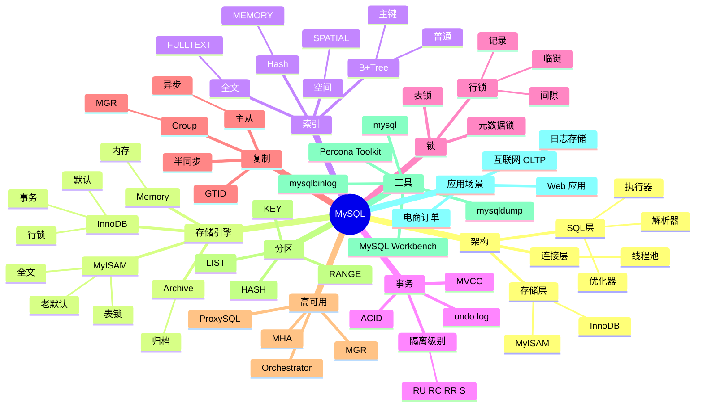

# MySQL

## 前言

**定位**：世界上最流行的开源关系数据库，1995 年由 Michael Widenius 在瑞典发布至今是 Web 互联网时代的事实标准，WordPress/Facebook/YouTube/淘宝早期都基于 MySQL，全球 Top 1000 网站 80%+ 使用 MySQL 系生态。

**核心价值**：
- 简单易用：学习曲线最平缓的 RDBMS
- 读性能极佳：InnoDB 引擎优化的简单查询
- 复制成熟：主从复制 + Group Replication
- 生态丰富：LAMP / LNMP 标配

**五大特性**：
1. **InnoDB 引擎**：自 5.5+ 默认引擎，ACID、行锁、MVCC
2. **复制**：异步/半同步/Group Replication 多模式
3. **优化器**：基于成本的优化器（CBO），索引友好
4. **存储引擎插件化**：InnoDB、MyISAM、Memory、CSV 等
5. **连接池友好**：PHP/传统 Web 应用的最爱

**对比表**：

| 维度 | MySQL | PostgreSQL | MariaDB | TiDB | OceanBase |
|---|---|---|---|---|---|
| 起源 | 瑞典 MySQL AB | UC Berkeley | MySQL 创始人 | PingCAP | 蚂蚁 |
| 性能 | 读优 | 复杂查询优 | 类似 MySQL | 水平扩展 | 极致扩展 |
| SQL 严格 | ⚠️ | ✅✅ | ⚠️ | ✅ | ✅✅ |
| 分布式 | ⚠️ | ⚠️ | ⚠️ | ✅ TiKV | ✅ 自研 |
| 复制 | 主从 + Group | 流复制 | Galera | Raft | Paxos |
| 适合 | Web OLTP | 复杂业务 | MySQL 替代 | 大规模 | 金融级 |

## 思维导图



## 关键代码

### 一、连接与配置

```bash
# 启动
mysqld_safe --user=mysql &
service mysql start
systemctl start mysqld

# 初始化
mysqld --initialize --user=mysql
# 临时密码在 error.log

# 客户端
mysql -h 127.0.0.1 -P 3306 -u root -p
mysql -u root -p mydb < schema.sql

# 配置 /etc/mysql/my.cnf
[mysqld]
user = mysql
port = 3306
datadir = /var/lib/mysql
socket = /var/run/mysqld/mysqld.sock
log_error = /var/log/mysql/error.log

# InnoDB 配置
innodb_buffer_pool_size = 4G
innodb_log_file_size = 1G
innodb_flush_log_at_trx_commit = 1
innodb_flush_method = O_DIRECT
```

### 二、SQL 基础

```sql
-- 数据库
CREATE DATABASE mydb DEFAULT CHARACTER SET utf8mb4 COLLATE utf8mb4_unicode_ci;
USE mydb;
DROP DATABASE mydb;

-- 用户
CREATE USER 'alice'@'%' IDENTIFIED BY 'secret';
GRANT ALL PRIVILEGES ON mydb.* TO 'alice'@'%';
FLUSH PRIVILEGES;
REVOKE ALL ON mydb.* FROM 'alice'@'%';
SHOW GRANTS FOR 'alice'@'%';

-- 表
CREATE TABLE users (
  id BIGINT UNSIGNED AUTO_INCREMENT PRIMARY KEY,
  email VARCHAR(255) NOT NULL,
  username VARCHAR(50) NOT NULL,
  status TINYINT DEFAULT 1,
  profile JSON,
  created_at DATETIME DEFAULT CURRENT_TIMESTAMP,
  updated_at DATETIME DEFAULT CURRENT_TIMESTAMP ON UPDATE CURRENT_TIMESTAMP,
  UNIQUE KEY uk_email (email),
  KEY idx_created (created_at)
) ENGINE=InnoDB DEFAULT CHARSET=utf8mb4;

-- 增删改查
INSERT INTO users (email, username) VALUES ('a@b.com', 'alice');
INSERT INTO users (email, username) VALUES
  ('b@c.com', 'bob'),
  ('c@d.com', 'charlie');

SELECT id, email FROM users WHERE status = 1 ORDER BY created_at DESC LIMIT 20;
UPDATE users SET profile = JSON_SET(profile, '$.theme', 'dark') WHERE id = 1;
DELETE FROM users WHERE status = 0 AND created_at < NOW() - INTERVAL 90 DAY;
```

### 三、JSON 支持（MySQL 5.7+）

```sql
-- JSON 列
CREATE TABLE events (
  id BIGINT UNSIGNED AUTO_INCREMENT PRIMARY KEY,
  type VARCHAR(50),
  data JSON,
  INDEX idx_type (type)
);

-- 插入
INSERT INTO events (type, data) VALUES
  ('click', JSON_OBJECT('button', 'login', 'page', '/home'));

-- 查询
SELECT * FROM events WHERE data->>'$.button' = 'login';
SELECT * FROM events WHERE JSON_EXTRACT(data, '$.page') = '/home';

-- JSON 函数
SELECT
  data->>'$.button' AS button,
  JSON_LENGTH(data) AS field_count
FROM events;

-- 更新
UPDATE events SET data = JSON_SET(data, '$.clicked', true) WHERE id = 1;
UPDATE events SET data = JSON_REMOVE(data, '$.debug') WHERE id = 1;
```

### 四、索引

```sql
-- 主键索引（聚簇）
ALTER TABLE users ADD PRIMARY KEY (id);

-- 唯一索引
CREATE UNIQUE INDEX uk_email ON users(email);

-- 普通索引
CREATE INDEX idx_created ON users(created_at);

-- 联合索引
CREATE INDEX idx_status_created ON users(status, created_at DESC);

-- 全文索引（5.6+ InnoDB）
CREATE FULLTEXT INDEX ft_content ON articles(title, body);
SELECT * FROM articles WHERE MATCH(title, body) AGAINST('MySQL performance' IN NATURAL LANGUAGE MODE);

-- 查看索引
SHOW INDEX FROM users;
EXPLAIN SELECT * FROM users WHERE email = 'a@b.com';
```

### 五、事务

```sql
-- 显式事务
START TRANSACTION;
  UPDATE accounts SET balance = balance - 100 WHERE id = 1;
  UPDATE accounts SET balance = balance + 100 WHERE id = 2;
COMMIT;

-- 回滚
START TRANSACTION;
  INSERT INTO logs (...) VALUES (...);
  -- 错误发生
ROLLBACK;

-- 保存点
START TRANSACTION;
  INSERT INTO t1 VALUES (1);
  SAVEPOINT sp1;
  INSERT INTO t1 VALUES (2);
  ROLLBACK TO sp1;
COMMIT;  -- 只提交 (1)

-- 隔离级别
SET SESSION TRANSACTION ISOLATION LEVEL READ COMMITTED;
SET GLOBAL TRANSACTION ISOLATION LEVEL REPEATABLE READ;
SELECT @@transaction_isolation;

-- 死锁检测
SHOW ENGINE INNODB STATUS;
SELECT * FROM information_schema.INNODB_TRX;
SELECT * FROM information_schema.INNODB_LOCKS;
SELECT * FROM information_schema.INNODB_LOCK_WAITS;
```

### 六、视图与存储过程

```sql
-- 视图
CREATE VIEW active_users AS
SELECT id, email, profile
FROM users
WHERE status = 1 AND deleted_at IS NULL;

-- 存储过程
DELIMITER //
CREATE PROCEDURE add_user(
  IN p_email VARCHAR(255),
  IN p_username VARCHAR(50),
  OUT p_id BIGINT
)
BEGIN
  INSERT INTO users (email, username) VALUES (p_email, p_username);
  SET p_id = LAST_INSERT_ID();
END //
DELIMITER ;

-- 调用
CALL add_user('a@b.com', 'alice', @id);
SELECT @id;

-- 触发器
DELIMITER //
CREATE TRIGGER users_after_update
AFTER UPDATE ON users
FOR EACH ROW
BEGIN
  INSERT INTO audit_logs (table_name, action, record_id, changed_at)
  VALUES ('users', 'update', NEW.id, NOW());
END //
DELIMITER ;
```

### 七、主从复制

```conf
# 主库 my.cnf
[mysqld]
server-id = 1
log_bin = mysql-bin
binlog_format = ROW
gtid_mode = ON
enforce_gtid_consistency = ON
```

```bash
# 主库创建复制用户
mysql -e "CREATE USER 'repl'@'%' IDENTIFIED WITH mysql_native_password BY 'secret';"
mysql -e "GRANT REPLICATION SLAVE ON *.* TO 'repl'@'%';"
mysql -e "FLUSH PRIVILEGES;"

# 主库备份
mysqldump --all-databases --master-data=2 -u root -p > full.sql
```

```conf
# 从库 my.cnf
[mysqld]
server-id = 2
read_only = ON
log_bin = mysql-bin
gtid_mode = ON
enforce_gtid_consistency = ON
relay_log = relay-bin
```

```bash
# 从库配置
mysql -e "
CHANGE MASTER TO
  MASTER_HOST='primary',
  MASTER_USER='repl',
  MASTER_PASSWORD='secret',
  MASTER_AUTO_POSITION=1;
START SLAVE;"

# 查看状态
mysql -e "SHOW SLAVE STATUS\G"
# Slave_IO_Running: Yes
# Slave_SQL_Running: Yes
# Seconds_Behind_Master: 0
```

### 八、Group Replication（MGR）

```sql
-- 集群内每台都配置
SET GLOBAL group_replication_group_name = "aaaaaaaa-aaaa-aaaa-aaaa-aaaaaaaaaaaa";
SET GLOBAL group_replication_start_on_boot = ON;
SET GLOBAL group_replication_local_address = "node1:33061";
SET GLOBAL group_replication_group_seeds = "node1:33061,node2:33061,node3:33061";

-- 引导节点启动集群
SET GLOBAL group_replication_bootstrap_group = ON;
START GROUP_REPLICATION;
SET GLOBAL group_replication_bootstrap_group = OFF;

-- 其他节点
START GROUP_REPLICATION;

-- 查看集群
SELECT * FROM performance_schema.replication_group_members;
```

### 九、性能调优

```sql
-- 慢查询
SET GLOBAL slow_query_log = 'ON';
SET GLOBAL long_query_time = 1;
SET GLOBAL slow_query_log_file = '/var/log/mysql/slow.log';

-- mysqldumpslow 分析
mysqldumpslow -s t /var/log/mysql/slow.log | head 20

-- EXPLAIN
EXPLAIN SELECT * FROM users WHERE email = 'a@b.com'\G
EXPLAIN ANALYZE SELECT ...   -- 8.0+

-- 关键指标
SHOW GLOBAL STATUS LIKE 'Threads_connected';
SHOW GLOBAL STATUS LIKE 'Slow_queries';
SHOW ENGINE INNODB STATUS\G

-- Index 统计
SELECT
  table_schema, table_name, index_name,
  cardinality
FROM information_schema.statistics
WHERE table_schema = 'mydb'
ORDER BY cardinality DESC;

-- 锁等待
SELECT * FROM performance_schema.data_locks;
SELECT * FROM performance_schema.data_lock_waits;

-- Buffer Pool
SHOW GLOBAL STATUS LIKE 'Innodb_buffer_pool_pages_%';
```

```ini
# 关键配置
[mysqld]
# 内存
innodb_buffer_pool_size = 4G        # 总内存的 60-70%
innodb_log_file_size = 1G
innodb_log_buffer_size = 64M
key_buffer_size = 256M               # MyISAM

# 线程
max_connections = 1000
thread_cache_size = 100
table_open_cache = 4000

# 查询
sort_buffer_size = 4M
join_buffer_size = 4M
read_buffer_size = 2M

# 二进制日志
sync_binlog = 1                      # 每次提交同步
expire_logs_days = 7

# 慢查询
slow_query_log = ON
long_query_time = 1
```

### 十、备份恢复

```bash
# 逻辑备份
mysqldump -u root -p mydb > mydb.sql
mysqldump -u root -p --all-databases > all.sql
mysqldump -u root -p --single-transaction --routines --triggers mydb > mydb.dump.sql

# 恢复
mysql -u root -p mydb < mydb.sql

# 二进制日志恢复
mysqlbinlog mysql-bin.000001 | mysql -u root -p

# 时间点恢复
mysqlbinlog --stop-datetime="2026-06-04 12:00:00" mysql-bin.000001 | mysql -u root -p

# 物理备份（Percona XtraBackup）
xtrabackup --backup --target-dir=/backup/full
xtrabackup --prepare --target-dir=/backup/full
xtrabackup --copy-back --target-dir=/backup/full

# mysqlpump（并行）
mysqlpump --parallel-schemas=4 mydb > mydb.sql
```

## 核心洞察

- **MySQL 的简单是核心优势**：PHP/Node 工程师的入门 RDBMS
- **MySQL 8.0 是真正的现代数据库**：窗口函数、CTE、JSON 增强追上 PG
- **MySQL 的 InnoDB 是 Oracle 收购后最大改进**：替代 MyISAM 成为默认
- **MySQL 的主从复制是互联网标配**：读写分离的基础
- **MySQL 的 MGR（Group Replication）借鉴 Galera**：但生态不如 MariaDB Galera
- **MySQL 的 InnoDB Cluster 是"傻瓜化"高可用**：Router + MGR + Shell
- **MySQL 的"开源"争议**：Oracle 收购后，社区分裂出 MariaDB
- **MySQL 在中国互联网极流行**：阿里去 IOE 前几乎都用 MySQL
- **MySQL 的"TiDB 替代"趋势**：MySQL 在大数据量下分库分表复杂，TiDB 透明水平扩展
- **MySQL 8.0 的 Hash Join 改进**：之前版本对大表 JOIN 性能差
- **MySQL 的 utf8mb4 是真 UTF-8**：默认的 utf8 是 3 字节（伪 UTF-8）
- **MySQL 的"超卖"问题在事务中要小心**：行锁间隙锁、唯一键冲突处理

## 跨项目引用

- **[[linux]]**：MySQL 跑在 Linux 上
- **[[docker]]**：MySQL 官方 Docker 镜像
- **[[kubernetes]]**：MySQL Operator 部署（Oracle/Presslabs）
- **[[postgresql]]**：PostgreSQL 是 MySQL 的最大竞品
- **[[redis]]**：Redis 是 MySQL 的缓存层
- **[[mariadb]]**：MariaDB 是 MySQL 的创始人分支
- **[[tidb]]**：TiDB 是 MySQL 兼容的分布式数据库
- **[[percona]]**：Percona Server / XtraBackup 是 MySQL 增强版
- **[[proxy]]**：MySQL Proxy / ProxySQL / MaxScale
- **[[mongodb]]**：MongoDB 是 MySQL 的 NoSQL 替代
- **[[phpmyadmin]]**：MySQL Web 管理工具
- **[[sequelize]]** / **[[prisma]]** / **[[typeorm]]**：Node.js ORM
