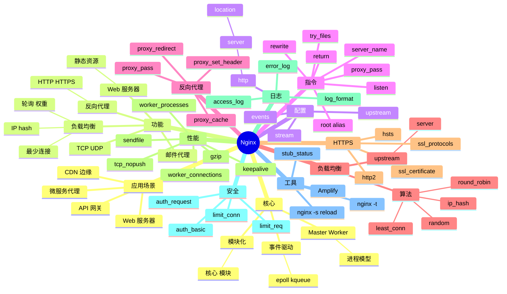

# Nginx

## 前言

**定位**：高性能 HTTP 服务器与反向代理，2004 年由 Igor Sysoev 发布至今是互联网流量的事实标准，Netcraft 数据全球 35%+ 活跃网站、80%+ 百万级网站使用 Nginx。

**核心价值**：
- 事件驱动架构：单进程可处理 10K+ 并发连接
- 反向代理 + 负载均衡：HTTP/HTTPS/TCP/UDP
- 静态资源服务器：极高效的文件服务
- 高度可配置：模块化、动态加载

**五大特性**：
1. **事件驱动**：epoll（Linux）/kqueue（BSD）异步 I/O
2. **Master/Worker 进程模型**：1 Master 管 N Worker
3. **模块化设计**：核心 + 100+ 官方/第三方模块
4. **配置灵活**：声明式 nginx.conf，支持热加载
5. **代理能力**：HTTP/HTTPS/TCP/UDP/gRPC 代理

**对比表**：

| 维度 | Nginx | Apache | Caddy | HAProxy | Envoy |
|---|---|---|---|---|---|
| 架构 | 事件驱动 | 进程/线程 | 事件驱动 | 事件驱动 | 事件驱动 |
| 静态性能 | ✅✅ | ⚠️ | ✅ | ⚠️ | ✅ |
| 反向代理 | ✅✅ | ⚠️ | ✅ | ✅✅ | ✅✅ |
| 配置 | 中 | 复杂 | 简单 | 中 | 中 |
| HTTPS | ✅ | ✅ | ✅ 自动 | ⚠️ TLS 终止 | ✅ |
| 适合 | 通用 | 老项目/PHP | 自动化 | LB 专家 | 服务网格 |

## 思维导图



## 关键代码

### 一、基础配置结构

```nginx
# /etc/nginx/nginx.conf
user www-data;
worker_processes auto;              # CPU 核数
worker_rlimit_nofile 65535;
error_log /var/log/nginx/error.log warn;
pid /var/run/nginx.pid;

events {
    worker_connections 4096;        # 单 worker 最大连接
    use epoll;                       # Linux
    multi_accept on;
}

http {
    include /etc/nginx/mime.types;
    default_type application/octet-stream;

    # 日志格式
    log_format main '$remote_addr - $remote_user [$time_local] '
                    '"$request" $status $body_bytes_sent '
                    '"$http_referer" "$http_user_agent"';
    access_log /var/log/nginx/access.log main;

    sendfile on;
    tcp_nopush on;
    tcp_nodelay on;
    keepalive_timeout 65;
    types_hash_max_size 2048;

    # gzip 压缩
    gzip on;
    gzip_vary on;
    gzip_min_length 1k;
    gzip_comp_level 6;
    gzip_types text/plain text/css application/json application/javascript;

    # 客户端限制
    client_max_body_size 20M;
    client_body_buffer_size 128k;

    # 虚拟主机
    include /etc/nginx/conf.d/*.conf;
    include /etc/nginx/sites-enabled/*;
}
```

### 二、静态网站

```nginx
server {
    listen 80;
    listen [::]:80;
    server_name example.com www.example.com;
    root /var/www/html;
    index index.html index.htm;

    # 静态资源缓存
    location ~* \.(jpg|jpeg|png|gif|ico|css|js|svg|woff2?)$ {
        expires 1y;
        add_header Cache-Control "public, immutable";
        access_log off;
    }

    # gzip 预压缩
    location ~* \.(js|css|html|svg)$ {
        gzip_static on;
        add_header Vary Accept-Encoding;
    }

    # SPA 路由
    location / {
        try_files $uri $uri/ /index.html;
    }

    # 隐藏文件
    location ~ /\. {
        deny all;
    }
}
```

### 三、反向代理

```nginx
# 简单代理
server {
    listen 80;
    server_name api.example.com;

    location / {
        proxy_pass http://127.0.0.1:3000;
        proxy_http_version 1.1;
        proxy_set_header Host $host;
        proxy_set_header X-Real-IP $remote_addr;
        proxy_set_header X-Forwarded-For $proxy_add_x_forwarded_for;
        proxy_set_header X-Forwarded-Proto $scheme;
    }
}
```

```nginx
# WebSocket 代理
map $http_upgrade $connection_upgrade {
    default upgrade;
    ''      close;
}

server {
    listen 80;
    server_name ws.example.com;

    location / {
        proxy_pass http://127.0.0.1:8080;
        proxy_http_version 1.1;
        proxy_set_header Upgrade $http_upgrade;
        proxy_set_header Connection $connection_upgrade;
        proxy_set_header Host $host;
        proxy_read_timeout 300s;     # 长连接
    }
}
```

```nginx
# gRPC 代理
server {
    listen 80 http2;

    location / {
        grpc_pass grpc://127.0.0.1:50051;
    }
}
```

### 四、负载均衡

```nginx
# 加权轮询
upstream backend {
    server 10.0.0.1:8080 weight=3;
    server 10.0.0.2:8080 weight=2;
    server 10.0.0.3:8080 weight=1;
}

# 最少连接
upstream backend {
    least_conn;
    server 10.0.0.1:8080;
    server 10.0.0.2:8080;
    server 10.0.0.3:8080;
}

# IP hash（会话保持）
upstream backend {
    ip_hash;
    server 10.0.0.1:8080;
    server 10.0.0.2:8080;
}

# 健康检查（需要 nginx-plus 或 Tengine）
upstream backend {
    server 10.0.0.1:8080 max_fails=3 fail_timeout=30s;
    server 10.0.0.2:8080 max_fails=3 fail_timeout=30s;
    server 10.0.0.3:8080 backup;       # 备用
}

server {
    listen 80;
    server_name example.com;

    location / {
        proxy_pass http://backend;
        proxy_set_header Host $host;
        proxy_set_header X-Forwarded-For $remote_addr;
    }
}
```

### 五、HTTPS

```nginx
# HTTP 重定向到 HTTPS
server {
    listen 80;
    server_name example.com;
    return 301 https://$server_name$request_uri;
}

server {
    listen 443 ssl http2;
    server_name example.com;

    ssl_certificate /etc/ssl/certs/example.com.crt;
    ssl_certificate_key /etc/ssl/private/example.com.key;

    ssl_protocols TLSv1.2 TLSv1.3;
    ssl_ciphers HIGH:!aNULL:!MD5;
    ssl_prefer_server_ciphers on;

    ssl_session_cache shared:SSL:10m;
    ssl_session_timeout 1d;
    ssl_session_tickets off;

    # HSTS
    add_header Strict-Transport-Security "max-age=63072000" always;
    add_header X-Frame-Options DENY;
    add_header X-Content-Type-Options nosniff;

    root /var/www/html;
    index index.html;
}
```

```bash
# Let's Encrypt 自动证书
sudo apt install certbot python3-certbot-nginx
sudo certbot --nginx -d example.com -d www.example.com
# 自动续期
sudo certbot renew --dry-run
```

### 六、缓存与限流

```nginx
# 代理缓存
proxy_cache_path /var/cache/nginx levels=1:2 keys_zone=my_cache:10m
                 max_size=10g inactive=60m use_temp_path=off;

server {
    location / {
        proxy_pass http://backend;
        proxy_cache my_cache;
        proxy_cache_valid 200 60m;
        proxy_cache_valid 404 10m;
        proxy_cache_key "$scheme$request_method$host$request_uri";
        add_header X-Cache-Status $upstream_cache_status;
    }
}
```

```nginx
# 限速（请求速率）
limit_req_zone $binary_remote_addr zone=api_limit:10m rate=10r/s;

server {
    location /api/ {
        limit_req zone=api_limit burst=20 nodelay;
        proxy_pass http://backend;
    }
}

# 限速（连接数）
limit_conn_zone $binary_remote_addr zone=conn_limit:10m;

server {
    limit_conn conn_limit 10;
}
```

### 七、URL 重写

```nginx
server {
    # 老路径永久重定向
    location /old-path {
        return 301 /new-path;
    }

    # 整站 HTTPS + 移除 www
    server_name www.example.com;
    return 301 https://example.com$request_uri;

    # 动态重写
    location /article/(\d+)\.html$ {
        rewrite ^/article/(\d+)\.html$ /post?id=$1 last;
    }

    # 条件重写
    if ($http_user_agent ~* "MSIE") {
        return 403;                   # 拒绝 IE
    }
}
```

### 八、安全防护

```nginx
# 基础限流
limit_req_zone $binary_remote_addr zone=flood:10m rate=5r/s;

server {
    # 隐藏版本号
    server_tokens off;

    # 防 SQL 注入 / 路径穿越
    location ~* (union|select|insert|delete|update|drop|\.\.) {
        return 403;
    }

    # Basic 认证
    location /admin/ {
        auth_basic "Admin Area";
        auth_basic_user_file /etc/nginx/.htpasswd;
    }

    # 速率限制
    location /login {
        limit_req zone=flood burst=5 nodelay;
    }

    # IP 黑名单
    location / {
        deny 192.168.1.100;
        deny 10.0.0.0/8;
        allow all;
        proxy_pass http://backend;
    }
}
```

### 九、TCP/UDP 代理（stream）

```nginx
stream {
    # MySQL 负载均衡
    upstream mysql_cluster {
        server 10.0.0.1:3306;
        server 10.0.0.2:3306;
    }

    server {
        listen 3306;
        proxy_pass mysql_cluster;
        proxy_timeout 60s;
    }

    # DNS UDP 代理
    upstream dns_servers {
        server 8.8.8.8:53;
        server 1.1.1.1:53;
    }

    server {
        listen 53 udp;
        proxy_pass dns_servers;
    }
}
```

### 十、运维命令

```bash
# 配置检查
sudo nginx -t
sudo nginx -T                    # 打印完整配置

# 重载（无中断）
sudo nginx -s reload
sudo systemctl reload nginx

# 停止
sudo nginx -s stop
sudo nginx -s quit               # 优雅退出

# 查看进程
ps aux | grep nginx

# 状态页
curl http://localhost/nginx_status
```

```nginx
# 启用 stub_status
location /nginx_status {
    stub_status on;
    access_log off;
    allow 127.0.0.1;
    deny all;
}
```

## 核心洞察

- **Nginx 的事件驱动是关键**：相比 Apache 的"一连接一进程"模型，并发高 10x
- **Nginx 的"反向代理"是核心价值**：L7 路由、负载均衡、TLS 终止
- **Nginx 的 Master/Worker 架构**：Master 管配置/Worker 处理请求，互不阻塞
- **Nginx 的配置继承很强大**：http → server → location 三级继承
- **Nginx 的 try_files 解决 SPA 路由**：前端 history mode 的关键
- **Nginx 的 HTTPS 配置在 2018 后大幅简化**：Let's Encrypt + certbot 自动续期
- **Nginx 的 Stream 模块扩展了 TCP/UDP 代理**：从纯 HTTP 扩展为通用 L4 代理
- **Nginx 的限流能力是企业级必备**：limit_req + limit_conn 双重保护
- **Nginx 与 Apache 的战争早已分胜负**：Nginx 是新项目首选
- **Nginx 的 OpenResty 是中国生态**：章亦春（agentzh）的 Lua 模块让 Nginx 脚本化
- **Nginx Plus 是商业版**：增加主动健康检查、动态配置、JWT 认证
- **Nginx 在 K8s 中是 Ingress 主流**：Ingress-Nginx Controller 是 K8s 默认选择

## 跨项目引用

- **[[linux]]**：Nginx 跑在 Linux 上，epoll 是关键
- **[[docker]]**：Nginx 官方 Docker 镜像极流行
- **[[kubernetes]]**：Nginx Ingress Controller 是 K8s 默认
- **[[node.js]]** / **[[python]]** / **[[go]]**：Nginx 代理这些后端
- **[[websocket]]**：Nginx 原生支持 WebSocket 代理
- **[[grpc]]**：Nginx 1.13+ 支持 gRPC 代理
- **[[haproxy]]**：HAProxy 是另一个 LB 工具，功能重叠
- **[[envoy]]**：Envoy 是新一代服务网格代理
- **[[apache]]**：Apache 是 Nginx 的前辈
- **[[caddy]]**：Caddy 是自动 HTTPS 的现代替代
- **[[openresty]]**：OpenResty = Nginx + Lua，是 Nginx 的中国分支
- **[[certbot]]**：Let's Encrypt 客户端
