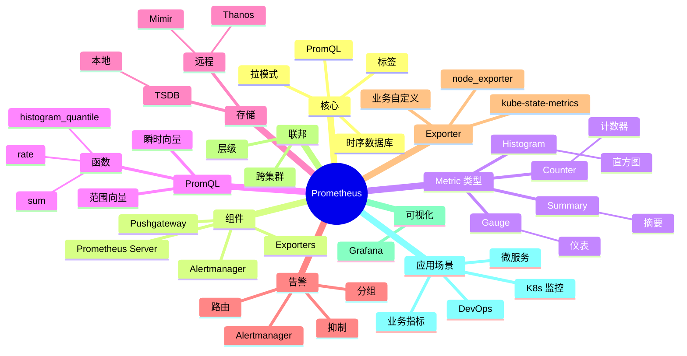

# Prometheus

## 前言

**定位**：开源监控和时序数据库，2012 年由 SoundCloud 开源至今是云原生监控的事实标准，与 Kubernetes 同期诞生并深度集成，CNCF 毕业项目，全球 70%+ 容器化应用使用 Prometheus。

**核心价值**：
- 时序数据库：标签化存储，亿级 metric
- 拉模式（Pull）：主动抓取，简单可靠
- PromQL：强大的查询语言
- 告警：Alertmanager 集成

**五大特性**：
1. **时序存储**：每个 metric 是一组带时间戳的值
2. **标签（Label）**：多维度标识 metric
3. **PromQL**：函数式查询语言
4. **拉模式**：HTTP 主动抓取，exporter 模式
5. **告警**：Alertmanager 去重/分组/路由

**对比表**：

| 维度 | Prometheus | InfluxDB | Datadog | Grafana Mimir | OpenTSDB |
|---|---|---|---|---|---|
| 架构 | 单机/联邦 | 集群 | SaaS | 集群 | HBase |
| 拉/推 | 拉 | 推 | 推 | 拉 | 推 |
| 查询 | PromQL | Flux/InfluxQL | 自定义 | PromQL | 自定义 |
| 生态 | ✅ K8s 标准 | ⚠️ | ✅ 商业 | ✅ | ⚠️ |
| 适合 | 容器/微服务 | IoT/通用 | 企业级 | 大规模 | 长期存储 |

## 思维导图



## 关键代码

### 一、安装与配置

```bash
# Docker 启动
docker run -d \
  --name prometheus \
  -p 9090:9090 \
  -v /etc/prometheus/prometheus.yml:/etc/prometheus/prometheus.yml \
  -v prometheus-data:/prometheus \
  prom/prometheus:latest
```

```yaml
# prometheus.yml
global:
  scrape_interval: 15s
  evaluation_interval: 15s
  external_labels:
    cluster: production
    region: us-east

# 告警配置
rule_files:
  - "alerts/*.yml"

# Alertmanager
alerting:
  alertmanagers:
    - static_configs:
        - targets: ['alertmanager:9093']

# 抓取配置
scrape_configs:
  # Prometheus 自己
  - job_name: 'prometheus'
    static_configs:
      - targets: ['localhost:9090']

  # Node Exporter
  - job_name: 'node'
    static_configs:
      - targets: ['node-exporter:9100']

  # K8s 服务发现
  - job_name: 'kubernetes-pods'
    kubernetes_sd_configs:
      - role: pod
    relabel_configs:
      - source_labels: [__meta_kubernetes_pod_annotation_prometheus_io_scrape]
        action: keep
        regex: true
      - source_labels: [__meta_kubernetes_pod_annotation_prometheus_io_port]
        action: replace
        target_label: __address__
        regex: (.+)

  # K8s API Server
  - job_name: 'kubernetes-apiservers'
    kubernetes_sd_configs:
      - role: endpoints
    scheme: https
    tls_config:
      ca_file: /var/run/secrets/kubernetes.io/serviceaccount/ca.crt
    bearer_token_file: /var/run/secrets/kubernetes.io/serviceaccount/token
```

### 二、Metric 类型

```python
# Python 客户端 prometheus_client
from prometheus_client import Counter, Gauge, Histogram, Summary, start_http_server

# Counter：单调递增
requests_total = Counter(
    'http_requests_total',
    'Total HTTP requests',
    ['method', 'endpoint', 'status']
)

# Gauge：可增可减
cpu_usage = Gauge('cpu_usage_percent', 'CPU usage percent')
active_connections = Gauge('active_connections', 'Active connections')

# Histogram：分桶统计延迟
request_duration = Histogram(
    'http_request_duration_seconds',
    'Request duration',
    ['method', 'endpoint'],
    buckets=[0.005, 0.01, 0.025, 0.05, 0.1, 0.25, 0.5, 1, 2.5, 5, 10]
)

# Summary：客户端分位数（比 Histogram 准但贵）
request_latency = Summary(
    'http_request_latency_seconds',
    'Request latency',
    ['endpoint']
)

# 启动 HTTP 端点
start_http_server(8000)
```

```javascript
// Node.js prom-client
const client = require('prom-client')

const register = new client.Registry()
client.collectDefaultMetrics({ register })

const httpRequestsTotal = new client.Counter({
  name: 'http_requests_total',
  help: 'Total HTTP requests',
  labelNames: ['method', 'endpoint', 'status'],
  registers: [register]
})

const httpRequestDuration = new client.Histogram({
  name: 'http_request_duration_seconds',
  help: 'Request duration',
  labelNames: ['method', 'endpoint'],
  buckets: [0.005, 0.01, 0.025, 0.05, 0.1, 0.25, 0.5, 1, 2.5, 5, 10],
  registers: [register]
})

// Express 中间件
app.use((req, res, next) => {
  const end = httpRequestDuration.startTimer({ method: req.method, endpoint: req.path })
  res.on('finish', () => {
    end()
    httpRequestsTotal.inc({ method: req.method, endpoint: req.path, status: res.statusCode })
  })
  next()
})

// 暴露 /metrics
app.get('/metrics', async (req, res) => {
  res.set('Content-Type', register.contentType)
  res.end(await register.metrics())
})
```

### 三、PromQL 查询

```promql
# 1. 即时查询
up                                                  # 所有 target 状态
node_cpu_usage_percent                              # CPU 使用率
http_requests_total                                 # 总请求数

# 2. 标签过滤
http_requests_total{status="200"}                   # 状态 200
http_requests_total{method="POST", endpoint="/api"} # POST /api
http_requests_total{status!~"5.."}                 # 排除 5xx

# 3. 函数
rate(http_requests_total[5m])                       # 5 分钟平均速率
sum(http_requests_total)                            # 求和
sum by (endpoint) (http_requests_total)             # 按 endpoint 分组
sum without (status) (http_requests_total)          # 去掉 status 标签

# 4. Histogram
histogram_quantile(0.95,                            # P95
  sum by (le, endpoint) (
    rate(http_request_duration_seconds_bucket[5m])
  )
)

# 5. 聚合
topk(3, http_requests_total)                        # Top 3
avg(node_cpu_usage_percent) by (instance)           # 按实例平均
count(up == 1)                                      # 在线实例数

# 6. 时间窗口
increase(http_requests_total[1h])                   # 1 小时增量
predict_linear(node_filesystem_free_bytes{mountpoint="/"}[6h], 3600)  # 预测
```

### 四、告警规则

```yaml
# alerts/node.yml
groups:
  - name: node_alerts
    rules:
      - alert: HighCpuUsage
        expr: 100 - (avg by(instance) (rate(node_cpu_seconds_total{mode="idle"}[5m])) * 100) > 80
        for: 5m
        labels:
          severity: warning
          team: platform
        annotations:
          summary: "High CPU on {{ $labels.instance }}"
          description: "{{ $labels.instance }} CPU > 80% for 5 minutes"

      - alert: DiskWillFillIn4Hours
        expr: |
          predict_linear(node_filesystem_free_bytes{mountpoint="/"}[6h], 4*3600) < 0
        for: 10m
        labels:
          severity: critical
        annotations:
          summary: "Disk will fill in 4 hours on {{ $labels.instance }}"

      - alert: InstanceDown
        expr: up == 0
        for: 2m
        labels:
          severity: critical

      - alert: HighErrorRate
        expr: |
          sum(rate(http_requests_total{status=~"5.."}[5m])) /
          sum(rate(http_requests_total[5m])) > 0.05
        for: 5m
        labels:
          severity: warning
```

### 五、Alertmanager

```yaml
# alertmanager.yml
global:
  resolve_timeout: 5m
  smtp_smarthost: 'smtp.example.com:587'
  smtp_from: 'alertmanager@example.com'
  smtp_auth_username: 'alerts'
  smtp_auth_password: 'secret'

route:
  receiver: 'default'
  group_by: ['alertname', 'cluster']
  group_wait: 30s
  group_interval: 5m
  repeat_interval: 4h
  routes:
    - match:
        severity: critical
      receiver: 'pagerduty'
      continue: true
    - match:
        team: platform
      receiver: 'platform-slack'

receivers:
  - name: 'default'
    slack_configs:
      - api_url: 'https://hooks.slack.com/services/XXX'
        channel: '#alerts'
        title: '{{ .CommonAnnotations.summary }}'
        text: '{{ .CommonAnnotations.description }}'

  - name: 'pagerduty'
    pagerduty_configs:
      - service_key: '<integration-key>'

  - name: 'platform-slack'
    slack_configs:
      - api_url: 'https://hooks.slack.com/services/YYY'
        channel: '#platform-alerts'

inhibit_rules:
  - source_match:
      severity: 'critical'
    target_match:
      severity: 'warning'
    equal: ['alertname', 'instance']
```

### 六、Pushgateway

```bash
# 启动
docker run -d -p 9091:9091 prom/pushgateway
```

```python
# 短任务主动推
from prometheus_client import CollectorRegistry, Counter, push_to_gateway

registry = CollectorRegistry()
batch_jobs = Counter('batch_jobs_total', 'Batch jobs', ['status'], registry=registry)
batch_jobs.labels(status='success').inc()

push_to_gateway('localhost:9091', job='batch_processor', registry=registry)
```

```bash
# 短任务场景：
# - 批处理任务
# - 一次性任务
# - 节点本身没有 exporter

# 注意：Pushgateway 不适合长任务，建议用 PushProx
```

### 七、K8s 监控栈

```bash
# 使用 kube-prometheus-stack
helm repo add prometheus-community https://prometheus-community.github.io/helm-charts
helm install kube-prometheus-stack prometheus-community/kube-prometheus-stack
```

```yaml
# 自动发现 Pod annotations
# 在 Pod metadata 添加：
metadata:
  annotations:
    prometheus.io/scrape: "true"
    prometheus.io/port: "8080"
    prometheus.io/path: "/metrics"
```

### 八、Go 应用集成

```go
package main

import (
    "github.com/prometheus/client_golang/prometheus"
    "github.com/prometheus/client_golang/prometheus/promhttp"
    "net/http"
)

var (
    httpRequestsTotal = prometheus.NewCounterVec(
        prometheus.CounterOpts{
            Name: "http_requests_total",
            Help: "Total HTTP requests",
        },
        []string{"method", "endpoint", "status"},
    )

    httpRequestDuration = prometheus.NewHistogramVec(
        prometheus.HistogramOpts{
            Name:    "http_request_duration_seconds",
            Help:    "Request duration",
            Buckets: prometheus.DefBuckets,
        },
        []string{"method", "endpoint"},
    )
)

func main() {
    prometheus.MustRegister(httpRequestsTotal, httpRequestDuration)
    http.Handle("/metrics", promhttp.Handler())
    http.ListenAndServe(":8080", nil)
}
```

### 九、Thanos 长期存储

```yaml
# 解决 Prometheus 单机存储问题
# 架构：Prometheus + Sidecar + Store + Querier

# sidecar 暴露对象存储
thanos sidecar --tsdb.path /prometheus --objstore.config-file bucket.yaml

# 跨 Prometheus 联邦查询
thanos query --store <store-addr>

# 数据压缩
thanos compact --data-dir /compact --objstore.config-file bucket.yaml
```

```yaml
# bucket.yaml
type: S3
config:
  bucket: thanos-metrics
  endpoint: s3.amazonaws.com
  access_key: <key>
  secret_key: <secret>
```

## 核心洞察

- **Prometheus 的"拉模式"是设计哲学**：vs 推模式的复杂性
- **Prometheus 的"标签"是核心抽象**：多维数据模型
- **Prometheus 的"Counter/Gauge/Histogram/Summary"四件套**：覆盖所有 metric 场景
- **Prometheus 的"PromQL"是函数式查询**：可组合、强大
- **Prometheus 与 K8s 同期诞生**：是云原生监控的标准
- **Prometheus 的"单点故障"是设计取舍**：联邦 + 远程存储解决
- **Prometheus 的"本地存储"是 TSDB**：压缩比 1:10，每 2h 压缩
- **Prometheus 的"exporter 生态"是护城河**：node_exporter / blackbox_exporter / 数百 exporter
- **Prometheus 的"告警与监控分离"是亮点**：Alertmanager 单独处理
- **Prometheus 的"高基数"是问题**：标签过多会导致存储爆炸
- **Prometheus 在云原生之外受限**：传统 IT 监控用 Zabbix 更合适
- **Prometheus 的"远程写入"接口普及**：兼容 OpenTelemetry

## 跨项目引用

- **[[linux]]**：Prometheus 跑在 Linux 上
- **[[docker]]**：Prometheus 官方 Docker 镜像
- **[[kubernetes]]**：K8s 监控事实标准
- **[[grafana]]**：Grafana 是 Prometheus 的可视化
- **[[alertmanager]]**：Alertmanager 是告警引擎
- **[[node_exporter]]**：Linux 服务器监控
- **[[cadvisor]]**：容器资源监控
- **[[kube-state-metrics]]**：K8s 资源对象状态
- **[[thanos]]** / **[[mimir]]**：Prometheus 长期存储
- **[[opentelemetry]]**：OpenTelemetry 是新一代遥测
- **[[loki]]**：Loki 是日志聚合（与 Prom 配套）
- **[[tempo]]**：Tempo 是分布式追踪（与 Prom 配套）
