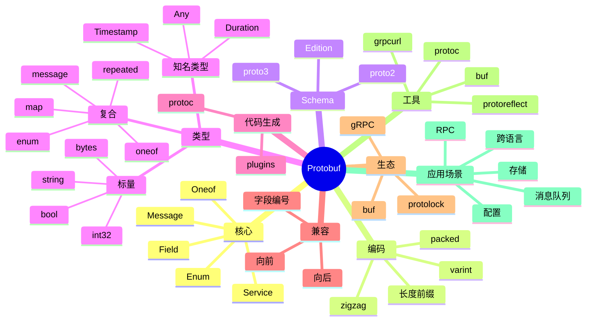

# Protocol Buffers

## 前言

**定位**：Google 开源的结构化数据序列化框架，2008 年开源至今是 RPC/微服务/存储的事实序列化标准，gRPC 默认序列化方案，比 JSON 小 3-10x、快 20-100x，是 Schema 优先设计的代表。

**核心价值**：
- 紧凑：二进制编码，体积小
- 高效：编码/解码极快
- Schema 优先：.proto 文件即契约
- 跨语言：10+ 官方语言支持

**五大特性**：
1. **二进制编码**：varint/zigzag 紧凑编码
2. **Schema 优先**：.proto 定义强类型
3. **代码生成**：protoc 自动生成
4. **向后兼容**：字段编号 + optional
5. **跨语言**：C++/Java/Go/Python/JS 等

**对比表**：

| 维度 | Protobuf | JSON | XML | Thrift | Avro | MessagePack |
|---|---|---|---|---|---|---|
| 体积 | 极小 | 大 | 大 | 小 | 小 | 小 |
| 速度 | 极快 | 中 | 慢 | 快 | 快 | 快 |
| Schema | ✅ | ❌ | DTD/XSD | ✅ | ✅ | ❌ |
| 可读性 | ❌ | ✅ | ✅ | ❌ | ❌ | ❌ |
| 适合 | 内部 RPC | 公共 API | 文档 | RPC | 大数据 | 通用 |

## 思维导图



## 关键代码

### 一、基础语法

```protobuf
// person.proto
syntax = "proto3";

package example.v1;

option go_package = "github.com/myorg/myapp/proto/example";
option java_package = "com.myorg.example.v1";
option java_multiple_files = true;
option csharp_namespace = "MyOrg.Example.V1";

// 导入
import "google/protobuf/timestamp.proto";
import "google/protobuf/any.proto";

// 枚举
enum Gender {
  GENDER_UNSPECIFIED = 0;       // 必须 0 表示未指定
  GENDER_MALE = 1;
  GENDER_FEMALE = 2;
  GENDER_OTHER = 3;
}

// 消息
message Person {
  // 标量
  int64 id = 1;
  string name = 2;
  string email = 3;
  bool active = 4;
  bytes avatar = 5;

  // 枚举
  Gender gender = 6;

  // repeated（数组）
  repeated string tags = 7;
  repeated PhoneNumber phones = 8;

  // map
  map<string, string> attributes = 9;

  // 嵌套消息
  Address home_address = 10;

  // oneof（联合类型）
  oneof contact_method {
    string email_addr = 11;
    string phone_number = 12;
    string telegram_id = 13;
  }

  // 知名类型
  google.protobuf.Timestamp created_at = 14;
  google.protobuf.Timestamp updated_at = 15;

  // Any 类型
  google.protobuf.Any metadata = 16;

  // 保留字段
  reserved 100, 101;
  reserved "old_field", "deprecated_field";
}

message Address {
  string street = 1;
  string city = 2;
  string country = 3;
  string postal_code = 4;
}

message PhoneNumber {
  string number = 1;
  PhoneType type = 2;
}

enum PhoneType {
  PHONE_TYPE_UNSPECIFIED = 0;
  PHONE_TYPE_MOBILE = 1;
  PHONE_TYPE_HOME = 2;
  PHONE_TYPE_WORK = 3;
}
```

### 二、Service 定义

```protobuf
import "google/protobuf/empty.proto";

service PersonService {
  rpc GetPerson(GetPersonRequest) returns (Person);
  rpc ListPersons(ListPersonsRequest) returns (ListPersonsResponse);
  rpc CreatePerson(CreatePersonRequest) returns (Person);
  rpc UpdatePerson(UpdatePersonRequest) returns (Person);
  rpc DeletePerson(DeletePersonRequest) returns (google.protobuf.Empty);

  // Server Stream
  rpc WatchPerson(WatchPersonRequest) returns (stream Person);

  // Client Stream
  rpc BatchCreate(stream CreatePersonRequest) returns (BatchResponse);

  // Bidi
  rpc Sync(stream Person) returns (stream Person);
}

message GetPersonRequest {
  int64 id = 1;
}

message ListPersonsRequest {
  int32 page_size = 1;
  string page_token = 2;
  string filter = 3;
}

message ListPersonsResponse {
  repeated Person persons = 1;
  string next_page_token = 2;
}

message CreatePersonRequest {
  Person person = 1;
}

message UpdatePersonRequest {
  Person person = 1;
  google.protobuf.FieldMask update_mask = 2;
}

message DeletePersonRequest {
  int64 id = 1;
}

message WatchPersonRequest {
  int64 id = 1;
}

message BatchResponse {
  int32 success_count = 1;
  int32 failed_count = 2;
  repeated string errors = 3;
}
```

### 三、protoc 代码生成

```bash
# 安装 protoc
# macOS
brew install protobuf

# Ubuntu
sudo apt install -y protobuf-compiler

# 验证
protoc --version

# 安装 Go 插件
go install google.golang.org/protobuf/cmd/protoc-gen-go@latest
go install google.golang.org/grpc/cmd/protoc-gen-go-grpc@latest

# 安装 Node 插件
npm install -g grpc-tools

# 安装 Python
pip install grpcio-tools
```

```bash
# 生成 Go 代码
protoc \
  --go_out=. \
  --go_opt=paths=source_relative \
  --go-grpc_out=. \
  --go-grpc_opt=paths=source_relative \
  person.proto

# 生成 Java
protoc \
  --java_out=. \
  person.proto

# 生成 Python
python -m grpc_tools.protoc \
  --python_out=. \
  --grpc_python_out=. \
  person.proto

# 生成 Node.js
grpc_tools_node_protoc \
  --js_out=import_style=commonjs,binary:. \
  --grpc_out=grpc_js:. \
  person.proto
```

```bash
# buf（更现代的 Protobuf 工具）
brew install bufbuild/buf/buf

# buf.gen.yaml
# version: v1
# plugins:
#   - plugin: go
#     out: gen/go
#     opt: paths=source_relative
#   - plugin: grpc-go
#     out: gen/go
#     opt: paths=source_relative

# 使用
buf generate
buf lint
buf breaking --against '.git#branch=main'
```

### 四、Go 使用

```go
// 创建并序列化
import (
    "google.golang.org/protobuf/proto"
    pb "github.com/myorg/myapp/proto/example"
)

person := &pb.Person{
    Id:    1,
    Name:  "Alice",
    Email: "alice@example.com",
    Active: true,
    Gender: pb.Gender_GENDER_MALE,
    Tags:  []string{"admin", "user"},
    Phones: []*pb.PhoneNumber{
        {Number: "123-4567", Type: pb.PhoneType_PHONE_TYPE_MOBILE},
    },
    HomeAddress: &pb.Address{
        Street:     "123 Main St",
        City:       "Beijing",
        Country:    "CN",
        PostalCode: "100000",
    },
    CreatedAt: timestamppb.New(time.Now()),
}

// 序列化
data, err := proto.Marshal(person)

// 反序列化
var p pb.Person
err = proto.Unmarshal(data, &p)

// JSON 互转
jsonData, _ := protojson.Marshal(person)
var p2 pb.Person
protojson.Unmarshal(jsonData, &p2)

// 文本格式
textData, _ := prototext.Marshal(person)
```

### 五、Python 使用

```python
import person_pb2

person = person_pb2.Person()
person.id = 1
person.name = "Alice"
person.email = "alice@example.com"
person.gender = person_pb2.GENDER_MALE
person.tags.append("admin")
person.tags.append("user")

phone = person.phones.add()
phone.number = "123-4567"
phone.type = person_pb2.PhoneType.Value("PHONE_TYPE_MOBILE")

# 序列化
data = person.SerializeToString()
with open('person.bin', 'wb') as f:
    f.write(data)

# 反序列化
person2 = person_pb2.Person()
person2.ParseFromString(data)

# JSON
from google.protobuf import json_format
json_str = json_format.MessageToJson(person)
person3 = json_format.Parse(json_str, person_pb2.Person())

# 文本格式
text = str(person)

# Any 类型
from google.protobuf import any_pb2
any = any_pb2.Any()
any.Pack(person)
```

### 六、Java 使用

```java
import com.myorg.example.v1.Person;
import com.myorg.example.v1.Gender;

Person person = Person.newBuilder()
    .setId(1L)
    .setName("Alice")
    .setEmail("alice@example.com")
    .setActive(true)
    .setGender(Gender.GENDER_MALE)
    .addTags("admin")
    .addTags("user")
    .build();

// 序列化
byte[] data = person.toByteArray();

// 反序列化
Person person2 = Person.parseFrom(data);

// JSON
String json = JsonFormat.printer().print(person);
Person.Builder builder = Person.newBuilder();
JsonFormat.parser().merge(json, builder);

// 文本格式
String text = TextFormat.printer().print(person);
```

### 七、Schema 演进

```protobuf
// 演进原则：
// 1. 不要修改现有字段的编号
// 2. 不要修改现有字段的类型
// 3. 删除字段时保留编号
// 4. 新增字段用新编号
// 5. 用 reserved 防止未来冲突
```

```protobuf
// V1
message User {
  int64 id = 1;
  string name = 2;
  string email = 3;
}

// V2（演进）
message User {
  int64 id = 1;
  string name = 2;
  string email = 3;

  // 新增字段
  string phone = 4;
  optional string avatar_url = 5;     // proto3 optional

  // 删除字段（保留编号）
  reserved 6, 7;
  reserved "old_field", "deprecated_field";
}

// V3（重命名字段）
message User {
  int64 id = 1;

  // 重命名时保持编号一致
  string full_name = 2;              // 原本是 name
  string email = 3;

  // 字段名变了但编号没变
  // 旧数据"姓名=Alice"会变成"full_name=Alice"
  // 旧客户端读旧字段会丢失
}
```

```protobuf
// oneof 演进
message Event {
  oneof event_type {
    CreatedEvent created = 1;
    UpdatedEvent updated = 2;
    // 新增分支
    DeletedEvent deleted = 3;
  }
}
```

### 八、FieldMask 字段掩码

```protobuf
import "google/protobuf/field_mask.proto";

message UpdateUserRequest {
  User user = 1;
  google.protobuf.FieldMask update_mask = 2;
}
```

```go
// Go
mask, _ := fieldmaskpb.New(
    &pb.User{},
    "name", "email",     // 只更新 name 和 email
)

req := &pb.UpdateUserRequest{
    User:       &pb.User{Id: 1, Name: "Alice", Email: "new@example.com", Phone: "123"},
    UpdateMask: mask,
}
// 实际只更新 name 和 email
```

```python
# Python
from google.protobuf import field_mask_pb2
mask = field_mask_pb2.FieldMask(paths=["name", "email"])
```

### 九、Well-Known Types

```protobuf
import "google/protobuf/timestamp.proto";
import "google/protobuf/duration.proto";
import "google/protobuf/empty.proto";
import "google/protobuf/any.proto";
import "google/protobuf/struct.proto";

message Order {
  // 时间戳
  google.protobuf.Timestamp created_at = 1;

  // 持续时间
  google.protobuf.Duration ttl = 2;

  // 空消息
  // google.protobuf.Empty 用于无返回

  // Any 类型（异构数据）
  google.protobuf.Any payload = 3;

  // 动态结构（类似 JSON）
  google.protobuf.Struct metadata = 4;

  // 列表
  google.protobuf.ListValue items = 5;
}
```

```go
// Timestamp
now := timestamppb.New(time.Now())
ts := timestamppb.Now()

// 转换
t := ts.AsTime()
ts2 := timestamppb.New(t)

// Duration
d := durationpb.New(5 * time.Second)
fmt.Println(d.AsDuration())

// Any
import "google.golang.org/protobuf/types/known/anypb"

anyMsg, _ := anypb.New(person)
fmt.Println(anyMsg.GetTypeUrl())  // type.googleapis.com/...
```

### 十、高级特性

```protobuf
// 选项 (Options)
message SearchRequest {
  option deprecated = true;          // 整个消息标记为废弃
  string query = 1 [deprecated = true];
  int32 page = 2;

  // 字段选项
  string email = 3 [
    json_name = "email_address"      // JSON 序列化用 email_address
  ];

  // 验证
  int32 age = 4 [
    (validate.rules).int32 = {gte: 0, lte: 150}
  ];
}

// 自定义选项
extend google.protobuf.MessageOptions {
  string my_option = 50001;
}

message MyMessage {
  option (my_option) = "hello";
}
```

```protobuf
// 嵌套扩展（不推荐，用 Any 替代）
extend User {
  string extra_data = 100;
}

// 任意类型
message Container {
  oneof content {
    string text = 1;
    int32 number = 2;
    Person person = 3;
  }
}

// map 类型
message Counter {
  map<string, int32> values = 1;
}

// 自定义 any
message Wrapper {
  string type = 1;
  bytes payload = 2;
}
```

```bash
# reflect 工具（运行时反射）
# grpcurl - 调用 gRPC
grpcurl -plaintext localhost:50051 list
grpcurl -plaintext localhost:50051 describe UserService
grpcurl -plaintext localhost:50051 UserService/GetUser -d '{"id": 1}'

# protoreflect - Go 库
# protoc --decode_raw < message.bin
```

## 核心洞察

- **Protobuf 的"二进制编码"是性能核心**：varint 压缩整数
- **Protobuf 的"Schema 优先"是契约式设计**：.proto 即文档
- **Protobuf 的"代码生成"消除手写序列化**：跨语言一致
- **Protobuf 的"字段编号"是兼容关键**：不依赖字段名
- **Protobuf 的"reserved"防止未来冲突**：删除字段必须保留编号
- **Protobuf 的"optional"是 proto3 演进**：字段缺失可区分
- **Protobuf 的"oneof"是联合类型**：节省空间
- **Protobuf 的"map"是关联数组**：避免自定义 message
- **Protobuf 的"Any"是异构数据**：dynamic typing
- **Protobuf 的"FieldMask"是部分更新**：PATCH 操作
- **Protobuf 的"well-known types"是标准库**：Timestamp/Duration/Empty
- **Protobuf 在"K8s/gRPC/Envoy"生态是基础**：基础设施的序列化
- **Protobuf 的"buf"工具是现代化方向**：替代 protoc + lint
- **Protobuf 的"JSON 映射"是过渡方案**：protojson 兼容外部
- **Protobuf 的"proto2 vs proto3"是版本选择**：proto3 更简洁
- **Protobuf 在"存储"场景是首选**：比 JSON 省 50%+ 空间
- **Protobuf 的"扩展性"是设计优势**：向后/向前兼容

## 跨项目引用

- **[[grpc]]**：gRPC 默认序列化
- **[[json]]**：JSON 是 Protobuf 替代/补充
- **[[thrift]]**：Thrift 是 Protobuf 竞品
- **[[avro]]**：Avro 是大数据场景 Protobuf 替代
- **[[messagepack]]**：MessagePack 是无 Schema 的二进制
- **[[kafka]]**：Kafka 消息常用 Protobuf 序列化
- **[[etcd]]**：etcd 用 gRPC + Protobuf
- **[[kubernetes]]**：K8s API 用 Protobuf
- **[[envoy]]**：Envoy 配置/数据用 Protobuf（xDS）
- **[[istio]]**：Istio 基于 xDS/Protobuf
- **[[opentelemetry]]**：OTel 数据导出用 Protobuf
- **[[buf]]**：Buf 是 Protobuf 工具链
- **[[go]]** / **[[python]]** / **[[java]]** / **[[node.js]]**：Protobuf 多语言
- **[[rest]]**：REST 用 JSON，gRPC 用 Protobuf
- **[[graphql]]**：GraphQL 与 Protobuf 互转
