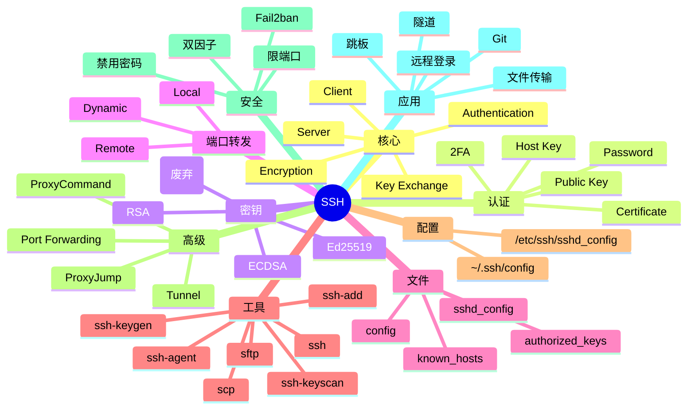

# SSH

## 前言

**定位**：安全网络协议（Secure Shell），1995 年由 Tatu Ylönen 设计至今是远程登录的事实标准，替代 telnet/ftp/rsh 等明文协议，OpenSSH 是最流行的开源实现，每天承载数十亿次登录。

**核心价值**：
- 加密通信：AES/ChaCha20 加密防窃听
- 身份认证：密码 / 公钥 / 多因素
- 端口转发：本地/远程/动态（SOCKS）
- 隧道代理：转发任意 TCP

**五大特性**：
1. **加密传输**：端到端加密
2. **多种认证**：密码/公钥/证书/多因素
3. **端口转发**：本地/远程/动态
4. **X11 转发**：远程 GUI 应用
5. **Agent 转发**：密钥单点登录

**对比表**：

| 维度 | SSH | Telnet | rsh | Mosh |
|---|---|---|---|---|
| 加密 | ✅ | ❌ | ❌ | ✅ |
| 认证 | 多种 | 弱 | 弱 | 需 SSH |
| 端口 | 22 | 23 | 514 | 60000+UDP |
| 速度 | 中 | 快 | 快 | 慢启动 |
| 适用 | 通用 | 历史 | 内网 | 移动/弱网 |

## 思维导图



## 关键代码

### 一、基础登录

```bash
# 密码登录
ssh user@host
ssh user@192.168.1.100
ssh -p 2222 user@host             # 指定端口

# 私钥登录
ssh -i ~/.ssh/id_rsa user@host

# 执行远程命令
ssh user@host "ls -la /tmp"
ssh user@host "sudo systemctl restart nginx"

# 强制分配 PTY
ssh -t user@host "sudo /bin/bash"

# 跳板
ssh -J jumphost user@internal
ssh -o ProxyCommand="ssh -W %h:%p jumphost" user@internal
```

```bash
# ~/.ssh/config
Host myserver
    HostName 192.168.1.100
    User alice
    Port 22
    IdentityFile ~/.ssh/id_ed25519
    IdentitiesOnly yes
    ServerAliveInterval 60
    ServerAliveCountMax 3

Host *.internal
    User admin
    ProxyJump jumphost
    IdentityFile ~/.ssh/id_ed25519

Host github.com
    User git
    IdentityFile ~/.ssh/id_github
    AddKeysToAgent yes

# 使用
ssh myserver
```

### 二、密钥生成与管理

```bash
# 生成密钥对
ssh-keygen -t ed25519 -C "alice@example.com"   # 推荐
ssh-keygen -t rsa -b 4096 -C "alice@example.com"  # 兼容
ssh-keygen -t ecdsa -b 521 -C "alice@example.com"

# 指定文件
ssh-keygen -t ed25519 -f ~/.ssh/id_work

# 指定密码
ssh-keygen -t ed25519 -N "passphrase"

# 修改密码
ssh-keygen -p -f ~/.ssh/id_ed25519

# 公钥格式
cat ~/.ssh/id_ed25519.pub
# ssh-ed25519 AAAAC3NzaC1lZDI1NTE5AAAAI... alice@example.com
```

```bash
# 复制公钥到服务器
ssh-copy-id user@host
ssh-copy-id -i ~/.ssh/id_ed25519 user@host

# 手动复制
cat ~/.ssh/id_ed25519.pub | ssh user@host "mkdir -p ~/.ssh && chmod 700 ~/.ssh && cat >> ~/.ssh/authorized_keys && chmod 600 ~/.ssh/authorized_keys"
```

### 三、SSH Agent

```bash
# 启动 agent
eval $(ssh-agent)
# Agent pid 1234

# 添加密钥
ssh-add ~/.ssh/id_ed25519
ssh-add -K ~/.ssh/id_ed25519       # macOS keychain
ssh-add -l                        # 列出已添加
ssh-add -D                        # 清空
ssh-add -t 3600 ~/.ssh/id_ed25519 # 1 小时过期

# 配合 .bashrc/.zshrc
if [ -z "$SSH_AUTH_SOCK" ]; then
    eval $(ssh-agent)
    ssh-add ~/.ssh/id_ed25519
fi
```

```bash
# macOS 集成 keychain
ssh-add --apple-use-keychain ~/.ssh/id_ed25519

# ~/.ssh/config
AddKeysToAgent yes
UseKeychain yes
```

### 四、scp / sftp

```bash
# scp 上传
scp file.txt user@host:/tmp/
scp -r directory/ user@host:/tmp/
scp -P 2222 file.txt user@host:/tmp/    # 指定端口
scp -i ~/.ssh/key file.txt user@host:/tmp/

# scp 下载
scp user@host:/tmp/file.txt ./
scp -r user@host:/tmp/logs/ ./

# sftp 交互
sftp user@host
sftp> put file.txt
sftp> get file.txt
sftp> ls
sftp> cd /tmp
sftp> lcd ~/local
sftp> mkdir mydir
sftp> mget *.log
sftp> mput *.txt
sftp> bye
```

```bash
# rsync over SSH
rsync -avz -e ssh /local/dir/ user@host:/remote/dir/
rsync -avz -e "ssh -i ~/.ssh/key" /local/ user@host:/remote/

# 排除文件
rsync -avz --exclude='*.log' --exclude='.git' /local/ user@host:/remote/
```

### 五、端口转发

```bash
# 1. 本地转发（访问 remote 服务到本地）
# local_port:localhost:remote_port
ssh -L 8080:localhost:80 user@host
# 浏览器访问 http://localhost:8080 = 访问 host 的 80

# 多跳本地转发
ssh -L 8080:internal-db:5432 jumphost
# 通过 jumphost，把 internal-db:5432 映射到本地 8080

# 2. 远程转发（暴露本地服务到远程）
# remote_port:localhost:local_port
ssh -R 8080:localhost:3000 user@host
# host 的 8080 访问 = 本地的 3000

# 3. 动态转发（SOCKS 代理）
ssh -D 1080 user@host
# 浏览器配置 SOCKS5 代理 localhost:1080
# 所有流量通过 SSH 加密走

# 后台运行
ssh -fN -L 8080:localhost:80 user@host
# -f 后台 -N 不执行命令
```

```bash
# 实战：访问数据库
ssh -L 15432:db.internal:5432 bastion
# 然后 psql -h localhost -p 15432

# 实战：调试 web 服务
ssh -L 8080:localhost:3000 user@host
# 浏览器开 http://localhost:8080 调试远程开发服务

# 实战：暴露本地开发到外网
ssh -R 8080:localhost:3000 user@public-host
# 别人访问 public-host:8080 = 你的本地 3000
```

### 六、SSH Config 高级

```bash
# ~/.ssh/config
# 默认设置
Host *
    ServerAliveInterval 60
    ServerAliveCountMax 3
    HashKnownHosts yes

# 跳板
Host prod
    HostName 10.0.1.100
    User deploy
    ProxyJump bastion
    IdentityFile ~/.ssh/id_prod

Host bastion
    HostName bastion.example.com
    User alice

# 代理命令（兼容老版本 OpenSSH）
Host internal-via-bastion
    HostName 10.0.1.50
    User admin
    ProxyCommand ssh -W %h:%p bastion

# 多级跳板
Host deep-internal
    HostName 192.168.1.10
    User admin
    ProxyCommand ssh -W %h:%p internal-via-bastion

# 别名 + 端口 + 密钥
Host myapp-staging
    HostName staging.myapp.com
    User deploy
    Port 2222
    IdentityFile ~/.ssh/id_staging
    LocalForward 8080 localhost:80
    LocalForward 15432 db.internal:5432

# 强制密码登录（不用密钥）
Host legacy-server
    HostName legacy.example.com
    User admin
    PreferredAuthentications=password
    PubkeyAuthentication=no
```

### 七、SSH 证书认证

```bash
# 创建 CA
ssh-keygen -t ed25519 -f ca_key -C "SSH CA"

# 签署用户公钥
ssh-keygen -s ca_key -I alice -n alice -V +52w id_ed25519.pub
# 输出：id_ed25519-cert.pub

# 签署主机公钥
ssh-keygen -s ca_key -h -I "web1" -n web1.internal,web1,192.168.1.10 \
  -V +52w ssh_host_ed25519_key.pub
```

```bash
# 客户端信任 CA
mkdir -p ~/.ssh
cp ca_key.pub ~/.ssh/ca.pub
# ~/.ssh/config
Host *.internal
    UserKnownHostsFile /dev/null
    StrictHostKeyChecking no
    HostCertificateAlias web1.internal

# 全局信任（多用户）
# /etc/ssh/ssh_known_hosts
@cert-authority *.internal ssh-ed25519 AAAA... ca_key.pub
```

```bash
# 服务端信任 CA（authorized_keys）
# 在每个用户的 authorized_keys 中
# 添加一行：
# @cert-authority principals=alice ssh-ed25519 AAAA... ca_key.pub

# 然后签署的证书可以登录所有配置了这个 CA 的服务器
ssh alice@web1.internal
```

### 八、sshd_config 安全加固

```bash
# /etc/ssh/sshd_config
Port 2222                                # 改端口
AddressFamily inet                       # 仅 IPv4
ListenAddress 0.0.0.0
Protocol 2

# 认证
PermitRootLogin no                       # 禁止 root 登录
PasswordAuthentication no                # 禁止密码
PubkeyAuthentication yes
PermitEmptyPasswords no
ChallengeResponseAuthentication no
UsePAM yes
AuthenticationMethods publickey
MaxAuthTries 3
MaxSessions 5
LoginGraceTime 30

# 密钥
HostKey /etc/ssh/ssh_host_ed25519_key
HostKey /etc/ssh/ssh_host_rsa_key

# 限制
AllowUsers alice bob admin
AllowGroups ssh-users sudo
DenyUsers root
DenyGroups root

# 安全
X11Forwarding no
AllowTcpForwarding local                 # 仅本地转发
PermitTunnel no
GatewayPorts no
ClientAliveInterval 300
ClientAliveCountMax 2
TCPKeepAlive no

# 日志
SyslogFacility AUTH
LogLevel VERBOSE

# 横幅
Banner /etc/issue.net
```

```bash
# 重新加载
systemctl reload sshd
sshd -t                                  # 测试配置
```

```bash
# Fail2ban 防爆破
apt install fail2ban
cp /etc/fail2ban/jail.conf /etc/fail2ban/jail.local
# 编辑 jail.local
[sshd]
enabled = true
port = 2222
filter = sshd
logpath = /var/log/auth.log
maxretry = 3
bantime = 3600
```

### 九、ProxyJump 跳板

```bash
# 简单跳板
ssh -J jumphost user@internal

# 跳板链
ssh -J "user1@jumphost1,user2@jumphost2" user@deep-internal

# ~/.ssh/config
Host prod
    HostName 10.0.1.100
    User deploy
    ProxyJump alice@bastion.example.com

Host bastion
    HostName bastion.example.com
    User alice

# 跳板 + 本地转发
ssh -J alice@bastion -L 8080:internal:80 deploy@10.0.1.100

# ProxyCommand 跳板（兼容旧）
Host internal
    ProxyCommand ssh -W %h:%p alice@bastion
```

### 十、SSH 隧道实战

```bash
# 案例 1：访问内网数据库
# 通过 bastion 把内网 PostgreSQL 暴露到本地
ssh -fN -L 15432:db.internal:5432 deploy@bastion
psql -h localhost -p 15432 -U app

# 案例 2：安全访问 Redis
ssh -fN -L 6379:redis.internal:6379 deploy@bastion
redis-cli -h localhost

# 案例 3：多端口转发
ssh -fN -L 8080:web:80 -L 15432:db:5432 -L 6379:redis:6379 bastion

# 案例 4：科学上网（合规范围）
ssh -D 1080 user@overseas-server
# 浏览器 SOCKS5 代理 127.0.0.1:1080

# 案例 5：开发环境共享
ssh -R 8080:localhost:3000 -R 9229:localhost:9229 user@public
# 调试面板 + Chrome DevTools 远程

# 案例 6：内网穿透（无公网 IP）
ssh -R 0:localhost:3000 user@public-host
# public-host 上暴露 3000，自动分配端口
```

```bash
# autossh 保持隧道稳定
apt install autossh
autossh -M 0 -fN -L 15432:db:5432 bastion
# -M 0 禁用监控端口
# 断线自动重连
```

### 十一、密钥指纹

```bash
# 查看公钥指纹
ssh-keygen -l -f ~/.ssh/id_ed25519
# 256 SHA256:xxxxx alice@example.com (ED25519)

# 查看 known_hosts 中某主机指纹
ssh-keygen -l -f ~/.ssh/known_hosts
ssh-keygen -l -F github.com

# 主机首次连接确认
ssh user@host
# The authenticity of host '...' can't be established.
# ED25519 key fingerprint is SHA256:xxxxx.
# Are you sure you want to continue connecting (yes/no/[fingerprint])?

# 预拉主机指纹
ssh-keyscan github.com >> ~/.ssh/known_hosts
ssh-keyscan -t ed25519 -p 22 host >> ~/.ssh/known_hosts
```

```bash
# StrictHostKeyChecking
# ask: 询问（默认）
# yes: 拒绝未知主机
# no: 自动接受（不安全）
ssh -o StrictHostKeyChecking=accept-new user@host
```

### 十二、SSH 在 DevOps 中的应用

```bash
# Git over SSH
git clone git@github.com:user/repo.git
# ~/.ssh/config 配置 github 别名

# Ansible SSH
ansible all -m ping
# 使用 ~/.ssh/config 别名

# rsync over SSH
rsync -avz -e ssh /data/ deploy@app:/data/

# kubectl port-forward over SSH
ssh -L 6443:master:6443 bastion
# kubeconfig 配置 server: https://localhost:6443

# VSCode Remote SSH
# 安装 Remote-SSH 扩展
# Ctrl+Shift+P → Remote-SSH: Connect to Host
# ~/.ssh/config 自动识别

# Jupyter over SSH
ssh -L 8888:localhost:8888 user@host
# 远程启动 jupyter，浏览器本地访问
```

## 核心洞察

- **SSH 的"加密通信"是核心价值**：vs Telnet 明文
- **SSH 的"公钥认证"是免密登录基础**：推荐 Ed25519
- **SSH 的"端口转发"是隧道核心**：本地/远程/动态
- **SSH 的"Agent 转发"是单点登录**：不复制私钥
- **SSH 的"跳板"是企业内网必备**：ProxyJump
- **SSH 的"证书认证"是规模化方案**：替代 authorized_keys
- **SSH 的"配置文件"~/.ssh/config 是效率工具**：别名复用
- **SSH 的"安全加固"是运维基础**：禁密码、改端口、限用户
- **SSH 的"隧道"是调试利器**：本地访问远程服务
- **SSH 的"Git"传输是 GitHub 标准**：SSH 协议而非 HTTPS
- **SSH 的"VSCode Remote"是现代开发**：远程 IDE
- **SSH 的"Fail2ban"是防爆破**：自动封禁
- **SSH 的"Ed25519"是现代算法**：比 RSA 短、快、安全
- **SSH 的"中间人攻击"防御靠 known_hosts**：首次确认指纹
- **SSH 的"公网暴露"是高危**：必须改端口 + 禁密码

## 跨项目引用

- **[[linux]]**：SSH 是 Linux 远程管理基础
- **[[git]]**：GitHub/GitLab 用 SSH 协议
- **[[ansible]]**：Ansible 基于 SSH
- **[[docker]]**：Docker 远程通过 SSH
- **[[kubernetes]]**：K8s 节点用 SSH 部署
- **[[nginx]]**：Nginx 反代 SSH（不常见，但有 WebSocket）
- **[[postgresql]]**：psql 通过 SSH 隧道连 PG
- **[[mysql]]**：MySQL 通过 SSH 隧道连
- **[[redis]]**：Redis 通过 SSH 隧道连
- **[[mongodb]]**：MongoDB 通过 SSH 隧道连
- **[[jenkins]]**：Jenkins Agent 用 SSH
- **[[terraform]]**：Terraform 远程执行用 SSH
- **[[hashicorp vault]]**：Vault SSH 引擎签发临时凭据
- **[[fail2ban]]**：Fail2ban 保护 SSH 防爆破
- **[[wireguard]]**：WireGuard 是 VPN 替代
- **[[tls]]**：SSH 协议用 TLS 类似加密
