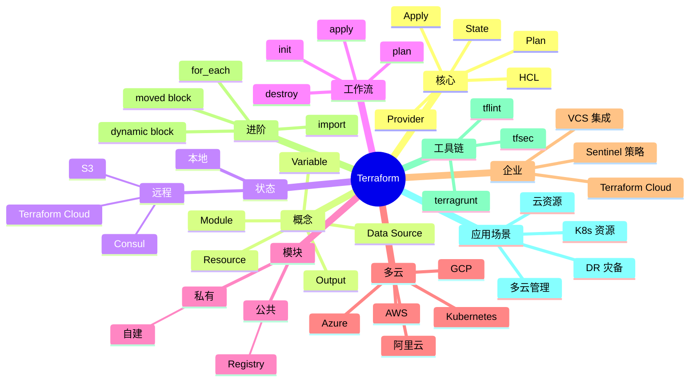

# Terraform

## 前言

**定位**：开源基础设施即代码（IaC）工具，2014 年由 HashiCorp 发布至今是云资源编排的事实标准，与 Ansible/Pulumi/CloudFormation 构成 IaC 主流方案，HashiCorp 公司的旗舰产品，百万级下载量。

**核心价值**：
- 声明式：HCL 描述期望状态，Terraform 自动 diff 并 apply
- 多云：AWS/Azure/GCP/阿里云/腾讯云 100+ Provider
- 状态管理：tfstate 跟踪资源，可远程存储
- 计划预览：`terraform plan` 提前看变更

**五大特性**：
1. **HCL 语言**：人类可读，比 JSON YAML 更适合 IaC
2. **Provider 生态**：覆盖 1000+ 服务
3. **State 状态**：资源映射，diff 算法
4. **Module 模块化**：可复用、可发布、可版本化
5. **Plan/Apply 工作流**：先看变更再应用

**对比表**：

| 维度 | Terraform | Pulumi | CloudFormation | Ansible | Crossplane |
|---|---|---|---|---|---|
| 语言 | HCL | TypeScript/Go/Python | JSON/YAML | YAML | YAML+Kubernetes |
| 状态 | tfstate | 自管理 | AWS 托管 | 无 | K8s CRD |
| 多云 | ✅✅ | ✅ | ❌ AWS | ✅ | ✅ |
| 执行模型 | 推 | 推 | 推 | 推 | 拉（K8s） |
| 适合 | 多云 IaC | 程序员偏好 | AWS 纯 | 配置管理 | K8s 优先 |

## 思维导图



## 关键代码

### 一、安装与初始化

```bash
# 安装
brew install terraform                    # macOS
choco install terraform                   # Windows
wget https://releases.hashicorp.com/terraform/1.7.0/terraform_1.7.0_linux_amd64.zip

# 验证
terraform version

# 自动补全
terraform -install-autocomplete
```

```hcl
# main.tf
terraform {
  required_version = ">= 1.5.0"

  required_providers {
    aws = {
      source  = "hashicorp/aws"
      version = "~> 5.0"
    }
  }

  # 远程状态存储
  backend "s3" {
    bucket         = "my-tfstate"
    key            = "prod/terraform.tfstate"
    region         = "us-east-1"
    dynamodb_table = "tf-locks"           # 状态锁
    encrypt        = true
  }
}

provider "aws" {
  region = "us-east-1"
  default_tags {
    tags = {
      Environment = "production"
      ManagedBy   = "terraform"
    }
  }
}
```

### 二、基础资源定义

```hcl
# variables.tf
variable "instance_type" {
  description = "EC2 实例类型"
  type        = string
  default     = "t3.medium"
}

variable "vpc_cidr" {
  type    = string
  default = "10.0.0.0/16"
}

# main.tf
resource "aws_vpc" "main" {
  cidr_block           = var.vpc_cidr
  enable_dns_hostnames = true
  enable_dns_support   = true

  tags = {
    Name = "${var.project}-vpc"
  }
}

resource "aws_subnet" "public" {
  count                   = 3
  vpc_id                  = aws_vpc.main.id
  cidr_block              = "10.0.${count.index + 1}.0/24"
  availability_zone       = data.aws_availability_zones.available.names[count.index]
  map_public_ip_on_launch = true
}

resource "aws_instance" "web" {
  ami                    = data.aws_ami.ubuntu.id
  instance_type          = var.instance_type
  subnet_id              = aws_subnet.public[0].id
  vpc_security_group_ids = [aws_security_group.web.id]

  user_data = <<-EOF
    #!/bin/bash
    apt update && apt install -y nginx
    systemctl enable nginx
  EOF

  tags = {
    Name = "${var.project}-web"
  }
}

# 数据源
data "aws_ami" "ubuntu" {
  most_recent = true
  owners      = ["099720109477"]  # Canonical

  filter {
    name   = "name"
    values = ["ubuntu/images/hvm-ssd/ubuntu-jammy-22.04-amd64-server-*"]
  }
}

# 输出
output "vpc_id" {
  value = aws_vpc.main.id
}

output "web_url" {
  value = "http://${aws_instance.web.public_ip}"
}
```

### 三、Module 模块化

```hcl
# modules/webserver/main.tf
variable "instance_type" {
  type    = string
  default = "t3.small"
}

variable "subnet_id" {
  type = string
}

resource "aws_instance" "this" {
  ami           = "ami-0c55b159cbfafe1f0"
  instance_type = var.instance_type
  subnet_id     = var.subnet_id

  tags = {
    Name = "webserver"
  }
}

output "instance_id" {
  value = aws_instance.this.id
}
```

```hcl
# main.tf 使用模块
module "webserver" {
  source        = "./modules/webserver"
  instance_type = "t3.medium"
  subnet_id     = aws_subnet.public[0].id
}

module "rds" {
  source  = "terraform-aws-modules/rds/aws"
  version = "6.5.0"

  identifier = "myapp-db"

  engine            = "postgres"
  engine_version    = "15"
  instance_class    = "db.t3.medium"
  allocated_storage = 20

  db_name  = "myapp"
  username = "admin"
  password = var.db_password

  vpc_security_group_ids = [aws_security_group.db.id]
  subnet_ids             = aws_subnet.private[*].id

  maintenance_window = "Mon:00:00-Mon:03:00"
  backup_window      = "03:00-06:00"
}
```

### 四、状态管理

```bash
# 初始化
terraform init

# 拉远程状态
terraform init -backend-config="bucket=my-bucket"

# 查看状态
terraform state list
terraform state show aws_instance.web

# 拉远端状态到本地
terraform state pull > terraform.tfstate

# 移动资源到新地址
terraform state mv aws_instance.old aws_instance.new

# 移除资源（不销毁）
terraform state rm aws_instance.bad

# 导入已有资源
terraform import aws_instance.web i-1234567890abcdef0
```

```hcl
# 远程状态共享（多团队）
data "terraform_remote_state" "vpc" {
  backend = "s3"
  config = {
    bucket = "shared-tfstate"
    key    = "network/terraform.tfstate"
    region = "us-east-1"
  }
}

# 引用其他团队的输出
resource "aws_instance" "web" {
  subnet_id = data.terraform_remote_state.vpc.outputs.public_subnet_id
}
```

### 五、生命周期管理

```hcl
resource "aws_instance" "web" {
  ami           = "ami-0c55b159cbfafe1f0"
  instance_type = "t3.medium"

  lifecycle {
    create_before_destroy = true        # 先建后删
    prevent_destroy       = true        # 防止误删
    ignore_changes        = [tags]      # 忽略标签变化
  }
}

# 条件创建
resource "aws_instance" "bastion" {
  count = var.environment == "prod" ? 1 : 0
  ami   = "ami-xxx"
  # ...
}

# 显式依赖
resource "aws_eip" "web" {
  instance = aws_instance.web.id
}

# 触发器（值变化时重建）
resource "aws_instance" "web" {
  user_data = templatefile("${path.module}/init.sh", {
    db_host = aws_db_instance.main.endpoint
  })
}
```

### 六、Workspaces 环境隔离

```bash
# 创建 workspace
terraform workspace new prod
terraform workspace new staging
terraform workspace new dev

# 切换
terraform workspace select prod

# 列出
terraform workspace list
```

```hcl
# 资源按 workspace 命名
resource "aws_instance" "web" {
  tags = {
    Name = "web-${terraform.workspace}"
  }
}
```

### 七、Kubernetes Provider

```hcl
terraform {
  required_providers {
    kubernetes = {
      source  = "hashicorp/kubernetes"
      version = "~> 2.24"
    }
  }
}

provider "kubernetes" {
  config_path = "~/.kube/config"
}

# 创建 namespace
resource "kubernetes_namespace" "app" {
  metadata {
    name = "myapp"
  }
}

# 创建 Deployment
resource "kubernetes_deployment" "app" {
  metadata {
    name      = "myapp"
    namespace = kubernetes_namespace.app.metadata[0].name
  }

  spec {
    replicas = 3

    selector {
      match_labels = {
        app = "myapp"
      }
    }

    template {
      metadata {
        labels = {
          app = "myapp"
        }
      }

      spec {
        container {
          name  = "myapp"
          image = "myapp:1.0.0"

          port {
            container_port = 8080
          }

          resources {
            limits = {
              cpu    = "500m"
              memory = "512Mi"
            }
          }
        }
      }
    }
  }
}
```

### 八、CI/CD 集成

```yaml
# GitHub Actions
name: Terraform
on:
  pull_request:
    branches: [main]
    paths: ['**.tf']
  push:
    branches: [main]

jobs:
  terraform:
    runs-on: ubuntu-latest

    steps:
      - uses: actions/checkout@v4

      - uses: hashicorp/setup-terraform@v3
        with:
          terraform_version: 1.7.0

      - name: Terraform Init
        run: terraform init

      - name: Terraform Format
        run: terraform fmt -check

      - name: Terraform Validate
        run: terraform validate

      - name: TFLint
        uses: terraform-linters/setup-tflint@v4
        with:
          tflint_version: latest

      - name: tfsec
        uses: aquasecurity/tfsec-action@v1.0.3

      - name: Terraform Plan
        if: github.event_name == 'pull_request'
        run: terraform plan -no-color
        env:
          AWS_ACCESS_KEY_ID: ${{ secrets.AWS_ACCESS_KEY_ID }}
          AWS_SECRET_ACCESS_KEY: ${{ secrets.AWS_SECRET_ACCESS_KEY }}

      - name: Terraform Apply
        if: github.ref == 'refs/heads/main' && github.event_name == 'push'
        run: terraform apply -auto-approve
        env:
          AWS_ACCESS_KEY_ID: ${{ secrets.AWS_ACCESS_KEY_ID }}
          AWS_SECRET_ACCESS_KEY: ${{ secrets.AWS_SECRET_ACCESS_KEY }}
```

### 九、动态块与 for_each

```hcl
# 动态块
resource "aws_security_group" "web" {
  name = "web-sg"

  dynamic "ingress" {
    for_each = var.ingress_rules
    content {
      from_port   = ingress.value.from
      to_port     = ingress.value.to
      protocol    = "tcp"
      cidr_blocks = ingress.value.cidrs
    }
  }
}

variable "ingress_rules" {
  type = list(object({
    from  = number
    to    = number
    cidrs = list(string)
  }))
  default = [
    { from = 80, to = 80, cidrs = ["0.0.0.0/0"] },
    { from = 443, to = 443, cidrs = ["0.0.0.0/0"] },
  ]
}

# for_each
resource "aws_iam_user" "users" {
  for_each = toset(["alice", "bob", "charlie"])
  name     = each.value
}

# 输出所有用户
output "all_users" {
  value = values(aws_iam_user.users)[*].name
}
```

### 十、测试与策略

```bash
# tflint - 语法/最佳实践
tflint --init
tflint

# tfsec - 安全扫描
tfsec .

# checkov - 更多规则
checkov -d .

# conftest - OPA 策略
conftest test --policy policies/ main.tf
```

```rego
# policies/terraform.rego
package terraform

deny[msg] {
  input.resource_type == "aws_s3_bucket"
  input.module_address == ""
  not input.attributes.acl == "private"
  msg = sprintf("S3 bucket '%s' must be private", [input.address])
}

deny[msg] {
  input.resource_type == "aws_rds_instance"
  not input.attributes.storage_encrypted
  msg = sprintf("RDS '%s' must be encrypted", [input.address])
}
```

## 核心洞察

- **Terraform 的"声明式 IaC"是核心哲学**：描述期望状态而非过程
- **Terraform 的"State"是最大陷阱**：状态损坏/丢失等于资源失控
- **Terraform 的"Plan/Apply"工作流降低风险**：提前看变更
- **Terraform 的"Provider 生态"是护城河**：1000+ 服务覆盖
- **Terraform 的"Module"是复用单元**：公开/私有 Registry
- **Terraform 与"配置管理"工具（Ansible）互补**：IaC vs 软件部署
- **Terraform 的"Remote State"需要锁机制**：DynamoDB 锁避免并发
- **Terraform 的"Workspaces"有限制**：推荐用目录区分环境
- **Terraform 的"moved block"解决重构难题**：资源地址变更不重建
- **Terraform 的"import"反向纳入**：已有资源纳入管理
- **Terraform 1.5+ 支持"import block"**：声明式导入
- **Terraform Cloud 是商业版**：免费版可用 OSS 后端
- **OpenTofu 是 Terraform 的 fork**：Linux 基金会维护，许可证更友好
- **Terraform 在 K8s 场景有 Crossplane 竞品**：CRD 模式更原生

## 跨项目引用

- **[[linux]]**：Terraform 跑在 Linux 上
- **[[docker]]**：Terraform 可编排 Docker 资源
- **[[kubernetes]]**：Kubernetes Provider 是 K8s 编排
- **[[ansible]]**：Ansible 是配置管理，与 Terraform 互补
- **[[jenkins]]**：Jenkins 调用 Terraform 做 CI/CD
- **[[github actions]]**：GitHub Actions 是 Terraform 自动化场景
- **[[vault]]**：Vault 存 Terraform 敏感变量
- **[[aws]]** / **[[gcp]]** / **[[azure]]**：Terraform 主要编排云资源
- **[[consul]]**：Consul 可作 Terraform 后端
- **[[helm]]**：Helm 部署 K8s，Terraform 部署 K8s 集群
- **[[prometheus]]**：监控 Terraform 管理的资源
- **[[pulumi]]**：Pulumi 是程序员友好的 IaC 替代
- **[[opentofu]]**：OpenTofu 是 Terraform fork
