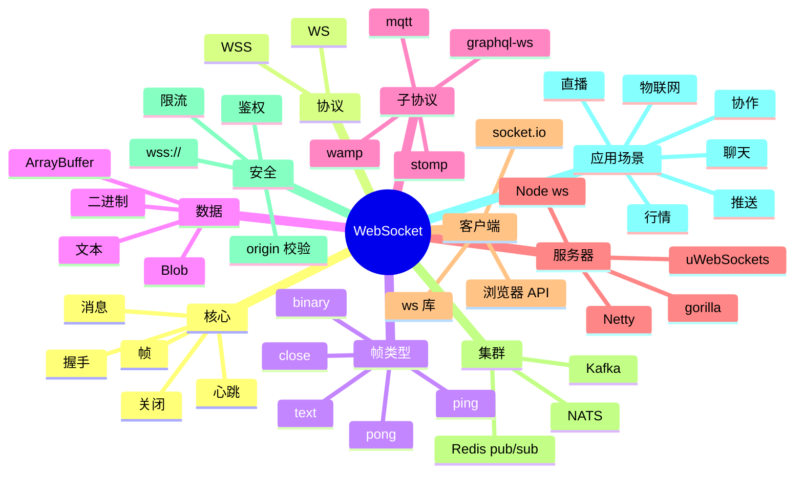

# WebSocket

## 前言

**定位**：HTML5 双向全双工通信协议，2011 年由 IETF 标准化（RFC 6455）至今是 Web 实时通信的事实标准，与 HTTP/2 SSE/Long Polling 构成现代实时 Web 方案，浏览器原生支持。

**核心价值**：
- 双向通信：服务端可主动推送
- 持久连接：避免 HTTP 轮询开销
- 低延迟：毫秒级消息传递
- 协议标准化：跨平台、跨语言

**五大特性**：
1. **全双工**：客户端/服务端可同时发送
2. **基于 TCP**：复用 HTTP 端口（80/443）
3. **握手升级**：从 HTTP Upgrade 到 WebSocket
4. **帧传输**：文本/二进制帧
5. **子协议**：可自定义应用层协议

**对比表**：

| 维度 | WebSocket | SSE | Long Polling | Socket.IO |
|---|---|---|---|---|
| 方向 | 双向 | 单向（服务端→客户端） | 单向 | 双向 |
| 协议 | WS/WSS | HTTP | HTTP | WS（封装） |
| 兼容 | 现代浏览器 | 现代浏览器 | 所有 | 所有（降级） |
| 复杂度 | 中 | 低 | 高 | 中 |
| 适合 | 双向实时 | 服务端推送 | 老浏览器 | 通用实时 |

## 思维导图



## 关键代码

### 一、握手协议

```http
# HTTP 升级请求
GET /chat HTTP/1.1
Host: example.com
Upgrade: websocket
Connection: Upgrade
Sec-WebSocket-Key: dGhlIHNhbXBsZSBub25jZQ==
Sec-WebSocket-Version: 13
Origin: https://example.com
Sec-WebSocket-Protocol: chat, superchat

# 响应
HTTP/1.1 101 Switching Protocols
Upgrade: websocket
Connection: Upgrade
Sec-WebSocket-Accept: s3pPLMBiTxaQ9kYGzzhZRbK+xOo=
```

```
# 帧格式（RFC 6455）
 0                   1                   2                   3
 0 1 2 3 4 5 6 7 8 9 0 1 2 3 4 5 6 7 8 9 0 1 2 3 4 5 6 7 8 9 0 1
+-+-+-+-+-------+-+-------------+-------------------------------+
|F|R|R|R| opcode|M| Payload len |    Extended payload length    |
|I|S|S|S|  (4)  |A|     (7)     |             (16/64)           |
|N|V|V|V|       |S|             |   (if payload len==126/127)   |
| |1|2|3|       |K|             |                               |
+-+-+-+-+-------+-+-------------+ - - - - - - - - - - - - - - - +
|     Extended payload length continued, if payload len == 127  |
+ - - - - - - - - - - - - - - - +-------------------------------+
|                               |Masking-key, if MASK set to 1  |
+-------------------------------+-------------------------------+
| Masking-key (continued)       |          Payload Data         |
+-------------------------------- - - - - - - - - - - - - - - - +
:                     Payload Data continued ...                :
+ - - - - - - - - - - - - - - - - - - - - - - - - - - - - - - - +
|                     Payload Data continued ...                |
+---------------------------------------------------------------+
```

### 二、浏览器原生 API

```javascript
// 客户端
const ws = new WebSocket('wss://example.com/chat')

ws.onopen = (event) => {
  console.log('Connected')
  ws.send(JSON.stringify({ type: 'hello', user: 'alice' }))
}

ws.onmessage = (event) => {
  if (typeof event.data === 'string') {
    const msg = JSON.parse(event.data)
    console.log('Received:', msg)
  } else {
    // 二进制
    const blob = event.data
    const arrayBuffer = await blob.arrayBuffer()
    const view = new Uint8Array(arrayBuffer)
    console.log('Binary:', view)
  }
}

ws.onerror = (error) => {
  console.error('Error:', error)
}

ws.onclose = (event) => {
  console.log('Closed:', event.code, event.reason)
  // 1000 = 正常关闭
  // 1001 = 离开
  // 1006 = 异常断开
}

// 发送数据
ws.send('text message')
ws.send(JSON.stringify({ type: 'ping' }))
ws.send(new Blob([binaryData]))
ws.send(new ArrayBuffer(8))

// 关闭
ws.close(1000, 'Goodbye')
```

### 三、Node.js 服务器（ws 库）

```javascript
// server.js
import { WebSocketServer } from 'ws'
import http from 'http'

const server = http.createServer()
const wss = new WebSocketServer({ server, path: '/chat' })

// 连接
wss.on('connection', (ws, req) => {
  const ip = req.socket.remoteAddress
  console.log(`Client ${ip} connected`)

  // 鉴权（从 query/header 取 token）
  const url = new URL(req.url, `http://${req.headers.host}`)
  const token = url.searchParams.get('token')

  if (!verifyToken(token)) {
    ws.close(1008, 'Unauthorized')
    return
  }

  // 接收消息
  ws.on('message', (data, isBinary) => {
    console.log('Received:', data.toString())

    try {
      const msg = JSON.parse(data.toString())
      handleMessage(ws, msg)
    } catch (e) {
      ws.send(JSON.stringify({ type: 'error', message: 'Invalid JSON' }))
    }
  })

  // 心跳
  ws.isAlive = true
  ws.on('pong', () => { ws.isAlive = true })

  // 关闭
  ws.on('close', (code, reason) => {
    console.log(`Closed: ${code} ${reason.toString()}`)
  })

  // 错误
  ws.on('error', (err) => {
    console.error('Error:', err)
  })

  // 欢迎
  ws.send(JSON.stringify({ type: 'welcome', user: 'alice' }))
})

// 全局心跳
const interval = setInterval(() => {
  wss.clients.forEach((ws) => {
    if (!ws.isAlive) {
      return ws.terminate()
    }
    ws.isAlive = false
    ws.ping()
  })
}, 30000)

wss.on('close', () => clearInterval(interval))

server.listen(8080, () => {
  console.log('WebSocket server listening on 8080')
})
```

### 四、广播与房间

```javascript
// 简单广播
function broadcast(wss, message) {
  wss.clients.forEach((client) => {
    if (client.readyState === WebSocket.OPEN) {
      client.send(message)
    }
  })
}

// 房间模式
const rooms = new Map()  // roomId -> Set<ws>

function joinRoom(ws, roomId) {
  if (!rooms.has(roomId)) {
    rooms.set(roomId, new Set())
  }
  rooms.get(roomId).add(ws)
  ws.roomId = roomId
}

function leaveRoom(ws) {
  if (ws.roomId) {
    rooms.get(ws.roomId).delete(ws)
  }
}

function broadcastToRoom(roomId, message, exclude = null) {
  const room = rooms.get(roomId)
  if (!room) return
  for (const client of room) {
    if (client !== exclude && client.readyState === WebSocket.OPEN) {
      client.send(message)
    }
  }
}

wss.on('connection', (ws) => {
  ws.on('message', (data) => {
    const msg = JSON.parse(data.toString())
    if (msg.type === 'join') {
      joinRoom(ws, msg.room)
      broadcastToRoom(msg.room, JSON.stringify({ type: 'user-joined', user: msg.user }))
    } else if (msg.type === 'message') {
      broadcastToRoom(msg.room, JSON.stringify({ type: 'message', from: msg.user, text: msg.text }), ws)
    }
  })

  ws.on('close', () => {
    leaveRoom(ws)
  })
})
```

### 五、Socket.IO 库（封装）

```javascript
// server
import { Server } from 'socket.io'
import http from 'http'

const server = http.createServer()
const io = new Server(server, {
  cors: { origin: '*' }
})

io.on('connection', (socket) => {
  console.log('Connected:', socket.id)

  // 加入房间
  socket.on('join', ({ room, user }) => {
    socket.join(room)
    socket.to(room).emit('user-joined', { user })
  })

  // 接收消息
  socket.on('message', ({ room, text }) => {
    io.to(room).emit('message', {
      from: socket.data.user,
      text,
      time: Date.now()
    })
  })

  // 断开
  socket.on('disconnect', (reason) => {
    console.log('Disconnected:', reason)
  })
})

server.listen(3000)
```

```javascript
// client
import { io } from 'socket.io-client'

const socket = io('https://example.com', {
  auth: { token: 'jwt-token' },
  transports: ['websocket', 'polling']   // 降级
})

socket.on('connect', () => {
  console.log('Connected:', socket.id)
  socket.emit('join', { room: 'general', user: 'alice' })
})

socket.on('user-joined', ({ user }) => {
  console.log(`${user} joined`)
})

socket.on('message', (msg) => {
  console.log('Message:', msg)
})

socket.emit('message', { room: 'general', text: 'Hello!' })
```

### 六、Python（FastAPI + WebSocket）

```python
# server.py
from fastapi import FastAPI, WebSocket, WebSocketDisconnect
from typing import List

app = FastAPI()

class ConnectionManager:
    def __init__(self):
        self.connections: List[WebSocket] = []

    async def connect(self, websocket: WebSocket):
        await websocket.accept()
        self.connections.append(websocket)

    def disconnect(self, websocket: WebSocket):
        self.connections.remove(websocket)

    async def broadcast(self, message: str):
        for connection in self.connections:
            await connection.send_text(message)

manager = ConnectionManager()

@app.websocket("/ws/{client_id}")
async def websocket_endpoint(websocket: WebSocket, client_id: int):
    await manager.connect(websocket)
    try:
        while True:
            data = await websocket.receive_text()
            await manager.broadcast(f"Client {client_id}: {data}")
    except WebSocketDisconnect:
        manager.disconnect(websocket)
        await manager.broadcast(f"Client {client_id} left")
```

```python
# client.py
import websockets
import asyncio

async def chat():
    uri = "ws://localhost:8000/ws/alice"
    async with websockets.connect(uri) as ws:
        await ws.send("Hello!")
        while True:
            msg = await ws.recv()
            print(msg)

asyncio.run(chat())
```

### 七、Nginx 反向代理

```nginx
# /etc/nginx/nginx.conf
upstream websocket_backend {
    server 127.0.0.1:3000;
    server 127.0.0.1:3001;
}

server {
    listen 80;
    server_name example.com;

    location /ws/ {
        proxy_pass http://websocket_backend;
        proxy_http_version 1.1;
        proxy_set_header Upgrade $http_upgrade;
        proxy_set_header Connection "upgrade";
        proxy_set_header Host $host;
        proxy_set_header X-Real-IP $remote_addr;

        # 关键：超时要长
        proxy_read_timeout 86400s;
        proxy_send_timeout 86400s;

        # 不缓冲
        proxy_buffering off;
    }
}
```

```nginx
# WebSocket-specific 优化
proxy_set_header X-Forwarded-For $proxy_add_x_forwarded_for;
proxy_set_header X-Forwarded-Proto $scheme;
proxy_redirect off;
```

### 八、集群方案

```javascript
// 跨节点广播（Redis pub/sub）
import { createClient } from 'redis'
import { WebSocketServer } from 'ws'

const redisPub = createClient({ url: 'redis://redis:6379' })
const redisSub = redisPub.duplicate()

await redisPub.connect()
await redisSub.connect()

const wss = new WebSocketServer({ port: 3000 })

// 接收其他节点的消息
await redisSub.subscribe('chat:broadcast', (message) => {
  for (const client of wss.clients) {
    if (client.readyState === 1) {
      client.send(message)
    }
  }
})

wss.on('connection', (ws) => {
  ws.on('message', async (data) => {
    // 广播到所有节点
    await redisPub.publish('chat:broadcast', data.toString())
  })
})
```

```javascript
// Kafka 方案（更可靠）
import { Kafka } from 'kafkajs'

const kafka = new Kafka({ brokers: ['kafka:9092'] })
const consumer = kafka.consumer({ groupId: 'ws-server' })
const producer = kafka.producer()

await producer.connect()
await consumer.connect()
await consumer.subscribe({ topic: 'chat', fromBeginning: false })

await consumer.run({
  eachMessage: async ({ message }) => {
    const data = message.value.toString()
    for (const client of wss.clients) {
      if (client.readyState === 1) {
        client.send(data)
      }
    }
  }
})

wss.on('connection', (ws) => {
  ws.on('message', async (data) => {
    await producer.send({
      topic: 'chat',
      messages: [{ value: data.toString() }]
    })
  })
})
```

### 九、安全与限流

```javascript
// Origin 校验
wss.on('connection', (ws, req) => {
  const origin = req.headers.origin
  if (!ALLOWED_ORIGINS.includes(origin)) {
    ws.close(1008, 'Forbidden origin')
    return
  }
})

// 限流（连接数）
const MAX_CONNECTIONS = 10000
wss.on('connection', (ws) => {
  if (wss.clients.size > MAX_CONNECTIONS) {
    ws.close(1013, 'Server full')
    return
  }
})

// 消息频率限制
const rateLimit = new Map()  // ip -> { count, resetAt }

wss.on('connection', (ws, req) => {
  const ip = req.socket.remoteAddress
  ws.on('message', (data) => {
    const now = Date.now()
    const limit = rateLimit.get(ip) || { count: 0, resetAt: now + 60000 }
    if (now > limit.resetAt) {
      limit.count = 0
      limit.resetAt = now + 60000
    }
    limit.count++
    rateLimit.set(ip, limit)

    if (limit.count > 100) {  // 每分钟 100 条
      ws.close(1008, 'Rate limit')
      return
    }
  })
})

// Token 鉴权
function verifyToken(token) {
  try {
    const decoded = jwt.verify(token, SECRET)
    return decoded
  } catch {
    return null
  }
}
```

### 十、SSE 替代方案

```javascript
// 服务端推送（单向）
app.get('/events', (req, res) => {
  res.setHeader('Content-Type', 'text/event-stream')
  res.setHeader('Cache-Control', 'no-cache')
  res.setHeader('Connection', 'keep-alive')

  const send = (data) => {
    res.write(`data: ${JSON.stringify(data)}\n\n`)
  }

  // 推送
  const interval = setInterval(() => {
    send({ time: Date.now() })
  }, 1000)

  req.on('close', () => clearInterval(interval))
})
```

```javascript
// 客户端
const eventSource = new EventSource('/events')

eventSource.onmessage = (e) => {
  const data = JSON.parse(e.data)
  console.log(data)
}

// 自定义事件
eventSource.addEventListener('chat', (e) => {
  console.log('Chat:', e.data)
})
```

## 核心洞察

- **WebSocket 的"全双工"是核心价值**：vs HTTP 单向
- **WebSocket 的"握手"复用 HTTP**：80/443 端口
- **WebSocket 的"帧"是轻量协议**：2-14 字节头部
- **WebSocket 的"心跳"保活**：ping/pong 帧
- **WebSocket 在"聊天"场景是首选**：低延迟
- **WebSocket 在"直播弹幕"场景广泛使用**：高并发
- **WebSocket 在"金融行情"是必备**：毫秒级推送
- **WebSocket 在"协作编辑"是核心**：协同光标、状态同步
- **WebSocket 的"集群"需要 pub/sub**：Redis/NATS/Kafka
- **WebSocket 的"Nginx 反代"注意超时**：proxy_read_timeout
- **WebSocket 的"安全"靠 WSS**：TLS 加密
- **WebSocket 的"Socket.IO"是兼容层**：降级到 polling
- **WebSocket 的"消息大小"理论上无限**：实际受限于缓冲区
- **WebSocket 的"代理"问题**：公司代理可能拦截
- **WebSocket 的"SSE 替代"是单向场景**：服务端推送
- **WebSocket 的"ws/uWebSockets.js"性能差异大**：uWS 速度快 10x
- **WebSocket 的"原生 API"够用**：业务简单时不用 Socket.IO

## 跨项目引用

- **[[http]]**：WebSocket 升级自 HTTP
- **[[nginx]]**：Nginx 反代 WebSocket
- **[[node.js]]**：Node.js + ws 是主流服务端
- **[[socket.io]]**：Socket.IO 是 WebSocket 封装
- **[[redis]]**：Redis pub/sub 做 WebSocket 集群
- **[[kafka]]**：Kafka 做可靠 WebSocket 集群
- **[[mongodb]]**：MongoDB Change Streams 配合 WebSocket
- **[[jwt]]**：JWT 鉴权 WebSocket 连接
- **[[graphql]]**：GraphQL Subscriptions 用 WebSocket
- **[[mqtt]]**：MQTT 物联网协议与 WebSocket 互通
- **[[react]]** / **[[vue]]**：前端框架集成 WebSocket
- **[[sse]]**：SSE 是单向 WebSocket 替代
- **[[webrtc]]**：WebRTC 是真正的 P2P 通信
- **[[grpc]]**：gRPC Web 是 gRPC 的 Web 版本
- **[[tls]]**：WSS 基于 TLS
