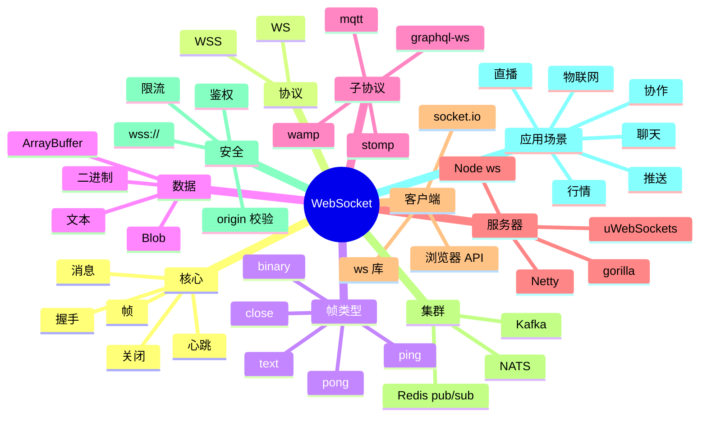

# WebSocket

## 前言

**定位**：HTML5 双向全双工通信协议，2011 年由 IETF 标准化（RFC 6455）至今是 Web 实时通信的事实标准，与 HTTP/2 SSE/Long Polling 构成现代实时 Web 方案，浏览器原生支持。

**核心价值**：
- 双向通信：服务端可主动推送
- 持久连接：避免 HTTP 轮询开销
- 低延迟：毫秒级消息传递
- 协议标准化：跨平台、跨语言

**五大特性**：
1. **全双工**：客户端/服务端可同时发送
2. **基于 TCP**：复用 HTTP 端口（80/443）
3. **握手升级**：从 HTTP Upgrade 到 WebSocket
4. **帧传输**：文本/二进制帧
5. **子协议**：可自定义应用层协议

**对比表**：

| 维度 | WebSocket | SSE | Long Polling | Socket.IO |
|---|---|---|---|---|
| 方向 | 双向 | 单向（服务端→客户端） | 单向 | 双向 |
| 协议 | WS/WSS | HTTP | HTTP | WS（封装） |
| 兼容 | 现代浏览器 | 现代浏览器 | 所有 | 所有（降级） |
| 复杂度 | 中 | 低 | 高 | 中 |
| 适合 | 双向实时 | 服务端推送 | 老浏览器 | 通用实时 |

## 思维导图



## 关键代码

### 一、握手协议

```http
# HTTP 升级请求
GET /chat HTTP/1.1
Host: example.com
Upgrade: websocket
Connection: Upgrade
Sec-WebSocket-Key: dGhlIHNhbXBsZSBub25jZQ==
Sec-WebSocket-Version: 13
Origin: https://example.com
Sec-WebSocket-Protocol: chat, superchat

# 响应
HTTP/1.1 101 Switching Protocols
Upgrade: websocket
Connection: Upgrade
Sec-WebSocket-Accept: s3pPLMBiTxaQ9kYGzzhZRbK+xOo=
```

```
# 帧格式（RFC 6455）
 0                   1                   2                   3
 0 1 2 3 4 5 6 7 8 9 0 1 2 3 4 5 6 7 8 9 0 1 2 3 4 5 6 7 8 9 0 1
+-+-+-+-+-------+-+-------------+-------------------------------+
|F|R|R|R| opcode|M| Payload len |    Extended payload length    |
|I|S|S|S|  (4)  |A|     (7)     |             (16/64)           |
|N|V|V|V|       |S|             |   (if payload len==126/127)   |
| |1|2|3|       |K|             |                               |
+-+-+-+-+-------+-+-------------+ - - - - - - - - - - - - - - - +
|     Extended payload length continued, if payload len == 127  |
+ - - - - - - - - - - - - - - - +-------------------------------+
|                               |Masking-key, if MASK set to 1  |
+-------------------------------+-------------------------------+
| Masking-key (continued)       |          Payload Data         |
+-------------------------------- - - - - - - - - - - - - - - - +
:                     Payload Data continued ...                :
+ - - - - - - - - - - - - - - - - - - - - - - - - - - - - - - - +
|                     Payload Data continued ...                |
+---------------------------------------------------------------+
```

### 二、浏览器原生 API

```javascript
// 客户端
const ws = new WebSocket('wss://example.com/chat')

ws.onopen = (event) => {
  console.log('Connected')
  ws.send(JSON.stringify({ type: 'hello', user: 'alice' }))
}

ws.onmessage = (event) => {
  if (typeof event.data === 'string') {
    const msg = JSON.parse(event.data)
    console.log('Received:', msg)
  } else {
    // 二进制
    const blob = event.data
    const arrayBuffer = await blob.arrayBuffer()
    const view = new Uint8Array(arrayBuffer)
    console.log('Binary:', view)
  }
}

ws.onerror = (error) => {
  console.error('Error:', error)
}

ws.onclose = (event) => {
  console.log('Closed:', event.code, event.reason)
  // 1000 = 正常关闭
  // 1001 = 离开
  // 1006 = 异常断开
}

// 发送数据
ws.send('text message')
ws.send(JSON.stringify({ type: 'ping' }))
ws.send(new Blob([binaryData]))
ws.send(new ArrayBuffer(8))

// 关闭
ws.close(1000, 'Goodbye')
```

### 三、Node.js 服务器（ws 库）

```javascript
// server.js
import { WebSocketServer } from 'ws'
import http from 'http'

const server = http.createServer()
const wss = new WebSocketServer({ server, path: '/chat' })

// 连接
wss.on('connection', (ws, req) => {
  const ip = req.socket.remoteAddress
  console.log(`Client ${ip} connected`)

  // 鉴权（从 query/header 取 token）
  const url = new URL(req.url, `http://${req.headers.host}`)
  const token = url.searchParams.get('token')

  if (!verifyToken(token)) {
    ws.close(1008, 'Unauthorized')
    return
  }

  // 接收消息
  ws.on('message', (data, isBinary) => {
    console.log('Received:', data.toString())

    try {
      const msg = JSON.parse(data.toString())
      handleMessage(ws, msg)
    } catch (e) {
      ws.send(JSON.stringify({ type: 'error', message: 'Invalid JSON' }))
    }
  })

  // 心跳
  ws.isAlive = true
  ws.on('pong', () => { ws.isAlive = true })

  // 关闭
  ws.on('close', (code, reason) => {
    console.log(`Closed: ${code} ${reason.toString()}`)
  })

  // 错误
  ws.on('error', (err) => {
    console.error('Error:', err)
  })

  // 欢迎
  ws.send(JSON.stringify({ type: 'welcome', user: 'alice' }))
})

// 全局心跳
const interval = setInterval(() => {
  wss.clients.forEach((ws) => {
    if (!ws.isAlive) {
      return ws.terminate()
    }
    ws.isAlive = false
    ws.ping()
  })
}, 30000)

wss.on('close', () => clearInterval(interval))

server.listen(8080, () => {
  console.log('WebSocket server listening on 8080')
})
```

### 四、广播与房间

```javascript
// 简单广播
function broadcast(wss, message) {
  wss.clients.forEach((client) => {
    if (client.readyState === WebSocket.OPEN) {
      client.send(message)
    }
  })
}

// 房间模式
const rooms = new Map()  // roomId -> Set<ws>

function joinRoom(ws, roomId) {
  if (!rooms.has(roomId)) {
    rooms.set(roomId, new Set())
  }
  rooms.get(roomId).add(ws)
  ws.roomId = roomId
}

function leaveRoom(ws) {
  if (ws.roomId) {
    rooms.get(ws.roomId).delete(ws)
  }
}

function broadcastToRoom(roomId, message, exclude = null) {
  const room = rooms.get(roomId)
  if (!room) return
  for (const client of room) {
    if (client !== exclude && client.readyState === WebSocket.OPEN) {
      client.send(message)
    }
  }
}

wss.on('connection', (ws) => {
  ws.on('message', (data) => {
    const msg = JSON.parse(data.toString())
    if (msg.type === 'join') {
      joinRoom(ws, msg.room)
      broadcastToRoom(msg.room, JSON.stringify({ type: 'user-joined', user: msg.user }))
    } else if (msg.type === 'message') {
      broadcastToRoom(msg.room, JSON.stringify({ type: 'message', from: msg.user, text: msg.text }), ws)
    }
  })

  ws.on('close', () => {
    leaveRoom(ws)
  })
})
```

### 五、Socket.IO 库（封装）

```javascript
// server
import { Server } from 'socket.io'
import http from 'http'

const server = http.createServer()
const io = new Server(server, {
  cors: { origin: '*' }
})

io.on('connection', (socket) => {
  console.log('Connected:', socket.id)

  // 加入房间
  socket.on('join', ({ room, user }) => {
    socket.join(room)
    socket.to(room).emit('user-joined', { user })
  })

  // 接收消息
  socket.on('message', ({ room, text }) => {
    io.to(room).emit('message', {
      from: socket.data.user,
      text,
      time: Date.now()
    })
  })

  // 断开
  socket.on('disconnect', (reason) => {
    console.log('Disconnected:', reason)
  })
})

server.listen(3000)
```

```javascript
// client
import { io } from 'socket.io-client'

const socket = io('https://example.com', {
  auth: { token: 'jwt-token' },
  transports: ['websocket', 'polling']   // 降级
})

socket.on('connect', () => {
  console.log('Connected:', socket.id)
  socket.emit('join', { room: 'general', user: 'alice' })
})

socket.on('user-joined', ({ user }) => {
  console.log(`${user} joined`)
})

socket.on('message', (msg) => {
  console.log('Message:', msg)
})

socket.emit('message', { room: 'general', text: 'Hello!' })
```

### 六、Python（FastAPI + WebSocket）

```python
# server.py
from fastapi import FastAPI, WebSocket, WebSocketDisconnect
from typing import List

app = FastAPI()

class ConnectionManager:
    def __init__(self):
        self.connections: List[WebSocket] = []

    async def connect(self, websocket: WebSocket):
        await websocket.accept()
        self.connections.append(websocket)

    def disconnect(self, websocket: WebSocket):
        self.connections.remove(websocket)

    async def broadcast(self, message: str):
        for connection in self.connections:
            await connection.send_text(message)

manager = ConnectionManager()

@app.websocket("/ws/{client_id}")
async def websocket_endpoint(websocket: WebSocket, client_id: int):
    await manager.connect(websocket)
    try:
        while True:
            data = await websocket.receive_text()
            await manager.broadcast(f"Client {client_id}: {data}")
    except WebSocketDisconnect:
        manager.disconnect(websocket)
        await manager.broadcast(f"Client {client_id} left")
```

```python
# client.py
import websockets
import asyncio

async def chat():
    uri = "ws://localhost:8000/ws/alice"
    async with websockets.connect(uri) as ws:
        await ws.send("Hello!")
        while True:
            msg = await ws.recv()
            print(msg)

asyncio.run(chat())
```

### 七、Nginx 反向代理

```nginx
# /etc/nginx/nginx.conf
upstream websocket_backend {
    server 127.0.0.1:3000;
    server 127.0.0.1:3001;
}

server {
    listen 80;
    server_name example.com;

    location /ws/ {
        proxy_pass http://websocket_backend;
        proxy_http_version 1.1;
        proxy_set_header Upgrade $http_upgrade;
        proxy_set_header Connection "upgrade";
        proxy_set_header Host $host;
        proxy_set_header X-Real-IP $remote_addr;

        # 关键：超时要长
        proxy_read_timeout 86400s;
        proxy_send_timeout 86400s;

        # 不缓冲
        proxy_buffering off;
    }
}
```

```nginx
# WebSocket-specific 优化
proxy_set_header X-Forwarded-For $proxy_add_x_forwarded_for;
proxy_set_header X-Forwarded-Proto $scheme;
proxy_redirect off;
```

### 八、集群方案

```javascript
// 跨节点广播（Redis pub/sub）
import { createClient } from 'redis'
import { WebSocketServer } from 'ws'

const redisPub = createClient({ url: 'redis://redis:6379' })
const redisSub = redisPub.duplicate()

await redisPub.connect()
await redisSub.connect()

const wss = new WebSocketServer({ port: 3000 })

// 接收其他节点的消息
await redisSub.subscribe('chat:broadcast', (message) => {
  for (const client of wss.clients) {
    if (client.readyState === 1) {
      client.send(message)
    }
  }
})

wss.on('connection', (ws) => {
  ws.on('message', async (data) => {
    // 广播到所有节点
    await redisPub.publish('chat:broadcast', data.toString())
  })
})
```

```javascript
// Kafka 方案（更可靠）
import { Kafka } from 'kafkajs'

const kafka = new Kafka({ brokers: ['kafka:9092'] })
const consumer = kafka.consumer({ groupId: 'ws-server' })
const producer = kafka.producer()

await producer.connect()
await consumer.connect()
await consumer.subscribe({ topic: 'chat', fromBeginning: false })

await consumer.run({
  eachMessage: async ({ message }) => {
    const data = message.value.toString()
    for (const client of wss.clients) {
      if (client.readyState === 1) {
        client.send(data)
      }
    }
  }
})

wss.on('connection', (ws) => {
  ws.on('message', async (data) => {
    await producer.send({
      topic: 'chat',
      messages: [{ value: data.toString() }]
    })
  })
})
```

### 九、安全与限流

```javascript
// Origin 校验
wss.on('connection', (ws, req) => {
  const origin = req.headers.origin
  if (!ALLOWED_ORIGINS.includes(origin)) {
    ws.close(1008, 'Forbidden origin')
    return
  }
})

// 限流（连接数）
const MAX_CONNECTIONS = 10000
wss.on('connection', (ws) => {
  if (wss.clients.size > MAX_CONNECTIONS) {
    ws.close(1013, 'Server full')
    return
  }
})

// 消息频率限制
const rateLimit = new Map()  // ip -> { count, resetAt }

wss.on('connection', (ws, req) => {
  const ip = req.socket.remoteAddress
  ws.on('message', (data) => {
    const now = Date.now()
    const limit = rateLimit.get(ip) || { count: 0, resetAt: now + 60000 }
    if (now > limit.resetAt) {
      limit.count = 0
      limit.resetAt = now + 60000
    }
    limit.count++
    rateLimit.set(ip, limit)

    if (limit.count > 100) {  // 每分钟 100 条
      ws.close(1008, 'Rate limit')
      return
    }
  })
})

// Token 鉴权
function verifyToken(token) {
  try {
    const decoded = jwt.verify(token, SECRET)
    return decoded
  } catch {
    return null
  }
}
```

### 十、SSE 替代方案

```javascript
// 服务端推送（单向）
app.get('/events', (req, res) => {
  res.setHeader('Content-Type', 'text/event-stream')
  res.setHeader('Cache-Control', 'no-cache')
  res.setHeader('Connection', 'keep-alive')

  const send = (data) => {
    res.write(`data: ${JSON.stringify(data)}\n\n`)
  }

  // 推送
  const interval = setInterval(() => {
    send({ time: Date.now() })
  }, 1000)

  req.on('close', () => clearInterval(interval))
})
```

```javascript
// 客户端
const eventSource = new EventSource('/events')

eventSource.onmessage = (e) => {
  const data = JSON.parse(e.data)
  console.log(data)
}

// 自定义事件
eventSource.addEventListener('chat', (e) => {
  console.log('Chat:', e.data)
})
```

## 进程管理：系统底层的调度与同步

内存管理涉及虚拟内存、页表、TLB、Swap、OOM Killer 等概念。jemalloc、tcmalloc、mimalloc 是高性能内存分配器，对 LLM 推理性能影响巨大。

数据库内核是系统软件的明珠。InnoDB 的 MVCC、B+ 树、Buffer Pool、Redo Log、Undo Log 是 MySQL 性能的关键。PostgreSQL 的进程模型、WAL、Vacuum 是它的特色。


## 内存管理：系统底层的分配与回收

网络栈是后端性能的关键。TCP 三次握手、拥塞控制（CUBIC/BBR）、零拷贝（sendfile/splice）、epoll 多路复用、io_uring 异步 IO 是核心技术。

Redis 是内存数据库的王者。单线程事件循环、IO 多路复用、AOF/RDB 持久化、Cluster 分片、Sentinel 高可用、Stream 消息队列、Module 扩展（如 RediSearch、RedisJSON）让 Redis 适用于更多场景。


## 文件系统：系统底层的VFS与Page Cache

容器基于 Linux Namespace 和 Cgroup 实现隔离与资源限制。Docker 让容器变得易用，containerd/CRI-O 是工业级运行时，Podman 是 Docker 替代品。

Kafka 是分布式消息系统的标杆。Page Cache、零拷贝、ISR 副本机制、Partition 水平扩展、Exactly-Once 语义、Kafka Connect、Kafka Streams 是其核心能力。


## 网络栈：系统底层的TCP/UDP与epoll

Kubernetes 是容器编排的事实标准。Pod、Deployment、StatefulSet、DaemonSet、Job、CronJob 是基础资源，Service、Ingress、NetworkPolicy 是网络抽象。

Elasticsearch 是搜索与分析引擎。Lucene 倒排索引、Shard 分片、Replica 副本、Mapping 数据模型、聚合分析、Vector Search（kNN）、Reranker 是其能力栈。


## 容器：系统底层的Namespace与Cgroup

Helm 是 K8s 的包管理工具。Chart 是 Helm 的打包格式，模板化（Go Template）的 YAML 让复杂应用可配置化部署。Helmfile、ArgoCD ApplicationSet 是增强方案。

ZooKeeper/etcd 是分布式协调服务。ZAB 协议、Raft 一致性算法、Watch 机制、临时节点、Leader 选举是核心。etcd 是 K8s 的存储后端，TiKV 也基于 Raft。


## 虚拟化：系统底层的KVM与Xen

Operator 模式将运维知识编码为 K8s 控制器。CoreOS Operator Framework、Kubebuilder、Operator SDK 简化了 Operator 开发。etcd Operator、Prometheus Operator 是经典案例。

Ceph 是分布式存储的代表。CRUSH 算法、PG（Placement Group）、OSD、Mon、MDS、RBD、RGW、CephFS 构成完整能力栈。MinIO 是 S3 兼容的轻量方案。


## 操作系统：系统底层的Linux内核

服务网格（Service Mesh）解决了微服务的网络治理。Istio + Envoy 是最完整方案，Linkerd 轻量，Consul Connect 与 HashiCorp 生态集成。Cilium Service Mesh 基于 eBPF 性能更优。

负载均衡是分布式系统的入口。LVS（IPVS）四层、Nginx 七层、HAProxy 四七层、Envoy 服务网格、Traefik 云原生网关是主流方案。


## 数据库：系统底层的InnoDB与MVCC

数据库内核是系统软件的明珠。InnoDB 的 MVCC、B+ 树、Buffer Pool、Redo Log、Undo Log 是 MySQL 性能的关键。PostgreSQL 的进程模型、WAL、Vacuum 是它的特色。

可观测性是 SRE 的核心能力。Metrics（Prometheus）、Logs（Loki/ELK）、Traces（Jaeger/Tempo）三大支柱缺一不可。OpenTelemetry 是统一标准。


## 缓存：系统底层的Redis与Memcached

Redis 是内存数据库的王者。单线程事件循环、IO 多路复用、AOF/RDB 持久化、Cluster 分片、Sentinel 高可用、Stream 消息队列、Module 扩展（如 RediSearch、RedisJSON）让 Redis 适用于更多场景。

混沌工程主动验证系统韧性。Chaos Monkey（Netflix）、ChaosBlade（阿里）、LitmusChaos、Gremlin 是工具。生产环境演练是检验架构的终极方式。


## 消息队列：系统底层的Kafka与Pulsar

Kafka 是分布式消息系统的标杆。Page Cache、零拷贝、ISR 副本机制、Partition 水平扩展、Exactly-Once 语义、Kafka Connect、Kafka Streams 是其核心能力。

性能分析需要合适的工具。perf（Linux 采样分析器）、eBPF（内核可编程）、bpftrace、SystemTap、FlameGraph（火焰图）让性能瓶颈无所遁形。


## 搜索引擎：系统底层的ES与Lucene

Elasticsearch 是搜索与分析引擎。Lucene 倒排索引、Shard 分片、Replica 副本、Mapping 数据模型、聚合分析、Vector Search（kNN）、Reranker 是其能力栈。

安全是系统底层的最后一道防线。SELinux/AppArmor 提供强制访问控制，seccomp 限制系统调用，capabilities 细化权限，Cgroups v2 提供更强的资源隔离。


## 协调服务：系统底层的ZooKeeper/etcd

ZooKeeper/etcd 是分布式协调服务。ZAB 协议、Raft 一致性算法、Watch 机制、临时节点、Leader 选举是核心。etcd 是 K8s 的存储后端，TiKV 也基于 Raft。

Linux 内核是所有云原生系统的基石。进程调度（CFS、RT Scheduler）、内存管理（Buddy/Slab/Page Cache）、文件系统（VFS/Ext4/XFS/Btrfs）、网络栈（TCP/UDP/epoll）是核心子系统。


## 分布式存储：系统底层的Ceph与HDFS

Ceph 是分布式存储的代表。CRUSH 算法、PG（Placement Group）、OSD、Mon、MDS、RBD、RGW、CephFS 构成完整能力栈。MinIO 是 S3 兼容的轻量方案。

进程与线程是操作系统的基本概念。协程（Coroutine）作为用户态轻量级线程，Go goroutine、Erlang process、Kotlin coroutine、C++20 coroutine 各有实现。


## 负载均衡：系统底层的Nginx/LVS

负载均衡是分布式系统的入口。LVS（IPVS）四层、Nginx 七层、HAProxy 四七层、Envoy 服务网格、Traefik 云原生网关是主流方案。

内存管理涉及虚拟内存、页表、TLB、Swap、OOM Killer 等概念。jemalloc、tcmalloc、mimalloc 是高性能内存分配器，对 LLM 推理性能影响巨大。


## 反向代理：系统底层的Envoy/Traefik

可观测性是 SRE 的核心能力。Metrics（Prometheus）、Logs（Loki/ELK）、Traces（Jaeger/Tempo）三大支柱缺一不可。OpenTelemetry 是统一标准。

网络栈是后端性能的关键。TCP 三次握手、拥塞控制（CUBIC/BBR）、零拷贝（sendfile/splice）、epoll 多路复用、io_uring 异步 IO 是核心技术。


## 服务发现：系统底层的Consul

混沌工程主动验证系统韧性。Chaos Monkey（Netflix）、ChaosBlade（阿里）、LitmusChaos、Gremlin 是工具。生产环境演练是检验架构的终极方式。

容器基于 Linux Namespace 和 Cgroup 实现隔离与资源限制。Docker 让容器变得易用，containerd/CRI-O 是工业级运行时，Podman 是 Docker 替代品。


## 配置中心：系统底层的Nacos

性能分析需要合适的工具。perf（Linux 采样分析器）、eBPF（内核可编程）、bpftrace、SystemTap、FlameGraph（火焰图）让性能瓶颈无所遁形。

Kubernetes 是容器编排的事实标准。Pod、Deployment、StatefulSet、DaemonSet、Job、CronJob 是基础资源，Service、Ingress、NetworkPolicy 是网络抽象。


## 监控：系统底层的Prometheus

安全是系统底层的最后一道防线。SELinux/AppArmor 提供强制访问控制，seccomp 限制系统调用，capabilities 细化权限，Cgroups v2 提供更强的资源隔离。

Helm 是 K8s 的包管理工具。Chart 是 Helm 的打包格式，模板化（Go Template）的 YAML 让复杂应用可配置化部署。Helmfile、ArgoCD ApplicationSet 是增强方案。


## 日志：系统底层的ELK/Loki

Linux 内核是所有云原生系统的基石。进程调度（CFS、RT Scheduler）、内存管理（Buddy/Slab/Page Cache）、文件系统（VFS/Ext4/XFS/Btrfs）、网络栈（TCP/UDP/epoll）是核心子系统。

Operator 模式将运维知识编码为 K8s 控制器。CoreOS Operator Framework、Kubebuilder、Operator SDK 简化了 Operator 开发。etcd Operator、Prometheus Operator 是经典案例。


## 链路追踪：系统底层的Jaeger

进程与线程是操作系统的基本概念。协程（Coroutine）作为用户态轻量级线程，Go goroutine、Erlang process、Kotlin coroutine、C++20 coroutine 各有实现。

服务网格（Service Mesh）解决了微服务的网络治理。Istio + Envoy 是最完整方案，Linkerd 轻量，Consul Connect 与 HashiCorp 生态集成。Cilium Service Mesh 基于 eBPF 性能更优。


## 混沌工程：系统底层的ChaosBlade

内存管理涉及虚拟内存、页表、TLB、Swap、OOM Killer 等概念。jemalloc、tcmalloc、mimalloc 是高性能内存分配器，对 LLM 推理性能影响巨大。

数据库内核是系统软件的明珠。InnoDB 的 MVCC、B+ 树、Buffer Pool、Redo Log、Undo Log 是 MySQL 性能的关键。PostgreSQL 的进程模型、WAL、Vacuum 是它的特色。


## 性能分析：系统底层的perf/ebpf

网络栈是后端性能的关键。TCP 三次握手、拥塞控制（CUBIC/BBR）、零拷贝（sendfile/splice）、epoll 多路复用、io_uring 异步 IO 是核心技术。

Redis 是内存数据库的王者。单线程事件循环、IO 多路复用、AOF/RDB 持久化、Cluster 分片、Sentinel 高可用、Stream 消息队列、Module 扩展（如 RediSearch、RedisJSON）让 Redis 适用于更多场景。


## 调优工具：系统底层的vmstat/iostat

容器基于 Linux Namespace 和 Cgroup 实现隔离与资源限制。Docker 让容器变得易用，containerd/CRI-O 是工业级运行时，Podman 是 Docker 替代品。

Kafka 是分布式消息系统的标杆。Page Cache、零拷贝、ISR 副本机制、Partition 水平扩展、Exactly-Once 语义、Kafka Connect、Kafka Streams 是其核心能力。


## 高可用：系统底层的多活与灾备

Kubernetes 是容器编排的事实标准。Pod、Deployment、StatefulSet、DaemonSet、Job、CronJob 是基础资源，Service、Ingress、NetworkPolicy 是网络抽象。

Elasticsearch 是搜索与分析引擎。Lucene 倒排索引、Shard 分片、Replica 副本、Mapping 数据模型、聚合分析、Vector Search（kNN）、Reranker 是其能力栈。


## 灾备：系统底层的备份与恢复

Helm 是 K8s 的包管理工具。Chart 是 Helm 的打包格式，模板化（Go Template）的 YAML 让复杂应用可配置化部署。Helmfile、ArgoCD ApplicationSet 是增强方案。

ZooKeeper/etcd 是分布式协调服务。ZAB 协议、Raft 一致性算法、Watch 机制、临时节点、Leader 选举是核心。etcd 是 K8s 的存储后端，TiKV 也基于 Raft。


## 安全：系统底层的SELinux与AppArmor

Operator 模式将运维知识编码为 K8s 控制器。CoreOS Operator Framework、Kubebuilder、Operator SDK 简化了 Operator 开发。etcd Operator、Prometheus Operator 是经典案例。

Ceph 是分布式存储的代表。CRUSH 算法、PG（Placement Group）、OSD、Mon、MDS、RBD、RGW、CephFS 构成完整能力栈。MinIO 是 S3 兼容的轻量方案。


## 加密：系统底层的国密与TLS

服务网格（Service Mesh）解决了微服务的网络治理。Istio + Envoy 是最完整方案，Linkerd 轻量，Consul Connect 与 HashiCorp 生态集成。Cilium Service Mesh 基于 eBPF 性能更优。

负载均衡是分布式系统的入口。LVS（IPVS）四层、Nginx 七层、HAProxy 四七层、Envoy 服务网格、Traefik 云原生网关是主流方案。


## 性能压测：系统底层的wrk/ab

数据库内核是系统软件的明珠。InnoDB 的 MVCC、B+ 树、Buffer Pool、Redo Log、Undo Log 是 MySQL 性能的关键。PostgreSQL 的进程模型、WAL、Vacuum 是它的特色。

可观测性是 SRE 的核心能力。Metrics（Prometheus）、Logs（Loki/ELK）、Traces（Jaeger/Tempo）三大支柱缺一不可。OpenTelemetry 是统一标准。


## 容量规划：系统底层的成本优化

Redis 是内存数据库的王者。单线程事件循环、IO 多路复用、AOF/RDB 持久化、Cluster 分片、Sentinel 高可用、Stream 消息队列、Module 扩展（如 RediSearch、RedisJSON）让 Redis 适用于更多场景。

混沌工程主动验证系统韧性。Chaos Monkey（Netflix）、ChaosBlade（阿里）、LitmusChaos、Gremlin 是工具。生产环境演练是检验架构的终极方式。


## 未来演进：系统底层的云原生

Kafka 是分布式消息系统的标杆。Page Cache、零拷贝、ISR 副本机制、Partition 水平扩展、Exactly-Once 语义、Kafka Connect、Kafka Streams 是其核心能力。

性能分析需要合适的工具。perf（Linux 采样分析器）、eBPF（内核可编程）、bpftrace、SystemTap、FlameGraph（火焰图）让性能瓶颈无所遁形。


## 进程管理：系统底层的调度与同步

网络栈是后端性能的关键。TCP 三次握手、拥塞控制（CUBIC/BBR）、零拷贝（sendfile/splice）、epoll 多路复用、io_uring 异步 IO 是核心技术。

Redis 是内存数据库的王者。单线程事件循环、IO 多路复用、AOF/RDB 持久化、Cluster 分片、Sentinel 高可用、Stream 消息队列、Module 扩展（如 RediSearch、RedisJSON）让 Redis 适用于更多场景。


## 内存管理：系统底层的分配与回收

容器基于 Linux Namespace 和 Cgroup 实现隔离与资源限制。Docker 让容器变得易用，containerd/CRI-O 是工业级运行时，Podman 是 Docker 替代品。

Kafka 是分布式消息系统的标杆。Page Cache、零拷贝、ISR 副本机制、Partition 水平扩展、Exactly-Once 语义、Kafka Connect、Kafka Streams 是其核心能力。


## 文件系统：系统底层的VFS与Page Cache

Kubernetes 是容器编排的事实标准。Pod、Deployment、StatefulSet、DaemonSet、Job、CronJob 是基础资源，Service、Ingress、NetworkPolicy 是网络抽象。

Elasticsearch 是搜索与分析引擎。Lucene 倒排索引、Shard 分片、Replica 副本、Mapping 数据模型、聚合分析、Vector Search（kNN）、Reranker 是其能力栈。


## 网络栈：系统底层的TCP/UDP与epoll

Helm 是 K8s 的包管理工具。Chart 是 Helm 的打包格式，模板化（Go Template）的 YAML 让复杂应用可配置化部署。Helmfile、ArgoCD ApplicationSet 是增强方案。

ZooKeeper/etcd 是分布式协调服务。ZAB 协议、Raft 一致性算法、Watch 机制、临时节点、Leader 选举是核心。etcd 是 K8s 的存储后端，TiKV 也基于 Raft。


## 容器：系统底层的Namespace与Cgroup

Operator 模式将运维知识编码为 K8s 控制器。CoreOS Operator Framework、Kubebuilder、Operator SDK 简化了 Operator 开发。etcd Operator、Prometheus Operator 是经典案例。

Ceph 是分布式存储的代表。CRUSH 算法、PG（Placement Group）、OSD、Mon、MDS、RBD、RGW、CephFS 构成完整能力栈。MinIO 是 S3 兼容的轻量方案。


## 虚拟化：系统底层的KVM与Xen

服务网格（Service Mesh）解决了微服务的网络治理。Istio + Envoy 是最完整方案，Linkerd 轻量，Consul Connect 与 HashiCorp 生态集成。Cilium Service Mesh 基于 eBPF 性能更优。

负载均衡是分布式系统的入口。LVS（IPVS）四层、Nginx 七层、HAProxy 四七层、Envoy 服务网格、Traefik 云原生网关是主流方案。


## 操作系统：系统底层的Linux内核

数据库内核是系统软件的明珠。InnoDB 的 MVCC、B+ 树、Buffer Pool、Redo Log、Undo Log 是 MySQL 性能的关键。PostgreSQL 的进程模型、WAL、Vacuum 是它的特色。

可观测性是 SRE 的核心能力。Metrics（Prometheus）、Logs（Loki/ELK）、Traces（Jaeger/Tempo）三大支柱缺一不可。OpenTelemetry 是统一标准。


## 数据库：系统底层的InnoDB与MVCC

Redis 是内存数据库的王者。单线程事件循环、IO 多路复用、AOF/RDB 持久化、Cluster 分片、Sentinel 高可用、Stream 消息队列、Module 扩展（如 RediSearch、RedisJSON）让 Redis 适用于更多场景。

混沌工程主动验证系统韧性。Chaos Monkey（Netflix）、ChaosBlade（阿里）、LitmusChaos、Gremlin 是工具。生产环境演练是检验架构的终极方式。


## 缓存：系统底层的Redis与Memcached

Kafka 是分布式消息系统的标杆。Page Cache、零拷贝、ISR 副本机制、Partition 水平扩展、Exactly-Once 语义、Kafka Connect、Kafka Streams 是其核心能力。

性能分析需要合适的工具。perf（Linux 采样分析器）、eBPF（内核可编程）、bpftrace、SystemTap、FlameGraph（火焰图）让性能瓶颈无所遁形。


## 消息队列：系统底层的Kafka与Pulsar

Elasticsearch 是搜索与分析引擎。Lucene 倒排索引、Shard 分片、Replica 副本、Mapping 数据模型、聚合分析、Vector Search（kNN）、Reranker 是其能力栈。

安全是系统底层的最后一道防线。SELinux/AppArmor 提供强制访问控制，seccomp 限制系统调用，capabilities 细化权限，Cgroups v2 提供更强的资源隔离。


## 搜索引擎：系统底层的ES与Lucene

ZooKeeper/etcd 是分布式协调服务。ZAB 协议、Raft 一致性算法、Watch 机制、临时节点、Leader 选举是核心。etcd 是 K8s 的存储后端，TiKV 也基于 Raft。

Linux 内核是所有云原生系统的基石。进程调度（CFS、RT Scheduler）、内存管理（Buddy/Slab/Page Cache）、文件系统（VFS/Ext4/XFS/Btrfs）、网络栈（TCP/UDP/epoll）是核心子系统。


## 协调服务：系统底层的ZooKeeper/etcd

Ceph 是分布式存储的代表。CRUSH 算法、PG（Placement Group）、OSD、Mon、MDS、RBD、RGW、CephFS 构成完整能力栈。MinIO 是 S3 兼容的轻量方案。

进程与线程是操作系统的基本概念。协程（Coroutine）作为用户态轻量级线程，Go goroutine、Erlang process、Kotlin coroutine、C++20 coroutine 各有实现。


## 分布式存储：系统底层的Ceph与HDFS

负载均衡是分布式系统的入口。LVS（IPVS）四层、Nginx 七层、HAProxy 四七层、Envoy 服务网格、Traefik 云原生网关是主流方案。

内存管理涉及虚拟内存、页表、TLB、Swap、OOM Killer 等概念。jemalloc、tcmalloc、mimalloc 是高性能内存分配器，对 LLM 推理性能影响巨大。


## 负载均衡：系统底层的Nginx/LVS

可观测性是 SRE 的核心能力。Metrics（Prometheus）、Logs（Loki/ELK）、Traces（Jaeger/Tempo）三大支柱缺一不可。OpenTelemetry 是统一标准。

网络栈是后端性能的关键。TCP 三次握手、拥塞控制（CUBIC/BBR）、零拷贝（sendfile/splice）、epoll 多路复用、io_uring 异步 IO 是核心技术。


## 反向代理：系统底层的Envoy/Traefik

混沌工程主动验证系统韧性。Chaos Monkey（Netflix）、ChaosBlade（阿里）、LitmusChaos、Gremlin 是工具。生产环境演练是检验架构的终极方式。

容器基于 Linux Namespace 和 Cgroup 实现隔离与资源限制。Docker 让容器变得易用，containerd/CRI-O 是工业级运行时，Podman 是 Docker 替代品。


## 服务发现：系统底层的Consul

性能分析需要合适的工具。perf（Linux 采样分析器）、eBPF（内核可编程）、bpftrace、SystemTap、FlameGraph（火焰图）让性能瓶颈无所遁形。

Kubernetes 是容器编排的事实标准。Pod、Deployment、StatefulSet、DaemonSet、Job、CronJob 是基础资源，Service、Ingress、NetworkPolicy 是网络抽象。


## 配置中心：系统底层的Nacos

安全是系统底层的最后一道防线。SELinux/AppArmor 提供强制访问控制，seccomp 限制系统调用，capabilities 细化权限，Cgroups v2 提供更强的资源隔离。

Helm 是 K8s 的包管理工具。Chart 是 Helm 的打包格式，模板化（Go Template）的 YAML 让复杂应用可配置化部署。Helmfile、ArgoCD ApplicationSet 是增强方案。


## 监控：系统底层的Prometheus

Linux 内核是所有云原生系统的基石。进程调度（CFS、RT Scheduler）、内存管理（Buddy/Slab/Page Cache）、文件系统（VFS/Ext4/XFS/Btrfs）、网络栈（TCP/UDP/epoll）是核心子系统。

Operator 模式将运维知识编码为 K8s 控制器。CoreOS Operator Framework、Kubebuilder、Operator SDK 简化了 Operator 开发。etcd Operator、Prometheus Operator 是经典案例。


## 日志：系统底层的ELK/Loki

进程与线程是操作系统的基本概念。协程（Coroutine）作为用户态轻量级线程，Go goroutine、Erlang process、Kotlin coroutine、C++20 coroutine 各有实现。

服务网格（Service Mesh）解决了微服务的网络治理。Istio + Envoy 是最完整方案，Linkerd 轻量，Consul Connect 与 HashiCorp 生态集成。Cilium Service Mesh 基于 eBPF 性能更优。


## 链路追踪：系统底层的Jaeger

内存管理涉及虚拟内存、页表、TLB、Swap、OOM Killer 等概念。jemalloc、tcmalloc、mimalloc 是高性能内存分配器，对 LLM 推理性能影响巨大。

数据库内核是系统软件的明珠。InnoDB 的 MVCC、B+ 树、Buffer Pool、Redo Log、Undo Log 是 MySQL 性能的关键。PostgreSQL 的进程模型、WAL、Vacuum 是它的特色。


## 混沌工程：系统底层的ChaosBlade

网络栈是后端性能的关键。TCP 三次握手、拥塞控制（CUBIC/BBR）、零拷贝（sendfile/splice）、epoll 多路复用、io_uring 异步 IO 是核心技术。

Redis 是内存数据库的王者。单线程事件循环、IO 多路复用、AOF/RDB 持久化、Cluster 分片、Sentinel 高可用、Stream 消息队列、Module 扩展（如 RediSearch、RedisJSON）让 Redis 适用于更多场景。


## 性能分析：系统底层的perf/ebpf

容器基于 Linux Namespace 和 Cgroup 实现隔离与资源限制。Docker 让容器变得易用，containerd/CRI-O 是工业级运行时，Podman 是 Docker 替代品。

Kafka 是分布式消息系统的标杆。Page Cache、零拷贝、ISR 副本机制、Partition 水平扩展、Exactly-Once 语义、Kafka Connect、Kafka Streams 是其核心能力。


## 调优工具：系统底层的vmstat/iostat

Kubernetes 是容器编排的事实标准。Pod、Deployment、StatefulSet、DaemonSet、Job、CronJob 是基础资源，Service、Ingress、NetworkPolicy 是网络抽象。

Elasticsearch 是搜索与分析引擎。Lucene 倒排索引、Shard 分片、Replica 副本、Mapping 数据模型、聚合分析、Vector Search（kNN）、Reranker 是其能力栈。


## 高可用：系统底层的多活与灾备

Helm 是 K8s 的包管理工具。Chart 是 Helm 的打包格式，模板化（Go Template）的 YAML 让复杂应用可配置化部署。Helmfile、ArgoCD ApplicationSet 是增强方案。

ZooKeeper/etcd 是分布式协调服务。ZAB 协议、Raft 一致性算法、Watch 机制、临时节点、Leader 选举是核心。etcd 是 K8s 的存储后端，TiKV 也基于 Raft。


## 灾备：系统底层的备份与恢复

Operator 模式将运维知识编码为 K8s 控制器。CoreOS Operator Framework、Kubebuilder、Operator SDK 简化了 Operator 开发。etcd Operator、Prometheus Operator 是经典案例。

Ceph 是分布式存储的代表。CRUSH 算法、PG（Placement Group）、OSD、Mon、MDS、RBD、RGW、CephFS 构成完整能力栈。MinIO 是 S3 兼容的轻量方案。


## 安全：系统底层的SELinux与AppArmor

服务网格（Service Mesh）解决了微服务的网络治理。Istio + Envoy 是最完整方案，Linkerd 轻量，Consul Connect 与 HashiCorp 生态集成。Cilium Service Mesh 基于 eBPF 性能更优。

负载均衡是分布式系统的入口。LVS（IPVS）四层、Nginx 七层、HAProxy 四七层、Envoy 服务网格、Traefik 云原生网关是主流方案。


## 加密：系统底层的国密与TLS

数据库内核是系统软件的明珠。InnoDB 的 MVCC、B+ 树、Buffer Pool、Redo Log、Undo Log 是 MySQL 性能的关键。PostgreSQL 的进程模型、WAL、Vacuum 是它的特色。

可观测性是 SRE 的核心能力。Metrics（Prometheus）、Logs（Loki/ELK）、Traces（Jaeger/Tempo）三大支柱缺一不可。OpenTelemetry 是统一标准。


## 性能压测：系统底层的wrk/ab

Redis 是内存数据库的王者。单线程事件循环、IO 多路复用、AOF/RDB 持久化、Cluster 分片、Sentinel 高可用、Stream 消息队列、Module 扩展（如 RediSearch、RedisJSON）让 Redis 适用于更多场景。

混沌工程主动验证系统韧性。Chaos Monkey（Netflix）、ChaosBlade（阿里）、LitmusChaos、Gremlin 是工具。生产环境演练是检验架构的终极方式。


## 容量规划：系统底层的成本优化

Kafka 是分布式消息系统的标杆。Page Cache、零拷贝、ISR 副本机制、Partition 水平扩展、Exactly-Once 语义、Kafka Connect、Kafka Streams 是其核心能力。

性能分析需要合适的工具。perf（Linux 采样分析器）、eBPF（内核可编程）、bpftrace、SystemTap、FlameGraph（火焰图）让性能瓶颈无所遁形。


## 未来演进：系统底层的云原生

Elasticsearch 是搜索与分析引擎。Lucene 倒排索引、Shard 分片、Replica 副本、Mapping 数据模型、聚合分析、Vector Search（kNN）、Reranker 是其能力栈。

安全是系统底层的最后一道防线。SELinux/AppArmor 提供强制访问控制，seccomp 限制系统调用，capabilities 细化权限，Cgroups v2 提供更强的资源隔离。


## 进程管理：系统底层的调度与同步

容器基于 Linux Namespace 和 Cgroup 实现隔离与资源限制。Docker 让容器变得易用，containerd/CRI-O 是工业级运行时，Podman 是 Docker 替代品。

Kafka 是分布式消息系统的标杆。Page Cache、零拷贝、ISR 副本机制、Partition 水平扩展、Exactly-Once 语义、Kafka Connect、Kafka Streams 是其核心能力。


## 内存管理：系统底层的分配与回收

Kubernetes 是容器编排的事实标准。Pod、Deployment、StatefulSet、DaemonSet、Job、CronJob 是基础资源，Service、Ingress、NetworkPolicy 是网络抽象。

Elasticsearch 是搜索与分析引擎。Lucene 倒排索引、Shard 分片、Replica 副本、Mapping 数据模型、聚合分析、Vector Search（kNN）、Reranker 是其能力栈。


## 文件系统：系统底层的VFS与Page Cache

Helm 是 K8s 的包管理工具。Chart 是 Helm 的打包格式，模板化（Go Template）的 YAML 让复杂应用可配置化部署。Helmfile、ArgoCD ApplicationSet 是增强方案。

ZooKeeper/etcd 是分布式协调服务。ZAB 协议、Raft 一致性算法、Watch 机制、临时节点、Leader 选举是核心。etcd 是 K8s 的存储后端，TiKV 也基于 Raft。


## 网络栈：系统底层的TCP/UDP与epoll

Operator 模式将运维知识编码为 K8s 控制器。CoreOS Operator Framework、Kubebuilder、Operator SDK 简化了 Operator 开发。etcd Operator、Prometheus Operator 是经典案例。

Ceph 是分布式存储的代表。CRUSH 算法、PG（Placement Group）、OSD、Mon、MDS、RBD、RGW、CephFS 构成完整能力栈。MinIO 是 S3 兼容的轻量方案。


## 容器：系统底层的Namespace与Cgroup

服务网格（Service Mesh）解决了微服务的网络治理。Istio + Envoy 是最完整方案，Linkerd 轻量，Consul Connect 与 HashiCorp 生态集成。Cilium Service Mesh 基于 eBPF 性能更优。

负载均衡是分布式系统的入口。LVS（IPVS）四层、Nginx 七层、HAProxy 四七层、Envoy 服务网格、Traefik 云原生网关是主流方案。


## 虚拟化：系统底层的KVM与Xen

数据库内核是系统软件的明珠。InnoDB 的 MVCC、B+ 树、Buffer Pool、Redo Log、Undo Log 是 MySQL 性能的关键。PostgreSQL 的进程模型、WAL、Vacuum 是它的特色。

可观测性是 SRE 的核心能力。Metrics（Prometheus）、Logs（Loki/ELK）、Traces（Jaeger/Tempo）三大支柱缺一不可。OpenTelemetry 是统一标准。


## 操作系统：系统底层的Linux内核

Redis 是内存数据库的王者。单线程事件循环、IO 多路复用、AOF/RDB 持久化、Cluster 分片、Sentinel 高可用、Stream 消息队列、Module 扩展（如 RediSearch、RedisJSON）让 Redis 适用于更多场景。

混沌工程主动验证系统韧性。Chaos Monkey（Netflix）、ChaosBlade（阿里）、LitmusChaos、Gremlin 是工具。生产环境演练是检验架构的终极方式。


## 数据库：系统底层的InnoDB与MVCC

Kafka 是分布式消息系统的标杆。Page Cache、零拷贝、ISR 副本机制、Partition 水平扩展、Exactly-Once 语义、Kafka Connect、Kafka Streams 是其核心能力。

性能分析需要合适的工具。perf（Linux 采样分析器）、eBPF（内核可编程）、bpftrace、SystemTap、FlameGraph（火焰图）让性能瓶颈无所遁形。


## 缓存：系统底层的Redis与Memcached

Elasticsearch 是搜索与分析引擎。Lucene 倒排索引、Shard 分片、Replica 副本、Mapping 数据模型、聚合分析、Vector Search（kNN）、Reranker 是其能力栈。

安全是系统底层的最后一道防线。SELinux/AppArmor 提供强制访问控制，seccomp 限制系统调用，capabilities 细化权限，Cgroups v2 提供更强的资源隔离。


## 消息队列：系统底层的Kafka与Pulsar

ZooKeeper/etcd 是分布式协调服务。ZAB 协议、Raft 一致性算法、Watch 机制、临时节点、Leader 选举是核心。etcd 是 K8s 的存储后端，TiKV 也基于 Raft。

Linux 内核是所有云原生系统的基石。进程调度（CFS、RT Scheduler）、内存管理（Buddy/Slab/Page Cache）、文件系统（VFS/Ext4/XFS/Btrfs）、网络栈（TCP/UDP/epoll）是核心子系统。


## 搜索引擎：系统底层的ES与Lucene

Ceph 是分布式存储的代表。CRUSH 算法、PG（Placement Group）、OSD、Mon、MDS、RBD、RGW、CephFS 构成完整能力栈。MinIO 是 S3 兼容的轻量方案。

进程与线程是操作系统的基本概念。协程（Coroutine）作为用户态轻量级线程，Go goroutine、Erlang process、Kotlin coroutine、C++20 coroutine 各有实现。


## 协调服务：系统底层的ZooKeeper/etcd

负载均衡是分布式系统的入口。LVS（IPVS）四层、Nginx 七层、HAProxy 四七层、Envoy 服务网格、Traefik 云原生网关是主流方案。

内存管理涉及虚拟内存、页表、TLB、Swap、OOM Killer 等概念。jemalloc、tcmalloc、mimalloc 是高性能内存分配器，对 LLM 推理性能影响巨大。


## 分布式存储：系统底层的Ceph与HDFS

可观测性是 SRE 的核心能力。Metrics（Prometheus）、Logs（Loki/ELK）、Traces（Jaeger/Tempo）三大支柱缺一不可。OpenTelemetry 是统一标准。

网络栈是后端性能的关键。TCP 三次握手、拥塞控制（CUBIC/BBR）、零拷贝（sendfile/splice）、epoll 多路复用、io_uring 异步 IO 是核心技术。


## 负载均衡：系统底层的Nginx/LVS

混沌工程主动验证系统韧性。Chaos Monkey（Netflix）、ChaosBlade（阿里）、LitmusChaos、Gremlin 是工具。生产环境演练是检验架构的终极方式。

容器基于 Linux Namespace 和 Cgroup 实现隔离与资源限制。Docker 让容器变得易用，containerd/CRI-O 是工业级运行时，Podman 是 Docker 替代品。


## 反向代理：系统底层的Envoy/Traefik

性能分析需要合适的工具。perf（Linux 采样分析器）、eBPF（内核可编程）、bpftrace、SystemTap、FlameGraph（火焰图）让性能瓶颈无所遁形。

Kubernetes 是容器编排的事实标准。Pod、Deployment、StatefulSet、DaemonSet、Job、CronJob 是基础资源，Service、Ingress、NetworkPolicy 是网络抽象。


## 服务发现：系统底层的Consul

安全是系统底层的最后一道防线。SELinux/AppArmor 提供强制访问控制，seccomp 限制系统调用，capabilities 细化权限，Cgroups v2 提供更强的资源隔离。

Helm 是 K8s 的包管理工具。Chart 是 Helm 的打包格式，模板化（Go Template）的 YAML 让复杂应用可配置化部署。Helmfile、ArgoCD ApplicationSet 是增强方案。


## 配置中心：系统底层的Nacos

Linux 内核是所有云原生系统的基石。进程调度（CFS、RT Scheduler）、内存管理（Buddy/Slab/Page Cache）、文件系统（VFS/Ext4/XFS/Btrfs）、网络栈（TCP/UDP/epoll）是核心子系统。

Operator 模式将运维知识编码为 K8s 控制器。CoreOS Operator Framework、Kubebuilder、Operator SDK 简化了 Operator 开发。etcd Operator、Prometheus Operator 是经典案例。


## 监控：系统底层的Prometheus

进程与线程是操作系统的基本概念。协程（Coroutine）作为用户态轻量级线程，Go goroutine、Erlang process、Kotlin coroutine、C++20 coroutine 各有实现。

服务网格（Service Mesh）解决了微服务的网络治理。Istio + Envoy 是最完整方案，Linkerd 轻量，Consul Connect 与 HashiCorp 生态集成。Cilium Service Mesh 基于 eBPF 性能更优。


## 日志：系统底层的ELK/Loki

内存管理涉及虚拟内存、页表、TLB、Swap、OOM Killer 等概念。jemalloc、tcmalloc、mimalloc 是高性能内存分配器，对 LLM 推理性能影响巨大。

数据库内核是系统软件的明珠。InnoDB 的 MVCC、B+ 树、Buffer Pool、Redo Log、Undo Log 是 MySQL 性能的关键。PostgreSQL 的进程模型、WAL、Vacuum 是它的特色。


## 链路追踪：系统底层的Jaeger

网络栈是后端性能的关键。TCP 三次握手、拥塞控制（CUBIC/BBR）、零拷贝（sendfile/splice）、epoll 多路复用、io_uring 异步 IO 是核心技术。

Redis 是内存数据库的王者。单线程事件循环、IO 多路复用、AOF/RDB 持久化、Cluster 分片、Sentinel 高可用、Stream 消息队列、Module 扩展（如 RediSearch、RedisJSON）让 Redis 适用于更多场景。


## 混沌工程：系统底层的ChaosBlade

容器基于 Linux Namespace 和 Cgroup 实现隔离与资源限制。Docker 让容器变得易用，containerd/CRI-O 是工业级运行时，Podman 是 Docker 替代品。

Kafka 是分布式消息系统的标杆。Page Cache、零拷贝、ISR 副本机制、Partition 水平扩展、Exactly-Once 语义、Kafka Connect、Kafka Streams 是其核心能力。


## 性能分析：系统底层的perf/ebpf

Kubernetes 是容器编排的事实标准。Pod、Deployment、StatefulSet、DaemonSet、Job、CronJob 是基础资源，Service、Ingress、NetworkPolicy 是网络抽象。

Elasticsearch 是搜索与分析引擎。Lucene 倒排索引、Shard 分片、Replica 副本、Mapping 数据模型、聚合分析、Vector Search（kNN）、Reranker 是其能力栈。


## 调优工具：系统底层的vmstat/iostat

Helm 是 K8s 的包管理工具。Chart 是 Helm 的打包格式，模板化（Go Template）的 YAML 让复杂应用可配置化部署。Helmfile、ArgoCD ApplicationSet 是增强方案。

ZooKeeper/etcd 是分布式协调服务。ZAB 协议、Raft 一致性算法、Watch 机制、临时节点、Leader 选举是核心。etcd 是 K8s 的存储后端，TiKV 也基于 Raft。


## 高可用：系统底层的多活与灾备

Operator 模式将运维知识编码为 K8s 控制器。CoreOS Operator Framework、Kubebuilder、Operator SDK 简化了 Operator 开发。etcd Operator、Prometheus Operator 是经典案例。

Ceph 是分布式存储的代表。CRUSH 算法、PG（Placement Group）、OSD、Mon、MDS、RBD、RGW、CephFS 构成完整能力栈。MinIO 是 S3 兼容的轻量方案。


## 灾备：系统底层的备份与恢复

服务网格（Service Mesh）解决了微服务的网络治理。Istio + Envoy 是最完整方案，Linkerd 轻量，Consul Connect 与 HashiCorp 生态集成。Cilium Service Mesh 基于 eBPF 性能更优。

负载均衡是分布式系统的入口。LVS（IPVS）四层、Nginx 七层、HAProxy 四七层、Envoy 服务网格、Traefik 云原生网关是主流方案。


## 安全：系统底层的SELinux与AppArmor

数据库内核是系统软件的明珠。InnoDB 的 MVCC、B+ 树、Buffer Pool、Redo Log、Undo Log 是 MySQL 性能的关键。PostgreSQL 的进程模型、WAL、Vacuum 是它的特色。

可观测性是 SRE 的核心能力。Metrics（Prometheus）、Logs（Loki/ELK）、Traces（Jaeger/Tempo）三大支柱缺一不可。OpenTelemetry 是统一标准。


## 加密：系统底层的国密与TLS

Redis 是内存数据库的王者。单线程事件循环、IO 多路复用、AOF/RDB 持久化、Cluster 分片、Sentinel 高可用、Stream 消息队列、Module 扩展（如 RediSearch、RedisJSON）让 Redis 适用于更多场景。

混沌工程主动验证系统韧性。Chaos Monkey（Netflix）、ChaosBlade（阿里）、LitmusChaos、Gremlin 是工具。生产环境演练是检验架构的终极方式。


## 性能压测：系统底层的wrk/ab

Kafka 是分布式消息系统的标杆。Page Cache、零拷贝、ISR 副本机制、Partition 水平扩展、Exactly-Once 语义、Kafka Connect、Kafka Streams 是其核心能力。

性能分析需要合适的工具。perf（Linux 采样分析器）、eBPF（内核可编程）、bpftrace、SystemTap、FlameGraph（火焰图）让性能瓶颈无所遁形。


## 容量规划：系统底层的成本优化

Elasticsearch 是搜索与分析引擎。Lucene 倒排索引、Shard 分片、Replica 副本、Mapping 数据模型、聚合分析、Vector Search（kNN）、Reranker 是其能力栈。

安全是系统底层的最后一道防线。SELinux/AppArmor 提供强制访问控制，seccomp 限制系统调用，capabilities 细化权限，Cgroups v2 提供更强的资源隔离。


## 未来演进：系统底层的云原生

ZooKeeper/etcd 是分布式协调服务。ZAB 协议、Raft 一致性算法、Watch 机制、临时节点、Leader 选举是核心。etcd 是 K8s 的存储后端，TiKV 也基于 Raft。

Linux 内核是所有云原生系统的基石。进程调度（CFS、RT Scheduler）、内存管理（Buddy/Slab/Page Cache）、文件系统（VFS/Ext4/XFS/Btrfs）、网络栈（TCP/UDP/epoll）是核心子系统。


## 进程管理：系统底层的调度与同步

Kubernetes 是容器编排的事实标准。Pod、Deployment、StatefulSet、DaemonSet、Job、CronJob 是基础资源，Service、Ingress、NetworkPolicy 是网络抽象。

Elasticsearch 是搜索与分析引擎。Lucene 倒排索引、Shard 分片、Replica 副本、Mapping 数据模型、聚合分析、Vector Search（kNN）、Reranker 是其能力栈。


## 内存管理：系统底层的分配与回收

Helm 是 K8s 的包管理工具。Chart 是 Helm 的打包格式，模板化（Go Template）的 YAML 让复杂应用可配置化部署。Helmfile、ArgoCD ApplicationSet 是增强方案。

ZooKeeper/etcd 是分布式协调服务。ZAB 协议、Raft 一致性算法、Watch 机制、临时节点、Leader 选举是核心。etcd 是 K8s 的存储后端，TiKV 也基于 Raft。


## 文件系统：系统底层的VFS与Page Cache

Operator 模式将运维知识编码为 K8s 控制器。CoreOS Operator Framework、Kubebuilder、Operator SDK 简化了 Operator 开发。etcd Operator、Prometheus Operator 是经典案例。

Ceph 是分布式存储的代表。CRUSH 算法、PG（Placement Group）、OSD、Mon、MDS、RBD、RGW、CephFS 构成完整能力栈。MinIO 是 S3 兼容的轻量方案。


## 网络栈：系统底层的TCP/UDP与epoll

服务网格（Service Mesh）解决了微服务的网络治理。Istio + Envoy 是最完整方案，Linkerd 轻量，Consul Connect 与 HashiCorp 生态集成。Cilium Service Mesh 基于 eBPF 性能更优。

负载均衡是分布式系统的入口。LVS（IPVS）四层、Nginx 七层、HAProxy 四七层、Envoy 服务网格、Traefik 云原生网关是主流方案。


## 容器：系统底层的Namespace与Cgroup

数据库内核是系统软件的明珠。InnoDB 的 MVCC、B+ 树、Buffer Pool、Redo Log、Undo Log 是 MySQL 性能的关键。PostgreSQL 的进程模型、WAL、Vacuum 是它的特色。

可观测性是 SRE 的核心能力。Metrics（Prometheus）、Logs（Loki/ELK）、Traces（Jaeger/Tempo）三大支柱缺一不可。OpenTelemetry 是统一标准。


## 虚拟化：系统底层的KVM与Xen

Redis 是内存数据库的王者。单线程事件循环、IO 多路复用、AOF/RDB 持久化、Cluster 分片、Sentinel 高可用、Stream 消息队列、Module 扩展（如 RediSearch、RedisJSON）让 Redis 适用于更多场景。

混沌工程主动验证系统韧性。Chaos Monkey（Netflix）、ChaosBlade（阿里）、LitmusChaos、Gremlin 是工具。生产环境演练是检验架构的终极方式。


## 操作系统：系统底层的Linux内核

Kafka 是分布式消息系统的标杆。Page Cache、零拷贝、ISR 副本机制、Partition 水平扩展、Exactly-Once 语义、Kafka Connect、Kafka Streams 是其核心能力。

性能分析需要合适的工具。perf（Linux 采样分析器）、eBPF（内核可编程）、bpftrace、SystemTap、FlameGraph（火焰图）让性能瓶颈无所遁形。


## 数据库：系统底层的InnoDB与MVCC

Elasticsearch 是搜索与分析引擎。Lucene 倒排索引、Shard 分片、Replica 副本、Mapping 数据模型、聚合分析、Vector Search（kNN）、Reranker 是其能力栈。

安全是系统底层的最后一道防线。SELinux/AppArmor 提供强制访问控制，seccomp 限制系统调用，capabilities 细化权限，Cgroups v2 提供更强的资源隔离。


## 缓存：系统底层的Redis与Memcached

ZooKeeper/etcd 是分布式协调服务。ZAB 协议、Raft 一致性算法、Watch 机制、临时节点、Leader 选举是核心。etcd 是 K8s 的存储后端，TiKV 也基于 Raft。

Linux 内核是所有云原生系统的基石。进程调度（CFS、RT Scheduler）、内存管理（Buddy/Slab/Page Cache）、文件系统（VFS/Ext4/XFS/Btrfs）、网络栈（TCP/UDP/epoll）是核心子系统。


## 消息队列：系统底层的Kafka与Pulsar

Ceph 是分布式存储的代表。CRUSH 算法、PG（Placement Group）、OSD、Mon、MDS、RBD、RGW、CephFS 构成完整能力栈。MinIO 是 S3 兼容的轻量方案。

进程与线程是操作系统的基本概念。协程（Coroutine）作为用户态轻量级线程，Go goroutine、Erlang process、Kotlin coroutine、C++20 coroutine 各有实现。


## 搜索引擎：系统底层的ES与Lucene

负载均衡是分布式系统的入口。LVS（IPVS）四层、Nginx 七层、HAProxy 四七层、Envoy 服务网格、Traefik 云原生网关是主流方案。

内存管理涉及虚拟内存、页表、TLB、Swap、OOM Killer 等概念。jemalloc、tcmalloc、mimalloc 是高性能内存分配器，对 LLM 推理性能影响巨大。


## 协调服务：系统底层的ZooKeeper/etcd

可观测性是 SRE 的核心能力。Metrics（Prometheus）、Logs（Loki/ELK）、Traces（Jaeger/Tempo）三大支柱缺一不可。OpenTelemetry 是统一标准。

网络栈是后端性能的关键。TCP 三次握手、拥塞控制（CUBIC/BBR）、零拷贝（sendfile/splice）、epoll 多路复用、io_uring 异步 IO 是核心技术。


## 分布式存储：系统底层的Ceph与HDFS

混沌工程主动验证系统韧性。Chaos Monkey（Netflix）、ChaosBlade（阿里）、LitmusChaos、Gremlin 是工具。生产环境演练是检验架构的终极方式。

容器基于 Linux Namespace 和 Cgroup 实现隔离与资源限制。Docker 让容器变得易用，containerd/CRI-O 是工业级运行时，Podman 是 Docker 替代品。


## 负载均衡：系统底层的Nginx/LVS

性能分析需要合适的工具。perf（Linux 采样分析器）、eBPF（内核可编程）、bpftrace、SystemTap、FlameGraph（火焰图）让性能瓶颈无所遁形。

Kubernetes 是容器编排的事实标准。Pod、Deployment、StatefulSet、DaemonSet、Job、CronJob 是基础资源，Service、Ingress、NetworkPolicy 是网络抽象。


## 反向代理：系统底层的Envoy/Traefik

安全是系统底层的最后一道防线。SELinux/AppArmor 提供强制访问控制，seccomp 限制系统调用，capabilities 细化权限，Cgroups v2 提供更强的资源隔离。

Helm 是 K8s 的包管理工具。Chart 是 Helm 的打包格式，模板化（Go Template）的 YAML 让复杂应用可配置化部署。Helmfile、ArgoCD ApplicationSet 是增强方案。


## 服务发现：系统底层的Consul

Linux 内核是所有云原生系统的基石。进程调度（CFS、RT Scheduler）、内存管理（Buddy/Slab/Page Cache）、文件系统（VFS/Ext4/XFS/Btrfs）、网络栈（TCP/UDP/epoll）是核心子系统。

Operator 模式将运维知识编码为 K8s 控制器。CoreOS Operator Framework、Kubebuilder、Operator SDK 简化了 Operator 开发。etcd Operator、Prometheus Operator 是经典案例。


## 配置中心：系统底层的Nacos

进程与线程是操作系统的基本概念。协程（Coroutine）作为用户态轻量级线程，Go goroutine、Erlang process、Kotlin coroutine、C++20 coroutine 各有实现。

服务网格（Service Mesh）解决了微服务的网络治理。Istio + Envoy 是最完整方案，Linkerd 轻量，Consul Connect 与 HashiCorp 生态集成。Cilium Service Mesh 基于 eBPF 性能更优。


## 监控：系统底层的Prometheus

内存管理涉及虚拟内存、页表、TLB、Swap、OOM Killer 等概念。jemalloc、tcmalloc、mimalloc 是高性能内存分配器，对 LLM 推理性能影响巨大。

数据库内核是系统软件的明珠。InnoDB 的 MVCC、B+ 树、Buffer Pool、Redo Log、Undo Log 是 MySQL 性能的关键。PostgreSQL 的进程模型、WAL、Vacuum 是它的特色。


## 日志：系统底层的ELK/Loki

网络栈是后端性能的关键。TCP 三次握手、拥塞控制（CUBIC/BBR）、零拷贝（sendfile/splice）、epoll 多路复用、io_uring 异步 IO 是核心技术。

Redis 是内存数据库的王者。单线程事件循环、IO 多路复用、AOF/RDB 持久化、Cluster 分片、Sentinel 高可用、Stream 消息队列、Module 扩展（如 RediSearch、RedisJSON）让 Redis 适用于更多场景。


## 链路追踪：系统底层的Jaeger

容器基于 Linux Namespace 和 Cgroup 实现隔离与资源限制。Docker 让容器变得易用，containerd/CRI-O 是工业级运行时，Podman 是 Docker 替代品。

Kafka 是分布式消息系统的标杆。Page Cache、零拷贝、ISR 副本机制、Partition 水平扩展、Exactly-Once 语义、Kafka Connect、Kafka Streams 是其核心能力。


## 混沌工程：系统底层的ChaosBlade

Kubernetes 是容器编排的事实标准。Pod、Deployment、StatefulSet、DaemonSet、Job、CronJob 是基础资源，Service、Ingress、NetworkPolicy 是网络抽象。

Elasticsearch 是搜索与分析引擎。Lucene 倒排索引、Shard 分片、Replica 副本、Mapping 数据模型、聚合分析、Vector Search（kNN）、Reranker 是其能力栈。


## 性能分析：系统底层的perf/ebpf

Helm 是 K8s 的包管理工具。Chart 是 Helm 的打包格式，模板化（Go Template）的 YAML 让复杂应用可配置化部署。Helmfile、ArgoCD ApplicationSet 是增强方案。

ZooKeeper/etcd 是分布式协调服务。ZAB 协议、Raft 一致性算法、Watch 机制、临时节点、Leader 选举是核心。etcd 是 K8s 的存储后端，TiKV 也基于 Raft。


## 调优工具：系统底层的vmstat/iostat

Operator 模式将运维知识编码为 K8s 控制器。CoreOS Operator Framework、Kubebuilder、Operator SDK 简化了 Operator 开发。etcd Operator、Prometheus Operator 是经典案例。

Ceph 是分布式存储的代表。CRUSH 算法、PG（Placement Group）、OSD、Mon、MDS、RBD、RGW、CephFS 构成完整能力栈。MinIO 是 S3 兼容的轻量方案。


## 高可用：系统底层的多活与灾备

服务网格（Service Mesh）解决了微服务的网络治理。Istio + Envoy 是最完整方案，Linkerd 轻量，Consul Connect 与 HashiCorp 生态集成。Cilium Service Mesh 基于 eBPF 性能更优。

负载均衡是分布式系统的入口。LVS（IPVS）四层、Nginx 七层、HAProxy 四七层、Envoy 服务网格、Traefik 云原生网关是主流方案。


## 灾备：系统底层的备份与恢复

数据库内核是系统软件的明珠。InnoDB 的 MVCC、B+ 树、Buffer Pool、Redo Log、Undo Log 是 MySQL 性能的关键。PostgreSQL 的进程模型、WAL、Vacuum 是它的特色。

可观测性是 SRE 的核心能力。Metrics（Prometheus）、Logs（Loki/ELK）、Traces（Jaeger/Tempo）三大支柱缺一不可。OpenTelemetry 是统一标准。


## 安全：系统底层的SELinux与AppArmor

Redis 是内存数据库的王者。单线程事件循环、IO 多路复用、AOF/RDB 持久化、Cluster 分片、Sentinel 高可用、Stream 消息队列、Module 扩展（如 RediSearch、RedisJSON）让 Redis 适用于更多场景。

混沌工程主动验证系统韧性。Chaos Monkey（Netflix）、ChaosBlade（阿里）、LitmusChaos、Gremlin 是工具。生产环境演练是检验架构的终极方式。


## 加密：系统底层的国密与TLS

Kafka 是分布式消息系统的标杆。Page Cache、零拷贝、ISR 副本机制、Partition 水平扩展、Exactly-Once 语义、Kafka Connect、Kafka Streams 是其核心能力。

性能分析需要合适的工具。perf（Linux 采样分析器）、eBPF（内核可编程）、bpftrace、SystemTap、FlameGraph（火焰图）让性能瓶颈无所遁形。


## 性能压测：系统底层的wrk/ab

Elasticsearch 是搜索与分析引擎。Lucene 倒排索引、Shard 分片、Replica 副本、Mapping 数据模型、聚合分析、Vector Search（kNN）、Reranker 是其能力栈。

安全是系统底层的最后一道防线。SELinux/AppArmor 提供强制访问控制，seccomp 限制系统调用，capabilities 细化权限，Cgroups v2 提供更强的资源隔离。


## 容量规划：系统底层的成本优化

ZooKeeper/etcd 是分布式协调服务。ZAB 协议、Raft 一致性算法、Watch 机制、临时节点、Leader 选举是核心。etcd 是 K8s 的存储后端，TiKV 也基于 Raft。

Linux 内核是所有云原生系统的基石。进程调度（CFS、RT Scheduler）、内存管理（Buddy/Slab/Page Cache）、文件系统（VFS/Ext4/XFS/Btrfs）、网络栈（TCP/UDP/epoll）是核心子系统。


## 未来演进：系统底层的云原生

Ceph 是分布式存储的代表。CRUSH 算法、PG（Placement Group）、OSD、Mon、MDS、RBD、RGW、CephFS 构成完整能力栈。MinIO 是 S3 兼容的轻量方案。

进程与线程是操作系统的基本概念。协程（Coroutine）作为用户态轻量级线程，Go goroutine、Erlang process、Kotlin coroutine、C++20 coroutine 各有实现。


## 进程管理：系统底层的调度与同步

Helm 是 K8s 的包管理工具。Chart 是 Helm 的打包格式，模板化（Go Template）的 YAML 让复杂应用可配置化部署。Helmfile、ArgoCD ApplicationSet 是增强方案。

ZooKeeper/etcd 是分布式协调服务。ZAB 协议、Raft 一致性算法、Watch 机制、临时节点、Leader 选举是核心。etcd 是 K8s 的存储后端，TiKV 也基于 Raft。


## 内存管理：系统底层的分配与回收

Operator 模式将运维知识编码为 K8s 控制器。CoreOS Operator Framework、Kubebuilder、Operator SDK 简化了 Operator 开发。etcd Operator、Prometheus Operator 是经典案例。

Ceph 是分布式存储的代表。CRUSH 算法、PG（Placement Group）、OSD、Mon、MDS、RBD、RGW、CephFS 构成完整能力栈。MinIO 是 S3 兼容的轻量方案。


## 文件系统：系统底层的VFS与Page Cache

服务网格（Service Mesh）解决了微服务的网络治理。Istio + Envoy 是最完整方案，Linkerd 轻量，Consul Connect 与 HashiCorp 生态集成。Cilium Service Mesh 基于 eBPF 性能更优。

负载均衡是分布式系统的入口。LVS（IPVS）四层、Nginx 七层、HAProxy 四七层、Envoy 服务网格、Traefik 云原生网关是主流方案。


## 网络栈：系统底层的TCP/UDP与epoll

数据库内核是系统软件的明珠。InnoDB 的 MVCC、B+ 树、Buffer Pool、Redo Log、Undo Log 是 MySQL 性能的关键。PostgreSQL 的进程模型、WAL、Vacuum 是它的特色。

可观测性是 SRE 的核心能力。Metrics（Prometheus）、Logs（Loki/ELK）、Traces（Jaeger/Tempo）三大支柱缺一不可。OpenTelemetry 是统一标准。


## 容器：系统底层的Namespace与Cgroup

Redis 是内存数据库的王者。单线程事件循环、IO 多路复用、AOF/RDB 持久化、Cluster 分片、Sentinel 高可用、Stream 消息队列、Module 扩展（如 RediSearch、RedisJSON）让 Redis 适用于更多场景。

混沌工程主动验证系统韧性。Chaos Monkey（Netflix）、ChaosBlade（阿里）、LitmusChaos、Gremlin 是工具。生产环境演练是检验架构的终极方式。


## 虚拟化：系统底层的KVM与Xen

Kafka 是分布式消息系统的标杆。Page Cache、零拷贝、ISR 副本机制、Partition 水平扩展、Exactly-Once 语义、Kafka Connect、Kafka Streams 是其核心能力。

性能分析需要合适的工具。perf（Linux 采样分析器）、eBPF（内核可编程）、bpftrace、SystemTap、FlameGraph（火焰图）让性能瓶颈无所遁形。


## 操作系统：系统底层的Linux内核

Elasticsearch 是搜索与分析引擎。Lucene 倒排索引、Shard 分片、Replica 副本、Mapping 数据模型、聚合分析、Vector Search（kNN）、Reranker 是其能力栈。

安全是系统底层的最后一道防线。SELinux/AppArmor 提供强制访问控制，seccomp 限制系统调用，capabilities 细化权限，Cgroups v2 提供更强的资源隔离。


## 数据库：系统底层的InnoDB与MVCC

ZooKeeper/etcd 是分布式协调服务。ZAB 协议、Raft 一致性算法、Watch 机制、临时节点、Leader 选举是核心。etcd 是 K8s 的存储后端，TiKV 也基于 Raft。

Linux 内核是所有云原生系统的基石。进程调度（CFS、RT Scheduler）、内存管理（Buddy/Slab/Page Cache）、文件系统（VFS/Ext4/XFS/Btrfs）、网络栈（TCP/UDP/epoll）是核心子系统。


## 缓存：系统底层的Redis与Memcached

Ceph 是分布式存储的代表。CRUSH 算法、PG（Placement Group）、OSD、Mon、MDS、RBD、RGW、CephFS 构成完整能力栈。MinIO 是 S3 兼容的轻量方案。

进程与线程是操作系统的基本概念。协程（Coroutine）作为用户态轻量级线程，Go goroutine、Erlang process、Kotlin coroutine、C++20 coroutine 各有实现。


## 消息队列：系统底层的Kafka与Pulsar

负载均衡是分布式系统的入口。LVS（IPVS）四层、Nginx 七层、HAProxy 四七层、Envoy 服务网格、Traefik 云原生网关是主流方案。

内存管理涉及虚拟内存、页表、TLB、Swap、OOM Killer 等概念。jemalloc、tcmalloc、mimalloc 是高性能内存分配器，对 LLM 推理性能影响巨大。


## 搜索引擎：系统底层的ES与Lucene

可观测性是 SRE 的核心能力。Metrics（Prometheus）、Logs（Loki/ELK）、Traces（Jaeger/Tempo）三大支柱缺一不可。OpenTelemetry 是统一标准。

网络栈是后端性能的关键。TCP 三次握手、拥塞控制（CUBIC/BBR）、零拷贝（sendfile/splice）、epoll 多路复用、io_uring 异步 IO 是核心技术。


## 协调服务：系统底层的ZooKeeper/etcd

混沌工程主动验证系统韧性。Chaos Monkey（Netflix）、ChaosBlade（阿里）、LitmusChaos、Gremlin 是工具。生产环境演练是检验架构的终极方式。

容器基于 Linux Namespace 和 Cgroup 实现隔离与资源限制。Docker 让容器变得易用，containerd/CRI-O 是工业级运行时，Podman 是 Docker 替代品。


## 分布式存储：系统底层的Ceph与HDFS

性能分析需要合适的工具。perf（Linux 采样分析器）、eBPF（内核可编程）、bpftrace、SystemTap、FlameGraph（火焰图）让性能瓶颈无所遁形。

Kubernetes 是容器编排的事实标准。Pod、Deployment、StatefulSet、DaemonSet、Job、CronJob 是基础资源，Service、Ingress、NetworkPolicy 是网络抽象。


## 负载均衡：系统底层的Nginx/LVS

安全是系统底层的最后一道防线。SELinux/AppArmor 提供强制访问控制，seccomp 限制系统调用，capabilities 细化权限，Cgroups v2 提供更强的资源隔离。

Helm 是 K8s 的包管理工具。Chart 是 Helm 的打包格式，模板化（Go Template）的 YAML 让复杂应用可配置化部署。Helmfile、ArgoCD ApplicationSet 是增强方案。


## 反向代理：系统底层的Envoy/Traefik

Linux 内核是所有云原生系统的基石。进程调度（CFS、RT Scheduler）、内存管理（Buddy/Slab/Page Cache）、文件系统（VFS/Ext4/XFS/Btrfs）、网络栈（TCP/UDP/epoll）是核心子系统。

Operator 模式将运维知识编码为 K8s 控制器。CoreOS Operator Framework、Kubebuilder、Operator SDK 简化了 Operator 开发。etcd Operator、Prometheus Operator 是经典案例。


## 服务发现：系统底层的Consul

进程与线程是操作系统的基本概念。协程（Coroutine）作为用户态轻量级线程，Go goroutine、Erlang process、Kotlin coroutine、C++20 coroutine 各有实现。

服务网格（Service Mesh）解决了微服务的网络治理。Istio + Envoy 是最完整方案，Linkerd 轻量，Consul Connect 与 HashiCorp 生态集成。Cilium Service Mesh 基于 eBPF 性能更优。


## 配置中心：系统底层的Nacos

内存管理涉及虚拟内存、页表、TLB、Swap、OOM Killer 等概念。jemalloc、tcmalloc、mimalloc 是高性能内存分配器，对 LLM 推理性能影响巨大。

数据库内核是系统软件的明珠。InnoDB 的 MVCC、B+ 树、Buffer Pool、Redo Log、Undo Log 是 MySQL 性能的关键。PostgreSQL 的进程模型、WAL、Vacuum 是它的特色。


## 监控：系统底层的Prometheus

网络栈是后端性能的关键。TCP 三次握手、拥塞控制（CUBIC/BBR）、零拷贝（sendfile/splice）、epoll 多路复用、io_uring 异步 IO 是核心技术。

Redis 是内存数据库的王者。单线程事件循环、IO 多路复用、AOF/RDB 持久化、Cluster 分片、Sentinel 高可用、Stream 消息队列、Module 扩展（如 RediSearch、RedisJSON）让 Redis 适用于更多场景。


## 日志：系统底层的ELK/Loki

容器基于 Linux Namespace 和 Cgroup 实现隔离与资源限制。Docker 让容器变得易用，containerd/CRI-O 是工业级运行时，Podman 是 Docker 替代品。

Kafka 是分布式消息系统的标杆。Page Cache、零拷贝、ISR 副本机制、Partition 水平扩展、Exactly-Once 语义、Kafka Connect、Kafka Streams 是其核心能力。


## 链路追踪：系统底层的Jaeger

Kubernetes 是容器编排的事实标准。Pod、Deployment、StatefulSet、DaemonSet、Job、CronJob 是基础资源，Service、Ingress、NetworkPolicy 是网络抽象。

Elasticsearch 是搜索与分析引擎。Lucene 倒排索引、Shard 分片、Replica 副本、Mapping 数据模型、聚合分析、Vector Search（kNN）、Reranker 是其能力栈。


## 混沌工程：系统底层的ChaosBlade

Helm 是 K8s 的包管理工具。Chart 是 Helm 的打包格式，模板化（Go Template）的 YAML 让复杂应用可配置化部署。Helmfile、ArgoCD ApplicationSet 是增强方案。

ZooKeeper/etcd 是分布式协调服务。ZAB 协议、Raft 一致性算法、Watch 机制、临时节点、Leader 选举是核心。etcd 是 K8s 的存储后端，TiKV 也基于 Raft。


## 性能分析：系统底层的perf/ebpf

Operator 模式将运维知识编码为 K8s 控制器。CoreOS Operator Framework、Kubebuilder、Operator SDK 简化了 Operator 开发。etcd Operator、Prometheus Operator 是经典案例。

Ceph 是分布式存储的代表。CRUSH 算法、PG（Placement Group）、OSD、Mon、MDS、RBD、RGW、CephFS 构成完整能力栈。MinIO 是 S3 兼容的轻量方案。


## 调优工具：系统底层的vmstat/iostat

服务网格（Service Mesh）解决了微服务的网络治理。Istio + Envoy 是最完整方案，Linkerd 轻量，Consul Connect 与 HashiCorp 生态集成。Cilium Service Mesh 基于 eBPF 性能更优。

负载均衡是分布式系统的入口。LVS（IPVS）四层、Nginx 七层、HAProxy 四七层、Envoy 服务网格、Traefik 云原生网关是主流方案。


## 高可用：系统底层的多活与灾备

数据库内核是系统软件的明珠。InnoDB 的 MVCC、B+ 树、Buffer Pool、Redo Log、Undo Log 是 MySQL 性能的关键。PostgreSQL 的进程模型、WAL、Vacuum 是它的特色。

可观测性是 SRE 的核心能力。Metrics（Prometheus）、Logs（Loki/ELK）、Traces（Jaeger/Tempo）三大支柱缺一不可。OpenTelemetry 是统一标准。


## 灾备：系统底层的备份与恢复

Redis 是内存数据库的王者。单线程事件循环、IO 多路复用、AOF/RDB 持久化、Cluster 分片、Sentinel 高可用、Stream 消息队列、Module 扩展（如 RediSearch、RedisJSON）让 Redis 适用于更多场景。

混沌工程主动验证系统韧性。Chaos Monkey（Netflix）、ChaosBlade（阿里）、LitmusChaos、Gremlin 是工具。生产环境演练是检验架构的终极方式。


## 安全：系统底层的SELinux与AppArmor

Kafka 是分布式消息系统的标杆。Page Cache、零拷贝、ISR 副本机制、Partition 水平扩展、Exactly-Once 语义、Kafka Connect、Kafka Streams 是其核心能力。

性能分析需要合适的工具。perf（Linux 采样分析器）、eBPF（内核可编程）、bpftrace、SystemTap、FlameGraph（火焰图）让性能瓶颈无所遁形。


## 加密：系统底层的国密与TLS

Elasticsearch 是搜索与分析引擎。Lucene 倒排索引、Shard 分片、Replica 副本、Mapping 数据模型、聚合分析、Vector Search（kNN）、Reranker 是其能力栈。

安全是系统底层的最后一道防线。SELinux/AppArmor 提供强制访问控制，seccomp 限制系统调用，capabilities 细化权限，Cgroups v2 提供更强的资源隔离。


## 性能压测：系统底层的wrk/ab

ZooKeeper/etcd 是分布式协调服务。ZAB 协议、Raft 一致性算法、Watch 机制、临时节点、Leader 选举是核心。etcd 是 K8s 的存储后端，TiKV 也基于 Raft。

Linux 内核是所有云原生系统的基石。进程调度（CFS、RT Scheduler）、内存管理（Buddy/Slab/Page Cache）、文件系统（VFS/Ext4/XFS/Btrfs）、网络栈（TCP/UDP/epoll）是核心子系统。


## 容量规划：系统底层的成本优化

Ceph 是分布式存储的代表。CRUSH 算法、PG（Placement Group）、OSD、Mon、MDS、RBD、RGW、CephFS 构成完整能力栈。MinIO 是 S3 兼容的轻量方案。

进程与线程是操作系统的基本概念。协程（Coroutine）作为用户态轻量级线程，Go goroutine、Erlang process、Kotlin coroutine、C++20 coroutine 各有实现。


## 未来演进：系统底层的云原生

负载均衡是分布式系统的入口。LVS（IPVS）四层、Nginx 七层、HAProxy 四七层、Envoy 服务网格、Traefik 云原生网关是主流方案。

内存管理涉及虚拟内存、页表、TLB、Swap、OOM Killer 等概念。jemalloc、tcmalloc、mimalloc 是高性能内存分配器，对 LLM 推理性能影响巨大。


## 进程管理：系统底层的调度与同步

Operator 模式将运维知识编码为 K8s 控制器。CoreOS Operator Framework、Kubebuilder、Operator SDK 简化了 Operator 开发。etcd Operator、Prometheus Operator 是经典案例。

Ceph 是分布式存储的代表。CRUSH 算法、PG（Placement Group）、OSD、Mon、MDS、RBD、RGW、CephFS 构成完整能力栈。MinIO 是 S3 兼容的轻量方案。


## 内存管理：系统底层的分配与回收

服务网格（Service Mesh）解决了微服务的网络治理。Istio + Envoy 是最完整方案，Linkerd 轻量，Consul Connect 与 HashiCorp 生态集成。Cilium Service Mesh 基于 eBPF 性能更优。

负载均衡是分布式系统的入口。LVS（IPVS）四层、Nginx 七层、HAProxy 四七层、Envoy 服务网格、Traefik 云原生网关是主流方案。


## 文件系统：系统底层的VFS与Page Cache

数据库内核是系统软件的明珠。InnoDB 的 MVCC、B+ 树、Buffer Pool、Redo Log、Undo Log 是 MySQL 性能的关键。PostgreSQL 的进程模型、WAL、Vacuum 是它的特色。

可观测性是 SRE 的核心能力。Metrics（Prometheus）、Logs（Loki/ELK）、Traces（Jaeger/Tempo）三大支柱缺一不可。OpenTelemetry 是统一标准。


## 网络栈：系统底层的TCP/UDP与epoll

Redis 是内存数据库的王者。单线程事件循环、IO 多路复用、AOF/RDB 持久化、Cluster 分片、Sentinel 高可用、Stream 消息队列、Module 扩展（如 RediSearch、RedisJSON）让 Redis 适用于更多场景。

混沌工程主动验证系统韧性。Chaos Monkey（Netflix）、ChaosBlade（阿里）、LitmusChaos、Gremlin 是工具。生产环境演练是检验架构的终极方式。


## 容器：系统底层的Namespace与Cgroup

Kafka 是分布式消息系统的标杆。Page Cache、零拷贝、ISR 副本机制、Partition 水平扩展、Exactly-Once 语义、Kafka Connect、Kafka Streams 是其核心能力。

性能分析需要合适的工具。perf（Linux 采样分析器）、eBPF（内核可编程）、bpftrace、SystemTap、FlameGraph（火焰图）让性能瓶颈无所遁形。


## 虚拟化：系统底层的KVM与Xen

Elasticsearch 是搜索与分析引擎。Lucene 倒排索引、Shard 分片、Replica 副本、Mapping 数据模型、聚合分析、Vector Search（kNN）、Reranker 是其能力栈。

安全是系统底层的最后一道防线。SELinux/AppArmor 提供强制访问控制，seccomp 限制系统调用，capabilities 细化权限，Cgroups v2 提供更强的资源隔离。


## 操作系统：系统底层的Linux内核

ZooKeeper/etcd 是分布式协调服务。ZAB 协议、Raft 一致性算法、Watch 机制、临时节点、Leader 选举是核心。etcd 是 K8s 的存储后端，TiKV 也基于 Raft。

Linux 内核是所有云原生系统的基石。进程调度（CFS、RT Scheduler）、内存管理（Buddy/Slab/Page Cache）、文件系统（VFS/Ext4/XFS/Btrfs）、网络栈（TCP/UDP/epoll）是核心子系统。


## 数据库：系统底层的InnoDB与MVCC

Ceph 是分布式存储的代表。CRUSH 算法、PG（Placement Group）、OSD、Mon、MDS、RBD、RGW、CephFS 构成完整能力栈。MinIO 是 S3 兼容的轻量方案。

进程与线程是操作系统的基本概念。协程（Coroutine）作为用户态轻量级线程，Go goroutine、Erlang process、Kotlin coroutine、C++20 coroutine 各有实现。


## 缓存：系统底层的Redis与Memcached

负载均衡是分布式系统的入口。LVS（IPVS）四层、Nginx 七层、HAProxy 四七层、Envoy 服务网格、Traefik 云原生网关是主流方案。

内存管理涉及虚拟内存、页表、TLB、Swap、OOM Killer 等概念。jemalloc、tcmalloc、mimalloc 是高性能内存分配器，对 LLM 推理性能影响巨大。


## 消息队列：系统底层的Kafka与Pulsar

可观测性是 SRE 的核心能力。Metrics（Prometheus）、Logs（Loki/ELK）、Traces（Jaeger/Tempo）三大支柱缺一不可。OpenTelemetry 是统一标准。

网络栈是后端性能的关键。TCP 三次握手、拥塞控制（CUBIC/BBR）、零拷贝（sendfile/splice）、epoll 多路复用、io_uring 异步 IO 是核心技术。


## 搜索引擎：系统底层的ES与Lucene

混沌工程主动验证系统韧性。Chaos Monkey（Netflix）、ChaosBlade（阿里）、LitmusChaos、Gremlin 是工具。生产环境演练是检验架构的终极方式。

容器基于 Linux Namespace 和 Cgroup 实现隔离与资源限制。Docker 让容器变得易用，containerd/CRI-O 是工业级运行时，Podman 是 Docker 替代品。


## 协调服务：系统底层的ZooKeeper/etcd

性能分析需要合适的工具。perf（Linux 采样分析器）、eBPF（内核可编程）、bpftrace、SystemTap、FlameGraph（火焰图）让性能瓶颈无所遁形。

Kubernetes 是容器编排的事实标准。Pod、Deployment、StatefulSet、DaemonSet、Job、CronJob 是基础资源，Service、Ingress、NetworkPolicy 是网络抽象。


## 分布式存储：系统底层的Ceph与HDFS

安全是系统底层的最后一道防线。SELinux/AppArmor 提供强制访问控制，seccomp 限制系统调用，capabilities 细化权限，Cgroups v2 提供更强的资源隔离。

Helm 是 K8s 的包管理工具。Chart 是 Helm 的打包格式，模板化（Go Template）的 YAML 让复杂应用可配置化部署。Helmfile、ArgoCD ApplicationSet 是增强方案。


## 负载均衡：系统底层的Nginx/LVS

Linux 内核是所有云原生系统的基石。进程调度（CFS、RT Scheduler）、内存管理（Buddy/Slab/Page Cache）、文件系统（VFS/Ext4/XFS/Btrfs）、网络栈（TCP/UDP/epoll）是核心子系统。

Operator 模式将运维知识编码为 K8s 控制器。CoreOS Operator Framework、Kubebuilder、Operator SDK 简化了 Operator 开发。etcd Operator、Prometheus Operator 是经典案例。


## 反向代理：系统底层的Envoy/Traefik

进程与线程是操作系统的基本概念。协程（Coroutine）作为用户态轻量级线程，Go goroutine、Erlang process、Kotlin coroutine、C++20 coroutine 各有实现。

服务网格（Service Mesh）解决了微服务的网络治理。Istio + Envoy 是最完整方案，Linkerd 轻量，Consul Connect 与 HashiCorp 生态集成。Cilium Service Mesh 基于 eBPF 性能更优。


## 服务发现：系统底层的Consul

内存管理涉及虚拟内存、页表、TLB、Swap、OOM Killer 等概念。jemalloc、tcmalloc、mimalloc 是高性能内存分配器，对 LLM 推理性能影响巨大。

数据库内核是系统软件的明珠。InnoDB 的 MVCC、B+ 树、Buffer Pool、Redo Log、Undo Log 是 MySQL 性能的关键。PostgreSQL 的进程模型、WAL、Vacuum 是它的特色。


## 配置中心：系统底层的Nacos

网络栈是后端性能的关键。TCP 三次握手、拥塞控制（CUBIC/BBR）、零拷贝（sendfile/splice）、epoll 多路复用、io_uring 异步 IO 是核心技术。

Redis 是内存数据库的王者。单线程事件循环、IO 多路复用、AOF/RDB 持久化、Cluster 分片、Sentinel 高可用、Stream 消息队列、Module 扩展（如 RediSearch、RedisJSON）让 Redis 适用于更多场景。


## 监控：系统底层的Prometheus

容器基于 Linux Namespace 和 Cgroup 实现隔离与资源限制。Docker 让容器变得易用，containerd/CRI-O 是工业级运行时，Podman 是 Docker 替代品。

Kafka 是分布式消息系统的标杆。Page Cache、零拷贝、ISR 副本机制、Partition 水平扩展、Exactly-Once 语义、Kafka Connect、Kafka Streams 是其核心能力。


## 日志：系统底层的ELK/Loki

Kubernetes 是容器编排的事实标准。Pod、Deployment、StatefulSet、DaemonSet、Job、CronJob 是基础资源，Service、Ingress、NetworkPolicy 是网络抽象。

Elasticsearch 是搜索与分析引擎。Lucene 倒排索引、Shard 分片、Replica 副本、Mapping 数据模型、聚合分析、Vector Search（kNN）、Reranker 是其能力栈。


## 链路追踪：系统底层的Jaeger

Helm 是 K8s 的包管理工具。Chart 是 Helm 的打包格式，模板化（Go Template）的 YAML 让复杂应用可配置化部署。Helmfile、ArgoCD ApplicationSet 是增强方案。

ZooKeeper/etcd 是分布式协调服务。ZAB 协议、Raft 一致性算法、Watch 机制、临时节点、Leader 选举是核心。etcd 是 K8s 的存储后端，TiKV 也基于 Raft。


## 混沌工程：系统底层的ChaosBlade

Operator 模式将运维知识编码为 K8s 控制器。CoreOS Operator Framework、Kubebuilder、Operator SDK 简化了 Operator 开发。etcd Operator、Prometheus Operator 是经典案例。

Ceph 是分布式存储的代表。CRUSH 算法、PG（Placement Group）、OSD、Mon、MDS、RBD、RGW、CephFS 构成完整能力栈。MinIO 是 S3 兼容的轻量方案。


## 性能分析：系统底层的perf/ebpf

服务网格（Service Mesh）解决了微服务的网络治理。Istio + Envoy 是最完整方案，Linkerd 轻量，Consul Connect 与 HashiCorp 生态集成。Cilium Service Mesh 基于 eBPF 性能更优。

负载均衡是分布式系统的入口。LVS（IPVS）四层、Nginx 七层、HAProxy 四七层、Envoy 服务网格、Traefik 云原生网关是主流方案。


## 调优工具：系统底层的vmstat/iostat

数据库内核是系统软件的明珠。InnoDB 的 MVCC、B+ 树、Buffer Pool、Redo Log、Undo Log 是 MySQL 性能的关键。PostgreSQL 的进程模型、WAL、Vacuum 是它的特色。

可观测性是 SRE 的核心能力。Metrics（Prometheus）、Logs（Loki/ELK）、Traces（Jaeger/Tempo）三大支柱缺一不可。OpenTelemetry 是统一标准。


## 高可用：系统底层的多活与灾备

Redis 是内存数据库的王者。单线程事件循环、IO 多路复用、AOF/RDB 持久化、Cluster 分片、Sentinel 高可用、Stream 消息队列、Module 扩展（如 RediSearch、RedisJSON）让 Redis 适用于更多场景。

混沌工程主动验证系统韧性。Chaos Monkey（Netflix）、ChaosBlade（阿里）、LitmusChaos、Gremlin 是工具。生产环境演练是检验架构的终极方式。


## 灾备：系统底层的备份与恢复

Kafka 是分布式消息系统的标杆。Page Cache、零拷贝、ISR 副本机制、Partition 水平扩展、Exactly-Once 语义、Kafka Connect、Kafka Streams 是其核心能力。

性能分析需要合适的工具。perf（Linux 采样分析器）、eBPF（内核可编程）、bpftrace、SystemTap、FlameGraph（火焰图）让性能瓶颈无所遁形。


## 安全：系统底层的SELinux与AppArmor

Elasticsearch 是搜索与分析引擎。Lucene 倒排索引、Shard 分片、Replica 副本、Mapping 数据模型、聚合分析、Vector Search（kNN）、Reranker 是其能力栈。

安全是系统底层的最后一道防线。SELinux/AppArmor 提供强制访问控制，seccomp 限制系统调用，capabilities 细化权限，Cgroups v2 提供更强的资源隔离。


## 加密：系统底层的国密与TLS

ZooKeeper/etcd 是分布式协调服务。ZAB 协议、Raft 一致性算法、Watch 机制、临时节点、Leader 选举是核心。etcd 是 K8s 的存储后端，TiKV 也基于 Raft。

Linux 内核是所有云原生系统的基石。进程调度（CFS、RT Scheduler）、内存管理（Buddy/Slab/Page Cache）、文件系统（VFS/Ext4/XFS/Btrfs）、网络栈（TCP/UDP/epoll）是核心子系统。


## 性能压测：系统底层的wrk/ab

Ceph 是分布式存储的代表。CRUSH 算法、PG（Placement Group）、OSD、Mon、MDS、RBD、RGW、CephFS 构成完整能力栈。MinIO 是 S3 兼容的轻量方案。

进程与线程是操作系统的基本概念。协程（Coroutine）作为用户态轻量级线程，Go goroutine、Erlang process、Kotlin coroutine、C++20 coroutine 各有实现。


## 容量规划：系统底层的成本优化

负载均衡是分布式系统的入口。LVS（IPVS）四层、Nginx 七层、HAProxy 四七层、Envoy 服务网格、Traefik 云原生网关是主流方案。

内存管理涉及虚拟内存、页表、TLB、Swap、OOM Killer 等概念。jemalloc、tcmalloc、mimalloc 是高性能内存分配器，对 LLM 推理性能影响巨大。


## 未来演进：系统底层的云原生

可观测性是 SRE 的核心能力。Metrics（Prometheus）、Logs（Loki/ELK）、Traces（Jaeger/Tempo）三大支柱缺一不可。OpenTelemetry 是统一标准。

网络栈是后端性能的关键。TCP 三次握手、拥塞控制（CUBIC/BBR）、零拷贝（sendfile/splice）、epoll 多路复用、io_uring 异步 IO 是核心技术。


## 进程管理：系统底层的调度与同步

服务网格（Service Mesh）解决了微服务的网络治理。Istio + Envoy 是最完整方案，Linkerd 轻量，Consul Connect 与 HashiCorp 生态集成。Cilium Service Mesh 基于 eBPF 性能更优。

负载均衡是分布式系统的入口。LVS（IPVS）四层、Nginx 七层、HAProxy 四七层、Envoy 服务网格、Traefik 云原生网关是主流方案。


## 内存管理：系统底层的分配与回收

数据库内核是系统软件的明珠。InnoDB 的 MVCC、B+ 树、Buffer Pool、Redo Log、Undo Log 是 MySQL 性能的关键。PostgreSQL 的进程模型、WAL、Vacuum 是它的特色。

可观测性是 SRE 的核心能力。Metrics（Prometheus）、Logs（Loki/ELK）、Traces（Jaeger/Tempo）三大支柱缺一不可。OpenTelemetry 是统一标准。


## 文件系统：系统底层的VFS与Page Cache

Redis 是内存数据库的王者。单线程事件循环、IO 多路复用、AOF/RDB 持久化、Cluster 分片、Sentinel 高可用、Stream 消息队列、Module 扩展（如 RediSearch、RedisJSON）让 Redis 适用于更多场景。

混沌工程主动验证系统韧性。Chaos Monkey（Netflix）、ChaosBlade（阿里）、LitmusChaos、Gremlin 是工具。生产环境演练是检验架构的终极方式。


## 网络栈：系统底层的TCP/UDP与epoll

Kafka 是分布式消息系统的标杆。Page Cache、零拷贝、ISR 副本机制、Partition 水平扩展、Exactly-Once 语义、Kafka Connect、Kafka Streams 是其核心能力。

性能分析需要合适的工具。perf（Linux 采样分析器）、eBPF（内核可编程）、bpftrace、SystemTap、FlameGraph（火焰图）让性能瓶颈无所遁形。


## 容器：系统底层的Namespace与Cgroup

Elasticsearch 是搜索与分析引擎。Lucene 倒排索引、Shard 分片、Replica 副本、Mapping 数据模型、聚合分析、Vector Search（kNN）、Reranker 是其能力栈。

安全是系统底层的最后一道防线。SELinux/AppArmor 提供强制访问控制，seccomp 限制系统调用，capabilities 细化权限，Cgroups v2 提供更强的资源隔离。


## 虚拟化：系统底层的KVM与Xen

ZooKeeper/etcd 是分布式协调服务。ZAB 协议、Raft 一致性算法、Watch 机制、临时节点、Leader 选举是核心。etcd 是 K8s 的存储后端，TiKV 也基于 Raft。

Linux 内核是所有云原生系统的基石。进程调度（CFS、RT Scheduler）、内存管理（Buddy/Slab/Page Cache）、文件系统（VFS/Ext4/XFS/Btrfs）、网络栈（TCP/UDP/epoll）是核心子系统。


## 操作系统：系统底层的Linux内核

Ceph 是分布式存储的代表。CRUSH 算法、PG（Placement Group）、OSD、Mon、MDS、RBD、RGW、CephFS 构成完整能力栈。MinIO 是 S3 兼容的轻量方案。

进程与线程是操作系统的基本概念。协程（Coroutine）作为用户态轻量级线程，Go goroutine、Erlang process、Kotlin coroutine、C++20 coroutine 各有实现。


## 数据库：系统底层的InnoDB与MVCC

负载均衡是分布式系统的入口。LVS（IPVS）四层、Nginx 七层、HAProxy 四七层、Envoy 服务网格、Traefik 云原生网关是主流方案。

内存管理涉及虚拟内存、页表、TLB、Swap、OOM Killer 等概念。jemalloc、tcmalloc、mimalloc 是高性能内存分配器，对 LLM 推理性能影响巨大。


## 缓存：系统底层的Redis与Memcached

可观测性是 SRE 的核心能力。Metrics（Prometheus）、Logs（Loki/ELK）、Traces（Jaeger/Tempo）三大支柱缺一不可。OpenTelemetry 是统一标准。

网络栈是后端性能的关键。TCP 三次握手、拥塞控制（CUBIC/BBR）、零拷贝（sendfile/splice）、epoll 多路复用、io_uring 异步 IO 是核心技术。


## 消息队列：系统底层的Kafka与Pulsar

混沌工程主动验证系统韧性。Chaos Monkey（Netflix）、ChaosBlade（阿里）、LitmusChaos、Gremlin 是工具。生产环境演练是检验架构的终极方式。

容器基于 Linux Namespace 和 Cgroup 实现隔离与资源限制。Docker 让容器变得易用，containerd/CRI-O 是工业级运行时，Podman 是 Docker 替代品。


## 搜索引擎：系统底层的ES与Lucene

性能分析需要合适的工具。perf（Linux 采样分析器）、eBPF（内核可编程）、bpftrace、SystemTap、FlameGraph（火焰图）让性能瓶颈无所遁形。

Kubernetes 是容器编排的事实标准。Pod、Deployment、StatefulSet、DaemonSet、Job、CronJob 是基础资源，Service、Ingress、NetworkPolicy 是网络抽象。


## 协调服务：系统底层的ZooKeeper/etcd

安全是系统底层的最后一道防线。SELinux/AppArmor 提供强制访问控制，seccomp 限制系统调用，capabilities 细化权限，Cgroups v2 提供更强的资源隔离。

Helm 是 K8s 的包管理工具。Chart 是 Helm 的打包格式，模板化（Go Template）的 YAML 让复杂应用可配置化部署。Helmfile、ArgoCD ApplicationSet 是增强方案。


## 分布式存储：系统底层的Ceph与HDFS

Linux 内核是所有云原生系统的基石。进程调度（CFS、RT Scheduler）、内存管理（Buddy/Slab/Page Cache）、文件系统（VFS/Ext4/XFS/Btrfs）、网络栈（TCP/UDP/epoll）是核心子系统。

Operator 模式将运维知识编码为 K8s 控制器。CoreOS Operator Framework、Kubebuilder、Operator SDK 简化了 Operator 开发。etcd Operator、Prometheus Operator 是经典案例。


## 负载均衡：系统底层的Nginx/LVS

进程与线程是操作系统的基本概念。协程（Coroutine）作为用户态轻量级线程，Go goroutine、Erlang process、Kotlin coroutine、C++20 coroutine 各有实现。

服务网格（Service Mesh）解决了微服务的网络治理。Istio + Envoy 是最完整方案，Linkerd 轻量，Consul Connect 与 HashiCorp 生态集成。Cilium Service Mesh 基于 eBPF 性能更优。


## 反向代理：系统底层的Envoy/Traefik

内存管理涉及虚拟内存、页表、TLB、Swap、OOM Killer 等概念。jemalloc、tcmalloc、mimalloc 是高性能内存分配器，对 LLM 推理性能影响巨大。

数据库内核是系统软件的明珠。InnoDB 的 MVCC、B+ 树、Buffer Pool、Redo Log、Undo Log 是 MySQL 性能的关键。PostgreSQL 的进程模型、WAL、Vacuum 是它的特色。


## 服务发现：系统底层的Consul

网络栈是后端性能的关键。TCP 三次握手、拥塞控制（CUBIC/BBR）、零拷贝（sendfile/splice）、epoll 多路复用、io_uring 异步 IO 是核心技术。

Redis 是内存数据库的王者。单线程事件循环、IO 多路复用、AOF/RDB 持久化、Cluster 分片、Sentinel 高可用、Stream 消息队列、Module 扩展（如 RediSearch、RedisJSON）让 Redis 适用于更多场景。


## 配置中心：系统底层的Nacos

容器基于 Linux Namespace 和 Cgroup 实现隔离与资源限制。Docker 让容器变得易用，containerd/CRI-O 是工业级运行时，Podman 是 Docker 替代品。

Kafka 是分布式消息系统的标杆。Page Cache、零拷贝、ISR 副本机制、Partition 水平扩展、Exactly-Once 语义、Kafka Connect、Kafka Streams 是其核心能力。


## 监控：系统底层的Prometheus

Kubernetes 是容器编排的事实标准。Pod、Deployment、StatefulSet、DaemonSet、Job、CronJob 是基础资源，Service、Ingress、NetworkPolicy 是网络抽象。

Elasticsearch 是搜索与分析引擎。Lucene 倒排索引、Shard 分片、Replica 副本、Mapping 数据模型、聚合分析、Vector Search（kNN）、Reranker 是其能力栈。


## 日志：系统底层的ELK/Loki

Helm 是 K8s 的包管理工具。Chart 是 Helm 的打包格式，模板化（Go Template）的 YAML 让复杂应用可配置化部署。Helmfile、ArgoCD ApplicationSet 是增强方案。

ZooKeeper/etcd 是分布式协调服务。ZAB 协议、Raft 一致性算法、Watch 机制、临时节点、Leader 选举是核心。etcd 是 K8s 的存储后端，TiKV 也基于 Raft。


## 链路追踪：系统底层的Jaeger

Operator 模式将运维知识编码为 K8s 控制器。CoreOS Operator Framework、Kubebuilder、Operator SDK 简化了 Operator 开发。etcd Operator、Prometheus Operator 是经典案例。

Ceph 是分布式存储的代表。CRUSH 算法、PG（Placement Group）、OSD、Mon、MDS、RBD、RGW、CephFS 构成完整能力栈。MinIO 是 S3 兼容的轻量方案。


## 混沌工程：系统底层的ChaosBlade

服务网格（Service Mesh）解决了微服务的网络治理。Istio + Envoy 是最完整方案，Linkerd 轻量，Consul Connect 与 HashiCorp 生态集成。Cilium Service Mesh 基于 eBPF 性能更优。

负载均衡是分布式系统的入口。LVS（IPVS）四层、Nginx 七层、HAProxy 四七层、Envoy 服务网格、Traefik 云原生网关是主流方案。


## 性能分析：系统底层的perf/ebpf

数据库内核是系统软件的明珠。InnoDB 的 MVCC、B+ 树、Buffer Pool、Redo Log、Undo Log 是 MySQL 性能的关键。PostgreSQL 的进程模型、WAL、Vacuum 是它的特色。

可观测性是 SRE 的核心能力。Metrics（Prometheus）、Logs（Loki/ELK）、Traces（Jaeger/Tempo）三大支柱缺一不可。OpenTelemetry 是统一标准。


## 调优工具：系统底层的vmstat/iostat

Redis 是内存数据库的王者。单线程事件循环、IO 多路复用、AOF/RDB 持久化、Cluster 分片、Sentinel 高可用、Stream 消息队列、Module 扩展（如 RediSearch、RedisJSON）让 Redis 适用于更多场景。

混沌工程主动验证系统韧性。Chaos Monkey（Netflix）、ChaosBlade（阿里）、LitmusChaos、Gremlin 是工具。生产环境演练是检验架构的终极方式。


## 高可用：系统底层的多活与灾备

Kafka 是分布式消息系统的标杆。Page Cache、零拷贝、ISR 副本机制、Partition 水平扩展、Exactly-Once 语义、Kafka Connect、Kafka Streams 是其核心能力。

性能分析需要合适的工具。perf（Linux 采样分析器）、eBPF（内核可编程）、bpftrace、SystemTap、FlameGraph（火焰图）让性能瓶颈无所遁形。


## 灾备：系统底层的备份与恢复

Elasticsearch 是搜索与分析引擎。Lucene 倒排索引、Shard 分片、Replica 副本、Mapping 数据模型、聚合分析、Vector Search（kNN）、Reranker 是其能力栈。

安全是系统底层的最后一道防线。SELinux/AppArmor 提供强制访问控制，seccomp 限制系统调用，capabilities 细化权限，Cgroups v2 提供更强的资源隔离。


## 安全：系统底层的SELinux与AppArmor

ZooKeeper/etcd 是分布式协调服务。ZAB 协议、Raft 一致性算法、Watch 机制、临时节点、Leader 选举是核心。etcd 是 K8s 的存储后端，TiKV 也基于 Raft。

Linux 内核是所有云原生系统的基石。进程调度（CFS、RT Scheduler）、内存管理（Buddy/Slab/Page Cache）、文件系统（VFS/Ext4/XFS/Btrfs）、网络栈（TCP/UDP/epoll）是核心子系统。


## 加密：系统底层的国密与TLS

Ceph 是分布式存储的代表。CRUSH 算法、PG（Placement Group）、OSD、Mon、MDS、RBD、RGW、CephFS 构成完整能力栈。MinIO 是 S3 兼容的轻量方案。

进程与线程是操作系统的基本概念。协程（Coroutine）作为用户态轻量级线程，Go goroutine、Erlang process、Kotlin coroutine、C++20 coroutine 各有实现。


## 性能压测：系统底层的wrk/ab

负载均衡是分布式系统的入口。LVS（IPVS）四层、Nginx 七层、HAProxy 四七层、Envoy 服务网格、Traefik 云原生网关是主流方案。

内存管理涉及虚拟内存、页表、TLB、Swap、OOM Killer 等概念。jemalloc、tcmalloc、mimalloc 是高性能内存分配器，对 LLM 推理性能影响巨大。


## 容量规划：系统底层的成本优化

可观测性是 SRE 的核心能力。Metrics（Prometheus）、Logs（Loki/ELK）、Traces（Jaeger/Tempo）三大支柱缺一不可。OpenTelemetry 是统一标准。

网络栈是后端性能的关键。TCP 三次握手、拥塞控制（CUBIC/BBR）、零拷贝（sendfile/splice）、epoll 多路复用、io_uring 异步 IO 是核心技术。


## 未来演进：系统底层的云原生

混沌工程主动验证系统韧性。Chaos Monkey（Netflix）、ChaosBlade（阿里）、LitmusChaos、Gremlin 是工具。生产环境演练是检验架构的终极方式。

容器基于 Linux Namespace 和 Cgroup 实现隔离与资源限制。Docker 让容器变得易用，containerd/CRI-O 是工业级运行时，Podman 是 Docker 替代品。


## 进程管理：系统底层的调度与同步

数据库内核是系统软件的明珠。InnoDB 的 MVCC、B+ 树、Buffer Pool、Redo Log、Undo Log 是 MySQL 性能的关键。PostgreSQL 的进程模型、WAL、Vacuum 是它的特色。

可观测性是 SRE 的核心能力。Metrics（Prometheus）、Logs（Loki/ELK）、Traces（Jaeger/Tempo）三大支柱缺一不可。OpenTelemetry 是统一标准。


## 内存管理：系统底层的分配与回收

Redis 是内存数据库的王者。单线程事件循环、IO 多路复用、AOF/RDB 持久化、Cluster 分片、Sentinel 高可用、Stream 消息队列、Module 扩展（如 RediSearch、RedisJSON）让 Redis 适用于更多场景。

混沌工程主动验证系统韧性。Chaos Monkey（Netflix）、ChaosBlade（阿里）、LitmusChaos、Gremlin 是工具。生产环境演练是检验架构的终极方式。


## 文件系统：系统底层的VFS与Page Cache

Kafka 是分布式消息系统的标杆。Page Cache、零拷贝、ISR 副本机制、Partition 水平扩展、Exactly-Once 语义、Kafka Connect、Kafka Streams 是其核心能力。

性能分析需要合适的工具。perf（Linux 采样分析器）、eBPF（内核可编程）、bpftrace、SystemTap、FlameGraph（火焰图）让性能瓶颈无所遁形。


## 网络栈：系统底层的TCP/UDP与epoll

Elasticsearch 是搜索与分析引擎。Lucene 倒排索引、Shard 分片、Replica 副本、Mapping 数据模型、聚合分析、Vector Search（kNN）、Reranker 是其能力栈。

安全是系统底层的最后一道防线。SELinux/AppArmor 提供强制访问控制，seccomp 限制系统调用，capabilities 细化权限，Cgroups v2 提供更强的资源隔离。


## 容器：系统底层的Namespace与Cgroup

ZooKeeper/etcd 是分布式协调服务。ZAB 协议、Raft 一致性算法、Watch 机制、临时节点、Leader 选举是核心。etcd 是 K8s 的存储后端，TiKV 也基于 Raft。

Linux 内核是所有云原生系统的基石。进程调度（CFS、RT Scheduler）、内存管理（Buddy/Slab/Page Cache）、文件系统（VFS/Ext4/XFS/Btrfs）、网络栈（TCP/UDP/epoll）是核心子系统。


## 虚拟化：系统底层的KVM与Xen

Ceph 是分布式存储的代表。CRUSH 算法、PG（Placement Group）、OSD、Mon、MDS、RBD、RGW、CephFS 构成完整能力栈。MinIO 是 S3 兼容的轻量方案。

进程与线程是操作系统的基本概念。协程（Coroutine）作为用户态轻量级线程，Go goroutine、Erlang process、Kotlin coroutine、C++20 coroutine 各有实现。


## 操作系统：系统底层的Linux内核

负载均衡是分布式系统的入口。LVS（IPVS）四层、Nginx 七层、HAProxy 四七层、Envoy 服务网格、Traefik 云原生网关是主流方案。

内存管理涉及虚拟内存、页表、TLB、Swap、OOM Killer 等概念。jemalloc、tcmalloc、mimalloc 是高性能内存分配器，对 LLM 推理性能影响巨大。


## 数据库：系统底层的InnoDB与MVCC

可观测性是 SRE 的核心能力。Metrics（Prometheus）、Logs（Loki/ELK）、Traces（Jaeger/Tempo）三大支柱缺一不可。OpenTelemetry 是统一标准。

网络栈是后端性能的关键。TCP 三次握手、拥塞控制（CUBIC/BBR）、零拷贝（sendfile/splice）、epoll 多路复用、io_uring 异步 IO 是核心技术。


## 缓存：系统底层的Redis与Memcached

混沌工程主动验证系统韧性。Chaos Monkey（Netflix）、ChaosBlade（阿里）、LitmusChaos、Gremlin 是工具。生产环境演练是检验架构的终极方式。

容器基于 Linux Namespace 和 Cgroup 实现隔离与资源限制。Docker 让容器变得易用，containerd/CRI-O 是工业级运行时，Podman 是 Docker 替代品。


## 消息队列：系统底层的Kafka与Pulsar

性能分析需要合适的工具。perf（Linux 采样分析器）、eBPF（内核可编程）、bpftrace、SystemTap、FlameGraph（火焰图）让性能瓶颈无所遁形。

Kubernetes 是容器编排的事实标准。Pod、Deployment、StatefulSet、DaemonSet、Job、CronJob 是基础资源，Service、Ingress、NetworkPolicy 是网络抽象。


## 搜索引擎：系统底层的ES与Lucene

安全是系统底层的最后一道防线。SELinux/AppArmor 提供强制访问控制，seccomp 限制系统调用，capabilities 细化权限，Cgroups v2 提供更强的资源隔离。

Helm 是 K8s 的包管理工具。Chart 是 Helm 的打包格式，模板化（Go Template）的 YAML 让复杂应用可配置化部署。Helmfile、ArgoCD ApplicationSet 是增强方案。


## 协调服务：系统底层的ZooKeeper/etcd

Linux 内核是所有云原生系统的基石。进程调度（CFS、RT Scheduler）、内存管理（Buddy/Slab/Page Cache）、文件系统（VFS/Ext4/XFS/Btrfs）、网络栈（TCP/UDP/epoll）是核心子系统。

Operator 模式将运维知识编码为 K8s 控制器。CoreOS Operator Framework、Kubebuilder、Operator SDK 简化了 Operator 开发。etcd Operator、Prometheus Operator 是经典案例。


## 分布式存储：系统底层的Ceph与HDFS

进程与线程是操作系统的基本概念。协程（Coroutine）作为用户态轻量级线程，Go goroutine、Erlang process、Kotlin coroutine、C++20 coroutine 各有实现。

服务网格（Service Mesh）解决了微服务的网络治理。Istio + Envoy 是最完整方案，Linkerd 轻量，Consul Connect 与 HashiCorp 生态集成。Cilium Service Mesh 基于 eBPF 性能更优。


## 负载均衡：系统底层的Nginx/LVS

内存管理涉及虚拟内存、页表、TLB、Swap、OOM Killer 等概念。jemalloc、tcmalloc、mimalloc 是高性能内存分配器，对 LLM 推理性能影响巨大。

数据库内核是系统软件的明珠。InnoDB 的 MVCC、B+ 树、Buffer Pool、Redo Log、Undo Log 是 MySQL 性能的关键。PostgreSQL 的进程模型、WAL、Vacuum 是它的特色。


## 反向代理：系统底层的Envoy/Traefik

网络栈是后端性能的关键。TCP 三次握手、拥塞控制（CUBIC/BBR）、零拷贝（sendfile/splice）、epoll 多路复用、io_uring 异步 IO 是核心技术。

Redis 是内存数据库的王者。单线程事件循环、IO 多路复用、AOF/RDB 持久化、Cluster 分片、Sentinel 高可用、Stream 消息队列、Module 扩展（如 RediSearch、RedisJSON）让 Redis 适用于更多场景。


## 服务发现：系统底层的Consul

容器基于 Linux Namespace 和 Cgroup 实现隔离与资源限制。Docker 让容器变得易用，containerd/CRI-O 是工业级运行时，Podman 是 Docker 替代品。

Kafka 是分布式消息系统的标杆。Page Cache、零拷贝、ISR 副本机制、Partition 水平扩展、Exactly-Once 语义、Kafka Connect、Kafka Streams 是其核心能力。


## 配置中心：系统底层的Nacos

Kubernetes 是容器编排的事实标准。Pod、Deployment、StatefulSet、DaemonSet、Job、CronJob 是基础资源，Service、Ingress、NetworkPolicy 是网络抽象。

Elasticsearch 是搜索与分析引擎。Lucene 倒排索引、Shard 分片、Replica 副本、Mapping 数据模型、聚合分析、Vector Search（kNN）、Reranker 是其能力栈。


## 监控：系统底层的Prometheus

Helm 是 K8s 的包管理工具。Chart 是 Helm 的打包格式，模板化（Go Template）的 YAML 让复杂应用可配置化部署。Helmfile、ArgoCD ApplicationSet 是增强方案。

ZooKeeper/etcd 是分布式协调服务。ZAB 协议、Raft 一致性算法、Watch 机制、临时节点、Leader 选举是核心。etcd 是 K8s 的存储后端，TiKV 也基于 Raft。


## 日志：系统底层的ELK/Loki

Operator 模式将运维知识编码为 K8s 控制器。CoreOS Operator Framework、Kubebuilder、Operator SDK 简化了 Operator 开发。etcd Operator、Prometheus Operator 是经典案例。

Ceph 是分布式存储的代表。CRUSH 算法、PG（Placement Group）、OSD、Mon、MDS、RBD、RGW、CephFS 构成完整能力栈。MinIO 是 S3 兼容的轻量方案。


## 链路追踪：系统底层的Jaeger

服务网格（Service Mesh）解决了微服务的网络治理。Istio + Envoy 是最完整方案，Linkerd 轻量，Consul Connect 与 HashiCorp 生态集成。Cilium Service Mesh 基于 eBPF 性能更优。

负载均衡是分布式系统的入口。LVS（IPVS）四层、Nginx 七层、HAProxy 四七层、Envoy 服务网格、Traefik 云原生网关是主流方案。


## 混沌工程：系统底层的ChaosBlade

数据库内核是系统软件的明珠。InnoDB 的 MVCC、B+ 树、Buffer Pool、Redo Log、Undo Log 是 MySQL 性能的关键。PostgreSQL 的进程模型、WAL、Vacuum 是它的特色。

可观测性是 SRE 的核心能力。Metrics（Prometheus）、Logs（Loki/ELK）、Traces（Jaeger/Tempo）三大支柱缺一不可。OpenTelemetry 是统一标准。


## 性能分析：系统底层的perf/ebpf

Redis 是内存数据库的王者。单线程事件循环、IO 多路复用、AOF/RDB 持久化、Cluster 分片、Sentinel 高可用、Stream 消息队列、Module 扩展（如 RediSearch、RedisJSON）让 Redis 适用于更多场景。

混沌工程主动验证系统韧性。Chaos Monkey（Netflix）、ChaosBlade（阿里）、LitmusChaos、Gremlin 是工具。生产环境演练是检验架构的终极方式。


## 调优工具：系统底层的vmstat/iostat

Kafka 是分布式消息系统的标杆。Page Cache、零拷贝、ISR 副本机制、Partition 水平扩展、Exactly-Once 语义、Kafka Connect、Kafka Streams 是其核心能力。

性能分析需要合适的工具。perf（Linux 采样分析器）、eBPF（内核可编程）、bpftrace、SystemTap、FlameGraph（火焰图）让性能瓶颈无所遁形。


## 高可用：系统底层的多活与灾备

Elasticsearch 是搜索与分析引擎。Lucene 倒排索引、Shard 分片、Replica 副本、Mapping 数据模型、聚合分析、Vector Search（kNN）、Reranker 是其能力栈。

安全是系统底层的最后一道防线。SELinux/AppArmor 提供强制访问控制，seccomp 限制系统调用，capabilities 细化权限，Cgroups v2 提供更强的资源隔离。


## 灾备：系统底层的备份与恢复

ZooKeeper/etcd 是分布式协调服务。ZAB 协议、Raft 一致性算法、Watch 机制、临时节点、Leader 选举是核心。etcd 是 K8s 的存储后端，TiKV 也基于 Raft。

Linux 内核是所有云原生系统的基石。进程调度（CFS、RT Scheduler）、内存管理（Buddy/Slab/Page Cache）、文件系统（VFS/Ext4/XFS/Btrfs）、网络栈（TCP/UDP/epoll）是核心子系统。


## 安全：系统底层的SELinux与AppArmor

Ceph 是分布式存储的代表。CRUSH 算法、PG（Placement Group）、OSD、Mon、MDS、RBD、RGW、CephFS 构成完整能力栈。MinIO 是 S3 兼容的轻量方案。

进程与线程是操作系统的基本概念。协程（Coroutine）作为用户态轻量级线程，Go goroutine、Erlang process、Kotlin coroutine、C++20 coroutine 各有实现。


## 加密：系统底层的国密与TLS

负载均衡是分布式系统的入口。LVS（IPVS）四层、Nginx 七层、HAProxy 四七层、Envoy 服务网格、Traefik 云原生网关是主流方案。

内存管理涉及虚拟内存、页表、TLB、Swap、OOM Killer 等概念。jemalloc、tcmalloc、mimalloc 是高性能内存分配器，对 LLM 推理性能影响巨大。


## 性能压测：系统底层的wrk/ab

可观测性是 SRE 的核心能力。Metrics（Prometheus）、Logs（Loki/ELK）、Traces（Jaeger/Tempo）三大支柱缺一不可。OpenTelemetry 是统一标准。

网络栈是后端性能的关键。TCP 三次握手、拥塞控制（CUBIC/BBR）、零拷贝（sendfile/splice）、epoll 多路复用、io_uring 异步 IO 是核心技术。


## 容量规划：系统底层的成本优化

混沌工程主动验证系统韧性。Chaos Monkey（Netflix）、ChaosBlade（阿里）、LitmusChaos、Gremlin 是工具。生产环境演练是检验架构的终极方式。

容器基于 Linux Namespace 和 Cgroup 实现隔离与资源限制。Docker 让容器变得易用，containerd/CRI-O 是工业级运行时，Podman 是 Docker 替代品。


## 未来演进：系统底层的云原生

性能分析需要合适的工具。perf（Linux 采样分析器）、eBPF（内核可编程）、bpftrace、SystemTap、FlameGraph（火焰图）让性能瓶颈无所遁形。

Kubernetes 是容器编排的事实标准。Pod、Deployment、StatefulSet、DaemonSet、Job、CronJob 是基础资源，Service、Ingress、NetworkPolicy 是网络抽象。


## 进程管理：系统底层的调度与同步

Redis 是内存数据库的王者。单线程事件循环、IO 多路复用、AOF/RDB 持久化、Cluster 分片、Sentinel 高可用、Stream 消息队列、Module 扩展（如 RediSearch、RedisJSON）让 Redis 适用于更多场景。

混沌工程主动验证系统韧性。Chaos Monkey（Netflix）、ChaosBlade（阿里）、LitmusChaos、Gremlin 是工具。生产环境演练是检验架构的终极方式。


## 内存管理：系统底层的分配与回收

Kafka 是分布式消息系统的标杆。Page Cache、零拷贝、ISR 副本机制、Partition 水平扩展、Exactly-Once 语义、Kafka Connect、Kafka Streams 是其核心能力。

性能分析需要合适的工具。perf（Linux 采样分析器）、eBPF（内核可编程）、bpftrace、SystemTap、FlameGraph（火焰图）让性能瓶颈无所遁形。


## 文件系统：系统底层的VFS与Page Cache

Elasticsearch 是搜索与分析引擎。Lucene 倒排索引、Shard 分片、Replica 副本、Mapping 数据模型、聚合分析、Vector Search（kNN）、Reranker 是其能力栈。

安全是系统底层的最后一道防线。SELinux/AppArmor 提供强制访问控制，seccomp 限制系统调用，capabilities 细化权限，Cgroups v2 提供更强的资源隔离。


## 网络栈：系统底层的TCP/UDP与epoll

ZooKeeper/etcd 是分布式协调服务。ZAB 协议、Raft 一致性算法、Watch 机制、临时节点、Leader 选举是核心。etcd 是 K8s 的存储后端，TiKV 也基于 Raft。

Linux 内核是所有云原生系统的基石。进程调度（CFS、RT Scheduler）、内存管理（Buddy/Slab/Page Cache）、文件系统（VFS/Ext4/XFS/Btrfs）、网络栈（TCP/UDP/epoll）是核心子系统。


## 容器：系统底层的Namespace与Cgroup

Ceph 是分布式存储的代表。CRUSH 算法、PG（Placement Group）、OSD、Mon、MDS、RBD、RGW、CephFS 构成完整能力栈。MinIO 是 S3 兼容的轻量方案。

进程与线程是操作系统的基本概念。协程（Coroutine）作为用户态轻量级线程，Go goroutine、Erlang process、Kotlin coroutine、C++20 coroutine 各有实现。


## 虚拟化：系统底层的KVM与Xen

负载均衡是分布式系统的入口。LVS（IPVS）四层、Nginx 七层、HAProxy 四七层、Envoy 服务网格、Traefik 云原生网关是主流方案。

内存管理涉及虚拟内存、页表、TLB、Swap、OOM Killer 等概念。jemalloc、tcmalloc、mimalloc 是高性能内存分配器，对 LLM 推理性能影响巨大。


## 操作系统：系统底层的Linux内核

可观测性是 SRE 的核心能力。Metrics（Prometheus）、Logs（Loki/ELK）、Traces（Jaeger/Tempo）三大支柱缺一不可。OpenTelemetry 是统一标准。

网络栈是后端性能的关键。TCP 三次握手、拥塞控制（CUBIC/BBR）、零拷贝（sendfile/splice）、epoll 多路复用、io_uring 异步 IO 是核心技术。


## 数据库：系统底层的InnoDB与MVCC

混沌工程主动验证系统韧性。Chaos Monkey（Netflix）、ChaosBlade（阿里）、LitmusChaos、Gremlin 是工具。生产环境演练是检验架构的终极方式。

容器基于 Linux Namespace 和 Cgroup 实现隔离与资源限制。Docker 让容器变得易用，containerd/CRI-O 是工业级运行时，Podman 是 Docker 替代品。


## 缓存：系统底层的Redis与Memcached

性能分析需要合适的工具。perf（Linux 采样分析器）、eBPF（内核可编程）、bpftrace、SystemTap、FlameGraph（火焰图）让性能瓶颈无所遁形。

Kubernetes 是容器编排的事实标准。Pod、Deployment、StatefulSet、DaemonSet、Job、CronJob 是基础资源，Service、Ingress、NetworkPolicy 是网络抽象。


## 消息队列：系统底层的Kafka与Pulsar

安全是系统底层的最后一道防线。SELinux/AppArmor 提供强制访问控制，seccomp 限制系统调用，capabilities 细化权限，Cgroups v2 提供更强的资源隔离。

Helm 是 K8s 的包管理工具。Chart 是 Helm 的打包格式，模板化（Go Template）的 YAML 让复杂应用可配置化部署。Helmfile、ArgoCD ApplicationSet 是增强方案。


## 搜索引擎：系统底层的ES与Lucene

Linux 内核是所有云原生系统的基石。进程调度（CFS、RT Scheduler）、内存管理（Buddy/Slab/Page Cache）、文件系统（VFS/Ext4/XFS/Btrfs）、网络栈（TCP/UDP/epoll）是核心子系统。

Operator 模式将运维知识编码为 K8s 控制器。CoreOS Operator Framework、Kubebuilder、Operator SDK 简化了 Operator 开发。etcd Operator、Prometheus Operator 是经典案例。


## 协调服务：系统底层的ZooKeeper/etcd

进程与线程是操作系统的基本概念。协程（Coroutine）作为用户态轻量级线程，Go goroutine、Erlang process、Kotlin coroutine、C++20 coroutine 各有实现。

服务网格（Service Mesh）解决了微服务的网络治理。Istio + Envoy 是最完整方案，Linkerd 轻量，Consul Connect 与 HashiCorp 生态集成。Cilium Service Mesh 基于 eBPF 性能更优。


## 分布式存储：系统底层的Ceph与HDFS

内存管理涉及虚拟内存、页表、TLB、Swap、OOM Killer 等概念。jemalloc、tcmalloc、mimalloc 是高性能内存分配器，对 LLM 推理性能影响巨大。

数据库内核是系统软件的明珠。InnoDB 的 MVCC、B+ 树、Buffer Pool、Redo Log、Undo Log 是 MySQL 性能的关键。PostgreSQL 的进程模型、WAL、Vacuum 是它的特色。


## 负载均衡：系统底层的Nginx/LVS

网络栈是后端性能的关键。TCP 三次握手、拥塞控制（CUBIC/BBR）、零拷贝（sendfile/splice）、epoll 多路复用、io_uring 异步 IO 是核心技术。

Redis 是内存数据库的王者。单线程事件循环、IO 多路复用、AOF/RDB 持久化、Cluster 分片、Sentinel 高可用、Stream 消息队列、Module 扩展（如 RediSearch、RedisJSON）让 Redis 适用于更多场景。


## 反向代理：系统底层的Envoy/Traefik

容器基于 Linux Namespace 和 Cgroup 实现隔离与资源限制。Docker 让容器变得易用，containerd/CRI-O 是工业级运行时，Podman 是 Docker 替代品。

Kafka 是分布式消息系统的标杆。Page Cache、零拷贝、ISR 副本机制、Partition 水平扩展、Exactly-Once 语义、Kafka Connect、Kafka Streams 是其核心能力。


## 服务发现：系统底层的Consul

Kubernetes 是容器编排的事实标准。Pod、Deployment、StatefulSet、DaemonSet、Job、CronJob 是基础资源，Service、Ingress、NetworkPolicy 是网络抽象。

Elasticsearch 是搜索与分析引擎。Lucene 倒排索引、Shard 分片、Replica 副本、Mapping 数据模型、聚合分析、Vector Search（kNN）、Reranker 是其能力栈。


## 配置中心：系统底层的Nacos

Helm 是 K8s 的包管理工具。Chart 是 Helm 的打包格式，模板化（Go Template）的 YAML 让复杂应用可配置化部署。Helmfile、ArgoCD ApplicationSet 是增强方案。

ZooKeeper/etcd 是分布式协调服务。ZAB 协议、Raft 一致性算法、Watch 机制、临时节点、Leader 选举是核心。etcd 是 K8s 的存储后端，TiKV 也基于 Raft。


## 监控：系统底层的Prometheus

Operator 模式将运维知识编码为 K8s 控制器。CoreOS Operator Framework、Kubebuilder、Operator SDK 简化了 Operator 开发。etcd Operator、Prometheus Operator 是经典案例。

Ceph 是分布式存储的代表。CRUSH 算法、PG（Placement Group）、OSD、Mon、MDS、RBD、RGW、CephFS 构成完整能力栈。MinIO 是 S3 兼容的轻量方案。


## 日志：系统底层的ELK/Loki

服务网格（Service Mesh）解决了微服务的网络治理。Istio + Envoy 是最完整方案，Linkerd 轻量，Consul Connect 与 HashiCorp 生态集成。Cilium Service Mesh 基于 eBPF 性能更优。

负载均衡是分布式系统的入口。LVS（IPVS）四层、Nginx 七层、HAProxy 四七层、Envoy 服务网格、Traefik 云原生网关是主流方案。


## 链路追踪：系统底层的Jaeger

数据库内核是系统软件的明珠。InnoDB 的 MVCC、B+ 树、Buffer Pool、Redo Log、Undo Log 是 MySQL 性能的关键。PostgreSQL 的进程模型、WAL、Vacuum 是它的特色。

可观测性是 SRE 的核心能力。Metrics（Prometheus）、Logs（Loki/ELK）、Traces（Jaeger/Tempo）三大支柱缺一不可。OpenTelemetry 是统一标准。


## 混沌工程：系统底层的ChaosBlade

Redis 是内存数据库的王者。单线程事件循环、IO 多路复用、AOF/RDB 持久化、Cluster 分片、Sentinel 高可用、Stream 消息队列、Module 扩展（如 RediSearch、RedisJSON）让 Redis 适用于更多场景。

混沌工程主动验证系统韧性。Chaos Monkey（Netflix）、ChaosBlade（阿里）、LitmusChaos、Gremlin 是工具。生产环境演练是检验架构的终极方式。


## 性能分析：系统底层的perf/ebpf

Kafka 是分布式消息系统的标杆。Page Cache、零拷贝、ISR 副本机制、Partition 水平扩展、Exactly-Once 语义、Kafka Connect、Kafka Streams 是其核心能力。

性能分析需要合适的工具。perf（Linux 采样分析器）、eBPF（内核可编程）、bpftrace、SystemTap、FlameGraph（火焰图）让性能瓶颈无所遁形。


## 调优工具：系统底层的vmstat/iostat

Elasticsearch 是搜索与分析引擎。Lucene 倒排索引、Shard 分片、Replica 副本、Mapping 数据模型、聚合分析、Vector Search（kNN）、Reranker 是其能力栈。

安全是系统底层的最后一道防线。SELinux/AppArmor 提供强制访问控制，seccomp 限制系统调用，capabilities 细化权限，Cgroups v2 提供更强的资源隔离。


## 高可用：系统底层的多活与灾备

ZooKeeper/etcd 是分布式协调服务。ZAB 协议、Raft 一致性算法、Watch 机制、临时节点、Leader 选举是核心。etcd 是 K8s 的存储后端，TiKV 也基于 Raft。

Linux 内核是所有云原生系统的基石。进程调度（CFS、RT Scheduler）、内存管理（Buddy/Slab/Page Cache）、文件系统（VFS/Ext4/XFS/Btrfs）、网络栈（TCP/UDP/epoll）是核心子系统。


## 灾备：系统底层的备份与恢复

Ceph 是分布式存储的代表。CRUSH 算法、PG（Placement Group）、OSD、Mon、MDS、RBD、RGW、CephFS 构成完整能力栈。MinIO 是 S3 兼容的轻量方案。

进程与线程是操作系统的基本概念。协程（Coroutine）作为用户态轻量级线程，Go goroutine、Erlang process、Kotlin coroutine、C++20 coroutine 各有实现。


## 安全：系统底层的SELinux与AppArmor

负载均衡是分布式系统的入口。LVS（IPVS）四层、Nginx 七层、HAProxy 四七层、Envoy 服务网格、Traefik 云原生网关是主流方案。

内存管理涉及虚拟内存、页表、TLB、Swap、OOM Killer 等概念。jemalloc、tcmalloc、mimalloc 是高性能内存分配器，对 LLM 推理性能影响巨大。


## 加密：系统底层的国密与TLS

可观测性是 SRE 的核心能力。Metrics（Prometheus）、Logs（Loki/ELK）、Traces（Jaeger/Tempo）三大支柱缺一不可。OpenTelemetry 是统一标准。

网络栈是后端性能的关键。TCP 三次握手、拥塞控制（CUBIC/BBR）、零拷贝（sendfile/splice）、epoll 多路复用、io_uring 异步 IO 是核心技术。


## 性能压测：系统底层的wrk/ab

混沌工程主动验证系统韧性。Chaos Monkey（Netflix）、ChaosBlade（阿里）、LitmusChaos、Gremlin 是工具。生产环境演练是检验架构的终极方式。

容器基于 Linux Namespace 和 Cgroup 实现隔离与资源限制。Docker 让容器变得易用，containerd/CRI-O 是工业级运行时，Podman 是 Docker 替代品。


## 容量规划：系统底层的成本优化

性能分析需要合适的工具。perf（Linux 采样分析器）、eBPF（内核可编程）、bpftrace、SystemTap、FlameGraph（火焰图）让性能瓶颈无所遁形。

Kubernetes 是容器编排的事实标准。Pod、Deployment、StatefulSet、DaemonSet、Job、CronJob 是基础资源，Service、Ingress、NetworkPolicy 是网络抽象。


## 未来演进：系统底层的云原生

安全是系统底层的最后一道防线。SELinux/AppArmor 提供强制访问控制，seccomp 限制系统调用，capabilities 细化权限，Cgroups v2 提供更强的资源隔离。

Helm 是 K8s 的包管理工具。Chart 是 Helm 的打包格式，模板化（Go Template）的 YAML 让复杂应用可配置化部署。Helmfile、ArgoCD ApplicationSet 是增强方案。


## 进程管理：系统底层的调度与同步

Kafka 是分布式消息系统的标杆。Page Cache、零拷贝、ISR 副本机制、Partition 水平扩展、Exactly-Once 语义、Kafka Connect、Kafka Streams 是其核心能力。

性能分析需要合适的工具。perf（Linux 采样分析器）、eBPF（内核可编程）、bpftrace、SystemTap、FlameGraph（火焰图）让性能瓶颈无所遁形。


## 内存管理：系统底层的分配与回收

Elasticsearch 是搜索与分析引擎。Lucene 倒排索引、Shard 分片、Replica 副本、Mapping 数据模型、聚合分析、Vector Search（kNN）、Reranker 是其能力栈。

安全是系统底层的最后一道防线。SELinux/AppArmor 提供强制访问控制，seccomp 限制系统调用，capabilities 细化权限，Cgroups v2 提供更强的资源隔离。


## 文件系统：系统底层的VFS与Page Cache

ZooKeeper/etcd 是分布式协调服务。ZAB 协议、Raft 一致性算法、Watch 机制、临时节点、Leader 选举是核心。etcd 是 K8s 的存储后端，TiKV 也基于 Raft。

Linux 内核是所有云原生系统的基石。进程调度（CFS、RT Scheduler）、内存管理（Buddy/Slab/Page Cache）、文件系统（VFS/Ext4/XFS/Btrfs）、网络栈（TCP/UDP/epoll）是核心子系统。


## 网络栈：系统底层的TCP/UDP与epoll

Ceph 是分布式存储的代表。CRUSH 算法、PG（Placement Group）、OSD、Mon、MDS、RBD、RGW、CephFS 构成完整能力栈。MinIO 是 S3 兼容的轻量方案。

进程与线程是操作系统的基本概念。协程（Coroutine）作为用户态轻量级线程，Go goroutine、Erlang process、Kotlin coroutine、C++20 coroutine 各有实现。


## 容器：系统底层的Namespace与Cgroup

负载均衡是分布式系统的入口。LVS（IPVS）四层、Nginx 七层、HAProxy 四七层、Envoy 服务网格、Traefik 云原生网关是主流方案。

内存管理涉及虚拟内存、页表、TLB、Swap、OOM Killer 等概念。jemalloc、tcmalloc、mimalloc 是高性能内存分配器，对 LLM 推理性能影响巨大。


## 虚拟化：系统底层的KVM与Xen

可观测性是 SRE 的核心能力。Metrics（Prometheus）、Logs（Loki/ELK）、Traces（Jaeger/Tempo）三大支柱缺一不可。OpenTelemetry 是统一标准。

网络栈是后端性能的关键。TCP 三次握手、拥塞控制（CUBIC/BBR）、零拷贝（sendfile/splice）、epoll 多路复用、io_uring 异步 IO 是核心技术。


## 操作系统：系统底层的Linux内核

混沌工程主动验证系统韧性。Chaos Monkey（Netflix）、ChaosBlade（阿里）、LitmusChaos、Gremlin 是工具。生产环境演练是检验架构的终极方式。

容器基于 Linux Namespace 和 Cgroup 实现隔离与资源限制。Docker 让容器变得易用，containerd/CRI-O 是工业级运行时，Podman 是 Docker 替代品。


## 数据库：系统底层的InnoDB与MVCC

性能分析需要合适的工具。perf（Linux 采样分析器）、eBPF（内核可编程）、bpftrace、SystemTap、FlameGraph（火焰图）让性能瓶颈无所遁形。

Kubernetes 是容器编排的事实标准。Pod、Deployment、StatefulSet、DaemonSet、Job、CronJob 是基础资源，Service、Ingress、NetworkPolicy 是网络抽象。


## 缓存：系统底层的Redis与Memcached

安全是系统底层的最后一道防线。SELinux/AppArmor 提供强制访问控制，seccomp 限制系统调用，capabilities 细化权限，Cgroups v2 提供更强的资源隔离。

Helm 是 K8s 的包管理工具。Chart 是 Helm 的打包格式，模板化（Go Template）的 YAML 让复杂应用可配置化部署。Helmfile、ArgoCD ApplicationSet 是增强方案。


## 消息队列：系统底层的Kafka与Pulsar

Linux 内核是所有云原生系统的基石。进程调度（CFS、RT Scheduler）、内存管理（Buddy/Slab/Page Cache）、文件系统（VFS/Ext4/XFS/Btrfs）、网络栈（TCP/UDP/epoll）是核心子系统。

Operator 模式将运维知识编码为 K8s 控制器。CoreOS Operator Framework、Kubebuilder、Operator SDK 简化了 Operator 开发。etcd Operator、Prometheus Operator 是经典案例。


## 搜索引擎：系统底层的ES与Lucene

进程与线程是操作系统的基本概念。协程（Coroutine）作为用户态轻量级线程，Go goroutine、Erlang process、Kotlin coroutine、C++20 coroutine 各有实现。

服务网格（Service Mesh）解决了微服务的网络治理。Istio + Envoy 是最完整方案，Linkerd 轻量，Consul Connect 与 HashiCorp 生态集成。Cilium Service Mesh 基于 eBPF 性能更优。


## 协调服务：系统底层的ZooKeeper/etcd

内存管理涉及虚拟内存、页表、TLB、Swap、OOM Killer 等概念。jemalloc、tcmalloc、mimalloc 是高性能内存分配器，对 LLM 推理性能影响巨大。

数据库内核是系统软件的明珠。InnoDB 的 MVCC、B+ 树、Buffer Pool、Redo Log、Undo Log 是 MySQL 性能的关键。PostgreSQL 的进程模型、WAL、Vacuum 是它的特色。


## 分布式存储：系统底层的Ceph与HDFS

网络栈是后端性能的关键。TCP 三次握手、拥塞控制（CUBIC/BBR）、零拷贝（sendfile/splice）、epoll 多路复用、io_uring 异步 IO 是核心技术。

Redis 是内存数据库的王者。单线程事件循环、IO 多路复用、AOF/RDB 持久化、Cluster 分片、Sentinel 高可用、Stream 消息队列、Module 扩展（如 RediSearch、RedisJSON）让 Redis 适用于更多场景。


## 负载均衡：系统底层的Nginx/LVS

容器基于 Linux Namespace 和 Cgroup 实现隔离与资源限制。Docker 让容器变得易用，containerd/CRI-O 是工业级运行时，Podman 是 Docker 替代品。

Kafka 是分布式消息系统的标杆。Page Cache、零拷贝、ISR 副本机制、Partition 水平扩展、Exactly-Once 语义、Kafka Connect、Kafka Streams 是其核心能力。


## 反向代理：系统底层的Envoy/Traefik

Kubernetes 是容器编排的事实标准。Pod、Deployment、StatefulSet、DaemonSet、Job、CronJob 是基础资源，Service、Ingress、NetworkPolicy 是网络抽象。

Elasticsearch 是搜索与分析引擎。Lucene 倒排索引、Shard 分片、Replica 副本、Mapping 数据模型、聚合分析、Vector Search（kNN）、Reranker 是其能力栈。


## 服务发现：系统底层的Consul

Helm 是 K8s 的包管理工具。Chart 是 Helm 的打包格式，模板化（Go Template）的 YAML 让复杂应用可配置化部署。Helmfile、ArgoCD ApplicationSet 是增强方案。

ZooKeeper/etcd 是分布式协调服务。ZAB 协议、Raft 一致性算法、Watch 机制、临时节点、Leader 选举是核心。etcd 是 K8s 的存储后端，TiKV 也基于 Raft。


## 配置中心：系统底层的Nacos

Operator 模式将运维知识编码为 K8s 控制器。CoreOS Operator Framework、Kubebuilder、Operator SDK 简化了 Operator 开发。etcd Operator、Prometheus Operator 是经典案例。

Ceph 是分布式存储的代表。CRUSH 算法、PG（Placement Group）、OSD、Mon、MDS、RBD、RGW、CephFS 构成完整能力栈。MinIO 是 S3 兼容的轻量方案。


## 监控：系统底层的Prometheus

服务网格（Service Mesh）解决了微服务的网络治理。Istio + Envoy 是最完整方案，Linkerd 轻量，Consul Connect 与 HashiCorp 生态集成。Cilium Service Mesh 基于 eBPF 性能更优。

负载均衡是分布式系统的入口。LVS（IPVS）四层、Nginx 七层、HAProxy 四七层、Envoy 服务网格、Traefik 云原生网关是主流方案。


## 日志：系统底层的ELK/Loki

数据库内核是系统软件的明珠。InnoDB 的 MVCC、B+ 树、Buffer Pool、Redo Log、Undo Log 是 MySQL 性能的关键。PostgreSQL 的进程模型、WAL、Vacuum 是它的特色。

可观测性是 SRE 的核心能力。Metrics（Prometheus）、Logs（Loki/ELK）、Traces（Jaeger/Tempo）三大支柱缺一不可。OpenTelemetry 是统一标准。


## 链路追踪：系统底层的Jaeger

Redis 是内存数据库的王者。单线程事件循环、IO 多路复用、AOF/RDB 持久化、Cluster 分片、Sentinel 高可用、Stream 消息队列、Module 扩展（如 RediSearch、RedisJSON）让 Redis 适用于更多场景。

混沌工程主动验证系统韧性。Chaos Monkey（Netflix）、ChaosBlade（阿里）、LitmusChaos、Gremlin 是工具。生产环境演练是检验架构的终极方式。


## 混沌工程：系统底层的ChaosBlade

Kafka 是分布式消息系统的标杆。Page Cache、零拷贝、ISR 副本机制、Partition 水平扩展、Exactly-Once 语义、Kafka Connect、Kafka Streams 是其核心能力。

性能分析需要合适的工具。perf（Linux 采样分析器）、eBPF（内核可编程）、bpftrace、SystemTap、FlameGraph（火焰图）让性能瓶颈无所遁形。


## 性能分析：系统底层的perf/ebpf

Elasticsearch 是搜索与分析引擎。Lucene 倒排索引、Shard 分片、Replica 副本、Mapping 数据模型、聚合分析、Vector Search（kNN）、Reranker 是其能力栈。

安全是系统底层的最后一道防线。SELinux/AppArmor 提供强制访问控制，seccomp 限制系统调用，capabilities 细化权限，Cgroups v2 提供更强的资源隔离。


## 调优工具：系统底层的vmstat/iostat

ZooKeeper/etcd 是分布式协调服务。ZAB 协议、Raft 一致性算法、Watch 机制、临时节点、Leader 选举是核心。etcd 是 K8s 的存储后端，TiKV 也基于 Raft。

Linux 内核是所有云原生系统的基石。进程调度（CFS、RT Scheduler）、内存管理（Buddy/Slab/Page Cache）、文件系统（VFS/Ext4/XFS/Btrfs）、网络栈（TCP/UDP/epoll）是核心子系统。


## 高可用：系统底层的多活与灾备

Ceph 是分布式存储的代表。CRUSH 算法、PG（Placement Group）、OSD、Mon、MDS、RBD、RGW、CephFS 构成完整能力栈。MinIO 是 S3 兼容的轻量方案。

进程与线程是操作系统的基本概念。协程（Coroutine）作为用户态轻量级线程，Go goroutine、Erlang process、Kotlin coroutine、C++20 coroutine 各有实现。


## 灾备：系统底层的备份与恢复

负载均衡是分布式系统的入口。LVS（IPVS）四层、Nginx 七层、HAProxy 四七层、Envoy 服务网格、Traefik 云原生网关是主流方案。

内存管理涉及虚拟内存、页表、TLB、Swap、OOM Killer 等概念。jemalloc、tcmalloc、mimalloc 是高性能内存分配器，对 LLM 推理性能影响巨大。


## 安全：系统底层的SELinux与AppArmor

可观测性是 SRE 的核心能力。Metrics（Prometheus）、Logs（Loki/ELK）、Traces（Jaeger/Tempo）三大支柱缺一不可。OpenTelemetry 是统一标准。

网络栈是后端性能的关键。TCP 三次握手、拥塞控制（CUBIC/BBR）、零拷贝（sendfile/splice）、epoll 多路复用、io_uring 异步 IO 是核心技术。


## 加密：系统底层的国密与TLS

混沌工程主动验证系统韧性。Chaos Monkey（Netflix）、ChaosBlade（阿里）、LitmusChaos、Gremlin 是工具。生产环境演练是检验架构的终极方式。

容器基于 Linux Namespace 和 Cgroup 实现隔离与资源限制。Docker 让容器变得易用，containerd/CRI-O 是工业级运行时，Podman 是 Docker 替代品。


## 性能压测：系统底层的wrk/ab

性能分析需要合适的工具。perf（Linux 采样分析器）、eBPF（内核可编程）、bpftrace、SystemTap、FlameGraph（火焰图）让性能瓶颈无所遁形。

Kubernetes 是容器编排的事实标准。Pod、Deployment、StatefulSet、DaemonSet、Job、CronJob 是基础资源，Service、Ingress、NetworkPolicy 是网络抽象。


## 容量规划：系统底层的成本优化

安全是系统底层的最后一道防线。SELinux/AppArmor 提供强制访问控制，seccomp 限制系统调用，capabilities 细化权限，Cgroups v2 提供更强的资源隔离。

Helm 是 K8s 的包管理工具。Chart 是 Helm 的打包格式，模板化（Go Template）的 YAML 让复杂应用可配置化部署。Helmfile、ArgoCD ApplicationSet 是增强方案。


## 未来演进：系统底层的云原生

Linux 内核是所有云原生系统的基石。进程调度（CFS、RT Scheduler）、内存管理（Buddy/Slab/Page Cache）、文件系统（VFS/Ext4/XFS/Btrfs）、网络栈（TCP/UDP/epoll）是核心子系统。

Operator 模式将运维知识编码为 K8s 控制器。CoreOS Operator Framework、Kubebuilder、Operator SDK 简化了 Operator 开发。etcd Operator、Prometheus Operator 是经典案例。


## 进程管理：系统底层的调度与同步

Elasticsearch 是搜索与分析引擎。Lucene 倒排索引、Shard 分片、Replica 副本、Mapping 数据模型、聚合分析、Vector Search（kNN）、Reranker 是其能力栈。

安全是系统底层的最后一道防线。SELinux/AppArmor 提供强制访问控制，seccomp 限制系统调用，capabilities 细化权限，Cgroups v2 提供更强的资源隔离。


## 内存管理：系统底层的分配与回收

ZooKeeper/etcd 是分布式协调服务。ZAB 协议、Raft 一致性算法、Watch 机制、临时节点、Leader 选举是核心。etcd 是 K8s 的存储后端，TiKV 也基于 Raft。

Linux 内核是所有云原生系统的基石。进程调度（CFS、RT Scheduler）、内存管理（Buddy/Slab/Page Cache）、文件系统（VFS/Ext4/XFS/Btrfs）、网络栈（TCP/UDP/epoll）是核心子系统。


## 文件系统：系统底层的VFS与Page Cache

Ceph 是分布式存储的代表。CRUSH 算法、PG（Placement Group）、OSD、Mon、MDS、RBD、RGW、CephFS 构成完整能力栈。MinIO 是 S3 兼容的轻量方案。

进程与线程是操作系统的基本概念。协程（Coroutine）作为用户态轻量级线程，Go goroutine、Erlang process、Kotlin coroutine、C++20 coroutine 各有实现。


## 网络栈：系统底层的TCP/UDP与epoll

负载均衡是分布式系统的入口。LVS（IPVS）四层、Nginx 七层、HAProxy 四七层、Envoy 服务网格、Traefik 云原生网关是主流方案。

内存管理涉及虚拟内存、页表、TLB、Swap、OOM Killer 等概念。jemalloc、tcmalloc、mimalloc 是高性能内存分配器，对 LLM 推理性能影响巨大。


## 容器：系统底层的Namespace与Cgroup

可观测性是 SRE 的核心能力。Metrics（Prometheus）、Logs（Loki/ELK）、Traces（Jaeger/Tempo）三大支柱缺一不可。OpenTelemetry 是统一标准。

网络栈是后端性能的关键。TCP 三次握手、拥塞控制（CUBIC/BBR）、零拷贝（sendfile/splice）、epoll 多路复用、io_uring 异步 IO 是核心技术。


## 虚拟化：系统底层的KVM与Xen

混沌工程主动验证系统韧性。Chaos Monkey（Netflix）、ChaosBlade（阿里）、LitmusChaos、Gremlin 是工具。生产环境演练是检验架构的终极方式。

容器基于 Linux Namespace 和 Cgroup 实现隔离与资源限制。Docker 让容器变得易用，containerd/CRI-O 是工业级运行时，Podman 是 Docker 替代品。


## 操作系统：系统底层的Linux内核

性能分析需要合适的工具。perf（Linux 采样分析器）、eBPF（内核可编程）、bpftrace、SystemTap、FlameGraph（火焰图）让性能瓶颈无所遁形。

Kubernetes 是容器编排的事实标准。Pod、Deployment、StatefulSet、DaemonSet、Job、CronJob 是基础资源，Service、Ingress、NetworkPolicy 是网络抽象。


## 数据库：系统底层的InnoDB与MVCC

安全是系统底层的最后一道防线。SELinux/AppArmor 提供强制访问控制，seccomp 限制系统调用，capabilities 细化权限，Cgroups v2 提供更强的资源隔离。

Helm 是 K8s 的包管理工具。Chart 是 Helm 的打包格式，模板化（Go Template）的 YAML 让复杂应用可配置化部署。Helmfile、ArgoCD ApplicationSet 是增强方案。


## 缓存：系统底层的Redis与Memcached

Linux 内核是所有云原生系统的基石。进程调度（CFS、RT Scheduler）、内存管理（Buddy/Slab/Page Cache）、文件系统（VFS/Ext4/XFS/Btrfs）、网络栈（TCP/UDP/epoll）是核心子系统。

Operator 模式将运维知识编码为 K8s 控制器。CoreOS Operator Framework、Kubebuilder、Operator SDK 简化了 Operator 开发。etcd Operator、Prometheus Operator 是经典案例。


## 消息队列：系统底层的Kafka与Pulsar

进程与线程是操作系统的基本概念。协程（Coroutine）作为用户态轻量级线程，Go goroutine、Erlang process、Kotlin coroutine、C++20 coroutine 各有实现。

服务网格（Service Mesh）解决了微服务的网络治理。Istio + Envoy 是最完整方案，Linkerd 轻量，Consul Connect 与 HashiCorp 生态集成。Cilium Service Mesh 基于 eBPF 性能更优。


## 搜索引擎：系统底层的ES与Lucene

内存管理涉及虚拟内存、页表、TLB、Swap、OOM Killer 等概念。jemalloc、tcmalloc、mimalloc 是高性能内存分配器，对 LLM 推理性能影响巨大。

数据库内核是系统软件的明珠。InnoDB 的 MVCC、B+ 树、Buffer Pool、Redo Log、Undo Log 是 MySQL 性能的关键。PostgreSQL 的进程模型、WAL、Vacuum 是它的特色。


## 协调服务：系统底层的ZooKeeper/etcd

网络栈是后端性能的关键。TCP 三次握手、拥塞控制（CUBIC/BBR）、零拷贝（sendfile/splice）、epoll 多路复用、io_uring 异步 IO 是核心技术。

Redis 是内存数据库的王者。单线程事件循环、IO 多路复用、AOF/RDB 持久化、Cluster 分片、Sentinel 高可用、Stream 消息队列、Module 扩展（如 RediSearch、RedisJSON）让 Redis 适用于更多场景。


## 分布式存储：系统底层的Ceph与HDFS

容器基于 Linux Namespace 和 Cgroup 实现隔离与资源限制。Docker 让容器变得易用，containerd/CRI-O 是工业级运行时，Podman 是 Docker 替代品。

Kafka 是分布式消息系统的标杆。Page Cache、零拷贝、ISR 副本机制、Partition 水平扩展、Exactly-Once 语义、Kafka Connect、Kafka Streams 是其核心能力。


## 负载均衡：系统底层的Nginx/LVS

Kubernetes 是容器编排的事实标准。Pod、Deployment、StatefulSet、DaemonSet、Job、CronJob 是基础资源，Service、Ingress、NetworkPolicy 是网络抽象。

Elasticsearch 是搜索与分析引擎。Lucene 倒排索引、Shard 分片、Replica 副本、Mapping 数据模型、聚合分析、Vector Search（kNN）、Reranker 是其能力栈。


## 反向代理：系统底层的Envoy/Traefik

Helm 是 K8s 的包管理工具。Chart 是 Helm 的打包格式，模板化（Go Template）的 YAML 让复杂应用可配置化部署。Helmfile、ArgoCD ApplicationSet 是增强方案。

ZooKeeper/etcd 是分布式协调服务。ZAB 协议、Raft 一致性算法、Watch 机制、临时节点、Leader 选举是核心。etcd 是 K8s 的存储后端，TiKV 也基于 Raft。


## 服务发现：系统底层的Consul

Operator 模式将运维知识编码为 K8s 控制器。CoreOS Operator Framework、Kubebuilder、Operator SDK 简化了 Operator 开发。etcd Operator、Prometheus Operator 是经典案例。

Ceph 是分布式存储的代表。CRUSH 算法、PG（Placement Group）、OSD、Mon、MDS、RBD、RGW、CephFS 构成完整能力栈。MinIO 是 S3 兼容的轻量方案。


## 配置中心：系统底层的Nacos

服务网格（Service Mesh）解决了微服务的网络治理。Istio + Envoy 是最完整方案，Linkerd 轻量，Consul Connect 与 HashiCorp 生态集成。Cilium Service Mesh 基于 eBPF 性能更优。

负载均衡是分布式系统的入口。LVS（IPVS）四层、Nginx 七层、HAProxy 四七层、Envoy 服务网格、Traefik 云原生网关是主流方案。


## 监控：系统底层的Prometheus

数据库内核是系统软件的明珠。InnoDB 的 MVCC、B+ 树、Buffer Pool、Redo Log、Undo Log 是 MySQL 性能的关键。PostgreSQL 的进程模型、WAL、Vacuum 是它的特色。

可观测性是 SRE 的核心能力。Metrics（Prometheus）、Logs（Loki/ELK）、Traces（Jaeger/Tempo）三大支柱缺一不可。OpenTelemetry 是统一标准。


## 日志：系统底层的ELK/Loki

Redis 是内存数据库的王者。单线程事件循环、IO 多路复用、AOF/RDB 持久化、Cluster 分片、Sentinel 高可用、Stream 消息队列、Module 扩展（如 RediSearch、RedisJSON）让 Redis 适用于更多场景。

混沌工程主动验证系统韧性。Chaos Monkey（Netflix）、ChaosBlade（阿里）、LitmusChaos、Gremlin 是工具。生产环境演练是检验架构的终极方式。


## 链路追踪：系统底层的Jaeger

Kafka 是分布式消息系统的标杆。Page Cache、零拷贝、ISR 副本机制、Partition 水平扩展、Exactly-Once 语义、Kafka Connect、Kafka Streams 是其核心能力。

性能分析需要合适的工具。perf（Linux 采样分析器）、eBPF（内核可编程）、bpftrace、SystemTap、FlameGraph（火焰图）让性能瓶颈无所遁形。


## 混沌工程：系统底层的ChaosBlade

Elasticsearch 是搜索与分析引擎。Lucene 倒排索引、Shard 分片、Replica 副本、Mapping 数据模型、聚合分析、Vector Search（kNN）、Reranker 是其能力栈。

安全是系统底层的最后一道防线。SELinux/AppArmor 提供强制访问控制，seccomp 限制系统调用，capabilities 细化权限，Cgroups v2 提供更强的资源隔离。


## 性能分析：系统底层的perf/ebpf

ZooKeeper/etcd 是分布式协调服务。ZAB 协议、Raft 一致性算法、Watch 机制、临时节点、Leader 选举是核心。etcd 是 K8s 的存储后端，TiKV 也基于 Raft。

Linux 内核是所有云原生系统的基石。进程调度（CFS、RT Scheduler）、内存管理（Buddy/Slab/Page Cache）、文件系统（VFS/Ext4/XFS/Btrfs）、网络栈（TCP/UDP/epoll）是核心子系统。


## 调优工具：系统底层的vmstat/iostat

Ceph 是分布式存储的代表。CRUSH 算法、PG（Placement Group）、OSD、Mon、MDS、RBD、RGW、CephFS 构成完整能力栈。MinIO 是 S3 兼容的轻量方案。

进程与线程是操作系统的基本概念。协程（Coroutine）作为用户态轻量级线程，Go goroutine、Erlang process、Kotlin coroutine、C++20 coroutine 各有实现。


## 高可用：系统底层的多活与灾备

负载均衡是分布式系统的入口。LVS（IPVS）四层、Nginx 七层、HAProxy 四七层、Envoy 服务网格、Traefik 云原生网关是主流方案。

内存管理涉及虚拟内存、页表、TLB、Swap、OOM Killer 等概念。jemalloc、tcmalloc、mimalloc 是高性能内存分配器，对 LLM 推理性能影响巨大。


## 灾备：系统底层的备份与恢复

可观测性是 SRE 的核心能力。Metrics（Prometheus）、Logs（Loki/ELK）、Traces（Jaeger/Tempo）三大支柱缺一不可。OpenTelemetry 是统一标准。

网络栈是后端性能的关键。TCP 三次握手、拥塞控制（CUBIC/BBR）、零拷贝（sendfile/splice）、epoll 多路复用、io_uring 异步 IO 是核心技术。


## 安全：系统底层的SELinux与AppArmor

混沌工程主动验证系统韧性。Chaos Monkey（Netflix）、ChaosBlade（阿里）、LitmusChaos、Gremlin 是工具。生产环境演练是检验架构的终极方式。

容器基于 Linux Namespace 和 Cgroup 实现隔离与资源限制。Docker 让容器变得易用，containerd/CRI-O 是工业级运行时，Podman 是 Docker 替代品。


## 加密：系统底层的国密与TLS

性能分析需要合适的工具。perf（Linux 采样分析器）、eBPF（内核可编程）、bpftrace、SystemTap、FlameGraph（火焰图）让性能瓶颈无所遁形。

Kubernetes 是容器编排的事实标准。Pod、Deployment、StatefulSet、DaemonSet、Job、CronJob 是基础资源，Service、Ingress、NetworkPolicy 是网络抽象。


## 性能压测：系统底层的wrk/ab

安全是系统底层的最后一道防线。SELinux/AppArmor 提供强制访问控制，seccomp 限制系统调用，capabilities 细化权限，Cgroups v2 提供更强的资源隔离。

Helm 是 K8s 的包管理工具。Chart 是 Helm 的打包格式，模板化（Go Template）的 YAML 让复杂应用可配置化部署。Helmfile、ArgoCD ApplicationSet 是增强方案。


## 容量规划：系统底层的成本优化

Linux 内核是所有云原生系统的基石。进程调度（CFS、RT Scheduler）、内存管理（Buddy/Slab/Page Cache）、文件系统（VFS/Ext4/XFS/Btrfs）、网络栈（TCP/UDP/epoll）是核心子系统。

Operator 模式将运维知识编码为 K8s 控制器。CoreOS Operator Framework、Kubebuilder、Operator SDK 简化了 Operator 开发。etcd Operator、Prometheus Operator 是经典案例。


## 未来演进：系统底层的云原生

进程与线程是操作系统的基本概念。协程（Coroutine）作为用户态轻量级线程，Go goroutine、Erlang process、Kotlin coroutine、C++20 coroutine 各有实现。

服务网格（Service Mesh）解决了微服务的网络治理。Istio + Envoy 是最完整方案，Linkerd 轻量，Consul Connect 与 HashiCorp 生态集成。Cilium Service Mesh 基于 eBPF 性能更优。


## 进程管理：系统底层的调度与同步

ZooKeeper/etcd 是分布式协调服务。ZAB 协议、Raft 一致性算法、Watch 机制、临时节点、Leader 选举是核心。etcd 是 K8s 的存储后端，TiKV 也基于 Raft。

Linux 内核是所有云原生系统的基石。进程调度（CFS、RT Scheduler）、内存管理（Buddy/Slab/Page Cache）、文件系统（VFS/Ext4/XFS/Btrfs）、网络栈（TCP/UDP/epoll）是核心子系统。


## 内存管理：系统底层的分配与回收

Ceph 是分布式存储的代表。CRUSH 算法、PG（Placement Group）、OSD、Mon、MDS、RBD、RGW、CephFS 构成完整能力栈。MinIO 是 S3 兼容的轻量方案。

进程与线程是操作系统的基本概念。协程（Coroutine）作为用户态轻量级线程，Go goroutine、Erlang process、Kotlin coroutine、C++20 coroutine 各有实现。


## 文件系统：系统底层的VFS与Page Cache

负载均衡是分布式系统的入口。LVS（IPVS）四层、Nginx 七层、HAProxy 四七层、Envoy 服务网格、Traefik 云原生网关是主流方案。

内存管理涉及虚拟内存、页表、TLB、Swap、OOM Killer 等概念。jemalloc、tcmalloc、mimalloc 是高性能内存分配器，对 LLM 推理性能影响巨大。


## 网络栈：系统底层的TCP/UDP与epoll

可观测性是 SRE 的核心能力。Metrics（Prometheus）、Logs（Loki/ELK）、Traces（Jaeger/Tempo）三大支柱缺一不可。OpenTelemetry 是统一标准。

网络栈是后端性能的关键。TCP 三次握手、拥塞控制（CUBIC/BBR）、零拷贝（sendfile/splice）、epoll 多路复用、io_uring 异步 IO 是核心技术。


## 容器：系统底层的Namespace与Cgroup

混沌工程主动验证系统韧性。Chaos Monkey（Netflix）、ChaosBlade（阿里）、LitmusChaos、Gremlin 是工具。生产环境演练是检验架构的终极方式。

容器基于 Linux Namespace 和 Cgroup 实现隔离与资源限制。Docker 让容器变得易用，containerd/CRI-O 是工业级运行时，Podman 是 Docker 替代品。


## 虚拟化：系统底层的KVM与Xen

性能分析需要合适的工具。perf（Linux 采样分析器）、eBPF（内核可编程）、bpftrace、SystemTap、FlameGraph（火焰图）让性能瓶颈无所遁形。

Kubernetes 是容器编排的事实标准。Pod、Deployment、StatefulSet、DaemonSet、Job、CronJob 是基础资源，Service、Ingress、NetworkPolicy 是网络抽象。


## 操作系统：系统底层的Linux内核

安全是系统底层的最后一道防线。SELinux/AppArmor 提供强制访问控制，seccomp 限制系统调用，capabilities 细化权限，Cgroups v2 提供更强的资源隔离。

Helm 是 K8s 的包管理工具。Chart 是 Helm 的打包格式，模板化（Go Template）的 YAML 让复杂应用可配置化部署。Helmfile、ArgoCD ApplicationSet 是增强方案。


## 数据库：系统底层的InnoDB与MVCC

Linux 内核是所有云原生系统的基石。进程调度（CFS、RT Scheduler）、内存管理（Buddy/Slab/Page Cache）、文件系统（VFS/Ext4/XFS/Btrfs）、网络栈（TCP/UDP/epoll）是核心子系统。

Operator 模式将运维知识编码为 K8s 控制器。CoreOS Operator Framework、Kubebuilder、Operator SDK 简化了 Operator 开发。etcd Operator、Prometheus Operator 是经典案例。


## 缓存：系统底层的Redis与Memcached

进程与线程是操作系统的基本概念。协程（Coroutine）作为用户态轻量级线程，Go goroutine、Erlang process、Kotlin coroutine、C++20 coroutine 各有实现。

服务网格（Service Mesh）解决了微服务的网络治理。Istio + Envoy 是最完整方案，Linkerd 轻量，Consul Connect 与 HashiCorp 生态集成。Cilium Service Mesh 基于 eBPF 性能更优。


## 消息队列：系统底层的Kafka与Pulsar

内存管理涉及虚拟内存、页表、TLB、Swap、OOM Killer 等概念。jemalloc、tcmalloc、mimalloc 是高性能内存分配器，对 LLM 推理性能影响巨大。

数据库内核是系统软件的明珠。InnoDB 的 MVCC、B+ 树、Buffer Pool、Redo Log、Undo Log 是 MySQL 性能的关键。PostgreSQL 的进程模型、WAL、Vacuum 是它的特色。


## 搜索引擎：系统底层的ES与Lucene

网络栈是后端性能的关键。TCP 三次握手、拥塞控制（CUBIC/BBR）、零拷贝（sendfile/splice）、epoll 多路复用、io_uring 异步 IO 是核心技术。

Redis 是内存数据库的王者。单线程事件循环、IO 多路复用、AOF/RDB 持久化、Cluster 分片、Sentinel 高可用、Stream 消息队列、Module 扩展（如 RediSearch、RedisJSON）让 Redis 适用于更多场景。


## 协调服务：系统底层的ZooKeeper/etcd

容器基于 Linux Namespace 和 Cgroup 实现隔离与资源限制。Docker 让容器变得易用，containerd/CRI-O 是工业级运行时，Podman 是 Docker 替代品。

Kafka 是分布式消息系统的标杆。Page Cache、零拷贝、ISR 副本机制、Partition 水平扩展、Exactly-Once 语义、Kafka Connect、Kafka Streams 是其核心能力。


## 分布式存储：系统底层的Ceph与HDFS

Kubernetes 是容器编排的事实标准。Pod、Deployment、StatefulSet、DaemonSet、Job、CronJob 是基础资源，Service、Ingress、NetworkPolicy 是网络抽象。

Elasticsearch 是搜索与分析引擎。Lucene 倒排索引、Shard 分片、Replica 副本、Mapping 数据模型、聚合分析、Vector Search（kNN）、Reranker 是其能力栈。


## 负载均衡：系统底层的Nginx/LVS

Helm 是 K8s 的包管理工具。Chart 是 Helm 的打包格式，模板化（Go Template）的 YAML 让复杂应用可配置化部署。Helmfile、ArgoCD ApplicationSet 是增强方案。

ZooKeeper/etcd 是分布式协调服务。ZAB 协议、Raft 一致性算法、Watch 机制、临时节点、Leader 选举是核心。etcd 是 K8s 的存储后端，TiKV 也基于 Raft。


## 反向代理：系统底层的Envoy/Traefik

Operator 模式将运维知识编码为 K8s 控制器。CoreOS Operator Framework、Kubebuilder、Operator SDK 简化了 Operator 开发。etcd Operator、Prometheus Operator 是经典案例。

Ceph 是分布式存储的代表。CRUSH 算法、PG（Placement Group）、OSD、Mon、MDS、RBD、RGW、CephFS 构成完整能力栈。MinIO 是 S3 兼容的轻量方案。


## 服务发现：系统底层的Consul

服务网格（Service Mesh）解决了微服务的网络治理。Istio + Envoy 是最完整方案，Linkerd 轻量，Consul Connect 与 HashiCorp 生态集成。Cilium Service Mesh 基于 eBPF 性能更优。

负载均衡是分布式系统的入口。LVS（IPVS）四层、Nginx 七层、HAProxy 四七层、Envoy 服务网格、Traefik 云原生网关是主流方案。


## 配置中心：系统底层的Nacos

数据库内核是系统软件的明珠。InnoDB 的 MVCC、B+ 树、Buffer Pool、Redo Log、Undo Log 是 MySQL 性能的关键。PostgreSQL 的进程模型、WAL、Vacuum 是它的特色。

可观测性是 SRE 的核心能力。Metrics（Prometheus）、Logs（Loki/ELK）、Traces（Jaeger/Tempo）三大支柱缺一不可。OpenTelemetry 是统一标准。


## 监控：系统底层的Prometheus

Redis 是内存数据库的王者。单线程事件循环、IO 多路复用、AOF/RDB 持久化、Cluster 分片、Sentinel 高可用、Stream 消息队列、Module 扩展（如 RediSearch、RedisJSON）让 Redis 适用于更多场景。

混沌工程主动验证系统韧性。Chaos Monkey（Netflix）、ChaosBlade（阿里）、LitmusChaos、Gremlin 是工具。生产环境演练是检验架构的终极方式。


## 日志：系统底层的ELK/Loki

Kafka 是分布式消息系统的标杆。Page Cache、零拷贝、ISR 副本机制、Partition 水平扩展、Exactly-Once 语义、Kafka Connect、Kafka Streams 是其核心能力。

性能分析需要合适的工具。perf（Linux 采样分析器）、eBPF（内核可编程）、bpftrace、SystemTap、FlameGraph（火焰图）让性能瓶颈无所遁形。


## 链路追踪：系统底层的Jaeger

Elasticsearch 是搜索与分析引擎。Lucene 倒排索引、Shard 分片、Replica 副本、Mapping 数据模型、聚合分析、Vector Search（kNN）、Reranker 是其能力栈。

安全是系统底层的最后一道防线。SELinux/AppArmor 提供强制访问控制，seccomp 限制系统调用，capabilities 细化权限，Cgroups v2 提供更强的资源隔离。


## 混沌工程：系统底层的ChaosBlade

ZooKeeper/etcd 是分布式协调服务。ZAB 协议、Raft 一致性算法、Watch 机制、临时节点、Leader 选举是核心。etcd 是 K8s 的存储后端，TiKV 也基于 Raft。

Linux 内核是所有云原生系统的基石。进程调度（CFS、RT Scheduler）、内存管理（Buddy/Slab/Page Cache）、文件系统（VFS/Ext4/XFS/Btrfs）、网络栈（TCP/UDP/epoll）是核心子系统。


## 性能分析：系统底层的perf/ebpf

Ceph 是分布式存储的代表。CRUSH 算法、PG（Placement Group）、OSD、Mon、MDS、RBD、RGW、CephFS 构成完整能力栈。MinIO 是 S3 兼容的轻量方案。

进程与线程是操作系统的基本概念。协程（Coroutine）作为用户态轻量级线程，Go goroutine、Erlang process、Kotlin coroutine、C++20 coroutine 各有实现。


## 调优工具：系统底层的vmstat/iostat

负载均衡是分布式系统的入口。LVS（IPVS）四层、Nginx 七层、HAProxy 四七层、Envoy 服务网格、Traefik 云原生网关是主流方案。

内存管理涉及虚拟内存、页表、TLB、Swap、OOM Killer 等概念。jemalloc、tcmalloc、mimalloc 是高性能内存分配器，对 LLM 推理性能影响巨大。


## 高可用：系统底层的多活与灾备

可观测性是 SRE 的核心能力。Metrics（Prometheus）、Logs（Loki/ELK）、Traces（Jaeger/Tempo）三大支柱缺一不可。OpenTelemetry 是统一标准。

网络栈是后端性能的关键。TCP 三次握手、拥塞控制（CUBIC/BBR）、零拷贝（sendfile/splice）、epoll 多路复用、io_uring 异步 IO 是核心技术。


## 灾备：系统底层的备份与恢复

混沌工程主动验证系统韧性。Chaos Monkey（Netflix）、ChaosBlade（阿里）、LitmusChaos、Gremlin 是工具。生产环境演练是检验架构的终极方式。

容器基于 Linux Namespace 和 Cgroup 实现隔离与资源限制。Docker 让容器变得易用，containerd/CRI-O 是工业级运行时，Podman 是 Docker 替代品。


## 安全：系统底层的SELinux与AppArmor

性能分析需要合适的工具。perf（Linux 采样分析器）、eBPF（内核可编程）、bpftrace、SystemTap、FlameGraph（火焰图）让性能瓶颈无所遁形。

Kubernetes 是容器编排的事实标准。Pod、Deployment、StatefulSet、DaemonSet、Job、CronJob 是基础资源，Service、Ingress、NetworkPolicy 是网络抽象。


## 加密：系统底层的国密与TLS

安全是系统底层的最后一道防线。SELinux/AppArmor 提供强制访问控制，seccomp 限制系统调用，capabilities 细化权限，Cgroups v2 提供更强的资源隔离。

Helm 是 K8s 的包管理工具。Chart 是 Helm 的打包格式，模板化（Go Template）的 YAML 让复杂应用可配置化部署。Helmfile、ArgoCD ApplicationSet 是增强方案。


## 性能压测：系统底层的wrk/ab

Linux 内核是所有云原生系统的基石。进程调度（CFS、RT Scheduler）、内存管理（Buddy/Slab/Page Cache）、文件系统（VFS/Ext4/XFS/Btrfs）、网络栈（TCP/UDP/epoll）是核心子系统。

Operator 模式将运维知识编码为 K8s 控制器。CoreOS Operator Framework、Kubebuilder、Operator SDK 简化了 Operator 开发。etcd Operator、Prometheus Operator 是经典案例。


## 容量规划：系统底层的成本优化

进程与线程是操作系统的基本概念。协程（Coroutine）作为用户态轻量级线程，Go goroutine、Erlang process、Kotlin coroutine、C++20 coroutine 各有实现。

服务网格（Service Mesh）解决了微服务的网络治理。Istio + Envoy 是最完整方案，Linkerd 轻量，Consul Connect 与 HashiCorp 生态集成。Cilium Service Mesh 基于 eBPF 性能更优。


## 未来演进：系统底层的云原生

内存管理涉及虚拟内存、页表、TLB、Swap、OOM Killer 等概念。jemalloc、tcmalloc、mimalloc 是高性能内存分配器，对 LLM 推理性能影响巨大。

数据库内核是系统软件的明珠。InnoDB 的 MVCC、B+ 树、Buffer Pool、Redo Log、Undo Log 是 MySQL 性能的关键。PostgreSQL 的进程模型、WAL、Vacuum 是它的特色。


## 进程管理：系统底层的调度与同步

Ceph 是分布式存储的代表。CRUSH 算法、PG（Placement Group）、OSD、Mon、MDS、RBD、RGW、CephFS 构成完整能力栈。MinIO 是 S3 兼容的轻量方案。

进程与线程是操作系统的基本概念。协程（Coroutine）作为用户态轻量级线程，Go goroutine、Erlang process、Kotlin coroutine、C++20 coroutine 各有实现。


## 内存管理：系统底层的分配与回收

负载均衡是分布式系统的入口。LVS（IPVS）四层、Nginx 七层、HAProxy 四七层、Envoy 服务网格、Traefik 云原生网关是主流方案。

内存管理涉及虚拟内存、页表、TLB、Swap、OOM Killer 等概念。jemalloc、tcmalloc、mimalloc 是高性能内存分配器，对 LLM 推理性能影响巨大。


## 文件系统：系统底层的VFS与Page Cache

可观测性是 SRE 的核心能力。Metrics（Prometheus）、Logs（Loki/ELK）、Traces（Jaeger/Tempo）三大支柱缺一不可。OpenTelemetry 是统一标准。

网络栈是后端性能的关键。TCP 三次握手、拥塞控制（CUBIC/BBR）、零拷贝（sendfile/splice）、epoll 多路复用、io_uring 异步 IO 是核心技术。


## 网络栈：系统底层的TCP/UDP与epoll

混沌工程主动验证系统韧性。Chaos Monkey（Netflix）、ChaosBlade（阿里）、LitmusChaos、Gremlin 是工具。生产环境演练是检验架构的终极方式。

容器基于 Linux Namespace 和 Cgroup 实现隔离与资源限制。Docker 让容器变得易用，containerd/CRI-O 是工业级运行时，Podman 是 Docker 替代品。


## 容器：系统底层的Namespace与Cgroup

性能分析需要合适的工具。perf（Linux 采样分析器）、eBPF（内核可编程）、bpftrace、SystemTap、FlameGraph（火焰图）让性能瓶颈无所遁形。

Kubernetes 是容器编排的事实标准。Pod、Deployment、StatefulSet、DaemonSet、Job、CronJob 是基础资源，Service、Ingress、NetworkPolicy 是网络抽象。


## 虚拟化：系统底层的KVM与Xen

安全是系统底层的最后一道防线。SELinux/AppArmor 提供强制访问控制，seccomp 限制系统调用，capabilities 细化权限，Cgroups v2 提供更强的资源隔离。

Helm 是 K8s 的包管理工具。Chart 是 Helm 的打包格式，模板化（Go Template）的 YAML 让复杂应用可配置化部署。Helmfile、ArgoCD ApplicationSet 是增强方案。


## 操作系统：系统底层的Linux内核

Linux 内核是所有云原生系统的基石。进程调度（CFS、RT Scheduler）、内存管理（Buddy/Slab/Page Cache）、文件系统（VFS/Ext4/XFS/Btrfs）、网络栈（TCP/UDP/epoll）是核心子系统。

Operator 模式将运维知识编码为 K8s 控制器。CoreOS Operator Framework、Kubebuilder、Operator SDK 简化了 Operator 开发。etcd Operator、Prometheus Operator 是经典案例。


## 数据库：系统底层的InnoDB与MVCC

进程与线程是操作系统的基本概念。协程（Coroutine）作为用户态轻量级线程，Go goroutine、Erlang process、Kotlin coroutine、C++20 coroutine 各有实现。

服务网格（Service Mesh）解决了微服务的网络治理。Istio + Envoy 是最完整方案，Linkerd 轻量，Consul Connect 与 HashiCorp 生态集成。Cilium Service Mesh 基于 eBPF 性能更优。


## 缓存：系统底层的Redis与Memcached

内存管理涉及虚拟内存、页表、TLB、Swap、OOM Killer 等概念。jemalloc、tcmalloc、mimalloc 是高性能内存分配器，对 LLM 推理性能影响巨大。

数据库内核是系统软件的明珠。InnoDB 的 MVCC、B+ 树、Buffer Pool、Redo Log、Undo Log 是 MySQL 性能的关键。PostgreSQL 的进程模型、WAL、Vacuum 是它的特色。


## 消息队列：系统底层的Kafka与Pulsar

网络栈是后端性能的关键。TCP 三次握手、拥塞控制（CUBIC/BBR）、零拷贝（sendfile/splice）、epoll 多路复用、io_uring 异步 IO 是核心技术。

Redis 是内存数据库的王者。单线程事件循环、IO 多路复用、AOF/RDB 持久化、Cluster 分片、Sentinel 高可用、Stream 消息队列、Module 扩展（如 RediSearch、RedisJSON）让 Redis 适用于更多场景。


## 搜索引擎：系统底层的ES与Lucene

容器基于 Linux Namespace 和 Cgroup 实现隔离与资源限制。Docker 让容器变得易用，containerd/CRI-O 是工业级运行时，Podman 是 Docker 替代品。

Kafka 是分布式消息系统的标杆。Page Cache、零拷贝、ISR 副本机制、Partition 水平扩展、Exactly-Once 语义、Kafka Connect、Kafka Streams 是其核心能力。


## 协调服务：系统底层的ZooKeeper/etcd

Kubernetes 是容器编排的事实标准。Pod、Deployment、StatefulSet、DaemonSet、Job、CronJob 是基础资源，Service、Ingress、NetworkPolicy 是网络抽象。

Elasticsearch 是搜索与分析引擎。Lucene 倒排索引、Shard 分片、Replica 副本、Mapping 数据模型、聚合分析、Vector Search（kNN）、Reranker 是其能力栈。


## 分布式存储：系统底层的Ceph与HDFS

Helm 是 K8s 的包管理工具。Chart 是 Helm 的打包格式，模板化（Go Template）的 YAML 让复杂应用可配置化部署。Helmfile、ArgoCD ApplicationSet 是增强方案。

ZooKeeper/etcd 是分布式协调服务。ZAB 协议、Raft 一致性算法、Watch 机制、临时节点、Leader 选举是核心。etcd 是 K8s 的存储后端，TiKV 也基于 Raft。


## 负载均衡：系统底层的Nginx/LVS

Operator 模式将运维知识编码为 K8s 控制器。CoreOS Operator Framework、Kubebuilder、Operator SDK 简化了 Operator 开发。etcd Operator、Prometheus Operator 是经典案例。

Ceph 是分布式存储的代表。CRUSH 算法、PG（Placement Group）、OSD、Mon、MDS、RBD、RGW、CephFS 构成完整能力栈。MinIO 是 S3 兼容的轻量方案。


## 反向代理：系统底层的Envoy/Traefik

服务网格（Service Mesh）解决了微服务的网络治理。Istio + Envoy 是最完整方案，Linkerd 轻量，Consul Connect 与 HashiCorp 生态集成。Cilium Service Mesh 基于 eBPF 性能更优。

负载均衡是分布式系统的入口。LVS（IPVS）四层、Nginx 七层、HAProxy 四七层、Envoy 服务网格、Traefik 云原生网关是主流方案。


## 服务发现：系统底层的Consul

数据库内核是系统软件的明珠。InnoDB 的 MVCC、B+ 树、Buffer Pool、Redo Log、Undo Log 是 MySQL 性能的关键。PostgreSQL 的进程模型、WAL、Vacuum 是它的特色。

可观测性是 SRE 的核心能力。Metrics（Prometheus）、Logs（Loki/ELK）、Traces（Jaeger/Tempo）三大支柱缺一不可。OpenTelemetry 是统一标准。


## 配置中心：系统底层的Nacos

Redis 是内存数据库的王者。单线程事件循环、IO 多路复用、AOF/RDB 持久化、Cluster 分片、Sentinel 高可用、Stream 消息队列、Module 扩展（如 RediSearch、RedisJSON）让 Redis 适用于更多场景。

混沌工程主动验证系统韧性。Chaos Monkey（Netflix）、ChaosBlade（阿里）、LitmusChaos、Gremlin 是工具。生产环境演练是检验架构的终极方式。


## 监控：系统底层的Prometheus

Kafka 是分布式消息系统的标杆。Page Cache、零拷贝、ISR 副本机制、Partition 水平扩展、Exactly-Once 语义、Kafka Connect、Kafka Streams 是其核心能力。

性能分析需要合适的工具。perf（Linux 采样分析器）、eBPF（内核可编程）、bpftrace、SystemTap、FlameGraph（火焰图）让性能瓶颈无所遁形。


## 日志：系统底层的ELK/Loki

Elasticsearch 是搜索与分析引擎。Lucene 倒排索引、Shard 分片、Replica 副本、Mapping 数据模型、聚合分析、Vector Search（kNN）、Reranker 是其能力栈。

安全是系统底层的最后一道防线。SELinux/AppArmor 提供强制访问控制，seccomp 限制系统调用，capabilities 细化权限，Cgroups v2 提供更强的资源隔离。


## 链路追踪：系统底层的Jaeger

ZooKeeper/etcd 是分布式协调服务。ZAB 协议、Raft 一致性算法、Watch 机制、临时节点、Leader 选举是核心。etcd 是 K8s 的存储后端，TiKV 也基于 Raft。

Linux 内核是所有云原生系统的基石。进程调度（CFS、RT Scheduler）、内存管理（Buddy/Slab/Page Cache）、文件系统（VFS/Ext4/XFS/Btrfs）、网络栈（TCP/UDP/epoll）是核心子系统。


## 混沌工程：系统底层的ChaosBlade

Ceph 是分布式存储的代表。CRUSH 算法、PG（Placement Group）、OSD、Mon、MDS、RBD、RGW、CephFS 构成完整能力栈。MinIO 是 S3 兼容的轻量方案。

进程与线程是操作系统的基本概念。协程（Coroutine）作为用户态轻量级线程，Go goroutine、Erlang process、Kotlin coroutine、C++20 coroutine 各有实现。


## 性能分析：系统底层的perf/ebpf

负载均衡是分布式系统的入口。LVS（IPVS）四层、Nginx 七层、HAProxy 四七层、Envoy 服务网格、Traefik 云原生网关是主流方案。

内存管理涉及虚拟内存、页表、TLB、Swap、OOM Killer 等概念。jemalloc、tcmalloc、mimalloc 是高性能内存分配器，对 LLM 推理性能影响巨大。


## 调优工具：系统底层的vmstat/iostat

可观测性是 SRE 的核心能力。Metrics（Prometheus）、Logs（Loki/ELK）、Traces（Jaeger/Tempo）三大支柱缺一不可。OpenTelemetry 是统一标准。

网络栈是后端性能的关键。TCP 三次握手、拥塞控制（CUBIC/BBR）、零拷贝（sendfile/splice）、epoll 多路复用、io_uring 异步 IO 是核心技术。


## 高可用：系统底层的多活与灾备

混沌工程主动验证系统韧性。Chaos Monkey（Netflix）、ChaosBlade（阿里）、LitmusChaos、Gremlin 是工具。生产环境演练是检验架构的终极方式。

容器基于 Linux Namespace 和 Cgroup 实现隔离与资源限制。Docker 让容器变得易用，containerd/CRI-O 是工业级运行时，Podman 是 Docker 替代品。


## 灾备：系统底层的备份与恢复

性能分析需要合适的工具。perf（Linux 采样分析器）、eBPF（内核可编程）、bpftrace、SystemTap、FlameGraph（火焰图）让性能瓶颈无所遁形。

Kubernetes 是容器编排的事实标准。Pod、Deployment、StatefulSet、DaemonSet、Job、CronJob 是基础资源，Service、Ingress、NetworkPolicy 是网络抽象。


## 安全：系统底层的SELinux与AppArmor

安全是系统底层的最后一道防线。SELinux/AppArmor 提供强制访问控制，seccomp 限制系统调用，capabilities 细化权限，Cgroups v2 提供更强的资源隔离。

Helm 是 K8s 的包管理工具。Chart 是 Helm 的打包格式，模板化（Go Template）的 YAML 让复杂应用可配置化部署。Helmfile、ArgoCD ApplicationSet 是增强方案。


## 加密：系统底层的国密与TLS

Linux 内核是所有云原生系统的基石。进程调度（CFS、RT Scheduler）、内存管理（Buddy/Slab/Page Cache）、文件系统（VFS/Ext4/XFS/Btrfs）、网络栈（TCP/UDP/epoll）是核心子系统。

Operator 模式将运维知识编码为 K8s 控制器。CoreOS Operator Framework、Kubebuilder、Operator SDK 简化了 Operator 开发。etcd Operator、Prometheus Operator 是经典案例。


## 性能压测：系统底层的wrk/ab

进程与线程是操作系统的基本概念。协程（Coroutine）作为用户态轻量级线程，Go goroutine、Erlang process、Kotlin coroutine、C++20 coroutine 各有实现。

服务网格（Service Mesh）解决了微服务的网络治理。Istio + Envoy 是最完整方案，Linkerd 轻量，Consul Connect 与 HashiCorp 生态集成。Cilium Service Mesh 基于 eBPF 性能更优。


## 容量规划：系统底层的成本优化

内存管理涉及虚拟内存、页表、TLB、Swap、OOM Killer 等概念。jemalloc、tcmalloc、mimalloc 是高性能内存分配器，对 LLM 推理性能影响巨大。

数据库内核是系统软件的明珠。InnoDB 的 MVCC、B+ 树、Buffer Pool、Redo Log、Undo Log 是 MySQL 性能的关键。PostgreSQL 的进程模型、WAL、Vacuum 是它的特色。


## 未来演进：系统底层的云原生

网络栈是后端性能的关键。TCP 三次握手、拥塞控制（CUBIC/BBR）、零拷贝（sendfile/splice）、epoll 多路复用、io_uring 异步 IO 是核心技术。

Redis 是内存数据库的王者。单线程事件循环、IO 多路复用、AOF/RDB 持久化、Cluster 分片、Sentinel 高可用、Stream 消息队列、Module 扩展（如 RediSearch、RedisJSON）让 Redis 适用于更多场景。


## 进程管理：系统底层的调度与同步

负载均衡是分布式系统的入口。LVS（IPVS）四层、Nginx 七层、HAProxy 四七层、Envoy 服务网格、Traefik 云原生网关是主流方案。

内存管理涉及虚拟内存、页表、TLB、Swap、OOM Killer 等概念。jemalloc、tcmalloc、mimalloc 是高性能内存分配器，对 LLM 推理性能影响巨大。


## 内存管理：系统底层的分配与回收

可观测性是 SRE 的核心能力。Metrics（Prometheus）、Logs（Loki/ELK）、Traces（Jaeger/Tempo）三大支柱缺一不可。OpenTelemetry 是统一标准。

网络栈是后端性能的关键。TCP 三次握手、拥塞控制（CUBIC/BBR）、零拷贝（sendfile/splice）、epoll 多路复用、io_uring 异步 IO 是核心技术。


## 文件系统：系统底层的VFS与Page Cache

混沌工程主动验证系统韧性。Chaos Monkey（Netflix）、ChaosBlade（阿里）、LitmusChaos、Gremlin 是工具。生产环境演练是检验架构的终极方式。

容器基于 Linux Namespace 和 Cgroup 实现隔离与资源限制。Docker 让容器变得易用，containerd/CRI-O 是工业级运行时，Podman 是 Docker 替代品。


## 网络栈：系统底层的TCP/UDP与epoll

性能分析需要合适的工具。perf（Linux 采样分析器）、eBPF（内核可编程）、bpftrace、SystemTap、FlameGraph（火焰图）让性能瓶颈无所遁形。

Kubernetes 是容器编排的事实标准。Pod、Deployment、StatefulSet、DaemonSet、Job、CronJob 是基础资源，Service、Ingress、NetworkPolicy 是网络抽象。


## 容器：系统底层的Namespace与Cgroup

安全是系统底层的最后一道防线。SELinux/AppArmor 提供强制访问控制，seccomp 限制系统调用，capabilities 细化权限，Cgroups v2 提供更强的资源隔离。

Helm 是 K8s 的包管理工具。Chart 是 Helm 的打包格式，模板化（Go Template）的 YAML 让复杂应用可配置化部署。Helmfile、ArgoCD ApplicationSet 是增强方案。


## 虚拟化：系统底层的KVM与Xen

Linux 内核是所有云原生系统的基石。进程调度（CFS、RT Scheduler）、内存管理（Buddy/Slab/Page Cache）、文件系统（VFS/Ext4/XFS/Btrfs）、网络栈（TCP/UDP/epoll）是核心子系统。

Operator 模式将运维知识编码为 K8s 控制器。CoreOS Operator Framework、Kubebuilder、Operator SDK 简化了 Operator 开发。etcd Operator、Prometheus Operator 是经典案例。


## 操作系统：系统底层的Linux内核

进程与线程是操作系统的基本概念。协程（Coroutine）作为用户态轻量级线程，Go goroutine、Erlang process、Kotlin coroutine、C++20 coroutine 各有实现。

服务网格（Service Mesh）解决了微服务的网络治理。Istio + Envoy 是最完整方案，Linkerd 轻量，Consul Connect 与 HashiCorp 生态集成。Cilium Service Mesh 基于 eBPF 性能更优。


## 数据库：系统底层的InnoDB与MVCC

内存管理涉及虚拟内存、页表、TLB、Swap、OOM Killer 等概念。jemalloc、tcmalloc、mimalloc 是高性能内存分配器，对 LLM 推理性能影响巨大。

数据库内核是系统软件的明珠。InnoDB 的 MVCC、B+ 树、Buffer Pool、Redo Log、Undo Log 是 MySQL 性能的关键。PostgreSQL 的进程模型、WAL、Vacuum 是它的特色。


## 缓存：系统底层的Redis与Memcached

网络栈是后端性能的关键。TCP 三次握手、拥塞控制（CUBIC/BBR）、零拷贝（sendfile/splice）、epoll 多路复用、io_uring 异步 IO 是核心技术。

Redis 是内存数据库的王者。单线程事件循环、IO 多路复用、AOF/RDB 持久化、Cluster 分片、Sentinel 高可用、Stream 消息队列、Module 扩展（如 RediSearch、RedisJSON）让 Redis 适用于更多场景。


## 消息队列：系统底层的Kafka与Pulsar

容器基于 Linux Namespace 和 Cgroup 实现隔离与资源限制。Docker 让容器变得易用，containerd/CRI-O 是工业级运行时，Podman 是 Docker 替代品。

Kafka 是分布式消息系统的标杆。Page Cache、零拷贝、ISR 副本机制、Partition 水平扩展、Exactly-Once 语义、Kafka Connect、Kafka Streams 是其核心能力。


## 搜索引擎：系统底层的ES与Lucene

Kubernetes 是容器编排的事实标准。Pod、Deployment、StatefulSet、DaemonSet、Job、CronJob 是基础资源，Service、Ingress、NetworkPolicy 是网络抽象。

Elasticsearch 是搜索与分析引擎。Lucene 倒排索引、Shard 分片、Replica 副本、Mapping 数据模型、聚合分析、Vector Search（kNN）、Reranker 是其能力栈。


## 协调服务：系统底层的ZooKeeper/etcd

Helm 是 K8s 的包管理工具。Chart 是 Helm 的打包格式，模板化（Go Template）的 YAML 让复杂应用可配置化部署。Helmfile、ArgoCD ApplicationSet 是增强方案。

ZooKeeper/etcd 是分布式协调服务。ZAB 协议、Raft 一致性算法、Watch 机制、临时节点、Leader 选举是核心。etcd 是 K8s 的存储后端，TiKV 也基于 Raft。


## 分布式存储：系统底层的Ceph与HDFS

Operator 模式将运维知识编码为 K8s 控制器。CoreOS Operator Framework、Kubebuilder、Operator SDK 简化了 Operator 开发。etcd Operator、Prometheus Operator 是经典案例。

Ceph 是分布式存储的代表。CRUSH 算法、PG（Placement Group）、OSD、Mon、MDS、RBD、RGW、CephFS 构成完整能力栈。MinIO 是 S3 兼容的轻量方案。


## 负载均衡：系统底层的Nginx/LVS

服务网格（Service Mesh）解决了微服务的网络治理。Istio + Envoy 是最完整方案，Linkerd 轻量，Consul Connect 与 HashiCorp 生态集成。Cilium Service Mesh 基于 eBPF 性能更优。

负载均衡是分布式系统的入口。LVS（IPVS）四层、Nginx 七层、HAProxy 四七层、Envoy 服务网格、Traefik 云原生网关是主流方案。


## 反向代理：系统底层的Envoy/Traefik

数据库内核是系统软件的明珠。InnoDB 的 MVCC、B+ 树、Buffer Pool、Redo Log、Undo Log 是 MySQL 性能的关键。PostgreSQL 的进程模型、WAL、Vacuum 是它的特色。

可观测性是 SRE 的核心能力。Metrics（Prometheus）、Logs（Loki/ELK）、Traces（Jaeger/Tempo）三大支柱缺一不可。OpenTelemetry 是统一标准。


## 服务发现：系统底层的Consul

Redis 是内存数据库的王者。单线程事件循环、IO 多路复用、AOF/RDB 持久化、Cluster 分片、Sentinel 高可用、Stream 消息队列、Module 扩展（如 RediSearch、RedisJSON）让 Redis 适用于更多场景。

混沌工程主动验证系统韧性。Chaos Monkey（Netflix）、ChaosBlade（阿里）、LitmusChaos、Gremlin 是工具。生产环境演练是检验架构的终极方式。


## 配置中心：系统底层的Nacos

Kafka 是分布式消息系统的标杆。Page Cache、零拷贝、ISR 副本机制、Partition 水平扩展、Exactly-Once 语义、Kafka Connect、Kafka Streams 是其核心能力。

性能分析需要合适的工具。perf（Linux 采样分析器）、eBPF（内核可编程）、bpftrace、SystemTap、FlameGraph（火焰图）让性能瓶颈无所遁形。


## 监控：系统底层的Prometheus

Elasticsearch 是搜索与分析引擎。Lucene 倒排索引、Shard 分片、Replica 副本、Mapping 数据模型、聚合分析、Vector Search（kNN）、Reranker 是其能力栈。

安全是系统底层的最后一道防线。SELinux/AppArmor 提供强制访问控制，seccomp 限制系统调用，capabilities 细化权限，Cgroups v2 提供更强的资源隔离。


## 日志：系统底层的ELK/Loki

ZooKeeper/etcd 是分布式协调服务。ZAB 协议、Raft 一致性算法、Watch 机制、临时节点、Leader 选举是核心。etcd 是 K8s 的存储后端，TiKV 也基于 Raft。

Linux 内核是所有云原生系统的基石。进程调度（CFS、RT Scheduler）、内存管理（Buddy/Slab/Page Cache）、文件系统（VFS/Ext4/XFS/Btrfs）、网络栈（TCP/UDP/epoll）是核心子系统。


## 链路追踪：系统底层的Jaeger

Ceph 是分布式存储的代表。CRUSH 算法、PG（Placement Group）、OSD、Mon、MDS、RBD、RGW、CephFS 构成完整能力栈。MinIO 是 S3 兼容的轻量方案。

进程与线程是操作系统的基本概念。协程（Coroutine）作为用户态轻量级线程，Go goroutine、Erlang process、Kotlin coroutine、C++20 coroutine 各有实现。


## 混沌工程：系统底层的ChaosBlade

负载均衡是分布式系统的入口。LVS（IPVS）四层、Nginx 七层、HAProxy 四七层、Envoy 服务网格、Traefik 云原生网关是主流方案。

内存管理涉及虚拟内存、页表、TLB、Swap、OOM Killer 等概念。jemalloc、tcmalloc、mimalloc 是高性能内存分配器，对 LLM 推理性能影响巨大。


## 性能分析：系统底层的perf/ebpf

可观测性是 SRE 的核心能力。Metrics（Prometheus）、Logs（Loki/ELK）、Traces（Jaeger/Tempo）三大支柱缺一不可。OpenTelemetry 是统一标准。

网络栈是后端性能的关键。TCP 三次握手、拥塞控制（CUBIC/BBR）、零拷贝（sendfile/splice）、epoll 多路复用、io_uring 异步 IO 是核心技术。


## 调优工具：系统底层的vmstat/iostat

混沌工程主动验证系统韧性。Chaos Monkey（Netflix）、ChaosBlade（阿里）、LitmusChaos、Gremlin 是工具。生产环境演练是检验架构的终极方式。

容器基于 Linux Namespace 和 Cgroup 实现隔离与资源限制。Docker 让容器变得易用，containerd/CRI-O 是工业级运行时，Podman 是 Docker 替代品。


## 高可用：系统底层的多活与灾备

性能分析需要合适的工具。perf（Linux 采样分析器）、eBPF（内核可编程）、bpftrace、SystemTap、FlameGraph（火焰图）让性能瓶颈无所遁形。

Kubernetes 是容器编排的事实标准。Pod、Deployment、StatefulSet、DaemonSet、Job、CronJob 是基础资源，Service、Ingress、NetworkPolicy 是网络抽象。


## 灾备：系统底层的备份与恢复

安全是系统底层的最后一道防线。SELinux/AppArmor 提供强制访问控制，seccomp 限制系统调用，capabilities 细化权限，Cgroups v2 提供更强的资源隔离。

Helm 是 K8s 的包管理工具。Chart 是 Helm 的打包格式，模板化（Go Template）的 YAML 让复杂应用可配置化部署。Helmfile、ArgoCD ApplicationSet 是增强方案。


## 安全：系统底层的SELinux与AppArmor

Linux 内核是所有云原生系统的基石。进程调度（CFS、RT Scheduler）、内存管理（Buddy/Slab/Page Cache）、文件系统（VFS/Ext4/XFS/Btrfs）、网络栈（TCP/UDP/epoll）是核心子系统。

Operator 模式将运维知识编码为 K8s 控制器。CoreOS Operator Framework、Kubebuilder、Operator SDK 简化了 Operator 开发。etcd Operator、Prometheus Operator 是经典案例。


## 加密：系统底层的国密与TLS

进程与线程是操作系统的基本概念。协程（Coroutine）作为用户态轻量级线程，Go goroutine、Erlang process、Kotlin coroutine、C++20 coroutine 各有实现。

服务网格（Service Mesh）解决了微服务的网络治理。Istio + Envoy 是最完整方案，Linkerd 轻量，Consul Connect 与 HashiCorp 生态集成。Cilium Service Mesh 基于 eBPF 性能更优。


## 性能压测：系统底层的wrk/ab

内存管理涉及虚拟内存、页表、TLB、Swap、OOM Killer 等概念。jemalloc、tcmalloc、mimalloc 是高性能内存分配器，对 LLM 推理性能影响巨大。

数据库内核是系统软件的明珠。InnoDB 的 MVCC、B+ 树、Buffer Pool、Redo Log、Undo Log 是 MySQL 性能的关键。PostgreSQL 的进程模型、WAL、Vacuum 是它的特色。


## 容量规划：系统底层的成本优化

网络栈是后端性能的关键。TCP 三次握手、拥塞控制（CUBIC/BBR）、零拷贝（sendfile/splice）、epoll 多路复用、io_uring 异步 IO 是核心技术。

Redis 是内存数据库的王者。单线程事件循环、IO 多路复用、AOF/RDB 持久化、Cluster 分片、Sentinel 高可用、Stream 消息队列、Module 扩展（如 RediSearch、RedisJSON）让 Redis 适用于更多场景。


## 未来演进：系统底层的云原生

容器基于 Linux Namespace 和 Cgroup 实现隔离与资源限制。Docker 让容器变得易用，containerd/CRI-O 是工业级运行时，Podman 是 Docker 替代品。

Kafka 是分布式消息系统的标杆。Page Cache、零拷贝、ISR 副本机制、Partition 水平扩展、Exactly-Once 语义、Kafka Connect、Kafka Streams 是其核心能力。


## 进程管理：系统底层的调度与同步

可观测性是 SRE 的核心能力。Metrics（Prometheus）、Logs（Loki/ELK）、Traces（Jaeger/Tempo）三大支柱缺一不可。OpenTelemetry 是统一标准。

网络栈是后端性能的关键。TCP 三次握手、拥塞控制（CUBIC/BBR）、零拷贝（sendfile/splice）、epoll 多路复用、io_uring 异步 IO 是核心技术。


## 内存管理：系统底层的分配与回收

混沌工程主动验证系统韧性。Chaos Monkey（Netflix）、ChaosBlade（阿里）、LitmusChaos、Gremlin 是工具。生产环境演练是检验架构的终极方式。

容器基于 Linux Namespace 和 Cgroup 实现隔离与资源限制。Docker 让容器变得易用，containerd/CRI-O 是工业级运行时，Podman 是 Docker 替代品。


## 文件系统：系统底层的VFS与Page Cache

性能分析需要合适的工具。perf（Linux 采样分析器）、eBPF（内核可编程）、bpftrace、SystemTap、FlameGraph（火焰图）让性能瓶颈无所遁形。

Kubernetes 是容器编排的事实标准。Pod、Deployment、StatefulSet、DaemonSet、Job、CronJob 是基础资源，Service、Ingress、NetworkPolicy 是网络抽象。


## 网络栈：系统底层的TCP/UDP与epoll

安全是系统底层的最后一道防线。SELinux/AppArmor 提供强制访问控制，seccomp 限制系统调用，capabilities 细化权限，Cgroups v2 提供更强的资源隔离。

Helm 是 K8s 的包管理工具。Chart 是 Helm 的打包格式，模板化（Go Template）的 YAML 让复杂应用可配置化部署。Helmfile、ArgoCD ApplicationSet 是增强方案。


## 容器：系统底层的Namespace与Cgroup

Linux 内核是所有云原生系统的基石。进程调度（CFS、RT Scheduler）、内存管理（Buddy/Slab/Page Cache）、文件系统（VFS/Ext4/XFS/Btrfs）、网络栈（TCP/UDP/epoll）是核心子系统。

Operator 模式将运维知识编码为 K8s 控制器。CoreOS Operator Framework、Kubebuilder、Operator SDK 简化了 Operator 开发。etcd Operator、Prometheus Operator 是经典案例。


## 虚拟化：系统底层的KVM与Xen

进程与线程是操作系统的基本概念。协程（Coroutine）作为用户态轻量级线程，Go goroutine、Erlang process、Kotlin coroutine、C++20 coroutine 各有实现。

服务网格（Service Mesh）解决了微服务的网络治理。Istio + Envoy 是最完整方案，Linkerd 轻量，Consul Connect 与 HashiCorp 生态集成。Cilium Service Mesh 基于 eBPF 性能更优。


## 操作系统：系统底层的Linux内核

内存管理涉及虚拟内存、页表、TLB、Swap、OOM Killer 等概念。jemalloc、tcmalloc、mimalloc 是高性能内存分配器，对 LLM 推理性能影响巨大。

数据库内核是系统软件的明珠。InnoDB 的 MVCC、B+ 树、Buffer Pool、Redo Log、Undo Log 是 MySQL 性能的关键。PostgreSQL 的进程模型、WAL、Vacuum 是它的特色。


## 数据库：系统底层的InnoDB与MVCC

网络栈是后端性能的关键。TCP 三次握手、拥塞控制（CUBIC/BBR）、零拷贝（sendfile/splice）、epoll 多路复用、io_uring 异步 IO 是核心技术。

Redis 是内存数据库的王者。单线程事件循环、IO 多路复用、AOF/RDB 持久化、Cluster 分片、Sentinel 高可用、Stream 消息队列、Module 扩展（如 RediSearch、RedisJSON）让 Redis 适用于更多场景。


## 缓存：系统底层的Redis与Memcached

容器基于 Linux Namespace 和 Cgroup 实现隔离与资源限制。Docker 让容器变得易用，containerd/CRI-O 是工业级运行时，Podman 是 Docker 替代品。

Kafka 是分布式消息系统的标杆。Page Cache、零拷贝、ISR 副本机制、Partition 水平扩展、Exactly-Once 语义、Kafka Connect、Kafka Streams 是其核心能力。


## 消息队列：系统底层的Kafka与Pulsar

Kubernetes 是容器编排的事实标准。Pod、Deployment、StatefulSet、DaemonSet、Job、CronJob 是基础资源，Service、Ingress、NetworkPolicy 是网络抽象。

Elasticsearch 是搜索与分析引擎。Lucene 倒排索引、Shard 分片、Replica 副本、Mapping 数据模型、聚合分析、Vector Search（kNN）、Reranker 是其能力栈。


## 搜索引擎：系统底层的ES与Lucene

Helm 是 K8s 的包管理工具。Chart 是 Helm 的打包格式，模板化（Go Template）的 YAML 让复杂应用可配置化部署。Helmfile、ArgoCD ApplicationSet 是增强方案。

ZooKeeper/etcd 是分布式协调服务。ZAB 协议、Raft 一致性算法、Watch 机制、临时节点、Leader 选举是核心。etcd 是 K8s 的存储后端，TiKV 也基于 Raft。


## 协调服务：系统底层的ZooKeeper/etcd

Operator 模式将运维知识编码为 K8s 控制器。CoreOS Operator Framework、Kubebuilder、Operator SDK 简化了 Operator 开发。etcd Operator、Prometheus Operator 是经典案例。

Ceph 是分布式存储的代表。CRUSH 算法、PG（Placement Group）、OSD、Mon、MDS、RBD、RGW、CephFS 构成完整能力栈。MinIO 是 S3 兼容的轻量方案。


## 分布式存储：系统底层的Ceph与HDFS

服务网格（Service Mesh）解决了微服务的网络治理。Istio + Envoy 是最完整方案，Linkerd 轻量，Consul Connect 与 HashiCorp 生态集成。Cilium Service Mesh 基于 eBPF 性能更优。

负载均衡是分布式系统的入口。LVS（IPVS）四层、Nginx 七层、HAProxy 四七层、Envoy 服务网格、Traefik 云原生网关是主流方案。


## 负载均衡：系统底层的Nginx/LVS

数据库内核是系统软件的明珠。InnoDB 的 MVCC、B+ 树、Buffer Pool、Redo Log、Undo Log 是 MySQL 性能的关键。PostgreSQL 的进程模型、WAL、Vacuum 是它的特色。

可观测性是 SRE 的核心能力。Metrics（Prometheus）、Logs（Loki/ELK）、Traces（Jaeger/Tempo）三大支柱缺一不可。OpenTelemetry 是统一标准。


## 反向代理：系统底层的Envoy/Traefik

Redis 是内存数据库的王者。单线程事件循环、IO 多路复用、AOF/RDB 持久化、Cluster 分片、Sentinel 高可用、Stream 消息队列、Module 扩展（如 RediSearch、RedisJSON）让 Redis 适用于更多场景。

混沌工程主动验证系统韧性。Chaos Monkey（Netflix）、ChaosBlade（阿里）、LitmusChaos、Gremlin 是工具。生产环境演练是检验架构的终极方式。


## 服务发现：系统底层的Consul

Kafka 是分布式消息系统的标杆。Page Cache、零拷贝、ISR 副本机制、Partition 水平扩展、Exactly-Once 语义、Kafka Connect、Kafka Streams 是其核心能力。

性能分析需要合适的工具。perf（Linux 采样分析器）、eBPF（内核可编程）、bpftrace、SystemTap、FlameGraph（火焰图）让性能瓶颈无所遁形。


## 配置中心：系统底层的Nacos

Elasticsearch 是搜索与分析引擎。Lucene 倒排索引、Shard 分片、Replica 副本、Mapping 数据模型、聚合分析、Vector Search（kNN）、Reranker 是其能力栈。

安全是系统底层的最后一道防线。SELinux/AppArmor 提供强制访问控制，seccomp 限制系统调用，capabilities 细化权限，Cgroups v2 提供更强的资源隔离。


## 监控：系统底层的Prometheus

ZooKeeper/etcd 是分布式协调服务。ZAB 协议、Raft 一致性算法、Watch 机制、临时节点、Leader 选举是核心。etcd 是 K8s 的存储后端，TiKV 也基于 Raft。

Linux 内核是所有云原生系统的基石。进程调度（CFS、RT Scheduler）、内存管理（Buddy/Slab/Page Cache）、文件系统（VFS/Ext4/XFS/Btrfs）、网络栈（TCP/UDP/epoll）是核心子系统。


## 日志：系统底层的ELK/Loki

Ceph 是分布式存储的代表。CRUSH 算法、PG（Placement Group）、OSD、Mon、MDS、RBD、RGW、CephFS 构成完整能力栈。MinIO 是 S3 兼容的轻量方案。

进程与线程是操作系统的基本概念。协程（Coroutine）作为用户态轻量级线程，Go goroutine、Erlang process、Kotlin coroutine、C++20 coroutine 各有实现。


## 链路追踪：系统底层的Jaeger

负载均衡是分布式系统的入口。LVS（IPVS）四层、Nginx 七层、HAProxy 四七层、Envoy 服务网格、Traefik 云原生网关是主流方案。

内存管理涉及虚拟内存、页表、TLB、Swap、OOM Killer 等概念。jemalloc、tcmalloc、mimalloc 是高性能内存分配器，对 LLM 推理性能影响巨大。


## 混沌工程：系统底层的ChaosBlade

可观测性是 SRE 的核心能力。Metrics（Prometheus）、Logs（Loki/ELK）、Traces（Jaeger/Tempo）三大支柱缺一不可。OpenTelemetry 是统一标准。

网络栈是后端性能的关键。TCP 三次握手、拥塞控制（CUBIC/BBR）、零拷贝（sendfile/splice）、epoll 多路复用、io_uring 异步 IO 是核心技术。


## 性能分析：系统底层的perf/ebpf

混沌工程主动验证系统韧性。Chaos Monkey（Netflix）、ChaosBlade（阿里）、LitmusChaos、Gremlin 是工具。生产环境演练是检验架构的终极方式。

容器基于 Linux Namespace 和 Cgroup 实现隔离与资源限制。Docker 让容器变得易用，containerd/CRI-O 是工业级运行时，Podman 是 Docker 替代品。


## 调优工具：系统底层的vmstat/iostat

性能分析需要合适的工具。perf（Linux 采样分析器）、eBPF（内核可编程）、bpftrace、SystemTap、FlameGraph（火焰图）让性能瓶颈无所遁形。

Kubernetes 是容器编排的事实标准。Pod、Deployment、StatefulSet、DaemonSet、Job、CronJob 是基础资源，Service、Ingress、NetworkPolicy 是网络抽象。


## 高可用：系统底层的多活与灾备

安全是系统底层的最后一道防线。SELinux/AppArmor 提供强制访问控制，seccomp 限制系统调用，capabilities 细化权限，Cgroups v2 提供更强的资源隔离。

Helm 是 K8s 的包管理工具。Chart 是 Helm 的打包格式，模板化（Go Template）的 YAML 让复杂应用可配置化部署。Helmfile、ArgoCD ApplicationSet 是增强方案。


## 灾备：系统底层的备份与恢复

Linux 内核是所有云原生系统的基石。进程调度（CFS、RT Scheduler）、内存管理（Buddy/Slab/Page Cache）、文件系统（VFS/Ext4/XFS/Btrfs）、网络栈（TCP/UDP/epoll）是核心子系统。

Operator 模式将运维知识编码为 K8s 控制器。CoreOS Operator Framework、Kubebuilder、Operator SDK 简化了 Operator 开发。etcd Operator、Prometheus Operator 是经典案例。


## 安全：系统底层的SELinux与AppArmor

进程与线程是操作系统的基本概念。协程（Coroutine）作为用户态轻量级线程，Go goroutine、Erlang process、Kotlin coroutine、C++20 coroutine 各有实现。

服务网格（Service Mesh）解决了微服务的网络治理。Istio + Envoy 是最完整方案，Linkerd 轻量，Consul Connect 与 HashiCorp 生态集成。Cilium Service Mesh 基于 eBPF 性能更优。


## 加密：系统底层的国密与TLS

内存管理涉及虚拟内存、页表、TLB、Swap、OOM Killer 等概念。jemalloc、tcmalloc、mimalloc 是高性能内存分配器，对 LLM 推理性能影响巨大。

数据库内核是系统软件的明珠。InnoDB 的 MVCC、B+ 树、Buffer Pool、Redo Log、Undo Log 是 MySQL 性能的关键。PostgreSQL 的进程模型、WAL、Vacuum 是它的特色。


## 性能压测：系统底层的wrk/ab

网络栈是后端性能的关键。TCP 三次握手、拥塞控制（CUBIC/BBR）、零拷贝（sendfile/splice）、epoll 多路复用、io_uring 异步 IO 是核心技术。

Redis 是内存数据库的王者。单线程事件循环、IO 多路复用、AOF/RDB 持久化、Cluster 分片、Sentinel 高可用、Stream 消息队列、Module 扩展（如 RediSearch、RedisJSON）让 Redis 适用于更多场景。


## 容量规划：系统底层的成本优化

容器基于 Linux Namespace 和 Cgroup 实现隔离与资源限制。Docker 让容器变得易用，containerd/CRI-O 是工业级运行时，Podman 是 Docker 替代品。

Kafka 是分布式消息系统的标杆。Page Cache、零拷贝、ISR 副本机制、Partition 水平扩展、Exactly-Once 语义、Kafka Connect、Kafka Streams 是其核心能力。


## 未来演进：系统底层的云原生

Kubernetes 是容器编排的事实标准。Pod、Deployment、StatefulSet、DaemonSet、Job、CronJob 是基础资源，Service、Ingress、NetworkPolicy 是网络抽象。

Elasticsearch 是搜索与分析引擎。Lucene 倒排索引、Shard 分片、Replica 副本、Mapping 数据模型、聚合分析、Vector Search（kNN）、Reranker 是其能力栈。


## 进程管理：系统底层的调度与同步

混沌工程主动验证系统韧性。Chaos Monkey（Netflix）、ChaosBlade（阿里）、LitmusChaos、Gremlin 是工具。生产环境演练是检验架构的终极方式。

容器基于 Linux Namespace 和 Cgroup 实现隔离与资源限制。Docker 让容器变得易用，containerd/CRI-O 是工业级运行时，Podman 是 Docker 替代品。


## 内存管理：系统底层的分配与回收

性能分析需要合适的工具。perf（Linux 采样分析器）、eBPF（内核可编程）、bpftrace、SystemTap、FlameGraph（火焰图）让性能瓶颈无所遁形。

Kubernetes 是容器编排的事实标准。Pod、Deployment、StatefulSet、DaemonSet、Job、CronJob 是基础资源，Service、Ingress、NetworkPolicy 是网络抽象。


## 文件系统：系统底层的VFS与Page Cache

安全是系统底层的最后一道防线。SELinux/AppArmor 提供强制访问控制，seccomp 限制系统调用，capabilities 细化权限，Cgroups v2 提供更强的资源隔离。

Helm 是 K8s 的包管理工具。Chart 是 Helm 的打包格式，模板化（Go Template）的 YAML 让复杂应用可配置化部署。Helmfile、ArgoCD ApplicationSet 是增强方案。


## 网络栈：系统底层的TCP/UDP与epoll

Linux 内核是所有云原生系统的基石。进程调度（CFS、RT Scheduler）、内存管理（Buddy/Slab/Page Cache）、文件系统（VFS/Ext4/XFS/Btrfs）、网络栈（TCP/UDP/epoll）是核心子系统。

Operator 模式将运维知识编码为 K8s 控制器。CoreOS Operator Framework、Kubebuilder、Operator SDK 简化了 Operator 开发。etcd Operator、Prometheus Operator 是经典案例。


## 容器：系统底层的Namespace与Cgroup

进程与线程是操作系统的基本概念。协程（Coroutine）作为用户态轻量级线程，Go goroutine、Erlang process、Kotlin coroutine、C++20 coroutine 各有实现。

服务网格（Service Mesh）解决了微服务的网络治理。Istio + Envoy 是最完整方案，Linkerd 轻量，Consul Connect 与 HashiCorp 生态集成。Cilium Service Mesh 基于 eBPF 性能更优。


## 虚拟化：系统底层的KVM与Xen

内存管理涉及虚拟内存、页表、TLB、Swap、OOM Killer 等概念。jemalloc、tcmalloc、mimalloc 是高性能内存分配器，对 LLM 推理性能影响巨大。

数据库内核是系统软件的明珠。InnoDB 的 MVCC、B+ 树、Buffer Pool、Redo Log、Undo Log 是 MySQL 性能的关键。PostgreSQL 的进程模型、WAL、Vacuum 是它的特色。


## 操作系统：系统底层的Linux内核

网络栈是后端性能的关键。TCP 三次握手、拥塞控制（CUBIC/BBR）、零拷贝（sendfile/splice）、epoll 多路复用、io_uring 异步 IO 是核心技术。

Redis 是内存数据库的王者。单线程事件循环、IO 多路复用、AOF/RDB 持久化、Cluster 分片、Sentinel 高可用、Stream 消息队列、Module 扩展（如 RediSearch、RedisJSON）让 Redis 适用于更多场景。


## 数据库：系统底层的InnoDB与MVCC

容器基于 Linux Namespace 和 Cgroup 实现隔离与资源限制。Docker 让容器变得易用，containerd/CRI-O 是工业级运行时，Podman 是 Docker 替代品。

Kafka 是分布式消息系统的标杆。Page Cache、零拷贝、ISR 副本机制、Partition 水平扩展、Exactly-Once 语义、Kafka Connect、Kafka Streams 是其核心能力。


## 缓存：系统底层的Redis与Memcached

Kubernetes 是容器编排的事实标准。Pod、Deployment、StatefulSet、DaemonSet、Job、CronJob 是基础资源，Service、Ingress、NetworkPolicy 是网络抽象。

Elasticsearch 是搜索与分析引擎。Lucene 倒排索引、Shard 分片、Replica 副本、Mapping 数据模型、聚合分析、Vector Search（kNN）、Reranker 是其能力栈。


## 消息队列：系统底层的Kafka与Pulsar

Helm 是 K8s 的包管理工具。Chart 是 Helm 的打包格式，模板化（Go Template）的 YAML 让复杂应用可配置化部署。Helmfile、ArgoCD ApplicationSet 是增强方案。

ZooKeeper/etcd 是分布式协调服务。ZAB 协议、Raft 一致性算法、Watch 机制、临时节点、Leader 选举是核心。etcd 是 K8s 的存储后端，TiKV 也基于 Raft。


## 搜索引擎：系统底层的ES与Lucene

Operator 模式将运维知识编码为 K8s 控制器。CoreOS Operator Framework、Kubebuilder、Operator SDK 简化了 Operator 开发。etcd Operator、Prometheus Operator 是经典案例。

Ceph 是分布式存储的代表。CRUSH 算法、PG（Placement Group）、OSD、Mon、MDS、RBD、RGW、CephFS 构成完整能力栈。MinIO 是 S3 兼容的轻量方案。


## 协调服务：系统底层的ZooKeeper/etcd

服务网格（Service Mesh）解决了微服务的网络治理。Istio + Envoy 是最完整方案，Linkerd 轻量，Consul Connect 与 HashiCorp 生态集成。Cilium Service Mesh 基于 eBPF 性能更优。

负载均衡是分布式系统的入口。LVS（IPVS）四层、Nginx 七层、HAProxy 四七层、Envoy 服务网格、Traefik 云原生网关是主流方案。


## 分布式存储：系统底层的Ceph与HDFS

数据库内核是系统软件的明珠。InnoDB 的 MVCC、B+ 树、Buffer Pool、Redo Log、Undo Log 是 MySQL 性能的关键。PostgreSQL 的进程模型、WAL、Vacuum 是它的特色。

可观测性是 SRE 的核心能力。Metrics（Prometheus）、Logs（Loki/ELK）、Traces（Jaeger/Tempo）三大支柱缺一不可。OpenTelemetry 是统一标准。


## 负载均衡：系统底层的Nginx/LVS

Redis 是内存数据库的王者。单线程事件循环、IO 多路复用、AOF/RDB 持久化、Cluster 分片、Sentinel 高可用、Stream 消息队列、Module 扩展（如 RediSearch、RedisJSON）让 Redis 适用于更多场景。

混沌工程主动验证系统韧性。Chaos Monkey（Netflix）、ChaosBlade（阿里）、LitmusChaos、Gremlin 是工具。生产环境演练是检验架构的终极方式。


## 反向代理：系统底层的Envoy/Traefik

Kafka 是分布式消息系统的标杆。Page Cache、零拷贝、ISR 副本机制、Partition 水平扩展、Exactly-Once 语义、Kafka Connect、Kafka Streams 是其核心能力。

性能分析需要合适的工具。perf（Linux 采样分析器）、eBPF（内核可编程）、bpftrace、SystemTap、FlameGraph（火焰图）让性能瓶颈无所遁形。


## 服务发现：系统底层的Consul

Elasticsearch 是搜索与分析引擎。Lucene 倒排索引、Shard 分片、Replica 副本、Mapping 数据模型、聚合分析、Vector Search（kNN）、Reranker 是其能力栈。

安全是系统底层的最后一道防线。SELinux/AppArmor 提供强制访问控制，seccomp 限制系统调用，capabilities 细化权限，Cgroups v2 提供更强的资源隔离。


## 配置中心：系统底层的Nacos

ZooKeeper/etcd 是分布式协调服务。ZAB 协议、Raft 一致性算法、Watch 机制、临时节点、Leader 选举是核心。etcd 是 K8s 的存储后端，TiKV 也基于 Raft。

Linux 内核是所有云原生系统的基石。进程调度（CFS、RT Scheduler）、内存管理（Buddy/Slab/Page Cache）、文件系统（VFS/Ext4/XFS/Btrfs）、网络栈（TCP/UDP/epoll）是核心子系统。


## 监控：系统底层的Prometheus

Ceph 是分布式存储的代表。CRUSH 算法、PG（Placement Group）、OSD、Mon、MDS、RBD、RGW、CephFS 构成完整能力栈。MinIO 是 S3 兼容的轻量方案。

进程与线程是操作系统的基本概念。协程（Coroutine）作为用户态轻量级线程，Go goroutine、Erlang process、Kotlin coroutine、C++20 coroutine 各有实现。


## 日志：系统底层的ELK/Loki

负载均衡是分布式系统的入口。LVS（IPVS）四层、Nginx 七层、HAProxy 四七层、Envoy 服务网格、Traefik 云原生网关是主流方案。

内存管理涉及虚拟内存、页表、TLB、Swap、OOM Killer 等概念。jemalloc、tcmalloc、mimalloc 是高性能内存分配器，对 LLM 推理性能影响巨大。


## 链路追踪：系统底层的Jaeger

可观测性是 SRE 的核心能力。Metrics（Prometheus）、Logs（Loki/ELK）、Traces（Jaeger/Tempo）三大支柱缺一不可。OpenTelemetry 是统一标准。

网络栈是后端性能的关键。TCP 三次握手、拥塞控制（CUBIC/BBR）、零拷贝（sendfile/splice）、epoll 多路复用、io_uring 异步 IO 是核心技术。


## 混沌工程：系统底层的ChaosBlade

混沌工程主动验证系统韧性。Chaos Monkey（Netflix）、ChaosBlade（阿里）、LitmusChaos、Gremlin 是工具。生产环境演练是检验架构的终极方式。

容器基于 Linux Namespace 和 Cgroup 实现隔离与资源限制。Docker 让容器变得易用，containerd/CRI-O 是工业级运行时，Podman 是 Docker 替代品。


## 性能分析：系统底层的perf/ebpf

性能分析需要合适的工具。perf（Linux 采样分析器）、eBPF（内核可编程）、bpftrace、SystemTap、FlameGraph（火焰图）让性能瓶颈无所遁形。

Kubernetes 是容器编排的事实标准。Pod、Deployment、StatefulSet、DaemonSet、Job、CronJob 是基础资源，Service、Ingress、NetworkPolicy 是网络抽象。


## 调优工具：系统底层的vmstat/iostat

安全是系统底层的最后一道防线。SELinux/AppArmor 提供强制访问控制，seccomp 限制系统调用，capabilities 细化权限，Cgroups v2 提供更强的资源隔离。

Helm 是 K8s 的包管理工具。Chart 是 Helm 的打包格式，模板化（Go Template）的 YAML 让复杂应用可配置化部署。Helmfile、ArgoCD ApplicationSet 是增强方案。


## 高可用：系统底层的多活与灾备

Linux 内核是所有云原生系统的基石。进程调度（CFS、RT Scheduler）、内存管理（Buddy/Slab/Page Cache）、文件系统（VFS/Ext4/XFS/Btrfs）、网络栈（TCP/UDP/epoll）是核心子系统。

Operator 模式将运维知识编码为 K8s 控制器。CoreOS Operator Framework、Kubebuilder、Operator SDK 简化了 Operator 开发。etcd Operator、Prometheus Operator 是经典案例。


## 灾备：系统底层的备份与恢复

进程与线程是操作系统的基本概念。协程（Coroutine）作为用户态轻量级线程，Go goroutine、Erlang process、Kotlin coroutine、C++20 coroutine 各有实现。

服务网格（Service Mesh）解决了微服务的网络治理。Istio + Envoy 是最完整方案，Linkerd 轻量，Consul Connect 与 HashiCorp 生态集成。Cilium Service Mesh 基于 eBPF 性能更优。


## 安全：系统底层的SELinux与AppArmor

内存管理涉及虚拟内存、页表、TLB、Swap、OOM Killer 等概念。jemalloc、tcmalloc、mimalloc 是高性能内存分配器，对 LLM 推理性能影响巨大。

数据库内核是系统软件的明珠。InnoDB 的 MVCC、B+ 树、Buffer Pool、Redo Log、Undo Log 是 MySQL 性能的关键。PostgreSQL 的进程模型、WAL、Vacuum 是它的特色。


## 加密：系统底层的国密与TLS

网络栈是后端性能的关键。TCP 三次握手、拥塞控制（CUBIC/BBR）、零拷贝（sendfile/splice）、epoll 多路复用、io_uring 异步 IO 是核心技术。

Redis 是内存数据库的王者。单线程事件循环、IO 多路复用、AOF/RDB 持久化、Cluster 分片、Sentinel 高可用、Stream 消息队列、Module 扩展（如 RediSearch、RedisJSON）让 Redis 适用于更多场景。


## 性能压测：系统底层的wrk/ab

容器基于 Linux Namespace 和 Cgroup 实现隔离与资源限制。Docker 让容器变得易用，containerd/CRI-O 是工业级运行时，Podman 是 Docker 替代品。

Kafka 是分布式消息系统的标杆。Page Cache、零拷贝、ISR 副本机制、Partition 水平扩展、Exactly-Once 语义、Kafka Connect、Kafka Streams 是其核心能力。


## 容量规划：系统底层的成本优化

Kubernetes 是容器编排的事实标准。Pod、Deployment、StatefulSet、DaemonSet、Job、CronJob 是基础资源，Service、Ingress、NetworkPolicy 是网络抽象。

Elasticsearch 是搜索与分析引擎。Lucene 倒排索引、Shard 分片、Replica 副本、Mapping 数据模型、聚合分析、Vector Search（kNN）、Reranker 是其能力栈。


## 未来演进：系统底层的云原生

Helm 是 K8s 的包管理工具。Chart 是 Helm 的打包格式，模板化（Go Template）的 YAML 让复杂应用可配置化部署。Helmfile、ArgoCD ApplicationSet 是增强方案。

ZooKeeper/etcd 是分布式协调服务。ZAB 协议、Raft 一致性算法、Watch 机制、临时节点、Leader 选举是核心。etcd 是 K8s 的存储后端，TiKV 也基于 Raft。


## 进程管理：系统底层的调度与同步

性能分析需要合适的工具。perf（Linux 采样分析器）、eBPF（内核可编程）、bpftrace、SystemTap、FlameGraph（火焰图）让性能瓶颈无所遁形。

Kubernetes 是容器编排的事实标准。Pod、Deployment、StatefulSet、DaemonSet、Job、CronJob 是基础资源，Service、Ingress、NetworkPolicy 是网络抽象。


## 内存管理：系统底层的分配与回收

安全是系统底层的最后一道防线。SELinux/AppArmor 提供强制访问控制，seccomp 限制系统调用，capabilities 细化权限，Cgroups v2 提供更强的资源隔离。

Helm 是 K8s 的包管理工具。Chart 是 Helm 的打包格式，模板化（Go Template）的 YAML 让复杂应用可配置化部署。Helmfile、ArgoCD ApplicationSet 是增强方案。


## 文件系统：系统底层的VFS与Page Cache

Linux 内核是所有云原生系统的基石。进程调度（CFS、RT Scheduler）、内存管理（Buddy/Slab/Page Cache）、文件系统（VFS/Ext4/XFS/Btrfs）、网络栈（TCP/UDP/epoll）是核心子系统。

Operator 模式将运维知识编码为 K8s 控制器。CoreOS Operator Framework、Kubebuilder、Operator SDK 简化了 Operator 开发。etcd Operator、Prometheus Operator 是经典案例。


## 网络栈：系统底层的TCP/UDP与epoll

进程与线程是操作系统的基本概念。协程（Coroutine）作为用户态轻量级线程，Go goroutine、Erlang process、Kotlin coroutine、C++20 coroutine 各有实现。

服务网格（Service Mesh）解决了微服务的网络治理。Istio + Envoy 是最完整方案，Linkerd 轻量，Consul Connect 与 HashiCorp 生态集成。Cilium Service Mesh 基于 eBPF 性能更优。


## 容器：系统底层的Namespace与Cgroup

内存管理涉及虚拟内存、页表、TLB、Swap、OOM Killer 等概念。jemalloc、tcmalloc、mimalloc 是高性能内存分配器，对 LLM 推理性能影响巨大。

数据库内核是系统软件的明珠。InnoDB 的 MVCC、B+ 树、Buffer Pool、Redo Log、Undo Log 是 MySQL 性能的关键。PostgreSQL 的进程模型、WAL、Vacuum 是它的特色。


## 虚拟化：系统底层的KVM与Xen

网络栈是后端性能的关键。TCP 三次握手、拥塞控制（CUBIC/BBR）、零拷贝（sendfile/splice）、epoll 多路复用、io_uring 异步 IO 是核心技术。

Redis 是内存数据库的王者。单线程事件循环、IO 多路复用、AOF/RDB 持久化、Cluster 分片、Sentinel 高可用、Stream 消息队列、Module 扩展（如 RediSearch、RedisJSON）让 Redis 适用于更多场景。


## 操作系统：系统底层的Linux内核

容器基于 Linux Namespace 和 Cgroup 实现隔离与资源限制。Docker 让容器变得易用，containerd/CRI-O 是工业级运行时，Podman 是 Docker 替代品。

Kafka 是分布式消息系统的标杆。Page Cache、零拷贝、ISR 副本机制、Partition 水平扩展、Exactly-Once 语义、Kafka Connect、Kafka Streams 是其核心能力。


## 数据库：系统底层的InnoDB与MVCC

Kubernetes 是容器编排的事实标准。Pod、Deployment、StatefulSet、DaemonSet、Job、CronJob 是基础资源，Service、Ingress、NetworkPolicy 是网络抽象。

Elasticsearch 是搜索与分析引擎。Lucene 倒排索引、Shard 分片、Replica 副本、Mapping 数据模型、聚合分析、Vector Search（kNN）、Reranker 是其能力栈。


## 缓存：系统底层的Redis与Memcached

Helm 是 K8s 的包管理工具。Chart 是 Helm 的打包格式，模板化（Go Template）的 YAML 让复杂应用可配置化部署。Helmfile、ArgoCD ApplicationSet 是增强方案。

ZooKeeper/etcd 是分布式协调服务。ZAB 协议、Raft 一致性算法、Watch 机制、临时节点、Leader 选举是核心。etcd 是 K8s 的存储后端，TiKV 也基于 Raft。


## 消息队列：系统底层的Kafka与Pulsar

Operator 模式将运维知识编码为 K8s 控制器。CoreOS Operator Framework、Kubebuilder、Operator SDK 简化了 Operator 开发。etcd Operator、Prometheus Operator 是经典案例。

Ceph 是分布式存储的代表。CRUSH 算法、PG（Placement Group）、OSD、Mon、MDS、RBD、RGW、CephFS 构成完整能力栈。MinIO 是 S3 兼容的轻量方案。


## 搜索引擎：系统底层的ES与Lucene

服务网格（Service Mesh）解决了微服务的网络治理。Istio + Envoy 是最完整方案，Linkerd 轻量，Consul Connect 与 HashiCorp 生态集成。Cilium Service Mesh 基于 eBPF 性能更优。

负载均衡是分布式系统的入口。LVS（IPVS）四层、Nginx 七层、HAProxy 四七层、Envoy 服务网格、Traefik 云原生网关是主流方案。


## 协调服务：系统底层的ZooKeeper/etcd

数据库内核是系统软件的明珠。InnoDB 的 MVCC、B+ 树、Buffer Pool、Redo Log、Undo Log 是 MySQL 性能的关键。PostgreSQL 的进程模型、WAL、Vacuum 是它的特色。

可观测性是 SRE 的核心能力。Metrics（Prometheus）、Logs（Loki/ELK）、Traces（Jaeger/Tempo）三大支柱缺一不可。OpenTelemetry 是统一标准。


## 分布式存储：系统底层的Ceph与HDFS

Redis 是内存数据库的王者。单线程事件循环、IO 多路复用、AOF/RDB 持久化、Cluster 分片、Sentinel 高可用、Stream 消息队列、Module 扩展（如 RediSearch、RedisJSON）让 Redis 适用于更多场景。

混沌工程主动验证系统韧性。Chaos Monkey（Netflix）、ChaosBlade（阿里）、LitmusChaos、Gremlin 是工具。生产环境演练是检验架构的终极方式。


## 负载均衡：系统底层的Nginx/LVS

Kafka 是分布式消息系统的标杆。Page Cache、零拷贝、ISR 副本机制、Partition 水平扩展、Exactly-Once 语义、Kafka Connect、Kafka Streams 是其核心能力。

性能分析需要合适的工具。perf（Linux 采样分析器）、eBPF（内核可编程）、bpftrace、SystemTap、FlameGraph（火焰图）让性能瓶颈无所遁形。


## 反向代理：系统底层的Envoy/Traefik

Elasticsearch 是搜索与分析引擎。Lucene 倒排索引、Shard 分片、Replica 副本、Mapping 数据模型、聚合分析、Vector Search（kNN）、Reranker 是其能力栈。

安全是系统底层的最后一道防线。SELinux/AppArmor 提供强制访问控制，seccomp 限制系统调用，capabilities 细化权限，Cgroups v2 提供更强的资源隔离。


## 服务发现：系统底层的Consul

ZooKeeper/etcd 是分布式协调服务。ZAB 协议、Raft 一致性算法、Watch 机制、临时节点、Leader 选举是核心。etcd 是 K8s 的存储后端，TiKV 也基于 Raft。

Linux 内核是所有云原生系统的基石。进程调度（CFS、RT Scheduler）、内存管理（Buddy/Slab/Page Cache）、文件系统（VFS/Ext4/XFS/Btrfs）、网络栈（TCP/UDP/epoll）是核心子系统。


## 配置中心：系统底层的Nacos

Ceph 是分布式存储的代表。CRUSH 算法、PG（Placement Group）、OSD、Mon、MDS、RBD、RGW、CephFS 构成完整能力栈。MinIO 是 S3 兼容的轻量方案。

进程与线程是操作系统的基本概念。协程（Coroutine）作为用户态轻量级线程，Go goroutine、Erlang process、Kotlin coroutine、C++20 coroutine 各有实现。


## 监控：系统底层的Prometheus

负载均衡是分布式系统的入口。LVS（IPVS）四层、Nginx 七层、HAProxy 四七层、Envoy 服务网格、Traefik 云原生网关是主流方案。

内存管理涉及虚拟内存、页表、TLB、Swap、OOM Killer 等概念。jemalloc、tcmalloc、mimalloc 是高性能内存分配器，对 LLM 推理性能影响巨大。


## 日志：系统底层的ELK/Loki

可观测性是 SRE 的核心能力。Metrics（Prometheus）、Logs（Loki/ELK）、Traces（Jaeger/Tempo）三大支柱缺一不可。OpenTelemetry 是统一标准。

网络栈是后端性能的关键。TCP 三次握手、拥塞控制（CUBIC/BBR）、零拷贝（sendfile/splice）、epoll 多路复用、io_uring 异步 IO 是核心技术。


## 链路追踪：系统底层的Jaeger

混沌工程主动验证系统韧性。Chaos Monkey（Netflix）、ChaosBlade（阿里）、LitmusChaos、Gremlin 是工具。生产环境演练是检验架构的终极方式。

容器基于 Linux Namespace 和 Cgroup 实现隔离与资源限制。Docker 让容器变得易用，containerd/CRI-O 是工业级运行时，Podman 是 Docker 替代品。


## 混沌工程：系统底层的ChaosBlade

性能分析需要合适的工具。perf（Linux 采样分析器）、eBPF（内核可编程）、bpftrace、SystemTap、FlameGraph（火焰图）让性能瓶颈无所遁形。

Kubernetes 是容器编排的事实标准。Pod、Deployment、StatefulSet、DaemonSet、Job、CronJob 是基础资源，Service、Ingress、NetworkPolicy 是网络抽象。


## 性能分析：系统底层的perf/ebpf

安全是系统底层的最后一道防线。SELinux/AppArmor 提供强制访问控制，seccomp 限制系统调用，capabilities 细化权限，Cgroups v2 提供更强的资源隔离。

Helm 是 K8s 的包管理工具。Chart 是 Helm 的打包格式，模板化（Go Template）的 YAML 让复杂应用可配置化部署。Helmfile、ArgoCD ApplicationSet 是增强方案。


## 调优工具：系统底层的vmstat/iostat

Linux 内核是所有云原生系统的基石。进程调度（CFS、RT Scheduler）、内存管理（Buddy/Slab/Page Cache）、文件系统（VFS/Ext4/XFS/Btrfs）、网络栈（TCP/UDP/epoll）是核心子系统。

Operator 模式将运维知识编码为 K8s 控制器。CoreOS Operator Framework、Kubebuilder、Operator SDK 简化了 Operator 开发。etcd Operator、Prometheus Operator 是经典案例。


## 高可用：系统底层的多活与灾备

进程与线程是操作系统的基本概念。协程（Coroutine）作为用户态轻量级线程，Go goroutine、Erlang process、Kotlin coroutine、C++20 coroutine 各有实现。

服务网格（Service Mesh）解决了微服务的网络治理。Istio + Envoy 是最完整方案，Linkerd 轻量，Consul Connect 与 HashiCorp 生态集成。Cilium Service Mesh 基于 eBPF 性能更优。


## 灾备：系统底层的备份与恢复

内存管理涉及虚拟内存、页表、TLB、Swap、OOM Killer 等概念。jemalloc、tcmalloc、mimalloc 是高性能内存分配器，对 LLM 推理性能影响巨大。

数据库内核是系统软件的明珠。InnoDB 的 MVCC、B+ 树、Buffer Pool、Redo Log、Undo Log 是 MySQL 性能的关键。PostgreSQL 的进程模型、WAL、Vacuum 是它的特色。


## 安全：系统底层的SELinux与AppArmor

网络栈是后端性能的关键。TCP 三次握手、拥塞控制（CUBIC/BBR）、零拷贝（sendfile/splice）、epoll 多路复用、io_uring 异步 IO 是核心技术。

Redis 是内存数据库的王者。单线程事件循环、IO 多路复用、AOF/RDB 持久化、Cluster 分片、Sentinel 高可用、Stream 消息队列、Module 扩展（如 RediSearch、RedisJSON）让 Redis 适用于更多场景。


## 加密：系统底层的国密与TLS

容器基于 Linux Namespace 和 Cgroup 实现隔离与资源限制。Docker 让容器变得易用，containerd/CRI-O 是工业级运行时，Podman 是 Docker 替代品。

Kafka 是分布式消息系统的标杆。Page Cache、零拷贝、ISR 副本机制、Partition 水平扩展、Exactly-Once 语义、Kafka Connect、Kafka Streams 是其核心能力。


## 性能压测：系统底层的wrk/ab

Kubernetes 是容器编排的事实标准。Pod、Deployment、StatefulSet、DaemonSet、Job、CronJob 是基础资源，Service、Ingress、NetworkPolicy 是网络抽象。

Elasticsearch 是搜索与分析引擎。Lucene 倒排索引、Shard 分片、Replica 副本、Mapping 数据模型、聚合分析、Vector Search（kNN）、Reranker 是其能力栈。


## 容量规划：系统底层的成本优化

Helm 是 K8s 的包管理工具。Chart 是 Helm 的打包格式，模板化（Go Template）的 YAML 让复杂应用可配置化部署。Helmfile、ArgoCD ApplicationSet 是增强方案。

ZooKeeper/etcd 是分布式协调服务。ZAB 协议、Raft 一致性算法、Watch 机制、临时节点、Leader 选举是核心。etcd 是 K8s 的存储后端，TiKV 也基于 Raft。


## 未来演进：系统底层的云原生

Operator 模式将运维知识编码为 K8s 控制器。CoreOS Operator Framework、Kubebuilder、Operator SDK 简化了 Operator 开发。etcd Operator、Prometheus Operator 是经典案例。

Ceph 是分布式存储的代表。CRUSH 算法、PG（Placement Group）、OSD、Mon、MDS、RBD、RGW、CephFS 构成完整能力栈。MinIO 是 S3 兼容的轻量方案。


## 进程管理：系统底层的调度与同步

安全是系统底层的最后一道防线。SELinux/AppArmor 提供强制访问控制，seccomp 限制系统调用，capabilities 细化权限，Cgroups v2 提供更强的资源隔离。

Helm 是 K8s 的包管理工具。Chart 是 Helm 的打包格式，模板化（Go Template）的 YAML 让复杂应用可配置化部署。Helmfile、ArgoCD ApplicationSet 是增强方案。


## 内存管理：系统底层的分配与回收

Linux 内核是所有云原生系统的基石。进程调度（CFS、RT Scheduler）、内存管理（Buddy/Slab/Page Cache）、文件系统（VFS/Ext4/XFS/Btrfs）、网络栈（TCP/UDP/epoll）是核心子系统。

Operator 模式将运维知识编码为 K8s 控制器。CoreOS Operator Framework、Kubebuilder、Operator SDK 简化了 Operator 开发。etcd Operator、Prometheus Operator 是经典案例。


## 文件系统：系统底层的VFS与Page Cache

进程与线程是操作系统的基本概念。协程（Coroutine）作为用户态轻量级线程，Go goroutine、Erlang process、Kotlin coroutine、C++20 coroutine 各有实现。

服务网格（Service Mesh）解决了微服务的网络治理。Istio + Envoy 是最完整方案，Linkerd 轻量，Consul Connect 与 HashiCorp 生态集成。Cilium Service Mesh 基于 eBPF 性能更优。


## 网络栈：系统底层的TCP/UDP与epoll

内存管理涉及虚拟内存、页表、TLB、Swap、OOM Killer 等概念。jemalloc、tcmalloc、mimalloc 是高性能内存分配器，对 LLM 推理性能影响巨大。

数据库内核是系统软件的明珠。InnoDB 的 MVCC、B+ 树、Buffer Pool、Redo Log、Undo Log 是 MySQL 性能的关键。PostgreSQL 的进程模型、WAL、Vacuum 是它的特色。


## 容器：系统底层的Namespace与Cgroup

网络栈是后端性能的关键。TCP 三次握手、拥塞控制（CUBIC/BBR）、零拷贝（sendfile/splice）、epoll 多路复用、io_uring 异步 IO 是核心技术。

Redis 是内存数据库的王者。单线程事件循环、IO 多路复用、AOF/RDB 持久化、Cluster 分片、Sentinel 高可用、Stream 消息队列、Module 扩展（如 RediSearch、RedisJSON）让 Redis 适用于更多场景。


## 虚拟化：系统底层的KVM与Xen

容器基于 Linux Namespace 和 Cgroup 实现隔离与资源限制。Docker 让容器变得易用，containerd/CRI-O 是工业级运行时，Podman 是 Docker 替代品。

Kafka 是分布式消息系统的标杆。Page Cache、零拷贝、ISR 副本机制、Partition 水平扩展、Exactly-Once 语义、Kafka Connect、Kafka Streams 是其核心能力。


## 操作系统：系统底层的Linux内核

Kubernetes 是容器编排的事实标准。Pod、Deployment、StatefulSet、DaemonSet、Job、CronJob 是基础资源，Service、Ingress、NetworkPolicy 是网络抽象。

Elasticsearch 是搜索与分析引擎。Lucene 倒排索引、Shard 分片、Replica 副本、Mapping 数据模型、聚合分析、Vector Search（kNN）、Reranker 是其能力栈。


## 数据库：系统底层的InnoDB与MVCC

Helm 是 K8s 的包管理工具。Chart 是 Helm 的打包格式，模板化（Go Template）的 YAML 让复杂应用可配置化部署。Helmfile、ArgoCD ApplicationSet 是增强方案。

ZooKeeper/etcd 是分布式协调服务。ZAB 协议、Raft 一致性算法、Watch 机制、临时节点、Leader 选举是核心。etcd 是 K8s 的存储后端，TiKV 也基于 Raft。


## 缓存：系统底层的Redis与Memcached

Operator 模式将运维知识编码为 K8s 控制器。CoreOS Operator Framework、Kubebuilder、Operator SDK 简化了 Operator 开发。etcd Operator、Prometheus Operator 是经典案例。

Ceph 是分布式存储的代表。CRUSH 算法、PG（Placement Group）、OSD、Mon、MDS、RBD、RGW、CephFS 构成完整能力栈。MinIO 是 S3 兼容的轻量方案。


## 消息队列：系统底层的Kafka与Pulsar

服务网格（Service Mesh）解决了微服务的网络治理。Istio + Envoy 是最完整方案，Linkerd 轻量，Consul Connect 与 HashiCorp 生态集成。Cilium Service Mesh 基于 eBPF 性能更优。

负载均衡是分布式系统的入口。LVS（IPVS）四层、Nginx 七层、HAProxy 四七层、Envoy 服务网格、Traefik 云原生网关是主流方案。


## 搜索引擎：系统底层的ES与Lucene

数据库内核是系统软件的明珠。InnoDB 的 MVCC、B+ 树、Buffer Pool、Redo Log、Undo Log 是 MySQL 性能的关键。PostgreSQL 的进程模型、WAL、Vacuum 是它的特色。

可观测性是 SRE 的核心能力。Metrics（Prometheus）、Logs（Loki/ELK）、Traces（Jaeger/Tempo）三大支柱缺一不可。OpenTelemetry 是统一标准。


## 协调服务：系统底层的ZooKeeper/etcd

Redis 是内存数据库的王者。单线程事件循环、IO 多路复用、AOF/RDB 持久化、Cluster 分片、Sentinel 高可用、Stream 消息队列、Module 扩展（如 RediSearch、RedisJSON）让 Redis 适用于更多场景。

混沌工程主动验证系统韧性。Chaos Monkey（Netflix）、ChaosBlade（阿里）、LitmusChaos、Gremlin 是工具。生产环境演练是检验架构的终极方式。


## 分布式存储：系统底层的Ceph与HDFS

Kafka 是分布式消息系统的标杆。Page Cache、零拷贝、ISR 副本机制、Partition 水平扩展、Exactly-Once 语义、Kafka Connect、Kafka Streams 是其核心能力。

性能分析需要合适的工具。perf（Linux 采样分析器）、eBPF（内核可编程）、bpftrace、SystemTap、FlameGraph（火焰图）让性能瓶颈无所遁形。


## 负载均衡：系统底层的Nginx/LVS

Elasticsearch 是搜索与分析引擎。Lucene 倒排索引、Shard 分片、Replica 副本、Mapping 数据模型、聚合分析、Vector Search（kNN）、Reranker 是其能力栈。

安全是系统底层的最后一道防线。SELinux/AppArmor 提供强制访问控制，seccomp 限制系统调用，capabilities 细化权限，Cgroups v2 提供更强的资源隔离。


## 反向代理：系统底层的Envoy/Traefik

ZooKeeper/etcd 是分布式协调服务。ZAB 协议、Raft 一致性算法、Watch 机制、临时节点、Leader 选举是核心。etcd 是 K8s 的存储后端，TiKV 也基于 Raft。

Linux 内核是所有云原生系统的基石。进程调度（CFS、RT Scheduler）、内存管理（Buddy/Slab/Page Cache）、文件系统（VFS/Ext4/XFS/Btrfs）、网络栈（TCP/UDP/epoll）是核心子系统。


## 服务发现：系统底层的Consul

Ceph 是分布式存储的代表。CRUSH 算法、PG（Placement Group）、OSD、Mon、MDS、RBD、RGW、CephFS 构成完整能力栈。MinIO 是 S3 兼容的轻量方案。

进程与线程是操作系统的基本概念。协程（Coroutine）作为用户态轻量级线程，Go goroutine、Erlang process、Kotlin coroutine、C++20 coroutine 各有实现。


## 配置中心：系统底层的Nacos

负载均衡是分布式系统的入口。LVS（IPVS）四层、Nginx 七层、HAProxy 四七层、Envoy 服务网格、Traefik 云原生网关是主流方案。

内存管理涉及虚拟内存、页表、TLB、Swap、OOM Killer 等概念。jemalloc、tcmalloc、mimalloc 是高性能内存分配器，对 LLM 推理性能影响巨大。


## 监控：系统底层的Prometheus

可观测性是 SRE 的核心能力。Metrics（Prometheus）、Logs（Loki/ELK）、Traces（Jaeger/Tempo）三大支柱缺一不可。OpenTelemetry 是统一标准。

网络栈是后端性能的关键。TCP 三次握手、拥塞控制（CUBIC/BBR）、零拷贝（sendfile/splice）、epoll 多路复用、io_uring 异步 IO 是核心技术。


## 日志：系统底层的ELK/Loki

混沌工程主动验证系统韧性。Chaos Monkey（Netflix）、ChaosBlade（阿里）、LitmusChaos、Gremlin 是工具。生产环境演练是检验架构的终极方式。

容器基于 Linux Namespace 和 Cgroup 实现隔离与资源限制。Docker 让容器变得易用，containerd/CRI-O 是工业级运行时，Podman 是 Docker 替代品。


## 链路追踪：系统底层的Jaeger

性能分析需要合适的工具。perf（Linux 采样分析器）、eBPF（内核可编程）、bpftrace、SystemTap、FlameGraph（火焰图）让性能瓶颈无所遁形。

Kubernetes 是容器编排的事实标准。Pod、Deployment、StatefulSet、DaemonSet、Job、CronJob 是基础资源，Service、Ingress、NetworkPolicy 是网络抽象。


## 混沌工程：系统底层的ChaosBlade

安全是系统底层的最后一道防线。SELinux/AppArmor 提供强制访问控制，seccomp 限制系统调用，capabilities 细化权限，Cgroups v2 提供更强的资源隔离。

Helm 是 K8s 的包管理工具。Chart 是 Helm 的打包格式，模板化（Go Template）的 YAML 让复杂应用可配置化部署。Helmfile、ArgoCD ApplicationSet 是增强方案。


## 性能分析：系统底层的perf/ebpf

Linux 内核是所有云原生系统的基石。进程调度（CFS、RT Scheduler）、内存管理（Buddy/Slab/Page Cache）、文件系统（VFS/Ext4/XFS/Btrfs）、网络栈（TCP/UDP/epoll）是核心子系统。

Operator 模式将运维知识编码为 K8s 控制器。CoreOS Operator Framework、Kubebuilder、Operator SDK 简化了 Operator 开发。etcd Operator、Prometheus Operator 是经典案例。


## 调优工具：系统底层的vmstat/iostat

进程与线程是操作系统的基本概念。协程（Coroutine）作为用户态轻量级线程，Go goroutine、Erlang process、Kotlin coroutine、C++20 coroutine 各有实现。

服务网格（Service Mesh）解决了微服务的网络治理。Istio + Envoy 是最完整方案，Linkerd 轻量，Consul Connect 与 HashiCorp 生态集成。Cilium Service Mesh 基于 eBPF 性能更优。


## 高可用：系统底层的多活与灾备

内存管理涉及虚拟内存、页表、TLB、Swap、OOM Killer 等概念。jemalloc、tcmalloc、mimalloc 是高性能内存分配器，对 LLM 推理性能影响巨大。

数据库内核是系统软件的明珠。InnoDB 的 MVCC、B+ 树、Buffer Pool、Redo Log、Undo Log 是 MySQL 性能的关键。PostgreSQL 的进程模型、WAL、Vacuum 是它的特色。


## 灾备：系统底层的备份与恢复

网络栈是后端性能的关键。TCP 三次握手、拥塞控制（CUBIC/BBR）、零拷贝（sendfile/splice）、epoll 多路复用、io_uring 异步 IO 是核心技术。

Redis 是内存数据库的王者。单线程事件循环、IO 多路复用、AOF/RDB 持久化、Cluster 分片、Sentinel 高可用、Stream 消息队列、Module 扩展（如 RediSearch、RedisJSON）让 Redis 适用于更多场景。


## 安全：系统底层的SELinux与AppArmor

容器基于 Linux Namespace 和 Cgroup 实现隔离与资源限制。Docker 让容器变得易用，containerd/CRI-O 是工业级运行时，Podman 是 Docker 替代品。

Kafka 是分布式消息系统的标杆。Page Cache、零拷贝、ISR 副本机制、Partition 水平扩展、Exactly-Once 语义、Kafka Connect、Kafka Streams 是其核心能力。


## 加密：系统底层的国密与TLS

Kubernetes 是容器编排的事实标准。Pod、Deployment、StatefulSet、DaemonSet、Job、CronJob 是基础资源，Service、Ingress、NetworkPolicy 是网络抽象。

Elasticsearch 是搜索与分析引擎。Lucene 倒排索引、Shard 分片、Replica 副本、Mapping 数据模型、聚合分析、Vector Search（kNN）、Reranker 是其能力栈。


## 性能压测：系统底层的wrk/ab

Helm 是 K8s 的包管理工具。Chart 是 Helm 的打包格式，模板化（Go Template）的 YAML 让复杂应用可配置化部署。Helmfile、ArgoCD ApplicationSet 是增强方案。

ZooKeeper/etcd 是分布式协调服务。ZAB 协议、Raft 一致性算法、Watch 机制、临时节点、Leader 选举是核心。etcd 是 K8s 的存储后端，TiKV 也基于 Raft。


## 容量规划：系统底层的成本优化

Operator 模式将运维知识编码为 K8s 控制器。CoreOS Operator Framework、Kubebuilder、Operator SDK 简化了 Operator 开发。etcd Operator、Prometheus Operator 是经典案例。

Ceph 是分布式存储的代表。CRUSH 算法、PG（Placement Group）、OSD、Mon、MDS、RBD、RGW、CephFS 构成完整能力栈。MinIO 是 S3 兼容的轻量方案。


## 未来演进：系统底层的云原生

服务网格（Service Mesh）解决了微服务的网络治理。Istio + Envoy 是最完整方案，Linkerd 轻量，Consul Connect 与 HashiCorp 生态集成。Cilium Service Mesh 基于 eBPF 性能更优。

负载均衡是分布式系统的入口。LVS（IPVS）四层、Nginx 七层、HAProxy 四七层、Envoy 服务网格、Traefik 云原生网关是主流方案。


## 进程管理：系统底层的调度与同步

Linux 内核是所有云原生系统的基石。进程调度（CFS、RT Scheduler）、内存管理（Buddy/Slab/Page Cache）、文件系统（VFS/Ext4/XFS/Btrfs）、网络栈（TCP/UDP/epoll）是核心子系统。

Operator 模式将运维知识编码为 K8s 控制器。CoreOS Operator Framework、Kubebuilder、Operator SDK 简化了 Operator 开发。etcd Operator、Prometheus Operator 是经典案例。


## 内存管理：系统底层的分配与回收

进程与线程是操作系统的基本概念。协程（Coroutine）作为用户态轻量级线程，Go goroutine、Erlang process、Kotlin coroutine、C++20 coroutine 各有实现。

服务网格（Service Mesh）解决了微服务的网络治理。Istio + Envoy 是最完整方案，Linkerd 轻量，Consul Connect 与 HashiCorp 生态集成。Cilium Service Mesh 基于 eBPF 性能更优。


## 文件系统：系统底层的VFS与Page Cache

内存管理涉及虚拟内存、页表、TLB、Swap、OOM Killer 等概念。jemalloc、tcmalloc、mimalloc 是高性能内存分配器，对 LLM 推理性能影响巨大。

数据库内核是系统软件的明珠。InnoDB 的 MVCC、B+ 树、Buffer Pool、Redo Log、Undo Log 是 MySQL 性能的关键。PostgreSQL 的进程模型、WAL、Vacuum 是它的特色。


## 网络栈：系统底层的TCP/UDP与epoll

网络栈是后端性能的关键。TCP 三次握手、拥塞控制（CUBIC/BBR）、零拷贝（sendfile/splice）、epoll 多路复用、io_uring 异步 IO 是核心技术。

Redis 是内存数据库的王者。单线程事件循环、IO 多路复用、AOF/RDB 持久化、Cluster 分片、Sentinel 高可用、Stream 消息队列、Module 扩展（如 RediSearch、RedisJSON）让 Redis 适用于更多场景。


## 容器：系统底层的Namespace与Cgroup

容器基于 Linux Namespace 和 Cgroup 实现隔离与资源限制。Docker 让容器变得易用，containerd/CRI-O 是工业级运行时，Podman 是 Docker 替代品。

Kafka 是分布式消息系统的标杆。Page Cache、零拷贝、ISR 副本机制、Partition 水平扩展、Exactly-Once 语义、Kafka Connect、Kafka Streams 是其核心能力。


## 虚拟化：系统底层的KVM与Xen

Kubernetes 是容器编排的事实标准。Pod、Deployment、StatefulSet、DaemonSet、Job、CronJob 是基础资源，Service、Ingress、NetworkPolicy 是网络抽象。

Elasticsearch 是搜索与分析引擎。Lucene 倒排索引、Shard 分片、Replica 副本、Mapping 数据模型、聚合分析、Vector Search（kNN）、Reranker 是其能力栈。


## 操作系统：系统底层的Linux内核

Helm 是 K8s 的包管理工具。Chart 是 Helm 的打包格式，模板化（Go Template）的 YAML 让复杂应用可配置化部署。Helmfile、ArgoCD ApplicationSet 是增强方案。

ZooKeeper/etcd 是分布式协调服务。ZAB 协议、Raft 一致性算法、Watch 机制、临时节点、Leader 选举是核心。etcd 是 K8s 的存储后端，TiKV 也基于 Raft。


## 数据库：系统底层的InnoDB与MVCC

Operator 模式将运维知识编码为 K8s 控制器。CoreOS Operator Framework、Kubebuilder、Operator SDK 简化了 Operator 开发。etcd Operator、Prometheus Operator 是经典案例。

Ceph 是分布式存储的代表。CRUSH 算法、PG（Placement Group）、OSD、Mon、MDS、RBD、RGW、CephFS 构成完整能力栈。MinIO 是 S3 兼容的轻量方案。


## 缓存：系统底层的Redis与Memcached

服务网格（Service Mesh）解决了微服务的网络治理。Istio + Envoy 是最完整方案，Linkerd 轻量，Consul Connect 与 HashiCorp 生态集成。Cilium Service Mesh 基于 eBPF 性能更优。

负载均衡是分布式系统的入口。LVS（IPVS）四层、Nginx 七层、HAProxy 四七层、Envoy 服务网格、Traefik 云原生网关是主流方案。


## 消息队列：系统底层的Kafka与Pulsar

数据库内核是系统软件的明珠。InnoDB 的 MVCC、B+ 树、Buffer Pool、Redo Log、Undo Log 是 MySQL 性能的关键。PostgreSQL 的进程模型、WAL、Vacuum 是它的特色。

可观测性是 SRE 的核心能力。Metrics（Prometheus）、Logs（Loki/ELK）、Traces（Jaeger/Tempo）三大支柱缺一不可。OpenTelemetry 是统一标准。


## 搜索引擎：系统底层的ES与Lucene

Redis 是内存数据库的王者。单线程事件循环、IO 多路复用、AOF/RDB 持久化、Cluster 分片、Sentinel 高可用、Stream 消息队列、Module 扩展（如 RediSearch、RedisJSON）让 Redis 适用于更多场景。

混沌工程主动验证系统韧性。Chaos Monkey（Netflix）、ChaosBlade（阿里）、LitmusChaos、Gremlin 是工具。生产环境演练是检验架构的终极方式。


## 协调服务：系统底层的ZooKeeper/etcd

Kafka 是分布式消息系统的标杆。Page Cache、零拷贝、ISR 副本机制、Partition 水平扩展、Exactly-Once 语义、Kafka Connect、Kafka Streams 是其核心能力。

性能分析需要合适的工具。perf（Linux 采样分析器）、eBPF（内核可编程）、bpftrace、SystemTap、FlameGraph（火焰图）让性能瓶颈无所遁形。


## 分布式存储：系统底层的Ceph与HDFS

Elasticsearch 是搜索与分析引擎。Lucene 倒排索引、Shard 分片、Replica 副本、Mapping 数据模型、聚合分析、Vector Search（kNN）、Reranker 是其能力栈。

安全是系统底层的最后一道防线。SELinux/AppArmor 提供强制访问控制，seccomp 限制系统调用，capabilities 细化权限，Cgroups v2 提供更强的资源隔离。


## 负载均衡：系统底层的Nginx/LVS

ZooKeeper/etcd 是分布式协调服务。ZAB 协议、Raft 一致性算法、Watch 机制、临时节点、Leader 选举是核心。etcd 是 K8s 的存储后端，TiKV 也基于 Raft。

Linux 内核是所有云原生系统的基石。进程调度（CFS、RT Scheduler）、内存管理（Buddy/Slab/Page Cache）、文件系统（VFS/Ext4/XFS/Btrfs）、网络栈（TCP/UDP/epoll）是核心子系统。


## 反向代理：系统底层的Envoy/Traefik

Ceph 是分布式存储的代表。CRUSH 算法、PG（Placement Group）、OSD、Mon、MDS、RBD、RGW、CephFS 构成完整能力栈。MinIO 是 S3 兼容的轻量方案。

进程与线程是操作系统的基本概念。协程（Coroutine）作为用户态轻量级线程，Go goroutine、Erlang process、Kotlin coroutine、C++20 coroutine 各有实现。


## 服务发现：系统底层的Consul

负载均衡是分布式系统的入口。LVS（IPVS）四层、Nginx 七层、HAProxy 四七层、Envoy 服务网格、Traefik 云原生网关是主流方案。

内存管理涉及虚拟内存、页表、TLB、Swap、OOM Killer 等概念。jemalloc、tcmalloc、mimalloc 是高性能内存分配器，对 LLM 推理性能影响巨大。


## 配置中心：系统底层的Nacos

可观测性是 SRE 的核心能力。Metrics（Prometheus）、Logs（Loki/ELK）、Traces（Jaeger/Tempo）三大支柱缺一不可。OpenTelemetry 是统一标准。

网络栈是后端性能的关键。TCP 三次握手、拥塞控制（CUBIC/BBR）、零拷贝（sendfile/splice）、epoll 多路复用、io_uring 异步 IO 是核心技术。


## 监控：系统底层的Prometheus

混沌工程主动验证系统韧性。Chaos Monkey（Netflix）、ChaosBlade（阿里）、LitmusChaos、Gremlin 是工具。生产环境演练是检验架构的终极方式。

容器基于 Linux Namespace 和 Cgroup 实现隔离与资源限制。Docker 让容器变得易用，containerd/CRI-O 是工业级运行时，Podman 是 Docker 替代品。


## 日志：系统底层的ELK/Loki

性能分析需要合适的工具。perf（Linux 采样分析器）、eBPF（内核可编程）、bpftrace、SystemTap、FlameGraph（火焰图）让性能瓶颈无所遁形。

Kubernetes 是容器编排的事实标准。Pod、Deployment、StatefulSet、DaemonSet、Job、CronJob 是基础资源，Service、Ingress、NetworkPolicy 是网络抽象。


## 链路追踪：系统底层的Jaeger

安全是系统底层的最后一道防线。SELinux/AppArmor 提供强制访问控制，seccomp 限制系统调用，capabilities 细化权限，Cgroups v2 提供更强的资源隔离。

Helm 是 K8s 的包管理工具。Chart 是 Helm 的打包格式，模板化（Go Template）的 YAML 让复杂应用可配置化部署。Helmfile、ArgoCD ApplicationSet 是增强方案。


## 混沌工程：系统底层的ChaosBlade

Linux 内核是所有云原生系统的基石。进程调度（CFS、RT Scheduler）、内存管理（Buddy/Slab/Page Cache）、文件系统（VFS/Ext4/XFS/Btrfs）、网络栈（TCP/UDP/epoll）是核心子系统。

Operator 模式将运维知识编码为 K8s 控制器。CoreOS Operator Framework、Kubebuilder、Operator SDK 简化了 Operator 开发。etcd Operator、Prometheus Operator 是经典案例。


## 性能分析：系统底层的perf/ebpf

进程与线程是操作系统的基本概念。协程（Coroutine）作为用户态轻量级线程，Go goroutine、Erlang process、Kotlin coroutine、C++20 coroutine 各有实现。

服务网格（Service Mesh）解决了微服务的网络治理。Istio + Envoy 是最完整方案，Linkerd 轻量，Consul Connect 与 HashiCorp 生态集成。Cilium Service Mesh 基于 eBPF 性能更优。


## 调优工具：系统底层的vmstat/iostat

内存管理涉及虚拟内存、页表、TLB、Swap、OOM Killer 等概念。jemalloc、tcmalloc、mimalloc 是高性能内存分配器，对 LLM 推理性能影响巨大。

数据库内核是系统软件的明珠。InnoDB 的 MVCC、B+ 树、Buffer Pool、Redo Log、Undo Log 是 MySQL 性能的关键。PostgreSQL 的进程模型、WAL、Vacuum 是它的特色。


## 高可用：系统底层的多活与灾备

网络栈是后端性能的关键。TCP 三次握手、拥塞控制（CUBIC/BBR）、零拷贝（sendfile/splice）、epoll 多路复用、io_uring 异步 IO 是核心技术。

Redis 是内存数据库的王者。单线程事件循环、IO 多路复用、AOF/RDB 持久化、Cluster 分片、Sentinel 高可用、Stream 消息队列、Module 扩展（如 RediSearch、RedisJSON）让 Redis 适用于更多场景。


## 灾备：系统底层的备份与恢复

容器基于 Linux Namespace 和 Cgroup 实现隔离与资源限制。Docker 让容器变得易用，containerd/CRI-O 是工业级运行时，Podman 是 Docker 替代品。

Kafka 是分布式消息系统的标杆。Page Cache、零拷贝、ISR 副本机制、Partition 水平扩展、Exactly-Once 语义、Kafka Connect、Kafka Streams 是其核心能力。


## 安全：系统底层的SELinux与AppArmor

Kubernetes 是容器编排的事实标准。Pod、Deployment、StatefulSet、DaemonSet、Job、CronJob 是基础资源，Service、Ingress、NetworkPolicy 是网络抽象。

Elasticsearch 是搜索与分析引擎。Lucene 倒排索引、Shard 分片、Replica 副本、Mapping 数据模型、聚合分析、Vector Search（kNN）、Reranker 是其能力栈。


## 加密：系统底层的国密与TLS

Helm 是 K8s 的包管理工具。Chart 是 Helm 的打包格式，模板化（Go Template）的 YAML 让复杂应用可配置化部署。Helmfile、ArgoCD ApplicationSet 是增强方案。

ZooKeeper/etcd 是分布式协调服务。ZAB 协议、Raft 一致性算法、Watch 机制、临时节点、Leader 选举是核心。etcd 是 K8s 的存储后端，TiKV 也基于 Raft。


## 性能压测：系统底层的wrk/ab

Operator 模式将运维知识编码为 K8s 控制器。CoreOS Operator Framework、Kubebuilder、Operator SDK 简化了 Operator 开发。etcd Operator、Prometheus Operator 是经典案例。

Ceph 是分布式存储的代表。CRUSH 算法、PG（Placement Group）、OSD、Mon、MDS、RBD、RGW、CephFS 构成完整能力栈。MinIO 是 S3 兼容的轻量方案。


## 容量规划：系统底层的成本优化

服务网格（Service Mesh）解决了微服务的网络治理。Istio + Envoy 是最完整方案，Linkerd 轻量，Consul Connect 与 HashiCorp 生态集成。Cilium Service Mesh 基于 eBPF 性能更优。

负载均衡是分布式系统的入口。LVS（IPVS）四层、Nginx 七层、HAProxy 四七层、Envoy 服务网格、Traefik 云原生网关是主流方案。


## 未来演进：系统底层的云原生

数据库内核是系统软件的明珠。InnoDB 的 MVCC、B+ 树、Buffer Pool、Redo Log、Undo Log 是 MySQL 性能的关键。PostgreSQL 的进程模型、WAL、Vacuum 是它的特色。

可观测性是 SRE 的核心能力。Metrics（Prometheus）、Logs（Loki/ELK）、Traces（Jaeger/Tempo）三大支柱缺一不可。OpenTelemetry 是统一标准。


## 进程管理：系统底层的调度与同步

进程与线程是操作系统的基本概念。协程（Coroutine）作为用户态轻量级线程，Go goroutine、Erlang process、Kotlin coroutine、C++20 coroutine 各有实现。

服务网格（Service Mesh）解决了微服务的网络治理。Istio + Envoy 是最完整方案，Linkerd 轻量，Consul Connect 与 HashiCorp 生态集成。Cilium Service Mesh 基于 eBPF 性能更优。


## 内存管理：系统底层的分配与回收

内存管理涉及虚拟内存、页表、TLB、Swap、OOM Killer 等概念。jemalloc、tcmalloc、mimalloc 是高性能内存分配器，对 LLM 推理性能影响巨大。

数据库内核是系统软件的明珠。InnoDB 的 MVCC、B+ 树、Buffer Pool、Redo Log、Undo Log 是 MySQL 性能的关键。PostgreSQL 的进程模型、WAL、Vacuum 是它的特色。


## 文件系统：系统底层的VFS与Page Cache

网络栈是后端性能的关键。TCP 三次握手、拥塞控制（CUBIC/BBR）、零拷贝（sendfile/splice）、epoll 多路复用、io_uring 异步 IO 是核心技术。

Redis 是内存数据库的王者。单线程事件循环、IO 多路复用、AOF/RDB 持久化、Cluster 分片、Sentinel 高可用、Stream 消息队列、Module 扩展（如 RediSearch、RedisJSON）让 Redis 适用于更多场景。


## 网络栈：系统底层的TCP/UDP与epoll

容器基于 Linux Namespace 和 Cgroup 实现隔离与资源限制。Docker 让容器变得易用，containerd/CRI-O 是工业级运行时，Podman 是 Docker 替代品。

Kafka 是分布式消息系统的标杆。Page Cache、零拷贝、ISR 副本机制、Partition 水平扩展、Exactly-Once 语义、Kafka Connect、Kafka Streams 是其核心能力。


## 容器：系统底层的Namespace与Cgroup

Kubernetes 是容器编排的事实标准。Pod、Deployment、StatefulSet、DaemonSet、Job、CronJob 是基础资源，Service、Ingress、NetworkPolicy 是网络抽象。

Elasticsearch 是搜索与分析引擎。Lucene 倒排索引、Shard 分片、Replica 副本、Mapping 数据模型、聚合分析、Vector Search（kNN）、Reranker 是其能力栈。


## 虚拟化：系统底层的KVM与Xen

Helm 是 K8s 的包管理工具。Chart 是 Helm 的打包格式，模板化（Go Template）的 YAML 让复杂应用可配置化部署。Helmfile、ArgoCD ApplicationSet 是增强方案。

ZooKeeper/etcd 是分布式协调服务。ZAB 协议、Raft 一致性算法、Watch 机制、临时节点、Leader 选举是核心。etcd 是 K8s 的存储后端，TiKV 也基于 Raft。


## 操作系统：系统底层的Linux内核

Operator 模式将运维知识编码为 K8s 控制器。CoreOS Operator Framework、Kubebuilder、Operator SDK 简化了 Operator 开发。etcd Operator、Prometheus Operator 是经典案例。

Ceph 是分布式存储的代表。CRUSH 算法、PG（Placement Group）、OSD、Mon、MDS、RBD、RGW、CephFS 构成完整能力栈。MinIO 是 S3 兼容的轻量方案。


## 数据库：系统底层的InnoDB与MVCC

服务网格（Service Mesh）解决了微服务的网络治理。Istio + Envoy 是最完整方案，Linkerd 轻量，Consul Connect 与 HashiCorp 生态集成。Cilium Service Mesh 基于 eBPF 性能更优。

负载均衡是分布式系统的入口。LVS（IPVS）四层、Nginx 七层、HAProxy 四七层、Envoy 服务网格、Traefik 云原生网关是主流方案。


## 缓存：系统底层的Redis与Memcached

数据库内核是系统软件的明珠。InnoDB 的 MVCC、B+ 树、Buffer Pool、Redo Log、Undo Log 是 MySQL 性能的关键。PostgreSQL 的进程模型、WAL、Vacuum 是它的特色。

可观测性是 SRE 的核心能力。Metrics（Prometheus）、Logs（Loki/ELK）、Traces（Jaeger/Tempo）三大支柱缺一不可。OpenTelemetry 是统一标准。


## 消息队列：系统底层的Kafka与Pulsar

Redis 是内存数据库的王者。单线程事件循环、IO 多路复用、AOF/RDB 持久化、Cluster 分片、Sentinel 高可用、Stream 消息队列、Module 扩展（如 RediSearch、RedisJSON）让 Redis 适用于更多场景。

混沌工程主动验证系统韧性。Chaos Monkey（Netflix）、ChaosBlade（阿里）、LitmusChaos、Gremlin 是工具。生产环境演练是检验架构的终极方式。


## 搜索引擎：系统底层的ES与Lucene

Kafka 是分布式消息系统的标杆。Page Cache、零拷贝、ISR 副本机制、Partition 水平扩展、Exactly-Once 语义、Kafka Connect、Kafka Streams 是其核心能力。

性能分析需要合适的工具。perf（Linux 采样分析器）、eBPF（内核可编程）、bpftrace、SystemTap、FlameGraph（火焰图）让性能瓶颈无所遁形。


## 协调服务：系统底层的ZooKeeper/etcd

Elasticsearch 是搜索与分析引擎。Lucene 倒排索引、Shard 分片、Replica 副本、Mapping 数据模型、聚合分析、Vector Search（kNN）、Reranker 是其能力栈。

安全是系统底层的最后一道防线。SELinux/AppArmor 提供强制访问控制，seccomp 限制系统调用，capabilities 细化权限，Cgroups v2 提供更强的资源隔离。


## 分布式存储：系统底层的Ceph与HDFS

ZooKeeper/etcd 是分布式协调服务。ZAB 协议、Raft 一致性算法、Watch 机制、临时节点、Leader 选举是核心。etcd 是 K8s 的存储后端，TiKV 也基于 Raft。

Linux 内核是所有云原生系统的基石。进程调度（CFS、RT Scheduler）、内存管理（Buddy/Slab/Page Cache）、文件系统（VFS/Ext4/XFS/Btrfs）、网络栈（TCP/UDP/epoll）是核心子系统。


## 负载均衡：系统底层的Nginx/LVS

Ceph 是分布式存储的代表。CRUSH 算法、PG（Placement Group）、OSD、Mon、MDS、RBD、RGW、CephFS 构成完整能力栈。MinIO 是 S3 兼容的轻量方案。

进程与线程是操作系统的基本概念。协程（Coroutine）作为用户态轻量级线程，Go goroutine、Erlang process、Kotlin coroutine、C++20 coroutine 各有实现。


## 反向代理：系统底层的Envoy/Traefik

负载均衡是分布式系统的入口。LVS（IPVS）四层、Nginx 七层、HAProxy 四七层、Envoy 服务网格、Traefik 云原生网关是主流方案。

内存管理涉及虚拟内存、页表、TLB、Swap、OOM Killer 等概念。jemalloc、tcmalloc、mimalloc 是高性能内存分配器，对 LLM 推理性能影响巨大。


## 服务发现：系统底层的Consul

可观测性是 SRE 的核心能力。Metrics（Prometheus）、Logs（Loki/ELK）、Traces（Jaeger/Tempo）三大支柱缺一不可。OpenTelemetry 是统一标准。

网络栈是后端性能的关键。TCP 三次握手、拥塞控制（CUBIC/BBR）、零拷贝（sendfile/splice）、epoll 多路复用、io_uring 异步 IO 是核心技术。


## 配置中心：系统底层的Nacos

混沌工程主动验证系统韧性。Chaos Monkey（Netflix）、ChaosBlade（阿里）、LitmusChaos、Gremlin 是工具。生产环境演练是检验架构的终极方式。

容器基于 Linux Namespace 和 Cgroup 实现隔离与资源限制。Docker 让容器变得易用，containerd/CRI-O 是工业级运行时，Podman 是 Docker 替代品。


## 监控：系统底层的Prometheus

性能分析需要合适的工具。perf（Linux 采样分析器）、eBPF（内核可编程）、bpftrace、SystemTap、FlameGraph（火焰图）让性能瓶颈无所遁形。

Kubernetes 是容器编排的事实标准。Pod、Deployment、StatefulSet、DaemonSet、Job、CronJob 是基础资源，Service、Ingress、NetworkPolicy 是网络抽象。


## 日志：系统底层的ELK/Loki

安全是系统底层的最后一道防线。SELinux/AppArmor 提供强制访问控制，seccomp 限制系统调用，capabilities 细化权限，Cgroups v2 提供更强的资源隔离。

Helm 是 K8s 的包管理工具。Chart 是 Helm 的打包格式，模板化（Go Template）的 YAML 让复杂应用可配置化部署。Helmfile、ArgoCD ApplicationSet 是增强方案。


## 链路追踪：系统底层的Jaeger

Linux 内核是所有云原生系统的基石。进程调度（CFS、RT Scheduler）、内存管理（Buddy/Slab/Page Cache）、文件系统（VFS/Ext4/XFS/Btrfs）、网络栈（TCP/UDP/epoll）是核心子系统。

Operator 模式将运维知识编码为 K8s 控制器。CoreOS Operator Framework、Kubebuilder、Operator SDK 简化了 Operator 开发。etcd Operator、Prometheus Operator 是经典案例。


## 混沌工程：系统底层的ChaosBlade

进程与线程是操作系统的基本概念。协程（Coroutine）作为用户态轻量级线程，Go goroutine、Erlang process、Kotlin coroutine、C++20 coroutine 各有实现。

服务网格（Service Mesh）解决了微服务的网络治理。Istio + Envoy 是最完整方案，Linkerd 轻量，Consul Connect 与 HashiCorp 生态集成。Cilium Service Mesh 基于 eBPF 性能更优。


## 性能分析：系统底层的perf/ebpf

内存管理涉及虚拟内存、页表、TLB、Swap、OOM Killer 等概念。jemalloc、tcmalloc、mimalloc 是高性能内存分配器，对 LLM 推理性能影响巨大。

数据库内核是系统软件的明珠。InnoDB 的 MVCC、B+ 树、Buffer Pool、Redo Log、Undo Log 是 MySQL 性能的关键。PostgreSQL 的进程模型、WAL、Vacuum 是它的特色。


## 调优工具：系统底层的vmstat/iostat

网络栈是后端性能的关键。TCP 三次握手、拥塞控制（CUBIC/BBR）、零拷贝（sendfile/splice）、epoll 多路复用、io_uring 异步 IO 是核心技术。

Redis 是内存数据库的王者。单线程事件循环、IO 多路复用、AOF/RDB 持久化、Cluster 分片、Sentinel 高可用、Stream 消息队列、Module 扩展（如 RediSearch、RedisJSON）让 Redis 适用于更多场景。


## 高可用：系统底层的多活与灾备

容器基于 Linux Namespace 和 Cgroup 实现隔离与资源限制。Docker 让容器变得易用，containerd/CRI-O 是工业级运行时，Podman 是 Docker 替代品。

Kafka 是分布式消息系统的标杆。Page Cache、零拷贝、ISR 副本机制、Partition 水平扩展、Exactly-Once 语义、Kafka Connect、Kafka Streams 是其核心能力。


## 灾备：系统底层的备份与恢复

Kubernetes 是容器编排的事实标准。Pod、Deployment、StatefulSet、DaemonSet、Job、CronJob 是基础资源，Service、Ingress、NetworkPolicy 是网络抽象。

Elasticsearch 是搜索与分析引擎。Lucene 倒排索引、Shard 分片、Replica 副本、Mapping 数据模型、聚合分析、Vector Search（kNN）、Reranker 是其能力栈。


## 安全：系统底层的SELinux与AppArmor

Helm 是 K8s 的包管理工具。Chart 是 Helm 的打包格式，模板化（Go Template）的 YAML 让复杂应用可配置化部署。Helmfile、ArgoCD ApplicationSet 是增强方案。

ZooKeeper/etcd 是分布式协调服务。ZAB 协议、Raft 一致性算法、Watch 机制、临时节点、Leader 选举是核心。etcd 是 K8s 的存储后端，TiKV 也基于 Raft。


## 加密：系统底层的国密与TLS

Operator 模式将运维知识编码为 K8s 控制器。CoreOS Operator Framework、Kubebuilder、Operator SDK 简化了 Operator 开发。etcd Operator、Prometheus Operator 是经典案例。

Ceph 是分布式存储的代表。CRUSH 算法、PG（Placement Group）、OSD、Mon、MDS、RBD、RGW、CephFS 构成完整能力栈。MinIO 是 S3 兼容的轻量方案。


## 性能压测：系统底层的wrk/ab

服务网格（Service Mesh）解决了微服务的网络治理。Istio + Envoy 是最完整方案，Linkerd 轻量，Consul Connect 与 HashiCorp 生态集成。Cilium Service Mesh 基于 eBPF 性能更优。

负载均衡是分布式系统的入口。LVS（IPVS）四层、Nginx 七层、HAProxy 四七层、Envoy 服务网格、Traefik 云原生网关是主流方案。


## 容量规划：系统底层的成本优化

数据库内核是系统软件的明珠。InnoDB 的 MVCC、B+ 树、Buffer Pool、Redo Log、Undo Log 是 MySQL 性能的关键。PostgreSQL 的进程模型、WAL、Vacuum 是它的特色。

可观测性是 SRE 的核心能力。Metrics（Prometheus）、Logs（Loki/ELK）、Traces（Jaeger/Tempo）三大支柱缺一不可。OpenTelemetry 是统一标准。


## 未来演进：系统底层的云原生

Redis 是内存数据库的王者。单线程事件循环、IO 多路复用、AOF/RDB 持久化、Cluster 分片、Sentinel 高可用、Stream 消息队列、Module 扩展（如 RediSearch、RedisJSON）让 Redis 适用于更多场景。

混沌工程主动验证系统韧性。Chaos Monkey（Netflix）、ChaosBlade（阿里）、LitmusChaos、Gremlin 是工具。生产环境演练是检验架构的终极方式。


## 进程管理：系统底层的调度与同步

内存管理涉及虚拟内存、页表、TLB、Swap、OOM Killer 等概念。jemalloc、tcmalloc、mimalloc 是高性能内存分配器，对 LLM 推理性能影响巨大。

数据库内核是系统软件的明珠。InnoDB 的 MVCC、B+ 树、Buffer Pool、Redo Log、Undo Log 是 MySQL 性能的关键。PostgreSQL 的进程模型、WAL、Vacuum 是它的特色。


## 内存管理：系统底层的分配与回收

网络栈是后端性能的关键。TCP 三次握手、拥塞控制（CUBIC/BBR）、零拷贝（sendfile/splice）、epoll 多路复用、io_uring 异步 IO 是核心技术。

Redis 是内存数据库的王者。单线程事件循环、IO 多路复用、AOF/RDB 持久化、Cluster 分片、Sentinel 高可用、Stream 消息队列、Module 扩展（如 RediSearch、RedisJSON）让 Redis 适用于更多场景。


## 文件系统：系统底层的VFS与Page Cache

容器基于 Linux Namespace 和 Cgroup 实现隔离与资源限制。Docker 让容器变得易用，containerd/CRI-O 是工业级运行时，Podman 是 Docker 替代品。

Kafka 是分布式消息系统的标杆。Page Cache、零拷贝、ISR 副本机制、Partition 水平扩展、Exactly-Once 语义、Kafka Connect、Kafka Streams 是其核心能力。


## 网络栈：系统底层的TCP/UDP与epoll

Kubernetes 是容器编排的事实标准。Pod、Deployment、StatefulSet、DaemonSet、Job、CronJob 是基础资源，Service、Ingress、NetworkPolicy 是网络抽象。

Elasticsearch 是搜索与分析引擎。Lucene 倒排索引、Shard 分片、Replica 副本、Mapping 数据模型、聚合分析、Vector Search（kNN）、Reranker 是其能力栈。


## 容器：系统底层的Namespace与Cgroup

Helm 是 K8s 的包管理工具。Chart 是 Helm 的打包格式，模板化（Go Template）的 YAML 让复杂应用可配置化部署。Helmfile、ArgoCD ApplicationSet 是增强方案。

ZooKeeper/etcd 是分布式协调服务。ZAB 协议、Raft 一致性算法、Watch 机制、临时节点、Leader 选举是核心。etcd 是 K8s 的存储后端，TiKV 也基于 Raft。


## 虚拟化：系统底层的KVM与Xen

Operator 模式将运维知识编码为 K8s 控制器。CoreOS Operator Framework、Kubebuilder、Operator SDK 简化了 Operator 开发。etcd Operator、Prometheus Operator 是经典案例。

Ceph 是分布式存储的代表。CRUSH 算法、PG（Placement Group）、OSD、Mon、MDS、RBD、RGW、CephFS 构成完整能力栈。MinIO 是 S3 兼容的轻量方案。


## 操作系统：系统底层的Linux内核

服务网格（Service Mesh）解决了微服务的网络治理。Istio + Envoy 是最完整方案，Linkerd 轻量，Consul Connect 与 HashiCorp 生态集成。Cilium Service Mesh 基于 eBPF 性能更优。

负载均衡是分布式系统的入口。LVS（IPVS）四层、Nginx 七层、HAProxy 四七层、Envoy 服务网格、Traefik 云原生网关是主流方案。


## 数据库：系统底层的InnoDB与MVCC

数据库内核是系统软件的明珠。InnoDB 的 MVCC、B+ 树、Buffer Pool、Redo Log、Undo Log 是 MySQL 性能的关键。PostgreSQL 的进程模型、WAL、Vacuum 是它的特色。

可观测性是 SRE 的核心能力。Metrics（Prometheus）、Logs（Loki/ELK）、Traces（Jaeger/Tempo）三大支柱缺一不可。OpenTelemetry 是统一标准。


## 缓存：系统底层的Redis与Memcached

Redis 是内存数据库的王者。单线程事件循环、IO 多路复用、AOF/RDB 持久化、Cluster 分片、Sentinel 高可用、Stream 消息队列、Module 扩展（如 RediSearch、RedisJSON）让 Redis 适用于更多场景。

混沌工程主动验证系统韧性。Chaos Monkey（Netflix）、ChaosBlade（阿里）、LitmusChaos、Gremlin 是工具。生产环境演练是检验架构的终极方式。


## 消息队列：系统底层的Kafka与Pulsar

Kafka 是分布式消息系统的标杆。Page Cache、零拷贝、ISR 副本机制、Partition 水平扩展、Exactly-Once 语义、Kafka Connect、Kafka Streams 是其核心能力。

性能分析需要合适的工具。perf（Linux 采样分析器）、eBPF（内核可编程）、bpftrace、SystemTap、FlameGraph（火焰图）让性能瓶颈无所遁形。


## 搜索引擎：系统底层的ES与Lucene

Elasticsearch 是搜索与分析引擎。Lucene 倒排索引、Shard 分片、Replica 副本、Mapping 数据模型、聚合分析、Vector Search（kNN）、Reranker 是其能力栈。

安全是系统底层的最后一道防线。SELinux/AppArmor 提供强制访问控制，seccomp 限制系统调用，capabilities 细化权限，Cgroups v2 提供更强的资源隔离。


## 协调服务：系统底层的ZooKeeper/etcd

ZooKeeper/etcd 是分布式协调服务。ZAB 协议、Raft 一致性算法、Watch 机制、临时节点、Leader 选举是核心。etcd 是 K8s 的存储后端，TiKV 也基于 Raft。

Linux 内核是所有云原生系统的基石。进程调度（CFS、RT Scheduler）、内存管理（Buddy/Slab/Page Cache）、文件系统（VFS/Ext4/XFS/Btrfs）、网络栈（TCP/UDP/epoll）是核心子系统。


## 分布式存储：系统底层的Ceph与HDFS

Ceph 是分布式存储的代表。CRUSH 算法、PG（Placement Group）、OSD、Mon、MDS、RBD、RGW、CephFS 构成完整能力栈。MinIO 是 S3 兼容的轻量方案。

进程与线程是操作系统的基本概念。协程（Coroutine）作为用户态轻量级线程，Go goroutine、Erlang process、Kotlin coroutine、C++20 coroutine 各有实现。


## 负载均衡：系统底层的Nginx/LVS

负载均衡是分布式系统的入口。LVS（IPVS）四层、Nginx 七层、HAProxy 四七层、Envoy 服务网格、Traefik 云原生网关是主流方案。

内存管理涉及虚拟内存、页表、TLB、Swap、OOM Killer 等概念。jemalloc、tcmalloc、mimalloc 是高性能内存分配器，对 LLM 推理性能影响巨大。


## 反向代理：系统底层的Envoy/Traefik

可观测性是 SRE 的核心能力。Metrics（Prometheus）、Logs（Loki/ELK）、Traces（Jaeger/Tempo）三大支柱缺一不可。OpenTelemetry 是统一标准。

网络栈是后端性能的关键。TCP 三次握手、拥塞控制（CUBIC/BBR）、零拷贝（sendfile/splice）、epoll 多路复用、io_uring 异步 IO 是核心技术。


## 服务发现：系统底层的Consul

混沌工程主动验证系统韧性。Chaos Monkey（Netflix）、ChaosBlade（阿里）、LitmusChaos、Gremlin 是工具。生产环境演练是检验架构的终极方式。

容器基于 Linux Namespace 和 Cgroup 实现隔离与资源限制。Docker 让容器变得易用，containerd/CRI-O 是工业级运行时，Podman 是 Docker 替代品。


## 配置中心：系统底层的Nacos

性能分析需要合适的工具。perf（Linux 采样分析器）、eBPF（内核可编程）、bpftrace、SystemTap、FlameGraph（火焰图）让性能瓶颈无所遁形。

Kubernetes 是容器编排的事实标准。Pod、Deployment、StatefulSet、DaemonSet、Job、CronJob 是基础资源，Service、Ingress、NetworkPolicy 是网络抽象。


## 监控：系统底层的Prometheus

安全是系统底层的最后一道防线。SELinux/AppArmor 提供强制访问控制，seccomp 限制系统调用，capabilities 细化权限，Cgroups v2 提供更强的资源隔离。

Helm 是 K8s 的包管理工具。Chart 是 Helm 的打包格式，模板化（Go Template）的 YAML 让复杂应用可配置化部署。Helmfile、ArgoCD ApplicationSet 是增强方案。


## 日志：系统底层的ELK/Loki

Linux 内核是所有云原生系统的基石。进程调度（CFS、RT Scheduler）、内存管理（Buddy/Slab/Page Cache）、文件系统（VFS/Ext4/XFS/Btrfs）、网络栈（TCP/UDP/epoll）是核心子系统。

Operator 模式将运维知识编码为 K8s 控制器。CoreOS Operator Framework、Kubebuilder、Operator SDK 简化了 Operator 开发。etcd Operator、Prometheus Operator 是经典案例。


## 链路追踪：系统底层的Jaeger

进程与线程是操作系统的基本概念。协程（Coroutine）作为用户态轻量级线程，Go goroutine、Erlang process、Kotlin coroutine、C++20 coroutine 各有实现。

服务网格（Service Mesh）解决了微服务的网络治理。Istio + Envoy 是最完整方案，Linkerd 轻量，Consul Connect 与 HashiCorp 生态集成。Cilium Service Mesh 基于 eBPF 性能更优。


## 混沌工程：系统底层的ChaosBlade

内存管理涉及虚拟内存、页表、TLB、Swap、OOM Killer 等概念。jemalloc、tcmalloc、mimalloc 是高性能内存分配器，对 LLM 推理性能影响巨大。

数据库内核是系统软件的明珠。InnoDB 的 MVCC、B+ 树、Buffer Pool、Redo Log、Undo Log 是 MySQL 性能的关键。PostgreSQL 的进程模型、WAL、Vacuum 是它的特色。


## 性能分析：系统底层的perf/ebpf

网络栈是后端性能的关键。TCP 三次握手、拥塞控制（CUBIC/BBR）、零拷贝（sendfile/splice）、epoll 多路复用、io_uring 异步 IO 是核心技术。

Redis 是内存数据库的王者。单线程事件循环、IO 多路复用、AOF/RDB 持久化、Cluster 分片、Sentinel 高可用、Stream 消息队列、Module 扩展（如 RediSearch、RedisJSON）让 Redis 适用于更多场景。


## 调优工具：系统底层的vmstat/iostat

容器基于 Linux Namespace 和 Cgroup 实现隔离与资源限制。Docker 让容器变得易用，containerd/CRI-O 是工业级运行时，Podman 是 Docker 替代品。

Kafka 是分布式消息系统的标杆。Page Cache、零拷贝、ISR 副本机制、Partition 水平扩展、Exactly-Once 语义、Kafka Connect、Kafka Streams 是其核心能力。


## 高可用：系统底层的多活与灾备

Kubernetes 是容器编排的事实标准。Pod、Deployment、StatefulSet、DaemonSet、Job、CronJob 是基础资源，Service、Ingress、NetworkPolicy 是网络抽象。

Elasticsearch 是搜索与分析引擎。Lucene 倒排索引、Shard 分片、Replica 副本、Mapping 数据模型、聚合分析、Vector Search（kNN）、Reranker 是其能力栈。


## 灾备：系统底层的备份与恢复

Helm 是 K8s 的包管理工具。Chart 是 Helm 的打包格式，模板化（Go Template）的 YAML 让复杂应用可配置化部署。Helmfile、ArgoCD ApplicationSet 是增强方案。

ZooKeeper/etcd 是分布式协调服务。ZAB 协议、Raft 一致性算法、Watch 机制、临时节点、Leader 选举是核心。etcd 是 K8s 的存储后端，TiKV 也基于 Raft。


## 安全：系统底层的SELinux与AppArmor

Operator 模式将运维知识编码为 K8s 控制器。CoreOS Operator Framework、Kubebuilder、Operator SDK 简化了 Operator 开发。etcd Operator、Prometheus Operator 是经典案例。

Ceph 是分布式存储的代表。CRUSH 算法、PG（Placement Group）、OSD、Mon、MDS、RBD、RGW、CephFS 构成完整能力栈。MinIO 是 S3 兼容的轻量方案。


## 加密：系统底层的国密与TLS

服务网格（Service Mesh）解决了微服务的网络治理。Istio + Envoy 是最完整方案，Linkerd 轻量，Consul Connect 与 HashiCorp 生态集成。Cilium Service Mesh 基于 eBPF 性能更优。

负载均衡是分布式系统的入口。LVS（IPVS）四层、Nginx 七层、HAProxy 四七层、Envoy 服务网格、Traefik 云原生网关是主流方案。


## 性能压测：系统底层的wrk/ab

数据库内核是系统软件的明珠。InnoDB 的 MVCC、B+ 树、Buffer Pool、Redo Log、Undo Log 是 MySQL 性能的关键。PostgreSQL 的进程模型、WAL、Vacuum 是它的特色。

可观测性是 SRE 的核心能力。Metrics（Prometheus）、Logs（Loki/ELK）、Traces（Jaeger/Tempo）三大支柱缺一不可。OpenTelemetry 是统一标准。


## 容量规划：系统底层的成本优化

Redis 是内存数据库的王者。单线程事件循环、IO 多路复用、AOF/RDB 持久化、Cluster 分片、Sentinel 高可用、Stream 消息队列、Module 扩展（如 RediSearch、RedisJSON）让 Redis 适用于更多场景。

混沌工程主动验证系统韧性。Chaos Monkey（Netflix）、ChaosBlade（阿里）、LitmusChaos、Gremlin 是工具。生产环境演练是检验架构的终极方式。


## 未来演进：系统底层的云原生

Kafka 是分布式消息系统的标杆。Page Cache、零拷贝、ISR 副本机制、Partition 水平扩展、Exactly-Once 语义、Kafka Connect、Kafka Streams 是其核心能力。

性能分析需要合适的工具。perf（Linux 采样分析器）、eBPF（内核可编程）、bpftrace、SystemTap、FlameGraph（火焰图）让性能瓶颈无所遁形。


## 进程管理：系统底层的调度与同步

网络栈是后端性能的关键。TCP 三次握手、拥塞控制（CUBIC/BBR）、零拷贝（sendfile/splice）、epoll 多路复用、io_uring 异步 IO 是核心技术。

Redis 是内存数据库的王者。单线程事件循环、IO 多路复用、AOF/RDB 持久化、Cluster 分片、Sentinel 高可用、Stream 消息队列、Module 扩展（如 RediSearch、RedisJSON）让 Redis 适用于更多场景。


## 内存管理：系统底层的分配与回收

容器基于 Linux Namespace 和 Cgroup 实现隔离与资源限制。Docker 让容器变得易用，containerd/CRI-O 是工业级运行时，Podman 是 Docker 替代品。

Kafka 是分布式消息系统的标杆。Page Cache、零拷贝、ISR 副本机制、Partition 水平扩展、Exactly-Once 语义、Kafka Connect、Kafka Streams 是其核心能力。


## 文件系统：系统底层的VFS与Page Cache

Kubernetes 是容器编排的事实标准。Pod、Deployment、StatefulSet、DaemonSet、Job、CronJob 是基础资源，Service、Ingress、NetworkPolicy 是网络抽象。

Elasticsearch 是搜索与分析引擎。Lucene 倒排索引、Shard 分片、Replica 副本、Mapping 数据模型、聚合分析、Vector Search（kNN）、Reranker 是其能力栈。


## 网络栈：系统底层的TCP/UDP与epoll

Helm 是 K8s 的包管理工具。Chart 是 Helm 的打包格式，模板化（Go Template）的 YAML 让复杂应用可配置化部署。Helmfile、ArgoCD ApplicationSet 是增强方案。

ZooKeeper/etcd 是分布式协调服务。ZAB 协议、Raft 一致性算法、Watch 机制、临时节点、Leader 选举是核心。etcd 是 K8s 的存储后端，TiKV 也基于 Raft。


## 容器：系统底层的Namespace与Cgroup

Operator 模式将运维知识编码为 K8s 控制器。CoreOS Operator Framework、Kubebuilder、Operator SDK 简化了 Operator 开发。etcd Operator、Prometheus Operator 是经典案例。

Ceph 是分布式存储的代表。CRUSH 算法、PG（Placement Group）、OSD、Mon、MDS、RBD、RGW、CephFS 构成完整能力栈。MinIO 是 S3 兼容的轻量方案。


## 虚拟化：系统底层的KVM与Xen

服务网格（Service Mesh）解决了微服务的网络治理。Istio + Envoy 是最完整方案，Linkerd 轻量，Consul Connect 与 HashiCorp 生态集成。Cilium Service Mesh 基于 eBPF 性能更优。

负载均衡是分布式系统的入口。LVS（IPVS）四层、Nginx 七层、HAProxy 四七层、Envoy 服务网格、Traefik 云原生网关是主流方案。


## 操作系统：系统底层的Linux内核

数据库内核是系统软件的明珠。InnoDB 的 MVCC、B+ 树、Buffer Pool、Redo Log、Undo Log 是 MySQL 性能的关键。PostgreSQL 的进程模型、WAL、Vacuum 是它的特色。

可观测性是 SRE 的核心能力。Metrics（Prometheus）、Logs（Loki/ELK）、Traces（Jaeger/Tempo）三大支柱缺一不可。OpenTelemetry 是统一标准。


## 数据库：系统底层的InnoDB与MVCC

Redis 是内存数据库的王者。单线程事件循环、IO 多路复用、AOF/RDB 持久化、Cluster 分片、Sentinel 高可用、Stream 消息队列、Module 扩展（如 RediSearch、RedisJSON）让 Redis 适用于更多场景。

混沌工程主动验证系统韧性。Chaos Monkey（Netflix）、ChaosBlade（阿里）、LitmusChaos、Gremlin 是工具。生产环境演练是检验架构的终极方式。


## 缓存：系统底层的Redis与Memcached

Kafka 是分布式消息系统的标杆。Page Cache、零拷贝、ISR 副本机制、Partition 水平扩展、Exactly-Once 语义、Kafka Connect、Kafka Streams 是其核心能力。

性能分析需要合适的工具。perf（Linux 采样分析器）、eBPF（内核可编程）、bpftrace、SystemTap、FlameGraph（火焰图）让性能瓶颈无所遁形。


## 消息队列：系统底层的Kafka与Pulsar

Elasticsearch 是搜索与分析引擎。Lucene 倒排索引、Shard 分片、Replica 副本、Mapping 数据模型、聚合分析、Vector Search（kNN）、Reranker 是其能力栈。

安全是系统底层的最后一道防线。SELinux/AppArmor 提供强制访问控制，seccomp 限制系统调用，capabilities 细化权限，Cgroups v2 提供更强的资源隔离。


## 搜索引擎：系统底层的ES与Lucene

ZooKeeper/etcd 是分布式协调服务。ZAB 协议、Raft 一致性算法、Watch 机制、临时节点、Leader 选举是核心。etcd 是 K8s 的存储后端，TiKV 也基于 Raft。

Linux 内核是所有云原生系统的基石。进程调度（CFS、RT Scheduler）、内存管理（Buddy/Slab/Page Cache）、文件系统（VFS/Ext4/XFS/Btrfs）、网络栈（TCP/UDP/epoll）是核心子系统。


## 协调服务：系统底层的ZooKeeper/etcd

Ceph 是分布式存储的代表。CRUSH 算法、PG（Placement Group）、OSD、Mon、MDS、RBD、RGW、CephFS 构成完整能力栈。MinIO 是 S3 兼容的轻量方案。

进程与线程是操作系统的基本概念。协程（Coroutine）作为用户态轻量级线程，Go goroutine、Erlang process、Kotlin coroutine、C++20 coroutine 各有实现。


## 分布式存储：系统底层的Ceph与HDFS

负载均衡是分布式系统的入口。LVS（IPVS）四层、Nginx 七层、HAProxy 四七层、Envoy 服务网格、Traefik 云原生网关是主流方案。

内存管理涉及虚拟内存、页表、TLB、Swap、OOM Killer 等概念。jemalloc、tcmalloc、mimalloc 是高性能内存分配器，对 LLM 推理性能影响巨大。


## 负载均衡：系统底层的Nginx/LVS

可观测性是 SRE 的核心能力。Metrics（Prometheus）、Logs（Loki/ELK）、Traces（Jaeger/Tempo）三大支柱缺一不可。OpenTelemetry 是统一标准。

网络栈是后端性能的关键。TCP 三次握手、拥塞控制（CUBIC/BBR）、零拷贝（sendfile/splice）、epoll 多路复用、io_uring 异步 IO 是核心技术。


## 反向代理：系统底层的Envoy/Traefik

混沌工程主动验证系统韧性。Chaos Monkey（Netflix）、ChaosBlade（阿里）、LitmusChaos、Gremlin 是工具。生产环境演练是检验架构的终极方式。

容器基于 Linux Namespace 和 Cgroup 实现隔离与资源限制。Docker 让容器变得易用，containerd/CRI-O 是工业级运行时，Podman 是 Docker 替代品。


## 服务发现：系统底层的Consul

性能分析需要合适的工具。perf（Linux 采样分析器）、eBPF（内核可编程）、bpftrace、SystemTap、FlameGraph（火焰图）让性能瓶颈无所遁形。

Kubernetes 是容器编排的事实标准。Pod、Deployment、StatefulSet、DaemonSet、Job、CronJob 是基础资源，Service、Ingress、NetworkPolicy 是网络抽象。


## 配置中心：系统底层的Nacos

安全是系统底层的最后一道防线。SELinux/AppArmor 提供强制访问控制，seccomp 限制系统调用，capabilities 细化权限，Cgroups v2 提供更强的资源隔离。

Helm 是 K8s 的包管理工具。Chart 是 Helm 的打包格式，模板化（Go Template）的 YAML 让复杂应用可配置化部署。Helmfile、ArgoCD ApplicationSet 是增强方案。


## 监控：系统底层的Prometheus

Linux 内核是所有云原生系统的基石。进程调度（CFS、RT Scheduler）、内存管理（Buddy/Slab/Page Cache）、文件系统（VFS/Ext4/XFS/Btrfs）、网络栈（TCP/UDP/epoll）是核心子系统。

Operator 模式将运维知识编码为 K8s 控制器。CoreOS Operator Framework、Kubebuilder、Operator SDK 简化了 Operator 开发。etcd Operator、Prometheus Operator 是经典案例。


## 日志：系统底层的ELK/Loki

进程与线程是操作系统的基本概念。协程（Coroutine）作为用户态轻量级线程，Go goroutine、Erlang process、Kotlin coroutine、C++20 coroutine 各有实现。

服务网格（Service Mesh）解决了微服务的网络治理。Istio + Envoy 是最完整方案，Linkerd 轻量，Consul Connect 与 HashiCorp 生态集成。Cilium Service Mesh 基于 eBPF 性能更优。


## 链路追踪：系统底层的Jaeger

内存管理涉及虚拟内存、页表、TLB、Swap、OOM Killer 等概念。jemalloc、tcmalloc、mimalloc 是高性能内存分配器，对 LLM 推理性能影响巨大。

数据库内核是系统软件的明珠。InnoDB 的 MVCC、B+ 树、Buffer Pool、Redo Log、Undo Log 是 MySQL 性能的关键。PostgreSQL 的进程模型、WAL、Vacuum 是它的特色。


## 混沌工程：系统底层的ChaosBlade

网络栈是后端性能的关键。TCP 三次握手、拥塞控制（CUBIC/BBR）、零拷贝（sendfile/splice）、epoll 多路复用、io_uring 异步 IO 是核心技术。

Redis 是内存数据库的王者。单线程事件循环、IO 多路复用、AOF/RDB 持久化、Cluster 分片、Sentinel 高可用、Stream 消息队列、Module 扩展（如 RediSearch、RedisJSON）让 Redis 适用于更多场景。


## 性能分析：系统底层的perf/ebpf

容器基于 Linux Namespace 和 Cgroup 实现隔离与资源限制。Docker 让容器变得易用，containerd/CRI-O 是工业级运行时，Podman 是 Docker 替代品。

Kafka 是分布式消息系统的标杆。Page Cache、零拷贝、ISR 副本机制、Partition 水平扩展、Exactly-Once 语义、Kafka Connect、Kafka Streams 是其核心能力。


## 调优工具：系统底层的vmstat/iostat

Kubernetes 是容器编排的事实标准。Pod、Deployment、StatefulSet、DaemonSet、Job、CronJob 是基础资源，Service、Ingress、NetworkPolicy 是网络抽象。

Elasticsearch 是搜索与分析引擎。Lucene 倒排索引、Shard 分片、Replica 副本、Mapping 数据模型、聚合分析、Vector Search（kNN）、Reranker 是其能力栈。


## 高可用：系统底层的多活与灾备

Helm 是 K8s 的包管理工具。Chart 是 Helm 的打包格式，模板化（Go Template）的 YAML 让复杂应用可配置化部署。Helmfile、ArgoCD ApplicationSet 是增强方案。

ZooKeeper/etcd 是分布式协调服务。ZAB 协议、Raft 一致性算法、Watch 机制、临时节点、Leader 选举是核心。etcd 是 K8s 的存储后端，TiKV 也基于 Raft。


## 灾备：系统底层的备份与恢复

Operator 模式将运维知识编码为 K8s 控制器。CoreOS Operator Framework、Kubebuilder、Operator SDK 简化了 Operator 开发。etcd Operator、Prometheus Operator 是经典案例。

Ceph 是分布式存储的代表。CRUSH 算法、PG（Placement Group）、OSD、Mon、MDS、RBD、RGW、CephFS 构成完整能力栈。MinIO 是 S3 兼容的轻量方案。


## 安全：系统底层的SELinux与AppArmor

服务网格（Service Mesh）解决了微服务的网络治理。Istio + Envoy 是最完整方案，Linkerd 轻量，Consul Connect 与 HashiCorp 生态集成。Cilium Service Mesh 基于 eBPF 性能更优。

负载均衡是分布式系统的入口。LVS（IPVS）四层、Nginx 七层、HAProxy 四七层、Envoy 服务网格、Traefik 云原生网关是主流方案。


## 加密：系统底层的国密与TLS

数据库内核是系统软件的明珠。InnoDB 的 MVCC、B+ 树、Buffer Pool、Redo Log、Undo Log 是 MySQL 性能的关键。PostgreSQL 的进程模型、WAL、Vacuum 是它的特色。

可观测性是 SRE 的核心能力。Metrics（Prometheus）、Logs（Loki/ELK）、Traces（Jaeger/Tempo）三大支柱缺一不可。OpenTelemetry 是统一标准。


## 性能压测：系统底层的wrk/ab

Redis 是内存数据库的王者。单线程事件循环、IO 多路复用、AOF/RDB 持久化、Cluster 分片、Sentinel 高可用、Stream 消息队列、Module 扩展（如 RediSearch、RedisJSON）让 Redis 适用于更多场景。

混沌工程主动验证系统韧性。Chaos Monkey（Netflix）、ChaosBlade（阿里）、LitmusChaos、Gremlin 是工具。生产环境演练是检验架构的终极方式。


## 容量规划：系统底层的成本优化

Kafka 是分布式消息系统的标杆。Page Cache、零拷贝、ISR 副本机制、Partition 水平扩展、Exactly-Once 语义、Kafka Connect、Kafka Streams 是其核心能力。

性能分析需要合适的工具。perf（Linux 采样分析器）、eBPF（内核可编程）、bpftrace、SystemTap、FlameGraph（火焰图）让性能瓶颈无所遁形。


## 未来演进：系统底层的云原生

Elasticsearch 是搜索与分析引擎。Lucene 倒排索引、Shard 分片、Replica 副本、Mapping 数据模型、聚合分析、Vector Search（kNN）、Reranker 是其能力栈。

安全是系统底层的最后一道防线。SELinux/AppArmor 提供强制访问控制，seccomp 限制系统调用，capabilities 细化权限，Cgroups v2 提供更强的资源隔离。


## 进程管理：系统底层的调度与同步

容器基于 Linux Namespace 和 Cgroup 实现隔离与资源限制。Docker 让容器变得易用，containerd/CRI-O 是工业级运行时，Podman 是 Docker 替代品。

Kafka 是分布式消息系统的标杆。Page Cache、零拷贝、ISR 副本机制、Partition 水平扩展、Exactly-Once 语义、Kafka Connect、Kafka Streams 是其核心能力。


## 内存管理：系统底层的分配与回收

Kubernetes 是容器编排的事实标准。Pod、Deployment、StatefulSet、DaemonSet、Job、CronJob 是基础资源，Service、Ingress、NetworkPolicy 是网络抽象。

Elasticsearch 是搜索与分析引擎。Lucene 倒排索引、Shard 分片、Replica 副本、Mapping 数据模型、聚合分析、Vector Search（kNN）、Reranker 是其能力栈。


## 文件系统：系统底层的VFS与Page Cache

Helm 是 K8s 的包管理工具。Chart 是 Helm 的打包格式，模板化（Go Template）的 YAML 让复杂应用可配置化部署。Helmfile、ArgoCD ApplicationSet 是增强方案。

ZooKeeper/etcd 是分布式协调服务。ZAB 协议、Raft 一致性算法、Watch 机制、临时节点、Leader 选举是核心。etcd 是 K8s 的存储后端，TiKV 也基于 Raft。


## 网络栈：系统底层的TCP/UDP与epoll

Operator 模式将运维知识编码为 K8s 控制器。CoreOS Operator Framework、Kubebuilder、Operator SDK 简化了 Operator 开发。etcd Operator、Prometheus Operator 是经典案例。

Ceph 是分布式存储的代表。CRUSH 算法、PG（Placement Group）、OSD、Mon、MDS、RBD、RGW、CephFS 构成完整能力栈。MinIO 是 S3 兼容的轻量方案。


## 容器：系统底层的Namespace与Cgroup

服务网格（Service Mesh）解决了微服务的网络治理。Istio + Envoy 是最完整方案，Linkerd 轻量，Consul Connect 与 HashiCorp 生态集成。Cilium Service Mesh 基于 eBPF 性能更优。

负载均衡是分布式系统的入口。LVS（IPVS）四层、Nginx 七层、HAProxy 四七层、Envoy 服务网格、Traefik 云原生网关是主流方案。


## 虚拟化：系统底层的KVM与Xen

数据库内核是系统软件的明珠。InnoDB 的 MVCC、B+ 树、Buffer Pool、Redo Log、Undo Log 是 MySQL 性能的关键。PostgreSQL 的进程模型、WAL、Vacuum 是它的特色。

可观测性是 SRE 的核心能力。Metrics（Prometheus）、Logs（Loki/ELK）、Traces（Jaeger/Tempo）三大支柱缺一不可。OpenTelemetry 是统一标准。


## 操作系统：系统底层的Linux内核

Redis 是内存数据库的王者。单线程事件循环、IO 多路复用、AOF/RDB 持久化、Cluster 分片、Sentinel 高可用、Stream 消息队列、Module 扩展（如 RediSearch、RedisJSON）让 Redis 适用于更多场景。

混沌工程主动验证系统韧性。Chaos Monkey（Netflix）、ChaosBlade（阿里）、LitmusChaos、Gremlin 是工具。生产环境演练是检验架构的终极方式。


## 数据库：系统底层的InnoDB与MVCC

Kafka 是分布式消息系统的标杆。Page Cache、零拷贝、ISR 副本机制、Partition 水平扩展、Exactly-Once 语义、Kafka Connect、Kafka Streams 是其核心能力。

性能分析需要合适的工具。perf（Linux 采样分析器）、eBPF（内核可编程）、bpftrace、SystemTap、FlameGraph（火焰图）让性能瓶颈无所遁形。


## 缓存：系统底层的Redis与Memcached

Elasticsearch 是搜索与分析引擎。Lucene 倒排索引、Shard 分片、Replica 副本、Mapping 数据模型、聚合分析、Vector Search（kNN）、Reranker 是其能力栈。

安全是系统底层的最后一道防线。SELinux/AppArmor 提供强制访问控制，seccomp 限制系统调用，capabilities 细化权限，Cgroups v2 提供更强的资源隔离。


## 消息队列：系统底层的Kafka与Pulsar

ZooKeeper/etcd 是分布式协调服务。ZAB 协议、Raft 一致性算法、Watch 机制、临时节点、Leader 选举是核心。etcd 是 K8s 的存储后端，TiKV 也基于 Raft。

Linux 内核是所有云原生系统的基石。进程调度（CFS、RT Scheduler）、内存管理（Buddy/Slab/Page Cache）、文件系统（VFS/Ext4/XFS/Btrfs）、网络栈（TCP/UDP/epoll）是核心子系统。


## 搜索引擎：系统底层的ES与Lucene

Ceph 是分布式存储的代表。CRUSH 算法、PG（Placement Group）、OSD、Mon、MDS、RBD、RGW、CephFS 构成完整能力栈。MinIO 是 S3 兼容的轻量方案。

进程与线程是操作系统的基本概念。协程（Coroutine）作为用户态轻量级线程，Go goroutine、Erlang process、Kotlin coroutine、C++20 coroutine 各有实现。


## 协调服务：系统底层的ZooKeeper/etcd

负载均衡是分布式系统的入口。LVS（IPVS）四层、Nginx 七层、HAProxy 四七层、Envoy 服务网格、Traefik 云原生网关是主流方案。

内存管理涉及虚拟内存、页表、TLB、Swap、OOM Killer 等概念。jemalloc、tcmalloc、mimalloc 是高性能内存分配器，对 LLM 推理性能影响巨大。


## 分布式存储：系统底层的Ceph与HDFS

可观测性是 SRE 的核心能力。Metrics（Prometheus）、Logs（Loki/ELK）、Traces（Jaeger/Tempo）三大支柱缺一不可。OpenTelemetry 是统一标准。

网络栈是后端性能的关键。TCP 三次握手、拥塞控制（CUBIC/BBR）、零拷贝（sendfile/splice）、epoll 多路复用、io_uring 异步 IO 是核心技术。


## 负载均衡：系统底层的Nginx/LVS

混沌工程主动验证系统韧性。Chaos Monkey（Netflix）、ChaosBlade（阿里）、LitmusChaos、Gremlin 是工具。生产环境演练是检验架构的终极方式。

容器基于 Linux Namespace 和 Cgroup 实现隔离与资源限制。Docker 让容器变得易用，containerd/CRI-O 是工业级运行时，Podman 是 Docker 替代品。


## 反向代理：系统底层的Envoy/Traefik

性能分析需要合适的工具。perf（Linux 采样分析器）、eBPF（内核可编程）、bpftrace、SystemTap、FlameGraph（火焰图）让性能瓶颈无所遁形。

Kubernetes 是容器编排的事实标准。Pod、Deployment、StatefulSet、DaemonSet、Job、CronJob 是基础资源，Service、Ingress、NetworkPolicy 是网络抽象。


## 服务发现：系统底层的Consul

安全是系统底层的最后一道防线。SELinux/AppArmor 提供强制访问控制，seccomp 限制系统调用，capabilities 细化权限，Cgroups v2 提供更强的资源隔离。

Helm 是 K8s 的包管理工具。Chart 是 Helm 的打包格式，模板化（Go Template）的 YAML 让复杂应用可配置化部署。Helmfile、ArgoCD ApplicationSet 是增强方案。


## 配置中心：系统底层的Nacos

Linux 内核是所有云原生系统的基石。进程调度（CFS、RT Scheduler）、内存管理（Buddy/Slab/Page Cache）、文件系统（VFS/Ext4/XFS/Btrfs）、网络栈（TCP/UDP/epoll）是核心子系统。

Operator 模式将运维知识编码为 K8s 控制器。CoreOS Operator Framework、Kubebuilder、Operator SDK 简化了 Operator 开发。etcd Operator、Prometheus Operator 是经典案例。


## 监控：系统底层的Prometheus

进程与线程是操作系统的基本概念。协程（Coroutine）作为用户态轻量级线程，Go goroutine、Erlang process、Kotlin coroutine、C++20 coroutine 各有实现。

服务网格（Service Mesh）解决了微服务的网络治理。Istio + Envoy 是最完整方案，Linkerd 轻量，Consul Connect 与 HashiCorp 生态集成。Cilium Service Mesh 基于 eBPF 性能更优。


## 日志：系统底层的ELK/Loki

内存管理涉及虚拟内存、页表、TLB、Swap、OOM Killer 等概念。jemalloc、tcmalloc、mimalloc 是高性能内存分配器，对 LLM 推理性能影响巨大。

数据库内核是系统软件的明珠。InnoDB 的 MVCC、B+ 树、Buffer Pool、Redo Log、Undo Log 是 MySQL 性能的关键。PostgreSQL 的进程模型、WAL、Vacuum 是它的特色。


## 链路追踪：系统底层的Jaeger

网络栈是后端性能的关键。TCP 三次握手、拥塞控制（CUBIC/BBR）、零拷贝（sendfile/splice）、epoll 多路复用、io_uring 异步 IO 是核心技术。

Redis 是内存数据库的王者。单线程事件循环、IO 多路复用、AOF/RDB 持久化、Cluster 分片、Sentinel 高可用、Stream 消息队列、Module 扩展（如 RediSearch、RedisJSON）让 Redis 适用于更多场景。


## 混沌工程：系统底层的ChaosBlade

容器基于 Linux Namespace 和 Cgroup 实现隔离与资源限制。Docker 让容器变得易用，containerd/CRI-O 是工业级运行时，Podman 是 Docker 替代品。

Kafka 是分布式消息系统的标杆。Page Cache、零拷贝、ISR 副本机制、Partition 水平扩展、Exactly-Once 语义、Kafka Connect、Kafka Streams 是其核心能力。


## 性能分析：系统底层的perf/ebpf

Kubernetes 是容器编排的事实标准。Pod、Deployment、StatefulSet、DaemonSet、Job、CronJob 是基础资源，Service、Ingress、NetworkPolicy 是网络抽象。

Elasticsearch 是搜索与分析引擎。Lucene 倒排索引、Shard 分片、Replica 副本、Mapping 数据模型、聚合分析、Vector Search（kNN）、Reranker 是其能力栈。


## 调优工具：系统底层的vmstat/iostat

Helm 是 K8s 的包管理工具。Chart 是 Helm 的打包格式，模板化（Go Template）的 YAML 让复杂应用可配置化部署。Helmfile、ArgoCD ApplicationSet 是增强方案。

ZooKeeper/etcd 是分布式协调服务。ZAB 协议、Raft 一致性算法、Watch 机制、临时节点、Leader 选举是核心。etcd 是 K8s 的存储后端，TiKV 也基于 Raft。


## 高可用：系统底层的多活与灾备

Operator 模式将运维知识编码为 K8s 控制器。CoreOS Operator Framework、Kubebuilder、Operator SDK 简化了 Operator 开发。etcd Operator、Prometheus Operator 是经典案例。

Ceph 是分布式存储的代表。CRUSH 算法、PG（Placement Group）、OSD、Mon、MDS、RBD、RGW、CephFS 构成完整能力栈。MinIO 是 S3 兼容的轻量方案。


## 灾备：系统底层的备份与恢复

服务网格（Service Mesh）解决了微服务的网络治理。Istio + Envoy 是最完整方案，Linkerd 轻量，Consul Connect 与 HashiCorp 生态集成。Cilium Service Mesh 基于 eBPF 性能更优。

负载均衡是分布式系统的入口。LVS（IPVS）四层、Nginx 七层、HAProxy 四七层、Envoy 服务网格、Traefik 云原生网关是主流方案。


## 安全：系统底层的SELinux与AppArmor

数据库内核是系统软件的明珠。InnoDB 的 MVCC、B+ 树、Buffer Pool、Redo Log、Undo Log 是 MySQL 性能的关键。PostgreSQL 的进程模型、WAL、Vacuum 是它的特色。

可观测性是 SRE 的核心能力。Metrics（Prometheus）、Logs（Loki/ELK）、Traces（Jaeger/Tempo）三大支柱缺一不可。OpenTelemetry 是统一标准。


## 加密：系统底层的国密与TLS

Redis 是内存数据库的王者。单线程事件循环、IO 多路复用、AOF/RDB 持久化、Cluster 分片、Sentinel 高可用、Stream 消息队列、Module 扩展（如 RediSearch、RedisJSON）让 Redis 适用于更多场景。

混沌工程主动验证系统韧性。Chaos Monkey（Netflix）、ChaosBlade（阿里）、LitmusChaos、Gremlin 是工具。生产环境演练是检验架构的终极方式。


## 性能压测：系统底层的wrk/ab

Kafka 是分布式消息系统的标杆。Page Cache、零拷贝、ISR 副本机制、Partition 水平扩展、Exactly-Once 语义、Kafka Connect、Kafka Streams 是其核心能力。

性能分析需要合适的工具。perf（Linux 采样分析器）、eBPF（内核可编程）、bpftrace、SystemTap、FlameGraph（火焰图）让性能瓶颈无所遁形。


## 容量规划：系统底层的成本优化

Elasticsearch 是搜索与分析引擎。Lucene 倒排索引、Shard 分片、Replica 副本、Mapping 数据模型、聚合分析、Vector Search（kNN）、Reranker 是其能力栈。

安全是系统底层的最后一道防线。SELinux/AppArmor 提供强制访问控制，seccomp 限制系统调用，capabilities 细化权限，Cgroups v2 提供更强的资源隔离。


## 未来演进：系统底层的云原生

ZooKeeper/etcd 是分布式协调服务。ZAB 协议、Raft 一致性算法、Watch 机制、临时节点、Leader 选举是核心。etcd 是 K8s 的存储后端，TiKV 也基于 Raft。

Linux 内核是所有云原生系统的基石。进程调度（CFS、RT Scheduler）、内存管理（Buddy/Slab/Page Cache）、文件系统（VFS/Ext4/XFS/Btrfs）、网络栈（TCP/UDP/epoll）是核心子系统。


## 进程管理：系统底层的调度与同步

Kubernetes 是容器编排的事实标准。Pod、Deployment、StatefulSet、DaemonSet、Job、CronJob 是基础资源，Service、Ingress、NetworkPolicy 是网络抽象。

Elasticsearch 是搜索与分析引擎。Lucene 倒排索引、Shard 分片、Replica 副本、Mapping 数据模型、聚合分析、Vector Search（kNN）、Reranker 是其能力栈。


## 内存管理：系统底层的分配与回收

Helm 是 K8s 的包管理工具。Chart 是 Helm 的打包格式，模板化（Go Template）的 YAML 让复杂应用可配置化部署。Helmfile、ArgoCD ApplicationSet 是增强方案。

ZooKeeper/etcd 是分布式协调服务。ZAB 协议、Raft 一致性算法、Watch 机制、临时节点、Leader 选举是核心。etcd 是 K8s 的存储后端，TiKV 也基于 Raft。


## 文件系统：系统底层的VFS与Page Cache

Operator 模式将运维知识编码为 K8s 控制器。CoreOS Operator Framework、Kubebuilder、Operator SDK 简化了 Operator 开发。etcd Operator、Prometheus Operator 是经典案例。

Ceph 是分布式存储的代表。CRUSH 算法、PG（Placement Group）、OSD、Mon、MDS、RBD、RGW、CephFS 构成完整能力栈。MinIO 是 S3 兼容的轻量方案。


## 网络栈：系统底层的TCP/UDP与epoll

服务网格（Service Mesh）解决了微服务的网络治理。Istio + Envoy 是最完整方案，Linkerd 轻量，Consul Connect 与 HashiCorp 生态集成。Cilium Service Mesh 基于 eBPF 性能更优。

负载均衡是分布式系统的入口。LVS（IPVS）四层、Nginx 七层、HAProxy 四七层、Envoy 服务网格、Traefik 云原生网关是主流方案。


## 容器：系统底层的Namespace与Cgroup

数据库内核是系统软件的明珠。InnoDB 的 MVCC、B+ 树、Buffer Pool、Redo Log、Undo Log 是 MySQL 性能的关键。PostgreSQL 的进程模型、WAL、Vacuum 是它的特色。

可观测性是 SRE 的核心能力。Metrics（Prometheus）、Logs（Loki/ELK）、Traces（Jaeger/Tempo）三大支柱缺一不可。OpenTelemetry 是统一标准。


## 虚拟化：系统底层的KVM与Xen

Redis 是内存数据库的王者。单线程事件循环、IO 多路复用、AOF/RDB 持久化、Cluster 分片、Sentinel 高可用、Stream 消息队列、Module 扩展（如 RediSearch、RedisJSON）让 Redis 适用于更多场景。

混沌工程主动验证系统韧性。Chaos Monkey（Netflix）、ChaosBlade（阿里）、LitmusChaos、Gremlin 是工具。生产环境演练是检验架构的终极方式。


## 操作系统：系统底层的Linux内核

Kafka 是分布式消息系统的标杆。Page Cache、零拷贝、ISR 副本机制、Partition 水平扩展、Exactly-Once 语义、Kafka Connect、Kafka Streams 是其核心能力。

性能分析需要合适的工具。perf（Linux 采样分析器）、eBPF（内核可编程）、bpftrace、SystemTap、FlameGraph（火焰图）让性能瓶颈无所遁形。


## 数据库：系统底层的InnoDB与MVCC

Elasticsearch 是搜索与分析引擎。Lucene 倒排索引、Shard 分片、Replica 副本、Mapping 数据模型、聚合分析、Vector Search（kNN）、Reranker 是其能力栈。

安全是系统底层的最后一道防线。SELinux/AppArmor 提供强制访问控制，seccomp 限制系统调用，capabilities 细化权限，Cgroups v2 提供更强的资源隔离。


## 缓存：系统底层的Redis与Memcached

ZooKeeper/etcd 是分布式协调服务。ZAB 协议、Raft 一致性算法、Watch 机制、临时节点、Leader 选举是核心。etcd 是 K8s 的存储后端，TiKV 也基于 Raft。

Linux 内核是所有云原生系统的基石。进程调度（CFS、RT Scheduler）、内存管理（Buddy/Slab/Page Cache）、文件系统（VFS/Ext4/XFS/Btrfs）、网络栈（TCP/UDP/epoll）是核心子系统。


## 消息队列：系统底层的Kafka与Pulsar

Ceph 是分布式存储的代表。CRUSH 算法、PG（Placement Group）、OSD、Mon、MDS、RBD、RGW、CephFS 构成完整能力栈。MinIO 是 S3 兼容的轻量方案。

进程与线程是操作系统的基本概念。协程（Coroutine）作为用户态轻量级线程，Go goroutine、Erlang process、Kotlin coroutine、C++20 coroutine 各有实现。


## 搜索引擎：系统底层的ES与Lucene

负载均衡是分布式系统的入口。LVS（IPVS）四层、Nginx 七层、HAProxy 四七层、Envoy 服务网格、Traefik 云原生网关是主流方案。

内存管理涉及虚拟内存、页表、TLB、Swap、OOM Killer 等概念。jemalloc、tcmalloc、mimalloc 是高性能内存分配器，对 LLM 推理性能影响巨大。


## 协调服务：系统底层的ZooKeeper/etcd

可观测性是 SRE 的核心能力。Metrics（Prometheus）、Logs（Loki/ELK）、Traces（Jaeger/Tempo）三大支柱缺一不可。OpenTelemetry 是统一标准。

网络栈是后端性能的关键。TCP 三次握手、拥塞控制（CUBIC/BBR）、零拷贝（sendfile/splice）、epoll 多路复用、io_uring 异步 IO 是核心技术。


## 分布式存储：系统底层的Ceph与HDFS

混沌工程主动验证系统韧性。Chaos Monkey（Netflix）、ChaosBlade（阿里）、LitmusChaos、Gremlin 是工具。生产环境演练是检验架构的终极方式。

容器基于 Linux Namespace 和 Cgroup 实现隔离与资源限制。Docker 让容器变得易用，containerd/CRI-O 是工业级运行时，Podman 是 Docker 替代品。


## 负载均衡：系统底层的Nginx/LVS

性能分析需要合适的工具。perf（Linux 采样分析器）、eBPF（内核可编程）、bpftrace、SystemTap、FlameGraph（火焰图）让性能瓶颈无所遁形。

Kubernetes 是容器编排的事实标准。Pod、Deployment、StatefulSet、DaemonSet、Job、CronJob 是基础资源，Service、Ingress、NetworkPolicy 是网络抽象。


## 反向代理：系统底层的Envoy/Traefik

安全是系统底层的最后一道防线。SELinux/AppArmor 提供强制访问控制，seccomp 限制系统调用，capabilities 细化权限，Cgroups v2 提供更强的资源隔离。

Helm 是 K8s 的包管理工具。Chart 是 Helm 的打包格式，模板化（Go Template）的 YAML 让复杂应用可配置化部署。Helmfile、ArgoCD ApplicationSet 是增强方案。


## 服务发现：系统底层的Consul

Linux 内核是所有云原生系统的基石。进程调度（CFS、RT Scheduler）、内存管理（Buddy/Slab/Page Cache）、文件系统（VFS/Ext4/XFS/Btrfs）、网络栈（TCP/UDP/epoll）是核心子系统。

Operator 模式将运维知识编码为 K8s 控制器。CoreOS Operator Framework、Kubebuilder、Operator SDK 简化了 Operator 开发。etcd Operator、Prometheus Operator 是经典案例。


## 配置中心：系统底层的Nacos

进程与线程是操作系统的基本概念。协程（Coroutine）作为用户态轻量级线程，Go goroutine、Erlang process、Kotlin coroutine、C++20 coroutine 各有实现。

服务网格（Service Mesh）解决了微服务的网络治理。Istio + Envoy 是最完整方案，Linkerd 轻量，Consul Connect 与 HashiCorp 生态集成。Cilium Service Mesh 基于 eBPF 性能更优。


## 监控：系统底层的Prometheus

内存管理涉及虚拟内存、页表、TLB、Swap、OOM Killer 等概念。jemalloc、tcmalloc、mimalloc 是高性能内存分配器，对 LLM 推理性能影响巨大。

数据库内核是系统软件的明珠。InnoDB 的 MVCC、B+ 树、Buffer Pool、Redo Log、Undo Log 是 MySQL 性能的关键。PostgreSQL 的进程模型、WAL、Vacuum 是它的特色。


## 日志：系统底层的ELK/Loki

网络栈是后端性能的关键。TCP 三次握手、拥塞控制（CUBIC/BBR）、零拷贝（sendfile/splice）、epoll 多路复用、io_uring 异步 IO 是核心技术。

Redis 是内存数据库的王者。单线程事件循环、IO 多路复用、AOF/RDB 持久化、Cluster 分片、Sentinel 高可用、Stream 消息队列、Module 扩展（如 RediSearch、RedisJSON）让 Redis 适用于更多场景。


## 链路追踪：系统底层的Jaeger

容器基于 Linux Namespace 和 Cgroup 实现隔离与资源限制。Docker 让容器变得易用，containerd/CRI-O 是工业级运行时，Podman 是 Docker 替代品。

Kafka 是分布式消息系统的标杆。Page Cache、零拷贝、ISR 副本机制、Partition 水平扩展、Exactly-Once 语义、Kafka Connect、Kafka Streams 是其核心能力。


## 混沌工程：系统底层的ChaosBlade

Kubernetes 是容器编排的事实标准。Pod、Deployment、StatefulSet、DaemonSet、Job、CronJob 是基础资源，Service、Ingress、NetworkPolicy 是网络抽象。

Elasticsearch 是搜索与分析引擎。Lucene 倒排索引、Shard 分片、Replica 副本、Mapping 数据模型、聚合分析、Vector Search（kNN）、Reranker 是其能力栈。


## 性能分析：系统底层的perf/ebpf

Helm 是 K8s 的包管理工具。Chart 是 Helm 的打包格式，模板化（Go Template）的 YAML 让复杂应用可配置化部署。Helmfile、ArgoCD ApplicationSet 是增强方案。

ZooKeeper/etcd 是分布式协调服务。ZAB 协议、Raft 一致性算法、Watch 机制、临时节点、Leader 选举是核心。etcd 是 K8s 的存储后端，TiKV 也基于 Raft。


## 调优工具：系统底层的vmstat/iostat

Operator 模式将运维知识编码为 K8s 控制器。CoreOS Operator Framework、Kubebuilder、Operator SDK 简化了 Operator 开发。etcd Operator、Prometheus Operator 是经典案例。

Ceph 是分布式存储的代表。CRUSH 算法、PG（Placement Group）、OSD、Mon、MDS、RBD、RGW、CephFS 构成完整能力栈。MinIO 是 S3 兼容的轻量方案。


## 高可用：系统底层的多活与灾备

服务网格（Service Mesh）解决了微服务的网络治理。Istio + Envoy 是最完整方案，Linkerd 轻量，Consul Connect 与 HashiCorp 生态集成。Cilium Service Mesh 基于 eBPF 性能更优。

负载均衡是分布式系统的入口。LVS（IPVS）四层、Nginx 七层、HAProxy 四七层、Envoy 服务网格、Traefik 云原生网关是主流方案。


## 灾备：系统底层的备份与恢复

数据库内核是系统软件的明珠。InnoDB 的 MVCC、B+ 树、Buffer Pool、Redo Log、Undo Log 是 MySQL 性能的关键。PostgreSQL 的进程模型、WAL、Vacuum 是它的特色。

可观测性是 SRE 的核心能力。Metrics（Prometheus）、Logs（Loki/ELK）、Traces（Jaeger/Tempo）三大支柱缺一不可。OpenTelemetry 是统一标准。


## 安全：系统底层的SELinux与AppArmor

Redis 是内存数据库的王者。单线程事件循环、IO 多路复用、AOF/RDB 持久化、Cluster 分片、Sentinel 高可用、Stream 消息队列、Module 扩展（如 RediSearch、RedisJSON）让 Redis 适用于更多场景。

混沌工程主动验证系统韧性。Chaos Monkey（Netflix）、ChaosBlade（阿里）、LitmusChaos、Gremlin 是工具。生产环境演练是检验架构的终极方式。


## 加密：系统底层的国密与TLS

Kafka 是分布式消息系统的标杆。Page Cache、零拷贝、ISR 副本机制、Partition 水平扩展、Exactly-Once 语义、Kafka Connect、Kafka Streams 是其核心能力。

性能分析需要合适的工具。perf（Linux 采样分析器）、eBPF（内核可编程）、bpftrace、SystemTap、FlameGraph（火焰图）让性能瓶颈无所遁形。


## 性能压测：系统底层的wrk/ab

Elasticsearch 是搜索与分析引擎。Lucene 倒排索引、Shard 分片、Replica 副本、Mapping 数据模型、聚合分析、Vector Search（kNN）、Reranker 是其能力栈。

安全是系统底层的最后一道防线。SELinux/AppArmor 提供强制访问控制，seccomp 限制系统调用，capabilities 细化权限，Cgroups v2 提供更强的资源隔离。


## 容量规划：系统底层的成本优化

ZooKeeper/etcd 是分布式协调服务。ZAB 协议、Raft 一致性算法、Watch 机制、临时节点、Leader 选举是核心。etcd 是 K8s 的存储后端，TiKV 也基于 Raft。

Linux 内核是所有云原生系统的基石。进程调度（CFS、RT Scheduler）、内存管理（Buddy/Slab/Page Cache）、文件系统（VFS/Ext4/XFS/Btrfs）、网络栈（TCP/UDP/epoll）是核心子系统。


## 未来演进：系统底层的云原生

Ceph 是分布式存储的代表。CRUSH 算法、PG（Placement Group）、OSD、Mon、MDS、RBD、RGW、CephFS 构成完整能力栈。MinIO 是 S3 兼容的轻量方案。

进程与线程是操作系统的基本概念。协程（Coroutine）作为用户态轻量级线程，Go goroutine、Erlang process、Kotlin coroutine、C++20 coroutine 各有实现。


## 进程管理：系统底层的调度与同步

Helm 是 K8s 的包管理工具。Chart 是 Helm 的打包格式，模板化（Go Template）的 YAML 让复杂应用可配置化部署。Helmfile、ArgoCD ApplicationSet 是增强方案。

ZooKeeper/etcd 是分布式协调服务。ZAB 协议、Raft 一致性算法、Watch 机制、临时节点、Leader 选举是核心。etcd 是 K8s 的存储后端，TiKV 也基于 Raft。


## 内存管理：系统底层的分配与回收

Operator 模式将运维知识编码为 K8s 控制器。CoreOS Operator Framework、Kubebuilder、Operator SDK 简化了 Operator 开发。etcd Operator、Prometheus Operator 是经典案例。

Ceph 是分布式存储的代表。CRUSH 算法、PG（Placement Group）、OSD、Mon、MDS、RBD、RGW、CephFS 构成完整能力栈。MinIO 是 S3 兼容的轻量方案。


## 文件系统：系统底层的VFS与Page Cache

服务网格（Service Mesh）解决了微服务的网络治理。Istio + Envoy 是最完整方案，Linkerd 轻量，Consul Connect 与 HashiCorp 生态集成。Cilium Service Mesh 基于 eBPF 性能更优。

负载均衡是分布式系统的入口。LVS（IPVS）四层、Nginx 七层、HAProxy 四七层、Envoy 服务网格、Traefik 云原生网关是主流方案。


## 网络栈：系统底层的TCP/UDP与epoll

数据库内核是系统软件的明珠。InnoDB 的 MVCC、B+ 树、Buffer Pool、Redo Log、Undo Log 是 MySQL 性能的关键。PostgreSQL 的进程模型、WAL、Vacuum 是它的特色。

可观测性是 SRE 的核心能力。Metrics（Prometheus）、Logs（Loki/ELK）、Traces（Jaeger/Tempo）三大支柱缺一不可。OpenTelemetry 是统一标准。


## 容器：系统底层的Namespace与Cgroup

Redis 是内存数据库的王者。单线程事件循环、IO 多路复用、AOF/RDB 持久化、Cluster 分片、Sentinel 高可用、Stream 消息队列、Module 扩展（如 RediSearch、RedisJSON）让 Redis 适用于更多场景。

混沌工程主动验证系统韧性。Chaos Monkey（Netflix）、ChaosBlade（阿里）、LitmusChaos、Gremlin 是工具。生产环境演练是检验架构的终极方式。


## 虚拟化：系统底层的KVM与Xen

Kafka 是分布式消息系统的标杆。Page Cache、零拷贝、ISR 副本机制、Partition 水平扩展、Exactly-Once 语义、Kafka Connect、Kafka Streams 是其核心能力。

性能分析需要合适的工具。perf（Linux 采样分析器）、eBPF（内核可编程）、bpftrace、SystemTap、FlameGraph（火焰图）让性能瓶颈无所遁形。


## 操作系统：系统底层的Linux内核

Elasticsearch 是搜索与分析引擎。Lucene 倒排索引、Shard 分片、Replica 副本、Mapping 数据模型、聚合分析、Vector Search（kNN）、Reranker 是其能力栈。

安全是系统底层的最后一道防线。SELinux/AppArmor 提供强制访问控制，seccomp 限制系统调用，capabilities 细化权限，Cgroups v2 提供更强的资源隔离。


## 数据库：系统底层的InnoDB与MVCC

ZooKeeper/etcd 是分布式协调服务。ZAB 协议、Raft 一致性算法、Watch 机制、临时节点、Leader 选举是核心。etcd 是 K8s 的存储后端，TiKV 也基于 Raft。

Linux 内核是所有云原生系统的基石。进程调度（CFS、RT Scheduler）、内存管理（Buddy/Slab/Page Cache）、文件系统（VFS/Ext4/XFS/Btrfs）、网络栈（TCP/UDP/epoll）是核心子系统。


## 缓存：系统底层的Redis与Memcached

Ceph 是分布式存储的代表。CRUSH 算法、PG（Placement Group）、OSD、Mon、MDS、RBD、RGW、CephFS 构成完整能力栈。MinIO 是 S3 兼容的轻量方案。

进程与线程是操作系统的基本概念。协程（Coroutine）作为用户态轻量级线程，Go goroutine、Erlang process、Kotlin coroutine、C++20 coroutine 各有实现。


## 消息队列：系统底层的Kafka与Pulsar

负载均衡是分布式系统的入口。LVS（IPVS）四层、Nginx 七层、HAProxy 四七层、Envoy 服务网格、Traefik 云原生网关是主流方案。

内存管理涉及虚拟内存、页表、TLB、Swap、OOM Killer 等概念。jemalloc、tcmalloc、mimalloc 是高性能内存分配器，对 LLM 推理性能影响巨大。


## 搜索引擎：系统底层的ES与Lucene

可观测性是 SRE 的核心能力。Metrics（Prometheus）、Logs（Loki/ELK）、Traces（Jaeger/Tempo）三大支柱缺一不可。OpenTelemetry 是统一标准。

网络栈是后端性能的关键。TCP 三次握手、拥塞控制（CUBIC/BBR）、零拷贝（sendfile/splice）、epoll 多路复用、io_uring 异步 IO 是核心技术。


## 协调服务：系统底层的ZooKeeper/etcd

混沌工程主动验证系统韧性。Chaos Monkey（Netflix）、ChaosBlade（阿里）、LitmusChaos、Gremlin 是工具。生产环境演练是检验架构的终极方式。

容器基于 Linux Namespace 和 Cgroup 实现隔离与资源限制。Docker 让容器变得易用，containerd/CRI-O 是工业级运行时，Podman 是 Docker 替代品。


## 分布式存储：系统底层的Ceph与HDFS

性能分析需要合适的工具。perf（Linux 采样分析器）、eBPF（内核可编程）、bpftrace、SystemTap、FlameGraph（火焰图）让性能瓶颈无所遁形。

Kubernetes 是容器编排的事实标准。Pod、Deployment、StatefulSet、DaemonSet、Job、CronJob 是基础资源，Service、Ingress、NetworkPolicy 是网络抽象。


## 负载均衡：系统底层的Nginx/LVS

安全是系统底层的最后一道防线。SELinux/AppArmor 提供强制访问控制，seccomp 限制系统调用，capabilities 细化权限，Cgroups v2 提供更强的资源隔离。

Helm 是 K8s 的包管理工具。Chart 是 Helm 的打包格式，模板化（Go Template）的 YAML 让复杂应用可配置化部署。Helmfile、ArgoCD ApplicationSet 是增强方案。


## 反向代理：系统底层的Envoy/Traefik

Linux 内核是所有云原生系统的基石。进程调度（CFS、RT Scheduler）、内存管理（Buddy/Slab/Page Cache）、文件系统（VFS/Ext4/XFS/Btrfs）、网络栈（TCP/UDP/epoll）是核心子系统。

Operator 模式将运维知识编码为 K8s 控制器。CoreOS Operator Framework、Kubebuilder、Operator SDK 简化了 Operator 开发。etcd Operator、Prometheus Operator 是经典案例。


## 服务发现：系统底层的Consul

进程与线程是操作系统的基本概念。协程（Coroutine）作为用户态轻量级线程，Go goroutine、Erlang process、Kotlin coroutine、C++20 coroutine 各有实现。

服务网格（Service Mesh）解决了微服务的网络治理。Istio + Envoy 是最完整方案，Linkerd 轻量，Consul Connect 与 HashiCorp 生态集成。Cilium Service Mesh 基于 eBPF 性能更优。


## 配置中心：系统底层的Nacos

内存管理涉及虚拟内存、页表、TLB、Swap、OOM Killer 等概念。jemalloc、tcmalloc、mimalloc 是高性能内存分配器，对 LLM 推理性能影响巨大。

数据库内核是系统软件的明珠。InnoDB 的 MVCC、B+ 树、Buffer Pool、Redo Log、Undo Log 是 MySQL 性能的关键。PostgreSQL 的进程模型、WAL、Vacuum 是它的特色。


## 监控：系统底层的Prometheus

网络栈是后端性能的关键。TCP 三次握手、拥塞控制（CUBIC/BBR）、零拷贝（sendfile/splice）、epoll 多路复用、io_uring 异步 IO 是核心技术。

Redis 是内存数据库的王者。单线程事件循环、IO 多路复用、AOF/RDB 持久化、Cluster 分片、Sentinel 高可用、Stream 消息队列、Module 扩展（如 RediSearch、RedisJSON）让 Redis 适用于更多场景。


## 日志：系统底层的ELK/Loki

容器基于 Linux Namespace 和 Cgroup 实现隔离与资源限制。Docker 让容器变得易用，containerd/CRI-O 是工业级运行时，Podman 是 Docker 替代品。

Kafka 是分布式消息系统的标杆。Page Cache、零拷贝、ISR 副本机制、Partition 水平扩展、Exactly-Once 语义、Kafka Connect、Kafka Streams 是其核心能力。


## 链路追踪：系统底层的Jaeger

Kubernetes 是容器编排的事实标准。Pod、Deployment、StatefulSet、DaemonSet、Job、CronJob 是基础资源，Service、Ingress、NetworkPolicy 是网络抽象。

Elasticsearch 是搜索与分析引擎。Lucene 倒排索引、Shard 分片、Replica 副本、Mapping 数据模型、聚合分析、Vector Search（kNN）、Reranker 是其能力栈。


## 混沌工程：系统底层的ChaosBlade

Helm 是 K8s 的包管理工具。Chart 是 Helm 的打包格式，模板化（Go Template）的 YAML 让复杂应用可配置化部署。Helmfile、ArgoCD ApplicationSet 是增强方案。

ZooKeeper/etcd 是分布式协调服务。ZAB 协议、Raft 一致性算法、Watch 机制、临时节点、Leader 选举是核心。etcd 是 K8s 的存储后端，TiKV 也基于 Raft。


## 性能分析：系统底层的perf/ebpf

Operator 模式将运维知识编码为 K8s 控制器。CoreOS Operator Framework、Kubebuilder、Operator SDK 简化了 Operator 开发。etcd Operator、Prometheus Operator 是经典案例。

Ceph 是分布式存储的代表。CRUSH 算法、PG（Placement Group）、OSD、Mon、MDS、RBD、RGW、CephFS 构成完整能力栈。MinIO 是 S3 兼容的轻量方案。


## 调优工具：系统底层的vmstat/iostat

服务网格（Service Mesh）解决了微服务的网络治理。Istio + Envoy 是最完整方案，Linkerd 轻量，Consul Connect 与 HashiCorp 生态集成。Cilium Service Mesh 基于 eBPF 性能更优。

负载均衡是分布式系统的入口。LVS（IPVS）四层、Nginx 七层、HAProxy 四七层、Envoy 服务网格、Traefik 云原生网关是主流方案。


## 高可用：系统底层的多活与灾备

数据库内核是系统软件的明珠。InnoDB 的 MVCC、B+ 树、Buffer Pool、Redo Log、Undo Log 是 MySQL 性能的关键。PostgreSQL 的进程模型、WAL、Vacuum 是它的特色。

可观测性是 SRE 的核心能力。Metrics（Prometheus）、Logs（Loki/ELK）、Traces（Jaeger/Tempo）三大支柱缺一不可。OpenTelemetry 是统一标准。


## 灾备：系统底层的备份与恢复

Redis 是内存数据库的王者。单线程事件循环、IO 多路复用、AOF/RDB 持久化、Cluster 分片、Sentinel 高可用、Stream 消息队列、Module 扩展（如 RediSearch、RedisJSON）让 Redis 适用于更多场景。

混沌工程主动验证系统韧性。Chaos Monkey（Netflix）、ChaosBlade（阿里）、LitmusChaos、Gremlin 是工具。生产环境演练是检验架构的终极方式。


## 安全：系统底层的SELinux与AppArmor

Kafka 是分布式消息系统的标杆。Page Cache、零拷贝、ISR 副本机制、Partition 水平扩展、Exactly-Once 语义、Kafka Connect、Kafka Streams 是其核心能力。

性能分析需要合适的工具。perf（Linux 采样分析器）、eBPF（内核可编程）、bpftrace、SystemTap、FlameGraph（火焰图）让性能瓶颈无所遁形。


## 加密：系统底层的国密与TLS

Elasticsearch 是搜索与分析引擎。Lucene 倒排索引、Shard 分片、Replica 副本、Mapping 数据模型、聚合分析、Vector Search（kNN）、Reranker 是其能力栈。

安全是系统底层的最后一道防线。SELinux/AppArmor 提供强制访问控制，seccomp 限制系统调用，capabilities 细化权限，Cgroups v2 提供更强的资源隔离。


## 性能压测：系统底层的wrk/ab

ZooKeeper/etcd 是分布式协调服务。ZAB 协议、Raft 一致性算法、Watch 机制、临时节点、Leader 选举是核心。etcd 是 K8s 的存储后端，TiKV 也基于 Raft。

Linux 内核是所有云原生系统的基石。进程调度（CFS、RT Scheduler）、内存管理（Buddy/Slab/Page Cache）、文件系统（VFS/Ext4/XFS/Btrfs）、网络栈（TCP/UDP/epoll）是核心子系统。


## 容量规划：系统底层的成本优化

Ceph 是分布式存储的代表。CRUSH 算法、PG（Placement Group）、OSD、Mon、MDS、RBD、RGW、CephFS 构成完整能力栈。MinIO 是 S3 兼容的轻量方案。

进程与线程是操作系统的基本概念。协程（Coroutine）作为用户态轻量级线程，Go goroutine、Erlang process、Kotlin coroutine、C++20 coroutine 各有实现。


## 未来演进：系统底层的云原生

负载均衡是分布式系统的入口。LVS（IPVS）四层、Nginx 七层、HAProxy 四七层、Envoy 服务网格、Traefik 云原生网关是主流方案。

内存管理涉及虚拟内存、页表、TLB、Swap、OOM Killer 等概念。jemalloc、tcmalloc、mimalloc 是高性能内存分配器，对 LLM 推理性能影响巨大。


## 进程管理：系统底层的调度与同步

Operator 模式将运维知识编码为 K8s 控制器。CoreOS Operator Framework、Kubebuilder、Operator SDK 简化了 Operator 开发。etcd Operator、Prometheus Operator 是经典案例。

Ceph 是分布式存储的代表。CRUSH 算法、PG（Placement Group）、OSD、Mon、MDS、RBD、RGW、CephFS 构成完整能力栈。MinIO 是 S3 兼容的轻量方案。


## 内存管理：系统底层的分配与回收

服务网格（Service Mesh）解决了微服务的网络治理。Istio + Envoy 是最完整方案，Linkerd 轻量，Consul Connect 与 HashiCorp 生态集成。Cilium Service Mesh 基于 eBPF 性能更优。

负载均衡是分布式系统的入口。LVS（IPVS）四层、Nginx 七层、HAProxy 四七层、Envoy 服务网格、Traefik 云原生网关是主流方案。


## 文件系统：系统底层的VFS与Page Cache

数据库内核是系统软件的明珠。InnoDB 的 MVCC、B+ 树、Buffer Pool、Redo Log、Undo Log 是 MySQL 性能的关键。PostgreSQL 的进程模型、WAL、Vacuum 是它的特色。

可观测性是 SRE 的核心能力。Metrics（Prometheus）、Logs（Loki/ELK）、Traces（Jaeger/Tempo）三大支柱缺一不可。OpenTelemetry 是统一标准。


## 网络栈：系统底层的TCP/UDP与epoll

Redis 是内存数据库的王者。单线程事件循环、IO 多路复用、AOF/RDB 持久化、Cluster 分片、Sentinel 高可用、Stream 消息队列、Module 扩展（如 RediSearch、RedisJSON）让 Redis 适用于更多场景。

混沌工程主动验证系统韧性。Chaos Monkey（Netflix）、ChaosBlade（阿里）、LitmusChaos、Gremlin 是工具。生产环境演练是检验架构的终极方式。


## 容器：系统底层的Namespace与Cgroup

Kafka 是分布式消息系统的标杆。Page Cache、零拷贝、ISR 副本机制、Partition 水平扩展、Exactly-Once 语义、Kafka Connect、Kafka Streams 是其核心能力。

性能分析需要合适的工具。perf（Linux 采样分析器）、eBPF（内核可编程）、bpftrace、SystemTap、FlameGraph（火焰图）让性能瓶颈无所遁形。


## 虚拟化：系统底层的KVM与Xen

Elasticsearch 是搜索与分析引擎。Lucene 倒排索引、Shard 分片、Replica 副本、Mapping 数据模型、聚合分析、Vector Search（kNN）、Reranker 是其能力栈。

安全是系统底层的最后一道防线。SELinux/AppArmor 提供强制访问控制，seccomp 限制系统调用，capabilities 细化权限，Cgroups v2 提供更强的资源隔离。


## 操作系统：系统底层的Linux内核

ZooKeeper/etcd 是分布式协调服务。ZAB 协议、Raft 一致性算法、Watch 机制、临时节点、Leader 选举是核心。etcd 是 K8s 的存储后端，TiKV 也基于 Raft。

Linux 内核是所有云原生系统的基石。进程调度（CFS、RT Scheduler）、内存管理（Buddy/Slab/Page Cache）、文件系统（VFS/Ext4/XFS/Btrfs）、网络栈（TCP/UDP/epoll）是核心子系统。


## 数据库：系统底层的InnoDB与MVCC

Ceph 是分布式存储的代表。CRUSH 算法、PG（Placement Group）、OSD、Mon、MDS、RBD、RGW、CephFS 构成完整能力栈。MinIO 是 S3 兼容的轻量方案。

进程与线程是操作系统的基本概念。协程（Coroutine）作为用户态轻量级线程，Go goroutine、Erlang process、Kotlin coroutine、C++20 coroutine 各有实现。


## 缓存：系统底层的Redis与Memcached

负载均衡是分布式系统的入口。LVS（IPVS）四层、Nginx 七层、HAProxy 四七层、Envoy 服务网格、Traefik 云原生网关是主流方案。

内存管理涉及虚拟内存、页表、TLB、Swap、OOM Killer 等概念。jemalloc、tcmalloc、mimalloc 是高性能内存分配器，对 LLM 推理性能影响巨大。


## 消息队列：系统底层的Kafka与Pulsar

可观测性是 SRE 的核心能力。Metrics（Prometheus）、Logs（Loki/ELK）、Traces（Jaeger/Tempo）三大支柱缺一不可。OpenTelemetry 是统一标准。

网络栈是后端性能的关键。TCP 三次握手、拥塞控制（CUBIC/BBR）、零拷贝（sendfile/splice）、epoll 多路复用、io_uring 异步 IO 是核心技术。


## 搜索引擎：系统底层的ES与Lucene

混沌工程主动验证系统韧性。Chaos Monkey（Netflix）、ChaosBlade（阿里）、LitmusChaos、Gremlin 是工具。生产环境演练是检验架构的终极方式。

容器基于 Linux Namespace 和 Cgroup 实现隔离与资源限制。Docker 让容器变得易用，containerd/CRI-O 是工业级运行时，Podman 是 Docker 替代品。


## 协调服务：系统底层的ZooKeeper/etcd

性能分析需要合适的工具。perf（Linux 采样分析器）、eBPF（内核可编程）、bpftrace、SystemTap、FlameGraph（火焰图）让性能瓶颈无所遁形。

Kubernetes 是容器编排的事实标准。Pod、Deployment、StatefulSet、DaemonSet、Job、CronJob 是基础资源，Service、Ingress、NetworkPolicy 是网络抽象。


## 分布式存储：系统底层的Ceph与HDFS

安全是系统底层的最后一道防线。SELinux/AppArmor 提供强制访问控制，seccomp 限制系统调用，capabilities 细化权限，Cgroups v2 提供更强的资源隔离。

Helm 是 K8s 的包管理工具。Chart 是 Helm 的打包格式，模板化（Go Template）的 YAML 让复杂应用可配置化部署。Helmfile、ArgoCD ApplicationSet 是增强方案。


## 负载均衡：系统底层的Nginx/LVS

Linux 内核是所有云原生系统的基石。进程调度（CFS、RT Scheduler）、内存管理（Buddy/Slab/Page Cache）、文件系统（VFS/Ext4/XFS/Btrfs）、网络栈（TCP/UDP/epoll）是核心子系统。

Operator 模式将运维知识编码为 K8s 控制器。CoreOS Operator Framework、Kubebuilder、Operator SDK 简化了 Operator 开发。etcd Operator、Prometheus Operator 是经典案例。


## 反向代理：系统底层的Envoy/Traefik

进程与线程是操作系统的基本概念。协程（Coroutine）作为用户态轻量级线程，Go goroutine、Erlang process、Kotlin coroutine、C++20 coroutine 各有实现。

服务网格（Service Mesh）解决了微服务的网络治理。Istio + Envoy 是最完整方案，Linkerd 轻量，Consul Connect 与 HashiCorp 生态集成。Cilium Service Mesh 基于 eBPF 性能更优。


## 服务发现：系统底层的Consul

内存管理涉及虚拟内存、页表、TLB、Swap、OOM Killer 等概念。jemalloc、tcmalloc、mimalloc 是高性能内存分配器，对 LLM 推理性能影响巨大。

数据库内核是系统软件的明珠。InnoDB 的 MVCC、B+ 树、Buffer Pool、Redo Log、Undo Log 是 MySQL 性能的关键。PostgreSQL 的进程模型、WAL、Vacuum 是它的特色。


## 配置中心：系统底层的Nacos

网络栈是后端性能的关键。TCP 三次握手、拥塞控制（CUBIC/BBR）、零拷贝（sendfile/splice）、epoll 多路复用、io_uring 异步 IO 是核心技术。

Redis 是内存数据库的王者。单线程事件循环、IO 多路复用、AOF/RDB 持久化、Cluster 分片、Sentinel 高可用、Stream 消息队列、Module 扩展（如 RediSearch、RedisJSON）让 Redis 适用于更多场景。


## 监控：系统底层的Prometheus

容器基于 Linux Namespace 和 Cgroup 实现隔离与资源限制。Docker 让容器变得易用，containerd/CRI-O 是工业级运行时，Podman 是 Docker 替代品。

Kafka 是分布式消息系统的标杆。Page Cache、零拷贝、ISR 副本机制、Partition 水平扩展、Exactly-Once 语义、Kafka Connect、Kafka Streams 是其核心能力。


## 日志：系统底层的ELK/Loki

Kubernetes 是容器编排的事实标准。Pod、Deployment、StatefulSet、DaemonSet、Job、CronJob 是基础资源，Service、Ingress、NetworkPolicy 是网络抽象。

Elasticsearch 是搜索与分析引擎。Lucene 倒排索引、Shard 分片、Replica 副本、Mapping 数据模型、聚合分析、Vector Search（kNN）、Reranker 是其能力栈。


## 链路追踪：系统底层的Jaeger

Helm 是 K8s 的包管理工具。Chart 是 Helm 的打包格式，模板化（Go Template）的 YAML 让复杂应用可配置化部署。Helmfile、ArgoCD ApplicationSet 是增强方案。

ZooKeeper/etcd 是分布式协调服务。ZAB 协议、Raft 一致性算法、Watch 机制、临时节点、Leader 选举是核心。etcd 是 K8s 的存储后端，TiKV 也基于 Raft。


## 混沌工程：系统底层的ChaosBlade

Operator 模式将运维知识编码为 K8s 控制器。CoreOS Operator Framework、Kubebuilder、Operator SDK 简化了 Operator 开发。etcd Operator、Prometheus Operator 是经典案例。

Ceph 是分布式存储的代表。CRUSH 算法、PG（Placement Group）、OSD、Mon、MDS、RBD、RGW、CephFS 构成完整能力栈。MinIO 是 S3 兼容的轻量方案。


## 性能分析：系统底层的perf/ebpf

服务网格（Service Mesh）解决了微服务的网络治理。Istio + Envoy 是最完整方案，Linkerd 轻量，Consul Connect 与 HashiCorp 生态集成。Cilium Service Mesh 基于 eBPF 性能更优。

负载均衡是分布式系统的入口。LVS（IPVS）四层、Nginx 七层、HAProxy 四七层、Envoy 服务网格、Traefik 云原生网关是主流方案。


## 调优工具：系统底层的vmstat/iostat

数据库内核是系统软件的明珠。InnoDB 的 MVCC、B+ 树、Buffer Pool、Redo Log、Undo Log 是 MySQL 性能的关键。PostgreSQL 的进程模型、WAL、Vacuum 是它的特色。

可观测性是 SRE 的核心能力。Metrics（Prometheus）、Logs（Loki/ELK）、Traces（Jaeger/Tempo）三大支柱缺一不可。OpenTelemetry 是统一标准。


## 高可用：系统底层的多活与灾备

Redis 是内存数据库的王者。单线程事件循环、IO 多路复用、AOF/RDB 持久化、Cluster 分片、Sentinel 高可用、Stream 消息队列、Module 扩展（如 RediSearch、RedisJSON）让 Redis 适用于更多场景。

混沌工程主动验证系统韧性。Chaos Monkey（Netflix）、ChaosBlade（阿里）、LitmusChaos、Gremlin 是工具。生产环境演练是检验架构的终极方式。


## 灾备：系统底层的备份与恢复

Kafka 是分布式消息系统的标杆。Page Cache、零拷贝、ISR 副本机制、Partition 水平扩展、Exactly-Once 语义、Kafka Connect、Kafka Streams 是其核心能力。

性能分析需要合适的工具。perf（Linux 采样分析器）、eBPF（内核可编程）、bpftrace、SystemTap、FlameGraph（火焰图）让性能瓶颈无所遁形。


## 安全：系统底层的SELinux与AppArmor

Elasticsearch 是搜索与分析引擎。Lucene 倒排索引、Shard 分片、Replica 副本、Mapping 数据模型、聚合分析、Vector Search（kNN）、Reranker 是其能力栈。

安全是系统底层的最后一道防线。SELinux/AppArmor 提供强制访问控制，seccomp 限制系统调用，capabilities 细化权限，Cgroups v2 提供更强的资源隔离。


## 加密：系统底层的国密与TLS

ZooKeeper/etcd 是分布式协调服务。ZAB 协议、Raft 一致性算法、Watch 机制、临时节点、Leader 选举是核心。etcd 是 K8s 的存储后端，TiKV 也基于 Raft。

Linux 内核是所有云原生系统的基石。进程调度（CFS、RT Scheduler）、内存管理（Buddy/Slab/Page Cache）、文件系统（VFS/Ext4/XFS/Btrfs）、网络栈（TCP/UDP/epoll）是核心子系统。


## 性能压测：系统底层的wrk/ab

Ceph 是分布式存储的代表。CRUSH 算法、PG（Placement Group）、OSD、Mon、MDS、RBD、RGW、CephFS 构成完整能力栈。MinIO 是 S3 兼容的轻量方案。

进程与线程是操作系统的基本概念。协程（Coroutine）作为用户态轻量级线程，Go goroutine、Erlang process、Kotlin coroutine、C++20 coroutine 各有实现。


## 容量规划：系统底层的成本优化

负载均衡是分布式系统的入口。LVS（IPVS）四层、Nginx 七层、HAProxy 四七层、Envoy 服务网格、Traefik 云原生网关是主流方案。

内存管理涉及虚拟内存、页表、TLB、Swap、OOM Killer 等概念。jemalloc、tcmalloc、mimalloc 是高性能内存分配器，对 LLM 推理性能影响巨大。


## 未来演进：系统底层的云原生

可观测性是 SRE 的核心能力。Metrics（Prometheus）、Logs（Loki/ELK）、Traces（Jaeger/Tempo）三大支柱缺一不可。OpenTelemetry 是统一标准。

网络栈是后端性能的关键。TCP 三次握手、拥塞控制（CUBIC/BBR）、零拷贝（sendfile/splice）、epoll 多路复用、io_uring 异步 IO 是核心技术。


## 进程管理：系统底层的调度与同步

服务网格（Service Mesh）解决了微服务的网络治理。Istio + Envoy 是最完整方案，Linkerd 轻量，Consul Connect 与 HashiCorp 生态集成。Cilium Service Mesh 基于 eBPF 性能更优。

负载均衡是分布式系统的入口。LVS（IPVS）四层、Nginx 七层、HAProxy 四七层、Envoy 服务网格、Traefik 云原生网关是主流方案。


## 内存管理：系统底层的分配与回收

数据库内核是系统软件的明珠。InnoDB 的 MVCC、B+ 树、Buffer Pool、Redo Log、Undo Log 是 MySQL 性能的关键。PostgreSQL 的进程模型、WAL、Vacuum 是它的特色。

可观测性是 SRE 的核心能力。Metrics（Prometheus）、Logs（Loki/ELK）、Traces（Jaeger/Tempo）三大支柱缺一不可。OpenTelemetry 是统一标准。


## 文件系统：系统底层的VFS与Page Cache

Redis 是内存数据库的王者。单线程事件循环、IO 多路复用、AOF/RDB 持久化、Cluster 分片、Sentinel 高可用、Stream 消息队列、Module 扩展（如 RediSearch、RedisJSON）让 Redis 适用于更多场景。

混沌工程主动验证系统韧性。Chaos Monkey（Netflix）、ChaosBlade（阿里）、LitmusChaos、Gremlin 是工具。生产环境演练是检验架构的终极方式。


## 网络栈：系统底层的TCP/UDP与epoll

Kafka 是分布式消息系统的标杆。Page Cache、零拷贝、ISR 副本机制、Partition 水平扩展、Exactly-Once 语义、Kafka Connect、Kafka Streams 是其核心能力。

性能分析需要合适的工具。perf（Linux 采样分析器）、eBPF（内核可编程）、bpftrace、SystemTap、FlameGraph（火焰图）让性能瓶颈无所遁形。


## 容器：系统底层的Namespace与Cgroup

Elasticsearch 是搜索与分析引擎。Lucene 倒排索引、Shard 分片、Replica 副本、Mapping 数据模型、聚合分析、Vector Search（kNN）、Reranker 是其能力栈。

安全是系统底层的最后一道防线。SELinux/AppArmor 提供强制访问控制，seccomp 限制系统调用，capabilities 细化权限，Cgroups v2 提供更强的资源隔离。


## 虚拟化：系统底层的KVM与Xen

ZooKeeper/etcd 是分布式协调服务。ZAB 协议、Raft 一致性算法、Watch 机制、临时节点、Leader 选举是核心。etcd 是 K8s 的存储后端，TiKV 也基于 Raft。

Linux 内核是所有云原生系统的基石。进程调度（CFS、RT Scheduler）、内存管理（Buddy/Slab/Page Cache）、文件系统（VFS/Ext4/XFS/Btrfs）、网络栈（TCP/UDP/epoll）是核心子系统。


## 操作系统：系统底层的Linux内核

Ceph 是分布式存储的代表。CRUSH 算法、PG（Placement Group）、OSD、Mon、MDS、RBD、RGW、CephFS 构成完整能力栈。MinIO 是 S3 兼容的轻量方案。

进程与线程是操作系统的基本概念。协程（Coroutine）作为用户态轻量级线程，Go goroutine、Erlang process、Kotlin coroutine、C++20 coroutine 各有实现。


## 数据库：系统底层的InnoDB与MVCC

负载均衡是分布式系统的入口。LVS（IPVS）四层、Nginx 七层、HAProxy 四七层、Envoy 服务网格、Traefik 云原生网关是主流方案。

内存管理涉及虚拟内存、页表、TLB、Swap、OOM Killer 等概念。jemalloc、tcmalloc、mimalloc 是高性能内存分配器，对 LLM 推理性能影响巨大。


## 缓存：系统底层的Redis与Memcached

可观测性是 SRE 的核心能力。Metrics（Prometheus）、Logs（Loki/ELK）、Traces（Jaeger/Tempo）三大支柱缺一不可。OpenTelemetry 是统一标准。

网络栈是后端性能的关键。TCP 三次握手、拥塞控制（CUBIC/BBR）、零拷贝（sendfile/splice）、epoll 多路复用、io_uring 异步 IO 是核心技术。


## 消息队列：系统底层的Kafka与Pulsar

混沌工程主动验证系统韧性。Chaos Monkey（Netflix）、ChaosBlade（阿里）、LitmusChaos、Gremlin 是工具。生产环境演练是检验架构的终极方式。

容器基于 Linux Namespace 和 Cgroup 实现隔离与资源限制。Docker 让容器变得易用，containerd/CRI-O 是工业级运行时，Podman 是 Docker 替代品。


## 搜索引擎：系统底层的ES与Lucene

性能分析需要合适的工具。perf（Linux 采样分析器）、eBPF（内核可编程）、bpftrace、SystemTap、FlameGraph（火焰图）让性能瓶颈无所遁形。

Kubernetes 是容器编排的事实标准。Pod、Deployment、StatefulSet、DaemonSet、Job、CronJob 是基础资源，Service、Ingress、NetworkPolicy 是网络抽象。


## 协调服务：系统底层的ZooKeeper/etcd

安全是系统底层的最后一道防线。SELinux/AppArmor 提供强制访问控制，seccomp 限制系统调用，capabilities 细化权限，Cgroups v2 提供更强的资源隔离。

Helm 是 K8s 的包管理工具。Chart 是 Helm 的打包格式，模板化（Go Template）的 YAML 让复杂应用可配置化部署。Helmfile、ArgoCD ApplicationSet 是增强方案。


## 分布式存储：系统底层的Ceph与HDFS

Linux 内核是所有云原生系统的基石。进程调度（CFS、RT Scheduler）、内存管理（Buddy/Slab/Page Cache）、文件系统（VFS/Ext4/XFS/Btrfs）、网络栈（TCP/UDP/epoll）是核心子系统。

Operator 模式将运维知识编码为 K8s 控制器。CoreOS Operator Framework、Kubebuilder、Operator SDK 简化了 Operator 开发。etcd Operator、Prometheus Operator 是经典案例。


## 负载均衡：系统底层的Nginx/LVS

进程与线程是操作系统的基本概念。协程（Coroutine）作为用户态轻量级线程，Go goroutine、Erlang process、Kotlin coroutine、C++20 coroutine 各有实现。

服务网格（Service Mesh）解决了微服务的网络治理。Istio + Envoy 是最完整方案，Linkerd 轻量，Consul Connect 与 HashiCorp 生态集成。Cilium Service Mesh 基于 eBPF 性能更优。


## 反向代理：系统底层的Envoy/Traefik

内存管理涉及虚拟内存、页表、TLB、Swap、OOM Killer 等概念。jemalloc、tcmalloc、mimalloc 是高性能内存分配器，对 LLM 推理性能影响巨大。

数据库内核是系统软件的明珠。InnoDB 的 MVCC、B+ 树、Buffer Pool、Redo Log、Undo Log 是 MySQL 性能的关键。PostgreSQL 的进程模型、WAL、Vacuum 是它的特色。


## 服务发现：系统底层的Consul

网络栈是后端性能的关键。TCP 三次握手、拥塞控制（CUBIC/BBR）、零拷贝（sendfile/splice）、epoll 多路复用、io_uring 异步 IO 是核心技术。

Redis 是内存数据库的王者。单线程事件循环、IO 多路复用、AOF/RDB 持久化、Cluster 分片、Sentinel 高可用、Stream 消息队列、Module 扩展（如 RediSearch、RedisJSON）让 Redis 适用于更多场景。


## 配置中心：系统底层的Nacos

容器基于 Linux Namespace 和 Cgroup 实现隔离与资源限制。Docker 让容器变得易用，containerd/CRI-O 是工业级运行时，Podman 是 Docker 替代品。

Kafka 是分布式消息系统的标杆。Page Cache、零拷贝、ISR 副本机制、Partition 水平扩展、Exactly-Once 语义、Kafka Connect、Kafka Streams 是其核心能力。


## 监控：系统底层的Prometheus

Kubernetes 是容器编排的事实标准。Pod、Deployment、StatefulSet、DaemonSet、Job、CronJob 是基础资源，Service、Ingress、NetworkPolicy 是网络抽象。

Elasticsearch 是搜索与分析引擎。Lucene 倒排索引、Shard 分片、Replica 副本、Mapping 数据模型、聚合分析、Vector Search（kNN）、Reranker 是其能力栈。


## 日志：系统底层的ELK/Loki

Helm 是 K8s 的包管理工具。Chart 是 Helm 的打包格式，模板化（Go Template）的 YAML 让复杂应用可配置化部署。Helmfile、ArgoCD ApplicationSet 是增强方案。

ZooKeeper/etcd 是分布式协调服务。ZAB 协议、Raft 一致性算法、Watch 机制、临时节点、Leader 选举是核心。etcd 是 K8s 的存储后端，TiKV 也基于 Raft。


## 链路追踪：系统底层的Jaeger

Operator 模式将运维知识编码为 K8s 控制器。CoreOS Operator Framework、Kubebuilder、Operator SDK 简化了 Operator 开发。etcd Operator、Prometheus Operator 是经典案例。

Ceph 是分布式存储的代表。CRUSH 算法、PG（Placement Group）、OSD、Mon、MDS、RBD、RGW、CephFS 构成完整能力栈。MinIO 是 S3 兼容的轻量方案。


## 混沌工程：系统底层的ChaosBlade

服务网格（Service Mesh）解决了微服务的网络治理。Istio + Envoy 是最完整方案，Linkerd 轻量，Consul Connect 与 HashiCorp 生态集成。Cilium Service Mesh 基于 eBPF 性能更优。

负载均衡是分布式系统的入口。LVS（IPVS）四层、Nginx 七层、HAProxy 四七层、Envoy 服务网格、Traefik 云原生网关是主流方案。


## 性能分析：系统底层的perf/ebpf

数据库内核是系统软件的明珠。InnoDB 的 MVCC、B+ 树、Buffer Pool、Redo Log、Undo Log 是 MySQL 性能的关键。PostgreSQL 的进程模型、WAL、Vacuum 是它的特色。

可观测性是 SRE 的核心能力。Metrics（Prometheus）、Logs（Loki/ELK）、Traces（Jaeger/Tempo）三大支柱缺一不可。OpenTelemetry 是统一标准。


## 调优工具：系统底层的vmstat/iostat

Redis 是内存数据库的王者。单线程事件循环、IO 多路复用、AOF/RDB 持久化、Cluster 分片、Sentinel 高可用、Stream 消息队列、Module 扩展（如 RediSearch、RedisJSON）让 Redis 适用于更多场景。

混沌工程主动验证系统韧性。Chaos Monkey（Netflix）、ChaosBlade（阿里）、LitmusChaos、Gremlin 是工具。生产环境演练是检验架构的终极方式。


## 高可用：系统底层的多活与灾备

Kafka 是分布式消息系统的标杆。Page Cache、零拷贝、ISR 副本机制、Partition 水平扩展、Exactly-Once 语义、Kafka Connect、Kafka Streams 是其核心能力。

性能分析需要合适的工具。perf（Linux 采样分析器）、eBPF（内核可编程）、bpftrace、SystemTap、FlameGraph（火焰图）让性能瓶颈无所遁形。


## 灾备：系统底层的备份与恢复

Elasticsearch 是搜索与分析引擎。Lucene 倒排索引、Shard 分片、Replica 副本、Mapping 数据模型、聚合分析、Vector Search（kNN）、Reranker 是其能力栈。

安全是系统底层的最后一道防线。SELinux/AppArmor 提供强制访问控制，seccomp 限制系统调用，capabilities 细化权限，Cgroups v2 提供更强的资源隔离。


## 安全：系统底层的SELinux与AppArmor

ZooKeeper/etcd 是分布式协调服务。ZAB 协议、Raft 一致性算法、Watch 机制、临时节点、Leader 选举是核心。etcd 是 K8s 的存储后端，TiKV 也基于 Raft。

Linux 内核是所有云原生系统的基石。进程调度（CFS、RT Scheduler）、内存管理（Buddy/Slab/Page Cache）、文件系统（VFS/Ext4/XFS/Btrfs）、网络栈（TCP/UDP/epoll）是核心子系统。


## 加密：系统底层的国密与TLS

Ceph 是分布式存储的代表。CRUSH 算法、PG（Placement Group）、OSD、Mon、MDS、RBD、RGW、CephFS 构成完整能力栈。MinIO 是 S3 兼容的轻量方案。

进程与线程是操作系统的基本概念。协程（Coroutine）作为用户态轻量级线程，Go goroutine、Erlang process、Kotlin coroutine、C++20 coroutine 各有实现。


## 性能压测：系统底层的wrk/ab

负载均衡是分布式系统的入口。LVS（IPVS）四层、Nginx 七层、HAProxy 四七层、Envoy 服务网格、Traefik 云原生网关是主流方案。

内存管理涉及虚拟内存、页表、TLB、Swap、OOM Killer 等概念。jemalloc、tcmalloc、mimalloc 是高性能内存分配器，对 LLM 推理性能影响巨大。


## 容量规划：系统底层的成本优化

可观测性是 SRE 的核心能力。Metrics（Prometheus）、Logs（Loki/ELK）、Traces（Jaeger/Tempo）三大支柱缺一不可。OpenTelemetry 是统一标准。

网络栈是后端性能的关键。TCP 三次握手、拥塞控制（CUBIC/BBR）、零拷贝（sendfile/splice）、epoll 多路复用、io_uring 异步 IO 是核心技术。


## 未来演进：系统底层的云原生

混沌工程主动验证系统韧性。Chaos Monkey（Netflix）、ChaosBlade（阿里）、LitmusChaos、Gremlin 是工具。生产环境演练是检验架构的终极方式。

容器基于 Linux Namespace 和 Cgroup 实现隔离与资源限制。Docker 让容器变得易用，containerd/CRI-O 是工业级运行时，Podman 是 Docker 替代品。


## 进程管理：系统底层的调度与同步

数据库内核是系统软件的明珠。InnoDB 的 MVCC、B+ 树、Buffer Pool、Redo Log、Undo Log 是 MySQL 性能的关键。PostgreSQL 的进程模型、WAL、Vacuum 是它的特色。

可观测性是 SRE 的核心能力。Metrics（Prometheus）、Logs（Loki/ELK）、Traces（Jaeger/Tempo）三大支柱缺一不可。OpenTelemetry 是统一标准。


## 内存管理：系统底层的分配与回收

Redis 是内存数据库的王者。单线程事件循环、IO 多路复用、AOF/RDB 持久化、Cluster 分片、Sentinel 高可用、Stream 消息队列、Module 扩展（如 RediSearch、RedisJSON）让 Redis 适用于更多场景。

混沌工程主动验证系统韧性。Chaos Monkey（Netflix）、ChaosBlade（阿里）、LitmusChaos、Gremlin 是工具。生产环境演练是检验架构的终极方式。


## 文件系统：系统底层的VFS与Page Cache

Kafka 是分布式消息系统的标杆。Page Cache、零拷贝、ISR 副本机制、Partition 水平扩展、Exactly-Once 语义、Kafka Connect、Kafka Streams 是其核心能力。

性能分析需要合适的工具。perf（Linux 采样分析器）、eBPF（内核可编程）、bpftrace、SystemTap、FlameGraph（火焰图）让性能瓶颈无所遁形。


## 网络栈：系统底层的TCP/UDP与epoll

Elasticsearch 是搜索与分析引擎。Lucene 倒排索引、Shard 分片、Replica 副本、Mapping 数据模型、聚合分析、Vector Search（kNN）、Reranker 是其能力栈。

安全是系统底层的最后一道防线。SELinux/AppArmor 提供强制访问控制，seccomp 限制系统调用，capabilities 细化权限，Cgroups v2 提供更强的资源隔离。


## 容器：系统底层的Namespace与Cgroup

ZooKeeper/etcd 是分布式协调服务。ZAB 协议、Raft 一致性算法、Watch 机制、临时节点、Leader 选举是核心。etcd 是 K8s 的存储后端，TiKV 也基于 Raft。

Linux 内核是所有云原生系统的基石。进程调度（CFS、RT Scheduler）、内存管理（Buddy/Slab/Page Cache）、文件系统（VFS/Ext4/XFS/Btrfs）、网络栈（TCP/UDP/epoll）是核心子系统。


## 虚拟化：系统底层的KVM与Xen

Ceph 是分布式存储的代表。CRUSH 算法、PG（Placement Group）、OSD、Mon、MDS、RBD、RGW、CephFS 构成完整能力栈。MinIO 是 S3 兼容的轻量方案。

进程与线程是操作系统的基本概念。协程（Coroutine）作为用户态轻量级线程，Go goroutine、Erlang process、Kotlin coroutine、C++20 coroutine 各有实现。


## 操作系统：系统底层的Linux内核

负载均衡是分布式系统的入口。LVS（IPVS）四层、Nginx 七层、HAProxy 四七层、Envoy 服务网格、Traefik 云原生网关是主流方案。

内存管理涉及虚拟内存、页表、TLB、Swap、OOM Killer 等概念。jemalloc、tcmalloc、mimalloc 是高性能内存分配器，对 LLM 推理性能影响巨大。


## 数据库：系统底层的InnoDB与MVCC

可观测性是 SRE 的核心能力。Metrics（Prometheus）、Logs（Loki/ELK）、Traces（Jaeger/Tempo）三大支柱缺一不可。OpenTelemetry 是统一标准。

网络栈是后端性能的关键。TCP 三次握手、拥塞控制（CUBIC/BBR）、零拷贝（sendfile/splice）、epoll 多路复用、io_uring 异步 IO 是核心技术。


## 缓存：系统底层的Redis与Memcached

混沌工程主动验证系统韧性。Chaos Monkey（Netflix）、ChaosBlade（阿里）、LitmusChaos、Gremlin 是工具。生产环境演练是检验架构的终极方式。

容器基于 Linux Namespace 和 Cgroup 实现隔离与资源限制。Docker 让容器变得易用，containerd/CRI-O 是工业级运行时，Podman 是 Docker 替代品。


## 消息队列：系统底层的Kafka与Pulsar

性能分析需要合适的工具。perf（Linux 采样分析器）、eBPF（内核可编程）、bpftrace、SystemTap、FlameGraph（火焰图）让性能瓶颈无所遁形。

Kubernetes 是容器编排的事实标准。Pod、Deployment、StatefulSet、DaemonSet、Job、CronJob 是基础资源，Service、Ingress、NetworkPolicy 是网络抽象。


## 搜索引擎：系统底层的ES与Lucene

安全是系统底层的最后一道防线。SELinux/AppArmor 提供强制访问控制，seccomp 限制系统调用，capabilities 细化权限，Cgroups v2 提供更强的资源隔离。

Helm 是 K8s 的包管理工具。Chart 是 Helm 的打包格式，模板化（Go Template）的 YAML 让复杂应用可配置化部署。Helmfile、ArgoCD ApplicationSet 是增强方案。


## 协调服务：系统底层的ZooKeeper/etcd

Linux 内核是所有云原生系统的基石。进程调度（CFS、RT Scheduler）、内存管理（Buddy/Slab/Page Cache）、文件系统（VFS/Ext4/XFS/Btrfs）、网络栈（TCP/UDP/epoll）是核心子系统。

Operator 模式将运维知识编码为 K8s 控制器。CoreOS Operator Framework、Kubebuilder、Operator SDK 简化了 Operator 开发。etcd Operator、Prometheus Operator 是经典案例。


## 分布式存储：系统底层的Ceph与HDFS

进程与线程是操作系统的基本概念。协程（Coroutine）作为用户态轻量级线程，Go goroutine、Erlang process、Kotlin coroutine、C++20 coroutine 各有实现。

服务网格（Service Mesh）解决了微服务的网络治理。Istio + Envoy 是最完整方案，Linkerd 轻量，Consul Connect 与 HashiCorp 生态集成。Cilium Service Mesh 基于 eBPF 性能更优。


## 负载均衡：系统底层的Nginx/LVS

内存管理涉及虚拟内存、页表、TLB、Swap、OOM Killer 等概念。jemalloc、tcmalloc、mimalloc 是高性能内存分配器，对 LLM 推理性能影响巨大。

数据库内核是系统软件的明珠。InnoDB 的 MVCC、B+ 树、Buffer Pool、Redo Log、Undo Log 是 MySQL 性能的关键。PostgreSQL 的进程模型、WAL、Vacuum 是它的特色。


## 反向代理：系统底层的Envoy/Traefik

网络栈是后端性能的关键。TCP 三次握手、拥塞控制（CUBIC/BBR）、零拷贝（sendfile/splice）、epoll 多路复用、io_uring 异步 IO 是核心技术。

Redis 是内存数据库的王者。单线程事件循环、IO 多路复用、AOF/RDB 持久化、Cluster 分片、Sentinel 高可用、Stream 消息队列、Module 扩展（如 RediSearch、RedisJSON）让 Redis 适用于更多场景。


## 服务发现：系统底层的Consul

容器基于 Linux Namespace 和 Cgroup 实现隔离与资源限制。Docker 让容器变得易用，containerd/CRI-O 是工业级运行时，Podman 是 Docker 替代品。

Kafka 是分布式消息系统的标杆。Page Cache、零拷贝、ISR 副本机制、Partition 水平扩展、Exactly-Once 语义、Kafka Connect、Kafka Streams 是其核心能力。


## 配置中心：系统底层的Nacos

Kubernetes 是容器编排的事实标准。Pod、Deployment、StatefulSet、DaemonSet、Job、CronJob 是基础资源，Service、Ingress、NetworkPolicy 是网络抽象。

Elasticsearch 是搜索与分析引擎。Lucene 倒排索引、Shard 分片、Replica 副本、Mapping 数据模型、聚合分析、Vector Search（kNN）、Reranker 是其能力栈。


## 监控：系统底层的Prometheus

Helm 是 K8s 的包管理工具。Chart 是 Helm 的打包格式，模板化（Go Template）的 YAML 让复杂应用可配置化部署。Helmfile、ArgoCD ApplicationSet 是增强方案。

ZooKeeper/etcd 是分布式协调服务。ZAB 协议、Raft 一致性算法、Watch 机制、临时节点、Leader 选举是核心。etcd 是 K8s 的存储后端，TiKV 也基于 Raft。


## 日志：系统底层的ELK/Loki

Operator 模式将运维知识编码为 K8s 控制器。CoreOS Operator Framework、Kubebuilder、Operator SDK 简化了 Operator 开发。etcd Operator、Prometheus Operator 是经典案例。

Ceph 是分布式存储的代表。CRUSH 算法、PG（Placement Group）、OSD、Mon、MDS、RBD、RGW、CephFS 构成完整能力栈。MinIO 是 S3 兼容的轻量方案。


## 链路追踪：系统底层的Jaeger

服务网格（Service Mesh）解决了微服务的网络治理。Istio + Envoy 是最完整方案，Linkerd 轻量，Consul Connect 与 HashiCorp 生态集成。Cilium Service Mesh 基于 eBPF 性能更优。

负载均衡是分布式系统的入口。LVS（IPVS）四层、Nginx 七层、HAProxy 四七层、Envoy 服务网格、Traefik 云原生网关是主流方案。


## 混沌工程：系统底层的ChaosBlade

数据库内核是系统软件的明珠。InnoDB 的 MVCC、B+ 树、Buffer Pool、Redo Log、Undo Log 是 MySQL 性能的关键。PostgreSQL 的进程模型、WAL、Vacuum 是它的特色。

可观测性是 SRE 的核心能力。Metrics（Prometheus）、Logs（Loki/ELK）、Traces（Jaeger/Tempo）三大支柱缺一不可。OpenTelemetry 是统一标准。


## 性能分析：系统底层的perf/ebpf

Redis 是内存数据库的王者。单线程事件循环、IO 多路复用、AOF/RDB 持久化、Cluster 分片、Sentinel 高可用、Stream 消息队列、Module 扩展（如 RediSearch、RedisJSON）让 Redis 适用于更多场景。

混沌工程主动验证系统韧性。Chaos Monkey（Netflix）、ChaosBlade（阿里）、LitmusChaos、Gremlin 是工具。生产环境演练是检验架构的终极方式。


## 调优工具：系统底层的vmstat/iostat

Kafka 是分布式消息系统的标杆。Page Cache、零拷贝、ISR 副本机制、Partition 水平扩展、Exactly-Once 语义、Kafka Connect、Kafka Streams 是其核心能力。

性能分析需要合适的工具。perf（Linux 采样分析器）、eBPF（内核可编程）、bpftrace、SystemTap、FlameGraph（火焰图）让性能瓶颈无所遁形。


## 高可用：系统底层的多活与灾备

Elasticsearch 是搜索与分析引擎。Lucene 倒排索引、Shard 分片、Replica 副本、Mapping 数据模型、聚合分析、Vector Search（kNN）、Reranker 是其能力栈。

安全是系统底层的最后一道防线。SELinux/AppArmor 提供强制访问控制，seccomp 限制系统调用，capabilities 细化权限，Cgroups v2 提供更强的资源隔离。


## 灾备：系统底层的备份与恢复

ZooKeeper/etcd 是分布式协调服务。ZAB 协议、Raft 一致性算法、Watch 机制、临时节点、Leader 选举是核心。etcd 是 K8s 的存储后端，TiKV 也基于 Raft。

Linux 内核是所有云原生系统的基石。进程调度（CFS、RT Scheduler）、内存管理（Buddy/Slab/Page Cache）、文件系统（VFS/Ext4/XFS/Btrfs）、网络栈（TCP/UDP/epoll）是核心子系统。


## 安全：系统底层的SELinux与AppArmor

Ceph 是分布式存储的代表。CRUSH 算法、PG（Placement Group）、OSD、Mon、MDS、RBD、RGW、CephFS 构成完整能力栈。MinIO 是 S3 兼容的轻量方案。

进程与线程是操作系统的基本概念。协程（Coroutine）作为用户态轻量级线程，Go goroutine、Erlang process、Kotlin coroutine、C++20 coroutine 各有实现。


## 加密：系统底层的国密与TLS

负载均衡是分布式系统的入口。LVS（IPVS）四层、Nginx 七层、HAProxy 四七层、Envoy 服务网格、Traefik 云原生网关是主流方案。

内存管理涉及虚拟内存、页表、TLB、Swap、OOM Killer 等概念。jemalloc、tcmalloc、mimalloc 是高性能内存分配器，对 LLM 推理性能影响巨大。


## 性能压测：系统底层的wrk/ab

可观测性是 SRE 的核心能力。Metrics（Prometheus）、Logs（Loki/ELK）、Traces（Jaeger/Tempo）三大支柱缺一不可。OpenTelemetry 是统一标准。

网络栈是后端性能的关键。TCP 三次握手、拥塞控制（CUBIC/BBR）、零拷贝（sendfile/splice）、epoll 多路复用、io_uring 异步 IO 是核心技术。


## 容量规划：系统底层的成本优化

混沌工程主动验证系统韧性。Chaos Monkey（Netflix）、ChaosBlade（阿里）、LitmusChaos、Gremlin 是工具。生产环境演练是检验架构的终极方式。

容器基于 Linux Namespace 和 Cgroup 实现隔离与资源限制。Docker 让容器变得易用，containerd/CRI-O 是工业级运行时，Podman 是 Docker 替代品。


## 未来演进：系统底层的云原生

性能分析需要合适的工具。perf（Linux 采样分析器）、eBPF（内核可编程）、bpftrace、SystemTap、FlameGraph（火焰图）让性能瓶颈无所遁形。

Kubernetes 是容器编排的事实标准。Pod、Deployment、StatefulSet、DaemonSet、Job、CronJob 是基础资源，Service、Ingress、NetworkPolicy 是网络抽象。


## 进程管理：系统底层的调度与同步

容器基于 Linux Namespace 和 Cgroup 实现隔离与资源限制。Docker 让容器变得易用，containerd/CRI-O 是工业级运行时，Podman 是 Docker 替代品。

Kafka 是分布式消息系统的标杆。Page Cache、零拷贝、ISR 副本机制、Partition 水平扩展、Exactly-Once 语义、Kafka Connect、Kafka Streams 是其核心能力。


## 内存管理：系统底层的分配与回收

Kubernetes 是容器编排的事实标准。Pod、Deployment、StatefulSet、DaemonSet、Job、CronJob 是基础资源，Service、Ingress、NetworkPolicy 是网络抽象。

Elasticsearch 是搜索与分析引擎。Lucene 倒排索引、Shard 分片、Replica 副本、Mapping 数据模型、聚合分析、Vector Search（kNN）、Reranker 是其能力栈。


## 文件系统：系统底层的VFS与Page Cache

Helm 是 K8s 的包管理工具。Chart 是 Helm 的打包格式，模板化（Go Template）的 YAML 让复杂应用可配置化部署。Helmfile、ArgoCD ApplicationSet 是增强方案。

ZooKeeper/etcd 是分布式协调服务。ZAB 协议、Raft 一致性算法、Watch 机制、临时节点、Leader 选举是核心。etcd 是 K8s 的存储后端，TiKV 也基于 Raft。


## 网络栈：系统底层的TCP/UDP与epoll

Operator 模式将运维知识编码为 K8s 控制器。CoreOS Operator Framework、Kubebuilder、Operator SDK 简化了 Operator 开发。etcd Operator、Prometheus Operator 是经典案例。

Ceph 是分布式存储的代表。CRUSH 算法、PG（Placement Group）、OSD、Mon、MDS、RBD、RGW、CephFS 构成完整能力栈。MinIO 是 S3 兼容的轻量方案。


## 容器：系统底层的Namespace与Cgroup

服务网格（Service Mesh）解决了微服务的网络治理。Istio + Envoy 是最完整方案，Linkerd 轻量，Consul Connect 与 HashiCorp 生态集成。Cilium Service Mesh 基于 eBPF 性能更优。

负载均衡是分布式系统的入口。LVS（IPVS）四层、Nginx 七层、HAProxy 四七层、Envoy 服务网格、Traefik 云原生网关是主流方案。


## 虚拟化：系统底层的KVM与Xen

数据库内核是系统软件的明珠。InnoDB 的 MVCC、B+ 树、Buffer Pool、Redo Log、Undo Log 是 MySQL 性能的关键。PostgreSQL 的进程模型、WAL、Vacuum 是它的特色。

可观测性是 SRE 的核心能力。Metrics（Prometheus）、Logs（Loki/ELK）、Traces（Jaeger/Tempo）三大支柱缺一不可。OpenTelemetry 是统一标准。


## 操作系统：系统底层的Linux内核

Redis 是内存数据库的王者。单线程事件循环、IO 多路复用、AOF/RDB 持久化、Cluster 分片、Sentinel 高可用、Stream 消息队列、Module 扩展（如 RediSearch、RedisJSON）让 Redis 适用于更多场景。

混沌工程主动验证系统韧性。Chaos Monkey（Netflix）、ChaosBlade（阿里）、LitmusChaos、Gremlin 是工具。生产环境演练是检验架构的终极方式。


## 数据库：系统底层的InnoDB与MVCC

Kafka 是分布式消息系统的标杆。Page Cache、零拷贝、ISR 副本机制、Partition 水平扩展、Exactly-Once 语义、Kafka Connect、Kafka Streams 是其核心能力。

性能分析需要合适的工具。perf（Linux 采样分析器）、eBPF（内核可编程）、bpftrace、SystemTap、FlameGraph（火焰图）让性能瓶颈无所遁形。


## 缓存：系统底层的Redis与Memcached

Elasticsearch 是搜索与分析引擎。Lucene 倒排索引、Shard 分片、Replica 副本、Mapping 数据模型、聚合分析、Vector Search（kNN）、Reranker 是其能力栈。

安全是系统底层的最后一道防线。SELinux/AppArmor 提供强制访问控制，seccomp 限制系统调用，capabilities 细化权限，Cgroups v2 提供更强的资源隔离。


## 消息队列：系统底层的Kafka与Pulsar

ZooKeeper/etcd 是分布式协调服务。ZAB 协议、Raft 一致性算法、Watch 机制、临时节点、Leader 选举是核心。etcd 是 K8s 的存储后端，TiKV 也基于 Raft。

Linux 内核是所有云原生系统的基石。进程调度（CFS、RT Scheduler）、内存管理（Buddy/Slab/Page Cache）、文件系统（VFS/Ext4/XFS/Btrfs）、网络栈（TCP/UDP/epoll）是核心子系统。


## 搜索引擎：系统底层的ES与Lucene

Ceph 是分布式存储的代表。CRUSH 算法、PG（Placement Group）、OSD、Mon、MDS、RBD、RGW、CephFS 构成完整能力栈。MinIO 是 S3 兼容的轻量方案。

进程与线程是操作系统的基本概念。协程（Coroutine）作为用户态轻量级线程，Go goroutine、Erlang process、Kotlin coroutine、C++20 coroutine 各有实现。


## 协调服务：系统底层的ZooKeeper/etcd

负载均衡是分布式系统的入口。LVS（IPVS）四层、Nginx 七层、HAProxy 四七层、Envoy 服务网格、Traefik 云原生网关是主流方案。

内存管理涉及虚拟内存、页表、TLB、Swap、OOM Killer 等概念。jemalloc、tcmalloc、mimalloc 是高性能内存分配器，对 LLM 推理性能影响巨大。


## 分布式存储：系统底层的Ceph与HDFS

可观测性是 SRE 的核心能力。Metrics（Prometheus）、Logs（Loki/ELK）、Traces（Jaeger/Tempo）三大支柱缺一不可。OpenTelemetry 是统一标准。

网络栈是后端性能的关键。TCP 三次握手、拥塞控制（CUBIC/BBR）、零拷贝（sendfile/splice）、epoll 多路复用、io_uring 异步 IO 是核心技术。


## 负载均衡：系统底层的Nginx/LVS

混沌工程主动验证系统韧性。Chaos Monkey（Netflix）、ChaosBlade（阿里）、LitmusChaos、Gremlin 是工具。生产环境演练是检验架构的终极方式。

容器基于 Linux Namespace 和 Cgroup 实现隔离与资源限制。Docker 让容器变得易用，containerd/CRI-O 是工业级运行时，Podman 是 Docker 替代品。


## 反向代理：系统底层的Envoy/Traefik

性能分析需要合适的工具。perf（Linux 采样分析器）、eBPF（内核可编程）、bpftrace、SystemTap、FlameGraph（火焰图）让性能瓶颈无所遁形。

Kubernetes 是容器编排的事实标准。Pod、Deployment、StatefulSet、DaemonSet、Job、CronJob 是基础资源，Service、Ingress、NetworkPolicy 是网络抽象。


## 服务发现：系统底层的Consul

安全是系统底层的最后一道防线。SELinux/AppArmor 提供强制访问控制，seccomp 限制系统调用，capabilities 细化权限，Cgroups v2 提供更强的资源隔离。

Helm 是 K8s 的包管理工具。Chart 是 Helm 的打包格式，模板化（Go Template）的 YAML 让复杂应用可配置化部署。Helmfile、ArgoCD ApplicationSet 是增强方案。


## 配置中心：系统底层的Nacos

Linux 内核是所有云原生系统的基石。进程调度（CFS、RT Scheduler）、内存管理（Buddy/Slab/Page Cache）、文件系统（VFS/Ext4/XFS/Btrfs）、网络栈（TCP/UDP/epoll）是核心子系统。

Operator 模式将运维知识编码为 K8s 控制器。CoreOS Operator Framework、Kubebuilder、Operator SDK 简化了 Operator 开发。etcd Operator、Prometheus Operator 是经典案例。


## 监控：系统底层的Prometheus

进程与线程是操作系统的基本概念。协程（Coroutine）作为用户态轻量级线程，Go goroutine、Erlang process、Kotlin coroutine、C++20 coroutine 各有实现。

服务网格（Service Mesh）解决了微服务的网络治理。Istio + Envoy 是最完整方案，Linkerd 轻量，Consul Connect 与 HashiCorp 生态集成。Cilium Service Mesh 基于 eBPF 性能更优。


## 日志：系统底层的ELK/Loki

内存管理涉及虚拟内存、页表、TLB、Swap、OOM Killer 等概念。jemalloc、tcmalloc、mimalloc 是高性能内存分配器，对 LLM 推理性能影响巨大。

数据库内核是系统软件的明珠。InnoDB 的 MVCC、B+ 树、Buffer Pool、Redo Log、Undo Log 是 MySQL 性能的关键。PostgreSQL 的进程模型、WAL、Vacuum 是它的特色。


## 链路追踪：系统底层的Jaeger

网络栈是后端性能的关键。TCP 三次握手、拥塞控制（CUBIC/BBR）、零拷贝（sendfile/splice）、epoll 多路复用、io_uring 异步 IO 是核心技术。

Redis 是内存数据库的王者。单线程事件循环、IO 多路复用、AOF/RDB 持久化、Cluster 分片、Sentinel 高可用、Stream 消息队列、Module 扩展（如 RediSearch、RedisJSON）让 Redis 适用于更多场景。


## 混沌工程：系统底层的ChaosBlade

容器基于 Linux Namespace 和 Cgroup 实现隔离与资源限制。Docker 让容器变得易用，containerd/CRI-O 是工业级运行时，Podman 是 Docker 替代品。

Kafka 是分布式消息系统的标杆。Page Cache、零拷贝、ISR 副本机制、Partition 水平扩展、Exactly-Once 语义、Kafka Connect、Kafka Streams 是其核心能力。


## 性能分析：系统底层的perf/ebpf

Kubernetes 是容器编排的事实标准。Pod、Deployment、StatefulSet、DaemonSet、Job、CronJob 是基础资源，Service、Ingress、NetworkPolicy 是网络抽象。

Elasticsearch 是搜索与分析引擎。Lucene 倒排索引、Shard 分片、Replica 副本、Mapping 数据模型、聚合分析、Vector Search（kNN）、Reranker 是其能力栈。


## 调优工具：系统底层的vmstat/iostat

Helm 是 K8s 的包管理工具。Chart 是 Helm 的打包格式，模板化（Go Template）的 YAML 让复杂应用可配置化部署。Helmfile、ArgoCD ApplicationSet 是增强方案。

ZooKeeper/etcd 是分布式协调服务。ZAB 协议、Raft 一致性算法、Watch 机制、临时节点、Leader 选举是核心。etcd 是 K8s 的存储后端，TiKV 也基于 Raft。


## 高可用：系统底层的多活与灾备

Operator 模式将运维知识编码为 K8s 控制器。CoreOS Operator Framework、Kubebuilder、Operator SDK 简化了 Operator 开发。etcd Operator、Prometheus Operator 是经典案例。

Ceph 是分布式存储的代表。CRUSH 算法、PG（Placement Group）、OSD、Mon、MDS、RBD、RGW、CephFS 构成完整能力栈。MinIO 是 S3 兼容的轻量方案。


## 灾备：系统底层的备份与恢复

服务网格（Service Mesh）解决了微服务的网络治理。Istio + Envoy 是最完整方案，Linkerd 轻量，Consul Connect 与 HashiCorp 生态集成。Cilium Service Mesh 基于 eBPF 性能更优。

负载均衡是分布式系统的入口。LVS（IPVS）四层、Nginx 七层、HAProxy 四七层、Envoy 服务网格、Traefik 云原生网关是主流方案。


## 安全：系统底层的SELinux与AppArmor

数据库内核是系统软件的明珠。InnoDB 的 MVCC、B+ 树、Buffer Pool、Redo Log、Undo Log 是 MySQL 性能的关键。PostgreSQL 的进程模型、WAL、Vacuum 是它的特色。

可观测性是 SRE 的核心能力。Metrics（Prometheus）、Logs（Loki/ELK）、Traces（Jaeger/Tempo）三大支柱缺一不可。OpenTelemetry 是统一标准。


## 加密：系统底层的国密与TLS

Redis 是内存数据库的王者。单线程事件循环、IO 多路复用、AOF/RDB 持久化、Cluster 分片、Sentinel 高可用、Stream 消息队列、Module 扩展（如 RediSearch、RedisJSON）让 Redis 适用于更多场景。

混沌工程主动验证系统韧性。Chaos Monkey（Netflix）、ChaosBlade（阿里）、LitmusChaos、Gremlin 是工具。生产环境演练是检验架构的终极方式。


## 性能压测：系统底层的wrk/ab

Kafka 是分布式消息系统的标杆。Page Cache、零拷贝、ISR 副本机制、Partition 水平扩展、Exactly-Once 语义、Kafka Connect、Kafka Streams 是其核心能力。

性能分析需要合适的工具。perf（Linux 采样分析器）、eBPF（内核可编程）、bpftrace、SystemTap、FlameGraph（火焰图）让性能瓶颈无所遁形。


## 容量规划：系统底层的成本优化

Elasticsearch 是搜索与分析引擎。Lucene 倒排索引、Shard 分片、Replica 副本、Mapping 数据模型、聚合分析、Vector Search（kNN）、Reranker 是其能力栈。

安全是系统底层的最后一道防线。SELinux/AppArmor 提供强制访问控制，seccomp 限制系统调用，capabilities 细化权限，Cgroups v2 提供更强的资源隔离。


## 未来演进：系统底层的云原生

ZooKeeper/etcd 是分布式协调服务。ZAB 协议、Raft 一致性算法、Watch 机制、临时节点、Leader 选举是核心。etcd 是 K8s 的存储后端，TiKV 也基于 Raft。

Linux 内核是所有云原生系统的基石。进程调度（CFS、RT Scheduler）、内存管理（Buddy/Slab/Page Cache）、文件系统（VFS/Ext4/XFS/Btrfs）、网络栈（TCP/UDP/epoll）是核心子系统。


## 进程管理：系统底层的调度与同步

Kubernetes 是容器编排的事实标准。Pod、Deployment、StatefulSet、DaemonSet、Job、CronJob 是基础资源，Service、Ingress、NetworkPolicy 是网络抽象。

Elasticsearch 是搜索与分析引擎。Lucene 倒排索引、Shard 分片、Replica 副本、Mapping 数据模型、聚合分析、Vector Search（kNN）、Reranker 是其能力栈。


## 内存管理：系统底层的分配与回收

Helm 是 K8s 的包管理工具。Chart 是 Helm 的打包格式，模板化（Go Template）的 YAML 让复杂应用可配置化部署。Helmfile、ArgoCD ApplicationSet 是增强方案。

ZooKeeper/etcd 是分布式协调服务。ZAB 协议、Raft 一致性算法、Watch 机制、临时节点、Leader 选举是核心。etcd 是 K8s 的存储后端，TiKV 也基于 Raft。


## 文件系统：系统底层的VFS与Page Cache

Operator 模式将运维知识编码为 K8s 控制器。CoreOS Operator Framework、Kubebuilder、Operator SDK 简化了 Operator 开发。etcd Operator、Prometheus Operator 是经典案例。

Ceph 是分布式存储的代表。CRUSH 算法、PG（Placement Group）、OSD、Mon、MDS、RBD、RGW、CephFS 构成完整能力栈。MinIO 是 S3 兼容的轻量方案。


## 网络栈：系统底层的TCP/UDP与epoll

服务网格（Service Mesh）解决了微服务的网络治理。Istio + Envoy 是最完整方案，Linkerd 轻量，Consul Connect 与 HashiCorp 生态集成。Cilium Service Mesh 基于 eBPF 性能更优。

负载均衡是分布式系统的入口。LVS（IPVS）四层、Nginx 七层、HAProxy 四七层、Envoy 服务网格、Traefik 云原生网关是主流方案。


## 容器：系统底层的Namespace与Cgroup

数据库内核是系统软件的明珠。InnoDB 的 MVCC、B+ 树、Buffer Pool、Redo Log、Undo Log 是 MySQL 性能的关键。PostgreSQL 的进程模型、WAL、Vacuum 是它的特色。

可观测性是 SRE 的核心能力。Metrics（Prometheus）、Logs（Loki/ELK）、Traces（Jaeger/Tempo）三大支柱缺一不可。OpenTelemetry 是统一标准。


## 虚拟化：系统底层的KVM与Xen

Redis 是内存数据库的王者。单线程事件循环、IO 多路复用、AOF/RDB 持久化、Cluster 分片、Sentinel 高可用、Stream 消息队列、Module 扩展（如 RediSearch、RedisJSON）让 Redis 适用于更多场景。

混沌工程主动验证系统韧性。Chaos Monkey（Netflix）、ChaosBlade（阿里）、LitmusChaos、Gremlin 是工具。生产环境演练是检验架构的终极方式。


## 操作系统：系统底层的Linux内核

Kafka 是分布式消息系统的标杆。Page Cache、零拷贝、ISR 副本机制、Partition 水平扩展、Exactly-Once 语义、Kafka Connect、Kafka Streams 是其核心能力。

性能分析需要合适的工具。perf（Linux 采样分析器）、eBPF（内核可编程）、bpftrace、SystemTap、FlameGraph（火焰图）让性能瓶颈无所遁形。


## 数据库：系统底层的InnoDB与MVCC

Elasticsearch 是搜索与分析引擎。Lucene 倒排索引、Shard 分片、Replica 副本、Mapping 数据模型、聚合分析、Vector Search（kNN）、Reranker 是其能力栈。

安全是系统底层的最后一道防线。SELinux/AppArmor 提供强制访问控制，seccomp 限制系统调用，capabilities 细化权限，Cgroups v2 提供更强的资源隔离。


## 缓存：系统底层的Redis与Memcached

ZooKeeper/etcd 是分布式协调服务。ZAB 协议、Raft 一致性算法、Watch 机制、临时节点、Leader 选举是核心。etcd 是 K8s 的存储后端，TiKV 也基于 Raft。

Linux 内核是所有云原生系统的基石。进程调度（CFS、RT Scheduler）、内存管理（Buddy/Slab/Page Cache）、文件系统（VFS/Ext4/XFS/Btrfs）、网络栈（TCP/UDP/epoll）是核心子系统。


## 消息队列：系统底层的Kafka与Pulsar

Ceph 是分布式存储的代表。CRUSH 算法、PG（Placement Group）、OSD、Mon、MDS、RBD、RGW、CephFS 构成完整能力栈。MinIO 是 S3 兼容的轻量方案。

进程与线程是操作系统的基本概念。协程（Coroutine）作为用户态轻量级线程，Go goroutine、Erlang process、Kotlin coroutine、C++20 coroutine 各有实现。


## 搜索引擎：系统底层的ES与Lucene

负载均衡是分布式系统的入口。LVS（IPVS）四层、Nginx 七层、HAProxy 四七层、Envoy 服务网格、Traefik 云原生网关是主流方案。

内存管理涉及虚拟内存、页表、TLB、Swap、OOM Killer 等概念。jemalloc、tcmalloc、mimalloc 是高性能内存分配器，对 LLM 推理性能影响巨大。


## 协调服务：系统底层的ZooKeeper/etcd

可观测性是 SRE 的核心能力。Metrics（Prometheus）、Logs（Loki/ELK）、Traces（Jaeger/Tempo）三大支柱缺一不可。OpenTelemetry 是统一标准。

网络栈是后端性能的关键。TCP 三次握手、拥塞控制（CUBIC/BBR）、零拷贝（sendfile/splice）、epoll 多路复用、io_uring 异步 IO 是核心技术。


## 分布式存储：系统底层的Ceph与HDFS

混沌工程主动验证系统韧性。Chaos Monkey（Netflix）、ChaosBlade（阿里）、LitmusChaos、Gremlin 是工具。生产环境演练是检验架构的终极方式。

容器基于 Linux Namespace 和 Cgroup 实现隔离与资源限制。Docker 让容器变得易用，containerd/CRI-O 是工业级运行时，Podman 是 Docker 替代品。


## 负载均衡：系统底层的Nginx/LVS

性能分析需要合适的工具。perf（Linux 采样分析器）、eBPF（内核可编程）、bpftrace、SystemTap、FlameGraph（火焰图）让性能瓶颈无所遁形。

Kubernetes 是容器编排的事实标准。Pod、Deployment、StatefulSet、DaemonSet、Job、CronJob 是基础资源，Service、Ingress、NetworkPolicy 是网络抽象。


## 反向代理：系统底层的Envoy/Traefik

安全是系统底层的最后一道防线。SELinux/AppArmor 提供强制访问控制，seccomp 限制系统调用，capabilities 细化权限，Cgroups v2 提供更强的资源隔离。

Helm 是 K8s 的包管理工具。Chart 是 Helm 的打包格式，模板化（Go Template）的 YAML 让复杂应用可配置化部署。Helmfile、ArgoCD ApplicationSet 是增强方案。


## 服务发现：系统底层的Consul

Linux 内核是所有云原生系统的基石。进程调度（CFS、RT Scheduler）、内存管理（Buddy/Slab/Page Cache）、文件系统（VFS/Ext4/XFS/Btrfs）、网络栈（TCP/UDP/epoll）是核心子系统。

Operator 模式将运维知识编码为 K8s 控制器。CoreOS Operator Framework、Kubebuilder、Operator SDK 简化了 Operator 开发。etcd Operator、Prometheus Operator 是经典案例。


## 配置中心：系统底层的Nacos

进程与线程是操作系统的基本概念。协程（Coroutine）作为用户态轻量级线程，Go goroutine、Erlang process、Kotlin coroutine、C++20 coroutine 各有实现。

服务网格（Service Mesh）解决了微服务的网络治理。Istio + Envoy 是最完整方案，Linkerd 轻量，Consul Connect 与 HashiCorp 生态集成。Cilium Service Mesh 基于 eBPF 性能更优。


## 监控：系统底层的Prometheus

内存管理涉及虚拟内存、页表、TLB、Swap、OOM Killer 等概念。jemalloc、tcmalloc、mimalloc 是高性能内存分配器，对 LLM 推理性能影响巨大。

数据库内核是系统软件的明珠。InnoDB 的 MVCC、B+ 树、Buffer Pool、Redo Log、Undo Log 是 MySQL 性能的关键。PostgreSQL 的进程模型、WAL、Vacuum 是它的特色。


## 日志：系统底层的ELK/Loki

网络栈是后端性能的关键。TCP 三次握手、拥塞控制（CUBIC/BBR）、零拷贝（sendfile/splice）、epoll 多路复用、io_uring 异步 IO 是核心技术。

Redis 是内存数据库的王者。单线程事件循环、IO 多路复用、AOF/RDB 持久化、Cluster 分片、Sentinel 高可用、Stream 消息队列、Module 扩展（如 RediSearch、RedisJSON）让 Redis 适用于更多场景。


## 链路追踪：系统底层的Jaeger

容器基于 Linux Namespace 和 Cgroup 实现隔离与资源限制。Docker 让容器变得易用，containerd/CRI-O 是工业级运行时，Podman 是 Docker 替代品。

Kafka 是分布式消息系统的标杆。Page Cache、零拷贝、ISR 副本机制、Partition 水平扩展、Exactly-Once 语义、Kafka Connect、Kafka Streams 是其核心能力。


## 混沌工程：系统底层的ChaosBlade

Kubernetes 是容器编排的事实标准。Pod、Deployment、StatefulSet、DaemonSet、Job、CronJob 是基础资源，Service、Ingress、NetworkPolicy 是网络抽象。

Elasticsearch 是搜索与分析引擎。Lucene 倒排索引、Shard 分片、Replica 副本、Mapping 数据模型、聚合分析、Vector Search（kNN）、Reranker 是其能力栈。


## 性能分析：系统底层的perf/ebpf

Helm 是 K8s 的包管理工具。Chart 是 Helm 的打包格式，模板化（Go Template）的 YAML 让复杂应用可配置化部署。Helmfile、ArgoCD ApplicationSet 是增强方案。

ZooKeeper/etcd 是分布式协调服务。ZAB 协议、Raft 一致性算法、Watch 机制、临时节点、Leader 选举是核心。etcd 是 K8s 的存储后端，TiKV 也基于 Raft。


## 调优工具：系统底层的vmstat/iostat

Operator 模式将运维知识编码为 K8s 控制器。CoreOS Operator Framework、Kubebuilder、Operator SDK 简化了 Operator 开发。etcd Operator、Prometheus Operator 是经典案例。

Ceph 是分布式存储的代表。CRUSH 算法、PG（Placement Group）、OSD、Mon、MDS、RBD、RGW、CephFS 构成完整能力栈。MinIO 是 S3 兼容的轻量方案。


## 高可用：系统底层的多活与灾备

服务网格（Service Mesh）解决了微服务的网络治理。Istio + Envoy 是最完整方案，Linkerd 轻量，Consul Connect 与 HashiCorp 生态集成。Cilium Service Mesh 基于 eBPF 性能更优。

负载均衡是分布式系统的入口。LVS（IPVS）四层、Nginx 七层、HAProxy 四七层、Envoy 服务网格、Traefik 云原生网关是主流方案。


## 灾备：系统底层的备份与恢复

数据库内核是系统软件的明珠。InnoDB 的 MVCC、B+ 树、Buffer Pool、Redo Log、Undo Log 是 MySQL 性能的关键。PostgreSQL 的进程模型、WAL、Vacuum 是它的特色。

可观测性是 SRE 的核心能力。Metrics（Prometheus）、Logs（Loki/ELK）、Traces（Jaeger/Tempo）三大支柱缺一不可。OpenTelemetry 是统一标准。


## 安全：系统底层的SELinux与AppArmor

Redis 是内存数据库的王者。单线程事件循环、IO 多路复用、AOF/RDB 持久化、Cluster 分片、Sentinel 高可用、Stream 消息队列、Module 扩展（如 RediSearch、RedisJSON）让 Redis 适用于更多场景。

混沌工程主动验证系统韧性。Chaos Monkey（Netflix）、ChaosBlade（阿里）、LitmusChaos、Gremlin 是工具。生产环境演练是检验架构的终极方式。


## 加密：系统底层的国密与TLS

Kafka 是分布式消息系统的标杆。Page Cache、零拷贝、ISR 副本机制、Partition 水平扩展、Exactly-Once 语义、Kafka Connect、Kafka Streams 是其核心能力。

性能分析需要合适的工具。perf（Linux 采样分析器）、eBPF（内核可编程）、bpftrace、SystemTap、FlameGraph（火焰图）让性能瓶颈无所遁形。


## 性能压测：系统底层的wrk/ab

Elasticsearch 是搜索与分析引擎。Lucene 倒排索引、Shard 分片、Replica 副本、Mapping 数据模型、聚合分析、Vector Search（kNN）、Reranker 是其能力栈。

安全是系统底层的最后一道防线。SELinux/AppArmor 提供强制访问控制，seccomp 限制系统调用，capabilities 细化权限，Cgroups v2 提供更强的资源隔离。


## 容量规划：系统底层的成本优化

ZooKeeper/etcd 是分布式协调服务。ZAB 协议、Raft 一致性算法、Watch 机制、临时节点、Leader 选举是核心。etcd 是 K8s 的存储后端，TiKV 也基于 Raft。

Linux 内核是所有云原生系统的基石。进程调度（CFS、RT Scheduler）、内存管理（Buddy/Slab/Page Cache）、文件系统（VFS/Ext4/XFS/Btrfs）、网络栈（TCP/UDP/epoll）是核心子系统。


## 未来演进：系统底层的云原生

Ceph 是分布式存储的代表。CRUSH 算法、PG（Placement Group）、OSD、Mon、MDS、RBD、RGW、CephFS 构成完整能力栈。MinIO 是 S3 兼容的轻量方案。

进程与线程是操作系统的基本概念。协程（Coroutine）作为用户态轻量级线程，Go goroutine、Erlang process、Kotlin coroutine、C++20 coroutine 各有实现。


## 进程管理：系统底层的调度与同步

Helm 是 K8s 的包管理工具。Chart 是 Helm 的打包格式，模板化（Go Template）的 YAML 让复杂应用可配置化部署。Helmfile、ArgoCD ApplicationSet 是增强方案。

ZooKeeper/etcd 是分布式协调服务。ZAB 协议、Raft 一致性算法、Watch 机制、临时节点、Leader 选举是核心。etcd 是 K8s 的存储后端，TiKV 也基于 Raft。


## 内存管理：系统底层的分配与回收

Operator 模式将运维知识编码为 K8s 控制器。CoreOS Operator Framework、Kubebuilder、Operator SDK 简化了 Operator 开发。etcd Operator、Prometheus Operator 是经典案例。

Ceph 是分布式存储的代表。CRUSH 算法、PG（Placement Group）、OSD、Mon、MDS、RBD、RGW、CephFS 构成完整能力栈。MinIO 是 S3 兼容的轻量方案。


## 文件系统：系统底层的VFS与Page Cache

服务网格（Service Mesh）解决了微服务的网络治理。Istio + Envoy 是最完整方案，Linkerd 轻量，Consul Connect 与 HashiCorp 生态集成。Cilium Service Mesh 基于 eBPF 性能更优。

负载均衡是分布式系统的入口。LVS（IPVS）四层、Nginx 七层、HAProxy 四七层、Envoy 服务网格、Traefik 云原生网关是主流方案。


## 网络栈：系统底层的TCP/UDP与epoll

数据库内核是系统软件的明珠。InnoDB 的 MVCC、B+ 树、Buffer Pool、Redo Log、Undo Log 是 MySQL 性能的关键。PostgreSQL 的进程模型、WAL、Vacuum 是它的特色。

可观测性是 SRE 的核心能力。Metrics（Prometheus）、Logs（Loki/ELK）、Traces（Jaeger/Tempo）三大支柱缺一不可。OpenTelemetry 是统一标准。


## 容器：系统底层的Namespace与Cgroup

Redis 是内存数据库的王者。单线程事件循环、IO 多路复用、AOF/RDB 持久化、Cluster 分片、Sentinel 高可用、Stream 消息队列、Module 扩展（如 RediSearch、RedisJSON）让 Redis 适用于更多场景。

混沌工程主动验证系统韧性。Chaos Monkey（Netflix）、ChaosBlade（阿里）、LitmusChaos、Gremlin 是工具。生产环境演练是检验架构的终极方式。


## 虚拟化：系统底层的KVM与Xen

Kafka 是分布式消息系统的标杆。Page Cache、零拷贝、ISR 副本机制、Partition 水平扩展、Exactly-Once 语义、Kafka Connect、Kafka Streams 是其核心能力。

性能分析需要合适的工具。perf（Linux 采样分析器）、eBPF（内核可编程）、bpftrace、SystemTap、FlameGraph（火焰图）让性能瓶颈无所遁形。


## 操作系统：系统底层的Linux内核

Elasticsearch 是搜索与分析引擎。Lucene 倒排索引、Shard 分片、Replica 副本、Mapping 数据模型、聚合分析、Vector Search（kNN）、Reranker 是其能力栈。

安全是系统底层的最后一道防线。SELinux/AppArmor 提供强制访问控制，seccomp 限制系统调用，capabilities 细化权限，Cgroups v2 提供更强的资源隔离。


## 数据库：系统底层的InnoDB与MVCC

ZooKeeper/etcd 是分布式协调服务。ZAB 协议、Raft 一致性算法、Watch 机制、临时节点、Leader 选举是核心。etcd 是 K8s 的存储后端，TiKV 也基于 Raft。

Linux 内核是所有云原生系统的基石。进程调度（CFS、RT Scheduler）、内存管理（Buddy/Slab/Page Cache）、文件系统（VFS/Ext4/XFS/Btrfs）、网络栈（TCP/UDP/epoll）是核心子系统。


## 缓存：系统底层的Redis与Memcached

Ceph 是分布式存储的代表。CRUSH 算法、PG（Placement Group）、OSD、Mon、MDS、RBD、RGW、CephFS 构成完整能力栈。MinIO 是 S3 兼容的轻量方案。

进程与线程是操作系统的基本概念。协程（Coroutine）作为用户态轻量级线程，Go goroutine、Erlang process、Kotlin coroutine、C++20 coroutine 各有实现。


## 消息队列：系统底层的Kafka与Pulsar

负载均衡是分布式系统的入口。LVS（IPVS）四层、Nginx 七层、HAProxy 四七层、Envoy 服务网格、Traefik 云原生网关是主流方案。

内存管理涉及虚拟内存、页表、TLB、Swap、OOM Killer 等概念。jemalloc、tcmalloc、mimalloc 是高性能内存分配器，对 LLM 推理性能影响巨大。


## 搜索引擎：系统底层的ES与Lucene

可观测性是 SRE 的核心能力。Metrics（Prometheus）、Logs（Loki/ELK）、Traces（Jaeger/Tempo）三大支柱缺一不可。OpenTelemetry 是统一标准。

网络栈是后端性能的关键。TCP 三次握手、拥塞控制（CUBIC/BBR）、零拷贝（sendfile/splice）、epoll 多路复用、io_uring 异步 IO 是核心技术。


## 协调服务：系统底层的ZooKeeper/etcd

混沌工程主动验证系统韧性。Chaos Monkey（Netflix）、ChaosBlade（阿里）、LitmusChaos、Gremlin 是工具。生产环境演练是检验架构的终极方式。

容器基于 Linux Namespace 和 Cgroup 实现隔离与资源限制。Docker 让容器变得易用，containerd/CRI-O 是工业级运行时，Podman 是 Docker 替代品。


## 分布式存储：系统底层的Ceph与HDFS

性能分析需要合适的工具。perf（Linux 采样分析器）、eBPF（内核可编程）、bpftrace、SystemTap、FlameGraph（火焰图）让性能瓶颈无所遁形。

Kubernetes 是容器编排的事实标准。Pod、Deployment、StatefulSet、DaemonSet、Job、CronJob 是基础资源，Service、Ingress、NetworkPolicy 是网络抽象。


## 负载均衡：系统底层的Nginx/LVS

安全是系统底层的最后一道防线。SELinux/AppArmor 提供强制访问控制，seccomp 限制系统调用，capabilities 细化权限，Cgroups v2 提供更强的资源隔离。

Helm 是 K8s 的包管理工具。Chart 是 Helm 的打包格式，模板化（Go Template）的 YAML 让复杂应用可配置化部署。Helmfile、ArgoCD ApplicationSet 是增强方案。


## 反向代理：系统底层的Envoy/Traefik

Linux 内核是所有云原生系统的基石。进程调度（CFS、RT Scheduler）、内存管理（Buddy/Slab/Page Cache）、文件系统（VFS/Ext4/XFS/Btrfs）、网络栈（TCP/UDP/epoll）是核心子系统。

Operator 模式将运维知识编码为 K8s 控制器。CoreOS Operator Framework、Kubebuilder、Operator SDK 简化了 Operator 开发。etcd Operator、Prometheus Operator 是经典案例。


## 服务发现：系统底层的Consul

进程与线程是操作系统的基本概念。协程（Coroutine）作为用户态轻量级线程，Go goroutine、Erlang process、Kotlin coroutine、C++20 coroutine 各有实现。

服务网格（Service Mesh）解决了微服务的网络治理。Istio + Envoy 是最完整方案，Linkerd 轻量，Consul Connect 与 HashiCorp 生态集成。Cilium Service Mesh 基于 eBPF 性能更优。


## 配置中心：系统底层的Nacos

内存管理涉及虚拟内存、页表、TLB、Swap、OOM Killer 等概念。jemalloc、tcmalloc、mimalloc 是高性能内存分配器，对 LLM 推理性能影响巨大。

数据库内核是系统软件的明珠。InnoDB 的 MVCC、B+ 树、Buffer Pool、Redo Log、Undo Log 是 MySQL 性能的关键。PostgreSQL 的进程模型、WAL、Vacuum 是它的特色。


## 监控：系统底层的Prometheus

网络栈是后端性能的关键。TCP 三次握手、拥塞控制（CUBIC/BBR）、零拷贝（sendfile/splice）、epoll 多路复用、io_uring 异步 IO 是核心技术。

Redis 是内存数据库的王者。单线程事件循环、IO 多路复用、AOF/RDB 持久化、Cluster 分片、Sentinel 高可用、Stream 消息队列、Module 扩展（如 RediSearch、RedisJSON）让 Redis 适用于更多场景。


## 日志：系统底层的ELK/Loki

容器基于 Linux Namespace 和 Cgroup 实现隔离与资源限制。Docker 让容器变得易用，containerd/CRI-O 是工业级运行时，Podman 是 Docker 替代品。

Kafka 是分布式消息系统的标杆。Page Cache、零拷贝、ISR 副本机制、Partition 水平扩展、Exactly-Once 语义、Kafka Connect、Kafka Streams 是其核心能力。


## 链路追踪：系统底层的Jaeger

Kubernetes 是容器编排的事实标准。Pod、Deployment、StatefulSet、DaemonSet、Job、CronJob 是基础资源，Service、Ingress、NetworkPolicy 是网络抽象。

Elasticsearch 是搜索与分析引擎。Lucene 倒排索引、Shard 分片、Replica 副本、Mapping 数据模型、聚合分析、Vector Search（kNN）、Reranker 是其能力栈。


## 混沌工程：系统底层的ChaosBlade

Helm 是 K8s 的包管理工具。Chart 是 Helm 的打包格式，模板化（Go Template）的 YAML 让复杂应用可配置化部署。Helmfile、ArgoCD ApplicationSet 是增强方案。

ZooKeeper/etcd 是分布式协调服务。ZAB 协议、Raft 一致性算法、Watch 机制、临时节点、Leader 选举是核心。etcd 是 K8s 的存储后端，TiKV 也基于 Raft。


## 性能分析：系统底层的perf/ebpf

Operator 模式将运维知识编码为 K8s 控制器。CoreOS Operator Framework、Kubebuilder、Operator SDK 简化了 Operator 开发。etcd Operator、Prometheus Operator 是经典案例。

Ceph 是分布式存储的代表。CRUSH 算法、PG（Placement Group）、OSD、Mon、MDS、RBD、RGW、CephFS 构成完整能力栈。MinIO 是 S3 兼容的轻量方案。


## 调优工具：系统底层的vmstat/iostat

服务网格（Service Mesh）解决了微服务的网络治理。Istio + Envoy 是最完整方案，Linkerd 轻量，Consul Connect 与 HashiCorp 生态集成。Cilium Service Mesh 基于 eBPF 性能更优。

负载均衡是分布式系统的入口。LVS（IPVS）四层、Nginx 七层、HAProxy 四七层、Envoy 服务网格、Traefik 云原生网关是主流方案。


## 高可用：系统底层的多活与灾备

数据库内核是系统软件的明珠。InnoDB 的 MVCC、B+ 树、Buffer Pool、Redo Log、Undo Log 是 MySQL 性能的关键。PostgreSQL 的进程模型、WAL、Vacuum 是它的特色。

可观测性是 SRE 的核心能力。Metrics（Prometheus）、Logs（Loki/ELK）、Traces（Jaeger/Tempo）三大支柱缺一不可。OpenTelemetry 是统一标准。


## 灾备：系统底层的备份与恢复

Redis 是内存数据库的王者。单线程事件循环、IO 多路复用、AOF/RDB 持久化、Cluster 分片、Sentinel 高可用、Stream 消息队列、Module 扩展（如 RediSearch、RedisJSON）让 Redis 适用于更多场景。

混沌工程主动验证系统韧性。Chaos Monkey（Netflix）、ChaosBlade（阿里）、LitmusChaos、Gremlin 是工具。生产环境演练是检验架构的终极方式。


## 安全：系统底层的SELinux与AppArmor

Kafka 是分布式消息系统的标杆。Page Cache、零拷贝、ISR 副本机制、Partition 水平扩展、Exactly-Once 语义、Kafka Connect、Kafka Streams 是其核心能力。

性能分析需要合适的工具。perf（Linux 采样分析器）、eBPF（内核可编程）、bpftrace、SystemTap、FlameGraph（火焰图）让性能瓶颈无所遁形。


## 加密：系统底层的国密与TLS

Elasticsearch 是搜索与分析引擎。Lucene 倒排索引、Shard 分片、Replica 副本、Mapping 数据模型、聚合分析、Vector Search（kNN）、Reranker 是其能力栈。

安全是系统底层的最后一道防线。SELinux/AppArmor 提供强制访问控制，seccomp 限制系统调用，capabilities 细化权限，Cgroups v2 提供更强的资源隔离。


## 性能压测：系统底层的wrk/ab

ZooKeeper/etcd 是分布式协调服务。ZAB 协议、Raft 一致性算法、Watch 机制、临时节点、Leader 选举是核心。etcd 是 K8s 的存储后端，TiKV 也基于 Raft。

Linux 内核是所有云原生系统的基石。进程调度（CFS、RT Scheduler）、内存管理（Buddy/Slab/Page Cache）、文件系统（VFS/Ext4/XFS/Btrfs）、网络栈（TCP/UDP/epoll）是核心子系统。


## 容量规划：系统底层的成本优化

Ceph 是分布式存储的代表。CRUSH 算法、PG（Placement Group）、OSD、Mon、MDS、RBD、RGW、CephFS 构成完整能力栈。MinIO 是 S3 兼容的轻量方案。

进程与线程是操作系统的基本概念。协程（Coroutine）作为用户态轻量级线程，Go goroutine、Erlang process、Kotlin coroutine、C++20 coroutine 各有实现。


## 未来演进：系统底层的云原生

负载均衡是分布式系统的入口。LVS（IPVS）四层、Nginx 七层、HAProxy 四七层、Envoy 服务网格、Traefik 云原生网关是主流方案。

内存管理涉及虚拟内存、页表、TLB、Swap、OOM Killer 等概念。jemalloc、tcmalloc、mimalloc 是高性能内存分配器，对 LLM 推理性能影响巨大。


## 进程管理：系统底层的调度与同步

Operator 模式将运维知识编码为 K8s 控制器。CoreOS Operator Framework、Kubebuilder、Operator SDK 简化了 Operator 开发。etcd Operator、Prometheus Operator 是经典案例。

Ceph 是分布式存储的代表。CRUSH 算法、PG（Placement Group）、OSD、Mon、MDS、RBD、RGW、CephFS 构成完整能力栈。MinIO 是 S3 兼容的轻量方案。


## 内存管理：系统底层的分配与回收

服务网格（Service Mesh）解决了微服务的网络治理。Istio + Envoy 是最完整方案，Linkerd 轻量，Consul Connect 与 HashiCorp 生态集成。Cilium Service Mesh 基于 eBPF 性能更优。

负载均衡是分布式系统的入口。LVS（IPVS）四层、Nginx 七层、HAProxy 四七层、Envoy 服务网格、Traefik 云原生网关是主流方案。


## 文件系统：系统底层的VFS与Page Cache

数据库内核是系统软件的明珠。InnoDB 的 MVCC、B+ 树、Buffer Pool、Redo Log、Undo Log 是 MySQL 性能的关键。PostgreSQL 的进程模型、WAL、Vacuum 是它的特色。

可观测性是 SRE 的核心能力。Metrics（Prometheus）、Logs（Loki/ELK）、Traces（Jaeger/Tempo）三大支柱缺一不可。OpenTelemetry 是统一标准。


## 网络栈：系统底层的TCP/UDP与epoll

Redis 是内存数据库的王者。单线程事件循环、IO 多路复用、AOF/RDB 持久化、Cluster 分片、Sentinel 高可用、Stream 消息队列、Module 扩展（如 RediSearch、RedisJSON）让 Redis 适用于更多场景。

混沌工程主动验证系统韧性。Chaos Monkey（Netflix）、ChaosBlade（阿里）、LitmusChaos、Gremlin 是工具。生产环境演练是检验架构的终极方式。


## 容器：系统底层的Namespace与Cgroup

Kafka 是分布式消息系统的标杆。Page Cache、零拷贝、ISR 副本机制、Partition 水平扩展、Exactly-Once 语义、Kafka Connect、Kafka Streams 是其核心能力。

性能分析需要合适的工具。perf（Linux 采样分析器）、eBPF（内核可编程）、bpftrace、SystemTap、FlameGraph（火焰图）让性能瓶颈无所遁形。


## 虚拟化：系统底层的KVM与Xen

Elasticsearch 是搜索与分析引擎。Lucene 倒排索引、Shard 分片、Replica 副本、Mapping 数据模型、聚合分析、Vector Search（kNN）、Reranker 是其能力栈。

安全是系统底层的最后一道防线。SELinux/AppArmor 提供强制访问控制，seccomp 限制系统调用，capabilities 细化权限，Cgroups v2 提供更强的资源隔离。


## 操作系统：系统底层的Linux内核

ZooKeeper/etcd 是分布式协调服务。ZAB 协议、Raft 一致性算法、Watch 机制、临时节点、Leader 选举是核心。etcd 是 K8s 的存储后端，TiKV 也基于 Raft。

Linux 内核是所有云原生系统的基石。进程调度（CFS、RT Scheduler）、内存管理（Buddy/Slab/Page Cache）、文件系统（VFS/Ext4/XFS/Btrfs）、网络栈（TCP/UDP/epoll）是核心子系统。


## 数据库：系统底层的InnoDB与MVCC

Ceph 是分布式存储的代表。CRUSH 算法、PG（Placement Group）、OSD、Mon、MDS、RBD、RGW、CephFS 构成完整能力栈。MinIO 是 S3 兼容的轻量方案。

进程与线程是操作系统的基本概念。协程（Coroutine）作为用户态轻量级线程，Go goroutine、Erlang process、Kotlin coroutine、C++20 coroutine 各有实现。


## 缓存：系统底层的Redis与Memcached

负载均衡是分布式系统的入口。LVS（IPVS）四层、Nginx 七层、HAProxy 四七层、Envoy 服务网格、Traefik 云原生网关是主流方案。

内存管理涉及虚拟内存、页表、TLB、Swap、OOM Killer 等概念。jemalloc、tcmalloc、mimalloc 是高性能内存分配器，对 LLM 推理性能影响巨大。


## 消息队列：系统底层的Kafka与Pulsar

可观测性是 SRE 的核心能力。Metrics（Prometheus）、Logs（Loki/ELK）、Traces（Jaeger/Tempo）三大支柱缺一不可。OpenTelemetry 是统一标准。

网络栈是后端性能的关键。TCP 三次握手、拥塞控制（CUBIC/BBR）、零拷贝（sendfile/splice）、epoll 多路复用、io_uring 异步 IO 是核心技术。


## 搜索引擎：系统底层的ES与Lucene

混沌工程主动验证系统韧性。Chaos Monkey（Netflix）、ChaosBlade（阿里）、LitmusChaos、Gremlin 是工具。生产环境演练是检验架构的终极方式。

容器基于 Linux Namespace 和 Cgroup 实现隔离与资源限制。Docker 让容器变得易用，containerd/CRI-O 是工业级运行时，Podman 是 Docker 替代品。


## 协调服务：系统底层的ZooKeeper/etcd

性能分析需要合适的工具。perf（Linux 采样分析器）、eBPF（内核可编程）、bpftrace、SystemTap、FlameGraph（火焰图）让性能瓶颈无所遁形。

Kubernetes 是容器编排的事实标准。Pod、Deployment、StatefulSet、DaemonSet、Job、CronJob 是基础资源，Service、Ingress、NetworkPolicy 是网络抽象。


## 分布式存储：系统底层的Ceph与HDFS

安全是系统底层的最后一道防线。SELinux/AppArmor 提供强制访问控制，seccomp 限制系统调用，capabilities 细化权限，Cgroups v2 提供更强的资源隔离。

Helm 是 K8s 的包管理工具。Chart 是 Helm 的打包格式，模板化（Go Template）的 YAML 让复杂应用可配置化部署。Helmfile、ArgoCD ApplicationSet 是增强方案。


## 负载均衡：系统底层的Nginx/LVS

Linux 内核是所有云原生系统的基石。进程调度（CFS、RT Scheduler）、内存管理（Buddy/Slab/Page Cache）、文件系统（VFS/Ext4/XFS/Btrfs）、网络栈（TCP/UDP/epoll）是核心子系统。

Operator 模式将运维知识编码为 K8s 控制器。CoreOS Operator Framework、Kubebuilder、Operator SDK 简化了 Operator 开发。etcd Operator、Prometheus Operator 是经典案例。


## 反向代理：系统底层的Envoy/Traefik

进程与线程是操作系统的基本概念。协程（Coroutine）作为用户态轻量级线程，Go goroutine、Erlang process、Kotlin coroutine、C++20 coroutine 各有实现。

服务网格（Service Mesh）解决了微服务的网络治理。Istio + Envoy 是最完整方案，Linkerd 轻量，Consul Connect 与 HashiCorp 生态集成。Cilium Service Mesh 基于 eBPF 性能更优。


## 服务发现：系统底层的Consul

内存管理涉及虚拟内存、页表、TLB、Swap、OOM Killer 等概念。jemalloc、tcmalloc、mimalloc 是高性能内存分配器，对 LLM 推理性能影响巨大。

数据库内核是系统软件的明珠。InnoDB 的 MVCC、B+ 树、Buffer Pool、Redo Log、Undo Log 是 MySQL 性能的关键。PostgreSQL 的进程模型、WAL、Vacuum 是它的特色。


## 配置中心：系统底层的Nacos

网络栈是后端性能的关键。TCP 三次握手、拥塞控制（CUBIC/BBR）、零拷贝（sendfile/splice）、epoll 多路复用、io_uring 异步 IO 是核心技术。

Redis 是内存数据库的王者。单线程事件循环、IO 多路复用、AOF/RDB 持久化、Cluster 分片、Sentinel 高可用、Stream 消息队列、Module 扩展（如 RediSearch、RedisJSON）让 Redis 适用于更多场景。


## 监控：系统底层的Prometheus

容器基于 Linux Namespace 和 Cgroup 实现隔离与资源限制。Docker 让容器变得易用，containerd/CRI-O 是工业级运行时，Podman 是 Docker 替代品。

Kafka 是分布式消息系统的标杆。Page Cache、零拷贝、ISR 副本机制、Partition 水平扩展、Exactly-Once 语义、Kafka Connect、Kafka Streams 是其核心能力。


## 日志：系统底层的ELK/Loki

Kubernetes 是容器编排的事实标准。Pod、Deployment、StatefulSet、DaemonSet、Job、CronJob 是基础资源，Service、Ingress、NetworkPolicy 是网络抽象。

Elasticsearch 是搜索与分析引擎。Lucene 倒排索引、Shard 分片、Replica 副本、Mapping 数据模型、聚合分析、Vector Search（kNN）、Reranker 是其能力栈。


## 链路追踪：系统底层的Jaeger

Helm 是 K8s 的包管理工具。Chart 是 Helm 的打包格式，模板化（Go Template）的 YAML 让复杂应用可配置化部署。Helmfile、ArgoCD ApplicationSet 是增强方案。

ZooKeeper/etcd 是分布式协调服务。ZAB 协议、Raft 一致性算法、Watch 机制、临时节点、Leader 选举是核心。etcd 是 K8s 的存储后端，TiKV 也基于 Raft。


## 混沌工程：系统底层的ChaosBlade

Operator 模式将运维知识编码为 K8s 控制器。CoreOS Operator Framework、Kubebuilder、Operator SDK 简化了 Operator 开发。etcd Operator、Prometheus Operator 是经典案例。

Ceph 是分布式存储的代表。CRUSH 算法、PG（Placement Group）、OSD、Mon、MDS、RBD、RGW、CephFS 构成完整能力栈。MinIO 是 S3 兼容的轻量方案。


## 性能分析：系统底层的perf/ebpf

服务网格（Service Mesh）解决了微服务的网络治理。Istio + Envoy 是最完整方案，Linkerd 轻量，Consul Connect 与 HashiCorp 生态集成。Cilium Service Mesh 基于 eBPF 性能更优。

负载均衡是分布式系统的入口。LVS（IPVS）四层、Nginx 七层、HAProxy 四七层、Envoy 服务网格、Traefik 云原生网关是主流方案。


## 调优工具：系统底层的vmstat/iostat

数据库内核是系统软件的明珠。InnoDB 的 MVCC、B+ 树、Buffer Pool、Redo Log、Undo Log 是 MySQL 性能的关键。PostgreSQL 的进程模型、WAL、Vacuum 是它的特色。

可观测性是 SRE 的核心能力。Metrics（Prometheus）、Logs（Loki/ELK）、Traces（Jaeger/Tempo）三大支柱缺一不可。OpenTelemetry 是统一标准。


## 高可用：系统底层的多活与灾备

Redis 是内存数据库的王者。单线程事件循环、IO 多路复用、AOF/RDB 持久化、Cluster 分片、Sentinel 高可用、Stream 消息队列、Module 扩展（如 RediSearch、RedisJSON）让 Redis 适用于更多场景。

混沌工程主动验证系统韧性。Chaos Monkey（Netflix）、ChaosBlade（阿里）、LitmusChaos、Gremlin 是工具。生产环境演练是检验架构的终极方式。


## 灾备：系统底层的备份与恢复

Kafka 是分布式消息系统的标杆。Page Cache、零拷贝、ISR 副本机制、Partition 水平扩展、Exactly-Once 语义、Kafka Connect、Kafka Streams 是其核心能力。

性能分析需要合适的工具。perf（Linux 采样分析器）、eBPF（内核可编程）、bpftrace、SystemTap、FlameGraph（火焰图）让性能瓶颈无所遁形。


## 安全：系统底层的SELinux与AppArmor

Elasticsearch 是搜索与分析引擎。Lucene 倒排索引、Shard 分片、Replica 副本、Mapping 数据模型、聚合分析、Vector Search（kNN）、Reranker 是其能力栈。

安全是系统底层的最后一道防线。SELinux/AppArmor 提供强制访问控制，seccomp 限制系统调用，capabilities 细化权限，Cgroups v2 提供更强的资源隔离。


## 加密：系统底层的国密与TLS

ZooKeeper/etcd 是分布式协调服务。ZAB 协议、Raft 一致性算法、Watch 机制、临时节点、Leader 选举是核心。etcd 是 K8s 的存储后端，TiKV 也基于 Raft。

Linux 内核是所有云原生系统的基石。进程调度（CFS、RT Scheduler）、内存管理（Buddy/Slab/Page Cache）、文件系统（VFS/Ext4/XFS/Btrfs）、网络栈（TCP/UDP/epoll）是核心子系统。


## 性能压测：系统底层的wrk/ab

Ceph 是分布式存储的代表。CRUSH 算法、PG（Placement Group）、OSD、Mon、MDS、RBD、RGW、CephFS 构成完整能力栈。MinIO 是 S3 兼容的轻量方案。

进程与线程是操作系统的基本概念。协程（Coroutine）作为用户态轻量级线程，Go goroutine、Erlang process、Kotlin coroutine、C++20 coroutine 各有实现。


## 容量规划：系统底层的成本优化

负载均衡是分布式系统的入口。LVS（IPVS）四层、Nginx 七层、HAProxy 四七层、Envoy 服务网格、Traefik 云原生网关是主流方案。

内存管理涉及虚拟内存、页表、TLB、Swap、OOM Killer 等概念。jemalloc、tcmalloc、mimalloc 是高性能内存分配器，对 LLM 推理性能影响巨大。


## 未来演进：系统底层的云原生

可观测性是 SRE 的核心能力。Metrics（Prometheus）、Logs（Loki/ELK）、Traces（Jaeger/Tempo）三大支柱缺一不可。OpenTelemetry 是统一标准。

网络栈是后端性能的关键。TCP 三次握手、拥塞控制（CUBIC/BBR）、零拷贝（sendfile/splice）、epoll 多路复用、io_uring 异步 IO 是核心技术。


## 进程管理：系统底层的调度与同步

服务网格（Service Mesh）解决了微服务的网络治理。Istio + Envoy 是最完整方案，Linkerd 轻量，Consul Connect 与 HashiCorp 生态集成。Cilium Service Mesh 基于 eBPF 性能更优。

负载均衡是分布式系统的入口。LVS（IPVS）四层、Nginx 七层、HAProxy 四七层、Envoy 服务网格、Traefik 云原生网关是主流方案。


## 内存管理：系统底层的分配与回收

数据库内核是系统软件的明珠。InnoDB 的 MVCC、B+ 树、Buffer Pool、Redo Log、Undo Log 是 MySQL 性能的关键。PostgreSQL 的进程模型、WAL、Vacuum 是它的特色。

可观测性是 SRE 的核心能力。Metrics（Prometheus）、Logs（Loki/ELK）、Traces（Jaeger/Tempo）三大支柱缺一不可。OpenTelemetry 是统一标准。


## 文件系统：系统底层的VFS与Page Cache

Redis 是内存数据库的王者。单线程事件循环、IO 多路复用、AOF/RDB 持久化、Cluster 分片、Sentinel 高可用、Stream 消息队列、Module 扩展（如 RediSearch、RedisJSON）让 Redis 适用于更多场景。

混沌工程主动验证系统韧性。Chaos Monkey（Netflix）、ChaosBlade（阿里）、LitmusChaos、Gremlin 是工具。生产环境演练是检验架构的终极方式。


## 网络栈：系统底层的TCP/UDP与epoll

Kafka 是分布式消息系统的标杆。Page Cache、零拷贝、ISR 副本机制、Partition 水平扩展、Exactly-Once 语义、Kafka Connect、Kafka Streams 是其核心能力。

性能分析需要合适的工具。perf（Linux 采样分析器）、eBPF（内核可编程）、bpftrace、SystemTap、FlameGraph（火焰图）让性能瓶颈无所遁形。


## 容器：系统底层的Namespace与Cgroup

Elasticsearch 是搜索与分析引擎。Lucene 倒排索引、Shard 分片、Replica 副本、Mapping 数据模型、聚合分析、Vector Search（kNN）、Reranker 是其能力栈。

安全是系统底层的最后一道防线。SELinux/AppArmor 提供强制访问控制，seccomp 限制系统调用，capabilities 细化权限，Cgroups v2 提供更强的资源隔离。


## 虚拟化：系统底层的KVM与Xen

ZooKeeper/etcd 是分布式协调服务。ZAB 协议、Raft 一致性算法、Watch 机制、临时节点、Leader 选举是核心。etcd 是 K8s 的存储后端，TiKV 也基于 Raft。

Linux 内核是所有云原生系统的基石。进程调度（CFS、RT Scheduler）、内存管理（Buddy/Slab/Page Cache）、文件系统（VFS/Ext4/XFS/Btrfs）、网络栈（TCP/UDP/epoll）是核心子系统。


## 操作系统：系统底层的Linux内核

Ceph 是分布式存储的代表。CRUSH 算法、PG（Placement Group）、OSD、Mon、MDS、RBD、RGW、CephFS 构成完整能力栈。MinIO 是 S3 兼容的轻量方案。

进程与线程是操作系统的基本概念。协程（Coroutine）作为用户态轻量级线程，Go goroutine、Erlang process、Kotlin coroutine、C++20 coroutine 各有实现。


## 数据库：系统底层的InnoDB与MVCC

负载均衡是分布式系统的入口。LVS（IPVS）四层、Nginx 七层、HAProxy 四七层、Envoy 服务网格、Traefik 云原生网关是主流方案。

内存管理涉及虚拟内存、页表、TLB、Swap、OOM Killer 等概念。jemalloc、tcmalloc、mimalloc 是高性能内存分配器，对 LLM 推理性能影响巨大。


## 缓存：系统底层的Redis与Memcached

可观测性是 SRE 的核心能力。Metrics（Prometheus）、Logs（Loki/ELK）、Traces（Jaeger/Tempo）三大支柱缺一不可。OpenTelemetry 是统一标准。

网络栈是后端性能的关键。TCP 三次握手、拥塞控制（CUBIC/BBR）、零拷贝（sendfile/splice）、epoll 多路复用、io_uring 异步 IO 是核心技术。


## 消息队列：系统底层的Kafka与Pulsar

混沌工程主动验证系统韧性。Chaos Monkey（Netflix）、ChaosBlade（阿里）、LitmusChaos、Gremlin 是工具。生产环境演练是检验架构的终极方式。

容器基于 Linux Namespace 和 Cgroup 实现隔离与资源限制。Docker 让容器变得易用，containerd/CRI-O 是工业级运行时，Podman 是 Docker 替代品。


## 搜索引擎：系统底层的ES与Lucene

性能分析需要合适的工具。perf（Linux 采样分析器）、eBPF（内核可编程）、bpftrace、SystemTap、FlameGraph（火焰图）让性能瓶颈无所遁形。

Kubernetes 是容器编排的事实标准。Pod、Deployment、StatefulSet、DaemonSet、Job、CronJob 是基础资源，Service、Ingress、NetworkPolicy 是网络抽象。


## 协调服务：系统底层的ZooKeeper/etcd

安全是系统底层的最后一道防线。SELinux/AppArmor 提供强制访问控制，seccomp 限制系统调用，capabilities 细化权限，Cgroups v2 提供更强的资源隔离。

Helm 是 K8s 的包管理工具。Chart 是 Helm 的打包格式，模板化（Go Template）的 YAML 让复杂应用可配置化部署。Helmfile、ArgoCD ApplicationSet 是增强方案。


## 分布式存储：系统底层的Ceph与HDFS

Linux 内核是所有云原生系统的基石。进程调度（CFS、RT Scheduler）、内存管理（Buddy/Slab/Page Cache）、文件系统（VFS/Ext4/XFS/Btrfs）、网络栈（TCP/UDP/epoll）是核心子系统。

Operator 模式将运维知识编码为 K8s 控制器。CoreOS Operator Framework、Kubebuilder、Operator SDK 简化了 Operator 开发。etcd Operator、Prometheus Operator 是经典案例。


## 负载均衡：系统底层的Nginx/LVS

进程与线程是操作系统的基本概念。协程（Coroutine）作为用户态轻量级线程，Go goroutine、Erlang process、Kotlin coroutine、C++20 coroutine 各有实现。

服务网格（Service Mesh）解决了微服务的网络治理。Istio + Envoy 是最完整方案，Linkerd 轻量，Consul Connect 与 HashiCorp 生态集成。Cilium Service Mesh 基于 eBPF 性能更优。


## 反向代理：系统底层的Envoy/Traefik

内存管理涉及虚拟内存、页表、TLB、Swap、OOM Killer 等概念。jemalloc、tcmalloc、mimalloc 是高性能内存分配器，对 LLM 推理性能影响巨大。

数据库内核是系统软件的明珠。InnoDB 的 MVCC、B+ 树、Buffer Pool、Redo Log、Undo Log 是 MySQL 性能的关键。PostgreSQL 的进程模型、WAL、Vacuum 是它的特色。


## 服务发现：系统底层的Consul

网络栈是后端性能的关键。TCP 三次握手、拥塞控制（CUBIC/BBR）、零拷贝（sendfile/splice）、epoll 多路复用、io_uring 异步 IO 是核心技术。

Redis 是内存数据库的王者。单线程事件循环、IO 多路复用、AOF/RDB 持久化、Cluster 分片、Sentinel 高可用、Stream 消息队列、Module 扩展（如 RediSearch、RedisJSON）让 Redis 适用于更多场景。


## 配置中心：系统底层的Nacos

容器基于 Linux Namespace 和 Cgroup 实现隔离与资源限制。Docker 让容器变得易用，containerd/CRI-O 是工业级运行时，Podman 是 Docker 替代品。

Kafka 是分布式消息系统的标杆。Page Cache、零拷贝、ISR 副本机制、Partition 水平扩展、Exactly-Once 语义、Kafka Connect、Kafka Streams 是其核心能力。


## 监控：系统底层的Prometheus

Kubernetes 是容器编排的事实标准。Pod、Deployment、StatefulSet、DaemonSet、Job、CronJob 是基础资源，Service、Ingress、NetworkPolicy 是网络抽象。

Elasticsearch 是搜索与分析引擎。Lucene 倒排索引、Shard 分片、Replica 副本、Mapping 数据模型、聚合分析、Vector Search（kNN）、Reranker 是其能力栈。


## 日志：系统底层的ELK/Loki

Helm 是 K8s 的包管理工具。Chart 是 Helm 的打包格式，模板化（Go Template）的 YAML 让复杂应用可配置化部署。Helmfile、ArgoCD ApplicationSet 是增强方案。

ZooKeeper/etcd 是分布式协调服务。ZAB 协议、Raft 一致性算法、Watch 机制、临时节点、Leader 选举是核心。etcd 是 K8s 的存储后端，TiKV 也基于 Raft。


## 链路追踪：系统底层的Jaeger

Operator 模式将运维知识编码为 K8s 控制器。CoreOS Operator Framework、Kubebuilder、Operator SDK 简化了 Operator 开发。etcd Operator、Prometheus Operator 是经典案例。

Ceph 是分布式存储的代表。CRUSH 算法、PG（Placement Group）、OSD、Mon、MDS、RBD、RGW、CephFS 构成完整能力栈。MinIO 是 S3 兼容的轻量方案。


## 混沌工程：系统底层的ChaosBlade

服务网格（Service Mesh）解决了微服务的网络治理。Istio + Envoy 是最完整方案，Linkerd 轻量，Consul Connect 与 HashiCorp 生态集成。Cilium Service Mesh 基于 eBPF 性能更优。

负载均衡是分布式系统的入口。LVS（IPVS）四层、Nginx 七层、HAProxy 四七层、Envoy 服务网格、Traefik 云原生网关是主流方案。


## 性能分析：系统底层的perf/ebpf

数据库内核是系统软件的明珠。InnoDB 的 MVCC、B+ 树、Buffer Pool、Redo Log、Undo Log 是 MySQL 性能的关键。PostgreSQL 的进程模型、WAL、Vacuum 是它的特色。

可观测性是 SRE 的核心能力。Metrics（Prometheus）、Logs（Loki/ELK）、Traces（Jaeger/Tempo）三大支柱缺一不可。OpenTelemetry 是统一标准。


## 调优工具：系统底层的vmstat/iostat

Redis 是内存数据库的王者。单线程事件循环、IO 多路复用、AOF/RDB 持久化、Cluster 分片、Sentinel 高可用、Stream 消息队列、Module 扩展（如 RediSearch、RedisJSON）让 Redis 适用于更多场景。

混沌工程主动验证系统韧性。Chaos Monkey（Netflix）、ChaosBlade（阿里）、LitmusChaos、Gremlin 是工具。生产环境演练是检验架构的终极方式。


## 高可用：系统底层的多活与灾备

Kafka 是分布式消息系统的标杆。Page Cache、零拷贝、ISR 副本机制、Partition 水平扩展、Exactly-Once 语义、Kafka Connect、Kafka Streams 是其核心能力。

性能分析需要合适的工具。perf（Linux 采样分析器）、eBPF（内核可编程）、bpftrace、SystemTap、FlameGraph（火焰图）让性能瓶颈无所遁形。


## 灾备：系统底层的备份与恢复

Elasticsearch 是搜索与分析引擎。Lucene 倒排索引、Shard 分片、Replica 副本、Mapping 数据模型、聚合分析、Vector Search（kNN）、Reranker 是其能力栈。

安全是系统底层的最后一道防线。SELinux/AppArmor 提供强制访问控制，seccomp 限制系统调用，capabilities 细化权限，Cgroups v2 提供更强的资源隔离。


## 安全：系统底层的SELinux与AppArmor

ZooKeeper/etcd 是分布式协调服务。ZAB 协议、Raft 一致性算法、Watch 机制、临时节点、Leader 选举是核心。etcd 是 K8s 的存储后端，TiKV 也基于 Raft。

Linux 内核是所有云原生系统的基石。进程调度（CFS、RT Scheduler）、内存管理（Buddy/Slab/Page Cache）、文件系统（VFS/Ext4/XFS/Btrfs）、网络栈（TCP/UDP/epoll）是核心子系统。


## 加密：系统底层的国密与TLS

Ceph 是分布式存储的代表。CRUSH 算法、PG（Placement Group）、OSD、Mon、MDS、RBD、RGW、CephFS 构成完整能力栈。MinIO 是 S3 兼容的轻量方案。

进程与线程是操作系统的基本概念。协程（Coroutine）作为用户态轻量级线程，Go goroutine、Erlang process、Kotlin coroutine、C++20 coroutine 各有实现。


## 性能压测：系统底层的wrk/ab

负载均衡是分布式系统的入口。LVS（IPVS）四层、Nginx 七层、HAProxy 四七层、Envoy 服务网格、Traefik 云原生网关是主流方案。

内存管理涉及虚拟内存、页表、TLB、Swap、OOM Killer 等概念。jemalloc、tcmalloc、mimalloc 是高性能内存分配器，对 LLM 推理性能影响巨大。


## 容量规划：系统底层的成本优化

可观测性是 SRE 的核心能力。Metrics（Prometheus）、Logs（Loki/ELK）、Traces（Jaeger/Tempo）三大支柱缺一不可。OpenTelemetry 是统一标准。

网络栈是后端性能的关键。TCP 三次握手、拥塞控制（CUBIC/BBR）、零拷贝（sendfile/splice）、epoll 多路复用、io_uring 异步 IO 是核心技术。


## 未来演进：系统底层的云原生

混沌工程主动验证系统韧性。Chaos Monkey（Netflix）、ChaosBlade（阿里）、LitmusChaos、Gremlin 是工具。生产环境演练是检验架构的终极方式。

容器基于 Linux Namespace 和 Cgroup 实现隔离与资源限制。Docker 让容器变得易用，containerd/CRI-O 是工业级运行时，Podman 是 Docker 替代品。


## 进程管理：系统底层的调度与同步

数据库内核是系统软件的明珠。InnoDB 的 MVCC、B+ 树、Buffer Pool、Redo Log、Undo Log 是 MySQL 性能的关键。PostgreSQL 的进程模型、WAL、Vacuum 是它的特色。

可观测性是 SRE 的核心能力。Metrics（Prometheus）、Logs（Loki/ELK）、Traces（Jaeger/Tempo）三大支柱缺一不可。OpenTelemetry 是统一标准。


## 内存管理：系统底层的分配与回收

Redis 是内存数据库的王者。单线程事件循环、IO 多路复用、AOF/RDB 持久化、Cluster 分片、Sentinel 高可用、Stream 消息队列、Module 扩展（如 RediSearch、RedisJSON）让 Redis 适用于更多场景。

混沌工程主动验证系统韧性。Chaos Monkey（Netflix）、ChaosBlade（阿里）、LitmusChaos、Gremlin 是工具。生产环境演练是检验架构的终极方式。


## 文件系统：系统底层的VFS与Page Cache

Kafka 是分布式消息系统的标杆。Page Cache、零拷贝、ISR 副本机制、Partition 水平扩展、Exactly-Once 语义、Kafka Connect、Kafka Streams 是其核心能力。

性能分析需要合适的工具。perf（Linux 采样分析器）、eBPF（内核可编程）、bpftrace、SystemTap、FlameGraph（火焰图）让性能瓶颈无所遁形。


## 网络栈：系统底层的TCP/UDP与epoll

Elasticsearch 是搜索与分析引擎。Lucene 倒排索引、Shard 分片、Replica 副本、Mapping 数据模型、聚合分析、Vector Search（kNN）、Reranker 是其能力栈。

安全是系统底层的最后一道防线。SELinux/AppArmor 提供强制访问控制，seccomp 限制系统调用，capabilities 细化权限，Cgroups v2 提供更强的资源隔离。


## 容器：系统底层的Namespace与Cgroup

ZooKeeper/etcd 是分布式协调服务。ZAB 协议、Raft 一致性算法、Watch 机制、临时节点、Leader 选举是核心。etcd 是 K8s 的存储后端，TiKV 也基于 Raft。

Linux 内核是所有云原生系统的基石。进程调度（CFS、RT Scheduler）、内存管理（Buddy/Slab/Page Cache）、文件系统（VFS/Ext4/XFS/Btrfs）、网络栈（TCP/UDP/epoll）是核心子系统。


## 虚拟化：系统底层的KVM与Xen

Ceph 是分布式存储的代表。CRUSH 算法、PG（Placement Group）、OSD、Mon、MDS、RBD、RGW、CephFS 构成完整能力栈。MinIO 是 S3 兼容的轻量方案。

进程与线程是操作系统的基本概念。协程（Coroutine）作为用户态轻量级线程，Go goroutine、Erlang process、Kotlin coroutine、C++20 coroutine 各有实现。


## 操作系统：系统底层的Linux内核

负载均衡是分布式系统的入口。LVS（IPVS）四层、Nginx 七层、HAProxy 四七层、Envoy 服务网格、Traefik 云原生网关是主流方案。

内存管理涉及虚拟内存、页表、TLB、Swap、OOM Killer 等概念。jemalloc、tcmalloc、mimalloc 是高性能内存分配器，对 LLM 推理性能影响巨大。


## 数据库：系统底层的InnoDB与MVCC

可观测性是 SRE 的核心能力。Metrics（Prometheus）、Logs（Loki/ELK）、Traces（Jaeger/Tempo）三大支柱缺一不可。OpenTelemetry 是统一标准。

网络栈是后端性能的关键。TCP 三次握手、拥塞控制（CUBIC/BBR）、零拷贝（sendfile/splice）、epoll 多路复用、io_uring 异步 IO 是核心技术。


## 缓存：系统底层的Redis与Memcached

混沌工程主动验证系统韧性。Chaos Monkey（Netflix）、ChaosBlade（阿里）、LitmusChaos、Gremlin 是工具。生产环境演练是检验架构的终极方式。

容器基于 Linux Namespace 和 Cgroup 实现隔离与资源限制。Docker 让容器变得易用，containerd/CRI-O 是工业级运行时，Podman 是 Docker 替代品。


## 消息队列：系统底层的Kafka与Pulsar

性能分析需要合适的工具。perf（Linux 采样分析器）、eBPF（内核可编程）、bpftrace、SystemTap、FlameGraph（火焰图）让性能瓶颈无所遁形。

Kubernetes 是容器编排的事实标准。Pod、Deployment、StatefulSet、DaemonSet、Job、CronJob 是基础资源，Service、Ingress、NetworkPolicy 是网络抽象。


## 搜索引擎：系统底层的ES与Lucene

安全是系统底层的最后一道防线。SELinux/AppArmor 提供强制访问控制，seccomp 限制系统调用，capabilities 细化权限，Cgroups v2 提供更强的资源隔离。

Helm 是 K8s 的包管理工具。Chart 是 Helm 的打包格式，模板化（Go Template）的 YAML 让复杂应用可配置化部署。Helmfile、ArgoCD ApplicationSet 是增强方案。


## 协调服务：系统底层的ZooKeeper/etcd

Linux 内核是所有云原生系统的基石。进程调度（CFS、RT Scheduler）、内存管理（Buddy/Slab/Page Cache）、文件系统（VFS/Ext4/XFS/Btrfs）、网络栈（TCP/UDP/epoll）是核心子系统。

Operator 模式将运维知识编码为 K8s 控制器。CoreOS Operator Framework、Kubebuilder、Operator SDK 简化了 Operator 开发。etcd Operator、Prometheus Operator 是经典案例。


## 分布式存储：系统底层的Ceph与HDFS

进程与线程是操作系统的基本概念。协程（Coroutine）作为用户态轻量级线程，Go goroutine、Erlang process、Kotlin coroutine、C++20 coroutine 各有实现。

服务网格（Service Mesh）解决了微服务的网络治理。Istio + Envoy 是最完整方案，Linkerd 轻量，Consul Connect 与 HashiCorp 生态集成。Cilium Service Mesh 基于 eBPF 性能更优。


## 负载均衡：系统底层的Nginx/LVS

内存管理涉及虚拟内存、页表、TLB、Swap、OOM Killer 等概念。jemalloc、tcmalloc、mimalloc 是高性能内存分配器，对 LLM 推理性能影响巨大。

数据库内核是系统软件的明珠。InnoDB 的 MVCC、B+ 树、Buffer Pool、Redo Log、Undo Log 是 MySQL 性能的关键。PostgreSQL 的进程模型、WAL、Vacuum 是它的特色。


## 反向代理：系统底层的Envoy/Traefik

网络栈是后端性能的关键。TCP 三次握手、拥塞控制（CUBIC/BBR）、零拷贝（sendfile/splice）、epoll 多路复用、io_uring 异步 IO 是核心技术。

Redis 是内存数据库的王者。单线程事件循环、IO 多路复用、AOF/RDB 持久化、Cluster 分片、Sentinel 高可用、Stream 消息队列、Module 扩展（如 RediSearch、RedisJSON）让 Redis 适用于更多场景。


## 服务发现：系统底层的Consul

容器基于 Linux Namespace 和 Cgroup 实现隔离与资源限制。Docker 让容器变得易用，containerd/CRI-O 是工业级运行时，Podman 是 Docker 替代品。

Kafka 是分布式消息系统的标杆。Page Cache、零拷贝、ISR 副本机制、Partition 水平扩展、Exactly-Once 语义、Kafka Connect、Kafka Streams 是其核心能力。


## 配置中心：系统底层的Nacos

Kubernetes 是容器编排的事实标准。Pod、Deployment、StatefulSet、DaemonSet、Job、CronJob 是基础资源，Service、Ingress、NetworkPolicy 是网络抽象。

Elasticsearch 是搜索与分析引擎。Lucene 倒排索引、Shard 分片、Replica 副本、Mapping 数据模型、聚合分析、Vector Search（kNN）、Reranker 是其能力栈。


## 监控：系统底层的Prometheus

Helm 是 K8s 的包管理工具。Chart 是 Helm 的打包格式，模板化（Go Template）的 YAML 让复杂应用可配置化部署。Helmfile、ArgoCD ApplicationSet 是增强方案。

ZooKeeper/etcd 是分布式协调服务。ZAB 协议、Raft 一致性算法、Watch 机制、临时节点、Leader 选举是核心。etcd 是 K8s 的存储后端，TiKV 也基于 Raft。


## 日志：系统底层的ELK/Loki

Operator 模式将运维知识编码为 K8s 控制器。CoreOS Operator Framework、Kubebuilder、Operator SDK 简化了 Operator 开发。etcd Operator、Prometheus Operator 是经典案例。

Ceph 是分布式存储的代表。CRUSH 算法、PG（Placement Group）、OSD、Mon、MDS、RBD、RGW、CephFS 构成完整能力栈。MinIO 是 S3 兼容的轻量方案。


## 链路追踪：系统底层的Jaeger

服务网格（Service Mesh）解决了微服务的网络治理。Istio + Envoy 是最完整方案，Linkerd 轻量，Consul Connect 与 HashiCorp 生态集成。Cilium Service Mesh 基于 eBPF 性能更优。

负载均衡是分布式系统的入口。LVS（IPVS）四层、Nginx 七层、HAProxy 四七层、Envoy 服务网格、Traefik 云原生网关是主流方案。


## 混沌工程：系统底层的ChaosBlade

数据库内核是系统软件的明珠。InnoDB 的 MVCC、B+ 树、Buffer Pool、Redo Log、Undo Log 是 MySQL 性能的关键。PostgreSQL 的进程模型、WAL、Vacuum 是它的特色。

可观测性是 SRE 的核心能力。Metrics（Prometheus）、Logs（Loki/ELK）、Traces（Jaeger/Tempo）三大支柱缺一不可。OpenTelemetry 是统一标准。


## 性能分析：系统底层的perf/ebpf

Redis 是内存数据库的王者。单线程事件循环、IO 多路复用、AOF/RDB 持久化、Cluster 分片、Sentinel 高可用、Stream 消息队列、Module 扩展（如 RediSearch、RedisJSON）让 Redis 适用于更多场景。

混沌工程主动验证系统韧性。Chaos Monkey（Netflix）、ChaosBlade（阿里）、LitmusChaos、Gremlin 是工具。生产环境演练是检验架构的终极方式。


## 调优工具：系统底层的vmstat/iostat

Kafka 是分布式消息系统的标杆。Page Cache、零拷贝、ISR 副本机制、Partition 水平扩展、Exactly-Once 语义、Kafka Connect、Kafka Streams 是其核心能力。

性能分析需要合适的工具。perf（Linux 采样分析器）、eBPF（内核可编程）、bpftrace、SystemTap、FlameGraph（火焰图）让性能瓶颈无所遁形。


## 高可用：系统底层的多活与灾备

Elasticsearch 是搜索与分析引擎。Lucene 倒排索引、Shard 分片、Replica 副本、Mapping 数据模型、聚合分析、Vector Search（kNN）、Reranker 是其能力栈。

安全是系统底层的最后一道防线。SELinux/AppArmor 提供强制访问控制，seccomp 限制系统调用，capabilities 细化权限，Cgroups v2 提供更强的资源隔离。


## 灾备：系统底层的备份与恢复

ZooKeeper/etcd 是分布式协调服务。ZAB 协议、Raft 一致性算法、Watch 机制、临时节点、Leader 选举是核心。etcd 是 K8s 的存储后端，TiKV 也基于 Raft。

Linux 内核是所有云原生系统的基石。进程调度（CFS、RT Scheduler）、内存管理（Buddy/Slab/Page Cache）、文件系统（VFS/Ext4/XFS/Btrfs）、网络栈（TCP/UDP/epoll）是核心子系统。


## 安全：系统底层的SELinux与AppArmor

Ceph 是分布式存储的代表。CRUSH 算法、PG（Placement Group）、OSD、Mon、MDS、RBD、RGW、CephFS 构成完整能力栈。MinIO 是 S3 兼容的轻量方案。

进程与线程是操作系统的基本概念。协程（Coroutine）作为用户态轻量级线程，Go goroutine、Erlang process、Kotlin coroutine、C++20 coroutine 各有实现。


## 加密：系统底层的国密与TLS

负载均衡是分布式系统的入口。LVS（IPVS）四层、Nginx 七层、HAProxy 四七层、Envoy 服务网格、Traefik 云原生网关是主流方案。

内存管理涉及虚拟内存、页表、TLB、Swap、OOM Killer 等概念。jemalloc、tcmalloc、mimalloc 是高性能内存分配器，对 LLM 推理性能影响巨大。


## 性能压测：系统底层的wrk/ab

可观测性是 SRE 的核心能力。Metrics（Prometheus）、Logs（Loki/ELK）、Traces（Jaeger/Tempo）三大支柱缺一不可。OpenTelemetry 是统一标准。

网络栈是后端性能的关键。TCP 三次握手、拥塞控制（CUBIC/BBR）、零拷贝（sendfile/splice）、epoll 多路复用、io_uring 异步 IO 是核心技术。


## 容量规划：系统底层的成本优化

混沌工程主动验证系统韧性。Chaos Monkey（Netflix）、ChaosBlade（阿里）、LitmusChaos、Gremlin 是工具。生产环境演练是检验架构的终极方式。

容器基于 Linux Namespace 和 Cgroup 实现隔离与资源限制。Docker 让容器变得易用，containerd/CRI-O 是工业级运行时，Podman 是 Docker 替代品。


## 未来演进：系统底层的云原生

性能分析需要合适的工具。perf（Linux 采样分析器）、eBPF（内核可编程）、bpftrace、SystemTap、FlameGraph（火焰图）让性能瓶颈无所遁形。

Kubernetes 是容器编排的事实标准。Pod、Deployment、StatefulSet、DaemonSet、Job、CronJob 是基础资源，Service、Ingress、NetworkPolicy 是网络抽象。


## 进程管理：系统底层的调度与同步

Redis 是内存数据库的王者。单线程事件循环、IO 多路复用、AOF/RDB 持久化、Cluster 分片、Sentinel 高可用、Stream 消息队列、Module 扩展（如 RediSearch、RedisJSON）让 Redis 适用于更多场景。

混沌工程主动验证系统韧性。Chaos Monkey（Netflix）、ChaosBlade（阿里）、LitmusChaos、Gremlin 是工具。生产环境演练是检验架构的终极方式。


## 内存管理：系统底层的分配与回收

Kafka 是分布式消息系统的标杆。Page Cache、零拷贝、ISR 副本机制、Partition 水平扩展、Exactly-Once 语义、Kafka Connect、Kafka Streams 是其核心能力。

性能分析需要合适的工具。perf（Linux 采样分析器）、eBPF（内核可编程）、bpftrace、SystemTap、FlameGraph（火焰图）让性能瓶颈无所遁形。


## 文件系统：系统底层的VFS与Page Cache

Elasticsearch 是搜索与分析引擎。Lucene 倒排索引、Shard 分片、Replica 副本、Mapping 数据模型、聚合分析、Vector Search（kNN）、Reranker 是其能力栈。

安全是系统底层的最后一道防线。SELinux/AppArmor 提供强制访问控制，seccomp 限制系统调用，capabilities 细化权限，Cgroups v2 提供更强的资源隔离。


## 网络栈：系统底层的TCP/UDP与epoll

ZooKeeper/etcd 是分布式协调服务。ZAB 协议、Raft 一致性算法、Watch 机制、临时节点、Leader 选举是核心。etcd 是 K8s 的存储后端，TiKV 也基于 Raft。

Linux 内核是所有云原生系统的基石。进程调度（CFS、RT Scheduler）、内存管理（Buddy/Slab/Page Cache）、文件系统（VFS/Ext4/XFS/Btrfs）、网络栈（TCP/UDP/epoll）是核心子系统。


## 容器：系统底层的Namespace与Cgroup

Ceph 是分布式存储的代表。CRUSH 算法、PG（Placement Group）、OSD、Mon、MDS、RBD、RGW、CephFS 构成完整能力栈。MinIO 是 S3 兼容的轻量方案。

进程与线程是操作系统的基本概念。协程（Coroutine）作为用户态轻量级线程，Go goroutine、Erlang process、Kotlin coroutine、C++20 coroutine 各有实现。


## 虚拟化：系统底层的KVM与Xen

负载均衡是分布式系统的入口。LVS（IPVS）四层、Nginx 七层、HAProxy 四七层、Envoy 服务网格、Traefik 云原生网关是主流方案。

内存管理涉及虚拟内存、页表、TLB、Swap、OOM Killer 等概念。jemalloc、tcmalloc、mimalloc 是高性能内存分配器，对 LLM 推理性能影响巨大。


## 操作系统：系统底层的Linux内核

可观测性是 SRE 的核心能力。Metrics（Prometheus）、Logs（Loki/ELK）、Traces（Jaeger/Tempo）三大支柱缺一不可。OpenTelemetry 是统一标准。

网络栈是后端性能的关键。TCP 三次握手、拥塞控制（CUBIC/BBR）、零拷贝（sendfile/splice）、epoll 多路复用、io_uring 异步 IO 是核心技术。


## 数据库：系统底层的InnoDB与MVCC

混沌工程主动验证系统韧性。Chaos Monkey（Netflix）、ChaosBlade（阿里）、LitmusChaos、Gremlin 是工具。生产环境演练是检验架构的终极方式。

容器基于 Linux Namespace 和 Cgroup 实现隔离与资源限制。Docker 让容器变得易用，containerd/CRI-O 是工业级运行时，Podman 是 Docker 替代品。


## 缓存：系统底层的Redis与Memcached

性能分析需要合适的工具。perf（Linux 采样分析器）、eBPF（内核可编程）、bpftrace、SystemTap、FlameGraph（火焰图）让性能瓶颈无所遁形。

Kubernetes 是容器编排的事实标准。Pod、Deployment、StatefulSet、DaemonSet、Job、CronJob 是基础资源，Service、Ingress、NetworkPolicy 是网络抽象。


## 消息队列：系统底层的Kafka与Pulsar

安全是系统底层的最后一道防线。SELinux/AppArmor 提供强制访问控制，seccomp 限制系统调用，capabilities 细化权限，Cgroups v2 提供更强的资源隔离。

Helm 是 K8s 的包管理工具。Chart 是 Helm 的打包格式，模板化（Go Template）的 YAML 让复杂应用可配置化部署。Helmfile、ArgoCD ApplicationSet 是增强方案。


## 搜索引擎：系统底层的ES与Lucene

Linux 内核是所有云原生系统的基石。进程调度（CFS、RT Scheduler）、内存管理（Buddy/Slab/Page Cache）、文件系统（VFS/Ext4/XFS/Btrfs）、网络栈（TCP/UDP/epoll）是核心子系统。

Operator 模式将运维知识编码为 K8s 控制器。CoreOS Operator Framework、Kubebuilder、Operator SDK 简化了 Operator 开发。etcd Operator、Prometheus Operator 是经典案例。


## 协调服务：系统底层的ZooKeeper/etcd

进程与线程是操作系统的基本概念。协程（Coroutine）作为用户态轻量级线程，Go goroutine、Erlang process、Kotlin coroutine、C++20 coroutine 各有实现。

服务网格（Service Mesh）解决了微服务的网络治理。Istio + Envoy 是最完整方案，Linkerd 轻量，Consul Connect 与 HashiCorp 生态集成。Cilium Service Mesh 基于 eBPF 性能更优。


## 分布式存储：系统底层的Ceph与HDFS

内存管理涉及虚拟内存、页表、TLB、Swap、OOM Killer 等概念。jemalloc、tcmalloc、mimalloc 是高性能内存分配器，对 LLM 推理性能影响巨大。

数据库内核是系统软件的明珠。InnoDB 的 MVCC、B+ 树、Buffer Pool、Redo Log、Undo Log 是 MySQL 性能的关键。PostgreSQL 的进程模型、WAL、Vacuum 是它的特色。


## 负载均衡：系统底层的Nginx/LVS

网络栈是后端性能的关键。TCP 三次握手、拥塞控制（CUBIC/BBR）、零拷贝（sendfile/splice）、epoll 多路复用、io_uring 异步 IO 是核心技术。

Redis 是内存数据库的王者。单线程事件循环、IO 多路复用、AOF/RDB 持久化、Cluster 分片、Sentinel 高可用、Stream 消息队列、Module 扩展（如 RediSearch、RedisJSON）让 Redis 适用于更多场景。


## 反向代理：系统底层的Envoy/Traefik

容器基于 Linux Namespace 和 Cgroup 实现隔离与资源限制。Docker 让容器变得易用，containerd/CRI-O 是工业级运行时，Podman 是 Docker 替代品。

Kafka 是分布式消息系统的标杆。Page Cache、零拷贝、ISR 副本机制、Partition 水平扩展、Exactly-Once 语义、Kafka Connect、Kafka Streams 是其核心能力。


## 服务发现：系统底层的Consul

Kubernetes 是容器编排的事实标准。Pod、Deployment、StatefulSet、DaemonSet、Job、CronJob 是基础资源，Service、Ingress、NetworkPolicy 是网络抽象。

Elasticsearch 是搜索与分析引擎。Lucene 倒排索引、Shard 分片、Replica 副本、Mapping 数据模型、聚合分析、Vector Search（kNN）、Reranker 是其能力栈。


## 配置中心：系统底层的Nacos

Helm 是 K8s 的包管理工具。Chart 是 Helm 的打包格式，模板化（Go Template）的 YAML 让复杂应用可配置化部署。Helmfile、ArgoCD ApplicationSet 是增强方案。

ZooKeeper/etcd 是分布式协调服务。ZAB 协议、Raft 一致性算法、Watch 机制、临时节点、Leader 选举是核心。etcd 是 K8s 的存储后端，TiKV 也基于 Raft。


## 监控：系统底层的Prometheus

Operator 模式将运维知识编码为 K8s 控制器。CoreOS Operator Framework、Kubebuilder、Operator SDK 简化了 Operator 开发。etcd Operator、Prometheus Operator 是经典案例。

Ceph 是分布式存储的代表。CRUSH 算法、PG（Placement Group）、OSD、Mon、MDS、RBD、RGW、CephFS 构成完整能力栈。MinIO 是 S3 兼容的轻量方案。


## 日志：系统底层的ELK/Loki

服务网格（Service Mesh）解决了微服务的网络治理。Istio + Envoy 是最完整方案，Linkerd 轻量，Consul Connect 与 HashiCorp 生态集成。Cilium Service Mesh 基于 eBPF 性能更优。

负载均衡是分布式系统的入口。LVS（IPVS）四层、Nginx 七层、HAProxy 四七层、Envoy 服务网格、Traefik 云原生网关是主流方案。


## 链路追踪：系统底层的Jaeger

数据库内核是系统软件的明珠。InnoDB 的 MVCC、B+ 树、Buffer Pool、Redo Log、Undo Log 是 MySQL 性能的关键。PostgreSQL 的进程模型、WAL、Vacuum 是它的特色。

可观测性是 SRE 的核心能力。Metrics（Prometheus）、Logs（Loki/ELK）、Traces（Jaeger/Tempo）三大支柱缺一不可。OpenTelemetry 是统一标准。


## 混沌工程：系统底层的ChaosBlade

Redis 是内存数据库的王者。单线程事件循环、IO 多路复用、AOF/RDB 持久化、Cluster 分片、Sentinel 高可用、Stream 消息队列、Module 扩展（如 RediSearch、RedisJSON）让 Redis 适用于更多场景。

混沌工程主动验证系统韧性。Chaos Monkey（Netflix）、ChaosBlade（阿里）、LitmusChaos、Gremlin 是工具。生产环境演练是检验架构的终极方式。


## 性能分析：系统底层的perf/ebpf

Kafka 是分布式消息系统的标杆。Page Cache、零拷贝、ISR 副本机制、Partition 水平扩展、Exactly-Once 语义、Kafka Connect、Kafka Streams 是其核心能力。

性能分析需要合适的工具。perf（Linux 采样分析器）、eBPF（内核可编程）、bpftrace、SystemTap、FlameGraph（火焰图）让性能瓶颈无所遁形。


## 调优工具：系统底层的vmstat/iostat

Elasticsearch 是搜索与分析引擎。Lucene 倒排索引、Shard 分片、Replica 副本、Mapping 数据模型、聚合分析、Vector Search（kNN）、Reranker 是其能力栈。

安全是系统底层的最后一道防线。SELinux/AppArmor 提供强制访问控制，seccomp 限制系统调用，capabilities 细化权限，Cgroups v2 提供更强的资源隔离。


## 高可用：系统底层的多活与灾备

ZooKeeper/etcd 是分布式协调服务。ZAB 协议、Raft 一致性算法、Watch 机制、临时节点、Leader 选举是核心。etcd 是 K8s 的存储后端，TiKV 也基于 Raft。

Linux 内核是所有云原生系统的基石。进程调度（CFS、RT Scheduler）、内存管理（Buddy/Slab/Page Cache）、文件系统（VFS/Ext4/XFS/Btrfs）、网络栈（TCP/UDP/epoll）是核心子系统。


## 灾备：系统底层的备份与恢复

Ceph 是分布式存储的代表。CRUSH 算法、PG（Placement Group）、OSD、Mon、MDS、RBD、RGW、CephFS 构成完整能力栈。MinIO 是 S3 兼容的轻量方案。

进程与线程是操作系统的基本概念。协程（Coroutine）作为用户态轻量级线程，Go goroutine、Erlang process、Kotlin coroutine、C++20 coroutine 各有实现。


## 安全：系统底层的SELinux与AppArmor

负载均衡是分布式系统的入口。LVS（IPVS）四层、Nginx 七层、HAProxy 四七层、Envoy 服务网格、Traefik 云原生网关是主流方案。

内存管理涉及虚拟内存、页表、TLB、Swap、OOM Killer 等概念。jemalloc、tcmalloc、mimalloc 是高性能内存分配器，对 LLM 推理性能影响巨大。


## 加密：系统底层的国密与TLS

可观测性是 SRE 的核心能力。Metrics（Prometheus）、Logs（Loki/ELK）、Traces（Jaeger/Tempo）三大支柱缺一不可。OpenTelemetry 是统一标准。

网络栈是后端性能的关键。TCP 三次握手、拥塞控制（CUBIC/BBR）、零拷贝（sendfile/splice）、epoll 多路复用、io_uring 异步 IO 是核心技术。


## 性能压测：系统底层的wrk/ab

混沌工程主动验证系统韧性。Chaos Monkey（Netflix）、ChaosBlade（阿里）、LitmusChaos、Gremlin 是工具。生产环境演练是检验架构的终极方式。

容器基于 Linux Namespace 和 Cgroup 实现隔离与资源限制。Docker 让容器变得易用，containerd/CRI-O 是工业级运行时，Podman 是 Docker 替代品。


## 容量规划：系统底层的成本优化

性能分析需要合适的工具。perf（Linux 采样分析器）、eBPF（内核可编程）、bpftrace、SystemTap、FlameGraph（火焰图）让性能瓶颈无所遁形。

Kubernetes 是容器编排的事实标准。Pod、Deployment、StatefulSet、DaemonSet、Job、CronJob 是基础资源，Service、Ingress、NetworkPolicy 是网络抽象。


## 未来演进：系统底层的云原生

安全是系统底层的最后一道防线。SELinux/AppArmor 提供强制访问控制，seccomp 限制系统调用，capabilities 细化权限，Cgroups v2 提供更强的资源隔离。

Helm 是 K8s 的包管理工具。Chart 是 Helm 的打包格式，模板化（Go Template）的 YAML 让复杂应用可配置化部署。Helmfile、ArgoCD ApplicationSet 是增强方案。


## 进程管理：系统底层的调度与同步

Kafka 是分布式消息系统的标杆。Page Cache、零拷贝、ISR 副本机制、Partition 水平扩展、Exactly-Once 语义、Kafka Connect、Kafka Streams 是其核心能力。

性能分析需要合适的工具。perf（Linux 采样分析器）、eBPF（内核可编程）、bpftrace、SystemTap、FlameGraph（火焰图）让性能瓶颈无所遁形。


## 内存管理：系统底层的分配与回收

Elasticsearch 是搜索与分析引擎。Lucene 倒排索引、Shard 分片、Replica 副本、Mapping 数据模型、聚合分析、Vector Search（kNN）、Reranker 是其能力栈。

安全是系统底层的最后一道防线。SELinux/AppArmor 提供强制访问控制，seccomp 限制系统调用，capabilities 细化权限，Cgroups v2 提供更强的资源隔离。


## 文件系统：系统底层的VFS与Page Cache

ZooKeeper/etcd 是分布式协调服务。ZAB 协议、Raft 一致性算法、Watch 机制、临时节点、Leader 选举是核心。etcd 是 K8s 的存储后端，TiKV 也基于 Raft。

Linux 内核是所有云原生系统的基石。进程调度（CFS、RT Scheduler）、内存管理（Buddy/Slab/Page Cache）、文件系统（VFS/Ext4/XFS/Btrfs）、网络栈（TCP/UDP/epoll）是核心子系统。


## 网络栈：系统底层的TCP/UDP与epoll

Ceph 是分布式存储的代表。CRUSH 算法、PG（Placement Group）、OSD、Mon、MDS、RBD、RGW、CephFS 构成完整能力栈。MinIO 是 S3 兼容的轻量方案。

进程与线程是操作系统的基本概念。协程（Coroutine）作为用户态轻量级线程，Go goroutine、Erlang process、Kotlin coroutine、C++20 coroutine 各有实现。


## 容器：系统底层的Namespace与Cgroup

负载均衡是分布式系统的入口。LVS（IPVS）四层、Nginx 七层、HAProxy 四七层、Envoy 服务网格、Traefik 云原生网关是主流方案。

内存管理涉及虚拟内存、页表、TLB、Swap、OOM Killer 等概念。jemalloc、tcmalloc、mimalloc 是高性能内存分配器，对 LLM 推理性能影响巨大。


## 虚拟化：系统底层的KVM与Xen

可观测性是 SRE 的核心能力。Metrics（Prometheus）、Logs（Loki/ELK）、Traces（Jaeger/Tempo）三大支柱缺一不可。OpenTelemetry 是统一标准。

网络栈是后端性能的关键。TCP 三次握手、拥塞控制（CUBIC/BBR）、零拷贝（sendfile/splice）、epoll 多路复用、io_uring 异步 IO 是核心技术。


## 操作系统：系统底层的Linux内核

混沌工程主动验证系统韧性。Chaos Monkey（Netflix）、ChaosBlade（阿里）、LitmusChaos、Gremlin 是工具。生产环境演练是检验架构的终极方式。

容器基于 Linux Namespace 和 Cgroup 实现隔离与资源限制。Docker 让容器变得易用，containerd/CRI-O 是工业级运行时，Podman 是 Docker 替代品。


## 数据库：系统底层的InnoDB与MVCC

性能分析需要合适的工具。perf（Linux 采样分析器）、eBPF（内核可编程）、bpftrace、SystemTap、FlameGraph（火焰图）让性能瓶颈无所遁形。

Kubernetes 是容器编排的事实标准。Pod、Deployment、StatefulSet、DaemonSet、Job、CronJob 是基础资源，Service、Ingress、NetworkPolicy 是网络抽象。


## 缓存：系统底层的Redis与Memcached

安全是系统底层的最后一道防线。SELinux/AppArmor 提供强制访问控制，seccomp 限制系统调用，capabilities 细化权限，Cgroups v2 提供更强的资源隔离。

Helm 是 K8s 的包管理工具。Chart 是 Helm 的打包格式，模板化（Go Template）的 YAML 让复杂应用可配置化部署。Helmfile、ArgoCD ApplicationSet 是增强方案。


## 消息队列：系统底层的Kafka与Pulsar

Linux 内核是所有云原生系统的基石。进程调度（CFS、RT Scheduler）、内存管理（Buddy/Slab/Page Cache）、文件系统（VFS/Ext4/XFS/Btrfs）、网络栈（TCP/UDP/epoll）是核心子系统。

Operator 模式将运维知识编码为 K8s 控制器。CoreOS Operator Framework、Kubebuilder、Operator SDK 简化了 Operator 开发。etcd Operator、Prometheus Operator 是经典案例。


## 搜索引擎：系统底层的ES与Lucene

进程与线程是操作系统的基本概念。协程（Coroutine）作为用户态轻量级线程，Go goroutine、Erlang process、Kotlin coroutine、C++20 coroutine 各有实现。

服务网格（Service Mesh）解决了微服务的网络治理。Istio + Envoy 是最完整方案，Linkerd 轻量，Consul Connect 与 HashiCorp 生态集成。Cilium Service Mesh 基于 eBPF 性能更优。


## 协调服务：系统底层的ZooKeeper/etcd

内存管理涉及虚拟内存、页表、TLB、Swap、OOM Killer 等概念。jemalloc、tcmalloc、mimalloc 是高性能内存分配器，对 LLM 推理性能影响巨大。

数据库内核是系统软件的明珠。InnoDB 的 MVCC、B+ 树、Buffer Pool、Redo Log、Undo Log 是 MySQL 性能的关键。PostgreSQL 的进程模型、WAL、Vacuum 是它的特色。


## 分布式存储：系统底层的Ceph与HDFS

网络栈是后端性能的关键。TCP 三次握手、拥塞控制（CUBIC/BBR）、零拷贝（sendfile/splice）、epoll 多路复用、io_uring 异步 IO 是核心技术。

Redis 是内存数据库的王者。单线程事件循环、IO 多路复用、AOF/RDB 持久化、Cluster 分片、Sentinel 高可用、Stream 消息队列、Module 扩展（如 RediSearch、RedisJSON）让 Redis 适用于更多场景。


## 负载均衡：系统底层的Nginx/LVS

容器基于 Linux Namespace 和 Cgroup 实现隔离与资源限制。Docker 让容器变得易用，containerd/CRI-O 是工业级运行时，Podman 是 Docker 替代品。

Kafka 是分布式消息系统的标杆。Page Cache、零拷贝、ISR 副本机制、Partition 水平扩展、Exactly-Once 语义、Kafka Connect、Kafka Streams 是其核心能力。


## 反向代理：系统底层的Envoy/Traefik

Kubernetes 是容器编排的事实标准。Pod、Deployment、StatefulSet、DaemonSet、Job、CronJob 是基础资源，Service、Ingress、NetworkPolicy 是网络抽象。

Elasticsearch 是搜索与分析引擎。Lucene 倒排索引、Shard 分片、Replica 副本、Mapping 数据模型、聚合分析、Vector Search（kNN）、Reranker 是其能力栈。


## 服务发现：系统底层的Consul

Helm 是 K8s 的包管理工具。Chart 是 Helm 的打包格式，模板化（Go Template）的 YAML 让复杂应用可配置化部署。Helmfile、ArgoCD ApplicationSet 是增强方案。

ZooKeeper/etcd 是分布式协调服务。ZAB 协议、Raft 一致性算法、Watch 机制、临时节点、Leader 选举是核心。etcd 是 K8s 的存储后端，TiKV 也基于 Raft。


## 配置中心：系统底层的Nacos

Operator 模式将运维知识编码为 K8s 控制器。CoreOS Operator Framework、Kubebuilder、Operator SDK 简化了 Operator 开发。etcd Operator、Prometheus Operator 是经典案例。

Ceph 是分布式存储的代表。CRUSH 算法、PG（Placement Group）、OSD、Mon、MDS、RBD、RGW、CephFS 构成完整能力栈。MinIO 是 S3 兼容的轻量方案。


## 监控：系统底层的Prometheus

服务网格（Service Mesh）解决了微服务的网络治理。Istio + Envoy 是最完整方案，Linkerd 轻量，Consul Connect 与 HashiCorp 生态集成。Cilium Service Mesh 基于 eBPF 性能更优。

负载均衡是分布式系统的入口。LVS（IPVS）四层、Nginx 七层、HAProxy 四七层、Envoy 服务网格、Traefik 云原生网关是主流方案。


## 日志：系统底层的ELK/Loki

数据库内核是系统软件的明珠。InnoDB 的 MVCC、B+ 树、Buffer Pool、Redo Log、Undo Log 是 MySQL 性能的关键。PostgreSQL 的进程模型、WAL、Vacuum 是它的特色。

可观测性是 SRE 的核心能力。Metrics（Prometheus）、Logs（Loki/ELK）、Traces（Jaeger/Tempo）三大支柱缺一不可。OpenTelemetry 是统一标准。


## 链路追踪：系统底层的Jaeger

Redis 是内存数据库的王者。单线程事件循环、IO 多路复用、AOF/RDB 持久化、Cluster 分片、Sentinel 高可用、Stream 消息队列、Module 扩展（如 RediSearch、RedisJSON）让 Redis 适用于更多场景。

混沌工程主动验证系统韧性。Chaos Monkey（Netflix）、ChaosBlade（阿里）、LitmusChaos、Gremlin 是工具。生产环境演练是检验架构的终极方式。


## 混沌工程：系统底层的ChaosBlade

Kafka 是分布式消息系统的标杆。Page Cache、零拷贝、ISR 副本机制、Partition 水平扩展、Exactly-Once 语义、Kafka Connect、Kafka Streams 是其核心能力。

性能分析需要合适的工具。perf（Linux 采样分析器）、eBPF（内核可编程）、bpftrace、SystemTap、FlameGraph（火焰图）让性能瓶颈无所遁形。


## 性能分析：系统底层的perf/ebpf

Elasticsearch 是搜索与分析引擎。Lucene 倒排索引、Shard 分片、Replica 副本、Mapping 数据模型、聚合分析、Vector Search（kNN）、Reranker 是其能力栈。

安全是系统底层的最后一道防线。SELinux/AppArmor 提供强制访问控制，seccomp 限制系统调用，capabilities 细化权限，Cgroups v2 提供更强的资源隔离。


## 调优工具：系统底层的vmstat/iostat

ZooKeeper/etcd 是分布式协调服务。ZAB 协议、Raft 一致性算法、Watch 机制、临时节点、Leader 选举是核心。etcd 是 K8s 的存储后端，TiKV 也基于 Raft。

Linux 内核是所有云原生系统的基石。进程调度（CFS、RT Scheduler）、内存管理（Buddy/Slab/Page Cache）、文件系统（VFS/Ext4/XFS/Btrfs）、网络栈（TCP/UDP/epoll）是核心子系统。


## 高可用：系统底层的多活与灾备

Ceph 是分布式存储的代表。CRUSH 算法、PG（Placement Group）、OSD、Mon、MDS、RBD、RGW、CephFS 构成完整能力栈。MinIO 是 S3 兼容的轻量方案。

进程与线程是操作系统的基本概念。协程（Coroutine）作为用户态轻量级线程，Go goroutine、Erlang process、Kotlin coroutine、C++20 coroutine 各有实现。


## 灾备：系统底层的备份与恢复

负载均衡是分布式系统的入口。LVS（IPVS）四层、Nginx 七层、HAProxy 四七层、Envoy 服务网格、Traefik 云原生网关是主流方案。

内存管理涉及虚拟内存、页表、TLB、Swap、OOM Killer 等概念。jemalloc、tcmalloc、mimalloc 是高性能内存分配器，对 LLM 推理性能影响巨大。


## 安全：系统底层的SELinux与AppArmor

可观测性是 SRE 的核心能力。Metrics（Prometheus）、Logs（Loki/ELK）、Traces（Jaeger/Tempo）三大支柱缺一不可。OpenTelemetry 是统一标准。

网络栈是后端性能的关键。TCP 三次握手、拥塞控制（CUBIC/BBR）、零拷贝（sendfile/splice）、epoll 多路复用、io_uring 异步 IO 是核心技术。


## 加密：系统底层的国密与TLS

混沌工程主动验证系统韧性。Chaos Monkey（Netflix）、ChaosBlade（阿里）、LitmusChaos、Gremlin 是工具。生产环境演练是检验架构的终极方式。

容器基于 Linux Namespace 和 Cgroup 实现隔离与资源限制。Docker 让容器变得易用，containerd/CRI-O 是工业级运行时，Podman 是 Docker 替代品。


## 性能压测：系统底层的wrk/ab

性能分析需要合适的工具。perf（Linux 采样分析器）、eBPF（内核可编程）、bpftrace、SystemTap、FlameGraph（火焰图）让性能瓶颈无所遁形。

Kubernetes 是容器编排的事实标准。Pod、Deployment、StatefulSet、DaemonSet、Job、CronJob 是基础资源，Service、Ingress、NetworkPolicy 是网络抽象。


## 容量规划：系统底层的成本优化

安全是系统底层的最后一道防线。SELinux/AppArmor 提供强制访问控制，seccomp 限制系统调用，capabilities 细化权限，Cgroups v2 提供更强的资源隔离。

Helm 是 K8s 的包管理工具。Chart 是 Helm 的打包格式，模板化（Go Template）的 YAML 让复杂应用可配置化部署。Helmfile、ArgoCD ApplicationSet 是增强方案。


## 未来演进：系统底层的云原生

Linux 内核是所有云原生系统的基石。进程调度（CFS、RT Scheduler）、内存管理（Buddy/Slab/Page Cache）、文件系统（VFS/Ext4/XFS/Btrfs）、网络栈（TCP/UDP/epoll）是核心子系统。

Operator 模式将运维知识编码为 K8s 控制器。CoreOS Operator Framework、Kubebuilder、Operator SDK 简化了 Operator 开发。etcd Operator、Prometheus Operator 是经典案例。


## 进程管理：系统底层的调度与同步

Elasticsearch 是搜索与分析引擎。Lucene 倒排索引、Shard 分片、Replica 副本、Mapping 数据模型、聚合分析、Vector Search（kNN）、Reranker 是其能力栈。

安全是系统底层的最后一道防线。SELinux/AppArmor 提供强制访问控制，seccomp 限制系统调用，capabilities 细化权限，Cgroups v2 提供更强的资源隔离。


## 内存管理：系统底层的分配与回收

ZooKeeper/etcd 是分布式协调服务。ZAB 协议、Raft 一致性算法、Watch 机制、临时节点、Leader 选举是核心。etcd 是 K8s 的存储后端，TiKV 也基于 Raft。

Linux 内核是所有云原生系统的基石。进程调度（CFS、RT Scheduler）、内存管理（Buddy/Slab/Page Cache）、文件系统（VFS/Ext4/XFS/Btrfs）、网络栈（TCP/UDP/epoll）是核心子系统。


## 文件系统：系统底层的VFS与Page Cache

Ceph 是分布式存储的代表。CRUSH 算法、PG（Placement Group）、OSD、Mon、MDS、RBD、RGW、CephFS 构成完整能力栈。MinIO 是 S3 兼容的轻量方案。

进程与线程是操作系统的基本概念。协程（Coroutine）作为用户态轻量级线程，Go goroutine、Erlang process、Kotlin coroutine、C++20 coroutine 各有实现。


## 网络栈：系统底层的TCP/UDP与epoll

负载均衡是分布式系统的入口。LVS（IPVS）四层、Nginx 七层、HAProxy 四七层、Envoy 服务网格、Traefik 云原生网关是主流方案。

内存管理涉及虚拟内存、页表、TLB、Swap、OOM Killer 等概念。jemalloc、tcmalloc、mimalloc 是高性能内存分配器，对 LLM 推理性能影响巨大。


## 容器：系统底层的Namespace与Cgroup

可观测性是 SRE 的核心能力。Metrics（Prometheus）、Logs（Loki/ELK）、Traces（Jaeger/Tempo）三大支柱缺一不可。OpenTelemetry 是统一标准。

网络栈是后端性能的关键。TCP 三次握手、拥塞控制（CUBIC/BBR）、零拷贝（sendfile/splice）、epoll 多路复用、io_uring 异步 IO 是核心技术。


## 虚拟化：系统底层的KVM与Xen

混沌工程主动验证系统韧性。Chaos Monkey（Netflix）、ChaosBlade（阿里）、LitmusChaos、Gremlin 是工具。生产环境演练是检验架构的终极方式。

容器基于 Linux Namespace 和 Cgroup 实现隔离与资源限制。Docker 让容器变得易用，containerd/CRI-O 是工业级运行时，Podman 是 Docker 替代品。


## 操作系统：系统底层的Linux内核

性能分析需要合适的工具。perf（Linux 采样分析器）、eBPF（内核可编程）、bpftrace、SystemTap、FlameGraph（火焰图）让性能瓶颈无所遁形。

Kubernetes 是容器编排的事实标准。Pod、Deployment、StatefulSet、DaemonSet、Job、CronJob 是基础资源，Service、Ingress、NetworkPolicy 是网络抽象。


## 数据库：系统底层的InnoDB与MVCC

安全是系统底层的最后一道防线。SELinux/AppArmor 提供强制访问控制，seccomp 限制系统调用，capabilities 细化权限，Cgroups v2 提供更强的资源隔离。

Helm 是 K8s 的包管理工具。Chart 是 Helm 的打包格式，模板化（Go Template）的 YAML 让复杂应用可配置化部署。Helmfile、ArgoCD ApplicationSet 是增强方案。


## 缓存：系统底层的Redis与Memcached

Linux 内核是所有云原生系统的基石。进程调度（CFS、RT Scheduler）、内存管理（Buddy/Slab/Page Cache）、文件系统（VFS/Ext4/XFS/Btrfs）、网络栈（TCP/UDP/epoll）是核心子系统。

Operator 模式将运维知识编码为 K8s 控制器。CoreOS Operator Framework、Kubebuilder、Operator SDK 简化了 Operator 开发。etcd Operator、Prometheus Operator 是经典案例。


## 消息队列：系统底层的Kafka与Pulsar

进程与线程是操作系统的基本概念。协程（Coroutine）作为用户态轻量级线程，Go goroutine、Erlang process、Kotlin coroutine、C++20 coroutine 各有实现。

服务网格（Service Mesh）解决了微服务的网络治理。Istio + Envoy 是最完整方案，Linkerd 轻量，Consul Connect 与 HashiCorp 生态集成。Cilium Service Mesh 基于 eBPF 性能更优。


## 搜索引擎：系统底层的ES与Lucene

内存管理涉及虚拟内存、页表、TLB、Swap、OOM Killer 等概念。jemalloc、tcmalloc、mimalloc 是高性能内存分配器，对 LLM 推理性能影响巨大。

数据库内核是系统软件的明珠。InnoDB 的 MVCC、B+ 树、Buffer Pool、Redo Log、Undo Log 是 MySQL 性能的关键。PostgreSQL 的进程模型、WAL、Vacuum 是它的特色。


## 协调服务：系统底层的ZooKeeper/etcd

网络栈是后端性能的关键。TCP 三次握手、拥塞控制（CUBIC/BBR）、零拷贝（sendfile/splice）、epoll 多路复用、io_uring 异步 IO 是核心技术。

Redis 是内存数据库的王者。单线程事件循环、IO 多路复用、AOF/RDB 持久化、Cluster 分片、Sentinel 高可用、Stream 消息队列、Module 扩展（如 RediSearch、RedisJSON）让 Redis 适用于更多场景。


## 分布式存储：系统底层的Ceph与HDFS

容器基于 Linux Namespace 和 Cgroup 实现隔离与资源限制。Docker 让容器变得易用，containerd/CRI-O 是工业级运行时，Podman 是 Docker 替代品。

Kafka 是分布式消息系统的标杆。Page Cache、零拷贝、ISR 副本机制、Partition 水平扩展、Exactly-Once 语义、Kafka Connect、Kafka Streams 是其核心能力。


## 负载均衡：系统底层的Nginx/LVS

Kubernetes 是容器编排的事实标准。Pod、Deployment、StatefulSet、DaemonSet、Job、CronJob 是基础资源，Service、Ingress、NetworkPolicy 是网络抽象。

Elasticsearch 是搜索与分析引擎。Lucene 倒排索引、Shard 分片、Replica 副本、Mapping 数据模型、聚合分析、Vector Search（kNN）、Reranker 是其能力栈。


## 反向代理：系统底层的Envoy/Traefik

Helm 是 K8s 的包管理工具。Chart 是 Helm 的打包格式，模板化（Go Template）的 YAML 让复杂应用可配置化部署。Helmfile、ArgoCD ApplicationSet 是增强方案。

ZooKeeper/etcd 是分布式协调服务。ZAB 协议、Raft 一致性算法、Watch 机制、临时节点、Leader 选举是核心。etcd 是 K8s 的存储后端，TiKV 也基于 Raft。


## 服务发现：系统底层的Consul

Operator 模式将运维知识编码为 K8s 控制器。CoreOS Operator Framework、Kubebuilder、Operator SDK 简化了 Operator 开发。etcd Operator、Prometheus Operator 是经典案例。

Ceph 是分布式存储的代表。CRUSH 算法、PG（Placement Group）、OSD、Mon、MDS、RBD、RGW、CephFS 构成完整能力栈。MinIO 是 S3 兼容的轻量方案。


## 配置中心：系统底层的Nacos

服务网格（Service Mesh）解决了微服务的网络治理。Istio + Envoy 是最完整方案，Linkerd 轻量，Consul Connect 与 HashiCorp 生态集成。Cilium Service Mesh 基于 eBPF 性能更优。

负载均衡是分布式系统的入口。LVS（IPVS）四层、Nginx 七层、HAProxy 四七层、Envoy 服务网格、Traefik 云原生网关是主流方案。


## 监控：系统底层的Prometheus

数据库内核是系统软件的明珠。InnoDB 的 MVCC、B+ 树、Buffer Pool、Redo Log、Undo Log 是 MySQL 性能的关键。PostgreSQL 的进程模型、WAL、Vacuum 是它的特色。

可观测性是 SRE 的核心能力。Metrics（Prometheus）、Logs（Loki/ELK）、Traces（Jaeger/Tempo）三大支柱缺一不可。OpenTelemetry 是统一标准。


## 日志：系统底层的ELK/Loki

Redis 是内存数据库的王者。单线程事件循环、IO 多路复用、AOF/RDB 持久化、Cluster 分片、Sentinel 高可用、Stream 消息队列、Module 扩展（如 RediSearch、RedisJSON）让 Redis 适用于更多场景。

混沌工程主动验证系统韧性。Chaos Monkey（Netflix）、ChaosBlade（阿里）、LitmusChaos、Gremlin 是工具。生产环境演练是检验架构的终极方式。


## 链路追踪：系统底层的Jaeger

Kafka 是分布式消息系统的标杆。Page Cache、零拷贝、ISR 副本机制、Partition 水平扩展、Exactly-Once 语义、Kafka Connect、Kafka Streams 是其核心能力。

性能分析需要合适的工具。perf（Linux 采样分析器）、eBPF（内核可编程）、bpftrace、SystemTap、FlameGraph（火焰图）让性能瓶颈无所遁形。


## 混沌工程：系统底层的ChaosBlade

Elasticsearch 是搜索与分析引擎。Lucene 倒排索引、Shard 分片、Replica 副本、Mapping 数据模型、聚合分析、Vector Search（kNN）、Reranker 是其能力栈。

安全是系统底层的最后一道防线。SELinux/AppArmor 提供强制访问控制，seccomp 限制系统调用，capabilities 细化权限，Cgroups v2 提供更强的资源隔离。


## 性能分析：系统底层的perf/ebpf

ZooKeeper/etcd 是分布式协调服务。ZAB 协议、Raft 一致性算法、Watch 机制、临时节点、Leader 选举是核心。etcd 是 K8s 的存储后端，TiKV 也基于 Raft。

Linux 内核是所有云原生系统的基石。进程调度（CFS、RT Scheduler）、内存管理（Buddy/Slab/Page Cache）、文件系统（VFS/Ext4/XFS/Btrfs）、网络栈（TCP/UDP/epoll）是核心子系统。


## 调优工具：系统底层的vmstat/iostat

Ceph 是分布式存储的代表。CRUSH 算法、PG（Placement Group）、OSD、Mon、MDS、RBD、RGW、CephFS 构成完整能力栈。MinIO 是 S3 兼容的轻量方案。

进程与线程是操作系统的基本概念。协程（Coroutine）作为用户态轻量级线程，Go goroutine、Erlang process、Kotlin coroutine、C++20 coroutine 各有实现。


## 高可用：系统底层的多活与灾备

负载均衡是分布式系统的入口。LVS（IPVS）四层、Nginx 七层、HAProxy 四七层、Envoy 服务网格、Traefik 云原生网关是主流方案。

内存管理涉及虚拟内存、页表、TLB、Swap、OOM Killer 等概念。jemalloc、tcmalloc、mimalloc 是高性能内存分配器，对 LLM 推理性能影响巨大。


## 灾备：系统底层的备份与恢复

可观测性是 SRE 的核心能力。Metrics（Prometheus）、Logs（Loki/ELK）、Traces（Jaeger/Tempo）三大支柱缺一不可。OpenTelemetry 是统一标准。

网络栈是后端性能的关键。TCP 三次握手、拥塞控制（CUBIC/BBR）、零拷贝（sendfile/splice）、epoll 多路复用、io_uring 异步 IO 是核心技术。


## 安全：系统底层的SELinux与AppArmor

混沌工程主动验证系统韧性。Chaos Monkey（Netflix）、ChaosBlade（阿里）、LitmusChaos、Gremlin 是工具。生产环境演练是检验架构的终极方式。

容器基于 Linux Namespace 和 Cgroup 实现隔离与资源限制。Docker 让容器变得易用，containerd/CRI-O 是工业级运行时，Podman 是 Docker 替代品。


## 加密：系统底层的国密与TLS

性能分析需要合适的工具。perf（Linux 采样分析器）、eBPF（内核可编程）、bpftrace、SystemTap、FlameGraph（火焰图）让性能瓶颈无所遁形。

Kubernetes 是容器编排的事实标准。Pod、Deployment、StatefulSet、DaemonSet、Job、CronJob 是基础资源，Service、Ingress、NetworkPolicy 是网络抽象。


## 性能压测：系统底层的wrk/ab

安全是系统底层的最后一道防线。SELinux/AppArmor 提供强制访问控制，seccomp 限制系统调用，capabilities 细化权限，Cgroups v2 提供更强的资源隔离。

Helm 是 K8s 的包管理工具。Chart 是 Helm 的打包格式，模板化（Go Template）的 YAML 让复杂应用可配置化部署。Helmfile、ArgoCD ApplicationSet 是增强方案。


## 容量规划：系统底层的成本优化

Linux 内核是所有云原生系统的基石。进程调度（CFS、RT Scheduler）、内存管理（Buddy/Slab/Page Cache）、文件系统（VFS/Ext4/XFS/Btrfs）、网络栈（TCP/UDP/epoll）是核心子系统。

Operator 模式将运维知识编码为 K8s 控制器。CoreOS Operator Framework、Kubebuilder、Operator SDK 简化了 Operator 开发。etcd Operator、Prometheus Operator 是经典案例。


## 未来演进：系统底层的云原生

进程与线程是操作系统的基本概念。协程（Coroutine）作为用户态轻量级线程，Go goroutine、Erlang process、Kotlin coroutine、C++20 coroutine 各有实现。

服务网格（Service Mesh）解决了微服务的网络治理。Istio + Envoy 是最完整方案，Linkerd 轻量，Consul Connect 与 HashiCorp 生态集成。Cilium Service Mesh 基于 eBPF 性能更优。


## 进程管理：系统底层的调度与同步

ZooKeeper/etcd 是分布式协调服务。ZAB 协议、Raft 一致性算法、Watch 机制、临时节点、Leader 选举是核心。etcd 是 K8s 的存储后端，TiKV 也基于 Raft。

Linux 内核是所有云原生系统的基石。进程调度（CFS、RT Scheduler）、内存管理（Buddy/Slab/Page Cache）、文件系统（VFS/Ext4/XFS/Btrfs）、网络栈（TCP/UDP/epoll）是核心子系统。


## 内存管理：系统底层的分配与回收

Ceph 是分布式存储的代表。CRUSH 算法、PG（Placement Group）、OSD、Mon、MDS、RBD、RGW、CephFS 构成完整能力栈。MinIO 是 S3 兼容的轻量方案。

进程与线程是操作系统的基本概念。协程（Coroutine）作为用户态轻量级线程，Go goroutine、Erlang process、Kotlin coroutine、C++20 coroutine 各有实现。


## 文件系统：系统底层的VFS与Page Cache

负载均衡是分布式系统的入口。LVS（IPVS）四层、Nginx 七层、HAProxy 四七层、Envoy 服务网格、Traefik 云原生网关是主流方案。

内存管理涉及虚拟内存、页表、TLB、Swap、OOM Killer 等概念。jemalloc、tcmalloc、mimalloc 是高性能内存分配器，对 LLM 推理性能影响巨大。


## 网络栈：系统底层的TCP/UDP与epoll

可观测性是 SRE 的核心能力。Metrics（Prometheus）、Logs（Loki/ELK）、Traces（Jaeger/Tempo）三大支柱缺一不可。OpenTelemetry 是统一标准。

网络栈是后端性能的关键。TCP 三次握手、拥塞控制（CUBIC/BBR）、零拷贝（sendfile/splice）、epoll 多路复用、io_uring 异步 IO 是核心技术。


## 容器：系统底层的Namespace与Cgroup

混沌工程主动验证系统韧性。Chaos Monkey（Netflix）、ChaosBlade（阿里）、LitmusChaos、Gremlin 是工具。生产环境演练是检验架构的终极方式。

容器基于 Linux Namespace 和 Cgroup 实现隔离与资源限制。Docker 让容器变得易用，containerd/CRI-O 是工业级运行时，Podman 是 Docker 替代品。


## 虚拟化：系统底层的KVM与Xen

性能分析需要合适的工具。perf（Linux 采样分析器）、eBPF（内核可编程）、bpftrace、SystemTap、FlameGraph（火焰图）让性能瓶颈无所遁形。

Kubernetes 是容器编排的事实标准。Pod、Deployment、StatefulSet、DaemonSet、Job、CronJob 是基础资源，Service、Ingress、NetworkPolicy 是网络抽象。


## 操作系统：系统底层的Linux内核

安全是系统底层的最后一道防线。SELinux/AppArmor 提供强制访问控制，seccomp 限制系统调用，capabilities 细化权限，Cgroups v2 提供更强的资源隔离。

Helm 是 K8s 的包管理工具。Chart 是 Helm 的打包格式，模板化（Go Template）的 YAML 让复杂应用可配置化部署。Helmfile、ArgoCD ApplicationSet 是增强方案。


## 数据库：系统底层的InnoDB与MVCC

Linux 内核是所有云原生系统的基石。进程调度（CFS、RT Scheduler）、内存管理（Buddy/Slab/Page Cache）、文件系统（VFS/Ext4/XFS/Btrfs）、网络栈（TCP/UDP/epoll）是核心子系统。

Operator 模式将运维知识编码为 K8s 控制器。CoreOS Operator Framework、Kubebuilder、Operator SDK 简化了 Operator 开发。etcd Operator、Prometheus Operator 是经典案例。


## 缓存：系统底层的Redis与Memcached

进程与线程是操作系统的基本概念。协程（Coroutine）作为用户态轻量级线程，Go goroutine、Erlang process、Kotlin coroutine、C++20 coroutine 各有实现。

服务网格（Service Mesh）解决了微服务的网络治理。Istio + Envoy 是最完整方案，Linkerd 轻量，Consul Connect 与 HashiCorp 生态集成。Cilium Service Mesh 基于 eBPF 性能更优。


## 消息队列：系统底层的Kafka与Pulsar

内存管理涉及虚拟内存、页表、TLB、Swap、OOM Killer 等概念。jemalloc、tcmalloc、mimalloc 是高性能内存分配器，对 LLM 推理性能影响巨大。

数据库内核是系统软件的明珠。InnoDB 的 MVCC、B+ 树、Buffer Pool、Redo Log、Undo Log 是 MySQL 性能的关键。PostgreSQL 的进程模型、WAL、Vacuum 是它的特色。


## 搜索引擎：系统底层的ES与Lucene

网络栈是后端性能的关键。TCP 三次握手、拥塞控制（CUBIC/BBR）、零拷贝（sendfile/splice）、epoll 多路复用、io_uring 异步 IO 是核心技术。

Redis 是内存数据库的王者。单线程事件循环、IO 多路复用、AOF/RDB 持久化、Cluster 分片、Sentinel 高可用、Stream 消息队列、Module 扩展（如 RediSearch、RedisJSON）让 Redis 适用于更多场景。


## 协调服务：系统底层的ZooKeeper/etcd

容器基于 Linux Namespace 和 Cgroup 实现隔离与资源限制。Docker 让容器变得易用，containerd/CRI-O 是工业级运行时，Podman 是 Docker 替代品。

Kafka 是分布式消息系统的标杆。Page Cache、零拷贝、ISR 副本机制、Partition 水平扩展、Exactly-Once 语义、Kafka Connect、Kafka Streams 是其核心能力。


## 分布式存储：系统底层的Ceph与HDFS

Kubernetes 是容器编排的事实标准。Pod、Deployment、StatefulSet、DaemonSet、Job、CronJob 是基础资源，Service、Ingress、NetworkPolicy 是网络抽象。

Elasticsearch 是搜索与分析引擎。Lucene 倒排索引、Shard 分片、Replica 副本、Mapping 数据模型、聚合分析、Vector Search（kNN）、Reranker 是其能力栈。


## 负载均衡：系统底层的Nginx/LVS

Helm 是 K8s 的包管理工具。Chart 是 Helm 的打包格式，模板化（Go Template）的 YAML 让复杂应用可配置化部署。Helmfile、ArgoCD ApplicationSet 是增强方案。

ZooKeeper/etcd 是分布式协调服务。ZAB 协议、Raft 一致性算法、Watch 机制、临时节点、Leader 选举是核心。etcd 是 K8s 的存储后端，TiKV 也基于 Raft。


## 反向代理：系统底层的Envoy/Traefik

Operator 模式将运维知识编码为 K8s 控制器。CoreOS Operator Framework、Kubebuilder、Operator SDK 简化了 Operator 开发。etcd Operator、Prometheus Operator 是经典案例。

Ceph 是分布式存储的代表。CRUSH 算法、PG（Placement Group）、OSD、Mon、MDS、RBD、RGW、CephFS 构成完整能力栈。MinIO 是 S3 兼容的轻量方案。


## 服务发现：系统底层的Consul

服务网格（Service Mesh）解决了微服务的网络治理。Istio + Envoy 是最完整方案，Linkerd 轻量，Consul Connect 与 HashiCorp 生态集成。Cilium Service Mesh 基于 eBPF 性能更优。

负载均衡是分布式系统的入口。LVS（IPVS）四层、Nginx 七层、HAProxy 四七层、Envoy 服务网格、Traefik 云原生网关是主流方案。


## 配置中心：系统底层的Nacos

数据库内核是系统软件的明珠。InnoDB 的 MVCC、B+ 树、Buffer Pool、Redo Log、Undo Log 是 MySQL 性能的关键。PostgreSQL 的进程模型、WAL、Vacuum 是它的特色。

可观测性是 SRE 的核心能力。Metrics（Prometheus）、Logs（Loki/ELK）、Traces（Jaeger/Tempo）三大支柱缺一不可。OpenTelemetry 是统一标准。


## 监控：系统底层的Prometheus

Redis 是内存数据库的王者。单线程事件循环、IO 多路复用、AOF/RDB 持久化、Cluster 分片、Sentinel 高可用、Stream 消息队列、Module 扩展（如 RediSearch、RedisJSON）让 Redis 适用于更多场景。

混沌工程主动验证系统韧性。Chaos Monkey（Netflix）、ChaosBlade（阿里）、LitmusChaos、Gremlin 是工具。生产环境演练是检验架构的终极方式。


## 日志：系统底层的ELK/Loki

Kafka 是分布式消息系统的标杆。Page Cache、零拷贝、ISR 副本机制、Partition 水平扩展、Exactly-Once 语义、Kafka Connect、Kafka Streams 是其核心能力。

性能分析需要合适的工具。perf（Linux 采样分析器）、eBPF（内核可编程）、bpftrace、SystemTap、FlameGraph（火焰图）让性能瓶颈无所遁形。


## 链路追踪：系统底层的Jaeger

Elasticsearch 是搜索与分析引擎。Lucene 倒排索引、Shard 分片、Replica 副本、Mapping 数据模型、聚合分析、Vector Search（kNN）、Reranker 是其能力栈。

安全是系统底层的最后一道防线。SELinux/AppArmor 提供强制访问控制，seccomp 限制系统调用，capabilities 细化权限，Cgroups v2 提供更强的资源隔离。


## 混沌工程：系统底层的ChaosBlade

ZooKeeper/etcd 是分布式协调服务。ZAB 协议、Raft 一致性算法、Watch 机制、临时节点、Leader 选举是核心。etcd 是 K8s 的存储后端，TiKV 也基于 Raft。

Linux 内核是所有云原生系统的基石。进程调度（CFS、RT Scheduler）、内存管理（Buddy/Slab/Page Cache）、文件系统（VFS/Ext4/XFS/Btrfs）、网络栈（TCP/UDP/epoll）是核心子系统。


## 性能分析：系统底层的perf/ebpf

Ceph 是分布式存储的代表。CRUSH 算法、PG（Placement Group）、OSD、Mon、MDS、RBD、RGW、CephFS 构成完整能力栈。MinIO 是 S3 兼容的轻量方案。

进程与线程是操作系统的基本概念。协程（Coroutine）作为用户态轻量级线程，Go goroutine、Erlang process、Kotlin coroutine、C++20 coroutine 各有实现。


## 调优工具：系统底层的vmstat/iostat

负载均衡是分布式系统的入口。LVS（IPVS）四层、Nginx 七层、HAProxy 四七层、Envoy 服务网格、Traefik 云原生网关是主流方案。

内存管理涉及虚拟内存、页表、TLB、Swap、OOM Killer 等概念。jemalloc、tcmalloc、mimalloc 是高性能内存分配器，对 LLM 推理性能影响巨大。


## 高可用：系统底层的多活与灾备

可观测性是 SRE 的核心能力。Metrics（Prometheus）、Logs（Loki/ELK）、Traces（Jaeger/Tempo）三大支柱缺一不可。OpenTelemetry 是统一标准。

网络栈是后端性能的关键。TCP 三次握手、拥塞控制（CUBIC/BBR）、零拷贝（sendfile/splice）、epoll 多路复用、io_uring 异步 IO 是核心技术。


## 灾备：系统底层的备份与恢复

混沌工程主动验证系统韧性。Chaos Monkey（Netflix）、ChaosBlade（阿里）、LitmusChaos、Gremlin 是工具。生产环境演练是检验架构的终极方式。

容器基于 Linux Namespace 和 Cgroup 实现隔离与资源限制。Docker 让容器变得易用，containerd/CRI-O 是工业级运行时，Podman 是 Docker 替代品。


## 安全：系统底层的SELinux与AppArmor

性能分析需要合适的工具。perf（Linux 采样分析器）、eBPF（内核可编程）、bpftrace、SystemTap、FlameGraph（火焰图）让性能瓶颈无所遁形。

Kubernetes 是容器编排的事实标准。Pod、Deployment、StatefulSet、DaemonSet、Job、CronJob 是基础资源，Service、Ingress、NetworkPolicy 是网络抽象。


## 加密：系统底层的国密与TLS

安全是系统底层的最后一道防线。SELinux/AppArmor 提供强制访问控制，seccomp 限制系统调用，capabilities 细化权限，Cgroups v2 提供更强的资源隔离。

Helm 是 K8s 的包管理工具。Chart 是 Helm 的打包格式，模板化（Go Template）的 YAML 让复杂应用可配置化部署。Helmfile、ArgoCD ApplicationSet 是增强方案。


## 性能压测：系统底层的wrk/ab

Linux 内核是所有云原生系统的基石。进程调度（CFS、RT Scheduler）、内存管理（Buddy/Slab/Page Cache）、文件系统（VFS/Ext4/XFS/Btrfs）、网络栈（TCP/UDP/epoll）是核心子系统。

Operator 模式将运维知识编码为 K8s 控制器。CoreOS Operator Framework、Kubebuilder、Operator SDK 简化了 Operator 开发。etcd Operator、Prometheus Operator 是经典案例。


## 容量规划：系统底层的成本优化

进程与线程是操作系统的基本概念。协程（Coroutine）作为用户态轻量级线程，Go goroutine、Erlang process、Kotlin coroutine、C++20 coroutine 各有实现。

服务网格（Service Mesh）解决了微服务的网络治理。Istio + Envoy 是最完整方案，Linkerd 轻量，Consul Connect 与 HashiCorp 生态集成。Cilium Service Mesh 基于 eBPF 性能更优。


## 未来演进：系统底层的云原生

内存管理涉及虚拟内存、页表、TLB、Swap、OOM Killer 等概念。jemalloc、tcmalloc、mimalloc 是高性能内存分配器，对 LLM 推理性能影响巨大。

数据库内核是系统软件的明珠。InnoDB 的 MVCC、B+ 树、Buffer Pool、Redo Log、Undo Log 是 MySQL 性能的关键。PostgreSQL 的进程模型、WAL、Vacuum 是它的特色。


## 进程管理：系统底层的调度与同步

Ceph 是分布式存储的代表。CRUSH 算法、PG（Placement Group）、OSD、Mon、MDS、RBD、RGW、CephFS 构成完整能力栈。MinIO 是 S3 兼容的轻量方案。

进程与线程是操作系统的基本概念。协程（Coroutine）作为用户态轻量级线程，Go goroutine、Erlang process、Kotlin coroutine、C++20 coroutine 各有实现。


## 内存管理：系统底层的分配与回收

负载均衡是分布式系统的入口。LVS（IPVS）四层、Nginx 七层、HAProxy 四七层、Envoy 服务网格、Traefik 云原生网关是主流方案。

内存管理涉及虚拟内存、页表、TLB、Swap、OOM Killer 等概念。jemalloc、tcmalloc、mimalloc 是高性能内存分配器，对 LLM 推理性能影响巨大。


## 文件系统：系统底层的VFS与Page Cache

可观测性是 SRE 的核心能力。Metrics（Prometheus）、Logs（Loki/ELK）、Traces（Jaeger/Tempo）三大支柱缺一不可。OpenTelemetry 是统一标准。

网络栈是后端性能的关键。TCP 三次握手、拥塞控制（CUBIC/BBR）、零拷贝（sendfile/splice）、epoll 多路复用、io_uring 异步 IO 是核心技术。


## 网络栈：系统底层的TCP/UDP与epoll

混沌工程主动验证系统韧性。Chaos Monkey（Netflix）、ChaosBlade（阿里）、LitmusChaos、Gremlin 是工具。生产环境演练是检验架构的终极方式。

容器基于 Linux Namespace 和 Cgroup 实现隔离与资源限制。Docker 让容器变得易用，containerd/CRI-O 是工业级运行时，Podman 是 Docker 替代品。


## 容器：系统底层的Namespace与Cgroup

性能分析需要合适的工具。perf（Linux 采样分析器）、eBPF（内核可编程）、bpftrace、SystemTap、FlameGraph（火焰图）让性能瓶颈无所遁形。

Kubernetes 是容器编排的事实标准。Pod、Deployment、StatefulSet、DaemonSet、Job、CronJob 是基础资源，Service、Ingress、NetworkPolicy 是网络抽象。


## 虚拟化：系统底层的KVM与Xen

安全是系统底层的最后一道防线。SELinux/AppArmor 提供强制访问控制，seccomp 限制系统调用，capabilities 细化权限，Cgroups v2 提供更强的资源隔离。

Helm 是 K8s 的包管理工具。Chart 是 Helm 的打包格式，模板化（Go Template）的 YAML 让复杂应用可配置化部署。Helmfile、ArgoCD ApplicationSet 是增强方案。


## 操作系统：系统底层的Linux内核

Linux 内核是所有云原生系统的基石。进程调度（CFS、RT Scheduler）、内存管理（Buddy/Slab/Page Cache）、文件系统（VFS/Ext4/XFS/Btrfs）、网络栈（TCP/UDP/epoll）是核心子系统。

Operator 模式将运维知识编码为 K8s 控制器。CoreOS Operator Framework、Kubebuilder、Operator SDK 简化了 Operator 开发。etcd Operator、Prometheus Operator 是经典案例。


## 数据库：系统底层的InnoDB与MVCC

进程与线程是操作系统的基本概念。协程（Coroutine）作为用户态轻量级线程，Go goroutine、Erlang process、Kotlin coroutine、C++20 coroutine 各有实现。

服务网格（Service Mesh）解决了微服务的网络治理。Istio + Envoy 是最完整方案，Linkerd 轻量，Consul Connect 与 HashiCorp 生态集成。Cilium Service Mesh 基于 eBPF 性能更优。


## 缓存：系统底层的Redis与Memcached

内存管理涉及虚拟内存、页表、TLB、Swap、OOM Killer 等概念。jemalloc、tcmalloc、mimalloc 是高性能内存分配器，对 LLM 推理性能影响巨大。

数据库内核是系统软件的明珠。InnoDB 的 MVCC、B+ 树、Buffer Pool、Redo Log、Undo Log 是 MySQL 性能的关键。PostgreSQL 的进程模型、WAL、Vacuum 是它的特色。


## 消息队列：系统底层的Kafka与Pulsar

网络栈是后端性能的关键。TCP 三次握手、拥塞控制（CUBIC/BBR）、零拷贝（sendfile/splice）、epoll 多路复用、io_uring 异步 IO 是核心技术。

Redis 是内存数据库的王者。单线程事件循环、IO 多路复用、AOF/RDB 持久化、Cluster 分片、Sentinel 高可用、Stream 消息队列、Module 扩展（如 RediSearch、RedisJSON）让 Redis 适用于更多场景。


## 搜索引擎：系统底层的ES与Lucene

容器基于 Linux Namespace 和 Cgroup 实现隔离与资源限制。Docker 让容器变得易用，containerd/CRI-O 是工业级运行时，Podman 是 Docker 替代品。

Kafka 是分布式消息系统的标杆。Page Cache、零拷贝、ISR 副本机制、Partition 水平扩展、Exactly-Once 语义、Kafka Connect、Kafka Streams 是其核心能力。


## 协调服务：系统底层的ZooKeeper/etcd

Kubernetes 是容器编排的事实标准。Pod、Deployment、StatefulSet、DaemonSet、Job、CronJob 是基础资源，Service、Ingress、NetworkPolicy 是网络抽象。

Elasticsearch 是搜索与分析引擎。Lucene 倒排索引、Shard 分片、Replica 副本、Mapping 数据模型、聚合分析、Vector Search（kNN）、Reranker 是其能力栈。


## 分布式存储：系统底层的Ceph与HDFS

Helm 是 K8s 的包管理工具。Chart 是 Helm 的打包格式，模板化（Go Template）的 YAML 让复杂应用可配置化部署。Helmfile、ArgoCD ApplicationSet 是增强方案。

ZooKeeper/etcd 是分布式协调服务。ZAB 协议、Raft 一致性算法、Watch 机制、临时节点、Leader 选举是核心。etcd 是 K8s 的存储后端，TiKV 也基于 Raft。


## 负载均衡：系统底层的Nginx/LVS

Operator 模式将运维知识编码为 K8s 控制器。CoreOS Operator Framework、Kubebuilder、Operator SDK 简化了 Operator 开发。etcd Operator、Prometheus Operator 是经典案例。

Ceph 是分布式存储的代表。CRUSH 算法、PG（Placement Group）、OSD、Mon、MDS、RBD、RGW、CephFS 构成完整能力栈。MinIO 是 S3 兼容的轻量方案。


## 反向代理：系统底层的Envoy/Traefik

服务网格（Service Mesh）解决了微服务的网络治理。Istio + Envoy 是最完整方案，Linkerd 轻量，Consul Connect 与 HashiCorp 生态集成。Cilium Service Mesh 基于 eBPF 性能更优。

负载均衡是分布式系统的入口。LVS（IPVS）四层、Nginx 七层、HAProxy 四七层、Envoy 服务网格、Traefik 云原生网关是主流方案。


## 服务发现：系统底层的Consul

数据库内核是系统软件的明珠。InnoDB 的 MVCC、B+ 树、Buffer Pool、Redo Log、Undo Log 是 MySQL 性能的关键。PostgreSQL 的进程模型、WAL、Vacuum 是它的特色。

可观测性是 SRE 的核心能力。Metrics（Prometheus）、Logs（Loki/ELK）、Traces（Jaeger/Tempo）三大支柱缺一不可。OpenTelemetry 是统一标准。


## 配置中心：系统底层的Nacos

Redis 是内存数据库的王者。单线程事件循环、IO 多路复用、AOF/RDB 持久化、Cluster 分片、Sentinel 高可用、Stream 消息队列、Module 扩展（如 RediSearch、RedisJSON）让 Redis 适用于更多场景。

混沌工程主动验证系统韧性。Chaos Monkey（Netflix）、ChaosBlade（阿里）、LitmusChaos、Gremlin 是工具。生产环境演练是检验架构的终极方式。


## 监控：系统底层的Prometheus

Kafka 是分布式消息系统的标杆。Page Cache、零拷贝、ISR 副本机制、Partition 水平扩展、Exactly-Once 语义、Kafka Connect、Kafka Streams 是其核心能力。

性能分析需要合适的工具。perf（Linux 采样分析器）、eBPF（内核可编程）、bpftrace、SystemTap、FlameGraph（火焰图）让性能瓶颈无所遁形。


## 日志：系统底层的ELK/Loki

Elasticsearch 是搜索与分析引擎。Lucene 倒排索引、Shard 分片、Replica 副本、Mapping 数据模型、聚合分析、Vector Search（kNN）、Reranker 是其能力栈。

安全是系统底层的最后一道防线。SELinux/AppArmor 提供强制访问控制，seccomp 限制系统调用，capabilities 细化权限，Cgroups v2 提供更强的资源隔离。


## 链路追踪：系统底层的Jaeger

ZooKeeper/etcd 是分布式协调服务。ZAB 协议、Raft 一致性算法、Watch 机制、临时节点、Leader 选举是核心。etcd 是 K8s 的存储后端，TiKV 也基于 Raft。

Linux 内核是所有云原生系统的基石。进程调度（CFS、RT Scheduler）、内存管理（Buddy/Slab/Page Cache）、文件系统（VFS/Ext4/XFS/Btrfs）、网络栈（TCP/UDP/epoll）是核心子系统。


## 混沌工程：系统底层的ChaosBlade

Ceph 是分布式存储的代表。CRUSH 算法、PG（Placement Group）、OSD、Mon、MDS、RBD、RGW、CephFS 构成完整能力栈。MinIO 是 S3 兼容的轻量方案。

进程与线程是操作系统的基本概念。协程（Coroutine）作为用户态轻量级线程，Go goroutine、Erlang process、Kotlin coroutine、C++20 coroutine 各有实现。


## 性能分析：系统底层的perf/ebpf

负载均衡是分布式系统的入口。LVS（IPVS）四层、Nginx 七层、HAProxy 四七层、Envoy 服务网格、Traefik 云原生网关是主流方案。

内存管理涉及虚拟内存、页表、TLB、Swap、OOM Killer 等概念。jemalloc、tcmalloc、mimalloc 是高性能内存分配器，对 LLM 推理性能影响巨大。


## 调优工具：系统底层的vmstat/iostat

可观测性是 SRE 的核心能力。Metrics（Prometheus）、Logs（Loki/ELK）、Traces（Jaeger/Tempo）三大支柱缺一不可。OpenTelemetry 是统一标准。

网络栈是后端性能的关键。TCP 三次握手、拥塞控制（CUBIC/BBR）、零拷贝（sendfile/splice）、epoll 多路复用、io_uring 异步 IO 是核心技术。


## 高可用：系统底层的多活与灾备

混沌工程主动验证系统韧性。Chaos Monkey（Netflix）、ChaosBlade（阿里）、LitmusChaos、Gremlin 是工具。生产环境演练是检验架构的终极方式。

容器基于 Linux Namespace 和 Cgroup 实现隔离与资源限制。Docker 让容器变得易用，containerd/CRI-O 是工业级运行时，Podman 是 Docker 替代品。


## 灾备：系统底层的备份与恢复

性能分析需要合适的工具。perf（Linux 采样分析器）、eBPF（内核可编程）、bpftrace、SystemTap、FlameGraph（火焰图）让性能瓶颈无所遁形。

Kubernetes 是容器编排的事实标准。Pod、Deployment、StatefulSet、DaemonSet、Job、CronJob 是基础资源，Service、Ingress、NetworkPolicy 是网络抽象。


## 安全：系统底层的SELinux与AppArmor

安全是系统底层的最后一道防线。SELinux/AppArmor 提供强制访问控制，seccomp 限制系统调用，capabilities 细化权限，Cgroups v2 提供更强的资源隔离。

Helm 是 K8s 的包管理工具。Chart 是 Helm 的打包格式，模板化（Go Template）的 YAML 让复杂应用可配置化部署。Helmfile、ArgoCD ApplicationSet 是增强方案。


## 加密：系统底层的国密与TLS

Linux 内核是所有云原生系统的基石。进程调度（CFS、RT Scheduler）、内存管理（Buddy/Slab/Page Cache）、文件系统（VFS/Ext4/XFS/Btrfs）、网络栈（TCP/UDP/epoll）是核心子系统。

Operator 模式将运维知识编码为 K8s 控制器。CoreOS Operator Framework、Kubebuilder、Operator SDK 简化了 Operator 开发。etcd Operator、Prometheus Operator 是经典案例。


## 性能压测：系统底层的wrk/ab

进程与线程是操作系统的基本概念。协程（Coroutine）作为用户态轻量级线程，Go goroutine、Erlang process、Kotlin coroutine、C++20 coroutine 各有实现。

服务网格（Service Mesh）解决了微服务的网络治理。Istio + Envoy 是最完整方案，Linkerd 轻量，Consul Connect 与 HashiCorp 生态集成。Cilium Service Mesh 基于 eBPF 性能更优。


## 容量规划：系统底层的成本优化

内存管理涉及虚拟内存、页表、TLB、Swap、OOM Killer 等概念。jemalloc、tcmalloc、mimalloc 是高性能内存分配器，对 LLM 推理性能影响巨大。

数据库内核是系统软件的明珠。InnoDB 的 MVCC、B+ 树、Buffer Pool、Redo Log、Undo Log 是 MySQL 性能的关键。PostgreSQL 的进程模型、WAL、Vacuum 是它的特色。


## 未来演进：系统底层的云原生

网络栈是后端性能的关键。TCP 三次握手、拥塞控制（CUBIC/BBR）、零拷贝（sendfile/splice）、epoll 多路复用、io_uring 异步 IO 是核心技术。

Redis 是内存数据库的王者。单线程事件循环、IO 多路复用、AOF/RDB 持久化、Cluster 分片、Sentinel 高可用、Stream 消息队列、Module 扩展（如 RediSearch、RedisJSON）让 Redis 适用于更多场景。


## 进程管理：系统底层的调度与同步

负载均衡是分布式系统的入口。LVS（IPVS）四层、Nginx 七层、HAProxy 四七层、Envoy 服务网格、Traefik 云原生网关是主流方案。

内存管理涉及虚拟内存、页表、TLB、Swap、OOM Killer 等概念。jemalloc、tcmalloc、mimalloc 是高性能内存分配器，对 LLM 推理性能影响巨大。


## 内存管理：系统底层的分配与回收

可观测性是 SRE 的核心能力。Metrics（Prometheus）、Logs（Loki/ELK）、Traces（Jaeger/Tempo）三大支柱缺一不可。OpenTelemetry 是统一标准。

网络栈是后端性能的关键。TCP 三次握手、拥塞控制（CUBIC/BBR）、零拷贝（sendfile/splice）、epoll 多路复用、io_uring 异步 IO 是核心技术。


## 文件系统：系统底层的VFS与Page Cache

混沌工程主动验证系统韧性。Chaos Monkey（Netflix）、ChaosBlade（阿里）、LitmusChaos、Gremlin 是工具。生产环境演练是检验架构的终极方式。

容器基于 Linux Namespace 和 Cgroup 实现隔离与资源限制。Docker 让容器变得易用，containerd/CRI-O 是工业级运行时，Podman 是 Docker 替代品。


## 网络栈：系统底层的TCP/UDP与epoll

性能分析需要合适的工具。perf（Linux 采样分析器）、eBPF（内核可编程）、bpftrace、SystemTap、FlameGraph（火焰图）让性能瓶颈无所遁形。

Kubernetes 是容器编排的事实标准。Pod、Deployment、StatefulSet、DaemonSet、Job、CronJob 是基础资源，Service、Ingress、NetworkPolicy 是网络抽象。


## 容器：系统底层的Namespace与Cgroup

安全是系统底层的最后一道防线。SELinux/AppArmor 提供强制访问控制，seccomp 限制系统调用，capabilities 细化权限，Cgroups v2 提供更强的资源隔离。

Helm 是 K8s 的包管理工具。Chart 是 Helm 的打包格式，模板化（Go Template）的 YAML 让复杂应用可配置化部署。Helmfile、ArgoCD ApplicationSet 是增强方案。


## 虚拟化：系统底层的KVM与Xen

Linux 内核是所有云原生系统的基石。进程调度（CFS、RT Scheduler）、内存管理（Buddy/Slab/Page Cache）、文件系统（VFS/Ext4/XFS/Btrfs）、网络栈（TCP/UDP/epoll）是核心子系统。

Operator 模式将运维知识编码为 K8s 控制器。CoreOS Operator Framework、Kubebuilder、Operator SDK 简化了 Operator 开发。etcd Operator、Prometheus Operator 是经典案例。


## 操作系统：系统底层的Linux内核

进程与线程是操作系统的基本概念。协程（Coroutine）作为用户态轻量级线程，Go goroutine、Erlang process、Kotlin coroutine、C++20 coroutine 各有实现。

服务网格（Service Mesh）解决了微服务的网络治理。Istio + Envoy 是最完整方案，Linkerd 轻量，Consul Connect 与 HashiCorp 生态集成。Cilium Service Mesh 基于 eBPF 性能更优。


## 数据库：系统底层的InnoDB与MVCC

内存管理涉及虚拟内存、页表、TLB、Swap、OOM Killer 等概念。jemalloc、tcmalloc、mimalloc 是高性能内存分配器，对 LLM 推理性能影响巨大。

数据库内核是系统软件的明珠。InnoDB 的 MVCC、B+ 树、Buffer Pool、Redo Log、Undo Log 是 MySQL 性能的关键。PostgreSQL 的进程模型、WAL、Vacuum 是它的特色。


## 缓存：系统底层的Redis与Memcached

网络栈是后端性能的关键。TCP 三次握手、拥塞控制（CUBIC/BBR）、零拷贝（sendfile/splice）、epoll 多路复用、io_uring 异步 IO 是核心技术。

Redis 是内存数据库的王者。单线程事件循环、IO 多路复用、AOF/RDB 持久化、Cluster 分片、Sentinel 高可用、Stream 消息队列、Module 扩展（如 RediSearch、RedisJSON）让 Redis 适用于更多场景。


## 消息队列：系统底层的Kafka与Pulsar

容器基于 Linux Namespace 和 Cgroup 实现隔离与资源限制。Docker 让容器变得易用，containerd/CRI-O 是工业级运行时，Podman 是 Docker 替代品。

Kafka 是分布式消息系统的标杆。Page Cache、零拷贝、ISR 副本机制、Partition 水平扩展、Exactly-Once 语义、Kafka Connect、Kafka Streams 是其核心能力。


## 搜索引擎：系统底层的ES与Lucene

Kubernetes 是容器编排的事实标准。Pod、Deployment、StatefulSet、DaemonSet、Job、CronJob 是基础资源，Service、Ingress、NetworkPolicy 是网络抽象。

Elasticsearch 是搜索与分析引擎。Lucene 倒排索引、Shard 分片、Replica 副本、Mapping 数据模型、聚合分析、Vector Search（kNN）、Reranker 是其能力栈。


## 协调服务：系统底层的ZooKeeper/etcd

Helm 是 K8s 的包管理工具。Chart 是 Helm 的打包格式，模板化（Go Template）的 YAML 让复杂应用可配置化部署。Helmfile、ArgoCD ApplicationSet 是增强方案。

ZooKeeper/etcd 是分布式协调服务。ZAB 协议、Raft 一致性算法、Watch 机制、临时节点、Leader 选举是核心。etcd 是 K8s 的存储后端，TiKV 也基于 Raft。


## 分布式存储：系统底层的Ceph与HDFS

Operator 模式将运维知识编码为 K8s 控制器。CoreOS Operator Framework、Kubebuilder、Operator SDK 简化了 Operator 开发。etcd Operator、Prometheus Operator 是经典案例。

Ceph 是分布式存储的代表。CRUSH 算法、PG（Placement Group）、OSD、Mon、MDS、RBD、RGW、CephFS 构成完整能力栈。MinIO 是 S3 兼容的轻量方案。


## 负载均衡：系统底层的Nginx/LVS

服务网格（Service Mesh）解决了微服务的网络治理。Istio + Envoy 是最完整方案，Linkerd 轻量，Consul Connect 与 HashiCorp 生态集成。Cilium Service Mesh 基于 eBPF 性能更优。

负载均衡是分布式系统的入口。LVS（IPVS）四层、Nginx 七层、HAProxy 四七层、Envoy 服务网格、Traefik 云原生网关是主流方案。


## 反向代理：系统底层的Envoy/Traefik

数据库内核是系统软件的明珠。InnoDB 的 MVCC、B+ 树、Buffer Pool、Redo Log、Undo Log 是 MySQL 性能的关键。PostgreSQL 的进程模型、WAL、Vacuum 是它的特色。

可观测性是 SRE 的核心能力。Metrics（Prometheus）、Logs（Loki/ELK）、Traces（Jaeger/Tempo）三大支柱缺一不可。OpenTelemetry 是统一标准。


## 服务发现：系统底层的Consul

Redis 是内存数据库的王者。单线程事件循环、IO 多路复用、AOF/RDB 持久化、Cluster 分片、Sentinel 高可用、Stream 消息队列、Module 扩展（如 RediSearch、RedisJSON）让 Redis 适用于更多场景。

混沌工程主动验证系统韧性。Chaos Monkey（Netflix）、ChaosBlade（阿里）、LitmusChaos、Gremlin 是工具。生产环境演练是检验架构的终极方式。


## 配置中心：系统底层的Nacos

Kafka 是分布式消息系统的标杆。Page Cache、零拷贝、ISR 副本机制、Partition 水平扩展、Exactly-Once 语义、Kafka Connect、Kafka Streams 是其核心能力。

性能分析需要合适的工具。perf（Linux 采样分析器）、eBPF（内核可编程）、bpftrace、SystemTap、FlameGraph（火焰图）让性能瓶颈无所遁形。


## 监控：系统底层的Prometheus

Elasticsearch 是搜索与分析引擎。Lucene 倒排索引、Shard 分片、Replica 副本、Mapping 数据模型、聚合分析、Vector Search（kNN）、Reranker 是其能力栈。

安全是系统底层的最后一道防线。SELinux/AppArmor 提供强制访问控制，seccomp 限制系统调用，capabilities 细化权限，Cgroups v2 提供更强的资源隔离。


## 日志：系统底层的ELK/Loki

ZooKeeper/etcd 是分布式协调服务。ZAB 协议、Raft 一致性算法、Watch 机制、临时节点、Leader 选举是核心。etcd 是 K8s 的存储后端，TiKV 也基于 Raft。

Linux 内核是所有云原生系统的基石。进程调度（CFS、RT Scheduler）、内存管理（Buddy/Slab/Page Cache）、文件系统（VFS/Ext4/XFS/Btrfs）、网络栈（TCP/UDP/epoll）是核心子系统。


## 链路追踪：系统底层的Jaeger

Ceph 是分布式存储的代表。CRUSH 算法、PG（Placement Group）、OSD、Mon、MDS、RBD、RGW、CephFS 构成完整能力栈。MinIO 是 S3 兼容的轻量方案。

进程与线程是操作系统的基本概念。协程（Coroutine）作为用户态轻量级线程，Go goroutine、Erlang process、Kotlin coroutine、C++20 coroutine 各有实现。


## 混沌工程：系统底层的ChaosBlade

负载均衡是分布式系统的入口。LVS（IPVS）四层、Nginx 七层、HAProxy 四七层、Envoy 服务网格、Traefik 云原生网关是主流方案。

内存管理涉及虚拟内存、页表、TLB、Swap、OOM Killer 等概念。jemalloc、tcmalloc、mimalloc 是高性能内存分配器，对 LLM 推理性能影响巨大。


## 性能分析：系统底层的perf/ebpf

可观测性是 SRE 的核心能力。Metrics（Prometheus）、Logs（Loki/ELK）、Traces（Jaeger/Tempo）三大支柱缺一不可。OpenTelemetry 是统一标准。

网络栈是后端性能的关键。TCP 三次握手、拥塞控制（CUBIC/BBR）、零拷贝（sendfile/splice）、epoll 多路复用、io_uring 异步 IO 是核心技术。


## 调优工具：系统底层的vmstat/iostat

混沌工程主动验证系统韧性。Chaos Monkey（Netflix）、ChaosBlade（阿里）、LitmusChaos、Gremlin 是工具。生产环境演练是检验架构的终极方式。

容器基于 Linux Namespace 和 Cgroup 实现隔离与资源限制。Docker 让容器变得易用，containerd/CRI-O 是工业级运行时，Podman 是 Docker 替代品。


## 高可用：系统底层的多活与灾备

性能分析需要合适的工具。perf（Linux 采样分析器）、eBPF（内核可编程）、bpftrace、SystemTap、FlameGraph（火焰图）让性能瓶颈无所遁形。

Kubernetes 是容器编排的事实标准。Pod、Deployment、StatefulSet、DaemonSet、Job、CronJob 是基础资源，Service、Ingress、NetworkPolicy 是网络抽象。


## 灾备：系统底层的备份与恢复

安全是系统底层的最后一道防线。SELinux/AppArmor 提供强制访问控制，seccomp 限制系统调用，capabilities 细化权限，Cgroups v2 提供更强的资源隔离。

Helm 是 K8s 的包管理工具。Chart 是 Helm 的打包格式，模板化（Go Template）的 YAML 让复杂应用可配置化部署。Helmfile、ArgoCD ApplicationSet 是增强方案。


## 安全：系统底层的SELinux与AppArmor

Linux 内核是所有云原生系统的基石。进程调度（CFS、RT Scheduler）、内存管理（Buddy/Slab/Page Cache）、文件系统（VFS/Ext4/XFS/Btrfs）、网络栈（TCP/UDP/epoll）是核心子系统。

Operator 模式将运维知识编码为 K8s 控制器。CoreOS Operator Framework、Kubebuilder、Operator SDK 简化了 Operator 开发。etcd Operator、Prometheus Operator 是经典案例。


## 加密：系统底层的国密与TLS

进程与线程是操作系统的基本概念。协程（Coroutine）作为用户态轻量级线程，Go goroutine、Erlang process、Kotlin coroutine、C++20 coroutine 各有实现。

服务网格（Service Mesh）解决了微服务的网络治理。Istio + Envoy 是最完整方案，Linkerd 轻量，Consul Connect 与 HashiCorp 生态集成。Cilium Service Mesh 基于 eBPF 性能更优。


## 性能压测：系统底层的wrk/ab

内存管理涉及虚拟内存、页表、TLB、Swap、OOM Killer 等概念。jemalloc、tcmalloc、mimalloc 是高性能内存分配器，对 LLM 推理性能影响巨大。

数据库内核是系统软件的明珠。InnoDB 的 MVCC、B+ 树、Buffer Pool、Redo Log、Undo Log 是 MySQL 性能的关键。PostgreSQL 的进程模型、WAL、Vacuum 是它的特色。


## 容量规划：系统底层的成本优化

网络栈是后端性能的关键。TCP 三次握手、拥塞控制（CUBIC/BBR）、零拷贝（sendfile/splice）、epoll 多路复用、io_uring 异步 IO 是核心技术。

Redis 是内存数据库的王者。单线程事件循环、IO 多路复用、AOF/RDB 持久化、Cluster 分片、Sentinel 高可用、Stream 消息队列、Module 扩展（如 RediSearch、RedisJSON）让 Redis 适用于更多场景。


## 未来演进：系统底层的云原生

容器基于 Linux Namespace 和 Cgroup 实现隔离与资源限制。Docker 让容器变得易用，containerd/CRI-O 是工业级运行时，Podman 是 Docker 替代品。

Kafka 是分布式消息系统的标杆。Page Cache、零拷贝、ISR 副本机制、Partition 水平扩展、Exactly-Once 语义、Kafka Connect、Kafka Streams 是其核心能力。


## 进程管理：系统底层的调度与同步

可观测性是 SRE 的核心能力。Metrics（Prometheus）、Logs（Loki/ELK）、Traces（Jaeger/Tempo）三大支柱缺一不可。OpenTelemetry 是统一标准。

网络栈是后端性能的关键。TCP 三次握手、拥塞控制（CUBIC/BBR）、零拷贝（sendfile/splice）、epoll 多路复用、io_uring 异步 IO 是核心技术。


## 内存管理：系统底层的分配与回收

混沌工程主动验证系统韧性。Chaos Monkey（Netflix）、ChaosBlade（阿里）、LitmusChaos、Gremlin 是工具。生产环境演练是检验架构的终极方式。

容器基于 Linux Namespace 和 Cgroup 实现隔离与资源限制。Docker 让容器变得易用，containerd/CRI-O 是工业级运行时，Podman 是 Docker 替代品。


## 文件系统：系统底层的VFS与Page Cache

性能分析需要合适的工具。perf（Linux 采样分析器）、eBPF（内核可编程）、bpftrace、SystemTap、FlameGraph（火焰图）让性能瓶颈无所遁形。

Kubernetes 是容器编排的事实标准。Pod、Deployment、StatefulSet、DaemonSet、Job、CronJob 是基础资源，Service、Ingress、NetworkPolicy 是网络抽象。


## 网络栈：系统底层的TCP/UDP与epoll

安全是系统底层的最后一道防线。SELinux/AppArmor 提供强制访问控制，seccomp 限制系统调用，capabilities 细化权限，Cgroups v2 提供更强的资源隔离。

Helm 是 K8s 的包管理工具。Chart 是 Helm 的打包格式，模板化（Go Template）的 YAML 让复杂应用可配置化部署。Helmfile、ArgoCD ApplicationSet 是增强方案。


## 容器：系统底层的Namespace与Cgroup

Linux 内核是所有云原生系统的基石。进程调度（CFS、RT Scheduler）、内存管理（Buddy/Slab/Page Cache）、文件系统（VFS/Ext4/XFS/Btrfs）、网络栈（TCP/UDP/epoll）是核心子系统。

Operator 模式将运维知识编码为 K8s 控制器。CoreOS Operator Framework、Kubebuilder、Operator SDK 简化了 Operator 开发。etcd Operator、Prometheus Operator 是经典案例。


## 虚拟化：系统底层的KVM与Xen

进程与线程是操作系统的基本概念。协程（Coroutine）作为用户态轻量级线程，Go goroutine、Erlang process、Kotlin coroutine、C++20 coroutine 各有实现。

服务网格（Service Mesh）解决了微服务的网络治理。Istio + Envoy 是最完整方案，Linkerd 轻量，Consul Connect 与 HashiCorp 生态集成。Cilium Service Mesh 基于 eBPF 性能更优。


## 操作系统：系统底层的Linux内核

内存管理涉及虚拟内存、页表、TLB、Swap、OOM Killer 等概念。jemalloc、tcmalloc、mimalloc 是高性能内存分配器，对 LLM 推理性能影响巨大。

数据库内核是系统软件的明珠。InnoDB 的 MVCC、B+ 树、Buffer Pool、Redo Log、Undo Log 是 MySQL 性能的关键。PostgreSQL 的进程模型、WAL、Vacuum 是它的特色。


## 数据库：系统底层的InnoDB与MVCC

网络栈是后端性能的关键。TCP 三次握手、拥塞控制（CUBIC/BBR）、零拷贝（sendfile/splice）、epoll 多路复用、io_uring 异步 IO 是核心技术。

Redis 是内存数据库的王者。单线程事件循环、IO 多路复用、AOF/RDB 持久化、Cluster 分片、Sentinel 高可用、Stream 消息队列、Module 扩展（如 RediSearch、RedisJSON）让 Redis 适用于更多场景。


## 缓存：系统底层的Redis与Memcached

容器基于 Linux Namespace 和 Cgroup 实现隔离与资源限制。Docker 让容器变得易用，containerd/CRI-O 是工业级运行时，Podman 是 Docker 替代品。

Kafka 是分布式消息系统的标杆。Page Cache、零拷贝、ISR 副本机制、Partition 水平扩展、Exactly-Once 语义、Kafka Connect、Kafka Streams 是其核心能力。


## 消息队列：系统底层的Kafka与Pulsar

Kubernetes 是容器编排的事实标准。Pod、Deployment、StatefulSet、DaemonSet、Job、CronJob 是基础资源，Service、Ingress、NetworkPolicy 是网络抽象。

Elasticsearch 是搜索与分析引擎。Lucene 倒排索引、Shard 分片、Replica 副本、Mapping 数据模型、聚合分析、Vector Search（kNN）、Reranker 是其能力栈。


## 搜索引擎：系统底层的ES与Lucene

Helm 是 K8s 的包管理工具。Chart 是 Helm 的打包格式，模板化（Go Template）的 YAML 让复杂应用可配置化部署。Helmfile、ArgoCD ApplicationSet 是增强方案。

ZooKeeper/etcd 是分布式协调服务。ZAB 协议、Raft 一致性算法、Watch 机制、临时节点、Leader 选举是核心。etcd 是 K8s 的存储后端，TiKV 也基于 Raft。


## 协调服务：系统底层的ZooKeeper/etcd

Operator 模式将运维知识编码为 K8s 控制器。CoreOS Operator Framework、Kubebuilder、Operator SDK 简化了 Operator 开发。etcd Operator、Prometheus Operator 是经典案例。

Ceph 是分布式存储的代表。CRUSH 算法、PG（Placement Group）、OSD、Mon、MDS、RBD、RGW、CephFS 构成完整能力栈。MinIO 是 S3 兼容的轻量方案。


## 分布式存储：系统底层的Ceph与HDFS

服务网格（Service Mesh）解决了微服务的网络治理。Istio + Envoy 是最完整方案，Linkerd 轻量，Consul Connect 与 HashiCorp 生态集成。Cilium Service Mesh 基于 eBPF 性能更优。

负载均衡是分布式系统的入口。LVS（IPVS）四层、Nginx 七层、HAProxy 四七层、Envoy 服务网格、Traefik 云原生网关是主流方案。


## 负载均衡：系统底层的Nginx/LVS

数据库内核是系统软件的明珠。InnoDB 的 MVCC、B+ 树、Buffer Pool、Redo Log、Undo Log 是 MySQL 性能的关键。PostgreSQL 的进程模型、WAL、Vacuum 是它的特色。

可观测性是 SRE 的核心能力。Metrics（Prometheus）、Logs（Loki/ELK）、Traces（Jaeger/Tempo）三大支柱缺一不可。OpenTelemetry 是统一标准。


## 反向代理：系统底层的Envoy/Traefik

Redis 是内存数据库的王者。单线程事件循环、IO 多路复用、AOF/RDB 持久化、Cluster 分片、Sentinel 高可用、Stream 消息队列、Module 扩展（如 RediSearch、RedisJSON）让 Redis 适用于更多场景。

混沌工程主动验证系统韧性。Chaos Monkey（Netflix）、ChaosBlade（阿里）、LitmusChaos、Gremlin 是工具。生产环境演练是检验架构的终极方式。


## 服务发现：系统底层的Consul

Kafka 是分布式消息系统的标杆。Page Cache、零拷贝、ISR 副本机制、Partition 水平扩展、Exactly-Once 语义、Kafka Connect、Kafka Streams 是其核心能力。

性能分析需要合适的工具。perf（Linux 采样分析器）、eBPF（内核可编程）、bpftrace、SystemTap、FlameGraph（火焰图）让性能瓶颈无所遁形。


## 配置中心：系统底层的Nacos

Elasticsearch 是搜索与分析引擎。Lucene 倒排索引、Shard 分片、Replica 副本、Mapping 数据模型、聚合分析、Vector Search（kNN）、Reranker 是其能力栈。

安全是系统底层的最后一道防线。SELinux/AppArmor 提供强制访问控制，seccomp 限制系统调用，capabilities 细化权限，Cgroups v2 提供更强的资源隔离。


## 监控：系统底层的Prometheus

ZooKeeper/etcd 是分布式协调服务。ZAB 协议、Raft 一致性算法、Watch 机制、临时节点、Leader 选举是核心。etcd 是 K8s 的存储后端，TiKV 也基于 Raft。

Linux 内核是所有云原生系统的基石。进程调度（CFS、RT Scheduler）、内存管理（Buddy/Slab/Page Cache）、文件系统（VFS/Ext4/XFS/Btrfs）、网络栈（TCP/UDP/epoll）是核心子系统。


## 日志：系统底层的ELK/Loki

Ceph 是分布式存储的代表。CRUSH 算法、PG（Placement Group）、OSD、Mon、MDS、RBD、RGW、CephFS 构成完整能力栈。MinIO 是 S3 兼容的轻量方案。

进程与线程是操作系统的基本概念。协程（Coroutine）作为用户态轻量级线程，Go goroutine、Erlang process、Kotlin coroutine、C++20 coroutine 各有实现。


## 链路追踪：系统底层的Jaeger

负载均衡是分布式系统的入口。LVS（IPVS）四层、Nginx 七层、HAProxy 四七层、Envoy 服务网格、Traefik 云原生网关是主流方案。

内存管理涉及虚拟内存、页表、TLB、Swap、OOM Killer 等概念。jemalloc、tcmalloc、mimalloc 是高性能内存分配器，对 LLM 推理性能影响巨大。


## 混沌工程：系统底层的ChaosBlade

可观测性是 SRE 的核心能力。Metrics（Prometheus）、Logs（Loki/ELK）、Traces（Jaeger/Tempo）三大支柱缺一不可。OpenTelemetry 是统一标准。

网络栈是后端性能的关键。TCP 三次握手、拥塞控制（CUBIC/BBR）、零拷贝（sendfile/splice）、epoll 多路复用、io_uring 异步 IO 是核心技术。


## 性能分析：系统底层的perf/ebpf

混沌工程主动验证系统韧性。Chaos Monkey（Netflix）、ChaosBlade（阿里）、LitmusChaos、Gremlin 是工具。生产环境演练是检验架构的终极方式。

容器基于 Linux Namespace 和 Cgroup 实现隔离与资源限制。Docker 让容器变得易用，containerd/CRI-O 是工业级运行时，Podman 是 Docker 替代品。


## 调优工具：系统底层的vmstat/iostat

性能分析需要合适的工具。perf（Linux 采样分析器）、eBPF（内核可编程）、bpftrace、SystemTap、FlameGraph（火焰图）让性能瓶颈无所遁形。

Kubernetes 是容器编排的事实标准。Pod、Deployment、StatefulSet、DaemonSet、Job、CronJob 是基础资源，Service、Ingress、NetworkPolicy 是网络抽象。


## 高可用：系统底层的多活与灾备

安全是系统底层的最后一道防线。SELinux/AppArmor 提供强制访问控制，seccomp 限制系统调用，capabilities 细化权限，Cgroups v2 提供更强的资源隔离。

Helm 是 K8s 的包管理工具。Chart 是 Helm 的打包格式，模板化（Go Template）的 YAML 让复杂应用可配置化部署。Helmfile、ArgoCD ApplicationSet 是增强方案。


## 灾备：系统底层的备份与恢复

Linux 内核是所有云原生系统的基石。进程调度（CFS、RT Scheduler）、内存管理（Buddy/Slab/Page Cache）、文件系统（VFS/Ext4/XFS/Btrfs）、网络栈（TCP/UDP/epoll）是核心子系统。

Operator 模式将运维知识编码为 K8s 控制器。CoreOS Operator Framework、Kubebuilder、Operator SDK 简化了 Operator 开发。etcd Operator、Prometheus Operator 是经典案例。


## 安全：系统底层的SELinux与AppArmor

进程与线程是操作系统的基本概念。协程（Coroutine）作为用户态轻量级线程，Go goroutine、Erlang process、Kotlin coroutine、C++20 coroutine 各有实现。

服务网格（Service Mesh）解决了微服务的网络治理。Istio + Envoy 是最完整方案，Linkerd 轻量，Consul Connect 与 HashiCorp 生态集成。Cilium Service Mesh 基于 eBPF 性能更优。


## 加密：系统底层的国密与TLS

内存管理涉及虚拟内存、页表、TLB、Swap、OOM Killer 等概念。jemalloc、tcmalloc、mimalloc 是高性能内存分配器，对 LLM 推理性能影响巨大。

数据库内核是系统软件的明珠。InnoDB 的 MVCC、B+ 树、Buffer Pool、Redo Log、Undo Log 是 MySQL 性能的关键。PostgreSQL 的进程模型、WAL、Vacuum 是它的特色。


## 性能压测：系统底层的wrk/ab

网络栈是后端性能的关键。TCP 三次握手、拥塞控制（CUBIC/BBR）、零拷贝（sendfile/splice）、epoll 多路复用、io_uring 异步 IO 是核心技术。

Redis 是内存数据库的王者。单线程事件循环、IO 多路复用、AOF/RDB 持久化、Cluster 分片、Sentinel 高可用、Stream 消息队列、Module 扩展（如 RediSearch、RedisJSON）让 Redis 适用于更多场景。


## 容量规划：系统底层的成本优化

容器基于 Linux Namespace 和 Cgroup 实现隔离与资源限制。Docker 让容器变得易用，containerd/CRI-O 是工业级运行时，Podman 是 Docker 替代品。

Kafka 是分布式消息系统的标杆。Page Cache、零拷贝、ISR 副本机制、Partition 水平扩展、Exactly-Once 语义、Kafka Connect、Kafka Streams 是其核心能力。


## 未来演进：系统底层的云原生

Kubernetes 是容器编排的事实标准。Pod、Deployment、StatefulSet、DaemonSet、Job、CronJob 是基础资源，Service、Ingress、NetworkPolicy 是网络抽象。

Elasticsearch 是搜索与分析引擎。Lucene 倒排索引、Shard 分片、Replica 副本、Mapping 数据模型、聚合分析、Vector Search（kNN）、Reranker 是其能力栈。


## 进程管理：系统底层的调度与同步

混沌工程主动验证系统韧性。Chaos Monkey（Netflix）、ChaosBlade（阿里）、LitmusChaos、Gremlin 是工具。生产环境演练是检验架构的终极方式。

容器基于 Linux Namespace 和 Cgroup 实现隔离与资源限制。Docker 让容器变得易用，containerd/CRI-O 是工业级运行时，Podman 是 Docker 替代品。


## 内存管理：系统底层的分配与回收

性能分析需要合适的工具。perf（Linux 采样分析器）、eBPF（内核可编程）、bpftrace、SystemTap、FlameGraph（火焰图）让性能瓶颈无所遁形。

Kubernetes 是容器编排的事实标准。Pod、Deployment、StatefulSet、DaemonSet、Job、CronJob 是基础资源，Service、Ingress、NetworkPolicy 是网络抽象。


## 文件系统：系统底层的VFS与Page Cache

安全是系统底层的最后一道防线。SELinux/AppArmor 提供强制访问控制，seccomp 限制系统调用，capabilities 细化权限，Cgroups v2 提供更强的资源隔离。

Helm 是 K8s 的包管理工具。Chart 是 Helm 的打包格式，模板化（Go Template）的 YAML 让复杂应用可配置化部署。Helmfile、ArgoCD ApplicationSet 是增强方案。


## 网络栈：系统底层的TCP/UDP与epoll

Linux 内核是所有云原生系统的基石。进程调度（CFS、RT Scheduler）、内存管理（Buddy/Slab/Page Cache）、文件系统（VFS/Ext4/XFS/Btrfs）、网络栈（TCP/UDP/epoll）是核心子系统。

Operator 模式将运维知识编码为 K8s 控制器。CoreOS Operator Framework、Kubebuilder、Operator SDK 简化了 Operator 开发。etcd Operator、Prometheus Operator 是经典案例。


## 容器：系统底层的Namespace与Cgroup

进程与线程是操作系统的基本概念。协程（Coroutine）作为用户态轻量级线程，Go goroutine、Erlang process、Kotlin coroutine、C++20 coroutine 各有实现。

服务网格（Service Mesh）解决了微服务的网络治理。Istio + Envoy 是最完整方案，Linkerd 轻量，Consul Connect 与 HashiCorp 生态集成。Cilium Service Mesh 基于 eBPF 性能更优。


## 虚拟化：系统底层的KVM与Xen

内存管理涉及虚拟内存、页表、TLB、Swap、OOM Killer 等概念。jemalloc、tcmalloc、mimalloc 是高性能内存分配器，对 LLM 推理性能影响巨大。

数据库内核是系统软件的明珠。InnoDB 的 MVCC、B+ 树、Buffer Pool、Redo Log、Undo Log 是 MySQL 性能的关键。PostgreSQL 的进程模型、WAL、Vacuum 是它的特色。


## 操作系统：系统底层的Linux内核

网络栈是后端性能的关键。TCP 三次握手、拥塞控制（CUBIC/BBR）、零拷贝（sendfile/splice）、epoll 多路复用、io_uring 异步 IO 是核心技术。

Redis 是内存数据库的王者。单线程事件循环、IO 多路复用、AOF/RDB 持久化、Cluster 分片、Sentinel 高可用、Stream 消息队列、Module 扩展（如 RediSearch、RedisJSON）让 Redis 适用于更多场景。


## 数据库：系统底层的InnoDB与MVCC

容器基于 Linux Namespace 和 Cgroup 实现隔离与资源限制。Docker 让容器变得易用，containerd/CRI-O 是工业级运行时，Podman 是 Docker 替代品。

Kafka 是分布式消息系统的标杆。Page Cache、零拷贝、ISR 副本机制、Partition 水平扩展、Exactly-Once 语义、Kafka Connect、Kafka Streams 是其核心能力。


## 缓存：系统底层的Redis与Memcached

Kubernetes 是容器编排的事实标准。Pod、Deployment、StatefulSet、DaemonSet、Job、CronJob 是基础资源，Service、Ingress、NetworkPolicy 是网络抽象。

Elasticsearch 是搜索与分析引擎。Lucene 倒排索引、Shard 分片、Replica 副本、Mapping 数据模型、聚合分析、Vector Search（kNN）、Reranker 是其能力栈。


## 消息队列：系统底层的Kafka与Pulsar

Helm 是 K8s 的包管理工具。Chart 是 Helm 的打包格式，模板化（Go Template）的 YAML 让复杂应用可配置化部署。Helmfile、ArgoCD ApplicationSet 是增强方案。

ZooKeeper/etcd 是分布式协调服务。ZAB 协议、Raft 一致性算法、Watch 机制、临时节点、Leader 选举是核心。etcd 是 K8s 的存储后端，TiKV 也基于 Raft。


## 搜索引擎：系统底层的ES与Lucene

Operator 模式将运维知识编码为 K8s 控制器。CoreOS Operator Framework、Kubebuilder、Operator SDK 简化了 Operator 开发。etcd Operator、Prometheus Operator 是经典案例。

Ceph 是分布式存储的代表。CRUSH 算法、PG（Placement Group）、OSD、Mon、MDS、RBD、RGW、CephFS 构成完整能力栈。MinIO 是 S3 兼容的轻量方案。


## 协调服务：系统底层的ZooKeeper/etcd

服务网格（Service Mesh）解决了微服务的网络治理。Istio + Envoy 是最完整方案，Linkerd 轻量，Consul Connect 与 HashiCorp 生态集成。Cilium Service Mesh 基于 eBPF 性能更优。

负载均衡是分布式系统的入口。LVS（IPVS）四层、Nginx 七层、HAProxy 四七层、Envoy 服务网格、Traefik 云原生网关是主流方案。


## 分布式存储：系统底层的Ceph与HDFS

数据库内核是系统软件的明珠。InnoDB 的 MVCC、B+ 树、Buffer Pool、Redo Log、Undo Log 是 MySQL 性能的关键。PostgreSQL 的进程模型、WAL、Vacuum 是它的特色。

可观测性是 SRE 的核心能力。Metrics（Prometheus）、Logs（Loki/ELK）、Traces（Jaeger/Tempo）三大支柱缺一不可。OpenTelemetry 是统一标准。


## 负载均衡：系统底层的Nginx/LVS

Redis 是内存数据库的王者。单线程事件循环、IO 多路复用、AOF/RDB 持久化、Cluster 分片、Sentinel 高可用、Stream 消息队列、Module 扩展（如 RediSearch、RedisJSON）让 Redis 适用于更多场景。

混沌工程主动验证系统韧性。Chaos Monkey（Netflix）、ChaosBlade（阿里）、LitmusChaos、Gremlin 是工具。生产环境演练是检验架构的终极方式。


## 反向代理：系统底层的Envoy/Traefik

Kafka 是分布式消息系统的标杆。Page Cache、零拷贝、ISR 副本机制、Partition 水平扩展、Exactly-Once 语义、Kafka Connect、Kafka Streams 是其核心能力。

性能分析需要合适的工具。perf（Linux 采样分析器）、eBPF（内核可编程）、bpftrace、SystemTap、FlameGraph（火焰图）让性能瓶颈无所遁形。


## 服务发现：系统底层的Consul

Elasticsearch 是搜索与分析引擎。Lucene 倒排索引、Shard 分片、Replica 副本、Mapping 数据模型、聚合分析、Vector Search（kNN）、Reranker 是其能力栈。

安全是系统底层的最后一道防线。SELinux/AppArmor 提供强制访问控制，seccomp 限制系统调用，capabilities 细化权限，Cgroups v2 提供更强的资源隔离。


## 配置中心：系统底层的Nacos

ZooKeeper/etcd 是分布式协调服务。ZAB 协议、Raft 一致性算法、Watch 机制、临时节点、Leader 选举是核心。etcd 是 K8s 的存储后端，TiKV 也基于 Raft。

Linux 内核是所有云原生系统的基石。进程调度（CFS、RT Scheduler）、内存管理（Buddy/Slab/Page Cache）、文件系统（VFS/Ext4/XFS/Btrfs）、网络栈（TCP/UDP/epoll）是核心子系统。


## 监控：系统底层的Prometheus

Ceph 是分布式存储的代表。CRUSH 算法、PG（Placement Group）、OSD、Mon、MDS、RBD、RGW、CephFS 构成完整能力栈。MinIO 是 S3 兼容的轻量方案。

进程与线程是操作系统的基本概念。协程（Coroutine）作为用户态轻量级线程，Go goroutine、Erlang process、Kotlin coroutine、C++20 coroutine 各有实现。


## 日志：系统底层的ELK/Loki

负载均衡是分布式系统的入口。LVS（IPVS）四层、Nginx 七层、HAProxy 四七层、Envoy 服务网格、Traefik 云原生网关是主流方案。

内存管理涉及虚拟内存、页表、TLB、Swap、OOM Killer 等概念。jemalloc、tcmalloc、mimalloc 是高性能内存分配器，对 LLM 推理性能影响巨大。


## 链路追踪：系统底层的Jaeger

可观测性是 SRE 的核心能力。Metrics（Prometheus）、Logs（Loki/ELK）、Traces（Jaeger/Tempo）三大支柱缺一不可。OpenTelemetry 是统一标准。

网络栈是后端性能的关键。TCP 三次握手、拥塞控制（CUBIC/BBR）、零拷贝（sendfile/splice）、epoll 多路复用、io_uring 异步 IO 是核心技术。


## 混沌工程：系统底层的ChaosBlade

混沌工程主动验证系统韧性。Chaos Monkey（Netflix）、ChaosBlade（阿里）、LitmusChaos、Gremlin 是工具。生产环境演练是检验架构的终极方式。

容器基于 Linux Namespace 和 Cgroup 实现隔离与资源限制。Docker 让容器变得易用，containerd/CRI-O 是工业级运行时，Podman 是 Docker 替代品。


## 性能分析：系统底层的perf/ebpf

性能分析需要合适的工具。perf（Linux 采样分析器）、eBPF（内核可编程）、bpftrace、SystemTap、FlameGraph（火焰图）让性能瓶颈无所遁形。

Kubernetes 是容器编排的事实标准。Pod、Deployment、StatefulSet、DaemonSet、Job、CronJob 是基础资源，Service、Ingress、NetworkPolicy 是网络抽象。


## 调优工具：系统底层的vmstat/iostat

安全是系统底层的最后一道防线。SELinux/AppArmor 提供强制访问控制，seccomp 限制系统调用，capabilities 细化权限，Cgroups v2 提供更强的资源隔离。

Helm 是 K8s 的包管理工具。Chart 是 Helm 的打包格式，模板化（Go Template）的 YAML 让复杂应用可配置化部署。Helmfile、ArgoCD ApplicationSet 是增强方案。


## 高可用：系统底层的多活与灾备

Linux 内核是所有云原生系统的基石。进程调度（CFS、RT Scheduler）、内存管理（Buddy/Slab/Page Cache）、文件系统（VFS/Ext4/XFS/Btrfs）、网络栈（TCP/UDP/epoll）是核心子系统。

Operator 模式将运维知识编码为 K8s 控制器。CoreOS Operator Framework、Kubebuilder、Operator SDK 简化了 Operator 开发。etcd Operator、Prometheus Operator 是经典案例。


## 灾备：系统底层的备份与恢复

进程与线程是操作系统的基本概念。协程（Coroutine）作为用户态轻量级线程，Go goroutine、Erlang process、Kotlin coroutine、C++20 coroutine 各有实现。

服务网格（Service Mesh）解决了微服务的网络治理。Istio + Envoy 是最完整方案，Linkerd 轻量，Consul Connect 与 HashiCorp 生态集成。Cilium Service Mesh 基于 eBPF 性能更优。


## 安全：系统底层的SELinux与AppArmor

内存管理涉及虚拟内存、页表、TLB、Swap、OOM Killer 等概念。jemalloc、tcmalloc、mimalloc 是高性能内存分配器，对 LLM 推理性能影响巨大。

数据库内核是系统软件的明珠。InnoDB 的 MVCC、B+ 树、Buffer Pool、Redo Log、Undo Log 是 MySQL 性能的关键。PostgreSQL 的进程模型、WAL、Vacuum 是它的特色。


## 加密：系统底层的国密与TLS

网络栈是后端性能的关键。TCP 三次握手、拥塞控制（CUBIC/BBR）、零拷贝（sendfile/splice）、epoll 多路复用、io_uring 异步 IO 是核心技术。

Redis 是内存数据库的王者。单线程事件循环、IO 多路复用、AOF/RDB 持久化、Cluster 分片、Sentinel 高可用、Stream 消息队列、Module 扩展（如 RediSearch、RedisJSON）让 Redis 适用于更多场景。


## 性能压测：系统底层的wrk/ab

容器基于 Linux Namespace 和 Cgroup 实现隔离与资源限制。Docker 让容器变得易用，containerd/CRI-O 是工业级运行时，Podman 是 Docker 替代品。

Kafka 是分布式消息系统的标杆。Page Cache、零拷贝、ISR 副本机制、Partition 水平扩展、Exactly-Once 语义、Kafka Connect、Kafka Streams 是其核心能力。


## 容量规划：系统底层的成本优化

Kubernetes 是容器编排的事实标准。Pod、Deployment、StatefulSet、DaemonSet、Job、CronJob 是基础资源，Service、Ingress、NetworkPolicy 是网络抽象。

Elasticsearch 是搜索与分析引擎。Lucene 倒排索引、Shard 分片、Replica 副本、Mapping 数据模型、聚合分析、Vector Search（kNN）、Reranker 是其能力栈。


## 未来演进：系统底层的云原生

Helm 是 K8s 的包管理工具。Chart 是 Helm 的打包格式，模板化（Go Template）的 YAML 让复杂应用可配置化部署。Helmfile、ArgoCD ApplicationSet 是增强方案。

ZooKeeper/etcd 是分布式协调服务。ZAB 协议、Raft 一致性算法、Watch 机制、临时节点、Leader 选举是核心。etcd 是 K8s 的存储后端，TiKV 也基于 Raft。


## 进程管理：系统底层的调度与同步

性能分析需要合适的工具。perf（Linux 采样分析器）、eBPF（内核可编程）、bpftrace、SystemTap、FlameGraph（火焰图）让性能瓶颈无所遁形。

Kubernetes 是容器编排的事实标准。Pod、Deployment、StatefulSet、DaemonSet、Job、CronJob 是基础资源，Service、Ingress、NetworkPolicy 是网络抽象。


## 内存管理：系统底层的分配与回收

安全是系统底层的最后一道防线。SELinux/AppArmor 提供强制访问控制，seccomp 限制系统调用，capabilities 细化权限，Cgroups v2 提供更强的资源隔离。

Helm 是 K8s 的包管理工具。Chart 是 Helm 的打包格式，模板化（Go Template）的 YAML 让复杂应用可配置化部署。Helmfile、ArgoCD ApplicationSet 是增强方案。


## 文件系统：系统底层的VFS与Page Cache

Linux 内核是所有云原生系统的基石。进程调度（CFS、RT Scheduler）、内存管理（Buddy/Slab/Page Cache）、文件系统（VFS/Ext4/XFS/Btrfs）、网络栈（TCP/UDP/epoll）是核心子系统。

Operator 模式将运维知识编码为 K8s 控制器。CoreOS Operator Framework、Kubebuilder、Operator SDK 简化了 Operator 开发。etcd Operator、Prometheus Operator 是经典案例。


## 网络栈：系统底层的TCP/UDP与epoll

进程与线程是操作系统的基本概念。协程（Coroutine）作为用户态轻量级线程，Go goroutine、Erlang process、Kotlin coroutine、C++20 coroutine 各有实现。

服务网格（Service Mesh）解决了微服务的网络治理。Istio + Envoy 是最完整方案，Linkerd 轻量，Consul Connect 与 HashiCorp 生态集成。Cilium Service Mesh 基于 eBPF 性能更优。


## 容器：系统底层的Namespace与Cgroup

内存管理涉及虚拟内存、页表、TLB、Swap、OOM Killer 等概念。jemalloc、tcmalloc、mimalloc 是高性能内存分配器，对 LLM 推理性能影响巨大。

数据库内核是系统软件的明珠。InnoDB 的 MVCC、B+ 树、Buffer Pool、Redo Log、Undo Log 是 MySQL 性能的关键。PostgreSQL 的进程模型、WAL、Vacuum 是它的特色。


## 虚拟化：系统底层的KVM与Xen

网络栈是后端性能的关键。TCP 三次握手、拥塞控制（CUBIC/BBR）、零拷贝（sendfile/splice）、epoll 多路复用、io_uring 异步 IO 是核心技术。

Redis 是内存数据库的王者。单线程事件循环、IO 多路复用、AOF/RDB 持久化、Cluster 分片、Sentinel 高可用、Stream 消息队列、Module 扩展（如 RediSearch、RedisJSON）让 Redis 适用于更多场景。


## 操作系统：系统底层的Linux内核

容器基于 Linux Namespace 和 Cgroup 实现隔离与资源限制。Docker 让容器变得易用，containerd/CRI-O 是工业级运行时，Podman 是 Docker 替代品。

Kafka 是分布式消息系统的标杆。Page Cache、零拷贝、ISR 副本机制、Partition 水平扩展、Exactly-Once 语义、Kafka Connect、Kafka Streams 是其核心能力。


## 数据库：系统底层的InnoDB与MVCC

Kubernetes 是容器编排的事实标准。Pod、Deployment、StatefulSet、DaemonSet、Job、CronJob 是基础资源，Service、Ingress、NetworkPolicy 是网络抽象。

Elasticsearch 是搜索与分析引擎。Lucene 倒排索引、Shard 分片、Replica 副本、Mapping 数据模型、聚合分析、Vector Search（kNN）、Reranker 是其能力栈。


## 缓存：系统底层的Redis与Memcached

Helm 是 K8s 的包管理工具。Chart 是 Helm 的打包格式，模板化（Go Template）的 YAML 让复杂应用可配置化部署。Helmfile、ArgoCD ApplicationSet 是增强方案。

ZooKeeper/etcd 是分布式协调服务。ZAB 协议、Raft 一致性算法、Watch 机制、临时节点、Leader 选举是核心。etcd 是 K8s 的存储后端，TiKV 也基于 Raft。


## 消息队列：系统底层的Kafka与Pulsar

Operator 模式将运维知识编码为 K8s 控制器。CoreOS Operator Framework、Kubebuilder、Operator SDK 简化了 Operator 开发。etcd Operator、Prometheus Operator 是经典案例。

Ceph 是分布式存储的代表。CRUSH 算法、PG（Placement Group）、OSD、Mon、MDS、RBD、RGW、CephFS 构成完整能力栈。MinIO 是 S3 兼容的轻量方案。


## 搜索引擎：系统底层的ES与Lucene

服务网格（Service Mesh）解决了微服务的网络治理。Istio + Envoy 是最完整方案，Linkerd 轻量，Consul Connect 与 HashiCorp 生态集成。Cilium Service Mesh 基于 eBPF 性能更优。

负载均衡是分布式系统的入口。LVS（IPVS）四层、Nginx 七层、HAProxy 四七层、Envoy 服务网格、Traefik 云原生网关是主流方案。


## 协调服务：系统底层的ZooKeeper/etcd

数据库内核是系统软件的明珠。InnoDB 的 MVCC、B+ 树、Buffer Pool、Redo Log、Undo Log 是 MySQL 性能的关键。PostgreSQL 的进程模型、WAL、Vacuum 是它的特色。

可观测性是 SRE 的核心能力。Metrics（Prometheus）、Logs（Loki/ELK）、Traces（Jaeger/Tempo）三大支柱缺一不可。OpenTelemetry 是统一标准。


## 分布式存储：系统底层的Ceph与HDFS

Redis 是内存数据库的王者。单线程事件循环、IO 多路复用、AOF/RDB 持久化、Cluster 分片、Sentinel 高可用、Stream 消息队列、Module 扩展（如 RediSearch、RedisJSON）让 Redis 适用于更多场景。

混沌工程主动验证系统韧性。Chaos Monkey（Netflix）、ChaosBlade（阿里）、LitmusChaos、Gremlin 是工具。生产环境演练是检验架构的终极方式。


## 负载均衡：系统底层的Nginx/LVS

Kafka 是分布式消息系统的标杆。Page Cache、零拷贝、ISR 副本机制、Partition 水平扩展、Exactly-Once 语义、Kafka Connect、Kafka Streams 是其核心能力。

性能分析需要合适的工具。perf（Linux 采样分析器）、eBPF（内核可编程）、bpftrace、SystemTap、FlameGraph（火焰图）让性能瓶颈无所遁形。


## 反向代理：系统底层的Envoy/Traefik

Elasticsearch 是搜索与分析引擎。Lucene 倒排索引、Shard 分片、Replica 副本、Mapping 数据模型、聚合分析、Vector Search（kNN）、Reranker 是其能力栈。

安全是系统底层的最后一道防线。SELinux/AppArmor 提供强制访问控制，seccomp 限制系统调用，capabilities 细化权限，Cgroups v2 提供更强的资源隔离。


## 服务发现：系统底层的Consul

ZooKeeper/etcd 是分布式协调服务。ZAB 协议、Raft 一致性算法、Watch 机制、临时节点、Leader 选举是核心。etcd 是 K8s 的存储后端，TiKV 也基于 Raft。

Linux 内核是所有云原生系统的基石。进程调度（CFS、RT Scheduler）、内存管理（Buddy/Slab/Page Cache）、文件系统（VFS/Ext4/XFS/Btrfs）、网络栈（TCP/UDP/epoll）是核心子系统。


## 配置中心：系统底层的Nacos

Ceph 是分布式存储的代表。CRUSH 算法、PG（Placement Group）、OSD、Mon、MDS、RBD、RGW、CephFS 构成完整能力栈。MinIO 是 S3 兼容的轻量方案。

进程与线程是操作系统的基本概念。协程（Coroutine）作为用户态轻量级线程，Go goroutine、Erlang process、Kotlin coroutine、C++20 coroutine 各有实现。


## 监控：系统底层的Prometheus

负载均衡是分布式系统的入口。LVS（IPVS）四层、Nginx 七层、HAProxy 四七层、Envoy 服务网格、Traefik 云原生网关是主流方案。

内存管理涉及虚拟内存、页表、TLB、Swap、OOM Killer 等概念。jemalloc、tcmalloc、mimalloc 是高性能内存分配器，对 LLM 推理性能影响巨大。


## 日志：系统底层的ELK/Loki

可观测性是 SRE 的核心能力。Metrics（Prometheus）、Logs（Loki/ELK）、Traces（Jaeger/Tempo）三大支柱缺一不可。OpenTelemetry 是统一标准。

网络栈是后端性能的关键。TCP 三次握手、拥塞控制（CUBIC/BBR）、零拷贝（sendfile/splice）、epoll 多路复用、io_uring 异步 IO 是核心技术。


## 链路追踪：系统底层的Jaeger

混沌工程主动验证系统韧性。Chaos Monkey（Netflix）、ChaosBlade（阿里）、LitmusChaos、Gremlin 是工具。生产环境演练是检验架构的终极方式。

容器基于 Linux Namespace 和 Cgroup 实现隔离与资源限制。Docker 让容器变得易用，containerd/CRI-O 是工业级运行时，Podman 是 Docker 替代品。


## 混沌工程：系统底层的ChaosBlade

性能分析需要合适的工具。perf（Linux 采样分析器）、eBPF（内核可编程）、bpftrace、SystemTap、FlameGraph（火焰图）让性能瓶颈无所遁形。

Kubernetes 是容器编排的事实标准。Pod、Deployment、StatefulSet、DaemonSet、Job、CronJob 是基础资源，Service、Ingress、NetworkPolicy 是网络抽象。


## 性能分析：系统底层的perf/ebpf

安全是系统底层的最后一道防线。SELinux/AppArmor 提供强制访问控制，seccomp 限制系统调用，capabilities 细化权限，Cgroups v2 提供更强的资源隔离。

Helm 是 K8s 的包管理工具。Chart 是 Helm 的打包格式，模板化（Go Template）的 YAML 让复杂应用可配置化部署。Helmfile、ArgoCD ApplicationSet 是增强方案。


## 调优工具：系统底层的vmstat/iostat

Linux 内核是所有云原生系统的基石。进程调度（CFS、RT Scheduler）、内存管理（Buddy/Slab/Page Cache）、文件系统（VFS/Ext4/XFS/Btrfs）、网络栈（TCP/UDP/epoll）是核心子系统。

Operator 模式将运维知识编码为 K8s 控制器。CoreOS Operator Framework、Kubebuilder、Operator SDK 简化了 Operator 开发。etcd Operator、Prometheus Operator 是经典案例。


## 高可用：系统底层的多活与灾备

进程与线程是操作系统的基本概念。协程（Coroutine）作为用户态轻量级线程，Go goroutine、Erlang process、Kotlin coroutine、C++20 coroutine 各有实现。

服务网格（Service Mesh）解决了微服务的网络治理。Istio + Envoy 是最完整方案，Linkerd 轻量，Consul Connect 与 HashiCorp 生态集成。Cilium Service Mesh 基于 eBPF 性能更优。


## 灾备：系统底层的备份与恢复

内存管理涉及虚拟内存、页表、TLB、Swap、OOM Killer 等概念。jemalloc、tcmalloc、mimalloc 是高性能内存分配器，对 LLM 推理性能影响巨大。

数据库内核是系统软件的明珠。InnoDB 的 MVCC、B+ 树、Buffer Pool、Redo Log、Undo Log 是 MySQL 性能的关键。PostgreSQL 的进程模型、WAL、Vacuum 是它的特色。


## 安全：系统底层的SELinux与AppArmor

网络栈是后端性能的关键。TCP 三次握手、拥塞控制（CUBIC/BBR）、零拷贝（sendfile/splice）、epoll 多路复用、io_uring 异步 IO 是核心技术。

Redis 是内存数据库的王者。单线程事件循环、IO 多路复用、AOF/RDB 持久化、Cluster 分片、Sentinel 高可用、Stream 消息队列、Module 扩展（如 RediSearch、RedisJSON）让 Redis 适用于更多场景。


## 加密：系统底层的国密与TLS

容器基于 Linux Namespace 和 Cgroup 实现隔离与资源限制。Docker 让容器变得易用，containerd/CRI-O 是工业级运行时，Podman 是 Docker 替代品。

Kafka 是分布式消息系统的标杆。Page Cache、零拷贝、ISR 副本机制、Partition 水平扩展、Exactly-Once 语义、Kafka Connect、Kafka Streams 是其核心能力。


## 性能压测：系统底层的wrk/ab

Kubernetes 是容器编排的事实标准。Pod、Deployment、StatefulSet、DaemonSet、Job、CronJob 是基础资源，Service、Ingress、NetworkPolicy 是网络抽象。

Elasticsearch 是搜索与分析引擎。Lucene 倒排索引、Shard 分片、Replica 副本、Mapping 数据模型、聚合分析、Vector Search（kNN）、Reranker 是其能力栈。


## 容量规划：系统底层的成本优化

Helm 是 K8s 的包管理工具。Chart 是 Helm 的打包格式，模板化（Go Template）的 YAML 让复杂应用可配置化部署。Helmfile、ArgoCD ApplicationSet 是增强方案。

ZooKeeper/etcd 是分布式协调服务。ZAB 协议、Raft 一致性算法、Watch 机制、临时节点、Leader 选举是核心。etcd 是 K8s 的存储后端，TiKV 也基于 Raft。


## 未来演进：系统底层的云原生

Operator 模式将运维知识编码为 K8s 控制器。CoreOS Operator Framework、Kubebuilder、Operator SDK 简化了 Operator 开发。etcd Operator、Prometheus Operator 是经典案例。

Ceph 是分布式存储的代表。CRUSH 算法、PG（Placement Group）、OSD、Mon、MDS、RBD、RGW、CephFS 构成完整能力栈。MinIO 是 S3 兼容的轻量方案。


## 进程管理：系统底层的调度与同步

安全是系统底层的最后一道防线。SELinux/AppArmor 提供强制访问控制，seccomp 限制系统调用，capabilities 细化权限，Cgroups v2 提供更强的资源隔离。

Helm 是 K8s 的包管理工具。Chart 是 Helm 的打包格式，模板化（Go Template）的 YAML 让复杂应用可配置化部署。Helmfile、ArgoCD ApplicationSet 是增强方案。


## 内存管理：系统底层的分配与回收

Linux 内核是所有云原生系统的基石。进程调度（CFS、RT Scheduler）、内存管理（Buddy/Slab/Page Cache）、文件系统（VFS/Ext4/XFS/Btrfs）、网络栈（TCP/UDP/epoll）是核心子系统。

Operator 模式将运维知识编码为 K8s 控制器。CoreOS Operator Framework、Kubebuilder、Operator SDK 简化了 Operator 开发。etcd Operator、Prometheus Operator 是经典案例。


## 文件系统：系统底层的VFS与Page Cache

进程与线程是操作系统的基本概念。协程（Coroutine）作为用户态轻量级线程，Go goroutine、Erlang process、Kotlin coroutine、C++20 coroutine 各有实现。

服务网格（Service Mesh）解决了微服务的网络治理。Istio + Envoy 是最完整方案，Linkerd 轻量，Consul Connect 与 HashiCorp 生态集成。Cilium Service Mesh 基于 eBPF 性能更优。


## 网络栈：系统底层的TCP/UDP与epoll

内存管理涉及虚拟内存、页表、TLB、Swap、OOM Killer 等概念。jemalloc、tcmalloc、mimalloc 是高性能内存分配器，对 LLM 推理性能影响巨大。

数据库内核是系统软件的明珠。InnoDB 的 MVCC、B+ 树、Buffer Pool、Redo Log、Undo Log 是 MySQL 性能的关键。PostgreSQL 的进程模型、WAL、Vacuum 是它的特色。


## 容器：系统底层的Namespace与Cgroup

网络栈是后端性能的关键。TCP 三次握手、拥塞控制（CUBIC/BBR）、零拷贝（sendfile/splice）、epoll 多路复用、io_uring 异步 IO 是核心技术。

Redis 是内存数据库的王者。单线程事件循环、IO 多路复用、AOF/RDB 持久化、Cluster 分片、Sentinel 高可用、Stream 消息队列、Module 扩展（如 RediSearch、RedisJSON）让 Redis 适用于更多场景。


## 虚拟化：系统底层的KVM与Xen

容器基于 Linux Namespace 和 Cgroup 实现隔离与资源限制。Docker 让容器变得易用，containerd/CRI-O 是工业级运行时，Podman 是 Docker 替代品。

Kafka 是分布式消息系统的标杆。Page Cache、零拷贝、ISR 副本机制、Partition 水平扩展、Exactly-Once 语义、Kafka Connect、Kafka Streams 是其核心能力。


## 操作系统：系统底层的Linux内核

Kubernetes 是容器编排的事实标准。Pod、Deployment、StatefulSet、DaemonSet、Job、CronJob 是基础资源，Service、Ingress、NetworkPolicy 是网络抽象。

Elasticsearch 是搜索与分析引擎。Lucene 倒排索引、Shard 分片、Replica 副本、Mapping 数据模型、聚合分析、Vector Search（kNN）、Reranker 是其能力栈。


## 数据库：系统底层的InnoDB与MVCC

Helm 是 K8s 的包管理工具。Chart 是 Helm 的打包格式，模板化（Go Template）的 YAML 让复杂应用可配置化部署。Helmfile、ArgoCD ApplicationSet 是增强方案。

ZooKeeper/etcd 是分布式协调服务。ZAB 协议、Raft 一致性算法、Watch 机制、临时节点、Leader 选举是核心。etcd 是 K8s 的存储后端，TiKV 也基于 Raft。


## 缓存：系统底层的Redis与Memcached

Operator 模式将运维知识编码为 K8s 控制器。CoreOS Operator Framework、Kubebuilder、Operator SDK 简化了 Operator 开发。etcd Operator、Prometheus Operator 是经典案例。

Ceph 是分布式存储的代表。CRUSH 算法、PG（Placement Group）、OSD、Mon、MDS、RBD、RGW、CephFS 构成完整能力栈。MinIO 是 S3 兼容的轻量方案。


## 消息队列：系统底层的Kafka与Pulsar

服务网格（Service Mesh）解决了微服务的网络治理。Istio + Envoy 是最完整方案，Linkerd 轻量，Consul Connect 与 HashiCorp 生态集成。Cilium Service Mesh 基于 eBPF 性能更优。

负载均衡是分布式系统的入口。LVS（IPVS）四层、Nginx 七层、HAProxy 四七层、Envoy 服务网格、Traefik 云原生网关是主流方案。


## 搜索引擎：系统底层的ES与Lucene

数据库内核是系统软件的明珠。InnoDB 的 MVCC、B+ 树、Buffer Pool、Redo Log、Undo Log 是 MySQL 性能的关键。PostgreSQL 的进程模型、WAL、Vacuum 是它的特色。

可观测性是 SRE 的核心能力。Metrics（Prometheus）、Logs（Loki/ELK）、Traces（Jaeger/Tempo）三大支柱缺一不可。OpenTelemetry 是统一标准。


## 协调服务：系统底层的ZooKeeper/etcd

Redis 是内存数据库的王者。单线程事件循环、IO 多路复用、AOF/RDB 持久化、Cluster 分片、Sentinel 高可用、Stream 消息队列、Module 扩展（如 RediSearch、RedisJSON）让 Redis 适用于更多场景。

混沌工程主动验证系统韧性。Chaos Monkey（Netflix）、ChaosBlade（阿里）、LitmusChaos、Gremlin 是工具。生产环境演练是检验架构的终极方式。


## 分布式存储：系统底层的Ceph与HDFS

Kafka 是分布式消息系统的标杆。Page Cache、零拷贝、ISR 副本机制、Partition 水平扩展、Exactly-Once 语义、Kafka Connect、Kafka Streams 是其核心能力。

性能分析需要合适的工具。perf（Linux 采样分析器）、eBPF（内核可编程）、bpftrace、SystemTap、FlameGraph（火焰图）让性能瓶颈无所遁形。


## 负载均衡：系统底层的Nginx/LVS

Elasticsearch 是搜索与分析引擎。Lucene 倒排索引、Shard 分片、Replica 副本、Mapping 数据模型、聚合分析、Vector Search（kNN）、Reranker 是其能力栈。

安全是系统底层的最后一道防线。SELinux/AppArmor 提供强制访问控制，seccomp 限制系统调用，capabilities 细化权限，Cgroups v2 提供更强的资源隔离。


## 反向代理：系统底层的Envoy/Traefik

ZooKeeper/etcd 是分布式协调服务。ZAB 协议、Raft 一致性算法、Watch 机制、临时节点、Leader 选举是核心。etcd 是 K8s 的存储后端，TiKV 也基于 Raft。

Linux 内核是所有云原生系统的基石。进程调度（CFS、RT Scheduler）、内存管理（Buddy/Slab/Page Cache）、文件系统（VFS/Ext4/XFS/Btrfs）、网络栈（TCP/UDP/epoll）是核心子系统。


## 服务发现：系统底层的Consul

Ceph 是分布式存储的代表。CRUSH 算法、PG（Placement Group）、OSD、Mon、MDS、RBD、RGW、CephFS 构成完整能力栈。MinIO 是 S3 兼容的轻量方案。

进程与线程是操作系统的基本概念。协程（Coroutine）作为用户态轻量级线程，Go goroutine、Erlang process、Kotlin coroutine、C++20 coroutine 各有实现。


## 配置中心：系统底层的Nacos

负载均衡是分布式系统的入口。LVS（IPVS）四层、Nginx 七层、HAProxy 四七层、Envoy 服务网格、Traefik 云原生网关是主流方案。

内存管理涉及虚拟内存、页表、TLB、Swap、OOM Killer 等概念。jemalloc、tcmalloc、mimalloc 是高性能内存分配器，对 LLM 推理性能影响巨大。


## 监控：系统底层的Prometheus

可观测性是 SRE 的核心能力。Metrics（Prometheus）、Logs（Loki/ELK）、Traces（Jaeger/Tempo）三大支柱缺一不可。OpenTelemetry 是统一标准。

网络栈是后端性能的关键。TCP 三次握手、拥塞控制（CUBIC/BBR）、零拷贝（sendfile/splice）、epoll 多路复用、io_uring 异步 IO 是核心技术。


## 日志：系统底层的ELK/Loki

混沌工程主动验证系统韧性。Chaos Monkey（Netflix）、ChaosBlade（阿里）、LitmusChaos、Gremlin 是工具。生产环境演练是检验架构的终极方式。

容器基于 Linux Namespace 和 Cgroup 实现隔离与资源限制。Docker 让容器变得易用，containerd/CRI-O 是工业级运行时，Podman 是 Docker 替代品。


## 链路追踪：系统底层的Jaeger

性能分析需要合适的工具。perf（Linux 采样分析器）、eBPF（内核可编程）、bpftrace、SystemTap、FlameGraph（火焰图）让性能瓶颈无所遁形。

Kubernetes 是容器编排的事实标准。Pod、Deployment、StatefulSet、DaemonSet、Job、CronJob 是基础资源，Service、Ingress、NetworkPolicy 是网络抽象。


## 混沌工程：系统底层的ChaosBlade

安全是系统底层的最后一道防线。SELinux/AppArmor 提供强制访问控制，seccomp 限制系统调用，capabilities 细化权限，Cgroups v2 提供更强的资源隔离。

Helm 是 K8s 的包管理工具。Chart 是 Helm 的打包格式，模板化（Go Template）的 YAML 让复杂应用可配置化部署。Helmfile、ArgoCD ApplicationSet 是增强方案。


## 性能分析：系统底层的perf/ebpf

Linux 内核是所有云原生系统的基石。进程调度（CFS、RT Scheduler）、内存管理（Buddy/Slab/Page Cache）、文件系统（VFS/Ext4/XFS/Btrfs）、网络栈（TCP/UDP/epoll）是核心子系统。

Operator 模式将运维知识编码为 K8s 控制器。CoreOS Operator Framework、Kubebuilder、Operator SDK 简化了 Operator 开发。etcd Operator、Prometheus Operator 是经典案例。


## 调优工具：系统底层的vmstat/iostat

进程与线程是操作系统的基本概念。协程（Coroutine）作为用户态轻量级线程，Go goroutine、Erlang process、Kotlin coroutine、C++20 coroutine 各有实现。

服务网格（Service Mesh）解决了微服务的网络治理。Istio + Envoy 是最完整方案，Linkerd 轻量，Consul Connect 与 HashiCorp 生态集成。Cilium Service Mesh 基于 eBPF 性能更优。


## 高可用：系统底层的多活与灾备

内存管理涉及虚拟内存、页表、TLB、Swap、OOM Killer 等概念。jemalloc、tcmalloc、mimalloc 是高性能内存分配器，对 LLM 推理性能影响巨大。

数据库内核是系统软件的明珠。InnoDB 的 MVCC、B+ 树、Buffer Pool、Redo Log、Undo Log 是 MySQL 性能的关键。PostgreSQL 的进程模型、WAL、Vacuum 是它的特色。


## 灾备：系统底层的备份与恢复

网络栈是后端性能的关键。TCP 三次握手、拥塞控制（CUBIC/BBR）、零拷贝（sendfile/splice）、epoll 多路复用、io_uring 异步 IO 是核心技术。

Redis 是内存数据库的王者。单线程事件循环、IO 多路复用、AOF/RDB 持久化、Cluster 分片、Sentinel 高可用、Stream 消息队列、Module 扩展（如 RediSearch、RedisJSON）让 Redis 适用于更多场景。


## 安全：系统底层的SELinux与AppArmor

容器基于 Linux Namespace 和 Cgroup 实现隔离与资源限制。Docker 让容器变得易用，containerd/CRI-O 是工业级运行时，Podman 是 Docker 替代品。

Kafka 是分布式消息系统的标杆。Page Cache、零拷贝、ISR 副本机制、Partition 水平扩展、Exactly-Once 语义、Kafka Connect、Kafka Streams 是其核心能力。


## 加密：系统底层的国密与TLS

Kubernetes 是容器编排的事实标准。Pod、Deployment、StatefulSet、DaemonSet、Job、CronJob 是基础资源，Service、Ingress、NetworkPolicy 是网络抽象。

Elasticsearch 是搜索与分析引擎。Lucene 倒排索引、Shard 分片、Replica 副本、Mapping 数据模型、聚合分析、Vector Search（kNN）、Reranker 是其能力栈。


## 性能压测：系统底层的wrk/ab

Helm 是 K8s 的包管理工具。Chart 是 Helm 的打包格式，模板化（Go Template）的 YAML 让复杂应用可配置化部署。Helmfile、ArgoCD ApplicationSet 是增强方案。

ZooKeeper/etcd 是分布式协调服务。ZAB 协议、Raft 一致性算法、Watch 机制、临时节点、Leader 选举是核心。etcd 是 K8s 的存储后端，TiKV 也基于 Raft。


## 容量规划：系统底层的成本优化

Operator 模式将运维知识编码为 K8s 控制器。CoreOS Operator Framework、Kubebuilder、Operator SDK 简化了 Operator 开发。etcd Operator、Prometheus Operator 是经典案例。

Ceph 是分布式存储的代表。CRUSH 算法、PG（Placement Group）、OSD、Mon、MDS、RBD、RGW、CephFS 构成完整能力栈。MinIO 是 S3 兼容的轻量方案。


## 未来演进：系统底层的云原生

服务网格（Service Mesh）解决了微服务的网络治理。Istio + Envoy 是最完整方案，Linkerd 轻量，Consul Connect 与 HashiCorp 生态集成。Cilium Service Mesh 基于 eBPF 性能更优。

负载均衡是分布式系统的入口。LVS（IPVS）四层、Nginx 七层、HAProxy 四七层、Envoy 服务网格、Traefik 云原生网关是主流方案。


## 进程管理：系统底层的调度与同步

Linux 内核是所有云原生系统的基石。进程调度（CFS、RT Scheduler）、内存管理（Buddy/Slab/Page Cache）、文件系统（VFS/Ext4/XFS/Btrfs）、网络栈（TCP/UDP/epoll）是核心子系统。

Operator 模式将运维知识编码为 K8s 控制器。CoreOS Operator Framework、Kubebuilder、Operator SDK 简化了 Operator 开发。etcd Operator、Prometheus Operator 是经典案例。


## 内存管理：系统底层的分配与回收

进程与线程是操作系统的基本概念。协程（Coroutine）作为用户态轻量级线程，Go goroutine、Erlang process、Kotlin coroutine、C++20 coroutine 各有实现。

服务网格（Service Mesh）解决了微服务的网络治理。Istio + Envoy 是最完整方案，Linkerd 轻量，Consul Connect 与 HashiCorp 生态集成。Cilium Service Mesh 基于 eBPF 性能更优。


## 文件系统：系统底层的VFS与Page Cache

内存管理涉及虚拟内存、页表、TLB、Swap、OOM Killer 等概念。jemalloc、tcmalloc、mimalloc 是高性能内存分配器，对 LLM 推理性能影响巨大。

数据库内核是系统软件的明珠。InnoDB 的 MVCC、B+ 树、Buffer Pool、Redo Log、Undo Log 是 MySQL 性能的关键。PostgreSQL 的进程模型、WAL、Vacuum 是它的特色。


## 网络栈：系统底层的TCP/UDP与epoll

网络栈是后端性能的关键。TCP 三次握手、拥塞控制（CUBIC/BBR）、零拷贝（sendfile/splice）、epoll 多路复用、io_uring 异步 IO 是核心技术。

Redis 是内存数据库的王者。单线程事件循环、IO 多路复用、AOF/RDB 持久化、Cluster 分片、Sentinel 高可用、Stream 消息队列、Module 扩展（如 RediSearch、RedisJSON）让 Redis 适用于更多场景。


## 容器：系统底层的Namespace与Cgroup

容器基于 Linux Namespace 和 Cgroup 实现隔离与资源限制。Docker 让容器变得易用，containerd/CRI-O 是工业级运行时，Podman 是 Docker 替代品。

Kafka 是分布式消息系统的标杆。Page Cache、零拷贝、ISR 副本机制、Partition 水平扩展、Exactly-Once 语义、Kafka Connect、Kafka Streams 是其核心能力。


## 虚拟化：系统底层的KVM与Xen

Kubernetes 是容器编排的事实标准。Pod、Deployment、StatefulSet、DaemonSet、Job、CronJob 是基础资源，Service、Ingress、NetworkPolicy 是网络抽象。

Elasticsearch 是搜索与分析引擎。Lucene 倒排索引、Shard 分片、Replica 副本、Mapping 数据模型、聚合分析、Vector Search（kNN）、Reranker 是其能力栈。


## 操作系统：系统底层的Linux内核

Helm 是 K8s 的包管理工具。Chart 是 Helm 的打包格式，模板化（Go Template）的 YAML 让复杂应用可配置化部署。Helmfile、ArgoCD ApplicationSet 是增强方案。

ZooKeeper/etcd 是分布式协调服务。ZAB 协议、Raft 一致性算法、Watch 机制、临时节点、Leader 选举是核心。etcd 是 K8s 的存储后端，TiKV 也基于 Raft。


## 数据库：系统底层的InnoDB与MVCC

Operator 模式将运维知识编码为 K8s 控制器。CoreOS Operator Framework、Kubebuilder、Operator SDK 简化了 Operator 开发。etcd Operator、Prometheus Operator 是经典案例。

Ceph 是分布式存储的代表。CRUSH 算法、PG（Placement Group）、OSD、Mon、MDS、RBD、RGW、CephFS 构成完整能力栈。MinIO 是 S3 兼容的轻量方案。


## 缓存：系统底层的Redis与Memcached

服务网格（Service Mesh）解决了微服务的网络治理。Istio + Envoy 是最完整方案，Linkerd 轻量，Consul Connect 与 HashiCorp 生态集成。Cilium Service Mesh 基于 eBPF 性能更优。

负载均衡是分布式系统的入口。LVS（IPVS）四层、Nginx 七层、HAProxy 四七层、Envoy 服务网格、Traefik 云原生网关是主流方案。


## 消息队列：系统底层的Kafka与Pulsar

数据库内核是系统软件的明珠。InnoDB 的 MVCC、B+ 树、Buffer Pool、Redo Log、Undo Log 是 MySQL 性能的关键。PostgreSQL 的进程模型、WAL、Vacuum 是它的特色。

可观测性是 SRE 的核心能力。Metrics（Prometheus）、Logs（Loki/ELK）、Traces（Jaeger/Tempo）三大支柱缺一不可。OpenTelemetry 是统一标准。


## 搜索引擎：系统底层的ES与Lucene

Redis 是内存数据库的王者。单线程事件循环、IO 多路复用、AOF/RDB 持久化、Cluster 分片、Sentinel 高可用、Stream 消息队列、Module 扩展（如 RediSearch、RedisJSON）让 Redis 适用于更多场景。

混沌工程主动验证系统韧性。Chaos Monkey（Netflix）、ChaosBlade（阿里）、LitmusChaos、Gremlin 是工具。生产环境演练是检验架构的终极方式。


## 协调服务：系统底层的ZooKeeper/etcd

Kafka 是分布式消息系统的标杆。Page Cache、零拷贝、ISR 副本机制、Partition 水平扩展、Exactly-Once 语义、Kafka Connect、Kafka Streams 是其核心能力。

性能分析需要合适的工具。perf（Linux 采样分析器）、eBPF（内核可编程）、bpftrace、SystemTap、FlameGraph（火焰图）让性能瓶颈无所遁形。


## 分布式存储：系统底层的Ceph与HDFS

Elasticsearch 是搜索与分析引擎。Lucene 倒排索引、Shard 分片、Replica 副本、Mapping 数据模型、聚合分析、Vector Search（kNN）、Reranker 是其能力栈。

安全是系统底层的最后一道防线。SELinux/AppArmor 提供强制访问控制，seccomp 限制系统调用，capabilities 细化权限，Cgroups v2 提供更强的资源隔离。


## 负载均衡：系统底层的Nginx/LVS

ZooKeeper/etcd 是分布式协调服务。ZAB 协议、Raft 一致性算法、Watch 机制、临时节点、Leader 选举是核心。etcd 是 K8s 的存储后端，TiKV 也基于 Raft。

Linux 内核是所有云原生系统的基石。进程调度（CFS、RT Scheduler）、内存管理（Buddy/Slab/Page Cache）、文件系统（VFS/Ext4/XFS/Btrfs）、网络栈（TCP/UDP/epoll）是核心子系统。


## 反向代理：系统底层的Envoy/Traefik

Ceph 是分布式存储的代表。CRUSH 算法、PG（Placement Group）、OSD、Mon、MDS、RBD、RGW、CephFS 构成完整能力栈。MinIO 是 S3 兼容的轻量方案。

进程与线程是操作系统的基本概念。协程（Coroutine）作为用户态轻量级线程，Go goroutine、Erlang process、Kotlin coroutine、C++20 coroutine 各有实现。


## 服务发现：系统底层的Consul

负载均衡是分布式系统的入口。LVS（IPVS）四层、Nginx 七层、HAProxy 四七层、Envoy 服务网格、Traefik 云原生网关是主流方案。

内存管理涉及虚拟内存、页表、TLB、Swap、OOM Killer 等概念。jemalloc、tcmalloc、mimalloc 是高性能内存分配器，对 LLM 推理性能影响巨大。


## 配置中心：系统底层的Nacos

可观测性是 SRE 的核心能力。Metrics（Prometheus）、Logs（Loki/ELK）、Traces（Jaeger/Tempo）三大支柱缺一不可。OpenTelemetry 是统一标准。

网络栈是后端性能的关键。TCP 三次握手、拥塞控制（CUBIC/BBR）、零拷贝（sendfile/splice）、epoll 多路复用、io_uring 异步 IO 是核心技术。


## 监控：系统底层的Prometheus

混沌工程主动验证系统韧性。Chaos Monkey（Netflix）、ChaosBlade（阿里）、LitmusChaos、Gremlin 是工具。生产环境演练是检验架构的终极方式。

容器基于 Linux Namespace 和 Cgroup 实现隔离与资源限制。Docker 让容器变得易用，containerd/CRI-O 是工业级运行时，Podman 是 Docker 替代品。


## 日志：系统底层的ELK/Loki

性能分析需要合适的工具。perf（Linux 采样分析器）、eBPF（内核可编程）、bpftrace、SystemTap、FlameGraph（火焰图）让性能瓶颈无所遁形。

Kubernetes 是容器编排的事实标准。Pod、Deployment、StatefulSet、DaemonSet、Job、CronJob 是基础资源，Service、Ingress、NetworkPolicy 是网络抽象。


## 链路追踪：系统底层的Jaeger

安全是系统底层的最后一道防线。SELinux/AppArmor 提供强制访问控制，seccomp 限制系统调用，capabilities 细化权限，Cgroups v2 提供更强的资源隔离。

Helm 是 K8s 的包管理工具。Chart 是 Helm 的打包格式，模板化（Go Template）的 YAML 让复杂应用可配置化部署。Helmfile、ArgoCD ApplicationSet 是增强方案。


## 混沌工程：系统底层的ChaosBlade

Linux 内核是所有云原生系统的基石。进程调度（CFS、RT Scheduler）、内存管理（Buddy/Slab/Page Cache）、文件系统（VFS/Ext4/XFS/Btrfs）、网络栈（TCP/UDP/epoll）是核心子系统。

Operator 模式将运维知识编码为 K8s 控制器。CoreOS Operator Framework、Kubebuilder、Operator SDK 简化了 Operator 开发。etcd Operator、Prometheus Operator 是经典案例。


## 性能分析：系统底层的perf/ebpf

进程与线程是操作系统的基本概念。协程（Coroutine）作为用户态轻量级线程，Go goroutine、Erlang process、Kotlin coroutine、C++20 coroutine 各有实现。

服务网格（Service Mesh）解决了微服务的网络治理。Istio + Envoy 是最完整方案，Linkerd 轻量，Consul Connect 与 HashiCorp 生态集成。Cilium Service Mesh 基于 eBPF 性能更优。


## 调优工具：系统底层的vmstat/iostat

内存管理涉及虚拟内存、页表、TLB、Swap、OOM Killer 等概念。jemalloc、tcmalloc、mimalloc 是高性能内存分配器，对 LLM 推理性能影响巨大。

数据库内核是系统软件的明珠。InnoDB 的 MVCC、B+ 树、Buffer Pool、Redo Log、Undo Log 是 MySQL 性能的关键。PostgreSQL 的进程模型、WAL、Vacuum 是它的特色。


## 高可用：系统底层的多活与灾备

网络栈是后端性能的关键。TCP 三次握手、拥塞控制（CUBIC/BBR）、零拷贝（sendfile/splice）、epoll 多路复用、io_uring 异步 IO 是核心技术。

Redis 是内存数据库的王者。单线程事件循环、IO 多路复用、AOF/RDB 持久化、Cluster 分片、Sentinel 高可用、Stream 消息队列、Module 扩展（如 RediSearch、RedisJSON）让 Redis 适用于更多场景。


## 灾备：系统底层的备份与恢复

容器基于 Linux Namespace 和 Cgroup 实现隔离与资源限制。Docker 让容器变得易用，containerd/CRI-O 是工业级运行时，Podman 是 Docker 替代品。

Kafka 是分布式消息系统的标杆。Page Cache、零拷贝、ISR 副本机制、Partition 水平扩展、Exactly-Once 语义、Kafka Connect、Kafka Streams 是其核心能力。


## 安全：系统底层的SELinux与AppArmor

Kubernetes 是容器编排的事实标准。Pod、Deployment、StatefulSet、DaemonSet、Job、CronJob 是基础资源，Service、Ingress、NetworkPolicy 是网络抽象。

Elasticsearch 是搜索与分析引擎。Lucene 倒排索引、Shard 分片、Replica 副本、Mapping 数据模型、聚合分析、Vector Search（kNN）、Reranker 是其能力栈。


## 加密：系统底层的国密与TLS

Helm 是 K8s 的包管理工具。Chart 是 Helm 的打包格式，模板化（Go Template）的 YAML 让复杂应用可配置化部署。Helmfile、ArgoCD ApplicationSet 是增强方案。

ZooKeeper/etcd 是分布式协调服务。ZAB 协议、Raft 一致性算法、Watch 机制、临时节点、Leader 选举是核心。etcd 是 K8s 的存储后端，TiKV 也基于 Raft。


## 性能压测：系统底层的wrk/ab

Operator 模式将运维知识编码为 K8s 控制器。CoreOS Operator Framework、Kubebuilder、Operator SDK 简化了 Operator 开发。etcd Operator、Prometheus Operator 是经典案例。

Ceph 是分布式存储的代表。CRUSH 算法、PG（Placement Group）、OSD、Mon、MDS、RBD、RGW、CephFS 构成完整能力栈。MinIO 是 S3 兼容的轻量方案。


## 容量规划：系统底层的成本优化

服务网格（Service Mesh）解决了微服务的网络治理。Istio + Envoy 是最完整方案，Linkerd 轻量，Consul Connect 与 HashiCorp 生态集成。Cilium Service Mesh 基于 eBPF 性能更优。

负载均衡是分布式系统的入口。LVS（IPVS）四层、Nginx 七层、HAProxy 四七层、Envoy 服务网格、Traefik 云原生网关是主流方案。


## 未来演进：系统底层的云原生

数据库内核是系统软件的明珠。InnoDB 的 MVCC、B+ 树、Buffer Pool、Redo Log、Undo Log 是 MySQL 性能的关键。PostgreSQL 的进程模型、WAL、Vacuum 是它的特色。

可观测性是 SRE 的核心能力。Metrics（Prometheus）、Logs（Loki/ELK）、Traces（Jaeger/Tempo）三大支柱缺一不可。OpenTelemetry 是统一标准。


## 进程管理：系统底层的调度与同步

进程与线程是操作系统的基本概念。协程（Coroutine）作为用户态轻量级线程，Go goroutine、Erlang process、Kotlin coroutine、C++20 coroutine 各有实现。

服务网格（Service Mesh）解决了微服务的网络治理。Istio + Envoy 是最完整方案，Linkerd 轻量，Consul Connect 与 HashiCorp 生态集成。Cilium Service Mesh 基于 eBPF 性能更优。


## 内存管理：系统底层的分配与回收

内存管理涉及虚拟内存、页表、TLB、Swap、OOM Killer 等概念。jemalloc、tcmalloc、mimalloc 是高性能内存分配器，对 LLM 推理性能影响巨大。

数据库内核是系统软件的明珠。InnoDB 的 MVCC、B+ 树、Buffer Pool、Redo Log、Undo Log 是 MySQL 性能的关键。PostgreSQL 的进程模型、WAL、Vacuum 是它的特色。


## 文件系统：系统底层的VFS与Page Cache

网络栈是后端性能的关键。TCP 三次握手、拥塞控制（CUBIC/BBR）、零拷贝（sendfile/splice）、epoll 多路复用、io_uring 异步 IO 是核心技术。

Redis 是内存数据库的王者。单线程事件循环、IO 多路复用、AOF/RDB 持久化、Cluster 分片、Sentinel 高可用、Stream 消息队列、Module 扩展（如 RediSearch、RedisJSON）让 Redis 适用于更多场景。


## 网络栈：系统底层的TCP/UDP与epoll

容器基于 Linux Namespace 和 Cgroup 实现隔离与资源限制。Docker 让容器变得易用，containerd/CRI-O 是工业级运行时，Podman 是 Docker 替代品。

Kafka 是分布式消息系统的标杆。Page Cache、零拷贝、ISR 副本机制、Partition 水平扩展、Exactly-Once 语义、Kafka Connect、Kafka Streams 是其核心能力。


## 容器：系统底层的Namespace与Cgroup

Kubernetes 是容器编排的事实标准。Pod、Deployment、StatefulSet、DaemonSet、Job、CronJob 是基础资源，Service、Ingress、NetworkPolicy 是网络抽象。

Elasticsearch 是搜索与分析引擎。Lucene 倒排索引、Shard 分片、Replica 副本、Mapping 数据模型、聚合分析、Vector Search（kNN）、Reranker 是其能力栈。


## 虚拟化：系统底层的KVM与Xen

Helm 是 K8s 的包管理工具。Chart 是 Helm 的打包格式，模板化（Go Template）的 YAML 让复杂应用可配置化部署。Helmfile、ArgoCD ApplicationSet 是增强方案。

ZooKeeper/etcd 是分布式协调服务。ZAB 协议、Raft 一致性算法、Watch 机制、临时节点、Leader 选举是核心。etcd 是 K8s 的存储后端，TiKV 也基于 Raft。


## 操作系统：系统底层的Linux内核

Operator 模式将运维知识编码为 K8s 控制器。CoreOS Operator Framework、Kubebuilder、Operator SDK 简化了 Operator 开发。etcd Operator、Prometheus Operator 是经典案例。

Ceph 是分布式存储的代表。CRUSH 算法、PG（Placement Group）、OSD、Mon、MDS、RBD、RGW、CephFS 构成完整能力栈。MinIO 是 S3 兼容的轻量方案。


## 数据库：系统底层的InnoDB与MVCC

服务网格（Service Mesh）解决了微服务的网络治理。Istio + Envoy 是最完整方案，Linkerd 轻量，Consul Connect 与 HashiCorp 生态集成。Cilium Service Mesh 基于 eBPF 性能更优。

负载均衡是分布式系统的入口。LVS（IPVS）四层、Nginx 七层、HAProxy 四七层、Envoy 服务网格、Traefik 云原生网关是主流方案。


## 缓存：系统底层的Redis与Memcached

数据库内核是系统软件的明珠。InnoDB 的 MVCC、B+ 树、Buffer Pool、Redo Log、Undo Log 是 MySQL 性能的关键。PostgreSQL 的进程模型、WAL、Vacuum 是它的特色。

可观测性是 SRE 的核心能力。Metrics（Prometheus）、Logs（Loki/ELK）、Traces（Jaeger/Tempo）三大支柱缺一不可。OpenTelemetry 是统一标准。


## 消息队列：系统底层的Kafka与Pulsar

Redis 是内存数据库的王者。单线程事件循环、IO 多路复用、AOF/RDB 持久化、Cluster 分片、Sentinel 高可用、Stream 消息队列、Module 扩展（如 RediSearch、RedisJSON）让 Redis 适用于更多场景。

混沌工程主动验证系统韧性。Chaos Monkey（Netflix）、ChaosBlade（阿里）、LitmusChaos、Gremlin 是工具。生产环境演练是检验架构的终极方式。


## 搜索引擎：系统底层的ES与Lucene

Kafka 是分布式消息系统的标杆。Page Cache、零拷贝、ISR 副本机制、Partition 水平扩展、Exactly-Once 语义、Kafka Connect、Kafka Streams 是其核心能力。

性能分析需要合适的工具。perf（Linux 采样分析器）、eBPF（内核可编程）、bpftrace、SystemTap、FlameGraph（火焰图）让性能瓶颈无所遁形。


## 协调服务：系统底层的ZooKeeper/etcd

Elasticsearch 是搜索与分析引擎。Lucene 倒排索引、Shard 分片、Replica 副本、Mapping 数据模型、聚合分析、Vector Search（kNN）、Reranker 是其能力栈。

安全是系统底层的最后一道防线。SELinux/AppArmor 提供强制访问控制，seccomp 限制系统调用，capabilities 细化权限，Cgroups v2 提供更强的资源隔离。


## 分布式存储：系统底层的Ceph与HDFS

ZooKeeper/etcd 是分布式协调服务。ZAB 协议、Raft 一致性算法、Watch 机制、临时节点、Leader 选举是核心。etcd 是 K8s 的存储后端，TiKV 也基于 Raft。

Linux 内核是所有云原生系统的基石。进程调度（CFS、RT Scheduler）、内存管理（Buddy/Slab/Page Cache）、文件系统（VFS/Ext4/XFS/Btrfs）、网络栈（TCP/UDP/epoll）是核心子系统。


## 负载均衡：系统底层的Nginx/LVS

Ceph 是分布式存储的代表。CRUSH 算法、PG（Placement Group）、OSD、Mon、MDS、RBD、RGW、CephFS 构成完整能力栈。MinIO 是 S3 兼容的轻量方案。

进程与线程是操作系统的基本概念。协程（Coroutine）作为用户态轻量级线程，Go goroutine、Erlang process、Kotlin coroutine、C++20 coroutine 各有实现。


## 反向代理：系统底层的Envoy/Traefik

负载均衡是分布式系统的入口。LVS（IPVS）四层、Nginx 七层、HAProxy 四七层、Envoy 服务网格、Traefik 云原生网关是主流方案。

内存管理涉及虚拟内存、页表、TLB、Swap、OOM Killer 等概念。jemalloc、tcmalloc、mimalloc 是高性能内存分配器，对 LLM 推理性能影响巨大。


## 服务发现：系统底层的Consul

可观测性是 SRE 的核心能力。Metrics（Prometheus）、Logs（Loki/ELK）、Traces（Jaeger/Tempo）三大支柱缺一不可。OpenTelemetry 是统一标准。

网络栈是后端性能的关键。TCP 三次握手、拥塞控制（CUBIC/BBR）、零拷贝（sendfile/splice）、epoll 多路复用、io_uring 异步 IO 是核心技术。


## 配置中心：系统底层的Nacos

混沌工程主动验证系统韧性。Chaos Monkey（Netflix）、ChaosBlade（阿里）、LitmusChaos、Gremlin 是工具。生产环境演练是检验架构的终极方式。

容器基于 Linux Namespace 和 Cgroup 实现隔离与资源限制。Docker 让容器变得易用，containerd/CRI-O 是工业级运行时，Podman 是 Docker 替代品。


## 监控：系统底层的Prometheus

性能分析需要合适的工具。perf（Linux 采样分析器）、eBPF（内核可编程）、bpftrace、SystemTap、FlameGraph（火焰图）让性能瓶颈无所遁形。

Kubernetes 是容器编排的事实标准。Pod、Deployment、StatefulSet、DaemonSet、Job、CronJob 是基础资源，Service、Ingress、NetworkPolicy 是网络抽象。


## 日志：系统底层的ELK/Loki

安全是系统底层的最后一道防线。SELinux/AppArmor 提供强制访问控制，seccomp 限制系统调用，capabilities 细化权限，Cgroups v2 提供更强的资源隔离。

Helm 是 K8s 的包管理工具。Chart 是 Helm 的打包格式，模板化（Go Template）的 YAML 让复杂应用可配置化部署。Helmfile、ArgoCD ApplicationSet 是增强方案。


## 链路追踪：系统底层的Jaeger

Linux 内核是所有云原生系统的基石。进程调度（CFS、RT Scheduler）、内存管理（Buddy/Slab/Page Cache）、文件系统（VFS/Ext4/XFS/Btrfs）、网络栈（TCP/UDP/epoll）是核心子系统。

Operator 模式将运维知识编码为 K8s 控制器。CoreOS Operator Framework、Kubebuilder、Operator SDK 简化了 Operator 开发。etcd Operator、Prometheus Operator 是经典案例。


## 混沌工程：系统底层的ChaosBlade

进程与线程是操作系统的基本概念。协程（Coroutine）作为用户态轻量级线程，Go goroutine、Erlang process、Kotlin coroutine、C++20 coroutine 各有实现。

服务网格（Service Mesh）解决了微服务的网络治理。Istio + Envoy 是最完整方案，Linkerd 轻量，Consul Connect 与 HashiCorp 生态集成。Cilium Service Mesh 基于 eBPF 性能更优。


## 性能分析：系统底层的perf/ebpf

内存管理涉及虚拟内存、页表、TLB、Swap、OOM Killer 等概念。jemalloc、tcmalloc、mimalloc 是高性能内存分配器，对 LLM 推理性能影响巨大。

数据库内核是系统软件的明珠。InnoDB 的 MVCC、B+ 树、Buffer Pool、Redo Log、Undo Log 是 MySQL 性能的关键。PostgreSQL 的进程模型、WAL、Vacuum 是它的特色。


## 调优工具：系统底层的vmstat/iostat

网络栈是后端性能的关键。TCP 三次握手、拥塞控制（CUBIC/BBR）、零拷贝（sendfile/splice）、epoll 多路复用、io_uring 异步 IO 是核心技术。

Redis 是内存数据库的王者。单线程事件循环、IO 多路复用、AOF/RDB 持久化、Cluster 分片、Sentinel 高可用、Stream 消息队列、Module 扩展（如 RediSearch、RedisJSON）让 Redis 适用于更多场景。


## 高可用：系统底层的多活与灾备

容器基于 Linux Namespace 和 Cgroup 实现隔离与资源限制。Docker 让容器变得易用，containerd/CRI-O 是工业级运行时，Podman 是 Docker 替代品。

Kafka 是分布式消息系统的标杆。Page Cache、零拷贝、ISR 副本机制、Partition 水平扩展、Exactly-Once 语义、Kafka Connect、Kafka Streams 是其核心能力。


## 灾备：系统底层的备份与恢复

Kubernetes 是容器编排的事实标准。Pod、Deployment、StatefulSet、DaemonSet、Job、CronJob 是基础资源，Service、Ingress、NetworkPolicy 是网络抽象。

Elasticsearch 是搜索与分析引擎。Lucene 倒排索引、Shard 分片、Replica 副本、Mapping 数据模型、聚合分析、Vector Search（kNN）、Reranker 是其能力栈。


## 安全：系统底层的SELinux与AppArmor

Helm 是 K8s 的包管理工具。Chart 是 Helm 的打包格式，模板化（Go Template）的 YAML 让复杂应用可配置化部署。Helmfile、ArgoCD ApplicationSet 是增强方案。

ZooKeeper/etcd 是分布式协调服务。ZAB 协议、Raft 一致性算法、Watch 机制、临时节点、Leader 选举是核心。etcd 是 K8s 的存储后端，TiKV 也基于 Raft。


## 加密：系统底层的国密与TLS

Operator 模式将运维知识编码为 K8s 控制器。CoreOS Operator Framework、Kubebuilder、Operator SDK 简化了 Operator 开发。etcd Operator、Prometheus Operator 是经典案例。

Ceph 是分布式存储的代表。CRUSH 算法、PG（Placement Group）、OSD、Mon、MDS、RBD、RGW、CephFS 构成完整能力栈。MinIO 是 S3 兼容的轻量方案。


## 性能压测：系统底层的wrk/ab

服务网格（Service Mesh）解决了微服务的网络治理。Istio + Envoy 是最完整方案，Linkerd 轻量，Consul Connect 与 HashiCorp 生态集成。Cilium Service Mesh 基于 eBPF 性能更优。

负载均衡是分布式系统的入口。LVS（IPVS）四层、Nginx 七层、HAProxy 四七层、Envoy 服务网格、Traefik 云原生网关是主流方案。


## 容量规划：系统底层的成本优化

数据库内核是系统软件的明珠。InnoDB 的 MVCC、B+ 树、Buffer Pool、Redo Log、Undo Log 是 MySQL 性能的关键。PostgreSQL 的进程模型、WAL、Vacuum 是它的特色。

可观测性是 SRE 的核心能力。Metrics（Prometheus）、Logs（Loki/ELK）、Traces（Jaeger/Tempo）三大支柱缺一不可。OpenTelemetry 是统一标准。


## 未来演进：系统底层的云原生

Redis 是内存数据库的王者。单线程事件循环、IO 多路复用、AOF/RDB 持久化、Cluster 分片、Sentinel 高可用、Stream 消息队列、Module 扩展（如 RediSearch、RedisJSON）让 Redis 适用于更多场景。

混沌工程主动验证系统韧性。Chaos Monkey（Netflix）、ChaosBlade（阿里）、LitmusChaos、Gremlin 是工具。生产环境演练是检验架构的终极方式。


## 进程管理：系统底层的调度与同步

内存管理涉及虚拟内存、页表、TLB、Swap、OOM Killer 等概念。jemalloc、tcmalloc、mimalloc 是高性能内存分配器，对 LLM 推理性能影响巨大。

数据库内核是系统软件的明珠。InnoDB 的 MVCC、B+ 树、Buffer Pool、Redo Log、Undo Log 是 MySQL 性能的关键。PostgreSQL 的进程模型、WAL、Vacuum 是它的特色。


## 内存管理：系统底层的分配与回收

网络栈是后端性能的关键。TCP 三次握手、拥塞控制（CUBIC/BBR）、零拷贝（sendfile/splice）、epoll 多路复用、io_uring 异步 IO 是核心技术。

Redis 是内存数据库的王者。单线程事件循环、IO 多路复用、AOF/RDB 持久化、Cluster 分片、Sentinel 高可用、Stream 消息队列、Module 扩展（如 RediSearch、RedisJSON）让 Redis 适用于更多场景。


## 文件系统：系统底层的VFS与Page Cache

容器基于 Linux Namespace 和 Cgroup 实现隔离与资源限制。Docker 让容器变得易用，containerd/CRI-O 是工业级运行时，Podman 是 Docker 替代品。

Kafka 是分布式消息系统的标杆。Page Cache、零拷贝、ISR 副本机制、Partition 水平扩展、Exactly-Once 语义、Kafka Connect、Kafka Streams 是其核心能力。


## 网络栈：系统底层的TCP/UDP与epoll

Kubernetes 是容器编排的事实标准。Pod、Deployment、StatefulSet、DaemonSet、Job、CronJob 是基础资源，Service、Ingress、NetworkPolicy 是网络抽象。

Elasticsearch 是搜索与分析引擎。Lucene 倒排索引、Shard 分片、Replica 副本、Mapping 数据模型、聚合分析、Vector Search（kNN）、Reranker 是其能力栈。


## 容器：系统底层的Namespace与Cgroup

Helm 是 K8s 的包管理工具。Chart 是 Helm 的打包格式，模板化（Go Template）的 YAML 让复杂应用可配置化部署。Helmfile、ArgoCD ApplicationSet 是增强方案。

ZooKeeper/etcd 是分布式协调服务。ZAB 协议、Raft 一致性算法、Watch 机制、临时节点、Leader 选举是核心。etcd 是 K8s 的存储后端，TiKV 也基于 Raft。


## 虚拟化：系统底层的KVM与Xen

Operator 模式将运维知识编码为 K8s 控制器。CoreOS Operator Framework、Kubebuilder、Operator SDK 简化了 Operator 开发。etcd Operator、Prometheus Operator 是经典案例。

Ceph 是分布式存储的代表。CRUSH 算法、PG（Placement Group）、OSD、Mon、MDS、RBD、RGW、CephFS 构成完整能力栈。MinIO 是 S3 兼容的轻量方案。


## 操作系统：系统底层的Linux内核

服务网格（Service Mesh）解决了微服务的网络治理。Istio + Envoy 是最完整方案，Linkerd 轻量，Consul Connect 与 HashiCorp 生态集成。Cilium Service Mesh 基于 eBPF 性能更优。

负载均衡是分布式系统的入口。LVS（IPVS）四层、Nginx 七层、HAProxy 四七层、Envoy 服务网格、Traefik 云原生网关是主流方案。


## 数据库：系统底层的InnoDB与MVCC

数据库内核是系统软件的明珠。InnoDB 的 MVCC、B+ 树、Buffer Pool、Redo Log、Undo Log 是 MySQL 性能的关键。PostgreSQL 的进程模型、WAL、Vacuum 是它的特色。

可观测性是 SRE 的核心能力。Metrics（Prometheus）、Logs（Loki/ELK）、Traces（Jaeger/Tempo）三大支柱缺一不可。OpenTelemetry 是统一标准。


## 缓存：系统底层的Redis与Memcached

Redis 是内存数据库的王者。单线程事件循环、IO 多路复用、AOF/RDB 持久化、Cluster 分片、Sentinel 高可用、Stream 消息队列、Module 扩展（如 RediSearch、RedisJSON）让 Redis 适用于更多场景。

混沌工程主动验证系统韧性。Chaos Monkey（Netflix）、ChaosBlade（阿里）、LitmusChaos、Gremlin 是工具。生产环境演练是检验架构的终极方式。


## 消息队列：系统底层的Kafka与Pulsar

Kafka 是分布式消息系统的标杆。Page Cache、零拷贝、ISR 副本机制、Partition 水平扩展、Exactly-Once 语义、Kafka Connect、Kafka Streams 是其核心能力。

性能分析需要合适的工具。perf（Linux 采样分析器）、eBPF（内核可编程）、bpftrace、SystemTap、FlameGraph（火焰图）让性能瓶颈无所遁形。


## 搜索引擎：系统底层的ES与Lucene

Elasticsearch 是搜索与分析引擎。Lucene 倒排索引、Shard 分片、Replica 副本、Mapping 数据模型、聚合分析、Vector Search（kNN）、Reranker 是其能力栈。

安全是系统底层的最后一道防线。SELinux/AppArmor 提供强制访问控制，seccomp 限制系统调用，capabilities 细化权限，Cgroups v2 提供更强的资源隔离。


## 协调服务：系统底层的ZooKeeper/etcd

ZooKeeper/etcd 是分布式协调服务。ZAB 协议、Raft 一致性算法、Watch 机制、临时节点、Leader 选举是核心。etcd 是 K8s 的存储后端，TiKV 也基于 Raft。

Linux 内核是所有云原生系统的基石。进程调度（CFS、RT Scheduler）、内存管理（Buddy/Slab/Page Cache）、文件系统（VFS/Ext4/XFS/Btrfs）、网络栈（TCP/UDP/epoll）是核心子系统。


## 分布式存储：系统底层的Ceph与HDFS

Ceph 是分布式存储的代表。CRUSH 算法、PG（Placement Group）、OSD、Mon、MDS、RBD、RGW、CephFS 构成完整能力栈。MinIO 是 S3 兼容的轻量方案。

进程与线程是操作系统的基本概念。协程（Coroutine）作为用户态轻量级线程，Go goroutine、Erlang process、Kotlin coroutine、C++20 coroutine 各有实现。


## 负载均衡：系统底层的Nginx/LVS

负载均衡是分布式系统的入口。LVS（IPVS）四层、Nginx 七层、HAProxy 四七层、Envoy 服务网格、Traefik 云原生网关是主流方案。

内存管理涉及虚拟内存、页表、TLB、Swap、OOM Killer 等概念。jemalloc、tcmalloc、mimalloc 是高性能内存分配器，对 LLM 推理性能影响巨大。


## 反向代理：系统底层的Envoy/Traefik

可观测性是 SRE 的核心能力。Metrics（Prometheus）、Logs（Loki/ELK）、Traces（Jaeger/Tempo）三大支柱缺一不可。OpenTelemetry 是统一标准。

网络栈是后端性能的关键。TCP 三次握手、拥塞控制（CUBIC/BBR）、零拷贝（sendfile/splice）、epoll 多路复用、io_uring 异步 IO 是核心技术。


## 服务发现：系统底层的Consul

混沌工程主动验证系统韧性。Chaos Monkey（Netflix）、ChaosBlade（阿里）、LitmusChaos、Gremlin 是工具。生产环境演练是检验架构的终极方式。

容器基于 Linux Namespace 和 Cgroup 实现隔离与资源限制。Docker 让容器变得易用，containerd/CRI-O 是工业级运行时，Podman 是 Docker 替代品。


## 配置中心：系统底层的Nacos

性能分析需要合适的工具。perf（Linux 采样分析器）、eBPF（内核可编程）、bpftrace、SystemTap、FlameGraph（火焰图）让性能瓶颈无所遁形。

Kubernetes 是容器编排的事实标准。Pod、Deployment、StatefulSet、DaemonSet、Job、CronJob 是基础资源，Service、Ingress、NetworkPolicy 是网络抽象。


## 监控：系统底层的Prometheus

安全是系统底层的最后一道防线。SELinux/AppArmor 提供强制访问控制，seccomp 限制系统调用，capabilities 细化权限，Cgroups v2 提供更强的资源隔离。

Helm 是 K8s 的包管理工具。Chart 是 Helm 的打包格式，模板化（Go Template）的 YAML 让复杂应用可配置化部署。Helmfile、ArgoCD ApplicationSet 是增强方案。


## 日志：系统底层的ELK/Loki

Linux 内核是所有云原生系统的基石。进程调度（CFS、RT Scheduler）、内存管理（Buddy/Slab/Page Cache）、文件系统（VFS/Ext4/XFS/Btrfs）、网络栈（TCP/UDP/epoll）是核心子系统。

Operator 模式将运维知识编码为 K8s 控制器。CoreOS Operator Framework、Kubebuilder、Operator SDK 简化了 Operator 开发。etcd Operator、Prometheus Operator 是经典案例。


## 链路追踪：系统底层的Jaeger

进程与线程是操作系统的基本概念。协程（Coroutine）作为用户态轻量级线程，Go goroutine、Erlang process、Kotlin coroutine、C++20 coroutine 各有实现。

服务网格（Service Mesh）解决了微服务的网络治理。Istio + Envoy 是最完整方案，Linkerd 轻量，Consul Connect 与 HashiCorp 生态集成。Cilium Service Mesh 基于 eBPF 性能更优。


## 混沌工程：系统底层的ChaosBlade

内存管理涉及虚拟内存、页表、TLB、Swap、OOM Killer 等概念。jemalloc、tcmalloc、mimalloc 是高性能内存分配器，对 LLM 推理性能影响巨大。

数据库内核是系统软件的明珠。InnoDB 的 MVCC、B+ 树、Buffer Pool、Redo Log、Undo Log 是 MySQL 性能的关键。PostgreSQL 的进程模型、WAL、Vacuum 是它的特色。


## 性能分析：系统底层的perf/ebpf

网络栈是后端性能的关键。TCP 三次握手、拥塞控制（CUBIC/BBR）、零拷贝（sendfile/splice）、epoll 多路复用、io_uring 异步 IO 是核心技术。

Redis 是内存数据库的王者。单线程事件循环、IO 多路复用、AOF/RDB 持久化、Cluster 分片、Sentinel 高可用、Stream 消息队列、Module 扩展（如 RediSearch、RedisJSON）让 Redis 适用于更多场景。


## 调优工具：系统底层的vmstat/iostat

容器基于 Linux Namespace 和 Cgroup 实现隔离与资源限制。Docker 让容器变得易用，containerd/CRI-O 是工业级运行时，Podman 是 Docker 替代品。

Kafka 是分布式消息系统的标杆。Page Cache、零拷贝、ISR 副本机制、Partition 水平扩展、Exactly-Once 语义、Kafka Connect、Kafka Streams 是其核心能力。


## 高可用：系统底层的多活与灾备

Kubernetes 是容器编排的事实标准。Pod、Deployment、StatefulSet、DaemonSet、Job、CronJob 是基础资源，Service、Ingress、NetworkPolicy 是网络抽象。

Elasticsearch 是搜索与分析引擎。Lucene 倒排索引、Shard 分片、Replica 副本、Mapping 数据模型、聚合分析、Vector Search（kNN）、Reranker 是其能力栈。


## 灾备：系统底层的备份与恢复

Helm 是 K8s 的包管理工具。Chart 是 Helm 的打包格式，模板化（Go Template）的 YAML 让复杂应用可配置化部署。Helmfile、ArgoCD ApplicationSet 是增强方案。

ZooKeeper/etcd 是分布式协调服务。ZAB 协议、Raft 一致性算法、Watch 机制、临时节点、Leader 选举是核心。etcd 是 K8s 的存储后端，TiKV 也基于 Raft。


## 安全：系统底层的SELinux与AppArmor

Operator 模式将运维知识编码为 K8s 控制器。CoreOS Operator Framework、Kubebuilder、Operator SDK 简化了 Operator 开发。etcd Operator、Prometheus Operator 是经典案例。

Ceph 是分布式存储的代表。CRUSH 算法、PG（Placement Group）、OSD、Mon、MDS、RBD、RGW、CephFS 构成完整能力栈。MinIO 是 S3 兼容的轻量方案。


## 加密：系统底层的国密与TLS

服务网格（Service Mesh）解决了微服务的网络治理。Istio + Envoy 是最完整方案，Linkerd 轻量，Consul Connect 与 HashiCorp 生态集成。Cilium Service Mesh 基于 eBPF 性能更优。

负载均衡是分布式系统的入口。LVS（IPVS）四层、Nginx 七层、HAProxy 四七层、Envoy 服务网格、Traefik 云原生网关是主流方案。


## 性能压测：系统底层的wrk/ab

数据库内核是系统软件的明珠。InnoDB 的 MVCC、B+ 树、Buffer Pool、Redo Log、Undo Log 是 MySQL 性能的关键。PostgreSQL 的进程模型、WAL、Vacuum 是它的特色。

可观测性是 SRE 的核心能力。Metrics（Prometheus）、Logs（Loki/ELK）、Traces（Jaeger/Tempo）三大支柱缺一不可。OpenTelemetry 是统一标准。


## 容量规划：系统底层的成本优化

Redis 是内存数据库的王者。单线程事件循环、IO 多路复用、AOF/RDB 持久化、Cluster 分片、Sentinel 高可用、Stream 消息队列、Module 扩展（如 RediSearch、RedisJSON）让 Redis 适用于更多场景。

混沌工程主动验证系统韧性。Chaos Monkey（Netflix）、ChaosBlade（阿里）、LitmusChaos、Gremlin 是工具。生产环境演练是检验架构的终极方式。


## 未来演进：系统底层的云原生

Kafka 是分布式消息系统的标杆。Page Cache、零拷贝、ISR 副本机制、Partition 水平扩展、Exactly-Once 语义、Kafka Connect、Kafka Streams 是其核心能力。

性能分析需要合适的工具。perf（Linux 采样分析器）、eBPF（内核可编程）、bpftrace、SystemTap、FlameGraph（火焰图）让性能瓶颈无所遁形。


## 进程管理：系统底层的调度与同步

网络栈是后端性能的关键。TCP 三次握手、拥塞控制（CUBIC/BBR）、零拷贝（sendfile/splice）、epoll 多路复用、io_uring 异步 IO 是核心技术。

Redis 是内存数据库的王者。单线程事件循环、IO 多路复用、AOF/RDB 持久化、Cluster 分片、Sentinel 高可用、Stream 消息队列、Module 扩展（如 RediSearch、RedisJSON）让 Redis 适用于更多场景。


## 内存管理：系统底层的分配与回收

容器基于 Linux Namespace 和 Cgroup 实现隔离与资源限制。Docker 让容器变得易用，containerd/CRI-O 是工业级运行时，Podman 是 Docker 替代品。

Kafka 是分布式消息系统的标杆。Page Cache、零拷贝、ISR 副本机制、Partition 水平扩展、Exactly-Once 语义、Kafka Connect、Kafka Streams 是其核心能力。


## 文件系统：系统底层的VFS与Page Cache

Kubernetes 是容器编排的事实标准。Pod、Deployment、StatefulSet、DaemonSet、Job、CronJob 是基础资源，Service、Ingress、NetworkPolicy 是网络抽象。

Elasticsearch 是搜索与分析引擎。Lucene 倒排索引、Shard 分片、Replica 副本、Mapping 数据模型、聚合分析、Vector Search（kNN）、Reranker 是其能力栈。


## 网络栈：系统底层的TCP/UDP与epoll

Helm 是 K8s 的包管理工具。Chart 是 Helm 的打包格式，模板化（Go Template）的 YAML 让复杂应用可配置化部署。Helmfile、ArgoCD ApplicationSet 是增强方案。

ZooKeeper/etcd 是分布式协调服务。ZAB 协议、Raft 一致性算法、Watch 机制、临时节点、Leader 选举是核心。etcd 是 K8s 的存储后端，TiKV 也基于 Raft。


## 容器：系统底层的Namespace与Cgroup

Operator 模式将运维知识编码为 K8s 控制器。CoreOS Operator Framework、Kubebuilder、Operator SDK 简化了 Operator 开发。etcd Operator、Prometheus Operator 是经典案例。

Ceph 是分布式存储的代表。CRUSH 算法、PG（Placement Group）、OSD、Mon、MDS、RBD、RGW、CephFS 构成完整能力栈。MinIO 是 S3 兼容的轻量方案。


## 虚拟化：系统底层的KVM与Xen

服务网格（Service Mesh）解决了微服务的网络治理。Istio + Envoy 是最完整方案，Linkerd 轻量，Consul Connect 与 HashiCorp 生态集成。Cilium Service Mesh 基于 eBPF 性能更优。

负载均衡是分布式系统的入口。LVS（IPVS）四层、Nginx 七层、HAProxy 四七层、Envoy 服务网格、Traefik 云原生网关是主流方案。


## 操作系统：系统底层的Linux内核

数据库内核是系统软件的明珠。InnoDB 的 MVCC、B+ 树、Buffer Pool、Redo Log、Undo Log 是 MySQL 性能的关键。PostgreSQL 的进程模型、WAL、Vacuum 是它的特色。

可观测性是 SRE 的核心能力。Metrics（Prometheus）、Logs（Loki/ELK）、Traces（Jaeger/Tempo）三大支柱缺一不可。OpenTelemetry 是统一标准。


## 数据库：系统底层的InnoDB与MVCC

Redis 是内存数据库的王者。单线程事件循环、IO 多路复用、AOF/RDB 持久化、Cluster 分片、Sentinel 高可用、Stream 消息队列、Module 扩展（如 RediSearch、RedisJSON）让 Redis 适用于更多场景。

混沌工程主动验证系统韧性。Chaos Monkey（Netflix）、ChaosBlade（阿里）、LitmusChaos、Gremlin 是工具。生产环境演练是检验架构的终极方式。


## 缓存：系统底层的Redis与Memcached

Kafka 是分布式消息系统的标杆。Page Cache、零拷贝、ISR 副本机制、Partition 水平扩展、Exactly-Once 语义、Kafka Connect、Kafka Streams 是其核心能力。

性能分析需要合适的工具。perf（Linux 采样分析器）、eBPF（内核可编程）、bpftrace、SystemTap、FlameGraph（火焰图）让性能瓶颈无所遁形。


## 消息队列：系统底层的Kafka与Pulsar

Elasticsearch 是搜索与分析引擎。Lucene 倒排索引、Shard 分片、Replica 副本、Mapping 数据模型、聚合分析、Vector Search（kNN）、Reranker 是其能力栈。

安全是系统底层的最后一道防线。SELinux/AppArmor 提供强制访问控制，seccomp 限制系统调用，capabilities 细化权限，Cgroups v2 提供更强的资源隔离。


## 搜索引擎：系统底层的ES与Lucene

ZooKeeper/etcd 是分布式协调服务。ZAB 协议、Raft 一致性算法、Watch 机制、临时节点、Leader 选举是核心。etcd 是 K8s 的存储后端，TiKV 也基于 Raft。

Linux 内核是所有云原生系统的基石。进程调度（CFS、RT Scheduler）、内存管理（Buddy/Slab/Page Cache）、文件系统（VFS/Ext4/XFS/Btrfs）、网络栈（TCP/UDP/epoll）是核心子系统。


## 协调服务：系统底层的ZooKeeper/etcd

Ceph 是分布式存储的代表。CRUSH 算法、PG（Placement Group）、OSD、Mon、MDS、RBD、RGW、CephFS 构成完整能力栈。MinIO 是 S3 兼容的轻量方案。

进程与线程是操作系统的基本概念。协程（Coroutine）作为用户态轻量级线程，Go goroutine、Erlang process、Kotlin coroutine、C++20 coroutine 各有实现。


## 分布式存储：系统底层的Ceph与HDFS

负载均衡是分布式系统的入口。LVS（IPVS）四层、Nginx 七层、HAProxy 四七层、Envoy 服务网格、Traefik 云原生网关是主流方案。

内存管理涉及虚拟内存、页表、TLB、Swap、OOM Killer 等概念。jemalloc、tcmalloc、mimalloc 是高性能内存分配器，对 LLM 推理性能影响巨大。


## 负载均衡：系统底层的Nginx/LVS

可观测性是 SRE 的核心能力。Metrics（Prometheus）、Logs（Loki/ELK）、Traces（Jaeger/Tempo）三大支柱缺一不可。OpenTelemetry 是统一标准。

网络栈是后端性能的关键。TCP 三次握手、拥塞控制（CUBIC/BBR）、零拷贝（sendfile/splice）、epoll 多路复用、io_uring 异步 IO 是核心技术。


## 反向代理：系统底层的Envoy/Traefik

混沌工程主动验证系统韧性。Chaos Monkey（Netflix）、ChaosBlade（阿里）、LitmusChaos、Gremlin 是工具。生产环境演练是检验架构的终极方式。

容器基于 Linux Namespace 和 Cgroup 实现隔离与资源限制。Docker 让容器变得易用，containerd/CRI-O 是工业级运行时，Podman 是 Docker 替代品。


## 服务发现：系统底层的Consul

性能分析需要合适的工具。perf（Linux 采样分析器）、eBPF（内核可编程）、bpftrace、SystemTap、FlameGraph（火焰图）让性能瓶颈无所遁形。

Kubernetes 是容器编排的事实标准。Pod、Deployment、StatefulSet、DaemonSet、Job、CronJob 是基础资源，Service、Ingress、NetworkPolicy 是网络抽象。


## 配置中心：系统底层的Nacos

安全是系统底层的最后一道防线。SELinux/AppArmor 提供强制访问控制，seccomp 限制系统调用，capabilities 细化权限，Cgroups v2 提供更强的资源隔离。

Helm 是 K8s 的包管理工具。Chart 是 Helm 的打包格式，模板化（Go Template）的 YAML 让复杂应用可配置化部署。Helmfile、ArgoCD ApplicationSet 是增强方案。


## 监控：系统底层的Prometheus

Linux 内核是所有云原生系统的基石。进程调度（CFS、RT Scheduler）、内存管理（Buddy/Slab/Page Cache）、文件系统（VFS/Ext4/XFS/Btrfs）、网络栈（TCP/UDP/epoll）是核心子系统。

Operator 模式将运维知识编码为 K8s 控制器。CoreOS Operator Framework、Kubebuilder、Operator SDK 简化了 Operator 开发。etcd Operator、Prometheus Operator 是经典案例。


## 日志：系统底层的ELK/Loki

进程与线程是操作系统的基本概念。协程（Coroutine）作为用户态轻量级线程，Go goroutine、Erlang process、Kotlin coroutine、C++20 coroutine 各有实现。

服务网格（Service Mesh）解决了微服务的网络治理。Istio + Envoy 是最完整方案，Linkerd 轻量，Consul Connect 与 HashiCorp 生态集成。Cilium Service Mesh 基于 eBPF 性能更优。


## 链路追踪：系统底层的Jaeger

内存管理涉及虚拟内存、页表、TLB、Swap、OOM Killer 等概念。jemalloc、tcmalloc、mimalloc 是高性能内存分配器，对 LLM 推理性能影响巨大。

数据库内核是系统软件的明珠。InnoDB 的 MVCC、B+ 树、Buffer Pool、Redo Log、Undo Log 是 MySQL 性能的关键。PostgreSQL 的进程模型、WAL、Vacuum 是它的特色。


## 混沌工程：系统底层的ChaosBlade

网络栈是后端性能的关键。TCP 三次握手、拥塞控制（CUBIC/BBR）、零拷贝（sendfile/splice）、epoll 多路复用、io_uring 异步 IO 是核心技术。

Redis 是内存数据库的王者。单线程事件循环、IO 多路复用、AOF/RDB 持久化、Cluster 分片、Sentinel 高可用、Stream 消息队列、Module 扩展（如 RediSearch、RedisJSON）让 Redis 适用于更多场景。


## 性能分析：系统底层的perf/ebpf

容器基于 Linux Namespace 和 Cgroup 实现隔离与资源限制。Docker 让容器变得易用，containerd/CRI-O 是工业级运行时，Podman 是 Docker 替代品。

Kafka 是分布式消息系统的标杆。Page Cache、零拷贝、ISR 副本机制、Partition 水平扩展、Exactly-Once 语义、Kafka Connect、Kafka Streams 是其核心能力。


## 调优工具：系统底层的vmstat/iostat

Kubernetes 是容器编排的事实标准。Pod、Deployment、StatefulSet、DaemonSet、Job、CronJob 是基础资源，Service、Ingress、NetworkPolicy 是网络抽象。

Elasticsearch 是搜索与分析引擎。Lucene 倒排索引、Shard 分片、Replica 副本、Mapping 数据模型、聚合分析、Vector Search（kNN）、Reranker 是其能力栈。


## 高可用：系统底层的多活与灾备

Helm 是 K8s 的包管理工具。Chart 是 Helm 的打包格式，模板化（Go Template）的 YAML 让复杂应用可配置化部署。Helmfile、ArgoCD ApplicationSet 是增强方案。

ZooKeeper/etcd 是分布式协调服务。ZAB 协议、Raft 一致性算法、Watch 机制、临时节点、Leader 选举是核心。etcd 是 K8s 的存储后端，TiKV 也基于 Raft。


## 灾备：系统底层的备份与恢复

Operator 模式将运维知识编码为 K8s 控制器。CoreOS Operator Framework、Kubebuilder、Operator SDK 简化了 Operator 开发。etcd Operator、Prometheus Operator 是经典案例。

Ceph 是分布式存储的代表。CRUSH 算法、PG（Placement Group）、OSD、Mon、MDS、RBD、RGW、CephFS 构成完整能力栈。MinIO 是 S3 兼容的轻量方案。


## 安全：系统底层的SELinux与AppArmor

服务网格（Service Mesh）解决了微服务的网络治理。Istio + Envoy 是最完整方案，Linkerd 轻量，Consul Connect 与 HashiCorp 生态集成。Cilium Service Mesh 基于 eBPF 性能更优。

负载均衡是分布式系统的入口。LVS（IPVS）四层、Nginx 七层、HAProxy 四七层、Envoy 服务网格、Traefik 云原生网关是主流方案。


## 加密：系统底层的国密与TLS

数据库内核是系统软件的明珠。InnoDB 的 MVCC、B+ 树、Buffer Pool、Redo Log、Undo Log 是 MySQL 性能的关键。PostgreSQL 的进程模型、WAL、Vacuum 是它的特色。

可观测性是 SRE 的核心能力。Metrics（Prometheus）、Logs（Loki/ELK）、Traces（Jaeger/Tempo）三大支柱缺一不可。OpenTelemetry 是统一标准。


## 性能压测：系统底层的wrk/ab

Redis 是内存数据库的王者。单线程事件循环、IO 多路复用、AOF/RDB 持久化、Cluster 分片、Sentinel 高可用、Stream 消息队列、Module 扩展（如 RediSearch、RedisJSON）让 Redis 适用于更多场景。

混沌工程主动验证系统韧性。Chaos Monkey（Netflix）、ChaosBlade（阿里）、LitmusChaos、Gremlin 是工具。生产环境演练是检验架构的终极方式。


## 容量规划：系统底层的成本优化

Kafka 是分布式消息系统的标杆。Page Cache、零拷贝、ISR 副本机制、Partition 水平扩展、Exactly-Once 语义、Kafka Connect、Kafka Streams 是其核心能力。

性能分析需要合适的工具。perf（Linux 采样分析器）、eBPF（内核可编程）、bpftrace、SystemTap、FlameGraph（火焰图）让性能瓶颈无所遁形。


## 未来演进：系统底层的云原生

Elasticsearch 是搜索与分析引擎。Lucene 倒排索引、Shard 分片、Replica 副本、Mapping 数据模型、聚合分析、Vector Search（kNN）、Reranker 是其能力栈。

安全是系统底层的最后一道防线。SELinux/AppArmor 提供强制访问控制，seccomp 限制系统调用，capabilities 细化权限，Cgroups v2 提供更强的资源隔离。


## 进程管理：系统底层的调度与同步

容器基于 Linux Namespace 和 Cgroup 实现隔离与资源限制。Docker 让容器变得易用，containerd/CRI-O 是工业级运行时，Podman 是 Docker 替代品。

Kafka 是分布式消息系统的标杆。Page Cache、零拷贝、ISR 副本机制、Partition 水平扩展、Exactly-Once 语义、Kafka Connect、Kafka Streams 是其核心能力。


## 内存管理：系统底层的分配与回收

Kubernetes 是容器编排的事实标准。Pod、Deployment、StatefulSet、DaemonSet、Job、CronJob 是基础资源，Service、Ingress、NetworkPolicy 是网络抽象。

Elasticsearch 是搜索与分析引擎。Lucene 倒排索引、Shard 分片、Replica 副本、Mapping 数据模型、聚合分析、Vector Search（kNN）、Reranker 是其能力栈。


## 文件系统：系统底层的VFS与Page Cache

Helm 是 K8s 的包管理工具。Chart 是 Helm 的打包格式，模板化（Go Template）的 YAML 让复杂应用可配置化部署。Helmfile、ArgoCD ApplicationSet 是增强方案。

ZooKeeper/etcd 是分布式协调服务。ZAB 协议、Raft 一致性算法、Watch 机制、临时节点、Leader 选举是核心。etcd 是 K8s 的存储后端，TiKV 也基于 Raft。


## 网络栈：系统底层的TCP/UDP与epoll

Operator 模式将运维知识编码为 K8s 控制器。CoreOS Operator Framework、Kubebuilder、Operator SDK 简化了 Operator 开发。etcd Operator、Prometheus Operator 是经典案例。

Ceph 是分布式存储的代表。CRUSH 算法、PG（Placement Group）、OSD、Mon、MDS、RBD、RGW、CephFS 构成完整能力栈。MinIO 是 S3 兼容的轻量方案。


## 容器：系统底层的Namespace与Cgroup

服务网格（Service Mesh）解决了微服务的网络治理。Istio + Envoy 是最完整方案，Linkerd 轻量，Consul Connect 与 HashiCorp 生态集成。Cilium Service Mesh 基于 eBPF 性能更优。

负载均衡是分布式系统的入口。LVS（IPVS）四层、Nginx 七层、HAProxy 四七层、Envoy 服务网格、Traefik 云原生网关是主流方案。


## 虚拟化：系统底层的KVM与Xen

数据库内核是系统软件的明珠。InnoDB 的 MVCC、B+ 树、Buffer Pool、Redo Log、Undo Log 是 MySQL 性能的关键。PostgreSQL 的进程模型、WAL、Vacuum 是它的特色。

可观测性是 SRE 的核心能力。Metrics（Prometheus）、Logs（Loki/ELK）、Traces（Jaeger/Tempo）三大支柱缺一不可。OpenTelemetry 是统一标准。


## 操作系统：系统底层的Linux内核

Redis 是内存数据库的王者。单线程事件循环、IO 多路复用、AOF/RDB 持久化、Cluster 分片、Sentinel 高可用、Stream 消息队列、Module 扩展（如 RediSearch、RedisJSON）让 Redis 适用于更多场景。

混沌工程主动验证系统韧性。Chaos Monkey（Netflix）、ChaosBlade（阿里）、LitmusChaos、Gremlin 是工具。生产环境演练是检验架构的终极方式。


## 数据库：系统底层的InnoDB与MVCC

Kafka 是分布式消息系统的标杆。Page Cache、零拷贝、ISR 副本机制、Partition 水平扩展、Exactly-Once 语义、Kafka Connect、Kafka Streams 是其核心能力。

性能分析需要合适的工具。perf（Linux 采样分析器）、eBPF（内核可编程）、bpftrace、SystemTap、FlameGraph（火焰图）让性能瓶颈无所遁形。


## 缓存：系统底层的Redis与Memcached

Elasticsearch 是搜索与分析引擎。Lucene 倒排索引、Shard 分片、Replica 副本、Mapping 数据模型、聚合分析、Vector Search（kNN）、Reranker 是其能力栈。

安全是系统底层的最后一道防线。SELinux/AppArmor 提供强制访问控制，seccomp 限制系统调用，capabilities 细化权限，Cgroups v2 提供更强的资源隔离。


## 消息队列：系统底层的Kafka与Pulsar

ZooKeeper/etcd 是分布式协调服务。ZAB 协议、Raft 一致性算法、Watch 机制、临时节点、Leader 选举是核心。etcd 是 K8s 的存储后端，TiKV 也基于 Raft。

Linux 内核是所有云原生系统的基石。进程调度（CFS、RT Scheduler）、内存管理（Buddy/Slab/Page Cache）、文件系统（VFS/Ext4/XFS/Btrfs）、网络栈（TCP/UDP/epoll）是核心子系统。


## 搜索引擎：系统底层的ES与Lucene

Ceph 是分布式存储的代表。CRUSH 算法、PG（Placement Group）、OSD、Mon、MDS、RBD、RGW、CephFS 构成完整能力栈。MinIO 是 S3 兼容的轻量方案。

进程与线程是操作系统的基本概念。协程（Coroutine）作为用户态轻量级线程，Go goroutine、Erlang process、Kotlin coroutine、C++20 coroutine 各有实现。


## 协调服务：系统底层的ZooKeeper/etcd

负载均衡是分布式系统的入口。LVS（IPVS）四层、Nginx 七层、HAProxy 四七层、Envoy 服务网格、Traefik 云原生网关是主流方案。

内存管理涉及虚拟内存、页表、TLB、Swap、OOM Killer 等概念。jemalloc、tcmalloc、mimalloc 是高性能内存分配器，对 LLM 推理性能影响巨大。


## 分布式存储：系统底层的Ceph与HDFS

可观测性是 SRE 的核心能力。Metrics（Prometheus）、Logs（Loki/ELK）、Traces（Jaeger/Tempo）三大支柱缺一不可。OpenTelemetry 是统一标准。

网络栈是后端性能的关键。TCP 三次握手、拥塞控制（CUBIC/BBR）、零拷贝（sendfile/splice）、epoll 多路复用、io_uring 异步 IO 是核心技术。


## 负载均衡：系统底层的Nginx/LVS

混沌工程主动验证系统韧性。Chaos Monkey（Netflix）、ChaosBlade（阿里）、LitmusChaos、Gremlin 是工具。生产环境演练是检验架构的终极方式。

容器基于 Linux Namespace 和 Cgroup 实现隔离与资源限制。Docker 让容器变得易用，containerd/CRI-O 是工业级运行时，Podman 是 Docker 替代品。


## 反向代理：系统底层的Envoy/Traefik

性能分析需要合适的工具。perf（Linux 采样分析器）、eBPF（内核可编程）、bpftrace、SystemTap、FlameGraph（火焰图）让性能瓶颈无所遁形。

Kubernetes 是容器编排的事实标准。Pod、Deployment、StatefulSet、DaemonSet、Job、CronJob 是基础资源，Service、Ingress、NetworkPolicy 是网络抽象。


## 服务发现：系统底层的Consul

安全是系统底层的最后一道防线。SELinux/AppArmor 提供强制访问控制，seccomp 限制系统调用，capabilities 细化权限，Cgroups v2 提供更强的资源隔离。

Helm 是 K8s 的包管理工具。Chart 是 Helm 的打包格式，模板化（Go Template）的 YAML 让复杂应用可配置化部署。Helmfile、ArgoCD ApplicationSet 是增强方案。


## 配置中心：系统底层的Nacos

Linux 内核是所有云原生系统的基石。进程调度（CFS、RT Scheduler）、内存管理（Buddy/Slab/Page Cache）、文件系统（VFS/Ext4/XFS/Btrfs）、网络栈（TCP/UDP/epoll）是核心子系统。

Operator 模式将运维知识编码为 K8s 控制器。CoreOS Operator Framework、Kubebuilder、Operator SDK 简化了 Operator 开发。etcd Operator、Prometheus Operator 是经典案例。


## 监控：系统底层的Prometheus

进程与线程是操作系统的基本概念。协程（Coroutine）作为用户态轻量级线程，Go goroutine、Erlang process、Kotlin coroutine、C++20 coroutine 各有实现。

服务网格（Service Mesh）解决了微服务的网络治理。Istio + Envoy 是最完整方案，Linkerd 轻量，Consul Connect 与 HashiCorp 生态集成。Cilium Service Mesh 基于 eBPF 性能更优。


## 日志：系统底层的ELK/Loki

内存管理涉及虚拟内存、页表、TLB、Swap、OOM Killer 等概念。jemalloc、tcmalloc、mimalloc 是高性能内存分配器，对 LLM 推理性能影响巨大。

数据库内核是系统软件的明珠。InnoDB 的 MVCC、B+ 树、Buffer Pool、Redo Log、Undo Log 是 MySQL 性能的关键。PostgreSQL 的进程模型、WAL、Vacuum 是它的特色。


## 链路追踪：系统底层的Jaeger

网络栈是后端性能的关键。TCP 三次握手、拥塞控制（CUBIC/BBR）、零拷贝（sendfile/splice）、epoll 多路复用、io_uring 异步 IO 是核心技术。

Redis 是内存数据库的王者。单线程事件循环、IO 多路复用、AOF/RDB 持久化、Cluster 分片、Sentinel 高可用、Stream 消息队列、Module 扩展（如 RediSearch、RedisJSON）让 Redis 适用于更多场景。


## 混沌工程：系统底层的ChaosBlade

容器基于 Linux Namespace 和 Cgroup 实现隔离与资源限制。Docker 让容器变得易用，containerd/CRI-O 是工业级运行时，Podman 是 Docker 替代品。

Kafka 是分布式消息系统的标杆。Page Cache、零拷贝、ISR 副本机制、Partition 水平扩展、Exactly-Once 语义、Kafka Connect、Kafka Streams 是其核心能力。


## 性能分析：系统底层的perf/ebpf

Kubernetes 是容器编排的事实标准。Pod、Deployment、StatefulSet、DaemonSet、Job、CronJob 是基础资源，Service、Ingress、NetworkPolicy 是网络抽象。

Elasticsearch 是搜索与分析引擎。Lucene 倒排索引、Shard 分片、Replica 副本、Mapping 数据模型、聚合分析、Vector Search（kNN）、Reranker 是其能力栈。


## 调优工具：系统底层的vmstat/iostat

Helm 是 K8s 的包管理工具。Chart 是 Helm 的打包格式，模板化（Go Template）的 YAML 让复杂应用可配置化部署。Helmfile、ArgoCD ApplicationSet 是增强方案。

ZooKeeper/etcd 是分布式协调服务。ZAB 协议、Raft 一致性算法、Watch 机制、临时节点、Leader 选举是核心。etcd 是 K8s 的存储后端，TiKV 也基于 Raft。


## 高可用：系统底层的多活与灾备

Operator 模式将运维知识编码为 K8s 控制器。CoreOS Operator Framework、Kubebuilder、Operator SDK 简化了 Operator 开发。etcd Operator、Prometheus Operator 是经典案例。

Ceph 是分布式存储的代表。CRUSH 算法、PG（Placement Group）、OSD、Mon、MDS、RBD、RGW、CephFS 构成完整能力栈。MinIO 是 S3 兼容的轻量方案。


## 灾备：系统底层的备份与恢复

服务网格（Service Mesh）解决了微服务的网络治理。Istio + Envoy 是最完整方案，Linkerd 轻量，Consul Connect 与 HashiCorp 生态集成。Cilium Service Mesh 基于 eBPF 性能更优。

负载均衡是分布式系统的入口。LVS（IPVS）四层、Nginx 七层、HAProxy 四七层、Envoy 服务网格、Traefik 云原生网关是主流方案。


## 安全：系统底层的SELinux与AppArmor

数据库内核是系统软件的明珠。InnoDB 的 MVCC、B+ 树、Buffer Pool、Redo Log、Undo Log 是 MySQL 性能的关键。PostgreSQL 的进程模型、WAL、Vacuum 是它的特色。

可观测性是 SRE 的核心能力。Metrics（Prometheus）、Logs（Loki/ELK）、Traces（Jaeger/Tempo）三大支柱缺一不可。OpenTelemetry 是统一标准。


## 加密：系统底层的国密与TLS

Redis 是内存数据库的王者。单线程事件循环、IO 多路复用、AOF/RDB 持久化、Cluster 分片、Sentinel 高可用、Stream 消息队列、Module 扩展（如 RediSearch、RedisJSON）让 Redis 适用于更多场景。

混沌工程主动验证系统韧性。Chaos Monkey（Netflix）、ChaosBlade（阿里）、LitmusChaos、Gremlin 是工具。生产环境演练是检验架构的终极方式。


## 性能压测：系统底层的wrk/ab

Kafka 是分布式消息系统的标杆。Page Cache、零拷贝、ISR 副本机制、Partition 水平扩展、Exactly-Once 语义、Kafka Connect、Kafka Streams 是其核心能力。

性能分析需要合适的工具。perf（Linux 采样分析器）、eBPF（内核可编程）、bpftrace、SystemTap、FlameGraph（火焰图）让性能瓶颈无所遁形。


## 容量规划：系统底层的成本优化

Elasticsearch 是搜索与分析引擎。Lucene 倒排索引、Shard 分片、Replica 副本、Mapping 数据模型、聚合分析、Vector Search（kNN）、Reranker 是其能力栈。

安全是系统底层的最后一道防线。SELinux/AppArmor 提供强制访问控制，seccomp 限制系统调用，capabilities 细化权限，Cgroups v2 提供更强的资源隔离。


## 未来演进：系统底层的云原生

ZooKeeper/etcd 是分布式协调服务。ZAB 协议、Raft 一致性算法、Watch 机制、临时节点、Leader 选举是核心。etcd 是 K8s 的存储后端，TiKV 也基于 Raft。

Linux 内核是所有云原生系统的基石。进程调度（CFS、RT Scheduler）、内存管理（Buddy/Slab/Page Cache）、文件系统（VFS/Ext4/XFS/Btrfs）、网络栈（TCP/UDP/epoll）是核心子系统。


## 进程管理：系统底层的调度与同步

Kubernetes 是容器编排的事实标准。Pod、Deployment、StatefulSet、DaemonSet、Job、CronJob 是基础资源，Service、Ingress、NetworkPolicy 是网络抽象。

Elasticsearch 是搜索与分析引擎。Lucene 倒排索引、Shard 分片、Replica 副本、Mapping 数据模型、聚合分析、Vector Search（kNN）、Reranker 是其能力栈。


## 内存管理：系统底层的分配与回收

Helm 是 K8s 的包管理工具。Chart 是 Helm 的打包格式，模板化（Go Template）的 YAML 让复杂应用可配置化部署。Helmfile、ArgoCD ApplicationSet 是增强方案。

ZooKeeper/etcd 是分布式协调服务。ZAB 协议、Raft 一致性算法、Watch 机制、临时节点、Leader 选举是核心。etcd 是 K8s 的存储后端，TiKV 也基于 Raft。


## 文件系统：系统底层的VFS与Page Cache

Operator 模式将运维知识编码为 K8s 控制器。CoreOS Operator Framework、Kubebuilder、Operator SDK 简化了 Operator 开发。etcd Operator、Prometheus Operator 是经典案例。

Ceph 是分布式存储的代表。CRUSH 算法、PG（Placement Group）、OSD、Mon、MDS、RBD、RGW、CephFS 构成完整能力栈。MinIO 是 S3 兼容的轻量方案。


## 网络栈：系统底层的TCP/UDP与epoll

服务网格（Service Mesh）解决了微服务的网络治理。Istio + Envoy 是最完整方案，Linkerd 轻量，Consul Connect 与 HashiCorp 生态集成。Cilium Service Mesh 基于 eBPF 性能更优。

负载均衡是分布式系统的入口。LVS（IPVS）四层、Nginx 七层、HAProxy 四七层、Envoy 服务网格、Traefik 云原生网关是主流方案。


## 容器：系统底层的Namespace与Cgroup

数据库内核是系统软件的明珠。InnoDB 的 MVCC、B+ 树、Buffer Pool、Redo Log、Undo Log 是 MySQL 性能的关键。PostgreSQL 的进程模型、WAL、Vacuum 是它的特色。

可观测性是 SRE 的核心能力。Metrics（Prometheus）、Logs（Loki/ELK）、Traces（Jaeger/Tempo）三大支柱缺一不可。OpenTelemetry 是统一标准。


## 虚拟化：系统底层的KVM与Xen

Redis 是内存数据库的王者。单线程事件循环、IO 多路复用、AOF/RDB 持久化、Cluster 分片、Sentinel 高可用、Stream 消息队列、Module 扩展（如 RediSearch、RedisJSON）让 Redis 适用于更多场景。

混沌工程主动验证系统韧性。Chaos Monkey（Netflix）、ChaosBlade（阿里）、LitmusChaos、Gremlin 是工具。生产环境演练是检验架构的终极方式。


## 操作系统：系统底层的Linux内核

Kafka 是分布式消息系统的标杆。Page Cache、零拷贝、ISR 副本机制、Partition 水平扩展、Exactly-Once 语义、Kafka Connect、Kafka Streams 是其核心能力。

性能分析需要合适的工具。perf（Linux 采样分析器）、eBPF（内核可编程）、bpftrace、SystemTap、FlameGraph（火焰图）让性能瓶颈无所遁形。


## 数据库：系统底层的InnoDB与MVCC

Elasticsearch 是搜索与分析引擎。Lucene 倒排索引、Shard 分片、Replica 副本、Mapping 数据模型、聚合分析、Vector Search（kNN）、Reranker 是其能力栈。

安全是系统底层的最后一道防线。SELinux/AppArmor 提供强制访问控制，seccomp 限制系统调用，capabilities 细化权限，Cgroups v2 提供更强的资源隔离。


## 缓存：系统底层的Redis与Memcached

ZooKeeper/etcd 是分布式协调服务。ZAB 协议、Raft 一致性算法、Watch 机制、临时节点、Leader 选举是核心。etcd 是 K8s 的存储后端，TiKV 也基于 Raft。

Linux 内核是所有云原生系统的基石。进程调度（CFS、RT Scheduler）、内存管理（Buddy/Slab/Page Cache）、文件系统（VFS/Ext4/XFS/Btrfs）、网络栈（TCP/UDP/epoll）是核心子系统。


## 消息队列：系统底层的Kafka与Pulsar

Ceph 是分布式存储的代表。CRUSH 算法、PG（Placement Group）、OSD、Mon、MDS、RBD、RGW、CephFS 构成完整能力栈。MinIO 是 S3 兼容的轻量方案。

进程与线程是操作系统的基本概念。协程（Coroutine）作为用户态轻量级线程，Go goroutine、Erlang process、Kotlin coroutine、C++20 coroutine 各有实现。


## 搜索引擎：系统底层的ES与Lucene

负载均衡是分布式系统的入口。LVS（IPVS）四层、Nginx 七层、HAProxy 四七层、Envoy 服务网格、Traefik 云原生网关是主流方案。

内存管理涉及虚拟内存、页表、TLB、Swap、OOM Killer 等概念。jemalloc、tcmalloc、mimalloc 是高性能内存分配器，对 LLM 推理性能影响巨大。


## 协调服务：系统底层的ZooKeeper/etcd

可观测性是 SRE 的核心能力。Metrics（Prometheus）、Logs（Loki/ELK）、Traces（Jaeger/Tempo）三大支柱缺一不可。OpenTelemetry 是统一标准。

网络栈是后端性能的关键。TCP 三次握手、拥塞控制（CUBIC/BBR）、零拷贝（sendfile/splice）、epoll 多路复用、io_uring 异步 IO 是核心技术。


## 分布式存储：系统底层的Ceph与HDFS

混沌工程主动验证系统韧性。Chaos Monkey（Netflix）、ChaosBlade（阿里）、LitmusChaos、Gremlin 是工具。生产环境演练是检验架构的终极方式。

容器基于 Linux Namespace 和 Cgroup 实现隔离与资源限制。Docker 让容器变得易用，containerd/CRI-O 是工业级运行时，Podman 是 Docker 替代品。


## 负载均衡：系统底层的Nginx/LVS

性能分析需要合适的工具。perf（Linux 采样分析器）、eBPF（内核可编程）、bpftrace、SystemTap、FlameGraph（火焰图）让性能瓶颈无所遁形。

Kubernetes 是容器编排的事实标准。Pod、Deployment、StatefulSet、DaemonSet、Job、CronJob 是基础资源，Service、Ingress、NetworkPolicy 是网络抽象。


## 反向代理：系统底层的Envoy/Traefik

安全是系统底层的最后一道防线。SELinux/AppArmor 提供强制访问控制，seccomp 限制系统调用，capabilities 细化权限，Cgroups v2 提供更强的资源隔离。

Helm 是 K8s 的包管理工具。Chart 是 Helm 的打包格式，模板化（Go Template）的 YAML 让复杂应用可配置化部署。Helmfile、ArgoCD ApplicationSet 是增强方案。


## 服务发现：系统底层的Consul

Linux 内核是所有云原生系统的基石。进程调度（CFS、RT Scheduler）、内存管理（Buddy/Slab/Page Cache）、文件系统（VFS/Ext4/XFS/Btrfs）、网络栈（TCP/UDP/epoll）是核心子系统。

Operator 模式将运维知识编码为 K8s 控制器。CoreOS Operator Framework、Kubebuilder、Operator SDK 简化了 Operator 开发。etcd Operator、Prometheus Operator 是经典案例。


## 配置中心：系统底层的Nacos

进程与线程是操作系统的基本概念。协程（Coroutine）作为用户态轻量级线程，Go goroutine、Erlang process、Kotlin coroutine、C++20 coroutine 各有实现。

服务网格（Service Mesh）解决了微服务的网络治理。Istio + Envoy 是最完整方案，Linkerd 轻量，Consul Connect 与 HashiCorp 生态集成。Cilium Service Mesh 基于 eBPF 性能更优。


## 监控：系统底层的Prometheus

内存管理涉及虚拟内存、页表、TLB、Swap、OOM Killer 等概念。jemalloc、tcmalloc、mimalloc 是高性能内存分配器，对 LLM 推理性能影响巨大。

数据库内核是系统软件的明珠。InnoDB 的 MVCC、B+ 树、Buffer Pool、Redo Log、Undo Log 是 MySQL 性能的关键。PostgreSQL 的进程模型、WAL、Vacuum 是它的特色。


## 日志：系统底层的ELK/Loki

网络栈是后端性能的关键。TCP 三次握手、拥塞控制（CUBIC/BBR）、零拷贝（sendfile/splice）、epoll 多路复用、io_uring 异步 IO 是核心技术。

Redis 是内存数据库的王者。单线程事件循环、IO 多路复用、AOF/RDB 持久化、Cluster 分片、Sentinel 高可用、Stream 消息队列、Module 扩展（如 RediSearch、RedisJSON）让 Redis 适用于更多场景。


## 链路追踪：系统底层的Jaeger

容器基于 Linux Namespace 和 Cgroup 实现隔离与资源限制。Docker 让容器变得易用，containerd/CRI-O 是工业级运行时，Podman 是 Docker 替代品。

Kafka 是分布式消息系统的标杆。Page Cache、零拷贝、ISR 副本机制、Partition 水平扩展、Exactly-Once 语义、Kafka Connect、Kafka Streams 是其核心能力。


## 混沌工程：系统底层的ChaosBlade

Kubernetes 是容器编排的事实标准。Pod、Deployment、StatefulSet、DaemonSet、Job、CronJob 是基础资源，Service、Ingress、NetworkPolicy 是网络抽象。

Elasticsearch 是搜索与分析引擎。Lucene 倒排索引、Shard 分片、Replica 副本、Mapping 数据模型、聚合分析、Vector Search（kNN）、Reranker 是其能力栈。


## 性能分析：系统底层的perf/ebpf

Helm 是 K8s 的包管理工具。Chart 是 Helm 的打包格式，模板化（Go Template）的 YAML 让复杂应用可配置化部署。Helmfile、ArgoCD ApplicationSet 是增强方案。

ZooKeeper/etcd 是分布式协调服务。ZAB 协议、Raft 一致性算法、Watch 机制、临时节点、Leader 选举是核心。etcd 是 K8s 的存储后端，TiKV 也基于 Raft。


## 调优工具：系统底层的vmstat/iostat

Operator 模式将运维知识编码为 K8s 控制器。CoreOS Operator Framework、Kubebuilder、Operator SDK 简化了 Operator 开发。etcd Operator、Prometheus Operator 是经典案例。

Ceph 是分布式存储的代表。CRUSH 算法、PG（Placement Group）、OSD、Mon、MDS、RBD、RGW、CephFS 构成完整能力栈。MinIO 是 S3 兼容的轻量方案。


## 高可用：系统底层的多活与灾备

服务网格（Service Mesh）解决了微服务的网络治理。Istio + Envoy 是最完整方案，Linkerd 轻量，Consul Connect 与 HashiCorp 生态集成。Cilium Service Mesh 基于 eBPF 性能更优。

负载均衡是分布式系统的入口。LVS（IPVS）四层、Nginx 七层、HAProxy 四七层、Envoy 服务网格、Traefik 云原生网关是主流方案。


## 灾备：系统底层的备份与恢复

数据库内核是系统软件的明珠。InnoDB 的 MVCC、B+ 树、Buffer Pool、Redo Log、Undo Log 是 MySQL 性能的关键。PostgreSQL 的进程模型、WAL、Vacuum 是它的特色。

可观测性是 SRE 的核心能力。Metrics（Prometheus）、Logs（Loki/ELK）、Traces（Jaeger/Tempo）三大支柱缺一不可。OpenTelemetry 是统一标准。


## 安全：系统底层的SELinux与AppArmor

Redis 是内存数据库的王者。单线程事件循环、IO 多路复用、AOF/RDB 持久化、Cluster 分片、Sentinel 高可用、Stream 消息队列、Module 扩展（如 RediSearch、RedisJSON）让 Redis 适用于更多场景。

混沌工程主动验证系统韧性。Chaos Monkey（Netflix）、ChaosBlade（阿里）、LitmusChaos、Gremlin 是工具。生产环境演练是检验架构的终极方式。


## 加密：系统底层的国密与TLS

Kafka 是分布式消息系统的标杆。Page Cache、零拷贝、ISR 副本机制、Partition 水平扩展、Exactly-Once 语义、Kafka Connect、Kafka Streams 是其核心能力。

性能分析需要合适的工具。perf（Linux 采样分析器）、eBPF（内核可编程）、bpftrace、SystemTap、FlameGraph（火焰图）让性能瓶颈无所遁形。


## 性能压测：系统底层的wrk/ab

Elasticsearch 是搜索与分析引擎。Lucene 倒排索引、Shard 分片、Replica 副本、Mapping 数据模型、聚合分析、Vector Search（kNN）、Reranker 是其能力栈。

安全是系统底层的最后一道防线。SELinux/AppArmor 提供强制访问控制，seccomp 限制系统调用，capabilities 细化权限，Cgroups v2 提供更强的资源隔离。


## 容量规划：系统底层的成本优化

ZooKeeper/etcd 是分布式协调服务。ZAB 协议、Raft 一致性算法、Watch 机制、临时节点、Leader 选举是核心。etcd 是 K8s 的存储后端，TiKV 也基于 Raft。

Linux 内核是所有云原生系统的基石。进程调度（CFS、RT Scheduler）、内存管理（Buddy/Slab/Page Cache）、文件系统（VFS/Ext4/XFS/Btrfs）、网络栈（TCP/UDP/epoll）是核心子系统。


## 未来演进：系统底层的云原生

Ceph 是分布式存储的代表。CRUSH 算法、PG（Placement Group）、OSD、Mon、MDS、RBD、RGW、CephFS 构成完整能力栈。MinIO 是 S3 兼容的轻量方案。

进程与线程是操作系统的基本概念。协程（Coroutine）作为用户态轻量级线程，Go goroutine、Erlang process、Kotlin coroutine、C++20 coroutine 各有实现。


## 进程管理：系统底层的调度与同步

Helm 是 K8s 的包管理工具。Chart 是 Helm 的打包格式，模板化（Go Template）的 YAML 让复杂应用可配置化部署。Helmfile、ArgoCD ApplicationSet 是增强方案。

ZooKeeper/etcd 是分布式协调服务。ZAB 协议、Raft 一致性算法、Watch 机制、临时节点、Leader 选举是核心。etcd 是 K8s 的存储后端，TiKV 也基于 Raft。


## 内存管理：系统底层的分配与回收

Operator 模式将运维知识编码为 K8s 控制器。CoreOS Operator Framework、Kubebuilder、Operator SDK 简化了 Operator 开发。etcd Operator、Prometheus Operator 是经典案例。

Ceph 是分布式存储的代表。CRUSH 算法、PG（Placement Group）、OSD、Mon、MDS、RBD、RGW、CephFS 构成完整能力栈。MinIO 是 S3 兼容的轻量方案。


## 文件系统：系统底层的VFS与Page Cache

服务网格（Service Mesh）解决了微服务的网络治理。Istio + Envoy 是最完整方案，Linkerd 轻量，Consul Connect 与 HashiCorp 生态集成。Cilium Service Mesh 基于 eBPF 性能更优。

负载均衡是分布式系统的入口。LVS（IPVS）四层、Nginx 七层、HAProxy 四七层、Envoy 服务网格、Traefik 云原生网关是主流方案。


## 网络栈：系统底层的TCP/UDP与epoll

数据库内核是系统软件的明珠。InnoDB 的 MVCC、B+ 树、Buffer Pool、Redo Log、Undo Log 是 MySQL 性能的关键。PostgreSQL 的进程模型、WAL、Vacuum 是它的特色。

可观测性是 SRE 的核心能力。Metrics（Prometheus）、Logs（Loki/ELK）、Traces（Jaeger/Tempo）三大支柱缺一不可。OpenTelemetry 是统一标准。


## 容器：系统底层的Namespace与Cgroup

Redis 是内存数据库的王者。单线程事件循环、IO 多路复用、AOF/RDB 持久化、Cluster 分片、Sentinel 高可用、Stream 消息队列、Module 扩展（如 RediSearch、RedisJSON）让 Redis 适用于更多场景。

混沌工程主动验证系统韧性。Chaos Monkey（Netflix）、ChaosBlade（阿里）、LitmusChaos、Gremlin 是工具。生产环境演练是检验架构的终极方式。


## 虚拟化：系统底层的KVM与Xen

Kafka 是分布式消息系统的标杆。Page Cache、零拷贝、ISR 副本机制、Partition 水平扩展、Exactly-Once 语义、Kafka Connect、Kafka Streams 是其核心能力。

性能分析需要合适的工具。perf（Linux 采样分析器）、eBPF（内核可编程）、bpftrace、SystemTap、FlameGraph（火焰图）让性能瓶颈无所遁形。


## 操作系统：系统底层的Linux内核

Elasticsearch 是搜索与分析引擎。Lucene 倒排索引、Shard 分片、Replica 副本、Mapping 数据模型、聚合分析、Vector Search（kNN）、Reranker 是其能力栈。

安全是系统底层的最后一道防线。SELinux/AppArmor 提供强制访问控制，seccomp 限制系统调用，capabilities 细化权限，Cgroups v2 提供更强的资源隔离。


## 数据库：系统底层的InnoDB与MVCC

ZooKeeper/etcd 是分布式协调服务。ZAB 协议、Raft 一致性算法、Watch 机制、临时节点、Leader 选举是核心。etcd 是 K8s 的存储后端，TiKV 也基于 Raft。

Linux 内核是所有云原生系统的基石。进程调度（CFS、RT Scheduler）、内存管理（Buddy/Slab/Page Cache）、文件系统（VFS/Ext4/XFS/Btrfs）、网络栈（TCP/UDP/epoll）是核心子系统。


## 缓存：系统底层的Redis与Memcached

Ceph 是分布式存储的代表。CRUSH 算法、PG（Placement Group）、OSD、Mon、MDS、RBD、RGW、CephFS 构成完整能力栈。MinIO 是 S3 兼容的轻量方案。

进程与线程是操作系统的基本概念。协程（Coroutine）作为用户态轻量级线程，Go goroutine、Erlang process、Kotlin coroutine、C++20 coroutine 各有实现。


## 消息队列：系统底层的Kafka与Pulsar

负载均衡是分布式系统的入口。LVS（IPVS）四层、Nginx 七层、HAProxy 四七层、Envoy 服务网格、Traefik 云原生网关是主流方案。

内存管理涉及虚拟内存、页表、TLB、Swap、OOM Killer 等概念。jemalloc、tcmalloc、mimalloc 是高性能内存分配器，对 LLM 推理性能影响巨大。


## 搜索引擎：系统底层的ES与Lucene

可观测性是 SRE 的核心能力。Metrics（Prometheus）、Logs（Loki/ELK）、Traces（Jaeger/Tempo）三大支柱缺一不可。OpenTelemetry 是统一标准。

网络栈是后端性能的关键。TCP 三次握手、拥塞控制（CUBIC/BBR）、零拷贝（sendfile/splice）、epoll 多路复用、io_uring 异步 IO 是核心技术。


## 协调服务：系统底层的ZooKeeper/etcd

混沌工程主动验证系统韧性。Chaos Monkey（Netflix）、ChaosBlade（阿里）、LitmusChaos、Gremlin 是工具。生产环境演练是检验架构的终极方式。

容器基于 Linux Namespace 和 Cgroup 实现隔离与资源限制。Docker 让容器变得易用，containerd/CRI-O 是工业级运行时，Podman 是 Docker 替代品。


## 分布式存储：系统底层的Ceph与HDFS

性能分析需要合适的工具。perf（Linux 采样分析器）、eBPF（内核可编程）、bpftrace、SystemTap、FlameGraph（火焰图）让性能瓶颈无所遁形。

Kubernetes 是容器编排的事实标准。Pod、Deployment、StatefulSet、DaemonSet、Job、CronJob 是基础资源，Service、Ingress、NetworkPolicy 是网络抽象。


## 负载均衡：系统底层的Nginx/LVS

安全是系统底层的最后一道防线。SELinux/AppArmor 提供强制访问控制，seccomp 限制系统调用，capabilities 细化权限，Cgroups v2 提供更强的资源隔离。

Helm 是 K8s 的包管理工具。Chart 是 Helm 的打包格式，模板化（Go Template）的 YAML 让复杂应用可配置化部署。Helmfile、ArgoCD ApplicationSet 是增强方案。


## 反向代理：系统底层的Envoy/Traefik

Linux 内核是所有云原生系统的基石。进程调度（CFS、RT Scheduler）、内存管理（Buddy/Slab/Page Cache）、文件系统（VFS/Ext4/XFS/Btrfs）、网络栈（TCP/UDP/epoll）是核心子系统。

Operator 模式将运维知识编码为 K8s 控制器。CoreOS Operator Framework、Kubebuilder、Operator SDK 简化了 Operator 开发。etcd Operator、Prometheus Operator 是经典案例。


## 服务发现：系统底层的Consul

进程与线程是操作系统的基本概念。协程（Coroutine）作为用户态轻量级线程，Go goroutine、Erlang process、Kotlin coroutine、C++20 coroutine 各有实现。

服务网格（Service Mesh）解决了微服务的网络治理。Istio + Envoy 是最完整方案，Linkerd 轻量，Consul Connect 与 HashiCorp 生态集成。Cilium Service Mesh 基于 eBPF 性能更优。


## 配置中心：系统底层的Nacos

内存管理涉及虚拟内存、页表、TLB、Swap、OOM Killer 等概念。jemalloc、tcmalloc、mimalloc 是高性能内存分配器，对 LLM 推理性能影响巨大。

数据库内核是系统软件的明珠。InnoDB 的 MVCC、B+ 树、Buffer Pool、Redo Log、Undo Log 是 MySQL 性能的关键。PostgreSQL 的进程模型、WAL、Vacuum 是它的特色。


## 监控：系统底层的Prometheus

网络栈是后端性能的关键。TCP 三次握手、拥塞控制（CUBIC/BBR）、零拷贝（sendfile/splice）、epoll 多路复用、io_uring 异步 IO 是核心技术。

Redis 是内存数据库的王者。单线程事件循环、IO 多路复用、AOF/RDB 持久化、Cluster 分片、Sentinel 高可用、Stream 消息队列、Module 扩展（如 RediSearch、RedisJSON）让 Redis 适用于更多场景。


## 日志：系统底层的ELK/Loki

容器基于 Linux Namespace 和 Cgroup 实现隔离与资源限制。Docker 让容器变得易用，containerd/CRI-O 是工业级运行时，Podman 是 Docker 替代品。

Kafka 是分布式消息系统的标杆。Page Cache、零拷贝、ISR 副本机制、Partition 水平扩展、Exactly-Once 语义、Kafka Connect、Kafka Streams 是其核心能力。


## 链路追踪：系统底层的Jaeger

Kubernetes 是容器编排的事实标准。Pod、Deployment、StatefulSet、DaemonSet、Job、CronJob 是基础资源，Service、Ingress、NetworkPolicy 是网络抽象。

Elasticsearch 是搜索与分析引擎。Lucene 倒排索引、Shard 分片、Replica 副本、Mapping 数据模型、聚合分析、Vector Search（kNN）、Reranker 是其能力栈。


## 混沌工程：系统底层的ChaosBlade

Helm 是 K8s 的包管理工具。Chart 是 Helm 的打包格式，模板化（Go Template）的 YAML 让复杂应用可配置化部署。Helmfile、ArgoCD ApplicationSet 是增强方案。

ZooKeeper/etcd 是分布式协调服务。ZAB 协议、Raft 一致性算法、Watch 机制、临时节点、Leader 选举是核心。etcd 是 K8s 的存储后端，TiKV 也基于 Raft。


## 性能分析：系统底层的perf/ebpf

Operator 模式将运维知识编码为 K8s 控制器。CoreOS Operator Framework、Kubebuilder、Operator SDK 简化了 Operator 开发。etcd Operator、Prometheus Operator 是经典案例。

Ceph 是分布式存储的代表。CRUSH 算法、PG（Placement Group）、OSD、Mon、MDS、RBD、RGW、CephFS 构成完整能力栈。MinIO 是 S3 兼容的轻量方案。


## 调优工具：系统底层的vmstat/iostat

服务网格（Service Mesh）解决了微服务的网络治理。Istio + Envoy 是最完整方案，Linkerd 轻量，Consul Connect 与 HashiCorp 生态集成。Cilium Service Mesh 基于 eBPF 性能更优。

负载均衡是分布式系统的入口。LVS（IPVS）四层、Nginx 七层、HAProxy 四七层、Envoy 服务网格、Traefik 云原生网关是主流方案。


## 高可用：系统底层的多活与灾备

数据库内核是系统软件的明珠。InnoDB 的 MVCC、B+ 树、Buffer Pool、Redo Log、Undo Log 是 MySQL 性能的关键。PostgreSQL 的进程模型、WAL、Vacuum 是它的特色。

可观测性是 SRE 的核心能力。Metrics（Prometheus）、Logs（Loki/ELK）、Traces（Jaeger/Tempo）三大支柱缺一不可。OpenTelemetry 是统一标准。


## 灾备：系统底层的备份与恢复

Redis 是内存数据库的王者。单线程事件循环、IO 多路复用、AOF/RDB 持久化、Cluster 分片、Sentinel 高可用、Stream 消息队列、Module 扩展（如 RediSearch、RedisJSON）让 Redis 适用于更多场景。

混沌工程主动验证系统韧性。Chaos Monkey（Netflix）、ChaosBlade（阿里）、LitmusChaos、Gremlin 是工具。生产环境演练是检验架构的终极方式。


## 安全：系统底层的SELinux与AppArmor

Kafka 是分布式消息系统的标杆。Page Cache、零拷贝、ISR 副本机制、Partition 水平扩展、Exactly-Once 语义、Kafka Connect、Kafka Streams 是其核心能力。

性能分析需要合适的工具。perf（Linux 采样分析器）、eBPF（内核可编程）、bpftrace、SystemTap、FlameGraph（火焰图）让性能瓶颈无所遁形。


## 加密：系统底层的国密与TLS

Elasticsearch 是搜索与分析引擎。Lucene 倒排索引、Shard 分片、Replica 副本、Mapping 数据模型、聚合分析、Vector Search（kNN）、Reranker 是其能力栈。

安全是系统底层的最后一道防线。SELinux/AppArmor 提供强制访问控制，seccomp 限制系统调用，capabilities 细化权限，Cgroups v2 提供更强的资源隔离。


## 性能压测：系统底层的wrk/ab

ZooKeeper/etcd 是分布式协调服务。ZAB 协议、Raft 一致性算法、Watch 机制、临时节点、Leader 选举是核心。etcd 是 K8s 的存储后端，TiKV 也基于 Raft。

Linux 内核是所有云原生系统的基石。进程调度（CFS、RT Scheduler）、内存管理（Buddy/Slab/Page Cache）、文件系统（VFS/Ext4/XFS/Btrfs）、网络栈（TCP/UDP/epoll）是核心子系统。


## 容量规划：系统底层的成本优化

Ceph 是分布式存储的代表。CRUSH 算法、PG（Placement Group）、OSD、Mon、MDS、RBD、RGW、CephFS 构成完整能力栈。MinIO 是 S3 兼容的轻量方案。

进程与线程是操作系统的基本概念。协程（Coroutine）作为用户态轻量级线程，Go goroutine、Erlang process、Kotlin coroutine、C++20 coroutine 各有实现。


## 未来演进：系统底层的云原生

负载均衡是分布式系统的入口。LVS（IPVS）四层、Nginx 七层、HAProxy 四七层、Envoy 服务网格、Traefik 云原生网关是主流方案。

内存管理涉及虚拟内存、页表、TLB、Swap、OOM Killer 等概念。jemalloc、tcmalloc、mimalloc 是高性能内存分配器，对 LLM 推理性能影响巨大。


## 进程管理：系统底层的调度与同步

Operator 模式将运维知识编码为 K8s 控制器。CoreOS Operator Framework、Kubebuilder、Operator SDK 简化了 Operator 开发。etcd Operator、Prometheus Operator 是经典案例。

Ceph 是分布式存储的代表。CRUSH 算法、PG（Placement Group）、OSD、Mon、MDS、RBD、RGW、CephFS 构成完整能力栈。MinIO 是 S3 兼容的轻量方案。


## 内存管理：系统底层的分配与回收

服务网格（Service Mesh）解决了微服务的网络治理。Istio + Envoy 是最完整方案，Linkerd 轻量，Consul Connect 与 HashiCorp 生态集成。Cilium Service Mesh 基于 eBPF 性能更优。

负载均衡是分布式系统的入口。LVS（IPVS）四层、Nginx 七层、HAProxy 四七层、Envoy 服务网格、Traefik 云原生网关是主流方案。


## 文件系统：系统底层的VFS与Page Cache

数据库内核是系统软件的明珠。InnoDB 的 MVCC、B+ 树、Buffer Pool、Redo Log、Undo Log 是 MySQL 性能的关键。PostgreSQL 的进程模型、WAL、Vacuum 是它的特色。

可观测性是 SRE 的核心能力。Metrics（Prometheus）、Logs（Loki/ELK）、Traces（Jaeger/Tempo）三大支柱缺一不可。OpenTelemetry 是统一标准。


## 网络栈：系统底层的TCP/UDP与epoll

Redis 是内存数据库的王者。单线程事件循环、IO 多路复用、AOF/RDB 持久化、Cluster 分片、Sentinel 高可用、Stream 消息队列、Module 扩展（如 RediSearch、RedisJSON）让 Redis 适用于更多场景。

混沌工程主动验证系统韧性。Chaos Monkey（Netflix）、ChaosBlade（阿里）、LitmusChaos、Gremlin 是工具。生产环境演练是检验架构的终极方式。


## 容器：系统底层的Namespace与Cgroup

Kafka 是分布式消息系统的标杆。Page Cache、零拷贝、ISR 副本机制、Partition 水平扩展、Exactly-Once 语义、Kafka Connect、Kafka Streams 是其核心能力。

性能分析需要合适的工具。perf（Linux 采样分析器）、eBPF（内核可编程）、bpftrace、SystemTap、FlameGraph（火焰图）让性能瓶颈无所遁形。


## 虚拟化：系统底层的KVM与Xen

Elasticsearch 是搜索与分析引擎。Lucene 倒排索引、Shard 分片、Replica 副本、Mapping 数据模型、聚合分析、Vector Search（kNN）、Reranker 是其能力栈。

安全是系统底层的最后一道防线。SELinux/AppArmor 提供强制访问控制，seccomp 限制系统调用，capabilities 细化权限，Cgroups v2 提供更强的资源隔离。


## 操作系统：系统底层的Linux内核

ZooKeeper/etcd 是分布式协调服务。ZAB 协议、Raft 一致性算法、Watch 机制、临时节点、Leader 选举是核心。etcd 是 K8s 的存储后端，TiKV 也基于 Raft。

Linux 内核是所有云原生系统的基石。进程调度（CFS、RT Scheduler）、内存管理（Buddy/Slab/Page Cache）、文件系统（VFS/Ext4/XFS/Btrfs）、网络栈（TCP/UDP/epoll）是核心子系统。


## 数据库：系统底层的InnoDB与MVCC

Ceph 是分布式存储的代表。CRUSH 算法、PG（Placement Group）、OSD、Mon、MDS、RBD、RGW、CephFS 构成完整能力栈。MinIO 是 S3 兼容的轻量方案。

进程与线程是操作系统的基本概念。协程（Coroutine）作为用户态轻量级线程，Go goroutine、Erlang process、Kotlin coroutine、C++20 coroutine 各有实现。


## 缓存：系统底层的Redis与Memcached

负载均衡是分布式系统的入口。LVS（IPVS）四层、Nginx 七层、HAProxy 四七层、Envoy 服务网格、Traefik 云原生网关是主流方案。

内存管理涉及虚拟内存、页表、TLB、Swap、OOM Killer 等概念。jemalloc、tcmalloc、mimalloc 是高性能内存分配器，对 LLM 推理性能影响巨大。


## 消息队列：系统底层的Kafka与Pulsar

可观测性是 SRE 的核心能力。Metrics（Prometheus）、Logs（Loki/ELK）、Traces（Jaeger/Tempo）三大支柱缺一不可。OpenTelemetry 是统一标准。

网络栈是后端性能的关键。TCP 三次握手、拥塞控制（CUBIC/BBR）、零拷贝（sendfile/splice）、epoll 多路复用、io_uring 异步 IO 是核心技术。


## 搜索引擎：系统底层的ES与Lucene

混沌工程主动验证系统韧性。Chaos Monkey（Netflix）、ChaosBlade（阿里）、LitmusChaos、Gremlin 是工具。生产环境演练是检验架构的终极方式。

容器基于 Linux Namespace 和 Cgroup 实现隔离与资源限制。Docker 让容器变得易用，containerd/CRI-O 是工业级运行时，Podman 是 Docker 替代品。


## 协调服务：系统底层的ZooKeeper/etcd

性能分析需要合适的工具。perf（Linux 采样分析器）、eBPF（内核可编程）、bpftrace、SystemTap、FlameGraph（火焰图）让性能瓶颈无所遁形。

Kubernetes 是容器编排的事实标准。Pod、Deployment、StatefulSet、DaemonSet、Job、CronJob 是基础资源，Service、Ingress、NetworkPolicy 是网络抽象。


## 分布式存储：系统底层的Ceph与HDFS

安全是系统底层的最后一道防线。SELinux/AppArmor 提供强制访问控制，seccomp 限制系统调用，capabilities 细化权限，Cgroups v2 提供更强的资源隔离。

Helm 是 K8s 的包管理工具。Chart 是 Helm 的打包格式，模板化（Go Template）的 YAML 让复杂应用可配置化部署。Helmfile、ArgoCD ApplicationSet 是增强方案。


## 负载均衡：系统底层的Nginx/LVS

Linux 内核是所有云原生系统的基石。进程调度（CFS、RT Scheduler）、内存管理（Buddy/Slab/Page Cache）、文件系统（VFS/Ext4/XFS/Btrfs）、网络栈（TCP/UDP/epoll）是核心子系统。

Operator 模式将运维知识编码为 K8s 控制器。CoreOS Operator Framework、Kubebuilder、Operator SDK 简化了 Operator 开发。etcd Operator、Prometheus Operator 是经典案例。


## 反向代理：系统底层的Envoy/Traefik

进程与线程是操作系统的基本概念。协程（Coroutine）作为用户态轻量级线程，Go goroutine、Erlang process、Kotlin coroutine、C++20 coroutine 各有实现。

服务网格（Service Mesh）解决了微服务的网络治理。Istio + Envoy 是最完整方案，Linkerd 轻量，Consul Connect 与 HashiCorp 生态集成。Cilium Service Mesh 基于 eBPF 性能更优。


## 服务发现：系统底层的Consul

内存管理涉及虚拟内存、页表、TLB、Swap、OOM Killer 等概念。jemalloc、tcmalloc、mimalloc 是高性能内存分配器，对 LLM 推理性能影响巨大。

数据库内核是系统软件的明珠。InnoDB 的 MVCC、B+ 树、Buffer Pool、Redo Log、Undo Log 是 MySQL 性能的关键。PostgreSQL 的进程模型、WAL、Vacuum 是它的特色。


## 配置中心：系统底层的Nacos

网络栈是后端性能的关键。TCP 三次握手、拥塞控制（CUBIC/BBR）、零拷贝（sendfile/splice）、epoll 多路复用、io_uring 异步 IO 是核心技术。

Redis 是内存数据库的王者。单线程事件循环、IO 多路复用、AOF/RDB 持久化、Cluster 分片、Sentinel 高可用、Stream 消息队列、Module 扩展（如 RediSearch、RedisJSON）让 Redis 适用于更多场景。


## 监控：系统底层的Prometheus

容器基于 Linux Namespace 和 Cgroup 实现隔离与资源限制。Docker 让容器变得易用，containerd/CRI-O 是工业级运行时，Podman 是 Docker 替代品。

Kafka 是分布式消息系统的标杆。Page Cache、零拷贝、ISR 副本机制、Partition 水平扩展、Exactly-Once 语义、Kafka Connect、Kafka Streams 是其核心能力。


## 日志：系统底层的ELK/Loki

Kubernetes 是容器编排的事实标准。Pod、Deployment、StatefulSet、DaemonSet、Job、CronJob 是基础资源，Service、Ingress、NetworkPolicy 是网络抽象。

Elasticsearch 是搜索与分析引擎。Lucene 倒排索引、Shard 分片、Replica 副本、Mapping 数据模型、聚合分析、Vector Search（kNN）、Reranker 是其能力栈。


## 链路追踪：系统底层的Jaeger

Helm 是 K8s 的包管理工具。Chart 是 Helm 的打包格式，模板化（Go Template）的 YAML 让复杂应用可配置化部署。Helmfile、ArgoCD ApplicationSet 是增强方案。

ZooKeeper/etcd 是分布式协调服务。ZAB 协议、Raft 一致性算法、Watch 机制、临时节点、Leader 选举是核心。etcd 是 K8s 的存储后端，TiKV 也基于 Raft。


## 混沌工程：系统底层的ChaosBlade

Operator 模式将运维知识编码为 K8s 控制器。CoreOS Operator Framework、Kubebuilder、Operator SDK 简化了 Operator 开发。etcd Operator、Prometheus Operator 是经典案例。

Ceph 是分布式存储的代表。CRUSH 算法、PG（Placement Group）、OSD、Mon、MDS、RBD、RGW、CephFS 构成完整能力栈。MinIO 是 S3 兼容的轻量方案。


## 性能分析：系统底层的perf/ebpf

服务网格（Service Mesh）解决了微服务的网络治理。Istio + Envoy 是最完整方案，Linkerd 轻量，Consul Connect 与 HashiCorp 生态集成。Cilium Service Mesh 基于 eBPF 性能更优。

负载均衡是分布式系统的入口。LVS（IPVS）四层、Nginx 七层、HAProxy 四七层、Envoy 服务网格、Traefik 云原生网关是主流方案。


## 调优工具：系统底层的vmstat/iostat

数据库内核是系统软件的明珠。InnoDB 的 MVCC、B+ 树、Buffer Pool、Redo Log、Undo Log 是 MySQL 性能的关键。PostgreSQL 的进程模型、WAL、Vacuum 是它的特色。

可观测性是 SRE 的核心能力。Metrics（Prometheus）、Logs（Loki/ELK）、Traces（Jaeger/Tempo）三大支柱缺一不可。OpenTelemetry 是统一标准。


## 高可用：系统底层的多活与灾备

Redis 是内存数据库的王者。单线程事件循环、IO 多路复用、AOF/RDB 持久化、Cluster 分片、Sentinel 高可用、Stream 消息队列、Module 扩展（如 RediSearch、RedisJSON）让 Redis 适用于更多场景。

混沌工程主动验证系统韧性。Chaos Monkey（Netflix）、ChaosBlade（阿里）、LitmusChaos、Gremlin 是工具。生产环境演练是检验架构的终极方式。


## 灾备：系统底层的备份与恢复

Kafka 是分布式消息系统的标杆。Page Cache、零拷贝、ISR 副本机制、Partition 水平扩展、Exactly-Once 语义、Kafka Connect、Kafka Streams 是其核心能力。

性能分析需要合适的工具。perf（Linux 采样分析器）、eBPF（内核可编程）、bpftrace、SystemTap、FlameGraph（火焰图）让性能瓶颈无所遁形。


## 安全：系统底层的SELinux与AppArmor

Elasticsearch 是搜索与分析引擎。Lucene 倒排索引、Shard 分片、Replica 副本、Mapping 数据模型、聚合分析、Vector Search（kNN）、Reranker 是其能力栈。

安全是系统底层的最后一道防线。SELinux/AppArmor 提供强制访问控制，seccomp 限制系统调用，capabilities 细化权限，Cgroups v2 提供更强的资源隔离。


## 加密：系统底层的国密与TLS

ZooKeeper/etcd 是分布式协调服务。ZAB 协议、Raft 一致性算法、Watch 机制、临时节点、Leader 选举是核心。etcd 是 K8s 的存储后端，TiKV 也基于 Raft。

Linux 内核是所有云原生系统的基石。进程调度（CFS、RT Scheduler）、内存管理（Buddy/Slab/Page Cache）、文件系统（VFS/Ext4/XFS/Btrfs）、网络栈（TCP/UDP/epoll）是核心子系统。


## 性能压测：系统底层的wrk/ab

Ceph 是分布式存储的代表。CRUSH 算法、PG（Placement Group）、OSD、Mon、MDS、RBD、RGW、CephFS 构成完整能力栈。MinIO 是 S3 兼容的轻量方案。

进程与线程是操作系统的基本概念。协程（Coroutine）作为用户态轻量级线程，Go goroutine、Erlang process、Kotlin coroutine、C++20 coroutine 各有实现。


## 容量规划：系统底层的成本优化

负载均衡是分布式系统的入口。LVS（IPVS）四层、Nginx 七层、HAProxy 四七层、Envoy 服务网格、Traefik 云原生网关是主流方案。

内存管理涉及虚拟内存、页表、TLB、Swap、OOM Killer 等概念。jemalloc、tcmalloc、mimalloc 是高性能内存分配器，对 LLM 推理性能影响巨大。


## 未来演进：系统底层的云原生

可观测性是 SRE 的核心能力。Metrics（Prometheus）、Logs（Loki/ELK）、Traces（Jaeger/Tempo）三大支柱缺一不可。OpenTelemetry 是统一标准。

网络栈是后端性能的关键。TCP 三次握手、拥塞控制（CUBIC/BBR）、零拷贝（sendfile/splice）、epoll 多路复用、io_uring 异步 IO 是核心技术。


## 进程管理：系统底层的调度与同步

服务网格（Service Mesh）解决了微服务的网络治理。Istio + Envoy 是最完整方案，Linkerd 轻量，Consul Connect 与 HashiCorp 生态集成。Cilium Service Mesh 基于 eBPF 性能更优。

负载均衡是分布式系统的入口。LVS（IPVS）四层、Nginx 七层、HAProxy 四七层、Envoy 服务网格、Traefik 云原生网关是主流方案。


## 内存管理：系统底层的分配与回收

数据库内核是系统软件的明珠。InnoDB 的 MVCC、B+ 树、Buffer Pool、Redo Log、Undo Log 是 MySQL 性能的关键。PostgreSQL 的进程模型、WAL、Vacuum 是它的特色。

可观测性是 SRE 的核心能力。Metrics（Prometheus）、Logs（Loki/ELK）、Traces（Jaeger/Tempo）三大支柱缺一不可。OpenTelemetry 是统一标准。


## 文件系统：系统底层的VFS与Page Cache

Redis 是内存数据库的王者。单线程事件循环、IO 多路复用、AOF/RDB 持久化、Cluster 分片、Sentinel 高可用、Stream 消息队列、Module 扩展（如 RediSearch、RedisJSON）让 Redis 适用于更多场景。

混沌工程主动验证系统韧性。Chaos Monkey（Netflix）、ChaosBlade（阿里）、LitmusChaos、Gremlin 是工具。生产环境演练是检验架构的终极方式。


## 网络栈：系统底层的TCP/UDP与epoll

Kafka 是分布式消息系统的标杆。Page Cache、零拷贝、ISR 副本机制、Partition 水平扩展、Exactly-Once 语义、Kafka Connect、Kafka Streams 是其核心能力。

性能分析需要合适的工具。perf（Linux 采样分析器）、eBPF（内核可编程）、bpftrace、SystemTap、FlameGraph（火焰图）让性能瓶颈无所遁形。


## 容器：系统底层的Namespace与Cgroup

Elasticsearch 是搜索与分析引擎。Lucene 倒排索引、Shard 分片、Replica 副本、Mapping 数据模型、聚合分析、Vector Search（kNN）、Reranker 是其能力栈。

安全是系统底层的最后一道防线。SELinux/AppArmor 提供强制访问控制，seccomp 限制系统调用，capabilities 细化权限，Cgroups v2 提供更强的资源隔离。


## 虚拟化：系统底层的KVM与Xen

ZooKeeper/etcd 是分布式协调服务。ZAB 协议、Raft 一致性算法、Watch 机制、临时节点、Leader 选举是核心。etcd 是 K8s 的存储后端，TiKV 也基于 Raft。

Linux 内核是所有云原生系统的基石。进程调度（CFS、RT Scheduler）、内存管理（Buddy/Slab/Page Cache）、文件系统（VFS/Ext4/XFS/Btrfs）、网络栈（TCP/UDP/epoll）是核心子系统。


## 操作系统：系统底层的Linux内核

Ceph 是分布式存储的代表。CRUSH 算法、PG（Placement Group）、OSD、Mon、MDS、RBD、RGW、CephFS 构成完整能力栈。MinIO 是 S3 兼容的轻量方案。

进程与线程是操作系统的基本概念。协程（Coroutine）作为用户态轻量级线程，Go goroutine、Erlang process、Kotlin coroutine、C++20 coroutine 各有实现。


## 数据库：系统底层的InnoDB与MVCC

负载均衡是分布式系统的入口。LVS（IPVS）四层、Nginx 七层、HAProxy 四七层、Envoy 服务网格、Traefik 云原生网关是主流方案。

内存管理涉及虚拟内存、页表、TLB、Swap、OOM Killer 等概念。jemalloc、tcmalloc、mimalloc 是高性能内存分配器，对 LLM 推理性能影响巨大。


## 缓存：系统底层的Redis与Memcached

可观测性是 SRE 的核心能力。Metrics（Prometheus）、Logs（Loki/ELK）、Traces（Jaeger/Tempo）三大支柱缺一不可。OpenTelemetry 是统一标准。

网络栈是后端性能的关键。TCP 三次握手、拥塞控制（CUBIC/BBR）、零拷贝（sendfile/splice）、epoll 多路复用、io_uring 异步 IO 是核心技术。


## 消息队列：系统底层的Kafka与Pulsar

混沌工程主动验证系统韧性。Chaos Monkey（Netflix）、ChaosBlade（阿里）、LitmusChaos、Gremlin 是工具。生产环境演练是检验架构的终极方式。

容器基于 Linux Namespace 和 Cgroup 实现隔离与资源限制。Docker 让容器变得易用，containerd/CRI-O 是工业级运行时，Podman 是 Docker 替代品。


## 搜索引擎：系统底层的ES与Lucene

性能分析需要合适的工具。perf（Linux 采样分析器）、eBPF（内核可编程）、bpftrace、SystemTap、FlameGraph（火焰图）让性能瓶颈无所遁形。

Kubernetes 是容器编排的事实标准。Pod、Deployment、StatefulSet、DaemonSet、Job、CronJob 是基础资源，Service、Ingress、NetworkPolicy 是网络抽象。


## 协调服务：系统底层的ZooKeeper/etcd

安全是系统底层的最后一道防线。SELinux/AppArmor 提供强制访问控制，seccomp 限制系统调用，capabilities 细化权限，Cgroups v2 提供更强的资源隔离。

Helm 是 K8s 的包管理工具。Chart 是 Helm 的打包格式，模板化（Go Template）的 YAML 让复杂应用可配置化部署。Helmfile、ArgoCD ApplicationSet 是增强方案。


## 分布式存储：系统底层的Ceph与HDFS

Linux 内核是所有云原生系统的基石。进程调度（CFS、RT Scheduler）、内存管理（Buddy/Slab/Page Cache）、文件系统（VFS/Ext4/XFS/Btrfs）、网络栈（TCP/UDP/epoll）是核心子系统。

Operator 模式将运维知识编码为 K8s 控制器。CoreOS Operator Framework、Kubebuilder、Operator SDK 简化了 Operator 开发。etcd Operator、Prometheus Operator 是经典案例。


## 负载均衡：系统底层的Nginx/LVS

进程与线程是操作系统的基本概念。协程（Coroutine）作为用户态轻量级线程，Go goroutine、Erlang process、Kotlin coroutine、C++20 coroutine 各有实现。

服务网格（Service Mesh）解决了微服务的网络治理。Istio + Envoy 是最完整方案，Linkerd 轻量，Consul Connect 与 HashiCorp 生态集成。Cilium Service Mesh 基于 eBPF 性能更优。


## 反向代理：系统底层的Envoy/Traefik

内存管理涉及虚拟内存、页表、TLB、Swap、OOM Killer 等概念。jemalloc、tcmalloc、mimalloc 是高性能内存分配器，对 LLM 推理性能影响巨大。

数据库内核是系统软件的明珠。InnoDB 的 MVCC、B+ 树、Buffer Pool、Redo Log、Undo Log 是 MySQL 性能的关键。PostgreSQL 的进程模型、WAL、Vacuum 是它的特色。


## 服务发现：系统底层的Consul

网络栈是后端性能的关键。TCP 三次握手、拥塞控制（CUBIC/BBR）、零拷贝（sendfile/splice）、epoll 多路复用、io_uring 异步 IO 是核心技术。

Redis 是内存数据库的王者。单线程事件循环、IO 多路复用、AOF/RDB 持久化、Cluster 分片、Sentinel 高可用、Stream 消息队列、Module 扩展（如 RediSearch、RedisJSON）让 Redis 适用于更多场景。


## 配置中心：系统底层的Nacos

容器基于 Linux Namespace 和 Cgroup 实现隔离与资源限制。Docker 让容器变得易用，containerd/CRI-O 是工业级运行时，Podman 是 Docker 替代品。

Kafka 是分布式消息系统的标杆。Page Cache、零拷贝、ISR 副本机制、Partition 水平扩展、Exactly-Once 语义、Kafka Connect、Kafka Streams 是其核心能力。


## 监控：系统底层的Prometheus

Kubernetes 是容器编排的事实标准。Pod、Deployment、StatefulSet、DaemonSet、Job、CronJob 是基础资源，Service、Ingress、NetworkPolicy 是网络抽象。

Elasticsearch 是搜索与分析引擎。Lucene 倒排索引、Shard 分片、Replica 副本、Mapping 数据模型、聚合分析、Vector Search（kNN）、Reranker 是其能力栈。


## 日志：系统底层的ELK/Loki

Helm 是 K8s 的包管理工具。Chart 是 Helm 的打包格式，模板化（Go Template）的 YAML 让复杂应用可配置化部署。Helmfile、ArgoCD ApplicationSet 是增强方案。

ZooKeeper/etcd 是分布式协调服务。ZAB 协议、Raft 一致性算法、Watch 机制、临时节点、Leader 选举是核心。etcd 是 K8s 的存储后端，TiKV 也基于 Raft。


## 链路追踪：系统底层的Jaeger

Operator 模式将运维知识编码为 K8s 控制器。CoreOS Operator Framework、Kubebuilder、Operator SDK 简化了 Operator 开发。etcd Operator、Prometheus Operator 是经典案例。

Ceph 是分布式存储的代表。CRUSH 算法、PG（Placement Group）、OSD、Mon、MDS、RBD、RGW、CephFS 构成完整能力栈。MinIO 是 S3 兼容的轻量方案。


## 混沌工程：系统底层的ChaosBlade

服务网格（Service Mesh）解决了微服务的网络治理。Istio + Envoy 是最完整方案，Linkerd 轻量，Consul Connect 与 HashiCorp 生态集成。Cilium Service Mesh 基于 eBPF 性能更优。

负载均衡是分布式系统的入口。LVS（IPVS）四层、Nginx 七层、HAProxy 四七层、Envoy 服务网格、Traefik 云原生网关是主流方案。


## 性能分析：系统底层的perf/ebpf

数据库内核是系统软件的明珠。InnoDB 的 MVCC、B+ 树、Buffer Pool、Redo Log、Undo Log 是 MySQL 性能的关键。PostgreSQL 的进程模型、WAL、Vacuum 是它的特色。

可观测性是 SRE 的核心能力。Metrics（Prometheus）、Logs（Loki/ELK）、Traces（Jaeger/Tempo）三大支柱缺一不可。OpenTelemetry 是统一标准。


## 调优工具：系统底层的vmstat/iostat

Redis 是内存数据库的王者。单线程事件循环、IO 多路复用、AOF/RDB 持久化、Cluster 分片、Sentinel 高可用、Stream 消息队列、Module 扩展（如 RediSearch、RedisJSON）让 Redis 适用于更多场景。

混沌工程主动验证系统韧性。Chaos Monkey（Netflix）、ChaosBlade（阿里）、LitmusChaos、Gremlin 是工具。生产环境演练是检验架构的终极方式。


## 高可用：系统底层的多活与灾备

Kafka 是分布式消息系统的标杆。Page Cache、零拷贝、ISR 副本机制、Partition 水平扩展、Exactly-Once 语义、Kafka Connect、Kafka Streams 是其核心能力。

性能分析需要合适的工具。perf（Linux 采样分析器）、eBPF（内核可编程）、bpftrace、SystemTap、FlameGraph（火焰图）让性能瓶颈无所遁形。


## 灾备：系统底层的备份与恢复

Elasticsearch 是搜索与分析引擎。Lucene 倒排索引、Shard 分片、Replica 副本、Mapping 数据模型、聚合分析、Vector Search（kNN）、Reranker 是其能力栈。

安全是系统底层的最后一道防线。SELinux/AppArmor 提供强制访问控制，seccomp 限制系统调用，capabilities 细化权限，Cgroups v2 提供更强的资源隔离。


## 安全：系统底层的SELinux与AppArmor

ZooKeeper/etcd 是分布式协调服务。ZAB 协议、Raft 一致性算法、Watch 机制、临时节点、Leader 选举是核心。etcd 是 K8s 的存储后端，TiKV 也基于 Raft。

Linux 内核是所有云原生系统的基石。进程调度（CFS、RT Scheduler）、内存管理（Buddy/Slab/Page Cache）、文件系统（VFS/Ext4/XFS/Btrfs）、网络栈（TCP/UDP/epoll）是核心子系统。


## 加密：系统底层的国密与TLS

Ceph 是分布式存储的代表。CRUSH 算法、PG（Placement Group）、OSD、Mon、MDS、RBD、RGW、CephFS 构成完整能力栈。MinIO 是 S3 兼容的轻量方案。

进程与线程是操作系统的基本概念。协程（Coroutine）作为用户态轻量级线程，Go goroutine、Erlang process、Kotlin coroutine、C++20 coroutine 各有实现。


## 性能压测：系统底层的wrk/ab

负载均衡是分布式系统的入口。LVS（IPVS）四层、Nginx 七层、HAProxy 四七层、Envoy 服务网格、Traefik 云原生网关是主流方案。

内存管理涉及虚拟内存、页表、TLB、Swap、OOM Killer 等概念。jemalloc、tcmalloc、mimalloc 是高性能内存分配器，对 LLM 推理性能影响巨大。


## 容量规划：系统底层的成本优化

可观测性是 SRE 的核心能力。Metrics（Prometheus）、Logs（Loki/ELK）、Traces（Jaeger/Tempo）三大支柱缺一不可。OpenTelemetry 是统一标准。

网络栈是后端性能的关键。TCP 三次握手、拥塞控制（CUBIC/BBR）、零拷贝（sendfile/splice）、epoll 多路复用、io_uring 异步 IO 是核心技术。


## 未来演进：系统底层的云原生

混沌工程主动验证系统韧性。Chaos Monkey（Netflix）、ChaosBlade（阿里）、LitmusChaos、Gremlin 是工具。生产环境演练是检验架构的终极方式。

容器基于 Linux Namespace 和 Cgroup 实现隔离与资源限制。Docker 让容器变得易用，containerd/CRI-O 是工业级运行时，Podman 是 Docker 替代品。


## 进程管理：系统底层的调度与同步

数据库内核是系统软件的明珠。InnoDB 的 MVCC、B+ 树、Buffer Pool、Redo Log、Undo Log 是 MySQL 性能的关键。PostgreSQL 的进程模型、WAL、Vacuum 是它的特色。

可观测性是 SRE 的核心能力。Metrics（Prometheus）、Logs（Loki/ELK）、Traces（Jaeger/Tempo）三大支柱缺一不可。OpenTelemetry 是统一标准。


## 内存管理：系统底层的分配与回收

Redis 是内存数据库的王者。单线程事件循环、IO 多路复用、AOF/RDB 持久化、Cluster 分片、Sentinel 高可用、Stream 消息队列、Module 扩展（如 RediSearch、RedisJSON）让 Redis 适用于更多场景。

混沌工程主动验证系统韧性。Chaos Monkey（Netflix）、ChaosBlade（阿里）、LitmusChaos、Gremlin 是工具。生产环境演练是检验架构的终极方式。


## 文件系统：系统底层的VFS与Page Cache

Kafka 是分布式消息系统的标杆。Page Cache、零拷贝、ISR 副本机制、Partition 水平扩展、Exactly-Once 语义、Kafka Connect、Kafka Streams 是其核心能力。

性能分析需要合适的工具。perf（Linux 采样分析器）、eBPF（内核可编程）、bpftrace、SystemTap、FlameGraph（火焰图）让性能瓶颈无所遁形。


## 网络栈：系统底层的TCP/UDP与epoll

Elasticsearch 是搜索与分析引擎。Lucene 倒排索引、Shard 分片、Replica 副本、Mapping 数据模型、聚合分析、Vector Search（kNN）、Reranker 是其能力栈。

安全是系统底层的最后一道防线。SELinux/AppArmor 提供强制访问控制，seccomp 限制系统调用，capabilities 细化权限，Cgroups v2 提供更强的资源隔离。


## 容器：系统底层的Namespace与Cgroup

ZooKeeper/etcd 是分布式协调服务。ZAB 协议、Raft 一致性算法、Watch 机制、临时节点、Leader 选举是核心。etcd 是 K8s 的存储后端，TiKV 也基于 Raft。

Linux 内核是所有云原生系统的基石。进程调度（CFS、RT Scheduler）、内存管理（Buddy/Slab/Page Cache）、文件系统（VFS/Ext4/XFS/Btrfs）、网络栈（TCP/UDP/epoll）是核心子系统。


## 虚拟化：系统底层的KVM与Xen

Ceph 是分布式存储的代表。CRUSH 算法、PG（Placement Group）、OSD、Mon、MDS、RBD、RGW、CephFS 构成完整能力栈。MinIO 是 S3 兼容的轻量方案。

进程与线程是操作系统的基本概念。协程（Coroutine）作为用户态轻量级线程，Go goroutine、Erlang process、Kotlin coroutine、C++20 coroutine 各有实现。


## 操作系统：系统底层的Linux内核

负载均衡是分布式系统的入口。LVS（IPVS）四层、Nginx 七层、HAProxy 四七层、Envoy 服务网格、Traefik 云原生网关是主流方案。

内存管理涉及虚拟内存、页表、TLB、Swap、OOM Killer 等概念。jemalloc、tcmalloc、mimalloc 是高性能内存分配器，对 LLM 推理性能影响巨大。


## 数据库：系统底层的InnoDB与MVCC

可观测性是 SRE 的核心能力。Metrics（Prometheus）、Logs（Loki/ELK）、Traces（Jaeger/Tempo）三大支柱缺一不可。OpenTelemetry 是统一标准。

网络栈是后端性能的关键。TCP 三次握手、拥塞控制（CUBIC/BBR）、零拷贝（sendfile/splice）、epoll 多路复用、io_uring 异步 IO 是核心技术。


## 缓存：系统底层的Redis与Memcached

混沌工程主动验证系统韧性。Chaos Monkey（Netflix）、ChaosBlade（阿里）、LitmusChaos、Gremlin 是工具。生产环境演练是检验架构的终极方式。

容器基于 Linux Namespace 和 Cgroup 实现隔离与资源限制。Docker 让容器变得易用，containerd/CRI-O 是工业级运行时，Podman 是 Docker 替代品。


## 消息队列：系统底层的Kafka与Pulsar

性能分析需要合适的工具。perf（Linux 采样分析器）、eBPF（内核可编程）、bpftrace、SystemTap、FlameGraph（火焰图）让性能瓶颈无所遁形。

Kubernetes 是容器编排的事实标准。Pod、Deployment、StatefulSet、DaemonSet、Job、CronJob 是基础资源，Service、Ingress、NetworkPolicy 是网络抽象。


## 搜索引擎：系统底层的ES与Lucene

安全是系统底层的最后一道防线。SELinux/AppArmor 提供强制访问控制，seccomp 限制系统调用，capabilities 细化权限，Cgroups v2 提供更强的资源隔离。

Helm 是 K8s 的包管理工具。Chart 是 Helm 的打包格式，模板化（Go Template）的 YAML 让复杂应用可配置化部署。Helmfile、ArgoCD ApplicationSet 是增强方案。


## 协调服务：系统底层的ZooKeeper/etcd

Linux 内核是所有云原生系统的基石。进程调度（CFS、RT Scheduler）、内存管理（Buddy/Slab/Page Cache）、文件系统（VFS/Ext4/XFS/Btrfs）、网络栈（TCP/UDP/epoll）是核心子系统。

Operator 模式将运维知识编码为 K8s 控制器。CoreOS Operator Framework、Kubebuilder、Operator SDK 简化了 Operator 开发。etcd Operator、Prometheus Operator 是经典案例。


## 分布式存储：系统底层的Ceph与HDFS

进程与线程是操作系统的基本概念。协程（Coroutine）作为用户态轻量级线程，Go goroutine、Erlang process、Kotlin coroutine、C++20 coroutine 各有实现。

服务网格（Service Mesh）解决了微服务的网络治理。Istio + Envoy 是最完整方案，Linkerd 轻量，Consul Connect 与 HashiCorp 生态集成。Cilium Service Mesh 基于 eBPF 性能更优。


## 负载均衡：系统底层的Nginx/LVS

内存管理涉及虚拟内存、页表、TLB、Swap、OOM Killer 等概念。jemalloc、tcmalloc、mimalloc 是高性能内存分配器，对 LLM 推理性能影响巨大。

数据库内核是系统软件的明珠。InnoDB 的 MVCC、B+ 树、Buffer Pool、Redo Log、Undo Log 是 MySQL 性能的关键。PostgreSQL 的进程模型、WAL、Vacuum 是它的特色。


## 反向代理：系统底层的Envoy/Traefik

网络栈是后端性能的关键。TCP 三次握手、拥塞控制（CUBIC/BBR）、零拷贝（sendfile/splice）、epoll 多路复用、io_uring 异步 IO 是核心技术。

Redis 是内存数据库的王者。单线程事件循环、IO 多路复用、AOF/RDB 持久化、Cluster 分片、Sentinel 高可用、Stream 消息队列、Module 扩展（如 RediSearch、RedisJSON）让 Redis 适用于更多场景。


## 服务发现：系统底层的Consul

容器基于 Linux Namespace 和 Cgroup 实现隔离与资源限制。Docker 让容器变得易用，containerd/CRI-O 是工业级运行时，Podman 是 Docker 替代品。

Kafka 是分布式消息系统的标杆。Page Cache、零拷贝、ISR 副本机制、Partition 水平扩展、Exactly-Once 语义、Kafka Connect、Kafka Streams 是其核心能力。


## 配置中心：系统底层的Nacos

Kubernetes 是容器编排的事实标准。Pod、Deployment、StatefulSet、DaemonSet、Job、CronJob 是基础资源，Service、Ingress、NetworkPolicy 是网络抽象。

Elasticsearch 是搜索与分析引擎。Lucene 倒排索引、Shard 分片、Replica 副本、Mapping 数据模型、聚合分析、Vector Search（kNN）、Reranker 是其能力栈。


## 监控：系统底层的Prometheus

Helm 是 K8s 的包管理工具。Chart 是 Helm 的打包格式，模板化（Go Template）的 YAML 让复杂应用可配置化部署。Helmfile、ArgoCD ApplicationSet 是增强方案。

ZooKeeper/etcd 是分布式协调服务。ZAB 协议、Raft 一致性算法、Watch 机制、临时节点、Leader 选举是核心。etcd 是 K8s 的存储后端，TiKV 也基于 Raft。


## 日志：系统底层的ELK/Loki

Operator 模式将运维知识编码为 K8s 控制器。CoreOS Operator Framework、Kubebuilder、Operator SDK 简化了 Operator 开发。etcd Operator、Prometheus Operator 是经典案例。

Ceph 是分布式存储的代表。CRUSH 算法、PG（Placement Group）、OSD、Mon、MDS、RBD、RGW、CephFS 构成完整能力栈。MinIO 是 S3 兼容的轻量方案。


## 链路追踪：系统底层的Jaeger

服务网格（Service Mesh）解决了微服务的网络治理。Istio + Envoy 是最完整方案，Linkerd 轻量，Consul Connect 与 HashiCorp 生态集成。Cilium Service Mesh 基于 eBPF 性能更优。

负载均衡是分布式系统的入口。LVS（IPVS）四层、Nginx 七层、HAProxy 四七层、Envoy 服务网格、Traefik 云原生网关是主流方案。


## 混沌工程：系统底层的ChaosBlade

数据库内核是系统软件的明珠。InnoDB 的 MVCC、B+ 树、Buffer Pool、Redo Log、Undo Log 是 MySQL 性能的关键。PostgreSQL 的进程模型、WAL、Vacuum 是它的特色。

可观测性是 SRE 的核心能力。Metrics（Prometheus）、Logs（Loki/ELK）、Traces（Jaeger/Tempo）三大支柱缺一不可。OpenTelemetry 是统一标准。


## 性能分析：系统底层的perf/ebpf

Redis 是内存数据库的王者。单线程事件循环、IO 多路复用、AOF/RDB 持久化、Cluster 分片、Sentinel 高可用、Stream 消息队列、Module 扩展（如 RediSearch、RedisJSON）让 Redis 适用于更多场景。

混沌工程主动验证系统韧性。Chaos Monkey（Netflix）、ChaosBlade（阿里）、LitmusChaos、Gremlin 是工具。生产环境演练是检验架构的终极方式。


## 调优工具：系统底层的vmstat/iostat

Kafka 是分布式消息系统的标杆。Page Cache、零拷贝、ISR 副本机制、Partition 水平扩展、Exactly-Once 语义、Kafka Connect、Kafka Streams 是其核心能力。

性能分析需要合适的工具。perf（Linux 采样分析器）、eBPF（内核可编程）、bpftrace、SystemTap、FlameGraph（火焰图）让性能瓶颈无所遁形。


## 高可用：系统底层的多活与灾备

Elasticsearch 是搜索与分析引擎。Lucene 倒排索引、Shard 分片、Replica 副本、Mapping 数据模型、聚合分析、Vector Search（kNN）、Reranker 是其能力栈。

安全是系统底层的最后一道防线。SELinux/AppArmor 提供强制访问控制，seccomp 限制系统调用，capabilities 细化权限，Cgroups v2 提供更强的资源隔离。


## 灾备：系统底层的备份与恢复

ZooKeeper/etcd 是分布式协调服务。ZAB 协议、Raft 一致性算法、Watch 机制、临时节点、Leader 选举是核心。etcd 是 K8s 的存储后端，TiKV 也基于 Raft。

Linux 内核是所有云原生系统的基石。进程调度（CFS、RT Scheduler）、内存管理（Buddy/Slab/Page Cache）、文件系统（VFS/Ext4/XFS/Btrfs）、网络栈（TCP/UDP/epoll）是核心子系统。


## 安全：系统底层的SELinux与AppArmor

Ceph 是分布式存储的代表。CRUSH 算法、PG（Placement Group）、OSD、Mon、MDS、RBD、RGW、CephFS 构成完整能力栈。MinIO 是 S3 兼容的轻量方案。

进程与线程是操作系统的基本概念。协程（Coroutine）作为用户态轻量级线程，Go goroutine、Erlang process、Kotlin coroutine、C++20 coroutine 各有实现。


## 加密：系统底层的国密与TLS

负载均衡是分布式系统的入口。LVS（IPVS）四层、Nginx 七层、HAProxy 四七层、Envoy 服务网格、Traefik 云原生网关是主流方案。

内存管理涉及虚拟内存、页表、TLB、Swap、OOM Killer 等概念。jemalloc、tcmalloc、mimalloc 是高性能内存分配器，对 LLM 推理性能影响巨大。


## 性能压测：系统底层的wrk/ab

可观测性是 SRE 的核心能力。Metrics（Prometheus）、Logs（Loki/ELK）、Traces（Jaeger/Tempo）三大支柱缺一不可。OpenTelemetry 是统一标准。

网络栈是后端性能的关键。TCP 三次握手、拥塞控制（CUBIC/BBR）、零拷贝（sendfile/splice）、epoll 多路复用、io_uring 异步 IO 是核心技术。


## 容量规划：系统底层的成本优化

混沌工程主动验证系统韧性。Chaos Monkey（Netflix）、ChaosBlade（阿里）、LitmusChaos、Gremlin 是工具。生产环境演练是检验架构的终极方式。

容器基于 Linux Namespace 和 Cgroup 实现隔离与资源限制。Docker 让容器变得易用，containerd/CRI-O 是工业级运行时，Podman 是 Docker 替代品。


## 未来演进：系统底层的云原生

性能分析需要合适的工具。perf（Linux 采样分析器）、eBPF（内核可编程）、bpftrace、SystemTap、FlameGraph（火焰图）让性能瓶颈无所遁形。

Kubernetes 是容器编排的事实标准。Pod、Deployment、StatefulSet、DaemonSet、Job、CronJob 是基础资源，Service、Ingress、NetworkPolicy 是网络抽象。


## 进程管理：系统底层的调度与同步

Redis 是内存数据库的王者。单线程事件循环、IO 多路复用、AOF/RDB 持久化、Cluster 分片、Sentinel 高可用、Stream 消息队列、Module 扩展（如 RediSearch、RedisJSON）让 Redis 适用于更多场景。

混沌工程主动验证系统韧性。Chaos Monkey（Netflix）、ChaosBlade（阿里）、LitmusChaos、Gremlin 是工具。生产环境演练是检验架构的终极方式。


## 内存管理：系统底层的分配与回收

Kafka 是分布式消息系统的标杆。Page Cache、零拷贝、ISR 副本机制、Partition 水平扩展、Exactly-Once 语义、Kafka Connect、Kafka Streams 是其核心能力。

性能分析需要合适的工具。perf（Linux 采样分析器）、eBPF（内核可编程）、bpftrace、SystemTap、FlameGraph（火焰图）让性能瓶颈无所遁形。


## 文件系统：系统底层的VFS与Page Cache

Elasticsearch 是搜索与分析引擎。Lucene 倒排索引、Shard 分片、Replica 副本、Mapping 数据模型、聚合分析、Vector Search（kNN）、Reranker 是其能力栈。

安全是系统底层的最后一道防线。SELinux/AppArmor 提供强制访问控制，seccomp 限制系统调用，capabilities 细化权限，Cgroups v2 提供更强的资源隔离。


## 网络栈：系统底层的TCP/UDP与epoll

ZooKeeper/etcd 是分布式协调服务。ZAB 协议、Raft 一致性算法、Watch 机制、临时节点、Leader 选举是核心。etcd 是 K8s 的存储后端，TiKV 也基于 Raft。

Linux 内核是所有云原生系统的基石。进程调度（CFS、RT Scheduler）、内存管理（Buddy/Slab/Page Cache）、文件系统（VFS/Ext4/XFS/Btrfs）、网络栈（TCP/UDP/epoll）是核心子系统。


## 容器：系统底层的Namespace与Cgroup

Ceph 是分布式存储的代表。CRUSH 算法、PG（Placement Group）、OSD、Mon、MDS、RBD、RGW、CephFS 构成完整能力栈。MinIO 是 S3 兼容的轻量方案。

进程与线程是操作系统的基本概念。协程（Coroutine）作为用户态轻量级线程，Go goroutine、Erlang process、Kotlin coroutine、C++20 coroutine 各有实现。


## 虚拟化：系统底层的KVM与Xen

负载均衡是分布式系统的入口。LVS（IPVS）四层、Nginx 七层、HAProxy 四七层、Envoy 服务网格、Traefik 云原生网关是主流方案。

内存管理涉及虚拟内存、页表、TLB、Swap、OOM Killer 等概念。jemalloc、tcmalloc、mimalloc 是高性能内存分配器，对 LLM 推理性能影响巨大。


## 操作系统：系统底层的Linux内核

可观测性是 SRE 的核心能力。Metrics（Prometheus）、Logs（Loki/ELK）、Traces（Jaeger/Tempo）三大支柱缺一不可。OpenTelemetry 是统一标准。

网络栈是后端性能的关键。TCP 三次握手、拥塞控制（CUBIC/BBR）、零拷贝（sendfile/splice）、epoll 多路复用、io_uring 异步 IO 是核心技术。


## 数据库：系统底层的InnoDB与MVCC

混沌工程主动验证系统韧性。Chaos Monkey（Netflix）、ChaosBlade（阿里）、LitmusChaos、Gremlin 是工具。生产环境演练是检验架构的终极方式。

容器基于 Linux Namespace 和 Cgroup 实现隔离与资源限制。Docker 让容器变得易用，containerd/CRI-O 是工业级运行时，Podman 是 Docker 替代品。


## 缓存：系统底层的Redis与Memcached

性能分析需要合适的工具。perf（Linux 采样分析器）、eBPF（内核可编程）、bpftrace、SystemTap、FlameGraph（火焰图）让性能瓶颈无所遁形。

Kubernetes 是容器编排的事实标准。Pod、Deployment、StatefulSet、DaemonSet、Job、CronJob 是基础资源，Service、Ingress、NetworkPolicy 是网络抽象。


## 消息队列：系统底层的Kafka与Pulsar

安全是系统底层的最后一道防线。SELinux/AppArmor 提供强制访问控制，seccomp 限制系统调用，capabilities 细化权限，Cgroups v2 提供更强的资源隔离。

Helm 是 K8s 的包管理工具。Chart 是 Helm 的打包格式，模板化（Go Template）的 YAML 让复杂应用可配置化部署。Helmfile、ArgoCD ApplicationSet 是增强方案。


## 搜索引擎：系统底层的ES与Lucene

Linux 内核是所有云原生系统的基石。进程调度（CFS、RT Scheduler）、内存管理（Buddy/Slab/Page Cache）、文件系统（VFS/Ext4/XFS/Btrfs）、网络栈（TCP/UDP/epoll）是核心子系统。

Operator 模式将运维知识编码为 K8s 控制器。CoreOS Operator Framework、Kubebuilder、Operator SDK 简化了 Operator 开发。etcd Operator、Prometheus Operator 是经典案例。


## 协调服务：系统底层的ZooKeeper/etcd

进程与线程是操作系统的基本概念。协程（Coroutine）作为用户态轻量级线程，Go goroutine、Erlang process、Kotlin coroutine、C++20 coroutine 各有实现。

服务网格（Service Mesh）解决了微服务的网络治理。Istio + Envoy 是最完整方案，Linkerd 轻量，Consul Connect 与 HashiCorp 生态集成。Cilium Service Mesh 基于 eBPF 性能更优。


## 分布式存储：系统底层的Ceph与HDFS

内存管理涉及虚拟内存、页表、TLB、Swap、OOM Killer 等概念。jemalloc、tcmalloc、mimalloc 是高性能内存分配器，对 LLM 推理性能影响巨大。

数据库内核是系统软件的明珠。InnoDB 的 MVCC、B+ 树、Buffer Pool、Redo Log、Undo Log 是 MySQL 性能的关键。PostgreSQL 的进程模型、WAL、Vacuum 是它的特色。


## 负载均衡：系统底层的Nginx/LVS

网络栈是后端性能的关键。TCP 三次握手、拥塞控制（CUBIC/BBR）、零拷贝（sendfile/splice）、epoll 多路复用、io_uring 异步 IO 是核心技术。

Redis 是内存数据库的王者。单线程事件循环、IO 多路复用、AOF/RDB 持久化、Cluster 分片、Sentinel 高可用、Stream 消息队列、Module 扩展（如 RediSearch、RedisJSON）让 Redis 适用于更多场景。


## 反向代理：系统底层的Envoy/Traefik

容器基于 Linux Namespace 和 Cgroup 实现隔离与资源限制。Docker 让容器变得易用，containerd/CRI-O 是工业级运行时，Podman 是 Docker 替代品。

Kafka 是分布式消息系统的标杆。Page Cache、零拷贝、ISR 副本机制、Partition 水平扩展、Exactly-Once 语义、Kafka Connect、Kafka Streams 是其核心能力。


## 服务发现：系统底层的Consul

Kubernetes 是容器编排的事实标准。Pod、Deployment、StatefulSet、DaemonSet、Job、CronJob 是基础资源，Service、Ingress、NetworkPolicy 是网络抽象。

Elasticsearch 是搜索与分析引擎。Lucene 倒排索引、Shard 分片、Replica 副本、Mapping 数据模型、聚合分析、Vector Search（kNN）、Reranker 是其能力栈。


## 配置中心：系统底层的Nacos

Helm 是 K8s 的包管理工具。Chart 是 Helm 的打包格式，模板化（Go Template）的 YAML 让复杂应用可配置化部署。Helmfile、ArgoCD ApplicationSet 是增强方案。

ZooKeeper/etcd 是分布式协调服务。ZAB 协议、Raft 一致性算法、Watch 机制、临时节点、Leader 选举是核心。etcd 是 K8s 的存储后端，TiKV 也基于 Raft。


## 监控：系统底层的Prometheus

Operator 模式将运维知识编码为 K8s 控制器。CoreOS Operator Framework、Kubebuilder、Operator SDK 简化了 Operator 开发。etcd Operator、Prometheus Operator 是经典案例。

Ceph 是分布式存储的代表。CRUSH 算法、PG（Placement Group）、OSD、Mon、MDS、RBD、RGW、CephFS 构成完整能力栈。MinIO 是 S3 兼容的轻量方案。


## 日志：系统底层的ELK/Loki

服务网格（Service Mesh）解决了微服务的网络治理。Istio + Envoy 是最完整方案，Linkerd 轻量，Consul Connect 与 HashiCorp 生态集成。Cilium Service Mesh 基于 eBPF 性能更优。

负载均衡是分布式系统的入口。LVS（IPVS）四层、Nginx 七层、HAProxy 四七层、Envoy 服务网格、Traefik 云原生网关是主流方案。


## 链路追踪：系统底层的Jaeger

数据库内核是系统软件的明珠。InnoDB 的 MVCC、B+ 树、Buffer Pool、Redo Log、Undo Log 是 MySQL 性能的关键。PostgreSQL 的进程模型、WAL、Vacuum 是它的特色。

可观测性是 SRE 的核心能力。Metrics（Prometheus）、Logs（Loki/ELK）、Traces（Jaeger/Tempo）三大支柱缺一不可。OpenTelemetry 是统一标准。


## 混沌工程：系统底层的ChaosBlade

Redis 是内存数据库的王者。单线程事件循环、IO 多路复用、AOF/RDB 持久化、Cluster 分片、Sentinel 高可用、Stream 消息队列、Module 扩展（如 RediSearch、RedisJSON）让 Redis 适用于更多场景。

混沌工程主动验证系统韧性。Chaos Monkey（Netflix）、ChaosBlade（阿里）、LitmusChaos、Gremlin 是工具。生产环境演练是检验架构的终极方式。


## 性能分析：系统底层的perf/ebpf

Kafka 是分布式消息系统的标杆。Page Cache、零拷贝、ISR 副本机制、Partition 水平扩展、Exactly-Once 语义、Kafka Connect、Kafka Streams 是其核心能力。

性能分析需要合适的工具。perf（Linux 采样分析器）、eBPF（内核可编程）、bpftrace、SystemTap、FlameGraph（火焰图）让性能瓶颈无所遁形。


## 调优工具：系统底层的vmstat/iostat

Elasticsearch 是搜索与分析引擎。Lucene 倒排索引、Shard 分片、Replica 副本、Mapping 数据模型、聚合分析、Vector Search（kNN）、Reranker 是其能力栈。

安全是系统底层的最后一道防线。SELinux/AppArmor 提供强制访问控制，seccomp 限制系统调用，capabilities 细化权限，Cgroups v2 提供更强的资源隔离。


## 高可用：系统底层的多活与灾备

ZooKeeper/etcd 是分布式协调服务。ZAB 协议、Raft 一致性算法、Watch 机制、临时节点、Leader 选举是核心。etcd 是 K8s 的存储后端，TiKV 也基于 Raft。

Linux 内核是所有云原生系统的基石。进程调度（CFS、RT Scheduler）、内存管理（Buddy/Slab/Page Cache）、文件系统（VFS/Ext4/XFS/Btrfs）、网络栈（TCP/UDP/epoll）是核心子系统。


## 灾备：系统底层的备份与恢复

Ceph 是分布式存储的代表。CRUSH 算法、PG（Placement Group）、OSD、Mon、MDS、RBD、RGW、CephFS 构成完整能力栈。MinIO 是 S3 兼容的轻量方案。

进程与线程是操作系统的基本概念。协程（Coroutine）作为用户态轻量级线程，Go goroutine、Erlang process、Kotlin coroutine、C++20 coroutine 各有实现。


## 安全：系统底层的SELinux与AppArmor

负载均衡是分布式系统的入口。LVS（IPVS）四层、Nginx 七层、HAProxy 四七层、Envoy 服务网格、Traefik 云原生网关是主流方案。

内存管理涉及虚拟内存、页表、TLB、Swap、OOM Killer 等概念。jemalloc、tcmalloc、mimalloc 是高性能内存分配器，对 LLM 推理性能影响巨大。


## 加密：系统底层的国密与TLS

可观测性是 SRE 的核心能力。Metrics（Prometheus）、Logs（Loki/ELK）、Traces（Jaeger/Tempo）三大支柱缺一不可。OpenTelemetry 是统一标准。

网络栈是后端性能的关键。TCP 三次握手、拥塞控制（CUBIC/BBR）、零拷贝（sendfile/splice）、epoll 多路复用、io_uring 异步 IO 是核心技术。


## 性能压测：系统底层的wrk/ab

混沌工程主动验证系统韧性。Chaos Monkey（Netflix）、ChaosBlade（阿里）、LitmusChaos、Gremlin 是工具。生产环境演练是检验架构的终极方式。

容器基于 Linux Namespace 和 Cgroup 实现隔离与资源限制。Docker 让容器变得易用，containerd/CRI-O 是工业级运行时，Podman 是 Docker 替代品。


## 容量规划：系统底层的成本优化

性能分析需要合适的工具。perf（Linux 采样分析器）、eBPF（内核可编程）、bpftrace、SystemTap、FlameGraph（火焰图）让性能瓶颈无所遁形。

Kubernetes 是容器编排的事实标准。Pod、Deployment、StatefulSet、DaemonSet、Job、CronJob 是基础资源，Service、Ingress、NetworkPolicy 是网络抽象。


## 未来演进：系统底层的云原生

安全是系统底层的最后一道防线。SELinux/AppArmor 提供强制访问控制，seccomp 限制系统调用，capabilities 细化权限，Cgroups v2 提供更强的资源隔离。

Helm 是 K8s 的包管理工具。Chart 是 Helm 的打包格式，模板化（Go Template）的 YAML 让复杂应用可配置化部署。Helmfile、ArgoCD ApplicationSet 是增强方案。


## 进程管理：系统底层的调度与同步

Kafka 是分布式消息系统的标杆。Page Cache、零拷贝、ISR 副本机制、Partition 水平扩展、Exactly-Once 语义、Kafka Connect、Kafka Streams 是其核心能力。

性能分析需要合适的工具。perf（Linux 采样分析器）、eBPF（内核可编程）、bpftrace、SystemTap、FlameGraph（火焰图）让性能瓶颈无所遁形。


## 内存管理：系统底层的分配与回收

Elasticsearch 是搜索与分析引擎。Lucene 倒排索引、Shard 分片、Replica 副本、Mapping 数据模型、聚合分析、Vector Search（kNN）、Reranker 是其能力栈。

安全是系统底层的最后一道防线。SELinux/AppArmor 提供强制访问控制，seccomp 限制系统调用，capabilities 细化权限，Cgroups v2 提供更强的资源隔离。


## 文件系统：系统底层的VFS与Page Cache

ZooKeeper/etcd 是分布式协调服务。ZAB 协议、Raft 一致性算法、Watch 机制、临时节点、Leader 选举是核心。etcd 是 K8s 的存储后端，TiKV 也基于 Raft。

Linux 内核是所有云原生系统的基石。进程调度（CFS、RT Scheduler）、内存管理（Buddy/Slab/Page Cache）、文件系统（VFS/Ext4/XFS/Btrfs）、网络栈（TCP/UDP/epoll）是核心子系统。


## 网络栈：系统底层的TCP/UDP与epoll

Ceph 是分布式存储的代表。CRUSH 算法、PG（Placement Group）、OSD、Mon、MDS、RBD、RGW、CephFS 构成完整能力栈。MinIO 是 S3 兼容的轻量方案。

进程与线程是操作系统的基本概念。协程（Coroutine）作为用户态轻量级线程，Go goroutine、Erlang process、Kotlin coroutine、C++20 coroutine 各有实现。


## 容器：系统底层的Namespace与Cgroup

负载均衡是分布式系统的入口。LVS（IPVS）四层、Nginx 七层、HAProxy 四七层、Envoy 服务网格、Traefik 云原生网关是主流方案。

内存管理涉及虚拟内存、页表、TLB、Swap、OOM Killer 等概念。jemalloc、tcmalloc、mimalloc 是高性能内存分配器，对 LLM 推理性能影响巨大。


## 虚拟化：系统底层的KVM与Xen

可观测性是 SRE 的核心能力。Metrics（Prometheus）、Logs（Loki/ELK）、Traces（Jaeger/Tempo）三大支柱缺一不可。OpenTelemetry 是统一标准。

网络栈是后端性能的关键。TCP 三次握手、拥塞控制（CUBIC/BBR）、零拷贝（sendfile/splice）、epoll 多路复用、io_uring 异步 IO 是核心技术。


## 操作系统：系统底层的Linux内核

混沌工程主动验证系统韧性。Chaos Monkey（Netflix）、ChaosBlade（阿里）、LitmusChaos、Gremlin 是工具。生产环境演练是检验架构的终极方式。

容器基于 Linux Namespace 和 Cgroup 实现隔离与资源限制。Docker 让容器变得易用，containerd/CRI-O 是工业级运行时，Podman 是 Docker 替代品。


## 数据库：系统底层的InnoDB与MVCC

性能分析需要合适的工具。perf（Linux 采样分析器）、eBPF（内核可编程）、bpftrace、SystemTap、FlameGraph（火焰图）让性能瓶颈无所遁形。

Kubernetes 是容器编排的事实标准。Pod、Deployment、StatefulSet、DaemonSet、Job、CronJob 是基础资源，Service、Ingress、NetworkPolicy 是网络抽象。


## 缓存：系统底层的Redis与Memcached

安全是系统底层的最后一道防线。SELinux/AppArmor 提供强制访问控制，seccomp 限制系统调用，capabilities 细化权限，Cgroups v2 提供更强的资源隔离。

Helm 是 K8s 的包管理工具。Chart 是 Helm 的打包格式，模板化（Go Template）的 YAML 让复杂应用可配置化部署。Helmfile、ArgoCD ApplicationSet 是增强方案。


## 消息队列：系统底层的Kafka与Pulsar

Linux 内核是所有云原生系统的基石。进程调度（CFS、RT Scheduler）、内存管理（Buddy/Slab/Page Cache）、文件系统（VFS/Ext4/XFS/Btrfs）、网络栈（TCP/UDP/epoll）是核心子系统。

Operator 模式将运维知识编码为 K8s 控制器。CoreOS Operator Framework、Kubebuilder、Operator SDK 简化了 Operator 开发。etcd Operator、Prometheus Operator 是经典案例。


## 搜索引擎：系统底层的ES与Lucene

进程与线程是操作系统的基本概念。协程（Coroutine）作为用户态轻量级线程，Go goroutine、Erlang process、Kotlin coroutine、C++20 coroutine 各有实现。

服务网格（Service Mesh）解决了微服务的网络治理。Istio + Envoy 是最完整方案，Linkerd 轻量，Consul Connect 与 HashiCorp 生态集成。Cilium Service Mesh 基于 eBPF 性能更优。


## 协调服务：系统底层的ZooKeeper/etcd

内存管理涉及虚拟内存、页表、TLB、Swap、OOM Killer 等概念。jemalloc、tcmalloc、mimalloc 是高性能内存分配器，对 LLM 推理性能影响巨大。

数据库内核是系统软件的明珠。InnoDB 的 MVCC、B+ 树、Buffer Pool、Redo Log、Undo Log 是 MySQL 性能的关键。PostgreSQL 的进程模型、WAL、Vacuum 是它的特色。


## 分布式存储：系统底层的Ceph与HDFS

网络栈是后端性能的关键。TCP 三次握手、拥塞控制（CUBIC/BBR）、零拷贝（sendfile/splice）、epoll 多路复用、io_uring 异步 IO 是核心技术。

Redis 是内存数据库的王者。单线程事件循环、IO 多路复用、AOF/RDB 持久化、Cluster 分片、Sentinel 高可用、Stream 消息队列、Module 扩展（如 RediSearch、RedisJSON）让 Redis 适用于更多场景。


## 负载均衡：系统底层的Nginx/LVS

容器基于 Linux Namespace 和 Cgroup 实现隔离与资源限制。Docker 让容器变得易用，containerd/CRI-O 是工业级运行时，Podman 是 Docker 替代品。

Kafka 是分布式消息系统的标杆。Page Cache、零拷贝、ISR 副本机制、Partition 水平扩展、Exactly-Once 语义、Kafka Connect、Kafka Streams 是其核心能力。


## 反向代理：系统底层的Envoy/Traefik

Kubernetes 是容器编排的事实标准。Pod、Deployment、StatefulSet、DaemonSet、Job、CronJob 是基础资源，Service、Ingress、NetworkPolicy 是网络抽象。

Elasticsearch 是搜索与分析引擎。Lucene 倒排索引、Shard 分片、Replica 副本、Mapping 数据模型、聚合分析、Vector Search（kNN）、Reranker 是其能力栈。


## 服务发现：系统底层的Consul

Helm 是 K8s 的包管理工具。Chart 是 Helm 的打包格式，模板化（Go Template）的 YAML 让复杂应用可配置化部署。Helmfile、ArgoCD ApplicationSet 是增强方案。

ZooKeeper/etcd 是分布式协调服务。ZAB 协议、Raft 一致性算法、Watch 机制、临时节点、Leader 选举是核心。etcd 是 K8s 的存储后端，TiKV 也基于 Raft。


## 配置中心：系统底层的Nacos

Operator 模式将运维知识编码为 K8s 控制器。CoreOS Operator Framework、Kubebuilder、Operator SDK 简化了 Operator 开发。etcd Operator、Prometheus Operator 是经典案例。

Ceph 是分布式存储的代表。CRUSH 算法、PG（Placement Group）、OSD、Mon、MDS、RBD、RGW、CephFS 构成完整能力栈。MinIO 是 S3 兼容的轻量方案。


## 监控：系统底层的Prometheus

服务网格（Service Mesh）解决了微服务的网络治理。Istio + Envoy 是最完整方案，Linkerd 轻量，Consul Connect 与 HashiCorp 生态集成。Cilium Service Mesh 基于 eBPF 性能更优。

负载均衡是分布式系统的入口。LVS（IPVS）四层、Nginx 七层、HAProxy 四七层、Envoy 服务网格、Traefik 云原生网关是主流方案。


## 日志：系统底层的ELK/Loki

数据库内核是系统软件的明珠。InnoDB 的 MVCC、B+ 树、Buffer Pool、Redo Log、Undo Log 是 MySQL 性能的关键。PostgreSQL 的进程模型、WAL、Vacuum 是它的特色。

可观测性是 SRE 的核心能力。Metrics（Prometheus）、Logs（Loki/ELK）、Traces（Jaeger/Tempo）三大支柱缺一不可。OpenTelemetry 是统一标准。


## 链路追踪：系统底层的Jaeger

Redis 是内存数据库的王者。单线程事件循环、IO 多路复用、AOF/RDB 持久化、Cluster 分片、Sentinel 高可用、Stream 消息队列、Module 扩展（如 RediSearch、RedisJSON）让 Redis 适用于更多场景。

混沌工程主动验证系统韧性。Chaos Monkey（Netflix）、ChaosBlade（阿里）、LitmusChaos、Gremlin 是工具。生产环境演练是检验架构的终极方式。


## 混沌工程：系统底层的ChaosBlade

Kafka 是分布式消息系统的标杆。Page Cache、零拷贝、ISR 副本机制、Partition 水平扩展、Exactly-Once 语义、Kafka Connect、Kafka Streams 是其核心能力。

性能分析需要合适的工具。perf（Linux 采样分析器）、eBPF（内核可编程）、bpftrace、SystemTap、FlameGraph（火焰图）让性能瓶颈无所遁形。


## 性能分析：系统底层的perf/ebpf

Elasticsearch 是搜索与分析引擎。Lucene 倒排索引、Shard 分片、Replica 副本、Mapping 数据模型、聚合分析、Vector Search（kNN）、Reranker 是其能力栈。

安全是系统底层的最后一道防线。SELinux/AppArmor 提供强制访问控制，seccomp 限制系统调用，capabilities 细化权限，Cgroups v2 提供更强的资源隔离。


## 调优工具：系统底层的vmstat/iostat

ZooKeeper/etcd 是分布式协调服务。ZAB 协议、Raft 一致性算法、Watch 机制、临时节点、Leader 选举是核心。etcd 是 K8s 的存储后端，TiKV 也基于 Raft。

Linux 内核是所有云原生系统的基石。进程调度（CFS、RT Scheduler）、内存管理（Buddy/Slab/Page Cache）、文件系统（VFS/Ext4/XFS/Btrfs）、网络栈（TCP/UDP/epoll）是核心子系统。


## 高可用：系统底层的多活与灾备

Ceph 是分布式存储的代表。CRUSH 算法、PG（Placement Group）、OSD、Mon、MDS、RBD、RGW、CephFS 构成完整能力栈。MinIO 是 S3 兼容的轻量方案。

进程与线程是操作系统的基本概念。协程（Coroutine）作为用户态轻量级线程，Go goroutine、Erlang process、Kotlin coroutine、C++20 coroutine 各有实现。


## 灾备：系统底层的备份与恢复

负载均衡是分布式系统的入口。LVS（IPVS）四层、Nginx 七层、HAProxy 四七层、Envoy 服务网格、Traefik 云原生网关是主流方案。

内存管理涉及虚拟内存、页表、TLB、Swap、OOM Killer 等概念。jemalloc、tcmalloc、mimalloc 是高性能内存分配器，对 LLM 推理性能影响巨大。


## 安全：系统底层的SELinux与AppArmor

可观测性是 SRE 的核心能力。Metrics（Prometheus）、Logs（Loki/ELK）、Traces（Jaeger/Tempo）三大支柱缺一不可。OpenTelemetry 是统一标准。

网络栈是后端性能的关键。TCP 三次握手、拥塞控制（CUBIC/BBR）、零拷贝（sendfile/splice）、epoll 多路复用、io_uring 异步 IO 是核心技术。


## 加密：系统底层的国密与TLS

混沌工程主动验证系统韧性。Chaos Monkey（Netflix）、ChaosBlade（阿里）、LitmusChaos、Gremlin 是工具。生产环境演练是检验架构的终极方式。

容器基于 Linux Namespace 和 Cgroup 实现隔离与资源限制。Docker 让容器变得易用，containerd/CRI-O 是工业级运行时，Podman 是 Docker 替代品。


## 性能压测：系统底层的wrk/ab

性能分析需要合适的工具。perf（Linux 采样分析器）、eBPF（内核可编程）、bpftrace、SystemTap、FlameGraph（火焰图）让性能瓶颈无所遁形。

Kubernetes 是容器编排的事实标准。Pod、Deployment、StatefulSet、DaemonSet、Job、CronJob 是基础资源，Service、Ingress、NetworkPolicy 是网络抽象。


## 容量规划：系统底层的成本优化

安全是系统底层的最后一道防线。SELinux/AppArmor 提供强制访问控制，seccomp 限制系统调用，capabilities 细化权限，Cgroups v2 提供更强的资源隔离。

Helm 是 K8s 的包管理工具。Chart 是 Helm 的打包格式，模板化（Go Template）的 YAML 让复杂应用可配置化部署。Helmfile、ArgoCD ApplicationSet 是增强方案。


## 未来演进：系统底层的云原生

Linux 内核是所有云原生系统的基石。进程调度（CFS、RT Scheduler）、内存管理（Buddy/Slab/Page Cache）、文件系统（VFS/Ext4/XFS/Btrfs）、网络栈（TCP/UDP/epoll）是核心子系统。

Operator 模式将运维知识编码为 K8s 控制器。CoreOS Operator Framework、Kubebuilder、Operator SDK 简化了 Operator 开发。etcd Operator、Prometheus Operator 是经典案例。


## 进程管理：系统底层的调度与同步

Elasticsearch 是搜索与分析引擎。Lucene 倒排索引、Shard 分片、Replica 副本、Mapping 数据模型、聚合分析、Vector Search（kNN）、Reranker 是其能力栈。

安全是系统底层的最后一道防线。SELinux/AppArmor 提供强制访问控制，seccomp 限制系统调用，capabilities 细化权限，Cgroups v2 提供更强的资源隔离。


## 内存管理：系统底层的分配与回收

ZooKeeper/etcd 是分布式协调服务。ZAB 协议、Raft 一致性算法、Watch 机制、临时节点、Leader 选举是核心。etcd 是 K8s 的存储后端，TiKV 也基于 Raft。

Linux 内核是所有云原生系统的基石。进程调度（CFS、RT Scheduler）、内存管理（Buddy/Slab/Page Cache）、文件系统（VFS/Ext4/XFS/Btrfs）、网络栈（TCP/UDP/epoll）是核心子系统。


## 文件系统：系统底层的VFS与Page Cache

Ceph 是分布式存储的代表。CRUSH 算法、PG（Placement Group）、OSD、Mon、MDS、RBD、RGW、CephFS 构成完整能力栈。MinIO 是 S3 兼容的轻量方案。

进程与线程是操作系统的基本概念。协程（Coroutine）作为用户态轻量级线程，Go goroutine、Erlang process、Kotlin coroutine、C++20 coroutine 各有实现。


## 网络栈：系统底层的TCP/UDP与epoll

负载均衡是分布式系统的入口。LVS（IPVS）四层、Nginx 七层、HAProxy 四七层、Envoy 服务网格、Traefik 云原生网关是主流方案。

内存管理涉及虚拟内存、页表、TLB、Swap、OOM Killer 等概念。jemalloc、tcmalloc、mimalloc 是高性能内存分配器，对 LLM 推理性能影响巨大。


## 容器：系统底层的Namespace与Cgroup

可观测性是 SRE 的核心能力。Metrics（Prometheus）、Logs（Loki/ELK）、Traces（Jaeger/Tempo）三大支柱缺一不可。OpenTelemetry 是统一标准。

网络栈是后端性能的关键。TCP 三次握手、拥塞控制（CUBIC/BBR）、零拷贝（sendfile/splice）、epoll 多路复用、io_uring 异步 IO 是核心技术。


## 虚拟化：系统底层的KVM与Xen

混沌工程主动验证系统韧性。Chaos Monkey（Netflix）、ChaosBlade（阿里）、LitmusChaos、Gremlin 是工具。生产环境演练是检验架构的终极方式。

容器基于 Linux Namespace 和 Cgroup 实现隔离与资源限制。Docker 让容器变得易用，containerd/CRI-O 是工业级运行时，Podman 是 Docker 替代品。


## 操作系统：系统底层的Linux内核

性能分析需要合适的工具。perf（Linux 采样分析器）、eBPF（内核可编程）、bpftrace、SystemTap、FlameGraph（火焰图）让性能瓶颈无所遁形。

Kubernetes 是容器编排的事实标准。Pod、Deployment、StatefulSet、DaemonSet、Job、CronJob 是基础资源，Service、Ingress、NetworkPolicy 是网络抽象。


## 数据库：系统底层的InnoDB与MVCC

安全是系统底层的最后一道防线。SELinux/AppArmor 提供强制访问控制，seccomp 限制系统调用，capabilities 细化权限，Cgroups v2 提供更强的资源隔离。

Helm 是 K8s 的包管理工具。Chart 是 Helm 的打包格式，模板化（Go Template）的 YAML 让复杂应用可配置化部署。Helmfile、ArgoCD ApplicationSet 是增强方案。


## 缓存：系统底层的Redis与Memcached

Linux 内核是所有云原生系统的基石。进程调度（CFS、RT Scheduler）、内存管理（Buddy/Slab/Page Cache）、文件系统（VFS/Ext4/XFS/Btrfs）、网络栈（TCP/UDP/epoll）是核心子系统。

Operator 模式将运维知识编码为 K8s 控制器。CoreOS Operator Framework、Kubebuilder、Operator SDK 简化了 Operator 开发。etcd Operator、Prometheus Operator 是经典案例。


## 消息队列：系统底层的Kafka与Pulsar

进程与线程是操作系统的基本概念。协程（Coroutine）作为用户态轻量级线程，Go goroutine、Erlang process、Kotlin coroutine、C++20 coroutine 各有实现。

服务网格（Service Mesh）解决了微服务的网络治理。Istio + Envoy 是最完整方案，Linkerd 轻量，Consul Connect 与 HashiCorp 生态集成。Cilium Service Mesh 基于 eBPF 性能更优。


## 搜索引擎：系统底层的ES与Lucene

内存管理涉及虚拟内存、页表、TLB、Swap、OOM Killer 等概念。jemalloc、tcmalloc、mimalloc 是高性能内存分配器，对 LLM 推理性能影响巨大。

数据库内核是系统软件的明珠。InnoDB 的 MVCC、B+ 树、Buffer Pool、Redo Log、Undo Log 是 MySQL 性能的关键。PostgreSQL 的进程模型、WAL、Vacuum 是它的特色。


## 协调服务：系统底层的ZooKeeper/etcd

网络栈是后端性能的关键。TCP 三次握手、拥塞控制（CUBIC/BBR）、零拷贝（sendfile/splice）、epoll 多路复用、io_uring 异步 IO 是核心技术。

Redis 是内存数据库的王者。单线程事件循环、IO 多路复用、AOF/RDB 持久化、Cluster 分片、Sentinel 高可用、Stream 消息队列、Module 扩展（如 RediSearch、RedisJSON）让 Redis 适用于更多场景。


## 分布式存储：系统底层的Ceph与HDFS

容器基于 Linux Namespace 和 Cgroup 实现隔离与资源限制。Docker 让容器变得易用，containerd/CRI-O 是工业级运行时，Podman 是 Docker 替代品。

Kafka 是分布式消息系统的标杆。Page Cache、零拷贝、ISR 副本机制、Partition 水平扩展、Exactly-Once 语义、Kafka Connect、Kafka Streams 是其核心能力。


## 负载均衡：系统底层的Nginx/LVS

Kubernetes 是容器编排的事实标准。Pod、Deployment、StatefulSet、DaemonSet、Job、CronJob 是基础资源，Service、Ingress、NetworkPolicy 是网络抽象。

Elasticsearch 是搜索与分析引擎。Lucene 倒排索引、Shard 分片、Replica 副本、Mapping 数据模型、聚合分析、Vector Search（kNN）、Reranker 是其能力栈。


## 反向代理：系统底层的Envoy/Traefik

Helm 是 K8s 的包管理工具。Chart 是 Helm 的打包格式，模板化（Go Template）的 YAML 让复杂应用可配置化部署。Helmfile、ArgoCD ApplicationSet 是增强方案。

ZooKeeper/etcd 是分布式协调服务。ZAB 协议、Raft 一致性算法、Watch 机制、临时节点、Leader 选举是核心。etcd 是 K8s 的存储后端，TiKV 也基于 Raft。


## 服务发现：系统底层的Consul

Operator 模式将运维知识编码为 K8s 控制器。CoreOS Operator Framework、Kubebuilder、Operator SDK 简化了 Operator 开发。etcd Operator、Prometheus Operator 是经典案例。

Ceph 是分布式存储的代表。CRUSH 算法、PG（Placement Group）、OSD、Mon、MDS、RBD、RGW、CephFS 构成完整能力栈。MinIO 是 S3 兼容的轻量方案。


## 配置中心：系统底层的Nacos

服务网格（Service Mesh）解决了微服务的网络治理。Istio + Envoy 是最完整方案，Linkerd 轻量，Consul Connect 与 HashiCorp 生态集成。Cilium Service Mesh 基于 eBPF 性能更优。

负载均衡是分布式系统的入口。LVS（IPVS）四层、Nginx 七层、HAProxy 四七层、Envoy 服务网格、Traefik 云原生网关是主流方案。


## 监控：系统底层的Prometheus

数据库内核是系统软件的明珠。InnoDB 的 MVCC、B+ 树、Buffer Pool、Redo Log、Undo Log 是 MySQL 性能的关键。PostgreSQL 的进程模型、WAL、Vacuum 是它的特色。

可观测性是 SRE 的核心能力。Metrics（Prometheus）、Logs（Loki/ELK）、Traces（Jaeger/Tempo）三大支柱缺一不可。OpenTelemetry 是统一标准。


## 日志：系统底层的ELK/Loki

Redis 是内存数据库的王者。单线程事件循环、IO 多路复用、AOF/RDB 持久化、Cluster 分片、Sentinel 高可用、Stream 消息队列、Module 扩展（如 RediSearch、RedisJSON）让 Redis 适用于更多场景。

混沌工程主动验证系统韧性。Chaos Monkey（Netflix）、ChaosBlade（阿里）、LitmusChaos、Gremlin 是工具。生产环境演练是检验架构的终极方式。


## 链路追踪：系统底层的Jaeger

Kafka 是分布式消息系统的标杆。Page Cache、零拷贝、ISR 副本机制、Partition 水平扩展、Exactly-Once 语义、Kafka Connect、Kafka Streams 是其核心能力。

性能分析需要合适的工具。perf（Linux 采样分析器）、eBPF（内核可编程）、bpftrace、SystemTap、FlameGraph（火焰图）让性能瓶颈无所遁形。


## 混沌工程：系统底层的ChaosBlade

Elasticsearch 是搜索与分析引擎。Lucene 倒排索引、Shard 分片、Replica 副本、Mapping 数据模型、聚合分析、Vector Search（kNN）、Reranker 是其能力栈。

安全是系统底层的最后一道防线。SELinux/AppArmor 提供强制访问控制，seccomp 限制系统调用，capabilities 细化权限，Cgroups v2 提供更强的资源隔离。


## 性能分析：系统底层的perf/ebpf

ZooKeeper/etcd 是分布式协调服务。ZAB 协议、Raft 一致性算法、Watch 机制、临时节点、Leader 选举是核心。etcd 是 K8s 的存储后端，TiKV 也基于 Raft。

Linux 内核是所有云原生系统的基石。进程调度（CFS、RT Scheduler）、内存管理（Buddy/Slab/Page Cache）、文件系统（VFS/Ext4/XFS/Btrfs）、网络栈（TCP/UDP/epoll）是核心子系统。


## 调优工具：系统底层的vmstat/iostat

Ceph 是分布式存储的代表。CRUSH 算法、PG（Placement Group）、OSD、Mon、MDS、RBD、RGW、CephFS 构成完整能力栈。MinIO 是 S3 兼容的轻量方案。

进程与线程是操作系统的基本概念。协程（Coroutine）作为用户态轻量级线程，Go goroutine、Erlang process、Kotlin coroutine、C++20 coroutine 各有实现。


## 高可用：系统底层的多活与灾备

负载均衡是分布式系统的入口。LVS（IPVS）四层、Nginx 七层、HAProxy 四七层、Envoy 服务网格、Traefik 云原生网关是主流方案。

内存管理涉及虚拟内存、页表、TLB、Swap、OOM Killer 等概念。jemalloc、tcmalloc、mimalloc 是高性能内存分配器，对 LLM 推理性能影响巨大。


## 灾备：系统底层的备份与恢复

可观测性是 SRE 的核心能力。Metrics（Prometheus）、Logs（Loki/ELK）、Traces（Jaeger/Tempo）三大支柱缺一不可。OpenTelemetry 是统一标准。

网络栈是后端性能的关键。TCP 三次握手、拥塞控制（CUBIC/BBR）、零拷贝（sendfile/splice）、epoll 多路复用、io_uring 异步 IO 是核心技术。


## 安全：系统底层的SELinux与AppArmor

混沌工程主动验证系统韧性。Chaos Monkey（Netflix）、ChaosBlade（阿里）、LitmusChaos、Gremlin 是工具。生产环境演练是检验架构的终极方式。

容器基于 Linux Namespace 和 Cgroup 实现隔离与资源限制。Docker 让容器变得易用，containerd/CRI-O 是工业级运行时，Podman 是 Docker 替代品。


## 加密：系统底层的国密与TLS

性能分析需要合适的工具。perf（Linux 采样分析器）、eBPF（内核可编程）、bpftrace、SystemTap、FlameGraph（火焰图）让性能瓶颈无所遁形。

Kubernetes 是容器编排的事实标准。Pod、Deployment、StatefulSet、DaemonSet、Job、CronJob 是基础资源，Service、Ingress、NetworkPolicy 是网络抽象。


## 性能压测：系统底层的wrk/ab

安全是系统底层的最后一道防线。SELinux/AppArmor 提供强制访问控制，seccomp 限制系统调用，capabilities 细化权限，Cgroups v2 提供更强的资源隔离。

Helm 是 K8s 的包管理工具。Chart 是 Helm 的打包格式，模板化（Go Template）的 YAML 让复杂应用可配置化部署。Helmfile、ArgoCD ApplicationSet 是增强方案。


## 容量规划：系统底层的成本优化

Linux 内核是所有云原生系统的基石。进程调度（CFS、RT Scheduler）、内存管理（Buddy/Slab/Page Cache）、文件系统（VFS/Ext4/XFS/Btrfs）、网络栈（TCP/UDP/epoll）是核心子系统。

Operator 模式将运维知识编码为 K8s 控制器。CoreOS Operator Framework、Kubebuilder、Operator SDK 简化了 Operator 开发。etcd Operator、Prometheus Operator 是经典案例。


## 未来演进：系统底层的云原生

进程与线程是操作系统的基本概念。协程（Coroutine）作为用户态轻量级线程，Go goroutine、Erlang process、Kotlin coroutine、C++20 coroutine 各有实现。

服务网格（Service Mesh）解决了微服务的网络治理。Istio + Envoy 是最完整方案，Linkerd 轻量，Consul Connect 与 HashiCorp 生态集成。Cilium Service Mesh 基于 eBPF 性能更优。


## 进程管理：系统底层的调度与同步

ZooKeeper/etcd 是分布式协调服务。ZAB 协议、Raft 一致性算法、Watch 机制、临时节点、Leader 选举是核心。etcd 是 K8s 的存储后端，TiKV 也基于 Raft。

Linux 内核是所有云原生系统的基石。进程调度（CFS、RT Scheduler）、内存管理（Buddy/Slab/Page Cache）、文件系统（VFS/Ext4/XFS/Btrfs）、网络栈（TCP/UDP/epoll）是核心子系统。


## 内存管理：系统底层的分配与回收

Ceph 是分布式存储的代表。CRUSH 算法、PG（Placement Group）、OSD、Mon、MDS、RBD、RGW、CephFS 构成完整能力栈。MinIO 是 S3 兼容的轻量方案。

进程与线程是操作系统的基本概念。协程（Coroutine）作为用户态轻量级线程，Go goroutine、Erlang process、Kotlin coroutine、C++20 coroutine 各有实现。


## 文件系统：系统底层的VFS与Page Cache

负载均衡是分布式系统的入口。LVS（IPVS）四层、Nginx 七层、HAProxy 四七层、Envoy 服务网格、Traefik 云原生网关是主流方案。

内存管理涉及虚拟内存、页表、TLB、Swap、OOM Killer 等概念。jemalloc、tcmalloc、mimalloc 是高性能内存分配器，对 LLM 推理性能影响巨大。


## 网络栈：系统底层的TCP/UDP与epoll

可观测性是 SRE 的核心能力。Metrics（Prometheus）、Logs（Loki/ELK）、Traces（Jaeger/Tempo）三大支柱缺一不可。OpenTelemetry 是统一标准。

网络栈是后端性能的关键。TCP 三次握手、拥塞控制（CUBIC/BBR）、零拷贝（sendfile/splice）、epoll 多路复用、io_uring 异步 IO 是核心技术。


## 容器：系统底层的Namespace与Cgroup

混沌工程主动验证系统韧性。Chaos Monkey（Netflix）、ChaosBlade（阿里）、LitmusChaos、Gremlin 是工具。生产环境演练是检验架构的终极方式。

容器基于 Linux Namespace 和 Cgroup 实现隔离与资源限制。Docker 让容器变得易用，containerd/CRI-O 是工业级运行时，Podman 是 Docker 替代品。


## 虚拟化：系统底层的KVM与Xen

性能分析需要合适的工具。perf（Linux 采样分析器）、eBPF（内核可编程）、bpftrace、SystemTap、FlameGraph（火焰图）让性能瓶颈无所遁形。

Kubernetes 是容器编排的事实标准。Pod、Deployment、StatefulSet、DaemonSet、Job、CronJob 是基础资源，Service、Ingress、NetworkPolicy 是网络抽象。


## 操作系统：系统底层的Linux内核

安全是系统底层的最后一道防线。SELinux/AppArmor 提供强制访问控制，seccomp 限制系统调用，capabilities 细化权限，Cgroups v2 提供更强的资源隔离。

Helm 是 K8s 的包管理工具。Chart 是 Helm 的打包格式，模板化（Go Template）的 YAML 让复杂应用可配置化部署。Helmfile、ArgoCD ApplicationSet 是增强方案。


## 数据库：系统底层的InnoDB与MVCC

Linux 内核是所有云原生系统的基石。进程调度（CFS、RT Scheduler）、内存管理（Buddy/Slab/Page Cache）、文件系统（VFS/Ext4/XFS/Btrfs）、网络栈（TCP/UDP/epoll）是核心子系统。

Operator 模式将运维知识编码为 K8s 控制器。CoreOS Operator Framework、Kubebuilder、Operator SDK 简化了 Operator 开发。etcd Operator、Prometheus Operator 是经典案例。


## 缓存：系统底层的Redis与Memcached

进程与线程是操作系统的基本概念。协程（Coroutine）作为用户态轻量级线程，Go goroutine、Erlang process、Kotlin coroutine、C++20 coroutine 各有实现。

服务网格（Service Mesh）解决了微服务的网络治理。Istio + Envoy 是最完整方案，Linkerd 轻量，Consul Connect 与 HashiCorp 生态集成。Cilium Service Mesh 基于 eBPF 性能更优。


## 消息队列：系统底层的Kafka与Pulsar

内存管理涉及虚拟内存、页表、TLB、Swap、OOM Killer 等概念。jemalloc、tcmalloc、mimalloc 是高性能内存分配器，对 LLM 推理性能影响巨大。

数据库内核是系统软件的明珠。InnoDB 的 MVCC、B+ 树、Buffer Pool、Redo Log、Undo Log 是 MySQL 性能的关键。PostgreSQL 的进程模型、WAL、Vacuum 是它的特色。


## 搜索引擎：系统底层的ES与Lucene

网络栈是后端性能的关键。TCP 三次握手、拥塞控制（CUBIC/BBR）、零拷贝（sendfile/splice）、epoll 多路复用、io_uring 异步 IO 是核心技术。

Redis 是内存数据库的王者。单线程事件循环、IO 多路复用、AOF/RDB 持久化、Cluster 分片、Sentinel 高可用、Stream 消息队列、Module 扩展（如 RediSearch、RedisJSON）让 Redis 适用于更多场景。


## 协调服务：系统底层的ZooKeeper/etcd

容器基于 Linux Namespace 和 Cgroup 实现隔离与资源限制。Docker 让容器变得易用，containerd/CRI-O 是工业级运行时，Podman 是 Docker 替代品。

Kafka 是分布式消息系统的标杆。Page Cache、零拷贝、ISR 副本机制、Partition 水平扩展、Exactly-Once 语义、Kafka Connect、Kafka Streams 是其核心能力。


## 分布式存储：系统底层的Ceph与HDFS

Kubernetes 是容器编排的事实标准。Pod、Deployment、StatefulSet、DaemonSet、Job、CronJob 是基础资源，Service、Ingress、NetworkPolicy 是网络抽象。

Elasticsearch 是搜索与分析引擎。Lucene 倒排索引、Shard 分片、Replica 副本、Mapping 数据模型、聚合分析、Vector Search（kNN）、Reranker 是其能力栈。


## 负载均衡：系统底层的Nginx/LVS

Helm 是 K8s 的包管理工具。Chart 是 Helm 的打包格式，模板化（Go Template）的 YAML 让复杂应用可配置化部署。Helmfile、ArgoCD ApplicationSet 是增强方案。

ZooKeeper/etcd 是分布式协调服务。ZAB 协议、Raft 一致性算法、Watch 机制、临时节点、Leader 选举是核心。etcd 是 K8s 的存储后端，TiKV 也基于 Raft。


## 反向代理：系统底层的Envoy/Traefik

Operator 模式将运维知识编码为 K8s 控制器。CoreOS Operator Framework、Kubebuilder、Operator SDK 简化了 Operator 开发。etcd Operator、Prometheus Operator 是经典案例。

Ceph 是分布式存储的代表。CRUSH 算法、PG（Placement Group）、OSD、Mon、MDS、RBD、RGW、CephFS 构成完整能力栈。MinIO 是 S3 兼容的轻量方案。


## 服务发现：系统底层的Consul

服务网格（Service Mesh）解决了微服务的网络治理。Istio + Envoy 是最完整方案，Linkerd 轻量，Consul Connect 与 HashiCorp 生态集成。Cilium Service Mesh 基于 eBPF 性能更优。

负载均衡是分布式系统的入口。LVS（IPVS）四层、Nginx 七层、HAProxy 四七层、Envoy 服务网格、Traefik 云原生网关是主流方案。


## 配置中心：系统底层的Nacos

数据库内核是系统软件的明珠。InnoDB 的 MVCC、B+ 树、Buffer Pool、Redo Log、Undo Log 是 MySQL 性能的关键。PostgreSQL 的进程模型、WAL、Vacuum 是它的特色。

可观测性是 SRE 的核心能力。Metrics（Prometheus）、Logs（Loki/ELK）、Traces（Jaeger/Tempo）三大支柱缺一不可。OpenTelemetry 是统一标准。


## 监控：系统底层的Prometheus

Redis 是内存数据库的王者。单线程事件循环、IO 多路复用、AOF/RDB 持久化、Cluster 分片、Sentinel 高可用、Stream 消息队列、Module 扩展（如 RediSearch、RedisJSON）让 Redis 适用于更多场景。

混沌工程主动验证系统韧性。Chaos Monkey（Netflix）、ChaosBlade（阿里）、LitmusChaos、Gremlin 是工具。生产环境演练是检验架构的终极方式。


## 日志：系统底层的ELK/Loki

Kafka 是分布式消息系统的标杆。Page Cache、零拷贝、ISR 副本机制、Partition 水平扩展、Exactly-Once 语义、Kafka Connect、Kafka Streams 是其核心能力。

性能分析需要合适的工具。perf（Linux 采样分析器）、eBPF（内核可编程）、bpftrace、SystemTap、FlameGraph（火焰图）让性能瓶颈无所遁形。


## 链路追踪：系统底层的Jaeger

Elasticsearch 是搜索与分析引擎。Lucene 倒排索引、Shard 分片、Replica 副本、Mapping 数据模型、聚合分析、Vector Search（kNN）、Reranker 是其能力栈。

安全是系统底层的最后一道防线。SELinux/AppArmor 提供强制访问控制，seccomp 限制系统调用，capabilities 细化权限，Cgroups v2 提供更强的资源隔离。


## 混沌工程：系统底层的ChaosBlade

ZooKeeper/etcd 是分布式协调服务。ZAB 协议、Raft 一致性算法、Watch 机制、临时节点、Leader 选举是核心。etcd 是 K8s 的存储后端，TiKV 也基于 Raft。

Linux 内核是所有云原生系统的基石。进程调度（CFS、RT Scheduler）、内存管理（Buddy/Slab/Page Cache）、文件系统（VFS/Ext4/XFS/Btrfs）、网络栈（TCP/UDP/epoll）是核心子系统。


## 性能分析：系统底层的perf/ebpf

Ceph 是分布式存储的代表。CRUSH 算法、PG（Placement Group）、OSD、Mon、MDS、RBD、RGW、CephFS 构成完整能力栈。MinIO 是 S3 兼容的轻量方案。

进程与线程是操作系统的基本概念。协程（Coroutine）作为用户态轻量级线程，Go goroutine、Erlang process、Kotlin coroutine、C++20 coroutine 各有实现。


## 调优工具：系统底层的vmstat/iostat

负载均衡是分布式系统的入口。LVS（IPVS）四层、Nginx 七层、HAProxy 四七层、Envoy 服务网格、Traefik 云原生网关是主流方案。

内存管理涉及虚拟内存、页表、TLB、Swap、OOM Killer 等概念。jemalloc、tcmalloc、mimalloc 是高性能内存分配器，对 LLM 推理性能影响巨大。


## 高可用：系统底层的多活与灾备

可观测性是 SRE 的核心能力。Metrics（Prometheus）、Logs（Loki/ELK）、Traces（Jaeger/Tempo）三大支柱缺一不可。OpenTelemetry 是统一标准。

网络栈是后端性能的关键。TCP 三次握手、拥塞控制（CUBIC/BBR）、零拷贝（sendfile/splice）、epoll 多路复用、io_uring 异步 IO 是核心技术。


## 灾备：系统底层的备份与恢复

混沌工程主动验证系统韧性。Chaos Monkey（Netflix）、ChaosBlade（阿里）、LitmusChaos、Gremlin 是工具。生产环境演练是检验架构的终极方式。

容器基于 Linux Namespace 和 Cgroup 实现隔离与资源限制。Docker 让容器变得易用，containerd/CRI-O 是工业级运行时，Podman 是 Docker 替代品。


## 安全：系统底层的SELinux与AppArmor

性能分析需要合适的工具。perf（Linux 采样分析器）、eBPF（内核可编程）、bpftrace、SystemTap、FlameGraph（火焰图）让性能瓶颈无所遁形。

Kubernetes 是容器编排的事实标准。Pod、Deployment、StatefulSet、DaemonSet、Job、CronJob 是基础资源，Service、Ingress、NetworkPolicy 是网络抽象。


## 加密：系统底层的国密与TLS

安全是系统底层的最后一道防线。SELinux/AppArmor 提供强制访问控制，seccomp 限制系统调用，capabilities 细化权限，Cgroups v2 提供更强的资源隔离。

Helm 是 K8s 的包管理工具。Chart 是 Helm 的打包格式，模板化（Go Template）的 YAML 让复杂应用可配置化部署。Helmfile、ArgoCD ApplicationSet 是增强方案。


## 性能压测：系统底层的wrk/ab

Linux 内核是所有云原生系统的基石。进程调度（CFS、RT Scheduler）、内存管理（Buddy/Slab/Page Cache）、文件系统（VFS/Ext4/XFS/Btrfs）、网络栈（TCP/UDP/epoll）是核心子系统。

Operator 模式将运维知识编码为 K8s 控制器。CoreOS Operator Framework、Kubebuilder、Operator SDK 简化了 Operator 开发。etcd Operator、Prometheus Operator 是经典案例。


## 容量规划：系统底层的成本优化

进程与线程是操作系统的基本概念。协程（Coroutine）作为用户态轻量级线程，Go goroutine、Erlang process、Kotlin coroutine、C++20 coroutine 各有实现。

服务网格（Service Mesh）解决了微服务的网络治理。Istio + Envoy 是最完整方案，Linkerd 轻量，Consul Connect 与 HashiCorp 生态集成。Cilium Service Mesh 基于 eBPF 性能更优。


## 未来演进：系统底层的云原生

内存管理涉及虚拟内存、页表、TLB、Swap、OOM Killer 等概念。jemalloc、tcmalloc、mimalloc 是高性能内存分配器，对 LLM 推理性能影响巨大。

数据库内核是系统软件的明珠。InnoDB 的 MVCC、B+ 树、Buffer Pool、Redo Log、Undo Log 是 MySQL 性能的关键。PostgreSQL 的进程模型、WAL、Vacuum 是它的特色。


## 进程管理：系统底层的调度与同步

Ceph 是分布式存储的代表。CRUSH 算法、PG（Placement Group）、OSD、Mon、MDS、RBD、RGW、CephFS 构成完整能力栈。MinIO 是 S3 兼容的轻量方案。

进程与线程是操作系统的基本概念。协程（Coroutine）作为用户态轻量级线程，Go goroutine、Erlang process、Kotlin coroutine、C++20 coroutine 各有实现。


## 内存管理：系统底层的分配与回收

负载均衡是分布式系统的入口。LVS（IPVS）四层、Nginx 七层、HAProxy 四七层、Envoy 服务网格、Traefik 云原生网关是主流方案。

内存管理涉及虚拟内存、页表、TLB、Swap、OOM Killer 等概念。jemalloc、tcmalloc、mimalloc 是高性能内存分配器，对 LLM 推理性能影响巨大。


## 文件系统：系统底层的VFS与Page Cache

可观测性是 SRE 的核心能力。Metrics（Prometheus）、Logs（Loki/ELK）、Traces（Jaeger/Tempo）三大支柱缺一不可。OpenTelemetry 是统一标准。

网络栈是后端性能的关键。TCP 三次握手、拥塞控制（CUBIC/BBR）、零拷贝（sendfile/splice）、epoll 多路复用、io_uring 异步 IO 是核心技术。


## 网络栈：系统底层的TCP/UDP与epoll

混沌工程主动验证系统韧性。Chaos Monkey（Netflix）、ChaosBlade（阿里）、LitmusChaos、Gremlin 是工具。生产环境演练是检验架构的终极方式。

容器基于 Linux Namespace 和 Cgroup 实现隔离与资源限制。Docker 让容器变得易用，containerd/CRI-O 是工业级运行时，Podman 是 Docker 替代品。


## 容器：系统底层的Namespace与Cgroup

性能分析需要合适的工具。perf（Linux 采样分析器）、eBPF（内核可编程）、bpftrace、SystemTap、FlameGraph（火焰图）让性能瓶颈无所遁形。

Kubernetes 是容器编排的事实标准。Pod、Deployment、StatefulSet、DaemonSet、Job、CronJob 是基础资源，Service、Ingress、NetworkPolicy 是网络抽象。


## 虚拟化：系统底层的KVM与Xen

安全是系统底层的最后一道防线。SELinux/AppArmor 提供强制访问控制，seccomp 限制系统调用，capabilities 细化权限，Cgroups v2 提供更强的资源隔离。

Helm 是 K8s 的包管理工具。Chart 是 Helm 的打包格式，模板化（Go Template）的 YAML 让复杂应用可配置化部署。Helmfile、ArgoCD ApplicationSet 是增强方案。


## 操作系统：系统底层的Linux内核

Linux 内核是所有云原生系统的基石。进程调度（CFS、RT Scheduler）、内存管理（Buddy/Slab/Page Cache）、文件系统（VFS/Ext4/XFS/Btrfs）、网络栈（TCP/UDP/epoll）是核心子系统。

Operator 模式将运维知识编码为 K8s 控制器。CoreOS Operator Framework、Kubebuilder、Operator SDK 简化了 Operator 开发。etcd Operator、Prometheus Operator 是经典案例。


## 数据库：系统底层的InnoDB与MVCC

进程与线程是操作系统的基本概念。协程（Coroutine）作为用户态轻量级线程，Go goroutine、Erlang process、Kotlin coroutine、C++20 coroutine 各有实现。

服务网格（Service Mesh）解决了微服务的网络治理。Istio + Envoy 是最完整方案，Linkerd 轻量，Consul Connect 与 HashiCorp 生态集成。Cilium Service Mesh 基于 eBPF 性能更优。


## 缓存：系统底层的Redis与Memcached

内存管理涉及虚拟内存、页表、TLB、Swap、OOM Killer 等概念。jemalloc、tcmalloc、mimalloc 是高性能内存分配器，对 LLM 推理性能影响巨大。

数据库内核是系统软件的明珠。InnoDB 的 MVCC、B+ 树、Buffer Pool、Redo Log、Undo Log 是 MySQL 性能的关键。PostgreSQL 的进程模型、WAL、Vacuum 是它的特色。


## 消息队列：系统底层的Kafka与Pulsar

网络栈是后端性能的关键。TCP 三次握手、拥塞控制（CUBIC/BBR）、零拷贝（sendfile/splice）、epoll 多路复用、io_uring 异步 IO 是核心技术。

Redis 是内存数据库的王者。单线程事件循环、IO 多路复用、AOF/RDB 持久化、Cluster 分片、Sentinel 高可用、Stream 消息队列、Module 扩展（如 RediSearch、RedisJSON）让 Redis 适用于更多场景。


## 搜索引擎：系统底层的ES与Lucene

容器基于 Linux Namespace 和 Cgroup 实现隔离与资源限制。Docker 让容器变得易用，containerd/CRI-O 是工业级运行时，Podman 是 Docker 替代品。

Kafka 是分布式消息系统的标杆。Page Cache、零拷贝、ISR 副本机制、Partition 水平扩展、Exactly-Once 语义、Kafka Connect、Kafka Streams 是其核心能力。


## 协调服务：系统底层的ZooKeeper/etcd

Kubernetes 是容器编排的事实标准。Pod、Deployment、StatefulSet、DaemonSet、Job、CronJob 是基础资源，Service、Ingress、NetworkPolicy 是网络抽象。

Elasticsearch 是搜索与分析引擎。Lucene 倒排索引、Shard 分片、Replica 副本、Mapping 数据模型、聚合分析、Vector Search（kNN）、Reranker 是其能力栈。


## 分布式存储：系统底层的Ceph与HDFS

Helm 是 K8s 的包管理工具。Chart 是 Helm 的打包格式，模板化（Go Template）的 YAML 让复杂应用可配置化部署。Helmfile、ArgoCD ApplicationSet 是增强方案。

ZooKeeper/etcd 是分布式协调服务。ZAB 协议、Raft 一致性算法、Watch 机制、临时节点、Leader 选举是核心。etcd 是 K8s 的存储后端，TiKV 也基于 Raft。


## 负载均衡：系统底层的Nginx/LVS

Operator 模式将运维知识编码为 K8s 控制器。CoreOS Operator Framework、Kubebuilder、Operator SDK 简化了 Operator 开发。etcd Operator、Prometheus Operator 是经典案例。

Ceph 是分布式存储的代表。CRUSH 算法、PG（Placement Group）、OSD、Mon、MDS、RBD、RGW、CephFS 构成完整能力栈。MinIO 是 S3 兼容的轻量方案。


## 反向代理：系统底层的Envoy/Traefik

服务网格（Service Mesh）解决了微服务的网络治理。Istio + Envoy 是最完整方案，Linkerd 轻量，Consul Connect 与 HashiCorp 生态集成。Cilium Service Mesh 基于 eBPF 性能更优。

负载均衡是分布式系统的入口。LVS（IPVS）四层、Nginx 七层、HAProxy 四七层、Envoy 服务网格、Traefik 云原生网关是主流方案。


## 服务发现：系统底层的Consul

数据库内核是系统软件的明珠。InnoDB 的 MVCC、B+ 树、Buffer Pool、Redo Log、Undo Log 是 MySQL 性能的关键。PostgreSQL 的进程模型、WAL、Vacuum 是它的特色。

可观测性是 SRE 的核心能力。Metrics（Prometheus）、Logs（Loki/ELK）、Traces（Jaeger/Tempo）三大支柱缺一不可。OpenTelemetry 是统一标准。


## 配置中心：系统底层的Nacos

Redis 是内存数据库的王者。单线程事件循环、IO 多路复用、AOF/RDB 持久化、Cluster 分片、Sentinel 高可用、Stream 消息队列、Module 扩展（如 RediSearch、RedisJSON）让 Redis 适用于更多场景。

混沌工程主动验证系统韧性。Chaos Monkey（Netflix）、ChaosBlade（阿里）、LitmusChaos、Gremlin 是工具。生产环境演练是检验架构的终极方式。


## 监控：系统底层的Prometheus

Kafka 是分布式消息系统的标杆。Page Cache、零拷贝、ISR 副本机制、Partition 水平扩展、Exactly-Once 语义、Kafka Connect、Kafka Streams 是其核心能力。

性能分析需要合适的工具。perf（Linux 采样分析器）、eBPF（内核可编程）、bpftrace、SystemTap、FlameGraph（火焰图）让性能瓶颈无所遁形。


## 日志：系统底层的ELK/Loki

Elasticsearch 是搜索与分析引擎。Lucene 倒排索引、Shard 分片、Replica 副本、Mapping 数据模型、聚合分析、Vector Search（kNN）、Reranker 是其能力栈。

安全是系统底层的最后一道防线。SELinux/AppArmor 提供强制访问控制，seccomp 限制系统调用，capabilities 细化权限，Cgroups v2 提供更强的资源隔离。


## 链路追踪：系统底层的Jaeger

ZooKeeper/etcd 是分布式协调服务。ZAB 协议、Raft 一致性算法、Watch 机制、临时节点、Leader 选举是核心。etcd 是 K8s 的存储后端，TiKV 也基于 Raft。

Linux 内核是所有云原生系统的基石。进程调度（CFS、RT Scheduler）、内存管理（Buddy/Slab/Page Cache）、文件系统（VFS/Ext4/XFS/Btrfs）、网络栈（TCP/UDP/epoll）是核心子系统。


## 混沌工程：系统底层的ChaosBlade

Ceph 是分布式存储的代表。CRUSH 算法、PG（Placement Group）、OSD、Mon、MDS、RBD、RGW、CephFS 构成完整能力栈。MinIO 是 S3 兼容的轻量方案。

进程与线程是操作系统的基本概念。协程（Coroutine）作为用户态轻量级线程，Go goroutine、Erlang process、Kotlin coroutine、C++20 coroutine 各有实现。


## 性能分析：系统底层的perf/ebpf

负载均衡是分布式系统的入口。LVS（IPVS）四层、Nginx 七层、HAProxy 四七层、Envoy 服务网格、Traefik 云原生网关是主流方案。

内存管理涉及虚拟内存、页表、TLB、Swap、OOM Killer 等概念。jemalloc、tcmalloc、mimalloc 是高性能内存分配器，对 LLM 推理性能影响巨大。


## 调优工具：系统底层的vmstat/iostat

可观测性是 SRE 的核心能力。Metrics（Prometheus）、Logs（Loki/ELK）、Traces（Jaeger/Tempo）三大支柱缺一不可。OpenTelemetry 是统一标准。

网络栈是后端性能的关键。TCP 三次握手、拥塞控制（CUBIC/BBR）、零拷贝（sendfile/splice）、epoll 多路复用、io_uring 异步 IO 是核心技术。


## 高可用：系统底层的多活与灾备

混沌工程主动验证系统韧性。Chaos Monkey（Netflix）、ChaosBlade（阿里）、LitmusChaos、Gremlin 是工具。生产环境演练是检验架构的终极方式。

容器基于 Linux Namespace 和 Cgroup 实现隔离与资源限制。Docker 让容器变得易用，containerd/CRI-O 是工业级运行时，Podman 是 Docker 替代品。


## 灾备：系统底层的备份与恢复

性能分析需要合适的工具。perf（Linux 采样分析器）、eBPF（内核可编程）、bpftrace、SystemTap、FlameGraph（火焰图）让性能瓶颈无所遁形。

Kubernetes 是容器编排的事实标准。Pod、Deployment、StatefulSet、DaemonSet、Job、CronJob 是基础资源，Service、Ingress、NetworkPolicy 是网络抽象。


## 安全：系统底层的SELinux与AppArmor

安全是系统底层的最后一道防线。SELinux/AppArmor 提供强制访问控制，seccomp 限制系统调用，capabilities 细化权限，Cgroups v2 提供更强的资源隔离。

Helm 是 K8s 的包管理工具。Chart 是 Helm 的打包格式，模板化（Go Template）的 YAML 让复杂应用可配置化部署。Helmfile、ArgoCD ApplicationSet 是增强方案。


## 加密：系统底层的国密与TLS

Linux 内核是所有云原生系统的基石。进程调度（CFS、RT Scheduler）、内存管理（Buddy/Slab/Page Cache）、文件系统（VFS/Ext4/XFS/Btrfs）、网络栈（TCP/UDP/epoll）是核心子系统。

Operator 模式将运维知识编码为 K8s 控制器。CoreOS Operator Framework、Kubebuilder、Operator SDK 简化了 Operator 开发。etcd Operator、Prometheus Operator 是经典案例。


## 性能压测：系统底层的wrk/ab

进程与线程是操作系统的基本概念。协程（Coroutine）作为用户态轻量级线程，Go goroutine、Erlang process、Kotlin coroutine、C++20 coroutine 各有实现。

服务网格（Service Mesh）解决了微服务的网络治理。Istio + Envoy 是最完整方案，Linkerd 轻量，Consul Connect 与 HashiCorp 生态集成。Cilium Service Mesh 基于 eBPF 性能更优。


## 容量规划：系统底层的成本优化

内存管理涉及虚拟内存、页表、TLB、Swap、OOM Killer 等概念。jemalloc、tcmalloc、mimalloc 是高性能内存分配器，对 LLM 推理性能影响巨大。

数据库内核是系统软件的明珠。InnoDB 的 MVCC、B+ 树、Buffer Pool、Redo Log、Undo Log 是 MySQL 性能的关键。PostgreSQL 的进程模型、WAL、Vacuum 是它的特色。


## 未来演进：系统底层的云原生

网络栈是后端性能的关键。TCP 三次握手、拥塞控制（CUBIC/BBR）、零拷贝（sendfile/splice）、epoll 多路复用、io_uring 异步 IO 是核心技术。

Redis 是内存数据库的王者。单线程事件循环、IO 多路复用、AOF/RDB 持久化、Cluster 分片、Sentinel 高可用、Stream 消息队列、Module 扩展（如 RediSearch、RedisJSON）让 Redis 适用于更多场景。


## 进程管理：系统底层的调度与同步

负载均衡是分布式系统的入口。LVS（IPVS）四层、Nginx 七层、HAProxy 四七层、Envoy 服务网格、Traefik 云原生网关是主流方案。

内存管理涉及虚拟内存、页表、TLB、Swap、OOM Killer 等概念。jemalloc、tcmalloc、mimalloc 是高性能内存分配器，对 LLM 推理性能影响巨大。


## 内存管理：系统底层的分配与回收

可观测性是 SRE 的核心能力。Metrics（Prometheus）、Logs（Loki/ELK）、Traces（Jaeger/Tempo）三大支柱缺一不可。OpenTelemetry 是统一标准。

网络栈是后端性能的关键。TCP 三次握手、拥塞控制（CUBIC/BBR）、零拷贝（sendfile/splice）、epoll 多路复用、io_uring 异步 IO 是核心技术。


## 文件系统：系统底层的VFS与Page Cache

混沌工程主动验证系统韧性。Chaos Monkey（Netflix）、ChaosBlade（阿里）、LitmusChaos、Gremlin 是工具。生产环境演练是检验架构的终极方式。

容器基于 Linux Namespace 和 Cgroup 实现隔离与资源限制。Docker 让容器变得易用，containerd/CRI-O 是工业级运行时，Podman 是 Docker 替代品。


## 网络栈：系统底层的TCP/UDP与epoll

性能分析需要合适的工具。perf（Linux 采样分析器）、eBPF（内核可编程）、bpftrace、SystemTap、FlameGraph（火焰图）让性能瓶颈无所遁形。

Kubernetes 是容器编排的事实标准。Pod、Deployment、StatefulSet、DaemonSet、Job、CronJob 是基础资源，Service、Ingress、NetworkPolicy 是网络抽象。


## 容器：系统底层的Namespace与Cgroup

安全是系统底层的最后一道防线。SELinux/AppArmor 提供强制访问控制，seccomp 限制系统调用，capabilities 细化权限，Cgroups v2 提供更强的资源隔离。

Helm 是 K8s 的包管理工具。Chart 是 Helm 的打包格式，模板化（Go Template）的 YAML 让复杂应用可配置化部署。Helmfile、ArgoCD ApplicationSet 是增强方案。


## 虚拟化：系统底层的KVM与Xen

Linux 内核是所有云原生系统的基石。进程调度（CFS、RT Scheduler）、内存管理（Buddy/Slab/Page Cache）、文件系统（VFS/Ext4/XFS/Btrfs）、网络栈（TCP/UDP/epoll）是核心子系统。

Operator 模式将运维知识编码为 K8s 控制器。CoreOS Operator Framework、Kubebuilder、Operator SDK 简化了 Operator 开发。etcd Operator、Prometheus Operator 是经典案例。


## 操作系统：系统底层的Linux内核

进程与线程是操作系统的基本概念。协程（Coroutine）作为用户态轻量级线程，Go goroutine、Erlang process、Kotlin coroutine、C++20 coroutine 各有实现。

服务网格（Service Mesh）解决了微服务的网络治理。Istio + Envoy 是最完整方案，Linkerd 轻量，Consul Connect 与 HashiCorp 生态集成。Cilium Service Mesh 基于 eBPF 性能更优。


## 数据库：系统底层的InnoDB与MVCC

内存管理涉及虚拟内存、页表、TLB、Swap、OOM Killer 等概念。jemalloc、tcmalloc、mimalloc 是高性能内存分配器，对 LLM 推理性能影响巨大。

数据库内核是系统软件的明珠。InnoDB 的 MVCC、B+ 树、Buffer Pool、Redo Log、Undo Log 是 MySQL 性能的关键。PostgreSQL 的进程模型、WAL、Vacuum 是它的特色。


## 缓存：系统底层的Redis与Memcached

网络栈是后端性能的关键。TCP 三次握手、拥塞控制（CUBIC/BBR）、零拷贝（sendfile/splice）、epoll 多路复用、io_uring 异步 IO 是核心技术。

Redis 是内存数据库的王者。单线程事件循环、IO 多路复用、AOF/RDB 持久化、Cluster 分片、Sentinel 高可用、Stream 消息队列、Module 扩展（如 RediSearch、RedisJSON）让 Redis 适用于更多场景。


## 消息队列：系统底层的Kafka与Pulsar

容器基于 Linux Namespace 和 Cgroup 实现隔离与资源限制。Docker 让容器变得易用，containerd/CRI-O 是工业级运行时，Podman 是 Docker 替代品。

Kafka 是分布式消息系统的标杆。Page Cache、零拷贝、ISR 副本机制、Partition 水平扩展、Exactly-Once 语义、Kafka Connect、Kafka Streams 是其核心能力。


## 搜索引擎：系统底层的ES与Lucene

Kubernetes 是容器编排的事实标准。Pod、Deployment、StatefulSet、DaemonSet、Job、CronJob 是基础资源，Service、Ingress、NetworkPolicy 是网络抽象。

Elasticsearch 是搜索与分析引擎。Lucene 倒排索引、Shard 分片、Replica 副本、Mapping 数据模型、聚合分析、Vector Search（kNN）、Reranker 是其能力栈。


## 协调服务：系统底层的ZooKeeper/etcd

Helm 是 K8s 的包管理工具。Chart 是 Helm 的打包格式，模板化（Go Template）的 YAML 让复杂应用可配置化部署。Helmfile、ArgoCD ApplicationSet 是增强方案。

ZooKeeper/etcd 是分布式协调服务。ZAB 协议、Raft 一致性算法、Watch 机制、临时节点、Leader 选举是核心。etcd 是 K8s 的存储后端，TiKV 也基于 Raft。


## 分布式存储：系统底层的Ceph与HDFS

Operator 模式将运维知识编码为 K8s 控制器。CoreOS Operator Framework、Kubebuilder、Operator SDK 简化了 Operator 开发。etcd Operator、Prometheus Operator 是经典案例。

Ceph 是分布式存储的代表。CRUSH 算法、PG（Placement Group）、OSD、Mon、MDS、RBD、RGW、CephFS 构成完整能力栈。MinIO 是 S3 兼容的轻量方案。


## 负载均衡：系统底层的Nginx/LVS

服务网格（Service Mesh）解决了微服务的网络治理。Istio + Envoy 是最完整方案，Linkerd 轻量，Consul Connect 与 HashiCorp 生态集成。Cilium Service Mesh 基于 eBPF 性能更优。

负载均衡是分布式系统的入口。LVS（IPVS）四层、Nginx 七层、HAProxy 四七层、Envoy 服务网格、Traefik 云原生网关是主流方案。


## 反向代理：系统底层的Envoy/Traefik

数据库内核是系统软件的明珠。InnoDB 的 MVCC、B+ 树、Buffer Pool、Redo Log、Undo Log 是 MySQL 性能的关键。PostgreSQL 的进程模型、WAL、Vacuum 是它的特色。

可观测性是 SRE 的核心能力。Metrics（Prometheus）、Logs（Loki/ELK）、Traces（Jaeger/Tempo）三大支柱缺一不可。OpenTelemetry 是统一标准。


## 服务发现：系统底层的Consul

Redis 是内存数据库的王者。单线程事件循环、IO 多路复用、AOF/RDB 持久化、Cluster 分片、Sentinel 高可用、Stream 消息队列、Module 扩展（如 RediSearch、RedisJSON）让 Redis 适用于更多场景。

混沌工程主动验证系统韧性。Chaos Monkey（Netflix）、ChaosBlade（阿里）、LitmusChaos、Gremlin 是工具。生产环境演练是检验架构的终极方式。


## 配置中心：系统底层的Nacos

Kafka 是分布式消息系统的标杆。Page Cache、零拷贝、ISR 副本机制、Partition 水平扩展、Exactly-Once 语义、Kafka Connect、Kafka Streams 是其核心能力。

性能分析需要合适的工具。perf（Linux 采样分析器）、eBPF（内核可编程）、bpftrace、SystemTap、FlameGraph（火焰图）让性能瓶颈无所遁形。


## 监控：系统底层的Prometheus

Elasticsearch 是搜索与分析引擎。Lucene 倒排索引、Shard 分片、Replica 副本、Mapping 数据模型、聚合分析、Vector Search（kNN）、Reranker 是其能力栈。

安全是系统底层的最后一道防线。SELinux/AppArmor 提供强制访问控制，seccomp 限制系统调用，capabilities 细化权限，Cgroups v2 提供更强的资源隔离。


## 日志：系统底层的ELK/Loki

ZooKeeper/etcd 是分布式协调服务。ZAB 协议、Raft 一致性算法、Watch 机制、临时节点、Leader 选举是核心。etcd 是 K8s 的存储后端，TiKV 也基于 Raft。

Linux 内核是所有云原生系统的基石。进程调度（CFS、RT Scheduler）、内存管理（Buddy/Slab/Page Cache）、文件系统（VFS/Ext4/XFS/Btrfs）、网络栈（TCP/UDP/epoll）是核心子系统。


## 链路追踪：系统底层的Jaeger

Ceph 是分布式存储的代表。CRUSH 算法、PG（Placement Group）、OSD、Mon、MDS、RBD、RGW、CephFS 构成完整能力栈。MinIO 是 S3 兼容的轻量方案。

进程与线程是操作系统的基本概念。协程（Coroutine）作为用户态轻量级线程，Go goroutine、Erlang process、Kotlin coroutine、C++20 coroutine 各有实现。


## 混沌工程：系统底层的ChaosBlade

负载均衡是分布式系统的入口。LVS（IPVS）四层、Nginx 七层、HAProxy 四七层、Envoy 服务网格、Traefik 云原生网关是主流方案。

内存管理涉及虚拟内存、页表、TLB、Swap、OOM Killer 等概念。jemalloc、tcmalloc、mimalloc 是高性能内存分配器，对 LLM 推理性能影响巨大。


## 性能分析：系统底层的perf/ebpf

可观测性是 SRE 的核心能力。Metrics（Prometheus）、Logs（Loki/ELK）、Traces（Jaeger/Tempo）三大支柱缺一不可。OpenTelemetry 是统一标准。

网络栈是后端性能的关键。TCP 三次握手、拥塞控制（CUBIC/BBR）、零拷贝（sendfile/splice）、epoll 多路复用、io_uring 异步 IO 是核心技术。


## 调优工具：系统底层的vmstat/iostat

混沌工程主动验证系统韧性。Chaos Monkey（Netflix）、ChaosBlade（阿里）、LitmusChaos、Gremlin 是工具。生产环境演练是检验架构的终极方式。

容器基于 Linux Namespace 和 Cgroup 实现隔离与资源限制。Docker 让容器变得易用，containerd/CRI-O 是工业级运行时，Podman 是 Docker 替代品。


## 高可用：系统底层的多活与灾备

性能分析需要合适的工具。perf（Linux 采样分析器）、eBPF（内核可编程）、bpftrace、SystemTap、FlameGraph（火焰图）让性能瓶颈无所遁形。

Kubernetes 是容器编排的事实标准。Pod、Deployment、StatefulSet、DaemonSet、Job、CronJob 是基础资源，Service、Ingress、NetworkPolicy 是网络抽象。


## 灾备：系统底层的备份与恢复

安全是系统底层的最后一道防线。SELinux/AppArmor 提供强制访问控制，seccomp 限制系统调用，capabilities 细化权限，Cgroups v2 提供更强的资源隔离。

Helm 是 K8s 的包管理工具。Chart 是 Helm 的打包格式，模板化（Go Template）的 YAML 让复杂应用可配置化部署。Helmfile、ArgoCD ApplicationSet 是增强方案。


## 安全：系统底层的SELinux与AppArmor

Linux 内核是所有云原生系统的基石。进程调度（CFS、RT Scheduler）、内存管理（Buddy/Slab/Page Cache）、文件系统（VFS/Ext4/XFS/Btrfs）、网络栈（TCP/UDP/epoll）是核心子系统。

Operator 模式将运维知识编码为 K8s 控制器。CoreOS Operator Framework、Kubebuilder、Operator SDK 简化了 Operator 开发。etcd Operator、Prometheus Operator 是经典案例。


## 加密：系统底层的国密与TLS

进程与线程是操作系统的基本概念。协程（Coroutine）作为用户态轻量级线程，Go goroutine、Erlang process、Kotlin coroutine、C++20 coroutine 各有实现。

服务网格（Service Mesh）解决了微服务的网络治理。Istio + Envoy 是最完整方案，Linkerd 轻量，Consul Connect 与 HashiCorp 生态集成。Cilium Service Mesh 基于 eBPF 性能更优。


## 性能压测：系统底层的wrk/ab

内存管理涉及虚拟内存、页表、TLB、Swap、OOM Killer 等概念。jemalloc、tcmalloc、mimalloc 是高性能内存分配器，对 LLM 推理性能影响巨大。

数据库内核是系统软件的明珠。InnoDB 的 MVCC、B+ 树、Buffer Pool、Redo Log、Undo Log 是 MySQL 性能的关键。PostgreSQL 的进程模型、WAL、Vacuum 是它的特色。


## 容量规划：系统底层的成本优化

网络栈是后端性能的关键。TCP 三次握手、拥塞控制（CUBIC/BBR）、零拷贝（sendfile/splice）、epoll 多路复用、io_uring 异步 IO 是核心技术。

Redis 是内存数据库的王者。单线程事件循环、IO 多路复用、AOF/RDB 持久化、Cluster 分片、Sentinel 高可用、Stream 消息队列、Module 扩展（如 RediSearch、RedisJSON）让 Redis 适用于更多场景。


## 未来演进：系统底层的云原生

容器基于 Linux Namespace 和 Cgroup 实现隔离与资源限制。Docker 让容器变得易用，containerd/CRI-O 是工业级运行时，Podman 是 Docker 替代品。

Kafka 是分布式消息系统的标杆。Page Cache、零拷贝、ISR 副本机制、Partition 水平扩展、Exactly-Once 语义、Kafka Connect、Kafka Streams 是其核心能力。


## 进程管理：系统底层的调度与同步

可观测性是 SRE 的核心能力。Metrics（Prometheus）、Logs（Loki/ELK）、Traces（Jaeger/Tempo）三大支柱缺一不可。OpenTelemetry 是统一标准。

网络栈是后端性能的关键。TCP 三次握手、拥塞控制（CUBIC/BBR）、零拷贝（sendfile/splice）、epoll 多路复用、io_uring 异步 IO 是核心技术。


## 内存管理：系统底层的分配与回收

混沌工程主动验证系统韧性。Chaos Monkey（Netflix）、ChaosBlade（阿里）、LitmusChaos、Gremlin 是工具。生产环境演练是检验架构的终极方式。

容器基于 Linux Namespace 和 Cgroup 实现隔离与资源限制。Docker 让容器变得易用，containerd/CRI-O 是工业级运行时，Podman 是 Docker 替代品。


## 文件系统：系统底层的VFS与Page Cache

性能分析需要合适的工具。perf（Linux 采样分析器）、eBPF（内核可编程）、bpftrace、SystemTap、FlameGraph（火焰图）让性能瓶颈无所遁形。

Kubernetes 是容器编排的事实标准。Pod、Deployment、StatefulSet、DaemonSet、Job、CronJob 是基础资源，Service、Ingress、NetworkPolicy 是网络抽象。


## 网络栈：系统底层的TCP/UDP与epoll

安全是系统底层的最后一道防线。SELinux/AppArmor 提供强制访问控制，seccomp 限制系统调用，capabilities 细化权限，Cgroups v2 提供更强的资源隔离。

Helm 是 K8s 的包管理工具。Chart 是 Helm 的打包格式，模板化（Go Template）的 YAML 让复杂应用可配置化部署。Helmfile、ArgoCD ApplicationSet 是增强方案。


## 容器：系统底层的Namespace与Cgroup

Linux 内核是所有云原生系统的基石。进程调度（CFS、RT Scheduler）、内存管理（Buddy/Slab/Page Cache）、文件系统（VFS/Ext4/XFS/Btrfs）、网络栈（TCP/UDP/epoll）是核心子系统。

Operator 模式将运维知识编码为 K8s 控制器。CoreOS Operator Framework、Kubebuilder、Operator SDK 简化了 Operator 开发。etcd Operator、Prometheus Operator 是经典案例。


## 虚拟化：系统底层的KVM与Xen

进程与线程是操作系统的基本概念。协程（Coroutine）作为用户态轻量级线程，Go goroutine、Erlang process、Kotlin coroutine、C++20 coroutine 各有实现。

服务网格（Service Mesh）解决了微服务的网络治理。Istio + Envoy 是最完整方案，Linkerd 轻量，Consul Connect 与 HashiCorp 生态集成。Cilium Service Mesh 基于 eBPF 性能更优。


## 操作系统：系统底层的Linux内核

内存管理涉及虚拟内存、页表、TLB、Swap、OOM Killer 等概念。jemalloc、tcmalloc、mimalloc 是高性能内存分配器，对 LLM 推理性能影响巨大。

数据库内核是系统软件的明珠。InnoDB 的 MVCC、B+ 树、Buffer Pool、Redo Log、Undo Log 是 MySQL 性能的关键。PostgreSQL 的进程模型、WAL、Vacuum 是它的特色。


## 数据库：系统底层的InnoDB与MVCC

网络栈是后端性能的关键。TCP 三次握手、拥塞控制（CUBIC/BBR）、零拷贝（sendfile/splice）、epoll 多路复用、io_uring 异步 IO 是核心技术。

Redis 是内存数据库的王者。单线程事件循环、IO 多路复用、AOF/RDB 持久化、Cluster 分片、Sentinel 高可用、Stream 消息队列、Module 扩展（如 RediSearch、RedisJSON）让 Redis 适用于更多场景。


## 缓存：系统底层的Redis与Memcached

容器基于 Linux Namespace 和 Cgroup 实现隔离与资源限制。Docker 让容器变得易用，containerd/CRI-O 是工业级运行时，Podman 是 Docker 替代品。

Kafka 是分布式消息系统的标杆。Page Cache、零拷贝、ISR 副本机制、Partition 水平扩展、Exactly-Once 语义、Kafka Connect、Kafka Streams 是其核心能力。


## 消息队列：系统底层的Kafka与Pulsar

Kubernetes 是容器编排的事实标准。Pod、Deployment、StatefulSet、DaemonSet、Job、CronJob 是基础资源，Service、Ingress、NetworkPolicy 是网络抽象。

Elasticsearch 是搜索与分析引擎。Lucene 倒排索引、Shard 分片、Replica 副本、Mapping 数据模型、聚合分析、Vector Search（kNN）、Reranker 是其能力栈。


## 搜索引擎：系统底层的ES与Lucene

Helm 是 K8s 的包管理工具。Chart 是 Helm 的打包格式，模板化（Go Template）的 YAML 让复杂应用可配置化部署。Helmfile、ArgoCD ApplicationSet 是增强方案。

ZooKeeper/etcd 是分布式协调服务。ZAB 协议、Raft 一致性算法、Watch 机制、临时节点、Leader 选举是核心。etcd 是 K8s 的存储后端，TiKV 也基于 Raft。


## 协调服务：系统底层的ZooKeeper/etcd

Operator 模式将运维知识编码为 K8s 控制器。CoreOS Operator Framework、Kubebuilder、Operator SDK 简化了 Operator 开发。etcd Operator、Prometheus Operator 是经典案例。

Ceph 是分布式存储的代表。CRUSH 算法、PG（Placement Group）、OSD、Mon、MDS、RBD、RGW、CephFS 构成完整能力栈。MinIO 是 S3 兼容的轻量方案。


## 分布式存储：系统底层的Ceph与HDFS

服务网格（Service Mesh）解决了微服务的网络治理。Istio + Envoy 是最完整方案，Linkerd 轻量，Consul Connect 与 HashiCorp 生态集成。Cilium Service Mesh 基于 eBPF 性能更优。

负载均衡是分布式系统的入口。LVS（IPVS）四层、Nginx 七层、HAProxy 四七层、Envoy 服务网格、Traefik 云原生网关是主流方案。


## 负载均衡：系统底层的Nginx/LVS

数据库内核是系统软件的明珠。InnoDB 的 MVCC、B+ 树、Buffer Pool、Redo Log、Undo Log 是 MySQL 性能的关键。PostgreSQL 的进程模型、WAL、Vacuum 是它的特色。

可观测性是 SRE 的核心能力。Metrics（Prometheus）、Logs（Loki/ELK）、Traces（Jaeger/Tempo）三大支柱缺一不可。OpenTelemetry 是统一标准。


## 反向代理：系统底层的Envoy/Traefik

Redis 是内存数据库的王者。单线程事件循环、IO 多路复用、AOF/RDB 持久化、Cluster 分片、Sentinel 高可用、Stream 消息队列、Module 扩展（如 RediSearch、RedisJSON）让 Redis 适用于更多场景。

混沌工程主动验证系统韧性。Chaos Monkey（Netflix）、ChaosBlade（阿里）、LitmusChaos、Gremlin 是工具。生产环境演练是检验架构的终极方式。


## 服务发现：系统底层的Consul

Kafka 是分布式消息系统的标杆。Page Cache、零拷贝、ISR 副本机制、Partition 水平扩展、Exactly-Once 语义、Kafka Connect、Kafka Streams 是其核心能力。

性能分析需要合适的工具。perf（Linux 采样分析器）、eBPF（内核可编程）、bpftrace、SystemTap、FlameGraph（火焰图）让性能瓶颈无所遁形。


## 配置中心：系统底层的Nacos

Elasticsearch 是搜索与分析引擎。Lucene 倒排索引、Shard 分片、Replica 副本、Mapping 数据模型、聚合分析、Vector Search（kNN）、Reranker 是其能力栈。

安全是系统底层的最后一道防线。SELinux/AppArmor 提供强制访问控制，seccomp 限制系统调用，capabilities 细化权限，Cgroups v2 提供更强的资源隔离。


## 监控：系统底层的Prometheus

ZooKeeper/etcd 是分布式协调服务。ZAB 协议、Raft 一致性算法、Watch 机制、临时节点、Leader 选举是核心。etcd 是 K8s 的存储后端，TiKV 也基于 Raft。

Linux 内核是所有云原生系统的基石。进程调度（CFS、RT Scheduler）、内存管理（Buddy/Slab/Page Cache）、文件系统（VFS/Ext4/XFS/Btrfs）、网络栈（TCP/UDP/epoll）是核心子系统。


## 日志：系统底层的ELK/Loki

Ceph 是分布式存储的代表。CRUSH 算法、PG（Placement Group）、OSD、Mon、MDS、RBD、RGW、CephFS 构成完整能力栈。MinIO 是 S3 兼容的轻量方案。

进程与线程是操作系统的基本概念。协程（Coroutine）作为用户态轻量级线程，Go goroutine、Erlang process、Kotlin coroutine、C++20 coroutine 各有实现。


## 链路追踪：系统底层的Jaeger

负载均衡是分布式系统的入口。LVS（IPVS）四层、Nginx 七层、HAProxy 四七层、Envoy 服务网格、Traefik 云原生网关是主流方案。

内存管理涉及虚拟内存、页表、TLB、Swap、OOM Killer 等概念。jemalloc、tcmalloc、mimalloc 是高性能内存分配器，对 LLM 推理性能影响巨大。


## 混沌工程：系统底层的ChaosBlade

可观测性是 SRE 的核心能力。Metrics（Prometheus）、Logs（Loki/ELK）、Traces（Jaeger/Tempo）三大支柱缺一不可。OpenTelemetry 是统一标准。

网络栈是后端性能的关键。TCP 三次握手、拥塞控制（CUBIC/BBR）、零拷贝（sendfile/splice）、epoll 多路复用、io_uring 异步 IO 是核心技术。


## 性能分析：系统底层的perf/ebpf

混沌工程主动验证系统韧性。Chaos Monkey（Netflix）、ChaosBlade（阿里）、LitmusChaos、Gremlin 是工具。生产环境演练是检验架构的终极方式。

容器基于 Linux Namespace 和 Cgroup 实现隔离与资源限制。Docker 让容器变得易用，containerd/CRI-O 是工业级运行时，Podman 是 Docker 替代品。


## 调优工具：系统底层的vmstat/iostat

性能分析需要合适的工具。perf（Linux 采样分析器）、eBPF（内核可编程）、bpftrace、SystemTap、FlameGraph（火焰图）让性能瓶颈无所遁形。

Kubernetes 是容器编排的事实标准。Pod、Deployment、StatefulSet、DaemonSet、Job、CronJob 是基础资源，Service、Ingress、NetworkPolicy 是网络抽象。


## 高可用：系统底层的多活与灾备

安全是系统底层的最后一道防线。SELinux/AppArmor 提供强制访问控制，seccomp 限制系统调用，capabilities 细化权限，Cgroups v2 提供更强的资源隔离。

Helm 是 K8s 的包管理工具。Chart 是 Helm 的打包格式，模板化（Go Template）的 YAML 让复杂应用可配置化部署。Helmfile、ArgoCD ApplicationSet 是增强方案。


## 灾备：系统底层的备份与恢复

Linux 内核是所有云原生系统的基石。进程调度（CFS、RT Scheduler）、内存管理（Buddy/Slab/Page Cache）、文件系统（VFS/Ext4/XFS/Btrfs）、网络栈（TCP/UDP/epoll）是核心子系统。

Operator 模式将运维知识编码为 K8s 控制器。CoreOS Operator Framework、Kubebuilder、Operator SDK 简化了 Operator 开发。etcd Operator、Prometheus Operator 是经典案例。


## 安全：系统底层的SELinux与AppArmor

进程与线程是操作系统的基本概念。协程（Coroutine）作为用户态轻量级线程，Go goroutine、Erlang process、Kotlin coroutine、C++20 coroutine 各有实现。

服务网格（Service Mesh）解决了微服务的网络治理。Istio + Envoy 是最完整方案，Linkerd 轻量，Consul Connect 与 HashiCorp 生态集成。Cilium Service Mesh 基于 eBPF 性能更优。


## 加密：系统底层的国密与TLS

内存管理涉及虚拟内存、页表、TLB、Swap、OOM Killer 等概念。jemalloc、tcmalloc、mimalloc 是高性能内存分配器，对 LLM 推理性能影响巨大。

数据库内核是系统软件的明珠。InnoDB 的 MVCC、B+ 树、Buffer Pool、Redo Log、Undo Log 是 MySQL 性能的关键。PostgreSQL 的进程模型、WAL、Vacuum 是它的特色。


## 性能压测：系统底层的wrk/ab

网络栈是后端性能的关键。TCP 三次握手、拥塞控制（CUBIC/BBR）、零拷贝（sendfile/splice）、epoll 多路复用、io_uring 异步 IO 是核心技术。

Redis 是内存数据库的王者。单线程事件循环、IO 多路复用、AOF/RDB 持久化、Cluster 分片、Sentinel 高可用、Stream 消息队列、Module 扩展（如 RediSearch、RedisJSON）让 Redis 适用于更多场景。


## 容量规划：系统底层的成本优化

容器基于 Linux Namespace 和 Cgroup 实现隔离与资源限制。Docker 让容器变得易用，containerd/CRI-O 是工业级运行时，Podman 是 Docker 替代品。

Kafka 是分布式消息系统的标杆。Page Cache、零拷贝、ISR 副本机制、Partition 水平扩展、Exactly-Once 语义、Kafka Connect、Kafka Streams 是其核心能力。


## 未来演进：系统底层的云原生

Kubernetes 是容器编排的事实标准。Pod、Deployment、StatefulSet、DaemonSet、Job、CronJob 是基础资源，Service、Ingress、NetworkPolicy 是网络抽象。

Elasticsearch 是搜索与分析引擎。Lucene 倒排索引、Shard 分片、Replica 副本、Mapping 数据模型、聚合分析、Vector Search（kNN）、Reranker 是其能力栈。


## 进程管理：系统底层的调度与同步

混沌工程主动验证系统韧性。Chaos Monkey（Netflix）、ChaosBlade（阿里）、LitmusChaos、Gremlin 是工具。生产环境演练是检验架构的终极方式。

容器基于 Linux Namespace 和 Cgroup 实现隔离与资源限制。Docker 让容器变得易用，containerd/CRI-O 是工业级运行时，Podman 是 Docker 替代品。


## 内存管理：系统底层的分配与回收

性能分析需要合适的工具。perf（Linux 采样分析器）、eBPF（内核可编程）、bpftrace、SystemTap、FlameGraph（火焰图）让性能瓶颈无所遁形。

Kubernetes 是容器编排的事实标准。Pod、Deployment、StatefulSet、DaemonSet、Job、CronJob 是基础资源，Service、Ingress、NetworkPolicy 是网络抽象。


## 文件系统：系统底层的VFS与Page Cache

安全是系统底层的最后一道防线。SELinux/AppArmor 提供强制访问控制，seccomp 限制系统调用，capabilities 细化权限，Cgroups v2 提供更强的资源隔离。

Helm 是 K8s 的包管理工具。Chart 是 Helm 的打包格式，模板化（Go Template）的 YAML 让复杂应用可配置化部署。Helmfile、ArgoCD ApplicationSet 是增强方案。


## 网络栈：系统底层的TCP/UDP与epoll

Linux 内核是所有云原生系统的基石。进程调度（CFS、RT Scheduler）、内存管理（Buddy/Slab/Page Cache）、文件系统（VFS/Ext4/XFS/Btrfs）、网络栈（TCP/UDP/epoll）是核心子系统。

Operator 模式将运维知识编码为 K8s 控制器。CoreOS Operator Framework、Kubebuilder、Operator SDK 简化了 Operator 开发。etcd Operator、Prometheus Operator 是经典案例。


## 容器：系统底层的Namespace与Cgroup

进程与线程是操作系统的基本概念。协程（Coroutine）作为用户态轻量级线程，Go goroutine、Erlang process、Kotlin coroutine、C++20 coroutine 各有实现。

服务网格（Service Mesh）解决了微服务的网络治理。Istio + Envoy 是最完整方案，Linkerd 轻量，Consul Connect 与 HashiCorp 生态集成。Cilium Service Mesh 基于 eBPF 性能更优。


## 虚拟化：系统底层的KVM与Xen

内存管理涉及虚拟内存、页表、TLB、Swap、OOM Killer 等概念。jemalloc、tcmalloc、mimalloc 是高性能内存分配器，对 LLM 推理性能影响巨大。

数据库内核是系统软件的明珠。InnoDB 的 MVCC、B+ 树、Buffer Pool、Redo Log、Undo Log 是 MySQL 性能的关键。PostgreSQL 的进程模型、WAL、Vacuum 是它的特色。


## 操作系统：系统底层的Linux内核

网络栈是后端性能的关键。TCP 三次握手、拥塞控制（CUBIC/BBR）、零拷贝（sendfile/splice）、epoll 多路复用、io_uring 异步 IO 是核心技术。

Redis 是内存数据库的王者。单线程事件循环、IO 多路复用、AOF/RDB 持久化、Cluster 分片、Sentinel 高可用、Stream 消息队列、Module 扩展（如 RediSearch、RedisJSON）让 Redis 适用于更多场景。


## 数据库：系统底层的InnoDB与MVCC

容器基于 Linux Namespace 和 Cgroup 实现隔离与资源限制。Docker 让容器变得易用，containerd/CRI-O 是工业级运行时，Podman 是 Docker 替代品。

Kafka 是分布式消息系统的标杆。Page Cache、零拷贝、ISR 副本机制、Partition 水平扩展、Exactly-Once 语义、Kafka Connect、Kafka Streams 是其核心能力。


## 缓存：系统底层的Redis与Memcached

Kubernetes 是容器编排的事实标准。Pod、Deployment、StatefulSet、DaemonSet、Job、CronJob 是基础资源，Service、Ingress、NetworkPolicy 是网络抽象。

Elasticsearch 是搜索与分析引擎。Lucene 倒排索引、Shard 分片、Replica 副本、Mapping 数据模型、聚合分析、Vector Search（kNN）、Reranker 是其能力栈。


## 消息队列：系统底层的Kafka与Pulsar

Helm 是 K8s 的包管理工具。Chart 是 Helm 的打包格式，模板化（Go Template）的 YAML 让复杂应用可配置化部署。Helmfile、ArgoCD ApplicationSet 是增强方案。

ZooKeeper/etcd 是分布式协调服务。ZAB 协议、Raft 一致性算法、Watch 机制、临时节点、Leader 选举是核心。etcd 是 K8s 的存储后端，TiKV 也基于 Raft。


## 搜索引擎：系统底层的ES与Lucene

Operator 模式将运维知识编码为 K8s 控制器。CoreOS Operator Framework、Kubebuilder、Operator SDK 简化了 Operator 开发。etcd Operator、Prometheus Operator 是经典案例。

Ceph 是分布式存储的代表。CRUSH 算法、PG（Placement Group）、OSD、Mon、MDS、RBD、RGW、CephFS 构成完整能力栈。MinIO 是 S3 兼容的轻量方案。


## 协调服务：系统底层的ZooKeeper/etcd

服务网格（Service Mesh）解决了微服务的网络治理。Istio + Envoy 是最完整方案，Linkerd 轻量，Consul Connect 与 HashiCorp 生态集成。Cilium Service Mesh 基于 eBPF 性能更优。

负载均衡是分布式系统的入口。LVS（IPVS）四层、Nginx 七层、HAProxy 四七层、Envoy 服务网格、Traefik 云原生网关是主流方案。


## 分布式存储：系统底层的Ceph与HDFS

数据库内核是系统软件的明珠。InnoDB 的 MVCC、B+ 树、Buffer Pool、Redo Log、Undo Log 是 MySQL 性能的关键。PostgreSQL 的进程模型、WAL、Vacuum 是它的特色。

可观测性是 SRE 的核心能力。Metrics（Prometheus）、Logs（Loki/ELK）、Traces（Jaeger/Tempo）三大支柱缺一不可。OpenTelemetry 是统一标准。


## 负载均衡：系统底层的Nginx/LVS

Redis 是内存数据库的王者。单线程事件循环、IO 多路复用、AOF/RDB 持久化、Cluster 分片、Sentinel 高可用、Stream 消息队列、Module 扩展（如 RediSearch、RedisJSON）让 Redis 适用于更多场景。

混沌工程主动验证系统韧性。Chaos Monkey（Netflix）、ChaosBlade（阿里）、LitmusChaos、Gremlin 是工具。生产环境演练是检验架构的终极方式。


## 反向代理：系统底层的Envoy/Traefik

Kafka 是分布式消息系统的标杆。Page Cache、零拷贝、ISR 副本机制、Partition 水平扩展、Exactly-Once 语义、Kafka Connect、Kafka Streams 是其核心能力。

性能分析需要合适的工具。perf（Linux 采样分析器）、eBPF（内核可编程）、bpftrace、SystemTap、FlameGraph（火焰图）让性能瓶颈无所遁形。


## 服务发现：系统底层的Consul

Elasticsearch 是搜索与分析引擎。Lucene 倒排索引、Shard 分片、Replica 副本、Mapping 数据模型、聚合分析、Vector Search（kNN）、Reranker 是其能力栈。

安全是系统底层的最后一道防线。SELinux/AppArmor 提供强制访问控制，seccomp 限制系统调用，capabilities 细化权限，Cgroups v2 提供更强的资源隔离。


## 配置中心：系统底层的Nacos

ZooKeeper/etcd 是分布式协调服务。ZAB 协议、Raft 一致性算法、Watch 机制、临时节点、Leader 选举是核心。etcd 是 K8s 的存储后端，TiKV 也基于 Raft。

Linux 内核是所有云原生系统的基石。进程调度（CFS、RT Scheduler）、内存管理（Buddy/Slab/Page Cache）、文件系统（VFS/Ext4/XFS/Btrfs）、网络栈（TCP/UDP/epoll）是核心子系统。


## 监控：系统底层的Prometheus

Ceph 是分布式存储的代表。CRUSH 算法、PG（Placement Group）、OSD、Mon、MDS、RBD、RGW、CephFS 构成完整能力栈。MinIO 是 S3 兼容的轻量方案。

进程与线程是操作系统的基本概念。协程（Coroutine）作为用户态轻量级线程，Go goroutine、Erlang process、Kotlin coroutine、C++20 coroutine 各有实现。


## 日志：系统底层的ELK/Loki

负载均衡是分布式系统的入口。LVS（IPVS）四层、Nginx 七层、HAProxy 四七层、Envoy 服务网格、Traefik 云原生网关是主流方案。

内存管理涉及虚拟内存、页表、TLB、Swap、OOM Killer 等概念。jemalloc、tcmalloc、mimalloc 是高性能内存分配器，对 LLM 推理性能影响巨大。


## 链路追踪：系统底层的Jaeger

可观测性是 SRE 的核心能力。Metrics（Prometheus）、Logs（Loki/ELK）、Traces（Jaeger/Tempo）三大支柱缺一不可。OpenTelemetry 是统一标准。

网络栈是后端性能的关键。TCP 三次握手、拥塞控制（CUBIC/BBR）、零拷贝（sendfile/splice）、epoll 多路复用、io_uring 异步 IO 是核心技术。


## 混沌工程：系统底层的ChaosBlade

混沌工程主动验证系统韧性。Chaos Monkey（Netflix）、ChaosBlade（阿里）、LitmusChaos、Gremlin 是工具。生产环境演练是检验架构的终极方式。

容器基于 Linux Namespace 和 Cgroup 实现隔离与资源限制。Docker 让容器变得易用，containerd/CRI-O 是工业级运行时，Podman 是 Docker 替代品。


## 性能分析：系统底层的perf/ebpf

性能分析需要合适的工具。perf（Linux 采样分析器）、eBPF（内核可编程）、bpftrace、SystemTap、FlameGraph（火焰图）让性能瓶颈无所遁形。

Kubernetes 是容器编排的事实标准。Pod、Deployment、StatefulSet、DaemonSet、Job、CronJob 是基础资源，Service、Ingress、NetworkPolicy 是网络抽象。


## 调优工具：系统底层的vmstat/iostat

安全是系统底层的最后一道防线。SELinux/AppArmor 提供强制访问控制，seccomp 限制系统调用，capabilities 细化权限，Cgroups v2 提供更强的资源隔离。

Helm 是 K8s 的包管理工具。Chart 是 Helm 的打包格式，模板化（Go Template）的 YAML 让复杂应用可配置化部署。Helmfile、ArgoCD ApplicationSet 是增强方案。


## 高可用：系统底层的多活与灾备

Linux 内核是所有云原生系统的基石。进程调度（CFS、RT Scheduler）、内存管理（Buddy/Slab/Page Cache）、文件系统（VFS/Ext4/XFS/Btrfs）、网络栈（TCP/UDP/epoll）是核心子系统。

Operator 模式将运维知识编码为 K8s 控制器。CoreOS Operator Framework、Kubebuilder、Operator SDK 简化了 Operator 开发。etcd Operator、Prometheus Operator 是经典案例。


## 灾备：系统底层的备份与恢复

进程与线程是操作系统的基本概念。协程（Coroutine）作为用户态轻量级线程，Go goroutine、Erlang process、Kotlin coroutine、C++20 coroutine 各有实现。

服务网格（Service Mesh）解决了微服务的网络治理。Istio + Envoy 是最完整方案，Linkerd 轻量，Consul Connect 与 HashiCorp 生态集成。Cilium Service Mesh 基于 eBPF 性能更优。


## 安全：系统底层的SELinux与AppArmor

内存管理涉及虚拟内存、页表、TLB、Swap、OOM Killer 等概念。jemalloc、tcmalloc、mimalloc 是高性能内存分配器，对 LLM 推理性能影响巨大。

数据库内核是系统软件的明珠。InnoDB 的 MVCC、B+ 树、Buffer Pool、Redo Log、Undo Log 是 MySQL 性能的关键。PostgreSQL 的进程模型、WAL、Vacuum 是它的特色。


## 加密：系统底层的国密与TLS

网络栈是后端性能的关键。TCP 三次握手、拥塞控制（CUBIC/BBR）、零拷贝（sendfile/splice）、epoll 多路复用、io_uring 异步 IO 是核心技术。

Redis 是内存数据库的王者。单线程事件循环、IO 多路复用、AOF/RDB 持久化、Cluster 分片、Sentinel 高可用、Stream 消息队列、Module 扩展（如 RediSearch、RedisJSON）让 Redis 适用于更多场景。


## 性能压测：系统底层的wrk/ab

容器基于 Linux Namespace 和 Cgroup 实现隔离与资源限制。Docker 让容器变得易用，containerd/CRI-O 是工业级运行时，Podman 是 Docker 替代品。

Kafka 是分布式消息系统的标杆。Page Cache、零拷贝、ISR 副本机制、Partition 水平扩展、Exactly-Once 语义、Kafka Connect、Kafka Streams 是其核心能力。


## 容量规划：系统底层的成本优化

Kubernetes 是容器编排的事实标准。Pod、Deployment、StatefulSet、DaemonSet、Job、CronJob 是基础资源，Service、Ingress、NetworkPolicy 是网络抽象。

Elasticsearch 是搜索与分析引擎。Lucene 倒排索引、Shard 分片、Replica 副本、Mapping 数据模型、聚合分析、Vector Search（kNN）、Reranker 是其能力栈。


## 未来演进：系统底层的云原生

Helm 是 K8s 的包管理工具。Chart 是 Helm 的打包格式，模板化（Go Template）的 YAML 让复杂应用可配置化部署。Helmfile、ArgoCD ApplicationSet 是增强方案。

ZooKeeper/etcd 是分布式协调服务。ZAB 协议、Raft 一致性算法、Watch 机制、临时节点、Leader 选举是核心。etcd 是 K8s 的存储后端，TiKV 也基于 Raft。


## 进程管理：系统底层的调度与同步

性能分析需要合适的工具。perf（Linux 采样分析器）、eBPF（内核可编程）、bpftrace、SystemTap、FlameGraph（火焰图）让性能瓶颈无所遁形。

Kubernetes 是容器编排的事实标准。Pod、Deployment、StatefulSet、DaemonSet、Job、CronJob 是基础资源，Service、Ingress、NetworkPolicy 是网络抽象。


## 内存管理：系统底层的分配与回收

安全是系统底层的最后一道防线。SELinux/AppArmor 提供强制访问控制，seccomp 限制系统调用，capabilities 细化权限，Cgroups v2 提供更强的资源隔离。

Helm 是 K8s 的包管理工具。Chart 是 Helm 的打包格式，模板化（Go Template）的 YAML 让复杂应用可配置化部署。Helmfile、ArgoCD ApplicationSet 是增强方案。


## 文件系统：系统底层的VFS与Page Cache

Linux 内核是所有云原生系统的基石。进程调度（CFS、RT Scheduler）、内存管理（Buddy/Slab/Page Cache）、文件系统（VFS/Ext4/XFS/Btrfs）、网络栈（TCP/UDP/epoll）是核心子系统。

Operator 模式将运维知识编码为 K8s 控制器。CoreOS Operator Framework、Kubebuilder、Operator SDK 简化了 Operator 开发。etcd Operator、Prometheus Operator 是经典案例。


## 网络栈：系统底层的TCP/UDP与epoll

进程与线程是操作系统的基本概念。协程（Coroutine）作为用户态轻量级线程，Go goroutine、Erlang process、Kotlin coroutine、C++20 coroutine 各有实现。

服务网格（Service Mesh）解决了微服务的网络治理。Istio + Envoy 是最完整方案，Linkerd 轻量，Consul Connect 与 HashiCorp 生态集成。Cilium Service Mesh 基于 eBPF 性能更优。


## 容器：系统底层的Namespace与Cgroup

内存管理涉及虚拟内存、页表、TLB、Swap、OOM Killer 等概念。jemalloc、tcmalloc、mimalloc 是高性能内存分配器，对 LLM 推理性能影响巨大。

数据库内核是系统软件的明珠。InnoDB 的 MVCC、B+ 树、Buffer Pool、Redo Log、Undo Log 是 MySQL 性能的关键。PostgreSQL 的进程模型、WAL、Vacuum 是它的特色。


## 虚拟化：系统底层的KVM与Xen

网络栈是后端性能的关键。TCP 三次握手、拥塞控制（CUBIC/BBR）、零拷贝（sendfile/splice）、epoll 多路复用、io_uring 异步 IO 是核心技术。

Redis 是内存数据库的王者。单线程事件循环、IO 多路复用、AOF/RDB 持久化、Cluster 分片、Sentinel 高可用、Stream 消息队列、Module 扩展（如 RediSearch、RedisJSON）让 Redis 适用于更多场景。


## 操作系统：系统底层的Linux内核

容器基于 Linux Namespace 和 Cgroup 实现隔离与资源限制。Docker 让容器变得易用，containerd/CRI-O 是工业级运行时，Podman 是 Docker 替代品。

Kafka 是分布式消息系统的标杆。Page Cache、零拷贝、ISR 副本机制、Partition 水平扩展、Exactly-Once 语义、Kafka Connect、Kafka Streams 是其核心能力。


## 数据库：系统底层的InnoDB与MVCC

Kubernetes 是容器编排的事实标准。Pod、Deployment、StatefulSet、DaemonSet、Job、CronJob 是基础资源，Service、Ingress、NetworkPolicy 是网络抽象。

Elasticsearch 是搜索与分析引擎。Lucene 倒排索引、Shard 分片、Replica 副本、Mapping 数据模型、聚合分析、Vector Search（kNN）、Reranker 是其能力栈。


## 缓存：系统底层的Redis与Memcached

Helm 是 K8s 的包管理工具。Chart 是 Helm 的打包格式，模板化（Go Template）的 YAML 让复杂应用可配置化部署。Helmfile、ArgoCD ApplicationSet 是增强方案。

ZooKeeper/etcd 是分布式协调服务。ZAB 协议、Raft 一致性算法、Watch 机制、临时节点、Leader 选举是核心。etcd 是 K8s 的存储后端，TiKV 也基于 Raft。


## 消息队列：系统底层的Kafka与Pulsar

Operator 模式将运维知识编码为 K8s 控制器。CoreOS Operator Framework、Kubebuilder、Operator SDK 简化了 Operator 开发。etcd Operator、Prometheus Operator 是经典案例。

Ceph 是分布式存储的代表。CRUSH 算法、PG（Placement Group）、OSD、Mon、MDS、RBD、RGW、CephFS 构成完整能力栈。MinIO 是 S3 兼容的轻量方案。


## 搜索引擎：系统底层的ES与Lucene

服务网格（Service Mesh）解决了微服务的网络治理。Istio + Envoy 是最完整方案，Linkerd 轻量，Consul Connect 与 HashiCorp 生态集成。Cilium Service Mesh 基于 eBPF 性能更优。

负载均衡是分布式系统的入口。LVS（IPVS）四层、Nginx 七层、HAProxy 四七层、Envoy 服务网格、Traefik 云原生网关是主流方案。


## 协调服务：系统底层的ZooKeeper/etcd

数据库内核是系统软件的明珠。InnoDB 的 MVCC、B+ 树、Buffer Pool、Redo Log、Undo Log 是 MySQL 性能的关键。PostgreSQL 的进程模型、WAL、Vacuum 是它的特色。

可观测性是 SRE 的核心能力。Metrics（Prometheus）、Logs（Loki/ELK）、Traces（Jaeger/Tempo）三大支柱缺一不可。OpenTelemetry 是统一标准。


## 分布式存储：系统底层的Ceph与HDFS

Redis 是内存数据库的王者。单线程事件循环、IO 多路复用、AOF/RDB 持久化、Cluster 分片、Sentinel 高可用、Stream 消息队列、Module 扩展（如 RediSearch、RedisJSON）让 Redis 适用于更多场景。

混沌工程主动验证系统韧性。Chaos Monkey（Netflix）、ChaosBlade（阿里）、LitmusChaos、Gremlin 是工具。生产环境演练是检验架构的终极方式。


## 负载均衡：系统底层的Nginx/LVS

Kafka 是分布式消息系统的标杆。Page Cache、零拷贝、ISR 副本机制、Partition 水平扩展、Exactly-Once 语义、Kafka Connect、Kafka Streams 是其核心能力。

性能分析需要合适的工具。perf（Linux 采样分析器）、eBPF（内核可编程）、bpftrace、SystemTap、FlameGraph（火焰图）让性能瓶颈无所遁形。


## 反向代理：系统底层的Envoy/Traefik

Elasticsearch 是搜索与分析引擎。Lucene 倒排索引、Shard 分片、Replica 副本、Mapping 数据模型、聚合分析、Vector Search（kNN）、Reranker 是其能力栈。

安全是系统底层的最后一道防线。SELinux/AppArmor 提供强制访问控制，seccomp 限制系统调用，capabilities 细化权限，Cgroups v2 提供更强的资源隔离。


## 服务发现：系统底层的Consul

ZooKeeper/etcd 是分布式协调服务。ZAB 协议、Raft 一致性算法、Watch 机制、临时节点、Leader 选举是核心。etcd 是 K8s 的存储后端，TiKV 也基于 Raft。

Linux 内核是所有云原生系统的基石。进程调度（CFS、RT Scheduler）、内存管理（Buddy/Slab/Page Cache）、文件系统（VFS/Ext4/XFS/Btrfs）、网络栈（TCP/UDP/epoll）是核心子系统。


## 配置中心：系统底层的Nacos

Ceph 是分布式存储的代表。CRUSH 算法、PG（Placement Group）、OSD、Mon、MDS、RBD、RGW、CephFS 构成完整能力栈。MinIO 是 S3 兼容的轻量方案。

进程与线程是操作系统的基本概念。协程（Coroutine）作为用户态轻量级线程，Go goroutine、Erlang process、Kotlin coroutine、C++20 coroutine 各有实现。


## 监控：系统底层的Prometheus

负载均衡是分布式系统的入口。LVS（IPVS）四层、Nginx 七层、HAProxy 四七层、Envoy 服务网格、Traefik 云原生网关是主流方案。

内存管理涉及虚拟内存、页表、TLB、Swap、OOM Killer 等概念。jemalloc、tcmalloc、mimalloc 是高性能内存分配器，对 LLM 推理性能影响巨大。


## 日志：系统底层的ELK/Loki

可观测性是 SRE 的核心能力。Metrics（Prometheus）、Logs（Loki/ELK）、Traces（Jaeger/Tempo）三大支柱缺一不可。OpenTelemetry 是统一标准。

网络栈是后端性能的关键。TCP 三次握手、拥塞控制（CUBIC/BBR）、零拷贝（sendfile/splice）、epoll 多路复用、io_uring 异步 IO 是核心技术。


## 链路追踪：系统底层的Jaeger

混沌工程主动验证系统韧性。Chaos Monkey（Netflix）、ChaosBlade（阿里）、LitmusChaos、Gremlin 是工具。生产环境演练是检验架构的终极方式。

容器基于 Linux Namespace 和 Cgroup 实现隔离与资源限制。Docker 让容器变得易用，containerd/CRI-O 是工业级运行时，Podman 是 Docker 替代品。


## 混沌工程：系统底层的ChaosBlade

性能分析需要合适的工具。perf（Linux 采样分析器）、eBPF（内核可编程）、bpftrace、SystemTap、FlameGraph（火焰图）让性能瓶颈无所遁形。

Kubernetes 是容器编排的事实标准。Pod、Deployment、StatefulSet、DaemonSet、Job、CronJob 是基础资源，Service、Ingress、NetworkPolicy 是网络抽象。


## 性能分析：系统底层的perf/ebpf

安全是系统底层的最后一道防线。SELinux/AppArmor 提供强制访问控制，seccomp 限制系统调用，capabilities 细化权限，Cgroups v2 提供更强的资源隔离。

Helm 是 K8s 的包管理工具。Chart 是 Helm 的打包格式，模板化（Go Template）的 YAML 让复杂应用可配置化部署。Helmfile、ArgoCD ApplicationSet 是增强方案。


## 调优工具：系统底层的vmstat/iostat

Linux 内核是所有云原生系统的基石。进程调度（CFS、RT Scheduler）、内存管理（Buddy/Slab/Page Cache）、文件系统（VFS/Ext4/XFS/Btrfs）、网络栈（TCP/UDP/epoll）是核心子系统。

Operator 模式将运维知识编码为 K8s 控制器。CoreOS Operator Framework、Kubebuilder、Operator SDK 简化了 Operator 开发。etcd Operator、Prometheus Operator 是经典案例。


## 高可用：系统底层的多活与灾备

进程与线程是操作系统的基本概念。协程（Coroutine）作为用户态轻量级线程，Go goroutine、Erlang process、Kotlin coroutine、C++20 coroutine 各有实现。

服务网格（Service Mesh）解决了微服务的网络治理。Istio + Envoy 是最完整方案，Linkerd 轻量，Consul Connect 与 HashiCorp 生态集成。Cilium Service Mesh 基于 eBPF 性能更优。


## 灾备：系统底层的备份与恢复

内存管理涉及虚拟内存、页表、TLB、Swap、OOM Killer 等概念。jemalloc、tcmalloc、mimalloc 是高性能内存分配器，对 LLM 推理性能影响巨大。

数据库内核是系统软件的明珠。InnoDB 的 MVCC、B+ 树、Buffer Pool、Redo Log、Undo Log 是 MySQL 性能的关键。PostgreSQL 的进程模型、WAL、Vacuum 是它的特色。


## 安全：系统底层的SELinux与AppArmor

网络栈是后端性能的关键。TCP 三次握手、拥塞控制（CUBIC/BBR）、零拷贝（sendfile/splice）、epoll 多路复用、io_uring 异步 IO 是核心技术。

Redis 是内存数据库的王者。单线程事件循环、IO 多路复用、AOF/RDB 持久化、Cluster 分片、Sentinel 高可用、Stream 消息队列、Module 扩展（如 RediSearch、RedisJSON）让 Redis 适用于更多场景。


## 加密：系统底层的国密与TLS

容器基于 Linux Namespace 和 Cgroup 实现隔离与资源限制。Docker 让容器变得易用，containerd/CRI-O 是工业级运行时，Podman 是 Docker 替代品。

Kafka 是分布式消息系统的标杆。Page Cache、零拷贝、ISR 副本机制、Partition 水平扩展、Exactly-Once 语义、Kafka Connect、Kafka Streams 是其核心能力。


## 性能压测：系统底层的wrk/ab

Kubernetes 是容器编排的事实标准。Pod、Deployment、StatefulSet、DaemonSet、Job、CronJob 是基础资源，Service、Ingress、NetworkPolicy 是网络抽象。

Elasticsearch 是搜索与分析引擎。Lucene 倒排索引、Shard 分片、Replica 副本、Mapping 数据模型、聚合分析、Vector Search（kNN）、Reranker 是其能力栈。


## 容量规划：系统底层的成本优化

Helm 是 K8s 的包管理工具。Chart 是 Helm 的打包格式，模板化（Go Template）的 YAML 让复杂应用可配置化部署。Helmfile、ArgoCD ApplicationSet 是增强方案。

ZooKeeper/etcd 是分布式协调服务。ZAB 协议、Raft 一致性算法、Watch 机制、临时节点、Leader 选举是核心。etcd 是 K8s 的存储后端，TiKV 也基于 Raft。


## 未来演进：系统底层的云原生

Operator 模式将运维知识编码为 K8s 控制器。CoreOS Operator Framework、Kubebuilder、Operator SDK 简化了 Operator 开发。etcd Operator、Prometheus Operator 是经典案例。

Ceph 是分布式存储的代表。CRUSH 算法、PG（Placement Group）、OSD、Mon、MDS、RBD、RGW、CephFS 构成完整能力栈。MinIO 是 S3 兼容的轻量方案。


## 进程管理：系统底层的调度与同步

安全是系统底层的最后一道防线。SELinux/AppArmor 提供强制访问控制，seccomp 限制系统调用，capabilities 细化权限，Cgroups v2 提供更强的资源隔离。

Helm 是 K8s 的包管理工具。Chart 是 Helm 的打包格式，模板化（Go Template）的 YAML 让复杂应用可配置化部署。Helmfile、ArgoCD ApplicationSet 是增强方案。


## 内存管理：系统底层的分配与回收

Linux 内核是所有云原生系统的基石。进程调度（CFS、RT Scheduler）、内存管理（Buddy/Slab/Page Cache）、文件系统（VFS/Ext4/XFS/Btrfs）、网络栈（TCP/UDP/epoll）是核心子系统。

Operator 模式将运维知识编码为 K8s 控制器。CoreOS Operator Framework、Kubebuilder、Operator SDK 简化了 Operator 开发。etcd Operator、Prometheus Operator 是经典案例。


## 文件系统：系统底层的VFS与Page Cache

进程与线程是操作系统的基本概念。协程（Coroutine）作为用户态轻量级线程，Go goroutine、Erlang process、Kotlin coroutine、C++20 coroutine 各有实现。

服务网格（Service Mesh）解决了微服务的网络治理。Istio + Envoy 是最完整方案，Linkerd 轻量，Consul Connect 与 HashiCorp 生态集成。Cilium Service Mesh 基于 eBPF 性能更优。


## 网络栈：系统底层的TCP/UDP与epoll

内存管理涉及虚拟内存、页表、TLB、Swap、OOM Killer 等概念。jemalloc、tcmalloc、mimalloc 是高性能内存分配器，对 LLM 推理性能影响巨大。

数据库内核是系统软件的明珠。InnoDB 的 MVCC、B+ 树、Buffer Pool、Redo Log、Undo Log 是 MySQL 性能的关键。PostgreSQL 的进程模型、WAL、Vacuum 是它的特色。


## 容器：系统底层的Namespace与Cgroup

网络栈是后端性能的关键。TCP 三次握手、拥塞控制（CUBIC/BBR）、零拷贝（sendfile/splice）、epoll 多路复用、io_uring 异步 IO 是核心技术。

Redis 是内存数据库的王者。单线程事件循环、IO 多路复用、AOF/RDB 持久化、Cluster 分片、Sentinel 高可用、Stream 消息队列、Module 扩展（如 RediSearch、RedisJSON）让 Redis 适用于更多场景。


## 虚拟化：系统底层的KVM与Xen

容器基于 Linux Namespace 和 Cgroup 实现隔离与资源限制。Docker 让容器变得易用，containerd/CRI-O 是工业级运行时，Podman 是 Docker 替代品。

Kafka 是分布式消息系统的标杆。Page Cache、零拷贝、ISR 副本机制、Partition 水平扩展、Exactly-Once 语义、Kafka Connect、Kafka Streams 是其核心能力。


## 操作系统：系统底层的Linux内核

Kubernetes 是容器编排的事实标准。Pod、Deployment、StatefulSet、DaemonSet、Job、CronJob 是基础资源，Service、Ingress、NetworkPolicy 是网络抽象。

Elasticsearch 是搜索与分析引擎。Lucene 倒排索引、Shard 分片、Replica 副本、Mapping 数据模型、聚合分析、Vector Search（kNN）、Reranker 是其能力栈。


## 数据库：系统底层的InnoDB与MVCC

Helm 是 K8s 的包管理工具。Chart 是 Helm 的打包格式，模板化（Go Template）的 YAML 让复杂应用可配置化部署。Helmfile、ArgoCD ApplicationSet 是增强方案。

ZooKeeper/etcd 是分布式协调服务。ZAB 协议、Raft 一致性算法、Watch 机制、临时节点、Leader 选举是核心。etcd 是 K8s 的存储后端，TiKV 也基于 Raft。


## 缓存：系统底层的Redis与Memcached

Operator 模式将运维知识编码为 K8s 控制器。CoreOS Operator Framework、Kubebuilder、Operator SDK 简化了 Operator 开发。etcd Operator、Prometheus Operator 是经典案例。

Ceph 是分布式存储的代表。CRUSH 算法、PG（Placement Group）、OSD、Mon、MDS、RBD、RGW、CephFS 构成完整能力栈。MinIO 是 S3 兼容的轻量方案。


## 消息队列：系统底层的Kafka与Pulsar

服务网格（Service Mesh）解决了微服务的网络治理。Istio + Envoy 是最完整方案，Linkerd 轻量，Consul Connect 与 HashiCorp 生态集成。Cilium Service Mesh 基于 eBPF 性能更优。

负载均衡是分布式系统的入口。LVS（IPVS）四层、Nginx 七层、HAProxy 四七层、Envoy 服务网格、Traefik 云原生网关是主流方案。


## 搜索引擎：系统底层的ES与Lucene

数据库内核是系统软件的明珠。InnoDB 的 MVCC、B+ 树、Buffer Pool、Redo Log、Undo Log 是 MySQL 性能的关键。PostgreSQL 的进程模型、WAL、Vacuum 是它的特色。

可观测性是 SRE 的核心能力。Metrics（Prometheus）、Logs（Loki/ELK）、Traces（Jaeger/Tempo）三大支柱缺一不可。OpenTelemetry 是统一标准。


## 协调服务：系统底层的ZooKeeper/etcd

Redis 是内存数据库的王者。单线程事件循环、IO 多路复用、AOF/RDB 持久化、Cluster 分片、Sentinel 高可用、Stream 消息队列、Module 扩展（如 RediSearch、RedisJSON）让 Redis 适用于更多场景。

混沌工程主动验证系统韧性。Chaos Monkey（Netflix）、ChaosBlade（阿里）、LitmusChaos、Gremlin 是工具。生产环境演练是检验架构的终极方式。


## 分布式存储：系统底层的Ceph与HDFS

Kafka 是分布式消息系统的标杆。Page Cache、零拷贝、ISR 副本机制、Partition 水平扩展、Exactly-Once 语义、Kafka Connect、Kafka Streams 是其核心能力。

性能分析需要合适的工具。perf（Linux 采样分析器）、eBPF（内核可编程）、bpftrace、SystemTap、FlameGraph（火焰图）让性能瓶颈无所遁形。


## 负载均衡：系统底层的Nginx/LVS

Elasticsearch 是搜索与分析引擎。Lucene 倒排索引、Shard 分片、Replica 副本、Mapping 数据模型、聚合分析、Vector Search（kNN）、Reranker 是其能力栈。

安全是系统底层的最后一道防线。SELinux/AppArmor 提供强制访问控制，seccomp 限制系统调用，capabilities 细化权限，Cgroups v2 提供更强的资源隔离。


## 反向代理：系统底层的Envoy/Traefik

ZooKeeper/etcd 是分布式协调服务。ZAB 协议、Raft 一致性算法、Watch 机制、临时节点、Leader 选举是核心。etcd 是 K8s 的存储后端，TiKV 也基于 Raft。

Linux 内核是所有云原生系统的基石。进程调度（CFS、RT Scheduler）、内存管理（Buddy/Slab/Page Cache）、文件系统（VFS/Ext4/XFS/Btrfs）、网络栈（TCP/UDP/epoll）是核心子系统。


## 服务发现：系统底层的Consul

Ceph 是分布式存储的代表。CRUSH 算法、PG（Placement Group）、OSD、Mon、MDS、RBD、RGW、CephFS 构成完整能力栈。MinIO 是 S3 兼容的轻量方案。

进程与线程是操作系统的基本概念。协程（Coroutine）作为用户态轻量级线程，Go goroutine、Erlang process、Kotlin coroutine、C++20 coroutine 各有实现。


## 配置中心：系统底层的Nacos

负载均衡是分布式系统的入口。LVS（IPVS）四层、Nginx 七层、HAProxy 四七层、Envoy 服务网格、Traefik 云原生网关是主流方案。

内存管理涉及虚拟内存、页表、TLB、Swap、OOM Killer 等概念。jemalloc、tcmalloc、mimalloc 是高性能内存分配器，对 LLM 推理性能影响巨大。


## 监控：系统底层的Prometheus

可观测性是 SRE 的核心能力。Metrics（Prometheus）、Logs（Loki/ELK）、Traces（Jaeger/Tempo）三大支柱缺一不可。OpenTelemetry 是统一标准。

网络栈是后端性能的关键。TCP 三次握手、拥塞控制（CUBIC/BBR）、零拷贝（sendfile/splice）、epoll 多路复用、io_uring 异步 IO 是核心技术。


## 日志：系统底层的ELK/Loki

混沌工程主动验证系统韧性。Chaos Monkey（Netflix）、ChaosBlade（阿里）、LitmusChaos、Gremlin 是工具。生产环境演练是检验架构的终极方式。

容器基于 Linux Namespace 和 Cgroup 实现隔离与资源限制。Docker 让容器变得易用，containerd/CRI-O 是工业级运行时，Podman 是 Docker 替代品。


## 链路追踪：系统底层的Jaeger

性能分析需要合适的工具。perf（Linux 采样分析器）、eBPF（内核可编程）、bpftrace、SystemTap、FlameGraph（火焰图）让性能瓶颈无所遁形。

Kubernetes 是容器编排的事实标准。Pod、Deployment、StatefulSet、DaemonSet、Job、CronJob 是基础资源，Service、Ingress、NetworkPolicy 是网络抽象。


## 混沌工程：系统底层的ChaosBlade

安全是系统底层的最后一道防线。SELinux/AppArmor 提供强制访问控制，seccomp 限制系统调用，capabilities 细化权限，Cgroups v2 提供更强的资源隔离。

Helm 是 K8s 的包管理工具。Chart 是 Helm 的打包格式，模板化（Go Template）的 YAML 让复杂应用可配置化部署。Helmfile、ArgoCD ApplicationSet 是增强方案。


## 性能分析：系统底层的perf/ebpf

Linux 内核是所有云原生系统的基石。进程调度（CFS、RT Scheduler）、内存管理（Buddy/Slab/Page Cache）、文件系统（VFS/Ext4/XFS/Btrfs）、网络栈（TCP/UDP/epoll）是核心子系统。

Operator 模式将运维知识编码为 K8s 控制器。CoreOS Operator Framework、Kubebuilder、Operator SDK 简化了 Operator 开发。etcd Operator、Prometheus Operator 是经典案例。


## 调优工具：系统底层的vmstat/iostat

进程与线程是操作系统的基本概念。协程（Coroutine）作为用户态轻量级线程，Go goroutine、Erlang process、Kotlin coroutine、C++20 coroutine 各有实现。

服务网格（Service Mesh）解决了微服务的网络治理。Istio + Envoy 是最完整方案，Linkerd 轻量，Consul Connect 与 HashiCorp 生态集成。Cilium Service Mesh 基于 eBPF 性能更优。


## 高可用：系统底层的多活与灾备

内存管理涉及虚拟内存、页表、TLB、Swap、OOM Killer 等概念。jemalloc、tcmalloc、mimalloc 是高性能内存分配器，对 LLM 推理性能影响巨大。

数据库内核是系统软件的明珠。InnoDB 的 MVCC、B+ 树、Buffer Pool、Redo Log、Undo Log 是 MySQL 性能的关键。PostgreSQL 的进程模型、WAL、Vacuum 是它的特色。


## 灾备：系统底层的备份与恢复

网络栈是后端性能的关键。TCP 三次握手、拥塞控制（CUBIC/BBR）、零拷贝（sendfile/splice）、epoll 多路复用、io_uring 异步 IO 是核心技术。

Redis 是内存数据库的王者。单线程事件循环、IO 多路复用、AOF/RDB 持久化、Cluster 分片、Sentinel 高可用、Stream 消息队列、Module 扩展（如 RediSearch、RedisJSON）让 Redis 适用于更多场景。


## 安全：系统底层的SELinux与AppArmor

容器基于 Linux Namespace 和 Cgroup 实现隔离与资源限制。Docker 让容器变得易用，containerd/CRI-O 是工业级运行时，Podman 是 Docker 替代品。

Kafka 是分布式消息系统的标杆。Page Cache、零拷贝、ISR 副本机制、Partition 水平扩展、Exactly-Once 语义、Kafka Connect、Kafka Streams 是其核心能力。


## 加密：系统底层的国密与TLS

Kubernetes 是容器编排的事实标准。Pod、Deployment、StatefulSet、DaemonSet、Job、CronJob 是基础资源，Service、Ingress、NetworkPolicy 是网络抽象。

Elasticsearch 是搜索与分析引擎。Lucene 倒排索引、Shard 分片、Replica 副本、Mapping 数据模型、聚合分析、Vector Search（kNN）、Reranker 是其能力栈。


## 性能压测：系统底层的wrk/ab

Helm 是 K8s 的包管理工具。Chart 是 Helm 的打包格式，模板化（Go Template）的 YAML 让复杂应用可配置化部署。Helmfile、ArgoCD ApplicationSet 是增强方案。

ZooKeeper/etcd 是分布式协调服务。ZAB 协议、Raft 一致性算法、Watch 机制、临时节点、Leader 选举是核心。etcd 是 K8s 的存储后端，TiKV 也基于 Raft。


## 容量规划：系统底层的成本优化

Operator 模式将运维知识编码为 K8s 控制器。CoreOS Operator Framework、Kubebuilder、Operator SDK 简化了 Operator 开发。etcd Operator、Prometheus Operator 是经典案例。

Ceph 是分布式存储的代表。CRUSH 算法、PG（Placement Group）、OSD、Mon、MDS、RBD、RGW、CephFS 构成完整能力栈。MinIO 是 S3 兼容的轻量方案。


## 未来演进：系统底层的云原生

服务网格（Service Mesh）解决了微服务的网络治理。Istio + Envoy 是最完整方案，Linkerd 轻量，Consul Connect 与 HashiCorp 生态集成。Cilium Service Mesh 基于 eBPF 性能更优。

负载均衡是分布式系统的入口。LVS（IPVS）四层、Nginx 七层、HAProxy 四七层、Envoy 服务网格、Traefik 云原生网关是主流方案。


## 进程管理：系统底层的调度与同步

Linux 内核是所有云原生系统的基石。进程调度（CFS、RT Scheduler）、内存管理（Buddy/Slab/Page Cache）、文件系统（VFS/Ext4/XFS/Btrfs）、网络栈（TCP/UDP/epoll）是核心子系统。

Operator 模式将运维知识编码为 K8s 控制器。CoreOS Operator Framework、Kubebuilder、Operator SDK 简化了 Operator 开发。etcd Operator、Prometheus Operator 是经典案例。


## 内存管理：系统底层的分配与回收

进程与线程是操作系统的基本概念。协程（Coroutine）作为用户态轻量级线程，Go goroutine、Erlang process、Kotlin coroutine、C++20 coroutine 各有实现。

服务网格（Service Mesh）解决了微服务的网络治理。Istio + Envoy 是最完整方案，Linkerd 轻量，Consul Connect 与 HashiCorp 生态集成。Cilium Service Mesh 基于 eBPF 性能更优。


## 文件系统：系统底层的VFS与Page Cache

内存管理涉及虚拟内存、页表、TLB、Swap、OOM Killer 等概念。jemalloc、tcmalloc、mimalloc 是高性能内存分配器，对 LLM 推理性能影响巨大。

数据库内核是系统软件的明珠。InnoDB 的 MVCC、B+ 树、Buffer Pool、Redo Log、Undo Log 是 MySQL 性能的关键。PostgreSQL 的进程模型、WAL、Vacuum 是它的特色。


## 网络栈：系统底层的TCP/UDP与epoll

网络栈是后端性能的关键。TCP 三次握手、拥塞控制（CUBIC/BBR）、零拷贝（sendfile/splice）、epoll 多路复用、io_uring 异步 IO 是核心技术。

Redis 是内存数据库的王者。单线程事件循环、IO 多路复用、AOF/RDB 持久化、Cluster 分片、Sentinel 高可用、Stream 消息队列、Module 扩展（如 RediSearch、RedisJSON）让 Redis 适用于更多场景。


## 容器：系统底层的Namespace与Cgroup

容器基于 Linux Namespace 和 Cgroup 实现隔离与资源限制。Docker 让容器变得易用，containerd/CRI-O 是工业级运行时，Podman 是 Docker 替代品。

Kafka 是分布式消息系统的标杆。Page Cache、零拷贝、ISR 副本机制、Partition 水平扩展、Exactly-Once 语义、Kafka Connect、Kafka Streams 是其核心能力。


## 虚拟化：系统底层的KVM与Xen

Kubernetes 是容器编排的事实标准。Pod、Deployment、StatefulSet、DaemonSet、Job、CronJob 是基础资源，Service、Ingress、NetworkPolicy 是网络抽象。

Elasticsearch 是搜索与分析引擎。Lucene 倒排索引、Shard 分片、Replica 副本、Mapping 数据模型、聚合分析、Vector Search（kNN）、Reranker 是其能力栈。


## 操作系统：系统底层的Linux内核

Helm 是 K8s 的包管理工具。Chart 是 Helm 的打包格式，模板化（Go Template）的 YAML 让复杂应用可配置化部署。Helmfile、ArgoCD ApplicationSet 是增强方案。

ZooKeeper/etcd 是分布式协调服务。ZAB 协议、Raft 一致性算法、Watch 机制、临时节点、Leader 选举是核心。etcd 是 K8s 的存储后端，TiKV 也基于 Raft。


## 数据库：系统底层的InnoDB与MVCC

Operator 模式将运维知识编码为 K8s 控制器。CoreOS Operator Framework、Kubebuilder、Operator SDK 简化了 Operator 开发。etcd Operator、Prometheus Operator 是经典案例。

Ceph 是分布式存储的代表。CRUSH 算法、PG（Placement Group）、OSD、Mon、MDS、RBD、RGW、CephFS 构成完整能力栈。MinIO 是 S3 兼容的轻量方案。


## 缓存：系统底层的Redis与Memcached

服务网格（Service Mesh）解决了微服务的网络治理。Istio + Envoy 是最完整方案，Linkerd 轻量，Consul Connect 与 HashiCorp 生态集成。Cilium Service Mesh 基于 eBPF 性能更优。

负载均衡是分布式系统的入口。LVS（IPVS）四层、Nginx 七层、HAProxy 四七层、Envoy 服务网格、Traefik 云原生网关是主流方案。


## 消息队列：系统底层的Kafka与Pulsar

数据库内核是系统软件的明珠。InnoDB 的 MVCC、B+ 树、Buffer Pool、Redo Log、Undo Log 是 MySQL 性能的关键。PostgreSQL 的进程模型、WAL、Vacuum 是它的特色。

可观测性是 SRE 的核心能力。Metrics（Prometheus）、Logs（Loki/ELK）、Traces（Jaeger/Tempo）三大支柱缺一不可。OpenTelemetry 是统一标准。


## 搜索引擎：系统底层的ES与Lucene

Redis 是内存数据库的王者。单线程事件循环、IO 多路复用、AOF/RDB 持久化、Cluster 分片、Sentinel 高可用、Stream 消息队列、Module 扩展（如 RediSearch、RedisJSON）让 Redis 适用于更多场景。

混沌工程主动验证系统韧性。Chaos Monkey（Netflix）、ChaosBlade（阿里）、LitmusChaos、Gremlin 是工具。生产环境演练是检验架构的终极方式。


## 协调服务：系统底层的ZooKeeper/etcd

Kafka 是分布式消息系统的标杆。Page Cache、零拷贝、ISR 副本机制、Partition 水平扩展、Exactly-Once 语义、Kafka Connect、Kafka Streams 是其核心能力。

性能分析需要合适的工具。perf（Linux 采样分析器）、eBPF（内核可编程）、bpftrace、SystemTap、FlameGraph（火焰图）让性能瓶颈无所遁形。


## 分布式存储：系统底层的Ceph与HDFS

Elasticsearch 是搜索与分析引擎。Lucene 倒排索引、Shard 分片、Replica 副本、Mapping 数据模型、聚合分析、Vector Search（kNN）、Reranker 是其能力栈。

安全是系统底层的最后一道防线。SELinux/AppArmor 提供强制访问控制，seccomp 限制系统调用，capabilities 细化权限，Cgroups v2 提供更强的资源隔离。


## 负载均衡：系统底层的Nginx/LVS

ZooKeeper/etcd 是分布式协调服务。ZAB 协议、Raft 一致性算法、Watch 机制、临时节点、Leader 选举是核心。etcd 是 K8s 的存储后端，TiKV 也基于 Raft。

Linux 内核是所有云原生系统的基石。进程调度（CFS、RT Scheduler）、内存管理（Buddy/Slab/Page Cache）、文件系统（VFS/Ext4/XFS/Btrfs）、网络栈（TCP/UDP/epoll）是核心子系统。


## 反向代理：系统底层的Envoy/Traefik

Ceph 是分布式存储的代表。CRUSH 算法、PG（Placement Group）、OSD、Mon、MDS、RBD、RGW、CephFS 构成完整能力栈。MinIO 是 S3 兼容的轻量方案。

进程与线程是操作系统的基本概念。协程（Coroutine）作为用户态轻量级线程，Go goroutine、Erlang process、Kotlin coroutine、C++20 coroutine 各有实现。


## 服务发现：系统底层的Consul

负载均衡是分布式系统的入口。LVS（IPVS）四层、Nginx 七层、HAProxy 四七层、Envoy 服务网格、Traefik 云原生网关是主流方案。

内存管理涉及虚拟内存、页表、TLB、Swap、OOM Killer 等概念。jemalloc、tcmalloc、mimalloc 是高性能内存分配器，对 LLM 推理性能影响巨大。


## 配置中心：系统底层的Nacos

可观测性是 SRE 的核心能力。Metrics（Prometheus）、Logs（Loki/ELK）、Traces（Jaeger/Tempo）三大支柱缺一不可。OpenTelemetry 是统一标准。

网络栈是后端性能的关键。TCP 三次握手、拥塞控制（CUBIC/BBR）、零拷贝（sendfile/splice）、epoll 多路复用、io_uring 异步 IO 是核心技术。


## 监控：系统底层的Prometheus

混沌工程主动验证系统韧性。Chaos Monkey（Netflix）、ChaosBlade（阿里）、LitmusChaos、Gremlin 是工具。生产环境演练是检验架构的终极方式。

容器基于 Linux Namespace 和 Cgroup 实现隔离与资源限制。Docker 让容器变得易用，containerd/CRI-O 是工业级运行时，Podman 是 Docker 替代品。


## 日志：系统底层的ELK/Loki

性能分析需要合适的工具。perf（Linux 采样分析器）、eBPF（内核可编程）、bpftrace、SystemTap、FlameGraph（火焰图）让性能瓶颈无所遁形。

Kubernetes 是容器编排的事实标准。Pod、Deployment、StatefulSet、DaemonSet、Job、CronJob 是基础资源，Service、Ingress、NetworkPolicy 是网络抽象。


## 链路追踪：系统底层的Jaeger

安全是系统底层的最后一道防线。SELinux/AppArmor 提供强制访问控制，seccomp 限制系统调用，capabilities 细化权限，Cgroups v2 提供更强的资源隔离。

Helm 是 K8s 的包管理工具。Chart 是 Helm 的打包格式，模板化（Go Template）的 YAML 让复杂应用可配置化部署。Helmfile、ArgoCD ApplicationSet 是增强方案。


## 混沌工程：系统底层的ChaosBlade

Linux 内核是所有云原生系统的基石。进程调度（CFS、RT Scheduler）、内存管理（Buddy/Slab/Page Cache）、文件系统（VFS/Ext4/XFS/Btrfs）、网络栈（TCP/UDP/epoll）是核心子系统。

Operator 模式将运维知识编码为 K8s 控制器。CoreOS Operator Framework、Kubebuilder、Operator SDK 简化了 Operator 开发。etcd Operator、Prometheus Operator 是经典案例。


## 性能分析：系统底层的perf/ebpf

进程与线程是操作系统的基本概念。协程（Coroutine）作为用户态轻量级线程，Go goroutine、Erlang process、Kotlin coroutine、C++20 coroutine 各有实现。

服务网格（Service Mesh）解决了微服务的网络治理。Istio + Envoy 是最完整方案，Linkerd 轻量，Consul Connect 与 HashiCorp 生态集成。Cilium Service Mesh 基于 eBPF 性能更优。


## 调优工具：系统底层的vmstat/iostat

内存管理涉及虚拟内存、页表、TLB、Swap、OOM Killer 等概念。jemalloc、tcmalloc、mimalloc 是高性能内存分配器，对 LLM 推理性能影响巨大。

数据库内核是系统软件的明珠。InnoDB 的 MVCC、B+ 树、Buffer Pool、Redo Log、Undo Log 是 MySQL 性能的关键。PostgreSQL 的进程模型、WAL、Vacuum 是它的特色。


## 高可用：系统底层的多活与灾备

网络栈是后端性能的关键。TCP 三次握手、拥塞控制（CUBIC/BBR）、零拷贝（sendfile/splice）、epoll 多路复用、io_uring 异步 IO 是核心技术。

Redis 是内存数据库的王者。单线程事件循环、IO 多路复用、AOF/RDB 持久化、Cluster 分片、Sentinel 高可用、Stream 消息队列、Module 扩展（如 RediSearch、RedisJSON）让 Redis 适用于更多场景。


## 灾备：系统底层的备份与恢复

容器基于 Linux Namespace 和 Cgroup 实现隔离与资源限制。Docker 让容器变得易用，containerd/CRI-O 是工业级运行时，Podman 是 Docker 替代品。

Kafka 是分布式消息系统的标杆。Page Cache、零拷贝、ISR 副本机制、Partition 水平扩展、Exactly-Once 语义、Kafka Connect、Kafka Streams 是其核心能力。


## 安全：系统底层的SELinux与AppArmor

Kubernetes 是容器编排的事实标准。Pod、Deployment、StatefulSet、DaemonSet、Job、CronJob 是基础资源，Service、Ingress、NetworkPolicy 是网络抽象。

Elasticsearch 是搜索与分析引擎。Lucene 倒排索引、Shard 分片、Replica 副本、Mapping 数据模型、聚合分析、Vector Search（kNN）、Reranker 是其能力栈。


## 加密：系统底层的国密与TLS

Helm 是 K8s 的包管理工具。Chart 是 Helm 的打包格式，模板化（Go Template）的 YAML 让复杂应用可配置化部署。Helmfile、ArgoCD ApplicationSet 是增强方案。

ZooKeeper/etcd 是分布式协调服务。ZAB 协议、Raft 一致性算法、Watch 机制、临时节点、Leader 选举是核心。etcd 是 K8s 的存储后端，TiKV 也基于 Raft。


## 性能压测：系统底层的wrk/ab

Operator 模式将运维知识编码为 K8s 控制器。CoreOS Operator Framework、Kubebuilder、Operator SDK 简化了 Operator 开发。etcd Operator、Prometheus Operator 是经典案例。

Ceph 是分布式存储的代表。CRUSH 算法、PG（Placement Group）、OSD、Mon、MDS、RBD、RGW、CephFS 构成完整能力栈。MinIO 是 S3 兼容的轻量方案。


## 容量规划：系统底层的成本优化

服务网格（Service Mesh）解决了微服务的网络治理。Istio + Envoy 是最完整方案，Linkerd 轻量，Consul Connect 与 HashiCorp 生态集成。Cilium Service Mesh 基于 eBPF 性能更优。

负载均衡是分布式系统的入口。LVS（IPVS）四层、Nginx 七层、HAProxy 四七层、Envoy 服务网格、Traefik 云原生网关是主流方案。


## 未来演进：系统底层的云原生

数据库内核是系统软件的明珠。InnoDB 的 MVCC、B+ 树、Buffer Pool、Redo Log、Undo Log 是 MySQL 性能的关键。PostgreSQL 的进程模型、WAL、Vacuum 是它的特色。

可观测性是 SRE 的核心能力。Metrics（Prometheus）、Logs（Loki/ELK）、Traces（Jaeger/Tempo）三大支柱缺一不可。OpenTelemetry 是统一标准。


## 进程管理：系统底层的调度与同步

进程与线程是操作系统的基本概念。协程（Coroutine）作为用户态轻量级线程，Go goroutine、Erlang process、Kotlin coroutine、C++20 coroutine 各有实现。

服务网格（Service Mesh）解决了微服务的网络治理。Istio + Envoy 是最完整方案，Linkerd 轻量，Consul Connect 与 HashiCorp 生态集成。Cilium Service Mesh 基于 eBPF 性能更优。


## 内存管理：系统底层的分配与回收

内存管理涉及虚拟内存、页表、TLB、Swap、OOM Killer 等概念。jemalloc、tcmalloc、mimalloc 是高性能内存分配器，对 LLM 推理性能影响巨大。

数据库内核是系统软件的明珠。InnoDB 的 MVCC、B+ 树、Buffer Pool、Redo Log、Undo Log 是 MySQL 性能的关键。PostgreSQL 的进程模型、WAL、Vacuum 是它的特色。


## 文件系统：系统底层的VFS与Page Cache

网络栈是后端性能的关键。TCP 三次握手、拥塞控制（CUBIC/BBR）、零拷贝（sendfile/splice）、epoll 多路复用、io_uring 异步 IO 是核心技术。

Redis 是内存数据库的王者。单线程事件循环、IO 多路复用、AOF/RDB 持久化、Cluster 分片、Sentinel 高可用、Stream 消息队列、Module 扩展（如 RediSearch、RedisJSON）让 Redis 适用于更多场景。


## 网络栈：系统底层的TCP/UDP与epoll

容器基于 Linux Namespace 和 Cgroup 实现隔离与资源限制。Docker 让容器变得易用，containerd/CRI-O 是工业级运行时，Podman 是 Docker 替代品。

Kafka 是分布式消息系统的标杆。Page Cache、零拷贝、ISR 副本机制、Partition 水平扩展、Exactly-Once 语义、Kafka Connect、Kafka Streams 是其核心能力。


## 容器：系统底层的Namespace与Cgroup

Kubernetes 是容器编排的事实标准。Pod、Deployment、StatefulSet、DaemonSet、Job、CronJob 是基础资源，Service、Ingress、NetworkPolicy 是网络抽象。

Elasticsearch 是搜索与分析引擎。Lucene 倒排索引、Shard 分片、Replica 副本、Mapping 数据模型、聚合分析、Vector Search（kNN）、Reranker 是其能力栈。


## 虚拟化：系统底层的KVM与Xen

Helm 是 K8s 的包管理工具。Chart 是 Helm 的打包格式，模板化（Go Template）的 YAML 让复杂应用可配置化部署。Helmfile、ArgoCD ApplicationSet 是增强方案。

ZooKeeper/etcd 是分布式协调服务。ZAB 协议、Raft 一致性算法、Watch 机制、临时节点、Leader 选举是核心。etcd 是 K8s 的存储后端，TiKV 也基于 Raft。


## 操作系统：系统底层的Linux内核

Operator 模式将运维知识编码为 K8s 控制器。CoreOS Operator Framework、Kubebuilder、Operator SDK 简化了 Operator 开发。etcd Operator、Prometheus Operator 是经典案例。

Ceph 是分布式存储的代表。CRUSH 算法、PG（Placement Group）、OSD、Mon、MDS、RBD、RGW、CephFS 构成完整能力栈。MinIO 是 S3 兼容的轻量方案。


## 数据库：系统底层的InnoDB与MVCC

服务网格（Service Mesh）解决了微服务的网络治理。Istio + Envoy 是最完整方案，Linkerd 轻量，Consul Connect 与 HashiCorp 生态集成。Cilium Service Mesh 基于 eBPF 性能更优。

负载均衡是分布式系统的入口。LVS（IPVS）四层、Nginx 七层、HAProxy 四七层、Envoy 服务网格、Traefik 云原生网关是主流方案。


## 缓存：系统底层的Redis与Memcached

数据库内核是系统软件的明珠。InnoDB 的 MVCC、B+ 树、Buffer Pool、Redo Log、Undo Log 是 MySQL 性能的关键。PostgreSQL 的进程模型、WAL、Vacuum 是它的特色。

可观测性是 SRE 的核心能力。Metrics（Prometheus）、Logs（Loki/ELK）、Traces（Jaeger/Tempo）三大支柱缺一不可。OpenTelemetry 是统一标准。


## 消息队列：系统底层的Kafka与Pulsar

Redis 是内存数据库的王者。单线程事件循环、IO 多路复用、AOF/RDB 持久化、Cluster 分片、Sentinel 高可用、Stream 消息队列、Module 扩展（如 RediSearch、RedisJSON）让 Redis 适用于更多场景。

混沌工程主动验证系统韧性。Chaos Monkey（Netflix）、ChaosBlade（阿里）、LitmusChaos、Gremlin 是工具。生产环境演练是检验架构的终极方式。


## 搜索引擎：系统底层的ES与Lucene

Kafka 是分布式消息系统的标杆。Page Cache、零拷贝、ISR 副本机制、Partition 水平扩展、Exactly-Once 语义、Kafka Connect、Kafka Streams 是其核心能力。

性能分析需要合适的工具。perf（Linux 采样分析器）、eBPF（内核可编程）、bpftrace、SystemTap、FlameGraph（火焰图）让性能瓶颈无所遁形。


## 协调服务：系统底层的ZooKeeper/etcd

Elasticsearch 是搜索与分析引擎。Lucene 倒排索引、Shard 分片、Replica 副本、Mapping 数据模型、聚合分析、Vector Search（kNN）、Reranker 是其能力栈。

安全是系统底层的最后一道防线。SELinux/AppArmor 提供强制访问控制，seccomp 限制系统调用，capabilities 细化权限，Cgroups v2 提供更强的资源隔离。


## 分布式存储：系统底层的Ceph与HDFS

ZooKeeper/etcd 是分布式协调服务。ZAB 协议、Raft 一致性算法、Watch 机制、临时节点、Leader 选举是核心。etcd 是 K8s 的存储后端，TiKV 也基于 Raft。

Linux 内核是所有云原生系统的基石。进程调度（CFS、RT Scheduler）、内存管理（Buddy/Slab/Page Cache）、文件系统（VFS/Ext4/XFS/Btrfs）、网络栈（TCP/UDP/epoll）是核心子系统。


## 负载均衡：系统底层的Nginx/LVS

Ceph 是分布式存储的代表。CRUSH 算法、PG（Placement Group）、OSD、Mon、MDS、RBD、RGW、CephFS 构成完整能力栈。MinIO 是 S3 兼容的轻量方案。

进程与线程是操作系统的基本概念。协程（Coroutine）作为用户态轻量级线程，Go goroutine、Erlang process、Kotlin coroutine、C++20 coroutine 各有实现。


## 反向代理：系统底层的Envoy/Traefik

负载均衡是分布式系统的入口。LVS（IPVS）四层、Nginx 七层、HAProxy 四七层、Envoy 服务网格、Traefik 云原生网关是主流方案。

内存管理涉及虚拟内存、页表、TLB、Swap、OOM Killer 等概念。jemalloc、tcmalloc、mimalloc 是高性能内存分配器，对 LLM 推理性能影响巨大。


## 服务发现：系统底层的Consul

可观测性是 SRE 的核心能力。Metrics（Prometheus）、Logs（Loki/ELK）、Traces（Jaeger/Tempo）三大支柱缺一不可。OpenTelemetry 是统一标准。

网络栈是后端性能的关键。TCP 三次握手、拥塞控制（CUBIC/BBR）、零拷贝（sendfile/splice）、epoll 多路复用、io_uring 异步 IO 是核心技术。


## 配置中心：系统底层的Nacos

混沌工程主动验证系统韧性。Chaos Monkey（Netflix）、ChaosBlade（阿里）、LitmusChaos、Gremlin 是工具。生产环境演练是检验架构的终极方式。

容器基于 Linux Namespace 和 Cgroup 实现隔离与资源限制。Docker 让容器变得易用，containerd/CRI-O 是工业级运行时，Podman 是 Docker 替代品。


## 监控：系统底层的Prometheus

性能分析需要合适的工具。perf（Linux 采样分析器）、eBPF（内核可编程）、bpftrace、SystemTap、FlameGraph（火焰图）让性能瓶颈无所遁形。

Kubernetes 是容器编排的事实标准。Pod、Deployment、StatefulSet、DaemonSet、Job、CronJob 是基础资源，Service、Ingress、NetworkPolicy 是网络抽象。


## 日志：系统底层的ELK/Loki

安全是系统底层的最后一道防线。SELinux/AppArmor 提供强制访问控制，seccomp 限制系统调用，capabilities 细化权限，Cgroups v2 提供更强的资源隔离。

Helm 是 K8s 的包管理工具。Chart 是 Helm 的打包格式，模板化（Go Template）的 YAML 让复杂应用可配置化部署。Helmfile、ArgoCD ApplicationSet 是增强方案。


## 链路追踪：系统底层的Jaeger

Linux 内核是所有云原生系统的基石。进程调度（CFS、RT Scheduler）、内存管理（Buddy/Slab/Page Cache）、文件系统（VFS/Ext4/XFS/Btrfs）、网络栈（TCP/UDP/epoll）是核心子系统。

Operator 模式将运维知识编码为 K8s 控制器。CoreOS Operator Framework、Kubebuilder、Operator SDK 简化了 Operator 开发。etcd Operator、Prometheus Operator 是经典案例。


## 混沌工程：系统底层的ChaosBlade

进程与线程是操作系统的基本概念。协程（Coroutine）作为用户态轻量级线程，Go goroutine、Erlang process、Kotlin coroutine、C++20 coroutine 各有实现。

服务网格（Service Mesh）解决了微服务的网络治理。Istio + Envoy 是最完整方案，Linkerd 轻量，Consul Connect 与 HashiCorp 生态集成。Cilium Service Mesh 基于 eBPF 性能更优。


## 性能分析：系统底层的perf/ebpf

内存管理涉及虚拟内存、页表、TLB、Swap、OOM Killer 等概念。jemalloc、tcmalloc、mimalloc 是高性能内存分配器，对 LLM 推理性能影响巨大。

数据库内核是系统软件的明珠。InnoDB 的 MVCC、B+ 树、Buffer Pool、Redo Log、Undo Log 是 MySQL 性能的关键。PostgreSQL 的进程模型、WAL、Vacuum 是它的特色。


## 调优工具：系统底层的vmstat/iostat

网络栈是后端性能的关键。TCP 三次握手、拥塞控制（CUBIC/BBR）、零拷贝（sendfile/splice）、epoll 多路复用、io_uring 异步 IO 是核心技术。

Redis 是内存数据库的王者。单线程事件循环、IO 多路复用、AOF/RDB 持久化、Cluster 分片、Sentinel 高可用、Stream 消息队列、Module 扩展（如 RediSearch、RedisJSON）让 Redis 适用于更多场景。


## 高可用：系统底层的多活与灾备

容器基于 Linux Namespace 和 Cgroup 实现隔离与资源限制。Docker 让容器变得易用，containerd/CRI-O 是工业级运行时，Podman 是 Docker 替代品。

Kafka 是分布式消息系统的标杆。Page Cache、零拷贝、ISR 副本机制、Partition 水平扩展、Exactly-Once 语义、Kafka Connect、Kafka Streams 是其核心能力。


## 灾备：系统底层的备份与恢复

Kubernetes 是容器编排的事实标准。Pod、Deployment、StatefulSet、DaemonSet、Job、CronJob 是基础资源，Service、Ingress、NetworkPolicy 是网络抽象。

Elasticsearch 是搜索与分析引擎。Lucene 倒排索引、Shard 分片、Replica 副本、Mapping 数据模型、聚合分析、Vector Search（kNN）、Reranker 是其能力栈。


## 安全：系统底层的SELinux与AppArmor

Helm 是 K8s 的包管理工具。Chart 是 Helm 的打包格式，模板化（Go Template）的 YAML 让复杂应用可配置化部署。Helmfile、ArgoCD ApplicationSet 是增强方案。

ZooKeeper/etcd 是分布式协调服务。ZAB 协议、Raft 一致性算法、Watch 机制、临时节点、Leader 选举是核心。etcd 是 K8s 的存储后端，TiKV 也基于 Raft。


## 加密：系统底层的国密与TLS

Operator 模式将运维知识编码为 K8s 控制器。CoreOS Operator Framework、Kubebuilder、Operator SDK 简化了 Operator 开发。etcd Operator、Prometheus Operator 是经典案例。

Ceph 是分布式存储的代表。CRUSH 算法、PG（Placement Group）、OSD、Mon、MDS、RBD、RGW、CephFS 构成完整能力栈。MinIO 是 S3 兼容的轻量方案。


## 性能压测：系统底层的wrk/ab

服务网格（Service Mesh）解决了微服务的网络治理。Istio + Envoy 是最完整方案，Linkerd 轻量，Consul Connect 与 HashiCorp 生态集成。Cilium Service Mesh 基于 eBPF 性能更优。

负载均衡是分布式系统的入口。LVS（IPVS）四层、Nginx 七层、HAProxy 四七层、Envoy 服务网格、Traefik 云原生网关是主流方案。


## 容量规划：系统底层的成本优化

数据库内核是系统软件的明珠。InnoDB 的 MVCC、B+ 树、Buffer Pool、Redo Log、Undo Log 是 MySQL 性能的关键。PostgreSQL 的进程模型、WAL、Vacuum 是它的特色。

可观测性是 SRE 的核心能力。Metrics（Prometheus）、Logs（Loki/ELK）、Traces（Jaeger/Tempo）三大支柱缺一不可。OpenTelemetry 是统一标准。


## 未来演进：系统底层的云原生

Redis 是内存数据库的王者。单线程事件循环、IO 多路复用、AOF/RDB 持久化、Cluster 分片、Sentinel 高可用、Stream 消息队列、Module 扩展（如 RediSearch、RedisJSON）让 Redis 适用于更多场景。

混沌工程主动验证系统韧性。Chaos Monkey（Netflix）、ChaosBlade（阿里）、LitmusChaos、Gremlin 是工具。生产环境演练是检验架构的终极方式。


## 进程管理：系统底层的调度与同步

内存管理涉及虚拟内存、页表、TLB、Swap、OOM Killer 等概念。jemalloc、tcmalloc、mimalloc 是高性能内存分配器，对 LLM 推理性能影响巨大。

数据库内核是系统软件的明珠。InnoDB 的 MVCC、B+ 树、Buffer Pool、Redo Log、Undo Log 是 MySQL 性能的关键。PostgreSQL 的进程模型、WAL、Vacuum 是它的特色。


## 内存管理：系统底层的分配与回收

网络栈是后端性能的关键。TCP 三次握手、拥塞控制（CUBIC/BBR）、零拷贝（sendfile/splice）、epoll 多路复用、io_uring 异步 IO 是核心技术。

Redis 是内存数据库的王者。单线程事件循环、IO 多路复用、AOF/RDB 持久化、Cluster 分片、Sentinel 高可用、Stream 消息队列、Module 扩展（如 RediSearch、RedisJSON）让 Redis 适用于更多场景。


## 文件系统：系统底层的VFS与Page Cache

容器基于 Linux Namespace 和 Cgroup 实现隔离与资源限制。Docker 让容器变得易用，containerd/CRI-O 是工业级运行时，Podman 是 Docker 替代品。

Kafka 是分布式消息系统的标杆。Page Cache、零拷贝、ISR 副本机制、Partition 水平扩展、Exactly-Once 语义、Kafka Connect、Kafka Streams 是其核心能力。


## 网络栈：系统底层的TCP/UDP与epoll

Kubernetes 是容器编排的事实标准。Pod、Deployment、StatefulSet、DaemonSet、Job、CronJob 是基础资源，Service、Ingress、NetworkPolicy 是网络抽象。

Elasticsearch 是搜索与分析引擎。Lucene 倒排索引、Shard 分片、Replica 副本、Mapping 数据模型、聚合分析、Vector Search（kNN）、Reranker 是其能力栈。


## 容器：系统底层的Namespace与Cgroup

Helm 是 K8s 的包管理工具。Chart 是 Helm 的打包格式，模板化（Go Template）的 YAML 让复杂应用可配置化部署。Helmfile、ArgoCD ApplicationSet 是增强方案。

ZooKeeper/etcd 是分布式协调服务。ZAB 协议、Raft 一致性算法、Watch 机制、临时节点、Leader 选举是核心。etcd 是 K8s 的存储后端，TiKV 也基于 Raft。


## 虚拟化：系统底层的KVM与Xen

Operator 模式将运维知识编码为 K8s 控制器。CoreOS Operator Framework、Kubebuilder、Operator SDK 简化了 Operator 开发。etcd Operator、Prometheus Operator 是经典案例。

Ceph 是分布式存储的代表。CRUSH 算法、PG（Placement Group）、OSD、Mon、MDS、RBD、RGW、CephFS 构成完整能力栈。MinIO 是 S3 兼容的轻量方案。


## 操作系统：系统底层的Linux内核

服务网格（Service Mesh）解决了微服务的网络治理。Istio + Envoy 是最完整方案，Linkerd 轻量，Consul Connect 与 HashiCorp 生态集成。Cilium Service Mesh 基于 eBPF 性能更优。

负载均衡是分布式系统的入口。LVS（IPVS）四层、Nginx 七层、HAProxy 四七层、Envoy 服务网格、Traefik 云原生网关是主流方案。


## 数据库：系统底层的InnoDB与MVCC

数据库内核是系统软件的明珠。InnoDB 的 MVCC、B+ 树、Buffer Pool、Redo Log、Undo Log 是 MySQL 性能的关键。PostgreSQL 的进程模型、WAL、Vacuum 是它的特色。

可观测性是 SRE 的核心能力。Metrics（Prometheus）、Logs（Loki/ELK）、Traces（Jaeger/Tempo）三大支柱缺一不可。OpenTelemetry 是统一标准。


## 缓存：系统底层的Redis与Memcached

Redis 是内存数据库的王者。单线程事件循环、IO 多路复用、AOF/RDB 持久化、Cluster 分片、Sentinel 高可用、Stream 消息队列、Module 扩展（如 RediSearch、RedisJSON）让 Redis 适用于更多场景。

混沌工程主动验证系统韧性。Chaos Monkey（Netflix）、ChaosBlade（阿里）、LitmusChaos、Gremlin 是工具。生产环境演练是检验架构的终极方式。


## 消息队列：系统底层的Kafka与Pulsar

Kafka 是分布式消息系统的标杆。Page Cache、零拷贝、ISR 副本机制、Partition 水平扩展、Exactly-Once 语义、Kafka Connect、Kafka Streams 是其核心能力。

性能分析需要合适的工具。perf（Linux 采样分析器）、eBPF（内核可编程）、bpftrace、SystemTap、FlameGraph（火焰图）让性能瓶颈无所遁形。


## 搜索引擎：系统底层的ES与Lucene

Elasticsearch 是搜索与分析引擎。Lucene 倒排索引、Shard 分片、Replica 副本、Mapping 数据模型、聚合分析、Vector Search（kNN）、Reranker 是其能力栈。

安全是系统底层的最后一道防线。SELinux/AppArmor 提供强制访问控制，seccomp 限制系统调用，capabilities 细化权限，Cgroups v2 提供更强的资源隔离。


## 协调服务：系统底层的ZooKeeper/etcd

ZooKeeper/etcd 是分布式协调服务。ZAB 协议、Raft 一致性算法、Watch 机制、临时节点、Leader 选举是核心。etcd 是 K8s 的存储后端，TiKV 也基于 Raft。

Linux 内核是所有云原生系统的基石。进程调度（CFS、RT Scheduler）、内存管理（Buddy/Slab/Page Cache）、文件系统（VFS/Ext4/XFS/Btrfs）、网络栈（TCP/UDP/epoll）是核心子系统。


## 分布式存储：系统底层的Ceph与HDFS

Ceph 是分布式存储的代表。CRUSH 算法、PG（Placement Group）、OSD、Mon、MDS、RBD、RGW、CephFS 构成完整能力栈。MinIO 是 S3 兼容的轻量方案。

进程与线程是操作系统的基本概念。协程（Coroutine）作为用户态轻量级线程，Go goroutine、Erlang process、Kotlin coroutine、C++20 coroutine 各有实现。


## 负载均衡：系统底层的Nginx/LVS

负载均衡是分布式系统的入口。LVS（IPVS）四层、Nginx 七层、HAProxy 四七层、Envoy 服务网格、Traefik 云原生网关是主流方案。

内存管理涉及虚拟内存、页表、TLB、Swap、OOM Killer 等概念。jemalloc、tcmalloc、mimalloc 是高性能内存分配器，对 LLM 推理性能影响巨大。


## 反向代理：系统底层的Envoy/Traefik

可观测性是 SRE 的核心能力。Metrics（Prometheus）、Logs（Loki/ELK）、Traces（Jaeger/Tempo）三大支柱缺一不可。OpenTelemetry 是统一标准。

网络栈是后端性能的关键。TCP 三次握手、拥塞控制（CUBIC/BBR）、零拷贝（sendfile/splice）、epoll 多路复用、io_uring 异步 IO 是核心技术。


## 服务发现：系统底层的Consul

混沌工程主动验证系统韧性。Chaos Monkey（Netflix）、ChaosBlade（阿里）、LitmusChaos、Gremlin 是工具。生产环境演练是检验架构的终极方式。

容器基于 Linux Namespace 和 Cgroup 实现隔离与资源限制。Docker 让容器变得易用，containerd/CRI-O 是工业级运行时，Podman 是 Docker 替代品。


## 配置中心：系统底层的Nacos

性能分析需要合适的工具。perf（Linux 采样分析器）、eBPF（内核可编程）、bpftrace、SystemTap、FlameGraph（火焰图）让性能瓶颈无所遁形。

Kubernetes 是容器编排的事实标准。Pod、Deployment、StatefulSet、DaemonSet、Job、CronJob 是基础资源，Service、Ingress、NetworkPolicy 是网络抽象。


## 监控：系统底层的Prometheus

安全是系统底层的最后一道防线。SELinux/AppArmor 提供强制访问控制，seccomp 限制系统调用，capabilities 细化权限，Cgroups v2 提供更强的资源隔离。

Helm 是 K8s 的包管理工具。Chart 是 Helm 的打包格式，模板化（Go Template）的 YAML 让复杂应用可配置化部署。Helmfile、ArgoCD ApplicationSet 是增强方案。


## 日志：系统底层的ELK/Loki

Linux 内核是所有云原生系统的基石。进程调度（CFS、RT Scheduler）、内存管理（Buddy/Slab/Page Cache）、文件系统（VFS/Ext4/XFS/Btrfs）、网络栈（TCP/UDP/epoll）是核心子系统。

Operator 模式将运维知识编码为 K8s 控制器。CoreOS Operator Framework、Kubebuilder、Operator SDK 简化了 Operator 开发。etcd Operator、Prometheus Operator 是经典案例。


## 链路追踪：系统底层的Jaeger

进程与线程是操作系统的基本概念。协程（Coroutine）作为用户态轻量级线程，Go goroutine、Erlang process、Kotlin coroutine、C++20 coroutine 各有实现。

服务网格（Service Mesh）解决了微服务的网络治理。Istio + Envoy 是最完整方案，Linkerd 轻量，Consul Connect 与 HashiCorp 生态集成。Cilium Service Mesh 基于 eBPF 性能更优。


## 混沌工程：系统底层的ChaosBlade

内存管理涉及虚拟内存、页表、TLB、Swap、OOM Killer 等概念。jemalloc、tcmalloc、mimalloc 是高性能内存分配器，对 LLM 推理性能影响巨大。

数据库内核是系统软件的明珠。InnoDB 的 MVCC、B+ 树、Buffer Pool、Redo Log、Undo Log 是 MySQL 性能的关键。PostgreSQL 的进程模型、WAL、Vacuum 是它的特色。


## 性能分析：系统底层的perf/ebpf

网络栈是后端性能的关键。TCP 三次握手、拥塞控制（CUBIC/BBR）、零拷贝（sendfile/splice）、epoll 多路复用、io_uring 异步 IO 是核心技术。

Redis 是内存数据库的王者。单线程事件循环、IO 多路复用、AOF/RDB 持久化、Cluster 分片、Sentinel 高可用、Stream 消息队列、Module 扩展（如 RediSearch、RedisJSON）让 Redis 适用于更多场景。


## 调优工具：系统底层的vmstat/iostat

容器基于 Linux Namespace 和 Cgroup 实现隔离与资源限制。Docker 让容器变得易用，containerd/CRI-O 是工业级运行时，Podman 是 Docker 替代品。

Kafka 是分布式消息系统的标杆。Page Cache、零拷贝、ISR 副本机制、Partition 水平扩展、Exactly-Once 语义、Kafka Connect、Kafka Streams 是其核心能力。


## 高可用：系统底层的多活与灾备

Kubernetes 是容器编排的事实标准。Pod、Deployment、StatefulSet、DaemonSet、Job、CronJob 是基础资源，Service、Ingress、NetworkPolicy 是网络抽象。

Elasticsearch 是搜索与分析引擎。Lucene 倒排索引、Shard 分片、Replica 副本、Mapping 数据模型、聚合分析、Vector Search（kNN）、Reranker 是其能力栈。


## 灾备：系统底层的备份与恢复

Helm 是 K8s 的包管理工具。Chart 是 Helm 的打包格式，模板化（Go Template）的 YAML 让复杂应用可配置化部署。Helmfile、ArgoCD ApplicationSet 是增强方案。

ZooKeeper/etcd 是分布式协调服务。ZAB 协议、Raft 一致性算法、Watch 机制、临时节点、Leader 选举是核心。etcd 是 K8s 的存储后端，TiKV 也基于 Raft。


## 安全：系统底层的SELinux与AppArmor

Operator 模式将运维知识编码为 K8s 控制器。CoreOS Operator Framework、Kubebuilder、Operator SDK 简化了 Operator 开发。etcd Operator、Prometheus Operator 是经典案例。

Ceph 是分布式存储的代表。CRUSH 算法、PG（Placement Group）、OSD、Mon、MDS、RBD、RGW、CephFS 构成完整能力栈。MinIO 是 S3 兼容的轻量方案。


## 加密：系统底层的国密与TLS

服务网格（Service Mesh）解决了微服务的网络治理。Istio + Envoy 是最完整方案，Linkerd 轻量，Consul Connect 与 HashiCorp 生态集成。Cilium Service Mesh 基于 eBPF 性能更优。

负载均衡是分布式系统的入口。LVS（IPVS）四层、Nginx 七层、HAProxy 四七层、Envoy 服务网格、Traefik 云原生网关是主流方案。


## 性能压测：系统底层的wrk/ab

数据库内核是系统软件的明珠。InnoDB 的 MVCC、B+ 树、Buffer Pool、Redo Log、Undo Log 是 MySQL 性能的关键。PostgreSQL 的进程模型、WAL、Vacuum 是它的特色。

可观测性是 SRE 的核心能力。Metrics（Prometheus）、Logs（Loki/ELK）、Traces（Jaeger/Tempo）三大支柱缺一不可。OpenTelemetry 是统一标准。


## 容量规划：系统底层的成本优化

Redis 是内存数据库的王者。单线程事件循环、IO 多路复用、AOF/RDB 持久化、Cluster 分片、Sentinel 高可用、Stream 消息队列、Module 扩展（如 RediSearch、RedisJSON）让 Redis 适用于更多场景。

混沌工程主动验证系统韧性。Chaos Monkey（Netflix）、ChaosBlade（阿里）、LitmusChaos、Gremlin 是工具。生产环境演练是检验架构的终极方式。


## 未来演进：系统底层的云原生

Kafka 是分布式消息系统的标杆。Page Cache、零拷贝、ISR 副本机制、Partition 水平扩展、Exactly-Once 语义、Kafka Connect、Kafka Streams 是其核心能力。

性能分析需要合适的工具。perf（Linux 采样分析器）、eBPF（内核可编程）、bpftrace、SystemTap、FlameGraph（火焰图）让性能瓶颈无所遁形。


## 进程管理：系统底层的调度与同步

网络栈是后端性能的关键。TCP 三次握手、拥塞控制（CUBIC/BBR）、零拷贝（sendfile/splice）、epoll 多路复用、io_uring 异步 IO 是核心技术。

Redis 是内存数据库的王者。单线程事件循环、IO 多路复用、AOF/RDB 持久化、Cluster 分片、Sentinel 高可用、Stream 消息队列、Module 扩展（如 RediSearch、RedisJSON）让 Redis 适用于更多场景。


## 内存管理：系统底层的分配与回收

容器基于 Linux Namespace 和 Cgroup 实现隔离与资源限制。Docker 让容器变得易用，containerd/CRI-O 是工业级运行时，Podman 是 Docker 替代品。

Kafka 是分布式消息系统的标杆。Page Cache、零拷贝、ISR 副本机制、Partition 水平扩展、Exactly-Once 语义、Kafka Connect、Kafka Streams 是其核心能力。


## 文件系统：系统底层的VFS与Page Cache

Kubernetes 是容器编排的事实标准。Pod、Deployment、StatefulSet、DaemonSet、Job、CronJob 是基础资源，Service、Ingress、NetworkPolicy 是网络抽象。

Elasticsearch 是搜索与分析引擎。Lucene 倒排索引、Shard 分片、Replica 副本、Mapping 数据模型、聚合分析、Vector Search（kNN）、Reranker 是其能力栈。


## 网络栈：系统底层的TCP/UDP与epoll

Helm 是 K8s 的包管理工具。Chart 是 Helm 的打包格式，模板化（Go Template）的 YAML 让复杂应用可配置化部署。Helmfile、ArgoCD ApplicationSet 是增强方案。

ZooKeeper/etcd 是分布式协调服务。ZAB 协议、Raft 一致性算法、Watch 机制、临时节点、Leader 选举是核心。etcd 是 K8s 的存储后端，TiKV 也基于 Raft。


## 容器：系统底层的Namespace与Cgroup

Operator 模式将运维知识编码为 K8s 控制器。CoreOS Operator Framework、Kubebuilder、Operator SDK 简化了 Operator 开发。etcd Operator、Prometheus Operator 是经典案例。

Ceph 是分布式存储的代表。CRUSH 算法、PG（Placement Group）、OSD、Mon、MDS、RBD、RGW、CephFS 构成完整能力栈。MinIO 是 S3 兼容的轻量方案。


## 虚拟化：系统底层的KVM与Xen

服务网格（Service Mesh）解决了微服务的网络治理。Istio + Envoy 是最完整方案，Linkerd 轻量，Consul Connect 与 HashiCorp 生态集成。Cilium Service Mesh 基于 eBPF 性能更优。

负载均衡是分布式系统的入口。LVS（IPVS）四层、Nginx 七层、HAProxy 四七层、Envoy 服务网格、Traefik 云原生网关是主流方案。


## 操作系统：系统底层的Linux内核

数据库内核是系统软件的明珠。InnoDB 的 MVCC、B+ 树、Buffer Pool、Redo Log、Undo Log 是 MySQL 性能的关键。PostgreSQL 的进程模型、WAL、Vacuum 是它的特色。

可观测性是 SRE 的核心能力。Metrics（Prometheus）、Logs（Loki/ELK）、Traces（Jaeger/Tempo）三大支柱缺一不可。OpenTelemetry 是统一标准。


## 数据库：系统底层的InnoDB与MVCC

Redis 是内存数据库的王者。单线程事件循环、IO 多路复用、AOF/RDB 持久化、Cluster 分片、Sentinel 高可用、Stream 消息队列、Module 扩展（如 RediSearch、RedisJSON）让 Redis 适用于更多场景。

混沌工程主动验证系统韧性。Chaos Monkey（Netflix）、ChaosBlade（阿里）、LitmusChaos、Gremlin 是工具。生产环境演练是检验架构的终极方式。


## 缓存：系统底层的Redis与Memcached

Kafka 是分布式消息系统的标杆。Page Cache、零拷贝、ISR 副本机制、Partition 水平扩展、Exactly-Once 语义、Kafka Connect、Kafka Streams 是其核心能力。

性能分析需要合适的工具。perf（Linux 采样分析器）、eBPF（内核可编程）、bpftrace、SystemTap、FlameGraph（火焰图）让性能瓶颈无所遁形。


## 消息队列：系统底层的Kafka与Pulsar

Elasticsearch 是搜索与分析引擎。Lucene 倒排索引、Shard 分片、Replica 副本、Mapping 数据模型、聚合分析、Vector Search（kNN）、Reranker 是其能力栈。

安全是系统底层的最后一道防线。SELinux/AppArmor 提供强制访问控制，seccomp 限制系统调用，capabilities 细化权限，Cgroups v2 提供更强的资源隔离。


## 搜索引擎：系统底层的ES与Lucene

ZooKeeper/etcd 是分布式协调服务。ZAB 协议、Raft 一致性算法、Watch 机制、临时节点、Leader 选举是核心。etcd 是 K8s 的存储后端，TiKV 也基于 Raft。

Linux 内核是所有云原生系统的基石。进程调度（CFS、RT Scheduler）、内存管理（Buddy/Slab/Page Cache）、文件系统（VFS/Ext4/XFS/Btrfs）、网络栈（TCP/UDP/epoll）是核心子系统。


## 协调服务：系统底层的ZooKeeper/etcd

Ceph 是分布式存储的代表。CRUSH 算法、PG（Placement Group）、OSD、Mon、MDS、RBD、RGW、CephFS 构成完整能力栈。MinIO 是 S3 兼容的轻量方案。

进程与线程是操作系统的基本概念。协程（Coroutine）作为用户态轻量级线程，Go goroutine、Erlang process、Kotlin coroutine、C++20 coroutine 各有实现。


## 分布式存储：系统底层的Ceph与HDFS

负载均衡是分布式系统的入口。LVS（IPVS）四层、Nginx 七层、HAProxy 四七层、Envoy 服务网格、Traefik 云原生网关是主流方案。

内存管理涉及虚拟内存、页表、TLB、Swap、OOM Killer 等概念。jemalloc、tcmalloc、mimalloc 是高性能内存分配器，对 LLM 推理性能影响巨大。


## 负载均衡：系统底层的Nginx/LVS

可观测性是 SRE 的核心能力。Metrics（Prometheus）、Logs（Loki/ELK）、Traces（Jaeger/Tempo）三大支柱缺一不可。OpenTelemetry 是统一标准。

网络栈是后端性能的关键。TCP 三次握手、拥塞控制（CUBIC/BBR）、零拷贝（sendfile/splice）、epoll 多路复用、io_uring 异步 IO 是核心技术。


## 反向代理：系统底层的Envoy/Traefik

混沌工程主动验证系统韧性。Chaos Monkey（Netflix）、ChaosBlade（阿里）、LitmusChaos、Gremlin 是工具。生产环境演练是检验架构的终极方式。

容器基于 Linux Namespace 和 Cgroup 实现隔离与资源限制。Docker 让容器变得易用，containerd/CRI-O 是工业级运行时，Podman 是 Docker 替代品。


## 服务发现：系统底层的Consul

性能分析需要合适的工具。perf（Linux 采样分析器）、eBPF（内核可编程）、bpftrace、SystemTap、FlameGraph（火焰图）让性能瓶颈无所遁形。

Kubernetes 是容器编排的事实标准。Pod、Deployment、StatefulSet、DaemonSet、Job、CronJob 是基础资源，Service、Ingress、NetworkPolicy 是网络抽象。


## 配置中心：系统底层的Nacos

安全是系统底层的最后一道防线。SELinux/AppArmor 提供强制访问控制，seccomp 限制系统调用，capabilities 细化权限，Cgroups v2 提供更强的资源隔离。

Helm 是 K8s 的包管理工具。Chart 是 Helm 的打包格式，模板化（Go Template）的 YAML 让复杂应用可配置化部署。Helmfile、ArgoCD ApplicationSet 是增强方案。


## 监控：系统底层的Prometheus

Linux 内核是所有云原生系统的基石。进程调度（CFS、RT Scheduler）、内存管理（Buddy/Slab/Page Cache）、文件系统（VFS/Ext4/XFS/Btrfs）、网络栈（TCP/UDP/epoll）是核心子系统。

Operator 模式将运维知识编码为 K8s 控制器。CoreOS Operator Framework、Kubebuilder、Operator SDK 简化了 Operator 开发。etcd Operator、Prometheus Operator 是经典案例。


## 日志：系统底层的ELK/Loki

进程与线程是操作系统的基本概念。协程（Coroutine）作为用户态轻量级线程，Go goroutine、Erlang process、Kotlin coroutine、C++20 coroutine 各有实现。

服务网格（Service Mesh）解决了微服务的网络治理。Istio + Envoy 是最完整方案，Linkerd 轻量，Consul Connect 与 HashiCorp 生态集成。Cilium Service Mesh 基于 eBPF 性能更优。


## 链路追踪：系统底层的Jaeger

内存管理涉及虚拟内存、页表、TLB、Swap、OOM Killer 等概念。jemalloc、tcmalloc、mimalloc 是高性能内存分配器，对 LLM 推理性能影响巨大。

数据库内核是系统软件的明珠。InnoDB 的 MVCC、B+ 树、Buffer Pool、Redo Log、Undo Log 是 MySQL 性能的关键。PostgreSQL 的进程模型、WAL、Vacuum 是它的特色。


## 混沌工程：系统底层的ChaosBlade

网络栈是后端性能的关键。TCP 三次握手、拥塞控制（CUBIC/BBR）、零拷贝（sendfile/splice）、epoll 多路复用、io_uring 异步 IO 是核心技术。

Redis 是内存数据库的王者。单线程事件循环、IO 多路复用、AOF/RDB 持久化、Cluster 分片、Sentinel 高可用、Stream 消息队列、Module 扩展（如 RediSearch、RedisJSON）让 Redis 适用于更多场景。


## 性能分析：系统底层的perf/ebpf

容器基于 Linux Namespace 和 Cgroup 实现隔离与资源限制。Docker 让容器变得易用，containerd/CRI-O 是工业级运行时，Podman 是 Docker 替代品。

Kafka 是分布式消息系统的标杆。Page Cache、零拷贝、ISR 副本机制、Partition 水平扩展、Exactly-Once 语义、Kafka Connect、Kafka Streams 是其核心能力。


## 调优工具：系统底层的vmstat/iostat

Kubernetes 是容器编排的事实标准。Pod、Deployment、StatefulSet、DaemonSet、Job、CronJob 是基础资源，Service、Ingress、NetworkPolicy 是网络抽象。

Elasticsearch 是搜索与分析引擎。Lucene 倒排索引、Shard 分片、Replica 副本、Mapping 数据模型、聚合分析、Vector Search（kNN）、Reranker 是其能力栈。


## 高可用：系统底层的多活与灾备

Helm 是 K8s 的包管理工具。Chart 是 Helm 的打包格式，模板化（Go Template）的 YAML 让复杂应用可配置化部署。Helmfile、ArgoCD ApplicationSet 是增强方案。

ZooKeeper/etcd 是分布式协调服务。ZAB 协议、Raft 一致性算法、Watch 机制、临时节点、Leader 选举是核心。etcd 是 K8s 的存储后端，TiKV 也基于 Raft。


## 灾备：系统底层的备份与恢复

Operator 模式将运维知识编码为 K8s 控制器。CoreOS Operator Framework、Kubebuilder、Operator SDK 简化了 Operator 开发。etcd Operator、Prometheus Operator 是经典案例。

Ceph 是分布式存储的代表。CRUSH 算法、PG（Placement Group）、OSD、Mon、MDS、RBD、RGW、CephFS 构成完整能力栈。MinIO 是 S3 兼容的轻量方案。


## 安全：系统底层的SELinux与AppArmor

服务网格（Service Mesh）解决了微服务的网络治理。Istio + Envoy 是最完整方案，Linkerd 轻量，Consul Connect 与 HashiCorp 生态集成。Cilium Service Mesh 基于 eBPF 性能更优。

负载均衡是分布式系统的入口。LVS（IPVS）四层、Nginx 七层、HAProxy 四七层、Envoy 服务网格、Traefik 云原生网关是主流方案。


## 加密：系统底层的国密与TLS

数据库内核是系统软件的明珠。InnoDB 的 MVCC、B+ 树、Buffer Pool、Redo Log、Undo Log 是 MySQL 性能的关键。PostgreSQL 的进程模型、WAL、Vacuum 是它的特色。

可观测性是 SRE 的核心能力。Metrics（Prometheus）、Logs（Loki/ELK）、Traces（Jaeger/Tempo）三大支柱缺一不可。OpenTelemetry 是统一标准。


## 性能压测：系统底层的wrk/ab

Redis 是内存数据库的王者。单线程事件循环、IO 多路复用、AOF/RDB 持久化、Cluster 分片、Sentinel 高可用、Stream 消息队列、Module 扩展（如 RediSearch、RedisJSON）让 Redis 适用于更多场景。

混沌工程主动验证系统韧性。Chaos Monkey（Netflix）、ChaosBlade（阿里）、LitmusChaos、Gremlin 是工具。生产环境演练是检验架构的终极方式。


## 容量规划：系统底层的成本优化

Kafka 是分布式消息系统的标杆。Page Cache、零拷贝、ISR 副本机制、Partition 水平扩展、Exactly-Once 语义、Kafka Connect、Kafka Streams 是其核心能力。

性能分析需要合适的工具。perf（Linux 采样分析器）、eBPF（内核可编程）、bpftrace、SystemTap、FlameGraph（火焰图）让性能瓶颈无所遁形。


## 未来演进：系统底层的云原生

Elasticsearch 是搜索与分析引擎。Lucene 倒排索引、Shard 分片、Replica 副本、Mapping 数据模型、聚合分析、Vector Search（kNN）、Reranker 是其能力栈。

安全是系统底层的最后一道防线。SELinux/AppArmor 提供强制访问控制，seccomp 限制系统调用，capabilities 细化权限，Cgroups v2 提供更强的资源隔离。


## 进程管理：系统底层的调度与同步

容器基于 Linux Namespace 和 Cgroup 实现隔离与资源限制。Docker 让容器变得易用，containerd/CRI-O 是工业级运行时，Podman 是 Docker 替代品。

Kafka 是分布式消息系统的标杆。Page Cache、零拷贝、ISR 副本机制、Partition 水平扩展、Exactly-Once 语义、Kafka Connect、Kafka Streams 是其核心能力。


## 内存管理：系统底层的分配与回收

Kubernetes 是容器编排的事实标准。Pod、Deployment、StatefulSet、DaemonSet、Job、CronJob 是基础资源，Service、Ingress、NetworkPolicy 是网络抽象。

Elasticsearch 是搜索与分析引擎。Lucene 倒排索引、Shard 分片、Replica 副本、Mapping 数据模型、聚合分析、Vector Search（kNN）、Reranker 是其能力栈。


## 文件系统：系统底层的VFS与Page Cache

Helm 是 K8s 的包管理工具。Chart 是 Helm 的打包格式，模板化（Go Template）的 YAML 让复杂应用可配置化部署。Helmfile、ArgoCD ApplicationSet 是增强方案。

ZooKeeper/etcd 是分布式协调服务。ZAB 协议、Raft 一致性算法、Watch 机制、临时节点、Leader 选举是核心。etcd 是 K8s 的存储后端，TiKV 也基于 Raft。


## 网络栈：系统底层的TCP/UDP与epoll

Operator 模式将运维知识编码为 K8s 控制器。CoreOS Operator Framework、Kubebuilder、Operator SDK 简化了 Operator 开发。etcd Operator、Prometheus Operator 是经典案例。

Ceph 是分布式存储的代表。CRUSH 算法、PG（Placement Group）、OSD、Mon、MDS、RBD、RGW、CephFS 构成完整能力栈。MinIO 是 S3 兼容的轻量方案。


## 容器：系统底层的Namespace与Cgroup

服务网格（Service Mesh）解决了微服务的网络治理。Istio + Envoy 是最完整方案，Linkerd 轻量，Consul Connect 与 HashiCorp 生态集成。Cilium Service Mesh 基于 eBPF 性能更优。

负载均衡是分布式系统的入口。LVS（IPVS）四层、Nginx 七层、HAProxy 四七层、Envoy 服务网格、Traefik 云原生网关是主流方案。


## 虚拟化：系统底层的KVM与Xen

数据库内核是系统软件的明珠。InnoDB 的 MVCC、B+ 树、Buffer Pool、Redo Log、Undo Log 是 MySQL 性能的关键。PostgreSQL 的进程模型、WAL、Vacuum 是它的特色。

可观测性是 SRE 的核心能力。Metrics（Prometheus）、Logs（Loki/ELK）、Traces（Jaeger/Tempo）三大支柱缺一不可。OpenTelemetry 是统一标准。


## 操作系统：系统底层的Linux内核

Redis 是内存数据库的王者。单线程事件循环、IO 多路复用、AOF/RDB 持久化、Cluster 分片、Sentinel 高可用、Stream 消息队列、Module 扩展（如 RediSearch、RedisJSON）让 Redis 适用于更多场景。

混沌工程主动验证系统韧性。Chaos Monkey（Netflix）、ChaosBlade（阿里）、LitmusChaos、Gremlin 是工具。生产环境演练是检验架构的终极方式。


## 数据库：系统底层的InnoDB与MVCC

Kafka 是分布式消息系统的标杆。Page Cache、零拷贝、ISR 副本机制、Partition 水平扩展、Exactly-Once 语义、Kafka Connect、Kafka Streams 是其核心能力。

性能分析需要合适的工具。perf（Linux 采样分析器）、eBPF（内核可编程）、bpftrace、SystemTap、FlameGraph（火焰图）让性能瓶颈无所遁形。


## 缓存：系统底层的Redis与Memcached

Elasticsearch 是搜索与分析引擎。Lucene 倒排索引、Shard 分片、Replica 副本、Mapping 数据模型、聚合分析、Vector Search（kNN）、Reranker 是其能力栈。

安全是系统底层的最后一道防线。SELinux/AppArmor 提供强制访问控制，seccomp 限制系统调用，capabilities 细化权限，Cgroups v2 提供更强的资源隔离。


## 消息队列：系统底层的Kafka与Pulsar

ZooKeeper/etcd 是分布式协调服务。ZAB 协议、Raft 一致性算法、Watch 机制、临时节点、Leader 选举是核心。etcd 是 K8s 的存储后端，TiKV 也基于 Raft。

Linux 内核是所有云原生系统的基石。进程调度（CFS、RT Scheduler）、内存管理（Buddy/Slab/Page Cache）、文件系统（VFS/Ext4/XFS/Btrfs）、网络栈（TCP/UDP/epoll）是核心子系统。


## 搜索引擎：系统底层的ES与Lucene

Ceph 是分布式存储的代表。CRUSH 算法、PG（Placement Group）、OSD、Mon、MDS、RBD、RGW、CephFS 构成完整能力栈。MinIO 是 S3 兼容的轻量方案。

进程与线程是操作系统的基本概念。协程（Coroutine）作为用户态轻量级线程，Go goroutine、Erlang process、Kotlin coroutine、C++20 coroutine 各有实现。


## 协调服务：系统底层的ZooKeeper/etcd

负载均衡是分布式系统的入口。LVS（IPVS）四层、Nginx 七层、HAProxy 四七层、Envoy 服务网格、Traefik 云原生网关是主流方案。

内存管理涉及虚拟内存、页表、TLB、Swap、OOM Killer 等概念。jemalloc、tcmalloc、mimalloc 是高性能内存分配器，对 LLM 推理性能影响巨大。


## 分布式存储：系统底层的Ceph与HDFS

可观测性是 SRE 的核心能力。Metrics（Prometheus）、Logs（Loki/ELK）、Traces（Jaeger/Tempo）三大支柱缺一不可。OpenTelemetry 是统一标准。

网络栈是后端性能的关键。TCP 三次握手、拥塞控制（CUBIC/BBR）、零拷贝（sendfile/splice）、epoll 多路复用、io_uring 异步 IO 是核心技术。


## 负载均衡：系统底层的Nginx/LVS

混沌工程主动验证系统韧性。Chaos Monkey（Netflix）、ChaosBlade（阿里）、LitmusChaos、Gremlin 是工具。生产环境演练是检验架构的终极方式。

容器基于 Linux Namespace 和 Cgroup 实现隔离与资源限制。Docker 让容器变得易用，containerd/CRI-O 是工业级运行时，Podman 是 Docker 替代品。


## 反向代理：系统底层的Envoy/Traefik

性能分析需要合适的工具。perf（Linux 采样分析器）、eBPF（内核可编程）、bpftrace、SystemTap、FlameGraph（火焰图）让性能瓶颈无所遁形。

Kubernetes 是容器编排的事实标准。Pod、Deployment、StatefulSet、DaemonSet、Job、CronJob 是基础资源，Service、Ingress、NetworkPolicy 是网络抽象。


## 服务发现：系统底层的Consul

安全是系统底层的最后一道防线。SELinux/AppArmor 提供强制访问控制，seccomp 限制系统调用，capabilities 细化权限，Cgroups v2 提供更强的资源隔离。

Helm 是 K8s 的包管理工具。Chart 是 Helm 的打包格式，模板化（Go Template）的 YAML 让复杂应用可配置化部署。Helmfile、ArgoCD ApplicationSet 是增强方案。


## 配置中心：系统底层的Nacos

Linux 内核是所有云原生系统的基石。进程调度（CFS、RT Scheduler）、内存管理（Buddy/Slab/Page Cache）、文件系统（VFS/Ext4/XFS/Btrfs）、网络栈（TCP/UDP/epoll）是核心子系统。

Operator 模式将运维知识编码为 K8s 控制器。CoreOS Operator Framework、Kubebuilder、Operator SDK 简化了 Operator 开发。etcd Operator、Prometheus Operator 是经典案例。


## 监控：系统底层的Prometheus

进程与线程是操作系统的基本概念。协程（Coroutine）作为用户态轻量级线程，Go goroutine、Erlang process、Kotlin coroutine、C++20 coroutine 各有实现。

服务网格（Service Mesh）解决了微服务的网络治理。Istio + Envoy 是最完整方案，Linkerd 轻量，Consul Connect 与 HashiCorp 生态集成。Cilium Service Mesh 基于 eBPF 性能更优。


## 日志：系统底层的ELK/Loki

内存管理涉及虚拟内存、页表、TLB、Swap、OOM Killer 等概念。jemalloc、tcmalloc、mimalloc 是高性能内存分配器，对 LLM 推理性能影响巨大。

数据库内核是系统软件的明珠。InnoDB 的 MVCC、B+ 树、Buffer Pool、Redo Log、Undo Log 是 MySQL 性能的关键。PostgreSQL 的进程模型、WAL、Vacuum 是它的特色。


## 链路追踪：系统底层的Jaeger

网络栈是后端性能的关键。TCP 三次握手、拥塞控制（CUBIC/BBR）、零拷贝（sendfile/splice）、epoll 多路复用、io_uring 异步 IO 是核心技术。

Redis 是内存数据库的王者。单线程事件循环、IO 多路复用、AOF/RDB 持久化、Cluster 分片、Sentinel 高可用、Stream 消息队列、Module 扩展（如 RediSearch、RedisJSON）让 Redis 适用于更多场景。


## 混沌工程：系统底层的ChaosBlade

容器基于 Linux Namespace 和 Cgroup 实现隔离与资源限制。Docker 让容器变得易用，containerd/CRI-O 是工业级运行时，Podman 是 Docker 替代品。

Kafka 是分布式消息系统的标杆。Page Cache、零拷贝、ISR 副本机制、Partition 水平扩展、Exactly-Once 语义、Kafka Connect、Kafka Streams 是其核心能力。


## 性能分析：系统底层的perf/ebpf

Kubernetes 是容器编排的事实标准。Pod、Deployment、StatefulSet、DaemonSet、Job、CronJob 是基础资源，Service、Ingress、NetworkPolicy 是网络抽象。

Elasticsearch 是搜索与分析引擎。Lucene 倒排索引、Shard 分片、Replica 副本、Mapping 数据模型、聚合分析、Vector Search（kNN）、Reranker 是其能力栈。


## 调优工具：系统底层的vmstat/iostat

Helm 是 K8s 的包管理工具。Chart 是 Helm 的打包格式，模板化（Go Template）的 YAML 让复杂应用可配置化部署。Helmfile、ArgoCD ApplicationSet 是增强方案。

ZooKeeper/etcd 是分布式协调服务。ZAB 协议、Raft 一致性算法、Watch 机制、临时节点、Leader 选举是核心。etcd 是 K8s 的存储后端，TiKV 也基于 Raft。


## 高可用：系统底层的多活与灾备

Operator 模式将运维知识编码为 K8s 控制器。CoreOS Operator Framework、Kubebuilder、Operator SDK 简化了 Operator 开发。etcd Operator、Prometheus Operator 是经典案例。

Ceph 是分布式存储的代表。CRUSH 算法、PG（Placement Group）、OSD、Mon、MDS、RBD、RGW、CephFS 构成完整能力栈。MinIO 是 S3 兼容的轻量方案。


## 灾备：系统底层的备份与恢复

服务网格（Service Mesh）解决了微服务的网络治理。Istio + Envoy 是最完整方案，Linkerd 轻量，Consul Connect 与 HashiCorp 生态集成。Cilium Service Mesh 基于 eBPF 性能更优。

负载均衡是分布式系统的入口。LVS（IPVS）四层、Nginx 七层、HAProxy 四七层、Envoy 服务网格、Traefik 云原生网关是主流方案。


## 安全：系统底层的SELinux与AppArmor

数据库内核是系统软件的明珠。InnoDB 的 MVCC、B+ 树、Buffer Pool、Redo Log、Undo Log 是 MySQL 性能的关键。PostgreSQL 的进程模型、WAL、Vacuum 是它的特色。

可观测性是 SRE 的核心能力。Metrics（Prometheus）、Logs（Loki/ELK）、Traces（Jaeger/Tempo）三大支柱缺一不可。OpenTelemetry 是统一标准。


## 加密：系统底层的国密与TLS

Redis 是内存数据库的王者。单线程事件循环、IO 多路复用、AOF/RDB 持久化、Cluster 分片、Sentinel 高可用、Stream 消息队列、Module 扩展（如 RediSearch、RedisJSON）让 Redis 适用于更多场景。

混沌工程主动验证系统韧性。Chaos Monkey（Netflix）、ChaosBlade（阿里）、LitmusChaos、Gremlin 是工具。生产环境演练是检验架构的终极方式。


## 性能压测：系统底层的wrk/ab

Kafka 是分布式消息系统的标杆。Page Cache、零拷贝、ISR 副本机制、Partition 水平扩展、Exactly-Once 语义、Kafka Connect、Kafka Streams 是其核心能力。

性能分析需要合适的工具。perf（Linux 采样分析器）、eBPF（内核可编程）、bpftrace、SystemTap、FlameGraph（火焰图）让性能瓶颈无所遁形。


## 容量规划：系统底层的成本优化

Elasticsearch 是搜索与分析引擎。Lucene 倒排索引、Shard 分片、Replica 副本、Mapping 数据模型、聚合分析、Vector Search（kNN）、Reranker 是其能力栈。

安全是系统底层的最后一道防线。SELinux/AppArmor 提供强制访问控制，seccomp 限制系统调用，capabilities 细化权限，Cgroups v2 提供更强的资源隔离。


## 未来演进：系统底层的云原生

ZooKeeper/etcd 是分布式协调服务。ZAB 协议、Raft 一致性算法、Watch 机制、临时节点、Leader 选举是核心。etcd 是 K8s 的存储后端，TiKV 也基于 Raft。

Linux 内核是所有云原生系统的基石。进程调度（CFS、RT Scheduler）、内存管理（Buddy/Slab/Page Cache）、文件系统（VFS/Ext4/XFS/Btrfs）、网络栈（TCP/UDP/epoll）是核心子系统。


## 进程管理：系统底层的调度与同步

Kubernetes 是容器编排的事实标准。Pod、Deployment、StatefulSet、DaemonSet、Job、CronJob 是基础资源，Service、Ingress、NetworkPolicy 是网络抽象。

Elasticsearch 是搜索与分析引擎。Lucene 倒排索引、Shard 分片、Replica 副本、Mapping 数据模型、聚合分析、Vector Search（kNN）、Reranker 是其能力栈。


## 内存管理：系统底层的分配与回收

Helm 是 K8s 的包管理工具。Chart 是 Helm 的打包格式，模板化（Go Template）的 YAML 让复杂应用可配置化部署。Helmfile、ArgoCD ApplicationSet 是增强方案。

ZooKeeper/etcd 是分布式协调服务。ZAB 协议、Raft 一致性算法、Watch 机制、临时节点、Leader 选举是核心。etcd 是 K8s 的存储后端，TiKV 也基于 Raft。


## 文件系统：系统底层的VFS与Page Cache

Operator 模式将运维知识编码为 K8s 控制器。CoreOS Operator Framework、Kubebuilder、Operator SDK 简化了 Operator 开发。etcd Operator、Prometheus Operator 是经典案例。

Ceph 是分布式存储的代表。CRUSH 算法、PG（Placement Group）、OSD、Mon、MDS、RBD、RGW、CephFS 构成完整能力栈。MinIO 是 S3 兼容的轻量方案。


## 网络栈：系统底层的TCP/UDP与epoll

服务网格（Service Mesh）解决了微服务的网络治理。Istio + Envoy 是最完整方案，Linkerd 轻量，Consul Connect 与 HashiCorp 生态集成。Cilium Service Mesh 基于 eBPF 性能更优。

负载均衡是分布式系统的入口。LVS（IPVS）四层、Nginx 七层、HAProxy 四七层、Envoy 服务网格、Traefik 云原生网关是主流方案。


## 容器：系统底层的Namespace与Cgroup

数据库内核是系统软件的明珠。InnoDB 的 MVCC、B+ 树、Buffer Pool、Redo Log、Undo Log 是 MySQL 性能的关键。PostgreSQL 的进程模型、WAL、Vacuum 是它的特色。

可观测性是 SRE 的核心能力。Metrics（Prometheus）、Logs（Loki/ELK）、Traces（Jaeger/Tempo）三大支柱缺一不可。OpenTelemetry 是统一标准。


## 虚拟化：系统底层的KVM与Xen

Redis 是内存数据库的王者。单线程事件循环、IO 多路复用、AOF/RDB 持久化、Cluster 分片、Sentinel 高可用、Stream 消息队列、Module 扩展（如 RediSearch、RedisJSON）让 Redis 适用于更多场景。

混沌工程主动验证系统韧性。Chaos Monkey（Netflix）、ChaosBlade（阿里）、LitmusChaos、Gremlin 是工具。生产环境演练是检验架构的终极方式。


## 操作系统：系统底层的Linux内核

Kafka 是分布式消息系统的标杆。Page Cache、零拷贝、ISR 副本机制、Partition 水平扩展、Exactly-Once 语义、Kafka Connect、Kafka Streams 是其核心能力。

性能分析需要合适的工具。perf（Linux 采样分析器）、eBPF（内核可编程）、bpftrace、SystemTap、FlameGraph（火焰图）让性能瓶颈无所遁形。


## 数据库：系统底层的InnoDB与MVCC

Elasticsearch 是搜索与分析引擎。Lucene 倒排索引、Shard 分片、Replica 副本、Mapping 数据模型、聚合分析、Vector Search（kNN）、Reranker 是其能力栈。

安全是系统底层的最后一道防线。SELinux/AppArmor 提供强制访问控制，seccomp 限制系统调用，capabilities 细化权限，Cgroups v2 提供更强的资源隔离。


## 缓存：系统底层的Redis与Memcached

ZooKeeper/etcd 是分布式协调服务。ZAB 协议、Raft 一致性算法、Watch 机制、临时节点、Leader 选举是核心。etcd 是 K8s 的存储后端，TiKV 也基于 Raft。

Linux 内核是所有云原生系统的基石。进程调度（CFS、RT Scheduler）、内存管理（Buddy/Slab/Page Cache）、文件系统（VFS/Ext4/XFS/Btrfs）、网络栈（TCP/UDP/epoll）是核心子系统。


## 消息队列：系统底层的Kafka与Pulsar

Ceph 是分布式存储的代表。CRUSH 算法、PG（Placement Group）、OSD、Mon、MDS、RBD、RGW、CephFS 构成完整能力栈。MinIO 是 S3 兼容的轻量方案。

进程与线程是操作系统的基本概念。协程（Coroutine）作为用户态轻量级线程，Go goroutine、Erlang process、Kotlin coroutine、C++20 coroutine 各有实现。


## 搜索引擎：系统底层的ES与Lucene

负载均衡是分布式系统的入口。LVS（IPVS）四层、Nginx 七层、HAProxy 四七层、Envoy 服务网格、Traefik 云原生网关是主流方案。

内存管理涉及虚拟内存、页表、TLB、Swap、OOM Killer 等概念。jemalloc、tcmalloc、mimalloc 是高性能内存分配器，对 LLM 推理性能影响巨大。


## 协调服务：系统底层的ZooKeeper/etcd

可观测性是 SRE 的核心能力。Metrics（Prometheus）、Logs（Loki/ELK）、Traces（Jaeger/Tempo）三大支柱缺一不可。OpenTelemetry 是统一标准。

网络栈是后端性能的关键。TCP 三次握手、拥塞控制（CUBIC/BBR）、零拷贝（sendfile/splice）、epoll 多路复用、io_uring 异步 IO 是核心技术。


## 分布式存储：系统底层的Ceph与HDFS

混沌工程主动验证系统韧性。Chaos Monkey（Netflix）、ChaosBlade（阿里）、LitmusChaos、Gremlin 是工具。生产环境演练是检验架构的终极方式。

容器基于 Linux Namespace 和 Cgroup 实现隔离与资源限制。Docker 让容器变得易用，containerd/CRI-O 是工业级运行时，Podman 是 Docker 替代品。


## 负载均衡：系统底层的Nginx/LVS

性能分析需要合适的工具。perf（Linux 采样分析器）、eBPF（内核可编程）、bpftrace、SystemTap、FlameGraph（火焰图）让性能瓶颈无所遁形。

Kubernetes 是容器编排的事实标准。Pod、Deployment、StatefulSet、DaemonSet、Job、CronJob 是基础资源，Service、Ingress、NetworkPolicy 是网络抽象。


## 反向代理：系统底层的Envoy/Traefik

安全是系统底层的最后一道防线。SELinux/AppArmor 提供强制访问控制，seccomp 限制系统调用，capabilities 细化权限，Cgroups v2 提供更强的资源隔离。

Helm 是 K8s 的包管理工具。Chart 是 Helm 的打包格式，模板化（Go Template）的 YAML 让复杂应用可配置化部署。Helmfile、ArgoCD ApplicationSet 是增强方案。


## 服务发现：系统底层的Consul

Linux 内核是所有云原生系统的基石。进程调度（CFS、RT Scheduler）、内存管理（Buddy/Slab/Page Cache）、文件系统（VFS/Ext4/XFS/Btrfs）、网络栈（TCP/UDP/epoll）是核心子系统。

Operator 模式将运维知识编码为 K8s 控制器。CoreOS Operator Framework、Kubebuilder、Operator SDK 简化了 Operator 开发。etcd Operator、Prometheus Operator 是经典案例。


## 配置中心：系统底层的Nacos

进程与线程是操作系统的基本概念。协程（Coroutine）作为用户态轻量级线程，Go goroutine、Erlang process、Kotlin coroutine、C++20 coroutine 各有实现。

服务网格（Service Mesh）解决了微服务的网络治理。Istio + Envoy 是最完整方案，Linkerd 轻量，Consul Connect 与 HashiCorp 生态集成。Cilium Service Mesh 基于 eBPF 性能更优。


## 监控：系统底层的Prometheus

内存管理涉及虚拟内存、页表、TLB、Swap、OOM Killer 等概念。jemalloc、tcmalloc、mimalloc 是高性能内存分配器，对 LLM 推理性能影响巨大。

数据库内核是系统软件的明珠。InnoDB 的 MVCC、B+ 树、Buffer Pool、Redo Log、Undo Log 是 MySQL 性能的关键。PostgreSQL 的进程模型、WAL、Vacuum 是它的特色。


## 日志：系统底层的ELK/Loki

网络栈是后端性能的关键。TCP 三次握手、拥塞控制（CUBIC/BBR）、零拷贝（sendfile/splice）、epoll 多路复用、io_uring 异步 IO 是核心技术。

Redis 是内存数据库的王者。单线程事件循环、IO 多路复用、AOF/RDB 持久化、Cluster 分片、Sentinel 高可用、Stream 消息队列、Module 扩展（如 RediSearch、RedisJSON）让 Redis 适用于更多场景。


## 链路追踪：系统底层的Jaeger

容器基于 Linux Namespace 和 Cgroup 实现隔离与资源限制。Docker 让容器变得易用，containerd/CRI-O 是工业级运行时，Podman 是 Docker 替代品。

Kafka 是分布式消息系统的标杆。Page Cache、零拷贝、ISR 副本机制、Partition 水平扩展、Exactly-Once 语义、Kafka Connect、Kafka Streams 是其核心能力。


## 混沌工程：系统底层的ChaosBlade

Kubernetes 是容器编排的事实标准。Pod、Deployment、StatefulSet、DaemonSet、Job、CronJob 是基础资源，Service、Ingress、NetworkPolicy 是网络抽象。

Elasticsearch 是搜索与分析引擎。Lucene 倒排索引、Shard 分片、Replica 副本、Mapping 数据模型、聚合分析、Vector Search（kNN）、Reranker 是其能力栈。


## 性能分析：系统底层的perf/ebpf

Helm 是 K8s 的包管理工具。Chart 是 Helm 的打包格式，模板化（Go Template）的 YAML 让复杂应用可配置化部署。Helmfile、ArgoCD ApplicationSet 是增强方案。

ZooKeeper/etcd 是分布式协调服务。ZAB 协议、Raft 一致性算法、Watch 机制、临时节点、Leader 选举是核心。etcd 是 K8s 的存储后端，TiKV 也基于 Raft。


## 调优工具：系统底层的vmstat/iostat

Operator 模式将运维知识编码为 K8s 控制器。CoreOS Operator Framework、Kubebuilder、Operator SDK 简化了 Operator 开发。etcd Operator、Prometheus Operator 是经典案例。

Ceph 是分布式存储的代表。CRUSH 算法、PG（Placement Group）、OSD、Mon、MDS、RBD、RGW、CephFS 构成完整能力栈。MinIO 是 S3 兼容的轻量方案。


## 高可用：系统底层的多活与灾备

服务网格（Service Mesh）解决了微服务的网络治理。Istio + Envoy 是最完整方案，Linkerd 轻量，Consul Connect 与 HashiCorp 生态集成。Cilium Service Mesh 基于 eBPF 性能更优。

负载均衡是分布式系统的入口。LVS（IPVS）四层、Nginx 七层、HAProxy 四七层、Envoy 服务网格、Traefik 云原生网关是主流方案。


## 灾备：系统底层的备份与恢复

数据库内核是系统软件的明珠。InnoDB 的 MVCC、B+ 树、Buffer Pool、Redo Log、Undo Log 是 MySQL 性能的关键。PostgreSQL 的进程模型、WAL、Vacuum 是它的特色。

可观测性是 SRE 的核心能力。Metrics（Prometheus）、Logs（Loki/ELK）、Traces（Jaeger/Tempo）三大支柱缺一不可。OpenTelemetry 是统一标准。


## 安全：系统底层的SELinux与AppArmor

Redis 是内存数据库的王者。单线程事件循环、IO 多路复用、AOF/RDB 持久化、Cluster 分片、Sentinel 高可用、Stream 消息队列、Module 扩展（如 RediSearch、RedisJSON）让 Redis 适用于更多场景。

混沌工程主动验证系统韧性。Chaos Monkey（Netflix）、ChaosBlade（阿里）、LitmusChaos、Gremlin 是工具。生产环境演练是检验架构的终极方式。


## 加密：系统底层的国密与TLS

Kafka 是分布式消息系统的标杆。Page Cache、零拷贝、ISR 副本机制、Partition 水平扩展、Exactly-Once 语义、Kafka Connect、Kafka Streams 是其核心能力。

性能分析需要合适的工具。perf（Linux 采样分析器）、eBPF（内核可编程）、bpftrace、SystemTap、FlameGraph（火焰图）让性能瓶颈无所遁形。


## 性能压测：系统底层的wrk/ab

Elasticsearch 是搜索与分析引擎。Lucene 倒排索引、Shard 分片、Replica 副本、Mapping 数据模型、聚合分析、Vector Search（kNN）、Reranker 是其能力栈。

安全是系统底层的最后一道防线。SELinux/AppArmor 提供强制访问控制，seccomp 限制系统调用，capabilities 细化权限，Cgroups v2 提供更强的资源隔离。


## 容量规划：系统底层的成本优化

ZooKeeper/etcd 是分布式协调服务。ZAB 协议、Raft 一致性算法、Watch 机制、临时节点、Leader 选举是核心。etcd 是 K8s 的存储后端，TiKV 也基于 Raft。

Linux 内核是所有云原生系统的基石。进程调度（CFS、RT Scheduler）、内存管理（Buddy/Slab/Page Cache）、文件系统（VFS/Ext4/XFS/Btrfs）、网络栈（TCP/UDP/epoll）是核心子系统。


## 未来演进：系统底层的云原生

Ceph 是分布式存储的代表。CRUSH 算法、PG（Placement Group）、OSD、Mon、MDS、RBD、RGW、CephFS 构成完整能力栈。MinIO 是 S3 兼容的轻量方案。

进程与线程是操作系统的基本概念。协程（Coroutine）作为用户态轻量级线程，Go goroutine、Erlang process、Kotlin coroutine、C++20 coroutine 各有实现。


## 进程管理：系统底层的调度与同步

Helm 是 K8s 的包管理工具。Chart 是 Helm 的打包格式，模板化（Go Template）的 YAML 让复杂应用可配置化部署。Helmfile、ArgoCD ApplicationSet 是增强方案。

ZooKeeper/etcd 是分布式协调服务。ZAB 协议、Raft 一致性算法、Watch 机制、临时节点、Leader 选举是核心。etcd 是 K8s 的存储后端，TiKV 也基于 Raft。


## 内存管理：系统底层的分配与回收

Operator 模式将运维知识编码为 K8s 控制器。CoreOS Operator Framework、Kubebuilder、Operator SDK 简化了 Operator 开发。etcd Operator、Prometheus Operator 是经典案例。

Ceph 是分布式存储的代表。CRUSH 算法、PG（Placement Group）、OSD、Mon、MDS、RBD、RGW、CephFS 构成完整能力栈。MinIO 是 S3 兼容的轻量方案。


## 文件系统：系统底层的VFS与Page Cache

服务网格（Service Mesh）解决了微服务的网络治理。Istio + Envoy 是最完整方案，Linkerd 轻量，Consul Connect 与 HashiCorp 生态集成。Cilium Service Mesh 基于 eBPF 性能更优。

负载均衡是分布式系统的入口。LVS（IPVS）四层、Nginx 七层、HAProxy 四七层、Envoy 服务网格、Traefik 云原生网关是主流方案。


## 网络栈：系统底层的TCP/UDP与epoll

数据库内核是系统软件的明珠。InnoDB 的 MVCC、B+ 树、Buffer Pool、Redo Log、Undo Log 是 MySQL 性能的关键。PostgreSQL 的进程模型、WAL、Vacuum 是它的特色。

可观测性是 SRE 的核心能力。Metrics（Prometheus）、Logs（Loki/ELK）、Traces（Jaeger/Tempo）三大支柱缺一不可。OpenTelemetry 是统一标准。


## 容器：系统底层的Namespace与Cgroup

Redis 是内存数据库的王者。单线程事件循环、IO 多路复用、AOF/RDB 持久化、Cluster 分片、Sentinel 高可用、Stream 消息队列、Module 扩展（如 RediSearch、RedisJSON）让 Redis 适用于更多场景。

混沌工程主动验证系统韧性。Chaos Monkey（Netflix）、ChaosBlade（阿里）、LitmusChaos、Gremlin 是工具。生产环境演练是检验架构的终极方式。


## 虚拟化：系统底层的KVM与Xen

Kafka 是分布式消息系统的标杆。Page Cache、零拷贝、ISR 副本机制、Partition 水平扩展、Exactly-Once 语义、Kafka Connect、Kafka Streams 是其核心能力。

性能分析需要合适的工具。perf（Linux 采样分析器）、eBPF（内核可编程）、bpftrace、SystemTap、FlameGraph（火焰图）让性能瓶颈无所遁形。


## 操作系统：系统底层的Linux内核

Elasticsearch 是搜索与分析引擎。Lucene 倒排索引、Shard 分片、Replica 副本、Mapping 数据模型、聚合分析、Vector Search（kNN）、Reranker 是其能力栈。

安全是系统底层的最后一道防线。SELinux/AppArmor 提供强制访问控制，seccomp 限制系统调用，capabilities 细化权限，Cgroups v2 提供更强的资源隔离。


## 数据库：系统底层的InnoDB与MVCC

ZooKeeper/etcd 是分布式协调服务。ZAB 协议、Raft 一致性算法、Watch 机制、临时节点、Leader 选举是核心。etcd 是 K8s 的存储后端，TiKV 也基于 Raft。

Linux 内核是所有云原生系统的基石。进程调度（CFS、RT Scheduler）、内存管理（Buddy/Slab/Page Cache）、文件系统（VFS/Ext4/XFS/Btrfs）、网络栈（TCP/UDP/epoll）是核心子系统。


## 缓存：系统底层的Redis与Memcached

Ceph 是分布式存储的代表。CRUSH 算法、PG（Placement Group）、OSD、Mon、MDS、RBD、RGW、CephFS 构成完整能力栈。MinIO 是 S3 兼容的轻量方案。

进程与线程是操作系统的基本概念。协程（Coroutine）作为用户态轻量级线程，Go goroutine、Erlang process、Kotlin coroutine、C++20 coroutine 各有实现。


## 消息队列：系统底层的Kafka与Pulsar

负载均衡是分布式系统的入口。LVS（IPVS）四层、Nginx 七层、HAProxy 四七层、Envoy 服务网格、Traefik 云原生网关是主流方案。

内存管理涉及虚拟内存、页表、TLB、Swap、OOM Killer 等概念。jemalloc、tcmalloc、mimalloc 是高性能内存分配器，对 LLM 推理性能影响巨大。


## 搜索引擎：系统底层的ES与Lucene

可观测性是 SRE 的核心能力。Metrics（Prometheus）、Logs（Loki/ELK）、Traces（Jaeger/Tempo）三大支柱缺一不可。OpenTelemetry 是统一标准。

网络栈是后端性能的关键。TCP 三次握手、拥塞控制（CUBIC/BBR）、零拷贝（sendfile/splice）、epoll 多路复用、io_uring 异步 IO 是核心技术。


## 协调服务：系统底层的ZooKeeper/etcd

混沌工程主动验证系统韧性。Chaos Monkey（Netflix）、ChaosBlade（阿里）、LitmusChaos、Gremlin 是工具。生产环境演练是检验架构的终极方式。

容器基于 Linux Namespace 和 Cgroup 实现隔离与资源限制。Docker 让容器变得易用，containerd/CRI-O 是工业级运行时，Podman 是 Docker 替代品。


## 分布式存储：系统底层的Ceph与HDFS

性能分析需要合适的工具。perf（Linux 采样分析器）、eBPF（内核可编程）、bpftrace、SystemTap、FlameGraph（火焰图）让性能瓶颈无所遁形。

Kubernetes 是容器编排的事实标准。Pod、Deployment、StatefulSet、DaemonSet、Job、CronJob 是基础资源，Service、Ingress、NetworkPolicy 是网络抽象。


## 负载均衡：系统底层的Nginx/LVS

安全是系统底层的最后一道防线。SELinux/AppArmor 提供强制访问控制，seccomp 限制系统调用，capabilities 细化权限，Cgroups v2 提供更强的资源隔离。

Helm 是 K8s 的包管理工具。Chart 是 Helm 的打包格式，模板化（Go Template）的 YAML 让复杂应用可配置化部署。Helmfile、ArgoCD ApplicationSet 是增强方案。


## 反向代理：系统底层的Envoy/Traefik

Linux 内核是所有云原生系统的基石。进程调度（CFS、RT Scheduler）、内存管理（Buddy/Slab/Page Cache）、文件系统（VFS/Ext4/XFS/Btrfs）、网络栈（TCP/UDP/epoll）是核心子系统。

Operator 模式将运维知识编码为 K8s 控制器。CoreOS Operator Framework、Kubebuilder、Operator SDK 简化了 Operator 开发。etcd Operator、Prometheus Operator 是经典案例。


## 服务发现：系统底层的Consul

进程与线程是操作系统的基本概念。协程（Coroutine）作为用户态轻量级线程，Go goroutine、Erlang process、Kotlin coroutine、C++20 coroutine 各有实现。

服务网格（Service Mesh）解决了微服务的网络治理。Istio + Envoy 是最完整方案，Linkerd 轻量，Consul Connect 与 HashiCorp 生态集成。Cilium Service Mesh 基于 eBPF 性能更优。


## 配置中心：系统底层的Nacos

内存管理涉及虚拟内存、页表、TLB、Swap、OOM Killer 等概念。jemalloc、tcmalloc、mimalloc 是高性能内存分配器，对 LLM 推理性能影响巨大。

数据库内核是系统软件的明珠。InnoDB 的 MVCC、B+ 树、Buffer Pool、Redo Log、Undo Log 是 MySQL 性能的关键。PostgreSQL 的进程模型、WAL、Vacuum 是它的特色。


## 监控：系统底层的Prometheus

网络栈是后端性能的关键。TCP 三次握手、拥塞控制（CUBIC/BBR）、零拷贝（sendfile/splice）、epoll 多路复用、io_uring 异步 IO 是核心技术。

Redis 是内存数据库的王者。单线程事件循环、IO 多路复用、AOF/RDB 持久化、Cluster 分片、Sentinel 高可用、Stream 消息队列、Module 扩展（如 RediSearch、RedisJSON）让 Redis 适用于更多场景。


## 日志：系统底层的ELK/Loki

容器基于 Linux Namespace 和 Cgroup 实现隔离与资源限制。Docker 让容器变得易用，containerd/CRI-O 是工业级运行时，Podman 是 Docker 替代品。

Kafka 是分布式消息系统的标杆。Page Cache、零拷贝、ISR 副本机制、Partition 水平扩展、Exactly-Once 语义、Kafka Connect、Kafka Streams 是其核心能力。


## 链路追踪：系统底层的Jaeger

Kubernetes 是容器编排的事实标准。Pod、Deployment、StatefulSet、DaemonSet、Job、CronJob 是基础资源，Service、Ingress、NetworkPolicy 是网络抽象。

Elasticsearch 是搜索与分析引擎。Lucene 倒排索引、Shard 分片、Replica 副本、Mapping 数据模型、聚合分析、Vector Search（kNN）、Reranker 是其能力栈。


## 混沌工程：系统底层的ChaosBlade

Helm 是 K8s 的包管理工具。Chart 是 Helm 的打包格式，模板化（Go Template）的 YAML 让复杂应用可配置化部署。Helmfile、ArgoCD ApplicationSet 是增强方案。

ZooKeeper/etcd 是分布式协调服务。ZAB 协议、Raft 一致性算法、Watch 机制、临时节点、Leader 选举是核心。etcd 是 K8s 的存储后端，TiKV 也基于 Raft。


## 性能分析：系统底层的perf/ebpf

Operator 模式将运维知识编码为 K8s 控制器。CoreOS Operator Framework、Kubebuilder、Operator SDK 简化了 Operator 开发。etcd Operator、Prometheus Operator 是经典案例。

Ceph 是分布式存储的代表。CRUSH 算法、PG（Placement Group）、OSD、Mon、MDS、RBD、RGW、CephFS 构成完整能力栈。MinIO 是 S3 兼容的轻量方案。


## 调优工具：系统底层的vmstat/iostat

服务网格（Service Mesh）解决了微服务的网络治理。Istio + Envoy 是最完整方案，Linkerd 轻量，Consul Connect 与 HashiCorp 生态集成。Cilium Service Mesh 基于 eBPF 性能更优。

负载均衡是分布式系统的入口。LVS（IPVS）四层、Nginx 七层、HAProxy 四七层、Envoy 服务网格、Traefik 云原生网关是主流方案。


## 高可用：系统底层的多活与灾备

数据库内核是系统软件的明珠。InnoDB 的 MVCC、B+ 树、Buffer Pool、Redo Log、Undo Log 是 MySQL 性能的关键。PostgreSQL 的进程模型、WAL、Vacuum 是它的特色。

可观测性是 SRE 的核心能力。Metrics（Prometheus）、Logs（Loki/ELK）、Traces（Jaeger/Tempo）三大支柱缺一不可。OpenTelemetry 是统一标准。


## 灾备：系统底层的备份与恢复

Redis 是内存数据库的王者。单线程事件循环、IO 多路复用、AOF/RDB 持久化、Cluster 分片、Sentinel 高可用、Stream 消息队列、Module 扩展（如 RediSearch、RedisJSON）让 Redis 适用于更多场景。

混沌工程主动验证系统韧性。Chaos Monkey（Netflix）、ChaosBlade（阿里）、LitmusChaos、Gremlin 是工具。生产环境演练是检验架构的终极方式。


## 安全：系统底层的SELinux与AppArmor

Kafka 是分布式消息系统的标杆。Page Cache、零拷贝、ISR 副本机制、Partition 水平扩展、Exactly-Once 语义、Kafka Connect、Kafka Streams 是其核心能力。

性能分析需要合适的工具。perf（Linux 采样分析器）、eBPF（内核可编程）、bpftrace、SystemTap、FlameGraph（火焰图）让性能瓶颈无所遁形。


## 加密：系统底层的国密与TLS

Elasticsearch 是搜索与分析引擎。Lucene 倒排索引、Shard 分片、Replica 副本、Mapping 数据模型、聚合分析、Vector Search（kNN）、Reranker 是其能力栈。

安全是系统底层的最后一道防线。SELinux/AppArmor 提供强制访问控制，seccomp 限制系统调用，capabilities 细化权限，Cgroups v2 提供更强的资源隔离。


## 性能压测：系统底层的wrk/ab

ZooKeeper/etcd 是分布式协调服务。ZAB 协议、Raft 一致性算法、Watch 机制、临时节点、Leader 选举是核心。etcd 是 K8s 的存储后端，TiKV 也基于 Raft。

Linux 内核是所有云原生系统的基石。进程调度（CFS、RT Scheduler）、内存管理（Buddy/Slab/Page Cache）、文件系统（VFS/Ext4/XFS/Btrfs）、网络栈（TCP/UDP/epoll）是核心子系统。


## 容量规划：系统底层的成本优化

Ceph 是分布式存储的代表。CRUSH 算法、PG（Placement Group）、OSD、Mon、MDS、RBD、RGW、CephFS 构成完整能力栈。MinIO 是 S3 兼容的轻量方案。

进程与线程是操作系统的基本概念。协程（Coroutine）作为用户态轻量级线程，Go goroutine、Erlang process、Kotlin coroutine、C++20 coroutine 各有实现。


## 未来演进：系统底层的云原生

负载均衡是分布式系统的入口。LVS（IPVS）四层、Nginx 七层、HAProxy 四七层、Envoy 服务网格、Traefik 云原生网关是主流方案。

内存管理涉及虚拟内存、页表、TLB、Swap、OOM Killer 等概念。jemalloc、tcmalloc、mimalloc 是高性能内存分配器，对 LLM 推理性能影响巨大。


## 进程管理：系统底层的调度与同步

Operator 模式将运维知识编码为 K8s 控制器。CoreOS Operator Framework、Kubebuilder、Operator SDK 简化了 Operator 开发。etcd Operator、Prometheus Operator 是经典案例。

Ceph 是分布式存储的代表。CRUSH 算法、PG（Placement Group）、OSD、Mon、MDS、RBD、RGW、CephFS 构成完整能力栈。MinIO 是 S3 兼容的轻量方案。


## 内存管理：系统底层的分配与回收

服务网格（Service Mesh）解决了微服务的网络治理。Istio + Envoy 是最完整方案，Linkerd 轻量，Consul Connect 与 HashiCorp 生态集成。Cilium Service Mesh 基于 eBPF 性能更优。

负载均衡是分布式系统的入口。LVS（IPVS）四层、Nginx 七层、HAProxy 四七层、Envoy 服务网格、Traefik 云原生网关是主流方案。


## 文件系统：系统底层的VFS与Page Cache

数据库内核是系统软件的明珠。InnoDB 的 MVCC、B+ 树、Buffer Pool、Redo Log、Undo Log 是 MySQL 性能的关键。PostgreSQL 的进程模型、WAL、Vacuum 是它的特色。

可观测性是 SRE 的核心能力。Metrics（Prometheus）、Logs（Loki/ELK）、Traces（Jaeger/Tempo）三大支柱缺一不可。OpenTelemetry 是统一标准。


## 网络栈：系统底层的TCP/UDP与epoll

Redis 是内存数据库的王者。单线程事件循环、IO 多路复用、AOF/RDB 持久化、Cluster 分片、Sentinel 高可用、Stream 消息队列、Module 扩展（如 RediSearch、RedisJSON）让 Redis 适用于更多场景。

混沌工程主动验证系统韧性。Chaos Monkey（Netflix）、ChaosBlade（阿里）、LitmusChaos、Gremlin 是工具。生产环境演练是检验架构的终极方式。


## 容器：系统底层的Namespace与Cgroup

Kafka 是分布式消息系统的标杆。Page Cache、零拷贝、ISR 副本机制、Partition 水平扩展、Exactly-Once 语义、Kafka Connect、Kafka Streams 是其核心能力。

性能分析需要合适的工具。perf（Linux 采样分析器）、eBPF（内核可编程）、bpftrace、SystemTap、FlameGraph（火焰图）让性能瓶颈无所遁形。


## 虚拟化：系统底层的KVM与Xen

Elasticsearch 是搜索与分析引擎。Lucene 倒排索引、Shard 分片、Replica 副本、Mapping 数据模型、聚合分析、Vector Search（kNN）、Reranker 是其能力栈。

安全是系统底层的最后一道防线。SELinux/AppArmor 提供强制访问控制，seccomp 限制系统调用，capabilities 细化权限，Cgroups v2 提供更强的资源隔离。


## 操作系统：系统底层的Linux内核

ZooKeeper/etcd 是分布式协调服务。ZAB 协议、Raft 一致性算法、Watch 机制、临时节点、Leader 选举是核心。etcd 是 K8s 的存储后端，TiKV 也基于 Raft。

Linux 内核是所有云原生系统的基石。进程调度（CFS、RT Scheduler）、内存管理（Buddy/Slab/Page Cache）、文件系统（VFS/Ext4/XFS/Btrfs）、网络栈（TCP/UDP/epoll）是核心子系统。


## 数据库：系统底层的InnoDB与MVCC

Ceph 是分布式存储的代表。CRUSH 算法、PG（Placement Group）、OSD、Mon、MDS、RBD、RGW、CephFS 构成完整能力栈。MinIO 是 S3 兼容的轻量方案。

进程与线程是操作系统的基本概念。协程（Coroutine）作为用户态轻量级线程，Go goroutine、Erlang process、Kotlin coroutine、C++20 coroutine 各有实现。


## 缓存：系统底层的Redis与Memcached

负载均衡是分布式系统的入口。LVS（IPVS）四层、Nginx 七层、HAProxy 四七层、Envoy 服务网格、Traefik 云原生网关是主流方案。

内存管理涉及虚拟内存、页表、TLB、Swap、OOM Killer 等概念。jemalloc、tcmalloc、mimalloc 是高性能内存分配器，对 LLM 推理性能影响巨大。


## 消息队列：系统底层的Kafka与Pulsar

可观测性是 SRE 的核心能力。Metrics（Prometheus）、Logs（Loki/ELK）、Traces（Jaeger/Tempo）三大支柱缺一不可。OpenTelemetry 是统一标准。

网络栈是后端性能的关键。TCP 三次握手、拥塞控制（CUBIC/BBR）、零拷贝（sendfile/splice）、epoll 多路复用、io_uring 异步 IO 是核心技术。


## 搜索引擎：系统底层的ES与Lucene

混沌工程主动验证系统韧性。Chaos Monkey（Netflix）、ChaosBlade（阿里）、LitmusChaos、Gremlin 是工具。生产环境演练是检验架构的终极方式。

容器基于 Linux Namespace 和 Cgroup 实现隔离与资源限制。Docker 让容器变得易用，containerd/CRI-O 是工业级运行时，Podman 是 Docker 替代品。


## 协调服务：系统底层的ZooKeeper/etcd

性能分析需要合适的工具。perf（Linux 采样分析器）、eBPF（内核可编程）、bpftrace、SystemTap、FlameGraph（火焰图）让性能瓶颈无所遁形。

Kubernetes 是容器编排的事实标准。Pod、Deployment、StatefulSet、DaemonSet、Job、CronJob 是基础资源，Service、Ingress、NetworkPolicy 是网络抽象。


## 分布式存储：系统底层的Ceph与HDFS

安全是系统底层的最后一道防线。SELinux/AppArmor 提供强制访问控制，seccomp 限制系统调用，capabilities 细化权限，Cgroups v2 提供更强的资源隔离。

Helm 是 K8s 的包管理工具。Chart 是 Helm 的打包格式，模板化（Go Template）的 YAML 让复杂应用可配置化部署。Helmfile、ArgoCD ApplicationSet 是增强方案。


## 负载均衡：系统底层的Nginx/LVS

Linux 内核是所有云原生系统的基石。进程调度（CFS、RT Scheduler）、内存管理（Buddy/Slab/Page Cache）、文件系统（VFS/Ext4/XFS/Btrfs）、网络栈（TCP/UDP/epoll）是核心子系统。

Operator 模式将运维知识编码为 K8s 控制器。CoreOS Operator Framework、Kubebuilder、Operator SDK 简化了 Operator 开发。etcd Operator、Prometheus Operator 是经典案例。


## 反向代理：系统底层的Envoy/Traefik

进程与线程是操作系统的基本概念。协程（Coroutine）作为用户态轻量级线程，Go goroutine、Erlang process、Kotlin coroutine、C++20 coroutine 各有实现。

服务网格（Service Mesh）解决了微服务的网络治理。Istio + Envoy 是最完整方案，Linkerd 轻量，Consul Connect 与 HashiCorp 生态集成。Cilium Service Mesh 基于 eBPF 性能更优。


## 服务发现：系统底层的Consul

内存管理涉及虚拟内存、页表、TLB、Swap、OOM Killer 等概念。jemalloc、tcmalloc、mimalloc 是高性能内存分配器，对 LLM 推理性能影响巨大。

数据库内核是系统软件的明珠。InnoDB 的 MVCC、B+ 树、Buffer Pool、Redo Log、Undo Log 是 MySQL 性能的关键。PostgreSQL 的进程模型、WAL、Vacuum 是它的特色。


## 配置中心：系统底层的Nacos

网络栈是后端性能的关键。TCP 三次握手、拥塞控制（CUBIC/BBR）、零拷贝（sendfile/splice）、epoll 多路复用、io_uring 异步 IO 是核心技术。

Redis 是内存数据库的王者。单线程事件循环、IO 多路复用、AOF/RDB 持久化、Cluster 分片、Sentinel 高可用、Stream 消息队列、Module 扩展（如 RediSearch、RedisJSON）让 Redis 适用于更多场景。


## 监控：系统底层的Prometheus

容器基于 Linux Namespace 和 Cgroup 实现隔离与资源限制。Docker 让容器变得易用，containerd/CRI-O 是工业级运行时，Podman 是 Docker 替代品。

Kafka 是分布式消息系统的标杆。Page Cache、零拷贝、ISR 副本机制、Partition 水平扩展、Exactly-Once 语义、Kafka Connect、Kafka Streams 是其核心能力。


## 日志：系统底层的ELK/Loki

Kubernetes 是容器编排的事实标准。Pod、Deployment、StatefulSet、DaemonSet、Job、CronJob 是基础资源，Service、Ingress、NetworkPolicy 是网络抽象。

Elasticsearch 是搜索与分析引擎。Lucene 倒排索引、Shard 分片、Replica 副本、Mapping 数据模型、聚合分析、Vector Search（kNN）、Reranker 是其能力栈。


## 链路追踪：系统底层的Jaeger

Helm 是 K8s 的包管理工具。Chart 是 Helm 的打包格式，模板化（Go Template）的 YAML 让复杂应用可配置化部署。Helmfile、ArgoCD ApplicationSet 是增强方案。

ZooKeeper/etcd 是分布式协调服务。ZAB 协议、Raft 一致性算法、Watch 机制、临时节点、Leader 选举是核心。etcd 是 K8s 的存储后端，TiKV 也基于 Raft。


## 混沌工程：系统底层的ChaosBlade

Operator 模式将运维知识编码为 K8s 控制器。CoreOS Operator Framework、Kubebuilder、Operator SDK 简化了 Operator 开发。etcd Operator、Prometheus Operator 是经典案例。

Ceph 是分布式存储的代表。CRUSH 算法、PG（Placement Group）、OSD、Mon、MDS、RBD、RGW、CephFS 构成完整能力栈。MinIO 是 S3 兼容的轻量方案。


## 性能分析：系统底层的perf/ebpf

服务网格（Service Mesh）解决了微服务的网络治理。Istio + Envoy 是最完整方案，Linkerd 轻量，Consul Connect 与 HashiCorp 生态集成。Cilium Service Mesh 基于 eBPF 性能更优。

负载均衡是分布式系统的入口。LVS（IPVS）四层、Nginx 七层、HAProxy 四七层、Envoy 服务网格、Traefik 云原生网关是主流方案。


## 调优工具：系统底层的vmstat/iostat

数据库内核是系统软件的明珠。InnoDB 的 MVCC、B+ 树、Buffer Pool、Redo Log、Undo Log 是 MySQL 性能的关键。PostgreSQL 的进程模型、WAL、Vacuum 是它的特色。

可观测性是 SRE 的核心能力。Metrics（Prometheus）、Logs（Loki/ELK）、Traces（Jaeger/Tempo）三大支柱缺一不可。OpenTelemetry 是统一标准。


## 高可用：系统底层的多活与灾备

Redis 是内存数据库的王者。单线程事件循环、IO 多路复用、AOF/RDB 持久化、Cluster 分片、Sentinel 高可用、Stream 消息队列、Module 扩展（如 RediSearch、RedisJSON）让 Redis 适用于更多场景。

混沌工程主动验证系统韧性。Chaos Monkey（Netflix）、ChaosBlade（阿里）、LitmusChaos、Gremlin 是工具。生产环境演练是检验架构的终极方式。


## 灾备：系统底层的备份与恢复

Kafka 是分布式消息系统的标杆。Page Cache、零拷贝、ISR 副本机制、Partition 水平扩展、Exactly-Once 语义、Kafka Connect、Kafka Streams 是其核心能力。

性能分析需要合适的工具。perf（Linux 采样分析器）、eBPF（内核可编程）、bpftrace、SystemTap、FlameGraph（火焰图）让性能瓶颈无所遁形。


## 安全：系统底层的SELinux与AppArmor

Elasticsearch 是搜索与分析引擎。Lucene 倒排索引、Shard 分片、Replica 副本、Mapping 数据模型、聚合分析、Vector Search（kNN）、Reranker 是其能力栈。

安全是系统底层的最后一道防线。SELinux/AppArmor 提供强制访问控制，seccomp 限制系统调用，capabilities 细化权限，Cgroups v2 提供更强的资源隔离。


## 加密：系统底层的国密与TLS

ZooKeeper/etcd 是分布式协调服务。ZAB 协议、Raft 一致性算法、Watch 机制、临时节点、Leader 选举是核心。etcd 是 K8s 的存储后端，TiKV 也基于 Raft。

Linux 内核是所有云原生系统的基石。进程调度（CFS、RT Scheduler）、内存管理（Buddy/Slab/Page Cache）、文件系统（VFS/Ext4/XFS/Btrfs）、网络栈（TCP/UDP/epoll）是核心子系统。


## 性能压测：系统底层的wrk/ab

Ceph 是分布式存储的代表。CRUSH 算法、PG（Placement Group）、OSD、Mon、MDS、RBD、RGW、CephFS 构成完整能力栈。MinIO 是 S3 兼容的轻量方案。

进程与线程是操作系统的基本概念。协程（Coroutine）作为用户态轻量级线程，Go goroutine、Erlang process、Kotlin coroutine、C++20 coroutine 各有实现。


## 容量规划：系统底层的成本优化

负载均衡是分布式系统的入口。LVS（IPVS）四层、Nginx 七层、HAProxy 四七层、Envoy 服务网格、Traefik 云原生网关是主流方案。

内存管理涉及虚拟内存、页表、TLB、Swap、OOM Killer 等概念。jemalloc、tcmalloc、mimalloc 是高性能内存分配器，对 LLM 推理性能影响巨大。


## 未来演进：系统底层的云原生

可观测性是 SRE 的核心能力。Metrics（Prometheus）、Logs（Loki/ELK）、Traces（Jaeger/Tempo）三大支柱缺一不可。OpenTelemetry 是统一标准。

网络栈是后端性能的关键。TCP 三次握手、拥塞控制（CUBIC/BBR）、零拷贝（sendfile/splice）、epoll 多路复用、io_uring 异步 IO 是核心技术。


## 进程管理：系统底层的调度与同步

服务网格（Service Mesh）解决了微服务的网络治理。Istio + Envoy 是最完整方案，Linkerd 轻量，Consul Connect 与 HashiCorp 生态集成。Cilium Service Mesh 基于 eBPF 性能更优。

负载均衡是分布式系统的入口。LVS（IPVS）四层、Nginx 七层、HAProxy 四七层、Envoy 服务网格、Traefik 云原生网关是主流方案。


## 内存管理：系统底层的分配与回收

数据库内核是系统软件的明珠。InnoDB 的 MVCC、B+ 树、Buffer Pool、Redo Log、Undo Log 是 MySQL 性能的关键。PostgreSQL 的进程模型、WAL、Vacuum 是它的特色。

可观测性是 SRE 的核心能力。Metrics（Prometheus）、Logs（Loki/ELK）、Traces（Jaeger/Tempo）三大支柱缺一不可。OpenTelemetry 是统一标准。


## 文件系统：系统底层的VFS与Page Cache

Redis 是内存数据库的王者。单线程事件循环、IO 多路复用、AOF/RDB 持久化、Cluster 分片、Sentinel 高可用、Stream 消息队列、Module 扩展（如 RediSearch、RedisJSON）让 Redis 适用于更多场景。

混沌工程主动验证系统韧性。Chaos Monkey（Netflix）、ChaosBlade（阿里）、LitmusChaos、Gremlin 是工具。生产环境演练是检验架构的终极方式。


## 网络栈：系统底层的TCP/UDP与epoll

Kafka 是分布式消息系统的标杆。Page Cache、零拷贝、ISR 副本机制、Partition 水平扩展、Exactly-Once 语义、Kafka Connect、Kafka Streams 是其核心能力。

性能分析需要合适的工具。perf（Linux 采样分析器）、eBPF（内核可编程）、bpftrace、SystemTap、FlameGraph（火焰图）让性能瓶颈无所遁形。


## 容器：系统底层的Namespace与Cgroup

Elasticsearch 是搜索与分析引擎。Lucene 倒排索引、Shard 分片、Replica 副本、Mapping 数据模型、聚合分析、Vector Search（kNN）、Reranker 是其能力栈。

安全是系统底层的最后一道防线。SELinux/AppArmor 提供强制访问控制，seccomp 限制系统调用，capabilities 细化权限，Cgroups v2 提供更强的资源隔离。


## 虚拟化：系统底层的KVM与Xen

ZooKeeper/etcd 是分布式协调服务。ZAB 协议、Raft 一致性算法、Watch 机制、临时节点、Leader 选举是核心。etcd 是 K8s 的存储后端，TiKV 也基于 Raft。

Linux 内核是所有云原生系统的基石。进程调度（CFS、RT Scheduler）、内存管理（Buddy/Slab/Page Cache）、文件系统（VFS/Ext4/XFS/Btrfs）、网络栈（TCP/UDP/epoll）是核心子系统。


## 操作系统：系统底层的Linux内核

Ceph 是分布式存储的代表。CRUSH 算法、PG（Placement Group）、OSD、Mon、MDS、RBD、RGW、CephFS 构成完整能力栈。MinIO 是 S3 兼容的轻量方案。

进程与线程是操作系统的基本概念。协程（Coroutine）作为用户态轻量级线程，Go goroutine、Erlang process、Kotlin coroutine、C++20 coroutine 各有实现。


## 数据库：系统底层的InnoDB与MVCC

负载均衡是分布式系统的入口。LVS（IPVS）四层、Nginx 七层、HAProxy 四七层、Envoy 服务网格、Traefik 云原生网关是主流方案。

内存管理涉及虚拟内存、页表、TLB、Swap、OOM Killer 等概念。jemalloc、tcmalloc、mimalloc 是高性能内存分配器，对 LLM 推理性能影响巨大。


## 缓存：系统底层的Redis与Memcached

可观测性是 SRE 的核心能力。Metrics（Prometheus）、Logs（Loki/ELK）、Traces（Jaeger/Tempo）三大支柱缺一不可。OpenTelemetry 是统一标准。

网络栈是后端性能的关键。TCP 三次握手、拥塞控制（CUBIC/BBR）、零拷贝（sendfile/splice）、epoll 多路复用、io_uring 异步 IO 是核心技术。


## 消息队列：系统底层的Kafka与Pulsar

混沌工程主动验证系统韧性。Chaos Monkey（Netflix）、ChaosBlade（阿里）、LitmusChaos、Gremlin 是工具。生产环境演练是检验架构的终极方式。

容器基于 Linux Namespace 和 Cgroup 实现隔离与资源限制。Docker 让容器变得易用，containerd/CRI-O 是工业级运行时，Podman 是 Docker 替代品。


## 搜索引擎：系统底层的ES与Lucene

性能分析需要合适的工具。perf（Linux 采样分析器）、eBPF（内核可编程）、bpftrace、SystemTap、FlameGraph（火焰图）让性能瓶颈无所遁形。

Kubernetes 是容器编排的事实标准。Pod、Deployment、StatefulSet、DaemonSet、Job、CronJob 是基础资源，Service、Ingress、NetworkPolicy 是网络抽象。


## 协调服务：系统底层的ZooKeeper/etcd

安全是系统底层的最后一道防线。SELinux/AppArmor 提供强制访问控制，seccomp 限制系统调用，capabilities 细化权限，Cgroups v2 提供更强的资源隔离。

Helm 是 K8s 的包管理工具。Chart 是 Helm 的打包格式，模板化（Go Template）的 YAML 让复杂应用可配置化部署。Helmfile、ArgoCD ApplicationSet 是增强方案。


## 分布式存储：系统底层的Ceph与HDFS

Linux 内核是所有云原生系统的基石。进程调度（CFS、RT Scheduler）、内存管理（Buddy/Slab/Page Cache）、文件系统（VFS/Ext4/XFS/Btrfs）、网络栈（TCP/UDP/epoll）是核心子系统。

Operator 模式将运维知识编码为 K8s 控制器。CoreOS Operator Framework、Kubebuilder、Operator SDK 简化了 Operator 开发。etcd Operator、Prometheus Operator 是经典案例。


## 负载均衡：系统底层的Nginx/LVS

进程与线程是操作系统的基本概念。协程（Coroutine）作为用户态轻量级线程，Go goroutine、Erlang process、Kotlin coroutine、C++20 coroutine 各有实现。

服务网格（Service Mesh）解决了微服务的网络治理。Istio + Envoy 是最完整方案，Linkerd 轻量，Consul Connect 与 HashiCorp 生态集成。Cilium Service Mesh 基于 eBPF 性能更优。


## 反向代理：系统底层的Envoy/Traefik

内存管理涉及虚拟内存、页表、TLB、Swap、OOM Killer 等概念。jemalloc、tcmalloc、mimalloc 是高性能内存分配器，对 LLM 推理性能影响巨大。

数据库内核是系统软件的明珠。InnoDB 的 MVCC、B+ 树、Buffer Pool、Redo Log、Undo Log 是 MySQL 性能的关键。PostgreSQL 的进程模型、WAL、Vacuum 是它的特色。


## 服务发现：系统底层的Consul

网络栈是后端性能的关键。TCP 三次握手、拥塞控制（CUBIC/BBR）、零拷贝（sendfile/splice）、epoll 多路复用、io_uring 异步 IO 是核心技术。

Redis 是内存数据库的王者。单线程事件循环、IO 多路复用、AOF/RDB 持久化、Cluster 分片、Sentinel 高可用、Stream 消息队列、Module 扩展（如 RediSearch、RedisJSON）让 Redis 适用于更多场景。


## 配置中心：系统底层的Nacos

容器基于 Linux Namespace 和 Cgroup 实现隔离与资源限制。Docker 让容器变得易用，containerd/CRI-O 是工业级运行时，Podman 是 Docker 替代品。

Kafka 是分布式消息系统的标杆。Page Cache、零拷贝、ISR 副本机制、Partition 水平扩展、Exactly-Once 语义、Kafka Connect、Kafka Streams 是其核心能力。


## 监控：系统底层的Prometheus

Kubernetes 是容器编排的事实标准。Pod、Deployment、StatefulSet、DaemonSet、Job、CronJob 是基础资源，Service、Ingress、NetworkPolicy 是网络抽象。

Elasticsearch 是搜索与分析引擎。Lucene 倒排索引、Shard 分片、Replica 副本、Mapping 数据模型、聚合分析、Vector Search（kNN）、Reranker 是其能力栈。


## 日志：系统底层的ELK/Loki

Helm 是 K8s 的包管理工具。Chart 是 Helm 的打包格式，模板化（Go Template）的 YAML 让复杂应用可配置化部署。Helmfile、ArgoCD ApplicationSet 是增强方案。

ZooKeeper/etcd 是分布式协调服务。ZAB 协议、Raft 一致性算法、Watch 机制、临时节点、Leader 选举是核心。etcd 是 K8s 的存储后端，TiKV 也基于 Raft。


## 链路追踪：系统底层的Jaeger

Operator 模式将运维知识编码为 K8s 控制器。CoreOS Operator Framework、Kubebuilder、Operator SDK 简化了 Operator 开发。etcd Operator、Prometheus Operator 是经典案例。

Ceph 是分布式存储的代表。CRUSH 算法、PG（Placement Group）、OSD、Mon、MDS、RBD、RGW、CephFS 构成完整能力栈。MinIO 是 S3 兼容的轻量方案。


## 混沌工程：系统底层的ChaosBlade

服务网格（Service Mesh）解决了微服务的网络治理。Istio + Envoy 是最完整方案，Linkerd 轻量，Consul Connect 与 HashiCorp 生态集成。Cilium Service Mesh 基于 eBPF 性能更优。

负载均衡是分布式系统的入口。LVS（IPVS）四层、Nginx 七层、HAProxy 四七层、Envoy 服务网格、Traefik 云原生网关是主流方案。


## 性能分析：系统底层的perf/ebpf

数据库内核是系统软件的明珠。InnoDB 的 MVCC、B+ 树、Buffer Pool、Redo Log、Undo Log 是 MySQL 性能的关键。PostgreSQL 的进程模型、WAL、Vacuum 是它的特色。

可观测性是 SRE 的核心能力。Metrics（Prometheus）、Logs（Loki/ELK）、Traces（Jaeger/Tempo）三大支柱缺一不可。OpenTelemetry 是统一标准。


## 调优工具：系统底层的vmstat/iostat

Redis 是内存数据库的王者。单线程事件循环、IO 多路复用、AOF/RDB 持久化、Cluster 分片、Sentinel 高可用、Stream 消息队列、Module 扩展（如 RediSearch、RedisJSON）让 Redis 适用于更多场景。

混沌工程主动验证系统韧性。Chaos Monkey（Netflix）、ChaosBlade（阿里）、LitmusChaos、Gremlin 是工具。生产环境演练是检验架构的终极方式。


## 高可用：系统底层的多活与灾备

Kafka 是分布式消息系统的标杆。Page Cache、零拷贝、ISR 副本机制、Partition 水平扩展、Exactly-Once 语义、Kafka Connect、Kafka Streams 是其核心能力。

性能分析需要合适的工具。perf（Linux 采样分析器）、eBPF（内核可编程）、bpftrace、SystemTap、FlameGraph（火焰图）让性能瓶颈无所遁形。


## 灾备：系统底层的备份与恢复

Elasticsearch 是搜索与分析引擎。Lucene 倒排索引、Shard 分片、Replica 副本、Mapping 数据模型、聚合分析、Vector Search（kNN）、Reranker 是其能力栈。

安全是系统底层的最后一道防线。SELinux/AppArmor 提供强制访问控制，seccomp 限制系统调用，capabilities 细化权限，Cgroups v2 提供更强的资源隔离。


## 安全：系统底层的SELinux与AppArmor

ZooKeeper/etcd 是分布式协调服务。ZAB 协议、Raft 一致性算法、Watch 机制、临时节点、Leader 选举是核心。etcd 是 K8s 的存储后端，TiKV 也基于 Raft。

Linux 内核是所有云原生系统的基石。进程调度（CFS、RT Scheduler）、内存管理（Buddy/Slab/Page Cache）、文件系统（VFS/Ext4/XFS/Btrfs）、网络栈（TCP/UDP/epoll）是核心子系统。


## 加密：系统底层的国密与TLS

Ceph 是分布式存储的代表。CRUSH 算法、PG（Placement Group）、OSD、Mon、MDS、RBD、RGW、CephFS 构成完整能力栈。MinIO 是 S3 兼容的轻量方案。

进程与线程是操作系统的基本概念。协程（Coroutine）作为用户态轻量级线程，Go goroutine、Erlang process、Kotlin coroutine、C++20 coroutine 各有实现。


## 性能压测：系统底层的wrk/ab

负载均衡是分布式系统的入口。LVS（IPVS）四层、Nginx 七层、HAProxy 四七层、Envoy 服务网格、Traefik 云原生网关是主流方案。

内存管理涉及虚拟内存、页表、TLB、Swap、OOM Killer 等概念。jemalloc、tcmalloc、mimalloc 是高性能内存分配器，对 LLM 推理性能影响巨大。


## 容量规划：系统底层的成本优化

可观测性是 SRE 的核心能力。Metrics（Prometheus）、Logs（Loki/ELK）、Traces（Jaeger/Tempo）三大支柱缺一不可。OpenTelemetry 是统一标准。

网络栈是后端性能的关键。TCP 三次握手、拥塞控制（CUBIC/BBR）、零拷贝（sendfile/splice）、epoll 多路复用、io_uring 异步 IO 是核心技术。


## 未来演进：系统底层的云原生

混沌工程主动验证系统韧性。Chaos Monkey（Netflix）、ChaosBlade（阿里）、LitmusChaos、Gremlin 是工具。生产环境演练是检验架构的终极方式。

容器基于 Linux Namespace 和 Cgroup 实现隔离与资源限制。Docker 让容器变得易用，containerd/CRI-O 是工业级运行时，Podman 是 Docker 替代品。


## 进程管理：系统底层的调度与同步

容器基于 Linux Namespace 和 Cgroup 实现隔离与资源限制。Docker 让容器变得易用，containerd/CRI-O 是工业级运行时，Podman 是 Docker 替代品。

Kafka 是分布式消息系统的标杆。Page Cache、零拷贝、ISR 副本机制、Partition 水平扩展、Exactly-Once 语义、Kafka Connect、Kafka Streams 是其核心能力。


## 内存管理：系统底层的分配与回收

Kubernetes 是容器编排的事实标准。Pod、Deployment、StatefulSet、DaemonSet、Job、CronJob 是基础资源，Service、Ingress、NetworkPolicy 是网络抽象。

Elasticsearch 是搜索与分析引擎。Lucene 倒排索引、Shard 分片、Replica 副本、Mapping 数据模型、聚合分析、Vector Search（kNN）、Reranker 是其能力栈。


## 文件系统：系统底层的VFS与Page Cache

Helm 是 K8s 的包管理工具。Chart 是 Helm 的打包格式，模板化（Go Template）的 YAML 让复杂应用可配置化部署。Helmfile、ArgoCD ApplicationSet 是增强方案。

ZooKeeper/etcd 是分布式协调服务。ZAB 协议、Raft 一致性算法、Watch 机制、临时节点、Leader 选举是核心。etcd 是 K8s 的存储后端，TiKV 也基于 Raft。


## 网络栈：系统底层的TCP/UDP与epoll

Operator 模式将运维知识编码为 K8s 控制器。CoreOS Operator Framework、Kubebuilder、Operator SDK 简化了 Operator 开发。etcd Operator、Prometheus Operator 是经典案例。

Ceph 是分布式存储的代表。CRUSH 算法、PG（Placement Group）、OSD、Mon、MDS、RBD、RGW、CephFS 构成完整能力栈。MinIO 是 S3 兼容的轻量方案。


## 容器：系统底层的Namespace与Cgroup

服务网格（Service Mesh）解决了微服务的网络治理。Istio + Envoy 是最完整方案，Linkerd 轻量，Consul Connect 与 HashiCorp 生态集成。Cilium Service Mesh 基于 eBPF 性能更优。

负载均衡是分布式系统的入口。LVS（IPVS）四层、Nginx 七层、HAProxy 四七层、Envoy 服务网格、Traefik 云原生网关是主流方案。


## 虚拟化：系统底层的KVM与Xen

数据库内核是系统软件的明珠。InnoDB 的 MVCC、B+ 树、Buffer Pool、Redo Log、Undo Log 是 MySQL 性能的关键。PostgreSQL 的进程模型、WAL、Vacuum 是它的特色。

可观测性是 SRE 的核心能力。Metrics（Prometheus）、Logs（Loki/ELK）、Traces（Jaeger/Tempo）三大支柱缺一不可。OpenTelemetry 是统一标准。


## 操作系统：系统底层的Linux内核

Redis 是内存数据库的王者。单线程事件循环、IO 多路复用、AOF/RDB 持久化、Cluster 分片、Sentinel 高可用、Stream 消息队列、Module 扩展（如 RediSearch、RedisJSON）让 Redis 适用于更多场景。

混沌工程主动验证系统韧性。Chaos Monkey（Netflix）、ChaosBlade（阿里）、LitmusChaos、Gremlin 是工具。生产环境演练是检验架构的终极方式。


## 数据库：系统底层的InnoDB与MVCC

Kafka 是分布式消息系统的标杆。Page Cache、零拷贝、ISR 副本机制、Partition 水平扩展、Exactly-Once 语义、Kafka Connect、Kafka Streams 是其核心能力。

性能分析需要合适的工具。perf（Linux 采样分析器）、eBPF（内核可编程）、bpftrace、SystemTap、FlameGraph（火焰图）让性能瓶颈无所遁形。


## 缓存：系统底层的Redis与Memcached

Elasticsearch 是搜索与分析引擎。Lucene 倒排索引、Shard 分片、Replica 副本、Mapping 数据模型、聚合分析、Vector Search（kNN）、Reranker 是其能力栈。

安全是系统底层的最后一道防线。SELinux/AppArmor 提供强制访问控制，seccomp 限制系统调用，capabilities 细化权限，Cgroups v2 提供更强的资源隔离。


## 消息队列：系统底层的Kafka与Pulsar

ZooKeeper/etcd 是分布式协调服务。ZAB 协议、Raft 一致性算法、Watch 机制、临时节点、Leader 选举是核心。etcd 是 K8s 的存储后端，TiKV 也基于 Raft。

Linux 内核是所有云原生系统的基石。进程调度（CFS、RT Scheduler）、内存管理（Buddy/Slab/Page Cache）、文件系统（VFS/Ext4/XFS/Btrfs）、网络栈（TCP/UDP/epoll）是核心子系统。


## 搜索引擎：系统底层的ES与Lucene

Ceph 是分布式存储的代表。CRUSH 算法、PG（Placement Group）、OSD、Mon、MDS、RBD、RGW、CephFS 构成完整能力栈。MinIO 是 S3 兼容的轻量方案。

进程与线程是操作系统的基本概念。协程（Coroutine）作为用户态轻量级线程，Go goroutine、Erlang process、Kotlin coroutine、C++20 coroutine 各有实现。


## 协调服务：系统底层的ZooKeeper/etcd

负载均衡是分布式系统的入口。LVS（IPVS）四层、Nginx 七层、HAProxy 四七层、Envoy 服务网格、Traefik 云原生网关是主流方案。

内存管理涉及虚拟内存、页表、TLB、Swap、OOM Killer 等概念。jemalloc、tcmalloc、mimalloc 是高性能内存分配器，对 LLM 推理性能影响巨大。


## 分布式存储：系统底层的Ceph与HDFS

可观测性是 SRE 的核心能力。Metrics（Prometheus）、Logs（Loki/ELK）、Traces（Jaeger/Tempo）三大支柱缺一不可。OpenTelemetry 是统一标准。

网络栈是后端性能的关键。TCP 三次握手、拥塞控制（CUBIC/BBR）、零拷贝（sendfile/splice）、epoll 多路复用、io_uring 异步 IO 是核心技术。


## 负载均衡：系统底层的Nginx/LVS

混沌工程主动验证系统韧性。Chaos Monkey（Netflix）、ChaosBlade（阿里）、LitmusChaos、Gremlin 是工具。生产环境演练是检验架构的终极方式。

容器基于 Linux Namespace 和 Cgroup 实现隔离与资源限制。Docker 让容器变得易用，containerd/CRI-O 是工业级运行时，Podman 是 Docker 替代品。


## 反向代理：系统底层的Envoy/Traefik

性能分析需要合适的工具。perf（Linux 采样分析器）、eBPF（内核可编程）、bpftrace、SystemTap、FlameGraph（火焰图）让性能瓶颈无所遁形。

Kubernetes 是容器编排的事实标准。Pod、Deployment、StatefulSet、DaemonSet、Job、CronJob 是基础资源，Service、Ingress、NetworkPolicy 是网络抽象。


## 服务发现：系统底层的Consul

安全是系统底层的最后一道防线。SELinux/AppArmor 提供强制访问控制，seccomp 限制系统调用，capabilities 细化权限，Cgroups v2 提供更强的资源隔离。

Helm 是 K8s 的包管理工具。Chart 是 Helm 的打包格式，模板化（Go Template）的 YAML 让复杂应用可配置化部署。Helmfile、ArgoCD ApplicationSet 是增强方案。


## 配置中心：系统底层的Nacos

Linux 内核是所有云原生系统的基石。进程调度（CFS、RT Scheduler）、内存管理（Buddy/Slab/Page Cache）、文件系统（VFS/Ext4/XFS/Btrfs）、网络栈（TCP/UDP/epoll）是核心子系统。

Operator 模式将运维知识编码为 K8s 控制器。CoreOS Operator Framework、Kubebuilder、Operator SDK 简化了 Operator 开发。etcd Operator、Prometheus Operator 是经典案例。


## 监控：系统底层的Prometheus

进程与线程是操作系统的基本概念。协程（Coroutine）作为用户态轻量级线程，Go goroutine、Erlang process、Kotlin coroutine、C++20 coroutine 各有实现。

服务网格（Service Mesh）解决了微服务的网络治理。Istio + Envoy 是最完整方案，Linkerd 轻量，Consul Connect 与 HashiCorp 生态集成。Cilium Service Mesh 基于 eBPF 性能更优。


## 日志：系统底层的ELK/Loki

内存管理涉及虚拟内存、页表、TLB、Swap、OOM Killer 等概念。jemalloc、tcmalloc、mimalloc 是高性能内存分配器，对 LLM 推理性能影响巨大。

数据库内核是系统软件的明珠。InnoDB 的 MVCC、B+ 树、Buffer Pool、Redo Log、Undo Log 是 MySQL 性能的关键。PostgreSQL 的进程模型、WAL、Vacuum 是它的特色。


## 链路追踪：系统底层的Jaeger

网络栈是后端性能的关键。TCP 三次握手、拥塞控制（CUBIC/BBR）、零拷贝（sendfile/splice）、epoll 多路复用、io_uring 异步 IO 是核心技术。

Redis 是内存数据库的王者。单线程事件循环、IO 多路复用、AOF/RDB 持久化、Cluster 分片、Sentinel 高可用、Stream 消息队列、Module 扩展（如 RediSearch、RedisJSON）让 Redis 适用于更多场景。


## 混沌工程：系统底层的ChaosBlade

容器基于 Linux Namespace 和 Cgroup 实现隔离与资源限制。Docker 让容器变得易用，containerd/CRI-O 是工业级运行时，Podman 是 Docker 替代品。

Kafka 是分布式消息系统的标杆。Page Cache、零拷贝、ISR 副本机制、Partition 水平扩展、Exactly-Once 语义、Kafka Connect、Kafka Streams 是其核心能力。


## 性能分析：系统底层的perf/ebpf

Kubernetes 是容器编排的事实标准。Pod、Deployment、StatefulSet、DaemonSet、Job、CronJob 是基础资源，Service、Ingress、NetworkPolicy 是网络抽象。

Elasticsearch 是搜索与分析引擎。Lucene 倒排索引、Shard 分片、Replica 副本、Mapping 数据模型、聚合分析、Vector Search（kNN）、Reranker 是其能力栈。


## 调优工具：系统底层的vmstat/iostat

Helm 是 K8s 的包管理工具。Chart 是 Helm 的打包格式，模板化（Go Template）的 YAML 让复杂应用可配置化部署。Helmfile、ArgoCD ApplicationSet 是增强方案。

ZooKeeper/etcd 是分布式协调服务。ZAB 协议、Raft 一致性算法、Watch 机制、临时节点、Leader 选举是核心。etcd 是 K8s 的存储后端，TiKV 也基于 Raft。


## 高可用：系统底层的多活与灾备

Operator 模式将运维知识编码为 K8s 控制器。CoreOS Operator Framework、Kubebuilder、Operator SDK 简化了 Operator 开发。etcd Operator、Prometheus Operator 是经典案例。

Ceph 是分布式存储的代表。CRUSH 算法、PG（Placement Group）、OSD、Mon、MDS、RBD、RGW、CephFS 构成完整能力栈。MinIO 是 S3 兼容的轻量方案。


## 灾备：系统底层的备份与恢复

服务网格（Service Mesh）解决了微服务的网络治理。Istio + Envoy 是最完整方案，Linkerd 轻量，Consul Connect 与 HashiCorp 生态集成。Cilium Service Mesh 基于 eBPF 性能更优。

负载均衡是分布式系统的入口。LVS（IPVS）四层、Nginx 七层、HAProxy 四七层、Envoy 服务网格、Traefik 云原生网关是主流方案。


## 安全：系统底层的SELinux与AppArmor

数据库内核是系统软件的明珠。InnoDB 的 MVCC、B+ 树、Buffer Pool、Redo Log、Undo Log 是 MySQL 性能的关键。PostgreSQL 的进程模型、WAL、Vacuum 是它的特色。

可观测性是 SRE 的核心能力。Metrics（Prometheus）、Logs（Loki/ELK）、Traces（Jaeger/Tempo）三大支柱缺一不可。OpenTelemetry 是统一标准。


## 加密：系统底层的国密与TLS

Redis 是内存数据库的王者。单线程事件循环、IO 多路复用、AOF/RDB 持久化、Cluster 分片、Sentinel 高可用、Stream 消息队列、Module 扩展（如 RediSearch、RedisJSON）让 Redis 适用于更多场景。

混沌工程主动验证系统韧性。Chaos Monkey（Netflix）、ChaosBlade（阿里）、LitmusChaos、Gremlin 是工具。生产环境演练是检验架构的终极方式。


## 性能压测：系统底层的wrk/ab

Kafka 是分布式消息系统的标杆。Page Cache、零拷贝、ISR 副本机制、Partition 水平扩展、Exactly-Once 语义、Kafka Connect、Kafka Streams 是其核心能力。

性能分析需要合适的工具。perf（Linux 采样分析器）、eBPF（内核可编程）、bpftrace、SystemTap、FlameGraph（火焰图）让性能瓶颈无所遁形。


## 容量规划：系统底层的成本优化

Elasticsearch 是搜索与分析引擎。Lucene 倒排索引、Shard 分片、Replica 副本、Mapping 数据模型、聚合分析、Vector Search（kNN）、Reranker 是其能力栈。

安全是系统底层的最后一道防线。SELinux/AppArmor 提供强制访问控制，seccomp 限制系统调用，capabilities 细化权限，Cgroups v2 提供更强的资源隔离。


## 未来演进：系统底层的云原生

ZooKeeper/etcd 是分布式协调服务。ZAB 协议、Raft 一致性算法、Watch 机制、临时节点、Leader 选举是核心。etcd 是 K8s 的存储后端，TiKV 也基于 Raft。

Linux 内核是所有云原生系统的基石。进程调度（CFS、RT Scheduler）、内存管理（Buddy/Slab/Page Cache）、文件系统（VFS/Ext4/XFS/Btrfs）、网络栈（TCP/UDP/epoll）是核心子系统。


## 进程管理：系统底层的调度与同步

Kubernetes 是容器编排的事实标准。Pod、Deployment、StatefulSet、DaemonSet、Job、CronJob 是基础资源，Service、Ingress、NetworkPolicy 是网络抽象。

Elasticsearch 是搜索与分析引擎。Lucene 倒排索引、Shard 分片、Replica 副本、Mapping 数据模型、聚合分析、Vector Search（kNN）、Reranker 是其能力栈。


## 内存管理：系统底层的分配与回收

Helm 是 K8s 的包管理工具。Chart 是 Helm 的打包格式，模板化（Go Template）的 YAML 让复杂应用可配置化部署。Helmfile、ArgoCD ApplicationSet 是增强方案。

ZooKeeper/etcd 是分布式协调服务。ZAB 协议、Raft 一致性算法、Watch 机制、临时节点、Leader 选举是核心。etcd 是 K8s 的存储后端，TiKV 也基于 Raft。


## 文件系统：系统底层的VFS与Page Cache

Operator 模式将运维知识编码为 K8s 控制器。CoreOS Operator Framework、Kubebuilder、Operator SDK 简化了 Operator 开发。etcd Operator、Prometheus Operator 是经典案例。

Ceph 是分布式存储的代表。CRUSH 算法、PG（Placement Group）、OSD、Mon、MDS、RBD、RGW、CephFS 构成完整能力栈。MinIO 是 S3 兼容的轻量方案。


## 网络栈：系统底层的TCP/UDP与epoll

服务网格（Service Mesh）解决了微服务的网络治理。Istio + Envoy 是最完整方案，Linkerd 轻量，Consul Connect 与 HashiCorp 生态集成。Cilium Service Mesh 基于 eBPF 性能更优。

负载均衡是分布式系统的入口。LVS（IPVS）四层、Nginx 七层、HAProxy 四七层、Envoy 服务网格、Traefik 云原生网关是主流方案。


## 容器：系统底层的Namespace与Cgroup

数据库内核是系统软件的明珠。InnoDB 的 MVCC、B+ 树、Buffer Pool、Redo Log、Undo Log 是 MySQL 性能的关键。PostgreSQL 的进程模型、WAL、Vacuum 是它的特色。

可观测性是 SRE 的核心能力。Metrics（Prometheus）、Logs（Loki/ELK）、Traces（Jaeger/Tempo）三大支柱缺一不可。OpenTelemetry 是统一标准。


## 虚拟化：系统底层的KVM与Xen

Redis 是内存数据库的王者。单线程事件循环、IO 多路复用、AOF/RDB 持久化、Cluster 分片、Sentinel 高可用、Stream 消息队列、Module 扩展（如 RediSearch、RedisJSON）让 Redis 适用于更多场景。

混沌工程主动验证系统韧性。Chaos Monkey（Netflix）、ChaosBlade（阿里）、LitmusChaos、Gremlin 是工具。生产环境演练是检验架构的终极方式。


## 操作系统：系统底层的Linux内核

Kafka 是分布式消息系统的标杆。Page Cache、零拷贝、ISR 副本机制、Partition 水平扩展、Exactly-Once 语义、Kafka Connect、Kafka Streams 是其核心能力。

性能分析需要合适的工具。perf（Linux 采样分析器）、eBPF（内核可编程）、bpftrace、SystemTap、FlameGraph（火焰图）让性能瓶颈无所遁形。


## 数据库：系统底层的InnoDB与MVCC

Elasticsearch 是搜索与分析引擎。Lucene 倒排索引、Shard 分片、Replica 副本、Mapping 数据模型、聚合分析、Vector Search（kNN）、Reranker 是其能力栈。

安全是系统底层的最后一道防线。SELinux/AppArmor 提供强制访问控制，seccomp 限制系统调用，capabilities 细化权限，Cgroups v2 提供更强的资源隔离。


## 缓存：系统底层的Redis与Memcached

ZooKeeper/etcd 是分布式协调服务。ZAB 协议、Raft 一致性算法、Watch 机制、临时节点、Leader 选举是核心。etcd 是 K8s 的存储后端，TiKV 也基于 Raft。

Linux 内核是所有云原生系统的基石。进程调度（CFS、RT Scheduler）、内存管理（Buddy/Slab/Page Cache）、文件系统（VFS/Ext4/XFS/Btrfs）、网络栈（TCP/UDP/epoll）是核心子系统。


## 消息队列：系统底层的Kafka与Pulsar

Ceph 是分布式存储的代表。CRUSH 算法、PG（Placement Group）、OSD、Mon、MDS、RBD、RGW、CephFS 构成完整能力栈。MinIO 是 S3 兼容的轻量方案。

进程与线程是操作系统的基本概念。协程（Coroutine）作为用户态轻量级线程，Go goroutine、Erlang process、Kotlin coroutine、C++20 coroutine 各有实现。


## 搜索引擎：系统底层的ES与Lucene

负载均衡是分布式系统的入口。LVS（IPVS）四层、Nginx 七层、HAProxy 四七层、Envoy 服务网格、Traefik 云原生网关是主流方案。

内存管理涉及虚拟内存、页表、TLB、Swap、OOM Killer 等概念。jemalloc、tcmalloc、mimalloc 是高性能内存分配器，对 LLM 推理性能影响巨大。


## 协调服务：系统底层的ZooKeeper/etcd

可观测性是 SRE 的核心能力。Metrics（Prometheus）、Logs（Loki/ELK）、Traces（Jaeger/Tempo）三大支柱缺一不可。OpenTelemetry 是统一标准。

网络栈是后端性能的关键。TCP 三次握手、拥塞控制（CUBIC/BBR）、零拷贝（sendfile/splice）、epoll 多路复用、io_uring 异步 IO 是核心技术。


## 分布式存储：系统底层的Ceph与HDFS

混沌工程主动验证系统韧性。Chaos Monkey（Netflix）、ChaosBlade（阿里）、LitmusChaos、Gremlin 是工具。生产环境演练是检验架构的终极方式。

容器基于 Linux Namespace 和 Cgroup 实现隔离与资源限制。Docker 让容器变得易用，containerd/CRI-O 是工业级运行时，Podman 是 Docker 替代品。


## 负载均衡：系统底层的Nginx/LVS

性能分析需要合适的工具。perf（Linux 采样分析器）、eBPF（内核可编程）、bpftrace、SystemTap、FlameGraph（火焰图）让性能瓶颈无所遁形。

Kubernetes 是容器编排的事实标准。Pod、Deployment、StatefulSet、DaemonSet、Job、CronJob 是基础资源，Service、Ingress、NetworkPolicy 是网络抽象。


## 反向代理：系统底层的Envoy/Traefik

安全是系统底层的最后一道防线。SELinux/AppArmor 提供强制访问控制，seccomp 限制系统调用，capabilities 细化权限，Cgroups v2 提供更强的资源隔离。

Helm 是 K8s 的包管理工具。Chart 是 Helm 的打包格式，模板化（Go Template）的 YAML 让复杂应用可配置化部署。Helmfile、ArgoCD ApplicationSet 是增强方案。


## 服务发现：系统底层的Consul

Linux 内核是所有云原生系统的基石。进程调度（CFS、RT Scheduler）、内存管理（Buddy/Slab/Page Cache）、文件系统（VFS/Ext4/XFS/Btrfs）、网络栈（TCP/UDP/epoll）是核心子系统。

Operator 模式将运维知识编码为 K8s 控制器。CoreOS Operator Framework、Kubebuilder、Operator SDK 简化了 Operator 开发。etcd Operator、Prometheus Operator 是经典案例。


## 配置中心：系统底层的Nacos

进程与线程是操作系统的基本概念。协程（Coroutine）作为用户态轻量级线程，Go goroutine、Erlang process、Kotlin coroutine、C++20 coroutine 各有实现。

服务网格（Service Mesh）解决了微服务的网络治理。Istio + Envoy 是最完整方案，Linkerd 轻量，Consul Connect 与 HashiCorp 生态集成。Cilium Service Mesh 基于 eBPF 性能更优。


## 监控：系统底层的Prometheus

内存管理涉及虚拟内存、页表、TLB、Swap、OOM Killer 等概念。jemalloc、tcmalloc、mimalloc 是高性能内存分配器，对 LLM 推理性能影响巨大。

数据库内核是系统软件的明珠。InnoDB 的 MVCC、B+ 树、Buffer Pool、Redo Log、Undo Log 是 MySQL 性能的关键。PostgreSQL 的进程模型、WAL、Vacuum 是它的特色。


## 日志：系统底层的ELK/Loki

网络栈是后端性能的关键。TCP 三次握手、拥塞控制（CUBIC/BBR）、零拷贝（sendfile/splice）、epoll 多路复用、io_uring 异步 IO 是核心技术。

Redis 是内存数据库的王者。单线程事件循环、IO 多路复用、AOF/RDB 持久化、Cluster 分片、Sentinel 高可用、Stream 消息队列、Module 扩展（如 RediSearch、RedisJSON）让 Redis 适用于更多场景。


## 链路追踪：系统底层的Jaeger

容器基于 Linux Namespace 和 Cgroup 实现隔离与资源限制。Docker 让容器变得易用，containerd/CRI-O 是工业级运行时，Podman 是 Docker 替代品。

Kafka 是分布式消息系统的标杆。Page Cache、零拷贝、ISR 副本机制、Partition 水平扩展、Exactly-Once 语义、Kafka Connect、Kafka Streams 是其核心能力。


## 混沌工程：系统底层的ChaosBlade

Kubernetes 是容器编排的事实标准。Pod、Deployment、StatefulSet、DaemonSet、Job、CronJob 是基础资源，Service、Ingress、NetworkPolicy 是网络抽象。

Elasticsearch 是搜索与分析引擎。Lucene 倒排索引、Shard 分片、Replica 副本、Mapping 数据模型、聚合分析、Vector Search（kNN）、Reranker 是其能力栈。


## 性能分析：系统底层的perf/ebpf

Helm 是 K8s 的包管理工具。Chart 是 Helm 的打包格式，模板化（Go Template）的 YAML 让复杂应用可配置化部署。Helmfile、ArgoCD ApplicationSet 是增强方案。

ZooKeeper/etcd 是分布式协调服务。ZAB 协议、Raft 一致性算法、Watch 机制、临时节点、Leader 选举是核心。etcd 是 K8s 的存储后端，TiKV 也基于 Raft。


## 调优工具：系统底层的vmstat/iostat

Operator 模式将运维知识编码为 K8s 控制器。CoreOS Operator Framework、Kubebuilder、Operator SDK 简化了 Operator 开发。etcd Operator、Prometheus Operator 是经典案例。

Ceph 是分布式存储的代表。CRUSH 算法、PG（Placement Group）、OSD、Mon、MDS、RBD、RGW、CephFS 构成完整能力栈。MinIO 是 S3 兼容的轻量方案。


## 高可用：系统底层的多活与灾备

服务网格（Service Mesh）解决了微服务的网络治理。Istio + Envoy 是最完整方案，Linkerd 轻量，Consul Connect 与 HashiCorp 生态集成。Cilium Service Mesh 基于 eBPF 性能更优。

负载均衡是分布式系统的入口。LVS（IPVS）四层、Nginx 七层、HAProxy 四七层、Envoy 服务网格、Traefik 云原生网关是主流方案。


## 灾备：系统底层的备份与恢复

数据库内核是系统软件的明珠。InnoDB 的 MVCC、B+ 树、Buffer Pool、Redo Log、Undo Log 是 MySQL 性能的关键。PostgreSQL 的进程模型、WAL、Vacuum 是它的特色。

可观测性是 SRE 的核心能力。Metrics（Prometheus）、Logs（Loki/ELK）、Traces（Jaeger/Tempo）三大支柱缺一不可。OpenTelemetry 是统一标准。


## 安全：系统底层的SELinux与AppArmor

Redis 是内存数据库的王者。单线程事件循环、IO 多路复用、AOF/RDB 持久化、Cluster 分片、Sentinel 高可用、Stream 消息队列、Module 扩展（如 RediSearch、RedisJSON）让 Redis 适用于更多场景。

混沌工程主动验证系统韧性。Chaos Monkey（Netflix）、ChaosBlade（阿里）、LitmusChaos、Gremlin 是工具。生产环境演练是检验架构的终极方式。


## 加密：系统底层的国密与TLS

Kafka 是分布式消息系统的标杆。Page Cache、零拷贝、ISR 副本机制、Partition 水平扩展、Exactly-Once 语义、Kafka Connect、Kafka Streams 是其核心能力。

性能分析需要合适的工具。perf（Linux 采样分析器）、eBPF（内核可编程）、bpftrace、SystemTap、FlameGraph（火焰图）让性能瓶颈无所遁形。


## 性能压测：系统底层的wrk/ab

Elasticsearch 是搜索与分析引擎。Lucene 倒排索引、Shard 分片、Replica 副本、Mapping 数据模型、聚合分析、Vector Search（kNN）、Reranker 是其能力栈。

安全是系统底层的最后一道防线。SELinux/AppArmor 提供强制访问控制，seccomp 限制系统调用，capabilities 细化权限，Cgroups v2 提供更强的资源隔离。


## 容量规划：系统底层的成本优化

ZooKeeper/etcd 是分布式协调服务。ZAB 协议、Raft 一致性算法、Watch 机制、临时节点、Leader 选举是核心。etcd 是 K8s 的存储后端，TiKV 也基于 Raft。

Linux 内核是所有云原生系统的基石。进程调度（CFS、RT Scheduler）、内存管理（Buddy/Slab/Page Cache）、文件系统（VFS/Ext4/XFS/Btrfs）、网络栈（TCP/UDP/epoll）是核心子系统。


## 未来演进：系统底层的云原生

Ceph 是分布式存储的代表。CRUSH 算法、PG（Placement Group）、OSD、Mon、MDS、RBD、RGW、CephFS 构成完整能力栈。MinIO 是 S3 兼容的轻量方案。

进程与线程是操作系统的基本概念。协程（Coroutine）作为用户态轻量级线程，Go goroutine、Erlang process、Kotlin coroutine、C++20 coroutine 各有实现。


## 进程管理：系统底层的调度与同步

Helm 是 K8s 的包管理工具。Chart 是 Helm 的打包格式，模板化（Go Template）的 YAML 让复杂应用可配置化部署。Helmfile、ArgoCD ApplicationSet 是增强方案。

ZooKeeper/etcd 是分布式协调服务。ZAB 协议、Raft 一致性算法、Watch 机制、临时节点、Leader 选举是核心。etcd 是 K8s 的存储后端，TiKV 也基于 Raft。


## 内存管理：系统底层的分配与回收

Operator 模式将运维知识编码为 K8s 控制器。CoreOS Operator Framework、Kubebuilder、Operator SDK 简化了 Operator 开发。etcd Operator、Prometheus Operator 是经典案例。

Ceph 是分布式存储的代表。CRUSH 算法、PG（Placement Group）、OSD、Mon、MDS、RBD、RGW、CephFS 构成完整能力栈。MinIO 是 S3 兼容的轻量方案。


## 文件系统：系统底层的VFS与Page Cache

服务网格（Service Mesh）解决了微服务的网络治理。Istio + Envoy 是最完整方案，Linkerd 轻量，Consul Connect 与 HashiCorp 生态集成。Cilium Service Mesh 基于 eBPF 性能更优。

负载均衡是分布式系统的入口。LVS（IPVS）四层、Nginx 七层、HAProxy 四七层、Envoy 服务网格、Traefik 云原生网关是主流方案。


## 网络栈：系统底层的TCP/UDP与epoll

数据库内核是系统软件的明珠。InnoDB 的 MVCC、B+ 树、Buffer Pool、Redo Log、Undo Log 是 MySQL 性能的关键。PostgreSQL 的进程模型、WAL、Vacuum 是它的特色。

可观测性是 SRE 的核心能力。Metrics（Prometheus）、Logs（Loki/ELK）、Traces（Jaeger/Tempo）三大支柱缺一不可。OpenTelemetry 是统一标准。


## 容器：系统底层的Namespace与Cgroup

Redis 是内存数据库的王者。单线程事件循环、IO 多路复用、AOF/RDB 持久化、Cluster 分片、Sentinel 高可用、Stream 消息队列、Module 扩展（如 RediSearch、RedisJSON）让 Redis 适用于更多场景。

混沌工程主动验证系统韧性。Chaos Monkey（Netflix）、ChaosBlade（阿里）、LitmusChaos、Gremlin 是工具。生产环境演练是检验架构的终极方式。


## 虚拟化：系统底层的KVM与Xen

Kafka 是分布式消息系统的标杆。Page Cache、零拷贝、ISR 副本机制、Partition 水平扩展、Exactly-Once 语义、Kafka Connect、Kafka Streams 是其核心能力。

性能分析需要合适的工具。perf（Linux 采样分析器）、eBPF（内核可编程）、bpftrace、SystemTap、FlameGraph（火焰图）让性能瓶颈无所遁形。


## 操作系统：系统底层的Linux内核

Elasticsearch 是搜索与分析引擎。Lucene 倒排索引、Shard 分片、Replica 副本、Mapping 数据模型、聚合分析、Vector Search（kNN）、Reranker 是其能力栈。

安全是系统底层的最后一道防线。SELinux/AppArmor 提供强制访问控制，seccomp 限制系统调用，capabilities 细化权限，Cgroups v2 提供更强的资源隔离。


## 数据库：系统底层的InnoDB与MVCC

ZooKeeper/etcd 是分布式协调服务。ZAB 协议、Raft 一致性算法、Watch 机制、临时节点、Leader 选举是核心。etcd 是 K8s 的存储后端，TiKV 也基于 Raft。

Linux 内核是所有云原生系统的基石。进程调度（CFS、RT Scheduler）、内存管理（Buddy/Slab/Page Cache）、文件系统（VFS/Ext4/XFS/Btrfs）、网络栈（TCP/UDP/epoll）是核心子系统。


## 缓存：系统底层的Redis与Memcached

Ceph 是分布式存储的代表。CRUSH 算法、PG（Placement Group）、OSD、Mon、MDS、RBD、RGW、CephFS 构成完整能力栈。MinIO 是 S3 兼容的轻量方案。

进程与线程是操作系统的基本概念。协程（Coroutine）作为用户态轻量级线程，Go goroutine、Erlang process、Kotlin coroutine、C++20 coroutine 各有实现。


## 消息队列：系统底层的Kafka与Pulsar

负载均衡是分布式系统的入口。LVS（IPVS）四层、Nginx 七层、HAProxy 四七层、Envoy 服务网格、Traefik 云原生网关是主流方案。

内存管理涉及虚拟内存、页表、TLB、Swap、OOM Killer 等概念。jemalloc、tcmalloc、mimalloc 是高性能内存分配器，对 LLM 推理性能影响巨大。


## 搜索引擎：系统底层的ES与Lucene

可观测性是 SRE 的核心能力。Metrics（Prometheus）、Logs（Loki/ELK）、Traces（Jaeger/Tempo）三大支柱缺一不可。OpenTelemetry 是统一标准。

网络栈是后端性能的关键。TCP 三次握手、拥塞控制（CUBIC/BBR）、零拷贝（sendfile/splice）、epoll 多路复用、io_uring 异步 IO 是核心技术。


## 协调服务：系统底层的ZooKeeper/etcd

混沌工程主动验证系统韧性。Chaos Monkey（Netflix）、ChaosBlade（阿里）、LitmusChaos、Gremlin 是工具。生产环境演练是检验架构的终极方式。

容器基于 Linux Namespace 和 Cgroup 实现隔离与资源限制。Docker 让容器变得易用，containerd/CRI-O 是工业级运行时，Podman 是 Docker 替代品。


## 分布式存储：系统底层的Ceph与HDFS

性能分析需要合适的工具。perf（Linux 采样分析器）、eBPF（内核可编程）、bpftrace、SystemTap、FlameGraph（火焰图）让性能瓶颈无所遁形。

Kubernetes 是容器编排的事实标准。Pod、Deployment、StatefulSet、DaemonSet、Job、CronJob 是基础资源，Service、Ingress、NetworkPolicy 是网络抽象。


## 负载均衡：系统底层的Nginx/LVS

安全是系统底层的最后一道防线。SELinux/AppArmor 提供强制访问控制，seccomp 限制系统调用，capabilities 细化权限，Cgroups v2 提供更强的资源隔离。

Helm 是 K8s 的包管理工具。Chart 是 Helm 的打包格式，模板化（Go Template）的 YAML 让复杂应用可配置化部署。Helmfile、ArgoCD ApplicationSet 是增强方案。


## 反向代理：系统底层的Envoy/Traefik

Linux 内核是所有云原生系统的基石。进程调度（CFS、RT Scheduler）、内存管理（Buddy/Slab/Page Cache）、文件系统（VFS/Ext4/XFS/Btrfs）、网络栈（TCP/UDP/epoll）是核心子系统。

Operator 模式将运维知识编码为 K8s 控制器。CoreOS Operator Framework、Kubebuilder、Operator SDK 简化了 Operator 开发。etcd Operator、Prometheus Operator 是经典案例。


## 服务发现：系统底层的Consul

进程与线程是操作系统的基本概念。协程（Coroutine）作为用户态轻量级线程，Go goroutine、Erlang process、Kotlin coroutine、C++20 coroutine 各有实现。

服务网格（Service Mesh）解决了微服务的网络治理。Istio + Envoy 是最完整方案，Linkerd 轻量，Consul Connect 与 HashiCorp 生态集成。Cilium Service Mesh 基于 eBPF 性能更优。


## 配置中心：系统底层的Nacos

内存管理涉及虚拟内存、页表、TLB、Swap、OOM Killer 等概念。jemalloc、tcmalloc、mimalloc 是高性能内存分配器，对 LLM 推理性能影响巨大。

数据库内核是系统软件的明珠。InnoDB 的 MVCC、B+ 树、Buffer Pool、Redo Log、Undo Log 是 MySQL 性能的关键。PostgreSQL 的进程模型、WAL、Vacuum 是它的特色。


## 监控：系统底层的Prometheus

网络栈是后端性能的关键。TCP 三次握手、拥塞控制（CUBIC/BBR）、零拷贝（sendfile/splice）、epoll 多路复用、io_uring 异步 IO 是核心技术。

Redis 是内存数据库的王者。单线程事件循环、IO 多路复用、AOF/RDB 持久化、Cluster 分片、Sentinel 高可用、Stream 消息队列、Module 扩展（如 RediSearch、RedisJSON）让 Redis 适用于更多场景。


## 日志：系统底层的ELK/Loki

容器基于 Linux Namespace 和 Cgroup 实现隔离与资源限制。Docker 让容器变得易用，containerd/CRI-O 是工业级运行时，Podman 是 Docker 替代品。

Kafka 是分布式消息系统的标杆。Page Cache、零拷贝、ISR 副本机制、Partition 水平扩展、Exactly-Once 语义、Kafka Connect、Kafka Streams 是其核心能力。


## 链路追踪：系统底层的Jaeger

Kubernetes 是容器编排的事实标准。Pod、Deployment、StatefulSet、DaemonSet、Job、CronJob 是基础资源，Service、Ingress、NetworkPolicy 是网络抽象。

Elasticsearch 是搜索与分析引擎。Lucene 倒排索引、Shard 分片、Replica 副本、Mapping 数据模型、聚合分析、Vector Search（kNN）、Reranker 是其能力栈。


## 混沌工程：系统底层的ChaosBlade

Helm 是 K8s 的包管理工具。Chart 是 Helm 的打包格式，模板化（Go Template）的 YAML 让复杂应用可配置化部署。Helmfile、ArgoCD ApplicationSet 是增强方案。

ZooKeeper/etcd 是分布式协调服务。ZAB 协议、Raft 一致性算法、Watch 机制、临时节点、Leader 选举是核心。etcd 是 K8s 的存储后端，TiKV 也基于 Raft。


## 性能分析：系统底层的perf/ebpf

Operator 模式将运维知识编码为 K8s 控制器。CoreOS Operator Framework、Kubebuilder、Operator SDK 简化了 Operator 开发。etcd Operator、Prometheus Operator 是经典案例。

Ceph 是分布式存储的代表。CRUSH 算法、PG（Placement Group）、OSD、Mon、MDS、RBD、RGW、CephFS 构成完整能力栈。MinIO 是 S3 兼容的轻量方案。


## 调优工具：系统底层的vmstat/iostat

服务网格（Service Mesh）解决了微服务的网络治理。Istio + Envoy 是最完整方案，Linkerd 轻量，Consul Connect 与 HashiCorp 生态集成。Cilium Service Mesh 基于 eBPF 性能更优。

负载均衡是分布式系统的入口。LVS（IPVS）四层、Nginx 七层、HAProxy 四七层、Envoy 服务网格、Traefik 云原生网关是主流方案。


## 高可用：系统底层的多活与灾备

数据库内核是系统软件的明珠。InnoDB 的 MVCC、B+ 树、Buffer Pool、Redo Log、Undo Log 是 MySQL 性能的关键。PostgreSQL 的进程模型、WAL、Vacuum 是它的特色。

可观测性是 SRE 的核心能力。Metrics（Prometheus）、Logs（Loki/ELK）、Traces（Jaeger/Tempo）三大支柱缺一不可。OpenTelemetry 是统一标准。


## 灾备：系统底层的备份与恢复

Redis 是内存数据库的王者。单线程事件循环、IO 多路复用、AOF/RDB 持久化、Cluster 分片、Sentinel 高可用、Stream 消息队列、Module 扩展（如 RediSearch、RedisJSON）让 Redis 适用于更多场景。

混沌工程主动验证系统韧性。Chaos Monkey（Netflix）、ChaosBlade（阿里）、LitmusChaos、Gremlin 是工具。生产环境演练是检验架构的终极方式。


## 安全：系统底层的SELinux与AppArmor

Kafka 是分布式消息系统的标杆。Page Cache、零拷贝、ISR 副本机制、Partition 水平扩展、Exactly-Once 语义、Kafka Connect、Kafka Streams 是其核心能力。

性能分析需要合适的工具。perf（Linux 采样分析器）、eBPF（内核可编程）、bpftrace、SystemTap、FlameGraph（火焰图）让性能瓶颈无所遁形。


## 加密：系统底层的国密与TLS

Elasticsearch 是搜索与分析引擎。Lucene 倒排索引、Shard 分片、Replica 副本、Mapping 数据模型、聚合分析、Vector Search（kNN）、Reranker 是其能力栈。

安全是系统底层的最后一道防线。SELinux/AppArmor 提供强制访问控制，seccomp 限制系统调用，capabilities 细化权限，Cgroups v2 提供更强的资源隔离。


## 性能压测：系统底层的wrk/ab

ZooKeeper/etcd 是分布式协调服务。ZAB 协议、Raft 一致性算法、Watch 机制、临时节点、Leader 选举是核心。etcd 是 K8s 的存储后端，TiKV 也基于 Raft。

Linux 内核是所有云原生系统的基石。进程调度（CFS、RT Scheduler）、内存管理（Buddy/Slab/Page Cache）、文件系统（VFS/Ext4/XFS/Btrfs）、网络栈（TCP/UDP/epoll）是核心子系统。


## 容量规划：系统底层的成本优化

Ceph 是分布式存储的代表。CRUSH 算法、PG（Placement Group）、OSD、Mon、MDS、RBD、RGW、CephFS 构成完整能力栈。MinIO 是 S3 兼容的轻量方案。

进程与线程是操作系统的基本概念。协程（Coroutine）作为用户态轻量级线程，Go goroutine、Erlang process、Kotlin coroutine、C++20 coroutine 各有实现。


## 未来演进：系统底层的云原生

负载均衡是分布式系统的入口。LVS（IPVS）四层、Nginx 七层、HAProxy 四七层、Envoy 服务网格、Traefik 云原生网关是主流方案。

内存管理涉及虚拟内存、页表、TLB、Swap、OOM Killer 等概念。jemalloc、tcmalloc、mimalloc 是高性能内存分配器，对 LLM 推理性能影响巨大。


## 进程管理：系统底层的调度与同步

Operator 模式将运维知识编码为 K8s 控制器。CoreOS Operator Framework、Kubebuilder、Operator SDK 简化了 Operator 开发。etcd Operator、Prometheus Operator 是经典案例。

Ceph 是分布式存储的代表。CRUSH 算法、PG（Placement Group）、OSD、Mon、MDS、RBD、RGW、CephFS 构成完整能力栈。MinIO 是 S3 兼容的轻量方案。


## 内存管理：系统底层的分配与回收

服务网格（Service Mesh）解决了微服务的网络治理。Istio + Envoy 是最完整方案，Linkerd 轻量，Consul Connect 与 HashiCorp 生态集成。Cilium Service Mesh 基于 eBPF 性能更优。

负载均衡是分布式系统的入口。LVS（IPVS）四层、Nginx 七层、HAProxy 四七层、Envoy 服务网格、Traefik 云原生网关是主流方案。


## 文件系统：系统底层的VFS与Page Cache

数据库内核是系统软件的明珠。InnoDB 的 MVCC、B+ 树、Buffer Pool、Redo Log、Undo Log 是 MySQL 性能的关键。PostgreSQL 的进程模型、WAL、Vacuum 是它的特色。

可观测性是 SRE 的核心能力。Metrics（Prometheus）、Logs（Loki/ELK）、Traces（Jaeger/Tempo）三大支柱缺一不可。OpenTelemetry 是统一标准。


## 网络栈：系统底层的TCP/UDP与epoll

Redis 是内存数据库的王者。单线程事件循环、IO 多路复用、AOF/RDB 持久化、Cluster 分片、Sentinel 高可用、Stream 消息队列、Module 扩展（如 RediSearch、RedisJSON）让 Redis 适用于更多场景。

混沌工程主动验证系统韧性。Chaos Monkey（Netflix）、ChaosBlade（阿里）、LitmusChaos、Gremlin 是工具。生产环境演练是检验架构的终极方式。


## 容器：系统底层的Namespace与Cgroup

Kafka 是分布式消息系统的标杆。Page Cache、零拷贝、ISR 副本机制、Partition 水平扩展、Exactly-Once 语义、Kafka Connect、Kafka Streams 是其核心能力。

性能分析需要合适的工具。perf（Linux 采样分析器）、eBPF（内核可编程）、bpftrace、SystemTap、FlameGraph（火焰图）让性能瓶颈无所遁形。


## 虚拟化：系统底层的KVM与Xen

Elasticsearch 是搜索与分析引擎。Lucene 倒排索引、Shard 分片、Replica 副本、Mapping 数据模型、聚合分析、Vector Search（kNN）、Reranker 是其能力栈。

安全是系统底层的最后一道防线。SELinux/AppArmor 提供强制访问控制，seccomp 限制系统调用，capabilities 细化权限，Cgroups v2 提供更强的资源隔离。


## 操作系统：系统底层的Linux内核

ZooKeeper/etcd 是分布式协调服务。ZAB 协议、Raft 一致性算法、Watch 机制、临时节点、Leader 选举是核心。etcd 是 K8s 的存储后端，TiKV 也基于 Raft。

Linux 内核是所有云原生系统的基石。进程调度（CFS、RT Scheduler）、内存管理（Buddy/Slab/Page Cache）、文件系统（VFS/Ext4/XFS/Btrfs）、网络栈（TCP/UDP/epoll）是核心子系统。


## 数据库：系统底层的InnoDB与MVCC

Ceph 是分布式存储的代表。CRUSH 算法、PG（Placement Group）、OSD、Mon、MDS、RBD、RGW、CephFS 构成完整能力栈。MinIO 是 S3 兼容的轻量方案。

进程与线程是操作系统的基本概念。协程（Coroutine）作为用户态轻量级线程，Go goroutine、Erlang process、Kotlin coroutine、C++20 coroutine 各有实现。


## 缓存：系统底层的Redis与Memcached

负载均衡是分布式系统的入口。LVS（IPVS）四层、Nginx 七层、HAProxy 四七层、Envoy 服务网格、Traefik 云原生网关是主流方案。

内存管理涉及虚拟内存、页表、TLB、Swap、OOM Killer 等概念。jemalloc、tcmalloc、mimalloc 是高性能内存分配器，对 LLM 推理性能影响巨大。


## 消息队列：系统底层的Kafka与Pulsar

可观测性是 SRE 的核心能力。Metrics（Prometheus）、Logs（Loki/ELK）、Traces（Jaeger/Tempo）三大支柱缺一不可。OpenTelemetry 是统一标准。

网络栈是后端性能的关键。TCP 三次握手、拥塞控制（CUBIC/BBR）、零拷贝（sendfile/splice）、epoll 多路复用、io_uring 异步 IO 是核心技术。


## 搜索引擎：系统底层的ES与Lucene

混沌工程主动验证系统韧性。Chaos Monkey（Netflix）、ChaosBlade（阿里）、LitmusChaos、Gremlin 是工具。生产环境演练是检验架构的终极方式。

容器基于 Linux Namespace 和 Cgroup 实现隔离与资源限制。Docker 让容器变得易用，containerd/CRI-O 是工业级运行时，Podman 是 Docker 替代品。


## 协调服务：系统底层的ZooKeeper/etcd

性能分析需要合适的工具。perf（Linux 采样分析器）、eBPF（内核可编程）、bpftrace、SystemTap、FlameGraph（火焰图）让性能瓶颈无所遁形。

Kubernetes 是容器编排的事实标准。Pod、Deployment、StatefulSet、DaemonSet、Job、CronJob 是基础资源，Service、Ingress、NetworkPolicy 是网络抽象。


## 分布式存储：系统底层的Ceph与HDFS

安全是系统底层的最后一道防线。SELinux/AppArmor 提供强制访问控制，seccomp 限制系统调用，capabilities 细化权限，Cgroups v2 提供更强的资源隔离。

Helm 是 K8s 的包管理工具。Chart 是 Helm 的打包格式，模板化（Go Template）的 YAML 让复杂应用可配置化部署。Helmfile、ArgoCD ApplicationSet 是增强方案。


## 负载均衡：系统底层的Nginx/LVS

Linux 内核是所有云原生系统的基石。进程调度（CFS、RT Scheduler）、内存管理（Buddy/Slab/Page Cache）、文件系统（VFS/Ext4/XFS/Btrfs）、网络栈（TCP/UDP/epoll）是核心子系统。

Operator 模式将运维知识编码为 K8s 控制器。CoreOS Operator Framework、Kubebuilder、Operator SDK 简化了 Operator 开发。etcd Operator、Prometheus Operator 是经典案例。


## 反向代理：系统底层的Envoy/Traefik

进程与线程是操作系统的基本概念。协程（Coroutine）作为用户态轻量级线程，Go goroutine、Erlang process、Kotlin coroutine、C++20 coroutine 各有实现。

服务网格（Service Mesh）解决了微服务的网络治理。Istio + Envoy 是最完整方案，Linkerd 轻量，Consul Connect 与 HashiCorp 生态集成。Cilium Service Mesh 基于 eBPF 性能更优。


## 服务发现：系统底层的Consul

内存管理涉及虚拟内存、页表、TLB、Swap、OOM Killer 等概念。jemalloc、tcmalloc、mimalloc 是高性能内存分配器，对 LLM 推理性能影响巨大。

数据库内核是系统软件的明珠。InnoDB 的 MVCC、B+ 树、Buffer Pool、Redo Log、Undo Log 是 MySQL 性能的关键。PostgreSQL 的进程模型、WAL、Vacuum 是它的特色。


## 配置中心：系统底层的Nacos

网络栈是后端性能的关键。TCP 三次握手、拥塞控制（CUBIC/BBR）、零拷贝（sendfile/splice）、epoll 多路复用、io_uring 异步 IO 是核心技术。

Redis 是内存数据库的王者。单线程事件循环、IO 多路复用、AOF/RDB 持久化、Cluster 分片、Sentinel 高可用、Stream 消息队列、Module 扩展（如 RediSearch、RedisJSON）让 Redis 适用于更多场景。


## 监控：系统底层的Prometheus

容器基于 Linux Namespace 和 Cgroup 实现隔离与资源限制。Docker 让容器变得易用，containerd/CRI-O 是工业级运行时，Podman 是 Docker 替代品。

Kafka 是分布式消息系统的标杆。Page Cache、零拷贝、ISR 副本机制、Partition 水平扩展、Exactly-Once 语义、Kafka Connect、Kafka Streams 是其核心能力。


## 日志：系统底层的ELK/Loki

Kubernetes 是容器编排的事实标准。Pod、Deployment、StatefulSet、DaemonSet、Job、CronJob 是基础资源，Service、Ingress、NetworkPolicy 是网络抽象。

Elasticsearch 是搜索与分析引擎。Lucene 倒排索引、Shard 分片、Replica 副本、Mapping 数据模型、聚合分析、Vector Search（kNN）、Reranker 是其能力栈。


## 链路追踪：系统底层的Jaeger

Helm 是 K8s 的包管理工具。Chart 是 Helm 的打包格式，模板化（Go Template）的 YAML 让复杂应用可配置化部署。Helmfile、ArgoCD ApplicationSet 是增强方案。

ZooKeeper/etcd 是分布式协调服务。ZAB 协议、Raft 一致性算法、Watch 机制、临时节点、Leader 选举是核心。etcd 是 K8s 的存储后端，TiKV 也基于 Raft。


## 混沌工程：系统底层的ChaosBlade

Operator 模式将运维知识编码为 K8s 控制器。CoreOS Operator Framework、Kubebuilder、Operator SDK 简化了 Operator 开发。etcd Operator、Prometheus Operator 是经典案例。

Ceph 是分布式存储的代表。CRUSH 算法、PG（Placement Group）、OSD、Mon、MDS、RBD、RGW、CephFS 构成完整能力栈。MinIO 是 S3 兼容的轻量方案。


## 性能分析：系统底层的perf/ebpf

服务网格（Service Mesh）解决了微服务的网络治理。Istio + Envoy 是最完整方案，Linkerd 轻量，Consul Connect 与 HashiCorp 生态集成。Cilium Service Mesh 基于 eBPF 性能更优。

负载均衡是分布式系统的入口。LVS（IPVS）四层、Nginx 七层、HAProxy 四七层、Envoy 服务网格、Traefik 云原生网关是主流方案。


## 调优工具：系统底层的vmstat/iostat

数据库内核是系统软件的明珠。InnoDB 的 MVCC、B+ 树、Buffer Pool、Redo Log、Undo Log 是 MySQL 性能的关键。PostgreSQL 的进程模型、WAL、Vacuum 是它的特色。

可观测性是 SRE 的核心能力。Metrics（Prometheus）、Logs（Loki/ELK）、Traces（Jaeger/Tempo）三大支柱缺一不可。OpenTelemetry 是统一标准。


## 高可用：系统底层的多活与灾备

Redis 是内存数据库的王者。单线程事件循环、IO 多路复用、AOF/RDB 持久化、Cluster 分片、Sentinel 高可用、Stream 消息队列、Module 扩展（如 RediSearch、RedisJSON）让 Redis 适用于更多场景。

混沌工程主动验证系统韧性。Chaos Monkey（Netflix）、ChaosBlade（阿里）、LitmusChaos、Gremlin 是工具。生产环境演练是检验架构的终极方式。


## 灾备：系统底层的备份与恢复

Kafka 是分布式消息系统的标杆。Page Cache、零拷贝、ISR 副本机制、Partition 水平扩展、Exactly-Once 语义、Kafka Connect、Kafka Streams 是其核心能力。

性能分析需要合适的工具。perf（Linux 采样分析器）、eBPF（内核可编程）、bpftrace、SystemTap、FlameGraph（火焰图）让性能瓶颈无所遁形。


## 安全：系统底层的SELinux与AppArmor

Elasticsearch 是搜索与分析引擎。Lucene 倒排索引、Shard 分片、Replica 副本、Mapping 数据模型、聚合分析、Vector Search（kNN）、Reranker 是其能力栈。

安全是系统底层的最后一道防线。SELinux/AppArmor 提供强制访问控制，seccomp 限制系统调用，capabilities 细化权限，Cgroups v2 提供更强的资源隔离。


## 加密：系统底层的国密与TLS

ZooKeeper/etcd 是分布式协调服务。ZAB 协议、Raft 一致性算法、Watch 机制、临时节点、Leader 选举是核心。etcd 是 K8s 的存储后端，TiKV 也基于 Raft。

Linux 内核是所有云原生系统的基石。进程调度（CFS、RT Scheduler）、内存管理（Buddy/Slab/Page Cache）、文件系统（VFS/Ext4/XFS/Btrfs）、网络栈（TCP/UDP/epoll）是核心子系统。


## 性能压测：系统底层的wrk/ab

Ceph 是分布式存储的代表。CRUSH 算法、PG（Placement Group）、OSD、Mon、MDS、RBD、RGW、CephFS 构成完整能力栈。MinIO 是 S3 兼容的轻量方案。

进程与线程是操作系统的基本概念。协程（Coroutine）作为用户态轻量级线程，Go goroutine、Erlang process、Kotlin coroutine、C++20 coroutine 各有实现。


## 容量规划：系统底层的成本优化

负载均衡是分布式系统的入口。LVS（IPVS）四层、Nginx 七层、HAProxy 四七层、Envoy 服务网格、Traefik 云原生网关是主流方案。

内存管理涉及虚拟内存、页表、TLB、Swap、OOM Killer 等概念。jemalloc、tcmalloc、mimalloc 是高性能内存分配器，对 LLM 推理性能影响巨大。


## 未来演进：系统底层的云原生

可观测性是 SRE 的核心能力。Metrics（Prometheus）、Logs（Loki/ELK）、Traces（Jaeger/Tempo）三大支柱缺一不可。OpenTelemetry 是统一标准。

网络栈是后端性能的关键。TCP 三次握手、拥塞控制（CUBIC/BBR）、零拷贝（sendfile/splice）、epoll 多路复用、io_uring 异步 IO 是核心技术。


## 进程管理：系统底层的调度与同步

服务网格（Service Mesh）解决了微服务的网络治理。Istio + Envoy 是最完整方案，Linkerd 轻量，Consul Connect 与 HashiCorp 生态集成。Cilium Service Mesh 基于 eBPF 性能更优。

负载均衡是分布式系统的入口。LVS（IPVS）四层、Nginx 七层、HAProxy 四七层、Envoy 服务网格、Traefik 云原生网关是主流方案。


## 内存管理：系统底层的分配与回收

数据库内核是系统软件的明珠。InnoDB 的 MVCC、B+ 树、Buffer Pool、Redo Log、Undo Log 是 MySQL 性能的关键。PostgreSQL 的进程模型、WAL、Vacuum 是它的特色。

可观测性是 SRE 的核心能力。Metrics（Prometheus）、Logs（Loki/ELK）、Traces（Jaeger/Tempo）三大支柱缺一不可。OpenTelemetry 是统一标准。


## 文件系统：系统底层的VFS与Page Cache

Redis 是内存数据库的王者。单线程事件循环、IO 多路复用、AOF/RDB 持久化、Cluster 分片、Sentinel 高可用、Stream 消息队列、Module 扩展（如 RediSearch、RedisJSON）让 Redis 适用于更多场景。

混沌工程主动验证系统韧性。Chaos Monkey（Netflix）、ChaosBlade（阿里）、LitmusChaos、Gremlin 是工具。生产环境演练是检验架构的终极方式。


## 网络栈：系统底层的TCP/UDP与epoll

Kafka 是分布式消息系统的标杆。Page Cache、零拷贝、ISR 副本机制、Partition 水平扩展、Exactly-Once 语义、Kafka Connect、Kafka Streams 是其核心能力。

性能分析需要合适的工具。perf（Linux 采样分析器）、eBPF（内核可编程）、bpftrace、SystemTap、FlameGraph（火焰图）让性能瓶颈无所遁形。


## 容器：系统底层的Namespace与Cgroup

Elasticsearch 是搜索与分析引擎。Lucene 倒排索引、Shard 分片、Replica 副本、Mapping 数据模型、聚合分析、Vector Search（kNN）、Reranker 是其能力栈。

安全是系统底层的最后一道防线。SELinux/AppArmor 提供强制访问控制，seccomp 限制系统调用，capabilities 细化权限，Cgroups v2 提供更强的资源隔离。


## 虚拟化：系统底层的KVM与Xen

ZooKeeper/etcd 是分布式协调服务。ZAB 协议、Raft 一致性算法、Watch 机制、临时节点、Leader 选举是核心。etcd 是 K8s 的存储后端，TiKV 也基于 Raft。

Linux 内核是所有云原生系统的基石。进程调度（CFS、RT Scheduler）、内存管理（Buddy/Slab/Page Cache）、文件系统（VFS/Ext4/XFS/Btrfs）、网络栈（TCP/UDP/epoll）是核心子系统。


## 操作系统：系统底层的Linux内核

Ceph 是分布式存储的代表。CRUSH 算法、PG（Placement Group）、OSD、Mon、MDS、RBD、RGW、CephFS 构成完整能力栈。MinIO 是 S3 兼容的轻量方案。

进程与线程是操作系统的基本概念。协程（Coroutine）作为用户态轻量级线程，Go goroutine、Erlang process、Kotlin coroutine、C++20 coroutine 各有实现。


## 数据库：系统底层的InnoDB与MVCC

负载均衡是分布式系统的入口。LVS（IPVS）四层、Nginx 七层、HAProxy 四七层、Envoy 服务网格、Traefik 云原生网关是主流方案。

内存管理涉及虚拟内存、页表、TLB、Swap、OOM Killer 等概念。jemalloc、tcmalloc、mimalloc 是高性能内存分配器，对 LLM 推理性能影响巨大。


## 缓存：系统底层的Redis与Memcached

可观测性是 SRE 的核心能力。Metrics（Prometheus）、Logs（Loki/ELK）、Traces（Jaeger/Tempo）三大支柱缺一不可。OpenTelemetry 是统一标准。

网络栈是后端性能的关键。TCP 三次握手、拥塞控制（CUBIC/BBR）、零拷贝（sendfile/splice）、epoll 多路复用、io_uring 异步 IO 是核心技术。


## 消息队列：系统底层的Kafka与Pulsar

混沌工程主动验证系统韧性。Chaos Monkey（Netflix）、ChaosBlade（阿里）、LitmusChaos、Gremlin 是工具。生产环境演练是检验架构的终极方式。

容器基于 Linux Namespace 和 Cgroup 实现隔离与资源限制。Docker 让容器变得易用，containerd/CRI-O 是工业级运行时，Podman 是 Docker 替代品。


## 搜索引擎：系统底层的ES与Lucene

性能分析需要合适的工具。perf（Linux 采样分析器）、eBPF（内核可编程）、bpftrace、SystemTap、FlameGraph（火焰图）让性能瓶颈无所遁形。

Kubernetes 是容器编排的事实标准。Pod、Deployment、StatefulSet、DaemonSet、Job、CronJob 是基础资源，Service、Ingress、NetworkPolicy 是网络抽象。


## 协调服务：系统底层的ZooKeeper/etcd

安全是系统底层的最后一道防线。SELinux/AppArmor 提供强制访问控制，seccomp 限制系统调用，capabilities 细化权限，Cgroups v2 提供更强的资源隔离。

Helm 是 K8s 的包管理工具。Chart 是 Helm 的打包格式，模板化（Go Template）的 YAML 让复杂应用可配置化部署。Helmfile、ArgoCD ApplicationSet 是增强方案。


## 分布式存储：系统底层的Ceph与HDFS

Linux 内核是所有云原生系统的基石。进程调度（CFS、RT Scheduler）、内存管理（Buddy/Slab/Page Cache）、文件系统（VFS/Ext4/XFS/Btrfs）、网络栈（TCP/UDP/epoll）是核心子系统。

Operator 模式将运维知识编码为 K8s 控制器。CoreOS Operator Framework、Kubebuilder、Operator SDK 简化了 Operator 开发。etcd Operator、Prometheus Operator 是经典案例。


## 负载均衡：系统底层的Nginx/LVS

进程与线程是操作系统的基本概念。协程（Coroutine）作为用户态轻量级线程，Go goroutine、Erlang process、Kotlin coroutine、C++20 coroutine 各有实现。

服务网格（Service Mesh）解决了微服务的网络治理。Istio + Envoy 是最完整方案，Linkerd 轻量，Consul Connect 与 HashiCorp 生态集成。Cilium Service Mesh 基于 eBPF 性能更优。


## 反向代理：系统底层的Envoy/Traefik

内存管理涉及虚拟内存、页表、TLB、Swap、OOM Killer 等概念。jemalloc、tcmalloc、mimalloc 是高性能内存分配器，对 LLM 推理性能影响巨大。

数据库内核是系统软件的明珠。InnoDB 的 MVCC、B+ 树、Buffer Pool、Redo Log、Undo Log 是 MySQL 性能的关键。PostgreSQL 的进程模型、WAL、Vacuum 是它的特色。


## 服务发现：系统底层的Consul

网络栈是后端性能的关键。TCP 三次握手、拥塞控制（CUBIC/BBR）、零拷贝（sendfile/splice）、epoll 多路复用、io_uring 异步 IO 是核心技术。

Redis 是内存数据库的王者。单线程事件循环、IO 多路复用、AOF/RDB 持久化、Cluster 分片、Sentinel 高可用、Stream 消息队列、Module 扩展（如 RediSearch、RedisJSON）让 Redis 适用于更多场景。


## 配置中心：系统底层的Nacos

容器基于 Linux Namespace 和 Cgroup 实现隔离与资源限制。Docker 让容器变得易用，containerd/CRI-O 是工业级运行时，Podman 是 Docker 替代品。

Kafka 是分布式消息系统的标杆。Page Cache、零拷贝、ISR 副本机制、Partition 水平扩展、Exactly-Once 语义、Kafka Connect、Kafka Streams 是其核心能力。


## 监控：系统底层的Prometheus

Kubernetes 是容器编排的事实标准。Pod、Deployment、StatefulSet、DaemonSet、Job、CronJob 是基础资源，Service、Ingress、NetworkPolicy 是网络抽象。

Elasticsearch 是搜索与分析引擎。Lucene 倒排索引、Shard 分片、Replica 副本、Mapping 数据模型、聚合分析、Vector Search（kNN）、Reranker 是其能力栈。


## 日志：系统底层的ELK/Loki

Helm 是 K8s 的包管理工具。Chart 是 Helm 的打包格式，模板化（Go Template）的 YAML 让复杂应用可配置化部署。Helmfile、ArgoCD ApplicationSet 是增强方案。

ZooKeeper/etcd 是分布式协调服务。ZAB 协议、Raft 一致性算法、Watch 机制、临时节点、Leader 选举是核心。etcd 是 K8s 的存储后端，TiKV 也基于 Raft。


## 链路追踪：系统底层的Jaeger

Operator 模式将运维知识编码为 K8s 控制器。CoreOS Operator Framework、Kubebuilder、Operator SDK 简化了 Operator 开发。etcd Operator、Prometheus Operator 是经典案例。

Ceph 是分布式存储的代表。CRUSH 算法、PG（Placement Group）、OSD、Mon、MDS、RBD、RGW、CephFS 构成完整能力栈。MinIO 是 S3 兼容的轻量方案。


## 混沌工程：系统底层的ChaosBlade

服务网格（Service Mesh）解决了微服务的网络治理。Istio + Envoy 是最完整方案，Linkerd 轻量，Consul Connect 与 HashiCorp 生态集成。Cilium Service Mesh 基于 eBPF 性能更优。

负载均衡是分布式系统的入口。LVS（IPVS）四层、Nginx 七层、HAProxy 四七层、Envoy 服务网格、Traefik 云原生网关是主流方案。


## 性能分析：系统底层的perf/ebpf

数据库内核是系统软件的明珠。InnoDB 的 MVCC、B+ 树、Buffer Pool、Redo Log、Undo Log 是 MySQL 性能的关键。PostgreSQL 的进程模型、WAL、Vacuum 是它的特色。

可观测性是 SRE 的核心能力。Metrics（Prometheus）、Logs（Loki/ELK）、Traces（Jaeger/Tempo）三大支柱缺一不可。OpenTelemetry 是统一标准。


## 调优工具：系统底层的vmstat/iostat

Redis 是内存数据库的王者。单线程事件循环、IO 多路复用、AOF/RDB 持久化、Cluster 分片、Sentinel 高可用、Stream 消息队列、Module 扩展（如 RediSearch、RedisJSON）让 Redis 适用于更多场景。

混沌工程主动验证系统韧性。Chaos Monkey（Netflix）、ChaosBlade（阿里）、LitmusChaos、Gremlin 是工具。生产环境演练是检验架构的终极方式。


## 高可用：系统底层的多活与灾备

Kafka 是分布式消息系统的标杆。Page Cache、零拷贝、ISR 副本机制、Partition 水平扩展、Exactly-Once 语义、Kafka Connect、Kafka Streams 是其核心能力。

性能分析需要合适的工具。perf（Linux 采样分析器）、eBPF（内核可编程）、bpftrace、SystemTap、FlameGraph（火焰图）让性能瓶颈无所遁形。


## 灾备：系统底层的备份与恢复

Elasticsearch 是搜索与分析引擎。Lucene 倒排索引、Shard 分片、Replica 副本、Mapping 数据模型、聚合分析、Vector Search（kNN）、Reranker 是其能力栈。

安全是系统底层的最后一道防线。SELinux/AppArmor 提供强制访问控制，seccomp 限制系统调用，capabilities 细化权限，Cgroups v2 提供更强的资源隔离。


## 安全：系统底层的SELinux与AppArmor

ZooKeeper/etcd 是分布式协调服务。ZAB 协议、Raft 一致性算法、Watch 机制、临时节点、Leader 选举是核心。etcd 是 K8s 的存储后端，TiKV 也基于 Raft。

Linux 内核是所有云原生系统的基石。进程调度（CFS、RT Scheduler）、内存管理（Buddy/Slab/Page Cache）、文件系统（VFS/Ext4/XFS/Btrfs）、网络栈（TCP/UDP/epoll）是核心子系统。


## 加密：系统底层的国密与TLS

Ceph 是分布式存储的代表。CRUSH 算法、PG（Placement Group）、OSD、Mon、MDS、RBD、RGW、CephFS 构成完整能力栈。MinIO 是 S3 兼容的轻量方案。

进程与线程是操作系统的基本概念。协程（Coroutine）作为用户态轻量级线程，Go goroutine、Erlang process、Kotlin coroutine、C++20 coroutine 各有实现。


## 性能压测：系统底层的wrk/ab

负载均衡是分布式系统的入口。LVS（IPVS）四层、Nginx 七层、HAProxy 四七层、Envoy 服务网格、Traefik 云原生网关是主流方案。

内存管理涉及虚拟内存、页表、TLB、Swap、OOM Killer 等概念。jemalloc、tcmalloc、mimalloc 是高性能内存分配器，对 LLM 推理性能影响巨大。


## 容量规划：系统底层的成本优化

可观测性是 SRE 的核心能力。Metrics（Prometheus）、Logs（Loki/ELK）、Traces（Jaeger/Tempo）三大支柱缺一不可。OpenTelemetry 是统一标准。

网络栈是后端性能的关键。TCP 三次握手、拥塞控制（CUBIC/BBR）、零拷贝（sendfile/splice）、epoll 多路复用、io_uring 异步 IO 是核心技术。


## 未来演进：系统底层的云原生

混沌工程主动验证系统韧性。Chaos Monkey（Netflix）、ChaosBlade（阿里）、LitmusChaos、Gremlin 是工具。生产环境演练是检验架构的终极方式。

容器基于 Linux Namespace 和 Cgroup 实现隔离与资源限制。Docker 让容器变得易用，containerd/CRI-O 是工业级运行时，Podman 是 Docker 替代品。


## 进程管理：系统底层的调度与同步

数据库内核是系统软件的明珠。InnoDB 的 MVCC、B+ 树、Buffer Pool、Redo Log、Undo Log 是 MySQL 性能的关键。PostgreSQL 的进程模型、WAL、Vacuum 是它的特色。

可观测性是 SRE 的核心能力。Metrics（Prometheus）、Logs（Loki/ELK）、Traces（Jaeger/Tempo）三大支柱缺一不可。OpenTelemetry 是统一标准。


## 内存管理：系统底层的分配与回收

Redis 是内存数据库的王者。单线程事件循环、IO 多路复用、AOF/RDB 持久化、Cluster 分片、Sentinel 高可用、Stream 消息队列、Module 扩展（如 RediSearch、RedisJSON）让 Redis 适用于更多场景。

混沌工程主动验证系统韧性。Chaos Monkey（Netflix）、ChaosBlade（阿里）、LitmusChaos、Gremlin 是工具。生产环境演练是检验架构的终极方式。


## 文件系统：系统底层的VFS与Page Cache

Kafka 是分布式消息系统的标杆。Page Cache、零拷贝、ISR 副本机制、Partition 水平扩展、Exactly-Once 语义、Kafka Connect、Kafka Streams 是其核心能力。

性能分析需要合适的工具。perf（Linux 采样分析器）、eBPF（内核可编程）、bpftrace、SystemTap、FlameGraph（火焰图）让性能瓶颈无所遁形。


## 网络栈：系统底层的TCP/UDP与epoll

Elasticsearch 是搜索与分析引擎。Lucene 倒排索引、Shard 分片、Replica 副本、Mapping 数据模型、聚合分析、Vector Search（kNN）、Reranker 是其能力栈。

安全是系统底层的最后一道防线。SELinux/AppArmor 提供强制访问控制，seccomp 限制系统调用，capabilities 细化权限，Cgroups v2 提供更强的资源隔离。


## 容器：系统底层的Namespace与Cgroup

ZooKeeper/etcd 是分布式协调服务。ZAB 协议、Raft 一致性算法、Watch 机制、临时节点、Leader 选举是核心。etcd 是 K8s 的存储后端，TiKV 也基于 Raft。

Linux 内核是所有云原生系统的基石。进程调度（CFS、RT Scheduler）、内存管理（Buddy/Slab/Page Cache）、文件系统（VFS/Ext4/XFS/Btrfs）、网络栈（TCP/UDP/epoll）是核心子系统。


## 虚拟化：系统底层的KVM与Xen

Ceph 是分布式存储的代表。CRUSH 算法、PG（Placement Group）、OSD、Mon、MDS、RBD、RGW、CephFS 构成完整能力栈。MinIO 是 S3 兼容的轻量方案。

进程与线程是操作系统的基本概念。协程（Coroutine）作为用户态轻量级线程，Go goroutine、Erlang process、Kotlin coroutine、C++20 coroutine 各有实现。


## 操作系统：系统底层的Linux内核

负载均衡是分布式系统的入口。LVS（IPVS）四层、Nginx 七层、HAProxy 四七层、Envoy 服务网格、Traefik 云原生网关是主流方案。

内存管理涉及虚拟内存、页表、TLB、Swap、OOM Killer 等概念。jemalloc、tcmalloc、mimalloc 是高性能内存分配器，对 LLM 推理性能影响巨大。


## 数据库：系统底层的InnoDB与MVCC

可观测性是 SRE 的核心能力。Metrics（Prometheus）、Logs（Loki/ELK）、Traces（Jaeger/Tempo）三大支柱缺一不可。OpenTelemetry 是统一标准。

网络栈是后端性能的关键。TCP 三次握手、拥塞控制（CUBIC/BBR）、零拷贝（sendfile/splice）、epoll 多路复用、io_uring 异步 IO 是核心技术。


## 缓存：系统底层的Redis与Memcached

混沌工程主动验证系统韧性。Chaos Monkey（Netflix）、ChaosBlade（阿里）、LitmusChaos、Gremlin 是工具。生产环境演练是检验架构的终极方式。

容器基于 Linux Namespace 和 Cgroup 实现隔离与资源限制。Docker 让容器变得易用，containerd/CRI-O 是工业级运行时，Podman 是 Docker 替代品。


## 消息队列：系统底层的Kafka与Pulsar

性能分析需要合适的工具。perf（Linux 采样分析器）、eBPF（内核可编程）、bpftrace、SystemTap、FlameGraph（火焰图）让性能瓶颈无所遁形。

Kubernetes 是容器编排的事实标准。Pod、Deployment、StatefulSet、DaemonSet、Job、CronJob 是基础资源，Service、Ingress、NetworkPolicy 是网络抽象。


## 搜索引擎：系统底层的ES与Lucene

安全是系统底层的最后一道防线。SELinux/AppArmor 提供强制访问控制，seccomp 限制系统调用，capabilities 细化权限，Cgroups v2 提供更强的资源隔离。

Helm 是 K8s 的包管理工具。Chart 是 Helm 的打包格式，模板化（Go Template）的 YAML 让复杂应用可配置化部署。Helmfile、ArgoCD ApplicationSet 是增强方案。


## 协调服务：系统底层的ZooKeeper/etcd

Linux 内核是所有云原生系统的基石。进程调度（CFS、RT Scheduler）、内存管理（Buddy/Slab/Page Cache）、文件系统（VFS/Ext4/XFS/Btrfs）、网络栈（TCP/UDP/epoll）是核心子系统。

Operator 模式将运维知识编码为 K8s 控制器。CoreOS Operator Framework、Kubebuilder、Operator SDK 简化了 Operator 开发。etcd Operator、Prometheus Operator 是经典案例。


## 分布式存储：系统底层的Ceph与HDFS

进程与线程是操作系统的基本概念。协程（Coroutine）作为用户态轻量级线程，Go goroutine、Erlang process、Kotlin coroutine、C++20 coroutine 各有实现。

服务网格（Service Mesh）解决了微服务的网络治理。Istio + Envoy 是最完整方案，Linkerd 轻量，Consul Connect 与 HashiCorp 生态集成。Cilium Service Mesh 基于 eBPF 性能更优。


## 负载均衡：系统底层的Nginx/LVS

内存管理涉及虚拟内存、页表、TLB、Swap、OOM Killer 等概念。jemalloc、tcmalloc、mimalloc 是高性能内存分配器，对 LLM 推理性能影响巨大。

数据库内核是系统软件的明珠。InnoDB 的 MVCC、B+ 树、Buffer Pool、Redo Log、Undo Log 是 MySQL 性能的关键。PostgreSQL 的进程模型、WAL、Vacuum 是它的特色。


## 反向代理：系统底层的Envoy/Traefik

网络栈是后端性能的关键。TCP 三次握手、拥塞控制（CUBIC/BBR）、零拷贝（sendfile/splice）、epoll 多路复用、io_uring 异步 IO 是核心技术。

Redis 是内存数据库的王者。单线程事件循环、IO 多路复用、AOF/RDB 持久化、Cluster 分片、Sentinel 高可用、Stream 消息队列、Module 扩展（如 RediSearch、RedisJSON）让 Redis 适用于更多场景。


## 服务发现：系统底层的Consul

容器基于 Linux Namespace 和 Cgroup 实现隔离与资源限制。Docker 让容器变得易用，containerd/CRI-O 是工业级运行时，Podman 是 Docker 替代品。

Kafka 是分布式消息系统的标杆。Page Cache、零拷贝、ISR 副本机制、Partition 水平扩展、Exactly-Once 语义、Kafka Connect、Kafka Streams 是其核心能力。


## 配置中心：系统底层的Nacos

Kubernetes 是容器编排的事实标准。Pod、Deployment、StatefulSet、DaemonSet、Job、CronJob 是基础资源，Service、Ingress、NetworkPolicy 是网络抽象。

Elasticsearch 是搜索与分析引擎。Lucene 倒排索引、Shard 分片、Replica 副本、Mapping 数据模型、聚合分析、Vector Search（kNN）、Reranker 是其能力栈。


## 监控：系统底层的Prometheus

Helm 是 K8s 的包管理工具。Chart 是 Helm 的打包格式，模板化（Go Template）的 YAML 让复杂应用可配置化部署。Helmfile、ArgoCD ApplicationSet 是增强方案。

ZooKeeper/etcd 是分布式协调服务。ZAB 协议、Raft 一致性算法、Watch 机制、临时节点、Leader 选举是核心。etcd 是 K8s 的存储后端，TiKV 也基于 Raft。


## 日志：系统底层的ELK/Loki

Operator 模式将运维知识编码为 K8s 控制器。CoreOS Operator Framework、Kubebuilder、Operator SDK 简化了 Operator 开发。etcd Operator、Prometheus Operator 是经典案例。

Ceph 是分布式存储的代表。CRUSH 算法、PG（Placement Group）、OSD、Mon、MDS、RBD、RGW、CephFS 构成完整能力栈。MinIO 是 S3 兼容的轻量方案。


## 链路追踪：系统底层的Jaeger

服务网格（Service Mesh）解决了微服务的网络治理。Istio + Envoy 是最完整方案，Linkerd 轻量，Consul Connect 与 HashiCorp 生态集成。Cilium Service Mesh 基于 eBPF 性能更优。

负载均衡是分布式系统的入口。LVS（IPVS）四层、Nginx 七层、HAProxy 四七层、Envoy 服务网格、Traefik 云原生网关是主流方案。


## 混沌工程：系统底层的ChaosBlade

数据库内核是系统软件的明珠。InnoDB 的 MVCC、B+ 树、Buffer Pool、Redo Log、Undo Log 是 MySQL 性能的关键。PostgreSQL 的进程模型、WAL、Vacuum 是它的特色。

可观测性是 SRE 的核心能力。Metrics（Prometheus）、Logs（Loki/ELK）、Traces（Jaeger/Tempo）三大支柱缺一不可。OpenTelemetry 是统一标准。


## 性能分析：系统底层的perf/ebpf

Redis 是内存数据库的王者。单线程事件循环、IO 多路复用、AOF/RDB 持久化、Cluster 分片、Sentinel 高可用、Stream 消息队列、Module 扩展（如 RediSearch、RedisJSON）让 Redis 适用于更多场景。

混沌工程主动验证系统韧性。Chaos Monkey（Netflix）、ChaosBlade（阿里）、LitmusChaos、Gremlin 是工具。生产环境演练是检验架构的终极方式。


## 调优工具：系统底层的vmstat/iostat

Kafka 是分布式消息系统的标杆。Page Cache、零拷贝、ISR 副本机制、Partition 水平扩展、Exactly-Once 语义、Kafka Connect、Kafka Streams 是其核心能力。

性能分析需要合适的工具。perf（Linux 采样分析器）、eBPF（内核可编程）、bpftrace、SystemTap、FlameGraph（火焰图）让性能瓶颈无所遁形。


## 高可用：系统底层的多活与灾备

Elasticsearch 是搜索与分析引擎。Lucene 倒排索引、Shard 分片、Replica 副本、Mapping 数据模型、聚合分析、Vector Search（kNN）、Reranker 是其能力栈。

安全是系统底层的最后一道防线。SELinux/AppArmor 提供强制访问控制，seccomp 限制系统调用，capabilities 细化权限，Cgroups v2 提供更强的资源隔离。


## 灾备：系统底层的备份与恢复

ZooKeeper/etcd 是分布式协调服务。ZAB 协议、Raft 一致性算法、Watch 机制、临时节点、Leader 选举是核心。etcd 是 K8s 的存储后端，TiKV 也基于 Raft。

Linux 内核是所有云原生系统的基石。进程调度（CFS、RT Scheduler）、内存管理（Buddy/Slab/Page Cache）、文件系统（VFS/Ext4/XFS/Btrfs）、网络栈（TCP/UDP/epoll）是核心子系统。


## 安全：系统底层的SELinux与AppArmor

Ceph 是分布式存储的代表。CRUSH 算法、PG（Placement Group）、OSD、Mon、MDS、RBD、RGW、CephFS 构成完整能力栈。MinIO 是 S3 兼容的轻量方案。

进程与线程是操作系统的基本概念。协程（Coroutine）作为用户态轻量级线程，Go goroutine、Erlang process、Kotlin coroutine、C++20 coroutine 各有实现。


## 加密：系统底层的国密与TLS

负载均衡是分布式系统的入口。LVS（IPVS）四层、Nginx 七层、HAProxy 四七层、Envoy 服务网格、Traefik 云原生网关是主流方案。

内存管理涉及虚拟内存、页表、TLB、Swap、OOM Killer 等概念。jemalloc、tcmalloc、mimalloc 是高性能内存分配器，对 LLM 推理性能影响巨大。


## 性能压测：系统底层的wrk/ab

可观测性是 SRE 的核心能力。Metrics（Prometheus）、Logs（Loki/ELK）、Traces（Jaeger/Tempo）三大支柱缺一不可。OpenTelemetry 是统一标准。

网络栈是后端性能的关键。TCP 三次握手、拥塞控制（CUBIC/BBR）、零拷贝（sendfile/splice）、epoll 多路复用、io_uring 异步 IO 是核心技术。


## 容量规划：系统底层的成本优化

混沌工程主动验证系统韧性。Chaos Monkey（Netflix）、ChaosBlade（阿里）、LitmusChaos、Gremlin 是工具。生产环境演练是检验架构的终极方式。

容器基于 Linux Namespace 和 Cgroup 实现隔离与资源限制。Docker 让容器变得易用，containerd/CRI-O 是工业级运行时，Podman 是 Docker 替代品。


## 未来演进：系统底层的云原生

性能分析需要合适的工具。perf（Linux 采样分析器）、eBPF（内核可编程）、bpftrace、SystemTap、FlameGraph（火焰图）让性能瓶颈无所遁形。

Kubernetes 是容器编排的事实标准。Pod、Deployment、StatefulSet、DaemonSet、Job、CronJob 是基础资源，Service、Ingress、NetworkPolicy 是网络抽象。


## 进程管理：系统底层的调度与同步

Redis 是内存数据库的王者。单线程事件循环、IO 多路复用、AOF/RDB 持久化、Cluster 分片、Sentinel 高可用、Stream 消息队列、Module 扩展（如 RediSearch、RedisJSON）让 Redis 适用于更多场景。

混沌工程主动验证系统韧性。Chaos Monkey（Netflix）、ChaosBlade（阿里）、LitmusChaos、Gremlin 是工具。生产环境演练是检验架构的终极方式。


## 内存管理：系统底层的分配与回收

Kafka 是分布式消息系统的标杆。Page Cache、零拷贝、ISR 副本机制、Partition 水平扩展、Exactly-Once 语义、Kafka Connect、Kafka Streams 是其核心能力。

性能分析需要合适的工具。perf（Linux 采样分析器）、eBPF（内核可编程）、bpftrace、SystemTap、FlameGraph（火焰图）让性能瓶颈无所遁形。


## 文件系统：系统底层的VFS与Page Cache

Elasticsearch 是搜索与分析引擎。Lucene 倒排索引、Shard 分片、Replica 副本、Mapping 数据模型、聚合分析、Vector Search（kNN）、Reranker 是其能力栈。

安全是系统底层的最后一道防线。SELinux/AppArmor 提供强制访问控制，seccomp 限制系统调用，capabilities 细化权限，Cgroups v2 提供更强的资源隔离。


## 网络栈：系统底层的TCP/UDP与epoll

ZooKeeper/etcd 是分布式协调服务。ZAB 协议、Raft 一致性算法、Watch 机制、临时节点、Leader 选举是核心。etcd 是 K8s 的存储后端，TiKV 也基于 Raft。

Linux 内核是所有云原生系统的基石。进程调度（CFS、RT Scheduler）、内存管理（Buddy/Slab/Page Cache）、文件系统（VFS/Ext4/XFS/Btrfs）、网络栈（TCP/UDP/epoll）是核心子系统。


## 容器：系统底层的Namespace与Cgroup

Ceph 是分布式存储的代表。CRUSH 算法、PG（Placement Group）、OSD、Mon、MDS、RBD、RGW、CephFS 构成完整能力栈。MinIO 是 S3 兼容的轻量方案。

进程与线程是操作系统的基本概念。协程（Coroutine）作为用户态轻量级线程，Go goroutine、Erlang process、Kotlin coroutine、C++20 coroutine 各有实现。


## 虚拟化：系统底层的KVM与Xen

负载均衡是分布式系统的入口。LVS（IPVS）四层、Nginx 七层、HAProxy 四七层、Envoy 服务网格、Traefik 云原生网关是主流方案。

内存管理涉及虚拟内存、页表、TLB、Swap、OOM Killer 等概念。jemalloc、tcmalloc、mimalloc 是高性能内存分配器，对 LLM 推理性能影响巨大。


## 操作系统：系统底层的Linux内核

可观测性是 SRE 的核心能力。Metrics（Prometheus）、Logs（Loki/ELK）、Traces（Jaeger/Tempo）三大支柱缺一不可。OpenTelemetry 是统一标准。

网络栈是后端性能的关键。TCP 三次握手、拥塞控制（CUBIC/BBR）、零拷贝（sendfile/splice）、epoll 多路复用、io_uring 异步 IO 是核心技术。


## 数据库：系统底层的InnoDB与MVCC

混沌工程主动验证系统韧性。Chaos Monkey（Netflix）、ChaosBlade（阿里）、LitmusChaos、Gremlin 是工具。生产环境演练是检验架构的终极方式。

容器基于 Linux Namespace 和 Cgroup 实现隔离与资源限制。Docker 让容器变得易用，containerd/CRI-O 是工业级运行时，Podman 是 Docker 替代品。


## 缓存：系统底层的Redis与Memcached

性能分析需要合适的工具。perf（Linux 采样分析器）、eBPF（内核可编程）、bpftrace、SystemTap、FlameGraph（火焰图）让性能瓶颈无所遁形。

Kubernetes 是容器编排的事实标准。Pod、Deployment、StatefulSet、DaemonSet、Job、CronJob 是基础资源，Service、Ingress、NetworkPolicy 是网络抽象。


## 消息队列：系统底层的Kafka与Pulsar

安全是系统底层的最后一道防线。SELinux/AppArmor 提供强制访问控制，seccomp 限制系统调用，capabilities 细化权限，Cgroups v2 提供更强的资源隔离。

Helm 是 K8s 的包管理工具。Chart 是 Helm 的打包格式，模板化（Go Template）的 YAML 让复杂应用可配置化部署。Helmfile、ArgoCD ApplicationSet 是增强方案。


## 搜索引擎：系统底层的ES与Lucene

Linux 内核是所有云原生系统的基石。进程调度（CFS、RT Scheduler）、内存管理（Buddy/Slab/Page Cache）、文件系统（VFS/Ext4/XFS/Btrfs）、网络栈（TCP/UDP/epoll）是核心子系统。

Operator 模式将运维知识编码为 K8s 控制器。CoreOS Operator Framework、Kubebuilder、Operator SDK 简化了 Operator 开发。etcd Operator、Prometheus Operator 是经典案例。


## 协调服务：系统底层的ZooKeeper/etcd

进程与线程是操作系统的基本概念。协程（Coroutine）作为用户态轻量级线程，Go goroutine、Erlang process、Kotlin coroutine、C++20 coroutine 各有实现。

服务网格（Service Mesh）解决了微服务的网络治理。Istio + Envoy 是最完整方案，Linkerd 轻量，Consul Connect 与 HashiCorp 生态集成。Cilium Service Mesh 基于 eBPF 性能更优。


## 分布式存储：系统底层的Ceph与HDFS

内存管理涉及虚拟内存、页表、TLB、Swap、OOM Killer 等概念。jemalloc、tcmalloc、mimalloc 是高性能内存分配器，对 LLM 推理性能影响巨大。

数据库内核是系统软件的明珠。InnoDB 的 MVCC、B+ 树、Buffer Pool、Redo Log、Undo Log 是 MySQL 性能的关键。PostgreSQL 的进程模型、WAL、Vacuum 是它的特色。


## 负载均衡：系统底层的Nginx/LVS

网络栈是后端性能的关键。TCP 三次握手、拥塞控制（CUBIC/BBR）、零拷贝（sendfile/splice）、epoll 多路复用、io_uring 异步 IO 是核心技术。

Redis 是内存数据库的王者。单线程事件循环、IO 多路复用、AOF/RDB 持久化、Cluster 分片、Sentinel 高可用、Stream 消息队列、Module 扩展（如 RediSearch、RedisJSON）让 Redis 适用于更多场景。


## 反向代理：系统底层的Envoy/Traefik

容器基于 Linux Namespace 和 Cgroup 实现隔离与资源限制。Docker 让容器变得易用，containerd/CRI-O 是工业级运行时，Podman 是 Docker 替代品。

Kafka 是分布式消息系统的标杆。Page Cache、零拷贝、ISR 副本机制、Partition 水平扩展、Exactly-Once 语义、Kafka Connect、Kafka Streams 是其核心能力。


## 服务发现：系统底层的Consul

Kubernetes 是容器编排的事实标准。Pod、Deployment、StatefulSet、DaemonSet、Job、CronJob 是基础资源，Service、Ingress、NetworkPolicy 是网络抽象。

Elasticsearch 是搜索与分析引擎。Lucene 倒排索引、Shard 分片、Replica 副本、Mapping 数据模型、聚合分析、Vector Search（kNN）、Reranker 是其能力栈。


## 配置中心：系统底层的Nacos

Helm 是 K8s 的包管理工具。Chart 是 Helm 的打包格式，模板化（Go Template）的 YAML 让复杂应用可配置化部署。Helmfile、ArgoCD ApplicationSet 是增强方案。

ZooKeeper/etcd 是分布式协调服务。ZAB 协议、Raft 一致性算法、Watch 机制、临时节点、Leader 选举是核心。etcd 是 K8s 的存储后端，TiKV 也基于 Raft。


## 监控：系统底层的Prometheus

Operator 模式将运维知识编码为 K8s 控制器。CoreOS Operator Framework、Kubebuilder、Operator SDK 简化了 Operator 开发。etcd Operator、Prometheus Operator 是经典案例。

Ceph 是分布式存储的代表。CRUSH 算法、PG（Placement Group）、OSD、Mon、MDS、RBD、RGW、CephFS 构成完整能力栈。MinIO 是 S3 兼容的轻量方案。


## 日志：系统底层的ELK/Loki

服务网格（Service Mesh）解决了微服务的网络治理。Istio + Envoy 是最完整方案，Linkerd 轻量，Consul Connect 与 HashiCorp 生态集成。Cilium Service Mesh 基于 eBPF 性能更优。

负载均衡是分布式系统的入口。LVS（IPVS）四层、Nginx 七层、HAProxy 四七层、Envoy 服务网格、Traefik 云原生网关是主流方案。


## 链路追踪：系统底层的Jaeger

数据库内核是系统软件的明珠。InnoDB 的 MVCC、B+ 树、Buffer Pool、Redo Log、Undo Log 是 MySQL 性能的关键。PostgreSQL 的进程模型、WAL、Vacuum 是它的特色。

可观测性是 SRE 的核心能力。Metrics（Prometheus）、Logs（Loki/ELK）、Traces（Jaeger/Tempo）三大支柱缺一不可。OpenTelemetry 是统一标准。


## 混沌工程：系统底层的ChaosBlade

Redis 是内存数据库的王者。单线程事件循环、IO 多路复用、AOF/RDB 持久化、Cluster 分片、Sentinel 高可用、Stream 消息队列、Module 扩展（如 RediSearch、RedisJSON）让 Redis 适用于更多场景。

混沌工程主动验证系统韧性。Chaos Monkey（Netflix）、ChaosBlade（阿里）、LitmusChaos、Gremlin 是工具。生产环境演练是检验架构的终极方式。


## 性能分析：系统底层的perf/ebpf

Kafka 是分布式消息系统的标杆。Page Cache、零拷贝、ISR 副本机制、Partition 水平扩展、Exactly-Once 语义、Kafka Connect、Kafka Streams 是其核心能力。

性能分析需要合适的工具。perf（Linux 采样分析器）、eBPF（内核可编程）、bpftrace、SystemTap、FlameGraph（火焰图）让性能瓶颈无所遁形。


## 调优工具：系统底层的vmstat/iostat

Elasticsearch 是搜索与分析引擎。Lucene 倒排索引、Shard 分片、Replica 副本、Mapping 数据模型、聚合分析、Vector Search（kNN）、Reranker 是其能力栈。

安全是系统底层的最后一道防线。SELinux/AppArmor 提供强制访问控制，seccomp 限制系统调用，capabilities 细化权限，Cgroups v2 提供更强的资源隔离。


## 高可用：系统底层的多活与灾备

ZooKeeper/etcd 是分布式协调服务。ZAB 协议、Raft 一致性算法、Watch 机制、临时节点、Leader 选举是核心。etcd 是 K8s 的存储后端，TiKV 也基于 Raft。

Linux 内核是所有云原生系统的基石。进程调度（CFS、RT Scheduler）、内存管理（Buddy/Slab/Page Cache）、文件系统（VFS/Ext4/XFS/Btrfs）、网络栈（TCP/UDP/epoll）是核心子系统。


## 灾备：系统底层的备份与恢复

Ceph 是分布式存储的代表。CRUSH 算法、PG（Placement Group）、OSD、Mon、MDS、RBD、RGW、CephFS 构成完整能力栈。MinIO 是 S3 兼容的轻量方案。

进程与线程是操作系统的基本概念。协程（Coroutine）作为用户态轻量级线程，Go goroutine、Erlang process、Kotlin coroutine、C++20 coroutine 各有实现。


## 安全：系统底层的SELinux与AppArmor

负载均衡是分布式系统的入口。LVS（IPVS）四层、Nginx 七层、HAProxy 四七层、Envoy 服务网格、Traefik 云原生网关是主流方案。

内存管理涉及虚拟内存、页表、TLB、Swap、OOM Killer 等概念。jemalloc、tcmalloc、mimalloc 是高性能内存分配器，对 LLM 推理性能影响巨大。


## 加密：系统底层的国密与TLS

可观测性是 SRE 的核心能力。Metrics（Prometheus）、Logs（Loki/ELK）、Traces（Jaeger/Tempo）三大支柱缺一不可。OpenTelemetry 是统一标准。

网络栈是后端性能的关键。TCP 三次握手、拥塞控制（CUBIC/BBR）、零拷贝（sendfile/splice）、epoll 多路复用、io_uring 异步 IO 是核心技术。


## 性能压测：系统底层的wrk/ab

混沌工程主动验证系统韧性。Chaos Monkey（Netflix）、ChaosBlade（阿里）、LitmusChaos、Gremlin 是工具。生产环境演练是检验架构的终极方式。

容器基于 Linux Namespace 和 Cgroup 实现隔离与资源限制。Docker 让容器变得易用，containerd/CRI-O 是工业级运行时，Podman 是 Docker 替代品。


## 容量规划：系统底层的成本优化

性能分析需要合适的工具。perf（Linux 采样分析器）、eBPF（内核可编程）、bpftrace、SystemTap、FlameGraph（火焰图）让性能瓶颈无所遁形。

Kubernetes 是容器编排的事实标准。Pod、Deployment、StatefulSet、DaemonSet、Job、CronJob 是基础资源，Service、Ingress、NetworkPolicy 是网络抽象。


## 未来演进：系统底层的云原生

安全是系统底层的最后一道防线。SELinux/AppArmor 提供强制访问控制，seccomp 限制系统调用，capabilities 细化权限，Cgroups v2 提供更强的资源隔离。

Helm 是 K8s 的包管理工具。Chart 是 Helm 的打包格式，模板化（Go Template）的 YAML 让复杂应用可配置化部署。Helmfile、ArgoCD ApplicationSet 是增强方案。


## 进程管理：系统底层的调度与同步

Kafka 是分布式消息系统的标杆。Page Cache、零拷贝、ISR 副本机制、Partition 水平扩展、Exactly-Once 语义、Kafka Connect、Kafka Streams 是其核心能力。

性能分析需要合适的工具。perf（Linux 采样分析器）、eBPF（内核可编程）、bpftrace、SystemTap、FlameGraph（火焰图）让性能瓶颈无所遁形。


## 内存管理：系统底层的分配与回收

Elasticsearch 是搜索与分析引擎。Lucene 倒排索引、Shard 分片、Replica 副本、Mapping 数据模型、聚合分析、Vector Search（kNN）、Reranker 是其能力栈。

安全是系统底层的最后一道防线。SELinux/AppArmor 提供强制访问控制，seccomp 限制系统调用，capabilities 细化权限，Cgroups v2 提供更强的资源隔离。


## 文件系统：系统底层的VFS与Page Cache

ZooKeeper/etcd 是分布式协调服务。ZAB 协议、Raft 一致性算法、Watch 机制、临时节点、Leader 选举是核心。etcd 是 K8s 的存储后端，TiKV 也基于 Raft。

Linux 内核是所有云原生系统的基石。进程调度（CFS、RT Scheduler）、内存管理（Buddy/Slab/Page Cache）、文件系统（VFS/Ext4/XFS/Btrfs）、网络栈（TCP/UDP/epoll）是核心子系统。


## 网络栈：系统底层的TCP/UDP与epoll

Ceph 是分布式存储的代表。CRUSH 算法、PG（Placement Group）、OSD、Mon、MDS、RBD、RGW、CephFS 构成完整能力栈。MinIO 是 S3 兼容的轻量方案。

进程与线程是操作系统的基本概念。协程（Coroutine）作为用户态轻量级线程，Go goroutine、Erlang process、Kotlin coroutine、C++20 coroutine 各有实现。


## 容器：系统底层的Namespace与Cgroup

负载均衡是分布式系统的入口。LVS（IPVS）四层、Nginx 七层、HAProxy 四七层、Envoy 服务网格、Traefik 云原生网关是主流方案。

内存管理涉及虚拟内存、页表、TLB、Swap、OOM Killer 等概念。jemalloc、tcmalloc、mimalloc 是高性能内存分配器，对 LLM 推理性能影响巨大。


## 虚拟化：系统底层的KVM与Xen

可观测性是 SRE 的核心能力。Metrics（Prometheus）、Logs（Loki/ELK）、Traces（Jaeger/Tempo）三大支柱缺一不可。OpenTelemetry 是统一标准。

网络栈是后端性能的关键。TCP 三次握手、拥塞控制（CUBIC/BBR）、零拷贝（sendfile/splice）、epoll 多路复用、io_uring 异步 IO 是核心技术。


## 操作系统：系统底层的Linux内核

混沌工程主动验证系统韧性。Chaos Monkey（Netflix）、ChaosBlade（阿里）、LitmusChaos、Gremlin 是工具。生产环境演练是检验架构的终极方式。

容器基于 Linux Namespace 和 Cgroup 实现隔离与资源限制。Docker 让容器变得易用，containerd/CRI-O 是工业级运行时，Podman 是 Docker 替代品。


## 数据库：系统底层的InnoDB与MVCC

性能分析需要合适的工具。perf（Linux 采样分析器）、eBPF（内核可编程）、bpftrace、SystemTap、FlameGraph（火焰图）让性能瓶颈无所遁形。

Kubernetes 是容器编排的事实标准。Pod、Deployment、StatefulSet、DaemonSet、Job、CronJob 是基础资源，Service、Ingress、NetworkPolicy 是网络抽象。


## 缓存：系统底层的Redis与Memcached

安全是系统底层的最后一道防线。SELinux/AppArmor 提供强制访问控制，seccomp 限制系统调用，capabilities 细化权限，Cgroups v2 提供更强的资源隔离。

Helm 是 K8s 的包管理工具。Chart 是 Helm 的打包格式，模板化（Go Template）的 YAML 让复杂应用可配置化部署。Helmfile、ArgoCD ApplicationSet 是增强方案。


## 消息队列：系统底层的Kafka与Pulsar

Linux 内核是所有云原生系统的基石。进程调度（CFS、RT Scheduler）、内存管理（Buddy/Slab/Page Cache）、文件系统（VFS/Ext4/XFS/Btrfs）、网络栈（TCP/UDP/epoll）是核心子系统。

Operator 模式将运维知识编码为 K8s 控制器。CoreOS Operator Framework、Kubebuilder、Operator SDK 简化了 Operator 开发。etcd Operator、Prometheus Operator 是经典案例。


## 搜索引擎：系统底层的ES与Lucene

进程与线程是操作系统的基本概念。协程（Coroutine）作为用户态轻量级线程，Go goroutine、Erlang process、Kotlin coroutine、C++20 coroutine 各有实现。

服务网格（Service Mesh）解决了微服务的网络治理。Istio + Envoy 是最完整方案，Linkerd 轻量，Consul Connect 与 HashiCorp 生态集成。Cilium Service Mesh 基于 eBPF 性能更优。


## 协调服务：系统底层的ZooKeeper/etcd

内存管理涉及虚拟内存、页表、TLB、Swap、OOM Killer 等概念。jemalloc、tcmalloc、mimalloc 是高性能内存分配器，对 LLM 推理性能影响巨大。

数据库内核是系统软件的明珠。InnoDB 的 MVCC、B+ 树、Buffer Pool、Redo Log、Undo Log 是 MySQL 性能的关键。PostgreSQL 的进程模型、WAL、Vacuum 是它的特色。


## 分布式存储：系统底层的Ceph与HDFS

网络栈是后端性能的关键。TCP 三次握手、拥塞控制（CUBIC/BBR）、零拷贝（sendfile/splice）、epoll 多路复用、io_uring 异步 IO 是核心技术。

Redis 是内存数据库的王者。单线程事件循环、IO 多路复用、AOF/RDB 持久化、Cluster 分片、Sentinel 高可用、Stream 消息队列、Module 扩展（如 RediSearch、RedisJSON）让 Redis 适用于更多场景。


## 负载均衡：系统底层的Nginx/LVS

容器基于 Linux Namespace 和 Cgroup 实现隔离与资源限制。Docker 让容器变得易用，containerd/CRI-O 是工业级运行时，Podman 是 Docker 替代品。

Kafka 是分布式消息系统的标杆。Page Cache、零拷贝、ISR 副本机制、Partition 水平扩展、Exactly-Once 语义、Kafka Connect、Kafka Streams 是其核心能力。


## 反向代理：系统底层的Envoy/Traefik

Kubernetes 是容器编排的事实标准。Pod、Deployment、StatefulSet、DaemonSet、Job、CronJob 是基础资源，Service、Ingress、NetworkPolicy 是网络抽象。

Elasticsearch 是搜索与分析引擎。Lucene 倒排索引、Shard 分片、Replica 副本、Mapping 数据模型、聚合分析、Vector Search（kNN）、Reranker 是其能力栈。


## 服务发现：系统底层的Consul

Helm 是 K8s 的包管理工具。Chart 是 Helm 的打包格式，模板化（Go Template）的 YAML 让复杂应用可配置化部署。Helmfile、ArgoCD ApplicationSet 是增强方案。

ZooKeeper/etcd 是分布式协调服务。ZAB 协议、Raft 一致性算法、Watch 机制、临时节点、Leader 选举是核心。etcd 是 K8s 的存储后端，TiKV 也基于 Raft。


## 配置中心：系统底层的Nacos

Operator 模式将运维知识编码为 K8s 控制器。CoreOS Operator Framework、Kubebuilder、Operator SDK 简化了 Operator 开发。etcd Operator、Prometheus Operator 是经典案例。

Ceph 是分布式存储的代表。CRUSH 算法、PG（Placement Group）、OSD、Mon、MDS、RBD、RGW、CephFS 构成完整能力栈。MinIO 是 S3 兼容的轻量方案。


## 监控：系统底层的Prometheus

服务网格（Service Mesh）解决了微服务的网络治理。Istio + Envoy 是最完整方案，Linkerd 轻量，Consul Connect 与 HashiCorp 生态集成。Cilium Service Mesh 基于 eBPF 性能更优。

负载均衡是分布式系统的入口。LVS（IPVS）四层、Nginx 七层、HAProxy 四七层、Envoy 服务网格、Traefik 云原生网关是主流方案。


## 日志：系统底层的ELK/Loki

数据库内核是系统软件的明珠。InnoDB 的 MVCC、B+ 树、Buffer Pool、Redo Log、Undo Log 是 MySQL 性能的关键。PostgreSQL 的进程模型、WAL、Vacuum 是它的特色。

可观测性是 SRE 的核心能力。Metrics（Prometheus）、Logs（Loki/ELK）、Traces（Jaeger/Tempo）三大支柱缺一不可。OpenTelemetry 是统一标准。


## 链路追踪：系统底层的Jaeger

Redis 是内存数据库的王者。单线程事件循环、IO 多路复用、AOF/RDB 持久化、Cluster 分片、Sentinel 高可用、Stream 消息队列、Module 扩展（如 RediSearch、RedisJSON）让 Redis 适用于更多场景。

混沌工程主动验证系统韧性。Chaos Monkey（Netflix）、ChaosBlade（阿里）、LitmusChaos、Gremlin 是工具。生产环境演练是检验架构的终极方式。


## 混沌工程：系统底层的ChaosBlade

Kafka 是分布式消息系统的标杆。Page Cache、零拷贝、ISR 副本机制、Partition 水平扩展、Exactly-Once 语义、Kafka Connect、Kafka Streams 是其核心能力。

性能分析需要合适的工具。perf（Linux 采样分析器）、eBPF（内核可编程）、bpftrace、SystemTap、FlameGraph（火焰图）让性能瓶颈无所遁形。


## 性能分析：系统底层的perf/ebpf

Elasticsearch 是搜索与分析引擎。Lucene 倒排索引、Shard 分片、Replica 副本、Mapping 数据模型、聚合分析、Vector Search（kNN）、Reranker 是其能力栈。

安全是系统底层的最后一道防线。SELinux/AppArmor 提供强制访问控制，seccomp 限制系统调用，capabilities 细化权限，Cgroups v2 提供更强的资源隔离。


## 调优工具：系统底层的vmstat/iostat

ZooKeeper/etcd 是分布式协调服务。ZAB 协议、Raft 一致性算法、Watch 机制、临时节点、Leader 选举是核心。etcd 是 K8s 的存储后端，TiKV 也基于 Raft。

Linux 内核是所有云原生系统的基石。进程调度（CFS、RT Scheduler）、内存管理（Buddy/Slab/Page Cache）、文件系统（VFS/Ext4/XFS/Btrfs）、网络栈（TCP/UDP/epoll）是核心子系统。


## 高可用：系统底层的多活与灾备

Ceph 是分布式存储的代表。CRUSH 算法、PG（Placement Group）、OSD、Mon、MDS、RBD、RGW、CephFS 构成完整能力栈。MinIO 是 S3 兼容的轻量方案。

进程与线程是操作系统的基本概念。协程（Coroutine）作为用户态轻量级线程，Go goroutine、Erlang process、Kotlin coroutine、C++20 coroutine 各有实现。


## 灾备：系统底层的备份与恢复

负载均衡是分布式系统的入口。LVS（IPVS）四层、Nginx 七层、HAProxy 四七层、Envoy 服务网格、Traefik 云原生网关是主流方案。

内存管理涉及虚拟内存、页表、TLB、Swap、OOM Killer 等概念。jemalloc、tcmalloc、mimalloc 是高性能内存分配器，对 LLM 推理性能影响巨大。


## 安全：系统底层的SELinux与AppArmor

可观测性是 SRE 的核心能力。Metrics（Prometheus）、Logs（Loki/ELK）、Traces（Jaeger/Tempo）三大支柱缺一不可。OpenTelemetry 是统一标准。

网络栈是后端性能的关键。TCP 三次握手、拥塞控制（CUBIC/BBR）、零拷贝（sendfile/splice）、epoll 多路复用、io_uring 异步 IO 是核心技术。


## 加密：系统底层的国密与TLS

混沌工程主动验证系统韧性。Chaos Monkey（Netflix）、ChaosBlade（阿里）、LitmusChaos、Gremlin 是工具。生产环境演练是检验架构的终极方式。

容器基于 Linux Namespace 和 Cgroup 实现隔离与资源限制。Docker 让容器变得易用，containerd/CRI-O 是工业级运行时，Podman 是 Docker 替代品。


## 性能压测：系统底层的wrk/ab

性能分析需要合适的工具。perf（Linux 采样分析器）、eBPF（内核可编程）、bpftrace、SystemTap、FlameGraph（火焰图）让性能瓶颈无所遁形。

Kubernetes 是容器编排的事实标准。Pod、Deployment、StatefulSet、DaemonSet、Job、CronJob 是基础资源，Service、Ingress、NetworkPolicy 是网络抽象。


## 容量规划：系统底层的成本优化

安全是系统底层的最后一道防线。SELinux/AppArmor 提供强制访问控制，seccomp 限制系统调用，capabilities 细化权限，Cgroups v2 提供更强的资源隔离。

Helm 是 K8s 的包管理工具。Chart 是 Helm 的打包格式，模板化（Go Template）的 YAML 让复杂应用可配置化部署。Helmfile、ArgoCD ApplicationSet 是增强方案。


## 未来演进：系统底层的云原生

Linux 内核是所有云原生系统的基石。进程调度（CFS、RT Scheduler）、内存管理（Buddy/Slab/Page Cache）、文件系统（VFS/Ext4/XFS/Btrfs）、网络栈（TCP/UDP/epoll）是核心子系统。

Operator 模式将运维知识编码为 K8s 控制器。CoreOS Operator Framework、Kubebuilder、Operator SDK 简化了 Operator 开发。etcd Operator、Prometheus Operator 是经典案例。


## 进程管理：系统底层的调度与同步

Elasticsearch 是搜索与分析引擎。Lucene 倒排索引、Shard 分片、Replica 副本、Mapping 数据模型、聚合分析、Vector Search（kNN）、Reranker 是其能力栈。

安全是系统底层的最后一道防线。SELinux/AppArmor 提供强制访问控制，seccomp 限制系统调用，capabilities 细化权限，Cgroups v2 提供更强的资源隔离。


## 内存管理：系统底层的分配与回收

ZooKeeper/etcd 是分布式协调服务。ZAB 协议、Raft 一致性算法、Watch 机制、临时节点、Leader 选举是核心。etcd 是 K8s 的存储后端，TiKV 也基于 Raft。

Linux 内核是所有云原生系统的基石。进程调度（CFS、RT Scheduler）、内存管理（Buddy/Slab/Page Cache）、文件系统（VFS/Ext4/XFS/Btrfs）、网络栈（TCP/UDP/epoll）是核心子系统。


## 文件系统：系统底层的VFS与Page Cache

Ceph 是分布式存储的代表。CRUSH 算法、PG（Placement Group）、OSD、Mon、MDS、RBD、RGW、CephFS 构成完整能力栈。MinIO 是 S3 兼容的轻量方案。

进程与线程是操作系统的基本概念。协程（Coroutine）作为用户态轻量级线程，Go goroutine、Erlang process、Kotlin coroutine、C++20 coroutine 各有实现。


## 网络栈：系统底层的TCP/UDP与epoll

负载均衡是分布式系统的入口。LVS（IPVS）四层、Nginx 七层、HAProxy 四七层、Envoy 服务网格、Traefik 云原生网关是主流方案。

内存管理涉及虚拟内存、页表、TLB、Swap、OOM Killer 等概念。jemalloc、tcmalloc、mimalloc 是高性能内存分配器，对 LLM 推理性能影响巨大。


## 容器：系统底层的Namespace与Cgroup

可观测性是 SRE 的核心能力。Metrics（Prometheus）、Logs（Loki/ELK）、Traces（Jaeger/Tempo）三大支柱缺一不可。OpenTelemetry 是统一标准。

网络栈是后端性能的关键。TCP 三次握手、拥塞控制（CUBIC/BBR）、零拷贝（sendfile/splice）、epoll 多路复用、io_uring 异步 IO 是核心技术。


## 虚拟化：系统底层的KVM与Xen

混沌工程主动验证系统韧性。Chaos Monkey（Netflix）、ChaosBlade（阿里）、LitmusChaos、Gremlin 是工具。生产环境演练是检验架构的终极方式。

容器基于 Linux Namespace 和 Cgroup 实现隔离与资源限制。Docker 让容器变得易用，containerd/CRI-O 是工业级运行时，Podman 是 Docker 替代品。


## 操作系统：系统底层的Linux内核

性能分析需要合适的工具。perf（Linux 采样分析器）、eBPF（内核可编程）、bpftrace、SystemTap、FlameGraph（火焰图）让性能瓶颈无所遁形。

Kubernetes 是容器编排的事实标准。Pod、Deployment、StatefulSet、DaemonSet、Job、CronJob 是基础资源，Service、Ingress、NetworkPolicy 是网络抽象。


## 数据库：系统底层的InnoDB与MVCC

安全是系统底层的最后一道防线。SELinux/AppArmor 提供强制访问控制，seccomp 限制系统调用，capabilities 细化权限，Cgroups v2 提供更强的资源隔离。

Helm 是 K8s 的包管理工具。Chart 是 Helm 的打包格式，模板化（Go Template）的 YAML 让复杂应用可配置化部署。Helmfile、ArgoCD ApplicationSet 是增强方案。


## 缓存：系统底层的Redis与Memcached

Linux 内核是所有云原生系统的基石。进程调度（CFS、RT Scheduler）、内存管理（Buddy/Slab/Page Cache）、文件系统（VFS/Ext4/XFS/Btrfs）、网络栈（TCP/UDP/epoll）是核心子系统。

Operator 模式将运维知识编码为 K8s 控制器。CoreOS Operator Framework、Kubebuilder、Operator SDK 简化了 Operator 开发。etcd Operator、Prometheus Operator 是经典案例。


## 消息队列：系统底层的Kafka与Pulsar

进程与线程是操作系统的基本概念。协程（Coroutine）作为用户态轻量级线程，Go goroutine、Erlang process、Kotlin coroutine、C++20 coroutine 各有实现。

服务网格（Service Mesh）解决了微服务的网络治理。Istio + Envoy 是最完整方案，Linkerd 轻量，Consul Connect 与 HashiCorp 生态集成。Cilium Service Mesh 基于 eBPF 性能更优。


## 搜索引擎：系统底层的ES与Lucene

内存管理涉及虚拟内存、页表、TLB、Swap、OOM Killer 等概念。jemalloc、tcmalloc、mimalloc 是高性能内存分配器，对 LLM 推理性能影响巨大。

数据库内核是系统软件的明珠。InnoDB 的 MVCC、B+ 树、Buffer Pool、Redo Log、Undo Log 是 MySQL 性能的关键。PostgreSQL 的进程模型、WAL、Vacuum 是它的特色。


## 协调服务：系统底层的ZooKeeper/etcd

网络栈是后端性能的关键。TCP 三次握手、拥塞控制（CUBIC/BBR）、零拷贝（sendfile/splice）、epoll 多路复用、io_uring 异步 IO 是核心技术。

Redis 是内存数据库的王者。单线程事件循环、IO 多路复用、AOF/RDB 持久化、Cluster 分片、Sentinel 高可用、Stream 消息队列、Module 扩展（如 RediSearch、RedisJSON）让 Redis 适用于更多场景。


## 分布式存储：系统底层的Ceph与HDFS

容器基于 Linux Namespace 和 Cgroup 实现隔离与资源限制。Docker 让容器变得易用，containerd/CRI-O 是工业级运行时，Podman 是 Docker 替代品。

Kafka 是分布式消息系统的标杆。Page Cache、零拷贝、ISR 副本机制、Partition 水平扩展、Exactly-Once 语义、Kafka Connect、Kafka Streams 是其核心能力。


## 负载均衡：系统底层的Nginx/LVS

Kubernetes 是容器编排的事实标准。Pod、Deployment、StatefulSet、DaemonSet、Job、CronJob 是基础资源，Service、Ingress、NetworkPolicy 是网络抽象。

Elasticsearch 是搜索与分析引擎。Lucene 倒排索引、Shard 分片、Replica 副本、Mapping 数据模型、聚合分析、Vector Search（kNN）、Reranker 是其能力栈。


## 反向代理：系统底层的Envoy/Traefik

Helm 是 K8s 的包管理工具。Chart 是 Helm 的打包格式，模板化（Go Template）的 YAML 让复杂应用可配置化部署。Helmfile、ArgoCD ApplicationSet 是增强方案。

ZooKeeper/etcd 是分布式协调服务。ZAB 协议、Raft 一致性算法、Watch 机制、临时节点、Leader 选举是核心。etcd 是 K8s 的存储后端，TiKV 也基于 Raft。


## 服务发现：系统底层的Consul

Operator 模式将运维知识编码为 K8s 控制器。CoreOS Operator Framework、Kubebuilder、Operator SDK 简化了 Operator 开发。etcd Operator、Prometheus Operator 是经典案例。

Ceph 是分布式存储的代表。CRUSH 算法、PG（Placement Group）、OSD、Mon、MDS、RBD、RGW、CephFS 构成完整能力栈。MinIO 是 S3 兼容的轻量方案。


## 配置中心：系统底层的Nacos

服务网格（Service Mesh）解决了微服务的网络治理。Istio + Envoy 是最完整方案，Linkerd 轻量，Consul Connect 与 HashiCorp 生态集成。Cilium Service Mesh 基于 eBPF 性能更优。

负载均衡是分布式系统的入口。LVS（IPVS）四层、Nginx 七层、HAProxy 四七层、Envoy 服务网格、Traefik 云原生网关是主流方案。


## 监控：系统底层的Prometheus

数据库内核是系统软件的明珠。InnoDB 的 MVCC、B+ 树、Buffer Pool、Redo Log、Undo Log 是 MySQL 性能的关键。PostgreSQL 的进程模型、WAL、Vacuum 是它的特色。

可观测性是 SRE 的核心能力。Metrics（Prometheus）、Logs（Loki/ELK）、Traces（Jaeger/Tempo）三大支柱缺一不可。OpenTelemetry 是统一标准。


## 日志：系统底层的ELK/Loki

Redis 是内存数据库的王者。单线程事件循环、IO 多路复用、AOF/RDB 持久化、Cluster 分片、Sentinel 高可用、Stream 消息队列、Module 扩展（如 RediSearch、RedisJSON）让 Redis 适用于更多场景。

混沌工程主动验证系统韧性。Chaos Monkey（Netflix）、ChaosBlade（阿里）、LitmusChaos、Gremlin 是工具。生产环境演练是检验架构的终极方式。


## 链路追踪：系统底层的Jaeger

Kafka 是分布式消息系统的标杆。Page Cache、零拷贝、ISR 副本机制、Partition 水平扩展、Exactly-Once 语义、Kafka Connect、Kafka Streams 是其核心能力。

性能分析需要合适的工具。perf（Linux 采样分析器）、eBPF（内核可编程）、bpftrace、SystemTap、FlameGraph（火焰图）让性能瓶颈无所遁形。


## 混沌工程：系统底层的ChaosBlade

Elasticsearch 是搜索与分析引擎。Lucene 倒排索引、Shard 分片、Replica 副本、Mapping 数据模型、聚合分析、Vector Search（kNN）、Reranker 是其能力栈。

安全是系统底层的最后一道防线。SELinux/AppArmor 提供强制访问控制，seccomp 限制系统调用，capabilities 细化权限，Cgroups v2 提供更强的资源隔离。


## 性能分析：系统底层的perf/ebpf

ZooKeeper/etcd 是分布式协调服务。ZAB 协议、Raft 一致性算法、Watch 机制、临时节点、Leader 选举是核心。etcd 是 K8s 的存储后端，TiKV 也基于 Raft。

Linux 内核是所有云原生系统的基石。进程调度（CFS、RT Scheduler）、内存管理（Buddy/Slab/Page Cache）、文件系统（VFS/Ext4/XFS/Btrfs）、网络栈（TCP/UDP/epoll）是核心子系统。


## 调优工具：系统底层的vmstat/iostat

Ceph 是分布式存储的代表。CRUSH 算法、PG（Placement Group）、OSD、Mon、MDS、RBD、RGW、CephFS 构成完整能力栈。MinIO 是 S3 兼容的轻量方案。

进程与线程是操作系统的基本概念。协程（Coroutine）作为用户态轻量级线程，Go goroutine、Erlang process、Kotlin coroutine、C++20 coroutine 各有实现。


## 高可用：系统底层的多活与灾备

负载均衡是分布式系统的入口。LVS（IPVS）四层、Nginx 七层、HAProxy 四七层、Envoy 服务网格、Traefik 云原生网关是主流方案。

内存管理涉及虚拟内存、页表、TLB、Swap、OOM Killer 等概念。jemalloc、tcmalloc、mimalloc 是高性能内存分配器，对 LLM 推理性能影响巨大。


## 灾备：系统底层的备份与恢复

可观测性是 SRE 的核心能力。Metrics（Prometheus）、Logs（Loki/ELK）、Traces（Jaeger/Tempo）三大支柱缺一不可。OpenTelemetry 是统一标准。

网络栈是后端性能的关键。TCP 三次握手、拥塞控制（CUBIC/BBR）、零拷贝（sendfile/splice）、epoll 多路复用、io_uring 异步 IO 是核心技术。


## 安全：系统底层的SELinux与AppArmor

混沌工程主动验证系统韧性。Chaos Monkey（Netflix）、ChaosBlade（阿里）、LitmusChaos、Gremlin 是工具。生产环境演练是检验架构的终极方式。

容器基于 Linux Namespace 和 Cgroup 实现隔离与资源限制。Docker 让容器变得易用，containerd/CRI-O 是工业级运行时，Podman 是 Docker 替代品。


## 加密：系统底层的国密与TLS

性能分析需要合适的工具。perf（Linux 采样分析器）、eBPF（内核可编程）、bpftrace、SystemTap、FlameGraph（火焰图）让性能瓶颈无所遁形。

Kubernetes 是容器编排的事实标准。Pod、Deployment、StatefulSet、DaemonSet、Job、CronJob 是基础资源，Service、Ingress、NetworkPolicy 是网络抽象。


## 性能压测：系统底层的wrk/ab

安全是系统底层的最后一道防线。SELinux/AppArmor 提供强制访问控制，seccomp 限制系统调用，capabilities 细化权限，Cgroups v2 提供更强的资源隔离。

Helm 是 K8s 的包管理工具。Chart 是 Helm 的打包格式，模板化（Go Template）的 YAML 让复杂应用可配置化部署。Helmfile、ArgoCD ApplicationSet 是增强方案。


## 容量规划：系统底层的成本优化

Linux 内核是所有云原生系统的基石。进程调度（CFS、RT Scheduler）、内存管理（Buddy/Slab/Page Cache）、文件系统（VFS/Ext4/XFS/Btrfs）、网络栈（TCP/UDP/epoll）是核心子系统。

Operator 模式将运维知识编码为 K8s 控制器。CoreOS Operator Framework、Kubebuilder、Operator SDK 简化了 Operator 开发。etcd Operator、Prometheus Operator 是经典案例。


## 未来演进：系统底层的云原生

进程与线程是操作系统的基本概念。协程（Coroutine）作为用户态轻量级线程，Go goroutine、Erlang process、Kotlin coroutine、C++20 coroutine 各有实现。

服务网格（Service Mesh）解决了微服务的网络治理。Istio + Envoy 是最完整方案，Linkerd 轻量，Consul Connect 与 HashiCorp 生态集成。Cilium Service Mesh 基于 eBPF 性能更优。


## 进程管理：系统底层的调度与同步

ZooKeeper/etcd 是分布式协调服务。ZAB 协议、Raft 一致性算法、Watch 机制、临时节点、Leader 选举是核心。etcd 是 K8s 的存储后端，TiKV 也基于 Raft。

Linux 内核是所有云原生系统的基石。进程调度（CFS、RT Scheduler）、内存管理（Buddy/Slab/Page Cache）、文件系统（VFS/Ext4/XFS/Btrfs）、网络栈（TCP/UDP/epoll）是核心子系统。


## 内存管理：系统底层的分配与回收

Ceph 是分布式存储的代表。CRUSH 算法、PG（Placement Group）、OSD、Mon、MDS、RBD、RGW、CephFS 构成完整能力栈。MinIO 是 S3 兼容的轻量方案。

进程与线程是操作系统的基本概念。协程（Coroutine）作为用户态轻量级线程，Go goroutine、Erlang process、Kotlin coroutine、C++20 coroutine 各有实现。


## 文件系统：系统底层的VFS与Page Cache

负载均衡是分布式系统的入口。LVS（IPVS）四层、Nginx 七层、HAProxy 四七层、Envoy 服务网格、Traefik 云原生网关是主流方案。

内存管理涉及虚拟内存、页表、TLB、Swap、OOM Killer 等概念。jemalloc、tcmalloc、mimalloc 是高性能内存分配器，对 LLM 推理性能影响巨大。


## 网络栈：系统底层的TCP/UDP与epoll

可观测性是 SRE 的核心能力。Metrics（Prometheus）、Logs（Loki/ELK）、Traces（Jaeger/Tempo）三大支柱缺一不可。OpenTelemetry 是统一标准。

网络栈是后端性能的关键。TCP 三次握手、拥塞控制（CUBIC/BBR）、零拷贝（sendfile/splice）、epoll 多路复用、io_uring 异步 IO 是核心技术。


## 容器：系统底层的Namespace与Cgroup

混沌工程主动验证系统韧性。Chaos Monkey（Netflix）、ChaosBlade（阿里）、LitmusChaos、Gremlin 是工具。生产环境演练是检验架构的终极方式。

容器基于 Linux Namespace 和 Cgroup 实现隔离与资源限制。Docker 让容器变得易用，containerd/CRI-O 是工业级运行时，Podman 是 Docker 替代品。


## 虚拟化：系统底层的KVM与Xen

性能分析需要合适的工具。perf（Linux 采样分析器）、eBPF（内核可编程）、bpftrace、SystemTap、FlameGraph（火焰图）让性能瓶颈无所遁形。

Kubernetes 是容器编排的事实标准。Pod、Deployment、StatefulSet、DaemonSet、Job、CronJob 是基础资源，Service、Ingress、NetworkPolicy 是网络抽象。


## 操作系统：系统底层的Linux内核

安全是系统底层的最后一道防线。SELinux/AppArmor 提供强制访问控制，seccomp 限制系统调用，capabilities 细化权限，Cgroups v2 提供更强的资源隔离。

Helm 是 K8s 的包管理工具。Chart 是 Helm 的打包格式，模板化（Go Template）的 YAML 让复杂应用可配置化部署。Helmfile、ArgoCD ApplicationSet 是增强方案。


## 数据库：系统底层的InnoDB与MVCC

Linux 内核是所有云原生系统的基石。进程调度（CFS、RT Scheduler）、内存管理（Buddy/Slab/Page Cache）、文件系统（VFS/Ext4/XFS/Btrfs）、网络栈（TCP/UDP/epoll）是核心子系统。

Operator 模式将运维知识编码为 K8s 控制器。CoreOS Operator Framework、Kubebuilder、Operator SDK 简化了 Operator 开发。etcd Operator、Prometheus Operator 是经典案例。


## 缓存：系统底层的Redis与Memcached

进程与线程是操作系统的基本概念。协程（Coroutine）作为用户态轻量级线程，Go goroutine、Erlang process、Kotlin coroutine、C++20 coroutine 各有实现。

服务网格（Service Mesh）解决了微服务的网络治理。Istio + Envoy 是最完整方案，Linkerd 轻量，Consul Connect 与 HashiCorp 生态集成。Cilium Service Mesh 基于 eBPF 性能更优。


## 消息队列：系统底层的Kafka与Pulsar

内存管理涉及虚拟内存、页表、TLB、Swap、OOM Killer 等概念。jemalloc、tcmalloc、mimalloc 是高性能内存分配器，对 LLM 推理性能影响巨大。

数据库内核是系统软件的明珠。InnoDB 的 MVCC、B+ 树、Buffer Pool、Redo Log、Undo Log 是 MySQL 性能的关键。PostgreSQL 的进程模型、WAL、Vacuum 是它的特色。


## 搜索引擎：系统底层的ES与Lucene

网络栈是后端性能的关键。TCP 三次握手、拥塞控制（CUBIC/BBR）、零拷贝（sendfile/splice）、epoll 多路复用、io_uring 异步 IO 是核心技术。

Redis 是内存数据库的王者。单线程事件循环、IO 多路复用、AOF/RDB 持久化、Cluster 分片、Sentinel 高可用、Stream 消息队列、Module 扩展（如 RediSearch、RedisJSON）让 Redis 适用于更多场景。


## 协调服务：系统底层的ZooKeeper/etcd

容器基于 Linux Namespace 和 Cgroup 实现隔离与资源限制。Docker 让容器变得易用，containerd/CRI-O 是工业级运行时，Podman 是 Docker 替代品。

Kafka 是分布式消息系统的标杆。Page Cache、零拷贝、ISR 副本机制、Partition 水平扩展、Exactly-Once 语义、Kafka Connect、Kafka Streams 是其核心能力。


## 分布式存储：系统底层的Ceph与HDFS

Kubernetes 是容器编排的事实标准。Pod、Deployment、StatefulSet、DaemonSet、Job、CronJob 是基础资源，Service、Ingress、NetworkPolicy 是网络抽象。

Elasticsearch 是搜索与分析引擎。Lucene 倒排索引、Shard 分片、Replica 副本、Mapping 数据模型、聚合分析、Vector Search（kNN）、Reranker 是其能力栈。


## 负载均衡：系统底层的Nginx/LVS

Helm 是 K8s 的包管理工具。Chart 是 Helm 的打包格式，模板化（Go Template）的 YAML 让复杂应用可配置化部署。Helmfile、ArgoCD ApplicationSet 是增强方案。

ZooKeeper/etcd 是分布式协调服务。ZAB 协议、Raft 一致性算法、Watch 机制、临时节点、Leader 选举是核心。etcd 是 K8s 的存储后端，TiKV 也基于 Raft。


## 反向代理：系统底层的Envoy/Traefik

Operator 模式将运维知识编码为 K8s 控制器。CoreOS Operator Framework、Kubebuilder、Operator SDK 简化了 Operator 开发。etcd Operator、Prometheus Operator 是经典案例。

Ceph 是分布式存储的代表。CRUSH 算法、PG（Placement Group）、OSD、Mon、MDS、RBD、RGW、CephFS 构成完整能力栈。MinIO 是 S3 兼容的轻量方案。


## 服务发现：系统底层的Consul

服务网格（Service Mesh）解决了微服务的网络治理。Istio + Envoy 是最完整方案，Linkerd 轻量，Consul Connect 与 HashiCorp 生态集成。Cilium Service Mesh 基于 eBPF 性能更优。

负载均衡是分布式系统的入口。LVS（IPVS）四层、Nginx 七层、HAProxy 四七层、Envoy 服务网格、Traefik 云原生网关是主流方案。


## 配置中心：系统底层的Nacos

数据库内核是系统软件的明珠。InnoDB 的 MVCC、B+ 树、Buffer Pool、Redo Log、Undo Log 是 MySQL 性能的关键。PostgreSQL 的进程模型、WAL、Vacuum 是它的特色。

可观测性是 SRE 的核心能力。Metrics（Prometheus）、Logs（Loki/ELK）、Traces（Jaeger/Tempo）三大支柱缺一不可。OpenTelemetry 是统一标准。


## 监控：系统底层的Prometheus

Redis 是内存数据库的王者。单线程事件循环、IO 多路复用、AOF/RDB 持久化、Cluster 分片、Sentinel 高可用、Stream 消息队列、Module 扩展（如 RediSearch、RedisJSON）让 Redis 适用于更多场景。

混沌工程主动验证系统韧性。Chaos Monkey（Netflix）、ChaosBlade（阿里）、LitmusChaos、Gremlin 是工具。生产环境演练是检验架构的终极方式。


## 日志：系统底层的ELK/Loki

Kafka 是分布式消息系统的标杆。Page Cache、零拷贝、ISR 副本机制、Partition 水平扩展、Exactly-Once 语义、Kafka Connect、Kafka Streams 是其核心能力。

性能分析需要合适的工具。perf（Linux 采样分析器）、eBPF（内核可编程）、bpftrace、SystemTap、FlameGraph（火焰图）让性能瓶颈无所遁形。


## 链路追踪：系统底层的Jaeger

Elasticsearch 是搜索与分析引擎。Lucene 倒排索引、Shard 分片、Replica 副本、Mapping 数据模型、聚合分析、Vector Search（kNN）、Reranker 是其能力栈。

安全是系统底层的最后一道防线。SELinux/AppArmor 提供强制访问控制，seccomp 限制系统调用，capabilities 细化权限，Cgroups v2 提供更强的资源隔离。


## 混沌工程：系统底层的ChaosBlade

ZooKeeper/etcd 是分布式协调服务。ZAB 协议、Raft 一致性算法、Watch 机制、临时节点、Leader 选举是核心。etcd 是 K8s 的存储后端，TiKV 也基于 Raft。

Linux 内核是所有云原生系统的基石。进程调度（CFS、RT Scheduler）、内存管理（Buddy/Slab/Page Cache）、文件系统（VFS/Ext4/XFS/Btrfs）、网络栈（TCP/UDP/epoll）是核心子系统。


## 性能分析：系统底层的perf/ebpf

Ceph 是分布式存储的代表。CRUSH 算法、PG（Placement Group）、OSD、Mon、MDS、RBD、RGW、CephFS 构成完整能力栈。MinIO 是 S3 兼容的轻量方案。

进程与线程是操作系统的基本概念。协程（Coroutine）作为用户态轻量级线程，Go goroutine、Erlang process、Kotlin coroutine、C++20 coroutine 各有实现。


## 调优工具：系统底层的vmstat/iostat

负载均衡是分布式系统的入口。LVS（IPVS）四层、Nginx 七层、HAProxy 四七层、Envoy 服务网格、Traefik 云原生网关是主流方案。

内存管理涉及虚拟内存、页表、TLB、Swap、OOM Killer 等概念。jemalloc、tcmalloc、mimalloc 是高性能内存分配器，对 LLM 推理性能影响巨大。


## 高可用：系统底层的多活与灾备

可观测性是 SRE 的核心能力。Metrics（Prometheus）、Logs（Loki/ELK）、Traces（Jaeger/Tempo）三大支柱缺一不可。OpenTelemetry 是统一标准。

网络栈是后端性能的关键。TCP 三次握手、拥塞控制（CUBIC/BBR）、零拷贝（sendfile/splice）、epoll 多路复用、io_uring 异步 IO 是核心技术。


## 灾备：系统底层的备份与恢复

混沌工程主动验证系统韧性。Chaos Monkey（Netflix）、ChaosBlade（阿里）、LitmusChaos、Gremlin 是工具。生产环境演练是检验架构的终极方式。

容器基于 Linux Namespace 和 Cgroup 实现隔离与资源限制。Docker 让容器变得易用，containerd/CRI-O 是工业级运行时，Podman 是 Docker 替代品。


## 安全：系统底层的SELinux与AppArmor

性能分析需要合适的工具。perf（Linux 采样分析器）、eBPF（内核可编程）、bpftrace、SystemTap、FlameGraph（火焰图）让性能瓶颈无所遁形。

Kubernetes 是容器编排的事实标准。Pod、Deployment、StatefulSet、DaemonSet、Job、CronJob 是基础资源，Service、Ingress、NetworkPolicy 是网络抽象。


## 加密：系统底层的国密与TLS

安全是系统底层的最后一道防线。SELinux/AppArmor 提供强制访问控制，seccomp 限制系统调用，capabilities 细化权限，Cgroups v2 提供更强的资源隔离。

Helm 是 K8s 的包管理工具。Chart 是 Helm 的打包格式，模板化（Go Template）的 YAML 让复杂应用可配置化部署。Helmfile、ArgoCD ApplicationSet 是增强方案。


## 性能压测：系统底层的wrk/ab

Linux 内核是所有云原生系统的基石。进程调度（CFS、RT Scheduler）、内存管理（Buddy/Slab/Page Cache）、文件系统（VFS/Ext4/XFS/Btrfs）、网络栈（TCP/UDP/epoll）是核心子系统。

Operator 模式将运维知识编码为 K8s 控制器。CoreOS Operator Framework、Kubebuilder、Operator SDK 简化了 Operator 开发。etcd Operator、Prometheus Operator 是经典案例。


## 容量规划：系统底层的成本优化

进程与线程是操作系统的基本概念。协程（Coroutine）作为用户态轻量级线程，Go goroutine、Erlang process、Kotlin coroutine、C++20 coroutine 各有实现。

服务网格（Service Mesh）解决了微服务的网络治理。Istio + Envoy 是最完整方案，Linkerd 轻量，Consul Connect 与 HashiCorp 生态集成。Cilium Service Mesh 基于 eBPF 性能更优。


## 未来演进：系统底层的云原生

内存管理涉及虚拟内存、页表、TLB、Swap、OOM Killer 等概念。jemalloc、tcmalloc、mimalloc 是高性能内存分配器，对 LLM 推理性能影响巨大。

数据库内核是系统软件的明珠。InnoDB 的 MVCC、B+ 树、Buffer Pool、Redo Log、Undo Log 是 MySQL 性能的关键。PostgreSQL 的进程模型、WAL、Vacuum 是它的特色。


## 进程管理：系统底层的调度与同步

Ceph 是分布式存储的代表。CRUSH 算法、PG（Placement Group）、OSD、Mon、MDS、RBD、RGW、CephFS 构成完整能力栈。MinIO 是 S3 兼容的轻量方案。

进程与线程是操作系统的基本概念。协程（Coroutine）作为用户态轻量级线程，Go goroutine、Erlang process、Kotlin coroutine、C++20 coroutine 各有实现。


## 内存管理：系统底层的分配与回收

负载均衡是分布式系统的入口。LVS（IPVS）四层、Nginx 七层、HAProxy 四七层、Envoy 服务网格、Traefik 云原生网关是主流方案。

内存管理涉及虚拟内存、页表、TLB、Swap、OOM Killer 等概念。jemalloc、tcmalloc、mimalloc 是高性能内存分配器，对 LLM 推理性能影响巨大。


## 文件系统：系统底层的VFS与Page Cache

可观测性是 SRE 的核心能力。Metrics（Prometheus）、Logs（Loki/ELK）、Traces（Jaeger/Tempo）三大支柱缺一不可。OpenTelemetry 是统一标准。

网络栈是后端性能的关键。TCP 三次握手、拥塞控制（CUBIC/BBR）、零拷贝（sendfile/splice）、epoll 多路复用、io_uring 异步 IO 是核心技术。


## 网络栈：系统底层的TCP/UDP与epoll

混沌工程主动验证系统韧性。Chaos Monkey（Netflix）、ChaosBlade（阿里）、LitmusChaos、Gremlin 是工具。生产环境演练是检验架构的终极方式。

容器基于 Linux Namespace 和 Cgroup 实现隔离与资源限制。Docker 让容器变得易用，containerd/CRI-O 是工业级运行时，Podman 是 Docker 替代品。


## 容器：系统底层的Namespace与Cgroup

性能分析需要合适的工具。perf（Linux 采样分析器）、eBPF（内核可编程）、bpftrace、SystemTap、FlameGraph（火焰图）让性能瓶颈无所遁形。

Kubernetes 是容器编排的事实标准。Pod、Deployment、StatefulSet、DaemonSet、Job、CronJob 是基础资源，Service、Ingress、NetworkPolicy 是网络抽象。


## 虚拟化：系统底层的KVM与Xen

安全是系统底层的最后一道防线。SELinux/AppArmor 提供强制访问控制，seccomp 限制系统调用，capabilities 细化权限，Cgroups v2 提供更强的资源隔离。

Helm 是 K8s 的包管理工具。Chart 是 Helm 的打包格式，模板化（Go Template）的 YAML 让复杂应用可配置化部署。Helmfile、ArgoCD ApplicationSet 是增强方案。


## 操作系统：系统底层的Linux内核

Linux 内核是所有云原生系统的基石。进程调度（CFS、RT Scheduler）、内存管理（Buddy/Slab/Page Cache）、文件系统（VFS/Ext4/XFS/Btrfs）、网络栈（TCP/UDP/epoll）是核心子系统。

Operator 模式将运维知识编码为 K8s 控制器。CoreOS Operator Framework、Kubebuilder、Operator SDK 简化了 Operator 开发。etcd Operator、Prometheus Operator 是经典案例。


## 数据库：系统底层的InnoDB与MVCC

进程与线程是操作系统的基本概念。协程（Coroutine）作为用户态轻量级线程，Go goroutine、Erlang process、Kotlin coroutine、C++20 coroutine 各有实现。

服务网格（Service Mesh）解决了微服务的网络治理。Istio + Envoy 是最完整方案，Linkerd 轻量，Consul Connect 与 HashiCorp 生态集成。Cilium Service Mesh 基于 eBPF 性能更优。


## 缓存：系统底层的Redis与Memcached

内存管理涉及虚拟内存、页表、TLB、Swap、OOM Killer 等概念。jemalloc、tcmalloc、mimalloc 是高性能内存分配器，对 LLM 推理性能影响巨大。

数据库内核是系统软件的明珠。InnoDB 的 MVCC、B+ 树、Buffer Pool、Redo Log、Undo Log 是 MySQL 性能的关键。PostgreSQL 的进程模型、WAL、Vacuum 是它的特色。


## 消息队列：系统底层的Kafka与Pulsar

网络栈是后端性能的关键。TCP 三次握手、拥塞控制（CUBIC/BBR）、零拷贝（sendfile/splice）、epoll 多路复用、io_uring 异步 IO 是核心技术。

Redis 是内存数据库的王者。单线程事件循环、IO 多路复用、AOF/RDB 持久化、Cluster 分片、Sentinel 高可用、Stream 消息队列、Module 扩展（如 RediSearch、RedisJSON）让 Redis 适用于更多场景。


## 搜索引擎：系统底层的ES与Lucene

容器基于 Linux Namespace 和 Cgroup 实现隔离与资源限制。Docker 让容器变得易用，containerd/CRI-O 是工业级运行时，Podman 是 Docker 替代品。

Kafka 是分布式消息系统的标杆。Page Cache、零拷贝、ISR 副本机制、Partition 水平扩展、Exactly-Once 语义、Kafka Connect、Kafka Streams 是其核心能力。


## 协调服务：系统底层的ZooKeeper/etcd

Kubernetes 是容器编排的事实标准。Pod、Deployment、StatefulSet、DaemonSet、Job、CronJob 是基础资源，Service、Ingress、NetworkPolicy 是网络抽象。

Elasticsearch 是搜索与分析引擎。Lucene 倒排索引、Shard 分片、Replica 副本、Mapping 数据模型、聚合分析、Vector Search（kNN）、Reranker 是其能力栈。


## 分布式存储：系统底层的Ceph与HDFS

Helm 是 K8s 的包管理工具。Chart 是 Helm 的打包格式，模板化（Go Template）的 YAML 让复杂应用可配置化部署。Helmfile、ArgoCD ApplicationSet 是增强方案。

ZooKeeper/etcd 是分布式协调服务。ZAB 协议、Raft 一致性算法、Watch 机制、临时节点、Leader 选举是核心。etcd 是 K8s 的存储后端，TiKV 也基于 Raft。


## 负载均衡：系统底层的Nginx/LVS

Operator 模式将运维知识编码为 K8s 控制器。CoreOS Operator Framework、Kubebuilder、Operator SDK 简化了 Operator 开发。etcd Operator、Prometheus Operator 是经典案例。

Ceph 是分布式存储的代表。CRUSH 算法、PG（Placement Group）、OSD、Mon、MDS、RBD、RGW、CephFS 构成完整能力栈。MinIO 是 S3 兼容的轻量方案。


## 反向代理：系统底层的Envoy/Traefik

服务网格（Service Mesh）解决了微服务的网络治理。Istio + Envoy 是最完整方案，Linkerd 轻量，Consul Connect 与 HashiCorp 生态集成。Cilium Service Mesh 基于 eBPF 性能更优。

负载均衡是分布式系统的入口。LVS（IPVS）四层、Nginx 七层、HAProxy 四七层、Envoy 服务网格、Traefik 云原生网关是主流方案。


## 服务发现：系统底层的Consul

数据库内核是系统软件的明珠。InnoDB 的 MVCC、B+ 树、Buffer Pool、Redo Log、Undo Log 是 MySQL 性能的关键。PostgreSQL 的进程模型、WAL、Vacuum 是它的特色。

可观测性是 SRE 的核心能力。Metrics（Prometheus）、Logs（Loki/ELK）、Traces（Jaeger/Tempo）三大支柱缺一不可。OpenTelemetry 是统一标准。


## 配置中心：系统底层的Nacos

Redis 是内存数据库的王者。单线程事件循环、IO 多路复用、AOF/RDB 持久化、Cluster 分片、Sentinel 高可用、Stream 消息队列、Module 扩展（如 RediSearch、RedisJSON）让 Redis 适用于更多场景。

混沌工程主动验证系统韧性。Chaos Monkey（Netflix）、ChaosBlade（阿里）、LitmusChaos、Gremlin 是工具。生产环境演练是检验架构的终极方式。


## 监控：系统底层的Prometheus

Kafka 是分布式消息系统的标杆。Page Cache、零拷贝、ISR 副本机制、Partition 水平扩展、Exactly-Once 语义、Kafka Connect、Kafka Streams 是其核心能力。

性能分析需要合适的工具。perf（Linux 采样分析器）、eBPF（内核可编程）、bpftrace、SystemTap、FlameGraph（火焰图）让性能瓶颈无所遁形。


## 日志：系统底层的ELK/Loki

Elasticsearch 是搜索与分析引擎。Lucene 倒排索引、Shard 分片、Replica 副本、Mapping 数据模型、聚合分析、Vector Search（kNN）、Reranker 是其能力栈。

安全是系统底层的最后一道防线。SELinux/AppArmor 提供强制访问控制，seccomp 限制系统调用，capabilities 细化权限，Cgroups v2 提供更强的资源隔离。


## 链路追踪：系统底层的Jaeger

ZooKeeper/etcd 是分布式协调服务。ZAB 协议、Raft 一致性算法、Watch 机制、临时节点、Leader 选举是核心。etcd 是 K8s 的存储后端，TiKV 也基于 Raft。

Linux 内核是所有云原生系统的基石。进程调度（CFS、RT Scheduler）、内存管理（Buddy/Slab/Page Cache）、文件系统（VFS/Ext4/XFS/Btrfs）、网络栈（TCP/UDP/epoll）是核心子系统。


## 混沌工程：系统底层的ChaosBlade

Ceph 是分布式存储的代表。CRUSH 算法、PG（Placement Group）、OSD、Mon、MDS、RBD、RGW、CephFS 构成完整能力栈。MinIO 是 S3 兼容的轻量方案。

进程与线程是操作系统的基本概念。协程（Coroutine）作为用户态轻量级线程，Go goroutine、Erlang process、Kotlin coroutine、C++20 coroutine 各有实现。


## 性能分析：系统底层的perf/ebpf

负载均衡是分布式系统的入口。LVS（IPVS）四层、Nginx 七层、HAProxy 四七层、Envoy 服务网格、Traefik 云原生网关是主流方案。

内存管理涉及虚拟内存、页表、TLB、Swap、OOM Killer 等概念。jemalloc、tcmalloc、mimalloc 是高性能内存分配器，对 LLM 推理性能影响巨大。


## 调优工具：系统底层的vmstat/iostat

可观测性是 SRE 的核心能力。Metrics（Prometheus）、Logs（Loki/ELK）、Traces（Jaeger/Tempo）三大支柱缺一不可。OpenTelemetry 是统一标准。

网络栈是后端性能的关键。TCP 三次握手、拥塞控制（CUBIC/BBR）、零拷贝（sendfile/splice）、epoll 多路复用、io_uring 异步 IO 是核心技术。


## 高可用：系统底层的多活与灾备

混沌工程主动验证系统韧性。Chaos Monkey（Netflix）、ChaosBlade（阿里）、LitmusChaos、Gremlin 是工具。生产环境演练是检验架构的终极方式。

容器基于 Linux Namespace 和 Cgroup 实现隔离与资源限制。Docker 让容器变得易用，containerd/CRI-O 是工业级运行时，Podman 是 Docker 替代品。


## 灾备：系统底层的备份与恢复

性能分析需要合适的工具。perf（Linux 采样分析器）、eBPF（内核可编程）、bpftrace、SystemTap、FlameGraph（火焰图）让性能瓶颈无所遁形。

Kubernetes 是容器编排的事实标准。Pod、Deployment、StatefulSet、DaemonSet、Job、CronJob 是基础资源，Service、Ingress、NetworkPolicy 是网络抽象。


## 安全：系统底层的SELinux与AppArmor

安全是系统底层的最后一道防线。SELinux/AppArmor 提供强制访问控制，seccomp 限制系统调用，capabilities 细化权限，Cgroups v2 提供更强的资源隔离。

Helm 是 K8s 的包管理工具。Chart 是 Helm 的打包格式，模板化（Go Template）的 YAML 让复杂应用可配置化部署。Helmfile、ArgoCD ApplicationSet 是增强方案。


## 加密：系统底层的国密与TLS

Linux 内核是所有云原生系统的基石。进程调度（CFS、RT Scheduler）、内存管理（Buddy/Slab/Page Cache）、文件系统（VFS/Ext4/XFS/Btrfs）、网络栈（TCP/UDP/epoll）是核心子系统。

Operator 模式将运维知识编码为 K8s 控制器。CoreOS Operator Framework、Kubebuilder、Operator SDK 简化了 Operator 开发。etcd Operator、Prometheus Operator 是经典案例。


## 性能压测：系统底层的wrk/ab

进程与线程是操作系统的基本概念。协程（Coroutine）作为用户态轻量级线程，Go goroutine、Erlang process、Kotlin coroutine、C++20 coroutine 各有实现。

服务网格（Service Mesh）解决了微服务的网络治理。Istio + Envoy 是最完整方案，Linkerd 轻量，Consul Connect 与 HashiCorp 生态集成。Cilium Service Mesh 基于 eBPF 性能更优。


## 容量规划：系统底层的成本优化

内存管理涉及虚拟内存、页表、TLB、Swap、OOM Killer 等概念。jemalloc、tcmalloc、mimalloc 是高性能内存分配器，对 LLM 推理性能影响巨大。

数据库内核是系统软件的明珠。InnoDB 的 MVCC、B+ 树、Buffer Pool、Redo Log、Undo Log 是 MySQL 性能的关键。PostgreSQL 的进程模型、WAL、Vacuum 是它的特色。


## 未来演进：系统底层的云原生

网络栈是后端性能的关键。TCP 三次握手、拥塞控制（CUBIC/BBR）、零拷贝（sendfile/splice）、epoll 多路复用、io_uring 异步 IO 是核心技术。

Redis 是内存数据库的王者。单线程事件循环、IO 多路复用、AOF/RDB 持久化、Cluster 分片、Sentinel 高可用、Stream 消息队列、Module 扩展（如 RediSearch、RedisJSON）让 Redis 适用于更多场景。


## 进程管理：系统底层的调度与同步

负载均衡是分布式系统的入口。LVS（IPVS）四层、Nginx 七层、HAProxy 四七层、Envoy 服务网格、Traefik 云原生网关是主流方案。

内存管理涉及虚拟内存、页表、TLB、Swap、OOM Killer 等概念。jemalloc、tcmalloc、mimalloc 是高性能内存分配器，对 LLM 推理性能影响巨大。


## 内存管理：系统底层的分配与回收

可观测性是 SRE 的核心能力。Metrics（Prometheus）、Logs（Loki/ELK）、Traces（Jaeger/Tempo）三大支柱缺一不可。OpenTelemetry 是统一标准。

网络栈是后端性能的关键。TCP 三次握手、拥塞控制（CUBIC/BBR）、零拷贝（sendfile/splice）、epoll 多路复用、io_uring 异步 IO 是核心技术。


## 文件系统：系统底层的VFS与Page Cache

混沌工程主动验证系统韧性。Chaos Monkey（Netflix）、ChaosBlade（阿里）、LitmusChaos、Gremlin 是工具。生产环境演练是检验架构的终极方式。

容器基于 Linux Namespace 和 Cgroup 实现隔离与资源限制。Docker 让容器变得易用，containerd/CRI-O 是工业级运行时，Podman 是 Docker 替代品。


## 网络栈：系统底层的TCP/UDP与epoll

性能分析需要合适的工具。perf（Linux 采样分析器）、eBPF（内核可编程）、bpftrace、SystemTap、FlameGraph（火焰图）让性能瓶颈无所遁形。

Kubernetes 是容器编排的事实标准。Pod、Deployment、StatefulSet、DaemonSet、Job、CronJob 是基础资源，Service、Ingress、NetworkPolicy 是网络抽象。


## 容器：系统底层的Namespace与Cgroup

安全是系统底层的最后一道防线。SELinux/AppArmor 提供强制访问控制，seccomp 限制系统调用，capabilities 细化权限，Cgroups v2 提供更强的资源隔离。

Helm 是 K8s 的包管理工具。Chart 是 Helm 的打包格式，模板化（Go Template）的 YAML 让复杂应用可配置化部署。Helmfile、ArgoCD ApplicationSet 是增强方案。


## 虚拟化：系统底层的KVM与Xen

Linux 内核是所有云原生系统的基石。进程调度（CFS、RT Scheduler）、内存管理（Buddy/Slab/Page Cache）、文件系统（VFS/Ext4/XFS/Btrfs）、网络栈（TCP/UDP/epoll）是核心子系统。

Operator 模式将运维知识编码为 K8s 控制器。CoreOS Operator Framework、Kubebuilder、Operator SDK 简化了 Operator 开发。etcd Operator、Prometheus Operator 是经典案例。


## 操作系统：系统底层的Linux内核

进程与线程是操作系统的基本概念。协程（Coroutine）作为用户态轻量级线程，Go goroutine、Erlang process、Kotlin coroutine、C++20 coroutine 各有实现。

服务网格（Service Mesh）解决了微服务的网络治理。Istio + Envoy 是最完整方案，Linkerd 轻量，Consul Connect 与 HashiCorp 生态集成。Cilium Service Mesh 基于 eBPF 性能更优。


## 数据库：系统底层的InnoDB与MVCC

内存管理涉及虚拟内存、页表、TLB、Swap、OOM Killer 等概念。jemalloc、tcmalloc、mimalloc 是高性能内存分配器，对 LLM 推理性能影响巨大。

数据库内核是系统软件的明珠。InnoDB 的 MVCC、B+ 树、Buffer Pool、Redo Log、Undo Log 是 MySQL 性能的关键。PostgreSQL 的进程模型、WAL、Vacuum 是它的特色。


## 缓存：系统底层的Redis与Memcached

网络栈是后端性能的关键。TCP 三次握手、拥塞控制（CUBIC/BBR）、零拷贝（sendfile/splice）、epoll 多路复用、io_uring 异步 IO 是核心技术。

Redis 是内存数据库的王者。单线程事件循环、IO 多路复用、AOF/RDB 持久化、Cluster 分片、Sentinel 高可用、Stream 消息队列、Module 扩展（如 RediSearch、RedisJSON）让 Redis 适用于更多场景。


## 消息队列：系统底层的Kafka与Pulsar

容器基于 Linux Namespace 和 Cgroup 实现隔离与资源限制。Docker 让容器变得易用，containerd/CRI-O 是工业级运行时，Podman 是 Docker 替代品。

Kafka 是分布式消息系统的标杆。Page Cache、零拷贝、ISR 副本机制、Partition 水平扩展、Exactly-Once 语义、Kafka Connect、Kafka Streams 是其核心能力。


## 搜索引擎：系统底层的ES与Lucene

Kubernetes 是容器编排的事实标准。Pod、Deployment、StatefulSet、DaemonSet、Job、CronJob 是基础资源，Service、Ingress、NetworkPolicy 是网络抽象。

Elasticsearch 是搜索与分析引擎。Lucene 倒排索引、Shard 分片、Replica 副本、Mapping 数据模型、聚合分析、Vector Search（kNN）、Reranker 是其能力栈。


## 协调服务：系统底层的ZooKeeper/etcd

Helm 是 K8s 的包管理工具。Chart 是 Helm 的打包格式，模板化（Go Template）的 YAML 让复杂应用可配置化部署。Helmfile、ArgoCD ApplicationSet 是增强方案。

ZooKeeper/etcd 是分布式协调服务。ZAB 协议、Raft 一致性算法、Watch 机制、临时节点、Leader 选举是核心。etcd 是 K8s 的存储后端，TiKV 也基于 Raft。


## 分布式存储：系统底层的Ceph与HDFS

Operator 模式将运维知识编码为 K8s 控制器。CoreOS Operator Framework、Kubebuilder、Operator SDK 简化了 Operator 开发。etcd Operator、Prometheus Operator 是经典案例。

Ceph 是分布式存储的代表。CRUSH 算法、PG（Placement Group）、OSD、Mon、MDS、RBD、RGW、CephFS 构成完整能力栈。MinIO 是 S3 兼容的轻量方案。


## 负载均衡：系统底层的Nginx/LVS

服务网格（Service Mesh）解决了微服务的网络治理。Istio + Envoy 是最完整方案，Linkerd 轻量，Consul Connect 与 HashiCorp 生态集成。Cilium Service Mesh 基于 eBPF 性能更优。

负载均衡是分布式系统的入口。LVS（IPVS）四层、Nginx 七层、HAProxy 四七层、Envoy 服务网格、Traefik 云原生网关是主流方案。


## 反向代理：系统底层的Envoy/Traefik

数据库内核是系统软件的明珠。InnoDB 的 MVCC、B+ 树、Buffer Pool、Redo Log、Undo Log 是 MySQL 性能的关键。PostgreSQL 的进程模型、WAL、Vacuum 是它的特色。

可观测性是 SRE 的核心能力。Metrics（Prometheus）、Logs（Loki/ELK）、Traces（Jaeger/Tempo）三大支柱缺一不可。OpenTelemetry 是统一标准。


## 服务发现：系统底层的Consul

Redis 是内存数据库的王者。单线程事件循环、IO 多路复用、AOF/RDB 持久化、Cluster 分片、Sentinel 高可用、Stream 消息队列、Module 扩展（如 RediSearch、RedisJSON）让 Redis 适用于更多场景。

混沌工程主动验证系统韧性。Chaos Monkey（Netflix）、ChaosBlade（阿里）、LitmusChaos、Gremlin 是工具。生产环境演练是检验架构的终极方式。


## 配置中心：系统底层的Nacos

Kafka 是分布式消息系统的标杆。Page Cache、零拷贝、ISR 副本机制、Partition 水平扩展、Exactly-Once 语义、Kafka Connect、Kafka Streams 是其核心能力。

性能分析需要合适的工具。perf（Linux 采样分析器）、eBPF（内核可编程）、bpftrace、SystemTap、FlameGraph（火焰图）让性能瓶颈无所遁形。


## 监控：系统底层的Prometheus

Elasticsearch 是搜索与分析引擎。Lucene 倒排索引、Shard 分片、Replica 副本、Mapping 数据模型、聚合分析、Vector Search（kNN）、Reranker 是其能力栈。

安全是系统底层的最后一道防线。SELinux/AppArmor 提供强制访问控制，seccomp 限制系统调用，capabilities 细化权限，Cgroups v2 提供更强的资源隔离。


## 日志：系统底层的ELK/Loki

ZooKeeper/etcd 是分布式协调服务。ZAB 协议、Raft 一致性算法、Watch 机制、临时节点、Leader 选举是核心。etcd 是 K8s 的存储后端，TiKV 也基于 Raft。

Linux 内核是所有云原生系统的基石。进程调度（CFS、RT Scheduler）、内存管理（Buddy/Slab/Page Cache）、文件系统（VFS/Ext4/XFS/Btrfs）、网络栈（TCP/UDP/epoll）是核心子系统。


## 链路追踪：系统底层的Jaeger

Ceph 是分布式存储的代表。CRUSH 算法、PG（Placement Group）、OSD、Mon、MDS、RBD、RGW、CephFS 构成完整能力栈。MinIO 是 S3 兼容的轻量方案。

进程与线程是操作系统的基本概念。协程（Coroutine）作为用户态轻量级线程，Go goroutine、Erlang process、Kotlin coroutine、C++20 coroutine 各有实现。


## 混沌工程：系统底层的ChaosBlade

负载均衡是分布式系统的入口。LVS（IPVS）四层、Nginx 七层、HAProxy 四七层、Envoy 服务网格、Traefik 云原生网关是主流方案。

内存管理涉及虚拟内存、页表、TLB、Swap、OOM Killer 等概念。jemalloc、tcmalloc、mimalloc 是高性能内存分配器，对 LLM 推理性能影响巨大。


## 性能分析：系统底层的perf/ebpf

可观测性是 SRE 的核心能力。Metrics（Prometheus）、Logs（Loki/ELK）、Traces（Jaeger/Tempo）三大支柱缺一不可。OpenTelemetry 是统一标准。

网络栈是后端性能的关键。TCP 三次握手、拥塞控制（CUBIC/BBR）、零拷贝（sendfile/splice）、epoll 多路复用、io_uring 异步 IO 是核心技术。


## 调优工具：系统底层的vmstat/iostat

混沌工程主动验证系统韧性。Chaos Monkey（Netflix）、ChaosBlade（阿里）、LitmusChaos、Gremlin 是工具。生产环境演练是检验架构的终极方式。

容器基于 Linux Namespace 和 Cgroup 实现隔离与资源限制。Docker 让容器变得易用，containerd/CRI-O 是工业级运行时，Podman 是 Docker 替代品。


## 高可用：系统底层的多活与灾备

性能分析需要合适的工具。perf（Linux 采样分析器）、eBPF（内核可编程）、bpftrace、SystemTap、FlameGraph（火焰图）让性能瓶颈无所遁形。

Kubernetes 是容器编排的事实标准。Pod、Deployment、StatefulSet、DaemonSet、Job、CronJob 是基础资源，Service、Ingress、NetworkPolicy 是网络抽象。


## 灾备：系统底层的备份与恢复

安全是系统底层的最后一道防线。SELinux/AppArmor 提供强制访问控制，seccomp 限制系统调用，capabilities 细化权限，Cgroups v2 提供更强的资源隔离。

Helm 是 K8s 的包管理工具。Chart 是 Helm 的打包格式，模板化（Go Template）的 YAML 让复杂应用可配置化部署。Helmfile、ArgoCD ApplicationSet 是增强方案。


## 安全：系统底层的SELinux与AppArmor

Linux 内核是所有云原生系统的基石。进程调度（CFS、RT Scheduler）、内存管理（Buddy/Slab/Page Cache）、文件系统（VFS/Ext4/XFS/Btrfs）、网络栈（TCP/UDP/epoll）是核心子系统。

Operator 模式将运维知识编码为 K8s 控制器。CoreOS Operator Framework、Kubebuilder、Operator SDK 简化了 Operator 开发。etcd Operator、Prometheus Operator 是经典案例。


## 加密：系统底层的国密与TLS

进程与线程是操作系统的基本概念。协程（Coroutine）作为用户态轻量级线程，Go goroutine、Erlang process、Kotlin coroutine、C++20 coroutine 各有实现。

服务网格（Service Mesh）解决了微服务的网络治理。Istio + Envoy 是最完整方案，Linkerd 轻量，Consul Connect 与 HashiCorp 生态集成。Cilium Service Mesh 基于 eBPF 性能更优。


## 性能压测：系统底层的wrk/ab

内存管理涉及虚拟内存、页表、TLB、Swap、OOM Killer 等概念。jemalloc、tcmalloc、mimalloc 是高性能内存分配器，对 LLM 推理性能影响巨大。

数据库内核是系统软件的明珠。InnoDB 的 MVCC、B+ 树、Buffer Pool、Redo Log、Undo Log 是 MySQL 性能的关键。PostgreSQL 的进程模型、WAL、Vacuum 是它的特色。


## 容量规划：系统底层的成本优化

网络栈是后端性能的关键。TCP 三次握手、拥塞控制（CUBIC/BBR）、零拷贝（sendfile/splice）、epoll 多路复用、io_uring 异步 IO 是核心技术。

Redis 是内存数据库的王者。单线程事件循环、IO 多路复用、AOF/RDB 持久化、Cluster 分片、Sentinel 高可用、Stream 消息队列、Module 扩展（如 RediSearch、RedisJSON）让 Redis 适用于更多场景。


## 未来演进：系统底层的云原生

容器基于 Linux Namespace 和 Cgroup 实现隔离与资源限制。Docker 让容器变得易用，containerd/CRI-O 是工业级运行时，Podman 是 Docker 替代品。

Kafka 是分布式消息系统的标杆。Page Cache、零拷贝、ISR 副本机制、Partition 水平扩展、Exactly-Once 语义、Kafka Connect、Kafka Streams 是其核心能力。


## 进程管理：系统底层的调度与同步

可观测性是 SRE 的核心能力。Metrics（Prometheus）、Logs（Loki/ELK）、Traces（Jaeger/Tempo）三大支柱缺一不可。OpenTelemetry 是统一标准。

网络栈是后端性能的关键。TCP 三次握手、拥塞控制（CUBIC/BBR）、零拷贝（sendfile/splice）、epoll 多路复用、io_uring 异步 IO 是核心技术。


## 内存管理：系统底层的分配与回收

混沌工程主动验证系统韧性。Chaos Monkey（Netflix）、ChaosBlade（阿里）、LitmusChaos、Gremlin 是工具。生产环境演练是检验架构的终极方式。

容器基于 Linux Namespace 和 Cgroup 实现隔离与资源限制。Docker 让容器变得易用，containerd/CRI-O 是工业级运行时，Podman 是 Docker 替代品。


## 文件系统：系统底层的VFS与Page Cache

性能分析需要合适的工具。perf（Linux 采样分析器）、eBPF（内核可编程）、bpftrace、SystemTap、FlameGraph（火焰图）让性能瓶颈无所遁形。

Kubernetes 是容器编排的事实标准。Pod、Deployment、StatefulSet、DaemonSet、Job、CronJob 是基础资源，Service、Ingress、NetworkPolicy 是网络抽象。


## 网络栈：系统底层的TCP/UDP与epoll

安全是系统底层的最后一道防线。SELinux/AppArmor 提供强制访问控制，seccomp 限制系统调用，capabilities 细化权限，Cgroups v2 提供更强的资源隔离。

Helm 是 K8s 的包管理工具。Chart 是 Helm 的打包格式，模板化（Go Template）的 YAML 让复杂应用可配置化部署。Helmfile、ArgoCD ApplicationSet 是增强方案。


## 容器：系统底层的Namespace与Cgroup

Linux 内核是所有云原生系统的基石。进程调度（CFS、RT Scheduler）、内存管理（Buddy/Slab/Page Cache）、文件系统（VFS/Ext4/XFS/Btrfs）、网络栈（TCP/UDP/epoll）是核心子系统。

Operator 模式将运维知识编码为 K8s 控制器。CoreOS Operator Framework、Kubebuilder、Operator SDK 简化了 Operator 开发。etcd Operator、Prometheus Operator 是经典案例。


## 虚拟化：系统底层的KVM与Xen

进程与线程是操作系统的基本概念。协程（Coroutine）作为用户态轻量级线程，Go goroutine、Erlang process、Kotlin coroutine、C++20 coroutine 各有实现。

服务网格（Service Mesh）解决了微服务的网络治理。Istio + Envoy 是最完整方案，Linkerd 轻量，Consul Connect 与 HashiCorp 生态集成。Cilium Service Mesh 基于 eBPF 性能更优。


## 操作系统：系统底层的Linux内核

内存管理涉及虚拟内存、页表、TLB、Swap、OOM Killer 等概念。jemalloc、tcmalloc、mimalloc 是高性能内存分配器，对 LLM 推理性能影响巨大。

数据库内核是系统软件的明珠。InnoDB 的 MVCC、B+ 树、Buffer Pool、Redo Log、Undo Log 是 MySQL 性能的关键。PostgreSQL 的进程模型、WAL、Vacuum 是它的特色。


## 数据库：系统底层的InnoDB与MVCC

网络栈是后端性能的关键。TCP 三次握手、拥塞控制（CUBIC/BBR）、零拷贝（sendfile/splice）、epoll 多路复用、io_uring 异步 IO 是核心技术。

Redis 是内存数据库的王者。单线程事件循环、IO 多路复用、AOF/RDB 持久化、Cluster 分片、Sentinel 高可用、Stream 消息队列、Module 扩展（如 RediSearch、RedisJSON）让 Redis 适用于更多场景。


## 缓存：系统底层的Redis与Memcached

容器基于 Linux Namespace 和 Cgroup 实现隔离与资源限制。Docker 让容器变得易用，containerd/CRI-O 是工业级运行时，Podman 是 Docker 替代品。

Kafka 是分布式消息系统的标杆。Page Cache、零拷贝、ISR 副本机制、Partition 水平扩展、Exactly-Once 语义、Kafka Connect、Kafka Streams 是其核心能力。


## 消息队列：系统底层的Kafka与Pulsar

Kubernetes 是容器编排的事实标准。Pod、Deployment、StatefulSet、DaemonSet、Job、CronJob 是基础资源，Service、Ingress、NetworkPolicy 是网络抽象。

Elasticsearch 是搜索与分析引擎。Lucene 倒排索引、Shard 分片、Replica 副本、Mapping 数据模型、聚合分析、Vector Search（kNN）、Reranker 是其能力栈。


## 搜索引擎：系统底层的ES与Lucene

Helm 是 K8s 的包管理工具。Chart 是 Helm 的打包格式，模板化（Go Template）的 YAML 让复杂应用可配置化部署。Helmfile、ArgoCD ApplicationSet 是增强方案。

ZooKeeper/etcd 是分布式协调服务。ZAB 协议、Raft 一致性算法、Watch 机制、临时节点、Leader 选举是核心。etcd 是 K8s 的存储后端，TiKV 也基于 Raft。


## 协调服务：系统底层的ZooKeeper/etcd

Operator 模式将运维知识编码为 K8s 控制器。CoreOS Operator Framework、Kubebuilder、Operator SDK 简化了 Operator 开发。etcd Operator、Prometheus Operator 是经典案例。

Ceph 是分布式存储的代表。CRUSH 算法、PG（Placement Group）、OSD、Mon、MDS、RBD、RGW、CephFS 构成完整能力栈。MinIO 是 S3 兼容的轻量方案。


## 分布式存储：系统底层的Ceph与HDFS

服务网格（Service Mesh）解决了微服务的网络治理。Istio + Envoy 是最完整方案，Linkerd 轻量，Consul Connect 与 HashiCorp 生态集成。Cilium Service Mesh 基于 eBPF 性能更优。

负载均衡是分布式系统的入口。LVS（IPVS）四层、Nginx 七层、HAProxy 四七层、Envoy 服务网格、Traefik 云原生网关是主流方案。


## 负载均衡：系统底层的Nginx/LVS

数据库内核是系统软件的明珠。InnoDB 的 MVCC、B+ 树、Buffer Pool、Redo Log、Undo Log 是 MySQL 性能的关键。PostgreSQL 的进程模型、WAL、Vacuum 是它的特色。

可观测性是 SRE 的核心能力。Metrics（Prometheus）、Logs（Loki/ELK）、Traces（Jaeger/Tempo）三大支柱缺一不可。OpenTelemetry 是统一标准。


## 反向代理：系统底层的Envoy/Traefik

Redis 是内存数据库的王者。单线程事件循环、IO 多路复用、AOF/RDB 持久化、Cluster 分片、Sentinel 高可用、Stream 消息队列、Module 扩展（如 RediSearch、RedisJSON）让 Redis 适用于更多场景。

混沌工程主动验证系统韧性。Chaos Monkey（Netflix）、ChaosBlade（阿里）、LitmusChaos、Gremlin 是工具。生产环境演练是检验架构的终极方式。


## 服务发现：系统底层的Consul

Kafka 是分布式消息系统的标杆。Page Cache、零拷贝、ISR 副本机制、Partition 水平扩展、Exactly-Once 语义、Kafka Connect、Kafka Streams 是其核心能力。

性能分析需要合适的工具。perf（Linux 采样分析器）、eBPF（内核可编程）、bpftrace、SystemTap、FlameGraph（火焰图）让性能瓶颈无所遁形。


## 配置中心：系统底层的Nacos

Elasticsearch 是搜索与分析引擎。Lucene 倒排索引、Shard 分片、Replica 副本、Mapping 数据模型、聚合分析、Vector Search（kNN）、Reranker 是其能力栈。

安全是系统底层的最后一道防线。SELinux/AppArmor 提供强制访问控制，seccomp 限制系统调用，capabilities 细化权限，Cgroups v2 提供更强的资源隔离。


## 监控：系统底层的Prometheus

ZooKeeper/etcd 是分布式协调服务。ZAB 协议、Raft 一致性算法、Watch 机制、临时节点、Leader 选举是核心。etcd 是 K8s 的存储后端，TiKV 也基于 Raft。

Linux 内核是所有云原生系统的基石。进程调度（CFS、RT Scheduler）、内存管理（Buddy/Slab/Page Cache）、文件系统（VFS/Ext4/XFS/Btrfs）、网络栈（TCP/UDP/epoll）是核心子系统。


## 日志：系统底层的ELK/Loki

Ceph 是分布式存储的代表。CRUSH 算法、PG（Placement Group）、OSD、Mon、MDS、RBD、RGW、CephFS 构成完整能力栈。MinIO 是 S3 兼容的轻量方案。

进程与线程是操作系统的基本概念。协程（Coroutine）作为用户态轻量级线程，Go goroutine、Erlang process、Kotlin coroutine、C++20 coroutine 各有实现。


## 链路追踪：系统底层的Jaeger

负载均衡是分布式系统的入口。LVS（IPVS）四层、Nginx 七层、HAProxy 四七层、Envoy 服务网格、Traefik 云原生网关是主流方案。

内存管理涉及虚拟内存、页表、TLB、Swap、OOM Killer 等概念。jemalloc、tcmalloc、mimalloc 是高性能内存分配器，对 LLM 推理性能影响巨大。


## 混沌工程：系统底层的ChaosBlade

可观测性是 SRE 的核心能力。Metrics（Prometheus）、Logs（Loki/ELK）、Traces（Jaeger/Tempo）三大支柱缺一不可。OpenTelemetry 是统一标准。

网络栈是后端性能的关键。TCP 三次握手、拥塞控制（CUBIC/BBR）、零拷贝（sendfile/splice）、epoll 多路复用、io_uring 异步 IO 是核心技术。


## 性能分析：系统底层的perf/ebpf

混沌工程主动验证系统韧性。Chaos Monkey（Netflix）、ChaosBlade（阿里）、LitmusChaos、Gremlin 是工具。生产环境演练是检验架构的终极方式。

容器基于 Linux Namespace 和 Cgroup 实现隔离与资源限制。Docker 让容器变得易用，containerd/CRI-O 是工业级运行时，Podman 是 Docker 替代品。


## 调优工具：系统底层的vmstat/iostat

性能分析需要合适的工具。perf（Linux 采样分析器）、eBPF（内核可编程）、bpftrace、SystemTap、FlameGraph（火焰图）让性能瓶颈无所遁形。

Kubernetes 是容器编排的事实标准。Pod、Deployment、StatefulSet、DaemonSet、Job、CronJob 是基础资源，Service、Ingress、NetworkPolicy 是网络抽象。


## 高可用：系统底层的多活与灾备

安全是系统底层的最后一道防线。SELinux/AppArmor 提供强制访问控制，seccomp 限制系统调用，capabilities 细化权限，Cgroups v2 提供更强的资源隔离。

Helm 是 K8s 的包管理工具。Chart 是 Helm 的打包格式，模板化（Go Template）的 YAML 让复杂应用可配置化部署。Helmfile、ArgoCD ApplicationSet 是增强方案。


## 灾备：系统底层的备份与恢复

Linux 内核是所有云原生系统的基石。进程调度（CFS、RT Scheduler）、内存管理（Buddy/Slab/Page Cache）、文件系统（VFS/Ext4/XFS/Btrfs）、网络栈（TCP/UDP/epoll）是核心子系统。

Operator 模式将运维知识编码为 K8s 控制器。CoreOS Operator Framework、Kubebuilder、Operator SDK 简化了 Operator 开发。etcd Operator、Prometheus Operator 是经典案例。


## 安全：系统底层的SELinux与AppArmor

进程与线程是操作系统的基本概念。协程（Coroutine）作为用户态轻量级线程，Go goroutine、Erlang process、Kotlin coroutine、C++20 coroutine 各有实现。

服务网格（Service Mesh）解决了微服务的网络治理。Istio + Envoy 是最完整方案，Linkerd 轻量，Consul Connect 与 HashiCorp 生态集成。Cilium Service Mesh 基于 eBPF 性能更优。


## 加密：系统底层的国密与TLS

内存管理涉及虚拟内存、页表、TLB、Swap、OOM Killer 等概念。jemalloc、tcmalloc、mimalloc 是高性能内存分配器，对 LLM 推理性能影响巨大。

数据库内核是系统软件的明珠。InnoDB 的 MVCC、B+ 树、Buffer Pool、Redo Log、Undo Log 是 MySQL 性能的关键。PostgreSQL 的进程模型、WAL、Vacuum 是它的特色。


## 性能压测：系统底层的wrk/ab

网络栈是后端性能的关键。TCP 三次握手、拥塞控制（CUBIC/BBR）、零拷贝（sendfile/splice）、epoll 多路复用、io_uring 异步 IO 是核心技术。

Redis 是内存数据库的王者。单线程事件循环、IO 多路复用、AOF/RDB 持久化、Cluster 分片、Sentinel 高可用、Stream 消息队列、Module 扩展（如 RediSearch、RedisJSON）让 Redis 适用于更多场景。


## 容量规划：系统底层的成本优化

容器基于 Linux Namespace 和 Cgroup 实现隔离与资源限制。Docker 让容器变得易用，containerd/CRI-O 是工业级运行时，Podman 是 Docker 替代品。

Kafka 是分布式消息系统的标杆。Page Cache、零拷贝、ISR 副本机制、Partition 水平扩展、Exactly-Once 语义、Kafka Connect、Kafka Streams 是其核心能力。


## 未来演进：系统底层的云原生

Kubernetes 是容器编排的事实标准。Pod、Deployment、StatefulSet、DaemonSet、Job、CronJob 是基础资源，Service、Ingress、NetworkPolicy 是网络抽象。

Elasticsearch 是搜索与分析引擎。Lucene 倒排索引、Shard 分片、Replica 副本、Mapping 数据模型、聚合分析、Vector Search（kNN）、Reranker 是其能力栈。


## 进程管理：系统底层的调度与同步

混沌工程主动验证系统韧性。Chaos Monkey（Netflix）、ChaosBlade（阿里）、LitmusChaos、Gremlin 是工具。生产环境演练是检验架构的终极方式。

容器基于 Linux Namespace 和 Cgroup 实现隔离与资源限制。Docker 让容器变得易用，containerd/CRI-O 是工业级运行时，Podman 是 Docker 替代品。


## 内存管理：系统底层的分配与回收

性能分析需要合适的工具。perf（Linux 采样分析器）、eBPF（内核可编程）、bpftrace、SystemTap、FlameGraph（火焰图）让性能瓶颈无所遁形。

Kubernetes 是容器编排的事实标准。Pod、Deployment、StatefulSet、DaemonSet、Job、CronJob 是基础资源，Service、Ingress、NetworkPolicy 是网络抽象。


## 文件系统：系统底层的VFS与Page Cache

安全是系统底层的最后一道防线。SELinux/AppArmor 提供强制访问控制，seccomp 限制系统调用，capabilities 细化权限，Cgroups v2 提供更强的资源隔离。

Helm 是 K8s 的包管理工具。Chart 是 Helm 的打包格式，模板化（Go Template）的 YAML 让复杂应用可配置化部署。Helmfile、ArgoCD ApplicationSet 是增强方案。


## 网络栈：系统底层的TCP/UDP与epoll

Linux 内核是所有云原生系统的基石。进程调度（CFS、RT Scheduler）、内存管理（Buddy/Slab/Page Cache）、文件系统（VFS/Ext4/XFS/Btrfs）、网络栈（TCP/UDP/epoll）是核心子系统。

Operator 模式将运维知识编码为 K8s 控制器。CoreOS Operator Framework、Kubebuilder、Operator SDK 简化了 Operator 开发。etcd Operator、Prometheus Operator 是经典案例。


## 容器：系统底层的Namespace与Cgroup

进程与线程是操作系统的基本概念。协程（Coroutine）作为用户态轻量级线程，Go goroutine、Erlang process、Kotlin coroutine、C++20 coroutine 各有实现。

服务网格（Service Mesh）解决了微服务的网络治理。Istio + Envoy 是最完整方案，Linkerd 轻量，Consul Connect 与 HashiCorp 生态集成。Cilium Service Mesh 基于 eBPF 性能更优。


## 虚拟化：系统底层的KVM与Xen

内存管理涉及虚拟内存、页表、TLB、Swap、OOM Killer 等概念。jemalloc、tcmalloc、mimalloc 是高性能内存分配器，对 LLM 推理性能影响巨大。

数据库内核是系统软件的明珠。InnoDB 的 MVCC、B+ 树、Buffer Pool、Redo Log、Undo Log 是 MySQL 性能的关键。PostgreSQL 的进程模型、WAL、Vacuum 是它的特色。


## 操作系统：系统底层的Linux内核

网络栈是后端性能的关键。TCP 三次握手、拥塞控制（CUBIC/BBR）、零拷贝（sendfile/splice）、epoll 多路复用、io_uring 异步 IO 是核心技术。

Redis 是内存数据库的王者。单线程事件循环、IO 多路复用、AOF/RDB 持久化、Cluster 分片、Sentinel 高可用、Stream 消息队列、Module 扩展（如 RediSearch、RedisJSON）让 Redis 适用于更多场景。


## 数据库：系统底层的InnoDB与MVCC

容器基于 Linux Namespace 和 Cgroup 实现隔离与资源限制。Docker 让容器变得易用，containerd/CRI-O 是工业级运行时，Podman 是 Docker 替代品。

Kafka 是分布式消息系统的标杆。Page Cache、零拷贝、ISR 副本机制、Partition 水平扩展、Exactly-Once 语义、Kafka Connect、Kafka Streams 是其核心能力。


## 缓存：系统底层的Redis与Memcached

Kubernetes 是容器编排的事实标准。Pod、Deployment、StatefulSet、DaemonSet、Job、CronJob 是基础资源，Service、Ingress、NetworkPolicy 是网络抽象。

Elasticsearch 是搜索与分析引擎。Lucene 倒排索引、Shard 分片、Replica 副本、Mapping 数据模型、聚合分析、Vector Search（kNN）、Reranker 是其能力栈。


## 消息队列：系统底层的Kafka与Pulsar

Helm 是 K8s 的包管理工具。Chart 是 Helm 的打包格式，模板化（Go Template）的 YAML 让复杂应用可配置化部署。Helmfile、ArgoCD ApplicationSet 是增强方案。

ZooKeeper/etcd 是分布式协调服务。ZAB 协议、Raft 一致性算法、Watch 机制、临时节点、Leader 选举是核心。etcd 是 K8s 的存储后端，TiKV 也基于 Raft。


## 搜索引擎：系统底层的ES与Lucene

Operator 模式将运维知识编码为 K8s 控制器。CoreOS Operator Framework、Kubebuilder、Operator SDK 简化了 Operator 开发。etcd Operator、Prometheus Operator 是经典案例。

Ceph 是分布式存储的代表。CRUSH 算法、PG（Placement Group）、OSD、Mon、MDS、RBD、RGW、CephFS 构成完整能力栈。MinIO 是 S3 兼容的轻量方案。


## 协调服务：系统底层的ZooKeeper/etcd

服务网格（Service Mesh）解决了微服务的网络治理。Istio + Envoy 是最完整方案，Linkerd 轻量，Consul Connect 与 HashiCorp 生态集成。Cilium Service Mesh 基于 eBPF 性能更优。

负载均衡是分布式系统的入口。LVS（IPVS）四层、Nginx 七层、HAProxy 四七层、Envoy 服务网格、Traefik 云原生网关是主流方案。


## 分布式存储：系统底层的Ceph与HDFS

数据库内核是系统软件的明珠。InnoDB 的 MVCC、B+ 树、Buffer Pool、Redo Log、Undo Log 是 MySQL 性能的关键。PostgreSQL 的进程模型、WAL、Vacuum 是它的特色。

可观测性是 SRE 的核心能力。Metrics（Prometheus）、Logs（Loki/ELK）、Traces（Jaeger/Tempo）三大支柱缺一不可。OpenTelemetry 是统一标准。


## 负载均衡：系统底层的Nginx/LVS

Redis 是内存数据库的王者。单线程事件循环、IO 多路复用、AOF/RDB 持久化、Cluster 分片、Sentinel 高可用、Stream 消息队列、Module 扩展（如 RediSearch、RedisJSON）让 Redis 适用于更多场景。

混沌工程主动验证系统韧性。Chaos Monkey（Netflix）、ChaosBlade（阿里）、LitmusChaos、Gremlin 是工具。生产环境演练是检验架构的终极方式。


## 反向代理：系统底层的Envoy/Traefik

Kafka 是分布式消息系统的标杆。Page Cache、零拷贝、ISR 副本机制、Partition 水平扩展、Exactly-Once 语义、Kafka Connect、Kafka Streams 是其核心能力。

性能分析需要合适的工具。perf（Linux 采样分析器）、eBPF（内核可编程）、bpftrace、SystemTap、FlameGraph（火焰图）让性能瓶颈无所遁形。


## 服务发现：系统底层的Consul

Elasticsearch 是搜索与分析引擎。Lucene 倒排索引、Shard 分片、Replica 副本、Mapping 数据模型、聚合分析、Vector Search（kNN）、Reranker 是其能力栈。

安全是系统底层的最后一道防线。SELinux/AppArmor 提供强制访问控制，seccomp 限制系统调用，capabilities 细化权限，Cgroups v2 提供更强的资源隔离。


## 配置中心：系统底层的Nacos

ZooKeeper/etcd 是分布式协调服务。ZAB 协议、Raft 一致性算法、Watch 机制、临时节点、Leader 选举是核心。etcd 是 K8s 的存储后端，TiKV 也基于 Raft。

Linux 内核是所有云原生系统的基石。进程调度（CFS、RT Scheduler）、内存管理（Buddy/Slab/Page Cache）、文件系统（VFS/Ext4/XFS/Btrfs）、网络栈（TCP/UDP/epoll）是核心子系统。


## 监控：系统底层的Prometheus

Ceph 是分布式存储的代表。CRUSH 算法、PG（Placement Group）、OSD、Mon、MDS、RBD、RGW、CephFS 构成完整能力栈。MinIO 是 S3 兼容的轻量方案。

进程与线程是操作系统的基本概念。协程（Coroutine）作为用户态轻量级线程，Go goroutine、Erlang process、Kotlin coroutine、C++20 coroutine 各有实现。


## 日志：系统底层的ELK/Loki

负载均衡是分布式系统的入口。LVS（IPVS）四层、Nginx 七层、HAProxy 四七层、Envoy 服务网格、Traefik 云原生网关是主流方案。

内存管理涉及虚拟内存、页表、TLB、Swap、OOM Killer 等概念。jemalloc、tcmalloc、mimalloc 是高性能内存分配器，对 LLM 推理性能影响巨大。


## 链路追踪：系统底层的Jaeger

可观测性是 SRE 的核心能力。Metrics（Prometheus）、Logs（Loki/ELK）、Traces（Jaeger/Tempo）三大支柱缺一不可。OpenTelemetry 是统一标准。

网络栈是后端性能的关键。TCP 三次握手、拥塞控制（CUBIC/BBR）、零拷贝（sendfile/splice）、epoll 多路复用、io_uring 异步 IO 是核心技术。


## 混沌工程：系统底层的ChaosBlade

混沌工程主动验证系统韧性。Chaos Monkey（Netflix）、ChaosBlade（阿里）、LitmusChaos、Gremlin 是工具。生产环境演练是检验架构的终极方式。

容器基于 Linux Namespace 和 Cgroup 实现隔离与资源限制。Docker 让容器变得易用，containerd/CRI-O 是工业级运行时，Podman 是 Docker 替代品。


## 性能分析：系统底层的perf/ebpf

性能分析需要合适的工具。perf（Linux 采样分析器）、eBPF（内核可编程）、bpftrace、SystemTap、FlameGraph（火焰图）让性能瓶颈无所遁形。

Kubernetes 是容器编排的事实标准。Pod、Deployment、StatefulSet、DaemonSet、Job、CronJob 是基础资源，Service、Ingress、NetworkPolicy 是网络抽象。


## 调优工具：系统底层的vmstat/iostat

安全是系统底层的最后一道防线。SELinux/AppArmor 提供强制访问控制，seccomp 限制系统调用，capabilities 细化权限，Cgroups v2 提供更强的资源隔离。

Helm 是 K8s 的包管理工具。Chart 是 Helm 的打包格式，模板化（Go Template）的 YAML 让复杂应用可配置化部署。Helmfile、ArgoCD ApplicationSet 是增强方案。


## 高可用：系统底层的多活与灾备

Linux 内核是所有云原生系统的基石。进程调度（CFS、RT Scheduler）、内存管理（Buddy/Slab/Page Cache）、文件系统（VFS/Ext4/XFS/Btrfs）、网络栈（TCP/UDP/epoll）是核心子系统。

Operator 模式将运维知识编码为 K8s 控制器。CoreOS Operator Framework、Kubebuilder、Operator SDK 简化了 Operator 开发。etcd Operator、Prometheus Operator 是经典案例。


## 灾备：系统底层的备份与恢复

进程与线程是操作系统的基本概念。协程（Coroutine）作为用户态轻量级线程，Go goroutine、Erlang process、Kotlin coroutine、C++20 coroutine 各有实现。

服务网格（Service Mesh）解决了微服务的网络治理。Istio + Envoy 是最完整方案，Linkerd 轻量，Consul Connect 与 HashiCorp 生态集成。Cilium Service Mesh 基于 eBPF 性能更优。


## 安全：系统底层的SELinux与AppArmor

内存管理涉及虚拟内存、页表、TLB、Swap、OOM Killer 等概念。jemalloc、tcmalloc、mimalloc 是高性能内存分配器，对 LLM 推理性能影响巨大。

数据库内核是系统软件的明珠。InnoDB 的 MVCC、B+ 树、Buffer Pool、Redo Log、Undo Log 是 MySQL 性能的关键。PostgreSQL 的进程模型、WAL、Vacuum 是它的特色。


## 加密：系统底层的国密与TLS

网络栈是后端性能的关键。TCP 三次握手、拥塞控制（CUBIC/BBR）、零拷贝（sendfile/splice）、epoll 多路复用、io_uring 异步 IO 是核心技术。

Redis 是内存数据库的王者。单线程事件循环、IO 多路复用、AOF/RDB 持久化、Cluster 分片、Sentinel 高可用、Stream 消息队列、Module 扩展（如 RediSearch、RedisJSON）让 Redis 适用于更多场景。


## 性能压测：系统底层的wrk/ab

容器基于 Linux Namespace 和 Cgroup 实现隔离与资源限制。Docker 让容器变得易用，containerd/CRI-O 是工业级运行时，Podman 是 Docker 替代品。

Kafka 是分布式消息系统的标杆。Page Cache、零拷贝、ISR 副本机制、Partition 水平扩展、Exactly-Once 语义、Kafka Connect、Kafka Streams 是其核心能力。


## 容量规划：系统底层的成本优化

Kubernetes 是容器编排的事实标准。Pod、Deployment、StatefulSet、DaemonSet、Job、CronJob 是基础资源，Service、Ingress、NetworkPolicy 是网络抽象。

Elasticsearch 是搜索与分析引擎。Lucene 倒排索引、Shard 分片、Replica 副本、Mapping 数据模型、聚合分析、Vector Search（kNN）、Reranker 是其能力栈。


## 未来演进：系统底层的云原生

Helm 是 K8s 的包管理工具。Chart 是 Helm 的打包格式，模板化（Go Template）的 YAML 让复杂应用可配置化部署。Helmfile、ArgoCD ApplicationSet 是增强方案。

ZooKeeper/etcd 是分布式协调服务。ZAB 协议、Raft 一致性算法、Watch 机制、临时节点、Leader 选举是核心。etcd 是 K8s 的存储后端，TiKV 也基于 Raft。


## 进程管理：系统底层的调度与同步

性能分析需要合适的工具。perf（Linux 采样分析器）、eBPF（内核可编程）、bpftrace、SystemTap、FlameGraph（火焰图）让性能瓶颈无所遁形。

Kubernetes 是容器编排的事实标准。Pod、Deployment、StatefulSet、DaemonSet、Job、CronJob 是基础资源，Service、Ingress、NetworkPolicy 是网络抽象。


## 内存管理：系统底层的分配与回收

安全是系统底层的最后一道防线。SELinux/AppArmor 提供强制访问控制，seccomp 限制系统调用，capabilities 细化权限，Cgroups v2 提供更强的资源隔离。

Helm 是 K8s 的包管理工具。Chart 是 Helm 的打包格式，模板化（Go Template）的 YAML 让复杂应用可配置化部署。Helmfile、ArgoCD ApplicationSet 是增强方案。


## 文件系统：系统底层的VFS与Page Cache

Linux 内核是所有云原生系统的基石。进程调度（CFS、RT Scheduler）、内存管理（Buddy/Slab/Page Cache）、文件系统（VFS/Ext4/XFS/Btrfs）、网络栈（TCP/UDP/epoll）是核心子系统。

Operator 模式将运维知识编码为 K8s 控制器。CoreOS Operator Framework、Kubebuilder、Operator SDK 简化了 Operator 开发。etcd Operator、Prometheus Operator 是经典案例。


## 网络栈：系统底层的TCP/UDP与epoll

进程与线程是操作系统的基本概念。协程（Coroutine）作为用户态轻量级线程，Go goroutine、Erlang process、Kotlin coroutine、C++20 coroutine 各有实现。

服务网格（Service Mesh）解决了微服务的网络治理。Istio + Envoy 是最完整方案，Linkerd 轻量，Consul Connect 与 HashiCorp 生态集成。Cilium Service Mesh 基于 eBPF 性能更优。


## 容器：系统底层的Namespace与Cgroup

内存管理涉及虚拟内存、页表、TLB、Swap、OOM Killer 等概念。jemalloc、tcmalloc、mimalloc 是高性能内存分配器，对 LLM 推理性能影响巨大。

数据库内核是系统软件的明珠。InnoDB 的 MVCC、B+ 树、Buffer Pool、Redo Log、Undo Log 是 MySQL 性能的关键。PostgreSQL 的进程模型、WAL、Vacuum 是它的特色。


## 虚拟化：系统底层的KVM与Xen

网络栈是后端性能的关键。TCP 三次握手、拥塞控制（CUBIC/BBR）、零拷贝（sendfile/splice）、epoll 多路复用、io_uring 异步 IO 是核心技术。

Redis 是内存数据库的王者。单线程事件循环、IO 多路复用、AOF/RDB 持久化、Cluster 分片、Sentinel 高可用、Stream 消息队列、Module 扩展（如 RediSearch、RedisJSON）让 Redis 适用于更多场景。


## 操作系统：系统底层的Linux内核

容器基于 Linux Namespace 和 Cgroup 实现隔离与资源限制。Docker 让容器变得易用，containerd/CRI-O 是工业级运行时，Podman 是 Docker 替代品。

Kafka 是分布式消息系统的标杆。Page Cache、零拷贝、ISR 副本机制、Partition 水平扩展、Exactly-Once 语义、Kafka Connect、Kafka Streams 是其核心能力。


## 数据库：系统底层的InnoDB与MVCC

Kubernetes 是容器编排的事实标准。Pod、Deployment、StatefulSet、DaemonSet、Job、CronJob 是基础资源，Service、Ingress、NetworkPolicy 是网络抽象。

Elasticsearch 是搜索与分析引擎。Lucene 倒排索引、Shard 分片、Replica 副本、Mapping 数据模型、聚合分析、Vector Search（kNN）、Reranker 是其能力栈。


## 缓存：系统底层的Redis与Memcached

Helm 是 K8s 的包管理工具。Chart 是 Helm 的打包格式，模板化（Go Template）的 YAML 让复杂应用可配置化部署。Helmfile、ArgoCD ApplicationSet 是增强方案。

ZooKeeper/etcd 是分布式协调服务。ZAB 协议、Raft 一致性算法、Watch 机制、临时节点、Leader 选举是核心。etcd 是 K8s 的存储后端，TiKV 也基于 Raft。


## 消息队列：系统底层的Kafka与Pulsar

Operator 模式将运维知识编码为 K8s 控制器。CoreOS Operator Framework、Kubebuilder、Operator SDK 简化了 Operator 开发。etcd Operator、Prometheus Operator 是经典案例。

Ceph 是分布式存储的代表。CRUSH 算法、PG（Placement Group）、OSD、Mon、MDS、RBD、RGW、CephFS 构成完整能力栈。MinIO 是 S3 兼容的轻量方案。


## 搜索引擎：系统底层的ES与Lucene

服务网格（Service Mesh）解决了微服务的网络治理。Istio + Envoy 是最完整方案，Linkerd 轻量，Consul Connect 与 HashiCorp 生态集成。Cilium Service Mesh 基于 eBPF 性能更优。

负载均衡是分布式系统的入口。LVS（IPVS）四层、Nginx 七层、HAProxy 四七层、Envoy 服务网格、Traefik 云原生网关是主流方案。


## 协调服务：系统底层的ZooKeeper/etcd

数据库内核是系统软件的明珠。InnoDB 的 MVCC、B+ 树、Buffer Pool、Redo Log、Undo Log 是 MySQL 性能的关键。PostgreSQL 的进程模型、WAL、Vacuum 是它的特色。

可观测性是 SRE 的核心能力。Metrics（Prometheus）、Logs（Loki/ELK）、Traces（Jaeger/Tempo）三大支柱缺一不可。OpenTelemetry 是统一标准。


## 分布式存储：系统底层的Ceph与HDFS

Redis 是内存数据库的王者。单线程事件循环、IO 多路复用、AOF/RDB 持久化、Cluster 分片、Sentinel 高可用、Stream 消息队列、Module 扩展（如 RediSearch、RedisJSON）让 Redis 适用于更多场景。

混沌工程主动验证系统韧性。Chaos Monkey（Netflix）、ChaosBlade（阿里）、LitmusChaos、Gremlin 是工具。生产环境演练是检验架构的终极方式。


## 负载均衡：系统底层的Nginx/LVS

Kafka 是分布式消息系统的标杆。Page Cache、零拷贝、ISR 副本机制、Partition 水平扩展、Exactly-Once 语义、Kafka Connect、Kafka Streams 是其核心能力。

性能分析需要合适的工具。perf（Linux 采样分析器）、eBPF（内核可编程）、bpftrace、SystemTap、FlameGraph（火焰图）让性能瓶颈无所遁形。


## 反向代理：系统底层的Envoy/Traefik

Elasticsearch 是搜索与分析引擎。Lucene 倒排索引、Shard 分片、Replica 副本、Mapping 数据模型、聚合分析、Vector Search（kNN）、Reranker 是其能力栈。

安全是系统底层的最后一道防线。SELinux/AppArmor 提供强制访问控制，seccomp 限制系统调用，capabilities 细化权限，Cgroups v2 提供更强的资源隔离。


## 服务发现：系统底层的Consul

ZooKeeper/etcd 是分布式协调服务。ZAB 协议、Raft 一致性算法、Watch 机制、临时节点、Leader 选举是核心。etcd 是 K8s 的存储后端，TiKV 也基于 Raft。

Linux 内核是所有云原生系统的基石。进程调度（CFS、RT Scheduler）、内存管理（Buddy/Slab/Page Cache）、文件系统（VFS/Ext4/XFS/Btrfs）、网络栈（TCP/UDP/epoll）是核心子系统。


## 配置中心：系统底层的Nacos

Ceph 是分布式存储的代表。CRUSH 算法、PG（Placement Group）、OSD、Mon、MDS、RBD、RGW、CephFS 构成完整能力栈。MinIO 是 S3 兼容的轻量方案。

进程与线程是操作系统的基本概念。协程（Coroutine）作为用户态轻量级线程，Go goroutine、Erlang process、Kotlin coroutine、C++20 coroutine 各有实现。


## 监控：系统底层的Prometheus

负载均衡是分布式系统的入口。LVS（IPVS）四层、Nginx 七层、HAProxy 四七层、Envoy 服务网格、Traefik 云原生网关是主流方案。

内存管理涉及虚拟内存、页表、TLB、Swap、OOM Killer 等概念。jemalloc、tcmalloc、mimalloc 是高性能内存分配器，对 LLM 推理性能影响巨大。


## 日志：系统底层的ELK/Loki

可观测性是 SRE 的核心能力。Metrics（Prometheus）、Logs（Loki/ELK）、Traces（Jaeger/Tempo）三大支柱缺一不可。OpenTelemetry 是统一标准。

网络栈是后端性能的关键。TCP 三次握手、拥塞控制（CUBIC/BBR）、零拷贝（sendfile/splice）、epoll 多路复用、io_uring 异步 IO 是核心技术。


## 链路追踪：系统底层的Jaeger

混沌工程主动验证系统韧性。Chaos Monkey（Netflix）、ChaosBlade（阿里）、LitmusChaos、Gremlin 是工具。生产环境演练是检验架构的终极方式。

容器基于 Linux Namespace 和 Cgroup 实现隔离与资源限制。Docker 让容器变得易用，containerd/CRI-O 是工业级运行时，Podman 是 Docker 替代品。


## 混沌工程：系统底层的ChaosBlade

性能分析需要合适的工具。perf（Linux 采样分析器）、eBPF（内核可编程）、bpftrace、SystemTap、FlameGraph（火焰图）让性能瓶颈无所遁形。

Kubernetes 是容器编排的事实标准。Pod、Deployment、StatefulSet、DaemonSet、Job、CronJob 是基础资源，Service、Ingress、NetworkPolicy 是网络抽象。


## 性能分析：系统底层的perf/ebpf

安全是系统底层的最后一道防线。SELinux/AppArmor 提供强制访问控制，seccomp 限制系统调用，capabilities 细化权限，Cgroups v2 提供更强的资源隔离。

Helm 是 K8s 的包管理工具。Chart 是 Helm 的打包格式，模板化（Go Template）的 YAML 让复杂应用可配置化部署。Helmfile、ArgoCD ApplicationSet 是增强方案。


## 调优工具：系统底层的vmstat/iostat

Linux 内核是所有云原生系统的基石。进程调度（CFS、RT Scheduler）、内存管理（Buddy/Slab/Page Cache）、文件系统（VFS/Ext4/XFS/Btrfs）、网络栈（TCP/UDP/epoll）是核心子系统。

Operator 模式将运维知识编码为 K8s 控制器。CoreOS Operator Framework、Kubebuilder、Operator SDK 简化了 Operator 开发。etcd Operator、Prometheus Operator 是经典案例。


## 高可用：系统底层的多活与灾备

进程与线程是操作系统的基本概念。协程（Coroutine）作为用户态轻量级线程，Go goroutine、Erlang process、Kotlin coroutine、C++20 coroutine 各有实现。

服务网格（Service Mesh）解决了微服务的网络治理。Istio + Envoy 是最完整方案，Linkerd 轻量，Consul Connect 与 HashiCorp 生态集成。Cilium Service Mesh 基于 eBPF 性能更优。


## 灾备：系统底层的备份与恢复

内存管理涉及虚拟内存、页表、TLB、Swap、OOM Killer 等概念。jemalloc、tcmalloc、mimalloc 是高性能内存分配器，对 LLM 推理性能影响巨大。

数据库内核是系统软件的明珠。InnoDB 的 MVCC、B+ 树、Buffer Pool、Redo Log、Undo Log 是 MySQL 性能的关键。PostgreSQL 的进程模型、WAL、Vacuum 是它的特色。


## 安全：系统底层的SELinux与AppArmor

网络栈是后端性能的关键。TCP 三次握手、拥塞控制（CUBIC/BBR）、零拷贝（sendfile/splice）、epoll 多路复用、io_uring 异步 IO 是核心技术。

Redis 是内存数据库的王者。单线程事件循环、IO 多路复用、AOF/RDB 持久化、Cluster 分片、Sentinel 高可用、Stream 消息队列、Module 扩展（如 RediSearch、RedisJSON）让 Redis 适用于更多场景。


## 加密：系统底层的国密与TLS

容器基于 Linux Namespace 和 Cgroup 实现隔离与资源限制。Docker 让容器变得易用，containerd/CRI-O 是工业级运行时，Podman 是 Docker 替代品。

Kafka 是分布式消息系统的标杆。Page Cache、零拷贝、ISR 副本机制、Partition 水平扩展、Exactly-Once 语义、Kafka Connect、Kafka Streams 是其核心能力。


## 性能压测：系统底层的wrk/ab

Kubernetes 是容器编排的事实标准。Pod、Deployment、StatefulSet、DaemonSet、Job、CronJob 是基础资源，Service、Ingress、NetworkPolicy 是网络抽象。

Elasticsearch 是搜索与分析引擎。Lucene 倒排索引、Shard 分片、Replica 副本、Mapping 数据模型、聚合分析、Vector Search（kNN）、Reranker 是其能力栈。


## 容量规划：系统底层的成本优化

Helm 是 K8s 的包管理工具。Chart 是 Helm 的打包格式，模板化（Go Template）的 YAML 让复杂应用可配置化部署。Helmfile、ArgoCD ApplicationSet 是增强方案。

ZooKeeper/etcd 是分布式协调服务。ZAB 协议、Raft 一致性算法、Watch 机制、临时节点、Leader 选举是核心。etcd 是 K8s 的存储后端，TiKV 也基于 Raft。


## 未来演进：系统底层的云原生

Operator 模式将运维知识编码为 K8s 控制器。CoreOS Operator Framework、Kubebuilder、Operator SDK 简化了 Operator 开发。etcd Operator、Prometheus Operator 是经典案例。

Ceph 是分布式存储的代表。CRUSH 算法、PG（Placement Group）、OSD、Mon、MDS、RBD、RGW、CephFS 构成完整能力栈。MinIO 是 S3 兼容的轻量方案。


## 进程管理：系统底层的调度与同步

安全是系统底层的最后一道防线。SELinux/AppArmor 提供强制访问控制，seccomp 限制系统调用，capabilities 细化权限，Cgroups v2 提供更强的资源隔离。

Helm 是 K8s 的包管理工具。Chart 是 Helm 的打包格式，模板化（Go Template）的 YAML 让复杂应用可配置化部署。Helmfile、ArgoCD ApplicationSet 是增强方案。


## 内存管理：系统底层的分配与回收

Linux 内核是所有云原生系统的基石。进程调度（CFS、RT Scheduler）、内存管理（Buddy/Slab/Page Cache）、文件系统（VFS/Ext4/XFS/Btrfs）、网络栈（TCP/UDP/epoll）是核心子系统。

Operator 模式将运维知识编码为 K8s 控制器。CoreOS Operator Framework、Kubebuilder、Operator SDK 简化了 Operator 开发。etcd Operator、Prometheus Operator 是经典案例。


## 文件系统：系统底层的VFS与Page Cache

进程与线程是操作系统的基本概念。协程（Coroutine）作为用户态轻量级线程，Go goroutine、Erlang process、Kotlin coroutine、C++20 coroutine 各有实现。

服务网格（Service Mesh）解决了微服务的网络治理。Istio + Envoy 是最完整方案，Linkerd 轻量，Consul Connect 与 HashiCorp 生态集成。Cilium Service Mesh 基于 eBPF 性能更优。


## 网络栈：系统底层的TCP/UDP与epoll

内存管理涉及虚拟内存、页表、TLB、Swap、OOM Killer 等概念。jemalloc、tcmalloc、mimalloc 是高性能内存分配器，对 LLM 推理性能影响巨大。

数据库内核是系统软件的明珠。InnoDB 的 MVCC、B+ 树、Buffer Pool、Redo Log、Undo Log 是 MySQL 性能的关键。PostgreSQL 的进程模型、WAL、Vacuum 是它的特色。


## 容器：系统底层的Namespace与Cgroup

网络栈是后端性能的关键。TCP 三次握手、拥塞控制（CUBIC/BBR）、零拷贝（sendfile/splice）、epoll 多路复用、io_uring 异步 IO 是核心技术。

Redis 是内存数据库的王者。单线程事件循环、IO 多路复用、AOF/RDB 持久化、Cluster 分片、Sentinel 高可用、Stream 消息队列、Module 扩展（如 RediSearch、RedisJSON）让 Redis 适用于更多场景。


## 虚拟化：系统底层的KVM与Xen

容器基于 Linux Namespace 和 Cgroup 实现隔离与资源限制。Docker 让容器变得易用，containerd/CRI-O 是工业级运行时，Podman 是 Docker 替代品。

Kafka 是分布式消息系统的标杆。Page Cache、零拷贝、ISR 副本机制、Partition 水平扩展、Exactly-Once 语义、Kafka Connect、Kafka Streams 是其核心能力。


## 操作系统：系统底层的Linux内核

Kubernetes 是容器编排的事实标准。Pod、Deployment、StatefulSet、DaemonSet、Job、CronJob 是基础资源，Service、Ingress、NetworkPolicy 是网络抽象。

Elasticsearch 是搜索与分析引擎。Lucene 倒排索引、Shard 分片、Replica 副本、Mapping 数据模型、聚合分析、Vector Search（kNN）、Reranker 是其能力栈。


## 数据库：系统底层的InnoDB与MVCC

Helm 是 K8s 的包管理工具。Chart 是 Helm 的打包格式，模板化（Go Template）的 YAML 让复杂应用可配置化部署。Helmfile、ArgoCD ApplicationSet 是增强方案。

ZooKeeper/etcd 是分布式协调服务。ZAB 协议、Raft 一致性算法、Watch 机制、临时节点、Leader 选举是核心。etcd 是 K8s 的存储后端，TiKV 也基于 Raft。


## 缓存：系统底层的Redis与Memcached

Operator 模式将运维知识编码为 K8s 控制器。CoreOS Operator Framework、Kubebuilder、Operator SDK 简化了 Operator 开发。etcd Operator、Prometheus Operator 是经典案例。

Ceph 是分布式存储的代表。CRUSH 算法、PG（Placement Group）、OSD、Mon、MDS、RBD、RGW、CephFS 构成完整能力栈。MinIO 是 S3 兼容的轻量方案。


## 消息队列：系统底层的Kafka与Pulsar

服务网格（Service Mesh）解决了微服务的网络治理。Istio + Envoy 是最完整方案，Linkerd 轻量，Consul Connect 与 HashiCorp 生态集成。Cilium Service Mesh 基于 eBPF 性能更优。

负载均衡是分布式系统的入口。LVS（IPVS）四层、Nginx 七层、HAProxy 四七层、Envoy 服务网格、Traefik 云原生网关是主流方案。


## 搜索引擎：系统底层的ES与Lucene

数据库内核是系统软件的明珠。InnoDB 的 MVCC、B+ 树、Buffer Pool、Redo Log、Undo Log 是 MySQL 性能的关键。PostgreSQL 的进程模型、WAL、Vacuum 是它的特色。

可观测性是 SRE 的核心能力。Metrics（Prometheus）、Logs（Loki/ELK）、Traces（Jaeger/Tempo）三大支柱缺一不可。OpenTelemetry 是统一标准。


## 协调服务：系统底层的ZooKeeper/etcd

Redis 是内存数据库的王者。单线程事件循环、IO 多路复用、AOF/RDB 持久化、Cluster 分片、Sentinel 高可用、Stream 消息队列、Module 扩展（如 RediSearch、RedisJSON）让 Redis 适用于更多场景。

混沌工程主动验证系统韧性。Chaos Monkey（Netflix）、ChaosBlade（阿里）、LitmusChaos、Gremlin 是工具。生产环境演练是检验架构的终极方式。


## 分布式存储：系统底层的Ceph与HDFS

Kafka 是分布式消息系统的标杆。Page Cache、零拷贝、ISR 副本机制、Partition 水平扩展、Exactly-Once 语义、Kafka Connect、Kafka Streams 是其核心能力。

性能分析需要合适的工具。perf（Linux 采样分析器）、eBPF（内核可编程）、bpftrace、SystemTap、FlameGraph（火焰图）让性能瓶颈无所遁形。


## 负载均衡：系统底层的Nginx/LVS

Elasticsearch 是搜索与分析引擎。Lucene 倒排索引、Shard 分片、Replica 副本、Mapping 数据模型、聚合分析、Vector Search（kNN）、Reranker 是其能力栈。

安全是系统底层的最后一道防线。SELinux/AppArmor 提供强制访问控制，seccomp 限制系统调用，capabilities 细化权限，Cgroups v2 提供更强的资源隔离。


## 反向代理：系统底层的Envoy/Traefik

ZooKeeper/etcd 是分布式协调服务。ZAB 协议、Raft 一致性算法、Watch 机制、临时节点、Leader 选举是核心。etcd 是 K8s 的存储后端，TiKV 也基于 Raft。

Linux 内核是所有云原生系统的基石。进程调度（CFS、RT Scheduler）、内存管理（Buddy/Slab/Page Cache）、文件系统（VFS/Ext4/XFS/Btrfs）、网络栈（TCP/UDP/epoll）是核心子系统。


## 服务发现：系统底层的Consul

Ceph 是分布式存储的代表。CRUSH 算法、PG（Placement Group）、OSD、Mon、MDS、RBD、RGW、CephFS 构成完整能力栈。MinIO 是 S3 兼容的轻量方案。

进程与线程是操作系统的基本概念。协程（Coroutine）作为用户态轻量级线程，Go goroutine、Erlang process、Kotlin coroutine、C++20 coroutine 各有实现。


## 配置中心：系统底层的Nacos

负载均衡是分布式系统的入口。LVS（IPVS）四层、Nginx 七层、HAProxy 四七层、Envoy 服务网格、Traefik 云原生网关是主流方案。

内存管理涉及虚拟内存、页表、TLB、Swap、OOM Killer 等概念。jemalloc、tcmalloc、mimalloc 是高性能内存分配器，对 LLM 推理性能影响巨大。


## 监控：系统底层的Prometheus

可观测性是 SRE 的核心能力。Metrics（Prometheus）、Logs（Loki/ELK）、Traces（Jaeger/Tempo）三大支柱缺一不可。OpenTelemetry 是统一标准。

网络栈是后端性能的关键。TCP 三次握手、拥塞控制（CUBIC/BBR）、零拷贝（sendfile/splice）、epoll 多路复用、io_uring 异步 IO 是核心技术。


## 日志：系统底层的ELK/Loki

混沌工程主动验证系统韧性。Chaos Monkey（Netflix）、ChaosBlade（阿里）、LitmusChaos、Gremlin 是工具。生产环境演练是检验架构的终极方式。

容器基于 Linux Namespace 和 Cgroup 实现隔离与资源限制。Docker 让容器变得易用，containerd/CRI-O 是工业级运行时，Podman 是 Docker 替代品。


## 链路追踪：系统底层的Jaeger

性能分析需要合适的工具。perf（Linux 采样分析器）、eBPF（内核可编程）、bpftrace、SystemTap、FlameGraph（火焰图）让性能瓶颈无所遁形。

Kubernetes 是容器编排的事实标准。Pod、Deployment、StatefulSet、DaemonSet、Job、CronJob 是基础资源，Service、Ingress、NetworkPolicy 是网络抽象。


## 混沌工程：系统底层的ChaosBlade

安全是系统底层的最后一道防线。SELinux/AppArmor 提供强制访问控制，seccomp 限制系统调用，capabilities 细化权限，Cgroups v2 提供更强的资源隔离。

Helm 是 K8s 的包管理工具。Chart 是 Helm 的打包格式，模板化（Go Template）的 YAML 让复杂应用可配置化部署。Helmfile、ArgoCD ApplicationSet 是增强方案。


## 性能分析：系统底层的perf/ebpf

Linux 内核是所有云原生系统的基石。进程调度（CFS、RT Scheduler）、内存管理（Buddy/Slab/Page Cache）、文件系统（VFS/Ext4/XFS/Btrfs）、网络栈（TCP/UDP/epoll）是核心子系统。

Operator 模式将运维知识编码为 K8s 控制器。CoreOS Operator Framework、Kubebuilder、Operator SDK 简化了 Operator 开发。etcd Operator、Prometheus Operator 是经典案例。


## 调优工具：系统底层的vmstat/iostat

进程与线程是操作系统的基本概念。协程（Coroutine）作为用户态轻量级线程，Go goroutine、Erlang process、Kotlin coroutine、C++20 coroutine 各有实现。

服务网格（Service Mesh）解决了微服务的网络治理。Istio + Envoy 是最完整方案，Linkerd 轻量，Consul Connect 与 HashiCorp 生态集成。Cilium Service Mesh 基于 eBPF 性能更优。


## 高可用：系统底层的多活与灾备

内存管理涉及虚拟内存、页表、TLB、Swap、OOM Killer 等概念。jemalloc、tcmalloc、mimalloc 是高性能内存分配器，对 LLM 推理性能影响巨大。

数据库内核是系统软件的明珠。InnoDB 的 MVCC、B+ 树、Buffer Pool、Redo Log、Undo Log 是 MySQL 性能的关键。PostgreSQL 的进程模型、WAL、Vacuum 是它的特色。


## 灾备：系统底层的备份与恢复

网络栈是后端性能的关键。TCP 三次握手、拥塞控制（CUBIC/BBR）、零拷贝（sendfile/splice）、epoll 多路复用、io_uring 异步 IO 是核心技术。

Redis 是内存数据库的王者。单线程事件循环、IO 多路复用、AOF/RDB 持久化、Cluster 分片、Sentinel 高可用、Stream 消息队列、Module 扩展（如 RediSearch、RedisJSON）让 Redis 适用于更多场景。


## 安全：系统底层的SELinux与AppArmor

容器基于 Linux Namespace 和 Cgroup 实现隔离与资源限制。Docker 让容器变得易用，containerd/CRI-O 是工业级运行时，Podman 是 Docker 替代品。

Kafka 是分布式消息系统的标杆。Page Cache、零拷贝、ISR 副本机制、Partition 水平扩展、Exactly-Once 语义、Kafka Connect、Kafka Streams 是其核心能力。


## 加密：系统底层的国密与TLS

Kubernetes 是容器编排的事实标准。Pod、Deployment、StatefulSet、DaemonSet、Job、CronJob 是基础资源，Service、Ingress、NetworkPolicy 是网络抽象。

Elasticsearch 是搜索与分析引擎。Lucene 倒排索引、Shard 分片、Replica 副本、Mapping 数据模型、聚合分析、Vector Search（kNN）、Reranker 是其能力栈。


## 性能压测：系统底层的wrk/ab

Helm 是 K8s 的包管理工具。Chart 是 Helm 的打包格式，模板化（Go Template）的 YAML 让复杂应用可配置化部署。Helmfile、ArgoCD ApplicationSet 是增强方案。

ZooKeeper/etcd 是分布式协调服务。ZAB 协议、Raft 一致性算法、Watch 机制、临时节点、Leader 选举是核心。etcd 是 K8s 的存储后端，TiKV 也基于 Raft。


## 容量规划：系统底层的成本优化

Operator 模式将运维知识编码为 K8s 控制器。CoreOS Operator Framework、Kubebuilder、Operator SDK 简化了 Operator 开发。etcd Operator、Prometheus Operator 是经典案例。

Ceph 是分布式存储的代表。CRUSH 算法、PG（Placement Group）、OSD、Mon、MDS、RBD、RGW、CephFS 构成完整能力栈。MinIO 是 S3 兼容的轻量方案。


## 未来演进：系统底层的云原生

服务网格（Service Mesh）解决了微服务的网络治理。Istio + Envoy 是最完整方案，Linkerd 轻量，Consul Connect 与 HashiCorp 生态集成。Cilium Service Mesh 基于 eBPF 性能更优。

负载均衡是分布式系统的入口。LVS（IPVS）四层、Nginx 七层、HAProxy 四七层、Envoy 服务网格、Traefik 云原生网关是主流方案。


## 进程管理：系统底层的调度与同步

Linux 内核是所有云原生系统的基石。进程调度（CFS、RT Scheduler）、内存管理（Buddy/Slab/Page Cache）、文件系统（VFS/Ext4/XFS/Btrfs）、网络栈（TCP/UDP/epoll）是核心子系统。

Operator 模式将运维知识编码为 K8s 控制器。CoreOS Operator Framework、Kubebuilder、Operator SDK 简化了 Operator 开发。etcd Operator、Prometheus Operator 是经典案例。


## 内存管理：系统底层的分配与回收

进程与线程是操作系统的基本概念。协程（Coroutine）作为用户态轻量级线程，Go goroutine、Erlang process、Kotlin coroutine、C++20 coroutine 各有实现。

服务网格（Service Mesh）解决了微服务的网络治理。Istio + Envoy 是最完整方案，Linkerd 轻量，Consul Connect 与 HashiCorp 生态集成。Cilium Service Mesh 基于 eBPF 性能更优。


## 文件系统：系统底层的VFS与Page Cache

内存管理涉及虚拟内存、页表、TLB、Swap、OOM Killer 等概念。jemalloc、tcmalloc、mimalloc 是高性能内存分配器，对 LLM 推理性能影响巨大。

数据库内核是系统软件的明珠。InnoDB 的 MVCC、B+ 树、Buffer Pool、Redo Log、Undo Log 是 MySQL 性能的关键。PostgreSQL 的进程模型、WAL、Vacuum 是它的特色。


## 网络栈：系统底层的TCP/UDP与epoll

网络栈是后端性能的关键。TCP 三次握手、拥塞控制（CUBIC/BBR）、零拷贝（sendfile/splice）、epoll 多路复用、io_uring 异步 IO 是核心技术。

Redis 是内存数据库的王者。单线程事件循环、IO 多路复用、AOF/RDB 持久化、Cluster 分片、Sentinel 高可用、Stream 消息队列、Module 扩展（如 RediSearch、RedisJSON）让 Redis 适用于更多场景。


## 容器：系统底层的Namespace与Cgroup

容器基于 Linux Namespace 和 Cgroup 实现隔离与资源限制。Docker 让容器变得易用，containerd/CRI-O 是工业级运行时，Podman 是 Docker 替代品。

Kafka 是分布式消息系统的标杆。Page Cache、零拷贝、ISR 副本机制、Partition 水平扩展、Exactly-Once 语义、Kafka Connect、Kafka Streams 是其核心能力。


## 虚拟化：系统底层的KVM与Xen

Kubernetes 是容器编排的事实标准。Pod、Deployment、StatefulSet、DaemonSet、Job、CronJob 是基础资源，Service、Ingress、NetworkPolicy 是网络抽象。

Elasticsearch 是搜索与分析引擎。Lucene 倒排索引、Shard 分片、Replica 副本、Mapping 数据模型、聚合分析、Vector Search（kNN）、Reranker 是其能力栈。


## 操作系统：系统底层的Linux内核

Helm 是 K8s 的包管理工具。Chart 是 Helm 的打包格式，模板化（Go Template）的 YAML 让复杂应用可配置化部署。Helmfile、ArgoCD ApplicationSet 是增强方案。

ZooKeeper/etcd 是分布式协调服务。ZAB 协议、Raft 一致性算法、Watch 机制、临时节点、Leader 选举是核心。etcd 是 K8s 的存储后端，TiKV 也基于 Raft。


## 数据库：系统底层的InnoDB与MVCC

Operator 模式将运维知识编码为 K8s 控制器。CoreOS Operator Framework、Kubebuilder、Operator SDK 简化了 Operator 开发。etcd Operator、Prometheus Operator 是经典案例。

Ceph 是分布式存储的代表。CRUSH 算法、PG（Placement Group）、OSD、Mon、MDS、RBD、RGW、CephFS 构成完整能力栈。MinIO 是 S3 兼容的轻量方案。


## 缓存：系统底层的Redis与Memcached

服务网格（Service Mesh）解决了微服务的网络治理。Istio + Envoy 是最完整方案，Linkerd 轻量，Consul Connect 与 HashiCorp 生态集成。Cilium Service Mesh 基于 eBPF 性能更优。

负载均衡是分布式系统的入口。LVS（IPVS）四层、Nginx 七层、HAProxy 四七层、Envoy 服务网格、Traefik 云原生网关是主流方案。


## 消息队列：系统底层的Kafka与Pulsar

数据库内核是系统软件的明珠。InnoDB 的 MVCC、B+ 树、Buffer Pool、Redo Log、Undo Log 是 MySQL 性能的关键。PostgreSQL 的进程模型、WAL、Vacuum 是它的特色。

可观测性是 SRE 的核心能力。Metrics（Prometheus）、Logs（Loki/ELK）、Traces（Jaeger/Tempo）三大支柱缺一不可。OpenTelemetry 是统一标准。


## 搜索引擎：系统底层的ES与Lucene

Redis 是内存数据库的王者。单线程事件循环、IO 多路复用、AOF/RDB 持久化、Cluster 分片、Sentinel 高可用、Stream 消息队列、Module 扩展（如 RediSearch、RedisJSON）让 Redis 适用于更多场景。

混沌工程主动验证系统韧性。Chaos Monkey（Netflix）、ChaosBlade（阿里）、LitmusChaos、Gremlin 是工具。生产环境演练是检验架构的终极方式。


## 协调服务：系统底层的ZooKeeper/etcd

Kafka 是分布式消息系统的标杆。Page Cache、零拷贝、ISR 副本机制、Partition 水平扩展、Exactly-Once 语义、Kafka Connect、Kafka Streams 是其核心能力。

性能分析需要合适的工具。perf（Linux 采样分析器）、eBPF（内核可编程）、bpftrace、SystemTap、FlameGraph（火焰图）让性能瓶颈无所遁形。


## 分布式存储：系统底层的Ceph与HDFS

Elasticsearch 是搜索与分析引擎。Lucene 倒排索引、Shard 分片、Replica 副本、Mapping 数据模型、聚合分析、Vector Search（kNN）、Reranker 是其能力栈。

安全是系统底层的最后一道防线。SELinux/AppArmor 提供强制访问控制，seccomp 限制系统调用，capabilities 细化权限，Cgroups v2 提供更强的资源隔离。


## 负载均衡：系统底层的Nginx/LVS

ZooKeeper/etcd 是分布式协调服务。ZAB 协议、Raft 一致性算法、Watch 机制、临时节点、Leader 选举是核心。etcd 是 K8s 的存储后端，TiKV 也基于 Raft。

Linux 内核是所有云原生系统的基石。进程调度（CFS、RT Scheduler）、内存管理（Buddy/Slab/Page Cache）、文件系统（VFS/Ext4/XFS/Btrfs）、网络栈（TCP/UDP/epoll）是核心子系统。


## 反向代理：系统底层的Envoy/Traefik

Ceph 是分布式存储的代表。CRUSH 算法、PG（Placement Group）、OSD、Mon、MDS、RBD、RGW、CephFS 构成完整能力栈。MinIO 是 S3 兼容的轻量方案。

进程与线程是操作系统的基本概念。协程（Coroutine）作为用户态轻量级线程，Go goroutine、Erlang process、Kotlin coroutine、C++20 coroutine 各有实现。


## 服务发现：系统底层的Consul

负载均衡是分布式系统的入口。LVS（IPVS）四层、Nginx 七层、HAProxy 四七层、Envoy 服务网格、Traefik 云原生网关是主流方案。

内存管理涉及虚拟内存、页表、TLB、Swap、OOM Killer 等概念。jemalloc、tcmalloc、mimalloc 是高性能内存分配器，对 LLM 推理性能影响巨大。


## 配置中心：系统底层的Nacos

可观测性是 SRE 的核心能力。Metrics（Prometheus）、Logs（Loki/ELK）、Traces（Jaeger/Tempo）三大支柱缺一不可。OpenTelemetry 是统一标准。

网络栈是后端性能的关键。TCP 三次握手、拥塞控制（CUBIC/BBR）、零拷贝（sendfile/splice）、epoll 多路复用、io_uring 异步 IO 是核心技术。


## 监控：系统底层的Prometheus

混沌工程主动验证系统韧性。Chaos Monkey（Netflix）、ChaosBlade（阿里）、LitmusChaos、Gremlin 是工具。生产环境演练是检验架构的终极方式。

容器基于 Linux Namespace 和 Cgroup 实现隔离与资源限制。Docker 让容器变得易用，containerd/CRI-O 是工业级运行时，Podman 是 Docker 替代品。


## 日志：系统底层的ELK/Loki

性能分析需要合适的工具。perf（Linux 采样分析器）、eBPF（内核可编程）、bpftrace、SystemTap、FlameGraph（火焰图）让性能瓶颈无所遁形。

Kubernetes 是容器编排的事实标准。Pod、Deployment、StatefulSet、DaemonSet、Job、CronJob 是基础资源，Service、Ingress、NetworkPolicy 是网络抽象。


## 链路追踪：系统底层的Jaeger

安全是系统底层的最后一道防线。SELinux/AppArmor 提供强制访问控制，seccomp 限制系统调用，capabilities 细化权限，Cgroups v2 提供更强的资源隔离。

Helm 是 K8s 的包管理工具。Chart 是 Helm 的打包格式，模板化（Go Template）的 YAML 让复杂应用可配置化部署。Helmfile、ArgoCD ApplicationSet 是增强方案。


## 混沌工程：系统底层的ChaosBlade

Linux 内核是所有云原生系统的基石。进程调度（CFS、RT Scheduler）、内存管理（Buddy/Slab/Page Cache）、文件系统（VFS/Ext4/XFS/Btrfs）、网络栈（TCP/UDP/epoll）是核心子系统。

Operator 模式将运维知识编码为 K8s 控制器。CoreOS Operator Framework、Kubebuilder、Operator SDK 简化了 Operator 开发。etcd Operator、Prometheus Operator 是经典案例。


## 性能分析：系统底层的perf/ebpf

进程与线程是操作系统的基本概念。协程（Coroutine）作为用户态轻量级线程，Go goroutine、Erlang process、Kotlin coroutine、C++20 coroutine 各有实现。

服务网格（Service Mesh）解决了微服务的网络治理。Istio + Envoy 是最完整方案，Linkerd 轻量，Consul Connect 与 HashiCorp 生态集成。Cilium Service Mesh 基于 eBPF 性能更优。


## 调优工具：系统底层的vmstat/iostat

内存管理涉及虚拟内存、页表、TLB、Swap、OOM Killer 等概念。jemalloc、tcmalloc、mimalloc 是高性能内存分配器，对 LLM 推理性能影响巨大。

数据库内核是系统软件的明珠。InnoDB 的 MVCC、B+ 树、Buffer Pool、Redo Log、Undo Log 是 MySQL 性能的关键。PostgreSQL 的进程模型、WAL、Vacuum 是它的特色。


## 高可用：系统底层的多活与灾备

网络栈是后端性能的关键。TCP 三次握手、拥塞控制（CUBIC/BBR）、零拷贝（sendfile/splice）、epoll 多路复用、io_uring 异步 IO 是核心技术。

Redis 是内存数据库的王者。单线程事件循环、IO 多路复用、AOF/RDB 持久化、Cluster 分片、Sentinel 高可用、Stream 消息队列、Module 扩展（如 RediSearch、RedisJSON）让 Redis 适用于更多场景。


## 灾备：系统底层的备份与恢复

容器基于 Linux Namespace 和 Cgroup 实现隔离与资源限制。Docker 让容器变得易用，containerd/CRI-O 是工业级运行时，Podman 是 Docker 替代品。

Kafka 是分布式消息系统的标杆。Page Cache、零拷贝、ISR 副本机制、Partition 水平扩展、Exactly-Once 语义、Kafka Connect、Kafka Streams 是其核心能力。


## 安全：系统底层的SELinux与AppArmor

Kubernetes 是容器编排的事实标准。Pod、Deployment、StatefulSet、DaemonSet、Job、CronJob 是基础资源，Service、Ingress、NetworkPolicy 是网络抽象。

Elasticsearch 是搜索与分析引擎。Lucene 倒排索引、Shard 分片、Replica 副本、Mapping 数据模型、聚合分析、Vector Search（kNN）、Reranker 是其能力栈。


## 加密：系统底层的国密与TLS

Helm 是 K8s 的包管理工具。Chart 是 Helm 的打包格式，模板化（Go Template）的 YAML 让复杂应用可配置化部署。Helmfile、ArgoCD ApplicationSet 是增强方案。

ZooKeeper/etcd 是分布式协调服务。ZAB 协议、Raft 一致性算法、Watch 机制、临时节点、Leader 选举是核心。etcd 是 K8s 的存储后端，TiKV 也基于 Raft。


## 性能压测：系统底层的wrk/ab

Operator 模式将运维知识编码为 K8s 控制器。CoreOS Operator Framework、Kubebuilder、Operator SDK 简化了 Operator 开发。etcd Operator、Prometheus Operator 是经典案例。

Ceph 是分布式存储的代表。CRUSH 算法、PG（Placement Group）、OSD、Mon、MDS、RBD、RGW、CephFS 构成完整能力栈。MinIO 是 S3 兼容的轻量方案。


## 容量规划：系统底层的成本优化

服务网格（Service Mesh）解决了微服务的网络治理。Istio + Envoy 是最完整方案，Linkerd 轻量，Consul Connect 与 HashiCorp 生态集成。Cilium Service Mesh 基于 eBPF 性能更优。

负载均衡是分布式系统的入口。LVS（IPVS）四层、Nginx 七层、HAProxy 四七层、Envoy 服务网格、Traefik 云原生网关是主流方案。


## 未来演进：系统底层的云原生

数据库内核是系统软件的明珠。InnoDB 的 MVCC、B+ 树、Buffer Pool、Redo Log、Undo Log 是 MySQL 性能的关键。PostgreSQL 的进程模型、WAL、Vacuum 是它的特色。

可观测性是 SRE 的核心能力。Metrics（Prometheus）、Logs（Loki/ELK）、Traces（Jaeger/Tempo）三大支柱缺一不可。OpenTelemetry 是统一标准。


## 进程管理：系统底层的调度与同步

进程与线程是操作系统的基本概念。协程（Coroutine）作为用户态轻量级线程，Go goroutine、Erlang process、Kotlin coroutine、C++20 coroutine 各有实现。

服务网格（Service Mesh）解决了微服务的网络治理。Istio + Envoy 是最完整方案，Linkerd 轻量，Consul Connect 与 HashiCorp 生态集成。Cilium Service Mesh 基于 eBPF 性能更优。


## 内存管理：系统底层的分配与回收

内存管理涉及虚拟内存、页表、TLB、Swap、OOM Killer 等概念。jemalloc、tcmalloc、mimalloc 是高性能内存分配器，对 LLM 推理性能影响巨大。

数据库内核是系统软件的明珠。InnoDB 的 MVCC、B+ 树、Buffer Pool、Redo Log、Undo Log 是 MySQL 性能的关键。PostgreSQL 的进程模型、WAL、Vacuum 是它的特色。


## 文件系统：系统底层的VFS与Page Cache

网络栈是后端性能的关键。TCP 三次握手、拥塞控制（CUBIC/BBR）、零拷贝（sendfile/splice）、epoll 多路复用、io_uring 异步 IO 是核心技术。

Redis 是内存数据库的王者。单线程事件循环、IO 多路复用、AOF/RDB 持久化、Cluster 分片、Sentinel 高可用、Stream 消息队列、Module 扩展（如 RediSearch、RedisJSON）让 Redis 适用于更多场景。


## 网络栈：系统底层的TCP/UDP与epoll

容器基于 Linux Namespace 和 Cgroup 实现隔离与资源限制。Docker 让容器变得易用，containerd/CRI-O 是工业级运行时，Podman 是 Docker 替代品。

Kafka 是分布式消息系统的标杆。Page Cache、零拷贝、ISR 副本机制、Partition 水平扩展、Exactly-Once 语义、Kafka Connect、Kafka Streams 是其核心能力。


## 容器：系统底层的Namespace与Cgroup

Kubernetes 是容器编排的事实标准。Pod、Deployment、StatefulSet、DaemonSet、Job、CronJob 是基础资源，Service、Ingress、NetworkPolicy 是网络抽象。

Elasticsearch 是搜索与分析引擎。Lucene 倒排索引、Shard 分片、Replica 副本、Mapping 数据模型、聚合分析、Vector Search（kNN）、Reranker 是其能力栈。


## 虚拟化：系统底层的KVM与Xen

Helm 是 K8s 的包管理工具。Chart 是 Helm 的打包格式，模板化（Go Template）的 YAML 让复杂应用可配置化部署。Helmfile、ArgoCD ApplicationSet 是增强方案。

ZooKeeper/etcd 是分布式协调服务。ZAB 协议、Raft 一致性算法、Watch 机制、临时节点、Leader 选举是核心。etcd 是 K8s 的存储后端，TiKV 也基于 Raft。


## 操作系统：系统底层的Linux内核

Operator 模式将运维知识编码为 K8s 控制器。CoreOS Operator Framework、Kubebuilder、Operator SDK 简化了 Operator 开发。etcd Operator、Prometheus Operator 是经典案例。

Ceph 是分布式存储的代表。CRUSH 算法、PG（Placement Group）、OSD、Mon、MDS、RBD、RGW、CephFS 构成完整能力栈。MinIO 是 S3 兼容的轻量方案。


## 数据库：系统底层的InnoDB与MVCC

服务网格（Service Mesh）解决了微服务的网络治理。Istio + Envoy 是最完整方案，Linkerd 轻量，Consul Connect 与 HashiCorp 生态集成。Cilium Service Mesh 基于 eBPF 性能更优。

负载均衡是分布式系统的入口。LVS（IPVS）四层、Nginx 七层、HAProxy 四七层、Envoy 服务网格、Traefik 云原生网关是主流方案。


## 缓存：系统底层的Redis与Memcached

数据库内核是系统软件的明珠。InnoDB 的 MVCC、B+ 树、Buffer Pool、Redo Log、Undo Log 是 MySQL 性能的关键。PostgreSQL 的进程模型、WAL、Vacuum 是它的特色。

可观测性是 SRE 的核心能力。Metrics（Prometheus）、Logs（Loki/ELK）、Traces（Jaeger/Tempo）三大支柱缺一不可。OpenTelemetry 是统一标准。


## 消息队列：系统底层的Kafka与Pulsar

Redis 是内存数据库的王者。单线程事件循环、IO 多路复用、AOF/RDB 持久化、Cluster 分片、Sentinel 高可用、Stream 消息队列、Module 扩展（如 RediSearch、RedisJSON）让 Redis 适用于更多场景。

混沌工程主动验证系统韧性。Chaos Monkey（Netflix）、ChaosBlade（阿里）、LitmusChaos、Gremlin 是工具。生产环境演练是检验架构的终极方式。


## 搜索引擎：系统底层的ES与Lucene

Kafka 是分布式消息系统的标杆。Page Cache、零拷贝、ISR 副本机制、Partition 水平扩展、Exactly-Once 语义、Kafka Connect、Kafka Streams 是其核心能力。

性能分析需要合适的工具。perf（Linux 采样分析器）、eBPF（内核可编程）、bpftrace、SystemTap、FlameGraph（火焰图）让性能瓶颈无所遁形。


## 协调服务：系统底层的ZooKeeper/etcd

Elasticsearch 是搜索与分析引擎。Lucene 倒排索引、Shard 分片、Replica 副本、Mapping 数据模型、聚合分析、Vector Search（kNN）、Reranker 是其能力栈。

安全是系统底层的最后一道防线。SELinux/AppArmor 提供强制访问控制，seccomp 限制系统调用，capabilities 细化权限，Cgroups v2 提供更强的资源隔离。


## 分布式存储：系统底层的Ceph与HDFS

ZooKeeper/etcd 是分布式协调服务。ZAB 协议、Raft 一致性算法、Watch 机制、临时节点、Leader 选举是核心。etcd 是 K8s 的存储后端，TiKV 也基于 Raft。

Linux 内核是所有云原生系统的基石。进程调度（CFS、RT Scheduler）、内存管理（Buddy/Slab/Page Cache）、文件系统（VFS/Ext4/XFS/Btrfs）、网络栈（TCP/UDP/epoll）是核心子系统。


## 负载均衡：系统底层的Nginx/LVS

Ceph 是分布式存储的代表。CRUSH 算法、PG（Placement Group）、OSD、Mon、MDS、RBD、RGW、CephFS 构成完整能力栈。MinIO 是 S3 兼容的轻量方案。

进程与线程是操作系统的基本概念。协程（Coroutine）作为用户态轻量级线程，Go goroutine、Erlang process、Kotlin coroutine、C++20 coroutine 各有实现。


## 反向代理：系统底层的Envoy/Traefik

负载均衡是分布式系统的入口。LVS（IPVS）四层、Nginx 七层、HAProxy 四七层、Envoy 服务网格、Traefik 云原生网关是主流方案。

内存管理涉及虚拟内存、页表、TLB、Swap、OOM Killer 等概念。jemalloc、tcmalloc、mimalloc 是高性能内存分配器，对 LLM 推理性能影响巨大。


## 服务发现：系统底层的Consul

可观测性是 SRE 的核心能力。Metrics（Prometheus）、Logs（Loki/ELK）、Traces（Jaeger/Tempo）三大支柱缺一不可。OpenTelemetry 是统一标准。

网络栈是后端性能的关键。TCP 三次握手、拥塞控制（CUBIC/BBR）、零拷贝（sendfile/splice）、epoll 多路复用、io_uring 异步 IO 是核心技术。


## 配置中心：系统底层的Nacos

混沌工程主动验证系统韧性。Chaos Monkey（Netflix）、ChaosBlade（阿里）、LitmusChaos、Gremlin 是工具。生产环境演练是检验架构的终极方式。

容器基于 Linux Namespace 和 Cgroup 实现隔离与资源限制。Docker 让容器变得易用，containerd/CRI-O 是工业级运行时，Podman 是 Docker 替代品。


## 监控：系统底层的Prometheus

性能分析需要合适的工具。perf（Linux 采样分析器）、eBPF（内核可编程）、bpftrace、SystemTap、FlameGraph（火焰图）让性能瓶颈无所遁形。

Kubernetes 是容器编排的事实标准。Pod、Deployment、StatefulSet、DaemonSet、Job、CronJob 是基础资源，Service、Ingress、NetworkPolicy 是网络抽象。


## 日志：系统底层的ELK/Loki

安全是系统底层的最后一道防线。SELinux/AppArmor 提供强制访问控制，seccomp 限制系统调用，capabilities 细化权限，Cgroups v2 提供更强的资源隔离。

Helm 是 K8s 的包管理工具。Chart 是 Helm 的打包格式，模板化（Go Template）的 YAML 让复杂应用可配置化部署。Helmfile、ArgoCD ApplicationSet 是增强方案。


## 链路追踪：系统底层的Jaeger

Linux 内核是所有云原生系统的基石。进程调度（CFS、RT Scheduler）、内存管理（Buddy/Slab/Page Cache）、文件系统（VFS/Ext4/XFS/Btrfs）、网络栈（TCP/UDP/epoll）是核心子系统。

Operator 模式将运维知识编码为 K8s 控制器。CoreOS Operator Framework、Kubebuilder、Operator SDK 简化了 Operator 开发。etcd Operator、Prometheus Operator 是经典案例。


## 混沌工程：系统底层的ChaosBlade

进程与线程是操作系统的基本概念。协程（Coroutine）作为用户态轻量级线程，Go goroutine、Erlang process、Kotlin coroutine、C++20 coroutine 各有实现。

服务网格（Service Mesh）解决了微服务的网络治理。Istio + Envoy 是最完整方案，Linkerd 轻量，Consul Connect 与 HashiCorp 生态集成。Cilium Service Mesh 基于 eBPF 性能更优。


## 性能分析：系统底层的perf/ebpf

内存管理涉及虚拟内存、页表、TLB、Swap、OOM Killer 等概念。jemalloc、tcmalloc、mimalloc 是高性能内存分配器，对 LLM 推理性能影响巨大。

数据库内核是系统软件的明珠。InnoDB 的 MVCC、B+ 树、Buffer Pool、Redo Log、Undo Log 是 MySQL 性能的关键。PostgreSQL 的进程模型、WAL、Vacuum 是它的特色。


## 调优工具：系统底层的vmstat/iostat

网络栈是后端性能的关键。TCP 三次握手、拥塞控制（CUBIC/BBR）、零拷贝（sendfile/splice）、epoll 多路复用、io_uring 异步 IO 是核心技术。

Redis 是内存数据库的王者。单线程事件循环、IO 多路复用、AOF/RDB 持久化、Cluster 分片、Sentinel 高可用、Stream 消息队列、Module 扩展（如 RediSearch、RedisJSON）让 Redis 适用于更多场景。


## 高可用：系统底层的多活与灾备

容器基于 Linux Namespace 和 Cgroup 实现隔离与资源限制。Docker 让容器变得易用，containerd/CRI-O 是工业级运行时，Podman 是 Docker 替代品。

Kafka 是分布式消息系统的标杆。Page Cache、零拷贝、ISR 副本机制、Partition 水平扩展、Exactly-Once 语义、Kafka Connect、Kafka Streams 是其核心能力。


## 灾备：系统底层的备份与恢复

Kubernetes 是容器编排的事实标准。Pod、Deployment、StatefulSet、DaemonSet、Job、CronJob 是基础资源，Service、Ingress、NetworkPolicy 是网络抽象。

Elasticsearch 是搜索与分析引擎。Lucene 倒排索引、Shard 分片、Replica 副本、Mapping 数据模型、聚合分析、Vector Search（kNN）、Reranker 是其能力栈。


## 安全：系统底层的SELinux与AppArmor

Helm 是 K8s 的包管理工具。Chart 是 Helm 的打包格式，模板化（Go Template）的 YAML 让复杂应用可配置化部署。Helmfile、ArgoCD ApplicationSet 是增强方案。

ZooKeeper/etcd 是分布式协调服务。ZAB 协议、Raft 一致性算法、Watch 机制、临时节点、Leader 选举是核心。etcd 是 K8s 的存储后端，TiKV 也基于 Raft。


## 加密：系统底层的国密与TLS

Operator 模式将运维知识编码为 K8s 控制器。CoreOS Operator Framework、Kubebuilder、Operator SDK 简化了 Operator 开发。etcd Operator、Prometheus Operator 是经典案例。

Ceph 是分布式存储的代表。CRUSH 算法、PG（Placement Group）、OSD、Mon、MDS、RBD、RGW、CephFS 构成完整能力栈。MinIO 是 S3 兼容的轻量方案。


## 性能压测：系统底层的wrk/ab

服务网格（Service Mesh）解决了微服务的网络治理。Istio + Envoy 是最完整方案，Linkerd 轻量，Consul Connect 与 HashiCorp 生态集成。Cilium Service Mesh 基于 eBPF 性能更优。

负载均衡是分布式系统的入口。LVS（IPVS）四层、Nginx 七层、HAProxy 四七层、Envoy 服务网格、Traefik 云原生网关是主流方案。


## 容量规划：系统底层的成本优化

数据库内核是系统软件的明珠。InnoDB 的 MVCC、B+ 树、Buffer Pool、Redo Log、Undo Log 是 MySQL 性能的关键。PostgreSQL 的进程模型、WAL、Vacuum 是它的特色。

可观测性是 SRE 的核心能力。Metrics（Prometheus）、Logs（Loki/ELK）、Traces（Jaeger/Tempo）三大支柱缺一不可。OpenTelemetry 是统一标准。


## 未来演进：系统底层的云原生

Redis 是内存数据库的王者。单线程事件循环、IO 多路复用、AOF/RDB 持久化、Cluster 分片、Sentinel 高可用、Stream 消息队列、Module 扩展（如 RediSearch、RedisJSON）让 Redis 适用于更多场景。

混沌工程主动验证系统韧性。Chaos Monkey（Netflix）、ChaosBlade（阿里）、LitmusChaos、Gremlin 是工具。生产环境演练是检验架构的终极方式。


## 进程管理：系统底层的调度与同步

内存管理涉及虚拟内存、页表、TLB、Swap、OOM Killer 等概念。jemalloc、tcmalloc、mimalloc 是高性能内存分配器，对 LLM 推理性能影响巨大。

数据库内核是系统软件的明珠。InnoDB 的 MVCC、B+ 树、Buffer Pool、Redo Log、Undo Log 是 MySQL 性能的关键。PostgreSQL 的进程模型、WAL、Vacuum 是它的特色。


## 内存管理：系统底层的分配与回收

网络栈是后端性能的关键。TCP 三次握手、拥塞控制（CUBIC/BBR）、零拷贝（sendfile/splice）、epoll 多路复用、io_uring 异步 IO 是核心技术。

Redis 是内存数据库的王者。单线程事件循环、IO 多路复用、AOF/RDB 持久化、Cluster 分片、Sentinel 高可用、Stream 消息队列、Module 扩展（如 RediSearch、RedisJSON）让 Redis 适用于更多场景。


## 文件系统：系统底层的VFS与Page Cache

容器基于 Linux Namespace 和 Cgroup 实现隔离与资源限制。Docker 让容器变得易用，containerd/CRI-O 是工业级运行时，Podman 是 Docker 替代品。

Kafka 是分布式消息系统的标杆。Page Cache、零拷贝、ISR 副本机制、Partition 水平扩展、Exactly-Once 语义、Kafka Connect、Kafka Streams 是其核心能力。


## 网络栈：系统底层的TCP/UDP与epoll

Kubernetes 是容器编排的事实标准。Pod、Deployment、StatefulSet、DaemonSet、Job、CronJob 是基础资源，Service、Ingress、NetworkPolicy 是网络抽象。

Elasticsearch 是搜索与分析引擎。Lucene 倒排索引、Shard 分片、Replica 副本、Mapping 数据模型、聚合分析、Vector Search（kNN）、Reranker 是其能力栈。


## 容器：系统底层的Namespace与Cgroup

Helm 是 K8s 的包管理工具。Chart 是 Helm 的打包格式，模板化（Go Template）的 YAML 让复杂应用可配置化部署。Helmfile、ArgoCD ApplicationSet 是增强方案。

ZooKeeper/etcd 是分布式协调服务。ZAB 协议、Raft 一致性算法、Watch 机制、临时节点、Leader 选举是核心。etcd 是 K8s 的存储后端，TiKV 也基于 Raft。


## 虚拟化：系统底层的KVM与Xen

Operator 模式将运维知识编码为 K8s 控制器。CoreOS Operator Framework、Kubebuilder、Operator SDK 简化了 Operator 开发。etcd Operator、Prometheus Operator 是经典案例。

Ceph 是分布式存储的代表。CRUSH 算法、PG（Placement Group）、OSD、Mon、MDS、RBD、RGW、CephFS 构成完整能力栈。MinIO 是 S3 兼容的轻量方案。


## 操作系统：系统底层的Linux内核

服务网格（Service Mesh）解决了微服务的网络治理。Istio + Envoy 是最完整方案，Linkerd 轻量，Consul Connect 与 HashiCorp 生态集成。Cilium Service Mesh 基于 eBPF 性能更优。

负载均衡是分布式系统的入口。LVS（IPVS）四层、Nginx 七层、HAProxy 四七层、Envoy 服务网格、Traefik 云原生网关是主流方案。


## 数据库：系统底层的InnoDB与MVCC

数据库内核是系统软件的明珠。InnoDB 的 MVCC、B+ 树、Buffer Pool、Redo Log、Undo Log 是 MySQL 性能的关键。PostgreSQL 的进程模型、WAL、Vacuum 是它的特色。

可观测性是 SRE 的核心能力。Metrics（Prometheus）、Logs（Loki/ELK）、Traces（Jaeger/Tempo）三大支柱缺一不可。OpenTelemetry 是统一标准。


## 缓存：系统底层的Redis与Memcached

Redis 是内存数据库的王者。单线程事件循环、IO 多路复用、AOF/RDB 持久化、Cluster 分片、Sentinel 高可用、Stream 消息队列、Module 扩展（如 RediSearch、RedisJSON）让 Redis 适用于更多场景。

混沌工程主动验证系统韧性。Chaos Monkey（Netflix）、ChaosBlade（阿里）、LitmusChaos、Gremlin 是工具。生产环境演练是检验架构的终极方式。


## 消息队列：系统底层的Kafka与Pulsar

Kafka 是分布式消息系统的标杆。Page Cache、零拷贝、ISR 副本机制、Partition 水平扩展、Exactly-Once 语义、Kafka Connect、Kafka Streams 是其核心能力。

性能分析需要合适的工具。perf（Linux 采样分析器）、eBPF（内核可编程）、bpftrace、SystemTap、FlameGraph（火焰图）让性能瓶颈无所遁形。


## 搜索引擎：系统底层的ES与Lucene

Elasticsearch 是搜索与分析引擎。Lucene 倒排索引、Shard 分片、Replica 副本、Mapping 数据模型、聚合分析、Vector Search（kNN）、Reranker 是其能力栈。

安全是系统底层的最后一道防线。SELinux/AppArmor 提供强制访问控制，seccomp 限制系统调用，capabilities 细化权限，Cgroups v2 提供更强的资源隔离。


## 协调服务：系统底层的ZooKeeper/etcd

ZooKeeper/etcd 是分布式协调服务。ZAB 协议、Raft 一致性算法、Watch 机制、临时节点、Leader 选举是核心。etcd 是 K8s 的存储后端，TiKV 也基于 Raft。

Linux 内核是所有云原生系统的基石。进程调度（CFS、RT Scheduler）、内存管理（Buddy/Slab/Page Cache）、文件系统（VFS/Ext4/XFS/Btrfs）、网络栈（TCP/UDP/epoll）是核心子系统。


## 分布式存储：系统底层的Ceph与HDFS

Ceph 是分布式存储的代表。CRUSH 算法、PG（Placement Group）、OSD、Mon、MDS、RBD、RGW、CephFS 构成完整能力栈。MinIO 是 S3 兼容的轻量方案。

进程与线程是操作系统的基本概念。协程（Coroutine）作为用户态轻量级线程，Go goroutine、Erlang process、Kotlin coroutine、C++20 coroutine 各有实现。


## 负载均衡：系统底层的Nginx/LVS

负载均衡是分布式系统的入口。LVS（IPVS）四层、Nginx 七层、HAProxy 四七层、Envoy 服务网格、Traefik 云原生网关是主流方案。

内存管理涉及虚拟内存、页表、TLB、Swap、OOM Killer 等概念。jemalloc、tcmalloc、mimalloc 是高性能内存分配器，对 LLM 推理性能影响巨大。


## 反向代理：系统底层的Envoy/Traefik

可观测性是 SRE 的核心能力。Metrics（Prometheus）、Logs（Loki/ELK）、Traces（Jaeger/Tempo）三大支柱缺一不可。OpenTelemetry 是统一标准。

网络栈是后端性能的关键。TCP 三次握手、拥塞控制（CUBIC/BBR）、零拷贝（sendfile/splice）、epoll 多路复用、io_uring 异步 IO 是核心技术。


## 服务发现：系统底层的Consul

混沌工程主动验证系统韧性。Chaos Monkey（Netflix）、ChaosBlade（阿里）、LitmusChaos、Gremlin 是工具。生产环境演练是检验架构的终极方式。

容器基于 Linux Namespace 和 Cgroup 实现隔离与资源限制。Docker 让容器变得易用，containerd/CRI-O 是工业级运行时，Podman 是 Docker 替代品。


## 配置中心：系统底层的Nacos

性能分析需要合适的工具。perf（Linux 采样分析器）、eBPF（内核可编程）、bpftrace、SystemTap、FlameGraph（火焰图）让性能瓶颈无所遁形。

Kubernetes 是容器编排的事实标准。Pod、Deployment、StatefulSet、DaemonSet、Job、CronJob 是基础资源，Service、Ingress、NetworkPolicy 是网络抽象。


## 监控：系统底层的Prometheus

安全是系统底层的最后一道防线。SELinux/AppArmor 提供强制访问控制，seccomp 限制系统调用，capabilities 细化权限，Cgroups v2 提供更强的资源隔离。

Helm 是 K8s 的包管理工具。Chart 是 Helm 的打包格式，模板化（Go Template）的 YAML 让复杂应用可配置化部署。Helmfile、ArgoCD ApplicationSet 是增强方案。


## 日志：系统底层的ELK/Loki

Linux 内核是所有云原生系统的基石。进程调度（CFS、RT Scheduler）、内存管理（Buddy/Slab/Page Cache）、文件系统（VFS/Ext4/XFS/Btrfs）、网络栈（TCP/UDP/epoll）是核心子系统。

Operator 模式将运维知识编码为 K8s 控制器。CoreOS Operator Framework、Kubebuilder、Operator SDK 简化了 Operator 开发。etcd Operator、Prometheus Operator 是经典案例。


## 链路追踪：系统底层的Jaeger

进程与线程是操作系统的基本概念。协程（Coroutine）作为用户态轻量级线程，Go goroutine、Erlang process、Kotlin coroutine、C++20 coroutine 各有实现。

服务网格（Service Mesh）解决了微服务的网络治理。Istio + Envoy 是最完整方案，Linkerd 轻量，Consul Connect 与 HashiCorp 生态集成。Cilium Service Mesh 基于 eBPF 性能更优。


## 混沌工程：系统底层的ChaosBlade

内存管理涉及虚拟内存、页表、TLB、Swap、OOM Killer 等概念。jemalloc、tcmalloc、mimalloc 是高性能内存分配器，对 LLM 推理性能影响巨大。

数据库内核是系统软件的明珠。InnoDB 的 MVCC、B+ 树、Buffer Pool、Redo Log、Undo Log 是 MySQL 性能的关键。PostgreSQL 的进程模型、WAL、Vacuum 是它的特色。


## 性能分析：系统底层的perf/ebpf

网络栈是后端性能的关键。TCP 三次握手、拥塞控制（CUBIC/BBR）、零拷贝（sendfile/splice）、epoll 多路复用、io_uring 异步 IO 是核心技术。

Redis 是内存数据库的王者。单线程事件循环、IO 多路复用、AOF/RDB 持久化、Cluster 分片、Sentinel 高可用、Stream 消息队列、Module 扩展（如 RediSearch、RedisJSON）让 Redis 适用于更多场景。


## 调优工具：系统底层的vmstat/iostat

容器基于 Linux Namespace 和 Cgroup 实现隔离与资源限制。Docker 让容器变得易用，containerd/CRI-O 是工业级运行时，Podman 是 Docker 替代品。

Kafka 是分布式消息系统的标杆。Page Cache、零拷贝、ISR 副本机制、Partition 水平扩展、Exactly-Once 语义、Kafka Connect、Kafka Streams 是其核心能力。


## 高可用：系统底层的多活与灾备

Kubernetes 是容器编排的事实标准。Pod、Deployment、StatefulSet、DaemonSet、Job、CronJob 是基础资源，Service、Ingress、NetworkPolicy 是网络抽象。

Elasticsearch 是搜索与分析引擎。Lucene 倒排索引、Shard 分片、Replica 副本、Mapping 数据模型、聚合分析、Vector Search（kNN）、Reranker 是其能力栈。


## 灾备：系统底层的备份与恢复

Helm 是 K8s 的包管理工具。Chart 是 Helm 的打包格式，模板化（Go Template）的 YAML 让复杂应用可配置化部署。Helmfile、ArgoCD ApplicationSet 是增强方案。

ZooKeeper/etcd 是分布式协调服务。ZAB 协议、Raft 一致性算法、Watch 机制、临时节点、Leader 选举是核心。etcd 是 K8s 的存储后端，TiKV 也基于 Raft。


## 安全：系统底层的SELinux与AppArmor

Operator 模式将运维知识编码为 K8s 控制器。CoreOS Operator Framework、Kubebuilder、Operator SDK 简化了 Operator 开发。etcd Operator、Prometheus Operator 是经典案例。

Ceph 是分布式存储的代表。CRUSH 算法、PG（Placement Group）、OSD、Mon、MDS、RBD、RGW、CephFS 构成完整能力栈。MinIO 是 S3 兼容的轻量方案。


## 加密：系统底层的国密与TLS

服务网格（Service Mesh）解决了微服务的网络治理。Istio + Envoy 是最完整方案，Linkerd 轻量，Consul Connect 与 HashiCorp 生态集成。Cilium Service Mesh 基于 eBPF 性能更优。

负载均衡是分布式系统的入口。LVS（IPVS）四层、Nginx 七层、HAProxy 四七层、Envoy 服务网格、Traefik 云原生网关是主流方案。


## 性能压测：系统底层的wrk/ab

数据库内核是系统软件的明珠。InnoDB 的 MVCC、B+ 树、Buffer Pool、Redo Log、Undo Log 是 MySQL 性能的关键。PostgreSQL 的进程模型、WAL、Vacuum 是它的特色。

可观测性是 SRE 的核心能力。Metrics（Prometheus）、Logs（Loki/ELK）、Traces（Jaeger/Tempo）三大支柱缺一不可。OpenTelemetry 是统一标准。


## 容量规划：系统底层的成本优化

Redis 是内存数据库的王者。单线程事件循环、IO 多路复用、AOF/RDB 持久化、Cluster 分片、Sentinel 高可用、Stream 消息队列、Module 扩展（如 RediSearch、RedisJSON）让 Redis 适用于更多场景。

混沌工程主动验证系统韧性。Chaos Monkey（Netflix）、ChaosBlade（阿里）、LitmusChaos、Gremlin 是工具。生产环境演练是检验架构的终极方式。


## 未来演进：系统底层的云原生

Kafka 是分布式消息系统的标杆。Page Cache、零拷贝、ISR 副本机制、Partition 水平扩展、Exactly-Once 语义、Kafka Connect、Kafka Streams 是其核心能力。

性能分析需要合适的工具。perf（Linux 采样分析器）、eBPF（内核可编程）、bpftrace、SystemTap、FlameGraph（火焰图）让性能瓶颈无所遁形。


## 进程管理：系统底层的调度与同步

网络栈是后端性能的关键。TCP 三次握手、拥塞控制（CUBIC/BBR）、零拷贝（sendfile/splice）、epoll 多路复用、io_uring 异步 IO 是核心技术。

Redis 是内存数据库的王者。单线程事件循环、IO 多路复用、AOF/RDB 持久化、Cluster 分片、Sentinel 高可用、Stream 消息队列、Module 扩展（如 RediSearch、RedisJSON）让 Redis 适用于更多场景。


## 内存管理：系统底层的分配与回收

容器基于 Linux Namespace 和 Cgroup 实现隔离与资源限制。Docker 让容器变得易用，containerd/CRI-O 是工业级运行时，Podman 是 Docker 替代品。

Kafka 是分布式消息系统的标杆。Page Cache、零拷贝、ISR 副本机制、Partition 水平扩展、Exactly-Once 语义、Kafka Connect、Kafka Streams 是其核心能力。


## 文件系统：系统底层的VFS与Page Cache

Kubernetes 是容器编排的事实标准。Pod、Deployment、StatefulSet、DaemonSet、Job、CronJob 是基础资源，Service、Ingress、NetworkPolicy 是网络抽象。

Elasticsearch 是搜索与分析引擎。Lucene 倒排索引、Shard 分片、Replica 副本、Mapping 数据模型、聚合分析、Vector Search（kNN）、Reranker 是其能力栈。


## 网络栈：系统底层的TCP/UDP与epoll

Helm 是 K8s 的包管理工具。Chart 是 Helm 的打包格式，模板化（Go Template）的 YAML 让复杂应用可配置化部署。Helmfile、ArgoCD ApplicationSet 是增强方案。

ZooKeeper/etcd 是分布式协调服务。ZAB 协议、Raft 一致性算法、Watch 机制、临时节点、Leader 选举是核心。etcd 是 K8s 的存储后端，TiKV 也基于 Raft。


## 容器：系统底层的Namespace与Cgroup

Operator 模式将运维知识编码为 K8s 控制器。CoreOS Operator Framework、Kubebuilder、Operator SDK 简化了 Operator 开发。etcd Operator、Prometheus Operator 是经典案例。

Ceph 是分布式存储的代表。CRUSH 算法、PG（Placement Group）、OSD、Mon、MDS、RBD、RGW、CephFS 构成完整能力栈。MinIO 是 S3 兼容的轻量方案。


## 虚拟化：系统底层的KVM与Xen

服务网格（Service Mesh）解决了微服务的网络治理。Istio + Envoy 是最完整方案，Linkerd 轻量，Consul Connect 与 HashiCorp 生态集成。Cilium Service Mesh 基于 eBPF 性能更优。

负载均衡是分布式系统的入口。LVS（IPVS）四层、Nginx 七层、HAProxy 四七层、Envoy 服务网格、Traefik 云原生网关是主流方案。


## 操作系统：系统底层的Linux内核

数据库内核是系统软件的明珠。InnoDB 的 MVCC、B+ 树、Buffer Pool、Redo Log、Undo Log 是 MySQL 性能的关键。PostgreSQL 的进程模型、WAL、Vacuum 是它的特色。

可观测性是 SRE 的核心能力。Metrics（Prometheus）、Logs（Loki/ELK）、Traces（Jaeger/Tempo）三大支柱缺一不可。OpenTelemetry 是统一标准。


## 数据库：系统底层的InnoDB与MVCC

Redis 是内存数据库的王者。单线程事件循环、IO 多路复用、AOF/RDB 持久化、Cluster 分片、Sentinel 高可用、Stream 消息队列、Module 扩展（如 RediSearch、RedisJSON）让 Redis 适用于更多场景。

混沌工程主动验证系统韧性。Chaos Monkey（Netflix）、ChaosBlade（阿里）、LitmusChaos、Gremlin 是工具。生产环境演练是检验架构的终极方式。


## 缓存：系统底层的Redis与Memcached

Kafka 是分布式消息系统的标杆。Page Cache、零拷贝、ISR 副本机制、Partition 水平扩展、Exactly-Once 语义、Kafka Connect、Kafka Streams 是其核心能力。

性能分析需要合适的工具。perf（Linux 采样分析器）、eBPF（内核可编程）、bpftrace、SystemTap、FlameGraph（火焰图）让性能瓶颈无所遁形。


## 消息队列：系统底层的Kafka与Pulsar

Elasticsearch 是搜索与分析引擎。Lucene 倒排索引、Shard 分片、Replica 副本、Mapping 数据模型、聚合分析、Vector Search（kNN）、Reranker 是其能力栈。

安全是系统底层的最后一道防线。SELinux/AppArmor 提供强制访问控制，seccomp 限制系统调用，capabilities 细化权限，Cgroups v2 提供更强的资源隔离。


## 搜索引擎：系统底层的ES与Lucene

ZooKeeper/etcd 是分布式协调服务。ZAB 协议、Raft 一致性算法、Watch 机制、临时节点、Leader 选举是核心。etcd 是 K8s 的存储后端，TiKV 也基于 Raft。

Linux 内核是所有云原生系统的基石。进程调度（CFS、RT Scheduler）、内存管理（Buddy/Slab/Page Cache）、文件系统（VFS/Ext4/XFS/Btrfs）、网络栈（TCP/UDP/epoll）是核心子系统。


## 协调服务：系统底层的ZooKeeper/etcd

Ceph 是分布式存储的代表。CRUSH 算法、PG（Placement Group）、OSD、Mon、MDS、RBD、RGW、CephFS 构成完整能力栈。MinIO 是 S3 兼容的轻量方案。

进程与线程是操作系统的基本概念。协程（Coroutine）作为用户态轻量级线程，Go goroutine、Erlang process、Kotlin coroutine、C++20 coroutine 各有实现。


## 分布式存储：系统底层的Ceph与HDFS

负载均衡是分布式系统的入口。LVS（IPVS）四层、Nginx 七层、HAProxy 四七层、Envoy 服务网格、Traefik 云原生网关是主流方案。

内存管理涉及虚拟内存、页表、TLB、Swap、OOM Killer 等概念。jemalloc、tcmalloc、mimalloc 是高性能内存分配器，对 LLM 推理性能影响巨大。


## 负载均衡：系统底层的Nginx/LVS

可观测性是 SRE 的核心能力。Metrics（Prometheus）、Logs（Loki/ELK）、Traces（Jaeger/Tempo）三大支柱缺一不可。OpenTelemetry 是统一标准。

网络栈是后端性能的关键。TCP 三次握手、拥塞控制（CUBIC/BBR）、零拷贝（sendfile/splice）、epoll 多路复用、io_uring 异步 IO 是核心技术。


## 反向代理：系统底层的Envoy/Traefik

混沌工程主动验证系统韧性。Chaos Monkey（Netflix）、ChaosBlade（阿里）、LitmusChaos、Gremlin 是工具。生产环境演练是检验架构的终极方式。

容器基于 Linux Namespace 和 Cgroup 实现隔离与资源限制。Docker 让容器变得易用，containerd/CRI-O 是工业级运行时，Podman 是 Docker 替代品。


## 服务发现：系统底层的Consul

性能分析需要合适的工具。perf（Linux 采样分析器）、eBPF（内核可编程）、bpftrace、SystemTap、FlameGraph（火焰图）让性能瓶颈无所遁形。

Kubernetes 是容器编排的事实标准。Pod、Deployment、StatefulSet、DaemonSet、Job、CronJob 是基础资源，Service、Ingress、NetworkPolicy 是网络抽象。


## 配置中心：系统底层的Nacos

安全是系统底层的最后一道防线。SELinux/AppArmor 提供强制访问控制，seccomp 限制系统调用，capabilities 细化权限，Cgroups v2 提供更强的资源隔离。

Helm 是 K8s 的包管理工具。Chart 是 Helm 的打包格式，模板化（Go Template）的 YAML 让复杂应用可配置化部署。Helmfile、ArgoCD ApplicationSet 是增强方案。


## 监控：系统底层的Prometheus

Linux 内核是所有云原生系统的基石。进程调度（CFS、RT Scheduler）、内存管理（Buddy/Slab/Page Cache）、文件系统（VFS/Ext4/XFS/Btrfs）、网络栈（TCP/UDP/epoll）是核心子系统。

Operator 模式将运维知识编码为 K8s 控制器。CoreOS Operator Framework、Kubebuilder、Operator SDK 简化了 Operator 开发。etcd Operator、Prometheus Operator 是经典案例。


## 日志：系统底层的ELK/Loki

进程与线程是操作系统的基本概念。协程（Coroutine）作为用户态轻量级线程，Go goroutine、Erlang process、Kotlin coroutine、C++20 coroutine 各有实现。

服务网格（Service Mesh）解决了微服务的网络治理。Istio + Envoy 是最完整方案，Linkerd 轻量，Consul Connect 与 HashiCorp 生态集成。Cilium Service Mesh 基于 eBPF 性能更优。


## 链路追踪：系统底层的Jaeger

内存管理涉及虚拟内存、页表、TLB、Swap、OOM Killer 等概念。jemalloc、tcmalloc、mimalloc 是高性能内存分配器，对 LLM 推理性能影响巨大。

数据库内核是系统软件的明珠。InnoDB 的 MVCC、B+ 树、Buffer Pool、Redo Log、Undo Log 是 MySQL 性能的关键。PostgreSQL 的进程模型、WAL、Vacuum 是它的特色。


## 混沌工程：系统底层的ChaosBlade

网络栈是后端性能的关键。TCP 三次握手、拥塞控制（CUBIC/BBR）、零拷贝（sendfile/splice）、epoll 多路复用、io_uring 异步 IO 是核心技术。

Redis 是内存数据库的王者。单线程事件循环、IO 多路复用、AOF/RDB 持久化、Cluster 分片、Sentinel 高可用、Stream 消息队列、Module 扩展（如 RediSearch、RedisJSON）让 Redis 适用于更多场景。


## 性能分析：系统底层的perf/ebpf

容器基于 Linux Namespace 和 Cgroup 实现隔离与资源限制。Docker 让容器变得易用，containerd/CRI-O 是工业级运行时，Podman 是 Docker 替代品。

Kafka 是分布式消息系统的标杆。Page Cache、零拷贝、ISR 副本机制、Partition 水平扩展、Exactly-Once 语义、Kafka Connect、Kafka Streams 是其核心能力。


## 调优工具：系统底层的vmstat/iostat

Kubernetes 是容器编排的事实标准。Pod、Deployment、StatefulSet、DaemonSet、Job、CronJob 是基础资源，Service、Ingress、NetworkPolicy 是网络抽象。

Elasticsearch 是搜索与分析引擎。Lucene 倒排索引、Shard 分片、Replica 副本、Mapping 数据模型、聚合分析、Vector Search（kNN）、Reranker 是其能力栈。


## 高可用：系统底层的多活与灾备

Helm 是 K8s 的包管理工具。Chart 是 Helm 的打包格式，模板化（Go Template）的 YAML 让复杂应用可配置化部署。Helmfile、ArgoCD ApplicationSet 是增强方案。

ZooKeeper/etcd 是分布式协调服务。ZAB 协议、Raft 一致性算法、Watch 机制、临时节点、Leader 选举是核心。etcd 是 K8s 的存储后端，TiKV 也基于 Raft。


## 灾备：系统底层的备份与恢复

Operator 模式将运维知识编码为 K8s 控制器。CoreOS Operator Framework、Kubebuilder、Operator SDK 简化了 Operator 开发。etcd Operator、Prometheus Operator 是经典案例。

Ceph 是分布式存储的代表。CRUSH 算法、PG（Placement Group）、OSD、Mon、MDS、RBD、RGW、CephFS 构成完整能力栈。MinIO 是 S3 兼容的轻量方案。


## 安全：系统底层的SELinux与AppArmor

服务网格（Service Mesh）解决了微服务的网络治理。Istio + Envoy 是最完整方案，Linkerd 轻量，Consul Connect 与 HashiCorp 生态集成。Cilium Service Mesh 基于 eBPF 性能更优。

负载均衡是分布式系统的入口。LVS（IPVS）四层、Nginx 七层、HAProxy 四七层、Envoy 服务网格、Traefik 云原生网关是主流方案。


## 加密：系统底层的国密与TLS

数据库内核是系统软件的明珠。InnoDB 的 MVCC、B+ 树、Buffer Pool、Redo Log、Undo Log 是 MySQL 性能的关键。PostgreSQL 的进程模型、WAL、Vacuum 是它的特色。

可观测性是 SRE 的核心能力。Metrics（Prometheus）、Logs（Loki/ELK）、Traces（Jaeger/Tempo）三大支柱缺一不可。OpenTelemetry 是统一标准。


## 性能压测：系统底层的wrk/ab

Redis 是内存数据库的王者。单线程事件循环、IO 多路复用、AOF/RDB 持久化、Cluster 分片、Sentinel 高可用、Stream 消息队列、Module 扩展（如 RediSearch、RedisJSON）让 Redis 适用于更多场景。

混沌工程主动验证系统韧性。Chaos Monkey（Netflix）、ChaosBlade（阿里）、LitmusChaos、Gremlin 是工具。生产环境演练是检验架构的终极方式。


## 容量规划：系统底层的成本优化

Kafka 是分布式消息系统的标杆。Page Cache、零拷贝、ISR 副本机制、Partition 水平扩展、Exactly-Once 语义、Kafka Connect、Kafka Streams 是其核心能力。

性能分析需要合适的工具。perf（Linux 采样分析器）、eBPF（内核可编程）、bpftrace、SystemTap、FlameGraph（火焰图）让性能瓶颈无所遁形。


## 未来演进：系统底层的云原生

Elasticsearch 是搜索与分析引擎。Lucene 倒排索引、Shard 分片、Replica 副本、Mapping 数据模型、聚合分析、Vector Search（kNN）、Reranker 是其能力栈。

安全是系统底层的最后一道防线。SELinux/AppArmor 提供强制访问控制，seccomp 限制系统调用，capabilities 细化权限，Cgroups v2 提供更强的资源隔离。


## 进程管理：系统底层的调度与同步

容器基于 Linux Namespace 和 Cgroup 实现隔离与资源限制。Docker 让容器变得易用，containerd/CRI-O 是工业级运行时，Podman 是 Docker 替代品。

Kafka 是分布式消息系统的标杆。Page Cache、零拷贝、ISR 副本机制、Partition 水平扩展、Exactly-Once 语义、Kafka Connect、Kafka Streams 是其核心能力。


## 内存管理：系统底层的分配与回收

Kubernetes 是容器编排的事实标准。Pod、Deployment、StatefulSet、DaemonSet、Job、CronJob 是基础资源，Service、Ingress、NetworkPolicy 是网络抽象。

Elasticsearch 是搜索与分析引擎。Lucene 倒排索引、Shard 分片、Replica 副本、Mapping 数据模型、聚合分析、Vector Search（kNN）、Reranker 是其能力栈。


## 文件系统：系统底层的VFS与Page Cache

Helm 是 K8s 的包管理工具。Chart 是 Helm 的打包格式，模板化（Go Template）的 YAML 让复杂应用可配置化部署。Helmfile、ArgoCD ApplicationSet 是增强方案。

ZooKeeper/etcd 是分布式协调服务。ZAB 协议、Raft 一致性算法、Watch 机制、临时节点、Leader 选举是核心。etcd 是 K8s 的存储后端，TiKV 也基于 Raft。


## 网络栈：系统底层的TCP/UDP与epoll

Operator 模式将运维知识编码为 K8s 控制器。CoreOS Operator Framework、Kubebuilder、Operator SDK 简化了 Operator 开发。etcd Operator、Prometheus Operator 是经典案例。

Ceph 是分布式存储的代表。CRUSH 算法、PG（Placement Group）、OSD、Mon、MDS、RBD、RGW、CephFS 构成完整能力栈。MinIO 是 S3 兼容的轻量方案。


## 容器：系统底层的Namespace与Cgroup

服务网格（Service Mesh）解决了微服务的网络治理。Istio + Envoy 是最完整方案，Linkerd 轻量，Consul Connect 与 HashiCorp 生态集成。Cilium Service Mesh 基于 eBPF 性能更优。

负载均衡是分布式系统的入口。LVS（IPVS）四层、Nginx 七层、HAProxy 四七层、Envoy 服务网格、Traefik 云原生网关是主流方案。


## 虚拟化：系统底层的KVM与Xen

数据库内核是系统软件的明珠。InnoDB 的 MVCC、B+ 树、Buffer Pool、Redo Log、Undo Log 是 MySQL 性能的关键。PostgreSQL 的进程模型、WAL、Vacuum 是它的特色。

可观测性是 SRE 的核心能力。Metrics（Prometheus）、Logs（Loki/ELK）、Traces（Jaeger/Tempo）三大支柱缺一不可。OpenTelemetry 是统一标准。


## 操作系统：系统底层的Linux内核

Redis 是内存数据库的王者。单线程事件循环、IO 多路复用、AOF/RDB 持久化、Cluster 分片、Sentinel 高可用、Stream 消息队列、Module 扩展（如 RediSearch、RedisJSON）让 Redis 适用于更多场景。

混沌工程主动验证系统韧性。Chaos Monkey（Netflix）、ChaosBlade（阿里）、LitmusChaos、Gremlin 是工具。生产环境演练是检验架构的终极方式。


## 数据库：系统底层的InnoDB与MVCC

Kafka 是分布式消息系统的标杆。Page Cache、零拷贝、ISR 副本机制、Partition 水平扩展、Exactly-Once 语义、Kafka Connect、Kafka Streams 是其核心能力。

性能分析需要合适的工具。perf（Linux 采样分析器）、eBPF（内核可编程）、bpftrace、SystemTap、FlameGraph（火焰图）让性能瓶颈无所遁形。


## 缓存：系统底层的Redis与Memcached

Elasticsearch 是搜索与分析引擎。Lucene 倒排索引、Shard 分片、Replica 副本、Mapping 数据模型、聚合分析、Vector Search（kNN）、Reranker 是其能力栈。

安全是系统底层的最后一道防线。SELinux/AppArmor 提供强制访问控制，seccomp 限制系统调用，capabilities 细化权限，Cgroups v2 提供更强的资源隔离。


## 消息队列：系统底层的Kafka与Pulsar

ZooKeeper/etcd 是分布式协调服务。ZAB 协议、Raft 一致性算法、Watch 机制、临时节点、Leader 选举是核心。etcd 是 K8s 的存储后端，TiKV 也基于 Raft。

Linux 内核是所有云原生系统的基石。进程调度（CFS、RT Scheduler）、内存管理（Buddy/Slab/Page Cache）、文件系统（VFS/Ext4/XFS/Btrfs）、网络栈（TCP/UDP/epoll）是核心子系统。


## 搜索引擎：系统底层的ES与Lucene

Ceph 是分布式存储的代表。CRUSH 算法、PG（Placement Group）、OSD、Mon、MDS、RBD、RGW、CephFS 构成完整能力栈。MinIO 是 S3 兼容的轻量方案。

进程与线程是操作系统的基本概念。协程（Coroutine）作为用户态轻量级线程，Go goroutine、Erlang process、Kotlin coroutine、C++20 coroutine 各有实现。


## 协调服务：系统底层的ZooKeeper/etcd

负载均衡是分布式系统的入口。LVS（IPVS）四层、Nginx 七层、HAProxy 四七层、Envoy 服务网格、Traefik 云原生网关是主流方案。

内存管理涉及虚拟内存、页表、TLB、Swap、OOM Killer 等概念。jemalloc、tcmalloc、mimalloc 是高性能内存分配器，对 LLM 推理性能影响巨大。


## 分布式存储：系统底层的Ceph与HDFS

可观测性是 SRE 的核心能力。Metrics（Prometheus）、Logs（Loki/ELK）、Traces（Jaeger/Tempo）三大支柱缺一不可。OpenTelemetry 是统一标准。

网络栈是后端性能的关键。TCP 三次握手、拥塞控制（CUBIC/BBR）、零拷贝（sendfile/splice）、epoll 多路复用、io_uring 异步 IO 是核心技术。


## 负载均衡：系统底层的Nginx/LVS

混沌工程主动验证系统韧性。Chaos Monkey（Netflix）、ChaosBlade（阿里）、LitmusChaos、Gremlin 是工具。生产环境演练是检验架构的终极方式。

容器基于 Linux Namespace 和 Cgroup 实现隔离与资源限制。Docker 让容器变得易用，containerd/CRI-O 是工业级运行时，Podman 是 Docker 替代品。


## 反向代理：系统底层的Envoy/Traefik

性能分析需要合适的工具。perf（Linux 采样分析器）、eBPF（内核可编程）、bpftrace、SystemTap、FlameGraph（火焰图）让性能瓶颈无所遁形。

Kubernetes 是容器编排的事实标准。Pod、Deployment、StatefulSet、DaemonSet、Job、CronJob 是基础资源，Service、Ingress、NetworkPolicy 是网络抽象。


## 服务发现：系统底层的Consul

安全是系统底层的最后一道防线。SELinux/AppArmor 提供强制访问控制，seccomp 限制系统调用，capabilities 细化权限，Cgroups v2 提供更强的资源隔离。

Helm 是 K8s 的包管理工具。Chart 是 Helm 的打包格式，模板化（Go Template）的 YAML 让复杂应用可配置化部署。Helmfile、ArgoCD ApplicationSet 是增强方案。


## 配置中心：系统底层的Nacos

Linux 内核是所有云原生系统的基石。进程调度（CFS、RT Scheduler）、内存管理（Buddy/Slab/Page Cache）、文件系统（VFS/Ext4/XFS/Btrfs）、网络栈（TCP/UDP/epoll）是核心子系统。

Operator 模式将运维知识编码为 K8s 控制器。CoreOS Operator Framework、Kubebuilder、Operator SDK 简化了 Operator 开发。etcd Operator、Prometheus Operator 是经典案例。


## 监控：系统底层的Prometheus

进程与线程是操作系统的基本概念。协程（Coroutine）作为用户态轻量级线程，Go goroutine、Erlang process、Kotlin coroutine、C++20 coroutine 各有实现。

服务网格（Service Mesh）解决了微服务的网络治理。Istio + Envoy 是最完整方案，Linkerd 轻量，Consul Connect 与 HashiCorp 生态集成。Cilium Service Mesh 基于 eBPF 性能更优。


## 日志：系统底层的ELK/Loki

内存管理涉及虚拟内存、页表、TLB、Swap、OOM Killer 等概念。jemalloc、tcmalloc、mimalloc 是高性能内存分配器，对 LLM 推理性能影响巨大。

数据库内核是系统软件的明珠。InnoDB 的 MVCC、B+ 树、Buffer Pool、Redo Log、Undo Log 是 MySQL 性能的关键。PostgreSQL 的进程模型、WAL、Vacuum 是它的特色。


## 链路追踪：系统底层的Jaeger

网络栈是后端性能的关键。TCP 三次握手、拥塞控制（CUBIC/BBR）、零拷贝（sendfile/splice）、epoll 多路复用、io_uring 异步 IO 是核心技术。

Redis 是内存数据库的王者。单线程事件循环、IO 多路复用、AOF/RDB 持久化、Cluster 分片、Sentinel 高可用、Stream 消息队列、Module 扩展（如 RediSearch、RedisJSON）让 Redis 适用于更多场景。


## 混沌工程：系统底层的ChaosBlade

容器基于 Linux Namespace 和 Cgroup 实现隔离与资源限制。Docker 让容器变得易用，containerd/CRI-O 是工业级运行时，Podman 是 Docker 替代品。

Kafka 是分布式消息系统的标杆。Page Cache、零拷贝、ISR 副本机制、Partition 水平扩展、Exactly-Once 语义、Kafka Connect、Kafka Streams 是其核心能力。


## 性能分析：系统底层的perf/ebpf

Kubernetes 是容器编排的事实标准。Pod、Deployment、StatefulSet、DaemonSet、Job、CronJob 是基础资源，Service、Ingress、NetworkPolicy 是网络抽象。

Elasticsearch 是搜索与分析引擎。Lucene 倒排索引、Shard 分片、Replica 副本、Mapping 数据模型、聚合分析、Vector Search（kNN）、Reranker 是其能力栈。


## 调优工具：系统底层的vmstat/iostat

Helm 是 K8s 的包管理工具。Chart 是 Helm 的打包格式，模板化（Go Template）的 YAML 让复杂应用可配置化部署。Helmfile、ArgoCD ApplicationSet 是增强方案。

ZooKeeper/etcd 是分布式协调服务。ZAB 协议、Raft 一致性算法、Watch 机制、临时节点、Leader 选举是核心。etcd 是 K8s 的存储后端，TiKV 也基于 Raft。


## 高可用：系统底层的多活与灾备

Operator 模式将运维知识编码为 K8s 控制器。CoreOS Operator Framework、Kubebuilder、Operator SDK 简化了 Operator 开发。etcd Operator、Prometheus Operator 是经典案例。

Ceph 是分布式存储的代表。CRUSH 算法、PG（Placement Group）、OSD、Mon、MDS、RBD、RGW、CephFS 构成完整能力栈。MinIO 是 S3 兼容的轻量方案。


## 灾备：系统底层的备份与恢复

服务网格（Service Mesh）解决了微服务的网络治理。Istio + Envoy 是最完整方案，Linkerd 轻量，Consul Connect 与 HashiCorp 生态集成。Cilium Service Mesh 基于 eBPF 性能更优。

负载均衡是分布式系统的入口。LVS（IPVS）四层、Nginx 七层、HAProxy 四七层、Envoy 服务网格、Traefik 云原生网关是主流方案。


## 安全：系统底层的SELinux与AppArmor

数据库内核是系统软件的明珠。InnoDB 的 MVCC、B+ 树、Buffer Pool、Redo Log、Undo Log 是 MySQL 性能的关键。PostgreSQL 的进程模型、WAL、Vacuum 是它的特色。

可观测性是 SRE 的核心能力。Metrics（Prometheus）、Logs（Loki/ELK）、Traces（Jaeger/Tempo）三大支柱缺一不可。OpenTelemetry 是统一标准。


## 加密：系统底层的国密与TLS

Redis 是内存数据库的王者。单线程事件循环、IO 多路复用、AOF/RDB 持久化、Cluster 分片、Sentinel 高可用、Stream 消息队列、Module 扩展（如 RediSearch、RedisJSON）让 Redis 适用于更多场景。

混沌工程主动验证系统韧性。Chaos Monkey（Netflix）、ChaosBlade（阿里）、LitmusChaos、Gremlin 是工具。生产环境演练是检验架构的终极方式。


## 性能压测：系统底层的wrk/ab

Kafka 是分布式消息系统的标杆。Page Cache、零拷贝、ISR 副本机制、Partition 水平扩展、Exactly-Once 语义、Kafka Connect、Kafka Streams 是其核心能力。

性能分析需要合适的工具。perf（Linux 采样分析器）、eBPF（内核可编程）、bpftrace、SystemTap、FlameGraph（火焰图）让性能瓶颈无所遁形。


## 容量规划：系统底层的成本优化

Elasticsearch 是搜索与分析引擎。Lucene 倒排索引、Shard 分片、Replica 副本、Mapping 数据模型、聚合分析、Vector Search（kNN）、Reranker 是其能力栈。

安全是系统底层的最后一道防线。SELinux/AppArmor 提供强制访问控制，seccomp 限制系统调用，capabilities 细化权限，Cgroups v2 提供更强的资源隔离。


## 未来演进：系统底层的云原生

ZooKeeper/etcd 是分布式协调服务。ZAB 协议、Raft 一致性算法、Watch 机制、临时节点、Leader 选举是核心。etcd 是 K8s 的存储后端，TiKV 也基于 Raft。

Linux 内核是所有云原生系统的基石。进程调度（CFS、RT Scheduler）、内存管理（Buddy/Slab/Page Cache）、文件系统（VFS/Ext4/XFS/Btrfs）、网络栈（TCP/UDP/epoll）是核心子系统。


## 进程管理：系统底层的调度与同步

Kubernetes 是容器编排的事实标准。Pod、Deployment、StatefulSet、DaemonSet、Job、CronJob 是基础资源，Service、Ingress、NetworkPolicy 是网络抽象。

Elasticsearch 是搜索与分析引擎。Lucene 倒排索引、Shard 分片、Replica 副本、Mapping 数据模型、聚合分析、Vector Search（kNN）、Reranker 是其能力栈。


## 内存管理：系统底层的分配与回收

Helm 是 K8s 的包管理工具。Chart 是 Helm 的打包格式，模板化（Go Template）的 YAML 让复杂应用可配置化部署。Helmfile、ArgoCD ApplicationSet 是增强方案。

ZooKeeper/etcd 是分布式协调服务。ZAB 协议、Raft 一致性算法、Watch 机制、临时节点、Leader 选举是核心。etcd 是 K8s 的存储后端，TiKV 也基于 Raft。


## 文件系统：系统底层的VFS与Page Cache

Operator 模式将运维知识编码为 K8s 控制器。CoreOS Operator Framework、Kubebuilder、Operator SDK 简化了 Operator 开发。etcd Operator、Prometheus Operator 是经典案例。

Ceph 是分布式存储的代表。CRUSH 算法、PG（Placement Group）、OSD、Mon、MDS、RBD、RGW、CephFS 构成完整能力栈。MinIO 是 S3 兼容的轻量方案。


## 网络栈：系统底层的TCP/UDP与epoll

服务网格（Service Mesh）解决了微服务的网络治理。Istio + Envoy 是最完整方案，Linkerd 轻量，Consul Connect 与 HashiCorp 生态集成。Cilium Service Mesh 基于 eBPF 性能更优。

负载均衡是分布式系统的入口。LVS（IPVS）四层、Nginx 七层、HAProxy 四七层、Envoy 服务网格、Traefik 云原生网关是主流方案。


## 容器：系统底层的Namespace与Cgroup

数据库内核是系统软件的明珠。InnoDB 的 MVCC、B+ 树、Buffer Pool、Redo Log、Undo Log 是 MySQL 性能的关键。PostgreSQL 的进程模型、WAL、Vacuum 是它的特色。

可观测性是 SRE 的核心能力。Metrics（Prometheus）、Logs（Loki/ELK）、Traces（Jaeger/Tempo）三大支柱缺一不可。OpenTelemetry 是统一标准。


## 虚拟化：系统底层的KVM与Xen

Redis 是内存数据库的王者。单线程事件循环、IO 多路复用、AOF/RDB 持久化、Cluster 分片、Sentinel 高可用、Stream 消息队列、Module 扩展（如 RediSearch、RedisJSON）让 Redis 适用于更多场景。

混沌工程主动验证系统韧性。Chaos Monkey（Netflix）、ChaosBlade（阿里）、LitmusChaos、Gremlin 是工具。生产环境演练是检验架构的终极方式。


## 操作系统：系统底层的Linux内核

Kafka 是分布式消息系统的标杆。Page Cache、零拷贝、ISR 副本机制、Partition 水平扩展、Exactly-Once 语义、Kafka Connect、Kafka Streams 是其核心能力。

性能分析需要合适的工具。perf（Linux 采样分析器）、eBPF（内核可编程）、bpftrace、SystemTap、FlameGraph（火焰图）让性能瓶颈无所遁形。


## 数据库：系统底层的InnoDB与MVCC

Elasticsearch 是搜索与分析引擎。Lucene 倒排索引、Shard 分片、Replica 副本、Mapping 数据模型、聚合分析、Vector Search（kNN）、Reranker 是其能力栈。

安全是系统底层的最后一道防线。SELinux/AppArmor 提供强制访问控制，seccomp 限制系统调用，capabilities 细化权限，Cgroups v2 提供更强的资源隔离。


## 缓存：系统底层的Redis与Memcached

ZooKeeper/etcd 是分布式协调服务。ZAB 协议、Raft 一致性算法、Watch 机制、临时节点、Leader 选举是核心。etcd 是 K8s 的存储后端，TiKV 也基于 Raft。

Linux 内核是所有云原生系统的基石。进程调度（CFS、RT Scheduler）、内存管理（Buddy/Slab/Page Cache）、文件系统（VFS/Ext4/XFS/Btrfs）、网络栈（TCP/UDP/epoll）是核心子系统。


## 消息队列：系统底层的Kafka与Pulsar

Ceph 是分布式存储的代表。CRUSH 算法、PG（Placement Group）、OSD、Mon、MDS、RBD、RGW、CephFS 构成完整能力栈。MinIO 是 S3 兼容的轻量方案。

进程与线程是操作系统的基本概念。协程（Coroutine）作为用户态轻量级线程，Go goroutine、Erlang process、Kotlin coroutine、C++20 coroutine 各有实现。


## 搜索引擎：系统底层的ES与Lucene

负载均衡是分布式系统的入口。LVS（IPVS）四层、Nginx 七层、HAProxy 四七层、Envoy 服务网格、Traefik 云原生网关是主流方案。

内存管理涉及虚拟内存、页表、TLB、Swap、OOM Killer 等概念。jemalloc、tcmalloc、mimalloc 是高性能内存分配器，对 LLM 推理性能影响巨大。


## 协调服务：系统底层的ZooKeeper/etcd

可观测性是 SRE 的核心能力。Metrics（Prometheus）、Logs（Loki/ELK）、Traces（Jaeger/Tempo）三大支柱缺一不可。OpenTelemetry 是统一标准。

网络栈是后端性能的关键。TCP 三次握手、拥塞控制（CUBIC/BBR）、零拷贝（sendfile/splice）、epoll 多路复用、io_uring 异步 IO 是核心技术。


## 分布式存储：系统底层的Ceph与HDFS

混沌工程主动验证系统韧性。Chaos Monkey（Netflix）、ChaosBlade（阿里）、LitmusChaos、Gremlin 是工具。生产环境演练是检验架构的终极方式。

容器基于 Linux Namespace 和 Cgroup 实现隔离与资源限制。Docker 让容器变得易用，containerd/CRI-O 是工业级运行时，Podman 是 Docker 替代品。


## 负载均衡：系统底层的Nginx/LVS

性能分析需要合适的工具。perf（Linux 采样分析器）、eBPF（内核可编程）、bpftrace、SystemTap、FlameGraph（火焰图）让性能瓶颈无所遁形。

Kubernetes 是容器编排的事实标准。Pod、Deployment、StatefulSet、DaemonSet、Job、CronJob 是基础资源，Service、Ingress、NetworkPolicy 是网络抽象。


## 反向代理：系统底层的Envoy/Traefik

安全是系统底层的最后一道防线。SELinux/AppArmor 提供强制访问控制，seccomp 限制系统调用，capabilities 细化权限，Cgroups v2 提供更强的资源隔离。

Helm 是 K8s 的包管理工具。Chart 是 Helm 的打包格式，模板化（Go Template）的 YAML 让复杂应用可配置化部署。Helmfile、ArgoCD ApplicationSet 是增强方案。


## 服务发现：系统底层的Consul

Linux 内核是所有云原生系统的基石。进程调度（CFS、RT Scheduler）、内存管理（Buddy/Slab/Page Cache）、文件系统（VFS/Ext4/XFS/Btrfs）、网络栈（TCP/UDP/epoll）是核心子系统。

Operator 模式将运维知识编码为 K8s 控制器。CoreOS Operator Framework、Kubebuilder、Operator SDK 简化了 Operator 开发。etcd Operator、Prometheus Operator 是经典案例。


## 配置中心：系统底层的Nacos

进程与线程是操作系统的基本概念。协程（Coroutine）作为用户态轻量级线程，Go goroutine、Erlang process、Kotlin coroutine、C++20 coroutine 各有实现。

服务网格（Service Mesh）解决了微服务的网络治理。Istio + Envoy 是最完整方案，Linkerd 轻量，Consul Connect 与 HashiCorp 生态集成。Cilium Service Mesh 基于 eBPF 性能更优。


## 监控：系统底层的Prometheus

内存管理涉及虚拟内存、页表、TLB、Swap、OOM Killer 等概念。jemalloc、tcmalloc、mimalloc 是高性能内存分配器，对 LLM 推理性能影响巨大。

数据库内核是系统软件的明珠。InnoDB 的 MVCC、B+ 树、Buffer Pool、Redo Log、Undo Log 是 MySQL 性能的关键。PostgreSQL 的进程模型、WAL、Vacuum 是它的特色。


## 日志：系统底层的ELK/Loki

网络栈是后端性能的关键。TCP 三次握手、拥塞控制（CUBIC/BBR）、零拷贝（sendfile/splice）、epoll 多路复用、io_uring 异步 IO 是核心技术。

Redis 是内存数据库的王者。单线程事件循环、IO 多路复用、AOF/RDB 持久化、Cluster 分片、Sentinel 高可用、Stream 消息队列、Module 扩展（如 RediSearch、RedisJSON）让 Redis 适用于更多场景。


## 链路追踪：系统底层的Jaeger

容器基于 Linux Namespace 和 Cgroup 实现隔离与资源限制。Docker 让容器变得易用，containerd/CRI-O 是工业级运行时，Podman 是 Docker 替代品。

Kafka 是分布式消息系统的标杆。Page Cache、零拷贝、ISR 副本机制、Partition 水平扩展、Exactly-Once 语义、Kafka Connect、Kafka Streams 是其核心能力。


## 混沌工程：系统底层的ChaosBlade

Kubernetes 是容器编排的事实标准。Pod、Deployment、StatefulSet、DaemonSet、Job、CronJob 是基础资源，Service、Ingress、NetworkPolicy 是网络抽象。

Elasticsearch 是搜索与分析引擎。Lucene 倒排索引、Shard 分片、Replica 副本、Mapping 数据模型、聚合分析、Vector Search（kNN）、Reranker 是其能力栈。


## 性能分析：系统底层的perf/ebpf

Helm 是 K8s 的包管理工具。Chart 是 Helm 的打包格式，模板化（Go Template）的 YAML 让复杂应用可配置化部署。Helmfile、ArgoCD ApplicationSet 是增强方案。

ZooKeeper/etcd 是分布式协调服务。ZAB 协议、Raft 一致性算法、Watch 机制、临时节点、Leader 选举是核心。etcd 是 K8s 的存储后端，TiKV 也基于 Raft。


## 调优工具：系统底层的vmstat/iostat

Operator 模式将运维知识编码为 K8s 控制器。CoreOS Operator Framework、Kubebuilder、Operator SDK 简化了 Operator 开发。etcd Operator、Prometheus Operator 是经典案例。

Ceph 是分布式存储的代表。CRUSH 算法、PG（Placement Group）、OSD、Mon、MDS、RBD、RGW、CephFS 构成完整能力栈。MinIO 是 S3 兼容的轻量方案。


## 高可用：系统底层的多活与灾备

服务网格（Service Mesh）解决了微服务的网络治理。Istio + Envoy 是最完整方案，Linkerd 轻量，Consul Connect 与 HashiCorp 生态集成。Cilium Service Mesh 基于 eBPF 性能更优。

负载均衡是分布式系统的入口。LVS（IPVS）四层、Nginx 七层、HAProxy 四七层、Envoy 服务网格、Traefik 云原生网关是主流方案。


## 灾备：系统底层的备份与恢复

数据库内核是系统软件的明珠。InnoDB 的 MVCC、B+ 树、Buffer Pool、Redo Log、Undo Log 是 MySQL 性能的关键。PostgreSQL 的进程模型、WAL、Vacuum 是它的特色。

可观测性是 SRE 的核心能力。Metrics（Prometheus）、Logs（Loki/ELK）、Traces（Jaeger/Tempo）三大支柱缺一不可。OpenTelemetry 是统一标准。


## 安全：系统底层的SELinux与AppArmor

Redis 是内存数据库的王者。单线程事件循环、IO 多路复用、AOF/RDB 持久化、Cluster 分片、Sentinel 高可用、Stream 消息队列、Module 扩展（如 RediSearch、RedisJSON）让 Redis 适用于更多场景。

混沌工程主动验证系统韧性。Chaos Monkey（Netflix）、ChaosBlade（阿里）、LitmusChaos、Gremlin 是工具。生产环境演练是检验架构的终极方式。


## 加密：系统底层的国密与TLS

Kafka 是分布式消息系统的标杆。Page Cache、零拷贝、ISR 副本机制、Partition 水平扩展、Exactly-Once 语义、Kafka Connect、Kafka Streams 是其核心能力。

性能分析需要合适的工具。perf（Linux 采样分析器）、eBPF（内核可编程）、bpftrace、SystemTap、FlameGraph（火焰图）让性能瓶颈无所遁形。


## 性能压测：系统底层的wrk/ab

Elasticsearch 是搜索与分析引擎。Lucene 倒排索引、Shard 分片、Replica 副本、Mapping 数据模型、聚合分析、Vector Search（kNN）、Reranker 是其能力栈。

安全是系统底层的最后一道防线。SELinux/AppArmor 提供强制访问控制，seccomp 限制系统调用，capabilities 细化权限，Cgroups v2 提供更强的资源隔离。


## 容量规划：系统底层的成本优化

ZooKeeper/etcd 是分布式协调服务。ZAB 协议、Raft 一致性算法、Watch 机制、临时节点、Leader 选举是核心。etcd 是 K8s 的存储后端，TiKV 也基于 Raft。

Linux 内核是所有云原生系统的基石。进程调度（CFS、RT Scheduler）、内存管理（Buddy/Slab/Page Cache）、文件系统（VFS/Ext4/XFS/Btrfs）、网络栈（TCP/UDP/epoll）是核心子系统。


## 未来演进：系统底层的云原生

Ceph 是分布式存储的代表。CRUSH 算法、PG（Placement Group）、OSD、Mon、MDS、RBD、RGW、CephFS 构成完整能力栈。MinIO 是 S3 兼容的轻量方案。

进程与线程是操作系统的基本概念。协程（Coroutine）作为用户态轻量级线程，Go goroutine、Erlang process、Kotlin coroutine、C++20 coroutine 各有实现。


## 进程管理：系统底层的调度与同步

Helm 是 K8s 的包管理工具。Chart 是 Helm 的打包格式，模板化（Go Template）的 YAML 让复杂应用可配置化部署。Helmfile、ArgoCD ApplicationSet 是增强方案。

ZooKeeper/etcd 是分布式协调服务。ZAB 协议、Raft 一致性算法、Watch 机制、临时节点、Leader 选举是核心。etcd 是 K8s 的存储后端，TiKV 也基于 Raft。


## 内存管理：系统底层的分配与回收

Operator 模式将运维知识编码为 K8s 控制器。CoreOS Operator Framework、Kubebuilder、Operator SDK 简化了 Operator 开发。etcd Operator、Prometheus Operator 是经典案例。

Ceph 是分布式存储的代表。CRUSH 算法、PG（Placement Group）、OSD、Mon、MDS、RBD、RGW、CephFS 构成完整能力栈。MinIO 是 S3 兼容的轻量方案。


## 文件系统：系统底层的VFS与Page Cache

服务网格（Service Mesh）解决了微服务的网络治理。Istio + Envoy 是最完整方案，Linkerd 轻量，Consul Connect 与 HashiCorp 生态集成。Cilium Service Mesh 基于 eBPF 性能更优。

负载均衡是分布式系统的入口。LVS（IPVS）四层、Nginx 七层、HAProxy 四七层、Envoy 服务网格、Traefik 云原生网关是主流方案。


## 网络栈：系统底层的TCP/UDP与epoll

数据库内核是系统软件的明珠。InnoDB 的 MVCC、B+ 树、Buffer Pool、Redo Log、Undo Log 是 MySQL 性能的关键。PostgreSQL 的进程模型、WAL、Vacuum 是它的特色。

可观测性是 SRE 的核心能力。Metrics（Prometheus）、Logs（Loki/ELK）、Traces（Jaeger/Tempo）三大支柱缺一不可。OpenTelemetry 是统一标准。


## 容器：系统底层的Namespace与Cgroup

Redis 是内存数据库的王者。单线程事件循环、IO 多路复用、AOF/RDB 持久化、Cluster 分片、Sentinel 高可用、Stream 消息队列、Module 扩展（如 RediSearch、RedisJSON）让 Redis 适用于更多场景。

混沌工程主动验证系统韧性。Chaos Monkey（Netflix）、ChaosBlade（阿里）、LitmusChaos、Gremlin 是工具。生产环境演练是检验架构的终极方式。


## 虚拟化：系统底层的KVM与Xen

Kafka 是分布式消息系统的标杆。Page Cache、零拷贝、ISR 副本机制、Partition 水平扩展、Exactly-Once 语义、Kafka Connect、Kafka Streams 是其核心能力。

性能分析需要合适的工具。perf（Linux 采样分析器）、eBPF（内核可编程）、bpftrace、SystemTap、FlameGraph（火焰图）让性能瓶颈无所遁形。


## 操作系统：系统底层的Linux内核

Elasticsearch 是搜索与分析引擎。Lucene 倒排索引、Shard 分片、Replica 副本、Mapping 数据模型、聚合分析、Vector Search（kNN）、Reranker 是其能力栈。

安全是系统底层的最后一道防线。SELinux/AppArmor 提供强制访问控制，seccomp 限制系统调用，capabilities 细化权限，Cgroups v2 提供更强的资源隔离。


## 数据库：系统底层的InnoDB与MVCC

ZooKeeper/etcd 是分布式协调服务。ZAB 协议、Raft 一致性算法、Watch 机制、临时节点、Leader 选举是核心。etcd 是 K8s 的存储后端，TiKV 也基于 Raft。

Linux 内核是所有云原生系统的基石。进程调度（CFS、RT Scheduler）、内存管理（Buddy/Slab/Page Cache）、文件系统（VFS/Ext4/XFS/Btrfs）、网络栈（TCP/UDP/epoll）是核心子系统。


## 缓存：系统底层的Redis与Memcached

Ceph 是分布式存储的代表。CRUSH 算法、PG（Placement Group）、OSD、Mon、MDS、RBD、RGW、CephFS 构成完整能力栈。MinIO 是 S3 兼容的轻量方案。

进程与线程是操作系统的基本概念。协程（Coroutine）作为用户态轻量级线程，Go goroutine、Erlang process、Kotlin coroutine、C++20 coroutine 各有实现。


## 消息队列：系统底层的Kafka与Pulsar

负载均衡是分布式系统的入口。LVS（IPVS）四层、Nginx 七层、HAProxy 四七层、Envoy 服务网格、Traefik 云原生网关是主流方案。

内存管理涉及虚拟内存、页表、TLB、Swap、OOM Killer 等概念。jemalloc、tcmalloc、mimalloc 是高性能内存分配器，对 LLM 推理性能影响巨大。


## 搜索引擎：系统底层的ES与Lucene

可观测性是 SRE 的核心能力。Metrics（Prometheus）、Logs（Loki/ELK）、Traces（Jaeger/Tempo）三大支柱缺一不可。OpenTelemetry 是统一标准。

网络栈是后端性能的关键。TCP 三次握手、拥塞控制（CUBIC/BBR）、零拷贝（sendfile/splice）、epoll 多路复用、io_uring 异步 IO 是核心技术。


## 协调服务：系统底层的ZooKeeper/etcd

混沌工程主动验证系统韧性。Chaos Monkey（Netflix）、ChaosBlade（阿里）、LitmusChaos、Gremlin 是工具。生产环境演练是检验架构的终极方式。

容器基于 Linux Namespace 和 Cgroup 实现隔离与资源限制。Docker 让容器变得易用，containerd/CRI-O 是工业级运行时，Podman 是 Docker 替代品。


## 分布式存储：系统底层的Ceph与HDFS

性能分析需要合适的工具。perf（Linux 采样分析器）、eBPF（内核可编程）、bpftrace、SystemTap、FlameGraph（火焰图）让性能瓶颈无所遁形。

Kubernetes 是容器编排的事实标准。Pod、Deployment、StatefulSet、DaemonSet、Job、CronJob 是基础资源，Service、Ingress、NetworkPolicy 是网络抽象。


## 负载均衡：系统底层的Nginx/LVS

安全是系统底层的最后一道防线。SELinux/AppArmor 提供强制访问控制，seccomp 限制系统调用，capabilities 细化权限，Cgroups v2 提供更强的资源隔离。

Helm 是 K8s 的包管理工具。Chart 是 Helm 的打包格式，模板化（Go Template）的 YAML 让复杂应用可配置化部署。Helmfile、ArgoCD ApplicationSet 是增强方案。


## 反向代理：系统底层的Envoy/Traefik

Linux 内核是所有云原生系统的基石。进程调度（CFS、RT Scheduler）、内存管理（Buddy/Slab/Page Cache）、文件系统（VFS/Ext4/XFS/Btrfs）、网络栈（TCP/UDP/epoll）是核心子系统。

Operator 模式将运维知识编码为 K8s 控制器。CoreOS Operator Framework、Kubebuilder、Operator SDK 简化了 Operator 开发。etcd Operator、Prometheus Operator 是经典案例。


## 服务发现：系统底层的Consul

进程与线程是操作系统的基本概念。协程（Coroutine）作为用户态轻量级线程，Go goroutine、Erlang process、Kotlin coroutine、C++20 coroutine 各有实现。

服务网格（Service Mesh）解决了微服务的网络治理。Istio + Envoy 是最完整方案，Linkerd 轻量，Consul Connect 与 HashiCorp 生态集成。Cilium Service Mesh 基于 eBPF 性能更优。


## 配置中心：系统底层的Nacos

内存管理涉及虚拟内存、页表、TLB、Swap、OOM Killer 等概念。jemalloc、tcmalloc、mimalloc 是高性能内存分配器，对 LLM 推理性能影响巨大。

数据库内核是系统软件的明珠。InnoDB 的 MVCC、B+ 树、Buffer Pool、Redo Log、Undo Log 是 MySQL 性能的关键。PostgreSQL 的进程模型、WAL、Vacuum 是它的特色。


## 监控：系统底层的Prometheus

网络栈是后端性能的关键。TCP 三次握手、拥塞控制（CUBIC/BBR）、零拷贝（sendfile/splice）、epoll 多路复用、io_uring 异步 IO 是核心技术。

Redis 是内存数据库的王者。单线程事件循环、IO 多路复用、AOF/RDB 持久化、Cluster 分片、Sentinel 高可用、Stream 消息队列、Module 扩展（如 RediSearch、RedisJSON）让 Redis 适用于更多场景。


## 日志：系统底层的ELK/Loki

容器基于 Linux Namespace 和 Cgroup 实现隔离与资源限制。Docker 让容器变得易用，containerd/CRI-O 是工业级运行时，Podman 是 Docker 替代品。

Kafka 是分布式消息系统的标杆。Page Cache、零拷贝、ISR 副本机制、Partition 水平扩展、Exactly-Once 语义、Kafka Connect、Kafka Streams 是其核心能力。


## 链路追踪：系统底层的Jaeger

Kubernetes 是容器编排的事实标准。Pod、Deployment、StatefulSet、DaemonSet、Job、CronJob 是基础资源，Service、Ingress、NetworkPolicy 是网络抽象。

Elasticsearch 是搜索与分析引擎。Lucene 倒排索引、Shard 分片、Replica 副本、Mapping 数据模型、聚合分析、Vector Search（kNN）、Reranker 是其能力栈。


## 混沌工程：系统底层的ChaosBlade

Helm 是 K8s 的包管理工具。Chart 是 Helm 的打包格式，模板化（Go Template）的 YAML 让复杂应用可配置化部署。Helmfile、ArgoCD ApplicationSet 是增强方案。

ZooKeeper/etcd 是分布式协调服务。ZAB 协议、Raft 一致性算法、Watch 机制、临时节点、Leader 选举是核心。etcd 是 K8s 的存储后端，TiKV 也基于 Raft。


## 性能分析：系统底层的perf/ebpf

Operator 模式将运维知识编码为 K8s 控制器。CoreOS Operator Framework、Kubebuilder、Operator SDK 简化了 Operator 开发。etcd Operator、Prometheus Operator 是经典案例。

Ceph 是分布式存储的代表。CRUSH 算法、PG（Placement Group）、OSD、Mon、MDS、RBD、RGW、CephFS 构成完整能力栈。MinIO 是 S3 兼容的轻量方案。


## 调优工具：系统底层的vmstat/iostat

服务网格（Service Mesh）解决了微服务的网络治理。Istio + Envoy 是最完整方案，Linkerd 轻量，Consul Connect 与 HashiCorp 生态集成。Cilium Service Mesh 基于 eBPF 性能更优。

负载均衡是分布式系统的入口。LVS（IPVS）四层、Nginx 七层、HAProxy 四七层、Envoy 服务网格、Traefik 云原生网关是主流方案。


## 高可用：系统底层的多活与灾备

数据库内核是系统软件的明珠。InnoDB 的 MVCC、B+ 树、Buffer Pool、Redo Log、Undo Log 是 MySQL 性能的关键。PostgreSQL 的进程模型、WAL、Vacuum 是它的特色。

可观测性是 SRE 的核心能力。Metrics（Prometheus）、Logs（Loki/ELK）、Traces（Jaeger/Tempo）三大支柱缺一不可。OpenTelemetry 是统一标准。


## 灾备：系统底层的备份与恢复

Redis 是内存数据库的王者。单线程事件循环、IO 多路复用、AOF/RDB 持久化、Cluster 分片、Sentinel 高可用、Stream 消息队列、Module 扩展（如 RediSearch、RedisJSON）让 Redis 适用于更多场景。

混沌工程主动验证系统韧性。Chaos Monkey（Netflix）、ChaosBlade（阿里）、LitmusChaos、Gremlin 是工具。生产环境演练是检验架构的终极方式。


## 安全：系统底层的SELinux与AppArmor

Kafka 是分布式消息系统的标杆。Page Cache、零拷贝、ISR 副本机制、Partition 水平扩展、Exactly-Once 语义、Kafka Connect、Kafka Streams 是其核心能力。

性能分析需要合适的工具。perf（Linux 采样分析器）、eBPF（内核可编程）、bpftrace、SystemTap、FlameGraph（火焰图）让性能瓶颈无所遁形。


## 加密：系统底层的国密与TLS

Elasticsearch 是搜索与分析引擎。Lucene 倒排索引、Shard 分片、Replica 副本、Mapping 数据模型、聚合分析、Vector Search（kNN）、Reranker 是其能力栈。

安全是系统底层的最后一道防线。SELinux/AppArmor 提供强制访问控制，seccomp 限制系统调用，capabilities 细化权限，Cgroups v2 提供更强的资源隔离。


## 性能压测：系统底层的wrk/ab

ZooKeeper/etcd 是分布式协调服务。ZAB 协议、Raft 一致性算法、Watch 机制、临时节点、Leader 选举是核心。etcd 是 K8s 的存储后端，TiKV 也基于 Raft。

Linux 内核是所有云原生系统的基石。进程调度（CFS、RT Scheduler）、内存管理（Buddy/Slab/Page Cache）、文件系统（VFS/Ext4/XFS/Btrfs）、网络栈（TCP/UDP/epoll）是核心子系统。


## 容量规划：系统底层的成本优化

Ceph 是分布式存储的代表。CRUSH 算法、PG（Placement Group）、OSD、Mon、MDS、RBD、RGW、CephFS 构成完整能力栈。MinIO 是 S3 兼容的轻量方案。

进程与线程是操作系统的基本概念。协程（Coroutine）作为用户态轻量级线程，Go goroutine、Erlang process、Kotlin coroutine、C++20 coroutine 各有实现。


## 未来演进：系统底层的云原生

负载均衡是分布式系统的入口。LVS（IPVS）四层、Nginx 七层、HAProxy 四七层、Envoy 服务网格、Traefik 云原生网关是主流方案。

内存管理涉及虚拟内存、页表、TLB、Swap、OOM Killer 等概念。jemalloc、tcmalloc、mimalloc 是高性能内存分配器，对 LLM 推理性能影响巨大。


## 进程管理：系统底层的调度与同步

Operator 模式将运维知识编码为 K8s 控制器。CoreOS Operator Framework、Kubebuilder、Operator SDK 简化了 Operator 开发。etcd Operator、Prometheus Operator 是经典案例。

Ceph 是分布式存储的代表。CRUSH 算法、PG（Placement Group）、OSD、Mon、MDS、RBD、RGW、CephFS 构成完整能力栈。MinIO 是 S3 兼容的轻量方案。


## 内存管理：系统底层的分配与回收

服务网格（Service Mesh）解决了微服务的网络治理。Istio + Envoy 是最完整方案，Linkerd 轻量，Consul Connect 与 HashiCorp 生态集成。Cilium Service Mesh 基于 eBPF 性能更优。

负载均衡是分布式系统的入口。LVS（IPVS）四层、Nginx 七层、HAProxy 四七层、Envoy 服务网格、Traefik 云原生网关是主流方案。


## 文件系统：系统底层的VFS与Page Cache

数据库内核是系统软件的明珠。InnoDB 的 MVCC、B+ 树、Buffer Pool、Redo Log、Undo Log 是 MySQL 性能的关键。PostgreSQL 的进程模型、WAL、Vacuum 是它的特色。

可观测性是 SRE 的核心能力。Metrics（Prometheus）、Logs（Loki/ELK）、Traces（Jaeger/Tempo）三大支柱缺一不可。OpenTelemetry 是统一标准。


## 网络栈：系统底层的TCP/UDP与epoll

Redis 是内存数据库的王者。单线程事件循环、IO 多路复用、AOF/RDB 持久化、Cluster 分片、Sentinel 高可用、Stream 消息队列、Module 扩展（如 RediSearch、RedisJSON）让 Redis 适用于更多场景。

混沌工程主动验证系统韧性。Chaos Monkey（Netflix）、ChaosBlade（阿里）、LitmusChaos、Gremlin 是工具。生产环境演练是检验架构的终极方式。


## 容器：系统底层的Namespace与Cgroup

Kafka 是分布式消息系统的标杆。Page Cache、零拷贝、ISR 副本机制、Partition 水平扩展、Exactly-Once 语义、Kafka Connect、Kafka Streams 是其核心能力。

性能分析需要合适的工具。perf（Linux 采样分析器）、eBPF（内核可编程）、bpftrace、SystemTap、FlameGraph（火焰图）让性能瓶颈无所遁形。


## 虚拟化：系统底层的KVM与Xen

Elasticsearch 是搜索与分析引擎。Lucene 倒排索引、Shard 分片、Replica 副本、Mapping 数据模型、聚合分析、Vector Search（kNN）、Reranker 是其能力栈。

安全是系统底层的最后一道防线。SELinux/AppArmor 提供强制访问控制，seccomp 限制系统调用，capabilities 细化权限，Cgroups v2 提供更强的资源隔离。


## 操作系统：系统底层的Linux内核

ZooKeeper/etcd 是分布式协调服务。ZAB 协议、Raft 一致性算法、Watch 机制、临时节点、Leader 选举是核心。etcd 是 K8s 的存储后端，TiKV 也基于 Raft。

Linux 内核是所有云原生系统的基石。进程调度（CFS、RT Scheduler）、内存管理（Buddy/Slab/Page Cache）、文件系统（VFS/Ext4/XFS/Btrfs）、网络栈（TCP/UDP/epoll）是核心子系统。


## 数据库：系统底层的InnoDB与MVCC

Ceph 是分布式存储的代表。CRUSH 算法、PG（Placement Group）、OSD、Mon、MDS、RBD、RGW、CephFS 构成完整能力栈。MinIO 是 S3 兼容的轻量方案。

进程与线程是操作系统的基本概念。协程（Coroutine）作为用户态轻量级线程，Go goroutine、Erlang process、Kotlin coroutine、C++20 coroutine 各有实现。


## 缓存：系统底层的Redis与Memcached

负载均衡是分布式系统的入口。LVS（IPVS）四层、Nginx 七层、HAProxy 四七层、Envoy 服务网格、Traefik 云原生网关是主流方案。

内存管理涉及虚拟内存、页表、TLB、Swap、OOM Killer 等概念。jemalloc、tcmalloc、mimalloc 是高性能内存分配器，对 LLM 推理性能影响巨大。


## 消息队列：系统底层的Kafka与Pulsar

可观测性是 SRE 的核心能力。Metrics（Prometheus）、Logs（Loki/ELK）、Traces（Jaeger/Tempo）三大支柱缺一不可。OpenTelemetry 是统一标准。

网络栈是后端性能的关键。TCP 三次握手、拥塞控制（CUBIC/BBR）、零拷贝（sendfile/splice）、epoll 多路复用、io_uring 异步 IO 是核心技术。


## 搜索引擎：系统底层的ES与Lucene

混沌工程主动验证系统韧性。Chaos Monkey（Netflix）、ChaosBlade（阿里）、LitmusChaos、Gremlin 是工具。生产环境演练是检验架构的终极方式。

容器基于 Linux Namespace 和 Cgroup 实现隔离与资源限制。Docker 让容器变得易用，containerd/CRI-O 是工业级运行时，Podman 是 Docker 替代品。


## 协调服务：系统底层的ZooKeeper/etcd

性能分析需要合适的工具。perf（Linux 采样分析器）、eBPF（内核可编程）、bpftrace、SystemTap、FlameGraph（火焰图）让性能瓶颈无所遁形。

Kubernetes 是容器编排的事实标准。Pod、Deployment、StatefulSet、DaemonSet、Job、CronJob 是基础资源，Service、Ingress、NetworkPolicy 是网络抽象。


## 分布式存储：系统底层的Ceph与HDFS

安全是系统底层的最后一道防线。SELinux/AppArmor 提供强制访问控制，seccomp 限制系统调用，capabilities 细化权限，Cgroups v2 提供更强的资源隔离。

Helm 是 K8s 的包管理工具。Chart 是 Helm 的打包格式，模板化（Go Template）的 YAML 让复杂应用可配置化部署。Helmfile、ArgoCD ApplicationSet 是增强方案。


## 负载均衡：系统底层的Nginx/LVS

Linux 内核是所有云原生系统的基石。进程调度（CFS、RT Scheduler）、内存管理（Buddy/Slab/Page Cache）、文件系统（VFS/Ext4/XFS/Btrfs）、网络栈（TCP/UDP/epoll）是核心子系统。

Operator 模式将运维知识编码为 K8s 控制器。CoreOS Operator Framework、Kubebuilder、Operator SDK 简化了 Operator 开发。etcd Operator、Prometheus Operator 是经典案例。


## 反向代理：系统底层的Envoy/Traefik

进程与线程是操作系统的基本概念。协程（Coroutine）作为用户态轻量级线程，Go goroutine、Erlang process、Kotlin coroutine、C++20 coroutine 各有实现。

服务网格（Service Mesh）解决了微服务的网络治理。Istio + Envoy 是最完整方案，Linkerd 轻量，Consul Connect 与 HashiCorp 生态集成。Cilium Service Mesh 基于 eBPF 性能更优。


## 服务发现：系统底层的Consul

内存管理涉及虚拟内存、页表、TLB、Swap、OOM Killer 等概念。jemalloc、tcmalloc、mimalloc 是高性能内存分配器，对 LLM 推理性能影响巨大。

数据库内核是系统软件的明珠。InnoDB 的 MVCC、B+ 树、Buffer Pool、Redo Log、Undo Log 是 MySQL 性能的关键。PostgreSQL 的进程模型、WAL、Vacuum 是它的特色。


## 配置中心：系统底层的Nacos

网络栈是后端性能的关键。TCP 三次握手、拥塞控制（CUBIC/BBR）、零拷贝（sendfile/splice）、epoll 多路复用、io_uring 异步 IO 是核心技术。

Redis 是内存数据库的王者。单线程事件循环、IO 多路复用、AOF/RDB 持久化、Cluster 分片、Sentinel 高可用、Stream 消息队列、Module 扩展（如 RediSearch、RedisJSON）让 Redis 适用于更多场景。


## 监控：系统底层的Prometheus

容器基于 Linux Namespace 和 Cgroup 实现隔离与资源限制。Docker 让容器变得易用，containerd/CRI-O 是工业级运行时，Podman 是 Docker 替代品。

Kafka 是分布式消息系统的标杆。Page Cache、零拷贝、ISR 副本机制、Partition 水平扩展、Exactly-Once 语义、Kafka Connect、Kafka Streams 是其核心能力。


## 日志：系统底层的ELK/Loki

Kubernetes 是容器编排的事实标准。Pod、Deployment、StatefulSet、DaemonSet、Job、CronJob 是基础资源，Service、Ingress、NetworkPolicy 是网络抽象。

Elasticsearch 是搜索与分析引擎。Lucene 倒排索引、Shard 分片、Replica 副本、Mapping 数据模型、聚合分析、Vector Search（kNN）、Reranker 是其能力栈。


## 链路追踪：系统底层的Jaeger

Helm 是 K8s 的包管理工具。Chart 是 Helm 的打包格式，模板化（Go Template）的 YAML 让复杂应用可配置化部署。Helmfile、ArgoCD ApplicationSet 是增强方案。

ZooKeeper/etcd 是分布式协调服务。ZAB 协议、Raft 一致性算法、Watch 机制、临时节点、Leader 选举是核心。etcd 是 K8s 的存储后端，TiKV 也基于 Raft。


## 混沌工程：系统底层的ChaosBlade

Operator 模式将运维知识编码为 K8s 控制器。CoreOS Operator Framework、Kubebuilder、Operator SDK 简化了 Operator 开发。etcd Operator、Prometheus Operator 是经典案例。

Ceph 是分布式存储的代表。CRUSH 算法、PG（Placement Group）、OSD、Mon、MDS、RBD、RGW、CephFS 构成完整能力栈。MinIO 是 S3 兼容的轻量方案。


## 性能分析：系统底层的perf/ebpf

服务网格（Service Mesh）解决了微服务的网络治理。Istio + Envoy 是最完整方案，Linkerd 轻量，Consul Connect 与 HashiCorp 生态集成。Cilium Service Mesh 基于 eBPF 性能更优。

负载均衡是分布式系统的入口。LVS（IPVS）四层、Nginx 七层、HAProxy 四七层、Envoy 服务网格、Traefik 云原生网关是主流方案。


## 调优工具：系统底层的vmstat/iostat

数据库内核是系统软件的明珠。InnoDB 的 MVCC、B+ 树、Buffer Pool、Redo Log、Undo Log 是 MySQL 性能的关键。PostgreSQL 的进程模型、WAL、Vacuum 是它的特色。

可观测性是 SRE 的核心能力。Metrics（Prometheus）、Logs（Loki/ELK）、Traces（Jaeger/Tempo）三大支柱缺一不可。OpenTelemetry 是统一标准。


## 高可用：系统底层的多活与灾备

Redis 是内存数据库的王者。单线程事件循环、IO 多路复用、AOF/RDB 持久化、Cluster 分片、Sentinel 高可用、Stream 消息队列、Module 扩展（如 RediSearch、RedisJSON）让 Redis 适用于更多场景。

混沌工程主动验证系统韧性。Chaos Monkey（Netflix）、ChaosBlade（阿里）、LitmusChaos、Gremlin 是工具。生产环境演练是检验架构的终极方式。


## 灾备：系统底层的备份与恢复

Kafka 是分布式消息系统的标杆。Page Cache、零拷贝、ISR 副本机制、Partition 水平扩展、Exactly-Once 语义、Kafka Connect、Kafka Streams 是其核心能力。

性能分析需要合适的工具。perf（Linux 采样分析器）、eBPF（内核可编程）、bpftrace、SystemTap、FlameGraph（火焰图）让性能瓶颈无所遁形。


## 安全：系统底层的SELinux与AppArmor

Elasticsearch 是搜索与分析引擎。Lucene 倒排索引、Shard 分片、Replica 副本、Mapping 数据模型、聚合分析、Vector Search（kNN）、Reranker 是其能力栈。

安全是系统底层的最后一道防线。SELinux/AppArmor 提供强制访问控制，seccomp 限制系统调用，capabilities 细化权限，Cgroups v2 提供更强的资源隔离。


## 加密：系统底层的国密与TLS

ZooKeeper/etcd 是分布式协调服务。ZAB 协议、Raft 一致性算法、Watch 机制、临时节点、Leader 选举是核心。etcd 是 K8s 的存储后端，TiKV 也基于 Raft。

Linux 内核是所有云原生系统的基石。进程调度（CFS、RT Scheduler）、内存管理（Buddy/Slab/Page Cache）、文件系统（VFS/Ext4/XFS/Btrfs）、网络栈（TCP/UDP/epoll）是核心子系统。


## 性能压测：系统底层的wrk/ab

Ceph 是分布式存储的代表。CRUSH 算法、PG（Placement Group）、OSD、Mon、MDS、RBD、RGW、CephFS 构成完整能力栈。MinIO 是 S3 兼容的轻量方案。

进程与线程是操作系统的基本概念。协程（Coroutine）作为用户态轻量级线程，Go goroutine、Erlang process、Kotlin coroutine、C++20 coroutine 各有实现。


## 容量规划：系统底层的成本优化

负载均衡是分布式系统的入口。LVS（IPVS）四层、Nginx 七层、HAProxy 四七层、Envoy 服务网格、Traefik 云原生网关是主流方案。

内存管理涉及虚拟内存、页表、TLB、Swap、OOM Killer 等概念。jemalloc、tcmalloc、mimalloc 是高性能内存分配器，对 LLM 推理性能影响巨大。


## 未来演进：系统底层的云原生

可观测性是 SRE 的核心能力。Metrics（Prometheus）、Logs（Loki/ELK）、Traces（Jaeger/Tempo）三大支柱缺一不可。OpenTelemetry 是统一标准。

网络栈是后端性能的关键。TCP 三次握手、拥塞控制（CUBIC/BBR）、零拷贝（sendfile/splice）、epoll 多路复用、io_uring 异步 IO 是核心技术。


## 进程管理：系统底层的调度与同步

服务网格（Service Mesh）解决了微服务的网络治理。Istio + Envoy 是最完整方案，Linkerd 轻量，Consul Connect 与 HashiCorp 生态集成。Cilium Service Mesh 基于 eBPF 性能更优。

负载均衡是分布式系统的入口。LVS（IPVS）四层、Nginx 七层、HAProxy 四七层、Envoy 服务网格、Traefik 云原生网关是主流方案。


## 内存管理：系统底层的分配与回收

数据库内核是系统软件的明珠。InnoDB 的 MVCC、B+ 树、Buffer Pool、Redo Log、Undo Log 是 MySQL 性能的关键。PostgreSQL 的进程模型、WAL、Vacuum 是它的特色。

可观测性是 SRE 的核心能力。Metrics（Prometheus）、Logs（Loki/ELK）、Traces（Jaeger/Tempo）三大支柱缺一不可。OpenTelemetry 是统一标准。


## 文件系统：系统底层的VFS与Page Cache

Redis 是内存数据库的王者。单线程事件循环、IO 多路复用、AOF/RDB 持久化、Cluster 分片、Sentinel 高可用、Stream 消息队列、Module 扩展（如 RediSearch、RedisJSON）让 Redis 适用于更多场景。

混沌工程主动验证系统韧性。Chaos Monkey（Netflix）、ChaosBlade（阿里）、LitmusChaos、Gremlin 是工具。生产环境演练是检验架构的终极方式。


## 网络栈：系统底层的TCP/UDP与epoll

Kafka 是分布式消息系统的标杆。Page Cache、零拷贝、ISR 副本机制、Partition 水平扩展、Exactly-Once 语义、Kafka Connect、Kafka Streams 是其核心能力。

性能分析需要合适的工具。perf（Linux 采样分析器）、eBPF（内核可编程）、bpftrace、SystemTap、FlameGraph（火焰图）让性能瓶颈无所遁形。


## 容器：系统底层的Namespace与Cgroup

Elasticsearch 是搜索与分析引擎。Lucene 倒排索引、Shard 分片、Replica 副本、Mapping 数据模型、聚合分析、Vector Search（kNN）、Reranker 是其能力栈。

安全是系统底层的最后一道防线。SELinux/AppArmor 提供强制访问控制，seccomp 限制系统调用，capabilities 细化权限，Cgroups v2 提供更强的资源隔离。


## 虚拟化：系统底层的KVM与Xen

ZooKeeper/etcd 是分布式协调服务。ZAB 协议、Raft 一致性算法、Watch 机制、临时节点、Leader 选举是核心。etcd 是 K8s 的存储后端，TiKV 也基于 Raft。

Linux 内核是所有云原生系统的基石。进程调度（CFS、RT Scheduler）、内存管理（Buddy/Slab/Page Cache）、文件系统（VFS/Ext4/XFS/Btrfs）、网络栈（TCP/UDP/epoll）是核心子系统。


## 操作系统：系统底层的Linux内核

Ceph 是分布式存储的代表。CRUSH 算法、PG（Placement Group）、OSD、Mon、MDS、RBD、RGW、CephFS 构成完整能力栈。MinIO 是 S3 兼容的轻量方案。

进程与线程是操作系统的基本概念。协程（Coroutine）作为用户态轻量级线程，Go goroutine、Erlang process、Kotlin coroutine、C++20 coroutine 各有实现。


## 数据库：系统底层的InnoDB与MVCC

负载均衡是分布式系统的入口。LVS（IPVS）四层、Nginx 七层、HAProxy 四七层、Envoy 服务网格、Traefik 云原生网关是主流方案。

内存管理涉及虚拟内存、页表、TLB、Swap、OOM Killer 等概念。jemalloc、tcmalloc、mimalloc 是高性能内存分配器，对 LLM 推理性能影响巨大。


## 缓存：系统底层的Redis与Memcached

可观测性是 SRE 的核心能力。Metrics（Prometheus）、Logs（Loki/ELK）、Traces（Jaeger/Tempo）三大支柱缺一不可。OpenTelemetry 是统一标准。

网络栈是后端性能的关键。TCP 三次握手、拥塞控制（CUBIC/BBR）、零拷贝（sendfile/splice）、epoll 多路复用、io_uring 异步 IO 是核心技术。


## 消息队列：系统底层的Kafka与Pulsar

混沌工程主动验证系统韧性。Chaos Monkey（Netflix）、ChaosBlade（阿里）、LitmusChaos、Gremlin 是工具。生产环境演练是检验架构的终极方式。

容器基于 Linux Namespace 和 Cgroup 实现隔离与资源限制。Docker 让容器变得易用，containerd/CRI-O 是工业级运行时，Podman 是 Docker 替代品。


## 搜索引擎：系统底层的ES与Lucene

性能分析需要合适的工具。perf（Linux 采样分析器）、eBPF（内核可编程）、bpftrace、SystemTap、FlameGraph（火焰图）让性能瓶颈无所遁形。

Kubernetes 是容器编排的事实标准。Pod、Deployment、StatefulSet、DaemonSet、Job、CronJob 是基础资源，Service、Ingress、NetworkPolicy 是网络抽象。


## 协调服务：系统底层的ZooKeeper/etcd

安全是系统底层的最后一道防线。SELinux/AppArmor 提供强制访问控制，seccomp 限制系统调用，capabilities 细化权限，Cgroups v2 提供更强的资源隔离。

Helm 是 K8s 的包管理工具。Chart 是 Helm 的打包格式，模板化（Go Template）的 YAML 让复杂应用可配置化部署。Helmfile、ArgoCD ApplicationSet 是增强方案。


## 分布式存储：系统底层的Ceph与HDFS

Linux 内核是所有云原生系统的基石。进程调度（CFS、RT Scheduler）、内存管理（Buddy/Slab/Page Cache）、文件系统（VFS/Ext4/XFS/Btrfs）、网络栈（TCP/UDP/epoll）是核心子系统。

Operator 模式将运维知识编码为 K8s 控制器。CoreOS Operator Framework、Kubebuilder、Operator SDK 简化了 Operator 开发。etcd Operator、Prometheus Operator 是经典案例。


## 负载均衡：系统底层的Nginx/LVS

进程与线程是操作系统的基本概念。协程（Coroutine）作为用户态轻量级线程，Go goroutine、Erlang process、Kotlin coroutine、C++20 coroutine 各有实现。

服务网格（Service Mesh）解决了微服务的网络治理。Istio + Envoy 是最完整方案，Linkerd 轻量，Consul Connect 与 HashiCorp 生态集成。Cilium Service Mesh 基于 eBPF 性能更优。


## 反向代理：系统底层的Envoy/Traefik

内存管理涉及虚拟内存、页表、TLB、Swap、OOM Killer 等概念。jemalloc、tcmalloc、mimalloc 是高性能内存分配器，对 LLM 推理性能影响巨大。

数据库内核是系统软件的明珠。InnoDB 的 MVCC、B+ 树、Buffer Pool、Redo Log、Undo Log 是 MySQL 性能的关键。PostgreSQL 的进程模型、WAL、Vacuum 是它的特色。


## 服务发现：系统底层的Consul

网络栈是后端性能的关键。TCP 三次握手、拥塞控制（CUBIC/BBR）、零拷贝（sendfile/splice）、epoll 多路复用、io_uring 异步 IO 是核心技术。

Redis 是内存数据库的王者。单线程事件循环、IO 多路复用、AOF/RDB 持久化、Cluster 分片、Sentinel 高可用、Stream 消息队列、Module 扩展（如 RediSearch、RedisJSON）让 Redis 适用于更多场景。


## 配置中心：系统底层的Nacos

容器基于 Linux Namespace 和 Cgroup 实现隔离与资源限制。Docker 让容器变得易用，containerd/CRI-O 是工业级运行时，Podman 是 Docker 替代品。

Kafka 是分布式消息系统的标杆。Page Cache、零拷贝、ISR 副本机制、Partition 水平扩展、Exactly-Once 语义、Kafka Connect、Kafka Streams 是其核心能力。


## 监控：系统底层的Prometheus

Kubernetes 是容器编排的事实标准。Pod、Deployment、StatefulSet、DaemonSet、Job、CronJob 是基础资源，Service、Ingress、NetworkPolicy 是网络抽象。

Elasticsearch 是搜索与分析引擎。Lucene 倒排索引、Shard 分片、Replica 副本、Mapping 数据模型、聚合分析、Vector Search（kNN）、Reranker 是其能力栈。


## 日志：系统底层的ELK/Loki

Helm 是 K8s 的包管理工具。Chart 是 Helm 的打包格式，模板化（Go Template）的 YAML 让复杂应用可配置化部署。Helmfile、ArgoCD ApplicationSet 是增强方案。

ZooKeeper/etcd 是分布式协调服务。ZAB 协议、Raft 一致性算法、Watch 机制、临时节点、Leader 选举是核心。etcd 是 K8s 的存储后端，TiKV 也基于 Raft。


## 链路追踪：系统底层的Jaeger

Operator 模式将运维知识编码为 K8s 控制器。CoreOS Operator Framework、Kubebuilder、Operator SDK 简化了 Operator 开发。etcd Operator、Prometheus Operator 是经典案例。

Ceph 是分布式存储的代表。CRUSH 算法、PG（Placement Group）、OSD、Mon、MDS、RBD、RGW、CephFS 构成完整能力栈。MinIO 是 S3 兼容的轻量方案。


## 混沌工程：系统底层的ChaosBlade

服务网格（Service Mesh）解决了微服务的网络治理。Istio + Envoy 是最完整方案，Linkerd 轻量，Consul Connect 与 HashiCorp 生态集成。Cilium Service Mesh 基于 eBPF 性能更优。

负载均衡是分布式系统的入口。LVS（IPVS）四层、Nginx 七层、HAProxy 四七层、Envoy 服务网格、Traefik 云原生网关是主流方案。


## 性能分析：系统底层的perf/ebpf

数据库内核是系统软件的明珠。InnoDB 的 MVCC、B+ 树、Buffer Pool、Redo Log、Undo Log 是 MySQL 性能的关键。PostgreSQL 的进程模型、WAL、Vacuum 是它的特色。

可观测性是 SRE 的核心能力。Metrics（Prometheus）、Logs（Loki/ELK）、Traces（Jaeger/Tempo）三大支柱缺一不可。OpenTelemetry 是统一标准。


## 调优工具：系统底层的vmstat/iostat

Redis 是内存数据库的王者。单线程事件循环、IO 多路复用、AOF/RDB 持久化、Cluster 分片、Sentinel 高可用、Stream 消息队列、Module 扩展（如 RediSearch、RedisJSON）让 Redis 适用于更多场景。

混沌工程主动验证系统韧性。Chaos Monkey（Netflix）、ChaosBlade（阿里）、LitmusChaos、Gremlin 是工具。生产环境演练是检验架构的终极方式。


## 高可用：系统底层的多活与灾备

Kafka 是分布式消息系统的标杆。Page Cache、零拷贝、ISR 副本机制、Partition 水平扩展、Exactly-Once 语义、Kafka Connect、Kafka Streams 是其核心能力。

性能分析需要合适的工具。perf（Linux 采样分析器）、eBPF（内核可编程）、bpftrace、SystemTap、FlameGraph（火焰图）让性能瓶颈无所遁形。


## 灾备：系统底层的备份与恢复

Elasticsearch 是搜索与分析引擎。Lucene 倒排索引、Shard 分片、Replica 副本、Mapping 数据模型、聚合分析、Vector Search（kNN）、Reranker 是其能力栈。

安全是系统底层的最后一道防线。SELinux/AppArmor 提供强制访问控制，seccomp 限制系统调用，capabilities 细化权限，Cgroups v2 提供更强的资源隔离。


## 安全：系统底层的SELinux与AppArmor

ZooKeeper/etcd 是分布式协调服务。ZAB 协议、Raft 一致性算法、Watch 机制、临时节点、Leader 选举是核心。etcd 是 K8s 的存储后端，TiKV 也基于 Raft。

Linux 内核是所有云原生系统的基石。进程调度（CFS、RT Scheduler）、内存管理（Buddy/Slab/Page Cache）、文件系统（VFS/Ext4/XFS/Btrfs）、网络栈（TCP/UDP/epoll）是核心子系统。


## 加密：系统底层的国密与TLS

Ceph 是分布式存储的代表。CRUSH 算法、PG（Placement Group）、OSD、Mon、MDS、RBD、RGW、CephFS 构成完整能力栈。MinIO 是 S3 兼容的轻量方案。

进程与线程是操作系统的基本概念。协程（Coroutine）作为用户态轻量级线程，Go goroutine、Erlang process、Kotlin coroutine、C++20 coroutine 各有实现。


## 性能压测：系统底层的wrk/ab

负载均衡是分布式系统的入口。LVS（IPVS）四层、Nginx 七层、HAProxy 四七层、Envoy 服务网格、Traefik 云原生网关是主流方案。

内存管理涉及虚拟内存、页表、TLB、Swap、OOM Killer 等概念。jemalloc、tcmalloc、mimalloc 是高性能内存分配器，对 LLM 推理性能影响巨大。


## 容量规划：系统底层的成本优化

可观测性是 SRE 的核心能力。Metrics（Prometheus）、Logs（Loki/ELK）、Traces（Jaeger/Tempo）三大支柱缺一不可。OpenTelemetry 是统一标准。

网络栈是后端性能的关键。TCP 三次握手、拥塞控制（CUBIC/BBR）、零拷贝（sendfile/splice）、epoll 多路复用、io_uring 异步 IO 是核心技术。


## 未来演进：系统底层的云原生

混沌工程主动验证系统韧性。Chaos Monkey（Netflix）、ChaosBlade（阿里）、LitmusChaos、Gremlin 是工具。生产环境演练是检验架构的终极方式。

容器基于 Linux Namespace 和 Cgroup 实现隔离与资源限制。Docker 让容器变得易用，containerd/CRI-O 是工业级运行时，Podman 是 Docker 替代品。


## 进程管理：系统底层的调度与同步

数据库内核是系统软件的明珠。InnoDB 的 MVCC、B+ 树、Buffer Pool、Redo Log、Undo Log 是 MySQL 性能的关键。PostgreSQL 的进程模型、WAL、Vacuum 是它的特色。

可观测性是 SRE 的核心能力。Metrics（Prometheus）、Logs（Loki/ELK）、Traces（Jaeger/Tempo）三大支柱缺一不可。OpenTelemetry 是统一标准。


## 内存管理：系统底层的分配与回收

Redis 是内存数据库的王者。单线程事件循环、IO 多路复用、AOF/RDB 持久化、Cluster 分片、Sentinel 高可用、Stream 消息队列、Module 扩展（如 RediSearch、RedisJSON）让 Redis 适用于更多场景。

混沌工程主动验证系统韧性。Chaos Monkey（Netflix）、ChaosBlade（阿里）、LitmusChaos、Gremlin 是工具。生产环境演练是检验架构的终极方式。


## 文件系统：系统底层的VFS与Page Cache

Kafka 是分布式消息系统的标杆。Page Cache、零拷贝、ISR 副本机制、Partition 水平扩展、Exactly-Once 语义、Kafka Connect、Kafka Streams 是其核心能力。

性能分析需要合适的工具。perf（Linux 采样分析器）、eBPF（内核可编程）、bpftrace、SystemTap、FlameGraph（火焰图）让性能瓶颈无所遁形。


## 网络栈：系统底层的TCP/UDP与epoll

Elasticsearch 是搜索与分析引擎。Lucene 倒排索引、Shard 分片、Replica 副本、Mapping 数据模型、聚合分析、Vector Search（kNN）、Reranker 是其能力栈。

安全是系统底层的最后一道防线。SELinux/AppArmor 提供强制访问控制，seccomp 限制系统调用，capabilities 细化权限，Cgroups v2 提供更强的资源隔离。


## 容器：系统底层的Namespace与Cgroup

ZooKeeper/etcd 是分布式协调服务。ZAB 协议、Raft 一致性算法、Watch 机制、临时节点、Leader 选举是核心。etcd 是 K8s 的存储后端，TiKV 也基于 Raft。

Linux 内核是所有云原生系统的基石。进程调度（CFS、RT Scheduler）、内存管理（Buddy/Slab/Page Cache）、文件系统（VFS/Ext4/XFS/Btrfs）、网络栈（TCP/UDP/epoll）是核心子系统。


## 虚拟化：系统底层的KVM与Xen

Ceph 是分布式存储的代表。CRUSH 算法、PG（Placement Group）、OSD、Mon、MDS、RBD、RGW、CephFS 构成完整能力栈。MinIO 是 S3 兼容的轻量方案。

进程与线程是操作系统的基本概念。协程（Coroutine）作为用户态轻量级线程，Go goroutine、Erlang process、Kotlin coroutine、C++20 coroutine 各有实现。


## 操作系统：系统底层的Linux内核

负载均衡是分布式系统的入口。LVS（IPVS）四层、Nginx 七层、HAProxy 四七层、Envoy 服务网格、Traefik 云原生网关是主流方案。

内存管理涉及虚拟内存、页表、TLB、Swap、OOM Killer 等概念。jemalloc、tcmalloc、mimalloc 是高性能内存分配器，对 LLM 推理性能影响巨大。


## 数据库：系统底层的InnoDB与MVCC

可观测性是 SRE 的核心能力。Metrics（Prometheus）、Logs（Loki/ELK）、Traces（Jaeger/Tempo）三大支柱缺一不可。OpenTelemetry 是统一标准。

网络栈是后端性能的关键。TCP 三次握手、拥塞控制（CUBIC/BBR）、零拷贝（sendfile/splice）、epoll 多路复用、io_uring 异步 IO 是核心技术。


## 缓存：系统底层的Redis与Memcached

混沌工程主动验证系统韧性。Chaos Monkey（Netflix）、ChaosBlade（阿里）、LitmusChaos、Gremlin 是工具。生产环境演练是检验架构的终极方式。

容器基于 Linux Namespace 和 Cgroup 实现隔离与资源限制。Docker 让容器变得易用，containerd/CRI-O 是工业级运行时，Podman 是 Docker 替代品。


## 消息队列：系统底层的Kafka与Pulsar

性能分析需要合适的工具。perf（Linux 采样分析器）、eBPF（内核可编程）、bpftrace、SystemTap、FlameGraph（火焰图）让性能瓶颈无所遁形。

Kubernetes 是容器编排的事实标准。Pod、Deployment、StatefulSet、DaemonSet、Job、CronJob 是基础资源，Service、Ingress、NetworkPolicy 是网络抽象。


## 搜索引擎：系统底层的ES与Lucene

安全是系统底层的最后一道防线。SELinux/AppArmor 提供强制访问控制，seccomp 限制系统调用，capabilities 细化权限，Cgroups v2 提供更强的资源隔离。

Helm 是 K8s 的包管理工具。Chart 是 Helm 的打包格式，模板化（Go Template）的 YAML 让复杂应用可配置化部署。Helmfile、ArgoCD ApplicationSet 是增强方案。


## 协调服务：系统底层的ZooKeeper/etcd

Linux 内核是所有云原生系统的基石。进程调度（CFS、RT Scheduler）、内存管理（Buddy/Slab/Page Cache）、文件系统（VFS/Ext4/XFS/Btrfs）、网络栈（TCP/UDP/epoll）是核心子系统。

Operator 模式将运维知识编码为 K8s 控制器。CoreOS Operator Framework、Kubebuilder、Operator SDK 简化了 Operator 开发。etcd Operator、Prometheus Operator 是经典案例。


## 分布式存储：系统底层的Ceph与HDFS

进程与线程是操作系统的基本概念。协程（Coroutine）作为用户态轻量级线程，Go goroutine、Erlang process、Kotlin coroutine、C++20 coroutine 各有实现。

服务网格（Service Mesh）解决了微服务的网络治理。Istio + Envoy 是最完整方案，Linkerd 轻量，Consul Connect 与 HashiCorp 生态集成。Cilium Service Mesh 基于 eBPF 性能更优。


## 负载均衡：系统底层的Nginx/LVS

内存管理涉及虚拟内存、页表、TLB、Swap、OOM Killer 等概念。jemalloc、tcmalloc、mimalloc 是高性能内存分配器，对 LLM 推理性能影响巨大。

数据库内核是系统软件的明珠。InnoDB 的 MVCC、B+ 树、Buffer Pool、Redo Log、Undo Log 是 MySQL 性能的关键。PostgreSQL 的进程模型、WAL、Vacuum 是它的特色。


## 反向代理：系统底层的Envoy/Traefik

网络栈是后端性能的关键。TCP 三次握手、拥塞控制（CUBIC/BBR）、零拷贝（sendfile/splice）、epoll 多路复用、io_uring 异步 IO 是核心技术。

Redis 是内存数据库的王者。单线程事件循环、IO 多路复用、AOF/RDB 持久化、Cluster 分片、Sentinel 高可用、Stream 消息队列、Module 扩展（如 RediSearch、RedisJSON）让 Redis 适用于更多场景。


## 服务发现：系统底层的Consul

容器基于 Linux Namespace 和 Cgroup 实现隔离与资源限制。Docker 让容器变得易用，containerd/CRI-O 是工业级运行时，Podman 是 Docker 替代品。

Kafka 是分布式消息系统的标杆。Page Cache、零拷贝、ISR 副本机制、Partition 水平扩展、Exactly-Once 语义、Kafka Connect、Kafka Streams 是其核心能力。


## 配置中心：系统底层的Nacos

Kubernetes 是容器编排的事实标准。Pod、Deployment、StatefulSet、DaemonSet、Job、CronJob 是基础资源，Service、Ingress、NetworkPolicy 是网络抽象。

Elasticsearch 是搜索与分析引擎。Lucene 倒排索引、Shard 分片、Replica 副本、Mapping 数据模型、聚合分析、Vector Search（kNN）、Reranker 是其能力栈。


## 监控：系统底层的Prometheus

Helm 是 K8s 的包管理工具。Chart 是 Helm 的打包格式，模板化（Go Template）的 YAML 让复杂应用可配置化部署。Helmfile、ArgoCD ApplicationSet 是增强方案。

ZooKeeper/etcd 是分布式协调服务。ZAB 协议、Raft 一致性算法、Watch 机制、临时节点、Leader 选举是核心。etcd 是 K8s 的存储后端，TiKV 也基于 Raft。


## 日志：系统底层的ELK/Loki

Operator 模式将运维知识编码为 K8s 控制器。CoreOS Operator Framework、Kubebuilder、Operator SDK 简化了 Operator 开发。etcd Operator、Prometheus Operator 是经典案例。

Ceph 是分布式存储的代表。CRUSH 算法、PG（Placement Group）、OSD、Mon、MDS、RBD、RGW、CephFS 构成完整能力栈。MinIO 是 S3 兼容的轻量方案。


## 链路追踪：系统底层的Jaeger

服务网格（Service Mesh）解决了微服务的网络治理。Istio + Envoy 是最完整方案，Linkerd 轻量，Consul Connect 与 HashiCorp 生态集成。Cilium Service Mesh 基于 eBPF 性能更优。

负载均衡是分布式系统的入口。LVS（IPVS）四层、Nginx 七层、HAProxy 四七层、Envoy 服务网格、Traefik 云原生网关是主流方案。


## 混沌工程：系统底层的ChaosBlade

数据库内核是系统软件的明珠。InnoDB 的 MVCC、B+ 树、Buffer Pool、Redo Log、Undo Log 是 MySQL 性能的关键。PostgreSQL 的进程模型、WAL、Vacuum 是它的特色。

可观测性是 SRE 的核心能力。Metrics（Prometheus）、Logs（Loki/ELK）、Traces（Jaeger/Tempo）三大支柱缺一不可。OpenTelemetry 是统一标准。


## 性能分析：系统底层的perf/ebpf

Redis 是内存数据库的王者。单线程事件循环、IO 多路复用、AOF/RDB 持久化、Cluster 分片、Sentinel 高可用、Stream 消息队列、Module 扩展（如 RediSearch、RedisJSON）让 Redis 适用于更多场景。

混沌工程主动验证系统韧性。Chaos Monkey（Netflix）、ChaosBlade（阿里）、LitmusChaos、Gremlin 是工具。生产环境演练是检验架构的终极方式。


## 调优工具：系统底层的vmstat/iostat

Kafka 是分布式消息系统的标杆。Page Cache、零拷贝、ISR 副本机制、Partition 水平扩展、Exactly-Once 语义、Kafka Connect、Kafka Streams 是其核心能力。

性能分析需要合适的工具。perf（Linux 采样分析器）、eBPF（内核可编程）、bpftrace、SystemTap、FlameGraph（火焰图）让性能瓶颈无所遁形。


## 高可用：系统底层的多活与灾备

Elasticsearch 是搜索与分析引擎。Lucene 倒排索引、Shard 分片、Replica 副本、Mapping 数据模型、聚合分析、Vector Search（kNN）、Reranker 是其能力栈。

安全是系统底层的最后一道防线。SELinux/AppArmor 提供强制访问控制，seccomp 限制系统调用，capabilities 细化权限，Cgroups v2 提供更强的资源隔离。


## 灾备：系统底层的备份与恢复

ZooKeeper/etcd 是分布式协调服务。ZAB 协议、Raft 一致性算法、Watch 机制、临时节点、Leader 选举是核心。etcd 是 K8s 的存储后端，TiKV 也基于 Raft。

Linux 内核是所有云原生系统的基石。进程调度（CFS、RT Scheduler）、内存管理（Buddy/Slab/Page Cache）、文件系统（VFS/Ext4/XFS/Btrfs）、网络栈（TCP/UDP/epoll）是核心子系统。


## 安全：系统底层的SELinux与AppArmor

Ceph 是分布式存储的代表。CRUSH 算法、PG（Placement Group）、OSD、Mon、MDS、RBD、RGW、CephFS 构成完整能力栈。MinIO 是 S3 兼容的轻量方案。

进程与线程是操作系统的基本概念。协程（Coroutine）作为用户态轻量级线程，Go goroutine、Erlang process、Kotlin coroutine、C++20 coroutine 各有实现。


## 加密：系统底层的国密与TLS

负载均衡是分布式系统的入口。LVS（IPVS）四层、Nginx 七层、HAProxy 四七层、Envoy 服务网格、Traefik 云原生网关是主流方案。

内存管理涉及虚拟内存、页表、TLB、Swap、OOM Killer 等概念。jemalloc、tcmalloc、mimalloc 是高性能内存分配器，对 LLM 推理性能影响巨大。


## 性能压测：系统底层的wrk/ab

可观测性是 SRE 的核心能力。Metrics（Prometheus）、Logs（Loki/ELK）、Traces（Jaeger/Tempo）三大支柱缺一不可。OpenTelemetry 是统一标准。

网络栈是后端性能的关键。TCP 三次握手、拥塞控制（CUBIC/BBR）、零拷贝（sendfile/splice）、epoll 多路复用、io_uring 异步 IO 是核心技术。


## 容量规划：系统底层的成本优化

混沌工程主动验证系统韧性。Chaos Monkey（Netflix）、ChaosBlade（阿里）、LitmusChaos、Gremlin 是工具。生产环境演练是检验架构的终极方式。

容器基于 Linux Namespace 和 Cgroup 实现隔离与资源限制。Docker 让容器变得易用，containerd/CRI-O 是工业级运行时，Podman 是 Docker 替代品。


## 未来演进：系统底层的云原生

性能分析需要合适的工具。perf（Linux 采样分析器）、eBPF（内核可编程）、bpftrace、SystemTap、FlameGraph（火焰图）让性能瓶颈无所遁形。

Kubernetes 是容器编排的事实标准。Pod、Deployment、StatefulSet、DaemonSet、Job、CronJob 是基础资源，Service、Ingress、NetworkPolicy 是网络抽象。


## 进程管理：系统底层的调度与同步

Redis 是内存数据库的王者。单线程事件循环、IO 多路复用、AOF/RDB 持久化、Cluster 分片、Sentinel 高可用、Stream 消息队列、Module 扩展（如 RediSearch、RedisJSON）让 Redis 适用于更多场景。

混沌工程主动验证系统韧性。Chaos Monkey（Netflix）、ChaosBlade（阿里）、LitmusChaos、Gremlin 是工具。生产环境演练是检验架构的终极方式。


## 内存管理：系统底层的分配与回收

Kafka 是分布式消息系统的标杆。Page Cache、零拷贝、ISR 副本机制、Partition 水平扩展、Exactly-Once 语义、Kafka Connect、Kafka Streams 是其核心能力。

性能分析需要合适的工具。perf（Linux 采样分析器）、eBPF（内核可编程）、bpftrace、SystemTap、FlameGraph（火焰图）让性能瓶颈无所遁形。


## 文件系统：系统底层的VFS与Page Cache

Elasticsearch 是搜索与分析引擎。Lucene 倒排索引、Shard 分片、Replica 副本、Mapping 数据模型、聚合分析、Vector Search（kNN）、Reranker 是其能力栈。

安全是系统底层的最后一道防线。SELinux/AppArmor 提供强制访问控制，seccomp 限制系统调用，capabilities 细化权限，Cgroups v2 提供更强的资源隔离。


## 网络栈：系统底层的TCP/UDP与epoll

ZooKeeper/etcd 是分布式协调服务。ZAB 协议、Raft 一致性算法、Watch 机制、临时节点、Leader 选举是核心。etcd 是 K8s 的存储后端，TiKV 也基于 Raft。

Linux 内核是所有云原生系统的基石。进程调度（CFS、RT Scheduler）、内存管理（Buddy/Slab/Page Cache）、文件系统（VFS/Ext4/XFS/Btrfs）、网络栈（TCP/UDP/epoll）是核心子系统。


## 容器：系统底层的Namespace与Cgroup

Ceph 是分布式存储的代表。CRUSH 算法、PG（Placement Group）、OSD、Mon、MDS、RBD、RGW、CephFS 构成完整能力栈。MinIO 是 S3 兼容的轻量方案。

进程与线程是操作系统的基本概念。协程（Coroutine）作为用户态轻量级线程，Go goroutine、Erlang process、Kotlin coroutine、C++20 coroutine 各有实现。


## 虚拟化：系统底层的KVM与Xen

负载均衡是分布式系统的入口。LVS（IPVS）四层、Nginx 七层、HAProxy 四七层、Envoy 服务网格、Traefik 云原生网关是主流方案。

内存管理涉及虚拟内存、页表、TLB、Swap、OOM Killer 等概念。jemalloc、tcmalloc、mimalloc 是高性能内存分配器，对 LLM 推理性能影响巨大。


## 操作系统：系统底层的Linux内核

可观测性是 SRE 的核心能力。Metrics（Prometheus）、Logs（Loki/ELK）、Traces（Jaeger/Tempo）三大支柱缺一不可。OpenTelemetry 是统一标准。

网络栈是后端性能的关键。TCP 三次握手、拥塞控制（CUBIC/BBR）、零拷贝（sendfile/splice）、epoll 多路复用、io_uring 异步 IO 是核心技术。


## 数据库：系统底层的InnoDB与MVCC

混沌工程主动验证系统韧性。Chaos Monkey（Netflix）、ChaosBlade（阿里）、LitmusChaos、Gremlin 是工具。生产环境演练是检验架构的终极方式。

容器基于 Linux Namespace 和 Cgroup 实现隔离与资源限制。Docker 让容器变得易用，containerd/CRI-O 是工业级运行时，Podman 是 Docker 替代品。


## 缓存：系统底层的Redis与Memcached

性能分析需要合适的工具。perf（Linux 采样分析器）、eBPF（内核可编程）、bpftrace、SystemTap、FlameGraph（火焰图）让性能瓶颈无所遁形。

Kubernetes 是容器编排的事实标准。Pod、Deployment、StatefulSet、DaemonSet、Job、CronJob 是基础资源，Service、Ingress、NetworkPolicy 是网络抽象。


## 消息队列：系统底层的Kafka与Pulsar

安全是系统底层的最后一道防线。SELinux/AppArmor 提供强制访问控制，seccomp 限制系统调用，capabilities 细化权限，Cgroups v2 提供更强的资源隔离。

Helm 是 K8s 的包管理工具。Chart 是 Helm 的打包格式，模板化（Go Template）的 YAML 让复杂应用可配置化部署。Helmfile、ArgoCD ApplicationSet 是增强方案。


## 搜索引擎：系统底层的ES与Lucene

Linux 内核是所有云原生系统的基石。进程调度（CFS、RT Scheduler）、内存管理（Buddy/Slab/Page Cache）、文件系统（VFS/Ext4/XFS/Btrfs）、网络栈（TCP/UDP/epoll）是核心子系统。

Operator 模式将运维知识编码为 K8s 控制器。CoreOS Operator Framework、Kubebuilder、Operator SDK 简化了 Operator 开发。etcd Operator、Prometheus Operator 是经典案例。


## 协调服务：系统底层的ZooKeeper/etcd

进程与线程是操作系统的基本概念。协程（Coroutine）作为用户态轻量级线程，Go goroutine、Erlang process、Kotlin coroutine、C++20 coroutine 各有实现。

服务网格（Service Mesh）解决了微服务的网络治理。Istio + Envoy 是最完整方案，Linkerd 轻量，Consul Connect 与 HashiCorp 生态集成。Cilium Service Mesh 基于 eBPF 性能更优。


## 分布式存储：系统底层的Ceph与HDFS

内存管理涉及虚拟内存、页表、TLB、Swap、OOM Killer 等概念。jemalloc、tcmalloc、mimalloc 是高性能内存分配器，对 LLM 推理性能影响巨大。

数据库内核是系统软件的明珠。InnoDB 的 MVCC、B+ 树、Buffer Pool、Redo Log、Undo Log 是 MySQL 性能的关键。PostgreSQL 的进程模型、WAL、Vacuum 是它的特色。


## 负载均衡：系统底层的Nginx/LVS

网络栈是后端性能的关键。TCP 三次握手、拥塞控制（CUBIC/BBR）、零拷贝（sendfile/splice）、epoll 多路复用、io_uring 异步 IO 是核心技术。

Redis 是内存数据库的王者。单线程事件循环、IO 多路复用、AOF/RDB 持久化、Cluster 分片、Sentinel 高可用、Stream 消息队列、Module 扩展（如 RediSearch、RedisJSON）让 Redis 适用于更多场景。


## 反向代理：系统底层的Envoy/Traefik

容器基于 Linux Namespace 和 Cgroup 实现隔离与资源限制。Docker 让容器变得易用，containerd/CRI-O 是工业级运行时，Podman 是 Docker 替代品。

Kafka 是分布式消息系统的标杆。Page Cache、零拷贝、ISR 副本机制、Partition 水平扩展、Exactly-Once 语义、Kafka Connect、Kafka Streams 是其核心能力。


## 服务发现：系统底层的Consul

Kubernetes 是容器编排的事实标准。Pod、Deployment、StatefulSet、DaemonSet、Job、CronJob 是基础资源，Service、Ingress、NetworkPolicy 是网络抽象。

Elasticsearch 是搜索与分析引擎。Lucene 倒排索引、Shard 分片、Replica 副本、Mapping 数据模型、聚合分析、Vector Search（kNN）、Reranker 是其能力栈。


## 配置中心：系统底层的Nacos

Helm 是 K8s 的包管理工具。Chart 是 Helm 的打包格式，模板化（Go Template）的 YAML 让复杂应用可配置化部署。Helmfile、ArgoCD ApplicationSet 是增强方案。

ZooKeeper/etcd 是分布式协调服务。ZAB 协议、Raft 一致性算法、Watch 机制、临时节点、Leader 选举是核心。etcd 是 K8s 的存储后端，TiKV 也基于 Raft。


## 监控：系统底层的Prometheus

Operator 模式将运维知识编码为 K8s 控制器。CoreOS Operator Framework、Kubebuilder、Operator SDK 简化了 Operator 开发。etcd Operator、Prometheus Operator 是经典案例。

Ceph 是分布式存储的代表。CRUSH 算法、PG（Placement Group）、OSD、Mon、MDS、RBD、RGW、CephFS 构成完整能力栈。MinIO 是 S3 兼容的轻量方案。


## 日志：系统底层的ELK/Loki

服务网格（Service Mesh）解决了微服务的网络治理。Istio + Envoy 是最完整方案，Linkerd 轻量，Consul Connect 与 HashiCorp 生态集成。Cilium Service Mesh 基于 eBPF 性能更优。

负载均衡是分布式系统的入口。LVS（IPVS）四层、Nginx 七层、HAProxy 四七层、Envoy 服务网格、Traefik 云原生网关是主流方案。


## 链路追踪：系统底层的Jaeger

数据库内核是系统软件的明珠。InnoDB 的 MVCC、B+ 树、Buffer Pool、Redo Log、Undo Log 是 MySQL 性能的关键。PostgreSQL 的进程模型、WAL、Vacuum 是它的特色。

可观测性是 SRE 的核心能力。Metrics（Prometheus）、Logs（Loki/ELK）、Traces（Jaeger/Tempo）三大支柱缺一不可。OpenTelemetry 是统一标准。


## 混沌工程：系统底层的ChaosBlade

Redis 是内存数据库的王者。单线程事件循环、IO 多路复用、AOF/RDB 持久化、Cluster 分片、Sentinel 高可用、Stream 消息队列、Module 扩展（如 RediSearch、RedisJSON）让 Redis 适用于更多场景。

混沌工程主动验证系统韧性。Chaos Monkey（Netflix）、ChaosBlade（阿里）、LitmusChaos、Gremlin 是工具。生产环境演练是检验架构的终极方式。


## 性能分析：系统底层的perf/ebpf

Kafka 是分布式消息系统的标杆。Page Cache、零拷贝、ISR 副本机制、Partition 水平扩展、Exactly-Once 语义、Kafka Connect、Kafka Streams 是其核心能力。

性能分析需要合适的工具。perf（Linux 采样分析器）、eBPF（内核可编程）、bpftrace、SystemTap、FlameGraph（火焰图）让性能瓶颈无所遁形。


## 调优工具：系统底层的vmstat/iostat

Elasticsearch 是搜索与分析引擎。Lucene 倒排索引、Shard 分片、Replica 副本、Mapping 数据模型、聚合分析、Vector Search（kNN）、Reranker 是其能力栈。

安全是系统底层的最后一道防线。SELinux/AppArmor 提供强制访问控制，seccomp 限制系统调用，capabilities 细化权限，Cgroups v2 提供更强的资源隔离。


## 高可用：系统底层的多活与灾备

ZooKeeper/etcd 是分布式协调服务。ZAB 协议、Raft 一致性算法、Watch 机制、临时节点、Leader 选举是核心。etcd 是 K8s 的存储后端，TiKV 也基于 Raft。

Linux 内核是所有云原生系统的基石。进程调度（CFS、RT Scheduler）、内存管理（Buddy/Slab/Page Cache）、文件系统（VFS/Ext4/XFS/Btrfs）、网络栈（TCP/UDP/epoll）是核心子系统。


## 灾备：系统底层的备份与恢复

Ceph 是分布式存储的代表。CRUSH 算法、PG（Placement Group）、OSD、Mon、MDS、RBD、RGW、CephFS 构成完整能力栈。MinIO 是 S3 兼容的轻量方案。

进程与线程是操作系统的基本概念。协程（Coroutine）作为用户态轻量级线程，Go goroutine、Erlang process、Kotlin coroutine、C++20 coroutine 各有实现。


## 安全：系统底层的SELinux与AppArmor

负载均衡是分布式系统的入口。LVS（IPVS）四层、Nginx 七层、HAProxy 四七层、Envoy 服务网格、Traefik 云原生网关是主流方案。

内存管理涉及虚拟内存、页表、TLB、Swap、OOM Killer 等概念。jemalloc、tcmalloc、mimalloc 是高性能内存分配器，对 LLM 推理性能影响巨大。


## 加密：系统底层的国密与TLS

可观测性是 SRE 的核心能力。Metrics（Prometheus）、Logs（Loki/ELK）、Traces（Jaeger/Tempo）三大支柱缺一不可。OpenTelemetry 是统一标准。

网络栈是后端性能的关键。TCP 三次握手、拥塞控制（CUBIC/BBR）、零拷贝（sendfile/splice）、epoll 多路复用、io_uring 异步 IO 是核心技术。


## 性能压测：系统底层的wrk/ab

混沌工程主动验证系统韧性。Chaos Monkey（Netflix）、ChaosBlade（阿里）、LitmusChaos、Gremlin 是工具。生产环境演练是检验架构的终极方式。

容器基于 Linux Namespace 和 Cgroup 实现隔离与资源限制。Docker 让容器变得易用，containerd/CRI-O 是工业级运行时，Podman 是 Docker 替代品。


## 容量规划：系统底层的成本优化

性能分析需要合适的工具。perf（Linux 采样分析器）、eBPF（内核可编程）、bpftrace、SystemTap、FlameGraph（火焰图）让性能瓶颈无所遁形。

Kubernetes 是容器编排的事实标准。Pod、Deployment、StatefulSet、DaemonSet、Job、CronJob 是基础资源，Service、Ingress、NetworkPolicy 是网络抽象。


## 未来演进：系统底层的云原生

安全是系统底层的最后一道防线。SELinux/AppArmor 提供强制访问控制，seccomp 限制系统调用，capabilities 细化权限，Cgroups v2 提供更强的资源隔离。

Helm 是 K8s 的包管理工具。Chart 是 Helm 的打包格式，模板化（Go Template）的 YAML 让复杂应用可配置化部署。Helmfile、ArgoCD ApplicationSet 是增强方案。


## 进程管理：系统底层的调度与同步

Kafka 是分布式消息系统的标杆。Page Cache、零拷贝、ISR 副本机制、Partition 水平扩展、Exactly-Once 语义、Kafka Connect、Kafka Streams 是其核心能力。

性能分析需要合适的工具。perf（Linux 采样分析器）、eBPF（内核可编程）、bpftrace、SystemTap、FlameGraph（火焰图）让性能瓶颈无所遁形。


## 内存管理：系统底层的分配与回收

Elasticsearch 是搜索与分析引擎。Lucene 倒排索引、Shard 分片、Replica 副本、Mapping 数据模型、聚合分析、Vector Search（kNN）、Reranker 是其能力栈。

安全是系统底层的最后一道防线。SELinux/AppArmor 提供强制访问控制，seccomp 限制系统调用，capabilities 细化权限，Cgroups v2 提供更强的资源隔离。


## 文件系统：系统底层的VFS与Page Cache

ZooKeeper/etcd 是分布式协调服务。ZAB 协议、Raft 一致性算法、Watch 机制、临时节点、Leader 选举是核心。etcd 是 K8s 的存储后端，TiKV 也基于 Raft。

Linux 内核是所有云原生系统的基石。进程调度（CFS、RT Scheduler）、内存管理（Buddy/Slab/Page Cache）、文件系统（VFS/Ext4/XFS/Btrfs）、网络栈（TCP/UDP/epoll）是核心子系统。


## 网络栈：系统底层的TCP/UDP与epoll

Ceph 是分布式存储的代表。CRUSH 算法、PG（Placement Group）、OSD、Mon、MDS、RBD、RGW、CephFS 构成完整能力栈。MinIO 是 S3 兼容的轻量方案。

进程与线程是操作系统的基本概念。协程（Coroutine）作为用户态轻量级线程，Go goroutine、Erlang process、Kotlin coroutine、C++20 coroutine 各有实现。


## 容器：系统底层的Namespace与Cgroup

负载均衡是分布式系统的入口。LVS（IPVS）四层、Nginx 七层、HAProxy 四七层、Envoy 服务网格、Traefik 云原生网关是主流方案。

内存管理涉及虚拟内存、页表、TLB、Swap、OOM Killer 等概念。jemalloc、tcmalloc、mimalloc 是高性能内存分配器，对 LLM 推理性能影响巨大。


## 虚拟化：系统底层的KVM与Xen

可观测性是 SRE 的核心能力。Metrics（Prometheus）、Logs（Loki/ELK）、Traces（Jaeger/Tempo）三大支柱缺一不可。OpenTelemetry 是统一标准。

网络栈是后端性能的关键。TCP 三次握手、拥塞控制（CUBIC/BBR）、零拷贝（sendfile/splice）、epoll 多路复用、io_uring 异步 IO 是核心技术。


## 操作系统：系统底层的Linux内核

混沌工程主动验证系统韧性。Chaos Monkey（Netflix）、ChaosBlade（阿里）、LitmusChaos、Gremlin 是工具。生产环境演练是检验架构的终极方式。

容器基于 Linux Namespace 和 Cgroup 实现隔离与资源限制。Docker 让容器变得易用，containerd/CRI-O 是工业级运行时，Podman 是 Docker 替代品。


## 数据库：系统底层的InnoDB与MVCC

性能分析需要合适的工具。perf（Linux 采样分析器）、eBPF（内核可编程）、bpftrace、SystemTap、FlameGraph（火焰图）让性能瓶颈无所遁形。

Kubernetes 是容器编排的事实标准。Pod、Deployment、StatefulSet、DaemonSet、Job、CronJob 是基础资源，Service、Ingress、NetworkPolicy 是网络抽象。


## 缓存：系统底层的Redis与Memcached

安全是系统底层的最后一道防线。SELinux/AppArmor 提供强制访问控制，seccomp 限制系统调用，capabilities 细化权限，Cgroups v2 提供更强的资源隔离。

Helm 是 K8s 的包管理工具。Chart 是 Helm 的打包格式，模板化（Go Template）的 YAML 让复杂应用可配置化部署。Helmfile、ArgoCD ApplicationSet 是增强方案。


## 消息队列：系统底层的Kafka与Pulsar

Linux 内核是所有云原生系统的基石。进程调度（CFS、RT Scheduler）、内存管理（Buddy/Slab/Page Cache）、文件系统（VFS/Ext4/XFS/Btrfs）、网络栈（TCP/UDP/epoll）是核心子系统。

Operator 模式将运维知识编码为 K8s 控制器。CoreOS Operator Framework、Kubebuilder、Operator SDK 简化了 Operator 开发。etcd Operator、Prometheus Operator 是经典案例。


## 搜索引擎：系统底层的ES与Lucene

进程与线程是操作系统的基本概念。协程（Coroutine）作为用户态轻量级线程，Go goroutine、Erlang process、Kotlin coroutine、C++20 coroutine 各有实现。

服务网格（Service Mesh）解决了微服务的网络治理。Istio + Envoy 是最完整方案，Linkerd 轻量，Consul Connect 与 HashiCorp 生态集成。Cilium Service Mesh 基于 eBPF 性能更优。


## 协调服务：系统底层的ZooKeeper/etcd

内存管理涉及虚拟内存、页表、TLB、Swap、OOM Killer 等概念。jemalloc、tcmalloc、mimalloc 是高性能内存分配器，对 LLM 推理性能影响巨大。

数据库内核是系统软件的明珠。InnoDB 的 MVCC、B+ 树、Buffer Pool、Redo Log、Undo Log 是 MySQL 性能的关键。PostgreSQL 的进程模型、WAL、Vacuum 是它的特色。


## 分布式存储：系统底层的Ceph与HDFS

网络栈是后端性能的关键。TCP 三次握手、拥塞控制（CUBIC/BBR）、零拷贝（sendfile/splice）、epoll 多路复用、io_uring 异步 IO 是核心技术。

Redis 是内存数据库的王者。单线程事件循环、IO 多路复用、AOF/RDB 持久化、Cluster 分片、Sentinel 高可用、Stream 消息队列、Module 扩展（如 RediSearch、RedisJSON）让 Redis 适用于更多场景。


## 负载均衡：系统底层的Nginx/LVS

容器基于 Linux Namespace 和 Cgroup 实现隔离与资源限制。Docker 让容器变得易用，containerd/CRI-O 是工业级运行时，Podman 是 Docker 替代品。

Kafka 是分布式消息系统的标杆。Page Cache、零拷贝、ISR 副本机制、Partition 水平扩展、Exactly-Once 语义、Kafka Connect、Kafka Streams 是其核心能力。


## 反向代理：系统底层的Envoy/Traefik

Kubernetes 是容器编排的事实标准。Pod、Deployment、StatefulSet、DaemonSet、Job、CronJob 是基础资源，Service、Ingress、NetworkPolicy 是网络抽象。

Elasticsearch 是搜索与分析引擎。Lucene 倒排索引、Shard 分片、Replica 副本、Mapping 数据模型、聚合分析、Vector Search（kNN）、Reranker 是其能力栈。


## 服务发现：系统底层的Consul

Helm 是 K8s 的包管理工具。Chart 是 Helm 的打包格式，模板化（Go Template）的 YAML 让复杂应用可配置化部署。Helmfile、ArgoCD ApplicationSet 是增强方案。

ZooKeeper/etcd 是分布式协调服务。ZAB 协议、Raft 一致性算法、Watch 机制、临时节点、Leader 选举是核心。etcd 是 K8s 的存储后端，TiKV 也基于 Raft。


## 配置中心：系统底层的Nacos

Operator 模式将运维知识编码为 K8s 控制器。CoreOS Operator Framework、Kubebuilder、Operator SDK 简化了 Operator 开发。etcd Operator、Prometheus Operator 是经典案例。

Ceph 是分布式存储的代表。CRUSH 算法、PG（Placement Group）、OSD、Mon、MDS、RBD、RGW、CephFS 构成完整能力栈。MinIO 是 S3 兼容的轻量方案。


## 监控：系统底层的Prometheus

服务网格（Service Mesh）解决了微服务的网络治理。Istio + Envoy 是最完整方案，Linkerd 轻量，Consul Connect 与 HashiCorp 生态集成。Cilium Service Mesh 基于 eBPF 性能更优。

负载均衡是分布式系统的入口。LVS（IPVS）四层、Nginx 七层、HAProxy 四七层、Envoy 服务网格、Traefik 云原生网关是主流方案。


## 日志：系统底层的ELK/Loki

数据库内核是系统软件的明珠。InnoDB 的 MVCC、B+ 树、Buffer Pool、Redo Log、Undo Log 是 MySQL 性能的关键。PostgreSQL 的进程模型、WAL、Vacuum 是它的特色。

可观测性是 SRE 的核心能力。Metrics（Prometheus）、Logs（Loki/ELK）、Traces（Jaeger/Tempo）三大支柱缺一不可。OpenTelemetry 是统一标准。


## 链路追踪：系统底层的Jaeger

Redis 是内存数据库的王者。单线程事件循环、IO 多路复用、AOF/RDB 持久化、Cluster 分片、Sentinel 高可用、Stream 消息队列、Module 扩展（如 RediSearch、RedisJSON）让 Redis 适用于更多场景。

混沌工程主动验证系统韧性。Chaos Monkey（Netflix）、ChaosBlade（阿里）、LitmusChaos、Gremlin 是工具。生产环境演练是检验架构的终极方式。


## 混沌工程：系统底层的ChaosBlade

Kafka 是分布式消息系统的标杆。Page Cache、零拷贝、ISR 副本机制、Partition 水平扩展、Exactly-Once 语义、Kafka Connect、Kafka Streams 是其核心能力。

性能分析需要合适的工具。perf（Linux 采样分析器）、eBPF（内核可编程）、bpftrace、SystemTap、FlameGraph（火焰图）让性能瓶颈无所遁形。


## 性能分析：系统底层的perf/ebpf

Elasticsearch 是搜索与分析引擎。Lucene 倒排索引、Shard 分片、Replica 副本、Mapping 数据模型、聚合分析、Vector Search（kNN）、Reranker 是其能力栈。

安全是系统底层的最后一道防线。SELinux/AppArmor 提供强制访问控制，seccomp 限制系统调用，capabilities 细化权限，Cgroups v2 提供更强的资源隔离。


## 调优工具：系统底层的vmstat/iostat

ZooKeeper/etcd 是分布式协调服务。ZAB 协议、Raft 一致性算法、Watch 机制、临时节点、Leader 选举是核心。etcd 是 K8s 的存储后端，TiKV 也基于 Raft。

Linux 内核是所有云原生系统的基石。进程调度（CFS、RT Scheduler）、内存管理（Buddy/Slab/Page Cache）、文件系统（VFS/Ext4/XFS/Btrfs）、网络栈（TCP/UDP/epoll）是核心子系统。


## 高可用：系统底层的多活与灾备

Ceph 是分布式存储的代表。CRUSH 算法、PG（Placement Group）、OSD、Mon、MDS、RBD、RGW、CephFS 构成完整能力栈。MinIO 是 S3 兼容的轻量方案。

进程与线程是操作系统的基本概念。协程（Coroutine）作为用户态轻量级线程，Go goroutine、Erlang process、Kotlin coroutine、C++20 coroutine 各有实现。


## 灾备：系统底层的备份与恢复

负载均衡是分布式系统的入口。LVS（IPVS）四层、Nginx 七层、HAProxy 四七层、Envoy 服务网格、Traefik 云原生网关是主流方案。

内存管理涉及虚拟内存、页表、TLB、Swap、OOM Killer 等概念。jemalloc、tcmalloc、mimalloc 是高性能内存分配器，对 LLM 推理性能影响巨大。


## 安全：系统底层的SELinux与AppArmor

可观测性是 SRE 的核心能力。Metrics（Prometheus）、Logs（Loki/ELK）、Traces（Jaeger/Tempo）三大支柱缺一不可。OpenTelemetry 是统一标准。

网络栈是后端性能的关键。TCP 三次握手、拥塞控制（CUBIC/BBR）、零拷贝（sendfile/splice）、epoll 多路复用、io_uring 异步 IO 是核心技术。


## 加密：系统底层的国密与TLS

混沌工程主动验证系统韧性。Chaos Monkey（Netflix）、ChaosBlade（阿里）、LitmusChaos、Gremlin 是工具。生产环境演练是检验架构的终极方式。

容器基于 Linux Namespace 和 Cgroup 实现隔离与资源限制。Docker 让容器变得易用，containerd/CRI-O 是工业级运行时，Podman 是 Docker 替代品。


## 性能压测：系统底层的wrk/ab

性能分析需要合适的工具。perf（Linux 采样分析器）、eBPF（内核可编程）、bpftrace、SystemTap、FlameGraph（火焰图）让性能瓶颈无所遁形。

Kubernetes 是容器编排的事实标准。Pod、Deployment、StatefulSet、DaemonSet、Job、CronJob 是基础资源，Service、Ingress、NetworkPolicy 是网络抽象。


## 容量规划：系统底层的成本优化

安全是系统底层的最后一道防线。SELinux/AppArmor 提供强制访问控制，seccomp 限制系统调用，capabilities 细化权限，Cgroups v2 提供更强的资源隔离。

Helm 是 K8s 的包管理工具。Chart 是 Helm 的打包格式，模板化（Go Template）的 YAML 让复杂应用可配置化部署。Helmfile、ArgoCD ApplicationSet 是增强方案。


## 未来演进：系统底层的云原生

Linux 内核是所有云原生系统的基石。进程调度（CFS、RT Scheduler）、内存管理（Buddy/Slab/Page Cache）、文件系统（VFS/Ext4/XFS/Btrfs）、网络栈（TCP/UDP/epoll）是核心子系统。

Operator 模式将运维知识编码为 K8s 控制器。CoreOS Operator Framework、Kubebuilder、Operator SDK 简化了 Operator 开发。etcd Operator、Prometheus Operator 是经典案例。


## 进程管理：系统底层的调度与同步

Elasticsearch 是搜索与分析引擎。Lucene 倒排索引、Shard 分片、Replica 副本、Mapping 数据模型、聚合分析、Vector Search（kNN）、Reranker 是其能力栈。

安全是系统底层的最后一道防线。SELinux/AppArmor 提供强制访问控制，seccomp 限制系统调用，capabilities 细化权限，Cgroups v2 提供更强的资源隔离。


## 内存管理：系统底层的分配与回收

ZooKeeper/etcd 是分布式协调服务。ZAB 协议、Raft 一致性算法、Watch 机制、临时节点、Leader 选举是核心。etcd 是 K8s 的存储后端，TiKV 也基于 Raft。

Linux 内核是所有云原生系统的基石。进程调度（CFS、RT Scheduler）、内存管理（Buddy/Slab/Page Cache）、文件系统（VFS/Ext4/XFS/Btrfs）、网络栈（TCP/UDP/epoll）是核心子系统。


## 文件系统：系统底层的VFS与Page Cache

Ceph 是分布式存储的代表。CRUSH 算法、PG（Placement Group）、OSD、Mon、MDS、RBD、RGW、CephFS 构成完整能力栈。MinIO 是 S3 兼容的轻量方案。

进程与线程是操作系统的基本概念。协程（Coroutine）作为用户态轻量级线程，Go goroutine、Erlang process、Kotlin coroutine、C++20 coroutine 各有实现。


## 网络栈：系统底层的TCP/UDP与epoll

负载均衡是分布式系统的入口。LVS（IPVS）四层、Nginx 七层、HAProxy 四七层、Envoy 服务网格、Traefik 云原生网关是主流方案。

内存管理涉及虚拟内存、页表、TLB、Swap、OOM Killer 等概念。jemalloc、tcmalloc、mimalloc 是高性能内存分配器，对 LLM 推理性能影响巨大。


## 容器：系统底层的Namespace与Cgroup

可观测性是 SRE 的核心能力。Metrics（Prometheus）、Logs（Loki/ELK）、Traces（Jaeger/Tempo）三大支柱缺一不可。OpenTelemetry 是统一标准。

网络栈是后端性能的关键。TCP 三次握手、拥塞控制（CUBIC/BBR）、零拷贝（sendfile/splice）、epoll 多路复用、io_uring 异步 IO 是核心技术。


## 虚拟化：系统底层的KVM与Xen

混沌工程主动验证系统韧性。Chaos Monkey（Netflix）、ChaosBlade（阿里）、LitmusChaos、Gremlin 是工具。生产环境演练是检验架构的终极方式。

容器基于 Linux Namespace 和 Cgroup 实现隔离与资源限制。Docker 让容器变得易用，containerd/CRI-O 是工业级运行时，Podman 是 Docker 替代品。


## 操作系统：系统底层的Linux内核

性能分析需要合适的工具。perf（Linux 采样分析器）、eBPF（内核可编程）、bpftrace、SystemTap、FlameGraph（火焰图）让性能瓶颈无所遁形。

Kubernetes 是容器编排的事实标准。Pod、Deployment、StatefulSet、DaemonSet、Job、CronJob 是基础资源，Service、Ingress、NetworkPolicy 是网络抽象。


## 数据库：系统底层的InnoDB与MVCC

安全是系统底层的最后一道防线。SELinux/AppArmor 提供强制访问控制，seccomp 限制系统调用，capabilities 细化权限，Cgroups v2 提供更强的资源隔离。

Helm 是 K8s 的包管理工具。Chart 是 Helm 的打包格式，模板化（Go Template）的 YAML 让复杂应用可配置化部署。Helmfile、ArgoCD ApplicationSet 是增强方案。


## 缓存：系统底层的Redis与Memcached

Linux 内核是所有云原生系统的基石。进程调度（CFS、RT Scheduler）、内存管理（Buddy/Slab/Page Cache）、文件系统（VFS/Ext4/XFS/Btrfs）、网络栈（TCP/UDP/epoll）是核心子系统。

Operator 模式将运维知识编码为 K8s 控制器。CoreOS Operator Framework、Kubebuilder、Operator SDK 简化了 Operator 开发。etcd Operator、Prometheus Operator 是经典案例。


## 消息队列：系统底层的Kafka与Pulsar

进程与线程是操作系统的基本概念。协程（Coroutine）作为用户态轻量级线程，Go goroutine、Erlang process、Kotlin coroutine、C++20 coroutine 各有实现。

服务网格（Service Mesh）解决了微服务的网络治理。Istio + Envoy 是最完整方案，Linkerd 轻量，Consul Connect 与 HashiCorp 生态集成。Cilium Service Mesh 基于 eBPF 性能更优。


## 搜索引擎：系统底层的ES与Lucene

内存管理涉及虚拟内存、页表、TLB、Swap、OOM Killer 等概念。jemalloc、tcmalloc、mimalloc 是高性能内存分配器，对 LLM 推理性能影响巨大。

数据库内核是系统软件的明珠。InnoDB 的 MVCC、B+ 树、Buffer Pool、Redo Log、Undo Log 是 MySQL 性能的关键。PostgreSQL 的进程模型、WAL、Vacuum 是它的特色。


## 协调服务：系统底层的ZooKeeper/etcd

网络栈是后端性能的关键。TCP 三次握手、拥塞控制（CUBIC/BBR）、零拷贝（sendfile/splice）、epoll 多路复用、io_uring 异步 IO 是核心技术。

Redis 是内存数据库的王者。单线程事件循环、IO 多路复用、AOF/RDB 持久化、Cluster 分片、Sentinel 高可用、Stream 消息队列、Module 扩展（如 RediSearch、RedisJSON）让 Redis 适用于更多场景。


## 分布式存储：系统底层的Ceph与HDFS

容器基于 Linux Namespace 和 Cgroup 实现隔离与资源限制。Docker 让容器变得易用，containerd/CRI-O 是工业级运行时，Podman 是 Docker 替代品。

Kafka 是分布式消息系统的标杆。Page Cache、零拷贝、ISR 副本机制、Partition 水平扩展、Exactly-Once 语义、Kafka Connect、Kafka Streams 是其核心能力。


## 负载均衡：系统底层的Nginx/LVS

Kubernetes 是容器编排的事实标准。Pod、Deployment、StatefulSet、DaemonSet、Job、CronJob 是基础资源，Service、Ingress、NetworkPolicy 是网络抽象。

Elasticsearch 是搜索与分析引擎。Lucene 倒排索引、Shard 分片、Replica 副本、Mapping 数据模型、聚合分析、Vector Search（kNN）、Reranker 是其能力栈。


## 反向代理：系统底层的Envoy/Traefik

Helm 是 K8s 的包管理工具。Chart 是 Helm 的打包格式，模板化（Go Template）的 YAML 让复杂应用可配置化部署。Helmfile、ArgoCD ApplicationSet 是增强方案。

ZooKeeper/etcd 是分布式协调服务。ZAB 协议、Raft 一致性算法、Watch 机制、临时节点、Leader 选举是核心。etcd 是 K8s 的存储后端，TiKV 也基于 Raft。


## 服务发现：系统底层的Consul

Operator 模式将运维知识编码为 K8s 控制器。CoreOS Operator Framework、Kubebuilder、Operator SDK 简化了 Operator 开发。etcd Operator、Prometheus Operator 是经典案例。

Ceph 是分布式存储的代表。CRUSH 算法、PG（Placement Group）、OSD、Mon、MDS、RBD、RGW、CephFS 构成完整能力栈。MinIO 是 S3 兼容的轻量方案。


## 配置中心：系统底层的Nacos

服务网格（Service Mesh）解决了微服务的网络治理。Istio + Envoy 是最完整方案，Linkerd 轻量，Consul Connect 与 HashiCorp 生态集成。Cilium Service Mesh 基于 eBPF 性能更优。

负载均衡是分布式系统的入口。LVS（IPVS）四层、Nginx 七层、HAProxy 四七层、Envoy 服务网格、Traefik 云原生网关是主流方案。


## 监控：系统底层的Prometheus

数据库内核是系统软件的明珠。InnoDB 的 MVCC、B+ 树、Buffer Pool、Redo Log、Undo Log 是 MySQL 性能的关键。PostgreSQL 的进程模型、WAL、Vacuum 是它的特色。

可观测性是 SRE 的核心能力。Metrics（Prometheus）、Logs（Loki/ELK）、Traces（Jaeger/Tempo）三大支柱缺一不可。OpenTelemetry 是统一标准。


## 日志：系统底层的ELK/Loki

Redis 是内存数据库的王者。单线程事件循环、IO 多路复用、AOF/RDB 持久化、Cluster 分片、Sentinel 高可用、Stream 消息队列、Module 扩展（如 RediSearch、RedisJSON）让 Redis 适用于更多场景。

混沌工程主动验证系统韧性。Chaos Monkey（Netflix）、ChaosBlade（阿里）、LitmusChaos、Gremlin 是工具。生产环境演练是检验架构的终极方式。


## 链路追踪：系统底层的Jaeger

Kafka 是分布式消息系统的标杆。Page Cache、零拷贝、ISR 副本机制、Partition 水平扩展、Exactly-Once 语义、Kafka Connect、Kafka Streams 是其核心能力。

性能分析需要合适的工具。perf（Linux 采样分析器）、eBPF（内核可编程）、bpftrace、SystemTap、FlameGraph（火焰图）让性能瓶颈无所遁形。


## 混沌工程：系统底层的ChaosBlade

Elasticsearch 是搜索与分析引擎。Lucene 倒排索引、Shard 分片、Replica 副本、Mapping 数据模型、聚合分析、Vector Search（kNN）、Reranker 是其能力栈。

安全是系统底层的最后一道防线。SELinux/AppArmor 提供强制访问控制，seccomp 限制系统调用，capabilities 细化权限，Cgroups v2 提供更强的资源隔离。


## 性能分析：系统底层的perf/ebpf

ZooKeeper/etcd 是分布式协调服务。ZAB 协议、Raft 一致性算法、Watch 机制、临时节点、Leader 选举是核心。etcd 是 K8s 的存储后端，TiKV 也基于 Raft。

Linux 内核是所有云原生系统的基石。进程调度（CFS、RT Scheduler）、内存管理（Buddy/Slab/Page Cache）、文件系统（VFS/Ext4/XFS/Btrfs）、网络栈（TCP/UDP/epoll）是核心子系统。


## 调优工具：系统底层的vmstat/iostat

Ceph 是分布式存储的代表。CRUSH 算法、PG（Placement Group）、OSD、Mon、MDS、RBD、RGW、CephFS 构成完整能力栈。MinIO 是 S3 兼容的轻量方案。

进程与线程是操作系统的基本概念。协程（Coroutine）作为用户态轻量级线程，Go goroutine、Erlang process、Kotlin coroutine、C++20 coroutine 各有实现。


## 高可用：系统底层的多活与灾备

负载均衡是分布式系统的入口。LVS（IPVS）四层、Nginx 七层、HAProxy 四七层、Envoy 服务网格、Traefik 云原生网关是主流方案。

内存管理涉及虚拟内存、页表、TLB、Swap、OOM Killer 等概念。jemalloc、tcmalloc、mimalloc 是高性能内存分配器，对 LLM 推理性能影响巨大。


## 灾备：系统底层的备份与恢复

可观测性是 SRE 的核心能力。Metrics（Prometheus）、Logs（Loki/ELK）、Traces（Jaeger/Tempo）三大支柱缺一不可。OpenTelemetry 是统一标准。

网络栈是后端性能的关键。TCP 三次握手、拥塞控制（CUBIC/BBR）、零拷贝（sendfile/splice）、epoll 多路复用、io_uring 异步 IO 是核心技术。


## 安全：系统底层的SELinux与AppArmor

混沌工程主动验证系统韧性。Chaos Monkey（Netflix）、ChaosBlade（阿里）、LitmusChaos、Gremlin 是工具。生产环境演练是检验架构的终极方式。

容器基于 Linux Namespace 和 Cgroup 实现隔离与资源限制。Docker 让容器变得易用，containerd/CRI-O 是工业级运行时，Podman 是 Docker 替代品。


## 加密：系统底层的国密与TLS

性能分析需要合适的工具。perf（Linux 采样分析器）、eBPF（内核可编程）、bpftrace、SystemTap、FlameGraph（火焰图）让性能瓶颈无所遁形。

Kubernetes 是容器编排的事实标准。Pod、Deployment、StatefulSet、DaemonSet、Job、CronJob 是基础资源，Service、Ingress、NetworkPolicy 是网络抽象。


## 性能压测：系统底层的wrk/ab

安全是系统底层的最后一道防线。SELinux/AppArmor 提供强制访问控制，seccomp 限制系统调用，capabilities 细化权限，Cgroups v2 提供更强的资源隔离。

Helm 是 K8s 的包管理工具。Chart 是 Helm 的打包格式，模板化（Go Template）的 YAML 让复杂应用可配置化部署。Helmfile、ArgoCD ApplicationSet 是增强方案。


## 容量规划：系统底层的成本优化

Linux 内核是所有云原生系统的基石。进程调度（CFS、RT Scheduler）、内存管理（Buddy/Slab/Page Cache）、文件系统（VFS/Ext4/XFS/Btrfs）、网络栈（TCP/UDP/epoll）是核心子系统。

Operator 模式将运维知识编码为 K8s 控制器。CoreOS Operator Framework、Kubebuilder、Operator SDK 简化了 Operator 开发。etcd Operator、Prometheus Operator 是经典案例。


## 未来演进：系统底层的云原生

进程与线程是操作系统的基本概念。协程（Coroutine）作为用户态轻量级线程，Go goroutine、Erlang process、Kotlin coroutine、C++20 coroutine 各有实现。

服务网格（Service Mesh）解决了微服务的网络治理。Istio + Envoy 是最完整方案，Linkerd 轻量，Consul Connect 与 HashiCorp 生态集成。Cilium Service Mesh 基于 eBPF 性能更优。


## 进程管理：系统底层的调度与同步

ZooKeeper/etcd 是分布式协调服务。ZAB 协议、Raft 一致性算法、Watch 机制、临时节点、Leader 选举是核心。etcd 是 K8s 的存储后端，TiKV 也基于 Raft。

Linux 内核是所有云原生系统的基石。进程调度（CFS、RT Scheduler）、内存管理（Buddy/Slab/Page Cache）、文件系统（VFS/Ext4/XFS/Btrfs）、网络栈（TCP/UDP/epoll）是核心子系统。


## 内存管理：系统底层的分配与回收

Ceph 是分布式存储的代表。CRUSH 算法、PG（Placement Group）、OSD、Mon、MDS、RBD、RGW、CephFS 构成完整能力栈。MinIO 是 S3 兼容的轻量方案。

进程与线程是操作系统的基本概念。协程（Coroutine）作为用户态轻量级线程，Go goroutine、Erlang process、Kotlin coroutine、C++20 coroutine 各有实现。


## 文件系统：系统底层的VFS与Page Cache

负载均衡是分布式系统的入口。LVS（IPVS）四层、Nginx 七层、HAProxy 四七层、Envoy 服务网格、Traefik 云原生网关是主流方案。

内存管理涉及虚拟内存、页表、TLB、Swap、OOM Killer 等概念。jemalloc、tcmalloc、mimalloc 是高性能内存分配器，对 LLM 推理性能影响巨大。


## 网络栈：系统底层的TCP/UDP与epoll

可观测性是 SRE 的核心能力。Metrics（Prometheus）、Logs（Loki/ELK）、Traces（Jaeger/Tempo）三大支柱缺一不可。OpenTelemetry 是统一标准。

网络栈是后端性能的关键。TCP 三次握手、拥塞控制（CUBIC/BBR）、零拷贝（sendfile/splice）、epoll 多路复用、io_uring 异步 IO 是核心技术。


## 容器：系统底层的Namespace与Cgroup

混沌工程主动验证系统韧性。Chaos Monkey（Netflix）、ChaosBlade（阿里）、LitmusChaos、Gremlin 是工具。生产环境演练是检验架构的终极方式。

容器基于 Linux Namespace 和 Cgroup 实现隔离与资源限制。Docker 让容器变得易用，containerd/CRI-O 是工业级运行时，Podman 是 Docker 替代品。


## 虚拟化：系统底层的KVM与Xen

性能分析需要合适的工具。perf（Linux 采样分析器）、eBPF（内核可编程）、bpftrace、SystemTap、FlameGraph（火焰图）让性能瓶颈无所遁形。

Kubernetes 是容器编排的事实标准。Pod、Deployment、StatefulSet、DaemonSet、Job、CronJob 是基础资源，Service、Ingress、NetworkPolicy 是网络抽象。


## 操作系统：系统底层的Linux内核

安全是系统底层的最后一道防线。SELinux/AppArmor 提供强制访问控制，seccomp 限制系统调用，capabilities 细化权限，Cgroups v2 提供更强的资源隔离。

Helm 是 K8s 的包管理工具。Chart 是 Helm 的打包格式，模板化（Go Template）的 YAML 让复杂应用可配置化部署。Helmfile、ArgoCD ApplicationSet 是增强方案。


## 数据库：系统底层的InnoDB与MVCC

Linux 内核是所有云原生系统的基石。进程调度（CFS、RT Scheduler）、内存管理（Buddy/Slab/Page Cache）、文件系统（VFS/Ext4/XFS/Btrfs）、网络栈（TCP/UDP/epoll）是核心子系统。

Operator 模式将运维知识编码为 K8s 控制器。CoreOS Operator Framework、Kubebuilder、Operator SDK 简化了 Operator 开发。etcd Operator、Prometheus Operator 是经典案例。


## 缓存：系统底层的Redis与Memcached

进程与线程是操作系统的基本概念。协程（Coroutine）作为用户态轻量级线程，Go goroutine、Erlang process、Kotlin coroutine、C++20 coroutine 各有实现。

服务网格（Service Mesh）解决了微服务的网络治理。Istio + Envoy 是最完整方案，Linkerd 轻量，Consul Connect 与 HashiCorp 生态集成。Cilium Service Mesh 基于 eBPF 性能更优。


## 消息队列：系统底层的Kafka与Pulsar

内存管理涉及虚拟内存、页表、TLB、Swap、OOM Killer 等概念。jemalloc、tcmalloc、mimalloc 是高性能内存分配器，对 LLM 推理性能影响巨大。

数据库内核是系统软件的明珠。InnoDB 的 MVCC、B+ 树、Buffer Pool、Redo Log、Undo Log 是 MySQL 性能的关键。PostgreSQL 的进程模型、WAL、Vacuum 是它的特色。


## 搜索引擎：系统底层的ES与Lucene

网络栈是后端性能的关键。TCP 三次握手、拥塞控制（CUBIC/BBR）、零拷贝（sendfile/splice）、epoll 多路复用、io_uring 异步 IO 是核心技术。

Redis 是内存数据库的王者。单线程事件循环、IO 多路复用、AOF/RDB 持久化、Cluster 分片、Sentinel 高可用、Stream 消息队列、Module 扩展（如 RediSearch、RedisJSON）让 Redis 适用于更多场景。


## 协调服务：系统底层的ZooKeeper/etcd

容器基于 Linux Namespace 和 Cgroup 实现隔离与资源限制。Docker 让容器变得易用，containerd/CRI-O 是工业级运行时，Podman 是 Docker 替代品。

Kafka 是分布式消息系统的标杆。Page Cache、零拷贝、ISR 副本机制、Partition 水平扩展、Exactly-Once 语义、Kafka Connect、Kafka Streams 是其核心能力。


## 分布式存储：系统底层的Ceph与HDFS

Kubernetes 是容器编排的事实标准。Pod、Deployment、StatefulSet、DaemonSet、Job、CronJob 是基础资源，Service、Ingress、NetworkPolicy 是网络抽象。

Elasticsearch 是搜索与分析引擎。Lucene 倒排索引、Shard 分片、Replica 副本、Mapping 数据模型、聚合分析、Vector Search（kNN）、Reranker 是其能力栈。


## 负载均衡：系统底层的Nginx/LVS

Helm 是 K8s 的包管理工具。Chart 是 Helm 的打包格式，模板化（Go Template）的 YAML 让复杂应用可配置化部署。Helmfile、ArgoCD ApplicationSet 是增强方案。

ZooKeeper/etcd 是分布式协调服务。ZAB 协议、Raft 一致性算法、Watch 机制、临时节点、Leader 选举是核心。etcd 是 K8s 的存储后端，TiKV 也基于 Raft。


## 反向代理：系统底层的Envoy/Traefik

Operator 模式将运维知识编码为 K8s 控制器。CoreOS Operator Framework、Kubebuilder、Operator SDK 简化了 Operator 开发。etcd Operator、Prometheus Operator 是经典案例。

Ceph 是分布式存储的代表。CRUSH 算法、PG（Placement Group）、OSD、Mon、MDS、RBD、RGW、CephFS 构成完整能力栈。MinIO 是 S3 兼容的轻量方案。


## 服务发现：系统底层的Consul

服务网格（Service Mesh）解决了微服务的网络治理。Istio + Envoy 是最完整方案，Linkerd 轻量，Consul Connect 与 HashiCorp 生态集成。Cilium Service Mesh 基于 eBPF 性能更优。

负载均衡是分布式系统的入口。LVS（IPVS）四层、Nginx 七层、HAProxy 四七层、Envoy 服务网格、Traefik 云原生网关是主流方案。


## 配置中心：系统底层的Nacos

数据库内核是系统软件的明珠。InnoDB 的 MVCC、B+ 树、Buffer Pool、Redo Log、Undo Log 是 MySQL 性能的关键。PostgreSQL 的进程模型、WAL、Vacuum 是它的特色。

可观测性是 SRE 的核心能力。Metrics（Prometheus）、Logs（Loki/ELK）、Traces（Jaeger/Tempo）三大支柱缺一不可。OpenTelemetry 是统一标准。


## 监控：系统底层的Prometheus

Redis 是内存数据库的王者。单线程事件循环、IO 多路复用、AOF/RDB 持久化、Cluster 分片、Sentinel 高可用、Stream 消息队列、Module 扩展（如 RediSearch、RedisJSON）让 Redis 适用于更多场景。

混沌工程主动验证系统韧性。Chaos Monkey（Netflix）、ChaosBlade（阿里）、LitmusChaos、Gremlin 是工具。生产环境演练是检验架构的终极方式。


## 日志：系统底层的ELK/Loki

Kafka 是分布式消息系统的标杆。Page Cache、零拷贝、ISR 副本机制、Partition 水平扩展、Exactly-Once 语义、Kafka Connect、Kafka Streams 是其核心能力。

性能分析需要合适的工具。perf（Linux 采样分析器）、eBPF（内核可编程）、bpftrace、SystemTap、FlameGraph（火焰图）让性能瓶颈无所遁形。


## 链路追踪：系统底层的Jaeger

Elasticsearch 是搜索与分析引擎。Lucene 倒排索引、Shard 分片、Replica 副本、Mapping 数据模型、聚合分析、Vector Search（kNN）、Reranker 是其能力栈。

安全是系统底层的最后一道防线。SELinux/AppArmor 提供强制访问控制，seccomp 限制系统调用，capabilities 细化权限，Cgroups v2 提供更强的资源隔离。


## 混沌工程：系统底层的ChaosBlade

ZooKeeper/etcd 是分布式协调服务。ZAB 协议、Raft 一致性算法、Watch 机制、临时节点、Leader 选举是核心。etcd 是 K8s 的存储后端，TiKV 也基于 Raft。

Linux 内核是所有云原生系统的基石。进程调度（CFS、RT Scheduler）、内存管理（Buddy/Slab/Page Cache）、文件系统（VFS/Ext4/XFS/Btrfs）、网络栈（TCP/UDP/epoll）是核心子系统。


## 性能分析：系统底层的perf/ebpf

Ceph 是分布式存储的代表。CRUSH 算法、PG（Placement Group）、OSD、Mon、MDS、RBD、RGW、CephFS 构成完整能力栈。MinIO 是 S3 兼容的轻量方案。

进程与线程是操作系统的基本概念。协程（Coroutine）作为用户态轻量级线程，Go goroutine、Erlang process、Kotlin coroutine、C++20 coroutine 各有实现。


## 调优工具：系统底层的vmstat/iostat

负载均衡是分布式系统的入口。LVS（IPVS）四层、Nginx 七层、HAProxy 四七层、Envoy 服务网格、Traefik 云原生网关是主流方案。

内存管理涉及虚拟内存、页表、TLB、Swap、OOM Killer 等概念。jemalloc、tcmalloc、mimalloc 是高性能内存分配器，对 LLM 推理性能影响巨大。


## 高可用：系统底层的多活与灾备

可观测性是 SRE 的核心能力。Metrics（Prometheus）、Logs（Loki/ELK）、Traces（Jaeger/Tempo）三大支柱缺一不可。OpenTelemetry 是统一标准。

网络栈是后端性能的关键。TCP 三次握手、拥塞控制（CUBIC/BBR）、零拷贝（sendfile/splice）、epoll 多路复用、io_uring 异步 IO 是核心技术。


## 灾备：系统底层的备份与恢复

混沌工程主动验证系统韧性。Chaos Monkey（Netflix）、ChaosBlade（阿里）、LitmusChaos、Gremlin 是工具。生产环境演练是检验架构的终极方式。

容器基于 Linux Namespace 和 Cgroup 实现隔离与资源限制。Docker 让容器变得易用，containerd/CRI-O 是工业级运行时，Podman 是 Docker 替代品。


## 安全：系统底层的SELinux与AppArmor

性能分析需要合适的工具。perf（Linux 采样分析器）、eBPF（内核可编程）、bpftrace、SystemTap、FlameGraph（火焰图）让性能瓶颈无所遁形。

Kubernetes 是容器编排的事实标准。Pod、Deployment、StatefulSet、DaemonSet、Job、CronJob 是基础资源，Service、Ingress、NetworkPolicy 是网络抽象。


## 加密：系统底层的国密与TLS

安全是系统底层的最后一道防线。SELinux/AppArmor 提供强制访问控制，seccomp 限制系统调用，capabilities 细化权限，Cgroups v2 提供更强的资源隔离。

Helm 是 K8s 的包管理工具。Chart 是 Helm 的打包格式，模板化（Go Template）的 YAML 让复杂应用可配置化部署。Helmfile、ArgoCD ApplicationSet 是增强方案。


## 性能压测：系统底层的wrk/ab

Linux 内核是所有云原生系统的基石。进程调度（CFS、RT Scheduler）、内存管理（Buddy/Slab/Page Cache）、文件系统（VFS/Ext4/XFS/Btrfs）、网络栈（TCP/UDP/epoll）是核心子系统。

Operator 模式将运维知识编码为 K8s 控制器。CoreOS Operator Framework、Kubebuilder、Operator SDK 简化了 Operator 开发。etcd Operator、Prometheus Operator 是经典案例。


## 容量规划：系统底层的成本优化

进程与线程是操作系统的基本概念。协程（Coroutine）作为用户态轻量级线程，Go goroutine、Erlang process、Kotlin coroutine、C++20 coroutine 各有实现。

服务网格（Service Mesh）解决了微服务的网络治理。Istio + Envoy 是最完整方案，Linkerd 轻量，Consul Connect 与 HashiCorp 生态集成。Cilium Service Mesh 基于 eBPF 性能更优。


## 未来演进：系统底层的云原生

内存管理涉及虚拟内存、页表、TLB、Swap、OOM Killer 等概念。jemalloc、tcmalloc、mimalloc 是高性能内存分配器，对 LLM 推理性能影响巨大。

数据库内核是系统软件的明珠。InnoDB 的 MVCC、B+ 树、Buffer Pool、Redo Log、Undo Log 是 MySQL 性能的关键。PostgreSQL 的进程模型、WAL、Vacuum 是它的特色。


## 进程管理：系统底层的调度与同步

Ceph 是分布式存储的代表。CRUSH 算法、PG（Placement Group）、OSD、Mon、MDS、RBD、RGW、CephFS 构成完整能力栈。MinIO 是 S3 兼容的轻量方案。

进程与线程是操作系统的基本概念。协程（Coroutine）作为用户态轻量级线程，Go goroutine、Erlang process、Kotlin coroutine、C++20 coroutine 各有实现。


## 内存管理：系统底层的分配与回收

负载均衡是分布式系统的入口。LVS（IPVS）四层、Nginx 七层、HAProxy 四七层、Envoy 服务网格、Traefik 云原生网关是主流方案。

内存管理涉及虚拟内存、页表、TLB、Swap、OOM Killer 等概念。jemalloc、tcmalloc、mimalloc 是高性能内存分配器，对 LLM 推理性能影响巨大。


## 文件系统：系统底层的VFS与Page Cache

可观测性是 SRE 的核心能力。Metrics（Prometheus）、Logs（Loki/ELK）、Traces（Jaeger/Tempo）三大支柱缺一不可。OpenTelemetry 是统一标准。

网络栈是后端性能的关键。TCP 三次握手、拥塞控制（CUBIC/BBR）、零拷贝（sendfile/splice）、epoll 多路复用、io_uring 异步 IO 是核心技术。


## 网络栈：系统底层的TCP/UDP与epoll

混沌工程主动验证系统韧性。Chaos Monkey（Netflix）、ChaosBlade（阿里）、LitmusChaos、Gremlin 是工具。生产环境演练是检验架构的终极方式。

容器基于 Linux Namespace 和 Cgroup 实现隔离与资源限制。Docker 让容器变得易用，containerd/CRI-O 是工业级运行时，Podman 是 Docker 替代品。


## 容器：系统底层的Namespace与Cgroup

性能分析需要合适的工具。perf（Linux 采样分析器）、eBPF（内核可编程）、bpftrace、SystemTap、FlameGraph（火焰图）让性能瓶颈无所遁形。

Kubernetes 是容器编排的事实标准。Pod、Deployment、StatefulSet、DaemonSet、Job、CronJob 是基础资源，Service、Ingress、NetworkPolicy 是网络抽象。


## 虚拟化：系统底层的KVM与Xen

安全是系统底层的最后一道防线。SELinux/AppArmor 提供强制访问控制，seccomp 限制系统调用，capabilities 细化权限，Cgroups v2 提供更强的资源隔离。

Helm 是 K8s 的包管理工具。Chart 是 Helm 的打包格式，模板化（Go Template）的 YAML 让复杂应用可配置化部署。Helmfile、ArgoCD ApplicationSet 是增强方案。


## 操作系统：系统底层的Linux内核

Linux 内核是所有云原生系统的基石。进程调度（CFS、RT Scheduler）、内存管理（Buddy/Slab/Page Cache）、文件系统（VFS/Ext4/XFS/Btrfs）、网络栈（TCP/UDP/epoll）是核心子系统。

Operator 模式将运维知识编码为 K8s 控制器。CoreOS Operator Framework、Kubebuilder、Operator SDK 简化了 Operator 开发。etcd Operator、Prometheus Operator 是经典案例。


## 数据库：系统底层的InnoDB与MVCC

进程与线程是操作系统的基本概念。协程（Coroutine）作为用户态轻量级线程，Go goroutine、Erlang process、Kotlin coroutine、C++20 coroutine 各有实现。

服务网格（Service Mesh）解决了微服务的网络治理。Istio + Envoy 是最完整方案，Linkerd 轻量，Consul Connect 与 HashiCorp 生态集成。Cilium Service Mesh 基于 eBPF 性能更优。


## 缓存：系统底层的Redis与Memcached

内存管理涉及虚拟内存、页表、TLB、Swap、OOM Killer 等概念。jemalloc、tcmalloc、mimalloc 是高性能内存分配器，对 LLM 推理性能影响巨大。

数据库内核是系统软件的明珠。InnoDB 的 MVCC、B+ 树、Buffer Pool、Redo Log、Undo Log 是 MySQL 性能的关键。PostgreSQL 的进程模型、WAL、Vacuum 是它的特色。


## 消息队列：系统底层的Kafka与Pulsar

网络栈是后端性能的关键。TCP 三次握手、拥塞控制（CUBIC/BBR）、零拷贝（sendfile/splice）、epoll 多路复用、io_uring 异步 IO 是核心技术。

Redis 是内存数据库的王者。单线程事件循环、IO 多路复用、AOF/RDB 持久化、Cluster 分片、Sentinel 高可用、Stream 消息队列、Module 扩展（如 RediSearch、RedisJSON）让 Redis 适用于更多场景。


## 搜索引擎：系统底层的ES与Lucene

容器基于 Linux Namespace 和 Cgroup 实现隔离与资源限制。Docker 让容器变得易用，containerd/CRI-O 是工业级运行时，Podman 是 Docker 替代品。

Kafka 是分布式消息系统的标杆。Page Cache、零拷贝、ISR 副本机制、Partition 水平扩展、Exactly-Once 语义、Kafka Connect、Kafka Streams 是其核心能力。


## 协调服务：系统底层的ZooKeeper/etcd

Kubernetes 是容器编排的事实标准。Pod、Deployment、StatefulSet、DaemonSet、Job、CronJob 是基础资源，Service、Ingress、NetworkPolicy 是网络抽象。

Elasticsearch 是搜索与分析引擎。Lucene 倒排索引、Shard 分片、Replica 副本、Mapping 数据模型、聚合分析、Vector Search（kNN）、Reranker 是其能力栈。


## 分布式存储：系统底层的Ceph与HDFS

Helm 是 K8s 的包管理工具。Chart 是 Helm 的打包格式，模板化（Go Template）的 YAML 让复杂应用可配置化部署。Helmfile、ArgoCD ApplicationSet 是增强方案。

ZooKeeper/etcd 是分布式协调服务。ZAB 协议、Raft 一致性算法、Watch 机制、临时节点、Leader 选举是核心。etcd 是 K8s 的存储后端，TiKV 也基于 Raft。


## 负载均衡：系统底层的Nginx/LVS

Operator 模式将运维知识编码为 K8s 控制器。CoreOS Operator Framework、Kubebuilder、Operator SDK 简化了 Operator 开发。etcd Operator、Prometheus Operator 是经典案例。

Ceph 是分布式存储的代表。CRUSH 算法、PG（Placement Group）、OSD、Mon、MDS、RBD、RGW、CephFS 构成完整能力栈。MinIO 是 S3 兼容的轻量方案。


## 反向代理：系统底层的Envoy/Traefik

服务网格（Service Mesh）解决了微服务的网络治理。Istio + Envoy 是最完整方案，Linkerd 轻量，Consul Connect 与 HashiCorp 生态集成。Cilium Service Mesh 基于 eBPF 性能更优。

负载均衡是分布式系统的入口。LVS（IPVS）四层、Nginx 七层、HAProxy 四七层、Envoy 服务网格、Traefik 云原生网关是主流方案。


## 服务发现：系统底层的Consul

数据库内核是系统软件的明珠。InnoDB 的 MVCC、B+ 树、Buffer Pool、Redo Log、Undo Log 是 MySQL 性能的关键。PostgreSQL 的进程模型、WAL、Vacuum 是它的特色。

可观测性是 SRE 的核心能力。Metrics（Prometheus）、Logs（Loki/ELK）、Traces（Jaeger/Tempo）三大支柱缺一不可。OpenTelemetry 是统一标准。


## 配置中心：系统底层的Nacos

Redis 是内存数据库的王者。单线程事件循环、IO 多路复用、AOF/RDB 持久化、Cluster 分片、Sentinel 高可用、Stream 消息队列、Module 扩展（如 RediSearch、RedisJSON）让 Redis 适用于更多场景。

混沌工程主动验证系统韧性。Chaos Monkey（Netflix）、ChaosBlade（阿里）、LitmusChaos、Gremlin 是工具。生产环境演练是检验架构的终极方式。


## 监控：系统底层的Prometheus

Kafka 是分布式消息系统的标杆。Page Cache、零拷贝、ISR 副本机制、Partition 水平扩展、Exactly-Once 语义、Kafka Connect、Kafka Streams 是其核心能力。

性能分析需要合适的工具。perf（Linux 采样分析器）、eBPF（内核可编程）、bpftrace、SystemTap、FlameGraph（火焰图）让性能瓶颈无所遁形。


## 日志：系统底层的ELK/Loki

Elasticsearch 是搜索与分析引擎。Lucene 倒排索引、Shard 分片、Replica 副本、Mapping 数据模型、聚合分析、Vector Search（kNN）、Reranker 是其能力栈。

安全是系统底层的最后一道防线。SELinux/AppArmor 提供强制访问控制，seccomp 限制系统调用，capabilities 细化权限，Cgroups v2 提供更强的资源隔离。


## 链路追踪：系统底层的Jaeger

ZooKeeper/etcd 是分布式协调服务。ZAB 协议、Raft 一致性算法、Watch 机制、临时节点、Leader 选举是核心。etcd 是 K8s 的存储后端，TiKV 也基于 Raft。

Linux 内核是所有云原生系统的基石。进程调度（CFS、RT Scheduler）、内存管理（Buddy/Slab/Page Cache）、文件系统（VFS/Ext4/XFS/Btrfs）、网络栈（TCP/UDP/epoll）是核心子系统。


## 混沌工程：系统底层的ChaosBlade

Ceph 是分布式存储的代表。CRUSH 算法、PG（Placement Group）、OSD、Mon、MDS、RBD、RGW、CephFS 构成完整能力栈。MinIO 是 S3 兼容的轻量方案。

进程与线程是操作系统的基本概念。协程（Coroutine）作为用户态轻量级线程，Go goroutine、Erlang process、Kotlin coroutine、C++20 coroutine 各有实现。


## 性能分析：系统底层的perf/ebpf

负载均衡是分布式系统的入口。LVS（IPVS）四层、Nginx 七层、HAProxy 四七层、Envoy 服务网格、Traefik 云原生网关是主流方案。

内存管理涉及虚拟内存、页表、TLB、Swap、OOM Killer 等概念。jemalloc、tcmalloc、mimalloc 是高性能内存分配器，对 LLM 推理性能影响巨大。


## 调优工具：系统底层的vmstat/iostat

可观测性是 SRE 的核心能力。Metrics（Prometheus）、Logs（Loki/ELK）、Traces（Jaeger/Tempo）三大支柱缺一不可。OpenTelemetry 是统一标准。

网络栈是后端性能的关键。TCP 三次握手、拥塞控制（CUBIC/BBR）、零拷贝（sendfile/splice）、epoll 多路复用、io_uring 异步 IO 是核心技术。


## 高可用：系统底层的多活与灾备

混沌工程主动验证系统韧性。Chaos Monkey（Netflix）、ChaosBlade（阿里）、LitmusChaos、Gremlin 是工具。生产环境演练是检验架构的终极方式。

容器基于 Linux Namespace 和 Cgroup 实现隔离与资源限制。Docker 让容器变得易用，containerd/CRI-O 是工业级运行时，Podman 是 Docker 替代品。


## 灾备：系统底层的备份与恢复

性能分析需要合适的工具。perf（Linux 采样分析器）、eBPF（内核可编程）、bpftrace、SystemTap、FlameGraph（火焰图）让性能瓶颈无所遁形。

Kubernetes 是容器编排的事实标准。Pod、Deployment、StatefulSet、DaemonSet、Job、CronJob 是基础资源，Service、Ingress、NetworkPolicy 是网络抽象。


## 安全：系统底层的SELinux与AppArmor

安全是系统底层的最后一道防线。SELinux/AppArmor 提供强制访问控制，seccomp 限制系统调用，capabilities 细化权限，Cgroups v2 提供更强的资源隔离。

Helm 是 K8s 的包管理工具。Chart 是 Helm 的打包格式，模板化（Go Template）的 YAML 让复杂应用可配置化部署。Helmfile、ArgoCD ApplicationSet 是增强方案。


## 加密：系统底层的国密与TLS

Linux 内核是所有云原生系统的基石。进程调度（CFS、RT Scheduler）、内存管理（Buddy/Slab/Page Cache）、文件系统（VFS/Ext4/XFS/Btrfs）、网络栈（TCP/UDP/epoll）是核心子系统。

Operator 模式将运维知识编码为 K8s 控制器。CoreOS Operator Framework、Kubebuilder、Operator SDK 简化了 Operator 开发。etcd Operator、Prometheus Operator 是经典案例。


## 性能压测：系统底层的wrk/ab

进程与线程是操作系统的基本概念。协程（Coroutine）作为用户态轻量级线程，Go goroutine、Erlang process、Kotlin coroutine、C++20 coroutine 各有实现。

服务网格（Service Mesh）解决了微服务的网络治理。Istio + Envoy 是最完整方案，Linkerd 轻量，Consul Connect 与 HashiCorp 生态集成。Cilium Service Mesh 基于 eBPF 性能更优。


## 容量规划：系统底层的成本优化

内存管理涉及虚拟内存、页表、TLB、Swap、OOM Killer 等概念。jemalloc、tcmalloc、mimalloc 是高性能内存分配器，对 LLM 推理性能影响巨大。

数据库内核是系统软件的明珠。InnoDB 的 MVCC、B+ 树、Buffer Pool、Redo Log、Undo Log 是 MySQL 性能的关键。PostgreSQL 的进程模型、WAL、Vacuum 是它的特色。


## 未来演进：系统底层的云原生

网络栈是后端性能的关键。TCP 三次握手、拥塞控制（CUBIC/BBR）、零拷贝（sendfile/splice）、epoll 多路复用、io_uring 异步 IO 是核心技术。

Redis 是内存数据库的王者。单线程事件循环、IO 多路复用、AOF/RDB 持久化、Cluster 分片、Sentinel 高可用、Stream 消息队列、Module 扩展（如 RediSearch、RedisJSON）让 Redis 适用于更多场景。


## 进程管理：系统底层的调度与同步

负载均衡是分布式系统的入口。LVS（IPVS）四层、Nginx 七层、HAProxy 四七层、Envoy 服务网格、Traefik 云原生网关是主流方案。

内存管理涉及虚拟内存、页表、TLB、Swap、OOM Killer 等概念。jemalloc、tcmalloc、mimalloc 是高性能内存分配器，对 LLM 推理性能影响巨大。


## 内存管理：系统底层的分配与回收

可观测性是 SRE 的核心能力。Metrics（Prometheus）、Logs（Loki/ELK）、Traces（Jaeger/Tempo）三大支柱缺一不可。OpenTelemetry 是统一标准。

网络栈是后端性能的关键。TCP 三次握手、拥塞控制（CUBIC/BBR）、零拷贝（sendfile/splice）、epoll 多路复用、io_uring 异步 IO 是核心技术。


## 文件系统：系统底层的VFS与Page Cache

混沌工程主动验证系统韧性。Chaos Monkey（Netflix）、ChaosBlade（阿里）、LitmusChaos、Gremlin 是工具。生产环境演练是检验架构的终极方式。

容器基于 Linux Namespace 和 Cgroup 实现隔离与资源限制。Docker 让容器变得易用，containerd/CRI-O 是工业级运行时，Podman 是 Docker 替代品。


## 网络栈：系统底层的TCP/UDP与epoll

性能分析需要合适的工具。perf（Linux 采样分析器）、eBPF（内核可编程）、bpftrace、SystemTap、FlameGraph（火焰图）让性能瓶颈无所遁形。

Kubernetes 是容器编排的事实标准。Pod、Deployment、StatefulSet、DaemonSet、Job、CronJob 是基础资源，Service、Ingress、NetworkPolicy 是网络抽象。


## 容器：系统底层的Namespace与Cgroup

安全是系统底层的最后一道防线。SELinux/AppArmor 提供强制访问控制，seccomp 限制系统调用，capabilities 细化权限，Cgroups v2 提供更强的资源隔离。

Helm 是 K8s 的包管理工具。Chart 是 Helm 的打包格式，模板化（Go Template）的 YAML 让复杂应用可配置化部署。Helmfile、ArgoCD ApplicationSet 是增强方案。


## 虚拟化：系统底层的KVM与Xen

Linux 内核是所有云原生系统的基石。进程调度（CFS、RT Scheduler）、内存管理（Buddy/Slab/Page Cache）、文件系统（VFS/Ext4/XFS/Btrfs）、网络栈（TCP/UDP/epoll）是核心子系统。

Operator 模式将运维知识编码为 K8s 控制器。CoreOS Operator Framework、Kubebuilder、Operator SDK 简化了 Operator 开发。etcd Operator、Prometheus Operator 是经典案例。


## 操作系统：系统底层的Linux内核

进程与线程是操作系统的基本概念。协程（Coroutine）作为用户态轻量级线程，Go goroutine、Erlang process、Kotlin coroutine、C++20 coroutine 各有实现。

服务网格（Service Mesh）解决了微服务的网络治理。Istio + Envoy 是最完整方案，Linkerd 轻量，Consul Connect 与 HashiCorp 生态集成。Cilium Service Mesh 基于 eBPF 性能更优。


## 数据库：系统底层的InnoDB与MVCC

内存管理涉及虚拟内存、页表、TLB、Swap、OOM Killer 等概念。jemalloc、tcmalloc、mimalloc 是高性能内存分配器，对 LLM 推理性能影响巨大。

数据库内核是系统软件的明珠。InnoDB 的 MVCC、B+ 树、Buffer Pool、Redo Log、Undo Log 是 MySQL 性能的关键。PostgreSQL 的进程模型、WAL、Vacuum 是它的特色。


## 缓存：系统底层的Redis与Memcached

网络栈是后端性能的关键。TCP 三次握手、拥塞控制（CUBIC/BBR）、零拷贝（sendfile/splice）、epoll 多路复用、io_uring 异步 IO 是核心技术。

Redis 是内存数据库的王者。单线程事件循环、IO 多路复用、AOF/RDB 持久化、Cluster 分片、Sentinel 高可用、Stream 消息队列、Module 扩展（如 RediSearch、RedisJSON）让 Redis 适用于更多场景。


## 消息队列：系统底层的Kafka与Pulsar

容器基于 Linux Namespace 和 Cgroup 实现隔离与资源限制。Docker 让容器变得易用，containerd/CRI-O 是工业级运行时，Podman 是 Docker 替代品。

Kafka 是分布式消息系统的标杆。Page Cache、零拷贝、ISR 副本机制、Partition 水平扩展、Exactly-Once 语义、Kafka Connect、Kafka Streams 是其核心能力。


## 搜索引擎：系统底层的ES与Lucene

Kubernetes 是容器编排的事实标准。Pod、Deployment、StatefulSet、DaemonSet、Job、CronJob 是基础资源，Service、Ingress、NetworkPolicy 是网络抽象。

Elasticsearch 是搜索与分析引擎。Lucene 倒排索引、Shard 分片、Replica 副本、Mapping 数据模型、聚合分析、Vector Search（kNN）、Reranker 是其能力栈。


## 协调服务：系统底层的ZooKeeper/etcd

Helm 是 K8s 的包管理工具。Chart 是 Helm 的打包格式，模板化（Go Template）的 YAML 让复杂应用可配置化部署。Helmfile、ArgoCD ApplicationSet 是增强方案。

ZooKeeper/etcd 是分布式协调服务。ZAB 协议、Raft 一致性算法、Watch 机制、临时节点、Leader 选举是核心。etcd 是 K8s 的存储后端，TiKV 也基于 Raft。


## 分布式存储：系统底层的Ceph与HDFS

Operator 模式将运维知识编码为 K8s 控制器。CoreOS Operator Framework、Kubebuilder、Operator SDK 简化了 Operator 开发。etcd Operator、Prometheus Operator 是经典案例。

Ceph 是分布式存储的代表。CRUSH 算法、PG（Placement Group）、OSD、Mon、MDS、RBD、RGW、CephFS 构成完整能力栈。MinIO 是 S3 兼容的轻量方案。


## 负载均衡：系统底层的Nginx/LVS

服务网格（Service Mesh）解决了微服务的网络治理。Istio + Envoy 是最完整方案，Linkerd 轻量，Consul Connect 与 HashiCorp 生态集成。Cilium Service Mesh 基于 eBPF 性能更优。

负载均衡是分布式系统的入口。LVS（IPVS）四层、Nginx 七层、HAProxy 四七层、Envoy 服务网格、Traefik 云原生网关是主流方案。


## 反向代理：系统底层的Envoy/Traefik

数据库内核是系统软件的明珠。InnoDB 的 MVCC、B+ 树、Buffer Pool、Redo Log、Undo Log 是 MySQL 性能的关键。PostgreSQL 的进程模型、WAL、Vacuum 是它的特色。

可观测性是 SRE 的核心能力。Metrics（Prometheus）、Logs（Loki/ELK）、Traces（Jaeger/Tempo）三大支柱缺一不可。OpenTelemetry 是统一标准。


## 服务发现：系统底层的Consul

Redis 是内存数据库的王者。单线程事件循环、IO 多路复用、AOF/RDB 持久化、Cluster 分片、Sentinel 高可用、Stream 消息队列、Module 扩展（如 RediSearch、RedisJSON）让 Redis 适用于更多场景。

混沌工程主动验证系统韧性。Chaos Monkey（Netflix）、ChaosBlade（阿里）、LitmusChaos、Gremlin 是工具。生产环境演练是检验架构的终极方式。


## 配置中心：系统底层的Nacos

Kafka 是分布式消息系统的标杆。Page Cache、零拷贝、ISR 副本机制、Partition 水平扩展、Exactly-Once 语义、Kafka Connect、Kafka Streams 是其核心能力。

性能分析需要合适的工具。perf（Linux 采样分析器）、eBPF（内核可编程）、bpftrace、SystemTap、FlameGraph（火焰图）让性能瓶颈无所遁形。


## 监控：系统底层的Prometheus

Elasticsearch 是搜索与分析引擎。Lucene 倒排索引、Shard 分片、Replica 副本、Mapping 数据模型、聚合分析、Vector Search（kNN）、Reranker 是其能力栈。

安全是系统底层的最后一道防线。SELinux/AppArmor 提供强制访问控制，seccomp 限制系统调用，capabilities 细化权限，Cgroups v2 提供更强的资源隔离。


## 日志：系统底层的ELK/Loki

ZooKeeper/etcd 是分布式协调服务。ZAB 协议、Raft 一致性算法、Watch 机制、临时节点、Leader 选举是核心。etcd 是 K8s 的存储后端，TiKV 也基于 Raft。

Linux 内核是所有云原生系统的基石。进程调度（CFS、RT Scheduler）、内存管理（Buddy/Slab/Page Cache）、文件系统（VFS/Ext4/XFS/Btrfs）、网络栈（TCP/UDP/epoll）是核心子系统。


## 链路追踪：系统底层的Jaeger

Ceph 是分布式存储的代表。CRUSH 算法、PG（Placement Group）、OSD、Mon、MDS、RBD、RGW、CephFS 构成完整能力栈。MinIO 是 S3 兼容的轻量方案。

进程与线程是操作系统的基本概念。协程（Coroutine）作为用户态轻量级线程，Go goroutine、Erlang process、Kotlin coroutine、C++20 coroutine 各有实现。


## 混沌工程：系统底层的ChaosBlade

负载均衡是分布式系统的入口。LVS（IPVS）四层、Nginx 七层、HAProxy 四七层、Envoy 服务网格、Traefik 云原生网关是主流方案。

内存管理涉及虚拟内存、页表、TLB、Swap、OOM Killer 等概念。jemalloc、tcmalloc、mimalloc 是高性能内存分配器，对 LLM 推理性能影响巨大。


## 性能分析：系统底层的perf/ebpf

可观测性是 SRE 的核心能力。Metrics（Prometheus）、Logs（Loki/ELK）、Traces（Jaeger/Tempo）三大支柱缺一不可。OpenTelemetry 是统一标准。

网络栈是后端性能的关键。TCP 三次握手、拥塞控制（CUBIC/BBR）、零拷贝（sendfile/splice）、epoll 多路复用、io_uring 异步 IO 是核心技术。


## 调优工具：系统底层的vmstat/iostat

混沌工程主动验证系统韧性。Chaos Monkey（Netflix）、ChaosBlade（阿里）、LitmusChaos、Gremlin 是工具。生产环境演练是检验架构的终极方式。

容器基于 Linux Namespace 和 Cgroup 实现隔离与资源限制。Docker 让容器变得易用，containerd/CRI-O 是工业级运行时，Podman 是 Docker 替代品。


## 高可用：系统底层的多活与灾备

性能分析需要合适的工具。perf（Linux 采样分析器）、eBPF（内核可编程）、bpftrace、SystemTap、FlameGraph（火焰图）让性能瓶颈无所遁形。

Kubernetes 是容器编排的事实标准。Pod、Deployment、StatefulSet、DaemonSet、Job、CronJob 是基础资源，Service、Ingress、NetworkPolicy 是网络抽象。


## 灾备：系统底层的备份与恢复

安全是系统底层的最后一道防线。SELinux/AppArmor 提供强制访问控制，seccomp 限制系统调用，capabilities 细化权限，Cgroups v2 提供更强的资源隔离。

Helm 是 K8s 的包管理工具。Chart 是 Helm 的打包格式，模板化（Go Template）的 YAML 让复杂应用可配置化部署。Helmfile、ArgoCD ApplicationSet 是增强方案。


## 安全：系统底层的SELinux与AppArmor

Linux 内核是所有云原生系统的基石。进程调度（CFS、RT Scheduler）、内存管理（Buddy/Slab/Page Cache）、文件系统（VFS/Ext4/XFS/Btrfs）、网络栈（TCP/UDP/epoll）是核心子系统。

Operator 模式将运维知识编码为 K8s 控制器。CoreOS Operator Framework、Kubebuilder、Operator SDK 简化了 Operator 开发。etcd Operator、Prometheus Operator 是经典案例。


## 加密：系统底层的国密与TLS

进程与线程是操作系统的基本概念。协程（Coroutine）作为用户态轻量级线程，Go goroutine、Erlang process、Kotlin coroutine、C++20 coroutine 各有实现。

服务网格（Service Mesh）解决了微服务的网络治理。Istio + Envoy 是最完整方案，Linkerd 轻量，Consul Connect 与 HashiCorp 生态集成。Cilium Service Mesh 基于 eBPF 性能更优。


## 性能压测：系统底层的wrk/ab

内存管理涉及虚拟内存、页表、TLB、Swap、OOM Killer 等概念。jemalloc、tcmalloc、mimalloc 是高性能内存分配器，对 LLM 推理性能影响巨大。

数据库内核是系统软件的明珠。InnoDB 的 MVCC、B+ 树、Buffer Pool、Redo Log、Undo Log 是 MySQL 性能的关键。PostgreSQL 的进程模型、WAL、Vacuum 是它的特色。


## 容量规划：系统底层的成本优化

网络栈是后端性能的关键。TCP 三次握手、拥塞控制（CUBIC/BBR）、零拷贝（sendfile/splice）、epoll 多路复用、io_uring 异步 IO 是核心技术。

Redis 是内存数据库的王者。单线程事件循环、IO 多路复用、AOF/RDB 持久化、Cluster 分片、Sentinel 高可用、Stream 消息队列、Module 扩展（如 RediSearch、RedisJSON）让 Redis 适用于更多场景。


## 未来演进：系统底层的云原生

容器基于 Linux Namespace 和 Cgroup 实现隔离与资源限制。Docker 让容器变得易用，containerd/CRI-O 是工业级运行时，Podman 是 Docker 替代品。

Kafka 是分布式消息系统的标杆。Page Cache、零拷贝、ISR 副本机制、Partition 水平扩展、Exactly-Once 语义、Kafka Connect、Kafka Streams 是其核心能力。


## 进程管理：系统底层的调度与同步

可观测性是 SRE 的核心能力。Metrics（Prometheus）、Logs（Loki/ELK）、Traces（Jaeger/Tempo）三大支柱缺一不可。OpenTelemetry 是统一标准。

网络栈是后端性能的关键。TCP 三次握手、拥塞控制（CUBIC/BBR）、零拷贝（sendfile/splice）、epoll 多路复用、io_uring 异步 IO 是核心技术。


## 内存管理：系统底层的分配与回收

混沌工程主动验证系统韧性。Chaos Monkey（Netflix）、ChaosBlade（阿里）、LitmusChaos、Gremlin 是工具。生产环境演练是检验架构的终极方式。

容器基于 Linux Namespace 和 Cgroup 实现隔离与资源限制。Docker 让容器变得易用，containerd/CRI-O 是工业级运行时，Podman 是 Docker 替代品。


## 文件系统：系统底层的VFS与Page Cache

性能分析需要合适的工具。perf（Linux 采样分析器）、eBPF（内核可编程）、bpftrace、SystemTap、FlameGraph（火焰图）让性能瓶颈无所遁形。

Kubernetes 是容器编排的事实标准。Pod、Deployment、StatefulSet、DaemonSet、Job、CronJob 是基础资源，Service、Ingress、NetworkPolicy 是网络抽象。


## 网络栈：系统底层的TCP/UDP与epoll

安全是系统底层的最后一道防线。SELinux/AppArmor 提供强制访问控制，seccomp 限制系统调用，capabilities 细化权限，Cgroups v2 提供更强的资源隔离。

Helm 是 K8s 的包管理工具。Chart 是 Helm 的打包格式，模板化（Go Template）的 YAML 让复杂应用可配置化部署。Helmfile、ArgoCD ApplicationSet 是增强方案。


## 容器：系统底层的Namespace与Cgroup

Linux 内核是所有云原生系统的基石。进程调度（CFS、RT Scheduler）、内存管理（Buddy/Slab/Page Cache）、文件系统（VFS/Ext4/XFS/Btrfs）、网络栈（TCP/UDP/epoll）是核心子系统。

Operator 模式将运维知识编码为 K8s 控制器。CoreOS Operator Framework、Kubebuilder、Operator SDK 简化了 Operator 开发。etcd Operator、Prometheus Operator 是经典案例。


## 虚拟化：系统底层的KVM与Xen

进程与线程是操作系统的基本概念。协程（Coroutine）作为用户态轻量级线程，Go goroutine、Erlang process、Kotlin coroutine、C++20 coroutine 各有实现。

服务网格（Service Mesh）解决了微服务的网络治理。Istio + Envoy 是最完整方案，Linkerd 轻量，Consul Connect 与 HashiCorp 生态集成。Cilium Service Mesh 基于 eBPF 性能更优。


## 操作系统：系统底层的Linux内核

内存管理涉及虚拟内存、页表、TLB、Swap、OOM Killer 等概念。jemalloc、tcmalloc、mimalloc 是高性能内存分配器，对 LLM 推理性能影响巨大。

数据库内核是系统软件的明珠。InnoDB 的 MVCC、B+ 树、Buffer Pool、Redo Log、Undo Log 是 MySQL 性能的关键。PostgreSQL 的进程模型、WAL、Vacuum 是它的特色。


## 数据库：系统底层的InnoDB与MVCC

网络栈是后端性能的关键。TCP 三次握手、拥塞控制（CUBIC/BBR）、零拷贝（sendfile/splice）、epoll 多路复用、io_uring 异步 IO 是核心技术。

Redis 是内存数据库的王者。单线程事件循环、IO 多路复用、AOF/RDB 持久化、Cluster 分片、Sentinel 高可用、Stream 消息队列、Module 扩展（如 RediSearch、RedisJSON）让 Redis 适用于更多场景。


## 缓存：系统底层的Redis与Memcached

容器基于 Linux Namespace 和 Cgroup 实现隔离与资源限制。Docker 让容器变得易用，containerd/CRI-O 是工业级运行时，Podman 是 Docker 替代品。

Kafka 是分布式消息系统的标杆。Page Cache、零拷贝、ISR 副本机制、Partition 水平扩展、Exactly-Once 语义、Kafka Connect、Kafka Streams 是其核心能力。


## 消息队列：系统底层的Kafka与Pulsar

Kubernetes 是容器编排的事实标准。Pod、Deployment、StatefulSet、DaemonSet、Job、CronJob 是基础资源，Service、Ingress、NetworkPolicy 是网络抽象。

Elasticsearch 是搜索与分析引擎。Lucene 倒排索引、Shard 分片、Replica 副本、Mapping 数据模型、聚合分析、Vector Search（kNN）、Reranker 是其能力栈。


## 搜索引擎：系统底层的ES与Lucene

Helm 是 K8s 的包管理工具。Chart 是 Helm 的打包格式，模板化（Go Template）的 YAML 让复杂应用可配置化部署。Helmfile、ArgoCD ApplicationSet 是增强方案。

ZooKeeper/etcd 是分布式协调服务。ZAB 协议、Raft 一致性算法、Watch 机制、临时节点、Leader 选举是核心。etcd 是 K8s 的存储后端，TiKV 也基于 Raft。


## 协调服务：系统底层的ZooKeeper/etcd

Operator 模式将运维知识编码为 K8s 控制器。CoreOS Operator Framework、Kubebuilder、Operator SDK 简化了 Operator 开发。etcd Operator、Prometheus Operator 是经典案例。

Ceph 是分布式存储的代表。CRUSH 算法、PG（Placement Group）、OSD、Mon、MDS、RBD、RGW、CephFS 构成完整能力栈。MinIO 是 S3 兼容的轻量方案。


## 分布式存储：系统底层的Ceph与HDFS

服务网格（Service Mesh）解决了微服务的网络治理。Istio + Envoy 是最完整方案，Linkerd 轻量，Consul Connect 与 HashiCorp 生态集成。Cilium Service Mesh 基于 eBPF 性能更优。

负载均衡是分布式系统的入口。LVS（IPVS）四层、Nginx 七层、HAProxy 四七层、Envoy 服务网格、Traefik 云原生网关是主流方案。


## 负载均衡：系统底层的Nginx/LVS

数据库内核是系统软件的明珠。InnoDB 的 MVCC、B+ 树、Buffer Pool、Redo Log、Undo Log 是 MySQL 性能的关键。PostgreSQL 的进程模型、WAL、Vacuum 是它的特色。

可观测性是 SRE 的核心能力。Metrics（Prometheus）、Logs（Loki/ELK）、Traces（Jaeger/Tempo）三大支柱缺一不可。OpenTelemetry 是统一标准。


## 反向代理：系统底层的Envoy/Traefik

Redis 是内存数据库的王者。单线程事件循环、IO 多路复用、AOF/RDB 持久化、Cluster 分片、Sentinel 高可用、Stream 消息队列、Module 扩展（如 RediSearch、RedisJSON）让 Redis 适用于更多场景。

混沌工程主动验证系统韧性。Chaos Monkey（Netflix）、ChaosBlade（阿里）、LitmusChaos、Gremlin 是工具。生产环境演练是检验架构的终极方式。


## 服务发现：系统底层的Consul

Kafka 是分布式消息系统的标杆。Page Cache、零拷贝、ISR 副本机制、Partition 水平扩展、Exactly-Once 语义、Kafka Connect、Kafka Streams 是其核心能力。

性能分析需要合适的工具。perf（Linux 采样分析器）、eBPF（内核可编程）、bpftrace、SystemTap、FlameGraph（火焰图）让性能瓶颈无所遁形。


## 配置中心：系统底层的Nacos

Elasticsearch 是搜索与分析引擎。Lucene 倒排索引、Shard 分片、Replica 副本、Mapping 数据模型、聚合分析、Vector Search（kNN）、Reranker 是其能力栈。

安全是系统底层的最后一道防线。SELinux/AppArmor 提供强制访问控制，seccomp 限制系统调用，capabilities 细化权限，Cgroups v2 提供更强的资源隔离。


## 监控：系统底层的Prometheus

ZooKeeper/etcd 是分布式协调服务。ZAB 协议、Raft 一致性算法、Watch 机制、临时节点、Leader 选举是核心。etcd 是 K8s 的存储后端，TiKV 也基于 Raft。

Linux 内核是所有云原生系统的基石。进程调度（CFS、RT Scheduler）、内存管理（Buddy/Slab/Page Cache）、文件系统（VFS/Ext4/XFS/Btrfs）、网络栈（TCP/UDP/epoll）是核心子系统。


## 日志：系统底层的ELK/Loki

Ceph 是分布式存储的代表。CRUSH 算法、PG（Placement Group）、OSD、Mon、MDS、RBD、RGW、CephFS 构成完整能力栈。MinIO 是 S3 兼容的轻量方案。

进程与线程是操作系统的基本概念。协程（Coroutine）作为用户态轻量级线程，Go goroutine、Erlang process、Kotlin coroutine、C++20 coroutine 各有实现。


## 链路追踪：系统底层的Jaeger

负载均衡是分布式系统的入口。LVS（IPVS）四层、Nginx 七层、HAProxy 四七层、Envoy 服务网格、Traefik 云原生网关是主流方案。

内存管理涉及虚拟内存、页表、TLB、Swap、OOM Killer 等概念。jemalloc、tcmalloc、mimalloc 是高性能内存分配器，对 LLM 推理性能影响巨大。


## 混沌工程：系统底层的ChaosBlade

可观测性是 SRE 的核心能力。Metrics（Prometheus）、Logs（Loki/ELK）、Traces（Jaeger/Tempo）三大支柱缺一不可。OpenTelemetry 是统一标准。

网络栈是后端性能的关键。TCP 三次握手、拥塞控制（CUBIC/BBR）、零拷贝（sendfile/splice）、epoll 多路复用、io_uring 异步 IO 是核心技术。


## 性能分析：系统底层的perf/ebpf

混沌工程主动验证系统韧性。Chaos Monkey（Netflix）、ChaosBlade（阿里）、LitmusChaos、Gremlin 是工具。生产环境演练是检验架构的终极方式。

容器基于 Linux Namespace 和 Cgroup 实现隔离与资源限制。Docker 让容器变得易用，containerd/CRI-O 是工业级运行时，Podman 是 Docker 替代品。


## 调优工具：系统底层的vmstat/iostat

性能分析需要合适的工具。perf（Linux 采样分析器）、eBPF（内核可编程）、bpftrace、SystemTap、FlameGraph（火焰图）让性能瓶颈无所遁形。

Kubernetes 是容器编排的事实标准。Pod、Deployment、StatefulSet、DaemonSet、Job、CronJob 是基础资源，Service、Ingress、NetworkPolicy 是网络抽象。


## 高可用：系统底层的多活与灾备

安全是系统底层的最后一道防线。SELinux/AppArmor 提供强制访问控制，seccomp 限制系统调用，capabilities 细化权限，Cgroups v2 提供更强的资源隔离。

Helm 是 K8s 的包管理工具。Chart 是 Helm 的打包格式，模板化（Go Template）的 YAML 让复杂应用可配置化部署。Helmfile、ArgoCD ApplicationSet 是增强方案。


## 灾备：系统底层的备份与恢复

Linux 内核是所有云原生系统的基石。进程调度（CFS、RT Scheduler）、内存管理（Buddy/Slab/Page Cache）、文件系统（VFS/Ext4/XFS/Btrfs）、网络栈（TCP/UDP/epoll）是核心子系统。

Operator 模式将运维知识编码为 K8s 控制器。CoreOS Operator Framework、Kubebuilder、Operator SDK 简化了 Operator 开发。etcd Operator、Prometheus Operator 是经典案例。


## 安全：系统底层的SELinux与AppArmor

进程与线程是操作系统的基本概念。协程（Coroutine）作为用户态轻量级线程，Go goroutine、Erlang process、Kotlin coroutine、C++20 coroutine 各有实现。

服务网格（Service Mesh）解决了微服务的网络治理。Istio + Envoy 是最完整方案，Linkerd 轻量，Consul Connect 与 HashiCorp 生态集成。Cilium Service Mesh 基于 eBPF 性能更优。


## 加密：系统底层的国密与TLS

内存管理涉及虚拟内存、页表、TLB、Swap、OOM Killer 等概念。jemalloc、tcmalloc、mimalloc 是高性能内存分配器，对 LLM 推理性能影响巨大。

数据库内核是系统软件的明珠。InnoDB 的 MVCC、B+ 树、Buffer Pool、Redo Log、Undo Log 是 MySQL 性能的关键。PostgreSQL 的进程模型、WAL、Vacuum 是它的特色。


## 性能压测：系统底层的wrk/ab

网络栈是后端性能的关键。TCP 三次握手、拥塞控制（CUBIC/BBR）、零拷贝（sendfile/splice）、epoll 多路复用、io_uring 异步 IO 是核心技术。

Redis 是内存数据库的王者。单线程事件循环、IO 多路复用、AOF/RDB 持久化、Cluster 分片、Sentinel 高可用、Stream 消息队列、Module 扩展（如 RediSearch、RedisJSON）让 Redis 适用于更多场景。


## 容量规划：系统底层的成本优化

容器基于 Linux Namespace 和 Cgroup 实现隔离与资源限制。Docker 让容器变得易用，containerd/CRI-O 是工业级运行时，Podman 是 Docker 替代品。

Kafka 是分布式消息系统的标杆。Page Cache、零拷贝、ISR 副本机制、Partition 水平扩展、Exactly-Once 语义、Kafka Connect、Kafka Streams 是其核心能力。


## 未来演进：系统底层的云原生

Kubernetes 是容器编排的事实标准。Pod、Deployment、StatefulSet、DaemonSet、Job、CronJob 是基础资源，Service、Ingress、NetworkPolicy 是网络抽象。

Elasticsearch 是搜索与分析引擎。Lucene 倒排索引、Shard 分片、Replica 副本、Mapping 数据模型、聚合分析、Vector Search（kNN）、Reranker 是其能力栈。


## 进程管理：系统底层的调度与同步

混沌工程主动验证系统韧性。Chaos Monkey（Netflix）、ChaosBlade（阿里）、LitmusChaos、Gremlin 是工具。生产环境演练是检验架构的终极方式。

容器基于 Linux Namespace 和 Cgroup 实现隔离与资源限制。Docker 让容器变得易用，containerd/CRI-O 是工业级运行时，Podman 是 Docker 替代品。


## 内存管理：系统底层的分配与回收

性能分析需要合适的工具。perf（Linux 采样分析器）、eBPF（内核可编程）、bpftrace、SystemTap、FlameGraph（火焰图）让性能瓶颈无所遁形。

Kubernetes 是容器编排的事实标准。Pod、Deployment、StatefulSet、DaemonSet、Job、CronJob 是基础资源，Service、Ingress、NetworkPolicy 是网络抽象。


## 文件系统：系统底层的VFS与Page Cache

安全是系统底层的最后一道防线。SELinux/AppArmor 提供强制访问控制，seccomp 限制系统调用，capabilities 细化权限，Cgroups v2 提供更强的资源隔离。

Helm 是 K8s 的包管理工具。Chart 是 Helm 的打包格式，模板化（Go Template）的 YAML 让复杂应用可配置化部署。Helmfile、ArgoCD ApplicationSet 是增强方案。


## 网络栈：系统底层的TCP/UDP与epoll

Linux 内核是所有云原生系统的基石。进程调度（CFS、RT Scheduler）、内存管理（Buddy/Slab/Page Cache）、文件系统（VFS/Ext4/XFS/Btrfs）、网络栈（TCP/UDP/epoll）是核心子系统。

Operator 模式将运维知识编码为 K8s 控制器。CoreOS Operator Framework、Kubebuilder、Operator SDK 简化了 Operator 开发。etcd Operator、Prometheus Operator 是经典案例。


## 容器：系统底层的Namespace与Cgroup

进程与线程是操作系统的基本概念。协程（Coroutine）作为用户态轻量级线程，Go goroutine、Erlang process、Kotlin coroutine、C++20 coroutine 各有实现。

服务网格（Service Mesh）解决了微服务的网络治理。Istio + Envoy 是最完整方案，Linkerd 轻量，Consul Connect 与 HashiCorp 生态集成。Cilium Service Mesh 基于 eBPF 性能更优。


## 虚拟化：系统底层的KVM与Xen

内存管理涉及虚拟内存、页表、TLB、Swap、OOM Killer 等概念。jemalloc、tcmalloc、mimalloc 是高性能内存分配器，对 LLM 推理性能影响巨大。

数据库内核是系统软件的明珠。InnoDB 的 MVCC、B+ 树、Buffer Pool、Redo Log、Undo Log 是 MySQL 性能的关键。PostgreSQL 的进程模型、WAL、Vacuum 是它的特色。


## 操作系统：系统底层的Linux内核

网络栈是后端性能的关键。TCP 三次握手、拥塞控制（CUBIC/BBR）、零拷贝（sendfile/splice）、epoll 多路复用、io_uring 异步 IO 是核心技术。

Redis 是内存数据库的王者。单线程事件循环、IO 多路复用、AOF/RDB 持久化、Cluster 分片、Sentinel 高可用、Stream 消息队列、Module 扩展（如 RediSearch、RedisJSON）让 Redis 适用于更多场景。


## 数据库：系统底层的InnoDB与MVCC

容器基于 Linux Namespace 和 Cgroup 实现隔离与资源限制。Docker 让容器变得易用，containerd/CRI-O 是工业级运行时，Podman 是 Docker 替代品。

Kafka 是分布式消息系统的标杆。Page Cache、零拷贝、ISR 副本机制、Partition 水平扩展、Exactly-Once 语义、Kafka Connect、Kafka Streams 是其核心能力。


## 缓存：系统底层的Redis与Memcached

Kubernetes 是容器编排的事实标准。Pod、Deployment、StatefulSet、DaemonSet、Job、CronJob 是基础资源，Service、Ingress、NetworkPolicy 是网络抽象。

Elasticsearch 是搜索与分析引擎。Lucene 倒排索引、Shard 分片、Replica 副本、Mapping 数据模型、聚合分析、Vector Search（kNN）、Reranker 是其能力栈。


## 消息队列：系统底层的Kafka与Pulsar

Helm 是 K8s 的包管理工具。Chart 是 Helm 的打包格式，模板化（Go Template）的 YAML 让复杂应用可配置化部署。Helmfile、ArgoCD ApplicationSet 是增强方案。

ZooKeeper/etcd 是分布式协调服务。ZAB 协议、Raft 一致性算法、Watch 机制、临时节点、Leader 选举是核心。etcd 是 K8s 的存储后端，TiKV 也基于 Raft。


## 搜索引擎：系统底层的ES与Lucene

Operator 模式将运维知识编码为 K8s 控制器。CoreOS Operator Framework、Kubebuilder、Operator SDK 简化了 Operator 开发。etcd Operator、Prometheus Operator 是经典案例。

Ceph 是分布式存储的代表。CRUSH 算法、PG（Placement Group）、OSD、Mon、MDS、RBD、RGW、CephFS 构成完整能力栈。MinIO 是 S3 兼容的轻量方案。


## 协调服务：系统底层的ZooKeeper/etcd

服务网格（Service Mesh）解决了微服务的网络治理。Istio + Envoy 是最完整方案，Linkerd 轻量，Consul Connect 与 HashiCorp 生态集成。Cilium Service Mesh 基于 eBPF 性能更优。

负载均衡是分布式系统的入口。LVS（IPVS）四层、Nginx 七层、HAProxy 四七层、Envoy 服务网格、Traefik 云原生网关是主流方案。


## 分布式存储：系统底层的Ceph与HDFS

数据库内核是系统软件的明珠。InnoDB 的 MVCC、B+ 树、Buffer Pool、Redo Log、Undo Log 是 MySQL 性能的关键。PostgreSQL 的进程模型、WAL、Vacuum 是它的特色。

可观测性是 SRE 的核心能力。Metrics（Prometheus）、Logs（Loki/ELK）、Traces（Jaeger/Tempo）三大支柱缺一不可。OpenTelemetry 是统一标准。


## 负载均衡：系统底层的Nginx/LVS

Redis 是内存数据库的王者。单线程事件循环、IO 多路复用、AOF/RDB 持久化、Cluster 分片、Sentinel 高可用、Stream 消息队列、Module 扩展（如 RediSearch、RedisJSON）让 Redis 适用于更多场景。

混沌工程主动验证系统韧性。Chaos Monkey（Netflix）、ChaosBlade（阿里）、LitmusChaos、Gremlin 是工具。生产环境演练是检验架构的终极方式。


## 反向代理：系统底层的Envoy/Traefik

Kafka 是分布式消息系统的标杆。Page Cache、零拷贝、ISR 副本机制、Partition 水平扩展、Exactly-Once 语义、Kafka Connect、Kafka Streams 是其核心能力。

性能分析需要合适的工具。perf（Linux 采样分析器）、eBPF（内核可编程）、bpftrace、SystemTap、FlameGraph（火焰图）让性能瓶颈无所遁形。


## 服务发现：系统底层的Consul

Elasticsearch 是搜索与分析引擎。Lucene 倒排索引、Shard 分片、Replica 副本、Mapping 数据模型、聚合分析、Vector Search（kNN）、Reranker 是其能力栈。

安全是系统底层的最后一道防线。SELinux/AppArmor 提供强制访问控制，seccomp 限制系统调用，capabilities 细化权限，Cgroups v2 提供更强的资源隔离。


## 配置中心：系统底层的Nacos

ZooKeeper/etcd 是分布式协调服务。ZAB 协议、Raft 一致性算法、Watch 机制、临时节点、Leader 选举是核心。etcd 是 K8s 的存储后端，TiKV 也基于 Raft。

Linux 内核是所有云原生系统的基石。进程调度（CFS、RT Scheduler）、内存管理（Buddy/Slab/Page Cache）、文件系统（VFS/Ext4/XFS/Btrfs）、网络栈（TCP/UDP/epoll）是核心子系统。


## 监控：系统底层的Prometheus

Ceph 是分布式存储的代表。CRUSH 算法、PG（Placement Group）、OSD、Mon、MDS、RBD、RGW、CephFS 构成完整能力栈。MinIO 是 S3 兼容的轻量方案。

进程与线程是操作系统的基本概念。协程（Coroutine）作为用户态轻量级线程，Go goroutine、Erlang process、Kotlin coroutine、C++20 coroutine 各有实现。


## 日志：系统底层的ELK/Loki

负载均衡是分布式系统的入口。LVS（IPVS）四层、Nginx 七层、HAProxy 四七层、Envoy 服务网格、Traefik 云原生网关是主流方案。

内存管理涉及虚拟内存、页表、TLB、Swap、OOM Killer 等概念。jemalloc、tcmalloc、mimalloc 是高性能内存分配器，对 LLM 推理性能影响巨大。


## 链路追踪：系统底层的Jaeger

可观测性是 SRE 的核心能力。Metrics（Prometheus）、Logs（Loki/ELK）、Traces（Jaeger/Tempo）三大支柱缺一不可。OpenTelemetry 是统一标准。

网络栈是后端性能的关键。TCP 三次握手、拥塞控制（CUBIC/BBR）、零拷贝（sendfile/splice）、epoll 多路复用、io_uring 异步 IO 是核心技术。


## 混沌工程：系统底层的ChaosBlade

混沌工程主动验证系统韧性。Chaos Monkey（Netflix）、ChaosBlade（阿里）、LitmusChaos、Gremlin 是工具。生产环境演练是检验架构的终极方式。

容器基于 Linux Namespace 和 Cgroup 实现隔离与资源限制。Docker 让容器变得易用，containerd/CRI-O 是工业级运行时，Podman 是 Docker 替代品。


## 性能分析：系统底层的perf/ebpf

性能分析需要合适的工具。perf（Linux 采样分析器）、eBPF（内核可编程）、bpftrace、SystemTap、FlameGraph（火焰图）让性能瓶颈无所遁形。

Kubernetes 是容器编排的事实标准。Pod、Deployment、StatefulSet、DaemonSet、Job、CronJob 是基础资源，Service、Ingress、NetworkPolicy 是网络抽象。


## 调优工具：系统底层的vmstat/iostat

安全是系统底层的最后一道防线。SELinux/AppArmor 提供强制访问控制，seccomp 限制系统调用，capabilities 细化权限，Cgroups v2 提供更强的资源隔离。

Helm 是 K8s 的包管理工具。Chart 是 Helm 的打包格式，模板化（Go Template）的 YAML 让复杂应用可配置化部署。Helmfile、ArgoCD ApplicationSet 是增强方案。


## 高可用：系统底层的多活与灾备

Linux 内核是所有云原生系统的基石。进程调度（CFS、RT Scheduler）、内存管理（Buddy/Slab/Page Cache）、文件系统（VFS/Ext4/XFS/Btrfs）、网络栈（TCP/UDP/epoll）是核心子系统。

Operator 模式将运维知识编码为 K8s 控制器。CoreOS Operator Framework、Kubebuilder、Operator SDK 简化了 Operator 开发。etcd Operator、Prometheus Operator 是经典案例。


## 灾备：系统底层的备份与恢复

进程与线程是操作系统的基本概念。协程（Coroutine）作为用户态轻量级线程，Go goroutine、Erlang process、Kotlin coroutine、C++20 coroutine 各有实现。

服务网格（Service Mesh）解决了微服务的网络治理。Istio + Envoy 是最完整方案，Linkerd 轻量，Consul Connect 与 HashiCorp 生态集成。Cilium Service Mesh 基于 eBPF 性能更优。


## 安全：系统底层的SELinux与AppArmor

内存管理涉及虚拟内存、页表、TLB、Swap、OOM Killer 等概念。jemalloc、tcmalloc、mimalloc 是高性能内存分配器，对 LLM 推理性能影响巨大。

数据库内核是系统软件的明珠。InnoDB 的 MVCC、B+ 树、Buffer Pool、Redo Log、Undo Log 是 MySQL 性能的关键。PostgreSQL 的进程模型、WAL、Vacuum 是它的特色。


## 加密：系统底层的国密与TLS

网络栈是后端性能的关键。TCP 三次握手、拥塞控制（CUBIC/BBR）、零拷贝（sendfile/splice）、epoll 多路复用、io_uring 异步 IO 是核心技术。

Redis 是内存数据库的王者。单线程事件循环、IO 多路复用、AOF/RDB 持久化、Cluster 分片、Sentinel 高可用、Stream 消息队列、Module 扩展（如 RediSearch、RedisJSON）让 Redis 适用于更多场景。


## 性能压测：系统底层的wrk/ab

容器基于 Linux Namespace 和 Cgroup 实现隔离与资源限制。Docker 让容器变得易用，containerd/CRI-O 是工业级运行时，Podman 是 Docker 替代品。

Kafka 是分布式消息系统的标杆。Page Cache、零拷贝、ISR 副本机制、Partition 水平扩展、Exactly-Once 语义、Kafka Connect、Kafka Streams 是其核心能力。


## 容量规划：系统底层的成本优化

Kubernetes 是容器编排的事实标准。Pod、Deployment、StatefulSet、DaemonSet、Job、CronJob 是基础资源，Service、Ingress、NetworkPolicy 是网络抽象。

Elasticsearch 是搜索与分析引擎。Lucene 倒排索引、Shard 分片、Replica 副本、Mapping 数据模型、聚合分析、Vector Search（kNN）、Reranker 是其能力栈。


## 未来演进：系统底层的云原生

Helm 是 K8s 的包管理工具。Chart 是 Helm 的打包格式，模板化（Go Template）的 YAML 让复杂应用可配置化部署。Helmfile、ArgoCD ApplicationSet 是增强方案。

ZooKeeper/etcd 是分布式协调服务。ZAB 协议、Raft 一致性算法、Watch 机制、临时节点、Leader 选举是核心。etcd 是 K8s 的存储后端，TiKV 也基于 Raft。


## 进程管理：系统底层的调度与同步

性能分析需要合适的工具。perf（Linux 采样分析器）、eBPF（内核可编程）、bpftrace、SystemTap、FlameGraph（火焰图）让性能瓶颈无所遁形。

Kubernetes 是容器编排的事实标准。Pod、Deployment、StatefulSet、DaemonSet、Job、CronJob 是基础资源，Service、Ingress、NetworkPolicy 是网络抽象。


## 内存管理：系统底层的分配与回收

安全是系统底层的最后一道防线。SELinux/AppArmor 提供强制访问控制，seccomp 限制系统调用，capabilities 细化权限，Cgroups v2 提供更强的资源隔离。

Helm 是 K8s 的包管理工具。Chart 是 Helm 的打包格式，模板化（Go Template）的 YAML 让复杂应用可配置化部署。Helmfile、ArgoCD ApplicationSet 是增强方案。


## 文件系统：系统底层的VFS与Page Cache

Linux 内核是所有云原生系统的基石。进程调度（CFS、RT Scheduler）、内存管理（Buddy/Slab/Page Cache）、文件系统（VFS/Ext4/XFS/Btrfs）、网络栈（TCP/UDP/epoll）是核心子系统。

Operator 模式将运维知识编码为 K8s 控制器。CoreOS Operator Framework、Kubebuilder、Operator SDK 简化了 Operator 开发。etcd Operator、Prometheus Operator 是经典案例。


## 网络栈：系统底层的TCP/UDP与epoll

进程与线程是操作系统的基本概念。协程（Coroutine）作为用户态轻量级线程，Go goroutine、Erlang process、Kotlin coroutine、C++20 coroutine 各有实现。

服务网格（Service Mesh）解决了微服务的网络治理。Istio + Envoy 是最完整方案，Linkerd 轻量，Consul Connect 与 HashiCorp 生态集成。Cilium Service Mesh 基于 eBPF 性能更优。


## 容器：系统底层的Namespace与Cgroup

内存管理涉及虚拟内存、页表、TLB、Swap、OOM Killer 等概念。jemalloc、tcmalloc、mimalloc 是高性能内存分配器，对 LLM 推理性能影响巨大。

数据库内核是系统软件的明珠。InnoDB 的 MVCC、B+ 树、Buffer Pool、Redo Log、Undo Log 是 MySQL 性能的关键。PostgreSQL 的进程模型、WAL、Vacuum 是它的特色。


## 虚拟化：系统底层的KVM与Xen

网络栈是后端性能的关键。TCP 三次握手、拥塞控制（CUBIC/BBR）、零拷贝（sendfile/splice）、epoll 多路复用、io_uring 异步 IO 是核心技术。

Redis 是内存数据库的王者。单线程事件循环、IO 多路复用、AOF/RDB 持久化、Cluster 分片、Sentinel 高可用、Stream 消息队列、Module 扩展（如 RediSearch、RedisJSON）让 Redis 适用于更多场景。


## 操作系统：系统底层的Linux内核

容器基于 Linux Namespace 和 Cgroup 实现隔离与资源限制。Docker 让容器变得易用，containerd/CRI-O 是工业级运行时，Podman 是 Docker 替代品。

Kafka 是分布式消息系统的标杆。Page Cache、零拷贝、ISR 副本机制、Partition 水平扩展、Exactly-Once 语义、Kafka Connect、Kafka Streams 是其核心能力。


## 数据库：系统底层的InnoDB与MVCC

Kubernetes 是容器编排的事实标准。Pod、Deployment、StatefulSet、DaemonSet、Job、CronJob 是基础资源，Service、Ingress、NetworkPolicy 是网络抽象。

Elasticsearch 是搜索与分析引擎。Lucene 倒排索引、Shard 分片、Replica 副本、Mapping 数据模型、聚合分析、Vector Search（kNN）、Reranker 是其能力栈。


## 缓存：系统底层的Redis与Memcached

Helm 是 K8s 的包管理工具。Chart 是 Helm 的打包格式，模板化（Go Template）的 YAML 让复杂应用可配置化部署。Helmfile、ArgoCD ApplicationSet 是增强方案。

ZooKeeper/etcd 是分布式协调服务。ZAB 协议、Raft 一致性算法、Watch 机制、临时节点、Leader 选举是核心。etcd 是 K8s 的存储后端，TiKV 也基于 Raft。


## 消息队列：系统底层的Kafka与Pulsar

Operator 模式将运维知识编码为 K8s 控制器。CoreOS Operator Framework、Kubebuilder、Operator SDK 简化了 Operator 开发。etcd Operator、Prometheus Operator 是经典案例。

Ceph 是分布式存储的代表。CRUSH 算法、PG（Placement Group）、OSD、Mon、MDS、RBD、RGW、CephFS 构成完整能力栈。MinIO 是 S3 兼容的轻量方案。


## 搜索引擎：系统底层的ES与Lucene

服务网格（Service Mesh）解决了微服务的网络治理。Istio + Envoy 是最完整方案，Linkerd 轻量，Consul Connect 与 HashiCorp 生态集成。Cilium Service Mesh 基于 eBPF 性能更优。

负载均衡是分布式系统的入口。LVS（IPVS）四层、Nginx 七层、HAProxy 四七层、Envoy 服务网格、Traefik 云原生网关是主流方案。


## 协调服务：系统底层的ZooKeeper/etcd

数据库内核是系统软件的明珠。InnoDB 的 MVCC、B+ 树、Buffer Pool、Redo Log、Undo Log 是 MySQL 性能的关键。PostgreSQL 的进程模型、WAL、Vacuum 是它的特色。

可观测性是 SRE 的核心能力。Metrics（Prometheus）、Logs（Loki/ELK）、Traces（Jaeger/Tempo）三大支柱缺一不可。OpenTelemetry 是统一标准。


## 分布式存储：系统底层的Ceph与HDFS

Redis 是内存数据库的王者。单线程事件循环、IO 多路复用、AOF/RDB 持久化、Cluster 分片、Sentinel 高可用、Stream 消息队列、Module 扩展（如 RediSearch、RedisJSON）让 Redis 适用于更多场景。

混沌工程主动验证系统韧性。Chaos Monkey（Netflix）、ChaosBlade（阿里）、LitmusChaos、Gremlin 是工具。生产环境演练是检验架构的终极方式。


## 负载均衡：系统底层的Nginx/LVS

Kafka 是分布式消息系统的标杆。Page Cache、零拷贝、ISR 副本机制、Partition 水平扩展、Exactly-Once 语义、Kafka Connect、Kafka Streams 是其核心能力。

性能分析需要合适的工具。perf（Linux 采样分析器）、eBPF（内核可编程）、bpftrace、SystemTap、FlameGraph（火焰图）让性能瓶颈无所遁形。


## 反向代理：系统底层的Envoy/Traefik

Elasticsearch 是搜索与分析引擎。Lucene 倒排索引、Shard 分片、Replica 副本、Mapping 数据模型、聚合分析、Vector Search（kNN）、Reranker 是其能力栈。

安全是系统底层的最后一道防线。SELinux/AppArmor 提供强制访问控制，seccomp 限制系统调用，capabilities 细化权限，Cgroups v2 提供更强的资源隔离。


## 服务发现：系统底层的Consul

ZooKeeper/etcd 是分布式协调服务。ZAB 协议、Raft 一致性算法、Watch 机制、临时节点、Leader 选举是核心。etcd 是 K8s 的存储后端，TiKV 也基于 Raft。

Linux 内核是所有云原生系统的基石。进程调度（CFS、RT Scheduler）、内存管理（Buddy/Slab/Page Cache）、文件系统（VFS/Ext4/XFS/Btrfs）、网络栈（TCP/UDP/epoll）是核心子系统。


## 配置中心：系统底层的Nacos

Ceph 是分布式存储的代表。CRUSH 算法、PG（Placement Group）、OSD、Mon、MDS、RBD、RGW、CephFS 构成完整能力栈。MinIO 是 S3 兼容的轻量方案。

进程与线程是操作系统的基本概念。协程（Coroutine）作为用户态轻量级线程，Go goroutine、Erlang process、Kotlin coroutine、C++20 coroutine 各有实现。


## 监控：系统底层的Prometheus

负载均衡是分布式系统的入口。LVS（IPVS）四层、Nginx 七层、HAProxy 四七层、Envoy 服务网格、Traefik 云原生网关是主流方案。

内存管理涉及虚拟内存、页表、TLB、Swap、OOM Killer 等概念。jemalloc、tcmalloc、mimalloc 是高性能内存分配器，对 LLM 推理性能影响巨大。


## 日志：系统底层的ELK/Loki

可观测性是 SRE 的核心能力。Metrics（Prometheus）、Logs（Loki/ELK）、Traces（Jaeger/Tempo）三大支柱缺一不可。OpenTelemetry 是统一标准。

网络栈是后端性能的关键。TCP 三次握手、拥塞控制（CUBIC/BBR）、零拷贝（sendfile/splice）、epoll 多路复用、io_uring 异步 IO 是核心技术。


## 链路追踪：系统底层的Jaeger

混沌工程主动验证系统韧性。Chaos Monkey（Netflix）、ChaosBlade（阿里）、LitmusChaos、Gremlin 是工具。生产环境演练是检验架构的终极方式。

容器基于 Linux Namespace 和 Cgroup 实现隔离与资源限制。Docker 让容器变得易用，containerd/CRI-O 是工业级运行时，Podman 是 Docker 替代品。


## 混沌工程：系统底层的ChaosBlade

性能分析需要合适的工具。perf（Linux 采样分析器）、eBPF（内核可编程）、bpftrace、SystemTap、FlameGraph（火焰图）让性能瓶颈无所遁形。

Kubernetes 是容器编排的事实标准。Pod、Deployment、StatefulSet、DaemonSet、Job、CronJob 是基础资源，Service、Ingress、NetworkPolicy 是网络抽象。


## 性能分析：系统底层的perf/ebpf

安全是系统底层的最后一道防线。SELinux/AppArmor 提供强制访问控制，seccomp 限制系统调用，capabilities 细化权限，Cgroups v2 提供更强的资源隔离。

Helm 是 K8s 的包管理工具。Chart 是 Helm 的打包格式，模板化（Go Template）的 YAML 让复杂应用可配置化部署。Helmfile、ArgoCD ApplicationSet 是增强方案。


## 调优工具：系统底层的vmstat/iostat

Linux 内核是所有云原生系统的基石。进程调度（CFS、RT Scheduler）、内存管理（Buddy/Slab/Page Cache）、文件系统（VFS/Ext4/XFS/Btrfs）、网络栈（TCP/UDP/epoll）是核心子系统。

Operator 模式将运维知识编码为 K8s 控制器。CoreOS Operator Framework、Kubebuilder、Operator SDK 简化了 Operator 开发。etcd Operator、Prometheus Operator 是经典案例。


## 高可用：系统底层的多活与灾备

进程与线程是操作系统的基本概念。协程（Coroutine）作为用户态轻量级线程，Go goroutine、Erlang process、Kotlin coroutine、C++20 coroutine 各有实现。

服务网格（Service Mesh）解决了微服务的网络治理。Istio + Envoy 是最完整方案，Linkerd 轻量，Consul Connect 与 HashiCorp 生态集成。Cilium Service Mesh 基于 eBPF 性能更优。


## 灾备：系统底层的备份与恢复

内存管理涉及虚拟内存、页表、TLB、Swap、OOM Killer 等概念。jemalloc、tcmalloc、mimalloc 是高性能内存分配器，对 LLM 推理性能影响巨大。

数据库内核是系统软件的明珠。InnoDB 的 MVCC、B+ 树、Buffer Pool、Redo Log、Undo Log 是 MySQL 性能的关键。PostgreSQL 的进程模型、WAL、Vacuum 是它的特色。


## 安全：系统底层的SELinux与AppArmor

网络栈是后端性能的关键。TCP 三次握手、拥塞控制（CUBIC/BBR）、零拷贝（sendfile/splice）、epoll 多路复用、io_uring 异步 IO 是核心技术。

Redis 是内存数据库的王者。单线程事件循环、IO 多路复用、AOF/RDB 持久化、Cluster 分片、Sentinel 高可用、Stream 消息队列、Module 扩展（如 RediSearch、RedisJSON）让 Redis 适用于更多场景。


## 加密：系统底层的国密与TLS

容器基于 Linux Namespace 和 Cgroup 实现隔离与资源限制。Docker 让容器变得易用，containerd/CRI-O 是工业级运行时，Podman 是 Docker 替代品。

Kafka 是分布式消息系统的标杆。Page Cache、零拷贝、ISR 副本机制、Partition 水平扩展、Exactly-Once 语义、Kafka Connect、Kafka Streams 是其核心能力。


## 性能压测：系统底层的wrk/ab

Kubernetes 是容器编排的事实标准。Pod、Deployment、StatefulSet、DaemonSet、Job、CronJob 是基础资源，Service、Ingress、NetworkPolicy 是网络抽象。

Elasticsearch 是搜索与分析引擎。Lucene 倒排索引、Shard 分片、Replica 副本、Mapping 数据模型、聚合分析、Vector Search（kNN）、Reranker 是其能力栈。


## 容量规划：系统底层的成本优化

Helm 是 K8s 的包管理工具。Chart 是 Helm 的打包格式，模板化（Go Template）的 YAML 让复杂应用可配置化部署。Helmfile、ArgoCD ApplicationSet 是增强方案。

ZooKeeper/etcd 是分布式协调服务。ZAB 协议、Raft 一致性算法、Watch 机制、临时节点、Leader 选举是核心。etcd 是 K8s 的存储后端，TiKV 也基于 Raft。


## 未来演进：系统底层的云原生

Operator 模式将运维知识编码为 K8s 控制器。CoreOS Operator Framework、Kubebuilder、Operator SDK 简化了 Operator 开发。etcd Operator、Prometheus Operator 是经典案例。

Ceph 是分布式存储的代表。CRUSH 算法、PG（Placement Group）、OSD、Mon、MDS、RBD、RGW、CephFS 构成完整能力栈。MinIO 是 S3 兼容的轻量方案。


## 进程管理：系统底层的调度与同步

安全是系统底层的最后一道防线。SELinux/AppArmor 提供强制访问控制，seccomp 限制系统调用，capabilities 细化权限，Cgroups v2 提供更强的资源隔离。

Helm 是 K8s 的包管理工具。Chart 是 Helm 的打包格式，模板化（Go Template）的 YAML 让复杂应用可配置化部署。Helmfile、ArgoCD ApplicationSet 是增强方案。


## 内存管理：系统底层的分配与回收

Linux 内核是所有云原生系统的基石。进程调度（CFS、RT Scheduler）、内存管理（Buddy/Slab/Page Cache）、文件系统（VFS/Ext4/XFS/Btrfs）、网络栈（TCP/UDP/epoll）是核心子系统。

Operator 模式将运维知识编码为 K8s 控制器。CoreOS Operator Framework、Kubebuilder、Operator SDK 简化了 Operator 开发。etcd Operator、Prometheus Operator 是经典案例。


## 文件系统：系统底层的VFS与Page Cache

进程与线程是操作系统的基本概念。协程（Coroutine）作为用户态轻量级线程，Go goroutine、Erlang process、Kotlin coroutine、C++20 coroutine 各有实现。

服务网格（Service Mesh）解决了微服务的网络治理。Istio + Envoy 是最完整方案，Linkerd 轻量，Consul Connect 与 HashiCorp 生态集成。Cilium Service Mesh 基于 eBPF 性能更优。


## 网络栈：系统底层的TCP/UDP与epoll

内存管理涉及虚拟内存、页表、TLB、Swap、OOM Killer 等概念。jemalloc、tcmalloc、mimalloc 是高性能内存分配器，对 LLM 推理性能影响巨大。

数据库内核是系统软件的明珠。InnoDB 的 MVCC、B+ 树、Buffer Pool、Redo Log、Undo Log 是 MySQL 性能的关键。PostgreSQL 的进程模型、WAL、Vacuum 是它的特色。


## 容器：系统底层的Namespace与Cgroup

网络栈是后端性能的关键。TCP 三次握手、拥塞控制（CUBIC/BBR）、零拷贝（sendfile/splice）、epoll 多路复用、io_uring 异步 IO 是核心技术。

Redis 是内存数据库的王者。单线程事件循环、IO 多路复用、AOF/RDB 持久化、Cluster 分片、Sentinel 高可用、Stream 消息队列、Module 扩展（如 RediSearch、RedisJSON）让 Redis 适用于更多场景。


## 虚拟化：系统底层的KVM与Xen

容器基于 Linux Namespace 和 Cgroup 实现隔离与资源限制。Docker 让容器变得易用，containerd/CRI-O 是工业级运行时，Podman 是 Docker 替代品。

Kafka 是分布式消息系统的标杆。Page Cache、零拷贝、ISR 副本机制、Partition 水平扩展、Exactly-Once 语义、Kafka Connect、Kafka Streams 是其核心能力。


## 操作系统：系统底层的Linux内核

Kubernetes 是容器编排的事实标准。Pod、Deployment、StatefulSet、DaemonSet、Job、CronJob 是基础资源，Service、Ingress、NetworkPolicy 是网络抽象。

Elasticsearch 是搜索与分析引擎。Lucene 倒排索引、Shard 分片、Replica 副本、Mapping 数据模型、聚合分析、Vector Search（kNN）、Reranker 是其能力栈。


## 数据库：系统底层的InnoDB与MVCC

Helm 是 K8s 的包管理工具。Chart 是 Helm 的打包格式，模板化（Go Template）的 YAML 让复杂应用可配置化部署。Helmfile、ArgoCD ApplicationSet 是增强方案。

ZooKeeper/etcd 是分布式协调服务。ZAB 协议、Raft 一致性算法、Watch 机制、临时节点、Leader 选举是核心。etcd 是 K8s 的存储后端，TiKV 也基于 Raft。


## 缓存：系统底层的Redis与Memcached

Operator 模式将运维知识编码为 K8s 控制器。CoreOS Operator Framework、Kubebuilder、Operator SDK 简化了 Operator 开发。etcd Operator、Prometheus Operator 是经典案例。

Ceph 是分布式存储的代表。CRUSH 算法、PG（Placement Group）、OSD、Mon、MDS、RBD、RGW、CephFS 构成完整能力栈。MinIO 是 S3 兼容的轻量方案。


## 消息队列：系统底层的Kafka与Pulsar

服务网格（Service Mesh）解决了微服务的网络治理。Istio + Envoy 是最完整方案，Linkerd 轻量，Consul Connect 与 HashiCorp 生态集成。Cilium Service Mesh 基于 eBPF 性能更优。

负载均衡是分布式系统的入口。LVS（IPVS）四层、Nginx 七层、HAProxy 四七层、Envoy 服务网格、Traefik 云原生网关是主流方案。


## 搜索引擎：系统底层的ES与Lucene

数据库内核是系统软件的明珠。InnoDB 的 MVCC、B+ 树、Buffer Pool、Redo Log、Undo Log 是 MySQL 性能的关键。PostgreSQL 的进程模型、WAL、Vacuum 是它的特色。

可观测性是 SRE 的核心能力。Metrics（Prometheus）、Logs（Loki/ELK）、Traces（Jaeger/Tempo）三大支柱缺一不可。OpenTelemetry 是统一标准。


## 协调服务：系统底层的ZooKeeper/etcd

Redis 是内存数据库的王者。单线程事件循环、IO 多路复用、AOF/RDB 持久化、Cluster 分片、Sentinel 高可用、Stream 消息队列、Module 扩展（如 RediSearch、RedisJSON）让 Redis 适用于更多场景。

混沌工程主动验证系统韧性。Chaos Monkey（Netflix）、ChaosBlade（阿里）、LitmusChaos、Gremlin 是工具。生产环境演练是检验架构的终极方式。


## 分布式存储：系统底层的Ceph与HDFS

Kafka 是分布式消息系统的标杆。Page Cache、零拷贝、ISR 副本机制、Partition 水平扩展、Exactly-Once 语义、Kafka Connect、Kafka Streams 是其核心能力。

性能分析需要合适的工具。perf（Linux 采样分析器）、eBPF（内核可编程）、bpftrace、SystemTap、FlameGraph（火焰图）让性能瓶颈无所遁形。


## 负载均衡：系统底层的Nginx/LVS

Elasticsearch 是搜索与分析引擎。Lucene 倒排索引、Shard 分片、Replica 副本、Mapping 数据模型、聚合分析、Vector Search（kNN）、Reranker 是其能力栈。

安全是系统底层的最后一道防线。SELinux/AppArmor 提供强制访问控制，seccomp 限制系统调用，capabilities 细化权限，Cgroups v2 提供更强的资源隔离。


## 反向代理：系统底层的Envoy/Traefik

ZooKeeper/etcd 是分布式协调服务。ZAB 协议、Raft 一致性算法、Watch 机制、临时节点、Leader 选举是核心。etcd 是 K8s 的存储后端，TiKV 也基于 Raft。

Linux 内核是所有云原生系统的基石。进程调度（CFS、RT Scheduler）、内存管理（Buddy/Slab/Page Cache）、文件系统（VFS/Ext4/XFS/Btrfs）、网络栈（TCP/UDP/epoll）是核心子系统。


## 服务发现：系统底层的Consul

Ceph 是分布式存储的代表。CRUSH 算法、PG（Placement Group）、OSD、Mon、MDS、RBD、RGW、CephFS 构成完整能力栈。MinIO 是 S3 兼容的轻量方案。

进程与线程是操作系统的基本概念。协程（Coroutine）作为用户态轻量级线程，Go goroutine、Erlang process、Kotlin coroutine、C++20 coroutine 各有实现。


## 配置中心：系统底层的Nacos

负载均衡是分布式系统的入口。LVS（IPVS）四层、Nginx 七层、HAProxy 四七层、Envoy 服务网格、Traefik 云原生网关是主流方案。

内存管理涉及虚拟内存、页表、TLB、Swap、OOM Killer 等概念。jemalloc、tcmalloc、mimalloc 是高性能内存分配器，对 LLM 推理性能影响巨大。


## 监控：系统底层的Prometheus

可观测性是 SRE 的核心能力。Metrics（Prometheus）、Logs（Loki/ELK）、Traces（Jaeger/Tempo）三大支柱缺一不可。OpenTelemetry 是统一标准。

网络栈是后端性能的关键。TCP 三次握手、拥塞控制（CUBIC/BBR）、零拷贝（sendfile/splice）、epoll 多路复用、io_uring 异步 IO 是核心技术。


## 日志：系统底层的ELK/Loki

混沌工程主动验证系统韧性。Chaos Monkey（Netflix）、ChaosBlade（阿里）、LitmusChaos、Gremlin 是工具。生产环境演练是检验架构的终极方式。

容器基于 Linux Namespace 和 Cgroup 实现隔离与资源限制。Docker 让容器变得易用，containerd/CRI-O 是工业级运行时，Podman 是 Docker 替代品。


## 链路追踪：系统底层的Jaeger

性能分析需要合适的工具。perf（Linux 采样分析器）、eBPF（内核可编程）、bpftrace、SystemTap、FlameGraph（火焰图）让性能瓶颈无所遁形。

Kubernetes 是容器编排的事实标准。Pod、Deployment、StatefulSet、DaemonSet、Job、CronJob 是基础资源，Service、Ingress、NetworkPolicy 是网络抽象。


## 混沌工程：系统底层的ChaosBlade

安全是系统底层的最后一道防线。SELinux/AppArmor 提供强制访问控制，seccomp 限制系统调用，capabilities 细化权限，Cgroups v2 提供更强的资源隔离。

Helm 是 K8s 的包管理工具。Chart 是 Helm 的打包格式，模板化（Go Template）的 YAML 让复杂应用可配置化部署。Helmfile、ArgoCD ApplicationSet 是增强方案。


## 性能分析：系统底层的perf/ebpf

Linux 内核是所有云原生系统的基石。进程调度（CFS、RT Scheduler）、内存管理（Buddy/Slab/Page Cache）、文件系统（VFS/Ext4/XFS/Btrfs）、网络栈（TCP/UDP/epoll）是核心子系统。

Operator 模式将运维知识编码为 K8s 控制器。CoreOS Operator Framework、Kubebuilder、Operator SDK 简化了 Operator 开发。etcd Operator、Prometheus Operator 是经典案例。


## 调优工具：系统底层的vmstat/iostat

进程与线程是操作系统的基本概念。协程（Coroutine）作为用户态轻量级线程，Go goroutine、Erlang process、Kotlin coroutine、C++20 coroutine 各有实现。

服务网格（Service Mesh）解决了微服务的网络治理。Istio + Envoy 是最完整方案，Linkerd 轻量，Consul Connect 与 HashiCorp 生态集成。Cilium Service Mesh 基于 eBPF 性能更优。


## 高可用：系统底层的多活与灾备

内存管理涉及虚拟内存、页表、TLB、Swap、OOM Killer 等概念。jemalloc、tcmalloc、mimalloc 是高性能内存分配器，对 LLM 推理性能影响巨大。

数据库内核是系统软件的明珠。InnoDB 的 MVCC、B+ 树、Buffer Pool、Redo Log、Undo Log 是 MySQL 性能的关键。PostgreSQL 的进程模型、WAL、Vacuum 是它的特色。


## 灾备：系统底层的备份与恢复

网络栈是后端性能的关键。TCP 三次握手、拥塞控制（CUBIC/BBR）、零拷贝（sendfile/splice）、epoll 多路复用、io_uring 异步 IO 是核心技术。

Redis 是内存数据库的王者。单线程事件循环、IO 多路复用、AOF/RDB 持久化、Cluster 分片、Sentinel 高可用、Stream 消息队列、Module 扩展（如 RediSearch、RedisJSON）让 Redis 适用于更多场景。


## 安全：系统底层的SELinux与AppArmor

容器基于 Linux Namespace 和 Cgroup 实现隔离与资源限制。Docker 让容器变得易用，containerd/CRI-O 是工业级运行时，Podman 是 Docker 替代品。

Kafka 是分布式消息系统的标杆。Page Cache、零拷贝、ISR 副本机制、Partition 水平扩展、Exactly-Once 语义、Kafka Connect、Kafka Streams 是其核心能力。


## 加密：系统底层的国密与TLS

Kubernetes 是容器编排的事实标准。Pod、Deployment、StatefulSet、DaemonSet、Job、CronJob 是基础资源，Service、Ingress、NetworkPolicy 是网络抽象。

Elasticsearch 是搜索与分析引擎。Lucene 倒排索引、Shard 分片、Replica 副本、Mapping 数据模型、聚合分析、Vector Search（kNN）、Reranker 是其能力栈。


## 性能压测：系统底层的wrk/ab

Helm 是 K8s 的包管理工具。Chart 是 Helm 的打包格式，模板化（Go Template）的 YAML 让复杂应用可配置化部署。Helmfile、ArgoCD ApplicationSet 是增强方案。

ZooKeeper/etcd 是分布式协调服务。ZAB 协议、Raft 一致性算法、Watch 机制、临时节点、Leader 选举是核心。etcd 是 K8s 的存储后端，TiKV 也基于 Raft。


## 容量规划：系统底层的成本优化

Operator 模式将运维知识编码为 K8s 控制器。CoreOS Operator Framework、Kubebuilder、Operator SDK 简化了 Operator 开发。etcd Operator、Prometheus Operator 是经典案例。

Ceph 是分布式存储的代表。CRUSH 算法、PG（Placement Group）、OSD、Mon、MDS、RBD、RGW、CephFS 构成完整能力栈。MinIO 是 S3 兼容的轻量方案。


## 未来演进：系统底层的云原生

服务网格（Service Mesh）解决了微服务的网络治理。Istio + Envoy 是最完整方案，Linkerd 轻量，Consul Connect 与 HashiCorp 生态集成。Cilium Service Mesh 基于 eBPF 性能更优。

负载均衡是分布式系统的入口。LVS（IPVS）四层、Nginx 七层、HAProxy 四七层、Envoy 服务网格、Traefik 云原生网关是主流方案。


## 进程管理：系统底层的调度与同步

Linux 内核是所有云原生系统的基石。进程调度（CFS、RT Scheduler）、内存管理（Buddy/Slab/Page Cache）、文件系统（VFS/Ext4/XFS/Btrfs）、网络栈（TCP/UDP/epoll）是核心子系统。

Operator 模式将运维知识编码为 K8s 控制器。CoreOS Operator Framework、Kubebuilder、Operator SDK 简化了 Operator 开发。etcd Operator、Prometheus Operator 是经典案例。


## 内存管理：系统底层的分配与回收

进程与线程是操作系统的基本概念。协程（Coroutine）作为用户态轻量级线程，Go goroutine、Erlang process、Kotlin coroutine、C++20 coroutine 各有实现。

服务网格（Service Mesh）解决了微服务的网络治理。Istio + Envoy 是最完整方案，Linkerd 轻量，Consul Connect 与 HashiCorp 生态集成。Cilium Service Mesh 基于 eBPF 性能更优。


## 文件系统：系统底层的VFS与Page Cache

内存管理涉及虚拟内存、页表、TLB、Swap、OOM Killer 等概念。jemalloc、tcmalloc、mimalloc 是高性能内存分配器，对 LLM 推理性能影响巨大。

数据库内核是系统软件的明珠。InnoDB 的 MVCC、B+ 树、Buffer Pool、Redo Log、Undo Log 是 MySQL 性能的关键。PostgreSQL 的进程模型、WAL、Vacuum 是它的特色。


## 网络栈：系统底层的TCP/UDP与epoll

网络栈是后端性能的关键。TCP 三次握手、拥塞控制（CUBIC/BBR）、零拷贝（sendfile/splice）、epoll 多路复用、io_uring 异步 IO 是核心技术。

Redis 是内存数据库的王者。单线程事件循环、IO 多路复用、AOF/RDB 持久化、Cluster 分片、Sentinel 高可用、Stream 消息队列、Module 扩展（如 RediSearch、RedisJSON）让 Redis 适用于更多场景。


## 容器：系统底层的Namespace与Cgroup

容器基于 Linux Namespace 和 Cgroup 实现隔离与资源限制。Docker 让容器变得易用，containerd/CRI-O 是工业级运行时，Podman 是 Docker 替代品。

Kafka 是分布式消息系统的标杆。Page Cache、零拷贝、ISR 副本机制、Partition 水平扩展、Exactly-Once 语义、Kafka Connect、Kafka Streams 是其核心能力。


## 虚拟化：系统底层的KVM与Xen

Kubernetes 是容器编排的事实标准。Pod、Deployment、StatefulSet、DaemonSet、Job、CronJob 是基础资源，Service、Ingress、NetworkPolicy 是网络抽象。

Elasticsearch 是搜索与分析引擎。Lucene 倒排索引、Shard 分片、Replica 副本、Mapping 数据模型、聚合分析、Vector Search（kNN）、Reranker 是其能力栈。


## 操作系统：系统底层的Linux内核

Helm 是 K8s 的包管理工具。Chart 是 Helm 的打包格式，模板化（Go Template）的 YAML 让复杂应用可配置化部署。Helmfile、ArgoCD ApplicationSet 是增强方案。

ZooKeeper/etcd 是分布式协调服务。ZAB 协议、Raft 一致性算法、Watch 机制、临时节点、Leader 选举是核心。etcd 是 K8s 的存储后端，TiKV 也基于 Raft。


## 数据库：系统底层的InnoDB与MVCC

Operator 模式将运维知识编码为 K8s 控制器。CoreOS Operator Framework、Kubebuilder、Operator SDK 简化了 Operator 开发。etcd Operator、Prometheus Operator 是经典案例。

Ceph 是分布式存储的代表。CRUSH 算法、PG（Placement Group）、OSD、Mon、MDS、RBD、RGW、CephFS 构成完整能力栈。MinIO 是 S3 兼容的轻量方案。


## 缓存：系统底层的Redis与Memcached

服务网格（Service Mesh）解决了微服务的网络治理。Istio + Envoy 是最完整方案，Linkerd 轻量，Consul Connect 与 HashiCorp 生态集成。Cilium Service Mesh 基于 eBPF 性能更优。

负载均衡是分布式系统的入口。LVS（IPVS）四层、Nginx 七层、HAProxy 四七层、Envoy 服务网格、Traefik 云原生网关是主流方案。


## 消息队列：系统底层的Kafka与Pulsar

数据库内核是系统软件的明珠。InnoDB 的 MVCC、B+ 树、Buffer Pool、Redo Log、Undo Log 是 MySQL 性能的关键。PostgreSQL 的进程模型、WAL、Vacuum 是它的特色。

可观测性是 SRE 的核心能力。Metrics（Prometheus）、Logs（Loki/ELK）、Traces（Jaeger/Tempo）三大支柱缺一不可。OpenTelemetry 是统一标准。


## 搜索引擎：系统底层的ES与Lucene

Redis 是内存数据库的王者。单线程事件循环、IO 多路复用、AOF/RDB 持久化、Cluster 分片、Sentinel 高可用、Stream 消息队列、Module 扩展（如 RediSearch、RedisJSON）让 Redis 适用于更多场景。

混沌工程主动验证系统韧性。Chaos Monkey（Netflix）、ChaosBlade（阿里）、LitmusChaos、Gremlin 是工具。生产环境演练是检验架构的终极方式。


## 协调服务：系统底层的ZooKeeper/etcd

Kafka 是分布式消息系统的标杆。Page Cache、零拷贝、ISR 副本机制、Partition 水平扩展、Exactly-Once 语义、Kafka Connect、Kafka Streams 是其核心能力。

性能分析需要合适的工具。perf（Linux 采样分析器）、eBPF（内核可编程）、bpftrace、SystemTap、FlameGraph（火焰图）让性能瓶颈无所遁形。


## 分布式存储：系统底层的Ceph与HDFS

Elasticsearch 是搜索与分析引擎。Lucene 倒排索引、Shard 分片、Replica 副本、Mapping 数据模型、聚合分析、Vector Search（kNN）、Reranker 是其能力栈。

安全是系统底层的最后一道防线。SELinux/AppArmor 提供强制访问控制，seccomp 限制系统调用，capabilities 细化权限，Cgroups v2 提供更强的资源隔离。


## 负载均衡：系统底层的Nginx/LVS

ZooKeeper/etcd 是分布式协调服务。ZAB 协议、Raft 一致性算法、Watch 机制、临时节点、Leader 选举是核心。etcd 是 K8s 的存储后端，TiKV 也基于 Raft。

Linux 内核是所有云原生系统的基石。进程调度（CFS、RT Scheduler）、内存管理（Buddy/Slab/Page Cache）、文件系统（VFS/Ext4/XFS/Btrfs）、网络栈（TCP/UDP/epoll）是核心子系统。


## 反向代理：系统底层的Envoy/Traefik

Ceph 是分布式存储的代表。CRUSH 算法、PG（Placement Group）、OSD、Mon、MDS、RBD、RGW、CephFS 构成完整能力栈。MinIO 是 S3 兼容的轻量方案。

进程与线程是操作系统的基本概念。协程（Coroutine）作为用户态轻量级线程，Go goroutine、Erlang process、Kotlin coroutine、C++20 coroutine 各有实现。


## 服务发现：系统底层的Consul

负载均衡是分布式系统的入口。LVS（IPVS）四层、Nginx 七层、HAProxy 四七层、Envoy 服务网格、Traefik 云原生网关是主流方案。

内存管理涉及虚拟内存、页表、TLB、Swap、OOM Killer 等概念。jemalloc、tcmalloc、mimalloc 是高性能内存分配器，对 LLM 推理性能影响巨大。


## 配置中心：系统底层的Nacos

可观测性是 SRE 的核心能力。Metrics（Prometheus）、Logs（Loki/ELK）、Traces（Jaeger/Tempo）三大支柱缺一不可。OpenTelemetry 是统一标准。

网络栈是后端性能的关键。TCP 三次握手、拥塞控制（CUBIC/BBR）、零拷贝（sendfile/splice）、epoll 多路复用、io_uring 异步 IO 是核心技术。


## 监控：系统底层的Prometheus

混沌工程主动验证系统韧性。Chaos Monkey（Netflix）、ChaosBlade（阿里）、LitmusChaos、Gremlin 是工具。生产环境演练是检验架构的终极方式。

容器基于 Linux Namespace 和 Cgroup 实现隔离与资源限制。Docker 让容器变得易用，containerd/CRI-O 是工业级运行时，Podman 是 Docker 替代品。


## 日志：系统底层的ELK/Loki

性能分析需要合适的工具。perf（Linux 采样分析器）、eBPF（内核可编程）、bpftrace、SystemTap、FlameGraph（火焰图）让性能瓶颈无所遁形。

Kubernetes 是容器编排的事实标准。Pod、Deployment、StatefulSet、DaemonSet、Job、CronJob 是基础资源，Service、Ingress、NetworkPolicy 是网络抽象。


## 链路追踪：系统底层的Jaeger

安全是系统底层的最后一道防线。SELinux/AppArmor 提供强制访问控制，seccomp 限制系统调用，capabilities 细化权限，Cgroups v2 提供更强的资源隔离。

Helm 是 K8s 的包管理工具。Chart 是 Helm 的打包格式，模板化（Go Template）的 YAML 让复杂应用可配置化部署。Helmfile、ArgoCD ApplicationSet 是增强方案。


## 混沌工程：系统底层的ChaosBlade

Linux 内核是所有云原生系统的基石。进程调度（CFS、RT Scheduler）、内存管理（Buddy/Slab/Page Cache）、文件系统（VFS/Ext4/XFS/Btrfs）、网络栈（TCP/UDP/epoll）是核心子系统。

Operator 模式将运维知识编码为 K8s 控制器。CoreOS Operator Framework、Kubebuilder、Operator SDK 简化了 Operator 开发。etcd Operator、Prometheus Operator 是经典案例。


## 性能分析：系统底层的perf/ebpf

进程与线程是操作系统的基本概念。协程（Coroutine）作为用户态轻量级线程，Go goroutine、Erlang process、Kotlin coroutine、C++20 coroutine 各有实现。

服务网格（Service Mesh）解决了微服务的网络治理。Istio + Envoy 是最完整方案，Linkerd 轻量，Consul Connect 与 HashiCorp 生态集成。Cilium Service Mesh 基于 eBPF 性能更优。


## 调优工具：系统底层的vmstat/iostat

内存管理涉及虚拟内存、页表、TLB、Swap、OOM Killer 等概念。jemalloc、tcmalloc、mimalloc 是高性能内存分配器，对 LLM 推理性能影响巨大。

数据库内核是系统软件的明珠。InnoDB 的 MVCC、B+ 树、Buffer Pool、Redo Log、Undo Log 是 MySQL 性能的关键。PostgreSQL 的进程模型、WAL、Vacuum 是它的特色。


## 高可用：系统底层的多活与灾备

网络栈是后端性能的关键。TCP 三次握手、拥塞控制（CUBIC/BBR）、零拷贝（sendfile/splice）、epoll 多路复用、io_uring 异步 IO 是核心技术。

Redis 是内存数据库的王者。单线程事件循环、IO 多路复用、AOF/RDB 持久化、Cluster 分片、Sentinel 高可用、Stream 消息队列、Module 扩展（如 RediSearch、RedisJSON）让 Redis 适用于更多场景。


## 灾备：系统底层的备份与恢复

容器基于 Linux Namespace 和 Cgroup 实现隔离与资源限制。Docker 让容器变得易用，containerd/CRI-O 是工业级运行时，Podman 是 Docker 替代品。

Kafka 是分布式消息系统的标杆。Page Cache、零拷贝、ISR 副本机制、Partition 水平扩展、Exactly-Once 语义、Kafka Connect、Kafka Streams 是其核心能力。


## 安全：系统底层的SELinux与AppArmor

Kubernetes 是容器编排的事实标准。Pod、Deployment、StatefulSet、DaemonSet、Job、CronJob 是基础资源，Service、Ingress、NetworkPolicy 是网络抽象。

Elasticsearch 是搜索与分析引擎。Lucene 倒排索引、Shard 分片、Replica 副本、Mapping 数据模型、聚合分析、Vector Search（kNN）、Reranker 是其能力栈。


## 加密：系统底层的国密与TLS

Helm 是 K8s 的包管理工具。Chart 是 Helm 的打包格式，模板化（Go Template）的 YAML 让复杂应用可配置化部署。Helmfile、ArgoCD ApplicationSet 是增强方案。

ZooKeeper/etcd 是分布式协调服务。ZAB 协议、Raft 一致性算法、Watch 机制、临时节点、Leader 选举是核心。etcd 是 K8s 的存储后端，TiKV 也基于 Raft。


## 性能压测：系统底层的wrk/ab

Operator 模式将运维知识编码为 K8s 控制器。CoreOS Operator Framework、Kubebuilder、Operator SDK 简化了 Operator 开发。etcd Operator、Prometheus Operator 是经典案例。

Ceph 是分布式存储的代表。CRUSH 算法、PG（Placement Group）、OSD、Mon、MDS、RBD、RGW、CephFS 构成完整能力栈。MinIO 是 S3 兼容的轻量方案。


## 容量规划：系统底层的成本优化

服务网格（Service Mesh）解决了微服务的网络治理。Istio + Envoy 是最完整方案，Linkerd 轻量，Consul Connect 与 HashiCorp 生态集成。Cilium Service Mesh 基于 eBPF 性能更优。

负载均衡是分布式系统的入口。LVS（IPVS）四层、Nginx 七层、HAProxy 四七层、Envoy 服务网格、Traefik 云原生网关是主流方案。


## 未来演进：系统底层的云原生

数据库内核是系统软件的明珠。InnoDB 的 MVCC、B+ 树、Buffer Pool、Redo Log、Undo Log 是 MySQL 性能的关键。PostgreSQL 的进程模型、WAL、Vacuum 是它的特色。

可观测性是 SRE 的核心能力。Metrics（Prometheus）、Logs（Loki/ELK）、Traces（Jaeger/Tempo）三大支柱缺一不可。OpenTelemetry 是统一标准。


## 进程管理：系统底层的调度与同步

进程与线程是操作系统的基本概念。协程（Coroutine）作为用户态轻量级线程，Go goroutine、Erlang process、Kotlin coroutine、C++20 coroutine 各有实现。

服务网格（Service Mesh）解决了微服务的网络治理。Istio + Envoy 是最完整方案，Linkerd 轻量，Consul Connect 与 HashiCorp 生态集成。Cilium Service Mesh 基于 eBPF 性能更优。


## 内存管理：系统底层的分配与回收

内存管理涉及虚拟内存、页表、TLB、Swap、OOM Killer 等概念。jemalloc、tcmalloc、mimalloc 是高性能内存分配器，对 LLM 推理性能影响巨大。

数据库内核是系统软件的明珠。InnoDB 的 MVCC、B+ 树、Buffer Pool、Redo Log、Undo Log 是 MySQL 性能的关键。PostgreSQL 的进程模型、WAL、Vacuum 是它的特色。


## 文件系统：系统底层的VFS与Page Cache

网络栈是后端性能的关键。TCP 三次握手、拥塞控制（CUBIC/BBR）、零拷贝（sendfile/splice）、epoll 多路复用、io_uring 异步 IO 是核心技术。

Redis 是内存数据库的王者。单线程事件循环、IO 多路复用、AOF/RDB 持久化、Cluster 分片、Sentinel 高可用、Stream 消息队列、Module 扩展（如 RediSearch、RedisJSON）让 Redis 适用于更多场景。


## 网络栈：系统底层的TCP/UDP与epoll

容器基于 Linux Namespace 和 Cgroup 实现隔离与资源限制。Docker 让容器变得易用，containerd/CRI-O 是工业级运行时，Podman 是 Docker 替代品。

Kafka 是分布式消息系统的标杆。Page Cache、零拷贝、ISR 副本机制、Partition 水平扩展、Exactly-Once 语义、Kafka Connect、Kafka Streams 是其核心能力。


## 容器：系统底层的Namespace与Cgroup

Kubernetes 是容器编排的事实标准。Pod、Deployment、StatefulSet、DaemonSet、Job、CronJob 是基础资源，Service、Ingress、NetworkPolicy 是网络抽象。

Elasticsearch 是搜索与分析引擎。Lucene 倒排索引、Shard 分片、Replica 副本、Mapping 数据模型、聚合分析、Vector Search（kNN）、Reranker 是其能力栈。


## 虚拟化：系统底层的KVM与Xen

Helm 是 K8s 的包管理工具。Chart 是 Helm 的打包格式，模板化（Go Template）的 YAML 让复杂应用可配置化部署。Helmfile、ArgoCD ApplicationSet 是增强方案。

ZooKeeper/etcd 是分布式协调服务。ZAB 协议、Raft 一致性算法、Watch 机制、临时节点、Leader 选举是核心。etcd 是 K8s 的存储后端，TiKV 也基于 Raft。


## 操作系统：系统底层的Linux内核

Operator 模式将运维知识编码为 K8s 控制器。CoreOS Operator Framework、Kubebuilder、Operator SDK 简化了 Operator 开发。etcd Operator、Prometheus Operator 是经典案例。

Ceph 是分布式存储的代表。CRUSH 算法、PG（Placement Group）、OSD、Mon、MDS、RBD、RGW、CephFS 构成完整能力栈。MinIO 是 S3 兼容的轻量方案。


## 数据库：系统底层的InnoDB与MVCC

服务网格（Service Mesh）解决了微服务的网络治理。Istio + Envoy 是最完整方案，Linkerd 轻量，Consul Connect 与 HashiCorp 生态集成。Cilium Service Mesh 基于 eBPF 性能更优。

负载均衡是分布式系统的入口。LVS（IPVS）四层、Nginx 七层、HAProxy 四七层、Envoy 服务网格、Traefik 云原生网关是主流方案。


## 缓存：系统底层的Redis与Memcached

数据库内核是系统软件的明珠。InnoDB 的 MVCC、B+ 树、Buffer Pool、Redo Log、Undo Log 是 MySQL 性能的关键。PostgreSQL 的进程模型、WAL、Vacuum 是它的特色。

可观测性是 SRE 的核心能力。Metrics（Prometheus）、Logs（Loki/ELK）、Traces（Jaeger/Tempo）三大支柱缺一不可。OpenTelemetry 是统一标准。


## 消息队列：系统底层的Kafka与Pulsar

Redis 是内存数据库的王者。单线程事件循环、IO 多路复用、AOF/RDB 持久化、Cluster 分片、Sentinel 高可用、Stream 消息队列、Module 扩展（如 RediSearch、RedisJSON）让 Redis 适用于更多场景。

混沌工程主动验证系统韧性。Chaos Monkey（Netflix）、ChaosBlade（阿里）、LitmusChaos、Gremlin 是工具。生产环境演练是检验架构的终极方式。


## 搜索引擎：系统底层的ES与Lucene

Kafka 是分布式消息系统的标杆。Page Cache、零拷贝、ISR 副本机制、Partition 水平扩展、Exactly-Once 语义、Kafka Connect、Kafka Streams 是其核心能力。

性能分析需要合适的工具。perf（Linux 采样分析器）、eBPF（内核可编程）、bpftrace、SystemTap、FlameGraph（火焰图）让性能瓶颈无所遁形。


## 协调服务：系统底层的ZooKeeper/etcd

Elasticsearch 是搜索与分析引擎。Lucene 倒排索引、Shard 分片、Replica 副本、Mapping 数据模型、聚合分析、Vector Search（kNN）、Reranker 是其能力栈。

安全是系统底层的最后一道防线。SELinux/AppArmor 提供强制访问控制，seccomp 限制系统调用，capabilities 细化权限，Cgroups v2 提供更强的资源隔离。


## 分布式存储：系统底层的Ceph与HDFS

ZooKeeper/etcd 是分布式协调服务。ZAB 协议、Raft 一致性算法、Watch 机制、临时节点、Leader 选举是核心。etcd 是 K8s 的存储后端，TiKV 也基于 Raft。

Linux 内核是所有云原生系统的基石。进程调度（CFS、RT Scheduler）、内存管理（Buddy/Slab/Page Cache）、文件系统（VFS/Ext4/XFS/Btrfs）、网络栈（TCP/UDP/epoll）是核心子系统。


## 负载均衡：系统底层的Nginx/LVS

Ceph 是分布式存储的代表。CRUSH 算法、PG（Placement Group）、OSD、Mon、MDS、RBD、RGW、CephFS 构成完整能力栈。MinIO 是 S3 兼容的轻量方案。

进程与线程是操作系统的基本概念。协程（Coroutine）作为用户态轻量级线程，Go goroutine、Erlang process、Kotlin coroutine、C++20 coroutine 各有实现。


## 反向代理：系统底层的Envoy/Traefik

负载均衡是分布式系统的入口。LVS（IPVS）四层、Nginx 七层、HAProxy 四七层、Envoy 服务网格、Traefik 云原生网关是主流方案。

内存管理涉及虚拟内存、页表、TLB、Swap、OOM Killer 等概念。jemalloc、tcmalloc、mimalloc 是高性能内存分配器，对 LLM 推理性能影响巨大。


## 服务发现：系统底层的Consul

可观测性是 SRE 的核心能力。Metrics（Prometheus）、Logs（Loki/ELK）、Traces（Jaeger/Tempo）三大支柱缺一不可。OpenTelemetry 是统一标准。

网络栈是后端性能的关键。TCP 三次握手、拥塞控制（CUBIC/BBR）、零拷贝（sendfile/splice）、epoll 多路复用、io_uring 异步 IO 是核心技术。


## 配置中心：系统底层的Nacos

混沌工程主动验证系统韧性。Chaos Monkey（Netflix）、ChaosBlade（阿里）、LitmusChaos、Gremlin 是工具。生产环境演练是检验架构的终极方式。

容器基于 Linux Namespace 和 Cgroup 实现隔离与资源限制。Docker 让容器变得易用，containerd/CRI-O 是工业级运行时，Podman 是 Docker 替代品。


## 监控：系统底层的Prometheus

性能分析需要合适的工具。perf（Linux 采样分析器）、eBPF（内核可编程）、bpftrace、SystemTap、FlameGraph（火焰图）让性能瓶颈无所遁形。

Kubernetes 是容器编排的事实标准。Pod、Deployment、StatefulSet、DaemonSet、Job、CronJob 是基础资源，Service、Ingress、NetworkPolicy 是网络抽象。


## 日志：系统底层的ELK/Loki

安全是系统底层的最后一道防线。SELinux/AppArmor 提供强制访问控制，seccomp 限制系统调用，capabilities 细化权限，Cgroups v2 提供更强的资源隔离。

Helm 是 K8s 的包管理工具。Chart 是 Helm 的打包格式，模板化（Go Template）的 YAML 让复杂应用可配置化部署。Helmfile、ArgoCD ApplicationSet 是增强方案。


## 链路追踪：系统底层的Jaeger

Linux 内核是所有云原生系统的基石。进程调度（CFS、RT Scheduler）、内存管理（Buddy/Slab/Page Cache）、文件系统（VFS/Ext4/XFS/Btrfs）、网络栈（TCP/UDP/epoll）是核心子系统。

Operator 模式将运维知识编码为 K8s 控制器。CoreOS Operator Framework、Kubebuilder、Operator SDK 简化了 Operator 开发。etcd Operator、Prometheus Operator 是经典案例。


## 混沌工程：系统底层的ChaosBlade

进程与线程是操作系统的基本概念。协程（Coroutine）作为用户态轻量级线程，Go goroutine、Erlang process、Kotlin coroutine、C++20 coroutine 各有实现。

服务网格（Service Mesh）解决了微服务的网络治理。Istio + Envoy 是最完整方案，Linkerd 轻量，Consul Connect 与 HashiCorp 生态集成。Cilium Service Mesh 基于 eBPF 性能更优。


## 性能分析：系统底层的perf/ebpf

内存管理涉及虚拟内存、页表、TLB、Swap、OOM Killer 等概念。jemalloc、tcmalloc、mimalloc 是高性能内存分配器，对 LLM 推理性能影响巨大。

数据库内核是系统软件的明珠。InnoDB 的 MVCC、B+ 树、Buffer Pool、Redo Log、Undo Log 是 MySQL 性能的关键。PostgreSQL 的进程模型、WAL、Vacuum 是它的特色。


## 调优工具：系统底层的vmstat/iostat

网络栈是后端性能的关键。TCP 三次握手、拥塞控制（CUBIC/BBR）、零拷贝（sendfile/splice）、epoll 多路复用、io_uring 异步 IO 是核心技术。

Redis 是内存数据库的王者。单线程事件循环、IO 多路复用、AOF/RDB 持久化、Cluster 分片、Sentinel 高可用、Stream 消息队列、Module 扩展（如 RediSearch、RedisJSON）让 Redis 适用于更多场景。


## 高可用：系统底层的多活与灾备

容器基于 Linux Namespace 和 Cgroup 实现隔离与资源限制。Docker 让容器变得易用，containerd/CRI-O 是工业级运行时，Podman 是 Docker 替代品。

Kafka 是分布式消息系统的标杆。Page Cache、零拷贝、ISR 副本机制、Partition 水平扩展、Exactly-Once 语义、Kafka Connect、Kafka Streams 是其核心能力。


## 灾备：系统底层的备份与恢复

Kubernetes 是容器编排的事实标准。Pod、Deployment、StatefulSet、DaemonSet、Job、CronJob 是基础资源，Service、Ingress、NetworkPolicy 是网络抽象。

Elasticsearch 是搜索与分析引擎。Lucene 倒排索引、Shard 分片、Replica 副本、Mapping 数据模型、聚合分析、Vector Search（kNN）、Reranker 是其能力栈。


## 安全：系统底层的SELinux与AppArmor

Helm 是 K8s 的包管理工具。Chart 是 Helm 的打包格式，模板化（Go Template）的 YAML 让复杂应用可配置化部署。Helmfile、ArgoCD ApplicationSet 是增强方案。

ZooKeeper/etcd 是分布式协调服务。ZAB 协议、Raft 一致性算法、Watch 机制、临时节点、Leader 选举是核心。etcd 是 K8s 的存储后端，TiKV 也基于 Raft。


## 加密：系统底层的国密与TLS

Operator 模式将运维知识编码为 K8s 控制器。CoreOS Operator Framework、Kubebuilder、Operator SDK 简化了 Operator 开发。etcd Operator、Prometheus Operator 是经典案例。

Ceph 是分布式存储的代表。CRUSH 算法、PG（Placement Group）、OSD、Mon、MDS、RBD、RGW、CephFS 构成完整能力栈。MinIO 是 S3 兼容的轻量方案。


## 性能压测：系统底层的wrk/ab

服务网格（Service Mesh）解决了微服务的网络治理。Istio + Envoy 是最完整方案，Linkerd 轻量，Consul Connect 与 HashiCorp 生态集成。Cilium Service Mesh 基于 eBPF 性能更优。

负载均衡是分布式系统的入口。LVS（IPVS）四层、Nginx 七层、HAProxy 四七层、Envoy 服务网格、Traefik 云原生网关是主流方案。


## 容量规划：系统底层的成本优化

数据库内核是系统软件的明珠。InnoDB 的 MVCC、B+ 树、Buffer Pool、Redo Log、Undo Log 是 MySQL 性能的关键。PostgreSQL 的进程模型、WAL、Vacuum 是它的特色。

可观测性是 SRE 的核心能力。Metrics（Prometheus）、Logs（Loki/ELK）、Traces（Jaeger/Tempo）三大支柱缺一不可。OpenTelemetry 是统一标准。


## 未来演进：系统底层的云原生

Redis 是内存数据库的王者。单线程事件循环、IO 多路复用、AOF/RDB 持久化、Cluster 分片、Sentinel 高可用、Stream 消息队列、Module 扩展（如 RediSearch、RedisJSON）让 Redis 适用于更多场景。

混沌工程主动验证系统韧性。Chaos Monkey（Netflix）、ChaosBlade（阿里）、LitmusChaos、Gremlin 是工具。生产环境演练是检验架构的终极方式。


## 进程管理：系统底层的调度与同步

内存管理涉及虚拟内存、页表、TLB、Swap、OOM Killer 等概念。jemalloc、tcmalloc、mimalloc 是高性能内存分配器，对 LLM 推理性能影响巨大。

数据库内核是系统软件的明珠。InnoDB 的 MVCC、B+ 树、Buffer Pool、Redo Log、Undo Log 是 MySQL 性能的关键。PostgreSQL 的进程模型、WAL、Vacuum 是它的特色。


## 内存管理：系统底层的分配与回收

网络栈是后端性能的关键。TCP 三次握手、拥塞控制（CUBIC/BBR）、零拷贝（sendfile/splice）、epoll 多路复用、io_uring 异步 IO 是核心技术。

Redis 是内存数据库的王者。单线程事件循环、IO 多路复用、AOF/RDB 持久化、Cluster 分片、Sentinel 高可用、Stream 消息队列、Module 扩展（如 RediSearch、RedisJSON）让 Redis 适用于更多场景。


## 文件系统：系统底层的VFS与Page Cache

容器基于 Linux Namespace 和 Cgroup 实现隔离与资源限制。Docker 让容器变得易用，containerd/CRI-O 是工业级运行时，Podman 是 Docker 替代品。

Kafka 是分布式消息系统的标杆。Page Cache、零拷贝、ISR 副本机制、Partition 水平扩展、Exactly-Once 语义、Kafka Connect、Kafka Streams 是其核心能力。


## 网络栈：系统底层的TCP/UDP与epoll

Kubernetes 是容器编排的事实标准。Pod、Deployment、StatefulSet、DaemonSet、Job、CronJob 是基础资源，Service、Ingress、NetworkPolicy 是网络抽象。

Elasticsearch 是搜索与分析引擎。Lucene 倒排索引、Shard 分片、Replica 副本、Mapping 数据模型、聚合分析、Vector Search（kNN）、Reranker 是其能力栈。


## 容器：系统底层的Namespace与Cgroup

Helm 是 K8s 的包管理工具。Chart 是 Helm 的打包格式，模板化（Go Template）的 YAML 让复杂应用可配置化部署。Helmfile、ArgoCD ApplicationSet 是增强方案。

ZooKeeper/etcd 是分布式协调服务。ZAB 协议、Raft 一致性算法、Watch 机制、临时节点、Leader 选举是核心。etcd 是 K8s 的存储后端，TiKV 也基于 Raft。


## 虚拟化：系统底层的KVM与Xen

Operator 模式将运维知识编码为 K8s 控制器。CoreOS Operator Framework、Kubebuilder、Operator SDK 简化了 Operator 开发。etcd Operator、Prometheus Operator 是经典案例。

Ceph 是分布式存储的代表。CRUSH 算法、PG（Placement Group）、OSD、Mon、MDS、RBD、RGW、CephFS 构成完整能力栈。MinIO 是 S3 兼容的轻量方案。


## 操作系统：系统底层的Linux内核

服务网格（Service Mesh）解决了微服务的网络治理。Istio + Envoy 是最完整方案，Linkerd 轻量，Consul Connect 与 HashiCorp 生态集成。Cilium Service Mesh 基于 eBPF 性能更优。

负载均衡是分布式系统的入口。LVS（IPVS）四层、Nginx 七层、HAProxy 四七层、Envoy 服务网格、Traefik 云原生网关是主流方案。


## 数据库：系统底层的InnoDB与MVCC

数据库内核是系统软件的明珠。InnoDB 的 MVCC、B+ 树、Buffer Pool、Redo Log、Undo Log 是 MySQL 性能的关键。PostgreSQL 的进程模型、WAL、Vacuum 是它的特色。

可观测性是 SRE 的核心能力。Metrics（Prometheus）、Logs（Loki/ELK）、Traces（Jaeger/Tempo）三大支柱缺一不可。OpenTelemetry 是统一标准。


## 缓存：系统底层的Redis与Memcached

Redis 是内存数据库的王者。单线程事件循环、IO 多路复用、AOF/RDB 持久化、Cluster 分片、Sentinel 高可用、Stream 消息队列、Module 扩展（如 RediSearch、RedisJSON）让 Redis 适用于更多场景。

混沌工程主动验证系统韧性。Chaos Monkey（Netflix）、ChaosBlade（阿里）、LitmusChaos、Gremlin 是工具。生产环境演练是检验架构的终极方式。


## 消息队列：系统底层的Kafka与Pulsar

Kafka 是分布式消息系统的标杆。Page Cache、零拷贝、ISR 副本机制、Partition 水平扩展、Exactly-Once 语义、Kafka Connect、Kafka Streams 是其核心能力。

性能分析需要合适的工具。perf（Linux 采样分析器）、eBPF（内核可编程）、bpftrace、SystemTap、FlameGraph（火焰图）让性能瓶颈无所遁形。


## 搜索引擎：系统底层的ES与Lucene

Elasticsearch 是搜索与分析引擎。Lucene 倒排索引、Shard 分片、Replica 副本、Mapping 数据模型、聚合分析、Vector Search（kNN）、Reranker 是其能力栈。

安全是系统底层的最后一道防线。SELinux/AppArmor 提供强制访问控制，seccomp 限制系统调用，capabilities 细化权限，Cgroups v2 提供更强的资源隔离。


## 协调服务：系统底层的ZooKeeper/etcd

ZooKeeper/etcd 是分布式协调服务。ZAB 协议、Raft 一致性算法、Watch 机制、临时节点、Leader 选举是核心。etcd 是 K8s 的存储后端，TiKV 也基于 Raft。

Linux 内核是所有云原生系统的基石。进程调度（CFS、RT Scheduler）、内存管理（Buddy/Slab/Page Cache）、文件系统（VFS/Ext4/XFS/Btrfs）、网络栈（TCP/UDP/epoll）是核心子系统。


## 分布式存储：系统底层的Ceph与HDFS

Ceph 是分布式存储的代表。CRUSH 算法、PG（Placement Group）、OSD、Mon、MDS、RBD、RGW、CephFS 构成完整能力栈。MinIO 是 S3 兼容的轻量方案。

进程与线程是操作系统的基本概念。协程（Coroutine）作为用户态轻量级线程，Go goroutine、Erlang process、Kotlin coroutine、C++20 coroutine 各有实现。


## 负载均衡：系统底层的Nginx/LVS

负载均衡是分布式系统的入口。LVS（IPVS）四层、Nginx 七层、HAProxy 四七层、Envoy 服务网格、Traefik 云原生网关是主流方案。

内存管理涉及虚拟内存、页表、TLB、Swap、OOM Killer 等概念。jemalloc、tcmalloc、mimalloc 是高性能内存分配器，对 LLM 推理性能影响巨大。


## 反向代理：系统底层的Envoy/Traefik

可观测性是 SRE 的核心能力。Metrics（Prometheus）、Logs（Loki/ELK）、Traces（Jaeger/Tempo）三大支柱缺一不可。OpenTelemetry 是统一标准。

网络栈是后端性能的关键。TCP 三次握手、拥塞控制（CUBIC/BBR）、零拷贝（sendfile/splice）、epoll 多路复用、io_uring 异步 IO 是核心技术。


## 服务发现：系统底层的Consul

混沌工程主动验证系统韧性。Chaos Monkey（Netflix）、ChaosBlade（阿里）、LitmusChaos、Gremlin 是工具。生产环境演练是检验架构的终极方式。

容器基于 Linux Namespace 和 Cgroup 实现隔离与资源限制。Docker 让容器变得易用，containerd/CRI-O 是工业级运行时，Podman 是 Docker 替代品。


## 配置中心：系统底层的Nacos

性能分析需要合适的工具。perf（Linux 采样分析器）、eBPF（内核可编程）、bpftrace、SystemTap、FlameGraph（火焰图）让性能瓶颈无所遁形。

Kubernetes 是容器编排的事实标准。Pod、Deployment、StatefulSet、DaemonSet、Job、CronJob 是基础资源，Service、Ingress、NetworkPolicy 是网络抽象。


## 监控：系统底层的Prometheus

安全是系统底层的最后一道防线。SELinux/AppArmor 提供强制访问控制，seccomp 限制系统调用，capabilities 细化权限，Cgroups v2 提供更强的资源隔离。

Helm 是 K8s 的包管理工具。Chart 是 Helm 的打包格式，模板化（Go Template）的 YAML 让复杂应用可配置化部署。Helmfile、ArgoCD ApplicationSet 是增强方案。


## 日志：系统底层的ELK/Loki

Linux 内核是所有云原生系统的基石。进程调度（CFS、RT Scheduler）、内存管理（Buddy/Slab/Page Cache）、文件系统（VFS/Ext4/XFS/Btrfs）、网络栈（TCP/UDP/epoll）是核心子系统。

Operator 模式将运维知识编码为 K8s 控制器。CoreOS Operator Framework、Kubebuilder、Operator SDK 简化了 Operator 开发。etcd Operator、Prometheus Operator 是经典案例。


## 链路追踪：系统底层的Jaeger

进程与线程是操作系统的基本概念。协程（Coroutine）作为用户态轻量级线程，Go goroutine、Erlang process、Kotlin coroutine、C++20 coroutine 各有实现。

服务网格（Service Mesh）解决了微服务的网络治理。Istio + Envoy 是最完整方案，Linkerd 轻量，Consul Connect 与 HashiCorp 生态集成。Cilium Service Mesh 基于 eBPF 性能更优。


## 混沌工程：系统底层的ChaosBlade

内存管理涉及虚拟内存、页表、TLB、Swap、OOM Killer 等概念。jemalloc、tcmalloc、mimalloc 是高性能内存分配器，对 LLM 推理性能影响巨大。

数据库内核是系统软件的明珠。InnoDB 的 MVCC、B+ 树、Buffer Pool、Redo Log、Undo Log 是 MySQL 性能的关键。PostgreSQL 的进程模型、WAL、Vacuum 是它的特色。


## 性能分析：系统底层的perf/ebpf

网络栈是后端性能的关键。TCP 三次握手、拥塞控制（CUBIC/BBR）、零拷贝（sendfile/splice）、epoll 多路复用、io_uring 异步 IO 是核心技术。

Redis 是内存数据库的王者。单线程事件循环、IO 多路复用、AOF/RDB 持久化、Cluster 分片、Sentinel 高可用、Stream 消息队列、Module 扩展（如 RediSearch、RedisJSON）让 Redis 适用于更多场景。


## 调优工具：系统底层的vmstat/iostat

容器基于 Linux Namespace 和 Cgroup 实现隔离与资源限制。Docker 让容器变得易用，containerd/CRI-O 是工业级运行时，Podman 是 Docker 替代品。

Kafka 是分布式消息系统的标杆。Page Cache、零拷贝、ISR 副本机制、Partition 水平扩展、Exactly-Once 语义、Kafka Connect、Kafka Streams 是其核心能力。


## 高可用：系统底层的多活与灾备

Kubernetes 是容器编排的事实标准。Pod、Deployment、StatefulSet、DaemonSet、Job、CronJob 是基础资源，Service、Ingress、NetworkPolicy 是网络抽象。

Elasticsearch 是搜索与分析引擎。Lucene 倒排索引、Shard 分片、Replica 副本、Mapping 数据模型、聚合分析、Vector Search（kNN）、Reranker 是其能力栈。


## 灾备：系统底层的备份与恢复

Helm 是 K8s 的包管理工具。Chart 是 Helm 的打包格式，模板化（Go Template）的 YAML 让复杂应用可配置化部署。Helmfile、ArgoCD ApplicationSet 是增强方案。

ZooKeeper/etcd 是分布式协调服务。ZAB 协议、Raft 一致性算法、Watch 机制、临时节点、Leader 选举是核心。etcd 是 K8s 的存储后端，TiKV 也基于 Raft。


## 安全：系统底层的SELinux与AppArmor

Operator 模式将运维知识编码为 K8s 控制器。CoreOS Operator Framework、Kubebuilder、Operator SDK 简化了 Operator 开发。etcd Operator、Prometheus Operator 是经典案例。

Ceph 是分布式存储的代表。CRUSH 算法、PG（Placement Group）、OSD、Mon、MDS、RBD、RGW、CephFS 构成完整能力栈。MinIO 是 S3 兼容的轻量方案。


## 加密：系统底层的国密与TLS

服务网格（Service Mesh）解决了微服务的网络治理。Istio + Envoy 是最完整方案，Linkerd 轻量，Consul Connect 与 HashiCorp 生态集成。Cilium Service Mesh 基于 eBPF 性能更优。

负载均衡是分布式系统的入口。LVS（IPVS）四层、Nginx 七层、HAProxy 四七层、Envoy 服务网格、Traefik 云原生网关是主流方案。


## 性能压测：系统底层的wrk/ab

数据库内核是系统软件的明珠。InnoDB 的 MVCC、B+ 树、Buffer Pool、Redo Log、Undo Log 是 MySQL 性能的关键。PostgreSQL 的进程模型、WAL、Vacuum 是它的特色。

可观测性是 SRE 的核心能力。Metrics（Prometheus）、Logs（Loki/ELK）、Traces（Jaeger/Tempo）三大支柱缺一不可。OpenTelemetry 是统一标准。


## 容量规划：系统底层的成本优化

Redis 是内存数据库的王者。单线程事件循环、IO 多路复用、AOF/RDB 持久化、Cluster 分片、Sentinel 高可用、Stream 消息队列、Module 扩展（如 RediSearch、RedisJSON）让 Redis 适用于更多场景。

混沌工程主动验证系统韧性。Chaos Monkey（Netflix）、ChaosBlade（阿里）、LitmusChaos、Gremlin 是工具。生产环境演练是检验架构的终极方式。


## 未来演进：系统底层的云原生

Kafka 是分布式消息系统的标杆。Page Cache、零拷贝、ISR 副本机制、Partition 水平扩展、Exactly-Once 语义、Kafka Connect、Kafka Streams 是其核心能力。

性能分析需要合适的工具。perf（Linux 采样分析器）、eBPF（内核可编程）、bpftrace、SystemTap、FlameGraph（火焰图）让性能瓶颈无所遁形。


## 进程管理：系统底层的调度与同步

网络栈是后端性能的关键。TCP 三次握手、拥塞控制（CUBIC/BBR）、零拷贝（sendfile/splice）、epoll 多路复用、io_uring 异步 IO 是核心技术。

Redis 是内存数据库的王者。单线程事件循环、IO 多路复用、AOF/RDB 持久化、Cluster 分片、Sentinel 高可用、Stream 消息队列、Module 扩展（如 RediSearch、RedisJSON）让 Redis 适用于更多场景。


## 内存管理：系统底层的分配与回收

容器基于 Linux Namespace 和 Cgroup 实现隔离与资源限制。Docker 让容器变得易用，containerd/CRI-O 是工业级运行时，Podman 是 Docker 替代品。

Kafka 是分布式消息系统的标杆。Page Cache、零拷贝、ISR 副本机制、Partition 水平扩展、Exactly-Once 语义、Kafka Connect、Kafka Streams 是其核心能力。


## 文件系统：系统底层的VFS与Page Cache

Kubernetes 是容器编排的事实标准。Pod、Deployment、StatefulSet、DaemonSet、Job、CronJob 是基础资源，Service、Ingress、NetworkPolicy 是网络抽象。

Elasticsearch 是搜索与分析引擎。Lucene 倒排索引、Shard 分片、Replica 副本、Mapping 数据模型、聚合分析、Vector Search（kNN）、Reranker 是其能力栈。


## 网络栈：系统底层的TCP/UDP与epoll

Helm 是 K8s 的包管理工具。Chart 是 Helm 的打包格式，模板化（Go Template）的 YAML 让复杂应用可配置化部署。Helmfile、ArgoCD ApplicationSet 是增强方案。

ZooKeeper/etcd 是分布式协调服务。ZAB 协议、Raft 一致性算法、Watch 机制、临时节点、Leader 选举是核心。etcd 是 K8s 的存储后端，TiKV 也基于 Raft。


## 容器：系统底层的Namespace与Cgroup

Operator 模式将运维知识编码为 K8s 控制器。CoreOS Operator Framework、Kubebuilder、Operator SDK 简化了 Operator 开发。etcd Operator、Prometheus Operator 是经典案例。

Ceph 是分布式存储的代表。CRUSH 算法、PG（Placement Group）、OSD、Mon、MDS、RBD、RGW、CephFS 构成完整能力栈。MinIO 是 S3 兼容的轻量方案。


## 虚拟化：系统底层的KVM与Xen

服务网格（Service Mesh）解决了微服务的网络治理。Istio + Envoy 是最完整方案，Linkerd 轻量，Consul Connect 与 HashiCorp 生态集成。Cilium Service Mesh 基于 eBPF 性能更优。

负载均衡是分布式系统的入口。LVS（IPVS）四层、Nginx 七层、HAProxy 四七层、Envoy 服务网格、Traefik 云原生网关是主流方案。


## 操作系统：系统底层的Linux内核

数据库内核是系统软件的明珠。InnoDB 的 MVCC、B+ 树、Buffer Pool、Redo Log、Undo Log 是 MySQL 性能的关键。PostgreSQL 的进程模型、WAL、Vacuum 是它的特色。

可观测性是 SRE 的核心能力。Metrics（Prometheus）、Logs（Loki/ELK）、Traces（Jaeger/Tempo）三大支柱缺一不可。OpenTelemetry 是统一标准。


## 数据库：系统底层的InnoDB与MVCC

Redis 是内存数据库的王者。单线程事件循环、IO 多路复用、AOF/RDB 持久化、Cluster 分片、Sentinel 高可用、Stream 消息队列、Module 扩展（如 RediSearch、RedisJSON）让 Redis 适用于更多场景。

混沌工程主动验证系统韧性。Chaos Monkey（Netflix）、ChaosBlade（阿里）、LitmusChaos、Gremlin 是工具。生产环境演练是检验架构的终极方式。


## 缓存：系统底层的Redis与Memcached

Kafka 是分布式消息系统的标杆。Page Cache、零拷贝、ISR 副本机制、Partition 水平扩展、Exactly-Once 语义、Kafka Connect、Kafka Streams 是其核心能力。

性能分析需要合适的工具。perf（Linux 采样分析器）、eBPF（内核可编程）、bpftrace、SystemTap、FlameGraph（火焰图）让性能瓶颈无所遁形。


## 消息队列：系统底层的Kafka与Pulsar

Elasticsearch 是搜索与分析引擎。Lucene 倒排索引、Shard 分片、Replica 副本、Mapping 数据模型、聚合分析、Vector Search（kNN）、Reranker 是其能力栈。

安全是系统底层的最后一道防线。SELinux/AppArmor 提供强制访问控制，seccomp 限制系统调用，capabilities 细化权限，Cgroups v2 提供更强的资源隔离。


## 搜索引擎：系统底层的ES与Lucene

ZooKeeper/etcd 是分布式协调服务。ZAB 协议、Raft 一致性算法、Watch 机制、临时节点、Leader 选举是核心。etcd 是 K8s 的存储后端，TiKV 也基于 Raft。

Linux 内核是所有云原生系统的基石。进程调度（CFS、RT Scheduler）、内存管理（Buddy/Slab/Page Cache）、文件系统（VFS/Ext4/XFS/Btrfs）、网络栈（TCP/UDP/epoll）是核心子系统。


## 协调服务：系统底层的ZooKeeper/etcd

Ceph 是分布式存储的代表。CRUSH 算法、PG（Placement Group）、OSD、Mon、MDS、RBD、RGW、CephFS 构成完整能力栈。MinIO 是 S3 兼容的轻量方案。

进程与线程是操作系统的基本概念。协程（Coroutine）作为用户态轻量级线程，Go goroutine、Erlang process、Kotlin coroutine、C++20 coroutine 各有实现。


## 分布式存储：系统底层的Ceph与HDFS

负载均衡是分布式系统的入口。LVS（IPVS）四层、Nginx 七层、HAProxy 四七层、Envoy 服务网格、Traefik 云原生网关是主流方案。

内存管理涉及虚拟内存、页表、TLB、Swap、OOM Killer 等概念。jemalloc、tcmalloc、mimalloc 是高性能内存分配器，对 LLM 推理性能影响巨大。


## 负载均衡：系统底层的Nginx/LVS

可观测性是 SRE 的核心能力。Metrics（Prometheus）、Logs（Loki/ELK）、Traces（Jaeger/Tempo）三大支柱缺一不可。OpenTelemetry 是统一标准。

网络栈是后端性能的关键。TCP 三次握手、拥塞控制（CUBIC/BBR）、零拷贝（sendfile/splice）、epoll 多路复用、io_uring 异步 IO 是核心技术。


## 反向代理：系统底层的Envoy/Traefik

混沌工程主动验证系统韧性。Chaos Monkey（Netflix）、ChaosBlade（阿里）、LitmusChaos、Gremlin 是工具。生产环境演练是检验架构的终极方式。

容器基于 Linux Namespace 和 Cgroup 实现隔离与资源限制。Docker 让容器变得易用，containerd/CRI-O 是工业级运行时，Podman 是 Docker 替代品。


## 服务发现：系统底层的Consul

性能分析需要合适的工具。perf（Linux 采样分析器）、eBPF（内核可编程）、bpftrace、SystemTap、FlameGraph（火焰图）让性能瓶颈无所遁形。

Kubernetes 是容器编排的事实标准。Pod、Deployment、StatefulSet、DaemonSet、Job、CronJob 是基础资源，Service、Ingress、NetworkPolicy 是网络抽象。


## 配置中心：系统底层的Nacos

安全是系统底层的最后一道防线。SELinux/AppArmor 提供强制访问控制，seccomp 限制系统调用，capabilities 细化权限，Cgroups v2 提供更强的资源隔离。

Helm 是 K8s 的包管理工具。Chart 是 Helm 的打包格式，模板化（Go Template）的 YAML 让复杂应用可配置化部署。Helmfile、ArgoCD ApplicationSet 是增强方案。


## 监控：系统底层的Prometheus

Linux 内核是所有云原生系统的基石。进程调度（CFS、RT Scheduler）、内存管理（Buddy/Slab/Page Cache）、文件系统（VFS/Ext4/XFS/Btrfs）、网络栈（TCP/UDP/epoll）是核心子系统。

Operator 模式将运维知识编码为 K8s 控制器。CoreOS Operator Framework、Kubebuilder、Operator SDK 简化了 Operator 开发。etcd Operator、Prometheus Operator 是经典案例。


## 日志：系统底层的ELK/Loki

进程与线程是操作系统的基本概念。协程（Coroutine）作为用户态轻量级线程，Go goroutine、Erlang process、Kotlin coroutine、C++20 coroutine 各有实现。

服务网格（Service Mesh）解决了微服务的网络治理。Istio + Envoy 是最完整方案，Linkerd 轻量，Consul Connect 与 HashiCorp 生态集成。Cilium Service Mesh 基于 eBPF 性能更优。


## 链路追踪：系统底层的Jaeger

内存管理涉及虚拟内存、页表、TLB、Swap、OOM Killer 等概念。jemalloc、tcmalloc、mimalloc 是高性能内存分配器，对 LLM 推理性能影响巨大。

数据库内核是系统软件的明珠。InnoDB 的 MVCC、B+ 树、Buffer Pool、Redo Log、Undo Log 是 MySQL 性能的关键。PostgreSQL 的进程模型、WAL、Vacuum 是它的特色。


## 混沌工程：系统底层的ChaosBlade

网络栈是后端性能的关键。TCP 三次握手、拥塞控制（CUBIC/BBR）、零拷贝（sendfile/splice）、epoll 多路复用、io_uring 异步 IO 是核心技术。

Redis 是内存数据库的王者。单线程事件循环、IO 多路复用、AOF/RDB 持久化、Cluster 分片、Sentinel 高可用、Stream 消息队列、Module 扩展（如 RediSearch、RedisJSON）让 Redis 适用于更多场景。


## 性能分析：系统底层的perf/ebpf

容器基于 Linux Namespace 和 Cgroup 实现隔离与资源限制。Docker 让容器变得易用，containerd/CRI-O 是工业级运行时，Podman 是 Docker 替代品。

Kafka 是分布式消息系统的标杆。Page Cache、零拷贝、ISR 副本机制、Partition 水平扩展、Exactly-Once 语义、Kafka Connect、Kafka Streams 是其核心能力。


## 调优工具：系统底层的vmstat/iostat

Kubernetes 是容器编排的事实标准。Pod、Deployment、StatefulSet、DaemonSet、Job、CronJob 是基础资源，Service、Ingress、NetworkPolicy 是网络抽象。

Elasticsearch 是搜索与分析引擎。Lucene 倒排索引、Shard 分片、Replica 副本、Mapping 数据模型、聚合分析、Vector Search（kNN）、Reranker 是其能力栈。


## 高可用：系统底层的多活与灾备

Helm 是 K8s 的包管理工具。Chart 是 Helm 的打包格式，模板化（Go Template）的 YAML 让复杂应用可配置化部署。Helmfile、ArgoCD ApplicationSet 是增强方案。

ZooKeeper/etcd 是分布式协调服务。ZAB 协议、Raft 一致性算法、Watch 机制、临时节点、Leader 选举是核心。etcd 是 K8s 的存储后端，TiKV 也基于 Raft。


## 灾备：系统底层的备份与恢复

Operator 模式将运维知识编码为 K8s 控制器。CoreOS Operator Framework、Kubebuilder、Operator SDK 简化了 Operator 开发。etcd Operator、Prometheus Operator 是经典案例。

Ceph 是分布式存储的代表。CRUSH 算法、PG（Placement Group）、OSD、Mon、MDS、RBD、RGW、CephFS 构成完整能力栈。MinIO 是 S3 兼容的轻量方案。


## 安全：系统底层的SELinux与AppArmor

服务网格（Service Mesh）解决了微服务的网络治理。Istio + Envoy 是最完整方案，Linkerd 轻量，Consul Connect 与 HashiCorp 生态集成。Cilium Service Mesh 基于 eBPF 性能更优。

负载均衡是分布式系统的入口。LVS（IPVS）四层、Nginx 七层、HAProxy 四七层、Envoy 服务网格、Traefik 云原生网关是主流方案。


## 加密：系统底层的国密与TLS

数据库内核是系统软件的明珠。InnoDB 的 MVCC、B+ 树、Buffer Pool、Redo Log、Undo Log 是 MySQL 性能的关键。PostgreSQL 的进程模型、WAL、Vacuum 是它的特色。

可观测性是 SRE 的核心能力。Metrics（Prometheus）、Logs（Loki/ELK）、Traces（Jaeger/Tempo）三大支柱缺一不可。OpenTelemetry 是统一标准。


## 性能压测：系统底层的wrk/ab

Redis 是内存数据库的王者。单线程事件循环、IO 多路复用、AOF/RDB 持久化、Cluster 分片、Sentinel 高可用、Stream 消息队列、Module 扩展（如 RediSearch、RedisJSON）让 Redis 适用于更多场景。

混沌工程主动验证系统韧性。Chaos Monkey（Netflix）、ChaosBlade（阿里）、LitmusChaos、Gremlin 是工具。生产环境演练是检验架构的终极方式。


## 容量规划：系统底层的成本优化

Kafka 是分布式消息系统的标杆。Page Cache、零拷贝、ISR 副本机制、Partition 水平扩展、Exactly-Once 语义、Kafka Connect、Kafka Streams 是其核心能力。

性能分析需要合适的工具。perf（Linux 采样分析器）、eBPF（内核可编程）、bpftrace、SystemTap、FlameGraph（火焰图）让性能瓶颈无所遁形。


## 未来演进：系统底层的云原生

Elasticsearch 是搜索与分析引擎。Lucene 倒排索引、Shard 分片、Replica 副本、Mapping 数据模型、聚合分析、Vector Search（kNN）、Reranker 是其能力栈。

安全是系统底层的最后一道防线。SELinux/AppArmor 提供强制访问控制，seccomp 限制系统调用，capabilities 细化权限，Cgroups v2 提供更强的资源隔离。


## 进程管理：系统底层的调度与同步

容器基于 Linux Namespace 和 Cgroup 实现隔离与资源限制。Docker 让容器变得易用，containerd/CRI-O 是工业级运行时，Podman 是 Docker 替代品。

Kafka 是分布式消息系统的标杆。Page Cache、零拷贝、ISR 副本机制、Partition 水平扩展、Exactly-Once 语义、Kafka Connect、Kafka Streams 是其核心能力。


## 内存管理：系统底层的分配与回收

Kubernetes 是容器编排的事实标准。Pod、Deployment、StatefulSet、DaemonSet、Job、CronJob 是基础资源，Service、Ingress、NetworkPolicy 是网络抽象。

Elasticsearch 是搜索与分析引擎。Lucene 倒排索引、Shard 分片、Replica 副本、Mapping 数据模型、聚合分析、Vector Search（kNN）、Reranker 是其能力栈。


## 文件系统：系统底层的VFS与Page Cache

Helm 是 K8s 的包管理工具。Chart 是 Helm 的打包格式，模板化（Go Template）的 YAML 让复杂应用可配置化部署。Helmfile、ArgoCD ApplicationSet 是增强方案。

ZooKeeper/etcd 是分布式协调服务。ZAB 协议、Raft 一致性算法、Watch 机制、临时节点、Leader 选举是核心。etcd 是 K8s 的存储后端，TiKV 也基于 Raft。


## 网络栈：系统底层的TCP/UDP与epoll

Operator 模式将运维知识编码为 K8s 控制器。CoreOS Operator Framework、Kubebuilder、Operator SDK 简化了 Operator 开发。etcd Operator、Prometheus Operator 是经典案例。

Ceph 是分布式存储的代表。CRUSH 算法、PG（Placement Group）、OSD、Mon、MDS、RBD、RGW、CephFS 构成完整能力栈。MinIO 是 S3 兼容的轻量方案。


## 容器：系统底层的Namespace与Cgroup

服务网格（Service Mesh）解决了微服务的网络治理。Istio + Envoy 是最完整方案，Linkerd 轻量，Consul Connect 与 HashiCorp 生态集成。Cilium Service Mesh 基于 eBPF 性能更优。

负载均衡是分布式系统的入口。LVS（IPVS）四层、Nginx 七层、HAProxy 四七层、Envoy 服务网格、Traefik 云原生网关是主流方案。


## 虚拟化：系统底层的KVM与Xen

数据库内核是系统软件的明珠。InnoDB 的 MVCC、B+ 树、Buffer Pool、Redo Log、Undo Log 是 MySQL 性能的关键。PostgreSQL 的进程模型、WAL、Vacuum 是它的特色。

可观测性是 SRE 的核心能力。Metrics（Prometheus）、Logs（Loki/ELK）、Traces（Jaeger/Tempo）三大支柱缺一不可。OpenTelemetry 是统一标准。


## 操作系统：系统底层的Linux内核

Redis 是内存数据库的王者。单线程事件循环、IO 多路复用、AOF/RDB 持久化、Cluster 分片、Sentinel 高可用、Stream 消息队列、Module 扩展（如 RediSearch、RedisJSON）让 Redis 适用于更多场景。

混沌工程主动验证系统韧性。Chaos Monkey（Netflix）、ChaosBlade（阿里）、LitmusChaos、Gremlin 是工具。生产环境演练是检验架构的终极方式。


## 数据库：系统底层的InnoDB与MVCC

Kafka 是分布式消息系统的标杆。Page Cache、零拷贝、ISR 副本机制、Partition 水平扩展、Exactly-Once 语义、Kafka Connect、Kafka Streams 是其核心能力。

性能分析需要合适的工具。perf（Linux 采样分析器）、eBPF（内核可编程）、bpftrace、SystemTap、FlameGraph（火焰图）让性能瓶颈无所遁形。


## 缓存：系统底层的Redis与Memcached

Elasticsearch 是搜索与分析引擎。Lucene 倒排索引、Shard 分片、Replica 副本、Mapping 数据模型、聚合分析、Vector Search（kNN）、Reranker 是其能力栈。

安全是系统底层的最后一道防线。SELinux/AppArmor 提供强制访问控制，seccomp 限制系统调用，capabilities 细化权限，Cgroups v2 提供更强的资源隔离。


## 消息队列：系统底层的Kafka与Pulsar

ZooKeeper/etcd 是分布式协调服务。ZAB 协议、Raft 一致性算法、Watch 机制、临时节点、Leader 选举是核心。etcd 是 K8s 的存储后端，TiKV 也基于 Raft。

Linux 内核是所有云原生系统的基石。进程调度（CFS、RT Scheduler）、内存管理（Buddy/Slab/Page Cache）、文件系统（VFS/Ext4/XFS/Btrfs）、网络栈（TCP/UDP/epoll）是核心子系统。


## 搜索引擎：系统底层的ES与Lucene

Ceph 是分布式存储的代表。CRUSH 算法、PG（Placement Group）、OSD、Mon、MDS、RBD、RGW、CephFS 构成完整能力栈。MinIO 是 S3 兼容的轻量方案。

进程与线程是操作系统的基本概念。协程（Coroutine）作为用户态轻量级线程，Go goroutine、Erlang process、Kotlin coroutine、C++20 coroutine 各有实现。


## 协调服务：系统底层的ZooKeeper/etcd

负载均衡是分布式系统的入口。LVS（IPVS）四层、Nginx 七层、HAProxy 四七层、Envoy 服务网格、Traefik 云原生网关是主流方案。

内存管理涉及虚拟内存、页表、TLB、Swap、OOM Killer 等概念。jemalloc、tcmalloc、mimalloc 是高性能内存分配器，对 LLM 推理性能影响巨大。


## 分布式存储：系统底层的Ceph与HDFS

可观测性是 SRE 的核心能力。Metrics（Prometheus）、Logs（Loki/ELK）、Traces（Jaeger/Tempo）三大支柱缺一不可。OpenTelemetry 是统一标准。

网络栈是后端性能的关键。TCP 三次握手、拥塞控制（CUBIC/BBR）、零拷贝（sendfile/splice）、epoll 多路复用、io_uring 异步 IO 是核心技术。


## 负载均衡：系统底层的Nginx/LVS

混沌工程主动验证系统韧性。Chaos Monkey（Netflix）、ChaosBlade（阿里）、LitmusChaos、Gremlin 是工具。生产环境演练是检验架构的终极方式。

容器基于 Linux Namespace 和 Cgroup 实现隔离与资源限制。Docker 让容器变得易用，containerd/CRI-O 是工业级运行时，Podman 是 Docker 替代品。


## 反向代理：系统底层的Envoy/Traefik

性能分析需要合适的工具。perf（Linux 采样分析器）、eBPF（内核可编程）、bpftrace、SystemTap、FlameGraph（火焰图）让性能瓶颈无所遁形。

Kubernetes 是容器编排的事实标准。Pod、Deployment、StatefulSet、DaemonSet、Job、CronJob 是基础资源，Service、Ingress、NetworkPolicy 是网络抽象。


## 服务发现：系统底层的Consul

安全是系统底层的最后一道防线。SELinux/AppArmor 提供强制访问控制，seccomp 限制系统调用，capabilities 细化权限，Cgroups v2 提供更强的资源隔离。

Helm 是 K8s 的包管理工具。Chart 是 Helm 的打包格式，模板化（Go Template）的 YAML 让复杂应用可配置化部署。Helmfile、ArgoCD ApplicationSet 是增强方案。


## 配置中心：系统底层的Nacos

Linux 内核是所有云原生系统的基石。进程调度（CFS、RT Scheduler）、内存管理（Buddy/Slab/Page Cache）、文件系统（VFS/Ext4/XFS/Btrfs）、网络栈（TCP/UDP/epoll）是核心子系统。

Operator 模式将运维知识编码为 K8s 控制器。CoreOS Operator Framework、Kubebuilder、Operator SDK 简化了 Operator 开发。etcd Operator、Prometheus Operator 是经典案例。


## 监控：系统底层的Prometheus

进程与线程是操作系统的基本概念。协程（Coroutine）作为用户态轻量级线程，Go goroutine、Erlang process、Kotlin coroutine、C++20 coroutine 各有实现。

服务网格（Service Mesh）解决了微服务的网络治理。Istio + Envoy 是最完整方案，Linkerd 轻量，Consul Connect 与 HashiCorp 生态集成。Cilium Service Mesh 基于 eBPF 性能更优。


## 日志：系统底层的ELK/Loki

内存管理涉及虚拟内存、页表、TLB、Swap、OOM Killer 等概念。jemalloc、tcmalloc、mimalloc 是高性能内存分配器，对 LLM 推理性能影响巨大。

数据库内核是系统软件的明珠。InnoDB 的 MVCC、B+ 树、Buffer Pool、Redo Log、Undo Log 是 MySQL 性能的关键。PostgreSQL 的进程模型、WAL、Vacuum 是它的特色。


## 链路追踪：系统底层的Jaeger

网络栈是后端性能的关键。TCP 三次握手、拥塞控制（CUBIC/BBR）、零拷贝（sendfile/splice）、epoll 多路复用、io_uring 异步 IO 是核心技术。

Redis 是内存数据库的王者。单线程事件循环、IO 多路复用、AOF/RDB 持久化、Cluster 分片、Sentinel 高可用、Stream 消息队列、Module 扩展（如 RediSearch、RedisJSON）让 Redis 适用于更多场景。


## 混沌工程：系统底层的ChaosBlade

容器基于 Linux Namespace 和 Cgroup 实现隔离与资源限制。Docker 让容器变得易用，containerd/CRI-O 是工业级运行时，Podman 是 Docker 替代品。

Kafka 是分布式消息系统的标杆。Page Cache、零拷贝、ISR 副本机制、Partition 水平扩展、Exactly-Once 语义、Kafka Connect、Kafka Streams 是其核心能力。


## 性能分析：系统底层的perf/ebpf

Kubernetes 是容器编排的事实标准。Pod、Deployment、StatefulSet、DaemonSet、Job、CronJob 是基础资源，Service、Ingress、NetworkPolicy 是网络抽象。

Elasticsearch 是搜索与分析引擎。Lucene 倒排索引、Shard 分片、Replica 副本、Mapping 数据模型、聚合分析、Vector Search（kNN）、Reranker 是其能力栈。


## 调优工具：系统底层的vmstat/iostat

Helm 是 K8s 的包管理工具。Chart 是 Helm 的打包格式，模板化（Go Template）的 YAML 让复杂应用可配置化部署。Helmfile、ArgoCD ApplicationSet 是增强方案。

ZooKeeper/etcd 是分布式协调服务。ZAB 协议、Raft 一致性算法、Watch 机制、临时节点、Leader 选举是核心。etcd 是 K8s 的存储后端，TiKV 也基于 Raft。


## 高可用：系统底层的多活与灾备

Operator 模式将运维知识编码为 K8s 控制器。CoreOS Operator Framework、Kubebuilder、Operator SDK 简化了 Operator 开发。etcd Operator、Prometheus Operator 是经典案例。

Ceph 是分布式存储的代表。CRUSH 算法、PG（Placement Group）、OSD、Mon、MDS、RBD、RGW、CephFS 构成完整能力栈。MinIO 是 S3 兼容的轻量方案。


## 灾备：系统底层的备份与恢复

服务网格（Service Mesh）解决了微服务的网络治理。Istio + Envoy 是最完整方案，Linkerd 轻量，Consul Connect 与 HashiCorp 生态集成。Cilium Service Mesh 基于 eBPF 性能更优。

负载均衡是分布式系统的入口。LVS（IPVS）四层、Nginx 七层、HAProxy 四七层、Envoy 服务网格、Traefik 云原生网关是主流方案。


## 安全：系统底层的SELinux与AppArmor

数据库内核是系统软件的明珠。InnoDB 的 MVCC、B+ 树、Buffer Pool、Redo Log、Undo Log 是 MySQL 性能的关键。PostgreSQL 的进程模型、WAL、Vacuum 是它的特色。

可观测性是 SRE 的核心能力。Metrics（Prometheus）、Logs（Loki/ELK）、Traces（Jaeger/Tempo）三大支柱缺一不可。OpenTelemetry 是统一标准。


## 加密：系统底层的国密与TLS

Redis 是内存数据库的王者。单线程事件循环、IO 多路复用、AOF/RDB 持久化、Cluster 分片、Sentinel 高可用、Stream 消息队列、Module 扩展（如 RediSearch、RedisJSON）让 Redis 适用于更多场景。

混沌工程主动验证系统韧性。Chaos Monkey（Netflix）、ChaosBlade（阿里）、LitmusChaos、Gremlin 是工具。生产环境演练是检验架构的终极方式。


## 性能压测：系统底层的wrk/ab

Kafka 是分布式消息系统的标杆。Page Cache、零拷贝、ISR 副本机制、Partition 水平扩展、Exactly-Once 语义、Kafka Connect、Kafka Streams 是其核心能力。

性能分析需要合适的工具。perf（Linux 采样分析器）、eBPF（内核可编程）、bpftrace、SystemTap、FlameGraph（火焰图）让性能瓶颈无所遁形。


## 容量规划：系统底层的成本优化

Elasticsearch 是搜索与分析引擎。Lucene 倒排索引、Shard 分片、Replica 副本、Mapping 数据模型、聚合分析、Vector Search（kNN）、Reranker 是其能力栈。

安全是系统底层的最后一道防线。SELinux/AppArmor 提供强制访问控制，seccomp 限制系统调用，capabilities 细化权限，Cgroups v2 提供更强的资源隔离。


## 未来演进：系统底层的云原生

ZooKeeper/etcd 是分布式协调服务。ZAB 协议、Raft 一致性算法、Watch 机制、临时节点、Leader 选举是核心。etcd 是 K8s 的存储后端，TiKV 也基于 Raft。

Linux 内核是所有云原生系统的基石。进程调度（CFS、RT Scheduler）、内存管理（Buddy/Slab/Page Cache）、文件系统（VFS/Ext4/XFS/Btrfs）、网络栈（TCP/UDP/epoll）是核心子系统。


## 进程管理：系统底层的调度与同步

Kubernetes 是容器编排的事实标准。Pod、Deployment、StatefulSet、DaemonSet、Job、CronJob 是基础资源，Service、Ingress、NetworkPolicy 是网络抽象。

Elasticsearch 是搜索与分析引擎。Lucene 倒排索引、Shard 分片、Replica 副本、Mapping 数据模型、聚合分析、Vector Search（kNN）、Reranker 是其能力栈。


## 内存管理：系统底层的分配与回收

Helm 是 K8s 的包管理工具。Chart 是 Helm 的打包格式，模板化（Go Template）的 YAML 让复杂应用可配置化部署。Helmfile、ArgoCD ApplicationSet 是增强方案。

ZooKeeper/etcd 是分布式协调服务。ZAB 协议、Raft 一致性算法、Watch 机制、临时节点、Leader 选举是核心。etcd 是 K8s 的存储后端，TiKV 也基于 Raft。


## 文件系统：系统底层的VFS与Page Cache

Operator 模式将运维知识编码为 K8s 控制器。CoreOS Operator Framework、Kubebuilder、Operator SDK 简化了 Operator 开发。etcd Operator、Prometheus Operator 是经典案例。

Ceph 是分布式存储的代表。CRUSH 算法、PG（Placement Group）、OSD、Mon、MDS、RBD、RGW、CephFS 构成完整能力栈。MinIO 是 S3 兼容的轻量方案。


## 网络栈：系统底层的TCP/UDP与epoll

服务网格（Service Mesh）解决了微服务的网络治理。Istio + Envoy 是最完整方案，Linkerd 轻量，Consul Connect 与 HashiCorp 生态集成。Cilium Service Mesh 基于 eBPF 性能更优。

负载均衡是分布式系统的入口。LVS（IPVS）四层、Nginx 七层、HAProxy 四七层、Envoy 服务网格、Traefik 云原生网关是主流方案。


## 容器：系统底层的Namespace与Cgroup

数据库内核是系统软件的明珠。InnoDB 的 MVCC、B+ 树、Buffer Pool、Redo Log、Undo Log 是 MySQL 性能的关键。PostgreSQL 的进程模型、WAL、Vacuum 是它的特色。

可观测性是 SRE 的核心能力。Metrics（Prometheus）、Logs（Loki/ELK）、Traces（Jaeger/Tempo）三大支柱缺一不可。OpenTelemetry 是统一标准。


## 虚拟化：系统底层的KVM与Xen

Redis 是内存数据库的王者。单线程事件循环、IO 多路复用、AOF/RDB 持久化、Cluster 分片、Sentinel 高可用、Stream 消息队列、Module 扩展（如 RediSearch、RedisJSON）让 Redis 适用于更多场景。

混沌工程主动验证系统韧性。Chaos Monkey（Netflix）、ChaosBlade（阿里）、LitmusChaos、Gremlin 是工具。生产环境演练是检验架构的终极方式。


## 操作系统：系统底层的Linux内核

Kafka 是分布式消息系统的标杆。Page Cache、零拷贝、ISR 副本机制、Partition 水平扩展、Exactly-Once 语义、Kafka Connect、Kafka Streams 是其核心能力。

性能分析需要合适的工具。perf（Linux 采样分析器）、eBPF（内核可编程）、bpftrace、SystemTap、FlameGraph（火焰图）让性能瓶颈无所遁形。


## 数据库：系统底层的InnoDB与MVCC

Elasticsearch 是搜索与分析引擎。Lucene 倒排索引、Shard 分片、Replica 副本、Mapping 数据模型、聚合分析、Vector Search（kNN）、Reranker 是其能力栈。

安全是系统底层的最后一道防线。SELinux/AppArmor 提供强制访问控制，seccomp 限制系统调用，capabilities 细化权限，Cgroups v2 提供更强的资源隔离。


## 缓存：系统底层的Redis与Memcached

ZooKeeper/etcd 是分布式协调服务。ZAB 协议、Raft 一致性算法、Watch 机制、临时节点、Leader 选举是核心。etcd 是 K8s 的存储后端，TiKV 也基于 Raft。

Linux 内核是所有云原生系统的基石。进程调度（CFS、RT Scheduler）、内存管理（Buddy/Slab/Page Cache）、文件系统（VFS/Ext4/XFS/Btrfs）、网络栈（TCP/UDP/epoll）是核心子系统。


## 消息队列：系统底层的Kafka与Pulsar

Ceph 是分布式存储的代表。CRUSH 算法、PG（Placement Group）、OSD、Mon、MDS、RBD、RGW、CephFS 构成完整能力栈。MinIO 是 S3 兼容的轻量方案。

进程与线程是操作系统的基本概念。协程（Coroutine）作为用户态轻量级线程，Go goroutine、Erlang process、Kotlin coroutine、C++20 coroutine 各有实现。


## 搜索引擎：系统底层的ES与Lucene

负载均衡是分布式系统的入口。LVS（IPVS）四层、Nginx 七层、HAProxy 四七层、Envoy 服务网格、Traefik 云原生网关是主流方案。

内存管理涉及虚拟内存、页表、TLB、Swap、OOM Killer 等概念。jemalloc、tcmalloc、mimalloc 是高性能内存分配器，对 LLM 推理性能影响巨大。


## 协调服务：系统底层的ZooKeeper/etcd

可观测性是 SRE 的核心能力。Metrics（Prometheus）、Logs（Loki/ELK）、Traces（Jaeger/Tempo）三大支柱缺一不可。OpenTelemetry 是统一标准。

网络栈是后端性能的关键。TCP 三次握手、拥塞控制（CUBIC/BBR）、零拷贝（sendfile/splice）、epoll 多路复用、io_uring 异步 IO 是核心技术。


## 分布式存储：系统底层的Ceph与HDFS

混沌工程主动验证系统韧性。Chaos Monkey（Netflix）、ChaosBlade（阿里）、LitmusChaos、Gremlin 是工具。生产环境演练是检验架构的终极方式。

容器基于 Linux Namespace 和 Cgroup 实现隔离与资源限制。Docker 让容器变得易用，containerd/CRI-O 是工业级运行时，Podman 是 Docker 替代品。


## 负载均衡：系统底层的Nginx/LVS

性能分析需要合适的工具。perf（Linux 采样分析器）、eBPF（内核可编程）、bpftrace、SystemTap、FlameGraph（火焰图）让性能瓶颈无所遁形。

Kubernetes 是容器编排的事实标准。Pod、Deployment、StatefulSet、DaemonSet、Job、CronJob 是基础资源，Service、Ingress、NetworkPolicy 是网络抽象。


## 反向代理：系统底层的Envoy/Traefik

安全是系统底层的最后一道防线。SELinux/AppArmor 提供强制访问控制，seccomp 限制系统调用，capabilities 细化权限，Cgroups v2 提供更强的资源隔离。

Helm 是 K8s 的包管理工具。Chart 是 Helm 的打包格式，模板化（Go Template）的 YAML 让复杂应用可配置化部署。Helmfile、ArgoCD ApplicationSet 是增强方案。


## 服务发现：系统底层的Consul

Linux 内核是所有云原生系统的基石。进程调度（CFS、RT Scheduler）、内存管理（Buddy/Slab/Page Cache）、文件系统（VFS/Ext4/XFS/Btrfs）、网络栈（TCP/UDP/epoll）是核心子系统。

Operator 模式将运维知识编码为 K8s 控制器。CoreOS Operator Framework、Kubebuilder、Operator SDK 简化了 Operator 开发。etcd Operator、Prometheus Operator 是经典案例。


## 配置中心：系统底层的Nacos

进程与线程是操作系统的基本概念。协程（Coroutine）作为用户态轻量级线程，Go goroutine、Erlang process、Kotlin coroutine、C++20 coroutine 各有实现。

服务网格（Service Mesh）解决了微服务的网络治理。Istio + Envoy 是最完整方案，Linkerd 轻量，Consul Connect 与 HashiCorp 生态集成。Cilium Service Mesh 基于 eBPF 性能更优。


## 监控：系统底层的Prometheus

内存管理涉及虚拟内存、页表、TLB、Swap、OOM Killer 等概念。jemalloc、tcmalloc、mimalloc 是高性能内存分配器，对 LLM 推理性能影响巨大。

数据库内核是系统软件的明珠。InnoDB 的 MVCC、B+ 树、Buffer Pool、Redo Log、Undo Log 是 MySQL 性能的关键。PostgreSQL 的进程模型、WAL、Vacuum 是它的特色。


## 日志：系统底层的ELK/Loki

网络栈是后端性能的关键。TCP 三次握手、拥塞控制（CUBIC/BBR）、零拷贝（sendfile/splice）、epoll 多路复用、io_uring 异步 IO 是核心技术。

Redis 是内存数据库的王者。单线程事件循环、IO 多路复用、AOF/RDB 持久化、Cluster 分片、Sentinel 高可用、Stream 消息队列、Module 扩展（如 RediSearch、RedisJSON）让 Redis 适用于更多场景。


## 链路追踪：系统底层的Jaeger

容器基于 Linux Namespace 和 Cgroup 实现隔离与资源限制。Docker 让容器变得易用，containerd/CRI-O 是工业级运行时，Podman 是 Docker 替代品。

Kafka 是分布式消息系统的标杆。Page Cache、零拷贝、ISR 副本机制、Partition 水平扩展、Exactly-Once 语义、Kafka Connect、Kafka Streams 是其核心能力。


## 混沌工程：系统底层的ChaosBlade

Kubernetes 是容器编排的事实标准。Pod、Deployment、StatefulSet、DaemonSet、Job、CronJob 是基础资源，Service、Ingress、NetworkPolicy 是网络抽象。

Elasticsearch 是搜索与分析引擎。Lucene 倒排索引、Shard 分片、Replica 副本、Mapping 数据模型、聚合分析、Vector Search（kNN）、Reranker 是其能力栈。


## 性能分析：系统底层的perf/ebpf

Helm 是 K8s 的包管理工具。Chart 是 Helm 的打包格式，模板化（Go Template）的 YAML 让复杂应用可配置化部署。Helmfile、ArgoCD ApplicationSet 是增强方案。

ZooKeeper/etcd 是分布式协调服务。ZAB 协议、Raft 一致性算法、Watch 机制、临时节点、Leader 选举是核心。etcd 是 K8s 的存储后端，TiKV 也基于 Raft。


## 调优工具：系统底层的vmstat/iostat

Operator 模式将运维知识编码为 K8s 控制器。CoreOS Operator Framework、Kubebuilder、Operator SDK 简化了 Operator 开发。etcd Operator、Prometheus Operator 是经典案例。

Ceph 是分布式存储的代表。CRUSH 算法、PG（Placement Group）、OSD、Mon、MDS、RBD、RGW、CephFS 构成完整能力栈。MinIO 是 S3 兼容的轻量方案。


## 高可用：系统底层的多活与灾备

服务网格（Service Mesh）解决了微服务的网络治理。Istio + Envoy 是最完整方案，Linkerd 轻量，Consul Connect 与 HashiCorp 生态集成。Cilium Service Mesh 基于 eBPF 性能更优。

负载均衡是分布式系统的入口。LVS（IPVS）四层、Nginx 七层、HAProxy 四七层、Envoy 服务网格、Traefik 云原生网关是主流方案。


## 灾备：系统底层的备份与恢复

数据库内核是系统软件的明珠。InnoDB 的 MVCC、B+ 树、Buffer Pool、Redo Log、Undo Log 是 MySQL 性能的关键。PostgreSQL 的进程模型、WAL、Vacuum 是它的特色。

可观测性是 SRE 的核心能力。Metrics（Prometheus）、Logs（Loki/ELK）、Traces（Jaeger/Tempo）三大支柱缺一不可。OpenTelemetry 是统一标准。


## 安全：系统底层的SELinux与AppArmor

Redis 是内存数据库的王者。单线程事件循环、IO 多路复用、AOF/RDB 持久化、Cluster 分片、Sentinel 高可用、Stream 消息队列、Module 扩展（如 RediSearch、RedisJSON）让 Redis 适用于更多场景。

混沌工程主动验证系统韧性。Chaos Monkey（Netflix）、ChaosBlade（阿里）、LitmusChaos、Gremlin 是工具。生产环境演练是检验架构的终极方式。


## 加密：系统底层的国密与TLS

Kafka 是分布式消息系统的标杆。Page Cache、零拷贝、ISR 副本机制、Partition 水平扩展、Exactly-Once 语义、Kafka Connect、Kafka Streams 是其核心能力。

性能分析需要合适的工具。perf（Linux 采样分析器）、eBPF（内核可编程）、bpftrace、SystemTap、FlameGraph（火焰图）让性能瓶颈无所遁形。


## 性能压测：系统底层的wrk/ab

Elasticsearch 是搜索与分析引擎。Lucene 倒排索引、Shard 分片、Replica 副本、Mapping 数据模型、聚合分析、Vector Search（kNN）、Reranker 是其能力栈。

安全是系统底层的最后一道防线。SELinux/AppArmor 提供强制访问控制，seccomp 限制系统调用，capabilities 细化权限，Cgroups v2 提供更强的资源隔离。


## 容量规划：系统底层的成本优化

ZooKeeper/etcd 是分布式协调服务。ZAB 协议、Raft 一致性算法、Watch 机制、临时节点、Leader 选举是核心。etcd 是 K8s 的存储后端，TiKV 也基于 Raft。

Linux 内核是所有云原生系统的基石。进程调度（CFS、RT Scheduler）、内存管理（Buddy/Slab/Page Cache）、文件系统（VFS/Ext4/XFS/Btrfs）、网络栈（TCP/UDP/epoll）是核心子系统。


## 未来演进：系统底层的云原生

Ceph 是分布式存储的代表。CRUSH 算法、PG（Placement Group）、OSD、Mon、MDS、RBD、RGW、CephFS 构成完整能力栈。MinIO 是 S3 兼容的轻量方案。

进程与线程是操作系统的基本概念。协程（Coroutine）作为用户态轻量级线程，Go goroutine、Erlang process、Kotlin coroutine、C++20 coroutine 各有实现。


## 进程管理：系统底层的调度与同步

Helm 是 K8s 的包管理工具。Chart 是 Helm 的打包格式，模板化（Go Template）的 YAML 让复杂应用可配置化部署。Helmfile、ArgoCD ApplicationSet 是增强方案。

ZooKeeper/etcd 是分布式协调服务。ZAB 协议、Raft 一致性算法、Watch 机制、临时节点、Leader 选举是核心。etcd 是 K8s 的存储后端，TiKV 也基于 Raft。


## 内存管理：系统底层的分配与回收

Operator 模式将运维知识编码为 K8s 控制器。CoreOS Operator Framework、Kubebuilder、Operator SDK 简化了 Operator 开发。etcd Operator、Prometheus Operator 是经典案例。

Ceph 是分布式存储的代表。CRUSH 算法、PG（Placement Group）、OSD、Mon、MDS、RBD、RGW、CephFS 构成完整能力栈。MinIO 是 S3 兼容的轻量方案。


## 文件系统：系统底层的VFS与Page Cache

服务网格（Service Mesh）解决了微服务的网络治理。Istio + Envoy 是最完整方案，Linkerd 轻量，Consul Connect 与 HashiCorp 生态集成。Cilium Service Mesh 基于 eBPF 性能更优。

负载均衡是分布式系统的入口。LVS（IPVS）四层、Nginx 七层、HAProxy 四七层、Envoy 服务网格、Traefik 云原生网关是主流方案。


## 网络栈：系统底层的TCP/UDP与epoll

数据库内核是系统软件的明珠。InnoDB 的 MVCC、B+ 树、Buffer Pool、Redo Log、Undo Log 是 MySQL 性能的关键。PostgreSQL 的进程模型、WAL、Vacuum 是它的特色。

可观测性是 SRE 的核心能力。Metrics（Prometheus）、Logs（Loki/ELK）、Traces（Jaeger/Tempo）三大支柱缺一不可。OpenTelemetry 是统一标准。


## 容器：系统底层的Namespace与Cgroup

Redis 是内存数据库的王者。单线程事件循环、IO 多路复用、AOF/RDB 持久化、Cluster 分片、Sentinel 高可用、Stream 消息队列、Module 扩展（如 RediSearch、RedisJSON）让 Redis 适用于更多场景。

混沌工程主动验证系统韧性。Chaos Monkey（Netflix）、ChaosBlade（阿里）、LitmusChaos、Gremlin 是工具。生产环境演练是检验架构的终极方式。


## 虚拟化：系统底层的KVM与Xen

Kafka 是分布式消息系统的标杆。Page Cache、零拷贝、ISR 副本机制、Partition 水平扩展、Exactly-Once 语义、Kafka Connect、Kafka Streams 是其核心能力。

性能分析需要合适的工具。perf（Linux 采样分析器）、eBPF（内核可编程）、bpftrace、SystemTap、FlameGraph（火焰图）让性能瓶颈无所遁形。


## 操作系统：系统底层的Linux内核

Elasticsearch 是搜索与分析引擎。Lucene 倒排索引、Shard 分片、Replica 副本、Mapping 数据模型、聚合分析、Vector Search（kNN）、Reranker 是其能力栈。

安全是系统底层的最后一道防线。SELinux/AppArmor 提供强制访问控制，seccomp 限制系统调用，capabilities 细化权限，Cgroups v2 提供更强的资源隔离。


## 数据库：系统底层的InnoDB与MVCC

ZooKeeper/etcd 是分布式协调服务。ZAB 协议、Raft 一致性算法、Watch 机制、临时节点、Leader 选举是核心。etcd 是 K8s 的存储后端，TiKV 也基于 Raft。

Linux 内核是所有云原生系统的基石。进程调度（CFS、RT Scheduler）、内存管理（Buddy/Slab/Page Cache）、文件系统（VFS/Ext4/XFS/Btrfs）、网络栈（TCP/UDP/epoll）是核心子系统。


## 缓存：系统底层的Redis与Memcached

Ceph 是分布式存储的代表。CRUSH 算法、PG（Placement Group）、OSD、Mon、MDS、RBD、RGW、CephFS 构成完整能力栈。MinIO 是 S3 兼容的轻量方案。

进程与线程是操作系统的基本概念。协程（Coroutine）作为用户态轻量级线程，Go goroutine、Erlang process、Kotlin coroutine、C++20 coroutine 各有实现。


## 消息队列：系统底层的Kafka与Pulsar

负载均衡是分布式系统的入口。LVS（IPVS）四层、Nginx 七层、HAProxy 四七层、Envoy 服务网格、Traefik 云原生网关是主流方案。

内存管理涉及虚拟内存、页表、TLB、Swap、OOM Killer 等概念。jemalloc、tcmalloc、mimalloc 是高性能内存分配器，对 LLM 推理性能影响巨大。


## 搜索引擎：系统底层的ES与Lucene

可观测性是 SRE 的核心能力。Metrics（Prometheus）、Logs（Loki/ELK）、Traces（Jaeger/Tempo）三大支柱缺一不可。OpenTelemetry 是统一标准。

网络栈是后端性能的关键。TCP 三次握手、拥塞控制（CUBIC/BBR）、零拷贝（sendfile/splice）、epoll 多路复用、io_uring 异步 IO 是核心技术。


## 协调服务：系统底层的ZooKeeper/etcd

混沌工程主动验证系统韧性。Chaos Monkey（Netflix）、ChaosBlade（阿里）、LitmusChaos、Gremlin 是工具。生产环境演练是检验架构的终极方式。

容器基于 Linux Namespace 和 Cgroup 实现隔离与资源限制。Docker 让容器变得易用，containerd/CRI-O 是工业级运行时，Podman 是 Docker 替代品。


## 分布式存储：系统底层的Ceph与HDFS

性能分析需要合适的工具。perf（Linux 采样分析器）、eBPF（内核可编程）、bpftrace、SystemTap、FlameGraph（火焰图）让性能瓶颈无所遁形。

Kubernetes 是容器编排的事实标准。Pod、Deployment、StatefulSet、DaemonSet、Job、CronJob 是基础资源，Service、Ingress、NetworkPolicy 是网络抽象。


## 负载均衡：系统底层的Nginx/LVS

安全是系统底层的最后一道防线。SELinux/AppArmor 提供强制访问控制，seccomp 限制系统调用，capabilities 细化权限，Cgroups v2 提供更强的资源隔离。

Helm 是 K8s 的包管理工具。Chart 是 Helm 的打包格式，模板化（Go Template）的 YAML 让复杂应用可配置化部署。Helmfile、ArgoCD ApplicationSet 是增强方案。


## 反向代理：系统底层的Envoy/Traefik

Linux 内核是所有云原生系统的基石。进程调度（CFS、RT Scheduler）、内存管理（Buddy/Slab/Page Cache）、文件系统（VFS/Ext4/XFS/Btrfs）、网络栈（TCP/UDP/epoll）是核心子系统。

Operator 模式将运维知识编码为 K8s 控制器。CoreOS Operator Framework、Kubebuilder、Operator SDK 简化了 Operator 开发。etcd Operator、Prometheus Operator 是经典案例。


## 服务发现：系统底层的Consul

进程与线程是操作系统的基本概念。协程（Coroutine）作为用户态轻量级线程，Go goroutine、Erlang process、Kotlin coroutine、C++20 coroutine 各有实现。

服务网格（Service Mesh）解决了微服务的网络治理。Istio + Envoy 是最完整方案，Linkerd 轻量，Consul Connect 与 HashiCorp 生态集成。Cilium Service Mesh 基于 eBPF 性能更优。


## 配置中心：系统底层的Nacos

内存管理涉及虚拟内存、页表、TLB、Swap、OOM Killer 等概念。jemalloc、tcmalloc、mimalloc 是高性能内存分配器，对 LLM 推理性能影响巨大。

数据库内核是系统软件的明珠。InnoDB 的 MVCC、B+ 树、Buffer Pool、Redo Log、Undo Log 是 MySQL 性能的关键。PostgreSQL 的进程模型、WAL、Vacuum 是它的特色。


## 监控：系统底层的Prometheus

网络栈是后端性能的关键。TCP 三次握手、拥塞控制（CUBIC/BBR）、零拷贝（sendfile/splice）、epoll 多路复用、io_uring 异步 IO 是核心技术。

Redis 是内存数据库的王者。单线程事件循环、IO 多路复用、AOF/RDB 持久化、Cluster 分片、Sentinel 高可用、Stream 消息队列、Module 扩展（如 RediSearch、RedisJSON）让 Redis 适用于更多场景。


## 日志：系统底层的ELK/Loki

容器基于 Linux Namespace 和 Cgroup 实现隔离与资源限制。Docker 让容器变得易用，containerd/CRI-O 是工业级运行时，Podman 是 Docker 替代品。

Kafka 是分布式消息系统的标杆。Page Cache、零拷贝、ISR 副本机制、Partition 水平扩展、Exactly-Once 语义、Kafka Connect、Kafka Streams 是其核心能力。


## 链路追踪：系统底层的Jaeger

Kubernetes 是容器编排的事实标准。Pod、Deployment、StatefulSet、DaemonSet、Job、CronJob 是基础资源，Service、Ingress、NetworkPolicy 是网络抽象。

Elasticsearch 是搜索与分析引擎。Lucene 倒排索引、Shard 分片、Replica 副本、Mapping 数据模型、聚合分析、Vector Search（kNN）、Reranker 是其能力栈。


## 混沌工程：系统底层的ChaosBlade

Helm 是 K8s 的包管理工具。Chart 是 Helm 的打包格式，模板化（Go Template）的 YAML 让复杂应用可配置化部署。Helmfile、ArgoCD ApplicationSet 是增强方案。

ZooKeeper/etcd 是分布式协调服务。ZAB 协议、Raft 一致性算法、Watch 机制、临时节点、Leader 选举是核心。etcd 是 K8s 的存储后端，TiKV 也基于 Raft。


## 性能分析：系统底层的perf/ebpf

Operator 模式将运维知识编码为 K8s 控制器。CoreOS Operator Framework、Kubebuilder、Operator SDK 简化了 Operator 开发。etcd Operator、Prometheus Operator 是经典案例。

Ceph 是分布式存储的代表。CRUSH 算法、PG（Placement Group）、OSD、Mon、MDS、RBD、RGW、CephFS 构成完整能力栈。MinIO 是 S3 兼容的轻量方案。


## 调优工具：系统底层的vmstat/iostat

服务网格（Service Mesh）解决了微服务的网络治理。Istio + Envoy 是最完整方案，Linkerd 轻量，Consul Connect 与 HashiCorp 生态集成。Cilium Service Mesh 基于 eBPF 性能更优。

负载均衡是分布式系统的入口。LVS（IPVS）四层、Nginx 七层、HAProxy 四七层、Envoy 服务网格、Traefik 云原生网关是主流方案。


## 高可用：系统底层的多活与灾备

数据库内核是系统软件的明珠。InnoDB 的 MVCC、B+ 树、Buffer Pool、Redo Log、Undo Log 是 MySQL 性能的关键。PostgreSQL 的进程模型、WAL、Vacuum 是它的特色。

可观测性是 SRE 的核心能力。Metrics（Prometheus）、Logs（Loki/ELK）、Traces（Jaeger/Tempo）三大支柱缺一不可。OpenTelemetry 是统一标准。


## 灾备：系统底层的备份与恢复

Redis 是内存数据库的王者。单线程事件循环、IO 多路复用、AOF/RDB 持久化、Cluster 分片、Sentinel 高可用、Stream 消息队列、Module 扩展（如 RediSearch、RedisJSON）让 Redis 适用于更多场景。

混沌工程主动验证系统韧性。Chaos Monkey（Netflix）、ChaosBlade（阿里）、LitmusChaos、Gremlin 是工具。生产环境演练是检验架构的终极方式。


## 安全：系统底层的SELinux与AppArmor

Kafka 是分布式消息系统的标杆。Page Cache、零拷贝、ISR 副本机制、Partition 水平扩展、Exactly-Once 语义、Kafka Connect、Kafka Streams 是其核心能力。

性能分析需要合适的工具。perf（Linux 采样分析器）、eBPF（内核可编程）、bpftrace、SystemTap、FlameGraph（火焰图）让性能瓶颈无所遁形。


## 加密：系统底层的国密与TLS

Elasticsearch 是搜索与分析引擎。Lucene 倒排索引、Shard 分片、Replica 副本、Mapping 数据模型、聚合分析、Vector Search（kNN）、Reranker 是其能力栈。

安全是系统底层的最后一道防线。SELinux/AppArmor 提供强制访问控制，seccomp 限制系统调用，capabilities 细化权限，Cgroups v2 提供更强的资源隔离。


## 性能压测：系统底层的wrk/ab

ZooKeeper/etcd 是分布式协调服务。ZAB 协议、Raft 一致性算法、Watch 机制、临时节点、Leader 选举是核心。etcd 是 K8s 的存储后端，TiKV 也基于 Raft。

Linux 内核是所有云原生系统的基石。进程调度（CFS、RT Scheduler）、内存管理（Buddy/Slab/Page Cache）、文件系统（VFS/Ext4/XFS/Btrfs）、网络栈（TCP/UDP/epoll）是核心子系统。


## 容量规划：系统底层的成本优化

Ceph 是分布式存储的代表。CRUSH 算法、PG（Placement Group）、OSD、Mon、MDS、RBD、RGW、CephFS 构成完整能力栈。MinIO 是 S3 兼容的轻量方案。

进程与线程是操作系统的基本概念。协程（Coroutine）作为用户态轻量级线程，Go goroutine、Erlang process、Kotlin coroutine、C++20 coroutine 各有实现。


## 未来演进：系统底层的云原生

负载均衡是分布式系统的入口。LVS（IPVS）四层、Nginx 七层、HAProxy 四七层、Envoy 服务网格、Traefik 云原生网关是主流方案。

内存管理涉及虚拟内存、页表、TLB、Swap、OOM Killer 等概念。jemalloc、tcmalloc、mimalloc 是高性能内存分配器，对 LLM 推理性能影响巨大。


## 进程管理：系统底层的调度与同步

Operator 模式将运维知识编码为 K8s 控制器。CoreOS Operator Framework、Kubebuilder、Operator SDK 简化了 Operator 开发。etcd Operator、Prometheus Operator 是经典案例。

Ceph 是分布式存储的代表。CRUSH 算法、PG（Placement Group）、OSD、Mon、MDS、RBD、RGW、CephFS 构成完整能力栈。MinIO 是 S3 兼容的轻量方案。


## 内存管理：系统底层的分配与回收

服务网格（Service Mesh）解决了微服务的网络治理。Istio + Envoy 是最完整方案，Linkerd 轻量，Consul Connect 与 HashiCorp 生态集成。Cilium Service Mesh 基于 eBPF 性能更优。

负载均衡是分布式系统的入口。LVS（IPVS）四层、Nginx 七层、HAProxy 四七层、Envoy 服务网格、Traefik 云原生网关是主流方案。


## 文件系统：系统底层的VFS与Page Cache

数据库内核是系统软件的明珠。InnoDB 的 MVCC、B+ 树、Buffer Pool、Redo Log、Undo Log 是 MySQL 性能的关键。PostgreSQL 的进程模型、WAL、Vacuum 是它的特色。

可观测性是 SRE 的核心能力。Metrics（Prometheus）、Logs（Loki/ELK）、Traces（Jaeger/Tempo）三大支柱缺一不可。OpenTelemetry 是统一标准。


## 网络栈：系统底层的TCP/UDP与epoll

Redis 是内存数据库的王者。单线程事件循环、IO 多路复用、AOF/RDB 持久化、Cluster 分片、Sentinel 高可用、Stream 消息队列、Module 扩展（如 RediSearch、RedisJSON）让 Redis 适用于更多场景。

混沌工程主动验证系统韧性。Chaos Monkey（Netflix）、ChaosBlade（阿里）、LitmusChaos、Gremlin 是工具。生产环境演练是检验架构的终极方式。


## 容器：系统底层的Namespace与Cgroup

Kafka 是分布式消息系统的标杆。Page Cache、零拷贝、ISR 副本机制、Partition 水平扩展、Exactly-Once 语义、Kafka Connect、Kafka Streams 是其核心能力。

性能分析需要合适的工具。perf（Linux 采样分析器）、eBPF（内核可编程）、bpftrace、SystemTap、FlameGraph（火焰图）让性能瓶颈无所遁形。


## 虚拟化：系统底层的KVM与Xen

Elasticsearch 是搜索与分析引擎。Lucene 倒排索引、Shard 分片、Replica 副本、Mapping 数据模型、聚合分析、Vector Search（kNN）、Reranker 是其能力栈。

安全是系统底层的最后一道防线。SELinux/AppArmor 提供强制访问控制，seccomp 限制系统调用，capabilities 细化权限，Cgroups v2 提供更强的资源隔离。


## 操作系统：系统底层的Linux内核

ZooKeeper/etcd 是分布式协调服务。ZAB 协议、Raft 一致性算法、Watch 机制、临时节点、Leader 选举是核心。etcd 是 K8s 的存储后端，TiKV 也基于 Raft。

Linux 内核是所有云原生系统的基石。进程调度（CFS、RT Scheduler）、内存管理（Buddy/Slab/Page Cache）、文件系统（VFS/Ext4/XFS/Btrfs）、网络栈（TCP/UDP/epoll）是核心子系统。


## 数据库：系统底层的InnoDB与MVCC

Ceph 是分布式存储的代表。CRUSH 算法、PG（Placement Group）、OSD、Mon、MDS、RBD、RGW、CephFS 构成完整能力栈。MinIO 是 S3 兼容的轻量方案。

进程与线程是操作系统的基本概念。协程（Coroutine）作为用户态轻量级线程，Go goroutine、Erlang process、Kotlin coroutine、C++20 coroutine 各有实现。


## 缓存：系统底层的Redis与Memcached

负载均衡是分布式系统的入口。LVS（IPVS）四层、Nginx 七层、HAProxy 四七层、Envoy 服务网格、Traefik 云原生网关是主流方案。

内存管理涉及虚拟内存、页表、TLB、Swap、OOM Killer 等概念。jemalloc、tcmalloc、mimalloc 是高性能内存分配器，对 LLM 推理性能影响巨大。


## 消息队列：系统底层的Kafka与Pulsar

可观测性是 SRE 的核心能力。Metrics（Prometheus）、Logs（Loki/ELK）、Traces（Jaeger/Tempo）三大支柱缺一不可。OpenTelemetry 是统一标准。

网络栈是后端性能的关键。TCP 三次握手、拥塞控制（CUBIC/BBR）、零拷贝（sendfile/splice）、epoll 多路复用、io_uring 异步 IO 是核心技术。


## 搜索引擎：系统底层的ES与Lucene

混沌工程主动验证系统韧性。Chaos Monkey（Netflix）、ChaosBlade（阿里）、LitmusChaos、Gremlin 是工具。生产环境演练是检验架构的终极方式。

容器基于 Linux Namespace 和 Cgroup 实现隔离与资源限制。Docker 让容器变得易用，containerd/CRI-O 是工业级运行时，Podman 是 Docker 替代品。


## 协调服务：系统底层的ZooKeeper/etcd

性能分析需要合适的工具。perf（Linux 采样分析器）、eBPF（内核可编程）、bpftrace、SystemTap、FlameGraph（火焰图）让性能瓶颈无所遁形。

Kubernetes 是容器编排的事实标准。Pod、Deployment、StatefulSet、DaemonSet、Job、CronJob 是基础资源，Service、Ingress、NetworkPolicy 是网络抽象。


## 分布式存储：系统底层的Ceph与HDFS

安全是系统底层的最后一道防线。SELinux/AppArmor 提供强制访问控制，seccomp 限制系统调用，capabilities 细化权限，Cgroups v2 提供更强的资源隔离。

Helm 是 K8s 的包管理工具。Chart 是 Helm 的打包格式，模板化（Go Template）的 YAML 让复杂应用可配置化部署。Helmfile、ArgoCD ApplicationSet 是增强方案。


## 负载均衡：系统底层的Nginx/LVS

Linux 内核是所有云原生系统的基石。进程调度（CFS、RT Scheduler）、内存管理（Buddy/Slab/Page Cache）、文件系统（VFS/Ext4/XFS/Btrfs）、网络栈（TCP/UDP/epoll）是核心子系统。

Operator 模式将运维知识编码为 K8s 控制器。CoreOS Operator Framework、Kubebuilder、Operator SDK 简化了 Operator 开发。etcd Operator、Prometheus Operator 是经典案例。


## 反向代理：系统底层的Envoy/Traefik

进程与线程是操作系统的基本概念。协程（Coroutine）作为用户态轻量级线程，Go goroutine、Erlang process、Kotlin coroutine、C++20 coroutine 各有实现。

服务网格（Service Mesh）解决了微服务的网络治理。Istio + Envoy 是最完整方案，Linkerd 轻量，Consul Connect 与 HashiCorp 生态集成。Cilium Service Mesh 基于 eBPF 性能更优。


## 服务发现：系统底层的Consul

内存管理涉及虚拟内存、页表、TLB、Swap、OOM Killer 等概念。jemalloc、tcmalloc、mimalloc 是高性能内存分配器，对 LLM 推理性能影响巨大。

数据库内核是系统软件的明珠。InnoDB 的 MVCC、B+ 树、Buffer Pool、Redo Log、Undo Log 是 MySQL 性能的关键。PostgreSQL 的进程模型、WAL、Vacuum 是它的特色。


## 配置中心：系统底层的Nacos

网络栈是后端性能的关键。TCP 三次握手、拥塞控制（CUBIC/BBR）、零拷贝（sendfile/splice）、epoll 多路复用、io_uring 异步 IO 是核心技术。

Redis 是内存数据库的王者。单线程事件循环、IO 多路复用、AOF/RDB 持久化、Cluster 分片、Sentinel 高可用、Stream 消息队列、Module 扩展（如 RediSearch、RedisJSON）让 Redis 适用于更多场景。


## 监控：系统底层的Prometheus

容器基于 Linux Namespace 和 Cgroup 实现隔离与资源限制。Docker 让容器变得易用，containerd/CRI-O 是工业级运行时，Podman 是 Docker 替代品。

Kafka 是分布式消息系统的标杆。Page Cache、零拷贝、ISR 副本机制、Partition 水平扩展、Exactly-Once 语义、Kafka Connect、Kafka Streams 是其核心能力。


## 日志：系统底层的ELK/Loki

Kubernetes 是容器编排的事实标准。Pod、Deployment、StatefulSet、DaemonSet、Job、CronJob 是基础资源，Service、Ingress、NetworkPolicy 是网络抽象。

Elasticsearch 是搜索与分析引擎。Lucene 倒排索引、Shard 分片、Replica 副本、Mapping 数据模型、聚合分析、Vector Search（kNN）、Reranker 是其能力栈。


## 链路追踪：系统底层的Jaeger

Helm 是 K8s 的包管理工具。Chart 是 Helm 的打包格式，模板化（Go Template）的 YAML 让复杂应用可配置化部署。Helmfile、ArgoCD ApplicationSet 是增强方案。

ZooKeeper/etcd 是分布式协调服务。ZAB 协议、Raft 一致性算法、Watch 机制、临时节点、Leader 选举是核心。etcd 是 K8s 的存储后端，TiKV 也基于 Raft。


## 混沌工程：系统底层的ChaosBlade

Operator 模式将运维知识编码为 K8s 控制器。CoreOS Operator Framework、Kubebuilder、Operator SDK 简化了 Operator 开发。etcd Operator、Prometheus Operator 是经典案例。

Ceph 是分布式存储的代表。CRUSH 算法、PG（Placement Group）、OSD、Mon、MDS、RBD、RGW、CephFS 构成完整能力栈。MinIO 是 S3 兼容的轻量方案。


## 性能分析：系统底层的perf/ebpf

服务网格（Service Mesh）解决了微服务的网络治理。Istio + Envoy 是最完整方案，Linkerd 轻量，Consul Connect 与 HashiCorp 生态集成。Cilium Service Mesh 基于 eBPF 性能更优。

负载均衡是分布式系统的入口。LVS（IPVS）四层、Nginx 七层、HAProxy 四七层、Envoy 服务网格、Traefik 云原生网关是主流方案。


## 调优工具：系统底层的vmstat/iostat

数据库内核是系统软件的明珠。InnoDB 的 MVCC、B+ 树、Buffer Pool、Redo Log、Undo Log 是 MySQL 性能的关键。PostgreSQL 的进程模型、WAL、Vacuum 是它的特色。

可观测性是 SRE 的核心能力。Metrics（Prometheus）、Logs（Loki/ELK）、Traces（Jaeger/Tempo）三大支柱缺一不可。OpenTelemetry 是统一标准。


## 高可用：系统底层的多活与灾备

Redis 是内存数据库的王者。单线程事件循环、IO 多路复用、AOF/RDB 持久化、Cluster 分片、Sentinel 高可用、Stream 消息队列、Module 扩展（如 RediSearch、RedisJSON）让 Redis 适用于更多场景。

混沌工程主动验证系统韧性。Chaos Monkey（Netflix）、ChaosBlade（阿里）、LitmusChaos、Gremlin 是工具。生产环境演练是检验架构的终极方式。


## 灾备：系统底层的备份与恢复

Kafka 是分布式消息系统的标杆。Page Cache、零拷贝、ISR 副本机制、Partition 水平扩展、Exactly-Once 语义、Kafka Connect、Kafka Streams 是其核心能力。

性能分析需要合适的工具。perf（Linux 采样分析器）、eBPF（内核可编程）、bpftrace、SystemTap、FlameGraph（火焰图）让性能瓶颈无所遁形。


## 安全：系统底层的SELinux与AppArmor

Elasticsearch 是搜索与分析引擎。Lucene 倒排索引、Shard 分片、Replica 副本、Mapping 数据模型、聚合分析、Vector Search（kNN）、Reranker 是其能力栈。

安全是系统底层的最后一道防线。SELinux/AppArmor 提供强制访问控制，seccomp 限制系统调用，capabilities 细化权限，Cgroups v2 提供更强的资源隔离。


## 加密：系统底层的国密与TLS

ZooKeeper/etcd 是分布式协调服务。ZAB 协议、Raft 一致性算法、Watch 机制、临时节点、Leader 选举是核心。etcd 是 K8s 的存储后端，TiKV 也基于 Raft。

Linux 内核是所有云原生系统的基石。进程调度（CFS、RT Scheduler）、内存管理（Buddy/Slab/Page Cache）、文件系统（VFS/Ext4/XFS/Btrfs）、网络栈（TCP/UDP/epoll）是核心子系统。


## 性能压测：系统底层的wrk/ab

Ceph 是分布式存储的代表。CRUSH 算法、PG（Placement Group）、OSD、Mon、MDS、RBD、RGW、CephFS 构成完整能力栈。MinIO 是 S3 兼容的轻量方案。

进程与线程是操作系统的基本概念。协程（Coroutine）作为用户态轻量级线程，Go goroutine、Erlang process、Kotlin coroutine、C++20 coroutine 各有实现。


## 容量规划：系统底层的成本优化

负载均衡是分布式系统的入口。LVS（IPVS）四层、Nginx 七层、HAProxy 四七层、Envoy 服务网格、Traefik 云原生网关是主流方案。

内存管理涉及虚拟内存、页表、TLB、Swap、OOM Killer 等概念。jemalloc、tcmalloc、mimalloc 是高性能内存分配器，对 LLM 推理性能影响巨大。


## 未来演进：系统底层的云原生

可观测性是 SRE 的核心能力。Metrics（Prometheus）、Logs（Loki/ELK）、Traces（Jaeger/Tempo）三大支柱缺一不可。OpenTelemetry 是统一标准。

网络栈是后端性能的关键。TCP 三次握手、拥塞控制（CUBIC/BBR）、零拷贝（sendfile/splice）、epoll 多路复用、io_uring 异步 IO 是核心技术。


## 进程管理：系统底层的调度与同步

服务网格（Service Mesh）解决了微服务的网络治理。Istio + Envoy 是最完整方案，Linkerd 轻量，Consul Connect 与 HashiCorp 生态集成。Cilium Service Mesh 基于 eBPF 性能更优。

负载均衡是分布式系统的入口。LVS（IPVS）四层、Nginx 七层、HAProxy 四七层、Envoy 服务网格、Traefik 云原生网关是主流方案。


## 内存管理：系统底层的分配与回收

数据库内核是系统软件的明珠。InnoDB 的 MVCC、B+ 树、Buffer Pool、Redo Log、Undo Log 是 MySQL 性能的关键。PostgreSQL 的进程模型、WAL、Vacuum 是它的特色。

可观测性是 SRE 的核心能力。Metrics（Prometheus）、Logs（Loki/ELK）、Traces（Jaeger/Tempo）三大支柱缺一不可。OpenTelemetry 是统一标准。


## 文件系统：系统底层的VFS与Page Cache

Redis 是内存数据库的王者。单线程事件循环、IO 多路复用、AOF/RDB 持久化、Cluster 分片、Sentinel 高可用、Stream 消息队列、Module 扩展（如 RediSearch、RedisJSON）让 Redis 适用于更多场景。

混沌工程主动验证系统韧性。Chaos Monkey（Netflix）、ChaosBlade（阿里）、LitmusChaos、Gremlin 是工具。生产环境演练是检验架构的终极方式。


## 网络栈：系统底层的TCP/UDP与epoll

Kafka 是分布式消息系统的标杆。Page Cache、零拷贝、ISR 副本机制、Partition 水平扩展、Exactly-Once 语义、Kafka Connect、Kafka Streams 是其核心能力。

性能分析需要合适的工具。perf（Linux 采样分析器）、eBPF（内核可编程）、bpftrace、SystemTap、FlameGraph（火焰图）让性能瓶颈无所遁形。


## 容器：系统底层的Namespace与Cgroup

Elasticsearch 是搜索与分析引擎。Lucene 倒排索引、Shard 分片、Replica 副本、Mapping 数据模型、聚合分析、Vector Search（kNN）、Reranker 是其能力栈。

安全是系统底层的最后一道防线。SELinux/AppArmor 提供强制访问控制，seccomp 限制系统调用，capabilities 细化权限，Cgroups v2 提供更强的资源隔离。


## 虚拟化：系统底层的KVM与Xen

ZooKeeper/etcd 是分布式协调服务。ZAB 协议、Raft 一致性算法、Watch 机制、临时节点、Leader 选举是核心。etcd 是 K8s 的存储后端，TiKV 也基于 Raft。

Linux 内核是所有云原生系统的基石。进程调度（CFS、RT Scheduler）、内存管理（Buddy/Slab/Page Cache）、文件系统（VFS/Ext4/XFS/Btrfs）、网络栈（TCP/UDP/epoll）是核心子系统。


## 操作系统：系统底层的Linux内核

Ceph 是分布式存储的代表。CRUSH 算法、PG（Placement Group）、OSD、Mon、MDS、RBD、RGW、CephFS 构成完整能力栈。MinIO 是 S3 兼容的轻量方案。

进程与线程是操作系统的基本概念。协程（Coroutine）作为用户态轻量级线程，Go goroutine、Erlang process、Kotlin coroutine、C++20 coroutine 各有实现。


## 数据库：系统底层的InnoDB与MVCC

负载均衡是分布式系统的入口。LVS（IPVS）四层、Nginx 七层、HAProxy 四七层、Envoy 服务网格、Traefik 云原生网关是主流方案。

内存管理涉及虚拟内存、页表、TLB、Swap、OOM Killer 等概念。jemalloc、tcmalloc、mimalloc 是高性能内存分配器，对 LLM 推理性能影响巨大。


## 缓存：系统底层的Redis与Memcached

可观测性是 SRE 的核心能力。Metrics（Prometheus）、Logs（Loki/ELK）、Traces（Jaeger/Tempo）三大支柱缺一不可。OpenTelemetry 是统一标准。

网络栈是后端性能的关键。TCP 三次握手、拥塞控制（CUBIC/BBR）、零拷贝（sendfile/splice）、epoll 多路复用、io_uring 异步 IO 是核心技术。


## 消息队列：系统底层的Kafka与Pulsar

混沌工程主动验证系统韧性。Chaos Monkey（Netflix）、ChaosBlade（阿里）、LitmusChaos、Gremlin 是工具。生产环境演练是检验架构的终极方式。

容器基于 Linux Namespace 和 Cgroup 实现隔离与资源限制。Docker 让容器变得易用，containerd/CRI-O 是工业级运行时，Podman 是 Docker 替代品。


## 搜索引擎：系统底层的ES与Lucene

性能分析需要合适的工具。perf（Linux 采样分析器）、eBPF（内核可编程）、bpftrace、SystemTap、FlameGraph（火焰图）让性能瓶颈无所遁形。

Kubernetes 是容器编排的事实标准。Pod、Deployment、StatefulSet、DaemonSet、Job、CronJob 是基础资源，Service、Ingress、NetworkPolicy 是网络抽象。


## 协调服务：系统底层的ZooKeeper/etcd

安全是系统底层的最后一道防线。SELinux/AppArmor 提供强制访问控制，seccomp 限制系统调用，capabilities 细化权限，Cgroups v2 提供更强的资源隔离。

Helm 是 K8s 的包管理工具。Chart 是 Helm 的打包格式，模板化（Go Template）的 YAML 让复杂应用可配置化部署。Helmfile、ArgoCD ApplicationSet 是增强方案。


## 分布式存储：系统底层的Ceph与HDFS

Linux 内核是所有云原生系统的基石。进程调度（CFS、RT Scheduler）、内存管理（Buddy/Slab/Page Cache）、文件系统（VFS/Ext4/XFS/Btrfs）、网络栈（TCP/UDP/epoll）是核心子系统。

Operator 模式将运维知识编码为 K8s 控制器。CoreOS Operator Framework、Kubebuilder、Operator SDK 简化了 Operator 开发。etcd Operator、Prometheus Operator 是经典案例。


## 负载均衡：系统底层的Nginx/LVS

进程与线程是操作系统的基本概念。协程（Coroutine）作为用户态轻量级线程，Go goroutine、Erlang process、Kotlin coroutine、C++20 coroutine 各有实现。

服务网格（Service Mesh）解决了微服务的网络治理。Istio + Envoy 是最完整方案，Linkerd 轻量，Consul Connect 与 HashiCorp 生态集成。Cilium Service Mesh 基于 eBPF 性能更优。


## 反向代理：系统底层的Envoy/Traefik

内存管理涉及虚拟内存、页表、TLB、Swap、OOM Killer 等概念。jemalloc、tcmalloc、mimalloc 是高性能内存分配器，对 LLM 推理性能影响巨大。

数据库内核是系统软件的明珠。InnoDB 的 MVCC、B+ 树、Buffer Pool、Redo Log、Undo Log 是 MySQL 性能的关键。PostgreSQL 的进程模型、WAL、Vacuum 是它的特色。


## 服务发现：系统底层的Consul

网络栈是后端性能的关键。TCP 三次握手、拥塞控制（CUBIC/BBR）、零拷贝（sendfile/splice）、epoll 多路复用、io_uring 异步 IO 是核心技术。

Redis 是内存数据库的王者。单线程事件循环、IO 多路复用、AOF/RDB 持久化、Cluster 分片、Sentinel 高可用、Stream 消息队列、Module 扩展（如 RediSearch、RedisJSON）让 Redis 适用于更多场景。


## 配置中心：系统底层的Nacos

容器基于 Linux Namespace 和 Cgroup 实现隔离与资源限制。Docker 让容器变得易用，containerd/CRI-O 是工业级运行时，Podman 是 Docker 替代品。

Kafka 是分布式消息系统的标杆。Page Cache、零拷贝、ISR 副本机制、Partition 水平扩展、Exactly-Once 语义、Kafka Connect、Kafka Streams 是其核心能力。


## 监控：系统底层的Prometheus

Kubernetes 是容器编排的事实标准。Pod、Deployment、StatefulSet、DaemonSet、Job、CronJob 是基础资源，Service、Ingress、NetworkPolicy 是网络抽象。

Elasticsearch 是搜索与分析引擎。Lucene 倒排索引、Shard 分片、Replica 副本、Mapping 数据模型、聚合分析、Vector Search（kNN）、Reranker 是其能力栈。


## 日志：系统底层的ELK/Loki

Helm 是 K8s 的包管理工具。Chart 是 Helm 的打包格式，模板化（Go Template）的 YAML 让复杂应用可配置化部署。Helmfile、ArgoCD ApplicationSet 是增强方案。

ZooKeeper/etcd 是分布式协调服务。ZAB 协议、Raft 一致性算法、Watch 机制、临时节点、Leader 选举是核心。etcd 是 K8s 的存储后端，TiKV 也基于 Raft。


## 链路追踪：系统底层的Jaeger

Operator 模式将运维知识编码为 K8s 控制器。CoreOS Operator Framework、Kubebuilder、Operator SDK 简化了 Operator 开发。etcd Operator、Prometheus Operator 是经典案例。

Ceph 是分布式存储的代表。CRUSH 算法、PG（Placement Group）、OSD、Mon、MDS、RBD、RGW、CephFS 构成完整能力栈。MinIO 是 S3 兼容的轻量方案。


## 混沌工程：系统底层的ChaosBlade

服务网格（Service Mesh）解决了微服务的网络治理。Istio + Envoy 是最完整方案，Linkerd 轻量，Consul Connect 与 HashiCorp 生态集成。Cilium Service Mesh 基于 eBPF 性能更优。

负载均衡是分布式系统的入口。LVS（IPVS）四层、Nginx 七层、HAProxy 四七层、Envoy 服务网格、Traefik 云原生网关是主流方案。


## 性能分析：系统底层的perf/ebpf

数据库内核是系统软件的明珠。InnoDB 的 MVCC、B+ 树、Buffer Pool、Redo Log、Undo Log 是 MySQL 性能的关键。PostgreSQL 的进程模型、WAL、Vacuum 是它的特色。

可观测性是 SRE 的核心能力。Metrics（Prometheus）、Logs（Loki/ELK）、Traces（Jaeger/Tempo）三大支柱缺一不可。OpenTelemetry 是统一标准。


## 调优工具：系统底层的vmstat/iostat

Redis 是内存数据库的王者。单线程事件循环、IO 多路复用、AOF/RDB 持久化、Cluster 分片、Sentinel 高可用、Stream 消息队列、Module 扩展（如 RediSearch、RedisJSON）让 Redis 适用于更多场景。

混沌工程主动验证系统韧性。Chaos Monkey（Netflix）、ChaosBlade（阿里）、LitmusChaos、Gremlin 是工具。生产环境演练是检验架构的终极方式。


## 高可用：系统底层的多活与灾备

Kafka 是分布式消息系统的标杆。Page Cache、零拷贝、ISR 副本机制、Partition 水平扩展、Exactly-Once 语义、Kafka Connect、Kafka Streams 是其核心能力。

性能分析需要合适的工具。perf（Linux 采样分析器）、eBPF（内核可编程）、bpftrace、SystemTap、FlameGraph（火焰图）让性能瓶颈无所遁形。


## 灾备：系统底层的备份与恢复

Elasticsearch 是搜索与分析引擎。Lucene 倒排索引、Shard 分片、Replica 副本、Mapping 数据模型、聚合分析、Vector Search（kNN）、Reranker 是其能力栈。

安全是系统底层的最后一道防线。SELinux/AppArmor 提供强制访问控制，seccomp 限制系统调用，capabilities 细化权限，Cgroups v2 提供更强的资源隔离。


## 安全：系统底层的SELinux与AppArmor

ZooKeeper/etcd 是分布式协调服务。ZAB 协议、Raft 一致性算法、Watch 机制、临时节点、Leader 选举是核心。etcd 是 K8s 的存储后端，TiKV 也基于 Raft。

Linux 内核是所有云原生系统的基石。进程调度（CFS、RT Scheduler）、内存管理（Buddy/Slab/Page Cache）、文件系统（VFS/Ext4/XFS/Btrfs）、网络栈（TCP/UDP/epoll）是核心子系统。


## 加密：系统底层的国密与TLS

Ceph 是分布式存储的代表。CRUSH 算法、PG（Placement Group）、OSD、Mon、MDS、RBD、RGW、CephFS 构成完整能力栈。MinIO 是 S3 兼容的轻量方案。

进程与线程是操作系统的基本概念。协程（Coroutine）作为用户态轻量级线程，Go goroutine、Erlang process、Kotlin coroutine、C++20 coroutine 各有实现。


## 性能压测：系统底层的wrk/ab

负载均衡是分布式系统的入口。LVS（IPVS）四层、Nginx 七层、HAProxy 四七层、Envoy 服务网格、Traefik 云原生网关是主流方案。

内存管理涉及虚拟内存、页表、TLB、Swap、OOM Killer 等概念。jemalloc、tcmalloc、mimalloc 是高性能内存分配器，对 LLM 推理性能影响巨大。


## 容量规划：系统底层的成本优化

可观测性是 SRE 的核心能力。Metrics（Prometheus）、Logs（Loki/ELK）、Traces（Jaeger/Tempo）三大支柱缺一不可。OpenTelemetry 是统一标准。

网络栈是后端性能的关键。TCP 三次握手、拥塞控制（CUBIC/BBR）、零拷贝（sendfile/splice）、epoll 多路复用、io_uring 异步 IO 是核心技术。


## 未来演进：系统底层的云原生

混沌工程主动验证系统韧性。Chaos Monkey（Netflix）、ChaosBlade（阿里）、LitmusChaos、Gremlin 是工具。生产环境演练是检验架构的终极方式。

容器基于 Linux Namespace 和 Cgroup 实现隔离与资源限制。Docker 让容器变得易用，containerd/CRI-O 是工业级运行时，Podman 是 Docker 替代品。


## 进程管理：系统底层的调度与同步

数据库内核是系统软件的明珠。InnoDB 的 MVCC、B+ 树、Buffer Pool、Redo Log、Undo Log 是 MySQL 性能的关键。PostgreSQL 的进程模型、WAL、Vacuum 是它的特色。

可观测性是 SRE 的核心能力。Metrics（Prometheus）、Logs（Loki/ELK）、Traces（Jaeger/Tempo）三大支柱缺一不可。OpenTelemetry 是统一标准。


## 内存管理：系统底层的分配与回收

Redis 是内存数据库的王者。单线程事件循环、IO 多路复用、AOF/RDB 持久化、Cluster 分片、Sentinel 高可用、Stream 消息队列、Module 扩展（如 RediSearch、RedisJSON）让 Redis 适用于更多场景。

混沌工程主动验证系统韧性。Chaos Monkey（Netflix）、ChaosBlade（阿里）、LitmusChaos、Gremlin 是工具。生产环境演练是检验架构的终极方式。


## 文件系统：系统底层的VFS与Page Cache

Kafka 是分布式消息系统的标杆。Page Cache、零拷贝、ISR 副本机制、Partition 水平扩展、Exactly-Once 语义、Kafka Connect、Kafka Streams 是其核心能力。

性能分析需要合适的工具。perf（Linux 采样分析器）、eBPF（内核可编程）、bpftrace、SystemTap、FlameGraph（火焰图）让性能瓶颈无所遁形。


## 网络栈：系统底层的TCP/UDP与epoll

Elasticsearch 是搜索与分析引擎。Lucene 倒排索引、Shard 分片、Replica 副本、Mapping 数据模型、聚合分析、Vector Search（kNN）、Reranker 是其能力栈。

安全是系统底层的最后一道防线。SELinux/AppArmor 提供强制访问控制，seccomp 限制系统调用，capabilities 细化权限，Cgroups v2 提供更强的资源隔离。


## 容器：系统底层的Namespace与Cgroup

ZooKeeper/etcd 是分布式协调服务。ZAB 协议、Raft 一致性算法、Watch 机制、临时节点、Leader 选举是核心。etcd 是 K8s 的存储后端，TiKV 也基于 Raft。

Linux 内核是所有云原生系统的基石。进程调度（CFS、RT Scheduler）、内存管理（Buddy/Slab/Page Cache）、文件系统（VFS/Ext4/XFS/Btrfs）、网络栈（TCP/UDP/epoll）是核心子系统。


## 虚拟化：系统底层的KVM与Xen

Ceph 是分布式存储的代表。CRUSH 算法、PG（Placement Group）、OSD、Mon、MDS、RBD、RGW、CephFS 构成完整能力栈。MinIO 是 S3 兼容的轻量方案。

进程与线程是操作系统的基本概念。协程（Coroutine）作为用户态轻量级线程，Go goroutine、Erlang process、Kotlin coroutine、C++20 coroutine 各有实现。


## 操作系统：系统底层的Linux内核

负载均衡是分布式系统的入口。LVS（IPVS）四层、Nginx 七层、HAProxy 四七层、Envoy 服务网格、Traefik 云原生网关是主流方案。

内存管理涉及虚拟内存、页表、TLB、Swap、OOM Killer 等概念。jemalloc、tcmalloc、mimalloc 是高性能内存分配器，对 LLM 推理性能影响巨大。


## 数据库：系统底层的InnoDB与MVCC

可观测性是 SRE 的核心能力。Metrics（Prometheus）、Logs（Loki/ELK）、Traces（Jaeger/Tempo）三大支柱缺一不可。OpenTelemetry 是统一标准。

网络栈是后端性能的关键。TCP 三次握手、拥塞控制（CUBIC/BBR）、零拷贝（sendfile/splice）、epoll 多路复用、io_uring 异步 IO 是核心技术。


## 缓存：系统底层的Redis与Memcached

混沌工程主动验证系统韧性。Chaos Monkey（Netflix）、ChaosBlade（阿里）、LitmusChaos、Gremlin 是工具。生产环境演练是检验架构的终极方式。

容器基于 Linux Namespace 和 Cgroup 实现隔离与资源限制。Docker 让容器变得易用，containerd/CRI-O 是工业级运行时，Podman 是 Docker 替代品。


## 消息队列：系统底层的Kafka与Pulsar

性能分析需要合适的工具。perf（Linux 采样分析器）、eBPF（内核可编程）、bpftrace、SystemTap、FlameGraph（火焰图）让性能瓶颈无所遁形。

Kubernetes 是容器编排的事实标准。Pod、Deployment、StatefulSet、DaemonSet、Job、CronJob 是基础资源，Service、Ingress、NetworkPolicy 是网络抽象。


## 搜索引擎：系统底层的ES与Lucene

安全是系统底层的最后一道防线。SELinux/AppArmor 提供强制访问控制，seccomp 限制系统调用，capabilities 细化权限，Cgroups v2 提供更强的资源隔离。

Helm 是 K8s 的包管理工具。Chart 是 Helm 的打包格式，模板化（Go Template）的 YAML 让复杂应用可配置化部署。Helmfile、ArgoCD ApplicationSet 是增强方案。


## 协调服务：系统底层的ZooKeeper/etcd

Linux 内核是所有云原生系统的基石。进程调度（CFS、RT Scheduler）、内存管理（Buddy/Slab/Page Cache）、文件系统（VFS/Ext4/XFS/Btrfs）、网络栈（TCP/UDP/epoll）是核心子系统。

Operator 模式将运维知识编码为 K8s 控制器。CoreOS Operator Framework、Kubebuilder、Operator SDK 简化了 Operator 开发。etcd Operator、Prometheus Operator 是经典案例。


## 分布式存储：系统底层的Ceph与HDFS

进程与线程是操作系统的基本概念。协程（Coroutine）作为用户态轻量级线程，Go goroutine、Erlang process、Kotlin coroutine、C++20 coroutine 各有实现。

服务网格（Service Mesh）解决了微服务的网络治理。Istio + Envoy 是最完整方案，Linkerd 轻量，Consul Connect 与 HashiCorp 生态集成。Cilium Service Mesh 基于 eBPF 性能更优。


## 负载均衡：系统底层的Nginx/LVS

内存管理涉及虚拟内存、页表、TLB、Swap、OOM Killer 等概念。jemalloc、tcmalloc、mimalloc 是高性能内存分配器，对 LLM 推理性能影响巨大。

数据库内核是系统软件的明珠。InnoDB 的 MVCC、B+ 树、Buffer Pool、Redo Log、Undo Log 是 MySQL 性能的关键。PostgreSQL 的进程模型、WAL、Vacuum 是它的特色。


## 反向代理：系统底层的Envoy/Traefik

网络栈是后端性能的关键。TCP 三次握手、拥塞控制（CUBIC/BBR）、零拷贝（sendfile/splice）、epoll 多路复用、io_uring 异步 IO 是核心技术。

Redis 是内存数据库的王者。单线程事件循环、IO 多路复用、AOF/RDB 持久化、Cluster 分片、Sentinel 高可用、Stream 消息队列、Module 扩展（如 RediSearch、RedisJSON）让 Redis 适用于更多场景。


## 服务发现：系统底层的Consul

容器基于 Linux Namespace 和 Cgroup 实现隔离与资源限制。Docker 让容器变得易用，containerd/CRI-O 是工业级运行时，Podman 是 Docker 替代品。

Kafka 是分布式消息系统的标杆。Page Cache、零拷贝、ISR 副本机制、Partition 水平扩展、Exactly-Once 语义、Kafka Connect、Kafka Streams 是其核心能力。


## 配置中心：系统底层的Nacos

Kubernetes 是容器编排的事实标准。Pod、Deployment、StatefulSet、DaemonSet、Job、CronJob 是基础资源，Service、Ingress、NetworkPolicy 是网络抽象。

Elasticsearch 是搜索与分析引擎。Lucene 倒排索引、Shard 分片、Replica 副本、Mapping 数据模型、聚合分析、Vector Search（kNN）、Reranker 是其能力栈。


## 监控：系统底层的Prometheus

Helm 是 K8s 的包管理工具。Chart 是 Helm 的打包格式，模板化（Go Template）的 YAML 让复杂应用可配置化部署。Helmfile、ArgoCD ApplicationSet 是增强方案。

ZooKeeper/etcd 是分布式协调服务。ZAB 协议、Raft 一致性算法、Watch 机制、临时节点、Leader 选举是核心。etcd 是 K8s 的存储后端，TiKV 也基于 Raft。


## 日志：系统底层的ELK/Loki

Operator 模式将运维知识编码为 K8s 控制器。CoreOS Operator Framework、Kubebuilder、Operator SDK 简化了 Operator 开发。etcd Operator、Prometheus Operator 是经典案例。

Ceph 是分布式存储的代表。CRUSH 算法、PG（Placement Group）、OSD、Mon、MDS、RBD、RGW、CephFS 构成完整能力栈。MinIO 是 S3 兼容的轻量方案。


## 链路追踪：系统底层的Jaeger

服务网格（Service Mesh）解决了微服务的网络治理。Istio + Envoy 是最完整方案，Linkerd 轻量，Consul Connect 与 HashiCorp 生态集成。Cilium Service Mesh 基于 eBPF 性能更优。

负载均衡是分布式系统的入口。LVS（IPVS）四层、Nginx 七层、HAProxy 四七层、Envoy 服务网格、Traefik 云原生网关是主流方案。


## 混沌工程：系统底层的ChaosBlade

数据库内核是系统软件的明珠。InnoDB 的 MVCC、B+ 树、Buffer Pool、Redo Log、Undo Log 是 MySQL 性能的关键。PostgreSQL 的进程模型、WAL、Vacuum 是它的特色。

可观测性是 SRE 的核心能力。Metrics（Prometheus）、Logs（Loki/ELK）、Traces（Jaeger/Tempo）三大支柱缺一不可。OpenTelemetry 是统一标准。


## 性能分析：系统底层的perf/ebpf

Redis 是内存数据库的王者。单线程事件循环、IO 多路复用、AOF/RDB 持久化、Cluster 分片、Sentinel 高可用、Stream 消息队列、Module 扩展（如 RediSearch、RedisJSON）让 Redis 适用于更多场景。

混沌工程主动验证系统韧性。Chaos Monkey（Netflix）、ChaosBlade（阿里）、LitmusChaos、Gremlin 是工具。生产环境演练是检验架构的终极方式。


## 调优工具：系统底层的vmstat/iostat

Kafka 是分布式消息系统的标杆。Page Cache、零拷贝、ISR 副本机制、Partition 水平扩展、Exactly-Once 语义、Kafka Connect、Kafka Streams 是其核心能力。

性能分析需要合适的工具。perf（Linux 采样分析器）、eBPF（内核可编程）、bpftrace、SystemTap、FlameGraph（火焰图）让性能瓶颈无所遁形。


## 高可用：系统底层的多活与灾备

Elasticsearch 是搜索与分析引擎。Lucene 倒排索引、Shard 分片、Replica 副本、Mapping 数据模型、聚合分析、Vector Search（kNN）、Reranker 是其能力栈。

安全是系统底层的最后一道防线。SELinux/AppArmor 提供强制访问控制，seccomp 限制系统调用，capabilities 细化权限，Cgroups v2 提供更强的资源隔离。


## 灾备：系统底层的备份与恢复

ZooKeeper/etcd 是分布式协调服务。ZAB 协议、Raft 一致性算法、Watch 机制、临时节点、Leader 选举是核心。etcd 是 K8s 的存储后端，TiKV 也基于 Raft。

Linux 内核是所有云原生系统的基石。进程调度（CFS、RT Scheduler）、内存管理（Buddy/Slab/Page Cache）、文件系统（VFS/Ext4/XFS/Btrfs）、网络栈（TCP/UDP/epoll）是核心子系统。


## 安全：系统底层的SELinux与AppArmor

Ceph 是分布式存储的代表。CRUSH 算法、PG（Placement Group）、OSD、Mon、MDS、RBD、RGW、CephFS 构成完整能力栈。MinIO 是 S3 兼容的轻量方案。

进程与线程是操作系统的基本概念。协程（Coroutine）作为用户态轻量级线程，Go goroutine、Erlang process、Kotlin coroutine、C++20 coroutine 各有实现。


## 加密：系统底层的国密与TLS

负载均衡是分布式系统的入口。LVS（IPVS）四层、Nginx 七层、HAProxy 四七层、Envoy 服务网格、Traefik 云原生网关是主流方案。

内存管理涉及虚拟内存、页表、TLB、Swap、OOM Killer 等概念。jemalloc、tcmalloc、mimalloc 是高性能内存分配器，对 LLM 推理性能影响巨大。


## 性能压测：系统底层的wrk/ab

可观测性是 SRE 的核心能力。Metrics（Prometheus）、Logs（Loki/ELK）、Traces（Jaeger/Tempo）三大支柱缺一不可。OpenTelemetry 是统一标准。

网络栈是后端性能的关键。TCP 三次握手、拥塞控制（CUBIC/BBR）、零拷贝（sendfile/splice）、epoll 多路复用、io_uring 异步 IO 是核心技术。


## 容量规划：系统底层的成本优化

混沌工程主动验证系统韧性。Chaos Monkey（Netflix）、ChaosBlade（阿里）、LitmusChaos、Gremlin 是工具。生产环境演练是检验架构的终极方式。

容器基于 Linux Namespace 和 Cgroup 实现隔离与资源限制。Docker 让容器变得易用，containerd/CRI-O 是工业级运行时，Podman 是 Docker 替代品。


## 未来演进：系统底层的云原生

性能分析需要合适的工具。perf（Linux 采样分析器）、eBPF（内核可编程）、bpftrace、SystemTap、FlameGraph（火焰图）让性能瓶颈无所遁形。

Kubernetes 是容器编排的事实标准。Pod、Deployment、StatefulSet、DaemonSet、Job、CronJob 是基础资源，Service、Ingress、NetworkPolicy 是网络抽象。


## 进程管理：系统底层的调度与同步

容器基于 Linux Namespace 和 Cgroup 实现隔离与资源限制。Docker 让容器变得易用，containerd/CRI-O 是工业级运行时，Podman 是 Docker 替代品。

Kafka 是分布式消息系统的标杆。Page Cache、零拷贝、ISR 副本机制、Partition 水平扩展、Exactly-Once 语义、Kafka Connect、Kafka Streams 是其核心能力。


## 内存管理：系统底层的分配与回收

Kubernetes 是容器编排的事实标准。Pod、Deployment、StatefulSet、DaemonSet、Job、CronJob 是基础资源，Service、Ingress、NetworkPolicy 是网络抽象。

Elasticsearch 是搜索与分析引擎。Lucene 倒排索引、Shard 分片、Replica 副本、Mapping 数据模型、聚合分析、Vector Search（kNN）、Reranker 是其能力栈。


## 文件系统：系统底层的VFS与Page Cache

Helm 是 K8s 的包管理工具。Chart 是 Helm 的打包格式，模板化（Go Template）的 YAML 让复杂应用可配置化部署。Helmfile、ArgoCD ApplicationSet 是增强方案。

ZooKeeper/etcd 是分布式协调服务。ZAB 协议、Raft 一致性算法、Watch 机制、临时节点、Leader 选举是核心。etcd 是 K8s 的存储后端，TiKV 也基于 Raft。


## 网络栈：系统底层的TCP/UDP与epoll

Operator 模式将运维知识编码为 K8s 控制器。CoreOS Operator Framework、Kubebuilder、Operator SDK 简化了 Operator 开发。etcd Operator、Prometheus Operator 是经典案例。

Ceph 是分布式存储的代表。CRUSH 算法、PG（Placement Group）、OSD、Mon、MDS、RBD、RGW、CephFS 构成完整能力栈。MinIO 是 S3 兼容的轻量方案。


## 容器：系统底层的Namespace与Cgroup

服务网格（Service Mesh）解决了微服务的网络治理。Istio + Envoy 是最完整方案，Linkerd 轻量，Consul Connect 与 HashiCorp 生态集成。Cilium Service Mesh 基于 eBPF 性能更优。

负载均衡是分布式系统的入口。LVS（IPVS）四层、Nginx 七层、HAProxy 四七层、Envoy 服务网格、Traefik 云原生网关是主流方案。


## 虚拟化：系统底层的KVM与Xen

数据库内核是系统软件的明珠。InnoDB 的 MVCC、B+ 树、Buffer Pool、Redo Log、Undo Log 是 MySQL 性能的关键。PostgreSQL 的进程模型、WAL、Vacuum 是它的特色。

可观测性是 SRE 的核心能力。Metrics（Prometheus）、Logs（Loki/ELK）、Traces（Jaeger/Tempo）三大支柱缺一不可。OpenTelemetry 是统一标准。


## 操作系统：系统底层的Linux内核

Redis 是内存数据库的王者。单线程事件循环、IO 多路复用、AOF/RDB 持久化、Cluster 分片、Sentinel 高可用、Stream 消息队列、Module 扩展（如 RediSearch、RedisJSON）让 Redis 适用于更多场景。

混沌工程主动验证系统韧性。Chaos Monkey（Netflix）、ChaosBlade（阿里）、LitmusChaos、Gremlin 是工具。生产环境演练是检验架构的终极方式。


## 数据库：系统底层的InnoDB与MVCC

Kafka 是分布式消息系统的标杆。Page Cache、零拷贝、ISR 副本机制、Partition 水平扩展、Exactly-Once 语义、Kafka Connect、Kafka Streams 是其核心能力。

性能分析需要合适的工具。perf（Linux 采样分析器）、eBPF（内核可编程）、bpftrace、SystemTap、FlameGraph（火焰图）让性能瓶颈无所遁形。


## 缓存：系统底层的Redis与Memcached

Elasticsearch 是搜索与分析引擎。Lucene 倒排索引、Shard 分片、Replica 副本、Mapping 数据模型、聚合分析、Vector Search（kNN）、Reranker 是其能力栈。

安全是系统底层的最后一道防线。SELinux/AppArmor 提供强制访问控制，seccomp 限制系统调用，capabilities 细化权限，Cgroups v2 提供更强的资源隔离。


## 消息队列：系统底层的Kafka与Pulsar

ZooKeeper/etcd 是分布式协调服务。ZAB 协议、Raft 一致性算法、Watch 机制、临时节点、Leader 选举是核心。etcd 是 K8s 的存储后端，TiKV 也基于 Raft。

Linux 内核是所有云原生系统的基石。进程调度（CFS、RT Scheduler）、内存管理（Buddy/Slab/Page Cache）、文件系统（VFS/Ext4/XFS/Btrfs）、网络栈（TCP/UDP/epoll）是核心子系统。


## 搜索引擎：系统底层的ES与Lucene

Ceph 是分布式存储的代表。CRUSH 算法、PG（Placement Group）、OSD、Mon、MDS、RBD、RGW、CephFS 构成完整能力栈。MinIO 是 S3 兼容的轻量方案。

进程与线程是操作系统的基本概念。协程（Coroutine）作为用户态轻量级线程，Go goroutine、Erlang process、Kotlin coroutine、C++20 coroutine 各有实现。


## 协调服务：系统底层的ZooKeeper/etcd

负载均衡是分布式系统的入口。LVS（IPVS）四层、Nginx 七层、HAProxy 四七层、Envoy 服务网格、Traefik 云原生网关是主流方案。

内存管理涉及虚拟内存、页表、TLB、Swap、OOM Killer 等概念。jemalloc、tcmalloc、mimalloc 是高性能内存分配器，对 LLM 推理性能影响巨大。


## 分布式存储：系统底层的Ceph与HDFS

可观测性是 SRE 的核心能力。Metrics（Prometheus）、Logs（Loki/ELK）、Traces（Jaeger/Tempo）三大支柱缺一不可。OpenTelemetry 是统一标准。

网络栈是后端性能的关键。TCP 三次握手、拥塞控制（CUBIC/BBR）、零拷贝（sendfile/splice）、epoll 多路复用、io_uring 异步 IO 是核心技术。


## 负载均衡：系统底层的Nginx/LVS

混沌工程主动验证系统韧性。Chaos Monkey（Netflix）、ChaosBlade（阿里）、LitmusChaos、Gremlin 是工具。生产环境演练是检验架构的终极方式。

容器基于 Linux Namespace 和 Cgroup 实现隔离与资源限制。Docker 让容器变得易用，containerd/CRI-O 是工业级运行时，Podman 是 Docker 替代品。


## 反向代理：系统底层的Envoy/Traefik

性能分析需要合适的工具。perf（Linux 采样分析器）、eBPF（内核可编程）、bpftrace、SystemTap、FlameGraph（火焰图）让性能瓶颈无所遁形。

Kubernetes 是容器编排的事实标准。Pod、Deployment、StatefulSet、DaemonSet、Job、CronJob 是基础资源，Service、Ingress、NetworkPolicy 是网络抽象。


## 服务发现：系统底层的Consul

安全是系统底层的最后一道防线。SELinux/AppArmor 提供强制访问控制，seccomp 限制系统调用，capabilities 细化权限，Cgroups v2 提供更强的资源隔离。

Helm 是 K8s 的包管理工具。Chart 是 Helm 的打包格式，模板化（Go Template）的 YAML 让复杂应用可配置化部署。Helmfile、ArgoCD ApplicationSet 是增强方案。


## 配置中心：系统底层的Nacos

Linux 内核是所有云原生系统的基石。进程调度（CFS、RT Scheduler）、内存管理（Buddy/Slab/Page Cache）、文件系统（VFS/Ext4/XFS/Btrfs）、网络栈（TCP/UDP/epoll）是核心子系统。

Operator 模式将运维知识编码为 K8s 控制器。CoreOS Operator Framework、Kubebuilder、Operator SDK 简化了 Operator 开发。etcd Operator、Prometheus Operator 是经典案例。


## 监控：系统底层的Prometheus

进程与线程是操作系统的基本概念。协程（Coroutine）作为用户态轻量级线程，Go goroutine、Erlang process、Kotlin coroutine、C++20 coroutine 各有实现。

服务网格（Service Mesh）解决了微服务的网络治理。Istio + Envoy 是最完整方案，Linkerd 轻量，Consul Connect 与 HashiCorp 生态集成。Cilium Service Mesh 基于 eBPF 性能更优。


## 日志：系统底层的ELK/Loki

内存管理涉及虚拟内存、页表、TLB、Swap、OOM Killer 等概念。jemalloc、tcmalloc、mimalloc 是高性能内存分配器，对 LLM 推理性能影响巨大。

数据库内核是系统软件的明珠。InnoDB 的 MVCC、B+ 树、Buffer Pool、Redo Log、Undo Log 是 MySQL 性能的关键。PostgreSQL 的进程模型、WAL、Vacuum 是它的特色。


## 链路追踪：系统底层的Jaeger

网络栈是后端性能的关键。TCP 三次握手、拥塞控制（CUBIC/BBR）、零拷贝（sendfile/splice）、epoll 多路复用、io_uring 异步 IO 是核心技术。

Redis 是内存数据库的王者。单线程事件循环、IO 多路复用、AOF/RDB 持久化、Cluster 分片、Sentinel 高可用、Stream 消息队列、Module 扩展（如 RediSearch、RedisJSON）让 Redis 适用于更多场景。


## 混沌工程：系统底层的ChaosBlade

容器基于 Linux Namespace 和 Cgroup 实现隔离与资源限制。Docker 让容器变得易用，containerd/CRI-O 是工业级运行时，Podman 是 Docker 替代品。

Kafka 是分布式消息系统的标杆。Page Cache、零拷贝、ISR 副本机制、Partition 水平扩展、Exactly-Once 语义、Kafka Connect、Kafka Streams 是其核心能力。


## 性能分析：系统底层的perf/ebpf

Kubernetes 是容器编排的事实标准。Pod、Deployment、StatefulSet、DaemonSet、Job、CronJob 是基础资源，Service、Ingress、NetworkPolicy 是网络抽象。

Elasticsearch 是搜索与分析引擎。Lucene 倒排索引、Shard 分片、Replica 副本、Mapping 数据模型、聚合分析、Vector Search（kNN）、Reranker 是其能力栈。


## 调优工具：系统底层的vmstat/iostat

Helm 是 K8s 的包管理工具。Chart 是 Helm 的打包格式，模板化（Go Template）的 YAML 让复杂应用可配置化部署。Helmfile、ArgoCD ApplicationSet 是增强方案。

ZooKeeper/etcd 是分布式协调服务。ZAB 协议、Raft 一致性算法、Watch 机制、临时节点、Leader 选举是核心。etcd 是 K8s 的存储后端，TiKV 也基于 Raft。


## 高可用：系统底层的多活与灾备

Operator 模式将运维知识编码为 K8s 控制器。CoreOS Operator Framework、Kubebuilder、Operator SDK 简化了 Operator 开发。etcd Operator、Prometheus Operator 是经典案例。

Ceph 是分布式存储的代表。CRUSH 算法、PG（Placement Group）、OSD、Mon、MDS、RBD、RGW、CephFS 构成完整能力栈。MinIO 是 S3 兼容的轻量方案。


## 灾备：系统底层的备份与恢复

服务网格（Service Mesh）解决了微服务的网络治理。Istio + Envoy 是最完整方案，Linkerd 轻量，Consul Connect 与 HashiCorp 生态集成。Cilium Service Mesh 基于 eBPF 性能更优。

负载均衡是分布式系统的入口。LVS（IPVS）四层、Nginx 七层、HAProxy 四七层、Envoy 服务网格、Traefik 云原生网关是主流方案。


## 安全：系统底层的SELinux与AppArmor

数据库内核是系统软件的明珠。InnoDB 的 MVCC、B+ 树、Buffer Pool、Redo Log、Undo Log 是 MySQL 性能的关键。PostgreSQL 的进程模型、WAL、Vacuum 是它的特色。

可观测性是 SRE 的核心能力。Metrics（Prometheus）、Logs（Loki/ELK）、Traces（Jaeger/Tempo）三大支柱缺一不可。OpenTelemetry 是统一标准。


## 加密：系统底层的国密与TLS

Redis 是内存数据库的王者。单线程事件循环、IO 多路复用、AOF/RDB 持久化、Cluster 分片、Sentinel 高可用、Stream 消息队列、Module 扩展（如 RediSearch、RedisJSON）让 Redis 适用于更多场景。

混沌工程主动验证系统韧性。Chaos Monkey（Netflix）、ChaosBlade（阿里）、LitmusChaos、Gremlin 是工具。生产环境演练是检验架构的终极方式。


## 性能压测：系统底层的wrk/ab

Kafka 是分布式消息系统的标杆。Page Cache、零拷贝、ISR 副本机制、Partition 水平扩展、Exactly-Once 语义、Kafka Connect、Kafka Streams 是其核心能力。

性能分析需要合适的工具。perf（Linux 采样分析器）、eBPF（内核可编程）、bpftrace、SystemTap、FlameGraph（火焰图）让性能瓶颈无所遁形。


## 容量规划：系统底层的成本优化

Elasticsearch 是搜索与分析引擎。Lucene 倒排索引、Shard 分片、Replica 副本、Mapping 数据模型、聚合分析、Vector Search（kNN）、Reranker 是其能力栈。

安全是系统底层的最后一道防线。SELinux/AppArmor 提供强制访问控制，seccomp 限制系统调用，capabilities 细化权限，Cgroups v2 提供更强的资源隔离。


## 未来演进：系统底层的云原生

ZooKeeper/etcd 是分布式协调服务。ZAB 协议、Raft 一致性算法、Watch 机制、临时节点、Leader 选举是核心。etcd 是 K8s 的存储后端，TiKV 也基于 Raft。

Linux 内核是所有云原生系统的基石。进程调度（CFS、RT Scheduler）、内存管理（Buddy/Slab/Page Cache）、文件系统（VFS/Ext4/XFS/Btrfs）、网络栈（TCP/UDP/epoll）是核心子系统。


## 进程管理：系统底层的调度与同步

Kubernetes 是容器编排的事实标准。Pod、Deployment、StatefulSet、DaemonSet、Job、CronJob 是基础资源，Service、Ingress、NetworkPolicy 是网络抽象。

Elasticsearch 是搜索与分析引擎。Lucene 倒排索引、Shard 分片、Replica 副本、Mapping 数据模型、聚合分析、Vector Search（kNN）、Reranker 是其能力栈。


## 内存管理：系统底层的分配与回收

Helm 是 K8s 的包管理工具。Chart 是 Helm 的打包格式，模板化（Go Template）的 YAML 让复杂应用可配置化部署。Helmfile、ArgoCD ApplicationSet 是增强方案。

ZooKeeper/etcd 是分布式协调服务。ZAB 协议、Raft 一致性算法、Watch 机制、临时节点、Leader 选举是核心。etcd 是 K8s 的存储后端，TiKV 也基于 Raft。


## 文件系统：系统底层的VFS与Page Cache

Operator 模式将运维知识编码为 K8s 控制器。CoreOS Operator Framework、Kubebuilder、Operator SDK 简化了 Operator 开发。etcd Operator、Prometheus Operator 是经典案例。

Ceph 是分布式存储的代表。CRUSH 算法、PG（Placement Group）、OSD、Mon、MDS、RBD、RGW、CephFS 构成完整能力栈。MinIO 是 S3 兼容的轻量方案。


## 网络栈：系统底层的TCP/UDP与epoll

服务网格（Service Mesh）解决了微服务的网络治理。Istio + Envoy 是最完整方案，Linkerd 轻量，Consul Connect 与 HashiCorp 生态集成。Cilium Service Mesh 基于 eBPF 性能更优。

负载均衡是分布式系统的入口。LVS（IPVS）四层、Nginx 七层、HAProxy 四七层、Envoy 服务网格、Traefik 云原生网关是主流方案。


## 容器：系统底层的Namespace与Cgroup

数据库内核是系统软件的明珠。InnoDB 的 MVCC、B+ 树、Buffer Pool、Redo Log、Undo Log 是 MySQL 性能的关键。PostgreSQL 的进程模型、WAL、Vacuum 是它的特色。

可观测性是 SRE 的核心能力。Metrics（Prometheus）、Logs（Loki/ELK）、Traces（Jaeger/Tempo）三大支柱缺一不可。OpenTelemetry 是统一标准。


## 虚拟化：系统底层的KVM与Xen

Redis 是内存数据库的王者。单线程事件循环、IO 多路复用、AOF/RDB 持久化、Cluster 分片、Sentinel 高可用、Stream 消息队列、Module 扩展（如 RediSearch、RedisJSON）让 Redis 适用于更多场景。

混沌工程主动验证系统韧性。Chaos Monkey（Netflix）、ChaosBlade（阿里）、LitmusChaos、Gremlin 是工具。生产环境演练是检验架构的终极方式。


## 操作系统：系统底层的Linux内核

Kafka 是分布式消息系统的标杆。Page Cache、零拷贝、ISR 副本机制、Partition 水平扩展、Exactly-Once 语义、Kafka Connect、Kafka Streams 是其核心能力。

性能分析需要合适的工具。perf（Linux 采样分析器）、eBPF（内核可编程）、bpftrace、SystemTap、FlameGraph（火焰图）让性能瓶颈无所遁形。


## 数据库：系统底层的InnoDB与MVCC

Elasticsearch 是搜索与分析引擎。Lucene 倒排索引、Shard 分片、Replica 副本、Mapping 数据模型、聚合分析、Vector Search（kNN）、Reranker 是其能力栈。

安全是系统底层的最后一道防线。SELinux/AppArmor 提供强制访问控制，seccomp 限制系统调用，capabilities 细化权限，Cgroups v2 提供更强的资源隔离。


## 缓存：系统底层的Redis与Memcached

ZooKeeper/etcd 是分布式协调服务。ZAB 协议、Raft 一致性算法、Watch 机制、临时节点、Leader 选举是核心。etcd 是 K8s 的存储后端，TiKV 也基于 Raft。

Linux 内核是所有云原生系统的基石。进程调度（CFS、RT Scheduler）、内存管理（Buddy/Slab/Page Cache）、文件系统（VFS/Ext4/XFS/Btrfs）、网络栈（TCP/UDP/epoll）是核心子系统。


## 消息队列：系统底层的Kafka与Pulsar

Ceph 是分布式存储的代表。CRUSH 算法、PG（Placement Group）、OSD、Mon、MDS、RBD、RGW、CephFS 构成完整能力栈。MinIO 是 S3 兼容的轻量方案。

进程与线程是操作系统的基本概念。协程（Coroutine）作为用户态轻量级线程，Go goroutine、Erlang process、Kotlin coroutine、C++20 coroutine 各有实现。


## 搜索引擎：系统底层的ES与Lucene

负载均衡是分布式系统的入口。LVS（IPVS）四层、Nginx 七层、HAProxy 四七层、Envoy 服务网格、Traefik 云原生网关是主流方案。

内存管理涉及虚拟内存、页表、TLB、Swap、OOM Killer 等概念。jemalloc、tcmalloc、mimalloc 是高性能内存分配器，对 LLM 推理性能影响巨大。


## 协调服务：系统底层的ZooKeeper/etcd

可观测性是 SRE 的核心能力。Metrics（Prometheus）、Logs（Loki/ELK）、Traces（Jaeger/Tempo）三大支柱缺一不可。OpenTelemetry 是统一标准。

网络栈是后端性能的关键。TCP 三次握手、拥塞控制（CUBIC/BBR）、零拷贝（sendfile/splice）、epoll 多路复用、io_uring 异步 IO 是核心技术。


## 分布式存储：系统底层的Ceph与HDFS

混沌工程主动验证系统韧性。Chaos Monkey（Netflix）、ChaosBlade（阿里）、LitmusChaos、Gremlin 是工具。生产环境演练是检验架构的终极方式。

容器基于 Linux Namespace 和 Cgroup 实现隔离与资源限制。Docker 让容器变得易用，containerd/CRI-O 是工业级运行时，Podman 是 Docker 替代品。


## 负载均衡：系统底层的Nginx/LVS

性能分析需要合适的工具。perf（Linux 采样分析器）、eBPF（内核可编程）、bpftrace、SystemTap、FlameGraph（火焰图）让性能瓶颈无所遁形。

Kubernetes 是容器编排的事实标准。Pod、Deployment、StatefulSet、DaemonSet、Job、CronJob 是基础资源，Service、Ingress、NetworkPolicy 是网络抽象。


## 反向代理：系统底层的Envoy/Traefik

安全是系统底层的最后一道防线。SELinux/AppArmor 提供强制访问控制，seccomp 限制系统调用，capabilities 细化权限，Cgroups v2 提供更强的资源隔离。

Helm 是 K8s 的包管理工具。Chart 是 Helm 的打包格式，模板化（Go Template）的 YAML 让复杂应用可配置化部署。Helmfile、ArgoCD ApplicationSet 是增强方案。


## 服务发现：系统底层的Consul

Linux 内核是所有云原生系统的基石。进程调度（CFS、RT Scheduler）、内存管理（Buddy/Slab/Page Cache）、文件系统（VFS/Ext4/XFS/Btrfs）、网络栈（TCP/UDP/epoll）是核心子系统。

Operator 模式将运维知识编码为 K8s 控制器。CoreOS Operator Framework、Kubebuilder、Operator SDK 简化了 Operator 开发。etcd Operator、Prometheus Operator 是经典案例。


## 配置中心：系统底层的Nacos

进程与线程是操作系统的基本概念。协程（Coroutine）作为用户态轻量级线程，Go goroutine、Erlang process、Kotlin coroutine、C++20 coroutine 各有实现。

服务网格（Service Mesh）解决了微服务的网络治理。Istio + Envoy 是最完整方案，Linkerd 轻量，Consul Connect 与 HashiCorp 生态集成。Cilium Service Mesh 基于 eBPF 性能更优。


## 监控：系统底层的Prometheus

内存管理涉及虚拟内存、页表、TLB、Swap、OOM Killer 等概念。jemalloc、tcmalloc、mimalloc 是高性能内存分配器，对 LLM 推理性能影响巨大。

数据库内核是系统软件的明珠。InnoDB 的 MVCC、B+ 树、Buffer Pool、Redo Log、Undo Log 是 MySQL 性能的关键。PostgreSQL 的进程模型、WAL、Vacuum 是它的特色。


## 日志：系统底层的ELK/Loki

网络栈是后端性能的关键。TCP 三次握手、拥塞控制（CUBIC/BBR）、零拷贝（sendfile/splice）、epoll 多路复用、io_uring 异步 IO 是核心技术。

Redis 是内存数据库的王者。单线程事件循环、IO 多路复用、AOF/RDB 持久化、Cluster 分片、Sentinel 高可用、Stream 消息队列、Module 扩展（如 RediSearch、RedisJSON）让 Redis 适用于更多场景。


## 链路追踪：系统底层的Jaeger

容器基于 Linux Namespace 和 Cgroup 实现隔离与资源限制。Docker 让容器变得易用，containerd/CRI-O 是工业级运行时，Podman 是 Docker 替代品。

Kafka 是分布式消息系统的标杆。Page Cache、零拷贝、ISR 副本机制、Partition 水平扩展、Exactly-Once 语义、Kafka Connect、Kafka Streams 是其核心能力。


## 混沌工程：系统底层的ChaosBlade

Kubernetes 是容器编排的事实标准。Pod、Deployment、StatefulSet、DaemonSet、Job、CronJob 是基础资源，Service、Ingress、NetworkPolicy 是网络抽象。

Elasticsearch 是搜索与分析引擎。Lucene 倒排索引、Shard 分片、Replica 副本、Mapping 数据模型、聚合分析、Vector Search（kNN）、Reranker 是其能力栈。


## 性能分析：系统底层的perf/ebpf

Helm 是 K8s 的包管理工具。Chart 是 Helm 的打包格式，模板化（Go Template）的 YAML 让复杂应用可配置化部署。Helmfile、ArgoCD ApplicationSet 是增强方案。

ZooKeeper/etcd 是分布式协调服务。ZAB 协议、Raft 一致性算法、Watch 机制、临时节点、Leader 选举是核心。etcd 是 K8s 的存储后端，TiKV 也基于 Raft。


## 调优工具：系统底层的vmstat/iostat

Operator 模式将运维知识编码为 K8s 控制器。CoreOS Operator Framework、Kubebuilder、Operator SDK 简化了 Operator 开发。etcd Operator、Prometheus Operator 是经典案例。

Ceph 是分布式存储的代表。CRUSH 算法、PG（Placement Group）、OSD、Mon、MDS、RBD、RGW、CephFS 构成完整能力栈。MinIO 是 S3 兼容的轻量方案。


## 高可用：系统底层的多活与灾备

服务网格（Service Mesh）解决了微服务的网络治理。Istio + Envoy 是最完整方案，Linkerd 轻量，Consul Connect 与 HashiCorp 生态集成。Cilium Service Mesh 基于 eBPF 性能更优。

负载均衡是分布式系统的入口。LVS（IPVS）四层、Nginx 七层、HAProxy 四七层、Envoy 服务网格、Traefik 云原生网关是主流方案。


## 灾备：系统底层的备份与恢复

数据库内核是系统软件的明珠。InnoDB 的 MVCC、B+ 树、Buffer Pool、Redo Log、Undo Log 是 MySQL 性能的关键。PostgreSQL 的进程模型、WAL、Vacuum 是它的特色。

可观测性是 SRE 的核心能力。Metrics（Prometheus）、Logs（Loki/ELK）、Traces（Jaeger/Tempo）三大支柱缺一不可。OpenTelemetry 是统一标准。


## 安全：系统底层的SELinux与AppArmor

Redis 是内存数据库的王者。单线程事件循环、IO 多路复用、AOF/RDB 持久化、Cluster 分片、Sentinel 高可用、Stream 消息队列、Module 扩展（如 RediSearch、RedisJSON）让 Redis 适用于更多场景。

混沌工程主动验证系统韧性。Chaos Monkey（Netflix）、ChaosBlade（阿里）、LitmusChaos、Gremlin 是工具。生产环境演练是检验架构的终极方式。


## 加密：系统底层的国密与TLS

Kafka 是分布式消息系统的标杆。Page Cache、零拷贝、ISR 副本机制、Partition 水平扩展、Exactly-Once 语义、Kafka Connect、Kafka Streams 是其核心能力。

性能分析需要合适的工具。perf（Linux 采样分析器）、eBPF（内核可编程）、bpftrace、SystemTap、FlameGraph（火焰图）让性能瓶颈无所遁形。


## 性能压测：系统底层的wrk/ab

Elasticsearch 是搜索与分析引擎。Lucene 倒排索引、Shard 分片、Replica 副本、Mapping 数据模型、聚合分析、Vector Search（kNN）、Reranker 是其能力栈。

安全是系统底层的最后一道防线。SELinux/AppArmor 提供强制访问控制，seccomp 限制系统调用，capabilities 细化权限，Cgroups v2 提供更强的资源隔离。


## 容量规划：系统底层的成本优化

ZooKeeper/etcd 是分布式协调服务。ZAB 协议、Raft 一致性算法、Watch 机制、临时节点、Leader 选举是核心。etcd 是 K8s 的存储后端，TiKV 也基于 Raft。

Linux 内核是所有云原生系统的基石。进程调度（CFS、RT Scheduler）、内存管理（Buddy/Slab/Page Cache）、文件系统（VFS/Ext4/XFS/Btrfs）、网络栈（TCP/UDP/epoll）是核心子系统。


## 未来演进：系统底层的云原生

Ceph 是分布式存储的代表。CRUSH 算法、PG（Placement Group）、OSD、Mon、MDS、RBD、RGW、CephFS 构成完整能力栈。MinIO 是 S3 兼容的轻量方案。

进程与线程是操作系统的基本概念。协程（Coroutine）作为用户态轻量级线程，Go goroutine、Erlang process、Kotlin coroutine、C++20 coroutine 各有实现。


## 进程管理：系统底层的调度与同步

Helm 是 K8s 的包管理工具。Chart 是 Helm 的打包格式，模板化（Go Template）的 YAML 让复杂应用可配置化部署。Helmfile、ArgoCD ApplicationSet 是增强方案。

ZooKeeper/etcd 是分布式协调服务。ZAB 协议、Raft 一致性算法、Watch 机制、临时节点、Leader 选举是核心。etcd 是 K8s 的存储后端，TiKV 也基于 Raft。


## 内存管理：系统底层的分配与回收

Operator 模式将运维知识编码为 K8s 控制器。CoreOS Operator Framework、Kubebuilder、Operator SDK 简化了 Operator 开发。etcd Operator、Prometheus Operator 是经典案例。

Ceph 是分布式存储的代表。CRUSH 算法、PG（Placement Group）、OSD、Mon、MDS、RBD、RGW、CephFS 构成完整能力栈。MinIO 是 S3 兼容的轻量方案。


## 文件系统：系统底层的VFS与Page Cache

服务网格（Service Mesh）解决了微服务的网络治理。Istio + Envoy 是最完整方案，Linkerd 轻量，Consul Connect 与 HashiCorp 生态集成。Cilium Service Mesh 基于 eBPF 性能更优。

负载均衡是分布式系统的入口。LVS（IPVS）四层、Nginx 七层、HAProxy 四七层、Envoy 服务网格、Traefik 云原生网关是主流方案。


## 网络栈：系统底层的TCP/UDP与epoll

数据库内核是系统软件的明珠。InnoDB 的 MVCC、B+ 树、Buffer Pool、Redo Log、Undo Log 是 MySQL 性能的关键。PostgreSQL 的进程模型、WAL、Vacuum 是它的特色。

可观测性是 SRE 的核心能力。Metrics（Prometheus）、Logs（Loki/ELK）、Traces（Jaeger/Tempo）三大支柱缺一不可。OpenTelemetry 是统一标准。


## 容器：系统底层的Namespace与Cgroup

Redis 是内存数据库的王者。单线程事件循环、IO 多路复用、AOF/RDB 持久化、Cluster 分片、Sentinel 高可用、Stream 消息队列、Module 扩展（如 RediSearch、RedisJSON）让 Redis 适用于更多场景。

混沌工程主动验证系统韧性。Chaos Monkey（Netflix）、ChaosBlade（阿里）、LitmusChaos、Gremlin 是工具。生产环境演练是检验架构的终极方式。


## 虚拟化：系统底层的KVM与Xen

Kafka 是分布式消息系统的标杆。Page Cache、零拷贝、ISR 副本机制、Partition 水平扩展、Exactly-Once 语义、Kafka Connect、Kafka Streams 是其核心能力。

性能分析需要合适的工具。perf（Linux 采样分析器）、eBPF（内核可编程）、bpftrace、SystemTap、FlameGraph（火焰图）让性能瓶颈无所遁形。


## 操作系统：系统底层的Linux内核

Elasticsearch 是搜索与分析引擎。Lucene 倒排索引、Shard 分片、Replica 副本、Mapping 数据模型、聚合分析、Vector Search（kNN）、Reranker 是其能力栈。

安全是系统底层的最后一道防线。SELinux/AppArmor 提供强制访问控制，seccomp 限制系统调用，capabilities 细化权限，Cgroups v2 提供更强的资源隔离。


## 数据库：系统底层的InnoDB与MVCC

ZooKeeper/etcd 是分布式协调服务。ZAB 协议、Raft 一致性算法、Watch 机制、临时节点、Leader 选举是核心。etcd 是 K8s 的存储后端，TiKV 也基于 Raft。

Linux 内核是所有云原生系统的基石。进程调度（CFS、RT Scheduler）、内存管理（Buddy/Slab/Page Cache）、文件系统（VFS/Ext4/XFS/Btrfs）、网络栈（TCP/UDP/epoll）是核心子系统。


## 缓存：系统底层的Redis与Memcached

Ceph 是分布式存储的代表。CRUSH 算法、PG（Placement Group）、OSD、Mon、MDS、RBD、RGW、CephFS 构成完整能力栈。MinIO 是 S3 兼容的轻量方案。

进程与线程是操作系统的基本概念。协程（Coroutine）作为用户态轻量级线程，Go goroutine、Erlang process、Kotlin coroutine、C++20 coroutine 各有实现。


## 消息队列：系统底层的Kafka与Pulsar

负载均衡是分布式系统的入口。LVS（IPVS）四层、Nginx 七层、HAProxy 四七层、Envoy 服务网格、Traefik 云原生网关是主流方案。

内存管理涉及虚拟内存、页表、TLB、Swap、OOM Killer 等概念。jemalloc、tcmalloc、mimalloc 是高性能内存分配器，对 LLM 推理性能影响巨大。


## 搜索引擎：系统底层的ES与Lucene

可观测性是 SRE 的核心能力。Metrics（Prometheus）、Logs（Loki/ELK）、Traces（Jaeger/Tempo）三大支柱缺一不可。OpenTelemetry 是统一标准。

网络栈是后端性能的关键。TCP 三次握手、拥塞控制（CUBIC/BBR）、零拷贝（sendfile/splice）、epoll 多路复用、io_uring 异步 IO 是核心技术。


## 协调服务：系统底层的ZooKeeper/etcd

混沌工程主动验证系统韧性。Chaos Monkey（Netflix）、ChaosBlade（阿里）、LitmusChaos、Gremlin 是工具。生产环境演练是检验架构的终极方式。

容器基于 Linux Namespace 和 Cgroup 实现隔离与资源限制。Docker 让容器变得易用，containerd/CRI-O 是工业级运行时，Podman 是 Docker 替代品。


## 分布式存储：系统底层的Ceph与HDFS

性能分析需要合适的工具。perf（Linux 采样分析器）、eBPF（内核可编程）、bpftrace、SystemTap、FlameGraph（火焰图）让性能瓶颈无所遁形。

Kubernetes 是容器编排的事实标准。Pod、Deployment、StatefulSet、DaemonSet、Job、CronJob 是基础资源，Service、Ingress、NetworkPolicy 是网络抽象。


## 负载均衡：系统底层的Nginx/LVS

安全是系统底层的最后一道防线。SELinux/AppArmor 提供强制访问控制，seccomp 限制系统调用，capabilities 细化权限，Cgroups v2 提供更强的资源隔离。

Helm 是 K8s 的包管理工具。Chart 是 Helm 的打包格式，模板化（Go Template）的 YAML 让复杂应用可配置化部署。Helmfile、ArgoCD ApplicationSet 是增强方案。


## 反向代理：系统底层的Envoy/Traefik

Linux 内核是所有云原生系统的基石。进程调度（CFS、RT Scheduler）、内存管理（Buddy/Slab/Page Cache）、文件系统（VFS/Ext4/XFS/Btrfs）、网络栈（TCP/UDP/epoll）是核心子系统。

Operator 模式将运维知识编码为 K8s 控制器。CoreOS Operator Framework、Kubebuilder、Operator SDK 简化了 Operator 开发。etcd Operator、Prometheus Operator 是经典案例。


## 服务发现：系统底层的Consul

进程与线程是操作系统的基本概念。协程（Coroutine）作为用户态轻量级线程，Go goroutine、Erlang process、Kotlin coroutine、C++20 coroutine 各有实现。

服务网格（Service Mesh）解决了微服务的网络治理。Istio + Envoy 是最完整方案，Linkerd 轻量，Consul Connect 与 HashiCorp 生态集成。Cilium Service Mesh 基于 eBPF 性能更优。


## 配置中心：系统底层的Nacos

内存管理涉及虚拟内存、页表、TLB、Swap、OOM Killer 等概念。jemalloc、tcmalloc、mimalloc 是高性能内存分配器，对 LLM 推理性能影响巨大。

数据库内核是系统软件的明珠。InnoDB 的 MVCC、B+ 树、Buffer Pool、Redo Log、Undo Log 是 MySQL 性能的关键。PostgreSQL 的进程模型、WAL、Vacuum 是它的特色。


## 监控：系统底层的Prometheus

网络栈是后端性能的关键。TCP 三次握手、拥塞控制（CUBIC/BBR）、零拷贝（sendfile/splice）、epoll 多路复用、io_uring 异步 IO 是核心技术。

Redis 是内存数据库的王者。单线程事件循环、IO 多路复用、AOF/RDB 持久化、Cluster 分片、Sentinel 高可用、Stream 消息队列、Module 扩展（如 RediSearch、RedisJSON）让 Redis 适用于更多场景。


## 日志：系统底层的ELK/Loki

容器基于 Linux Namespace 和 Cgroup 实现隔离与资源限制。Docker 让容器变得易用，containerd/CRI-O 是工业级运行时，Podman 是 Docker 替代品。

Kafka 是分布式消息系统的标杆。Page Cache、零拷贝、ISR 副本机制、Partition 水平扩展、Exactly-Once 语义、Kafka Connect、Kafka Streams 是其核心能力。


## 链路追踪：系统底层的Jaeger

Kubernetes 是容器编排的事实标准。Pod、Deployment、StatefulSet、DaemonSet、Job、CronJob 是基础资源，Service、Ingress、NetworkPolicy 是网络抽象。

Elasticsearch 是搜索与分析引擎。Lucene 倒排索引、Shard 分片、Replica 副本、Mapping 数据模型、聚合分析、Vector Search（kNN）、Reranker 是其能力栈。


## 混沌工程：系统底层的ChaosBlade

Helm 是 K8s 的包管理工具。Chart 是 Helm 的打包格式，模板化（Go Template）的 YAML 让复杂应用可配置化部署。Helmfile、ArgoCD ApplicationSet 是增强方案。

ZooKeeper/etcd 是分布式协调服务。ZAB 协议、Raft 一致性算法、Watch 机制、临时节点、Leader 选举是核心。etcd 是 K8s 的存储后端，TiKV 也基于 Raft。


## 性能分析：系统底层的perf/ebpf

Operator 模式将运维知识编码为 K8s 控制器。CoreOS Operator Framework、Kubebuilder、Operator SDK 简化了 Operator 开发。etcd Operator、Prometheus Operator 是经典案例。

Ceph 是分布式存储的代表。CRUSH 算法、PG（Placement Group）、OSD、Mon、MDS、RBD、RGW、CephFS 构成完整能力栈。MinIO 是 S3 兼容的轻量方案。


## 调优工具：系统底层的vmstat/iostat

服务网格（Service Mesh）解决了微服务的网络治理。Istio + Envoy 是最完整方案，Linkerd 轻量，Consul Connect 与 HashiCorp 生态集成。Cilium Service Mesh 基于 eBPF 性能更优。

负载均衡是分布式系统的入口。LVS（IPVS）四层、Nginx 七层、HAProxy 四七层、Envoy 服务网格、Traefik 云原生网关是主流方案。


## 高可用：系统底层的多活与灾备

数据库内核是系统软件的明珠。InnoDB 的 MVCC、B+ 树、Buffer Pool、Redo Log、Undo Log 是 MySQL 性能的关键。PostgreSQL 的进程模型、WAL、Vacuum 是它的特色。

可观测性是 SRE 的核心能力。Metrics（Prometheus）、Logs（Loki/ELK）、Traces（Jaeger/Tempo）三大支柱缺一不可。OpenTelemetry 是统一标准。


## 灾备：系统底层的备份与恢复

Redis 是内存数据库的王者。单线程事件循环、IO 多路复用、AOF/RDB 持久化、Cluster 分片、Sentinel 高可用、Stream 消息队列、Module 扩展（如 RediSearch、RedisJSON）让 Redis 适用于更多场景。

混沌工程主动验证系统韧性。Chaos Monkey（Netflix）、ChaosBlade（阿里）、LitmusChaos、Gremlin 是工具。生产环境演练是检验架构的终极方式。


## 安全：系统底层的SELinux与AppArmor

Kafka 是分布式消息系统的标杆。Page Cache、零拷贝、ISR 副本机制、Partition 水平扩展、Exactly-Once 语义、Kafka Connect、Kafka Streams 是其核心能力。

性能分析需要合适的工具。perf（Linux 采样分析器）、eBPF（内核可编程）、bpftrace、SystemTap、FlameGraph（火焰图）让性能瓶颈无所遁形。


## 加密：系统底层的国密与TLS

Elasticsearch 是搜索与分析引擎。Lucene 倒排索引、Shard 分片、Replica 副本、Mapping 数据模型、聚合分析、Vector Search（kNN）、Reranker 是其能力栈。

安全是系统底层的最后一道防线。SELinux/AppArmor 提供强制访问控制，seccomp 限制系统调用，capabilities 细化权限，Cgroups v2 提供更强的资源隔离。


## 性能压测：系统底层的wrk/ab

ZooKeeper/etcd 是分布式协调服务。ZAB 协议、Raft 一致性算法、Watch 机制、临时节点、Leader 选举是核心。etcd 是 K8s 的存储后端，TiKV 也基于 Raft。

Linux 内核是所有云原生系统的基石。进程调度（CFS、RT Scheduler）、内存管理（Buddy/Slab/Page Cache）、文件系统（VFS/Ext4/XFS/Btrfs）、网络栈（TCP/UDP/epoll）是核心子系统。


## 容量规划：系统底层的成本优化

Ceph 是分布式存储的代表。CRUSH 算法、PG（Placement Group）、OSD、Mon、MDS、RBD、RGW、CephFS 构成完整能力栈。MinIO 是 S3 兼容的轻量方案。

进程与线程是操作系统的基本概念。协程（Coroutine）作为用户态轻量级线程，Go goroutine、Erlang process、Kotlin coroutine、C++20 coroutine 各有实现。


## 未来演进：系统底层的云原生

负载均衡是分布式系统的入口。LVS（IPVS）四层、Nginx 七层、HAProxy 四七层、Envoy 服务网格、Traefik 云原生网关是主流方案。

内存管理涉及虚拟内存、页表、TLB、Swap、OOM Killer 等概念。jemalloc、tcmalloc、mimalloc 是高性能内存分配器，对 LLM 推理性能影响巨大。


## 进程管理：系统底层的调度与同步

Operator 模式将运维知识编码为 K8s 控制器。CoreOS Operator Framework、Kubebuilder、Operator SDK 简化了 Operator 开发。etcd Operator、Prometheus Operator 是经典案例。

Ceph 是分布式存储的代表。CRUSH 算法、PG（Placement Group）、OSD、Mon、MDS、RBD、RGW、CephFS 构成完整能力栈。MinIO 是 S3 兼容的轻量方案。


## 内存管理：系统底层的分配与回收

服务网格（Service Mesh）解决了微服务的网络治理。Istio + Envoy 是最完整方案，Linkerd 轻量，Consul Connect 与 HashiCorp 生态集成。Cilium Service Mesh 基于 eBPF 性能更优。

负载均衡是分布式系统的入口。LVS（IPVS）四层、Nginx 七层、HAProxy 四七层、Envoy 服务网格、Traefik 云原生网关是主流方案。


## 文件系统：系统底层的VFS与Page Cache

数据库内核是系统软件的明珠。InnoDB 的 MVCC、B+ 树、Buffer Pool、Redo Log、Undo Log 是 MySQL 性能的关键。PostgreSQL 的进程模型、WAL、Vacuum 是它的特色。

可观测性是 SRE 的核心能力。Metrics（Prometheus）、Logs（Loki/ELK）、Traces（Jaeger/Tempo）三大支柱缺一不可。OpenTelemetry 是统一标准。


## 网络栈：系统底层的TCP/UDP与epoll

Redis 是内存数据库的王者。单线程事件循环、IO 多路复用、AOF/RDB 持久化、Cluster 分片、Sentinel 高可用、Stream 消息队列、Module 扩展（如 RediSearch、RedisJSON）让 Redis 适用于更多场景。

混沌工程主动验证系统韧性。Chaos Monkey（Netflix）、ChaosBlade（阿里）、LitmusChaos、Gremlin 是工具。生产环境演练是检验架构的终极方式。


## 容器：系统底层的Namespace与Cgroup

Kafka 是分布式消息系统的标杆。Page Cache、零拷贝、ISR 副本机制、Partition 水平扩展、Exactly-Once 语义、Kafka Connect、Kafka Streams 是其核心能力。

性能分析需要合适的工具。perf（Linux 采样分析器）、eBPF（内核可编程）、bpftrace、SystemTap、FlameGraph（火焰图）让性能瓶颈无所遁形。


## 虚拟化：系统底层的KVM与Xen

Elasticsearch 是搜索与分析引擎。Lucene 倒排索引、Shard 分片、Replica 副本、Mapping 数据模型、聚合分析、Vector Search（kNN）、Reranker 是其能力栈。

安全是系统底层的最后一道防线。SELinux/AppArmor 提供强制访问控制，seccomp 限制系统调用，capabilities 细化权限，Cgroups v2 提供更强的资源隔离。


## 操作系统：系统底层的Linux内核

ZooKeeper/etcd 是分布式协调服务。ZAB 协议、Raft 一致性算法、Watch 机制、临时节点、Leader 选举是核心。etcd 是 K8s 的存储后端，TiKV 也基于 Raft。

Linux 内核是所有云原生系统的基石。进程调度（CFS、RT Scheduler）、内存管理（Buddy/Slab/Page Cache）、文件系统（VFS/Ext4/XFS/Btrfs）、网络栈（TCP/UDP/epoll）是核心子系统。


## 数据库：系统底层的InnoDB与MVCC

Ceph 是分布式存储的代表。CRUSH 算法、PG（Placement Group）、OSD、Mon、MDS、RBD、RGW、CephFS 构成完整能力栈。MinIO 是 S3 兼容的轻量方案。

进程与线程是操作系统的基本概念。协程（Coroutine）作为用户态轻量级线程，Go goroutine、Erlang process、Kotlin coroutine、C++20 coroutine 各有实现。


## 缓存：系统底层的Redis与Memcached

负载均衡是分布式系统的入口。LVS（IPVS）四层、Nginx 七层、HAProxy 四七层、Envoy 服务网格、Traefik 云原生网关是主流方案。

内存管理涉及虚拟内存、页表、TLB、Swap、OOM Killer 等概念。jemalloc、tcmalloc、mimalloc 是高性能内存分配器，对 LLM 推理性能影响巨大。


## 消息队列：系统底层的Kafka与Pulsar

可观测性是 SRE 的核心能力。Metrics（Prometheus）、Logs（Loki/ELK）、Traces（Jaeger/Tempo）三大支柱缺一不可。OpenTelemetry 是统一标准。

网络栈是后端性能的关键。TCP 三次握手、拥塞控制（CUBIC/BBR）、零拷贝（sendfile/splice）、epoll 多路复用、io_uring 异步 IO 是核心技术。


## 搜索引擎：系统底层的ES与Lucene

混沌工程主动验证系统韧性。Chaos Monkey（Netflix）、ChaosBlade（阿里）、LitmusChaos、Gremlin 是工具。生产环境演练是检验架构的终极方式。

容器基于 Linux Namespace 和 Cgroup 实现隔离与资源限制。Docker 让容器变得易用，containerd/CRI-O 是工业级运行时，Podman 是 Docker 替代品。


## 协调服务：系统底层的ZooKeeper/etcd

性能分析需要合适的工具。perf（Linux 采样分析器）、eBPF（内核可编程）、bpftrace、SystemTap、FlameGraph（火焰图）让性能瓶颈无所遁形。

Kubernetes 是容器编排的事实标准。Pod、Deployment、StatefulSet、DaemonSet、Job、CronJob 是基础资源，Service、Ingress、NetworkPolicy 是网络抽象。


## 分布式存储：系统底层的Ceph与HDFS

安全是系统底层的最后一道防线。SELinux/AppArmor 提供强制访问控制，seccomp 限制系统调用，capabilities 细化权限，Cgroups v2 提供更强的资源隔离。

Helm 是 K8s 的包管理工具。Chart 是 Helm 的打包格式，模板化（Go Template）的 YAML 让复杂应用可配置化部署。Helmfile、ArgoCD ApplicationSet 是增强方案。


## 负载均衡：系统底层的Nginx/LVS

Linux 内核是所有云原生系统的基石。进程调度（CFS、RT Scheduler）、内存管理（Buddy/Slab/Page Cache）、文件系统（VFS/Ext4/XFS/Btrfs）、网络栈（TCP/UDP/epoll）是核心子系统。

Operator 模式将运维知识编码为 K8s 控制器。CoreOS Operator Framework、Kubebuilder、Operator SDK 简化了 Operator 开发。etcd Operator、Prometheus Operator 是经典案例。


## 反向代理：系统底层的Envoy/Traefik

进程与线程是操作系统的基本概念。协程（Coroutine）作为用户态轻量级线程，Go goroutine、Erlang process、Kotlin coroutine、C++20 coroutine 各有实现。

服务网格（Service Mesh）解决了微服务的网络治理。Istio + Envoy 是最完整方案，Linkerd 轻量，Consul Connect 与 HashiCorp 生态集成。Cilium Service Mesh 基于 eBPF 性能更优。


## 服务发现：系统底层的Consul

内存管理涉及虚拟内存、页表、TLB、Swap、OOM Killer 等概念。jemalloc、tcmalloc、mimalloc 是高性能内存分配器，对 LLM 推理性能影响巨大。

数据库内核是系统软件的明珠。InnoDB 的 MVCC、B+ 树、Buffer Pool、Redo Log、Undo Log 是 MySQL 性能的关键。PostgreSQL 的进程模型、WAL、Vacuum 是它的特色。


## 配置中心：系统底层的Nacos

网络栈是后端性能的关键。TCP 三次握手、拥塞控制（CUBIC/BBR）、零拷贝（sendfile/splice）、epoll 多路复用、io_uring 异步 IO 是核心技术。

Redis 是内存数据库的王者。单线程事件循环、IO 多路复用、AOF/RDB 持久化、Cluster 分片、Sentinel 高可用、Stream 消息队列、Module 扩展（如 RediSearch、RedisJSON）让 Redis 适用于更多场景。


## 监控：系统底层的Prometheus

容器基于 Linux Namespace 和 Cgroup 实现隔离与资源限制。Docker 让容器变得易用，containerd/CRI-O 是工业级运行时，Podman 是 Docker 替代品。

Kafka 是分布式消息系统的标杆。Page Cache、零拷贝、ISR 副本机制、Partition 水平扩展、Exactly-Once 语义、Kafka Connect、Kafka Streams 是其核心能力。


## 日志：系统底层的ELK/Loki

Kubernetes 是容器编排的事实标准。Pod、Deployment、StatefulSet、DaemonSet、Job、CronJob 是基础资源，Service、Ingress、NetworkPolicy 是网络抽象。

Elasticsearch 是搜索与分析引擎。Lucene 倒排索引、Shard 分片、Replica 副本、Mapping 数据模型、聚合分析、Vector Search（kNN）、Reranker 是其能力栈。


## 链路追踪：系统底层的Jaeger

Helm 是 K8s 的包管理工具。Chart 是 Helm 的打包格式，模板化（Go Template）的 YAML 让复杂应用可配置化部署。Helmfile、ArgoCD ApplicationSet 是增强方案。

ZooKeeper/etcd 是分布式协调服务。ZAB 协议、Raft 一致性算法、Watch 机制、临时节点、Leader 选举是核心。etcd 是 K8s 的存储后端，TiKV 也基于 Raft。


## 混沌工程：系统底层的ChaosBlade

Operator 模式将运维知识编码为 K8s 控制器。CoreOS Operator Framework、Kubebuilder、Operator SDK 简化了 Operator 开发。etcd Operator、Prometheus Operator 是经典案例。

Ceph 是分布式存储的代表。CRUSH 算法、PG（Placement Group）、OSD、Mon、MDS、RBD、RGW、CephFS 构成完整能力栈。MinIO 是 S3 兼容的轻量方案。


## 性能分析：系统底层的perf/ebpf

服务网格（Service Mesh）解决了微服务的网络治理。Istio + Envoy 是最完整方案，Linkerd 轻量，Consul Connect 与 HashiCorp 生态集成。Cilium Service Mesh 基于 eBPF 性能更优。

负载均衡是分布式系统的入口。LVS（IPVS）四层、Nginx 七层、HAProxy 四七层、Envoy 服务网格、Traefik 云原生网关是主流方案。


## 调优工具：系统底层的vmstat/iostat

数据库内核是系统软件的明珠。InnoDB 的 MVCC、B+ 树、Buffer Pool、Redo Log、Undo Log 是 MySQL 性能的关键。PostgreSQL 的进程模型、WAL、Vacuum 是它的特色。

可观测性是 SRE 的核心能力。Metrics（Prometheus）、Logs（Loki/ELK）、Traces（Jaeger/Tempo）三大支柱缺一不可。OpenTelemetry 是统一标准。


## 高可用：系统底层的多活与灾备

Redis 是内存数据库的王者。单线程事件循环、IO 多路复用、AOF/RDB 持久化、Cluster 分片、Sentinel 高可用、Stream 消息队列、Module 扩展（如 RediSearch、RedisJSON）让 Redis 适用于更多场景。

混沌工程主动验证系统韧性。Chaos Monkey（Netflix）、ChaosBlade（阿里）、LitmusChaos、Gremlin 是工具。生产环境演练是检验架构的终极方式。


## 灾备：系统底层的备份与恢复

Kafka 是分布式消息系统的标杆。Page Cache、零拷贝、ISR 副本机制、Partition 水平扩展、Exactly-Once 语义、Kafka Connect、Kafka Streams 是其核心能力。

性能分析需要合适的工具。perf（Linux 采样分析器）、eBPF（内核可编程）、bpftrace、SystemTap、FlameGraph（火焰图）让性能瓶颈无所遁形。


## 安全：系统底层的SELinux与AppArmor

Elasticsearch 是搜索与分析引擎。Lucene 倒排索引、Shard 分片、Replica 副本、Mapping 数据模型、聚合分析、Vector Search（kNN）、Reranker 是其能力栈。

安全是系统底层的最后一道防线。SELinux/AppArmor 提供强制访问控制，seccomp 限制系统调用，capabilities 细化权限，Cgroups v2 提供更强的资源隔离。


## 加密：系统底层的国密与TLS

ZooKeeper/etcd 是分布式协调服务。ZAB 协议、Raft 一致性算法、Watch 机制、临时节点、Leader 选举是核心。etcd 是 K8s 的存储后端，TiKV 也基于 Raft。

Linux 内核是所有云原生系统的基石。进程调度（CFS、RT Scheduler）、内存管理（Buddy/Slab/Page Cache）、文件系统（VFS/Ext4/XFS/Btrfs）、网络栈（TCP/UDP/epoll）是核心子系统。


## 性能压测：系统底层的wrk/ab

Ceph 是分布式存储的代表。CRUSH 算法、PG（Placement Group）、OSD、Mon、MDS、RBD、RGW、CephFS 构成完整能力栈。MinIO 是 S3 兼容的轻量方案。

进程与线程是操作系统的基本概念。协程（Coroutine）作为用户态轻量级线程，Go goroutine、Erlang process、Kotlin coroutine、C++20 coroutine 各有实现。


## 容量规划：系统底层的成本优化

负载均衡是分布式系统的入口。LVS（IPVS）四层、Nginx 七层、HAProxy 四七层、Envoy 服务网格、Traefik 云原生网关是主流方案。

内存管理涉及虚拟内存、页表、TLB、Swap、OOM Killer 等概念。jemalloc、tcmalloc、mimalloc 是高性能内存分配器，对 LLM 推理性能影响巨大。


## 未来演进：系统底层的云原生

可观测性是 SRE 的核心能力。Metrics（Prometheus）、Logs（Loki/ELK）、Traces（Jaeger/Tempo）三大支柱缺一不可。OpenTelemetry 是统一标准。

网络栈是后端性能的关键。TCP 三次握手、拥塞控制（CUBIC/BBR）、零拷贝（sendfile/splice）、epoll 多路复用、io_uring 异步 IO 是核心技术。


## 进程管理：系统底层的调度与同步

服务网格（Service Mesh）解决了微服务的网络治理。Istio + Envoy 是最完整方案，Linkerd 轻量，Consul Connect 与 HashiCorp 生态集成。Cilium Service Mesh 基于 eBPF 性能更优。

负载均衡是分布式系统的入口。LVS（IPVS）四层、Nginx 七层、HAProxy 四七层、Envoy 服务网格、Traefik 云原生网关是主流方案。


## 内存管理：系统底层的分配与回收

数据库内核是系统软件的明珠。InnoDB 的 MVCC、B+ 树、Buffer Pool、Redo Log、Undo Log 是 MySQL 性能的关键。PostgreSQL 的进程模型、WAL、Vacuum 是它的特色。

可观测性是 SRE 的核心能力。Metrics（Prometheus）、Logs（Loki/ELK）、Traces（Jaeger/Tempo）三大支柱缺一不可。OpenTelemetry 是统一标准。


## 文件系统：系统底层的VFS与Page Cache

Redis 是内存数据库的王者。单线程事件循环、IO 多路复用、AOF/RDB 持久化、Cluster 分片、Sentinel 高可用、Stream 消息队列、Module 扩展（如 RediSearch、RedisJSON）让 Redis 适用于更多场景。

混沌工程主动验证系统韧性。Chaos Monkey（Netflix）、ChaosBlade（阿里）、LitmusChaos、Gremlin 是工具。生产环境演练是检验架构的终极方式。


## 网络栈：系统底层的TCP/UDP与epoll

Kafka 是分布式消息系统的标杆。Page Cache、零拷贝、ISR 副本机制、Partition 水平扩展、Exactly-Once 语义、Kafka Connect、Kafka Streams 是其核心能力。

性能分析需要合适的工具。perf（Linux 采样分析器）、eBPF（内核可编程）、bpftrace、SystemTap、FlameGraph（火焰图）让性能瓶颈无所遁形。


## 容器：系统底层的Namespace与Cgroup

Elasticsearch 是搜索与分析引擎。Lucene 倒排索引、Shard 分片、Replica 副本、Mapping 数据模型、聚合分析、Vector Search（kNN）、Reranker 是其能力栈。

安全是系统底层的最后一道防线。SELinux/AppArmor 提供强制访问控制，seccomp 限制系统调用，capabilities 细化权限，Cgroups v2 提供更强的资源隔离。


## 虚拟化：系统底层的KVM与Xen

ZooKeeper/etcd 是分布式协调服务。ZAB 协议、Raft 一致性算法、Watch 机制、临时节点、Leader 选举是核心。etcd 是 K8s 的存储后端，TiKV 也基于 Raft。

Linux 内核是所有云原生系统的基石。进程调度（CFS、RT Scheduler）、内存管理（Buddy/Slab/Page Cache）、文件系统（VFS/Ext4/XFS/Btrfs）、网络栈（TCP/UDP/epoll）是核心子系统。


## 操作系统：系统底层的Linux内核

Ceph 是分布式存储的代表。CRUSH 算法、PG（Placement Group）、OSD、Mon、MDS、RBD、RGW、CephFS 构成完整能力栈。MinIO 是 S3 兼容的轻量方案。

进程与线程是操作系统的基本概念。协程（Coroutine）作为用户态轻量级线程，Go goroutine、Erlang process、Kotlin coroutine、C++20 coroutine 各有实现。


## 数据库：系统底层的InnoDB与MVCC

负载均衡是分布式系统的入口。LVS（IPVS）四层、Nginx 七层、HAProxy 四七层、Envoy 服务网格、Traefik 云原生网关是主流方案。

内存管理涉及虚拟内存、页表、TLB、Swap、OOM Killer 等概念。jemalloc、tcmalloc、mimalloc 是高性能内存分配器，对 LLM 推理性能影响巨大。


## 缓存：系统底层的Redis与Memcached

可观测性是 SRE 的核心能力。Metrics（Prometheus）、Logs（Loki/ELK）、Traces（Jaeger/Tempo）三大支柱缺一不可。OpenTelemetry 是统一标准。

网络栈是后端性能的关键。TCP 三次握手、拥塞控制（CUBIC/BBR）、零拷贝（sendfile/splice）、epoll 多路复用、io_uring 异步 IO 是核心技术。


## 消息队列：系统底层的Kafka与Pulsar

混沌工程主动验证系统韧性。Chaos Monkey（Netflix）、ChaosBlade（阿里）、LitmusChaos、Gremlin 是工具。生产环境演练是检验架构的终极方式。

容器基于 Linux Namespace 和 Cgroup 实现隔离与资源限制。Docker 让容器变得易用，containerd/CRI-O 是工业级运行时，Podman 是 Docker 替代品。


## 搜索引擎：系统底层的ES与Lucene

性能分析需要合适的工具。perf（Linux 采样分析器）、eBPF（内核可编程）、bpftrace、SystemTap、FlameGraph（火焰图）让性能瓶颈无所遁形。

Kubernetes 是容器编排的事实标准。Pod、Deployment、StatefulSet、DaemonSet、Job、CronJob 是基础资源，Service、Ingress、NetworkPolicy 是网络抽象。


## 协调服务：系统底层的ZooKeeper/etcd

安全是系统底层的最后一道防线。SELinux/AppArmor 提供强制访问控制，seccomp 限制系统调用，capabilities 细化权限，Cgroups v2 提供更强的资源隔离。

Helm 是 K8s 的包管理工具。Chart 是 Helm 的打包格式，模板化（Go Template）的 YAML 让复杂应用可配置化部署。Helmfile、ArgoCD ApplicationSet 是增强方案。


## 分布式存储：系统底层的Ceph与HDFS

Linux 内核是所有云原生系统的基石。进程调度（CFS、RT Scheduler）、内存管理（Buddy/Slab/Page Cache）、文件系统（VFS/Ext4/XFS/Btrfs）、网络栈（TCP/UDP/epoll）是核心子系统。

Operator 模式将运维知识编码为 K8s 控制器。CoreOS Operator Framework、Kubebuilder、Operator SDK 简化了 Operator 开发。etcd Operator、Prometheus Operator 是经典案例。


## 负载均衡：系统底层的Nginx/LVS

进程与线程是操作系统的基本概念。协程（Coroutine）作为用户态轻量级线程，Go goroutine、Erlang process、Kotlin coroutine、C++20 coroutine 各有实现。

服务网格（Service Mesh）解决了微服务的网络治理。Istio + Envoy 是最完整方案，Linkerd 轻量，Consul Connect 与 HashiCorp 生态集成。Cilium Service Mesh 基于 eBPF 性能更优。


## 反向代理：系统底层的Envoy/Traefik

内存管理涉及虚拟内存、页表、TLB、Swap、OOM Killer 等概念。jemalloc、tcmalloc、mimalloc 是高性能内存分配器，对 LLM 推理性能影响巨大。

数据库内核是系统软件的明珠。InnoDB 的 MVCC、B+ 树、Buffer Pool、Redo Log、Undo Log 是 MySQL 性能的关键。PostgreSQL 的进程模型、WAL、Vacuum 是它的特色。


## 服务发现：系统底层的Consul

网络栈是后端性能的关键。TCP 三次握手、拥塞控制（CUBIC/BBR）、零拷贝（sendfile/splice）、epoll 多路复用、io_uring 异步 IO 是核心技术。

Redis 是内存数据库的王者。单线程事件循环、IO 多路复用、AOF/RDB 持久化、Cluster 分片、Sentinel 高可用、Stream 消息队列、Module 扩展（如 RediSearch、RedisJSON）让 Redis 适用于更多场景。


## 配置中心：系统底层的Nacos

容器基于 Linux Namespace 和 Cgroup 实现隔离与资源限制。Docker 让容器变得易用，containerd/CRI-O 是工业级运行时，Podman 是 Docker 替代品。

Kafka 是分布式消息系统的标杆。Page Cache、零拷贝、ISR 副本机制、Partition 水平扩展、Exactly-Once 语义、Kafka Connect、Kafka Streams 是其核心能力。


## 监控：系统底层的Prometheus

Kubernetes 是容器编排的事实标准。Pod、Deployment、StatefulSet、DaemonSet、Job、CronJob 是基础资源，Service、Ingress、NetworkPolicy 是网络抽象。

Elasticsearch 是搜索与分析引擎。Lucene 倒排索引、Shard 分片、Replica 副本、Mapping 数据模型、聚合分析、Vector Search（kNN）、Reranker 是其能力栈。


## 日志：系统底层的ELK/Loki

Helm 是 K8s 的包管理工具。Chart 是 Helm 的打包格式，模板化（Go Template）的 YAML 让复杂应用可配置化部署。Helmfile、ArgoCD ApplicationSet 是增强方案。

ZooKeeper/etcd 是分布式协调服务。ZAB 协议、Raft 一致性算法、Watch 机制、临时节点、Leader 选举是核心。etcd 是 K8s 的存储后端，TiKV 也基于 Raft。


## 链路追踪：系统底层的Jaeger

Operator 模式将运维知识编码为 K8s 控制器。CoreOS Operator Framework、Kubebuilder、Operator SDK 简化了 Operator 开发。etcd Operator、Prometheus Operator 是经典案例。

Ceph 是分布式存储的代表。CRUSH 算法、PG（Placement Group）、OSD、Mon、MDS、RBD、RGW、CephFS 构成完整能力栈。MinIO 是 S3 兼容的轻量方案。


## 混沌工程：系统底层的ChaosBlade

服务网格（Service Mesh）解决了微服务的网络治理。Istio + Envoy 是最完整方案，Linkerd 轻量，Consul Connect 与 HashiCorp 生态集成。Cilium Service Mesh 基于 eBPF 性能更优。

负载均衡是分布式系统的入口。LVS（IPVS）四层、Nginx 七层、HAProxy 四七层、Envoy 服务网格、Traefik 云原生网关是主流方案。


## 性能分析：系统底层的perf/ebpf

数据库内核是系统软件的明珠。InnoDB 的 MVCC、B+ 树、Buffer Pool、Redo Log、Undo Log 是 MySQL 性能的关键。PostgreSQL 的进程模型、WAL、Vacuum 是它的特色。

可观测性是 SRE 的核心能力。Metrics（Prometheus）、Logs（Loki/ELK）、Traces（Jaeger/Tempo）三大支柱缺一不可。OpenTelemetry 是统一标准。


## 调优工具：系统底层的vmstat/iostat

Redis 是内存数据库的王者。单线程事件循环、IO 多路复用、AOF/RDB 持久化、Cluster 分片、Sentinel 高可用、Stream 消息队列、Module 扩展（如 RediSearch、RedisJSON）让 Redis 适用于更多场景。

混沌工程主动验证系统韧性。Chaos Monkey（Netflix）、ChaosBlade（阿里）、LitmusChaos、Gremlin 是工具。生产环境演练是检验架构的终极方式。


## 高可用：系统底层的多活与灾备

Kafka 是分布式消息系统的标杆。Page Cache、零拷贝、ISR 副本机制、Partition 水平扩展、Exactly-Once 语义、Kafka Connect、Kafka Streams 是其核心能力。

性能分析需要合适的工具。perf（Linux 采样分析器）、eBPF（内核可编程）、bpftrace、SystemTap、FlameGraph（火焰图）让性能瓶颈无所遁形。


## 灾备：系统底层的备份与恢复

Elasticsearch 是搜索与分析引擎。Lucene 倒排索引、Shard 分片、Replica 副本、Mapping 数据模型、聚合分析、Vector Search（kNN）、Reranker 是其能力栈。

安全是系统底层的最后一道防线。SELinux/AppArmor 提供强制访问控制，seccomp 限制系统调用，capabilities 细化权限，Cgroups v2 提供更强的资源隔离。


## 安全：系统底层的SELinux与AppArmor

ZooKeeper/etcd 是分布式协调服务。ZAB 协议、Raft 一致性算法、Watch 机制、临时节点、Leader 选举是核心。etcd 是 K8s 的存储后端，TiKV 也基于 Raft。

Linux 内核是所有云原生系统的基石。进程调度（CFS、RT Scheduler）、内存管理（Buddy/Slab/Page Cache）、文件系统（VFS/Ext4/XFS/Btrfs）、网络栈（TCP/UDP/epoll）是核心子系统。


## 加密：系统底层的国密与TLS

Ceph 是分布式存储的代表。CRUSH 算法、PG（Placement Group）、OSD、Mon、MDS、RBD、RGW、CephFS 构成完整能力栈。MinIO 是 S3 兼容的轻量方案。

进程与线程是操作系统的基本概念。协程（Coroutine）作为用户态轻量级线程，Go goroutine、Erlang process、Kotlin coroutine、C++20 coroutine 各有实现。


## 性能压测：系统底层的wrk/ab

负载均衡是分布式系统的入口。LVS（IPVS）四层、Nginx 七层、HAProxy 四七层、Envoy 服务网格、Traefik 云原生网关是主流方案。

内存管理涉及虚拟内存、页表、TLB、Swap、OOM Killer 等概念。jemalloc、tcmalloc、mimalloc 是高性能内存分配器，对 LLM 推理性能影响巨大。


## 容量规划：系统底层的成本优化

可观测性是 SRE 的核心能力。Metrics（Prometheus）、Logs（Loki/ELK）、Traces（Jaeger/Tempo）三大支柱缺一不可。OpenTelemetry 是统一标准。

网络栈是后端性能的关键。TCP 三次握手、拥塞控制（CUBIC/BBR）、零拷贝（sendfile/splice）、epoll 多路复用、io_uring 异步 IO 是核心技术。


## 未来演进：系统底层的云原生

混沌工程主动验证系统韧性。Chaos Monkey（Netflix）、ChaosBlade（阿里）、LitmusChaos、Gremlin 是工具。生产环境演练是检验架构的终极方式。

容器基于 Linux Namespace 和 Cgroup 实现隔离与资源限制。Docker 让容器变得易用，containerd/CRI-O 是工业级运行时，Podman 是 Docker 替代品。


## 进程管理：系统底层的调度与同步

数据库内核是系统软件的明珠。InnoDB 的 MVCC、B+ 树、Buffer Pool、Redo Log、Undo Log 是 MySQL 性能的关键。PostgreSQL 的进程模型、WAL、Vacuum 是它的特色。

可观测性是 SRE 的核心能力。Metrics（Prometheus）、Logs（Loki/ELK）、Traces（Jaeger/Tempo）三大支柱缺一不可。OpenTelemetry 是统一标准。


## 内存管理：系统底层的分配与回收

Redis 是内存数据库的王者。单线程事件循环、IO 多路复用、AOF/RDB 持久化、Cluster 分片、Sentinel 高可用、Stream 消息队列、Module 扩展（如 RediSearch、RedisJSON）让 Redis 适用于更多场景。

混沌工程主动验证系统韧性。Chaos Monkey（Netflix）、ChaosBlade（阿里）、LitmusChaos、Gremlin 是工具。生产环境演练是检验架构的终极方式。


## 文件系统：系统底层的VFS与Page Cache

Kafka 是分布式消息系统的标杆。Page Cache、零拷贝、ISR 副本机制、Partition 水平扩展、Exactly-Once 语义、Kafka Connect、Kafka Streams 是其核心能力。

性能分析需要合适的工具。perf（Linux 采样分析器）、eBPF（内核可编程）、bpftrace、SystemTap、FlameGraph（火焰图）让性能瓶颈无所遁形。


## 网络栈：系统底层的TCP/UDP与epoll

Elasticsearch 是搜索与分析引擎。Lucene 倒排索引、Shard 分片、Replica 副本、Mapping 数据模型、聚合分析、Vector Search（kNN）、Reranker 是其能力栈。

安全是系统底层的最后一道防线。SELinux/AppArmor 提供强制访问控制，seccomp 限制系统调用，capabilities 细化权限，Cgroups v2 提供更强的资源隔离。


## 容器：系统底层的Namespace与Cgroup

ZooKeeper/etcd 是分布式协调服务。ZAB 协议、Raft 一致性算法、Watch 机制、临时节点、Leader 选举是核心。etcd 是 K8s 的存储后端，TiKV 也基于 Raft。

Linux 内核是所有云原生系统的基石。进程调度（CFS、RT Scheduler）、内存管理（Buddy/Slab/Page Cache）、文件系统（VFS/Ext4/XFS/Btrfs）、网络栈（TCP/UDP/epoll）是核心子系统。


## 虚拟化：系统底层的KVM与Xen

Ceph 是分布式存储的代表。CRUSH 算法、PG（Placement Group）、OSD、Mon、MDS、RBD、RGW、CephFS 构成完整能力栈。MinIO 是 S3 兼容的轻量方案。

进程与线程是操作系统的基本概念。协程（Coroutine）作为用户态轻量级线程，Go goroutine、Erlang process、Kotlin coroutine、C++20 coroutine 各有实现。


## 操作系统：系统底层的Linux内核

负载均衡是分布式系统的入口。LVS（IPVS）四层、Nginx 七层、HAProxy 四七层、Envoy 服务网格、Traefik 云原生网关是主流方案。

内存管理涉及虚拟内存、页表、TLB、Swap、OOM Killer 等概念。jemalloc、tcmalloc、mimalloc 是高性能内存分配器，对 LLM 推理性能影响巨大。


## 数据库：系统底层的InnoDB与MVCC

可观测性是 SRE 的核心能力。Metrics（Prometheus）、Logs（Loki/ELK）、Traces（Jaeger/Tempo）三大支柱缺一不可。OpenTelemetry 是统一标准。

网络栈是后端性能的关键。TCP 三次握手、拥塞控制（CUBIC/BBR）、零拷贝（sendfile/splice）、epoll 多路复用、io_uring 异步 IO 是核心技术。


## 缓存：系统底层的Redis与Memcached

混沌工程主动验证系统韧性。Chaos Monkey（Netflix）、ChaosBlade（阿里）、LitmusChaos、Gremlin 是工具。生产环境演练是检验架构的终极方式。

容器基于 Linux Namespace 和 Cgroup 实现隔离与资源限制。Docker 让容器变得易用，containerd/CRI-O 是工业级运行时，Podman 是 Docker 替代品。


## 消息队列：系统底层的Kafka与Pulsar

性能分析需要合适的工具。perf（Linux 采样分析器）、eBPF（内核可编程）、bpftrace、SystemTap、FlameGraph（火焰图）让性能瓶颈无所遁形。

Kubernetes 是容器编排的事实标准。Pod、Deployment、StatefulSet、DaemonSet、Job、CronJob 是基础资源，Service、Ingress、NetworkPolicy 是网络抽象。


## 搜索引擎：系统底层的ES与Lucene

安全是系统底层的最后一道防线。SELinux/AppArmor 提供强制访问控制，seccomp 限制系统调用，capabilities 细化权限，Cgroups v2 提供更强的资源隔离。

Helm 是 K8s 的包管理工具。Chart 是 Helm 的打包格式，模板化（Go Template）的 YAML 让复杂应用可配置化部署。Helmfile、ArgoCD ApplicationSet 是增强方案。


## 协调服务：系统底层的ZooKeeper/etcd

Linux 内核是所有云原生系统的基石。进程调度（CFS、RT Scheduler）、内存管理（Buddy/Slab/Page Cache）、文件系统（VFS/Ext4/XFS/Btrfs）、网络栈（TCP/UDP/epoll）是核心子系统。

Operator 模式将运维知识编码为 K8s 控制器。CoreOS Operator Framework、Kubebuilder、Operator SDK 简化了 Operator 开发。etcd Operator、Prometheus Operator 是经典案例。


## 分布式存储：系统底层的Ceph与HDFS

进程与线程是操作系统的基本概念。协程（Coroutine）作为用户态轻量级线程，Go goroutine、Erlang process、Kotlin coroutine、C++20 coroutine 各有实现。

服务网格（Service Mesh）解决了微服务的网络治理。Istio + Envoy 是最完整方案，Linkerd 轻量，Consul Connect 与 HashiCorp 生态集成。Cilium Service Mesh 基于 eBPF 性能更优。


## 负载均衡：系统底层的Nginx/LVS

内存管理涉及虚拟内存、页表、TLB、Swap、OOM Killer 等概念。jemalloc、tcmalloc、mimalloc 是高性能内存分配器，对 LLM 推理性能影响巨大。

数据库内核是系统软件的明珠。InnoDB 的 MVCC、B+ 树、Buffer Pool、Redo Log、Undo Log 是 MySQL 性能的关键。PostgreSQL 的进程模型、WAL、Vacuum 是它的特色。


## 反向代理：系统底层的Envoy/Traefik

网络栈是后端性能的关键。TCP 三次握手、拥塞控制（CUBIC/BBR）、零拷贝（sendfile/splice）、epoll 多路复用、io_uring 异步 IO 是核心技术。

Redis 是内存数据库的王者。单线程事件循环、IO 多路复用、AOF/RDB 持久化、Cluster 分片、Sentinel 高可用、Stream 消息队列、Module 扩展（如 RediSearch、RedisJSON）让 Redis 适用于更多场景。


## 服务发现：系统底层的Consul

容器基于 Linux Namespace 和 Cgroup 实现隔离与资源限制。Docker 让容器变得易用，containerd/CRI-O 是工业级运行时，Podman 是 Docker 替代品。

Kafka 是分布式消息系统的标杆。Page Cache、零拷贝、ISR 副本机制、Partition 水平扩展、Exactly-Once 语义、Kafka Connect、Kafka Streams 是其核心能力。


## 配置中心：系统底层的Nacos

Kubernetes 是容器编排的事实标准。Pod、Deployment、StatefulSet、DaemonSet、Job、CronJob 是基础资源，Service、Ingress、NetworkPolicy 是网络抽象。

Elasticsearch 是搜索与分析引擎。Lucene 倒排索引、Shard 分片、Replica 副本、Mapping 数据模型、聚合分析、Vector Search（kNN）、Reranker 是其能力栈。


## 监控：系统底层的Prometheus

Helm 是 K8s 的包管理工具。Chart 是 Helm 的打包格式，模板化（Go Template）的 YAML 让复杂应用可配置化部署。Helmfile、ArgoCD ApplicationSet 是增强方案。

ZooKeeper/etcd 是分布式协调服务。ZAB 协议、Raft 一致性算法、Watch 机制、临时节点、Leader 选举是核心。etcd 是 K8s 的存储后端，TiKV 也基于 Raft。


## 日志：系统底层的ELK/Loki

Operator 模式将运维知识编码为 K8s 控制器。CoreOS Operator Framework、Kubebuilder、Operator SDK 简化了 Operator 开发。etcd Operator、Prometheus Operator 是经典案例。

Ceph 是分布式存储的代表。CRUSH 算法、PG（Placement Group）、OSD、Mon、MDS、RBD、RGW、CephFS 构成完整能力栈。MinIO 是 S3 兼容的轻量方案。


## 链路追踪：系统底层的Jaeger

服务网格（Service Mesh）解决了微服务的网络治理。Istio + Envoy 是最完整方案，Linkerd 轻量，Consul Connect 与 HashiCorp 生态集成。Cilium Service Mesh 基于 eBPF 性能更优。

负载均衡是分布式系统的入口。LVS（IPVS）四层、Nginx 七层、HAProxy 四七层、Envoy 服务网格、Traefik 云原生网关是主流方案。


## 混沌工程：系统底层的ChaosBlade

数据库内核是系统软件的明珠。InnoDB 的 MVCC、B+ 树、Buffer Pool、Redo Log、Undo Log 是 MySQL 性能的关键。PostgreSQL 的进程模型、WAL、Vacuum 是它的特色。

可观测性是 SRE 的核心能力。Metrics（Prometheus）、Logs（Loki/ELK）、Traces（Jaeger/Tempo）三大支柱缺一不可。OpenTelemetry 是统一标准。


## 性能分析：系统底层的perf/ebpf

Redis 是内存数据库的王者。单线程事件循环、IO 多路复用、AOF/RDB 持久化、Cluster 分片、Sentinel 高可用、Stream 消息队列、Module 扩展（如 RediSearch、RedisJSON）让 Redis 适用于更多场景。

混沌工程主动验证系统韧性。Chaos Monkey（Netflix）、ChaosBlade（阿里）、LitmusChaos、Gremlin 是工具。生产环境演练是检验架构的终极方式。


## 调优工具：系统底层的vmstat/iostat

Kafka 是分布式消息系统的标杆。Page Cache、零拷贝、ISR 副本机制、Partition 水平扩展、Exactly-Once 语义、Kafka Connect、Kafka Streams 是其核心能力。

性能分析需要合适的工具。perf（Linux 采样分析器）、eBPF（内核可编程）、bpftrace、SystemTap、FlameGraph（火焰图）让性能瓶颈无所遁形。


## 高可用：系统底层的多活与灾备

Elasticsearch 是搜索与分析引擎。Lucene 倒排索引、Shard 分片、Replica 副本、Mapping 数据模型、聚合分析、Vector Search（kNN）、Reranker 是其能力栈。

安全是系统底层的最后一道防线。SELinux/AppArmor 提供强制访问控制，seccomp 限制系统调用，capabilities 细化权限，Cgroups v2 提供更强的资源隔离。


## 灾备：系统底层的备份与恢复

ZooKeeper/etcd 是分布式协调服务。ZAB 协议、Raft 一致性算法、Watch 机制、临时节点、Leader 选举是核心。etcd 是 K8s 的存储后端，TiKV 也基于 Raft。

Linux 内核是所有云原生系统的基石。进程调度（CFS、RT Scheduler）、内存管理（Buddy/Slab/Page Cache）、文件系统（VFS/Ext4/XFS/Btrfs）、网络栈（TCP/UDP/epoll）是核心子系统。


## 安全：系统底层的SELinux与AppArmor

Ceph 是分布式存储的代表。CRUSH 算法、PG（Placement Group）、OSD、Mon、MDS、RBD、RGW、CephFS 构成完整能力栈。MinIO 是 S3 兼容的轻量方案。

进程与线程是操作系统的基本概念。协程（Coroutine）作为用户态轻量级线程，Go goroutine、Erlang process、Kotlin coroutine、C++20 coroutine 各有实现。


## 加密：系统底层的国密与TLS

负载均衡是分布式系统的入口。LVS（IPVS）四层、Nginx 七层、HAProxy 四七层、Envoy 服务网格、Traefik 云原生网关是主流方案。

内存管理涉及虚拟内存、页表、TLB、Swap、OOM Killer 等概念。jemalloc、tcmalloc、mimalloc 是高性能内存分配器，对 LLM 推理性能影响巨大。


## 性能压测：系统底层的wrk/ab

可观测性是 SRE 的核心能力。Metrics（Prometheus）、Logs（Loki/ELK）、Traces（Jaeger/Tempo）三大支柱缺一不可。OpenTelemetry 是统一标准。

网络栈是后端性能的关键。TCP 三次握手、拥塞控制（CUBIC/BBR）、零拷贝（sendfile/splice）、epoll 多路复用、io_uring 异步 IO 是核心技术。


## 容量规划：系统底层的成本优化

混沌工程主动验证系统韧性。Chaos Monkey（Netflix）、ChaosBlade（阿里）、LitmusChaos、Gremlin 是工具。生产环境演练是检验架构的终极方式。

容器基于 Linux Namespace 和 Cgroup 实现隔离与资源限制。Docker 让容器变得易用，containerd/CRI-O 是工业级运行时，Podman 是 Docker 替代品。


## 未来演进：系统底层的云原生

性能分析需要合适的工具。perf（Linux 采样分析器）、eBPF（内核可编程）、bpftrace、SystemTap、FlameGraph（火焰图）让性能瓶颈无所遁形。

Kubernetes 是容器编排的事实标准。Pod、Deployment、StatefulSet、DaemonSet、Job、CronJob 是基础资源，Service、Ingress、NetworkPolicy 是网络抽象。


## 进程管理：系统底层的调度与同步

Redis 是内存数据库的王者。单线程事件循环、IO 多路复用、AOF/RDB 持久化、Cluster 分片、Sentinel 高可用、Stream 消息队列、Module 扩展（如 RediSearch、RedisJSON）让 Redis 适用于更多场景。

混沌工程主动验证系统韧性。Chaos Monkey（Netflix）、ChaosBlade（阿里）、LitmusChaos、Gremlin 是工具。生产环境演练是检验架构的终极方式。


## 内存管理：系统底层的分配与回收

Kafka 是分布式消息系统的标杆。Page Cache、零拷贝、ISR 副本机制、Partition 水平扩展、Exactly-Once 语义、Kafka Connect、Kafka Streams 是其核心能力。

性能分析需要合适的工具。perf（Linux 采样分析器）、eBPF（内核可编程）、bpftrace、SystemTap、FlameGraph（火焰图）让性能瓶颈无所遁形。


## 文件系统：系统底层的VFS与Page Cache

Elasticsearch 是搜索与分析引擎。Lucene 倒排索引、Shard 分片、Replica 副本、Mapping 数据模型、聚合分析、Vector Search（kNN）、Reranker 是其能力栈。

安全是系统底层的最后一道防线。SELinux/AppArmor 提供强制访问控制，seccomp 限制系统调用，capabilities 细化权限，Cgroups v2 提供更强的资源隔离。


## 网络栈：系统底层的TCP/UDP与epoll

ZooKeeper/etcd 是分布式协调服务。ZAB 协议、Raft 一致性算法、Watch 机制、临时节点、Leader 选举是核心。etcd 是 K8s 的存储后端，TiKV 也基于 Raft。

Linux 内核是所有云原生系统的基石。进程调度（CFS、RT Scheduler）、内存管理（Buddy/Slab/Page Cache）、文件系统（VFS/Ext4/XFS/Btrfs）、网络栈（TCP/UDP/epoll）是核心子系统。


## 容器：系统底层的Namespace与Cgroup

Ceph 是分布式存储的代表。CRUSH 算法、PG（Placement Group）、OSD、Mon、MDS、RBD、RGW、CephFS 构成完整能力栈。MinIO 是 S3 兼容的轻量方案。

进程与线程是操作系统的基本概念。协程（Coroutine）作为用户态轻量级线程，Go goroutine、Erlang process、Kotlin coroutine、C++20 coroutine 各有实现。


## 虚拟化：系统底层的KVM与Xen

负载均衡是分布式系统的入口。LVS（IPVS）四层、Nginx 七层、HAProxy 四七层、Envoy 服务网格、Traefik 云原生网关是主流方案。

内存管理涉及虚拟内存、页表、TLB、Swap、OOM Killer 等概念。jemalloc、tcmalloc、mimalloc 是高性能内存分配器，对 LLM 推理性能影响巨大。


## 操作系统：系统底层的Linux内核

可观测性是 SRE 的核心能力。Metrics（Prometheus）、Logs（Loki/ELK）、Traces（Jaeger/Tempo）三大支柱缺一不可。OpenTelemetry 是统一标准。

网络栈是后端性能的关键。TCP 三次握手、拥塞控制（CUBIC/BBR）、零拷贝（sendfile/splice）、epoll 多路复用、io_uring 异步 IO 是核心技术。


## 数据库：系统底层的InnoDB与MVCC

混沌工程主动验证系统韧性。Chaos Monkey（Netflix）、ChaosBlade（阿里）、LitmusChaos、Gremlin 是工具。生产环境演练是检验架构的终极方式。

容器基于 Linux Namespace 和 Cgroup 实现隔离与资源限制。Docker 让容器变得易用，containerd/CRI-O 是工业级运行时，Podman 是 Docker 替代品。


## 缓存：系统底层的Redis与Memcached

性能分析需要合适的工具。perf（Linux 采样分析器）、eBPF（内核可编程）、bpftrace、SystemTap、FlameGraph（火焰图）让性能瓶颈无所遁形。

Kubernetes 是容器编排的事实标准。Pod、Deployment、StatefulSet、DaemonSet、Job、CronJob 是基础资源，Service、Ingress、NetworkPolicy 是网络抽象。


## 消息队列：系统底层的Kafka与Pulsar

安全是系统底层的最后一道防线。SELinux/AppArmor 提供强制访问控制，seccomp 限制系统调用，capabilities 细化权限，Cgroups v2 提供更强的资源隔离。

Helm 是 K8s 的包管理工具。Chart 是 Helm 的打包格式，模板化（Go Template）的 YAML 让复杂应用可配置化部署。Helmfile、ArgoCD ApplicationSet 是增强方案。


## 搜索引擎：系统底层的ES与Lucene

Linux 内核是所有云原生系统的基石。进程调度（CFS、RT Scheduler）、内存管理（Buddy/Slab/Page Cache）、文件系统（VFS/Ext4/XFS/Btrfs）、网络栈（TCP/UDP/epoll）是核心子系统。

Operator 模式将运维知识编码为 K8s 控制器。CoreOS Operator Framework、Kubebuilder、Operator SDK 简化了 Operator 开发。etcd Operator、Prometheus Operator 是经典案例。


## 协调服务：系统底层的ZooKeeper/etcd

进程与线程是操作系统的基本概念。协程（Coroutine）作为用户态轻量级线程，Go goroutine、Erlang process、Kotlin coroutine、C++20 coroutine 各有实现。

服务网格（Service Mesh）解决了微服务的网络治理。Istio + Envoy 是最完整方案，Linkerd 轻量，Consul Connect 与 HashiCorp 生态集成。Cilium Service Mesh 基于 eBPF 性能更优。


## 分布式存储：系统底层的Ceph与HDFS

内存管理涉及虚拟内存、页表、TLB、Swap、OOM Killer 等概念。jemalloc、tcmalloc、mimalloc 是高性能内存分配器，对 LLM 推理性能影响巨大。

数据库内核是系统软件的明珠。InnoDB 的 MVCC、B+ 树、Buffer Pool、Redo Log、Undo Log 是 MySQL 性能的关键。PostgreSQL 的进程模型、WAL、Vacuum 是它的特色。


## 负载均衡：系统底层的Nginx/LVS

网络栈是后端性能的关键。TCP 三次握手、拥塞控制（CUBIC/BBR）、零拷贝（sendfile/splice）、epoll 多路复用、io_uring 异步 IO 是核心技术。

Redis 是内存数据库的王者。单线程事件循环、IO 多路复用、AOF/RDB 持久化、Cluster 分片、Sentinel 高可用、Stream 消息队列、Module 扩展（如 RediSearch、RedisJSON）让 Redis 适用于更多场景。


## 反向代理：系统底层的Envoy/Traefik

容器基于 Linux Namespace 和 Cgroup 实现隔离与资源限制。Docker 让容器变得易用，containerd/CRI-O 是工业级运行时，Podman 是 Docker 替代品。

Kafka 是分布式消息系统的标杆。Page Cache、零拷贝、ISR 副本机制、Partition 水平扩展、Exactly-Once 语义、Kafka Connect、Kafka Streams 是其核心能力。


## 服务发现：系统底层的Consul

Kubernetes 是容器编排的事实标准。Pod、Deployment、StatefulSet、DaemonSet、Job、CronJob 是基础资源，Service、Ingress、NetworkPolicy 是网络抽象。

Elasticsearch 是搜索与分析引擎。Lucene 倒排索引、Shard 分片、Replica 副本、Mapping 数据模型、聚合分析、Vector Search（kNN）、Reranker 是其能力栈。


## 配置中心：系统底层的Nacos

Helm 是 K8s 的包管理工具。Chart 是 Helm 的打包格式，模板化（Go Template）的 YAML 让复杂应用可配置化部署。Helmfile、ArgoCD ApplicationSet 是增强方案。

ZooKeeper/etcd 是分布式协调服务。ZAB 协议、Raft 一致性算法、Watch 机制、临时节点、Leader 选举是核心。etcd 是 K8s 的存储后端，TiKV 也基于 Raft。


## 监控：系统底层的Prometheus

Operator 模式将运维知识编码为 K8s 控制器。CoreOS Operator Framework、Kubebuilder、Operator SDK 简化了 Operator 开发。etcd Operator、Prometheus Operator 是经典案例。

Ceph 是分布式存储的代表。CRUSH 算法、PG（Placement Group）、OSD、Mon、MDS、RBD、RGW、CephFS 构成完整能力栈。MinIO 是 S3 兼容的轻量方案。


## 日志：系统底层的ELK/Loki

服务网格（Service Mesh）解决了微服务的网络治理。Istio + Envoy 是最完整方案，Linkerd 轻量，Consul Connect 与 HashiCorp 生态集成。Cilium Service Mesh 基于 eBPF 性能更优。

负载均衡是分布式系统的入口。LVS（IPVS）四层、Nginx 七层、HAProxy 四七层、Envoy 服务网格、Traefik 云原生网关是主流方案。


## 链路追踪：系统底层的Jaeger

数据库内核是系统软件的明珠。InnoDB 的 MVCC、B+ 树、Buffer Pool、Redo Log、Undo Log 是 MySQL 性能的关键。PostgreSQL 的进程模型、WAL、Vacuum 是它的特色。

可观测性是 SRE 的核心能力。Metrics（Prometheus）、Logs（Loki/ELK）、Traces（Jaeger/Tempo）三大支柱缺一不可。OpenTelemetry 是统一标准。


## 混沌工程：系统底层的ChaosBlade

Redis 是内存数据库的王者。单线程事件循环、IO 多路复用、AOF/RDB 持久化、Cluster 分片、Sentinel 高可用、Stream 消息队列、Module 扩展（如 RediSearch、RedisJSON）让 Redis 适用于更多场景。

混沌工程主动验证系统韧性。Chaos Monkey（Netflix）、ChaosBlade（阿里）、LitmusChaos、Gremlin 是工具。生产环境演练是检验架构的终极方式。


## 性能分析：系统底层的perf/ebpf

Kafka 是分布式消息系统的标杆。Page Cache、零拷贝、ISR 副本机制、Partition 水平扩展、Exactly-Once 语义、Kafka Connect、Kafka Streams 是其核心能力。

性能分析需要合适的工具。perf（Linux 采样分析器）、eBPF（内核可编程）、bpftrace、SystemTap、FlameGraph（火焰图）让性能瓶颈无所遁形。


## 调优工具：系统底层的vmstat/iostat

Elasticsearch 是搜索与分析引擎。Lucene 倒排索引、Shard 分片、Replica 副本、Mapping 数据模型、聚合分析、Vector Search（kNN）、Reranker 是其能力栈。

安全是系统底层的最后一道防线。SELinux/AppArmor 提供强制访问控制，seccomp 限制系统调用，capabilities 细化权限，Cgroups v2 提供更强的资源隔离。


## 高可用：系统底层的多活与灾备

ZooKeeper/etcd 是分布式协调服务。ZAB 协议、Raft 一致性算法、Watch 机制、临时节点、Leader 选举是核心。etcd 是 K8s 的存储后端，TiKV 也基于 Raft。

Linux 内核是所有云原生系统的基石。进程调度（CFS、RT Scheduler）、内存管理（Buddy/Slab/Page Cache）、文件系统（VFS/Ext4/XFS/Btrfs）、网络栈（TCP/UDP/epoll）是核心子系统。


## 灾备：系统底层的备份与恢复

Ceph 是分布式存储的代表。CRUSH 算法、PG（Placement Group）、OSD、Mon、MDS、RBD、RGW、CephFS 构成完整能力栈。MinIO 是 S3 兼容的轻量方案。

进程与线程是操作系统的基本概念。协程（Coroutine）作为用户态轻量级线程，Go goroutine、Erlang process、Kotlin coroutine、C++20 coroutine 各有实现。


## 安全：系统底层的SELinux与AppArmor

负载均衡是分布式系统的入口。LVS（IPVS）四层、Nginx 七层、HAProxy 四七层、Envoy 服务网格、Traefik 云原生网关是主流方案。

内存管理涉及虚拟内存、页表、TLB、Swap、OOM Killer 等概念。jemalloc、tcmalloc、mimalloc 是高性能内存分配器，对 LLM 推理性能影响巨大。


## 加密：系统底层的国密与TLS

可观测性是 SRE 的核心能力。Metrics（Prometheus）、Logs（Loki/ELK）、Traces（Jaeger/Tempo）三大支柱缺一不可。OpenTelemetry 是统一标准。

网络栈是后端性能的关键。TCP 三次握手、拥塞控制（CUBIC/BBR）、零拷贝（sendfile/splice）、epoll 多路复用、io_uring 异步 IO 是核心技术。


## 性能压测：系统底层的wrk/ab

混沌工程主动验证系统韧性。Chaos Monkey（Netflix）、ChaosBlade（阿里）、LitmusChaos、Gremlin 是工具。生产环境演练是检验架构的终极方式。

容器基于 Linux Namespace 和 Cgroup 实现隔离与资源限制。Docker 让容器变得易用，containerd/CRI-O 是工业级运行时，Podman 是 Docker 替代品。


## 容量规划：系统底层的成本优化

性能分析需要合适的工具。perf（Linux 采样分析器）、eBPF（内核可编程）、bpftrace、SystemTap、FlameGraph（火焰图）让性能瓶颈无所遁形。

Kubernetes 是容器编排的事实标准。Pod、Deployment、StatefulSet、DaemonSet、Job、CronJob 是基础资源，Service、Ingress、NetworkPolicy 是网络抽象。


## 未来演进：系统底层的云原生

安全是系统底层的最后一道防线。SELinux/AppArmor 提供强制访问控制，seccomp 限制系统调用，capabilities 细化权限，Cgroups v2 提供更强的资源隔离。

Helm 是 K8s 的包管理工具。Chart 是 Helm 的打包格式，模板化（Go Template）的 YAML 让复杂应用可配置化部署。Helmfile、ArgoCD ApplicationSet 是增强方案。


## 进程管理：系统底层的调度与同步

Kafka 是分布式消息系统的标杆。Page Cache、零拷贝、ISR 副本机制、Partition 水平扩展、Exactly-Once 语义、Kafka Connect、Kafka Streams 是其核心能力。

性能分析需要合适的工具。perf（Linux 采样分析器）、eBPF（内核可编程）、bpftrace、SystemTap、FlameGraph（火焰图）让性能瓶颈无所遁形。


## 内存管理：系统底层的分配与回收

Elasticsearch 是搜索与分析引擎。Lucene 倒排索引、Shard 分片、Replica 副本、Mapping 数据模型、聚合分析、Vector Search（kNN）、Reranker 是其能力栈。

安全是系统底层的最后一道防线。SELinux/AppArmor 提供强制访问控制，seccomp 限制系统调用，capabilities 细化权限，Cgroups v2 提供更强的资源隔离。


## 文件系统：系统底层的VFS与Page Cache

ZooKeeper/etcd 是分布式协调服务。ZAB 协议、Raft 一致性算法、Watch 机制、临时节点、Leader 选举是核心。etcd 是 K8s 的存储后端，TiKV 也基于 Raft。

Linux 内核是所有云原生系统的基石。进程调度（CFS、RT Scheduler）、内存管理（Buddy/Slab/Page Cache）、文件系统（VFS/Ext4/XFS/Btrfs）、网络栈（TCP/UDP/epoll）是核心子系统。


## 网络栈：系统底层的TCP/UDP与epoll

Ceph 是分布式存储的代表。CRUSH 算法、PG（Placement Group）、OSD、Mon、MDS、RBD、RGW、CephFS 构成完整能力栈。MinIO 是 S3 兼容的轻量方案。

进程与线程是操作系统的基本概念。协程（Coroutine）作为用户态轻量级线程，Go goroutine、Erlang process、Kotlin coroutine、C++20 coroutine 各有实现。


## 容器：系统底层的Namespace与Cgroup

负载均衡是分布式系统的入口。LVS（IPVS）四层、Nginx 七层、HAProxy 四七层、Envoy 服务网格、Traefik 云原生网关是主流方案。

内存管理涉及虚拟内存、页表、TLB、Swap、OOM Killer 等概念。jemalloc、tcmalloc、mimalloc 是高性能内存分配器，对 LLM 推理性能影响巨大。


## 虚拟化：系统底层的KVM与Xen

可观测性是 SRE 的核心能力。Metrics（Prometheus）、Logs（Loki/ELK）、Traces（Jaeger/Tempo）三大支柱缺一不可。OpenTelemetry 是统一标准。

网络栈是后端性能的关键。TCP 三次握手、拥塞控制（CUBIC/BBR）、零拷贝（sendfile/splice）、epoll 多路复用、io_uring 异步 IO 是核心技术。


## 操作系统：系统底层的Linux内核

混沌工程主动验证系统韧性。Chaos Monkey（Netflix）、ChaosBlade（阿里）、LitmusChaos、Gremlin 是工具。生产环境演练是检验架构的终极方式。

容器基于 Linux Namespace 和 Cgroup 实现隔离与资源限制。Docker 让容器变得易用，containerd/CRI-O 是工业级运行时，Podman 是 Docker 替代品。


## 数据库：系统底层的InnoDB与MVCC

性能分析需要合适的工具。perf（Linux 采样分析器）、eBPF（内核可编程）、bpftrace、SystemTap、FlameGraph（火焰图）让性能瓶颈无所遁形。

Kubernetes 是容器编排的事实标准。Pod、Deployment、StatefulSet、DaemonSet、Job、CronJob 是基础资源，Service、Ingress、NetworkPolicy 是网络抽象。


## 缓存：系统底层的Redis与Memcached

安全是系统底层的最后一道防线。SELinux/AppArmor 提供强制访问控制，seccomp 限制系统调用，capabilities 细化权限，Cgroups v2 提供更强的资源隔离。

Helm 是 K8s 的包管理工具。Chart 是 Helm 的打包格式，模板化（Go Template）的 YAML 让复杂应用可配置化部署。Helmfile、ArgoCD ApplicationSet 是增强方案。


## 消息队列：系统底层的Kafka与Pulsar

Linux 内核是所有云原生系统的基石。进程调度（CFS、RT Scheduler）、内存管理（Buddy/Slab/Page Cache）、文件系统（VFS/Ext4/XFS/Btrfs）、网络栈（TCP/UDP/epoll）是核心子系统。

Operator 模式将运维知识编码为 K8s 控制器。CoreOS Operator Framework、Kubebuilder、Operator SDK 简化了 Operator 开发。etcd Operator、Prometheus Operator 是经典案例。


## 搜索引擎：系统底层的ES与Lucene

进程与线程是操作系统的基本概念。协程（Coroutine）作为用户态轻量级线程，Go goroutine、Erlang process、Kotlin coroutine、C++20 coroutine 各有实现。

服务网格（Service Mesh）解决了微服务的网络治理。Istio + Envoy 是最完整方案，Linkerd 轻量，Consul Connect 与 HashiCorp 生态集成。Cilium Service Mesh 基于 eBPF 性能更优。


## 协调服务：系统底层的ZooKeeper/etcd

内存管理涉及虚拟内存、页表、TLB、Swap、OOM Killer 等概念。jemalloc、tcmalloc、mimalloc 是高性能内存分配器，对 LLM 推理性能影响巨大。

数据库内核是系统软件的明珠。InnoDB 的 MVCC、B+ 树、Buffer Pool、Redo Log、Undo Log 是 MySQL 性能的关键。PostgreSQL 的进程模型、WAL、Vacuum 是它的特色。


## 分布式存储：系统底层的Ceph与HDFS

网络栈是后端性能的关键。TCP 三次握手、拥塞控制（CUBIC/BBR）、零拷贝（sendfile/splice）、epoll 多路复用、io_uring 异步 IO 是核心技术。

Redis 是内存数据库的王者。单线程事件循环、IO 多路复用、AOF/RDB 持久化、Cluster 分片、Sentinel 高可用、Stream 消息队列、Module 扩展（如 RediSearch、RedisJSON）让 Redis 适用于更多场景。


## 负载均衡：系统底层的Nginx/LVS

容器基于 Linux Namespace 和 Cgroup 实现隔离与资源限制。Docker 让容器变得易用，containerd/CRI-O 是工业级运行时，Podman 是 Docker 替代品。

Kafka 是分布式消息系统的标杆。Page Cache、零拷贝、ISR 副本机制、Partition 水平扩展、Exactly-Once 语义、Kafka Connect、Kafka Streams 是其核心能力。


## 反向代理：系统底层的Envoy/Traefik

Kubernetes 是容器编排的事实标准。Pod、Deployment、StatefulSet、DaemonSet、Job、CronJob 是基础资源，Service、Ingress、NetworkPolicy 是网络抽象。

Elasticsearch 是搜索与分析引擎。Lucene 倒排索引、Shard 分片、Replica 副本、Mapping 数据模型、聚合分析、Vector Search（kNN）、Reranker 是其能力栈。


## 服务发现：系统底层的Consul

Helm 是 K8s 的包管理工具。Chart 是 Helm 的打包格式，模板化（Go Template）的 YAML 让复杂应用可配置化部署。Helmfile、ArgoCD ApplicationSet 是增强方案。

ZooKeeper/etcd 是分布式协调服务。ZAB 协议、Raft 一致性算法、Watch 机制、临时节点、Leader 选举是核心。etcd 是 K8s 的存储后端，TiKV 也基于 Raft。


## 配置中心：系统底层的Nacos

Operator 模式将运维知识编码为 K8s 控制器。CoreOS Operator Framework、Kubebuilder、Operator SDK 简化了 Operator 开发。etcd Operator、Prometheus Operator 是经典案例。

Ceph 是分布式存储的代表。CRUSH 算法、PG（Placement Group）、OSD、Mon、MDS、RBD、RGW、CephFS 构成完整能力栈。MinIO 是 S3 兼容的轻量方案。


## 监控：系统底层的Prometheus

服务网格（Service Mesh）解决了微服务的网络治理。Istio + Envoy 是最完整方案，Linkerd 轻量，Consul Connect 与 HashiCorp 生态集成。Cilium Service Mesh 基于 eBPF 性能更优。

负载均衡是分布式系统的入口。LVS（IPVS）四层、Nginx 七层、HAProxy 四七层、Envoy 服务网格、Traefik 云原生网关是主流方案。


## 日志：系统底层的ELK/Loki

数据库内核是系统软件的明珠。InnoDB 的 MVCC、B+ 树、Buffer Pool、Redo Log、Undo Log 是 MySQL 性能的关键。PostgreSQL 的进程模型、WAL、Vacuum 是它的特色。

可观测性是 SRE 的核心能力。Metrics（Prometheus）、Logs（Loki/ELK）、Traces（Jaeger/Tempo）三大支柱缺一不可。OpenTelemetry 是统一标准。


## 链路追踪：系统底层的Jaeger

Redis 是内存数据库的王者。单线程事件循环、IO 多路复用、AOF/RDB 持久化、Cluster 分片、Sentinel 高可用、Stream 消息队列、Module 扩展（如 RediSearch、RedisJSON）让 Redis 适用于更多场景。

混沌工程主动验证系统韧性。Chaos Monkey（Netflix）、ChaosBlade（阿里）、LitmusChaos、Gremlin 是工具。生产环境演练是检验架构的终极方式。


## 混沌工程：系统底层的ChaosBlade

Kafka 是分布式消息系统的标杆。Page Cache、零拷贝、ISR 副本机制、Partition 水平扩展、Exactly-Once 语义、Kafka Connect、Kafka Streams 是其核心能力。

性能分析需要合适的工具。perf（Linux 采样分析器）、eBPF（内核可编程）、bpftrace、SystemTap、FlameGraph（火焰图）让性能瓶颈无所遁形。


## 性能分析：系统底层的perf/ebpf

Elasticsearch 是搜索与分析引擎。Lucene 倒排索引、Shard 分片、Replica 副本、Mapping 数据模型、聚合分析、Vector Search（kNN）、Reranker 是其能力栈。

安全是系统底层的最后一道防线。SELinux/AppArmor 提供强制访问控制，seccomp 限制系统调用，capabilities 细化权限，Cgroups v2 提供更强的资源隔离。


## 调优工具：系统底层的vmstat/iostat

ZooKeeper/etcd 是分布式协调服务。ZAB 协议、Raft 一致性算法、Watch 机制、临时节点、Leader 选举是核心。etcd 是 K8s 的存储后端，TiKV 也基于 Raft。

Linux 内核是所有云原生系统的基石。进程调度（CFS、RT Scheduler）、内存管理（Buddy/Slab/Page Cache）、文件系统（VFS/Ext4/XFS/Btrfs）、网络栈（TCP/UDP/epoll）是核心子系统。


## 高可用：系统底层的多活与灾备

Ceph 是分布式存储的代表。CRUSH 算法、PG（Placement Group）、OSD、Mon、MDS、RBD、RGW、CephFS 构成完整能力栈。MinIO 是 S3 兼容的轻量方案。

进程与线程是操作系统的基本概念。协程（Coroutine）作为用户态轻量级线程，Go goroutine、Erlang process、Kotlin coroutine、C++20 coroutine 各有实现。


## 灾备：系统底层的备份与恢复

负载均衡是分布式系统的入口。LVS（IPVS）四层、Nginx 七层、HAProxy 四七层、Envoy 服务网格、Traefik 云原生网关是主流方案。

内存管理涉及虚拟内存、页表、TLB、Swap、OOM Killer 等概念。jemalloc、tcmalloc、mimalloc 是高性能内存分配器，对 LLM 推理性能影响巨大。


## 安全：系统底层的SELinux与AppArmor

可观测性是 SRE 的核心能力。Metrics（Prometheus）、Logs（Loki/ELK）、Traces（Jaeger/Tempo）三大支柱缺一不可。OpenTelemetry 是统一标准。

网络栈是后端性能的关键。TCP 三次握手、拥塞控制（CUBIC/BBR）、零拷贝（sendfile/splice）、epoll 多路复用、io_uring 异步 IO 是核心技术。


## 加密：系统底层的国密与TLS

混沌工程主动验证系统韧性。Chaos Monkey（Netflix）、ChaosBlade（阿里）、LitmusChaos、Gremlin 是工具。生产环境演练是检验架构的终极方式。

容器基于 Linux Namespace 和 Cgroup 实现隔离与资源限制。Docker 让容器变得易用，containerd/CRI-O 是工业级运行时，Podman 是 Docker 替代品。


## 性能压测：系统底层的wrk/ab

性能分析需要合适的工具。perf（Linux 采样分析器）、eBPF（内核可编程）、bpftrace、SystemTap、FlameGraph（火焰图）让性能瓶颈无所遁形。

Kubernetes 是容器编排的事实标准。Pod、Deployment、StatefulSet、DaemonSet、Job、CronJob 是基础资源，Service、Ingress、NetworkPolicy 是网络抽象。


## 容量规划：系统底层的成本优化

安全是系统底层的最后一道防线。SELinux/AppArmor 提供强制访问控制，seccomp 限制系统调用，capabilities 细化权限，Cgroups v2 提供更强的资源隔离。

Helm 是 K8s 的包管理工具。Chart 是 Helm 的打包格式，模板化（Go Template）的 YAML 让复杂应用可配置化部署。Helmfile、ArgoCD ApplicationSet 是增强方案。


## 未来演进：系统底层的云原生

Linux 内核是所有云原生系统的基石。进程调度（CFS、RT Scheduler）、内存管理（Buddy/Slab/Page Cache）、文件系统（VFS/Ext4/XFS/Btrfs）、网络栈（TCP/UDP/epoll）是核心子系统。

Operator 模式将运维知识编码为 K8s 控制器。CoreOS Operator Framework、Kubebuilder、Operator SDK 简化了 Operator 开发。etcd Operator、Prometheus Operator 是经典案例。


## 进程管理：系统底层的调度与同步

Elasticsearch 是搜索与分析引擎。Lucene 倒排索引、Shard 分片、Replica 副本、Mapping 数据模型、聚合分析、Vector Search（kNN）、Reranker 是其能力栈。

安全是系统底层的最后一道防线。SELinux/AppArmor 提供强制访问控制，seccomp 限制系统调用，capabilities 细化权限，Cgroups v2 提供更强的资源隔离。


## 内存管理：系统底层的分配与回收

ZooKeeper/etcd 是分布式协调服务。ZAB 协议、Raft 一致性算法、Watch 机制、临时节点、Leader 选举是核心。etcd 是 K8s 的存储后端，TiKV 也基于 Raft。

Linux 内核是所有云原生系统的基石。进程调度（CFS、RT Scheduler）、内存管理（Buddy/Slab/Page Cache）、文件系统（VFS/Ext4/XFS/Btrfs）、网络栈（TCP/UDP/epoll）是核心子系统。


## 文件系统：系统底层的VFS与Page Cache

Ceph 是分布式存储的代表。CRUSH 算法、PG（Placement Group）、OSD、Mon、MDS、RBD、RGW、CephFS 构成完整能力栈。MinIO 是 S3 兼容的轻量方案。

进程与线程是操作系统的基本概念。协程（Coroutine）作为用户态轻量级线程，Go goroutine、Erlang process、Kotlin coroutine、C++20 coroutine 各有实现。


## 网络栈：系统底层的TCP/UDP与epoll

负载均衡是分布式系统的入口。LVS（IPVS）四层、Nginx 七层、HAProxy 四七层、Envoy 服务网格、Traefik 云原生网关是主流方案。

内存管理涉及虚拟内存、页表、TLB、Swap、OOM Killer 等概念。jemalloc、tcmalloc、mimalloc 是高性能内存分配器，对 LLM 推理性能影响巨大。


## 容器：系统底层的Namespace与Cgroup

可观测性是 SRE 的核心能力。Metrics（Prometheus）、Logs（Loki/ELK）、Traces（Jaeger/Tempo）三大支柱缺一不可。OpenTelemetry 是统一标准。

网络栈是后端性能的关键。TCP 三次握手、拥塞控制（CUBIC/BBR）、零拷贝（sendfile/splice）、epoll 多路复用、io_uring 异步 IO 是核心技术。


## 虚拟化：系统底层的KVM与Xen

混沌工程主动验证系统韧性。Chaos Monkey（Netflix）、ChaosBlade（阿里）、LitmusChaos、Gremlin 是工具。生产环境演练是检验架构的终极方式。

容器基于 Linux Namespace 和 Cgroup 实现隔离与资源限制。Docker 让容器变得易用，containerd/CRI-O 是工业级运行时，Podman 是 Docker 替代品。


## 操作系统：系统底层的Linux内核

性能分析需要合适的工具。perf（Linux 采样分析器）、eBPF（内核可编程）、bpftrace、SystemTap、FlameGraph（火焰图）让性能瓶颈无所遁形。

Kubernetes 是容器编排的事实标准。Pod、Deployment、StatefulSet、DaemonSet、Job、CronJob 是基础资源，Service、Ingress、NetworkPolicy 是网络抽象。


## 数据库：系统底层的InnoDB与MVCC

安全是系统底层的最后一道防线。SELinux/AppArmor 提供强制访问控制，seccomp 限制系统调用，capabilities 细化权限，Cgroups v2 提供更强的资源隔离。

Helm 是 K8s 的包管理工具。Chart 是 Helm 的打包格式，模板化（Go Template）的 YAML 让复杂应用可配置化部署。Helmfile、ArgoCD ApplicationSet 是增强方案。


## 缓存：系统底层的Redis与Memcached

Linux 内核是所有云原生系统的基石。进程调度（CFS、RT Scheduler）、内存管理（Buddy/Slab/Page Cache）、文件系统（VFS/Ext4/XFS/Btrfs）、网络栈（TCP/UDP/epoll）是核心子系统。

Operator 模式将运维知识编码为 K8s 控制器。CoreOS Operator Framework、Kubebuilder、Operator SDK 简化了 Operator 开发。etcd Operator、Prometheus Operator 是经典案例。


## 消息队列：系统底层的Kafka与Pulsar

进程与线程是操作系统的基本概念。协程（Coroutine）作为用户态轻量级线程，Go goroutine、Erlang process、Kotlin coroutine、C++20 coroutine 各有实现。

服务网格（Service Mesh）解决了微服务的网络治理。Istio + Envoy 是最完整方案，Linkerd 轻量，Consul Connect 与 HashiCorp 生态集成。Cilium Service Mesh 基于 eBPF 性能更优。


## 搜索引擎：系统底层的ES与Lucene

内存管理涉及虚拟内存、页表、TLB、Swap、OOM Killer 等概念。jemalloc、tcmalloc、mimalloc 是高性能内存分配器，对 LLM 推理性能影响巨大。

数据库内核是系统软件的明珠。InnoDB 的 MVCC、B+ 树、Buffer Pool、Redo Log、Undo Log 是 MySQL 性能的关键。PostgreSQL 的进程模型、WAL、Vacuum 是它的特色。


## 协调服务：系统底层的ZooKeeper/etcd

网络栈是后端性能的关键。TCP 三次握手、拥塞控制（CUBIC/BBR）、零拷贝（sendfile/splice）、epoll 多路复用、io_uring 异步 IO 是核心技术。

Redis 是内存数据库的王者。单线程事件循环、IO 多路复用、AOF/RDB 持久化、Cluster 分片、Sentinel 高可用、Stream 消息队列、Module 扩展（如 RediSearch、RedisJSON）让 Redis 适用于更多场景。


## 分布式存储：系统底层的Ceph与HDFS

容器基于 Linux Namespace 和 Cgroup 实现隔离与资源限制。Docker 让容器变得易用，containerd/CRI-O 是工业级运行时，Podman 是 Docker 替代品。

Kafka 是分布式消息系统的标杆。Page Cache、零拷贝、ISR 副本机制、Partition 水平扩展、Exactly-Once 语义、Kafka Connect、Kafka Streams 是其核心能力。


## 负载均衡：系统底层的Nginx/LVS

Kubernetes 是容器编排的事实标准。Pod、Deployment、StatefulSet、DaemonSet、Job、CronJob 是基础资源，Service、Ingress、NetworkPolicy 是网络抽象。

Elasticsearch 是搜索与分析引擎。Lucene 倒排索引、Shard 分片、Replica 副本、Mapping 数据模型、聚合分析、Vector Search（kNN）、Reranker 是其能力栈。


## 反向代理：系统底层的Envoy/Traefik

Helm 是 K8s 的包管理工具。Chart 是 Helm 的打包格式，模板化（Go Template）的 YAML 让复杂应用可配置化部署。Helmfile、ArgoCD ApplicationSet 是增强方案。

ZooKeeper/etcd 是分布式协调服务。ZAB 协议、Raft 一致性算法、Watch 机制、临时节点、Leader 选举是核心。etcd 是 K8s 的存储后端，TiKV 也基于 Raft。


## 服务发现：系统底层的Consul

Operator 模式将运维知识编码为 K8s 控制器。CoreOS Operator Framework、Kubebuilder、Operator SDK 简化了 Operator 开发。etcd Operator、Prometheus Operator 是经典案例。

Ceph 是分布式存储的代表。CRUSH 算法、PG（Placement Group）、OSD、Mon、MDS、RBD、RGW、CephFS 构成完整能力栈。MinIO 是 S3 兼容的轻量方案。


## 配置中心：系统底层的Nacos

服务网格（Service Mesh）解决了微服务的网络治理。Istio + Envoy 是最完整方案，Linkerd 轻量，Consul Connect 与 HashiCorp 生态集成。Cilium Service Mesh 基于 eBPF 性能更优。

负载均衡是分布式系统的入口。LVS（IPVS）四层、Nginx 七层、HAProxy 四七层、Envoy 服务网格、Traefik 云原生网关是主流方案。


## 监控：系统底层的Prometheus

数据库内核是系统软件的明珠。InnoDB 的 MVCC、B+ 树、Buffer Pool、Redo Log、Undo Log 是 MySQL 性能的关键。PostgreSQL 的进程模型、WAL、Vacuum 是它的特色。

可观测性是 SRE 的核心能力。Metrics（Prometheus）、Logs（Loki/ELK）、Traces（Jaeger/Tempo）三大支柱缺一不可。OpenTelemetry 是统一标准。


## 日志：系统底层的ELK/Loki

Redis 是内存数据库的王者。单线程事件循环、IO 多路复用、AOF/RDB 持久化、Cluster 分片、Sentinel 高可用、Stream 消息队列、Module 扩展（如 RediSearch、RedisJSON）让 Redis 适用于更多场景。

混沌工程主动验证系统韧性。Chaos Monkey（Netflix）、ChaosBlade（阿里）、LitmusChaos、Gremlin 是工具。生产环境演练是检验架构的终极方式。


## 链路追踪：系统底层的Jaeger

Kafka 是分布式消息系统的标杆。Page Cache、零拷贝、ISR 副本机制、Partition 水平扩展、Exactly-Once 语义、Kafka Connect、Kafka Streams 是其核心能力。

性能分析需要合适的工具。perf（Linux 采样分析器）、eBPF（内核可编程）、bpftrace、SystemTap、FlameGraph（火焰图）让性能瓶颈无所遁形。


## 混沌工程：系统底层的ChaosBlade

Elasticsearch 是搜索与分析引擎。Lucene 倒排索引、Shard 分片、Replica 副本、Mapping 数据模型、聚合分析、Vector Search（kNN）、Reranker 是其能力栈。

安全是系统底层的最后一道防线。SELinux/AppArmor 提供强制访问控制，seccomp 限制系统调用，capabilities 细化权限，Cgroups v2 提供更强的资源隔离。


## 性能分析：系统底层的perf/ebpf

ZooKeeper/etcd 是分布式协调服务。ZAB 协议、Raft 一致性算法、Watch 机制、临时节点、Leader 选举是核心。etcd 是 K8s 的存储后端，TiKV 也基于 Raft。

Linux 内核是所有云原生系统的基石。进程调度（CFS、RT Scheduler）、内存管理（Buddy/Slab/Page Cache）、文件系统（VFS/Ext4/XFS/Btrfs）、网络栈（TCP/UDP/epoll）是核心子系统。


## 调优工具：系统底层的vmstat/iostat

Ceph 是分布式存储的代表。CRUSH 算法、PG（Placement Group）、OSD、Mon、MDS、RBD、RGW、CephFS 构成完整能力栈。MinIO 是 S3 兼容的轻量方案。

进程与线程是操作系统的基本概念。协程（Coroutine）作为用户态轻量级线程，Go goroutine、Erlang process、Kotlin coroutine、C++20 coroutine 各有实现。


## 高可用：系统底层的多活与灾备

负载均衡是分布式系统的入口。LVS（IPVS）四层、Nginx 七层、HAProxy 四七层、Envoy 服务网格、Traefik 云原生网关是主流方案。

内存管理涉及虚拟内存、页表、TLB、Swap、OOM Killer 等概念。jemalloc、tcmalloc、mimalloc 是高性能内存分配器，对 LLM 推理性能影响巨大。


## 灾备：系统底层的备份与恢复

可观测性是 SRE 的核心能力。Metrics（Prometheus）、Logs（Loki/ELK）、Traces（Jaeger/Tempo）三大支柱缺一不可。OpenTelemetry 是统一标准。

网络栈是后端性能的关键。TCP 三次握手、拥塞控制（CUBIC/BBR）、零拷贝（sendfile/splice）、epoll 多路复用、io_uring 异步 IO 是核心技术。


## 安全：系统底层的SELinux与AppArmor

混沌工程主动验证系统韧性。Chaos Monkey（Netflix）、ChaosBlade（阿里）、LitmusChaos、Gremlin 是工具。生产环境演练是检验架构的终极方式。

容器基于 Linux Namespace 和 Cgroup 实现隔离与资源限制。Docker 让容器变得易用，containerd/CRI-O 是工业级运行时，Podman 是 Docker 替代品。


## 加密：系统底层的国密与TLS

性能分析需要合适的工具。perf（Linux 采样分析器）、eBPF（内核可编程）、bpftrace、SystemTap、FlameGraph（火焰图）让性能瓶颈无所遁形。

Kubernetes 是容器编排的事实标准。Pod、Deployment、StatefulSet、DaemonSet、Job、CronJob 是基础资源，Service、Ingress、NetworkPolicy 是网络抽象。


## 性能压测：系统底层的wrk/ab

安全是系统底层的最后一道防线。SELinux/AppArmor 提供强制访问控制，seccomp 限制系统调用，capabilities 细化权限，Cgroups v2 提供更强的资源隔离。

Helm 是 K8s 的包管理工具。Chart 是 Helm 的打包格式，模板化（Go Template）的 YAML 让复杂应用可配置化部署。Helmfile、ArgoCD ApplicationSet 是增强方案。


## 容量规划：系统底层的成本优化

Linux 内核是所有云原生系统的基石。进程调度（CFS、RT Scheduler）、内存管理（Buddy/Slab/Page Cache）、文件系统（VFS/Ext4/XFS/Btrfs）、网络栈（TCP/UDP/epoll）是核心子系统。

Operator 模式将运维知识编码为 K8s 控制器。CoreOS Operator Framework、Kubebuilder、Operator SDK 简化了 Operator 开发。etcd Operator、Prometheus Operator 是经典案例。


## 未来演进：系统底层的云原生

进程与线程是操作系统的基本概念。协程（Coroutine）作为用户态轻量级线程，Go goroutine、Erlang process、Kotlin coroutine、C++20 coroutine 各有实现。

服务网格（Service Mesh）解决了微服务的网络治理。Istio + Envoy 是最完整方案，Linkerd 轻量，Consul Connect 与 HashiCorp 生态集成。Cilium Service Mesh 基于 eBPF 性能更优。


## 进程管理：系统底层的调度与同步

ZooKeeper/etcd 是分布式协调服务。ZAB 协议、Raft 一致性算法、Watch 机制、临时节点、Leader 选举是核心。etcd 是 K8s 的存储后端，TiKV 也基于 Raft。

Linux 内核是所有云原生系统的基石。进程调度（CFS、RT Scheduler）、内存管理（Buddy/Slab/Page Cache）、文件系统（VFS/Ext4/XFS/Btrfs）、网络栈（TCP/UDP/epoll）是核心子系统。


## 内存管理：系统底层的分配与回收

Ceph 是分布式存储的代表。CRUSH 算法、PG（Placement Group）、OSD、Mon、MDS、RBD、RGW、CephFS 构成完整能力栈。MinIO 是 S3 兼容的轻量方案。

进程与线程是操作系统的基本概念。协程（Coroutine）作为用户态轻量级线程，Go goroutine、Erlang process、Kotlin coroutine、C++20 coroutine 各有实现。


## 文件系统：系统底层的VFS与Page Cache

负载均衡是分布式系统的入口。LVS（IPVS）四层、Nginx 七层、HAProxy 四七层、Envoy 服务网格、Traefik 云原生网关是主流方案。

内存管理涉及虚拟内存、页表、TLB、Swap、OOM Killer 等概念。jemalloc、tcmalloc、mimalloc 是高性能内存分配器，对 LLM 推理性能影响巨大。


## 网络栈：系统底层的TCP/UDP与epoll

可观测性是 SRE 的核心能力。Metrics（Prometheus）、Logs（Loki/ELK）、Traces（Jaeger/Tempo）三大支柱缺一不可。OpenTelemetry 是统一标准。

网络栈是后端性能的关键。TCP 三次握手、拥塞控制（CUBIC/BBR）、零拷贝（sendfile/splice）、epoll 多路复用、io_uring 异步 IO 是核心技术。


## 容器：系统底层的Namespace与Cgroup

混沌工程主动验证系统韧性。Chaos Monkey（Netflix）、ChaosBlade（阿里）、LitmusChaos、Gremlin 是工具。生产环境演练是检验架构的终极方式。

容器基于 Linux Namespace 和 Cgroup 实现隔离与资源限制。Docker 让容器变得易用，containerd/CRI-O 是工业级运行时，Podman 是 Docker 替代品。


## 虚拟化：系统底层的KVM与Xen

性能分析需要合适的工具。perf（Linux 采样分析器）、eBPF（内核可编程）、bpftrace、SystemTap、FlameGraph（火焰图）让性能瓶颈无所遁形。

Kubernetes 是容器编排的事实标准。Pod、Deployment、StatefulSet、DaemonSet、Job、CronJob 是基础资源，Service、Ingress、NetworkPolicy 是网络抽象。


## 操作系统：系统底层的Linux内核

安全是系统底层的最后一道防线。SELinux/AppArmor 提供强制访问控制，seccomp 限制系统调用，capabilities 细化权限，Cgroups v2 提供更强的资源隔离。

Helm 是 K8s 的包管理工具。Chart 是 Helm 的打包格式，模板化（Go Template）的 YAML 让复杂应用可配置化部署。Helmfile、ArgoCD ApplicationSet 是增强方案。


## 数据库：系统底层的InnoDB与MVCC

Linux 内核是所有云原生系统的基石。进程调度（CFS、RT Scheduler）、内存管理（Buddy/Slab/Page Cache）、文件系统（VFS/Ext4/XFS/Btrfs）、网络栈（TCP/UDP/epoll）是核心子系统。

Operator 模式将运维知识编码为 K8s 控制器。CoreOS Operator Framework、Kubebuilder、Operator SDK 简化了 Operator 开发。etcd Operator、Prometheus Operator 是经典案例。


## 缓存：系统底层的Redis与Memcached

进程与线程是操作系统的基本概念。协程（Coroutine）作为用户态轻量级线程，Go goroutine、Erlang process、Kotlin coroutine、C++20 coroutine 各有实现。

服务网格（Service Mesh）解决了微服务的网络治理。Istio + Envoy 是最完整方案，Linkerd 轻量，Consul Connect 与 HashiCorp 生态集成。Cilium Service Mesh 基于 eBPF 性能更优。


## 消息队列：系统底层的Kafka与Pulsar

内存管理涉及虚拟内存、页表、TLB、Swap、OOM Killer 等概念。jemalloc、tcmalloc、mimalloc 是高性能内存分配器，对 LLM 推理性能影响巨大。

数据库内核是系统软件的明珠。InnoDB 的 MVCC、B+ 树、Buffer Pool、Redo Log、Undo Log 是 MySQL 性能的关键。PostgreSQL 的进程模型、WAL、Vacuum 是它的特色。


## 搜索引擎：系统底层的ES与Lucene

网络栈是后端性能的关键。TCP 三次握手、拥塞控制（CUBIC/BBR）、零拷贝（sendfile/splice）、epoll 多路复用、io_uring 异步 IO 是核心技术。

Redis 是内存数据库的王者。单线程事件循环、IO 多路复用、AOF/RDB 持久化、Cluster 分片、Sentinel 高可用、Stream 消息队列、Module 扩展（如 RediSearch、RedisJSON）让 Redis 适用于更多场景。


## 协调服务：系统底层的ZooKeeper/etcd

容器基于 Linux Namespace 和 Cgroup 实现隔离与资源限制。Docker 让容器变得易用，containerd/CRI-O 是工业级运行时，Podman 是 Docker 替代品。

Kafka 是分布式消息系统的标杆。Page Cache、零拷贝、ISR 副本机制、Partition 水平扩展、Exactly-Once 语义、Kafka Connect、Kafka Streams 是其核心能力。


## 分布式存储：系统底层的Ceph与HDFS

Kubernetes 是容器编排的事实标准。Pod、Deployment、StatefulSet、DaemonSet、Job、CronJob 是基础资源，Service、Ingress、NetworkPolicy 是网络抽象。

Elasticsearch 是搜索与分析引擎。Lucene 倒排索引、Shard 分片、Replica 副本、Mapping 数据模型、聚合分析、Vector Search（kNN）、Reranker 是其能力栈。


## 负载均衡：系统底层的Nginx/LVS

Helm 是 K8s 的包管理工具。Chart 是 Helm 的打包格式，模板化（Go Template）的 YAML 让复杂应用可配置化部署。Helmfile、ArgoCD ApplicationSet 是增强方案。

ZooKeeper/etcd 是分布式协调服务。ZAB 协议、Raft 一致性算法、Watch 机制、临时节点、Leader 选举是核心。etcd 是 K8s 的存储后端，TiKV 也基于 Raft。


## 反向代理：系统底层的Envoy/Traefik

Operator 模式将运维知识编码为 K8s 控制器。CoreOS Operator Framework、Kubebuilder、Operator SDK 简化了 Operator 开发。etcd Operator、Prometheus Operator 是经典案例。

Ceph 是分布式存储的代表。CRUSH 算法、PG（Placement Group）、OSD、Mon、MDS、RBD、RGW、CephFS 构成完整能力栈。MinIO 是 S3 兼容的轻量方案。


## 服务发现：系统底层的Consul

服务网格（Service Mesh）解决了微服务的网络治理。Istio + Envoy 是最完整方案，Linkerd 轻量，Consul Connect 与 HashiCorp 生态集成。Cilium Service Mesh 基于 eBPF 性能更优。

负载均衡是分布式系统的入口。LVS（IPVS）四层、Nginx 七层、HAProxy 四七层、Envoy 服务网格、Traefik 云原生网关是主流方案。


## 配置中心：系统底层的Nacos

数据库内核是系统软件的明珠。InnoDB 的 MVCC、B+ 树、Buffer Pool、Redo Log、Undo Log 是 MySQL 性能的关键。PostgreSQL 的进程模型、WAL、Vacuum 是它的特色。

可观测性是 SRE 的核心能力。Metrics（Prometheus）、Logs（Loki/ELK）、Traces（Jaeger/Tempo）三大支柱缺一不可。OpenTelemetry 是统一标准。


## 监控：系统底层的Prometheus

Redis 是内存数据库的王者。单线程事件循环、IO 多路复用、AOF/RDB 持久化、Cluster 分片、Sentinel 高可用、Stream 消息队列、Module 扩展（如 RediSearch、RedisJSON）让 Redis 适用于更多场景。

混沌工程主动验证系统韧性。Chaos Monkey（Netflix）、ChaosBlade（阿里）、LitmusChaos、Gremlin 是工具。生产环境演练是检验架构的终极方式。


## 日志：系统底层的ELK/Loki

Kafka 是分布式消息系统的标杆。Page Cache、零拷贝、ISR 副本机制、Partition 水平扩展、Exactly-Once 语义、Kafka Connect、Kafka Streams 是其核心能力。

性能分析需要合适的工具。perf（Linux 采样分析器）、eBPF（内核可编程）、bpftrace、SystemTap、FlameGraph（火焰图）让性能瓶颈无所遁形。


## 链路追踪：系统底层的Jaeger

Elasticsearch 是搜索与分析引擎。Lucene 倒排索引、Shard 分片、Replica 副本、Mapping 数据模型、聚合分析、Vector Search（kNN）、Reranker 是其能力栈。

安全是系统底层的最后一道防线。SELinux/AppArmor 提供强制访问控制，seccomp 限制系统调用，capabilities 细化权限，Cgroups v2 提供更强的资源隔离。


## 混沌工程：系统底层的ChaosBlade

ZooKeeper/etcd 是分布式协调服务。ZAB 协议、Raft 一致性算法、Watch 机制、临时节点、Leader 选举是核心。etcd 是 K8s 的存储后端，TiKV 也基于 Raft。

Linux 内核是所有云原生系统的基石。进程调度（CFS、RT Scheduler）、内存管理（Buddy/Slab/Page Cache）、文件系统（VFS/Ext4/XFS/Btrfs）、网络栈（TCP/UDP/epoll）是核心子系统。


## 性能分析：系统底层的perf/ebpf

Ceph 是分布式存储的代表。CRUSH 算法、PG（Placement Group）、OSD、Mon、MDS、RBD、RGW、CephFS 构成完整能力栈。MinIO 是 S3 兼容的轻量方案。

进程与线程是操作系统的基本概念。协程（Coroutine）作为用户态轻量级线程，Go goroutine、Erlang process、Kotlin coroutine、C++20 coroutine 各有实现。


## 调优工具：系统底层的vmstat/iostat

负载均衡是分布式系统的入口。LVS（IPVS）四层、Nginx 七层、HAProxy 四七层、Envoy 服务网格、Traefik 云原生网关是主流方案。

内存管理涉及虚拟内存、页表、TLB、Swap、OOM Killer 等概念。jemalloc、tcmalloc、mimalloc 是高性能内存分配器，对 LLM 推理性能影响巨大。


## 高可用：系统底层的多活与灾备

可观测性是 SRE 的核心能力。Metrics（Prometheus）、Logs（Loki/ELK）、Traces（Jaeger/Tempo）三大支柱缺一不可。OpenTelemetry 是统一标准。

网络栈是后端性能的关键。TCP 三次握手、拥塞控制（CUBIC/BBR）、零拷贝（sendfile/splice）、epoll 多路复用、io_uring 异步 IO 是核心技术。


## 灾备：系统底层的备份与恢复

混沌工程主动验证系统韧性。Chaos Monkey（Netflix）、ChaosBlade（阿里）、LitmusChaos、Gremlin 是工具。生产环境演练是检验架构的终极方式。

容器基于 Linux Namespace 和 Cgroup 实现隔离与资源限制。Docker 让容器变得易用，containerd/CRI-O 是工业级运行时，Podman 是 Docker 替代品。


## 安全：系统底层的SELinux与AppArmor

性能分析需要合适的工具。perf（Linux 采样分析器）、eBPF（内核可编程）、bpftrace、SystemTap、FlameGraph（火焰图）让性能瓶颈无所遁形。

Kubernetes 是容器编排的事实标准。Pod、Deployment、StatefulSet、DaemonSet、Job、CronJob 是基础资源，Service、Ingress、NetworkPolicy 是网络抽象。


## 加密：系统底层的国密与TLS

安全是系统底层的最后一道防线。SELinux/AppArmor 提供强制访问控制，seccomp 限制系统调用，capabilities 细化权限，Cgroups v2 提供更强的资源隔离。

Helm 是 K8s 的包管理工具。Chart 是 Helm 的打包格式，模板化（Go Template）的 YAML 让复杂应用可配置化部署。Helmfile、ArgoCD ApplicationSet 是增强方案。


## 性能压测：系统底层的wrk/ab

Linux 内核是所有云原生系统的基石。进程调度（CFS、RT Scheduler）、内存管理（Buddy/Slab/Page Cache）、文件系统（VFS/Ext4/XFS/Btrfs）、网络栈（TCP/UDP/epoll）是核心子系统。

Operator 模式将运维知识编码为 K8s 控制器。CoreOS Operator Framework、Kubebuilder、Operator SDK 简化了 Operator 开发。etcd Operator、Prometheus Operator 是经典案例。


## 容量规划：系统底层的成本优化

进程与线程是操作系统的基本概念。协程（Coroutine）作为用户态轻量级线程，Go goroutine、Erlang process、Kotlin coroutine、C++20 coroutine 各有实现。

服务网格（Service Mesh）解决了微服务的网络治理。Istio + Envoy 是最完整方案，Linkerd 轻量，Consul Connect 与 HashiCorp 生态集成。Cilium Service Mesh 基于 eBPF 性能更优。


## 未来演进：系统底层的云原生

内存管理涉及虚拟内存、页表、TLB、Swap、OOM Killer 等概念。jemalloc、tcmalloc、mimalloc 是高性能内存分配器，对 LLM 推理性能影响巨大。

数据库内核是系统软件的明珠。InnoDB 的 MVCC、B+ 树、Buffer Pool、Redo Log、Undo Log 是 MySQL 性能的关键。PostgreSQL 的进程模型、WAL、Vacuum 是它的特色。


## 进程管理：系统底层的调度与同步

Ceph 是分布式存储的代表。CRUSH 算法、PG（Placement Group）、OSD、Mon、MDS、RBD、RGW、CephFS 构成完整能力栈。MinIO 是 S3 兼容的轻量方案。

进程与线程是操作系统的基本概念。协程（Coroutine）作为用户态轻量级线程，Go goroutine、Erlang process、Kotlin coroutine、C++20 coroutine 各有实现。


## 内存管理：系统底层的分配与回收

负载均衡是分布式系统的入口。LVS（IPVS）四层、Nginx 七层、HAProxy 四七层、Envoy 服务网格、Traefik 云原生网关是主流方案。

内存管理涉及虚拟内存、页表、TLB、Swap、OOM Killer 等概念。jemalloc、tcmalloc、mimalloc 是高性能内存分配器，对 LLM 推理性能影响巨大。


## 文件系统：系统底层的VFS与Page Cache

可观测性是 SRE 的核心能力。Metrics（Prometheus）、Logs（Loki/ELK）、Traces（Jaeger/Tempo）三大支柱缺一不可。OpenTelemetry 是统一标准。

网络栈是后端性能的关键。TCP 三次握手、拥塞控制（CUBIC/BBR）、零拷贝（sendfile/splice）、epoll 多路复用、io_uring 异步 IO 是核心技术。


## 网络栈：系统底层的TCP/UDP与epoll

混沌工程主动验证系统韧性。Chaos Monkey（Netflix）、ChaosBlade（阿里）、LitmusChaos、Gremlin 是工具。生产环境演练是检验架构的终极方式。

容器基于 Linux Namespace 和 Cgroup 实现隔离与资源限制。Docker 让容器变得易用，containerd/CRI-O 是工业级运行时，Podman 是 Docker 替代品。


## 容器：系统底层的Namespace与Cgroup

性能分析需要合适的工具。perf（Linux 采样分析器）、eBPF（内核可编程）、bpftrace、SystemTap、FlameGraph（火焰图）让性能瓶颈无所遁形。

Kubernetes 是容器编排的事实标准。Pod、Deployment、StatefulSet、DaemonSet、Job、CronJob 是基础资源，Service、Ingress、NetworkPolicy 是网络抽象。


## 虚拟化：系统底层的KVM与Xen

安全是系统底层的最后一道防线。SELinux/AppArmor 提供强制访问控制，seccomp 限制系统调用，capabilities 细化权限，Cgroups v2 提供更强的资源隔离。

Helm 是 K8s 的包管理工具。Chart 是 Helm 的打包格式，模板化（Go Template）的 YAML 让复杂应用可配置化部署。Helmfile、ArgoCD ApplicationSet 是增强方案。


## 操作系统：系统底层的Linux内核

Linux 内核是所有云原生系统的基石。进程调度（CFS、RT Scheduler）、内存管理（Buddy/Slab/Page Cache）、文件系统（VFS/Ext4/XFS/Btrfs）、网络栈（TCP/UDP/epoll）是核心子系统。

Operator 模式将运维知识编码为 K8s 控制器。CoreOS Operator Framework、Kubebuilder、Operator SDK 简化了 Operator 开发。etcd Operator、Prometheus Operator 是经典案例。


## 数据库：系统底层的InnoDB与MVCC

进程与线程是操作系统的基本概念。协程（Coroutine）作为用户态轻量级线程，Go goroutine、Erlang process、Kotlin coroutine、C++20 coroutine 各有实现。

服务网格（Service Mesh）解决了微服务的网络治理。Istio + Envoy 是最完整方案，Linkerd 轻量，Consul Connect 与 HashiCorp 生态集成。Cilium Service Mesh 基于 eBPF 性能更优。


## 缓存：系统底层的Redis与Memcached

内存管理涉及虚拟内存、页表、TLB、Swap、OOM Killer 等概念。jemalloc、tcmalloc、mimalloc 是高性能内存分配器，对 LLM 推理性能影响巨大。

数据库内核是系统软件的明珠。InnoDB 的 MVCC、B+ 树、Buffer Pool、Redo Log、Undo Log 是 MySQL 性能的关键。PostgreSQL 的进程模型、WAL、Vacuum 是它的特色。


## 消息队列：系统底层的Kafka与Pulsar

网络栈是后端性能的关键。TCP 三次握手、拥塞控制（CUBIC/BBR）、零拷贝（sendfile/splice）、epoll 多路复用、io_uring 异步 IO 是核心技术。

Redis 是内存数据库的王者。单线程事件循环、IO 多路复用、AOF/RDB 持久化、Cluster 分片、Sentinel 高可用、Stream 消息队列、Module 扩展（如 RediSearch、RedisJSON）让 Redis 适用于更多场景。


## 搜索引擎：系统底层的ES与Lucene

容器基于 Linux Namespace 和 Cgroup 实现隔离与资源限制。Docker 让容器变得易用，containerd/CRI-O 是工业级运行时，Podman 是 Docker 替代品。

Kafka 是分布式消息系统的标杆。Page Cache、零拷贝、ISR 副本机制、Partition 水平扩展、Exactly-Once 语义、Kafka Connect、Kafka Streams 是其核心能力。


## 协调服务：系统底层的ZooKeeper/etcd

Kubernetes 是容器编排的事实标准。Pod、Deployment、StatefulSet、DaemonSet、Job、CronJob 是基础资源，Service、Ingress、NetworkPolicy 是网络抽象。

Elasticsearch 是搜索与分析引擎。Lucene 倒排索引、Shard 分片、Replica 副本、Mapping 数据模型、聚合分析、Vector Search（kNN）、Reranker 是其能力栈。


## 分布式存储：系统底层的Ceph与HDFS

Helm 是 K8s 的包管理工具。Chart 是 Helm 的打包格式，模板化（Go Template）的 YAML 让复杂应用可配置化部署。Helmfile、ArgoCD ApplicationSet 是增强方案。

ZooKeeper/etcd 是分布式协调服务。ZAB 协议、Raft 一致性算法、Watch 机制、临时节点、Leader 选举是核心。etcd 是 K8s 的存储后端，TiKV 也基于 Raft。


## 负载均衡：系统底层的Nginx/LVS

Operator 模式将运维知识编码为 K8s 控制器。CoreOS Operator Framework、Kubebuilder、Operator SDK 简化了 Operator 开发。etcd Operator、Prometheus Operator 是经典案例。

Ceph 是分布式存储的代表。CRUSH 算法、PG（Placement Group）、OSD、Mon、MDS、RBD、RGW、CephFS 构成完整能力栈。MinIO 是 S3 兼容的轻量方案。


## 反向代理：系统底层的Envoy/Traefik

服务网格（Service Mesh）解决了微服务的网络治理。Istio + Envoy 是最完整方案，Linkerd 轻量，Consul Connect 与 HashiCorp 生态集成。Cilium Service Mesh 基于 eBPF 性能更优。

负载均衡是分布式系统的入口。LVS（IPVS）四层、Nginx 七层、HAProxy 四七层、Envoy 服务网格、Traefik 云原生网关是主流方案。


## 服务发现：系统底层的Consul

数据库内核是系统软件的明珠。InnoDB 的 MVCC、B+ 树、Buffer Pool、Redo Log、Undo Log 是 MySQL 性能的关键。PostgreSQL 的进程模型、WAL、Vacuum 是它的特色。

可观测性是 SRE 的核心能力。Metrics（Prometheus）、Logs（Loki/ELK）、Traces（Jaeger/Tempo）三大支柱缺一不可。OpenTelemetry 是统一标准。


## 配置中心：系统底层的Nacos

Redis 是内存数据库的王者。单线程事件循环、IO 多路复用、AOF/RDB 持久化、Cluster 分片、Sentinel 高可用、Stream 消息队列、Module 扩展（如 RediSearch、RedisJSON）让 Redis 适用于更多场景。

混沌工程主动验证系统韧性。Chaos Monkey（Netflix）、ChaosBlade（阿里）、LitmusChaos、Gremlin 是工具。生产环境演练是检验架构的终极方式。


## 监控：系统底层的Prometheus

Kafka 是分布式消息系统的标杆。Page Cache、零拷贝、ISR 副本机制、Partition 水平扩展、Exactly-Once 语义、Kafka Connect、Kafka Streams 是其核心能力。

性能分析需要合适的工具。perf（Linux 采样分析器）、eBPF（内核可编程）、bpftrace、SystemTap、FlameGraph（火焰图）让性能瓶颈无所遁形。


## 日志：系统底层的ELK/Loki

Elasticsearch 是搜索与分析引擎。Lucene 倒排索引、Shard 分片、Replica 副本、Mapping 数据模型、聚合分析、Vector Search（kNN）、Reranker 是其能力栈。

安全是系统底层的最后一道防线。SELinux/AppArmor 提供强制访问控制，seccomp 限制系统调用，capabilities 细化权限，Cgroups v2 提供更强的资源隔离。


## 链路追踪：系统底层的Jaeger

ZooKeeper/etcd 是分布式协调服务。ZAB 协议、Raft 一致性算法、Watch 机制、临时节点、Leader 选举是核心。etcd 是 K8s 的存储后端，TiKV 也基于 Raft。

Linux 内核是所有云原生系统的基石。进程调度（CFS、RT Scheduler）、内存管理（Buddy/Slab/Page Cache）、文件系统（VFS/Ext4/XFS/Btrfs）、网络栈（TCP/UDP/epoll）是核心子系统。


## 混沌工程：系统底层的ChaosBlade

Ceph 是分布式存储的代表。CRUSH 算法、PG（Placement Group）、OSD、Mon、MDS、RBD、RGW、CephFS 构成完整能力栈。MinIO 是 S3 兼容的轻量方案。

进程与线程是操作系统的基本概念。协程（Coroutine）作为用户态轻量级线程，Go goroutine、Erlang process、Kotlin coroutine、C++20 coroutine 各有实现。


## 性能分析：系统底层的perf/ebpf

负载均衡是分布式系统的入口。LVS（IPVS）四层、Nginx 七层、HAProxy 四七层、Envoy 服务网格、Traefik 云原生网关是主流方案。

内存管理涉及虚拟内存、页表、TLB、Swap、OOM Killer 等概念。jemalloc、tcmalloc、mimalloc 是高性能内存分配器，对 LLM 推理性能影响巨大。


## 调优工具：系统底层的vmstat/iostat

可观测性是 SRE 的核心能力。Metrics（Prometheus）、Logs（Loki/ELK）、Traces（Jaeger/Tempo）三大支柱缺一不可。OpenTelemetry 是统一标准。

网络栈是后端性能的关键。TCP 三次握手、拥塞控制（CUBIC/BBR）、零拷贝（sendfile/splice）、epoll 多路复用、io_uring 异步 IO 是核心技术。


## 高可用：系统底层的多活与灾备

混沌工程主动验证系统韧性。Chaos Monkey（Netflix）、ChaosBlade（阿里）、LitmusChaos、Gremlin 是工具。生产环境演练是检验架构的终极方式。

容器基于 Linux Namespace 和 Cgroup 实现隔离与资源限制。Docker 让容器变得易用，containerd/CRI-O 是工业级运行时，Podman 是 Docker 替代品。


## 灾备：系统底层的备份与恢复

性能分析需要合适的工具。perf（Linux 采样分析器）、eBPF（内核可编程）、bpftrace、SystemTap、FlameGraph（火焰图）让性能瓶颈无所遁形。

Kubernetes 是容器编排的事实标准。Pod、Deployment、StatefulSet、DaemonSet、Job、CronJob 是基础资源，Service、Ingress、NetworkPolicy 是网络抽象。


## 安全：系统底层的SELinux与AppArmor

安全是系统底层的最后一道防线。SELinux/AppArmor 提供强制访问控制，seccomp 限制系统调用，capabilities 细化权限，Cgroups v2 提供更强的资源隔离。

Helm 是 K8s 的包管理工具。Chart 是 Helm 的打包格式，模板化（Go Template）的 YAML 让复杂应用可配置化部署。Helmfile、ArgoCD ApplicationSet 是增强方案。


## 加密：系统底层的国密与TLS

Linux 内核是所有云原生系统的基石。进程调度（CFS、RT Scheduler）、内存管理（Buddy/Slab/Page Cache）、文件系统（VFS/Ext4/XFS/Btrfs）、网络栈（TCP/UDP/epoll）是核心子系统。

Operator 模式将运维知识编码为 K8s 控制器。CoreOS Operator Framework、Kubebuilder、Operator SDK 简化了 Operator 开发。etcd Operator、Prometheus Operator 是经典案例。


## 性能压测：系统底层的wrk/ab

进程与线程是操作系统的基本概念。协程（Coroutine）作为用户态轻量级线程，Go goroutine、Erlang process、Kotlin coroutine、C++20 coroutine 各有实现。

服务网格（Service Mesh）解决了微服务的网络治理。Istio + Envoy 是最完整方案，Linkerd 轻量，Consul Connect 与 HashiCorp 生态集成。Cilium Service Mesh 基于 eBPF 性能更优。


## 容量规划：系统底层的成本优化

内存管理涉及虚拟内存、页表、TLB、Swap、OOM Killer 等概念。jemalloc、tcmalloc、mimalloc 是高性能内存分配器，对 LLM 推理性能影响巨大。

数据库内核是系统软件的明珠。InnoDB 的 MVCC、B+ 树、Buffer Pool、Redo Log、Undo Log 是 MySQL 性能的关键。PostgreSQL 的进程模型、WAL、Vacuum 是它的特色。


## 未来演进：系统底层的云原生

网络栈是后端性能的关键。TCP 三次握手、拥塞控制（CUBIC/BBR）、零拷贝（sendfile/splice）、epoll 多路复用、io_uring 异步 IO 是核心技术。

Redis 是内存数据库的王者。单线程事件循环、IO 多路复用、AOF/RDB 持久化、Cluster 分片、Sentinel 高可用、Stream 消息队列、Module 扩展（如 RediSearch、RedisJSON）让 Redis 适用于更多场景。


## 进程管理：系统底层的调度与同步

负载均衡是分布式系统的入口。LVS（IPVS）四层、Nginx 七层、HAProxy 四七层、Envoy 服务网格、Traefik 云原生网关是主流方案。

内存管理涉及虚拟内存、页表、TLB、Swap、OOM Killer 等概念。jemalloc、tcmalloc、mimalloc 是高性能内存分配器，对 LLM 推理性能影响巨大。


## 内存管理：系统底层的分配与回收

可观测性是 SRE 的核心能力。Metrics（Prometheus）、Logs（Loki/ELK）、Traces（Jaeger/Tempo）三大支柱缺一不可。OpenTelemetry 是统一标准。

网络栈是后端性能的关键。TCP 三次握手、拥塞控制（CUBIC/BBR）、零拷贝（sendfile/splice）、epoll 多路复用、io_uring 异步 IO 是核心技术。


## 文件系统：系统底层的VFS与Page Cache

混沌工程主动验证系统韧性。Chaos Monkey（Netflix）、ChaosBlade（阿里）、LitmusChaos、Gremlin 是工具。生产环境演练是检验架构的终极方式。

容器基于 Linux Namespace 和 Cgroup 实现隔离与资源限制。Docker 让容器变得易用，containerd/CRI-O 是工业级运行时，Podman 是 Docker 替代品。


## 网络栈：系统底层的TCP/UDP与epoll

性能分析需要合适的工具。perf（Linux 采样分析器）、eBPF（内核可编程）、bpftrace、SystemTap、FlameGraph（火焰图）让性能瓶颈无所遁形。

Kubernetes 是容器编排的事实标准。Pod、Deployment、StatefulSet、DaemonSet、Job、CronJob 是基础资源，Service、Ingress、NetworkPolicy 是网络抽象。


## 容器：系统底层的Namespace与Cgroup

安全是系统底层的最后一道防线。SELinux/AppArmor 提供强制访问控制，seccomp 限制系统调用，capabilities 细化权限，Cgroups v2 提供更强的资源隔离。

Helm 是 K8s 的包管理工具。Chart 是 Helm 的打包格式，模板化（Go Template）的 YAML 让复杂应用可配置化部署。Helmfile、ArgoCD ApplicationSet 是增强方案。


## 虚拟化：系统底层的KVM与Xen

Linux 内核是所有云原生系统的基石。进程调度（CFS、RT Scheduler）、内存管理（Buddy/Slab/Page Cache）、文件系统（VFS/Ext4/XFS/Btrfs）、网络栈（TCP/UDP/epoll）是核心子系统。

Operator 模式将运维知识编码为 K8s 控制器。CoreOS Operator Framework、Kubebuilder、Operator SDK 简化了 Operator 开发。etcd Operator、Prometheus Operator 是经典案例。


## 操作系统：系统底层的Linux内核

进程与线程是操作系统的基本概念。协程（Coroutine）作为用户态轻量级线程，Go goroutine、Erlang process、Kotlin coroutine、C++20 coroutine 各有实现。

服务网格（Service Mesh）解决了微服务的网络治理。Istio + Envoy 是最完整方案，Linkerd 轻量，Consul Connect 与 HashiCorp 生态集成。Cilium Service Mesh 基于 eBPF 性能更优。


## 数据库：系统底层的InnoDB与MVCC

内存管理涉及虚拟内存、页表、TLB、Swap、OOM Killer 等概念。jemalloc、tcmalloc、mimalloc 是高性能内存分配器，对 LLM 推理性能影响巨大。

数据库内核是系统软件的明珠。InnoDB 的 MVCC、B+ 树、Buffer Pool、Redo Log、Undo Log 是 MySQL 性能的关键。PostgreSQL 的进程模型、WAL、Vacuum 是它的特色。


## 缓存：系统底层的Redis与Memcached

网络栈是后端性能的关键。TCP 三次握手、拥塞控制（CUBIC/BBR）、零拷贝（sendfile/splice）、epoll 多路复用、io_uring 异步 IO 是核心技术。

Redis 是内存数据库的王者。单线程事件循环、IO 多路复用、AOF/RDB 持久化、Cluster 分片、Sentinel 高可用、Stream 消息队列、Module 扩展（如 RediSearch、RedisJSON）让 Redis 适用于更多场景。


## 消息队列：系统底层的Kafka与Pulsar

容器基于 Linux Namespace 和 Cgroup 实现隔离与资源限制。Docker 让容器变得易用，containerd/CRI-O 是工业级运行时，Podman 是 Docker 替代品。

Kafka 是分布式消息系统的标杆。Page Cache、零拷贝、ISR 副本机制、Partition 水平扩展、Exactly-Once 语义、Kafka Connect、Kafka Streams 是其核心能力。


## 搜索引擎：系统底层的ES与Lucene

Kubernetes 是容器编排的事实标准。Pod、Deployment、StatefulSet、DaemonSet、Job、CronJob 是基础资源，Service、Ingress、NetworkPolicy 是网络抽象。

Elasticsearch 是搜索与分析引擎。Lucene 倒排索引、Shard 分片、Replica 副本、Mapping 数据模型、聚合分析、Vector Search（kNN）、Reranker 是其能力栈。


## 协调服务：系统底层的ZooKeeper/etcd

Helm 是 K8s 的包管理工具。Chart 是 Helm 的打包格式，模板化（Go Template）的 YAML 让复杂应用可配置化部署。Helmfile、ArgoCD ApplicationSet 是增强方案。

ZooKeeper/etcd 是分布式协调服务。ZAB 协议、Raft 一致性算法、Watch 机制、临时节点、Leader 选举是核心。etcd 是 K8s 的存储后端，TiKV 也基于 Raft。


## 分布式存储：系统底层的Ceph与HDFS

Operator 模式将运维知识编码为 K8s 控制器。CoreOS Operator Framework、Kubebuilder、Operator SDK 简化了 Operator 开发。etcd Operator、Prometheus Operator 是经典案例。

Ceph 是分布式存储的代表。CRUSH 算法、PG（Placement Group）、OSD、Mon、MDS、RBD、RGW、CephFS 构成完整能力栈。MinIO 是 S3 兼容的轻量方案。


## 负载均衡：系统底层的Nginx/LVS

服务网格（Service Mesh）解决了微服务的网络治理。Istio + Envoy 是最完整方案，Linkerd 轻量，Consul Connect 与 HashiCorp 生态集成。Cilium Service Mesh 基于 eBPF 性能更优。

负载均衡是分布式系统的入口。LVS（IPVS）四层、Nginx 七层、HAProxy 四七层、Envoy 服务网格、Traefik 云原生网关是主流方案。


## 反向代理：系统底层的Envoy/Traefik

数据库内核是系统软件的明珠。InnoDB 的 MVCC、B+ 树、Buffer Pool、Redo Log、Undo Log 是 MySQL 性能的关键。PostgreSQL 的进程模型、WAL、Vacuum 是它的特色。

可观测性是 SRE 的核心能力。Metrics（Prometheus）、Logs（Loki/ELK）、Traces（Jaeger/Tempo）三大支柱缺一不可。OpenTelemetry 是统一标准。


## 服务发现：系统底层的Consul

Redis 是内存数据库的王者。单线程事件循环、IO 多路复用、AOF/RDB 持久化、Cluster 分片、Sentinel 高可用、Stream 消息队列、Module 扩展（如 RediSearch、RedisJSON）让 Redis 适用于更多场景。

混沌工程主动验证系统韧性。Chaos Monkey（Netflix）、ChaosBlade（阿里）、LitmusChaos、Gremlin 是工具。生产环境演练是检验架构的终极方式。


## 配置中心：系统底层的Nacos

Kafka 是分布式消息系统的标杆。Page Cache、零拷贝、ISR 副本机制、Partition 水平扩展、Exactly-Once 语义、Kafka Connect、Kafka Streams 是其核心能力。

性能分析需要合适的工具。perf（Linux 采样分析器）、eBPF（内核可编程）、bpftrace、SystemTap、FlameGraph（火焰图）让性能瓶颈无所遁形。


## 监控：系统底层的Prometheus

Elasticsearch 是搜索与分析引擎。Lucene 倒排索引、Shard 分片、Replica 副本、Mapping 数据模型、聚合分析、Vector Search（kNN）、Reranker 是其能力栈。

安全是系统底层的最后一道防线。SELinux/AppArmor 提供强制访问控制，seccomp 限制系统调用，capabilities 细化权限，Cgroups v2 提供更强的资源隔离。


## 日志：系统底层的ELK/Loki

ZooKeeper/etcd 是分布式协调服务。ZAB 协议、Raft 一致性算法、Watch 机制、临时节点、Leader 选举是核心。etcd 是 K8s 的存储后端，TiKV 也基于 Raft。

Linux 内核是所有云原生系统的基石。进程调度（CFS、RT Scheduler）、内存管理（Buddy/Slab/Page Cache）、文件系统（VFS/Ext4/XFS/Btrfs）、网络栈（TCP/UDP/epoll）是核心子系统。


## 链路追踪：系统底层的Jaeger

Ceph 是分布式存储的代表。CRUSH 算法、PG（Placement Group）、OSD、Mon、MDS、RBD、RGW、CephFS 构成完整能力栈。MinIO 是 S3 兼容的轻量方案。

进程与线程是操作系统的基本概念。协程（Coroutine）作为用户态轻量级线程，Go goroutine、Erlang process、Kotlin coroutine、C++20 coroutine 各有实现。


## 混沌工程：系统底层的ChaosBlade

负载均衡是分布式系统的入口。LVS（IPVS）四层、Nginx 七层、HAProxy 四七层、Envoy 服务网格、Traefik 云原生网关是主流方案。

内存管理涉及虚拟内存、页表、TLB、Swap、OOM Killer 等概念。jemalloc、tcmalloc、mimalloc 是高性能内存分配器，对 LLM 推理性能影响巨大。


## 性能分析：系统底层的perf/ebpf

可观测性是 SRE 的核心能力。Metrics（Prometheus）、Logs（Loki/ELK）、Traces（Jaeger/Tempo）三大支柱缺一不可。OpenTelemetry 是统一标准。

网络栈是后端性能的关键。TCP 三次握手、拥塞控制（CUBIC/BBR）、零拷贝（sendfile/splice）、epoll 多路复用、io_uring 异步 IO 是核心技术。


## 调优工具：系统底层的vmstat/iostat

混沌工程主动验证系统韧性。Chaos Monkey（Netflix）、ChaosBlade（阿里）、LitmusChaos、Gremlin 是工具。生产环境演练是检验架构的终极方式。

容器基于 Linux Namespace 和 Cgroup 实现隔离与资源限制。Docker 让容器变得易用，containerd/CRI-O 是工业级运行时，Podman 是 Docker 替代品。


## 高可用：系统底层的多活与灾备

性能分析需要合适的工具。perf（Linux 采样分析器）、eBPF（内核可编程）、bpftrace、SystemTap、FlameGraph（火焰图）让性能瓶颈无所遁形。

Kubernetes 是容器编排的事实标准。Pod、Deployment、StatefulSet、DaemonSet、Job、CronJob 是基础资源，Service、Ingress、NetworkPolicy 是网络抽象。


## 灾备：系统底层的备份与恢复

安全是系统底层的最后一道防线。SELinux/AppArmor 提供强制访问控制，seccomp 限制系统调用，capabilities 细化权限，Cgroups v2 提供更强的资源隔离。

Helm 是 K8s 的包管理工具。Chart 是 Helm 的打包格式，模板化（Go Template）的 YAML 让复杂应用可配置化部署。Helmfile、ArgoCD ApplicationSet 是增强方案。


## 安全：系统底层的SELinux与AppArmor

Linux 内核是所有云原生系统的基石。进程调度（CFS、RT Scheduler）、内存管理（Buddy/Slab/Page Cache）、文件系统（VFS/Ext4/XFS/Btrfs）、网络栈（TCP/UDP/epoll）是核心子系统。

Operator 模式将运维知识编码为 K8s 控制器。CoreOS Operator Framework、Kubebuilder、Operator SDK 简化了 Operator 开发。etcd Operator、Prometheus Operator 是经典案例。


## 加密：系统底层的国密与TLS

进程与线程是操作系统的基本概念。协程（Coroutine）作为用户态轻量级线程，Go goroutine、Erlang process、Kotlin coroutine、C++20 coroutine 各有实现。

服务网格（Service Mesh）解决了微服务的网络治理。Istio + Envoy 是最完整方案，Linkerd 轻量，Consul Connect 与 HashiCorp 生态集成。Cilium Service Mesh 基于 eBPF 性能更优。


## 性能压测：系统底层的wrk/ab

内存管理涉及虚拟内存、页表、TLB、Swap、OOM Killer 等概念。jemalloc、tcmalloc、mimalloc 是高性能内存分配器，对 LLM 推理性能影响巨大。

数据库内核是系统软件的明珠。InnoDB 的 MVCC、B+ 树、Buffer Pool、Redo Log、Undo Log 是 MySQL 性能的关键。PostgreSQL 的进程模型、WAL、Vacuum 是它的特色。


## 容量规划：系统底层的成本优化

网络栈是后端性能的关键。TCP 三次握手、拥塞控制（CUBIC/BBR）、零拷贝（sendfile/splice）、epoll 多路复用、io_uring 异步 IO 是核心技术。

Redis 是内存数据库的王者。单线程事件循环、IO 多路复用、AOF/RDB 持久化、Cluster 分片、Sentinel 高可用、Stream 消息队列、Module 扩展（如 RediSearch、RedisJSON）让 Redis 适用于更多场景。


## 未来演进：系统底层的云原生

容器基于 Linux Namespace 和 Cgroup 实现隔离与资源限制。Docker 让容器变得易用，containerd/CRI-O 是工业级运行时，Podman 是 Docker 替代品。

Kafka 是分布式消息系统的标杆。Page Cache、零拷贝、ISR 副本机制、Partition 水平扩展、Exactly-Once 语义、Kafka Connect、Kafka Streams 是其核心能力。


## 进程管理：系统底层的调度与同步

可观测性是 SRE 的核心能力。Metrics（Prometheus）、Logs（Loki/ELK）、Traces（Jaeger/Tempo）三大支柱缺一不可。OpenTelemetry 是统一标准。

网络栈是后端性能的关键。TCP 三次握手、拥塞控制（CUBIC/BBR）、零拷贝（sendfile/splice）、epoll 多路复用、io_uring 异步 IO 是核心技术。


## 内存管理：系统底层的分配与回收

混沌工程主动验证系统韧性。Chaos Monkey（Netflix）、ChaosBlade（阿里）、LitmusChaos、Gremlin 是工具。生产环境演练是检验架构的终极方式。

容器基于 Linux Namespace 和 Cgroup 实现隔离与资源限制。Docker 让容器变得易用，containerd/CRI-O 是工业级运行时，Podman 是 Docker 替代品。


## 文件系统：系统底层的VFS与Page Cache

性能分析需要合适的工具。perf（Linux 采样分析器）、eBPF（内核可编程）、bpftrace、SystemTap、FlameGraph（火焰图）让性能瓶颈无所遁形。

Kubernetes 是容器编排的事实标准。Pod、Deployment、StatefulSet、DaemonSet、Job、CronJob 是基础资源，Service、Ingress、NetworkPolicy 是网络抽象。


## 网络栈：系统底层的TCP/UDP与epoll

安全是系统底层的最后一道防线。SELinux/AppArmor 提供强制访问控制，seccomp 限制系统调用，capabilities 细化权限，Cgroups v2 提供更强的资源隔离。

Helm 是 K8s 的包管理工具。Chart 是 Helm 的打包格式，模板化（Go Template）的 YAML 让复杂应用可配置化部署。Helmfile、ArgoCD ApplicationSet 是增强方案。


## 容器：系统底层的Namespace与Cgroup

Linux 内核是所有云原生系统的基石。进程调度（CFS、RT Scheduler）、内存管理（Buddy/Slab/Page Cache）、文件系统（VFS/Ext4/XFS/Btrfs）、网络栈（TCP/UDP/epoll）是核心子系统。

Operator 模式将运维知识编码为 K8s 控制器。CoreOS Operator Framework、Kubebuilder、Operator SDK 简化了 Operator 开发。etcd Operator、Prometheus Operator 是经典案例。


## 虚拟化：系统底层的KVM与Xen

进程与线程是操作系统的基本概念。协程（Coroutine）作为用户态轻量级线程，Go goroutine、Erlang process、Kotlin coroutine、C++20 coroutine 各有实现。

服务网格（Service Mesh）解决了微服务的网络治理。Istio + Envoy 是最完整方案，Linkerd 轻量，Consul Connect 与 HashiCorp 生态集成。Cilium Service Mesh 基于 eBPF 性能更优。


## 操作系统：系统底层的Linux内核

内存管理涉及虚拟内存、页表、TLB、Swap、OOM Killer 等概念。jemalloc、tcmalloc、mimalloc 是高性能内存分配器，对 LLM 推理性能影响巨大。

数据库内核是系统软件的明珠。InnoDB 的 MVCC、B+ 树、Buffer Pool、Redo Log、Undo Log 是 MySQL 性能的关键。PostgreSQL 的进程模型、WAL、Vacuum 是它的特色。


## 数据库：系统底层的InnoDB与MVCC

网络栈是后端性能的关键。TCP 三次握手、拥塞控制（CUBIC/BBR）、零拷贝（sendfile/splice）、epoll 多路复用、io_uring 异步 IO 是核心技术。

Redis 是内存数据库的王者。单线程事件循环、IO 多路复用、AOF/RDB 持久化、Cluster 分片、Sentinel 高可用、Stream 消息队列、Module 扩展（如 RediSearch、RedisJSON）让 Redis 适用于更多场景。


## 缓存：系统底层的Redis与Memcached

容器基于 Linux Namespace 和 Cgroup 实现隔离与资源限制。Docker 让容器变得易用，containerd/CRI-O 是工业级运行时，Podman 是 Docker 替代品。

Kafka 是分布式消息系统的标杆。Page Cache、零拷贝、ISR 副本机制、Partition 水平扩展、Exactly-Once 语义、Kafka Connect、Kafka Streams 是其核心能力。


## 消息队列：系统底层的Kafka与Pulsar

Kubernetes 是容器编排的事实标准。Pod、Deployment、StatefulSet、DaemonSet、Job、CronJob 是基础资源，Service、Ingress、NetworkPolicy 是网络抽象。

Elasticsearch 是搜索与分析引擎。Lucene 倒排索引、Shard 分片、Replica 副本、Mapping 数据模型、聚合分析、Vector Search（kNN）、Reranker 是其能力栈。


## 搜索引擎：系统底层的ES与Lucene

Helm 是 K8s 的包管理工具。Chart 是 Helm 的打包格式，模板化（Go Template）的 YAML 让复杂应用可配置化部署。Helmfile、ArgoCD ApplicationSet 是增强方案。

ZooKeeper/etcd 是分布式协调服务。ZAB 协议、Raft 一致性算法、Watch 机制、临时节点、Leader 选举是核心。etcd 是 K8s 的存储后端，TiKV 也基于 Raft。


## 协调服务：系统底层的ZooKeeper/etcd

Operator 模式将运维知识编码为 K8s 控制器。CoreOS Operator Framework、Kubebuilder、Operator SDK 简化了 Operator 开发。etcd Operator、Prometheus Operator 是经典案例。

Ceph 是分布式存储的代表。CRUSH 算法、PG（Placement Group）、OSD、Mon、MDS、RBD、RGW、CephFS 构成完整能力栈。MinIO 是 S3 兼容的轻量方案。


## 分布式存储：系统底层的Ceph与HDFS

服务网格（Service Mesh）解决了微服务的网络治理。Istio + Envoy 是最完整方案，Linkerd 轻量，Consul Connect 与 HashiCorp 生态集成。Cilium Service Mesh 基于 eBPF 性能更优。

负载均衡是分布式系统的入口。LVS（IPVS）四层、Nginx 七层、HAProxy 四七层、Envoy 服务网格、Traefik 云原生网关是主流方案。


## 负载均衡：系统底层的Nginx/LVS

数据库内核是系统软件的明珠。InnoDB 的 MVCC、B+ 树、Buffer Pool、Redo Log、Undo Log 是 MySQL 性能的关键。PostgreSQL 的进程模型、WAL、Vacuum 是它的特色。

可观测性是 SRE 的核心能力。Metrics（Prometheus）、Logs（Loki/ELK）、Traces（Jaeger/Tempo）三大支柱缺一不可。OpenTelemetry 是统一标准。


## 反向代理：系统底层的Envoy/Traefik

Redis 是内存数据库的王者。单线程事件循环、IO 多路复用、AOF/RDB 持久化、Cluster 分片、Sentinel 高可用、Stream 消息队列、Module 扩展（如 RediSearch、RedisJSON）让 Redis 适用于更多场景。

混沌工程主动验证系统韧性。Chaos Monkey（Netflix）、ChaosBlade（阿里）、LitmusChaos、Gremlin 是工具。生产环境演练是检验架构的终极方式。


## 服务发现：系统底层的Consul

Kafka 是分布式消息系统的标杆。Page Cache、零拷贝、ISR 副本机制、Partition 水平扩展、Exactly-Once 语义、Kafka Connect、Kafka Streams 是其核心能力。

性能分析需要合适的工具。perf（Linux 采样分析器）、eBPF（内核可编程）、bpftrace、SystemTap、FlameGraph（火焰图）让性能瓶颈无所遁形。


## 配置中心：系统底层的Nacos

Elasticsearch 是搜索与分析引擎。Lucene 倒排索引、Shard 分片、Replica 副本、Mapping 数据模型、聚合分析、Vector Search（kNN）、Reranker 是其能力栈。

安全是系统底层的最后一道防线。SELinux/AppArmor 提供强制访问控制，seccomp 限制系统调用，capabilities 细化权限，Cgroups v2 提供更强的资源隔离。


## 监控：系统底层的Prometheus

ZooKeeper/etcd 是分布式协调服务。ZAB 协议、Raft 一致性算法、Watch 机制、临时节点、Leader 选举是核心。etcd 是 K8s 的存储后端，TiKV 也基于 Raft。

Linux 内核是所有云原生系统的基石。进程调度（CFS、RT Scheduler）、内存管理（Buddy/Slab/Page Cache）、文件系统（VFS/Ext4/XFS/Btrfs）、网络栈（TCP/UDP/epoll）是核心子系统。


## 日志：系统底层的ELK/Loki

Ceph 是分布式存储的代表。CRUSH 算法、PG（Placement Group）、OSD、Mon、MDS、RBD、RGW、CephFS 构成完整能力栈。MinIO 是 S3 兼容的轻量方案。

进程与线程是操作系统的基本概念。协程（Coroutine）作为用户态轻量级线程，Go goroutine、Erlang process、Kotlin coroutine、C++20 coroutine 各有实现。


## 链路追踪：系统底层的Jaeger

负载均衡是分布式系统的入口。LVS（IPVS）四层、Nginx 七层、HAProxy 四七层、Envoy 服务网格、Traefik 云原生网关是主流方案。

内存管理涉及虚拟内存、页表、TLB、Swap、OOM Killer 等概念。jemalloc、tcmalloc、mimalloc 是高性能内存分配器，对 LLM 推理性能影响巨大。


## 混沌工程：系统底层的ChaosBlade

可观测性是 SRE 的核心能力。Metrics（Prometheus）、Logs（Loki/ELK）、Traces（Jaeger/Tempo）三大支柱缺一不可。OpenTelemetry 是统一标准。

网络栈是后端性能的关键。TCP 三次握手、拥塞控制（CUBIC/BBR）、零拷贝（sendfile/splice）、epoll 多路复用、io_uring 异步 IO 是核心技术。


## 性能分析：系统底层的perf/ebpf

混沌工程主动验证系统韧性。Chaos Monkey（Netflix）、ChaosBlade（阿里）、LitmusChaos、Gremlin 是工具。生产环境演练是检验架构的终极方式。

容器基于 Linux Namespace 和 Cgroup 实现隔离与资源限制。Docker 让容器变得易用，containerd/CRI-O 是工业级运行时，Podman 是 Docker 替代品。


## 调优工具：系统底层的vmstat/iostat

性能分析需要合适的工具。perf（Linux 采样分析器）、eBPF（内核可编程）、bpftrace、SystemTap、FlameGraph（火焰图）让性能瓶颈无所遁形。

Kubernetes 是容器编排的事实标准。Pod、Deployment、StatefulSet、DaemonSet、Job、CronJob 是基础资源，Service、Ingress、NetworkPolicy 是网络抽象。


## 高可用：系统底层的多活与灾备

安全是系统底层的最后一道防线。SELinux/AppArmor 提供强制访问控制，seccomp 限制系统调用，capabilities 细化权限，Cgroups v2 提供更强的资源隔离。

Helm 是 K8s 的包管理工具。Chart 是 Helm 的打包格式，模板化（Go Template）的 YAML 让复杂应用可配置化部署。Helmfile、ArgoCD ApplicationSet 是增强方案。


## 灾备：系统底层的备份与恢复

Linux 内核是所有云原生系统的基石。进程调度（CFS、RT Scheduler）、内存管理（Buddy/Slab/Page Cache）、文件系统（VFS/Ext4/XFS/Btrfs）、网络栈（TCP/UDP/epoll）是核心子系统。

Operator 模式将运维知识编码为 K8s 控制器。CoreOS Operator Framework、Kubebuilder、Operator SDK 简化了 Operator 开发。etcd Operator、Prometheus Operator 是经典案例。


## 安全：系统底层的SELinux与AppArmor

进程与线程是操作系统的基本概念。协程（Coroutine）作为用户态轻量级线程，Go goroutine、Erlang process、Kotlin coroutine、C++20 coroutine 各有实现。

服务网格（Service Mesh）解决了微服务的网络治理。Istio + Envoy 是最完整方案，Linkerd 轻量，Consul Connect 与 HashiCorp 生态集成。Cilium Service Mesh 基于 eBPF 性能更优。


## 加密：系统底层的国密与TLS

内存管理涉及虚拟内存、页表、TLB、Swap、OOM Killer 等概念。jemalloc、tcmalloc、mimalloc 是高性能内存分配器，对 LLM 推理性能影响巨大。

数据库内核是系统软件的明珠。InnoDB 的 MVCC、B+ 树、Buffer Pool、Redo Log、Undo Log 是 MySQL 性能的关键。PostgreSQL 的进程模型、WAL、Vacuum 是它的特色。


## 性能压测：系统底层的wrk/ab

网络栈是后端性能的关键。TCP 三次握手、拥塞控制（CUBIC/BBR）、零拷贝（sendfile/splice）、epoll 多路复用、io_uring 异步 IO 是核心技术。

Redis 是内存数据库的王者。单线程事件循环、IO 多路复用、AOF/RDB 持久化、Cluster 分片、Sentinel 高可用、Stream 消息队列、Module 扩展（如 RediSearch、RedisJSON）让 Redis 适用于更多场景。


## 容量规划：系统底层的成本优化

容器基于 Linux Namespace 和 Cgroup 实现隔离与资源限制。Docker 让容器变得易用，containerd/CRI-O 是工业级运行时，Podman 是 Docker 替代品。

Kafka 是分布式消息系统的标杆。Page Cache、零拷贝、ISR 副本机制、Partition 水平扩展、Exactly-Once 语义、Kafka Connect、Kafka Streams 是其核心能力。


## 未来演进：系统底层的云原生

Kubernetes 是容器编排的事实标准。Pod、Deployment、StatefulSet、DaemonSet、Job、CronJob 是基础资源，Service、Ingress、NetworkPolicy 是网络抽象。

Elasticsearch 是搜索与分析引擎。Lucene 倒排索引、Shard 分片、Replica 副本、Mapping 数据模型、聚合分析、Vector Search（kNN）、Reranker 是其能力栈。


## 进程管理：系统底层的调度与同步

混沌工程主动验证系统韧性。Chaos Monkey（Netflix）、ChaosBlade（阿里）、LitmusChaos、Gremlin 是工具。生产环境演练是检验架构的终极方式。

容器基于 Linux Namespace 和 Cgroup 实现隔离与资源限制。Docker 让容器变得易用，containerd/CRI-O 是工业级运行时，Podman 是 Docker 替代品。


## 内存管理：系统底层的分配与回收

性能分析需要合适的工具。perf（Linux 采样分析器）、eBPF（内核可编程）、bpftrace、SystemTap、FlameGraph（火焰图）让性能瓶颈无所遁形。

Kubernetes 是容器编排的事实标准。Pod、Deployment、StatefulSet、DaemonSet、Job、CronJob 是基础资源，Service、Ingress、NetworkPolicy 是网络抽象。


## 文件系统：系统底层的VFS与Page Cache

安全是系统底层的最后一道防线。SELinux/AppArmor 提供强制访问控制，seccomp 限制系统调用，capabilities 细化权限，Cgroups v2 提供更强的资源隔离。

Helm 是 K8s 的包管理工具。Chart 是 Helm 的打包格式，模板化（Go Template）的 YAML 让复杂应用可配置化部署。Helmfile、ArgoCD ApplicationSet 是增强方案。


## 网络栈：系统底层的TCP/UDP与epoll

Linux 内核是所有云原生系统的基石。进程调度（CFS、RT Scheduler）、内存管理（Buddy/Slab/Page Cache）、文件系统（VFS/Ext4/XFS/Btrfs）、网络栈（TCP/UDP/epoll）是核心子系统。

Operator 模式将运维知识编码为 K8s 控制器。CoreOS Operator Framework、Kubebuilder、Operator SDK 简化了 Operator 开发。etcd Operator、Prometheus Operator 是经典案例。


## 容器：系统底层的Namespace与Cgroup

进程与线程是操作系统的基本概念。协程（Coroutine）作为用户态轻量级线程，Go goroutine、Erlang process、Kotlin coroutine、C++20 coroutine 各有实现。

服务网格（Service Mesh）解决了微服务的网络治理。Istio + Envoy 是最完整方案，Linkerd 轻量，Consul Connect 与 HashiCorp 生态集成。Cilium Service Mesh 基于 eBPF 性能更优。


## 虚拟化：系统底层的KVM与Xen

内存管理涉及虚拟内存、页表、TLB、Swap、OOM Killer 等概念。jemalloc、tcmalloc、mimalloc 是高性能内存分配器，对 LLM 推理性能影响巨大。

数据库内核是系统软件的明珠。InnoDB 的 MVCC、B+ 树、Buffer Pool、Redo Log、Undo Log 是 MySQL 性能的关键。PostgreSQL 的进程模型、WAL、Vacuum 是它的特色。


## 操作系统：系统底层的Linux内核

网络栈是后端性能的关键。TCP 三次握手、拥塞控制（CUBIC/BBR）、零拷贝（sendfile/splice）、epoll 多路复用、io_uring 异步 IO 是核心技术。

Redis 是内存数据库的王者。单线程事件循环、IO 多路复用、AOF/RDB 持久化、Cluster 分片、Sentinel 高可用、Stream 消息队列、Module 扩展（如 RediSearch、RedisJSON）让 Redis 适用于更多场景。


## 数据库：系统底层的InnoDB与MVCC

容器基于 Linux Namespace 和 Cgroup 实现隔离与资源限制。Docker 让容器变得易用，containerd/CRI-O 是工业级运行时，Podman 是 Docker 替代品。

Kafka 是分布式消息系统的标杆。Page Cache、零拷贝、ISR 副本机制、Partition 水平扩展、Exactly-Once 语义、Kafka Connect、Kafka Streams 是其核心能力。


## 缓存：系统底层的Redis与Memcached

Kubernetes 是容器编排的事实标准。Pod、Deployment、StatefulSet、DaemonSet、Job、CronJob 是基础资源，Service、Ingress、NetworkPolicy 是网络抽象。

Elasticsearch 是搜索与分析引擎。Lucene 倒排索引、Shard 分片、Replica 副本、Mapping 数据模型、聚合分析、Vector Search（kNN）、Reranker 是其能力栈。


## 消息队列：系统底层的Kafka与Pulsar

Helm 是 K8s 的包管理工具。Chart 是 Helm 的打包格式，模板化（Go Template）的 YAML 让复杂应用可配置化部署。Helmfile、ArgoCD ApplicationSet 是增强方案。

ZooKeeper/etcd 是分布式协调服务。ZAB 协议、Raft 一致性算法、Watch 机制、临时节点、Leader 选举是核心。etcd 是 K8s 的存储后端，TiKV 也基于 Raft。


## 搜索引擎：系统底层的ES与Lucene

Operator 模式将运维知识编码为 K8s 控制器。CoreOS Operator Framework、Kubebuilder、Operator SDK 简化了 Operator 开发。etcd Operator、Prometheus Operator 是经典案例。

Ceph 是分布式存储的代表。CRUSH 算法、PG（Placement Group）、OSD、Mon、MDS、RBD、RGW、CephFS 构成完整能力栈。MinIO 是 S3 兼容的轻量方案。


## 协调服务：系统底层的ZooKeeper/etcd

服务网格（Service Mesh）解决了微服务的网络治理。Istio + Envoy 是最完整方案，Linkerd 轻量，Consul Connect 与 HashiCorp 生态集成。Cilium Service Mesh 基于 eBPF 性能更优。

负载均衡是分布式系统的入口。LVS（IPVS）四层、Nginx 七层、HAProxy 四七层、Envoy 服务网格、Traefik 云原生网关是主流方案。


## 分布式存储：系统底层的Ceph与HDFS

数据库内核是系统软件的明珠。InnoDB 的 MVCC、B+ 树、Buffer Pool、Redo Log、Undo Log 是 MySQL 性能的关键。PostgreSQL 的进程模型、WAL、Vacuum 是它的特色。

可观测性是 SRE 的核心能力。Metrics（Prometheus）、Logs（Loki/ELK）、Traces（Jaeger/Tempo）三大支柱缺一不可。OpenTelemetry 是统一标准。


## 负载均衡：系统底层的Nginx/LVS

Redis 是内存数据库的王者。单线程事件循环、IO 多路复用、AOF/RDB 持久化、Cluster 分片、Sentinel 高可用、Stream 消息队列、Module 扩展（如 RediSearch、RedisJSON）让 Redis 适用于更多场景。

混沌工程主动验证系统韧性。Chaos Monkey（Netflix）、ChaosBlade（阿里）、LitmusChaos、Gremlin 是工具。生产环境演练是检验架构的终极方式。


## 反向代理：系统底层的Envoy/Traefik

Kafka 是分布式消息系统的标杆。Page Cache、零拷贝、ISR 副本机制、Partition 水平扩展、Exactly-Once 语义、Kafka Connect、Kafka Streams 是其核心能力。

性能分析需要合适的工具。perf（Linux 采样分析器）、eBPF（内核可编程）、bpftrace、SystemTap、FlameGraph（火焰图）让性能瓶颈无所遁形。


## 服务发现：系统底层的Consul

Elasticsearch 是搜索与分析引擎。Lucene 倒排索引、Shard 分片、Replica 副本、Mapping 数据模型、聚合分析、Vector Search（kNN）、Reranker 是其能力栈。

安全是系统底层的最后一道防线。SELinux/AppArmor 提供强制访问控制，seccomp 限制系统调用，capabilities 细化权限，Cgroups v2 提供更强的资源隔离。


## 配置中心：系统底层的Nacos

ZooKeeper/etcd 是分布式协调服务。ZAB 协议、Raft 一致性算法、Watch 机制、临时节点、Leader 选举是核心。etcd 是 K8s 的存储后端，TiKV 也基于 Raft。

Linux 内核是所有云原生系统的基石。进程调度（CFS、RT Scheduler）、内存管理（Buddy/Slab/Page Cache）、文件系统（VFS/Ext4/XFS/Btrfs）、网络栈（TCP/UDP/epoll）是核心子系统。


## 监控：系统底层的Prometheus

Ceph 是分布式存储的代表。CRUSH 算法、PG（Placement Group）、OSD、Mon、MDS、RBD、RGW、CephFS 构成完整能力栈。MinIO 是 S3 兼容的轻量方案。

进程与线程是操作系统的基本概念。协程（Coroutine）作为用户态轻量级线程，Go goroutine、Erlang process、Kotlin coroutine、C++20 coroutine 各有实现。


## 日志：系统底层的ELK/Loki

负载均衡是分布式系统的入口。LVS（IPVS）四层、Nginx 七层、HAProxy 四七层、Envoy 服务网格、Traefik 云原生网关是主流方案。

内存管理涉及虚拟内存、页表、TLB、Swap、OOM Killer 等概念。jemalloc、tcmalloc、mimalloc 是高性能内存分配器，对 LLM 推理性能影响巨大。


## 链路追踪：系统底层的Jaeger

可观测性是 SRE 的核心能力。Metrics（Prometheus）、Logs（Loki/ELK）、Traces（Jaeger/Tempo）三大支柱缺一不可。OpenTelemetry 是统一标准。

网络栈是后端性能的关键。TCP 三次握手、拥塞控制（CUBIC/BBR）、零拷贝（sendfile/splice）、epoll 多路复用、io_uring 异步 IO 是核心技术。


## 混沌工程：系统底层的ChaosBlade

混沌工程主动验证系统韧性。Chaos Monkey（Netflix）、ChaosBlade（阿里）、LitmusChaos、Gremlin 是工具。生产环境演练是检验架构的终极方式。

容器基于 Linux Namespace 和 Cgroup 实现隔离与资源限制。Docker 让容器变得易用，containerd/CRI-O 是工业级运行时，Podman 是 Docker 替代品。


## 性能分析：系统底层的perf/ebpf

性能分析需要合适的工具。perf（Linux 采样分析器）、eBPF（内核可编程）、bpftrace、SystemTap、FlameGraph（火焰图）让性能瓶颈无所遁形。

Kubernetes 是容器编排的事实标准。Pod、Deployment、StatefulSet、DaemonSet、Job、CronJob 是基础资源，Service、Ingress、NetworkPolicy 是网络抽象。


## 调优工具：系统底层的vmstat/iostat

安全是系统底层的最后一道防线。SELinux/AppArmor 提供强制访问控制，seccomp 限制系统调用，capabilities 细化权限，Cgroups v2 提供更强的资源隔离。

Helm 是 K8s 的包管理工具。Chart 是 Helm 的打包格式，模板化（Go Template）的 YAML 让复杂应用可配置化部署。Helmfile、ArgoCD ApplicationSet 是增强方案。


## 高可用：系统底层的多活与灾备

Linux 内核是所有云原生系统的基石。进程调度（CFS、RT Scheduler）、内存管理（Buddy/Slab/Page Cache）、文件系统（VFS/Ext4/XFS/Btrfs）、网络栈（TCP/UDP/epoll）是核心子系统。

Operator 模式将运维知识编码为 K8s 控制器。CoreOS Operator Framework、Kubebuilder、Operator SDK 简化了 Operator 开发。etcd Operator、Prometheus Operator 是经典案例。


## 灾备：系统底层的备份与恢复

进程与线程是操作系统的基本概念。协程（Coroutine）作为用户态轻量级线程，Go goroutine、Erlang process、Kotlin coroutine、C++20 coroutine 各有实现。

服务网格（Service Mesh）解决了微服务的网络治理。Istio + Envoy 是最完整方案，Linkerd 轻量，Consul Connect 与 HashiCorp 生态集成。Cilium Service Mesh 基于 eBPF 性能更优。


## 安全：系统底层的SELinux与AppArmor

内存管理涉及虚拟内存、页表、TLB、Swap、OOM Killer 等概念。jemalloc、tcmalloc、mimalloc 是高性能内存分配器，对 LLM 推理性能影响巨大。

数据库内核是系统软件的明珠。InnoDB 的 MVCC、B+ 树、Buffer Pool、Redo Log、Undo Log 是 MySQL 性能的关键。PostgreSQL 的进程模型、WAL、Vacuum 是它的特色。


## 加密：系统底层的国密与TLS

网络栈是后端性能的关键。TCP 三次握手、拥塞控制（CUBIC/BBR）、零拷贝（sendfile/splice）、epoll 多路复用、io_uring 异步 IO 是核心技术。

Redis 是内存数据库的王者。单线程事件循环、IO 多路复用、AOF/RDB 持久化、Cluster 分片、Sentinel 高可用、Stream 消息队列、Module 扩展（如 RediSearch、RedisJSON）让 Redis 适用于更多场景。


## 性能压测：系统底层的wrk/ab

容器基于 Linux Namespace 和 Cgroup 实现隔离与资源限制。Docker 让容器变得易用，containerd/CRI-O 是工业级运行时，Podman 是 Docker 替代品。

Kafka 是分布式消息系统的标杆。Page Cache、零拷贝、ISR 副本机制、Partition 水平扩展、Exactly-Once 语义、Kafka Connect、Kafka Streams 是其核心能力。


## 容量规划：系统底层的成本优化

Kubernetes 是容器编排的事实标准。Pod、Deployment、StatefulSet、DaemonSet、Job、CronJob 是基础资源，Service、Ingress、NetworkPolicy 是网络抽象。

Elasticsearch 是搜索与分析引擎。Lucene 倒排索引、Shard 分片、Replica 副本、Mapping 数据模型、聚合分析、Vector Search（kNN）、Reranker 是其能力栈。


## 未来演进：系统底层的云原生

Helm 是 K8s 的包管理工具。Chart 是 Helm 的打包格式，模板化（Go Template）的 YAML 让复杂应用可配置化部署。Helmfile、ArgoCD ApplicationSet 是增强方案。

ZooKeeper/etcd 是分布式协调服务。ZAB 协议、Raft 一致性算法、Watch 机制、临时节点、Leader 选举是核心。etcd 是 K8s 的存储后端，TiKV 也基于 Raft。


## 进程管理：系统底层的调度与同步

性能分析需要合适的工具。perf（Linux 采样分析器）、eBPF（内核可编程）、bpftrace、SystemTap、FlameGraph（火焰图）让性能瓶颈无所遁形。

Kubernetes 是容器编排的事实标准。Pod、Deployment、StatefulSet、DaemonSet、Job、CronJob 是基础资源，Service、Ingress、NetworkPolicy 是网络抽象。


## 内存管理：系统底层的分配与回收

安全是系统底层的最后一道防线。SELinux/AppArmor 提供强制访问控制，seccomp 限制系统调用，capabilities 细化权限，Cgroups v2 提供更强的资源隔离。

Helm 是 K8s 的包管理工具。Chart 是 Helm 的打包格式，模板化（Go Template）的 YAML 让复杂应用可配置化部署。Helmfile、ArgoCD ApplicationSet 是增强方案。


## 文件系统：系统底层的VFS与Page Cache

Linux 内核是所有云原生系统的基石。进程调度（CFS、RT Scheduler）、内存管理（Buddy/Slab/Page Cache）、文件系统（VFS/Ext4/XFS/Btrfs）、网络栈（TCP/UDP/epoll）是核心子系统。

Operator 模式将运维知识编码为 K8s 控制器。CoreOS Operator Framework、Kubebuilder、Operator SDK 简化了 Operator 开发。etcd Operator、Prometheus Operator 是经典案例。


## 网络栈：系统底层的TCP/UDP与epoll

进程与线程是操作系统的基本概念。协程（Coroutine）作为用户态轻量级线程，Go goroutine、Erlang process、Kotlin coroutine、C++20 coroutine 各有实现。

服务网格（Service Mesh）解决了微服务的网络治理。Istio + Envoy 是最完整方案，Linkerd 轻量，Consul Connect 与 HashiCorp 生态集成。Cilium Service Mesh 基于 eBPF 性能更优。


## 容器：系统底层的Namespace与Cgroup

内存管理涉及虚拟内存、页表、TLB、Swap、OOM Killer 等概念。jemalloc、tcmalloc、mimalloc 是高性能内存分配器，对 LLM 推理性能影响巨大。

数据库内核是系统软件的明珠。InnoDB 的 MVCC、B+ 树、Buffer Pool、Redo Log、Undo Log 是 MySQL 性能的关键。PostgreSQL 的进程模型、WAL、Vacuum 是它的特色。


## 虚拟化：系统底层的KVM与Xen

网络栈是后端性能的关键。TCP 三次握手、拥塞控制（CUBIC/BBR）、零拷贝（sendfile/splice）、epoll 多路复用、io_uring 异步 IO 是核心技术。

Redis 是内存数据库的王者。单线程事件循环、IO 多路复用、AOF/RDB 持久化、Cluster 分片、Sentinel 高可用、Stream 消息队列、Module 扩展（如 RediSearch、RedisJSON）让 Redis 适用于更多场景。


## 操作系统：系统底层的Linux内核

容器基于 Linux Namespace 和 Cgroup 实现隔离与资源限制。Docker 让容器变得易用，containerd/CRI-O 是工业级运行时，Podman 是 Docker 替代品。

Kafka 是分布式消息系统的标杆。Page Cache、零拷贝、ISR 副本机制、Partition 水平扩展、Exactly-Once 语义、Kafka Connect、Kafka Streams 是其核心能力。


## 数据库：系统底层的InnoDB与MVCC

Kubernetes 是容器编排的事实标准。Pod、Deployment、StatefulSet、DaemonSet、Job、CronJob 是基础资源，Service、Ingress、NetworkPolicy 是网络抽象。

Elasticsearch 是搜索与分析引擎。Lucene 倒排索引、Shard 分片、Replica 副本、Mapping 数据模型、聚合分析、Vector Search（kNN）、Reranker 是其能力栈。


## 缓存：系统底层的Redis与Memcached

Helm 是 K8s 的包管理工具。Chart 是 Helm 的打包格式，模板化（Go Template）的 YAML 让复杂应用可配置化部署。Helmfile、ArgoCD ApplicationSet 是增强方案。

ZooKeeper/etcd 是分布式协调服务。ZAB 协议、Raft 一致性算法、Watch 机制、临时节点、Leader 选举是核心。etcd 是 K8s 的存储后端，TiKV 也基于 Raft。


## 消息队列：系统底层的Kafka与Pulsar

Operator 模式将运维知识编码为 K8s 控制器。CoreOS Operator Framework、Kubebuilder、Operator SDK 简化了 Operator 开发。etcd Operator、Prometheus Operator 是经典案例。

Ceph 是分布式存储的代表。CRUSH 算法、PG（Placement Group）、OSD、Mon、MDS、RBD、RGW、CephFS 构成完整能力栈。MinIO 是 S3 兼容的轻量方案。


## 搜索引擎：系统底层的ES与Lucene

服务网格（Service Mesh）解决了微服务的网络治理。Istio + Envoy 是最完整方案，Linkerd 轻量，Consul Connect 与 HashiCorp 生态集成。Cilium Service Mesh 基于 eBPF 性能更优。

负载均衡是分布式系统的入口。LVS（IPVS）四层、Nginx 七层、HAProxy 四七层、Envoy 服务网格、Traefik 云原生网关是主流方案。


## 协调服务：系统底层的ZooKeeper/etcd

数据库内核是系统软件的明珠。InnoDB 的 MVCC、B+ 树、Buffer Pool、Redo Log、Undo Log 是 MySQL 性能的关键。PostgreSQL 的进程模型、WAL、Vacuum 是它的特色。

可观测性是 SRE 的核心能力。Metrics（Prometheus）、Logs（Loki/ELK）、Traces（Jaeger/Tempo）三大支柱缺一不可。OpenTelemetry 是统一标准。


## 分布式存储：系统底层的Ceph与HDFS

Redis 是内存数据库的王者。单线程事件循环、IO 多路复用、AOF/RDB 持久化、Cluster 分片、Sentinel 高可用、Stream 消息队列、Module 扩展（如 RediSearch、RedisJSON）让 Redis 适用于更多场景。

混沌工程主动验证系统韧性。Chaos Monkey（Netflix）、ChaosBlade（阿里）、LitmusChaos、Gremlin 是工具。生产环境演练是检验架构的终极方式。


## 负载均衡：系统底层的Nginx/LVS

Kafka 是分布式消息系统的标杆。Page Cache、零拷贝、ISR 副本机制、Partition 水平扩展、Exactly-Once 语义、Kafka Connect、Kafka Streams 是其核心能力。

性能分析需要合适的工具。perf（Linux 采样分析器）、eBPF（内核可编程）、bpftrace、SystemTap、FlameGraph（火焰图）让性能瓶颈无所遁形。


## 反向代理：系统底层的Envoy/Traefik

Elasticsearch 是搜索与分析引擎。Lucene 倒排索引、Shard 分片、Replica 副本、Mapping 数据模型、聚合分析、Vector Search（kNN）、Reranker 是其能力栈。

安全是系统底层的最后一道防线。SELinux/AppArmor 提供强制访问控制，seccomp 限制系统调用，capabilities 细化权限，Cgroups v2 提供更强的资源隔离。


## 服务发现：系统底层的Consul

ZooKeeper/etcd 是分布式协调服务。ZAB 协议、Raft 一致性算法、Watch 机制、临时节点、Leader 选举是核心。etcd 是 K8s 的存储后端，TiKV 也基于 Raft。

Linux 内核是所有云原生系统的基石。进程调度（CFS、RT Scheduler）、内存管理（Buddy/Slab/Page Cache）、文件系统（VFS/Ext4/XFS/Btrfs）、网络栈（TCP/UDP/epoll）是核心子系统。


## 配置中心：系统底层的Nacos

Ceph 是分布式存储的代表。CRUSH 算法、PG（Placement Group）、OSD、Mon、MDS、RBD、RGW、CephFS 构成完整能力栈。MinIO 是 S3 兼容的轻量方案。

进程与线程是操作系统的基本概念。协程（Coroutine）作为用户态轻量级线程，Go goroutine、Erlang process、Kotlin coroutine、C++20 coroutine 各有实现。


## 监控：系统底层的Prometheus

负载均衡是分布式系统的入口。LVS（IPVS）四层、Nginx 七层、HAProxy 四七层、Envoy 服务网格、Traefik 云原生网关是主流方案。

内存管理涉及虚拟内存、页表、TLB、Swap、OOM Killer 等概念。jemalloc、tcmalloc、mimalloc 是高性能内存分配器，对 LLM 推理性能影响巨大。


## 日志：系统底层的ELK/Loki

可观测性是 SRE 的核心能力。Metrics（Prometheus）、Logs（Loki/ELK）、Traces（Jaeger/Tempo）三大支柱缺一不可。OpenTelemetry 是统一标准。

网络栈是后端性能的关键。TCP 三次握手、拥塞控制（CUBIC/BBR）、零拷贝（sendfile/splice）、epoll 多路复用、io_uring 异步 IO 是核心技术。


## 链路追踪：系统底层的Jaeger

混沌工程主动验证系统韧性。Chaos Monkey（Netflix）、ChaosBlade（阿里）、LitmusChaos、Gremlin 是工具。生产环境演练是检验架构的终极方式。

容器基于 Linux Namespace 和 Cgroup 实现隔离与资源限制。Docker 让容器变得易用，containerd/CRI-O 是工业级运行时，Podman 是 Docker 替代品。


## 混沌工程：系统底层的ChaosBlade

性能分析需要合适的工具。perf（Linux 采样分析器）、eBPF（内核可编程）、bpftrace、SystemTap、FlameGraph（火焰图）让性能瓶颈无所遁形。

Kubernetes 是容器编排的事实标准。Pod、Deployment、StatefulSet、DaemonSet、Job、CronJob 是基础资源，Service、Ingress、NetworkPolicy 是网络抽象。


## 性能分析：系统底层的perf/ebpf

安全是系统底层的最后一道防线。SELinux/AppArmor 提供强制访问控制，seccomp 限制系统调用，capabilities 细化权限，Cgroups v2 提供更强的资源隔离。

Helm 是 K8s 的包管理工具。Chart 是 Helm 的打包格式，模板化（Go Template）的 YAML 让复杂应用可配置化部署。Helmfile、ArgoCD ApplicationSet 是增强方案。


## 调优工具：系统底层的vmstat/iostat

Linux 内核是所有云原生系统的基石。进程调度（CFS、RT Scheduler）、内存管理（Buddy/Slab/Page Cache）、文件系统（VFS/Ext4/XFS/Btrfs）、网络栈（TCP/UDP/epoll）是核心子系统。

Operator 模式将运维知识编码为 K8s 控制器。CoreOS Operator Framework、Kubebuilder、Operator SDK 简化了 Operator 开发。etcd Operator、Prometheus Operator 是经典案例。


## 高可用：系统底层的多活与灾备

进程与线程是操作系统的基本概念。协程（Coroutine）作为用户态轻量级线程，Go goroutine、Erlang process、Kotlin coroutine、C++20 coroutine 各有实现。

服务网格（Service Mesh）解决了微服务的网络治理。Istio + Envoy 是最完整方案，Linkerd 轻量，Consul Connect 与 HashiCorp 生态集成。Cilium Service Mesh 基于 eBPF 性能更优。


## 灾备：系统底层的备份与恢复

内存管理涉及虚拟内存、页表、TLB、Swap、OOM Killer 等概念。jemalloc、tcmalloc、mimalloc 是高性能内存分配器，对 LLM 推理性能影响巨大。

数据库内核是系统软件的明珠。InnoDB 的 MVCC、B+ 树、Buffer Pool、Redo Log、Undo Log 是 MySQL 性能的关键。PostgreSQL 的进程模型、WAL、Vacuum 是它的特色。


## 安全：系统底层的SELinux与AppArmor

网络栈是后端性能的关键。TCP 三次握手、拥塞控制（CUBIC/BBR）、零拷贝（sendfile/splice）、epoll 多路复用、io_uring 异步 IO 是核心技术。

Redis 是内存数据库的王者。单线程事件循环、IO 多路复用、AOF/RDB 持久化、Cluster 分片、Sentinel 高可用、Stream 消息队列、Module 扩展（如 RediSearch、RedisJSON）让 Redis 适用于更多场景。


## 加密：系统底层的国密与TLS

容器基于 Linux Namespace 和 Cgroup 实现隔离与资源限制。Docker 让容器变得易用，containerd/CRI-O 是工业级运行时，Podman 是 Docker 替代品。

Kafka 是分布式消息系统的标杆。Page Cache、零拷贝、ISR 副本机制、Partition 水平扩展、Exactly-Once 语义、Kafka Connect、Kafka Streams 是其核心能力。


## 性能压测：系统底层的wrk/ab

Kubernetes 是容器编排的事实标准。Pod、Deployment、StatefulSet、DaemonSet、Job、CronJob 是基础资源，Service、Ingress、NetworkPolicy 是网络抽象。

Elasticsearch 是搜索与分析引擎。Lucene 倒排索引、Shard 分片、Replica 副本、Mapping 数据模型、聚合分析、Vector Search（kNN）、Reranker 是其能力栈。


## 容量规划：系统底层的成本优化

Helm 是 K8s 的包管理工具。Chart 是 Helm 的打包格式，模板化（Go Template）的 YAML 让复杂应用可配置化部署。Helmfile、ArgoCD ApplicationSet 是增强方案。

ZooKeeper/etcd 是分布式协调服务。ZAB 协议、Raft 一致性算法、Watch 机制、临时节点、Leader 选举是核心。etcd 是 K8s 的存储后端，TiKV 也基于 Raft。


## 未来演进：系统底层的云原生

Operator 模式将运维知识编码为 K8s 控制器。CoreOS Operator Framework、Kubebuilder、Operator SDK 简化了 Operator 开发。etcd Operator、Prometheus Operator 是经典案例。

Ceph 是分布式存储的代表。CRUSH 算法、PG（Placement Group）、OSD、Mon、MDS、RBD、RGW、CephFS 构成完整能力栈。MinIO 是 S3 兼容的轻量方案。


## 进程管理：系统底层的调度与同步

安全是系统底层的最后一道防线。SELinux/AppArmor 提供强制访问控制，seccomp 限制系统调用，capabilities 细化权限，Cgroups v2 提供更强的资源隔离。

Helm 是 K8s 的包管理工具。Chart 是 Helm 的打包格式，模板化（Go Template）的 YAML 让复杂应用可配置化部署。Helmfile、ArgoCD ApplicationSet 是增强方案。


## 内存管理：系统底层的分配与回收

Linux 内核是所有云原生系统的基石。进程调度（CFS、RT Scheduler）、内存管理（Buddy/Slab/Page Cache）、文件系统（VFS/Ext4/XFS/Btrfs）、网络栈（TCP/UDP/epoll）是核心子系统。

Operator 模式将运维知识编码为 K8s 控制器。CoreOS Operator Framework、Kubebuilder、Operator SDK 简化了 Operator 开发。etcd Operator、Prometheus Operator 是经典案例。


## 文件系统：系统底层的VFS与Page Cache

进程与线程是操作系统的基本概念。协程（Coroutine）作为用户态轻量级线程，Go goroutine、Erlang process、Kotlin coroutine、C++20 coroutine 各有实现。

服务网格（Service Mesh）解决了微服务的网络治理。Istio + Envoy 是最完整方案，Linkerd 轻量，Consul Connect 与 HashiCorp 生态集成。Cilium Service Mesh 基于 eBPF 性能更优。


## 网络栈：系统底层的TCP/UDP与epoll

内存管理涉及虚拟内存、页表、TLB、Swap、OOM Killer 等概念。jemalloc、tcmalloc、mimalloc 是高性能内存分配器，对 LLM 推理性能影响巨大。

数据库内核是系统软件的明珠。InnoDB 的 MVCC、B+ 树、Buffer Pool、Redo Log、Undo Log 是 MySQL 性能的关键。PostgreSQL 的进程模型、WAL、Vacuum 是它的特色。


## 容器：系统底层的Namespace与Cgroup

网络栈是后端性能的关键。TCP 三次握手、拥塞控制（CUBIC/BBR）、零拷贝（sendfile/splice）、epoll 多路复用、io_uring 异步 IO 是核心技术。

Redis 是内存数据库的王者。单线程事件循环、IO 多路复用、AOF/RDB 持久化、Cluster 分片、Sentinel 高可用、Stream 消息队列、Module 扩展（如 RediSearch、RedisJSON）让 Redis 适用于更多场景。


## 虚拟化：系统底层的KVM与Xen

容器基于 Linux Namespace 和 Cgroup 实现隔离与资源限制。Docker 让容器变得易用，containerd/CRI-O 是工业级运行时，Podman 是 Docker 替代品。

Kafka 是分布式消息系统的标杆。Page Cache、零拷贝、ISR 副本机制、Partition 水平扩展、Exactly-Once 语义、Kafka Connect、Kafka Streams 是其核心能力。


## 操作系统：系统底层的Linux内核

Kubernetes 是容器编排的事实标准。Pod、Deployment、StatefulSet、DaemonSet、Job、CronJob 是基础资源，Service、Ingress、NetworkPolicy 是网络抽象。

Elasticsearch 是搜索与分析引擎。Lucene 倒排索引、Shard 分片、Replica 副本、Mapping 数据模型、聚合分析、Vector Search（kNN）、Reranker 是其能力栈。


## 数据库：系统底层的InnoDB与MVCC

Helm 是 K8s 的包管理工具。Chart 是 Helm 的打包格式，模板化（Go Template）的 YAML 让复杂应用可配置化部署。Helmfile、ArgoCD ApplicationSet 是增强方案。

ZooKeeper/etcd 是分布式协调服务。ZAB 协议、Raft 一致性算法、Watch 机制、临时节点、Leader 选举是核心。etcd 是 K8s 的存储后端，TiKV 也基于 Raft。


## 缓存：系统底层的Redis与Memcached

Operator 模式将运维知识编码为 K8s 控制器。CoreOS Operator Framework、Kubebuilder、Operator SDK 简化了 Operator 开发。etcd Operator、Prometheus Operator 是经典案例。

Ceph 是分布式存储的代表。CRUSH 算法、PG（Placement Group）、OSD、Mon、MDS、RBD、RGW、CephFS 构成完整能力栈。MinIO 是 S3 兼容的轻量方案。


## 消息队列：系统底层的Kafka与Pulsar

服务网格（Service Mesh）解决了微服务的网络治理。Istio + Envoy 是最完整方案，Linkerd 轻量，Consul Connect 与 HashiCorp 生态集成。Cilium Service Mesh 基于 eBPF 性能更优。

负载均衡是分布式系统的入口。LVS（IPVS）四层、Nginx 七层、HAProxy 四七层、Envoy 服务网格、Traefik 云原生网关是主流方案。


## 搜索引擎：系统底层的ES与Lucene

数据库内核是系统软件的明珠。InnoDB 的 MVCC、B+ 树、Buffer Pool、Redo Log、Undo Log 是 MySQL 性能的关键。PostgreSQL 的进程模型、WAL、Vacuum 是它的特色。

可观测性是 SRE 的核心能力。Metrics（Prometheus）、Logs（Loki/ELK）、Traces（Jaeger/Tempo）三大支柱缺一不可。OpenTelemetry 是统一标准。


## 协调服务：系统底层的ZooKeeper/etcd

Redis 是内存数据库的王者。单线程事件循环、IO 多路复用、AOF/RDB 持久化、Cluster 分片、Sentinel 高可用、Stream 消息队列、Module 扩展（如 RediSearch、RedisJSON）让 Redis 适用于更多场景。

混沌工程主动验证系统韧性。Chaos Monkey（Netflix）、ChaosBlade（阿里）、LitmusChaos、Gremlin 是工具。生产环境演练是检验架构的终极方式。


## 分布式存储：系统底层的Ceph与HDFS

Kafka 是分布式消息系统的标杆。Page Cache、零拷贝、ISR 副本机制、Partition 水平扩展、Exactly-Once 语义、Kafka Connect、Kafka Streams 是其核心能力。

性能分析需要合适的工具。perf（Linux 采样分析器）、eBPF（内核可编程）、bpftrace、SystemTap、FlameGraph（火焰图）让性能瓶颈无所遁形。


## 负载均衡：系统底层的Nginx/LVS

Elasticsearch 是搜索与分析引擎。Lucene 倒排索引、Shard 分片、Replica 副本、Mapping 数据模型、聚合分析、Vector Search（kNN）、Reranker 是其能力栈。

安全是系统底层的最后一道防线。SELinux/AppArmor 提供强制访问控制，seccomp 限制系统调用，capabilities 细化权限，Cgroups v2 提供更强的资源隔离。


## 反向代理：系统底层的Envoy/Traefik

ZooKeeper/etcd 是分布式协调服务。ZAB 协议、Raft 一致性算法、Watch 机制、临时节点、Leader 选举是核心。etcd 是 K8s 的存储后端，TiKV 也基于 Raft。

Linux 内核是所有云原生系统的基石。进程调度（CFS、RT Scheduler）、内存管理（Buddy/Slab/Page Cache）、文件系统（VFS/Ext4/XFS/Btrfs）、网络栈（TCP/UDP/epoll）是核心子系统。


## 服务发现：系统底层的Consul

Ceph 是分布式存储的代表。CRUSH 算法、PG（Placement Group）、OSD、Mon、MDS、RBD、RGW、CephFS 构成完整能力栈。MinIO 是 S3 兼容的轻量方案。

进程与线程是操作系统的基本概念。协程（Coroutine）作为用户态轻量级线程，Go goroutine、Erlang process、Kotlin coroutine、C++20 coroutine 各有实现。


## 配置中心：系统底层的Nacos

负载均衡是分布式系统的入口。LVS（IPVS）四层、Nginx 七层、HAProxy 四七层、Envoy 服务网格、Traefik 云原生网关是主流方案。

内存管理涉及虚拟内存、页表、TLB、Swap、OOM Killer 等概念。jemalloc、tcmalloc、mimalloc 是高性能内存分配器，对 LLM 推理性能影响巨大。


## 监控：系统底层的Prometheus

可观测性是 SRE 的核心能力。Metrics（Prometheus）、Logs（Loki/ELK）、Traces（Jaeger/Tempo）三大支柱缺一不可。OpenTelemetry 是统一标准。

网络栈是后端性能的关键。TCP 三次握手、拥塞控制（CUBIC/BBR）、零拷贝（sendfile/splice）、epoll 多路复用、io_uring 异步 IO 是核心技术。


## 日志：系统底层的ELK/Loki

混沌工程主动验证系统韧性。Chaos Monkey（Netflix）、ChaosBlade（阿里）、LitmusChaos、Gremlin 是工具。生产环境演练是检验架构的终极方式。

容器基于 Linux Namespace 和 Cgroup 实现隔离与资源限制。Docker 让容器变得易用，containerd/CRI-O 是工业级运行时，Podman 是 Docker 替代品。


## 链路追踪：系统底层的Jaeger

性能分析需要合适的工具。perf（Linux 采样分析器）、eBPF（内核可编程）、bpftrace、SystemTap、FlameGraph（火焰图）让性能瓶颈无所遁形。

Kubernetes 是容器编排的事实标准。Pod、Deployment、StatefulSet、DaemonSet、Job、CronJob 是基础资源，Service、Ingress、NetworkPolicy 是网络抽象。


## 混沌工程：系统底层的ChaosBlade

安全是系统底层的最后一道防线。SELinux/AppArmor 提供强制访问控制，seccomp 限制系统调用，capabilities 细化权限，Cgroups v2 提供更强的资源隔离。

Helm 是 K8s 的包管理工具。Chart 是 Helm 的打包格式，模板化（Go Template）的 YAML 让复杂应用可配置化部署。Helmfile、ArgoCD ApplicationSet 是增强方案。


## 性能分析：系统底层的perf/ebpf

Linux 内核是所有云原生系统的基石。进程调度（CFS、RT Scheduler）、内存管理（Buddy/Slab/Page Cache）、文件系统（VFS/Ext4/XFS/Btrfs）、网络栈（TCP/UDP/epoll）是核心子系统。

Operator 模式将运维知识编码为 K8s 控制器。CoreOS Operator Framework、Kubebuilder、Operator SDK 简化了 Operator 开发。etcd Operator、Prometheus Operator 是经典案例。


## 调优工具：系统底层的vmstat/iostat

进程与线程是操作系统的基本概念。协程（Coroutine）作为用户态轻量级线程，Go goroutine、Erlang process、Kotlin coroutine、C++20 coroutine 各有实现。

服务网格（Service Mesh）解决了微服务的网络治理。Istio + Envoy 是最完整方案，Linkerd 轻量，Consul Connect 与 HashiCorp 生态集成。Cilium Service Mesh 基于 eBPF 性能更优。


## 高可用：系统底层的多活与灾备

内存管理涉及虚拟内存、页表、TLB、Swap、OOM Killer 等概念。jemalloc、tcmalloc、mimalloc 是高性能内存分配器，对 LLM 推理性能影响巨大。

数据库内核是系统软件的明珠。InnoDB 的 MVCC、B+ 树、Buffer Pool、Redo Log、Undo Log 是 MySQL 性能的关键。PostgreSQL 的进程模型、WAL、Vacuum 是它的特色。


## 灾备：系统底层的备份与恢复

网络栈是后端性能的关键。TCP 三次握手、拥塞控制（CUBIC/BBR）、零拷贝（sendfile/splice）、epoll 多路复用、io_uring 异步 IO 是核心技术。

Redis 是内存数据库的王者。单线程事件循环、IO 多路复用、AOF/RDB 持久化、Cluster 分片、Sentinel 高可用、Stream 消息队列、Module 扩展（如 RediSearch、RedisJSON）让 Redis 适用于更多场景。


## 安全：系统底层的SELinux与AppArmor

容器基于 Linux Namespace 和 Cgroup 实现隔离与资源限制。Docker 让容器变得易用，containerd/CRI-O 是工业级运行时，Podman 是 Docker 替代品。

Kafka 是分布式消息系统的标杆。Page Cache、零拷贝、ISR 副本机制、Partition 水平扩展、Exactly-Once 语义、Kafka Connect、Kafka Streams 是其核心能力。


## 加密：系统底层的国密与TLS

Kubernetes 是容器编排的事实标准。Pod、Deployment、StatefulSet、DaemonSet、Job、CronJob 是基础资源，Service、Ingress、NetworkPolicy 是网络抽象。

Elasticsearch 是搜索与分析引擎。Lucene 倒排索引、Shard 分片、Replica 副本、Mapping 数据模型、聚合分析、Vector Search（kNN）、Reranker 是其能力栈。


## 性能压测：系统底层的wrk/ab

Helm 是 K8s 的包管理工具。Chart 是 Helm 的打包格式，模板化（Go Template）的 YAML 让复杂应用可配置化部署。Helmfile、ArgoCD ApplicationSet 是增强方案。

ZooKeeper/etcd 是分布式协调服务。ZAB 协议、Raft 一致性算法、Watch 机制、临时节点、Leader 选举是核心。etcd 是 K8s 的存储后端，TiKV 也基于 Raft。


## 容量规划：系统底层的成本优化

Operator 模式将运维知识编码为 K8s 控制器。CoreOS Operator Framework、Kubebuilder、Operator SDK 简化了 Operator 开发。etcd Operator、Prometheus Operator 是经典案例。

Ceph 是分布式存储的代表。CRUSH 算法、PG（Placement Group）、OSD、Mon、MDS、RBD、RGW、CephFS 构成完整能力栈。MinIO 是 S3 兼容的轻量方案。


## 未来演进：系统底层的云原生

服务网格（Service Mesh）解决了微服务的网络治理。Istio + Envoy 是最完整方案，Linkerd 轻量，Consul Connect 与 HashiCorp 生态集成。Cilium Service Mesh 基于 eBPF 性能更优。

负载均衡是分布式系统的入口。LVS（IPVS）四层、Nginx 七层、HAProxy 四七层、Envoy 服务网格、Traefik 云原生网关是主流方案。


## 进程管理：系统底层的调度与同步

Linux 内核是所有云原生系统的基石。进程调度（CFS、RT Scheduler）、内存管理（Buddy/Slab/Page Cache）、文件系统（VFS/Ext4/XFS/Btrfs）、网络栈（TCP/UDP/epoll）是核心子系统。

Operator 模式将运维知识编码为 K8s 控制器。CoreOS Operator Framework、Kubebuilder、Operator SDK 简化了 Operator 开发。etcd Operator、Prometheus Operator 是经典案例。


## 内存管理：系统底层的分配与回收

进程与线程是操作系统的基本概念。协程（Coroutine）作为用户态轻量级线程，Go goroutine、Erlang process、Kotlin coroutine、C++20 coroutine 各有实现。

服务网格（Service Mesh）解决了微服务的网络治理。Istio + Envoy 是最完整方案，Linkerd 轻量，Consul Connect 与 HashiCorp 生态集成。Cilium Service Mesh 基于 eBPF 性能更优。


## 文件系统：系统底层的VFS与Page Cache

内存管理涉及虚拟内存、页表、TLB、Swap、OOM Killer 等概念。jemalloc、tcmalloc、mimalloc 是高性能内存分配器，对 LLM 推理性能影响巨大。

数据库内核是系统软件的明珠。InnoDB 的 MVCC、B+ 树、Buffer Pool、Redo Log、Undo Log 是 MySQL 性能的关键。PostgreSQL 的进程模型、WAL、Vacuum 是它的特色。


## 网络栈：系统底层的TCP/UDP与epoll

网络栈是后端性能的关键。TCP 三次握手、拥塞控制（CUBIC/BBR）、零拷贝（sendfile/splice）、epoll 多路复用、io_uring 异步 IO 是核心技术。

Redis 是内存数据库的王者。单线程事件循环、IO 多路复用、AOF/RDB 持久化、Cluster 分片、Sentinel 高可用、Stream 消息队列、Module 扩展（如 RediSearch、RedisJSON）让 Redis 适用于更多场景。


## 容器：系统底层的Namespace与Cgroup

容器基于 Linux Namespace 和 Cgroup 实现隔离与资源限制。Docker 让容器变得易用，containerd/CRI-O 是工业级运行时，Podman 是 Docker 替代品。

Kafka 是分布式消息系统的标杆。Page Cache、零拷贝、ISR 副本机制、Partition 水平扩展、Exactly-Once 语义、Kafka Connect、Kafka Streams 是其核心能力。


## 虚拟化：系统底层的KVM与Xen

Kubernetes 是容器编排的事实标准。Pod、Deployment、StatefulSet、DaemonSet、Job、CronJob 是基础资源，Service、Ingress、NetworkPolicy 是网络抽象。

Elasticsearch 是搜索与分析引擎。Lucene 倒排索引、Shard 分片、Replica 副本、Mapping 数据模型、聚合分析、Vector Search（kNN）、Reranker 是其能力栈。


## 操作系统：系统底层的Linux内核

Helm 是 K8s 的包管理工具。Chart 是 Helm 的打包格式，模板化（Go Template）的 YAML 让复杂应用可配置化部署。Helmfile、ArgoCD ApplicationSet 是增强方案。

ZooKeeper/etcd 是分布式协调服务。ZAB 协议、Raft 一致性算法、Watch 机制、临时节点、Leader 选举是核心。etcd 是 K8s 的存储后端，TiKV 也基于 Raft。


## 数据库：系统底层的InnoDB与MVCC

Operator 模式将运维知识编码为 K8s 控制器。CoreOS Operator Framework、Kubebuilder、Operator SDK 简化了 Operator 开发。etcd Operator、Prometheus Operator 是经典案例。

Ceph 是分布式存储的代表。CRUSH 算法、PG（Placement Group）、OSD、Mon、MDS、RBD、RGW、CephFS 构成完整能力栈。MinIO 是 S3 兼容的轻量方案。


## 缓存：系统底层的Redis与Memcached

服务网格（Service Mesh）解决了微服务的网络治理。Istio + Envoy 是最完整方案，Linkerd 轻量，Consul Connect 与 HashiCorp 生态集成。Cilium Service Mesh 基于 eBPF 性能更优。

负载均衡是分布式系统的入口。LVS（IPVS）四层、Nginx 七层、HAProxy 四七层、Envoy 服务网格、Traefik 云原生网关是主流方案。


## 消息队列：系统底层的Kafka与Pulsar

数据库内核是系统软件的明珠。InnoDB 的 MVCC、B+ 树、Buffer Pool、Redo Log、Undo Log 是 MySQL 性能的关键。PostgreSQL 的进程模型、WAL、Vacuum 是它的特色。

可观测性是 SRE 的核心能力。Metrics（Prometheus）、Logs（Loki/ELK）、Traces（Jaeger/Tempo）三大支柱缺一不可。OpenTelemetry 是统一标准。


## 搜索引擎：系统底层的ES与Lucene

Redis 是内存数据库的王者。单线程事件循环、IO 多路复用、AOF/RDB 持久化、Cluster 分片、Sentinel 高可用、Stream 消息队列、Module 扩展（如 RediSearch、RedisJSON）让 Redis 适用于更多场景。

混沌工程主动验证系统韧性。Chaos Monkey（Netflix）、ChaosBlade（阿里）、LitmusChaos、Gremlin 是工具。生产环境演练是检验架构的终极方式。


## 协调服务：系统底层的ZooKeeper/etcd

Kafka 是分布式消息系统的标杆。Page Cache、零拷贝、ISR 副本机制、Partition 水平扩展、Exactly-Once 语义、Kafka Connect、Kafka Streams 是其核心能力。

性能分析需要合适的工具。perf（Linux 采样分析器）、eBPF（内核可编程）、bpftrace、SystemTap、FlameGraph（火焰图）让性能瓶颈无所遁形。


## 分布式存储：系统底层的Ceph与HDFS

Elasticsearch 是搜索与分析引擎。Lucene 倒排索引、Shard 分片、Replica 副本、Mapping 数据模型、聚合分析、Vector Search（kNN）、Reranker 是其能力栈。

安全是系统底层的最后一道防线。SELinux/AppArmor 提供强制访问控制，seccomp 限制系统调用，capabilities 细化权限，Cgroups v2 提供更强的资源隔离。


## 负载均衡：系统底层的Nginx/LVS

ZooKeeper/etcd 是分布式协调服务。ZAB 协议、Raft 一致性算法、Watch 机制、临时节点、Leader 选举是核心。etcd 是 K8s 的存储后端，TiKV 也基于 Raft。

Linux 内核是所有云原生系统的基石。进程调度（CFS、RT Scheduler）、内存管理（Buddy/Slab/Page Cache）、文件系统（VFS/Ext4/XFS/Btrfs）、网络栈（TCP/UDP/epoll）是核心子系统。


## 反向代理：系统底层的Envoy/Traefik

Ceph 是分布式存储的代表。CRUSH 算法、PG（Placement Group）、OSD、Mon、MDS、RBD、RGW、CephFS 构成完整能力栈。MinIO 是 S3 兼容的轻量方案。

进程与线程是操作系统的基本概念。协程（Coroutine）作为用户态轻量级线程，Go goroutine、Erlang process、Kotlin coroutine、C++20 coroutine 各有实现。


## 服务发现：系统底层的Consul

负载均衡是分布式系统的入口。LVS（IPVS）四层、Nginx 七层、HAProxy 四七层、Envoy 服务网格、Traefik 云原生网关是主流方案。

内存管理涉及虚拟内存、页表、TLB、Swap、OOM Killer 等概念。jemalloc、tcmalloc、mimalloc 是高性能内存分配器，对 LLM 推理性能影响巨大。


## 配置中心：系统底层的Nacos

可观测性是 SRE 的核心能力。Metrics（Prometheus）、Logs（Loki/ELK）、Traces（Jaeger/Tempo）三大支柱缺一不可。OpenTelemetry 是统一标准。

网络栈是后端性能的关键。TCP 三次握手、拥塞控制（CUBIC/BBR）、零拷贝（sendfile/splice）、epoll 多路复用、io_uring 异步 IO 是核心技术。


## 监控：系统底层的Prometheus

混沌工程主动验证系统韧性。Chaos Monkey（Netflix）、ChaosBlade（阿里）、LitmusChaos、Gremlin 是工具。生产环境演练是检验架构的终极方式。

容器基于 Linux Namespace 和 Cgroup 实现隔离与资源限制。Docker 让容器变得易用，containerd/CRI-O 是工业级运行时，Podman 是 Docker 替代品。


## 日志：系统底层的ELK/Loki

性能分析需要合适的工具。perf（Linux 采样分析器）、eBPF（内核可编程）、bpftrace、SystemTap、FlameGraph（火焰图）让性能瓶颈无所遁形。

Kubernetes 是容器编排的事实标准。Pod、Deployment、StatefulSet、DaemonSet、Job、CronJob 是基础资源，Service、Ingress、NetworkPolicy 是网络抽象。


## 链路追踪：系统底层的Jaeger

安全是系统底层的最后一道防线。SELinux/AppArmor 提供强制访问控制，seccomp 限制系统调用，capabilities 细化权限，Cgroups v2 提供更强的资源隔离。

Helm 是 K8s 的包管理工具。Chart 是 Helm 的打包格式，模板化（Go Template）的 YAML 让复杂应用可配置化部署。Helmfile、ArgoCD ApplicationSet 是增强方案。


## 混沌工程：系统底层的ChaosBlade

Linux 内核是所有云原生系统的基石。进程调度（CFS、RT Scheduler）、内存管理（Buddy/Slab/Page Cache）、文件系统（VFS/Ext4/XFS/Btrfs）、网络栈（TCP/UDP/epoll）是核心子系统。

Operator 模式将运维知识编码为 K8s 控制器。CoreOS Operator Framework、Kubebuilder、Operator SDK 简化了 Operator 开发。etcd Operator、Prometheus Operator 是经典案例。


## 性能分析：系统底层的perf/ebpf

进程与线程是操作系统的基本概念。协程（Coroutine）作为用户态轻量级线程，Go goroutine、Erlang process、Kotlin coroutine、C++20 coroutine 各有实现。

服务网格（Service Mesh）解决了微服务的网络治理。Istio + Envoy 是最完整方案，Linkerd 轻量，Consul Connect 与 HashiCorp 生态集成。Cilium Service Mesh 基于 eBPF 性能更优。


## 调优工具：系统底层的vmstat/iostat

内存管理涉及虚拟内存、页表、TLB、Swap、OOM Killer 等概念。jemalloc、tcmalloc、mimalloc 是高性能内存分配器，对 LLM 推理性能影响巨大。

数据库内核是系统软件的明珠。InnoDB 的 MVCC、B+ 树、Buffer Pool、Redo Log、Undo Log 是 MySQL 性能的关键。PostgreSQL 的进程模型、WAL、Vacuum 是它的特色。


## 高可用：系统底层的多活与灾备

网络栈是后端性能的关键。TCP 三次握手、拥塞控制（CUBIC/BBR）、零拷贝（sendfile/splice）、epoll 多路复用、io_uring 异步 IO 是核心技术。

Redis 是内存数据库的王者。单线程事件循环、IO 多路复用、AOF/RDB 持久化、Cluster 分片、Sentinel 高可用、Stream 消息队列、Module 扩展（如 RediSearch、RedisJSON）让 Redis 适用于更多场景。


## 灾备：系统底层的备份与恢复

容器基于 Linux Namespace 和 Cgroup 实现隔离与资源限制。Docker 让容器变得易用，containerd/CRI-O 是工业级运行时，Podman 是 Docker 替代品。

Kafka 是分布式消息系统的标杆。Page Cache、零拷贝、ISR 副本机制、Partition 水平扩展、Exactly-Once 语义、Kafka Connect、Kafka Streams 是其核心能力。


## 安全：系统底层的SELinux与AppArmor

Kubernetes 是容器编排的事实标准。Pod、Deployment、StatefulSet、DaemonSet、Job、CronJob 是基础资源，Service、Ingress、NetworkPolicy 是网络抽象。

Elasticsearch 是搜索与分析引擎。Lucene 倒排索引、Shard 分片、Replica 副本、Mapping 数据模型、聚合分析、Vector Search（kNN）、Reranker 是其能力栈。


## 加密：系统底层的国密与TLS

Helm 是 K8s 的包管理工具。Chart 是 Helm 的打包格式，模板化（Go Template）的 YAML 让复杂应用可配置化部署。Helmfile、ArgoCD ApplicationSet 是增强方案。

ZooKeeper/etcd 是分布式协调服务。ZAB 协议、Raft 一致性算法、Watch 机制、临时节点、Leader 选举是核心。etcd 是 K8s 的存储后端，TiKV 也基于 Raft。


## 性能压测：系统底层的wrk/ab

Operator 模式将运维知识编码为 K8s 控制器。CoreOS Operator Framework、Kubebuilder、Operator SDK 简化了 Operator 开发。etcd Operator、Prometheus Operator 是经典案例。

Ceph 是分布式存储的代表。CRUSH 算法、PG（Placement Group）、OSD、Mon、MDS、RBD、RGW、CephFS 构成完整能力栈。MinIO 是 S3 兼容的轻量方案。


## 容量规划：系统底层的成本优化

服务网格（Service Mesh）解决了微服务的网络治理。Istio + Envoy 是最完整方案，Linkerd 轻量，Consul Connect 与 HashiCorp 生态集成。Cilium Service Mesh 基于 eBPF 性能更优。

负载均衡是分布式系统的入口。LVS（IPVS）四层、Nginx 七层、HAProxy 四七层、Envoy 服务网格、Traefik 云原生网关是主流方案。


## 未来演进：系统底层的云原生

数据库内核是系统软件的明珠。InnoDB 的 MVCC、B+ 树、Buffer Pool、Redo Log、Undo Log 是 MySQL 性能的关键。PostgreSQL 的进程模型、WAL、Vacuum 是它的特色。

可观测性是 SRE 的核心能力。Metrics（Prometheus）、Logs（Loki/ELK）、Traces（Jaeger/Tempo）三大支柱缺一不可。OpenTelemetry 是统一标准。


## 进程管理：系统底层的调度与同步

进程与线程是操作系统的基本概念。协程（Coroutine）作为用户态轻量级线程，Go goroutine、Erlang process、Kotlin coroutine、C++20 coroutine 各有实现。

服务网格（Service Mesh）解决了微服务的网络治理。Istio + Envoy 是最完整方案，Linkerd 轻量，Consul Connect 与 HashiCorp 生态集成。Cilium Service Mesh 基于 eBPF 性能更优。


## 内存管理：系统底层的分配与回收

内存管理涉及虚拟内存、页表、TLB、Swap、OOM Killer 等概念。jemalloc、tcmalloc、mimalloc 是高性能内存分配器，对 LLM 推理性能影响巨大。

数据库内核是系统软件的明珠。InnoDB 的 MVCC、B+ 树、Buffer Pool、Redo Log、Undo Log 是 MySQL 性能的关键。PostgreSQL 的进程模型、WAL、Vacuum 是它的特色。


## 文件系统：系统底层的VFS与Page Cache

网络栈是后端性能的关键。TCP 三次握手、拥塞控制（CUBIC/BBR）、零拷贝（sendfile/splice）、epoll 多路复用、io_uring 异步 IO 是核心技术。

Redis 是内存数据库的王者。单线程事件循环、IO 多路复用、AOF/RDB 持久化、Cluster 分片、Sentinel 高可用、Stream 消息队列、Module 扩展（如 RediSearch、RedisJSON）让 Redis 适用于更多场景。


## 网络栈：系统底层的TCP/UDP与epoll

容器基于 Linux Namespace 和 Cgroup 实现隔离与资源限制。Docker 让容器变得易用，containerd/CRI-O 是工业级运行时，Podman 是 Docker 替代品。

Kafka 是分布式消息系统的标杆。Page Cache、零拷贝、ISR 副本机制、Partition 水平扩展、Exactly-Once 语义、Kafka Connect、Kafka Streams 是其核心能力。


## 容器：系统底层的Namespace与Cgroup

Kubernetes 是容器编排的事实标准。Pod、Deployment、StatefulSet、DaemonSet、Job、CronJob 是基础资源，Service、Ingress、NetworkPolicy 是网络抽象。

Elasticsearch 是搜索与分析引擎。Lucene 倒排索引、Shard 分片、Replica 副本、Mapping 数据模型、聚合分析、Vector Search（kNN）、Reranker 是其能力栈。


## 虚拟化：系统底层的KVM与Xen

Helm 是 K8s 的包管理工具。Chart 是 Helm 的打包格式，模板化（Go Template）的 YAML 让复杂应用可配置化部署。Helmfile、ArgoCD ApplicationSet 是增强方案。

ZooKeeper/etcd 是分布式协调服务。ZAB 协议、Raft 一致性算法、Watch 机制、临时节点、Leader 选举是核心。etcd 是 K8s 的存储后端，TiKV 也基于 Raft。


## 操作系统：系统底层的Linux内核

Operator 模式将运维知识编码为 K8s 控制器。CoreOS Operator Framework、Kubebuilder、Operator SDK 简化了 Operator 开发。etcd Operator、Prometheus Operator 是经典案例。

Ceph 是分布式存储的代表。CRUSH 算法、PG（Placement Group）、OSD、Mon、MDS、RBD、RGW、CephFS 构成完整能力栈。MinIO 是 S3 兼容的轻量方案。


## 数据库：系统底层的InnoDB与MVCC

服务网格（Service Mesh）解决了微服务的网络治理。Istio + Envoy 是最完整方案，Linkerd 轻量，Consul Connect 与 HashiCorp 生态集成。Cilium Service Mesh 基于 eBPF 性能更优。

负载均衡是分布式系统的入口。LVS（IPVS）四层、Nginx 七层、HAProxy 四七层、Envoy 服务网格、Traefik 云原生网关是主流方案。


## 缓存：系统底层的Redis与Memcached

数据库内核是系统软件的明珠。InnoDB 的 MVCC、B+ 树、Buffer Pool、Redo Log、Undo Log 是 MySQL 性能的关键。PostgreSQL 的进程模型、WAL、Vacuum 是它的特色。

可观测性是 SRE 的核心能力。Metrics（Prometheus）、Logs（Loki/ELK）、Traces（Jaeger/Tempo）三大支柱缺一不可。OpenTelemetry 是统一标准。


## 消息队列：系统底层的Kafka与Pulsar

Redis 是内存数据库的王者。单线程事件循环、IO 多路复用、AOF/RDB 持久化、Cluster 分片、Sentinel 高可用、Stream 消息队列、Module 扩展（如 RediSearch、RedisJSON）让 Redis 适用于更多场景。

混沌工程主动验证系统韧性。Chaos Monkey（Netflix）、ChaosBlade（阿里）、LitmusChaos、Gremlin 是工具。生产环境演练是检验架构的终极方式。


## 搜索引擎：系统底层的ES与Lucene

Kafka 是分布式消息系统的标杆。Page Cache、零拷贝、ISR 副本机制、Partition 水平扩展、Exactly-Once 语义、Kafka Connect、Kafka Streams 是其核心能力。

性能分析需要合适的工具。perf（Linux 采样分析器）、eBPF（内核可编程）、bpftrace、SystemTap、FlameGraph（火焰图）让性能瓶颈无所遁形。


## 协调服务：系统底层的ZooKeeper/etcd

Elasticsearch 是搜索与分析引擎。Lucene 倒排索引、Shard 分片、Replica 副本、Mapping 数据模型、聚合分析、Vector Search（kNN）、Reranker 是其能力栈。

安全是系统底层的最后一道防线。SELinux/AppArmor 提供强制访问控制，seccomp 限制系统调用，capabilities 细化权限，Cgroups v2 提供更强的资源隔离。


## 分布式存储：系统底层的Ceph与HDFS

ZooKeeper/etcd 是分布式协调服务。ZAB 协议、Raft 一致性算法、Watch 机制、临时节点、Leader 选举是核心。etcd 是 K8s 的存储后端，TiKV 也基于 Raft。

Linux 内核是所有云原生系统的基石。进程调度（CFS、RT Scheduler）、内存管理（Buddy/Slab/Page Cache）、文件系统（VFS/Ext4/XFS/Btrfs）、网络栈（TCP/UDP/epoll）是核心子系统。


## 负载均衡：系统底层的Nginx/LVS

Ceph 是分布式存储的代表。CRUSH 算法、PG（Placement Group）、OSD、Mon、MDS、RBD、RGW、CephFS 构成完整能力栈。MinIO 是 S3 兼容的轻量方案。

进程与线程是操作系统的基本概念。协程（Coroutine）作为用户态轻量级线程，Go goroutine、Erlang process、Kotlin coroutine、C++20 coroutine 各有实现。


## 反向代理：系统底层的Envoy/Traefik

负载均衡是分布式系统的入口。LVS（IPVS）四层、Nginx 七层、HAProxy 四七层、Envoy 服务网格、Traefik 云原生网关是主流方案。

内存管理涉及虚拟内存、页表、TLB、Swap、OOM Killer 等概念。jemalloc、tcmalloc、mimalloc 是高性能内存分配器，对 LLM 推理性能影响巨大。


## 服务发现：系统底层的Consul

可观测性是 SRE 的核心能力。Metrics（Prometheus）、Logs（Loki/ELK）、Traces（Jaeger/Tempo）三大支柱缺一不可。OpenTelemetry 是统一标准。

网络栈是后端性能的关键。TCP 三次握手、拥塞控制（CUBIC/BBR）、零拷贝（sendfile/splice）、epoll 多路复用、io_uring 异步 IO 是核心技术。


## 配置中心：系统底层的Nacos

混沌工程主动验证系统韧性。Chaos Monkey（Netflix）、ChaosBlade（阿里）、LitmusChaos、Gremlin 是工具。生产环境演练是检验架构的终极方式。

容器基于 Linux Namespace 和 Cgroup 实现隔离与资源限制。Docker 让容器变得易用，containerd/CRI-O 是工业级运行时，Podman 是 Docker 替代品。


## 监控：系统底层的Prometheus

性能分析需要合适的工具。perf（Linux 采样分析器）、eBPF（内核可编程）、bpftrace、SystemTap、FlameGraph（火焰图）让性能瓶颈无所遁形。

Kubernetes 是容器编排的事实标准。Pod、Deployment、StatefulSet、DaemonSet、Job、CronJob 是基础资源，Service、Ingress、NetworkPolicy 是网络抽象。


## 日志：系统底层的ELK/Loki

安全是系统底层的最后一道防线。SELinux/AppArmor 提供强制访问控制，seccomp 限制系统调用，capabilities 细化权限，Cgroups v2 提供更强的资源隔离。

Helm 是 K8s 的包管理工具。Chart 是 Helm 的打包格式，模板化（Go Template）的 YAML 让复杂应用可配置化部署。Helmfile、ArgoCD ApplicationSet 是增强方案。


## 链路追踪：系统底层的Jaeger

Linux 内核是所有云原生系统的基石。进程调度（CFS、RT Scheduler）、内存管理（Buddy/Slab/Page Cache）、文件系统（VFS/Ext4/XFS/Btrfs）、网络栈（TCP/UDP/epoll）是核心子系统。

Operator 模式将运维知识编码为 K8s 控制器。CoreOS Operator Framework、Kubebuilder、Operator SDK 简化了 Operator 开发。etcd Operator、Prometheus Operator 是经典案例。


## 混沌工程：系统底层的ChaosBlade

进程与线程是操作系统的基本概念。协程（Coroutine）作为用户态轻量级线程，Go goroutine、Erlang process、Kotlin coroutine、C++20 coroutine 各有实现。

服务网格（Service Mesh）解决了微服务的网络治理。Istio + Envoy 是最完整方案，Linkerd 轻量，Consul Connect 与 HashiCorp 生态集成。Cilium Service Mesh 基于 eBPF 性能更优。


## 性能分析：系统底层的perf/ebpf

内存管理涉及虚拟内存、页表、TLB、Swap、OOM Killer 等概念。jemalloc、tcmalloc、mimalloc 是高性能内存分配器，对 LLM 推理性能影响巨大。

数据库内核是系统软件的明珠。InnoDB 的 MVCC、B+ 树、Buffer Pool、Redo Log、Undo Log 是 MySQL 性能的关键。PostgreSQL 的进程模型、WAL、Vacuum 是它的特色。


## 调优工具：系统底层的vmstat/iostat

网络栈是后端性能的关键。TCP 三次握手、拥塞控制（CUBIC/BBR）、零拷贝（sendfile/splice）、epoll 多路复用、io_uring 异步 IO 是核心技术。

Redis 是内存数据库的王者。单线程事件循环、IO 多路复用、AOF/RDB 持久化、Cluster 分片、Sentinel 高可用、Stream 消息队列、Module 扩展（如 RediSearch、RedisJSON）让 Redis 适用于更多场景。


## 高可用：系统底层的多活与灾备

容器基于 Linux Namespace 和 Cgroup 实现隔离与资源限制。Docker 让容器变得易用，containerd/CRI-O 是工业级运行时，Podman 是 Docker 替代品。

Kafka 是分布式消息系统的标杆。Page Cache、零拷贝、ISR 副本机制、Partition 水平扩展、Exactly-Once 语义、Kafka Connect、Kafka Streams 是其核心能力。


## 灾备：系统底层的备份与恢复

Kubernetes 是容器编排的事实标准。Pod、Deployment、StatefulSet、DaemonSet、Job、CronJob 是基础资源，Service、Ingress、NetworkPolicy 是网络抽象。

Elasticsearch 是搜索与分析引擎。Lucene 倒排索引、Shard 分片、Replica 副本、Mapping 数据模型、聚合分析、Vector Search（kNN）、Reranker 是其能力栈。


## 安全：系统底层的SELinux与AppArmor

Helm 是 K8s 的包管理工具。Chart 是 Helm 的打包格式，模板化（Go Template）的 YAML 让复杂应用可配置化部署。Helmfile、ArgoCD ApplicationSet 是增强方案。

ZooKeeper/etcd 是分布式协调服务。ZAB 协议、Raft 一致性算法、Watch 机制、临时节点、Leader 选举是核心。etcd 是 K8s 的存储后端，TiKV 也基于 Raft。


## 加密：系统底层的国密与TLS

Operator 模式将运维知识编码为 K8s 控制器。CoreOS Operator Framework、Kubebuilder、Operator SDK 简化了 Operator 开发。etcd Operator、Prometheus Operator 是经典案例。

Ceph 是分布式存储的代表。CRUSH 算法、PG（Placement Group）、OSD、Mon、MDS、RBD、RGW、CephFS 构成完整能力栈。MinIO 是 S3 兼容的轻量方案。


## 性能压测：系统底层的wrk/ab

服务网格（Service Mesh）解决了微服务的网络治理。Istio + Envoy 是最完整方案，Linkerd 轻量，Consul Connect 与 HashiCorp 生态集成。Cilium Service Mesh 基于 eBPF 性能更优。

负载均衡是分布式系统的入口。LVS（IPVS）四层、Nginx 七层、HAProxy 四七层、Envoy 服务网格、Traefik 云原生网关是主流方案。


## 容量规划：系统底层的成本优化

数据库内核是系统软件的明珠。InnoDB 的 MVCC、B+ 树、Buffer Pool、Redo Log、Undo Log 是 MySQL 性能的关键。PostgreSQL 的进程模型、WAL、Vacuum 是它的特色。

可观测性是 SRE 的核心能力。Metrics（Prometheus）、Logs（Loki/ELK）、Traces（Jaeger/Tempo）三大支柱缺一不可。OpenTelemetry 是统一标准。


## 未来演进：系统底层的云原生

Redis 是内存数据库的王者。单线程事件循环、IO 多路复用、AOF/RDB 持久化、Cluster 分片、Sentinel 高可用、Stream 消息队列、Module 扩展（如 RediSearch、RedisJSON）让 Redis 适用于更多场景。

混沌工程主动验证系统韧性。Chaos Monkey（Netflix）、ChaosBlade（阿里）、LitmusChaos、Gremlin 是工具。生产环境演练是检验架构的终极方式。


## 进程管理：系统底层的调度与同步

内存管理涉及虚拟内存、页表、TLB、Swap、OOM Killer 等概念。jemalloc、tcmalloc、mimalloc 是高性能内存分配器，对 LLM 推理性能影响巨大。

数据库内核是系统软件的明珠。InnoDB 的 MVCC、B+ 树、Buffer Pool、Redo Log、Undo Log 是 MySQL 性能的关键。PostgreSQL 的进程模型、WAL、Vacuum 是它的特色。


## 内存管理：系统底层的分配与回收

网络栈是后端性能的关键。TCP 三次握手、拥塞控制（CUBIC/BBR）、零拷贝（sendfile/splice）、epoll 多路复用、io_uring 异步 IO 是核心技术。

Redis 是内存数据库的王者。单线程事件循环、IO 多路复用、AOF/RDB 持久化、Cluster 分片、Sentinel 高可用、Stream 消息队列、Module 扩展（如 RediSearch、RedisJSON）让 Redis 适用于更多场景。


## 文件系统：系统底层的VFS与Page Cache

容器基于 Linux Namespace 和 Cgroup 实现隔离与资源限制。Docker 让容器变得易用，containerd/CRI-O 是工业级运行时，Podman 是 Docker 替代品。

Kafka 是分布式消息系统的标杆。Page Cache、零拷贝、ISR 副本机制、Partition 水平扩展、Exactly-Once 语义、Kafka Connect、Kafka Streams 是其核心能力。


## 网络栈：系统底层的TCP/UDP与epoll

Kubernetes 是容器编排的事实标准。Pod、Deployment、StatefulSet、DaemonSet、Job、CronJob 是基础资源，Service、Ingress、NetworkPolicy 是网络抽象。

Elasticsearch 是搜索与分析引擎。Lucene 倒排索引、Shard 分片、Replica 副本、Mapping 数据模型、聚合分析、Vector Search（kNN）、Reranker 是其能力栈。


## 容器：系统底层的Namespace与Cgroup

Helm 是 K8s 的包管理工具。Chart 是 Helm 的打包格式，模板化（Go Template）的 YAML 让复杂应用可配置化部署。Helmfile、ArgoCD ApplicationSet 是增强方案。

ZooKeeper/etcd 是分布式协调服务。ZAB 协议、Raft 一致性算法、Watch 机制、临时节点、Leader 选举是核心。etcd 是 K8s 的存储后端，TiKV 也基于 Raft。


## 虚拟化：系统底层的KVM与Xen

Operator 模式将运维知识编码为 K8s 控制器。CoreOS Operator Framework、Kubebuilder、Operator SDK 简化了 Operator 开发。etcd Operator、Prometheus Operator 是经典案例。

Ceph 是分布式存储的代表。CRUSH 算法、PG（Placement Group）、OSD、Mon、MDS、RBD、RGW、CephFS 构成完整能力栈。MinIO 是 S3 兼容的轻量方案。


## 操作系统：系统底层的Linux内核

服务网格（Service Mesh）解决了微服务的网络治理。Istio + Envoy 是最完整方案，Linkerd 轻量，Consul Connect 与 HashiCorp 生态集成。Cilium Service Mesh 基于 eBPF 性能更优。

负载均衡是分布式系统的入口。LVS（IPVS）四层、Nginx 七层、HAProxy 四七层、Envoy 服务网格、Traefik 云原生网关是主流方案。


## 数据库：系统底层的InnoDB与MVCC

数据库内核是系统软件的明珠。InnoDB 的 MVCC、B+ 树、Buffer Pool、Redo Log、Undo Log 是 MySQL 性能的关键。PostgreSQL 的进程模型、WAL、Vacuum 是它的特色。

可观测性是 SRE 的核心能力。Metrics（Prometheus）、Logs（Loki/ELK）、Traces（Jaeger/Tempo）三大支柱缺一不可。OpenTelemetry 是统一标准。


## 缓存：系统底层的Redis与Memcached

Redis 是内存数据库的王者。单线程事件循环、IO 多路复用、AOF/RDB 持久化、Cluster 分片、Sentinel 高可用、Stream 消息队列、Module 扩展（如 RediSearch、RedisJSON）让 Redis 适用于更多场景。

混沌工程主动验证系统韧性。Chaos Monkey（Netflix）、ChaosBlade（阿里）、LitmusChaos、Gremlin 是工具。生产环境演练是检验架构的终极方式。


## 消息队列：系统底层的Kafka与Pulsar

Kafka 是分布式消息系统的标杆。Page Cache、零拷贝、ISR 副本机制、Partition 水平扩展、Exactly-Once 语义、Kafka Connect、Kafka Streams 是其核心能力。

性能分析需要合适的工具。perf（Linux 采样分析器）、eBPF（内核可编程）、bpftrace、SystemTap、FlameGraph（火焰图）让性能瓶颈无所遁形。


## 搜索引擎：系统底层的ES与Lucene

Elasticsearch 是搜索与分析引擎。Lucene 倒排索引、Shard 分片、Replica 副本、Mapping 数据模型、聚合分析、Vector Search（kNN）、Reranker 是其能力栈。

安全是系统底层的最后一道防线。SELinux/AppArmor 提供强制访问控制，seccomp 限制系统调用，capabilities 细化权限，Cgroups v2 提供更强的资源隔离。


## 协调服务：系统底层的ZooKeeper/etcd

ZooKeeper/etcd 是分布式协调服务。ZAB 协议、Raft 一致性算法、Watch 机制、临时节点、Leader 选举是核心。etcd 是 K8s 的存储后端，TiKV 也基于 Raft。

Linux 内核是所有云原生系统的基石。进程调度（CFS、RT Scheduler）、内存管理（Buddy/Slab/Page Cache）、文件系统（VFS/Ext4/XFS/Btrfs）、网络栈（TCP/UDP/epoll）是核心子系统。


## 分布式存储：系统底层的Ceph与HDFS

Ceph 是分布式存储的代表。CRUSH 算法、PG（Placement Group）、OSD、Mon、MDS、RBD、RGW、CephFS 构成完整能力栈。MinIO 是 S3 兼容的轻量方案。

进程与线程是操作系统的基本概念。协程（Coroutine）作为用户态轻量级线程，Go goroutine、Erlang process、Kotlin coroutine、C++20 coroutine 各有实现。


## 负载均衡：系统底层的Nginx/LVS

负载均衡是分布式系统的入口。LVS（IPVS）四层、Nginx 七层、HAProxy 四七层、Envoy 服务网格、Traefik 云原生网关是主流方案。

内存管理涉及虚拟内存、页表、TLB、Swap、OOM Killer 等概念。jemalloc、tcmalloc、mimalloc 是高性能内存分配器，对 LLM 推理性能影响巨大。


## 反向代理：系统底层的Envoy/Traefik

可观测性是 SRE 的核心能力。Metrics（Prometheus）、Logs（Loki/ELK）、Traces（Jaeger/Tempo）三大支柱缺一不可。OpenTelemetry 是统一标准。

网络栈是后端性能的关键。TCP 三次握手、拥塞控制（CUBIC/BBR）、零拷贝（sendfile/splice）、epoll 多路复用、io_uring 异步 IO 是核心技术。


## 服务发现：系统底层的Consul

混沌工程主动验证系统韧性。Chaos Monkey（Netflix）、ChaosBlade（阿里）、LitmusChaos、Gremlin 是工具。生产环境演练是检验架构的终极方式。

容器基于 Linux Namespace 和 Cgroup 实现隔离与资源限制。Docker 让容器变得易用，containerd/CRI-O 是工业级运行时，Podman 是 Docker 替代品。


## 配置中心：系统底层的Nacos

性能分析需要合适的工具。perf（Linux 采样分析器）、eBPF（内核可编程）、bpftrace、SystemTap、FlameGraph（火焰图）让性能瓶颈无所遁形。

Kubernetes 是容器编排的事实标准。Pod、Deployment、StatefulSet、DaemonSet、Job、CronJob 是基础资源，Service、Ingress、NetworkPolicy 是网络抽象。


## 监控：系统底层的Prometheus

安全是系统底层的最后一道防线。SELinux/AppArmor 提供强制访问控制，seccomp 限制系统调用，capabilities 细化权限，Cgroups v2 提供更强的资源隔离。

Helm 是 K8s 的包管理工具。Chart 是 Helm 的打包格式，模板化（Go Template）的 YAML 让复杂应用可配置化部署。Helmfile、ArgoCD ApplicationSet 是增强方案。


## 日志：系统底层的ELK/Loki

Linux 内核是所有云原生系统的基石。进程调度（CFS、RT Scheduler）、内存管理（Buddy/Slab/Page Cache）、文件系统（VFS/Ext4/XFS/Btrfs）、网络栈（TCP/UDP/epoll）是核心子系统。

Operator 模式将运维知识编码为 K8s 控制器。CoreOS Operator Framework、Kubebuilder、Operator SDK 简化了 Operator 开发。etcd Operator、Prometheus Operator 是经典案例。


## 链路追踪：系统底层的Jaeger

进程与线程是操作系统的基本概念。协程（Coroutine）作为用户态轻量级线程，Go goroutine、Erlang process、Kotlin coroutine、C++20 coroutine 各有实现。

服务网格（Service Mesh）解决了微服务的网络治理。Istio + Envoy 是最完整方案，Linkerd 轻量，Consul Connect 与 HashiCorp 生态集成。Cilium Service Mesh 基于 eBPF 性能更优。


## 混沌工程：系统底层的ChaosBlade

内存管理涉及虚拟内存、页表、TLB、Swap、OOM Killer 等概念。jemalloc、tcmalloc、mimalloc 是高性能内存分配器，对 LLM 推理性能影响巨大。

数据库内核是系统软件的明珠。InnoDB 的 MVCC、B+ 树、Buffer Pool、Redo Log、Undo Log 是 MySQL 性能的关键。PostgreSQL 的进程模型、WAL、Vacuum 是它的特色。


## 性能分析：系统底层的perf/ebpf

网络栈是后端性能的关键。TCP 三次握手、拥塞控制（CUBIC/BBR）、零拷贝（sendfile/splice）、epoll 多路复用、io_uring 异步 IO 是核心技术。

Redis 是内存数据库的王者。单线程事件循环、IO 多路复用、AOF/RDB 持久化、Cluster 分片、Sentinel 高可用、Stream 消息队列、Module 扩展（如 RediSearch、RedisJSON）让 Redis 适用于更多场景。


## 调优工具：系统底层的vmstat/iostat

容器基于 Linux Namespace 和 Cgroup 实现隔离与资源限制。Docker 让容器变得易用，containerd/CRI-O 是工业级运行时，Podman 是 Docker 替代品。

Kafka 是分布式消息系统的标杆。Page Cache、零拷贝、ISR 副本机制、Partition 水平扩展、Exactly-Once 语义、Kafka Connect、Kafka Streams 是其核心能力。


## 高可用：系统底层的多活与灾备

Kubernetes 是容器编排的事实标准。Pod、Deployment、StatefulSet、DaemonSet、Job、CronJob 是基础资源，Service、Ingress、NetworkPolicy 是网络抽象。

Elasticsearch 是搜索与分析引擎。Lucene 倒排索引、Shard 分片、Replica 副本、Mapping 数据模型、聚合分析、Vector Search（kNN）、Reranker 是其能力栈。


## 灾备：系统底层的备份与恢复

Helm 是 K8s 的包管理工具。Chart 是 Helm 的打包格式，模板化（Go Template）的 YAML 让复杂应用可配置化部署。Helmfile、ArgoCD ApplicationSet 是增强方案。

ZooKeeper/etcd 是分布式协调服务。ZAB 协议、Raft 一致性算法、Watch 机制、临时节点、Leader 选举是核心。etcd 是 K8s 的存储后端，TiKV 也基于 Raft。


## 安全：系统底层的SELinux与AppArmor

Operator 模式将运维知识编码为 K8s 控制器。CoreOS Operator Framework、Kubebuilder、Operator SDK 简化了 Operator 开发。etcd Operator、Prometheus Operator 是经典案例。

Ceph 是分布式存储的代表。CRUSH 算法、PG（Placement Group）、OSD、Mon、MDS、RBD、RGW、CephFS 构成完整能力栈。MinIO 是 S3 兼容的轻量方案。


## 加密：系统底层的国密与TLS

服务网格（Service Mesh）解决了微服务的网络治理。Istio + Envoy 是最完整方案，Linkerd 轻量，Consul Connect 与 HashiCorp 生态集成。Cilium Service Mesh 基于 eBPF 性能更优。

负载均衡是分布式系统的入口。LVS（IPVS）四层、Nginx 七层、HAProxy 四七层、Envoy 服务网格、Traefik 云原生网关是主流方案。


## 性能压测：系统底层的wrk/ab

数据库内核是系统软件的明珠。InnoDB 的 MVCC、B+ 树、Buffer Pool、Redo Log、Undo Log 是 MySQL 性能的关键。PostgreSQL 的进程模型、WAL、Vacuum 是它的特色。

可观测性是 SRE 的核心能力。Metrics（Prometheus）、Logs（Loki/ELK）、Traces（Jaeger/Tempo）三大支柱缺一不可。OpenTelemetry 是统一标准。


## 容量规划：系统底层的成本优化

Redis 是内存数据库的王者。单线程事件循环、IO 多路复用、AOF/RDB 持久化、Cluster 分片、Sentinel 高可用、Stream 消息队列、Module 扩展（如 RediSearch、RedisJSON）让 Redis 适用于更多场景。

混沌工程主动验证系统韧性。Chaos Monkey（Netflix）、ChaosBlade（阿里）、LitmusChaos、Gremlin 是工具。生产环境演练是检验架构的终极方式。


## 未来演进：系统底层的云原生

Kafka 是分布式消息系统的标杆。Page Cache、零拷贝、ISR 副本机制、Partition 水平扩展、Exactly-Once 语义、Kafka Connect、Kafka Streams 是其核心能力。

性能分析需要合适的工具。perf（Linux 采样分析器）、eBPF（内核可编程）、bpftrace、SystemTap、FlameGraph（火焰图）让性能瓶颈无所遁形。


## 进程管理：系统底层的调度与同步

网络栈是后端性能的关键。TCP 三次握手、拥塞控制（CUBIC/BBR）、零拷贝（sendfile/splice）、epoll 多路复用、io_uring 异步 IO 是核心技术。

Redis 是内存数据库的王者。单线程事件循环、IO 多路复用、AOF/RDB 持久化、Cluster 分片、Sentinel 高可用、Stream 消息队列、Module 扩展（如 RediSearch、RedisJSON）让 Redis 适用于更多场景。


## 内存管理：系统底层的分配与回收

容器基于 Linux Namespace 和 Cgroup 实现隔离与资源限制。Docker 让容器变得易用，containerd/CRI-O 是工业级运行时，Podman 是 Docker 替代品。

Kafka 是分布式消息系统的标杆。Page Cache、零拷贝、ISR 副本机制、Partition 水平扩展、Exactly-Once 语义、Kafka Connect、Kafka Streams 是其核心能力。


## 文件系统：系统底层的VFS与Page Cache

Kubernetes 是容器编排的事实标准。Pod、Deployment、StatefulSet、DaemonSet、Job、CronJob 是基础资源，Service、Ingress、NetworkPolicy 是网络抽象。

Elasticsearch 是搜索与分析引擎。Lucene 倒排索引、Shard 分片、Replica 副本、Mapping 数据模型、聚合分析、Vector Search（kNN）、Reranker 是其能力栈。


## 网络栈：系统底层的TCP/UDP与epoll

Helm 是 K8s 的包管理工具。Chart 是 Helm 的打包格式，模板化（Go Template）的 YAML 让复杂应用可配置化部署。Helmfile、ArgoCD ApplicationSet 是增强方案。

ZooKeeper/etcd 是分布式协调服务。ZAB 协议、Raft 一致性算法、Watch 机制、临时节点、Leader 选举是核心。etcd 是 K8s 的存储后端，TiKV 也基于 Raft。


## 容器：系统底层的Namespace与Cgroup

Operator 模式将运维知识编码为 K8s 控制器。CoreOS Operator Framework、Kubebuilder、Operator SDK 简化了 Operator 开发。etcd Operator、Prometheus Operator 是经典案例。

Ceph 是分布式存储的代表。CRUSH 算法、PG（Placement Group）、OSD、Mon、MDS、RBD、RGW、CephFS 构成完整能力栈。MinIO 是 S3 兼容的轻量方案。


## 虚拟化：系统底层的KVM与Xen

服务网格（Service Mesh）解决了微服务的网络治理。Istio + Envoy 是最完整方案，Linkerd 轻量，Consul Connect 与 HashiCorp 生态集成。Cilium Service Mesh 基于 eBPF 性能更优。

负载均衡是分布式系统的入口。LVS（IPVS）四层、Nginx 七层、HAProxy 四七层、Envoy 服务网格、Traefik 云原生网关是主流方案。


## 操作系统：系统底层的Linux内核

数据库内核是系统软件的明珠。InnoDB 的 MVCC、B+ 树、Buffer Pool、Redo Log、Undo Log 是 MySQL 性能的关键。PostgreSQL 的进程模型、WAL、Vacuum 是它的特色。

可观测性是 SRE 的核心能力。Metrics（Prometheus）、Logs（Loki/ELK）、Traces（Jaeger/Tempo）三大支柱缺一不可。OpenTelemetry 是统一标准。


## 数据库：系统底层的InnoDB与MVCC

Redis 是内存数据库的王者。单线程事件循环、IO 多路复用、AOF/RDB 持久化、Cluster 分片、Sentinel 高可用、Stream 消息队列、Module 扩展（如 RediSearch、RedisJSON）让 Redis 适用于更多场景。

混沌工程主动验证系统韧性。Chaos Monkey（Netflix）、ChaosBlade（阿里）、LitmusChaos、Gremlin 是工具。生产环境演练是检验架构的终极方式。


## 缓存：系统底层的Redis与Memcached

Kafka 是分布式消息系统的标杆。Page Cache、零拷贝、ISR 副本机制、Partition 水平扩展、Exactly-Once 语义、Kafka Connect、Kafka Streams 是其核心能力。

性能分析需要合适的工具。perf（Linux 采样分析器）、eBPF（内核可编程）、bpftrace、SystemTap、FlameGraph（火焰图）让性能瓶颈无所遁形。


## 消息队列：系统底层的Kafka与Pulsar

Elasticsearch 是搜索与分析引擎。Lucene 倒排索引、Shard 分片、Replica 副本、Mapping 数据模型、聚合分析、Vector Search（kNN）、Reranker 是其能力栈。

安全是系统底层的最后一道防线。SELinux/AppArmor 提供强制访问控制，seccomp 限制系统调用，capabilities 细化权限，Cgroups v2 提供更强的资源隔离。


## 搜索引擎：系统底层的ES与Lucene

ZooKeeper/etcd 是分布式协调服务。ZAB 协议、Raft 一致性算法、Watch 机制、临时节点、Leader 选举是核心。etcd 是 K8s 的存储后端，TiKV 也基于 Raft。

Linux 内核是所有云原生系统的基石。进程调度（CFS、RT Scheduler）、内存管理（Buddy/Slab/Page Cache）、文件系统（VFS/Ext4/XFS/Btrfs）、网络栈（TCP/UDP/epoll）是核心子系统。


## 协调服务：系统底层的ZooKeeper/etcd

Ceph 是分布式存储的代表。CRUSH 算法、PG（Placement Group）、OSD、Mon、MDS、RBD、RGW、CephFS 构成完整能力栈。MinIO 是 S3 兼容的轻量方案。

进程与线程是操作系统的基本概念。协程（Coroutine）作为用户态轻量级线程，Go goroutine、Erlang process、Kotlin coroutine、C++20 coroutine 各有实现。


## 分布式存储：系统底层的Ceph与HDFS

负载均衡是分布式系统的入口。LVS（IPVS）四层、Nginx 七层、HAProxy 四七层、Envoy 服务网格、Traefik 云原生网关是主流方案。

内存管理涉及虚拟内存、页表、TLB、Swap、OOM Killer 等概念。jemalloc、tcmalloc、mimalloc 是高性能内存分配器，对 LLM 推理性能影响巨大。


## 负载均衡：系统底层的Nginx/LVS

可观测性是 SRE 的核心能力。Metrics（Prometheus）、Logs（Loki/ELK）、Traces（Jaeger/Tempo）三大支柱缺一不可。OpenTelemetry 是统一标准。

网络栈是后端性能的关键。TCP 三次握手、拥塞控制（CUBIC/BBR）、零拷贝（sendfile/splice）、epoll 多路复用、io_uring 异步 IO 是核心技术。


## 反向代理：系统底层的Envoy/Traefik

混沌工程主动验证系统韧性。Chaos Monkey（Netflix）、ChaosBlade（阿里）、LitmusChaos、Gremlin 是工具。生产环境演练是检验架构的终极方式。

容器基于 Linux Namespace 和 Cgroup 实现隔离与资源限制。Docker 让容器变得易用，containerd/CRI-O 是工业级运行时，Podman 是 Docker 替代品。


## 服务发现：系统底层的Consul

性能分析需要合适的工具。perf（Linux 采样分析器）、eBPF（内核可编程）、bpftrace、SystemTap、FlameGraph（火焰图）让性能瓶颈无所遁形。

Kubernetes 是容器编排的事实标准。Pod、Deployment、StatefulSet、DaemonSet、Job、CronJob 是基础资源，Service、Ingress、NetworkPolicy 是网络抽象。


## 配置中心：系统底层的Nacos

安全是系统底层的最后一道防线。SELinux/AppArmor 提供强制访问控制，seccomp 限制系统调用，capabilities 细化权限，Cgroups v2 提供更强的资源隔离。

Helm 是 K8s 的包管理工具。Chart 是 Helm 的打包格式，模板化（Go Template）的 YAML 让复杂应用可配置化部署。Helmfile、ArgoCD ApplicationSet 是增强方案。


## 监控：系统底层的Prometheus

Linux 内核是所有云原生系统的基石。进程调度（CFS、RT Scheduler）、内存管理（Buddy/Slab/Page Cache）、文件系统（VFS/Ext4/XFS/Btrfs）、网络栈（TCP/UDP/epoll）是核心子系统。

Operator 模式将运维知识编码为 K8s 控制器。CoreOS Operator Framework、Kubebuilder、Operator SDK 简化了 Operator 开发。etcd Operator、Prometheus Operator 是经典案例。


## 日志：系统底层的ELK/Loki

进程与线程是操作系统的基本概念。协程（Coroutine）作为用户态轻量级线程，Go goroutine、Erlang process、Kotlin coroutine、C++20 coroutine 各有实现。

服务网格（Service Mesh）解决了微服务的网络治理。Istio + Envoy 是最完整方案，Linkerd 轻量，Consul Connect 与 HashiCorp 生态集成。Cilium Service Mesh 基于 eBPF 性能更优。


## 链路追踪：系统底层的Jaeger

内存管理涉及虚拟内存、页表、TLB、Swap、OOM Killer 等概念。jemalloc、tcmalloc、mimalloc 是高性能内存分配器，对 LLM 推理性能影响巨大。

数据库内核是系统软件的明珠。InnoDB 的 MVCC、B+ 树、Buffer Pool、Redo Log、Undo Log 是 MySQL 性能的关键。PostgreSQL 的进程模型、WAL、Vacuum 是它的特色。


## 混沌工程：系统底层的ChaosBlade

网络栈是后端性能的关键。TCP 三次握手、拥塞控制（CUBIC/BBR）、零拷贝（sendfile/splice）、epoll 多路复用、io_uring 异步 IO 是核心技术。

Redis 是内存数据库的王者。单线程事件循环、IO 多路复用、AOF/RDB 持久化、Cluster 分片、Sentinel 高可用、Stream 消息队列、Module 扩展（如 RediSearch、RedisJSON）让 Redis 适用于更多场景。


## 性能分析：系统底层的perf/ebpf

容器基于 Linux Namespace 和 Cgroup 实现隔离与资源限制。Docker 让容器变得易用，containerd/CRI-O 是工业级运行时，Podman 是 Docker 替代品。

Kafka 是分布式消息系统的标杆。Page Cache、零拷贝、ISR 副本机制、Partition 水平扩展、Exactly-Once 语义、Kafka Connect、Kafka Streams 是其核心能力。


## 调优工具：系统底层的vmstat/iostat

Kubernetes 是容器编排的事实标准。Pod、Deployment、StatefulSet、DaemonSet、Job、CronJob 是基础资源，Service、Ingress、NetworkPolicy 是网络抽象。

Elasticsearch 是搜索与分析引擎。Lucene 倒排索引、Shard 分片、Replica 副本、Mapping 数据模型、聚合分析、Vector Search（kNN）、Reranker 是其能力栈。


## 高可用：系统底层的多活与灾备

Helm 是 K8s 的包管理工具。Chart 是 Helm 的打包格式，模板化（Go Template）的 YAML 让复杂应用可配置化部署。Helmfile、ArgoCD ApplicationSet 是增强方案。

ZooKeeper/etcd 是分布式协调服务。ZAB 协议、Raft 一致性算法、Watch 机制、临时节点、Leader 选举是核心。etcd 是 K8s 的存储后端，TiKV 也基于 Raft。


## 灾备：系统底层的备份与恢复

Operator 模式将运维知识编码为 K8s 控制器。CoreOS Operator Framework、Kubebuilder、Operator SDK 简化了 Operator 开发。etcd Operator、Prometheus Operator 是经典案例。

Ceph 是分布式存储的代表。CRUSH 算法、PG（Placement Group）、OSD、Mon、MDS、RBD、RGW、CephFS 构成完整能力栈。MinIO 是 S3 兼容的轻量方案。


## 安全：系统底层的SELinux与AppArmor

服务网格（Service Mesh）解决了微服务的网络治理。Istio + Envoy 是最完整方案，Linkerd 轻量，Consul Connect 与 HashiCorp 生态集成。Cilium Service Mesh 基于 eBPF 性能更优。

负载均衡是分布式系统的入口。LVS（IPVS）四层、Nginx 七层、HAProxy 四七层、Envoy 服务网格、Traefik 云原生网关是主流方案。


## 加密：系统底层的国密与TLS

数据库内核是系统软件的明珠。InnoDB 的 MVCC、B+ 树、Buffer Pool、Redo Log、Undo Log 是 MySQL 性能的关键。PostgreSQL 的进程模型、WAL、Vacuum 是它的特色。

可观测性是 SRE 的核心能力。Metrics（Prometheus）、Logs（Loki/ELK）、Traces（Jaeger/Tempo）三大支柱缺一不可。OpenTelemetry 是统一标准。


## 性能压测：系统底层的wrk/ab

Redis 是内存数据库的王者。单线程事件循环、IO 多路复用、AOF/RDB 持久化、Cluster 分片、Sentinel 高可用、Stream 消息队列、Module 扩展（如 RediSearch、RedisJSON）让 Redis 适用于更多场景。

混沌工程主动验证系统韧性。Chaos Monkey（Netflix）、ChaosBlade（阿里）、LitmusChaos、Gremlin 是工具。生产环境演练是检验架构的终极方式。


## 容量规划：系统底层的成本优化

Kafka 是分布式消息系统的标杆。Page Cache、零拷贝、ISR 副本机制、Partition 水平扩展、Exactly-Once 语义、Kafka Connect、Kafka Streams 是其核心能力。

性能分析需要合适的工具。perf（Linux 采样分析器）、eBPF（内核可编程）、bpftrace、SystemTap、FlameGraph（火焰图）让性能瓶颈无所遁形。


## 未来演进：系统底层的云原生

Elasticsearch 是搜索与分析引擎。Lucene 倒排索引、Shard 分片、Replica 副本、Mapping 数据模型、聚合分析、Vector Search（kNN）、Reranker 是其能力栈。

安全是系统底层的最后一道防线。SELinux/AppArmor 提供强制访问控制，seccomp 限制系统调用，capabilities 细化权限，Cgroups v2 提供更强的资源隔离。


## 进程管理：系统底层的调度与同步

容器基于 Linux Namespace 和 Cgroup 实现隔离与资源限制。Docker 让容器变得易用，containerd/CRI-O 是工业级运行时，Podman 是 Docker 替代品。

Kafka 是分布式消息系统的标杆。Page Cache、零拷贝、ISR 副本机制、Partition 水平扩展、Exactly-Once 语义、Kafka Connect、Kafka Streams 是其核心能力。


## 内存管理：系统底层的分配与回收

Kubernetes 是容器编排的事实标准。Pod、Deployment、StatefulSet、DaemonSet、Job、CronJob 是基础资源，Service、Ingress、NetworkPolicy 是网络抽象。

Elasticsearch 是搜索与分析引擎。Lucene 倒排索引、Shard 分片、Replica 副本、Mapping 数据模型、聚合分析、Vector Search（kNN）、Reranker 是其能力栈。


## 文件系统：系统底层的VFS与Page Cache

Helm 是 K8s 的包管理工具。Chart 是 Helm 的打包格式，模板化（Go Template）的 YAML 让复杂应用可配置化部署。Helmfile、ArgoCD ApplicationSet 是增强方案。

ZooKeeper/etcd 是分布式协调服务。ZAB 协议、Raft 一致性算法、Watch 机制、临时节点、Leader 选举是核心。etcd 是 K8s 的存储后端，TiKV 也基于 Raft。


## 网络栈：系统底层的TCP/UDP与epoll

Operator 模式将运维知识编码为 K8s 控制器。CoreOS Operator Framework、Kubebuilder、Operator SDK 简化了 Operator 开发。etcd Operator、Prometheus Operator 是经典案例。

Ceph 是分布式存储的代表。CRUSH 算法、PG（Placement Group）、OSD、Mon、MDS、RBD、RGW、CephFS 构成完整能力栈。MinIO 是 S3 兼容的轻量方案。


## 容器：系统底层的Namespace与Cgroup

服务网格（Service Mesh）解决了微服务的网络治理。Istio + Envoy 是最完整方案，Linkerd 轻量，Consul Connect 与 HashiCorp 生态集成。Cilium Service Mesh 基于 eBPF 性能更优。

负载均衡是分布式系统的入口。LVS（IPVS）四层、Nginx 七层、HAProxy 四七层、Envoy 服务网格、Traefik 云原生网关是主流方案。


## 虚拟化：系统底层的KVM与Xen

数据库内核是系统软件的明珠。InnoDB 的 MVCC、B+ 树、Buffer Pool、Redo Log、Undo Log 是 MySQL 性能的关键。PostgreSQL 的进程模型、WAL、Vacuum 是它的特色。

可观测性是 SRE 的核心能力。Metrics（Prometheus）、Logs（Loki/ELK）、Traces（Jaeger/Tempo）三大支柱缺一不可。OpenTelemetry 是统一标准。


## 操作系统：系统底层的Linux内核

Redis 是内存数据库的王者。单线程事件循环、IO 多路复用、AOF/RDB 持久化、Cluster 分片、Sentinel 高可用、Stream 消息队列、Module 扩展（如 RediSearch、RedisJSON）让 Redis 适用于更多场景。

混沌工程主动验证系统韧性。Chaos Monkey（Netflix）、ChaosBlade（阿里）、LitmusChaos、Gremlin 是工具。生产环境演练是检验架构的终极方式。


## 数据库：系统底层的InnoDB与MVCC

Kafka 是分布式消息系统的标杆。Page Cache、零拷贝、ISR 副本机制、Partition 水平扩展、Exactly-Once 语义、Kafka Connect、Kafka Streams 是其核心能力。

性能分析需要合适的工具。perf（Linux 采样分析器）、eBPF（内核可编程）、bpftrace、SystemTap、FlameGraph（火焰图）让性能瓶颈无所遁形。


## 缓存：系统底层的Redis与Memcached

Elasticsearch 是搜索与分析引擎。Lucene 倒排索引、Shard 分片、Replica 副本、Mapping 数据模型、聚合分析、Vector Search（kNN）、Reranker 是其能力栈。

安全是系统底层的最后一道防线。SELinux/AppArmor 提供强制访问控制，seccomp 限制系统调用，capabilities 细化权限，Cgroups v2 提供更强的资源隔离。


## 消息队列：系统底层的Kafka与Pulsar

ZooKeeper/etcd 是分布式协调服务。ZAB 协议、Raft 一致性算法、Watch 机制、临时节点、Leader 选举是核心。etcd 是 K8s 的存储后端，TiKV 也基于 Raft。

Linux 内核是所有云原生系统的基石。进程调度（CFS、RT Scheduler）、内存管理（Buddy/Slab/Page Cache）、文件系统（VFS/Ext4/XFS/Btrfs）、网络栈（TCP/UDP/epoll）是核心子系统。


## 搜索引擎：系统底层的ES与Lucene

Ceph 是分布式存储的代表。CRUSH 算法、PG（Placement Group）、OSD、Mon、MDS、RBD、RGW、CephFS 构成完整能力栈。MinIO 是 S3 兼容的轻量方案。

进程与线程是操作系统的基本概念。协程（Coroutine）作为用户态轻量级线程，Go goroutine、Erlang process、Kotlin coroutine、C++20 coroutine 各有实现。


## 协调服务：系统底层的ZooKeeper/etcd

负载均衡是分布式系统的入口。LVS（IPVS）四层、Nginx 七层、HAProxy 四七层、Envoy 服务网格、Traefik 云原生网关是主流方案。

内存管理涉及虚拟内存、页表、TLB、Swap、OOM Killer 等概念。jemalloc、tcmalloc、mimalloc 是高性能内存分配器，对 LLM 推理性能影响巨大。


## 分布式存储：系统底层的Ceph与HDFS

可观测性是 SRE 的核心能力。Metrics（Prometheus）、Logs（Loki/ELK）、Traces（Jaeger/Tempo）三大支柱缺一不可。OpenTelemetry 是统一标准。

网络栈是后端性能的关键。TCP 三次握手、拥塞控制（CUBIC/BBR）、零拷贝（sendfile/splice）、epoll 多路复用、io_uring 异步 IO 是核心技术。


## 负载均衡：系统底层的Nginx/LVS

混沌工程主动验证系统韧性。Chaos Monkey（Netflix）、ChaosBlade（阿里）、LitmusChaos、Gremlin 是工具。生产环境演练是检验架构的终极方式。

容器基于 Linux Namespace 和 Cgroup 实现隔离与资源限制。Docker 让容器变得易用，containerd/CRI-O 是工业级运行时，Podman 是 Docker 替代品。


## 反向代理：系统底层的Envoy/Traefik

性能分析需要合适的工具。perf（Linux 采样分析器）、eBPF（内核可编程）、bpftrace、SystemTap、FlameGraph（火焰图）让性能瓶颈无所遁形。

Kubernetes 是容器编排的事实标准。Pod、Deployment、StatefulSet、DaemonSet、Job、CronJob 是基础资源，Service、Ingress、NetworkPolicy 是网络抽象。


## 服务发现：系统底层的Consul

安全是系统底层的最后一道防线。SELinux/AppArmor 提供强制访问控制，seccomp 限制系统调用，capabilities 细化权限，Cgroups v2 提供更强的资源隔离。

Helm 是 K8s 的包管理工具。Chart 是 Helm 的打包格式，模板化（Go Template）的 YAML 让复杂应用可配置化部署。Helmfile、ArgoCD ApplicationSet 是增强方案。


## 配置中心：系统底层的Nacos

Linux 内核是所有云原生系统的基石。进程调度（CFS、RT Scheduler）、内存管理（Buddy/Slab/Page Cache）、文件系统（VFS/Ext4/XFS/Btrfs）、网络栈（TCP/UDP/epoll）是核心子系统。

Operator 模式将运维知识编码为 K8s 控制器。CoreOS Operator Framework、Kubebuilder、Operator SDK 简化了 Operator 开发。etcd Operator、Prometheus Operator 是经典案例。


## 监控：系统底层的Prometheus

进程与线程是操作系统的基本概念。协程（Coroutine）作为用户态轻量级线程，Go goroutine、Erlang process、Kotlin coroutine、C++20 coroutine 各有实现。

服务网格（Service Mesh）解决了微服务的网络治理。Istio + Envoy 是最完整方案，Linkerd 轻量，Consul Connect 与 HashiCorp 生态集成。Cilium Service Mesh 基于 eBPF 性能更优。


## 日志：系统底层的ELK/Loki

内存管理涉及虚拟内存、页表、TLB、Swap、OOM Killer 等概念。jemalloc、tcmalloc、mimalloc 是高性能内存分配器，对 LLM 推理性能影响巨大。

数据库内核是系统软件的明珠。InnoDB 的 MVCC、B+ 树、Buffer Pool、Redo Log、Undo Log 是 MySQL 性能的关键。PostgreSQL 的进程模型、WAL、Vacuum 是它的特色。


## 链路追踪：系统底层的Jaeger

网络栈是后端性能的关键。TCP 三次握手、拥塞控制（CUBIC/BBR）、零拷贝（sendfile/splice）、epoll 多路复用、io_uring 异步 IO 是核心技术。

Redis 是内存数据库的王者。单线程事件循环、IO 多路复用、AOF/RDB 持久化、Cluster 分片、Sentinel 高可用、Stream 消息队列、Module 扩展（如 RediSearch、RedisJSON）让 Redis 适用于更多场景。


## 混沌工程：系统底层的ChaosBlade

容器基于 Linux Namespace 和 Cgroup 实现隔离与资源限制。Docker 让容器变得易用，containerd/CRI-O 是工业级运行时，Podman 是 Docker 替代品。

Kafka 是分布式消息系统的标杆。Page Cache、零拷贝、ISR 副本机制、Partition 水平扩展、Exactly-Once 语义、Kafka Connect、Kafka Streams 是其核心能力。


## 性能分析：系统底层的perf/ebpf

Kubernetes 是容器编排的事实标准。Pod、Deployment、StatefulSet、DaemonSet、Job、CronJob 是基础资源，Service、Ingress、NetworkPolicy 是网络抽象。

Elasticsearch 是搜索与分析引擎。Lucene 倒排索引、Shard 分片、Replica 副本、Mapping 数据模型、聚合分析、Vector Search（kNN）、Reranker 是其能力栈。


## 调优工具：系统底层的vmstat/iostat

Helm 是 K8s 的包管理工具。Chart 是 Helm 的打包格式，模板化（Go Template）的 YAML 让复杂应用可配置化部署。Helmfile、ArgoCD ApplicationSet 是增强方案。

ZooKeeper/etcd 是分布式协调服务。ZAB 协议、Raft 一致性算法、Watch 机制、临时节点、Leader 选举是核心。etcd 是 K8s 的存储后端，TiKV 也基于 Raft。


## 高可用：系统底层的多活与灾备

Operator 模式将运维知识编码为 K8s 控制器。CoreOS Operator Framework、Kubebuilder、Operator SDK 简化了 Operator 开发。etcd Operator、Prometheus Operator 是经典案例。

Ceph 是分布式存储的代表。CRUSH 算法、PG（Placement Group）、OSD、Mon、MDS、RBD、RGW、CephFS 构成完整能力栈。MinIO 是 S3 兼容的轻量方案。


## 灾备：系统底层的备份与恢复

服务网格（Service Mesh）解决了微服务的网络治理。Istio + Envoy 是最完整方案，Linkerd 轻量，Consul Connect 与 HashiCorp 生态集成。Cilium Service Mesh 基于 eBPF 性能更优。

负载均衡是分布式系统的入口。LVS（IPVS）四层、Nginx 七层、HAProxy 四七层、Envoy 服务网格、Traefik 云原生网关是主流方案。


## 安全：系统底层的SELinux与AppArmor

数据库内核是系统软件的明珠。InnoDB 的 MVCC、B+ 树、Buffer Pool、Redo Log、Undo Log 是 MySQL 性能的关键。PostgreSQL 的进程模型、WAL、Vacuum 是它的特色。

可观测性是 SRE 的核心能力。Metrics（Prometheus）、Logs（Loki/ELK）、Traces（Jaeger/Tempo）三大支柱缺一不可。OpenTelemetry 是统一标准。


## 加密：系统底层的国密与TLS

Redis 是内存数据库的王者。单线程事件循环、IO 多路复用、AOF/RDB 持久化、Cluster 分片、Sentinel 高可用、Stream 消息队列、Module 扩展（如 RediSearch、RedisJSON）让 Redis 适用于更多场景。

混沌工程主动验证系统韧性。Chaos Monkey（Netflix）、ChaosBlade（阿里）、LitmusChaos、Gremlin 是工具。生产环境演练是检验架构的终极方式。


## 性能压测：系统底层的wrk/ab

Kafka 是分布式消息系统的标杆。Page Cache、零拷贝、ISR 副本机制、Partition 水平扩展、Exactly-Once 语义、Kafka Connect、Kafka Streams 是其核心能力。

性能分析需要合适的工具。perf（Linux 采样分析器）、eBPF（内核可编程）、bpftrace、SystemTap、FlameGraph（火焰图）让性能瓶颈无所遁形。


## 容量规划：系统底层的成本优化

Elasticsearch 是搜索与分析引擎。Lucene 倒排索引、Shard 分片、Replica 副本、Mapping 数据模型、聚合分析、Vector Search（kNN）、Reranker 是其能力栈。

安全是系统底层的最后一道防线。SELinux/AppArmor 提供强制访问控制，seccomp 限制系统调用，capabilities 细化权限，Cgroups v2 提供更强的资源隔离。


## 未来演进：系统底层的云原生

ZooKeeper/etcd 是分布式协调服务。ZAB 协议、Raft 一致性算法、Watch 机制、临时节点、Leader 选举是核心。etcd 是 K8s 的存储后端，TiKV 也基于 Raft。

Linux 内核是所有云原生系统的基石。进程调度（CFS、RT Scheduler）、内存管理（Buddy/Slab/Page Cache）、文件系统（VFS/Ext4/XFS/Btrfs）、网络栈（TCP/UDP/epoll）是核心子系统。


## 进程管理：系统底层的调度与同步

Kubernetes 是容器编排的事实标准。Pod、Deployment、StatefulSet、DaemonSet、Job、CronJob 是基础资源，Service、Ingress、NetworkPolicy 是网络抽象。

Elasticsearch 是搜索与分析引擎。Lucene 倒排索引、Shard 分片、Replica 副本、Mapping 数据模型、聚合分析、Vector Search（kNN）、Reranker 是其能力栈。


## 内存管理：系统底层的分配与回收

Helm 是 K8s 的包管理工具。Chart 是 Helm 的打包格式，模板化（Go Template）的 YAML 让复杂应用可配置化部署。Helmfile、ArgoCD ApplicationSet 是增强方案。

ZooKeeper/etcd 是分布式协调服务。ZAB 协议、Raft 一致性算法、Watch 机制、临时节点、Leader 选举是核心。etcd 是 K8s 的存储后端，TiKV 也基于 Raft。


## 文件系统：系统底层的VFS与Page Cache

Operator 模式将运维知识编码为 K8s 控制器。CoreOS Operator Framework、Kubebuilder、Operator SDK 简化了 Operator 开发。etcd Operator、Prometheus Operator 是经典案例。

Ceph 是分布式存储的代表。CRUSH 算法、PG（Placement Group）、OSD、Mon、MDS、RBD、RGW、CephFS 构成完整能力栈。MinIO 是 S3 兼容的轻量方案。


## 网络栈：系统底层的TCP/UDP与epoll

服务网格（Service Mesh）解决了微服务的网络治理。Istio + Envoy 是最完整方案，Linkerd 轻量，Consul Connect 与 HashiCorp 生态集成。Cilium Service Mesh 基于 eBPF 性能更优。

负载均衡是分布式系统的入口。LVS（IPVS）四层、Nginx 七层、HAProxy 四七层、Envoy 服务网格、Traefik 云原生网关是主流方案。


## 容器：系统底层的Namespace与Cgroup

数据库内核是系统软件的明珠。InnoDB 的 MVCC、B+ 树、Buffer Pool、Redo Log、Undo Log 是 MySQL 性能的关键。PostgreSQL 的进程模型、WAL、Vacuum 是它的特色。

可观测性是 SRE 的核心能力。Metrics（Prometheus）、Logs（Loki/ELK）、Traces（Jaeger/Tempo）三大支柱缺一不可。OpenTelemetry 是统一标准。


## 虚拟化：系统底层的KVM与Xen

Redis 是内存数据库的王者。单线程事件循环、IO 多路复用、AOF/RDB 持久化、Cluster 分片、Sentinel 高可用、Stream 消息队列、Module 扩展（如 RediSearch、RedisJSON）让 Redis 适用于更多场景。

混沌工程主动验证系统韧性。Chaos Monkey（Netflix）、ChaosBlade（阿里）、LitmusChaos、Gremlin 是工具。生产环境演练是检验架构的终极方式。


## 操作系统：系统底层的Linux内核

Kafka 是分布式消息系统的标杆。Page Cache、零拷贝、ISR 副本机制、Partition 水平扩展、Exactly-Once 语义、Kafka Connect、Kafka Streams 是其核心能力。

性能分析需要合适的工具。perf（Linux 采样分析器）、eBPF（内核可编程）、bpftrace、SystemTap、FlameGraph（火焰图）让性能瓶颈无所遁形。


## 数据库：系统底层的InnoDB与MVCC

Elasticsearch 是搜索与分析引擎。Lucene 倒排索引、Shard 分片、Replica 副本、Mapping 数据模型、聚合分析、Vector Search（kNN）、Reranker 是其能力栈。

安全是系统底层的最后一道防线。SELinux/AppArmor 提供强制访问控制，seccomp 限制系统调用，capabilities 细化权限，Cgroups v2 提供更强的资源隔离。


## 缓存：系统底层的Redis与Memcached

ZooKeeper/etcd 是分布式协调服务。ZAB 协议、Raft 一致性算法、Watch 机制、临时节点、Leader 选举是核心。etcd 是 K8s 的存储后端，TiKV 也基于 Raft。

Linux 内核是所有云原生系统的基石。进程调度（CFS、RT Scheduler）、内存管理（Buddy/Slab/Page Cache）、文件系统（VFS/Ext4/XFS/Btrfs）、网络栈（TCP/UDP/epoll）是核心子系统。


## 消息队列：系统底层的Kafka与Pulsar

Ceph 是分布式存储的代表。CRUSH 算法、PG（Placement Group）、OSD、Mon、MDS、RBD、RGW、CephFS 构成完整能力栈。MinIO 是 S3 兼容的轻量方案。

进程与线程是操作系统的基本概念。协程（Coroutine）作为用户态轻量级线程，Go goroutine、Erlang process、Kotlin coroutine、C++20 coroutine 各有实现。


## 搜索引擎：系统底层的ES与Lucene

负载均衡是分布式系统的入口。LVS（IPVS）四层、Nginx 七层、HAProxy 四七层、Envoy 服务网格、Traefik 云原生网关是主流方案。

内存管理涉及虚拟内存、页表、TLB、Swap、OOM Killer 等概念。jemalloc、tcmalloc、mimalloc 是高性能内存分配器，对 LLM 推理性能影响巨大。


## 协调服务：系统底层的ZooKeeper/etcd

可观测性是 SRE 的核心能力。Metrics（Prometheus）、Logs（Loki/ELK）、Traces（Jaeger/Tempo）三大支柱缺一不可。OpenTelemetry 是统一标准。

网络栈是后端性能的关键。TCP 三次握手、拥塞控制（CUBIC/BBR）、零拷贝（sendfile/splice）、epoll 多路复用、io_uring 异步 IO 是核心技术。


## 分布式存储：系统底层的Ceph与HDFS

混沌工程主动验证系统韧性。Chaos Monkey（Netflix）、ChaosBlade（阿里）、LitmusChaos、Gremlin 是工具。生产环境演练是检验架构的终极方式。

容器基于 Linux Namespace 和 Cgroup 实现隔离与资源限制。Docker 让容器变得易用，containerd/CRI-O 是工业级运行时，Podman 是 Docker 替代品。


## 负载均衡：系统底层的Nginx/LVS

性能分析需要合适的工具。perf（Linux 采样分析器）、eBPF（内核可编程）、bpftrace、SystemTap、FlameGraph（火焰图）让性能瓶颈无所遁形。

Kubernetes 是容器编排的事实标准。Pod、Deployment、StatefulSet、DaemonSet、Job、CronJob 是基础资源，Service、Ingress、NetworkPolicy 是网络抽象。


## 反向代理：系统底层的Envoy/Traefik

安全是系统底层的最后一道防线。SELinux/AppArmor 提供强制访问控制，seccomp 限制系统调用，capabilities 细化权限，Cgroups v2 提供更强的资源隔离。

Helm 是 K8s 的包管理工具。Chart 是 Helm 的打包格式，模板化（Go Template）的 YAML 让复杂应用可配置化部署。Helmfile、ArgoCD ApplicationSet 是增强方案。


## 服务发现：系统底层的Consul

Linux 内核是所有云原生系统的基石。进程调度（CFS、RT Scheduler）、内存管理（Buddy/Slab/Page Cache）、文件系统（VFS/Ext4/XFS/Btrfs）、网络栈（TCP/UDP/epoll）是核心子系统。

Operator 模式将运维知识编码为 K8s 控制器。CoreOS Operator Framework、Kubebuilder、Operator SDK 简化了 Operator 开发。etcd Operator、Prometheus Operator 是经典案例。


## 配置中心：系统底层的Nacos

进程与线程是操作系统的基本概念。协程（Coroutine）作为用户态轻量级线程，Go goroutine、Erlang process、Kotlin coroutine、C++20 coroutine 各有实现。

服务网格（Service Mesh）解决了微服务的网络治理。Istio + Envoy 是最完整方案，Linkerd 轻量，Consul Connect 与 HashiCorp 生态集成。Cilium Service Mesh 基于 eBPF 性能更优。


## 监控：系统底层的Prometheus

内存管理涉及虚拟内存、页表、TLB、Swap、OOM Killer 等概念。jemalloc、tcmalloc、mimalloc 是高性能内存分配器，对 LLM 推理性能影响巨大。

数据库内核是系统软件的明珠。InnoDB 的 MVCC、B+ 树、Buffer Pool、Redo Log、Undo Log 是 MySQL 性能的关键。PostgreSQL 的进程模型、WAL、Vacuum 是它的特色。


## 日志：系统底层的ELK/Loki

网络栈是后端性能的关键。TCP 三次握手、拥塞控制（CUBIC/BBR）、零拷贝（sendfile/splice）、epoll 多路复用、io_uring 异步 IO 是核心技术。

Redis 是内存数据库的王者。单线程事件循环、IO 多路复用、AOF/RDB 持久化、Cluster 分片、Sentinel 高可用、Stream 消息队列、Module 扩展（如 RediSearch、RedisJSON）让 Redis 适用于更多场景。


## 链路追踪：系统底层的Jaeger

容器基于 Linux Namespace 和 Cgroup 实现隔离与资源限制。Docker 让容器变得易用，containerd/CRI-O 是工业级运行时，Podman 是 Docker 替代品。

Kafka 是分布式消息系统的标杆。Page Cache、零拷贝、ISR 副本机制、Partition 水平扩展、Exactly-Once 语义、Kafka Connect、Kafka Streams 是其核心能力。


## 混沌工程：系统底层的ChaosBlade

Kubernetes 是容器编排的事实标准。Pod、Deployment、StatefulSet、DaemonSet、Job、CronJob 是基础资源，Service、Ingress、NetworkPolicy 是网络抽象。

Elasticsearch 是搜索与分析引擎。Lucene 倒排索引、Shard 分片、Replica 副本、Mapping 数据模型、聚合分析、Vector Search（kNN）、Reranker 是其能力栈。


## 性能分析：系统底层的perf/ebpf

Helm 是 K8s 的包管理工具。Chart 是 Helm 的打包格式，模板化（Go Template）的 YAML 让复杂应用可配置化部署。Helmfile、ArgoCD ApplicationSet 是增强方案。

ZooKeeper/etcd 是分布式协调服务。ZAB 协议、Raft 一致性算法、Watch 机制、临时节点、Leader 选举是核心。etcd 是 K8s 的存储后端，TiKV 也基于 Raft。


## 调优工具：系统底层的vmstat/iostat

Operator 模式将运维知识编码为 K8s 控制器。CoreOS Operator Framework、Kubebuilder、Operator SDK 简化了 Operator 开发。etcd Operator、Prometheus Operator 是经典案例。

Ceph 是分布式存储的代表。CRUSH 算法、PG（Placement Group）、OSD、Mon、MDS、RBD、RGW、CephFS 构成完整能力栈。MinIO 是 S3 兼容的轻量方案。


## 高可用：系统底层的多活与灾备

服务网格（Service Mesh）解决了微服务的网络治理。Istio + Envoy 是最完整方案，Linkerd 轻量，Consul Connect 与 HashiCorp 生态集成。Cilium Service Mesh 基于 eBPF 性能更优。

负载均衡是分布式系统的入口。LVS（IPVS）四层、Nginx 七层、HAProxy 四七层、Envoy 服务网格、Traefik 云原生网关是主流方案。


## 灾备：系统底层的备份与恢复

数据库内核是系统软件的明珠。InnoDB 的 MVCC、B+ 树、Buffer Pool、Redo Log、Undo Log 是 MySQL 性能的关键。PostgreSQL 的进程模型、WAL、Vacuum 是它的特色。

可观测性是 SRE 的核心能力。Metrics（Prometheus）、Logs（Loki/ELK）、Traces（Jaeger/Tempo）三大支柱缺一不可。OpenTelemetry 是统一标准。


## 安全：系统底层的SELinux与AppArmor

Redis 是内存数据库的王者。单线程事件循环、IO 多路复用、AOF/RDB 持久化、Cluster 分片、Sentinel 高可用、Stream 消息队列、Module 扩展（如 RediSearch、RedisJSON）让 Redis 适用于更多场景。

混沌工程主动验证系统韧性。Chaos Monkey（Netflix）、ChaosBlade（阿里）、LitmusChaos、Gremlin 是工具。生产环境演练是检验架构的终极方式。


## 加密：系统底层的国密与TLS

Kafka 是分布式消息系统的标杆。Page Cache、零拷贝、ISR 副本机制、Partition 水平扩展、Exactly-Once 语义、Kafka Connect、Kafka Streams 是其核心能力。

性能分析需要合适的工具。perf（Linux 采样分析器）、eBPF（内核可编程）、bpftrace、SystemTap、FlameGraph（火焰图）让性能瓶颈无所遁形。


## 性能压测：系统底层的wrk/ab

Elasticsearch 是搜索与分析引擎。Lucene 倒排索引、Shard 分片、Replica 副本、Mapping 数据模型、聚合分析、Vector Search（kNN）、Reranker 是其能力栈。

安全是系统底层的最后一道防线。SELinux/AppArmor 提供强制访问控制，seccomp 限制系统调用，capabilities 细化权限，Cgroups v2 提供更强的资源隔离。


## 容量规划：系统底层的成本优化

ZooKeeper/etcd 是分布式协调服务。ZAB 协议、Raft 一致性算法、Watch 机制、临时节点、Leader 选举是核心。etcd 是 K8s 的存储后端，TiKV 也基于 Raft。

Linux 内核是所有云原生系统的基石。进程调度（CFS、RT Scheduler）、内存管理（Buddy/Slab/Page Cache）、文件系统（VFS/Ext4/XFS/Btrfs）、网络栈（TCP/UDP/epoll）是核心子系统。


## 未来演进：系统底层的云原生

Ceph 是分布式存储的代表。CRUSH 算法、PG（Placement Group）、OSD、Mon、MDS、RBD、RGW、CephFS 构成完整能力栈。MinIO 是 S3 兼容的轻量方案。

进程与线程是操作系统的基本概念。协程（Coroutine）作为用户态轻量级线程，Go goroutine、Erlang process、Kotlin coroutine、C++20 coroutine 各有实现。


## 进程管理：系统底层的调度与同步

Helm 是 K8s 的包管理工具。Chart 是 Helm 的打包格式，模板化（Go Template）的 YAML 让复杂应用可配置化部署。Helmfile、ArgoCD ApplicationSet 是增强方案。

ZooKeeper/etcd 是分布式协调服务。ZAB 协议、Raft 一致性算法、Watch 机制、临时节点、Leader 选举是核心。etcd 是 K8s 的存储后端，TiKV 也基于 Raft。


## 内存管理：系统底层的分配与回收

Operator 模式将运维知识编码为 K8s 控制器。CoreOS Operator Framework、Kubebuilder、Operator SDK 简化了 Operator 开发。etcd Operator、Prometheus Operator 是经典案例。

Ceph 是分布式存储的代表。CRUSH 算法、PG（Placement Group）、OSD、Mon、MDS、RBD、RGW、CephFS 构成完整能力栈。MinIO 是 S3 兼容的轻量方案。


## 文件系统：系统底层的VFS与Page Cache

服务网格（Service Mesh）解决了微服务的网络治理。Istio + Envoy 是最完整方案，Linkerd 轻量，Consul Connect 与 HashiCorp 生态集成。Cilium Service Mesh 基于 eBPF 性能更优。

负载均衡是分布式系统的入口。LVS（IPVS）四层、Nginx 七层、HAProxy 四七层、Envoy 服务网格、Traefik 云原生网关是主流方案。


## 网络栈：系统底层的TCP/UDP与epoll

数据库内核是系统软件的明珠。InnoDB 的 MVCC、B+ 树、Buffer Pool、Redo Log、Undo Log 是 MySQL 性能的关键。PostgreSQL 的进程模型、WAL、Vacuum 是它的特色。

可观测性是 SRE 的核心能力。Metrics（Prometheus）、Logs（Loki/ELK）、Traces（Jaeger/Tempo）三大支柱缺一不可。OpenTelemetry 是统一标准。


## 容器：系统底层的Namespace与Cgroup

Redis 是内存数据库的王者。单线程事件循环、IO 多路复用、AOF/RDB 持久化、Cluster 分片、Sentinel 高可用、Stream 消息队列、Module 扩展（如 RediSearch、RedisJSON）让 Redis 适用于更多场景。

混沌工程主动验证系统韧性。Chaos Monkey（Netflix）、ChaosBlade（阿里）、LitmusChaos、Gremlin 是工具。生产环境演练是检验架构的终极方式。


## 虚拟化：系统底层的KVM与Xen

Kafka 是分布式消息系统的标杆。Page Cache、零拷贝、ISR 副本机制、Partition 水平扩展、Exactly-Once 语义、Kafka Connect、Kafka Streams 是其核心能力。

性能分析需要合适的工具。perf（Linux 采样分析器）、eBPF（内核可编程）、bpftrace、SystemTap、FlameGraph（火焰图）让性能瓶颈无所遁形。


## 操作系统：系统底层的Linux内核

Elasticsearch 是搜索与分析引擎。Lucene 倒排索引、Shard 分片、Replica 副本、Mapping 数据模型、聚合分析、Vector Search（kNN）、Reranker 是其能力栈。

安全是系统底层的最后一道防线。SELinux/AppArmor 提供强制访问控制，seccomp 限制系统调用，capabilities 细化权限，Cgroups v2 提供更强的资源隔离。


## 数据库：系统底层的InnoDB与MVCC

ZooKeeper/etcd 是分布式协调服务。ZAB 协议、Raft 一致性算法、Watch 机制、临时节点、Leader 选举是核心。etcd 是 K8s 的存储后端，TiKV 也基于 Raft。

Linux 内核是所有云原生系统的基石。进程调度（CFS、RT Scheduler）、内存管理（Buddy/Slab/Page Cache）、文件系统（VFS/Ext4/XFS/Btrfs）、网络栈（TCP/UDP/epoll）是核心子系统。


## 缓存：系统底层的Redis与Memcached

Ceph 是分布式存储的代表。CRUSH 算法、PG（Placement Group）、OSD、Mon、MDS、RBD、RGW、CephFS 构成完整能力栈。MinIO 是 S3 兼容的轻量方案。

进程与线程是操作系统的基本概念。协程（Coroutine）作为用户态轻量级线程，Go goroutine、Erlang process、Kotlin coroutine、C++20 coroutine 各有实现。


## 消息队列：系统底层的Kafka与Pulsar

负载均衡是分布式系统的入口。LVS（IPVS）四层、Nginx 七层、HAProxy 四七层、Envoy 服务网格、Traefik 云原生网关是主流方案。

内存管理涉及虚拟内存、页表、TLB、Swap、OOM Killer 等概念。jemalloc、tcmalloc、mimalloc 是高性能内存分配器，对 LLM 推理性能影响巨大。


## 搜索引擎：系统底层的ES与Lucene

可观测性是 SRE 的核心能力。Metrics（Prometheus）、Logs（Loki/ELK）、Traces（Jaeger/Tempo）三大支柱缺一不可。OpenTelemetry 是统一标准。

网络栈是后端性能的关键。TCP 三次握手、拥塞控制（CUBIC/BBR）、零拷贝（sendfile/splice）、epoll 多路复用、io_uring 异步 IO 是核心技术。


## 协调服务：系统底层的ZooKeeper/etcd

混沌工程主动验证系统韧性。Chaos Monkey（Netflix）、ChaosBlade（阿里）、LitmusChaos、Gremlin 是工具。生产环境演练是检验架构的终极方式。

容器基于 Linux Namespace 和 Cgroup 实现隔离与资源限制。Docker 让容器变得易用，containerd/CRI-O 是工业级运行时，Podman 是 Docker 替代品。


## 分布式存储：系统底层的Ceph与HDFS

性能分析需要合适的工具。perf（Linux 采样分析器）、eBPF（内核可编程）、bpftrace、SystemTap、FlameGraph（火焰图）让性能瓶颈无所遁形。

Kubernetes 是容器编排的事实标准。Pod、Deployment、StatefulSet、DaemonSet、Job、CronJob 是基础资源，Service、Ingress、NetworkPolicy 是网络抽象。


## 负载均衡：系统底层的Nginx/LVS

安全是系统底层的最后一道防线。SELinux/AppArmor 提供强制访问控制，seccomp 限制系统调用，capabilities 细化权限，Cgroups v2 提供更强的资源隔离。

Helm 是 K8s 的包管理工具。Chart 是 Helm 的打包格式，模板化（Go Template）的 YAML 让复杂应用可配置化部署。Helmfile、ArgoCD ApplicationSet 是增强方案。


## 反向代理：系统底层的Envoy/Traefik

Linux 内核是所有云原生系统的基石。进程调度（CFS、RT Scheduler）、内存管理（Buddy/Slab/Page Cache）、文件系统（VFS/Ext4/XFS/Btrfs）、网络栈（TCP/UDP/epoll）是核心子系统。

Operator 模式将运维知识编码为 K8s 控制器。CoreOS Operator Framework、Kubebuilder、Operator SDK 简化了 Operator 开发。etcd Operator、Prometheus Operator 是经典案例。


## 服务发现：系统底层的Consul

进程与线程是操作系统的基本概念。协程（Coroutine）作为用户态轻量级线程，Go goroutine、Erlang process、Kotlin coroutine、C++20 coroutine 各有实现。

服务网格（Service Mesh）解决了微服务的网络治理。Istio + Envoy 是最完整方案，Linkerd 轻量，Consul Connect 与 HashiCorp 生态集成。Cilium Service Mesh 基于 eBPF 性能更优。


## 配置中心：系统底层的Nacos

内存管理涉及虚拟内存、页表、TLB、Swap、OOM Killer 等概念。jemalloc、tcmalloc、mimalloc 是高性能内存分配器，对 LLM 推理性能影响巨大。

数据库内核是系统软件的明珠。InnoDB 的 MVCC、B+ 树、Buffer Pool、Redo Log、Undo Log 是 MySQL 性能的关键。PostgreSQL 的进程模型、WAL、Vacuum 是它的特色。


## 监控：系统底层的Prometheus

网络栈是后端性能的关键。TCP 三次握手、拥塞控制（CUBIC/BBR）、零拷贝（sendfile/splice）、epoll 多路复用、io_uring 异步 IO 是核心技术。

Redis 是内存数据库的王者。单线程事件循环、IO 多路复用、AOF/RDB 持久化、Cluster 分片、Sentinel 高可用、Stream 消息队列、Module 扩展（如 RediSearch、RedisJSON）让 Redis 适用于更多场景。


## 日志：系统底层的ELK/Loki

容器基于 Linux Namespace 和 Cgroup 实现隔离与资源限制。Docker 让容器变得易用，containerd/CRI-O 是工业级运行时，Podman 是 Docker 替代品。

Kafka 是分布式消息系统的标杆。Page Cache、零拷贝、ISR 副本机制、Partition 水平扩展、Exactly-Once 语义、Kafka Connect、Kafka Streams 是其核心能力。


## 链路追踪：系统底层的Jaeger

Kubernetes 是容器编排的事实标准。Pod、Deployment、StatefulSet、DaemonSet、Job、CronJob 是基础资源，Service、Ingress、NetworkPolicy 是网络抽象。

Elasticsearch 是搜索与分析引擎。Lucene 倒排索引、Shard 分片、Replica 副本、Mapping 数据模型、聚合分析、Vector Search（kNN）、Reranker 是其能力栈。


## 混沌工程：系统底层的ChaosBlade

Helm 是 K8s 的包管理工具。Chart 是 Helm 的打包格式，模板化（Go Template）的 YAML 让复杂应用可配置化部署。Helmfile、ArgoCD ApplicationSet 是增强方案。

ZooKeeper/etcd 是分布式协调服务。ZAB 协议、Raft 一致性算法、Watch 机制、临时节点、Leader 选举是核心。etcd 是 K8s 的存储后端，TiKV 也基于 Raft。


## 性能分析：系统底层的perf/ebpf

Operator 模式将运维知识编码为 K8s 控制器。CoreOS Operator Framework、Kubebuilder、Operator SDK 简化了 Operator 开发。etcd Operator、Prometheus Operator 是经典案例。

Ceph 是分布式存储的代表。CRUSH 算法、PG（Placement Group）、OSD、Mon、MDS、RBD、RGW、CephFS 构成完整能力栈。MinIO 是 S3 兼容的轻量方案。


## 调优工具：系统底层的vmstat/iostat

服务网格（Service Mesh）解决了微服务的网络治理。Istio + Envoy 是最完整方案，Linkerd 轻量，Consul Connect 与 HashiCorp 生态集成。Cilium Service Mesh 基于 eBPF 性能更优。

负载均衡是分布式系统的入口。LVS（IPVS）四层、Nginx 七层、HAProxy 四七层、Envoy 服务网格、Traefik 云原生网关是主流方案。


## 高可用：系统底层的多活与灾备

数据库内核是系统软件的明珠。InnoDB 的 MVCC、B+ 树、Buffer Pool、Redo Log、Undo Log 是 MySQL 性能的关键。PostgreSQL 的进程模型、WAL、Vacuum 是它的特色。

可观测性是 SRE 的核心能力。Metrics（Prometheus）、Logs（Loki/ELK）、Traces（Jaeger/Tempo）三大支柱缺一不可。OpenTelemetry 是统一标准。


## 灾备：系统底层的备份与恢复

Redis 是内存数据库的王者。单线程事件循环、IO 多路复用、AOF/RDB 持久化、Cluster 分片、Sentinel 高可用、Stream 消息队列、Module 扩展（如 RediSearch、RedisJSON）让 Redis 适用于更多场景。

混沌工程主动验证系统韧性。Chaos Monkey（Netflix）、ChaosBlade（阿里）、LitmusChaos、Gremlin 是工具。生产环境演练是检验架构的终极方式。


## 安全：系统底层的SELinux与AppArmor

Kafka 是分布式消息系统的标杆。Page Cache、零拷贝、ISR 副本机制、Partition 水平扩展、Exactly-Once 语义、Kafka Connect、Kafka Streams 是其核心能力。

性能分析需要合适的工具。perf（Linux 采样分析器）、eBPF（内核可编程）、bpftrace、SystemTap、FlameGraph（火焰图）让性能瓶颈无所遁形。


## 加密：系统底层的国密与TLS

Elasticsearch 是搜索与分析引擎。Lucene 倒排索引、Shard 分片、Replica 副本、Mapping 数据模型、聚合分析、Vector Search（kNN）、Reranker 是其能力栈。

安全是系统底层的最后一道防线。SELinux/AppArmor 提供强制访问控制，seccomp 限制系统调用，capabilities 细化权限，Cgroups v2 提供更强的资源隔离。


## 性能压测：系统底层的wrk/ab

ZooKeeper/etcd 是分布式协调服务。ZAB 协议、Raft 一致性算法、Watch 机制、临时节点、Leader 选举是核心。etcd 是 K8s 的存储后端，TiKV 也基于 Raft。

Linux 内核是所有云原生系统的基石。进程调度（CFS、RT Scheduler）、内存管理（Buddy/Slab/Page Cache）、文件系统（VFS/Ext4/XFS/Btrfs）、网络栈（TCP/UDP/epoll）是核心子系统。


## 容量规划：系统底层的成本优化

Ceph 是分布式存储的代表。CRUSH 算法、PG（Placement Group）、OSD、Mon、MDS、RBD、RGW、CephFS 构成完整能力栈。MinIO 是 S3 兼容的轻量方案。

进程与线程是操作系统的基本概念。协程（Coroutine）作为用户态轻量级线程，Go goroutine、Erlang process、Kotlin coroutine、C++20 coroutine 各有实现。


## 未来演进：系统底层的云原生

负载均衡是分布式系统的入口。LVS（IPVS）四层、Nginx 七层、HAProxy 四七层、Envoy 服务网格、Traefik 云原生网关是主流方案。

内存管理涉及虚拟内存、页表、TLB、Swap、OOM Killer 等概念。jemalloc、tcmalloc、mimalloc 是高性能内存分配器，对 LLM 推理性能影响巨大。


## 进程管理：系统底层的调度与同步

Operator 模式将运维知识编码为 K8s 控制器。CoreOS Operator Framework、Kubebuilder、Operator SDK 简化了 Operator 开发。etcd Operator、Prometheus Operator 是经典案例。

Ceph 是分布式存储的代表。CRUSH 算法、PG（Placement Group）、OSD、Mon、MDS、RBD、RGW、CephFS 构成完整能力栈。MinIO 是 S3 兼容的轻量方案。


## 内存管理：系统底层的分配与回收

服务网格（Service Mesh）解决了微服务的网络治理。Istio + Envoy 是最完整方案，Linkerd 轻量，Consul Connect 与 HashiCorp 生态集成。Cilium Service Mesh 基于 eBPF 性能更优。

负载均衡是分布式系统的入口。LVS（IPVS）四层、Nginx 七层、HAProxy 四七层、Envoy 服务网格、Traefik 云原生网关是主流方案。


## 文件系统：系统底层的VFS与Page Cache

数据库内核是系统软件的明珠。InnoDB 的 MVCC、B+ 树、Buffer Pool、Redo Log、Undo Log 是 MySQL 性能的关键。PostgreSQL 的进程模型、WAL、Vacuum 是它的特色。

可观测性是 SRE 的核心能力。Metrics（Prometheus）、Logs（Loki/ELK）、Traces（Jaeger/Tempo）三大支柱缺一不可。OpenTelemetry 是统一标准。


## 网络栈：系统底层的TCP/UDP与epoll

Redis 是内存数据库的王者。单线程事件循环、IO 多路复用、AOF/RDB 持久化、Cluster 分片、Sentinel 高可用、Stream 消息队列、Module 扩展（如 RediSearch、RedisJSON）让 Redis 适用于更多场景。

混沌工程主动验证系统韧性。Chaos Monkey（Netflix）、ChaosBlade（阿里）、LitmusChaos、Gremlin 是工具。生产环境演练是检验架构的终极方式。


## 容器：系统底层的Namespace与Cgroup

Kafka 是分布式消息系统的标杆。Page Cache、零拷贝、ISR 副本机制、Partition 水平扩展、Exactly-Once 语义、Kafka Connect、Kafka Streams 是其核心能力。

性能分析需要合适的工具。perf（Linux 采样分析器）、eBPF（内核可编程）、bpftrace、SystemTap、FlameGraph（火焰图）让性能瓶颈无所遁形。


## 虚拟化：系统底层的KVM与Xen

Elasticsearch 是搜索与分析引擎。Lucene 倒排索引、Shard 分片、Replica 副本、Mapping 数据模型、聚合分析、Vector Search（kNN）、Reranker 是其能力栈。

安全是系统底层的最后一道防线。SELinux/AppArmor 提供强制访问控制，seccomp 限制系统调用，capabilities 细化权限，Cgroups v2 提供更强的资源隔离。


## 操作系统：系统底层的Linux内核

ZooKeeper/etcd 是分布式协调服务。ZAB 协议、Raft 一致性算法、Watch 机制、临时节点、Leader 选举是核心。etcd 是 K8s 的存储后端，TiKV 也基于 Raft。

Linux 内核是所有云原生系统的基石。进程调度（CFS、RT Scheduler）、内存管理（Buddy/Slab/Page Cache）、文件系统（VFS/Ext4/XFS/Btrfs）、网络栈（TCP/UDP/epoll）是核心子系统。


## 数据库：系统底层的InnoDB与MVCC

Ceph 是分布式存储的代表。CRUSH 算法、PG（Placement Group）、OSD、Mon、MDS、RBD、RGW、CephFS 构成完整能力栈。MinIO 是 S3 兼容的轻量方案。

进程与线程是操作系统的基本概念。协程（Coroutine）作为用户态轻量级线程，Go goroutine、Erlang process、Kotlin coroutine、C++20 coroutine 各有实现。


## 缓存：系统底层的Redis与Memcached

负载均衡是分布式系统的入口。LVS（IPVS）四层、Nginx 七层、HAProxy 四七层、Envoy 服务网格、Traefik 云原生网关是主流方案。

内存管理涉及虚拟内存、页表、TLB、Swap、OOM Killer 等概念。jemalloc、tcmalloc、mimalloc 是高性能内存分配器，对 LLM 推理性能影响巨大。


## 消息队列：系统底层的Kafka与Pulsar

可观测性是 SRE 的核心能力。Metrics（Prometheus）、Logs（Loki/ELK）、Traces（Jaeger/Tempo）三大支柱缺一不可。OpenTelemetry 是统一标准。

网络栈是后端性能的关键。TCP 三次握手、拥塞控制（CUBIC/BBR）、零拷贝（sendfile/splice）、epoll 多路复用、io_uring 异步 IO 是核心技术。


## 搜索引擎：系统底层的ES与Lucene

混沌工程主动验证系统韧性。Chaos Monkey（Netflix）、ChaosBlade（阿里）、LitmusChaos、Gremlin 是工具。生产环境演练是检验架构的终极方式。

容器基于 Linux Namespace 和 Cgroup 实现隔离与资源限制。Docker 让容器变得易用，containerd/CRI-O 是工业级运行时，Podman 是 Docker 替代品。


## 协调服务：系统底层的ZooKeeper/etcd

性能分析需要合适的工具。perf（Linux 采样分析器）、eBPF（内核可编程）、bpftrace、SystemTap、FlameGraph（火焰图）让性能瓶颈无所遁形。

Kubernetes 是容器编排的事实标准。Pod、Deployment、StatefulSet、DaemonSet、Job、CronJob 是基础资源，Service、Ingress、NetworkPolicy 是网络抽象。


## 分布式存储：系统底层的Ceph与HDFS

安全是系统底层的最后一道防线。SELinux/AppArmor 提供强制访问控制，seccomp 限制系统调用，capabilities 细化权限，Cgroups v2 提供更强的资源隔离。

Helm 是 K8s 的包管理工具。Chart 是 Helm 的打包格式，模板化（Go Template）的 YAML 让复杂应用可配置化部署。Helmfile、ArgoCD ApplicationSet 是增强方案。


## 负载均衡：系统底层的Nginx/LVS

Linux 内核是所有云原生系统的基石。进程调度（CFS、RT Scheduler）、内存管理（Buddy/Slab/Page Cache）、文件系统（VFS/Ext4/XFS/Btrfs）、网络栈（TCP/UDP/epoll）是核心子系统。

Operator 模式将运维知识编码为 K8s 控制器。CoreOS Operator Framework、Kubebuilder、Operator SDK 简化了 Operator 开发。etcd Operator、Prometheus Operator 是经典案例。


## 反向代理：系统底层的Envoy/Traefik

进程与线程是操作系统的基本概念。协程（Coroutine）作为用户态轻量级线程，Go goroutine、Erlang process、Kotlin coroutine、C++20 coroutine 各有实现。

服务网格（Service Mesh）解决了微服务的网络治理。Istio + Envoy 是最完整方案，Linkerd 轻量，Consul Connect 与 HashiCorp 生态集成。Cilium Service Mesh 基于 eBPF 性能更优。


## 服务发现：系统底层的Consul

内存管理涉及虚拟内存、页表、TLB、Swap、OOM Killer 等概念。jemalloc、tcmalloc、mimalloc 是高性能内存分配器，对 LLM 推理性能影响巨大。

数据库内核是系统软件的明珠。InnoDB 的 MVCC、B+ 树、Buffer Pool、Redo Log、Undo Log 是 MySQL 性能的关键。PostgreSQL 的进程模型、WAL、Vacuum 是它的特色。


## 配置中心：系统底层的Nacos

网络栈是后端性能的关键。TCP 三次握手、拥塞控制（CUBIC/BBR）、零拷贝（sendfile/splice）、epoll 多路复用、io_uring 异步 IO 是核心技术。

Redis 是内存数据库的王者。单线程事件循环、IO 多路复用、AOF/RDB 持久化、Cluster 分片、Sentinel 高可用、Stream 消息队列、Module 扩展（如 RediSearch、RedisJSON）让 Redis 适用于更多场景。


## 监控：系统底层的Prometheus

容器基于 Linux Namespace 和 Cgroup 实现隔离与资源限制。Docker 让容器变得易用，containerd/CRI-O 是工业级运行时，Podman 是 Docker 替代品。

Kafka 是分布式消息系统的标杆。Page Cache、零拷贝、ISR 副本机制、Partition 水平扩展、Exactly-Once 语义、Kafka Connect、Kafka Streams 是其核心能力。


## 日志：系统底层的ELK/Loki

Kubernetes 是容器编排的事实标准。Pod、Deployment、StatefulSet、DaemonSet、Job、CronJob 是基础资源，Service、Ingress、NetworkPolicy 是网络抽象。

Elasticsearch 是搜索与分析引擎。Lucene 倒排索引、Shard 分片、Replica 副本、Mapping 数据模型、聚合分析、Vector Search（kNN）、Reranker 是其能力栈。


## 链路追踪：系统底层的Jaeger

Helm 是 K8s 的包管理工具。Chart 是 Helm 的打包格式，模板化（Go Template）的 YAML 让复杂应用可配置化部署。Helmfile、ArgoCD ApplicationSet 是增强方案。

ZooKeeper/etcd 是分布式协调服务。ZAB 协议、Raft 一致性算法、Watch 机制、临时节点、Leader 选举是核心。etcd 是 K8s 的存储后端，TiKV 也基于 Raft。


## 混沌工程：系统底层的ChaosBlade

Operator 模式将运维知识编码为 K8s 控制器。CoreOS Operator Framework、Kubebuilder、Operator SDK 简化了 Operator 开发。etcd Operator、Prometheus Operator 是经典案例。

Ceph 是分布式存储的代表。CRUSH 算法、PG（Placement Group）、OSD、Mon、MDS、RBD、RGW、CephFS 构成完整能力栈。MinIO 是 S3 兼容的轻量方案。


## 性能分析：系统底层的perf/ebpf

服务网格（Service Mesh）解决了微服务的网络治理。Istio + Envoy 是最完整方案，Linkerd 轻量，Consul Connect 与 HashiCorp 生态集成。Cilium Service Mesh 基于 eBPF 性能更优。

负载均衡是分布式系统的入口。LVS（IPVS）四层、Nginx 七层、HAProxy 四七层、Envoy 服务网格、Traefik 云原生网关是主流方案。


## 调优工具：系统底层的vmstat/iostat

数据库内核是系统软件的明珠。InnoDB 的 MVCC、B+ 树、Buffer Pool、Redo Log、Undo Log 是 MySQL 性能的关键。PostgreSQL 的进程模型、WAL、Vacuum 是它的特色。

可观测性是 SRE 的核心能力。Metrics（Prometheus）、Logs（Loki/ELK）、Traces（Jaeger/Tempo）三大支柱缺一不可。OpenTelemetry 是统一标准。


## 高可用：系统底层的多活与灾备

Redis 是内存数据库的王者。单线程事件循环、IO 多路复用、AOF/RDB 持久化、Cluster 分片、Sentinel 高可用、Stream 消息队列、Module 扩展（如 RediSearch、RedisJSON）让 Redis 适用于更多场景。

混沌工程主动验证系统韧性。Chaos Monkey（Netflix）、ChaosBlade（阿里）、LitmusChaos、Gremlin 是工具。生产环境演练是检验架构的终极方式。


## 灾备：系统底层的备份与恢复

Kafka 是分布式消息系统的标杆。Page Cache、零拷贝、ISR 副本机制、Partition 水平扩展、Exactly-Once 语义、Kafka Connect、Kafka Streams 是其核心能力。

性能分析需要合适的工具。perf（Linux 采样分析器）、eBPF（内核可编程）、bpftrace、SystemTap、FlameGraph（火焰图）让性能瓶颈无所遁形。


## 安全：系统底层的SELinux与AppArmor

Elasticsearch 是搜索与分析引擎。Lucene 倒排索引、Shard 分片、Replica 副本、Mapping 数据模型、聚合分析、Vector Search（kNN）、Reranker 是其能力栈。

安全是系统底层的最后一道防线。SELinux/AppArmor 提供强制访问控制，seccomp 限制系统调用，capabilities 细化权限，Cgroups v2 提供更强的资源隔离。


## 加密：系统底层的国密与TLS

ZooKeeper/etcd 是分布式协调服务。ZAB 协议、Raft 一致性算法、Watch 机制、临时节点、Leader 选举是核心。etcd 是 K8s 的存储后端，TiKV 也基于 Raft。

Linux 内核是所有云原生系统的基石。进程调度（CFS、RT Scheduler）、内存管理（Buddy/Slab/Page Cache）、文件系统（VFS/Ext4/XFS/Btrfs）、网络栈（TCP/UDP/epoll）是核心子系统。


## 性能压测：系统底层的wrk/ab

Ceph 是分布式存储的代表。CRUSH 算法、PG（Placement Group）、OSD、Mon、MDS、RBD、RGW、CephFS 构成完整能力栈。MinIO 是 S3 兼容的轻量方案。

进程与线程是操作系统的基本概念。协程（Coroutine）作为用户态轻量级线程，Go goroutine、Erlang process、Kotlin coroutine、C++20 coroutine 各有实现。


## 容量规划：系统底层的成本优化

负载均衡是分布式系统的入口。LVS（IPVS）四层、Nginx 七层、HAProxy 四七层、Envoy 服务网格、Traefik 云原生网关是主流方案。

内存管理涉及虚拟内存、页表、TLB、Swap、OOM Killer 等概念。jemalloc、tcmalloc、mimalloc 是高性能内存分配器，对 LLM 推理性能影响巨大。


## 未来演进：系统底层的云原生

可观测性是 SRE 的核心能力。Metrics（Prometheus）、Logs（Loki/ELK）、Traces（Jaeger/Tempo）三大支柱缺一不可。OpenTelemetry 是统一标准。

网络栈是后端性能的关键。TCP 三次握手、拥塞控制（CUBIC/BBR）、零拷贝（sendfile/splice）、epoll 多路复用、io_uring 异步 IO 是核心技术。


## 进程管理：系统底层的调度与同步

服务网格（Service Mesh）解决了微服务的网络治理。Istio + Envoy 是最完整方案，Linkerd 轻量，Consul Connect 与 HashiCorp 生态集成。Cilium Service Mesh 基于 eBPF 性能更优。

负载均衡是分布式系统的入口。LVS（IPVS）四层、Nginx 七层、HAProxy 四七层、Envoy 服务网格、Traefik 云原生网关是主流方案。


## 内存管理：系统底层的分配与回收

数据库内核是系统软件的明珠。InnoDB 的 MVCC、B+ 树、Buffer Pool、Redo Log、Undo Log 是 MySQL 性能的关键。PostgreSQL 的进程模型、WAL、Vacuum 是它的特色。

可观测性是 SRE 的核心能力。Metrics（Prometheus）、Logs（Loki/ELK）、Traces（Jaeger/Tempo）三大支柱缺一不可。OpenTelemetry 是统一标准。


## 文件系统：系统底层的VFS与Page Cache

Redis 是内存数据库的王者。单线程事件循环、IO 多路复用、AOF/RDB 持久化、Cluster 分片、Sentinel 高可用、Stream 消息队列、Module 扩展（如 RediSearch、RedisJSON）让 Redis 适用于更多场景。

混沌工程主动验证系统韧性。Chaos Monkey（Netflix）、ChaosBlade（阿里）、LitmusChaos、Gremlin 是工具。生产环境演练是检验架构的终极方式。


## 网络栈：系统底层的TCP/UDP与epoll

Kafka 是分布式消息系统的标杆。Page Cache、零拷贝、ISR 副本机制、Partition 水平扩展、Exactly-Once 语义、Kafka Connect、Kafka Streams 是其核心能力。

性能分析需要合适的工具。perf（Linux 采样分析器）、eBPF（内核可编程）、bpftrace、SystemTap、FlameGraph（火焰图）让性能瓶颈无所遁形。


## 容器：系统底层的Namespace与Cgroup

Elasticsearch 是搜索与分析引擎。Lucene 倒排索引、Shard 分片、Replica 副本、Mapping 数据模型、聚合分析、Vector Search（kNN）、Reranker 是其能力栈。

安全是系统底层的最后一道防线。SELinux/AppArmor 提供强制访问控制，seccomp 限制系统调用，capabilities 细化权限，Cgroups v2 提供更强的资源隔离。


## 虚拟化：系统底层的KVM与Xen

ZooKeeper/etcd 是分布式协调服务。ZAB 协议、Raft 一致性算法、Watch 机制、临时节点、Leader 选举是核心。etcd 是 K8s 的存储后端，TiKV 也基于 Raft。

Linux 内核是所有云原生系统的基石。进程调度（CFS、RT Scheduler）、内存管理（Buddy/Slab/Page Cache）、文件系统（VFS/Ext4/XFS/Btrfs）、网络栈（TCP/UDP/epoll）是核心子系统。


## 操作系统：系统底层的Linux内核

Ceph 是分布式存储的代表。CRUSH 算法、PG（Placement Group）、OSD、Mon、MDS、RBD、RGW、CephFS 构成完整能力栈。MinIO 是 S3 兼容的轻量方案。

进程与线程是操作系统的基本概念。协程（Coroutine）作为用户态轻量级线程，Go goroutine、Erlang process、Kotlin coroutine、C++20 coroutine 各有实现。


## 数据库：系统底层的InnoDB与MVCC

负载均衡是分布式系统的入口。LVS（IPVS）四层、Nginx 七层、HAProxy 四七层、Envoy 服务网格、Traefik 云原生网关是主流方案。

内存管理涉及虚拟内存、页表、TLB、Swap、OOM Killer 等概念。jemalloc、tcmalloc、mimalloc 是高性能内存分配器，对 LLM 推理性能影响巨大。


## 缓存：系统底层的Redis与Memcached

可观测性是 SRE 的核心能力。Metrics（Prometheus）、Logs（Loki/ELK）、Traces（Jaeger/Tempo）三大支柱缺一不可。OpenTelemetry 是统一标准。

网络栈是后端性能的关键。TCP 三次握手、拥塞控制（CUBIC/BBR）、零拷贝（sendfile/splice）、epoll 多路复用、io_uring 异步 IO 是核心技术。


## 消息队列：系统底层的Kafka与Pulsar

混沌工程主动验证系统韧性。Chaos Monkey（Netflix）、ChaosBlade（阿里）、LitmusChaos、Gremlin 是工具。生产环境演练是检验架构的终极方式。

容器基于 Linux Namespace 和 Cgroup 实现隔离与资源限制。Docker 让容器变得易用，containerd/CRI-O 是工业级运行时，Podman 是 Docker 替代品。


## 搜索引擎：系统底层的ES与Lucene

性能分析需要合适的工具。perf（Linux 采样分析器）、eBPF（内核可编程）、bpftrace、SystemTap、FlameGraph（火焰图）让性能瓶颈无所遁形。

Kubernetes 是容器编排的事实标准。Pod、Deployment、StatefulSet、DaemonSet、Job、CronJob 是基础资源，Service、Ingress、NetworkPolicy 是网络抽象。


## 协调服务：系统底层的ZooKeeper/etcd

安全是系统底层的最后一道防线。SELinux/AppArmor 提供强制访问控制，seccomp 限制系统调用，capabilities 细化权限，Cgroups v2 提供更强的资源隔离。

Helm 是 K8s 的包管理工具。Chart 是 Helm 的打包格式，模板化（Go Template）的 YAML 让复杂应用可配置化部署。Helmfile、ArgoCD ApplicationSet 是增强方案。


## 分布式存储：系统底层的Ceph与HDFS

Linux 内核是所有云原生系统的基石。进程调度（CFS、RT Scheduler）、内存管理（Buddy/Slab/Page Cache）、文件系统（VFS/Ext4/XFS/Btrfs）、网络栈（TCP/UDP/epoll）是核心子系统。

Operator 模式将运维知识编码为 K8s 控制器。CoreOS Operator Framework、Kubebuilder、Operator SDK 简化了 Operator 开发。etcd Operator、Prometheus Operator 是经典案例。


## 负载均衡：系统底层的Nginx/LVS

进程与线程是操作系统的基本概念。协程（Coroutine）作为用户态轻量级线程，Go goroutine、Erlang process、Kotlin coroutine、C++20 coroutine 各有实现。

服务网格（Service Mesh）解决了微服务的网络治理。Istio + Envoy 是最完整方案，Linkerd 轻量，Consul Connect 与 HashiCorp 生态集成。Cilium Service Mesh 基于 eBPF 性能更优。


## 反向代理：系统底层的Envoy/Traefik

内存管理涉及虚拟内存、页表、TLB、Swap、OOM Killer 等概念。jemalloc、tcmalloc、mimalloc 是高性能内存分配器，对 LLM 推理性能影响巨大。

数据库内核是系统软件的明珠。InnoDB 的 MVCC、B+ 树、Buffer Pool、Redo Log、Undo Log 是 MySQL 性能的关键。PostgreSQL 的进程模型、WAL、Vacuum 是它的特色。


## 服务发现：系统底层的Consul

网络栈是后端性能的关键。TCP 三次握手、拥塞控制（CUBIC/BBR）、零拷贝（sendfile/splice）、epoll 多路复用、io_uring 异步 IO 是核心技术。

Redis 是内存数据库的王者。单线程事件循环、IO 多路复用、AOF/RDB 持久化、Cluster 分片、Sentinel 高可用、Stream 消息队列、Module 扩展（如 RediSearch、RedisJSON）让 Redis 适用于更多场景。


## 配置中心：系统底层的Nacos

容器基于 Linux Namespace 和 Cgroup 实现隔离与资源限制。Docker 让容器变得易用，containerd/CRI-O 是工业级运行时，Podman 是 Docker 替代品。

Kafka 是分布式消息系统的标杆。Page Cache、零拷贝、ISR 副本机制、Partition 水平扩展、Exactly-Once 语义、Kafka Connect、Kafka Streams 是其核心能力。


## 监控：系统底层的Prometheus

Kubernetes 是容器编排的事实标准。Pod、Deployment、StatefulSet、DaemonSet、Job、CronJob 是基础资源，Service、Ingress、NetworkPolicy 是网络抽象。

Elasticsearch 是搜索与分析引擎。Lucene 倒排索引、Shard 分片、Replica 副本、Mapping 数据模型、聚合分析、Vector Search（kNN）、Reranker 是其能力栈。


## 日志：系统底层的ELK/Loki

Helm 是 K8s 的包管理工具。Chart 是 Helm 的打包格式，模板化（Go Template）的 YAML 让复杂应用可配置化部署。Helmfile、ArgoCD ApplicationSet 是增强方案。

ZooKeeper/etcd 是分布式协调服务。ZAB 协议、Raft 一致性算法、Watch 机制、临时节点、Leader 选举是核心。etcd 是 K8s 的存储后端，TiKV 也基于 Raft。


## 链路追踪：系统底层的Jaeger

Operator 模式将运维知识编码为 K8s 控制器。CoreOS Operator Framework、Kubebuilder、Operator SDK 简化了 Operator 开发。etcd Operator、Prometheus Operator 是经典案例。

Ceph 是分布式存储的代表。CRUSH 算法、PG（Placement Group）、OSD、Mon、MDS、RBD、RGW、CephFS 构成完整能力栈。MinIO 是 S3 兼容的轻量方案。


## 混沌工程：系统底层的ChaosBlade

服务网格（Service Mesh）解决了微服务的网络治理。Istio + Envoy 是最完整方案，Linkerd 轻量，Consul Connect 与 HashiCorp 生态集成。Cilium Service Mesh 基于 eBPF 性能更优。

负载均衡是分布式系统的入口。LVS（IPVS）四层、Nginx 七层、HAProxy 四七层、Envoy 服务网格、Traefik 云原生网关是主流方案。


## 性能分析：系统底层的perf/ebpf

数据库内核是系统软件的明珠。InnoDB 的 MVCC、B+ 树、Buffer Pool、Redo Log、Undo Log 是 MySQL 性能的关键。PostgreSQL 的进程模型、WAL、Vacuum 是它的特色。

可观测性是 SRE 的核心能力。Metrics（Prometheus）、Logs（Loki/ELK）、Traces（Jaeger/Tempo）三大支柱缺一不可。OpenTelemetry 是统一标准。


## 调优工具：系统底层的vmstat/iostat

Redis 是内存数据库的王者。单线程事件循环、IO 多路复用、AOF/RDB 持久化、Cluster 分片、Sentinel 高可用、Stream 消息队列、Module 扩展（如 RediSearch、RedisJSON）让 Redis 适用于更多场景。

混沌工程主动验证系统韧性。Chaos Monkey（Netflix）、ChaosBlade（阿里）、LitmusChaos、Gremlin 是工具。生产环境演练是检验架构的终极方式。


## 高可用：系统底层的多活与灾备

Kafka 是分布式消息系统的标杆。Page Cache、零拷贝、ISR 副本机制、Partition 水平扩展、Exactly-Once 语义、Kafka Connect、Kafka Streams 是其核心能力。

性能分析需要合适的工具。perf（Linux 采样分析器）、eBPF（内核可编程）、bpftrace、SystemTap、FlameGraph（火焰图）让性能瓶颈无所遁形。


## 灾备：系统底层的备份与恢复

Elasticsearch 是搜索与分析引擎。Lucene 倒排索引、Shard 分片、Replica 副本、Mapping 数据模型、聚合分析、Vector Search（kNN）、Reranker 是其能力栈。

安全是系统底层的最后一道防线。SELinux/AppArmor 提供强制访问控制，seccomp 限制系统调用，capabilities 细化权限，Cgroups v2 提供更强的资源隔离。


## 安全：系统底层的SELinux与AppArmor

ZooKeeper/etcd 是分布式协调服务。ZAB 协议、Raft 一致性算法、Watch 机制、临时节点、Leader 选举是核心。etcd 是 K8s 的存储后端，TiKV 也基于 Raft。

Linux 内核是所有云原生系统的基石。进程调度（CFS、RT Scheduler）、内存管理（Buddy/Slab/Page Cache）、文件系统（VFS/Ext4/XFS/Btrfs）、网络栈（TCP/UDP/epoll）是核心子系统。


## 加密：系统底层的国密与TLS

Ceph 是分布式存储的代表。CRUSH 算法、PG（Placement Group）、OSD、Mon、MDS、RBD、RGW、CephFS 构成完整能力栈。MinIO 是 S3 兼容的轻量方案。

进程与线程是操作系统的基本概念。协程（Coroutine）作为用户态轻量级线程，Go goroutine、Erlang process、Kotlin coroutine、C++20 coroutine 各有实现。


## 性能压测：系统底层的wrk/ab

负载均衡是分布式系统的入口。LVS（IPVS）四层、Nginx 七层、HAProxy 四七层、Envoy 服务网格、Traefik 云原生网关是主流方案。

内存管理涉及虚拟内存、页表、TLB、Swap、OOM Killer 等概念。jemalloc、tcmalloc、mimalloc 是高性能内存分配器，对 LLM 推理性能影响巨大。


## 容量规划：系统底层的成本优化

可观测性是 SRE 的核心能力。Metrics（Prometheus）、Logs（Loki/ELK）、Traces（Jaeger/Tempo）三大支柱缺一不可。OpenTelemetry 是统一标准。

网络栈是后端性能的关键。TCP 三次握手、拥塞控制（CUBIC/BBR）、零拷贝（sendfile/splice）、epoll 多路复用、io_uring 异步 IO 是核心技术。


## 未来演进：系统底层的云原生

混沌工程主动验证系统韧性。Chaos Monkey（Netflix）、ChaosBlade（阿里）、LitmusChaos、Gremlin 是工具。生产环境演练是检验架构的终极方式。

容器基于 Linux Namespace 和 Cgroup 实现隔离与资源限制。Docker 让容器变得易用，containerd/CRI-O 是工业级运行时，Podman 是 Docker 替代品。


## 进程管理：系统底层的调度与同步

数据库内核是系统软件的明珠。InnoDB 的 MVCC、B+ 树、Buffer Pool、Redo Log、Undo Log 是 MySQL 性能的关键。PostgreSQL 的进程模型、WAL、Vacuum 是它的特色。

可观测性是 SRE 的核心能力。Metrics（Prometheus）、Logs（Loki/ELK）、Traces（Jaeger/Tempo）三大支柱缺一不可。OpenTelemetry 是统一标准。


## 内存管理：系统底层的分配与回收

Redis 是内存数据库的王者。单线程事件循环、IO 多路复用、AOF/RDB 持久化、Cluster 分片、Sentinel 高可用、Stream 消息队列、Module 扩展（如 RediSearch、RedisJSON）让 Redis 适用于更多场景。

混沌工程主动验证系统韧性。Chaos Monkey（Netflix）、ChaosBlade（阿里）、LitmusChaos、Gremlin 是工具。生产环境演练是检验架构的终极方式。


## 文件系统：系统底层的VFS与Page Cache

Kafka 是分布式消息系统的标杆。Page Cache、零拷贝、ISR 副本机制、Partition 水平扩展、Exactly-Once 语义、Kafka Connect、Kafka Streams 是其核心能力。

性能分析需要合适的工具。perf（Linux 采样分析器）、eBPF（内核可编程）、bpftrace、SystemTap、FlameGraph（火焰图）让性能瓶颈无所遁形。


## 网络栈：系统底层的TCP/UDP与epoll

Elasticsearch 是搜索与分析引擎。Lucene 倒排索引、Shard 分片、Replica 副本、Mapping 数据模型、聚合分析、Vector Search（kNN）、Reranker 是其能力栈。

安全是系统底层的最后一道防线。SELinux/AppArmor 提供强制访问控制，seccomp 限制系统调用，capabilities 细化权限，Cgroups v2 提供更强的资源隔离。


## 容器：系统底层的Namespace与Cgroup

ZooKeeper/etcd 是分布式协调服务。ZAB 协议、Raft 一致性算法、Watch 机制、临时节点、Leader 选举是核心。etcd 是 K8s 的存储后端，TiKV 也基于 Raft。

Linux 内核是所有云原生系统的基石。进程调度（CFS、RT Scheduler）、内存管理（Buddy/Slab/Page Cache）、文件系统（VFS/Ext4/XFS/Btrfs）、网络栈（TCP/UDP/epoll）是核心子系统。


## 虚拟化：系统底层的KVM与Xen

Ceph 是分布式存储的代表。CRUSH 算法、PG（Placement Group）、OSD、Mon、MDS、RBD、RGW、CephFS 构成完整能力栈。MinIO 是 S3 兼容的轻量方案。

进程与线程是操作系统的基本概念。协程（Coroutine）作为用户态轻量级线程，Go goroutine、Erlang process、Kotlin coroutine、C++20 coroutine 各有实现。


## 操作系统：系统底层的Linux内核

负载均衡是分布式系统的入口。LVS（IPVS）四层、Nginx 七层、HAProxy 四七层、Envoy 服务网格、Traefik 云原生网关是主流方案。

内存管理涉及虚拟内存、页表、TLB、Swap、OOM Killer 等概念。jemalloc、tcmalloc、mimalloc 是高性能内存分配器，对 LLM 推理性能影响巨大。


## 数据库：系统底层的InnoDB与MVCC

可观测性是 SRE 的核心能力。Metrics（Prometheus）、Logs（Loki/ELK）、Traces（Jaeger/Tempo）三大支柱缺一不可。OpenTelemetry 是统一标准。

网络栈是后端性能的关键。TCP 三次握手、拥塞控制（CUBIC/BBR）、零拷贝（sendfile/splice）、epoll 多路复用、io_uring 异步 IO 是核心技术。


## 缓存：系统底层的Redis与Memcached

混沌工程主动验证系统韧性。Chaos Monkey（Netflix）、ChaosBlade（阿里）、LitmusChaos、Gremlin 是工具。生产环境演练是检验架构的终极方式。

容器基于 Linux Namespace 和 Cgroup 实现隔离与资源限制。Docker 让容器变得易用，containerd/CRI-O 是工业级运行时，Podman 是 Docker 替代品。


## 消息队列：系统底层的Kafka与Pulsar

性能分析需要合适的工具。perf（Linux 采样分析器）、eBPF（内核可编程）、bpftrace、SystemTap、FlameGraph（火焰图）让性能瓶颈无所遁形。

Kubernetes 是容器编排的事实标准。Pod、Deployment、StatefulSet、DaemonSet、Job、CronJob 是基础资源，Service、Ingress、NetworkPolicy 是网络抽象。


## 搜索引擎：系统底层的ES与Lucene

安全是系统底层的最后一道防线。SELinux/AppArmor 提供强制访问控制，seccomp 限制系统调用，capabilities 细化权限，Cgroups v2 提供更强的资源隔离。

Helm 是 K8s 的包管理工具。Chart 是 Helm 的打包格式，模板化（Go Template）的 YAML 让复杂应用可配置化部署。Helmfile、ArgoCD ApplicationSet 是增强方案。


## 协调服务：系统底层的ZooKeeper/etcd

Linux 内核是所有云原生系统的基石。进程调度（CFS、RT Scheduler）、内存管理（Buddy/Slab/Page Cache）、文件系统（VFS/Ext4/XFS/Btrfs）、网络栈（TCP/UDP/epoll）是核心子系统。

Operator 模式将运维知识编码为 K8s 控制器。CoreOS Operator Framework、Kubebuilder、Operator SDK 简化了 Operator 开发。etcd Operator、Prometheus Operator 是经典案例。


## 分布式存储：系统底层的Ceph与HDFS

进程与线程是操作系统的基本概念。协程（Coroutine）作为用户态轻量级线程，Go goroutine、Erlang process、Kotlin coroutine、C++20 coroutine 各有实现。

服务网格（Service Mesh）解决了微服务的网络治理。Istio + Envoy 是最完整方案，Linkerd 轻量，Consul Connect 与 HashiCorp 生态集成。Cilium Service Mesh 基于 eBPF 性能更优。


## 负载均衡：系统底层的Nginx/LVS

内存管理涉及虚拟内存、页表、TLB、Swap、OOM Killer 等概念。jemalloc、tcmalloc、mimalloc 是高性能内存分配器，对 LLM 推理性能影响巨大。

数据库内核是系统软件的明珠。InnoDB 的 MVCC、B+ 树、Buffer Pool、Redo Log、Undo Log 是 MySQL 性能的关键。PostgreSQL 的进程模型、WAL、Vacuum 是它的特色。


## 反向代理：系统底层的Envoy/Traefik

网络栈是后端性能的关键。TCP 三次握手、拥塞控制（CUBIC/BBR）、零拷贝（sendfile/splice）、epoll 多路复用、io_uring 异步 IO 是核心技术。

Redis 是内存数据库的王者。单线程事件循环、IO 多路复用、AOF/RDB 持久化、Cluster 分片、Sentinel 高可用、Stream 消息队列、Module 扩展（如 RediSearch、RedisJSON）让 Redis 适用于更多场景。


## 服务发现：系统底层的Consul

容器基于 Linux Namespace 和 Cgroup 实现隔离与资源限制。Docker 让容器变得易用，containerd/CRI-O 是工业级运行时，Podman 是 Docker 替代品。

Kafka 是分布式消息系统的标杆。Page Cache、零拷贝、ISR 副本机制、Partition 水平扩展、Exactly-Once 语义、Kafka Connect、Kafka Streams 是其核心能力。


## 配置中心：系统底层的Nacos

Kubernetes 是容器编排的事实标准。Pod、Deployment、StatefulSet、DaemonSet、Job、CronJob 是基础资源，Service、Ingress、NetworkPolicy 是网络抽象。

Elasticsearch 是搜索与分析引擎。Lucene 倒排索引、Shard 分片、Replica 副本、Mapping 数据模型、聚合分析、Vector Search（kNN）、Reranker 是其能力栈。


## 监控：系统底层的Prometheus

Helm 是 K8s 的包管理工具。Chart 是 Helm 的打包格式，模板化（Go Template）的 YAML 让复杂应用可配置化部署。Helmfile、ArgoCD ApplicationSet 是增强方案。

ZooKeeper/etcd 是分布式协调服务。ZAB 协议、Raft 一致性算法、Watch 机制、临时节点、Leader 选举是核心。etcd 是 K8s 的存储后端，TiKV 也基于 Raft。


## 日志：系统底层的ELK/Loki

Operator 模式将运维知识编码为 K8s 控制器。CoreOS Operator Framework、Kubebuilder、Operator SDK 简化了 Operator 开发。etcd Operator、Prometheus Operator 是经典案例。

Ceph 是分布式存储的代表。CRUSH 算法、PG（Placement Group）、OSD、Mon、MDS、RBD、RGW、CephFS 构成完整能力栈。MinIO 是 S3 兼容的轻量方案。


## 链路追踪：系统底层的Jaeger

服务网格（Service Mesh）解决了微服务的网络治理。Istio + Envoy 是最完整方案，Linkerd 轻量，Consul Connect 与 HashiCorp 生态集成。Cilium Service Mesh 基于 eBPF 性能更优。

负载均衡是分布式系统的入口。LVS（IPVS）四层、Nginx 七层、HAProxy 四七层、Envoy 服务网格、Traefik 云原生网关是主流方案。


## 混沌工程：系统底层的ChaosBlade

数据库内核是系统软件的明珠。InnoDB 的 MVCC、B+ 树、Buffer Pool、Redo Log、Undo Log 是 MySQL 性能的关键。PostgreSQL 的进程模型、WAL、Vacuum 是它的特色。

可观测性是 SRE 的核心能力。Metrics（Prometheus）、Logs（Loki/ELK）、Traces（Jaeger/Tempo）三大支柱缺一不可。OpenTelemetry 是统一标准。


## 性能分析：系统底层的perf/ebpf

Redis 是内存数据库的王者。单线程事件循环、IO 多路复用、AOF/RDB 持久化、Cluster 分片、Sentinel 高可用、Stream 消息队列、Module 扩展（如 RediSearch、RedisJSON）让 Redis 适用于更多场景。

混沌工程主动验证系统韧性。Chaos Monkey（Netflix）、ChaosBlade（阿里）、LitmusChaos、Gremlin 是工具。生产环境演练是检验架构的终极方式。


## 调优工具：系统底层的vmstat/iostat

Kafka 是分布式消息系统的标杆。Page Cache、零拷贝、ISR 副本机制、Partition 水平扩展、Exactly-Once 语义、Kafka Connect、Kafka Streams 是其核心能力。

性能分析需要合适的工具。perf（Linux 采样分析器）、eBPF（内核可编程）、bpftrace、SystemTap、FlameGraph（火焰图）让性能瓶颈无所遁形。


## 高可用：系统底层的多活与灾备

Elasticsearch 是搜索与分析引擎。Lucene 倒排索引、Shard 分片、Replica 副本、Mapping 数据模型、聚合分析、Vector Search（kNN）、Reranker 是其能力栈。

安全是系统底层的最后一道防线。SELinux/AppArmor 提供强制访问控制，seccomp 限制系统调用，capabilities 细化权限，Cgroups v2 提供更强的资源隔离。


## 灾备：系统底层的备份与恢复

ZooKeeper/etcd 是分布式协调服务。ZAB 协议、Raft 一致性算法、Watch 机制、临时节点、Leader 选举是核心。etcd 是 K8s 的存储后端，TiKV 也基于 Raft。

Linux 内核是所有云原生系统的基石。进程调度（CFS、RT Scheduler）、内存管理（Buddy/Slab/Page Cache）、文件系统（VFS/Ext4/XFS/Btrfs）、网络栈（TCP/UDP/epoll）是核心子系统。


## 安全：系统底层的SELinux与AppArmor

Ceph 是分布式存储的代表。CRUSH 算法、PG（Placement Group）、OSD、Mon、MDS、RBD、RGW、CephFS 构成完整能力栈。MinIO 是 S3 兼容的轻量方案。

进程与线程是操作系统的基本概念。协程（Coroutine）作为用户态轻量级线程，Go goroutine、Erlang process、Kotlin coroutine、C++20 coroutine 各有实现。


## 加密：系统底层的国密与TLS

负载均衡是分布式系统的入口。LVS（IPVS）四层、Nginx 七层、HAProxy 四七层、Envoy 服务网格、Traefik 云原生网关是主流方案。

内存管理涉及虚拟内存、页表、TLB、Swap、OOM Killer 等概念。jemalloc、tcmalloc、mimalloc 是高性能内存分配器，对 LLM 推理性能影响巨大。


## 性能压测：系统底层的wrk/ab

可观测性是 SRE 的核心能力。Metrics（Prometheus）、Logs（Loki/ELK）、Traces（Jaeger/Tempo）三大支柱缺一不可。OpenTelemetry 是统一标准。

网络栈是后端性能的关键。TCP 三次握手、拥塞控制（CUBIC/BBR）、零拷贝（sendfile/splice）、epoll 多路复用、io_uring 异步 IO 是核心技术。


## 容量规划：系统底层的成本优化

混沌工程主动验证系统韧性。Chaos Monkey（Netflix）、ChaosBlade（阿里）、LitmusChaos、Gremlin 是工具。生产环境演练是检验架构的终极方式。

容器基于 Linux Namespace 和 Cgroup 实现隔离与资源限制。Docker 让容器变得易用，containerd/CRI-O 是工业级运行时，Podman 是 Docker 替代品。


## 未来演进：系统底层的云原生

性能分析需要合适的工具。perf（Linux 采样分析器）、eBPF（内核可编程）、bpftrace、SystemTap、FlameGraph（火焰图）让性能瓶颈无所遁形。

Kubernetes 是容器编排的事实标准。Pod、Deployment、StatefulSet、DaemonSet、Job、CronJob 是基础资源，Service、Ingress、NetworkPolicy 是网络抽象。


## 进程管理：系统底层的调度与同步

Redis 是内存数据库的王者。单线程事件循环、IO 多路复用、AOF/RDB 持久化、Cluster 分片、Sentinel 高可用、Stream 消息队列、Module 扩展（如 RediSearch、RedisJSON）让 Redis 适用于更多场景。

混沌工程主动验证系统韧性。Chaos Monkey（Netflix）、ChaosBlade（阿里）、LitmusChaos、Gremlin 是工具。生产环境演练是检验架构的终极方式。


## 内存管理：系统底层的分配与回收

Kafka 是分布式消息系统的标杆。Page Cache、零拷贝、ISR 副本机制、Partition 水平扩展、Exactly-Once 语义、Kafka Connect、Kafka Streams 是其核心能力。

性能分析需要合适的工具。perf（Linux 采样分析器）、eBPF（内核可编程）、bpftrace、SystemTap、FlameGraph（火焰图）让性能瓶颈无所遁形。


## 文件系统：系统底层的VFS与Page Cache

Elasticsearch 是搜索与分析引擎。Lucene 倒排索引、Shard 分片、Replica 副本、Mapping 数据模型、聚合分析、Vector Search（kNN）、Reranker 是其能力栈。

安全是系统底层的最后一道防线。SELinux/AppArmor 提供强制访问控制，seccomp 限制系统调用，capabilities 细化权限，Cgroups v2 提供更强的资源隔离。


## 网络栈：系统底层的TCP/UDP与epoll

ZooKeeper/etcd 是分布式协调服务。ZAB 协议、Raft 一致性算法、Watch 机制、临时节点、Leader 选举是核心。etcd 是 K8s 的存储后端，TiKV 也基于 Raft。

Linux 内核是所有云原生系统的基石。进程调度（CFS、RT Scheduler）、内存管理（Buddy/Slab/Page Cache）、文件系统（VFS/Ext4/XFS/Btrfs）、网络栈（TCP/UDP/epoll）是核心子系统。


## 容器：系统底层的Namespace与Cgroup

Ceph 是分布式存储的代表。CRUSH 算法、PG（Placement Group）、OSD、Mon、MDS、RBD、RGW、CephFS 构成完整能力栈。MinIO 是 S3 兼容的轻量方案。

进程与线程是操作系统的基本概念。协程（Coroutine）作为用户态轻量级线程，Go goroutine、Erlang process、Kotlin coroutine、C++20 coroutine 各有实现。


## 虚拟化：系统底层的KVM与Xen

负载均衡是分布式系统的入口。LVS（IPVS）四层、Nginx 七层、HAProxy 四七层、Envoy 服务网格、Traefik 云原生网关是主流方案。

内存管理涉及虚拟内存、页表、TLB、Swap、OOM Killer 等概念。jemalloc、tcmalloc、mimalloc 是高性能内存分配器，对 LLM 推理性能影响巨大。


## 操作系统：系统底层的Linux内核

可观测性是 SRE 的核心能力。Metrics（Prometheus）、Logs（Loki/ELK）、Traces（Jaeger/Tempo）三大支柱缺一不可。OpenTelemetry 是统一标准。

网络栈是后端性能的关键。TCP 三次握手、拥塞控制（CUBIC/BBR）、零拷贝（sendfile/splice）、epoll 多路复用、io_uring 异步 IO 是核心技术。


## 数据库：系统底层的InnoDB与MVCC

混沌工程主动验证系统韧性。Chaos Monkey（Netflix）、ChaosBlade（阿里）、LitmusChaos、Gremlin 是工具。生产环境演练是检验架构的终极方式。

容器基于 Linux Namespace 和 Cgroup 实现隔离与资源限制。Docker 让容器变得易用，containerd/CRI-O 是工业级运行时，Podman 是 Docker 替代品。


## 缓存：系统底层的Redis与Memcached

性能分析需要合适的工具。perf（Linux 采样分析器）、eBPF（内核可编程）、bpftrace、SystemTap、FlameGraph（火焰图）让性能瓶颈无所遁形。

Kubernetes 是容器编排的事实标准。Pod、Deployment、StatefulSet、DaemonSet、Job、CronJob 是基础资源，Service、Ingress、NetworkPolicy 是网络抽象。


## 消息队列：系统底层的Kafka与Pulsar

安全是系统底层的最后一道防线。SELinux/AppArmor 提供强制访问控制，seccomp 限制系统调用，capabilities 细化权限，Cgroups v2 提供更强的资源隔离。

Helm 是 K8s 的包管理工具。Chart 是 Helm 的打包格式，模板化（Go Template）的 YAML 让复杂应用可配置化部署。Helmfile、ArgoCD ApplicationSet 是增强方案。


## 搜索引擎：系统底层的ES与Lucene

Linux 内核是所有云原生系统的基石。进程调度（CFS、RT Scheduler）、内存管理（Buddy/Slab/Page Cache）、文件系统（VFS/Ext4/XFS/Btrfs）、网络栈（TCP/UDP/epoll）是核心子系统。

Operator 模式将运维知识编码为 K8s 控制器。CoreOS Operator Framework、Kubebuilder、Operator SDK 简化了 Operator 开发。etcd Operator、Prometheus Operator 是经典案例。


## 协调服务：系统底层的ZooKeeper/etcd

进程与线程是操作系统的基本概念。协程（Coroutine）作为用户态轻量级线程，Go goroutine、Erlang process、Kotlin coroutine、C++20 coroutine 各有实现。

服务网格（Service Mesh）解决了微服务的网络治理。Istio + Envoy 是最完整方案，Linkerd 轻量，Consul Connect 与 HashiCorp 生态集成。Cilium Service Mesh 基于 eBPF 性能更优。


## 分布式存储：系统底层的Ceph与HDFS

内存管理涉及虚拟内存、页表、TLB、Swap、OOM Killer 等概念。jemalloc、tcmalloc、mimalloc 是高性能内存分配器，对 LLM 推理性能影响巨大。

数据库内核是系统软件的明珠。InnoDB 的 MVCC、B+ 树、Buffer Pool、Redo Log、Undo Log 是 MySQL 性能的关键。PostgreSQL 的进程模型、WAL、Vacuum 是它的特色。


## 负载均衡：系统底层的Nginx/LVS

网络栈是后端性能的关键。TCP 三次握手、拥塞控制（CUBIC/BBR）、零拷贝（sendfile/splice）、epoll 多路复用、io_uring 异步 IO 是核心技术。

Redis 是内存数据库的王者。单线程事件循环、IO 多路复用、AOF/RDB 持久化、Cluster 分片、Sentinel 高可用、Stream 消息队列、Module 扩展（如 RediSearch、RedisJSON）让 Redis 适用于更多场景。


## 反向代理：系统底层的Envoy/Traefik

容器基于 Linux Namespace 和 Cgroup 实现隔离与资源限制。Docker 让容器变得易用，containerd/CRI-O 是工业级运行时，Podman 是 Docker 替代品。

Kafka 是分布式消息系统的标杆。Page Cache、零拷贝、ISR 副本机制、Partition 水平扩展、Exactly-Once 语义、Kafka Connect、Kafka Streams 是其核心能力。


## 服务发现：系统底层的Consul

Kubernetes 是容器编排的事实标准。Pod、Deployment、StatefulSet、DaemonSet、Job、CronJob 是基础资源，Service、Ingress、NetworkPolicy 是网络抽象。

Elasticsearch 是搜索与分析引擎。Lucene 倒排索引、Shard 分片、Replica 副本、Mapping 数据模型、聚合分析、Vector Search（kNN）、Reranker 是其能力栈。


## 配置中心：系统底层的Nacos

Helm 是 K8s 的包管理工具。Chart 是 Helm 的打包格式，模板化（Go Template）的 YAML 让复杂应用可配置化部署。Helmfile、ArgoCD ApplicationSet 是增强方案。

ZooKeeper/etcd 是分布式协调服务。ZAB 协议、Raft 一致性算法、Watch 机制、临时节点、Leader 选举是核心。etcd 是 K8s 的存储后端，TiKV 也基于 Raft。


## 监控：系统底层的Prometheus

Operator 模式将运维知识编码为 K8s 控制器。CoreOS Operator Framework、Kubebuilder、Operator SDK 简化了 Operator 开发。etcd Operator、Prometheus Operator 是经典案例。

Ceph 是分布式存储的代表。CRUSH 算法、PG（Placement Group）、OSD、Mon、MDS、RBD、RGW、CephFS 构成完整能力栈。MinIO 是 S3 兼容的轻量方案。


## 日志：系统底层的ELK/Loki

服务网格（Service Mesh）解决了微服务的网络治理。Istio + Envoy 是最完整方案，Linkerd 轻量，Consul Connect 与 HashiCorp 生态集成。Cilium Service Mesh 基于 eBPF 性能更优。

负载均衡是分布式系统的入口。LVS（IPVS）四层、Nginx 七层、HAProxy 四七层、Envoy 服务网格、Traefik 云原生网关是主流方案。


## 链路追踪：系统底层的Jaeger

数据库内核是系统软件的明珠。InnoDB 的 MVCC、B+ 树、Buffer Pool、Redo Log、Undo Log 是 MySQL 性能的关键。PostgreSQL 的进程模型、WAL、Vacuum 是它的特色。

可观测性是 SRE 的核心能力。Metrics（Prometheus）、Logs（Loki/ELK）、Traces（Jaeger/Tempo）三大支柱缺一不可。OpenTelemetry 是统一标准。


## 混沌工程：系统底层的ChaosBlade

Redis 是内存数据库的王者。单线程事件循环、IO 多路复用、AOF/RDB 持久化、Cluster 分片、Sentinel 高可用、Stream 消息队列、Module 扩展（如 RediSearch、RedisJSON）让 Redis 适用于更多场景。

混沌工程主动验证系统韧性。Chaos Monkey（Netflix）、ChaosBlade（阿里）、LitmusChaos、Gremlin 是工具。生产环境演练是检验架构的终极方式。


## 性能分析：系统底层的perf/ebpf

Kafka 是分布式消息系统的标杆。Page Cache、零拷贝、ISR 副本机制、Partition 水平扩展、Exactly-Once 语义、Kafka Connect、Kafka Streams 是其核心能力。

性能分析需要合适的工具。perf（Linux 采样分析器）、eBPF（内核可编程）、bpftrace、SystemTap、FlameGraph（火焰图）让性能瓶颈无所遁形。


## 调优工具：系统底层的vmstat/iostat

Elasticsearch 是搜索与分析引擎。Lucene 倒排索引、Shard 分片、Replica 副本、Mapping 数据模型、聚合分析、Vector Search（kNN）、Reranker 是其能力栈。

安全是系统底层的最后一道防线。SELinux/AppArmor 提供强制访问控制，seccomp 限制系统调用，capabilities 细化权限，Cgroups v2 提供更强的资源隔离。


## 高可用：系统底层的多活与灾备

ZooKeeper/etcd 是分布式协调服务。ZAB 协议、Raft 一致性算法、Watch 机制、临时节点、Leader 选举是核心。etcd 是 K8s 的存储后端，TiKV 也基于 Raft。

Linux 内核是所有云原生系统的基石。进程调度（CFS、RT Scheduler）、内存管理（Buddy/Slab/Page Cache）、文件系统（VFS/Ext4/XFS/Btrfs）、网络栈（TCP/UDP/epoll）是核心子系统。


## 灾备：系统底层的备份与恢复

Ceph 是分布式存储的代表。CRUSH 算法、PG（Placement Group）、OSD、Mon、MDS、RBD、RGW、CephFS 构成完整能力栈。MinIO 是 S3 兼容的轻量方案。

进程与线程是操作系统的基本概念。协程（Coroutine）作为用户态轻量级线程，Go goroutine、Erlang process、Kotlin coroutine、C++20 coroutine 各有实现。


## 安全：系统底层的SELinux与AppArmor

负载均衡是分布式系统的入口。LVS（IPVS）四层、Nginx 七层、HAProxy 四七层、Envoy 服务网格、Traefik 云原生网关是主流方案。

内存管理涉及虚拟内存、页表、TLB、Swap、OOM Killer 等概念。jemalloc、tcmalloc、mimalloc 是高性能内存分配器，对 LLM 推理性能影响巨大。


## 加密：系统底层的国密与TLS

可观测性是 SRE 的核心能力。Metrics（Prometheus）、Logs（Loki/ELK）、Traces（Jaeger/Tempo）三大支柱缺一不可。OpenTelemetry 是统一标准。

网络栈是后端性能的关键。TCP 三次握手、拥塞控制（CUBIC/BBR）、零拷贝（sendfile/splice）、epoll 多路复用、io_uring 异步 IO 是核心技术。


## 性能压测：系统底层的wrk/ab

混沌工程主动验证系统韧性。Chaos Monkey（Netflix）、ChaosBlade（阿里）、LitmusChaos、Gremlin 是工具。生产环境演练是检验架构的终极方式。

容器基于 Linux Namespace 和 Cgroup 实现隔离与资源限制。Docker 让容器变得易用，containerd/CRI-O 是工业级运行时，Podman 是 Docker 替代品。


## 容量规划：系统底层的成本优化

性能分析需要合适的工具。perf（Linux 采样分析器）、eBPF（内核可编程）、bpftrace、SystemTap、FlameGraph（火焰图）让性能瓶颈无所遁形。

Kubernetes 是容器编排的事实标准。Pod、Deployment、StatefulSet、DaemonSet、Job、CronJob 是基础资源，Service、Ingress、NetworkPolicy 是网络抽象。


## 未来演进：系统底层的云原生

安全是系统底层的最后一道防线。SELinux/AppArmor 提供强制访问控制，seccomp 限制系统调用，capabilities 细化权限，Cgroups v2 提供更强的资源隔离。

Helm 是 K8s 的包管理工具。Chart 是 Helm 的打包格式，模板化（Go Template）的 YAML 让复杂应用可配置化部署。Helmfile、ArgoCD ApplicationSet 是增强方案。


## 进程管理：系统底层的调度与同步

Kafka 是分布式消息系统的标杆。Page Cache、零拷贝、ISR 副本机制、Partition 水平扩展、Exactly-Once 语义、Kafka Connect、Kafka Streams 是其核心能力。

性能分析需要合适的工具。perf（Linux 采样分析器）、eBPF（内核可编程）、bpftrace、SystemTap、FlameGraph（火焰图）让性能瓶颈无所遁形。


## 内存管理：系统底层的分配与回收

Elasticsearch 是搜索与分析引擎。Lucene 倒排索引、Shard 分片、Replica 副本、Mapping 数据模型、聚合分析、Vector Search（kNN）、Reranker 是其能力栈。

安全是系统底层的最后一道防线。SELinux/AppArmor 提供强制访问控制，seccomp 限制系统调用，capabilities 细化权限，Cgroups v2 提供更强的资源隔离。


## 文件系统：系统底层的VFS与Page Cache

ZooKeeper/etcd 是分布式协调服务。ZAB 协议、Raft 一致性算法、Watch 机制、临时节点、Leader 选举是核心。etcd 是 K8s 的存储后端，TiKV 也基于 Raft。

Linux 内核是所有云原生系统的基石。进程调度（CFS、RT Scheduler）、内存管理（Buddy/Slab/Page Cache）、文件系统（VFS/Ext4/XFS/Btrfs）、网络栈（TCP/UDP/epoll）是核心子系统。


## 网络栈：系统底层的TCP/UDP与epoll

Ceph 是分布式存储的代表。CRUSH 算法、PG（Placement Group）、OSD、Mon、MDS、RBD、RGW、CephFS 构成完整能力栈。MinIO 是 S3 兼容的轻量方案。

进程与线程是操作系统的基本概念。协程（Coroutine）作为用户态轻量级线程，Go goroutine、Erlang process、Kotlin coroutine、C++20 coroutine 各有实现。


## 容器：系统底层的Namespace与Cgroup

负载均衡是分布式系统的入口。LVS（IPVS）四层、Nginx 七层、HAProxy 四七层、Envoy 服务网格、Traefik 云原生网关是主流方案。

内存管理涉及虚拟内存、页表、TLB、Swap、OOM Killer 等概念。jemalloc、tcmalloc、mimalloc 是高性能内存分配器，对 LLM 推理性能影响巨大。


## 虚拟化：系统底层的KVM与Xen

可观测性是 SRE 的核心能力。Metrics（Prometheus）、Logs（Loki/ELK）、Traces（Jaeger/Tempo）三大支柱缺一不可。OpenTelemetry 是统一标准。

网络栈是后端性能的关键。TCP 三次握手、拥塞控制（CUBIC/BBR）、零拷贝（sendfile/splice）、epoll 多路复用、io_uring 异步 IO 是核心技术。


## 操作系统：系统底层的Linux内核

混沌工程主动验证系统韧性。Chaos Monkey（Netflix）、ChaosBlade（阿里）、LitmusChaos、Gremlin 是工具。生产环境演练是检验架构的终极方式。

容器基于 Linux Namespace 和 Cgroup 实现隔离与资源限制。Docker 让容器变得易用，containerd/CRI-O 是工业级运行时，Podman 是 Docker 替代品。


## 数据库：系统底层的InnoDB与MVCC

性能分析需要合适的工具。perf（Linux 采样分析器）、eBPF（内核可编程）、bpftrace、SystemTap、FlameGraph（火焰图）让性能瓶颈无所遁形。

Kubernetes 是容器编排的事实标准。Pod、Deployment、StatefulSet、DaemonSet、Job、CronJob 是基础资源，Service、Ingress、NetworkPolicy 是网络抽象。


## 缓存：系统底层的Redis与Memcached

安全是系统底层的最后一道防线。SELinux/AppArmor 提供强制访问控制，seccomp 限制系统调用，capabilities 细化权限，Cgroups v2 提供更强的资源隔离。

Helm 是 K8s 的包管理工具。Chart 是 Helm 的打包格式，模板化（Go Template）的 YAML 让复杂应用可配置化部署。Helmfile、ArgoCD ApplicationSet 是增强方案。


## 消息队列：系统底层的Kafka与Pulsar

Linux 内核是所有云原生系统的基石。进程调度（CFS、RT Scheduler）、内存管理（Buddy/Slab/Page Cache）、文件系统（VFS/Ext4/XFS/Btrfs）、网络栈（TCP/UDP/epoll）是核心子系统。

Operator 模式将运维知识编码为 K8s 控制器。CoreOS Operator Framework、Kubebuilder、Operator SDK 简化了 Operator 开发。etcd Operator、Prometheus Operator 是经典案例。


## 搜索引擎：系统底层的ES与Lucene

进程与线程是操作系统的基本概念。协程（Coroutine）作为用户态轻量级线程，Go goroutine、Erlang process、Kotlin coroutine、C++20 coroutine 各有实现。

服务网格（Service Mesh）解决了微服务的网络治理。Istio + Envoy 是最完整方案，Linkerd 轻量，Consul Connect 与 HashiCorp 生态集成。Cilium Service Mesh 基于 eBPF 性能更优。


## 协调服务：系统底层的ZooKeeper/etcd

内存管理涉及虚拟内存、页表、TLB、Swap、OOM Killer 等概念。jemalloc、tcmalloc、mimalloc 是高性能内存分配器，对 LLM 推理性能影响巨大。

数据库内核是系统软件的明珠。InnoDB 的 MVCC、B+ 树、Buffer Pool、Redo Log、Undo Log 是 MySQL 性能的关键。PostgreSQL 的进程模型、WAL、Vacuum 是它的特色。


## 分布式存储：系统底层的Ceph与HDFS

网络栈是后端性能的关键。TCP 三次握手、拥塞控制（CUBIC/BBR）、零拷贝（sendfile/splice）、epoll 多路复用、io_uring 异步 IO 是核心技术。

Redis 是内存数据库的王者。单线程事件循环、IO 多路复用、AOF/RDB 持久化、Cluster 分片、Sentinel 高可用、Stream 消息队列、Module 扩展（如 RediSearch、RedisJSON）让 Redis 适用于更多场景。


## 负载均衡：系统底层的Nginx/LVS

容器基于 Linux Namespace 和 Cgroup 实现隔离与资源限制。Docker 让容器变得易用，containerd/CRI-O 是工业级运行时，Podman 是 Docker 替代品。

Kafka 是分布式消息系统的标杆。Page Cache、零拷贝、ISR 副本机制、Partition 水平扩展、Exactly-Once 语义、Kafka Connect、Kafka Streams 是其核心能力。


## 反向代理：系统底层的Envoy/Traefik

Kubernetes 是容器编排的事实标准。Pod、Deployment、StatefulSet、DaemonSet、Job、CronJob 是基础资源，Service、Ingress、NetworkPolicy 是网络抽象。

Elasticsearch 是搜索与分析引擎。Lucene 倒排索引、Shard 分片、Replica 副本、Mapping 数据模型、聚合分析、Vector Search（kNN）、Reranker 是其能力栈。


## 服务发现：系统底层的Consul

Helm 是 K8s 的包管理工具。Chart 是 Helm 的打包格式，模板化（Go Template）的 YAML 让复杂应用可配置化部署。Helmfile、ArgoCD ApplicationSet 是增强方案。

ZooKeeper/etcd 是分布式协调服务。ZAB 协议、Raft 一致性算法、Watch 机制、临时节点、Leader 选举是核心。etcd 是 K8s 的存储后端，TiKV 也基于 Raft。


## 配置中心：系统底层的Nacos

Operator 模式将运维知识编码为 K8s 控制器。CoreOS Operator Framework、Kubebuilder、Operator SDK 简化了 Operator 开发。etcd Operator、Prometheus Operator 是经典案例。

Ceph 是分布式存储的代表。CRUSH 算法、PG（Placement Group）、OSD、Mon、MDS、RBD、RGW、CephFS 构成完整能力栈。MinIO 是 S3 兼容的轻量方案。


## 监控：系统底层的Prometheus

服务网格（Service Mesh）解决了微服务的网络治理。Istio + Envoy 是最完整方案，Linkerd 轻量，Consul Connect 与 HashiCorp 生态集成。Cilium Service Mesh 基于 eBPF 性能更优。

负载均衡是分布式系统的入口。LVS（IPVS）四层、Nginx 七层、HAProxy 四七层、Envoy 服务网格、Traefik 云原生网关是主流方案。


## 日志：系统底层的ELK/Loki

数据库内核是系统软件的明珠。InnoDB 的 MVCC、B+ 树、Buffer Pool、Redo Log、Undo Log 是 MySQL 性能的关键。PostgreSQL 的进程模型、WAL、Vacuum 是它的特色。

可观测性是 SRE 的核心能力。Metrics（Prometheus）、Logs（Loki/ELK）、Traces（Jaeger/Tempo）三大支柱缺一不可。OpenTelemetry 是统一标准。


## 链路追踪：系统底层的Jaeger

Redis 是内存数据库的王者。单线程事件循环、IO 多路复用、AOF/RDB 持久化、Cluster 分片、Sentinel 高可用、Stream 消息队列、Module 扩展（如 RediSearch、RedisJSON）让 Redis 适用于更多场景。

混沌工程主动验证系统韧性。Chaos Monkey（Netflix）、ChaosBlade（阿里）、LitmusChaos、Gremlin 是工具。生产环境演练是检验架构的终极方式。


## 混沌工程：系统底层的ChaosBlade

Kafka 是分布式消息系统的标杆。Page Cache、零拷贝、ISR 副本机制、Partition 水平扩展、Exactly-Once 语义、Kafka Connect、Kafka Streams 是其核心能力。

性能分析需要合适的工具。perf（Linux 采样分析器）、eBPF（内核可编程）、bpftrace、SystemTap、FlameGraph（火焰图）让性能瓶颈无所遁形。


## 性能分析：系统底层的perf/ebpf

Elasticsearch 是搜索与分析引擎。Lucene 倒排索引、Shard 分片、Replica 副本、Mapping 数据模型、聚合分析、Vector Search（kNN）、Reranker 是其能力栈。

安全是系统底层的最后一道防线。SELinux/AppArmor 提供强制访问控制，seccomp 限制系统调用，capabilities 细化权限，Cgroups v2 提供更强的资源隔离。


## 调优工具：系统底层的vmstat/iostat

ZooKeeper/etcd 是分布式协调服务。ZAB 协议、Raft 一致性算法、Watch 机制、临时节点、Leader 选举是核心。etcd 是 K8s 的存储后端，TiKV 也基于 Raft。

Linux 内核是所有云原生系统的基石。进程调度（CFS、RT Scheduler）、内存管理（Buddy/Slab/Page Cache）、文件系统（VFS/Ext4/XFS/Btrfs）、网络栈（TCP/UDP/epoll）是核心子系统。


## 高可用：系统底层的多活与灾备

Ceph 是分布式存储的代表。CRUSH 算法、PG（Placement Group）、OSD、Mon、MDS、RBD、RGW、CephFS 构成完整能力栈。MinIO 是 S3 兼容的轻量方案。

进程与线程是操作系统的基本概念。协程（Coroutine）作为用户态轻量级线程，Go goroutine、Erlang process、Kotlin coroutine、C++20 coroutine 各有实现。


## 灾备：系统底层的备份与恢复

负载均衡是分布式系统的入口。LVS（IPVS）四层、Nginx 七层、HAProxy 四七层、Envoy 服务网格、Traefik 云原生网关是主流方案。

内存管理涉及虚拟内存、页表、TLB、Swap、OOM Killer 等概念。jemalloc、tcmalloc、mimalloc 是高性能内存分配器，对 LLM 推理性能影响巨大。


## 安全：系统底层的SELinux与AppArmor

可观测性是 SRE 的核心能力。Metrics（Prometheus）、Logs（Loki/ELK）、Traces（Jaeger/Tempo）三大支柱缺一不可。OpenTelemetry 是统一标准。

网络栈是后端性能的关键。TCP 三次握手、拥塞控制（CUBIC/BBR）、零拷贝（sendfile/splice）、epoll 多路复用、io_uring 异步 IO 是核心技术。


## 加密：系统底层的国密与TLS

混沌工程主动验证系统韧性。Chaos Monkey（Netflix）、ChaosBlade（阿里）、LitmusChaos、Gremlin 是工具。生产环境演练是检验架构的终极方式。

容器基于 Linux Namespace 和 Cgroup 实现隔离与资源限制。Docker 让容器变得易用，containerd/CRI-O 是工业级运行时，Podman 是 Docker 替代品。


## 性能压测：系统底层的wrk/ab

性能分析需要合适的工具。perf（Linux 采样分析器）、eBPF（内核可编程）、bpftrace、SystemTap、FlameGraph（火焰图）让性能瓶颈无所遁形。

Kubernetes 是容器编排的事实标准。Pod、Deployment、StatefulSet、DaemonSet、Job、CronJob 是基础资源，Service、Ingress、NetworkPolicy 是网络抽象。


## 容量规划：系统底层的成本优化

安全是系统底层的最后一道防线。SELinux/AppArmor 提供强制访问控制，seccomp 限制系统调用，capabilities 细化权限，Cgroups v2 提供更强的资源隔离。

Helm 是 K8s 的包管理工具。Chart 是 Helm 的打包格式，模板化（Go Template）的 YAML 让复杂应用可配置化部署。Helmfile、ArgoCD ApplicationSet 是增强方案。


## 未来演进：系统底层的云原生

Linux 内核是所有云原生系统的基石。进程调度（CFS、RT Scheduler）、内存管理（Buddy/Slab/Page Cache）、文件系统（VFS/Ext4/XFS/Btrfs）、网络栈（TCP/UDP/epoll）是核心子系统。

Operator 模式将运维知识编码为 K8s 控制器。CoreOS Operator Framework、Kubebuilder、Operator SDK 简化了 Operator 开发。etcd Operator、Prometheus Operator 是经典案例。


## 进程管理：系统底层的调度与同步

Elasticsearch 是搜索与分析引擎。Lucene 倒排索引、Shard 分片、Replica 副本、Mapping 数据模型、聚合分析、Vector Search（kNN）、Reranker 是其能力栈。

安全是系统底层的最后一道防线。SELinux/AppArmor 提供强制访问控制，seccomp 限制系统调用，capabilities 细化权限，Cgroups v2 提供更强的资源隔离。


## 内存管理：系统底层的分配与回收

ZooKeeper/etcd 是分布式协调服务。ZAB 协议、Raft 一致性算法、Watch 机制、临时节点、Leader 选举是核心。etcd 是 K8s 的存储后端，TiKV 也基于 Raft。

Linux 内核是所有云原生系统的基石。进程调度（CFS、RT Scheduler）、内存管理（Buddy/Slab/Page Cache）、文件系统（VFS/Ext4/XFS/Btrfs）、网络栈（TCP/UDP/epoll）是核心子系统。


## 文件系统：系统底层的VFS与Page Cache

Ceph 是分布式存储的代表。CRUSH 算法、PG（Placement Group）、OSD、Mon、MDS、RBD、RGW、CephFS 构成完整能力栈。MinIO 是 S3 兼容的轻量方案。

进程与线程是操作系统的基本概念。协程（Coroutine）作为用户态轻量级线程，Go goroutine、Erlang process、Kotlin coroutine、C++20 coroutine 各有实现。


## 网络栈：系统底层的TCP/UDP与epoll

负载均衡是分布式系统的入口。LVS（IPVS）四层、Nginx 七层、HAProxy 四七层、Envoy 服务网格、Traefik 云原生网关是主流方案。

内存管理涉及虚拟内存、页表、TLB、Swap、OOM Killer 等概念。jemalloc、tcmalloc、mimalloc 是高性能内存分配器，对 LLM 推理性能影响巨大。


## 容器：系统底层的Namespace与Cgroup

可观测性是 SRE 的核心能力。Metrics（Prometheus）、Logs（Loki/ELK）、Traces（Jaeger/Tempo）三大支柱缺一不可。OpenTelemetry 是统一标准。

网络栈是后端性能的关键。TCP 三次握手、拥塞控制（CUBIC/BBR）、零拷贝（sendfile/splice）、epoll 多路复用、io_uring 异步 IO 是核心技术。


## 虚拟化：系统底层的KVM与Xen

混沌工程主动验证系统韧性。Chaos Monkey（Netflix）、ChaosBlade（阿里）、LitmusChaos、Gremlin 是工具。生产环境演练是检验架构的终极方式。

容器基于 Linux Namespace 和 Cgroup 实现隔离与资源限制。Docker 让容器变得易用，containerd/CRI-O 是工业级运行时，Podman 是 Docker 替代品。


## 操作系统：系统底层的Linux内核

性能分析需要合适的工具。perf（Linux 采样分析器）、eBPF（内核可编程）、bpftrace、SystemTap、FlameGraph（火焰图）让性能瓶颈无所遁形。

Kubernetes 是容器编排的事实标准。Pod、Deployment、StatefulSet、DaemonSet、Job、CronJob 是基础资源，Service、Ingress、NetworkPolicy 是网络抽象。


## 数据库：系统底层的InnoDB与MVCC

安全是系统底层的最后一道防线。SELinux/AppArmor 提供强制访问控制，seccomp 限制系统调用，capabilities 细化权限，Cgroups v2 提供更强的资源隔离。

Helm 是 K8s 的包管理工具。Chart 是 Helm 的打包格式，模板化（Go Template）的 YAML 让复杂应用可配置化部署。Helmfile、ArgoCD ApplicationSet 是增强方案。


## 缓存：系统底层的Redis与Memcached

Linux 内核是所有云原生系统的基石。进程调度（CFS、RT Scheduler）、内存管理（Buddy/Slab/Page Cache）、文件系统（VFS/Ext4/XFS/Btrfs）、网络栈（TCP/UDP/epoll）是核心子系统。

Operator 模式将运维知识编码为 K8s 控制器。CoreOS Operator Framework、Kubebuilder、Operator SDK 简化了 Operator 开发。etcd Operator、Prometheus Operator 是经典案例。


## 消息队列：系统底层的Kafka与Pulsar

进程与线程是操作系统的基本概念。协程（Coroutine）作为用户态轻量级线程，Go goroutine、Erlang process、Kotlin coroutine、C++20 coroutine 各有实现。

服务网格（Service Mesh）解决了微服务的网络治理。Istio + Envoy 是最完整方案，Linkerd 轻量，Consul Connect 与 HashiCorp 生态集成。Cilium Service Mesh 基于 eBPF 性能更优。


## 搜索引擎：系统底层的ES与Lucene

内存管理涉及虚拟内存、页表、TLB、Swap、OOM Killer 等概念。jemalloc、tcmalloc、mimalloc 是高性能内存分配器，对 LLM 推理性能影响巨大。

数据库内核是系统软件的明珠。InnoDB 的 MVCC、B+ 树、Buffer Pool、Redo Log、Undo Log 是 MySQL 性能的关键。PostgreSQL 的进程模型、WAL、Vacuum 是它的特色。


## 协调服务：系统底层的ZooKeeper/etcd

网络栈是后端性能的关键。TCP 三次握手、拥塞控制（CUBIC/BBR）、零拷贝（sendfile/splice）、epoll 多路复用、io_uring 异步 IO 是核心技术。

Redis 是内存数据库的王者。单线程事件循环、IO 多路复用、AOF/RDB 持久化、Cluster 分片、Sentinel 高可用、Stream 消息队列、Module 扩展（如 RediSearch、RedisJSON）让 Redis 适用于更多场景。


## 分布式存储：系统底层的Ceph与HDFS

容器基于 Linux Namespace 和 Cgroup 实现隔离与资源限制。Docker 让容器变得易用，containerd/CRI-O 是工业级运行时，Podman 是 Docker 替代品。

Kafka 是分布式消息系统的标杆。Page Cache、零拷贝、ISR 副本机制、Partition 水平扩展、Exactly-Once 语义、Kafka Connect、Kafka Streams 是其核心能力。


## 负载均衡：系统底层的Nginx/LVS

Kubernetes 是容器编排的事实标准。Pod、Deployment、StatefulSet、DaemonSet、Job、CronJob 是基础资源，Service、Ingress、NetworkPolicy 是网络抽象。

Elasticsearch 是搜索与分析引擎。Lucene 倒排索引、Shard 分片、Replica 副本、Mapping 数据模型、聚合分析、Vector Search（kNN）、Reranker 是其能力栈。


## 反向代理：系统底层的Envoy/Traefik

Helm 是 K8s 的包管理工具。Chart 是 Helm 的打包格式，模板化（Go Template）的 YAML 让复杂应用可配置化部署。Helmfile、ArgoCD ApplicationSet 是增强方案。

ZooKeeper/etcd 是分布式协调服务。ZAB 协议、Raft 一致性算法、Watch 机制、临时节点、Leader 选举是核心。etcd 是 K8s 的存储后端，TiKV 也基于 Raft。


## 服务发现：系统底层的Consul

Operator 模式将运维知识编码为 K8s 控制器。CoreOS Operator Framework、Kubebuilder、Operator SDK 简化了 Operator 开发。etcd Operator、Prometheus Operator 是经典案例。

Ceph 是分布式存储的代表。CRUSH 算法、PG（Placement Group）、OSD、Mon、MDS、RBD、RGW、CephFS 构成完整能力栈。MinIO 是 S3 兼容的轻量方案。


## 配置中心：系统底层的Nacos

服务网格（Service Mesh）解决了微服务的网络治理。Istio + Envoy 是最完整方案，Linkerd 轻量，Consul Connect 与 HashiCorp 生态集成。Cilium Service Mesh 基于 eBPF 性能更优。

负载均衡是分布式系统的入口。LVS（IPVS）四层、Nginx 七层、HAProxy 四七层、Envoy 服务网格、Traefik 云原生网关是主流方案。


## 监控：系统底层的Prometheus

数据库内核是系统软件的明珠。InnoDB 的 MVCC、B+ 树、Buffer Pool、Redo Log、Undo Log 是 MySQL 性能的关键。PostgreSQL 的进程模型、WAL、Vacuum 是它的特色。

可观测性是 SRE 的核心能力。Metrics（Prometheus）、Logs（Loki/ELK）、Traces（Jaeger/Tempo）三大支柱缺一不可。OpenTelemetry 是统一标准。


## 日志：系统底层的ELK/Loki

Redis 是内存数据库的王者。单线程事件循环、IO 多路复用、AOF/RDB 持久化、Cluster 分片、Sentinel 高可用、Stream 消息队列、Module 扩展（如 RediSearch、RedisJSON）让 Redis 适用于更多场景。

混沌工程主动验证系统韧性。Chaos Monkey（Netflix）、ChaosBlade（阿里）、LitmusChaos、Gremlin 是工具。生产环境演练是检验架构的终极方式。


## 链路追踪：系统底层的Jaeger

Kafka 是分布式消息系统的标杆。Page Cache、零拷贝、ISR 副本机制、Partition 水平扩展、Exactly-Once 语义、Kafka Connect、Kafka Streams 是其核心能力。

性能分析需要合适的工具。perf（Linux 采样分析器）、eBPF（内核可编程）、bpftrace、SystemTap、FlameGraph（火焰图）让性能瓶颈无所遁形。


## 混沌工程：系统底层的ChaosBlade

Elasticsearch 是搜索与分析引擎。Lucene 倒排索引、Shard 分片、Replica 副本、Mapping 数据模型、聚合分析、Vector Search（kNN）、Reranker 是其能力栈。

安全是系统底层的最后一道防线。SELinux/AppArmor 提供强制访问控制，seccomp 限制系统调用，capabilities 细化权限，Cgroups v2 提供更强的资源隔离。


## 性能分析：系统底层的perf/ebpf

ZooKeeper/etcd 是分布式协调服务。ZAB 协议、Raft 一致性算法、Watch 机制、临时节点、Leader 选举是核心。etcd 是 K8s 的存储后端，TiKV 也基于 Raft。

Linux 内核是所有云原生系统的基石。进程调度（CFS、RT Scheduler）、内存管理（Buddy/Slab/Page Cache）、文件系统（VFS/Ext4/XFS/Btrfs）、网络栈（TCP/UDP/epoll）是核心子系统。


## 调优工具：系统底层的vmstat/iostat

Ceph 是分布式存储的代表。CRUSH 算法、PG（Placement Group）、OSD、Mon、MDS、RBD、RGW、CephFS 构成完整能力栈。MinIO 是 S3 兼容的轻量方案。

进程与线程是操作系统的基本概念。协程（Coroutine）作为用户态轻量级线程，Go goroutine、Erlang process、Kotlin coroutine、C++20 coroutine 各有实现。


## 高可用：系统底层的多活与灾备

负载均衡是分布式系统的入口。LVS（IPVS）四层、Nginx 七层、HAProxy 四七层、Envoy 服务网格、Traefik 云原生网关是主流方案。

内存管理涉及虚拟内存、页表、TLB、Swap、OOM Killer 等概念。jemalloc、tcmalloc、mimalloc 是高性能内存分配器，对 LLM 推理性能影响巨大。


## 灾备：系统底层的备份与恢复

可观测性是 SRE 的核心能力。Metrics（Prometheus）、Logs（Loki/ELK）、Traces（Jaeger/Tempo）三大支柱缺一不可。OpenTelemetry 是统一标准。

网络栈是后端性能的关键。TCP 三次握手、拥塞控制（CUBIC/BBR）、零拷贝（sendfile/splice）、epoll 多路复用、io_uring 异步 IO 是核心技术。


## 安全：系统底层的SELinux与AppArmor

混沌工程主动验证系统韧性。Chaos Monkey（Netflix）、ChaosBlade（阿里）、LitmusChaos、Gremlin 是工具。生产环境演练是检验架构的终极方式。

容器基于 Linux Namespace 和 Cgroup 实现隔离与资源限制。Docker 让容器变得易用，containerd/CRI-O 是工业级运行时，Podman 是 Docker 替代品。


## 加密：系统底层的国密与TLS

性能分析需要合适的工具。perf（Linux 采样分析器）、eBPF（内核可编程）、bpftrace、SystemTap、FlameGraph（火焰图）让性能瓶颈无所遁形。

Kubernetes 是容器编排的事实标准。Pod、Deployment、StatefulSet、DaemonSet、Job、CronJob 是基础资源，Service、Ingress、NetworkPolicy 是网络抽象。


## 性能压测：系统底层的wrk/ab

安全是系统底层的最后一道防线。SELinux/AppArmor 提供强制访问控制，seccomp 限制系统调用，capabilities 细化权限，Cgroups v2 提供更强的资源隔离。

Helm 是 K8s 的包管理工具。Chart 是 Helm 的打包格式，模板化（Go Template）的 YAML 让复杂应用可配置化部署。Helmfile、ArgoCD ApplicationSet 是增强方案。


## 容量规划：系统底层的成本优化

Linux 内核是所有云原生系统的基石。进程调度（CFS、RT Scheduler）、内存管理（Buddy/Slab/Page Cache）、文件系统（VFS/Ext4/XFS/Btrfs）、网络栈（TCP/UDP/epoll）是核心子系统。

Operator 模式将运维知识编码为 K8s 控制器。CoreOS Operator Framework、Kubebuilder、Operator SDK 简化了 Operator 开发。etcd Operator、Prometheus Operator 是经典案例。


## 未来演进：系统底层的云原生

进程与线程是操作系统的基本概念。协程（Coroutine）作为用户态轻量级线程，Go goroutine、Erlang process、Kotlin coroutine、C++20 coroutine 各有实现。

服务网格（Service Mesh）解决了微服务的网络治理。Istio + Envoy 是最完整方案，Linkerd 轻量，Consul Connect 与 HashiCorp 生态集成。Cilium Service Mesh 基于 eBPF 性能更优。


## 进程管理：系统底层的调度与同步

ZooKeeper/etcd 是分布式协调服务。ZAB 协议、Raft 一致性算法、Watch 机制、临时节点、Leader 选举是核心。etcd 是 K8s 的存储后端，TiKV 也基于 Raft。

Linux 内核是所有云原生系统的基石。进程调度（CFS、RT Scheduler）、内存管理（Buddy/Slab/Page Cache）、文件系统（VFS/Ext4/XFS/Btrfs）、网络栈（TCP/UDP/epoll）是核心子系统。


## 内存管理：系统底层的分配与回收

Ceph 是分布式存储的代表。CRUSH 算法、PG（Placement Group）、OSD、Mon、MDS、RBD、RGW、CephFS 构成完整能力栈。MinIO 是 S3 兼容的轻量方案。

进程与线程是操作系统的基本概念。协程（Coroutine）作为用户态轻量级线程，Go goroutine、Erlang process、Kotlin coroutine、C++20 coroutine 各有实现。


## 文件系统：系统底层的VFS与Page Cache

负载均衡是分布式系统的入口。LVS（IPVS）四层、Nginx 七层、HAProxy 四七层、Envoy 服务网格、Traefik 云原生网关是主流方案。

内存管理涉及虚拟内存、页表、TLB、Swap、OOM Killer 等概念。jemalloc、tcmalloc、mimalloc 是高性能内存分配器，对 LLM 推理性能影响巨大。


## 网络栈：系统底层的TCP/UDP与epoll

可观测性是 SRE 的核心能力。Metrics（Prometheus）、Logs（Loki/ELK）、Traces（Jaeger/Tempo）三大支柱缺一不可。OpenTelemetry 是统一标准。

网络栈是后端性能的关键。TCP 三次握手、拥塞控制（CUBIC/BBR）、零拷贝（sendfile/splice）、epoll 多路复用、io_uring 异步 IO 是核心技术。


## 容器：系统底层的Namespace与Cgroup

混沌工程主动验证系统韧性。Chaos Monkey（Netflix）、ChaosBlade（阿里）、LitmusChaos、Gremlin 是工具。生产环境演练是检验架构的终极方式。

容器基于 Linux Namespace 和 Cgroup 实现隔离与资源限制。Docker 让容器变得易用，containerd/CRI-O 是工业级运行时，Podman 是 Docker 替代品。


## 虚拟化：系统底层的KVM与Xen

性能分析需要合适的工具。perf（Linux 采样分析器）、eBPF（内核可编程）、bpftrace、SystemTap、FlameGraph（火焰图）让性能瓶颈无所遁形。

Kubernetes 是容器编排的事实标准。Pod、Deployment、StatefulSet、DaemonSet、Job、CronJob 是基础资源，Service、Ingress、NetworkPolicy 是网络抽象。


## 操作系统：系统底层的Linux内核

安全是系统底层的最后一道防线。SELinux/AppArmor 提供强制访问控制，seccomp 限制系统调用，capabilities 细化权限，Cgroups v2 提供更强的资源隔离。

Helm 是 K8s 的包管理工具。Chart 是 Helm 的打包格式，模板化（Go Template）的 YAML 让复杂应用可配置化部署。Helmfile、ArgoCD ApplicationSet 是增强方案。


## 数据库：系统底层的InnoDB与MVCC

Linux 内核是所有云原生系统的基石。进程调度（CFS、RT Scheduler）、内存管理（Buddy/Slab/Page Cache）、文件系统（VFS/Ext4/XFS/Btrfs）、网络栈（TCP/UDP/epoll）是核心子系统。

Operator 模式将运维知识编码为 K8s 控制器。CoreOS Operator Framework、Kubebuilder、Operator SDK 简化了 Operator 开发。etcd Operator、Prometheus Operator 是经典案例。


## 缓存：系统底层的Redis与Memcached

进程与线程是操作系统的基本概念。协程（Coroutine）作为用户态轻量级线程，Go goroutine、Erlang process、Kotlin coroutine、C++20 coroutine 各有实现。

服务网格（Service Mesh）解决了微服务的网络治理。Istio + Envoy 是最完整方案，Linkerd 轻量，Consul Connect 与 HashiCorp 生态集成。Cilium Service Mesh 基于 eBPF 性能更优。


## 消息队列：系统底层的Kafka与Pulsar

内存管理涉及虚拟内存、页表、TLB、Swap、OOM Killer 等概念。jemalloc、tcmalloc、mimalloc 是高性能内存分配器，对 LLM 推理性能影响巨大。

数据库内核是系统软件的明珠。InnoDB 的 MVCC、B+ 树、Buffer Pool、Redo Log、Undo Log 是 MySQL 性能的关键。PostgreSQL 的进程模型、WAL、Vacuum 是它的特色。


## 搜索引擎：系统底层的ES与Lucene

网络栈是后端性能的关键。TCP 三次握手、拥塞控制（CUBIC/BBR）、零拷贝（sendfile/splice）、epoll 多路复用、io_uring 异步 IO 是核心技术。

Redis 是内存数据库的王者。单线程事件循环、IO 多路复用、AOF/RDB 持久化、Cluster 分片、Sentinel 高可用、Stream 消息队列、Module 扩展（如 RediSearch、RedisJSON）让 Redis 适用于更多场景。


## 协调服务：系统底层的ZooKeeper/etcd

容器基于 Linux Namespace 和 Cgroup 实现隔离与资源限制。Docker 让容器变得易用，containerd/CRI-O 是工业级运行时，Podman 是 Docker 替代品。

Kafka 是分布式消息系统的标杆。Page Cache、零拷贝、ISR 副本机制、Partition 水平扩展、Exactly-Once 语义、Kafka Connect、Kafka Streams 是其核心能力。


## 分布式存储：系统底层的Ceph与HDFS

Kubernetes 是容器编排的事实标准。Pod、Deployment、StatefulSet、DaemonSet、Job、CronJob 是基础资源，Service、Ingress、NetworkPolicy 是网络抽象。

Elasticsearch 是搜索与分析引擎。Lucene 倒排索引、Shard 分片、Replica 副本、Mapping 数据模型、聚合分析、Vector Search（kNN）、Reranker 是其能力栈。


## 负载均衡：系统底层的Nginx/LVS

Helm 是 K8s 的包管理工具。Chart 是 Helm 的打包格式，模板化（Go Template）的 YAML 让复杂应用可配置化部署。Helmfile、ArgoCD ApplicationSet 是增强方案。

ZooKeeper/etcd 是分布式协调服务。ZAB 协议、Raft 一致性算法、Watch 机制、临时节点、Leader 选举是核心。etcd 是 K8s 的存储后端，TiKV 也基于 Raft。


## 反向代理：系统底层的Envoy/Traefik

Operator 模式将运维知识编码为 K8s 控制器。CoreOS Operator Framework、Kubebuilder、Operator SDK 简化了 Operator 开发。etcd Operator、Prometheus Operator 是经典案例。

Ceph 是分布式存储的代表。CRUSH 算法、PG（Placement Group）、OSD、Mon、MDS、RBD、RGW、CephFS 构成完整能力栈。MinIO 是 S3 兼容的轻量方案。


## 服务发现：系统底层的Consul

服务网格（Service Mesh）解决了微服务的网络治理。Istio + Envoy 是最完整方案，Linkerd 轻量，Consul Connect 与 HashiCorp 生态集成。Cilium Service Mesh 基于 eBPF 性能更优。

负载均衡是分布式系统的入口。LVS（IPVS）四层、Nginx 七层、HAProxy 四七层、Envoy 服务网格、Traefik 云原生网关是主流方案。


## 配置中心：系统底层的Nacos

数据库内核是系统软件的明珠。InnoDB 的 MVCC、B+ 树、Buffer Pool、Redo Log、Undo Log 是 MySQL 性能的关键。PostgreSQL 的进程模型、WAL、Vacuum 是它的特色。

可观测性是 SRE 的核心能力。Metrics（Prometheus）、Logs（Loki/ELK）、Traces（Jaeger/Tempo）三大支柱缺一不可。OpenTelemetry 是统一标准。


## 监控：系统底层的Prometheus

Redis 是内存数据库的王者。单线程事件循环、IO 多路复用、AOF/RDB 持久化、Cluster 分片、Sentinel 高可用、Stream 消息队列、Module 扩展（如 RediSearch、RedisJSON）让 Redis 适用于更多场景。

混沌工程主动验证系统韧性。Chaos Monkey（Netflix）、ChaosBlade（阿里）、LitmusChaos、Gremlin 是工具。生产环境演练是检验架构的终极方式。


## 日志：系统底层的ELK/Loki

Kafka 是分布式消息系统的标杆。Page Cache、零拷贝、ISR 副本机制、Partition 水平扩展、Exactly-Once 语义、Kafka Connect、Kafka Streams 是其核心能力。

性能分析需要合适的工具。perf（Linux 采样分析器）、eBPF（内核可编程）、bpftrace、SystemTap、FlameGraph（火焰图）让性能瓶颈无所遁形。


## 链路追踪：系统底层的Jaeger

Elasticsearch 是搜索与分析引擎。Lucene 倒排索引、Shard 分片、Replica 副本、Mapping 数据模型、聚合分析、Vector Search（kNN）、Reranker 是其能力栈。

安全是系统底层的最后一道防线。SELinux/AppArmor 提供强制访问控制，seccomp 限制系统调用，capabilities 细化权限，Cgroups v2 提供更强的资源隔离。


## 混沌工程：系统底层的ChaosBlade

ZooKeeper/etcd 是分布式协调服务。ZAB 协议、Raft 一致性算法、Watch 机制、临时节点、Leader 选举是核心。etcd 是 K8s 的存储后端，TiKV 也基于 Raft。

Linux 内核是所有云原生系统的基石。进程调度（CFS、RT Scheduler）、内存管理（Buddy/Slab/Page Cache）、文件系统（VFS/Ext4/XFS/Btrfs）、网络栈（TCP/UDP/epoll）是核心子系统。


## 性能分析：系统底层的perf/ebpf

Ceph 是分布式存储的代表。CRUSH 算法、PG（Placement Group）、OSD、Mon、MDS、RBD、RGW、CephFS 构成完整能力栈。MinIO 是 S3 兼容的轻量方案。

进程与线程是操作系统的基本概念。协程（Coroutine）作为用户态轻量级线程，Go goroutine、Erlang process、Kotlin coroutine、C++20 coroutine 各有实现。


## 调优工具：系统底层的vmstat/iostat

负载均衡是分布式系统的入口。LVS（IPVS）四层、Nginx 七层、HAProxy 四七层、Envoy 服务网格、Traefik 云原生网关是主流方案。

内存管理涉及虚拟内存、页表、TLB、Swap、OOM Killer 等概念。jemalloc、tcmalloc、mimalloc 是高性能内存分配器，对 LLM 推理性能影响巨大。


## 高可用：系统底层的多活与灾备

可观测性是 SRE 的核心能力。Metrics（Prometheus）、Logs（Loki/ELK）、Traces（Jaeger/Tempo）三大支柱缺一不可。OpenTelemetry 是统一标准。

网络栈是后端性能的关键。TCP 三次握手、拥塞控制（CUBIC/BBR）、零拷贝（sendfile/splice）、epoll 多路复用、io_uring 异步 IO 是核心技术。


## 灾备：系统底层的备份与恢复

混沌工程主动验证系统韧性。Chaos Monkey（Netflix）、ChaosBlade（阿里）、LitmusChaos、Gremlin 是工具。生产环境演练是检验架构的终极方式。

容器基于 Linux Namespace 和 Cgroup 实现隔离与资源限制。Docker 让容器变得易用，containerd/CRI-O 是工业级运行时，Podman 是 Docker 替代品。


## 安全：系统底层的SELinux与AppArmor

性能分析需要合适的工具。perf（Linux 采样分析器）、eBPF（内核可编程）、bpftrace、SystemTap、FlameGraph（火焰图）让性能瓶颈无所遁形。

Kubernetes 是容器编排的事实标准。Pod、Deployment、StatefulSet、DaemonSet、Job、CronJob 是基础资源，Service、Ingress、NetworkPolicy 是网络抽象。


## 加密：系统底层的国密与TLS

安全是系统底层的最后一道防线。SELinux/AppArmor 提供强制访问控制，seccomp 限制系统调用，capabilities 细化权限，Cgroups v2 提供更强的资源隔离。

Helm 是 K8s 的包管理工具。Chart 是 Helm 的打包格式，模板化（Go Template）的 YAML 让复杂应用可配置化部署。Helmfile、ArgoCD ApplicationSet 是增强方案。


## 性能压测：系统底层的wrk/ab

Linux 内核是所有云原生系统的基石。进程调度（CFS、RT Scheduler）、内存管理（Buddy/Slab/Page Cache）、文件系统（VFS/Ext4/XFS/Btrfs）、网络栈（TCP/UDP/epoll）是核心子系统。

Operator 模式将运维知识编码为 K8s 控制器。CoreOS Operator Framework、Kubebuilder、Operator SDK 简化了 Operator 开发。etcd Operator、Prometheus Operator 是经典案例。


## 容量规划：系统底层的成本优化

进程与线程是操作系统的基本概念。协程（Coroutine）作为用户态轻量级线程，Go goroutine、Erlang process、Kotlin coroutine、C++20 coroutine 各有实现。

服务网格（Service Mesh）解决了微服务的网络治理。Istio + Envoy 是最完整方案，Linkerd 轻量，Consul Connect 与 HashiCorp 生态集成。Cilium Service Mesh 基于 eBPF 性能更优。


## 未来演进：系统底层的云原生

内存管理涉及虚拟内存、页表、TLB、Swap、OOM Killer 等概念。jemalloc、tcmalloc、mimalloc 是高性能内存分配器，对 LLM 推理性能影响巨大。

数据库内核是系统软件的明珠。InnoDB 的 MVCC、B+ 树、Buffer Pool、Redo Log、Undo Log 是 MySQL 性能的关键。PostgreSQL 的进程模型、WAL、Vacuum 是它的特色。


## 进程管理：系统底层的调度与同步

Ceph 是分布式存储的代表。CRUSH 算法、PG（Placement Group）、OSD、Mon、MDS、RBD、RGW、CephFS 构成完整能力栈。MinIO 是 S3 兼容的轻量方案。

进程与线程是操作系统的基本概念。协程（Coroutine）作为用户态轻量级线程，Go goroutine、Erlang process、Kotlin coroutine、C++20 coroutine 各有实现。


## 内存管理：系统底层的分配与回收

负载均衡是分布式系统的入口。LVS（IPVS）四层、Nginx 七层、HAProxy 四七层、Envoy 服务网格、Traefik 云原生网关是主流方案。

内存管理涉及虚拟内存、页表、TLB、Swap、OOM Killer 等概念。jemalloc、tcmalloc、mimalloc 是高性能内存分配器，对 LLM 推理性能影响巨大。


## 文件系统：系统底层的VFS与Page Cache

可观测性是 SRE 的核心能力。Metrics（Prometheus）、Logs（Loki/ELK）、Traces（Jaeger/Tempo）三大支柱缺一不可。OpenTelemetry 是统一标准。

网络栈是后端性能的关键。TCP 三次握手、拥塞控制（CUBIC/BBR）、零拷贝（sendfile/splice）、epoll 多路复用、io_uring 异步 IO 是核心技术。


## 网络栈：系统底层的TCP/UDP与epoll

混沌工程主动验证系统韧性。Chaos Monkey（Netflix）、ChaosBlade（阿里）、LitmusChaos、Gremlin 是工具。生产环境演练是检验架构的终极方式。

容器基于 Linux Namespace 和 Cgroup 实现隔离与资源限制。Docker 让容器变得易用，containerd/CRI-O 是工业级运行时，Podman 是 Docker 替代品。


## 容器：系统底层的Namespace与Cgroup

性能分析需要合适的工具。perf（Linux 采样分析器）、eBPF（内核可编程）、bpftrace、SystemTap、FlameGraph（火焰图）让性能瓶颈无所遁形。

Kubernetes 是容器编排的事实标准。Pod、Deployment、StatefulSet、DaemonSet、Job、CronJob 是基础资源，Service、Ingress、NetworkPolicy 是网络抽象。


## 虚拟化：系统底层的KVM与Xen

安全是系统底层的最后一道防线。SELinux/AppArmor 提供强制访问控制，seccomp 限制系统调用，capabilities 细化权限，Cgroups v2 提供更强的资源隔离。

Helm 是 K8s 的包管理工具。Chart 是 Helm 的打包格式，模板化（Go Template）的 YAML 让复杂应用可配置化部署。Helmfile、ArgoCD ApplicationSet 是增强方案。


## 操作系统：系统底层的Linux内核

Linux 内核是所有云原生系统的基石。进程调度（CFS、RT Scheduler）、内存管理（Buddy/Slab/Page Cache）、文件系统（VFS/Ext4/XFS/Btrfs）、网络栈（TCP/UDP/epoll）是核心子系统。

Operator 模式将运维知识编码为 K8s 控制器。CoreOS Operator Framework、Kubebuilder、Operator SDK 简化了 Operator 开发。etcd Operator、Prometheus Operator 是经典案例。


## 数据库：系统底层的InnoDB与MVCC

进程与线程是操作系统的基本概念。协程（Coroutine）作为用户态轻量级线程，Go goroutine、Erlang process、Kotlin coroutine、C++20 coroutine 各有实现。

服务网格（Service Mesh）解决了微服务的网络治理。Istio + Envoy 是最完整方案，Linkerd 轻量，Consul Connect 与 HashiCorp 生态集成。Cilium Service Mesh 基于 eBPF 性能更优。


## 缓存：系统底层的Redis与Memcached

内存管理涉及虚拟内存、页表、TLB、Swap、OOM Killer 等概念。jemalloc、tcmalloc、mimalloc 是高性能内存分配器，对 LLM 推理性能影响巨大。

数据库内核是系统软件的明珠。InnoDB 的 MVCC、B+ 树、Buffer Pool、Redo Log、Undo Log 是 MySQL 性能的关键。PostgreSQL 的进程模型、WAL、Vacuum 是它的特色。


## 消息队列：系统底层的Kafka与Pulsar

网络栈是后端性能的关键。TCP 三次握手、拥塞控制（CUBIC/BBR）、零拷贝（sendfile/splice）、epoll 多路复用、io_uring 异步 IO 是核心技术。

Redis 是内存数据库的王者。单线程事件循环、IO 多路复用、AOF/RDB 持久化、Cluster 分片、Sentinel 高可用、Stream 消息队列、Module 扩展（如 RediSearch、RedisJSON）让 Redis 适用于更多场景。


## 搜索引擎：系统底层的ES与Lucene

容器基于 Linux Namespace 和 Cgroup 实现隔离与资源限制。Docker 让容器变得易用，containerd/CRI-O 是工业级运行时，Podman 是 Docker 替代品。

Kafka 是分布式消息系统的标杆。Page Cache、零拷贝、ISR 副本机制、Partition 水平扩展、Exactly-Once 语义、Kafka Connect、Kafka Streams 是其核心能力。


## 协调服务：系统底层的ZooKeeper/etcd

Kubernetes 是容器编排的事实标准。Pod、Deployment、StatefulSet、DaemonSet、Job、CronJob 是基础资源，Service、Ingress、NetworkPolicy 是网络抽象。

Elasticsearch 是搜索与分析引擎。Lucene 倒排索引、Shard 分片、Replica 副本、Mapping 数据模型、聚合分析、Vector Search（kNN）、Reranker 是其能力栈。


## 分布式存储：系统底层的Ceph与HDFS

Helm 是 K8s 的包管理工具。Chart 是 Helm 的打包格式，模板化（Go Template）的 YAML 让复杂应用可配置化部署。Helmfile、ArgoCD ApplicationSet 是增强方案。

ZooKeeper/etcd 是分布式协调服务。ZAB 协议、Raft 一致性算法、Watch 机制、临时节点、Leader 选举是核心。etcd 是 K8s 的存储后端，TiKV 也基于 Raft。


## 负载均衡：系统底层的Nginx/LVS

Operator 模式将运维知识编码为 K8s 控制器。CoreOS Operator Framework、Kubebuilder、Operator SDK 简化了 Operator 开发。etcd Operator、Prometheus Operator 是经典案例。

Ceph 是分布式存储的代表。CRUSH 算法、PG（Placement Group）、OSD、Mon、MDS、RBD、RGW、CephFS 构成完整能力栈。MinIO 是 S3 兼容的轻量方案。


## 反向代理：系统底层的Envoy/Traefik

服务网格（Service Mesh）解决了微服务的网络治理。Istio + Envoy 是最完整方案，Linkerd 轻量，Consul Connect 与 HashiCorp 生态集成。Cilium Service Mesh 基于 eBPF 性能更优。

负载均衡是分布式系统的入口。LVS（IPVS）四层、Nginx 七层、HAProxy 四七层、Envoy 服务网格、Traefik 云原生网关是主流方案。


## 服务发现：系统底层的Consul

数据库内核是系统软件的明珠。InnoDB 的 MVCC、B+ 树、Buffer Pool、Redo Log、Undo Log 是 MySQL 性能的关键。PostgreSQL 的进程模型、WAL、Vacuum 是它的特色。

可观测性是 SRE 的核心能力。Metrics（Prometheus）、Logs（Loki/ELK）、Traces（Jaeger/Tempo）三大支柱缺一不可。OpenTelemetry 是统一标准。


## 配置中心：系统底层的Nacos

Redis 是内存数据库的王者。单线程事件循环、IO 多路复用、AOF/RDB 持久化、Cluster 分片、Sentinel 高可用、Stream 消息队列、Module 扩展（如 RediSearch、RedisJSON）让 Redis 适用于更多场景。

混沌工程主动验证系统韧性。Chaos Monkey（Netflix）、ChaosBlade（阿里）、LitmusChaos、Gremlin 是工具。生产环境演练是检验架构的终极方式。


## 监控：系统底层的Prometheus

Kafka 是分布式消息系统的标杆。Page Cache、零拷贝、ISR 副本机制、Partition 水平扩展、Exactly-Once 语义、Kafka Connect、Kafka Streams 是其核心能力。

性能分析需要合适的工具。perf（Linux 采样分析器）、eBPF（内核可编程）、bpftrace、SystemTap、FlameGraph（火焰图）让性能瓶颈无所遁形。


## 日志：系统底层的ELK/Loki

Elasticsearch 是搜索与分析引擎。Lucene 倒排索引、Shard 分片、Replica 副本、Mapping 数据模型、聚合分析、Vector Search（kNN）、Reranker 是其能力栈。

安全是系统底层的最后一道防线。SELinux/AppArmor 提供强制访问控制，seccomp 限制系统调用，capabilities 细化权限，Cgroups v2 提供更强的资源隔离。


## 链路追踪：系统底层的Jaeger

ZooKeeper/etcd 是分布式协调服务。ZAB 协议、Raft 一致性算法、Watch 机制、临时节点、Leader 选举是核心。etcd 是 K8s 的存储后端，TiKV 也基于 Raft。

Linux 内核是所有云原生系统的基石。进程调度（CFS、RT Scheduler）、内存管理（Buddy/Slab/Page Cache）、文件系统（VFS/Ext4/XFS/Btrfs）、网络栈（TCP/UDP/epoll）是核心子系统。


## 混沌工程：系统底层的ChaosBlade

Ceph 是分布式存储的代表。CRUSH 算法、PG（Placement Group）、OSD、Mon、MDS、RBD、RGW、CephFS 构成完整能力栈。MinIO 是 S3 兼容的轻量方案。

进程与线程是操作系统的基本概念。协程（Coroutine）作为用户态轻量级线程，Go goroutine、Erlang process、Kotlin coroutine、C++20 coroutine 各有实现。


## 性能分析：系统底层的perf/ebpf

负载均衡是分布式系统的入口。LVS（IPVS）四层、Nginx 七层、HAProxy 四七层、Envoy 服务网格、Traefik 云原生网关是主流方案。

内存管理涉及虚拟内存、页表、TLB、Swap、OOM Killer 等概念。jemalloc、tcmalloc、mimalloc 是高性能内存分配器，对 LLM 推理性能影响巨大。


## 调优工具：系统底层的vmstat/iostat

可观测性是 SRE 的核心能力。Metrics（Prometheus）、Logs（Loki/ELK）、Traces（Jaeger/Tempo）三大支柱缺一不可。OpenTelemetry 是统一标准。

网络栈是后端性能的关键。TCP 三次握手、拥塞控制（CUBIC/BBR）、零拷贝（sendfile/splice）、epoll 多路复用、io_uring 异步 IO 是核心技术。


## 高可用：系统底层的多活与灾备

混沌工程主动验证系统韧性。Chaos Monkey（Netflix）、ChaosBlade（阿里）、LitmusChaos、Gremlin 是工具。生产环境演练是检验架构的终极方式。

容器基于 Linux Namespace 和 Cgroup 实现隔离与资源限制。Docker 让容器变得易用，containerd/CRI-O 是工业级运行时，Podman 是 Docker 替代品。


## 灾备：系统底层的备份与恢复

性能分析需要合适的工具。perf（Linux 采样分析器）、eBPF（内核可编程）、bpftrace、SystemTap、FlameGraph（火焰图）让性能瓶颈无所遁形。

Kubernetes 是容器编排的事实标准。Pod、Deployment、StatefulSet、DaemonSet、Job、CronJob 是基础资源，Service、Ingress、NetworkPolicy 是网络抽象。


## 安全：系统底层的SELinux与AppArmor

安全是系统底层的最后一道防线。SELinux/AppArmor 提供强制访问控制，seccomp 限制系统调用，capabilities 细化权限，Cgroups v2 提供更强的资源隔离。

Helm 是 K8s 的包管理工具。Chart 是 Helm 的打包格式，模板化（Go Template）的 YAML 让复杂应用可配置化部署。Helmfile、ArgoCD ApplicationSet 是增强方案。


## 加密：系统底层的国密与TLS

Linux 内核是所有云原生系统的基石。进程调度（CFS、RT Scheduler）、内存管理（Buddy/Slab/Page Cache）、文件系统（VFS/Ext4/XFS/Btrfs）、网络栈（TCP/UDP/epoll）是核心子系统。

Operator 模式将运维知识编码为 K8s 控制器。CoreOS Operator Framework、Kubebuilder、Operator SDK 简化了 Operator 开发。etcd Operator、Prometheus Operator 是经典案例。


## 性能压测：系统底层的wrk/ab

进程与线程是操作系统的基本概念。协程（Coroutine）作为用户态轻量级线程，Go goroutine、Erlang process、Kotlin coroutine、C++20 coroutine 各有实现。

服务网格（Service Mesh）解决了微服务的网络治理。Istio + Envoy 是最完整方案，Linkerd 轻量，Consul Connect 与 HashiCorp 生态集成。Cilium Service Mesh 基于 eBPF 性能更优。


## 容量规划：系统底层的成本优化

内存管理涉及虚拟内存、页表、TLB、Swap、OOM Killer 等概念。jemalloc、tcmalloc、mimalloc 是高性能内存分配器，对 LLM 推理性能影响巨大。

数据库内核是系统软件的明珠。InnoDB 的 MVCC、B+ 树、Buffer Pool、Redo Log、Undo Log 是 MySQL 性能的关键。PostgreSQL 的进程模型、WAL、Vacuum 是它的特色。


## 未来演进：系统底层的云原生

网络栈是后端性能的关键。TCP 三次握手、拥塞控制（CUBIC/BBR）、零拷贝（sendfile/splice）、epoll 多路复用、io_uring 异步 IO 是核心技术。

Redis 是内存数据库的王者。单线程事件循环、IO 多路复用、AOF/RDB 持久化、Cluster 分片、Sentinel 高可用、Stream 消息队列、Module 扩展（如 RediSearch、RedisJSON）让 Redis 适用于更多场景。


## 进程管理：系统底层的调度与同步

负载均衡是分布式系统的入口。LVS（IPVS）四层、Nginx 七层、HAProxy 四七层、Envoy 服务网格、Traefik 云原生网关是主流方案。

内存管理涉及虚拟内存、页表、TLB、Swap、OOM Killer 等概念。jemalloc、tcmalloc、mimalloc 是高性能内存分配器，对 LLM 推理性能影响巨大。


## 内存管理：系统底层的分配与回收

可观测性是 SRE 的核心能力。Metrics（Prometheus）、Logs（Loki/ELK）、Traces（Jaeger/Tempo）三大支柱缺一不可。OpenTelemetry 是统一标准。

网络栈是后端性能的关键。TCP 三次握手、拥塞控制（CUBIC/BBR）、零拷贝（sendfile/splice）、epoll 多路复用、io_uring 异步 IO 是核心技术。


## 文件系统：系统底层的VFS与Page Cache

混沌工程主动验证系统韧性。Chaos Monkey（Netflix）、ChaosBlade（阿里）、LitmusChaos、Gremlin 是工具。生产环境演练是检验架构的终极方式。

容器基于 Linux Namespace 和 Cgroup 实现隔离与资源限制。Docker 让容器变得易用，containerd/CRI-O 是工业级运行时，Podman 是 Docker 替代品。


## 网络栈：系统底层的TCP/UDP与epoll

性能分析需要合适的工具。perf（Linux 采样分析器）、eBPF（内核可编程）、bpftrace、SystemTap、FlameGraph（火焰图）让性能瓶颈无所遁形。

Kubernetes 是容器编排的事实标准。Pod、Deployment、StatefulSet、DaemonSet、Job、CronJob 是基础资源，Service、Ingress、NetworkPolicy 是网络抽象。


## 容器：系统底层的Namespace与Cgroup

安全是系统底层的最后一道防线。SELinux/AppArmor 提供强制访问控制，seccomp 限制系统调用，capabilities 细化权限，Cgroups v2 提供更强的资源隔离。

Helm 是 K8s 的包管理工具。Chart 是 Helm 的打包格式，模板化（Go Template）的 YAML 让复杂应用可配置化部署。Helmfile、ArgoCD ApplicationSet 是增强方案。


## 虚拟化：系统底层的KVM与Xen

Linux 内核是所有云原生系统的基石。进程调度（CFS、RT Scheduler）、内存管理（Buddy/Slab/Page Cache）、文件系统（VFS/Ext4/XFS/Btrfs）、网络栈（TCP/UDP/epoll）是核心子系统。

Operator 模式将运维知识编码为 K8s 控制器。CoreOS Operator Framework、Kubebuilder、Operator SDK 简化了 Operator 开发。etcd Operator、Prometheus Operator 是经典案例。


## 操作系统：系统底层的Linux内核

进程与线程是操作系统的基本概念。协程（Coroutine）作为用户态轻量级线程，Go goroutine、Erlang process、Kotlin coroutine、C++20 coroutine 各有实现。

服务网格（Service Mesh）解决了微服务的网络治理。Istio + Envoy 是最完整方案，Linkerd 轻量，Consul Connect 与 HashiCorp 生态集成。Cilium Service Mesh 基于 eBPF 性能更优。


## 数据库：系统底层的InnoDB与MVCC

内存管理涉及虚拟内存、页表、TLB、Swap、OOM Killer 等概念。jemalloc、tcmalloc、mimalloc 是高性能内存分配器，对 LLM 推理性能影响巨大。

数据库内核是系统软件的明珠。InnoDB 的 MVCC、B+ 树、Buffer Pool、Redo Log、Undo Log 是 MySQL 性能的关键。PostgreSQL 的进程模型、WAL、Vacuum 是它的特色。


## 缓存：系统底层的Redis与Memcached

网络栈是后端性能的关键。TCP 三次握手、拥塞控制（CUBIC/BBR）、零拷贝（sendfile/splice）、epoll 多路复用、io_uring 异步 IO 是核心技术。

Redis 是内存数据库的王者。单线程事件循环、IO 多路复用、AOF/RDB 持久化、Cluster 分片、Sentinel 高可用、Stream 消息队列、Module 扩展（如 RediSearch、RedisJSON）让 Redis 适用于更多场景。


## 消息队列：系统底层的Kafka与Pulsar

容器基于 Linux Namespace 和 Cgroup 实现隔离与资源限制。Docker 让容器变得易用，containerd/CRI-O 是工业级运行时，Podman 是 Docker 替代品。

Kafka 是分布式消息系统的标杆。Page Cache、零拷贝、ISR 副本机制、Partition 水平扩展、Exactly-Once 语义、Kafka Connect、Kafka Streams 是其核心能力。


## 搜索引擎：系统底层的ES与Lucene

Kubernetes 是容器编排的事实标准。Pod、Deployment、StatefulSet、DaemonSet、Job、CronJob 是基础资源，Service、Ingress、NetworkPolicy 是网络抽象。

Elasticsearch 是搜索与分析引擎。Lucene 倒排索引、Shard 分片、Replica 副本、Mapping 数据模型、聚合分析、Vector Search（kNN）、Reranker 是其能力栈。


## 协调服务：系统底层的ZooKeeper/etcd

Helm 是 K8s 的包管理工具。Chart 是 Helm 的打包格式，模板化（Go Template）的 YAML 让复杂应用可配置化部署。Helmfile、ArgoCD ApplicationSet 是增强方案。

ZooKeeper/etcd 是分布式协调服务。ZAB 协议、Raft 一致性算法、Watch 机制、临时节点、Leader 选举是核心。etcd 是 K8s 的存储后端，TiKV 也基于 Raft。


## 分布式存储：系统底层的Ceph与HDFS

Operator 模式将运维知识编码为 K8s 控制器。CoreOS Operator Framework、Kubebuilder、Operator SDK 简化了 Operator 开发。etcd Operator、Prometheus Operator 是经典案例。

Ceph 是分布式存储的代表。CRUSH 算法、PG（Placement Group）、OSD、Mon、MDS、RBD、RGW、CephFS 构成完整能力栈。MinIO 是 S3 兼容的轻量方案。


## 负载均衡：系统底层的Nginx/LVS

服务网格（Service Mesh）解决了微服务的网络治理。Istio + Envoy 是最完整方案，Linkerd 轻量，Consul Connect 与 HashiCorp 生态集成。Cilium Service Mesh 基于 eBPF 性能更优。

负载均衡是分布式系统的入口。LVS（IPVS）四层、Nginx 七层、HAProxy 四七层、Envoy 服务网格、Traefik 云原生网关是主流方案。


## 反向代理：系统底层的Envoy/Traefik

数据库内核是系统软件的明珠。InnoDB 的 MVCC、B+ 树、Buffer Pool、Redo Log、Undo Log 是 MySQL 性能的关键。PostgreSQL 的进程模型、WAL、Vacuum 是它的特色。

可观测性是 SRE 的核心能力。Metrics（Prometheus）、Logs（Loki/ELK）、Traces（Jaeger/Tempo）三大支柱缺一不可。OpenTelemetry 是统一标准。


## 服务发现：系统底层的Consul

Redis 是内存数据库的王者。单线程事件循环、IO 多路复用、AOF/RDB 持久化、Cluster 分片、Sentinel 高可用、Stream 消息队列、Module 扩展（如 RediSearch、RedisJSON）让 Redis 适用于更多场景。

混沌工程主动验证系统韧性。Chaos Monkey（Netflix）、ChaosBlade（阿里）、LitmusChaos、Gremlin 是工具。生产环境演练是检验架构的终极方式。


## 配置中心：系统底层的Nacos

Kafka 是分布式消息系统的标杆。Page Cache、零拷贝、ISR 副本机制、Partition 水平扩展、Exactly-Once 语义、Kafka Connect、Kafka Streams 是其核心能力。

性能分析需要合适的工具。perf（Linux 采样分析器）、eBPF（内核可编程）、bpftrace、SystemTap、FlameGraph（火焰图）让性能瓶颈无所遁形。


## 监控：系统底层的Prometheus

Elasticsearch 是搜索与分析引擎。Lucene 倒排索引、Shard 分片、Replica 副本、Mapping 数据模型、聚合分析、Vector Search（kNN）、Reranker 是其能力栈。

安全是系统底层的最后一道防线。SELinux/AppArmor 提供强制访问控制，seccomp 限制系统调用，capabilities 细化权限，Cgroups v2 提供更强的资源隔离。


## 日志：系统底层的ELK/Loki

ZooKeeper/etcd 是分布式协调服务。ZAB 协议、Raft 一致性算法、Watch 机制、临时节点、Leader 选举是核心。etcd 是 K8s 的存储后端，TiKV 也基于 Raft。

Linux 内核是所有云原生系统的基石。进程调度（CFS、RT Scheduler）、内存管理（Buddy/Slab/Page Cache）、文件系统（VFS/Ext4/XFS/Btrfs）、网络栈（TCP/UDP/epoll）是核心子系统。


## 链路追踪：系统底层的Jaeger

Ceph 是分布式存储的代表。CRUSH 算法、PG（Placement Group）、OSD、Mon、MDS、RBD、RGW、CephFS 构成完整能力栈。MinIO 是 S3 兼容的轻量方案。

进程与线程是操作系统的基本概念。协程（Coroutine）作为用户态轻量级线程，Go goroutine、Erlang process、Kotlin coroutine、C++20 coroutine 各有实现。


## 混沌工程：系统底层的ChaosBlade

负载均衡是分布式系统的入口。LVS（IPVS）四层、Nginx 七层、HAProxy 四七层、Envoy 服务网格、Traefik 云原生网关是主流方案。

内存管理涉及虚拟内存、页表、TLB、Swap、OOM Killer 等概念。jemalloc、tcmalloc、mimalloc 是高性能内存分配器，对 LLM 推理性能影响巨大。


## 性能分析：系统底层的perf/ebpf

可观测性是 SRE 的核心能力。Metrics（Prometheus）、Logs（Loki/ELK）、Traces（Jaeger/Tempo）三大支柱缺一不可。OpenTelemetry 是统一标准。

网络栈是后端性能的关键。TCP 三次握手、拥塞控制（CUBIC/BBR）、零拷贝（sendfile/splice）、epoll 多路复用、io_uring 异步 IO 是核心技术。


## 调优工具：系统底层的vmstat/iostat

混沌工程主动验证系统韧性。Chaos Monkey（Netflix）、ChaosBlade（阿里）、LitmusChaos、Gremlin 是工具。生产环境演练是检验架构的终极方式。

容器基于 Linux Namespace 和 Cgroup 实现隔离与资源限制。Docker 让容器变得易用，containerd/CRI-O 是工业级运行时，Podman 是 Docker 替代品。


## 高可用：系统底层的多活与灾备

性能分析需要合适的工具。perf（Linux 采样分析器）、eBPF（内核可编程）、bpftrace、SystemTap、FlameGraph（火焰图）让性能瓶颈无所遁形。

Kubernetes 是容器编排的事实标准。Pod、Deployment、StatefulSet、DaemonSet、Job、CronJob 是基础资源，Service、Ingress、NetworkPolicy 是网络抽象。


## 灾备：系统底层的备份与恢复

安全是系统底层的最后一道防线。SELinux/AppArmor 提供强制访问控制，seccomp 限制系统调用，capabilities 细化权限，Cgroups v2 提供更强的资源隔离。

Helm 是 K8s 的包管理工具。Chart 是 Helm 的打包格式，模板化（Go Template）的 YAML 让复杂应用可配置化部署。Helmfile、ArgoCD ApplicationSet 是增强方案。


## 安全：系统底层的SELinux与AppArmor

Linux 内核是所有云原生系统的基石。进程调度（CFS、RT Scheduler）、内存管理（Buddy/Slab/Page Cache）、文件系统（VFS/Ext4/XFS/Btrfs）、网络栈（TCP/UDP/epoll）是核心子系统。

Operator 模式将运维知识编码为 K8s 控制器。CoreOS Operator Framework、Kubebuilder、Operator SDK 简化了 Operator 开发。etcd Operator、Prometheus Operator 是经典案例。


## 加密：系统底层的国密与TLS

进程与线程是操作系统的基本概念。协程（Coroutine）作为用户态轻量级线程，Go goroutine、Erlang process、Kotlin coroutine、C++20 coroutine 各有实现。

服务网格（Service Mesh）解决了微服务的网络治理。Istio + Envoy 是最完整方案，Linkerd 轻量，Consul Connect 与 HashiCorp 生态集成。Cilium Service Mesh 基于 eBPF 性能更优。


## 性能压测：系统底层的wrk/ab

内存管理涉及虚拟内存、页表、TLB、Swap、OOM Killer 等概念。jemalloc、tcmalloc、mimalloc 是高性能内存分配器，对 LLM 推理性能影响巨大。

数据库内核是系统软件的明珠。InnoDB 的 MVCC、B+ 树、Buffer Pool、Redo Log、Undo Log 是 MySQL 性能的关键。PostgreSQL 的进程模型、WAL、Vacuum 是它的特色。


## 容量规划：系统底层的成本优化

网络栈是后端性能的关键。TCP 三次握手、拥塞控制（CUBIC/BBR）、零拷贝（sendfile/splice）、epoll 多路复用、io_uring 异步 IO 是核心技术。

Redis 是内存数据库的王者。单线程事件循环、IO 多路复用、AOF/RDB 持久化、Cluster 分片、Sentinel 高可用、Stream 消息队列、Module 扩展（如 RediSearch、RedisJSON）让 Redis 适用于更多场景。


## 未来演进：系统底层的云原生

容器基于 Linux Namespace 和 Cgroup 实现隔离与资源限制。Docker 让容器变得易用，containerd/CRI-O 是工业级运行时，Podman 是 Docker 替代品。

Kafka 是分布式消息系统的标杆。Page Cache、零拷贝、ISR 副本机制、Partition 水平扩展、Exactly-Once 语义、Kafka Connect、Kafka Streams 是其核心能力。


## 进程管理：系统底层的调度与同步

可观测性是 SRE 的核心能力。Metrics（Prometheus）、Logs（Loki/ELK）、Traces（Jaeger/Tempo）三大支柱缺一不可。OpenTelemetry 是统一标准。

网络栈是后端性能的关键。TCP 三次握手、拥塞控制（CUBIC/BBR）、零拷贝（sendfile/splice）、epoll 多路复用、io_uring 异步 IO 是核心技术。


## 内存管理：系统底层的分配与回收

混沌工程主动验证系统韧性。Chaos Monkey（Netflix）、ChaosBlade（阿里）、LitmusChaos、Gremlin 是工具。生产环境演练是检验架构的终极方式。

容器基于 Linux Namespace 和 Cgroup 实现隔离与资源限制。Docker 让容器变得易用，containerd/CRI-O 是工业级运行时，Podman 是 Docker 替代品。


## 文件系统：系统底层的VFS与Page Cache

性能分析需要合适的工具。perf（Linux 采样分析器）、eBPF（内核可编程）、bpftrace、SystemTap、FlameGraph（火焰图）让性能瓶颈无所遁形。

Kubernetes 是容器编排的事实标准。Pod、Deployment、StatefulSet、DaemonSet、Job、CronJob 是基础资源，Service、Ingress、NetworkPolicy 是网络抽象。


## 网络栈：系统底层的TCP/UDP与epoll

安全是系统底层的最后一道防线。SELinux/AppArmor 提供强制访问控制，seccomp 限制系统调用，capabilities 细化权限，Cgroups v2 提供更强的资源隔离。

Helm 是 K8s 的包管理工具。Chart 是 Helm 的打包格式，模板化（Go Template）的 YAML 让复杂应用可配置化部署。Helmfile、ArgoCD ApplicationSet 是增强方案。


## 容器：系统底层的Namespace与Cgroup

Linux 内核是所有云原生系统的基石。进程调度（CFS、RT Scheduler）、内存管理（Buddy/Slab/Page Cache）、文件系统（VFS/Ext4/XFS/Btrfs）、网络栈（TCP/UDP/epoll）是核心子系统。

Operator 模式将运维知识编码为 K8s 控制器。CoreOS Operator Framework、Kubebuilder、Operator SDK 简化了 Operator 开发。etcd Operator、Prometheus Operator 是经典案例。


## 虚拟化：系统底层的KVM与Xen

进程与线程是操作系统的基本概念。协程（Coroutine）作为用户态轻量级线程，Go goroutine、Erlang process、Kotlin coroutine、C++20 coroutine 各有实现。

服务网格（Service Mesh）解决了微服务的网络治理。Istio + Envoy 是最完整方案，Linkerd 轻量，Consul Connect 与 HashiCorp 生态集成。Cilium Service Mesh 基于 eBPF 性能更优。


## 操作系统：系统底层的Linux内核

内存管理涉及虚拟内存、页表、TLB、Swap、OOM Killer 等概念。jemalloc、tcmalloc、mimalloc 是高性能内存分配器，对 LLM 推理性能影响巨大。

数据库内核是系统软件的明珠。InnoDB 的 MVCC、B+ 树、Buffer Pool、Redo Log、Undo Log 是 MySQL 性能的关键。PostgreSQL 的进程模型、WAL、Vacuum 是它的特色。


## 数据库：系统底层的InnoDB与MVCC

网络栈是后端性能的关键。TCP 三次握手、拥塞控制（CUBIC/BBR）、零拷贝（sendfile/splice）、epoll 多路复用、io_uring 异步 IO 是核心技术。

Redis 是内存数据库的王者。单线程事件循环、IO 多路复用、AOF/RDB 持久化、Cluster 分片、Sentinel 高可用、Stream 消息队列、Module 扩展（如 RediSearch、RedisJSON）让 Redis 适用于更多场景。


## 缓存：系统底层的Redis与Memcached

容器基于 Linux Namespace 和 Cgroup 实现隔离与资源限制。Docker 让容器变得易用，containerd/CRI-O 是工业级运行时，Podman 是 Docker 替代品。

Kafka 是分布式消息系统的标杆。Page Cache、零拷贝、ISR 副本机制、Partition 水平扩展、Exactly-Once 语义、Kafka Connect、Kafka Streams 是其核心能力。


## 消息队列：系统底层的Kafka与Pulsar

Kubernetes 是容器编排的事实标准。Pod、Deployment、StatefulSet、DaemonSet、Job、CronJob 是基础资源，Service、Ingress、NetworkPolicy 是网络抽象。

Elasticsearch 是搜索与分析引擎。Lucene 倒排索引、Shard 分片、Replica 副本、Mapping 数据模型、聚合分析、Vector Search（kNN）、Reranker 是其能力栈。


## 搜索引擎：系统底层的ES与Lucene

Helm 是 K8s 的包管理工具。Chart 是 Helm 的打包格式，模板化（Go Template）的 YAML 让复杂应用可配置化部署。Helmfile、ArgoCD ApplicationSet 是增强方案。

ZooKeeper/etcd 是分布式协调服务。ZAB 协议、Raft 一致性算法、Watch 机制、临时节点、Leader 选举是核心。etcd 是 K8s 的存储后端，TiKV 也基于 Raft。


## 协调服务：系统底层的ZooKeeper/etcd

Operator 模式将运维知识编码为 K8s 控制器。CoreOS Operator Framework、Kubebuilder、Operator SDK 简化了 Operator 开发。etcd Operator、Prometheus Operator 是经典案例。

Ceph 是分布式存储的代表。CRUSH 算法、PG（Placement Group）、OSD、Mon、MDS、RBD、RGW、CephFS 构成完整能力栈。MinIO 是 S3 兼容的轻量方案。


## 分布式存储：系统底层的Ceph与HDFS

服务网格（Service Mesh）解决了微服务的网络治理。Istio + Envoy 是最完整方案，Linkerd 轻量，Consul Connect 与 HashiCorp 生态集成。Cilium Service Mesh 基于 eBPF 性能更优。

负载均衡是分布式系统的入口。LVS（IPVS）四层、Nginx 七层、HAProxy 四七层、Envoy 服务网格、Traefik 云原生网关是主流方案。


## 负载均衡：系统底层的Nginx/LVS

数据库内核是系统软件的明珠。InnoDB 的 MVCC、B+ 树、Buffer Pool、Redo Log、Undo Log 是 MySQL 性能的关键。PostgreSQL 的进程模型、WAL、Vacuum 是它的特色。

可观测性是 SRE 的核心能力。Metrics（Prometheus）、Logs（Loki/ELK）、Traces（Jaeger/Tempo）三大支柱缺一不可。OpenTelemetry 是统一标准。


## 反向代理：系统底层的Envoy/Traefik

Redis 是内存数据库的王者。单线程事件循环、IO 多路复用、AOF/RDB 持久化、Cluster 分片、Sentinel 高可用、Stream 消息队列、Module 扩展（如 RediSearch、RedisJSON）让 Redis 适用于更多场景。

混沌工程主动验证系统韧性。Chaos Monkey（Netflix）、ChaosBlade（阿里）、LitmusChaos、Gremlin 是工具。生产环境演练是检验架构的终极方式。


## 服务发现：系统底层的Consul

Kafka 是分布式消息系统的标杆。Page Cache、零拷贝、ISR 副本机制、Partition 水平扩展、Exactly-Once 语义、Kafka Connect、Kafka Streams 是其核心能力。

性能分析需要合适的工具。perf（Linux 采样分析器）、eBPF（内核可编程）、bpftrace、SystemTap、FlameGraph（火焰图）让性能瓶颈无所遁形。


## 配置中心：系统底层的Nacos

Elasticsearch 是搜索与分析引擎。Lucene 倒排索引、Shard 分片、Replica 副本、Mapping 数据模型、聚合分析、Vector Search（kNN）、Reranker 是其能力栈。

安全是系统底层的最后一道防线。SELinux/AppArmor 提供强制访问控制，seccomp 限制系统调用，capabilities 细化权限，Cgroups v2 提供更强的资源隔离。


## 监控：系统底层的Prometheus

ZooKeeper/etcd 是分布式协调服务。ZAB 协议、Raft 一致性算法、Watch 机制、临时节点、Leader 选举是核心。etcd 是 K8s 的存储后端，TiKV 也基于 Raft。

Linux 内核是所有云原生系统的基石。进程调度（CFS、RT Scheduler）、内存管理（Buddy/Slab/Page Cache）、文件系统（VFS/Ext4/XFS/Btrfs）、网络栈（TCP/UDP/epoll）是核心子系统。


## 日志：系统底层的ELK/Loki

Ceph 是分布式存储的代表。CRUSH 算法、PG（Placement Group）、OSD、Mon、MDS、RBD、RGW、CephFS 构成完整能力栈。MinIO 是 S3 兼容的轻量方案。

进程与线程是操作系统的基本概念。协程（Coroutine）作为用户态轻量级线程，Go goroutine、Erlang process、Kotlin coroutine、C++20 coroutine 各有实现。


## 链路追踪：系统底层的Jaeger

负载均衡是分布式系统的入口。LVS（IPVS）四层、Nginx 七层、HAProxy 四七层、Envoy 服务网格、Traefik 云原生网关是主流方案。

内存管理涉及虚拟内存、页表、TLB、Swap、OOM Killer 等概念。jemalloc、tcmalloc、mimalloc 是高性能内存分配器，对 LLM 推理性能影响巨大。


## 混沌工程：系统底层的ChaosBlade

可观测性是 SRE 的核心能力。Metrics（Prometheus）、Logs（Loki/ELK）、Traces（Jaeger/Tempo）三大支柱缺一不可。OpenTelemetry 是统一标准。

网络栈是后端性能的关键。TCP 三次握手、拥塞控制（CUBIC/BBR）、零拷贝（sendfile/splice）、epoll 多路复用、io_uring 异步 IO 是核心技术。


## 性能分析：系统底层的perf/ebpf

混沌工程主动验证系统韧性。Chaos Monkey（Netflix）、ChaosBlade（阿里）、LitmusChaos、Gremlin 是工具。生产环境演练是检验架构的终极方式。

容器基于 Linux Namespace 和 Cgroup 实现隔离与资源限制。Docker 让容器变得易用，containerd/CRI-O 是工业级运行时，Podman 是 Docker 替代品。


## 调优工具：系统底层的vmstat/iostat

性能分析需要合适的工具。perf（Linux 采样分析器）、eBPF（内核可编程）、bpftrace、SystemTap、FlameGraph（火焰图）让性能瓶颈无所遁形。

Kubernetes 是容器编排的事实标准。Pod、Deployment、StatefulSet、DaemonSet、Job、CronJob 是基础资源，Service、Ingress、NetworkPolicy 是网络抽象。


## 高可用：系统底层的多活与灾备

安全是系统底层的最后一道防线。SELinux/AppArmor 提供强制访问控制，seccomp 限制系统调用，capabilities 细化权限，Cgroups v2 提供更强的资源隔离。

Helm 是 K8s 的包管理工具。Chart 是 Helm 的打包格式，模板化（Go Template）的 YAML 让复杂应用可配置化部署。Helmfile、ArgoCD ApplicationSet 是增强方案。


## 灾备：系统底层的备份与恢复

Linux 内核是所有云原生系统的基石。进程调度（CFS、RT Scheduler）、内存管理（Buddy/Slab/Page Cache）、文件系统（VFS/Ext4/XFS/Btrfs）、网络栈（TCP/UDP/epoll）是核心子系统。

Operator 模式将运维知识编码为 K8s 控制器。CoreOS Operator Framework、Kubebuilder、Operator SDK 简化了 Operator 开发。etcd Operator、Prometheus Operator 是经典案例。


## 安全：系统底层的SELinux与AppArmor

进程与线程是操作系统的基本概念。协程（Coroutine）作为用户态轻量级线程，Go goroutine、Erlang process、Kotlin coroutine、C++20 coroutine 各有实现。

服务网格（Service Mesh）解决了微服务的网络治理。Istio + Envoy 是最完整方案，Linkerd 轻量，Consul Connect 与 HashiCorp 生态集成。Cilium Service Mesh 基于 eBPF 性能更优。


## 加密：系统底层的国密与TLS

内存管理涉及虚拟内存、页表、TLB、Swap、OOM Killer 等概念。jemalloc、tcmalloc、mimalloc 是高性能内存分配器，对 LLM 推理性能影响巨大。

数据库内核是系统软件的明珠。InnoDB 的 MVCC、B+ 树、Buffer Pool、Redo Log、Undo Log 是 MySQL 性能的关键。PostgreSQL 的进程模型、WAL、Vacuum 是它的特色。


## 性能压测：系统底层的wrk/ab

网络栈是后端性能的关键。TCP 三次握手、拥塞控制（CUBIC/BBR）、零拷贝（sendfile/splice）、epoll 多路复用、io_uring 异步 IO 是核心技术。

Redis 是内存数据库的王者。单线程事件循环、IO 多路复用、AOF/RDB 持久化、Cluster 分片、Sentinel 高可用、Stream 消息队列、Module 扩展（如 RediSearch、RedisJSON）让 Redis 适用于更多场景。


## 容量规划：系统底层的成本优化

容器基于 Linux Namespace 和 Cgroup 实现隔离与资源限制。Docker 让容器变得易用，containerd/CRI-O 是工业级运行时，Podman 是 Docker 替代品。

Kafka 是分布式消息系统的标杆。Page Cache、零拷贝、ISR 副本机制、Partition 水平扩展、Exactly-Once 语义、Kafka Connect、Kafka Streams 是其核心能力。


## 未来演进：系统底层的云原生

Kubernetes 是容器编排的事实标准。Pod、Deployment、StatefulSet、DaemonSet、Job、CronJob 是基础资源，Service、Ingress、NetworkPolicy 是网络抽象。

Elasticsearch 是搜索与分析引擎。Lucene 倒排索引、Shard 分片、Replica 副本、Mapping 数据模型、聚合分析、Vector Search（kNN）、Reranker 是其能力栈。


## 进程管理：系统底层的调度与同步

混沌工程主动验证系统韧性。Chaos Monkey（Netflix）、ChaosBlade（阿里）、LitmusChaos、Gremlin 是工具。生产环境演练是检验架构的终极方式。

容器基于 Linux Namespace 和 Cgroup 实现隔离与资源限制。Docker 让容器变得易用，containerd/CRI-O 是工业级运行时，Podman 是 Docker 替代品。


## 内存管理：系统底层的分配与回收

性能分析需要合适的工具。perf（Linux 采样分析器）、eBPF（内核可编程）、bpftrace、SystemTap、FlameGraph（火焰图）让性能瓶颈无所遁形。

Kubernetes 是容器编排的事实标准。Pod、Deployment、StatefulSet、DaemonSet、Job、CronJob 是基础资源，Service、Ingress、NetworkPolicy 是网络抽象。


## 文件系统：系统底层的VFS与Page Cache

安全是系统底层的最后一道防线。SELinux/AppArmor 提供强制访问控制，seccomp 限制系统调用，capabilities 细化权限，Cgroups v2 提供更强的资源隔离。

Helm 是 K8s 的包管理工具。Chart 是 Helm 的打包格式，模板化（Go Template）的 YAML 让复杂应用可配置化部署。Helmfile、ArgoCD ApplicationSet 是增强方案。


## 网络栈：系统底层的TCP/UDP与epoll

Linux 内核是所有云原生系统的基石。进程调度（CFS、RT Scheduler）、内存管理（Buddy/Slab/Page Cache）、文件系统（VFS/Ext4/XFS/Btrfs）、网络栈（TCP/UDP/epoll）是核心子系统。

Operator 模式将运维知识编码为 K8s 控制器。CoreOS Operator Framework、Kubebuilder、Operator SDK 简化了 Operator 开发。etcd Operator、Prometheus Operator 是经典案例。


## 容器：系统底层的Namespace与Cgroup

进程与线程是操作系统的基本概念。协程（Coroutine）作为用户态轻量级线程，Go goroutine、Erlang process、Kotlin coroutine、C++20 coroutine 各有实现。

服务网格（Service Mesh）解决了微服务的网络治理。Istio + Envoy 是最完整方案，Linkerd 轻量，Consul Connect 与 HashiCorp 生态集成。Cilium Service Mesh 基于 eBPF 性能更优。


## 虚拟化：系统底层的KVM与Xen

内存管理涉及虚拟内存、页表、TLB、Swap、OOM Killer 等概念。jemalloc、tcmalloc、mimalloc 是高性能内存分配器，对 LLM 推理性能影响巨大。

数据库内核是系统软件的明珠。InnoDB 的 MVCC、B+ 树、Buffer Pool、Redo Log、Undo Log 是 MySQL 性能的关键。PostgreSQL 的进程模型、WAL、Vacuum 是它的特色。


## 操作系统：系统底层的Linux内核

网络栈是后端性能的关键。TCP 三次握手、拥塞控制（CUBIC/BBR）、零拷贝（sendfile/splice）、epoll 多路复用、io_uring 异步 IO 是核心技术。

Redis 是内存数据库的王者。单线程事件循环、IO 多路复用、AOF/RDB 持久化、Cluster 分片、Sentinel 高可用、Stream 消息队列、Module 扩展（如 RediSearch、RedisJSON）让 Redis 适用于更多场景。


## 数据库：系统底层的InnoDB与MVCC

容器基于 Linux Namespace 和 Cgroup 实现隔离与资源限制。Docker 让容器变得易用，containerd/CRI-O 是工业级运行时，Podman 是 Docker 替代品。

Kafka 是分布式消息系统的标杆。Page Cache、零拷贝、ISR 副本机制、Partition 水平扩展、Exactly-Once 语义、Kafka Connect、Kafka Streams 是其核心能力。


## 缓存：系统底层的Redis与Memcached

Kubernetes 是容器编排的事实标准。Pod、Deployment、StatefulSet、DaemonSet、Job、CronJob 是基础资源，Service、Ingress、NetworkPolicy 是网络抽象。

Elasticsearch 是搜索与分析引擎。Lucene 倒排索引、Shard 分片、Replica 副本、Mapping 数据模型、聚合分析、Vector Search（kNN）、Reranker 是其能力栈。


## 消息队列：系统底层的Kafka与Pulsar

Helm 是 K8s 的包管理工具。Chart 是 Helm 的打包格式，模板化（Go Template）的 YAML 让复杂应用可配置化部署。Helmfile、ArgoCD ApplicationSet 是增强方案。

ZooKeeper/etcd 是分布式协调服务。ZAB 协议、Raft 一致性算法、Watch 机制、临时节点、Leader 选举是核心。etcd 是 K8s 的存储后端，TiKV 也基于 Raft。


## 搜索引擎：系统底层的ES与Lucene

Operator 模式将运维知识编码为 K8s 控制器。CoreOS Operator Framework、Kubebuilder、Operator SDK 简化了 Operator 开发。etcd Operator、Prometheus Operator 是经典案例。

Ceph 是分布式存储的代表。CRUSH 算法、PG（Placement Group）、OSD、Mon、MDS、RBD、RGW、CephFS 构成完整能力栈。MinIO 是 S3 兼容的轻量方案。


## 协调服务：系统底层的ZooKeeper/etcd

服务网格（Service Mesh）解决了微服务的网络治理。Istio + Envoy 是最完整方案，Linkerd 轻量，Consul Connect 与 HashiCorp 生态集成。Cilium Service Mesh 基于 eBPF 性能更优。

负载均衡是分布式系统的入口。LVS（IPVS）四层、Nginx 七层、HAProxy 四七层、Envoy 服务网格、Traefik 云原生网关是主流方案。


## 分布式存储：系统底层的Ceph与HDFS

数据库内核是系统软件的明珠。InnoDB 的 MVCC、B+ 树、Buffer Pool、Redo Log、Undo Log 是 MySQL 性能的关键。PostgreSQL 的进程模型、WAL、Vacuum 是它的特色。

可观测性是 SRE 的核心能力。Metrics（Prometheus）、Logs（Loki/ELK）、Traces（Jaeger/Tempo）三大支柱缺一不可。OpenTelemetry 是统一标准。


## 负载均衡：系统底层的Nginx/LVS

Redis 是内存数据库的王者。单线程事件循环、IO 多路复用、AOF/RDB 持久化、Cluster 分片、Sentinel 高可用、Stream 消息队列、Module 扩展（如 RediSearch、RedisJSON）让 Redis 适用于更多场景。

混沌工程主动验证系统韧性。Chaos Monkey（Netflix）、ChaosBlade（阿里）、LitmusChaos、Gremlin 是工具。生产环境演练是检验架构的终极方式。


## 反向代理：系统底层的Envoy/Traefik

Kafka 是分布式消息系统的标杆。Page Cache、零拷贝、ISR 副本机制、Partition 水平扩展、Exactly-Once 语义、Kafka Connect、Kafka Streams 是其核心能力。

性能分析需要合适的工具。perf（Linux 采样分析器）、eBPF（内核可编程）、bpftrace、SystemTap、FlameGraph（火焰图）让性能瓶颈无所遁形。


## 服务发现：系统底层的Consul

Elasticsearch 是搜索与分析引擎。Lucene 倒排索引、Shard 分片、Replica 副本、Mapping 数据模型、聚合分析、Vector Search（kNN）、Reranker 是其能力栈。

安全是系统底层的最后一道防线。SELinux/AppArmor 提供强制访问控制，seccomp 限制系统调用，capabilities 细化权限，Cgroups v2 提供更强的资源隔离。


## 配置中心：系统底层的Nacos

ZooKeeper/etcd 是分布式协调服务。ZAB 协议、Raft 一致性算法、Watch 机制、临时节点、Leader 选举是核心。etcd 是 K8s 的存储后端，TiKV 也基于 Raft。

Linux 内核是所有云原生系统的基石。进程调度（CFS、RT Scheduler）、内存管理（Buddy/Slab/Page Cache）、文件系统（VFS/Ext4/XFS/Btrfs）、网络栈（TCP/UDP/epoll）是核心子系统。


## 监控：系统底层的Prometheus

Ceph 是分布式存储的代表。CRUSH 算法、PG（Placement Group）、OSD、Mon、MDS、RBD、RGW、CephFS 构成完整能力栈。MinIO 是 S3 兼容的轻量方案。

进程与线程是操作系统的基本概念。协程（Coroutine）作为用户态轻量级线程，Go goroutine、Erlang process、Kotlin coroutine、C++20 coroutine 各有实现。


## 日志：系统底层的ELK/Loki

负载均衡是分布式系统的入口。LVS（IPVS）四层、Nginx 七层、HAProxy 四七层、Envoy 服务网格、Traefik 云原生网关是主流方案。

内存管理涉及虚拟内存、页表、TLB、Swap、OOM Killer 等概念。jemalloc、tcmalloc、mimalloc 是高性能内存分配器，对 LLM 推理性能影响巨大。


## 链路追踪：系统底层的Jaeger

可观测性是 SRE 的核心能力。Metrics（Prometheus）、Logs（Loki/ELK）、Traces（Jaeger/Tempo）三大支柱缺一不可。OpenTelemetry 是统一标准。

网络栈是后端性能的关键。TCP 三次握手、拥塞控制（CUBIC/BBR）、零拷贝（sendfile/splice）、epoll 多路复用、io_uring 异步 IO 是核心技术。


## 混沌工程：系统底层的ChaosBlade

混沌工程主动验证系统韧性。Chaos Monkey（Netflix）、ChaosBlade（阿里）、LitmusChaos、Gremlin 是工具。生产环境演练是检验架构的终极方式。

容器基于 Linux Namespace 和 Cgroup 实现隔离与资源限制。Docker 让容器变得易用，containerd/CRI-O 是工业级运行时，Podman 是 Docker 替代品。


## 性能分析：系统底层的perf/ebpf

性能分析需要合适的工具。perf（Linux 采样分析器）、eBPF（内核可编程）、bpftrace、SystemTap、FlameGraph（火焰图）让性能瓶颈无所遁形。

Kubernetes 是容器编排的事实标准。Pod、Deployment、StatefulSet、DaemonSet、Job、CronJob 是基础资源，Service、Ingress、NetworkPolicy 是网络抽象。


## 调优工具：系统底层的vmstat/iostat

安全是系统底层的最后一道防线。SELinux/AppArmor 提供强制访问控制，seccomp 限制系统调用，capabilities 细化权限，Cgroups v2 提供更强的资源隔离。

Helm 是 K8s 的包管理工具。Chart 是 Helm 的打包格式，模板化（Go Template）的 YAML 让复杂应用可配置化部署。Helmfile、ArgoCD ApplicationSet 是增强方案。


## 高可用：系统底层的多活与灾备

Linux 内核是所有云原生系统的基石。进程调度（CFS、RT Scheduler）、内存管理（Buddy/Slab/Page Cache）、文件系统（VFS/Ext4/XFS/Btrfs）、网络栈（TCP/UDP/epoll）是核心子系统。

Operator 模式将运维知识编码为 K8s 控制器。CoreOS Operator Framework、Kubebuilder、Operator SDK 简化了 Operator 开发。etcd Operator、Prometheus Operator 是经典案例。


## 灾备：系统底层的备份与恢复

进程与线程是操作系统的基本概念。协程（Coroutine）作为用户态轻量级线程，Go goroutine、Erlang process、Kotlin coroutine、C++20 coroutine 各有实现。

服务网格（Service Mesh）解决了微服务的网络治理。Istio + Envoy 是最完整方案，Linkerd 轻量，Consul Connect 与 HashiCorp 生态集成。Cilium Service Mesh 基于 eBPF 性能更优。


## 安全：系统底层的SELinux与AppArmor

内存管理涉及虚拟内存、页表、TLB、Swap、OOM Killer 等概念。jemalloc、tcmalloc、mimalloc 是高性能内存分配器，对 LLM 推理性能影响巨大。

数据库内核是系统软件的明珠。InnoDB 的 MVCC、B+ 树、Buffer Pool、Redo Log、Undo Log 是 MySQL 性能的关键。PostgreSQL 的进程模型、WAL、Vacuum 是它的特色。


## 加密：系统底层的国密与TLS

网络栈是后端性能的关键。TCP 三次握手、拥塞控制（CUBIC/BBR）、零拷贝（sendfile/splice）、epoll 多路复用、io_uring 异步 IO 是核心技术。

Redis 是内存数据库的王者。单线程事件循环、IO 多路复用、AOF/RDB 持久化、Cluster 分片、Sentinel 高可用、Stream 消息队列、Module 扩展（如 RediSearch、RedisJSON）让 Redis 适用于更多场景。


## 性能压测：系统底层的wrk/ab

容器基于 Linux Namespace 和 Cgroup 实现隔离与资源限制。Docker 让容器变得易用，containerd/CRI-O 是工业级运行时，Podman 是 Docker 替代品。

Kafka 是分布式消息系统的标杆。Page Cache、零拷贝、ISR 副本机制、Partition 水平扩展、Exactly-Once 语义、Kafka Connect、Kafka Streams 是其核心能力。


## 容量规划：系统底层的成本优化

Kubernetes 是容器编排的事实标准。Pod、Deployment、StatefulSet、DaemonSet、Job、CronJob 是基础资源，Service、Ingress、NetworkPolicy 是网络抽象。

Elasticsearch 是搜索与分析引擎。Lucene 倒排索引、Shard 分片、Replica 副本、Mapping 数据模型、聚合分析、Vector Search（kNN）、Reranker 是其能力栈。


## 未来演进：系统底层的云原生

Helm 是 K8s 的包管理工具。Chart 是 Helm 的打包格式，模板化（Go Template）的 YAML 让复杂应用可配置化部署。Helmfile、ArgoCD ApplicationSet 是增强方案。

ZooKeeper/etcd 是分布式协调服务。ZAB 协议、Raft 一致性算法、Watch 机制、临时节点、Leader 选举是核心。etcd 是 K8s 的存储后端，TiKV 也基于 Raft。


## 进程管理：系统底层的调度与同步

性能分析需要合适的工具。perf（Linux 采样分析器）、eBPF（内核可编程）、bpftrace、SystemTap、FlameGraph（火焰图）让性能瓶颈无所遁形。

Kubernetes 是容器编排的事实标准。Pod、Deployment、StatefulSet、DaemonSet、Job、CronJob 是基础资源，Service、Ingress、NetworkPolicy 是网络抽象。


## 内存管理：系统底层的分配与回收

安全是系统底层的最后一道防线。SELinux/AppArmor 提供强制访问控制，seccomp 限制系统调用，capabilities 细化权限，Cgroups v2 提供更强的资源隔离。

Helm 是 K8s 的包管理工具。Chart 是 Helm 的打包格式，模板化（Go Template）的 YAML 让复杂应用可配置化部署。Helmfile、ArgoCD ApplicationSet 是增强方案。


## 文件系统：系统底层的VFS与Page Cache

Linux 内核是所有云原生系统的基石。进程调度（CFS、RT Scheduler）、内存管理（Buddy/Slab/Page Cache）、文件系统（VFS/Ext4/XFS/Btrfs）、网络栈（TCP/UDP/epoll）是核心子系统。

Operator 模式将运维知识编码为 K8s 控制器。CoreOS Operator Framework、Kubebuilder、Operator SDK 简化了 Operator 开发。etcd Operator、Prometheus Operator 是经典案例。


## 网络栈：系统底层的TCP/UDP与epoll

进程与线程是操作系统的基本概念。协程（Coroutine）作为用户态轻量级线程，Go goroutine、Erlang process、Kotlin coroutine、C++20 coroutine 各有实现。

服务网格（Service Mesh）解决了微服务的网络治理。Istio + Envoy 是最完整方案，Linkerd 轻量，Consul Connect 与 HashiCorp 生态集成。Cilium Service Mesh 基于 eBPF 性能更优。


## 容器：系统底层的Namespace与Cgroup

内存管理涉及虚拟内存、页表、TLB、Swap、OOM Killer 等概念。jemalloc、tcmalloc、mimalloc 是高性能内存分配器，对 LLM 推理性能影响巨大。

数据库内核是系统软件的明珠。InnoDB 的 MVCC、B+ 树、Buffer Pool、Redo Log、Undo Log 是 MySQL 性能的关键。PostgreSQL 的进程模型、WAL、Vacuum 是它的特色。


## 虚拟化：系统底层的KVM与Xen

网络栈是后端性能的关键。TCP 三次握手、拥塞控制（CUBIC/BBR）、零拷贝（sendfile/splice）、epoll 多路复用、io_uring 异步 IO 是核心技术。

Redis 是内存数据库的王者。单线程事件循环、IO 多路复用、AOF/RDB 持久化、Cluster 分片、Sentinel 高可用、Stream 消息队列、Module 扩展（如 RediSearch、RedisJSON）让 Redis 适用于更多场景。


## 操作系统：系统底层的Linux内核

容器基于 Linux Namespace 和 Cgroup 实现隔离与资源限制。Docker 让容器变得易用，containerd/CRI-O 是工业级运行时，Podman 是 Docker 替代品。

Kafka 是分布式消息系统的标杆。Page Cache、零拷贝、ISR 副本机制、Partition 水平扩展、Exactly-Once 语义、Kafka Connect、Kafka Streams 是其核心能力。


## 数据库：系统底层的InnoDB与MVCC

Kubernetes 是容器编排的事实标准。Pod、Deployment、StatefulSet、DaemonSet、Job、CronJob 是基础资源，Service、Ingress、NetworkPolicy 是网络抽象。

Elasticsearch 是搜索与分析引擎。Lucene 倒排索引、Shard 分片、Replica 副本、Mapping 数据模型、聚合分析、Vector Search（kNN）、Reranker 是其能力栈。


## 缓存：系统底层的Redis与Memcached

Helm 是 K8s 的包管理工具。Chart 是 Helm 的打包格式，模板化（Go Template）的 YAML 让复杂应用可配置化部署。Helmfile、ArgoCD ApplicationSet 是增强方案。

ZooKeeper/etcd 是分布式协调服务。ZAB 协议、Raft 一致性算法、Watch 机制、临时节点、Leader 选举是核心。etcd 是 K8s 的存储后端，TiKV 也基于 Raft。


## 消息队列：系统底层的Kafka与Pulsar

Operator 模式将运维知识编码为 K8s 控制器。CoreOS Operator Framework、Kubebuilder、Operator SDK 简化了 Operator 开发。etcd Operator、Prometheus Operator 是经典案例。

Ceph 是分布式存储的代表。CRUSH 算法、PG（Placement Group）、OSD、Mon、MDS、RBD、RGW、CephFS 构成完整能力栈。MinIO 是 S3 兼容的轻量方案。


## 搜索引擎：系统底层的ES与Lucene

服务网格（Service Mesh）解决了微服务的网络治理。Istio + Envoy 是最完整方案，Linkerd 轻量，Consul Connect 与 HashiCorp 生态集成。Cilium Service Mesh 基于 eBPF 性能更优。

负载均衡是分布式系统的入口。LVS（IPVS）四层、Nginx 七层、HAProxy 四七层、Envoy 服务网格、Traefik 云原生网关是主流方案。


## 协调服务：系统底层的ZooKeeper/etcd

数据库内核是系统软件的明珠。InnoDB 的 MVCC、B+ 树、Buffer Pool、Redo Log、Undo Log 是 MySQL 性能的关键。PostgreSQL 的进程模型、WAL、Vacuum 是它的特色。

可观测性是 SRE 的核心能力。Metrics（Prometheus）、Logs（Loki/ELK）、Traces（Jaeger/Tempo）三大支柱缺一不可。OpenTelemetry 是统一标准。


## 分布式存储：系统底层的Ceph与HDFS

Redis 是内存数据库的王者。单线程事件循环、IO 多路复用、AOF/RDB 持久化、Cluster 分片、Sentinel 高可用、Stream 消息队列、Module 扩展（如 RediSearch、RedisJSON）让 Redis 适用于更多场景。

混沌工程主动验证系统韧性。Chaos Monkey（Netflix）、ChaosBlade（阿里）、LitmusChaos、Gremlin 是工具。生产环境演练是检验架构的终极方式。


## 负载均衡：系统底层的Nginx/LVS

Kafka 是分布式消息系统的标杆。Page Cache、零拷贝、ISR 副本机制、Partition 水平扩展、Exactly-Once 语义、Kafka Connect、Kafka Streams 是其核心能力。

性能分析需要合适的工具。perf（Linux 采样分析器）、eBPF（内核可编程）、bpftrace、SystemTap、FlameGraph（火焰图）让性能瓶颈无所遁形。


## 反向代理：系统底层的Envoy/Traefik

Elasticsearch 是搜索与分析引擎。Lucene 倒排索引、Shard 分片、Replica 副本、Mapping 数据模型、聚合分析、Vector Search（kNN）、Reranker 是其能力栈。

安全是系统底层的最后一道防线。SELinux/AppArmor 提供强制访问控制，seccomp 限制系统调用，capabilities 细化权限，Cgroups v2 提供更强的资源隔离。


## 服务发现：系统底层的Consul

ZooKeeper/etcd 是分布式协调服务。ZAB 协议、Raft 一致性算法、Watch 机制、临时节点、Leader 选举是核心。etcd 是 K8s 的存储后端，TiKV 也基于 Raft。

Linux 内核是所有云原生系统的基石。进程调度（CFS、RT Scheduler）、内存管理（Buddy/Slab/Page Cache）、文件系统（VFS/Ext4/XFS/Btrfs）、网络栈（TCP/UDP/epoll）是核心子系统。


## 配置中心：系统底层的Nacos

Ceph 是分布式存储的代表。CRUSH 算法、PG（Placement Group）、OSD、Mon、MDS、RBD、RGW、CephFS 构成完整能力栈。MinIO 是 S3 兼容的轻量方案。

进程与线程是操作系统的基本概念。协程（Coroutine）作为用户态轻量级线程，Go goroutine、Erlang process、Kotlin coroutine、C++20 coroutine 各有实现。


## 监控：系统底层的Prometheus

负载均衡是分布式系统的入口。LVS（IPVS）四层、Nginx 七层、HAProxy 四七层、Envoy 服务网格、Traefik 云原生网关是主流方案。

内存管理涉及虚拟内存、页表、TLB、Swap、OOM Killer 等概念。jemalloc、tcmalloc、mimalloc 是高性能内存分配器，对 LLM 推理性能影响巨大。


## 日志：系统底层的ELK/Loki

可观测性是 SRE 的核心能力。Metrics（Prometheus）、Logs（Loki/ELK）、Traces（Jaeger/Tempo）三大支柱缺一不可。OpenTelemetry 是统一标准。

网络栈是后端性能的关键。TCP 三次握手、拥塞控制（CUBIC/BBR）、零拷贝（sendfile/splice）、epoll 多路复用、io_uring 异步 IO 是核心技术。


## 链路追踪：系统底层的Jaeger

混沌工程主动验证系统韧性。Chaos Monkey（Netflix）、ChaosBlade（阿里）、LitmusChaos、Gremlin 是工具。生产环境演练是检验架构的终极方式。

容器基于 Linux Namespace 和 Cgroup 实现隔离与资源限制。Docker 让容器变得易用，containerd/CRI-O 是工业级运行时，Podman 是 Docker 替代品。


## 混沌工程：系统底层的ChaosBlade

性能分析需要合适的工具。perf（Linux 采样分析器）、eBPF（内核可编程）、bpftrace、SystemTap、FlameGraph（火焰图）让性能瓶颈无所遁形。

Kubernetes 是容器编排的事实标准。Pod、Deployment、StatefulSet、DaemonSet、Job、CronJob 是基础资源，Service、Ingress、NetworkPolicy 是网络抽象。


## 性能分析：系统底层的perf/ebpf

安全是系统底层的最后一道防线。SELinux/AppArmor 提供强制访问控制，seccomp 限制系统调用，capabilities 细化权限，Cgroups v2 提供更强的资源隔离。

Helm 是 K8s 的包管理工具。Chart 是 Helm 的打包格式，模板化（Go Template）的 YAML 让复杂应用可配置化部署。Helmfile、ArgoCD ApplicationSet 是增强方案。


## 调优工具：系统底层的vmstat/iostat

Linux 内核是所有云原生系统的基石。进程调度（CFS、RT Scheduler）、内存管理（Buddy/Slab/Page Cache）、文件系统（VFS/Ext4/XFS/Btrfs）、网络栈（TCP/UDP/epoll）是核心子系统。

Operator 模式将运维知识编码为 K8s 控制器。CoreOS Operator Framework、Kubebuilder、Operator SDK 简化了 Operator 开发。etcd Operator、Prometheus Operator 是经典案例。


## 高可用：系统底层的多活与灾备

进程与线程是操作系统的基本概念。协程（Coroutine）作为用户态轻量级线程，Go goroutine、Erlang process、Kotlin coroutine、C++20 coroutine 各有实现。

服务网格（Service Mesh）解决了微服务的网络治理。Istio + Envoy 是最完整方案，Linkerd 轻量，Consul Connect 与 HashiCorp 生态集成。Cilium Service Mesh 基于 eBPF 性能更优。


## 灾备：系统底层的备份与恢复

内存管理涉及虚拟内存、页表、TLB、Swap、OOM Killer 等概念。jemalloc、tcmalloc、mimalloc 是高性能内存分配器，对 LLM 推理性能影响巨大。

数据库内核是系统软件的明珠。InnoDB 的 MVCC、B+ 树、Buffer Pool、Redo Log、Undo Log 是 MySQL 性能的关键。PostgreSQL 的进程模型、WAL、Vacuum 是它的特色。


## 安全：系统底层的SELinux与AppArmor

网络栈是后端性能的关键。TCP 三次握手、拥塞控制（CUBIC/BBR）、零拷贝（sendfile/splice）、epoll 多路复用、io_uring 异步 IO 是核心技术。

Redis 是内存数据库的王者。单线程事件循环、IO 多路复用、AOF/RDB 持久化、Cluster 分片、Sentinel 高可用、Stream 消息队列、Module 扩展（如 RediSearch、RedisJSON）让 Redis 适用于更多场景。


## 加密：系统底层的国密与TLS

容器基于 Linux Namespace 和 Cgroup 实现隔离与资源限制。Docker 让容器变得易用，containerd/CRI-O 是工业级运行时，Podman 是 Docker 替代品。

Kafka 是分布式消息系统的标杆。Page Cache、零拷贝、ISR 副本机制、Partition 水平扩展、Exactly-Once 语义、Kafka Connect、Kafka Streams 是其核心能力。


## 性能压测：系统底层的wrk/ab

Kubernetes 是容器编排的事实标准。Pod、Deployment、StatefulSet、DaemonSet、Job、CronJob 是基础资源，Service、Ingress、NetworkPolicy 是网络抽象。

Elasticsearch 是搜索与分析引擎。Lucene 倒排索引、Shard 分片、Replica 副本、Mapping 数据模型、聚合分析、Vector Search（kNN）、Reranker 是其能力栈。


## 容量规划：系统底层的成本优化

Helm 是 K8s 的包管理工具。Chart 是 Helm 的打包格式，模板化（Go Template）的 YAML 让复杂应用可配置化部署。Helmfile、ArgoCD ApplicationSet 是增强方案。

ZooKeeper/etcd 是分布式协调服务。ZAB 协议、Raft 一致性算法、Watch 机制、临时节点、Leader 选举是核心。etcd 是 K8s 的存储后端，TiKV 也基于 Raft。


## 未来演进：系统底层的云原生

Operator 模式将运维知识编码为 K8s 控制器。CoreOS Operator Framework、Kubebuilder、Operator SDK 简化了 Operator 开发。etcd Operator、Prometheus Operator 是经典案例。

Ceph 是分布式存储的代表。CRUSH 算法、PG（Placement Group）、OSD、Mon、MDS、RBD、RGW、CephFS 构成完整能力栈。MinIO 是 S3 兼容的轻量方案。


## 进程管理：系统底层的调度与同步

安全是系统底层的最后一道防线。SELinux/AppArmor 提供强制访问控制，seccomp 限制系统调用，capabilities 细化权限，Cgroups v2 提供更强的资源隔离。

Helm 是 K8s 的包管理工具。Chart 是 Helm 的打包格式，模板化（Go Template）的 YAML 让复杂应用可配置化部署。Helmfile、ArgoCD ApplicationSet 是增强方案。


## 内存管理：系统底层的分配与回收

Linux 内核是所有云原生系统的基石。进程调度（CFS、RT Scheduler）、内存管理（Buddy/Slab/Page Cache）、文件系统（VFS/Ext4/XFS/Btrfs）、网络栈（TCP/UDP/epoll）是核心子系统。

Operator 模式将运维知识编码为 K8s 控制器。CoreOS Operator Framework、Kubebuilder、Operator SDK 简化了 Operator 开发。etcd Operator、Prometheus Operator 是经典案例。


## 文件系统：系统底层的VFS与Page Cache

进程与线程是操作系统的基本概念。协程（Coroutine）作为用户态轻量级线程，Go goroutine、Erlang process、Kotlin coroutine、C++20 coroutine 各有实现。

服务网格（Service Mesh）解决了微服务的网络治理。Istio + Envoy 是最完整方案，Linkerd 轻量，Consul Connect 与 HashiCorp 生态集成。Cilium Service Mesh 基于 eBPF 性能更优。


## 网络栈：系统底层的TCP/UDP与epoll

内存管理涉及虚拟内存、页表、TLB、Swap、OOM Killer 等概念。jemalloc、tcmalloc、mimalloc 是高性能内存分配器，对 LLM 推理性能影响巨大。

数据库内核是系统软件的明珠。InnoDB 的 MVCC、B+ 树、Buffer Pool、Redo Log、Undo Log 是 MySQL 性能的关键。PostgreSQL 的进程模型、WAL、Vacuum 是它的特色。


## 容器：系统底层的Namespace与Cgroup

网络栈是后端性能的关键。TCP 三次握手、拥塞控制（CUBIC/BBR）、零拷贝（sendfile/splice）、epoll 多路复用、io_uring 异步 IO 是核心技术。

Redis 是内存数据库的王者。单线程事件循环、IO 多路复用、AOF/RDB 持久化、Cluster 分片、Sentinel 高可用、Stream 消息队列、Module 扩展（如 RediSearch、RedisJSON）让 Redis 适用于更多场景。


## 虚拟化：系统底层的KVM与Xen

容器基于 Linux Namespace 和 Cgroup 实现隔离与资源限制。Docker 让容器变得易用，containerd/CRI-O 是工业级运行时，Podman 是 Docker 替代品。

Kafka 是分布式消息系统的标杆。Page Cache、零拷贝、ISR 副本机制、Partition 水平扩展、Exactly-Once 语义、Kafka Connect、Kafka Streams 是其核心能力。


## 操作系统：系统底层的Linux内核

Kubernetes 是容器编排的事实标准。Pod、Deployment、StatefulSet、DaemonSet、Job、CronJob 是基础资源，Service、Ingress、NetworkPolicy 是网络抽象。

Elasticsearch 是搜索与分析引擎。Lucene 倒排索引、Shard 分片、Replica 副本、Mapping 数据模型、聚合分析、Vector Search（kNN）、Reranker 是其能力栈。


## 数据库：系统底层的InnoDB与MVCC

Helm 是 K8s 的包管理工具。Chart 是 Helm 的打包格式，模板化（Go Template）的 YAML 让复杂应用可配置化部署。Helmfile、ArgoCD ApplicationSet 是增强方案。

ZooKeeper/etcd 是分布式协调服务。ZAB 协议、Raft 一致性算法、Watch 机制、临时节点、Leader 选举是核心。etcd 是 K8s 的存储后端，TiKV 也基于 Raft。


## 缓存：系统底层的Redis与Memcached

Operator 模式将运维知识编码为 K8s 控制器。CoreOS Operator Framework、Kubebuilder、Operator SDK 简化了 Operator 开发。etcd Operator、Prometheus Operator 是经典案例。

Ceph 是分布式存储的代表。CRUSH 算法、PG（Placement Group）、OSD、Mon、MDS、RBD、RGW、CephFS 构成完整能力栈。MinIO 是 S3 兼容的轻量方案。


## 消息队列：系统底层的Kafka与Pulsar

服务网格（Service Mesh）解决了微服务的网络治理。Istio + Envoy 是最完整方案，Linkerd 轻量，Consul Connect 与 HashiCorp 生态集成。Cilium Service Mesh 基于 eBPF 性能更优。

负载均衡是分布式系统的入口。LVS（IPVS）四层、Nginx 七层、HAProxy 四七层、Envoy 服务网格、Traefik 云原生网关是主流方案。


## 搜索引擎：系统底层的ES与Lucene

数据库内核是系统软件的明珠。InnoDB 的 MVCC、B+ 树、Buffer Pool、Redo Log、Undo Log 是 MySQL 性能的关键。PostgreSQL 的进程模型、WAL、Vacuum 是它的特色。

可观测性是 SRE 的核心能力。Metrics（Prometheus）、Logs（Loki/ELK）、Traces（Jaeger/Tempo）三大支柱缺一不可。OpenTelemetry 是统一标准。


## 协调服务：系统底层的ZooKeeper/etcd

Redis 是内存数据库的王者。单线程事件循环、IO 多路复用、AOF/RDB 持久化、Cluster 分片、Sentinel 高可用、Stream 消息队列、Module 扩展（如 RediSearch、RedisJSON）让 Redis 适用于更多场景。

混沌工程主动验证系统韧性。Chaos Monkey（Netflix）、ChaosBlade（阿里）、LitmusChaos、Gremlin 是工具。生产环境演练是检验架构的终极方式。


## 分布式存储：系统底层的Ceph与HDFS

Kafka 是分布式消息系统的标杆。Page Cache、零拷贝、ISR 副本机制、Partition 水平扩展、Exactly-Once 语义、Kafka Connect、Kafka Streams 是其核心能力。

性能分析需要合适的工具。perf（Linux 采样分析器）、eBPF（内核可编程）、bpftrace、SystemTap、FlameGraph（火焰图）让性能瓶颈无所遁形。


## 负载均衡：系统底层的Nginx/LVS

Elasticsearch 是搜索与分析引擎。Lucene 倒排索引、Shard 分片、Replica 副本、Mapping 数据模型、聚合分析、Vector Search（kNN）、Reranker 是其能力栈。

安全是系统底层的最后一道防线。SELinux/AppArmor 提供强制访问控制，seccomp 限制系统调用，capabilities 细化权限，Cgroups v2 提供更强的资源隔离。


## 反向代理：系统底层的Envoy/Traefik

ZooKeeper/etcd 是分布式协调服务。ZAB 协议、Raft 一致性算法、Watch 机制、临时节点、Leader 选举是核心。etcd 是 K8s 的存储后端，TiKV 也基于 Raft。

Linux 内核是所有云原生系统的基石。进程调度（CFS、RT Scheduler）、内存管理（Buddy/Slab/Page Cache）、文件系统（VFS/Ext4/XFS/Btrfs）、网络栈（TCP/UDP/epoll）是核心子系统。


## 服务发现：系统底层的Consul

Ceph 是分布式存储的代表。CRUSH 算法、PG（Placement Group）、OSD、Mon、MDS、RBD、RGW、CephFS 构成完整能力栈。MinIO 是 S3 兼容的轻量方案。

进程与线程是操作系统的基本概念。协程（Coroutine）作为用户态轻量级线程，Go goroutine、Erlang process、Kotlin coroutine、C++20 coroutine 各有实现。


## 配置中心：系统底层的Nacos

负载均衡是分布式系统的入口。LVS（IPVS）四层、Nginx 七层、HAProxy 四七层、Envoy 服务网格、Traefik 云原生网关是主流方案。

内存管理涉及虚拟内存、页表、TLB、Swap、OOM Killer 等概念。jemalloc、tcmalloc、mimalloc 是高性能内存分配器，对 LLM 推理性能影响巨大。


## 监控：系统底层的Prometheus

可观测性是 SRE 的核心能力。Metrics（Prometheus）、Logs（Loki/ELK）、Traces（Jaeger/Tempo）三大支柱缺一不可。OpenTelemetry 是统一标准。

网络栈是后端性能的关键。TCP 三次握手、拥塞控制（CUBIC/BBR）、零拷贝（sendfile/splice）、epoll 多路复用、io_uring 异步 IO 是核心技术。


## 日志：系统底层的ELK/Loki

混沌工程主动验证系统韧性。Chaos Monkey（Netflix）、ChaosBlade（阿里）、LitmusChaos、Gremlin 是工具。生产环境演练是检验架构的终极方式。

容器基于 Linux Namespace 和 Cgroup 实现隔离与资源限制。Docker 让容器变得易用，containerd/CRI-O 是工业级运行时，Podman 是 Docker 替代品。


## 链路追踪：系统底层的Jaeger

性能分析需要合适的工具。perf（Linux 采样分析器）、eBPF（内核可编程）、bpftrace、SystemTap、FlameGraph（火焰图）让性能瓶颈无所遁形。

Kubernetes 是容器编排的事实标准。Pod、Deployment、StatefulSet、DaemonSet、Job、CronJob 是基础资源，Service、Ingress、NetworkPolicy 是网络抽象。


## 混沌工程：系统底层的ChaosBlade

安全是系统底层的最后一道防线。SELinux/AppArmor 提供强制访问控制，seccomp 限制系统调用，capabilities 细化权限，Cgroups v2 提供更强的资源隔离。

Helm 是 K8s 的包管理工具。Chart 是 Helm 的打包格式，模板化（Go Template）的 YAML 让复杂应用可配置化部署。Helmfile、ArgoCD ApplicationSet 是增强方案。


## 性能分析：系统底层的perf/ebpf

Linux 内核是所有云原生系统的基石。进程调度（CFS、RT Scheduler）、内存管理（Buddy/Slab/Page Cache）、文件系统（VFS/Ext4/XFS/Btrfs）、网络栈（TCP/UDP/epoll）是核心子系统。

Operator 模式将运维知识编码为 K8s 控制器。CoreOS Operator Framework、Kubebuilder、Operator SDK 简化了 Operator 开发。etcd Operator、Prometheus Operator 是经典案例。


## 调优工具：系统底层的vmstat/iostat

进程与线程是操作系统的基本概念。协程（Coroutine）作为用户态轻量级线程，Go goroutine、Erlang process、Kotlin coroutine、C++20 coroutine 各有实现。

服务网格（Service Mesh）解决了微服务的网络治理。Istio + Envoy 是最完整方案，Linkerd 轻量，Consul Connect 与 HashiCorp 生态集成。Cilium Service Mesh 基于 eBPF 性能更优。


## 高可用：系统底层的多活与灾备

内存管理涉及虚拟内存、页表、TLB、Swap、OOM Killer 等概念。jemalloc、tcmalloc、mimalloc 是高性能内存分配器，对 LLM 推理性能影响巨大。

数据库内核是系统软件的明珠。InnoDB 的 MVCC、B+ 树、Buffer Pool、Redo Log、Undo Log 是 MySQL 性能的关键。PostgreSQL 的进程模型、WAL、Vacuum 是它的特色。


## 灾备：系统底层的备份与恢复

网络栈是后端性能的关键。TCP 三次握手、拥塞控制（CUBIC/BBR）、零拷贝（sendfile/splice）、epoll 多路复用、io_uring 异步 IO 是核心技术。

Redis 是内存数据库的王者。单线程事件循环、IO 多路复用、AOF/RDB 持久化、Cluster 分片、Sentinel 高可用、Stream 消息队列、Module 扩展（如 RediSearch、RedisJSON）让 Redis 适用于更多场景。


## 安全：系统底层的SELinux与AppArmor

容器基于 Linux Namespace 和 Cgroup 实现隔离与资源限制。Docker 让容器变得易用，containerd/CRI-O 是工业级运行时，Podman 是 Docker 替代品。

Kafka 是分布式消息系统的标杆。Page Cache、零拷贝、ISR 副本机制、Partition 水平扩展、Exactly-Once 语义、Kafka Connect、Kafka Streams 是其核心能力。


## 加密：系统底层的国密与TLS

Kubernetes 是容器编排的事实标准。Pod、Deployment、StatefulSet、DaemonSet、Job、CronJob 是基础资源，Service、Ingress、NetworkPolicy 是网络抽象。

Elasticsearch 是搜索与分析引擎。Lucene 倒排索引、Shard 分片、Replica 副本、Mapping 数据模型、聚合分析、Vector Search（kNN）、Reranker 是其能力栈。


## 性能压测：系统底层的wrk/ab

Helm 是 K8s 的包管理工具。Chart 是 Helm 的打包格式，模板化（Go Template）的 YAML 让复杂应用可配置化部署。Helmfile、ArgoCD ApplicationSet 是增强方案。

ZooKeeper/etcd 是分布式协调服务。ZAB 协议、Raft 一致性算法、Watch 机制、临时节点、Leader 选举是核心。etcd 是 K8s 的存储后端，TiKV 也基于 Raft。


## 容量规划：系统底层的成本优化

Operator 模式将运维知识编码为 K8s 控制器。CoreOS Operator Framework、Kubebuilder、Operator SDK 简化了 Operator 开发。etcd Operator、Prometheus Operator 是经典案例。

Ceph 是分布式存储的代表。CRUSH 算法、PG（Placement Group）、OSD、Mon、MDS、RBD、RGW、CephFS 构成完整能力栈。MinIO 是 S3 兼容的轻量方案。


## 未来演进：系统底层的云原生

服务网格（Service Mesh）解决了微服务的网络治理。Istio + Envoy 是最完整方案，Linkerd 轻量，Consul Connect 与 HashiCorp 生态集成。Cilium Service Mesh 基于 eBPF 性能更优。

负载均衡是分布式系统的入口。LVS（IPVS）四层、Nginx 七层、HAProxy 四七层、Envoy 服务网格、Traefik 云原生网关是主流方案。


## 进程管理：系统底层的调度与同步

Linux 内核是所有云原生系统的基石。进程调度（CFS、RT Scheduler）、内存管理（Buddy/Slab/Page Cache）、文件系统（VFS/Ext4/XFS/Btrfs）、网络栈（TCP/UDP/epoll）是核心子系统。

Operator 模式将运维知识编码为 K8s 控制器。CoreOS Operator Framework、Kubebuilder、Operator SDK 简化了 Operator 开发。etcd Operator、Prometheus Operator 是经典案例。


## 内存管理：系统底层的分配与回收

进程与线程是操作系统的基本概念。协程（Coroutine）作为用户态轻量级线程，Go goroutine、Erlang process、Kotlin coroutine、C++20 coroutine 各有实现。

服务网格（Service Mesh）解决了微服务的网络治理。Istio + Envoy 是最完整方案，Linkerd 轻量，Consul Connect 与 HashiCorp 生态集成。Cilium Service Mesh 基于 eBPF 性能更优。


## 文件系统：系统底层的VFS与Page Cache

内存管理涉及虚拟内存、页表、TLB、Swap、OOM Killer 等概念。jemalloc、tcmalloc、mimalloc 是高性能内存分配器，对 LLM 推理性能影响巨大。

数据库内核是系统软件的明珠。InnoDB 的 MVCC、B+ 树、Buffer Pool、Redo Log、Undo Log 是 MySQL 性能的关键。PostgreSQL 的进程模型、WAL、Vacuum 是它的特色。


## 网络栈：系统底层的TCP/UDP与epoll

网络栈是后端性能的关键。TCP 三次握手、拥塞控制（CUBIC/BBR）、零拷贝（sendfile/splice）、epoll 多路复用、io_uring 异步 IO 是核心技术。

Redis 是内存数据库的王者。单线程事件循环、IO 多路复用、AOF/RDB 持久化、Cluster 分片、Sentinel 高可用、Stream 消息队列、Module 扩展（如 RediSearch、RedisJSON）让 Redis 适用于更多场景。


## 容器：系统底层的Namespace与Cgroup

容器基于 Linux Namespace 和 Cgroup 实现隔离与资源限制。Docker 让容器变得易用，containerd/CRI-O 是工业级运行时，Podman 是 Docker 替代品。

Kafka 是分布式消息系统的标杆。Page Cache、零拷贝、ISR 副本机制、Partition 水平扩展、Exactly-Once 语义、Kafka Connect、Kafka Streams 是其核心能力。


## 虚拟化：系统底层的KVM与Xen

Kubernetes 是容器编排的事实标准。Pod、Deployment、StatefulSet、DaemonSet、Job、CronJob 是基础资源，Service、Ingress、NetworkPolicy 是网络抽象。

Elasticsearch 是搜索与分析引擎。Lucene 倒排索引、Shard 分片、Replica 副本、Mapping 数据模型、聚合分析、Vector Search（kNN）、Reranker 是其能力栈。


## 操作系统：系统底层的Linux内核

Helm 是 K8s 的包管理工具。Chart 是 Helm 的打包格式，模板化（Go Template）的 YAML 让复杂应用可配置化部署。Helmfile、ArgoCD ApplicationSet 是增强方案。

ZooKeeper/etcd 是分布式协调服务。ZAB 协议、Raft 一致性算法、Watch 机制、临时节点、Leader 选举是核心。etcd 是 K8s 的存储后端，TiKV 也基于 Raft。


## 数据库：系统底层的InnoDB与MVCC

Operator 模式将运维知识编码为 K8s 控制器。CoreOS Operator Framework、Kubebuilder、Operator SDK 简化了 Operator 开发。etcd Operator、Prometheus Operator 是经典案例。

Ceph 是分布式存储的代表。CRUSH 算法、PG（Placement Group）、OSD、Mon、MDS、RBD、RGW、CephFS 构成完整能力栈。MinIO 是 S3 兼容的轻量方案。


## 缓存：系统底层的Redis与Memcached

服务网格（Service Mesh）解决了微服务的网络治理。Istio + Envoy 是最完整方案，Linkerd 轻量，Consul Connect 与 HashiCorp 生态集成。Cilium Service Mesh 基于 eBPF 性能更优。

负载均衡是分布式系统的入口。LVS（IPVS）四层、Nginx 七层、HAProxy 四七层、Envoy 服务网格、Traefik 云原生网关是主流方案。


## 消息队列：系统底层的Kafka与Pulsar

数据库内核是系统软件的明珠。InnoDB 的 MVCC、B+ 树、Buffer Pool、Redo Log、Undo Log 是 MySQL 性能的关键。PostgreSQL 的进程模型、WAL、Vacuum 是它的特色。

可观测性是 SRE 的核心能力。Metrics（Prometheus）、Logs（Loki/ELK）、Traces（Jaeger/Tempo）三大支柱缺一不可。OpenTelemetry 是统一标准。


## 搜索引擎：系统底层的ES与Lucene

Redis 是内存数据库的王者。单线程事件循环、IO 多路复用、AOF/RDB 持久化、Cluster 分片、Sentinel 高可用、Stream 消息队列、Module 扩展（如 RediSearch、RedisJSON）让 Redis 适用于更多场景。

混沌工程主动验证系统韧性。Chaos Monkey（Netflix）、ChaosBlade（阿里）、LitmusChaos、Gremlin 是工具。生产环境演练是检验架构的终极方式。


## 协调服务：系统底层的ZooKeeper/etcd

Kafka 是分布式消息系统的标杆。Page Cache、零拷贝、ISR 副本机制、Partition 水平扩展、Exactly-Once 语义、Kafka Connect、Kafka Streams 是其核心能力。

性能分析需要合适的工具。perf（Linux 采样分析器）、eBPF（内核可编程）、bpftrace、SystemTap、FlameGraph（火焰图）让性能瓶颈无所遁形。


## 分布式存储：系统底层的Ceph与HDFS

Elasticsearch 是搜索与分析引擎。Lucene 倒排索引、Shard 分片、Replica 副本、Mapping 数据模型、聚合分析、Vector Search（kNN）、Reranker 是其能力栈。

安全是系统底层的最后一道防线。SELinux/AppArmor 提供强制访问控制，seccomp 限制系统调用，capabilities 细化权限，Cgroups v2 提供更强的资源隔离。


## 负载均衡：系统底层的Nginx/LVS

ZooKeeper/etcd 是分布式协调服务。ZAB 协议、Raft 一致性算法、Watch 机制、临时节点、Leader 选举是核心。etcd 是 K8s 的存储后端，TiKV 也基于 Raft。

Linux 内核是所有云原生系统的基石。进程调度（CFS、RT Scheduler）、内存管理（Buddy/Slab/Page Cache）、文件系统（VFS/Ext4/XFS/Btrfs）、网络栈（TCP/UDP/epoll）是核心子系统。


## 反向代理：系统底层的Envoy/Traefik

Ceph 是分布式存储的代表。CRUSH 算法、PG（Placement Group）、OSD、Mon、MDS、RBD、RGW、CephFS 构成完整能力栈。MinIO 是 S3 兼容的轻量方案。

进程与线程是操作系统的基本概念。协程（Coroutine）作为用户态轻量级线程，Go goroutine、Erlang process、Kotlin coroutine、C++20 coroutine 各有实现。


## 服务发现：系统底层的Consul

负载均衡是分布式系统的入口。LVS（IPVS）四层、Nginx 七层、HAProxy 四七层、Envoy 服务网格、Traefik 云原生网关是主流方案。

内存管理涉及虚拟内存、页表、TLB、Swap、OOM Killer 等概念。jemalloc、tcmalloc、mimalloc 是高性能内存分配器，对 LLM 推理性能影响巨大。


## 配置中心：系统底层的Nacos

可观测性是 SRE 的核心能力。Metrics（Prometheus）、Logs（Loki/ELK）、Traces（Jaeger/Tempo）三大支柱缺一不可。OpenTelemetry 是统一标准。

网络栈是后端性能的关键。TCP 三次握手、拥塞控制（CUBIC/BBR）、零拷贝（sendfile/splice）、epoll 多路复用、io_uring 异步 IO 是核心技术。


## 监控：系统底层的Prometheus

混沌工程主动验证系统韧性。Chaos Monkey（Netflix）、ChaosBlade（阿里）、LitmusChaos、Gremlin 是工具。生产环境演练是检验架构的终极方式。

容器基于 Linux Namespace 和 Cgroup 实现隔离与资源限制。Docker 让容器变得易用，containerd/CRI-O 是工业级运行时，Podman 是 Docker 替代品。


## 日志：系统底层的ELK/Loki

性能分析需要合适的工具。perf（Linux 采样分析器）、eBPF（内核可编程）、bpftrace、SystemTap、FlameGraph（火焰图）让性能瓶颈无所遁形。

Kubernetes 是容器编排的事实标准。Pod、Deployment、StatefulSet、DaemonSet、Job、CronJob 是基础资源，Service、Ingress、NetworkPolicy 是网络抽象。


## 链路追踪：系统底层的Jaeger

安全是系统底层的最后一道防线。SELinux/AppArmor 提供强制访问控制，seccomp 限制系统调用，capabilities 细化权限，Cgroups v2 提供更强的资源隔离。

Helm 是 K8s 的包管理工具。Chart 是 Helm 的打包格式，模板化（Go Template）的 YAML 让复杂应用可配置化部署。Helmfile、ArgoCD ApplicationSet 是增强方案。


## 混沌工程：系统底层的ChaosBlade

Linux 内核是所有云原生系统的基石。进程调度（CFS、RT Scheduler）、内存管理（Buddy/Slab/Page Cache）、文件系统（VFS/Ext4/XFS/Btrfs）、网络栈（TCP/UDP/epoll）是核心子系统。

Operator 模式将运维知识编码为 K8s 控制器。CoreOS Operator Framework、Kubebuilder、Operator SDK 简化了 Operator 开发。etcd Operator、Prometheus Operator 是经典案例。


## 性能分析：系统底层的perf/ebpf

进程与线程是操作系统的基本概念。协程（Coroutine）作为用户态轻量级线程，Go goroutine、Erlang process、Kotlin coroutine、C++20 coroutine 各有实现。

服务网格（Service Mesh）解决了微服务的网络治理。Istio + Envoy 是最完整方案，Linkerd 轻量，Consul Connect 与 HashiCorp 生态集成。Cilium Service Mesh 基于 eBPF 性能更优。


## 调优工具：系统底层的vmstat/iostat

内存管理涉及虚拟内存、页表、TLB、Swap、OOM Killer 等概念。jemalloc、tcmalloc、mimalloc 是高性能内存分配器，对 LLM 推理性能影响巨大。

数据库内核是系统软件的明珠。InnoDB 的 MVCC、B+ 树、Buffer Pool、Redo Log、Undo Log 是 MySQL 性能的关键。PostgreSQL 的进程模型、WAL、Vacuum 是它的特色。


## 高可用：系统底层的多活与灾备

网络栈是后端性能的关键。TCP 三次握手、拥塞控制（CUBIC/BBR）、零拷贝（sendfile/splice）、epoll 多路复用、io_uring 异步 IO 是核心技术。

Redis 是内存数据库的王者。单线程事件循环、IO 多路复用、AOF/RDB 持久化、Cluster 分片、Sentinel 高可用、Stream 消息队列、Module 扩展（如 RediSearch、RedisJSON）让 Redis 适用于更多场景。


## 灾备：系统底层的备份与恢复

容器基于 Linux Namespace 和 Cgroup 实现隔离与资源限制。Docker 让容器变得易用，containerd/CRI-O 是工业级运行时，Podman 是 Docker 替代品。

Kafka 是分布式消息系统的标杆。Page Cache、零拷贝、ISR 副本机制、Partition 水平扩展、Exactly-Once 语义、Kafka Connect、Kafka Streams 是其核心能力。


## 安全：系统底层的SELinux与AppArmor

Kubernetes 是容器编排的事实标准。Pod、Deployment、StatefulSet、DaemonSet、Job、CronJob 是基础资源，Service、Ingress、NetworkPolicy 是网络抽象。

Elasticsearch 是搜索与分析引擎。Lucene 倒排索引、Shard 分片、Replica 副本、Mapping 数据模型、聚合分析、Vector Search（kNN）、Reranker 是其能力栈。


## 加密：系统底层的国密与TLS

Helm 是 K8s 的包管理工具。Chart 是 Helm 的打包格式，模板化（Go Template）的 YAML 让复杂应用可配置化部署。Helmfile、ArgoCD ApplicationSet 是增强方案。

ZooKeeper/etcd 是分布式协调服务。ZAB 协议、Raft 一致性算法、Watch 机制、临时节点、Leader 选举是核心。etcd 是 K8s 的存储后端，TiKV 也基于 Raft。


## 性能压测：系统底层的wrk/ab

Operator 模式将运维知识编码为 K8s 控制器。CoreOS Operator Framework、Kubebuilder、Operator SDK 简化了 Operator 开发。etcd Operator、Prometheus Operator 是经典案例。

Ceph 是分布式存储的代表。CRUSH 算法、PG（Placement Group）、OSD、Mon、MDS、RBD、RGW、CephFS 构成完整能力栈。MinIO 是 S3 兼容的轻量方案。


## 容量规划：系统底层的成本优化

服务网格（Service Mesh）解决了微服务的网络治理。Istio + Envoy 是最完整方案，Linkerd 轻量，Consul Connect 与 HashiCorp 生态集成。Cilium Service Mesh 基于 eBPF 性能更优。

负载均衡是分布式系统的入口。LVS（IPVS）四层、Nginx 七层、HAProxy 四七层、Envoy 服务网格、Traefik 云原生网关是主流方案。


## 未来演进：系统底层的云原生

数据库内核是系统软件的明珠。InnoDB 的 MVCC、B+ 树、Buffer Pool、Redo Log、Undo Log 是 MySQL 性能的关键。PostgreSQL 的进程模型、WAL、Vacuum 是它的特色。

可观测性是 SRE 的核心能力。Metrics（Prometheus）、Logs（Loki/ELK）、Traces（Jaeger/Tempo）三大支柱缺一不可。OpenTelemetry 是统一标准。


## 进程管理：系统底层的调度与同步

进程与线程是操作系统的基本概念。协程（Coroutine）作为用户态轻量级线程，Go goroutine、Erlang process、Kotlin coroutine、C++20 coroutine 各有实现。

服务网格（Service Mesh）解决了微服务的网络治理。Istio + Envoy 是最完整方案，Linkerd 轻量，Consul Connect 与 HashiCorp 生态集成。Cilium Service Mesh 基于 eBPF 性能更优。


## 内存管理：系统底层的分配与回收

内存管理涉及虚拟内存、页表、TLB、Swap、OOM Killer 等概念。jemalloc、tcmalloc、mimalloc 是高性能内存分配器，对 LLM 推理性能影响巨大。

数据库内核是系统软件的明珠。InnoDB 的 MVCC、B+ 树、Buffer Pool、Redo Log、Undo Log 是 MySQL 性能的关键。PostgreSQL 的进程模型、WAL、Vacuum 是它的特色。


## 文件系统：系统底层的VFS与Page Cache

网络栈是后端性能的关键。TCP 三次握手、拥塞控制（CUBIC/BBR）、零拷贝（sendfile/splice）、epoll 多路复用、io_uring 异步 IO 是核心技术。

Redis 是内存数据库的王者。单线程事件循环、IO 多路复用、AOF/RDB 持久化、Cluster 分片、Sentinel 高可用、Stream 消息队列、Module 扩展（如 RediSearch、RedisJSON）让 Redis 适用于更多场景。


## 网络栈：系统底层的TCP/UDP与epoll

容器基于 Linux Namespace 和 Cgroup 实现隔离与资源限制。Docker 让容器变得易用，containerd/CRI-O 是工业级运行时，Podman 是 Docker 替代品。

Kafka 是分布式消息系统的标杆。Page Cache、零拷贝、ISR 副本机制、Partition 水平扩展、Exactly-Once 语义、Kafka Connect、Kafka Streams 是其核心能力。


## 容器：系统底层的Namespace与Cgroup

Kubernetes 是容器编排的事实标准。Pod、Deployment、StatefulSet、DaemonSet、Job、CronJob 是基础资源，Service、Ingress、NetworkPolicy 是网络抽象。

Elasticsearch 是搜索与分析引擎。Lucene 倒排索引、Shard 分片、Replica 副本、Mapping 数据模型、聚合分析、Vector Search（kNN）、Reranker 是其能力栈。


## 虚拟化：系统底层的KVM与Xen

Helm 是 K8s 的包管理工具。Chart 是 Helm 的打包格式，模板化（Go Template）的 YAML 让复杂应用可配置化部署。Helmfile、ArgoCD ApplicationSet 是增强方案。

ZooKeeper/etcd 是分布式协调服务。ZAB 协议、Raft 一致性算法、Watch 机制、临时节点、Leader 选举是核心。etcd 是 K8s 的存储后端，TiKV 也基于 Raft。


## 操作系统：系统底层的Linux内核

Operator 模式将运维知识编码为 K8s 控制器。CoreOS Operator Framework、Kubebuilder、Operator SDK 简化了 Operator 开发。etcd Operator、Prometheus Operator 是经典案例。

Ceph 是分布式存储的代表。CRUSH 算法、PG（Placement Group）、OSD、Mon、MDS、RBD、RGW、CephFS 构成完整能力栈。MinIO 是 S3 兼容的轻量方案。


## 数据库：系统底层的InnoDB与MVCC

服务网格（Service Mesh）解决了微服务的网络治理。Istio + Envoy 是最完整方案，Linkerd 轻量，Consul Connect 与 HashiCorp 生态集成。Cilium Service Mesh 基于 eBPF 性能更优。

负载均衡是分布式系统的入口。LVS（IPVS）四层、Nginx 七层、HAProxy 四七层、Envoy 服务网格、Traefik 云原生网关是主流方案。


## 缓存：系统底层的Redis与Memcached

数据库内核是系统软件的明珠。InnoDB 的 MVCC、B+ 树、Buffer Pool、Redo Log、Undo Log 是 MySQL 性能的关键。PostgreSQL 的进程模型、WAL、Vacuum 是它的特色。

可观测性是 SRE 的核心能力。Metrics（Prometheus）、Logs（Loki/ELK）、Traces（Jaeger/Tempo）三大支柱缺一不可。OpenTelemetry 是统一标准。


## 消息队列：系统底层的Kafka与Pulsar

Redis 是内存数据库的王者。单线程事件循环、IO 多路复用、AOF/RDB 持久化、Cluster 分片、Sentinel 高可用、Stream 消息队列、Module 扩展（如 RediSearch、RedisJSON）让 Redis 适用于更多场景。

混沌工程主动验证系统韧性。Chaos Monkey（Netflix）、ChaosBlade（阿里）、LitmusChaos、Gremlin 是工具。生产环境演练是检验架构的终极方式。


## 搜索引擎：系统底层的ES与Lucene

Kafka 是分布式消息系统的标杆。Page Cache、零拷贝、ISR 副本机制、Partition 水平扩展、Exactly-Once 语义、Kafka Connect、Kafka Streams 是其核心能力。

性能分析需要合适的工具。perf（Linux 采样分析器）、eBPF（内核可编程）、bpftrace、SystemTap、FlameGraph（火焰图）让性能瓶颈无所遁形。


## 协调服务：系统底层的ZooKeeper/etcd

Elasticsearch 是搜索与分析引擎。Lucene 倒排索引、Shard 分片、Replica 副本、Mapping 数据模型、聚合分析、Vector Search（kNN）、Reranker 是其能力栈。

安全是系统底层的最后一道防线。SELinux/AppArmor 提供强制访问控制，seccomp 限制系统调用，capabilities 细化权限，Cgroups v2 提供更强的资源隔离。


## 分布式存储：系统底层的Ceph与HDFS

ZooKeeper/etcd 是分布式协调服务。ZAB 协议、Raft 一致性算法、Watch 机制、临时节点、Leader 选举是核心。etcd 是 K8s 的存储后端，TiKV 也基于 Raft。

Linux 内核是所有云原生系统的基石。进程调度（CFS、RT Scheduler）、内存管理（Buddy/Slab/Page Cache）、文件系统（VFS/Ext4/XFS/Btrfs）、网络栈（TCP/UDP/epoll）是核心子系统。


## 负载均衡：系统底层的Nginx/LVS

Ceph 是分布式存储的代表。CRUSH 算法、PG（Placement Group）、OSD、Mon、MDS、RBD、RGW、CephFS 构成完整能力栈。MinIO 是 S3 兼容的轻量方案。

进程与线程是操作系统的基本概念。协程（Coroutine）作为用户态轻量级线程，Go goroutine、Erlang process、Kotlin coroutine、C++20 coroutine 各有实现。


## 反向代理：系统底层的Envoy/Traefik

负载均衡是分布式系统的入口。LVS（IPVS）四层、Nginx 七层、HAProxy 四七层、Envoy 服务网格、Traefik 云原生网关是主流方案。

内存管理涉及虚拟内存、页表、TLB、Swap、OOM Killer 等概念。jemalloc、tcmalloc、mimalloc 是高性能内存分配器，对 LLM 推理性能影响巨大。


## 服务发现：系统底层的Consul

可观测性是 SRE 的核心能力。Metrics（Prometheus）、Logs（Loki/ELK）、Traces（Jaeger/Tempo）三大支柱缺一不可。OpenTelemetry 是统一标准。

网络栈是后端性能的关键。TCP 三次握手、拥塞控制（CUBIC/BBR）、零拷贝（sendfile/splice）、epoll 多路复用、io_uring 异步 IO 是核心技术。


## 配置中心：系统底层的Nacos

混沌工程主动验证系统韧性。Chaos Monkey（Netflix）、ChaosBlade（阿里）、LitmusChaos、Gremlin 是工具。生产环境演练是检验架构的终极方式。

容器基于 Linux Namespace 和 Cgroup 实现隔离与资源限制。Docker 让容器变得易用，containerd/CRI-O 是工业级运行时，Podman 是 Docker 替代品。


## 监控：系统底层的Prometheus

性能分析需要合适的工具。perf（Linux 采样分析器）、eBPF（内核可编程）、bpftrace、SystemTap、FlameGraph（火焰图）让性能瓶颈无所遁形。

Kubernetes 是容器编排的事实标准。Pod、Deployment、StatefulSet、DaemonSet、Job、CronJob 是基础资源，Service、Ingress、NetworkPolicy 是网络抽象。


## 日志：系统底层的ELK/Loki

安全是系统底层的最后一道防线。SELinux/AppArmor 提供强制访问控制，seccomp 限制系统调用，capabilities 细化权限，Cgroups v2 提供更强的资源隔离。

Helm 是 K8s 的包管理工具。Chart 是 Helm 的打包格式，模板化（Go Template）的 YAML 让复杂应用可配置化部署。Helmfile、ArgoCD ApplicationSet 是增强方案。


## 链路追踪：系统底层的Jaeger

Linux 内核是所有云原生系统的基石。进程调度（CFS、RT Scheduler）、内存管理（Buddy/Slab/Page Cache）、文件系统（VFS/Ext4/XFS/Btrfs）、网络栈（TCP/UDP/epoll）是核心子系统。

Operator 模式将运维知识编码为 K8s 控制器。CoreOS Operator Framework、Kubebuilder、Operator SDK 简化了 Operator 开发。etcd Operator、Prometheus Operator 是经典案例。


## 混沌工程：系统底层的ChaosBlade

进程与线程是操作系统的基本概念。协程（Coroutine）作为用户态轻量级线程，Go goroutine、Erlang process、Kotlin coroutine、C++20 coroutine 各有实现。

服务网格（Service Mesh）解决了微服务的网络治理。Istio + Envoy 是最完整方案，Linkerd 轻量，Consul Connect 与 HashiCorp 生态集成。Cilium Service Mesh 基于 eBPF 性能更优。


## 性能分析：系统底层的perf/ebpf

内存管理涉及虚拟内存、页表、TLB、Swap、OOM Killer 等概念。jemalloc、tcmalloc、mimalloc 是高性能内存分配器，对 LLM 推理性能影响巨大。

数据库内核是系统软件的明珠。InnoDB 的 MVCC、B+ 树、Buffer Pool、Redo Log、Undo Log 是 MySQL 性能的关键。PostgreSQL 的进程模型、WAL、Vacuum 是它的特色。


## 调优工具：系统底层的vmstat/iostat

网络栈是后端性能的关键。TCP 三次握手、拥塞控制（CUBIC/BBR）、零拷贝（sendfile/splice）、epoll 多路复用、io_uring 异步 IO 是核心技术。

Redis 是内存数据库的王者。单线程事件循环、IO 多路复用、AOF/RDB 持久化、Cluster 分片、Sentinel 高可用、Stream 消息队列、Module 扩展（如 RediSearch、RedisJSON）让 Redis 适用于更多场景。


## 高可用：系统底层的多活与灾备

容器基于 Linux Namespace 和 Cgroup 实现隔离与资源限制。Docker 让容器变得易用，containerd/CRI-O 是工业级运行时，Podman 是 Docker 替代品。

Kafka 是分布式消息系统的标杆。Page Cache、零拷贝、ISR 副本机制、Partition 水平扩展、Exactly-Once 语义、Kafka Connect、Kafka Streams 是其核心能力。


## 灾备：系统底层的备份与恢复

Kubernetes 是容器编排的事实标准。Pod、Deployment、StatefulSet、DaemonSet、Job、CronJob 是基础资源，Service、Ingress、NetworkPolicy 是网络抽象。

Elasticsearch 是搜索与分析引擎。Lucene 倒排索引、Shard 分片、Replica 副本、Mapping 数据模型、聚合分析、Vector Search（kNN）、Reranker 是其能力栈。


## 安全：系统底层的SELinux与AppArmor

Helm 是 K8s 的包管理工具。Chart 是 Helm 的打包格式，模板化（Go Template）的 YAML 让复杂应用可配置化部署。Helmfile、ArgoCD ApplicationSet 是增强方案。

ZooKeeper/etcd 是分布式协调服务。ZAB 协议、Raft 一致性算法、Watch 机制、临时节点、Leader 选举是核心。etcd 是 K8s 的存储后端，TiKV 也基于 Raft。


## 加密：系统底层的国密与TLS

Operator 模式将运维知识编码为 K8s 控制器。CoreOS Operator Framework、Kubebuilder、Operator SDK 简化了 Operator 开发。etcd Operator、Prometheus Operator 是经典案例。

Ceph 是分布式存储的代表。CRUSH 算法、PG（Placement Group）、OSD、Mon、MDS、RBD、RGW、CephFS 构成完整能力栈。MinIO 是 S3 兼容的轻量方案。


## 性能压测：系统底层的wrk/ab

服务网格（Service Mesh）解决了微服务的网络治理。Istio + Envoy 是最完整方案，Linkerd 轻量，Consul Connect 与 HashiCorp 生态集成。Cilium Service Mesh 基于 eBPF 性能更优。

负载均衡是分布式系统的入口。LVS（IPVS）四层、Nginx 七层、HAProxy 四七层、Envoy 服务网格、Traefik 云原生网关是主流方案。


## 容量规划：系统底层的成本优化

数据库内核是系统软件的明珠。InnoDB 的 MVCC、B+ 树、Buffer Pool、Redo Log、Undo Log 是 MySQL 性能的关键。PostgreSQL 的进程模型、WAL、Vacuum 是它的特色。

可观测性是 SRE 的核心能力。Metrics（Prometheus）、Logs（Loki/ELK）、Traces（Jaeger/Tempo）三大支柱缺一不可。OpenTelemetry 是统一标准。


## 未来演进：系统底层的云原生

Redis 是内存数据库的王者。单线程事件循环、IO 多路复用、AOF/RDB 持久化、Cluster 分片、Sentinel 高可用、Stream 消息队列、Module 扩展（如 RediSearch、RedisJSON）让 Redis 适用于更多场景。

混沌工程主动验证系统韧性。Chaos Monkey（Netflix）、ChaosBlade（阿里）、LitmusChaos、Gremlin 是工具。生产环境演练是检验架构的终极方式。


## 进程管理：系统底层的调度与同步

内存管理涉及虚拟内存、页表、TLB、Swap、OOM Killer 等概念。jemalloc、tcmalloc、mimalloc 是高性能内存分配器，对 LLM 推理性能影响巨大。

数据库内核是系统软件的明珠。InnoDB 的 MVCC、B+ 树、Buffer Pool、Redo Log、Undo Log 是 MySQL 性能的关键。PostgreSQL 的进程模型、WAL、Vacuum 是它的特色。


## 内存管理：系统底层的分配与回收

网络栈是后端性能的关键。TCP 三次握手、拥塞控制（CUBIC/BBR）、零拷贝（sendfile/splice）、epoll 多路复用、io_uring 异步 IO 是核心技术。

Redis 是内存数据库的王者。单线程事件循环、IO 多路复用、AOF/RDB 持久化、Cluster 分片、Sentinel 高可用、Stream 消息队列、Module 扩展（如 RediSearch、RedisJSON）让 Redis 适用于更多场景。


## 文件系统：系统底层的VFS与Page Cache

容器基于 Linux Namespace 和 Cgroup 实现隔离与资源限制。Docker 让容器变得易用，containerd/CRI-O 是工业级运行时，Podman 是 Docker 替代品。

Kafka 是分布式消息系统的标杆。Page Cache、零拷贝、ISR 副本机制、Partition 水平扩展、Exactly-Once 语义、Kafka Connect、Kafka Streams 是其核心能力。


## 网络栈：系统底层的TCP/UDP与epoll

Kubernetes 是容器编排的事实标准。Pod、Deployment、StatefulSet、DaemonSet、Job、CronJob 是基础资源，Service、Ingress、NetworkPolicy 是网络抽象。

Elasticsearch 是搜索与分析引擎。Lucene 倒排索引、Shard 分片、Replica 副本、Mapping 数据模型、聚合分析、Vector Search（kNN）、Reranker 是其能力栈。


## 容器：系统底层的Namespace与Cgroup

Helm 是 K8s 的包管理工具。Chart 是 Helm 的打包格式，模板化（Go Template）的 YAML 让复杂应用可配置化部署。Helmfile、ArgoCD ApplicationSet 是增强方案。

ZooKeeper/etcd 是分布式协调服务。ZAB 协议、Raft 一致性算法、Watch 机制、临时节点、Leader 选举是核心。etcd 是 K8s 的存储后端，TiKV 也基于 Raft。


## 虚拟化：系统底层的KVM与Xen

Operator 模式将运维知识编码为 K8s 控制器。CoreOS Operator Framework、Kubebuilder、Operator SDK 简化了 Operator 开发。etcd Operator、Prometheus Operator 是经典案例。

Ceph 是分布式存储的代表。CRUSH 算法、PG（Placement Group）、OSD、Mon、MDS、RBD、RGW、CephFS 构成完整能力栈。MinIO 是 S3 兼容的轻量方案。


## 操作系统：系统底层的Linux内核

服务网格（Service Mesh）解决了微服务的网络治理。Istio + Envoy 是最完整方案，Linkerd 轻量，Consul Connect 与 HashiCorp 生态集成。Cilium Service Mesh 基于 eBPF 性能更优。

负载均衡是分布式系统的入口。LVS（IPVS）四层、Nginx 七层、HAProxy 四七层、Envoy 服务网格、Traefik 云原生网关是主流方案。


## 数据库：系统底层的InnoDB与MVCC

数据库内核是系统软件的明珠。InnoDB 的 MVCC、B+ 树、Buffer Pool、Redo Log、Undo Log 是 MySQL 性能的关键。PostgreSQL 的进程模型、WAL、Vacuum 是它的特色。

可观测性是 SRE 的核心能力。Metrics（Prometheus）、Logs（Loki/ELK）、Traces（Jaeger/Tempo）三大支柱缺一不可。OpenTelemetry 是统一标准。


## 缓存：系统底层的Redis与Memcached

Redis 是内存数据库的王者。单线程事件循环、IO 多路复用、AOF/RDB 持久化、Cluster 分片、Sentinel 高可用、Stream 消息队列、Module 扩展（如 RediSearch、RedisJSON）让 Redis 适用于更多场景。

混沌工程主动验证系统韧性。Chaos Monkey（Netflix）、ChaosBlade（阿里）、LitmusChaos、Gremlin 是工具。生产环境演练是检验架构的终极方式。


## 消息队列：系统底层的Kafka与Pulsar

Kafka 是分布式消息系统的标杆。Page Cache、零拷贝、ISR 副本机制、Partition 水平扩展、Exactly-Once 语义、Kafka Connect、Kafka Streams 是其核心能力。

性能分析需要合适的工具。perf（Linux 采样分析器）、eBPF（内核可编程）、bpftrace、SystemTap、FlameGraph（火焰图）让性能瓶颈无所遁形。


## 搜索引擎：系统底层的ES与Lucene

Elasticsearch 是搜索与分析引擎。Lucene 倒排索引、Shard 分片、Replica 副本、Mapping 数据模型、聚合分析、Vector Search（kNN）、Reranker 是其能力栈。

安全是系统底层的最后一道防线。SELinux/AppArmor 提供强制访问控制，seccomp 限制系统调用，capabilities 细化权限，Cgroups v2 提供更强的资源隔离。


## 协调服务：系统底层的ZooKeeper/etcd

ZooKeeper/etcd 是分布式协调服务。ZAB 协议、Raft 一致性算法、Watch 机制、临时节点、Leader 选举是核心。etcd 是 K8s 的存储后端，TiKV 也基于 Raft。

Linux 内核是所有云原生系统的基石。进程调度（CFS、RT Scheduler）、内存管理（Buddy/Slab/Page Cache）、文件系统（VFS/Ext4/XFS/Btrfs）、网络栈（TCP/UDP/epoll）是核心子系统。


## 分布式存储：系统底层的Ceph与HDFS

Ceph 是分布式存储的代表。CRUSH 算法、PG（Placement Group）、OSD、Mon、MDS、RBD、RGW、CephFS 构成完整能力栈。MinIO 是 S3 兼容的轻量方案。

进程与线程是操作系统的基本概念。协程（Coroutine）作为用户态轻量级线程，Go goroutine、Erlang process、Kotlin coroutine、C++20 coroutine 各有实现。


## 负载均衡：系统底层的Nginx/LVS

负载均衡是分布式系统的入口。LVS（IPVS）四层、Nginx 七层、HAProxy 四七层、Envoy 服务网格、Traefik 云原生网关是主流方案。

内存管理涉及虚拟内存、页表、TLB、Swap、OOM Killer 等概念。jemalloc、tcmalloc、mimalloc 是高性能内存分配器，对 LLM 推理性能影响巨大。


## 反向代理：系统底层的Envoy/Traefik

可观测性是 SRE 的核心能力。Metrics（Prometheus）、Logs（Loki/ELK）、Traces（Jaeger/Tempo）三大支柱缺一不可。OpenTelemetry 是统一标准。

网络栈是后端性能的关键。TCP 三次握手、拥塞控制（CUBIC/BBR）、零拷贝（sendfile/splice）、epoll 多路复用、io_uring 异步 IO 是核心技术。


## 服务发现：系统底层的Consul

混沌工程主动验证系统韧性。Chaos Monkey（Netflix）、ChaosBlade（阿里）、LitmusChaos、Gremlin 是工具。生产环境演练是检验架构的终极方式。

容器基于 Linux Namespace 和 Cgroup 实现隔离与资源限制。Docker 让容器变得易用，containerd/CRI-O 是工业级运行时，Podman 是 Docker 替代品。


## 配置中心：系统底层的Nacos

性能分析需要合适的工具。perf（Linux 采样分析器）、eBPF（内核可编程）、bpftrace、SystemTap、FlameGraph（火焰图）让性能瓶颈无所遁形。

Kubernetes 是容器编排的事实标准。Pod、Deployment、StatefulSet、DaemonSet、Job、CronJob 是基础资源，Service、Ingress、NetworkPolicy 是网络抽象。


## 监控：系统底层的Prometheus

安全是系统底层的最后一道防线。SELinux/AppArmor 提供强制访问控制，seccomp 限制系统调用，capabilities 细化权限，Cgroups v2 提供更强的资源隔离。

Helm 是 K8s 的包管理工具。Chart 是 Helm 的打包格式，模板化（Go Template）的 YAML 让复杂应用可配置化部署。Helmfile、ArgoCD ApplicationSet 是增强方案。


## 日志：系统底层的ELK/Loki

Linux 内核是所有云原生系统的基石。进程调度（CFS、RT Scheduler）、内存管理（Buddy/Slab/Page Cache）、文件系统（VFS/Ext4/XFS/Btrfs）、网络栈（TCP/UDP/epoll）是核心子系统。

Operator 模式将运维知识编码为 K8s 控制器。CoreOS Operator Framework、Kubebuilder、Operator SDK 简化了 Operator 开发。etcd Operator、Prometheus Operator 是经典案例。


## 链路追踪：系统底层的Jaeger

进程与线程是操作系统的基本概念。协程（Coroutine）作为用户态轻量级线程，Go goroutine、Erlang process、Kotlin coroutine、C++20 coroutine 各有实现。

服务网格（Service Mesh）解决了微服务的网络治理。Istio + Envoy 是最完整方案，Linkerd 轻量，Consul Connect 与 HashiCorp 生态集成。Cilium Service Mesh 基于 eBPF 性能更优。


## 混沌工程：系统底层的ChaosBlade

内存管理涉及虚拟内存、页表、TLB、Swap、OOM Killer 等概念。jemalloc、tcmalloc、mimalloc 是高性能内存分配器，对 LLM 推理性能影响巨大。

数据库内核是系统软件的明珠。InnoDB 的 MVCC、B+ 树、Buffer Pool、Redo Log、Undo Log 是 MySQL 性能的关键。PostgreSQL 的进程模型、WAL、Vacuum 是它的特色。


## 性能分析：系统底层的perf/ebpf

网络栈是后端性能的关键。TCP 三次握手、拥塞控制（CUBIC/BBR）、零拷贝（sendfile/splice）、epoll 多路复用、io_uring 异步 IO 是核心技术。

Redis 是内存数据库的王者。单线程事件循环、IO 多路复用、AOF/RDB 持久化、Cluster 分片、Sentinel 高可用、Stream 消息队列、Module 扩展（如 RediSearch、RedisJSON）让 Redis 适用于更多场景。


## 调优工具：系统底层的vmstat/iostat

容器基于 Linux Namespace 和 Cgroup 实现隔离与资源限制。Docker 让容器变得易用，containerd/CRI-O 是工业级运行时，Podman 是 Docker 替代品。

Kafka 是分布式消息系统的标杆。Page Cache、零拷贝、ISR 副本机制、Partition 水平扩展、Exactly-Once 语义、Kafka Connect、Kafka Streams 是其核心能力。


## 高可用：系统底层的多活与灾备

Kubernetes 是容器编排的事实标准。Pod、Deployment、StatefulSet、DaemonSet、Job、CronJob 是基础资源，Service、Ingress、NetworkPolicy 是网络抽象。

Elasticsearch 是搜索与分析引擎。Lucene 倒排索引、Shard 分片、Replica 副本、Mapping 数据模型、聚合分析、Vector Search（kNN）、Reranker 是其能力栈。


## 灾备：系统底层的备份与恢复

Helm 是 K8s 的包管理工具。Chart 是 Helm 的打包格式，模板化（Go Template）的 YAML 让复杂应用可配置化部署。Helmfile、ArgoCD ApplicationSet 是增强方案。

ZooKeeper/etcd 是分布式协调服务。ZAB 协议、Raft 一致性算法、Watch 机制、临时节点、Leader 选举是核心。etcd 是 K8s 的存储后端，TiKV 也基于 Raft。


## 安全：系统底层的SELinux与AppArmor

Operator 模式将运维知识编码为 K8s 控制器。CoreOS Operator Framework、Kubebuilder、Operator SDK 简化了 Operator 开发。etcd Operator、Prometheus Operator 是经典案例。

Ceph 是分布式存储的代表。CRUSH 算法、PG（Placement Group）、OSD、Mon、MDS、RBD、RGW、CephFS 构成完整能力栈。MinIO 是 S3 兼容的轻量方案。


## 加密：系统底层的国密与TLS

服务网格（Service Mesh）解决了微服务的网络治理。Istio + Envoy 是最完整方案，Linkerd 轻量，Consul Connect 与 HashiCorp 生态集成。Cilium Service Mesh 基于 eBPF 性能更优。

负载均衡是分布式系统的入口。LVS（IPVS）四层、Nginx 七层、HAProxy 四七层、Envoy 服务网格、Traefik 云原生网关是主流方案。


## 性能压测：系统底层的wrk/ab

数据库内核是系统软件的明珠。InnoDB 的 MVCC、B+ 树、Buffer Pool、Redo Log、Undo Log 是 MySQL 性能的关键。PostgreSQL 的进程模型、WAL、Vacuum 是它的特色。

可观测性是 SRE 的核心能力。Metrics（Prometheus）、Logs（Loki/ELK）、Traces（Jaeger/Tempo）三大支柱缺一不可。OpenTelemetry 是统一标准。


## 容量规划：系统底层的成本优化

Redis 是内存数据库的王者。单线程事件循环、IO 多路复用、AOF/RDB 持久化、Cluster 分片、Sentinel 高可用、Stream 消息队列、Module 扩展（如 RediSearch、RedisJSON）让 Redis 适用于更多场景。

混沌工程主动验证系统韧性。Chaos Monkey（Netflix）、ChaosBlade（阿里）、LitmusChaos、Gremlin 是工具。生产环境演练是检验架构的终极方式。


## 未来演进：系统底层的云原生

Kafka 是分布式消息系统的标杆。Page Cache、零拷贝、ISR 副本机制、Partition 水平扩展、Exactly-Once 语义、Kafka Connect、Kafka Streams 是其核心能力。

性能分析需要合适的工具。perf（Linux 采样分析器）、eBPF（内核可编程）、bpftrace、SystemTap、FlameGraph（火焰图）让性能瓶颈无所遁形。


## 进程管理：系统底层的调度与同步

网络栈是后端性能的关键。TCP 三次握手、拥塞控制（CUBIC/BBR）、零拷贝（sendfile/splice）、epoll 多路复用、io_uring 异步 IO 是核心技术。

Redis 是内存数据库的王者。单线程事件循环、IO 多路复用、AOF/RDB 持久化、Cluster 分片、Sentinel 高可用、Stream 消息队列、Module 扩展（如 RediSearch、RedisJSON）让 Redis 适用于更多场景。


## 内存管理：系统底层的分配与回收

容器基于 Linux Namespace 和 Cgroup 实现隔离与资源限制。Docker 让容器变得易用，containerd/CRI-O 是工业级运行时，Podman 是 Docker 替代品。

Kafka 是分布式消息系统的标杆。Page Cache、零拷贝、ISR 副本机制、Partition 水平扩展、Exactly-Once 语义、Kafka Connect、Kafka Streams 是其核心能力。


## 文件系统：系统底层的VFS与Page Cache

Kubernetes 是容器编排的事实标准。Pod、Deployment、StatefulSet、DaemonSet、Job、CronJob 是基础资源，Service、Ingress、NetworkPolicy 是网络抽象。

Elasticsearch 是搜索与分析引擎。Lucene 倒排索引、Shard 分片、Replica 副本、Mapping 数据模型、聚合分析、Vector Search（kNN）、Reranker 是其能力栈。


## 网络栈：系统底层的TCP/UDP与epoll

Helm 是 K8s 的包管理工具。Chart 是 Helm 的打包格式，模板化（Go Template）的 YAML 让复杂应用可配置化部署。Helmfile、ArgoCD ApplicationSet 是增强方案。

ZooKeeper/etcd 是分布式协调服务。ZAB 协议、Raft 一致性算法、Watch 机制、临时节点、Leader 选举是核心。etcd 是 K8s 的存储后端，TiKV 也基于 Raft。


## 容器：系统底层的Namespace与Cgroup

Operator 模式将运维知识编码为 K8s 控制器。CoreOS Operator Framework、Kubebuilder、Operator SDK 简化了 Operator 开发。etcd Operator、Prometheus Operator 是经典案例。

Ceph 是分布式存储的代表。CRUSH 算法、PG（Placement Group）、OSD、Mon、MDS、RBD、RGW、CephFS 构成完整能力栈。MinIO 是 S3 兼容的轻量方案。


## 虚拟化：系统底层的KVM与Xen

服务网格（Service Mesh）解决了微服务的网络治理。Istio + Envoy 是最完整方案，Linkerd 轻量，Consul Connect 与 HashiCorp 生态集成。Cilium Service Mesh 基于 eBPF 性能更优。

负载均衡是分布式系统的入口。LVS（IPVS）四层、Nginx 七层、HAProxy 四七层、Envoy 服务网格、Traefik 云原生网关是主流方案。


## 操作系统：系统底层的Linux内核

数据库内核是系统软件的明珠。InnoDB 的 MVCC、B+ 树、Buffer Pool、Redo Log、Undo Log 是 MySQL 性能的关键。PostgreSQL 的进程模型、WAL、Vacuum 是它的特色。

可观测性是 SRE 的核心能力。Metrics（Prometheus）、Logs（Loki/ELK）、Traces（Jaeger/Tempo）三大支柱缺一不可。OpenTelemetry 是统一标准。


## 数据库：系统底层的InnoDB与MVCC

Redis 是内存数据库的王者。单线程事件循环、IO 多路复用、AOF/RDB 持久化、Cluster 分片、Sentinel 高可用、Stream 消息队列、Module 扩展（如 RediSearch、RedisJSON）让 Redis 适用于更多场景。

混沌工程主动验证系统韧性。Chaos Monkey（Netflix）、ChaosBlade（阿里）、LitmusChaos、Gremlin 是工具。生产环境演练是检验架构的终极方式。


## 缓存：系统底层的Redis与Memcached

Kafka 是分布式消息系统的标杆。Page Cache、零拷贝、ISR 副本机制、Partition 水平扩展、Exactly-Once 语义、Kafka Connect、Kafka Streams 是其核心能力。

性能分析需要合适的工具。perf（Linux 采样分析器）、eBPF（内核可编程）、bpftrace、SystemTap、FlameGraph（火焰图）让性能瓶颈无所遁形。


## 消息队列：系统底层的Kafka与Pulsar

Elasticsearch 是搜索与分析引擎。Lucene 倒排索引、Shard 分片、Replica 副本、Mapping 数据模型、聚合分析、Vector Search（kNN）、Reranker 是其能力栈。

安全是系统底层的最后一道防线。SELinux/AppArmor 提供强制访问控制，seccomp 限制系统调用，capabilities 细化权限，Cgroups v2 提供更强的资源隔离。


## 搜索引擎：系统底层的ES与Lucene

ZooKeeper/etcd 是分布式协调服务。ZAB 协议、Raft 一致性算法、Watch 机制、临时节点、Leader 选举是核心。etcd 是 K8s 的存储后端，TiKV 也基于 Raft。

Linux 内核是所有云原生系统的基石。进程调度（CFS、RT Scheduler）、内存管理（Buddy/Slab/Page Cache）、文件系统（VFS/Ext4/XFS/Btrfs）、网络栈（TCP/UDP/epoll）是核心子系统。


## 协调服务：系统底层的ZooKeeper/etcd

Ceph 是分布式存储的代表。CRUSH 算法、PG（Placement Group）、OSD、Mon、MDS、RBD、RGW、CephFS 构成完整能力栈。MinIO 是 S3 兼容的轻量方案。

进程与线程是操作系统的基本概念。协程（Coroutine）作为用户态轻量级线程，Go goroutine、Erlang process、Kotlin coroutine、C++20 coroutine 各有实现。


## 分布式存储：系统底层的Ceph与HDFS

负载均衡是分布式系统的入口。LVS（IPVS）四层、Nginx 七层、HAProxy 四七层、Envoy 服务网格、Traefik 云原生网关是主流方案。

内存管理涉及虚拟内存、页表、TLB、Swap、OOM Killer 等概念。jemalloc、tcmalloc、mimalloc 是高性能内存分配器，对 LLM 推理性能影响巨大。


## 负载均衡：系统底层的Nginx/LVS

可观测性是 SRE 的核心能力。Metrics（Prometheus）、Logs（Loki/ELK）、Traces（Jaeger/Tempo）三大支柱缺一不可。OpenTelemetry 是统一标准。

网络栈是后端性能的关键。TCP 三次握手、拥塞控制（CUBIC/BBR）、零拷贝（sendfile/splice）、epoll 多路复用、io_uring 异步 IO 是核心技术。


## 反向代理：系统底层的Envoy/Traefik

混沌工程主动验证系统韧性。Chaos Monkey（Netflix）、ChaosBlade（阿里）、LitmusChaos、Gremlin 是工具。生产环境演练是检验架构的终极方式。

容器基于 Linux Namespace 和 Cgroup 实现隔离与资源限制。Docker 让容器变得易用，containerd/CRI-O 是工业级运行时，Podman 是 Docker 替代品。


## 服务发现：系统底层的Consul

性能分析需要合适的工具。perf（Linux 采样分析器）、eBPF（内核可编程）、bpftrace、SystemTap、FlameGraph（火焰图）让性能瓶颈无所遁形。

Kubernetes 是容器编排的事实标准。Pod、Deployment、StatefulSet、DaemonSet、Job、CronJob 是基础资源，Service、Ingress、NetworkPolicy 是网络抽象。


## 配置中心：系统底层的Nacos

安全是系统底层的最后一道防线。SELinux/AppArmor 提供强制访问控制，seccomp 限制系统调用，capabilities 细化权限，Cgroups v2 提供更强的资源隔离。

Helm 是 K8s 的包管理工具。Chart 是 Helm 的打包格式，模板化（Go Template）的 YAML 让复杂应用可配置化部署。Helmfile、ArgoCD ApplicationSet 是增强方案。


## 监控：系统底层的Prometheus

Linux 内核是所有云原生系统的基石。进程调度（CFS、RT Scheduler）、内存管理（Buddy/Slab/Page Cache）、文件系统（VFS/Ext4/XFS/Btrfs）、网络栈（TCP/UDP/epoll）是核心子系统。

Operator 模式将运维知识编码为 K8s 控制器。CoreOS Operator Framework、Kubebuilder、Operator SDK 简化了 Operator 开发。etcd Operator、Prometheus Operator 是经典案例。


## 日志：系统底层的ELK/Loki

进程与线程是操作系统的基本概念。协程（Coroutine）作为用户态轻量级线程，Go goroutine、Erlang process、Kotlin coroutine、C++20 coroutine 各有实现。

服务网格（Service Mesh）解决了微服务的网络治理。Istio + Envoy 是最完整方案，Linkerd 轻量，Consul Connect 与 HashiCorp 生态集成。Cilium Service Mesh 基于 eBPF 性能更优。


## 链路追踪：系统底层的Jaeger

内存管理涉及虚拟内存、页表、TLB、Swap、OOM Killer 等概念。jemalloc、tcmalloc、mimalloc 是高性能内存分配器，对 LLM 推理性能影响巨大。

数据库内核是系统软件的明珠。InnoDB 的 MVCC、B+ 树、Buffer Pool、Redo Log、Undo Log 是 MySQL 性能的关键。PostgreSQL 的进程模型、WAL、Vacuum 是它的特色。


## 混沌工程：系统底层的ChaosBlade

网络栈是后端性能的关键。TCP 三次握手、拥塞控制（CUBIC/BBR）、零拷贝（sendfile/splice）、epoll 多路复用、io_uring 异步 IO 是核心技术。

Redis 是内存数据库的王者。单线程事件循环、IO 多路复用、AOF/RDB 持久化、Cluster 分片、Sentinel 高可用、Stream 消息队列、Module 扩展（如 RediSearch、RedisJSON）让 Redis 适用于更多场景。


## 性能分析：系统底层的perf/ebpf

容器基于 Linux Namespace 和 Cgroup 实现隔离与资源限制。Docker 让容器变得易用，containerd/CRI-O 是工业级运行时，Podman 是 Docker 替代品。

Kafka 是分布式消息系统的标杆。Page Cache、零拷贝、ISR 副本机制、Partition 水平扩展、Exactly-Once 语义、Kafka Connect、Kafka Streams 是其核心能力。


## 调优工具：系统底层的vmstat/iostat

Kubernetes 是容器编排的事实标准。Pod、Deployment、StatefulSet、DaemonSet、Job、CronJob 是基础资源，Service、Ingress、NetworkPolicy 是网络抽象。

Elasticsearch 是搜索与分析引擎。Lucene 倒排索引、Shard 分片、Replica 副本、Mapping 数据模型、聚合分析、Vector Search（kNN）、Reranker 是其能力栈。


## 高可用：系统底层的多活与灾备

Helm 是 K8s 的包管理工具。Chart 是 Helm 的打包格式，模板化（Go Template）的 YAML 让复杂应用可配置化部署。Helmfile、ArgoCD ApplicationSet 是增强方案。

ZooKeeper/etcd 是分布式协调服务。ZAB 协议、Raft 一致性算法、Watch 机制、临时节点、Leader 选举是核心。etcd 是 K8s 的存储后端，TiKV 也基于 Raft。


## 灾备：系统底层的备份与恢复

Operator 模式将运维知识编码为 K8s 控制器。CoreOS Operator Framework、Kubebuilder、Operator SDK 简化了 Operator 开发。etcd Operator、Prometheus Operator 是经典案例。

Ceph 是分布式存储的代表。CRUSH 算法、PG（Placement Group）、OSD、Mon、MDS、RBD、RGW、CephFS 构成完整能力栈。MinIO 是 S3 兼容的轻量方案。


## 安全：系统底层的SELinux与AppArmor

服务网格（Service Mesh）解决了微服务的网络治理。Istio + Envoy 是最完整方案，Linkerd 轻量，Consul Connect 与 HashiCorp 生态集成。Cilium Service Mesh 基于 eBPF 性能更优。

负载均衡是分布式系统的入口。LVS（IPVS）四层、Nginx 七层、HAProxy 四七层、Envoy 服务网格、Traefik 云原生网关是主流方案。


## 加密：系统底层的国密与TLS

数据库内核是系统软件的明珠。InnoDB 的 MVCC、B+ 树、Buffer Pool、Redo Log、Undo Log 是 MySQL 性能的关键。PostgreSQL 的进程模型、WAL、Vacuum 是它的特色。

可观测性是 SRE 的核心能力。Metrics（Prometheus）、Logs（Loki/ELK）、Traces（Jaeger/Tempo）三大支柱缺一不可。OpenTelemetry 是统一标准。


## 性能压测：系统底层的wrk/ab

Redis 是内存数据库的王者。单线程事件循环、IO 多路复用、AOF/RDB 持久化、Cluster 分片、Sentinel 高可用、Stream 消息队列、Module 扩展（如 RediSearch、RedisJSON）让 Redis 适用于更多场景。

混沌工程主动验证系统韧性。Chaos Monkey（Netflix）、ChaosBlade（阿里）、LitmusChaos、Gremlin 是工具。生产环境演练是检验架构的终极方式。


## 容量规划：系统底层的成本优化

Kafka 是分布式消息系统的标杆。Page Cache、零拷贝、ISR 副本机制、Partition 水平扩展、Exactly-Once 语义、Kafka Connect、Kafka Streams 是其核心能力。

性能分析需要合适的工具。perf（Linux 采样分析器）、eBPF（内核可编程）、bpftrace、SystemTap、FlameGraph（火焰图）让性能瓶颈无所遁形。


## 未来演进：系统底层的云原生

Elasticsearch 是搜索与分析引擎。Lucene 倒排索引、Shard 分片、Replica 副本、Mapping 数据模型、聚合分析、Vector Search（kNN）、Reranker 是其能力栈。

安全是系统底层的最后一道防线。SELinux/AppArmor 提供强制访问控制，seccomp 限制系统调用，capabilities 细化权限，Cgroups v2 提供更强的资源隔离。


## 进程管理：系统底层的调度与同步

容器基于 Linux Namespace 和 Cgroup 实现隔离与资源限制。Docker 让容器变得易用，containerd/CRI-O 是工业级运行时，Podman 是 Docker 替代品。

Kafka 是分布式消息系统的标杆。Page Cache、零拷贝、ISR 副本机制、Partition 水平扩展、Exactly-Once 语义、Kafka Connect、Kafka Streams 是其核心能力。


## 内存管理：系统底层的分配与回收

Kubernetes 是容器编排的事实标准。Pod、Deployment、StatefulSet、DaemonSet、Job、CronJob 是基础资源，Service、Ingress、NetworkPolicy 是网络抽象。

Elasticsearch 是搜索与分析引擎。Lucene 倒排索引、Shard 分片、Replica 副本、Mapping 数据模型、聚合分析、Vector Search（kNN）、Reranker 是其能力栈。


## 文件系统：系统底层的VFS与Page Cache

Helm 是 K8s 的包管理工具。Chart 是 Helm 的打包格式，模板化（Go Template）的 YAML 让复杂应用可配置化部署。Helmfile、ArgoCD ApplicationSet 是增强方案。

ZooKeeper/etcd 是分布式协调服务。ZAB 协议、Raft 一致性算法、Watch 机制、临时节点、Leader 选举是核心。etcd 是 K8s 的存储后端，TiKV 也基于 Raft。


## 网络栈：系统底层的TCP/UDP与epoll

Operator 模式将运维知识编码为 K8s 控制器。CoreOS Operator Framework、Kubebuilder、Operator SDK 简化了 Operator 开发。etcd Operator、Prometheus Operator 是经典案例。

Ceph 是分布式存储的代表。CRUSH 算法、PG（Placement Group）、OSD、Mon、MDS、RBD、RGW、CephFS 构成完整能力栈。MinIO 是 S3 兼容的轻量方案。


## 容器：系统底层的Namespace与Cgroup

服务网格（Service Mesh）解决了微服务的网络治理。Istio + Envoy 是最完整方案，Linkerd 轻量，Consul Connect 与 HashiCorp 生态集成。Cilium Service Mesh 基于 eBPF 性能更优。

负载均衡是分布式系统的入口。LVS（IPVS）四层、Nginx 七层、HAProxy 四七层、Envoy 服务网格、Traefik 云原生网关是主流方案。


## 虚拟化：系统底层的KVM与Xen

数据库内核是系统软件的明珠。InnoDB 的 MVCC、B+ 树、Buffer Pool、Redo Log、Undo Log 是 MySQL 性能的关键。PostgreSQL 的进程模型、WAL、Vacuum 是它的特色。

可观测性是 SRE 的核心能力。Metrics（Prometheus）、Logs（Loki/ELK）、Traces（Jaeger/Tempo）三大支柱缺一不可。OpenTelemetry 是统一标准。


## 操作系统：系统底层的Linux内核

Redis 是内存数据库的王者。单线程事件循环、IO 多路复用、AOF/RDB 持久化、Cluster 分片、Sentinel 高可用、Stream 消息队列、Module 扩展（如 RediSearch、RedisJSON）让 Redis 适用于更多场景。

混沌工程主动验证系统韧性。Chaos Monkey（Netflix）、ChaosBlade（阿里）、LitmusChaos、Gremlin 是工具。生产环境演练是检验架构的终极方式。


## 数据库：系统底层的InnoDB与MVCC

Kafka 是分布式消息系统的标杆。Page Cache、零拷贝、ISR 副本机制、Partition 水平扩展、Exactly-Once 语义、Kafka Connect、Kafka Streams 是其核心能力。

性能分析需要合适的工具。perf（Linux 采样分析器）、eBPF（内核可编程）、bpftrace、SystemTap、FlameGraph（火焰图）让性能瓶颈无所遁形。


## 缓存：系统底层的Redis与Memcached

Elasticsearch 是搜索与分析引擎。Lucene 倒排索引、Shard 分片、Replica 副本、Mapping 数据模型、聚合分析、Vector Search（kNN）、Reranker 是其能力栈。

安全是系统底层的最后一道防线。SELinux/AppArmor 提供强制访问控制，seccomp 限制系统调用，capabilities 细化权限，Cgroups v2 提供更强的资源隔离。


## 消息队列：系统底层的Kafka与Pulsar

ZooKeeper/etcd 是分布式协调服务。ZAB 协议、Raft 一致性算法、Watch 机制、临时节点、Leader 选举是核心。etcd 是 K8s 的存储后端，TiKV 也基于 Raft。

Linux 内核是所有云原生系统的基石。进程调度（CFS、RT Scheduler）、内存管理（Buddy/Slab/Page Cache）、文件系统（VFS/Ext4/XFS/Btrfs）、网络栈（TCP/UDP/epoll）是核心子系统。


## 搜索引擎：系统底层的ES与Lucene

Ceph 是分布式存储的代表。CRUSH 算法、PG（Placement Group）、OSD、Mon、MDS、RBD、RGW、CephFS 构成完整能力栈。MinIO 是 S3 兼容的轻量方案。

进程与线程是操作系统的基本概念。协程（Coroutine）作为用户态轻量级线程，Go goroutine、Erlang process、Kotlin coroutine、C++20 coroutine 各有实现。


## 协调服务：系统底层的ZooKeeper/etcd

负载均衡是分布式系统的入口。LVS（IPVS）四层、Nginx 七层、HAProxy 四七层、Envoy 服务网格、Traefik 云原生网关是主流方案。

内存管理涉及虚拟内存、页表、TLB、Swap、OOM Killer 等概念。jemalloc、tcmalloc、mimalloc 是高性能内存分配器，对 LLM 推理性能影响巨大。


## 分布式存储：系统底层的Ceph与HDFS

可观测性是 SRE 的核心能力。Metrics（Prometheus）、Logs（Loki/ELK）、Traces（Jaeger/Tempo）三大支柱缺一不可。OpenTelemetry 是统一标准。

网络栈是后端性能的关键。TCP 三次握手、拥塞控制（CUBIC/BBR）、零拷贝（sendfile/splice）、epoll 多路复用、io_uring 异步 IO 是核心技术。


## 负载均衡：系统底层的Nginx/LVS

混沌工程主动验证系统韧性。Chaos Monkey（Netflix）、ChaosBlade（阿里）、LitmusChaos、Gremlin 是工具。生产环境演练是检验架构的终极方式。

容器基于 Linux Namespace 和 Cgroup 实现隔离与资源限制。Docker 让容器变得易用，containerd/CRI-O 是工业级运行时，Podman 是 Docker 替代品。


## 反向代理：系统底层的Envoy/Traefik

性能分析需要合适的工具。perf（Linux 采样分析器）、eBPF（内核可编程）、bpftrace、SystemTap、FlameGraph（火焰图）让性能瓶颈无所遁形。

Kubernetes 是容器编排的事实标准。Pod、Deployment、StatefulSet、DaemonSet、Job、CronJob 是基础资源，Service、Ingress、NetworkPolicy 是网络抽象。


## 服务发现：系统底层的Consul

安全是系统底层的最后一道防线。SELinux/AppArmor 提供强制访问控制，seccomp 限制系统调用，capabilities 细化权限，Cgroups v2 提供更强的资源隔离。

Helm 是 K8s 的包管理工具。Chart 是 Helm 的打包格式，模板化（Go Template）的 YAML 让复杂应用可配置化部署。Helmfile、ArgoCD ApplicationSet 是增强方案。


## 配置中心：系统底层的Nacos

Linux 内核是所有云原生系统的基石。进程调度（CFS、RT Scheduler）、内存管理（Buddy/Slab/Page Cache）、文件系统（VFS/Ext4/XFS/Btrfs）、网络栈（TCP/UDP/epoll）是核心子系统。

Operator 模式将运维知识编码为 K8s 控制器。CoreOS Operator Framework、Kubebuilder、Operator SDK 简化了 Operator 开发。etcd Operator、Prometheus Operator 是经典案例。


## 监控：系统底层的Prometheus

进程与线程是操作系统的基本概念。协程（Coroutine）作为用户态轻量级线程，Go goroutine、Erlang process、Kotlin coroutine、C++20 coroutine 各有实现。

服务网格（Service Mesh）解决了微服务的网络治理。Istio + Envoy 是最完整方案，Linkerd 轻量，Consul Connect 与 HashiCorp 生态集成。Cilium Service Mesh 基于 eBPF 性能更优。


## 日志：系统底层的ELK/Loki

内存管理涉及虚拟内存、页表、TLB、Swap、OOM Killer 等概念。jemalloc、tcmalloc、mimalloc 是高性能内存分配器，对 LLM 推理性能影响巨大。

数据库内核是系统软件的明珠。InnoDB 的 MVCC、B+ 树、Buffer Pool、Redo Log、Undo Log 是 MySQL 性能的关键。PostgreSQL 的进程模型、WAL、Vacuum 是它的特色。


## 链路追踪：系统底层的Jaeger

网络栈是后端性能的关键。TCP 三次握手、拥塞控制（CUBIC/BBR）、零拷贝（sendfile/splice）、epoll 多路复用、io_uring 异步 IO 是核心技术。

Redis 是内存数据库的王者。单线程事件循环、IO 多路复用、AOF/RDB 持久化、Cluster 分片、Sentinel 高可用、Stream 消息队列、Module 扩展（如 RediSearch、RedisJSON）让 Redis 适用于更多场景。


## 混沌工程：系统底层的ChaosBlade

容器基于 Linux Namespace 和 Cgroup 实现隔离与资源限制。Docker 让容器变得易用，containerd/CRI-O 是工业级运行时，Podman 是 Docker 替代品。

Kafka 是分布式消息系统的标杆。Page Cache、零拷贝、ISR 副本机制、Partition 水平扩展、Exactly-Once 语义、Kafka Connect、Kafka Streams 是其核心能力。


## 性能分析：系统底层的perf/ebpf

Kubernetes 是容器编排的事实标准。Pod、Deployment、StatefulSet、DaemonSet、Job、CronJob 是基础资源，Service、Ingress、NetworkPolicy 是网络抽象。

Elasticsearch 是搜索与分析引擎。Lucene 倒排索引、Shard 分片、Replica 副本、Mapping 数据模型、聚合分析、Vector Search（kNN）、Reranker 是其能力栈。


## 调优工具：系统底层的vmstat/iostat

Helm 是 K8s 的包管理工具。Chart 是 Helm 的打包格式，模板化（Go Template）的 YAML 让复杂应用可配置化部署。Helmfile、ArgoCD ApplicationSet 是增强方案。

ZooKeeper/etcd 是分布式协调服务。ZAB 协议、Raft 一致性算法、Watch 机制、临时节点、Leader 选举是核心。etcd 是 K8s 的存储后端，TiKV 也基于 Raft。


## 高可用：系统底层的多活与灾备

Operator 模式将运维知识编码为 K8s 控制器。CoreOS Operator Framework、Kubebuilder、Operator SDK 简化了 Operator 开发。etcd Operator、Prometheus Operator 是经典案例。

Ceph 是分布式存储的代表。CRUSH 算法、PG（Placement Group）、OSD、Mon、MDS、RBD、RGW、CephFS 构成完整能力栈。MinIO 是 S3 兼容的轻量方案。


## 灾备：系统底层的备份与恢复

服务网格（Service Mesh）解决了微服务的网络治理。Istio + Envoy 是最完整方案，Linkerd 轻量，Consul Connect 与 HashiCorp 生态集成。Cilium Service Mesh 基于 eBPF 性能更优。

负载均衡是分布式系统的入口。LVS（IPVS）四层、Nginx 七层、HAProxy 四七层、Envoy 服务网格、Traefik 云原生网关是主流方案。


## 安全：系统底层的SELinux与AppArmor

数据库内核是系统软件的明珠。InnoDB 的 MVCC、B+ 树、Buffer Pool、Redo Log、Undo Log 是 MySQL 性能的关键。PostgreSQL 的进程模型、WAL、Vacuum 是它的特色。

可观测性是 SRE 的核心能力。Metrics（Prometheus）、Logs（Loki/ELK）、Traces（Jaeger/Tempo）三大支柱缺一不可。OpenTelemetry 是统一标准。


## 加密：系统底层的国密与TLS

Redis 是内存数据库的王者。单线程事件循环、IO 多路复用、AOF/RDB 持久化、Cluster 分片、Sentinel 高可用、Stream 消息队列、Module 扩展（如 RediSearch、RedisJSON）让 Redis 适用于更多场景。

混沌工程主动验证系统韧性。Chaos Monkey（Netflix）、ChaosBlade（阿里）、LitmusChaos、Gremlin 是工具。生产环境演练是检验架构的终极方式。


## 性能压测：系统底层的wrk/ab

Kafka 是分布式消息系统的标杆。Page Cache、零拷贝、ISR 副本机制、Partition 水平扩展、Exactly-Once 语义、Kafka Connect、Kafka Streams 是其核心能力。

性能分析需要合适的工具。perf（Linux 采样分析器）、eBPF（内核可编程）、bpftrace、SystemTap、FlameGraph（火焰图）让性能瓶颈无所遁形。


## 容量规划：系统底层的成本优化

Elasticsearch 是搜索与分析引擎。Lucene 倒排索引、Shard 分片、Replica 副本、Mapping 数据模型、聚合分析、Vector Search（kNN）、Reranker 是其能力栈。

安全是系统底层的最后一道防线。SELinux/AppArmor 提供强制访问控制，seccomp 限制系统调用，capabilities 细化权限，Cgroups v2 提供更强的资源隔离。


## 未来演进：系统底层的云原生

ZooKeeper/etcd 是分布式协调服务。ZAB 协议、Raft 一致性算法、Watch 机制、临时节点、Leader 选举是核心。etcd 是 K8s 的存储后端，TiKV 也基于 Raft。

Linux 内核是所有云原生系统的基石。进程调度（CFS、RT Scheduler）、内存管理（Buddy/Slab/Page Cache）、文件系统（VFS/Ext4/XFS/Btrfs）、网络栈（TCP/UDP/epoll）是核心子系统。


## 进程管理：系统底层的调度与同步

Kubernetes 是容器编排的事实标准。Pod、Deployment、StatefulSet、DaemonSet、Job、CronJob 是基础资源，Service、Ingress、NetworkPolicy 是网络抽象。

Elasticsearch 是搜索与分析引擎。Lucene 倒排索引、Shard 分片、Replica 副本、Mapping 数据模型、聚合分析、Vector Search（kNN）、Reranker 是其能力栈。


## 内存管理：系统底层的分配与回收

Helm 是 K8s 的包管理工具。Chart 是 Helm 的打包格式，模板化（Go Template）的 YAML 让复杂应用可配置化部署。Helmfile、ArgoCD ApplicationSet 是增强方案。

ZooKeeper/etcd 是分布式协调服务。ZAB 协议、Raft 一致性算法、Watch 机制、临时节点、Leader 选举是核心。etcd 是 K8s 的存储后端，TiKV 也基于 Raft。


## 文件系统：系统底层的VFS与Page Cache

Operator 模式将运维知识编码为 K8s 控制器。CoreOS Operator Framework、Kubebuilder、Operator SDK 简化了 Operator 开发。etcd Operator、Prometheus Operator 是经典案例。

Ceph 是分布式存储的代表。CRUSH 算法、PG（Placement Group）、OSD、Mon、MDS、RBD、RGW、CephFS 构成完整能力栈。MinIO 是 S3 兼容的轻量方案。


## 网络栈：系统底层的TCP/UDP与epoll

服务网格（Service Mesh）解决了微服务的网络治理。Istio + Envoy 是最完整方案，Linkerd 轻量，Consul Connect 与 HashiCorp 生态集成。Cilium Service Mesh 基于 eBPF 性能更优。

负载均衡是分布式系统的入口。LVS（IPVS）四层、Nginx 七层、HAProxy 四七层、Envoy 服务网格、Traefik 云原生网关是主流方案。


## 容器：系统底层的Namespace与Cgroup

数据库内核是系统软件的明珠。InnoDB 的 MVCC、B+ 树、Buffer Pool、Redo Log、Undo Log 是 MySQL 性能的关键。PostgreSQL 的进程模型、WAL、Vacuum 是它的特色。

可观测性是 SRE 的核心能力。Metrics（Prometheus）、Logs（Loki/ELK）、Traces（Jaeger/Tempo）三大支柱缺一不可。OpenTelemetry 是统一标准。


## 虚拟化：系统底层的KVM与Xen

Redis 是内存数据库的王者。单线程事件循环、IO 多路复用、AOF/RDB 持久化、Cluster 分片、Sentinel 高可用、Stream 消息队列、Module 扩展（如 RediSearch、RedisJSON）让 Redis 适用于更多场景。

混沌工程主动验证系统韧性。Chaos Monkey（Netflix）、ChaosBlade（阿里）、LitmusChaos、Gremlin 是工具。生产环境演练是检验架构的终极方式。


## 操作系统：系统底层的Linux内核

Kafka 是分布式消息系统的标杆。Page Cache、零拷贝、ISR 副本机制、Partition 水平扩展、Exactly-Once 语义、Kafka Connect、Kafka Streams 是其核心能力。

性能分析需要合适的工具。perf（Linux 采样分析器）、eBPF（内核可编程）、bpftrace、SystemTap、FlameGraph（火焰图）让性能瓶颈无所遁形。


## 数据库：系统底层的InnoDB与MVCC

Elasticsearch 是搜索与分析引擎。Lucene 倒排索引、Shard 分片、Replica 副本、Mapping 数据模型、聚合分析、Vector Search（kNN）、Reranker 是其能力栈。

安全是系统底层的最后一道防线。SELinux/AppArmor 提供强制访问控制，seccomp 限制系统调用，capabilities 细化权限，Cgroups v2 提供更强的资源隔离。


## 缓存：系统底层的Redis与Memcached

ZooKeeper/etcd 是分布式协调服务。ZAB 协议、Raft 一致性算法、Watch 机制、临时节点、Leader 选举是核心。etcd 是 K8s 的存储后端，TiKV 也基于 Raft。

Linux 内核是所有云原生系统的基石。进程调度（CFS、RT Scheduler）、内存管理（Buddy/Slab/Page Cache）、文件系统（VFS/Ext4/XFS/Btrfs）、网络栈（TCP/UDP/epoll）是核心子系统。


## 消息队列：系统底层的Kafka与Pulsar

Ceph 是分布式存储的代表。CRUSH 算法、PG（Placement Group）、OSD、Mon、MDS、RBD、RGW、CephFS 构成完整能力栈。MinIO 是 S3 兼容的轻量方案。

进程与线程是操作系统的基本概念。协程（Coroutine）作为用户态轻量级线程，Go goroutine、Erlang process、Kotlin coroutine、C++20 coroutine 各有实现。


## 搜索引擎：系统底层的ES与Lucene

负载均衡是分布式系统的入口。LVS（IPVS）四层、Nginx 七层、HAProxy 四七层、Envoy 服务网格、Traefik 云原生网关是主流方案。

内存管理涉及虚拟内存、页表、TLB、Swap、OOM Killer 等概念。jemalloc、tcmalloc、mimalloc 是高性能内存分配器，对 LLM 推理性能影响巨大。


## 协调服务：系统底层的ZooKeeper/etcd

可观测性是 SRE 的核心能力。Metrics（Prometheus）、Logs（Loki/ELK）、Traces（Jaeger/Tempo）三大支柱缺一不可。OpenTelemetry 是统一标准。

网络栈是后端性能的关键。TCP 三次握手、拥塞控制（CUBIC/BBR）、零拷贝（sendfile/splice）、epoll 多路复用、io_uring 异步 IO 是核心技术。


## 分布式存储：系统底层的Ceph与HDFS

混沌工程主动验证系统韧性。Chaos Monkey（Netflix）、ChaosBlade（阿里）、LitmusChaos、Gremlin 是工具。生产环境演练是检验架构的终极方式。

容器基于 Linux Namespace 和 Cgroup 实现隔离与资源限制。Docker 让容器变得易用，containerd/CRI-O 是工业级运行时，Podman 是 Docker 替代品。


## 负载均衡：系统底层的Nginx/LVS

性能分析需要合适的工具。perf（Linux 采样分析器）、eBPF（内核可编程）、bpftrace、SystemTap、FlameGraph（火焰图）让性能瓶颈无所遁形。

Kubernetes 是容器编排的事实标准。Pod、Deployment、StatefulSet、DaemonSet、Job、CronJob 是基础资源，Service、Ingress、NetworkPolicy 是网络抽象。


## 反向代理：系统底层的Envoy/Traefik

安全是系统底层的最后一道防线。SELinux/AppArmor 提供强制访问控制，seccomp 限制系统调用，capabilities 细化权限，Cgroups v2 提供更强的资源隔离。

Helm 是 K8s 的包管理工具。Chart 是 Helm 的打包格式，模板化（Go Template）的 YAML 让复杂应用可配置化部署。Helmfile、ArgoCD ApplicationSet 是增强方案。


## 服务发现：系统底层的Consul

Linux 内核是所有云原生系统的基石。进程调度（CFS、RT Scheduler）、内存管理（Buddy/Slab/Page Cache）、文件系统（VFS/Ext4/XFS/Btrfs）、网络栈（TCP/UDP/epoll）是核心子系统。

Operator 模式将运维知识编码为 K8s 控制器。CoreOS Operator Framework、Kubebuilder、Operator SDK 简化了 Operator 开发。etcd Operator、Prometheus Operator 是经典案例。


## 配置中心：系统底层的Nacos

进程与线程是操作系统的基本概念。协程（Coroutine）作为用户态轻量级线程，Go goroutine、Erlang process、Kotlin coroutine、C++20 coroutine 各有实现。

服务网格（Service Mesh）解决了微服务的网络治理。Istio + Envoy 是最完整方案，Linkerd 轻量，Consul Connect 与 HashiCorp 生态集成。Cilium Service Mesh 基于 eBPF 性能更优。


## 监控：系统底层的Prometheus

内存管理涉及虚拟内存、页表、TLB、Swap、OOM Killer 等概念。jemalloc、tcmalloc、mimalloc 是高性能内存分配器，对 LLM 推理性能影响巨大。

数据库内核是系统软件的明珠。InnoDB 的 MVCC、B+ 树、Buffer Pool、Redo Log、Undo Log 是 MySQL 性能的关键。PostgreSQL 的进程模型、WAL、Vacuum 是它的特色。


## 日志：系统底层的ELK/Loki

网络栈是后端性能的关键。TCP 三次握手、拥塞控制（CUBIC/BBR）、零拷贝（sendfile/splice）、epoll 多路复用、io_uring 异步 IO 是核心技术。

Redis 是内存数据库的王者。单线程事件循环、IO 多路复用、AOF/RDB 持久化、Cluster 分片、Sentinel 高可用、Stream 消息队列、Module 扩展（如 RediSearch、RedisJSON）让 Redis 适用于更多场景。


## 链路追踪：系统底层的Jaeger

容器基于 Linux Namespace 和 Cgroup 实现隔离与资源限制。Docker 让容器变得易用，containerd/CRI-O 是工业级运行时，Podman 是 Docker 替代品。

Kafka 是分布式消息系统的标杆。Page Cache、零拷贝、ISR 副本机制、Partition 水平扩展、Exactly-Once 语义、Kafka Connect、Kafka Streams 是其核心能力。


## 混沌工程：系统底层的ChaosBlade

Kubernetes 是容器编排的事实标准。Pod、Deployment、StatefulSet、DaemonSet、Job、CronJob 是基础资源，Service、Ingress、NetworkPolicy 是网络抽象。

Elasticsearch 是搜索与分析引擎。Lucene 倒排索引、Shard 分片、Replica 副本、Mapping 数据模型、聚合分析、Vector Search（kNN）、Reranker 是其能力栈。


## 性能分析：系统底层的perf/ebpf

Helm 是 K8s 的包管理工具。Chart 是 Helm 的打包格式，模板化（Go Template）的 YAML 让复杂应用可配置化部署。Helmfile、ArgoCD ApplicationSet 是增强方案。

ZooKeeper/etcd 是分布式协调服务。ZAB 协议、Raft 一致性算法、Watch 机制、临时节点、Leader 选举是核心。etcd 是 K8s 的存储后端，TiKV 也基于 Raft。


## 调优工具：系统底层的vmstat/iostat

Operator 模式将运维知识编码为 K8s 控制器。CoreOS Operator Framework、Kubebuilder、Operator SDK 简化了 Operator 开发。etcd Operator、Prometheus Operator 是经典案例。

Ceph 是分布式存储的代表。CRUSH 算法、PG（Placement Group）、OSD、Mon、MDS、RBD、RGW、CephFS 构成完整能力栈。MinIO 是 S3 兼容的轻量方案。


## 高可用：系统底层的多活与灾备

服务网格（Service Mesh）解决了微服务的网络治理。Istio + Envoy 是最完整方案，Linkerd 轻量，Consul Connect 与 HashiCorp 生态集成。Cilium Service Mesh 基于 eBPF 性能更优。

负载均衡是分布式系统的入口。LVS（IPVS）四层、Nginx 七层、HAProxy 四七层、Envoy 服务网格、Traefik 云原生网关是主流方案。


## 灾备：系统底层的备份与恢复

数据库内核是系统软件的明珠。InnoDB 的 MVCC、B+ 树、Buffer Pool、Redo Log、Undo Log 是 MySQL 性能的关键。PostgreSQL 的进程模型、WAL、Vacuum 是它的特色。

可观测性是 SRE 的核心能力。Metrics（Prometheus）、Logs（Loki/ELK）、Traces（Jaeger/Tempo）三大支柱缺一不可。OpenTelemetry 是统一标准。


## 安全：系统底层的SELinux与AppArmor

Redis 是内存数据库的王者。单线程事件循环、IO 多路复用、AOF/RDB 持久化、Cluster 分片、Sentinel 高可用、Stream 消息队列、Module 扩展（如 RediSearch、RedisJSON）让 Redis 适用于更多场景。

混沌工程主动验证系统韧性。Chaos Monkey（Netflix）、ChaosBlade（阿里）、LitmusChaos、Gremlin 是工具。生产环境演练是检验架构的终极方式。


## 加密：系统底层的国密与TLS

Kafka 是分布式消息系统的标杆。Page Cache、零拷贝、ISR 副本机制、Partition 水平扩展、Exactly-Once 语义、Kafka Connect、Kafka Streams 是其核心能力。

性能分析需要合适的工具。perf（Linux 采样分析器）、eBPF（内核可编程）、bpftrace、SystemTap、FlameGraph（火焰图）让性能瓶颈无所遁形。


## 性能压测：系统底层的wrk/ab

Elasticsearch 是搜索与分析引擎。Lucene 倒排索引、Shard 分片、Replica 副本、Mapping 数据模型、聚合分析、Vector Search（kNN）、Reranker 是其能力栈。

安全是系统底层的最后一道防线。SELinux/AppArmor 提供强制访问控制，seccomp 限制系统调用，capabilities 细化权限，Cgroups v2 提供更强的资源隔离。


## 容量规划：系统底层的成本优化

ZooKeeper/etcd 是分布式协调服务。ZAB 协议、Raft 一致性算法、Watch 机制、临时节点、Leader 选举是核心。etcd 是 K8s 的存储后端，TiKV 也基于 Raft。

Linux 内核是所有云原生系统的基石。进程调度（CFS、RT Scheduler）、内存管理（Buddy/Slab/Page Cache）、文件系统（VFS/Ext4/XFS/Btrfs）、网络栈（TCP/UDP/epoll）是核心子系统。


## 未来演进：系统底层的云原生

Ceph 是分布式存储的代表。CRUSH 算法、PG（Placement Group）、OSD、Mon、MDS、RBD、RGW、CephFS 构成完整能力栈。MinIO 是 S3 兼容的轻量方案。

进程与线程是操作系统的基本概念。协程（Coroutine）作为用户态轻量级线程，Go goroutine、Erlang process、Kotlin coroutine、C++20 coroutine 各有实现。


## 进程管理：系统底层的调度与同步

Helm 是 K8s 的包管理工具。Chart 是 Helm 的打包格式，模板化（Go Template）的 YAML 让复杂应用可配置化部署。Helmfile、ArgoCD ApplicationSet 是增强方案。

ZooKeeper/etcd 是分布式协调服务。ZAB 协议、Raft 一致性算法、Watch 机制、临时节点、Leader 选举是核心。etcd 是 K8s 的存储后端，TiKV 也基于 Raft。


## 内存管理：系统底层的分配与回收

Operator 模式将运维知识编码为 K8s 控制器。CoreOS Operator Framework、Kubebuilder、Operator SDK 简化了 Operator 开发。etcd Operator、Prometheus Operator 是经典案例。

Ceph 是分布式存储的代表。CRUSH 算法、PG（Placement Group）、OSD、Mon、MDS、RBD、RGW、CephFS 构成完整能力栈。MinIO 是 S3 兼容的轻量方案。


## 文件系统：系统底层的VFS与Page Cache

服务网格（Service Mesh）解决了微服务的网络治理。Istio + Envoy 是最完整方案，Linkerd 轻量，Consul Connect 与 HashiCorp 生态集成。Cilium Service Mesh 基于 eBPF 性能更优。

负载均衡是分布式系统的入口。LVS（IPVS）四层、Nginx 七层、HAProxy 四七层、Envoy 服务网格、Traefik 云原生网关是主流方案。


## 网络栈：系统底层的TCP/UDP与epoll

数据库内核是系统软件的明珠。InnoDB 的 MVCC、B+ 树、Buffer Pool、Redo Log、Undo Log 是 MySQL 性能的关键。PostgreSQL 的进程模型、WAL、Vacuum 是它的特色。

可观测性是 SRE 的核心能力。Metrics（Prometheus）、Logs（Loki/ELK）、Traces（Jaeger/Tempo）三大支柱缺一不可。OpenTelemetry 是统一标准。


## 容器：系统底层的Namespace与Cgroup

Redis 是内存数据库的王者。单线程事件循环、IO 多路复用、AOF/RDB 持久化、Cluster 分片、Sentinel 高可用、Stream 消息队列、Module 扩展（如 RediSearch、RedisJSON）让 Redis 适用于更多场景。

混沌工程主动验证系统韧性。Chaos Monkey（Netflix）、ChaosBlade（阿里）、LitmusChaos、Gremlin 是工具。生产环境演练是检验架构的终极方式。


## 虚拟化：系统底层的KVM与Xen

Kafka 是分布式消息系统的标杆。Page Cache、零拷贝、ISR 副本机制、Partition 水平扩展、Exactly-Once 语义、Kafka Connect、Kafka Streams 是其核心能力。

性能分析需要合适的工具。perf（Linux 采样分析器）、eBPF（内核可编程）、bpftrace、SystemTap、FlameGraph（火焰图）让性能瓶颈无所遁形。


## 操作系统：系统底层的Linux内核

Elasticsearch 是搜索与分析引擎。Lucene 倒排索引、Shard 分片、Replica 副本、Mapping 数据模型、聚合分析、Vector Search（kNN）、Reranker 是其能力栈。

安全是系统底层的最后一道防线。SELinux/AppArmor 提供强制访问控制，seccomp 限制系统调用，capabilities 细化权限，Cgroups v2 提供更强的资源隔离。


## 数据库：系统底层的InnoDB与MVCC

ZooKeeper/etcd 是分布式协调服务。ZAB 协议、Raft 一致性算法、Watch 机制、临时节点、Leader 选举是核心。etcd 是 K8s 的存储后端，TiKV 也基于 Raft。

Linux 内核是所有云原生系统的基石。进程调度（CFS、RT Scheduler）、内存管理（Buddy/Slab/Page Cache）、文件系统（VFS/Ext4/XFS/Btrfs）、网络栈（TCP/UDP/epoll）是核心子系统。


## 缓存：系统底层的Redis与Memcached

Ceph 是分布式存储的代表。CRUSH 算法、PG（Placement Group）、OSD、Mon、MDS、RBD、RGW、CephFS 构成完整能力栈。MinIO 是 S3 兼容的轻量方案。

进程与线程是操作系统的基本概念。协程（Coroutine）作为用户态轻量级线程，Go goroutine、Erlang process、Kotlin coroutine、C++20 coroutine 各有实现。


## 消息队列：系统底层的Kafka与Pulsar

负载均衡是分布式系统的入口。LVS（IPVS）四层、Nginx 七层、HAProxy 四七层、Envoy 服务网格、Traefik 云原生网关是主流方案。

内存管理涉及虚拟内存、页表、TLB、Swap、OOM Killer 等概念。jemalloc、tcmalloc、mimalloc 是高性能内存分配器，对 LLM 推理性能影响巨大。


## 搜索引擎：系统底层的ES与Lucene

可观测性是 SRE 的核心能力。Metrics（Prometheus）、Logs（Loki/ELK）、Traces（Jaeger/Tempo）三大支柱缺一不可。OpenTelemetry 是统一标准。

网络栈是后端性能的关键。TCP 三次握手、拥塞控制（CUBIC/BBR）、零拷贝（sendfile/splice）、epoll 多路复用、io_uring 异步 IO 是核心技术。


## 协调服务：系统底层的ZooKeeper/etcd

混沌工程主动验证系统韧性。Chaos Monkey（Netflix）、ChaosBlade（阿里）、LitmusChaos、Gremlin 是工具。生产环境演练是检验架构的终极方式。

容器基于 Linux Namespace 和 Cgroup 实现隔离与资源限制。Docker 让容器变得易用，containerd/CRI-O 是工业级运行时，Podman 是 Docker 替代品。


## 分布式存储：系统底层的Ceph与HDFS

性能分析需要合适的工具。perf（Linux 采样分析器）、eBPF（内核可编程）、bpftrace、SystemTap、FlameGraph（火焰图）让性能瓶颈无所遁形。

Kubernetes 是容器编排的事实标准。Pod、Deployment、StatefulSet、DaemonSet、Job、CronJob 是基础资源，Service、Ingress、NetworkPolicy 是网络抽象。


## 负载均衡：系统底层的Nginx/LVS

安全是系统底层的最后一道防线。SELinux/AppArmor 提供强制访问控制，seccomp 限制系统调用，capabilities 细化权限，Cgroups v2 提供更强的资源隔离。

Helm 是 K8s 的包管理工具。Chart 是 Helm 的打包格式，模板化（Go Template）的 YAML 让复杂应用可配置化部署。Helmfile、ArgoCD ApplicationSet 是增强方案。


## 反向代理：系统底层的Envoy/Traefik

Linux 内核是所有云原生系统的基石。进程调度（CFS、RT Scheduler）、内存管理（Buddy/Slab/Page Cache）、文件系统（VFS/Ext4/XFS/Btrfs）、网络栈（TCP/UDP/epoll）是核心子系统。

Operator 模式将运维知识编码为 K8s 控制器。CoreOS Operator Framework、Kubebuilder、Operator SDK 简化了 Operator 开发。etcd Operator、Prometheus Operator 是经典案例。


## 服务发现：系统底层的Consul

进程与线程是操作系统的基本概念。协程（Coroutine）作为用户态轻量级线程，Go goroutine、Erlang process、Kotlin coroutine、C++20 coroutine 各有实现。

服务网格（Service Mesh）解决了微服务的网络治理。Istio + Envoy 是最完整方案，Linkerd 轻量，Consul Connect 与 HashiCorp 生态集成。Cilium Service Mesh 基于 eBPF 性能更优。


## 配置中心：系统底层的Nacos

内存管理涉及虚拟内存、页表、TLB、Swap、OOM Killer 等概念。jemalloc、tcmalloc、mimalloc 是高性能内存分配器，对 LLM 推理性能影响巨大。

数据库内核是系统软件的明珠。InnoDB 的 MVCC、B+ 树、Buffer Pool、Redo Log、Undo Log 是 MySQL 性能的关键。PostgreSQL 的进程模型、WAL、Vacuum 是它的特色。


## 监控：系统底层的Prometheus

网络栈是后端性能的关键。TCP 三次握手、拥塞控制（CUBIC/BBR）、零拷贝（sendfile/splice）、epoll 多路复用、io_uring 异步 IO 是核心技术。

Redis 是内存数据库的王者。单线程事件循环、IO 多路复用、AOF/RDB 持久化、Cluster 分片、Sentinel 高可用、Stream 消息队列、Module 扩展（如 RediSearch、RedisJSON）让 Redis 适用于更多场景。


## 日志：系统底层的ELK/Loki

容器基于 Linux Namespace 和 Cgroup 实现隔离与资源限制。Docker 让容器变得易用，containerd/CRI-O 是工业级运行时，Podman 是 Docker 替代品。

Kafka 是分布式消息系统的标杆。Page Cache、零拷贝、ISR 副本机制、Partition 水平扩展、Exactly-Once 语义、Kafka Connect、Kafka Streams 是其核心能力。


## 链路追踪：系统底层的Jaeger

Kubernetes 是容器编排的事实标准。Pod、Deployment、StatefulSet、DaemonSet、Job、CronJob 是基础资源，Service、Ingress、NetworkPolicy 是网络抽象。

Elasticsearch 是搜索与分析引擎。Lucene 倒排索引、Shard 分片、Replica 副本、Mapping 数据模型、聚合分析、Vector Search（kNN）、Reranker 是其能力栈。


## 混沌工程：系统底层的ChaosBlade

Helm 是 K8s 的包管理工具。Chart 是 Helm 的打包格式，模板化（Go Template）的 YAML 让复杂应用可配置化部署。Helmfile、ArgoCD ApplicationSet 是增强方案。

ZooKeeper/etcd 是分布式协调服务。ZAB 协议、Raft 一致性算法、Watch 机制、临时节点、Leader 选举是核心。etcd 是 K8s 的存储后端，TiKV 也基于 Raft。


## 性能分析：系统底层的perf/ebpf

Operator 模式将运维知识编码为 K8s 控制器。CoreOS Operator Framework、Kubebuilder、Operator SDK 简化了 Operator 开发。etcd Operator、Prometheus Operator 是经典案例。

Ceph 是分布式存储的代表。CRUSH 算法、PG（Placement Group）、OSD、Mon、MDS、RBD、RGW、CephFS 构成完整能力栈。MinIO 是 S3 兼容的轻量方案。


## 调优工具：系统底层的vmstat/iostat

服务网格（Service Mesh）解决了微服务的网络治理。Istio + Envoy 是最完整方案，Linkerd 轻量，Consul Connect 与 HashiCorp 生态集成。Cilium Service Mesh 基于 eBPF 性能更优。

负载均衡是分布式系统的入口。LVS（IPVS）四层、Nginx 七层、HAProxy 四七层、Envoy 服务网格、Traefik 云原生网关是主流方案。


## 高可用：系统底层的多活与灾备

数据库内核是系统软件的明珠。InnoDB 的 MVCC、B+ 树、Buffer Pool、Redo Log、Undo Log 是 MySQL 性能的关键。PostgreSQL 的进程模型、WAL、Vacuum 是它的特色。

可观测性是 SRE 的核心能力。Metrics（Prometheus）、Logs（Loki/ELK）、Traces（Jaeger/Tempo）三大支柱缺一不可。OpenTelemetry 是统一标准。


## 灾备：系统底层的备份与恢复

Redis 是内存数据库的王者。单线程事件循环、IO 多路复用、AOF/RDB 持久化、Cluster 分片、Sentinel 高可用、Stream 消息队列、Module 扩展（如 RediSearch、RedisJSON）让 Redis 适用于更多场景。

混沌工程主动验证系统韧性。Chaos Monkey（Netflix）、ChaosBlade（阿里）、LitmusChaos、Gremlin 是工具。生产环境演练是检验架构的终极方式。


## 安全：系统底层的SELinux与AppArmor

Kafka 是分布式消息系统的标杆。Page Cache、零拷贝、ISR 副本机制、Partition 水平扩展、Exactly-Once 语义、Kafka Connect、Kafka Streams 是其核心能力。

性能分析需要合适的工具。perf（Linux 采样分析器）、eBPF（内核可编程）、bpftrace、SystemTap、FlameGraph（火焰图）让性能瓶颈无所遁形。


## 加密：系统底层的国密与TLS

Elasticsearch 是搜索与分析引擎。Lucene 倒排索引、Shard 分片、Replica 副本、Mapping 数据模型、聚合分析、Vector Search（kNN）、Reranker 是其能力栈。

安全是系统底层的最后一道防线。SELinux/AppArmor 提供强制访问控制，seccomp 限制系统调用，capabilities 细化权限，Cgroups v2 提供更强的资源隔离。


## 性能压测：系统底层的wrk/ab

ZooKeeper/etcd 是分布式协调服务。ZAB 协议、Raft 一致性算法、Watch 机制、临时节点、Leader 选举是核心。etcd 是 K8s 的存储后端，TiKV 也基于 Raft。

Linux 内核是所有云原生系统的基石。进程调度（CFS、RT Scheduler）、内存管理（Buddy/Slab/Page Cache）、文件系统（VFS/Ext4/XFS/Btrfs）、网络栈（TCP/UDP/epoll）是核心子系统。


## 容量规划：系统底层的成本优化

Ceph 是分布式存储的代表。CRUSH 算法、PG（Placement Group）、OSD、Mon、MDS、RBD、RGW、CephFS 构成完整能力栈。MinIO 是 S3 兼容的轻量方案。

进程与线程是操作系统的基本概念。协程（Coroutine）作为用户态轻量级线程，Go goroutine、Erlang process、Kotlin coroutine、C++20 coroutine 各有实现。


## 未来演进：系统底层的云原生

负载均衡是分布式系统的入口。LVS（IPVS）四层、Nginx 七层、HAProxy 四七层、Envoy 服务网格、Traefik 云原生网关是主流方案。

内存管理涉及虚拟内存、页表、TLB、Swap、OOM Killer 等概念。jemalloc、tcmalloc、mimalloc 是高性能内存分配器，对 LLM 推理性能影响巨大。


## 进程管理：系统底层的调度与同步

Operator 模式将运维知识编码为 K8s 控制器。CoreOS Operator Framework、Kubebuilder、Operator SDK 简化了 Operator 开发。etcd Operator、Prometheus Operator 是经典案例。

Ceph 是分布式存储的代表。CRUSH 算法、PG（Placement Group）、OSD、Mon、MDS、RBD、RGW、CephFS 构成完整能力栈。MinIO 是 S3 兼容的轻量方案。


## 内存管理：系统底层的分配与回收

服务网格（Service Mesh）解决了微服务的网络治理。Istio + Envoy 是最完整方案，Linkerd 轻量，Consul Connect 与 HashiCorp 生态集成。Cilium Service Mesh 基于 eBPF 性能更优。

负载均衡是分布式系统的入口。LVS（IPVS）四层、Nginx 七层、HAProxy 四七层、Envoy 服务网格、Traefik 云原生网关是主流方案。


## 文件系统：系统底层的VFS与Page Cache

数据库内核是系统软件的明珠。InnoDB 的 MVCC、B+ 树、Buffer Pool、Redo Log、Undo Log 是 MySQL 性能的关键。PostgreSQL 的进程模型、WAL、Vacuum 是它的特色。

可观测性是 SRE 的核心能力。Metrics（Prometheus）、Logs（Loki/ELK）、Traces（Jaeger/Tempo）三大支柱缺一不可。OpenTelemetry 是统一标准。


## 网络栈：系统底层的TCP/UDP与epoll

Redis 是内存数据库的王者。单线程事件循环、IO 多路复用、AOF/RDB 持久化、Cluster 分片、Sentinel 高可用、Stream 消息队列、Module 扩展（如 RediSearch、RedisJSON）让 Redis 适用于更多场景。

混沌工程主动验证系统韧性。Chaos Monkey（Netflix）、ChaosBlade（阿里）、LitmusChaos、Gremlin 是工具。生产环境演练是检验架构的终极方式。


## 容器：系统底层的Namespace与Cgroup

Kafka 是分布式消息系统的标杆。Page Cache、零拷贝、ISR 副本机制、Partition 水平扩展、Exactly-Once 语义、Kafka Connect、Kafka Streams 是其核心能力。

性能分析需要合适的工具。perf（Linux 采样分析器）、eBPF（内核可编程）、bpftrace、SystemTap、FlameGraph（火焰图）让性能瓶颈无所遁形。


## 虚拟化：系统底层的KVM与Xen

Elasticsearch 是搜索与分析引擎。Lucene 倒排索引、Shard 分片、Replica 副本、Mapping 数据模型、聚合分析、Vector Search（kNN）、Reranker 是其能力栈。

安全是系统底层的最后一道防线。SELinux/AppArmor 提供强制访问控制，seccomp 限制系统调用，capabilities 细化权限，Cgroups v2 提供更强的资源隔离。


## 操作系统：系统底层的Linux内核

ZooKeeper/etcd 是分布式协调服务。ZAB 协议、Raft 一致性算法、Watch 机制、临时节点、Leader 选举是核心。etcd 是 K8s 的存储后端，TiKV 也基于 Raft。

Linux 内核是所有云原生系统的基石。进程调度（CFS、RT Scheduler）、内存管理（Buddy/Slab/Page Cache）、文件系统（VFS/Ext4/XFS/Btrfs）、网络栈（TCP/UDP/epoll）是核心子系统。


## 数据库：系统底层的InnoDB与MVCC

Ceph 是分布式存储的代表。CRUSH 算法、PG（Placement Group）、OSD、Mon、MDS、RBD、RGW、CephFS 构成完整能力栈。MinIO 是 S3 兼容的轻量方案。

进程与线程是操作系统的基本概念。协程（Coroutine）作为用户态轻量级线程，Go goroutine、Erlang process、Kotlin coroutine、C++20 coroutine 各有实现。


## 缓存：系统底层的Redis与Memcached

负载均衡是分布式系统的入口。LVS（IPVS）四层、Nginx 七层、HAProxy 四七层、Envoy 服务网格、Traefik 云原生网关是主流方案。

内存管理涉及虚拟内存、页表、TLB、Swap、OOM Killer 等概念。jemalloc、tcmalloc、mimalloc 是高性能内存分配器，对 LLM 推理性能影响巨大。


## 消息队列：系统底层的Kafka与Pulsar

可观测性是 SRE 的核心能力。Metrics（Prometheus）、Logs（Loki/ELK）、Traces（Jaeger/Tempo）三大支柱缺一不可。OpenTelemetry 是统一标准。

网络栈是后端性能的关键。TCP 三次握手、拥塞控制（CUBIC/BBR）、零拷贝（sendfile/splice）、epoll 多路复用、io_uring 异步 IO 是核心技术。


## 搜索引擎：系统底层的ES与Lucene

混沌工程主动验证系统韧性。Chaos Monkey（Netflix）、ChaosBlade（阿里）、LitmusChaos、Gremlin 是工具。生产环境演练是检验架构的终极方式。

容器基于 Linux Namespace 和 Cgroup 实现隔离与资源限制。Docker 让容器变得易用，containerd/CRI-O 是工业级运行时，Podman 是 Docker 替代品。


## 协调服务：系统底层的ZooKeeper/etcd

性能分析需要合适的工具。perf（Linux 采样分析器）、eBPF（内核可编程）、bpftrace、SystemTap、FlameGraph（火焰图）让性能瓶颈无所遁形。

Kubernetes 是容器编排的事实标准。Pod、Deployment、StatefulSet、DaemonSet、Job、CronJob 是基础资源，Service、Ingress、NetworkPolicy 是网络抽象。


## 分布式存储：系统底层的Ceph与HDFS

安全是系统底层的最后一道防线。SELinux/AppArmor 提供强制访问控制，seccomp 限制系统调用，capabilities 细化权限，Cgroups v2 提供更强的资源隔离。

Helm 是 K8s 的包管理工具。Chart 是 Helm 的打包格式，模板化（Go Template）的 YAML 让复杂应用可配置化部署。Helmfile、ArgoCD ApplicationSet 是增强方案。


## 负载均衡：系统底层的Nginx/LVS

Linux 内核是所有云原生系统的基石。进程调度（CFS、RT Scheduler）、内存管理（Buddy/Slab/Page Cache）、文件系统（VFS/Ext4/XFS/Btrfs）、网络栈（TCP/UDP/epoll）是核心子系统。

Operator 模式将运维知识编码为 K8s 控制器。CoreOS Operator Framework、Kubebuilder、Operator SDK 简化了 Operator 开发。etcd Operator、Prometheus Operator 是经典案例。


## 反向代理：系统底层的Envoy/Traefik

进程与线程是操作系统的基本概念。协程（Coroutine）作为用户态轻量级线程，Go goroutine、Erlang process、Kotlin coroutine、C++20 coroutine 各有实现。

服务网格（Service Mesh）解决了微服务的网络治理。Istio + Envoy 是最完整方案，Linkerd 轻量，Consul Connect 与 HashiCorp 生态集成。Cilium Service Mesh 基于 eBPF 性能更优。


## 服务发现：系统底层的Consul

内存管理涉及虚拟内存、页表、TLB、Swap、OOM Killer 等概念。jemalloc、tcmalloc、mimalloc 是高性能内存分配器，对 LLM 推理性能影响巨大。

数据库内核是系统软件的明珠。InnoDB 的 MVCC、B+ 树、Buffer Pool、Redo Log、Undo Log 是 MySQL 性能的关键。PostgreSQL 的进程模型、WAL、Vacuum 是它的特色。


## 配置中心：系统底层的Nacos

网络栈是后端性能的关键。TCP 三次握手、拥塞控制（CUBIC/BBR）、零拷贝（sendfile/splice）、epoll 多路复用、io_uring 异步 IO 是核心技术。

Redis 是内存数据库的王者。单线程事件循环、IO 多路复用、AOF/RDB 持久化、Cluster 分片、Sentinel 高可用、Stream 消息队列、Module 扩展（如 RediSearch、RedisJSON）让 Redis 适用于更多场景。


## 监控：系统底层的Prometheus

容器基于 Linux Namespace 和 Cgroup 实现隔离与资源限制。Docker 让容器变得易用，containerd/CRI-O 是工业级运行时，Podman 是 Docker 替代品。

Kafka 是分布式消息系统的标杆。Page Cache、零拷贝、ISR 副本机制、Partition 水平扩展、Exactly-Once 语义、Kafka Connect、Kafka Streams 是其核心能力。


## 日志：系统底层的ELK/Loki

Kubernetes 是容器编排的事实标准。Pod、Deployment、StatefulSet、DaemonSet、Job、CronJob 是基础资源，Service、Ingress、NetworkPolicy 是网络抽象。

Elasticsearch 是搜索与分析引擎。Lucene 倒排索引、Shard 分片、Replica 副本、Mapping 数据模型、聚合分析、Vector Search（kNN）、Reranker 是其能力栈。


## 链路追踪：系统底层的Jaeger

Helm 是 K8s 的包管理工具。Chart 是 Helm 的打包格式，模板化（Go Template）的 YAML 让复杂应用可配置化部署。Helmfile、ArgoCD ApplicationSet 是增强方案。

ZooKeeper/etcd 是分布式协调服务。ZAB 协议、Raft 一致性算法、Watch 机制、临时节点、Leader 选举是核心。etcd 是 K8s 的存储后端，TiKV 也基于 Raft。


## 混沌工程：系统底层的ChaosBlade

Operator 模式将运维知识编码为 K8s 控制器。CoreOS Operator Framework、Kubebuilder、Operator SDK 简化了 Operator 开发。etcd Operator、Prometheus Operator 是经典案例。

Ceph 是分布式存储的代表。CRUSH 算法、PG（Placement Group）、OSD、Mon、MDS、RBD、RGW、CephFS 构成完整能力栈。MinIO 是 S3 兼容的轻量方案。


## 性能分析：系统底层的perf/ebpf

服务网格（Service Mesh）解决了微服务的网络治理。Istio + Envoy 是最完整方案，Linkerd 轻量，Consul Connect 与 HashiCorp 生态集成。Cilium Service Mesh 基于 eBPF 性能更优。

负载均衡是分布式系统的入口。LVS（IPVS）四层、Nginx 七层、HAProxy 四七层、Envoy 服务网格、Traefik 云原生网关是主流方案。


## 调优工具：系统底层的vmstat/iostat

数据库内核是系统软件的明珠。InnoDB 的 MVCC、B+ 树、Buffer Pool、Redo Log、Undo Log 是 MySQL 性能的关键。PostgreSQL 的进程模型、WAL、Vacuum 是它的特色。

可观测性是 SRE 的核心能力。Metrics（Prometheus）、Logs（Loki/ELK）、Traces（Jaeger/Tempo）三大支柱缺一不可。OpenTelemetry 是统一标准。


## 高可用：系统底层的多活与灾备

Redis 是内存数据库的王者。单线程事件循环、IO 多路复用、AOF/RDB 持久化、Cluster 分片、Sentinel 高可用、Stream 消息队列、Module 扩展（如 RediSearch、RedisJSON）让 Redis 适用于更多场景。

混沌工程主动验证系统韧性。Chaos Monkey（Netflix）、ChaosBlade（阿里）、LitmusChaos、Gremlin 是工具。生产环境演练是检验架构的终极方式。


## 灾备：系统底层的备份与恢复

Kafka 是分布式消息系统的标杆。Page Cache、零拷贝、ISR 副本机制、Partition 水平扩展、Exactly-Once 语义、Kafka Connect、Kafka Streams 是其核心能力。

性能分析需要合适的工具。perf（Linux 采样分析器）、eBPF（内核可编程）、bpftrace、SystemTap、FlameGraph（火焰图）让性能瓶颈无所遁形。


## 安全：系统底层的SELinux与AppArmor

Elasticsearch 是搜索与分析引擎。Lucene 倒排索引、Shard 分片、Replica 副本、Mapping 数据模型、聚合分析、Vector Search（kNN）、Reranker 是其能力栈。

安全是系统底层的最后一道防线。SELinux/AppArmor 提供强制访问控制，seccomp 限制系统调用，capabilities 细化权限，Cgroups v2 提供更强的资源隔离。


## 加密：系统底层的国密与TLS

ZooKeeper/etcd 是分布式协调服务。ZAB 协议、Raft 一致性算法、Watch 机制、临时节点、Leader 选举是核心。etcd 是 K8s 的存储后端，TiKV 也基于 Raft。

Linux 内核是所有云原生系统的基石。进程调度（CFS、RT Scheduler）、内存管理（Buddy/Slab/Page Cache）、文件系统（VFS/Ext4/XFS/Btrfs）、网络栈（TCP/UDP/epoll）是核心子系统。


## 性能压测：系统底层的wrk/ab

Ceph 是分布式存储的代表。CRUSH 算法、PG（Placement Group）、OSD、Mon、MDS、RBD、RGW、CephFS 构成完整能力栈。MinIO 是 S3 兼容的轻量方案。

进程与线程是操作系统的基本概念。协程（Coroutine）作为用户态轻量级线程，Go goroutine、Erlang process、Kotlin coroutine、C++20 coroutine 各有实现。


## 容量规划：系统底层的成本优化

负载均衡是分布式系统的入口。LVS（IPVS）四层、Nginx 七层、HAProxy 四七层、Envoy 服务网格、Traefik 云原生网关是主流方案。

内存管理涉及虚拟内存、页表、TLB、Swap、OOM Killer 等概念。jemalloc、tcmalloc、mimalloc 是高性能内存分配器，对 LLM 推理性能影响巨大。


## 未来演进：系统底层的云原生

可观测性是 SRE 的核心能力。Metrics（Prometheus）、Logs（Loki/ELK）、Traces（Jaeger/Tempo）三大支柱缺一不可。OpenTelemetry 是统一标准。

网络栈是后端性能的关键。TCP 三次握手、拥塞控制（CUBIC/BBR）、零拷贝（sendfile/splice）、epoll 多路复用、io_uring 异步 IO 是核心技术。


## 进程管理：系统底层的调度与同步

服务网格（Service Mesh）解决了微服务的网络治理。Istio + Envoy 是最完整方案，Linkerd 轻量，Consul Connect 与 HashiCorp 生态集成。Cilium Service Mesh 基于 eBPF 性能更优。

负载均衡是分布式系统的入口。LVS（IPVS）四层、Nginx 七层、HAProxy 四七层、Envoy 服务网格、Traefik 云原生网关是主流方案。


## 内存管理：系统底层的分配与回收

数据库内核是系统软件的明珠。InnoDB 的 MVCC、B+ 树、Buffer Pool、Redo Log、Undo Log 是 MySQL 性能的关键。PostgreSQL 的进程模型、WAL、Vacuum 是它的特色。

可观测性是 SRE 的核心能力。Metrics（Prometheus）、Logs（Loki/ELK）、Traces（Jaeger/Tempo）三大支柱缺一不可。OpenTelemetry 是统一标准。


## 文件系统：系统底层的VFS与Page Cache

Redis 是内存数据库的王者。单线程事件循环、IO 多路复用、AOF/RDB 持久化、Cluster 分片、Sentinel 高可用、Stream 消息队列、Module 扩展（如 RediSearch、RedisJSON）让 Redis 适用于更多场景。

混沌工程主动验证系统韧性。Chaos Monkey（Netflix）、ChaosBlade（阿里）、LitmusChaos、Gremlin 是工具。生产环境演练是检验架构的终极方式。


## 网络栈：系统底层的TCP/UDP与epoll

Kafka 是分布式消息系统的标杆。Page Cache、零拷贝、ISR 副本机制、Partition 水平扩展、Exactly-Once 语义、Kafka Connect、Kafka Streams 是其核心能力。

性能分析需要合适的工具。perf（Linux 采样分析器）、eBPF（内核可编程）、bpftrace、SystemTap、FlameGraph（火焰图）让性能瓶颈无所遁形。


## 容器：系统底层的Namespace与Cgroup

Elasticsearch 是搜索与分析引擎。Lucene 倒排索引、Shard 分片、Replica 副本、Mapping 数据模型、聚合分析、Vector Search（kNN）、Reranker 是其能力栈。

安全是系统底层的最后一道防线。SELinux/AppArmor 提供强制访问控制，seccomp 限制系统调用，capabilities 细化权限，Cgroups v2 提供更强的资源隔离。


## 虚拟化：系统底层的KVM与Xen

ZooKeeper/etcd 是分布式协调服务。ZAB 协议、Raft 一致性算法、Watch 机制、临时节点、Leader 选举是核心。etcd 是 K8s 的存储后端，TiKV 也基于 Raft。

Linux 内核是所有云原生系统的基石。进程调度（CFS、RT Scheduler）、内存管理（Buddy/Slab/Page Cache）、文件系统（VFS/Ext4/XFS/Btrfs）、网络栈（TCP/UDP/epoll）是核心子系统。


## 操作系统：系统底层的Linux内核

Ceph 是分布式存储的代表。CRUSH 算法、PG（Placement Group）、OSD、Mon、MDS、RBD、RGW、CephFS 构成完整能力栈。MinIO 是 S3 兼容的轻量方案。

进程与线程是操作系统的基本概念。协程（Coroutine）作为用户态轻量级线程，Go goroutine、Erlang process、Kotlin coroutine、C++20 coroutine 各有实现。


## 数据库：系统底层的InnoDB与MVCC

负载均衡是分布式系统的入口。LVS（IPVS）四层、Nginx 七层、HAProxy 四七层、Envoy 服务网格、Traefik 云原生网关是主流方案。

内存管理涉及虚拟内存、页表、TLB、Swap、OOM Killer 等概念。jemalloc、tcmalloc、mimalloc 是高性能内存分配器，对 LLM 推理性能影响巨大。


## 缓存：系统底层的Redis与Memcached

可观测性是 SRE 的核心能力。Metrics（Prometheus）、Logs（Loki/ELK）、Traces（Jaeger/Tempo）三大支柱缺一不可。OpenTelemetry 是统一标准。

网络栈是后端性能的关键。TCP 三次握手、拥塞控制（CUBIC/BBR）、零拷贝（sendfile/splice）、epoll 多路复用、io_uring 异步 IO 是核心技术。


## 消息队列：系统底层的Kafka与Pulsar

混沌工程主动验证系统韧性。Chaos Monkey（Netflix）、ChaosBlade（阿里）、LitmusChaos、Gremlin 是工具。生产环境演练是检验架构的终极方式。

容器基于 Linux Namespace 和 Cgroup 实现隔离与资源限制。Docker 让容器变得易用，containerd/CRI-O 是工业级运行时，Podman 是 Docker 替代品。


## 搜索引擎：系统底层的ES与Lucene

性能分析需要合适的工具。perf（Linux 采样分析器）、eBPF（内核可编程）、bpftrace、SystemTap、FlameGraph（火焰图）让性能瓶颈无所遁形。

Kubernetes 是容器编排的事实标准。Pod、Deployment、StatefulSet、DaemonSet、Job、CronJob 是基础资源，Service、Ingress、NetworkPolicy 是网络抽象。


## 协调服务：系统底层的ZooKeeper/etcd

安全是系统底层的最后一道防线。SELinux/AppArmor 提供强制访问控制，seccomp 限制系统调用，capabilities 细化权限，Cgroups v2 提供更强的资源隔离。

Helm 是 K8s 的包管理工具。Chart 是 Helm 的打包格式，模板化（Go Template）的 YAML 让复杂应用可配置化部署。Helmfile、ArgoCD ApplicationSet 是增强方案。


## 分布式存储：系统底层的Ceph与HDFS

Linux 内核是所有云原生系统的基石。进程调度（CFS、RT Scheduler）、内存管理（Buddy/Slab/Page Cache）、文件系统（VFS/Ext4/XFS/Btrfs）、网络栈（TCP/UDP/epoll）是核心子系统。

Operator 模式将运维知识编码为 K8s 控制器。CoreOS Operator Framework、Kubebuilder、Operator SDK 简化了 Operator 开发。etcd Operator、Prometheus Operator 是经典案例。


## 负载均衡：系统底层的Nginx/LVS

进程与线程是操作系统的基本概念。协程（Coroutine）作为用户态轻量级线程，Go goroutine、Erlang process、Kotlin coroutine、C++20 coroutine 各有实现。

服务网格（Service Mesh）解决了微服务的网络治理。Istio + Envoy 是最完整方案，Linkerd 轻量，Consul Connect 与 HashiCorp 生态集成。Cilium Service Mesh 基于 eBPF 性能更优。


## 反向代理：系统底层的Envoy/Traefik

内存管理涉及虚拟内存、页表、TLB、Swap、OOM Killer 等概念。jemalloc、tcmalloc、mimalloc 是高性能内存分配器，对 LLM 推理性能影响巨大。

数据库内核是系统软件的明珠。InnoDB 的 MVCC、B+ 树、Buffer Pool、Redo Log、Undo Log 是 MySQL 性能的关键。PostgreSQL 的进程模型、WAL、Vacuum 是它的特色。


## 服务发现：系统底层的Consul

网络栈是后端性能的关键。TCP 三次握手、拥塞控制（CUBIC/BBR）、零拷贝（sendfile/splice）、epoll 多路复用、io_uring 异步 IO 是核心技术。

Redis 是内存数据库的王者。单线程事件循环、IO 多路复用、AOF/RDB 持久化、Cluster 分片、Sentinel 高可用、Stream 消息队列、Module 扩展（如 RediSearch、RedisJSON）让 Redis 适用于更多场景。


## 配置中心：系统底层的Nacos

容器基于 Linux Namespace 和 Cgroup 实现隔离与资源限制。Docker 让容器变得易用，containerd/CRI-O 是工业级运行时，Podman 是 Docker 替代品。

Kafka 是分布式消息系统的标杆。Page Cache、零拷贝、ISR 副本机制、Partition 水平扩展、Exactly-Once 语义、Kafka Connect、Kafka Streams 是其核心能力。


## 监控：系统底层的Prometheus

Kubernetes 是容器编排的事实标准。Pod、Deployment、StatefulSet、DaemonSet、Job、CronJob 是基础资源，Service、Ingress、NetworkPolicy 是网络抽象。

Elasticsearch 是搜索与分析引擎。Lucene 倒排索引、Shard 分片、Replica 副本、Mapping 数据模型、聚合分析、Vector Search（kNN）、Reranker 是其能力栈。


## 日志：系统底层的ELK/Loki

Helm 是 K8s 的包管理工具。Chart 是 Helm 的打包格式，模板化（Go Template）的 YAML 让复杂应用可配置化部署。Helmfile、ArgoCD ApplicationSet 是增强方案。

ZooKeeper/etcd 是分布式协调服务。ZAB 协议、Raft 一致性算法、Watch 机制、临时节点、Leader 选举是核心。etcd 是 K8s 的存储后端，TiKV 也基于 Raft。


## 链路追踪：系统底层的Jaeger

Operator 模式将运维知识编码为 K8s 控制器。CoreOS Operator Framework、Kubebuilder、Operator SDK 简化了 Operator 开发。etcd Operator、Prometheus Operator 是经典案例。

Ceph 是分布式存储的代表。CRUSH 算法、PG（Placement Group）、OSD、Mon、MDS、RBD、RGW、CephFS 构成完整能力栈。MinIO 是 S3 兼容的轻量方案。


## 混沌工程：系统底层的ChaosBlade

服务网格（Service Mesh）解决了微服务的网络治理。Istio + Envoy 是最完整方案，Linkerd 轻量，Consul Connect 与 HashiCorp 生态集成。Cilium Service Mesh 基于 eBPF 性能更优。

负载均衡是分布式系统的入口。LVS（IPVS）四层、Nginx 七层、HAProxy 四七层、Envoy 服务网格、Traefik 云原生网关是主流方案。


## 性能分析：系统底层的perf/ebpf

数据库内核是系统软件的明珠。InnoDB 的 MVCC、B+ 树、Buffer Pool、Redo Log、Undo Log 是 MySQL 性能的关键。PostgreSQL 的进程模型、WAL、Vacuum 是它的特色。

可观测性是 SRE 的核心能力。Metrics（Prometheus）、Logs（Loki/ELK）、Traces（Jaeger/Tempo）三大支柱缺一不可。OpenTelemetry 是统一标准。


## 调优工具：系统底层的vmstat/iostat

Redis 是内存数据库的王者。单线程事件循环、IO 多路复用、AOF/RDB 持久化、Cluster 分片、Sentinel 高可用、Stream 消息队列、Module 扩展（如 RediSearch、RedisJSON）让 Redis 适用于更多场景。

混沌工程主动验证系统韧性。Chaos Monkey（Netflix）、ChaosBlade（阿里）、LitmusChaos、Gremlin 是工具。生产环境演练是检验架构的终极方式。


## 高可用：系统底层的多活与灾备

Kafka 是分布式消息系统的标杆。Page Cache、零拷贝、ISR 副本机制、Partition 水平扩展、Exactly-Once 语义、Kafka Connect、Kafka Streams 是其核心能力。

性能分析需要合适的工具。perf（Linux 采样分析器）、eBPF（内核可编程）、bpftrace、SystemTap、FlameGraph（火焰图）让性能瓶颈无所遁形。


## 灾备：系统底层的备份与恢复

Elasticsearch 是搜索与分析引擎。Lucene 倒排索引、Shard 分片、Replica 副本、Mapping 数据模型、聚合分析、Vector Search（kNN）、Reranker 是其能力栈。

安全是系统底层的最后一道防线。SELinux/AppArmor 提供强制访问控制，seccomp 限制系统调用，capabilities 细化权限，Cgroups v2 提供更强的资源隔离。


## 安全：系统底层的SELinux与AppArmor

ZooKeeper/etcd 是分布式协调服务。ZAB 协议、Raft 一致性算法、Watch 机制、临时节点、Leader 选举是核心。etcd 是 K8s 的存储后端，TiKV 也基于 Raft。

Linux 内核是所有云原生系统的基石。进程调度（CFS、RT Scheduler）、内存管理（Buddy/Slab/Page Cache）、文件系统（VFS/Ext4/XFS/Btrfs）、网络栈（TCP/UDP/epoll）是核心子系统。


## 加密：系统底层的国密与TLS

Ceph 是分布式存储的代表。CRUSH 算法、PG（Placement Group）、OSD、Mon、MDS、RBD、RGW、CephFS 构成完整能力栈。MinIO 是 S3 兼容的轻量方案。

进程与线程是操作系统的基本概念。协程（Coroutine）作为用户态轻量级线程，Go goroutine、Erlang process、Kotlin coroutine、C++20 coroutine 各有实现。


## 性能压测：系统底层的wrk/ab

负载均衡是分布式系统的入口。LVS（IPVS）四层、Nginx 七层、HAProxy 四七层、Envoy 服务网格、Traefik 云原生网关是主流方案。

内存管理涉及虚拟内存、页表、TLB、Swap、OOM Killer 等概念。jemalloc、tcmalloc、mimalloc 是高性能内存分配器，对 LLM 推理性能影响巨大。


## 容量规划：系统底层的成本优化

可观测性是 SRE 的核心能力。Metrics（Prometheus）、Logs（Loki/ELK）、Traces（Jaeger/Tempo）三大支柱缺一不可。OpenTelemetry 是统一标准。

网络栈是后端性能的关键。TCP 三次握手、拥塞控制（CUBIC/BBR）、零拷贝（sendfile/splice）、epoll 多路复用、io_uring 异步 IO 是核心技术。


## 未来演进：系统底层的云原生

混沌工程主动验证系统韧性。Chaos Monkey（Netflix）、ChaosBlade（阿里）、LitmusChaos、Gremlin 是工具。生产环境演练是检验架构的终极方式。

容器基于 Linux Namespace 和 Cgroup 实现隔离与资源限制。Docker 让容器变得易用，containerd/CRI-O 是工业级运行时，Podman 是 Docker 替代品。


## 进程管理：系统底层的调度与同步

数据库内核是系统软件的明珠。InnoDB 的 MVCC、B+ 树、Buffer Pool、Redo Log、Undo Log 是 MySQL 性能的关键。PostgreSQL 的进程模型、WAL、Vacuum 是它的特色。

可观测性是 SRE 的核心能力。Metrics（Prometheus）、Logs（Loki/ELK）、Traces（Jaeger/Tempo）三大支柱缺一不可。OpenTelemetry 是统一标准。


## 内存管理：系统底层的分配与回收

Redis 是内存数据库的王者。单线程事件循环、IO 多路复用、AOF/RDB 持久化、Cluster 分片、Sentinel 高可用、Stream 消息队列、Module 扩展（如 RediSearch、RedisJSON）让 Redis 适用于更多场景。

混沌工程主动验证系统韧性。Chaos Monkey（Netflix）、ChaosBlade（阿里）、LitmusChaos、Gremlin 是工具。生产环境演练是检验架构的终极方式。


## 文件系统：系统底层的VFS与Page Cache

Kafka 是分布式消息系统的标杆。Page Cache、零拷贝、ISR 副本机制、Partition 水平扩展、Exactly-Once 语义、Kafka Connect、Kafka Streams 是其核心能力。

性能分析需要合适的工具。perf（Linux 采样分析器）、eBPF（内核可编程）、bpftrace、SystemTap、FlameGraph（火焰图）让性能瓶颈无所遁形。


## 网络栈：系统底层的TCP/UDP与epoll

Elasticsearch 是搜索与分析引擎。Lucene 倒排索引、Shard 分片、Replica 副本、Mapping 数据模型、聚合分析、Vector Search（kNN）、Reranker 是其能力栈。

安全是系统底层的最后一道防线。SELinux/AppArmor 提供强制访问控制，seccomp 限制系统调用，capabilities 细化权限，Cgroups v2 提供更强的资源隔离。


## 容器：系统底层的Namespace与Cgroup

ZooKeeper/etcd 是分布式协调服务。ZAB 协议、Raft 一致性算法、Watch 机制、临时节点、Leader 选举是核心。etcd 是 K8s 的存储后端，TiKV 也基于 Raft。

Linux 内核是所有云原生系统的基石。进程调度（CFS、RT Scheduler）、内存管理（Buddy/Slab/Page Cache）、文件系统（VFS/Ext4/XFS/Btrfs）、网络栈（TCP/UDP/epoll）是核心子系统。


## 虚拟化：系统底层的KVM与Xen

Ceph 是分布式存储的代表。CRUSH 算法、PG（Placement Group）、OSD、Mon、MDS、RBD、RGW、CephFS 构成完整能力栈。MinIO 是 S3 兼容的轻量方案。

进程与线程是操作系统的基本概念。协程（Coroutine）作为用户态轻量级线程，Go goroutine、Erlang process、Kotlin coroutine、C++20 coroutine 各有实现。


## 操作系统：系统底层的Linux内核

负载均衡是分布式系统的入口。LVS（IPVS）四层、Nginx 七层、HAProxy 四七层、Envoy 服务网格、Traefik 云原生网关是主流方案。

内存管理涉及虚拟内存、页表、TLB、Swap、OOM Killer 等概念。jemalloc、tcmalloc、mimalloc 是高性能内存分配器，对 LLM 推理性能影响巨大。


## 数据库：系统底层的InnoDB与MVCC

可观测性是 SRE 的核心能力。Metrics（Prometheus）、Logs（Loki/ELK）、Traces（Jaeger/Tempo）三大支柱缺一不可。OpenTelemetry 是统一标准。

网络栈是后端性能的关键。TCP 三次握手、拥塞控制（CUBIC/BBR）、零拷贝（sendfile/splice）、epoll 多路复用、io_uring 异步 IO 是核心技术。


## 缓存：系统底层的Redis与Memcached

混沌工程主动验证系统韧性。Chaos Monkey（Netflix）、ChaosBlade（阿里）、LitmusChaos、Gremlin 是工具。生产环境演练是检验架构的终极方式。

容器基于 Linux Namespace 和 Cgroup 实现隔离与资源限制。Docker 让容器变得易用，containerd/CRI-O 是工业级运行时，Podman 是 Docker 替代品。


## 消息队列：系统底层的Kafka与Pulsar

性能分析需要合适的工具。perf（Linux 采样分析器）、eBPF（内核可编程）、bpftrace、SystemTap、FlameGraph（火焰图）让性能瓶颈无所遁形。

Kubernetes 是容器编排的事实标准。Pod、Deployment、StatefulSet、DaemonSet、Job、CronJob 是基础资源，Service、Ingress、NetworkPolicy 是网络抽象。


## 搜索引擎：系统底层的ES与Lucene

安全是系统底层的最后一道防线。SELinux/AppArmor 提供强制访问控制，seccomp 限制系统调用，capabilities 细化权限，Cgroups v2 提供更强的资源隔离。

Helm 是 K8s 的包管理工具。Chart 是 Helm 的打包格式，模板化（Go Template）的 YAML 让复杂应用可配置化部署。Helmfile、ArgoCD ApplicationSet 是增强方案。


## 协调服务：系统底层的ZooKeeper/etcd

Linux 内核是所有云原生系统的基石。进程调度（CFS、RT Scheduler）、内存管理（Buddy/Slab/Page Cache）、文件系统（VFS/Ext4/XFS/Btrfs）、网络栈（TCP/UDP/epoll）是核心子系统。

Operator 模式将运维知识编码为 K8s 控制器。CoreOS Operator Framework、Kubebuilder、Operator SDK 简化了 Operator 开发。etcd Operator、Prometheus Operator 是经典案例。


## 分布式存储：系统底层的Ceph与HDFS

进程与线程是操作系统的基本概念。协程（Coroutine）作为用户态轻量级线程，Go goroutine、Erlang process、Kotlin coroutine、C++20 coroutine 各有实现。

服务网格（Service Mesh）解决了微服务的网络治理。Istio + Envoy 是最完整方案，Linkerd 轻量，Consul Connect 与 HashiCorp 生态集成。Cilium Service Mesh 基于 eBPF 性能更优。


## 负载均衡：系统底层的Nginx/LVS

内存管理涉及虚拟内存、页表、TLB、Swap、OOM Killer 等概念。jemalloc、tcmalloc、mimalloc 是高性能内存分配器，对 LLM 推理性能影响巨大。

数据库内核是系统软件的明珠。InnoDB 的 MVCC、B+ 树、Buffer Pool、Redo Log、Undo Log 是 MySQL 性能的关键。PostgreSQL 的进程模型、WAL、Vacuum 是它的特色。


## 反向代理：系统底层的Envoy/Traefik

网络栈是后端性能的关键。TCP 三次握手、拥塞控制（CUBIC/BBR）、零拷贝（sendfile/splice）、epoll 多路复用、io_uring 异步 IO 是核心技术。

Redis 是内存数据库的王者。单线程事件循环、IO 多路复用、AOF/RDB 持久化、Cluster 分片、Sentinel 高可用、Stream 消息队列、Module 扩展（如 RediSearch、RedisJSON）让 Redis 适用于更多场景。


## 服务发现：系统底层的Consul

容器基于 Linux Namespace 和 Cgroup 实现隔离与资源限制。Docker 让容器变得易用，containerd/CRI-O 是工业级运行时，Podman 是 Docker 替代品。

Kafka 是分布式消息系统的标杆。Page Cache、零拷贝、ISR 副本机制、Partition 水平扩展、Exactly-Once 语义、Kafka Connect、Kafka Streams 是其核心能力。


## 配置中心：系统底层的Nacos

Kubernetes 是容器编排的事实标准。Pod、Deployment、StatefulSet、DaemonSet、Job、CronJob 是基础资源，Service、Ingress、NetworkPolicy 是网络抽象。

Elasticsearch 是搜索与分析引擎。Lucene 倒排索引、Shard 分片、Replica 副本、Mapping 数据模型、聚合分析、Vector Search（kNN）、Reranker 是其能力栈。


## 监控：系统底层的Prometheus

Helm 是 K8s 的包管理工具。Chart 是 Helm 的打包格式，模板化（Go Template）的 YAML 让复杂应用可配置化部署。Helmfile、ArgoCD ApplicationSet 是增强方案。

ZooKeeper/etcd 是分布式协调服务。ZAB 协议、Raft 一致性算法、Watch 机制、临时节点、Leader 选举是核心。etcd 是 K8s 的存储后端，TiKV 也基于 Raft。


## 日志：系统底层的ELK/Loki

Operator 模式将运维知识编码为 K8s 控制器。CoreOS Operator Framework、Kubebuilder、Operator SDK 简化了 Operator 开发。etcd Operator、Prometheus Operator 是经典案例。

Ceph 是分布式存储的代表。CRUSH 算法、PG（Placement Group）、OSD、Mon、MDS、RBD、RGW、CephFS 构成完整能力栈。MinIO 是 S3 兼容的轻量方案。


## 链路追踪：系统底层的Jaeger

服务网格（Service Mesh）解决了微服务的网络治理。Istio + Envoy 是最完整方案，Linkerd 轻量，Consul Connect 与 HashiCorp 生态集成。Cilium Service Mesh 基于 eBPF 性能更优。

负载均衡是分布式系统的入口。LVS（IPVS）四层、Nginx 七层、HAProxy 四七层、Envoy 服务网格、Traefik 云原生网关是主流方案。


## 混沌工程：系统底层的ChaosBlade

数据库内核是系统软件的明珠。InnoDB 的 MVCC、B+ 树、Buffer Pool、Redo Log、Undo Log 是 MySQL 性能的关键。PostgreSQL 的进程模型、WAL、Vacuum 是它的特色。

可观测性是 SRE 的核心能力。Metrics（Prometheus）、Logs（Loki/ELK）、Traces（Jaeger/Tempo）三大支柱缺一不可。OpenTelemetry 是统一标准。


## 性能分析：系统底层的perf/ebpf

Redis 是内存数据库的王者。单线程事件循环、IO 多路复用、AOF/RDB 持久化、Cluster 分片、Sentinel 高可用、Stream 消息队列、Module 扩展（如 RediSearch、RedisJSON）让 Redis 适用于更多场景。

混沌工程主动验证系统韧性。Chaos Monkey（Netflix）、ChaosBlade（阿里）、LitmusChaos、Gremlin 是工具。生产环境演练是检验架构的终极方式。


## 调优工具：系统底层的vmstat/iostat

Kafka 是分布式消息系统的标杆。Page Cache、零拷贝、ISR 副本机制、Partition 水平扩展、Exactly-Once 语义、Kafka Connect、Kafka Streams 是其核心能力。

性能分析需要合适的工具。perf（Linux 采样分析器）、eBPF（内核可编程）、bpftrace、SystemTap、FlameGraph（火焰图）让性能瓶颈无所遁形。


## 高可用：系统底层的多活与灾备

Elasticsearch 是搜索与分析引擎。Lucene 倒排索引、Shard 分片、Replica 副本、Mapping 数据模型、聚合分析、Vector Search（kNN）、Reranker 是其能力栈。

安全是系统底层的最后一道防线。SELinux/AppArmor 提供强制访问控制，seccomp 限制系统调用，capabilities 细化权限，Cgroups v2 提供更强的资源隔离。


## 灾备：系统底层的备份与恢复

ZooKeeper/etcd 是分布式协调服务。ZAB 协议、Raft 一致性算法、Watch 机制、临时节点、Leader 选举是核心。etcd 是 K8s 的存储后端，TiKV 也基于 Raft。

Linux 内核是所有云原生系统的基石。进程调度（CFS、RT Scheduler）、内存管理（Buddy/Slab/Page Cache）、文件系统（VFS/Ext4/XFS/Btrfs）、网络栈（TCP/UDP/epoll）是核心子系统。


## 安全：系统底层的SELinux与AppArmor

Ceph 是分布式存储的代表。CRUSH 算法、PG（Placement Group）、OSD、Mon、MDS、RBD、RGW、CephFS 构成完整能力栈。MinIO 是 S3 兼容的轻量方案。

进程与线程是操作系统的基本概念。协程（Coroutine）作为用户态轻量级线程，Go goroutine、Erlang process、Kotlin coroutine、C++20 coroutine 各有实现。


## 加密：系统底层的国密与TLS

负载均衡是分布式系统的入口。LVS（IPVS）四层、Nginx 七层、HAProxy 四七层、Envoy 服务网格、Traefik 云原生网关是主流方案。

内存管理涉及虚拟内存、页表、TLB、Swap、OOM Killer 等概念。jemalloc、tcmalloc、mimalloc 是高性能内存分配器，对 LLM 推理性能影响巨大。


## 性能压测：系统底层的wrk/ab

可观测性是 SRE 的核心能力。Metrics（Prometheus）、Logs（Loki/ELK）、Traces（Jaeger/Tempo）三大支柱缺一不可。OpenTelemetry 是统一标准。

网络栈是后端性能的关键。TCP 三次握手、拥塞控制（CUBIC/BBR）、零拷贝（sendfile/splice）、epoll 多路复用、io_uring 异步 IO 是核心技术。


## 容量规划：系统底层的成本优化

混沌工程主动验证系统韧性。Chaos Monkey（Netflix）、ChaosBlade（阿里）、LitmusChaos、Gremlin 是工具。生产环境演练是检验架构的终极方式。

容器基于 Linux Namespace 和 Cgroup 实现隔离与资源限制。Docker 让容器变得易用，containerd/CRI-O 是工业级运行时，Podman 是 Docker 替代品。


## 未来演进：系统底层的云原生

性能分析需要合适的工具。perf（Linux 采样分析器）、eBPF（内核可编程）、bpftrace、SystemTap、FlameGraph（火焰图）让性能瓶颈无所遁形。

Kubernetes 是容器编排的事实标准。Pod、Deployment、StatefulSet、DaemonSet、Job、CronJob 是基础资源，Service、Ingress、NetworkPolicy 是网络抽象。


## 进程管理：系统底层的调度与同步

Redis 是内存数据库的王者。单线程事件循环、IO 多路复用、AOF/RDB 持久化、Cluster 分片、Sentinel 高可用、Stream 消息队列、Module 扩展（如 RediSearch、RedisJSON）让 Redis 适用于更多场景。

混沌工程主动验证系统韧性。Chaos Monkey（Netflix）、ChaosBlade（阿里）、LitmusChaos、Gremlin 是工具。生产环境演练是检验架构的终极方式。


## 内存管理：系统底层的分配与回收

Kafka 是分布式消息系统的标杆。Page Cache、零拷贝、ISR 副本机制、Partition 水平扩展、Exactly-Once 语义、Kafka Connect、Kafka Streams 是其核心能力。

性能分析需要合适的工具。perf（Linux 采样分析器）、eBPF（内核可编程）、bpftrace、SystemTap、FlameGraph（火焰图）让性能瓶颈无所遁形。


## 文件系统：系统底层的VFS与Page Cache

Elasticsearch 是搜索与分析引擎。Lucene 倒排索引、Shard 分片、Replica 副本、Mapping 数据模型、聚合分析、Vector Search（kNN）、Reranker 是其能力栈。

安全是系统底层的最后一道防线。SELinux/AppArmor 提供强制访问控制，seccomp 限制系统调用，capabilities 细化权限，Cgroups v2 提供更强的资源隔离。


## 网络栈：系统底层的TCP/UDP与epoll

ZooKeeper/etcd 是分布式协调服务。ZAB 协议、Raft 一致性算法、Watch 机制、临时节点、Leader 选举是核心。etcd 是 K8s 的存储后端，TiKV 也基于 Raft。

Linux 内核是所有云原生系统的基石。进程调度（CFS、RT Scheduler）、内存管理（Buddy/Slab/Page Cache）、文件系统（VFS/Ext4/XFS/Btrfs）、网络栈（TCP/UDP/epoll）是核心子系统。


## 容器：系统底层的Namespace与Cgroup

Ceph 是分布式存储的代表。CRUSH 算法、PG（Placement Group）、OSD、Mon、MDS、RBD、RGW、CephFS 构成完整能力栈。MinIO 是 S3 兼容的轻量方案。

进程与线程是操作系统的基本概念。协程（Coroutine）作为用户态轻量级线程，Go goroutine、Erlang process、Kotlin coroutine、C++20 coroutine 各有实现。


## 虚拟化：系统底层的KVM与Xen

负载均衡是分布式系统的入口。LVS（IPVS）四层、Nginx 七层、HAProxy 四七层、Envoy 服务网格、Traefik 云原生网关是主流方案。

内存管理涉及虚拟内存、页表、TLB、Swap、OOM Killer 等概念。jemalloc、tcmalloc、mimalloc 是高性能内存分配器，对 LLM 推理性能影响巨大。


## 操作系统：系统底层的Linux内核

可观测性是 SRE 的核心能力。Metrics（Prometheus）、Logs（Loki/ELK）、Traces（Jaeger/Tempo）三大支柱缺一不可。OpenTelemetry 是统一标准。

网络栈是后端性能的关键。TCP 三次握手、拥塞控制（CUBIC/BBR）、零拷贝（sendfile/splice）、epoll 多路复用、io_uring 异步 IO 是核心技术。


## 数据库：系统底层的InnoDB与MVCC

混沌工程主动验证系统韧性。Chaos Monkey（Netflix）、ChaosBlade（阿里）、LitmusChaos、Gremlin 是工具。生产环境演练是检验架构的终极方式。

容器基于 Linux Namespace 和 Cgroup 实现隔离与资源限制。Docker 让容器变得易用，containerd/CRI-O 是工业级运行时，Podman 是 Docker 替代品。


## 缓存：系统底层的Redis与Memcached

性能分析需要合适的工具。perf（Linux 采样分析器）、eBPF（内核可编程）、bpftrace、SystemTap、FlameGraph（火焰图）让性能瓶颈无所遁形。

Kubernetes 是容器编排的事实标准。Pod、Deployment、StatefulSet、DaemonSet、Job、CronJob 是基础资源，Service、Ingress、NetworkPolicy 是网络抽象。


## 消息队列：系统底层的Kafka与Pulsar

安全是系统底层的最后一道防线。SELinux/AppArmor 提供强制访问控制，seccomp 限制系统调用，capabilities 细化权限，Cgroups v2 提供更强的资源隔离。

Helm 是 K8s 的包管理工具。Chart 是 Helm 的打包格式，模板化（Go Template）的 YAML 让复杂应用可配置化部署。Helmfile、ArgoCD ApplicationSet 是增强方案。


## 搜索引擎：系统底层的ES与Lucene

Linux 内核是所有云原生系统的基石。进程调度（CFS、RT Scheduler）、内存管理（Buddy/Slab/Page Cache）、文件系统（VFS/Ext4/XFS/Btrfs）、网络栈（TCP/UDP/epoll）是核心子系统。

Operator 模式将运维知识编码为 K8s 控制器。CoreOS Operator Framework、Kubebuilder、Operator SDK 简化了 Operator 开发。etcd Operator、Prometheus Operator 是经典案例。


## 协调服务：系统底层的ZooKeeper/etcd

进程与线程是操作系统的基本概念。协程（Coroutine）作为用户态轻量级线程，Go goroutine、Erlang process、Kotlin coroutine、C++20 coroutine 各有实现。

服务网格（Service Mesh）解决了微服务的网络治理。Istio + Envoy 是最完整方案，Linkerd 轻量，Consul Connect 与 HashiCorp 生态集成。Cilium Service Mesh 基于 eBPF 性能更优。


## 分布式存储：系统底层的Ceph与HDFS

内存管理涉及虚拟内存、页表、TLB、Swap、OOM Killer 等概念。jemalloc、tcmalloc、mimalloc 是高性能内存分配器，对 LLM 推理性能影响巨大。

数据库内核是系统软件的明珠。InnoDB 的 MVCC、B+ 树、Buffer Pool、Redo Log、Undo Log 是 MySQL 性能的关键。PostgreSQL 的进程模型、WAL、Vacuum 是它的特色。


## 负载均衡：系统底层的Nginx/LVS

网络栈是后端性能的关键。TCP 三次握手、拥塞控制（CUBIC/BBR）、零拷贝（sendfile/splice）、epoll 多路复用、io_uring 异步 IO 是核心技术。

Redis 是内存数据库的王者。单线程事件循环、IO 多路复用、AOF/RDB 持久化、Cluster 分片、Sentinel 高可用、Stream 消息队列、Module 扩展（如 RediSearch、RedisJSON）让 Redis 适用于更多场景。


## 反向代理：系统底层的Envoy/Traefik

容器基于 Linux Namespace 和 Cgroup 实现隔离与资源限制。Docker 让容器变得易用，containerd/CRI-O 是工业级运行时，Podman 是 Docker 替代品。

Kafka 是分布式消息系统的标杆。Page Cache、零拷贝、ISR 副本机制、Partition 水平扩展、Exactly-Once 语义、Kafka Connect、Kafka Streams 是其核心能力。


## 服务发现：系统底层的Consul

Kubernetes 是容器编排的事实标准。Pod、Deployment、StatefulSet、DaemonSet、Job、CronJob 是基础资源，Service、Ingress、NetworkPolicy 是网络抽象。

Elasticsearch 是搜索与分析引擎。Lucene 倒排索引、Shard 分片、Replica 副本、Mapping 数据模型、聚合分析、Vector Search（kNN）、Reranker 是其能力栈。


## 配置中心：系统底层的Nacos

Helm 是 K8s 的包管理工具。Chart 是 Helm 的打包格式，模板化（Go Template）的 YAML 让复杂应用可配置化部署。Helmfile、ArgoCD ApplicationSet 是增强方案。

ZooKeeper/etcd 是分布式协调服务。ZAB 协议、Raft 一致性算法、Watch 机制、临时节点、Leader 选举是核心。etcd 是 K8s 的存储后端，TiKV 也基于 Raft。


## 监控：系统底层的Prometheus

Operator 模式将运维知识编码为 K8s 控制器。CoreOS Operator Framework、Kubebuilder、Operator SDK 简化了 Operator 开发。etcd Operator、Prometheus Operator 是经典案例。

Ceph 是分布式存储的代表。CRUSH 算法、PG（Placement Group）、OSD、Mon、MDS、RBD、RGW、CephFS 构成完整能力栈。MinIO 是 S3 兼容的轻量方案。


## 日志：系统底层的ELK/Loki

服务网格（Service Mesh）解决了微服务的网络治理。Istio + Envoy 是最完整方案，Linkerd 轻量，Consul Connect 与 HashiCorp 生态集成。Cilium Service Mesh 基于 eBPF 性能更优。

负载均衡是分布式系统的入口。LVS（IPVS）四层、Nginx 七层、HAProxy 四七层、Envoy 服务网格、Traefik 云原生网关是主流方案。


## 链路追踪：系统底层的Jaeger

数据库内核是系统软件的明珠。InnoDB 的 MVCC、B+ 树、Buffer Pool、Redo Log、Undo Log 是 MySQL 性能的关键。PostgreSQL 的进程模型、WAL、Vacuum 是它的特色。

可观测性是 SRE 的核心能力。Metrics（Prometheus）、Logs（Loki/ELK）、Traces（Jaeger/Tempo）三大支柱缺一不可。OpenTelemetry 是统一标准。


## 混沌工程：系统底层的ChaosBlade

Redis 是内存数据库的王者。单线程事件循环、IO 多路复用、AOF/RDB 持久化、Cluster 分片、Sentinel 高可用、Stream 消息队列、Module 扩展（如 RediSearch、RedisJSON）让 Redis 适用于更多场景。

混沌工程主动验证系统韧性。Chaos Monkey（Netflix）、ChaosBlade（阿里）、LitmusChaos、Gremlin 是工具。生产环境演练是检验架构的终极方式。


## 性能分析：系统底层的perf/ebpf

Kafka 是分布式消息系统的标杆。Page Cache、零拷贝、ISR 副本机制、Partition 水平扩展、Exactly-Once 语义、Kafka Connect、Kafka Streams 是其核心能力。

性能分析需要合适的工具。perf（Linux 采样分析器）、eBPF（内核可编程）、bpftrace、SystemTap、FlameGraph（火焰图）让性能瓶颈无所遁形。


## 调优工具：系统底层的vmstat/iostat

Elasticsearch 是搜索与分析引擎。Lucene 倒排索引、Shard 分片、Replica 副本、Mapping 数据模型、聚合分析、Vector Search（kNN）、Reranker 是其能力栈。

安全是系统底层的最后一道防线。SELinux/AppArmor 提供强制访问控制，seccomp 限制系统调用，capabilities 细化权限，Cgroups v2 提供更强的资源隔离。


## 高可用：系统底层的多活与灾备

ZooKeeper/etcd 是分布式协调服务。ZAB 协议、Raft 一致性算法、Watch 机制、临时节点、Leader 选举是核心。etcd 是 K8s 的存储后端，TiKV 也基于 Raft。

Linux 内核是所有云原生系统的基石。进程调度（CFS、RT Scheduler）、内存管理（Buddy/Slab/Page Cache）、文件系统（VFS/Ext4/XFS/Btrfs）、网络栈（TCP/UDP/epoll）是核心子系统。


## 灾备：系统底层的备份与恢复

Ceph 是分布式存储的代表。CRUSH 算法、PG（Placement Group）、OSD、Mon、MDS、RBD、RGW、CephFS 构成完整能力栈。MinIO 是 S3 兼容的轻量方案。

进程与线程是操作系统的基本概念。协程（Coroutine）作为用户态轻量级线程，Go goroutine、Erlang process、Kotlin coroutine、C++20 coroutine 各有实现。


## 安全：系统底层的SELinux与AppArmor

负载均衡是分布式系统的入口。LVS（IPVS）四层、Nginx 七层、HAProxy 四七层、Envoy 服务网格、Traefik 云原生网关是主流方案。

内存管理涉及虚拟内存、页表、TLB、Swap、OOM Killer 等概念。jemalloc、tcmalloc、mimalloc 是高性能内存分配器，对 LLM 推理性能影响巨大。


## 加密：系统底层的国密与TLS

可观测性是 SRE 的核心能力。Metrics（Prometheus）、Logs（Loki/ELK）、Traces（Jaeger/Tempo）三大支柱缺一不可。OpenTelemetry 是统一标准。

网络栈是后端性能的关键。TCP 三次握手、拥塞控制（CUBIC/BBR）、零拷贝（sendfile/splice）、epoll 多路复用、io_uring 异步 IO 是核心技术。


## 性能压测：系统底层的wrk/ab

混沌工程主动验证系统韧性。Chaos Monkey（Netflix）、ChaosBlade（阿里）、LitmusChaos、Gremlin 是工具。生产环境演练是检验架构的终极方式。

容器基于 Linux Namespace 和 Cgroup 实现隔离与资源限制。Docker 让容器变得易用，containerd/CRI-O 是工业级运行时，Podman 是 Docker 替代品。


## 容量规划：系统底层的成本优化

性能分析需要合适的工具。perf（Linux 采样分析器）、eBPF（内核可编程）、bpftrace、SystemTap、FlameGraph（火焰图）让性能瓶颈无所遁形。

Kubernetes 是容器编排的事实标准。Pod、Deployment、StatefulSet、DaemonSet、Job、CronJob 是基础资源，Service、Ingress、NetworkPolicy 是网络抽象。


## 未来演进：系统底层的云原生

安全是系统底层的最后一道防线。SELinux/AppArmor 提供强制访问控制，seccomp 限制系统调用，capabilities 细化权限，Cgroups v2 提供更强的资源隔离。

Helm 是 K8s 的包管理工具。Chart 是 Helm 的打包格式，模板化（Go Template）的 YAML 让复杂应用可配置化部署。Helmfile、ArgoCD ApplicationSet 是增强方案。


## 进程管理：系统底层的调度与同步

Kafka 是分布式消息系统的标杆。Page Cache、零拷贝、ISR 副本机制、Partition 水平扩展、Exactly-Once 语义、Kafka Connect、Kafka Streams 是其核心能力。

性能分析需要合适的工具。perf（Linux 采样分析器）、eBPF（内核可编程）、bpftrace、SystemTap、FlameGraph（火焰图）让性能瓶颈无所遁形。


## 内存管理：系统底层的分配与回收

Elasticsearch 是搜索与分析引擎。Lucene 倒排索引、Shard 分片、Replica 副本、Mapping 数据模型、聚合分析、Vector Search（kNN）、Reranker 是其能力栈。

安全是系统底层的最后一道防线。SELinux/AppArmor 提供强制访问控制，seccomp 限制系统调用，capabilities 细化权限，Cgroups v2 提供更强的资源隔离。


## 文件系统：系统底层的VFS与Page Cache

ZooKeeper/etcd 是分布式协调服务。ZAB 协议、Raft 一致性算法、Watch 机制、临时节点、Leader 选举是核心。etcd 是 K8s 的存储后端，TiKV 也基于 Raft。

Linux 内核是所有云原生系统的基石。进程调度（CFS、RT Scheduler）、内存管理（Buddy/Slab/Page Cache）、文件系统（VFS/Ext4/XFS/Btrfs）、网络栈（TCP/UDP/epoll）是核心子系统。


## 网络栈：系统底层的TCP/UDP与epoll

Ceph 是分布式存储的代表。CRUSH 算法、PG（Placement Group）、OSD、Mon、MDS、RBD、RGW、CephFS 构成完整能力栈。MinIO 是 S3 兼容的轻量方案。

进程与线程是操作系统的基本概念。协程（Coroutine）作为用户态轻量级线程，Go goroutine、Erlang process、Kotlin coroutine、C++20 coroutine 各有实现。


## 容器：系统底层的Namespace与Cgroup

负载均衡是分布式系统的入口。LVS（IPVS）四层、Nginx 七层、HAProxy 四七层、Envoy 服务网格、Traefik 云原生网关是主流方案。

内存管理涉及虚拟内存、页表、TLB、Swap、OOM Killer 等概念。jemalloc、tcmalloc、mimalloc 是高性能内存分配器，对 LLM 推理性能影响巨大。


## 虚拟化：系统底层的KVM与Xen

可观测性是 SRE 的核心能力。Metrics（Prometheus）、Logs（Loki/ELK）、Traces（Jaeger/Tempo）三大支柱缺一不可。OpenTelemetry 是统一标准。

网络栈是后端性能的关键。TCP 三次握手、拥塞控制（CUBIC/BBR）、零拷贝（sendfile/splice）、epoll 多路复用、io_uring 异步 IO 是核心技术。


## 操作系统：系统底层的Linux内核

混沌工程主动验证系统韧性。Chaos Monkey（Netflix）、ChaosBlade（阿里）、LitmusChaos、Gremlin 是工具。生产环境演练是检验架构的终极方式。

容器基于 Linux Namespace 和 Cgroup 实现隔离与资源限制。Docker 让容器变得易用，containerd/CRI-O 是工业级运行时，Podman 是 Docker 替代品。


## 数据库：系统底层的InnoDB与MVCC

性能分析需要合适的工具。perf（Linux 采样分析器）、eBPF（内核可编程）、bpftrace、SystemTap、FlameGraph（火焰图）让性能瓶颈无所遁形。

Kubernetes 是容器编排的事实标准。Pod、Deployment、StatefulSet、DaemonSet、Job、CronJob 是基础资源，Service、Ingress、NetworkPolicy 是网络抽象。


## 缓存：系统底层的Redis与Memcached

安全是系统底层的最后一道防线。SELinux/AppArmor 提供强制访问控制，seccomp 限制系统调用，capabilities 细化权限，Cgroups v2 提供更强的资源隔离。

Helm 是 K8s 的包管理工具。Chart 是 Helm 的打包格式，模板化（Go Template）的 YAML 让复杂应用可配置化部署。Helmfile、ArgoCD ApplicationSet 是增强方案。


## 消息队列：系统底层的Kafka与Pulsar

Linux 内核是所有云原生系统的基石。进程调度（CFS、RT Scheduler）、内存管理（Buddy/Slab/Page Cache）、文件系统（VFS/Ext4/XFS/Btrfs）、网络栈（TCP/UDP/epoll）是核心子系统。

Operator 模式将运维知识编码为 K8s 控制器。CoreOS Operator Framework、Kubebuilder、Operator SDK 简化了 Operator 开发。etcd Operator、Prometheus Operator 是经典案例。


## 搜索引擎：系统底层的ES与Lucene

进程与线程是操作系统的基本概念。协程（Coroutine）作为用户态轻量级线程，Go goroutine、Erlang process、Kotlin coroutine、C++20 coroutine 各有实现。

服务网格（Service Mesh）解决了微服务的网络治理。Istio + Envoy 是最完整方案，Linkerd 轻量，Consul Connect 与 HashiCorp 生态集成。Cilium Service Mesh 基于 eBPF 性能更优。


## 协调服务：系统底层的ZooKeeper/etcd

内存管理涉及虚拟内存、页表、TLB、Swap、OOM Killer 等概念。jemalloc、tcmalloc、mimalloc 是高性能内存分配器，对 LLM 推理性能影响巨大。

数据库内核是系统软件的明珠。InnoDB 的 MVCC、B+ 树、Buffer Pool、Redo Log、Undo Log 是 MySQL 性能的关键。PostgreSQL 的进程模型、WAL、Vacuum 是它的特色。


## 分布式存储：系统底层的Ceph与HDFS

网络栈是后端性能的关键。TCP 三次握手、拥塞控制（CUBIC/BBR）、零拷贝（sendfile/splice）、epoll 多路复用、io_uring 异步 IO 是核心技术。

Redis 是内存数据库的王者。单线程事件循环、IO 多路复用、AOF/RDB 持久化、Cluster 分片、Sentinel 高可用、Stream 消息队列、Module 扩展（如 RediSearch、RedisJSON）让 Redis 适用于更多场景。


## 负载均衡：系统底层的Nginx/LVS

容器基于 Linux Namespace 和 Cgroup 实现隔离与资源限制。Docker 让容器变得易用，containerd/CRI-O 是工业级运行时，Podman 是 Docker 替代品。

Kafka 是分布式消息系统的标杆。Page Cache、零拷贝、ISR 副本机制、Partition 水平扩展、Exactly-Once 语义、Kafka Connect、Kafka Streams 是其核心能力。


## 反向代理：系统底层的Envoy/Traefik

Kubernetes 是容器编排的事实标准。Pod、Deployment、StatefulSet、DaemonSet、Job、CronJob 是基础资源，Service、Ingress、NetworkPolicy 是网络抽象。

Elasticsearch 是搜索与分析引擎。Lucene 倒排索引、Shard 分片、Replica 副本、Mapping 数据模型、聚合分析、Vector Search（kNN）、Reranker 是其能力栈。


## 服务发现：系统底层的Consul

Helm 是 K8s 的包管理工具。Chart 是 Helm 的打包格式，模板化（Go Template）的 YAML 让复杂应用可配置化部署。Helmfile、ArgoCD ApplicationSet 是增强方案。

ZooKeeper/etcd 是分布式协调服务。ZAB 协议、Raft 一致性算法、Watch 机制、临时节点、Leader 选举是核心。etcd 是 K8s 的存储后端，TiKV 也基于 Raft。


## 配置中心：系统底层的Nacos

Operator 模式将运维知识编码为 K8s 控制器。CoreOS Operator Framework、Kubebuilder、Operator SDK 简化了 Operator 开发。etcd Operator、Prometheus Operator 是经典案例。

Ceph 是分布式存储的代表。CRUSH 算法、PG（Placement Group）、OSD、Mon、MDS、RBD、RGW、CephFS 构成完整能力栈。MinIO 是 S3 兼容的轻量方案。


## 监控：系统底层的Prometheus

服务网格（Service Mesh）解决了微服务的网络治理。Istio + Envoy 是最完整方案，Linkerd 轻量，Consul Connect 与 HashiCorp 生态集成。Cilium Service Mesh 基于 eBPF 性能更优。

负载均衡是分布式系统的入口。LVS（IPVS）四层、Nginx 七层、HAProxy 四七层、Envoy 服务网格、Traefik 云原生网关是主流方案。


## 日志：系统底层的ELK/Loki

数据库内核是系统软件的明珠。InnoDB 的 MVCC、B+ 树、Buffer Pool、Redo Log、Undo Log 是 MySQL 性能的关键。PostgreSQL 的进程模型、WAL、Vacuum 是它的特色。

可观测性是 SRE 的核心能力。Metrics（Prometheus）、Logs（Loki/ELK）、Traces（Jaeger/Tempo）三大支柱缺一不可。OpenTelemetry 是统一标准。


## 链路追踪：系统底层的Jaeger

Redis 是内存数据库的王者。单线程事件循环、IO 多路复用、AOF/RDB 持久化、Cluster 分片、Sentinel 高可用、Stream 消息队列、Module 扩展（如 RediSearch、RedisJSON）让 Redis 适用于更多场景。

混沌工程主动验证系统韧性。Chaos Monkey（Netflix）、ChaosBlade（阿里）、LitmusChaos、Gremlin 是工具。生产环境演练是检验架构的终极方式。


## 混沌工程：系统底层的ChaosBlade

Kafka 是分布式消息系统的标杆。Page Cache、零拷贝、ISR 副本机制、Partition 水平扩展、Exactly-Once 语义、Kafka Connect、Kafka Streams 是其核心能力。

性能分析需要合适的工具。perf（Linux 采样分析器）、eBPF（内核可编程）、bpftrace、SystemTap、FlameGraph（火焰图）让性能瓶颈无所遁形。


## 性能分析：系统底层的perf/ebpf

Elasticsearch 是搜索与分析引擎。Lucene 倒排索引、Shard 分片、Replica 副本、Mapping 数据模型、聚合分析、Vector Search（kNN）、Reranker 是其能力栈。

安全是系统底层的最后一道防线。SELinux/AppArmor 提供强制访问控制，seccomp 限制系统调用，capabilities 细化权限，Cgroups v2 提供更强的资源隔离。


## 调优工具：系统底层的vmstat/iostat

ZooKeeper/etcd 是分布式协调服务。ZAB 协议、Raft 一致性算法、Watch 机制、临时节点、Leader 选举是核心。etcd 是 K8s 的存储后端，TiKV 也基于 Raft。

Linux 内核是所有云原生系统的基石。进程调度（CFS、RT Scheduler）、内存管理（Buddy/Slab/Page Cache）、文件系统（VFS/Ext4/XFS/Btrfs）、网络栈（TCP/UDP/epoll）是核心子系统。


## 高可用：系统底层的多活与灾备

Ceph 是分布式存储的代表。CRUSH 算法、PG（Placement Group）、OSD、Mon、MDS、RBD、RGW、CephFS 构成完整能力栈。MinIO 是 S3 兼容的轻量方案。

进程与线程是操作系统的基本概念。协程（Coroutine）作为用户态轻量级线程，Go goroutine、Erlang process、Kotlin coroutine、C++20 coroutine 各有实现。


## 灾备：系统底层的备份与恢复

负载均衡是分布式系统的入口。LVS（IPVS）四层、Nginx 七层、HAProxy 四七层、Envoy 服务网格、Traefik 云原生网关是主流方案。

内存管理涉及虚拟内存、页表、TLB、Swap、OOM Killer 等概念。jemalloc、tcmalloc、mimalloc 是高性能内存分配器，对 LLM 推理性能影响巨大。


## 安全：系统底层的SELinux与AppArmor

可观测性是 SRE 的核心能力。Metrics（Prometheus）、Logs（Loki/ELK）、Traces（Jaeger/Tempo）三大支柱缺一不可。OpenTelemetry 是统一标准。

网络栈是后端性能的关键。TCP 三次握手、拥塞控制（CUBIC/BBR）、零拷贝（sendfile/splice）、epoll 多路复用、io_uring 异步 IO 是核心技术。


## 加密：系统底层的国密与TLS

混沌工程主动验证系统韧性。Chaos Monkey（Netflix）、ChaosBlade（阿里）、LitmusChaos、Gremlin 是工具。生产环境演练是检验架构的终极方式。

容器基于 Linux Namespace 和 Cgroup 实现隔离与资源限制。Docker 让容器变得易用，containerd/CRI-O 是工业级运行时，Podman 是 Docker 替代品。


## 性能压测：系统底层的wrk/ab

性能分析需要合适的工具。perf（Linux 采样分析器）、eBPF（内核可编程）、bpftrace、SystemTap、FlameGraph（火焰图）让性能瓶颈无所遁形。

Kubernetes 是容器编排的事实标准。Pod、Deployment、StatefulSet、DaemonSet、Job、CronJob 是基础资源，Service、Ingress、NetworkPolicy 是网络抽象。


## 容量规划：系统底层的成本优化

安全是系统底层的最后一道防线。SELinux/AppArmor 提供强制访问控制，seccomp 限制系统调用，capabilities 细化权限，Cgroups v2 提供更强的资源隔离。

Helm 是 K8s 的包管理工具。Chart 是 Helm 的打包格式，模板化（Go Template）的 YAML 让复杂应用可配置化部署。Helmfile、ArgoCD ApplicationSet 是增强方案。


## 未来演进：系统底层的云原生

Linux 内核是所有云原生系统的基石。进程调度（CFS、RT Scheduler）、内存管理（Buddy/Slab/Page Cache）、文件系统（VFS/Ext4/XFS/Btrfs）、网络栈（TCP/UDP/epoll）是核心子系统。

Operator 模式将运维知识编码为 K8s 控制器。CoreOS Operator Framework、Kubebuilder、Operator SDK 简化了 Operator 开发。etcd Operator、Prometheus Operator 是经典案例。


## 进程管理：系统底层的调度与同步

Elasticsearch 是搜索与分析引擎。Lucene 倒排索引、Shard 分片、Replica 副本、Mapping 数据模型、聚合分析、Vector Search（kNN）、Reranker 是其能力栈。

安全是系统底层的最后一道防线。SELinux/AppArmor 提供强制访问控制，seccomp 限制系统调用，capabilities 细化权限，Cgroups v2 提供更强的资源隔离。


## 内存管理：系统底层的分配与回收

ZooKeeper/etcd 是分布式协调服务。ZAB 协议、Raft 一致性算法、Watch 机制、临时节点、Leader 选举是核心。etcd 是 K8s 的存储后端，TiKV 也基于 Raft。

Linux 内核是所有云原生系统的基石。进程调度（CFS、RT Scheduler）、内存管理（Buddy/Slab/Page Cache）、文件系统（VFS/Ext4/XFS/Btrfs）、网络栈（TCP/UDP/epoll）是核心子系统。


## 文件系统：系统底层的VFS与Page Cache

Ceph 是分布式存储的代表。CRUSH 算法、PG（Placement Group）、OSD、Mon、MDS、RBD、RGW、CephFS 构成完整能力栈。MinIO 是 S3 兼容的轻量方案。

进程与线程是操作系统的基本概念。协程（Coroutine）作为用户态轻量级线程，Go goroutine、Erlang process、Kotlin coroutine、C++20 coroutine 各有实现。


## 网络栈：系统底层的TCP/UDP与epoll

负载均衡是分布式系统的入口。LVS（IPVS）四层、Nginx 七层、HAProxy 四七层、Envoy 服务网格、Traefik 云原生网关是主流方案。

内存管理涉及虚拟内存、页表、TLB、Swap、OOM Killer 等概念。jemalloc、tcmalloc、mimalloc 是高性能内存分配器，对 LLM 推理性能影响巨大。


## 容器：系统底层的Namespace与Cgroup

可观测性是 SRE 的核心能力。Metrics（Prometheus）、Logs（Loki/ELK）、Traces（Jaeger/Tempo）三大支柱缺一不可。OpenTelemetry 是统一标准。

网络栈是后端性能的关键。TCP 三次握手、拥塞控制（CUBIC/BBR）、零拷贝（sendfile/splice）、epoll 多路复用、io_uring 异步 IO 是核心技术。


## 虚拟化：系统底层的KVM与Xen

混沌工程主动验证系统韧性。Chaos Monkey（Netflix）、ChaosBlade（阿里）、LitmusChaos、Gremlin 是工具。生产环境演练是检验架构的终极方式。

容器基于 Linux Namespace 和 Cgroup 实现隔离与资源限制。Docker 让容器变得易用，containerd/CRI-O 是工业级运行时，Podman 是 Docker 替代品。


## 操作系统：系统底层的Linux内核

性能分析需要合适的工具。perf（Linux 采样分析器）、eBPF（内核可编程）、bpftrace、SystemTap、FlameGraph（火焰图）让性能瓶颈无所遁形。

Kubernetes 是容器编排的事实标准。Pod、Deployment、StatefulSet、DaemonSet、Job、CronJob 是基础资源，Service、Ingress、NetworkPolicy 是网络抽象。


## 数据库：系统底层的InnoDB与MVCC

安全是系统底层的最后一道防线。SELinux/AppArmor 提供强制访问控制，seccomp 限制系统调用，capabilities 细化权限，Cgroups v2 提供更强的资源隔离。

Helm 是 K8s 的包管理工具。Chart 是 Helm 的打包格式，模板化（Go Template）的 YAML 让复杂应用可配置化部署。Helmfile、ArgoCD ApplicationSet 是增强方案。


## 缓存：系统底层的Redis与Memcached

Linux 内核是所有云原生系统的基石。进程调度（CFS、RT Scheduler）、内存管理（Buddy/Slab/Page Cache）、文件系统（VFS/Ext4/XFS/Btrfs）、网络栈（TCP/UDP/epoll）是核心子系统。

Operator 模式将运维知识编码为 K8s 控制器。CoreOS Operator Framework、Kubebuilder、Operator SDK 简化了 Operator 开发。etcd Operator、Prometheus Operator 是经典案例。


## 消息队列：系统底层的Kafka与Pulsar

进程与线程是操作系统的基本概念。协程（Coroutine）作为用户态轻量级线程，Go goroutine、Erlang process、Kotlin coroutine、C++20 coroutine 各有实现。

服务网格（Service Mesh）解决了微服务的网络治理。Istio + Envoy 是最完整方案，Linkerd 轻量，Consul Connect 与 HashiCorp 生态集成。Cilium Service Mesh 基于 eBPF 性能更优。


## 搜索引擎：系统底层的ES与Lucene

内存管理涉及虚拟内存、页表、TLB、Swap、OOM Killer 等概念。jemalloc、tcmalloc、mimalloc 是高性能内存分配器，对 LLM 推理性能影响巨大。

数据库内核是系统软件的明珠。InnoDB 的 MVCC、B+ 树、Buffer Pool、Redo Log、Undo Log 是 MySQL 性能的关键。PostgreSQL 的进程模型、WAL、Vacuum 是它的特色。


## 协调服务：系统底层的ZooKeeper/etcd

网络栈是后端性能的关键。TCP 三次握手、拥塞控制（CUBIC/BBR）、零拷贝（sendfile/splice）、epoll 多路复用、io_uring 异步 IO 是核心技术。

Redis 是内存数据库的王者。单线程事件循环、IO 多路复用、AOF/RDB 持久化、Cluster 分片、Sentinel 高可用、Stream 消息队列、Module 扩展（如 RediSearch、RedisJSON）让 Redis 适用于更多场景。


## 分布式存储：系统底层的Ceph与HDFS

容器基于 Linux Namespace 和 Cgroup 实现隔离与资源限制。Docker 让容器变得易用，containerd/CRI-O 是工业级运行时，Podman 是 Docker 替代品。

Kafka 是分布式消息系统的标杆。Page Cache、零拷贝、ISR 副本机制、Partition 水平扩展、Exactly-Once 语义、Kafka Connect、Kafka Streams 是其核心能力。


## 负载均衡：系统底层的Nginx/LVS

Kubernetes 是容器编排的事实标准。Pod、Deployment、StatefulSet、DaemonSet、Job、CronJob 是基础资源，Service、Ingress、NetworkPolicy 是网络抽象。

Elasticsearch 是搜索与分析引擎。Lucene 倒排索引、Shard 分片、Replica 副本、Mapping 数据模型、聚合分析、Vector Search（kNN）、Reranker 是其能力栈。


## 反向代理：系统底层的Envoy/Traefik

Helm 是 K8s 的包管理工具。Chart 是 Helm 的打包格式，模板化（Go Template）的 YAML 让复杂应用可配置化部署。Helmfile、ArgoCD ApplicationSet 是增强方案。

ZooKeeper/etcd 是分布式协调服务。ZAB 协议、Raft 一致性算法、Watch 机制、临时节点、Leader 选举是核心。etcd 是 K8s 的存储后端，TiKV 也基于 Raft。


## 服务发现：系统底层的Consul

Operator 模式将运维知识编码为 K8s 控制器。CoreOS Operator Framework、Kubebuilder、Operator SDK 简化了 Operator 开发。etcd Operator、Prometheus Operator 是经典案例。

Ceph 是分布式存储的代表。CRUSH 算法、PG（Placement Group）、OSD、Mon、MDS、RBD、RGW、CephFS 构成完整能力栈。MinIO 是 S3 兼容的轻量方案。


## 配置中心：系统底层的Nacos

服务网格（Service Mesh）解决了微服务的网络治理。Istio + Envoy 是最完整方案，Linkerd 轻量，Consul Connect 与 HashiCorp 生态集成。Cilium Service Mesh 基于 eBPF 性能更优。

负载均衡是分布式系统的入口。LVS（IPVS）四层、Nginx 七层、HAProxy 四七层、Envoy 服务网格、Traefik 云原生网关是主流方案。


## 监控：系统底层的Prometheus

数据库内核是系统软件的明珠。InnoDB 的 MVCC、B+ 树、Buffer Pool、Redo Log、Undo Log 是 MySQL 性能的关键。PostgreSQL 的进程模型、WAL、Vacuum 是它的特色。

可观测性是 SRE 的核心能力。Metrics（Prometheus）、Logs（Loki/ELK）、Traces（Jaeger/Tempo）三大支柱缺一不可。OpenTelemetry 是统一标准。


## 日志：系统底层的ELK/Loki

Redis 是内存数据库的王者。单线程事件循环、IO 多路复用、AOF/RDB 持久化、Cluster 分片、Sentinel 高可用、Stream 消息队列、Module 扩展（如 RediSearch、RedisJSON）让 Redis 适用于更多场景。

混沌工程主动验证系统韧性。Chaos Monkey（Netflix）、ChaosBlade（阿里）、LitmusChaos、Gremlin 是工具。生产环境演练是检验架构的终极方式。


## 链路追踪：系统底层的Jaeger

Kafka 是分布式消息系统的标杆。Page Cache、零拷贝、ISR 副本机制、Partition 水平扩展、Exactly-Once 语义、Kafka Connect、Kafka Streams 是其核心能力。

性能分析需要合适的工具。perf（Linux 采样分析器）、eBPF（内核可编程）、bpftrace、SystemTap、FlameGraph（火焰图）让性能瓶颈无所遁形。


## 混沌工程：系统底层的ChaosBlade

Elasticsearch 是搜索与分析引擎。Lucene 倒排索引、Shard 分片、Replica 副本、Mapping 数据模型、聚合分析、Vector Search（kNN）、Reranker 是其能力栈。

安全是系统底层的最后一道防线。SELinux/AppArmor 提供强制访问控制，seccomp 限制系统调用，capabilities 细化权限，Cgroups v2 提供更强的资源隔离。


## 性能分析：系统底层的perf/ebpf

ZooKeeper/etcd 是分布式协调服务。ZAB 协议、Raft 一致性算法、Watch 机制、临时节点、Leader 选举是核心。etcd 是 K8s 的存储后端，TiKV 也基于 Raft。

Linux 内核是所有云原生系统的基石。进程调度（CFS、RT Scheduler）、内存管理（Buddy/Slab/Page Cache）、文件系统（VFS/Ext4/XFS/Btrfs）、网络栈（TCP/UDP/epoll）是核心子系统。


## 调优工具：系统底层的vmstat/iostat

Ceph 是分布式存储的代表。CRUSH 算法、PG（Placement Group）、OSD、Mon、MDS、RBD、RGW、CephFS 构成完整能力栈。MinIO 是 S3 兼容的轻量方案。

进程与线程是操作系统的基本概念。协程（Coroutine）作为用户态轻量级线程，Go goroutine、Erlang process、Kotlin coroutine、C++20 coroutine 各有实现。


## 高可用：系统底层的多活与灾备

负载均衡是分布式系统的入口。LVS（IPVS）四层、Nginx 七层、HAProxy 四七层、Envoy 服务网格、Traefik 云原生网关是主流方案。

内存管理涉及虚拟内存、页表、TLB、Swap、OOM Killer 等概念。jemalloc、tcmalloc、mimalloc 是高性能内存分配器，对 LLM 推理性能影响巨大。


## 灾备：系统底层的备份与恢复

可观测性是 SRE 的核心能力。Metrics（Prometheus）、Logs（Loki/ELK）、Traces（Jaeger/Tempo）三大支柱缺一不可。OpenTelemetry 是统一标准。

网络栈是后端性能的关键。TCP 三次握手、拥塞控制（CUBIC/BBR）、零拷贝（sendfile/splice）、epoll 多路复用、io_uring 异步 IO 是核心技术。


## 安全：系统底层的SELinux与AppArmor

混沌工程主动验证系统韧性。Chaos Monkey（Netflix）、ChaosBlade（阿里）、LitmusChaos、Gremlin 是工具。生产环境演练是检验架构的终极方式。

容器基于 Linux Namespace 和 Cgroup 实现隔离与资源限制。Docker 让容器变得易用，containerd/CRI-O 是工业级运行时，Podman 是 Docker 替代品。


## 加密：系统底层的国密与TLS

性能分析需要合适的工具。perf（Linux 采样分析器）、eBPF（内核可编程）、bpftrace、SystemTap、FlameGraph（火焰图）让性能瓶颈无所遁形。

Kubernetes 是容器编排的事实标准。Pod、Deployment、StatefulSet、DaemonSet、Job、CronJob 是基础资源，Service、Ingress、NetworkPolicy 是网络抽象。


## 性能压测：系统底层的wrk/ab

安全是系统底层的最后一道防线。SELinux/AppArmor 提供强制访问控制，seccomp 限制系统调用，capabilities 细化权限，Cgroups v2 提供更强的资源隔离。

Helm 是 K8s 的包管理工具。Chart 是 Helm 的打包格式，模板化（Go Template）的 YAML 让复杂应用可配置化部署。Helmfile、ArgoCD ApplicationSet 是增强方案。


## 容量规划：系统底层的成本优化

Linux 内核是所有云原生系统的基石。进程调度（CFS、RT Scheduler）、内存管理（Buddy/Slab/Page Cache）、文件系统（VFS/Ext4/XFS/Btrfs）、网络栈（TCP/UDP/epoll）是核心子系统。

Operator 模式将运维知识编码为 K8s 控制器。CoreOS Operator Framework、Kubebuilder、Operator SDK 简化了 Operator 开发。etcd Operator、Prometheus Operator 是经典案例。


## 未来演进：系统底层的云原生

进程与线程是操作系统的基本概念。协程（Coroutine）作为用户态轻量级线程，Go goroutine、Erlang process、Kotlin coroutine、C++20 coroutine 各有实现。

服务网格（Service Mesh）解决了微服务的网络治理。Istio + Envoy 是最完整方案，Linkerd 轻量，Consul Connect 与 HashiCorp 生态集成。Cilium Service Mesh 基于 eBPF 性能更优。


## 进程管理：系统底层的调度与同步

ZooKeeper/etcd 是分布式协调服务。ZAB 协议、Raft 一致性算法、Watch 机制、临时节点、Leader 选举是核心。etcd 是 K8s 的存储后端，TiKV 也基于 Raft。

Linux 内核是所有云原生系统的基石。进程调度（CFS、RT Scheduler）、内存管理（Buddy/Slab/Page Cache）、文件系统（VFS/Ext4/XFS/Btrfs）、网络栈（TCP/UDP/epoll）是核心子系统。


## 内存管理：系统底层的分配与回收

Ceph 是分布式存储的代表。CRUSH 算法、PG（Placement Group）、OSD、Mon、MDS、RBD、RGW、CephFS 构成完整能力栈。MinIO 是 S3 兼容的轻量方案。

进程与线程是操作系统的基本概念。协程（Coroutine）作为用户态轻量级线程，Go goroutine、Erlang process、Kotlin coroutine、C++20 coroutine 各有实现。


## 文件系统：系统底层的VFS与Page Cache

负载均衡是分布式系统的入口。LVS（IPVS）四层、Nginx 七层、HAProxy 四七层、Envoy 服务网格、Traefik 云原生网关是主流方案。

内存管理涉及虚拟内存、页表、TLB、Swap、OOM Killer 等概念。jemalloc、tcmalloc、mimalloc 是高性能内存分配器，对 LLM 推理性能影响巨大。


## 网络栈：系统底层的TCP/UDP与epoll

可观测性是 SRE 的核心能力。Metrics（Prometheus）、Logs（Loki/ELK）、Traces（Jaeger/Tempo）三大支柱缺一不可。OpenTelemetry 是统一标准。

网络栈是后端性能的关键。TCP 三次握手、拥塞控制（CUBIC/BBR）、零拷贝（sendfile/splice）、epoll 多路复用、io_uring 异步 IO 是核心技术。


## 容器：系统底层的Namespace与Cgroup

混沌工程主动验证系统韧性。Chaos Monkey（Netflix）、ChaosBlade（阿里）、LitmusChaos、Gremlin 是工具。生产环境演练是检验架构的终极方式。

容器基于 Linux Namespace 和 Cgroup 实现隔离与资源限制。Docker 让容器变得易用，containerd/CRI-O 是工业级运行时，Podman 是 Docker 替代品。


## 虚拟化：系统底层的KVM与Xen

性能分析需要合适的工具。perf（Linux 采样分析器）、eBPF（内核可编程）、bpftrace、SystemTap、FlameGraph（火焰图）让性能瓶颈无所遁形。

Kubernetes 是容器编排的事实标准。Pod、Deployment、StatefulSet、DaemonSet、Job、CronJob 是基础资源，Service、Ingress、NetworkPolicy 是网络抽象。


## 操作系统：系统底层的Linux内核

安全是系统底层的最后一道防线。SELinux/AppArmor 提供强制访问控制，seccomp 限制系统调用，capabilities 细化权限，Cgroups v2 提供更强的资源隔离。

Helm 是 K8s 的包管理工具。Chart 是 Helm 的打包格式，模板化（Go Template）的 YAML 让复杂应用可配置化部署。Helmfile、ArgoCD ApplicationSet 是增强方案。


## 数据库：系统底层的InnoDB与MVCC

Linux 内核是所有云原生系统的基石。进程调度（CFS、RT Scheduler）、内存管理（Buddy/Slab/Page Cache）、文件系统（VFS/Ext4/XFS/Btrfs）、网络栈（TCP/UDP/epoll）是核心子系统。

Operator 模式将运维知识编码为 K8s 控制器。CoreOS Operator Framework、Kubebuilder、Operator SDK 简化了 Operator 开发。etcd Operator、Prometheus Operator 是经典案例。


## 缓存：系统底层的Redis与Memcached

进程与线程是操作系统的基本概念。协程（Coroutine）作为用户态轻量级线程，Go goroutine、Erlang process、Kotlin coroutine、C++20 coroutine 各有实现。

服务网格（Service Mesh）解决了微服务的网络治理。Istio + Envoy 是最完整方案，Linkerd 轻量，Consul Connect 与 HashiCorp 生态集成。Cilium Service Mesh 基于 eBPF 性能更优。


## 消息队列：系统底层的Kafka与Pulsar

内存管理涉及虚拟内存、页表、TLB、Swap、OOM Killer 等概念。jemalloc、tcmalloc、mimalloc 是高性能内存分配器，对 LLM 推理性能影响巨大。

数据库内核是系统软件的明珠。InnoDB 的 MVCC、B+ 树、Buffer Pool、Redo Log、Undo Log 是 MySQL 性能的关键。PostgreSQL 的进程模型、WAL、Vacuum 是它的特色。


## 搜索引擎：系统底层的ES与Lucene

网络栈是后端性能的关键。TCP 三次握手、拥塞控制（CUBIC/BBR）、零拷贝（sendfile/splice）、epoll 多路复用、io_uring 异步 IO 是核心技术。

Redis 是内存数据库的王者。单线程事件循环、IO 多路复用、AOF/RDB 持久化、Cluster 分片、Sentinel 高可用、Stream 消息队列、Module 扩展（如 RediSearch、RedisJSON）让 Redis 适用于更多场景。


## 协调服务：系统底层的ZooKeeper/etcd

容器基于 Linux Namespace 和 Cgroup 实现隔离与资源限制。Docker 让容器变得易用，containerd/CRI-O 是工业级运行时，Podman 是 Docker 替代品。

Kafka 是分布式消息系统的标杆。Page Cache、零拷贝、ISR 副本机制、Partition 水平扩展、Exactly-Once 语义、Kafka Connect、Kafka Streams 是其核心能力。


## 分布式存储：系统底层的Ceph与HDFS

Kubernetes 是容器编排的事实标准。Pod、Deployment、StatefulSet、DaemonSet、Job、CronJob 是基础资源，Service、Ingress、NetworkPolicy 是网络抽象。

Elasticsearch 是搜索与分析引擎。Lucene 倒排索引、Shard 分片、Replica 副本、Mapping 数据模型、聚合分析、Vector Search（kNN）、Reranker 是其能力栈。


## 负载均衡：系统底层的Nginx/LVS

Helm 是 K8s 的包管理工具。Chart 是 Helm 的打包格式，模板化（Go Template）的 YAML 让复杂应用可配置化部署。Helmfile、ArgoCD ApplicationSet 是增强方案。

ZooKeeper/etcd 是分布式协调服务。ZAB 协议、Raft 一致性算法、Watch 机制、临时节点、Leader 选举是核心。etcd 是 K8s 的存储后端，TiKV 也基于 Raft。


## 反向代理：系统底层的Envoy/Traefik

Operator 模式将运维知识编码为 K8s 控制器。CoreOS Operator Framework、Kubebuilder、Operator SDK 简化了 Operator 开发。etcd Operator、Prometheus Operator 是经典案例。

Ceph 是分布式存储的代表。CRUSH 算法、PG（Placement Group）、OSD、Mon、MDS、RBD、RGW、CephFS 构成完整能力栈。MinIO 是 S3 兼容的轻量方案。


## 服务发现：系统底层的Consul

服务网格（Service Mesh）解决了微服务的网络治理。Istio + Envoy 是最完整方案，Linkerd 轻量，Consul Connect 与 HashiCorp 生态集成。Cilium Service Mesh 基于 eBPF 性能更优。

负载均衡是分布式系统的入口。LVS（IPVS）四层、Nginx 七层、HAProxy 四七层、Envoy 服务网格、Traefik 云原生网关是主流方案。


## 配置中心：系统底层的Nacos

数据库内核是系统软件的明珠。InnoDB 的 MVCC、B+ 树、Buffer Pool、Redo Log、Undo Log 是 MySQL 性能的关键。PostgreSQL 的进程模型、WAL、Vacuum 是它的特色。

可观测性是 SRE 的核心能力。Metrics（Prometheus）、Logs（Loki/ELK）、Traces（Jaeger/Tempo）三大支柱缺一不可。OpenTelemetry 是统一标准。


## 监控：系统底层的Prometheus

Redis 是内存数据库的王者。单线程事件循环、IO 多路复用、AOF/RDB 持久化、Cluster 分片、Sentinel 高可用、Stream 消息队列、Module 扩展（如 RediSearch、RedisJSON）让 Redis 适用于更多场景。

混沌工程主动验证系统韧性。Chaos Monkey（Netflix）、ChaosBlade（阿里）、LitmusChaos、Gremlin 是工具。生产环境演练是检验架构的终极方式。


## 日志：系统底层的ELK/Loki

Kafka 是分布式消息系统的标杆。Page Cache、零拷贝、ISR 副本机制、Partition 水平扩展、Exactly-Once 语义、Kafka Connect、Kafka Streams 是其核心能力。

性能分析需要合适的工具。perf（Linux 采样分析器）、eBPF（内核可编程）、bpftrace、SystemTap、FlameGraph（火焰图）让性能瓶颈无所遁形。


## 链路追踪：系统底层的Jaeger

Elasticsearch 是搜索与分析引擎。Lucene 倒排索引、Shard 分片、Replica 副本、Mapping 数据模型、聚合分析、Vector Search（kNN）、Reranker 是其能力栈。

安全是系统底层的最后一道防线。SELinux/AppArmor 提供强制访问控制，seccomp 限制系统调用，capabilities 细化权限，Cgroups v2 提供更强的资源隔离。


## 混沌工程：系统底层的ChaosBlade

ZooKeeper/etcd 是分布式协调服务。ZAB 协议、Raft 一致性算法、Watch 机制、临时节点、Leader 选举是核心。etcd 是 K8s 的存储后端，TiKV 也基于 Raft。

Linux 内核是所有云原生系统的基石。进程调度（CFS、RT Scheduler）、内存管理（Buddy/Slab/Page Cache）、文件系统（VFS/Ext4/XFS/Btrfs）、网络栈（TCP/UDP/epoll）是核心子系统。


## 性能分析：系统底层的perf/ebpf

Ceph 是分布式存储的代表。CRUSH 算法、PG（Placement Group）、OSD、Mon、MDS、RBD、RGW、CephFS 构成完整能力栈。MinIO 是 S3 兼容的轻量方案。

进程与线程是操作系统的基本概念。协程（Coroutine）作为用户态轻量级线程，Go goroutine、Erlang process、Kotlin coroutine、C++20 coroutine 各有实现。


## 调优工具：系统底层的vmstat/iostat

负载均衡是分布式系统的入口。LVS（IPVS）四层、Nginx 七层、HAProxy 四七层、Envoy 服务网格、Traefik 云原生网关是主流方案。

内存管理涉及虚拟内存、页表、TLB、Swap、OOM Killer 等概念。jemalloc、tcmalloc、mimalloc 是高性能内存分配器，对 LLM 推理性能影响巨大。


## 高可用：系统底层的多活与灾备

可观测性是 SRE 的核心能力。Metrics（Prometheus）、Logs（Loki/ELK）、Traces（Jaeger/Tempo）三大支柱缺一不可。OpenTelemetry 是统一标准。

网络栈是后端性能的关键。TCP 三次握手、拥塞控制（CUBIC/BBR）、零拷贝（sendfile/splice）、epoll 多路复用、io_uring 异步 IO 是核心技术。


## 灾备：系统底层的备份与恢复

混沌工程主动验证系统韧性。Chaos Monkey（Netflix）、ChaosBlade（阿里）、LitmusChaos、Gremlin 是工具。生产环境演练是检验架构的终极方式。

容器基于 Linux Namespace 和 Cgroup 实现隔离与资源限制。Docker 让容器变得易用，containerd/CRI-O 是工业级运行时，Podman 是 Docker 替代品。


## 安全：系统底层的SELinux与AppArmor

性能分析需要合适的工具。perf（Linux 采样分析器）、eBPF（内核可编程）、bpftrace、SystemTap、FlameGraph（火焰图）让性能瓶颈无所遁形。

Kubernetes 是容器编排的事实标准。Pod、Deployment、StatefulSet、DaemonSet、Job、CronJob 是基础资源，Service、Ingress、NetworkPolicy 是网络抽象。


## 加密：系统底层的国密与TLS

安全是系统底层的最后一道防线。SELinux/AppArmor 提供强制访问控制，seccomp 限制系统调用，capabilities 细化权限，Cgroups v2 提供更强的资源隔离。

Helm 是 K8s 的包管理工具。Chart 是 Helm 的打包格式，模板化（Go Template）的 YAML 让复杂应用可配置化部署。Helmfile、ArgoCD ApplicationSet 是增强方案。


## 性能压测：系统底层的wrk/ab

Linux 内核是所有云原生系统的基石。进程调度（CFS、RT Scheduler）、内存管理（Buddy/Slab/Page Cache）、文件系统（VFS/Ext4/XFS/Btrfs）、网络栈（TCP/UDP/epoll）是核心子系统。

Operator 模式将运维知识编码为 K8s 控制器。CoreOS Operator Framework、Kubebuilder、Operator SDK 简化了 Operator 开发。etcd Operator、Prometheus Operator 是经典案例。


## 容量规划：系统底层的成本优化

进程与线程是操作系统的基本概念。协程（Coroutine）作为用户态轻量级线程，Go goroutine、Erlang process、Kotlin coroutine、C++20 coroutine 各有实现。

服务网格（Service Mesh）解决了微服务的网络治理。Istio + Envoy 是最完整方案，Linkerd 轻量，Consul Connect 与 HashiCorp 生态集成。Cilium Service Mesh 基于 eBPF 性能更优。


## 未来演进：系统底层的云原生

内存管理涉及虚拟内存、页表、TLB、Swap、OOM Killer 等概念。jemalloc、tcmalloc、mimalloc 是高性能内存分配器，对 LLM 推理性能影响巨大。

数据库内核是系统软件的明珠。InnoDB 的 MVCC、B+ 树、Buffer Pool、Redo Log、Undo Log 是 MySQL 性能的关键。PostgreSQL 的进程模型、WAL、Vacuum 是它的特色。


## 进程管理：系统底层的调度与同步

Ceph 是分布式存储的代表。CRUSH 算法、PG（Placement Group）、OSD、Mon、MDS、RBD、RGW、CephFS 构成完整能力栈。MinIO 是 S3 兼容的轻量方案。

进程与线程是操作系统的基本概念。协程（Coroutine）作为用户态轻量级线程，Go goroutine、Erlang process、Kotlin coroutine、C++20 coroutine 各有实现。


## 内存管理：系统底层的分配与回收

负载均衡是分布式系统的入口。LVS（IPVS）四层、Nginx 七层、HAProxy 四七层、Envoy 服务网格、Traefik 云原生网关是主流方案。

内存管理涉及虚拟内存、页表、TLB、Swap、OOM Killer 等概念。jemalloc、tcmalloc、mimalloc 是高性能内存分配器，对 LLM 推理性能影响巨大。


## 文件系统：系统底层的VFS与Page Cache

可观测性是 SRE 的核心能力。Metrics（Prometheus）、Logs（Loki/ELK）、Traces（Jaeger/Tempo）三大支柱缺一不可。OpenTelemetry 是统一标准。

网络栈是后端性能的关键。TCP 三次握手、拥塞控制（CUBIC/BBR）、零拷贝（sendfile/splice）、epoll 多路复用、io_uring 异步 IO 是核心技术。


## 网络栈：系统底层的TCP/UDP与epoll

混沌工程主动验证系统韧性。Chaos Monkey（Netflix）、ChaosBlade（阿里）、LitmusChaos、Gremlin 是工具。生产环境演练是检验架构的终极方式。

容器基于 Linux Namespace 和 Cgroup 实现隔离与资源限制。Docker 让容器变得易用，containerd/CRI-O 是工业级运行时，Podman 是 Docker 替代品。


## 容器：系统底层的Namespace与Cgroup

性能分析需要合适的工具。perf（Linux 采样分析器）、eBPF（内核可编程）、bpftrace、SystemTap、FlameGraph（火焰图）让性能瓶颈无所遁形。

Kubernetes 是容器编排的事实标准。Pod、Deployment、StatefulSet、DaemonSet、Job、CronJob 是基础资源，Service、Ingress、NetworkPolicy 是网络抽象。


## 虚拟化：系统底层的KVM与Xen

安全是系统底层的最后一道防线。SELinux/AppArmor 提供强制访问控制，seccomp 限制系统调用，capabilities 细化权限，Cgroups v2 提供更强的资源隔离。

Helm 是 K8s 的包管理工具。Chart 是 Helm 的打包格式，模板化（Go Template）的 YAML 让复杂应用可配置化部署。Helmfile、ArgoCD ApplicationSet 是增强方案。


## 操作系统：系统底层的Linux内核

Linux 内核是所有云原生系统的基石。进程调度（CFS、RT Scheduler）、内存管理（Buddy/Slab/Page Cache）、文件系统（VFS/Ext4/XFS/Btrfs）、网络栈（TCP/UDP/epoll）是核心子系统。

Operator 模式将运维知识编码为 K8s 控制器。CoreOS Operator Framework、Kubebuilder、Operator SDK 简化了 Operator 开发。etcd Operator、Prometheus Operator 是经典案例。


## 数据库：系统底层的InnoDB与MVCC

进程与线程是操作系统的基本概念。协程（Coroutine）作为用户态轻量级线程，Go goroutine、Erlang process、Kotlin coroutine、C++20 coroutine 各有实现。

服务网格（Service Mesh）解决了微服务的网络治理。Istio + Envoy 是最完整方案，Linkerd 轻量，Consul Connect 与 HashiCorp 生态集成。Cilium Service Mesh 基于 eBPF 性能更优。


## 缓存：系统底层的Redis与Memcached

内存管理涉及虚拟内存、页表、TLB、Swap、OOM Killer 等概念。jemalloc、tcmalloc、mimalloc 是高性能内存分配器，对 LLM 推理性能影响巨大。

数据库内核是系统软件的明珠。InnoDB 的 MVCC、B+ 树、Buffer Pool、Redo Log、Undo Log 是 MySQL 性能的关键。PostgreSQL 的进程模型、WAL、Vacuum 是它的特色。


## 消息队列：系统底层的Kafka与Pulsar

网络栈是后端性能的关键。TCP 三次握手、拥塞控制（CUBIC/BBR）、零拷贝（sendfile/splice）、epoll 多路复用、io_uring 异步 IO 是核心技术。

Redis 是内存数据库的王者。单线程事件循环、IO 多路复用、AOF/RDB 持久化、Cluster 分片、Sentinel 高可用、Stream 消息队列、Module 扩展（如 RediSearch、RedisJSON）让 Redis 适用于更多场景。


## 搜索引擎：系统底层的ES与Lucene

容器基于 Linux Namespace 和 Cgroup 实现隔离与资源限制。Docker 让容器变得易用，containerd/CRI-O 是工业级运行时，Podman 是 Docker 替代品。

Kafka 是分布式消息系统的标杆。Page Cache、零拷贝、ISR 副本机制、Partition 水平扩展、Exactly-Once 语义、Kafka Connect、Kafka Streams 是其核心能力。


## 协调服务：系统底层的ZooKeeper/etcd

Kubernetes 是容器编排的事实标准。Pod、Deployment、StatefulSet、DaemonSet、Job、CronJob 是基础资源，Service、Ingress、NetworkPolicy 是网络抽象。

Elasticsearch 是搜索与分析引擎。Lucene 倒排索引、Shard 分片、Replica 副本、Mapping 数据模型、聚合分析、Vector Search（kNN）、Reranker 是其能力栈。


## 分布式存储：系统底层的Ceph与HDFS

Helm 是 K8s 的包管理工具。Chart 是 Helm 的打包格式，模板化（Go Template）的 YAML 让复杂应用可配置化部署。Helmfile、ArgoCD ApplicationSet 是增强方案。

ZooKeeper/etcd 是分布式协调服务。ZAB 协议、Raft 一致性算法、Watch 机制、临时节点、Leader 选举是核心。etcd 是 K8s 的存储后端，TiKV 也基于 Raft。


## 负载均衡：系统底层的Nginx/LVS

Operator 模式将运维知识编码为 K8s 控制器。CoreOS Operator Framework、Kubebuilder、Operator SDK 简化了 Operator 开发。etcd Operator、Prometheus Operator 是经典案例。

Ceph 是分布式存储的代表。CRUSH 算法、PG（Placement Group）、OSD、Mon、MDS、RBD、RGW、CephFS 构成完整能力栈。MinIO 是 S3 兼容的轻量方案。


## 反向代理：系统底层的Envoy/Traefik

服务网格（Service Mesh）解决了微服务的网络治理。Istio + Envoy 是最完整方案，Linkerd 轻量，Consul Connect 与 HashiCorp 生态集成。Cilium Service Mesh 基于 eBPF 性能更优。

负载均衡是分布式系统的入口。LVS（IPVS）四层、Nginx 七层、HAProxy 四七层、Envoy 服务网格、Traefik 云原生网关是主流方案。


## 服务发现：系统底层的Consul

数据库内核是系统软件的明珠。InnoDB 的 MVCC、B+ 树、Buffer Pool、Redo Log、Undo Log 是 MySQL 性能的关键。PostgreSQL 的进程模型、WAL、Vacuum 是它的特色。

可观测性是 SRE 的核心能力。Metrics（Prometheus）、Logs（Loki/ELK）、Traces（Jaeger/Tempo）三大支柱缺一不可。OpenTelemetry 是统一标准。


## 配置中心：系统底层的Nacos

Redis 是内存数据库的王者。单线程事件循环、IO 多路复用、AOF/RDB 持久化、Cluster 分片、Sentinel 高可用、Stream 消息队列、Module 扩展（如 RediSearch、RedisJSON）让 Redis 适用于更多场景。

混沌工程主动验证系统韧性。Chaos Monkey（Netflix）、ChaosBlade（阿里）、LitmusChaos、Gremlin 是工具。生产环境演练是检验架构的终极方式。


## 监控：系统底层的Prometheus

Kafka 是分布式消息系统的标杆。Page Cache、零拷贝、ISR 副本机制、Partition 水平扩展、Exactly-Once 语义、Kafka Connect、Kafka Streams 是其核心能力。

性能分析需要合适的工具。perf（Linux 采样分析器）、eBPF（内核可编程）、bpftrace、SystemTap、FlameGraph（火焰图）让性能瓶颈无所遁形。


## 日志：系统底层的ELK/Loki

Elasticsearch 是搜索与分析引擎。Lucene 倒排索引、Shard 分片、Replica 副本、Mapping 数据模型、聚合分析、Vector Search（kNN）、Reranker 是其能力栈。

安全是系统底层的最后一道防线。SELinux/AppArmor 提供强制访问控制，seccomp 限制系统调用，capabilities 细化权限，Cgroups v2 提供更强的资源隔离。


## 链路追踪：系统底层的Jaeger

ZooKeeper/etcd 是分布式协调服务。ZAB 协议、Raft 一致性算法、Watch 机制、临时节点、Leader 选举是核心。etcd 是 K8s 的存储后端，TiKV 也基于 Raft。

Linux 内核是所有云原生系统的基石。进程调度（CFS、RT Scheduler）、内存管理（Buddy/Slab/Page Cache）、文件系统（VFS/Ext4/XFS/Btrfs）、网络栈（TCP/UDP/epoll）是核心子系统。


## 混沌工程：系统底层的ChaosBlade

Ceph 是分布式存储的代表。CRUSH 算法、PG（Placement Group）、OSD、Mon、MDS、RBD、RGW、CephFS 构成完整能力栈。MinIO 是 S3 兼容的轻量方案。

进程与线程是操作系统的基本概念。协程（Coroutine）作为用户态轻量级线程，Go goroutine、Erlang process、Kotlin coroutine、C++20 coroutine 各有实现。


## 性能分析：系统底层的perf/ebpf

负载均衡是分布式系统的入口。LVS（IPVS）四层、Nginx 七层、HAProxy 四七层、Envoy 服务网格、Traefik 云原生网关是主流方案。

内存管理涉及虚拟内存、页表、TLB、Swap、OOM Killer 等概念。jemalloc、tcmalloc、mimalloc 是高性能内存分配器，对 LLM 推理性能影响巨大。


## 调优工具：系统底层的vmstat/iostat

可观测性是 SRE 的核心能力。Metrics（Prometheus）、Logs（Loki/ELK）、Traces（Jaeger/Tempo）三大支柱缺一不可。OpenTelemetry 是统一标准。

网络栈是后端性能的关键。TCP 三次握手、拥塞控制（CUBIC/BBR）、零拷贝（sendfile/splice）、epoll 多路复用、io_uring 异步 IO 是核心技术。


## 高可用：系统底层的多活与灾备

混沌工程主动验证系统韧性。Chaos Monkey（Netflix）、ChaosBlade（阿里）、LitmusChaos、Gremlin 是工具。生产环境演练是检验架构的终极方式。

容器基于 Linux Namespace 和 Cgroup 实现隔离与资源限制。Docker 让容器变得易用，containerd/CRI-O 是工业级运行时，Podman 是 Docker 替代品。


## 灾备：系统底层的备份与恢复

性能分析需要合适的工具。perf（Linux 采样分析器）、eBPF（内核可编程）、bpftrace、SystemTap、FlameGraph（火焰图）让性能瓶颈无所遁形。

Kubernetes 是容器编排的事实标准。Pod、Deployment、StatefulSet、DaemonSet、Job、CronJob 是基础资源，Service、Ingress、NetworkPolicy 是网络抽象。


## 安全：系统底层的SELinux与AppArmor

安全是系统底层的最后一道防线。SELinux/AppArmor 提供强制访问控制，seccomp 限制系统调用，capabilities 细化权限，Cgroups v2 提供更强的资源隔离。

Helm 是 K8s 的包管理工具。Chart 是 Helm 的打包格式，模板化（Go Template）的 YAML 让复杂应用可配置化部署。Helmfile、ArgoCD ApplicationSet 是增强方案。


## 加密：系统底层的国密与TLS

Linux 内核是所有云原生系统的基石。进程调度（CFS、RT Scheduler）、内存管理（Buddy/Slab/Page Cache）、文件系统（VFS/Ext4/XFS/Btrfs）、网络栈（TCP/UDP/epoll）是核心子系统。

Operator 模式将运维知识编码为 K8s 控制器。CoreOS Operator Framework、Kubebuilder、Operator SDK 简化了 Operator 开发。etcd Operator、Prometheus Operator 是经典案例。


## 性能压测：系统底层的wrk/ab

进程与线程是操作系统的基本概念。协程（Coroutine）作为用户态轻量级线程，Go goroutine、Erlang process、Kotlin coroutine、C++20 coroutine 各有实现。

服务网格（Service Mesh）解决了微服务的网络治理。Istio + Envoy 是最完整方案，Linkerd 轻量，Consul Connect 与 HashiCorp 生态集成。Cilium Service Mesh 基于 eBPF 性能更优。


## 容量规划：系统底层的成本优化

内存管理涉及虚拟内存、页表、TLB、Swap、OOM Killer 等概念。jemalloc、tcmalloc、mimalloc 是高性能内存分配器，对 LLM 推理性能影响巨大。

数据库内核是系统软件的明珠。InnoDB 的 MVCC、B+ 树、Buffer Pool、Redo Log、Undo Log 是 MySQL 性能的关键。PostgreSQL 的进程模型、WAL、Vacuum 是它的特色。


## 未来演进：系统底层的云原生

网络栈是后端性能的关键。TCP 三次握手、拥塞控制（CUBIC/BBR）、零拷贝（sendfile/splice）、epoll 多路复用、io_uring 异步 IO 是核心技术。

Redis 是内存数据库的王者。单线程事件循环、IO 多路复用、AOF/RDB 持久化、Cluster 分片、Sentinel 高可用、Stream 消息队列、Module 扩展（如 RediSearch、RedisJSON）让 Redis 适用于更多场景。


## 进程管理：系统底层的调度与同步

容器基于 Linux Namespace 和 Cgroup 实现隔离与资源限制。Docker 让容器变得易用，containerd/CRI-O 是工业级运行时，Podman 是 Docker 替代品。

Kafka 是分布式消息系统的标杆。Page Cache、零拷贝、ISR 副本机制、Partition 水平扩展、Exactly-Once 语义、Kafka Connect、Kafka Streams 是其核心能力。


## 内存管理：系统底层的分配与回收

Kubernetes 是容器编排的事实标准。Pod、Deployment、StatefulSet、DaemonSet、Job、CronJob 是基础资源，Service、Ingress、NetworkPolicy 是网络抽象。

Elasticsearch 是搜索与分析引擎。Lucene 倒排索引、Shard 分片、Replica 副本、Mapping 数据模型、聚合分析、Vector Search（kNN）、Reranker 是其能力栈。


## 文件系统：系统底层的VFS与Page Cache

Helm 是 K8s 的包管理工具。Chart 是 Helm 的打包格式，模板化（Go Template）的 YAML 让复杂应用可配置化部署。Helmfile、ArgoCD ApplicationSet 是增强方案。

ZooKeeper/etcd 是分布式协调服务。ZAB 协议、Raft 一致性算法、Watch 机制、临时节点、Leader 选举是核心。etcd 是 K8s 的存储后端，TiKV 也基于 Raft。


## 网络栈：系统底层的TCP/UDP与epoll

Operator 模式将运维知识编码为 K8s 控制器。CoreOS Operator Framework、Kubebuilder、Operator SDK 简化了 Operator 开发。etcd Operator、Prometheus Operator 是经典案例。

Ceph 是分布式存储的代表。CRUSH 算法、PG（Placement Group）、OSD、Mon、MDS、RBD、RGW、CephFS 构成完整能力栈。MinIO 是 S3 兼容的轻量方案。


## 容器：系统底层的Namespace与Cgroup

服务网格（Service Mesh）解决了微服务的网络治理。Istio + Envoy 是最完整方案，Linkerd 轻量，Consul Connect 与 HashiCorp 生态集成。Cilium Service Mesh 基于 eBPF 性能更优。

负载均衡是分布式系统的入口。LVS（IPVS）四层、Nginx 七层、HAProxy 四七层、Envoy 服务网格、Traefik 云原生网关是主流方案。


## 虚拟化：系统底层的KVM与Xen

数据库内核是系统软件的明珠。InnoDB 的 MVCC、B+ 树、Buffer Pool、Redo Log、Undo Log 是 MySQL 性能的关键。PostgreSQL 的进程模型、WAL、Vacuum 是它的特色。

可观测性是 SRE 的核心能力。Metrics（Prometheus）、Logs（Loki/ELK）、Traces（Jaeger/Tempo）三大支柱缺一不可。OpenTelemetry 是统一标准。


## 操作系统：系统底层的Linux内核

Redis 是内存数据库的王者。单线程事件循环、IO 多路复用、AOF/RDB 持久化、Cluster 分片、Sentinel 高可用、Stream 消息队列、Module 扩展（如 RediSearch、RedisJSON）让 Redis 适用于更多场景。

混沌工程主动验证系统韧性。Chaos Monkey（Netflix）、ChaosBlade（阿里）、LitmusChaos、Gremlin 是工具。生产环境演练是检验架构的终极方式。


## 数据库：系统底层的InnoDB与MVCC

Kafka 是分布式消息系统的标杆。Page Cache、零拷贝、ISR 副本机制、Partition 水平扩展、Exactly-Once 语义、Kafka Connect、Kafka Streams 是其核心能力。

性能分析需要合适的工具。perf（Linux 采样分析器）、eBPF（内核可编程）、bpftrace、SystemTap、FlameGraph（火焰图）让性能瓶颈无所遁形。


## 缓存：系统底层的Redis与Memcached

Elasticsearch 是搜索与分析引擎。Lucene 倒排索引、Shard 分片、Replica 副本、Mapping 数据模型、聚合分析、Vector Search（kNN）、Reranker 是其能力栈。

安全是系统底层的最后一道防线。SELinux/AppArmor 提供强制访问控制，seccomp 限制系统调用，capabilities 细化权限，Cgroups v2 提供更强的资源隔离。


## 消息队列：系统底层的Kafka与Pulsar

ZooKeeper/etcd 是分布式协调服务。ZAB 协议、Raft 一致性算法、Watch 机制、临时节点、Leader 选举是核心。etcd 是 K8s 的存储后端，TiKV 也基于 Raft。

Linux 内核是所有云原生系统的基石。进程调度（CFS、RT Scheduler）、内存管理（Buddy/Slab/Page Cache）、文件系统（VFS/Ext4/XFS/Btrfs）、网络栈（TCP/UDP/epoll）是核心子系统。


## 搜索引擎：系统底层的ES与Lucene

Ceph 是分布式存储的代表。CRUSH 算法、PG（Placement Group）、OSD、Mon、MDS、RBD、RGW、CephFS 构成完整能力栈。MinIO 是 S3 兼容的轻量方案。

进程与线程是操作系统的基本概念。协程（Coroutine）作为用户态轻量级线程，Go goroutine、Erlang process、Kotlin coroutine、C++20 coroutine 各有实现。


## 协调服务：系统底层的ZooKeeper/etcd

负载均衡是分布式系统的入口。LVS（IPVS）四层、Nginx 七层、HAProxy 四七层、Envoy 服务网格、Traefik 云原生网关是主流方案。

内存管理涉及虚拟内存、页表、TLB、Swap、OOM Killer 等概念。jemalloc、tcmalloc、mimalloc 是高性能内存分配器，对 LLM 推理性能影响巨大。


## 分布式存储：系统底层的Ceph与HDFS

可观测性是 SRE 的核心能力。Metrics（Prometheus）、Logs（Loki/ELK）、Traces（Jaeger/Tempo）三大支柱缺一不可。OpenTelemetry 是统一标准。

网络栈是后端性能的关键。TCP 三次握手、拥塞控制（CUBIC/BBR）、零拷贝（sendfile/splice）、epoll 多路复用、io_uring 异步 IO 是核心技术。


## 负载均衡：系统底层的Nginx/LVS

混沌工程主动验证系统韧性。Chaos Monkey（Netflix）、ChaosBlade（阿里）、LitmusChaos、Gremlin 是工具。生产环境演练是检验架构的终极方式。

容器基于 Linux Namespace 和 Cgroup 实现隔离与资源限制。Docker 让容器变得易用，containerd/CRI-O 是工业级运行时，Podman 是 Docker 替代品。


## 反向代理：系统底层的Envoy/Traefik

性能分析需要合适的工具。perf（Linux 采样分析器）、eBPF（内核可编程）、bpftrace、SystemTap、FlameGraph（火焰图）让性能瓶颈无所遁形。

Kubernetes 是容器编排的事实标准。Pod、Deployment、StatefulSet、DaemonSet、Job、CronJob 是基础资源，Service、Ingress、NetworkPolicy 是网络抽象。


## 服务发现：系统底层的Consul

安全是系统底层的最后一道防线。SELinux/AppArmor 提供强制访问控制，seccomp 限制系统调用，capabilities 细化权限，Cgroups v2 提供更强的资源隔离。

Helm 是 K8s 的包管理工具。Chart 是 Helm 的打包格式，模板化（Go Template）的 YAML 让复杂应用可配置化部署。Helmfile、ArgoCD ApplicationSet 是增强方案。


## 配置中心：系统底层的Nacos

Linux 内核是所有云原生系统的基石。进程调度（CFS、RT Scheduler）、内存管理（Buddy/Slab/Page Cache）、文件系统（VFS/Ext4/XFS/Btrfs）、网络栈（TCP/UDP/epoll）是核心子系统。

Operator 模式将运维知识编码为 K8s 控制器。CoreOS Operator Framework、Kubebuilder、Operator SDK 简化了 Operator 开发。etcd Operator、Prometheus Operator 是经典案例。


## 监控：系统底层的Prometheus

进程与线程是操作系统的基本概念。协程（Coroutine）作为用户态轻量级线程，Go goroutine、Erlang process、Kotlin coroutine、C++20 coroutine 各有实现。

服务网格（Service Mesh）解决了微服务的网络治理。Istio + Envoy 是最完整方案，Linkerd 轻量，Consul Connect 与 HashiCorp 生态集成。Cilium Service Mesh 基于 eBPF 性能更优。


## 日志：系统底层的ELK/Loki

内存管理涉及虚拟内存、页表、TLB、Swap、OOM Killer 等概念。jemalloc、tcmalloc、mimalloc 是高性能内存分配器，对 LLM 推理性能影响巨大。

数据库内核是系统软件的明珠。InnoDB 的 MVCC、B+ 树、Buffer Pool、Redo Log、Undo Log 是 MySQL 性能的关键。PostgreSQL 的进程模型、WAL、Vacuum 是它的特色。


## 链路追踪：系统底层的Jaeger

网络栈是后端性能的关键。TCP 三次握手、拥塞控制（CUBIC/BBR）、零拷贝（sendfile/splice）、epoll 多路复用、io_uring 异步 IO 是核心技术。

Redis 是内存数据库的王者。单线程事件循环、IO 多路复用、AOF/RDB 持久化、Cluster 分片、Sentinel 高可用、Stream 消息队列、Module 扩展（如 RediSearch、RedisJSON）让 Redis 适用于更多场景。


## 混沌工程：系统底层的ChaosBlade

容器基于 Linux Namespace 和 Cgroup 实现隔离与资源限制。Docker 让容器变得易用，containerd/CRI-O 是工业级运行时，Podman 是 Docker 替代品。

Kafka 是分布式消息系统的标杆。Page Cache、零拷贝、ISR 副本机制、Partition 水平扩展、Exactly-Once 语义、Kafka Connect、Kafka Streams 是其核心能力。


## 性能分析：系统底层的perf/ebpf

Kubernetes 是容器编排的事实标准。Pod、Deployment、StatefulSet、DaemonSet、Job、CronJob 是基础资源，Service、Ingress、NetworkPolicy 是网络抽象。

Elasticsearch 是搜索与分析引擎。Lucene 倒排索引、Shard 分片、Replica 副本、Mapping 数据模型、聚合分析、Vector Search（kNN）、Reranker 是其能力栈。


## 调优工具：系统底层的vmstat/iostat

Helm 是 K8s 的包管理工具。Chart 是 Helm 的打包格式，模板化（Go Template）的 YAML 让复杂应用可配置化部署。Helmfile、ArgoCD ApplicationSet 是增强方案。

ZooKeeper/etcd 是分布式协调服务。ZAB 协议、Raft 一致性算法、Watch 机制、临时节点、Leader 选举是核心。etcd 是 K8s 的存储后端，TiKV 也基于 Raft。


## 高可用：系统底层的多活与灾备

Operator 模式将运维知识编码为 K8s 控制器。CoreOS Operator Framework、Kubebuilder、Operator SDK 简化了 Operator 开发。etcd Operator、Prometheus Operator 是经典案例。

Ceph 是分布式存储的代表。CRUSH 算法、PG（Placement Group）、OSD、Mon、MDS、RBD、RGW、CephFS 构成完整能力栈。MinIO 是 S3 兼容的轻量方案。


## 灾备：系统底层的备份与恢复

服务网格（Service Mesh）解决了微服务的网络治理。Istio + Envoy 是最完整方案，Linkerd 轻量，Consul Connect 与 HashiCorp 生态集成。Cilium Service Mesh 基于 eBPF 性能更优。

负载均衡是分布式系统的入口。LVS（IPVS）四层、Nginx 七层、HAProxy 四七层、Envoy 服务网格、Traefik 云原生网关是主流方案。


## 安全：系统底层的SELinux与AppArmor

数据库内核是系统软件的明珠。InnoDB 的 MVCC、B+ 树、Buffer Pool、Redo Log、Undo Log 是 MySQL 性能的关键。PostgreSQL 的进程模型、WAL、Vacuum 是它的特色。

可观测性是 SRE 的核心能力。Metrics（Prometheus）、Logs（Loki/ELK）、Traces（Jaeger/Tempo）三大支柱缺一不可。OpenTelemetry 是统一标准。


## 加密：系统底层的国密与TLS

Redis 是内存数据库的王者。单线程事件循环、IO 多路复用、AOF/RDB 持久化、Cluster 分片、Sentinel 高可用、Stream 消息队列、Module 扩展（如 RediSearch、RedisJSON）让 Redis 适用于更多场景。

混沌工程主动验证系统韧性。Chaos Monkey（Netflix）、ChaosBlade（阿里）、LitmusChaos、Gremlin 是工具。生产环境演练是检验架构的终极方式。


## 性能压测：系统底层的wrk/ab

Kafka 是分布式消息系统的标杆。Page Cache、零拷贝、ISR 副本机制、Partition 水平扩展、Exactly-Once 语义、Kafka Connect、Kafka Streams 是其核心能力。

性能分析需要合适的工具。perf（Linux 采样分析器）、eBPF（内核可编程）、bpftrace、SystemTap、FlameGraph（火焰图）让性能瓶颈无所遁形。


## 容量规划：系统底层的成本优化

Elasticsearch 是搜索与分析引擎。Lucene 倒排索引、Shard 分片、Replica 副本、Mapping 数据模型、聚合分析、Vector Search（kNN）、Reranker 是其能力栈。

安全是系统底层的最后一道防线。SELinux/AppArmor 提供强制访问控制，seccomp 限制系统调用，capabilities 细化权限，Cgroups v2 提供更强的资源隔离。


## 未来演进：系统底层的云原生

ZooKeeper/etcd 是分布式协调服务。ZAB 协议、Raft 一致性算法、Watch 机制、临时节点、Leader 选举是核心。etcd 是 K8s 的存储后端，TiKV 也基于 Raft。

Linux 内核是所有云原生系统的基石。进程调度（CFS、RT Scheduler）、内存管理（Buddy/Slab/Page Cache）、文件系统（VFS/Ext4/XFS/Btrfs）、网络栈（TCP/UDP/epoll）是核心子系统。


## 进程管理：系统底层的调度与同步

Kubernetes 是容器编排的事实标准。Pod、Deployment、StatefulSet、DaemonSet、Job、CronJob 是基础资源，Service、Ingress、NetworkPolicy 是网络抽象。

Elasticsearch 是搜索与分析引擎。Lucene 倒排索引、Shard 分片、Replica 副本、Mapping 数据模型、聚合分析、Vector Search（kNN）、Reranker 是其能力栈。


## 内存管理：系统底层的分配与回收

Helm 是 K8s 的包管理工具。Chart 是 Helm 的打包格式，模板化（Go Template）的 YAML 让复杂应用可配置化部署。Helmfile、ArgoCD ApplicationSet 是增强方案。

ZooKeeper/etcd 是分布式协调服务。ZAB 协议、Raft 一致性算法、Watch 机制、临时节点、Leader 选举是核心。etcd 是 K8s 的存储后端，TiKV 也基于 Raft。


## 文件系统：系统底层的VFS与Page Cache

Operator 模式将运维知识编码为 K8s 控制器。CoreOS Operator Framework、Kubebuilder、Operator SDK 简化了 Operator 开发。etcd Operator、Prometheus Operator 是经典案例。

Ceph 是分布式存储的代表。CRUSH 算法、PG（Placement Group）、OSD、Mon、MDS、RBD、RGW、CephFS 构成完整能力栈。MinIO 是 S3 兼容的轻量方案。


## 网络栈：系统底层的TCP/UDP与epoll

服务网格（Service Mesh）解决了微服务的网络治理。Istio + Envoy 是最完整方案，Linkerd 轻量，Consul Connect 与 HashiCorp 生态集成。Cilium Service Mesh 基于 eBPF 性能更优。

负载均衡是分布式系统的入口。LVS（IPVS）四层、Nginx 七层、HAProxy 四七层、Envoy 服务网格、Traefik 云原生网关是主流方案。


## 容器：系统底层的Namespace与Cgroup

数据库内核是系统软件的明珠。InnoDB 的 MVCC、B+ 树、Buffer Pool、Redo Log、Undo Log 是 MySQL 性能的关键。PostgreSQL 的进程模型、WAL、Vacuum 是它的特色。

可观测性是 SRE 的核心能力。Metrics（Prometheus）、Logs（Loki/ELK）、Traces（Jaeger/Tempo）三大支柱缺一不可。OpenTelemetry 是统一标准。


## 虚拟化：系统底层的KVM与Xen

Redis 是内存数据库的王者。单线程事件循环、IO 多路复用、AOF/RDB 持久化、Cluster 分片、Sentinel 高可用、Stream 消息队列、Module 扩展（如 RediSearch、RedisJSON）让 Redis 适用于更多场景。

混沌工程主动验证系统韧性。Chaos Monkey（Netflix）、ChaosBlade（阿里）、LitmusChaos、Gremlin 是工具。生产环境演练是检验架构的终极方式。


## 操作系统：系统底层的Linux内核

Kafka 是分布式消息系统的标杆。Page Cache、零拷贝、ISR 副本机制、Partition 水平扩展、Exactly-Once 语义、Kafka Connect、Kafka Streams 是其核心能力。

性能分析需要合适的工具。perf（Linux 采样分析器）、eBPF（内核可编程）、bpftrace、SystemTap、FlameGraph（火焰图）让性能瓶颈无所遁形。


## 数据库：系统底层的InnoDB与MVCC

Elasticsearch 是搜索与分析引擎。Lucene 倒排索引、Shard 分片、Replica 副本、Mapping 数据模型、聚合分析、Vector Search（kNN）、Reranker 是其能力栈。

安全是系统底层的最后一道防线。SELinux/AppArmor 提供强制访问控制，seccomp 限制系统调用，capabilities 细化权限，Cgroups v2 提供更强的资源隔离。


## 缓存：系统底层的Redis与Memcached

ZooKeeper/etcd 是分布式协调服务。ZAB 协议、Raft 一致性算法、Watch 机制、临时节点、Leader 选举是核心。etcd 是 K8s 的存储后端，TiKV 也基于 Raft。

Linux 内核是所有云原生系统的基石。进程调度（CFS、RT Scheduler）、内存管理（Buddy/Slab/Page Cache）、文件系统（VFS/Ext4/XFS/Btrfs）、网络栈（TCP/UDP/epoll）是核心子系统。


## 消息队列：系统底层的Kafka与Pulsar

Ceph 是分布式存储的代表。CRUSH 算法、PG（Placement Group）、OSD、Mon、MDS、RBD、RGW、CephFS 构成完整能力栈。MinIO 是 S3 兼容的轻量方案。

进程与线程是操作系统的基本概念。协程（Coroutine）作为用户态轻量级线程，Go goroutine、Erlang process、Kotlin coroutine、C++20 coroutine 各有实现。


## 搜索引擎：系统底层的ES与Lucene

负载均衡是分布式系统的入口。LVS（IPVS）四层、Nginx 七层、HAProxy 四七层、Envoy 服务网格、Traefik 云原生网关是主流方案。

内存管理涉及虚拟内存、页表、TLB、Swap、OOM Killer 等概念。jemalloc、tcmalloc、mimalloc 是高性能内存分配器，对 LLM 推理性能影响巨大。


## 协调服务：系统底层的ZooKeeper/etcd

可观测性是 SRE 的核心能力。Metrics（Prometheus）、Logs（Loki/ELK）、Traces（Jaeger/Tempo）三大支柱缺一不可。OpenTelemetry 是统一标准。

网络栈是后端性能的关键。TCP 三次握手、拥塞控制（CUBIC/BBR）、零拷贝（sendfile/splice）、epoll 多路复用、io_uring 异步 IO 是核心技术。


## 分布式存储：系统底层的Ceph与HDFS

混沌工程主动验证系统韧性。Chaos Monkey（Netflix）、ChaosBlade（阿里）、LitmusChaos、Gremlin 是工具。生产环境演练是检验架构的终极方式。

容器基于 Linux Namespace 和 Cgroup 实现隔离与资源限制。Docker 让容器变得易用，containerd/CRI-O 是工业级运行时，Podman 是 Docker 替代品。


## 负载均衡：系统底层的Nginx/LVS

性能分析需要合适的工具。perf（Linux 采样分析器）、eBPF（内核可编程）、bpftrace、SystemTap、FlameGraph（火焰图）让性能瓶颈无所遁形。

Kubernetes 是容器编排的事实标准。Pod、Deployment、StatefulSet、DaemonSet、Job、CronJob 是基础资源，Service、Ingress、NetworkPolicy 是网络抽象。


## 反向代理：系统底层的Envoy/Traefik

安全是系统底层的最后一道防线。SELinux/AppArmor 提供强制访问控制，seccomp 限制系统调用，capabilities 细化权限，Cgroups v2 提供更强的资源隔离。

Helm 是 K8s 的包管理工具。Chart 是 Helm 的打包格式，模板化（Go Template）的 YAML 让复杂应用可配置化部署。Helmfile、ArgoCD ApplicationSet 是增强方案。


## 服务发现：系统底层的Consul

Linux 内核是所有云原生系统的基石。进程调度（CFS、RT Scheduler）、内存管理（Buddy/Slab/Page Cache）、文件系统（VFS/Ext4/XFS/Btrfs）、网络栈（TCP/UDP/epoll）是核心子系统。

Operator 模式将运维知识编码为 K8s 控制器。CoreOS Operator Framework、Kubebuilder、Operator SDK 简化了 Operator 开发。etcd Operator、Prometheus Operator 是经典案例。


## 配置中心：系统底层的Nacos

进程与线程是操作系统的基本概念。协程（Coroutine）作为用户态轻量级线程，Go goroutine、Erlang process、Kotlin coroutine、C++20 coroutine 各有实现。

服务网格（Service Mesh）解决了微服务的网络治理。Istio + Envoy 是最完整方案，Linkerd 轻量，Consul Connect 与 HashiCorp 生态集成。Cilium Service Mesh 基于 eBPF 性能更优。


## 监控：系统底层的Prometheus

内存管理涉及虚拟内存、页表、TLB、Swap、OOM Killer 等概念。jemalloc、tcmalloc、mimalloc 是高性能内存分配器，对 LLM 推理性能影响巨大。

数据库内核是系统软件的明珠。InnoDB 的 MVCC、B+ 树、Buffer Pool、Redo Log、Undo Log 是 MySQL 性能的关键。PostgreSQL 的进程模型、WAL、Vacuum 是它的特色。


## 日志：系统底层的ELK/Loki

网络栈是后端性能的关键。TCP 三次握手、拥塞控制（CUBIC/BBR）、零拷贝（sendfile/splice）、epoll 多路复用、io_uring 异步 IO 是核心技术。

Redis 是内存数据库的王者。单线程事件循环、IO 多路复用、AOF/RDB 持久化、Cluster 分片、Sentinel 高可用、Stream 消息队列、Module 扩展（如 RediSearch、RedisJSON）让 Redis 适用于更多场景。


## 链路追踪：系统底层的Jaeger

容器基于 Linux Namespace 和 Cgroup 实现隔离与资源限制。Docker 让容器变得易用，containerd/CRI-O 是工业级运行时，Podman 是 Docker 替代品。

Kafka 是分布式消息系统的标杆。Page Cache、零拷贝、ISR 副本机制、Partition 水平扩展、Exactly-Once 语义、Kafka Connect、Kafka Streams 是其核心能力。


## 混沌工程：系统底层的ChaosBlade

Kubernetes 是容器编排的事实标准。Pod、Deployment、StatefulSet、DaemonSet、Job、CronJob 是基础资源，Service、Ingress、NetworkPolicy 是网络抽象。

Elasticsearch 是搜索与分析引擎。Lucene 倒排索引、Shard 分片、Replica 副本、Mapping 数据模型、聚合分析、Vector Search（kNN）、Reranker 是其能力栈。


## 性能分析：系统底层的perf/ebpf

Helm 是 K8s 的包管理工具。Chart 是 Helm 的打包格式，模板化（Go Template）的 YAML 让复杂应用可配置化部署。Helmfile、ArgoCD ApplicationSet 是增强方案。

ZooKeeper/etcd 是分布式协调服务。ZAB 协议、Raft 一致性算法、Watch 机制、临时节点、Leader 选举是核心。etcd 是 K8s 的存储后端，TiKV 也基于 Raft。


## 调优工具：系统底层的vmstat/iostat

Operator 模式将运维知识编码为 K8s 控制器。CoreOS Operator Framework、Kubebuilder、Operator SDK 简化了 Operator 开发。etcd Operator、Prometheus Operator 是经典案例。

Ceph 是分布式存储的代表。CRUSH 算法、PG（Placement Group）、OSD、Mon、MDS、RBD、RGW、CephFS 构成完整能力栈。MinIO 是 S3 兼容的轻量方案。


## 高可用：系统底层的多活与灾备

服务网格（Service Mesh）解决了微服务的网络治理。Istio + Envoy 是最完整方案，Linkerd 轻量，Consul Connect 与 HashiCorp 生态集成。Cilium Service Mesh 基于 eBPF 性能更优。

负载均衡是分布式系统的入口。LVS（IPVS）四层、Nginx 七层、HAProxy 四七层、Envoy 服务网格、Traefik 云原生网关是主流方案。


## 灾备：系统底层的备份与恢复

数据库内核是系统软件的明珠。InnoDB 的 MVCC、B+ 树、Buffer Pool、Redo Log、Undo Log 是 MySQL 性能的关键。PostgreSQL 的进程模型、WAL、Vacuum 是它的特色。

可观测性是 SRE 的核心能力。Metrics（Prometheus）、Logs（Loki/ELK）、Traces（Jaeger/Tempo）三大支柱缺一不可。OpenTelemetry 是统一标准。


## 安全：系统底层的SELinux与AppArmor

Redis 是内存数据库的王者。单线程事件循环、IO 多路复用、AOF/RDB 持久化、Cluster 分片、Sentinel 高可用、Stream 消息队列、Module 扩展（如 RediSearch、RedisJSON）让 Redis 适用于更多场景。

混沌工程主动验证系统韧性。Chaos Monkey（Netflix）、ChaosBlade（阿里）、LitmusChaos、Gremlin 是工具。生产环境演练是检验架构的终极方式。


## 加密：系统底层的国密与TLS

Kafka 是分布式消息系统的标杆。Page Cache、零拷贝、ISR 副本机制、Partition 水平扩展、Exactly-Once 语义、Kafka Connect、Kafka Streams 是其核心能力。

性能分析需要合适的工具。perf（Linux 采样分析器）、eBPF（内核可编程）、bpftrace、SystemTap、FlameGraph（火焰图）让性能瓶颈无所遁形。


## 性能压测：系统底层的wrk/ab

Elasticsearch 是搜索与分析引擎。Lucene 倒排索引、Shard 分片、Replica 副本、Mapping 数据模型、聚合分析、Vector Search（kNN）、Reranker 是其能力栈。

安全是系统底层的最后一道防线。SELinux/AppArmor 提供强制访问控制，seccomp 限制系统调用，capabilities 细化权限，Cgroups v2 提供更强的资源隔离。


## 容量规划：系统底层的成本优化

ZooKeeper/etcd 是分布式协调服务。ZAB 协议、Raft 一致性算法、Watch 机制、临时节点、Leader 选举是核心。etcd 是 K8s 的存储后端，TiKV 也基于 Raft。

Linux 内核是所有云原生系统的基石。进程调度（CFS、RT Scheduler）、内存管理（Buddy/Slab/Page Cache）、文件系统（VFS/Ext4/XFS/Btrfs）、网络栈（TCP/UDP/epoll）是核心子系统。


## 未来演进：系统底层的云原生

Ceph 是分布式存储的代表。CRUSH 算法、PG（Placement Group）、OSD、Mon、MDS、RBD、RGW、CephFS 构成完整能力栈。MinIO 是 S3 兼容的轻量方案。

进程与线程是操作系统的基本概念。协程（Coroutine）作为用户态轻量级线程，Go goroutine、Erlang process、Kotlin coroutine、C++20 coroutine 各有实现。


## 进程管理：系统底层的调度与同步

Helm 是 K8s 的包管理工具。Chart 是 Helm 的打包格式，模板化（Go Template）的 YAML 让复杂应用可配置化部署。Helmfile、ArgoCD ApplicationSet 是增强方案。

ZooKeeper/etcd 是分布式协调服务。ZAB 协议、Raft 一致性算法、Watch 机制、临时节点、Leader 选举是核心。etcd 是 K8s 的存储后端，TiKV 也基于 Raft。


## 内存管理：系统底层的分配与回收

Operator 模式将运维知识编码为 K8s 控制器。CoreOS Operator Framework、Kubebuilder、Operator SDK 简化了 Operator 开发。etcd Operator、Prometheus Operator 是经典案例。

Ceph 是分布式存储的代表。CRUSH 算法、PG（Placement Group）、OSD、Mon、MDS、RBD、RGW、CephFS 构成完整能力栈。MinIO 是 S3 兼容的轻量方案。


## 文件系统：系统底层的VFS与Page Cache

服务网格（Service Mesh）解决了微服务的网络治理。Istio + Envoy 是最完整方案，Linkerd 轻量，Consul Connect 与 HashiCorp 生态集成。Cilium Service Mesh 基于 eBPF 性能更优。

负载均衡是分布式系统的入口。LVS（IPVS）四层、Nginx 七层、HAProxy 四七层、Envoy 服务网格、Traefik 云原生网关是主流方案。


## 网络栈：系统底层的TCP/UDP与epoll

数据库内核是系统软件的明珠。InnoDB 的 MVCC、B+ 树、Buffer Pool、Redo Log、Undo Log 是 MySQL 性能的关键。PostgreSQL 的进程模型、WAL、Vacuum 是它的特色。

可观测性是 SRE 的核心能力。Metrics（Prometheus）、Logs（Loki/ELK）、Traces（Jaeger/Tempo）三大支柱缺一不可。OpenTelemetry 是统一标准。


## 容器：系统底层的Namespace与Cgroup

Redis 是内存数据库的王者。单线程事件循环、IO 多路复用、AOF/RDB 持久化、Cluster 分片、Sentinel 高可用、Stream 消息队列、Module 扩展（如 RediSearch、RedisJSON）让 Redis 适用于更多场景。

混沌工程主动验证系统韧性。Chaos Monkey（Netflix）、ChaosBlade（阿里）、LitmusChaos、Gremlin 是工具。生产环境演练是检验架构的终极方式。


## 虚拟化：系统底层的KVM与Xen

Kafka 是分布式消息系统的标杆。Page Cache、零拷贝、ISR 副本机制、Partition 水平扩展、Exactly-Once 语义、Kafka Connect、Kafka Streams 是其核心能力。

性能分析需要合适的工具。perf（Linux 采样分析器）、eBPF（内核可编程）、bpftrace、SystemTap、FlameGraph（火焰图）让性能瓶颈无所遁形。


## 操作系统：系统底层的Linux内核

Elasticsearch 是搜索与分析引擎。Lucene 倒排索引、Shard 分片、Replica 副本、Mapping 数据模型、聚合分析、Vector Search（kNN）、Reranker 是其能力栈。

安全是系统底层的最后一道防线。SELinux/AppArmor 提供强制访问控制，seccomp 限制系统调用，capabilities 细化权限，Cgroups v2 提供更强的资源隔离。


## 数据库：系统底层的InnoDB与MVCC

ZooKeeper/etcd 是分布式协调服务。ZAB 协议、Raft 一致性算法、Watch 机制、临时节点、Leader 选举是核心。etcd 是 K8s 的存储后端，TiKV 也基于 Raft。

Linux 内核是所有云原生系统的基石。进程调度（CFS、RT Scheduler）、内存管理（Buddy/Slab/Page Cache）、文件系统（VFS/Ext4/XFS/Btrfs）、网络栈（TCP/UDP/epoll）是核心子系统。


## 缓存：系统底层的Redis与Memcached

Ceph 是分布式存储的代表。CRUSH 算法、PG（Placement Group）、OSD、Mon、MDS、RBD、RGW、CephFS 构成完整能力栈。MinIO 是 S3 兼容的轻量方案。

进程与线程是操作系统的基本概念。协程（Coroutine）作为用户态轻量级线程，Go goroutine、Erlang process、Kotlin coroutine、C++20 coroutine 各有实现。


## 消息队列：系统底层的Kafka与Pulsar

负载均衡是分布式系统的入口。LVS（IPVS）四层、Nginx 七层、HAProxy 四七层、Envoy 服务网格、Traefik 云原生网关是主流方案。

内存管理涉及虚拟内存、页表、TLB、Swap、OOM Killer 等概念。jemalloc、tcmalloc、mimalloc 是高性能内存分配器，对 LLM 推理性能影响巨大。


## 搜索引擎：系统底层的ES与Lucene

可观测性是 SRE 的核心能力。Metrics（Prometheus）、Logs（Loki/ELK）、Traces（Jaeger/Tempo）三大支柱缺一不可。OpenTelemetry 是统一标准。

网络栈是后端性能的关键。TCP 三次握手、拥塞控制（CUBIC/BBR）、零拷贝（sendfile/splice）、epoll 多路复用、io_uring 异步 IO 是核心技术。


## 协调服务：系统底层的ZooKeeper/etcd

混沌工程主动验证系统韧性。Chaos Monkey（Netflix）、ChaosBlade（阿里）、LitmusChaos、Gremlin 是工具。生产环境演练是检验架构的终极方式。

容器基于 Linux Namespace 和 Cgroup 实现隔离与资源限制。Docker 让容器变得易用，containerd/CRI-O 是工业级运行时，Podman 是 Docker 替代品。


## 分布式存储：系统底层的Ceph与HDFS

性能分析需要合适的工具。perf（Linux 采样分析器）、eBPF（内核可编程）、bpftrace、SystemTap、FlameGraph（火焰图）让性能瓶颈无所遁形。

Kubernetes 是容器编排的事实标准。Pod、Deployment、StatefulSet、DaemonSet、Job、CronJob 是基础资源，Service、Ingress、NetworkPolicy 是网络抽象。


## 负载均衡：系统底层的Nginx/LVS

安全是系统底层的最后一道防线。SELinux/AppArmor 提供强制访问控制，seccomp 限制系统调用，capabilities 细化权限，Cgroups v2 提供更强的资源隔离。

Helm 是 K8s 的包管理工具。Chart 是 Helm 的打包格式，模板化（Go Template）的 YAML 让复杂应用可配置化部署。Helmfile、ArgoCD ApplicationSet 是增强方案。


## 反向代理：系统底层的Envoy/Traefik

Linux 内核是所有云原生系统的基石。进程调度（CFS、RT Scheduler）、内存管理（Buddy/Slab/Page Cache）、文件系统（VFS/Ext4/XFS/Btrfs）、网络栈（TCP/UDP/epoll）是核心子系统。

Operator 模式将运维知识编码为 K8s 控制器。CoreOS Operator Framework、Kubebuilder、Operator SDK 简化了 Operator 开发。etcd Operator、Prometheus Operator 是经典案例。


## 服务发现：系统底层的Consul

进程与线程是操作系统的基本概念。协程（Coroutine）作为用户态轻量级线程，Go goroutine、Erlang process、Kotlin coroutine、C++20 coroutine 各有实现。

服务网格（Service Mesh）解决了微服务的网络治理。Istio + Envoy 是最完整方案，Linkerd 轻量，Consul Connect 与 HashiCorp 生态集成。Cilium Service Mesh 基于 eBPF 性能更优。


## 配置中心：系统底层的Nacos

内存管理涉及虚拟内存、页表、TLB、Swap、OOM Killer 等概念。jemalloc、tcmalloc、mimalloc 是高性能内存分配器，对 LLM 推理性能影响巨大。

数据库内核是系统软件的明珠。InnoDB 的 MVCC、B+ 树、Buffer Pool、Redo Log、Undo Log 是 MySQL 性能的关键。PostgreSQL 的进程模型、WAL、Vacuum 是它的特色。


## 监控：系统底层的Prometheus

网络栈是后端性能的关键。TCP 三次握手、拥塞控制（CUBIC/BBR）、零拷贝（sendfile/splice）、epoll 多路复用、io_uring 异步 IO 是核心技术。

Redis 是内存数据库的王者。单线程事件循环、IO 多路复用、AOF/RDB 持久化、Cluster 分片、Sentinel 高可用、Stream 消息队列、Module 扩展（如 RediSearch、RedisJSON）让 Redis 适用于更多场景。


## 日志：系统底层的ELK/Loki

容器基于 Linux Namespace 和 Cgroup 实现隔离与资源限制。Docker 让容器变得易用，containerd/CRI-O 是工业级运行时，Podman 是 Docker 替代品。

Kafka 是分布式消息系统的标杆。Page Cache、零拷贝、ISR 副本机制、Partition 水平扩展、Exactly-Once 语义、Kafka Connect、Kafka Streams 是其核心能力。


## 链路追踪：系统底层的Jaeger

Kubernetes 是容器编排的事实标准。Pod、Deployment、StatefulSet、DaemonSet、Job、CronJob 是基础资源，Service、Ingress、NetworkPolicy 是网络抽象。

Elasticsearch 是搜索与分析引擎。Lucene 倒排索引、Shard 分片、Replica 副本、Mapping 数据模型、聚合分析、Vector Search（kNN）、Reranker 是其能力栈。


## 混沌工程：系统底层的ChaosBlade

Helm 是 K8s 的包管理工具。Chart 是 Helm 的打包格式，模板化（Go Template）的 YAML 让复杂应用可配置化部署。Helmfile、ArgoCD ApplicationSet 是增强方案。

ZooKeeper/etcd 是分布式协调服务。ZAB 协议、Raft 一致性算法、Watch 机制、临时节点、Leader 选举是核心。etcd 是 K8s 的存储后端，TiKV 也基于 Raft。


## 性能分析：系统底层的perf/ebpf

Operator 模式将运维知识编码为 K8s 控制器。CoreOS Operator Framework、Kubebuilder、Operator SDK 简化了 Operator 开发。etcd Operator、Prometheus Operator 是经典案例。

Ceph 是分布式存储的代表。CRUSH 算法、PG（Placement Group）、OSD、Mon、MDS、RBD、RGW、CephFS 构成完整能力栈。MinIO 是 S3 兼容的轻量方案。


## 调优工具：系统底层的vmstat/iostat

服务网格（Service Mesh）解决了微服务的网络治理。Istio + Envoy 是最完整方案，Linkerd 轻量，Consul Connect 与 HashiCorp 生态集成。Cilium Service Mesh 基于 eBPF 性能更优。

负载均衡是分布式系统的入口。LVS（IPVS）四层、Nginx 七层、HAProxy 四七层、Envoy 服务网格、Traefik 云原生网关是主流方案。


## 高可用：系统底层的多活与灾备

数据库内核是系统软件的明珠。InnoDB 的 MVCC、B+ 树、Buffer Pool、Redo Log、Undo Log 是 MySQL 性能的关键。PostgreSQL 的进程模型、WAL、Vacuum 是它的特色。

可观测性是 SRE 的核心能力。Metrics（Prometheus）、Logs（Loki/ELK）、Traces（Jaeger/Tempo）三大支柱缺一不可。OpenTelemetry 是统一标准。


## 灾备：系统底层的备份与恢复

Redis 是内存数据库的王者。单线程事件循环、IO 多路复用、AOF/RDB 持久化、Cluster 分片、Sentinel 高可用、Stream 消息队列、Module 扩展（如 RediSearch、RedisJSON）让 Redis 适用于更多场景。

混沌工程主动验证系统韧性。Chaos Monkey（Netflix）、ChaosBlade（阿里）、LitmusChaos、Gremlin 是工具。生产环境演练是检验架构的终极方式。


## 安全：系统底层的SELinux与AppArmor

Kafka 是分布式消息系统的标杆。Page Cache、零拷贝、ISR 副本机制、Partition 水平扩展、Exactly-Once 语义、Kafka Connect、Kafka Streams 是其核心能力。

性能分析需要合适的工具。perf（Linux 采样分析器）、eBPF（内核可编程）、bpftrace、SystemTap、FlameGraph（火焰图）让性能瓶颈无所遁形。


## 加密：系统底层的国密与TLS

Elasticsearch 是搜索与分析引擎。Lucene 倒排索引、Shard 分片、Replica 副本、Mapping 数据模型、聚合分析、Vector Search（kNN）、Reranker 是其能力栈。

安全是系统底层的最后一道防线。SELinux/AppArmor 提供强制访问控制，seccomp 限制系统调用，capabilities 细化权限，Cgroups v2 提供更强的资源隔离。


## 性能压测：系统底层的wrk/ab

ZooKeeper/etcd 是分布式协调服务。ZAB 协议、Raft 一致性算法、Watch 机制、临时节点、Leader 选举是核心。etcd 是 K8s 的存储后端，TiKV 也基于 Raft。

Linux 内核是所有云原生系统的基石。进程调度（CFS、RT Scheduler）、内存管理（Buddy/Slab/Page Cache）、文件系统（VFS/Ext4/XFS/Btrfs）、网络栈（TCP/UDP/epoll）是核心子系统。


## 容量规划：系统底层的成本优化

Ceph 是分布式存储的代表。CRUSH 算法、PG（Placement Group）、OSD、Mon、MDS、RBD、RGW、CephFS 构成完整能力栈。MinIO 是 S3 兼容的轻量方案。

进程与线程是操作系统的基本概念。协程（Coroutine）作为用户态轻量级线程，Go goroutine、Erlang process、Kotlin coroutine、C++20 coroutine 各有实现。


## 未来演进：系统底层的云原生

负载均衡是分布式系统的入口。LVS（IPVS）四层、Nginx 七层、HAProxy 四七层、Envoy 服务网格、Traefik 云原生网关是主流方案。

内存管理涉及虚拟内存、页表、TLB、Swap、OOM Killer 等概念。jemalloc、tcmalloc、mimalloc 是高性能内存分配器，对 LLM 推理性能影响巨大。


## 进程管理：系统底层的调度与同步

Operator 模式将运维知识编码为 K8s 控制器。CoreOS Operator Framework、Kubebuilder、Operator SDK 简化了 Operator 开发。etcd Operator、Prometheus Operator 是经典案例。

Ceph 是分布式存储的代表。CRUSH 算法、PG（Placement Group）、OSD、Mon、MDS、RBD、RGW、CephFS 构成完整能力栈。MinIO 是 S3 兼容的轻量方案。


## 内存管理：系统底层的分配与回收

服务网格（Service Mesh）解决了微服务的网络治理。Istio + Envoy 是最完整方案，Linkerd 轻量，Consul Connect 与 HashiCorp 生态集成。Cilium Service Mesh 基于 eBPF 性能更优。

负载均衡是分布式系统的入口。LVS（IPVS）四层、Nginx 七层、HAProxy 四七层、Envoy 服务网格、Traefik 云原生网关是主流方案。


## 文件系统：系统底层的VFS与Page Cache

数据库内核是系统软件的明珠。InnoDB 的 MVCC、B+ 树、Buffer Pool、Redo Log、Undo Log 是 MySQL 性能的关键。PostgreSQL 的进程模型、WAL、Vacuum 是它的特色。

可观测性是 SRE 的核心能力。Metrics（Prometheus）、Logs（Loki/ELK）、Traces（Jaeger/Tempo）三大支柱缺一不可。OpenTelemetry 是统一标准。


## 网络栈：系统底层的TCP/UDP与epoll

Redis 是内存数据库的王者。单线程事件循环、IO 多路复用、AOF/RDB 持久化、Cluster 分片、Sentinel 高可用、Stream 消息队列、Module 扩展（如 RediSearch、RedisJSON）让 Redis 适用于更多场景。

混沌工程主动验证系统韧性。Chaos Monkey（Netflix）、ChaosBlade（阿里）、LitmusChaos、Gremlin 是工具。生产环境演练是检验架构的终极方式。


## 容器：系统底层的Namespace与Cgroup

Kafka 是分布式消息系统的标杆。Page Cache、零拷贝、ISR 副本机制、Partition 水平扩展、Exactly-Once 语义、Kafka Connect、Kafka Streams 是其核心能力。

性能分析需要合适的工具。perf（Linux 采样分析器）、eBPF（内核可编程）、bpftrace、SystemTap、FlameGraph（火焰图）让性能瓶颈无所遁形。


## 虚拟化：系统底层的KVM与Xen

Elasticsearch 是搜索与分析引擎。Lucene 倒排索引、Shard 分片、Replica 副本、Mapping 数据模型、聚合分析、Vector Search（kNN）、Reranker 是其能力栈。

安全是系统底层的最后一道防线。SELinux/AppArmor 提供强制访问控制，seccomp 限制系统调用，capabilities 细化权限，Cgroups v2 提供更强的资源隔离。


## 操作系统：系统底层的Linux内核

ZooKeeper/etcd 是分布式协调服务。ZAB 协议、Raft 一致性算法、Watch 机制、临时节点、Leader 选举是核心。etcd 是 K8s 的存储后端，TiKV 也基于 Raft。

Linux 内核是所有云原生系统的基石。进程调度（CFS、RT Scheduler）、内存管理（Buddy/Slab/Page Cache）、文件系统（VFS/Ext4/XFS/Btrfs）、网络栈（TCP/UDP/epoll）是核心子系统。


## 数据库：系统底层的InnoDB与MVCC

Ceph 是分布式存储的代表。CRUSH 算法、PG（Placement Group）、OSD、Mon、MDS、RBD、RGW、CephFS 构成完整能力栈。MinIO 是 S3 兼容的轻量方案。

进程与线程是操作系统的基本概念。协程（Coroutine）作为用户态轻量级线程，Go goroutine、Erlang process、Kotlin coroutine、C++20 coroutine 各有实现。


## 缓存：系统底层的Redis与Memcached

负载均衡是分布式系统的入口。LVS（IPVS）四层、Nginx 七层、HAProxy 四七层、Envoy 服务网格、Traefik 云原生网关是主流方案。

内存管理涉及虚拟内存、页表、TLB、Swap、OOM Killer 等概念。jemalloc、tcmalloc、mimalloc 是高性能内存分配器，对 LLM 推理性能影响巨大。


## 消息队列：系统底层的Kafka与Pulsar

可观测性是 SRE 的核心能力。Metrics（Prometheus）、Logs（Loki/ELK）、Traces（Jaeger/Tempo）三大支柱缺一不可。OpenTelemetry 是统一标准。

网络栈是后端性能的关键。TCP 三次握手、拥塞控制（CUBIC/BBR）、零拷贝（sendfile/splice）、epoll 多路复用、io_uring 异步 IO 是核心技术。


## 搜索引擎：系统底层的ES与Lucene

混沌工程主动验证系统韧性。Chaos Monkey（Netflix）、ChaosBlade（阿里）、LitmusChaos、Gremlin 是工具。生产环境演练是检验架构的终极方式。

容器基于 Linux Namespace 和 Cgroup 实现隔离与资源限制。Docker 让容器变得易用，containerd/CRI-O 是工业级运行时，Podman 是 Docker 替代品。


## 协调服务：系统底层的ZooKeeper/etcd

性能分析需要合适的工具。perf（Linux 采样分析器）、eBPF（内核可编程）、bpftrace、SystemTap、FlameGraph（火焰图）让性能瓶颈无所遁形。

Kubernetes 是容器编排的事实标准。Pod、Deployment、StatefulSet、DaemonSet、Job、CronJob 是基础资源，Service、Ingress、NetworkPolicy 是网络抽象。


## 分布式存储：系统底层的Ceph与HDFS

安全是系统底层的最后一道防线。SELinux/AppArmor 提供强制访问控制，seccomp 限制系统调用，capabilities 细化权限，Cgroups v2 提供更强的资源隔离。

Helm 是 K8s 的包管理工具。Chart 是 Helm 的打包格式，模板化（Go Template）的 YAML 让复杂应用可配置化部署。Helmfile、ArgoCD ApplicationSet 是增强方案。


## 负载均衡：系统底层的Nginx/LVS

Linux 内核是所有云原生系统的基石。进程调度（CFS、RT Scheduler）、内存管理（Buddy/Slab/Page Cache）、文件系统（VFS/Ext4/XFS/Btrfs）、网络栈（TCP/UDP/epoll）是核心子系统。

Operator 模式将运维知识编码为 K8s 控制器。CoreOS Operator Framework、Kubebuilder、Operator SDK 简化了 Operator 开发。etcd Operator、Prometheus Operator 是经典案例。


## 反向代理：系统底层的Envoy/Traefik

进程与线程是操作系统的基本概念。协程（Coroutine）作为用户态轻量级线程，Go goroutine、Erlang process、Kotlin coroutine、C++20 coroutine 各有实现。

服务网格（Service Mesh）解决了微服务的网络治理。Istio + Envoy 是最完整方案，Linkerd 轻量，Consul Connect 与 HashiCorp 生态集成。Cilium Service Mesh 基于 eBPF 性能更优。


## 服务发现：系统底层的Consul

内存管理涉及虚拟内存、页表、TLB、Swap、OOM Killer 等概念。jemalloc、tcmalloc、mimalloc 是高性能内存分配器，对 LLM 推理性能影响巨大。

数据库内核是系统软件的明珠。InnoDB 的 MVCC、B+ 树、Buffer Pool、Redo Log、Undo Log 是 MySQL 性能的关键。PostgreSQL 的进程模型、WAL、Vacuum 是它的特色。


## 配置中心：系统底层的Nacos

网络栈是后端性能的关键。TCP 三次握手、拥塞控制（CUBIC/BBR）、零拷贝（sendfile/splice）、epoll 多路复用、io_uring 异步 IO 是核心技术。

Redis 是内存数据库的王者。单线程事件循环、IO 多路复用、AOF/RDB 持久化、Cluster 分片、Sentinel 高可用、Stream 消息队列、Module 扩展（如 RediSearch、RedisJSON）让 Redis 适用于更多场景。


## 监控：系统底层的Prometheus

容器基于 Linux Namespace 和 Cgroup 实现隔离与资源限制。Docker 让容器变得易用，containerd/CRI-O 是工业级运行时，Podman 是 Docker 替代品。

Kafka 是分布式消息系统的标杆。Page Cache、零拷贝、ISR 副本机制、Partition 水平扩展、Exactly-Once 语义、Kafka Connect、Kafka Streams 是其核心能力。


## 日志：系统底层的ELK/Loki

Kubernetes 是容器编排的事实标准。Pod、Deployment、StatefulSet、DaemonSet、Job、CronJob 是基础资源，Service、Ingress、NetworkPolicy 是网络抽象。

Elasticsearch 是搜索与分析引擎。Lucene 倒排索引、Shard 分片、Replica 副本、Mapping 数据模型、聚合分析、Vector Search（kNN）、Reranker 是其能力栈。


## 链路追踪：系统底层的Jaeger

Helm 是 K8s 的包管理工具。Chart 是 Helm 的打包格式，模板化（Go Template）的 YAML 让复杂应用可配置化部署。Helmfile、ArgoCD ApplicationSet 是增强方案。

ZooKeeper/etcd 是分布式协调服务。ZAB 协议、Raft 一致性算法、Watch 机制、临时节点、Leader 选举是核心。etcd 是 K8s 的存储后端，TiKV 也基于 Raft。


## 混沌工程：系统底层的ChaosBlade

Operator 模式将运维知识编码为 K8s 控制器。CoreOS Operator Framework、Kubebuilder、Operator SDK 简化了 Operator 开发。etcd Operator、Prometheus Operator 是经典案例。

Ceph 是分布式存储的代表。CRUSH 算法、PG（Placement Group）、OSD、Mon、MDS、RBD、RGW、CephFS 构成完整能力栈。MinIO 是 S3 兼容的轻量方案。


## 性能分析：系统底层的perf/ebpf

服务网格（Service Mesh）解决了微服务的网络治理。Istio + Envoy 是最完整方案，Linkerd 轻量，Consul Connect 与 HashiCorp 生态集成。Cilium Service Mesh 基于 eBPF 性能更优。

负载均衡是分布式系统的入口。LVS（IPVS）四层、Nginx 七层、HAProxy 四七层、Envoy 服务网格、Traefik 云原生网关是主流方案。


## 调优工具：系统底层的vmstat/iostat

数据库内核是系统软件的明珠。InnoDB 的 MVCC、B+ 树、Buffer Pool、Redo Log、Undo Log 是 MySQL 性能的关键。PostgreSQL 的进程模型、WAL、Vacuum 是它的特色。

可观测性是 SRE 的核心能力。Metrics（Prometheus）、Logs（Loki/ELK）、Traces（Jaeger/Tempo）三大支柱缺一不可。OpenTelemetry 是统一标准。


## 高可用：系统底层的多活与灾备

Redis 是内存数据库的王者。单线程事件循环、IO 多路复用、AOF/RDB 持久化、Cluster 分片、Sentinel 高可用、Stream 消息队列、Module 扩展（如 RediSearch、RedisJSON）让 Redis 适用于更多场景。

混沌工程主动验证系统韧性。Chaos Monkey（Netflix）、ChaosBlade（阿里）、LitmusChaos、Gremlin 是工具。生产环境演练是检验架构的终极方式。


## 灾备：系统底层的备份与恢复

Kafka 是分布式消息系统的标杆。Page Cache、零拷贝、ISR 副本机制、Partition 水平扩展、Exactly-Once 语义、Kafka Connect、Kafka Streams 是其核心能力。

性能分析需要合适的工具。perf（Linux 采样分析器）、eBPF（内核可编程）、bpftrace、SystemTap、FlameGraph（火焰图）让性能瓶颈无所遁形。


## 安全：系统底层的SELinux与AppArmor

Elasticsearch 是搜索与分析引擎。Lucene 倒排索引、Shard 分片、Replica 副本、Mapping 数据模型、聚合分析、Vector Search（kNN）、Reranker 是其能力栈。

安全是系统底层的最后一道防线。SELinux/AppArmor 提供强制访问控制，seccomp 限制系统调用，capabilities 细化权限，Cgroups v2 提供更强的资源隔离。


## 加密：系统底层的国密与TLS

ZooKeeper/etcd 是分布式协调服务。ZAB 协议、Raft 一致性算法、Watch 机制、临时节点、Leader 选举是核心。etcd 是 K8s 的存储后端，TiKV 也基于 Raft。

Linux 内核是所有云原生系统的基石。进程调度（CFS、RT Scheduler）、内存管理（Buddy/Slab/Page Cache）、文件系统（VFS/Ext4/XFS/Btrfs）、网络栈（TCP/UDP/epoll）是核心子系统。


## 性能压测：系统底层的wrk/ab

Ceph 是分布式存储的代表。CRUSH 算法、PG（Placement Group）、OSD、Mon、MDS、RBD、RGW、CephFS 构成完整能力栈。MinIO 是 S3 兼容的轻量方案。

进程与线程是操作系统的基本概念。协程（Coroutine）作为用户态轻量级线程，Go goroutine、Erlang process、Kotlin coroutine、C++20 coroutine 各有实现。


## 容量规划：系统底层的成本优化

负载均衡是分布式系统的入口。LVS（IPVS）四层、Nginx 七层、HAProxy 四七层、Envoy 服务网格、Traefik 云原生网关是主流方案。

内存管理涉及虚拟内存、页表、TLB、Swap、OOM Killer 等概念。jemalloc、tcmalloc、mimalloc 是高性能内存分配器，对 LLM 推理性能影响巨大。


## 未来演进：系统底层的云原生

可观测性是 SRE 的核心能力。Metrics（Prometheus）、Logs（Loki/ELK）、Traces（Jaeger/Tempo）三大支柱缺一不可。OpenTelemetry 是统一标准。

网络栈是后端性能的关键。TCP 三次握手、拥塞控制（CUBIC/BBR）、零拷贝（sendfile/splice）、epoll 多路复用、io_uring 异步 IO 是核心技术。


## 进程管理：系统底层的调度与同步

服务网格（Service Mesh）解决了微服务的网络治理。Istio + Envoy 是最完整方案，Linkerd 轻量，Consul Connect 与 HashiCorp 生态集成。Cilium Service Mesh 基于 eBPF 性能更优。

负载均衡是分布式系统的入口。LVS（IPVS）四层、Nginx 七层、HAProxy 四七层、Envoy 服务网格、Traefik 云原生网关是主流方案。


## 内存管理：系统底层的分配与回收

数据库内核是系统软件的明珠。InnoDB 的 MVCC、B+ 树、Buffer Pool、Redo Log、Undo Log 是 MySQL 性能的关键。PostgreSQL 的进程模型、WAL、Vacuum 是它的特色。

可观测性是 SRE 的核心能力。Metrics（Prometheus）、Logs（Loki/ELK）、Traces（Jaeger/Tempo）三大支柱缺一不可。OpenTelemetry 是统一标准。


## 文件系统：系统底层的VFS与Page Cache

Redis 是内存数据库的王者。单线程事件循环、IO 多路复用、AOF/RDB 持久化、Cluster 分片、Sentinel 高可用、Stream 消息队列、Module 扩展（如 RediSearch、RedisJSON）让 Redis 适用于更多场景。

混沌工程主动验证系统韧性。Chaos Monkey（Netflix）、ChaosBlade（阿里）、LitmusChaos、Gremlin 是工具。生产环境演练是检验架构的终极方式。


## 网络栈：系统底层的TCP/UDP与epoll

Kafka 是分布式消息系统的标杆。Page Cache、零拷贝、ISR 副本机制、Partition 水平扩展、Exactly-Once 语义、Kafka Connect、Kafka Streams 是其核心能力。

性能分析需要合适的工具。perf（Linux 采样分析器）、eBPF（内核可编程）、bpftrace、SystemTap、FlameGraph（火焰图）让性能瓶颈无所遁形。


## 容器：系统底层的Namespace与Cgroup

Elasticsearch 是搜索与分析引擎。Lucene 倒排索引、Shard 分片、Replica 副本、Mapping 数据模型、聚合分析、Vector Search（kNN）、Reranker 是其能力栈。

安全是系统底层的最后一道防线。SELinux/AppArmor 提供强制访问控制，seccomp 限制系统调用，capabilities 细化权限，Cgroups v2 提供更强的资源隔离。


## 虚拟化：系统底层的KVM与Xen

ZooKeeper/etcd 是分布式协调服务。ZAB 协议、Raft 一致性算法、Watch 机制、临时节点、Leader 选举是核心。etcd 是 K8s 的存储后端，TiKV 也基于 Raft。

Linux 内核是所有云原生系统的基石。进程调度（CFS、RT Scheduler）、内存管理（Buddy/Slab/Page Cache）、文件系统（VFS/Ext4/XFS/Btrfs）、网络栈（TCP/UDP/epoll）是核心子系统。


## 操作系统：系统底层的Linux内核

Ceph 是分布式存储的代表。CRUSH 算法、PG（Placement Group）、OSD、Mon、MDS、RBD、RGW、CephFS 构成完整能力栈。MinIO 是 S3 兼容的轻量方案。

进程与线程是操作系统的基本概念。协程（Coroutine）作为用户态轻量级线程，Go goroutine、Erlang process、Kotlin coroutine、C++20 coroutine 各有实现。


## 数据库：系统底层的InnoDB与MVCC

负载均衡是分布式系统的入口。LVS（IPVS）四层、Nginx 七层、HAProxy 四七层、Envoy 服务网格、Traefik 云原生网关是主流方案。

内存管理涉及虚拟内存、页表、TLB、Swap、OOM Killer 等概念。jemalloc、tcmalloc、mimalloc 是高性能内存分配器，对 LLM 推理性能影响巨大。


## 缓存：系统底层的Redis与Memcached

可观测性是 SRE 的核心能力。Metrics（Prometheus）、Logs（Loki/ELK）、Traces（Jaeger/Tempo）三大支柱缺一不可。OpenTelemetry 是统一标准。

网络栈是后端性能的关键。TCP 三次握手、拥塞控制（CUBIC/BBR）、零拷贝（sendfile/splice）、epoll 多路复用、io_uring 异步 IO 是核心技术。


## 消息队列：系统底层的Kafka与Pulsar

混沌工程主动验证系统韧性。Chaos Monkey（Netflix）、ChaosBlade（阿里）、LitmusChaos、Gremlin 是工具。生产环境演练是检验架构的终极方式。

容器基于 Linux Namespace 和 Cgroup 实现隔离与资源限制。Docker 让容器变得易用，containerd/CRI-O 是工业级运行时，Podman 是 Docker 替代品。


## 搜索引擎：系统底层的ES与Lucene

性能分析需要合适的工具。perf（Linux 采样分析器）、eBPF（内核可编程）、bpftrace、SystemTap、FlameGraph（火焰图）让性能瓶颈无所遁形。

Kubernetes 是容器编排的事实标准。Pod、Deployment、StatefulSet、DaemonSet、Job、CronJob 是基础资源，Service、Ingress、NetworkPolicy 是网络抽象。


## 协调服务：系统底层的ZooKeeper/etcd

安全是系统底层的最后一道防线。SELinux/AppArmor 提供强制访问控制，seccomp 限制系统调用，capabilities 细化权限，Cgroups v2 提供更强的资源隔离。

Helm 是 K8s 的包管理工具。Chart 是 Helm 的打包格式，模板化（Go Template）的 YAML 让复杂应用可配置化部署。Helmfile、ArgoCD ApplicationSet 是增强方案。


## 分布式存储：系统底层的Ceph与HDFS

Linux 内核是所有云原生系统的基石。进程调度（CFS、RT Scheduler）、内存管理（Buddy/Slab/Page Cache）、文件系统（VFS/Ext4/XFS/Btrfs）、网络栈（TCP/UDP/epoll）是核心子系统。

Operator 模式将运维知识编码为 K8s 控制器。CoreOS Operator Framework、Kubebuilder、Operator SDK 简化了 Operator 开发。etcd Operator、Prometheus Operator 是经典案例。


## 负载均衡：系统底层的Nginx/LVS

进程与线程是操作系统的基本概念。协程（Coroutine）作为用户态轻量级线程，Go goroutine、Erlang process、Kotlin coroutine、C++20 coroutine 各有实现。

服务网格（Service Mesh）解决了微服务的网络治理。Istio + Envoy 是最完整方案，Linkerd 轻量，Consul Connect 与 HashiCorp 生态集成。Cilium Service Mesh 基于 eBPF 性能更优。


## 反向代理：系统底层的Envoy/Traefik

内存管理涉及虚拟内存、页表、TLB、Swap、OOM Killer 等概念。jemalloc、tcmalloc、mimalloc 是高性能内存分配器，对 LLM 推理性能影响巨大。

数据库内核是系统软件的明珠。InnoDB 的 MVCC、B+ 树、Buffer Pool、Redo Log、Undo Log 是 MySQL 性能的关键。PostgreSQL 的进程模型、WAL、Vacuum 是它的特色。


## 服务发现：系统底层的Consul

网络栈是后端性能的关键。TCP 三次握手、拥塞控制（CUBIC/BBR）、零拷贝（sendfile/splice）、epoll 多路复用、io_uring 异步 IO 是核心技术。

Redis 是内存数据库的王者。单线程事件循环、IO 多路复用、AOF/RDB 持久化、Cluster 分片、Sentinel 高可用、Stream 消息队列、Module 扩展（如 RediSearch、RedisJSON）让 Redis 适用于更多场景。


## 配置中心：系统底层的Nacos

容器基于 Linux Namespace 和 Cgroup 实现隔离与资源限制。Docker 让容器变得易用，containerd/CRI-O 是工业级运行时，Podman 是 Docker 替代品。

Kafka 是分布式消息系统的标杆。Page Cache、零拷贝、ISR 副本机制、Partition 水平扩展、Exactly-Once 语义、Kafka Connect、Kafka Streams 是其核心能力。


## 监控：系统底层的Prometheus

Kubernetes 是容器编排的事实标准。Pod、Deployment、StatefulSet、DaemonSet、Job、CronJob 是基础资源，Service、Ingress、NetworkPolicy 是网络抽象。

Elasticsearch 是搜索与分析引擎。Lucene 倒排索引、Shard 分片、Replica 副本、Mapping 数据模型、聚合分析、Vector Search（kNN）、Reranker 是其能力栈。


## 日志：系统底层的ELK/Loki

Helm 是 K8s 的包管理工具。Chart 是 Helm 的打包格式，模板化（Go Template）的 YAML 让复杂应用可配置化部署。Helmfile、ArgoCD ApplicationSet 是增强方案。

ZooKeeper/etcd 是分布式协调服务。ZAB 协议、Raft 一致性算法、Watch 机制、临时节点、Leader 选举是核心。etcd 是 K8s 的存储后端，TiKV 也基于 Raft。


## 链路追踪：系统底层的Jaeger

Operator 模式将运维知识编码为 K8s 控制器。CoreOS Operator Framework、Kubebuilder、Operator SDK 简化了 Operator 开发。etcd Operator、Prometheus Operator 是经典案例。

Ceph 是分布式存储的代表。CRUSH 算法、PG（Placement Group）、OSD、Mon、MDS、RBD、RGW、CephFS 构成完整能力栈。MinIO 是 S3 兼容的轻量方案。


## 混沌工程：系统底层的ChaosBlade

服务网格（Service Mesh）解决了微服务的网络治理。Istio + Envoy 是最完整方案，Linkerd 轻量，Consul Connect 与 HashiCorp 生态集成。Cilium Service Mesh 基于 eBPF 性能更优。

负载均衡是分布式系统的入口。LVS（IPVS）四层、Nginx 七层、HAProxy 四七层、Envoy 服务网格、Traefik 云原生网关是主流方案。


## 性能分析：系统底层的perf/ebpf

数据库内核是系统软件的明珠。InnoDB 的 MVCC、B+ 树、Buffer Pool、Redo Log、Undo Log 是 MySQL 性能的关键。PostgreSQL 的进程模型、WAL、Vacuum 是它的特色。

可观测性是 SRE 的核心能力。Metrics（Prometheus）、Logs（Loki/ELK）、Traces（Jaeger/Tempo）三大支柱缺一不可。OpenTelemetry 是统一标准。


## 调优工具：系统底层的vmstat/iostat

Redis 是内存数据库的王者。单线程事件循环、IO 多路复用、AOF/RDB 持久化、Cluster 分片、Sentinel 高可用、Stream 消息队列、Module 扩展（如 RediSearch、RedisJSON）让 Redis 适用于更多场景。

混沌工程主动验证系统韧性。Chaos Monkey（Netflix）、ChaosBlade（阿里）、LitmusChaos、Gremlin 是工具。生产环境演练是检验架构的终极方式。


## 高可用：系统底层的多活与灾备

Kafka 是分布式消息系统的标杆。Page Cache、零拷贝、ISR 副本机制、Partition 水平扩展、Exactly-Once 语义、Kafka Connect、Kafka Streams 是其核心能力。

性能分析需要合适的工具。perf（Linux 采样分析器）、eBPF（内核可编程）、bpftrace、SystemTap、FlameGraph（火焰图）让性能瓶颈无所遁形。


## 灾备：系统底层的备份与恢复

Elasticsearch 是搜索与分析引擎。Lucene 倒排索引、Shard 分片、Replica 副本、Mapping 数据模型、聚合分析、Vector Search（kNN）、Reranker 是其能力栈。

安全是系统底层的最后一道防线。SELinux/AppArmor 提供强制访问控制，seccomp 限制系统调用，capabilities 细化权限，Cgroups v2 提供更强的资源隔离。


## 安全：系统底层的SELinux与AppArmor

ZooKeeper/etcd 是分布式协调服务。ZAB 协议、Raft 一致性算法、Watch 机制、临时节点、Leader 选举是核心。etcd 是 K8s 的存储后端，TiKV 也基于 Raft。

Linux 内核是所有云原生系统的基石。进程调度（CFS、RT Scheduler）、内存管理（Buddy/Slab/Page Cache）、文件系统（VFS/Ext4/XFS/Btrfs）、网络栈（TCP/UDP/epoll）是核心子系统。


## 加密：系统底层的国密与TLS

Ceph 是分布式存储的代表。CRUSH 算法、PG（Placement Group）、OSD、Mon、MDS、RBD、RGW、CephFS 构成完整能力栈。MinIO 是 S3 兼容的轻量方案。

进程与线程是操作系统的基本概念。协程（Coroutine）作为用户态轻量级线程，Go goroutine、Erlang process、Kotlin coroutine、C++20 coroutine 各有实现。


## 性能压测：系统底层的wrk/ab

负载均衡是分布式系统的入口。LVS（IPVS）四层、Nginx 七层、HAProxy 四七层、Envoy 服务网格、Traefik 云原生网关是主流方案。

内存管理涉及虚拟内存、页表、TLB、Swap、OOM Killer 等概念。jemalloc、tcmalloc、mimalloc 是高性能内存分配器，对 LLM 推理性能影响巨大。


## 容量规划：系统底层的成本优化

可观测性是 SRE 的核心能力。Metrics（Prometheus）、Logs（Loki/ELK）、Traces（Jaeger/Tempo）三大支柱缺一不可。OpenTelemetry 是统一标准。

网络栈是后端性能的关键。TCP 三次握手、拥塞控制（CUBIC/BBR）、零拷贝（sendfile/splice）、epoll 多路复用、io_uring 异步 IO 是核心技术。


## 未来演进：系统底层的云原生

混沌工程主动验证系统韧性。Chaos Monkey（Netflix）、ChaosBlade（阿里）、LitmusChaos、Gremlin 是工具。生产环境演练是检验架构的终极方式。

容器基于 Linux Namespace 和 Cgroup 实现隔离与资源限制。Docker 让容器变得易用，containerd/CRI-O 是工业级运行时，Podman 是 Docker 替代品。


## 进程管理：系统底层的调度与同步

数据库内核是系统软件的明珠。InnoDB 的 MVCC、B+ 树、Buffer Pool、Redo Log、Undo Log 是 MySQL 性能的关键。PostgreSQL 的进程模型、WAL、Vacuum 是它的特色。

可观测性是 SRE 的核心能力。Metrics（Prometheus）、Logs（Loki/ELK）、Traces（Jaeger/Tempo）三大支柱缺一不可。OpenTelemetry 是统一标准。


## 内存管理：系统底层的分配与回收

Redis 是内存数据库的王者。单线程事件循环、IO 多路复用、AOF/RDB 持久化、Cluster 分片、Sentinel 高可用、Stream 消息队列、Module 扩展（如 RediSearch、RedisJSON）让 Redis 适用于更多场景。

混沌工程主动验证系统韧性。Chaos Monkey（Netflix）、ChaosBlade（阿里）、LitmusChaos、Gremlin 是工具。生产环境演练是检验架构的终极方式。


## 文件系统：系统底层的VFS与Page Cache

Kafka 是分布式消息系统的标杆。Page Cache、零拷贝、ISR 副本机制、Partition 水平扩展、Exactly-Once 语义、Kafka Connect、Kafka Streams 是其核心能力。

性能分析需要合适的工具。perf（Linux 采样分析器）、eBPF（内核可编程）、bpftrace、SystemTap、FlameGraph（火焰图）让性能瓶颈无所遁形。


## 网络栈：系统底层的TCP/UDP与epoll

Elasticsearch 是搜索与分析引擎。Lucene 倒排索引、Shard 分片、Replica 副本、Mapping 数据模型、聚合分析、Vector Search（kNN）、Reranker 是其能力栈。

安全是系统底层的最后一道防线。SELinux/AppArmor 提供强制访问控制，seccomp 限制系统调用，capabilities 细化权限，Cgroups v2 提供更强的资源隔离。


## 容器：系统底层的Namespace与Cgroup

ZooKeeper/etcd 是分布式协调服务。ZAB 协议、Raft 一致性算法、Watch 机制、临时节点、Leader 选举是核心。etcd 是 K8s 的存储后端，TiKV 也基于 Raft。

Linux 内核是所有云原生系统的基石。进程调度（CFS、RT Scheduler）、内存管理（Buddy/Slab/Page Cache）、文件系统（VFS/Ext4/XFS/Btrfs）、网络栈（TCP/UDP/epoll）是核心子系统。


## 虚拟化：系统底层的KVM与Xen

Ceph 是分布式存储的代表。CRUSH 算法、PG（Placement Group）、OSD、Mon、MDS、RBD、RGW、CephFS 构成完整能力栈。MinIO 是 S3 兼容的轻量方案。

进程与线程是操作系统的基本概念。协程（Coroutine）作为用户态轻量级线程，Go goroutine、Erlang process、Kotlin coroutine、C++20 coroutine 各有实现。


## 操作系统：系统底层的Linux内核

负载均衡是分布式系统的入口。LVS（IPVS）四层、Nginx 七层、HAProxy 四七层、Envoy 服务网格、Traefik 云原生网关是主流方案。

内存管理涉及虚拟内存、页表、TLB、Swap、OOM Killer 等概念。jemalloc、tcmalloc、mimalloc 是高性能内存分配器，对 LLM 推理性能影响巨大。


## 数据库：系统底层的InnoDB与MVCC

可观测性是 SRE 的核心能力。Metrics（Prometheus）、Logs（Loki/ELK）、Traces（Jaeger/Tempo）三大支柱缺一不可。OpenTelemetry 是统一标准。

网络栈是后端性能的关键。TCP 三次握手、拥塞控制（CUBIC/BBR）、零拷贝（sendfile/splice）、epoll 多路复用、io_uring 异步 IO 是核心技术。


## 缓存：系统底层的Redis与Memcached

混沌工程主动验证系统韧性。Chaos Monkey（Netflix）、ChaosBlade（阿里）、LitmusChaos、Gremlin 是工具。生产环境演练是检验架构的终极方式。

容器基于 Linux Namespace 和 Cgroup 实现隔离与资源限制。Docker 让容器变得易用，containerd/CRI-O 是工业级运行时，Podman 是 Docker 替代品。


## 消息队列：系统底层的Kafka与Pulsar

性能分析需要合适的工具。perf（Linux 采样分析器）、eBPF（内核可编程）、bpftrace、SystemTap、FlameGraph（火焰图）让性能瓶颈无所遁形。

Kubernetes 是容器编排的事实标准。Pod、Deployment、StatefulSet、DaemonSet、Job、CronJob 是基础资源，Service、Ingress、NetworkPolicy 是网络抽象。


## 搜索引擎：系统底层的ES与Lucene

安全是系统底层的最后一道防线。SELinux/AppArmor 提供强制访问控制，seccomp 限制系统调用，capabilities 细化权限，Cgroups v2 提供更强的资源隔离。

Helm 是 K8s 的包管理工具。Chart 是 Helm 的打包格式，模板化（Go Template）的 YAML 让复杂应用可配置化部署。Helmfile、ArgoCD ApplicationSet 是增强方案。


## 协调服务：系统底层的ZooKeeper/etcd

Linux 内核是所有云原生系统的基石。进程调度（CFS、RT Scheduler）、内存管理（Buddy/Slab/Page Cache）、文件系统（VFS/Ext4/XFS/Btrfs）、网络栈（TCP/UDP/epoll）是核心子系统。

Operator 模式将运维知识编码为 K8s 控制器。CoreOS Operator Framework、Kubebuilder、Operator SDK 简化了 Operator 开发。etcd Operator、Prometheus Operator 是经典案例。


## 分布式存储：系统底层的Ceph与HDFS

进程与线程是操作系统的基本概念。协程（Coroutine）作为用户态轻量级线程，Go goroutine、Erlang process、Kotlin coroutine、C++20 coroutine 各有实现。

服务网格（Service Mesh）解决了微服务的网络治理。Istio + Envoy 是最完整方案，Linkerd 轻量，Consul Connect 与 HashiCorp 生态集成。Cilium Service Mesh 基于 eBPF 性能更优。


## 负载均衡：系统底层的Nginx/LVS

内存管理涉及虚拟内存、页表、TLB、Swap、OOM Killer 等概念。jemalloc、tcmalloc、mimalloc 是高性能内存分配器，对 LLM 推理性能影响巨大。

数据库内核是系统软件的明珠。InnoDB 的 MVCC、B+ 树、Buffer Pool、Redo Log、Undo Log 是 MySQL 性能的关键。PostgreSQL 的进程模型、WAL、Vacuum 是它的特色。


## 反向代理：系统底层的Envoy/Traefik

网络栈是后端性能的关键。TCP 三次握手、拥塞控制（CUBIC/BBR）、零拷贝（sendfile/splice）、epoll 多路复用、io_uring 异步 IO 是核心技术。

Redis 是内存数据库的王者。单线程事件循环、IO 多路复用、AOF/RDB 持久化、Cluster 分片、Sentinel 高可用、Stream 消息队列、Module 扩展（如 RediSearch、RedisJSON）让 Redis 适用于更多场景。


## 服务发现：系统底层的Consul

容器基于 Linux Namespace 和 Cgroup 实现隔离与资源限制。Docker 让容器变得易用，containerd/CRI-O 是工业级运行时，Podman 是 Docker 替代品。

Kafka 是分布式消息系统的标杆。Page Cache、零拷贝、ISR 副本机制、Partition 水平扩展、Exactly-Once 语义、Kafka Connect、Kafka Streams 是其核心能力。


## 配置中心：系统底层的Nacos

Kubernetes 是容器编排的事实标准。Pod、Deployment、StatefulSet、DaemonSet、Job、CronJob 是基础资源，Service、Ingress、NetworkPolicy 是网络抽象。

Elasticsearch 是搜索与分析引擎。Lucene 倒排索引、Shard 分片、Replica 副本、Mapping 数据模型、聚合分析、Vector Search（kNN）、Reranker 是其能力栈。


## 监控：系统底层的Prometheus

Helm 是 K8s 的包管理工具。Chart 是 Helm 的打包格式，模板化（Go Template）的 YAML 让复杂应用可配置化部署。Helmfile、ArgoCD ApplicationSet 是增强方案。

ZooKeeper/etcd 是分布式协调服务。ZAB 协议、Raft 一致性算法、Watch 机制、临时节点、Leader 选举是核心。etcd 是 K8s 的存储后端，TiKV 也基于 Raft。


## 日志：系统底层的ELK/Loki

Operator 模式将运维知识编码为 K8s 控制器。CoreOS Operator Framework、Kubebuilder、Operator SDK 简化了 Operator 开发。etcd Operator、Prometheus Operator 是经典案例。

Ceph 是分布式存储的代表。CRUSH 算法、PG（Placement Group）、OSD、Mon、MDS、RBD、RGW、CephFS 构成完整能力栈。MinIO 是 S3 兼容的轻量方案。


## 链路追踪：系统底层的Jaeger

服务网格（Service Mesh）解决了微服务的网络治理。Istio + Envoy 是最完整方案，Linkerd 轻量，Consul Connect 与 HashiCorp 生态集成。Cilium Service Mesh 基于 eBPF 性能更优。

负载均衡是分布式系统的入口。LVS（IPVS）四层、Nginx 七层、HAProxy 四七层、Envoy 服务网格、Traefik 云原生网关是主流方案。


## 混沌工程：系统底层的ChaosBlade

数据库内核是系统软件的明珠。InnoDB 的 MVCC、B+ 树、Buffer Pool、Redo Log、Undo Log 是 MySQL 性能的关键。PostgreSQL 的进程模型、WAL、Vacuum 是它的特色。

可观测性是 SRE 的核心能力。Metrics（Prometheus）、Logs（Loki/ELK）、Traces（Jaeger/Tempo）三大支柱缺一不可。OpenTelemetry 是统一标准。


## 性能分析：系统底层的perf/ebpf

Redis 是内存数据库的王者。单线程事件循环、IO 多路复用、AOF/RDB 持久化、Cluster 分片、Sentinel 高可用、Stream 消息队列、Module 扩展（如 RediSearch、RedisJSON）让 Redis 适用于更多场景。

混沌工程主动验证系统韧性。Chaos Monkey（Netflix）、ChaosBlade（阿里）、LitmusChaos、Gremlin 是工具。生产环境演练是检验架构的终极方式。


## 调优工具：系统底层的vmstat/iostat

Kafka 是分布式消息系统的标杆。Page Cache、零拷贝、ISR 副本机制、Partition 水平扩展、Exactly-Once 语义、Kafka Connect、Kafka Streams 是其核心能力。

性能分析需要合适的工具。perf（Linux 采样分析器）、eBPF（内核可编程）、bpftrace、SystemTap、FlameGraph（火焰图）让性能瓶颈无所遁形。


## 高可用：系统底层的多活与灾备

Elasticsearch 是搜索与分析引擎。Lucene 倒排索引、Shard 分片、Replica 副本、Mapping 数据模型、聚合分析、Vector Search（kNN）、Reranker 是其能力栈。

安全是系统底层的最后一道防线。SELinux/AppArmor 提供强制访问控制，seccomp 限制系统调用，capabilities 细化权限，Cgroups v2 提供更强的资源隔离。


## 灾备：系统底层的备份与恢复

ZooKeeper/etcd 是分布式协调服务。ZAB 协议、Raft 一致性算法、Watch 机制、临时节点、Leader 选举是核心。etcd 是 K8s 的存储后端，TiKV 也基于 Raft。

Linux 内核是所有云原生系统的基石。进程调度（CFS、RT Scheduler）、内存管理（Buddy/Slab/Page Cache）、文件系统（VFS/Ext4/XFS/Btrfs）、网络栈（TCP/UDP/epoll）是核心子系统。


## 安全：系统底层的SELinux与AppArmor

Ceph 是分布式存储的代表。CRUSH 算法、PG（Placement Group）、OSD、Mon、MDS、RBD、RGW、CephFS 构成完整能力栈。MinIO 是 S3 兼容的轻量方案。

进程与线程是操作系统的基本概念。协程（Coroutine）作为用户态轻量级线程，Go goroutine、Erlang process、Kotlin coroutine、C++20 coroutine 各有实现。


## 加密：系统底层的国密与TLS

负载均衡是分布式系统的入口。LVS（IPVS）四层、Nginx 七层、HAProxy 四七层、Envoy 服务网格、Traefik 云原生网关是主流方案。

内存管理涉及虚拟内存、页表、TLB、Swap、OOM Killer 等概念。jemalloc、tcmalloc、mimalloc 是高性能内存分配器，对 LLM 推理性能影响巨大。


## 性能压测：系统底层的wrk/ab

可观测性是 SRE 的核心能力。Metrics（Prometheus）、Logs（Loki/ELK）、Traces（Jaeger/Tempo）三大支柱缺一不可。OpenTelemetry 是统一标准。

网络栈是后端性能的关键。TCP 三次握手、拥塞控制（CUBIC/BBR）、零拷贝（sendfile/splice）、epoll 多路复用、io_uring 异步 IO 是核心技术。


## 容量规划：系统底层的成本优化

混沌工程主动验证系统韧性。Chaos Monkey（Netflix）、ChaosBlade（阿里）、LitmusChaos、Gremlin 是工具。生产环境演练是检验架构的终极方式。

容器基于 Linux Namespace 和 Cgroup 实现隔离与资源限制。Docker 让容器变得易用，containerd/CRI-O 是工业级运行时，Podman 是 Docker 替代品。


## 未来演进：系统底层的云原生

性能分析需要合适的工具。perf（Linux 采样分析器）、eBPF（内核可编程）、bpftrace、SystemTap、FlameGraph（火焰图）让性能瓶颈无所遁形。

Kubernetes 是容器编排的事实标准。Pod、Deployment、StatefulSet、DaemonSet、Job、CronJob 是基础资源，Service、Ingress、NetworkPolicy 是网络抽象。


## 进程管理：系统底层的调度与同步

Redis 是内存数据库的王者。单线程事件循环、IO 多路复用、AOF/RDB 持久化、Cluster 分片、Sentinel 高可用、Stream 消息队列、Module 扩展（如 RediSearch、RedisJSON）让 Redis 适用于更多场景。

混沌工程主动验证系统韧性。Chaos Monkey（Netflix）、ChaosBlade（阿里）、LitmusChaos、Gremlin 是工具。生产环境演练是检验架构的终极方式。


## 内存管理：系统底层的分配与回收

Kafka 是分布式消息系统的标杆。Page Cache、零拷贝、ISR 副本机制、Partition 水平扩展、Exactly-Once 语义、Kafka Connect、Kafka Streams 是其核心能力。

性能分析需要合适的工具。perf（Linux 采样分析器）、eBPF（内核可编程）、bpftrace、SystemTap、FlameGraph（火焰图）让性能瓶颈无所遁形。


## 文件系统：系统底层的VFS与Page Cache

Elasticsearch 是搜索与分析引擎。Lucene 倒排索引、Shard 分片、Replica 副本、Mapping 数据模型、聚合分析、Vector Search（kNN）、Reranker 是其能力栈。

安全是系统底层的最后一道防线。SELinux/AppArmor 提供强制访问控制，seccomp 限制系统调用，capabilities 细化权限，Cgroups v2 提供更强的资源隔离。


## 网络栈：系统底层的TCP/UDP与epoll

ZooKeeper/etcd 是分布式协调服务。ZAB 协议、Raft 一致性算法、Watch 机制、临时节点、Leader 选举是核心。etcd 是 K8s 的存储后端，TiKV 也基于 Raft。

Linux 内核是所有云原生系统的基石。进程调度（CFS、RT Scheduler）、内存管理（Buddy/Slab/Page Cache）、文件系统（VFS/Ext4/XFS/Btrfs）、网络栈（TCP/UDP/epoll）是核心子系统。


## 容器：系统底层的Namespace与Cgroup

Ceph 是分布式存储的代表。CRUSH 算法、PG（Placement Group）、OSD、Mon、MDS、RBD、RGW、CephFS 构成完整能力栈。MinIO 是 S3 兼容的轻量方案。

进程与线程是操作系统的基本概念。协程（Coroutine）作为用户态轻量级线程，Go goroutine、Erlang process、Kotlin coroutine、C++20 coroutine 各有实现。


## 虚拟化：系统底层的KVM与Xen

负载均衡是分布式系统的入口。LVS（IPVS）四层、Nginx 七层、HAProxy 四七层、Envoy 服务网格、Traefik 云原生网关是主流方案。

内存管理涉及虚拟内存、页表、TLB、Swap、OOM Killer 等概念。jemalloc、tcmalloc、mimalloc 是高性能内存分配器，对 LLM 推理性能影响巨大。


## 操作系统：系统底层的Linux内核

可观测性是 SRE 的核心能力。Metrics（Prometheus）、Logs（Loki/ELK）、Traces（Jaeger/Tempo）三大支柱缺一不可。OpenTelemetry 是统一标准。

网络栈是后端性能的关键。TCP 三次握手、拥塞控制（CUBIC/BBR）、零拷贝（sendfile/splice）、epoll 多路复用、io_uring 异步 IO 是核心技术。


## 数据库：系统底层的InnoDB与MVCC

混沌工程主动验证系统韧性。Chaos Monkey（Netflix）、ChaosBlade（阿里）、LitmusChaos、Gremlin 是工具。生产环境演练是检验架构的终极方式。

容器基于 Linux Namespace 和 Cgroup 实现隔离与资源限制。Docker 让容器变得易用，containerd/CRI-O 是工业级运行时，Podman 是 Docker 替代品。


## 缓存：系统底层的Redis与Memcached

性能分析需要合适的工具。perf（Linux 采样分析器）、eBPF（内核可编程）、bpftrace、SystemTap、FlameGraph（火焰图）让性能瓶颈无所遁形。

Kubernetes 是容器编排的事实标准。Pod、Deployment、StatefulSet、DaemonSet、Job、CronJob 是基础资源，Service、Ingress、NetworkPolicy 是网络抽象。


## 消息队列：系统底层的Kafka与Pulsar

安全是系统底层的最后一道防线。SELinux/AppArmor 提供强制访问控制，seccomp 限制系统调用，capabilities 细化权限，Cgroups v2 提供更强的资源隔离。

Helm 是 K8s 的包管理工具。Chart 是 Helm 的打包格式，模板化（Go Template）的 YAML 让复杂应用可配置化部署。Helmfile、ArgoCD ApplicationSet 是增强方案。


## 搜索引擎：系统底层的ES与Lucene

Linux 内核是所有云原生系统的基石。进程调度（CFS、RT Scheduler）、内存管理（Buddy/Slab/Page Cache）、文件系统（VFS/Ext4/XFS/Btrfs）、网络栈（TCP/UDP/epoll）是核心子系统。

Operator 模式将运维知识编码为 K8s 控制器。CoreOS Operator Framework、Kubebuilder、Operator SDK 简化了 Operator 开发。etcd Operator、Prometheus Operator 是经典案例。


## 协调服务：系统底层的ZooKeeper/etcd

进程与线程是操作系统的基本概念。协程（Coroutine）作为用户态轻量级线程，Go goroutine、Erlang process、Kotlin coroutine、C++20 coroutine 各有实现。

服务网格（Service Mesh）解决了微服务的网络治理。Istio + Envoy 是最完整方案，Linkerd 轻量，Consul Connect 与 HashiCorp 生态集成。Cilium Service Mesh 基于 eBPF 性能更优。


## 分布式存储：系统底层的Ceph与HDFS

内存管理涉及虚拟内存、页表、TLB、Swap、OOM Killer 等概念。jemalloc、tcmalloc、mimalloc 是高性能内存分配器，对 LLM 推理性能影响巨大。

数据库内核是系统软件的明珠。InnoDB 的 MVCC、B+ 树、Buffer Pool、Redo Log、Undo Log 是 MySQL 性能的关键。PostgreSQL 的进程模型、WAL、Vacuum 是它的特色。


## 负载均衡：系统底层的Nginx/LVS

网络栈是后端性能的关键。TCP 三次握手、拥塞控制（CUBIC/BBR）、零拷贝（sendfile/splice）、epoll 多路复用、io_uring 异步 IO 是核心技术。

Redis 是内存数据库的王者。单线程事件循环、IO 多路复用、AOF/RDB 持久化、Cluster 分片、Sentinel 高可用、Stream 消息队列、Module 扩展（如 RediSearch、RedisJSON）让 Redis 适用于更多场景。


## 反向代理：系统底层的Envoy/Traefik

容器基于 Linux Namespace 和 Cgroup 实现隔离与资源限制。Docker 让容器变得易用，containerd/CRI-O 是工业级运行时，Podman 是 Docker 替代品。

Kafka 是分布式消息系统的标杆。Page Cache、零拷贝、ISR 副本机制、Partition 水平扩展、Exactly-Once 语义、Kafka Connect、Kafka Streams 是其核心能力。


## 服务发现：系统底层的Consul

Kubernetes 是容器编排的事实标准。Pod、Deployment、StatefulSet、DaemonSet、Job、CronJob 是基础资源，Service、Ingress、NetworkPolicy 是网络抽象。

Elasticsearch 是搜索与分析引擎。Lucene 倒排索引、Shard 分片、Replica 副本、Mapping 数据模型、聚合分析、Vector Search（kNN）、Reranker 是其能力栈。


## 配置中心：系统底层的Nacos

Helm 是 K8s 的包管理工具。Chart 是 Helm 的打包格式，模板化（Go Template）的 YAML 让复杂应用可配置化部署。Helmfile、ArgoCD ApplicationSet 是增强方案。

ZooKeeper/etcd 是分布式协调服务。ZAB 协议、Raft 一致性算法、Watch 机制、临时节点、Leader 选举是核心。etcd 是 K8s 的存储后端，TiKV 也基于 Raft。


## 监控：系统底层的Prometheus

Operator 模式将运维知识编码为 K8s 控制器。CoreOS Operator Framework、Kubebuilder、Operator SDK 简化了 Operator 开发。etcd Operator、Prometheus Operator 是经典案例。

Ceph 是分布式存储的代表。CRUSH 算法、PG（Placement Group）、OSD、Mon、MDS、RBD、RGW、CephFS 构成完整能力栈。MinIO 是 S3 兼容的轻量方案。


## 日志：系统底层的ELK/Loki

服务网格（Service Mesh）解决了微服务的网络治理。Istio + Envoy 是最完整方案，Linkerd 轻量，Consul Connect 与 HashiCorp 生态集成。Cilium Service Mesh 基于 eBPF 性能更优。

负载均衡是分布式系统的入口。LVS（IPVS）四层、Nginx 七层、HAProxy 四七层、Envoy 服务网格、Traefik 云原生网关是主流方案。


## 链路追踪：系统底层的Jaeger

数据库内核是系统软件的明珠。InnoDB 的 MVCC、B+ 树、Buffer Pool、Redo Log、Undo Log 是 MySQL 性能的关键。PostgreSQL 的进程模型、WAL、Vacuum 是它的特色。

可观测性是 SRE 的核心能力。Metrics（Prometheus）、Logs（Loki/ELK）、Traces（Jaeger/Tempo）三大支柱缺一不可。OpenTelemetry 是统一标准。


## 混沌工程：系统底层的ChaosBlade

Redis 是内存数据库的王者。单线程事件循环、IO 多路复用、AOF/RDB 持久化、Cluster 分片、Sentinel 高可用、Stream 消息队列、Module 扩展（如 RediSearch、RedisJSON）让 Redis 适用于更多场景。

混沌工程主动验证系统韧性。Chaos Monkey（Netflix）、ChaosBlade（阿里）、LitmusChaos、Gremlin 是工具。生产环境演练是检验架构的终极方式。


## 性能分析：系统底层的perf/ebpf

Kafka 是分布式消息系统的标杆。Page Cache、零拷贝、ISR 副本机制、Partition 水平扩展、Exactly-Once 语义、Kafka Connect、Kafka Streams 是其核心能力。

性能分析需要合适的工具。perf（Linux 采样分析器）、eBPF（内核可编程）、bpftrace、SystemTap、FlameGraph（火焰图）让性能瓶颈无所遁形。


## 调优工具：系统底层的vmstat/iostat

Elasticsearch 是搜索与分析引擎。Lucene 倒排索引、Shard 分片、Replica 副本、Mapping 数据模型、聚合分析、Vector Search（kNN）、Reranker 是其能力栈。

安全是系统底层的最后一道防线。SELinux/AppArmor 提供强制访问控制，seccomp 限制系统调用，capabilities 细化权限，Cgroups v2 提供更强的资源隔离。


## 高可用：系统底层的多活与灾备

ZooKeeper/etcd 是分布式协调服务。ZAB 协议、Raft 一致性算法、Watch 机制、临时节点、Leader 选举是核心。etcd 是 K8s 的存储后端，TiKV 也基于 Raft。

Linux 内核是所有云原生系统的基石。进程调度（CFS、RT Scheduler）、内存管理（Buddy/Slab/Page Cache）、文件系统（VFS/Ext4/XFS/Btrfs）、网络栈（TCP/UDP/epoll）是核心子系统。


## 灾备：系统底层的备份与恢复

Ceph 是分布式存储的代表。CRUSH 算法、PG（Placement Group）、OSD、Mon、MDS、RBD、RGW、CephFS 构成完整能力栈。MinIO 是 S3 兼容的轻量方案。

进程与线程是操作系统的基本概念。协程（Coroutine）作为用户态轻量级线程，Go goroutine、Erlang process、Kotlin coroutine、C++20 coroutine 各有实现。


## 安全：系统底层的SELinux与AppArmor

负载均衡是分布式系统的入口。LVS（IPVS）四层、Nginx 七层、HAProxy 四七层、Envoy 服务网格、Traefik 云原生网关是主流方案。

内存管理涉及虚拟内存、页表、TLB、Swap、OOM Killer 等概念。jemalloc、tcmalloc、mimalloc 是高性能内存分配器，对 LLM 推理性能影响巨大。


## 加密：系统底层的国密与TLS

可观测性是 SRE 的核心能力。Metrics（Prometheus）、Logs（Loki/ELK）、Traces（Jaeger/Tempo）三大支柱缺一不可。OpenTelemetry 是统一标准。

网络栈是后端性能的关键。TCP 三次握手、拥塞控制（CUBIC/BBR）、零拷贝（sendfile/splice）、epoll 多路复用、io_uring 异步 IO 是核心技术。


## 性能压测：系统底层的wrk/ab

混沌工程主动验证系统韧性。Chaos Monkey（Netflix）、ChaosBlade（阿里）、LitmusChaos、Gremlin 是工具。生产环境演练是检验架构的终极方式。

容器基于 Linux Namespace 和 Cgroup 实现隔离与资源限制。Docker 让容器变得易用，containerd/CRI-O 是工业级运行时，Podman 是 Docker 替代品。


## 容量规划：系统底层的成本优化

性能分析需要合适的工具。perf（Linux 采样分析器）、eBPF（内核可编程）、bpftrace、SystemTap、FlameGraph（火焰图）让性能瓶颈无所遁形。

Kubernetes 是容器编排的事实标准。Pod、Deployment、StatefulSet、DaemonSet、Job、CronJob 是基础资源，Service、Ingress、NetworkPolicy 是网络抽象。


## 未来演进：系统底层的云原生

安全是系统底层的最后一道防线。SELinux/AppArmor 提供强制访问控制，seccomp 限制系统调用，capabilities 细化权限，Cgroups v2 提供更强的资源隔离。

Helm 是 K8s 的包管理工具。Chart 是 Helm 的打包格式，模板化（Go Template）的 YAML 让复杂应用可配置化部署。Helmfile、ArgoCD ApplicationSet 是增强方案。


## 进程管理：系统底层的调度与同步

Kafka 是分布式消息系统的标杆。Page Cache、零拷贝、ISR 副本机制、Partition 水平扩展、Exactly-Once 语义、Kafka Connect、Kafka Streams 是其核心能力。

性能分析需要合适的工具。perf（Linux 采样分析器）、eBPF（内核可编程）、bpftrace、SystemTap、FlameGraph（火焰图）让性能瓶颈无所遁形。


## 内存管理：系统底层的分配与回收

Elasticsearch 是搜索与分析引擎。Lucene 倒排索引、Shard 分片、Replica 副本、Mapping 数据模型、聚合分析、Vector Search（kNN）、Reranker 是其能力栈。

安全是系统底层的最后一道防线。SELinux/AppArmor 提供强制访问控制，seccomp 限制系统调用，capabilities 细化权限，Cgroups v2 提供更强的资源隔离。


## 文件系统：系统底层的VFS与Page Cache

ZooKeeper/etcd 是分布式协调服务。ZAB 协议、Raft 一致性算法、Watch 机制、临时节点、Leader 选举是核心。etcd 是 K8s 的存储后端，TiKV 也基于 Raft。

Linux 内核是所有云原生系统的基石。进程调度（CFS、RT Scheduler）、内存管理（Buddy/Slab/Page Cache）、文件系统（VFS/Ext4/XFS/Btrfs）、网络栈（TCP/UDP/epoll）是核心子系统。


## 网络栈：系统底层的TCP/UDP与epoll

Ceph 是分布式存储的代表。CRUSH 算法、PG（Placement Group）、OSD、Mon、MDS、RBD、RGW、CephFS 构成完整能力栈。MinIO 是 S3 兼容的轻量方案。

进程与线程是操作系统的基本概念。协程（Coroutine）作为用户态轻量级线程，Go goroutine、Erlang process、Kotlin coroutine、C++20 coroutine 各有实现。


## 容器：系统底层的Namespace与Cgroup

负载均衡是分布式系统的入口。LVS（IPVS）四层、Nginx 七层、HAProxy 四七层、Envoy 服务网格、Traefik 云原生网关是主流方案。

内存管理涉及虚拟内存、页表、TLB、Swap、OOM Killer 等概念。jemalloc、tcmalloc、mimalloc 是高性能内存分配器，对 LLM 推理性能影响巨大。


## 虚拟化：系统底层的KVM与Xen

可观测性是 SRE 的核心能力。Metrics（Prometheus）、Logs（Loki/ELK）、Traces（Jaeger/Tempo）三大支柱缺一不可。OpenTelemetry 是统一标准。

网络栈是后端性能的关键。TCP 三次握手、拥塞控制（CUBIC/BBR）、零拷贝（sendfile/splice）、epoll 多路复用、io_uring 异步 IO 是核心技术。


## 操作系统：系统底层的Linux内核

混沌工程主动验证系统韧性。Chaos Monkey（Netflix）、ChaosBlade（阿里）、LitmusChaos、Gremlin 是工具。生产环境演练是检验架构的终极方式。

容器基于 Linux Namespace 和 Cgroup 实现隔离与资源限制。Docker 让容器变得易用，containerd/CRI-O 是工业级运行时，Podman 是 Docker 替代品。


## 数据库：系统底层的InnoDB与MVCC

性能分析需要合适的工具。perf（Linux 采样分析器）、eBPF（内核可编程）、bpftrace、SystemTap、FlameGraph（火焰图）让性能瓶颈无所遁形。

Kubernetes 是容器编排的事实标准。Pod、Deployment、StatefulSet、DaemonSet、Job、CronJob 是基础资源，Service、Ingress、NetworkPolicy 是网络抽象。


## 缓存：系统底层的Redis与Memcached

安全是系统底层的最后一道防线。SELinux/AppArmor 提供强制访问控制，seccomp 限制系统调用，capabilities 细化权限，Cgroups v2 提供更强的资源隔离。

Helm 是 K8s 的包管理工具。Chart 是 Helm 的打包格式，模板化（Go Template）的 YAML 让复杂应用可配置化部署。Helmfile、ArgoCD ApplicationSet 是增强方案。


## 消息队列：系统底层的Kafka与Pulsar

Linux 内核是所有云原生系统的基石。进程调度（CFS、RT Scheduler）、内存管理（Buddy/Slab/Page Cache）、文件系统（VFS/Ext4/XFS/Btrfs）、网络栈（TCP/UDP/epoll）是核心子系统。

Operator 模式将运维知识编码为 K8s 控制器。CoreOS Operator Framework、Kubebuilder、Operator SDK 简化了 Operator 开发。etcd Operator、Prometheus Operator 是经典案例。


## 搜索引擎：系统底层的ES与Lucene

进程与线程是操作系统的基本概念。协程（Coroutine）作为用户态轻量级线程，Go goroutine、Erlang process、Kotlin coroutine、C++20 coroutine 各有实现。

服务网格（Service Mesh）解决了微服务的网络治理。Istio + Envoy 是最完整方案，Linkerd 轻量，Consul Connect 与 HashiCorp 生态集成。Cilium Service Mesh 基于 eBPF 性能更优。


## 协调服务：系统底层的ZooKeeper/etcd

内存管理涉及虚拟内存、页表、TLB、Swap、OOM Killer 等概念。jemalloc、tcmalloc、mimalloc 是高性能内存分配器，对 LLM 推理性能影响巨大。

数据库内核是系统软件的明珠。InnoDB 的 MVCC、B+ 树、Buffer Pool、Redo Log、Undo Log 是 MySQL 性能的关键。PostgreSQL 的进程模型、WAL、Vacuum 是它的特色。


## 分布式存储：系统底层的Ceph与HDFS

网络栈是后端性能的关键。TCP 三次握手、拥塞控制（CUBIC/BBR）、零拷贝（sendfile/splice）、epoll 多路复用、io_uring 异步 IO 是核心技术。

Redis 是内存数据库的王者。单线程事件循环、IO 多路复用、AOF/RDB 持久化、Cluster 分片、Sentinel 高可用、Stream 消息队列、Module 扩展（如 RediSearch、RedisJSON）让 Redis 适用于更多场景。


## 负载均衡：系统底层的Nginx/LVS

容器基于 Linux Namespace 和 Cgroup 实现隔离与资源限制。Docker 让容器变得易用，containerd/CRI-O 是工业级运行时，Podman 是 Docker 替代品。

Kafka 是分布式消息系统的标杆。Page Cache、零拷贝、ISR 副本机制、Partition 水平扩展、Exactly-Once 语义、Kafka Connect、Kafka Streams 是其核心能力。


## 反向代理：系统底层的Envoy/Traefik

Kubernetes 是容器编排的事实标准。Pod、Deployment、StatefulSet、DaemonSet、Job、CronJob 是基础资源，Service、Ingress、NetworkPolicy 是网络抽象。

Elasticsearch 是搜索与分析引擎。Lucene 倒排索引、Shard 分片、Replica 副本、Mapping 数据模型、聚合分析、Vector Search（kNN）、Reranker 是其能力栈。


## 服务发现：系统底层的Consul

Helm 是 K8s 的包管理工具。Chart 是 Helm 的打包格式，模板化（Go Template）的 YAML 让复杂应用可配置化部署。Helmfile、ArgoCD ApplicationSet 是增强方案。

ZooKeeper/etcd 是分布式协调服务。ZAB 协议、Raft 一致性算法、Watch 机制、临时节点、Leader 选举是核心。etcd 是 K8s 的存储后端，TiKV 也基于 Raft。


## 配置中心：系统底层的Nacos

Operator 模式将运维知识编码为 K8s 控制器。CoreOS Operator Framework、Kubebuilder、Operator SDK 简化了 Operator 开发。etcd Operator、Prometheus Operator 是经典案例。

Ceph 是分布式存储的代表。CRUSH 算法、PG（Placement Group）、OSD、Mon、MDS、RBD、RGW、CephFS 构成完整能力栈。MinIO 是 S3 兼容的轻量方案。


## 监控：系统底层的Prometheus

服务网格（Service Mesh）解决了微服务的网络治理。Istio + Envoy 是最完整方案，Linkerd 轻量，Consul Connect 与 HashiCorp 生态集成。Cilium Service Mesh 基于 eBPF 性能更优。

负载均衡是分布式系统的入口。LVS（IPVS）四层、Nginx 七层、HAProxy 四七层、Envoy 服务网格、Traefik 云原生网关是主流方案。


## 日志：系统底层的ELK/Loki

数据库内核是系统软件的明珠。InnoDB 的 MVCC、B+ 树、Buffer Pool、Redo Log、Undo Log 是 MySQL 性能的关键。PostgreSQL 的进程模型、WAL、Vacuum 是它的特色。

可观测性是 SRE 的核心能力。Metrics（Prometheus）、Logs（Loki/ELK）、Traces（Jaeger/Tempo）三大支柱缺一不可。OpenTelemetry 是统一标准。


## 链路追踪：系统底层的Jaeger

Redis 是内存数据库的王者。单线程事件循环、IO 多路复用、AOF/RDB 持久化、Cluster 分片、Sentinel 高可用、Stream 消息队列、Module 扩展（如 RediSearch、RedisJSON）让 Redis 适用于更多场景。

混沌工程主动验证系统韧性。Chaos Monkey（Netflix）、ChaosBlade（阿里）、LitmusChaos、Gremlin 是工具。生产环境演练是检验架构的终极方式。


## 混沌工程：系统底层的ChaosBlade

Kafka 是分布式消息系统的标杆。Page Cache、零拷贝、ISR 副本机制、Partition 水平扩展、Exactly-Once 语义、Kafka Connect、Kafka Streams 是其核心能力。

性能分析需要合适的工具。perf（Linux 采样分析器）、eBPF（内核可编程）、bpftrace、SystemTap、FlameGraph（火焰图）让性能瓶颈无所遁形。


## 性能分析：系统底层的perf/ebpf

Elasticsearch 是搜索与分析引擎。Lucene 倒排索引、Shard 分片、Replica 副本、Mapping 数据模型、聚合分析、Vector Search（kNN）、Reranker 是其能力栈。

安全是系统底层的最后一道防线。SELinux/AppArmor 提供强制访问控制，seccomp 限制系统调用，capabilities 细化权限，Cgroups v2 提供更强的资源隔离。


## 调优工具：系统底层的vmstat/iostat

ZooKeeper/etcd 是分布式协调服务。ZAB 协议、Raft 一致性算法、Watch 机制、临时节点、Leader 选举是核心。etcd 是 K8s 的存储后端，TiKV 也基于 Raft。

Linux 内核是所有云原生系统的基石。进程调度（CFS、RT Scheduler）、内存管理（Buddy/Slab/Page Cache）、文件系统（VFS/Ext4/XFS/Btrfs）、网络栈（TCP/UDP/epoll）是核心子系统。


## 高可用：系统底层的多活与灾备

Ceph 是分布式存储的代表。CRUSH 算法、PG（Placement Group）、OSD、Mon、MDS、RBD、RGW、CephFS 构成完整能力栈。MinIO 是 S3 兼容的轻量方案。

进程与线程是操作系统的基本概念。协程（Coroutine）作为用户态轻量级线程，Go goroutine、Erlang process、Kotlin coroutine、C++20 coroutine 各有实现。


## 灾备：系统底层的备份与恢复

负载均衡是分布式系统的入口。LVS（IPVS）四层、Nginx 七层、HAProxy 四七层、Envoy 服务网格、Traefik 云原生网关是主流方案。

内存管理涉及虚拟内存、页表、TLB、Swap、OOM Killer 等概念。jemalloc、tcmalloc、mimalloc 是高性能内存分配器，对 LLM 推理性能影响巨大。


## 安全：系统底层的SELinux与AppArmor

可观测性是 SRE 的核心能力。Metrics（Prometheus）、Logs（Loki/ELK）、Traces（Jaeger/Tempo）三大支柱缺一不可。OpenTelemetry 是统一标准。

网络栈是后端性能的关键。TCP 三次握手、拥塞控制（CUBIC/BBR）、零拷贝（sendfile/splice）、epoll 多路复用、io_uring 异步 IO 是核心技术。


## 加密：系统底层的国密与TLS

混沌工程主动验证系统韧性。Chaos Monkey（Netflix）、ChaosBlade（阿里）、LitmusChaos、Gremlin 是工具。生产环境演练是检验架构的终极方式。

容器基于 Linux Namespace 和 Cgroup 实现隔离与资源限制。Docker 让容器变得易用，containerd/CRI-O 是工业级运行时，Podman 是 Docker 替代品。


## 性能压测：系统底层的wrk/ab

性能分析需要合适的工具。perf（Linux 采样分析器）、eBPF（内核可编程）、bpftrace、SystemTap、FlameGraph（火焰图）让性能瓶颈无所遁形。

Kubernetes 是容器编排的事实标准。Pod、Deployment、StatefulSet、DaemonSet、Job、CronJob 是基础资源，Service、Ingress、NetworkPolicy 是网络抽象。


## 容量规划：系统底层的成本优化

安全是系统底层的最后一道防线。SELinux/AppArmor 提供强制访问控制，seccomp 限制系统调用，capabilities 细化权限，Cgroups v2 提供更强的资源隔离。

Helm 是 K8s 的包管理工具。Chart 是 Helm 的打包格式，模板化（Go Template）的 YAML 让复杂应用可配置化部署。Helmfile、ArgoCD ApplicationSet 是增强方案。


## 未来演进：系统底层的云原生

Linux 内核是所有云原生系统的基石。进程调度（CFS、RT Scheduler）、内存管理（Buddy/Slab/Page Cache）、文件系统（VFS/Ext4/XFS/Btrfs）、网络栈（TCP/UDP/epoll）是核心子系统。

Operator 模式将运维知识编码为 K8s 控制器。CoreOS Operator Framework、Kubebuilder、Operator SDK 简化了 Operator 开发。etcd Operator、Prometheus Operator 是经典案例。


## 进程管理：系统底层的调度与同步

Elasticsearch 是搜索与分析引擎。Lucene 倒排索引、Shard 分片、Replica 副本、Mapping 数据模型、聚合分析、Vector Search（kNN）、Reranker 是其能力栈。

安全是系统底层的最后一道防线。SELinux/AppArmor 提供强制访问控制，seccomp 限制系统调用，capabilities 细化权限，Cgroups v2 提供更强的资源隔离。


## 内存管理：系统底层的分配与回收

ZooKeeper/etcd 是分布式协调服务。ZAB 协议、Raft 一致性算法、Watch 机制、临时节点、Leader 选举是核心。etcd 是 K8s 的存储后端，TiKV 也基于 Raft。

Linux 内核是所有云原生系统的基石。进程调度（CFS、RT Scheduler）、内存管理（Buddy/Slab/Page Cache）、文件系统（VFS/Ext4/XFS/Btrfs）、网络栈（TCP/UDP/epoll）是核心子系统。


## 文件系统：系统底层的VFS与Page Cache

Ceph 是分布式存储的代表。CRUSH 算法、PG（Placement Group）、OSD、Mon、MDS、RBD、RGW、CephFS 构成完整能力栈。MinIO 是 S3 兼容的轻量方案。

进程与线程是操作系统的基本概念。协程（Coroutine）作为用户态轻量级线程，Go goroutine、Erlang process、Kotlin coroutine、C++20 coroutine 各有实现。


## 网络栈：系统底层的TCP/UDP与epoll

负载均衡是分布式系统的入口。LVS（IPVS）四层、Nginx 七层、HAProxy 四七层、Envoy 服务网格、Traefik 云原生网关是主流方案。

内存管理涉及虚拟内存、页表、TLB、Swap、OOM Killer 等概念。jemalloc、tcmalloc、mimalloc 是高性能内存分配器，对 LLM 推理性能影响巨大。


## 容器：系统底层的Namespace与Cgroup

可观测性是 SRE 的核心能力。Metrics（Prometheus）、Logs（Loki/ELK）、Traces（Jaeger/Tempo）三大支柱缺一不可。OpenTelemetry 是统一标准。

网络栈是后端性能的关键。TCP 三次握手、拥塞控制（CUBIC/BBR）、零拷贝（sendfile/splice）、epoll 多路复用、io_uring 异步 IO 是核心技术。


## 虚拟化：系统底层的KVM与Xen

混沌工程主动验证系统韧性。Chaos Monkey（Netflix）、ChaosBlade（阿里）、LitmusChaos、Gremlin 是工具。生产环境演练是检验架构的终极方式。

容器基于 Linux Namespace 和 Cgroup 实现隔离与资源限制。Docker 让容器变得易用，containerd/CRI-O 是工业级运行时，Podman 是 Docker 替代品。


## 操作系统：系统底层的Linux内核

性能分析需要合适的工具。perf（Linux 采样分析器）、eBPF（内核可编程）、bpftrace、SystemTap、FlameGraph（火焰图）让性能瓶颈无所遁形。

Kubernetes 是容器编排的事实标准。Pod、Deployment、StatefulSet、DaemonSet、Job、CronJob 是基础资源，Service、Ingress、NetworkPolicy 是网络抽象。


## 数据库：系统底层的InnoDB与MVCC

安全是系统底层的最后一道防线。SELinux/AppArmor 提供强制访问控制，seccomp 限制系统调用，capabilities 细化权限，Cgroups v2 提供更强的资源隔离。

Helm 是 K8s 的包管理工具。Chart 是 Helm 的打包格式，模板化（Go Template）的 YAML 让复杂应用可配置化部署。Helmfile、ArgoCD ApplicationSet 是增强方案。


## 缓存：系统底层的Redis与Memcached

Linux 内核是所有云原生系统的基石。进程调度（CFS、RT Scheduler）、内存管理（Buddy/Slab/Page Cache）、文件系统（VFS/Ext4/XFS/Btrfs）、网络栈（TCP/UDP/epoll）是核心子系统。

Operator 模式将运维知识编码为 K8s 控制器。CoreOS Operator Framework、Kubebuilder、Operator SDK 简化了 Operator 开发。etcd Operator、Prometheus Operator 是经典案例。


## 消息队列：系统底层的Kafka与Pulsar

进程与线程是操作系统的基本概念。协程（Coroutine）作为用户态轻量级线程，Go goroutine、Erlang process、Kotlin coroutine、C++20 coroutine 各有实现。

服务网格（Service Mesh）解决了微服务的网络治理。Istio + Envoy 是最完整方案，Linkerd 轻量，Consul Connect 与 HashiCorp 生态集成。Cilium Service Mesh 基于 eBPF 性能更优。


## 搜索引擎：系统底层的ES与Lucene

内存管理涉及虚拟内存、页表、TLB、Swap、OOM Killer 等概念。jemalloc、tcmalloc、mimalloc 是高性能内存分配器，对 LLM 推理性能影响巨大。

数据库内核是系统软件的明珠。InnoDB 的 MVCC、B+ 树、Buffer Pool、Redo Log、Undo Log 是 MySQL 性能的关键。PostgreSQL 的进程模型、WAL、Vacuum 是它的特色。


## 协调服务：系统底层的ZooKeeper/etcd

网络栈是后端性能的关键。TCP 三次握手、拥塞控制（CUBIC/BBR）、零拷贝（sendfile/splice）、epoll 多路复用、io_uring 异步 IO 是核心技术。

Redis 是内存数据库的王者。单线程事件循环、IO 多路复用、AOF/RDB 持久化、Cluster 分片、Sentinel 高可用、Stream 消息队列、Module 扩展（如 RediSearch、RedisJSON）让 Redis 适用于更多场景。


## 分布式存储：系统底层的Ceph与HDFS

容器基于 Linux Namespace 和 Cgroup 实现隔离与资源限制。Docker 让容器变得易用，containerd/CRI-O 是工业级运行时，Podman 是 Docker 替代品。

Kafka 是分布式消息系统的标杆。Page Cache、零拷贝、ISR 副本机制、Partition 水平扩展、Exactly-Once 语义、Kafka Connect、Kafka Streams 是其核心能力。


## 负载均衡：系统底层的Nginx/LVS

Kubernetes 是容器编排的事实标准。Pod、Deployment、StatefulSet、DaemonSet、Job、CronJob 是基础资源，Service、Ingress、NetworkPolicy 是网络抽象。

Elasticsearch 是搜索与分析引擎。Lucene 倒排索引、Shard 分片、Replica 副本、Mapping 数据模型、聚合分析、Vector Search（kNN）、Reranker 是其能力栈。


## 反向代理：系统底层的Envoy/Traefik

Helm 是 K8s 的包管理工具。Chart 是 Helm 的打包格式，模板化（Go Template）的 YAML 让复杂应用可配置化部署。Helmfile、ArgoCD ApplicationSet 是增强方案。

ZooKeeper/etcd 是分布式协调服务。ZAB 协议、Raft 一致性算法、Watch 机制、临时节点、Leader 选举是核心。etcd 是 K8s 的存储后端，TiKV 也基于 Raft。


## 服务发现：系统底层的Consul

Operator 模式将运维知识编码为 K8s 控制器。CoreOS Operator Framework、Kubebuilder、Operator SDK 简化了 Operator 开发。etcd Operator、Prometheus Operator 是经典案例。

Ceph 是分布式存储的代表。CRUSH 算法、PG（Placement Group）、OSD、Mon、MDS、RBD、RGW、CephFS 构成完整能力栈。MinIO 是 S3 兼容的轻量方案。


## 配置中心：系统底层的Nacos

服务网格（Service Mesh）解决了微服务的网络治理。Istio + Envoy 是最完整方案，Linkerd 轻量，Consul Connect 与 HashiCorp 生态集成。Cilium Service Mesh 基于 eBPF 性能更优。

负载均衡是分布式系统的入口。LVS（IPVS）四层、Nginx 七层、HAProxy 四七层、Envoy 服务网格、Traefik 云原生网关是主流方案。


## 监控：系统底层的Prometheus

数据库内核是系统软件的明珠。InnoDB 的 MVCC、B+ 树、Buffer Pool、Redo Log、Undo Log 是 MySQL 性能的关键。PostgreSQL 的进程模型、WAL、Vacuum 是它的特色。

可观测性是 SRE 的核心能力。Metrics（Prometheus）、Logs（Loki/ELK）、Traces（Jaeger/Tempo）三大支柱缺一不可。OpenTelemetry 是统一标准。


## 日志：系统底层的ELK/Loki

Redis 是内存数据库的王者。单线程事件循环、IO 多路复用、AOF/RDB 持久化、Cluster 分片、Sentinel 高可用、Stream 消息队列、Module 扩展（如 RediSearch、RedisJSON）让 Redis 适用于更多场景。

混沌工程主动验证系统韧性。Chaos Monkey（Netflix）、ChaosBlade（阿里）、LitmusChaos、Gremlin 是工具。生产环境演练是检验架构的终极方式。


## 链路追踪：系统底层的Jaeger

Kafka 是分布式消息系统的标杆。Page Cache、零拷贝、ISR 副本机制、Partition 水平扩展、Exactly-Once 语义、Kafka Connect、Kafka Streams 是其核心能力。

性能分析需要合适的工具。perf（Linux 采样分析器）、eBPF（内核可编程）、bpftrace、SystemTap、FlameGraph（火焰图）让性能瓶颈无所遁形。


## 混沌工程：系统底层的ChaosBlade

Elasticsearch 是搜索与分析引擎。Lucene 倒排索引、Shard 分片、Replica 副本、Mapping 数据模型、聚合分析、Vector Search（kNN）、Reranker 是其能力栈。

安全是系统底层的最后一道防线。SELinux/AppArmor 提供强制访问控制，seccomp 限制系统调用，capabilities 细化权限，Cgroups v2 提供更强的资源隔离。


## 性能分析：系统底层的perf/ebpf

ZooKeeper/etcd 是分布式协调服务。ZAB 协议、Raft 一致性算法、Watch 机制、临时节点、Leader 选举是核心。etcd 是 K8s 的存储后端，TiKV 也基于 Raft。

Linux 内核是所有云原生系统的基石。进程调度（CFS、RT Scheduler）、内存管理（Buddy/Slab/Page Cache）、文件系统（VFS/Ext4/XFS/Btrfs）、网络栈（TCP/UDP/epoll）是核心子系统。


## 调优工具：系统底层的vmstat/iostat

Ceph 是分布式存储的代表。CRUSH 算法、PG（Placement Group）、OSD、Mon、MDS、RBD、RGW、CephFS 构成完整能力栈。MinIO 是 S3 兼容的轻量方案。

进程与线程是操作系统的基本概念。协程（Coroutine）作为用户态轻量级线程，Go goroutine、Erlang process、Kotlin coroutine、C++20 coroutine 各有实现。


## 高可用：系统底层的多活与灾备

负载均衡是分布式系统的入口。LVS（IPVS）四层、Nginx 七层、HAProxy 四七层、Envoy 服务网格、Traefik 云原生网关是主流方案。

内存管理涉及虚拟内存、页表、TLB、Swap、OOM Killer 等概念。jemalloc、tcmalloc、mimalloc 是高性能内存分配器，对 LLM 推理性能影响巨大。


## 灾备：系统底层的备份与恢复

可观测性是 SRE 的核心能力。Metrics（Prometheus）、Logs（Loki/ELK）、Traces（Jaeger/Tempo）三大支柱缺一不可。OpenTelemetry 是统一标准。

网络栈是后端性能的关键。TCP 三次握手、拥塞控制（CUBIC/BBR）、零拷贝（sendfile/splice）、epoll 多路复用、io_uring 异步 IO 是核心技术。


## 安全：系统底层的SELinux与AppArmor

混沌工程主动验证系统韧性。Chaos Monkey（Netflix）、ChaosBlade（阿里）、LitmusChaos、Gremlin 是工具。生产环境演练是检验架构的终极方式。

容器基于 Linux Namespace 和 Cgroup 实现隔离与资源限制。Docker 让容器变得易用，containerd/CRI-O 是工业级运行时，Podman 是 Docker 替代品。


## 加密：系统底层的国密与TLS

性能分析需要合适的工具。perf（Linux 采样分析器）、eBPF（内核可编程）、bpftrace、SystemTap、FlameGraph（火焰图）让性能瓶颈无所遁形。

Kubernetes 是容器编排的事实标准。Pod、Deployment、StatefulSet、DaemonSet、Job、CronJob 是基础资源，Service、Ingress、NetworkPolicy 是网络抽象。


## 性能压测：系统底层的wrk/ab

安全是系统底层的最后一道防线。SELinux/AppArmor 提供强制访问控制，seccomp 限制系统调用，capabilities 细化权限，Cgroups v2 提供更强的资源隔离。

Helm 是 K8s 的包管理工具。Chart 是 Helm 的打包格式，模板化（Go Template）的 YAML 让复杂应用可配置化部署。Helmfile、ArgoCD ApplicationSet 是增强方案。


## 容量规划：系统底层的成本优化

Linux 内核是所有云原生系统的基石。进程调度（CFS、RT Scheduler）、内存管理（Buddy/Slab/Page Cache）、文件系统（VFS/Ext4/XFS/Btrfs）、网络栈（TCP/UDP/epoll）是核心子系统。

Operator 模式将运维知识编码为 K8s 控制器。CoreOS Operator Framework、Kubebuilder、Operator SDK 简化了 Operator 开发。etcd Operator、Prometheus Operator 是经典案例。


## 未来演进：系统底层的云原生

进程与线程是操作系统的基本概念。协程（Coroutine）作为用户态轻量级线程，Go goroutine、Erlang process、Kotlin coroutine、C++20 coroutine 各有实现。

服务网格（Service Mesh）解决了微服务的网络治理。Istio + Envoy 是最完整方案，Linkerd 轻量，Consul Connect 与 HashiCorp 生态集成。Cilium Service Mesh 基于 eBPF 性能更优。


## 进程管理：系统底层的调度与同步

ZooKeeper/etcd 是分布式协调服务。ZAB 协议、Raft 一致性算法、Watch 机制、临时节点、Leader 选举是核心。etcd 是 K8s 的存储后端，TiKV 也基于 Raft。

Linux 内核是所有云原生系统的基石。进程调度（CFS、RT Scheduler）、内存管理（Buddy/Slab/Page Cache）、文件系统（VFS/Ext4/XFS/Btrfs）、网络栈（TCP/UDP/epoll）是核心子系统。


## 内存管理：系统底层的分配与回收

Ceph 是分布式存储的代表。CRUSH 算法、PG（Placement Group）、OSD、Mon、MDS、RBD、RGW、CephFS 构成完整能力栈。MinIO 是 S3 兼容的轻量方案。

进程与线程是操作系统的基本概念。协程（Coroutine）作为用户态轻量级线程，Go goroutine、Erlang process、Kotlin coroutine、C++20 coroutine 各有实现。


## 文件系统：系统底层的VFS与Page Cache

负载均衡是分布式系统的入口。LVS（IPVS）四层、Nginx 七层、HAProxy 四七层、Envoy 服务网格、Traefik 云原生网关是主流方案。

内存管理涉及虚拟内存、页表、TLB、Swap、OOM Killer 等概念。jemalloc、tcmalloc、mimalloc 是高性能内存分配器，对 LLM 推理性能影响巨大。


## 网络栈：系统底层的TCP/UDP与epoll

可观测性是 SRE 的核心能力。Metrics（Prometheus）、Logs（Loki/ELK）、Traces（Jaeger/Tempo）三大支柱缺一不可。OpenTelemetry 是统一标准。

网络栈是后端性能的关键。TCP 三次握手、拥塞控制（CUBIC/BBR）、零拷贝（sendfile/splice）、epoll 多路复用、io_uring 异步 IO 是核心技术。


## 容器：系统底层的Namespace与Cgroup

混沌工程主动验证系统韧性。Chaos Monkey（Netflix）、ChaosBlade（阿里）、LitmusChaos、Gremlin 是工具。生产环境演练是检验架构的终极方式。

容器基于 Linux Namespace 和 Cgroup 实现隔离与资源限制。Docker 让容器变得易用，containerd/CRI-O 是工业级运行时，Podman 是 Docker 替代品。


## 虚拟化：系统底层的KVM与Xen

性能分析需要合适的工具。perf（Linux 采样分析器）、eBPF（内核可编程）、bpftrace、SystemTap、FlameGraph（火焰图）让性能瓶颈无所遁形。

Kubernetes 是容器编排的事实标准。Pod、Deployment、StatefulSet、DaemonSet、Job、CronJob 是基础资源，Service、Ingress、NetworkPolicy 是网络抽象。


## 操作系统：系统底层的Linux内核

安全是系统底层的最后一道防线。SELinux/AppArmor 提供强制访问控制，seccomp 限制系统调用，capabilities 细化权限，Cgroups v2 提供更强的资源隔离。

Helm 是 K8s 的包管理工具。Chart 是 Helm 的打包格式，模板化（Go Template）的 YAML 让复杂应用可配置化部署。Helmfile、ArgoCD ApplicationSet 是增强方案。


## 数据库：系统底层的InnoDB与MVCC

Linux 内核是所有云原生系统的基石。进程调度（CFS、RT Scheduler）、内存管理（Buddy/Slab/Page Cache）、文件系统（VFS/Ext4/XFS/Btrfs）、网络栈（TCP/UDP/epoll）是核心子系统。

Operator 模式将运维知识编码为 K8s 控制器。CoreOS Operator Framework、Kubebuilder、Operator SDK 简化了 Operator 开发。etcd Operator、Prometheus Operator 是经典案例。


## 缓存：系统底层的Redis与Memcached

进程与线程是操作系统的基本概念。协程（Coroutine）作为用户态轻量级线程，Go goroutine、Erlang process、Kotlin coroutine、C++20 coroutine 各有实现。

服务网格（Service Mesh）解决了微服务的网络治理。Istio + Envoy 是最完整方案，Linkerd 轻量，Consul Connect 与 HashiCorp 生态集成。Cilium Service Mesh 基于 eBPF 性能更优。


## 消息队列：系统底层的Kafka与Pulsar

内存管理涉及虚拟内存、页表、TLB、Swap、OOM Killer 等概念。jemalloc、tcmalloc、mimalloc 是高性能内存分配器，对 LLM 推理性能影响巨大。

数据库内核是系统软件的明珠。InnoDB 的 MVCC、B+ 树、Buffer Pool、Redo Log、Undo Log 是 MySQL 性能的关键。PostgreSQL 的进程模型、WAL、Vacuum 是它的特色。


## 搜索引擎：系统底层的ES与Lucene

网络栈是后端性能的关键。TCP 三次握手、拥塞控制（CUBIC/BBR）、零拷贝（sendfile/splice）、epoll 多路复用、io_uring 异步 IO 是核心技术。

Redis 是内存数据库的王者。单线程事件循环、IO 多路复用、AOF/RDB 持久化、Cluster 分片、Sentinel 高可用、Stream 消息队列、Module 扩展（如 RediSearch、RedisJSON）让 Redis 适用于更多场景。


## 协调服务：系统底层的ZooKeeper/etcd

容器基于 Linux Namespace 和 Cgroup 实现隔离与资源限制。Docker 让容器变得易用，containerd/CRI-O 是工业级运行时，Podman 是 Docker 替代品。

Kafka 是分布式消息系统的标杆。Page Cache、零拷贝、ISR 副本机制、Partition 水平扩展、Exactly-Once 语义、Kafka Connect、Kafka Streams 是其核心能力。


## 分布式存储：系统底层的Ceph与HDFS

Kubernetes 是容器编排的事实标准。Pod、Deployment、StatefulSet、DaemonSet、Job、CronJob 是基础资源，Service、Ingress、NetworkPolicy 是网络抽象。

Elasticsearch 是搜索与分析引擎。Lucene 倒排索引、Shard 分片、Replica 副本、Mapping 数据模型、聚合分析、Vector Search（kNN）、Reranker 是其能力栈。


## 负载均衡：系统底层的Nginx/LVS

Helm 是 K8s 的包管理工具。Chart 是 Helm 的打包格式，模板化（Go Template）的 YAML 让复杂应用可配置化部署。Helmfile、ArgoCD ApplicationSet 是增强方案。

ZooKeeper/etcd 是分布式协调服务。ZAB 协议、Raft 一致性算法、Watch 机制、临时节点、Leader 选举是核心。etcd 是 K8s 的存储后端，TiKV 也基于 Raft。


## 反向代理：系统底层的Envoy/Traefik

Operator 模式将运维知识编码为 K8s 控制器。CoreOS Operator Framework、Kubebuilder、Operator SDK 简化了 Operator 开发。etcd Operator、Prometheus Operator 是经典案例。

Ceph 是分布式存储的代表。CRUSH 算法、PG（Placement Group）、OSD、Mon、MDS、RBD、RGW、CephFS 构成完整能力栈。MinIO 是 S3 兼容的轻量方案。


## 服务发现：系统底层的Consul

服务网格（Service Mesh）解决了微服务的网络治理。Istio + Envoy 是最完整方案，Linkerd 轻量，Consul Connect 与 HashiCorp 生态集成。Cilium Service Mesh 基于 eBPF 性能更优。

负载均衡是分布式系统的入口。LVS（IPVS）四层、Nginx 七层、HAProxy 四七层、Envoy 服务网格、Traefik 云原生网关是主流方案。


## 配置中心：系统底层的Nacos

数据库内核是系统软件的明珠。InnoDB 的 MVCC、B+ 树、Buffer Pool、Redo Log、Undo Log 是 MySQL 性能的关键。PostgreSQL 的进程模型、WAL、Vacuum 是它的特色。

可观测性是 SRE 的核心能力。Metrics（Prometheus）、Logs（Loki/ELK）、Traces（Jaeger/Tempo）三大支柱缺一不可。OpenTelemetry 是统一标准。


## 监控：系统底层的Prometheus

Redis 是内存数据库的王者。单线程事件循环、IO 多路复用、AOF/RDB 持久化、Cluster 分片、Sentinel 高可用、Stream 消息队列、Module 扩展（如 RediSearch、RedisJSON）让 Redis 适用于更多场景。

混沌工程主动验证系统韧性。Chaos Monkey（Netflix）、ChaosBlade（阿里）、LitmusChaos、Gremlin 是工具。生产环境演练是检验架构的终极方式。


## 日志：系统底层的ELK/Loki

Kafka 是分布式消息系统的标杆。Page Cache、零拷贝、ISR 副本机制、Partition 水平扩展、Exactly-Once 语义、Kafka Connect、Kafka Streams 是其核心能力。

性能分析需要合适的工具。perf（Linux 采样分析器）、eBPF（内核可编程）、bpftrace、SystemTap、FlameGraph（火焰图）让性能瓶颈无所遁形。


## 链路追踪：系统底层的Jaeger

Elasticsearch 是搜索与分析引擎。Lucene 倒排索引、Shard 分片、Replica 副本、Mapping 数据模型、聚合分析、Vector Search（kNN）、Reranker 是其能力栈。

安全是系统底层的最后一道防线。SELinux/AppArmor 提供强制访问控制，seccomp 限制系统调用，capabilities 细化权限，Cgroups v2 提供更强的资源隔离。


## 混沌工程：系统底层的ChaosBlade

ZooKeeper/etcd 是分布式协调服务。ZAB 协议、Raft 一致性算法、Watch 机制、临时节点、Leader 选举是核心。etcd 是 K8s 的存储后端，TiKV 也基于 Raft。

Linux 内核是所有云原生系统的基石。进程调度（CFS、RT Scheduler）、内存管理（Buddy/Slab/Page Cache）、文件系统（VFS/Ext4/XFS/Btrfs）、网络栈（TCP/UDP/epoll）是核心子系统。


## 性能分析：系统底层的perf/ebpf

Ceph 是分布式存储的代表。CRUSH 算法、PG（Placement Group）、OSD、Mon、MDS、RBD、RGW、CephFS 构成完整能力栈。MinIO 是 S3 兼容的轻量方案。

进程与线程是操作系统的基本概念。协程（Coroutine）作为用户态轻量级线程，Go goroutine、Erlang process、Kotlin coroutine、C++20 coroutine 各有实现。


## 调优工具：系统底层的vmstat/iostat

负载均衡是分布式系统的入口。LVS（IPVS）四层、Nginx 七层、HAProxy 四七层、Envoy 服务网格、Traefik 云原生网关是主流方案。

内存管理涉及虚拟内存、页表、TLB、Swap、OOM Killer 等概念。jemalloc、tcmalloc、mimalloc 是高性能内存分配器，对 LLM 推理性能影响巨大。


## 高可用：系统底层的多活与灾备

可观测性是 SRE 的核心能力。Metrics（Prometheus）、Logs（Loki/ELK）、Traces（Jaeger/Tempo）三大支柱缺一不可。OpenTelemetry 是统一标准。

网络栈是后端性能的关键。TCP 三次握手、拥塞控制（CUBIC/BBR）、零拷贝（sendfile/splice）、epoll 多路复用、io_uring 异步 IO 是核心技术。


## 灾备：系统底层的备份与恢复

混沌工程主动验证系统韧性。Chaos Monkey（Netflix）、ChaosBlade（阿里）、LitmusChaos、Gremlin 是工具。生产环境演练是检验架构的终极方式。

容器基于 Linux Namespace 和 Cgroup 实现隔离与资源限制。Docker 让容器变得易用，containerd/CRI-O 是工业级运行时，Podman 是 Docker 替代品。


## 安全：系统底层的SELinux与AppArmor

性能分析需要合适的工具。perf（Linux 采样分析器）、eBPF（内核可编程）、bpftrace、SystemTap、FlameGraph（火焰图）让性能瓶颈无所遁形。

Kubernetes 是容器编排的事实标准。Pod、Deployment、StatefulSet、DaemonSet、Job、CronJob 是基础资源，Service、Ingress、NetworkPolicy 是网络抽象。


## 加密：系统底层的国密与TLS

安全是系统底层的最后一道防线。SELinux/AppArmor 提供强制访问控制，seccomp 限制系统调用，capabilities 细化权限，Cgroups v2 提供更强的资源隔离。

Helm 是 K8s 的包管理工具。Chart 是 Helm 的打包格式，模板化（Go Template）的 YAML 让复杂应用可配置化部署。Helmfile、ArgoCD ApplicationSet 是增强方案。


## 性能压测：系统底层的wrk/ab

Linux 内核是所有云原生系统的基石。进程调度（CFS、RT Scheduler）、内存管理（Buddy/Slab/Page Cache）、文件系统（VFS/Ext4/XFS/Btrfs）、网络栈（TCP/UDP/epoll）是核心子系统。

Operator 模式将运维知识编码为 K8s 控制器。CoreOS Operator Framework、Kubebuilder、Operator SDK 简化了 Operator 开发。etcd Operator、Prometheus Operator 是经典案例。


## 容量规划：系统底层的成本优化

进程与线程是操作系统的基本概念。协程（Coroutine）作为用户态轻量级线程，Go goroutine、Erlang process、Kotlin coroutine、C++20 coroutine 各有实现。

服务网格（Service Mesh）解决了微服务的网络治理。Istio + Envoy 是最完整方案，Linkerd 轻量，Consul Connect 与 HashiCorp 生态集成。Cilium Service Mesh 基于 eBPF 性能更优。


## 未来演进：系统底层的云原生

内存管理涉及虚拟内存、页表、TLB、Swap、OOM Killer 等概念。jemalloc、tcmalloc、mimalloc 是高性能内存分配器，对 LLM 推理性能影响巨大。

数据库内核是系统软件的明珠。InnoDB 的 MVCC、B+ 树、Buffer Pool、Redo Log、Undo Log 是 MySQL 性能的关键。PostgreSQL 的进程模型、WAL、Vacuum 是它的特色。


## 进程管理：系统底层的调度与同步

Ceph 是分布式存储的代表。CRUSH 算法、PG（Placement Group）、OSD、Mon、MDS、RBD、RGW、CephFS 构成完整能力栈。MinIO 是 S3 兼容的轻量方案。

进程与线程是操作系统的基本概念。协程（Coroutine）作为用户态轻量级线程，Go goroutine、Erlang process、Kotlin coroutine、C++20 coroutine 各有实现。


## 内存管理：系统底层的分配与回收

负载均衡是分布式系统的入口。LVS（IPVS）四层、Nginx 七层、HAProxy 四七层、Envoy 服务网格、Traefik 云原生网关是主流方案。

内存管理涉及虚拟内存、页表、TLB、Swap、OOM Killer 等概念。jemalloc、tcmalloc、mimalloc 是高性能内存分配器，对 LLM 推理性能影响巨大。


## 文件系统：系统底层的VFS与Page Cache

可观测性是 SRE 的核心能力。Metrics（Prometheus）、Logs（Loki/ELK）、Traces（Jaeger/Tempo）三大支柱缺一不可。OpenTelemetry 是统一标准。

网络栈是后端性能的关键。TCP 三次握手、拥塞控制（CUBIC/BBR）、零拷贝（sendfile/splice）、epoll 多路复用、io_uring 异步 IO 是核心技术。


## 网络栈：系统底层的TCP/UDP与epoll

混沌工程主动验证系统韧性。Chaos Monkey（Netflix）、ChaosBlade（阿里）、LitmusChaos、Gremlin 是工具。生产环境演练是检验架构的终极方式。

容器基于 Linux Namespace 和 Cgroup 实现隔离与资源限制。Docker 让容器变得易用，containerd/CRI-O 是工业级运行时，Podman 是 Docker 替代品。


## 容器：系统底层的Namespace与Cgroup

性能分析需要合适的工具。perf（Linux 采样分析器）、eBPF（内核可编程）、bpftrace、SystemTap、FlameGraph（火焰图）让性能瓶颈无所遁形。

Kubernetes 是容器编排的事实标准。Pod、Deployment、StatefulSet、DaemonSet、Job、CronJob 是基础资源，Service、Ingress、NetworkPolicy 是网络抽象。


## 虚拟化：系统底层的KVM与Xen

安全是系统底层的最后一道防线。SELinux/AppArmor 提供强制访问控制，seccomp 限制系统调用，capabilities 细化权限，Cgroups v2 提供更强的资源隔离。

Helm 是 K8s 的包管理工具。Chart 是 Helm 的打包格式，模板化（Go Template）的 YAML 让复杂应用可配置化部署。Helmfile、ArgoCD ApplicationSet 是增强方案。


## 操作系统：系统底层的Linux内核

Linux 内核是所有云原生系统的基石。进程调度（CFS、RT Scheduler）、内存管理（Buddy/Slab/Page Cache）、文件系统（VFS/Ext4/XFS/Btrfs）、网络栈（TCP/UDP/epoll）是核心子系统。

Operator 模式将运维知识编码为 K8s 控制器。CoreOS Operator Framework、Kubebuilder、Operator SDK 简化了 Operator 开发。etcd Operator、Prometheus Operator 是经典案例。


## 数据库：系统底层的InnoDB与MVCC

进程与线程是操作系统的基本概念。协程（Coroutine）作为用户态轻量级线程，Go goroutine、Erlang process、Kotlin coroutine、C++20 coroutine 各有实现。

服务网格（Service Mesh）解决了微服务的网络治理。Istio + Envoy 是最完整方案，Linkerd 轻量，Consul Connect 与 HashiCorp 生态集成。Cilium Service Mesh 基于 eBPF 性能更优。


## 缓存：系统底层的Redis与Memcached

内存管理涉及虚拟内存、页表、TLB、Swap、OOM Killer 等概念。jemalloc、tcmalloc、mimalloc 是高性能内存分配器，对 LLM 推理性能影响巨大。

数据库内核是系统软件的明珠。InnoDB 的 MVCC、B+ 树、Buffer Pool、Redo Log、Undo Log 是 MySQL 性能的关键。PostgreSQL 的进程模型、WAL、Vacuum 是它的特色。


## 消息队列：系统底层的Kafka与Pulsar

网络栈是后端性能的关键。TCP 三次握手、拥塞控制（CUBIC/BBR）、零拷贝（sendfile/splice）、epoll 多路复用、io_uring 异步 IO 是核心技术。

Redis 是内存数据库的王者。单线程事件循环、IO 多路复用、AOF/RDB 持久化、Cluster 分片、Sentinel 高可用、Stream 消息队列、Module 扩展（如 RediSearch、RedisJSON）让 Redis 适用于更多场景。


## 搜索引擎：系统底层的ES与Lucene

容器基于 Linux Namespace 和 Cgroup 实现隔离与资源限制。Docker 让容器变得易用，containerd/CRI-O 是工业级运行时，Podman 是 Docker 替代品。

Kafka 是分布式消息系统的标杆。Page Cache、零拷贝、ISR 副本机制、Partition 水平扩展、Exactly-Once 语义、Kafka Connect、Kafka Streams 是其核心能力。


## 协调服务：系统底层的ZooKeeper/etcd

Kubernetes 是容器编排的事实标准。Pod、Deployment、StatefulSet、DaemonSet、Job、CronJob 是基础资源，Service、Ingress、NetworkPolicy 是网络抽象。

Elasticsearch 是搜索与分析引擎。Lucene 倒排索引、Shard 分片、Replica 副本、Mapping 数据模型、聚合分析、Vector Search（kNN）、Reranker 是其能力栈。


## 分布式存储：系统底层的Ceph与HDFS

Helm 是 K8s 的包管理工具。Chart 是 Helm 的打包格式，模板化（Go Template）的 YAML 让复杂应用可配置化部署。Helmfile、ArgoCD ApplicationSet 是增强方案。

ZooKeeper/etcd 是分布式协调服务。ZAB 协议、Raft 一致性算法、Watch 机制、临时节点、Leader 选举是核心。etcd 是 K8s 的存储后端，TiKV 也基于 Raft。


## 负载均衡：系统底层的Nginx/LVS

Operator 模式将运维知识编码为 K8s 控制器。CoreOS Operator Framework、Kubebuilder、Operator SDK 简化了 Operator 开发。etcd Operator、Prometheus Operator 是经典案例。

Ceph 是分布式存储的代表。CRUSH 算法、PG（Placement Group）、OSD、Mon、MDS、RBD、RGW、CephFS 构成完整能力栈。MinIO 是 S3 兼容的轻量方案。


## 反向代理：系统底层的Envoy/Traefik

服务网格（Service Mesh）解决了微服务的网络治理。Istio + Envoy 是最完整方案，Linkerd 轻量，Consul Connect 与 HashiCorp 生态集成。Cilium Service Mesh 基于 eBPF 性能更优。

负载均衡是分布式系统的入口。LVS（IPVS）四层、Nginx 七层、HAProxy 四七层、Envoy 服务网格、Traefik 云原生网关是主流方案。


## 服务发现：系统底层的Consul

数据库内核是系统软件的明珠。InnoDB 的 MVCC、B+ 树、Buffer Pool、Redo Log、Undo Log 是 MySQL 性能的关键。PostgreSQL 的进程模型、WAL、Vacuum 是它的特色。

可观测性是 SRE 的核心能力。Metrics（Prometheus）、Logs（Loki/ELK）、Traces（Jaeger/Tempo）三大支柱缺一不可。OpenTelemetry 是统一标准。


## 配置中心：系统底层的Nacos

Redis 是内存数据库的王者。单线程事件循环、IO 多路复用、AOF/RDB 持久化、Cluster 分片、Sentinel 高可用、Stream 消息队列、Module 扩展（如 RediSearch、RedisJSON）让 Redis 适用于更多场景。

混沌工程主动验证系统韧性。Chaos Monkey（Netflix）、ChaosBlade（阿里）、LitmusChaos、Gremlin 是工具。生产环境演练是检验架构的终极方式。


## 监控：系统底层的Prometheus

Kafka 是分布式消息系统的标杆。Page Cache、零拷贝、ISR 副本机制、Partition 水平扩展、Exactly-Once 语义、Kafka Connect、Kafka Streams 是其核心能力。

性能分析需要合适的工具。perf（Linux 采样分析器）、eBPF（内核可编程）、bpftrace、SystemTap、FlameGraph（火焰图）让性能瓶颈无所遁形。


## 日志：系统底层的ELK/Loki

Elasticsearch 是搜索与分析引擎。Lucene 倒排索引、Shard 分片、Replica 副本、Mapping 数据模型、聚合分析、Vector Search（kNN）、Reranker 是其能力栈。

安全是系统底层的最后一道防线。SELinux/AppArmor 提供强制访问控制，seccomp 限制系统调用，capabilities 细化权限，Cgroups v2 提供更强的资源隔离。


## 链路追踪：系统底层的Jaeger

ZooKeeper/etcd 是分布式协调服务。ZAB 协议、Raft 一致性算法、Watch 机制、临时节点、Leader 选举是核心。etcd 是 K8s 的存储后端，TiKV 也基于 Raft。

Linux 内核是所有云原生系统的基石。进程调度（CFS、RT Scheduler）、内存管理（Buddy/Slab/Page Cache）、文件系统（VFS/Ext4/XFS/Btrfs）、网络栈（TCP/UDP/epoll）是核心子系统。


## 混沌工程：系统底层的ChaosBlade

Ceph 是分布式存储的代表。CRUSH 算法、PG（Placement Group）、OSD、Mon、MDS、RBD、RGW、CephFS 构成完整能力栈。MinIO 是 S3 兼容的轻量方案。

进程与线程是操作系统的基本概念。协程（Coroutine）作为用户态轻量级线程，Go goroutine、Erlang process、Kotlin coroutine、C++20 coroutine 各有实现。


## 性能分析：系统底层的perf/ebpf

负载均衡是分布式系统的入口。LVS（IPVS）四层、Nginx 七层、HAProxy 四七层、Envoy 服务网格、Traefik 云原生网关是主流方案。

内存管理涉及虚拟内存、页表、TLB、Swap、OOM Killer 等概念。jemalloc、tcmalloc、mimalloc 是高性能内存分配器，对 LLM 推理性能影响巨大。


## 调优工具：系统底层的vmstat/iostat

可观测性是 SRE 的核心能力。Metrics（Prometheus）、Logs（Loki/ELK）、Traces（Jaeger/Tempo）三大支柱缺一不可。OpenTelemetry 是统一标准。

网络栈是后端性能的关键。TCP 三次握手、拥塞控制（CUBIC/BBR）、零拷贝（sendfile/splice）、epoll 多路复用、io_uring 异步 IO 是核心技术。


## 高可用：系统底层的多活与灾备

混沌工程主动验证系统韧性。Chaos Monkey（Netflix）、ChaosBlade（阿里）、LitmusChaos、Gremlin 是工具。生产环境演练是检验架构的终极方式。

容器基于 Linux Namespace 和 Cgroup 实现隔离与资源限制。Docker 让容器变得易用，containerd/CRI-O 是工业级运行时，Podman 是 Docker 替代品。


## 灾备：系统底层的备份与恢复

性能分析需要合适的工具。perf（Linux 采样分析器）、eBPF（内核可编程）、bpftrace、SystemTap、FlameGraph（火焰图）让性能瓶颈无所遁形。

Kubernetes 是容器编排的事实标准。Pod、Deployment、StatefulSet、DaemonSet、Job、CronJob 是基础资源，Service、Ingress、NetworkPolicy 是网络抽象。


## 安全：系统底层的SELinux与AppArmor

安全是系统底层的最后一道防线。SELinux/AppArmor 提供强制访问控制，seccomp 限制系统调用，capabilities 细化权限，Cgroups v2 提供更强的资源隔离。

Helm 是 K8s 的包管理工具。Chart 是 Helm 的打包格式，模板化（Go Template）的 YAML 让复杂应用可配置化部署。Helmfile、ArgoCD ApplicationSet 是增强方案。


## 加密：系统底层的国密与TLS

Linux 内核是所有云原生系统的基石。进程调度（CFS、RT Scheduler）、内存管理（Buddy/Slab/Page Cache）、文件系统（VFS/Ext4/XFS/Btrfs）、网络栈（TCP/UDP/epoll）是核心子系统。

Operator 模式将运维知识编码为 K8s 控制器。CoreOS Operator Framework、Kubebuilder、Operator SDK 简化了 Operator 开发。etcd Operator、Prometheus Operator 是经典案例。


## 性能压测：系统底层的wrk/ab

进程与线程是操作系统的基本概念。协程（Coroutine）作为用户态轻量级线程，Go goroutine、Erlang process、Kotlin coroutine、C++20 coroutine 各有实现。

服务网格（Service Mesh）解决了微服务的网络治理。Istio + Envoy 是最完整方案，Linkerd 轻量，Consul Connect 与 HashiCorp 生态集成。Cilium Service Mesh 基于 eBPF 性能更优。


## 容量规划：系统底层的成本优化

内存管理涉及虚拟内存、页表、TLB、Swap、OOM Killer 等概念。jemalloc、tcmalloc、mimalloc 是高性能内存分配器，对 LLM 推理性能影响巨大。

数据库内核是系统软件的明珠。InnoDB 的 MVCC、B+ 树、Buffer Pool、Redo Log、Undo Log 是 MySQL 性能的关键。PostgreSQL 的进程模型、WAL、Vacuum 是它的特色。


## 未来演进：系统底层的云原生

网络栈是后端性能的关键。TCP 三次握手、拥塞控制（CUBIC/BBR）、零拷贝（sendfile/splice）、epoll 多路复用、io_uring 异步 IO 是核心技术。

Redis 是内存数据库的王者。单线程事件循环、IO 多路复用、AOF/RDB 持久化、Cluster 分片、Sentinel 高可用、Stream 消息队列、Module 扩展（如 RediSearch、RedisJSON）让 Redis 适用于更多场景。


## 进程管理：系统底层的调度与同步

负载均衡是分布式系统的入口。LVS（IPVS）四层、Nginx 七层、HAProxy 四七层、Envoy 服务网格、Traefik 云原生网关是主流方案。

内存管理涉及虚拟内存、页表、TLB、Swap、OOM Killer 等概念。jemalloc、tcmalloc、mimalloc 是高性能内存分配器，对 LLM 推理性能影响巨大。


## 内存管理：系统底层的分配与回收

可观测性是 SRE 的核心能力。Metrics（Prometheus）、Logs（Loki/ELK）、Traces（Jaeger/Tempo）三大支柱缺一不可。OpenTelemetry 是统一标准。

网络栈是后端性能的关键。TCP 三次握手、拥塞控制（CUBIC/BBR）、零拷贝（sendfile/splice）、epoll 多路复用、io_uring 异步 IO 是核心技术。


## 文件系统：系统底层的VFS与Page Cache

混沌工程主动验证系统韧性。Chaos Monkey（Netflix）、ChaosBlade（阿里）、LitmusChaos、Gremlin 是工具。生产环境演练是检验架构的终极方式。

容器基于 Linux Namespace 和 Cgroup 实现隔离与资源限制。Docker 让容器变得易用，containerd/CRI-O 是工业级运行时，Podman 是 Docker 替代品。


## 网络栈：系统底层的TCP/UDP与epoll

性能分析需要合适的工具。perf（Linux 采样分析器）、eBPF（内核可编程）、bpftrace、SystemTap、FlameGraph（火焰图）让性能瓶颈无所遁形。

Kubernetes 是容器编排的事实标准。Pod、Deployment、StatefulSet、DaemonSet、Job、CronJob 是基础资源，Service、Ingress、NetworkPolicy 是网络抽象。


## 容器：系统底层的Namespace与Cgroup

安全是系统底层的最后一道防线。SELinux/AppArmor 提供强制访问控制，seccomp 限制系统调用，capabilities 细化权限，Cgroups v2 提供更强的资源隔离。

Helm 是 K8s 的包管理工具。Chart 是 Helm 的打包格式，模板化（Go Template）的 YAML 让复杂应用可配置化部署。Helmfile、ArgoCD ApplicationSet 是增强方案。


## 虚拟化：系统底层的KVM与Xen

Linux 内核是所有云原生系统的基石。进程调度（CFS、RT Scheduler）、内存管理（Buddy/Slab/Page Cache）、文件系统（VFS/Ext4/XFS/Btrfs）、网络栈（TCP/UDP/epoll）是核心子系统。

Operator 模式将运维知识编码为 K8s 控制器。CoreOS Operator Framework、Kubebuilder、Operator SDK 简化了 Operator 开发。etcd Operator、Prometheus Operator 是经典案例。


## 操作系统：系统底层的Linux内核

进程与线程是操作系统的基本概念。协程（Coroutine）作为用户态轻量级线程，Go goroutine、Erlang process、Kotlin coroutine、C++20 coroutine 各有实现。

服务网格（Service Mesh）解决了微服务的网络治理。Istio + Envoy 是最完整方案，Linkerd 轻量，Consul Connect 与 HashiCorp 生态集成。Cilium Service Mesh 基于 eBPF 性能更优。


## 数据库：系统底层的InnoDB与MVCC

内存管理涉及虚拟内存、页表、TLB、Swap、OOM Killer 等概念。jemalloc、tcmalloc、mimalloc 是高性能内存分配器，对 LLM 推理性能影响巨大。

数据库内核是系统软件的明珠。InnoDB 的 MVCC、B+ 树、Buffer Pool、Redo Log、Undo Log 是 MySQL 性能的关键。PostgreSQL 的进程模型、WAL、Vacuum 是它的特色。


## 缓存：系统底层的Redis与Memcached

网络栈是后端性能的关键。TCP 三次握手、拥塞控制（CUBIC/BBR）、零拷贝（sendfile/splice）、epoll 多路复用、io_uring 异步 IO 是核心技术。

Redis 是内存数据库的王者。单线程事件循环、IO 多路复用、AOF/RDB 持久化、Cluster 分片、Sentinel 高可用、Stream 消息队列、Module 扩展（如 RediSearch、RedisJSON）让 Redis 适用于更多场景。


## 消息队列：系统底层的Kafka与Pulsar

容器基于 Linux Namespace 和 Cgroup 实现隔离与资源限制。Docker 让容器变得易用，containerd/CRI-O 是工业级运行时，Podman 是 Docker 替代品。

Kafka 是分布式消息系统的标杆。Page Cache、零拷贝、ISR 副本机制、Partition 水平扩展、Exactly-Once 语义、Kafka Connect、Kafka Streams 是其核心能力。


## 搜索引擎：系统底层的ES与Lucene

Kubernetes 是容器编排的事实标准。Pod、Deployment、StatefulSet、DaemonSet、Job、CronJob 是基础资源，Service、Ingress、NetworkPolicy 是网络抽象。

Elasticsearch 是搜索与分析引擎。Lucene 倒排索引、Shard 分片、Replica 副本、Mapping 数据模型、聚合分析、Vector Search（kNN）、Reranker 是其能力栈。


## 协调服务：系统底层的ZooKeeper/etcd

Helm 是 K8s 的包管理工具。Chart 是 Helm 的打包格式，模板化（Go Template）的 YAML 让复杂应用可配置化部署。Helmfile、ArgoCD ApplicationSet 是增强方案。

ZooKeeper/etcd 是分布式协调服务。ZAB 协议、Raft 一致性算法、Watch 机制、临时节点、Leader 选举是核心。etcd 是 K8s 的存储后端，TiKV 也基于 Raft。


## 分布式存储：系统底层的Ceph与HDFS

Operator 模式将运维知识编码为 K8s 控制器。CoreOS Operator Framework、Kubebuilder、Operator SDK 简化了 Operator 开发。etcd Operator、Prometheus Operator 是经典案例。

Ceph 是分布式存储的代表。CRUSH 算法、PG（Placement Group）、OSD、Mon、MDS、RBD、RGW、CephFS 构成完整能力栈。MinIO 是 S3 兼容的轻量方案。


## 负载均衡：系统底层的Nginx/LVS

服务网格（Service Mesh）解决了微服务的网络治理。Istio + Envoy 是最完整方案，Linkerd 轻量，Consul Connect 与 HashiCorp 生态集成。Cilium Service Mesh 基于 eBPF 性能更优。

负载均衡是分布式系统的入口。LVS（IPVS）四层、Nginx 七层、HAProxy 四七层、Envoy 服务网格、Traefik 云原生网关是主流方案。


## 反向代理：系统底层的Envoy/Traefik

数据库内核是系统软件的明珠。InnoDB 的 MVCC、B+ 树、Buffer Pool、Redo Log、Undo Log 是 MySQL 性能的关键。PostgreSQL 的进程模型、WAL、Vacuum 是它的特色。

可观测性是 SRE 的核心能力。Metrics（Prometheus）、Logs（Loki/ELK）、Traces（Jaeger/Tempo）三大支柱缺一不可。OpenTelemetry 是统一标准。


## 服务发现：系统底层的Consul

Redis 是内存数据库的王者。单线程事件循环、IO 多路复用、AOF/RDB 持久化、Cluster 分片、Sentinel 高可用、Stream 消息队列、Module 扩展（如 RediSearch、RedisJSON）让 Redis 适用于更多场景。

混沌工程主动验证系统韧性。Chaos Monkey（Netflix）、ChaosBlade（阿里）、LitmusChaos、Gremlin 是工具。生产环境演练是检验架构的终极方式。


## 配置中心：系统底层的Nacos

Kafka 是分布式消息系统的标杆。Page Cache、零拷贝、ISR 副本机制、Partition 水平扩展、Exactly-Once 语义、Kafka Connect、Kafka Streams 是其核心能力。

性能分析需要合适的工具。perf（Linux 采样分析器）、eBPF（内核可编程）、bpftrace、SystemTap、FlameGraph（火焰图）让性能瓶颈无所遁形。


## 监控：系统底层的Prometheus

Elasticsearch 是搜索与分析引擎。Lucene 倒排索引、Shard 分片、Replica 副本、Mapping 数据模型、聚合分析、Vector Search（kNN）、Reranker 是其能力栈。

安全是系统底层的最后一道防线。SELinux/AppArmor 提供强制访问控制，seccomp 限制系统调用，capabilities 细化权限，Cgroups v2 提供更强的资源隔离。


## 日志：系统底层的ELK/Loki

ZooKeeper/etcd 是分布式协调服务。ZAB 协议、Raft 一致性算法、Watch 机制、临时节点、Leader 选举是核心。etcd 是 K8s 的存储后端，TiKV 也基于 Raft。

Linux 内核是所有云原生系统的基石。进程调度（CFS、RT Scheduler）、内存管理（Buddy/Slab/Page Cache）、文件系统（VFS/Ext4/XFS/Btrfs）、网络栈（TCP/UDP/epoll）是核心子系统。


## 链路追踪：系统底层的Jaeger

Ceph 是分布式存储的代表。CRUSH 算法、PG（Placement Group）、OSD、Mon、MDS、RBD、RGW、CephFS 构成完整能力栈。MinIO 是 S3 兼容的轻量方案。

进程与线程是操作系统的基本概念。协程（Coroutine）作为用户态轻量级线程，Go goroutine、Erlang process、Kotlin coroutine、C++20 coroutine 各有实现。


## 混沌工程：系统底层的ChaosBlade

负载均衡是分布式系统的入口。LVS（IPVS）四层、Nginx 七层、HAProxy 四七层、Envoy 服务网格、Traefik 云原生网关是主流方案。

内存管理涉及虚拟内存、页表、TLB、Swap、OOM Killer 等概念。jemalloc、tcmalloc、mimalloc 是高性能内存分配器，对 LLM 推理性能影响巨大。


## 性能分析：系统底层的perf/ebpf

可观测性是 SRE 的核心能力。Metrics（Prometheus）、Logs（Loki/ELK）、Traces（Jaeger/Tempo）三大支柱缺一不可。OpenTelemetry 是统一标准。

网络栈是后端性能的关键。TCP 三次握手、拥塞控制（CUBIC/BBR）、零拷贝（sendfile/splice）、epoll 多路复用、io_uring 异步 IO 是核心技术。


## 调优工具：系统底层的vmstat/iostat

混沌工程主动验证系统韧性。Chaos Monkey（Netflix）、ChaosBlade（阿里）、LitmusChaos、Gremlin 是工具。生产环境演练是检验架构的终极方式。

容器基于 Linux Namespace 和 Cgroup 实现隔离与资源限制。Docker 让容器变得易用，containerd/CRI-O 是工业级运行时，Podman 是 Docker 替代品。


## 高可用：系统底层的多活与灾备

性能分析需要合适的工具。perf（Linux 采样分析器）、eBPF（内核可编程）、bpftrace、SystemTap、FlameGraph（火焰图）让性能瓶颈无所遁形。

Kubernetes 是容器编排的事实标准。Pod、Deployment、StatefulSet、DaemonSet、Job、CronJob 是基础资源，Service、Ingress、NetworkPolicy 是网络抽象。


## 灾备：系统底层的备份与恢复

安全是系统底层的最后一道防线。SELinux/AppArmor 提供强制访问控制，seccomp 限制系统调用，capabilities 细化权限，Cgroups v2 提供更强的资源隔离。

Helm 是 K8s 的包管理工具。Chart 是 Helm 的打包格式，模板化（Go Template）的 YAML 让复杂应用可配置化部署。Helmfile、ArgoCD ApplicationSet 是增强方案。


## 安全：系统底层的SELinux与AppArmor

Linux 内核是所有云原生系统的基石。进程调度（CFS、RT Scheduler）、内存管理（Buddy/Slab/Page Cache）、文件系统（VFS/Ext4/XFS/Btrfs）、网络栈（TCP/UDP/epoll）是核心子系统。

Operator 模式将运维知识编码为 K8s 控制器。CoreOS Operator Framework、Kubebuilder、Operator SDK 简化了 Operator 开发。etcd Operator、Prometheus Operator 是经典案例。


## 加密：系统底层的国密与TLS

进程与线程是操作系统的基本概念。协程（Coroutine）作为用户态轻量级线程，Go goroutine、Erlang process、Kotlin coroutine、C++20 coroutine 各有实现。

服务网格（Service Mesh）解决了微服务的网络治理。Istio + Envoy 是最完整方案，Linkerd 轻量，Consul Connect 与 HashiCorp 生态集成。Cilium Service Mesh 基于 eBPF 性能更优。


## 性能压测：系统底层的wrk/ab

内存管理涉及虚拟内存、页表、TLB、Swap、OOM Killer 等概念。jemalloc、tcmalloc、mimalloc 是高性能内存分配器，对 LLM 推理性能影响巨大。

数据库内核是系统软件的明珠。InnoDB 的 MVCC、B+ 树、Buffer Pool、Redo Log、Undo Log 是 MySQL 性能的关键。PostgreSQL 的进程模型、WAL、Vacuum 是它的特色。


## 容量规划：系统底层的成本优化

网络栈是后端性能的关键。TCP 三次握手、拥塞控制（CUBIC/BBR）、零拷贝（sendfile/splice）、epoll 多路复用、io_uring 异步 IO 是核心技术。

Redis 是内存数据库的王者。单线程事件循环、IO 多路复用、AOF/RDB 持久化、Cluster 分片、Sentinel 高可用、Stream 消息队列、Module 扩展（如 RediSearch、RedisJSON）让 Redis 适用于更多场景。


## 未来演进：系统底层的云原生

容器基于 Linux Namespace 和 Cgroup 实现隔离与资源限制。Docker 让容器变得易用，containerd/CRI-O 是工业级运行时，Podman 是 Docker 替代品。

Kafka 是分布式消息系统的标杆。Page Cache、零拷贝、ISR 副本机制、Partition 水平扩展、Exactly-Once 语义、Kafka Connect、Kafka Streams 是其核心能力。


## 进程管理：系统底层的调度与同步

可观测性是 SRE 的核心能力。Metrics（Prometheus）、Logs（Loki/ELK）、Traces（Jaeger/Tempo）三大支柱缺一不可。OpenTelemetry 是统一标准。

网络栈是后端性能的关键。TCP 三次握手、拥塞控制（CUBIC/BBR）、零拷贝（sendfile/splice）、epoll 多路复用、io_uring 异步 IO 是核心技术。


## 内存管理：系统底层的分配与回收

混沌工程主动验证系统韧性。Chaos Monkey（Netflix）、ChaosBlade（阿里）、LitmusChaos、Gremlin 是工具。生产环境演练是检验架构的终极方式。

容器基于 Linux Namespace 和 Cgroup 实现隔离与资源限制。Docker 让容器变得易用，containerd/CRI-O 是工业级运行时，Podman 是 Docker 替代品。


## 文件系统：系统底层的VFS与Page Cache

性能分析需要合适的工具。perf（Linux 采样分析器）、eBPF（内核可编程）、bpftrace、SystemTap、FlameGraph（火焰图）让性能瓶颈无所遁形。

Kubernetes 是容器编排的事实标准。Pod、Deployment、StatefulSet、DaemonSet、Job、CronJob 是基础资源，Service、Ingress、NetworkPolicy 是网络抽象。


## 网络栈：系统底层的TCP/UDP与epoll

安全是系统底层的最后一道防线。SELinux/AppArmor 提供强制访问控制，seccomp 限制系统调用，capabilities 细化权限，Cgroups v2 提供更强的资源隔离。

Helm 是 K8s 的包管理工具。Chart 是 Helm 的打包格式，模板化（Go Template）的 YAML 让复杂应用可配置化部署。Helmfile、ArgoCD ApplicationSet 是增强方案。


## 容器：系统底层的Namespace与Cgroup

Linux 内核是所有云原生系统的基石。进程调度（CFS、RT Scheduler）、内存管理（Buddy/Slab/Page Cache）、文件系统（VFS/Ext4/XFS/Btrfs）、网络栈（TCP/UDP/epoll）是核心子系统。

Operator 模式将运维知识编码为 K8s 控制器。CoreOS Operator Framework、Kubebuilder、Operator SDK 简化了 Operator 开发。etcd Operator、Prometheus Operator 是经典案例。


## 虚拟化：系统底层的KVM与Xen

进程与线程是操作系统的基本概念。协程（Coroutine）作为用户态轻量级线程，Go goroutine、Erlang process、Kotlin coroutine、C++20 coroutine 各有实现。

服务网格（Service Mesh）解决了微服务的网络治理。Istio + Envoy 是最完整方案，Linkerd 轻量，Consul Connect 与 HashiCorp 生态集成。Cilium Service Mesh 基于 eBPF 性能更优。


## 操作系统：系统底层的Linux内核

内存管理涉及虚拟内存、页表、TLB、Swap、OOM Killer 等概念。jemalloc、tcmalloc、mimalloc 是高性能内存分配器，对 LLM 推理性能影响巨大。

数据库内核是系统软件的明珠。InnoDB 的 MVCC、B+ 树、Buffer Pool、Redo Log、Undo Log 是 MySQL 性能的关键。PostgreSQL 的进程模型、WAL、Vacuum 是它的特色。


## 数据库：系统底层的InnoDB与MVCC

网络栈是后端性能的关键。TCP 三次握手、拥塞控制（CUBIC/BBR）、零拷贝（sendfile/splice）、epoll 多路复用、io_uring 异步 IO 是核心技术。

Redis 是内存数据库的王者。单线程事件循环、IO 多路复用、AOF/RDB 持久化、Cluster 分片、Sentinel 高可用、Stream 消息队列、Module 扩展（如 RediSearch、RedisJSON）让 Redis 适用于更多场景。


## 缓存：系统底层的Redis与Memcached

容器基于 Linux Namespace 和 Cgroup 实现隔离与资源限制。Docker 让容器变得易用，containerd/CRI-O 是工业级运行时，Podman 是 Docker 替代品。

Kafka 是分布式消息系统的标杆。Page Cache、零拷贝、ISR 副本机制、Partition 水平扩展、Exactly-Once 语义、Kafka Connect、Kafka Streams 是其核心能力。


## 消息队列：系统底层的Kafka与Pulsar

Kubernetes 是容器编排的事实标准。Pod、Deployment、StatefulSet、DaemonSet、Job、CronJob 是基础资源，Service、Ingress、NetworkPolicy 是网络抽象。

Elasticsearch 是搜索与分析引擎。Lucene 倒排索引、Shard 分片、Replica 副本、Mapping 数据模型、聚合分析、Vector Search（kNN）、Reranker 是其能力栈。


## 搜索引擎：系统底层的ES与Lucene

Helm 是 K8s 的包管理工具。Chart 是 Helm 的打包格式，模板化（Go Template）的 YAML 让复杂应用可配置化部署。Helmfile、ArgoCD ApplicationSet 是增强方案。

ZooKeeper/etcd 是分布式协调服务。ZAB 协议、Raft 一致性算法、Watch 机制、临时节点、Leader 选举是核心。etcd 是 K8s 的存储后端，TiKV 也基于 Raft。


## 协调服务：系统底层的ZooKeeper/etcd

Operator 模式将运维知识编码为 K8s 控制器。CoreOS Operator Framework、Kubebuilder、Operator SDK 简化了 Operator 开发。etcd Operator、Prometheus Operator 是经典案例。

Ceph 是分布式存储的代表。CRUSH 算法、PG（Placement Group）、OSD、Mon、MDS、RBD、RGW、CephFS 构成完整能力栈。MinIO 是 S3 兼容的轻量方案。


## 分布式存储：系统底层的Ceph与HDFS

服务网格（Service Mesh）解决了微服务的网络治理。Istio + Envoy 是最完整方案，Linkerd 轻量，Consul Connect 与 HashiCorp 生态集成。Cilium Service Mesh 基于 eBPF 性能更优。

负载均衡是分布式系统的入口。LVS（IPVS）四层、Nginx 七层、HAProxy 四七层、Envoy 服务网格、Traefik 云原生网关是主流方案。


## 负载均衡：系统底层的Nginx/LVS

数据库内核是系统软件的明珠。InnoDB 的 MVCC、B+ 树、Buffer Pool、Redo Log、Undo Log 是 MySQL 性能的关键。PostgreSQL 的进程模型、WAL、Vacuum 是它的特色。

可观测性是 SRE 的核心能力。Metrics（Prometheus）、Logs（Loki/ELK）、Traces（Jaeger/Tempo）三大支柱缺一不可。OpenTelemetry 是统一标准。


## 反向代理：系统底层的Envoy/Traefik

Redis 是内存数据库的王者。单线程事件循环、IO 多路复用、AOF/RDB 持久化、Cluster 分片、Sentinel 高可用、Stream 消息队列、Module 扩展（如 RediSearch、RedisJSON）让 Redis 适用于更多场景。

混沌工程主动验证系统韧性。Chaos Monkey（Netflix）、ChaosBlade（阿里）、LitmusChaos、Gremlin 是工具。生产环境演练是检验架构的终极方式。


## 服务发现：系统底层的Consul

Kafka 是分布式消息系统的标杆。Page Cache、零拷贝、ISR 副本机制、Partition 水平扩展、Exactly-Once 语义、Kafka Connect、Kafka Streams 是其核心能力。

性能分析需要合适的工具。perf（Linux 采样分析器）、eBPF（内核可编程）、bpftrace、SystemTap、FlameGraph（火焰图）让性能瓶颈无所遁形。


## 配置中心：系统底层的Nacos

Elasticsearch 是搜索与分析引擎。Lucene 倒排索引、Shard 分片、Replica 副本、Mapping 数据模型、聚合分析、Vector Search（kNN）、Reranker 是其能力栈。

安全是系统底层的最后一道防线。SELinux/AppArmor 提供强制访问控制，seccomp 限制系统调用，capabilities 细化权限，Cgroups v2 提供更强的资源隔离。


## 监控：系统底层的Prometheus

ZooKeeper/etcd 是分布式协调服务。ZAB 协议、Raft 一致性算法、Watch 机制、临时节点、Leader 选举是核心。etcd 是 K8s 的存储后端，TiKV 也基于 Raft。

Linux 内核是所有云原生系统的基石。进程调度（CFS、RT Scheduler）、内存管理（Buddy/Slab/Page Cache）、文件系统（VFS/Ext4/XFS/Btrfs）、网络栈（TCP/UDP/epoll）是核心子系统。


## 日志：系统底层的ELK/Loki

Ceph 是分布式存储的代表。CRUSH 算法、PG（Placement Group）、OSD、Mon、MDS、RBD、RGW、CephFS 构成完整能力栈。MinIO 是 S3 兼容的轻量方案。

进程与线程是操作系统的基本概念。协程（Coroutine）作为用户态轻量级线程，Go goroutine、Erlang process、Kotlin coroutine、C++20 coroutine 各有实现。


## 链路追踪：系统底层的Jaeger

负载均衡是分布式系统的入口。LVS（IPVS）四层、Nginx 七层、HAProxy 四七层、Envoy 服务网格、Traefik 云原生网关是主流方案。

内存管理涉及虚拟内存、页表、TLB、Swap、OOM Killer 等概念。jemalloc、tcmalloc、mimalloc 是高性能内存分配器，对 LLM 推理性能影响巨大。


## 混沌工程：系统底层的ChaosBlade

可观测性是 SRE 的核心能力。Metrics（Prometheus）、Logs（Loki/ELK）、Traces（Jaeger/Tempo）三大支柱缺一不可。OpenTelemetry 是统一标准。

网络栈是后端性能的关键。TCP 三次握手、拥塞控制（CUBIC/BBR）、零拷贝（sendfile/splice）、epoll 多路复用、io_uring 异步 IO 是核心技术。


## 性能分析：系统底层的perf/ebpf

混沌工程主动验证系统韧性。Chaos Monkey（Netflix）、ChaosBlade（阿里）、LitmusChaos、Gremlin 是工具。生产环境演练是检验架构的终极方式。

容器基于 Linux Namespace 和 Cgroup 实现隔离与资源限制。Docker 让容器变得易用，containerd/CRI-O 是工业级运行时，Podman 是 Docker 替代品。


## 调优工具：系统底层的vmstat/iostat

性能分析需要合适的工具。perf（Linux 采样分析器）、eBPF（内核可编程）、bpftrace、SystemTap、FlameGraph（火焰图）让性能瓶颈无所遁形。

Kubernetes 是容器编排的事实标准。Pod、Deployment、StatefulSet、DaemonSet、Job、CronJob 是基础资源，Service、Ingress、NetworkPolicy 是网络抽象。


## 高可用：系统底层的多活与灾备

安全是系统底层的最后一道防线。SELinux/AppArmor 提供强制访问控制，seccomp 限制系统调用，capabilities 细化权限，Cgroups v2 提供更强的资源隔离。

Helm 是 K8s 的包管理工具。Chart 是 Helm 的打包格式，模板化（Go Template）的 YAML 让复杂应用可配置化部署。Helmfile、ArgoCD ApplicationSet 是增强方案。


## 灾备：系统底层的备份与恢复

Linux 内核是所有云原生系统的基石。进程调度（CFS、RT Scheduler）、内存管理（Buddy/Slab/Page Cache）、文件系统（VFS/Ext4/XFS/Btrfs）、网络栈（TCP/UDP/epoll）是核心子系统。

Operator 模式将运维知识编码为 K8s 控制器。CoreOS Operator Framework、Kubebuilder、Operator SDK 简化了 Operator 开发。etcd Operator、Prometheus Operator 是经典案例。


## 安全：系统底层的SELinux与AppArmor

进程与线程是操作系统的基本概念。协程（Coroutine）作为用户态轻量级线程，Go goroutine、Erlang process、Kotlin coroutine、C++20 coroutine 各有实现。

服务网格（Service Mesh）解决了微服务的网络治理。Istio + Envoy 是最完整方案，Linkerd 轻量，Consul Connect 与 HashiCorp 生态集成。Cilium Service Mesh 基于 eBPF 性能更优。


## 加密：系统底层的国密与TLS

内存管理涉及虚拟内存、页表、TLB、Swap、OOM Killer 等概念。jemalloc、tcmalloc、mimalloc 是高性能内存分配器，对 LLM 推理性能影响巨大。

数据库内核是系统软件的明珠。InnoDB 的 MVCC、B+ 树、Buffer Pool、Redo Log、Undo Log 是 MySQL 性能的关键。PostgreSQL 的进程模型、WAL、Vacuum 是它的特色。


## 性能压测：系统底层的wrk/ab

网络栈是后端性能的关键。TCP 三次握手、拥塞控制（CUBIC/BBR）、零拷贝（sendfile/splice）、epoll 多路复用、io_uring 异步 IO 是核心技术。

Redis 是内存数据库的王者。单线程事件循环、IO 多路复用、AOF/RDB 持久化、Cluster 分片、Sentinel 高可用、Stream 消息队列、Module 扩展（如 RediSearch、RedisJSON）让 Redis 适用于更多场景。


## 容量规划：系统底层的成本优化

容器基于 Linux Namespace 和 Cgroup 实现隔离与资源限制。Docker 让容器变得易用，containerd/CRI-O 是工业级运行时，Podman 是 Docker 替代品。

Kafka 是分布式消息系统的标杆。Page Cache、零拷贝、ISR 副本机制、Partition 水平扩展、Exactly-Once 语义、Kafka Connect、Kafka Streams 是其核心能力。


## 未来演进：系统底层的云原生

Kubernetes 是容器编排的事实标准。Pod、Deployment、StatefulSet、DaemonSet、Job、CronJob 是基础资源，Service、Ingress、NetworkPolicy 是网络抽象。

Elasticsearch 是搜索与分析引擎。Lucene 倒排索引、Shard 分片、Replica 副本、Mapping 数据模型、聚合分析、Vector Search（kNN）、Reranker 是其能力栈。


## 进程管理：系统底层的调度与同步

混沌工程主动验证系统韧性。Chaos Monkey（Netflix）、ChaosBlade（阿里）、LitmusChaos、Gremlin 是工具。生产环境演练是检验架构的终极方式。

容器基于 Linux Namespace 和 Cgroup 实现隔离与资源限制。Docker 让容器变得易用，containerd/CRI-O 是工业级运行时，Podman 是 Docker 替代品。


## 内存管理：系统底层的分配与回收

性能分析需要合适的工具。perf（Linux 采样分析器）、eBPF（内核可编程）、bpftrace、SystemTap、FlameGraph（火焰图）让性能瓶颈无所遁形。

Kubernetes 是容器编排的事实标准。Pod、Deployment、StatefulSet、DaemonSet、Job、CronJob 是基础资源，Service、Ingress、NetworkPolicy 是网络抽象。


## 文件系统：系统底层的VFS与Page Cache

安全是系统底层的最后一道防线。SELinux/AppArmor 提供强制访问控制，seccomp 限制系统调用，capabilities 细化权限，Cgroups v2 提供更强的资源隔离。

Helm 是 K8s 的包管理工具。Chart 是 Helm 的打包格式，模板化（Go Template）的 YAML 让复杂应用可配置化部署。Helmfile、ArgoCD ApplicationSet 是增强方案。


## 网络栈：系统底层的TCP/UDP与epoll

Linux 内核是所有云原生系统的基石。进程调度（CFS、RT Scheduler）、内存管理（Buddy/Slab/Page Cache）、文件系统（VFS/Ext4/XFS/Btrfs）、网络栈（TCP/UDP/epoll）是核心子系统。

Operator 模式将运维知识编码为 K8s 控制器。CoreOS Operator Framework、Kubebuilder、Operator SDK 简化了 Operator 开发。etcd Operator、Prometheus Operator 是经典案例。


## 容器：系统底层的Namespace与Cgroup

进程与线程是操作系统的基本概念。协程（Coroutine）作为用户态轻量级线程，Go goroutine、Erlang process、Kotlin coroutine、C++20 coroutine 各有实现。

服务网格（Service Mesh）解决了微服务的网络治理。Istio + Envoy 是最完整方案，Linkerd 轻量，Consul Connect 与 HashiCorp 生态集成。Cilium Service Mesh 基于 eBPF 性能更优。


## 虚拟化：系统底层的KVM与Xen

内存管理涉及虚拟内存、页表、TLB、Swap、OOM Killer 等概念。jemalloc、tcmalloc、mimalloc 是高性能内存分配器，对 LLM 推理性能影响巨大。

数据库内核是系统软件的明珠。InnoDB 的 MVCC、B+ 树、Buffer Pool、Redo Log、Undo Log 是 MySQL 性能的关键。PostgreSQL 的进程模型、WAL、Vacuum 是它的特色。


## 操作系统：系统底层的Linux内核

网络栈是后端性能的关键。TCP 三次握手、拥塞控制（CUBIC/BBR）、零拷贝（sendfile/splice）、epoll 多路复用、io_uring 异步 IO 是核心技术。

Redis 是内存数据库的王者。单线程事件循环、IO 多路复用、AOF/RDB 持久化、Cluster 分片、Sentinel 高可用、Stream 消息队列、Module 扩展（如 RediSearch、RedisJSON）让 Redis 适用于更多场景。


## 数据库：系统底层的InnoDB与MVCC

容器基于 Linux Namespace 和 Cgroup 实现隔离与资源限制。Docker 让容器变得易用，containerd/CRI-O 是工业级运行时，Podman 是 Docker 替代品。

Kafka 是分布式消息系统的标杆。Page Cache、零拷贝、ISR 副本机制、Partition 水平扩展、Exactly-Once 语义、Kafka Connect、Kafka Streams 是其核心能力。


## 缓存：系统底层的Redis与Memcached

Kubernetes 是容器编排的事实标准。Pod、Deployment、StatefulSet、DaemonSet、Job、CronJob 是基础资源，Service、Ingress、NetworkPolicy 是网络抽象。

Elasticsearch 是搜索与分析引擎。Lucene 倒排索引、Shard 分片、Replica 副本、Mapping 数据模型、聚合分析、Vector Search（kNN）、Reranker 是其能力栈。


## 消息队列：系统底层的Kafka与Pulsar

Helm 是 K8s 的包管理工具。Chart 是 Helm 的打包格式，模板化（Go Template）的 YAML 让复杂应用可配置化部署。Helmfile、ArgoCD ApplicationSet 是增强方案。

ZooKeeper/etcd 是分布式协调服务。ZAB 协议、Raft 一致性算法、Watch 机制、临时节点、Leader 选举是核心。etcd 是 K8s 的存储后端，TiKV 也基于 Raft。


## 搜索引擎：系统底层的ES与Lucene

Operator 模式将运维知识编码为 K8s 控制器。CoreOS Operator Framework、Kubebuilder、Operator SDK 简化了 Operator 开发。etcd Operator、Prometheus Operator 是经典案例。

Ceph 是分布式存储的代表。CRUSH 算法、PG（Placement Group）、OSD、Mon、MDS、RBD、RGW、CephFS 构成完整能力栈。MinIO 是 S3 兼容的轻量方案。


## 协调服务：系统底层的ZooKeeper/etcd

服务网格（Service Mesh）解决了微服务的网络治理。Istio + Envoy 是最完整方案，Linkerd 轻量，Consul Connect 与 HashiCorp 生态集成。Cilium Service Mesh 基于 eBPF 性能更优。

负载均衡是分布式系统的入口。LVS（IPVS）四层、Nginx 七层、HAProxy 四七层、Envoy 服务网格、Traefik 云原生网关是主流方案。


## 分布式存储：系统底层的Ceph与HDFS

数据库内核是系统软件的明珠。InnoDB 的 MVCC、B+ 树、Buffer Pool、Redo Log、Undo Log 是 MySQL 性能的关键。PostgreSQL 的进程模型、WAL、Vacuum 是它的特色。

可观测性是 SRE 的核心能力。Metrics（Prometheus）、Logs（Loki/ELK）、Traces（Jaeger/Tempo）三大支柱缺一不可。OpenTelemetry 是统一标准。


## 负载均衡：系统底层的Nginx/LVS

Redis 是内存数据库的王者。单线程事件循环、IO 多路复用、AOF/RDB 持久化、Cluster 分片、Sentinel 高可用、Stream 消息队列、Module 扩展（如 RediSearch、RedisJSON）让 Redis 适用于更多场景。

混沌工程主动验证系统韧性。Chaos Monkey（Netflix）、ChaosBlade（阿里）、LitmusChaos、Gremlin 是工具。生产环境演练是检验架构的终极方式。


## 反向代理：系统底层的Envoy/Traefik

Kafka 是分布式消息系统的标杆。Page Cache、零拷贝、ISR 副本机制、Partition 水平扩展、Exactly-Once 语义、Kafka Connect、Kafka Streams 是其核心能力。

性能分析需要合适的工具。perf（Linux 采样分析器）、eBPF（内核可编程）、bpftrace、SystemTap、FlameGraph（火焰图）让性能瓶颈无所遁形。


## 服务发现：系统底层的Consul

Elasticsearch 是搜索与分析引擎。Lucene 倒排索引、Shard 分片、Replica 副本、Mapping 数据模型、聚合分析、Vector Search（kNN）、Reranker 是其能力栈。

安全是系统底层的最后一道防线。SELinux/AppArmor 提供强制访问控制，seccomp 限制系统调用，capabilities 细化权限，Cgroups v2 提供更强的资源隔离。


## 配置中心：系统底层的Nacos

ZooKeeper/etcd 是分布式协调服务。ZAB 协议、Raft 一致性算法、Watch 机制、临时节点、Leader 选举是核心。etcd 是 K8s 的存储后端，TiKV 也基于 Raft。

Linux 内核是所有云原生系统的基石。进程调度（CFS、RT Scheduler）、内存管理（Buddy/Slab/Page Cache）、文件系统（VFS/Ext4/XFS/Btrfs）、网络栈（TCP/UDP/epoll）是核心子系统。


## 监控：系统底层的Prometheus

Ceph 是分布式存储的代表。CRUSH 算法、PG（Placement Group）、OSD、Mon、MDS、RBD、RGW、CephFS 构成完整能力栈。MinIO 是 S3 兼容的轻量方案。

进程与线程是操作系统的基本概念。协程（Coroutine）作为用户态轻量级线程，Go goroutine、Erlang process、Kotlin coroutine、C++20 coroutine 各有实现。


## 日志：系统底层的ELK/Loki

负载均衡是分布式系统的入口。LVS（IPVS）四层、Nginx 七层、HAProxy 四七层、Envoy 服务网格、Traefik 云原生网关是主流方案。

内存管理涉及虚拟内存、页表、TLB、Swap、OOM Killer 等概念。jemalloc、tcmalloc、mimalloc 是高性能内存分配器，对 LLM 推理性能影响巨大。


## 链路追踪：系统底层的Jaeger

可观测性是 SRE 的核心能力。Metrics（Prometheus）、Logs（Loki/ELK）、Traces（Jaeger/Tempo）三大支柱缺一不可。OpenTelemetry 是统一标准。

网络栈是后端性能的关键。TCP 三次握手、拥塞控制（CUBIC/BBR）、零拷贝（sendfile/splice）、epoll 多路复用、io_uring 异步 IO 是核心技术。


## 混沌工程：系统底层的ChaosBlade

混沌工程主动验证系统韧性。Chaos Monkey（Netflix）、ChaosBlade（阿里）、LitmusChaos、Gremlin 是工具。生产环境演练是检验架构的终极方式。

容器基于 Linux Namespace 和 Cgroup 实现隔离与资源限制。Docker 让容器变得易用，containerd/CRI-O 是工业级运行时，Podman 是 Docker 替代品。


## 性能分析：系统底层的perf/ebpf

性能分析需要合适的工具。perf（Linux 采样分析器）、eBPF（内核可编程）、bpftrace、SystemTap、FlameGraph（火焰图）让性能瓶颈无所遁形。

Kubernetes 是容器编排的事实标准。Pod、Deployment、StatefulSet、DaemonSet、Job、CronJob 是基础资源，Service、Ingress、NetworkPolicy 是网络抽象。


## 调优工具：系统底层的vmstat/iostat

安全是系统底层的最后一道防线。SELinux/AppArmor 提供强制访问控制，seccomp 限制系统调用，capabilities 细化权限，Cgroups v2 提供更强的资源隔离。

Helm 是 K8s 的包管理工具。Chart 是 Helm 的打包格式，模板化（Go Template）的 YAML 让复杂应用可配置化部署。Helmfile、ArgoCD ApplicationSet 是增强方案。


## 高可用：系统底层的多活与灾备

Linux 内核是所有云原生系统的基石。进程调度（CFS、RT Scheduler）、内存管理（Buddy/Slab/Page Cache）、文件系统（VFS/Ext4/XFS/Btrfs）、网络栈（TCP/UDP/epoll）是核心子系统。

Operator 模式将运维知识编码为 K8s 控制器。CoreOS Operator Framework、Kubebuilder、Operator SDK 简化了 Operator 开发。etcd Operator、Prometheus Operator 是经典案例。


## 灾备：系统底层的备份与恢复

进程与线程是操作系统的基本概念。协程（Coroutine）作为用户态轻量级线程，Go goroutine、Erlang process、Kotlin coroutine、C++20 coroutine 各有实现。

服务网格（Service Mesh）解决了微服务的网络治理。Istio + Envoy 是最完整方案，Linkerd 轻量，Consul Connect 与 HashiCorp 生态集成。Cilium Service Mesh 基于 eBPF 性能更优。


## 安全：系统底层的SELinux与AppArmor

内存管理涉及虚拟内存、页表、TLB、Swap、OOM Killer 等概念。jemalloc、tcmalloc、mimalloc 是高性能内存分配器，对 LLM 推理性能影响巨大。

数据库内核是系统软件的明珠。InnoDB 的 MVCC、B+ 树、Buffer Pool、Redo Log、Undo Log 是 MySQL 性能的关键。PostgreSQL 的进程模型、WAL、Vacuum 是它的特色。


## 加密：系统底层的国密与TLS

网络栈是后端性能的关键。TCP 三次握手、拥塞控制（CUBIC/BBR）、零拷贝（sendfile/splice）、epoll 多路复用、io_uring 异步 IO 是核心技术。

Redis 是内存数据库的王者。单线程事件循环、IO 多路复用、AOF/RDB 持久化、Cluster 分片、Sentinel 高可用、Stream 消息队列、Module 扩展（如 RediSearch、RedisJSON）让 Redis 适用于更多场景。


## 性能压测：系统底层的wrk/ab

容器基于 Linux Namespace 和 Cgroup 实现隔离与资源限制。Docker 让容器变得易用，containerd/CRI-O 是工业级运行时，Podman 是 Docker 替代品。

Kafka 是分布式消息系统的标杆。Page Cache、零拷贝、ISR 副本机制、Partition 水平扩展、Exactly-Once 语义、Kafka Connect、Kafka Streams 是其核心能力。


## 容量规划：系统底层的成本优化

Kubernetes 是容器编排的事实标准。Pod、Deployment、StatefulSet、DaemonSet、Job、CronJob 是基础资源，Service、Ingress、NetworkPolicy 是网络抽象。

Elasticsearch 是搜索与分析引擎。Lucene 倒排索引、Shard 分片、Replica 副本、Mapping 数据模型、聚合分析、Vector Search（kNN）、Reranker 是其能力栈。


## 未来演进：系统底层的云原生

Helm 是 K8s 的包管理工具。Chart 是 Helm 的打包格式，模板化（Go Template）的 YAML 让复杂应用可配置化部署。Helmfile、ArgoCD ApplicationSet 是增强方案。

ZooKeeper/etcd 是分布式协调服务。ZAB 协议、Raft 一致性算法、Watch 机制、临时节点、Leader 选举是核心。etcd 是 K8s 的存储后端，TiKV 也基于 Raft。


## 进程管理：系统底层的调度与同步

性能分析需要合适的工具。perf（Linux 采样分析器）、eBPF（内核可编程）、bpftrace、SystemTap、FlameGraph（火焰图）让性能瓶颈无所遁形。

Kubernetes 是容器编排的事实标准。Pod、Deployment、StatefulSet、DaemonSet、Job、CronJob 是基础资源，Service、Ingress、NetworkPolicy 是网络抽象。


## 内存管理：系统底层的分配与回收

安全是系统底层的最后一道防线。SELinux/AppArmor 提供强制访问控制，seccomp 限制系统调用，capabilities 细化权限，Cgroups v2 提供更强的资源隔离。

Helm 是 K8s 的包管理工具。Chart 是 Helm 的打包格式，模板化（Go Template）的 YAML 让复杂应用可配置化部署。Helmfile、ArgoCD ApplicationSet 是增强方案。


## 文件系统：系统底层的VFS与Page Cache

Linux 内核是所有云原生系统的基石。进程调度（CFS、RT Scheduler）、内存管理（Buddy/Slab/Page Cache）、文件系统（VFS/Ext4/XFS/Btrfs）、网络栈（TCP/UDP/epoll）是核心子系统。

Operator 模式将运维知识编码为 K8s 控制器。CoreOS Operator Framework、Kubebuilder、Operator SDK 简化了 Operator 开发。etcd Operator、Prometheus Operator 是经典案例。


## 网络栈：系统底层的TCP/UDP与epoll

进程与线程是操作系统的基本概念。协程（Coroutine）作为用户态轻量级线程，Go goroutine、Erlang process、Kotlin coroutine、C++20 coroutine 各有实现。

服务网格（Service Mesh）解决了微服务的网络治理。Istio + Envoy 是最完整方案，Linkerd 轻量，Consul Connect 与 HashiCorp 生态集成。Cilium Service Mesh 基于 eBPF 性能更优。


## 容器：系统底层的Namespace与Cgroup

内存管理涉及虚拟内存、页表、TLB、Swap、OOM Killer 等概念。jemalloc、tcmalloc、mimalloc 是高性能内存分配器，对 LLM 推理性能影响巨大。

数据库内核是系统软件的明珠。InnoDB 的 MVCC、B+ 树、Buffer Pool、Redo Log、Undo Log 是 MySQL 性能的关键。PostgreSQL 的进程模型、WAL、Vacuum 是它的特色。


## 虚拟化：系统底层的KVM与Xen

网络栈是后端性能的关键。TCP 三次握手、拥塞控制（CUBIC/BBR）、零拷贝（sendfile/splice）、epoll 多路复用、io_uring 异步 IO 是核心技术。

Redis 是内存数据库的王者。单线程事件循环、IO 多路复用、AOF/RDB 持久化、Cluster 分片、Sentinel 高可用、Stream 消息队列、Module 扩展（如 RediSearch、RedisJSON）让 Redis 适用于更多场景。


## 操作系统：系统底层的Linux内核

容器基于 Linux Namespace 和 Cgroup 实现隔离与资源限制。Docker 让容器变得易用，containerd/CRI-O 是工业级运行时，Podman 是 Docker 替代品。

Kafka 是分布式消息系统的标杆。Page Cache、零拷贝、ISR 副本机制、Partition 水平扩展、Exactly-Once 语义、Kafka Connect、Kafka Streams 是其核心能力。


## 数据库：系统底层的InnoDB与MVCC

Kubernetes 是容器编排的事实标准。Pod、Deployment、StatefulSet、DaemonSet、Job、CronJob 是基础资源，Service、Ingress、NetworkPolicy 是网络抽象。

Elasticsearch 是搜索与分析引擎。Lucene 倒排索引、Shard 分片、Replica 副本、Mapping 数据模型、聚合分析、Vector Search（kNN）、Reranker 是其能力栈。


## 缓存：系统底层的Redis与Memcached

Helm 是 K8s 的包管理工具。Chart 是 Helm 的打包格式，模板化（Go Template）的 YAML 让复杂应用可配置化部署。Helmfile、ArgoCD ApplicationSet 是增强方案。

ZooKeeper/etcd 是分布式协调服务。ZAB 协议、Raft 一致性算法、Watch 机制、临时节点、Leader 选举是核心。etcd 是 K8s 的存储后端，TiKV 也基于 Raft。


## 消息队列：系统底层的Kafka与Pulsar

Operator 模式将运维知识编码为 K8s 控制器。CoreOS Operator Framework、Kubebuilder、Operator SDK 简化了 Operator 开发。etcd Operator、Prometheus Operator 是经典案例。

Ceph 是分布式存储的代表。CRUSH 算法、PG（Placement Group）、OSD、Mon、MDS、RBD、RGW、CephFS 构成完整能力栈。MinIO 是 S3 兼容的轻量方案。


## 搜索引擎：系统底层的ES与Lucene

服务网格（Service Mesh）解决了微服务的网络治理。Istio + Envoy 是最完整方案，Linkerd 轻量，Consul Connect 与 HashiCorp 生态集成。Cilium Service Mesh 基于 eBPF 性能更优。

负载均衡是分布式系统的入口。LVS（IPVS）四层、Nginx 七层、HAProxy 四七层、Envoy 服务网格、Traefik 云原生网关是主流方案。


## 协调服务：系统底层的ZooKeeper/etcd

数据库内核是系统软件的明珠。InnoDB 的 MVCC、B+ 树、Buffer Pool、Redo Log、Undo Log 是 MySQL 性能的关键。PostgreSQL 的进程模型、WAL、Vacuum 是它的特色。

可观测性是 SRE 的核心能力。Metrics（Prometheus）、Logs（Loki/ELK）、Traces（Jaeger/Tempo）三大支柱缺一不可。OpenTelemetry 是统一标准。


## 分布式存储：系统底层的Ceph与HDFS

Redis 是内存数据库的王者。单线程事件循环、IO 多路复用、AOF/RDB 持久化、Cluster 分片、Sentinel 高可用、Stream 消息队列、Module 扩展（如 RediSearch、RedisJSON）让 Redis 适用于更多场景。

混沌工程主动验证系统韧性。Chaos Monkey（Netflix）、ChaosBlade（阿里）、LitmusChaos、Gremlin 是工具。生产环境演练是检验架构的终极方式。


## 负载均衡：系统底层的Nginx/LVS

Kafka 是分布式消息系统的标杆。Page Cache、零拷贝、ISR 副本机制、Partition 水平扩展、Exactly-Once 语义、Kafka Connect、Kafka Streams 是其核心能力。

性能分析需要合适的工具。perf（Linux 采样分析器）、eBPF（内核可编程）、bpftrace、SystemTap、FlameGraph（火焰图）让性能瓶颈无所遁形。


## 反向代理：系统底层的Envoy/Traefik

Elasticsearch 是搜索与分析引擎。Lucene 倒排索引、Shard 分片、Replica 副本、Mapping 数据模型、聚合分析、Vector Search（kNN）、Reranker 是其能力栈。

安全是系统底层的最后一道防线。SELinux/AppArmor 提供强制访问控制，seccomp 限制系统调用，capabilities 细化权限，Cgroups v2 提供更强的资源隔离。


## 服务发现：系统底层的Consul

ZooKeeper/etcd 是分布式协调服务。ZAB 协议、Raft 一致性算法、Watch 机制、临时节点、Leader 选举是核心。etcd 是 K8s 的存储后端，TiKV 也基于 Raft。

Linux 内核是所有云原生系统的基石。进程调度（CFS、RT Scheduler）、内存管理（Buddy/Slab/Page Cache）、文件系统（VFS/Ext4/XFS/Btrfs）、网络栈（TCP/UDP/epoll）是核心子系统。


## 配置中心：系统底层的Nacos

Ceph 是分布式存储的代表。CRUSH 算法、PG（Placement Group）、OSD、Mon、MDS、RBD、RGW、CephFS 构成完整能力栈。MinIO 是 S3 兼容的轻量方案。

进程与线程是操作系统的基本概念。协程（Coroutine）作为用户态轻量级线程，Go goroutine、Erlang process、Kotlin coroutine、C++20 coroutine 各有实现。


## 监控：系统底层的Prometheus

负载均衡是分布式系统的入口。LVS（IPVS）四层、Nginx 七层、HAProxy 四七层、Envoy 服务网格、Traefik 云原生网关是主流方案。

内存管理涉及虚拟内存、页表、TLB、Swap、OOM Killer 等概念。jemalloc、tcmalloc、mimalloc 是高性能内存分配器，对 LLM 推理性能影响巨大。


## 日志：系统底层的ELK/Loki

可观测性是 SRE 的核心能力。Metrics（Prometheus）、Logs（Loki/ELK）、Traces（Jaeger/Tempo）三大支柱缺一不可。OpenTelemetry 是统一标准。

网络栈是后端性能的关键。TCP 三次握手、拥塞控制（CUBIC/BBR）、零拷贝（sendfile/splice）、epoll 多路复用、io_uring 异步 IO 是核心技术。


## 链路追踪：系统底层的Jaeger

混沌工程主动验证系统韧性。Chaos Monkey（Netflix）、ChaosBlade（阿里）、LitmusChaos、Gremlin 是工具。生产环境演练是检验架构的终极方式。

容器基于 Linux Namespace 和 Cgroup 实现隔离与资源限制。Docker 让容器变得易用，containerd/CRI-O 是工业级运行时，Podman 是 Docker 替代品。


## 混沌工程：系统底层的ChaosBlade

性能分析需要合适的工具。perf（Linux 采样分析器）、eBPF（内核可编程）、bpftrace、SystemTap、FlameGraph（火焰图）让性能瓶颈无所遁形。

Kubernetes 是容器编排的事实标准。Pod、Deployment、StatefulSet、DaemonSet、Job、CronJob 是基础资源，Service、Ingress、NetworkPolicy 是网络抽象。


## 性能分析：系统底层的perf/ebpf

安全是系统底层的最后一道防线。SELinux/AppArmor 提供强制访问控制，seccomp 限制系统调用，capabilities 细化权限，Cgroups v2 提供更强的资源隔离。

Helm 是 K8s 的包管理工具。Chart 是 Helm 的打包格式，模板化（Go Template）的 YAML 让复杂应用可配置化部署。Helmfile、ArgoCD ApplicationSet 是增强方案。


## 调优工具：系统底层的vmstat/iostat

Linux 内核是所有云原生系统的基石。进程调度（CFS、RT Scheduler）、内存管理（Buddy/Slab/Page Cache）、文件系统（VFS/Ext4/XFS/Btrfs）、网络栈（TCP/UDP/epoll）是核心子系统。

Operator 模式将运维知识编码为 K8s 控制器。CoreOS Operator Framework、Kubebuilder、Operator SDK 简化了 Operator 开发。etcd Operator、Prometheus Operator 是经典案例。


## 高可用：系统底层的多活与灾备

进程与线程是操作系统的基本概念。协程（Coroutine）作为用户态轻量级线程，Go goroutine、Erlang process、Kotlin coroutine、C++20 coroutine 各有实现。

服务网格（Service Mesh）解决了微服务的网络治理。Istio + Envoy 是最完整方案，Linkerd 轻量，Consul Connect 与 HashiCorp 生态集成。Cilium Service Mesh 基于 eBPF 性能更优。


## 灾备：系统底层的备份与恢复

内存管理涉及虚拟内存、页表、TLB、Swap、OOM Killer 等概念。jemalloc、tcmalloc、mimalloc 是高性能内存分配器，对 LLM 推理性能影响巨大。

数据库内核是系统软件的明珠。InnoDB 的 MVCC、B+ 树、Buffer Pool、Redo Log、Undo Log 是 MySQL 性能的关键。PostgreSQL 的进程模型、WAL、Vacuum 是它的特色。


## 安全：系统底层的SELinux与AppArmor

网络栈是后端性能的关键。TCP 三次握手、拥塞控制（CUBIC/BBR）、零拷贝（sendfile/splice）、epoll 多路复用、io_uring 异步 IO 是核心技术。

Redis 是内存数据库的王者。单线程事件循环、IO 多路复用、AOF/RDB 持久化、Cluster 分片、Sentinel 高可用、Stream 消息队列、Module 扩展（如 RediSearch、RedisJSON）让 Redis 适用于更多场景。


## 加密：系统底层的国密与TLS

容器基于 Linux Namespace 和 Cgroup 实现隔离与资源限制。Docker 让容器变得易用，containerd/CRI-O 是工业级运行时，Podman 是 Docker 替代品。

Kafka 是分布式消息系统的标杆。Page Cache、零拷贝、ISR 副本机制、Partition 水平扩展、Exactly-Once 语义、Kafka Connect、Kafka Streams 是其核心能力。


## 性能压测：系统底层的wrk/ab

Kubernetes 是容器编排的事实标准。Pod、Deployment、StatefulSet、DaemonSet、Job、CronJob 是基础资源，Service、Ingress、NetworkPolicy 是网络抽象。

Elasticsearch 是搜索与分析引擎。Lucene 倒排索引、Shard 分片、Replica 副本、Mapping 数据模型、聚合分析、Vector Search（kNN）、Reranker 是其能力栈。


## 容量规划：系统底层的成本优化

Helm 是 K8s 的包管理工具。Chart 是 Helm 的打包格式，模板化（Go Template）的 YAML 让复杂应用可配置化部署。Helmfile、ArgoCD ApplicationSet 是增强方案。

ZooKeeper/etcd 是分布式协调服务。ZAB 协议、Raft 一致性算法、Watch 机制、临时节点、Leader 选举是核心。etcd 是 K8s 的存储后端，TiKV 也基于 Raft。


## 未来演进：系统底层的云原生

Operator 模式将运维知识编码为 K8s 控制器。CoreOS Operator Framework、Kubebuilder、Operator SDK 简化了 Operator 开发。etcd Operator、Prometheus Operator 是经典案例。

Ceph 是分布式存储的代表。CRUSH 算法、PG（Placement Group）、OSD、Mon、MDS、RBD、RGW、CephFS 构成完整能力栈。MinIO 是 S3 兼容的轻量方案。


## 进程管理：系统底层的调度与同步

安全是系统底层的最后一道防线。SELinux/AppArmor 提供强制访问控制，seccomp 限制系统调用，capabilities 细化权限，Cgroups v2 提供更强的资源隔离。

Helm 是 K8s 的包管理工具。Chart 是 Helm 的打包格式，模板化（Go Template）的 YAML 让复杂应用可配置化部署。Helmfile、ArgoCD ApplicationSet 是增强方案。


## 内存管理：系统底层的分配与回收

Linux 内核是所有云原生系统的基石。进程调度（CFS、RT Scheduler）、内存管理（Buddy/Slab/Page Cache）、文件系统（VFS/Ext4/XFS/Btrfs）、网络栈（TCP/UDP/epoll）是核心子系统。

Operator 模式将运维知识编码为 K8s 控制器。CoreOS Operator Framework、Kubebuilder、Operator SDK 简化了 Operator 开发。etcd Operator、Prometheus Operator 是经典案例。


## 文件系统：系统底层的VFS与Page Cache

进程与线程是操作系统的基本概念。协程（Coroutine）作为用户态轻量级线程，Go goroutine、Erlang process、Kotlin coroutine、C++20 coroutine 各有实现。

服务网格（Service Mesh）解决了微服务的网络治理。Istio + Envoy 是最完整方案，Linkerd 轻量，Consul Connect 与 HashiCorp 生态集成。Cilium Service Mesh 基于 eBPF 性能更优。


## 网络栈：系统底层的TCP/UDP与epoll

内存管理涉及虚拟内存、页表、TLB、Swap、OOM Killer 等概念。jemalloc、tcmalloc、mimalloc 是高性能内存分配器，对 LLM 推理性能影响巨大。

数据库内核是系统软件的明珠。InnoDB 的 MVCC、B+ 树、Buffer Pool、Redo Log、Undo Log 是 MySQL 性能的关键。PostgreSQL 的进程模型、WAL、Vacuum 是它的特色。


## 容器：系统底层的Namespace与Cgroup

网络栈是后端性能的关键。TCP 三次握手、拥塞控制（CUBIC/BBR）、零拷贝（sendfile/splice）、epoll 多路复用、io_uring 异步 IO 是核心技术。

Redis 是内存数据库的王者。单线程事件循环、IO 多路复用、AOF/RDB 持久化、Cluster 分片、Sentinel 高可用、Stream 消息队列、Module 扩展（如 RediSearch、RedisJSON）让 Redis 适用于更多场景。


## 虚拟化：系统底层的KVM与Xen

容器基于 Linux Namespace 和 Cgroup 实现隔离与资源限制。Docker 让容器变得易用，containerd/CRI-O 是工业级运行时，Podman 是 Docker 替代品。

Kafka 是分布式消息系统的标杆。Page Cache、零拷贝、ISR 副本机制、Partition 水平扩展、Exactly-Once 语义、Kafka Connect、Kafka Streams 是其核心能力。


## 操作系统：系统底层的Linux内核

Kubernetes 是容器编排的事实标准。Pod、Deployment、StatefulSet、DaemonSet、Job、CronJob 是基础资源，Service、Ingress、NetworkPolicy 是网络抽象。

Elasticsearch 是搜索与分析引擎。Lucene 倒排索引、Shard 分片、Replica 副本、Mapping 数据模型、聚合分析、Vector Search（kNN）、Reranker 是其能力栈。


## 数据库：系统底层的InnoDB与MVCC

Helm 是 K8s 的包管理工具。Chart 是 Helm 的打包格式，模板化（Go Template）的 YAML 让复杂应用可配置化部署。Helmfile、ArgoCD ApplicationSet 是增强方案。

ZooKeeper/etcd 是分布式协调服务。ZAB 协议、Raft 一致性算法、Watch 机制、临时节点、Leader 选举是核心。etcd 是 K8s 的存储后端，TiKV 也基于 Raft。


## 缓存：系统底层的Redis与Memcached

Operator 模式将运维知识编码为 K8s 控制器。CoreOS Operator Framework、Kubebuilder、Operator SDK 简化了 Operator 开发。etcd Operator、Prometheus Operator 是经典案例。

Ceph 是分布式存储的代表。CRUSH 算法、PG（Placement Group）、OSD、Mon、MDS、RBD、RGW、CephFS 构成完整能力栈。MinIO 是 S3 兼容的轻量方案。


## 消息队列：系统底层的Kafka与Pulsar

服务网格（Service Mesh）解决了微服务的网络治理。Istio + Envoy 是最完整方案，Linkerd 轻量，Consul Connect 与 HashiCorp 生态集成。Cilium Service Mesh 基于 eBPF 性能更优。

负载均衡是分布式系统的入口。LVS（IPVS）四层、Nginx 七层、HAProxy 四七层、Envoy 服务网格、Traefik 云原生网关是主流方案。


## 搜索引擎：系统底层的ES与Lucene

数据库内核是系统软件的明珠。InnoDB 的 MVCC、B+ 树、Buffer Pool、Redo Log、Undo Log 是 MySQL 性能的关键。PostgreSQL 的进程模型、WAL、Vacuum 是它的特色。

可观测性是 SRE 的核心能力。Metrics（Prometheus）、Logs（Loki/ELK）、Traces（Jaeger/Tempo）三大支柱缺一不可。OpenTelemetry 是统一标准。


## 协调服务：系统底层的ZooKeeper/etcd

Redis 是内存数据库的王者。单线程事件循环、IO 多路复用、AOF/RDB 持久化、Cluster 分片、Sentinel 高可用、Stream 消息队列、Module 扩展（如 RediSearch、RedisJSON）让 Redis 适用于更多场景。

混沌工程主动验证系统韧性。Chaos Monkey（Netflix）、ChaosBlade（阿里）、LitmusChaos、Gremlin 是工具。生产环境演练是检验架构的终极方式。


## 分布式存储：系统底层的Ceph与HDFS

Kafka 是分布式消息系统的标杆。Page Cache、零拷贝、ISR 副本机制、Partition 水平扩展、Exactly-Once 语义、Kafka Connect、Kafka Streams 是其核心能力。

性能分析需要合适的工具。perf（Linux 采样分析器）、eBPF（内核可编程）、bpftrace、SystemTap、FlameGraph（火焰图）让性能瓶颈无所遁形。


## 负载均衡：系统底层的Nginx/LVS

Elasticsearch 是搜索与分析引擎。Lucene 倒排索引、Shard 分片、Replica 副本、Mapping 数据模型、聚合分析、Vector Search（kNN）、Reranker 是其能力栈。

安全是系统底层的最后一道防线。SELinux/AppArmor 提供强制访问控制，seccomp 限制系统调用，capabilities 细化权限，Cgroups v2 提供更强的资源隔离。


## 反向代理：系统底层的Envoy/Traefik

ZooKeeper/etcd 是分布式协调服务。ZAB 协议、Raft 一致性算法、Watch 机制、临时节点、Leader 选举是核心。etcd 是 K8s 的存储后端，TiKV 也基于 Raft。

Linux 内核是所有云原生系统的基石。进程调度（CFS、RT Scheduler）、内存管理（Buddy/Slab/Page Cache）、文件系统（VFS/Ext4/XFS/Btrfs）、网络栈（TCP/UDP/epoll）是核心子系统。


## 服务发现：系统底层的Consul

Ceph 是分布式存储的代表。CRUSH 算法、PG（Placement Group）、OSD、Mon、MDS、RBD、RGW、CephFS 构成完整能力栈。MinIO 是 S3 兼容的轻量方案。

进程与线程是操作系统的基本概念。协程（Coroutine）作为用户态轻量级线程，Go goroutine、Erlang process、Kotlin coroutine、C++20 coroutine 各有实现。


## 配置中心：系统底层的Nacos

负载均衡是分布式系统的入口。LVS（IPVS）四层、Nginx 七层、HAProxy 四七层、Envoy 服务网格、Traefik 云原生网关是主流方案。

内存管理涉及虚拟内存、页表、TLB、Swap、OOM Killer 等概念。jemalloc、tcmalloc、mimalloc 是高性能内存分配器，对 LLM 推理性能影响巨大。


## 监控：系统底层的Prometheus

可观测性是 SRE 的核心能力。Metrics（Prometheus）、Logs（Loki/ELK）、Traces（Jaeger/Tempo）三大支柱缺一不可。OpenTelemetry 是统一标准。

网络栈是后端性能的关键。TCP 三次握手、拥塞控制（CUBIC/BBR）、零拷贝（sendfile/splice）、epoll 多路复用、io_uring 异步 IO 是核心技术。


## 日志：系统底层的ELK/Loki

混沌工程主动验证系统韧性。Chaos Monkey（Netflix）、ChaosBlade（阿里）、LitmusChaos、Gremlin 是工具。生产环境演练是检验架构的终极方式。

容器基于 Linux Namespace 和 Cgroup 实现隔离与资源限制。Docker 让容器变得易用，containerd/CRI-O 是工业级运行时，Podman 是 Docker 替代品。


## 链路追踪：系统底层的Jaeger

性能分析需要合适的工具。perf（Linux 采样分析器）、eBPF（内核可编程）、bpftrace、SystemTap、FlameGraph（火焰图）让性能瓶颈无所遁形。

Kubernetes 是容器编排的事实标准。Pod、Deployment、StatefulSet、DaemonSet、Job、CronJob 是基础资源，Service、Ingress、NetworkPolicy 是网络抽象。


## 混沌工程：系统底层的ChaosBlade

安全是系统底层的最后一道防线。SELinux/AppArmor 提供强制访问控制，seccomp 限制系统调用，capabilities 细化权限，Cgroups v2 提供更强的资源隔离。

Helm 是 K8s 的包管理工具。Chart 是 Helm 的打包格式，模板化（Go Template）的 YAML 让复杂应用可配置化部署。Helmfile、ArgoCD ApplicationSet 是增强方案。


## 性能分析：系统底层的perf/ebpf

Linux 内核是所有云原生系统的基石。进程调度（CFS、RT Scheduler）、内存管理（Buddy/Slab/Page Cache）、文件系统（VFS/Ext4/XFS/Btrfs）、网络栈（TCP/UDP/epoll）是核心子系统。

Operator 模式将运维知识编码为 K8s 控制器。CoreOS Operator Framework、Kubebuilder、Operator SDK 简化了 Operator 开发。etcd Operator、Prometheus Operator 是经典案例。


## 调优工具：系统底层的vmstat/iostat

进程与线程是操作系统的基本概念。协程（Coroutine）作为用户态轻量级线程，Go goroutine、Erlang process、Kotlin coroutine、C++20 coroutine 各有实现。

服务网格（Service Mesh）解决了微服务的网络治理。Istio + Envoy 是最完整方案，Linkerd 轻量，Consul Connect 与 HashiCorp 生态集成。Cilium Service Mesh 基于 eBPF 性能更优。


## 高可用：系统底层的多活与灾备

内存管理涉及虚拟内存、页表、TLB、Swap、OOM Killer 等概念。jemalloc、tcmalloc、mimalloc 是高性能内存分配器，对 LLM 推理性能影响巨大。

数据库内核是系统软件的明珠。InnoDB 的 MVCC、B+ 树、Buffer Pool、Redo Log、Undo Log 是 MySQL 性能的关键。PostgreSQL 的进程模型、WAL、Vacuum 是它的特色。


## 灾备：系统底层的备份与恢复

网络栈是后端性能的关键。TCP 三次握手、拥塞控制（CUBIC/BBR）、零拷贝（sendfile/splice）、epoll 多路复用、io_uring 异步 IO 是核心技术。

Redis 是内存数据库的王者。单线程事件循环、IO 多路复用、AOF/RDB 持久化、Cluster 分片、Sentinel 高可用、Stream 消息队列、Module 扩展（如 RediSearch、RedisJSON）让 Redis 适用于更多场景。


## 安全：系统底层的SELinux与AppArmor

容器基于 Linux Namespace 和 Cgroup 实现隔离与资源限制。Docker 让容器变得易用，containerd/CRI-O 是工业级运行时，Podman 是 Docker 替代品。

Kafka 是分布式消息系统的标杆。Page Cache、零拷贝、ISR 副本机制、Partition 水平扩展、Exactly-Once 语义、Kafka Connect、Kafka Streams 是其核心能力。


## 加密：系统底层的国密与TLS

Kubernetes 是容器编排的事实标准。Pod、Deployment、StatefulSet、DaemonSet、Job、CronJob 是基础资源，Service、Ingress、NetworkPolicy 是网络抽象。

Elasticsearch 是搜索与分析引擎。Lucene 倒排索引、Shard 分片、Replica 副本、Mapping 数据模型、聚合分析、Vector Search（kNN）、Reranker 是其能力栈。


## 性能压测：系统底层的wrk/ab

Helm 是 K8s 的包管理工具。Chart 是 Helm 的打包格式，模板化（Go Template）的 YAML 让复杂应用可配置化部署。Helmfile、ArgoCD ApplicationSet 是增强方案。

ZooKeeper/etcd 是分布式协调服务。ZAB 协议、Raft 一致性算法、Watch 机制、临时节点、Leader 选举是核心。etcd 是 K8s 的存储后端，TiKV 也基于 Raft。


## 容量规划：系统底层的成本优化

Operator 模式将运维知识编码为 K8s 控制器。CoreOS Operator Framework、Kubebuilder、Operator SDK 简化了 Operator 开发。etcd Operator、Prometheus Operator 是经典案例。

Ceph 是分布式存储的代表。CRUSH 算法、PG（Placement Group）、OSD、Mon、MDS、RBD、RGW、CephFS 构成完整能力栈。MinIO 是 S3 兼容的轻量方案。


## 未来演进：系统底层的云原生

服务网格（Service Mesh）解决了微服务的网络治理。Istio + Envoy 是最完整方案，Linkerd 轻量，Consul Connect 与 HashiCorp 生态集成。Cilium Service Mesh 基于 eBPF 性能更优。

负载均衡是分布式系统的入口。LVS（IPVS）四层、Nginx 七层、HAProxy 四七层、Envoy 服务网格、Traefik 云原生网关是主流方案。


## 进程管理：系统底层的调度与同步

Linux 内核是所有云原生系统的基石。进程调度（CFS、RT Scheduler）、内存管理（Buddy/Slab/Page Cache）、文件系统（VFS/Ext4/XFS/Btrfs）、网络栈（TCP/UDP/epoll）是核心子系统。

Operator 模式将运维知识编码为 K8s 控制器。CoreOS Operator Framework、Kubebuilder、Operator SDK 简化了 Operator 开发。etcd Operator、Prometheus Operator 是经典案例。


## 内存管理：系统底层的分配与回收

进程与线程是操作系统的基本概念。协程（Coroutine）作为用户态轻量级线程，Go goroutine、Erlang process、Kotlin coroutine、C++20 coroutine 各有实现。

服务网格（Service Mesh）解决了微服务的网络治理。Istio + Envoy 是最完整方案，Linkerd 轻量，Consul Connect 与 HashiCorp 生态集成。Cilium Service Mesh 基于 eBPF 性能更优。


## 文件系统：系统底层的VFS与Page Cache

内存管理涉及虚拟内存、页表、TLB、Swap、OOM Killer 等概念。jemalloc、tcmalloc、mimalloc 是高性能内存分配器，对 LLM 推理性能影响巨大。

数据库内核是系统软件的明珠。InnoDB 的 MVCC、B+ 树、Buffer Pool、Redo Log、Undo Log 是 MySQL 性能的关键。PostgreSQL 的进程模型、WAL、Vacuum 是它的特色。


## 网络栈：系统底层的TCP/UDP与epoll

网络栈是后端性能的关键。TCP 三次握手、拥塞控制（CUBIC/BBR）、零拷贝（sendfile/splice）、epoll 多路复用、io_uring 异步 IO 是核心技术。

Redis 是内存数据库的王者。单线程事件循环、IO 多路复用、AOF/RDB 持久化、Cluster 分片、Sentinel 高可用、Stream 消息队列、Module 扩展（如 RediSearch、RedisJSON）让 Redis 适用于更多场景。


## 容器：系统底层的Namespace与Cgroup

容器基于 Linux Namespace 和 Cgroup 实现隔离与资源限制。Docker 让容器变得易用，containerd/CRI-O 是工业级运行时，Podman 是 Docker 替代品。

Kafka 是分布式消息系统的标杆。Page Cache、零拷贝、ISR 副本机制、Partition 水平扩展、Exactly-Once 语义、Kafka Connect、Kafka Streams 是其核心能力。


## 虚拟化：系统底层的KVM与Xen

Kubernetes 是容器编排的事实标准。Pod、Deployment、StatefulSet、DaemonSet、Job、CronJob 是基础资源，Service、Ingress、NetworkPolicy 是网络抽象。

Elasticsearch 是搜索与分析引擎。Lucene 倒排索引、Shard 分片、Replica 副本、Mapping 数据模型、聚合分析、Vector Search（kNN）、Reranker 是其能力栈。


## 操作系统：系统底层的Linux内核

Helm 是 K8s 的包管理工具。Chart 是 Helm 的打包格式，模板化（Go Template）的 YAML 让复杂应用可配置化部署。Helmfile、ArgoCD ApplicationSet 是增强方案。

ZooKeeper/etcd 是分布式协调服务。ZAB 协议、Raft 一致性算法、Watch 机制、临时节点、Leader 选举是核心。etcd 是 K8s 的存储后端，TiKV 也基于 Raft。


## 数据库：系统底层的InnoDB与MVCC

Operator 模式将运维知识编码为 K8s 控制器。CoreOS Operator Framework、Kubebuilder、Operator SDK 简化了 Operator 开发。etcd Operator、Prometheus Operator 是经典案例。

Ceph 是分布式存储的代表。CRUSH 算法、PG（Placement Group）、OSD、Mon、MDS、RBD、RGW、CephFS 构成完整能力栈。MinIO 是 S3 兼容的轻量方案。


## 缓存：系统底层的Redis与Memcached

服务网格（Service Mesh）解决了微服务的网络治理。Istio + Envoy 是最完整方案，Linkerd 轻量，Consul Connect 与 HashiCorp 生态集成。Cilium Service Mesh 基于 eBPF 性能更优。

负载均衡是分布式系统的入口。LVS（IPVS）四层、Nginx 七层、HAProxy 四七层、Envoy 服务网格、Traefik 云原生网关是主流方案。


## 消息队列：系统底层的Kafka与Pulsar

数据库内核是系统软件的明珠。InnoDB 的 MVCC、B+ 树、Buffer Pool、Redo Log、Undo Log 是 MySQL 性能的关键。PostgreSQL 的进程模型、WAL、Vacuum 是它的特色。

可观测性是 SRE 的核心能力。Metrics（Prometheus）、Logs（Loki/ELK）、Traces（Jaeger/Tempo）三大支柱缺一不可。OpenTelemetry 是统一标准。


## 搜索引擎：系统底层的ES与Lucene

Redis 是内存数据库的王者。单线程事件循环、IO 多路复用、AOF/RDB 持久化、Cluster 分片、Sentinel 高可用、Stream 消息队列、Module 扩展（如 RediSearch、RedisJSON）让 Redis 适用于更多场景。

混沌工程主动验证系统韧性。Chaos Monkey（Netflix）、ChaosBlade（阿里）、LitmusChaos、Gremlin 是工具。生产环境演练是检验架构的终极方式。


## 协调服务：系统底层的ZooKeeper/etcd

Kafka 是分布式消息系统的标杆。Page Cache、零拷贝、ISR 副本机制、Partition 水平扩展、Exactly-Once 语义、Kafka Connect、Kafka Streams 是其核心能力。

性能分析需要合适的工具。perf（Linux 采样分析器）、eBPF（内核可编程）、bpftrace、SystemTap、FlameGraph（火焰图）让性能瓶颈无所遁形。


## 分布式存储：系统底层的Ceph与HDFS

Elasticsearch 是搜索与分析引擎。Lucene 倒排索引、Shard 分片、Replica 副本、Mapping 数据模型、聚合分析、Vector Search（kNN）、Reranker 是其能力栈。

安全是系统底层的最后一道防线。SELinux/AppArmor 提供强制访问控制，seccomp 限制系统调用，capabilities 细化权限，Cgroups v2 提供更强的资源隔离。


## 负载均衡：系统底层的Nginx/LVS

ZooKeeper/etcd 是分布式协调服务。ZAB 协议、Raft 一致性算法、Watch 机制、临时节点、Leader 选举是核心。etcd 是 K8s 的存储后端，TiKV 也基于 Raft。

Linux 内核是所有云原生系统的基石。进程调度（CFS、RT Scheduler）、内存管理（Buddy/Slab/Page Cache）、文件系统（VFS/Ext4/XFS/Btrfs）、网络栈（TCP/UDP/epoll）是核心子系统。


## 反向代理：系统底层的Envoy/Traefik

Ceph 是分布式存储的代表。CRUSH 算法、PG（Placement Group）、OSD、Mon、MDS、RBD、RGW、CephFS 构成完整能力栈。MinIO 是 S3 兼容的轻量方案。

进程与线程是操作系统的基本概念。协程（Coroutine）作为用户态轻量级线程，Go goroutine、Erlang process、Kotlin coroutine、C++20 coroutine 各有实现。


## 服务发现：系统底层的Consul

负载均衡是分布式系统的入口。LVS（IPVS）四层、Nginx 七层、HAProxy 四七层、Envoy 服务网格、Traefik 云原生网关是主流方案。

内存管理涉及虚拟内存、页表、TLB、Swap、OOM Killer 等概念。jemalloc、tcmalloc、mimalloc 是高性能内存分配器，对 LLM 推理性能影响巨大。


## 配置中心：系统底层的Nacos

可观测性是 SRE 的核心能力。Metrics（Prometheus）、Logs（Loki/ELK）、Traces（Jaeger/Tempo）三大支柱缺一不可。OpenTelemetry 是统一标准。

网络栈是后端性能的关键。TCP 三次握手、拥塞控制（CUBIC/BBR）、零拷贝（sendfile/splice）、epoll 多路复用、io_uring 异步 IO 是核心技术。


## 监控：系统底层的Prometheus

混沌工程主动验证系统韧性。Chaos Monkey（Netflix）、ChaosBlade（阿里）、LitmusChaos、Gremlin 是工具。生产环境演练是检验架构的终极方式。

容器基于 Linux Namespace 和 Cgroup 实现隔离与资源限制。Docker 让容器变得易用，containerd/CRI-O 是工业级运行时，Podman 是 Docker 替代品。


## 日志：系统底层的ELK/Loki

性能分析需要合适的工具。perf（Linux 采样分析器）、eBPF（内核可编程）、bpftrace、SystemTap、FlameGraph（火焰图）让性能瓶颈无所遁形。

Kubernetes 是容器编排的事实标准。Pod、Deployment、StatefulSet、DaemonSet、Job、CronJob 是基础资源，Service、Ingress、NetworkPolicy 是网络抽象。


## 链路追踪：系统底层的Jaeger

安全是系统底层的最后一道防线。SELinux/AppArmor 提供强制访问控制，seccomp 限制系统调用，capabilities 细化权限，Cgroups v2 提供更强的资源隔离。

Helm 是 K8s 的包管理工具。Chart 是 Helm 的打包格式，模板化（Go Template）的 YAML 让复杂应用可配置化部署。Helmfile、ArgoCD ApplicationSet 是增强方案。


## 混沌工程：系统底层的ChaosBlade

Linux 内核是所有云原生系统的基石。进程调度（CFS、RT Scheduler）、内存管理（Buddy/Slab/Page Cache）、文件系统（VFS/Ext4/XFS/Btrfs）、网络栈（TCP/UDP/epoll）是核心子系统。

Operator 模式将运维知识编码为 K8s 控制器。CoreOS Operator Framework、Kubebuilder、Operator SDK 简化了 Operator 开发。etcd Operator、Prometheus Operator 是经典案例。


## 性能分析：系统底层的perf/ebpf

进程与线程是操作系统的基本概念。协程（Coroutine）作为用户态轻量级线程，Go goroutine、Erlang process、Kotlin coroutine、C++20 coroutine 各有实现。

服务网格（Service Mesh）解决了微服务的网络治理。Istio + Envoy 是最完整方案，Linkerd 轻量，Consul Connect 与 HashiCorp 生态集成。Cilium Service Mesh 基于 eBPF 性能更优。


## 调优工具：系统底层的vmstat/iostat

内存管理涉及虚拟内存、页表、TLB、Swap、OOM Killer 等概念。jemalloc、tcmalloc、mimalloc 是高性能内存分配器，对 LLM 推理性能影响巨大。

数据库内核是系统软件的明珠。InnoDB 的 MVCC、B+ 树、Buffer Pool、Redo Log、Undo Log 是 MySQL 性能的关键。PostgreSQL 的进程模型、WAL、Vacuum 是它的特色。


## 高可用：系统底层的多活与灾备

网络栈是后端性能的关键。TCP 三次握手、拥塞控制（CUBIC/BBR）、零拷贝（sendfile/splice）、epoll 多路复用、io_uring 异步 IO 是核心技术。

Redis 是内存数据库的王者。单线程事件循环、IO 多路复用、AOF/RDB 持久化、Cluster 分片、Sentinel 高可用、Stream 消息队列、Module 扩展（如 RediSearch、RedisJSON）让 Redis 适用于更多场景。


## 灾备：系统底层的备份与恢复

容器基于 Linux Namespace 和 Cgroup 实现隔离与资源限制。Docker 让容器变得易用，containerd/CRI-O 是工业级运行时，Podman 是 Docker 替代品。

Kafka 是分布式消息系统的标杆。Page Cache、零拷贝、ISR 副本机制、Partition 水平扩展、Exactly-Once 语义、Kafka Connect、Kafka Streams 是其核心能力。


## 安全：系统底层的SELinux与AppArmor

Kubernetes 是容器编排的事实标准。Pod、Deployment、StatefulSet、DaemonSet、Job、CronJob 是基础资源，Service、Ingress、NetworkPolicy 是网络抽象。

Elasticsearch 是搜索与分析引擎。Lucene 倒排索引、Shard 分片、Replica 副本、Mapping 数据模型、聚合分析、Vector Search（kNN）、Reranker 是其能力栈。


## 加密：系统底层的国密与TLS

Helm 是 K8s 的包管理工具。Chart 是 Helm 的打包格式，模板化（Go Template）的 YAML 让复杂应用可配置化部署。Helmfile、ArgoCD ApplicationSet 是增强方案。

ZooKeeper/etcd 是分布式协调服务。ZAB 协议、Raft 一致性算法、Watch 机制、临时节点、Leader 选举是核心。etcd 是 K8s 的存储后端，TiKV 也基于 Raft。


## 性能压测：系统底层的wrk/ab

Operator 模式将运维知识编码为 K8s 控制器。CoreOS Operator Framework、Kubebuilder、Operator SDK 简化了 Operator 开发。etcd Operator、Prometheus Operator 是经典案例。

Ceph 是分布式存储的代表。CRUSH 算法、PG（Placement Group）、OSD、Mon、MDS、RBD、RGW、CephFS 构成完整能力栈。MinIO 是 S3 兼容的轻量方案。


## 容量规划：系统底层的成本优化

服务网格（Service Mesh）解决了微服务的网络治理。Istio + Envoy 是最完整方案，Linkerd 轻量，Consul Connect 与 HashiCorp 生态集成。Cilium Service Mesh 基于 eBPF 性能更优。

负载均衡是分布式系统的入口。LVS（IPVS）四层、Nginx 七层、HAProxy 四七层、Envoy 服务网格、Traefik 云原生网关是主流方案。


## 未来演进：系统底层的云原生

数据库内核是系统软件的明珠。InnoDB 的 MVCC、B+ 树、Buffer Pool、Redo Log、Undo Log 是 MySQL 性能的关键。PostgreSQL 的进程模型、WAL、Vacuum 是它的特色。

可观测性是 SRE 的核心能力。Metrics（Prometheus）、Logs（Loki/ELK）、Traces（Jaeger/Tempo）三大支柱缺一不可。OpenTelemetry 是统一标准。


## 进程管理：系统底层的调度与同步

进程与线程是操作系统的基本概念。协程（Coroutine）作为用户态轻量级线程，Go goroutine、Erlang process、Kotlin coroutine、C++20 coroutine 各有实现。

服务网格（Service Mesh）解决了微服务的网络治理。Istio + Envoy 是最完整方案，Linkerd 轻量，Consul Connect 与 HashiCorp 生态集成。Cilium Service Mesh 基于 eBPF 性能更优。


## 内存管理：系统底层的分配与回收

内存管理涉及虚拟内存、页表、TLB、Swap、OOM Killer 等概念。jemalloc、tcmalloc、mimalloc 是高性能内存分配器，对 LLM 推理性能影响巨大。

数据库内核是系统软件的明珠。InnoDB 的 MVCC、B+ 树、Buffer Pool、Redo Log、Undo Log 是 MySQL 性能的关键。PostgreSQL 的进程模型、WAL、Vacuum 是它的特色。


## 文件系统：系统底层的VFS与Page Cache

网络栈是后端性能的关键。TCP 三次握手、拥塞控制（CUBIC/BBR）、零拷贝（sendfile/splice）、epoll 多路复用、io_uring 异步 IO 是核心技术。

Redis 是内存数据库的王者。单线程事件循环、IO 多路复用、AOF/RDB 持久化、Cluster 分片、Sentinel 高可用、Stream 消息队列、Module 扩展（如 RediSearch、RedisJSON）让 Redis 适用于更多场景。


## 网络栈：系统底层的TCP/UDP与epoll

容器基于 Linux Namespace 和 Cgroup 实现隔离与资源限制。Docker 让容器变得易用，containerd/CRI-O 是工业级运行时，Podman 是 Docker 替代品。

Kafka 是分布式消息系统的标杆。Page Cache、零拷贝、ISR 副本机制、Partition 水平扩展、Exactly-Once 语义、Kafka Connect、Kafka Streams 是其核心能力。


## 容器：系统底层的Namespace与Cgroup

Kubernetes 是容器编排的事实标准。Pod、Deployment、StatefulSet、DaemonSet、Job、CronJob 是基础资源，Service、Ingress、NetworkPolicy 是网络抽象。

Elasticsearch 是搜索与分析引擎。Lucene 倒排索引、Shard 分片、Replica 副本、Mapping 数据模型、聚合分析、Vector Search（kNN）、Reranker 是其能力栈。


## 虚拟化：系统底层的KVM与Xen

Helm 是 K8s 的包管理工具。Chart 是 Helm 的打包格式，模板化（Go Template）的 YAML 让复杂应用可配置化部署。Helmfile、ArgoCD ApplicationSet 是增强方案。

ZooKeeper/etcd 是分布式协调服务。ZAB 协议、Raft 一致性算法、Watch 机制、临时节点、Leader 选举是核心。etcd 是 K8s 的存储后端，TiKV 也基于 Raft。


## 操作系统：系统底层的Linux内核

Operator 模式将运维知识编码为 K8s 控制器。CoreOS Operator Framework、Kubebuilder、Operator SDK 简化了 Operator 开发。etcd Operator、Prometheus Operator 是经典案例。

Ceph 是分布式存储的代表。CRUSH 算法、PG（Placement Group）、OSD、Mon、MDS、RBD、RGW、CephFS 构成完整能力栈。MinIO 是 S3 兼容的轻量方案。


## 数据库：系统底层的InnoDB与MVCC

服务网格（Service Mesh）解决了微服务的网络治理。Istio + Envoy 是最完整方案，Linkerd 轻量，Consul Connect 与 HashiCorp 生态集成。Cilium Service Mesh 基于 eBPF 性能更优。

负载均衡是分布式系统的入口。LVS（IPVS）四层、Nginx 七层、HAProxy 四七层、Envoy 服务网格、Traefik 云原生网关是主流方案。


## 缓存：系统底层的Redis与Memcached

数据库内核是系统软件的明珠。InnoDB 的 MVCC、B+ 树、Buffer Pool、Redo Log、Undo Log 是 MySQL 性能的关键。PostgreSQL 的进程模型、WAL、Vacuum 是它的特色。

可观测性是 SRE 的核心能力。Metrics（Prometheus）、Logs（Loki/ELK）、Traces（Jaeger/Tempo）三大支柱缺一不可。OpenTelemetry 是统一标准。


## 消息队列：系统底层的Kafka与Pulsar

Redis 是内存数据库的王者。单线程事件循环、IO 多路复用、AOF/RDB 持久化、Cluster 分片、Sentinel 高可用、Stream 消息队列、Module 扩展（如 RediSearch、RedisJSON）让 Redis 适用于更多场景。

混沌工程主动验证系统韧性。Chaos Monkey（Netflix）、ChaosBlade（阿里）、LitmusChaos、Gremlin 是工具。生产环境演练是检验架构的终极方式。


## 搜索引擎：系统底层的ES与Lucene

Kafka 是分布式消息系统的标杆。Page Cache、零拷贝、ISR 副本机制、Partition 水平扩展、Exactly-Once 语义、Kafka Connect、Kafka Streams 是其核心能力。

性能分析需要合适的工具。perf（Linux 采样分析器）、eBPF（内核可编程）、bpftrace、SystemTap、FlameGraph（火焰图）让性能瓶颈无所遁形。


## 协调服务：系统底层的ZooKeeper/etcd

Elasticsearch 是搜索与分析引擎。Lucene 倒排索引、Shard 分片、Replica 副本、Mapping 数据模型、聚合分析、Vector Search（kNN）、Reranker 是其能力栈。

安全是系统底层的最后一道防线。SELinux/AppArmor 提供强制访问控制，seccomp 限制系统调用，capabilities 细化权限，Cgroups v2 提供更强的资源隔离。


## 分布式存储：系统底层的Ceph与HDFS

ZooKeeper/etcd 是分布式协调服务。ZAB 协议、Raft 一致性算法、Watch 机制、临时节点、Leader 选举是核心。etcd 是 K8s 的存储后端，TiKV 也基于 Raft。

Linux 内核是所有云原生系统的基石。进程调度（CFS、RT Scheduler）、内存管理（Buddy/Slab/Page Cache）、文件系统（VFS/Ext4/XFS/Btrfs）、网络栈（TCP/UDP/epoll）是核心子系统。


## 负载均衡：系统底层的Nginx/LVS

Ceph 是分布式存储的代表。CRUSH 算法、PG（Placement Group）、OSD、Mon、MDS、RBD、RGW、CephFS 构成完整能力栈。MinIO 是 S3 兼容的轻量方案。

进程与线程是操作系统的基本概念。协程（Coroutine）作为用户态轻量级线程，Go goroutine、Erlang process、Kotlin coroutine、C++20 coroutine 各有实现。


## 反向代理：系统底层的Envoy/Traefik

负载均衡是分布式系统的入口。LVS（IPVS）四层、Nginx 七层、HAProxy 四七层、Envoy 服务网格、Traefik 云原生网关是主流方案。

内存管理涉及虚拟内存、页表、TLB、Swap、OOM Killer 等概念。jemalloc、tcmalloc、mimalloc 是高性能内存分配器，对 LLM 推理性能影响巨大。


## 服务发现：系统底层的Consul

可观测性是 SRE 的核心能力。Metrics（Prometheus）、Logs（Loki/ELK）、Traces（Jaeger/Tempo）三大支柱缺一不可。OpenTelemetry 是统一标准。

网络栈是后端性能的关键。TCP 三次握手、拥塞控制（CUBIC/BBR）、零拷贝（sendfile/splice）、epoll 多路复用、io_uring 异步 IO 是核心技术。


## 配置中心：系统底层的Nacos

混沌工程主动验证系统韧性。Chaos Monkey（Netflix）、ChaosBlade（阿里）、LitmusChaos、Gremlin 是工具。生产环境演练是检验架构的终极方式。

容器基于 Linux Namespace 和 Cgroup 实现隔离与资源限制。Docker 让容器变得易用，containerd/CRI-O 是工业级运行时，Podman 是 Docker 替代品。


## 监控：系统底层的Prometheus

性能分析需要合适的工具。perf（Linux 采样分析器）、eBPF（内核可编程）、bpftrace、SystemTap、FlameGraph（火焰图）让性能瓶颈无所遁形。

Kubernetes 是容器编排的事实标准。Pod、Deployment、StatefulSet、DaemonSet、Job、CronJob 是基础资源，Service、Ingress、NetworkPolicy 是网络抽象。


## 日志：系统底层的ELK/Loki

安全是系统底层的最后一道防线。SELinux/AppArmor 提供强制访问控制，seccomp 限制系统调用，capabilities 细化权限，Cgroups v2 提供更强的资源隔离。

Helm 是 K8s 的包管理工具。Chart 是 Helm 的打包格式，模板化（Go Template）的 YAML 让复杂应用可配置化部署。Helmfile、ArgoCD ApplicationSet 是增强方案。


## 链路追踪：系统底层的Jaeger

Linux 内核是所有云原生系统的基石。进程调度（CFS、RT Scheduler）、内存管理（Buddy/Slab/Page Cache）、文件系统（VFS/Ext4/XFS/Btrfs）、网络栈（TCP/UDP/epoll）是核心子系统。

Operator 模式将运维知识编码为 K8s 控制器。CoreOS Operator Framework、Kubebuilder、Operator SDK 简化了 Operator 开发。etcd Operator、Prometheus Operator 是经典案例。


## 混沌工程：系统底层的ChaosBlade

进程与线程是操作系统的基本概念。协程（Coroutine）作为用户态轻量级线程，Go goroutine、Erlang process、Kotlin coroutine、C++20 coroutine 各有实现。

服务网格（Service Mesh）解决了微服务的网络治理。Istio + Envoy 是最完整方案，Linkerd 轻量，Consul Connect 与 HashiCorp 生态集成。Cilium Service Mesh 基于 eBPF 性能更优。


## 性能分析：系统底层的perf/ebpf

内存管理涉及虚拟内存、页表、TLB、Swap、OOM Killer 等概念。jemalloc、tcmalloc、mimalloc 是高性能内存分配器，对 LLM 推理性能影响巨大。

数据库内核是系统软件的明珠。InnoDB 的 MVCC、B+ 树、Buffer Pool、Redo Log、Undo Log 是 MySQL 性能的关键。PostgreSQL 的进程模型、WAL、Vacuum 是它的特色。


## 调优工具：系统底层的vmstat/iostat

网络栈是后端性能的关键。TCP 三次握手、拥塞控制（CUBIC/BBR）、零拷贝（sendfile/splice）、epoll 多路复用、io_uring 异步 IO 是核心技术。

Redis 是内存数据库的王者。单线程事件循环、IO 多路复用、AOF/RDB 持久化、Cluster 分片、Sentinel 高可用、Stream 消息队列、Module 扩展（如 RediSearch、RedisJSON）让 Redis 适用于更多场景。


## 高可用：系统底层的多活与灾备

容器基于 Linux Namespace 和 Cgroup 实现隔离与资源限制。Docker 让容器变得易用，containerd/CRI-O 是工业级运行时，Podman 是 Docker 替代品。

Kafka 是分布式消息系统的标杆。Page Cache、零拷贝、ISR 副本机制、Partition 水平扩展、Exactly-Once 语义、Kafka Connect、Kafka Streams 是其核心能力。


## 灾备：系统底层的备份与恢复

Kubernetes 是容器编排的事实标准。Pod、Deployment、StatefulSet、DaemonSet、Job、CronJob 是基础资源，Service、Ingress、NetworkPolicy 是网络抽象。

Elasticsearch 是搜索与分析引擎。Lucene 倒排索引、Shard 分片、Replica 副本、Mapping 数据模型、聚合分析、Vector Search（kNN）、Reranker 是其能力栈。


## 安全：系统底层的SELinux与AppArmor

Helm 是 K8s 的包管理工具。Chart 是 Helm 的打包格式，模板化（Go Template）的 YAML 让复杂应用可配置化部署。Helmfile、ArgoCD ApplicationSet 是增强方案。

ZooKeeper/etcd 是分布式协调服务。ZAB 协议、Raft 一致性算法、Watch 机制、临时节点、Leader 选举是核心。etcd 是 K8s 的存储后端，TiKV 也基于 Raft。


## 加密：系统底层的国密与TLS

Operator 模式将运维知识编码为 K8s 控制器。CoreOS Operator Framework、Kubebuilder、Operator SDK 简化了 Operator 开发。etcd Operator、Prometheus Operator 是经典案例。

Ceph 是分布式存储的代表。CRUSH 算法、PG（Placement Group）、OSD、Mon、MDS、RBD、RGW、CephFS 构成完整能力栈。MinIO 是 S3 兼容的轻量方案。


## 性能压测：系统底层的wrk/ab

服务网格（Service Mesh）解决了微服务的网络治理。Istio + Envoy 是最完整方案，Linkerd 轻量，Consul Connect 与 HashiCorp 生态集成。Cilium Service Mesh 基于 eBPF 性能更优。

负载均衡是分布式系统的入口。LVS（IPVS）四层、Nginx 七层、HAProxy 四七层、Envoy 服务网格、Traefik 云原生网关是主流方案。


## 容量规划：系统底层的成本优化

数据库内核是系统软件的明珠。InnoDB 的 MVCC、B+ 树、Buffer Pool、Redo Log、Undo Log 是 MySQL 性能的关键。PostgreSQL 的进程模型、WAL、Vacuum 是它的特色。

可观测性是 SRE 的核心能力。Metrics（Prometheus）、Logs（Loki/ELK）、Traces（Jaeger/Tempo）三大支柱缺一不可。OpenTelemetry 是统一标准。


## 未来演进：系统底层的云原生

Redis 是内存数据库的王者。单线程事件循环、IO 多路复用、AOF/RDB 持久化、Cluster 分片、Sentinel 高可用、Stream 消息队列、Module 扩展（如 RediSearch、RedisJSON）让 Redis 适用于更多场景。

混沌工程主动验证系统韧性。Chaos Monkey（Netflix）、ChaosBlade（阿里）、LitmusChaos、Gremlin 是工具。生产环境演练是检验架构的终极方式。


## 进程管理：系统底层的调度与同步

内存管理涉及虚拟内存、页表、TLB、Swap、OOM Killer 等概念。jemalloc、tcmalloc、mimalloc 是高性能内存分配器，对 LLM 推理性能影响巨大。

数据库内核是系统软件的明珠。InnoDB 的 MVCC、B+ 树、Buffer Pool、Redo Log、Undo Log 是 MySQL 性能的关键。PostgreSQL 的进程模型、WAL、Vacuum 是它的特色。


## 内存管理：系统底层的分配与回收

网络栈是后端性能的关键。TCP 三次握手、拥塞控制（CUBIC/BBR）、零拷贝（sendfile/splice）、epoll 多路复用、io_uring 异步 IO 是核心技术。

Redis 是内存数据库的王者。单线程事件循环、IO 多路复用、AOF/RDB 持久化、Cluster 分片、Sentinel 高可用、Stream 消息队列、Module 扩展（如 RediSearch、RedisJSON）让 Redis 适用于更多场景。


## 文件系统：系统底层的VFS与Page Cache

容器基于 Linux Namespace 和 Cgroup 实现隔离与资源限制。Docker 让容器变得易用，containerd/CRI-O 是工业级运行时，Podman 是 Docker 替代品。

Kafka 是分布式消息系统的标杆。Page Cache、零拷贝、ISR 副本机制、Partition 水平扩展、Exactly-Once 语义、Kafka Connect、Kafka Streams 是其核心能力。


## 网络栈：系统底层的TCP/UDP与epoll

Kubernetes 是容器编排的事实标准。Pod、Deployment、StatefulSet、DaemonSet、Job、CronJob 是基础资源，Service、Ingress、NetworkPolicy 是网络抽象。

Elasticsearch 是搜索与分析引擎。Lucene 倒排索引、Shard 分片、Replica 副本、Mapping 数据模型、聚合分析、Vector Search（kNN）、Reranker 是其能力栈。


## 容器：系统底层的Namespace与Cgroup

Helm 是 K8s 的包管理工具。Chart 是 Helm 的打包格式，模板化（Go Template）的 YAML 让复杂应用可配置化部署。Helmfile、ArgoCD ApplicationSet 是增强方案。

ZooKeeper/etcd 是分布式协调服务。ZAB 协议、Raft 一致性算法、Watch 机制、临时节点、Leader 选举是核心。etcd 是 K8s 的存储后端，TiKV 也基于 Raft。


## 虚拟化：系统底层的KVM与Xen

Operator 模式将运维知识编码为 K8s 控制器。CoreOS Operator Framework、Kubebuilder、Operator SDK 简化了 Operator 开发。etcd Operator、Prometheus Operator 是经典案例。

Ceph 是分布式存储的代表。CRUSH 算法、PG（Placement Group）、OSD、Mon、MDS、RBD、RGW、CephFS 构成完整能力栈。MinIO 是 S3 兼容的轻量方案。


## 操作系统：系统底层的Linux内核

服务网格（Service Mesh）解决了微服务的网络治理。Istio + Envoy 是最完整方案，Linkerd 轻量，Consul Connect 与 HashiCorp 生态集成。Cilium Service Mesh 基于 eBPF 性能更优。

负载均衡是分布式系统的入口。LVS（IPVS）四层、Nginx 七层、HAProxy 四七层、Envoy 服务网格、Traefik 云原生网关是主流方案。


## 数据库：系统底层的InnoDB与MVCC

数据库内核是系统软件的明珠。InnoDB 的 MVCC、B+ 树、Buffer Pool、Redo Log、Undo Log 是 MySQL 性能的关键。PostgreSQL 的进程模型、WAL、Vacuum 是它的特色。

可观测性是 SRE 的核心能力。Metrics（Prometheus）、Logs（Loki/ELK）、Traces（Jaeger/Tempo）三大支柱缺一不可。OpenTelemetry 是统一标准。


## 缓存：系统底层的Redis与Memcached

Redis 是内存数据库的王者。单线程事件循环、IO 多路复用、AOF/RDB 持久化、Cluster 分片、Sentinel 高可用、Stream 消息队列、Module 扩展（如 RediSearch、RedisJSON）让 Redis 适用于更多场景。

混沌工程主动验证系统韧性。Chaos Monkey（Netflix）、ChaosBlade（阿里）、LitmusChaos、Gremlin 是工具。生产环境演练是检验架构的终极方式。


## 消息队列：系统底层的Kafka与Pulsar

Kafka 是分布式消息系统的标杆。Page Cache、零拷贝、ISR 副本机制、Partition 水平扩展、Exactly-Once 语义、Kafka Connect、Kafka Streams 是其核心能力。

性能分析需要合适的工具。perf（Linux 采样分析器）、eBPF（内核可编程）、bpftrace、SystemTap、FlameGraph（火焰图）让性能瓶颈无所遁形。


## 搜索引擎：系统底层的ES与Lucene

Elasticsearch 是搜索与分析引擎。Lucene 倒排索引、Shard 分片、Replica 副本、Mapping 数据模型、聚合分析、Vector Search（kNN）、Reranker 是其能力栈。

安全是系统底层的最后一道防线。SELinux/AppArmor 提供强制访问控制，seccomp 限制系统调用，capabilities 细化权限，Cgroups v2 提供更强的资源隔离。


## 协调服务：系统底层的ZooKeeper/etcd

ZooKeeper/etcd 是分布式协调服务。ZAB 协议、Raft 一致性算法、Watch 机制、临时节点、Leader 选举是核心。etcd 是 K8s 的存储后端，TiKV 也基于 Raft。

Linux 内核是所有云原生系统的基石。进程调度（CFS、RT Scheduler）、内存管理（Buddy/Slab/Page Cache）、文件系统（VFS/Ext4/XFS/Btrfs）、网络栈（TCP/UDP/epoll）是核心子系统。


## 分布式存储：系统底层的Ceph与HDFS

Ceph 是分布式存储的代表。CRUSH 算法、PG（Placement Group）、OSD、Mon、MDS、RBD、RGW、CephFS 构成完整能力栈。MinIO 是 S3 兼容的轻量方案。

进程与线程是操作系统的基本概念。协程（Coroutine）作为用户态轻量级线程，Go goroutine、Erlang process、Kotlin coroutine、C++20 coroutine 各有实现。


## 负载均衡：系统底层的Nginx/LVS

负载均衡是分布式系统的入口。LVS（IPVS）四层、Nginx 七层、HAProxy 四七层、Envoy 服务网格、Traefik 云原生网关是主流方案。

内存管理涉及虚拟内存、页表、TLB、Swap、OOM Killer 等概念。jemalloc、tcmalloc、mimalloc 是高性能内存分配器，对 LLM 推理性能影响巨大。


## 反向代理：系统底层的Envoy/Traefik

可观测性是 SRE 的核心能力。Metrics（Prometheus）、Logs（Loki/ELK）、Traces（Jaeger/Tempo）三大支柱缺一不可。OpenTelemetry 是统一标准。

网络栈是后端性能的关键。TCP 三次握手、拥塞控制（CUBIC/BBR）、零拷贝（sendfile/splice）、epoll 多路复用、io_uring 异步 IO 是核心技术。


## 服务发现：系统底层的Consul

混沌工程主动验证系统韧性。Chaos Monkey（Netflix）、ChaosBlade（阿里）、LitmusChaos、Gremlin 是工具。生产环境演练是检验架构的终极方式。

容器基于 Linux Namespace 和 Cgroup 实现隔离与资源限制。Docker 让容器变得易用，containerd/CRI-O 是工业级运行时，Podman 是 Docker 替代品。


## 配置中心：系统底层的Nacos

性能分析需要合适的工具。perf（Linux 采样分析器）、eBPF（内核可编程）、bpftrace、SystemTap、FlameGraph（火焰图）让性能瓶颈无所遁形。

Kubernetes 是容器编排的事实标准。Pod、Deployment、StatefulSet、DaemonSet、Job、CronJob 是基础资源，Service、Ingress、NetworkPolicy 是网络抽象。


## 监控：系统底层的Prometheus

安全是系统底层的最后一道防线。SELinux/AppArmor 提供强制访问控制，seccomp 限制系统调用，capabilities 细化权限，Cgroups v2 提供更强的资源隔离。

Helm 是 K8s 的包管理工具。Chart 是 Helm 的打包格式，模板化（Go Template）的 YAML 让复杂应用可配置化部署。Helmfile、ArgoCD ApplicationSet 是增强方案。


## 日志：系统底层的ELK/Loki

Linux 内核是所有云原生系统的基石。进程调度（CFS、RT Scheduler）、内存管理（Buddy/Slab/Page Cache）、文件系统（VFS/Ext4/XFS/Btrfs）、网络栈（TCP/UDP/epoll）是核心子系统。

Operator 模式将运维知识编码为 K8s 控制器。CoreOS Operator Framework、Kubebuilder、Operator SDK 简化了 Operator 开发。etcd Operator、Prometheus Operator 是经典案例。


## 链路追踪：系统底层的Jaeger

进程与线程是操作系统的基本概念。协程（Coroutine）作为用户态轻量级线程，Go goroutine、Erlang process、Kotlin coroutine、C++20 coroutine 各有实现。

服务网格（Service Mesh）解决了微服务的网络治理。Istio + Envoy 是最完整方案，Linkerd 轻量，Consul Connect 与 HashiCorp 生态集成。Cilium Service Mesh 基于 eBPF 性能更优。


## 混沌工程：系统底层的ChaosBlade

内存管理涉及虚拟内存、页表、TLB、Swap、OOM Killer 等概念。jemalloc、tcmalloc、mimalloc 是高性能内存分配器，对 LLM 推理性能影响巨大。

数据库内核是系统软件的明珠。InnoDB 的 MVCC、B+ 树、Buffer Pool、Redo Log、Undo Log 是 MySQL 性能的关键。PostgreSQL 的进程模型、WAL、Vacuum 是它的特色。


## 性能分析：系统底层的perf/ebpf

网络栈是后端性能的关键。TCP 三次握手、拥塞控制（CUBIC/BBR）、零拷贝（sendfile/splice）、epoll 多路复用、io_uring 异步 IO 是核心技术。

Redis 是内存数据库的王者。单线程事件循环、IO 多路复用、AOF/RDB 持久化、Cluster 分片、Sentinel 高可用、Stream 消息队列、Module 扩展（如 RediSearch、RedisJSON）让 Redis 适用于更多场景。


## 调优工具：系统底层的vmstat/iostat

容器基于 Linux Namespace 和 Cgroup 实现隔离与资源限制。Docker 让容器变得易用，containerd/CRI-O 是工业级运行时，Podman 是 Docker 替代品。

Kafka 是分布式消息系统的标杆。Page Cache、零拷贝、ISR 副本机制、Partition 水平扩展、Exactly-Once 语义、Kafka Connect、Kafka Streams 是其核心能力。


## 高可用：系统底层的多活与灾备

Kubernetes 是容器编排的事实标准。Pod、Deployment、StatefulSet、DaemonSet、Job、CronJob 是基础资源，Service、Ingress、NetworkPolicy 是网络抽象。

Elasticsearch 是搜索与分析引擎。Lucene 倒排索引、Shard 分片、Replica 副本、Mapping 数据模型、聚合分析、Vector Search（kNN）、Reranker 是其能力栈。


## 灾备：系统底层的备份与恢复

Helm 是 K8s 的包管理工具。Chart 是 Helm 的打包格式，模板化（Go Template）的 YAML 让复杂应用可配置化部署。Helmfile、ArgoCD ApplicationSet 是增强方案。

ZooKeeper/etcd 是分布式协调服务。ZAB 协议、Raft 一致性算法、Watch 机制、临时节点、Leader 选举是核心。etcd 是 K8s 的存储后端，TiKV 也基于 Raft。


## 安全：系统底层的SELinux与AppArmor

Operator 模式将运维知识编码为 K8s 控制器。CoreOS Operator Framework、Kubebuilder、Operator SDK 简化了 Operator 开发。etcd Operator、Prometheus Operator 是经典案例。

Ceph 是分布式存储的代表。CRUSH 算法、PG（Placement Group）、OSD、Mon、MDS、RBD、RGW、CephFS 构成完整能力栈。MinIO 是 S3 兼容的轻量方案。


## 加密：系统底层的国密与TLS

服务网格（Service Mesh）解决了微服务的网络治理。Istio + Envoy 是最完整方案，Linkerd 轻量，Consul Connect 与 HashiCorp 生态集成。Cilium Service Mesh 基于 eBPF 性能更优。

负载均衡是分布式系统的入口。LVS（IPVS）四层、Nginx 七层、HAProxy 四七层、Envoy 服务网格、Traefik 云原生网关是主流方案。


## 性能压测：系统底层的wrk/ab

数据库内核是系统软件的明珠。InnoDB 的 MVCC、B+ 树、Buffer Pool、Redo Log、Undo Log 是 MySQL 性能的关键。PostgreSQL 的进程模型、WAL、Vacuum 是它的特色。

可观测性是 SRE 的核心能力。Metrics（Prometheus）、Logs（Loki/ELK）、Traces（Jaeger/Tempo）三大支柱缺一不可。OpenTelemetry 是统一标准。


## 容量规划：系统底层的成本优化

Redis 是内存数据库的王者。单线程事件循环、IO 多路复用、AOF/RDB 持久化、Cluster 分片、Sentinel 高可用、Stream 消息队列、Module 扩展（如 RediSearch、RedisJSON）让 Redis 适用于更多场景。

混沌工程主动验证系统韧性。Chaos Monkey（Netflix）、ChaosBlade（阿里）、LitmusChaos、Gremlin 是工具。生产环境演练是检验架构的终极方式。


## 未来演进：系统底层的云原生

Kafka 是分布式消息系统的标杆。Page Cache、零拷贝、ISR 副本机制、Partition 水平扩展、Exactly-Once 语义、Kafka Connect、Kafka Streams 是其核心能力。

性能分析需要合适的工具。perf（Linux 采样分析器）、eBPF（内核可编程）、bpftrace、SystemTap、FlameGraph（火焰图）让性能瓶颈无所遁形。


## 进程管理：系统底层的调度与同步

网络栈是后端性能的关键。TCP 三次握手、拥塞控制（CUBIC/BBR）、零拷贝（sendfile/splice）、epoll 多路复用、io_uring 异步 IO 是核心技术。

Redis 是内存数据库的王者。单线程事件循环、IO 多路复用、AOF/RDB 持久化、Cluster 分片、Sentinel 高可用、Stream 消息队列、Module 扩展（如 RediSearch、RedisJSON）让 Redis 适用于更多场景。


## 内存管理：系统底层的分配与回收

容器基于 Linux Namespace 和 Cgroup 实现隔离与资源限制。Docker 让容器变得易用，containerd/CRI-O 是工业级运行时，Podman 是 Docker 替代品。

Kafka 是分布式消息系统的标杆。Page Cache、零拷贝、ISR 副本机制、Partition 水平扩展、Exactly-Once 语义、Kafka Connect、Kafka Streams 是其核心能力。


## 文件系统：系统底层的VFS与Page Cache

Kubernetes 是容器编排的事实标准。Pod、Deployment、StatefulSet、DaemonSet、Job、CronJob 是基础资源，Service、Ingress、NetworkPolicy 是网络抽象。

Elasticsearch 是搜索与分析引擎。Lucene 倒排索引、Shard 分片、Replica 副本、Mapping 数据模型、聚合分析、Vector Search（kNN）、Reranker 是其能力栈。


## 网络栈：系统底层的TCP/UDP与epoll

Helm 是 K8s 的包管理工具。Chart 是 Helm 的打包格式，模板化（Go Template）的 YAML 让复杂应用可配置化部署。Helmfile、ArgoCD ApplicationSet 是增强方案。

ZooKeeper/etcd 是分布式协调服务。ZAB 协议、Raft 一致性算法、Watch 机制、临时节点、Leader 选举是核心。etcd 是 K8s 的存储后端，TiKV 也基于 Raft。


## 容器：系统底层的Namespace与Cgroup

Operator 模式将运维知识编码为 K8s 控制器。CoreOS Operator Framework、Kubebuilder、Operator SDK 简化了 Operator 开发。etcd Operator、Prometheus Operator 是经典案例。

Ceph 是分布式存储的代表。CRUSH 算法、PG（Placement Group）、OSD、Mon、MDS、RBD、RGW、CephFS 构成完整能力栈。MinIO 是 S3 兼容的轻量方案。


## 虚拟化：系统底层的KVM与Xen

服务网格（Service Mesh）解决了微服务的网络治理。Istio + Envoy 是最完整方案，Linkerd 轻量，Consul Connect 与 HashiCorp 生态集成。Cilium Service Mesh 基于 eBPF 性能更优。

负载均衡是分布式系统的入口。LVS（IPVS）四层、Nginx 七层、HAProxy 四七层、Envoy 服务网格、Traefik 云原生网关是主流方案。


## 操作系统：系统底层的Linux内核

数据库内核是系统软件的明珠。InnoDB 的 MVCC、B+ 树、Buffer Pool、Redo Log、Undo Log 是 MySQL 性能的关键。PostgreSQL 的进程模型、WAL、Vacuum 是它的特色。

可观测性是 SRE 的核心能力。Metrics（Prometheus）、Logs（Loki/ELK）、Traces（Jaeger/Tempo）三大支柱缺一不可。OpenTelemetry 是统一标准。


## 数据库：系统底层的InnoDB与MVCC

Redis 是内存数据库的王者。单线程事件循环、IO 多路复用、AOF/RDB 持久化、Cluster 分片、Sentinel 高可用、Stream 消息队列、Module 扩展（如 RediSearch、RedisJSON）让 Redis 适用于更多场景。

混沌工程主动验证系统韧性。Chaos Monkey（Netflix）、ChaosBlade（阿里）、LitmusChaos、Gremlin 是工具。生产环境演练是检验架构的终极方式。


## 缓存：系统底层的Redis与Memcached

Kafka 是分布式消息系统的标杆。Page Cache、零拷贝、ISR 副本机制、Partition 水平扩展、Exactly-Once 语义、Kafka Connect、Kafka Streams 是其核心能力。

性能分析需要合适的工具。perf（Linux 采样分析器）、eBPF（内核可编程）、bpftrace、SystemTap、FlameGraph（火焰图）让性能瓶颈无所遁形。


## 消息队列：系统底层的Kafka与Pulsar

Elasticsearch 是搜索与分析引擎。Lucene 倒排索引、Shard 分片、Replica 副本、Mapping 数据模型、聚合分析、Vector Search（kNN）、Reranker 是其能力栈。

安全是系统底层的最后一道防线。SELinux/AppArmor 提供强制访问控制，seccomp 限制系统调用，capabilities 细化权限，Cgroups v2 提供更强的资源隔离。


## 搜索引擎：系统底层的ES与Lucene

ZooKeeper/etcd 是分布式协调服务。ZAB 协议、Raft 一致性算法、Watch 机制、临时节点、Leader 选举是核心。etcd 是 K8s 的存储后端，TiKV 也基于 Raft。

Linux 内核是所有云原生系统的基石。进程调度（CFS、RT Scheduler）、内存管理（Buddy/Slab/Page Cache）、文件系统（VFS/Ext4/XFS/Btrfs）、网络栈（TCP/UDP/epoll）是核心子系统。


## 协调服务：系统底层的ZooKeeper/etcd

Ceph 是分布式存储的代表。CRUSH 算法、PG（Placement Group）、OSD、Mon、MDS、RBD、RGW、CephFS 构成完整能力栈。MinIO 是 S3 兼容的轻量方案。

进程与线程是操作系统的基本概念。协程（Coroutine）作为用户态轻量级线程，Go goroutine、Erlang process、Kotlin coroutine、C++20 coroutine 各有实现。


## 分布式存储：系统底层的Ceph与HDFS

负载均衡是分布式系统的入口。LVS（IPVS）四层、Nginx 七层、HAProxy 四七层、Envoy 服务网格、Traefik 云原生网关是主流方案。

内存管理涉及虚拟内存、页表、TLB、Swap、OOM Killer 等概念。jemalloc、tcmalloc、mimalloc 是高性能内存分配器，对 LLM 推理性能影响巨大。


## 负载均衡：系统底层的Nginx/LVS

可观测性是 SRE 的核心能力。Metrics（Prometheus）、Logs（Loki/ELK）、Traces（Jaeger/Tempo）三大支柱缺一不可。OpenTelemetry 是统一标准。

网络栈是后端性能的关键。TCP 三次握手、拥塞控制（CUBIC/BBR）、零拷贝（sendfile/splice）、epoll 多路复用、io_uring 异步 IO 是核心技术。


## 反向代理：系统底层的Envoy/Traefik

混沌工程主动验证系统韧性。Chaos Monkey（Netflix）、ChaosBlade（阿里）、LitmusChaos、Gremlin 是工具。生产环境演练是检验架构的终极方式。

容器基于 Linux Namespace 和 Cgroup 实现隔离与资源限制。Docker 让容器变得易用，containerd/CRI-O 是工业级运行时，Podman 是 Docker 替代品。


## 服务发现：系统底层的Consul

性能分析需要合适的工具。perf（Linux 采样分析器）、eBPF（内核可编程）、bpftrace、SystemTap、FlameGraph（火焰图）让性能瓶颈无所遁形。

Kubernetes 是容器编排的事实标准。Pod、Deployment、StatefulSet、DaemonSet、Job、CronJob 是基础资源，Service、Ingress、NetworkPolicy 是网络抽象。


## 配置中心：系统底层的Nacos

安全是系统底层的最后一道防线。SELinux/AppArmor 提供强制访问控制，seccomp 限制系统调用，capabilities 细化权限，Cgroups v2 提供更强的资源隔离。

Helm 是 K8s 的包管理工具。Chart 是 Helm 的打包格式，模板化（Go Template）的 YAML 让复杂应用可配置化部署。Helmfile、ArgoCD ApplicationSet 是增强方案。


## 监控：系统底层的Prometheus

Linux 内核是所有云原生系统的基石。进程调度（CFS、RT Scheduler）、内存管理（Buddy/Slab/Page Cache）、文件系统（VFS/Ext4/XFS/Btrfs）、网络栈（TCP/UDP/epoll）是核心子系统。

Operator 模式将运维知识编码为 K8s 控制器。CoreOS Operator Framework、Kubebuilder、Operator SDK 简化了 Operator 开发。etcd Operator、Prometheus Operator 是经典案例。


## 日志：系统底层的ELK/Loki

进程与线程是操作系统的基本概念。协程（Coroutine）作为用户态轻量级线程，Go goroutine、Erlang process、Kotlin coroutine、C++20 coroutine 各有实现。

服务网格（Service Mesh）解决了微服务的网络治理。Istio + Envoy 是最完整方案，Linkerd 轻量，Consul Connect 与 HashiCorp 生态集成。Cilium Service Mesh 基于 eBPF 性能更优。


## 链路追踪：系统底层的Jaeger

内存管理涉及虚拟内存、页表、TLB、Swap、OOM Killer 等概念。jemalloc、tcmalloc、mimalloc 是高性能内存分配器，对 LLM 推理性能影响巨大。

数据库内核是系统软件的明珠。InnoDB 的 MVCC、B+ 树、Buffer Pool、Redo Log、Undo Log 是 MySQL 性能的关键。PostgreSQL 的进程模型、WAL、Vacuum 是它的特色。


## 混沌工程：系统底层的ChaosBlade

网络栈是后端性能的关键。TCP 三次握手、拥塞控制（CUBIC/BBR）、零拷贝（sendfile/splice）、epoll 多路复用、io_uring 异步 IO 是核心技术。

Redis 是内存数据库的王者。单线程事件循环、IO 多路复用、AOF/RDB 持久化、Cluster 分片、Sentinel 高可用、Stream 消息队列、Module 扩展（如 RediSearch、RedisJSON）让 Redis 适用于更多场景。


## 性能分析：系统底层的perf/ebpf

容器基于 Linux Namespace 和 Cgroup 实现隔离与资源限制。Docker 让容器变得易用，containerd/CRI-O 是工业级运行时，Podman 是 Docker 替代品。

Kafka 是分布式消息系统的标杆。Page Cache、零拷贝、ISR 副本机制、Partition 水平扩展、Exactly-Once 语义、Kafka Connect、Kafka Streams 是其核心能力。


## 调优工具：系统底层的vmstat/iostat

Kubernetes 是容器编排的事实标准。Pod、Deployment、StatefulSet、DaemonSet、Job、CronJob 是基础资源，Service、Ingress、NetworkPolicy 是网络抽象。

Elasticsearch 是搜索与分析引擎。Lucene 倒排索引、Shard 分片、Replica 副本、Mapping 数据模型、聚合分析、Vector Search（kNN）、Reranker 是其能力栈。


## 高可用：系统底层的多活与灾备

Helm 是 K8s 的包管理工具。Chart 是 Helm 的打包格式，模板化（Go Template）的 YAML 让复杂应用可配置化部署。Helmfile、ArgoCD ApplicationSet 是增强方案。

ZooKeeper/etcd 是分布式协调服务。ZAB 协议、Raft 一致性算法、Watch 机制、临时节点、Leader 选举是核心。etcd 是 K8s 的存储后端，TiKV 也基于 Raft。


## 灾备：系统底层的备份与恢复

Operator 模式将运维知识编码为 K8s 控制器。CoreOS Operator Framework、Kubebuilder、Operator SDK 简化了 Operator 开发。etcd Operator、Prometheus Operator 是经典案例。

Ceph 是分布式存储的代表。CRUSH 算法、PG（Placement Group）、OSD、Mon、MDS、RBD、RGW、CephFS 构成完整能力栈。MinIO 是 S3 兼容的轻量方案。


## 安全：系统底层的SELinux与AppArmor

服务网格（Service Mesh）解决了微服务的网络治理。Istio + Envoy 是最完整方案，Linkerd 轻量，Consul Connect 与 HashiCorp 生态集成。Cilium Service Mesh 基于 eBPF 性能更优。

负载均衡是分布式系统的入口。LVS（IPVS）四层、Nginx 七层、HAProxy 四七层、Envoy 服务网格、Traefik 云原生网关是主流方案。


## 加密：系统底层的国密与TLS

数据库内核是系统软件的明珠。InnoDB 的 MVCC、B+ 树、Buffer Pool、Redo Log、Undo Log 是 MySQL 性能的关键。PostgreSQL 的进程模型、WAL、Vacuum 是它的特色。

可观测性是 SRE 的核心能力。Metrics（Prometheus）、Logs（Loki/ELK）、Traces（Jaeger/Tempo）三大支柱缺一不可。OpenTelemetry 是统一标准。


## 性能压测：系统底层的wrk/ab

Redis 是内存数据库的王者。单线程事件循环、IO 多路复用、AOF/RDB 持久化、Cluster 分片、Sentinel 高可用、Stream 消息队列、Module 扩展（如 RediSearch、RedisJSON）让 Redis 适用于更多场景。

混沌工程主动验证系统韧性。Chaos Monkey（Netflix）、ChaosBlade（阿里）、LitmusChaos、Gremlin 是工具。生产环境演练是检验架构的终极方式。


## 容量规划：系统底层的成本优化

Kafka 是分布式消息系统的标杆。Page Cache、零拷贝、ISR 副本机制、Partition 水平扩展、Exactly-Once 语义、Kafka Connect、Kafka Streams 是其核心能力。

性能分析需要合适的工具。perf（Linux 采样分析器）、eBPF（内核可编程）、bpftrace、SystemTap、FlameGraph（火焰图）让性能瓶颈无所遁形。


## 未来演进：系统底层的云原生

Elasticsearch 是搜索与分析引擎。Lucene 倒排索引、Shard 分片、Replica 副本、Mapping 数据模型、聚合分析、Vector Search（kNN）、Reranker 是其能力栈。

安全是系统底层的最后一道防线。SELinux/AppArmor 提供强制访问控制，seccomp 限制系统调用，capabilities 细化权限，Cgroups v2 提供更强的资源隔离。


## 进程管理：系统底层的调度与同步

容器基于 Linux Namespace 和 Cgroup 实现隔离与资源限制。Docker 让容器变得易用，containerd/CRI-O 是工业级运行时，Podman 是 Docker 替代品。

Kafka 是分布式消息系统的标杆。Page Cache、零拷贝、ISR 副本机制、Partition 水平扩展、Exactly-Once 语义、Kafka Connect、Kafka Streams 是其核心能力。


## 内存管理：系统底层的分配与回收

Kubernetes 是容器编排的事实标准。Pod、Deployment、StatefulSet、DaemonSet、Job、CronJob 是基础资源，Service、Ingress、NetworkPolicy 是网络抽象。

Elasticsearch 是搜索与分析引擎。Lucene 倒排索引、Shard 分片、Replica 副本、Mapping 数据模型、聚合分析、Vector Search（kNN）、Reranker 是其能力栈。


## 文件系统：系统底层的VFS与Page Cache

Helm 是 K8s 的包管理工具。Chart 是 Helm 的打包格式，模板化（Go Template）的 YAML 让复杂应用可配置化部署。Helmfile、ArgoCD ApplicationSet 是增强方案。

ZooKeeper/etcd 是分布式协调服务。ZAB 协议、Raft 一致性算法、Watch 机制、临时节点、Leader 选举是核心。etcd 是 K8s 的存储后端，TiKV 也基于 Raft。


## 网络栈：系统底层的TCP/UDP与epoll

Operator 模式将运维知识编码为 K8s 控制器。CoreOS Operator Framework、Kubebuilder、Operator SDK 简化了 Operator 开发。etcd Operator、Prometheus Operator 是经典案例。

Ceph 是分布式存储的代表。CRUSH 算法、PG（Placement Group）、OSD、Mon、MDS、RBD、RGW、CephFS 构成完整能力栈。MinIO 是 S3 兼容的轻量方案。


## 容器：系统底层的Namespace与Cgroup

服务网格（Service Mesh）解决了微服务的网络治理。Istio + Envoy 是最完整方案，Linkerd 轻量，Consul Connect 与 HashiCorp 生态集成。Cilium Service Mesh 基于 eBPF 性能更优。

负载均衡是分布式系统的入口。LVS（IPVS）四层、Nginx 七层、HAProxy 四七层、Envoy 服务网格、Traefik 云原生网关是主流方案。


## 虚拟化：系统底层的KVM与Xen

数据库内核是系统软件的明珠。InnoDB 的 MVCC、B+ 树、Buffer Pool、Redo Log、Undo Log 是 MySQL 性能的关键。PostgreSQL 的进程模型、WAL、Vacuum 是它的特色。

可观测性是 SRE 的核心能力。Metrics（Prometheus）、Logs（Loki/ELK）、Traces（Jaeger/Tempo）三大支柱缺一不可。OpenTelemetry 是统一标准。


## 操作系统：系统底层的Linux内核

Redis 是内存数据库的王者。单线程事件循环、IO 多路复用、AOF/RDB 持久化、Cluster 分片、Sentinel 高可用、Stream 消息队列、Module 扩展（如 RediSearch、RedisJSON）让 Redis 适用于更多场景。

混沌工程主动验证系统韧性。Chaos Monkey（Netflix）、ChaosBlade（阿里）、LitmusChaos、Gremlin 是工具。生产环境演练是检验架构的终极方式。


## 数据库：系统底层的InnoDB与MVCC

Kafka 是分布式消息系统的标杆。Page Cache、零拷贝、ISR 副本机制、Partition 水平扩展、Exactly-Once 语义、Kafka Connect、Kafka Streams 是其核心能力。

性能分析需要合适的工具。perf（Linux 采样分析器）、eBPF（内核可编程）、bpftrace、SystemTap、FlameGraph（火焰图）让性能瓶颈无所遁形。


## 缓存：系统底层的Redis与Memcached

Elasticsearch 是搜索与分析引擎。Lucene 倒排索引、Shard 分片、Replica 副本、Mapping 数据模型、聚合分析、Vector Search（kNN）、Reranker 是其能力栈。

安全是系统底层的最后一道防线。SELinux/AppArmor 提供强制访问控制，seccomp 限制系统调用，capabilities 细化权限，Cgroups v2 提供更强的资源隔离。


## 消息队列：系统底层的Kafka与Pulsar

ZooKeeper/etcd 是分布式协调服务。ZAB 协议、Raft 一致性算法、Watch 机制、临时节点、Leader 选举是核心。etcd 是 K8s 的存储后端，TiKV 也基于 Raft。

Linux 内核是所有云原生系统的基石。进程调度（CFS、RT Scheduler）、内存管理（Buddy/Slab/Page Cache）、文件系统（VFS/Ext4/XFS/Btrfs）、网络栈（TCP/UDP/epoll）是核心子系统。


## 搜索引擎：系统底层的ES与Lucene

Ceph 是分布式存储的代表。CRUSH 算法、PG（Placement Group）、OSD、Mon、MDS、RBD、RGW、CephFS 构成完整能力栈。MinIO 是 S3 兼容的轻量方案。

进程与线程是操作系统的基本概念。协程（Coroutine）作为用户态轻量级线程，Go goroutine、Erlang process、Kotlin coroutine、C++20 coroutine 各有实现。


## 协调服务：系统底层的ZooKeeper/etcd

负载均衡是分布式系统的入口。LVS（IPVS）四层、Nginx 七层、HAProxy 四七层、Envoy 服务网格、Traefik 云原生网关是主流方案。

内存管理涉及虚拟内存、页表、TLB、Swap、OOM Killer 等概念。jemalloc、tcmalloc、mimalloc 是高性能内存分配器，对 LLM 推理性能影响巨大。


## 分布式存储：系统底层的Ceph与HDFS

可观测性是 SRE 的核心能力。Metrics（Prometheus）、Logs（Loki/ELK）、Traces（Jaeger/Tempo）三大支柱缺一不可。OpenTelemetry 是统一标准。

网络栈是后端性能的关键。TCP 三次握手、拥塞控制（CUBIC/BBR）、零拷贝（sendfile/splice）、epoll 多路复用、io_uring 异步 IO 是核心技术。


## 负载均衡：系统底层的Nginx/LVS

混沌工程主动验证系统韧性。Chaos Monkey（Netflix）、ChaosBlade（阿里）、LitmusChaos、Gremlin 是工具。生产环境演练是检验架构的终极方式。

容器基于 Linux Namespace 和 Cgroup 实现隔离与资源限制。Docker 让容器变得易用，containerd/CRI-O 是工业级运行时，Podman 是 Docker 替代品。


## 反向代理：系统底层的Envoy/Traefik

性能分析需要合适的工具。perf（Linux 采样分析器）、eBPF（内核可编程）、bpftrace、SystemTap、FlameGraph（火焰图）让性能瓶颈无所遁形。

Kubernetes 是容器编排的事实标准。Pod、Deployment、StatefulSet、DaemonSet、Job、CronJob 是基础资源，Service、Ingress、NetworkPolicy 是网络抽象。


## 服务发现：系统底层的Consul

安全是系统底层的最后一道防线。SELinux/AppArmor 提供强制访问控制，seccomp 限制系统调用，capabilities 细化权限，Cgroups v2 提供更强的资源隔离。

Helm 是 K8s 的包管理工具。Chart 是 Helm 的打包格式，模板化（Go Template）的 YAML 让复杂应用可配置化部署。Helmfile、ArgoCD ApplicationSet 是增强方案。


## 配置中心：系统底层的Nacos

Linux 内核是所有云原生系统的基石。进程调度（CFS、RT Scheduler）、内存管理（Buddy/Slab/Page Cache）、文件系统（VFS/Ext4/XFS/Btrfs）、网络栈（TCP/UDP/epoll）是核心子系统。

Operator 模式将运维知识编码为 K8s 控制器。CoreOS Operator Framework、Kubebuilder、Operator SDK 简化了 Operator 开发。etcd Operator、Prometheus Operator 是经典案例。


## 监控：系统底层的Prometheus

进程与线程是操作系统的基本概念。协程（Coroutine）作为用户态轻量级线程，Go goroutine、Erlang process、Kotlin coroutine、C++20 coroutine 各有实现。

服务网格（Service Mesh）解决了微服务的网络治理。Istio + Envoy 是最完整方案，Linkerd 轻量，Consul Connect 与 HashiCorp 生态集成。Cilium Service Mesh 基于 eBPF 性能更优。


## 日志：系统底层的ELK/Loki

内存管理涉及虚拟内存、页表、TLB、Swap、OOM Killer 等概念。jemalloc、tcmalloc、mimalloc 是高性能内存分配器，对 LLM 推理性能影响巨大。

数据库内核是系统软件的明珠。InnoDB 的 MVCC、B+ 树、Buffer Pool、Redo Log、Undo Log 是 MySQL 性能的关键。PostgreSQL 的进程模型、WAL、Vacuum 是它的特色。


## 链路追踪：系统底层的Jaeger

网络栈是后端性能的关键。TCP 三次握手、拥塞控制（CUBIC/BBR）、零拷贝（sendfile/splice）、epoll 多路复用、io_uring 异步 IO 是核心技术。

Redis 是内存数据库的王者。单线程事件循环、IO 多路复用、AOF/RDB 持久化、Cluster 分片、Sentinel 高可用、Stream 消息队列、Module 扩展（如 RediSearch、RedisJSON）让 Redis 适用于更多场景。


## 混沌工程：系统底层的ChaosBlade

容器基于 Linux Namespace 和 Cgroup 实现隔离与资源限制。Docker 让容器变得易用，containerd/CRI-O 是工业级运行时，Podman 是 Docker 替代品。

Kafka 是分布式消息系统的标杆。Page Cache、零拷贝、ISR 副本机制、Partition 水平扩展、Exactly-Once 语义、Kafka Connect、Kafka Streams 是其核心能力。


## 性能分析：系统底层的perf/ebpf

Kubernetes 是容器编排的事实标准。Pod、Deployment、StatefulSet、DaemonSet、Job、CronJob 是基础资源，Service、Ingress、NetworkPolicy 是网络抽象。

Elasticsearch 是搜索与分析引擎。Lucene 倒排索引、Shard 分片、Replica 副本、Mapping 数据模型、聚合分析、Vector Search（kNN）、Reranker 是其能力栈。


## 调优工具：系统底层的vmstat/iostat

Helm 是 K8s 的包管理工具。Chart 是 Helm 的打包格式，模板化（Go Template）的 YAML 让复杂应用可配置化部署。Helmfile、ArgoCD ApplicationSet 是增强方案。

ZooKeeper/etcd 是分布式协调服务。ZAB 协议、Raft 一致性算法、Watch 机制、临时节点、Leader 选举是核心。etcd 是 K8s 的存储后端，TiKV 也基于 Raft。


## 高可用：系统底层的多活与灾备

Operator 模式将运维知识编码为 K8s 控制器。CoreOS Operator Framework、Kubebuilder、Operator SDK 简化了 Operator 开发。etcd Operator、Prometheus Operator 是经典案例。

Ceph 是分布式存储的代表。CRUSH 算法、PG（Placement Group）、OSD、Mon、MDS、RBD、RGW、CephFS 构成完整能力栈。MinIO 是 S3 兼容的轻量方案。


## 灾备：系统底层的备份与恢复

服务网格（Service Mesh）解决了微服务的网络治理。Istio + Envoy 是最完整方案，Linkerd 轻量，Consul Connect 与 HashiCorp 生态集成。Cilium Service Mesh 基于 eBPF 性能更优。

负载均衡是分布式系统的入口。LVS（IPVS）四层、Nginx 七层、HAProxy 四七层、Envoy 服务网格、Traefik 云原生网关是主流方案。


## 安全：系统底层的SELinux与AppArmor

数据库内核是系统软件的明珠。InnoDB 的 MVCC、B+ 树、Buffer Pool、Redo Log、Undo Log 是 MySQL 性能的关键。PostgreSQL 的进程模型、WAL、Vacuum 是它的特色。

可观测性是 SRE 的核心能力。Metrics（Prometheus）、Logs（Loki/ELK）、Traces（Jaeger/Tempo）三大支柱缺一不可。OpenTelemetry 是统一标准。


## 加密：系统底层的国密与TLS

Redis 是内存数据库的王者。单线程事件循环、IO 多路复用、AOF/RDB 持久化、Cluster 分片、Sentinel 高可用、Stream 消息队列、Module 扩展（如 RediSearch、RedisJSON）让 Redis 适用于更多场景。

混沌工程主动验证系统韧性。Chaos Monkey（Netflix）、ChaosBlade（阿里）、LitmusChaos、Gremlin 是工具。生产环境演练是检验架构的终极方式。


## 性能压测：系统底层的wrk/ab

Kafka 是分布式消息系统的标杆。Page Cache、零拷贝、ISR 副本机制、Partition 水平扩展、Exactly-Once 语义、Kafka Connect、Kafka Streams 是其核心能力。

性能分析需要合适的工具。perf（Linux 采样分析器）、eBPF（内核可编程）、bpftrace、SystemTap、FlameGraph（火焰图）让性能瓶颈无所遁形。


## 容量规划：系统底层的成本优化

Elasticsearch 是搜索与分析引擎。Lucene 倒排索引、Shard 分片、Replica 副本、Mapping 数据模型、聚合分析、Vector Search（kNN）、Reranker 是其能力栈。

安全是系统底层的最后一道防线。SELinux/AppArmor 提供强制访问控制，seccomp 限制系统调用，capabilities 细化权限，Cgroups v2 提供更强的资源隔离。


## 未来演进：系统底层的云原生

ZooKeeper/etcd 是分布式协调服务。ZAB 协议、Raft 一致性算法、Watch 机制、临时节点、Leader 选举是核心。etcd 是 K8s 的存储后端，TiKV 也基于 Raft。

Linux 内核是所有云原生系统的基石。进程调度（CFS、RT Scheduler）、内存管理（Buddy/Slab/Page Cache）、文件系统（VFS/Ext4/XFS/Btrfs）、网络栈（TCP/UDP/epoll）是核心子系统。


## 进程管理：系统底层的调度与同步

Kubernetes 是容器编排的事实标准。Pod、Deployment、StatefulSet、DaemonSet、Job、CronJob 是基础资源，Service、Ingress、NetworkPolicy 是网络抽象。

Elasticsearch 是搜索与分析引擎。Lucene 倒排索引、Shard 分片、Replica 副本、Mapping 数据模型、聚合分析、Vector Search（kNN）、Reranker 是其能力栈。


## 内存管理：系统底层的分配与回收

Helm 是 K8s 的包管理工具。Chart 是 Helm 的打包格式，模板化（Go Template）的 YAML 让复杂应用可配置化部署。Helmfile、ArgoCD ApplicationSet 是增强方案。

ZooKeeper/etcd 是分布式协调服务。ZAB 协议、Raft 一致性算法、Watch 机制、临时节点、Leader 选举是核心。etcd 是 K8s 的存储后端，TiKV 也基于 Raft。


## 文件系统：系统底层的VFS与Page Cache

Operator 模式将运维知识编码为 K8s 控制器。CoreOS Operator Framework、Kubebuilder、Operator SDK 简化了 Operator 开发。etcd Operator、Prometheus Operator 是经典案例。

Ceph 是分布式存储的代表。CRUSH 算法、PG（Placement Group）、OSD、Mon、MDS、RBD、RGW、CephFS 构成完整能力栈。MinIO 是 S3 兼容的轻量方案。


## 网络栈：系统底层的TCP/UDP与epoll

服务网格（Service Mesh）解决了微服务的网络治理。Istio + Envoy 是最完整方案，Linkerd 轻量，Consul Connect 与 HashiCorp 生态集成。Cilium Service Mesh 基于 eBPF 性能更优。

负载均衡是分布式系统的入口。LVS（IPVS）四层、Nginx 七层、HAProxy 四七层、Envoy 服务网格、Traefik 云原生网关是主流方案。


## 容器：系统底层的Namespace与Cgroup

数据库内核是系统软件的明珠。InnoDB 的 MVCC、B+ 树、Buffer Pool、Redo Log、Undo Log 是 MySQL 性能的关键。PostgreSQL 的进程模型、WAL、Vacuum 是它的特色。

可观测性是 SRE 的核心能力。Metrics（Prometheus）、Logs（Loki/ELK）、Traces（Jaeger/Tempo）三大支柱缺一不可。OpenTelemetry 是统一标准。


## 虚拟化：系统底层的KVM与Xen

Redis 是内存数据库的王者。单线程事件循环、IO 多路复用、AOF/RDB 持久化、Cluster 分片、Sentinel 高可用、Stream 消息队列、Module 扩展（如 RediSearch、RedisJSON）让 Redis 适用于更多场景。

混沌工程主动验证系统韧性。Chaos Monkey（Netflix）、ChaosBlade（阿里）、LitmusChaos、Gremlin 是工具。生产环境演练是检验架构的终极方式。


## 操作系统：系统底层的Linux内核

Kafka 是分布式消息系统的标杆。Page Cache、零拷贝、ISR 副本机制、Partition 水平扩展、Exactly-Once 语义、Kafka Connect、Kafka Streams 是其核心能力。

性能分析需要合适的工具。perf（Linux 采样分析器）、eBPF（内核可编程）、bpftrace、SystemTap、FlameGraph（火焰图）让性能瓶颈无所遁形。


## 数据库：系统底层的InnoDB与MVCC

Elasticsearch 是搜索与分析引擎。Lucene 倒排索引、Shard 分片、Replica 副本、Mapping 数据模型、聚合分析、Vector Search（kNN）、Reranker 是其能力栈。

安全是系统底层的最后一道防线。SELinux/AppArmor 提供强制访问控制，seccomp 限制系统调用，capabilities 细化权限，Cgroups v2 提供更强的资源隔离。


## 缓存：系统底层的Redis与Memcached

ZooKeeper/etcd 是分布式协调服务。ZAB 协议、Raft 一致性算法、Watch 机制、临时节点、Leader 选举是核心。etcd 是 K8s 的存储后端，TiKV 也基于 Raft。

Linux 内核是所有云原生系统的基石。进程调度（CFS、RT Scheduler）、内存管理（Buddy/Slab/Page Cache）、文件系统（VFS/Ext4/XFS/Btrfs）、网络栈（TCP/UDP/epoll）是核心子系统。


## 消息队列：系统底层的Kafka与Pulsar

Ceph 是分布式存储的代表。CRUSH 算法、PG（Placement Group）、OSD、Mon、MDS、RBD、RGW、CephFS 构成完整能力栈。MinIO 是 S3 兼容的轻量方案。

进程与线程是操作系统的基本概念。协程（Coroutine）作为用户态轻量级线程，Go goroutine、Erlang process、Kotlin coroutine、C++20 coroutine 各有实现。


## 搜索引擎：系统底层的ES与Lucene

负载均衡是分布式系统的入口。LVS（IPVS）四层、Nginx 七层、HAProxy 四七层、Envoy 服务网格、Traefik 云原生网关是主流方案。

内存管理涉及虚拟内存、页表、TLB、Swap、OOM Killer 等概念。jemalloc、tcmalloc、mimalloc 是高性能内存分配器，对 LLM 推理性能影响巨大。


## 协调服务：系统底层的ZooKeeper/etcd

可观测性是 SRE 的核心能力。Metrics（Prometheus）、Logs（Loki/ELK）、Traces（Jaeger/Tempo）三大支柱缺一不可。OpenTelemetry 是统一标准。

网络栈是后端性能的关键。TCP 三次握手、拥塞控制（CUBIC/BBR）、零拷贝（sendfile/splice）、epoll 多路复用、io_uring 异步 IO 是核心技术。


## 分布式存储：系统底层的Ceph与HDFS

混沌工程主动验证系统韧性。Chaos Monkey（Netflix）、ChaosBlade（阿里）、LitmusChaos、Gremlin 是工具。生产环境演练是检验架构的终极方式。

容器基于 Linux Namespace 和 Cgroup 实现隔离与资源限制。Docker 让容器变得易用，containerd/CRI-O 是工业级运行时，Podman 是 Docker 替代品。


## 负载均衡：系统底层的Nginx/LVS

性能分析需要合适的工具。perf（Linux 采样分析器）、eBPF（内核可编程）、bpftrace、SystemTap、FlameGraph（火焰图）让性能瓶颈无所遁形。

Kubernetes 是容器编排的事实标准。Pod、Deployment、StatefulSet、DaemonSet、Job、CronJob 是基础资源，Service、Ingress、NetworkPolicy 是网络抽象。


## 反向代理：系统底层的Envoy/Traefik

安全是系统底层的最后一道防线。SELinux/AppArmor 提供强制访问控制，seccomp 限制系统调用，capabilities 细化权限，Cgroups v2 提供更强的资源隔离。

Helm 是 K8s 的包管理工具。Chart 是 Helm 的打包格式，模板化（Go Template）的 YAML 让复杂应用可配置化部署。Helmfile、ArgoCD ApplicationSet 是增强方案。


## 服务发现：系统底层的Consul

Linux 内核是所有云原生系统的基石。进程调度（CFS、RT Scheduler）、内存管理（Buddy/Slab/Page Cache）、文件系统（VFS/Ext4/XFS/Btrfs）、网络栈（TCP/UDP/epoll）是核心子系统。

Operator 模式将运维知识编码为 K8s 控制器。CoreOS Operator Framework、Kubebuilder、Operator SDK 简化了 Operator 开发。etcd Operator、Prometheus Operator 是经典案例。


## 配置中心：系统底层的Nacos

进程与线程是操作系统的基本概念。协程（Coroutine）作为用户态轻量级线程，Go goroutine、Erlang process、Kotlin coroutine、C++20 coroutine 各有实现。

服务网格（Service Mesh）解决了微服务的网络治理。Istio + Envoy 是最完整方案，Linkerd 轻量，Consul Connect 与 HashiCorp 生态集成。Cilium Service Mesh 基于 eBPF 性能更优。


## 监控：系统底层的Prometheus

内存管理涉及虚拟内存、页表、TLB、Swap、OOM Killer 等概念。jemalloc、tcmalloc、mimalloc 是高性能内存分配器，对 LLM 推理性能影响巨大。

数据库内核是系统软件的明珠。InnoDB 的 MVCC、B+ 树、Buffer Pool、Redo Log、Undo Log 是 MySQL 性能的关键。PostgreSQL 的进程模型、WAL、Vacuum 是它的特色。


## 日志：系统底层的ELK/Loki

网络栈是后端性能的关键。TCP 三次握手、拥塞控制（CUBIC/BBR）、零拷贝（sendfile/splice）、epoll 多路复用、io_uring 异步 IO 是核心技术。

Redis 是内存数据库的王者。单线程事件循环、IO 多路复用、AOF/RDB 持久化、Cluster 分片、Sentinel 高可用、Stream 消息队列、Module 扩展（如 RediSearch、RedisJSON）让 Redis 适用于更多场景。


## 链路追踪：系统底层的Jaeger

容器基于 Linux Namespace 和 Cgroup 实现隔离与资源限制。Docker 让容器变得易用，containerd/CRI-O 是工业级运行时，Podman 是 Docker 替代品。

Kafka 是分布式消息系统的标杆。Page Cache、零拷贝、ISR 副本机制、Partition 水平扩展、Exactly-Once 语义、Kafka Connect、Kafka Streams 是其核心能力。


## 混沌工程：系统底层的ChaosBlade

Kubernetes 是容器编排的事实标准。Pod、Deployment、StatefulSet、DaemonSet、Job、CronJob 是基础资源，Service、Ingress、NetworkPolicy 是网络抽象。

Elasticsearch 是搜索与分析引擎。Lucene 倒排索引、Shard 分片、Replica 副本、Mapping 数据模型、聚合分析、Vector Search（kNN）、Reranker 是其能力栈。


## 性能分析：系统底层的perf/ebpf

Helm 是 K8s 的包管理工具。Chart 是 Helm 的打包格式，模板化（Go Template）的 YAML 让复杂应用可配置化部署。Helmfile、ArgoCD ApplicationSet 是增强方案。

ZooKeeper/etcd 是分布式协调服务。ZAB 协议、Raft 一致性算法、Watch 机制、临时节点、Leader 选举是核心。etcd 是 K8s 的存储后端，TiKV 也基于 Raft。


## 调优工具：系统底层的vmstat/iostat

Operator 模式将运维知识编码为 K8s 控制器。CoreOS Operator Framework、Kubebuilder、Operator SDK 简化了 Operator 开发。etcd Operator、Prometheus Operator 是经典案例。

Ceph 是分布式存储的代表。CRUSH 算法、PG（Placement Group）、OSD、Mon、MDS、RBD、RGW、CephFS 构成完整能力栈。MinIO 是 S3 兼容的轻量方案。


## 高可用：系统底层的多活与灾备

服务网格（Service Mesh）解决了微服务的网络治理。Istio + Envoy 是最完整方案，Linkerd 轻量，Consul Connect 与 HashiCorp 生态集成。Cilium Service Mesh 基于 eBPF 性能更优。

负载均衡是分布式系统的入口。LVS（IPVS）四层、Nginx 七层、HAProxy 四七层、Envoy 服务网格、Traefik 云原生网关是主流方案。


## 灾备：系统底层的备份与恢复

数据库内核是系统软件的明珠。InnoDB 的 MVCC、B+ 树、Buffer Pool、Redo Log、Undo Log 是 MySQL 性能的关键。PostgreSQL 的进程模型、WAL、Vacuum 是它的特色。

可观测性是 SRE 的核心能力。Metrics（Prometheus）、Logs（Loki/ELK）、Traces（Jaeger/Tempo）三大支柱缺一不可。OpenTelemetry 是统一标准。


## 安全：系统底层的SELinux与AppArmor

Redis 是内存数据库的王者。单线程事件循环、IO 多路复用、AOF/RDB 持久化、Cluster 分片、Sentinel 高可用、Stream 消息队列、Module 扩展（如 RediSearch、RedisJSON）让 Redis 适用于更多场景。

混沌工程主动验证系统韧性。Chaos Monkey（Netflix）、ChaosBlade（阿里）、LitmusChaos、Gremlin 是工具。生产环境演练是检验架构的终极方式。


## 加密：系统底层的国密与TLS

Kafka 是分布式消息系统的标杆。Page Cache、零拷贝、ISR 副本机制、Partition 水平扩展、Exactly-Once 语义、Kafka Connect、Kafka Streams 是其核心能力。

性能分析需要合适的工具。perf（Linux 采样分析器）、eBPF（内核可编程）、bpftrace、SystemTap、FlameGraph（火焰图）让性能瓶颈无所遁形。


## 性能压测：系统底层的wrk/ab

Elasticsearch 是搜索与分析引擎。Lucene 倒排索引、Shard 分片、Replica 副本、Mapping 数据模型、聚合分析、Vector Search（kNN）、Reranker 是其能力栈。

安全是系统底层的最后一道防线。SELinux/AppArmor 提供强制访问控制，seccomp 限制系统调用，capabilities 细化权限，Cgroups v2 提供更强的资源隔离。


## 容量规划：系统底层的成本优化

ZooKeeper/etcd 是分布式协调服务。ZAB 协议、Raft 一致性算法、Watch 机制、临时节点、Leader 选举是核心。etcd 是 K8s 的存储后端，TiKV 也基于 Raft。

Linux 内核是所有云原生系统的基石。进程调度（CFS、RT Scheduler）、内存管理（Buddy/Slab/Page Cache）、文件系统（VFS/Ext4/XFS/Btrfs）、网络栈（TCP/UDP/epoll）是核心子系统。


## 未来演进：系统底层的云原生

Ceph 是分布式存储的代表。CRUSH 算法、PG（Placement Group）、OSD、Mon、MDS、RBD、RGW、CephFS 构成完整能力栈。MinIO 是 S3 兼容的轻量方案。

进程与线程是操作系统的基本概念。协程（Coroutine）作为用户态轻量级线程，Go goroutine、Erlang process、Kotlin coroutine、C++20 coroutine 各有实现。


## 进程管理：系统底层的调度与同步

Helm 是 K8s 的包管理工具。Chart 是 Helm 的打包格式，模板化（Go Template）的 YAML 让复杂应用可配置化部署。Helmfile、ArgoCD ApplicationSet 是增强方案。

ZooKeeper/etcd 是分布式协调服务。ZAB 协议、Raft 一致性算法、Watch 机制、临时节点、Leader 选举是核心。etcd 是 K8s 的存储后端，TiKV 也基于 Raft。


## 内存管理：系统底层的分配与回收

Operator 模式将运维知识编码为 K8s 控制器。CoreOS Operator Framework、Kubebuilder、Operator SDK 简化了 Operator 开发。etcd Operator、Prometheus Operator 是经典案例。

Ceph 是分布式存储的代表。CRUSH 算法、PG（Placement Group）、OSD、Mon、MDS、RBD、RGW、CephFS 构成完整能力栈。MinIO 是 S3 兼容的轻量方案。


## 文件系统：系统底层的VFS与Page Cache

服务网格（Service Mesh）解决了微服务的网络治理。Istio + Envoy 是最完整方案，Linkerd 轻量，Consul Connect 与 HashiCorp 生态集成。Cilium Service Mesh 基于 eBPF 性能更优。

负载均衡是分布式系统的入口。LVS（IPVS）四层、Nginx 七层、HAProxy 四七层、Envoy 服务网格、Traefik 云原生网关是主流方案。


## 网络栈：系统底层的TCP/UDP与epoll

数据库内核是系统软件的明珠。InnoDB 的 MVCC、B+ 树、Buffer Pool、Redo Log、Undo Log 是 MySQL 性能的关键。PostgreSQL 的进程模型、WAL、Vacuum 是它的特色。

可观测性是 SRE 的核心能力。Metrics（Prometheus）、Logs（Loki/ELK）、Traces（Jaeger/Tempo）三大支柱缺一不可。OpenTelemetry 是统一标准。


## 容器：系统底层的Namespace与Cgroup

Redis 是内存数据库的王者。单线程事件循环、IO 多路复用、AOF/RDB 持久化、Cluster 分片、Sentinel 高可用、Stream 消息队列、Module 扩展（如 RediSearch、RedisJSON）让 Redis 适用于更多场景。

混沌工程主动验证系统韧性。Chaos Monkey（Netflix）、ChaosBlade（阿里）、LitmusChaos、Gremlin 是工具。生产环境演练是检验架构的终极方式。


## 虚拟化：系统底层的KVM与Xen

Kafka 是分布式消息系统的标杆。Page Cache、零拷贝、ISR 副本机制、Partition 水平扩展、Exactly-Once 语义、Kafka Connect、Kafka Streams 是其核心能力。

性能分析需要合适的工具。perf（Linux 采样分析器）、eBPF（内核可编程）、bpftrace、SystemTap、FlameGraph（火焰图）让性能瓶颈无所遁形。


## 操作系统：系统底层的Linux内核

Elasticsearch 是搜索与分析引擎。Lucene 倒排索引、Shard 分片、Replica 副本、Mapping 数据模型、聚合分析、Vector Search（kNN）、Reranker 是其能力栈。

安全是系统底层的最后一道防线。SELinux/AppArmor 提供强制访问控制，seccomp 限制系统调用，capabilities 细化权限，Cgroups v2 提供更强的资源隔离。


## 数据库：系统底层的InnoDB与MVCC

ZooKeeper/etcd 是分布式协调服务。ZAB 协议、Raft 一致性算法、Watch 机制、临时节点、Leader 选举是核心。etcd 是 K8s 的存储后端，TiKV 也基于 Raft。

Linux 内核是所有云原生系统的基石。进程调度（CFS、RT Scheduler）、内存管理（Buddy/Slab/Page Cache）、文件系统（VFS/Ext4/XFS/Btrfs）、网络栈（TCP/UDP/epoll）是核心子系统。


## 缓存：系统底层的Redis与Memcached

Ceph 是分布式存储的代表。CRUSH 算法、PG（Placement Group）、OSD、Mon、MDS、RBD、RGW、CephFS 构成完整能力栈。MinIO 是 S3 兼容的轻量方案。

进程与线程是操作系统的基本概念。协程（Coroutine）作为用户态轻量级线程，Go goroutine、Erlang process、Kotlin coroutine、C++20 coroutine 各有实现。


## 消息队列：系统底层的Kafka与Pulsar

负载均衡是分布式系统的入口。LVS（IPVS）四层、Nginx 七层、HAProxy 四七层、Envoy 服务网格、Traefik 云原生网关是主流方案。

内存管理涉及虚拟内存、页表、TLB、Swap、OOM Killer 等概念。jemalloc、tcmalloc、mimalloc 是高性能内存分配器，对 LLM 推理性能影响巨大。


## 搜索引擎：系统底层的ES与Lucene

可观测性是 SRE 的核心能力。Metrics（Prometheus）、Logs（Loki/ELK）、Traces（Jaeger/Tempo）三大支柱缺一不可。OpenTelemetry 是统一标准。

网络栈是后端性能的关键。TCP 三次握手、拥塞控制（CUBIC/BBR）、零拷贝（sendfile/splice）、epoll 多路复用、io_uring 异步 IO 是核心技术。


## 协调服务：系统底层的ZooKeeper/etcd

混沌工程主动验证系统韧性。Chaos Monkey（Netflix）、ChaosBlade（阿里）、LitmusChaos、Gremlin 是工具。生产环境演练是检验架构的终极方式。

容器基于 Linux Namespace 和 Cgroup 实现隔离与资源限制。Docker 让容器变得易用，containerd/CRI-O 是工业级运行时，Podman 是 Docker 替代品。


## 分布式存储：系统底层的Ceph与HDFS

性能分析需要合适的工具。perf（Linux 采样分析器）、eBPF（内核可编程）、bpftrace、SystemTap、FlameGraph（火焰图）让性能瓶颈无所遁形。

Kubernetes 是容器编排的事实标准。Pod、Deployment、StatefulSet、DaemonSet、Job、CronJob 是基础资源，Service、Ingress、NetworkPolicy 是网络抽象。


## 负载均衡：系统底层的Nginx/LVS

安全是系统底层的最后一道防线。SELinux/AppArmor 提供强制访问控制，seccomp 限制系统调用，capabilities 细化权限，Cgroups v2 提供更强的资源隔离。

Helm 是 K8s 的包管理工具。Chart 是 Helm 的打包格式，模板化（Go Template）的 YAML 让复杂应用可配置化部署。Helmfile、ArgoCD ApplicationSet 是增强方案。


## 反向代理：系统底层的Envoy/Traefik

Linux 内核是所有云原生系统的基石。进程调度（CFS、RT Scheduler）、内存管理（Buddy/Slab/Page Cache）、文件系统（VFS/Ext4/XFS/Btrfs）、网络栈（TCP/UDP/epoll）是核心子系统。

Operator 模式将运维知识编码为 K8s 控制器。CoreOS Operator Framework、Kubebuilder、Operator SDK 简化了 Operator 开发。etcd Operator、Prometheus Operator 是经典案例。


## 服务发现：系统底层的Consul

进程与线程是操作系统的基本概念。协程（Coroutine）作为用户态轻量级线程，Go goroutine、Erlang process、Kotlin coroutine、C++20 coroutine 各有实现。

服务网格（Service Mesh）解决了微服务的网络治理。Istio + Envoy 是最完整方案，Linkerd 轻量，Consul Connect 与 HashiCorp 生态集成。Cilium Service Mesh 基于 eBPF 性能更优。


## 配置中心：系统底层的Nacos

内存管理涉及虚拟内存、页表、TLB、Swap、OOM Killer 等概念。jemalloc、tcmalloc、mimalloc 是高性能内存分配器，对 LLM 推理性能影响巨大。

数据库内核是系统软件的明珠。InnoDB 的 MVCC、B+ 树、Buffer Pool、Redo Log、Undo Log 是 MySQL 性能的关键。PostgreSQL 的进程模型、WAL、Vacuum 是它的特色。


## 监控：系统底层的Prometheus

网络栈是后端性能的关键。TCP 三次握手、拥塞控制（CUBIC/BBR）、零拷贝（sendfile/splice）、epoll 多路复用、io_uring 异步 IO 是核心技术。

Redis 是内存数据库的王者。单线程事件循环、IO 多路复用、AOF/RDB 持久化、Cluster 分片、Sentinel 高可用、Stream 消息队列、Module 扩展（如 RediSearch、RedisJSON）让 Redis 适用于更多场景。


## 日志：系统底层的ELK/Loki

容器基于 Linux Namespace 和 Cgroup 实现隔离与资源限制。Docker 让容器变得易用，containerd/CRI-O 是工业级运行时，Podman 是 Docker 替代品。

Kafka 是分布式消息系统的标杆。Page Cache、零拷贝、ISR 副本机制、Partition 水平扩展、Exactly-Once 语义、Kafka Connect、Kafka Streams 是其核心能力。


## 链路追踪：系统底层的Jaeger

Kubernetes 是容器编排的事实标准。Pod、Deployment、StatefulSet、DaemonSet、Job、CronJob 是基础资源，Service、Ingress、NetworkPolicy 是网络抽象。

Elasticsearch 是搜索与分析引擎。Lucene 倒排索引、Shard 分片、Replica 副本、Mapping 数据模型、聚合分析、Vector Search（kNN）、Reranker 是其能力栈。


## 混沌工程：系统底层的ChaosBlade

Helm 是 K8s 的包管理工具。Chart 是 Helm 的打包格式，模板化（Go Template）的 YAML 让复杂应用可配置化部署。Helmfile、ArgoCD ApplicationSet 是增强方案。

ZooKeeper/etcd 是分布式协调服务。ZAB 协议、Raft 一致性算法、Watch 机制、临时节点、Leader 选举是核心。etcd 是 K8s 的存储后端，TiKV 也基于 Raft。


## 性能分析：系统底层的perf/ebpf

Operator 模式将运维知识编码为 K8s 控制器。CoreOS Operator Framework、Kubebuilder、Operator SDK 简化了 Operator 开发。etcd Operator、Prometheus Operator 是经典案例。

Ceph 是分布式存储的代表。CRUSH 算法、PG（Placement Group）、OSD、Mon、MDS、RBD、RGW、CephFS 构成完整能力栈。MinIO 是 S3 兼容的轻量方案。


## 调优工具：系统底层的vmstat/iostat

服务网格（Service Mesh）解决了微服务的网络治理。Istio + Envoy 是最完整方案，Linkerd 轻量，Consul Connect 与 HashiCorp 生态集成。Cilium Service Mesh 基于 eBPF 性能更优。

负载均衡是分布式系统的入口。LVS（IPVS）四层、Nginx 七层、HAProxy 四七层、Envoy 服务网格、Traefik 云原生网关是主流方案。


## 高可用：系统底层的多活与灾备

数据库内核是系统软件的明珠。InnoDB 的 MVCC、B+ 树、Buffer Pool、Redo Log、Undo Log 是 MySQL 性能的关键。PostgreSQL 的进程模型、WAL、Vacuum 是它的特色。

可观测性是 SRE 的核心能力。Metrics（Prometheus）、Logs（Loki/ELK）、Traces（Jaeger/Tempo）三大支柱缺一不可。OpenTelemetry 是统一标准。


## 灾备：系统底层的备份与恢复

Redis 是内存数据库的王者。单线程事件循环、IO 多路复用、AOF/RDB 持久化、Cluster 分片、Sentinel 高可用、Stream 消息队列、Module 扩展（如 RediSearch、RedisJSON）让 Redis 适用于更多场景。

混沌工程主动验证系统韧性。Chaos Monkey（Netflix）、ChaosBlade（阿里）、LitmusChaos、Gremlin 是工具。生产环境演练是检验架构的终极方式。


## 安全：系统底层的SELinux与AppArmor

Kafka 是分布式消息系统的标杆。Page Cache、零拷贝、ISR 副本机制、Partition 水平扩展、Exactly-Once 语义、Kafka Connect、Kafka Streams 是其核心能力。

性能分析需要合适的工具。perf（Linux 采样分析器）、eBPF（内核可编程）、bpftrace、SystemTap、FlameGraph（火焰图）让性能瓶颈无所遁形。


## 加密：系统底层的国密与TLS

Elasticsearch 是搜索与分析引擎。Lucene 倒排索引、Shard 分片、Replica 副本、Mapping 数据模型、聚合分析、Vector Search（kNN）、Reranker 是其能力栈。

安全是系统底层的最后一道防线。SELinux/AppArmor 提供强制访问控制，seccomp 限制系统调用，capabilities 细化权限，Cgroups v2 提供更强的资源隔离。


## 性能压测：系统底层的wrk/ab

ZooKeeper/etcd 是分布式协调服务。ZAB 协议、Raft 一致性算法、Watch 机制、临时节点、Leader 选举是核心。etcd 是 K8s 的存储后端，TiKV 也基于 Raft。

Linux 内核是所有云原生系统的基石。进程调度（CFS、RT Scheduler）、内存管理（Buddy/Slab/Page Cache）、文件系统（VFS/Ext4/XFS/Btrfs）、网络栈（TCP/UDP/epoll）是核心子系统。


## 容量规划：系统底层的成本优化

Ceph 是分布式存储的代表。CRUSH 算法、PG（Placement Group）、OSD、Mon、MDS、RBD、RGW、CephFS 构成完整能力栈。MinIO 是 S3 兼容的轻量方案。

进程与线程是操作系统的基本概念。协程（Coroutine）作为用户态轻量级线程，Go goroutine、Erlang process、Kotlin coroutine、C++20 coroutine 各有实现。


## 未来演进：系统底层的云原生

负载均衡是分布式系统的入口。LVS（IPVS）四层、Nginx 七层、HAProxy 四七层、Envoy 服务网格、Traefik 云原生网关是主流方案。

内存管理涉及虚拟内存、页表、TLB、Swap、OOM Killer 等概念。jemalloc、tcmalloc、mimalloc 是高性能内存分配器，对 LLM 推理性能影响巨大。


## 进程管理：系统底层的调度与同步

Operator 模式将运维知识编码为 K8s 控制器。CoreOS Operator Framework、Kubebuilder、Operator SDK 简化了 Operator 开发。etcd Operator、Prometheus Operator 是经典案例。

Ceph 是分布式存储的代表。CRUSH 算法、PG（Placement Group）、OSD、Mon、MDS、RBD、RGW、CephFS 构成完整能力栈。MinIO 是 S3 兼容的轻量方案。


## 内存管理：系统底层的分配与回收

服务网格（Service Mesh）解决了微服务的网络治理。Istio + Envoy 是最完整方案，Linkerd 轻量，Consul Connect 与 HashiCorp 生态集成。Cilium Service Mesh 基于 eBPF 性能更优。

负载均衡是分布式系统的入口。LVS（IPVS）四层、Nginx 七层、HAProxy 四七层、Envoy 服务网格、Traefik 云原生网关是主流方案。


## 文件系统：系统底层的VFS与Page Cache

数据库内核是系统软件的明珠。InnoDB 的 MVCC、B+ 树、Buffer Pool、Redo Log、Undo Log 是 MySQL 性能的关键。PostgreSQL 的进程模型、WAL、Vacuum 是它的特色。

可观测性是 SRE 的核心能力。Metrics（Prometheus）、Logs（Loki/ELK）、Traces（Jaeger/Tempo）三大支柱缺一不可。OpenTelemetry 是统一标准。


## 网络栈：系统底层的TCP/UDP与epoll

Redis 是内存数据库的王者。单线程事件循环、IO 多路复用、AOF/RDB 持久化、Cluster 分片、Sentinel 高可用、Stream 消息队列、Module 扩展（如 RediSearch、RedisJSON）让 Redis 适用于更多场景。

混沌工程主动验证系统韧性。Chaos Monkey（Netflix）、ChaosBlade（阿里）、LitmusChaos、Gremlin 是工具。生产环境演练是检验架构的终极方式。


## 容器：系统底层的Namespace与Cgroup

Kafka 是分布式消息系统的标杆。Page Cache、零拷贝、ISR 副本机制、Partition 水平扩展、Exactly-Once 语义、Kafka Connect、Kafka Streams 是其核心能力。

性能分析需要合适的工具。perf（Linux 采样分析器）、eBPF（内核可编程）、bpftrace、SystemTap、FlameGraph（火焰图）让性能瓶颈无所遁形。


## 虚拟化：系统底层的KVM与Xen

Elasticsearch 是搜索与分析引擎。Lucene 倒排索引、Shard 分片、Replica 副本、Mapping 数据模型、聚合分析、Vector Search（kNN）、Reranker 是其能力栈。

安全是系统底层的最后一道防线。SELinux/AppArmor 提供强制访问控制，seccomp 限制系统调用，capabilities 细化权限，Cgroups v2 提供更强的资源隔离。


## 操作系统：系统底层的Linux内核

ZooKeeper/etcd 是分布式协调服务。ZAB 协议、Raft 一致性算法、Watch 机制、临时节点、Leader 选举是核心。etcd 是 K8s 的存储后端，TiKV 也基于 Raft。

Linux 内核是所有云原生系统的基石。进程调度（CFS、RT Scheduler）、内存管理（Buddy/Slab/Page Cache）、文件系统（VFS/Ext4/XFS/Btrfs）、网络栈（TCP/UDP/epoll）是核心子系统。


## 数据库：系统底层的InnoDB与MVCC

Ceph 是分布式存储的代表。CRUSH 算法、PG（Placement Group）、OSD、Mon、MDS、RBD、RGW、CephFS 构成完整能力栈。MinIO 是 S3 兼容的轻量方案。

进程与线程是操作系统的基本概念。协程（Coroutine）作为用户态轻量级线程，Go goroutine、Erlang process、Kotlin coroutine、C++20 coroutine 各有实现。


## 缓存：系统底层的Redis与Memcached

负载均衡是分布式系统的入口。LVS（IPVS）四层、Nginx 七层、HAProxy 四七层、Envoy 服务网格、Traefik 云原生网关是主流方案。

内存管理涉及虚拟内存、页表、TLB、Swap、OOM Killer 等概念。jemalloc、tcmalloc、mimalloc 是高性能内存分配器，对 LLM 推理性能影响巨大。


## 消息队列：系统底层的Kafka与Pulsar

可观测性是 SRE 的核心能力。Metrics（Prometheus）、Logs（Loki/ELK）、Traces（Jaeger/Tempo）三大支柱缺一不可。OpenTelemetry 是统一标准。

网络栈是后端性能的关键。TCP 三次握手、拥塞控制（CUBIC/BBR）、零拷贝（sendfile/splice）、epoll 多路复用、io_uring 异步 IO 是核心技术。


## 搜索引擎：系统底层的ES与Lucene

混沌工程主动验证系统韧性。Chaos Monkey（Netflix）、ChaosBlade（阿里）、LitmusChaos、Gremlin 是工具。生产环境演练是检验架构的终极方式。

容器基于 Linux Namespace 和 Cgroup 实现隔离与资源限制。Docker 让容器变得易用，containerd/CRI-O 是工业级运行时，Podman 是 Docker 替代品。


## 协调服务：系统底层的ZooKeeper/etcd

性能分析需要合适的工具。perf（Linux 采样分析器）、eBPF（内核可编程）、bpftrace、SystemTap、FlameGraph（火焰图）让性能瓶颈无所遁形。

Kubernetes 是容器编排的事实标准。Pod、Deployment、StatefulSet、DaemonSet、Job、CronJob 是基础资源，Service、Ingress、NetworkPolicy 是网络抽象。


## 分布式存储：系统底层的Ceph与HDFS

安全是系统底层的最后一道防线。SELinux/AppArmor 提供强制访问控制，seccomp 限制系统调用，capabilities 细化权限，Cgroups v2 提供更强的资源隔离。

Helm 是 K8s 的包管理工具。Chart 是 Helm 的打包格式，模板化（Go Template）的 YAML 让复杂应用可配置化部署。Helmfile、ArgoCD ApplicationSet 是增强方案。


## 负载均衡：系统底层的Nginx/LVS

Linux 内核是所有云原生系统的基石。进程调度（CFS、RT Scheduler）、内存管理（Buddy/Slab/Page Cache）、文件系统（VFS/Ext4/XFS/Btrfs）、网络栈（TCP/UDP/epoll）是核心子系统。

Operator 模式将运维知识编码为 K8s 控制器。CoreOS Operator Framework、Kubebuilder、Operator SDK 简化了 Operator 开发。etcd Operator、Prometheus Operator 是经典案例。


## 反向代理：系统底层的Envoy/Traefik

进程与线程是操作系统的基本概念。协程（Coroutine）作为用户态轻量级线程，Go goroutine、Erlang process、Kotlin coroutine、C++20 coroutine 各有实现。

服务网格（Service Mesh）解决了微服务的网络治理。Istio + Envoy 是最完整方案，Linkerd 轻量，Consul Connect 与 HashiCorp 生态集成。Cilium Service Mesh 基于 eBPF 性能更优。


## 服务发现：系统底层的Consul

内存管理涉及虚拟内存、页表、TLB、Swap、OOM Killer 等概念。jemalloc、tcmalloc、mimalloc 是高性能内存分配器，对 LLM 推理性能影响巨大。

数据库内核是系统软件的明珠。InnoDB 的 MVCC、B+ 树、Buffer Pool、Redo Log、Undo Log 是 MySQL 性能的关键。PostgreSQL 的进程模型、WAL、Vacuum 是它的特色。


## 配置中心：系统底层的Nacos

网络栈是后端性能的关键。TCP 三次握手、拥塞控制（CUBIC/BBR）、零拷贝（sendfile/splice）、epoll 多路复用、io_uring 异步 IO 是核心技术。

Redis 是内存数据库的王者。单线程事件循环、IO 多路复用、AOF/RDB 持久化、Cluster 分片、Sentinel 高可用、Stream 消息队列、Module 扩展（如 RediSearch、RedisJSON）让 Redis 适用于更多场景。


## 监控：系统底层的Prometheus

容器基于 Linux Namespace 和 Cgroup 实现隔离与资源限制。Docker 让容器变得易用，containerd/CRI-O 是工业级运行时，Podman 是 Docker 替代品。

Kafka 是分布式消息系统的标杆。Page Cache、零拷贝、ISR 副本机制、Partition 水平扩展、Exactly-Once 语义、Kafka Connect、Kafka Streams 是其核心能力。


## 日志：系统底层的ELK/Loki

Kubernetes 是容器编排的事实标准。Pod、Deployment、StatefulSet、DaemonSet、Job、CronJob 是基础资源，Service、Ingress、NetworkPolicy 是网络抽象。

Elasticsearch 是搜索与分析引擎。Lucene 倒排索引、Shard 分片、Replica 副本、Mapping 数据模型、聚合分析、Vector Search（kNN）、Reranker 是其能力栈。


## 链路追踪：系统底层的Jaeger

Helm 是 K8s 的包管理工具。Chart 是 Helm 的打包格式，模板化（Go Template）的 YAML 让复杂应用可配置化部署。Helmfile、ArgoCD ApplicationSet 是增强方案。

ZooKeeper/etcd 是分布式协调服务。ZAB 协议、Raft 一致性算法、Watch 机制、临时节点、Leader 选举是核心。etcd 是 K8s 的存储后端，TiKV 也基于 Raft。


## 混沌工程：系统底层的ChaosBlade

Operator 模式将运维知识编码为 K8s 控制器。CoreOS Operator Framework、Kubebuilder、Operator SDK 简化了 Operator 开发。etcd Operator、Prometheus Operator 是经典案例。

Ceph 是分布式存储的代表。CRUSH 算法、PG（Placement Group）、OSD、Mon、MDS、RBD、RGW、CephFS 构成完整能力栈。MinIO 是 S3 兼容的轻量方案。


## 性能分析：系统底层的perf/ebpf

服务网格（Service Mesh）解决了微服务的网络治理。Istio + Envoy 是最完整方案，Linkerd 轻量，Consul Connect 与 HashiCorp 生态集成。Cilium Service Mesh 基于 eBPF 性能更优。

负载均衡是分布式系统的入口。LVS（IPVS）四层、Nginx 七层、HAProxy 四七层、Envoy 服务网格、Traefik 云原生网关是主流方案。


## 调优工具：系统底层的vmstat/iostat

数据库内核是系统软件的明珠。InnoDB 的 MVCC、B+ 树、Buffer Pool、Redo Log、Undo Log 是 MySQL 性能的关键。PostgreSQL 的进程模型、WAL、Vacuum 是它的特色。

可观测性是 SRE 的核心能力。Metrics（Prometheus）、Logs（Loki/ELK）、Traces（Jaeger/Tempo）三大支柱缺一不可。OpenTelemetry 是统一标准。


## 高可用：系统底层的多活与灾备

Redis 是内存数据库的王者。单线程事件循环、IO 多路复用、AOF/RDB 持久化、Cluster 分片、Sentinel 高可用、Stream 消息队列、Module 扩展（如 RediSearch、RedisJSON）让 Redis 适用于更多场景。

混沌工程主动验证系统韧性。Chaos Monkey（Netflix）、ChaosBlade（阿里）、LitmusChaos、Gremlin 是工具。生产环境演练是检验架构的终极方式。


## 灾备：系统底层的备份与恢复

Kafka 是分布式消息系统的标杆。Page Cache、零拷贝、ISR 副本机制、Partition 水平扩展、Exactly-Once 语义、Kafka Connect、Kafka Streams 是其核心能力。

性能分析需要合适的工具。perf（Linux 采样分析器）、eBPF（内核可编程）、bpftrace、SystemTap、FlameGraph（火焰图）让性能瓶颈无所遁形。


## 安全：系统底层的SELinux与AppArmor

Elasticsearch 是搜索与分析引擎。Lucene 倒排索引、Shard 分片、Replica 副本、Mapping 数据模型、聚合分析、Vector Search（kNN）、Reranker 是其能力栈。

安全是系统底层的最后一道防线。SELinux/AppArmor 提供强制访问控制，seccomp 限制系统调用，capabilities 细化权限，Cgroups v2 提供更强的资源隔离。


## 加密：系统底层的国密与TLS

ZooKeeper/etcd 是分布式协调服务。ZAB 协议、Raft 一致性算法、Watch 机制、临时节点、Leader 选举是核心。etcd 是 K8s 的存储后端，TiKV 也基于 Raft。

Linux 内核是所有云原生系统的基石。进程调度（CFS、RT Scheduler）、内存管理（Buddy/Slab/Page Cache）、文件系统（VFS/Ext4/XFS/Btrfs）、网络栈（TCP/UDP/epoll）是核心子系统。


## 性能压测：系统底层的wrk/ab

Ceph 是分布式存储的代表。CRUSH 算法、PG（Placement Group）、OSD、Mon、MDS、RBD、RGW、CephFS 构成完整能力栈。MinIO 是 S3 兼容的轻量方案。

进程与线程是操作系统的基本概念。协程（Coroutine）作为用户态轻量级线程，Go goroutine、Erlang process、Kotlin coroutine、C++20 coroutine 各有实现。


## 容量规划：系统底层的成本优化

负载均衡是分布式系统的入口。LVS（IPVS）四层、Nginx 七层、HAProxy 四七层、Envoy 服务网格、Traefik 云原生网关是主流方案。

内存管理涉及虚拟内存、页表、TLB、Swap、OOM Killer 等概念。jemalloc、tcmalloc、mimalloc 是高性能内存分配器，对 LLM 推理性能影响巨大。


## 未来演进：系统底层的云原生

可观测性是 SRE 的核心能力。Metrics（Prometheus）、Logs（Loki/ELK）、Traces（Jaeger/Tempo）三大支柱缺一不可。OpenTelemetry 是统一标准。

网络栈是后端性能的关键。TCP 三次握手、拥塞控制（CUBIC/BBR）、零拷贝（sendfile/splice）、epoll 多路复用、io_uring 异步 IO 是核心技术。


## 进程管理：系统底层的调度与同步

服务网格（Service Mesh）解决了微服务的网络治理。Istio + Envoy 是最完整方案，Linkerd 轻量，Consul Connect 与 HashiCorp 生态集成。Cilium Service Mesh 基于 eBPF 性能更优。

负载均衡是分布式系统的入口。LVS（IPVS）四层、Nginx 七层、HAProxy 四七层、Envoy 服务网格、Traefik 云原生网关是主流方案。


## 内存管理：系统底层的分配与回收

数据库内核是系统软件的明珠。InnoDB 的 MVCC、B+ 树、Buffer Pool、Redo Log、Undo Log 是 MySQL 性能的关键。PostgreSQL 的进程模型、WAL、Vacuum 是它的特色。

可观测性是 SRE 的核心能力。Metrics（Prometheus）、Logs（Loki/ELK）、Traces（Jaeger/Tempo）三大支柱缺一不可。OpenTelemetry 是统一标准。


## 文件系统：系统底层的VFS与Page Cache

Redis 是内存数据库的王者。单线程事件循环、IO 多路复用、AOF/RDB 持久化、Cluster 分片、Sentinel 高可用、Stream 消息队列、Module 扩展（如 RediSearch、RedisJSON）让 Redis 适用于更多场景。

混沌工程主动验证系统韧性。Chaos Monkey（Netflix）、ChaosBlade（阿里）、LitmusChaos、Gremlin 是工具。生产环境演练是检验架构的终极方式。


## 网络栈：系统底层的TCP/UDP与epoll

Kafka 是分布式消息系统的标杆。Page Cache、零拷贝、ISR 副本机制、Partition 水平扩展、Exactly-Once 语义、Kafka Connect、Kafka Streams 是其核心能力。

性能分析需要合适的工具。perf（Linux 采样分析器）、eBPF（内核可编程）、bpftrace、SystemTap、FlameGraph（火焰图）让性能瓶颈无所遁形。


## 容器：系统底层的Namespace与Cgroup

Elasticsearch 是搜索与分析引擎。Lucene 倒排索引、Shard 分片、Replica 副本、Mapping 数据模型、聚合分析、Vector Search（kNN）、Reranker 是其能力栈。

安全是系统底层的最后一道防线。SELinux/AppArmor 提供强制访问控制，seccomp 限制系统调用，capabilities 细化权限，Cgroups v2 提供更强的资源隔离。


## 虚拟化：系统底层的KVM与Xen

ZooKeeper/etcd 是分布式协调服务。ZAB 协议、Raft 一致性算法、Watch 机制、临时节点、Leader 选举是核心。etcd 是 K8s 的存储后端，TiKV 也基于 Raft。

Linux 内核是所有云原生系统的基石。进程调度（CFS、RT Scheduler）、内存管理（Buddy/Slab/Page Cache）、文件系统（VFS/Ext4/XFS/Btrfs）、网络栈（TCP/UDP/epoll）是核心子系统。


## 操作系统：系统底层的Linux内核

Ceph 是分布式存储的代表。CRUSH 算法、PG（Placement Group）、OSD、Mon、MDS、RBD、RGW、CephFS 构成完整能力栈。MinIO 是 S3 兼容的轻量方案。

进程与线程是操作系统的基本概念。协程（Coroutine）作为用户态轻量级线程，Go goroutine、Erlang process、Kotlin coroutine、C++20 coroutine 各有实现。


## 数据库：系统底层的InnoDB与MVCC

负载均衡是分布式系统的入口。LVS（IPVS）四层、Nginx 七层、HAProxy 四七层、Envoy 服务网格、Traefik 云原生网关是主流方案。

内存管理涉及虚拟内存、页表、TLB、Swap、OOM Killer 等概念。jemalloc、tcmalloc、mimalloc 是高性能内存分配器，对 LLM 推理性能影响巨大。


## 缓存：系统底层的Redis与Memcached

可观测性是 SRE 的核心能力。Metrics（Prometheus）、Logs（Loki/ELK）、Traces（Jaeger/Tempo）三大支柱缺一不可。OpenTelemetry 是统一标准。

网络栈是后端性能的关键。TCP 三次握手、拥塞控制（CUBIC/BBR）、零拷贝（sendfile/splice）、epoll 多路复用、io_uring 异步 IO 是核心技术。


## 消息队列：系统底层的Kafka与Pulsar

混沌工程主动验证系统韧性。Chaos Monkey（Netflix）、ChaosBlade（阿里）、LitmusChaos、Gremlin 是工具。生产环境演练是检验架构的终极方式。

容器基于 Linux Namespace 和 Cgroup 实现隔离与资源限制。Docker 让容器变得易用，containerd/CRI-O 是工业级运行时，Podman 是 Docker 替代品。


## 搜索引擎：系统底层的ES与Lucene

性能分析需要合适的工具。perf（Linux 采样分析器）、eBPF（内核可编程）、bpftrace、SystemTap、FlameGraph（火焰图）让性能瓶颈无所遁形。

Kubernetes 是容器编排的事实标准。Pod、Deployment、StatefulSet、DaemonSet、Job、CronJob 是基础资源，Service、Ingress、NetworkPolicy 是网络抽象。


## 协调服务：系统底层的ZooKeeper/etcd

安全是系统底层的最后一道防线。SELinux/AppArmor 提供强制访问控制，seccomp 限制系统调用，capabilities 细化权限，Cgroups v2 提供更强的资源隔离。

Helm 是 K8s 的包管理工具。Chart 是 Helm 的打包格式，模板化（Go Template）的 YAML 让复杂应用可配置化部署。Helmfile、ArgoCD ApplicationSet 是增强方案。


## 分布式存储：系统底层的Ceph与HDFS

Linux 内核是所有云原生系统的基石。进程调度（CFS、RT Scheduler）、内存管理（Buddy/Slab/Page Cache）、文件系统（VFS/Ext4/XFS/Btrfs）、网络栈（TCP/UDP/epoll）是核心子系统。

Operator 模式将运维知识编码为 K8s 控制器。CoreOS Operator Framework、Kubebuilder、Operator SDK 简化了 Operator 开发。etcd Operator、Prometheus Operator 是经典案例。


## 负载均衡：系统底层的Nginx/LVS

进程与线程是操作系统的基本概念。协程（Coroutine）作为用户态轻量级线程，Go goroutine、Erlang process、Kotlin coroutine、C++20 coroutine 各有实现。

服务网格（Service Mesh）解决了微服务的网络治理。Istio + Envoy 是最完整方案，Linkerd 轻量，Consul Connect 与 HashiCorp 生态集成。Cilium Service Mesh 基于 eBPF 性能更优。


## 反向代理：系统底层的Envoy/Traefik

内存管理涉及虚拟内存、页表、TLB、Swap、OOM Killer 等概念。jemalloc、tcmalloc、mimalloc 是高性能内存分配器，对 LLM 推理性能影响巨大。

数据库内核是系统软件的明珠。InnoDB 的 MVCC、B+ 树、Buffer Pool、Redo Log、Undo Log 是 MySQL 性能的关键。PostgreSQL 的进程模型、WAL、Vacuum 是它的特色。


## 服务发现：系统底层的Consul

网络栈是后端性能的关键。TCP 三次握手、拥塞控制（CUBIC/BBR）、零拷贝（sendfile/splice）、epoll 多路复用、io_uring 异步 IO 是核心技术。

Redis 是内存数据库的王者。单线程事件循环、IO 多路复用、AOF/RDB 持久化、Cluster 分片、Sentinel 高可用、Stream 消息队列、Module 扩展（如 RediSearch、RedisJSON）让 Redis 适用于更多场景。


## 配置中心：系统底层的Nacos

容器基于 Linux Namespace 和 Cgroup 实现隔离与资源限制。Docker 让容器变得易用，containerd/CRI-O 是工业级运行时，Podman 是 Docker 替代品。

Kafka 是分布式消息系统的标杆。Page Cache、零拷贝、ISR 副本机制、Partition 水平扩展、Exactly-Once 语义、Kafka Connect、Kafka Streams 是其核心能力。


## 监控：系统底层的Prometheus

Kubernetes 是容器编排的事实标准。Pod、Deployment、StatefulSet、DaemonSet、Job、CronJob 是基础资源，Service、Ingress、NetworkPolicy 是网络抽象。

Elasticsearch 是搜索与分析引擎。Lucene 倒排索引、Shard 分片、Replica 副本、Mapping 数据模型、聚合分析、Vector Search（kNN）、Reranker 是其能力栈。


## 日志：系统底层的ELK/Loki

Helm 是 K8s 的包管理工具。Chart 是 Helm 的打包格式，模板化（Go Template）的 YAML 让复杂应用可配置化部署。Helmfile、ArgoCD ApplicationSet 是增强方案。

ZooKeeper/etcd 是分布式协调服务。ZAB 协议、Raft 一致性算法、Watch 机制、临时节点、Leader 选举是核心。etcd 是 K8s 的存储后端，TiKV 也基于 Raft。


## 链路追踪：系统底层的Jaeger

Operator 模式将运维知识编码为 K8s 控制器。CoreOS Operator Framework、Kubebuilder、Operator SDK 简化了 Operator 开发。etcd Operator、Prometheus Operator 是经典案例。

Ceph 是分布式存储的代表。CRUSH 算法、PG（Placement Group）、OSD、Mon、MDS、RBD、RGW、CephFS 构成完整能力栈。MinIO 是 S3 兼容的轻量方案。


## 混沌工程：系统底层的ChaosBlade

服务网格（Service Mesh）解决了微服务的网络治理。Istio + Envoy 是最完整方案，Linkerd 轻量，Consul Connect 与 HashiCorp 生态集成。Cilium Service Mesh 基于 eBPF 性能更优。

负载均衡是分布式系统的入口。LVS（IPVS）四层、Nginx 七层、HAProxy 四七层、Envoy 服务网格、Traefik 云原生网关是主流方案。


## 性能分析：系统底层的perf/ebpf

数据库内核是系统软件的明珠。InnoDB 的 MVCC、B+ 树、Buffer Pool、Redo Log、Undo Log 是 MySQL 性能的关键。PostgreSQL 的进程模型、WAL、Vacuum 是它的特色。

可观测性是 SRE 的核心能力。Metrics（Prometheus）、Logs（Loki/ELK）、Traces（Jaeger/Tempo）三大支柱缺一不可。OpenTelemetry 是统一标准。


## 调优工具：系统底层的vmstat/iostat

Redis 是内存数据库的王者。单线程事件循环、IO 多路复用、AOF/RDB 持久化、Cluster 分片、Sentinel 高可用、Stream 消息队列、Module 扩展（如 RediSearch、RedisJSON）让 Redis 适用于更多场景。

混沌工程主动验证系统韧性。Chaos Monkey（Netflix）、ChaosBlade（阿里）、LitmusChaos、Gremlin 是工具。生产环境演练是检验架构的终极方式。


## 高可用：系统底层的多活与灾备

Kafka 是分布式消息系统的标杆。Page Cache、零拷贝、ISR 副本机制、Partition 水平扩展、Exactly-Once 语义、Kafka Connect、Kafka Streams 是其核心能力。

性能分析需要合适的工具。perf（Linux 采样分析器）、eBPF（内核可编程）、bpftrace、SystemTap、FlameGraph（火焰图）让性能瓶颈无所遁形。


## 灾备：系统底层的备份与恢复

Elasticsearch 是搜索与分析引擎。Lucene 倒排索引、Shard 分片、Replica 副本、Mapping 数据模型、聚合分析、Vector Search（kNN）、Reranker 是其能力栈。

安全是系统底层的最后一道防线。SELinux/AppArmor 提供强制访问控制，seccomp 限制系统调用，capabilities 细化权限，Cgroups v2 提供更强的资源隔离。


## 安全：系统底层的SELinux与AppArmor

ZooKeeper/etcd 是分布式协调服务。ZAB 协议、Raft 一致性算法、Watch 机制、临时节点、Leader 选举是核心。etcd 是 K8s 的存储后端，TiKV 也基于 Raft。

Linux 内核是所有云原生系统的基石。进程调度（CFS、RT Scheduler）、内存管理（Buddy/Slab/Page Cache）、文件系统（VFS/Ext4/XFS/Btrfs）、网络栈（TCP/UDP/epoll）是核心子系统。


## 加密：系统底层的国密与TLS

Ceph 是分布式存储的代表。CRUSH 算法、PG（Placement Group）、OSD、Mon、MDS、RBD、RGW、CephFS 构成完整能力栈。MinIO 是 S3 兼容的轻量方案。

进程与线程是操作系统的基本概念。协程（Coroutine）作为用户态轻量级线程，Go goroutine、Erlang process、Kotlin coroutine、C++20 coroutine 各有实现。


## 性能压测：系统底层的wrk/ab

负载均衡是分布式系统的入口。LVS（IPVS）四层、Nginx 七层、HAProxy 四七层、Envoy 服务网格、Traefik 云原生网关是主流方案。

内存管理涉及虚拟内存、页表、TLB、Swap、OOM Killer 等概念。jemalloc、tcmalloc、mimalloc 是高性能内存分配器，对 LLM 推理性能影响巨大。


## 容量规划：系统底层的成本优化

可观测性是 SRE 的核心能力。Metrics（Prometheus）、Logs（Loki/ELK）、Traces（Jaeger/Tempo）三大支柱缺一不可。OpenTelemetry 是统一标准。

网络栈是后端性能的关键。TCP 三次握手、拥塞控制（CUBIC/BBR）、零拷贝（sendfile/splice）、epoll 多路复用、io_uring 异步 IO 是核心技术。


## 未来演进：系统底层的云原生

混沌工程主动验证系统韧性。Chaos Monkey（Netflix）、ChaosBlade（阿里）、LitmusChaos、Gremlin 是工具。生产环境演练是检验架构的终极方式。

容器基于 Linux Namespace 和 Cgroup 实现隔离与资源限制。Docker 让容器变得易用，containerd/CRI-O 是工业级运行时，Podman 是 Docker 替代品。


## 进程管理：系统底层的调度与同步

数据库内核是系统软件的明珠。InnoDB 的 MVCC、B+ 树、Buffer Pool、Redo Log、Undo Log 是 MySQL 性能的关键。PostgreSQL 的进程模型、WAL、Vacuum 是它的特色。

可观测性是 SRE 的核心能力。Metrics（Prometheus）、Logs（Loki/ELK）、Traces（Jaeger/Tempo）三大支柱缺一不可。OpenTelemetry 是统一标准。


## 内存管理：系统底层的分配与回收

Redis 是内存数据库的王者。单线程事件循环、IO 多路复用、AOF/RDB 持久化、Cluster 分片、Sentinel 高可用、Stream 消息队列、Module 扩展（如 RediSearch、RedisJSON）让 Redis 适用于更多场景。

混沌工程主动验证系统韧性。Chaos Monkey（Netflix）、ChaosBlade（阿里）、LitmusChaos、Gremlin 是工具。生产环境演练是检验架构的终极方式。


## 文件系统：系统底层的VFS与Page Cache

Kafka 是分布式消息系统的标杆。Page Cache、零拷贝、ISR 副本机制、Partition 水平扩展、Exactly-Once 语义、Kafka Connect、Kafka Streams 是其核心能力。

性能分析需要合适的工具。perf（Linux 采样分析器）、eBPF（内核可编程）、bpftrace、SystemTap、FlameGraph（火焰图）让性能瓶颈无所遁形。


## 网络栈：系统底层的TCP/UDP与epoll

Elasticsearch 是搜索与分析引擎。Lucene 倒排索引、Shard 分片、Replica 副本、Mapping 数据模型、聚合分析、Vector Search（kNN）、Reranker 是其能力栈。

安全是系统底层的最后一道防线。SELinux/AppArmor 提供强制访问控制，seccomp 限制系统调用，capabilities 细化权限，Cgroups v2 提供更强的资源隔离。


## 容器：系统底层的Namespace与Cgroup

ZooKeeper/etcd 是分布式协调服务。ZAB 协议、Raft 一致性算法、Watch 机制、临时节点、Leader 选举是核心。etcd 是 K8s 的存储后端，TiKV 也基于 Raft。

Linux 内核是所有云原生系统的基石。进程调度（CFS、RT Scheduler）、内存管理（Buddy/Slab/Page Cache）、文件系统（VFS/Ext4/XFS/Btrfs）、网络栈（TCP/UDP/epoll）是核心子系统。


## 虚拟化：系统底层的KVM与Xen

Ceph 是分布式存储的代表。CRUSH 算法、PG（Placement Group）、OSD、Mon、MDS、RBD、RGW、CephFS 构成完整能力栈。MinIO 是 S3 兼容的轻量方案。

进程与线程是操作系统的基本概念。协程（Coroutine）作为用户态轻量级线程，Go goroutine、Erlang process、Kotlin coroutine、C++20 coroutine 各有实现。


## 操作系统：系统底层的Linux内核

负载均衡是分布式系统的入口。LVS（IPVS）四层、Nginx 七层、HAProxy 四七层、Envoy 服务网格、Traefik 云原生网关是主流方案。

内存管理涉及虚拟内存、页表、TLB、Swap、OOM Killer 等概念。jemalloc、tcmalloc、mimalloc 是高性能内存分配器，对 LLM 推理性能影响巨大。


## 数据库：系统底层的InnoDB与MVCC

可观测性是 SRE 的核心能力。Metrics（Prometheus）、Logs（Loki/ELK）、Traces（Jaeger/Tempo）三大支柱缺一不可。OpenTelemetry 是统一标准。

网络栈是后端性能的关键。TCP 三次握手、拥塞控制（CUBIC/BBR）、零拷贝（sendfile/splice）、epoll 多路复用、io_uring 异步 IO 是核心技术。


## 缓存：系统底层的Redis与Memcached

混沌工程主动验证系统韧性。Chaos Monkey（Netflix）、ChaosBlade（阿里）、LitmusChaos、Gremlin 是工具。生产环境演练是检验架构的终极方式。

容器基于 Linux Namespace 和 Cgroup 实现隔离与资源限制。Docker 让容器变得易用，containerd/CRI-O 是工业级运行时，Podman 是 Docker 替代品。


## 消息队列：系统底层的Kafka与Pulsar

性能分析需要合适的工具。perf（Linux 采样分析器）、eBPF（内核可编程）、bpftrace、SystemTap、FlameGraph（火焰图）让性能瓶颈无所遁形。

Kubernetes 是容器编排的事实标准。Pod、Deployment、StatefulSet、DaemonSet、Job、CronJob 是基础资源，Service、Ingress、NetworkPolicy 是网络抽象。


## 搜索引擎：系统底层的ES与Lucene

安全是系统底层的最后一道防线。SELinux/AppArmor 提供强制访问控制，seccomp 限制系统调用，capabilities 细化权限，Cgroups v2 提供更强的资源隔离。

Helm 是 K8s 的包管理工具。Chart 是 Helm 的打包格式，模板化（Go Template）的 YAML 让复杂应用可配置化部署。Helmfile、ArgoCD ApplicationSet 是增强方案。


## 协调服务：系统底层的ZooKeeper/etcd

Linux 内核是所有云原生系统的基石。进程调度（CFS、RT Scheduler）、内存管理（Buddy/Slab/Page Cache）、文件系统（VFS/Ext4/XFS/Btrfs）、网络栈（TCP/UDP/epoll）是核心子系统。

Operator 模式将运维知识编码为 K8s 控制器。CoreOS Operator Framework、Kubebuilder、Operator SDK 简化了 Operator 开发。etcd Operator、Prometheus Operator 是经典案例。


## 分布式存储：系统底层的Ceph与HDFS

进程与线程是操作系统的基本概念。协程（Coroutine）作为用户态轻量级线程，Go goroutine、Erlang process、Kotlin coroutine、C++20 coroutine 各有实现。

服务网格（Service Mesh）解决了微服务的网络治理。Istio + Envoy 是最完整方案，Linkerd 轻量，Consul Connect 与 HashiCorp 生态集成。Cilium Service Mesh 基于 eBPF 性能更优。


## 负载均衡：系统底层的Nginx/LVS

内存管理涉及虚拟内存、页表、TLB、Swap、OOM Killer 等概念。jemalloc、tcmalloc、mimalloc 是高性能内存分配器，对 LLM 推理性能影响巨大。

数据库内核是系统软件的明珠。InnoDB 的 MVCC、B+ 树、Buffer Pool、Redo Log、Undo Log 是 MySQL 性能的关键。PostgreSQL 的进程模型、WAL、Vacuum 是它的特色。


## 反向代理：系统底层的Envoy/Traefik

网络栈是后端性能的关键。TCP 三次握手、拥塞控制（CUBIC/BBR）、零拷贝（sendfile/splice）、epoll 多路复用、io_uring 异步 IO 是核心技术。

Redis 是内存数据库的王者。单线程事件循环、IO 多路复用、AOF/RDB 持久化、Cluster 分片、Sentinel 高可用、Stream 消息队列、Module 扩展（如 RediSearch、RedisJSON）让 Redis 适用于更多场景。


## 服务发现：系统底层的Consul

容器基于 Linux Namespace 和 Cgroup 实现隔离与资源限制。Docker 让容器变得易用，containerd/CRI-O 是工业级运行时，Podman 是 Docker 替代品。

Kafka 是分布式消息系统的标杆。Page Cache、零拷贝、ISR 副本机制、Partition 水平扩展、Exactly-Once 语义、Kafka Connect、Kafka Streams 是其核心能力。


## 配置中心：系统底层的Nacos

Kubernetes 是容器编排的事实标准。Pod、Deployment、StatefulSet、DaemonSet、Job、CronJob 是基础资源，Service、Ingress、NetworkPolicy 是网络抽象。

Elasticsearch 是搜索与分析引擎。Lucene 倒排索引、Shard 分片、Replica 副本、Mapping 数据模型、聚合分析、Vector Search（kNN）、Reranker 是其能力栈。


## 监控：系统底层的Prometheus

Helm 是 K8s 的包管理工具。Chart 是 Helm 的打包格式，模板化（Go Template）的 YAML 让复杂应用可配置化部署。Helmfile、ArgoCD ApplicationSet 是增强方案。

ZooKeeper/etcd 是分布式协调服务。ZAB 协议、Raft 一致性算法、Watch 机制、临时节点、Leader 选举是核心。etcd 是 K8s 的存储后端，TiKV 也基于 Raft。


## 日志：系统底层的ELK/Loki

Operator 模式将运维知识编码为 K8s 控制器。CoreOS Operator Framework、Kubebuilder、Operator SDK 简化了 Operator 开发。etcd Operator、Prometheus Operator 是经典案例。

Ceph 是分布式存储的代表。CRUSH 算法、PG（Placement Group）、OSD、Mon、MDS、RBD、RGW、CephFS 构成完整能力栈。MinIO 是 S3 兼容的轻量方案。


## 链路追踪：系统底层的Jaeger

服务网格（Service Mesh）解决了微服务的网络治理。Istio + Envoy 是最完整方案，Linkerd 轻量，Consul Connect 与 HashiCorp 生态集成。Cilium Service Mesh 基于 eBPF 性能更优。

负载均衡是分布式系统的入口。LVS（IPVS）四层、Nginx 七层、HAProxy 四七层、Envoy 服务网格、Traefik 云原生网关是主流方案。


## 混沌工程：系统底层的ChaosBlade

数据库内核是系统软件的明珠。InnoDB 的 MVCC、B+ 树、Buffer Pool、Redo Log、Undo Log 是 MySQL 性能的关键。PostgreSQL 的进程模型、WAL、Vacuum 是它的特色。

可观测性是 SRE 的核心能力。Metrics（Prometheus）、Logs（Loki/ELK）、Traces（Jaeger/Tempo）三大支柱缺一不可。OpenTelemetry 是统一标准。


## 性能分析：系统底层的perf/ebpf

Redis 是内存数据库的王者。单线程事件循环、IO 多路复用、AOF/RDB 持久化、Cluster 分片、Sentinel 高可用、Stream 消息队列、Module 扩展（如 RediSearch、RedisJSON）让 Redis 适用于更多场景。

混沌工程主动验证系统韧性。Chaos Monkey（Netflix）、ChaosBlade（阿里）、LitmusChaos、Gremlin 是工具。生产环境演练是检验架构的终极方式。


## 调优工具：系统底层的vmstat/iostat

Kafka 是分布式消息系统的标杆。Page Cache、零拷贝、ISR 副本机制、Partition 水平扩展、Exactly-Once 语义、Kafka Connect、Kafka Streams 是其核心能力。

性能分析需要合适的工具。perf（Linux 采样分析器）、eBPF（内核可编程）、bpftrace、SystemTap、FlameGraph（火焰图）让性能瓶颈无所遁形。


## 高可用：系统底层的多活与灾备

Elasticsearch 是搜索与分析引擎。Lucene 倒排索引、Shard 分片、Replica 副本、Mapping 数据模型、聚合分析、Vector Search（kNN）、Reranker 是其能力栈。

安全是系统底层的最后一道防线。SELinux/AppArmor 提供强制访问控制，seccomp 限制系统调用，capabilities 细化权限，Cgroups v2 提供更强的资源隔离。


## 灾备：系统底层的备份与恢复

ZooKeeper/etcd 是分布式协调服务。ZAB 协议、Raft 一致性算法、Watch 机制、临时节点、Leader 选举是核心。etcd 是 K8s 的存储后端，TiKV 也基于 Raft。

Linux 内核是所有云原生系统的基石。进程调度（CFS、RT Scheduler）、内存管理（Buddy/Slab/Page Cache）、文件系统（VFS/Ext4/XFS/Btrfs）、网络栈（TCP/UDP/epoll）是核心子系统。


## 安全：系统底层的SELinux与AppArmor

Ceph 是分布式存储的代表。CRUSH 算法、PG（Placement Group）、OSD、Mon、MDS、RBD、RGW、CephFS 构成完整能力栈。MinIO 是 S3 兼容的轻量方案。

进程与线程是操作系统的基本概念。协程（Coroutine）作为用户态轻量级线程，Go goroutine、Erlang process、Kotlin coroutine、C++20 coroutine 各有实现。


## 加密：系统底层的国密与TLS

负载均衡是分布式系统的入口。LVS（IPVS）四层、Nginx 七层、HAProxy 四七层、Envoy 服务网格、Traefik 云原生网关是主流方案。

内存管理涉及虚拟内存、页表、TLB、Swap、OOM Killer 等概念。jemalloc、tcmalloc、mimalloc 是高性能内存分配器，对 LLM 推理性能影响巨大。


## 性能压测：系统底层的wrk/ab

可观测性是 SRE 的核心能力。Metrics（Prometheus）、Logs（Loki/ELK）、Traces（Jaeger/Tempo）三大支柱缺一不可。OpenTelemetry 是统一标准。

网络栈是后端性能的关键。TCP 三次握手、拥塞控制（CUBIC/BBR）、零拷贝（sendfile/splice）、epoll 多路复用、io_uring 异步 IO 是核心技术。


## 容量规划：系统底层的成本优化

混沌工程主动验证系统韧性。Chaos Monkey（Netflix）、ChaosBlade（阿里）、LitmusChaos、Gremlin 是工具。生产环境演练是检验架构的终极方式。

容器基于 Linux Namespace 和 Cgroup 实现隔离与资源限制。Docker 让容器变得易用，containerd/CRI-O 是工业级运行时，Podman 是 Docker 替代品。


## 未来演进：系统底层的云原生

性能分析需要合适的工具。perf（Linux 采样分析器）、eBPF（内核可编程）、bpftrace、SystemTap、FlameGraph（火焰图）让性能瓶颈无所遁形。

Kubernetes 是容器编排的事实标准。Pod、Deployment、StatefulSet、DaemonSet、Job、CronJob 是基础资源，Service、Ingress、NetworkPolicy 是网络抽象。


## 进程管理：系统底层的调度与同步

Redis 是内存数据库的王者。单线程事件循环、IO 多路复用、AOF/RDB 持久化、Cluster 分片、Sentinel 高可用、Stream 消息队列、Module 扩展（如 RediSearch、RedisJSON）让 Redis 适用于更多场景。

混沌工程主动验证系统韧性。Chaos Monkey（Netflix）、ChaosBlade（阿里）、LitmusChaos、Gremlin 是工具。生产环境演练是检验架构的终极方式。


## 内存管理：系统底层的分配与回收

Kafka 是分布式消息系统的标杆。Page Cache、零拷贝、ISR 副本机制、Partition 水平扩展、Exactly-Once 语义、Kafka Connect、Kafka Streams 是其核心能力。

性能分析需要合适的工具。perf（Linux 采样分析器）、eBPF（内核可编程）、bpftrace、SystemTap、FlameGraph（火焰图）让性能瓶颈无所遁形。


## 文件系统：系统底层的VFS与Page Cache

Elasticsearch 是搜索与分析引擎。Lucene 倒排索引、Shard 分片、Replica 副本、Mapping 数据模型、聚合分析、Vector Search（kNN）、Reranker 是其能力栈。

安全是系统底层的最后一道防线。SELinux/AppArmor 提供强制访问控制，seccomp 限制系统调用，capabilities 细化权限，Cgroups v2 提供更强的资源隔离。


## 网络栈：系统底层的TCP/UDP与epoll

ZooKeeper/etcd 是分布式协调服务。ZAB 协议、Raft 一致性算法、Watch 机制、临时节点、Leader 选举是核心。etcd 是 K8s 的存储后端，TiKV 也基于 Raft。

Linux 内核是所有云原生系统的基石。进程调度（CFS、RT Scheduler）、内存管理（Buddy/Slab/Page Cache）、文件系统（VFS/Ext4/XFS/Btrfs）、网络栈（TCP/UDP/epoll）是核心子系统。


## 容器：系统底层的Namespace与Cgroup

Ceph 是分布式存储的代表。CRUSH 算法、PG（Placement Group）、OSD、Mon、MDS、RBD、RGW、CephFS 构成完整能力栈。MinIO 是 S3 兼容的轻量方案。

进程与线程是操作系统的基本概念。协程（Coroutine）作为用户态轻量级线程，Go goroutine、Erlang process、Kotlin coroutine、C++20 coroutine 各有实现。


## 虚拟化：系统底层的KVM与Xen

负载均衡是分布式系统的入口。LVS（IPVS）四层、Nginx 七层、HAProxy 四七层、Envoy 服务网格、Traefik 云原生网关是主流方案。

内存管理涉及虚拟内存、页表、TLB、Swap、OOM Killer 等概念。jemalloc、tcmalloc、mimalloc 是高性能内存分配器，对 LLM 推理性能影响巨大。


## 操作系统：系统底层的Linux内核

可观测性是 SRE 的核心能力。Metrics（Prometheus）、Logs（Loki/ELK）、Traces（Jaeger/Tempo）三大支柱缺一不可。OpenTelemetry 是统一标准。

网络栈是后端性能的关键。TCP 三次握手、拥塞控制（CUBIC/BBR）、零拷贝（sendfile/splice）、epoll 多路复用、io_uring 异步 IO 是核心技术。


## 数据库：系统底层的InnoDB与MVCC

混沌工程主动验证系统韧性。Chaos Monkey（Netflix）、ChaosBlade（阿里）、LitmusChaos、Gremlin 是工具。生产环境演练是检验架构的终极方式。

容器基于 Linux Namespace 和 Cgroup 实现隔离与资源限制。Docker 让容器变得易用，containerd/CRI-O 是工业级运行时，Podman 是 Docker 替代品。


## 缓存：系统底层的Redis与Memcached

性能分析需要合适的工具。perf（Linux 采样分析器）、eBPF（内核可编程）、bpftrace、SystemTap、FlameGraph（火焰图）让性能瓶颈无所遁形。

Kubernetes 是容器编排的事实标准。Pod、Deployment、StatefulSet、DaemonSet、Job、CronJob 是基础资源，Service、Ingress、NetworkPolicy 是网络抽象。


## 消息队列：系统底层的Kafka与Pulsar

安全是系统底层的最后一道防线。SELinux/AppArmor 提供强制访问控制，seccomp 限制系统调用，capabilities 细化权限，Cgroups v2 提供更强的资源隔离。

Helm 是 K8s 的包管理工具。Chart 是 Helm 的打包格式，模板化（Go Template）的 YAML 让复杂应用可配置化部署。Helmfile、ArgoCD ApplicationSet 是增强方案。


## 搜索引擎：系统底层的ES与Lucene

Linux 内核是所有云原生系统的基石。进程调度（CFS、RT Scheduler）、内存管理（Buddy/Slab/Page Cache）、文件系统（VFS/Ext4/XFS/Btrfs）、网络栈（TCP/UDP/epoll）是核心子系统。

Operator 模式将运维知识编码为 K8s 控制器。CoreOS Operator Framework、Kubebuilder、Operator SDK 简化了 Operator 开发。etcd Operator、Prometheus Operator 是经典案例。


## 协调服务：系统底层的ZooKeeper/etcd

进程与线程是操作系统的基本概念。协程（Coroutine）作为用户态轻量级线程，Go goroutine、Erlang process、Kotlin coroutine、C++20 coroutine 各有实现。

服务网格（Service Mesh）解决了微服务的网络治理。Istio + Envoy 是最完整方案，Linkerd 轻量，Consul Connect 与 HashiCorp 生态集成。Cilium Service Mesh 基于 eBPF 性能更优。


## 分布式存储：系统底层的Ceph与HDFS

内存管理涉及虚拟内存、页表、TLB、Swap、OOM Killer 等概念。jemalloc、tcmalloc、mimalloc 是高性能内存分配器，对 LLM 推理性能影响巨大。

数据库内核是系统软件的明珠。InnoDB 的 MVCC、B+ 树、Buffer Pool、Redo Log、Undo Log 是 MySQL 性能的关键。PostgreSQL 的进程模型、WAL、Vacuum 是它的特色。


## 负载均衡：系统底层的Nginx/LVS

网络栈是后端性能的关键。TCP 三次握手、拥塞控制（CUBIC/BBR）、零拷贝（sendfile/splice）、epoll 多路复用、io_uring 异步 IO 是核心技术。

Redis 是内存数据库的王者。单线程事件循环、IO 多路复用、AOF/RDB 持久化、Cluster 分片、Sentinel 高可用、Stream 消息队列、Module 扩展（如 RediSearch、RedisJSON）让 Redis 适用于更多场景。


## 反向代理：系统底层的Envoy/Traefik

容器基于 Linux Namespace 和 Cgroup 实现隔离与资源限制。Docker 让容器变得易用，containerd/CRI-O 是工业级运行时，Podman 是 Docker 替代品。

Kafka 是分布式消息系统的标杆。Page Cache、零拷贝、ISR 副本机制、Partition 水平扩展、Exactly-Once 语义、Kafka Connect、Kafka Streams 是其核心能力。


## 服务发现：系统底层的Consul

Kubernetes 是容器编排的事实标准。Pod、Deployment、StatefulSet、DaemonSet、Job、CronJob 是基础资源，Service、Ingress、NetworkPolicy 是网络抽象。

Elasticsearch 是搜索与分析引擎。Lucene 倒排索引、Shard 分片、Replica 副本、Mapping 数据模型、聚合分析、Vector Search（kNN）、Reranker 是其能力栈。


## 配置中心：系统底层的Nacos

Helm 是 K8s 的包管理工具。Chart 是 Helm 的打包格式，模板化（Go Template）的 YAML 让复杂应用可配置化部署。Helmfile、ArgoCD ApplicationSet 是增强方案。

ZooKeeper/etcd 是分布式协调服务。ZAB 协议、Raft 一致性算法、Watch 机制、临时节点、Leader 选举是核心。etcd 是 K8s 的存储后端，TiKV 也基于 Raft。


## 监控：系统底层的Prometheus

Operator 模式将运维知识编码为 K8s 控制器。CoreOS Operator Framework、Kubebuilder、Operator SDK 简化了 Operator 开发。etcd Operator、Prometheus Operator 是经典案例。

Ceph 是分布式存储的代表。CRUSH 算法、PG（Placement Group）、OSD、Mon、MDS、RBD、RGW、CephFS 构成完整能力栈。MinIO 是 S3 兼容的轻量方案。


## 日志：系统底层的ELK/Loki

服务网格（Service Mesh）解决了微服务的网络治理。Istio + Envoy 是最完整方案，Linkerd 轻量，Consul Connect 与 HashiCorp 生态集成。Cilium Service Mesh 基于 eBPF 性能更优。

负载均衡是分布式系统的入口。LVS（IPVS）四层、Nginx 七层、HAProxy 四七层、Envoy 服务网格、Traefik 云原生网关是主流方案。


## 链路追踪：系统底层的Jaeger

数据库内核是系统软件的明珠。InnoDB 的 MVCC、B+ 树、Buffer Pool、Redo Log、Undo Log 是 MySQL 性能的关键。PostgreSQL 的进程模型、WAL、Vacuum 是它的特色。

可观测性是 SRE 的核心能力。Metrics（Prometheus）、Logs（Loki/ELK）、Traces（Jaeger/Tempo）三大支柱缺一不可。OpenTelemetry 是统一标准。


## 混沌工程：系统底层的ChaosBlade

Redis 是内存数据库的王者。单线程事件循环、IO 多路复用、AOF/RDB 持久化、Cluster 分片、Sentinel 高可用、Stream 消息队列、Module 扩展（如 RediSearch、RedisJSON）让 Redis 适用于更多场景。

混沌工程主动验证系统韧性。Chaos Monkey（Netflix）、ChaosBlade（阿里）、LitmusChaos、Gremlin 是工具。生产环境演练是检验架构的终极方式。


## 性能分析：系统底层的perf/ebpf

Kafka 是分布式消息系统的标杆。Page Cache、零拷贝、ISR 副本机制、Partition 水平扩展、Exactly-Once 语义、Kafka Connect、Kafka Streams 是其核心能力。

性能分析需要合适的工具。perf（Linux 采样分析器）、eBPF（内核可编程）、bpftrace、SystemTap、FlameGraph（火焰图）让性能瓶颈无所遁形。


## 调优工具：系统底层的vmstat/iostat

Elasticsearch 是搜索与分析引擎。Lucene 倒排索引、Shard 分片、Replica 副本、Mapping 数据模型、聚合分析、Vector Search（kNN）、Reranker 是其能力栈。

安全是系统底层的最后一道防线。SELinux/AppArmor 提供强制访问控制，seccomp 限制系统调用，capabilities 细化权限，Cgroups v2 提供更强的资源隔离。


## 高可用：系统底层的多活与灾备

ZooKeeper/etcd 是分布式协调服务。ZAB 协议、Raft 一致性算法、Watch 机制、临时节点、Leader 选举是核心。etcd 是 K8s 的存储后端，TiKV 也基于 Raft。

Linux 内核是所有云原生系统的基石。进程调度（CFS、RT Scheduler）、内存管理（Buddy/Slab/Page Cache）、文件系统（VFS/Ext4/XFS/Btrfs）、网络栈（TCP/UDP/epoll）是核心子系统。


## 灾备：系统底层的备份与恢复

Ceph 是分布式存储的代表。CRUSH 算法、PG（Placement Group）、OSD、Mon、MDS、RBD、RGW、CephFS 构成完整能力栈。MinIO 是 S3 兼容的轻量方案。

进程与线程是操作系统的基本概念。协程（Coroutine）作为用户态轻量级线程，Go goroutine、Erlang process、Kotlin coroutine、C++20 coroutine 各有实现。


## 安全：系统底层的SELinux与AppArmor

负载均衡是分布式系统的入口。LVS（IPVS）四层、Nginx 七层、HAProxy 四七层、Envoy 服务网格、Traefik 云原生网关是主流方案。

内存管理涉及虚拟内存、页表、TLB、Swap、OOM Killer 等概念。jemalloc、tcmalloc、mimalloc 是高性能内存分配器，对 LLM 推理性能影响巨大。


## 加密：系统底层的国密与TLS

可观测性是 SRE 的核心能力。Metrics（Prometheus）、Logs（Loki/ELK）、Traces（Jaeger/Tempo）三大支柱缺一不可。OpenTelemetry 是统一标准。

网络栈是后端性能的关键。TCP 三次握手、拥塞控制（CUBIC/BBR）、零拷贝（sendfile/splice）、epoll 多路复用、io_uring 异步 IO 是核心技术。


## 性能压测：系统底层的wrk/ab

混沌工程主动验证系统韧性。Chaos Monkey（Netflix）、ChaosBlade（阿里）、LitmusChaos、Gremlin 是工具。生产环境演练是检验架构的终极方式。

容器基于 Linux Namespace 和 Cgroup 实现隔离与资源限制。Docker 让容器变得易用，containerd/CRI-O 是工业级运行时，Podman 是 Docker 替代品。


## 容量规划：系统底层的成本优化

性能分析需要合适的工具。perf（Linux 采样分析器）、eBPF（内核可编程）、bpftrace、SystemTap、FlameGraph（火焰图）让性能瓶颈无所遁形。

Kubernetes 是容器编排的事实标准。Pod、Deployment、StatefulSet、DaemonSet、Job、CronJob 是基础资源，Service、Ingress、NetworkPolicy 是网络抽象。


## 未来演进：系统底层的云原生

安全是系统底层的最后一道防线。SELinux/AppArmor 提供强制访问控制，seccomp 限制系统调用，capabilities 细化权限，Cgroups v2 提供更强的资源隔离。

Helm 是 K8s 的包管理工具。Chart 是 Helm 的打包格式，模板化（Go Template）的 YAML 让复杂应用可配置化部署。Helmfile、ArgoCD ApplicationSet 是增强方案。


## 进程管理：系统底层的调度与同步

Kafka 是分布式消息系统的标杆。Page Cache、零拷贝、ISR 副本机制、Partition 水平扩展、Exactly-Once 语义、Kafka Connect、Kafka Streams 是其核心能力。

性能分析需要合适的工具。perf（Linux 采样分析器）、eBPF（内核可编程）、bpftrace、SystemTap、FlameGraph（火焰图）让性能瓶颈无所遁形。


## 内存管理：系统底层的分配与回收

Elasticsearch 是搜索与分析引擎。Lucene 倒排索引、Shard 分片、Replica 副本、Mapping 数据模型、聚合分析、Vector Search（kNN）、Reranker 是其能力栈。

安全是系统底层的最后一道防线。SELinux/AppArmor 提供强制访问控制，seccomp 限制系统调用，capabilities 细化权限，Cgroups v2 提供更强的资源隔离。


## 文件系统：系统底层的VFS与Page Cache

ZooKeeper/etcd 是分布式协调服务。ZAB 协议、Raft 一致性算法、Watch 机制、临时节点、Leader 选举是核心。etcd 是 K8s 的存储后端，TiKV 也基于 Raft。

Linux 内核是所有云原生系统的基石。进程调度（CFS、RT Scheduler）、内存管理（Buddy/Slab/Page Cache）、文件系统（VFS/Ext4/XFS/Btrfs）、网络栈（TCP/UDP/epoll）是核心子系统。


## 网络栈：系统底层的TCP/UDP与epoll

Ceph 是分布式存储的代表。CRUSH 算法、PG（Placement Group）、OSD、Mon、MDS、RBD、RGW、CephFS 构成完整能力栈。MinIO 是 S3 兼容的轻量方案。

进程与线程是操作系统的基本概念。协程（Coroutine）作为用户态轻量级线程，Go goroutine、Erlang process、Kotlin coroutine、C++20 coroutine 各有实现。


## 容器：系统底层的Namespace与Cgroup

负载均衡是分布式系统的入口。LVS（IPVS）四层、Nginx 七层、HAProxy 四七层、Envoy 服务网格、Traefik 云原生网关是主流方案。

内存管理涉及虚拟内存、页表、TLB、Swap、OOM Killer 等概念。jemalloc、tcmalloc、mimalloc 是高性能内存分配器，对 LLM 推理性能影响巨大。


## 虚拟化：系统底层的KVM与Xen

可观测性是 SRE 的核心能力。Metrics（Prometheus）、Logs（Loki/ELK）、Traces（Jaeger/Tempo）三大支柱缺一不可。OpenTelemetry 是统一标准。

网络栈是后端性能的关键。TCP 三次握手、拥塞控制（CUBIC/BBR）、零拷贝（sendfile/splice）、epoll 多路复用、io_uring 异步 IO 是核心技术。


## 操作系统：系统底层的Linux内核

混沌工程主动验证系统韧性。Chaos Monkey（Netflix）、ChaosBlade（阿里）、LitmusChaos、Gremlin 是工具。生产环境演练是检验架构的终极方式。

容器基于 Linux Namespace 和 Cgroup 实现隔离与资源限制。Docker 让容器变得易用，containerd/CRI-O 是工业级运行时，Podman 是 Docker 替代品。


## 数据库：系统底层的InnoDB与MVCC

性能分析需要合适的工具。perf（Linux 采样分析器）、eBPF（内核可编程）、bpftrace、SystemTap、FlameGraph（火焰图）让性能瓶颈无所遁形。

Kubernetes 是容器编排的事实标准。Pod、Deployment、StatefulSet、DaemonSet、Job、CronJob 是基础资源，Service、Ingress、NetworkPolicy 是网络抽象。


## 缓存：系统底层的Redis与Memcached

安全是系统底层的最后一道防线。SELinux/AppArmor 提供强制访问控制，seccomp 限制系统调用，capabilities 细化权限，Cgroups v2 提供更强的资源隔离。

Helm 是 K8s 的包管理工具。Chart 是 Helm 的打包格式，模板化（Go Template）的 YAML 让复杂应用可配置化部署。Helmfile、ArgoCD ApplicationSet 是增强方案。


## 消息队列：系统底层的Kafka与Pulsar

Linux 内核是所有云原生系统的基石。进程调度（CFS、RT Scheduler）、内存管理（Buddy/Slab/Page Cache）、文件系统（VFS/Ext4/XFS/Btrfs）、网络栈（TCP/UDP/epoll）是核心子系统。

Operator 模式将运维知识编码为 K8s 控制器。CoreOS Operator Framework、Kubebuilder、Operator SDK 简化了 Operator 开发。etcd Operator、Prometheus Operator 是经典案例。


## 搜索引擎：系统底层的ES与Lucene

进程与线程是操作系统的基本概念。协程（Coroutine）作为用户态轻量级线程，Go goroutine、Erlang process、Kotlin coroutine、C++20 coroutine 各有实现。

服务网格（Service Mesh）解决了微服务的网络治理。Istio + Envoy 是最完整方案，Linkerd 轻量，Consul Connect 与 HashiCorp 生态集成。Cilium Service Mesh 基于 eBPF 性能更优。


## 协调服务：系统底层的ZooKeeper/etcd

内存管理涉及虚拟内存、页表、TLB、Swap、OOM Killer 等概念。jemalloc、tcmalloc、mimalloc 是高性能内存分配器，对 LLM 推理性能影响巨大。

数据库内核是系统软件的明珠。InnoDB 的 MVCC、B+ 树、Buffer Pool、Redo Log、Undo Log 是 MySQL 性能的关键。PostgreSQL 的进程模型、WAL、Vacuum 是它的特色。


## 分布式存储：系统底层的Ceph与HDFS

网络栈是后端性能的关键。TCP 三次握手、拥塞控制（CUBIC/BBR）、零拷贝（sendfile/splice）、epoll 多路复用、io_uring 异步 IO 是核心技术。

Redis 是内存数据库的王者。单线程事件循环、IO 多路复用、AOF/RDB 持久化、Cluster 分片、Sentinel 高可用、Stream 消息队列、Module 扩展（如 RediSearch、RedisJSON）让 Redis 适用于更多场景。


## 负载均衡：系统底层的Nginx/LVS

容器基于 Linux Namespace 和 Cgroup 实现隔离与资源限制。Docker 让容器变得易用，containerd/CRI-O 是工业级运行时，Podman 是 Docker 替代品。

Kafka 是分布式消息系统的标杆。Page Cache、零拷贝、ISR 副本机制、Partition 水平扩展、Exactly-Once 语义、Kafka Connect、Kafka Streams 是其核心能力。


## 反向代理：系统底层的Envoy/Traefik

Kubernetes 是容器编排的事实标准。Pod、Deployment、StatefulSet、DaemonSet、Job、CronJob 是基础资源，Service、Ingress、NetworkPolicy 是网络抽象。

Elasticsearch 是搜索与分析引擎。Lucene 倒排索引、Shard 分片、Replica 副本、Mapping 数据模型、聚合分析、Vector Search（kNN）、Reranker 是其能力栈。


## 服务发现：系统底层的Consul

Helm 是 K8s 的包管理工具。Chart 是 Helm 的打包格式，模板化（Go Template）的 YAML 让复杂应用可配置化部署。Helmfile、ArgoCD ApplicationSet 是增强方案。

ZooKeeper/etcd 是分布式协调服务。ZAB 协议、Raft 一致性算法、Watch 机制、临时节点、Leader 选举是核心。etcd 是 K8s 的存储后端，TiKV 也基于 Raft。


## 配置中心：系统底层的Nacos

Operator 模式将运维知识编码为 K8s 控制器。CoreOS Operator Framework、Kubebuilder、Operator SDK 简化了 Operator 开发。etcd Operator、Prometheus Operator 是经典案例。

Ceph 是分布式存储的代表。CRUSH 算法、PG（Placement Group）、OSD、Mon、MDS、RBD、RGW、CephFS 构成完整能力栈。MinIO 是 S3 兼容的轻量方案。


## 监控：系统底层的Prometheus

服务网格（Service Mesh）解决了微服务的网络治理。Istio + Envoy 是最完整方案，Linkerd 轻量，Consul Connect 与 HashiCorp 生态集成。Cilium Service Mesh 基于 eBPF 性能更优。

负载均衡是分布式系统的入口。LVS（IPVS）四层、Nginx 七层、HAProxy 四七层、Envoy 服务网格、Traefik 云原生网关是主流方案。


## 日志：系统底层的ELK/Loki

数据库内核是系统软件的明珠。InnoDB 的 MVCC、B+ 树、Buffer Pool、Redo Log、Undo Log 是 MySQL 性能的关键。PostgreSQL 的进程模型、WAL、Vacuum 是它的特色。

可观测性是 SRE 的核心能力。Metrics（Prometheus）、Logs（Loki/ELK）、Traces（Jaeger/Tempo）三大支柱缺一不可。OpenTelemetry 是统一标准。


## 链路追踪：系统底层的Jaeger

Redis 是内存数据库的王者。单线程事件循环、IO 多路复用、AOF/RDB 持久化、Cluster 分片、Sentinel 高可用、Stream 消息队列、Module 扩展（如 RediSearch、RedisJSON）让 Redis 适用于更多场景。

混沌工程主动验证系统韧性。Chaos Monkey（Netflix）、ChaosBlade（阿里）、LitmusChaos、Gremlin 是工具。生产环境演练是检验架构的终极方式。


## 混沌工程：系统底层的ChaosBlade

Kafka 是分布式消息系统的标杆。Page Cache、零拷贝、ISR 副本机制、Partition 水平扩展、Exactly-Once 语义、Kafka Connect、Kafka Streams 是其核心能力。

性能分析需要合适的工具。perf（Linux 采样分析器）、eBPF（内核可编程）、bpftrace、SystemTap、FlameGraph（火焰图）让性能瓶颈无所遁形。


## 性能分析：系统底层的perf/ebpf

Elasticsearch 是搜索与分析引擎。Lucene 倒排索引、Shard 分片、Replica 副本、Mapping 数据模型、聚合分析、Vector Search（kNN）、Reranker 是其能力栈。

安全是系统底层的最后一道防线。SELinux/AppArmor 提供强制访问控制，seccomp 限制系统调用，capabilities 细化权限，Cgroups v2 提供更强的资源隔离。


## 调优工具：系统底层的vmstat/iostat

ZooKeeper/etcd 是分布式协调服务。ZAB 协议、Raft 一致性算法、Watch 机制、临时节点、Leader 选举是核心。etcd 是 K8s 的存储后端，TiKV 也基于 Raft。

Linux 内核是所有云原生系统的基石。进程调度（CFS、RT Scheduler）、内存管理（Buddy/Slab/Page Cache）、文件系统（VFS/Ext4/XFS/Btrfs）、网络栈（TCP/UDP/epoll）是核心子系统。


## 高可用：系统底层的多活与灾备

Ceph 是分布式存储的代表。CRUSH 算法、PG（Placement Group）、OSD、Mon、MDS、RBD、RGW、CephFS 构成完整能力栈。MinIO 是 S3 兼容的轻量方案。

进程与线程是操作系统的基本概念。协程（Coroutine）作为用户态轻量级线程，Go goroutine、Erlang process、Kotlin coroutine、C++20 coroutine 各有实现。


## 灾备：系统底层的备份与恢复

负载均衡是分布式系统的入口。LVS（IPVS）四层、Nginx 七层、HAProxy 四七层、Envoy 服务网格、Traefik 云原生网关是主流方案。

内存管理涉及虚拟内存、页表、TLB、Swap、OOM Killer 等概念。jemalloc、tcmalloc、mimalloc 是高性能内存分配器，对 LLM 推理性能影响巨大。


## 安全：系统底层的SELinux与AppArmor

可观测性是 SRE 的核心能力。Metrics（Prometheus）、Logs（Loki/ELK）、Traces（Jaeger/Tempo）三大支柱缺一不可。OpenTelemetry 是统一标准。

网络栈是后端性能的关键。TCP 三次握手、拥塞控制（CUBIC/BBR）、零拷贝（sendfile/splice）、epoll 多路复用、io_uring 异步 IO 是核心技术。


## 加密：系统底层的国密与TLS

混沌工程主动验证系统韧性。Chaos Monkey（Netflix）、ChaosBlade（阿里）、LitmusChaos、Gremlin 是工具。生产环境演练是检验架构的终极方式。

容器基于 Linux Namespace 和 Cgroup 实现隔离与资源限制。Docker 让容器变得易用，containerd/CRI-O 是工业级运行时，Podman 是 Docker 替代品。


## 性能压测：系统底层的wrk/ab

性能分析需要合适的工具。perf（Linux 采样分析器）、eBPF（内核可编程）、bpftrace、SystemTap、FlameGraph（火焰图）让性能瓶颈无所遁形。

Kubernetes 是容器编排的事实标准。Pod、Deployment、StatefulSet、DaemonSet、Job、CronJob 是基础资源，Service、Ingress、NetworkPolicy 是网络抽象。


## 容量规划：系统底层的成本优化

安全是系统底层的最后一道防线。SELinux/AppArmor 提供强制访问控制，seccomp 限制系统调用，capabilities 细化权限，Cgroups v2 提供更强的资源隔离。

Helm 是 K8s 的包管理工具。Chart 是 Helm 的打包格式，模板化（Go Template）的 YAML 让复杂应用可配置化部署。Helmfile、ArgoCD ApplicationSet 是增强方案。


## 未来演进：系统底层的云原生

Linux 内核是所有云原生系统的基石。进程调度（CFS、RT Scheduler）、内存管理（Buddy/Slab/Page Cache）、文件系统（VFS/Ext4/XFS/Btrfs）、网络栈（TCP/UDP/epoll）是核心子系统。

Operator 模式将运维知识编码为 K8s 控制器。CoreOS Operator Framework、Kubebuilder、Operator SDK 简化了 Operator 开发。etcd Operator、Prometheus Operator 是经典案例。


## 进程管理：系统底层的调度与同步

Elasticsearch 是搜索与分析引擎。Lucene 倒排索引、Shard 分片、Replica 副本、Mapping 数据模型、聚合分析、Vector Search（kNN）、Reranker 是其能力栈。

安全是系统底层的最后一道防线。SELinux/AppArmor 提供强制访问控制，seccomp 限制系统调用，capabilities 细化权限，Cgroups v2 提供更强的资源隔离。


## 内存管理：系统底层的分配与回收

ZooKeeper/etcd 是分布式协调服务。ZAB 协议、Raft 一致性算法、Watch 机制、临时节点、Leader 选举是核心。etcd 是 K8s 的存储后端，TiKV 也基于 Raft。

Linux 内核是所有云原生系统的基石。进程调度（CFS、RT Scheduler）、内存管理（Buddy/Slab/Page Cache）、文件系统（VFS/Ext4/XFS/Btrfs）、网络栈（TCP/UDP/epoll）是核心子系统。


## 文件系统：系统底层的VFS与Page Cache

Ceph 是分布式存储的代表。CRUSH 算法、PG（Placement Group）、OSD、Mon、MDS、RBD、RGW、CephFS 构成完整能力栈。MinIO 是 S3 兼容的轻量方案。

进程与线程是操作系统的基本概念。协程（Coroutine）作为用户态轻量级线程，Go goroutine、Erlang process、Kotlin coroutine、C++20 coroutine 各有实现。


## 网络栈：系统底层的TCP/UDP与epoll

负载均衡是分布式系统的入口。LVS（IPVS）四层、Nginx 七层、HAProxy 四七层、Envoy 服务网格、Traefik 云原生网关是主流方案。

内存管理涉及虚拟内存、页表、TLB、Swap、OOM Killer 等概念。jemalloc、tcmalloc、mimalloc 是高性能内存分配器，对 LLM 推理性能影响巨大。


## 容器：系统底层的Namespace与Cgroup

可观测性是 SRE 的核心能力。Metrics（Prometheus）、Logs（Loki/ELK）、Traces（Jaeger/Tempo）三大支柱缺一不可。OpenTelemetry 是统一标准。

网络栈是后端性能的关键。TCP 三次握手、拥塞控制（CUBIC/BBR）、零拷贝（sendfile/splice）、epoll 多路复用、io_uring 异步 IO 是核心技术。


## 虚拟化：系统底层的KVM与Xen

混沌工程主动验证系统韧性。Chaos Monkey（Netflix）、ChaosBlade（阿里）、LitmusChaos、Gremlin 是工具。生产环境演练是检验架构的终极方式。

容器基于 Linux Namespace 和 Cgroup 实现隔离与资源限制。Docker 让容器变得易用，containerd/CRI-O 是工业级运行时，Podman 是 Docker 替代品。


## 操作系统：系统底层的Linux内核

性能分析需要合适的工具。perf（Linux 采样分析器）、eBPF（内核可编程）、bpftrace、SystemTap、FlameGraph（火焰图）让性能瓶颈无所遁形。

Kubernetes 是容器编排的事实标准。Pod、Deployment、StatefulSet、DaemonSet、Job、CronJob 是基础资源，Service、Ingress、NetworkPolicy 是网络抽象。


## 数据库：系统底层的InnoDB与MVCC

安全是系统底层的最后一道防线。SELinux/AppArmor 提供强制访问控制，seccomp 限制系统调用，capabilities 细化权限，Cgroups v2 提供更强的资源隔离。

Helm 是 K8s 的包管理工具。Chart 是 Helm 的打包格式，模板化（Go Template）的 YAML 让复杂应用可配置化部署。Helmfile、ArgoCD ApplicationSet 是增强方案。


## 缓存：系统底层的Redis与Memcached

Linux 内核是所有云原生系统的基石。进程调度（CFS、RT Scheduler）、内存管理（Buddy/Slab/Page Cache）、文件系统（VFS/Ext4/XFS/Btrfs）、网络栈（TCP/UDP/epoll）是核心子系统。

Operator 模式将运维知识编码为 K8s 控制器。CoreOS Operator Framework、Kubebuilder、Operator SDK 简化了 Operator 开发。etcd Operator、Prometheus Operator 是经典案例。


## 消息队列：系统底层的Kafka与Pulsar

进程与线程是操作系统的基本概念。协程（Coroutine）作为用户态轻量级线程，Go goroutine、Erlang process、Kotlin coroutine、C++20 coroutine 各有实现。

服务网格（Service Mesh）解决了微服务的网络治理。Istio + Envoy 是最完整方案，Linkerd 轻量，Consul Connect 与 HashiCorp 生态集成。Cilium Service Mesh 基于 eBPF 性能更优。


## 搜索引擎：系统底层的ES与Lucene

内存管理涉及虚拟内存、页表、TLB、Swap、OOM Killer 等概念。jemalloc、tcmalloc、mimalloc 是高性能内存分配器，对 LLM 推理性能影响巨大。

数据库内核是系统软件的明珠。InnoDB 的 MVCC、B+ 树、Buffer Pool、Redo Log、Undo Log 是 MySQL 性能的关键。PostgreSQL 的进程模型、WAL、Vacuum 是它的特色。


## 协调服务：系统底层的ZooKeeper/etcd

网络栈是后端性能的关键。TCP 三次握手、拥塞控制（CUBIC/BBR）、零拷贝（sendfile/splice）、epoll 多路复用、io_uring 异步 IO 是核心技术。

Redis 是内存数据库的王者。单线程事件循环、IO 多路复用、AOF/RDB 持久化、Cluster 分片、Sentinel 高可用、Stream 消息队列、Module 扩展（如 RediSearch、RedisJSON）让 Redis 适用于更多场景。


## 分布式存储：系统底层的Ceph与HDFS

容器基于 Linux Namespace 和 Cgroup 实现隔离与资源限制。Docker 让容器变得易用，containerd/CRI-O 是工业级运行时，Podman 是 Docker 替代品。

Kafka 是分布式消息系统的标杆。Page Cache、零拷贝、ISR 副本机制、Partition 水平扩展、Exactly-Once 语义、Kafka Connect、Kafka Streams 是其核心能力。


## 负载均衡：系统底层的Nginx/LVS

Kubernetes 是容器编排的事实标准。Pod、Deployment、StatefulSet、DaemonSet、Job、CronJob 是基础资源，Service、Ingress、NetworkPolicy 是网络抽象。

Elasticsearch 是搜索与分析引擎。Lucene 倒排索引、Shard 分片、Replica 副本、Mapping 数据模型、聚合分析、Vector Search（kNN）、Reranker 是其能力栈。


## 反向代理：系统底层的Envoy/Traefik

Helm 是 K8s 的包管理工具。Chart 是 Helm 的打包格式，模板化（Go Template）的 YAML 让复杂应用可配置化部署。Helmfile、ArgoCD ApplicationSet 是增强方案。

ZooKeeper/etcd 是分布式协调服务。ZAB 协议、Raft 一致性算法、Watch 机制、临时节点、Leader 选举是核心。etcd 是 K8s 的存储后端，TiKV 也基于 Raft。


## 服务发现：系统底层的Consul

Operator 模式将运维知识编码为 K8s 控制器。CoreOS Operator Framework、Kubebuilder、Operator SDK 简化了 Operator 开发。etcd Operator、Prometheus Operator 是经典案例。

Ceph 是分布式存储的代表。CRUSH 算法、PG（Placement Group）、OSD、Mon、MDS、RBD、RGW、CephFS 构成完整能力栈。MinIO 是 S3 兼容的轻量方案。


## 配置中心：系统底层的Nacos

服务网格（Service Mesh）解决了微服务的网络治理。Istio + Envoy 是最完整方案，Linkerd 轻量，Consul Connect 与 HashiCorp 生态集成。Cilium Service Mesh 基于 eBPF 性能更优。

负载均衡是分布式系统的入口。LVS（IPVS）四层、Nginx 七层、HAProxy 四七层、Envoy 服务网格、Traefik 云原生网关是主流方案。


## 监控：系统底层的Prometheus

数据库内核是系统软件的明珠。InnoDB 的 MVCC、B+ 树、Buffer Pool、Redo Log、Undo Log 是 MySQL 性能的关键。PostgreSQL 的进程模型、WAL、Vacuum 是它的特色。

可观测性是 SRE 的核心能力。Metrics（Prometheus）、Logs（Loki/ELK）、Traces（Jaeger/Tempo）三大支柱缺一不可。OpenTelemetry 是统一标准。


## 日志：系统底层的ELK/Loki

Redis 是内存数据库的王者。单线程事件循环、IO 多路复用、AOF/RDB 持久化、Cluster 分片、Sentinel 高可用、Stream 消息队列、Module 扩展（如 RediSearch、RedisJSON）让 Redis 适用于更多场景。

混沌工程主动验证系统韧性。Chaos Monkey（Netflix）、ChaosBlade（阿里）、LitmusChaos、Gremlin 是工具。生产环境演练是检验架构的终极方式。


## 链路追踪：系统底层的Jaeger

Kafka 是分布式消息系统的标杆。Page Cache、零拷贝、ISR 副本机制、Partition 水平扩展、Exactly-Once 语义、Kafka Connect、Kafka Streams 是其核心能力。

性能分析需要合适的工具。perf（Linux 采样分析器）、eBPF（内核可编程）、bpftrace、SystemTap、FlameGraph（火焰图）让性能瓶颈无所遁形。


## 混沌工程：系统底层的ChaosBlade

Elasticsearch 是搜索与分析引擎。Lucene 倒排索引、Shard 分片、Replica 副本、Mapping 数据模型、聚合分析、Vector Search（kNN）、Reranker 是其能力栈。

安全是系统底层的最后一道防线。SELinux/AppArmor 提供强制访问控制，seccomp 限制系统调用，capabilities 细化权限，Cgroups v2 提供更强的资源隔离。


## 性能分析：系统底层的perf/ebpf

ZooKeeper/etcd 是分布式协调服务。ZAB 协议、Raft 一致性算法、Watch 机制、临时节点、Leader 选举是核心。etcd 是 K8s 的存储后端，TiKV 也基于 Raft。

Linux 内核是所有云原生系统的基石。进程调度（CFS、RT Scheduler）、内存管理（Buddy/Slab/Page Cache）、文件系统（VFS/Ext4/XFS/Btrfs）、网络栈（TCP/UDP/epoll）是核心子系统。


## 调优工具：系统底层的vmstat/iostat

Ceph 是分布式存储的代表。CRUSH 算法、PG（Placement Group）、OSD、Mon、MDS、RBD、RGW、CephFS 构成完整能力栈。MinIO 是 S3 兼容的轻量方案。

进程与线程是操作系统的基本概念。协程（Coroutine）作为用户态轻量级线程，Go goroutine、Erlang process、Kotlin coroutine、C++20 coroutine 各有实现。


## 高可用：系统底层的多活与灾备

负载均衡是分布式系统的入口。LVS（IPVS）四层、Nginx 七层、HAProxy 四七层、Envoy 服务网格、Traefik 云原生网关是主流方案。

内存管理涉及虚拟内存、页表、TLB、Swap、OOM Killer 等概念。jemalloc、tcmalloc、mimalloc 是高性能内存分配器，对 LLM 推理性能影响巨大。


## 灾备：系统底层的备份与恢复

可观测性是 SRE 的核心能力。Metrics（Prometheus）、Logs（Loki/ELK）、Traces（Jaeger/Tempo）三大支柱缺一不可。OpenTelemetry 是统一标准。

网络栈是后端性能的关键。TCP 三次握手、拥塞控制（CUBIC/BBR）、零拷贝（sendfile/splice）、epoll 多路复用、io_uring 异步 IO 是核心技术。


## 安全：系统底层的SELinux与AppArmor

混沌工程主动验证系统韧性。Chaos Monkey（Netflix）、ChaosBlade（阿里）、LitmusChaos、Gremlin 是工具。生产环境演练是检验架构的终极方式。

容器基于 Linux Namespace 和 Cgroup 实现隔离与资源限制。Docker 让容器变得易用，containerd/CRI-O 是工业级运行时，Podman 是 Docker 替代品。


## 加密：系统底层的国密与TLS

性能分析需要合适的工具。perf（Linux 采样分析器）、eBPF（内核可编程）、bpftrace、SystemTap、FlameGraph（火焰图）让性能瓶颈无所遁形。

Kubernetes 是容器编排的事实标准。Pod、Deployment、StatefulSet、DaemonSet、Job、CronJob 是基础资源，Service、Ingress、NetworkPolicy 是网络抽象。


## 性能压测：系统底层的wrk/ab

安全是系统底层的最后一道防线。SELinux/AppArmor 提供强制访问控制，seccomp 限制系统调用，capabilities 细化权限，Cgroups v2 提供更强的资源隔离。

Helm 是 K8s 的包管理工具。Chart 是 Helm 的打包格式，模板化（Go Template）的 YAML 让复杂应用可配置化部署。Helmfile、ArgoCD ApplicationSet 是增强方案。


## 容量规划：系统底层的成本优化

Linux 内核是所有云原生系统的基石。进程调度（CFS、RT Scheduler）、内存管理（Buddy/Slab/Page Cache）、文件系统（VFS/Ext4/XFS/Btrfs）、网络栈（TCP/UDP/epoll）是核心子系统。

Operator 模式将运维知识编码为 K8s 控制器。CoreOS Operator Framework、Kubebuilder、Operator SDK 简化了 Operator 开发。etcd Operator、Prometheus Operator 是经典案例。


## 未来演进：系统底层的云原生

进程与线程是操作系统的基本概念。协程（Coroutine）作为用户态轻量级线程，Go goroutine、Erlang process、Kotlin coroutine、C++20 coroutine 各有实现。

服务网格（Service Mesh）解决了微服务的网络治理。Istio + Envoy 是最完整方案，Linkerd 轻量，Consul Connect 与 HashiCorp 生态集成。Cilium Service Mesh 基于 eBPF 性能更优。


## 进程管理：系统底层的调度与同步

ZooKeeper/etcd 是分布式协调服务。ZAB 协议、Raft 一致性算法、Watch 机制、临时节点、Leader 选举是核心。etcd 是 K8s 的存储后端，TiKV 也基于 Raft。

Linux 内核是所有云原生系统的基石。进程调度（CFS、RT Scheduler）、内存管理（Buddy/Slab/Page Cache）、文件系统（VFS/Ext4/XFS/Btrfs）、网络栈（TCP/UDP/epoll）是核心子系统。


## 内存管理：系统底层的分配与回收

Ceph 是分布式存储的代表。CRUSH 算法、PG（Placement Group）、OSD、Mon、MDS、RBD、RGW、CephFS 构成完整能力栈。MinIO 是 S3 兼容的轻量方案。

进程与线程是操作系统的基本概念。协程（Coroutine）作为用户态轻量级线程，Go goroutine、Erlang process、Kotlin coroutine、C++20 coroutine 各有实现。


## 文件系统：系统底层的VFS与Page Cache

负载均衡是分布式系统的入口。LVS（IPVS）四层、Nginx 七层、HAProxy 四七层、Envoy 服务网格、Traefik 云原生网关是主流方案。

内存管理涉及虚拟内存、页表、TLB、Swap、OOM Killer 等概念。jemalloc、tcmalloc、mimalloc 是高性能内存分配器，对 LLM 推理性能影响巨大。


## 网络栈：系统底层的TCP/UDP与epoll

可观测性是 SRE 的核心能力。Metrics（Prometheus）、Logs（Loki/ELK）、Traces（Jaeger/Tempo）三大支柱缺一不可。OpenTelemetry 是统一标准。

网络栈是后端性能的关键。TCP 三次握手、拥塞控制（CUBIC/BBR）、零拷贝（sendfile/splice）、epoll 多路复用、io_uring 异步 IO 是核心技术。


## 容器：系统底层的Namespace与Cgroup

混沌工程主动验证系统韧性。Chaos Monkey（Netflix）、ChaosBlade（阿里）、LitmusChaos、Gremlin 是工具。生产环境演练是检验架构的终极方式。

容器基于 Linux Namespace 和 Cgroup 实现隔离与资源限制。Docker 让容器变得易用，containerd/CRI-O 是工业级运行时，Podman 是 Docker 替代品。


## 虚拟化：系统底层的KVM与Xen

性能分析需要合适的工具。perf（Linux 采样分析器）、eBPF（内核可编程）、bpftrace、SystemTap、FlameGraph（火焰图）让性能瓶颈无所遁形。

Kubernetes 是容器编排的事实标准。Pod、Deployment、StatefulSet、DaemonSet、Job、CronJob 是基础资源，Service、Ingress、NetworkPolicy 是网络抽象。


## 操作系统：系统底层的Linux内核

安全是系统底层的最后一道防线。SELinux/AppArmor 提供强制访问控制，seccomp 限制系统调用，capabilities 细化权限，Cgroups v2 提供更强的资源隔离。

Helm 是 K8s 的包管理工具。Chart 是 Helm 的打包格式，模板化（Go Template）的 YAML 让复杂应用可配置化部署。Helmfile、ArgoCD ApplicationSet 是增强方案。


## 数据库：系统底层的InnoDB与MVCC

Linux 内核是所有云原生系统的基石。进程调度（CFS、RT Scheduler）、内存管理（Buddy/Slab/Page Cache）、文件系统（VFS/Ext4/XFS/Btrfs）、网络栈（TCP/UDP/epoll）是核心子系统。

Operator 模式将运维知识编码为 K8s 控制器。CoreOS Operator Framework、Kubebuilder、Operator SDK 简化了 Operator 开发。etcd Operator、Prometheus Operator 是经典案例。


## 缓存：系统底层的Redis与Memcached

进程与线程是操作系统的基本概念。协程（Coroutine）作为用户态轻量级线程，Go goroutine、Erlang process、Kotlin coroutine、C++20 coroutine 各有实现。

服务网格（Service Mesh）解决了微服务的网络治理。Istio + Envoy 是最完整方案，Linkerd 轻量，Consul Connect 与 HashiCorp 生态集成。Cilium Service Mesh 基于 eBPF 性能更优。


## 消息队列：系统底层的Kafka与Pulsar

内存管理涉及虚拟内存、页表、TLB、Swap、OOM Killer 等概念。jemalloc、tcmalloc、mimalloc 是高性能内存分配器，对 LLM 推理性能影响巨大。

数据库内核是系统软件的明珠。InnoDB 的 MVCC、B+ 树、Buffer Pool、Redo Log、Undo Log 是 MySQL 性能的关键。PostgreSQL 的进程模型、WAL、Vacuum 是它的特色。


## 搜索引擎：系统底层的ES与Lucene

网络栈是后端性能的关键。TCP 三次握手、拥塞控制（CUBIC/BBR）、零拷贝（sendfile/splice）、epoll 多路复用、io_uring 异步 IO 是核心技术。

Redis 是内存数据库的王者。单线程事件循环、IO 多路复用、AOF/RDB 持久化、Cluster 分片、Sentinel 高可用、Stream 消息队列、Module 扩展（如 RediSearch、RedisJSON）让 Redis 适用于更多场景。


## 协调服务：系统底层的ZooKeeper/etcd

容器基于 Linux Namespace 和 Cgroup 实现隔离与资源限制。Docker 让容器变得易用，containerd/CRI-O 是工业级运行时，Podman 是 Docker 替代品。

Kafka 是分布式消息系统的标杆。Page Cache、零拷贝、ISR 副本机制、Partition 水平扩展、Exactly-Once 语义、Kafka Connect、Kafka Streams 是其核心能力。


## 分布式存储：系统底层的Ceph与HDFS

Kubernetes 是容器编排的事实标准。Pod、Deployment、StatefulSet、DaemonSet、Job、CronJob 是基础资源，Service、Ingress、NetworkPolicy 是网络抽象。

Elasticsearch 是搜索与分析引擎。Lucene 倒排索引、Shard 分片、Replica 副本、Mapping 数据模型、聚合分析、Vector Search（kNN）、Reranker 是其能力栈。


## 负载均衡：系统底层的Nginx/LVS

Helm 是 K8s 的包管理工具。Chart 是 Helm 的打包格式，模板化（Go Template）的 YAML 让复杂应用可配置化部署。Helmfile、ArgoCD ApplicationSet 是增强方案。

ZooKeeper/etcd 是分布式协调服务。ZAB 协议、Raft 一致性算法、Watch 机制、临时节点、Leader 选举是核心。etcd 是 K8s 的存储后端，TiKV 也基于 Raft。


## 反向代理：系统底层的Envoy/Traefik

Operator 模式将运维知识编码为 K8s 控制器。CoreOS Operator Framework、Kubebuilder、Operator SDK 简化了 Operator 开发。etcd Operator、Prometheus Operator 是经典案例。

Ceph 是分布式存储的代表。CRUSH 算法、PG（Placement Group）、OSD、Mon、MDS、RBD、RGW、CephFS 构成完整能力栈。MinIO 是 S3 兼容的轻量方案。


## 服务发现：系统底层的Consul

服务网格（Service Mesh）解决了微服务的网络治理。Istio + Envoy 是最完整方案，Linkerd 轻量，Consul Connect 与 HashiCorp 生态集成。Cilium Service Mesh 基于 eBPF 性能更优。

负载均衡是分布式系统的入口。LVS（IPVS）四层、Nginx 七层、HAProxy 四七层、Envoy 服务网格、Traefik 云原生网关是主流方案。


## 配置中心：系统底层的Nacos

数据库内核是系统软件的明珠。InnoDB 的 MVCC、B+ 树、Buffer Pool、Redo Log、Undo Log 是 MySQL 性能的关键。PostgreSQL 的进程模型、WAL、Vacuum 是它的特色。

可观测性是 SRE 的核心能力。Metrics（Prometheus）、Logs（Loki/ELK）、Traces（Jaeger/Tempo）三大支柱缺一不可。OpenTelemetry 是统一标准。


## 监控：系统底层的Prometheus

Redis 是内存数据库的王者。单线程事件循环、IO 多路复用、AOF/RDB 持久化、Cluster 分片、Sentinel 高可用、Stream 消息队列、Module 扩展（如 RediSearch、RedisJSON）让 Redis 适用于更多场景。

混沌工程主动验证系统韧性。Chaos Monkey（Netflix）、ChaosBlade（阿里）、LitmusChaos、Gremlin 是工具。生产环境演练是检验架构的终极方式。


## 日志：系统底层的ELK/Loki

Kafka 是分布式消息系统的标杆。Page Cache、零拷贝、ISR 副本机制、Partition 水平扩展、Exactly-Once 语义、Kafka Connect、Kafka Streams 是其核心能力。

性能分析需要合适的工具。perf（Linux 采样分析器）、eBPF（内核可编程）、bpftrace、SystemTap、FlameGraph（火焰图）让性能瓶颈无所遁形。


## 链路追踪：系统底层的Jaeger

Elasticsearch 是搜索与分析引擎。Lucene 倒排索引、Shard 分片、Replica 副本、Mapping 数据模型、聚合分析、Vector Search（kNN）、Reranker 是其能力栈。

安全是系统底层的最后一道防线。SELinux/AppArmor 提供强制访问控制，seccomp 限制系统调用，capabilities 细化权限，Cgroups v2 提供更强的资源隔离。


## 混沌工程：系统底层的ChaosBlade

ZooKeeper/etcd 是分布式协调服务。ZAB 协议、Raft 一致性算法、Watch 机制、临时节点、Leader 选举是核心。etcd 是 K8s 的存储后端，TiKV 也基于 Raft。

Linux 内核是所有云原生系统的基石。进程调度（CFS、RT Scheduler）、内存管理（Buddy/Slab/Page Cache）、文件系统（VFS/Ext4/XFS/Btrfs）、网络栈（TCP/UDP/epoll）是核心子系统。


## 性能分析：系统底层的perf/ebpf

Ceph 是分布式存储的代表。CRUSH 算法、PG（Placement Group）、OSD、Mon、MDS、RBD、RGW、CephFS 构成完整能力栈。MinIO 是 S3 兼容的轻量方案。

进程与线程是操作系统的基本概念。协程（Coroutine）作为用户态轻量级线程，Go goroutine、Erlang process、Kotlin coroutine、C++20 coroutine 各有实现。


## 调优工具：系统底层的vmstat/iostat

负载均衡是分布式系统的入口。LVS（IPVS）四层、Nginx 七层、HAProxy 四七层、Envoy 服务网格、Traefik 云原生网关是主流方案。

内存管理涉及虚拟内存、页表、TLB、Swap、OOM Killer 等概念。jemalloc、tcmalloc、mimalloc 是高性能内存分配器，对 LLM 推理性能影响巨大。


## 高可用：系统底层的多活与灾备

可观测性是 SRE 的核心能力。Metrics（Prometheus）、Logs（Loki/ELK）、Traces（Jaeger/Tempo）三大支柱缺一不可。OpenTelemetry 是统一标准。

网络栈是后端性能的关键。TCP 三次握手、拥塞控制（CUBIC/BBR）、零拷贝（sendfile/splice）、epoll 多路复用、io_uring 异步 IO 是核心技术。


## 灾备：系统底层的备份与恢复

混沌工程主动验证系统韧性。Chaos Monkey（Netflix）、ChaosBlade（阿里）、LitmusChaos、Gremlin 是工具。生产环境演练是检验架构的终极方式。

容器基于 Linux Namespace 和 Cgroup 实现隔离与资源限制。Docker 让容器变得易用，containerd/CRI-O 是工业级运行时，Podman 是 Docker 替代品。


## 安全：系统底层的SELinux与AppArmor

性能分析需要合适的工具。perf（Linux 采样分析器）、eBPF（内核可编程）、bpftrace、SystemTap、FlameGraph（火焰图）让性能瓶颈无所遁形。

Kubernetes 是容器编排的事实标准。Pod、Deployment、StatefulSet、DaemonSet、Job、CronJob 是基础资源，Service、Ingress、NetworkPolicy 是网络抽象。


## 加密：系统底层的国密与TLS

安全是系统底层的最后一道防线。SELinux/AppArmor 提供强制访问控制，seccomp 限制系统调用，capabilities 细化权限，Cgroups v2 提供更强的资源隔离。

Helm 是 K8s 的包管理工具。Chart 是 Helm 的打包格式，模板化（Go Template）的 YAML 让复杂应用可配置化部署。Helmfile、ArgoCD ApplicationSet 是增强方案。


## 性能压测：系统底层的wrk/ab

Linux 内核是所有云原生系统的基石。进程调度（CFS、RT Scheduler）、内存管理（Buddy/Slab/Page Cache）、文件系统（VFS/Ext4/XFS/Btrfs）、网络栈（TCP/UDP/epoll）是核心子系统。

Operator 模式将运维知识编码为 K8s 控制器。CoreOS Operator Framework、Kubebuilder、Operator SDK 简化了 Operator 开发。etcd Operator、Prometheus Operator 是经典案例。


## 容量规划：系统底层的成本优化

进程与线程是操作系统的基本概念。协程（Coroutine）作为用户态轻量级线程，Go goroutine、Erlang process、Kotlin coroutine、C++20 coroutine 各有实现。

服务网格（Service Mesh）解决了微服务的网络治理。Istio + Envoy 是最完整方案，Linkerd 轻量，Consul Connect 与 HashiCorp 生态集成。Cilium Service Mesh 基于 eBPF 性能更优。


## 未来演进：系统底层的云原生

内存管理涉及虚拟内存、页表、TLB、Swap、OOM Killer 等概念。jemalloc、tcmalloc、mimalloc 是高性能内存分配器，对 LLM 推理性能影响巨大。

数据库内核是系统软件的明珠。InnoDB 的 MVCC、B+ 树、Buffer Pool、Redo Log、Undo Log 是 MySQL 性能的关键。PostgreSQL 的进程模型、WAL、Vacuum 是它的特色。


## 进程管理：系统底层的调度与同步

Ceph 是分布式存储的代表。CRUSH 算法、PG（Placement Group）、OSD、Mon、MDS、RBD、RGW、CephFS 构成完整能力栈。MinIO 是 S3 兼容的轻量方案。

进程与线程是操作系统的基本概念。协程（Coroutine）作为用户态轻量级线程，Go goroutine、Erlang process、Kotlin coroutine、C++20 coroutine 各有实现。


## 内存管理：系统底层的分配与回收

负载均衡是分布式系统的入口。LVS（IPVS）四层、Nginx 七层、HAProxy 四七层、Envoy 服务网格、Traefik 云原生网关是主流方案。

内存管理涉及虚拟内存、页表、TLB、Swap、OOM Killer 等概念。jemalloc、tcmalloc、mimalloc 是高性能内存分配器，对 LLM 推理性能影响巨大。


## 文件系统：系统底层的VFS与Page Cache

可观测性是 SRE 的核心能力。Metrics（Prometheus）、Logs（Loki/ELK）、Traces（Jaeger/Tempo）三大支柱缺一不可。OpenTelemetry 是统一标准。

网络栈是后端性能的关键。TCP 三次握手、拥塞控制（CUBIC/BBR）、零拷贝（sendfile/splice）、epoll 多路复用、io_uring 异步 IO 是核心技术。


## 网络栈：系统底层的TCP/UDP与epoll

混沌工程主动验证系统韧性。Chaos Monkey（Netflix）、ChaosBlade（阿里）、LitmusChaos、Gremlin 是工具。生产环境演练是检验架构的终极方式。

容器基于 Linux Namespace 和 Cgroup 实现隔离与资源限制。Docker 让容器变得易用，containerd/CRI-O 是工业级运行时，Podman 是 Docker 替代品。


## 容器：系统底层的Namespace与Cgroup

性能分析需要合适的工具。perf（Linux 采样分析器）、eBPF（内核可编程）、bpftrace、SystemTap、FlameGraph（火焰图）让性能瓶颈无所遁形。

Kubernetes 是容器编排的事实标准。Pod、Deployment、StatefulSet、DaemonSet、Job、CronJob 是基础资源，Service、Ingress、NetworkPolicy 是网络抽象。


## 虚拟化：系统底层的KVM与Xen

安全是系统底层的最后一道防线。SELinux/AppArmor 提供强制访问控制，seccomp 限制系统调用，capabilities 细化权限，Cgroups v2 提供更强的资源隔离。

Helm 是 K8s 的包管理工具。Chart 是 Helm 的打包格式，模板化（Go Template）的 YAML 让复杂应用可配置化部署。Helmfile、ArgoCD ApplicationSet 是增强方案。


## 操作系统：系统底层的Linux内核

Linux 内核是所有云原生系统的基石。进程调度（CFS、RT Scheduler）、内存管理（Buddy/Slab/Page Cache）、文件系统（VFS/Ext4/XFS/Btrfs）、网络栈（TCP/UDP/epoll）是核心子系统。

Operator 模式将运维知识编码为 K8s 控制器。CoreOS Operator Framework、Kubebuilder、Operator SDK 简化了 Operator 开发。etcd Operator、Prometheus Operator 是经典案例。


## 数据库：系统底层的InnoDB与MVCC

进程与线程是操作系统的基本概念。协程（Coroutine）作为用户态轻量级线程，Go goroutine、Erlang process、Kotlin coroutine、C++20 coroutine 各有实现。

服务网格（Service Mesh）解决了微服务的网络治理。Istio + Envoy 是最完整方案，Linkerd 轻量，Consul Connect 与 HashiCorp 生态集成。Cilium Service Mesh 基于 eBPF 性能更优。


## 缓存：系统底层的Redis与Memcached

内存管理涉及虚拟内存、页表、TLB、Swap、OOM Killer 等概念。jemalloc、tcmalloc、mimalloc 是高性能内存分配器，对 LLM 推理性能影响巨大。

数据库内核是系统软件的明珠。InnoDB 的 MVCC、B+ 树、Buffer Pool、Redo Log、Undo Log 是 MySQL 性能的关键。PostgreSQL 的进程模型、WAL、Vacuum 是它的特色。


## 消息队列：系统底层的Kafka与Pulsar

网络栈是后端性能的关键。TCP 三次握手、拥塞控制（CUBIC/BBR）、零拷贝（sendfile/splice）、epoll 多路复用、io_uring 异步 IO 是核心技术。

Redis 是内存数据库的王者。单线程事件循环、IO 多路复用、AOF/RDB 持久化、Cluster 分片、Sentinel 高可用、Stream 消息队列、Module 扩展（如 RediSearch、RedisJSON）让 Redis 适用于更多场景。


## 搜索引擎：系统底层的ES与Lucene

容器基于 Linux Namespace 和 Cgroup 实现隔离与资源限制。Docker 让容器变得易用，containerd/CRI-O 是工业级运行时，Podman 是 Docker 替代品。

Kafka 是分布式消息系统的标杆。Page Cache、零拷贝、ISR 副本机制、Partition 水平扩展、Exactly-Once 语义、Kafka Connect、Kafka Streams 是其核心能力。


## 协调服务：系统底层的ZooKeeper/etcd

Kubernetes 是容器编排的事实标准。Pod、Deployment、StatefulSet、DaemonSet、Job、CronJob 是基础资源，Service、Ingress、NetworkPolicy 是网络抽象。

Elasticsearch 是搜索与分析引擎。Lucene 倒排索引、Shard 分片、Replica 副本、Mapping 数据模型、聚合分析、Vector Search（kNN）、Reranker 是其能力栈。


## 分布式存储：系统底层的Ceph与HDFS

Helm 是 K8s 的包管理工具。Chart 是 Helm 的打包格式，模板化（Go Template）的 YAML 让复杂应用可配置化部署。Helmfile、ArgoCD ApplicationSet 是增强方案。

ZooKeeper/etcd 是分布式协调服务。ZAB 协议、Raft 一致性算法、Watch 机制、临时节点、Leader 选举是核心。etcd 是 K8s 的存储后端，TiKV 也基于 Raft。


## 负载均衡：系统底层的Nginx/LVS

Operator 模式将运维知识编码为 K8s 控制器。CoreOS Operator Framework、Kubebuilder、Operator SDK 简化了 Operator 开发。etcd Operator、Prometheus Operator 是经典案例。

Ceph 是分布式存储的代表。CRUSH 算法、PG（Placement Group）、OSD、Mon、MDS、RBD、RGW、CephFS 构成完整能力栈。MinIO 是 S3 兼容的轻量方案。


## 反向代理：系统底层的Envoy/Traefik

服务网格（Service Mesh）解决了微服务的网络治理。Istio + Envoy 是最完整方案，Linkerd 轻量，Consul Connect 与 HashiCorp 生态集成。Cilium Service Mesh 基于 eBPF 性能更优。

负载均衡是分布式系统的入口。LVS（IPVS）四层、Nginx 七层、HAProxy 四七层、Envoy 服务网格、Traefik 云原生网关是主流方案。


## 服务发现：系统底层的Consul

数据库内核是系统软件的明珠。InnoDB 的 MVCC、B+ 树、Buffer Pool、Redo Log、Undo Log 是 MySQL 性能的关键。PostgreSQL 的进程模型、WAL、Vacuum 是它的特色。

可观测性是 SRE 的核心能力。Metrics（Prometheus）、Logs（Loki/ELK）、Traces（Jaeger/Tempo）三大支柱缺一不可。OpenTelemetry 是统一标准。


## 配置中心：系统底层的Nacos

Redis 是内存数据库的王者。单线程事件循环、IO 多路复用、AOF/RDB 持久化、Cluster 分片、Sentinel 高可用、Stream 消息队列、Module 扩展（如 RediSearch、RedisJSON）让 Redis 适用于更多场景。

混沌工程主动验证系统韧性。Chaos Monkey（Netflix）、ChaosBlade（阿里）、LitmusChaos、Gremlin 是工具。生产环境演练是检验架构的终极方式。


## 监控：系统底层的Prometheus

Kafka 是分布式消息系统的标杆。Page Cache、零拷贝、ISR 副本机制、Partition 水平扩展、Exactly-Once 语义、Kafka Connect、Kafka Streams 是其核心能力。

性能分析需要合适的工具。perf（Linux 采样分析器）、eBPF（内核可编程）、bpftrace、SystemTap、FlameGraph（火焰图）让性能瓶颈无所遁形。


## 日志：系统底层的ELK/Loki

Elasticsearch 是搜索与分析引擎。Lucene 倒排索引、Shard 分片、Replica 副本、Mapping 数据模型、聚合分析、Vector Search（kNN）、Reranker 是其能力栈。

安全是系统底层的最后一道防线。SELinux/AppArmor 提供强制访问控制，seccomp 限制系统调用，capabilities 细化权限，Cgroups v2 提供更强的资源隔离。


## 链路追踪：系统底层的Jaeger

ZooKeeper/etcd 是分布式协调服务。ZAB 协议、Raft 一致性算法、Watch 机制、临时节点、Leader 选举是核心。etcd 是 K8s 的存储后端，TiKV 也基于 Raft。

Linux 内核是所有云原生系统的基石。进程调度（CFS、RT Scheduler）、内存管理（Buddy/Slab/Page Cache）、文件系统（VFS/Ext4/XFS/Btrfs）、网络栈（TCP/UDP/epoll）是核心子系统。


## 混沌工程：系统底层的ChaosBlade

Ceph 是分布式存储的代表。CRUSH 算法、PG（Placement Group）、OSD、Mon、MDS、RBD、RGW、CephFS 构成完整能力栈。MinIO 是 S3 兼容的轻量方案。

进程与线程是操作系统的基本概念。协程（Coroutine）作为用户态轻量级线程，Go goroutine、Erlang process、Kotlin coroutine、C++20 coroutine 各有实现。


## 性能分析：系统底层的perf/ebpf

负载均衡是分布式系统的入口。LVS（IPVS）四层、Nginx 七层、HAProxy 四七层、Envoy 服务网格、Traefik 云原生网关是主流方案。

内存管理涉及虚拟内存、页表、TLB、Swap、OOM Killer 等概念。jemalloc、tcmalloc、mimalloc 是高性能内存分配器，对 LLM 推理性能影响巨大。


## 调优工具：系统底层的vmstat/iostat

可观测性是 SRE 的核心能力。Metrics（Prometheus）、Logs（Loki/ELK）、Traces（Jaeger/Tempo）三大支柱缺一不可。OpenTelemetry 是统一标准。

网络栈是后端性能的关键。TCP 三次握手、拥塞控制（CUBIC/BBR）、零拷贝（sendfile/splice）、epoll 多路复用、io_uring 异步 IO 是核心技术。


## 高可用：系统底层的多活与灾备

混沌工程主动验证系统韧性。Chaos Monkey（Netflix）、ChaosBlade（阿里）、LitmusChaos、Gremlin 是工具。生产环境演练是检验架构的终极方式。

容器基于 Linux Namespace 和 Cgroup 实现隔离与资源限制。Docker 让容器变得易用，containerd/CRI-O 是工业级运行时，Podman 是 Docker 替代品。


## 灾备：系统底层的备份与恢复

性能分析需要合适的工具。perf（Linux 采样分析器）、eBPF（内核可编程）、bpftrace、SystemTap、FlameGraph（火焰图）让性能瓶颈无所遁形。

Kubernetes 是容器编排的事实标准。Pod、Deployment、StatefulSet、DaemonSet、Job、CronJob 是基础资源，Service、Ingress、NetworkPolicy 是网络抽象。


## 安全：系统底层的SELinux与AppArmor

安全是系统底层的最后一道防线。SELinux/AppArmor 提供强制访问控制，seccomp 限制系统调用，capabilities 细化权限，Cgroups v2 提供更强的资源隔离。

Helm 是 K8s 的包管理工具。Chart 是 Helm 的打包格式，模板化（Go Template）的 YAML 让复杂应用可配置化部署。Helmfile、ArgoCD ApplicationSet 是增强方案。


## 加密：系统底层的国密与TLS

Linux 内核是所有云原生系统的基石。进程调度（CFS、RT Scheduler）、内存管理（Buddy/Slab/Page Cache）、文件系统（VFS/Ext4/XFS/Btrfs）、网络栈（TCP/UDP/epoll）是核心子系统。

Operator 模式将运维知识编码为 K8s 控制器。CoreOS Operator Framework、Kubebuilder、Operator SDK 简化了 Operator 开发。etcd Operator、Prometheus Operator 是经典案例。


## 性能压测：系统底层的wrk/ab

进程与线程是操作系统的基本概念。协程（Coroutine）作为用户态轻量级线程，Go goroutine、Erlang process、Kotlin coroutine、C++20 coroutine 各有实现。

服务网格（Service Mesh）解决了微服务的网络治理。Istio + Envoy 是最完整方案，Linkerd 轻量，Consul Connect 与 HashiCorp 生态集成。Cilium Service Mesh 基于 eBPF 性能更优。


## 容量规划：系统底层的成本优化

内存管理涉及虚拟内存、页表、TLB、Swap、OOM Killer 等概念。jemalloc、tcmalloc、mimalloc 是高性能内存分配器，对 LLM 推理性能影响巨大。

数据库内核是系统软件的明珠。InnoDB 的 MVCC、B+ 树、Buffer Pool、Redo Log、Undo Log 是 MySQL 性能的关键。PostgreSQL 的进程模型、WAL、Vacuum 是它的特色。


## 未来演进：系统底层的云原生

网络栈是后端性能的关键。TCP 三次握手、拥塞控制（CUBIC/BBR）、零拷贝（sendfile/splice）、epoll 多路复用、io_uring 异步 IO 是核心技术。

Redis 是内存数据库的王者。单线程事件循环、IO 多路复用、AOF/RDB 持久化、Cluster 分片、Sentinel 高可用、Stream 消息队列、Module 扩展（如 RediSearch、RedisJSON）让 Redis 适用于更多场景。


## 进程管理：系统底层的调度与同步

负载均衡是分布式系统的入口。LVS（IPVS）四层、Nginx 七层、HAProxy 四七层、Envoy 服务网格、Traefik 云原生网关是主流方案。

内存管理涉及虚拟内存、页表、TLB、Swap、OOM Killer 等概念。jemalloc、tcmalloc、mimalloc 是高性能内存分配器，对 LLM 推理性能影响巨大。


## 内存管理：系统底层的分配与回收

可观测性是 SRE 的核心能力。Metrics（Prometheus）、Logs（Loki/ELK）、Traces（Jaeger/Tempo）三大支柱缺一不可。OpenTelemetry 是统一标准。

网络栈是后端性能的关键。TCP 三次握手、拥塞控制（CUBIC/BBR）、零拷贝（sendfile/splice）、epoll 多路复用、io_uring 异步 IO 是核心技术。


## 文件系统：系统底层的VFS与Page Cache

混沌工程主动验证系统韧性。Chaos Monkey（Netflix）、ChaosBlade（阿里）、LitmusChaos、Gremlin 是工具。生产环境演练是检验架构的终极方式。

容器基于 Linux Namespace 和 Cgroup 实现隔离与资源限制。Docker 让容器变得易用，containerd/CRI-O 是工业级运行时，Podman 是 Docker 替代品。


## 网络栈：系统底层的TCP/UDP与epoll

性能分析需要合适的工具。perf（Linux 采样分析器）、eBPF（内核可编程）、bpftrace、SystemTap、FlameGraph（火焰图）让性能瓶颈无所遁形。

Kubernetes 是容器编排的事实标准。Pod、Deployment、StatefulSet、DaemonSet、Job、CronJob 是基础资源，Service、Ingress、NetworkPolicy 是网络抽象。


## 容器：系统底层的Namespace与Cgroup

安全是系统底层的最后一道防线。SELinux/AppArmor 提供强制访问控制，seccomp 限制系统调用，capabilities 细化权限，Cgroups v2 提供更强的资源隔离。

Helm 是 K8s 的包管理工具。Chart 是 Helm 的打包格式，模板化（Go Template）的 YAML 让复杂应用可配置化部署。Helmfile、ArgoCD ApplicationSet 是增强方案。


## 虚拟化：系统底层的KVM与Xen

Linux 内核是所有云原生系统的基石。进程调度（CFS、RT Scheduler）、内存管理（Buddy/Slab/Page Cache）、文件系统（VFS/Ext4/XFS/Btrfs）、网络栈（TCP/UDP/epoll）是核心子系统。

Operator 模式将运维知识编码为 K8s 控制器。CoreOS Operator Framework、Kubebuilder、Operator SDK 简化了 Operator 开发。etcd Operator、Prometheus Operator 是经典案例。


## 操作系统：系统底层的Linux内核

进程与线程是操作系统的基本概念。协程（Coroutine）作为用户态轻量级线程，Go goroutine、Erlang process、Kotlin coroutine、C++20 coroutine 各有实现。

服务网格（Service Mesh）解决了微服务的网络治理。Istio + Envoy 是最完整方案，Linkerd 轻量，Consul Connect 与 HashiCorp 生态集成。Cilium Service Mesh 基于 eBPF 性能更优。


## 数据库：系统底层的InnoDB与MVCC

内存管理涉及虚拟内存、页表、TLB、Swap、OOM Killer 等概念。jemalloc、tcmalloc、mimalloc 是高性能内存分配器，对 LLM 推理性能影响巨大。

数据库内核是系统软件的明珠。InnoDB 的 MVCC、B+ 树、Buffer Pool、Redo Log、Undo Log 是 MySQL 性能的关键。PostgreSQL 的进程模型、WAL、Vacuum 是它的特色。


## 缓存：系统底层的Redis与Memcached

网络栈是后端性能的关键。TCP 三次握手、拥塞控制（CUBIC/BBR）、零拷贝（sendfile/splice）、epoll 多路复用、io_uring 异步 IO 是核心技术。

Redis 是内存数据库的王者。单线程事件循环、IO 多路复用、AOF/RDB 持久化、Cluster 分片、Sentinel 高可用、Stream 消息队列、Module 扩展（如 RediSearch、RedisJSON）让 Redis 适用于更多场景。


## 消息队列：系统底层的Kafka与Pulsar

容器基于 Linux Namespace 和 Cgroup 实现隔离与资源限制。Docker 让容器变得易用，containerd/CRI-O 是工业级运行时，Podman 是 Docker 替代品。

Kafka 是分布式消息系统的标杆。Page Cache、零拷贝、ISR 副本机制、Partition 水平扩展、Exactly-Once 语义、Kafka Connect、Kafka Streams 是其核心能力。


## 搜索引擎：系统底层的ES与Lucene

Kubernetes 是容器编排的事实标准。Pod、Deployment、StatefulSet、DaemonSet、Job、CronJob 是基础资源，Service、Ingress、NetworkPolicy 是网络抽象。

Elasticsearch 是搜索与分析引擎。Lucene 倒排索引、Shard 分片、Replica 副本、Mapping 数据模型、聚合分析、Vector Search（kNN）、Reranker 是其能力栈。


## 协调服务：系统底层的ZooKeeper/etcd

Helm 是 K8s 的包管理工具。Chart 是 Helm 的打包格式，模板化（Go Template）的 YAML 让复杂应用可配置化部署。Helmfile、ArgoCD ApplicationSet 是增强方案。

ZooKeeper/etcd 是分布式协调服务。ZAB 协议、Raft 一致性算法、Watch 机制、临时节点、Leader 选举是核心。etcd 是 K8s 的存储后端，TiKV 也基于 Raft。


## 分布式存储：系统底层的Ceph与HDFS

Operator 模式将运维知识编码为 K8s 控制器。CoreOS Operator Framework、Kubebuilder、Operator SDK 简化了 Operator 开发。etcd Operator、Prometheus Operator 是经典案例。

Ceph 是分布式存储的代表。CRUSH 算法、PG（Placement Group）、OSD、Mon、MDS、RBD、RGW、CephFS 构成完整能力栈。MinIO 是 S3 兼容的轻量方案。


## 负载均衡：系统底层的Nginx/LVS

服务网格（Service Mesh）解决了微服务的网络治理。Istio + Envoy 是最完整方案，Linkerd 轻量，Consul Connect 与 HashiCorp 生态集成。Cilium Service Mesh 基于 eBPF 性能更优。

负载均衡是分布式系统的入口。LVS（IPVS）四层、Nginx 七层、HAProxy 四七层、Envoy 服务网格、Traefik 云原生网关是主流方案。


## 反向代理：系统底层的Envoy/Traefik

数据库内核是系统软件的明珠。InnoDB 的 MVCC、B+ 树、Buffer Pool、Redo Log、Undo Log 是 MySQL 性能的关键。PostgreSQL 的进程模型、WAL、Vacuum 是它的特色。

可观测性是 SRE 的核心能力。Metrics（Prometheus）、Logs（Loki/ELK）、Traces（Jaeger/Tempo）三大支柱缺一不可。OpenTelemetry 是统一标准。


## 服务发现：系统底层的Consul

Redis 是内存数据库的王者。单线程事件循环、IO 多路复用、AOF/RDB 持久化、Cluster 分片、Sentinel 高可用、Stream 消息队列、Module 扩展（如 RediSearch、RedisJSON）让 Redis 适用于更多场景。

混沌工程主动验证系统韧性。Chaos Monkey（Netflix）、ChaosBlade（阿里）、LitmusChaos、Gremlin 是工具。生产环境演练是检验架构的终极方式。


## 配置中心：系统底层的Nacos

Kafka 是分布式消息系统的标杆。Page Cache、零拷贝、ISR 副本机制、Partition 水平扩展、Exactly-Once 语义、Kafka Connect、Kafka Streams 是其核心能力。

性能分析需要合适的工具。perf（Linux 采样分析器）、eBPF（内核可编程）、bpftrace、SystemTap、FlameGraph（火焰图）让性能瓶颈无所遁形。


## 监控：系统底层的Prometheus

Elasticsearch 是搜索与分析引擎。Lucene 倒排索引、Shard 分片、Replica 副本、Mapping 数据模型、聚合分析、Vector Search（kNN）、Reranker 是其能力栈。

安全是系统底层的最后一道防线。SELinux/AppArmor 提供强制访问控制，seccomp 限制系统调用，capabilities 细化权限，Cgroups v2 提供更强的资源隔离。


## 日志：系统底层的ELK/Loki

ZooKeeper/etcd 是分布式协调服务。ZAB 协议、Raft 一致性算法、Watch 机制、临时节点、Leader 选举是核心。etcd 是 K8s 的存储后端，TiKV 也基于 Raft。

Linux 内核是所有云原生系统的基石。进程调度（CFS、RT Scheduler）、内存管理（Buddy/Slab/Page Cache）、文件系统（VFS/Ext4/XFS/Btrfs）、网络栈（TCP/UDP/epoll）是核心子系统。


## 链路追踪：系统底层的Jaeger

Ceph 是分布式存储的代表。CRUSH 算法、PG（Placement Group）、OSD、Mon、MDS、RBD、RGW、CephFS 构成完整能力栈。MinIO 是 S3 兼容的轻量方案。

进程与线程是操作系统的基本概念。协程（Coroutine）作为用户态轻量级线程，Go goroutine、Erlang process、Kotlin coroutine、C++20 coroutine 各有实现。


## 混沌工程：系统底层的ChaosBlade

负载均衡是分布式系统的入口。LVS（IPVS）四层、Nginx 七层、HAProxy 四七层、Envoy 服务网格、Traefik 云原生网关是主流方案。

内存管理涉及虚拟内存、页表、TLB、Swap、OOM Killer 等概念。jemalloc、tcmalloc、mimalloc 是高性能内存分配器，对 LLM 推理性能影响巨大。


## 性能分析：系统底层的perf/ebpf

可观测性是 SRE 的核心能力。Metrics（Prometheus）、Logs（Loki/ELK）、Traces（Jaeger/Tempo）三大支柱缺一不可。OpenTelemetry 是统一标准。

网络栈是后端性能的关键。TCP 三次握手、拥塞控制（CUBIC/BBR）、零拷贝（sendfile/splice）、epoll 多路复用、io_uring 异步 IO 是核心技术。


## 调优工具：系统底层的vmstat/iostat

混沌工程主动验证系统韧性。Chaos Monkey（Netflix）、ChaosBlade（阿里）、LitmusChaos、Gremlin 是工具。生产环境演练是检验架构的终极方式。

容器基于 Linux Namespace 和 Cgroup 实现隔离与资源限制。Docker 让容器变得易用，containerd/CRI-O 是工业级运行时，Podman 是 Docker 替代品。


## 高可用：系统底层的多活与灾备

性能分析需要合适的工具。perf（Linux 采样分析器）、eBPF（内核可编程）、bpftrace、SystemTap、FlameGraph（火焰图）让性能瓶颈无所遁形。

Kubernetes 是容器编排的事实标准。Pod、Deployment、StatefulSet、DaemonSet、Job、CronJob 是基础资源，Service、Ingress、NetworkPolicy 是网络抽象。


## 灾备：系统底层的备份与恢复

安全是系统底层的最后一道防线。SELinux/AppArmor 提供强制访问控制，seccomp 限制系统调用，capabilities 细化权限，Cgroups v2 提供更强的资源隔离。

Helm 是 K8s 的包管理工具。Chart 是 Helm 的打包格式，模板化（Go Template）的 YAML 让复杂应用可配置化部署。Helmfile、ArgoCD ApplicationSet 是增强方案。


## 安全：系统底层的SELinux与AppArmor

Linux 内核是所有云原生系统的基石。进程调度（CFS、RT Scheduler）、内存管理（Buddy/Slab/Page Cache）、文件系统（VFS/Ext4/XFS/Btrfs）、网络栈（TCP/UDP/epoll）是核心子系统。

Operator 模式将运维知识编码为 K8s 控制器。CoreOS Operator Framework、Kubebuilder、Operator SDK 简化了 Operator 开发。etcd Operator、Prometheus Operator 是经典案例。


## 加密：系统底层的国密与TLS

进程与线程是操作系统的基本概念。协程（Coroutine）作为用户态轻量级线程，Go goroutine、Erlang process、Kotlin coroutine、C++20 coroutine 各有实现。

服务网格（Service Mesh）解决了微服务的网络治理。Istio + Envoy 是最完整方案，Linkerd 轻量，Consul Connect 与 HashiCorp 生态集成。Cilium Service Mesh 基于 eBPF 性能更优。


## 性能压测：系统底层的wrk/ab

内存管理涉及虚拟内存、页表、TLB、Swap、OOM Killer 等概念。jemalloc、tcmalloc、mimalloc 是高性能内存分配器，对 LLM 推理性能影响巨大。

数据库内核是系统软件的明珠。InnoDB 的 MVCC、B+ 树、Buffer Pool、Redo Log、Undo Log 是 MySQL 性能的关键。PostgreSQL 的进程模型、WAL、Vacuum 是它的特色。


## 容量规划：系统底层的成本优化

网络栈是后端性能的关键。TCP 三次握手、拥塞控制（CUBIC/BBR）、零拷贝（sendfile/splice）、epoll 多路复用、io_uring 异步 IO 是核心技术。

Redis 是内存数据库的王者。单线程事件循环、IO 多路复用、AOF/RDB 持久化、Cluster 分片、Sentinel 高可用、Stream 消息队列、Module 扩展（如 RediSearch、RedisJSON）让 Redis 适用于更多场景。


## 未来演进：系统底层的云原生

容器基于 Linux Namespace 和 Cgroup 实现隔离与资源限制。Docker 让容器变得易用，containerd/CRI-O 是工业级运行时，Podman 是 Docker 替代品。

Kafka 是分布式消息系统的标杆。Page Cache、零拷贝、ISR 副本机制、Partition 水平扩展、Exactly-Once 语义、Kafka Connect、Kafka Streams 是其核心能力。


## 进程管理：系统底层的调度与同步

可观测性是 SRE 的核心能力。Metrics（Prometheus）、Logs（Loki/ELK）、Traces（Jaeger/Tempo）三大支柱缺一不可。OpenTelemetry 是统一标准。

网络栈是后端性能的关键。TCP 三次握手、拥塞控制（CUBIC/BBR）、零拷贝（sendfile/splice）、epoll 多路复用、io_uring 异步 IO 是核心技术。


## 内存管理：系统底层的分配与回收

混沌工程主动验证系统韧性。Chaos Monkey（Netflix）、ChaosBlade（阿里）、LitmusChaos、Gremlin 是工具。生产环境演练是检验架构的终极方式。

容器基于 Linux Namespace 和 Cgroup 实现隔离与资源限制。Docker 让容器变得易用，containerd/CRI-O 是工业级运行时，Podman 是 Docker 替代品。


## 文件系统：系统底层的VFS与Page Cache

性能分析需要合适的工具。perf（Linux 采样分析器）、eBPF（内核可编程）、bpftrace、SystemTap、FlameGraph（火焰图）让性能瓶颈无所遁形。

Kubernetes 是容器编排的事实标准。Pod、Deployment、StatefulSet、DaemonSet、Job、CronJob 是基础资源，Service、Ingress、NetworkPolicy 是网络抽象。


## 网络栈：系统底层的TCP/UDP与epoll

安全是系统底层的最后一道防线。SELinux/AppArmor 提供强制访问控制，seccomp 限制系统调用，capabilities 细化权限，Cgroups v2 提供更强的资源隔离。

Helm 是 K8s 的包管理工具。Chart 是 Helm 的打包格式，模板化（Go Template）的 YAML 让复杂应用可配置化部署。Helmfile、ArgoCD ApplicationSet 是增强方案。


## 容器：系统底层的Namespace与Cgroup

Linux 内核是所有云原生系统的基石。进程调度（CFS、RT Scheduler）、内存管理（Buddy/Slab/Page Cache）、文件系统（VFS/Ext4/XFS/Btrfs）、网络栈（TCP/UDP/epoll）是核心子系统。

Operator 模式将运维知识编码为 K8s 控制器。CoreOS Operator Framework、Kubebuilder、Operator SDK 简化了 Operator 开发。etcd Operator、Prometheus Operator 是经典案例。


## 虚拟化：系统底层的KVM与Xen

进程与线程是操作系统的基本概念。协程（Coroutine）作为用户态轻量级线程，Go goroutine、Erlang process、Kotlin coroutine、C++20 coroutine 各有实现。

服务网格（Service Mesh）解决了微服务的网络治理。Istio + Envoy 是最完整方案，Linkerd 轻量，Consul Connect 与 HashiCorp 生态集成。Cilium Service Mesh 基于 eBPF 性能更优。


## 操作系统：系统底层的Linux内核

内存管理涉及虚拟内存、页表、TLB、Swap、OOM Killer 等概念。jemalloc、tcmalloc、mimalloc 是高性能内存分配器，对 LLM 推理性能影响巨大。

数据库内核是系统软件的明珠。InnoDB 的 MVCC、B+ 树、Buffer Pool、Redo Log、Undo Log 是 MySQL 性能的关键。PostgreSQL 的进程模型、WAL、Vacuum 是它的特色。


## 数据库：系统底层的InnoDB与MVCC

网络栈是后端性能的关键。TCP 三次握手、拥塞控制（CUBIC/BBR）、零拷贝（sendfile/splice）、epoll 多路复用、io_uring 异步 IO 是核心技术。

Redis 是内存数据库的王者。单线程事件循环、IO 多路复用、AOF/RDB 持久化、Cluster 分片、Sentinel 高可用、Stream 消息队列、Module 扩展（如 RediSearch、RedisJSON）让 Redis 适用于更多场景。


## 缓存：系统底层的Redis与Memcached

容器基于 Linux Namespace 和 Cgroup 实现隔离与资源限制。Docker 让容器变得易用，containerd/CRI-O 是工业级运行时，Podman 是 Docker 替代品。

Kafka 是分布式消息系统的标杆。Page Cache、零拷贝、ISR 副本机制、Partition 水平扩展、Exactly-Once 语义、Kafka Connect、Kafka Streams 是其核心能力。


## 消息队列：系统底层的Kafka与Pulsar

Kubernetes 是容器编排的事实标准。Pod、Deployment、StatefulSet、DaemonSet、Job、CronJob 是基础资源，Service、Ingress、NetworkPolicy 是网络抽象。

Elasticsearch 是搜索与分析引擎。Lucene 倒排索引、Shard 分片、Replica 副本、Mapping 数据模型、聚合分析、Vector Search（kNN）、Reranker 是其能力栈。


## 搜索引擎：系统底层的ES与Lucene

Helm 是 K8s 的包管理工具。Chart 是 Helm 的打包格式，模板化（Go Template）的 YAML 让复杂应用可配置化部署。Helmfile、ArgoCD ApplicationSet 是增强方案。

ZooKeeper/etcd 是分布式协调服务。ZAB 协议、Raft 一致性算法、Watch 机制、临时节点、Leader 选举是核心。etcd 是 K8s 的存储后端，TiKV 也基于 Raft。


## 协调服务：系统底层的ZooKeeper/etcd

Operator 模式将运维知识编码为 K8s 控制器。CoreOS Operator Framework、Kubebuilder、Operator SDK 简化了 Operator 开发。etcd Operator、Prometheus Operator 是经典案例。

Ceph 是分布式存储的代表。CRUSH 算法、PG（Placement Group）、OSD、Mon、MDS、RBD、RGW、CephFS 构成完整能力栈。MinIO 是 S3 兼容的轻量方案。


## 分布式存储：系统底层的Ceph与HDFS

服务网格（Service Mesh）解决了微服务的网络治理。Istio + Envoy 是最完整方案，Linkerd 轻量，Consul Connect 与 HashiCorp 生态集成。Cilium Service Mesh 基于 eBPF 性能更优。

负载均衡是分布式系统的入口。LVS（IPVS）四层、Nginx 七层、HAProxy 四七层、Envoy 服务网格、Traefik 云原生网关是主流方案。


## 负载均衡：系统底层的Nginx/LVS

数据库内核是系统软件的明珠。InnoDB 的 MVCC、B+ 树、Buffer Pool、Redo Log、Undo Log 是 MySQL 性能的关键。PostgreSQL 的进程模型、WAL、Vacuum 是它的特色。

可观测性是 SRE 的核心能力。Metrics（Prometheus）、Logs（Loki/ELK）、Traces（Jaeger/Tempo）三大支柱缺一不可。OpenTelemetry 是统一标准。


## 反向代理：系统底层的Envoy/Traefik

Redis 是内存数据库的王者。单线程事件循环、IO 多路复用、AOF/RDB 持久化、Cluster 分片、Sentinel 高可用、Stream 消息队列、Module 扩展（如 RediSearch、RedisJSON）让 Redis 适用于更多场景。

混沌工程主动验证系统韧性。Chaos Monkey（Netflix）、ChaosBlade（阿里）、LitmusChaos、Gremlin 是工具。生产环境演练是检验架构的终极方式。


## 服务发现：系统底层的Consul

Kafka 是分布式消息系统的标杆。Page Cache、零拷贝、ISR 副本机制、Partition 水平扩展、Exactly-Once 语义、Kafka Connect、Kafka Streams 是其核心能力。

性能分析需要合适的工具。perf（Linux 采样分析器）、eBPF（内核可编程）、bpftrace、SystemTap、FlameGraph（火焰图）让性能瓶颈无所遁形。


## 配置中心：系统底层的Nacos

Elasticsearch 是搜索与分析引擎。Lucene 倒排索引、Shard 分片、Replica 副本、Mapping 数据模型、聚合分析、Vector Search（kNN）、Reranker 是其能力栈。

安全是系统底层的最后一道防线。SELinux/AppArmor 提供强制访问控制，seccomp 限制系统调用，capabilities 细化权限，Cgroups v2 提供更强的资源隔离。


## 监控：系统底层的Prometheus

ZooKeeper/etcd 是分布式协调服务。ZAB 协议、Raft 一致性算法、Watch 机制、临时节点、Leader 选举是核心。etcd 是 K8s 的存储后端，TiKV 也基于 Raft。

Linux 内核是所有云原生系统的基石。进程调度（CFS、RT Scheduler）、内存管理（Buddy/Slab/Page Cache）、文件系统（VFS/Ext4/XFS/Btrfs）、网络栈（TCP/UDP/epoll）是核心子系统。


## 日志：系统底层的ELK/Loki

Ceph 是分布式存储的代表。CRUSH 算法、PG（Placement Group）、OSD、Mon、MDS、RBD、RGW、CephFS 构成完整能力栈。MinIO 是 S3 兼容的轻量方案。

进程与线程是操作系统的基本概念。协程（Coroutine）作为用户态轻量级线程，Go goroutine、Erlang process、Kotlin coroutine、C++20 coroutine 各有实现。


## 链路追踪：系统底层的Jaeger

负载均衡是分布式系统的入口。LVS（IPVS）四层、Nginx 七层、HAProxy 四七层、Envoy 服务网格、Traefik 云原生网关是主流方案。

内存管理涉及虚拟内存、页表、TLB、Swap、OOM Killer 等概念。jemalloc、tcmalloc、mimalloc 是高性能内存分配器，对 LLM 推理性能影响巨大。


## 混沌工程：系统底层的ChaosBlade

可观测性是 SRE 的核心能力。Metrics（Prometheus）、Logs（Loki/ELK）、Traces（Jaeger/Tempo）三大支柱缺一不可。OpenTelemetry 是统一标准。

网络栈是后端性能的关键。TCP 三次握手、拥塞控制（CUBIC/BBR）、零拷贝（sendfile/splice）、epoll 多路复用、io_uring 异步 IO 是核心技术。


## 性能分析：系统底层的perf/ebpf

混沌工程主动验证系统韧性。Chaos Monkey（Netflix）、ChaosBlade（阿里）、LitmusChaos、Gremlin 是工具。生产环境演练是检验架构的终极方式。

容器基于 Linux Namespace 和 Cgroup 实现隔离与资源限制。Docker 让容器变得易用，containerd/CRI-O 是工业级运行时，Podman 是 Docker 替代品。


## 调优工具：系统底层的vmstat/iostat

性能分析需要合适的工具。perf（Linux 采样分析器）、eBPF（内核可编程）、bpftrace、SystemTap、FlameGraph（火焰图）让性能瓶颈无所遁形。

Kubernetes 是容器编排的事实标准。Pod、Deployment、StatefulSet、DaemonSet、Job、CronJob 是基础资源，Service、Ingress、NetworkPolicy 是网络抽象。


## 高可用：系统底层的多活与灾备

安全是系统底层的最后一道防线。SELinux/AppArmor 提供强制访问控制，seccomp 限制系统调用，capabilities 细化权限，Cgroups v2 提供更强的资源隔离。

Helm 是 K8s 的包管理工具。Chart 是 Helm 的打包格式，模板化（Go Template）的 YAML 让复杂应用可配置化部署。Helmfile、ArgoCD ApplicationSet 是增强方案。


## 灾备：系统底层的备份与恢复

Linux 内核是所有云原生系统的基石。进程调度（CFS、RT Scheduler）、内存管理（Buddy/Slab/Page Cache）、文件系统（VFS/Ext4/XFS/Btrfs）、网络栈（TCP/UDP/epoll）是核心子系统。

Operator 模式将运维知识编码为 K8s 控制器。CoreOS Operator Framework、Kubebuilder、Operator SDK 简化了 Operator 开发。etcd Operator、Prometheus Operator 是经典案例。


## 安全：系统底层的SELinux与AppArmor

进程与线程是操作系统的基本概念。协程（Coroutine）作为用户态轻量级线程，Go goroutine、Erlang process、Kotlin coroutine、C++20 coroutine 各有实现。

服务网格（Service Mesh）解决了微服务的网络治理。Istio + Envoy 是最完整方案，Linkerd 轻量，Consul Connect 与 HashiCorp 生态集成。Cilium Service Mesh 基于 eBPF 性能更优。


## 加密：系统底层的国密与TLS

内存管理涉及虚拟内存、页表、TLB、Swap、OOM Killer 等概念。jemalloc、tcmalloc、mimalloc 是高性能内存分配器，对 LLM 推理性能影响巨大。

数据库内核是系统软件的明珠。InnoDB 的 MVCC、B+ 树、Buffer Pool、Redo Log、Undo Log 是 MySQL 性能的关键。PostgreSQL 的进程模型、WAL、Vacuum 是它的特色。


## 性能压测：系统底层的wrk/ab

网络栈是后端性能的关键。TCP 三次握手、拥塞控制（CUBIC/BBR）、零拷贝（sendfile/splice）、epoll 多路复用、io_uring 异步 IO 是核心技术。

Redis 是内存数据库的王者。单线程事件循环、IO 多路复用、AOF/RDB 持久化、Cluster 分片、Sentinel 高可用、Stream 消息队列、Module 扩展（如 RediSearch、RedisJSON）让 Redis 适用于更多场景。


## 容量规划：系统底层的成本优化

容器基于 Linux Namespace 和 Cgroup 实现隔离与资源限制。Docker 让容器变得易用，containerd/CRI-O 是工业级运行时，Podman 是 Docker 替代品。

Kafka 是分布式消息系统的标杆。Page Cache、零拷贝、ISR 副本机制、Partition 水平扩展、Exactly-Once 语义、Kafka Connect、Kafka Streams 是其核心能力。


## 未来演进：系统底层的云原生

Kubernetes 是容器编排的事实标准。Pod、Deployment、StatefulSet、DaemonSet、Job、CronJob 是基础资源，Service、Ingress、NetworkPolicy 是网络抽象。

Elasticsearch 是搜索与分析引擎。Lucene 倒排索引、Shard 分片、Replica 副本、Mapping 数据模型、聚合分析、Vector Search（kNN）、Reranker 是其能力栈。


## 进程管理：系统底层的调度与同步

混沌工程主动验证系统韧性。Chaos Monkey（Netflix）、ChaosBlade（阿里）、LitmusChaos、Gremlin 是工具。生产环境演练是检验架构的终极方式。

容器基于 Linux Namespace 和 Cgroup 实现隔离与资源限制。Docker 让容器变得易用，containerd/CRI-O 是工业级运行时，Podman 是 Docker 替代品。


## 内存管理：系统底层的分配与回收

性能分析需要合适的工具。perf（Linux 采样分析器）、eBPF（内核可编程）、bpftrace、SystemTap、FlameGraph（火焰图）让性能瓶颈无所遁形。

Kubernetes 是容器编排的事实标准。Pod、Deployment、StatefulSet、DaemonSet、Job、CronJob 是基础资源，Service、Ingress、NetworkPolicy 是网络抽象。


## 文件系统：系统底层的VFS与Page Cache

安全是系统底层的最后一道防线。SELinux/AppArmor 提供强制访问控制，seccomp 限制系统调用，capabilities 细化权限，Cgroups v2 提供更强的资源隔离。

Helm 是 K8s 的包管理工具。Chart 是 Helm 的打包格式，模板化（Go Template）的 YAML 让复杂应用可配置化部署。Helmfile、ArgoCD ApplicationSet 是增强方案。


## 网络栈：系统底层的TCP/UDP与epoll

Linux 内核是所有云原生系统的基石。进程调度（CFS、RT Scheduler）、内存管理（Buddy/Slab/Page Cache）、文件系统（VFS/Ext4/XFS/Btrfs）、网络栈（TCP/UDP/epoll）是核心子系统。

Operator 模式将运维知识编码为 K8s 控制器。CoreOS Operator Framework、Kubebuilder、Operator SDK 简化了 Operator 开发。etcd Operator、Prometheus Operator 是经典案例。


## 容器：系统底层的Namespace与Cgroup

进程与线程是操作系统的基本概念。协程（Coroutine）作为用户态轻量级线程，Go goroutine、Erlang process、Kotlin coroutine、C++20 coroutine 各有实现。

服务网格（Service Mesh）解决了微服务的网络治理。Istio + Envoy 是最完整方案，Linkerd 轻量，Consul Connect 与 HashiCorp 生态集成。Cilium Service Mesh 基于 eBPF 性能更优。


## 虚拟化：系统底层的KVM与Xen

内存管理涉及虚拟内存、页表、TLB、Swap、OOM Killer 等概念。jemalloc、tcmalloc、mimalloc 是高性能内存分配器，对 LLM 推理性能影响巨大。

数据库内核是系统软件的明珠。InnoDB 的 MVCC、B+ 树、Buffer Pool、Redo Log、Undo Log 是 MySQL 性能的关键。PostgreSQL 的进程模型、WAL、Vacuum 是它的特色。


## 操作系统：系统底层的Linux内核

网络栈是后端性能的关键。TCP 三次握手、拥塞控制（CUBIC/BBR）、零拷贝（sendfile/splice）、epoll 多路复用、io_uring 异步 IO 是核心技术。

Redis 是内存数据库的王者。单线程事件循环、IO 多路复用、AOF/RDB 持久化、Cluster 分片、Sentinel 高可用、Stream 消息队列、Module 扩展（如 RediSearch、RedisJSON）让 Redis 适用于更多场景。


## 数据库：系统底层的InnoDB与MVCC

容器基于 Linux Namespace 和 Cgroup 实现隔离与资源限制。Docker 让容器变得易用，containerd/CRI-O 是工业级运行时，Podman 是 Docker 替代品。

Kafka 是分布式消息系统的标杆。Page Cache、零拷贝、ISR 副本机制、Partition 水平扩展、Exactly-Once 语义、Kafka Connect、Kafka Streams 是其核心能力。


## 缓存：系统底层的Redis与Memcached

Kubernetes 是容器编排的事实标准。Pod、Deployment、StatefulSet、DaemonSet、Job、CronJob 是基础资源，Service、Ingress、NetworkPolicy 是网络抽象。

Elasticsearch 是搜索与分析引擎。Lucene 倒排索引、Shard 分片、Replica 副本、Mapping 数据模型、聚合分析、Vector Search（kNN）、Reranker 是其能力栈。


## 消息队列：系统底层的Kafka与Pulsar

Helm 是 K8s 的包管理工具。Chart 是 Helm 的打包格式，模板化（Go Template）的 YAML 让复杂应用可配置化部署。Helmfile、ArgoCD ApplicationSet 是增强方案。

ZooKeeper/etcd 是分布式协调服务。ZAB 协议、Raft 一致性算法、Watch 机制、临时节点、Leader 选举是核心。etcd 是 K8s 的存储后端，TiKV 也基于 Raft。


## 搜索引擎：系统底层的ES与Lucene

Operator 模式将运维知识编码为 K8s 控制器。CoreOS Operator Framework、Kubebuilder、Operator SDK 简化了 Operator 开发。etcd Operator、Prometheus Operator 是经典案例。

Ceph 是分布式存储的代表。CRUSH 算法、PG（Placement Group）、OSD、Mon、MDS、RBD、RGW、CephFS 构成完整能力栈。MinIO 是 S3 兼容的轻量方案。


## 协调服务：系统底层的ZooKeeper/etcd

服务网格（Service Mesh）解决了微服务的网络治理。Istio + Envoy 是最完整方案，Linkerd 轻量，Consul Connect 与 HashiCorp 生态集成。Cilium Service Mesh 基于 eBPF 性能更优。

负载均衡是分布式系统的入口。LVS（IPVS）四层、Nginx 七层、HAProxy 四七层、Envoy 服务网格、Traefik 云原生网关是主流方案。


## 分布式存储：系统底层的Ceph与HDFS

数据库内核是系统软件的明珠。InnoDB 的 MVCC、B+ 树、Buffer Pool、Redo Log、Undo Log 是 MySQL 性能的关键。PostgreSQL 的进程模型、WAL、Vacuum 是它的特色。

可观测性是 SRE 的核心能力。Metrics（Prometheus）、Logs（Loki/ELK）、Traces（Jaeger/Tempo）三大支柱缺一不可。OpenTelemetry 是统一标准。


## 负载均衡：系统底层的Nginx/LVS

Redis 是内存数据库的王者。单线程事件循环、IO 多路复用、AOF/RDB 持久化、Cluster 分片、Sentinel 高可用、Stream 消息队列、Module 扩展（如 RediSearch、RedisJSON）让 Redis 适用于更多场景。

混沌工程主动验证系统韧性。Chaos Monkey（Netflix）、ChaosBlade（阿里）、LitmusChaos、Gremlin 是工具。生产环境演练是检验架构的终极方式。


## 反向代理：系统底层的Envoy/Traefik

Kafka 是分布式消息系统的标杆。Page Cache、零拷贝、ISR 副本机制、Partition 水平扩展、Exactly-Once 语义、Kafka Connect、Kafka Streams 是其核心能力。

性能分析需要合适的工具。perf（Linux 采样分析器）、eBPF（内核可编程）、bpftrace、SystemTap、FlameGraph（火焰图）让性能瓶颈无所遁形。


## 服务发现：系统底层的Consul

Elasticsearch 是搜索与分析引擎。Lucene 倒排索引、Shard 分片、Replica 副本、Mapping 数据模型、聚合分析、Vector Search（kNN）、Reranker 是其能力栈。

安全是系统底层的最后一道防线。SELinux/AppArmor 提供强制访问控制，seccomp 限制系统调用，capabilities 细化权限，Cgroups v2 提供更强的资源隔离。


## 配置中心：系统底层的Nacos

ZooKeeper/etcd 是分布式协调服务。ZAB 协议、Raft 一致性算法、Watch 机制、临时节点、Leader 选举是核心。etcd 是 K8s 的存储后端，TiKV 也基于 Raft。

Linux 内核是所有云原生系统的基石。进程调度（CFS、RT Scheduler）、内存管理（Buddy/Slab/Page Cache）、文件系统（VFS/Ext4/XFS/Btrfs）、网络栈（TCP/UDP/epoll）是核心子系统。


## 监控：系统底层的Prometheus

Ceph 是分布式存储的代表。CRUSH 算法、PG（Placement Group）、OSD、Mon、MDS、RBD、RGW、CephFS 构成完整能力栈。MinIO 是 S3 兼容的轻量方案。

进程与线程是操作系统的基本概念。协程（Coroutine）作为用户态轻量级线程，Go goroutine、Erlang process、Kotlin coroutine、C++20 coroutine 各有实现。


## 日志：系统底层的ELK/Loki

负载均衡是分布式系统的入口。LVS（IPVS）四层、Nginx 七层、HAProxy 四七层、Envoy 服务网格、Traefik 云原生网关是主流方案。

内存管理涉及虚拟内存、页表、TLB、Swap、OOM Killer 等概念。jemalloc、tcmalloc、mimalloc 是高性能内存分配器，对 LLM 推理性能影响巨大。


## 链路追踪：系统底层的Jaeger

可观测性是 SRE 的核心能力。Metrics（Prometheus）、Logs（Loki/ELK）、Traces（Jaeger/Tempo）三大支柱缺一不可。OpenTelemetry 是统一标准。

网络栈是后端性能的关键。TCP 三次握手、拥塞控制（CUBIC/BBR）、零拷贝（sendfile/splice）、epoll 多路复用、io_uring 异步 IO 是核心技术。


## 混沌工程：系统底层的ChaosBlade

混沌工程主动验证系统韧性。Chaos Monkey（Netflix）、ChaosBlade（阿里）、LitmusChaos、Gremlin 是工具。生产环境演练是检验架构的终极方式。

容器基于 Linux Namespace 和 Cgroup 实现隔离与资源限制。Docker 让容器变得易用，containerd/CRI-O 是工业级运行时，Podman 是 Docker 替代品。


## 性能分析：系统底层的perf/ebpf

性能分析需要合适的工具。perf（Linux 采样分析器）、eBPF（内核可编程）、bpftrace、SystemTap、FlameGraph（火焰图）让性能瓶颈无所遁形。

Kubernetes 是容器编排的事实标准。Pod、Deployment、StatefulSet、DaemonSet、Job、CronJob 是基础资源，Service、Ingress、NetworkPolicy 是网络抽象。


## 调优工具：系统底层的vmstat/iostat

安全是系统底层的最后一道防线。SELinux/AppArmor 提供强制访问控制，seccomp 限制系统调用，capabilities 细化权限，Cgroups v2 提供更强的资源隔离。

Helm 是 K8s 的包管理工具。Chart 是 Helm 的打包格式，模板化（Go Template）的 YAML 让复杂应用可配置化部署。Helmfile、ArgoCD ApplicationSet 是增强方案。


## 高可用：系统底层的多活与灾备

Linux 内核是所有云原生系统的基石。进程调度（CFS、RT Scheduler）、内存管理（Buddy/Slab/Page Cache）、文件系统（VFS/Ext4/XFS/Btrfs）、网络栈（TCP/UDP/epoll）是核心子系统。

Operator 模式将运维知识编码为 K8s 控制器。CoreOS Operator Framework、Kubebuilder、Operator SDK 简化了 Operator 开发。etcd Operator、Prometheus Operator 是经典案例。


## 灾备：系统底层的备份与恢复

进程与线程是操作系统的基本概念。协程（Coroutine）作为用户态轻量级线程，Go goroutine、Erlang process、Kotlin coroutine、C++20 coroutine 各有实现。

服务网格（Service Mesh）解决了微服务的网络治理。Istio + Envoy 是最完整方案，Linkerd 轻量，Consul Connect 与 HashiCorp 生态集成。Cilium Service Mesh 基于 eBPF 性能更优。


## 安全：系统底层的SELinux与AppArmor

内存管理涉及虚拟内存、页表、TLB、Swap、OOM Killer 等概念。jemalloc、tcmalloc、mimalloc 是高性能内存分配器，对 LLM 推理性能影响巨大。

数据库内核是系统软件的明珠。InnoDB 的 MVCC、B+ 树、Buffer Pool、Redo Log、Undo Log 是 MySQL 性能的关键。PostgreSQL 的进程模型、WAL、Vacuum 是它的特色。


## 加密：系统底层的国密与TLS

网络栈是后端性能的关键。TCP 三次握手、拥塞控制（CUBIC/BBR）、零拷贝（sendfile/splice）、epoll 多路复用、io_uring 异步 IO 是核心技术。

Redis 是内存数据库的王者。单线程事件循环、IO 多路复用、AOF/RDB 持久化、Cluster 分片、Sentinel 高可用、Stream 消息队列、Module 扩展（如 RediSearch、RedisJSON）让 Redis 适用于更多场景。


## 性能压测：系统底层的wrk/ab

容器基于 Linux Namespace 和 Cgroup 实现隔离与资源限制。Docker 让容器变得易用，containerd/CRI-O 是工业级运行时，Podman 是 Docker 替代品。

Kafka 是分布式消息系统的标杆。Page Cache、零拷贝、ISR 副本机制、Partition 水平扩展、Exactly-Once 语义、Kafka Connect、Kafka Streams 是其核心能力。


## 容量规划：系统底层的成本优化

Kubernetes 是容器编排的事实标准。Pod、Deployment、StatefulSet、DaemonSet、Job、CronJob 是基础资源，Service、Ingress、NetworkPolicy 是网络抽象。

Elasticsearch 是搜索与分析引擎。Lucene 倒排索引、Shard 分片、Replica 副本、Mapping 数据模型、聚合分析、Vector Search（kNN）、Reranker 是其能力栈。


## 未来演进：系统底层的云原生

Helm 是 K8s 的包管理工具。Chart 是 Helm 的打包格式，模板化（Go Template）的 YAML 让复杂应用可配置化部署。Helmfile、ArgoCD ApplicationSet 是增强方案。

ZooKeeper/etcd 是分布式协调服务。ZAB 协议、Raft 一致性算法、Watch 机制、临时节点、Leader 选举是核心。etcd 是 K8s 的存储后端，TiKV 也基于 Raft。


## 进程管理：系统底层的调度与同步

性能分析需要合适的工具。perf（Linux 采样分析器）、eBPF（内核可编程）、bpftrace、SystemTap、FlameGraph（火焰图）让性能瓶颈无所遁形。

Kubernetes 是容器编排的事实标准。Pod、Deployment、StatefulSet、DaemonSet、Job、CronJob 是基础资源，Service、Ingress、NetworkPolicy 是网络抽象。


## 内存管理：系统底层的分配与回收

安全是系统底层的最后一道防线。SELinux/AppArmor 提供强制访问控制，seccomp 限制系统调用，capabilities 细化权限，Cgroups v2 提供更强的资源隔离。

Helm 是 K8s 的包管理工具。Chart 是 Helm 的打包格式，模板化（Go Template）的 YAML 让复杂应用可配置化部署。Helmfile、ArgoCD ApplicationSet 是增强方案。


## 文件系统：系统底层的VFS与Page Cache

Linux 内核是所有云原生系统的基石。进程调度（CFS、RT Scheduler）、内存管理（Buddy/Slab/Page Cache）、文件系统（VFS/Ext4/XFS/Btrfs）、网络栈（TCP/UDP/epoll）是核心子系统。

Operator 模式将运维知识编码为 K8s 控制器。CoreOS Operator Framework、Kubebuilder、Operator SDK 简化了 Operator 开发。etcd Operator、Prometheus Operator 是经典案例。


## 网络栈：系统底层的TCP/UDP与epoll

进程与线程是操作系统的基本概念。协程（Coroutine）作为用户态轻量级线程，Go goroutine、Erlang process、Kotlin coroutine、C++20 coroutine 各有实现。

服务网格（Service Mesh）解决了微服务的网络治理。Istio + Envoy 是最完整方案，Linkerd 轻量，Consul Connect 与 HashiCorp 生态集成。Cilium Service Mesh 基于 eBPF 性能更优。


## 容器：系统底层的Namespace与Cgroup

内存管理涉及虚拟内存、页表、TLB、Swap、OOM Killer 等概念。jemalloc、tcmalloc、mimalloc 是高性能内存分配器，对 LLM 推理性能影响巨大。

数据库内核是系统软件的明珠。InnoDB 的 MVCC、B+ 树、Buffer Pool、Redo Log、Undo Log 是 MySQL 性能的关键。PostgreSQL 的进程模型、WAL、Vacuum 是它的特色。


## 虚拟化：系统底层的KVM与Xen

网络栈是后端性能的关键。TCP 三次握手、拥塞控制（CUBIC/BBR）、零拷贝（sendfile/splice）、epoll 多路复用、io_uring 异步 IO 是核心技术。

Redis 是内存数据库的王者。单线程事件循环、IO 多路复用、AOF/RDB 持久化、Cluster 分片、Sentinel 高可用、Stream 消息队列、Module 扩展（如 RediSearch、RedisJSON）让 Redis 适用于更多场景。


## 操作系统：系统底层的Linux内核

容器基于 Linux Namespace 和 Cgroup 实现隔离与资源限制。Docker 让容器变得易用，containerd/CRI-O 是工业级运行时，Podman 是 Docker 替代品。

Kafka 是分布式消息系统的标杆。Page Cache、零拷贝、ISR 副本机制、Partition 水平扩展、Exactly-Once 语义、Kafka Connect、Kafka Streams 是其核心能力。


## 数据库：系统底层的InnoDB与MVCC

Kubernetes 是容器编排的事实标准。Pod、Deployment、StatefulSet、DaemonSet、Job、CronJob 是基础资源，Service、Ingress、NetworkPolicy 是网络抽象。

Elasticsearch 是搜索与分析引擎。Lucene 倒排索引、Shard 分片、Replica 副本、Mapping 数据模型、聚合分析、Vector Search（kNN）、Reranker 是其能力栈。


## 缓存：系统底层的Redis与Memcached

Helm 是 K8s 的包管理工具。Chart 是 Helm 的打包格式，模板化（Go Template）的 YAML 让复杂应用可配置化部署。Helmfile、ArgoCD ApplicationSet 是增强方案。

ZooKeeper/etcd 是分布式协调服务。ZAB 协议、Raft 一致性算法、Watch 机制、临时节点、Leader 选举是核心。etcd 是 K8s 的存储后端，TiKV 也基于 Raft。


## 消息队列：系统底层的Kafka与Pulsar

Operator 模式将运维知识编码为 K8s 控制器。CoreOS Operator Framework、Kubebuilder、Operator SDK 简化了 Operator 开发。etcd Operator、Prometheus Operator 是经典案例。

Ceph 是分布式存储的代表。CRUSH 算法、PG（Placement Group）、OSD、Mon、MDS、RBD、RGW、CephFS 构成完整能力栈。MinIO 是 S3 兼容的轻量方案。


## 搜索引擎：系统底层的ES与Lucene

服务网格（Service Mesh）解决了微服务的网络治理。Istio + Envoy 是最完整方案，Linkerd 轻量，Consul Connect 与 HashiCorp 生态集成。Cilium Service Mesh 基于 eBPF 性能更优。

负载均衡是分布式系统的入口。LVS（IPVS）四层、Nginx 七层、HAProxy 四七层、Envoy 服务网格、Traefik 云原生网关是主流方案。


## 协调服务：系统底层的ZooKeeper/etcd

数据库内核是系统软件的明珠。InnoDB 的 MVCC、B+ 树、Buffer Pool、Redo Log、Undo Log 是 MySQL 性能的关键。PostgreSQL 的进程模型、WAL、Vacuum 是它的特色。

可观测性是 SRE 的核心能力。Metrics（Prometheus）、Logs（Loki/ELK）、Traces（Jaeger/Tempo）三大支柱缺一不可。OpenTelemetry 是统一标准。


## 分布式存储：系统底层的Ceph与HDFS

Redis 是内存数据库的王者。单线程事件循环、IO 多路复用、AOF/RDB 持久化、Cluster 分片、Sentinel 高可用、Stream 消息队列、Module 扩展（如 RediSearch、RedisJSON）让 Redis 适用于更多场景。

混沌工程主动验证系统韧性。Chaos Monkey（Netflix）、ChaosBlade（阿里）、LitmusChaos、Gremlin 是工具。生产环境演练是检验架构的终极方式。


## 负载均衡：系统底层的Nginx/LVS

Kafka 是分布式消息系统的标杆。Page Cache、零拷贝、ISR 副本机制、Partition 水平扩展、Exactly-Once 语义、Kafka Connect、Kafka Streams 是其核心能力。

性能分析需要合适的工具。perf（Linux 采样分析器）、eBPF（内核可编程）、bpftrace、SystemTap、FlameGraph（火焰图）让性能瓶颈无所遁形。


## 反向代理：系统底层的Envoy/Traefik

Elasticsearch 是搜索与分析引擎。Lucene 倒排索引、Shard 分片、Replica 副本、Mapping 数据模型、聚合分析、Vector Search（kNN）、Reranker 是其能力栈。

安全是系统底层的最后一道防线。SELinux/AppArmor 提供强制访问控制，seccomp 限制系统调用，capabilities 细化权限，Cgroups v2 提供更强的资源隔离。


## 服务发现：系统底层的Consul

ZooKeeper/etcd 是分布式协调服务。ZAB 协议、Raft 一致性算法、Watch 机制、临时节点、Leader 选举是核心。etcd 是 K8s 的存储后端，TiKV 也基于 Raft。

Linux 内核是所有云原生系统的基石。进程调度（CFS、RT Scheduler）、内存管理（Buddy/Slab/Page Cache）、文件系统（VFS/Ext4/XFS/Btrfs）、网络栈（TCP/UDP/epoll）是核心子系统。


## 配置中心：系统底层的Nacos

Ceph 是分布式存储的代表。CRUSH 算法、PG（Placement Group）、OSD、Mon、MDS、RBD、RGW、CephFS 构成完整能力栈。MinIO 是 S3 兼容的轻量方案。

进程与线程是操作系统的基本概念。协程（Coroutine）作为用户态轻量级线程，Go goroutine、Erlang process、Kotlin coroutine、C++20 coroutine 各有实现。


## 监控：系统底层的Prometheus

负载均衡是分布式系统的入口。LVS（IPVS）四层、Nginx 七层、HAProxy 四七层、Envoy 服务网格、Traefik 云原生网关是主流方案。

内存管理涉及虚拟内存、页表、TLB、Swap、OOM Killer 等概念。jemalloc、tcmalloc、mimalloc 是高性能内存分配器，对 LLM 推理性能影响巨大。


## 日志：系统底层的ELK/Loki

可观测性是 SRE 的核心能力。Metrics（Prometheus）、Logs（Loki/ELK）、Traces（Jaeger/Tempo）三大支柱缺一不可。OpenTelemetry 是统一标准。

网络栈是后端性能的关键。TCP 三次握手、拥塞控制（CUBIC/BBR）、零拷贝（sendfile/splice）、epoll 多路复用、io_uring 异步 IO 是核心技术。


## 链路追踪：系统底层的Jaeger

混沌工程主动验证系统韧性。Chaos Monkey（Netflix）、ChaosBlade（阿里）、LitmusChaos、Gremlin 是工具。生产环境演练是检验架构的终极方式。

容器基于 Linux Namespace 和 Cgroup 实现隔离与资源限制。Docker 让容器变得易用，containerd/CRI-O 是工业级运行时，Podman 是 Docker 替代品。


## 混沌工程：系统底层的ChaosBlade

性能分析需要合适的工具。perf（Linux 采样分析器）、eBPF（内核可编程）、bpftrace、SystemTap、FlameGraph（火焰图）让性能瓶颈无所遁形。

Kubernetes 是容器编排的事实标准。Pod、Deployment、StatefulSet、DaemonSet、Job、CronJob 是基础资源，Service、Ingress、NetworkPolicy 是网络抽象。


## 性能分析：系统底层的perf/ebpf

安全是系统底层的最后一道防线。SELinux/AppArmor 提供强制访问控制，seccomp 限制系统调用，capabilities 细化权限，Cgroups v2 提供更强的资源隔离。

Helm 是 K8s 的包管理工具。Chart 是 Helm 的打包格式，模板化（Go Template）的 YAML 让复杂应用可配置化部署。Helmfile、ArgoCD ApplicationSet 是增强方案。


## 调优工具：系统底层的vmstat/iostat

Linux 内核是所有云原生系统的基石。进程调度（CFS、RT Scheduler）、内存管理（Buddy/Slab/Page Cache）、文件系统（VFS/Ext4/XFS/Btrfs）、网络栈（TCP/UDP/epoll）是核心子系统。

Operator 模式将运维知识编码为 K8s 控制器。CoreOS Operator Framework、Kubebuilder、Operator SDK 简化了 Operator 开发。etcd Operator、Prometheus Operator 是经典案例。


## 高可用：系统底层的多活与灾备

进程与线程是操作系统的基本概念。协程（Coroutine）作为用户态轻量级线程，Go goroutine、Erlang process、Kotlin coroutine、C++20 coroutine 各有实现。

服务网格（Service Mesh）解决了微服务的网络治理。Istio + Envoy 是最完整方案，Linkerd 轻量，Consul Connect 与 HashiCorp 生态集成。Cilium Service Mesh 基于 eBPF 性能更优。


## 灾备：系统底层的备份与恢复

内存管理涉及虚拟内存、页表、TLB、Swap、OOM Killer 等概念。jemalloc、tcmalloc、mimalloc 是高性能内存分配器，对 LLM 推理性能影响巨大。

数据库内核是系统软件的明珠。InnoDB 的 MVCC、B+ 树、Buffer Pool、Redo Log、Undo Log 是 MySQL 性能的关键。PostgreSQL 的进程模型、WAL、Vacuum 是它的特色。


## 安全：系统底层的SELinux与AppArmor

网络栈是后端性能的关键。TCP 三次握手、拥塞控制（CUBIC/BBR）、零拷贝（sendfile/splice）、epoll 多路复用、io_uring 异步 IO 是核心技术。

Redis 是内存数据库的王者。单线程事件循环、IO 多路复用、AOF/RDB 持久化、Cluster 分片、Sentinel 高可用、Stream 消息队列、Module 扩展（如 RediSearch、RedisJSON）让 Redis 适用于更多场景。


## 加密：系统底层的国密与TLS

容器基于 Linux Namespace 和 Cgroup 实现隔离与资源限制。Docker 让容器变得易用，containerd/CRI-O 是工业级运行时，Podman 是 Docker 替代品。

Kafka 是分布式消息系统的标杆。Page Cache、零拷贝、ISR 副本机制、Partition 水平扩展、Exactly-Once 语义、Kafka Connect、Kafka Streams 是其核心能力。


## 性能压测：系统底层的wrk/ab

Kubernetes 是容器编排的事实标准。Pod、Deployment、StatefulSet、DaemonSet、Job、CronJob 是基础资源，Service、Ingress、NetworkPolicy 是网络抽象。

Elasticsearch 是搜索与分析引擎。Lucene 倒排索引、Shard 分片、Replica 副本、Mapping 数据模型、聚合分析、Vector Search（kNN）、Reranker 是其能力栈。


## 容量规划：系统底层的成本优化

Helm 是 K8s 的包管理工具。Chart 是 Helm 的打包格式，模板化（Go Template）的 YAML 让复杂应用可配置化部署。Helmfile、ArgoCD ApplicationSet 是增强方案。

ZooKeeper/etcd 是分布式协调服务。ZAB 协议、Raft 一致性算法、Watch 机制、临时节点、Leader 选举是核心。etcd 是 K8s 的存储后端，TiKV 也基于 Raft。


## 未来演进：系统底层的云原生

Operator 模式将运维知识编码为 K8s 控制器。CoreOS Operator Framework、Kubebuilder、Operator SDK 简化了 Operator 开发。etcd Operator、Prometheus Operator 是经典案例。

Ceph 是分布式存储的代表。CRUSH 算法、PG（Placement Group）、OSD、Mon、MDS、RBD、RGW、CephFS 构成完整能力栈。MinIO 是 S3 兼容的轻量方案。


## 进程管理：系统底层的调度与同步

安全是系统底层的最后一道防线。SELinux/AppArmor 提供强制访问控制，seccomp 限制系统调用，capabilities 细化权限，Cgroups v2 提供更强的资源隔离。

Helm 是 K8s 的包管理工具。Chart 是 Helm 的打包格式，模板化（Go Template）的 YAML 让复杂应用可配置化部署。Helmfile、ArgoCD ApplicationSet 是增强方案。


## 内存管理：系统底层的分配与回收

Linux 内核是所有云原生系统的基石。进程调度（CFS、RT Scheduler）、内存管理（Buddy/Slab/Page Cache）、文件系统（VFS/Ext4/XFS/Btrfs）、网络栈（TCP/UDP/epoll）是核心子系统。

Operator 模式将运维知识编码为 K8s 控制器。CoreOS Operator Framework、Kubebuilder、Operator SDK 简化了 Operator 开发。etcd Operator、Prometheus Operator 是经典案例。


## 文件系统：系统底层的VFS与Page Cache

进程与线程是操作系统的基本概念。协程（Coroutine）作为用户态轻量级线程，Go goroutine、Erlang process、Kotlin coroutine、C++20 coroutine 各有实现。

服务网格（Service Mesh）解决了微服务的网络治理。Istio + Envoy 是最完整方案，Linkerd 轻量，Consul Connect 与 HashiCorp 生态集成。Cilium Service Mesh 基于 eBPF 性能更优。


## 网络栈：系统底层的TCP/UDP与epoll

内存管理涉及虚拟内存、页表、TLB、Swap、OOM Killer 等概念。jemalloc、tcmalloc、mimalloc 是高性能内存分配器，对 LLM 推理性能影响巨大。

数据库内核是系统软件的明珠。InnoDB 的 MVCC、B+ 树、Buffer Pool、Redo Log、Undo Log 是 MySQL 性能的关键。PostgreSQL 的进程模型、WAL、Vacuum 是它的特色。


## 容器：系统底层的Namespace与Cgroup

网络栈是后端性能的关键。TCP 三次握手、拥塞控制（CUBIC/BBR）、零拷贝（sendfile/splice）、epoll 多路复用、io_uring 异步 IO 是核心技术。

Redis 是内存数据库的王者。单线程事件循环、IO 多路复用、AOF/RDB 持久化、Cluster 分片、Sentinel 高可用、Stream 消息队列、Module 扩展（如 RediSearch、RedisJSON）让 Redis 适用于更多场景。


## 虚拟化：系统底层的KVM与Xen

容器基于 Linux Namespace 和 Cgroup 实现隔离与资源限制。Docker 让容器变得易用，containerd/CRI-O 是工业级运行时，Podman 是 Docker 替代品。

Kafka 是分布式消息系统的标杆。Page Cache、零拷贝、ISR 副本机制、Partition 水平扩展、Exactly-Once 语义、Kafka Connect、Kafka Streams 是其核心能力。


## 操作系统：系统底层的Linux内核

Kubernetes 是容器编排的事实标准。Pod、Deployment、StatefulSet、DaemonSet、Job、CronJob 是基础资源，Service、Ingress、NetworkPolicy 是网络抽象。

Elasticsearch 是搜索与分析引擎。Lucene 倒排索引、Shard 分片、Replica 副本、Mapping 数据模型、聚合分析、Vector Search（kNN）、Reranker 是其能力栈。


## 数据库：系统底层的InnoDB与MVCC

Helm 是 K8s 的包管理工具。Chart 是 Helm 的打包格式，模板化（Go Template）的 YAML 让复杂应用可配置化部署。Helmfile、ArgoCD ApplicationSet 是增强方案。

ZooKeeper/etcd 是分布式协调服务。ZAB 协议、Raft 一致性算法、Watch 机制、临时节点、Leader 选举是核心。etcd 是 K8s 的存储后端，TiKV 也基于 Raft。


## 缓存：系统底层的Redis与Memcached

Operator 模式将运维知识编码为 K8s 控制器。CoreOS Operator Framework、Kubebuilder、Operator SDK 简化了 Operator 开发。etcd Operator、Prometheus Operator 是经典案例。

Ceph 是分布式存储的代表。CRUSH 算法、PG（Placement Group）、OSD、Mon、MDS、RBD、RGW、CephFS 构成完整能力栈。MinIO 是 S3 兼容的轻量方案。


## 消息队列：系统底层的Kafka与Pulsar

服务网格（Service Mesh）解决了微服务的网络治理。Istio + Envoy 是最完整方案，Linkerd 轻量，Consul Connect 与 HashiCorp 生态集成。Cilium Service Mesh 基于 eBPF 性能更优。

负载均衡是分布式系统的入口。LVS（IPVS）四层、Nginx 七层、HAProxy 四七层、Envoy 服务网格、Traefik 云原生网关是主流方案。


## 搜索引擎：系统底层的ES与Lucene

数据库内核是系统软件的明珠。InnoDB 的 MVCC、B+ 树、Buffer Pool、Redo Log、Undo Log 是 MySQL 性能的关键。PostgreSQL 的进程模型、WAL、Vacuum 是它的特色。

可观测性是 SRE 的核心能力。Metrics（Prometheus）、Logs（Loki/ELK）、Traces（Jaeger/Tempo）三大支柱缺一不可。OpenTelemetry 是统一标准。


## 协调服务：系统底层的ZooKeeper/etcd

Redis 是内存数据库的王者。单线程事件循环、IO 多路复用、AOF/RDB 持久化、Cluster 分片、Sentinel 高可用、Stream 消息队列、Module 扩展（如 RediSearch、RedisJSON）让 Redis 适用于更多场景。

混沌工程主动验证系统韧性。Chaos Monkey（Netflix）、ChaosBlade（阿里）、LitmusChaos、Gremlin 是工具。生产环境演练是检验架构的终极方式。


## 分布式存储：系统底层的Ceph与HDFS

Kafka 是分布式消息系统的标杆。Page Cache、零拷贝、ISR 副本机制、Partition 水平扩展、Exactly-Once 语义、Kafka Connect、Kafka Streams 是其核心能力。

性能分析需要合适的工具。perf（Linux 采样分析器）、eBPF（内核可编程）、bpftrace、SystemTap、FlameGraph（火焰图）让性能瓶颈无所遁形。


## 负载均衡：系统底层的Nginx/LVS

Elasticsearch 是搜索与分析引擎。Lucene 倒排索引、Shard 分片、Replica 副本、Mapping 数据模型、聚合分析、Vector Search（kNN）、Reranker 是其能力栈。

安全是系统底层的最后一道防线。SELinux/AppArmor 提供强制访问控制，seccomp 限制系统调用，capabilities 细化权限，Cgroups v2 提供更强的资源隔离。


## 反向代理：系统底层的Envoy/Traefik

ZooKeeper/etcd 是分布式协调服务。ZAB 协议、Raft 一致性算法、Watch 机制、临时节点、Leader 选举是核心。etcd 是 K8s 的存储后端，TiKV 也基于 Raft。

Linux 内核是所有云原生系统的基石。进程调度（CFS、RT Scheduler）、内存管理（Buddy/Slab/Page Cache）、文件系统（VFS/Ext4/XFS/Btrfs）、网络栈（TCP/UDP/epoll）是核心子系统。


## 服务发现：系统底层的Consul

Ceph 是分布式存储的代表。CRUSH 算法、PG（Placement Group）、OSD、Mon、MDS、RBD、RGW、CephFS 构成完整能力栈。MinIO 是 S3 兼容的轻量方案。

进程与线程是操作系统的基本概念。协程（Coroutine）作为用户态轻量级线程，Go goroutine、Erlang process、Kotlin coroutine、C++20 coroutine 各有实现。


## 配置中心：系统底层的Nacos

负载均衡是分布式系统的入口。LVS（IPVS）四层、Nginx 七层、HAProxy 四七层、Envoy 服务网格、Traefik 云原生网关是主流方案。

内存管理涉及虚拟内存、页表、TLB、Swap、OOM Killer 等概念。jemalloc、tcmalloc、mimalloc 是高性能内存分配器，对 LLM 推理性能影响巨大。


## 监控：系统底层的Prometheus

可观测性是 SRE 的核心能力。Metrics（Prometheus）、Logs（Loki/ELK）、Traces（Jaeger/Tempo）三大支柱缺一不可。OpenTelemetry 是统一标准。

网络栈是后端性能的关键。TCP 三次握手、拥塞控制（CUBIC/BBR）、零拷贝（sendfile/splice）、epoll 多路复用、io_uring 异步 IO 是核心技术。


## 日志：系统底层的ELK/Loki

混沌工程主动验证系统韧性。Chaos Monkey（Netflix）、ChaosBlade（阿里）、LitmusChaos、Gremlin 是工具。生产环境演练是检验架构的终极方式。

容器基于 Linux Namespace 和 Cgroup 实现隔离与资源限制。Docker 让容器变得易用，containerd/CRI-O 是工业级运行时，Podman 是 Docker 替代品。


## 链路追踪：系统底层的Jaeger

性能分析需要合适的工具。perf（Linux 采样分析器）、eBPF（内核可编程）、bpftrace、SystemTap、FlameGraph（火焰图）让性能瓶颈无所遁形。

Kubernetes 是容器编排的事实标准。Pod、Deployment、StatefulSet、DaemonSet、Job、CronJob 是基础资源，Service、Ingress、NetworkPolicy 是网络抽象。


## 混沌工程：系统底层的ChaosBlade

安全是系统底层的最后一道防线。SELinux/AppArmor 提供强制访问控制，seccomp 限制系统调用，capabilities 细化权限，Cgroups v2 提供更强的资源隔离。

Helm 是 K8s 的包管理工具。Chart 是 Helm 的打包格式，模板化（Go Template）的 YAML 让复杂应用可配置化部署。Helmfile、ArgoCD ApplicationSet 是增强方案。


## 性能分析：系统底层的perf/ebpf

Linux 内核是所有云原生系统的基石。进程调度（CFS、RT Scheduler）、内存管理（Buddy/Slab/Page Cache）、文件系统（VFS/Ext4/XFS/Btrfs）、网络栈（TCP/UDP/epoll）是核心子系统。

Operator 模式将运维知识编码为 K8s 控制器。CoreOS Operator Framework、Kubebuilder、Operator SDK 简化了 Operator 开发。etcd Operator、Prometheus Operator 是经典案例。


## 调优工具：系统底层的vmstat/iostat

进程与线程是操作系统的基本概念。协程（Coroutine）作为用户态轻量级线程，Go goroutine、Erlang process、Kotlin coroutine、C++20 coroutine 各有实现。

服务网格（Service Mesh）解决了微服务的网络治理。Istio + Envoy 是最完整方案，Linkerd 轻量，Consul Connect 与 HashiCorp 生态集成。Cilium Service Mesh 基于 eBPF 性能更优。


## 高可用：系统底层的多活与灾备

内存管理涉及虚拟内存、页表、TLB、Swap、OOM Killer 等概念。jemalloc、tcmalloc、mimalloc 是高性能内存分配器，对 LLM 推理性能影响巨大。

数据库内核是系统软件的明珠。InnoDB 的 MVCC、B+ 树、Buffer Pool、Redo Log、Undo Log 是 MySQL 性能的关键。PostgreSQL 的进程模型、WAL、Vacuum 是它的特色。


## 灾备：系统底层的备份与恢复

网络栈是后端性能的关键。TCP 三次握手、拥塞控制（CUBIC/BBR）、零拷贝（sendfile/splice）、epoll 多路复用、io_uring 异步 IO 是核心技术。

Redis 是内存数据库的王者。单线程事件循环、IO 多路复用、AOF/RDB 持久化、Cluster 分片、Sentinel 高可用、Stream 消息队列、Module 扩展（如 RediSearch、RedisJSON）让 Redis 适用于更多场景。


## 安全：系统底层的SELinux与AppArmor

容器基于 Linux Namespace 和 Cgroup 实现隔离与资源限制。Docker 让容器变得易用，containerd/CRI-O 是工业级运行时，Podman 是 Docker 替代品。

Kafka 是分布式消息系统的标杆。Page Cache、零拷贝、ISR 副本机制、Partition 水平扩展、Exactly-Once 语义、Kafka Connect、Kafka Streams 是其核心能力。


## 加密：系统底层的国密与TLS

Kubernetes 是容器编排的事实标准。Pod、Deployment、StatefulSet、DaemonSet、Job、CronJob 是基础资源，Service、Ingress、NetworkPolicy 是网络抽象。

Elasticsearch 是搜索与分析引擎。Lucene 倒排索引、Shard 分片、Replica 副本、Mapping 数据模型、聚合分析、Vector Search（kNN）、Reranker 是其能力栈。


## 性能压测：系统底层的wrk/ab

Helm 是 K8s 的包管理工具。Chart 是 Helm 的打包格式，模板化（Go Template）的 YAML 让复杂应用可配置化部署。Helmfile、ArgoCD ApplicationSet 是增强方案。

ZooKeeper/etcd 是分布式协调服务。ZAB 协议、Raft 一致性算法、Watch 机制、临时节点、Leader 选举是核心。etcd 是 K8s 的存储后端，TiKV 也基于 Raft。


## 容量规划：系统底层的成本优化

Operator 模式将运维知识编码为 K8s 控制器。CoreOS Operator Framework、Kubebuilder、Operator SDK 简化了 Operator 开发。etcd Operator、Prometheus Operator 是经典案例。

Ceph 是分布式存储的代表。CRUSH 算法、PG（Placement Group）、OSD、Mon、MDS、RBD、RGW、CephFS 构成完整能力栈。MinIO 是 S3 兼容的轻量方案。


## 未来演进：系统底层的云原生

服务网格（Service Mesh）解决了微服务的网络治理。Istio + Envoy 是最完整方案，Linkerd 轻量，Consul Connect 与 HashiCorp 生态集成。Cilium Service Mesh 基于 eBPF 性能更优。

负载均衡是分布式系统的入口。LVS（IPVS）四层、Nginx 七层、HAProxy 四七层、Envoy 服务网格、Traefik 云原生网关是主流方案。


## 进程管理：系统底层的调度与同步

Linux 内核是所有云原生系统的基石。进程调度（CFS、RT Scheduler）、内存管理（Buddy/Slab/Page Cache）、文件系统（VFS/Ext4/XFS/Btrfs）、网络栈（TCP/UDP/epoll）是核心子系统。

Operator 模式将运维知识编码为 K8s 控制器。CoreOS Operator Framework、Kubebuilder、Operator SDK 简化了 Operator 开发。etcd Operator、Prometheus Operator 是经典案例。


## 内存管理：系统底层的分配与回收

进程与线程是操作系统的基本概念。协程（Coroutine）作为用户态轻量级线程，Go goroutine、Erlang process、Kotlin coroutine、C++20 coroutine 各有实现。

服务网格（Service Mesh）解决了微服务的网络治理。Istio + Envoy 是最完整方案，Linkerd 轻量，Consul Connect 与 HashiCorp 生态集成。Cilium Service Mesh 基于 eBPF 性能更优。


## 文件系统：系统底层的VFS与Page Cache

内存管理涉及虚拟内存、页表、TLB、Swap、OOM Killer 等概念。jemalloc、tcmalloc、mimalloc 是高性能内存分配器，对 LLM 推理性能影响巨大。

数据库内核是系统软件的明珠。InnoDB 的 MVCC、B+ 树、Buffer Pool、Redo Log、Undo Log 是 MySQL 性能的关键。PostgreSQL 的进程模型、WAL、Vacuum 是它的特色。


## 网络栈：系统底层的TCP/UDP与epoll

网络栈是后端性能的关键。TCP 三次握手、拥塞控制（CUBIC/BBR）、零拷贝（sendfile/splice）、epoll 多路复用、io_uring 异步 IO 是核心技术。

Redis 是内存数据库的王者。单线程事件循环、IO 多路复用、AOF/RDB 持久化、Cluster 分片、Sentinel 高可用、Stream 消息队列、Module 扩展（如 RediSearch、RedisJSON）让 Redis 适用于更多场景。


## 容器：系统底层的Namespace与Cgroup

容器基于 Linux Namespace 和 Cgroup 实现隔离与资源限制。Docker 让容器变得易用，containerd/CRI-O 是工业级运行时，Podman 是 Docker 替代品。

Kafka 是分布式消息系统的标杆。Page Cache、零拷贝、ISR 副本机制、Partition 水平扩展、Exactly-Once 语义、Kafka Connect、Kafka Streams 是其核心能力。


## 虚拟化：系统底层的KVM与Xen

Kubernetes 是容器编排的事实标准。Pod、Deployment、StatefulSet、DaemonSet、Job、CronJob 是基础资源，Service、Ingress、NetworkPolicy 是网络抽象。

Elasticsearch 是搜索与分析引擎。Lucene 倒排索引、Shard 分片、Replica 副本、Mapping 数据模型、聚合分析、Vector Search（kNN）、Reranker 是其能力栈。


## 操作系统：系统底层的Linux内核

Helm 是 K8s 的包管理工具。Chart 是 Helm 的打包格式，模板化（Go Template）的 YAML 让复杂应用可配置化部署。Helmfile、ArgoCD ApplicationSet 是增强方案。

ZooKeeper/etcd 是分布式协调服务。ZAB 协议、Raft 一致性算法、Watch 机制、临时节点、Leader 选举是核心。etcd 是 K8s 的存储后端，TiKV 也基于 Raft。


## 数据库：系统底层的InnoDB与MVCC

Operator 模式将运维知识编码为 K8s 控制器。CoreOS Operator Framework、Kubebuilder、Operator SDK 简化了 Operator 开发。etcd Operator、Prometheus Operator 是经典案例。

Ceph 是分布式存储的代表。CRUSH 算法、PG（Placement Group）、OSD、Mon、MDS、RBD、RGW、CephFS 构成完整能力栈。MinIO 是 S3 兼容的轻量方案。


## 缓存：系统底层的Redis与Memcached

服务网格（Service Mesh）解决了微服务的网络治理。Istio + Envoy 是最完整方案，Linkerd 轻量，Consul Connect 与 HashiCorp 生态集成。Cilium Service Mesh 基于 eBPF 性能更优。

负载均衡是分布式系统的入口。LVS（IPVS）四层、Nginx 七层、HAProxy 四七层、Envoy 服务网格、Traefik 云原生网关是主流方案。


## 消息队列：系统底层的Kafka与Pulsar

数据库内核是系统软件的明珠。InnoDB 的 MVCC、B+ 树、Buffer Pool、Redo Log、Undo Log 是 MySQL 性能的关键。PostgreSQL 的进程模型、WAL、Vacuum 是它的特色。

可观测性是 SRE 的核心能力。Metrics（Prometheus）、Logs（Loki/ELK）、Traces（Jaeger/Tempo）三大支柱缺一不可。OpenTelemetry 是统一标准。


## 搜索引擎：系统底层的ES与Lucene

Redis 是内存数据库的王者。单线程事件循环、IO 多路复用、AOF/RDB 持久化、Cluster 分片、Sentinel 高可用、Stream 消息队列、Module 扩展（如 RediSearch、RedisJSON）让 Redis 适用于更多场景。

混沌工程主动验证系统韧性。Chaos Monkey（Netflix）、ChaosBlade（阿里）、LitmusChaos、Gremlin 是工具。生产环境演练是检验架构的终极方式。


## 协调服务：系统底层的ZooKeeper/etcd

Kafka 是分布式消息系统的标杆。Page Cache、零拷贝、ISR 副本机制、Partition 水平扩展、Exactly-Once 语义、Kafka Connect、Kafka Streams 是其核心能力。

性能分析需要合适的工具。perf（Linux 采样分析器）、eBPF（内核可编程）、bpftrace、SystemTap、FlameGraph（火焰图）让性能瓶颈无所遁形。


## 分布式存储：系统底层的Ceph与HDFS

Elasticsearch 是搜索与分析引擎。Lucene 倒排索引、Shard 分片、Replica 副本、Mapping 数据模型、聚合分析、Vector Search（kNN）、Reranker 是其能力栈。

安全是系统底层的最后一道防线。SELinux/AppArmor 提供强制访问控制，seccomp 限制系统调用，capabilities 细化权限，Cgroups v2 提供更强的资源隔离。


## 负载均衡：系统底层的Nginx/LVS

ZooKeeper/etcd 是分布式协调服务。ZAB 协议、Raft 一致性算法、Watch 机制、临时节点、Leader 选举是核心。etcd 是 K8s 的存储后端，TiKV 也基于 Raft。

Linux 内核是所有云原生系统的基石。进程调度（CFS、RT Scheduler）、内存管理（Buddy/Slab/Page Cache）、文件系统（VFS/Ext4/XFS/Btrfs）、网络栈（TCP/UDP/epoll）是核心子系统。


## 反向代理：系统底层的Envoy/Traefik

Ceph 是分布式存储的代表。CRUSH 算法、PG（Placement Group）、OSD、Mon、MDS、RBD、RGW、CephFS 构成完整能力栈。MinIO 是 S3 兼容的轻量方案。

进程与线程是操作系统的基本概念。协程（Coroutine）作为用户态轻量级线程，Go goroutine、Erlang process、Kotlin coroutine、C++20 coroutine 各有实现。


## 服务发现：系统底层的Consul

负载均衡是分布式系统的入口。LVS（IPVS）四层、Nginx 七层、HAProxy 四七层、Envoy 服务网格、Traefik 云原生网关是主流方案。

内存管理涉及虚拟内存、页表、TLB、Swap、OOM Killer 等概念。jemalloc、tcmalloc、mimalloc 是高性能内存分配器，对 LLM 推理性能影响巨大。


## 配置中心：系统底层的Nacos

可观测性是 SRE 的核心能力。Metrics（Prometheus）、Logs（Loki/ELK）、Traces（Jaeger/Tempo）三大支柱缺一不可。OpenTelemetry 是统一标准。

网络栈是后端性能的关键。TCP 三次握手、拥塞控制（CUBIC/BBR）、零拷贝（sendfile/splice）、epoll 多路复用、io_uring 异步 IO 是核心技术。


## 监控：系统底层的Prometheus

混沌工程主动验证系统韧性。Chaos Monkey（Netflix）、ChaosBlade（阿里）、LitmusChaos、Gremlin 是工具。生产环境演练是检验架构的终极方式。

容器基于 Linux Namespace 和 Cgroup 实现隔离与资源限制。Docker 让容器变得易用，containerd/CRI-O 是工业级运行时，Podman 是 Docker 替代品。


## 日志：系统底层的ELK/Loki

性能分析需要合适的工具。perf（Linux 采样分析器）、eBPF（内核可编程）、bpftrace、SystemTap、FlameGraph（火焰图）让性能瓶颈无所遁形。

Kubernetes 是容器编排的事实标准。Pod、Deployment、StatefulSet、DaemonSet、Job、CronJob 是基础资源，Service、Ingress、NetworkPolicy 是网络抽象。


## 链路追踪：系统底层的Jaeger

安全是系统底层的最后一道防线。SELinux/AppArmor 提供强制访问控制，seccomp 限制系统调用，capabilities 细化权限，Cgroups v2 提供更强的资源隔离。

Helm 是 K8s 的包管理工具。Chart 是 Helm 的打包格式，模板化（Go Template）的 YAML 让复杂应用可配置化部署。Helmfile、ArgoCD ApplicationSet 是增强方案。


## 混沌工程：系统底层的ChaosBlade

Linux 内核是所有云原生系统的基石。进程调度（CFS、RT Scheduler）、内存管理（Buddy/Slab/Page Cache）、文件系统（VFS/Ext4/XFS/Btrfs）、网络栈（TCP/UDP/epoll）是核心子系统。

Operator 模式将运维知识编码为 K8s 控制器。CoreOS Operator Framework、Kubebuilder、Operator SDK 简化了 Operator 开发。etcd Operator、Prometheus Operator 是经典案例。


## 性能分析：系统底层的perf/ebpf

进程与线程是操作系统的基本概念。协程（Coroutine）作为用户态轻量级线程，Go goroutine、Erlang process、Kotlin coroutine、C++20 coroutine 各有实现。

服务网格（Service Mesh）解决了微服务的网络治理。Istio + Envoy 是最完整方案，Linkerd 轻量，Consul Connect 与 HashiCorp 生态集成。Cilium Service Mesh 基于 eBPF 性能更优。


## 调优工具：系统底层的vmstat/iostat

内存管理涉及虚拟内存、页表、TLB、Swap、OOM Killer 等概念。jemalloc、tcmalloc、mimalloc 是高性能内存分配器，对 LLM 推理性能影响巨大。

数据库内核是系统软件的明珠。InnoDB 的 MVCC、B+ 树、Buffer Pool、Redo Log、Undo Log 是 MySQL 性能的关键。PostgreSQL 的进程模型、WAL、Vacuum 是它的特色。


## 高可用：系统底层的多活与灾备

网络栈是后端性能的关键。TCP 三次握手、拥塞控制（CUBIC/BBR）、零拷贝（sendfile/splice）、epoll 多路复用、io_uring 异步 IO 是核心技术。

Redis 是内存数据库的王者。单线程事件循环、IO 多路复用、AOF/RDB 持久化、Cluster 分片、Sentinel 高可用、Stream 消息队列、Module 扩展（如 RediSearch、RedisJSON）让 Redis 适用于更多场景。


## 灾备：系统底层的备份与恢复

容器基于 Linux Namespace 和 Cgroup 实现隔离与资源限制。Docker 让容器变得易用，containerd/CRI-O 是工业级运行时，Podman 是 Docker 替代品。

Kafka 是分布式消息系统的标杆。Page Cache、零拷贝、ISR 副本机制、Partition 水平扩展、Exactly-Once 语义、Kafka Connect、Kafka Streams 是其核心能力。


## 安全：系统底层的SELinux与AppArmor

Kubernetes 是容器编排的事实标准。Pod、Deployment、StatefulSet、DaemonSet、Job、CronJob 是基础资源，Service、Ingress、NetworkPolicy 是网络抽象。

Elasticsearch 是搜索与分析引擎。Lucene 倒排索引、Shard 分片、Replica 副本、Mapping 数据模型、聚合分析、Vector Search（kNN）、Reranker 是其能力栈。


## 加密：系统底层的国密与TLS

Helm 是 K8s 的包管理工具。Chart 是 Helm 的打包格式，模板化（Go Template）的 YAML 让复杂应用可配置化部署。Helmfile、ArgoCD ApplicationSet 是增强方案。

ZooKeeper/etcd 是分布式协调服务。ZAB 协议、Raft 一致性算法、Watch 机制、临时节点、Leader 选举是核心。etcd 是 K8s 的存储后端，TiKV 也基于 Raft。


## 性能压测：系统底层的wrk/ab

Operator 模式将运维知识编码为 K8s 控制器。CoreOS Operator Framework、Kubebuilder、Operator SDK 简化了 Operator 开发。etcd Operator、Prometheus Operator 是经典案例。

Ceph 是分布式存储的代表。CRUSH 算法、PG（Placement Group）、OSD、Mon、MDS、RBD、RGW、CephFS 构成完整能力栈。MinIO 是 S3 兼容的轻量方案。


## 容量规划：系统底层的成本优化

服务网格（Service Mesh）解决了微服务的网络治理。Istio + Envoy 是最完整方案，Linkerd 轻量，Consul Connect 与 HashiCorp 生态集成。Cilium Service Mesh 基于 eBPF 性能更优。

负载均衡是分布式系统的入口。LVS（IPVS）四层、Nginx 七层、HAProxy 四七层、Envoy 服务网格、Traefik 云原生网关是主流方案。


## 未来演进：系统底层的云原生

数据库内核是系统软件的明珠。InnoDB 的 MVCC、B+ 树、Buffer Pool、Redo Log、Undo Log 是 MySQL 性能的关键。PostgreSQL 的进程模型、WAL、Vacuum 是它的特色。

可观测性是 SRE 的核心能力。Metrics（Prometheus）、Logs（Loki/ELK）、Traces（Jaeger/Tempo）三大支柱缺一不可。OpenTelemetry 是统一标准。


## 进程管理：系统底层的调度与同步

进程与线程是操作系统的基本概念。协程（Coroutine）作为用户态轻量级线程，Go goroutine、Erlang process、Kotlin coroutine、C++20 coroutine 各有实现。

服务网格（Service Mesh）解决了微服务的网络治理。Istio + Envoy 是最完整方案，Linkerd 轻量，Consul Connect 与 HashiCorp 生态集成。Cilium Service Mesh 基于 eBPF 性能更优。


## 内存管理：系统底层的分配与回收

内存管理涉及虚拟内存、页表、TLB、Swap、OOM Killer 等概念。jemalloc、tcmalloc、mimalloc 是高性能内存分配器，对 LLM 推理性能影响巨大。

数据库内核是系统软件的明珠。InnoDB 的 MVCC、B+ 树、Buffer Pool、Redo Log、Undo Log 是 MySQL 性能的关键。PostgreSQL 的进程模型、WAL、Vacuum 是它的特色。


## 文件系统：系统底层的VFS与Page Cache

网络栈是后端性能的关键。TCP 三次握手、拥塞控制（CUBIC/BBR）、零拷贝（sendfile/splice）、epoll 多路复用、io_uring 异步 IO 是核心技术。

Redis 是内存数据库的王者。单线程事件循环、IO 多路复用、AOF/RDB 持久化、Cluster 分片、Sentinel 高可用、Stream 消息队列、Module 扩展（如 RediSearch、RedisJSON）让 Redis 适用于更多场景。


## 网络栈：系统底层的TCP/UDP与epoll

容器基于 Linux Namespace 和 Cgroup 实现隔离与资源限制。Docker 让容器变得易用，containerd/CRI-O 是工业级运行时，Podman 是 Docker 替代品。

Kafka 是分布式消息系统的标杆。Page Cache、零拷贝、ISR 副本机制、Partition 水平扩展、Exactly-Once 语义、Kafka Connect、Kafka Streams 是其核心能力。


## 容器：系统底层的Namespace与Cgroup

Kubernetes 是容器编排的事实标准。Pod、Deployment、StatefulSet、DaemonSet、Job、CronJob 是基础资源，Service、Ingress、NetworkPolicy 是网络抽象。

Elasticsearch 是搜索与分析引擎。Lucene 倒排索引、Shard 分片、Replica 副本、Mapping 数据模型、聚合分析、Vector Search（kNN）、Reranker 是其能力栈。


## 虚拟化：系统底层的KVM与Xen

Helm 是 K8s 的包管理工具。Chart 是 Helm 的打包格式，模板化（Go Template）的 YAML 让复杂应用可配置化部署。Helmfile、ArgoCD ApplicationSet 是增强方案。

ZooKeeper/etcd 是分布式协调服务。ZAB 协议、Raft 一致性算法、Watch 机制、临时节点、Leader 选举是核心。etcd 是 K8s 的存储后端，TiKV 也基于 Raft。


## 操作系统：系统底层的Linux内核

Operator 模式将运维知识编码为 K8s 控制器。CoreOS Operator Framework、Kubebuilder、Operator SDK 简化了 Operator 开发。etcd Operator、Prometheus Operator 是经典案例。

Ceph 是分布式存储的代表。CRUSH 算法、PG（Placement Group）、OSD、Mon、MDS、RBD、RGW、CephFS 构成完整能力栈。MinIO 是 S3 兼容的轻量方案。


## 数据库：系统底层的InnoDB与MVCC

服务网格（Service Mesh）解决了微服务的网络治理。Istio + Envoy 是最完整方案，Linkerd 轻量，Consul Connect 与 HashiCorp 生态集成。Cilium Service Mesh 基于 eBPF 性能更优。

负载均衡是分布式系统的入口。LVS（IPVS）四层、Nginx 七层、HAProxy 四七层、Envoy 服务网格、Traefik 云原生网关是主流方案。


## 缓存：系统底层的Redis与Memcached

数据库内核是系统软件的明珠。InnoDB 的 MVCC、B+ 树、Buffer Pool、Redo Log、Undo Log 是 MySQL 性能的关键。PostgreSQL 的进程模型、WAL、Vacuum 是它的特色。

可观测性是 SRE 的核心能力。Metrics（Prometheus）、Logs（Loki/ELK）、Traces（Jaeger/Tempo）三大支柱缺一不可。OpenTelemetry 是统一标准。


## 消息队列：系统底层的Kafka与Pulsar

Redis 是内存数据库的王者。单线程事件循环、IO 多路复用、AOF/RDB 持久化、Cluster 分片、Sentinel 高可用、Stream 消息队列、Module 扩展（如 RediSearch、RedisJSON）让 Redis 适用于更多场景。

混沌工程主动验证系统韧性。Chaos Monkey（Netflix）、ChaosBlade（阿里）、LitmusChaos、Gremlin 是工具。生产环境演练是检验架构的终极方式。


## 搜索引擎：系统底层的ES与Lucene

Kafka 是分布式消息系统的标杆。Page Cache、零拷贝、ISR 副本机制、Partition 水平扩展、Exactly-Once 语义、Kafka Connect、Kafka Streams 是其核心能力。

性能分析需要合适的工具。perf（Linux 采样分析器）、eBPF（内核可编程）、bpftrace、SystemTap、FlameGraph（火焰图）让性能瓶颈无所遁形。


## 协调服务：系统底层的ZooKeeper/etcd

Elasticsearch 是搜索与分析引擎。Lucene 倒排索引、Shard 分片、Replica 副本、Mapping 数据模型、聚合分析、Vector Search（kNN）、Reranker 是其能力栈。

安全是系统底层的最后一道防线。SELinux/AppArmor 提供强制访问控制，seccomp 限制系统调用，capabilities 细化权限，Cgroups v2 提供更强的资源隔离。


## 分布式存储：系统底层的Ceph与HDFS

ZooKeeper/etcd 是分布式协调服务。ZAB 协议、Raft 一致性算法、Watch 机制、临时节点、Leader 选举是核心。etcd 是 K8s 的存储后端，TiKV 也基于 Raft。

Linux 内核是所有云原生系统的基石。进程调度（CFS、RT Scheduler）、内存管理（Buddy/Slab/Page Cache）、文件系统（VFS/Ext4/XFS/Btrfs）、网络栈（TCP/UDP/epoll）是核心子系统。


## 负载均衡：系统底层的Nginx/LVS

Ceph 是分布式存储的代表。CRUSH 算法、PG（Placement Group）、OSD、Mon、MDS、RBD、RGW、CephFS 构成完整能力栈。MinIO 是 S3 兼容的轻量方案。

进程与线程是操作系统的基本概念。协程（Coroutine）作为用户态轻量级线程，Go goroutine、Erlang process、Kotlin coroutine、C++20 coroutine 各有实现。


## 反向代理：系统底层的Envoy/Traefik

负载均衡是分布式系统的入口。LVS（IPVS）四层、Nginx 七层、HAProxy 四七层、Envoy 服务网格、Traefik 云原生网关是主流方案。

内存管理涉及虚拟内存、页表、TLB、Swap、OOM Killer 等概念。jemalloc、tcmalloc、mimalloc 是高性能内存分配器，对 LLM 推理性能影响巨大。


## 服务发现：系统底层的Consul

可观测性是 SRE 的核心能力。Metrics（Prometheus）、Logs（Loki/ELK）、Traces（Jaeger/Tempo）三大支柱缺一不可。OpenTelemetry 是统一标准。

网络栈是后端性能的关键。TCP 三次握手、拥塞控制（CUBIC/BBR）、零拷贝（sendfile/splice）、epoll 多路复用、io_uring 异步 IO 是核心技术。


## 配置中心：系统底层的Nacos

混沌工程主动验证系统韧性。Chaos Monkey（Netflix）、ChaosBlade（阿里）、LitmusChaos、Gremlin 是工具。生产环境演练是检验架构的终极方式。

容器基于 Linux Namespace 和 Cgroup 实现隔离与资源限制。Docker 让容器变得易用，containerd/CRI-O 是工业级运行时，Podman 是 Docker 替代品。


## 监控：系统底层的Prometheus

性能分析需要合适的工具。perf（Linux 采样分析器）、eBPF（内核可编程）、bpftrace、SystemTap、FlameGraph（火焰图）让性能瓶颈无所遁形。

Kubernetes 是容器编排的事实标准。Pod、Deployment、StatefulSet、DaemonSet、Job、CronJob 是基础资源，Service、Ingress、NetworkPolicy 是网络抽象。


## 日志：系统底层的ELK/Loki

安全是系统底层的最后一道防线。SELinux/AppArmor 提供强制访问控制，seccomp 限制系统调用，capabilities 细化权限，Cgroups v2 提供更强的资源隔离。

Helm 是 K8s 的包管理工具。Chart 是 Helm 的打包格式，模板化（Go Template）的 YAML 让复杂应用可配置化部署。Helmfile、ArgoCD ApplicationSet 是增强方案。


## 链路追踪：系统底层的Jaeger

Linux 内核是所有云原生系统的基石。进程调度（CFS、RT Scheduler）、内存管理（Buddy/Slab/Page Cache）、文件系统（VFS/Ext4/XFS/Btrfs）、网络栈（TCP/UDP/epoll）是核心子系统。

Operator 模式将运维知识编码为 K8s 控制器。CoreOS Operator Framework、Kubebuilder、Operator SDK 简化了 Operator 开发。etcd Operator、Prometheus Operator 是经典案例。


## 混沌工程：系统底层的ChaosBlade

进程与线程是操作系统的基本概念。协程（Coroutine）作为用户态轻量级线程，Go goroutine、Erlang process、Kotlin coroutine、C++20 coroutine 各有实现。

服务网格（Service Mesh）解决了微服务的网络治理。Istio + Envoy 是最完整方案，Linkerd 轻量，Consul Connect 与 HashiCorp 生态集成。Cilium Service Mesh 基于 eBPF 性能更优。


## 性能分析：系统底层的perf/ebpf

内存管理涉及虚拟内存、页表、TLB、Swap、OOM Killer 等概念。jemalloc、tcmalloc、mimalloc 是高性能内存分配器，对 LLM 推理性能影响巨大。

数据库内核是系统软件的明珠。InnoDB 的 MVCC、B+ 树、Buffer Pool、Redo Log、Undo Log 是 MySQL 性能的关键。PostgreSQL 的进程模型、WAL、Vacuum 是它的特色。


## 调优工具：系统底层的vmstat/iostat

网络栈是后端性能的关键。TCP 三次握手、拥塞控制（CUBIC/BBR）、零拷贝（sendfile/splice）、epoll 多路复用、io_uring 异步 IO 是核心技术。

Redis 是内存数据库的王者。单线程事件循环、IO 多路复用、AOF/RDB 持久化、Cluster 分片、Sentinel 高可用、Stream 消息队列、Module 扩展（如 RediSearch、RedisJSON）让 Redis 适用于更多场景。


## 高可用：系统底层的多活与灾备

容器基于 Linux Namespace 和 Cgroup 实现隔离与资源限制。Docker 让容器变得易用，containerd/CRI-O 是工业级运行时，Podman 是 Docker 替代品。

Kafka 是分布式消息系统的标杆。Page Cache、零拷贝、ISR 副本机制、Partition 水平扩展、Exactly-Once 语义、Kafka Connect、Kafka Streams 是其核心能力。


## 灾备：系统底层的备份与恢复

Kubernetes 是容器编排的事实标准。Pod、Deployment、StatefulSet、DaemonSet、Job、CronJob 是基础资源，Service、Ingress、NetworkPolicy 是网络抽象。

Elasticsearch 是搜索与分析引擎。Lucene 倒排索引、Shard 分片、Replica 副本、Mapping 数据模型、聚合分析、Vector Search（kNN）、Reranker 是其能力栈。


## 安全：系统底层的SELinux与AppArmor

Helm 是 K8s 的包管理工具。Chart 是 Helm 的打包格式，模板化（Go Template）的 YAML 让复杂应用可配置化部署。Helmfile、ArgoCD ApplicationSet 是增强方案。

ZooKeeper/etcd 是分布式协调服务。ZAB 协议、Raft 一致性算法、Watch 机制、临时节点、Leader 选举是核心。etcd 是 K8s 的存储后端，TiKV 也基于 Raft。


## 加密：系统底层的国密与TLS

Operator 模式将运维知识编码为 K8s 控制器。CoreOS Operator Framework、Kubebuilder、Operator SDK 简化了 Operator 开发。etcd Operator、Prometheus Operator 是经典案例。

Ceph 是分布式存储的代表。CRUSH 算法、PG（Placement Group）、OSD、Mon、MDS、RBD、RGW、CephFS 构成完整能力栈。MinIO 是 S3 兼容的轻量方案。


## 性能压测：系统底层的wrk/ab

服务网格（Service Mesh）解决了微服务的网络治理。Istio + Envoy 是最完整方案，Linkerd 轻量，Consul Connect 与 HashiCorp 生态集成。Cilium Service Mesh 基于 eBPF 性能更优。

负载均衡是分布式系统的入口。LVS（IPVS）四层、Nginx 七层、HAProxy 四七层、Envoy 服务网格、Traefik 云原生网关是主流方案。


## 容量规划：系统底层的成本优化

数据库内核是系统软件的明珠。InnoDB 的 MVCC、B+ 树、Buffer Pool、Redo Log、Undo Log 是 MySQL 性能的关键。PostgreSQL 的进程模型、WAL、Vacuum 是它的特色。

可观测性是 SRE 的核心能力。Metrics（Prometheus）、Logs（Loki/ELK）、Traces（Jaeger/Tempo）三大支柱缺一不可。OpenTelemetry 是统一标准。


## 未来演进：系统底层的云原生

Redis 是内存数据库的王者。单线程事件循环、IO 多路复用、AOF/RDB 持久化、Cluster 分片、Sentinel 高可用、Stream 消息队列、Module 扩展（如 RediSearch、RedisJSON）让 Redis 适用于更多场景。

混沌工程主动验证系统韧性。Chaos Monkey（Netflix）、ChaosBlade（阿里）、LitmusChaos、Gremlin 是工具。生产环境演练是检验架构的终极方式。


## 进程管理：系统底层的调度与同步

内存管理涉及虚拟内存、页表、TLB、Swap、OOM Killer 等概念。jemalloc、tcmalloc、mimalloc 是高性能内存分配器，对 LLM 推理性能影响巨大。

数据库内核是系统软件的明珠。InnoDB 的 MVCC、B+ 树、Buffer Pool、Redo Log、Undo Log 是 MySQL 性能的关键。PostgreSQL 的进程模型、WAL、Vacuum 是它的特色。


## 内存管理：系统底层的分配与回收

网络栈是后端性能的关键。TCP 三次握手、拥塞控制（CUBIC/BBR）、零拷贝（sendfile/splice）、epoll 多路复用、io_uring 异步 IO 是核心技术。

Redis 是内存数据库的王者。单线程事件循环、IO 多路复用、AOF/RDB 持久化、Cluster 分片、Sentinel 高可用、Stream 消息队列、Module 扩展（如 RediSearch、RedisJSON）让 Redis 适用于更多场景。


## 文件系统：系统底层的VFS与Page Cache

容器基于 Linux Namespace 和 Cgroup 实现隔离与资源限制。Docker 让容器变得易用，containerd/CRI-O 是工业级运行时，Podman 是 Docker 替代品。

Kafka 是分布式消息系统的标杆。Page Cache、零拷贝、ISR 副本机制、Partition 水平扩展、Exactly-Once 语义、Kafka Connect、Kafka Streams 是其核心能力。


## 网络栈：系统底层的TCP/UDP与epoll

Kubernetes 是容器编排的事实标准。Pod、Deployment、StatefulSet、DaemonSet、Job、CronJob 是基础资源，Service、Ingress、NetworkPolicy 是网络抽象。

Elasticsearch 是搜索与分析引擎。Lucene 倒排索引、Shard 分片、Replica 副本、Mapping 数据模型、聚合分析、Vector Search（kNN）、Reranker 是其能力栈。


## 容器：系统底层的Namespace与Cgroup

Helm 是 K8s 的包管理工具。Chart 是 Helm 的打包格式，模板化（Go Template）的 YAML 让复杂应用可配置化部署。Helmfile、ArgoCD ApplicationSet 是增强方案。

ZooKeeper/etcd 是分布式协调服务。ZAB 协议、Raft 一致性算法、Watch 机制、临时节点、Leader 选举是核心。etcd 是 K8s 的存储后端，TiKV 也基于 Raft。


## 虚拟化：系统底层的KVM与Xen

Operator 模式将运维知识编码为 K8s 控制器。CoreOS Operator Framework、Kubebuilder、Operator SDK 简化了 Operator 开发。etcd Operator、Prometheus Operator 是经典案例。

Ceph 是分布式存储的代表。CRUSH 算法、PG（Placement Group）、OSD、Mon、MDS、RBD、RGW、CephFS 构成完整能力栈。MinIO 是 S3 兼容的轻量方案。


## 操作系统：系统底层的Linux内核

服务网格（Service Mesh）解决了微服务的网络治理。Istio + Envoy 是最完整方案，Linkerd 轻量，Consul Connect 与 HashiCorp 生态集成。Cilium Service Mesh 基于 eBPF 性能更优。

负载均衡是分布式系统的入口。LVS（IPVS）四层、Nginx 七层、HAProxy 四七层、Envoy 服务网格、Traefik 云原生网关是主流方案。


## 数据库：系统底层的InnoDB与MVCC

数据库内核是系统软件的明珠。InnoDB 的 MVCC、B+ 树、Buffer Pool、Redo Log、Undo Log 是 MySQL 性能的关键。PostgreSQL 的进程模型、WAL、Vacuum 是它的特色。

可观测性是 SRE 的核心能力。Metrics（Prometheus）、Logs（Loki/ELK）、Traces（Jaeger/Tempo）三大支柱缺一不可。OpenTelemetry 是统一标准。


## 缓存：系统底层的Redis与Memcached

Redis 是内存数据库的王者。单线程事件循环、IO 多路复用、AOF/RDB 持久化、Cluster 分片、Sentinel 高可用、Stream 消息队列、Module 扩展（如 RediSearch、RedisJSON）让 Redis 适用于更多场景。

混沌工程主动验证系统韧性。Chaos Monkey（Netflix）、ChaosBlade（阿里）、LitmusChaos、Gremlin 是工具。生产环境演练是检验架构的终极方式。


## 消息队列：系统底层的Kafka与Pulsar

Kafka 是分布式消息系统的标杆。Page Cache、零拷贝、ISR 副本机制、Partition 水平扩展、Exactly-Once 语义、Kafka Connect、Kafka Streams 是其核心能力。

性能分析需要合适的工具。perf（Linux 采样分析器）、eBPF（内核可编程）、bpftrace、SystemTap、FlameGraph（火焰图）让性能瓶颈无所遁形。


## 搜索引擎：系统底层的ES与Lucene

Elasticsearch 是搜索与分析引擎。Lucene 倒排索引、Shard 分片、Replica 副本、Mapping 数据模型、聚合分析、Vector Search（kNN）、Reranker 是其能力栈。

安全是系统底层的最后一道防线。SELinux/AppArmor 提供强制访问控制，seccomp 限制系统调用，capabilities 细化权限，Cgroups v2 提供更强的资源隔离。


## 协调服务：系统底层的ZooKeeper/etcd

ZooKeeper/etcd 是分布式协调服务。ZAB 协议、Raft 一致性算法、Watch 机制、临时节点、Leader 选举是核心。etcd 是 K8s 的存储后端，TiKV 也基于 Raft。

Linux 内核是所有云原生系统的基石。进程调度（CFS、RT Scheduler）、内存管理（Buddy/Slab/Page Cache）、文件系统（VFS/Ext4/XFS/Btrfs）、网络栈（TCP/UDP/epoll）是核心子系统。


## 分布式存储：系统底层的Ceph与HDFS

Ceph 是分布式存储的代表。CRUSH 算法、PG（Placement Group）、OSD、Mon、MDS、RBD、RGW、CephFS 构成完整能力栈。MinIO 是 S3 兼容的轻量方案。

进程与线程是操作系统的基本概念。协程（Coroutine）作为用户态轻量级线程，Go goroutine、Erlang process、Kotlin coroutine、C++20 coroutine 各有实现。


## 负载均衡：系统底层的Nginx/LVS

负载均衡是分布式系统的入口。LVS（IPVS）四层、Nginx 七层、HAProxy 四七层、Envoy 服务网格、Traefik 云原生网关是主流方案。

内存管理涉及虚拟内存、页表、TLB、Swap、OOM Killer 等概念。jemalloc、tcmalloc、mimalloc 是高性能内存分配器，对 LLM 推理性能影响巨大。


## 反向代理：系统底层的Envoy/Traefik

可观测性是 SRE 的核心能力。Metrics（Prometheus）、Logs（Loki/ELK）、Traces（Jaeger/Tempo）三大支柱缺一不可。OpenTelemetry 是统一标准。

网络栈是后端性能的关键。TCP 三次握手、拥塞控制（CUBIC/BBR）、零拷贝（sendfile/splice）、epoll 多路复用、io_uring 异步 IO 是核心技术。


## 服务发现：系统底层的Consul

混沌工程主动验证系统韧性。Chaos Monkey（Netflix）、ChaosBlade（阿里）、LitmusChaos、Gremlin 是工具。生产环境演练是检验架构的终极方式。

容器基于 Linux Namespace 和 Cgroup 实现隔离与资源限制。Docker 让容器变得易用，containerd/CRI-O 是工业级运行时，Podman 是 Docker 替代品。


## 配置中心：系统底层的Nacos

性能分析需要合适的工具。perf（Linux 采样分析器）、eBPF（内核可编程）、bpftrace、SystemTap、FlameGraph（火焰图）让性能瓶颈无所遁形。

Kubernetes 是容器编排的事实标准。Pod、Deployment、StatefulSet、DaemonSet、Job、CronJob 是基础资源，Service、Ingress、NetworkPolicy 是网络抽象。


## 监控：系统底层的Prometheus

安全是系统底层的最后一道防线。SELinux/AppArmor 提供强制访问控制，seccomp 限制系统调用，capabilities 细化权限，Cgroups v2 提供更强的资源隔离。

Helm 是 K8s 的包管理工具。Chart 是 Helm 的打包格式，模板化（Go Template）的 YAML 让复杂应用可配置化部署。Helmfile、ArgoCD ApplicationSet 是增强方案。


## 日志：系统底层的ELK/Loki

Linux 内核是所有云原生系统的基石。进程调度（CFS、RT Scheduler）、内存管理（Buddy/Slab/Page Cache）、文件系统（VFS/Ext4/XFS/Btrfs）、网络栈（TCP/UDP/epoll）是核心子系统。

Operator 模式将运维知识编码为 K8s 控制器。CoreOS Operator Framework、Kubebuilder、Operator SDK 简化了 Operator 开发。etcd Operator、Prometheus Operator 是经典案例。


## 链路追踪：系统底层的Jaeger

进程与线程是操作系统的基本概念。协程（Coroutine）作为用户态轻量级线程，Go goroutine、Erlang process、Kotlin coroutine、C++20 coroutine 各有实现。

服务网格（Service Mesh）解决了微服务的网络治理。Istio + Envoy 是最完整方案，Linkerd 轻量，Consul Connect 与 HashiCorp 生态集成。Cilium Service Mesh 基于 eBPF 性能更优。


## 混沌工程：系统底层的ChaosBlade

内存管理涉及虚拟内存、页表、TLB、Swap、OOM Killer 等概念。jemalloc、tcmalloc、mimalloc 是高性能内存分配器，对 LLM 推理性能影响巨大。

数据库内核是系统软件的明珠。InnoDB 的 MVCC、B+ 树、Buffer Pool、Redo Log、Undo Log 是 MySQL 性能的关键。PostgreSQL 的进程模型、WAL、Vacuum 是它的特色。


## 性能分析：系统底层的perf/ebpf

网络栈是后端性能的关键。TCP 三次握手、拥塞控制（CUBIC/BBR）、零拷贝（sendfile/splice）、epoll 多路复用、io_uring 异步 IO 是核心技术。

Redis 是内存数据库的王者。单线程事件循环、IO 多路复用、AOF/RDB 持久化、Cluster 分片、Sentinel 高可用、Stream 消息队列、Module 扩展（如 RediSearch、RedisJSON）让 Redis 适用于更多场景。


## 调优工具：系统底层的vmstat/iostat

容器基于 Linux Namespace 和 Cgroup 实现隔离与资源限制。Docker 让容器变得易用，containerd/CRI-O 是工业级运行时，Podman 是 Docker 替代品。

Kafka 是分布式消息系统的标杆。Page Cache、零拷贝、ISR 副本机制、Partition 水平扩展、Exactly-Once 语义、Kafka Connect、Kafka Streams 是其核心能力。


## 高可用：系统底层的多活与灾备

Kubernetes 是容器编排的事实标准。Pod、Deployment、StatefulSet、DaemonSet、Job、CronJob 是基础资源，Service、Ingress、NetworkPolicy 是网络抽象。

Elasticsearch 是搜索与分析引擎。Lucene 倒排索引、Shard 分片、Replica 副本、Mapping 数据模型、聚合分析、Vector Search（kNN）、Reranker 是其能力栈。


## 灾备：系统底层的备份与恢复

Helm 是 K8s 的包管理工具。Chart 是 Helm 的打包格式，模板化（Go Template）的 YAML 让复杂应用可配置化部署。Helmfile、ArgoCD ApplicationSet 是增强方案。

ZooKeeper/etcd 是分布式协调服务。ZAB 协议、Raft 一致性算法、Watch 机制、临时节点、Leader 选举是核心。etcd 是 K8s 的存储后端，TiKV 也基于 Raft。


## 安全：系统底层的SELinux与AppArmor

Operator 模式将运维知识编码为 K8s 控制器。CoreOS Operator Framework、Kubebuilder、Operator SDK 简化了 Operator 开发。etcd Operator、Prometheus Operator 是经典案例。

Ceph 是分布式存储的代表。CRUSH 算法、PG（Placement Group）、OSD、Mon、MDS、RBD、RGW、CephFS 构成完整能力栈。MinIO 是 S3 兼容的轻量方案。


## 加密：系统底层的国密与TLS

服务网格（Service Mesh）解决了微服务的网络治理。Istio + Envoy 是最完整方案，Linkerd 轻量，Consul Connect 与 HashiCorp 生态集成。Cilium Service Mesh 基于 eBPF 性能更优。

负载均衡是分布式系统的入口。LVS（IPVS）四层、Nginx 七层、HAProxy 四七层、Envoy 服务网格、Traefik 云原生网关是主流方案。


## 性能压测：系统底层的wrk/ab

数据库内核是系统软件的明珠。InnoDB 的 MVCC、B+ 树、Buffer Pool、Redo Log、Undo Log 是 MySQL 性能的关键。PostgreSQL 的进程模型、WAL、Vacuum 是它的特色。

可观测性是 SRE 的核心能力。Metrics（Prometheus）、Logs（Loki/ELK）、Traces（Jaeger/Tempo）三大支柱缺一不可。OpenTelemetry 是统一标准。


## 容量规划：系统底层的成本优化

Redis 是内存数据库的王者。单线程事件循环、IO 多路复用、AOF/RDB 持久化、Cluster 分片、Sentinel 高可用、Stream 消息队列、Module 扩展（如 RediSearch、RedisJSON）让 Redis 适用于更多场景。

混沌工程主动验证系统韧性。Chaos Monkey（Netflix）、ChaosBlade（阿里）、LitmusChaos、Gremlin 是工具。生产环境演练是检验架构的终极方式。


## 未来演进：系统底层的云原生

Kafka 是分布式消息系统的标杆。Page Cache、零拷贝、ISR 副本机制、Partition 水平扩展、Exactly-Once 语义、Kafka Connect、Kafka Streams 是其核心能力。

性能分析需要合适的工具。perf（Linux 采样分析器）、eBPF（内核可编程）、bpftrace、SystemTap、FlameGraph（火焰图）让性能瓶颈无所遁形。


## 进程管理：系统底层的调度与同步

网络栈是后端性能的关键。TCP 三次握手、拥塞控制（CUBIC/BBR）、零拷贝（sendfile/splice）、epoll 多路复用、io_uring 异步 IO 是核心技术。

Redis 是内存数据库的王者。单线程事件循环、IO 多路复用、AOF/RDB 持久化、Cluster 分片、Sentinel 高可用、Stream 消息队列、Module 扩展（如 RediSearch、RedisJSON）让 Redis 适用于更多场景。


## 内存管理：系统底层的分配与回收

容器基于 Linux Namespace 和 Cgroup 实现隔离与资源限制。Docker 让容器变得易用，containerd/CRI-O 是工业级运行时，Podman 是 Docker 替代品。

Kafka 是分布式消息系统的标杆。Page Cache、零拷贝、ISR 副本机制、Partition 水平扩展、Exactly-Once 语义、Kafka Connect、Kafka Streams 是其核心能力。


## 文件系统：系统底层的VFS与Page Cache

Kubernetes 是容器编排的事实标准。Pod、Deployment、StatefulSet、DaemonSet、Job、CronJob 是基础资源，Service、Ingress、NetworkPolicy 是网络抽象。

Elasticsearch 是搜索与分析引擎。Lucene 倒排索引、Shard 分片、Replica 副本、Mapping 数据模型、聚合分析、Vector Search（kNN）、Reranker 是其能力栈。


## 网络栈：系统底层的TCP/UDP与epoll

Helm 是 K8s 的包管理工具。Chart 是 Helm 的打包格式，模板化（Go Template）的 YAML 让复杂应用可配置化部署。Helmfile、ArgoCD ApplicationSet 是增强方案。

ZooKeeper/etcd 是分布式协调服务。ZAB 协议、Raft 一致性算法、Watch 机制、临时节点、Leader 选举是核心。etcd 是 K8s 的存储后端，TiKV 也基于 Raft。


## 容器：系统底层的Namespace与Cgroup

Operator 模式将运维知识编码为 K8s 控制器。CoreOS Operator Framework、Kubebuilder、Operator SDK 简化了 Operator 开发。etcd Operator、Prometheus Operator 是经典案例。

Ceph 是分布式存储的代表。CRUSH 算法、PG（Placement Group）、OSD、Mon、MDS、RBD、RGW、CephFS 构成完整能力栈。MinIO 是 S3 兼容的轻量方案。


## 虚拟化：系统底层的KVM与Xen

服务网格（Service Mesh）解决了微服务的网络治理。Istio + Envoy 是最完整方案，Linkerd 轻量，Consul Connect 与 HashiCorp 生态集成。Cilium Service Mesh 基于 eBPF 性能更优。

负载均衡是分布式系统的入口。LVS（IPVS）四层、Nginx 七层、HAProxy 四七层、Envoy 服务网格、Traefik 云原生网关是主流方案。


## 操作系统：系统底层的Linux内核

数据库内核是系统软件的明珠。InnoDB 的 MVCC、B+ 树、Buffer Pool、Redo Log、Undo Log 是 MySQL 性能的关键。PostgreSQL 的进程模型、WAL、Vacuum 是它的特色。

可观测性是 SRE 的核心能力。Metrics（Prometheus）、Logs（Loki/ELK）、Traces（Jaeger/Tempo）三大支柱缺一不可。OpenTelemetry 是统一标准。


## 数据库：系统底层的InnoDB与MVCC

Redis 是内存数据库的王者。单线程事件循环、IO 多路复用、AOF/RDB 持久化、Cluster 分片、Sentinel 高可用、Stream 消息队列、Module 扩展（如 RediSearch、RedisJSON）让 Redis 适用于更多场景。

混沌工程主动验证系统韧性。Chaos Monkey（Netflix）、ChaosBlade（阿里）、LitmusChaos、Gremlin 是工具。生产环境演练是检验架构的终极方式。


## 缓存：系统底层的Redis与Memcached

Kafka 是分布式消息系统的标杆。Page Cache、零拷贝、ISR 副本机制、Partition 水平扩展、Exactly-Once 语义、Kafka Connect、Kafka Streams 是其核心能力。

性能分析需要合适的工具。perf（Linux 采样分析器）、eBPF（内核可编程）、bpftrace、SystemTap、FlameGraph（火焰图）让性能瓶颈无所遁形。


## 消息队列：系统底层的Kafka与Pulsar

Elasticsearch 是搜索与分析引擎。Lucene 倒排索引、Shard 分片、Replica 副本、Mapping 数据模型、聚合分析、Vector Search（kNN）、Reranker 是其能力栈。

安全是系统底层的最后一道防线。SELinux/AppArmor 提供强制访问控制，seccomp 限制系统调用，capabilities 细化权限，Cgroups v2 提供更强的资源隔离。


## 搜索引擎：系统底层的ES与Lucene

ZooKeeper/etcd 是分布式协调服务。ZAB 协议、Raft 一致性算法、Watch 机制、临时节点、Leader 选举是核心。etcd 是 K8s 的存储后端，TiKV 也基于 Raft。

Linux 内核是所有云原生系统的基石。进程调度（CFS、RT Scheduler）、内存管理（Buddy/Slab/Page Cache）、文件系统（VFS/Ext4/XFS/Btrfs）、网络栈（TCP/UDP/epoll）是核心子系统。


## 协调服务：系统底层的ZooKeeper/etcd

Ceph 是分布式存储的代表。CRUSH 算法、PG（Placement Group）、OSD、Mon、MDS、RBD、RGW、CephFS 构成完整能力栈。MinIO 是 S3 兼容的轻量方案。

进程与线程是操作系统的基本概念。协程（Coroutine）作为用户态轻量级线程，Go goroutine、Erlang process、Kotlin coroutine、C++20 coroutine 各有实现。


## 分布式存储：系统底层的Ceph与HDFS

负载均衡是分布式系统的入口。LVS（IPVS）四层、Nginx 七层、HAProxy 四七层、Envoy 服务网格、Traefik 云原生网关是主流方案。

内存管理涉及虚拟内存、页表、TLB、Swap、OOM Killer 等概念。jemalloc、tcmalloc、mimalloc 是高性能内存分配器，对 LLM 推理性能影响巨大。


## 负载均衡：系统底层的Nginx/LVS

可观测性是 SRE 的核心能力。Metrics（Prometheus）、Logs（Loki/ELK）、Traces（Jaeger/Tempo）三大支柱缺一不可。OpenTelemetry 是统一标准。

网络栈是后端性能的关键。TCP 三次握手、拥塞控制（CUBIC/BBR）、零拷贝（sendfile/splice）、epoll 多路复用、io_uring 异步 IO 是核心技术。


## 反向代理：系统底层的Envoy/Traefik

混沌工程主动验证系统韧性。Chaos Monkey（Netflix）、ChaosBlade（阿里）、LitmusChaos、Gremlin 是工具。生产环境演练是检验架构的终极方式。

容器基于 Linux Namespace 和 Cgroup 实现隔离与资源限制。Docker 让容器变得易用，containerd/CRI-O 是工业级运行时，Podman 是 Docker 替代品。


## 服务发现：系统底层的Consul

性能分析需要合适的工具。perf（Linux 采样分析器）、eBPF（内核可编程）、bpftrace、SystemTap、FlameGraph（火焰图）让性能瓶颈无所遁形。

Kubernetes 是容器编排的事实标准。Pod、Deployment、StatefulSet、DaemonSet、Job、CronJob 是基础资源，Service、Ingress、NetworkPolicy 是网络抽象。


## 配置中心：系统底层的Nacos

安全是系统底层的最后一道防线。SELinux/AppArmor 提供强制访问控制，seccomp 限制系统调用，capabilities 细化权限，Cgroups v2 提供更强的资源隔离。

Helm 是 K8s 的包管理工具。Chart 是 Helm 的打包格式，模板化（Go Template）的 YAML 让复杂应用可配置化部署。Helmfile、ArgoCD ApplicationSet 是增强方案。


## 监控：系统底层的Prometheus

Linux 内核是所有云原生系统的基石。进程调度（CFS、RT Scheduler）、内存管理（Buddy/Slab/Page Cache）、文件系统（VFS/Ext4/XFS/Btrfs）、网络栈（TCP/UDP/epoll）是核心子系统。

Operator 模式将运维知识编码为 K8s 控制器。CoreOS Operator Framework、Kubebuilder、Operator SDK 简化了 Operator 开发。etcd Operator、Prometheus Operator 是经典案例。


## 日志：系统底层的ELK/Loki

进程与线程是操作系统的基本概念。协程（Coroutine）作为用户态轻量级线程，Go goroutine、Erlang process、Kotlin coroutine、C++20 coroutine 各有实现。

服务网格（Service Mesh）解决了微服务的网络治理。Istio + Envoy 是最完整方案，Linkerd 轻量，Consul Connect 与 HashiCorp 生态集成。Cilium Service Mesh 基于 eBPF 性能更优。


## 链路追踪：系统底层的Jaeger

内存管理涉及虚拟内存、页表、TLB、Swap、OOM Killer 等概念。jemalloc、tcmalloc、mimalloc 是高性能内存分配器，对 LLM 推理性能影响巨大。

数据库内核是系统软件的明珠。InnoDB 的 MVCC、B+ 树、Buffer Pool、Redo Log、Undo Log 是 MySQL 性能的关键。PostgreSQL 的进程模型、WAL、Vacuum 是它的特色。


## 混沌工程：系统底层的ChaosBlade

网络栈是后端性能的关键。TCP 三次握手、拥塞控制（CUBIC/BBR）、零拷贝（sendfile/splice）、epoll 多路复用、io_uring 异步 IO 是核心技术。

Redis 是内存数据库的王者。单线程事件循环、IO 多路复用、AOF/RDB 持久化、Cluster 分片、Sentinel 高可用、Stream 消息队列、Module 扩展（如 RediSearch、RedisJSON）让 Redis 适用于更多场景。


## 性能分析：系统底层的perf/ebpf

容器基于 Linux Namespace 和 Cgroup 实现隔离与资源限制。Docker 让容器变得易用，containerd/CRI-O 是工业级运行时，Podman 是 Docker 替代品。

Kafka 是分布式消息系统的标杆。Page Cache、零拷贝、ISR 副本机制、Partition 水平扩展、Exactly-Once 语义、Kafka Connect、Kafka Streams 是其核心能力。


## 调优工具：系统底层的vmstat/iostat

Kubernetes 是容器编排的事实标准。Pod、Deployment、StatefulSet、DaemonSet、Job、CronJob 是基础资源，Service、Ingress、NetworkPolicy 是网络抽象。

Elasticsearch 是搜索与分析引擎。Lucene 倒排索引、Shard 分片、Replica 副本、Mapping 数据模型、聚合分析、Vector Search（kNN）、Reranker 是其能力栈。


## 高可用：系统底层的多活与灾备

Helm 是 K8s 的包管理工具。Chart 是 Helm 的打包格式，模板化（Go Template）的 YAML 让复杂应用可配置化部署。Helmfile、ArgoCD ApplicationSet 是增强方案。

ZooKeeper/etcd 是分布式协调服务。ZAB 协议、Raft 一致性算法、Watch 机制、临时节点、Leader 选举是核心。etcd 是 K8s 的存储后端，TiKV 也基于 Raft。


## 灾备：系统底层的备份与恢复

Operator 模式将运维知识编码为 K8s 控制器。CoreOS Operator Framework、Kubebuilder、Operator SDK 简化了 Operator 开发。etcd Operator、Prometheus Operator 是经典案例。

Ceph 是分布式存储的代表。CRUSH 算法、PG（Placement Group）、OSD、Mon、MDS、RBD、RGW、CephFS 构成完整能力栈。MinIO 是 S3 兼容的轻量方案。


## 安全：系统底层的SELinux与AppArmor

服务网格（Service Mesh）解决了微服务的网络治理。Istio + Envoy 是最完整方案，Linkerd 轻量，Consul Connect 与 HashiCorp 生态集成。Cilium Service Mesh 基于 eBPF 性能更优。

负载均衡是分布式系统的入口。LVS（IPVS）四层、Nginx 七层、HAProxy 四七层、Envoy 服务网格、Traefik 云原生网关是主流方案。


## 加密：系统底层的国密与TLS

数据库内核是系统软件的明珠。InnoDB 的 MVCC、B+ 树、Buffer Pool、Redo Log、Undo Log 是 MySQL 性能的关键。PostgreSQL 的进程模型、WAL、Vacuum 是它的特色。

可观测性是 SRE 的核心能力。Metrics（Prometheus）、Logs（Loki/ELK）、Traces（Jaeger/Tempo）三大支柱缺一不可。OpenTelemetry 是统一标准。


## 性能压测：系统底层的wrk/ab

Redis 是内存数据库的王者。单线程事件循环、IO 多路复用、AOF/RDB 持久化、Cluster 分片、Sentinel 高可用、Stream 消息队列、Module 扩展（如 RediSearch、RedisJSON）让 Redis 适用于更多场景。

混沌工程主动验证系统韧性。Chaos Monkey（Netflix）、ChaosBlade（阿里）、LitmusChaos、Gremlin 是工具。生产环境演练是检验架构的终极方式。


## 容量规划：系统底层的成本优化

Kafka 是分布式消息系统的标杆。Page Cache、零拷贝、ISR 副本机制、Partition 水平扩展、Exactly-Once 语义、Kafka Connect、Kafka Streams 是其核心能力。

性能分析需要合适的工具。perf（Linux 采样分析器）、eBPF（内核可编程）、bpftrace、SystemTap、FlameGraph（火焰图）让性能瓶颈无所遁形。


## 未来演进：系统底层的云原生

Elasticsearch 是搜索与分析引擎。Lucene 倒排索引、Shard 分片、Replica 副本、Mapping 数据模型、聚合分析、Vector Search（kNN）、Reranker 是其能力栈。

安全是系统底层的最后一道防线。SELinux/AppArmor 提供强制访问控制，seccomp 限制系统调用，capabilities 细化权限，Cgroups v2 提供更强的资源隔离。


## 进程管理：系统底层的调度与同步

容器基于 Linux Namespace 和 Cgroup 实现隔离与资源限制。Docker 让容器变得易用，containerd/CRI-O 是工业级运行时，Podman 是 Docker 替代品。

Kafka 是分布式消息系统的标杆。Page Cache、零拷贝、ISR 副本机制、Partition 水平扩展、Exactly-Once 语义、Kafka Connect、Kafka Streams 是其核心能力。


## 内存管理：系统底层的分配与回收

Kubernetes 是容器编排的事实标准。Pod、Deployment、StatefulSet、DaemonSet、Job、CronJob 是基础资源，Service、Ingress、NetworkPolicy 是网络抽象。

Elasticsearch 是搜索与分析引擎。Lucene 倒排索引、Shard 分片、Replica 副本、Mapping 数据模型、聚合分析、Vector Search（kNN）、Reranker 是其能力栈。


## 文件系统：系统底层的VFS与Page Cache

Helm 是 K8s 的包管理工具。Chart 是 Helm 的打包格式，模板化（Go Template）的 YAML 让复杂应用可配置化部署。Helmfile、ArgoCD ApplicationSet 是增强方案。

ZooKeeper/etcd 是分布式协调服务。ZAB 协议、Raft 一致性算法、Watch 机制、临时节点、Leader 选举是核心。etcd 是 K8s 的存储后端，TiKV 也基于 Raft。


## 网络栈：系统底层的TCP/UDP与epoll

Operator 模式将运维知识编码为 K8s 控制器。CoreOS Operator Framework、Kubebuilder、Operator SDK 简化了 Operator 开发。etcd Operator、Prometheus Operator 是经典案例。

Ceph 是分布式存储的代表。CRUSH 算法、PG（Placement Group）、OSD、Mon、MDS、RBD、RGW、CephFS 构成完整能力栈。MinIO 是 S3 兼容的轻量方案。


## 容器：系统底层的Namespace与Cgroup

服务网格（Service Mesh）解决了微服务的网络治理。Istio + Envoy 是最完整方案，Linkerd 轻量，Consul Connect 与 HashiCorp 生态集成。Cilium Service Mesh 基于 eBPF 性能更优。

负载均衡是分布式系统的入口。LVS（IPVS）四层、Nginx 七层、HAProxy 四七层、Envoy 服务网格、Traefik 云原生网关是主流方案。


## 虚拟化：系统底层的KVM与Xen

数据库内核是系统软件的明珠。InnoDB 的 MVCC、B+ 树、Buffer Pool、Redo Log、Undo Log 是 MySQL 性能的关键。PostgreSQL 的进程模型、WAL、Vacuum 是它的特色。

可观测性是 SRE 的核心能力。Metrics（Prometheus）、Logs（Loki/ELK）、Traces（Jaeger/Tempo）三大支柱缺一不可。OpenTelemetry 是统一标准。


## 操作系统：系统底层的Linux内核

Redis 是内存数据库的王者。单线程事件循环、IO 多路复用、AOF/RDB 持久化、Cluster 分片、Sentinel 高可用、Stream 消息队列、Module 扩展（如 RediSearch、RedisJSON）让 Redis 适用于更多场景。

混沌工程主动验证系统韧性。Chaos Monkey（Netflix）、ChaosBlade（阿里）、LitmusChaos、Gremlin 是工具。生产环境演练是检验架构的终极方式。


## 数据库：系统底层的InnoDB与MVCC

Kafka 是分布式消息系统的标杆。Page Cache、零拷贝、ISR 副本机制、Partition 水平扩展、Exactly-Once 语义、Kafka Connect、Kafka Streams 是其核心能力。

性能分析需要合适的工具。perf（Linux 采样分析器）、eBPF（内核可编程）、bpftrace、SystemTap、FlameGraph（火焰图）让性能瓶颈无所遁形。


## 缓存：系统底层的Redis与Memcached

Elasticsearch 是搜索与分析引擎。Lucene 倒排索引、Shard 分片、Replica 副本、Mapping 数据模型、聚合分析、Vector Search（kNN）、Reranker 是其能力栈。

安全是系统底层的最后一道防线。SELinux/AppArmor 提供强制访问控制，seccomp 限制系统调用，capabilities 细化权限，Cgroups v2 提供更强的资源隔离。


## 消息队列：系统底层的Kafka与Pulsar

ZooKeeper/etcd 是分布式协调服务。ZAB 协议、Raft 一致性算法、Watch 机制、临时节点、Leader 选举是核心。etcd 是 K8s 的存储后端，TiKV 也基于 Raft。

Linux 内核是所有云原生系统的基石。进程调度（CFS、RT Scheduler）、内存管理（Buddy/Slab/Page Cache）、文件系统（VFS/Ext4/XFS/Btrfs）、网络栈（TCP/UDP/epoll）是核心子系统。


## 搜索引擎：系统底层的ES与Lucene

Ceph 是分布式存储的代表。CRUSH 算法、PG（Placement Group）、OSD、Mon、MDS、RBD、RGW、CephFS 构成完整能力栈。MinIO 是 S3 兼容的轻量方案。

进程与线程是操作系统的基本概念。协程（Coroutine）作为用户态轻量级线程，Go goroutine、Erlang process、Kotlin coroutine、C++20 coroutine 各有实现。


## 协调服务：系统底层的ZooKeeper/etcd

负载均衡是分布式系统的入口。LVS（IPVS）四层、Nginx 七层、HAProxy 四七层、Envoy 服务网格、Traefik 云原生网关是主流方案。

内存管理涉及虚拟内存、页表、TLB、Swap、OOM Killer 等概念。jemalloc、tcmalloc、mimalloc 是高性能内存分配器，对 LLM 推理性能影响巨大。


## 分布式存储：系统底层的Ceph与HDFS

可观测性是 SRE 的核心能力。Metrics（Prometheus）、Logs（Loki/ELK）、Traces（Jaeger/Tempo）三大支柱缺一不可。OpenTelemetry 是统一标准。

网络栈是后端性能的关键。TCP 三次握手、拥塞控制（CUBIC/BBR）、零拷贝（sendfile/splice）、epoll 多路复用、io_uring 异步 IO 是核心技术。


## 负载均衡：系统底层的Nginx/LVS

混沌工程主动验证系统韧性。Chaos Monkey（Netflix）、ChaosBlade（阿里）、LitmusChaos、Gremlin 是工具。生产环境演练是检验架构的终极方式。

容器基于 Linux Namespace 和 Cgroup 实现隔离与资源限制。Docker 让容器变得易用，containerd/CRI-O 是工业级运行时，Podman 是 Docker 替代品。


## 反向代理：系统底层的Envoy/Traefik

性能分析需要合适的工具。perf（Linux 采样分析器）、eBPF（内核可编程）、bpftrace、SystemTap、FlameGraph（火焰图）让性能瓶颈无所遁形。

Kubernetes 是容器编排的事实标准。Pod、Deployment、StatefulSet、DaemonSet、Job、CronJob 是基础资源，Service、Ingress、NetworkPolicy 是网络抽象。


## 服务发现：系统底层的Consul

安全是系统底层的最后一道防线。SELinux/AppArmor 提供强制访问控制，seccomp 限制系统调用，capabilities 细化权限，Cgroups v2 提供更强的资源隔离。

Helm 是 K8s 的包管理工具。Chart 是 Helm 的打包格式，模板化（Go Template）的 YAML 让复杂应用可配置化部署。Helmfile、ArgoCD ApplicationSet 是增强方案。


## 配置中心：系统底层的Nacos

Linux 内核是所有云原生系统的基石。进程调度（CFS、RT Scheduler）、内存管理（Buddy/Slab/Page Cache）、文件系统（VFS/Ext4/XFS/Btrfs）、网络栈（TCP/UDP/epoll）是核心子系统。

Operator 模式将运维知识编码为 K8s 控制器。CoreOS Operator Framework、Kubebuilder、Operator SDK 简化了 Operator 开发。etcd Operator、Prometheus Operator 是经典案例。


## 监控：系统底层的Prometheus

进程与线程是操作系统的基本概念。协程（Coroutine）作为用户态轻量级线程，Go goroutine、Erlang process、Kotlin coroutine、C++20 coroutine 各有实现。

服务网格（Service Mesh）解决了微服务的网络治理。Istio + Envoy 是最完整方案，Linkerd 轻量，Consul Connect 与 HashiCorp 生态集成。Cilium Service Mesh 基于 eBPF 性能更优。


## 日志：系统底层的ELK/Loki

内存管理涉及虚拟内存、页表、TLB、Swap、OOM Killer 等概念。jemalloc、tcmalloc、mimalloc 是高性能内存分配器，对 LLM 推理性能影响巨大。

数据库内核是系统软件的明珠。InnoDB 的 MVCC、B+ 树、Buffer Pool、Redo Log、Undo Log 是 MySQL 性能的关键。PostgreSQL 的进程模型、WAL、Vacuum 是它的特色。


## 链路追踪：系统底层的Jaeger

网络栈是后端性能的关键。TCP 三次握手、拥塞控制（CUBIC/BBR）、零拷贝（sendfile/splice）、epoll 多路复用、io_uring 异步 IO 是核心技术。

Redis 是内存数据库的王者。单线程事件循环、IO 多路复用、AOF/RDB 持久化、Cluster 分片、Sentinel 高可用、Stream 消息队列、Module 扩展（如 RediSearch、RedisJSON）让 Redis 适用于更多场景。


## 混沌工程：系统底层的ChaosBlade

容器基于 Linux Namespace 和 Cgroup 实现隔离与资源限制。Docker 让容器变得易用，containerd/CRI-O 是工业级运行时，Podman 是 Docker 替代品。

Kafka 是分布式消息系统的标杆。Page Cache、零拷贝、ISR 副本机制、Partition 水平扩展、Exactly-Once 语义、Kafka Connect、Kafka Streams 是其核心能力。


## 性能分析：系统底层的perf/ebpf

Kubernetes 是容器编排的事实标准。Pod、Deployment、StatefulSet、DaemonSet、Job、CronJob 是基础资源，Service、Ingress、NetworkPolicy 是网络抽象。

Elasticsearch 是搜索与分析引擎。Lucene 倒排索引、Shard 分片、Replica 副本、Mapping 数据模型、聚合分析、Vector Search（kNN）、Reranker 是其能力栈。


## 调优工具：系统底层的vmstat/iostat

Helm 是 K8s 的包管理工具。Chart 是 Helm 的打包格式，模板化（Go Template）的 YAML 让复杂应用可配置化部署。Helmfile、ArgoCD ApplicationSet 是增强方案。

ZooKeeper/etcd 是分布式协调服务。ZAB 协议、Raft 一致性算法、Watch 机制、临时节点、Leader 选举是核心。etcd 是 K8s 的存储后端，TiKV 也基于 Raft。


## 高可用：系统底层的多活与灾备

Operator 模式将运维知识编码为 K8s 控制器。CoreOS Operator Framework、Kubebuilder、Operator SDK 简化了 Operator 开发。etcd Operator、Prometheus Operator 是经典案例。

Ceph 是分布式存储的代表。CRUSH 算法、PG（Placement Group）、OSD、Mon、MDS、RBD、RGW、CephFS 构成完整能力栈。MinIO 是 S3 兼容的轻量方案。


## 灾备：系统底层的备份与恢复

服务网格（Service Mesh）解决了微服务的网络治理。Istio + Envoy 是最完整方案，Linkerd 轻量，Consul Connect 与 HashiCorp 生态集成。Cilium Service Mesh 基于 eBPF 性能更优。

负载均衡是分布式系统的入口。LVS（IPVS）四层、Nginx 七层、HAProxy 四七层、Envoy 服务网格、Traefik 云原生网关是主流方案。


## 安全：系统底层的SELinux与AppArmor

数据库内核是系统软件的明珠。InnoDB 的 MVCC、B+ 树、Buffer Pool、Redo Log、Undo Log 是 MySQL 性能的关键。PostgreSQL 的进程模型、WAL、Vacuum 是它的特色。

可观测性是 SRE 的核心能力。Metrics（Prometheus）、Logs（Loki/ELK）、Traces（Jaeger/Tempo）三大支柱缺一不可。OpenTelemetry 是统一标准。


## 加密：系统底层的国密与TLS

Redis 是内存数据库的王者。单线程事件循环、IO 多路复用、AOF/RDB 持久化、Cluster 分片、Sentinel 高可用、Stream 消息队列、Module 扩展（如 RediSearch、RedisJSON）让 Redis 适用于更多场景。

混沌工程主动验证系统韧性。Chaos Monkey（Netflix）、ChaosBlade（阿里）、LitmusChaos、Gremlin 是工具。生产环境演练是检验架构的终极方式。


## 性能压测：系统底层的wrk/ab

Kafka 是分布式消息系统的标杆。Page Cache、零拷贝、ISR 副本机制、Partition 水平扩展、Exactly-Once 语义、Kafka Connect、Kafka Streams 是其核心能力。

性能分析需要合适的工具。perf（Linux 采样分析器）、eBPF（内核可编程）、bpftrace、SystemTap、FlameGraph（火焰图）让性能瓶颈无所遁形。


## 容量规划：系统底层的成本优化

Elasticsearch 是搜索与分析引擎。Lucene 倒排索引、Shard 分片、Replica 副本、Mapping 数据模型、聚合分析、Vector Search（kNN）、Reranker 是其能力栈。

安全是系统底层的最后一道防线。SELinux/AppArmor 提供强制访问控制，seccomp 限制系统调用，capabilities 细化权限，Cgroups v2 提供更强的资源隔离。


## 未来演进：系统底层的云原生

ZooKeeper/etcd 是分布式协调服务。ZAB 协议、Raft 一致性算法、Watch 机制、临时节点、Leader 选举是核心。etcd 是 K8s 的存储后端，TiKV 也基于 Raft。

Linux 内核是所有云原生系统的基石。进程调度（CFS、RT Scheduler）、内存管理（Buddy/Slab/Page Cache）、文件系统（VFS/Ext4/XFS/Btrfs）、网络栈（TCP/UDP/epoll）是核心子系统。


## 进程管理：系统底层的调度与同步

Kubernetes 是容器编排的事实标准。Pod、Deployment、StatefulSet、DaemonSet、Job、CronJob 是基础资源，Service、Ingress、NetworkPolicy 是网络抽象。

Elasticsearch 是搜索与分析引擎。Lucene 倒排索引、Shard 分片、Replica 副本、Mapping 数据模型、聚合分析、Vector Search（kNN）、Reranker 是其能力栈。


## 内存管理：系统底层的分配与回收

Helm 是 K8s 的包管理工具。Chart 是 Helm 的打包格式，模板化（Go Template）的 YAML 让复杂应用可配置化部署。Helmfile、ArgoCD ApplicationSet 是增强方案。

ZooKeeper/etcd 是分布式协调服务。ZAB 协议、Raft 一致性算法、Watch 机制、临时节点、Leader 选举是核心。etcd 是 K8s 的存储后端，TiKV 也基于 Raft。


## 文件系统：系统底层的VFS与Page Cache

Operator 模式将运维知识编码为 K8s 控制器。CoreOS Operator Framework、Kubebuilder、Operator SDK 简化了 Operator 开发。etcd Operator、Prometheus Operator 是经典案例。

Ceph 是分布式存储的代表。CRUSH 算法、PG（Placement Group）、OSD、Mon、MDS、RBD、RGW、CephFS 构成完整能力栈。MinIO 是 S3 兼容的轻量方案。


## 网络栈：系统底层的TCP/UDP与epoll

服务网格（Service Mesh）解决了微服务的网络治理。Istio + Envoy 是最完整方案，Linkerd 轻量，Consul Connect 与 HashiCorp 生态集成。Cilium Service Mesh 基于 eBPF 性能更优。

负载均衡是分布式系统的入口。LVS（IPVS）四层、Nginx 七层、HAProxy 四七层、Envoy 服务网格、Traefik 云原生网关是主流方案。


## 容器：系统底层的Namespace与Cgroup

数据库内核是系统软件的明珠。InnoDB 的 MVCC、B+ 树、Buffer Pool、Redo Log、Undo Log 是 MySQL 性能的关键。PostgreSQL 的进程模型、WAL、Vacuum 是它的特色。

可观测性是 SRE 的核心能力。Metrics（Prometheus）、Logs（Loki/ELK）、Traces（Jaeger/Tempo）三大支柱缺一不可。OpenTelemetry 是统一标准。


## 虚拟化：系统底层的KVM与Xen

Redis 是内存数据库的王者。单线程事件循环、IO 多路复用、AOF/RDB 持久化、Cluster 分片、Sentinel 高可用、Stream 消息队列、Module 扩展（如 RediSearch、RedisJSON）让 Redis 适用于更多场景。

混沌工程主动验证系统韧性。Chaos Monkey（Netflix）、ChaosBlade（阿里）、LitmusChaos、Gremlin 是工具。生产环境演练是检验架构的终极方式。


## 操作系统：系统底层的Linux内核

Kafka 是分布式消息系统的标杆。Page Cache、零拷贝、ISR 副本机制、Partition 水平扩展、Exactly-Once 语义、Kafka Connect、Kafka Streams 是其核心能力。

性能分析需要合适的工具。perf（Linux 采样分析器）、eBPF（内核可编程）、bpftrace、SystemTap、FlameGraph（火焰图）让性能瓶颈无所遁形。


## 数据库：系统底层的InnoDB与MVCC

Elasticsearch 是搜索与分析引擎。Lucene 倒排索引、Shard 分片、Replica 副本、Mapping 数据模型、聚合分析、Vector Search（kNN）、Reranker 是其能力栈。

安全是系统底层的最后一道防线。SELinux/AppArmor 提供强制访问控制，seccomp 限制系统调用，capabilities 细化权限，Cgroups v2 提供更强的资源隔离。


## 缓存：系统底层的Redis与Memcached

ZooKeeper/etcd 是分布式协调服务。ZAB 协议、Raft 一致性算法、Watch 机制、临时节点、Leader 选举是核心。etcd 是 K8s 的存储后端，TiKV 也基于 Raft。

Linux 内核是所有云原生系统的基石。进程调度（CFS、RT Scheduler）、内存管理（Buddy/Slab/Page Cache）、文件系统（VFS/Ext4/XFS/Btrfs）、网络栈（TCP/UDP/epoll）是核心子系统。


## 消息队列：系统底层的Kafka与Pulsar

Ceph 是分布式存储的代表。CRUSH 算法、PG（Placement Group）、OSD、Mon、MDS、RBD、RGW、CephFS 构成完整能力栈。MinIO 是 S3 兼容的轻量方案。

进程与线程是操作系统的基本概念。协程（Coroutine）作为用户态轻量级线程，Go goroutine、Erlang process、Kotlin coroutine、C++20 coroutine 各有实现。


## 搜索引擎：系统底层的ES与Lucene

负载均衡是分布式系统的入口。LVS（IPVS）四层、Nginx 七层、HAProxy 四七层、Envoy 服务网格、Traefik 云原生网关是主流方案。

内存管理涉及虚拟内存、页表、TLB、Swap、OOM Killer 等概念。jemalloc、tcmalloc、mimalloc 是高性能内存分配器，对 LLM 推理性能影响巨大。


## 协调服务：系统底层的ZooKeeper/etcd

可观测性是 SRE 的核心能力。Metrics（Prometheus）、Logs（Loki/ELK）、Traces（Jaeger/Tempo）三大支柱缺一不可。OpenTelemetry 是统一标准。

网络栈是后端性能的关键。TCP 三次握手、拥塞控制（CUBIC/BBR）、零拷贝（sendfile/splice）、epoll 多路复用、io_uring 异步 IO 是核心技术。


## 分布式存储：系统底层的Ceph与HDFS

混沌工程主动验证系统韧性。Chaos Monkey（Netflix）、ChaosBlade（阿里）、LitmusChaos、Gremlin 是工具。生产环境演练是检验架构的终极方式。

容器基于 Linux Namespace 和 Cgroup 实现隔离与资源限制。Docker 让容器变得易用，containerd/CRI-O 是工业级运行时，Podman 是 Docker 替代品。


## 负载均衡：系统底层的Nginx/LVS

性能分析需要合适的工具。perf（Linux 采样分析器）、eBPF（内核可编程）、bpftrace、SystemTap、FlameGraph（火焰图）让性能瓶颈无所遁形。

Kubernetes 是容器编排的事实标准。Pod、Deployment、StatefulSet、DaemonSet、Job、CronJob 是基础资源，Service、Ingress、NetworkPolicy 是网络抽象。


## 反向代理：系统底层的Envoy/Traefik

安全是系统底层的最后一道防线。SELinux/AppArmor 提供强制访问控制，seccomp 限制系统调用，capabilities 细化权限，Cgroups v2 提供更强的资源隔离。

Helm 是 K8s 的包管理工具。Chart 是 Helm 的打包格式，模板化（Go Template）的 YAML 让复杂应用可配置化部署。Helmfile、ArgoCD ApplicationSet 是增强方案。


## 服务发现：系统底层的Consul

Linux 内核是所有云原生系统的基石。进程调度（CFS、RT Scheduler）、内存管理（Buddy/Slab/Page Cache）、文件系统（VFS/Ext4/XFS/Btrfs）、网络栈（TCP/UDP/epoll）是核心子系统。

Operator 模式将运维知识编码为 K8s 控制器。CoreOS Operator Framework、Kubebuilder、Operator SDK 简化了 Operator 开发。etcd Operator、Prometheus Operator 是经典案例。


## 配置中心：系统底层的Nacos

进程与线程是操作系统的基本概念。协程（Coroutine）作为用户态轻量级线程，Go goroutine、Erlang process、Kotlin coroutine、C++20 coroutine 各有实现。

服务网格（Service Mesh）解决了微服务的网络治理。Istio + Envoy 是最完整方案，Linkerd 轻量，Consul Connect 与 HashiCorp 生态集成。Cilium Service Mesh 基于 eBPF 性能更优。


## 监控：系统底层的Prometheus

内存管理涉及虚拟内存、页表、TLB、Swap、OOM Killer 等概念。jemalloc、tcmalloc、mimalloc 是高性能内存分配器，对 LLM 推理性能影响巨大。

数据库内核是系统软件的明珠。InnoDB 的 MVCC、B+ 树、Buffer Pool、Redo Log、Undo Log 是 MySQL 性能的关键。PostgreSQL 的进程模型、WAL、Vacuum 是它的特色。


## 日志：系统底层的ELK/Loki

网络栈是后端性能的关键。TCP 三次握手、拥塞控制（CUBIC/BBR）、零拷贝（sendfile/splice）、epoll 多路复用、io_uring 异步 IO 是核心技术。

Redis 是内存数据库的王者。单线程事件循环、IO 多路复用、AOF/RDB 持久化、Cluster 分片、Sentinel 高可用、Stream 消息队列、Module 扩展（如 RediSearch、RedisJSON）让 Redis 适用于更多场景。


## 链路追踪：系统底层的Jaeger

容器基于 Linux Namespace 和 Cgroup 实现隔离与资源限制。Docker 让容器变得易用，containerd/CRI-O 是工业级运行时，Podman 是 Docker 替代品。

Kafka 是分布式消息系统的标杆。Page Cache、零拷贝、ISR 副本机制、Partition 水平扩展、Exactly-Once 语义、Kafka Connect、Kafka Streams 是其核心能力。


## 混沌工程：系统底层的ChaosBlade

Kubernetes 是容器编排的事实标准。Pod、Deployment、StatefulSet、DaemonSet、Job、CronJob 是基础资源，Service、Ingress、NetworkPolicy 是网络抽象。

Elasticsearch 是搜索与分析引擎。Lucene 倒排索引、Shard 分片、Replica 副本、Mapping 数据模型、聚合分析、Vector Search（kNN）、Reranker 是其能力栈。


## 性能分析：系统底层的perf/ebpf

Helm 是 K8s 的包管理工具。Chart 是 Helm 的打包格式，模板化（Go Template）的 YAML 让复杂应用可配置化部署。Helmfile、ArgoCD ApplicationSet 是增强方案。

ZooKeeper/etcd 是分布式协调服务。ZAB 协议、Raft 一致性算法、Watch 机制、临时节点、Leader 选举是核心。etcd 是 K8s 的存储后端，TiKV 也基于 Raft。


## 调优工具：系统底层的vmstat/iostat

Operator 模式将运维知识编码为 K8s 控制器。CoreOS Operator Framework、Kubebuilder、Operator SDK 简化了 Operator 开发。etcd Operator、Prometheus Operator 是经典案例。

Ceph 是分布式存储的代表。CRUSH 算法、PG（Placement Group）、OSD、Mon、MDS、RBD、RGW、CephFS 构成完整能力栈。MinIO 是 S3 兼容的轻量方案。


## 高可用：系统底层的多活与灾备

服务网格（Service Mesh）解决了微服务的网络治理。Istio + Envoy 是最完整方案，Linkerd 轻量，Consul Connect 与 HashiCorp 生态集成。Cilium Service Mesh 基于 eBPF 性能更优。

负载均衡是分布式系统的入口。LVS（IPVS）四层、Nginx 七层、HAProxy 四七层、Envoy 服务网格、Traefik 云原生网关是主流方案。


## 灾备：系统底层的备份与恢复

数据库内核是系统软件的明珠。InnoDB 的 MVCC、B+ 树、Buffer Pool、Redo Log、Undo Log 是 MySQL 性能的关键。PostgreSQL 的进程模型、WAL、Vacuum 是它的特色。

可观测性是 SRE 的核心能力。Metrics（Prometheus）、Logs（Loki/ELK）、Traces（Jaeger/Tempo）三大支柱缺一不可。OpenTelemetry 是统一标准。


## 安全：系统底层的SELinux与AppArmor

Redis 是内存数据库的王者。单线程事件循环、IO 多路复用、AOF/RDB 持久化、Cluster 分片、Sentinel 高可用、Stream 消息队列、Module 扩展（如 RediSearch、RedisJSON）让 Redis 适用于更多场景。

混沌工程主动验证系统韧性。Chaos Monkey（Netflix）、ChaosBlade（阿里）、LitmusChaos、Gremlin 是工具。生产环境演练是检验架构的终极方式。


## 加密：系统底层的国密与TLS

Kafka 是分布式消息系统的标杆。Page Cache、零拷贝、ISR 副本机制、Partition 水平扩展、Exactly-Once 语义、Kafka Connect、Kafka Streams 是其核心能力。

性能分析需要合适的工具。perf（Linux 采样分析器）、eBPF（内核可编程）、bpftrace、SystemTap、FlameGraph（火焰图）让性能瓶颈无所遁形。


## 性能压测：系统底层的wrk/ab

Elasticsearch 是搜索与分析引擎。Lucene 倒排索引、Shard 分片、Replica 副本、Mapping 数据模型、聚合分析、Vector Search（kNN）、Reranker 是其能力栈。

安全是系统底层的最后一道防线。SELinux/AppArmor 提供强制访问控制，seccomp 限制系统调用，capabilities 细化权限，Cgroups v2 提供更强的资源隔离。


## 容量规划：系统底层的成本优化

ZooKeeper/etcd 是分布式协调服务。ZAB 协议、Raft 一致性算法、Watch 机制、临时节点、Leader 选举是核心。etcd 是 K8s 的存储后端，TiKV 也基于 Raft。

Linux 内核是所有云原生系统的基石。进程调度（CFS、RT Scheduler）、内存管理（Buddy/Slab/Page Cache）、文件系统（VFS/Ext4/XFS/Btrfs）、网络栈（TCP/UDP/epoll）是核心子系统。


## 未来演进：系统底层的云原生

Ceph 是分布式存储的代表。CRUSH 算法、PG（Placement Group）、OSD、Mon、MDS、RBD、RGW、CephFS 构成完整能力栈。MinIO 是 S3 兼容的轻量方案。

进程与线程是操作系统的基本概念。协程（Coroutine）作为用户态轻量级线程，Go goroutine、Erlang process、Kotlin coroutine、C++20 coroutine 各有实现。


## 进程管理：系统底层的调度与同步

Helm 是 K8s 的包管理工具。Chart 是 Helm 的打包格式，模板化（Go Template）的 YAML 让复杂应用可配置化部署。Helmfile、ArgoCD ApplicationSet 是增强方案。

ZooKeeper/etcd 是分布式协调服务。ZAB 协议、Raft 一致性算法、Watch 机制、临时节点、Leader 选举是核心。etcd 是 K8s 的存储后端，TiKV 也基于 Raft。


## 内存管理：系统底层的分配与回收

Operator 模式将运维知识编码为 K8s 控制器。CoreOS Operator Framework、Kubebuilder、Operator SDK 简化了 Operator 开发。etcd Operator、Prometheus Operator 是经典案例。

Ceph 是分布式存储的代表。CRUSH 算法、PG（Placement Group）、OSD、Mon、MDS、RBD、RGW、CephFS 构成完整能力栈。MinIO 是 S3 兼容的轻量方案。


## 文件系统：系统底层的VFS与Page Cache

服务网格（Service Mesh）解决了微服务的网络治理。Istio + Envoy 是最完整方案，Linkerd 轻量，Consul Connect 与 HashiCorp 生态集成。Cilium Service Mesh 基于 eBPF 性能更优。

负载均衡是分布式系统的入口。LVS（IPVS）四层、Nginx 七层、HAProxy 四七层、Envoy 服务网格、Traefik 云原生网关是主流方案。


## 网络栈：系统底层的TCP/UDP与epoll

数据库内核是系统软件的明珠。InnoDB 的 MVCC、B+ 树、Buffer Pool、Redo Log、Undo Log 是 MySQL 性能的关键。PostgreSQL 的进程模型、WAL、Vacuum 是它的特色。

可观测性是 SRE 的核心能力。Metrics（Prometheus）、Logs（Loki/ELK）、Traces（Jaeger/Tempo）三大支柱缺一不可。OpenTelemetry 是统一标准。


## 容器：系统底层的Namespace与Cgroup

Redis 是内存数据库的王者。单线程事件循环、IO 多路复用、AOF/RDB 持久化、Cluster 分片、Sentinel 高可用、Stream 消息队列、Module 扩展（如 RediSearch、RedisJSON）让 Redis 适用于更多场景。

混沌工程主动验证系统韧性。Chaos Monkey（Netflix）、ChaosBlade（阿里）、LitmusChaos、Gremlin 是工具。生产环境演练是检验架构的终极方式。


## 虚拟化：系统底层的KVM与Xen

Kafka 是分布式消息系统的标杆。Page Cache、零拷贝、ISR 副本机制、Partition 水平扩展、Exactly-Once 语义、Kafka Connect、Kafka Streams 是其核心能力。

性能分析需要合适的工具。perf（Linux 采样分析器）、eBPF（内核可编程）、bpftrace、SystemTap、FlameGraph（火焰图）让性能瓶颈无所遁形。


## 操作系统：系统底层的Linux内核

Elasticsearch 是搜索与分析引擎。Lucene 倒排索引、Shard 分片、Replica 副本、Mapping 数据模型、聚合分析、Vector Search（kNN）、Reranker 是其能力栈。

安全是系统底层的最后一道防线。SELinux/AppArmor 提供强制访问控制，seccomp 限制系统调用，capabilities 细化权限，Cgroups v2 提供更强的资源隔离。


## 数据库：系统底层的InnoDB与MVCC

ZooKeeper/etcd 是分布式协调服务。ZAB 协议、Raft 一致性算法、Watch 机制、临时节点、Leader 选举是核心。etcd 是 K8s 的存储后端，TiKV 也基于 Raft。

Linux 内核是所有云原生系统的基石。进程调度（CFS、RT Scheduler）、内存管理（Buddy/Slab/Page Cache）、文件系统（VFS/Ext4/XFS/Btrfs）、网络栈（TCP/UDP/epoll）是核心子系统。


## 缓存：系统底层的Redis与Memcached

Ceph 是分布式存储的代表。CRUSH 算法、PG（Placement Group）、OSD、Mon、MDS、RBD、RGW、CephFS 构成完整能力栈。MinIO 是 S3 兼容的轻量方案。

进程与线程是操作系统的基本概念。协程（Coroutine）作为用户态轻量级线程，Go goroutine、Erlang process、Kotlin coroutine、C++20 coroutine 各有实现。


## 消息队列：系统底层的Kafka与Pulsar

负载均衡是分布式系统的入口。LVS（IPVS）四层、Nginx 七层、HAProxy 四七层、Envoy 服务网格、Traefik 云原生网关是主流方案。

内存管理涉及虚拟内存、页表、TLB、Swap、OOM Killer 等概念。jemalloc、tcmalloc、mimalloc 是高性能内存分配器，对 LLM 推理性能影响巨大。


## 搜索引擎：系统底层的ES与Lucene

可观测性是 SRE 的核心能力。Metrics（Prometheus）、Logs（Loki/ELK）、Traces（Jaeger/Tempo）三大支柱缺一不可。OpenTelemetry 是统一标准。

网络栈是后端性能的关键。TCP 三次握手、拥塞控制（CUBIC/BBR）、零拷贝（sendfile/splice）、epoll 多路复用、io_uring 异步 IO 是核心技术。


## 协调服务：系统底层的ZooKeeper/etcd

混沌工程主动验证系统韧性。Chaos Monkey（Netflix）、ChaosBlade（阿里）、LitmusChaos、Gremlin 是工具。生产环境演练是检验架构的终极方式。

容器基于 Linux Namespace 和 Cgroup 实现隔离与资源限制。Docker 让容器变得易用，containerd/CRI-O 是工业级运行时，Podman 是 Docker 替代品。


## 分布式存储：系统底层的Ceph与HDFS

性能分析需要合适的工具。perf（Linux 采样分析器）、eBPF（内核可编程）、bpftrace、SystemTap、FlameGraph（火焰图）让性能瓶颈无所遁形。

Kubernetes 是容器编排的事实标准。Pod、Deployment、StatefulSet、DaemonSet、Job、CronJob 是基础资源，Service、Ingress、NetworkPolicy 是网络抽象。


## 负载均衡：系统底层的Nginx/LVS

安全是系统底层的最后一道防线。SELinux/AppArmor 提供强制访问控制，seccomp 限制系统调用，capabilities 细化权限，Cgroups v2 提供更强的资源隔离。

Helm 是 K8s 的包管理工具。Chart 是 Helm 的打包格式，模板化（Go Template）的 YAML 让复杂应用可配置化部署。Helmfile、ArgoCD ApplicationSet 是增强方案。


## 反向代理：系统底层的Envoy/Traefik

Linux 内核是所有云原生系统的基石。进程调度（CFS、RT Scheduler）、内存管理（Buddy/Slab/Page Cache）、文件系统（VFS/Ext4/XFS/Btrfs）、网络栈（TCP/UDP/epoll）是核心子系统。

Operator 模式将运维知识编码为 K8s 控制器。CoreOS Operator Framework、Kubebuilder、Operator SDK 简化了 Operator 开发。etcd Operator、Prometheus Operator 是经典案例。


## 服务发现：系统底层的Consul

进程与线程是操作系统的基本概念。协程（Coroutine）作为用户态轻量级线程，Go goroutine、Erlang process、Kotlin coroutine、C++20 coroutine 各有实现。

服务网格（Service Mesh）解决了微服务的网络治理。Istio + Envoy 是最完整方案，Linkerd 轻量，Consul Connect 与 HashiCorp 生态集成。Cilium Service Mesh 基于 eBPF 性能更优。


## 配置中心：系统底层的Nacos

内存管理涉及虚拟内存、页表、TLB、Swap、OOM Killer 等概念。jemalloc、tcmalloc、mimalloc 是高性能内存分配器，对 LLM 推理性能影响巨大。

数据库内核是系统软件的明珠。InnoDB 的 MVCC、B+ 树、Buffer Pool、Redo Log、Undo Log 是 MySQL 性能的关键。PostgreSQL 的进程模型、WAL、Vacuum 是它的特色。


## 监控：系统底层的Prometheus

网络栈是后端性能的关键。TCP 三次握手、拥塞控制（CUBIC/BBR）、零拷贝（sendfile/splice）、epoll 多路复用、io_uring 异步 IO 是核心技术。

Redis 是内存数据库的王者。单线程事件循环、IO 多路复用、AOF/RDB 持久化、Cluster 分片、Sentinel 高可用、Stream 消息队列、Module 扩展（如 RediSearch、RedisJSON）让 Redis 适用于更多场景。


## 日志：系统底层的ELK/Loki

容器基于 Linux Namespace 和 Cgroup 实现隔离与资源限制。Docker 让容器变得易用，containerd/CRI-O 是工业级运行时，Podman 是 Docker 替代品。

Kafka 是分布式消息系统的标杆。Page Cache、零拷贝、ISR 副本机制、Partition 水平扩展、Exactly-Once 语义、Kafka Connect、Kafka Streams 是其核心能力。


## 链路追踪：系统底层的Jaeger

Kubernetes 是容器编排的事实标准。Pod、Deployment、StatefulSet、DaemonSet、Job、CronJob 是基础资源，Service、Ingress、NetworkPolicy 是网络抽象。

Elasticsearch 是搜索与分析引擎。Lucene 倒排索引、Shard 分片、Replica 副本、Mapping 数据模型、聚合分析、Vector Search（kNN）、Reranker 是其能力栈。


## 混沌工程：系统底层的ChaosBlade

Helm 是 K8s 的包管理工具。Chart 是 Helm 的打包格式，模板化（Go Template）的 YAML 让复杂应用可配置化部署。Helmfile、ArgoCD ApplicationSet 是增强方案。

ZooKeeper/etcd 是分布式协调服务。ZAB 协议、Raft 一致性算法、Watch 机制、临时节点、Leader 选举是核心。etcd 是 K8s 的存储后端，TiKV 也基于 Raft。


## 性能分析：系统底层的perf/ebpf

Operator 模式将运维知识编码为 K8s 控制器。CoreOS Operator Framework、Kubebuilder、Operator SDK 简化了 Operator 开发。etcd Operator、Prometheus Operator 是经典案例。

Ceph 是分布式存储的代表。CRUSH 算法、PG（Placement Group）、OSD、Mon、MDS、RBD、RGW、CephFS 构成完整能力栈。MinIO 是 S3 兼容的轻量方案。


## 调优工具：系统底层的vmstat/iostat

服务网格（Service Mesh）解决了微服务的网络治理。Istio + Envoy 是最完整方案，Linkerd 轻量，Consul Connect 与 HashiCorp 生态集成。Cilium Service Mesh 基于 eBPF 性能更优。

负载均衡是分布式系统的入口。LVS（IPVS）四层、Nginx 七层、HAProxy 四七层、Envoy 服务网格、Traefik 云原生网关是主流方案。


## 高可用：系统底层的多活与灾备

数据库内核是系统软件的明珠。InnoDB 的 MVCC、B+ 树、Buffer Pool、Redo Log、Undo Log 是 MySQL 性能的关键。PostgreSQL 的进程模型、WAL、Vacuum 是它的特色。

可观测性是 SRE 的核心能力。Metrics（Prometheus）、Logs（Loki/ELK）、Traces（Jaeger/Tempo）三大支柱缺一不可。OpenTelemetry 是统一标准。


## 灾备：系统底层的备份与恢复

Redis 是内存数据库的王者。单线程事件循环、IO 多路复用、AOF/RDB 持久化、Cluster 分片、Sentinel 高可用、Stream 消息队列、Module 扩展（如 RediSearch、RedisJSON）让 Redis 适用于更多场景。

混沌工程主动验证系统韧性。Chaos Monkey（Netflix）、ChaosBlade（阿里）、LitmusChaos、Gremlin 是工具。生产环境演练是检验架构的终极方式。


## 安全：系统底层的SELinux与AppArmor

Kafka 是分布式消息系统的标杆。Page Cache、零拷贝、ISR 副本机制、Partition 水平扩展、Exactly-Once 语义、Kafka Connect、Kafka Streams 是其核心能力。

性能分析需要合适的工具。perf（Linux 采样分析器）、eBPF（内核可编程）、bpftrace、SystemTap、FlameGraph（火焰图）让性能瓶颈无所遁形。


## 加密：系统底层的国密与TLS

Elasticsearch 是搜索与分析引擎。Lucene 倒排索引、Shard 分片、Replica 副本、Mapping 数据模型、聚合分析、Vector Search（kNN）、Reranker 是其能力栈。

安全是系统底层的最后一道防线。SELinux/AppArmor 提供强制访问控制，seccomp 限制系统调用，capabilities 细化权限，Cgroups v2 提供更强的资源隔离。


## 性能压测：系统底层的wrk/ab

ZooKeeper/etcd 是分布式协调服务。ZAB 协议、Raft 一致性算法、Watch 机制、临时节点、Leader 选举是核心。etcd 是 K8s 的存储后端，TiKV 也基于 Raft。

Linux 内核是所有云原生系统的基石。进程调度（CFS、RT Scheduler）、内存管理（Buddy/Slab/Page Cache）、文件系统（VFS/Ext4/XFS/Btrfs）、网络栈（TCP/UDP/epoll）是核心子系统。


## 容量规划：系统底层的成本优化

Ceph 是分布式存储的代表。CRUSH 算法、PG（Placement Group）、OSD、Mon、MDS、RBD、RGW、CephFS 构成完整能力栈。MinIO 是 S3 兼容的轻量方案。

进程与线程是操作系统的基本概念。协程（Coroutine）作为用户态轻量级线程，Go goroutine、Erlang process、Kotlin coroutine、C++20 coroutine 各有实现。


## 未来演进：系统底层的云原生

负载均衡是分布式系统的入口。LVS（IPVS）四层、Nginx 七层、HAProxy 四七层、Envoy 服务网格、Traefik 云原生网关是主流方案。

内存管理涉及虚拟内存、页表、TLB、Swap、OOM Killer 等概念。jemalloc、tcmalloc、mimalloc 是高性能内存分配器，对 LLM 推理性能影响巨大。


## 进程管理：系统底层的调度与同步

Operator 模式将运维知识编码为 K8s 控制器。CoreOS Operator Framework、Kubebuilder、Operator SDK 简化了 Operator 开发。etcd Operator、Prometheus Operator 是经典案例。

Ceph 是分布式存储的代表。CRUSH 算法、PG（Placement Group）、OSD、Mon、MDS、RBD、RGW、CephFS 构成完整能力栈。MinIO 是 S3 兼容的轻量方案。


## 内存管理：系统底层的分配与回收

服务网格（Service Mesh）解决了微服务的网络治理。Istio + Envoy 是最完整方案，Linkerd 轻量，Consul Connect 与 HashiCorp 生态集成。Cilium Service Mesh 基于 eBPF 性能更优。

负载均衡是分布式系统的入口。LVS（IPVS）四层、Nginx 七层、HAProxy 四七层、Envoy 服务网格、Traefik 云原生网关是主流方案。


## 文件系统：系统底层的VFS与Page Cache

数据库内核是系统软件的明珠。InnoDB 的 MVCC、B+ 树、Buffer Pool、Redo Log、Undo Log 是 MySQL 性能的关键。PostgreSQL 的进程模型、WAL、Vacuum 是它的特色。

可观测性是 SRE 的核心能力。Metrics（Prometheus）、Logs（Loki/ELK）、Traces（Jaeger/Tempo）三大支柱缺一不可。OpenTelemetry 是统一标准。


## 网络栈：系统底层的TCP/UDP与epoll

Redis 是内存数据库的王者。单线程事件循环、IO 多路复用、AOF/RDB 持久化、Cluster 分片、Sentinel 高可用、Stream 消息队列、Module 扩展（如 RediSearch、RedisJSON）让 Redis 适用于更多场景。

混沌工程主动验证系统韧性。Chaos Monkey（Netflix）、ChaosBlade（阿里）、LitmusChaos、Gremlin 是工具。生产环境演练是检验架构的终极方式。


## 容器：系统底层的Namespace与Cgroup

Kafka 是分布式消息系统的标杆。Page Cache、零拷贝、ISR 副本机制、Partition 水平扩展、Exactly-Once 语义、Kafka Connect、Kafka Streams 是其核心能力。

性能分析需要合适的工具。perf（Linux 采样分析器）、eBPF（内核可编程）、bpftrace、SystemTap、FlameGraph（火焰图）让性能瓶颈无所遁形。


## 虚拟化：系统底层的KVM与Xen

Elasticsearch 是搜索与分析引擎。Lucene 倒排索引、Shard 分片、Replica 副本、Mapping 数据模型、聚合分析、Vector Search（kNN）、Reranker 是其能力栈。

安全是系统底层的最后一道防线。SELinux/AppArmor 提供强制访问控制，seccomp 限制系统调用，capabilities 细化权限，Cgroups v2 提供更强的资源隔离。


## 操作系统：系统底层的Linux内核

ZooKeeper/etcd 是分布式协调服务。ZAB 协议、Raft 一致性算法、Watch 机制、临时节点、Leader 选举是核心。etcd 是 K8s 的存储后端，TiKV 也基于 Raft。

Linux 内核是所有云原生系统的基石。进程调度（CFS、RT Scheduler）、内存管理（Buddy/Slab/Page Cache）、文件系统（VFS/Ext4/XFS/Btrfs）、网络栈（TCP/UDP/epoll）是核心子系统。


## 数据库：系统底层的InnoDB与MVCC

Ceph 是分布式存储的代表。CRUSH 算法、PG（Placement Group）、OSD、Mon、MDS、RBD、RGW、CephFS 构成完整能力栈。MinIO 是 S3 兼容的轻量方案。

进程与线程是操作系统的基本概念。协程（Coroutine）作为用户态轻量级线程，Go goroutine、Erlang process、Kotlin coroutine、C++20 coroutine 各有实现。


## 缓存：系统底层的Redis与Memcached

负载均衡是分布式系统的入口。LVS（IPVS）四层、Nginx 七层、HAProxy 四七层、Envoy 服务网格、Traefik 云原生网关是主流方案。

内存管理涉及虚拟内存、页表、TLB、Swap、OOM Killer 等概念。jemalloc、tcmalloc、mimalloc 是高性能内存分配器，对 LLM 推理性能影响巨大。


## 消息队列：系统底层的Kafka与Pulsar

可观测性是 SRE 的核心能力。Metrics（Prometheus）、Logs（Loki/ELK）、Traces（Jaeger/Tempo）三大支柱缺一不可。OpenTelemetry 是统一标准。

网络栈是后端性能的关键。TCP 三次握手、拥塞控制（CUBIC/BBR）、零拷贝（sendfile/splice）、epoll 多路复用、io_uring 异步 IO 是核心技术。


## 搜索引擎：系统底层的ES与Lucene

混沌工程主动验证系统韧性。Chaos Monkey（Netflix）、ChaosBlade（阿里）、LitmusChaos、Gremlin 是工具。生产环境演练是检验架构的终极方式。

容器基于 Linux Namespace 和 Cgroup 实现隔离与资源限制。Docker 让容器变得易用，containerd/CRI-O 是工业级运行时，Podman 是 Docker 替代品。


## 协调服务：系统底层的ZooKeeper/etcd

性能分析需要合适的工具。perf（Linux 采样分析器）、eBPF（内核可编程）、bpftrace、SystemTap、FlameGraph（火焰图）让性能瓶颈无所遁形。

Kubernetes 是容器编排的事实标准。Pod、Deployment、StatefulSet、DaemonSet、Job、CronJob 是基础资源，Service、Ingress、NetworkPolicy 是网络抽象。


## 分布式存储：系统底层的Ceph与HDFS

安全是系统底层的最后一道防线。SELinux/AppArmor 提供强制访问控制，seccomp 限制系统调用，capabilities 细化权限，Cgroups v2 提供更强的资源隔离。

Helm 是 K8s 的包管理工具。Chart 是 Helm 的打包格式，模板化（Go Template）的 YAML 让复杂应用可配置化部署。Helmfile、ArgoCD ApplicationSet 是增强方案。


## 负载均衡：系统底层的Nginx/LVS

Linux 内核是所有云原生系统的基石。进程调度（CFS、RT Scheduler）、内存管理（Buddy/Slab/Page Cache）、文件系统（VFS/Ext4/XFS/Btrfs）、网络栈（TCP/UDP/epoll）是核心子系统。

Operator 模式将运维知识编码为 K8s 控制器。CoreOS Operator Framework、Kubebuilder、Operator SDK 简化了 Operator 开发。etcd Operator、Prometheus Operator 是经典案例。


## 反向代理：系统底层的Envoy/Traefik

进程与线程是操作系统的基本概念。协程（Coroutine）作为用户态轻量级线程，Go goroutine、Erlang process、Kotlin coroutine、C++20 coroutine 各有实现。

服务网格（Service Mesh）解决了微服务的网络治理。Istio + Envoy 是最完整方案，Linkerd 轻量，Consul Connect 与 HashiCorp 生态集成。Cilium Service Mesh 基于 eBPF 性能更优。


## 服务发现：系统底层的Consul

内存管理涉及虚拟内存、页表、TLB、Swap、OOM Killer 等概念。jemalloc、tcmalloc、mimalloc 是高性能内存分配器，对 LLM 推理性能影响巨大。

数据库内核是系统软件的明珠。InnoDB 的 MVCC、B+ 树、Buffer Pool、Redo Log、Undo Log 是 MySQL 性能的关键。PostgreSQL 的进程模型、WAL、Vacuum 是它的特色。


## 配置中心：系统底层的Nacos

网络栈是后端性能的关键。TCP 三次握手、拥塞控制（CUBIC/BBR）、零拷贝（sendfile/splice）、epoll 多路复用、io_uring 异步 IO 是核心技术。

Redis 是内存数据库的王者。单线程事件循环、IO 多路复用、AOF/RDB 持久化、Cluster 分片、Sentinel 高可用、Stream 消息队列、Module 扩展（如 RediSearch、RedisJSON）让 Redis 适用于更多场景。


## 监控：系统底层的Prometheus

容器基于 Linux Namespace 和 Cgroup 实现隔离与资源限制。Docker 让容器变得易用，containerd/CRI-O 是工业级运行时，Podman 是 Docker 替代品。

Kafka 是分布式消息系统的标杆。Page Cache、零拷贝、ISR 副本机制、Partition 水平扩展、Exactly-Once 语义、Kafka Connect、Kafka Streams 是其核心能力。


## 日志：系统底层的ELK/Loki

Kubernetes 是容器编排的事实标准。Pod、Deployment、StatefulSet、DaemonSet、Job、CronJob 是基础资源，Service、Ingress、NetworkPolicy 是网络抽象。

Elasticsearch 是搜索与分析引擎。Lucene 倒排索引、Shard 分片、Replica 副本、Mapping 数据模型、聚合分析、Vector Search（kNN）、Reranker 是其能力栈。


## 链路追踪：系统底层的Jaeger

Helm 是 K8s 的包管理工具。Chart 是 Helm 的打包格式，模板化（Go Template）的 YAML 让复杂应用可配置化部署。Helmfile、ArgoCD ApplicationSet 是增强方案。

ZooKeeper/etcd 是分布式协调服务。ZAB 协议、Raft 一致性算法、Watch 机制、临时节点、Leader 选举是核心。etcd 是 K8s 的存储后端，TiKV 也基于 Raft。


## 混沌工程：系统底层的ChaosBlade

Operator 模式将运维知识编码为 K8s 控制器。CoreOS Operator Framework、Kubebuilder、Operator SDK 简化了 Operator 开发。etcd Operator、Prometheus Operator 是经典案例。

Ceph 是分布式存储的代表。CRUSH 算法、PG（Placement Group）、OSD、Mon、MDS、RBD、RGW、CephFS 构成完整能力栈。MinIO 是 S3 兼容的轻量方案。


## 性能分析：系统底层的perf/ebpf

服务网格（Service Mesh）解决了微服务的网络治理。Istio + Envoy 是最完整方案，Linkerd 轻量，Consul Connect 与 HashiCorp 生态集成。Cilium Service Mesh 基于 eBPF 性能更优。

负载均衡是分布式系统的入口。LVS（IPVS）四层、Nginx 七层、HAProxy 四七层、Envoy 服务网格、Traefik 云原生网关是主流方案。


## 调优工具：系统底层的vmstat/iostat

数据库内核是系统软件的明珠。InnoDB 的 MVCC、B+ 树、Buffer Pool、Redo Log、Undo Log 是 MySQL 性能的关键。PostgreSQL 的进程模型、WAL、Vacuum 是它的特色。

可观测性是 SRE 的核心能力。Metrics（Prometheus）、Logs（Loki/ELK）、Traces（Jaeger/Tempo）三大支柱缺一不可。OpenTelemetry 是统一标准。


## 高可用：系统底层的多活与灾备

Redis 是内存数据库的王者。单线程事件循环、IO 多路复用、AOF/RDB 持久化、Cluster 分片、Sentinel 高可用、Stream 消息队列、Module 扩展（如 RediSearch、RedisJSON）让 Redis 适用于更多场景。

混沌工程主动验证系统韧性。Chaos Monkey（Netflix）、ChaosBlade（阿里）、LitmusChaos、Gremlin 是工具。生产环境演练是检验架构的终极方式。


## 灾备：系统底层的备份与恢复

Kafka 是分布式消息系统的标杆。Page Cache、零拷贝、ISR 副本机制、Partition 水平扩展、Exactly-Once 语义、Kafka Connect、Kafka Streams 是其核心能力。

性能分析需要合适的工具。perf（Linux 采样分析器）、eBPF（内核可编程）、bpftrace、SystemTap、FlameGraph（火焰图）让性能瓶颈无所遁形。


## 安全：系统底层的SELinux与AppArmor

Elasticsearch 是搜索与分析引擎。Lucene 倒排索引、Shard 分片、Replica 副本、Mapping 数据模型、聚合分析、Vector Search（kNN）、Reranker 是其能力栈。

安全是系统底层的最后一道防线。SELinux/AppArmor 提供强制访问控制，seccomp 限制系统调用，capabilities 细化权限，Cgroups v2 提供更强的资源隔离。


## 加密：系统底层的国密与TLS

ZooKeeper/etcd 是分布式协调服务。ZAB 协议、Raft 一致性算法、Watch 机制、临时节点、Leader 选举是核心。etcd 是 K8s 的存储后端，TiKV 也基于 Raft。

Linux 内核是所有云原生系统的基石。进程调度（CFS、RT Scheduler）、内存管理（Buddy/Slab/Page Cache）、文件系统（VFS/Ext4/XFS/Btrfs）、网络栈（TCP/UDP/epoll）是核心子系统。


## 性能压测：系统底层的wrk/ab

Ceph 是分布式存储的代表。CRUSH 算法、PG（Placement Group）、OSD、Mon、MDS、RBD、RGW、CephFS 构成完整能力栈。MinIO 是 S3 兼容的轻量方案。

进程与线程是操作系统的基本概念。协程（Coroutine）作为用户态轻量级线程，Go goroutine、Erlang process、Kotlin coroutine、C++20 coroutine 各有实现。


## 容量规划：系统底层的成本优化

负载均衡是分布式系统的入口。LVS（IPVS）四层、Nginx 七层、HAProxy 四七层、Envoy 服务网格、Traefik 云原生网关是主流方案。

内存管理涉及虚拟内存、页表、TLB、Swap、OOM Killer 等概念。jemalloc、tcmalloc、mimalloc 是高性能内存分配器，对 LLM 推理性能影响巨大。


## 未来演进：系统底层的云原生

可观测性是 SRE 的核心能力。Metrics（Prometheus）、Logs（Loki/ELK）、Traces（Jaeger/Tempo）三大支柱缺一不可。OpenTelemetry 是统一标准。

网络栈是后端性能的关键。TCP 三次握手、拥塞控制（CUBIC/BBR）、零拷贝（sendfile/splice）、epoll 多路复用、io_uring 异步 IO 是核心技术。


## 进程管理：系统底层的调度与同步

服务网格（Service Mesh）解决了微服务的网络治理。Istio + Envoy 是最完整方案，Linkerd 轻量，Consul Connect 与 HashiCorp 生态集成。Cilium Service Mesh 基于 eBPF 性能更优。

负载均衡是分布式系统的入口。LVS（IPVS）四层、Nginx 七层、HAProxy 四七层、Envoy 服务网格、Traefik 云原生网关是主流方案。


## 内存管理：系统底层的分配与回收

数据库内核是系统软件的明珠。InnoDB 的 MVCC、B+ 树、Buffer Pool、Redo Log、Undo Log 是 MySQL 性能的关键。PostgreSQL 的进程模型、WAL、Vacuum 是它的特色。

可观测性是 SRE 的核心能力。Metrics（Prometheus）、Logs（Loki/ELK）、Traces（Jaeger/Tempo）三大支柱缺一不可。OpenTelemetry 是统一标准。


## 文件系统：系统底层的VFS与Page Cache

Redis 是内存数据库的王者。单线程事件循环、IO 多路复用、AOF/RDB 持久化、Cluster 分片、Sentinel 高可用、Stream 消息队列、Module 扩展（如 RediSearch、RedisJSON）让 Redis 适用于更多场景。

混沌工程主动验证系统韧性。Chaos Monkey（Netflix）、ChaosBlade（阿里）、LitmusChaos、Gremlin 是工具。生产环境演练是检验架构的终极方式。


## 网络栈：系统底层的TCP/UDP与epoll

Kafka 是分布式消息系统的标杆。Page Cache、零拷贝、ISR 副本机制、Partition 水平扩展、Exactly-Once 语义、Kafka Connect、Kafka Streams 是其核心能力。

性能分析需要合适的工具。perf（Linux 采样分析器）、eBPF（内核可编程）、bpftrace、SystemTap、FlameGraph（火焰图）让性能瓶颈无所遁形。


## 容器：系统底层的Namespace与Cgroup

Elasticsearch 是搜索与分析引擎。Lucene 倒排索引、Shard 分片、Replica 副本、Mapping 数据模型、聚合分析、Vector Search（kNN）、Reranker 是其能力栈。

安全是系统底层的最后一道防线。SELinux/AppArmor 提供强制访问控制，seccomp 限制系统调用，capabilities 细化权限，Cgroups v2 提供更强的资源隔离。


## 虚拟化：系统底层的KVM与Xen

ZooKeeper/etcd 是分布式协调服务。ZAB 协议、Raft 一致性算法、Watch 机制、临时节点、Leader 选举是核心。etcd 是 K8s 的存储后端，TiKV 也基于 Raft。

Linux 内核是所有云原生系统的基石。进程调度（CFS、RT Scheduler）、内存管理（Buddy/Slab/Page Cache）、文件系统（VFS/Ext4/XFS/Btrfs）、网络栈（TCP/UDP/epoll）是核心子系统。


## 操作系统：系统底层的Linux内核

Ceph 是分布式存储的代表。CRUSH 算法、PG（Placement Group）、OSD、Mon、MDS、RBD、RGW、CephFS 构成完整能力栈。MinIO 是 S3 兼容的轻量方案。

进程与线程是操作系统的基本概念。协程（Coroutine）作为用户态轻量级线程，Go goroutine、Erlang process、Kotlin coroutine、C++20 coroutine 各有实现。


## 数据库：系统底层的InnoDB与MVCC

负载均衡是分布式系统的入口。LVS（IPVS）四层、Nginx 七层、HAProxy 四七层、Envoy 服务网格、Traefik 云原生网关是主流方案。

内存管理涉及虚拟内存、页表、TLB、Swap、OOM Killer 等概念。jemalloc、tcmalloc、mimalloc 是高性能内存分配器，对 LLM 推理性能影响巨大。


## 缓存：系统底层的Redis与Memcached

可观测性是 SRE 的核心能力。Metrics（Prometheus）、Logs（Loki/ELK）、Traces（Jaeger/Tempo）三大支柱缺一不可。OpenTelemetry 是统一标准。

网络栈是后端性能的关键。TCP 三次握手、拥塞控制（CUBIC/BBR）、零拷贝（sendfile/splice）、epoll 多路复用、io_uring 异步 IO 是核心技术。


## 消息队列：系统底层的Kafka与Pulsar

混沌工程主动验证系统韧性。Chaos Monkey（Netflix）、ChaosBlade（阿里）、LitmusChaos、Gremlin 是工具。生产环境演练是检验架构的终极方式。

容器基于 Linux Namespace 和 Cgroup 实现隔离与资源限制。Docker 让容器变得易用，containerd/CRI-O 是工业级运行时，Podman 是 Docker 替代品。


## 搜索引擎：系统底层的ES与Lucene

性能分析需要合适的工具。perf（Linux 采样分析器）、eBPF（内核可编程）、bpftrace、SystemTap、FlameGraph（火焰图）让性能瓶颈无所遁形。

Kubernetes 是容器编排的事实标准。Pod、Deployment、StatefulSet、DaemonSet、Job、CronJob 是基础资源，Service、Ingress、NetworkPolicy 是网络抽象。


## 协调服务：系统底层的ZooKeeper/etcd

安全是系统底层的最后一道防线。SELinux/AppArmor 提供强制访问控制，seccomp 限制系统调用，capabilities 细化权限，Cgroups v2 提供更强的资源隔离。

Helm 是 K8s 的包管理工具。Chart 是 Helm 的打包格式，模板化（Go Template）的 YAML 让复杂应用可配置化部署。Helmfile、ArgoCD ApplicationSet 是增强方案。


## 分布式存储：系统底层的Ceph与HDFS

Linux 内核是所有云原生系统的基石。进程调度（CFS、RT Scheduler）、内存管理（Buddy/Slab/Page Cache）、文件系统（VFS/Ext4/XFS/Btrfs）、网络栈（TCP/UDP/epoll）是核心子系统。

Operator 模式将运维知识编码为 K8s 控制器。CoreOS Operator Framework、Kubebuilder、Operator SDK 简化了 Operator 开发。etcd Operator、Prometheus Operator 是经典案例。


## 负载均衡：系统底层的Nginx/LVS

进程与线程是操作系统的基本概念。协程（Coroutine）作为用户态轻量级线程，Go goroutine、Erlang process、Kotlin coroutine、C++20 coroutine 各有实现。

服务网格（Service Mesh）解决了微服务的网络治理。Istio + Envoy 是最完整方案，Linkerd 轻量，Consul Connect 与 HashiCorp 生态集成。Cilium Service Mesh 基于 eBPF 性能更优。


## 反向代理：系统底层的Envoy/Traefik

内存管理涉及虚拟内存、页表、TLB、Swap、OOM Killer 等概念。jemalloc、tcmalloc、mimalloc 是高性能内存分配器，对 LLM 推理性能影响巨大。

数据库内核是系统软件的明珠。InnoDB 的 MVCC、B+ 树、Buffer Pool、Redo Log、Undo Log 是 MySQL 性能的关键。PostgreSQL 的进程模型、WAL、Vacuum 是它的特色。


## 服务发现：系统底层的Consul

网络栈是后端性能的关键。TCP 三次握手、拥塞控制（CUBIC/BBR）、零拷贝（sendfile/splice）、epoll 多路复用、io_uring 异步 IO 是核心技术。

Redis 是内存数据库的王者。单线程事件循环、IO 多路复用、AOF/RDB 持久化、Cluster 分片、Sentinel 高可用、Stream 消息队列、Module 扩展（如 RediSearch、RedisJSON）让 Redis 适用于更多场景。


## 配置中心：系统底层的Nacos

容器基于 Linux Namespace 和 Cgroup 实现隔离与资源限制。Docker 让容器变得易用，containerd/CRI-O 是工业级运行时，Podman 是 Docker 替代品。

Kafka 是分布式消息系统的标杆。Page Cache、零拷贝、ISR 副本机制、Partition 水平扩展、Exactly-Once 语义、Kafka Connect、Kafka Streams 是其核心能力。


## 监控：系统底层的Prometheus

Kubernetes 是容器编排的事实标准。Pod、Deployment、StatefulSet、DaemonSet、Job、CronJob 是基础资源，Service、Ingress、NetworkPolicy 是网络抽象。

Elasticsearch 是搜索与分析引擎。Lucene 倒排索引、Shard 分片、Replica 副本、Mapping 数据模型、聚合分析、Vector Search（kNN）、Reranker 是其能力栈。


## 日志：系统底层的ELK/Loki

Helm 是 K8s 的包管理工具。Chart 是 Helm 的打包格式，模板化（Go Template）的 YAML 让复杂应用可配置化部署。Helmfile、ArgoCD ApplicationSet 是增强方案。

ZooKeeper/etcd 是分布式协调服务。ZAB 协议、Raft 一致性算法、Watch 机制、临时节点、Leader 选举是核心。etcd 是 K8s 的存储后端，TiKV 也基于 Raft。


## 链路追踪：系统底层的Jaeger

Operator 模式将运维知识编码为 K8s 控制器。CoreOS Operator Framework、Kubebuilder、Operator SDK 简化了 Operator 开发。etcd Operator、Prometheus Operator 是经典案例。

Ceph 是分布式存储的代表。CRUSH 算法、PG（Placement Group）、OSD、Mon、MDS、RBD、RGW、CephFS 构成完整能力栈。MinIO 是 S3 兼容的轻量方案。


## 混沌工程：系统底层的ChaosBlade

服务网格（Service Mesh）解决了微服务的网络治理。Istio + Envoy 是最完整方案，Linkerd 轻量，Consul Connect 与 HashiCorp 生态集成。Cilium Service Mesh 基于 eBPF 性能更优。

负载均衡是分布式系统的入口。LVS（IPVS）四层、Nginx 七层、HAProxy 四七层、Envoy 服务网格、Traefik 云原生网关是主流方案。


## 性能分析：系统底层的perf/ebpf

数据库内核是系统软件的明珠。InnoDB 的 MVCC、B+ 树、Buffer Pool、Redo Log、Undo Log 是 MySQL 性能的关键。PostgreSQL 的进程模型、WAL、Vacuum 是它的特色。

可观测性是 SRE 的核心能力。Metrics（Prometheus）、Logs（Loki/ELK）、Traces（Jaeger/Tempo）三大支柱缺一不可。OpenTelemetry 是统一标准。


## 调优工具：系统底层的vmstat/iostat

Redis 是内存数据库的王者。单线程事件循环、IO 多路复用、AOF/RDB 持久化、Cluster 分片、Sentinel 高可用、Stream 消息队列、Module 扩展（如 RediSearch、RedisJSON）让 Redis 适用于更多场景。

混沌工程主动验证系统韧性。Chaos Monkey（Netflix）、ChaosBlade（阿里）、LitmusChaos、Gremlin 是工具。生产环境演练是检验架构的终极方式。


## 高可用：系统底层的多活与灾备

Kafka 是分布式消息系统的标杆。Page Cache、零拷贝、ISR 副本机制、Partition 水平扩展、Exactly-Once 语义、Kafka Connect、Kafka Streams 是其核心能力。

性能分析需要合适的工具。perf（Linux 采样分析器）、eBPF（内核可编程）、bpftrace、SystemTap、FlameGraph（火焰图）让性能瓶颈无所遁形。


## 灾备：系统底层的备份与恢复

Elasticsearch 是搜索与分析引擎。Lucene 倒排索引、Shard 分片、Replica 副本、Mapping 数据模型、聚合分析、Vector Search（kNN）、Reranker 是其能力栈。

安全是系统底层的最后一道防线。SELinux/AppArmor 提供强制访问控制，seccomp 限制系统调用，capabilities 细化权限，Cgroups v2 提供更强的资源隔离。


## 安全：系统底层的SELinux与AppArmor

ZooKeeper/etcd 是分布式协调服务。ZAB 协议、Raft 一致性算法、Watch 机制、临时节点、Leader 选举是核心。etcd 是 K8s 的存储后端，TiKV 也基于 Raft。

Linux 内核是所有云原生系统的基石。进程调度（CFS、RT Scheduler）、内存管理（Buddy/Slab/Page Cache）、文件系统（VFS/Ext4/XFS/Btrfs）、网络栈（TCP/UDP/epoll）是核心子系统。


## 加密：系统底层的国密与TLS

Ceph 是分布式存储的代表。CRUSH 算法、PG（Placement Group）、OSD、Mon、MDS、RBD、RGW、CephFS 构成完整能力栈。MinIO 是 S3 兼容的轻量方案。

进程与线程是操作系统的基本概念。协程（Coroutine）作为用户态轻量级线程，Go goroutine、Erlang process、Kotlin coroutine、C++20 coroutine 各有实现。


## 性能压测：系统底层的wrk/ab

负载均衡是分布式系统的入口。LVS（IPVS）四层、Nginx 七层、HAProxy 四七层、Envoy 服务网格、Traefik 云原生网关是主流方案。

内存管理涉及虚拟内存、页表、TLB、Swap、OOM Killer 等概念。jemalloc、tcmalloc、mimalloc 是高性能内存分配器，对 LLM 推理性能影响巨大。


## 容量规划：系统底层的成本优化

可观测性是 SRE 的核心能力。Metrics（Prometheus）、Logs（Loki/ELK）、Traces（Jaeger/Tempo）三大支柱缺一不可。OpenTelemetry 是统一标准。

网络栈是后端性能的关键。TCP 三次握手、拥塞控制（CUBIC/BBR）、零拷贝（sendfile/splice）、epoll 多路复用、io_uring 异步 IO 是核心技术。


## 未来演进：系统底层的云原生

混沌工程主动验证系统韧性。Chaos Monkey（Netflix）、ChaosBlade（阿里）、LitmusChaos、Gremlin 是工具。生产环境演练是检验架构的终极方式。

容器基于 Linux Namespace 和 Cgroup 实现隔离与资源限制。Docker 让容器变得易用，containerd/CRI-O 是工业级运行时，Podman 是 Docker 替代品。


## 进程管理：系统底层的调度与同步

数据库内核是系统软件的明珠。InnoDB 的 MVCC、B+ 树、Buffer Pool、Redo Log、Undo Log 是 MySQL 性能的关键。PostgreSQL 的进程模型、WAL、Vacuum 是它的特色。

可观测性是 SRE 的核心能力。Metrics（Prometheus）、Logs（Loki/ELK）、Traces（Jaeger/Tempo）三大支柱缺一不可。OpenTelemetry 是统一标准。


## 内存管理：系统底层的分配与回收

Redis 是内存数据库的王者。单线程事件循环、IO 多路复用、AOF/RDB 持久化、Cluster 分片、Sentinel 高可用、Stream 消息队列、Module 扩展（如 RediSearch、RedisJSON）让 Redis 适用于更多场景。

混沌工程主动验证系统韧性。Chaos Monkey（Netflix）、ChaosBlade（阿里）、LitmusChaos、Gremlin 是工具。生产环境演练是检验架构的终极方式。


## 文件系统：系统底层的VFS与Page Cache

Kafka 是分布式消息系统的标杆。Page Cache、零拷贝、ISR 副本机制、Partition 水平扩展、Exactly-Once 语义、Kafka Connect、Kafka Streams 是其核心能力。

性能分析需要合适的工具。perf（Linux 采样分析器）、eBPF（内核可编程）、bpftrace、SystemTap、FlameGraph（火焰图）让性能瓶颈无所遁形。


## 网络栈：系统底层的TCP/UDP与epoll

Elasticsearch 是搜索与分析引擎。Lucene 倒排索引、Shard 分片、Replica 副本、Mapping 数据模型、聚合分析、Vector Search（kNN）、Reranker 是其能力栈。

安全是系统底层的最后一道防线。SELinux/AppArmor 提供强制访问控制，seccomp 限制系统调用，capabilities 细化权限，Cgroups v2 提供更强的资源隔离。


## 容器：系统底层的Namespace与Cgroup

ZooKeeper/etcd 是分布式协调服务。ZAB 协议、Raft 一致性算法、Watch 机制、临时节点、Leader 选举是核心。etcd 是 K8s 的存储后端，TiKV 也基于 Raft。

Linux 内核是所有云原生系统的基石。进程调度（CFS、RT Scheduler）、内存管理（Buddy/Slab/Page Cache）、文件系统（VFS/Ext4/XFS/Btrfs）、网络栈（TCP/UDP/epoll）是核心子系统。


## 虚拟化：系统底层的KVM与Xen

Ceph 是分布式存储的代表。CRUSH 算法、PG（Placement Group）、OSD、Mon、MDS、RBD、RGW、CephFS 构成完整能力栈。MinIO 是 S3 兼容的轻量方案。

进程与线程是操作系统的基本概念。协程（Coroutine）作为用户态轻量级线程，Go goroutine、Erlang process、Kotlin coroutine、C++20 coroutine 各有实现。


## 操作系统：系统底层的Linux内核

负载均衡是分布式系统的入口。LVS（IPVS）四层、Nginx 七层、HAProxy 四七层、Envoy 服务网格、Traefik 云原生网关是主流方案。

内存管理涉及虚拟内存、页表、TLB、Swap、OOM Killer 等概念。jemalloc、tcmalloc、mimalloc 是高性能内存分配器，对 LLM 推理性能影响巨大。


## 数据库：系统底层的InnoDB与MVCC

可观测性是 SRE 的核心能力。Metrics（Prometheus）、Logs（Loki/ELK）、Traces（Jaeger/Tempo）三大支柱缺一不可。OpenTelemetry 是统一标准。

网络栈是后端性能的关键。TCP 三次握手、拥塞控制（CUBIC/BBR）、零拷贝（sendfile/splice）、epoll 多路复用、io_uring 异步 IO 是核心技术。


## 缓存：系统底层的Redis与Memcached

混沌工程主动验证系统韧性。Chaos Monkey（Netflix）、ChaosBlade（阿里）、LitmusChaos、Gremlin 是工具。生产环境演练是检验架构的终极方式。

容器基于 Linux Namespace 和 Cgroup 实现隔离与资源限制。Docker 让容器变得易用，containerd/CRI-O 是工业级运行时，Podman 是 Docker 替代品。


## 消息队列：系统底层的Kafka与Pulsar

性能分析需要合适的工具。perf（Linux 采样分析器）、eBPF（内核可编程）、bpftrace、SystemTap、FlameGraph（火焰图）让性能瓶颈无所遁形。

Kubernetes 是容器编排的事实标准。Pod、Deployment、StatefulSet、DaemonSet、Job、CronJob 是基础资源，Service、Ingress、NetworkPolicy 是网络抽象。


## 搜索引擎：系统底层的ES与Lucene

安全是系统底层的最后一道防线。SELinux/AppArmor 提供强制访问控制，seccomp 限制系统调用，capabilities 细化权限，Cgroups v2 提供更强的资源隔离。

Helm 是 K8s 的包管理工具。Chart 是 Helm 的打包格式，模板化（Go Template）的 YAML 让复杂应用可配置化部署。Helmfile、ArgoCD ApplicationSet 是增强方案。


## 协调服务：系统底层的ZooKeeper/etcd

Linux 内核是所有云原生系统的基石。进程调度（CFS、RT Scheduler）、内存管理（Buddy/Slab/Page Cache）、文件系统（VFS/Ext4/XFS/Btrfs）、网络栈（TCP/UDP/epoll）是核心子系统。

Operator 模式将运维知识编码为 K8s 控制器。CoreOS Operator Framework、Kubebuilder、Operator SDK 简化了 Operator 开发。etcd Operator、Prometheus Operator 是经典案例。


## 分布式存储：系统底层的Ceph与HDFS

进程与线程是操作系统的基本概念。协程（Coroutine）作为用户态轻量级线程，Go goroutine、Erlang process、Kotlin coroutine、C++20 coroutine 各有实现。

服务网格（Service Mesh）解决了微服务的网络治理。Istio + Envoy 是最完整方案，Linkerd 轻量，Consul Connect 与 HashiCorp 生态集成。Cilium Service Mesh 基于 eBPF 性能更优。


## 负载均衡：系统底层的Nginx/LVS

内存管理涉及虚拟内存、页表、TLB、Swap、OOM Killer 等概念。jemalloc、tcmalloc、mimalloc 是高性能内存分配器，对 LLM 推理性能影响巨大。

数据库内核是系统软件的明珠。InnoDB 的 MVCC、B+ 树、Buffer Pool、Redo Log、Undo Log 是 MySQL 性能的关键。PostgreSQL 的进程模型、WAL、Vacuum 是它的特色。


## 反向代理：系统底层的Envoy/Traefik

网络栈是后端性能的关键。TCP 三次握手、拥塞控制（CUBIC/BBR）、零拷贝（sendfile/splice）、epoll 多路复用、io_uring 异步 IO 是核心技术。

Redis 是内存数据库的王者。单线程事件循环、IO 多路复用、AOF/RDB 持久化、Cluster 分片、Sentinel 高可用、Stream 消息队列、Module 扩展（如 RediSearch、RedisJSON）让 Redis 适用于更多场景。


## 服务发现：系统底层的Consul

容器基于 Linux Namespace 和 Cgroup 实现隔离与资源限制。Docker 让容器变得易用，containerd/CRI-O 是工业级运行时，Podman 是 Docker 替代品。

Kafka 是分布式消息系统的标杆。Page Cache、零拷贝、ISR 副本机制、Partition 水平扩展、Exactly-Once 语义、Kafka Connect、Kafka Streams 是其核心能力。


## 配置中心：系统底层的Nacos

Kubernetes 是容器编排的事实标准。Pod、Deployment、StatefulSet、DaemonSet、Job、CronJob 是基础资源，Service、Ingress、NetworkPolicy 是网络抽象。

Elasticsearch 是搜索与分析引擎。Lucene 倒排索引、Shard 分片、Replica 副本、Mapping 数据模型、聚合分析、Vector Search（kNN）、Reranker 是其能力栈。


## 监控：系统底层的Prometheus

Helm 是 K8s 的包管理工具。Chart 是 Helm 的打包格式，模板化（Go Template）的 YAML 让复杂应用可配置化部署。Helmfile、ArgoCD ApplicationSet 是增强方案。

ZooKeeper/etcd 是分布式协调服务。ZAB 协议、Raft 一致性算法、Watch 机制、临时节点、Leader 选举是核心。etcd 是 K8s 的存储后端，TiKV 也基于 Raft。


## 日志：系统底层的ELK/Loki

Operator 模式将运维知识编码为 K8s 控制器。CoreOS Operator Framework、Kubebuilder、Operator SDK 简化了 Operator 开发。etcd Operator、Prometheus Operator 是经典案例。

Ceph 是分布式存储的代表。CRUSH 算法、PG（Placement Group）、OSD、Mon、MDS、RBD、RGW、CephFS 构成完整能力栈。MinIO 是 S3 兼容的轻量方案。


## 链路追踪：系统底层的Jaeger

服务网格（Service Mesh）解决了微服务的网络治理。Istio + Envoy 是最完整方案，Linkerd 轻量，Consul Connect 与 HashiCorp 生态集成。Cilium Service Mesh 基于 eBPF 性能更优。

负载均衡是分布式系统的入口。LVS（IPVS）四层、Nginx 七层、HAProxy 四七层、Envoy 服务网格、Traefik 云原生网关是主流方案。


## 混沌工程：系统底层的ChaosBlade

数据库内核是系统软件的明珠。InnoDB 的 MVCC、B+ 树、Buffer Pool、Redo Log、Undo Log 是 MySQL 性能的关键。PostgreSQL 的进程模型、WAL、Vacuum 是它的特色。

可观测性是 SRE 的核心能力。Metrics（Prometheus）、Logs（Loki/ELK）、Traces（Jaeger/Tempo）三大支柱缺一不可。OpenTelemetry 是统一标准。


## 性能分析：系统底层的perf/ebpf

Redis 是内存数据库的王者。单线程事件循环、IO 多路复用、AOF/RDB 持久化、Cluster 分片、Sentinel 高可用、Stream 消息队列、Module 扩展（如 RediSearch、RedisJSON）让 Redis 适用于更多场景。

混沌工程主动验证系统韧性。Chaos Monkey（Netflix）、ChaosBlade（阿里）、LitmusChaos、Gremlin 是工具。生产环境演练是检验架构的终极方式。


## 调优工具：系统底层的vmstat/iostat

Kafka 是分布式消息系统的标杆。Page Cache、零拷贝、ISR 副本机制、Partition 水平扩展、Exactly-Once 语义、Kafka Connect、Kafka Streams 是其核心能力。

性能分析需要合适的工具。perf（Linux 采样分析器）、eBPF（内核可编程）、bpftrace、SystemTap、FlameGraph（火焰图）让性能瓶颈无所遁形。


## 高可用：系统底层的多活与灾备

Elasticsearch 是搜索与分析引擎。Lucene 倒排索引、Shard 分片、Replica 副本、Mapping 数据模型、聚合分析、Vector Search（kNN）、Reranker 是其能力栈。

安全是系统底层的最后一道防线。SELinux/AppArmor 提供强制访问控制，seccomp 限制系统调用，capabilities 细化权限，Cgroups v2 提供更强的资源隔离。


## 灾备：系统底层的备份与恢复

ZooKeeper/etcd 是分布式协调服务。ZAB 协议、Raft 一致性算法、Watch 机制、临时节点、Leader 选举是核心。etcd 是 K8s 的存储后端，TiKV 也基于 Raft。

Linux 内核是所有云原生系统的基石。进程调度（CFS、RT Scheduler）、内存管理（Buddy/Slab/Page Cache）、文件系统（VFS/Ext4/XFS/Btrfs）、网络栈（TCP/UDP/epoll）是核心子系统。


## 安全：系统底层的SELinux与AppArmor

Ceph 是分布式存储的代表。CRUSH 算法、PG（Placement Group）、OSD、Mon、MDS、RBD、RGW、CephFS 构成完整能力栈。MinIO 是 S3 兼容的轻量方案。

进程与线程是操作系统的基本概念。协程（Coroutine）作为用户态轻量级线程，Go goroutine、Erlang process、Kotlin coroutine、C++20 coroutine 各有实现。


## 加密：系统底层的国密与TLS

负载均衡是分布式系统的入口。LVS（IPVS）四层、Nginx 七层、HAProxy 四七层、Envoy 服务网格、Traefik 云原生网关是主流方案。

内存管理涉及虚拟内存、页表、TLB、Swap、OOM Killer 等概念。jemalloc、tcmalloc、mimalloc 是高性能内存分配器，对 LLM 推理性能影响巨大。


## 性能压测：系统底层的wrk/ab

可观测性是 SRE 的核心能力。Metrics（Prometheus）、Logs（Loki/ELK）、Traces（Jaeger/Tempo）三大支柱缺一不可。OpenTelemetry 是统一标准。

网络栈是后端性能的关键。TCP 三次握手、拥塞控制（CUBIC/BBR）、零拷贝（sendfile/splice）、epoll 多路复用、io_uring 异步 IO 是核心技术。


## 容量规划：系统底层的成本优化

混沌工程主动验证系统韧性。Chaos Monkey（Netflix）、ChaosBlade（阿里）、LitmusChaos、Gremlin 是工具。生产环境演练是检验架构的终极方式。

容器基于 Linux Namespace 和 Cgroup 实现隔离与资源限制。Docker 让容器变得易用，containerd/CRI-O 是工业级运行时，Podman 是 Docker 替代品。


## 未来演进：系统底层的云原生

性能分析需要合适的工具。perf（Linux 采样分析器）、eBPF（内核可编程）、bpftrace、SystemTap、FlameGraph（火焰图）让性能瓶颈无所遁形。

Kubernetes 是容器编排的事实标准。Pod、Deployment、StatefulSet、DaemonSet、Job、CronJob 是基础资源，Service、Ingress、NetworkPolicy 是网络抽象。


## 进程管理：系统底层的调度与同步

Redis 是内存数据库的王者。单线程事件循环、IO 多路复用、AOF/RDB 持久化、Cluster 分片、Sentinel 高可用、Stream 消息队列、Module 扩展（如 RediSearch、RedisJSON）让 Redis 适用于更多场景。

混沌工程主动验证系统韧性。Chaos Monkey（Netflix）、ChaosBlade（阿里）、LitmusChaos、Gremlin 是工具。生产环境演练是检验架构的终极方式。


## 内存管理：系统底层的分配与回收

Kafka 是分布式消息系统的标杆。Page Cache、零拷贝、ISR 副本机制、Partition 水平扩展、Exactly-Once 语义、Kafka Connect、Kafka Streams 是其核心能力。

性能分析需要合适的工具。perf（Linux 采样分析器）、eBPF（内核可编程）、bpftrace、SystemTap、FlameGraph（火焰图）让性能瓶颈无所遁形。


## 文件系统：系统底层的VFS与Page Cache

Elasticsearch 是搜索与分析引擎。Lucene 倒排索引、Shard 分片、Replica 副本、Mapping 数据模型、聚合分析、Vector Search（kNN）、Reranker 是其能力栈。

安全是系统底层的最后一道防线。SELinux/AppArmor 提供强制访问控制，seccomp 限制系统调用，capabilities 细化权限，Cgroups v2 提供更强的资源隔离。


## 网络栈：系统底层的TCP/UDP与epoll

ZooKeeper/etcd 是分布式协调服务。ZAB 协议、Raft 一致性算法、Watch 机制、临时节点、Leader 选举是核心。etcd 是 K8s 的存储后端，TiKV 也基于 Raft。

Linux 内核是所有云原生系统的基石。进程调度（CFS、RT Scheduler）、内存管理（Buddy/Slab/Page Cache）、文件系统（VFS/Ext4/XFS/Btrfs）、网络栈（TCP/UDP/epoll）是核心子系统。


## 容器：系统底层的Namespace与Cgroup

Ceph 是分布式存储的代表。CRUSH 算法、PG（Placement Group）、OSD、Mon、MDS、RBD、RGW、CephFS 构成完整能力栈。MinIO 是 S3 兼容的轻量方案。

进程与线程是操作系统的基本概念。协程（Coroutine）作为用户态轻量级线程，Go goroutine、Erlang process、Kotlin coroutine、C++20 coroutine 各有实现。


## 虚拟化：系统底层的KVM与Xen

负载均衡是分布式系统的入口。LVS（IPVS）四层、Nginx 七层、HAProxy 四七层、Envoy 服务网格、Traefik 云原生网关是主流方案。

内存管理涉及虚拟内存、页表、TLB、Swap、OOM Killer 等概念。jemalloc、tcmalloc、mimalloc 是高性能内存分配器，对 LLM 推理性能影响巨大。


## 操作系统：系统底层的Linux内核

可观测性是 SRE 的核心能力。Metrics（Prometheus）、Logs（Loki/ELK）、Traces（Jaeger/Tempo）三大支柱缺一不可。OpenTelemetry 是统一标准。

网络栈是后端性能的关键。TCP 三次握手、拥塞控制（CUBIC/BBR）、零拷贝（sendfile/splice）、epoll 多路复用、io_uring 异步 IO 是核心技术。


## 数据库：系统底层的InnoDB与MVCC

混沌工程主动验证系统韧性。Chaos Monkey（Netflix）、ChaosBlade（阿里）、LitmusChaos、Gremlin 是工具。生产环境演练是检验架构的终极方式。

容器基于 Linux Namespace 和 Cgroup 实现隔离与资源限制。Docker 让容器变得易用，containerd/CRI-O 是工业级运行时，Podman 是 Docker 替代品。


## 缓存：系统底层的Redis与Memcached

性能分析需要合适的工具。perf（Linux 采样分析器）、eBPF（内核可编程）、bpftrace、SystemTap、FlameGraph（火焰图）让性能瓶颈无所遁形。

Kubernetes 是容器编排的事实标准。Pod、Deployment、StatefulSet、DaemonSet、Job、CronJob 是基础资源，Service、Ingress、NetworkPolicy 是网络抽象。


## 消息队列：系统底层的Kafka与Pulsar

安全是系统底层的最后一道防线。SELinux/AppArmor 提供强制访问控制，seccomp 限制系统调用，capabilities 细化权限，Cgroups v2 提供更强的资源隔离。

Helm 是 K8s 的包管理工具。Chart 是 Helm 的打包格式，模板化（Go Template）的 YAML 让复杂应用可配置化部署。Helmfile、ArgoCD ApplicationSet 是增强方案。


## 搜索引擎：系统底层的ES与Lucene

Linux 内核是所有云原生系统的基石。进程调度（CFS、RT Scheduler）、内存管理（Buddy/Slab/Page Cache）、文件系统（VFS/Ext4/XFS/Btrfs）、网络栈（TCP/UDP/epoll）是核心子系统。

Operator 模式将运维知识编码为 K8s 控制器。CoreOS Operator Framework、Kubebuilder、Operator SDK 简化了 Operator 开发。etcd Operator、Prometheus Operator 是经典案例。


## 协调服务：系统底层的ZooKeeper/etcd

进程与线程是操作系统的基本概念。协程（Coroutine）作为用户态轻量级线程，Go goroutine、Erlang process、Kotlin coroutine、C++20 coroutine 各有实现。

服务网格（Service Mesh）解决了微服务的网络治理。Istio + Envoy 是最完整方案，Linkerd 轻量，Consul Connect 与 HashiCorp 生态集成。Cilium Service Mesh 基于 eBPF 性能更优。


## 分布式存储：系统底层的Ceph与HDFS

内存管理涉及虚拟内存、页表、TLB、Swap、OOM Killer 等概念。jemalloc、tcmalloc、mimalloc 是高性能内存分配器，对 LLM 推理性能影响巨大。

数据库内核是系统软件的明珠。InnoDB 的 MVCC、B+ 树、Buffer Pool、Redo Log、Undo Log 是 MySQL 性能的关键。PostgreSQL 的进程模型、WAL、Vacuum 是它的特色。


## 负载均衡：系统底层的Nginx/LVS

网络栈是后端性能的关键。TCP 三次握手、拥塞控制（CUBIC/BBR）、零拷贝（sendfile/splice）、epoll 多路复用、io_uring 异步 IO 是核心技术。

Redis 是内存数据库的王者。单线程事件循环、IO 多路复用、AOF/RDB 持久化、Cluster 分片、Sentinel 高可用、Stream 消息队列、Module 扩展（如 RediSearch、RedisJSON）让 Redis 适用于更多场景。


## 反向代理：系统底层的Envoy/Traefik

容器基于 Linux Namespace 和 Cgroup 实现隔离与资源限制。Docker 让容器变得易用，containerd/CRI-O 是工业级运行时，Podman 是 Docker 替代品。

Kafka 是分布式消息系统的标杆。Page Cache、零拷贝、ISR 副本机制、Partition 水平扩展、Exactly-Once 语义、Kafka Connect、Kafka Streams 是其核心能力。


## 服务发现：系统底层的Consul

Kubernetes 是容器编排的事实标准。Pod、Deployment、StatefulSet、DaemonSet、Job、CronJob 是基础资源，Service、Ingress、NetworkPolicy 是网络抽象。

Elasticsearch 是搜索与分析引擎。Lucene 倒排索引、Shard 分片、Replica 副本、Mapping 数据模型、聚合分析、Vector Search（kNN）、Reranker 是其能力栈。


## 配置中心：系统底层的Nacos

Helm 是 K8s 的包管理工具。Chart 是 Helm 的打包格式，模板化（Go Template）的 YAML 让复杂应用可配置化部署。Helmfile、ArgoCD ApplicationSet 是增强方案。

ZooKeeper/etcd 是分布式协调服务。ZAB 协议、Raft 一致性算法、Watch 机制、临时节点、Leader 选举是核心。etcd 是 K8s 的存储后端，TiKV 也基于 Raft。


## 监控：系统底层的Prometheus

Operator 模式将运维知识编码为 K8s 控制器。CoreOS Operator Framework、Kubebuilder、Operator SDK 简化了 Operator 开发。etcd Operator、Prometheus Operator 是经典案例。

Ceph 是分布式存储的代表。CRUSH 算法、PG（Placement Group）、OSD、Mon、MDS、RBD、RGW、CephFS 构成完整能力栈。MinIO 是 S3 兼容的轻量方案。


## 日志：系统底层的ELK/Loki

服务网格（Service Mesh）解决了微服务的网络治理。Istio + Envoy 是最完整方案，Linkerd 轻量，Consul Connect 与 HashiCorp 生态集成。Cilium Service Mesh 基于 eBPF 性能更优。

负载均衡是分布式系统的入口。LVS（IPVS）四层、Nginx 七层、HAProxy 四七层、Envoy 服务网格、Traefik 云原生网关是主流方案。


## 链路追踪：系统底层的Jaeger

数据库内核是系统软件的明珠。InnoDB 的 MVCC、B+ 树、Buffer Pool、Redo Log、Undo Log 是 MySQL 性能的关键。PostgreSQL 的进程模型、WAL、Vacuum 是它的特色。

可观测性是 SRE 的核心能力。Metrics（Prometheus）、Logs（Loki/ELK）、Traces（Jaeger/Tempo）三大支柱缺一不可。OpenTelemetry 是统一标准。


## 混沌工程：系统底层的ChaosBlade

Redis 是内存数据库的王者。单线程事件循环、IO 多路复用、AOF/RDB 持久化、Cluster 分片、Sentinel 高可用、Stream 消息队列、Module 扩展（如 RediSearch、RedisJSON）让 Redis 适用于更多场景。

混沌工程主动验证系统韧性。Chaos Monkey（Netflix）、ChaosBlade（阿里）、LitmusChaos、Gremlin 是工具。生产环境演练是检验架构的终极方式。


## 性能分析：系统底层的perf/ebpf

Kafka 是分布式消息系统的标杆。Page Cache、零拷贝、ISR 副本机制、Partition 水平扩展、Exactly-Once 语义、Kafka Connect、Kafka Streams 是其核心能力。

性能分析需要合适的工具。perf（Linux 采样分析器）、eBPF（内核可编程）、bpftrace、SystemTap、FlameGraph（火焰图）让性能瓶颈无所遁形。


## 调优工具：系统底层的vmstat/iostat

Elasticsearch 是搜索与分析引擎。Lucene 倒排索引、Shard 分片、Replica 副本、Mapping 数据模型、聚合分析、Vector Search（kNN）、Reranker 是其能力栈。

安全是系统底层的最后一道防线。SELinux/AppArmor 提供强制访问控制，seccomp 限制系统调用，capabilities 细化权限，Cgroups v2 提供更强的资源隔离。


## 高可用：系统底层的多活与灾备

ZooKeeper/etcd 是分布式协调服务。ZAB 协议、Raft 一致性算法、Watch 机制、临时节点、Leader 选举是核心。etcd 是 K8s 的存储后端，TiKV 也基于 Raft。

Linux 内核是所有云原生系统的基石。进程调度（CFS、RT Scheduler）、内存管理（Buddy/Slab/Page Cache）、文件系统（VFS/Ext4/XFS/Btrfs）、网络栈（TCP/UDP/epoll）是核心子系统。


## 灾备：系统底层的备份与恢复

Ceph 是分布式存储的代表。CRUSH 算法、PG（Placement Group）、OSD、Mon、MDS、RBD、RGW、CephFS 构成完整能力栈。MinIO 是 S3 兼容的轻量方案。

进程与线程是操作系统的基本概念。协程（Coroutine）作为用户态轻量级线程，Go goroutine、Erlang process、Kotlin coroutine、C++20 coroutine 各有实现。


## 安全：系统底层的SELinux与AppArmor

负载均衡是分布式系统的入口。LVS（IPVS）四层、Nginx 七层、HAProxy 四七层、Envoy 服务网格、Traefik 云原生网关是主流方案。

内存管理涉及虚拟内存、页表、TLB、Swap、OOM Killer 等概念。jemalloc、tcmalloc、mimalloc 是高性能内存分配器，对 LLM 推理性能影响巨大。


## 加密：系统底层的国密与TLS

可观测性是 SRE 的核心能力。Metrics（Prometheus）、Logs（Loki/ELK）、Traces（Jaeger/Tempo）三大支柱缺一不可。OpenTelemetry 是统一标准。

网络栈是后端性能的关键。TCP 三次握手、拥塞控制（CUBIC/BBR）、零拷贝（sendfile/splice）、epoll 多路复用、io_uring 异步 IO 是核心技术。


## 性能压测：系统底层的wrk/ab

混沌工程主动验证系统韧性。Chaos Monkey（Netflix）、ChaosBlade（阿里）、LitmusChaos、Gremlin 是工具。生产环境演练是检验架构的终极方式。

容器基于 Linux Namespace 和 Cgroup 实现隔离与资源限制。Docker 让容器变得易用，containerd/CRI-O 是工业级运行时，Podman 是 Docker 替代品。


## 容量规划：系统底层的成本优化

性能分析需要合适的工具。perf（Linux 采样分析器）、eBPF（内核可编程）、bpftrace、SystemTap、FlameGraph（火焰图）让性能瓶颈无所遁形。

Kubernetes 是容器编排的事实标准。Pod、Deployment、StatefulSet、DaemonSet、Job、CronJob 是基础资源，Service、Ingress、NetworkPolicy 是网络抽象。


## 未来演进：系统底层的云原生

安全是系统底层的最后一道防线。SELinux/AppArmor 提供强制访问控制，seccomp 限制系统调用，capabilities 细化权限，Cgroups v2 提供更强的资源隔离。

Helm 是 K8s 的包管理工具。Chart 是 Helm 的打包格式，模板化（Go Template）的 YAML 让复杂应用可配置化部署。Helmfile、ArgoCD ApplicationSet 是增强方案。


## 进程管理：系统底层的调度与同步

Kafka 是分布式消息系统的标杆。Page Cache、零拷贝、ISR 副本机制、Partition 水平扩展、Exactly-Once 语义、Kafka Connect、Kafka Streams 是其核心能力。

性能分析需要合适的工具。perf（Linux 采样分析器）、eBPF（内核可编程）、bpftrace、SystemTap、FlameGraph（火焰图）让性能瓶颈无所遁形。


## 内存管理：系统底层的分配与回收

Elasticsearch 是搜索与分析引擎。Lucene 倒排索引、Shard 分片、Replica 副本、Mapping 数据模型、聚合分析、Vector Search（kNN）、Reranker 是其能力栈。

安全是系统底层的最后一道防线。SELinux/AppArmor 提供强制访问控制，seccomp 限制系统调用，capabilities 细化权限，Cgroups v2 提供更强的资源隔离。


## 文件系统：系统底层的VFS与Page Cache

ZooKeeper/etcd 是分布式协调服务。ZAB 协议、Raft 一致性算法、Watch 机制、临时节点、Leader 选举是核心。etcd 是 K8s 的存储后端，TiKV 也基于 Raft。

Linux 内核是所有云原生系统的基石。进程调度（CFS、RT Scheduler）、内存管理（Buddy/Slab/Page Cache）、文件系统（VFS/Ext4/XFS/Btrfs）、网络栈（TCP/UDP/epoll）是核心子系统。


## 网络栈：系统底层的TCP/UDP与epoll

Ceph 是分布式存储的代表。CRUSH 算法、PG（Placement Group）、OSD、Mon、MDS、RBD、RGW、CephFS 构成完整能力栈。MinIO 是 S3 兼容的轻量方案。

进程与线程是操作系统的基本概念。协程（Coroutine）作为用户态轻量级线程，Go goroutine、Erlang process、Kotlin coroutine、C++20 coroutine 各有实现。


## 容器：系统底层的Namespace与Cgroup

负载均衡是分布式系统的入口。LVS（IPVS）四层、Nginx 七层、HAProxy 四七层、Envoy 服务网格、Traefik 云原生网关是主流方案。

内存管理涉及虚拟内存、页表、TLB、Swap、OOM Killer 等概念。jemalloc、tcmalloc、mimalloc 是高性能内存分配器，对 LLM 推理性能影响巨大。


## 虚拟化：系统底层的KVM与Xen

可观测性是 SRE 的核心能力。Metrics（Prometheus）、Logs（Loki/ELK）、Traces（Jaeger/Tempo）三大支柱缺一不可。OpenTelemetry 是统一标准。

网络栈是后端性能的关键。TCP 三次握手、拥塞控制（CUBIC/BBR）、零拷贝（sendfile/splice）、epoll 多路复用、io_uring 异步 IO 是核心技术。


## 操作系统：系统底层的Linux内核

混沌工程主动验证系统韧性。Chaos Monkey（Netflix）、ChaosBlade（阿里）、LitmusChaos、Gremlin 是工具。生产环境演练是检验架构的终极方式。

容器基于 Linux Namespace 和 Cgroup 实现隔离与资源限制。Docker 让容器变得易用，containerd/CRI-O 是工业级运行时，Podman 是 Docker 替代品。


## 数据库：系统底层的InnoDB与MVCC

性能分析需要合适的工具。perf（Linux 采样分析器）、eBPF（内核可编程）、bpftrace、SystemTap、FlameGraph（火焰图）让性能瓶颈无所遁形。

Kubernetes 是容器编排的事实标准。Pod、Deployment、StatefulSet、DaemonSet、Job、CronJob 是基础资源，Service、Ingress、NetworkPolicy 是网络抽象。


## 缓存：系统底层的Redis与Memcached

安全是系统底层的最后一道防线。SELinux/AppArmor 提供强制访问控制，seccomp 限制系统调用，capabilities 细化权限，Cgroups v2 提供更强的资源隔离。

Helm 是 K8s 的包管理工具。Chart 是 Helm 的打包格式，模板化（Go Template）的 YAML 让复杂应用可配置化部署。Helmfile、ArgoCD ApplicationSet 是增强方案。


## 消息队列：系统底层的Kafka与Pulsar

Linux 内核是所有云原生系统的基石。进程调度（CFS、RT Scheduler）、内存管理（Buddy/Slab/Page Cache）、文件系统（VFS/Ext4/XFS/Btrfs）、网络栈（TCP/UDP/epoll）是核心子系统。

Operator 模式将运维知识编码为 K8s 控制器。CoreOS Operator Framework、Kubebuilder、Operator SDK 简化了 Operator 开发。etcd Operator、Prometheus Operator 是经典案例。


## 搜索引擎：系统底层的ES与Lucene

进程与线程是操作系统的基本概念。协程（Coroutine）作为用户态轻量级线程，Go goroutine、Erlang process、Kotlin coroutine、C++20 coroutine 各有实现。

服务网格（Service Mesh）解决了微服务的网络治理。Istio + Envoy 是最完整方案，Linkerd 轻量，Consul Connect 与 HashiCorp 生态集成。Cilium Service Mesh 基于 eBPF 性能更优。


## 协调服务：系统底层的ZooKeeper/etcd

内存管理涉及虚拟内存、页表、TLB、Swap、OOM Killer 等概念。jemalloc、tcmalloc、mimalloc 是高性能内存分配器，对 LLM 推理性能影响巨大。

数据库内核是系统软件的明珠。InnoDB 的 MVCC、B+ 树、Buffer Pool、Redo Log、Undo Log 是 MySQL 性能的关键。PostgreSQL 的进程模型、WAL、Vacuum 是它的特色。


## 分布式存储：系统底层的Ceph与HDFS

网络栈是后端性能的关键。TCP 三次握手、拥塞控制（CUBIC/BBR）、零拷贝（sendfile/splice）、epoll 多路复用、io_uring 异步 IO 是核心技术。

Redis 是内存数据库的王者。单线程事件循环、IO 多路复用、AOF/RDB 持久化、Cluster 分片、Sentinel 高可用、Stream 消息队列、Module 扩展（如 RediSearch、RedisJSON）让 Redis 适用于更多场景。


## 负载均衡：系统底层的Nginx/LVS

容器基于 Linux Namespace 和 Cgroup 实现隔离与资源限制。Docker 让容器变得易用，containerd/CRI-O 是工业级运行时，Podman 是 Docker 替代品。

Kafka 是分布式消息系统的标杆。Page Cache、零拷贝、ISR 副本机制、Partition 水平扩展、Exactly-Once 语义、Kafka Connect、Kafka Streams 是其核心能力。


## 反向代理：系统底层的Envoy/Traefik

Kubernetes 是容器编排的事实标准。Pod、Deployment、StatefulSet、DaemonSet、Job、CronJob 是基础资源，Service、Ingress、NetworkPolicy 是网络抽象。

Elasticsearch 是搜索与分析引擎。Lucene 倒排索引、Shard 分片、Replica 副本、Mapping 数据模型、聚合分析、Vector Search（kNN）、Reranker 是其能力栈。


## 服务发现：系统底层的Consul

Helm 是 K8s 的包管理工具。Chart 是 Helm 的打包格式，模板化（Go Template）的 YAML 让复杂应用可配置化部署。Helmfile、ArgoCD ApplicationSet 是增强方案。

ZooKeeper/etcd 是分布式协调服务。ZAB 协议、Raft 一致性算法、Watch 机制、临时节点、Leader 选举是核心。etcd 是 K8s 的存储后端，TiKV 也基于 Raft。


## 配置中心：系统底层的Nacos

Operator 模式将运维知识编码为 K8s 控制器。CoreOS Operator Framework、Kubebuilder、Operator SDK 简化了 Operator 开发。etcd Operator、Prometheus Operator 是经典案例。

Ceph 是分布式存储的代表。CRUSH 算法、PG（Placement Group）、OSD、Mon、MDS、RBD、RGW、CephFS 构成完整能力栈。MinIO 是 S3 兼容的轻量方案。


## 监控：系统底层的Prometheus

服务网格（Service Mesh）解决了微服务的网络治理。Istio + Envoy 是最完整方案，Linkerd 轻量，Consul Connect 与 HashiCorp 生态集成。Cilium Service Mesh 基于 eBPF 性能更优。

负载均衡是分布式系统的入口。LVS（IPVS）四层、Nginx 七层、HAProxy 四七层、Envoy 服务网格、Traefik 云原生网关是主流方案。


## 日志：系统底层的ELK/Loki

数据库内核是系统软件的明珠。InnoDB 的 MVCC、B+ 树、Buffer Pool、Redo Log、Undo Log 是 MySQL 性能的关键。PostgreSQL 的进程模型、WAL、Vacuum 是它的特色。

可观测性是 SRE 的核心能力。Metrics（Prometheus）、Logs（Loki/ELK）、Traces（Jaeger/Tempo）三大支柱缺一不可。OpenTelemetry 是统一标准。


## 链路追踪：系统底层的Jaeger

Redis 是内存数据库的王者。单线程事件循环、IO 多路复用、AOF/RDB 持久化、Cluster 分片、Sentinel 高可用、Stream 消息队列、Module 扩展（如 RediSearch、RedisJSON）让 Redis 适用于更多场景。

混沌工程主动验证系统韧性。Chaos Monkey（Netflix）、ChaosBlade（阿里）、LitmusChaos、Gremlin 是工具。生产环境演练是检验架构的终极方式。


## 混沌工程：系统底层的ChaosBlade

Kafka 是分布式消息系统的标杆。Page Cache、零拷贝、ISR 副本机制、Partition 水平扩展、Exactly-Once 语义、Kafka Connect、Kafka Streams 是其核心能力。

性能分析需要合适的工具。perf（Linux 采样分析器）、eBPF（内核可编程）、bpftrace、SystemTap、FlameGraph（火焰图）让性能瓶颈无所遁形。


## 性能分析：系统底层的perf/ebpf

Elasticsearch 是搜索与分析引擎。Lucene 倒排索引、Shard 分片、Replica 副本、Mapping 数据模型、聚合分析、Vector Search（kNN）、Reranker 是其能力栈。

安全是系统底层的最后一道防线。SELinux/AppArmor 提供强制访问控制，seccomp 限制系统调用，capabilities 细化权限，Cgroups v2 提供更强的资源隔离。


## 调优工具：系统底层的vmstat/iostat

ZooKeeper/etcd 是分布式协调服务。ZAB 协议、Raft 一致性算法、Watch 机制、临时节点、Leader 选举是核心。etcd 是 K8s 的存储后端，TiKV 也基于 Raft。

Linux 内核是所有云原生系统的基石。进程调度（CFS、RT Scheduler）、内存管理（Buddy/Slab/Page Cache）、文件系统（VFS/Ext4/XFS/Btrfs）、网络栈（TCP/UDP/epoll）是核心子系统。


## 高可用：系统底层的多活与灾备

Ceph 是分布式存储的代表。CRUSH 算法、PG（Placement Group）、OSD、Mon、MDS、RBD、RGW、CephFS 构成完整能力栈。MinIO 是 S3 兼容的轻量方案。

进程与线程是操作系统的基本概念。协程（Coroutine）作为用户态轻量级线程，Go goroutine、Erlang process、Kotlin coroutine、C++20 coroutine 各有实现。


## 灾备：系统底层的备份与恢复

负载均衡是分布式系统的入口。LVS（IPVS）四层、Nginx 七层、HAProxy 四七层、Envoy 服务网格、Traefik 云原生网关是主流方案。

内存管理涉及虚拟内存、页表、TLB、Swap、OOM Killer 等概念。jemalloc、tcmalloc、mimalloc 是高性能内存分配器，对 LLM 推理性能影响巨大。


## 安全：系统底层的SELinux与AppArmor

可观测性是 SRE 的核心能力。Metrics（Prometheus）、Logs（Loki/ELK）、Traces（Jaeger/Tempo）三大支柱缺一不可。OpenTelemetry 是统一标准。

网络栈是后端性能的关键。TCP 三次握手、拥塞控制（CUBIC/BBR）、零拷贝（sendfile/splice）、epoll 多路复用、io_uring 异步 IO 是核心技术。


## 加密：系统底层的国密与TLS

混沌工程主动验证系统韧性。Chaos Monkey（Netflix）、ChaosBlade（阿里）、LitmusChaos、Gremlin 是工具。生产环境演练是检验架构的终极方式。

容器基于 Linux Namespace 和 Cgroup 实现隔离与资源限制。Docker 让容器变得易用，containerd/CRI-O 是工业级运行时，Podman 是 Docker 替代品。


## 性能压测：系统底层的wrk/ab

性能分析需要合适的工具。perf（Linux 采样分析器）、eBPF（内核可编程）、bpftrace、SystemTap、FlameGraph（火焰图）让性能瓶颈无所遁形。

Kubernetes 是容器编排的事实标准。Pod、Deployment、StatefulSet、DaemonSet、Job、CronJob 是基础资源，Service、Ingress、NetworkPolicy 是网络抽象。


## 容量规划：系统底层的成本优化

安全是系统底层的最后一道防线。SELinux/AppArmor 提供强制访问控制，seccomp 限制系统调用，capabilities 细化权限，Cgroups v2 提供更强的资源隔离。

Helm 是 K8s 的包管理工具。Chart 是 Helm 的打包格式，模板化（Go Template）的 YAML 让复杂应用可配置化部署。Helmfile、ArgoCD ApplicationSet 是增强方案。


## 未来演进：系统底层的云原生

Linux 内核是所有云原生系统的基石。进程调度（CFS、RT Scheduler）、内存管理（Buddy/Slab/Page Cache）、文件系统（VFS/Ext4/XFS/Btrfs）、网络栈（TCP/UDP/epoll）是核心子系统。

Operator 模式将运维知识编码为 K8s 控制器。CoreOS Operator Framework、Kubebuilder、Operator SDK 简化了 Operator 开发。etcd Operator、Prometheus Operator 是经典案例。


## 进程管理：系统底层的调度与同步

Elasticsearch 是搜索与分析引擎。Lucene 倒排索引、Shard 分片、Replica 副本、Mapping 数据模型、聚合分析、Vector Search（kNN）、Reranker 是其能力栈。

安全是系统底层的最后一道防线。SELinux/AppArmor 提供强制访问控制，seccomp 限制系统调用，capabilities 细化权限，Cgroups v2 提供更强的资源隔离。


## 内存管理：系统底层的分配与回收

ZooKeeper/etcd 是分布式协调服务。ZAB 协议、Raft 一致性算法、Watch 机制、临时节点、Leader 选举是核心。etcd 是 K8s 的存储后端，TiKV 也基于 Raft。

Linux 内核是所有云原生系统的基石。进程调度（CFS、RT Scheduler）、内存管理（Buddy/Slab/Page Cache）、文件系统（VFS/Ext4/XFS/Btrfs）、网络栈（TCP/UDP/epoll）是核心子系统。


## 文件系统：系统底层的VFS与Page Cache

Ceph 是分布式存储的代表。CRUSH 算法、PG（Placement Group）、OSD、Mon、MDS、RBD、RGW、CephFS 构成完整能力栈。MinIO 是 S3 兼容的轻量方案。

进程与线程是操作系统的基本概念。协程（Coroutine）作为用户态轻量级线程，Go goroutine、Erlang process、Kotlin coroutine、C++20 coroutine 各有实现。


## 网络栈：系统底层的TCP/UDP与epoll

负载均衡是分布式系统的入口。LVS（IPVS）四层、Nginx 七层、HAProxy 四七层、Envoy 服务网格、Traefik 云原生网关是主流方案。

内存管理涉及虚拟内存、页表、TLB、Swap、OOM Killer 等概念。jemalloc、tcmalloc、mimalloc 是高性能内存分配器，对 LLM 推理性能影响巨大。


## 容器：系统底层的Namespace与Cgroup

可观测性是 SRE 的核心能力。Metrics（Prometheus）、Logs（Loki/ELK）、Traces（Jaeger/Tempo）三大支柱缺一不可。OpenTelemetry 是统一标准。

网络栈是后端性能的关键。TCP 三次握手、拥塞控制（CUBIC/BBR）、零拷贝（sendfile/splice）、epoll 多路复用、io_uring 异步 IO 是核心技术。


## 虚拟化：系统底层的KVM与Xen

混沌工程主动验证系统韧性。Chaos Monkey（Netflix）、ChaosBlade（阿里）、LitmusChaos、Gremlin 是工具。生产环境演练是检验架构的终极方式。

容器基于 Linux Namespace 和 Cgroup 实现隔离与资源限制。Docker 让容器变得易用，containerd/CRI-O 是工业级运行时，Podman 是 Docker 替代品。


## 操作系统：系统底层的Linux内核

性能分析需要合适的工具。perf（Linux 采样分析器）、eBPF（内核可编程）、bpftrace、SystemTap、FlameGraph（火焰图）让性能瓶颈无所遁形。

Kubernetes 是容器编排的事实标准。Pod、Deployment、StatefulSet、DaemonSet、Job、CronJob 是基础资源，Service、Ingress、NetworkPolicy 是网络抽象。


## 数据库：系统底层的InnoDB与MVCC

安全是系统底层的最后一道防线。SELinux/AppArmor 提供强制访问控制，seccomp 限制系统调用，capabilities 细化权限，Cgroups v2 提供更强的资源隔离。

Helm 是 K8s 的包管理工具。Chart 是 Helm 的打包格式，模板化（Go Template）的 YAML 让复杂应用可配置化部署。Helmfile、ArgoCD ApplicationSet 是增强方案。


## 缓存：系统底层的Redis与Memcached

Linux 内核是所有云原生系统的基石。进程调度（CFS、RT Scheduler）、内存管理（Buddy/Slab/Page Cache）、文件系统（VFS/Ext4/XFS/Btrfs）、网络栈（TCP/UDP/epoll）是核心子系统。

Operator 模式将运维知识编码为 K8s 控制器。CoreOS Operator Framework、Kubebuilder、Operator SDK 简化了 Operator 开发。etcd Operator、Prometheus Operator 是经典案例。


## 消息队列：系统底层的Kafka与Pulsar

进程与线程是操作系统的基本概念。协程（Coroutine）作为用户态轻量级线程，Go goroutine、Erlang process、Kotlin coroutine、C++20 coroutine 各有实现。

服务网格（Service Mesh）解决了微服务的网络治理。Istio + Envoy 是最完整方案，Linkerd 轻量，Consul Connect 与 HashiCorp 生态集成。Cilium Service Mesh 基于 eBPF 性能更优。


## 搜索引擎：系统底层的ES与Lucene

内存管理涉及虚拟内存、页表、TLB、Swap、OOM Killer 等概念。jemalloc、tcmalloc、mimalloc 是高性能内存分配器，对 LLM 推理性能影响巨大。

数据库内核是系统软件的明珠。InnoDB 的 MVCC、B+ 树、Buffer Pool、Redo Log、Undo Log 是 MySQL 性能的关键。PostgreSQL 的进程模型、WAL、Vacuum 是它的特色。


## 协调服务：系统底层的ZooKeeper/etcd

网络栈是后端性能的关键。TCP 三次握手、拥塞控制（CUBIC/BBR）、零拷贝（sendfile/splice）、epoll 多路复用、io_uring 异步 IO 是核心技术。

Redis 是内存数据库的王者。单线程事件循环、IO 多路复用、AOF/RDB 持久化、Cluster 分片、Sentinel 高可用、Stream 消息队列、Module 扩展（如 RediSearch、RedisJSON）让 Redis 适用于更多场景。


## 分布式存储：系统底层的Ceph与HDFS

容器基于 Linux Namespace 和 Cgroup 实现隔离与资源限制。Docker 让容器变得易用，containerd/CRI-O 是工业级运行时，Podman 是 Docker 替代品。

Kafka 是分布式消息系统的标杆。Page Cache、零拷贝、ISR 副本机制、Partition 水平扩展、Exactly-Once 语义、Kafka Connect、Kafka Streams 是其核心能力。


## 负载均衡：系统底层的Nginx/LVS

Kubernetes 是容器编排的事实标准。Pod、Deployment、StatefulSet、DaemonSet、Job、CronJob 是基础资源，Service、Ingress、NetworkPolicy 是网络抽象。

Elasticsearch 是搜索与分析引擎。Lucene 倒排索引、Shard 分片、Replica 副本、Mapping 数据模型、聚合分析、Vector Search（kNN）、Reranker 是其能力栈。


## 反向代理：系统底层的Envoy/Traefik

Helm 是 K8s 的包管理工具。Chart 是 Helm 的打包格式，模板化（Go Template）的 YAML 让复杂应用可配置化部署。Helmfile、ArgoCD ApplicationSet 是增强方案。

ZooKeeper/etcd 是分布式协调服务。ZAB 协议、Raft 一致性算法、Watch 机制、临时节点、Leader 选举是核心。etcd 是 K8s 的存储后端，TiKV 也基于 Raft。


## 服务发现：系统底层的Consul

Operator 模式将运维知识编码为 K8s 控制器。CoreOS Operator Framework、Kubebuilder、Operator SDK 简化了 Operator 开发。etcd Operator、Prometheus Operator 是经典案例。

Ceph 是分布式存储的代表。CRUSH 算法、PG（Placement Group）、OSD、Mon、MDS、RBD、RGW、CephFS 构成完整能力栈。MinIO 是 S3 兼容的轻量方案。


## 配置中心：系统底层的Nacos

服务网格（Service Mesh）解决了微服务的网络治理。Istio + Envoy 是最完整方案，Linkerd 轻量，Consul Connect 与 HashiCorp 生态集成。Cilium Service Mesh 基于 eBPF 性能更优。

负载均衡是分布式系统的入口。LVS（IPVS）四层、Nginx 七层、HAProxy 四七层、Envoy 服务网格、Traefik 云原生网关是主流方案。


## 监控：系统底层的Prometheus

数据库内核是系统软件的明珠。InnoDB 的 MVCC、B+ 树、Buffer Pool、Redo Log、Undo Log 是 MySQL 性能的关键。PostgreSQL 的进程模型、WAL、Vacuum 是它的特色。

可观测性是 SRE 的核心能力。Metrics（Prometheus）、Logs（Loki/ELK）、Traces（Jaeger/Tempo）三大支柱缺一不可。OpenTelemetry 是统一标准。


## 日志：系统底层的ELK/Loki

Redis 是内存数据库的王者。单线程事件循环、IO 多路复用、AOF/RDB 持久化、Cluster 分片、Sentinel 高可用、Stream 消息队列、Module 扩展（如 RediSearch、RedisJSON）让 Redis 适用于更多场景。

混沌工程主动验证系统韧性。Chaos Monkey（Netflix）、ChaosBlade（阿里）、LitmusChaos、Gremlin 是工具。生产环境演练是检验架构的终极方式。


## 链路追踪：系统底层的Jaeger

Kafka 是分布式消息系统的标杆。Page Cache、零拷贝、ISR 副本机制、Partition 水平扩展、Exactly-Once 语义、Kafka Connect、Kafka Streams 是其核心能力。

性能分析需要合适的工具。perf（Linux 采样分析器）、eBPF（内核可编程）、bpftrace、SystemTap、FlameGraph（火焰图）让性能瓶颈无所遁形。


## 混沌工程：系统底层的ChaosBlade

Elasticsearch 是搜索与分析引擎。Lucene 倒排索引、Shard 分片、Replica 副本、Mapping 数据模型、聚合分析、Vector Search（kNN）、Reranker 是其能力栈。

安全是系统底层的最后一道防线。SELinux/AppArmor 提供强制访问控制，seccomp 限制系统调用，capabilities 细化权限，Cgroups v2 提供更强的资源隔离。


## 性能分析：系统底层的perf/ebpf

ZooKeeper/etcd 是分布式协调服务。ZAB 协议、Raft 一致性算法、Watch 机制、临时节点、Leader 选举是核心。etcd 是 K8s 的存储后端，TiKV 也基于 Raft。

Linux 内核是所有云原生系统的基石。进程调度（CFS、RT Scheduler）、内存管理（Buddy/Slab/Page Cache）、文件系统（VFS/Ext4/XFS/Btrfs）、网络栈（TCP/UDP/epoll）是核心子系统。


## 调优工具：系统底层的vmstat/iostat

Ceph 是分布式存储的代表。CRUSH 算法、PG（Placement Group）、OSD、Mon、MDS、RBD、RGW、CephFS 构成完整能力栈。MinIO 是 S3 兼容的轻量方案。

进程与线程是操作系统的基本概念。协程（Coroutine）作为用户态轻量级线程，Go goroutine、Erlang process、Kotlin coroutine、C++20 coroutine 各有实现。


## 高可用：系统底层的多活与灾备

负载均衡是分布式系统的入口。LVS（IPVS）四层、Nginx 七层、HAProxy 四七层、Envoy 服务网格、Traefik 云原生网关是主流方案。

内存管理涉及虚拟内存、页表、TLB、Swap、OOM Killer 等概念。jemalloc、tcmalloc、mimalloc 是高性能内存分配器，对 LLM 推理性能影响巨大。


## 灾备：系统底层的备份与恢复

可观测性是 SRE 的核心能力。Metrics（Prometheus）、Logs（Loki/ELK）、Traces（Jaeger/Tempo）三大支柱缺一不可。OpenTelemetry 是统一标准。

网络栈是后端性能的关键。TCP 三次握手、拥塞控制（CUBIC/BBR）、零拷贝（sendfile/splice）、epoll 多路复用、io_uring 异步 IO 是核心技术。


## 安全：系统底层的SELinux与AppArmor

混沌工程主动验证系统韧性。Chaos Monkey（Netflix）、ChaosBlade（阿里）、LitmusChaos、Gremlin 是工具。生产环境演练是检验架构的终极方式。

容器基于 Linux Namespace 和 Cgroup 实现隔离与资源限制。Docker 让容器变得易用，containerd/CRI-O 是工业级运行时，Podman 是 Docker 替代品。


## 加密：系统底层的国密与TLS

性能分析需要合适的工具。perf（Linux 采样分析器）、eBPF（内核可编程）、bpftrace、SystemTap、FlameGraph（火焰图）让性能瓶颈无所遁形。

Kubernetes 是容器编排的事实标准。Pod、Deployment、StatefulSet、DaemonSet、Job、CronJob 是基础资源，Service、Ingress、NetworkPolicy 是网络抽象。


## 性能压测：系统底层的wrk/ab

安全是系统底层的最后一道防线。SELinux/AppArmor 提供强制访问控制，seccomp 限制系统调用，capabilities 细化权限，Cgroups v2 提供更强的资源隔离。

Helm 是 K8s 的包管理工具。Chart 是 Helm 的打包格式，模板化（Go Template）的 YAML 让复杂应用可配置化部署。Helmfile、ArgoCD ApplicationSet 是增强方案。


## 容量规划：系统底层的成本优化

Linux 内核是所有云原生系统的基石。进程调度（CFS、RT Scheduler）、内存管理（Buddy/Slab/Page Cache）、文件系统（VFS/Ext4/XFS/Btrfs）、网络栈（TCP/UDP/epoll）是核心子系统。

Operator 模式将运维知识编码为 K8s 控制器。CoreOS Operator Framework、Kubebuilder、Operator SDK 简化了 Operator 开发。etcd Operator、Prometheus Operator 是经典案例。


## 未来演进：系统底层的云原生

进程与线程是操作系统的基本概念。协程（Coroutine）作为用户态轻量级线程，Go goroutine、Erlang process、Kotlin coroutine、C++20 coroutine 各有实现。

服务网格（Service Mesh）解决了微服务的网络治理。Istio + Envoy 是最完整方案，Linkerd 轻量，Consul Connect 与 HashiCorp 生态集成。Cilium Service Mesh 基于 eBPF 性能更优。


## 进程管理：系统底层的调度与同步

ZooKeeper/etcd 是分布式协调服务。ZAB 协议、Raft 一致性算法、Watch 机制、临时节点、Leader 选举是核心。etcd 是 K8s 的存储后端，TiKV 也基于 Raft。

Linux 内核是所有云原生系统的基石。进程调度（CFS、RT Scheduler）、内存管理（Buddy/Slab/Page Cache）、文件系统（VFS/Ext4/XFS/Btrfs）、网络栈（TCP/UDP/epoll）是核心子系统。


## 内存管理：系统底层的分配与回收

Ceph 是分布式存储的代表。CRUSH 算法、PG（Placement Group）、OSD、Mon、MDS、RBD、RGW、CephFS 构成完整能力栈。MinIO 是 S3 兼容的轻量方案。

进程与线程是操作系统的基本概念。协程（Coroutine）作为用户态轻量级线程，Go goroutine、Erlang process、Kotlin coroutine、C++20 coroutine 各有实现。


## 文件系统：系统底层的VFS与Page Cache

负载均衡是分布式系统的入口。LVS（IPVS）四层、Nginx 七层、HAProxy 四七层、Envoy 服务网格、Traefik 云原生网关是主流方案。

内存管理涉及虚拟内存、页表、TLB、Swap、OOM Killer 等概念。jemalloc、tcmalloc、mimalloc 是高性能内存分配器，对 LLM 推理性能影响巨大。


## 网络栈：系统底层的TCP/UDP与epoll

可观测性是 SRE 的核心能力。Metrics（Prometheus）、Logs（Loki/ELK）、Traces（Jaeger/Tempo）三大支柱缺一不可。OpenTelemetry 是统一标准。

网络栈是后端性能的关键。TCP 三次握手、拥塞控制（CUBIC/BBR）、零拷贝（sendfile/splice）、epoll 多路复用、io_uring 异步 IO 是核心技术。


## 容器：系统底层的Namespace与Cgroup

混沌工程主动验证系统韧性。Chaos Monkey（Netflix）、ChaosBlade（阿里）、LitmusChaos、Gremlin 是工具。生产环境演练是检验架构的终极方式。

容器基于 Linux Namespace 和 Cgroup 实现隔离与资源限制。Docker 让容器变得易用，containerd/CRI-O 是工业级运行时，Podman 是 Docker 替代品。


## 虚拟化：系统底层的KVM与Xen

性能分析需要合适的工具。perf（Linux 采样分析器）、eBPF（内核可编程）、bpftrace、SystemTap、FlameGraph（火焰图）让性能瓶颈无所遁形。

Kubernetes 是容器编排的事实标准。Pod、Deployment、StatefulSet、DaemonSet、Job、CronJob 是基础资源，Service、Ingress、NetworkPolicy 是网络抽象。


## 操作系统：系统底层的Linux内核

安全是系统底层的最后一道防线。SELinux/AppArmor 提供强制访问控制，seccomp 限制系统调用，capabilities 细化权限，Cgroups v2 提供更强的资源隔离。

Helm 是 K8s 的包管理工具。Chart 是 Helm 的打包格式，模板化（Go Template）的 YAML 让复杂应用可配置化部署。Helmfile、ArgoCD ApplicationSet 是增强方案。


## 数据库：系统底层的InnoDB与MVCC

Linux 内核是所有云原生系统的基石。进程调度（CFS、RT Scheduler）、内存管理（Buddy/Slab/Page Cache）、文件系统（VFS/Ext4/XFS/Btrfs）、网络栈（TCP/UDP/epoll）是核心子系统。

Operator 模式将运维知识编码为 K8s 控制器。CoreOS Operator Framework、Kubebuilder、Operator SDK 简化了 Operator 开发。etcd Operator、Prometheus Operator 是经典案例。


## 缓存：系统底层的Redis与Memcached

进程与线程是操作系统的基本概念。协程（Coroutine）作为用户态轻量级线程，Go goroutine、Erlang process、Kotlin coroutine、C++20 coroutine 各有实现。

服务网格（Service Mesh）解决了微服务的网络治理。Istio + Envoy 是最完整方案，Linkerd 轻量，Consul Connect 与 HashiCorp 生态集成。Cilium Service Mesh 基于 eBPF 性能更优。


## 消息队列：系统底层的Kafka与Pulsar

内存管理涉及虚拟内存、页表、TLB、Swap、OOM Killer 等概念。jemalloc、tcmalloc、mimalloc 是高性能内存分配器，对 LLM 推理性能影响巨大。

数据库内核是系统软件的明珠。InnoDB 的 MVCC、B+ 树、Buffer Pool、Redo Log、Undo Log 是 MySQL 性能的关键。PostgreSQL 的进程模型、WAL、Vacuum 是它的特色。


## 搜索引擎：系统底层的ES与Lucene

网络栈是后端性能的关键。TCP 三次握手、拥塞控制（CUBIC/BBR）、零拷贝（sendfile/splice）、epoll 多路复用、io_uring 异步 IO 是核心技术。

Redis 是内存数据库的王者。单线程事件循环、IO 多路复用、AOF/RDB 持久化、Cluster 分片、Sentinel 高可用、Stream 消息队列、Module 扩展（如 RediSearch、RedisJSON）让 Redis 适用于更多场景。


## 协调服务：系统底层的ZooKeeper/etcd

容器基于 Linux Namespace 和 Cgroup 实现隔离与资源限制。Docker 让容器变得易用，containerd/CRI-O 是工业级运行时，Podman 是 Docker 替代品。

Kafka 是分布式消息系统的标杆。Page Cache、零拷贝、ISR 副本机制、Partition 水平扩展、Exactly-Once 语义、Kafka Connect、Kafka Streams 是其核心能力。


## 分布式存储：系统底层的Ceph与HDFS

Kubernetes 是容器编排的事实标准。Pod、Deployment、StatefulSet、DaemonSet、Job、CronJob 是基础资源，Service、Ingress、NetworkPolicy 是网络抽象。

Elasticsearch 是搜索与分析引擎。Lucene 倒排索引、Shard 分片、Replica 副本、Mapping 数据模型、聚合分析、Vector Search（kNN）、Reranker 是其能力栈。


## 负载均衡：系统底层的Nginx/LVS

Helm 是 K8s 的包管理工具。Chart 是 Helm 的打包格式，模板化（Go Template）的 YAML 让复杂应用可配置化部署。Helmfile、ArgoCD ApplicationSet 是增强方案。

ZooKeeper/etcd 是分布式协调服务。ZAB 协议、Raft 一致性算法、Watch 机制、临时节点、Leader 选举是核心。etcd 是 K8s 的存储后端，TiKV 也基于 Raft。


## 反向代理：系统底层的Envoy/Traefik

Operator 模式将运维知识编码为 K8s 控制器。CoreOS Operator Framework、Kubebuilder、Operator SDK 简化了 Operator 开发。etcd Operator、Prometheus Operator 是经典案例。

Ceph 是分布式存储的代表。CRUSH 算法、PG（Placement Group）、OSD、Mon、MDS、RBD、RGW、CephFS 构成完整能力栈。MinIO 是 S3 兼容的轻量方案。


## 服务发现：系统底层的Consul

服务网格（Service Mesh）解决了微服务的网络治理。Istio + Envoy 是最完整方案，Linkerd 轻量，Consul Connect 与 HashiCorp 生态集成。Cilium Service Mesh 基于 eBPF 性能更优。

负载均衡是分布式系统的入口。LVS（IPVS）四层、Nginx 七层、HAProxy 四七层、Envoy 服务网格、Traefik 云原生网关是主流方案。


## 配置中心：系统底层的Nacos

数据库内核是系统软件的明珠。InnoDB 的 MVCC、B+ 树、Buffer Pool、Redo Log、Undo Log 是 MySQL 性能的关键。PostgreSQL 的进程模型、WAL、Vacuum 是它的特色。

可观测性是 SRE 的核心能力。Metrics（Prometheus）、Logs（Loki/ELK）、Traces（Jaeger/Tempo）三大支柱缺一不可。OpenTelemetry 是统一标准。


## 监控：系统底层的Prometheus

Redis 是内存数据库的王者。单线程事件循环、IO 多路复用、AOF/RDB 持久化、Cluster 分片、Sentinel 高可用、Stream 消息队列、Module 扩展（如 RediSearch、RedisJSON）让 Redis 适用于更多场景。

混沌工程主动验证系统韧性。Chaos Monkey（Netflix）、ChaosBlade（阿里）、LitmusChaos、Gremlin 是工具。生产环境演练是检验架构的终极方式。


## 日志：系统底层的ELK/Loki

Kafka 是分布式消息系统的标杆。Page Cache、零拷贝、ISR 副本机制、Partition 水平扩展、Exactly-Once 语义、Kafka Connect、Kafka Streams 是其核心能力。

性能分析需要合适的工具。perf（Linux 采样分析器）、eBPF（内核可编程）、bpftrace、SystemTap、FlameGraph（火焰图）让性能瓶颈无所遁形。


## 链路追踪：系统底层的Jaeger

Elasticsearch 是搜索与分析引擎。Lucene 倒排索引、Shard 分片、Replica 副本、Mapping 数据模型、聚合分析、Vector Search（kNN）、Reranker 是其能力栈。

安全是系统底层的最后一道防线。SELinux/AppArmor 提供强制访问控制，seccomp 限制系统调用，capabilities 细化权限，Cgroups v2 提供更强的资源隔离。


## 混沌工程：系统底层的ChaosBlade

ZooKeeper/etcd 是分布式协调服务。ZAB 协议、Raft 一致性算法、Watch 机制、临时节点、Leader 选举是核心。etcd 是 K8s 的存储后端，TiKV 也基于 Raft。

Linux 内核是所有云原生系统的基石。进程调度（CFS、RT Scheduler）、内存管理（Buddy/Slab/Page Cache）、文件系统（VFS/Ext4/XFS/Btrfs）、网络栈（TCP/UDP/epoll）是核心子系统。


## 性能分析：系统底层的perf/ebpf

Ceph 是分布式存储的代表。CRUSH 算法、PG（Placement Group）、OSD、Mon、MDS、RBD、RGW、CephFS 构成完整能力栈。MinIO 是 S3 兼容的轻量方案。

进程与线程是操作系统的基本概念。协程（Coroutine）作为用户态轻量级线程，Go goroutine、Erlang process、Kotlin coroutine、C++20 coroutine 各有实现。


## 调优工具：系统底层的vmstat/iostat

负载均衡是分布式系统的入口。LVS（IPVS）四层、Nginx 七层、HAProxy 四七层、Envoy 服务网格、Traefik 云原生网关是主流方案。

内存管理涉及虚拟内存、页表、TLB、Swap、OOM Killer 等概念。jemalloc、tcmalloc、mimalloc 是高性能内存分配器，对 LLM 推理性能影响巨大。


## 高可用：系统底层的多活与灾备

可观测性是 SRE 的核心能力。Metrics（Prometheus）、Logs（Loki/ELK）、Traces（Jaeger/Tempo）三大支柱缺一不可。OpenTelemetry 是统一标准。

网络栈是后端性能的关键。TCP 三次握手、拥塞控制（CUBIC/BBR）、零拷贝（sendfile/splice）、epoll 多路复用、io_uring 异步 IO 是核心技术。


## 灾备：系统底层的备份与恢复

混沌工程主动验证系统韧性。Chaos Monkey（Netflix）、ChaosBlade（阿里）、LitmusChaos、Gremlin 是工具。生产环境演练是检验架构的终极方式。

容器基于 Linux Namespace 和 Cgroup 实现隔离与资源限制。Docker 让容器变得易用，containerd/CRI-O 是工业级运行时，Podman 是 Docker 替代品。


## 安全：系统底层的SELinux与AppArmor

性能分析需要合适的工具。perf（Linux 采样分析器）、eBPF（内核可编程）、bpftrace、SystemTap、FlameGraph（火焰图）让性能瓶颈无所遁形。

Kubernetes 是容器编排的事实标准。Pod、Deployment、StatefulSet、DaemonSet、Job、CronJob 是基础资源，Service、Ingress、NetworkPolicy 是网络抽象。


## 加密：系统底层的国密与TLS

安全是系统底层的最后一道防线。SELinux/AppArmor 提供强制访问控制，seccomp 限制系统调用，capabilities 细化权限，Cgroups v2 提供更强的资源隔离。

Helm 是 K8s 的包管理工具。Chart 是 Helm 的打包格式，模板化（Go Template）的 YAML 让复杂应用可配置化部署。Helmfile、ArgoCD ApplicationSet 是增强方案。


## 性能压测：系统底层的wrk/ab

Linux 内核是所有云原生系统的基石。进程调度（CFS、RT Scheduler）、内存管理（Buddy/Slab/Page Cache）、文件系统（VFS/Ext4/XFS/Btrfs）、网络栈（TCP/UDP/epoll）是核心子系统。

Operator 模式将运维知识编码为 K8s 控制器。CoreOS Operator Framework、Kubebuilder、Operator SDK 简化了 Operator 开发。etcd Operator、Prometheus Operator 是经典案例。


## 容量规划：系统底层的成本优化

进程与线程是操作系统的基本概念。协程（Coroutine）作为用户态轻量级线程，Go goroutine、Erlang process、Kotlin coroutine、C++20 coroutine 各有实现。

服务网格（Service Mesh）解决了微服务的网络治理。Istio + Envoy 是最完整方案，Linkerd 轻量，Consul Connect 与 HashiCorp 生态集成。Cilium Service Mesh 基于 eBPF 性能更优。


## 未来演进：系统底层的云原生

内存管理涉及虚拟内存、页表、TLB、Swap、OOM Killer 等概念。jemalloc、tcmalloc、mimalloc 是高性能内存分配器，对 LLM 推理性能影响巨大。

数据库内核是系统软件的明珠。InnoDB 的 MVCC、B+ 树、Buffer Pool、Redo Log、Undo Log 是 MySQL 性能的关键。PostgreSQL 的进程模型、WAL、Vacuum 是它的特色。


## 进程管理：系统底层的调度与同步

Ceph 是分布式存储的代表。CRUSH 算法、PG（Placement Group）、OSD、Mon、MDS、RBD、RGW、CephFS 构成完整能力栈。MinIO 是 S3 兼容的轻量方案。

进程与线程是操作系统的基本概念。协程（Coroutine）作为用户态轻量级线程，Go goroutine、Erlang process、Kotlin coroutine、C++20 coroutine 各有实现。


## 内存管理：系统底层的分配与回收

负载均衡是分布式系统的入口。LVS（IPVS）四层、Nginx 七层、HAProxy 四七层、Envoy 服务网格、Traefik 云原生网关是主流方案。

内存管理涉及虚拟内存、页表、TLB、Swap、OOM Killer 等概念。jemalloc、tcmalloc、mimalloc 是高性能内存分配器，对 LLM 推理性能影响巨大。


## 文件系统：系统底层的VFS与Page Cache

可观测性是 SRE 的核心能力。Metrics（Prometheus）、Logs（Loki/ELK）、Traces（Jaeger/Tempo）三大支柱缺一不可。OpenTelemetry 是统一标准。

网络栈是后端性能的关键。TCP 三次握手、拥塞控制（CUBIC/BBR）、零拷贝（sendfile/splice）、epoll 多路复用、io_uring 异步 IO 是核心技术。


## 网络栈：系统底层的TCP/UDP与epoll

混沌工程主动验证系统韧性。Chaos Monkey（Netflix）、ChaosBlade（阿里）、LitmusChaos、Gremlin 是工具。生产环境演练是检验架构的终极方式。

容器基于 Linux Namespace 和 Cgroup 实现隔离与资源限制。Docker 让容器变得易用，containerd/CRI-O 是工业级运行时，Podman 是 Docker 替代品。


## 容器：系统底层的Namespace与Cgroup

性能分析需要合适的工具。perf（Linux 采样分析器）、eBPF（内核可编程）、bpftrace、SystemTap、FlameGraph（火焰图）让性能瓶颈无所遁形。

Kubernetes 是容器编排的事实标准。Pod、Deployment、StatefulSet、DaemonSet、Job、CronJob 是基础资源，Service、Ingress、NetworkPolicy 是网络抽象。


## 虚拟化：系统底层的KVM与Xen

安全是系统底层的最后一道防线。SELinux/AppArmor 提供强制访问控制，seccomp 限制系统调用，capabilities 细化权限，Cgroups v2 提供更强的资源隔离。

Helm 是 K8s 的包管理工具。Chart 是 Helm 的打包格式，模板化（Go Template）的 YAML 让复杂应用可配置化部署。Helmfile、ArgoCD ApplicationSet 是增强方案。


## 操作系统：系统底层的Linux内核

Linux 内核是所有云原生系统的基石。进程调度（CFS、RT Scheduler）、内存管理（Buddy/Slab/Page Cache）、文件系统（VFS/Ext4/XFS/Btrfs）、网络栈（TCP/UDP/epoll）是核心子系统。

Operator 模式将运维知识编码为 K8s 控制器。CoreOS Operator Framework、Kubebuilder、Operator SDK 简化了 Operator 开发。etcd Operator、Prometheus Operator 是经典案例。


## 数据库：系统底层的InnoDB与MVCC

进程与线程是操作系统的基本概念。协程（Coroutine）作为用户态轻量级线程，Go goroutine、Erlang process、Kotlin coroutine、C++20 coroutine 各有实现。

服务网格（Service Mesh）解决了微服务的网络治理。Istio + Envoy 是最完整方案，Linkerd 轻量，Consul Connect 与 HashiCorp 生态集成。Cilium Service Mesh 基于 eBPF 性能更优。


## 缓存：系统底层的Redis与Memcached

内存管理涉及虚拟内存、页表、TLB、Swap、OOM Killer 等概念。jemalloc、tcmalloc、mimalloc 是高性能内存分配器，对 LLM 推理性能影响巨大。

数据库内核是系统软件的明珠。InnoDB 的 MVCC、B+ 树、Buffer Pool、Redo Log、Undo Log 是 MySQL 性能的关键。PostgreSQL 的进程模型、WAL、Vacuum 是它的特色。


## 消息队列：系统底层的Kafka与Pulsar

网络栈是后端性能的关键。TCP 三次握手、拥塞控制（CUBIC/BBR）、零拷贝（sendfile/splice）、epoll 多路复用、io_uring 异步 IO 是核心技术。

Redis 是内存数据库的王者。单线程事件循环、IO 多路复用、AOF/RDB 持久化、Cluster 分片、Sentinel 高可用、Stream 消息队列、Module 扩展（如 RediSearch、RedisJSON）让 Redis 适用于更多场景。


## 搜索引擎：系统底层的ES与Lucene

容器基于 Linux Namespace 和 Cgroup 实现隔离与资源限制。Docker 让容器变得易用，containerd/CRI-O 是工业级运行时，Podman 是 Docker 替代品。

Kafka 是分布式消息系统的标杆。Page Cache、零拷贝、ISR 副本机制、Partition 水平扩展、Exactly-Once 语义、Kafka Connect、Kafka Streams 是其核心能力。


## 协调服务：系统底层的ZooKeeper/etcd

Kubernetes 是容器编排的事实标准。Pod、Deployment、StatefulSet、DaemonSet、Job、CronJob 是基础资源，Service、Ingress、NetworkPolicy 是网络抽象。

Elasticsearch 是搜索与分析引擎。Lucene 倒排索引、Shard 分片、Replica 副本、Mapping 数据模型、聚合分析、Vector Search（kNN）、Reranker 是其能力栈。


## 分布式存储：系统底层的Ceph与HDFS

Helm 是 K8s 的包管理工具。Chart 是 Helm 的打包格式，模板化（Go Template）的 YAML 让复杂应用可配置化部署。Helmfile、ArgoCD ApplicationSet 是增强方案。

ZooKeeper/etcd 是分布式协调服务。ZAB 协议、Raft 一致性算法、Watch 机制、临时节点、Leader 选举是核心。etcd 是 K8s 的存储后端，TiKV 也基于 Raft。


## 负载均衡：系统底层的Nginx/LVS

Operator 模式将运维知识编码为 K8s 控制器。CoreOS Operator Framework、Kubebuilder、Operator SDK 简化了 Operator 开发。etcd Operator、Prometheus Operator 是经典案例。

Ceph 是分布式存储的代表。CRUSH 算法、PG（Placement Group）、OSD、Mon、MDS、RBD、RGW、CephFS 构成完整能力栈。MinIO 是 S3 兼容的轻量方案。


## 反向代理：系统底层的Envoy/Traefik

服务网格（Service Mesh）解决了微服务的网络治理。Istio + Envoy 是最完整方案，Linkerd 轻量，Consul Connect 与 HashiCorp 生态集成。Cilium Service Mesh 基于 eBPF 性能更优。

负载均衡是分布式系统的入口。LVS（IPVS）四层、Nginx 七层、HAProxy 四七层、Envoy 服务网格、Traefik 云原生网关是主流方案。


## 服务发现：系统底层的Consul

数据库内核是系统软件的明珠。InnoDB 的 MVCC、B+ 树、Buffer Pool、Redo Log、Undo Log 是 MySQL 性能的关键。PostgreSQL 的进程模型、WAL、Vacuum 是它的特色。

可观测性是 SRE 的核心能力。Metrics（Prometheus）、Logs（Loki/ELK）、Traces（Jaeger/Tempo）三大支柱缺一不可。OpenTelemetry 是统一标准。


## 配置中心：系统底层的Nacos

Redis 是内存数据库的王者。单线程事件循环、IO 多路复用、AOF/RDB 持久化、Cluster 分片、Sentinel 高可用、Stream 消息队列、Module 扩展（如 RediSearch、RedisJSON）让 Redis 适用于更多场景。

混沌工程主动验证系统韧性。Chaos Monkey（Netflix）、ChaosBlade（阿里）、LitmusChaos、Gremlin 是工具。生产环境演练是检验架构的终极方式。


## 监控：系统底层的Prometheus

Kafka 是分布式消息系统的标杆。Page Cache、零拷贝、ISR 副本机制、Partition 水平扩展、Exactly-Once 语义、Kafka Connect、Kafka Streams 是其核心能力。

性能分析需要合适的工具。perf（Linux 采样分析器）、eBPF（内核可编程）、bpftrace、SystemTap、FlameGraph（火焰图）让性能瓶颈无所遁形。


## 日志：系统底层的ELK/Loki

Elasticsearch 是搜索与分析引擎。Lucene 倒排索引、Shard 分片、Replica 副本、Mapping 数据模型、聚合分析、Vector Search（kNN）、Reranker 是其能力栈。

安全是系统底层的最后一道防线。SELinux/AppArmor 提供强制访问控制，seccomp 限制系统调用，capabilities 细化权限，Cgroups v2 提供更强的资源隔离。


## 链路追踪：系统底层的Jaeger

ZooKeeper/etcd 是分布式协调服务。ZAB 协议、Raft 一致性算法、Watch 机制、临时节点、Leader 选举是核心。etcd 是 K8s 的存储后端，TiKV 也基于 Raft。

Linux 内核是所有云原生系统的基石。进程调度（CFS、RT Scheduler）、内存管理（Buddy/Slab/Page Cache）、文件系统（VFS/Ext4/XFS/Btrfs）、网络栈（TCP/UDP/epoll）是核心子系统。


## 混沌工程：系统底层的ChaosBlade

Ceph 是分布式存储的代表。CRUSH 算法、PG（Placement Group）、OSD、Mon、MDS、RBD、RGW、CephFS 构成完整能力栈。MinIO 是 S3 兼容的轻量方案。

进程与线程是操作系统的基本概念。协程（Coroutine）作为用户态轻量级线程，Go goroutine、Erlang process、Kotlin coroutine、C++20 coroutine 各有实现。


## 性能分析：系统底层的perf/ebpf

负载均衡是分布式系统的入口。LVS（IPVS）四层、Nginx 七层、HAProxy 四七层、Envoy 服务网格、Traefik 云原生网关是主流方案。

内存管理涉及虚拟内存、页表、TLB、Swap、OOM Killer 等概念。jemalloc、tcmalloc、mimalloc 是高性能内存分配器，对 LLM 推理性能影响巨大。


## 调优工具：系统底层的vmstat/iostat

可观测性是 SRE 的核心能力。Metrics（Prometheus）、Logs（Loki/ELK）、Traces（Jaeger/Tempo）三大支柱缺一不可。OpenTelemetry 是统一标准。

网络栈是后端性能的关键。TCP 三次握手、拥塞控制（CUBIC/BBR）、零拷贝（sendfile/splice）、epoll 多路复用、io_uring 异步 IO 是核心技术。


## 高可用：系统底层的多活与灾备

混沌工程主动验证系统韧性。Chaos Monkey（Netflix）、ChaosBlade（阿里）、LitmusChaos、Gremlin 是工具。生产环境演练是检验架构的终极方式。

容器基于 Linux Namespace 和 Cgroup 实现隔离与资源限制。Docker 让容器变得易用，containerd/CRI-O 是工业级运行时，Podman 是 Docker 替代品。


## 灾备：系统底层的备份与恢复

性能分析需要合适的工具。perf（Linux 采样分析器）、eBPF（内核可编程）、bpftrace、SystemTap、FlameGraph（火焰图）让性能瓶颈无所遁形。

Kubernetes 是容器编排的事实标准。Pod、Deployment、StatefulSet、DaemonSet、Job、CronJob 是基础资源，Service、Ingress、NetworkPolicy 是网络抽象。


## 安全：系统底层的SELinux与AppArmor

安全是系统底层的最后一道防线。SELinux/AppArmor 提供强制访问控制，seccomp 限制系统调用，capabilities 细化权限，Cgroups v2 提供更强的资源隔离。

Helm 是 K8s 的包管理工具。Chart 是 Helm 的打包格式，模板化（Go Template）的 YAML 让复杂应用可配置化部署。Helmfile、ArgoCD ApplicationSet 是增强方案。


## 加密：系统底层的国密与TLS

Linux 内核是所有云原生系统的基石。进程调度（CFS、RT Scheduler）、内存管理（Buddy/Slab/Page Cache）、文件系统（VFS/Ext4/XFS/Btrfs）、网络栈（TCP/UDP/epoll）是核心子系统。

Operator 模式将运维知识编码为 K8s 控制器。CoreOS Operator Framework、Kubebuilder、Operator SDK 简化了 Operator 开发。etcd Operator、Prometheus Operator 是经典案例。


## 性能压测：系统底层的wrk/ab

进程与线程是操作系统的基本概念。协程（Coroutine）作为用户态轻量级线程，Go goroutine、Erlang process、Kotlin coroutine、C++20 coroutine 各有实现。

服务网格（Service Mesh）解决了微服务的网络治理。Istio + Envoy 是最完整方案，Linkerd 轻量，Consul Connect 与 HashiCorp 生态集成。Cilium Service Mesh 基于 eBPF 性能更优。


## 容量规划：系统底层的成本优化

内存管理涉及虚拟内存、页表、TLB、Swap、OOM Killer 等概念。jemalloc、tcmalloc、mimalloc 是高性能内存分配器，对 LLM 推理性能影响巨大。

数据库内核是系统软件的明珠。InnoDB 的 MVCC、B+ 树、Buffer Pool、Redo Log、Undo Log 是 MySQL 性能的关键。PostgreSQL 的进程模型、WAL、Vacuum 是它的特色。


## 未来演进：系统底层的云原生

网络栈是后端性能的关键。TCP 三次握手、拥塞控制（CUBIC/BBR）、零拷贝（sendfile/splice）、epoll 多路复用、io_uring 异步 IO 是核心技术。

Redis 是内存数据库的王者。单线程事件循环、IO 多路复用、AOF/RDB 持久化、Cluster 分片、Sentinel 高可用、Stream 消息队列、Module 扩展（如 RediSearch、RedisJSON）让 Redis 适用于更多场景。


## 进程管理：系统底层的调度与同步

可观测性是 SRE 的核心能力。Metrics（Prometheus）、Logs（Loki/ELK）、Traces（Jaeger/Tempo）三大支柱缺一不可。OpenTelemetry 是统一标准。

网络栈是后端性能的关键。TCP 三次握手、拥塞控制（CUBIC/BBR）、零拷贝（sendfile/splice）、epoll 多路复用、io_uring 异步 IO 是核心技术。


## 内存管理：系统底层的分配与回收

混沌工程主动验证系统韧性。Chaos Monkey（Netflix）、ChaosBlade（阿里）、LitmusChaos、Gremlin 是工具。生产环境演练是检验架构的终极方式。

容器基于 Linux Namespace 和 Cgroup 实现隔离与资源限制。Docker 让容器变得易用，containerd/CRI-O 是工业级运行时，Podman 是 Docker 替代品。


## 文件系统：系统底层的VFS与Page Cache

性能分析需要合适的工具。perf（Linux 采样分析器）、eBPF（内核可编程）、bpftrace、SystemTap、FlameGraph（火焰图）让性能瓶颈无所遁形。

Kubernetes 是容器编排的事实标准。Pod、Deployment、StatefulSet、DaemonSet、Job、CronJob 是基础资源，Service、Ingress、NetworkPolicy 是网络抽象。


## 网络栈：系统底层的TCP/UDP与epoll

安全是系统底层的最后一道防线。SELinux/AppArmor 提供强制访问控制，seccomp 限制系统调用，capabilities 细化权限，Cgroups v2 提供更强的资源隔离。

Helm 是 K8s 的包管理工具。Chart 是 Helm 的打包格式，模板化（Go Template）的 YAML 让复杂应用可配置化部署。Helmfile、ArgoCD ApplicationSet 是增强方案。


## 容器：系统底层的Namespace与Cgroup

Linux 内核是所有云原生系统的基石。进程调度（CFS、RT Scheduler）、内存管理（Buddy/Slab/Page Cache）、文件系统（VFS/Ext4/XFS/Btrfs）、网络栈（TCP/UDP/epoll）是核心子系统。

Operator 模式将运维知识编码为 K8s 控制器。CoreOS Operator Framework、Kubebuilder、Operator SDK 简化了 Operator 开发。etcd Operator、Prometheus Operator 是经典案例。


## 虚拟化：系统底层的KVM与Xen

进程与线程是操作系统的基本概念。协程（Coroutine）作为用户态轻量级线程，Go goroutine、Erlang process、Kotlin coroutine、C++20 coroutine 各有实现。

服务网格（Service Mesh）解决了微服务的网络治理。Istio + Envoy 是最完整方案，Linkerd 轻量，Consul Connect 与 HashiCorp 生态集成。Cilium Service Mesh 基于 eBPF 性能更优。


## 操作系统：系统底层的Linux内核

内存管理涉及虚拟内存、页表、TLB、Swap、OOM Killer 等概念。jemalloc、tcmalloc、mimalloc 是高性能内存分配器，对 LLM 推理性能影响巨大。

数据库内核是系统软件的明珠。InnoDB 的 MVCC、B+ 树、Buffer Pool、Redo Log、Undo Log 是 MySQL 性能的关键。PostgreSQL 的进程模型、WAL、Vacuum 是它的特色。


## 数据库：系统底层的InnoDB与MVCC

网络栈是后端性能的关键。TCP 三次握手、拥塞控制（CUBIC/BBR）、零拷贝（sendfile/splice）、epoll 多路复用、io_uring 异步 IO 是核心技术。

Redis 是内存数据库的王者。单线程事件循环、IO 多路复用、AOF/RDB 持久化、Cluster 分片、Sentinel 高可用、Stream 消息队列、Module 扩展（如 RediSearch、RedisJSON）让 Redis 适用于更多场景。


## 缓存：系统底层的Redis与Memcached

容器基于 Linux Namespace 和 Cgroup 实现隔离与资源限制。Docker 让容器变得易用，containerd/CRI-O 是工业级运行时，Podman 是 Docker 替代品。

Kafka 是分布式消息系统的标杆。Page Cache、零拷贝、ISR 副本机制、Partition 水平扩展、Exactly-Once 语义、Kafka Connect、Kafka Streams 是其核心能力。


## 消息队列：系统底层的Kafka与Pulsar

Kubernetes 是容器编排的事实标准。Pod、Deployment、StatefulSet、DaemonSet、Job、CronJob 是基础资源，Service、Ingress、NetworkPolicy 是网络抽象。

Elasticsearch 是搜索与分析引擎。Lucene 倒排索引、Shard 分片、Replica 副本、Mapping 数据模型、聚合分析、Vector Search（kNN）、Reranker 是其能力栈。


## 搜索引擎：系统底层的ES与Lucene

Helm 是 K8s 的包管理工具。Chart 是 Helm 的打包格式，模板化（Go Template）的 YAML 让复杂应用可配置化部署。Helmfile、ArgoCD ApplicationSet 是增强方案。

ZooKeeper/etcd 是分布式协调服务。ZAB 协议、Raft 一致性算法、Watch 机制、临时节点、Leader 选举是核心。etcd 是 K8s 的存储后端，TiKV 也基于 Raft。


## 协调服务：系统底层的ZooKeeper/etcd

Operator 模式将运维知识编码为 K8s 控制器。CoreOS Operator Framework、Kubebuilder、Operator SDK 简化了 Operator 开发。etcd Operator、Prometheus Operator 是经典案例。

Ceph 是分布式存储的代表。CRUSH 算法、PG（Placement Group）、OSD、Mon、MDS、RBD、RGW、CephFS 构成完整能力栈。MinIO 是 S3 兼容的轻量方案。


## 分布式存储：系统底层的Ceph与HDFS

服务网格（Service Mesh）解决了微服务的网络治理。Istio + Envoy 是最完整方案，Linkerd 轻量，Consul Connect 与 HashiCorp 生态集成。Cilium Service Mesh 基于 eBPF 性能更优。

负载均衡是分布式系统的入口。LVS（IPVS）四层、Nginx 七层、HAProxy 四七层、Envoy 服务网格、Traefik 云原生网关是主流方案。


## 负载均衡：系统底层的Nginx/LVS

数据库内核是系统软件的明珠。InnoDB 的 MVCC、B+ 树、Buffer Pool、Redo Log、Undo Log 是 MySQL 性能的关键。PostgreSQL 的进程模型、WAL、Vacuum 是它的特色。

可观测性是 SRE 的核心能力。Metrics（Prometheus）、Logs（Loki/ELK）、Traces（Jaeger/Tempo）三大支柱缺一不可。OpenTelemetry 是统一标准。


## 反向代理：系统底层的Envoy/Traefik

Redis 是内存数据库的王者。单线程事件循环、IO 多路复用、AOF/RDB 持久化、Cluster 分片、Sentinel 高可用、Stream 消息队列、Module 扩展（如 RediSearch、RedisJSON）让 Redis 适用于更多场景。

混沌工程主动验证系统韧性。Chaos Monkey（Netflix）、ChaosBlade（阿里）、LitmusChaos、Gremlin 是工具。生产环境演练是检验架构的终极方式。


## 服务发现：系统底层的Consul

Kafka 是分布式消息系统的标杆。Page Cache、零拷贝、ISR 副本机制、Partition 水平扩展、Exactly-Once 语义、Kafka Connect、Kafka Streams 是其核心能力。

性能分析需要合适的工具。perf（Linux 采样分析器）、eBPF（内核可编程）、bpftrace、SystemTap、FlameGraph（火焰图）让性能瓶颈无所遁形。


## 配置中心：系统底层的Nacos

Elasticsearch 是搜索与分析引擎。Lucene 倒排索引、Shard 分片、Replica 副本、Mapping 数据模型、聚合分析、Vector Search（kNN）、Reranker 是其能力栈。

安全是系统底层的最后一道防线。SELinux/AppArmor 提供强制访问控制，seccomp 限制系统调用，capabilities 细化权限，Cgroups v2 提供更强的资源隔离。


## 监控：系统底层的Prometheus

ZooKeeper/etcd 是分布式协调服务。ZAB 协议、Raft 一致性算法、Watch 机制、临时节点、Leader 选举是核心。etcd 是 K8s 的存储后端，TiKV 也基于 Raft。

Linux 内核是所有云原生系统的基石。进程调度（CFS、RT Scheduler）、内存管理（Buddy/Slab/Page Cache）、文件系统（VFS/Ext4/XFS/Btrfs）、网络栈（TCP/UDP/epoll）是核心子系统。


## 日志：系统底层的ELK/Loki

Ceph 是分布式存储的代表。CRUSH 算法、PG（Placement Group）、OSD、Mon、MDS、RBD、RGW、CephFS 构成完整能力栈。MinIO 是 S3 兼容的轻量方案。

进程与线程是操作系统的基本概念。协程（Coroutine）作为用户态轻量级线程，Go goroutine、Erlang process、Kotlin coroutine、C++20 coroutine 各有实现。


## 链路追踪：系统底层的Jaeger

负载均衡是分布式系统的入口。LVS（IPVS）四层、Nginx 七层、HAProxy 四七层、Envoy 服务网格、Traefik 云原生网关是主流方案。

内存管理涉及虚拟内存、页表、TLB、Swap、OOM Killer 等概念。jemalloc、tcmalloc、mimalloc 是高性能内存分配器，对 LLM 推理性能影响巨大。


## 混沌工程：系统底层的ChaosBlade

可观测性是 SRE 的核心能力。Metrics（Prometheus）、Logs（Loki/ELK）、Traces（Jaeger/Tempo）三大支柱缺一不可。OpenTelemetry 是统一标准。

网络栈是后端性能的关键。TCP 三次握手、拥塞控制（CUBIC/BBR）、零拷贝（sendfile/splice）、epoll 多路复用、io_uring 异步 IO 是核心技术。


## 性能分析：系统底层的perf/ebpf

混沌工程主动验证系统韧性。Chaos Monkey（Netflix）、ChaosBlade（阿里）、LitmusChaos、Gremlin 是工具。生产环境演练是检验架构的终极方式。

容器基于 Linux Namespace 和 Cgroup 实现隔离与资源限制。Docker 让容器变得易用，containerd/CRI-O 是工业级运行时，Podman 是 Docker 替代品。


## 调优工具：系统底层的vmstat/iostat

性能分析需要合适的工具。perf（Linux 采样分析器）、eBPF（内核可编程）、bpftrace、SystemTap、FlameGraph（火焰图）让性能瓶颈无所遁形。

Kubernetes 是容器编排的事实标准。Pod、Deployment、StatefulSet、DaemonSet、Job、CronJob 是基础资源，Service、Ingress、NetworkPolicy 是网络抽象。


## 高可用：系统底层的多活与灾备

安全是系统底层的最后一道防线。SELinux/AppArmor 提供强制访问控制，seccomp 限制系统调用，capabilities 细化权限，Cgroups v2 提供更强的资源隔离。

Helm 是 K8s 的包管理工具。Chart 是 Helm 的打包格式，模板化（Go Template）的 YAML 让复杂应用可配置化部署。Helmfile、ArgoCD ApplicationSet 是增强方案。


## 灾备：系统底层的备份与恢复

Linux 内核是所有云原生系统的基石。进程调度（CFS、RT Scheduler）、内存管理（Buddy/Slab/Page Cache）、文件系统（VFS/Ext4/XFS/Btrfs）、网络栈（TCP/UDP/epoll）是核心子系统。

Operator 模式将运维知识编码为 K8s 控制器。CoreOS Operator Framework、Kubebuilder、Operator SDK 简化了 Operator 开发。etcd Operator、Prometheus Operator 是经典案例。


## 安全：系统底层的SELinux与AppArmor

进程与线程是操作系统的基本概念。协程（Coroutine）作为用户态轻量级线程，Go goroutine、Erlang process、Kotlin coroutine、C++20 coroutine 各有实现。

服务网格（Service Mesh）解决了微服务的网络治理。Istio + Envoy 是最完整方案，Linkerd 轻量，Consul Connect 与 HashiCorp 生态集成。Cilium Service Mesh 基于 eBPF 性能更优。


## 加密：系统底层的国密与TLS

内存管理涉及虚拟内存、页表、TLB、Swap、OOM Killer 等概念。jemalloc、tcmalloc、mimalloc 是高性能内存分配器，对 LLM 推理性能影响巨大。

数据库内核是系统软件的明珠。InnoDB 的 MVCC、B+ 树、Buffer Pool、Redo Log、Undo Log 是 MySQL 性能的关键。PostgreSQL 的进程模型、WAL、Vacuum 是它的特色。


## 性能压测：系统底层的wrk/ab

网络栈是后端性能的关键。TCP 三次握手、拥塞控制（CUBIC/BBR）、零拷贝（sendfile/splice）、epoll 多路复用、io_uring 异步 IO 是核心技术。

Redis 是内存数据库的王者。单线程事件循环、IO 多路复用、AOF/RDB 持久化、Cluster 分片、Sentinel 高可用、Stream 消息队列、Module 扩展（如 RediSearch、RedisJSON）让 Redis 适用于更多场景。


## 容量规划：系统底层的成本优化

容器基于 Linux Namespace 和 Cgroup 实现隔离与资源限制。Docker 让容器变得易用，containerd/CRI-O 是工业级运行时，Podman 是 Docker 替代品。

Kafka 是分布式消息系统的标杆。Page Cache、零拷贝、ISR 副本机制、Partition 水平扩展、Exactly-Once 语义、Kafka Connect、Kafka Streams 是其核心能力。


## 未来演进：系统底层的云原生

Kubernetes 是容器编排的事实标准。Pod、Deployment、StatefulSet、DaemonSet、Job、CronJob 是基础资源，Service、Ingress、NetworkPolicy 是网络抽象。

Elasticsearch 是搜索与分析引擎。Lucene 倒排索引、Shard 分片、Replica 副本、Mapping 数据模型、聚合分析、Vector Search（kNN）、Reranker 是其能力栈。


## 进程管理：系统底层的调度与同步

混沌工程主动验证系统韧性。Chaos Monkey（Netflix）、ChaosBlade（阿里）、LitmusChaos、Gremlin 是工具。生产环境演练是检验架构的终极方式。

容器基于 Linux Namespace 和 Cgroup 实现隔离与资源限制。Docker 让容器变得易用，containerd/CRI-O 是工业级运行时，Podman 是 Docker 替代品。


## 内存管理：系统底层的分配与回收

性能分析需要合适的工具。perf（Linux 采样分析器）、eBPF（内核可编程）、bpftrace、SystemTap、FlameGraph（火焰图）让性能瓶颈无所遁形。

Kubernetes 是容器编排的事实标准。Pod、Deployment、StatefulSet、DaemonSet、Job、CronJob 是基础资源，Service、Ingress、NetworkPolicy 是网络抽象。


## 文件系统：系统底层的VFS与Page Cache

安全是系统底层的最后一道防线。SELinux/AppArmor 提供强制访问控制，seccomp 限制系统调用，capabilities 细化权限，Cgroups v2 提供更强的资源隔离。

Helm 是 K8s 的包管理工具。Chart 是 Helm 的打包格式，模板化（Go Template）的 YAML 让复杂应用可配置化部署。Helmfile、ArgoCD ApplicationSet 是增强方案。


## 网络栈：系统底层的TCP/UDP与epoll

Linux 内核是所有云原生系统的基石。进程调度（CFS、RT Scheduler）、内存管理（Buddy/Slab/Page Cache）、文件系统（VFS/Ext4/XFS/Btrfs）、网络栈（TCP/UDP/epoll）是核心子系统。

Operator 模式将运维知识编码为 K8s 控制器。CoreOS Operator Framework、Kubebuilder、Operator SDK 简化了 Operator 开发。etcd Operator、Prometheus Operator 是经典案例。


## 容器：系统底层的Namespace与Cgroup

进程与线程是操作系统的基本概念。协程（Coroutine）作为用户态轻量级线程，Go goroutine、Erlang process、Kotlin coroutine、C++20 coroutine 各有实现。

服务网格（Service Mesh）解决了微服务的网络治理。Istio + Envoy 是最完整方案，Linkerd 轻量，Consul Connect 与 HashiCorp 生态集成。Cilium Service Mesh 基于 eBPF 性能更优。


## 虚拟化：系统底层的KVM与Xen

内存管理涉及虚拟内存、页表、TLB、Swap、OOM Killer 等概念。jemalloc、tcmalloc、mimalloc 是高性能内存分配器，对 LLM 推理性能影响巨大。

数据库内核是系统软件的明珠。InnoDB 的 MVCC、B+ 树、Buffer Pool、Redo Log、Undo Log 是 MySQL 性能的关键。PostgreSQL 的进程模型、WAL、Vacuum 是它的特色。


## 操作系统：系统底层的Linux内核

网络栈是后端性能的关键。TCP 三次握手、拥塞控制（CUBIC/BBR）、零拷贝（sendfile/splice）、epoll 多路复用、io_uring 异步 IO 是核心技术。

Redis 是内存数据库的王者。单线程事件循环、IO 多路复用、AOF/RDB 持久化、Cluster 分片、Sentinel 高可用、Stream 消息队列、Module 扩展（如 RediSearch、RedisJSON）让 Redis 适用于更多场景。


## 数据库：系统底层的InnoDB与MVCC

容器基于 Linux Namespace 和 Cgroup 实现隔离与资源限制。Docker 让容器变得易用，containerd/CRI-O 是工业级运行时，Podman 是 Docker 替代品。

Kafka 是分布式消息系统的标杆。Page Cache、零拷贝、ISR 副本机制、Partition 水平扩展、Exactly-Once 语义、Kafka Connect、Kafka Streams 是其核心能力。


## 缓存：系统底层的Redis与Memcached

Kubernetes 是容器编排的事实标准。Pod、Deployment、StatefulSet、DaemonSet、Job、CronJob 是基础资源，Service、Ingress、NetworkPolicy 是网络抽象。

Elasticsearch 是搜索与分析引擎。Lucene 倒排索引、Shard 分片、Replica 副本、Mapping 数据模型、聚合分析、Vector Search（kNN）、Reranker 是其能力栈。


## 消息队列：系统底层的Kafka与Pulsar

Helm 是 K8s 的包管理工具。Chart 是 Helm 的打包格式，模板化（Go Template）的 YAML 让复杂应用可配置化部署。Helmfile、ArgoCD ApplicationSet 是增强方案。

ZooKeeper/etcd 是分布式协调服务。ZAB 协议、Raft 一致性算法、Watch 机制、临时节点、Leader 选举是核心。etcd 是 K8s 的存储后端，TiKV 也基于 Raft。


## 搜索引擎：系统底层的ES与Lucene

Operator 模式将运维知识编码为 K8s 控制器。CoreOS Operator Framework、Kubebuilder、Operator SDK 简化了 Operator 开发。etcd Operator、Prometheus Operator 是经典案例。

Ceph 是分布式存储的代表。CRUSH 算法、PG（Placement Group）、OSD、Mon、MDS、RBD、RGW、CephFS 构成完整能力栈。MinIO 是 S3 兼容的轻量方案。


## 协调服务：系统底层的ZooKeeper/etcd

服务网格（Service Mesh）解决了微服务的网络治理。Istio + Envoy 是最完整方案，Linkerd 轻量，Consul Connect 与 HashiCorp 生态集成。Cilium Service Mesh 基于 eBPF 性能更优。

负载均衡是分布式系统的入口。LVS（IPVS）四层、Nginx 七层、HAProxy 四七层、Envoy 服务网格、Traefik 云原生网关是主流方案。


## 分布式存储：系统底层的Ceph与HDFS

数据库内核是系统软件的明珠。InnoDB 的 MVCC、B+ 树、Buffer Pool、Redo Log、Undo Log 是 MySQL 性能的关键。PostgreSQL 的进程模型、WAL、Vacuum 是它的特色。

可观测性是 SRE 的核心能力。Metrics（Prometheus）、Logs（Loki/ELK）、Traces（Jaeger/Tempo）三大支柱缺一不可。OpenTelemetry 是统一标准。


## 负载均衡：系统底层的Nginx/LVS

Redis 是内存数据库的王者。单线程事件循环、IO 多路复用、AOF/RDB 持久化、Cluster 分片、Sentinel 高可用、Stream 消息队列、Module 扩展（如 RediSearch、RedisJSON）让 Redis 适用于更多场景。

混沌工程主动验证系统韧性。Chaos Monkey（Netflix）、ChaosBlade（阿里）、LitmusChaos、Gremlin 是工具。生产环境演练是检验架构的终极方式。


## 反向代理：系统底层的Envoy/Traefik

Kafka 是分布式消息系统的标杆。Page Cache、零拷贝、ISR 副本机制、Partition 水平扩展、Exactly-Once 语义、Kafka Connect、Kafka Streams 是其核心能力。

性能分析需要合适的工具。perf（Linux 采样分析器）、eBPF（内核可编程）、bpftrace、SystemTap、FlameGraph（火焰图）让性能瓶颈无所遁形。


## 服务发现：系统底层的Consul

Elasticsearch 是搜索与分析引擎。Lucene 倒排索引、Shard 分片、Replica 副本、Mapping 数据模型、聚合分析、Vector Search（kNN）、Reranker 是其能力栈。

安全是系统底层的最后一道防线。SELinux/AppArmor 提供强制访问控制，seccomp 限制系统调用，capabilities 细化权限，Cgroups v2 提供更强的资源隔离。


## 配置中心：系统底层的Nacos

ZooKeeper/etcd 是分布式协调服务。ZAB 协议、Raft 一致性算法、Watch 机制、临时节点、Leader 选举是核心。etcd 是 K8s 的存储后端，TiKV 也基于 Raft。

Linux 内核是所有云原生系统的基石。进程调度（CFS、RT Scheduler）、内存管理（Buddy/Slab/Page Cache）、文件系统（VFS/Ext4/XFS/Btrfs）、网络栈（TCP/UDP/epoll）是核心子系统。


## 监控：系统底层的Prometheus

Ceph 是分布式存储的代表。CRUSH 算法、PG（Placement Group）、OSD、Mon、MDS、RBD、RGW、CephFS 构成完整能力栈。MinIO 是 S3 兼容的轻量方案。

进程与线程是操作系统的基本概念。协程（Coroutine）作为用户态轻量级线程，Go goroutine、Erlang process、Kotlin coroutine、C++20 coroutine 各有实现。


## 日志：系统底层的ELK/Loki

负载均衡是分布式系统的入口。LVS（IPVS）四层、Nginx 七层、HAProxy 四七层、Envoy 服务网格、Traefik 云原生网关是主流方案。

内存管理涉及虚拟内存、页表、TLB、Swap、OOM Killer 等概念。jemalloc、tcmalloc、mimalloc 是高性能内存分配器，对 LLM 推理性能影响巨大。


## 链路追踪：系统底层的Jaeger

可观测性是 SRE 的核心能力。Metrics（Prometheus）、Logs（Loki/ELK）、Traces（Jaeger/Tempo）三大支柱缺一不可。OpenTelemetry 是统一标准。

网络栈是后端性能的关键。TCP 三次握手、拥塞控制（CUBIC/BBR）、零拷贝（sendfile/splice）、epoll 多路复用、io_uring 异步 IO 是核心技术。


## 混沌工程：系统底层的ChaosBlade

混沌工程主动验证系统韧性。Chaos Monkey（Netflix）、ChaosBlade（阿里）、LitmusChaos、Gremlin 是工具。生产环境演练是检验架构的终极方式。

容器基于 Linux Namespace 和 Cgroup 实现隔离与资源限制。Docker 让容器变得易用，containerd/CRI-O 是工业级运行时，Podman 是 Docker 替代品。


## 性能分析：系统底层的perf/ebpf

性能分析需要合适的工具。perf（Linux 采样分析器）、eBPF（内核可编程）、bpftrace、SystemTap、FlameGraph（火焰图）让性能瓶颈无所遁形。

Kubernetes 是容器编排的事实标准。Pod、Deployment、StatefulSet、DaemonSet、Job、CronJob 是基础资源，Service、Ingress、NetworkPolicy 是网络抽象。


## 调优工具：系统底层的vmstat/iostat

安全是系统底层的最后一道防线。SELinux/AppArmor 提供强制访问控制，seccomp 限制系统调用，capabilities 细化权限，Cgroups v2 提供更强的资源隔离。

Helm 是 K8s 的包管理工具。Chart 是 Helm 的打包格式，模板化（Go Template）的 YAML 让复杂应用可配置化部署。Helmfile、ArgoCD ApplicationSet 是增强方案。


## 高可用：系统底层的多活与灾备

Linux 内核是所有云原生系统的基石。进程调度（CFS、RT Scheduler）、内存管理（Buddy/Slab/Page Cache）、文件系统（VFS/Ext4/XFS/Btrfs）、网络栈（TCP/UDP/epoll）是核心子系统。

Operator 模式将运维知识编码为 K8s 控制器。CoreOS Operator Framework、Kubebuilder、Operator SDK 简化了 Operator 开发。etcd Operator、Prometheus Operator 是经典案例。


## 灾备：系统底层的备份与恢复

进程与线程是操作系统的基本概念。协程（Coroutine）作为用户态轻量级线程，Go goroutine、Erlang process、Kotlin coroutine、C++20 coroutine 各有实现。

服务网格（Service Mesh）解决了微服务的网络治理。Istio + Envoy 是最完整方案，Linkerd 轻量，Consul Connect 与 HashiCorp 生态集成。Cilium Service Mesh 基于 eBPF 性能更优。


## 安全：系统底层的SELinux与AppArmor

内存管理涉及虚拟内存、页表、TLB、Swap、OOM Killer 等概念。jemalloc、tcmalloc、mimalloc 是高性能内存分配器，对 LLM 推理性能影响巨大。

数据库内核是系统软件的明珠。InnoDB 的 MVCC、B+ 树、Buffer Pool、Redo Log、Undo Log 是 MySQL 性能的关键。PostgreSQL 的进程模型、WAL、Vacuum 是它的特色。


## 加密：系统底层的国密与TLS

网络栈是后端性能的关键。TCP 三次握手、拥塞控制（CUBIC/BBR）、零拷贝（sendfile/splice）、epoll 多路复用、io_uring 异步 IO 是核心技术。

Redis 是内存数据库的王者。单线程事件循环、IO 多路复用、AOF/RDB 持久化、Cluster 分片、Sentinel 高可用、Stream 消息队列、Module 扩展（如 RediSearch、RedisJSON）让 Redis 适用于更多场景。


## 性能压测：系统底层的wrk/ab

容器基于 Linux Namespace 和 Cgroup 实现隔离与资源限制。Docker 让容器变得易用，containerd/CRI-O 是工业级运行时，Podman 是 Docker 替代品。

Kafka 是分布式消息系统的标杆。Page Cache、零拷贝、ISR 副本机制、Partition 水平扩展、Exactly-Once 语义、Kafka Connect、Kafka Streams 是其核心能力。


## 容量规划：系统底层的成本优化

Kubernetes 是容器编排的事实标准。Pod、Deployment、StatefulSet、DaemonSet、Job、CronJob 是基础资源，Service、Ingress、NetworkPolicy 是网络抽象。

Elasticsearch 是搜索与分析引擎。Lucene 倒排索引、Shard 分片、Replica 副本、Mapping 数据模型、聚合分析、Vector Search（kNN）、Reranker 是其能力栈。


## 未来演进：系统底层的云原生

Helm 是 K8s 的包管理工具。Chart 是 Helm 的打包格式，模板化（Go Template）的 YAML 让复杂应用可配置化部署。Helmfile、ArgoCD ApplicationSet 是增强方案。

ZooKeeper/etcd 是分布式协调服务。ZAB 协议、Raft 一致性算法、Watch 机制、临时节点、Leader 选举是核心。etcd 是 K8s 的存储后端，TiKV 也基于 Raft。


## 进程管理：系统底层的调度与同步

性能分析需要合适的工具。perf（Linux 采样分析器）、eBPF（内核可编程）、bpftrace、SystemTap、FlameGraph（火焰图）让性能瓶颈无所遁形。

Kubernetes 是容器编排的事实标准。Pod、Deployment、StatefulSet、DaemonSet、Job、CronJob 是基础资源，Service、Ingress、NetworkPolicy 是网络抽象。


## 内存管理：系统底层的分配与回收

安全是系统底层的最后一道防线。SELinux/AppArmor 提供强制访问控制，seccomp 限制系统调用，capabilities 细化权限，Cgroups v2 提供更强的资源隔离。

Helm 是 K8s 的包管理工具。Chart 是 Helm 的打包格式，模板化（Go Template）的 YAML 让复杂应用可配置化部署。Helmfile、ArgoCD ApplicationSet 是增强方案。


## 文件系统：系统底层的VFS与Page Cache

Linux 内核是所有云原生系统的基石。进程调度（CFS、RT Scheduler）、内存管理（Buddy/Slab/Page Cache）、文件系统（VFS/Ext4/XFS/Btrfs）、网络栈（TCP/UDP/epoll）是核心子系统。

Operator 模式将运维知识编码为 K8s 控制器。CoreOS Operator Framework、Kubebuilder、Operator SDK 简化了 Operator 开发。etcd Operator、Prometheus Operator 是经典案例。


## 网络栈：系统底层的TCP/UDP与epoll

进程与线程是操作系统的基本概念。协程（Coroutine）作为用户态轻量级线程，Go goroutine、Erlang process、Kotlin coroutine、C++20 coroutine 各有实现。

服务网格（Service Mesh）解决了微服务的网络治理。Istio + Envoy 是最完整方案，Linkerd 轻量，Consul Connect 与 HashiCorp 生态集成。Cilium Service Mesh 基于 eBPF 性能更优。


## 容器：系统底层的Namespace与Cgroup

内存管理涉及虚拟内存、页表、TLB、Swap、OOM Killer 等概念。jemalloc、tcmalloc、mimalloc 是高性能内存分配器，对 LLM 推理性能影响巨大。

数据库内核是系统软件的明珠。InnoDB 的 MVCC、B+ 树、Buffer Pool、Redo Log、Undo Log 是 MySQL 性能的关键。PostgreSQL 的进程模型、WAL、Vacuum 是它的特色。


## 虚拟化：系统底层的KVM与Xen

网络栈是后端性能的关键。TCP 三次握手、拥塞控制（CUBIC/BBR）、零拷贝（sendfile/splice）、epoll 多路复用、io_uring 异步 IO 是核心技术。

Redis 是内存数据库的王者。单线程事件循环、IO 多路复用、AOF/RDB 持久化、Cluster 分片、Sentinel 高可用、Stream 消息队列、Module 扩展（如 RediSearch、RedisJSON）让 Redis 适用于更多场景。


## 操作系统：系统底层的Linux内核

容器基于 Linux Namespace 和 Cgroup 实现隔离与资源限制。Docker 让容器变得易用，containerd/CRI-O 是工业级运行时，Podman 是 Docker 替代品。

Kafka 是分布式消息系统的标杆。Page Cache、零拷贝、ISR 副本机制、Partition 水平扩展、Exactly-Once 语义、Kafka Connect、Kafka Streams 是其核心能力。


## 数据库：系统底层的InnoDB与MVCC

Kubernetes 是容器编排的事实标准。Pod、Deployment、StatefulSet、DaemonSet、Job、CronJob 是基础资源，Service、Ingress、NetworkPolicy 是网络抽象。

Elasticsearch 是搜索与分析引擎。Lucene 倒排索引、Shard 分片、Replica 副本、Mapping 数据模型、聚合分析、Vector Search（kNN）、Reranker 是其能力栈。


## 缓存：系统底层的Redis与Memcached

Helm 是 K8s 的包管理工具。Chart 是 Helm 的打包格式，模板化（Go Template）的 YAML 让复杂应用可配置化部署。Helmfile、ArgoCD ApplicationSet 是增强方案。

ZooKeeper/etcd 是分布式协调服务。ZAB 协议、Raft 一致性算法、Watch 机制、临时节点、Leader 选举是核心。etcd 是 K8s 的存储后端，TiKV 也基于 Raft。


## 消息队列：系统底层的Kafka与Pulsar

Operator 模式将运维知识编码为 K8s 控制器。CoreOS Operator Framework、Kubebuilder、Operator SDK 简化了 Operator 开发。etcd Operator、Prometheus Operator 是经典案例。

Ceph 是分布式存储的代表。CRUSH 算法、PG（Placement Group）、OSD、Mon、MDS、RBD、RGW、CephFS 构成完整能力栈。MinIO 是 S3 兼容的轻量方案。


## 搜索引擎：系统底层的ES与Lucene

服务网格（Service Mesh）解决了微服务的网络治理。Istio + Envoy 是最完整方案，Linkerd 轻量，Consul Connect 与 HashiCorp 生态集成。Cilium Service Mesh 基于 eBPF 性能更优。

负载均衡是分布式系统的入口。LVS（IPVS）四层、Nginx 七层、HAProxy 四七层、Envoy 服务网格、Traefik 云原生网关是主流方案。


## 协调服务：系统底层的ZooKeeper/etcd

数据库内核是系统软件的明珠。InnoDB 的 MVCC、B+ 树、Buffer Pool、Redo Log、Undo Log 是 MySQL 性能的关键。PostgreSQL 的进程模型、WAL、Vacuum 是它的特色。

可观测性是 SRE 的核心能力。Metrics（Prometheus）、Logs（Loki/ELK）、Traces（Jaeger/Tempo）三大支柱缺一不可。OpenTelemetry 是统一标准。


## 分布式存储：系统底层的Ceph与HDFS

Redis 是内存数据库的王者。单线程事件循环、IO 多路复用、AOF/RDB 持久化、Cluster 分片、Sentinel 高可用、Stream 消息队列、Module 扩展（如 RediSearch、RedisJSON）让 Redis 适用于更多场景。

混沌工程主动验证系统韧性。Chaos Monkey（Netflix）、ChaosBlade（阿里）、LitmusChaos、Gremlin 是工具。生产环境演练是检验架构的终极方式。


## 负载均衡：系统底层的Nginx/LVS

Kafka 是分布式消息系统的标杆。Page Cache、零拷贝、ISR 副本机制、Partition 水平扩展、Exactly-Once 语义、Kafka Connect、Kafka Streams 是其核心能力。

性能分析需要合适的工具。perf（Linux 采样分析器）、eBPF（内核可编程）、bpftrace、SystemTap、FlameGraph（火焰图）让性能瓶颈无所遁形。


## 反向代理：系统底层的Envoy/Traefik

Elasticsearch 是搜索与分析引擎。Lucene 倒排索引、Shard 分片、Replica 副本、Mapping 数据模型、聚合分析、Vector Search（kNN）、Reranker 是其能力栈。

安全是系统底层的最后一道防线。SELinux/AppArmor 提供强制访问控制，seccomp 限制系统调用，capabilities 细化权限，Cgroups v2 提供更强的资源隔离。


## 服务发现：系统底层的Consul

ZooKeeper/etcd 是分布式协调服务。ZAB 协议、Raft 一致性算法、Watch 机制、临时节点、Leader 选举是核心。etcd 是 K8s 的存储后端，TiKV 也基于 Raft。

Linux 内核是所有云原生系统的基石。进程调度（CFS、RT Scheduler）、内存管理（Buddy/Slab/Page Cache）、文件系统（VFS/Ext4/XFS/Btrfs）、网络栈（TCP/UDP/epoll）是核心子系统。


## 配置中心：系统底层的Nacos

Ceph 是分布式存储的代表。CRUSH 算法、PG（Placement Group）、OSD、Mon、MDS、RBD、RGW、CephFS 构成完整能力栈。MinIO 是 S3 兼容的轻量方案。

进程与线程是操作系统的基本概念。协程（Coroutine）作为用户态轻量级线程，Go goroutine、Erlang process、Kotlin coroutine、C++20 coroutine 各有实现。


## 监控：系统底层的Prometheus

负载均衡是分布式系统的入口。LVS（IPVS）四层、Nginx 七层、HAProxy 四七层、Envoy 服务网格、Traefik 云原生网关是主流方案。

内存管理涉及虚拟内存、页表、TLB、Swap、OOM Killer 等概念。jemalloc、tcmalloc、mimalloc 是高性能内存分配器，对 LLM 推理性能影响巨大。


## 日志：系统底层的ELK/Loki

可观测性是 SRE 的核心能力。Metrics（Prometheus）、Logs（Loki/ELK）、Traces（Jaeger/Tempo）三大支柱缺一不可。OpenTelemetry 是统一标准。

网络栈是后端性能的关键。TCP 三次握手、拥塞控制（CUBIC/BBR）、零拷贝（sendfile/splice）、epoll 多路复用、io_uring 异步 IO 是核心技术。


## 链路追踪：系统底层的Jaeger

混沌工程主动验证系统韧性。Chaos Monkey（Netflix）、ChaosBlade（阿里）、LitmusChaos、Gremlin 是工具。生产环境演练是检验架构的终极方式。

容器基于 Linux Namespace 和 Cgroup 实现隔离与资源限制。Docker 让容器变得易用，containerd/CRI-O 是工业级运行时，Podman 是 Docker 替代品。


## 混沌工程：系统底层的ChaosBlade

性能分析需要合适的工具。perf（Linux 采样分析器）、eBPF（内核可编程）、bpftrace、SystemTap、FlameGraph（火焰图）让性能瓶颈无所遁形。

Kubernetes 是容器编排的事实标准。Pod、Deployment、StatefulSet、DaemonSet、Job、CronJob 是基础资源，Service、Ingress、NetworkPolicy 是网络抽象。


## 性能分析：系统底层的perf/ebpf

安全是系统底层的最后一道防线。SELinux/AppArmor 提供强制访问控制，seccomp 限制系统调用，capabilities 细化权限，Cgroups v2 提供更强的资源隔离。

Helm 是 K8s 的包管理工具。Chart 是 Helm 的打包格式，模板化（Go Template）的 YAML 让复杂应用可配置化部署。Helmfile、ArgoCD ApplicationSet 是增强方案。


## 调优工具：系统底层的vmstat/iostat

Linux 内核是所有云原生系统的基石。进程调度（CFS、RT Scheduler）、内存管理（Buddy/Slab/Page Cache）、文件系统（VFS/Ext4/XFS/Btrfs）、网络栈（TCP/UDP/epoll）是核心子系统。

Operator 模式将运维知识编码为 K8s 控制器。CoreOS Operator Framework、Kubebuilder、Operator SDK 简化了 Operator 开发。etcd Operator、Prometheus Operator 是经典案例。


## 高可用：系统底层的多活与灾备

进程与线程是操作系统的基本概念。协程（Coroutine）作为用户态轻量级线程，Go goroutine、Erlang process、Kotlin coroutine、C++20 coroutine 各有实现。

服务网格（Service Mesh）解决了微服务的网络治理。Istio + Envoy 是最完整方案，Linkerd 轻量，Consul Connect 与 HashiCorp 生态集成。Cilium Service Mesh 基于 eBPF 性能更优。


## 灾备：系统底层的备份与恢复

内存管理涉及虚拟内存、页表、TLB、Swap、OOM Killer 等概念。jemalloc、tcmalloc、mimalloc 是高性能内存分配器，对 LLM 推理性能影响巨大。

数据库内核是系统软件的明珠。InnoDB 的 MVCC、B+ 树、Buffer Pool、Redo Log、Undo Log 是 MySQL 性能的关键。PostgreSQL 的进程模型、WAL、Vacuum 是它的特色。


## 安全：系统底层的SELinux与AppArmor

网络栈是后端性能的关键。TCP 三次握手、拥塞控制（CUBIC/BBR）、零拷贝（sendfile/splice）、epoll 多路复用、io_uring 异步 IO 是核心技术。

Redis 是内存数据库的王者。单线程事件循环、IO 多路复用、AOF/RDB 持久化、Cluster 分片、Sentinel 高可用、Stream 消息队列、Module 扩展（如 RediSearch、RedisJSON）让 Redis 适用于更多场景。


## 加密：系统底层的国密与TLS

容器基于 Linux Namespace 和 Cgroup 实现隔离与资源限制。Docker 让容器变得易用，containerd/CRI-O 是工业级运行时，Podman 是 Docker 替代品。

Kafka 是分布式消息系统的标杆。Page Cache、零拷贝、ISR 副本机制、Partition 水平扩展、Exactly-Once 语义、Kafka Connect、Kafka Streams 是其核心能力。


## 性能压测：系统底层的wrk/ab

Kubernetes 是容器编排的事实标准。Pod、Deployment、StatefulSet、DaemonSet、Job、CronJob 是基础资源，Service、Ingress、NetworkPolicy 是网络抽象。

Elasticsearch 是搜索与分析引擎。Lucene 倒排索引、Shard 分片、Replica 副本、Mapping 数据模型、聚合分析、Vector Search（kNN）、Reranker 是其能力栈。


## 容量规划：系统底层的成本优化

Helm 是 K8s 的包管理工具。Chart 是 Helm 的打包格式，模板化（Go Template）的 YAML 让复杂应用可配置化部署。Helmfile、ArgoCD ApplicationSet 是增强方案。

ZooKeeper/etcd 是分布式协调服务。ZAB 协议、Raft 一致性算法、Watch 机制、临时节点、Leader 选举是核心。etcd 是 K8s 的存储后端，TiKV 也基于 Raft。


## 未来演进：系统底层的云原生

Operator 模式将运维知识编码为 K8s 控制器。CoreOS Operator Framework、Kubebuilder、Operator SDK 简化了 Operator 开发。etcd Operator、Prometheus Operator 是经典案例。

Ceph 是分布式存储的代表。CRUSH 算法、PG（Placement Group）、OSD、Mon、MDS、RBD、RGW、CephFS 构成完整能力栈。MinIO 是 S3 兼容的轻量方案。


## 进程管理：系统底层的调度与同步

安全是系统底层的最后一道防线。SELinux/AppArmor 提供强制访问控制，seccomp 限制系统调用，capabilities 细化权限，Cgroups v2 提供更强的资源隔离。

Helm 是 K8s 的包管理工具。Chart 是 Helm 的打包格式，模板化（Go Template）的 YAML 让复杂应用可配置化部署。Helmfile、ArgoCD ApplicationSet 是增强方案。


## 内存管理：系统底层的分配与回收

Linux 内核是所有云原生系统的基石。进程调度（CFS、RT Scheduler）、内存管理（Buddy/Slab/Page Cache）、文件系统（VFS/Ext4/XFS/Btrfs）、网络栈（TCP/UDP/epoll）是核心子系统。

Operator 模式将运维知识编码为 K8s 控制器。CoreOS Operator Framework、Kubebuilder、Operator SDK 简化了 Operator 开发。etcd Operator、Prometheus Operator 是经典案例。


## 文件系统：系统底层的VFS与Page Cache

进程与线程是操作系统的基本概念。协程（Coroutine）作为用户态轻量级线程，Go goroutine、Erlang process、Kotlin coroutine、C++20 coroutine 各有实现。

服务网格（Service Mesh）解决了微服务的网络治理。Istio + Envoy 是最完整方案，Linkerd 轻量，Consul Connect 与 HashiCorp 生态集成。Cilium Service Mesh 基于 eBPF 性能更优。


## 网络栈：系统底层的TCP/UDP与epoll

内存管理涉及虚拟内存、页表、TLB、Swap、OOM Killer 等概念。jemalloc、tcmalloc、mimalloc 是高性能内存分配器，对 LLM 推理性能影响巨大。

数据库内核是系统软件的明珠。InnoDB 的 MVCC、B+ 树、Buffer Pool、Redo Log、Undo Log 是 MySQL 性能的关键。PostgreSQL 的进程模型、WAL、Vacuum 是它的特色。


## 容器：系统底层的Namespace与Cgroup

网络栈是后端性能的关键。TCP 三次握手、拥塞控制（CUBIC/BBR）、零拷贝（sendfile/splice）、epoll 多路复用、io_uring 异步 IO 是核心技术。

Redis 是内存数据库的王者。单线程事件循环、IO 多路复用、AOF/RDB 持久化、Cluster 分片、Sentinel 高可用、Stream 消息队列、Module 扩展（如 RediSearch、RedisJSON）让 Redis 适用于更多场景。


## 虚拟化：系统底层的KVM与Xen

容器基于 Linux Namespace 和 Cgroup 实现隔离与资源限制。Docker 让容器变得易用，containerd/CRI-O 是工业级运行时，Podman 是 Docker 替代品。

Kafka 是分布式消息系统的标杆。Page Cache、零拷贝、ISR 副本机制、Partition 水平扩展、Exactly-Once 语义、Kafka Connect、Kafka Streams 是其核心能力。


## 操作系统：系统底层的Linux内核

Kubernetes 是容器编排的事实标准。Pod、Deployment、StatefulSet、DaemonSet、Job、CronJob 是基础资源，Service、Ingress、NetworkPolicy 是网络抽象。

Elasticsearch 是搜索与分析引擎。Lucene 倒排索引、Shard 分片、Replica 副本、Mapping 数据模型、聚合分析、Vector Search（kNN）、Reranker 是其能力栈。


## 数据库：系统底层的InnoDB与MVCC

Helm 是 K8s 的包管理工具。Chart 是 Helm 的打包格式，模板化（Go Template）的 YAML 让复杂应用可配置化部署。Helmfile、ArgoCD ApplicationSet 是增强方案。

ZooKeeper/etcd 是分布式协调服务。ZAB 协议、Raft 一致性算法、Watch 机制、临时节点、Leader 选举是核心。etcd 是 K8s 的存储后端，TiKV 也基于 Raft。


## 缓存：系统底层的Redis与Memcached

Operator 模式将运维知识编码为 K8s 控制器。CoreOS Operator Framework、Kubebuilder、Operator SDK 简化了 Operator 开发。etcd Operator、Prometheus Operator 是经典案例。

Ceph 是分布式存储的代表。CRUSH 算法、PG（Placement Group）、OSD、Mon、MDS、RBD、RGW、CephFS 构成完整能力栈。MinIO 是 S3 兼容的轻量方案。


## 消息队列：系统底层的Kafka与Pulsar

服务网格（Service Mesh）解决了微服务的网络治理。Istio + Envoy 是最完整方案，Linkerd 轻量，Consul Connect 与 HashiCorp 生态集成。Cilium Service Mesh 基于 eBPF 性能更优。

负载均衡是分布式系统的入口。LVS（IPVS）四层、Nginx 七层、HAProxy 四七层、Envoy 服务网格、Traefik 云原生网关是主流方案。


## 搜索引擎：系统底层的ES与Lucene

数据库内核是系统软件的明珠。InnoDB 的 MVCC、B+ 树、Buffer Pool、Redo Log、Undo Log 是 MySQL 性能的关键。PostgreSQL 的进程模型、WAL、Vacuum 是它的特色。

可观测性是 SRE 的核心能力。Metrics（Prometheus）、Logs（Loki/ELK）、Traces（Jaeger/Tempo）三大支柱缺一不可。OpenTelemetry 是统一标准。


## 协调服务：系统底层的ZooKeeper/etcd

Redis 是内存数据库的王者。单线程事件循环、IO 多路复用、AOF/RDB 持久化、Cluster 分片、Sentinel 高可用、Stream 消息队列、Module 扩展（如 RediSearch、RedisJSON）让 Redis 适用于更多场景。

混沌工程主动验证系统韧性。Chaos Monkey（Netflix）、ChaosBlade（阿里）、LitmusChaos、Gremlin 是工具。生产环境演练是检验架构的终极方式。


## 分布式存储：系统底层的Ceph与HDFS

Kafka 是分布式消息系统的标杆。Page Cache、零拷贝、ISR 副本机制、Partition 水平扩展、Exactly-Once 语义、Kafka Connect、Kafka Streams 是其核心能力。

性能分析需要合适的工具。perf（Linux 采样分析器）、eBPF（内核可编程）、bpftrace、SystemTap、FlameGraph（火焰图）让性能瓶颈无所遁形。


## 负载均衡：系统底层的Nginx/LVS

Elasticsearch 是搜索与分析引擎。Lucene 倒排索引、Shard 分片、Replica 副本、Mapping 数据模型、聚合分析、Vector Search（kNN）、Reranker 是其能力栈。

安全是系统底层的最后一道防线。SELinux/AppArmor 提供强制访问控制，seccomp 限制系统调用，capabilities 细化权限，Cgroups v2 提供更强的资源隔离。


## 反向代理：系统底层的Envoy/Traefik

ZooKeeper/etcd 是分布式协调服务。ZAB 协议、Raft 一致性算法、Watch 机制、临时节点、Leader 选举是核心。etcd 是 K8s 的存储后端，TiKV 也基于 Raft。

Linux 内核是所有云原生系统的基石。进程调度（CFS、RT Scheduler）、内存管理（Buddy/Slab/Page Cache）、文件系统（VFS/Ext4/XFS/Btrfs）、网络栈（TCP/UDP/epoll）是核心子系统。


## 服务发现：系统底层的Consul

Ceph 是分布式存储的代表。CRUSH 算法、PG（Placement Group）、OSD、Mon、MDS、RBD、RGW、CephFS 构成完整能力栈。MinIO 是 S3 兼容的轻量方案。

进程与线程是操作系统的基本概念。协程（Coroutine）作为用户态轻量级线程，Go goroutine、Erlang process、Kotlin coroutine、C++20 coroutine 各有实现。


## 配置中心：系统底层的Nacos

负载均衡是分布式系统的入口。LVS（IPVS）四层、Nginx 七层、HAProxy 四七层、Envoy 服务网格、Traefik 云原生网关是主流方案。

内存管理涉及虚拟内存、页表、TLB、Swap、OOM Killer 等概念。jemalloc、tcmalloc、mimalloc 是高性能内存分配器，对 LLM 推理性能影响巨大。


## 监控：系统底层的Prometheus

可观测性是 SRE 的核心能力。Metrics（Prometheus）、Logs（Loki/ELK）、Traces（Jaeger/Tempo）三大支柱缺一不可。OpenTelemetry 是统一标准。

网络栈是后端性能的关键。TCP 三次握手、拥塞控制（CUBIC/BBR）、零拷贝（sendfile/splice）、epoll 多路复用、io_uring 异步 IO 是核心技术。


## 日志：系统底层的ELK/Loki

混沌工程主动验证系统韧性。Chaos Monkey（Netflix）、ChaosBlade（阿里）、LitmusChaos、Gremlin 是工具。生产环境演练是检验架构的终极方式。

容器基于 Linux Namespace 和 Cgroup 实现隔离与资源限制。Docker 让容器变得易用，containerd/CRI-O 是工业级运行时，Podman 是 Docker 替代品。


## 链路追踪：系统底层的Jaeger

性能分析需要合适的工具。perf（Linux 采样分析器）、eBPF（内核可编程）、bpftrace、SystemTap、FlameGraph（火焰图）让性能瓶颈无所遁形。

Kubernetes 是容器编排的事实标准。Pod、Deployment、StatefulSet、DaemonSet、Job、CronJob 是基础资源，Service、Ingress、NetworkPolicy 是网络抽象。


## 混沌工程：系统底层的ChaosBlade

安全是系统底层的最后一道防线。SELinux/AppArmor 提供强制访问控制，seccomp 限制系统调用，capabilities 细化权限，Cgroups v2 提供更强的资源隔离。

Helm 是 K8s 的包管理工具。Chart 是 Helm 的打包格式，模板化（Go Template）的 YAML 让复杂应用可配置化部署。Helmfile、ArgoCD ApplicationSet 是增强方案。


## 性能分析：系统底层的perf/ebpf

Linux 内核是所有云原生系统的基石。进程调度（CFS、RT Scheduler）、内存管理（Buddy/Slab/Page Cache）、文件系统（VFS/Ext4/XFS/Btrfs）、网络栈（TCP/UDP/epoll）是核心子系统。

Operator 模式将运维知识编码为 K8s 控制器。CoreOS Operator Framework、Kubebuilder、Operator SDK 简化了 Operator 开发。etcd Operator、Prometheus Operator 是经典案例。


## 调优工具：系统底层的vmstat/iostat

进程与线程是操作系统的基本概念。协程（Coroutine）作为用户态轻量级线程，Go goroutine、Erlang process、Kotlin coroutine、C++20 coroutine 各有实现。

服务网格（Service Mesh）解决了微服务的网络治理。Istio + Envoy 是最完整方案，Linkerd 轻量，Consul Connect 与 HashiCorp 生态集成。Cilium Service Mesh 基于 eBPF 性能更优。


## 高可用：系统底层的多活与灾备

内存管理涉及虚拟内存、页表、TLB、Swap、OOM Killer 等概念。jemalloc、tcmalloc、mimalloc 是高性能内存分配器，对 LLM 推理性能影响巨大。

数据库内核是系统软件的明珠。InnoDB 的 MVCC、B+ 树、Buffer Pool、Redo Log、Undo Log 是 MySQL 性能的关键。PostgreSQL 的进程模型、WAL、Vacuum 是它的特色。


## 灾备：系统底层的备份与恢复

网络栈是后端性能的关键。TCP 三次握手、拥塞控制（CUBIC/BBR）、零拷贝（sendfile/splice）、epoll 多路复用、io_uring 异步 IO 是核心技术。

Redis 是内存数据库的王者。单线程事件循环、IO 多路复用、AOF/RDB 持久化、Cluster 分片、Sentinel 高可用、Stream 消息队列、Module 扩展（如 RediSearch、RedisJSON）让 Redis 适用于更多场景。


## 安全：系统底层的SELinux与AppArmor

容器基于 Linux Namespace 和 Cgroup 实现隔离与资源限制。Docker 让容器变得易用，containerd/CRI-O 是工业级运行时，Podman 是 Docker 替代品。

Kafka 是分布式消息系统的标杆。Page Cache、零拷贝、ISR 副本机制、Partition 水平扩展、Exactly-Once 语义、Kafka Connect、Kafka Streams 是其核心能力。


## 加密：系统底层的国密与TLS

Kubernetes 是容器编排的事实标准。Pod、Deployment、StatefulSet、DaemonSet、Job、CronJob 是基础资源，Service、Ingress、NetworkPolicy 是网络抽象。

Elasticsearch 是搜索与分析引擎。Lucene 倒排索引、Shard 分片、Replica 副本、Mapping 数据模型、聚合分析、Vector Search（kNN）、Reranker 是其能力栈。


## 性能压测：系统底层的wrk/ab

Helm 是 K8s 的包管理工具。Chart 是 Helm 的打包格式，模板化（Go Template）的 YAML 让复杂应用可配置化部署。Helmfile、ArgoCD ApplicationSet 是增强方案。

ZooKeeper/etcd 是分布式协调服务。ZAB 协议、Raft 一致性算法、Watch 机制、临时节点、Leader 选举是核心。etcd 是 K8s 的存储后端，TiKV 也基于 Raft。


## 容量规划：系统底层的成本优化

Operator 模式将运维知识编码为 K8s 控制器。CoreOS Operator Framework、Kubebuilder、Operator SDK 简化了 Operator 开发。etcd Operator、Prometheus Operator 是经典案例。

Ceph 是分布式存储的代表。CRUSH 算法、PG（Placement Group）、OSD、Mon、MDS、RBD、RGW、CephFS 构成完整能力栈。MinIO 是 S3 兼容的轻量方案。


## 未来演进：系统底层的云原生

服务网格（Service Mesh）解决了微服务的网络治理。Istio + Envoy 是最完整方案，Linkerd 轻量，Consul Connect 与 HashiCorp 生态集成。Cilium Service Mesh 基于 eBPF 性能更优。

负载均衡是分布式系统的入口。LVS（IPVS）四层、Nginx 七层、HAProxy 四七层、Envoy 服务网格、Traefik 云原生网关是主流方案。


## 进程管理：系统底层的调度与同步

Linux 内核是所有云原生系统的基石。进程调度（CFS、RT Scheduler）、内存管理（Buddy/Slab/Page Cache）、文件系统（VFS/Ext4/XFS/Btrfs）、网络栈（TCP/UDP/epoll）是核心子系统。

Operator 模式将运维知识编码为 K8s 控制器。CoreOS Operator Framework、Kubebuilder、Operator SDK 简化了 Operator 开发。etcd Operator、Prometheus Operator 是经典案例。


## 内存管理：系统底层的分配与回收

进程与线程是操作系统的基本概念。协程（Coroutine）作为用户态轻量级线程，Go goroutine、Erlang process、Kotlin coroutine、C++20 coroutine 各有实现。

服务网格（Service Mesh）解决了微服务的网络治理。Istio + Envoy 是最完整方案，Linkerd 轻量，Consul Connect 与 HashiCorp 生态集成。Cilium Service Mesh 基于 eBPF 性能更优。


## 文件系统：系统底层的VFS与Page Cache

内存管理涉及虚拟内存、页表、TLB、Swap、OOM Killer 等概念。jemalloc、tcmalloc、mimalloc 是高性能内存分配器，对 LLM 推理性能影响巨大。

数据库内核是系统软件的明珠。InnoDB 的 MVCC、B+ 树、Buffer Pool、Redo Log、Undo Log 是 MySQL 性能的关键。PostgreSQL 的进程模型、WAL、Vacuum 是它的特色。


## 网络栈：系统底层的TCP/UDP与epoll

网络栈是后端性能的关键。TCP 三次握手、拥塞控制（CUBIC/BBR）、零拷贝（sendfile/splice）、epoll 多路复用、io_uring 异步 IO 是核心技术。

Redis 是内存数据库的王者。单线程事件循环、IO 多路复用、AOF/RDB 持久化、Cluster 分片、Sentinel 高可用、Stream 消息队列、Module 扩展（如 RediSearch、RedisJSON）让 Redis 适用于更多场景。


## 容器：系统底层的Namespace与Cgroup

容器基于 Linux Namespace 和 Cgroup 实现隔离与资源限制。Docker 让容器变得易用，containerd/CRI-O 是工业级运行时，Podman 是 Docker 替代品。

Kafka 是分布式消息系统的标杆。Page Cache、零拷贝、ISR 副本机制、Partition 水平扩展、Exactly-Once 语义、Kafka Connect、Kafka Streams 是其核心能力。


## 虚拟化：系统底层的KVM与Xen

Kubernetes 是容器编排的事实标准。Pod、Deployment、StatefulSet、DaemonSet、Job、CronJob 是基础资源，Service、Ingress、NetworkPolicy 是网络抽象。

Elasticsearch 是搜索与分析引擎。Lucene 倒排索引、Shard 分片、Replica 副本、Mapping 数据模型、聚合分析、Vector Search（kNN）、Reranker 是其能力栈。


## 操作系统：系统底层的Linux内核

Helm 是 K8s 的包管理工具。Chart 是 Helm 的打包格式，模板化（Go Template）的 YAML 让复杂应用可配置化部署。Helmfile、ArgoCD ApplicationSet 是增强方案。

ZooKeeper/etcd 是分布式协调服务。ZAB 协议、Raft 一致性算法、Watch 机制、临时节点、Leader 选举是核心。etcd 是 K8s 的存储后端，TiKV 也基于 Raft。


## 数据库：系统底层的InnoDB与MVCC

Operator 模式将运维知识编码为 K8s 控制器。CoreOS Operator Framework、Kubebuilder、Operator SDK 简化了 Operator 开发。etcd Operator、Prometheus Operator 是经典案例。

Ceph 是分布式存储的代表。CRUSH 算法、PG（Placement Group）、OSD、Mon、MDS、RBD、RGW、CephFS 构成完整能力栈。MinIO 是 S3 兼容的轻量方案。


## 缓存：系统底层的Redis与Memcached

服务网格（Service Mesh）解决了微服务的网络治理。Istio + Envoy 是最完整方案，Linkerd 轻量，Consul Connect 与 HashiCorp 生态集成。Cilium Service Mesh 基于 eBPF 性能更优。

负载均衡是分布式系统的入口。LVS（IPVS）四层、Nginx 七层、HAProxy 四七层、Envoy 服务网格、Traefik 云原生网关是主流方案。


## 消息队列：系统底层的Kafka与Pulsar

数据库内核是系统软件的明珠。InnoDB 的 MVCC、B+ 树、Buffer Pool、Redo Log、Undo Log 是 MySQL 性能的关键。PostgreSQL 的进程模型、WAL、Vacuum 是它的特色。

可观测性是 SRE 的核心能力。Metrics（Prometheus）、Logs（Loki/ELK）、Traces（Jaeger/Tempo）三大支柱缺一不可。OpenTelemetry 是统一标准。


## 搜索引擎：系统底层的ES与Lucene

Redis 是内存数据库的王者。单线程事件循环、IO 多路复用、AOF/RDB 持久化、Cluster 分片、Sentinel 高可用、Stream 消息队列、Module 扩展（如 RediSearch、RedisJSON）让 Redis 适用于更多场景。

混沌工程主动验证系统韧性。Chaos Monkey（Netflix）、ChaosBlade（阿里）、LitmusChaos、Gremlin 是工具。生产环境演练是检验架构的终极方式。


## 协调服务：系统底层的ZooKeeper/etcd

Kafka 是分布式消息系统的标杆。Page Cache、零拷贝、ISR 副本机制、Partition 水平扩展、Exactly-Once 语义、Kafka Connect、Kafka Streams 是其核心能力。

性能分析需要合适的工具。perf（Linux 采样分析器）、eBPF（内核可编程）、bpftrace、SystemTap、FlameGraph（火焰图）让性能瓶颈无所遁形。


## 分布式存储：系统底层的Ceph与HDFS

Elasticsearch 是搜索与分析引擎。Lucene 倒排索引、Shard 分片、Replica 副本、Mapping 数据模型、聚合分析、Vector Search（kNN）、Reranker 是其能力栈。

安全是系统底层的最后一道防线。SELinux/AppArmor 提供强制访问控制，seccomp 限制系统调用，capabilities 细化权限，Cgroups v2 提供更强的资源隔离。


## 负载均衡：系统底层的Nginx/LVS

ZooKeeper/etcd 是分布式协调服务。ZAB 协议、Raft 一致性算法、Watch 机制、临时节点、Leader 选举是核心。etcd 是 K8s 的存储后端，TiKV 也基于 Raft。

Linux 内核是所有云原生系统的基石。进程调度（CFS、RT Scheduler）、内存管理（Buddy/Slab/Page Cache）、文件系统（VFS/Ext4/XFS/Btrfs）、网络栈（TCP/UDP/epoll）是核心子系统。


## 反向代理：系统底层的Envoy/Traefik

Ceph 是分布式存储的代表。CRUSH 算法、PG（Placement Group）、OSD、Mon、MDS、RBD、RGW、CephFS 构成完整能力栈。MinIO 是 S3 兼容的轻量方案。

进程与线程是操作系统的基本概念。协程（Coroutine）作为用户态轻量级线程，Go goroutine、Erlang process、Kotlin coroutine、C++20 coroutine 各有实现。


## 服务发现：系统底层的Consul

负载均衡是分布式系统的入口。LVS（IPVS）四层、Nginx 七层、HAProxy 四七层、Envoy 服务网格、Traefik 云原生网关是主流方案。

内存管理涉及虚拟内存、页表、TLB、Swap、OOM Killer 等概念。jemalloc、tcmalloc、mimalloc 是高性能内存分配器，对 LLM 推理性能影响巨大。


## 配置中心：系统底层的Nacos

可观测性是 SRE 的核心能力。Metrics（Prometheus）、Logs（Loki/ELK）、Traces（Jaeger/Tempo）三大支柱缺一不可。OpenTelemetry 是统一标准。

网络栈是后端性能的关键。TCP 三次握手、拥塞控制（CUBIC/BBR）、零拷贝（sendfile/splice）、epoll 多路复用、io_uring 异步 IO 是核心技术。


## 监控：系统底层的Prometheus

混沌工程主动验证系统韧性。Chaos Monkey（Netflix）、ChaosBlade（阿里）、LitmusChaos、Gremlin 是工具。生产环境演练是检验架构的终极方式。

容器基于 Linux Namespace 和 Cgroup 实现隔离与资源限制。Docker 让容器变得易用，containerd/CRI-O 是工业级运行时，Podman 是 Docker 替代品。


## 日志：系统底层的ELK/Loki

性能分析需要合适的工具。perf（Linux 采样分析器）、eBPF（内核可编程）、bpftrace、SystemTap、FlameGraph（火焰图）让性能瓶颈无所遁形。

Kubernetes 是容器编排的事实标准。Pod、Deployment、StatefulSet、DaemonSet、Job、CronJob 是基础资源，Service、Ingress、NetworkPolicy 是网络抽象。


## 链路追踪：系统底层的Jaeger

安全是系统底层的最后一道防线。SELinux/AppArmor 提供强制访问控制，seccomp 限制系统调用，capabilities 细化权限，Cgroups v2 提供更强的资源隔离。

Helm 是 K8s 的包管理工具。Chart 是 Helm 的打包格式，模板化（Go Template）的 YAML 让复杂应用可配置化部署。Helmfile、ArgoCD ApplicationSet 是增强方案。


## 混沌工程：系统底层的ChaosBlade

Linux 内核是所有云原生系统的基石。进程调度（CFS、RT Scheduler）、内存管理（Buddy/Slab/Page Cache）、文件系统（VFS/Ext4/XFS/Btrfs）、网络栈（TCP/UDP/epoll）是核心子系统。

Operator 模式将运维知识编码为 K8s 控制器。CoreOS Operator Framework、Kubebuilder、Operator SDK 简化了 Operator 开发。etcd Operator、Prometheus Operator 是经典案例。


## 性能分析：系统底层的perf/ebpf

进程与线程是操作系统的基本概念。协程（Coroutine）作为用户态轻量级线程，Go goroutine、Erlang process、Kotlin coroutine、C++20 coroutine 各有实现。

服务网格（Service Mesh）解决了微服务的网络治理。Istio + Envoy 是最完整方案，Linkerd 轻量，Consul Connect 与 HashiCorp 生态集成。Cilium Service Mesh 基于 eBPF 性能更优。


## 调优工具：系统底层的vmstat/iostat

内存管理涉及虚拟内存、页表、TLB、Swap、OOM Killer 等概念。jemalloc、tcmalloc、mimalloc 是高性能内存分配器，对 LLM 推理性能影响巨大。

数据库内核是系统软件的明珠。InnoDB 的 MVCC、B+ 树、Buffer Pool、Redo Log、Undo Log 是 MySQL 性能的关键。PostgreSQL 的进程模型、WAL、Vacuum 是它的特色。


## 高可用：系统底层的多活与灾备

网络栈是后端性能的关键。TCP 三次握手、拥塞控制（CUBIC/BBR）、零拷贝（sendfile/splice）、epoll 多路复用、io_uring 异步 IO 是核心技术。

Redis 是内存数据库的王者。单线程事件循环、IO 多路复用、AOF/RDB 持久化、Cluster 分片、Sentinel 高可用、Stream 消息队列、Module 扩展（如 RediSearch、RedisJSON）让 Redis 适用于更多场景。


## 灾备：系统底层的备份与恢复

容器基于 Linux Namespace 和 Cgroup 实现隔离与资源限制。Docker 让容器变得易用，containerd/CRI-O 是工业级运行时，Podman 是 Docker 替代品。

Kafka 是分布式消息系统的标杆。Page Cache、零拷贝、ISR 副本机制、Partition 水平扩展、Exactly-Once 语义、Kafka Connect、Kafka Streams 是其核心能力。


## 安全：系统底层的SELinux与AppArmor

Kubernetes 是容器编排的事实标准。Pod、Deployment、StatefulSet、DaemonSet、Job、CronJob 是基础资源，Service、Ingress、NetworkPolicy 是网络抽象。

Elasticsearch 是搜索与分析引擎。Lucene 倒排索引、Shard 分片、Replica 副本、Mapping 数据模型、聚合分析、Vector Search（kNN）、Reranker 是其能力栈。


## 加密：系统底层的国密与TLS

Helm 是 K8s 的包管理工具。Chart 是 Helm 的打包格式，模板化（Go Template）的 YAML 让复杂应用可配置化部署。Helmfile、ArgoCD ApplicationSet 是增强方案。

ZooKeeper/etcd 是分布式协调服务。ZAB 协议、Raft 一致性算法、Watch 机制、临时节点、Leader 选举是核心。etcd 是 K8s 的存储后端，TiKV 也基于 Raft。


## 性能压测：系统底层的wrk/ab

Operator 模式将运维知识编码为 K8s 控制器。CoreOS Operator Framework、Kubebuilder、Operator SDK 简化了 Operator 开发。etcd Operator、Prometheus Operator 是经典案例。

Ceph 是分布式存储的代表。CRUSH 算法、PG（Placement Group）、OSD、Mon、MDS、RBD、RGW、CephFS 构成完整能力栈。MinIO 是 S3 兼容的轻量方案。


## 容量规划：系统底层的成本优化

服务网格（Service Mesh）解决了微服务的网络治理。Istio + Envoy 是最完整方案，Linkerd 轻量，Consul Connect 与 HashiCorp 生态集成。Cilium Service Mesh 基于 eBPF 性能更优。

负载均衡是分布式系统的入口。LVS（IPVS）四层、Nginx 七层、HAProxy 四七层、Envoy 服务网格、Traefik 云原生网关是主流方案。


## 未来演进：系统底层的云原生

数据库内核是系统软件的明珠。InnoDB 的 MVCC、B+ 树、Buffer Pool、Redo Log、Undo Log 是 MySQL 性能的关键。PostgreSQL 的进程模型、WAL、Vacuum 是它的特色。

可观测性是 SRE 的核心能力。Metrics（Prometheus）、Logs（Loki/ELK）、Traces（Jaeger/Tempo）三大支柱缺一不可。OpenTelemetry 是统一标准。


## 进程管理：系统底层的调度与同步

进程与线程是操作系统的基本概念。协程（Coroutine）作为用户态轻量级线程，Go goroutine、Erlang process、Kotlin coroutine、C++20 coroutine 各有实现。

服务网格（Service Mesh）解决了微服务的网络治理。Istio + Envoy 是最完整方案，Linkerd 轻量，Consul Connect 与 HashiCorp 生态集成。Cilium Service Mesh 基于 eBPF 性能更优。


## 内存管理：系统底层的分配与回收

内存管理涉及虚拟内存、页表、TLB、Swap、OOM Killer 等概念。jemalloc、tcmalloc、mimalloc 是高性能内存分配器，对 LLM 推理性能影响巨大。

数据库内核是系统软件的明珠。InnoDB 的 MVCC、B+ 树、Buffer Pool、Redo Log、Undo Log 是 MySQL 性能的关键。PostgreSQL 的进程模型、WAL、Vacuum 是它的特色。


## 文件系统：系统底层的VFS与Page Cache

网络栈是后端性能的关键。TCP 三次握手、拥塞控制（CUBIC/BBR）、零拷贝（sendfile/splice）、epoll 多路复用、io_uring 异步 IO 是核心技术。

Redis 是内存数据库的王者。单线程事件循环、IO 多路复用、AOF/RDB 持久化、Cluster 分片、Sentinel 高可用、Stream 消息队列、Module 扩展（如 RediSearch、RedisJSON）让 Redis 适用于更多场景。


## 网络栈：系统底层的TCP/UDP与epoll

容器基于 Linux Namespace 和 Cgroup 实现隔离与资源限制。Docker 让容器变得易用，containerd/CRI-O 是工业级运行时，Podman 是 Docker 替代品。

Kafka 是分布式消息系统的标杆。Page Cache、零拷贝、ISR 副本机制、Partition 水平扩展、Exactly-Once 语义、Kafka Connect、Kafka Streams 是其核心能力。


## 容器：系统底层的Namespace与Cgroup

Kubernetes 是容器编排的事实标准。Pod、Deployment、StatefulSet、DaemonSet、Job、CronJob 是基础资源，Service、Ingress、NetworkPolicy 是网络抽象。

Elasticsearch 是搜索与分析引擎。Lucene 倒排索引、Shard 分片、Replica 副本、Mapping 数据模型、聚合分析、Vector Search（kNN）、Reranker 是其能力栈。


## 虚拟化：系统底层的KVM与Xen

Helm 是 K8s 的包管理工具。Chart 是 Helm 的打包格式，模板化（Go Template）的 YAML 让复杂应用可配置化部署。Helmfile、ArgoCD ApplicationSet 是增强方案。

ZooKeeper/etcd 是分布式协调服务。ZAB 协议、Raft 一致性算法、Watch 机制、临时节点、Leader 选举是核心。etcd 是 K8s 的存储后端，TiKV 也基于 Raft。


## 操作系统：系统底层的Linux内核

Operator 模式将运维知识编码为 K8s 控制器。CoreOS Operator Framework、Kubebuilder、Operator SDK 简化了 Operator 开发。etcd Operator、Prometheus Operator 是经典案例。

Ceph 是分布式存储的代表。CRUSH 算法、PG（Placement Group）、OSD、Mon、MDS、RBD、RGW、CephFS 构成完整能力栈。MinIO 是 S3 兼容的轻量方案。


## 数据库：系统底层的InnoDB与MVCC

服务网格（Service Mesh）解决了微服务的网络治理。Istio + Envoy 是最完整方案，Linkerd 轻量，Consul Connect 与 HashiCorp 生态集成。Cilium Service Mesh 基于 eBPF 性能更优。

负载均衡是分布式系统的入口。LVS（IPVS）四层、Nginx 七层、HAProxy 四七层、Envoy 服务网格、Traefik 云原生网关是主流方案。


## 缓存：系统底层的Redis与Memcached

数据库内核是系统软件的明珠。InnoDB 的 MVCC、B+ 树、Buffer Pool、Redo Log、Undo Log 是 MySQL 性能的关键。PostgreSQL 的进程模型、WAL、Vacuum 是它的特色。

可观测性是 SRE 的核心能力。Metrics（Prometheus）、Logs（Loki/ELK）、Traces（Jaeger/Tempo）三大支柱缺一不可。OpenTelemetry 是统一标准。


## 消息队列：系统底层的Kafka与Pulsar

Redis 是内存数据库的王者。单线程事件循环、IO 多路复用、AOF/RDB 持久化、Cluster 分片、Sentinel 高可用、Stream 消息队列、Module 扩展（如 RediSearch、RedisJSON）让 Redis 适用于更多场景。

混沌工程主动验证系统韧性。Chaos Monkey（Netflix）、ChaosBlade（阿里）、LitmusChaos、Gremlin 是工具。生产环境演练是检验架构的终极方式。


## 搜索引擎：系统底层的ES与Lucene

Kafka 是分布式消息系统的标杆。Page Cache、零拷贝、ISR 副本机制、Partition 水平扩展、Exactly-Once 语义、Kafka Connect、Kafka Streams 是其核心能力。

性能分析需要合适的工具。perf（Linux 采样分析器）、eBPF（内核可编程）、bpftrace、SystemTap、FlameGraph（火焰图）让性能瓶颈无所遁形。


## 协调服务：系统底层的ZooKeeper/etcd

Elasticsearch 是搜索与分析引擎。Lucene 倒排索引、Shard 分片、Replica 副本、Mapping 数据模型、聚合分析、Vector Search（kNN）、Reranker 是其能力栈。

安全是系统底层的最后一道防线。SELinux/AppArmor 提供强制访问控制，seccomp 限制系统调用，capabilities 细化权限，Cgroups v2 提供更强的资源隔离。


## 分布式存储：系统底层的Ceph与HDFS

ZooKeeper/etcd 是分布式协调服务。ZAB 协议、Raft 一致性算法、Watch 机制、临时节点、Leader 选举是核心。etcd 是 K8s 的存储后端，TiKV 也基于 Raft。

Linux 内核是所有云原生系统的基石。进程调度（CFS、RT Scheduler）、内存管理（Buddy/Slab/Page Cache）、文件系统（VFS/Ext4/XFS/Btrfs）、网络栈（TCP/UDP/epoll）是核心子系统。


## 负载均衡：系统底层的Nginx/LVS

Ceph 是分布式存储的代表。CRUSH 算法、PG（Placement Group）、OSD、Mon、MDS、RBD、RGW、CephFS 构成完整能力栈。MinIO 是 S3 兼容的轻量方案。

进程与线程是操作系统的基本概念。协程（Coroutine）作为用户态轻量级线程，Go goroutine、Erlang process、Kotlin coroutine、C++20 coroutine 各有实现。


## 反向代理：系统底层的Envoy/Traefik

负载均衡是分布式系统的入口。LVS（IPVS）四层、Nginx 七层、HAProxy 四七层、Envoy 服务网格、Traefik 云原生网关是主流方案。

内存管理涉及虚拟内存、页表、TLB、Swap、OOM Killer 等概念。jemalloc、tcmalloc、mimalloc 是高性能内存分配器，对 LLM 推理性能影响巨大。


## 服务发现：系统底层的Consul

可观测性是 SRE 的核心能力。Metrics（Prometheus）、Logs（Loki/ELK）、Traces（Jaeger/Tempo）三大支柱缺一不可。OpenTelemetry 是统一标准。

网络栈是后端性能的关键。TCP 三次握手、拥塞控制（CUBIC/BBR）、零拷贝（sendfile/splice）、epoll 多路复用、io_uring 异步 IO 是核心技术。


## 配置中心：系统底层的Nacos

混沌工程主动验证系统韧性。Chaos Monkey（Netflix）、ChaosBlade（阿里）、LitmusChaos、Gremlin 是工具。生产环境演练是检验架构的终极方式。

容器基于 Linux Namespace 和 Cgroup 实现隔离与资源限制。Docker 让容器变得易用，containerd/CRI-O 是工业级运行时，Podman 是 Docker 替代品。


## 监控：系统底层的Prometheus

性能分析需要合适的工具。perf（Linux 采样分析器）、eBPF（内核可编程）、bpftrace、SystemTap、FlameGraph（火焰图）让性能瓶颈无所遁形。

Kubernetes 是容器编排的事实标准。Pod、Deployment、StatefulSet、DaemonSet、Job、CronJob 是基础资源，Service、Ingress、NetworkPolicy 是网络抽象。


## 日志：系统底层的ELK/Loki

安全是系统底层的最后一道防线。SELinux/AppArmor 提供强制访问控制，seccomp 限制系统调用，capabilities 细化权限，Cgroups v2 提供更强的资源隔离。

Helm 是 K8s 的包管理工具。Chart 是 Helm 的打包格式，模板化（Go Template）的 YAML 让复杂应用可配置化部署。Helmfile、ArgoCD ApplicationSet 是增强方案。


## 链路追踪：系统底层的Jaeger

Linux 内核是所有云原生系统的基石。进程调度（CFS、RT Scheduler）、内存管理（Buddy/Slab/Page Cache）、文件系统（VFS/Ext4/XFS/Btrfs）、网络栈（TCP/UDP/epoll）是核心子系统。

Operator 模式将运维知识编码为 K8s 控制器。CoreOS Operator Framework、Kubebuilder、Operator SDK 简化了 Operator 开发。etcd Operator、Prometheus Operator 是经典案例。


## 混沌工程：系统底层的ChaosBlade

进程与线程是操作系统的基本概念。协程（Coroutine）作为用户态轻量级线程，Go goroutine、Erlang process、Kotlin coroutine、C++20 coroutine 各有实现。

服务网格（Service Mesh）解决了微服务的网络治理。Istio + Envoy 是最完整方案，Linkerd 轻量，Consul Connect 与 HashiCorp 生态集成。Cilium Service Mesh 基于 eBPF 性能更优。


## 性能分析：系统底层的perf/ebpf

内存管理涉及虚拟内存、页表、TLB、Swap、OOM Killer 等概念。jemalloc、tcmalloc、mimalloc 是高性能内存分配器，对 LLM 推理性能影响巨大。

数据库内核是系统软件的明珠。InnoDB 的 MVCC、B+ 树、Buffer Pool、Redo Log、Undo Log 是 MySQL 性能的关键。PostgreSQL 的进程模型、WAL、Vacuum 是它的特色。


## 调优工具：系统底层的vmstat/iostat

网络栈是后端性能的关键。TCP 三次握手、拥塞控制（CUBIC/BBR）、零拷贝（sendfile/splice）、epoll 多路复用、io_uring 异步 IO 是核心技术。

Redis 是内存数据库的王者。单线程事件循环、IO 多路复用、AOF/RDB 持久化、Cluster 分片、Sentinel 高可用、Stream 消息队列、Module 扩展（如 RediSearch、RedisJSON）让 Redis 适用于更多场景。


## 高可用：系统底层的多活与灾备

容器基于 Linux Namespace 和 Cgroup 实现隔离与资源限制。Docker 让容器变得易用，containerd/CRI-O 是工业级运行时，Podman 是 Docker 替代品。

Kafka 是分布式消息系统的标杆。Page Cache、零拷贝、ISR 副本机制、Partition 水平扩展、Exactly-Once 语义、Kafka Connect、Kafka Streams 是其核心能力。


## 灾备：系统底层的备份与恢复

Kubernetes 是容器编排的事实标准。Pod、Deployment、StatefulSet、DaemonSet、Job、CronJob 是基础资源，Service、Ingress、NetworkPolicy 是网络抽象。

Elasticsearch 是搜索与分析引擎。Lucene 倒排索引、Shard 分片、Replica 副本、Mapping 数据模型、聚合分析、Vector Search（kNN）、Reranker 是其能力栈。


## 安全：系统底层的SELinux与AppArmor

Helm 是 K8s 的包管理工具。Chart 是 Helm 的打包格式，模板化（Go Template）的 YAML 让复杂应用可配置化部署。Helmfile、ArgoCD ApplicationSet 是增强方案。

ZooKeeper/etcd 是分布式协调服务。ZAB 协议、Raft 一致性算法、Watch 机制、临时节点、Leader 选举是核心。etcd 是 K8s 的存储后端，TiKV 也基于 Raft。


## 加密：系统底层的国密与TLS

Operator 模式将运维知识编码为 K8s 控制器。CoreOS Operator Framework、Kubebuilder、Operator SDK 简化了 Operator 开发。etcd Operator、Prometheus Operator 是经典案例。

Ceph 是分布式存储的代表。CRUSH 算法、PG（Placement Group）、OSD、Mon、MDS、RBD、RGW、CephFS 构成完整能力栈。MinIO 是 S3 兼容的轻量方案。


## 性能压测：系统底层的wrk/ab

服务网格（Service Mesh）解决了微服务的网络治理。Istio + Envoy 是最完整方案，Linkerd 轻量，Consul Connect 与 HashiCorp 生态集成。Cilium Service Mesh 基于 eBPF 性能更优。

负载均衡是分布式系统的入口。LVS（IPVS）四层、Nginx 七层、HAProxy 四七层、Envoy 服务网格、Traefik 云原生网关是主流方案。


## 容量规划：系统底层的成本优化

数据库内核是系统软件的明珠。InnoDB 的 MVCC、B+ 树、Buffer Pool、Redo Log、Undo Log 是 MySQL 性能的关键。PostgreSQL 的进程模型、WAL、Vacuum 是它的特色。

可观测性是 SRE 的核心能力。Metrics（Prometheus）、Logs（Loki/ELK）、Traces（Jaeger/Tempo）三大支柱缺一不可。OpenTelemetry 是统一标准。


## 未来演进：系统底层的云原生

Redis 是内存数据库的王者。单线程事件循环、IO 多路复用、AOF/RDB 持久化、Cluster 分片、Sentinel 高可用、Stream 消息队列、Module 扩展（如 RediSearch、RedisJSON）让 Redis 适用于更多场景。

混沌工程主动验证系统韧性。Chaos Monkey（Netflix）、ChaosBlade（阿里）、LitmusChaos、Gremlin 是工具。生产环境演练是检验架构的终极方式。


## 进程管理：系统底层的调度与同步

内存管理涉及虚拟内存、页表、TLB、Swap、OOM Killer 等概念。jemalloc、tcmalloc、mimalloc 是高性能内存分配器，对 LLM 推理性能影响巨大。

数据库内核是系统软件的明珠。InnoDB 的 MVCC、B+ 树、Buffer Pool、Redo Log、Undo Log 是 MySQL 性能的关键。PostgreSQL 的进程模型、WAL、Vacuum 是它的特色。


## 内存管理：系统底层的分配与回收

网络栈是后端性能的关键。TCP 三次握手、拥塞控制（CUBIC/BBR）、零拷贝（sendfile/splice）、epoll 多路复用、io_uring 异步 IO 是核心技术。

Redis 是内存数据库的王者。单线程事件循环、IO 多路复用、AOF/RDB 持久化、Cluster 分片、Sentinel 高可用、Stream 消息队列、Module 扩展（如 RediSearch、RedisJSON）让 Redis 适用于更多场景。


## 文件系统：系统底层的VFS与Page Cache

容器基于 Linux Namespace 和 Cgroup 实现隔离与资源限制。Docker 让容器变得易用，containerd/CRI-O 是工业级运行时，Podman 是 Docker 替代品。

Kafka 是分布式消息系统的标杆。Page Cache、零拷贝、ISR 副本机制、Partition 水平扩展、Exactly-Once 语义、Kafka Connect、Kafka Streams 是其核心能力。


## 网络栈：系统底层的TCP/UDP与epoll

Kubernetes 是容器编排的事实标准。Pod、Deployment、StatefulSet、DaemonSet、Job、CronJob 是基础资源，Service、Ingress、NetworkPolicy 是网络抽象。

Elasticsearch 是搜索与分析引擎。Lucene 倒排索引、Shard 分片、Replica 副本、Mapping 数据模型、聚合分析、Vector Search（kNN）、Reranker 是其能力栈。


## 容器：系统底层的Namespace与Cgroup

Helm 是 K8s 的包管理工具。Chart 是 Helm 的打包格式，模板化（Go Template）的 YAML 让复杂应用可配置化部署。Helmfile、ArgoCD ApplicationSet 是增强方案。

ZooKeeper/etcd 是分布式协调服务。ZAB 协议、Raft 一致性算法、Watch 机制、临时节点、Leader 选举是核心。etcd 是 K8s 的存储后端，TiKV 也基于 Raft。


## 虚拟化：系统底层的KVM与Xen

Operator 模式将运维知识编码为 K8s 控制器。CoreOS Operator Framework、Kubebuilder、Operator SDK 简化了 Operator 开发。etcd Operator、Prometheus Operator 是经典案例。

Ceph 是分布式存储的代表。CRUSH 算法、PG（Placement Group）、OSD、Mon、MDS、RBD、RGW、CephFS 构成完整能力栈。MinIO 是 S3 兼容的轻量方案。


## 操作系统：系统底层的Linux内核

服务网格（Service Mesh）解决了微服务的网络治理。Istio + Envoy 是最完整方案，Linkerd 轻量，Consul Connect 与 HashiCorp 生态集成。Cilium Service Mesh 基于 eBPF 性能更优。

负载均衡是分布式系统的入口。LVS（IPVS）四层、Nginx 七层、HAProxy 四七层、Envoy 服务网格、Traefik 云原生网关是主流方案。


## 数据库：系统底层的InnoDB与MVCC

数据库内核是系统软件的明珠。InnoDB 的 MVCC、B+ 树、Buffer Pool、Redo Log、Undo Log 是 MySQL 性能的关键。PostgreSQL 的进程模型、WAL、Vacuum 是它的特色。

可观测性是 SRE 的核心能力。Metrics（Prometheus）、Logs（Loki/ELK）、Traces（Jaeger/Tempo）三大支柱缺一不可。OpenTelemetry 是统一标准。


## 缓存：系统底层的Redis与Memcached

Redis 是内存数据库的王者。单线程事件循环、IO 多路复用、AOF/RDB 持久化、Cluster 分片、Sentinel 高可用、Stream 消息队列、Module 扩展（如 RediSearch、RedisJSON）让 Redis 适用于更多场景。

混沌工程主动验证系统韧性。Chaos Monkey（Netflix）、ChaosBlade（阿里）、LitmusChaos、Gremlin 是工具。生产环境演练是检验架构的终极方式。


## 消息队列：系统底层的Kafka与Pulsar

Kafka 是分布式消息系统的标杆。Page Cache、零拷贝、ISR 副本机制、Partition 水平扩展、Exactly-Once 语义、Kafka Connect、Kafka Streams 是其核心能力。

性能分析需要合适的工具。perf（Linux 采样分析器）、eBPF（内核可编程）、bpftrace、SystemTap、FlameGraph（火焰图）让性能瓶颈无所遁形。


## 搜索引擎：系统底层的ES与Lucene

Elasticsearch 是搜索与分析引擎。Lucene 倒排索引、Shard 分片、Replica 副本、Mapping 数据模型、聚合分析、Vector Search（kNN）、Reranker 是其能力栈。

安全是系统底层的最后一道防线。SELinux/AppArmor 提供强制访问控制，seccomp 限制系统调用，capabilities 细化权限，Cgroups v2 提供更强的资源隔离。


## 协调服务：系统底层的ZooKeeper/etcd

ZooKeeper/etcd 是分布式协调服务。ZAB 协议、Raft 一致性算法、Watch 机制、临时节点、Leader 选举是核心。etcd 是 K8s 的存储后端，TiKV 也基于 Raft。

Linux 内核是所有云原生系统的基石。进程调度（CFS、RT Scheduler）、内存管理（Buddy/Slab/Page Cache）、文件系统（VFS/Ext4/XFS/Btrfs）、网络栈（TCP/UDP/epoll）是核心子系统。


## 分布式存储：系统底层的Ceph与HDFS

Ceph 是分布式存储的代表。CRUSH 算法、PG（Placement Group）、OSD、Mon、MDS、RBD、RGW、CephFS 构成完整能力栈。MinIO 是 S3 兼容的轻量方案。

进程与线程是操作系统的基本概念。协程（Coroutine）作为用户态轻量级线程，Go goroutine、Erlang process、Kotlin coroutine、C++20 coroutine 各有实现。


## 负载均衡：系统底层的Nginx/LVS

负载均衡是分布式系统的入口。LVS（IPVS）四层、Nginx 七层、HAProxy 四七层、Envoy 服务网格、Traefik 云原生网关是主流方案。

内存管理涉及虚拟内存、页表、TLB、Swap、OOM Killer 等概念。jemalloc、tcmalloc、mimalloc 是高性能内存分配器，对 LLM 推理性能影响巨大。


## 反向代理：系统底层的Envoy/Traefik

可观测性是 SRE 的核心能力。Metrics（Prometheus）、Logs（Loki/ELK）、Traces（Jaeger/Tempo）三大支柱缺一不可。OpenTelemetry 是统一标准。

网络栈是后端性能的关键。TCP 三次握手、拥塞控制（CUBIC/BBR）、零拷贝（sendfile/splice）、epoll 多路复用、io_uring 异步 IO 是核心技术。


## 服务发现：系统底层的Consul

混沌工程主动验证系统韧性。Chaos Monkey（Netflix）、ChaosBlade（阿里）、LitmusChaos、Gremlin 是工具。生产环境演练是检验架构的终极方式。

容器基于 Linux Namespace 和 Cgroup 实现隔离与资源限制。Docker 让容器变得易用，containerd/CRI-O 是工业级运行时，Podman 是 Docker 替代品。


## 配置中心：系统底层的Nacos

性能分析需要合适的工具。perf（Linux 采样分析器）、eBPF（内核可编程）、bpftrace、SystemTap、FlameGraph（火焰图）让性能瓶颈无所遁形。

Kubernetes 是容器编排的事实标准。Pod、Deployment、StatefulSet、DaemonSet、Job、CronJob 是基础资源，Service、Ingress、NetworkPolicy 是网络抽象。


## 监控：系统底层的Prometheus

安全是系统底层的最后一道防线。SELinux/AppArmor 提供强制访问控制，seccomp 限制系统调用，capabilities 细化权限，Cgroups v2 提供更强的资源隔离。

Helm 是 K8s 的包管理工具。Chart 是 Helm 的打包格式，模板化（Go Template）的 YAML 让复杂应用可配置化部署。Helmfile、ArgoCD ApplicationSet 是增强方案。


## 日志：系统底层的ELK/Loki

Linux 内核是所有云原生系统的基石。进程调度（CFS、RT Scheduler）、内存管理（Buddy/Slab/Page Cache）、文件系统（VFS/Ext4/XFS/Btrfs）、网络栈（TCP/UDP/epoll）是核心子系统。

Operator 模式将运维知识编码为 K8s 控制器。CoreOS Operator Framework、Kubebuilder、Operator SDK 简化了 Operator 开发。etcd Operator、Prometheus Operator 是经典案例。


## 链路追踪：系统底层的Jaeger

进程与线程是操作系统的基本概念。协程（Coroutine）作为用户态轻量级线程，Go goroutine、Erlang process、Kotlin coroutine、C++20 coroutine 各有实现。

服务网格（Service Mesh）解决了微服务的网络治理。Istio + Envoy 是最完整方案，Linkerd 轻量，Consul Connect 与 HashiCorp 生态集成。Cilium Service Mesh 基于 eBPF 性能更优。


## 混沌工程：系统底层的ChaosBlade

内存管理涉及虚拟内存、页表、TLB、Swap、OOM Killer 等概念。jemalloc、tcmalloc、mimalloc 是高性能内存分配器，对 LLM 推理性能影响巨大。

数据库内核是系统软件的明珠。InnoDB 的 MVCC、B+ 树、Buffer Pool、Redo Log、Undo Log 是 MySQL 性能的关键。PostgreSQL 的进程模型、WAL、Vacuum 是它的特色。


## 性能分析：系统底层的perf/ebpf

网络栈是后端性能的关键。TCP 三次握手、拥塞控制（CUBIC/BBR）、零拷贝（sendfile/splice）、epoll 多路复用、io_uring 异步 IO 是核心技术。

Redis 是内存数据库的王者。单线程事件循环、IO 多路复用、AOF/RDB 持久化、Cluster 分片、Sentinel 高可用、Stream 消息队列、Module 扩展（如 RediSearch、RedisJSON）让 Redis 适用于更多场景。


## 调优工具：系统底层的vmstat/iostat

容器基于 Linux Namespace 和 Cgroup 实现隔离与资源限制。Docker 让容器变得易用，containerd/CRI-O 是工业级运行时，Podman 是 Docker 替代品。

Kafka 是分布式消息系统的标杆。Page Cache、零拷贝、ISR 副本机制、Partition 水平扩展、Exactly-Once 语义、Kafka Connect、Kafka Streams 是其核心能力。


## 高可用：系统底层的多活与灾备

Kubernetes 是容器编排的事实标准。Pod、Deployment、StatefulSet、DaemonSet、Job、CronJob 是基础资源，Service、Ingress、NetworkPolicy 是网络抽象。

Elasticsearch 是搜索与分析引擎。Lucene 倒排索引、Shard 分片、Replica 副本、Mapping 数据模型、聚合分析、Vector Search（kNN）、Reranker 是其能力栈。


## 灾备：系统底层的备份与恢复

Helm 是 K8s 的包管理工具。Chart 是 Helm 的打包格式，模板化（Go Template）的 YAML 让复杂应用可配置化部署。Helmfile、ArgoCD ApplicationSet 是增强方案。

ZooKeeper/etcd 是分布式协调服务。ZAB 协议、Raft 一致性算法、Watch 机制、临时节点、Leader 选举是核心。etcd 是 K8s 的存储后端，TiKV 也基于 Raft。


## 安全：系统底层的SELinux与AppArmor

Operator 模式将运维知识编码为 K8s 控制器。CoreOS Operator Framework、Kubebuilder、Operator SDK 简化了 Operator 开发。etcd Operator、Prometheus Operator 是经典案例。

Ceph 是分布式存储的代表。CRUSH 算法、PG（Placement Group）、OSD、Mon、MDS、RBD、RGW、CephFS 构成完整能力栈。MinIO 是 S3 兼容的轻量方案。


## 加密：系统底层的国密与TLS

服务网格（Service Mesh）解决了微服务的网络治理。Istio + Envoy 是最完整方案，Linkerd 轻量，Consul Connect 与 HashiCorp 生态集成。Cilium Service Mesh 基于 eBPF 性能更优。

负载均衡是分布式系统的入口。LVS（IPVS）四层、Nginx 七层、HAProxy 四七层、Envoy 服务网格、Traefik 云原生网关是主流方案。


## 性能压测：系统底层的wrk/ab

数据库内核是系统软件的明珠。InnoDB 的 MVCC、B+ 树、Buffer Pool、Redo Log、Undo Log 是 MySQL 性能的关键。PostgreSQL 的进程模型、WAL、Vacuum 是它的特色。

可观测性是 SRE 的核心能力。Metrics（Prometheus）、Logs（Loki/ELK）、Traces（Jaeger/Tempo）三大支柱缺一不可。OpenTelemetry 是统一标准。


## 容量规划：系统底层的成本优化

Redis 是内存数据库的王者。单线程事件循环、IO 多路复用、AOF/RDB 持久化、Cluster 分片、Sentinel 高可用、Stream 消息队列、Module 扩展（如 RediSearch、RedisJSON）让 Redis 适用于更多场景。

混沌工程主动验证系统韧性。Chaos Monkey（Netflix）、ChaosBlade（阿里）、LitmusChaos、Gremlin 是工具。生产环境演练是检验架构的终极方式。


## 未来演进：系统底层的云原生

Kafka 是分布式消息系统的标杆。Page Cache、零拷贝、ISR 副本机制、Partition 水平扩展、Exactly-Once 语义、Kafka Connect、Kafka Streams 是其核心能力。

性能分析需要合适的工具。perf（Linux 采样分析器）、eBPF（内核可编程）、bpftrace、SystemTap、FlameGraph（火焰图）让性能瓶颈无所遁形。


## 进程管理：系统底层的调度与同步

网络栈是后端性能的关键。TCP 三次握手、拥塞控制（CUBIC/BBR）、零拷贝（sendfile/splice）、epoll 多路复用、io_uring 异步 IO 是核心技术。

Redis 是内存数据库的王者。单线程事件循环、IO 多路复用、AOF/RDB 持久化、Cluster 分片、Sentinel 高可用、Stream 消息队列、Module 扩展（如 RediSearch、RedisJSON）让 Redis 适用于更多场景。


## 内存管理：系统底层的分配与回收

容器基于 Linux Namespace 和 Cgroup 实现隔离与资源限制。Docker 让容器变得易用，containerd/CRI-O 是工业级运行时，Podman 是 Docker 替代品。

Kafka 是分布式消息系统的标杆。Page Cache、零拷贝、ISR 副本机制、Partition 水平扩展、Exactly-Once 语义、Kafka Connect、Kafka Streams 是其核心能力。


## 文件系统：系统底层的VFS与Page Cache

Kubernetes 是容器编排的事实标准。Pod、Deployment、StatefulSet、DaemonSet、Job、CronJob 是基础资源，Service、Ingress、NetworkPolicy 是网络抽象。

Elasticsearch 是搜索与分析引擎。Lucene 倒排索引、Shard 分片、Replica 副本、Mapping 数据模型、聚合分析、Vector Search（kNN）、Reranker 是其能力栈。


## 网络栈：系统底层的TCP/UDP与epoll

Helm 是 K8s 的包管理工具。Chart 是 Helm 的打包格式，模板化（Go Template）的 YAML 让复杂应用可配置化部署。Helmfile、ArgoCD ApplicationSet 是增强方案。

ZooKeeper/etcd 是分布式协调服务。ZAB 协议、Raft 一致性算法、Watch 机制、临时节点、Leader 选举是核心。etcd 是 K8s 的存储后端，TiKV 也基于 Raft。


## 容器：系统底层的Namespace与Cgroup

Operator 模式将运维知识编码为 K8s 控制器。CoreOS Operator Framework、Kubebuilder、Operator SDK 简化了 Operator 开发。etcd Operator、Prometheus Operator 是经典案例。

Ceph 是分布式存储的代表。CRUSH 算法、PG（Placement Group）、OSD、Mon、MDS、RBD、RGW、CephFS 构成完整能力栈。MinIO 是 S3 兼容的轻量方案。


## 虚拟化：系统底层的KVM与Xen

服务网格（Service Mesh）解决了微服务的网络治理。Istio + Envoy 是最完整方案，Linkerd 轻量，Consul Connect 与 HashiCorp 生态集成。Cilium Service Mesh 基于 eBPF 性能更优。

负载均衡是分布式系统的入口。LVS（IPVS）四层、Nginx 七层、HAProxy 四七层、Envoy 服务网格、Traefik 云原生网关是主流方案。


## 操作系统：系统底层的Linux内核

数据库内核是系统软件的明珠。InnoDB 的 MVCC、B+ 树、Buffer Pool、Redo Log、Undo Log 是 MySQL 性能的关键。PostgreSQL 的进程模型、WAL、Vacuum 是它的特色。

可观测性是 SRE 的核心能力。Metrics（Prometheus）、Logs（Loki/ELK）、Traces（Jaeger/Tempo）三大支柱缺一不可。OpenTelemetry 是统一标准。


## 数据库：系统底层的InnoDB与MVCC

Redis 是内存数据库的王者。单线程事件循环、IO 多路复用、AOF/RDB 持久化、Cluster 分片、Sentinel 高可用、Stream 消息队列、Module 扩展（如 RediSearch、RedisJSON）让 Redis 适用于更多场景。

混沌工程主动验证系统韧性。Chaos Monkey（Netflix）、ChaosBlade（阿里）、LitmusChaos、Gremlin 是工具。生产环境演练是检验架构的终极方式。


## 缓存：系统底层的Redis与Memcached

Kafka 是分布式消息系统的标杆。Page Cache、零拷贝、ISR 副本机制、Partition 水平扩展、Exactly-Once 语义、Kafka Connect、Kafka Streams 是其核心能力。

性能分析需要合适的工具。perf（Linux 采样分析器）、eBPF（内核可编程）、bpftrace、SystemTap、FlameGraph（火焰图）让性能瓶颈无所遁形。


## 消息队列：系统底层的Kafka与Pulsar

Elasticsearch 是搜索与分析引擎。Lucene 倒排索引、Shard 分片、Replica 副本、Mapping 数据模型、聚合分析、Vector Search（kNN）、Reranker 是其能力栈。

安全是系统底层的最后一道防线。SELinux/AppArmor 提供强制访问控制，seccomp 限制系统调用，capabilities 细化权限，Cgroups v2 提供更强的资源隔离。


## 搜索引擎：系统底层的ES与Lucene

ZooKeeper/etcd 是分布式协调服务。ZAB 协议、Raft 一致性算法、Watch 机制、临时节点、Leader 选举是核心。etcd 是 K8s 的存储后端，TiKV 也基于 Raft。

Linux 内核是所有云原生系统的基石。进程调度（CFS、RT Scheduler）、内存管理（Buddy/Slab/Page Cache）、文件系统（VFS/Ext4/XFS/Btrfs）、网络栈（TCP/UDP/epoll）是核心子系统。


## 协调服务：系统底层的ZooKeeper/etcd

Ceph 是分布式存储的代表。CRUSH 算法、PG（Placement Group）、OSD、Mon、MDS、RBD、RGW、CephFS 构成完整能力栈。MinIO 是 S3 兼容的轻量方案。

进程与线程是操作系统的基本概念。协程（Coroutine）作为用户态轻量级线程，Go goroutine、Erlang process、Kotlin coroutine、C++20 coroutine 各有实现。


## 分布式存储：系统底层的Ceph与HDFS

负载均衡是分布式系统的入口。LVS（IPVS）四层、Nginx 七层、HAProxy 四七层、Envoy 服务网格、Traefik 云原生网关是主流方案。

内存管理涉及虚拟内存、页表、TLB、Swap、OOM Killer 等概念。jemalloc、tcmalloc、mimalloc 是高性能内存分配器，对 LLM 推理性能影响巨大。


## 负载均衡：系统底层的Nginx/LVS

可观测性是 SRE 的核心能力。Metrics（Prometheus）、Logs（Loki/ELK）、Traces（Jaeger/Tempo）三大支柱缺一不可。OpenTelemetry 是统一标准。

网络栈是后端性能的关键。TCP 三次握手、拥塞控制（CUBIC/BBR）、零拷贝（sendfile/splice）、epoll 多路复用、io_uring 异步 IO 是核心技术。


## 反向代理：系统底层的Envoy/Traefik

混沌工程主动验证系统韧性。Chaos Monkey（Netflix）、ChaosBlade（阿里）、LitmusChaos、Gremlin 是工具。生产环境演练是检验架构的终极方式。

容器基于 Linux Namespace 和 Cgroup 实现隔离与资源限制。Docker 让容器变得易用，containerd/CRI-O 是工业级运行时，Podman 是 Docker 替代品。


## 服务发现：系统底层的Consul

性能分析需要合适的工具。perf（Linux 采样分析器）、eBPF（内核可编程）、bpftrace、SystemTap、FlameGraph（火焰图）让性能瓶颈无所遁形。

Kubernetes 是容器编排的事实标准。Pod、Deployment、StatefulSet、DaemonSet、Job、CronJob 是基础资源，Service、Ingress、NetworkPolicy 是网络抽象。


## 配置中心：系统底层的Nacos

安全是系统底层的最后一道防线。SELinux/AppArmor 提供强制访问控制，seccomp 限制系统调用，capabilities 细化权限，Cgroups v2 提供更强的资源隔离。

Helm 是 K8s 的包管理工具。Chart 是 Helm 的打包格式，模板化（Go Template）的 YAML 让复杂应用可配置化部署。Helmfile、ArgoCD ApplicationSet 是增强方案。


## 监控：系统底层的Prometheus

Linux 内核是所有云原生系统的基石。进程调度（CFS、RT Scheduler）、内存管理（Buddy/Slab/Page Cache）、文件系统（VFS/Ext4/XFS/Btrfs）、网络栈（TCP/UDP/epoll）是核心子系统。

Operator 模式将运维知识编码为 K8s 控制器。CoreOS Operator Framework、Kubebuilder、Operator SDK 简化了 Operator 开发。etcd Operator、Prometheus Operator 是经典案例。


## 日志：系统底层的ELK/Loki

进程与线程是操作系统的基本概念。协程（Coroutine）作为用户态轻量级线程，Go goroutine、Erlang process、Kotlin coroutine、C++20 coroutine 各有实现。

服务网格（Service Mesh）解决了微服务的网络治理。Istio + Envoy 是最完整方案，Linkerd 轻量，Consul Connect 与 HashiCorp 生态集成。Cilium Service Mesh 基于 eBPF 性能更优。


## 链路追踪：系统底层的Jaeger

内存管理涉及虚拟内存、页表、TLB、Swap、OOM Killer 等概念。jemalloc、tcmalloc、mimalloc 是高性能内存分配器，对 LLM 推理性能影响巨大。

数据库内核是系统软件的明珠。InnoDB 的 MVCC、B+ 树、Buffer Pool、Redo Log、Undo Log 是 MySQL 性能的关键。PostgreSQL 的进程模型、WAL、Vacuum 是它的特色。


## 混沌工程：系统底层的ChaosBlade

网络栈是后端性能的关键。TCP 三次握手、拥塞控制（CUBIC/BBR）、零拷贝（sendfile/splice）、epoll 多路复用、io_uring 异步 IO 是核心技术。

Redis 是内存数据库的王者。单线程事件循环、IO 多路复用、AOF/RDB 持久化、Cluster 分片、Sentinel 高可用、Stream 消息队列、Module 扩展（如 RediSearch、RedisJSON）让 Redis 适用于更多场景。


## 性能分析：系统底层的perf/ebpf

容器基于 Linux Namespace 和 Cgroup 实现隔离与资源限制。Docker 让容器变得易用，containerd/CRI-O 是工业级运行时，Podman 是 Docker 替代品。

Kafka 是分布式消息系统的标杆。Page Cache、零拷贝、ISR 副本机制、Partition 水平扩展、Exactly-Once 语义、Kafka Connect、Kafka Streams 是其核心能力。


## 调优工具：系统底层的vmstat/iostat

Kubernetes 是容器编排的事实标准。Pod、Deployment、StatefulSet、DaemonSet、Job、CronJob 是基础资源，Service、Ingress、NetworkPolicy 是网络抽象。

Elasticsearch 是搜索与分析引擎。Lucene 倒排索引、Shard 分片、Replica 副本、Mapping 数据模型、聚合分析、Vector Search（kNN）、Reranker 是其能力栈。


## 高可用：系统底层的多活与灾备

Helm 是 K8s 的包管理工具。Chart 是 Helm 的打包格式，模板化（Go Template）的 YAML 让复杂应用可配置化部署。Helmfile、ArgoCD ApplicationSet 是增强方案。

ZooKeeper/etcd 是分布式协调服务。ZAB 协议、Raft 一致性算法、Watch 机制、临时节点、Leader 选举是核心。etcd 是 K8s 的存储后端，TiKV 也基于 Raft。


## 灾备：系统底层的备份与恢复

Operator 模式将运维知识编码为 K8s 控制器。CoreOS Operator Framework、Kubebuilder、Operator SDK 简化了 Operator 开发。etcd Operator、Prometheus Operator 是经典案例。

Ceph 是分布式存储的代表。CRUSH 算法、PG（Placement Group）、OSD、Mon、MDS、RBD、RGW、CephFS 构成完整能力栈。MinIO 是 S3 兼容的轻量方案。


## 安全：系统底层的SELinux与AppArmor

服务网格（Service Mesh）解决了微服务的网络治理。Istio + Envoy 是最完整方案，Linkerd 轻量，Consul Connect 与 HashiCorp 生态集成。Cilium Service Mesh 基于 eBPF 性能更优。

负载均衡是分布式系统的入口。LVS（IPVS）四层、Nginx 七层、HAProxy 四七层、Envoy 服务网格、Traefik 云原生网关是主流方案。


## 加密：系统底层的国密与TLS

数据库内核是系统软件的明珠。InnoDB 的 MVCC、B+ 树、Buffer Pool、Redo Log、Undo Log 是 MySQL 性能的关键。PostgreSQL 的进程模型、WAL、Vacuum 是它的特色。

可观测性是 SRE 的核心能力。Metrics（Prometheus）、Logs（Loki/ELK）、Traces（Jaeger/Tempo）三大支柱缺一不可。OpenTelemetry 是统一标准。


## 性能压测：系统底层的wrk/ab

Redis 是内存数据库的王者。单线程事件循环、IO 多路复用、AOF/RDB 持久化、Cluster 分片、Sentinel 高可用、Stream 消息队列、Module 扩展（如 RediSearch、RedisJSON）让 Redis 适用于更多场景。

混沌工程主动验证系统韧性。Chaos Monkey（Netflix）、ChaosBlade（阿里）、LitmusChaos、Gremlin 是工具。生产环境演练是检验架构的终极方式。


## 容量规划：系统底层的成本优化

Kafka 是分布式消息系统的标杆。Page Cache、零拷贝、ISR 副本机制、Partition 水平扩展、Exactly-Once 语义、Kafka Connect、Kafka Streams 是其核心能力。

性能分析需要合适的工具。perf（Linux 采样分析器）、eBPF（内核可编程）、bpftrace、SystemTap、FlameGraph（火焰图）让性能瓶颈无所遁形。


## 未来演进：系统底层的云原生

Elasticsearch 是搜索与分析引擎。Lucene 倒排索引、Shard 分片、Replica 副本、Mapping 数据模型、聚合分析、Vector Search（kNN）、Reranker 是其能力栈。

安全是系统底层的最后一道防线。SELinux/AppArmor 提供强制访问控制，seccomp 限制系统调用，capabilities 细化权限，Cgroups v2 提供更强的资源隔离。


## 进程管理：系统底层的调度与同步

容器基于 Linux Namespace 和 Cgroup 实现隔离与资源限制。Docker 让容器变得易用，containerd/CRI-O 是工业级运行时，Podman 是 Docker 替代品。

Kafka 是分布式消息系统的标杆。Page Cache、零拷贝、ISR 副本机制、Partition 水平扩展、Exactly-Once 语义、Kafka Connect、Kafka Streams 是其核心能力。


## 内存管理：系统底层的分配与回收

Kubernetes 是容器编排的事实标准。Pod、Deployment、StatefulSet、DaemonSet、Job、CronJob 是基础资源，Service、Ingress、NetworkPolicy 是网络抽象。

Elasticsearch 是搜索与分析引擎。Lucene 倒排索引、Shard 分片、Replica 副本、Mapping 数据模型、聚合分析、Vector Search（kNN）、Reranker 是其能力栈。


## 文件系统：系统底层的VFS与Page Cache

Helm 是 K8s 的包管理工具。Chart 是 Helm 的打包格式，模板化（Go Template）的 YAML 让复杂应用可配置化部署。Helmfile、ArgoCD ApplicationSet 是增强方案。

ZooKeeper/etcd 是分布式协调服务。ZAB 协议、Raft 一致性算法、Watch 机制、临时节点、Leader 选举是核心。etcd 是 K8s 的存储后端，TiKV 也基于 Raft。


## 网络栈：系统底层的TCP/UDP与epoll

Operator 模式将运维知识编码为 K8s 控制器。CoreOS Operator Framework、Kubebuilder、Operator SDK 简化了 Operator 开发。etcd Operator、Prometheus Operator 是经典案例。

Ceph 是分布式存储的代表。CRUSH 算法、PG（Placement Group）、OSD、Mon、MDS、RBD、RGW、CephFS 构成完整能力栈。MinIO 是 S3 兼容的轻量方案。


## 容器：系统底层的Namespace与Cgroup

服务网格（Service Mesh）解决了微服务的网络治理。Istio + Envoy 是最完整方案，Linkerd 轻量，Consul Connect 与 HashiCorp 生态集成。Cilium Service Mesh 基于 eBPF 性能更优。

负载均衡是分布式系统的入口。LVS（IPVS）四层、Nginx 七层、HAProxy 四七层、Envoy 服务网格、Traefik 云原生网关是主流方案。


## 虚拟化：系统底层的KVM与Xen

数据库内核是系统软件的明珠。InnoDB 的 MVCC、B+ 树、Buffer Pool、Redo Log、Undo Log 是 MySQL 性能的关键。PostgreSQL 的进程模型、WAL、Vacuum 是它的特色。

可观测性是 SRE 的核心能力。Metrics（Prometheus）、Logs（Loki/ELK）、Traces（Jaeger/Tempo）三大支柱缺一不可。OpenTelemetry 是统一标准。


## 操作系统：系统底层的Linux内核

Redis 是内存数据库的王者。单线程事件循环、IO 多路复用、AOF/RDB 持久化、Cluster 分片、Sentinel 高可用、Stream 消息队列、Module 扩展（如 RediSearch、RedisJSON）让 Redis 适用于更多场景。

混沌工程主动验证系统韧性。Chaos Monkey（Netflix）、ChaosBlade（阿里）、LitmusChaos、Gremlin 是工具。生产环境演练是检验架构的终极方式。


## 数据库：系统底层的InnoDB与MVCC

Kafka 是分布式消息系统的标杆。Page Cache、零拷贝、ISR 副本机制、Partition 水平扩展、Exactly-Once 语义、Kafka Connect、Kafka Streams 是其核心能力。

性能分析需要合适的工具。perf（Linux 采样分析器）、eBPF（内核可编程）、bpftrace、SystemTap、FlameGraph（火焰图）让性能瓶颈无所遁形。


## 缓存：系统底层的Redis与Memcached

Elasticsearch 是搜索与分析引擎。Lucene 倒排索引、Shard 分片、Replica 副本、Mapping 数据模型、聚合分析、Vector Search（kNN）、Reranker 是其能力栈。

安全是系统底层的最后一道防线。SELinux/AppArmor 提供强制访问控制，seccomp 限制系统调用，capabilities 细化权限，Cgroups v2 提供更强的资源隔离。


## 消息队列：系统底层的Kafka与Pulsar

ZooKeeper/etcd 是分布式协调服务。ZAB 协议、Raft 一致性算法、Watch 机制、临时节点、Leader 选举是核心。etcd 是 K8s 的存储后端，TiKV 也基于 Raft。

Linux 内核是所有云原生系统的基石。进程调度（CFS、RT Scheduler）、内存管理（Buddy/Slab/Page Cache）、文件系统（VFS/Ext4/XFS/Btrfs）、网络栈（TCP/UDP/epoll）是核心子系统。


## 搜索引擎：系统底层的ES与Lucene

Ceph 是分布式存储的代表。CRUSH 算法、PG（Placement Group）、OSD、Mon、MDS、RBD、RGW、CephFS 构成完整能力栈。MinIO 是 S3 兼容的轻量方案。

进程与线程是操作系统的基本概念。协程（Coroutine）作为用户态轻量级线程，Go goroutine、Erlang process、Kotlin coroutine、C++20 coroutine 各有实现。


## 协调服务：系统底层的ZooKeeper/etcd

负载均衡是分布式系统的入口。LVS（IPVS）四层、Nginx 七层、HAProxy 四七层、Envoy 服务网格、Traefik 云原生网关是主流方案。

内存管理涉及虚拟内存、页表、TLB、Swap、OOM Killer 等概念。jemalloc、tcmalloc、mimalloc 是高性能内存分配器，对 LLM 推理性能影响巨大。


## 分布式存储：系统底层的Ceph与HDFS

可观测性是 SRE 的核心能力。Metrics（Prometheus）、Logs（Loki/ELK）、Traces（Jaeger/Tempo）三大支柱缺一不可。OpenTelemetry 是统一标准。

网络栈是后端性能的关键。TCP 三次握手、拥塞控制（CUBIC/BBR）、零拷贝（sendfile/splice）、epoll 多路复用、io_uring 异步 IO 是核心技术。


## 负载均衡：系统底层的Nginx/LVS

混沌工程主动验证系统韧性。Chaos Monkey（Netflix）、ChaosBlade（阿里）、LitmusChaos、Gremlin 是工具。生产环境演练是检验架构的终极方式。

容器基于 Linux Namespace 和 Cgroup 实现隔离与资源限制。Docker 让容器变得易用，containerd/CRI-O 是工业级运行时，Podman 是 Docker 替代品。


## 反向代理：系统底层的Envoy/Traefik

性能分析需要合适的工具。perf（Linux 采样分析器）、eBPF（内核可编程）、bpftrace、SystemTap、FlameGraph（火焰图）让性能瓶颈无所遁形。

Kubernetes 是容器编排的事实标准。Pod、Deployment、StatefulSet、DaemonSet、Job、CronJob 是基础资源，Service、Ingress、NetworkPolicy 是网络抽象。


## 服务发现：系统底层的Consul

安全是系统底层的最后一道防线。SELinux/AppArmor 提供强制访问控制，seccomp 限制系统调用，capabilities 细化权限，Cgroups v2 提供更强的资源隔离。

Helm 是 K8s 的包管理工具。Chart 是 Helm 的打包格式，模板化（Go Template）的 YAML 让复杂应用可配置化部署。Helmfile、ArgoCD ApplicationSet 是增强方案。


## 配置中心：系统底层的Nacos

Linux 内核是所有云原生系统的基石。进程调度（CFS、RT Scheduler）、内存管理（Buddy/Slab/Page Cache）、文件系统（VFS/Ext4/XFS/Btrfs）、网络栈（TCP/UDP/epoll）是核心子系统。

Operator 模式将运维知识编码为 K8s 控制器。CoreOS Operator Framework、Kubebuilder、Operator SDK 简化了 Operator 开发。etcd Operator、Prometheus Operator 是经典案例。


## 监控：系统底层的Prometheus

进程与线程是操作系统的基本概念。协程（Coroutine）作为用户态轻量级线程，Go goroutine、Erlang process、Kotlin coroutine、C++20 coroutine 各有实现。

服务网格（Service Mesh）解决了微服务的网络治理。Istio + Envoy 是最完整方案，Linkerd 轻量，Consul Connect 与 HashiCorp 生态集成。Cilium Service Mesh 基于 eBPF 性能更优。


## 日志：系统底层的ELK/Loki

内存管理涉及虚拟内存、页表、TLB、Swap、OOM Killer 等概念。jemalloc、tcmalloc、mimalloc 是高性能内存分配器，对 LLM 推理性能影响巨大。

数据库内核是系统软件的明珠。InnoDB 的 MVCC、B+ 树、Buffer Pool、Redo Log、Undo Log 是 MySQL 性能的关键。PostgreSQL 的进程模型、WAL、Vacuum 是它的特色。


## 链路追踪：系统底层的Jaeger

网络栈是后端性能的关键。TCP 三次握手、拥塞控制（CUBIC/BBR）、零拷贝（sendfile/splice）、epoll 多路复用、io_uring 异步 IO 是核心技术。

Redis 是内存数据库的王者。单线程事件循环、IO 多路复用、AOF/RDB 持久化、Cluster 分片、Sentinel 高可用、Stream 消息队列、Module 扩展（如 RediSearch、RedisJSON）让 Redis 适用于更多场景。


## 混沌工程：系统底层的ChaosBlade

容器基于 Linux Namespace 和 Cgroup 实现隔离与资源限制。Docker 让容器变得易用，containerd/CRI-O 是工业级运行时，Podman 是 Docker 替代品。

Kafka 是分布式消息系统的标杆。Page Cache、零拷贝、ISR 副本机制、Partition 水平扩展、Exactly-Once 语义、Kafka Connect、Kafka Streams 是其核心能力。


## 性能分析：系统底层的perf/ebpf

Kubernetes 是容器编排的事实标准。Pod、Deployment、StatefulSet、DaemonSet、Job、CronJob 是基础资源，Service、Ingress、NetworkPolicy 是网络抽象。

Elasticsearch 是搜索与分析引擎。Lucene 倒排索引、Shard 分片、Replica 副本、Mapping 数据模型、聚合分析、Vector Search（kNN）、Reranker 是其能力栈。


## 调优工具：系统底层的vmstat/iostat

Helm 是 K8s 的包管理工具。Chart 是 Helm 的打包格式，模板化（Go Template）的 YAML 让复杂应用可配置化部署。Helmfile、ArgoCD ApplicationSet 是增强方案。

ZooKeeper/etcd 是分布式协调服务。ZAB 协议、Raft 一致性算法、Watch 机制、临时节点、Leader 选举是核心。etcd 是 K8s 的存储后端，TiKV 也基于 Raft。


## 高可用：系统底层的多活与灾备

Operator 模式将运维知识编码为 K8s 控制器。CoreOS Operator Framework、Kubebuilder、Operator SDK 简化了 Operator 开发。etcd Operator、Prometheus Operator 是经典案例。

Ceph 是分布式存储的代表。CRUSH 算法、PG（Placement Group）、OSD、Mon、MDS、RBD、RGW、CephFS 构成完整能力栈。MinIO 是 S3 兼容的轻量方案。


## 灾备：系统底层的备份与恢复

服务网格（Service Mesh）解决了微服务的网络治理。Istio + Envoy 是最完整方案，Linkerd 轻量，Consul Connect 与 HashiCorp 生态集成。Cilium Service Mesh 基于 eBPF 性能更优。

负载均衡是分布式系统的入口。LVS（IPVS）四层、Nginx 七层、HAProxy 四七层、Envoy 服务网格、Traefik 云原生网关是主流方案。


## 安全：系统底层的SELinux与AppArmor

数据库内核是系统软件的明珠。InnoDB 的 MVCC、B+ 树、Buffer Pool、Redo Log、Undo Log 是 MySQL 性能的关键。PostgreSQL 的进程模型、WAL、Vacuum 是它的特色。

可观测性是 SRE 的核心能力。Metrics（Prometheus）、Logs（Loki/ELK）、Traces（Jaeger/Tempo）三大支柱缺一不可。OpenTelemetry 是统一标准。


## 加密：系统底层的国密与TLS

Redis 是内存数据库的王者。单线程事件循环、IO 多路复用、AOF/RDB 持久化、Cluster 分片、Sentinel 高可用、Stream 消息队列、Module 扩展（如 RediSearch、RedisJSON）让 Redis 适用于更多场景。

混沌工程主动验证系统韧性。Chaos Monkey（Netflix）、ChaosBlade（阿里）、LitmusChaos、Gremlin 是工具。生产环境演练是检验架构的终极方式。


## 性能压测：系统底层的wrk/ab

Kafka 是分布式消息系统的标杆。Page Cache、零拷贝、ISR 副本机制、Partition 水平扩展、Exactly-Once 语义、Kafka Connect、Kafka Streams 是其核心能力。

性能分析需要合适的工具。perf（Linux 采样分析器）、eBPF（内核可编程）、bpftrace、SystemTap、FlameGraph（火焰图）让性能瓶颈无所遁形。


## 容量规划：系统底层的成本优化

Elasticsearch 是搜索与分析引擎。Lucene 倒排索引、Shard 分片、Replica 副本、Mapping 数据模型、聚合分析、Vector Search（kNN）、Reranker 是其能力栈。

安全是系统底层的最后一道防线。SELinux/AppArmor 提供强制访问控制，seccomp 限制系统调用，capabilities 细化权限，Cgroups v2 提供更强的资源隔离。


## 未来演进：系统底层的云原生

ZooKeeper/etcd 是分布式协调服务。ZAB 协议、Raft 一致性算法、Watch 机制、临时节点、Leader 选举是核心。etcd 是 K8s 的存储后端，TiKV 也基于 Raft。

Linux 内核是所有云原生系统的基石。进程调度（CFS、RT Scheduler）、内存管理（Buddy/Slab/Page Cache）、文件系统（VFS/Ext4/XFS/Btrfs）、网络栈（TCP/UDP/epoll）是核心子系统。


## 进程管理：系统底层的调度与同步

Kubernetes 是容器编排的事实标准。Pod、Deployment、StatefulSet、DaemonSet、Job、CronJob 是基础资源，Service、Ingress、NetworkPolicy 是网络抽象。

Elasticsearch 是搜索与分析引擎。Lucene 倒排索引、Shard 分片、Replica 副本、Mapping 数据模型、聚合分析、Vector Search（kNN）、Reranker 是其能力栈。


## 内存管理：系统底层的分配与回收

Helm 是 K8s 的包管理工具。Chart 是 Helm 的打包格式，模板化（Go Template）的 YAML 让复杂应用可配置化部署。Helmfile、ArgoCD ApplicationSet 是增强方案。

ZooKeeper/etcd 是分布式协调服务。ZAB 协议、Raft 一致性算法、Watch 机制、临时节点、Leader 选举是核心。etcd 是 K8s 的存储后端，TiKV 也基于 Raft。


## 文件系统：系统底层的VFS与Page Cache

Operator 模式将运维知识编码为 K8s 控制器。CoreOS Operator Framework、Kubebuilder、Operator SDK 简化了 Operator 开发。etcd Operator、Prometheus Operator 是经典案例。

Ceph 是分布式存储的代表。CRUSH 算法、PG（Placement Group）、OSD、Mon、MDS、RBD、RGW、CephFS 构成完整能力栈。MinIO 是 S3 兼容的轻量方案。


## 网络栈：系统底层的TCP/UDP与epoll

服务网格（Service Mesh）解决了微服务的网络治理。Istio + Envoy 是最完整方案，Linkerd 轻量，Consul Connect 与 HashiCorp 生态集成。Cilium Service Mesh 基于 eBPF 性能更优。

负载均衡是分布式系统的入口。LVS（IPVS）四层、Nginx 七层、HAProxy 四七层、Envoy 服务网格、Traefik 云原生网关是主流方案。


## 容器：系统底层的Namespace与Cgroup

数据库内核是系统软件的明珠。InnoDB 的 MVCC、B+ 树、Buffer Pool、Redo Log、Undo Log 是 MySQL 性能的关键。PostgreSQL 的进程模型、WAL、Vacuum 是它的特色。

可观测性是 SRE 的核心能力。Metrics（Prometheus）、Logs（Loki/ELK）、Traces（Jaeger/Tempo）三大支柱缺一不可。OpenTelemetry 是统一标准。


## 虚拟化：系统底层的KVM与Xen

Redis 是内存数据库的王者。单线程事件循环、IO 多路复用、AOF/RDB 持久化、Cluster 分片、Sentinel 高可用、Stream 消息队列、Module 扩展（如 RediSearch、RedisJSON）让 Redis 适用于更多场景。

混沌工程主动验证系统韧性。Chaos Monkey（Netflix）、ChaosBlade（阿里）、LitmusChaos、Gremlin 是工具。生产环境演练是检验架构的终极方式。


## 操作系统：系统底层的Linux内核

Kafka 是分布式消息系统的标杆。Page Cache、零拷贝、ISR 副本机制、Partition 水平扩展、Exactly-Once 语义、Kafka Connect、Kafka Streams 是其核心能力。

性能分析需要合适的工具。perf（Linux 采样分析器）、eBPF（内核可编程）、bpftrace、SystemTap、FlameGraph（火焰图）让性能瓶颈无所遁形。


## 数据库：系统底层的InnoDB与MVCC

Elasticsearch 是搜索与分析引擎。Lucene 倒排索引、Shard 分片、Replica 副本、Mapping 数据模型、聚合分析、Vector Search（kNN）、Reranker 是其能力栈。

安全是系统底层的最后一道防线。SELinux/AppArmor 提供强制访问控制，seccomp 限制系统调用，capabilities 细化权限，Cgroups v2 提供更强的资源隔离。


## 缓存：系统底层的Redis与Memcached

ZooKeeper/etcd 是分布式协调服务。ZAB 协议、Raft 一致性算法、Watch 机制、临时节点、Leader 选举是核心。etcd 是 K8s 的存储后端，TiKV 也基于 Raft。

Linux 内核是所有云原生系统的基石。进程调度（CFS、RT Scheduler）、内存管理（Buddy/Slab/Page Cache）、文件系统（VFS/Ext4/XFS/Btrfs）、网络栈（TCP/UDP/epoll）是核心子系统。


## 消息队列：系统底层的Kafka与Pulsar

Ceph 是分布式存储的代表。CRUSH 算法、PG（Placement Group）、OSD、Mon、MDS、RBD、RGW、CephFS 构成完整能力栈。MinIO 是 S3 兼容的轻量方案。

进程与线程是操作系统的基本概念。协程（Coroutine）作为用户态轻量级线程，Go goroutine、Erlang process、Kotlin coroutine、C++20 coroutine 各有实现。


## 搜索引擎：系统底层的ES与Lucene

负载均衡是分布式系统的入口。LVS（IPVS）四层、Nginx 七层、HAProxy 四七层、Envoy 服务网格、Traefik 云原生网关是主流方案。

内存管理涉及虚拟内存、页表、TLB、Swap、OOM Killer 等概念。jemalloc、tcmalloc、mimalloc 是高性能内存分配器，对 LLM 推理性能影响巨大。


## 协调服务：系统底层的ZooKeeper/etcd

可观测性是 SRE 的核心能力。Metrics（Prometheus）、Logs（Loki/ELK）、Traces（Jaeger/Tempo）三大支柱缺一不可。OpenTelemetry 是统一标准。

网络栈是后端性能的关键。TCP 三次握手、拥塞控制（CUBIC/BBR）、零拷贝（sendfile/splice）、epoll 多路复用、io_uring 异步 IO 是核心技术。


## 分布式存储：系统底层的Ceph与HDFS

混沌工程主动验证系统韧性。Chaos Monkey（Netflix）、ChaosBlade（阿里）、LitmusChaos、Gremlin 是工具。生产环境演练是检验架构的终极方式。

容器基于 Linux Namespace 和 Cgroup 实现隔离与资源限制。Docker 让容器变得易用，containerd/CRI-O 是工业级运行时，Podman 是 Docker 替代品。


## 负载均衡：系统底层的Nginx/LVS

性能分析需要合适的工具。perf（Linux 采样分析器）、eBPF（内核可编程）、bpftrace、SystemTap、FlameGraph（火焰图）让性能瓶颈无所遁形。

Kubernetes 是容器编排的事实标准。Pod、Deployment、StatefulSet、DaemonSet、Job、CronJob 是基础资源，Service、Ingress、NetworkPolicy 是网络抽象。


## 反向代理：系统底层的Envoy/Traefik

安全是系统底层的最后一道防线。SELinux/AppArmor 提供强制访问控制，seccomp 限制系统调用，capabilities 细化权限，Cgroups v2 提供更强的资源隔离。

Helm 是 K8s 的包管理工具。Chart 是 Helm 的打包格式，模板化（Go Template）的 YAML 让复杂应用可配置化部署。Helmfile、ArgoCD ApplicationSet 是增强方案。


## 服务发现：系统底层的Consul

Linux 内核是所有云原生系统的基石。进程调度（CFS、RT Scheduler）、内存管理（Buddy/Slab/Page Cache）、文件系统（VFS/Ext4/XFS/Btrfs）、网络栈（TCP/UDP/epoll）是核心子系统。

Operator 模式将运维知识编码为 K8s 控制器。CoreOS Operator Framework、Kubebuilder、Operator SDK 简化了 Operator 开发。etcd Operator、Prometheus Operator 是经典案例。


## 配置中心：系统底层的Nacos

进程与线程是操作系统的基本概念。协程（Coroutine）作为用户态轻量级线程，Go goroutine、Erlang process、Kotlin coroutine、C++20 coroutine 各有实现。

服务网格（Service Mesh）解决了微服务的网络治理。Istio + Envoy 是最完整方案，Linkerd 轻量，Consul Connect 与 HashiCorp 生态集成。Cilium Service Mesh 基于 eBPF 性能更优。


## 监控：系统底层的Prometheus

内存管理涉及虚拟内存、页表、TLB、Swap、OOM Killer 等概念。jemalloc、tcmalloc、mimalloc 是高性能内存分配器，对 LLM 推理性能影响巨大。

数据库内核是系统软件的明珠。InnoDB 的 MVCC、B+ 树、Buffer Pool、Redo Log、Undo Log 是 MySQL 性能的关键。PostgreSQL 的进程模型、WAL、Vacuum 是它的特色。


## 日志：系统底层的ELK/Loki

网络栈是后端性能的关键。TCP 三次握手、拥塞控制（CUBIC/BBR）、零拷贝（sendfile/splice）、epoll 多路复用、io_uring 异步 IO 是核心技术。

Redis 是内存数据库的王者。单线程事件循环、IO 多路复用、AOF/RDB 持久化、Cluster 分片、Sentinel 高可用、Stream 消息队列、Module 扩展（如 RediSearch、RedisJSON）让 Redis 适用于更多场景。


## 链路追踪：系统底层的Jaeger

容器基于 Linux Namespace 和 Cgroup 实现隔离与资源限制。Docker 让容器变得易用，containerd/CRI-O 是工业级运行时，Podman 是 Docker 替代品。

Kafka 是分布式消息系统的标杆。Page Cache、零拷贝、ISR 副本机制、Partition 水平扩展、Exactly-Once 语义、Kafka Connect、Kafka Streams 是其核心能力。


## 混沌工程：系统底层的ChaosBlade

Kubernetes 是容器编排的事实标准。Pod、Deployment、StatefulSet、DaemonSet、Job、CronJob 是基础资源，Service、Ingress、NetworkPolicy 是网络抽象。

Elasticsearch 是搜索与分析引擎。Lucene 倒排索引、Shard 分片、Replica 副本、Mapping 数据模型、聚合分析、Vector Search（kNN）、Reranker 是其能力栈。


## 性能分析：系统底层的perf/ebpf

Helm 是 K8s 的包管理工具。Chart 是 Helm 的打包格式，模板化（Go Template）的 YAML 让复杂应用可配置化部署。Helmfile、ArgoCD ApplicationSet 是增强方案。

ZooKeeper/etcd 是分布式协调服务。ZAB 协议、Raft 一致性算法、Watch 机制、临时节点、Leader 选举是核心。etcd 是 K8s 的存储后端，TiKV 也基于 Raft。


## 调优工具：系统底层的vmstat/iostat

Operator 模式将运维知识编码为 K8s 控制器。CoreOS Operator Framework、Kubebuilder、Operator SDK 简化了 Operator 开发。etcd Operator、Prometheus Operator 是经典案例。

Ceph 是分布式存储的代表。CRUSH 算法、PG（Placement Group）、OSD、Mon、MDS、RBD、RGW、CephFS 构成完整能力栈。MinIO 是 S3 兼容的轻量方案。


## 高可用：系统底层的多活与灾备

服务网格（Service Mesh）解决了微服务的网络治理。Istio + Envoy 是最完整方案，Linkerd 轻量，Consul Connect 与 HashiCorp 生态集成。Cilium Service Mesh 基于 eBPF 性能更优。

负载均衡是分布式系统的入口。LVS（IPVS）四层、Nginx 七层、HAProxy 四七层、Envoy 服务网格、Traefik 云原生网关是主流方案。


## 灾备：系统底层的备份与恢复

数据库内核是系统软件的明珠。InnoDB 的 MVCC、B+ 树、Buffer Pool、Redo Log、Undo Log 是 MySQL 性能的关键。PostgreSQL 的进程模型、WAL、Vacuum 是它的特色。

可观测性是 SRE 的核心能力。Metrics（Prometheus）、Logs（Loki/ELK）、Traces（Jaeger/Tempo）三大支柱缺一不可。OpenTelemetry 是统一标准。


## 安全：系统底层的SELinux与AppArmor

Redis 是内存数据库的王者。单线程事件循环、IO 多路复用、AOF/RDB 持久化、Cluster 分片、Sentinel 高可用、Stream 消息队列、Module 扩展（如 RediSearch、RedisJSON）让 Redis 适用于更多场景。

混沌工程主动验证系统韧性。Chaos Monkey（Netflix）、ChaosBlade（阿里）、LitmusChaos、Gremlin 是工具。生产环境演练是检验架构的终极方式。


## 加密：系统底层的国密与TLS

Kafka 是分布式消息系统的标杆。Page Cache、零拷贝、ISR 副本机制、Partition 水平扩展、Exactly-Once 语义、Kafka Connect、Kafka Streams 是其核心能力。

性能分析需要合适的工具。perf（Linux 采样分析器）、eBPF（内核可编程）、bpftrace、SystemTap、FlameGraph（火焰图）让性能瓶颈无所遁形。


## 性能压测：系统底层的wrk/ab

Elasticsearch 是搜索与分析引擎。Lucene 倒排索引、Shard 分片、Replica 副本、Mapping 数据模型、聚合分析、Vector Search（kNN）、Reranker 是其能力栈。

安全是系统底层的最后一道防线。SELinux/AppArmor 提供强制访问控制，seccomp 限制系统调用，capabilities 细化权限，Cgroups v2 提供更强的资源隔离。


## 容量规划：系统底层的成本优化

ZooKeeper/etcd 是分布式协调服务。ZAB 协议、Raft 一致性算法、Watch 机制、临时节点、Leader 选举是核心。etcd 是 K8s 的存储后端，TiKV 也基于 Raft。

Linux 内核是所有云原生系统的基石。进程调度（CFS、RT Scheduler）、内存管理（Buddy/Slab/Page Cache）、文件系统（VFS/Ext4/XFS/Btrfs）、网络栈（TCP/UDP/epoll）是核心子系统。


## 未来演进：系统底层的云原生

Ceph 是分布式存储的代表。CRUSH 算法、PG（Placement Group）、OSD、Mon、MDS、RBD、RGW、CephFS 构成完整能力栈。MinIO 是 S3 兼容的轻量方案。

进程与线程是操作系统的基本概念。协程（Coroutine）作为用户态轻量级线程，Go goroutine、Erlang process、Kotlin coroutine、C++20 coroutine 各有实现。


## 进程管理：系统底层的调度与同步

Helm 是 K8s 的包管理工具。Chart 是 Helm 的打包格式，模板化（Go Template）的 YAML 让复杂应用可配置化部署。Helmfile、ArgoCD ApplicationSet 是增强方案。

ZooKeeper/etcd 是分布式协调服务。ZAB 协议、Raft 一致性算法、Watch 机制、临时节点、Leader 选举是核心。etcd 是 K8s 的存储后端，TiKV 也基于 Raft。


## 内存管理：系统底层的分配与回收

Operator 模式将运维知识编码为 K8s 控制器。CoreOS Operator Framework、Kubebuilder、Operator SDK 简化了 Operator 开发。etcd Operator、Prometheus Operator 是经典案例。

Ceph 是分布式存储的代表。CRUSH 算法、PG（Placement Group）、OSD、Mon、MDS、RBD、RGW、CephFS 构成完整能力栈。MinIO 是 S3 兼容的轻量方案。


## 文件系统：系统底层的VFS与Page Cache

服务网格（Service Mesh）解决了微服务的网络治理。Istio + Envoy 是最完整方案，Linkerd 轻量，Consul Connect 与 HashiCorp 生态集成。Cilium Service Mesh 基于 eBPF 性能更优。

负载均衡是分布式系统的入口。LVS（IPVS）四层、Nginx 七层、HAProxy 四七层、Envoy 服务网格、Traefik 云原生网关是主流方案。


## 网络栈：系统底层的TCP/UDP与epoll

数据库内核是系统软件的明珠。InnoDB 的 MVCC、B+ 树、Buffer Pool、Redo Log、Undo Log 是 MySQL 性能的关键。PostgreSQL 的进程模型、WAL、Vacuum 是它的特色。

可观测性是 SRE 的核心能力。Metrics（Prometheus）、Logs（Loki/ELK）、Traces（Jaeger/Tempo）三大支柱缺一不可。OpenTelemetry 是统一标准。


## 容器：系统底层的Namespace与Cgroup

Redis 是内存数据库的王者。单线程事件循环、IO 多路复用、AOF/RDB 持久化、Cluster 分片、Sentinel 高可用、Stream 消息队列、Module 扩展（如 RediSearch、RedisJSON）让 Redis 适用于更多场景。

混沌工程主动验证系统韧性。Chaos Monkey（Netflix）、ChaosBlade（阿里）、LitmusChaos、Gremlin 是工具。生产环境演练是检验架构的终极方式。


## 虚拟化：系统底层的KVM与Xen

Kafka 是分布式消息系统的标杆。Page Cache、零拷贝、ISR 副本机制、Partition 水平扩展、Exactly-Once 语义、Kafka Connect、Kafka Streams 是其核心能力。

性能分析需要合适的工具。perf（Linux 采样分析器）、eBPF（内核可编程）、bpftrace、SystemTap、FlameGraph（火焰图）让性能瓶颈无所遁形。


## 操作系统：系统底层的Linux内核

Elasticsearch 是搜索与分析引擎。Lucene 倒排索引、Shard 分片、Replica 副本、Mapping 数据模型、聚合分析、Vector Search（kNN）、Reranker 是其能力栈。

安全是系统底层的最后一道防线。SELinux/AppArmor 提供强制访问控制，seccomp 限制系统调用，capabilities 细化权限，Cgroups v2 提供更强的资源隔离。


## 数据库：系统底层的InnoDB与MVCC

ZooKeeper/etcd 是分布式协调服务。ZAB 协议、Raft 一致性算法、Watch 机制、临时节点、Leader 选举是核心。etcd 是 K8s 的存储后端，TiKV 也基于 Raft。

Linux 内核是所有云原生系统的基石。进程调度（CFS、RT Scheduler）、内存管理（Buddy/Slab/Page Cache）、文件系统（VFS/Ext4/XFS/Btrfs）、网络栈（TCP/UDP/epoll）是核心子系统。


## 缓存：系统底层的Redis与Memcached

Ceph 是分布式存储的代表。CRUSH 算法、PG（Placement Group）、OSD、Mon、MDS、RBD、RGW、CephFS 构成完整能力栈。MinIO 是 S3 兼容的轻量方案。

进程与线程是操作系统的基本概念。协程（Coroutine）作为用户态轻量级线程，Go goroutine、Erlang process、Kotlin coroutine、C++20 coroutine 各有实现。


## 消息队列：系统底层的Kafka与Pulsar

负载均衡是分布式系统的入口。LVS（IPVS）四层、Nginx 七层、HAProxy 四七层、Envoy 服务网格、Traefik 云原生网关是主流方案。

内存管理涉及虚拟内存、页表、TLB、Swap、OOM Killer 等概念。jemalloc、tcmalloc、mimalloc 是高性能内存分配器，对 LLM 推理性能影响巨大。


## 搜索引擎：系统底层的ES与Lucene

可观测性是 SRE 的核心能力。Metrics（Prometheus）、Logs（Loki/ELK）、Traces（Jaeger/Tempo）三大支柱缺一不可。OpenTelemetry 是统一标准。

网络栈是后端性能的关键。TCP 三次握手、拥塞控制（CUBIC/BBR）、零拷贝（sendfile/splice）、epoll 多路复用、io_uring 异步 IO 是核心技术。


## 协调服务：系统底层的ZooKeeper/etcd

混沌工程主动验证系统韧性。Chaos Monkey（Netflix）、ChaosBlade（阿里）、LitmusChaos、Gremlin 是工具。生产环境演练是检验架构的终极方式。

容器基于 Linux Namespace 和 Cgroup 实现隔离与资源限制。Docker 让容器变得易用，containerd/CRI-O 是工业级运行时，Podman 是 Docker 替代品。


## 分布式存储：系统底层的Ceph与HDFS

性能分析需要合适的工具。perf（Linux 采样分析器）、eBPF（内核可编程）、bpftrace、SystemTap、FlameGraph（火焰图）让性能瓶颈无所遁形。

Kubernetes 是容器编排的事实标准。Pod、Deployment、StatefulSet、DaemonSet、Job、CronJob 是基础资源，Service、Ingress、NetworkPolicy 是网络抽象。


## 负载均衡：系统底层的Nginx/LVS

安全是系统底层的最后一道防线。SELinux/AppArmor 提供强制访问控制，seccomp 限制系统调用，capabilities 细化权限，Cgroups v2 提供更强的资源隔离。

Helm 是 K8s 的包管理工具。Chart 是 Helm 的打包格式，模板化（Go Template）的 YAML 让复杂应用可配置化部署。Helmfile、ArgoCD ApplicationSet 是增强方案。


## 反向代理：系统底层的Envoy/Traefik

Linux 内核是所有云原生系统的基石。进程调度（CFS、RT Scheduler）、内存管理（Buddy/Slab/Page Cache）、文件系统（VFS/Ext4/XFS/Btrfs）、网络栈（TCP/UDP/epoll）是核心子系统。

Operator 模式将运维知识编码为 K8s 控制器。CoreOS Operator Framework、Kubebuilder、Operator SDK 简化了 Operator 开发。etcd Operator、Prometheus Operator 是经典案例。


## 服务发现：系统底层的Consul

进程与线程是操作系统的基本概念。协程（Coroutine）作为用户态轻量级线程，Go goroutine、Erlang process、Kotlin coroutine、C++20 coroutine 各有实现。

服务网格（Service Mesh）解决了微服务的网络治理。Istio + Envoy 是最完整方案，Linkerd 轻量，Consul Connect 与 HashiCorp 生态集成。Cilium Service Mesh 基于 eBPF 性能更优。


## 配置中心：系统底层的Nacos

内存管理涉及虚拟内存、页表、TLB、Swap、OOM Killer 等概念。jemalloc、tcmalloc、mimalloc 是高性能内存分配器，对 LLM 推理性能影响巨大。

数据库内核是系统软件的明珠。InnoDB 的 MVCC、B+ 树、Buffer Pool、Redo Log、Undo Log 是 MySQL 性能的关键。PostgreSQL 的进程模型、WAL、Vacuum 是它的特色。


## 监控：系统底层的Prometheus

网络栈是后端性能的关键。TCP 三次握手、拥塞控制（CUBIC/BBR）、零拷贝（sendfile/splice）、epoll 多路复用、io_uring 异步 IO 是核心技术。

Redis 是内存数据库的王者。单线程事件循环、IO 多路复用、AOF/RDB 持久化、Cluster 分片、Sentinel 高可用、Stream 消息队列、Module 扩展（如 RediSearch、RedisJSON）让 Redis 适用于更多场景。


## 日志：系统底层的ELK/Loki

容器基于 Linux Namespace 和 Cgroup 实现隔离与资源限制。Docker 让容器变得易用，containerd/CRI-O 是工业级运行时，Podman 是 Docker 替代品。

Kafka 是分布式消息系统的标杆。Page Cache、零拷贝、ISR 副本机制、Partition 水平扩展、Exactly-Once 语义、Kafka Connect、Kafka Streams 是其核心能力。


## 链路追踪：系统底层的Jaeger

Kubernetes 是容器编排的事实标准。Pod、Deployment、StatefulSet、DaemonSet、Job、CronJob 是基础资源，Service、Ingress、NetworkPolicy 是网络抽象。

Elasticsearch 是搜索与分析引擎。Lucene 倒排索引、Shard 分片、Replica 副本、Mapping 数据模型、聚合分析、Vector Search（kNN）、Reranker 是其能力栈。


## 混沌工程：系统底层的ChaosBlade

Helm 是 K8s 的包管理工具。Chart 是 Helm 的打包格式，模板化（Go Template）的 YAML 让复杂应用可配置化部署。Helmfile、ArgoCD ApplicationSet 是增强方案。

ZooKeeper/etcd 是分布式协调服务。ZAB 协议、Raft 一致性算法、Watch 机制、临时节点、Leader 选举是核心。etcd 是 K8s 的存储后端，TiKV 也基于 Raft。


## 性能分析：系统底层的perf/ebpf

Operator 模式将运维知识编码为 K8s 控制器。CoreOS Operator Framework、Kubebuilder、Operator SDK 简化了 Operator 开发。etcd Operator、Prometheus Operator 是经典案例。

Ceph 是分布式存储的代表。CRUSH 算法、PG（Placement Group）、OSD、Mon、MDS、RBD、RGW、CephFS 构成完整能力栈。MinIO 是 S3 兼容的轻量方案。


## 调优工具：系统底层的vmstat/iostat

服务网格（Service Mesh）解决了微服务的网络治理。Istio + Envoy 是最完整方案，Linkerd 轻量，Consul Connect 与 HashiCorp 生态集成。Cilium Service Mesh 基于 eBPF 性能更优。

负载均衡是分布式系统的入口。LVS（IPVS）四层、Nginx 七层、HAProxy 四七层、Envoy 服务网格、Traefik 云原生网关是主流方案。


## 高可用：系统底层的多活与灾备

数据库内核是系统软件的明珠。InnoDB 的 MVCC、B+ 树、Buffer Pool、Redo Log、Undo Log 是 MySQL 性能的关键。PostgreSQL 的进程模型、WAL、Vacuum 是它的特色。

可观测性是 SRE 的核心能力。Metrics（Prometheus）、Logs（Loki/ELK）、Traces（Jaeger/Tempo）三大支柱缺一不可。OpenTelemetry 是统一标准。


## 灾备：系统底层的备份与恢复

Redis 是内存数据库的王者。单线程事件循环、IO 多路复用、AOF/RDB 持久化、Cluster 分片、Sentinel 高可用、Stream 消息队列、Module 扩展（如 RediSearch、RedisJSON）让 Redis 适用于更多场景。

混沌工程主动验证系统韧性。Chaos Monkey（Netflix）、ChaosBlade（阿里）、LitmusChaos、Gremlin 是工具。生产环境演练是检验架构的终极方式。


## 安全：系统底层的SELinux与AppArmor

Kafka 是分布式消息系统的标杆。Page Cache、零拷贝、ISR 副本机制、Partition 水平扩展、Exactly-Once 语义、Kafka Connect、Kafka Streams 是其核心能力。

性能分析需要合适的工具。perf（Linux 采样分析器）、eBPF（内核可编程）、bpftrace、SystemTap、FlameGraph（火焰图）让性能瓶颈无所遁形。


## 加密：系统底层的国密与TLS

Elasticsearch 是搜索与分析引擎。Lucene 倒排索引、Shard 分片、Replica 副本、Mapping 数据模型、聚合分析、Vector Search（kNN）、Reranker 是其能力栈。

安全是系统底层的最后一道防线。SELinux/AppArmor 提供强制访问控制，seccomp 限制系统调用，capabilities 细化权限，Cgroups v2 提供更强的资源隔离。


## 性能压测：系统底层的wrk/ab

ZooKeeper/etcd 是分布式协调服务。ZAB 协议、Raft 一致性算法、Watch 机制、临时节点、Leader 选举是核心。etcd 是 K8s 的存储后端，TiKV 也基于 Raft。

Linux 内核是所有云原生系统的基石。进程调度（CFS、RT Scheduler）、内存管理（Buddy/Slab/Page Cache）、文件系统（VFS/Ext4/XFS/Btrfs）、网络栈（TCP/UDP/epoll）是核心子系统。


## 容量规划：系统底层的成本优化

Ceph 是分布式存储的代表。CRUSH 算法、PG（Placement Group）、OSD、Mon、MDS、RBD、RGW、CephFS 构成完整能力栈。MinIO 是 S3 兼容的轻量方案。

进程与线程是操作系统的基本概念。协程（Coroutine）作为用户态轻量级线程，Go goroutine、Erlang process、Kotlin coroutine、C++20 coroutine 各有实现。


## 未来演进：系统底层的云原生

负载均衡是分布式系统的入口。LVS（IPVS）四层、Nginx 七层、HAProxy 四七层、Envoy 服务网格、Traefik 云原生网关是主流方案。

内存管理涉及虚拟内存、页表、TLB、Swap、OOM Killer 等概念。jemalloc、tcmalloc、mimalloc 是高性能内存分配器，对 LLM 推理性能影响巨大。


## 进程管理：系统底层的调度与同步

Operator 模式将运维知识编码为 K8s 控制器。CoreOS Operator Framework、Kubebuilder、Operator SDK 简化了 Operator 开发。etcd Operator、Prometheus Operator 是经典案例。

Ceph 是分布式存储的代表。CRUSH 算法、PG（Placement Group）、OSD、Mon、MDS、RBD、RGW、CephFS 构成完整能力栈。MinIO 是 S3 兼容的轻量方案。


## 内存管理：系统底层的分配与回收

服务网格（Service Mesh）解决了微服务的网络治理。Istio + Envoy 是最完整方案，Linkerd 轻量，Consul Connect 与 HashiCorp 生态集成。Cilium Service Mesh 基于 eBPF 性能更优。

负载均衡是分布式系统的入口。LVS（IPVS）四层、Nginx 七层、HAProxy 四七层、Envoy 服务网格、Traefik 云原生网关是主流方案。


## 文件系统：系统底层的VFS与Page Cache

数据库内核是系统软件的明珠。InnoDB 的 MVCC、B+ 树、Buffer Pool、Redo Log、Undo Log 是 MySQL 性能的关键。PostgreSQL 的进程模型、WAL、Vacuum 是它的特色。

可观测性是 SRE 的核心能力。Metrics（Prometheus）、Logs（Loki/ELK）、Traces（Jaeger/Tempo）三大支柱缺一不可。OpenTelemetry 是统一标准。


## 网络栈：系统底层的TCP/UDP与epoll

Redis 是内存数据库的王者。单线程事件循环、IO 多路复用、AOF/RDB 持久化、Cluster 分片、Sentinel 高可用、Stream 消息队列、Module 扩展（如 RediSearch、RedisJSON）让 Redis 适用于更多场景。

混沌工程主动验证系统韧性。Chaos Monkey（Netflix）、ChaosBlade（阿里）、LitmusChaos、Gremlin 是工具。生产环境演练是检验架构的终极方式。


## 容器：系统底层的Namespace与Cgroup

Kafka 是分布式消息系统的标杆。Page Cache、零拷贝、ISR 副本机制、Partition 水平扩展、Exactly-Once 语义、Kafka Connect、Kafka Streams 是其核心能力。

性能分析需要合适的工具。perf（Linux 采样分析器）、eBPF（内核可编程）、bpftrace、SystemTap、FlameGraph（火焰图）让性能瓶颈无所遁形。


## 虚拟化：系统底层的KVM与Xen

Elasticsearch 是搜索与分析引擎。Lucene 倒排索引、Shard 分片、Replica 副本、Mapping 数据模型、聚合分析、Vector Search（kNN）、Reranker 是其能力栈。

安全是系统底层的最后一道防线。SELinux/AppArmor 提供强制访问控制，seccomp 限制系统调用，capabilities 细化权限，Cgroups v2 提供更强的资源隔离。


## 操作系统：系统底层的Linux内核

ZooKeeper/etcd 是分布式协调服务。ZAB 协议、Raft 一致性算法、Watch 机制、临时节点、Leader 选举是核心。etcd 是 K8s 的存储后端，TiKV 也基于 Raft。

Linux 内核是所有云原生系统的基石。进程调度（CFS、RT Scheduler）、内存管理（Buddy/Slab/Page Cache）、文件系统（VFS/Ext4/XFS/Btrfs）、网络栈（TCP/UDP/epoll）是核心子系统。


## 数据库：系统底层的InnoDB与MVCC

Ceph 是分布式存储的代表。CRUSH 算法、PG（Placement Group）、OSD、Mon、MDS、RBD、RGW、CephFS 构成完整能力栈。MinIO 是 S3 兼容的轻量方案。

进程与线程是操作系统的基本概念。协程（Coroutine）作为用户态轻量级线程，Go goroutine、Erlang process、Kotlin coroutine、C++20 coroutine 各有实现。


## 缓存：系统底层的Redis与Memcached

负载均衡是分布式系统的入口。LVS（IPVS）四层、Nginx 七层、HAProxy 四七层、Envoy 服务网格、Traefik 云原生网关是主流方案。

内存管理涉及虚拟内存、页表、TLB、Swap、OOM Killer 等概念。jemalloc、tcmalloc、mimalloc 是高性能内存分配器，对 LLM 推理性能影响巨大。


## 消息队列：系统底层的Kafka与Pulsar

可观测性是 SRE 的核心能力。Metrics（Prometheus）、Logs（Loki/ELK）、Traces（Jaeger/Tempo）三大支柱缺一不可。OpenTelemetry 是统一标准。

网络栈是后端性能的关键。TCP 三次握手、拥塞控制（CUBIC/BBR）、零拷贝（sendfile/splice）、epoll 多路复用、io_uring 异步 IO 是核心技术。


## 搜索引擎：系统底层的ES与Lucene

混沌工程主动验证系统韧性。Chaos Monkey（Netflix）、ChaosBlade（阿里）、LitmusChaos、Gremlin 是工具。生产环境演练是检验架构的终极方式。

容器基于 Linux Namespace 和 Cgroup 实现隔离与资源限制。Docker 让容器变得易用，containerd/CRI-O 是工业级运行时，Podman 是 Docker 替代品。


## 协调服务：系统底层的ZooKeeper/etcd

性能分析需要合适的工具。perf（Linux 采样分析器）、eBPF（内核可编程）、bpftrace、SystemTap、FlameGraph（火焰图）让性能瓶颈无所遁形。

Kubernetes 是容器编排的事实标准。Pod、Deployment、StatefulSet、DaemonSet、Job、CronJob 是基础资源，Service、Ingress、NetworkPolicy 是网络抽象。


## 分布式存储：系统底层的Ceph与HDFS

安全是系统底层的最后一道防线。SELinux/AppArmor 提供强制访问控制，seccomp 限制系统调用，capabilities 细化权限，Cgroups v2 提供更强的资源隔离。

Helm 是 K8s 的包管理工具。Chart 是 Helm 的打包格式，模板化（Go Template）的 YAML 让复杂应用可配置化部署。Helmfile、ArgoCD ApplicationSet 是增强方案。


## 负载均衡：系统底层的Nginx/LVS

Linux 内核是所有云原生系统的基石。进程调度（CFS、RT Scheduler）、内存管理（Buddy/Slab/Page Cache）、文件系统（VFS/Ext4/XFS/Btrfs）、网络栈（TCP/UDP/epoll）是核心子系统。

Operator 模式将运维知识编码为 K8s 控制器。CoreOS Operator Framework、Kubebuilder、Operator SDK 简化了 Operator 开发。etcd Operator、Prometheus Operator 是经典案例。


## 反向代理：系统底层的Envoy/Traefik

进程与线程是操作系统的基本概念。协程（Coroutine）作为用户态轻量级线程，Go goroutine、Erlang process、Kotlin coroutine、C++20 coroutine 各有实现。

服务网格（Service Mesh）解决了微服务的网络治理。Istio + Envoy 是最完整方案，Linkerd 轻量，Consul Connect 与 HashiCorp 生态集成。Cilium Service Mesh 基于 eBPF 性能更优。


## 服务发现：系统底层的Consul

内存管理涉及虚拟内存、页表、TLB、Swap、OOM Killer 等概念。jemalloc、tcmalloc、mimalloc 是高性能内存分配器，对 LLM 推理性能影响巨大。

数据库内核是系统软件的明珠。InnoDB 的 MVCC、B+ 树、Buffer Pool、Redo Log、Undo Log 是 MySQL 性能的关键。PostgreSQL 的进程模型、WAL、Vacuum 是它的特色。


## 配置中心：系统底层的Nacos

网络栈是后端性能的关键。TCP 三次握手、拥塞控制（CUBIC/BBR）、零拷贝（sendfile/splice）、epoll 多路复用、io_uring 异步 IO 是核心技术。

Redis 是内存数据库的王者。单线程事件循环、IO 多路复用、AOF/RDB 持久化、Cluster 分片、Sentinel 高可用、Stream 消息队列、Module 扩展（如 RediSearch、RedisJSON）让 Redis 适用于更多场景。


## 监控：系统底层的Prometheus

容器基于 Linux Namespace 和 Cgroup 实现隔离与资源限制。Docker 让容器变得易用，containerd/CRI-O 是工业级运行时，Podman 是 Docker 替代品。

Kafka 是分布式消息系统的标杆。Page Cache、零拷贝、ISR 副本机制、Partition 水平扩展、Exactly-Once 语义、Kafka Connect、Kafka Streams 是其核心能力。


## 日志：系统底层的ELK/Loki

Kubernetes 是容器编排的事实标准。Pod、Deployment、StatefulSet、DaemonSet、Job、CronJob 是基础资源，Service、Ingress、NetworkPolicy 是网络抽象。

Elasticsearch 是搜索与分析引擎。Lucene 倒排索引、Shard 分片、Replica 副本、Mapping 数据模型、聚合分析、Vector Search（kNN）、Reranker 是其能力栈。


## 链路追踪：系统底层的Jaeger

Helm 是 K8s 的包管理工具。Chart 是 Helm 的打包格式，模板化（Go Template）的 YAML 让复杂应用可配置化部署。Helmfile、ArgoCD ApplicationSet 是增强方案。

ZooKeeper/etcd 是分布式协调服务。ZAB 协议、Raft 一致性算法、Watch 机制、临时节点、Leader 选举是核心。etcd 是 K8s 的存储后端，TiKV 也基于 Raft。


## 混沌工程：系统底层的ChaosBlade

Operator 模式将运维知识编码为 K8s 控制器。CoreOS Operator Framework、Kubebuilder、Operator SDK 简化了 Operator 开发。etcd Operator、Prometheus Operator 是经典案例。

Ceph 是分布式存储的代表。CRUSH 算法、PG（Placement Group）、OSD、Mon、MDS、RBD、RGW、CephFS 构成完整能力栈。MinIO 是 S3 兼容的轻量方案。


## 性能分析：系统底层的perf/ebpf

服务网格（Service Mesh）解决了微服务的网络治理。Istio + Envoy 是最完整方案，Linkerd 轻量，Consul Connect 与 HashiCorp 生态集成。Cilium Service Mesh 基于 eBPF 性能更优。

负载均衡是分布式系统的入口。LVS（IPVS）四层、Nginx 七层、HAProxy 四七层、Envoy 服务网格、Traefik 云原生网关是主流方案。


## 调优工具：系统底层的vmstat/iostat

数据库内核是系统软件的明珠。InnoDB 的 MVCC、B+ 树、Buffer Pool、Redo Log、Undo Log 是 MySQL 性能的关键。PostgreSQL 的进程模型、WAL、Vacuum 是它的特色。

可观测性是 SRE 的核心能力。Metrics（Prometheus）、Logs（Loki/ELK）、Traces（Jaeger/Tempo）三大支柱缺一不可。OpenTelemetry 是统一标准。


## 高可用：系统底层的多活与灾备

Redis 是内存数据库的王者。单线程事件循环、IO 多路复用、AOF/RDB 持久化、Cluster 分片、Sentinel 高可用、Stream 消息队列、Module 扩展（如 RediSearch、RedisJSON）让 Redis 适用于更多场景。

混沌工程主动验证系统韧性。Chaos Monkey（Netflix）、ChaosBlade（阿里）、LitmusChaos、Gremlin 是工具。生产环境演练是检验架构的终极方式。


## 灾备：系统底层的备份与恢复

Kafka 是分布式消息系统的标杆。Page Cache、零拷贝、ISR 副本机制、Partition 水平扩展、Exactly-Once 语义、Kafka Connect、Kafka Streams 是其核心能力。

性能分析需要合适的工具。perf（Linux 采样分析器）、eBPF（内核可编程）、bpftrace、SystemTap、FlameGraph（火焰图）让性能瓶颈无所遁形。


## 安全：系统底层的SELinux与AppArmor

Elasticsearch 是搜索与分析引擎。Lucene 倒排索引、Shard 分片、Replica 副本、Mapping 数据模型、聚合分析、Vector Search（kNN）、Reranker 是其能力栈。

安全是系统底层的最后一道防线。SELinux/AppArmor 提供强制访问控制，seccomp 限制系统调用，capabilities 细化权限，Cgroups v2 提供更强的资源隔离。


## 加密：系统底层的国密与TLS

ZooKeeper/etcd 是分布式协调服务。ZAB 协议、Raft 一致性算法、Watch 机制、临时节点、Leader 选举是核心。etcd 是 K8s 的存储后端，TiKV 也基于 Raft。

Linux 内核是所有云原生系统的基石。进程调度（CFS、RT Scheduler）、内存管理（Buddy/Slab/Page Cache）、文件系统（VFS/Ext4/XFS/Btrfs）、网络栈（TCP/UDP/epoll）是核心子系统。


## 性能压测：系统底层的wrk/ab

Ceph 是分布式存储的代表。CRUSH 算法、PG（Placement Group）、OSD、Mon、MDS、RBD、RGW、CephFS 构成完整能力栈。MinIO 是 S3 兼容的轻量方案。

进程与线程是操作系统的基本概念。协程（Coroutine）作为用户态轻量级线程，Go goroutine、Erlang process、Kotlin coroutine、C++20 coroutine 各有实现。


## 容量规划：系统底层的成本优化

负载均衡是分布式系统的入口。LVS（IPVS）四层、Nginx 七层、HAProxy 四七层、Envoy 服务网格、Traefik 云原生网关是主流方案。

内存管理涉及虚拟内存、页表、TLB、Swap、OOM Killer 等概念。jemalloc、tcmalloc、mimalloc 是高性能内存分配器，对 LLM 推理性能影响巨大。


## 未来演进：系统底层的云原生

可观测性是 SRE 的核心能力。Metrics（Prometheus）、Logs（Loki/ELK）、Traces（Jaeger/Tempo）三大支柱缺一不可。OpenTelemetry 是统一标准。

网络栈是后端性能的关键。TCP 三次握手、拥塞控制（CUBIC/BBR）、零拷贝（sendfile/splice）、epoll 多路复用、io_uring 异步 IO 是核心技术。


## 进程管理：系统底层的调度与同步

服务网格（Service Mesh）解决了微服务的网络治理。Istio + Envoy 是最完整方案，Linkerd 轻量，Consul Connect 与 HashiCorp 生态集成。Cilium Service Mesh 基于 eBPF 性能更优。

负载均衡是分布式系统的入口。LVS（IPVS）四层、Nginx 七层、HAProxy 四七层、Envoy 服务网格、Traefik 云原生网关是主流方案。


## 内存管理：系统底层的分配与回收

数据库内核是系统软件的明珠。InnoDB 的 MVCC、B+ 树、Buffer Pool、Redo Log、Undo Log 是 MySQL 性能的关键。PostgreSQL 的进程模型、WAL、Vacuum 是它的特色。

可观测性是 SRE 的核心能力。Metrics（Prometheus）、Logs（Loki/ELK）、Traces（Jaeger/Tempo）三大支柱缺一不可。OpenTelemetry 是统一标准。


## 文件系统：系统底层的VFS与Page Cache

Redis 是内存数据库的王者。单线程事件循环、IO 多路复用、AOF/RDB 持久化、Cluster 分片、Sentinel 高可用、Stream 消息队列、Module 扩展（如 RediSearch、RedisJSON）让 Redis 适用于更多场景。

混沌工程主动验证系统韧性。Chaos Monkey（Netflix）、ChaosBlade（阿里）、LitmusChaos、Gremlin 是工具。生产环境演练是检验架构的终极方式。


## 网络栈：系统底层的TCP/UDP与epoll

Kafka 是分布式消息系统的标杆。Page Cache、零拷贝、ISR 副本机制、Partition 水平扩展、Exactly-Once 语义、Kafka Connect、Kafka Streams 是其核心能力。

性能分析需要合适的工具。perf（Linux 采样分析器）、eBPF（内核可编程）、bpftrace、SystemTap、FlameGraph（火焰图）让性能瓶颈无所遁形。


## 容器：系统底层的Namespace与Cgroup

Elasticsearch 是搜索与分析引擎。Lucene 倒排索引、Shard 分片、Replica 副本、Mapping 数据模型、聚合分析、Vector Search（kNN）、Reranker 是其能力栈。

安全是系统底层的最后一道防线。SELinux/AppArmor 提供强制访问控制，seccomp 限制系统调用，capabilities 细化权限，Cgroups v2 提供更强的资源隔离。


## 虚拟化：系统底层的KVM与Xen

ZooKeeper/etcd 是分布式协调服务。ZAB 协议、Raft 一致性算法、Watch 机制、临时节点、Leader 选举是核心。etcd 是 K8s 的存储后端，TiKV 也基于 Raft。

Linux 内核是所有云原生系统的基石。进程调度（CFS、RT Scheduler）、内存管理（Buddy/Slab/Page Cache）、文件系统（VFS/Ext4/XFS/Btrfs）、网络栈（TCP/UDP/epoll）是核心子系统。


## 操作系统：系统底层的Linux内核

Ceph 是分布式存储的代表。CRUSH 算法、PG（Placement Group）、OSD、Mon、MDS、RBD、RGW、CephFS 构成完整能力栈。MinIO 是 S3 兼容的轻量方案。

进程与线程是操作系统的基本概念。协程（Coroutine）作为用户态轻量级线程，Go goroutine、Erlang process、Kotlin coroutine、C++20 coroutine 各有实现。


## 数据库：系统底层的InnoDB与MVCC

负载均衡是分布式系统的入口。LVS（IPVS）四层、Nginx 七层、HAProxy 四七层、Envoy 服务网格、Traefik 云原生网关是主流方案。

内存管理涉及虚拟内存、页表、TLB、Swap、OOM Killer 等概念。jemalloc、tcmalloc、mimalloc 是高性能内存分配器，对 LLM 推理性能影响巨大。


## 缓存：系统底层的Redis与Memcached

可观测性是 SRE 的核心能力。Metrics（Prometheus）、Logs（Loki/ELK）、Traces（Jaeger/Tempo）三大支柱缺一不可。OpenTelemetry 是统一标准。

网络栈是后端性能的关键。TCP 三次握手、拥塞控制（CUBIC/BBR）、零拷贝（sendfile/splice）、epoll 多路复用、io_uring 异步 IO 是核心技术。


## 消息队列：系统底层的Kafka与Pulsar

混沌工程主动验证系统韧性。Chaos Monkey（Netflix）、ChaosBlade（阿里）、LitmusChaos、Gremlin 是工具。生产环境演练是检验架构的终极方式。

容器基于 Linux Namespace 和 Cgroup 实现隔离与资源限制。Docker 让容器变得易用，containerd/CRI-O 是工业级运行时，Podman 是 Docker 替代品。


## 搜索引擎：系统底层的ES与Lucene

性能分析需要合适的工具。perf（Linux 采样分析器）、eBPF（内核可编程）、bpftrace、SystemTap、FlameGraph（火焰图）让性能瓶颈无所遁形。

Kubernetes 是容器编排的事实标准。Pod、Deployment、StatefulSet、DaemonSet、Job、CronJob 是基础资源，Service、Ingress、NetworkPolicy 是网络抽象。


## 协调服务：系统底层的ZooKeeper/etcd

安全是系统底层的最后一道防线。SELinux/AppArmor 提供强制访问控制，seccomp 限制系统调用，capabilities 细化权限，Cgroups v2 提供更强的资源隔离。

Helm 是 K8s 的包管理工具。Chart 是 Helm 的打包格式，模板化（Go Template）的 YAML 让复杂应用可配置化部署。Helmfile、ArgoCD ApplicationSet 是增强方案。


## 分布式存储：系统底层的Ceph与HDFS

Linux 内核是所有云原生系统的基石。进程调度（CFS、RT Scheduler）、内存管理（Buddy/Slab/Page Cache）、文件系统（VFS/Ext4/XFS/Btrfs）、网络栈（TCP/UDP/epoll）是核心子系统。

Operator 模式将运维知识编码为 K8s 控制器。CoreOS Operator Framework、Kubebuilder、Operator SDK 简化了 Operator 开发。etcd Operator、Prometheus Operator 是经典案例。


## 负载均衡：系统底层的Nginx/LVS

进程与线程是操作系统的基本概念。协程（Coroutine）作为用户态轻量级线程，Go goroutine、Erlang process、Kotlin coroutine、C++20 coroutine 各有实现。

服务网格（Service Mesh）解决了微服务的网络治理。Istio + Envoy 是最完整方案，Linkerd 轻量，Consul Connect 与 HashiCorp 生态集成。Cilium Service Mesh 基于 eBPF 性能更优。


## 反向代理：系统底层的Envoy/Traefik

内存管理涉及虚拟内存、页表、TLB、Swap、OOM Killer 等概念。jemalloc、tcmalloc、mimalloc 是高性能内存分配器，对 LLM 推理性能影响巨大。

数据库内核是系统软件的明珠。InnoDB 的 MVCC、B+ 树、Buffer Pool、Redo Log、Undo Log 是 MySQL 性能的关键。PostgreSQL 的进程模型、WAL、Vacuum 是它的特色。


## 服务发现：系统底层的Consul

网络栈是后端性能的关键。TCP 三次握手、拥塞控制（CUBIC/BBR）、零拷贝（sendfile/splice）、epoll 多路复用、io_uring 异步 IO 是核心技术。

Redis 是内存数据库的王者。单线程事件循环、IO 多路复用、AOF/RDB 持久化、Cluster 分片、Sentinel 高可用、Stream 消息队列、Module 扩展（如 RediSearch、RedisJSON）让 Redis 适用于更多场景。


## 配置中心：系统底层的Nacos

容器基于 Linux Namespace 和 Cgroup 实现隔离与资源限制。Docker 让容器变得易用，containerd/CRI-O 是工业级运行时，Podman 是 Docker 替代品。

Kafka 是分布式消息系统的标杆。Page Cache、零拷贝、ISR 副本机制、Partition 水平扩展、Exactly-Once 语义、Kafka Connect、Kafka Streams 是其核心能力。


## 监控：系统底层的Prometheus

Kubernetes 是容器编排的事实标准。Pod、Deployment、StatefulSet、DaemonSet、Job、CronJob 是基础资源，Service、Ingress、NetworkPolicy 是网络抽象。

Elasticsearch 是搜索与分析引擎。Lucene 倒排索引、Shard 分片、Replica 副本、Mapping 数据模型、聚合分析、Vector Search（kNN）、Reranker 是其能力栈。


## 日志：系统底层的ELK/Loki

Helm 是 K8s 的包管理工具。Chart 是 Helm 的打包格式，模板化（Go Template）的 YAML 让复杂应用可配置化部署。Helmfile、ArgoCD ApplicationSet 是增强方案。

ZooKeeper/etcd 是分布式协调服务。ZAB 协议、Raft 一致性算法、Watch 机制、临时节点、Leader 选举是核心。etcd 是 K8s 的存储后端，TiKV 也基于 Raft。


## 链路追踪：系统底层的Jaeger

Operator 模式将运维知识编码为 K8s 控制器。CoreOS Operator Framework、Kubebuilder、Operator SDK 简化了 Operator 开发。etcd Operator、Prometheus Operator 是经典案例。

Ceph 是分布式存储的代表。CRUSH 算法、PG（Placement Group）、OSD、Mon、MDS、RBD、RGW、CephFS 构成完整能力栈。MinIO 是 S3 兼容的轻量方案。


## 混沌工程：系统底层的ChaosBlade

服务网格（Service Mesh）解决了微服务的网络治理。Istio + Envoy 是最完整方案，Linkerd 轻量，Consul Connect 与 HashiCorp 生态集成。Cilium Service Mesh 基于 eBPF 性能更优。

负载均衡是分布式系统的入口。LVS（IPVS）四层、Nginx 七层、HAProxy 四七层、Envoy 服务网格、Traefik 云原生网关是主流方案。


## 性能分析：系统底层的perf/ebpf

数据库内核是系统软件的明珠。InnoDB 的 MVCC、B+ 树、Buffer Pool、Redo Log、Undo Log 是 MySQL 性能的关键。PostgreSQL 的进程模型、WAL、Vacuum 是它的特色。

可观测性是 SRE 的核心能力。Metrics（Prometheus）、Logs（Loki/ELK）、Traces（Jaeger/Tempo）三大支柱缺一不可。OpenTelemetry 是统一标准。


## 调优工具：系统底层的vmstat/iostat

Redis 是内存数据库的王者。单线程事件循环、IO 多路复用、AOF/RDB 持久化、Cluster 分片、Sentinel 高可用、Stream 消息队列、Module 扩展（如 RediSearch、RedisJSON）让 Redis 适用于更多场景。

混沌工程主动验证系统韧性。Chaos Monkey（Netflix）、ChaosBlade（阿里）、LitmusChaos、Gremlin 是工具。生产环境演练是检验架构的终极方式。


## 高可用：系统底层的多活与灾备

Kafka 是分布式消息系统的标杆。Page Cache、零拷贝、ISR 副本机制、Partition 水平扩展、Exactly-Once 语义、Kafka Connect、Kafka Streams 是其核心能力。

性能分析需要合适的工具。perf（Linux 采样分析器）、eBPF（内核可编程）、bpftrace、SystemTap、FlameGraph（火焰图）让性能瓶颈无所遁形。


## 灾备：系统底层的备份与恢复

Elasticsearch 是搜索与分析引擎。Lucene 倒排索引、Shard 分片、Replica 副本、Mapping 数据模型、聚合分析、Vector Search（kNN）、Reranker 是其能力栈。

安全是系统底层的最后一道防线。SELinux/AppArmor 提供强制访问控制，seccomp 限制系统调用，capabilities 细化权限，Cgroups v2 提供更强的资源隔离。


## 安全：系统底层的SELinux与AppArmor

ZooKeeper/etcd 是分布式协调服务。ZAB 协议、Raft 一致性算法、Watch 机制、临时节点、Leader 选举是核心。etcd 是 K8s 的存储后端，TiKV 也基于 Raft。

Linux 内核是所有云原生系统的基石。进程调度（CFS、RT Scheduler）、内存管理（Buddy/Slab/Page Cache）、文件系统（VFS/Ext4/XFS/Btrfs）、网络栈（TCP/UDP/epoll）是核心子系统。


## 加密：系统底层的国密与TLS

Ceph 是分布式存储的代表。CRUSH 算法、PG（Placement Group）、OSD、Mon、MDS、RBD、RGW、CephFS 构成完整能力栈。MinIO 是 S3 兼容的轻量方案。

进程与线程是操作系统的基本概念。协程（Coroutine）作为用户态轻量级线程，Go goroutine、Erlang process、Kotlin coroutine、C++20 coroutine 各有实现。


## 性能压测：系统底层的wrk/ab

负载均衡是分布式系统的入口。LVS（IPVS）四层、Nginx 七层、HAProxy 四七层、Envoy 服务网格、Traefik 云原生网关是主流方案。

内存管理涉及虚拟内存、页表、TLB、Swap、OOM Killer 等概念。jemalloc、tcmalloc、mimalloc 是高性能内存分配器，对 LLM 推理性能影响巨大。


## 容量规划：系统底层的成本优化

可观测性是 SRE 的核心能力。Metrics（Prometheus）、Logs（Loki/ELK）、Traces（Jaeger/Tempo）三大支柱缺一不可。OpenTelemetry 是统一标准。

网络栈是后端性能的关键。TCP 三次握手、拥塞控制（CUBIC/BBR）、零拷贝（sendfile/splice）、epoll 多路复用、io_uring 异步 IO 是核心技术。


## 未来演进：系统底层的云原生

混沌工程主动验证系统韧性。Chaos Monkey（Netflix）、ChaosBlade（阿里）、LitmusChaos、Gremlin 是工具。生产环境演练是检验架构的终极方式。

容器基于 Linux Namespace 和 Cgroup 实现隔离与资源限制。Docker 让容器变得易用，containerd/CRI-O 是工业级运行时，Podman 是 Docker 替代品。


## 进程管理：系统底层的调度与同步

数据库内核是系统软件的明珠。InnoDB 的 MVCC、B+ 树、Buffer Pool、Redo Log、Undo Log 是 MySQL 性能的关键。PostgreSQL 的进程模型、WAL、Vacuum 是它的特色。

可观测性是 SRE 的核心能力。Metrics（Prometheus）、Logs（Loki/ELK）、Traces（Jaeger/Tempo）三大支柱缺一不可。OpenTelemetry 是统一标准。


## 内存管理：系统底层的分配与回收

Redis 是内存数据库的王者。单线程事件循环、IO 多路复用、AOF/RDB 持久化、Cluster 分片、Sentinel 高可用、Stream 消息队列、Module 扩展（如 RediSearch、RedisJSON）让 Redis 适用于更多场景。

混沌工程主动验证系统韧性。Chaos Monkey（Netflix）、ChaosBlade（阿里）、LitmusChaos、Gremlin 是工具。生产环境演练是检验架构的终极方式。


## 文件系统：系统底层的VFS与Page Cache

Kafka 是分布式消息系统的标杆。Page Cache、零拷贝、ISR 副本机制、Partition 水平扩展、Exactly-Once 语义、Kafka Connect、Kafka Streams 是其核心能力。

性能分析需要合适的工具。perf（Linux 采样分析器）、eBPF（内核可编程）、bpftrace、SystemTap、FlameGraph（火焰图）让性能瓶颈无所遁形。


## 网络栈：系统底层的TCP/UDP与epoll

Elasticsearch 是搜索与分析引擎。Lucene 倒排索引、Shard 分片、Replica 副本、Mapping 数据模型、聚合分析、Vector Search（kNN）、Reranker 是其能力栈。

安全是系统底层的最后一道防线。SELinux/AppArmor 提供强制访问控制，seccomp 限制系统调用，capabilities 细化权限，Cgroups v2 提供更强的资源隔离。


## 容器：系统底层的Namespace与Cgroup

ZooKeeper/etcd 是分布式协调服务。ZAB 协议、Raft 一致性算法、Watch 机制、临时节点、Leader 选举是核心。etcd 是 K8s 的存储后端，TiKV 也基于 Raft。

Linux 内核是所有云原生系统的基石。进程调度（CFS、RT Scheduler）、内存管理（Buddy/Slab/Page Cache）、文件系统（VFS/Ext4/XFS/Btrfs）、网络栈（TCP/UDP/epoll）是核心子系统。


## 虚拟化：系统底层的KVM与Xen

Ceph 是分布式存储的代表。CRUSH 算法、PG（Placement Group）、OSD、Mon、MDS、RBD、RGW、CephFS 构成完整能力栈。MinIO 是 S3 兼容的轻量方案。

进程与线程是操作系统的基本概念。协程（Coroutine）作为用户态轻量级线程，Go goroutine、Erlang process、Kotlin coroutine、C++20 coroutine 各有实现。


## 操作系统：系统底层的Linux内核

负载均衡是分布式系统的入口。LVS（IPVS）四层、Nginx 七层、HAProxy 四七层、Envoy 服务网格、Traefik 云原生网关是主流方案。

内存管理涉及虚拟内存、页表、TLB、Swap、OOM Killer 等概念。jemalloc、tcmalloc、mimalloc 是高性能内存分配器，对 LLM 推理性能影响巨大。


## 数据库：系统底层的InnoDB与MVCC

可观测性是 SRE 的核心能力。Metrics（Prometheus）、Logs（Loki/ELK）、Traces（Jaeger/Tempo）三大支柱缺一不可。OpenTelemetry 是统一标准。

网络栈是后端性能的关键。TCP 三次握手、拥塞控制（CUBIC/BBR）、零拷贝（sendfile/splice）、epoll 多路复用、io_uring 异步 IO 是核心技术。


## 缓存：系统底层的Redis与Memcached

混沌工程主动验证系统韧性。Chaos Monkey（Netflix）、ChaosBlade（阿里）、LitmusChaos、Gremlin 是工具。生产环境演练是检验架构的终极方式。

容器基于 Linux Namespace 和 Cgroup 实现隔离与资源限制。Docker 让容器变得易用，containerd/CRI-O 是工业级运行时，Podman 是 Docker 替代品。


## 消息队列：系统底层的Kafka与Pulsar

性能分析需要合适的工具。perf（Linux 采样分析器）、eBPF（内核可编程）、bpftrace、SystemTap、FlameGraph（火焰图）让性能瓶颈无所遁形。

Kubernetes 是容器编排的事实标准。Pod、Deployment、StatefulSet、DaemonSet、Job、CronJob 是基础资源，Service、Ingress、NetworkPolicy 是网络抽象。


## 搜索引擎：系统底层的ES与Lucene

安全是系统底层的最后一道防线。SELinux/AppArmor 提供强制访问控制，seccomp 限制系统调用，capabilities 细化权限，Cgroups v2 提供更强的资源隔离。

Helm 是 K8s 的包管理工具。Chart 是 Helm 的打包格式，模板化（Go Template）的 YAML 让复杂应用可配置化部署。Helmfile、ArgoCD ApplicationSet 是增强方案。


## 协调服务：系统底层的ZooKeeper/etcd

Linux 内核是所有云原生系统的基石。进程调度（CFS、RT Scheduler）、内存管理（Buddy/Slab/Page Cache）、文件系统（VFS/Ext4/XFS/Btrfs）、网络栈（TCP/UDP/epoll）是核心子系统。

Operator 模式将运维知识编码为 K8s 控制器。CoreOS Operator Framework、Kubebuilder、Operator SDK 简化了 Operator 开发。etcd Operator、Prometheus Operator 是经典案例。


## 分布式存储：系统底层的Ceph与HDFS

进程与线程是操作系统的基本概念。协程（Coroutine）作为用户态轻量级线程，Go goroutine、Erlang process、Kotlin coroutine、C++20 coroutine 各有实现。

服务网格（Service Mesh）解决了微服务的网络治理。Istio + Envoy 是最完整方案，Linkerd 轻量，Consul Connect 与 HashiCorp 生态集成。Cilium Service Mesh 基于 eBPF 性能更优。


## 负载均衡：系统底层的Nginx/LVS

内存管理涉及虚拟内存、页表、TLB、Swap、OOM Killer 等概念。jemalloc、tcmalloc、mimalloc 是高性能内存分配器，对 LLM 推理性能影响巨大。

数据库内核是系统软件的明珠。InnoDB 的 MVCC、B+ 树、Buffer Pool、Redo Log、Undo Log 是 MySQL 性能的关键。PostgreSQL 的进程模型、WAL、Vacuum 是它的特色。


## 反向代理：系统底层的Envoy/Traefik

网络栈是后端性能的关键。TCP 三次握手、拥塞控制（CUBIC/BBR）、零拷贝（sendfile/splice）、epoll 多路复用、io_uring 异步 IO 是核心技术。

Redis 是内存数据库的王者。单线程事件循环、IO 多路复用、AOF/RDB 持久化、Cluster 分片、Sentinel 高可用、Stream 消息队列、Module 扩展（如 RediSearch、RedisJSON）让 Redis 适用于更多场景。


## 服务发现：系统底层的Consul

容器基于 Linux Namespace 和 Cgroup 实现隔离与资源限制。Docker 让容器变得易用，containerd/CRI-O 是工业级运行时，Podman 是 Docker 替代品。

Kafka 是分布式消息系统的标杆。Page Cache、零拷贝、ISR 副本机制、Partition 水平扩展、Exactly-Once 语义、Kafka Connect、Kafka Streams 是其核心能力。


## 配置中心：系统底层的Nacos

Kubernetes 是容器编排的事实标准。Pod、Deployment、StatefulSet、DaemonSet、Job、CronJob 是基础资源，Service、Ingress、NetworkPolicy 是网络抽象。

Elasticsearch 是搜索与分析引擎。Lucene 倒排索引、Shard 分片、Replica 副本、Mapping 数据模型、聚合分析、Vector Search（kNN）、Reranker 是其能力栈。


## 监控：系统底层的Prometheus

Helm 是 K8s 的包管理工具。Chart 是 Helm 的打包格式，模板化（Go Template）的 YAML 让复杂应用可配置化部署。Helmfile、ArgoCD ApplicationSet 是增强方案。

ZooKeeper/etcd 是分布式协调服务。ZAB 协议、Raft 一致性算法、Watch 机制、临时节点、Leader 选举是核心。etcd 是 K8s 的存储后端，TiKV 也基于 Raft。


## 日志：系统底层的ELK/Loki

Operator 模式将运维知识编码为 K8s 控制器。CoreOS Operator Framework、Kubebuilder、Operator SDK 简化了 Operator 开发。etcd Operator、Prometheus Operator 是经典案例。

Ceph 是分布式存储的代表。CRUSH 算法、PG（Placement Group）、OSD、Mon、MDS、RBD、RGW、CephFS 构成完整能力栈。MinIO 是 S3 兼容的轻量方案。


## 链路追踪：系统底层的Jaeger

服务网格（Service Mesh）解决了微服务的网络治理。Istio + Envoy 是最完整方案，Linkerd 轻量，Consul Connect 与 HashiCorp 生态集成。Cilium Service Mesh 基于 eBPF 性能更优。

负载均衡是分布式系统的入口。LVS（IPVS）四层、Nginx 七层、HAProxy 四七层、Envoy 服务网格、Traefik 云原生网关是主流方案。


## 混沌工程：系统底层的ChaosBlade

数据库内核是系统软件的明珠。InnoDB 的 MVCC、B+ 树、Buffer Pool、Redo Log、Undo Log 是 MySQL 性能的关键。PostgreSQL 的进程模型、WAL、Vacuum 是它的特色。

可观测性是 SRE 的核心能力。Metrics（Prometheus）、Logs（Loki/ELK）、Traces（Jaeger/Tempo）三大支柱缺一不可。OpenTelemetry 是统一标准。


## 性能分析：系统底层的perf/ebpf

Redis 是内存数据库的王者。单线程事件循环、IO 多路复用、AOF/RDB 持久化、Cluster 分片、Sentinel 高可用、Stream 消息队列、Module 扩展（如 RediSearch、RedisJSON）让 Redis 适用于更多场景。

混沌工程主动验证系统韧性。Chaos Monkey（Netflix）、ChaosBlade（阿里）、LitmusChaos、Gremlin 是工具。生产环境演练是检验架构的终极方式。


## 调优工具：系统底层的vmstat/iostat

Kafka 是分布式消息系统的标杆。Page Cache、零拷贝、ISR 副本机制、Partition 水平扩展、Exactly-Once 语义、Kafka Connect、Kafka Streams 是其核心能力。

性能分析需要合适的工具。perf（Linux 采样分析器）、eBPF（内核可编程）、bpftrace、SystemTap、FlameGraph（火焰图）让性能瓶颈无所遁形。


## 高可用：系统底层的多活与灾备

Elasticsearch 是搜索与分析引擎。Lucene 倒排索引、Shard 分片、Replica 副本、Mapping 数据模型、聚合分析、Vector Search（kNN）、Reranker 是其能力栈。

安全是系统底层的最后一道防线。SELinux/AppArmor 提供强制访问控制，seccomp 限制系统调用，capabilities 细化权限，Cgroups v2 提供更强的资源隔离。


## 灾备：系统底层的备份与恢复

ZooKeeper/etcd 是分布式协调服务。ZAB 协议、Raft 一致性算法、Watch 机制、临时节点、Leader 选举是核心。etcd 是 K8s 的存储后端，TiKV 也基于 Raft。

Linux 内核是所有云原生系统的基石。进程调度（CFS、RT Scheduler）、内存管理（Buddy/Slab/Page Cache）、文件系统（VFS/Ext4/XFS/Btrfs）、网络栈（TCP/UDP/epoll）是核心子系统。


## 安全：系统底层的SELinux与AppArmor

Ceph 是分布式存储的代表。CRUSH 算法、PG（Placement Group）、OSD、Mon、MDS、RBD、RGW、CephFS 构成完整能力栈。MinIO 是 S3 兼容的轻量方案。

进程与线程是操作系统的基本概念。协程（Coroutine）作为用户态轻量级线程，Go goroutine、Erlang process、Kotlin coroutine、C++20 coroutine 各有实现。


## 加密：系统底层的国密与TLS

负载均衡是分布式系统的入口。LVS（IPVS）四层、Nginx 七层、HAProxy 四七层、Envoy 服务网格、Traefik 云原生网关是主流方案。

内存管理涉及虚拟内存、页表、TLB、Swap、OOM Killer 等概念。jemalloc、tcmalloc、mimalloc 是高性能内存分配器，对 LLM 推理性能影响巨大。


## 性能压测：系统底层的wrk/ab

可观测性是 SRE 的核心能力。Metrics（Prometheus）、Logs（Loki/ELK）、Traces（Jaeger/Tempo）三大支柱缺一不可。OpenTelemetry 是统一标准。

网络栈是后端性能的关键。TCP 三次握手、拥塞控制（CUBIC/BBR）、零拷贝（sendfile/splice）、epoll 多路复用、io_uring 异步 IO 是核心技术。


## 容量规划：系统底层的成本优化

混沌工程主动验证系统韧性。Chaos Monkey（Netflix）、ChaosBlade（阿里）、LitmusChaos、Gremlin 是工具。生产环境演练是检验架构的终极方式。

容器基于 Linux Namespace 和 Cgroup 实现隔离与资源限制。Docker 让容器变得易用，containerd/CRI-O 是工业级运行时，Podman 是 Docker 替代品。


## 未来演进：系统底层的云原生

性能分析需要合适的工具。perf（Linux 采样分析器）、eBPF（内核可编程）、bpftrace、SystemTap、FlameGraph（火焰图）让性能瓶颈无所遁形。

Kubernetes 是容器编排的事实标准。Pod、Deployment、StatefulSet、DaemonSet、Job、CronJob 是基础资源，Service、Ingress、NetworkPolicy 是网络抽象。


## 进程管理：系统底层的调度与同步

Redis 是内存数据库的王者。单线程事件循环、IO 多路复用、AOF/RDB 持久化、Cluster 分片、Sentinel 高可用、Stream 消息队列、Module 扩展（如 RediSearch、RedisJSON）让 Redis 适用于更多场景。

混沌工程主动验证系统韧性。Chaos Monkey（Netflix）、ChaosBlade（阿里）、LitmusChaos、Gremlin 是工具。生产环境演练是检验架构的终极方式。


## 内存管理：系统底层的分配与回收

Kafka 是分布式消息系统的标杆。Page Cache、零拷贝、ISR 副本机制、Partition 水平扩展、Exactly-Once 语义、Kafka Connect、Kafka Streams 是其核心能力。

性能分析需要合适的工具。perf（Linux 采样分析器）、eBPF（内核可编程）、bpftrace、SystemTap、FlameGraph（火焰图）让性能瓶颈无所遁形。


## 文件系统：系统底层的VFS与Page Cache

Elasticsearch 是搜索与分析引擎。Lucene 倒排索引、Shard 分片、Replica 副本、Mapping 数据模型、聚合分析、Vector Search（kNN）、Reranker 是其能力栈。

安全是系统底层的最后一道防线。SELinux/AppArmor 提供强制访问控制，seccomp 限制系统调用，capabilities 细化权限，Cgroups v2 提供更强的资源隔离。


## 网络栈：系统底层的TCP/UDP与epoll

ZooKeeper/etcd 是分布式协调服务。ZAB 协议、Raft 一致性算法、Watch 机制、临时节点、Leader 选举是核心。etcd 是 K8s 的存储后端，TiKV 也基于 Raft。

Linux 内核是所有云原生系统的基石。进程调度（CFS、RT Scheduler）、内存管理（Buddy/Slab/Page Cache）、文件系统（VFS/Ext4/XFS/Btrfs）、网络栈（TCP/UDP/epoll）是核心子系统。


## 容器：系统底层的Namespace与Cgroup

Ceph 是分布式存储的代表。CRUSH 算法、PG（Placement Group）、OSD、Mon、MDS、RBD、RGW、CephFS 构成完整能力栈。MinIO 是 S3 兼容的轻量方案。

进程与线程是操作系统的基本概念。协程（Coroutine）作为用户态轻量级线程，Go goroutine、Erlang process、Kotlin coroutine、C++20 coroutine 各有实现。


## 虚拟化：系统底层的KVM与Xen

负载均衡是分布式系统的入口。LVS（IPVS）四层、Nginx 七层、HAProxy 四七层、Envoy 服务网格、Traefik 云原生网关是主流方案。

内存管理涉及虚拟内存、页表、TLB、Swap、OOM Killer 等概念。jemalloc、tcmalloc、mimalloc 是高性能内存分配器，对 LLM 推理性能影响巨大。


## 操作系统：系统底层的Linux内核

可观测性是 SRE 的核心能力。Metrics（Prometheus）、Logs（Loki/ELK）、Traces（Jaeger/Tempo）三大支柱缺一不可。OpenTelemetry 是统一标准。

网络栈是后端性能的关键。TCP 三次握手、拥塞控制（CUBIC/BBR）、零拷贝（sendfile/splice）、epoll 多路复用、io_uring 异步 IO 是核心技术。


## 数据库：系统底层的InnoDB与MVCC

混沌工程主动验证系统韧性。Chaos Monkey（Netflix）、ChaosBlade（阿里）、LitmusChaos、Gremlin 是工具。生产环境演练是检验架构的终极方式。

容器基于 Linux Namespace 和 Cgroup 实现隔离与资源限制。Docker 让容器变得易用，containerd/CRI-O 是工业级运行时，Podman 是 Docker 替代品。


## 缓存：系统底层的Redis与Memcached

性能分析需要合适的工具。perf（Linux 采样分析器）、eBPF（内核可编程）、bpftrace、SystemTap、FlameGraph（火焰图）让性能瓶颈无所遁形。

Kubernetes 是容器编排的事实标准。Pod、Deployment、StatefulSet、DaemonSet、Job、CronJob 是基础资源，Service、Ingress、NetworkPolicy 是网络抽象。


## 消息队列：系统底层的Kafka与Pulsar

安全是系统底层的最后一道防线。SELinux/AppArmor 提供强制访问控制，seccomp 限制系统调用，capabilities 细化权限，Cgroups v2 提供更强的资源隔离。

Helm 是 K8s 的包管理工具。Chart 是 Helm 的打包格式，模板化（Go Template）的 YAML 让复杂应用可配置化部署。Helmfile、ArgoCD ApplicationSet 是增强方案。


## 搜索引擎：系统底层的ES与Lucene

Linux 内核是所有云原生系统的基石。进程调度（CFS、RT Scheduler）、内存管理（Buddy/Slab/Page Cache）、文件系统（VFS/Ext4/XFS/Btrfs）、网络栈（TCP/UDP/epoll）是核心子系统。

Operator 模式将运维知识编码为 K8s 控制器。CoreOS Operator Framework、Kubebuilder、Operator SDK 简化了 Operator 开发。etcd Operator、Prometheus Operator 是经典案例。


## 协调服务：系统底层的ZooKeeper/etcd

进程与线程是操作系统的基本概念。协程（Coroutine）作为用户态轻量级线程，Go goroutine、Erlang process、Kotlin coroutine、C++20 coroutine 各有实现。

服务网格（Service Mesh）解决了微服务的网络治理。Istio + Envoy 是最完整方案，Linkerd 轻量，Consul Connect 与 HashiCorp 生态集成。Cilium Service Mesh 基于 eBPF 性能更优。


## 分布式存储：系统底层的Ceph与HDFS

内存管理涉及虚拟内存、页表、TLB、Swap、OOM Killer 等概念。jemalloc、tcmalloc、mimalloc 是高性能内存分配器，对 LLM 推理性能影响巨大。

数据库内核是系统软件的明珠。InnoDB 的 MVCC、B+ 树、Buffer Pool、Redo Log、Undo Log 是 MySQL 性能的关键。PostgreSQL 的进程模型、WAL、Vacuum 是它的特色。


## 负载均衡：系统底层的Nginx/LVS

网络栈是后端性能的关键。TCP 三次握手、拥塞控制（CUBIC/BBR）、零拷贝（sendfile/splice）、epoll 多路复用、io_uring 异步 IO 是核心技术。

Redis 是内存数据库的王者。单线程事件循环、IO 多路复用、AOF/RDB 持久化、Cluster 分片、Sentinel 高可用、Stream 消息队列、Module 扩展（如 RediSearch、RedisJSON）让 Redis 适用于更多场景。


## 反向代理：系统底层的Envoy/Traefik

容器基于 Linux Namespace 和 Cgroup 实现隔离与资源限制。Docker 让容器变得易用，containerd/CRI-O 是工业级运行时，Podman 是 Docker 替代品。

Kafka 是分布式消息系统的标杆。Page Cache、零拷贝、ISR 副本机制、Partition 水平扩展、Exactly-Once 语义、Kafka Connect、Kafka Streams 是其核心能力。


## 服务发现：系统底层的Consul

Kubernetes 是容器编排的事实标准。Pod、Deployment、StatefulSet、DaemonSet、Job、CronJob 是基础资源，Service、Ingress、NetworkPolicy 是网络抽象。

Elasticsearch 是搜索与分析引擎。Lucene 倒排索引、Shard 分片、Replica 副本、Mapping 数据模型、聚合分析、Vector Search（kNN）、Reranker 是其能力栈。


## 配置中心：系统底层的Nacos

Helm 是 K8s 的包管理工具。Chart 是 Helm 的打包格式，模板化（Go Template）的 YAML 让复杂应用可配置化部署。Helmfile、ArgoCD ApplicationSet 是增强方案。

ZooKeeper/etcd 是分布式协调服务。ZAB 协议、Raft 一致性算法、Watch 机制、临时节点、Leader 选举是核心。etcd 是 K8s 的存储后端，TiKV 也基于 Raft。


## 监控：系统底层的Prometheus

Operator 模式将运维知识编码为 K8s 控制器。CoreOS Operator Framework、Kubebuilder、Operator SDK 简化了 Operator 开发。etcd Operator、Prometheus Operator 是经典案例。

Ceph 是分布式存储的代表。CRUSH 算法、PG（Placement Group）、OSD、Mon、MDS、RBD、RGW、CephFS 构成完整能力栈。MinIO 是 S3 兼容的轻量方案。


## 日志：系统底层的ELK/Loki

服务网格（Service Mesh）解决了微服务的网络治理。Istio + Envoy 是最完整方案，Linkerd 轻量，Consul Connect 与 HashiCorp 生态集成。Cilium Service Mesh 基于 eBPF 性能更优。

负载均衡是分布式系统的入口。LVS（IPVS）四层、Nginx 七层、HAProxy 四七层、Envoy 服务网格、Traefik 云原生网关是主流方案。


## 链路追踪：系统底层的Jaeger

数据库内核是系统软件的明珠。InnoDB 的 MVCC、B+ 树、Buffer Pool、Redo Log、Undo Log 是 MySQL 性能的关键。PostgreSQL 的进程模型、WAL、Vacuum 是它的特色。

可观测性是 SRE 的核心能力。Metrics（Prometheus）、Logs（Loki/ELK）、Traces（Jaeger/Tempo）三大支柱缺一不可。OpenTelemetry 是统一标准。


## 混沌工程：系统底层的ChaosBlade

Redis 是内存数据库的王者。单线程事件循环、IO 多路复用、AOF/RDB 持久化、Cluster 分片、Sentinel 高可用、Stream 消息队列、Module 扩展（如 RediSearch、RedisJSON）让 Redis 适用于更多场景。

混沌工程主动验证系统韧性。Chaos Monkey（Netflix）、ChaosBlade（阿里）、LitmusChaos、Gremlin 是工具。生产环境演练是检验架构的终极方式。


## 性能分析：系统底层的perf/ebpf

Kafka 是分布式消息系统的标杆。Page Cache、零拷贝、ISR 副本机制、Partition 水平扩展、Exactly-Once 语义、Kafka Connect、Kafka Streams 是其核心能力。

性能分析需要合适的工具。perf（Linux 采样分析器）、eBPF（内核可编程）、bpftrace、SystemTap、FlameGraph（火焰图）让性能瓶颈无所遁形。


## 调优工具：系统底层的vmstat/iostat

Elasticsearch 是搜索与分析引擎。Lucene 倒排索引、Shard 分片、Replica 副本、Mapping 数据模型、聚合分析、Vector Search（kNN）、Reranker 是其能力栈。

安全是系统底层的最后一道防线。SELinux/AppArmor 提供强制访问控制，seccomp 限制系统调用，capabilities 细化权限，Cgroups v2 提供更强的资源隔离。


## 高可用：系统底层的多活与灾备

ZooKeeper/etcd 是分布式协调服务。ZAB 协议、Raft 一致性算法、Watch 机制、临时节点、Leader 选举是核心。etcd 是 K8s 的存储后端，TiKV 也基于 Raft。

Linux 内核是所有云原生系统的基石。进程调度（CFS、RT Scheduler）、内存管理（Buddy/Slab/Page Cache）、文件系统（VFS/Ext4/XFS/Btrfs）、网络栈（TCP/UDP/epoll）是核心子系统。


## 灾备：系统底层的备份与恢复

Ceph 是分布式存储的代表。CRUSH 算法、PG（Placement Group）、OSD、Mon、MDS、RBD、RGW、CephFS 构成完整能力栈。MinIO 是 S3 兼容的轻量方案。

进程与线程是操作系统的基本概念。协程（Coroutine）作为用户态轻量级线程，Go goroutine、Erlang process、Kotlin coroutine、C++20 coroutine 各有实现。


## 安全：系统底层的SELinux与AppArmor

负载均衡是分布式系统的入口。LVS（IPVS）四层、Nginx 七层、HAProxy 四七层、Envoy 服务网格、Traefik 云原生网关是主流方案。

内存管理涉及虚拟内存、页表、TLB、Swap、OOM Killer 等概念。jemalloc、tcmalloc、mimalloc 是高性能内存分配器，对 LLM 推理性能影响巨大。


## 加密：系统底层的国密与TLS

可观测性是 SRE 的核心能力。Metrics（Prometheus）、Logs（Loki/ELK）、Traces（Jaeger/Tempo）三大支柱缺一不可。OpenTelemetry 是统一标准。

网络栈是后端性能的关键。TCP 三次握手、拥塞控制（CUBIC/BBR）、零拷贝（sendfile/splice）、epoll 多路复用、io_uring 异步 IO 是核心技术。


## 性能压测：系统底层的wrk/ab

混沌工程主动验证系统韧性。Chaos Monkey（Netflix）、ChaosBlade（阿里）、LitmusChaos、Gremlin 是工具。生产环境演练是检验架构的终极方式。

容器基于 Linux Namespace 和 Cgroup 实现隔离与资源限制。Docker 让容器变得易用，containerd/CRI-O 是工业级运行时，Podman 是 Docker 替代品。


## 容量规划：系统底层的成本优化

性能分析需要合适的工具。perf（Linux 采样分析器）、eBPF（内核可编程）、bpftrace、SystemTap、FlameGraph（火焰图）让性能瓶颈无所遁形。

Kubernetes 是容器编排的事实标准。Pod、Deployment、StatefulSet、DaemonSet、Job、CronJob 是基础资源，Service、Ingress、NetworkPolicy 是网络抽象。


## 未来演进：系统底层的云原生

安全是系统底层的最后一道防线。SELinux/AppArmor 提供强制访问控制，seccomp 限制系统调用，capabilities 细化权限，Cgroups v2 提供更强的资源隔离。

Helm 是 K8s 的包管理工具。Chart 是 Helm 的打包格式，模板化（Go Template）的 YAML 让复杂应用可配置化部署。Helmfile、ArgoCD ApplicationSet 是增强方案。


## 进程管理：系统底层的调度与同步

Kafka 是分布式消息系统的标杆。Page Cache、零拷贝、ISR 副本机制、Partition 水平扩展、Exactly-Once 语义、Kafka Connect、Kafka Streams 是其核心能力。

性能分析需要合适的工具。perf（Linux 采样分析器）、eBPF（内核可编程）、bpftrace、SystemTap、FlameGraph（火焰图）让性能瓶颈无所遁形。


## 内存管理：系统底层的分配与回收

Elasticsearch 是搜索与分析引擎。Lucene 倒排索引、Shard 分片、Replica 副本、Mapping 数据模型、聚合分析、Vector Search（kNN）、Reranker 是其能力栈。

安全是系统底层的最后一道防线。SELinux/AppArmor 提供强制访问控制，seccomp 限制系统调用，capabilities 细化权限，Cgroups v2 提供更强的资源隔离。


## 文件系统：系统底层的VFS与Page Cache

ZooKeeper/etcd 是分布式协调服务。ZAB 协议、Raft 一致性算法、Watch 机制、临时节点、Leader 选举是核心。etcd 是 K8s 的存储后端，TiKV 也基于 Raft。

Linux 内核是所有云原生系统的基石。进程调度（CFS、RT Scheduler）、内存管理（Buddy/Slab/Page Cache）、文件系统（VFS/Ext4/XFS/Btrfs）、网络栈（TCP/UDP/epoll）是核心子系统。


## 网络栈：系统底层的TCP/UDP与epoll

Ceph 是分布式存储的代表。CRUSH 算法、PG（Placement Group）、OSD、Mon、MDS、RBD、RGW、CephFS 构成完整能力栈。MinIO 是 S3 兼容的轻量方案。

进程与线程是操作系统的基本概念。协程（Coroutine）作为用户态轻量级线程，Go goroutine、Erlang process、Kotlin coroutine、C++20 coroutine 各有实现。


## 容器：系统底层的Namespace与Cgroup

负载均衡是分布式系统的入口。LVS（IPVS）四层、Nginx 七层、HAProxy 四七层、Envoy 服务网格、Traefik 云原生网关是主流方案。

内存管理涉及虚拟内存、页表、TLB、Swap、OOM Killer 等概念。jemalloc、tcmalloc、mimalloc 是高性能内存分配器，对 LLM 推理性能影响巨大。


## 虚拟化：系统底层的KVM与Xen

可观测性是 SRE 的核心能力。Metrics（Prometheus）、Logs（Loki/ELK）、Traces（Jaeger/Tempo）三大支柱缺一不可。OpenTelemetry 是统一标准。

网络栈是后端性能的关键。TCP 三次握手、拥塞控制（CUBIC/BBR）、零拷贝（sendfile/splice）、epoll 多路复用、io_uring 异步 IO 是核心技术。


## 操作系统：系统底层的Linux内核

混沌工程主动验证系统韧性。Chaos Monkey（Netflix）、ChaosBlade（阿里）、LitmusChaos、Gremlin 是工具。生产环境演练是检验架构的终极方式。

容器基于 Linux Namespace 和 Cgroup 实现隔离与资源限制。Docker 让容器变得易用，containerd/CRI-O 是工业级运行时，Podman 是 Docker 替代品。


## 数据库：系统底层的InnoDB与MVCC

性能分析需要合适的工具。perf（Linux 采样分析器）、eBPF（内核可编程）、bpftrace、SystemTap、FlameGraph（火焰图）让性能瓶颈无所遁形。

Kubernetes 是容器编排的事实标准。Pod、Deployment、StatefulSet、DaemonSet、Job、CronJob 是基础资源，Service、Ingress、NetworkPolicy 是网络抽象。


## 缓存：系统底层的Redis与Memcached

安全是系统底层的最后一道防线。SELinux/AppArmor 提供强制访问控制，seccomp 限制系统调用，capabilities 细化权限，Cgroups v2 提供更强的资源隔离。

Helm 是 K8s 的包管理工具。Chart 是 Helm 的打包格式，模板化（Go Template）的 YAML 让复杂应用可配置化部署。Helmfile、ArgoCD ApplicationSet 是增强方案。


## 消息队列：系统底层的Kafka与Pulsar

Linux 内核是所有云原生系统的基石。进程调度（CFS、RT Scheduler）、内存管理（Buddy/Slab/Page Cache）、文件系统（VFS/Ext4/XFS/Btrfs）、网络栈（TCP/UDP/epoll）是核心子系统。

Operator 模式将运维知识编码为 K8s 控制器。CoreOS Operator Framework、Kubebuilder、Operator SDK 简化了 Operator 开发。etcd Operator、Prometheus Operator 是经典案例。


## 搜索引擎：系统底层的ES与Lucene

进程与线程是操作系统的基本概念。协程（Coroutine）作为用户态轻量级线程，Go goroutine、Erlang process、Kotlin coroutine、C++20 coroutine 各有实现。

服务网格（Service Mesh）解决了微服务的网络治理。Istio + Envoy 是最完整方案，Linkerd 轻量，Consul Connect 与 HashiCorp 生态集成。Cilium Service Mesh 基于 eBPF 性能更优。


## 协调服务：系统底层的ZooKeeper/etcd

内存管理涉及虚拟内存、页表、TLB、Swap、OOM Killer 等概念。jemalloc、tcmalloc、mimalloc 是高性能内存分配器，对 LLM 推理性能影响巨大。

数据库内核是系统软件的明珠。InnoDB 的 MVCC、B+ 树、Buffer Pool、Redo Log、Undo Log 是 MySQL 性能的关键。PostgreSQL 的进程模型、WAL、Vacuum 是它的特色。


## 分布式存储：系统底层的Ceph与HDFS

网络栈是后端性能的关键。TCP 三次握手、拥塞控制（CUBIC/BBR）、零拷贝（sendfile/splice）、epoll 多路复用、io_uring 异步 IO 是核心技术。

Redis 是内存数据库的王者。单线程事件循环、IO 多路复用、AOF/RDB 持久化、Cluster 分片、Sentinel 高可用、Stream 消息队列、Module 扩展（如 RediSearch、RedisJSON）让 Redis 适用于更多场景。


## 负载均衡：系统底层的Nginx/LVS

容器基于 Linux Namespace 和 Cgroup 实现隔离与资源限制。Docker 让容器变得易用，containerd/CRI-O 是工业级运行时，Podman 是 Docker 替代品。

Kafka 是分布式消息系统的标杆。Page Cache、零拷贝、ISR 副本机制、Partition 水平扩展、Exactly-Once 语义、Kafka Connect、Kafka Streams 是其核心能力。


## 反向代理：系统底层的Envoy/Traefik

Kubernetes 是容器编排的事实标准。Pod、Deployment、StatefulSet、DaemonSet、Job、CronJob 是基础资源，Service、Ingress、NetworkPolicy 是网络抽象。

Elasticsearch 是搜索与分析引擎。Lucene 倒排索引、Shard 分片、Replica 副本、Mapping 数据模型、聚合分析、Vector Search（kNN）、Reranker 是其能力栈。


## 服务发现：系统底层的Consul

Helm 是 K8s 的包管理工具。Chart 是 Helm 的打包格式，模板化（Go Template）的 YAML 让复杂应用可配置化部署。Helmfile、ArgoCD ApplicationSet 是增强方案。

ZooKeeper/etcd 是分布式协调服务。ZAB 协议、Raft 一致性算法、Watch 机制、临时节点、Leader 选举是核心。etcd 是 K8s 的存储后端，TiKV 也基于 Raft。


## 配置中心：系统底层的Nacos

Operator 模式将运维知识编码为 K8s 控制器。CoreOS Operator Framework、Kubebuilder、Operator SDK 简化了 Operator 开发。etcd Operator、Prometheus Operator 是经典案例。

Ceph 是分布式存储的代表。CRUSH 算法、PG（Placement Group）、OSD、Mon、MDS、RBD、RGW、CephFS 构成完整能力栈。MinIO 是 S3 兼容的轻量方案。


## 监控：系统底层的Prometheus

服务网格（Service Mesh）解决了微服务的网络治理。Istio + Envoy 是最完整方案，Linkerd 轻量，Consul Connect 与 HashiCorp 生态集成。Cilium Service Mesh 基于 eBPF 性能更优。

负载均衡是分布式系统的入口。LVS（IPVS）四层、Nginx 七层、HAProxy 四七层、Envoy 服务网格、Traefik 云原生网关是主流方案。


## 日志：系统底层的ELK/Loki

数据库内核是系统软件的明珠。InnoDB 的 MVCC、B+ 树、Buffer Pool、Redo Log、Undo Log 是 MySQL 性能的关键。PostgreSQL 的进程模型、WAL、Vacuum 是它的特色。

可观测性是 SRE 的核心能力。Metrics（Prometheus）、Logs（Loki/ELK）、Traces（Jaeger/Tempo）三大支柱缺一不可。OpenTelemetry 是统一标准。


## 链路追踪：系统底层的Jaeger

Redis 是内存数据库的王者。单线程事件循环、IO 多路复用、AOF/RDB 持久化、Cluster 分片、Sentinel 高可用、Stream 消息队列、Module 扩展（如 RediSearch、RedisJSON）让 Redis 适用于更多场景。

混沌工程主动验证系统韧性。Chaos Monkey（Netflix）、ChaosBlade（阿里）、LitmusChaos、Gremlin 是工具。生产环境演练是检验架构的终极方式。


## 混沌工程：系统底层的ChaosBlade

Kafka 是分布式消息系统的标杆。Page Cache、零拷贝、ISR 副本机制、Partition 水平扩展、Exactly-Once 语义、Kafka Connect、Kafka Streams 是其核心能力。

性能分析需要合适的工具。perf（Linux 采样分析器）、eBPF（内核可编程）、bpftrace、SystemTap、FlameGraph（火焰图）让性能瓶颈无所遁形。


## 性能分析：系统底层的perf/ebpf

Elasticsearch 是搜索与分析引擎。Lucene 倒排索引、Shard 分片、Replica 副本、Mapping 数据模型、聚合分析、Vector Search（kNN）、Reranker 是其能力栈。

安全是系统底层的最后一道防线。SELinux/AppArmor 提供强制访问控制，seccomp 限制系统调用，capabilities 细化权限，Cgroups v2 提供更强的资源隔离。


## 调优工具：系统底层的vmstat/iostat

ZooKeeper/etcd 是分布式协调服务。ZAB 协议、Raft 一致性算法、Watch 机制、临时节点、Leader 选举是核心。etcd 是 K8s 的存储后端，TiKV 也基于 Raft。

Linux 内核是所有云原生系统的基石。进程调度（CFS、RT Scheduler）、内存管理（Buddy/Slab/Page Cache）、文件系统（VFS/Ext4/XFS/Btrfs）、网络栈（TCP/UDP/epoll）是核心子系统。


## 高可用：系统底层的多活与灾备

Ceph 是分布式存储的代表。CRUSH 算法、PG（Placement Group）、OSD、Mon、MDS、RBD、RGW、CephFS 构成完整能力栈。MinIO 是 S3 兼容的轻量方案。

进程与线程是操作系统的基本概念。协程（Coroutine）作为用户态轻量级线程，Go goroutine、Erlang process、Kotlin coroutine、C++20 coroutine 各有实现。


## 灾备：系统底层的备份与恢复

负载均衡是分布式系统的入口。LVS（IPVS）四层、Nginx 七层、HAProxy 四七层、Envoy 服务网格、Traefik 云原生网关是主流方案。

内存管理涉及虚拟内存、页表、TLB、Swap、OOM Killer 等概念。jemalloc、tcmalloc、mimalloc 是高性能内存分配器，对 LLM 推理性能影响巨大。


## 安全：系统底层的SELinux与AppArmor

可观测性是 SRE 的核心能力。Metrics（Prometheus）、Logs（Loki/ELK）、Traces（Jaeger/Tempo）三大支柱缺一不可。OpenTelemetry 是统一标准。

网络栈是后端性能的关键。TCP 三次握手、拥塞控制（CUBIC/BBR）、零拷贝（sendfile/splice）、epoll 多路复用、io_uring 异步 IO 是核心技术。


## 加密：系统底层的国密与TLS

混沌工程主动验证系统韧性。Chaos Monkey（Netflix）、ChaosBlade（阿里）、LitmusChaos、Gremlin 是工具。生产环境演练是检验架构的终极方式。

容器基于 Linux Namespace 和 Cgroup 实现隔离与资源限制。Docker 让容器变得易用，containerd/CRI-O 是工业级运行时，Podman 是 Docker 替代品。


## 性能压测：系统底层的wrk/ab

性能分析需要合适的工具。perf（Linux 采样分析器）、eBPF（内核可编程）、bpftrace、SystemTap、FlameGraph（火焰图）让性能瓶颈无所遁形。

Kubernetes 是容器编排的事实标准。Pod、Deployment、StatefulSet、DaemonSet、Job、CronJob 是基础资源，Service、Ingress、NetworkPolicy 是网络抽象。


## 容量规划：系统底层的成本优化

安全是系统底层的最后一道防线。SELinux/AppArmor 提供强制访问控制，seccomp 限制系统调用，capabilities 细化权限，Cgroups v2 提供更强的资源隔离。

Helm 是 K8s 的包管理工具。Chart 是 Helm 的打包格式，模板化（Go Template）的 YAML 让复杂应用可配置化部署。Helmfile、ArgoCD ApplicationSet 是增强方案。


## 未来演进：系统底层的云原生

Linux 内核是所有云原生系统的基石。进程调度（CFS、RT Scheduler）、内存管理（Buddy/Slab/Page Cache）、文件系统（VFS/Ext4/XFS/Btrfs）、网络栈（TCP/UDP/epoll）是核心子系统。

Operator 模式将运维知识编码为 K8s 控制器。CoreOS Operator Framework、Kubebuilder、Operator SDK 简化了 Operator 开发。etcd Operator、Prometheus Operator 是经典案例。


## 进程管理：系统底层的调度与同步

Elasticsearch 是搜索与分析引擎。Lucene 倒排索引、Shard 分片、Replica 副本、Mapping 数据模型、聚合分析、Vector Search（kNN）、Reranker 是其能力栈。

安全是系统底层的最后一道防线。SELinux/AppArmor 提供强制访问控制，seccomp 限制系统调用，capabilities 细化权限，Cgroups v2 提供更强的资源隔离。


## 内存管理：系统底层的分配与回收

ZooKeeper/etcd 是分布式协调服务。ZAB 协议、Raft 一致性算法、Watch 机制、临时节点、Leader 选举是核心。etcd 是 K8s 的存储后端，TiKV 也基于 Raft。

Linux 内核是所有云原生系统的基石。进程调度（CFS、RT Scheduler）、内存管理（Buddy/Slab/Page Cache）、文件系统（VFS/Ext4/XFS/Btrfs）、网络栈（TCP/UDP/epoll）是核心子系统。


## 文件系统：系统底层的VFS与Page Cache

Ceph 是分布式存储的代表。CRUSH 算法、PG（Placement Group）、OSD、Mon、MDS、RBD、RGW、CephFS 构成完整能力栈。MinIO 是 S3 兼容的轻量方案。

进程与线程是操作系统的基本概念。协程（Coroutine）作为用户态轻量级线程，Go goroutine、Erlang process、Kotlin coroutine、C++20 coroutine 各有实现。


## 网络栈：系统底层的TCP/UDP与epoll

负载均衡是分布式系统的入口。LVS（IPVS）四层、Nginx 七层、HAProxy 四七层、Envoy 服务网格、Traefik 云原生网关是主流方案。

内存管理涉及虚拟内存、页表、TLB、Swap、OOM Killer 等概念。jemalloc、tcmalloc、mimalloc 是高性能内存分配器，对 LLM 推理性能影响巨大。


## 容器：系统底层的Namespace与Cgroup

可观测性是 SRE 的核心能力。Metrics（Prometheus）、Logs（Loki/ELK）、Traces（Jaeger/Tempo）三大支柱缺一不可。OpenTelemetry 是统一标准。

网络栈是后端性能的关键。TCP 三次握手、拥塞控制（CUBIC/BBR）、零拷贝（sendfile/splice）、epoll 多路复用、io_uring 异步 IO 是核心技术。


## 虚拟化：系统底层的KVM与Xen

混沌工程主动验证系统韧性。Chaos Monkey（Netflix）、ChaosBlade（阿里）、LitmusChaos、Gremlin 是工具。生产环境演练是检验架构的终极方式。

容器基于 Linux Namespace 和 Cgroup 实现隔离与资源限制。Docker 让容器变得易用，containerd/CRI-O 是工业级运行时，Podman 是 Docker 替代品。


## 操作系统：系统底层的Linux内核

性能分析需要合适的工具。perf（Linux 采样分析器）、eBPF（内核可编程）、bpftrace、SystemTap、FlameGraph（火焰图）让性能瓶颈无所遁形。

Kubernetes 是容器编排的事实标准。Pod、Deployment、StatefulSet、DaemonSet、Job、CronJob 是基础资源，Service、Ingress、NetworkPolicy 是网络抽象。


## 数据库：系统底层的InnoDB与MVCC

安全是系统底层的最后一道防线。SELinux/AppArmor 提供强制访问控制，seccomp 限制系统调用，capabilities 细化权限，Cgroups v2 提供更强的资源隔离。

Helm 是 K8s 的包管理工具。Chart 是 Helm 的打包格式，模板化（Go Template）的 YAML 让复杂应用可配置化部署。Helmfile、ArgoCD ApplicationSet 是增强方案。


## 缓存：系统底层的Redis与Memcached

Linux 内核是所有云原生系统的基石。进程调度（CFS、RT Scheduler）、内存管理（Buddy/Slab/Page Cache）、文件系统（VFS/Ext4/XFS/Btrfs）、网络栈（TCP/UDP/epoll）是核心子系统。

Operator 模式将运维知识编码为 K8s 控制器。CoreOS Operator Framework、Kubebuilder、Operator SDK 简化了 Operator 开发。etcd Operator、Prometheus Operator 是经典案例。


## 消息队列：系统底层的Kafka与Pulsar

进程与线程是操作系统的基本概念。协程（Coroutine）作为用户态轻量级线程，Go goroutine、Erlang process、Kotlin coroutine、C++20 coroutine 各有实现。

服务网格（Service Mesh）解决了微服务的网络治理。Istio + Envoy 是最完整方案，Linkerd 轻量，Consul Connect 与 HashiCorp 生态集成。Cilium Service Mesh 基于 eBPF 性能更优。


## 搜索引擎：系统底层的ES与Lucene

内存管理涉及虚拟内存、页表、TLB、Swap、OOM Killer 等概念。jemalloc、tcmalloc、mimalloc 是高性能内存分配器，对 LLM 推理性能影响巨大。

数据库内核是系统软件的明珠。InnoDB 的 MVCC、B+ 树、Buffer Pool、Redo Log、Undo Log 是 MySQL 性能的关键。PostgreSQL 的进程模型、WAL、Vacuum 是它的特色。


## 协调服务：系统底层的ZooKeeper/etcd

网络栈是后端性能的关键。TCP 三次握手、拥塞控制（CUBIC/BBR）、零拷贝（sendfile/splice）、epoll 多路复用、io_uring 异步 IO 是核心技术。

Redis 是内存数据库的王者。单线程事件循环、IO 多路复用、AOF/RDB 持久化、Cluster 分片、Sentinel 高可用、Stream 消息队列、Module 扩展（如 RediSearch、RedisJSON）让 Redis 适用于更多场景。


## 分布式存储：系统底层的Ceph与HDFS

容器基于 Linux Namespace 和 Cgroup 实现隔离与资源限制。Docker 让容器变得易用，containerd/CRI-O 是工业级运行时，Podman 是 Docker 替代品。

Kafka 是分布式消息系统的标杆。Page Cache、零拷贝、ISR 副本机制、Partition 水平扩展、Exactly-Once 语义、Kafka Connect、Kafka Streams 是其核心能力。


## 负载均衡：系统底层的Nginx/LVS

Kubernetes 是容器编排的事实标准。Pod、Deployment、StatefulSet、DaemonSet、Job、CronJob 是基础资源，Service、Ingress、NetworkPolicy 是网络抽象。

Elasticsearch 是搜索与分析引擎。Lucene 倒排索引、Shard 分片、Replica 副本、Mapping 数据模型、聚合分析、Vector Search（kNN）、Reranker 是其能力栈。


## 反向代理：系统底层的Envoy/Traefik

Helm 是 K8s 的包管理工具。Chart 是 Helm 的打包格式，模板化（Go Template）的 YAML 让复杂应用可配置化部署。Helmfile、ArgoCD ApplicationSet 是增强方案。

ZooKeeper/etcd 是分布式协调服务。ZAB 协议、Raft 一致性算法、Watch 机制、临时节点、Leader 选举是核心。etcd 是 K8s 的存储后端，TiKV 也基于 Raft。


## 服务发现：系统底层的Consul

Operator 模式将运维知识编码为 K8s 控制器。CoreOS Operator Framework、Kubebuilder、Operator SDK 简化了 Operator 开发。etcd Operator、Prometheus Operator 是经典案例。

Ceph 是分布式存储的代表。CRUSH 算法、PG（Placement Group）、OSD、Mon、MDS、RBD、RGW、CephFS 构成完整能力栈。MinIO 是 S3 兼容的轻量方案。


## 配置中心：系统底层的Nacos

服务网格（Service Mesh）解决了微服务的网络治理。Istio + Envoy 是最完整方案，Linkerd 轻量，Consul Connect 与 HashiCorp 生态集成。Cilium Service Mesh 基于 eBPF 性能更优。

负载均衡是分布式系统的入口。LVS（IPVS）四层、Nginx 七层、HAProxy 四七层、Envoy 服务网格、Traefik 云原生网关是主流方案。


## 监控：系统底层的Prometheus

数据库内核是系统软件的明珠。InnoDB 的 MVCC、B+ 树、Buffer Pool、Redo Log、Undo Log 是 MySQL 性能的关键。PostgreSQL 的进程模型、WAL、Vacuum 是它的特色。

可观测性是 SRE 的核心能力。Metrics（Prometheus）、Logs（Loki/ELK）、Traces（Jaeger/Tempo）三大支柱缺一不可。OpenTelemetry 是统一标准。


## 日志：系统底层的ELK/Loki

Redis 是内存数据库的王者。单线程事件循环、IO 多路复用、AOF/RDB 持久化、Cluster 分片、Sentinel 高可用、Stream 消息队列、Module 扩展（如 RediSearch、RedisJSON）让 Redis 适用于更多场景。

混沌工程主动验证系统韧性。Chaos Monkey（Netflix）、ChaosBlade（阿里）、LitmusChaos、Gremlin 是工具。生产环境演练是检验架构的终极方式。


## 链路追踪：系统底层的Jaeger

Kafka 是分布式消息系统的标杆。Page Cache、零拷贝、ISR 副本机制、Partition 水平扩展、Exactly-Once 语义、Kafka Connect、Kafka Streams 是其核心能力。

性能分析需要合适的工具。perf（Linux 采样分析器）、eBPF（内核可编程）、bpftrace、SystemTap、FlameGraph（火焰图）让性能瓶颈无所遁形。


## 混沌工程：系统底层的ChaosBlade

Elasticsearch 是搜索与分析引擎。Lucene 倒排索引、Shard 分片、Replica 副本、Mapping 数据模型、聚合分析、Vector Search（kNN）、Reranker 是其能力栈。

安全是系统底层的最后一道防线。SELinux/AppArmor 提供强制访问控制，seccomp 限制系统调用，capabilities 细化权限，Cgroups v2 提供更强的资源隔离。


## 性能分析：系统底层的perf/ebpf

ZooKeeper/etcd 是分布式协调服务。ZAB 协议、Raft 一致性算法、Watch 机制、临时节点、Leader 选举是核心。etcd 是 K8s 的存储后端，TiKV 也基于 Raft。

Linux 内核是所有云原生系统的基石。进程调度（CFS、RT Scheduler）、内存管理（Buddy/Slab/Page Cache）、文件系统（VFS/Ext4/XFS/Btrfs）、网络栈（TCP/UDP/epoll）是核心子系统。


## 调优工具：系统底层的vmstat/iostat

Ceph 是分布式存储的代表。CRUSH 算法、PG（Placement Group）、OSD、Mon、MDS、RBD、RGW、CephFS 构成完整能力栈。MinIO 是 S3 兼容的轻量方案。

进程与线程是操作系统的基本概念。协程（Coroutine）作为用户态轻量级线程，Go goroutine、Erlang process、Kotlin coroutine、C++20 coroutine 各有实现。


## 高可用：系统底层的多活与灾备

负载均衡是分布式系统的入口。LVS（IPVS）四层、Nginx 七层、HAProxy 四七层、Envoy 服务网格、Traefik 云原生网关是主流方案。

内存管理涉及虚拟内存、页表、TLB、Swap、OOM Killer 等概念。jemalloc、tcmalloc、mimalloc 是高性能内存分配器，对 LLM 推理性能影响巨大。


## 灾备：系统底层的备份与恢复

可观测性是 SRE 的核心能力。Metrics（Prometheus）、Logs（Loki/ELK）、Traces（Jaeger/Tempo）三大支柱缺一不可。OpenTelemetry 是统一标准。

网络栈是后端性能的关键。TCP 三次握手、拥塞控制（CUBIC/BBR）、零拷贝（sendfile/splice）、epoll 多路复用、io_uring 异步 IO 是核心技术。


## 安全：系统底层的SELinux与AppArmor

混沌工程主动验证系统韧性。Chaos Monkey（Netflix）、ChaosBlade（阿里）、LitmusChaos、Gremlin 是工具。生产环境演练是检验架构的终极方式。

容器基于 Linux Namespace 和 Cgroup 实现隔离与资源限制。Docker 让容器变得易用，containerd/CRI-O 是工业级运行时，Podman 是 Docker 替代品。


## 加密：系统底层的国密与TLS

性能分析需要合适的工具。perf（Linux 采样分析器）、eBPF（内核可编程）、bpftrace、SystemTap、FlameGraph（火焰图）让性能瓶颈无所遁形。

Kubernetes 是容器编排的事实标准。Pod、Deployment、StatefulSet、DaemonSet、Job、CronJob 是基础资源，Service、Ingress、NetworkPolicy 是网络抽象。


## 性能压测：系统底层的wrk/ab

安全是系统底层的最后一道防线。SELinux/AppArmor 提供强制访问控制，seccomp 限制系统调用，capabilities 细化权限，Cgroups v2 提供更强的资源隔离。

Helm 是 K8s 的包管理工具。Chart 是 Helm 的打包格式，模板化（Go Template）的 YAML 让复杂应用可配置化部署。Helmfile、ArgoCD ApplicationSet 是增强方案。


## 容量规划：系统底层的成本优化

Linux 内核是所有云原生系统的基石。进程调度（CFS、RT Scheduler）、内存管理（Buddy/Slab/Page Cache）、文件系统（VFS/Ext4/XFS/Btrfs）、网络栈（TCP/UDP/epoll）是核心子系统。

Operator 模式将运维知识编码为 K8s 控制器。CoreOS Operator Framework、Kubebuilder、Operator SDK 简化了 Operator 开发。etcd Operator、Prometheus Operator 是经典案例。


## 未来演进：系统底层的云原生

进程与线程是操作系统的基本概念。协程（Coroutine）作为用户态轻量级线程，Go goroutine、Erlang process、Kotlin coroutine、C++20 coroutine 各有实现。

服务网格（Service Mesh）解决了微服务的网络治理。Istio + Envoy 是最完整方案，Linkerd 轻量，Consul Connect 与 HashiCorp 生态集成。Cilium Service Mesh 基于 eBPF 性能更优。


## 进程管理：系统底层的调度与同步

ZooKeeper/etcd 是分布式协调服务。ZAB 协议、Raft 一致性算法、Watch 机制、临时节点、Leader 选举是核心。etcd 是 K8s 的存储后端，TiKV 也基于 Raft。

Linux 内核是所有云原生系统的基石。进程调度（CFS、RT Scheduler）、内存管理（Buddy/Slab/Page Cache）、文件系统（VFS/Ext4/XFS/Btrfs）、网络栈（TCP/UDP/epoll）是核心子系统。


## 内存管理：系统底层的分配与回收

Ceph 是分布式存储的代表。CRUSH 算法、PG（Placement Group）、OSD、Mon、MDS、RBD、RGW、CephFS 构成完整能力栈。MinIO 是 S3 兼容的轻量方案。

进程与线程是操作系统的基本概念。协程（Coroutine）作为用户态轻量级线程，Go goroutine、Erlang process、Kotlin coroutine、C++20 coroutine 各有实现。


## 文件系统：系统底层的VFS与Page Cache

负载均衡是分布式系统的入口。LVS（IPVS）四层、Nginx 七层、HAProxy 四七层、Envoy 服务网格、Traefik 云原生网关是主流方案。

内存管理涉及虚拟内存、页表、TLB、Swap、OOM Killer 等概念。jemalloc、tcmalloc、mimalloc 是高性能内存分配器，对 LLM 推理性能影响巨大。


## 网络栈：系统底层的TCP/UDP与epoll

可观测性是 SRE 的核心能力。Metrics（Prometheus）、Logs（Loki/ELK）、Traces（Jaeger/Tempo）三大支柱缺一不可。OpenTelemetry 是统一标准。

网络栈是后端性能的关键。TCP 三次握手、拥塞控制（CUBIC/BBR）、零拷贝（sendfile/splice）、epoll 多路复用、io_uring 异步 IO 是核心技术。


## 容器：系统底层的Namespace与Cgroup

混沌工程主动验证系统韧性。Chaos Monkey（Netflix）、ChaosBlade（阿里）、LitmusChaos、Gremlin 是工具。生产环境演练是检验架构的终极方式。

容器基于 Linux Namespace 和 Cgroup 实现隔离与资源限制。Docker 让容器变得易用，containerd/CRI-O 是工业级运行时，Podman 是 Docker 替代品。


## 虚拟化：系统底层的KVM与Xen

性能分析需要合适的工具。perf（Linux 采样分析器）、eBPF（内核可编程）、bpftrace、SystemTap、FlameGraph（火焰图）让性能瓶颈无所遁形。

Kubernetes 是容器编排的事实标准。Pod、Deployment、StatefulSet、DaemonSet、Job、CronJob 是基础资源，Service、Ingress、NetworkPolicy 是网络抽象。


## 操作系统：系统底层的Linux内核

安全是系统底层的最后一道防线。SELinux/AppArmor 提供强制访问控制，seccomp 限制系统调用，capabilities 细化权限，Cgroups v2 提供更强的资源隔离。

Helm 是 K8s 的包管理工具。Chart 是 Helm 的打包格式，模板化（Go Template）的 YAML 让复杂应用可配置化部署。Helmfile、ArgoCD ApplicationSet 是增强方案。


## 数据库：系统底层的InnoDB与MVCC

Linux 内核是所有云原生系统的基石。进程调度（CFS、RT Scheduler）、内存管理（Buddy/Slab/Page Cache）、文件系统（VFS/Ext4/XFS/Btrfs）、网络栈（TCP/UDP/epoll）是核心子系统。

Operator 模式将运维知识编码为 K8s 控制器。CoreOS Operator Framework、Kubebuilder、Operator SDK 简化了 Operator 开发。etcd Operator、Prometheus Operator 是经典案例。


## 缓存：系统底层的Redis与Memcached

进程与线程是操作系统的基本概念。协程（Coroutine）作为用户态轻量级线程，Go goroutine、Erlang process、Kotlin coroutine、C++20 coroutine 各有实现。

服务网格（Service Mesh）解决了微服务的网络治理。Istio + Envoy 是最完整方案，Linkerd 轻量，Consul Connect 与 HashiCorp 生态集成。Cilium Service Mesh 基于 eBPF 性能更优。


## 消息队列：系统底层的Kafka与Pulsar

内存管理涉及虚拟内存、页表、TLB、Swap、OOM Killer 等概念。jemalloc、tcmalloc、mimalloc 是高性能内存分配器，对 LLM 推理性能影响巨大。

数据库内核是系统软件的明珠。InnoDB 的 MVCC、B+ 树、Buffer Pool、Redo Log、Undo Log 是 MySQL 性能的关键。PostgreSQL 的进程模型、WAL、Vacuum 是它的特色。


## 搜索引擎：系统底层的ES与Lucene

网络栈是后端性能的关键。TCP 三次握手、拥塞控制（CUBIC/BBR）、零拷贝（sendfile/splice）、epoll 多路复用、io_uring 异步 IO 是核心技术。

Redis 是内存数据库的王者。单线程事件循环、IO 多路复用、AOF/RDB 持久化、Cluster 分片、Sentinel 高可用、Stream 消息队列、Module 扩展（如 RediSearch、RedisJSON）让 Redis 适用于更多场景。


## 协调服务：系统底层的ZooKeeper/etcd

容器基于 Linux Namespace 和 Cgroup 实现隔离与资源限制。Docker 让容器变得易用，containerd/CRI-O 是工业级运行时，Podman 是 Docker 替代品。

Kafka 是分布式消息系统的标杆。Page Cache、零拷贝、ISR 副本机制、Partition 水平扩展、Exactly-Once 语义、Kafka Connect、Kafka Streams 是其核心能力。


## 分布式存储：系统底层的Ceph与HDFS

Kubernetes 是容器编排的事实标准。Pod、Deployment、StatefulSet、DaemonSet、Job、CronJob 是基础资源，Service、Ingress、NetworkPolicy 是网络抽象。

Elasticsearch 是搜索与分析引擎。Lucene 倒排索引、Shard 分片、Replica 副本、Mapping 数据模型、聚合分析、Vector Search（kNN）、Reranker 是其能力栈。


## 负载均衡：系统底层的Nginx/LVS

Helm 是 K8s 的包管理工具。Chart 是 Helm 的打包格式，模板化（Go Template）的 YAML 让复杂应用可配置化部署。Helmfile、ArgoCD ApplicationSet 是增强方案。

ZooKeeper/etcd 是分布式协调服务。ZAB 协议、Raft 一致性算法、Watch 机制、临时节点、Leader 选举是核心。etcd 是 K8s 的存储后端，TiKV 也基于 Raft。


## 反向代理：系统底层的Envoy/Traefik

Operator 模式将运维知识编码为 K8s 控制器。CoreOS Operator Framework、Kubebuilder、Operator SDK 简化了 Operator 开发。etcd Operator、Prometheus Operator 是经典案例。

Ceph 是分布式存储的代表。CRUSH 算法、PG（Placement Group）、OSD、Mon、MDS、RBD、RGW、CephFS 构成完整能力栈。MinIO 是 S3 兼容的轻量方案。


## 服务发现：系统底层的Consul

服务网格（Service Mesh）解决了微服务的网络治理。Istio + Envoy 是最完整方案，Linkerd 轻量，Consul Connect 与 HashiCorp 生态集成。Cilium Service Mesh 基于 eBPF 性能更优。

负载均衡是分布式系统的入口。LVS（IPVS）四层、Nginx 七层、HAProxy 四七层、Envoy 服务网格、Traefik 云原生网关是主流方案。


## 配置中心：系统底层的Nacos

数据库内核是系统软件的明珠。InnoDB 的 MVCC、B+ 树、Buffer Pool、Redo Log、Undo Log 是 MySQL 性能的关键。PostgreSQL 的进程模型、WAL、Vacuum 是它的特色。

可观测性是 SRE 的核心能力。Metrics（Prometheus）、Logs（Loki/ELK）、Traces（Jaeger/Tempo）三大支柱缺一不可。OpenTelemetry 是统一标准。


## 监控：系统底层的Prometheus

Redis 是内存数据库的王者。单线程事件循环、IO 多路复用、AOF/RDB 持久化、Cluster 分片、Sentinel 高可用、Stream 消息队列、Module 扩展（如 RediSearch、RedisJSON）让 Redis 适用于更多场景。

混沌工程主动验证系统韧性。Chaos Monkey（Netflix）、ChaosBlade（阿里）、LitmusChaos、Gremlin 是工具。生产环境演练是检验架构的终极方式。


## 日志：系统底层的ELK/Loki

Kafka 是分布式消息系统的标杆。Page Cache、零拷贝、ISR 副本机制、Partition 水平扩展、Exactly-Once 语义、Kafka Connect、Kafka Streams 是其核心能力。

性能分析需要合适的工具。perf（Linux 采样分析器）、eBPF（内核可编程）、bpftrace、SystemTap、FlameGraph（火焰图）让性能瓶颈无所遁形。


## 链路追踪：系统底层的Jaeger

Elasticsearch 是搜索与分析引擎。Lucene 倒排索引、Shard 分片、Replica 副本、Mapping 数据模型、聚合分析、Vector Search（kNN）、Reranker 是其能力栈。

安全是系统底层的最后一道防线。SELinux/AppArmor 提供强制访问控制，seccomp 限制系统调用，capabilities 细化权限，Cgroups v2 提供更强的资源隔离。


## 混沌工程：系统底层的ChaosBlade

ZooKeeper/etcd 是分布式协调服务。ZAB 协议、Raft 一致性算法、Watch 机制、临时节点、Leader 选举是核心。etcd 是 K8s 的存储后端，TiKV 也基于 Raft。

Linux 内核是所有云原生系统的基石。进程调度（CFS、RT Scheduler）、内存管理（Buddy/Slab/Page Cache）、文件系统（VFS/Ext4/XFS/Btrfs）、网络栈（TCP/UDP/epoll）是核心子系统。


## 性能分析：系统底层的perf/ebpf

Ceph 是分布式存储的代表。CRUSH 算法、PG（Placement Group）、OSD、Mon、MDS、RBD、RGW、CephFS 构成完整能力栈。MinIO 是 S3 兼容的轻量方案。

进程与线程是操作系统的基本概念。协程（Coroutine）作为用户态轻量级线程，Go goroutine、Erlang process、Kotlin coroutine、C++20 coroutine 各有实现。


## 调优工具：系统底层的vmstat/iostat

负载均衡是分布式系统的入口。LVS（IPVS）四层、Nginx 七层、HAProxy 四七层、Envoy 服务网格、Traefik 云原生网关是主流方案。

内存管理涉及虚拟内存、页表、TLB、Swap、OOM Killer 等概念。jemalloc、tcmalloc、mimalloc 是高性能内存分配器，对 LLM 推理性能影响巨大。


## 高可用：系统底层的多活与灾备

可观测性是 SRE 的核心能力。Metrics（Prometheus）、Logs（Loki/ELK）、Traces（Jaeger/Tempo）三大支柱缺一不可。OpenTelemetry 是统一标准。

网络栈是后端性能的关键。TCP 三次握手、拥塞控制（CUBIC/BBR）、零拷贝（sendfile/splice）、epoll 多路复用、io_uring 异步 IO 是核心技术。


## 灾备：系统底层的备份与恢复

混沌工程主动验证系统韧性。Chaos Monkey（Netflix）、ChaosBlade（阿里）、LitmusChaos、Gremlin 是工具。生产环境演练是检验架构的终极方式。

容器基于 Linux Namespace 和 Cgroup 实现隔离与资源限制。Docker 让容器变得易用，containerd/CRI-O 是工业级运行时，Podman 是 Docker 替代品。


## 安全：系统底层的SELinux与AppArmor

性能分析需要合适的工具。perf（Linux 采样分析器）、eBPF（内核可编程）、bpftrace、SystemTap、FlameGraph（火焰图）让性能瓶颈无所遁形。

Kubernetes 是容器编排的事实标准。Pod、Deployment、StatefulSet、DaemonSet、Job、CronJob 是基础资源，Service、Ingress、NetworkPolicy 是网络抽象。


## 加密：系统底层的国密与TLS

安全是系统底层的最后一道防线。SELinux/AppArmor 提供强制访问控制，seccomp 限制系统调用，capabilities 细化权限，Cgroups v2 提供更强的资源隔离。

Helm 是 K8s 的包管理工具。Chart 是 Helm 的打包格式，模板化（Go Template）的 YAML 让复杂应用可配置化部署。Helmfile、ArgoCD ApplicationSet 是增强方案。


## 性能压测：系统底层的wrk/ab

Linux 内核是所有云原生系统的基石。进程调度（CFS、RT Scheduler）、内存管理（Buddy/Slab/Page Cache）、文件系统（VFS/Ext4/XFS/Btrfs）、网络栈（TCP/UDP/epoll）是核心子系统。

Operator 模式将运维知识编码为 K8s 控制器。CoreOS Operator Framework、Kubebuilder、Operator SDK 简化了 Operator 开发。etcd Operator、Prometheus Operator 是经典案例。


## 容量规划：系统底层的成本优化

进程与线程是操作系统的基本概念。协程（Coroutine）作为用户态轻量级线程，Go goroutine、Erlang process、Kotlin coroutine、C++20 coroutine 各有实现。

服务网格（Service Mesh）解决了微服务的网络治理。Istio + Envoy 是最完整方案，Linkerd 轻量，Consul Connect 与 HashiCorp 生态集成。Cilium Service Mesh 基于 eBPF 性能更优。


## 未来演进：系统底层的云原生

内存管理涉及虚拟内存、页表、TLB、Swap、OOM Killer 等概念。jemalloc、tcmalloc、mimalloc 是高性能内存分配器，对 LLM 推理性能影响巨大。

数据库内核是系统软件的明珠。InnoDB 的 MVCC、B+ 树、Buffer Pool、Redo Log、Undo Log 是 MySQL 性能的关键。PostgreSQL 的进程模型、WAL、Vacuum 是它的特色。


## 进程管理：系统底层的调度与同步

Ceph 是分布式存储的代表。CRUSH 算法、PG（Placement Group）、OSD、Mon、MDS、RBD、RGW、CephFS 构成完整能力栈。MinIO 是 S3 兼容的轻量方案。

进程与线程是操作系统的基本概念。协程（Coroutine）作为用户态轻量级线程，Go goroutine、Erlang process、Kotlin coroutine、C++20 coroutine 各有实现。


## 内存管理：系统底层的分配与回收

负载均衡是分布式系统的入口。LVS（IPVS）四层、Nginx 七层、HAProxy 四七层、Envoy 服务网格、Traefik 云原生网关是主流方案。

内存管理涉及虚拟内存、页表、TLB、Swap、OOM Killer 等概念。jemalloc、tcmalloc、mimalloc 是高性能内存分配器，对 LLM 推理性能影响巨大。


## 文件系统：系统底层的VFS与Page Cache

可观测性是 SRE 的核心能力。Metrics（Prometheus）、Logs（Loki/ELK）、Traces（Jaeger/Tempo）三大支柱缺一不可。OpenTelemetry 是统一标准。

网络栈是后端性能的关键。TCP 三次握手、拥塞控制（CUBIC/BBR）、零拷贝（sendfile/splice）、epoll 多路复用、io_uring 异步 IO 是核心技术。


## 网络栈：系统底层的TCP/UDP与epoll

混沌工程主动验证系统韧性。Chaos Monkey（Netflix）、ChaosBlade（阿里）、LitmusChaos、Gremlin 是工具。生产环境演练是检验架构的终极方式。

容器基于 Linux Namespace 和 Cgroup 实现隔离与资源限制。Docker 让容器变得易用，containerd/CRI-O 是工业级运行时，Podman 是 Docker 替代品。


## 容器：系统底层的Namespace与Cgroup

性能分析需要合适的工具。perf（Linux 采样分析器）、eBPF（内核可编程）、bpftrace、SystemTap、FlameGraph（火焰图）让性能瓶颈无所遁形。

Kubernetes 是容器编排的事实标准。Pod、Deployment、StatefulSet、DaemonSet、Job、CronJob 是基础资源，Service、Ingress、NetworkPolicy 是网络抽象。


## 虚拟化：系统底层的KVM与Xen

安全是系统底层的最后一道防线。SELinux/AppArmor 提供强制访问控制，seccomp 限制系统调用，capabilities 细化权限，Cgroups v2 提供更强的资源隔离。

Helm 是 K8s 的包管理工具。Chart 是 Helm 的打包格式，模板化（Go Template）的 YAML 让复杂应用可配置化部署。Helmfile、ArgoCD ApplicationSet 是增强方案。


## 操作系统：系统底层的Linux内核

Linux 内核是所有云原生系统的基石。进程调度（CFS、RT Scheduler）、内存管理（Buddy/Slab/Page Cache）、文件系统（VFS/Ext4/XFS/Btrfs）、网络栈（TCP/UDP/epoll）是核心子系统。

Operator 模式将运维知识编码为 K8s 控制器。CoreOS Operator Framework、Kubebuilder、Operator SDK 简化了 Operator 开发。etcd Operator、Prometheus Operator 是经典案例。


## 数据库：系统底层的InnoDB与MVCC

进程与线程是操作系统的基本概念。协程（Coroutine）作为用户态轻量级线程，Go goroutine、Erlang process、Kotlin coroutine、C++20 coroutine 各有实现。

服务网格（Service Mesh）解决了微服务的网络治理。Istio + Envoy 是最完整方案，Linkerd 轻量，Consul Connect 与 HashiCorp 生态集成。Cilium Service Mesh 基于 eBPF 性能更优。


## 缓存：系统底层的Redis与Memcached

内存管理涉及虚拟内存、页表、TLB、Swap、OOM Killer 等概念。jemalloc、tcmalloc、mimalloc 是高性能内存分配器，对 LLM 推理性能影响巨大。

数据库内核是系统软件的明珠。InnoDB 的 MVCC、B+ 树、Buffer Pool、Redo Log、Undo Log 是 MySQL 性能的关键。PostgreSQL 的进程模型、WAL、Vacuum 是它的特色。


## 消息队列：系统底层的Kafka与Pulsar

网络栈是后端性能的关键。TCP 三次握手、拥塞控制（CUBIC/BBR）、零拷贝（sendfile/splice）、epoll 多路复用、io_uring 异步 IO 是核心技术。

Redis 是内存数据库的王者。单线程事件循环、IO 多路复用、AOF/RDB 持久化、Cluster 分片、Sentinel 高可用、Stream 消息队列、Module 扩展（如 RediSearch、RedisJSON）让 Redis 适用于更多场景。


## 搜索引擎：系统底层的ES与Lucene

容器基于 Linux Namespace 和 Cgroup 实现隔离与资源限制。Docker 让容器变得易用，containerd/CRI-O 是工业级运行时，Podman 是 Docker 替代品。

Kafka 是分布式消息系统的标杆。Page Cache、零拷贝、ISR 副本机制、Partition 水平扩展、Exactly-Once 语义、Kafka Connect、Kafka Streams 是其核心能力。


## 协调服务：系统底层的ZooKeeper/etcd

Kubernetes 是容器编排的事实标准。Pod、Deployment、StatefulSet、DaemonSet、Job、CronJob 是基础资源，Service、Ingress、NetworkPolicy 是网络抽象。

Elasticsearch 是搜索与分析引擎。Lucene 倒排索引、Shard 分片、Replica 副本、Mapping 数据模型、聚合分析、Vector Search（kNN）、Reranker 是其能力栈。


## 分布式存储：系统底层的Ceph与HDFS

Helm 是 K8s 的包管理工具。Chart 是 Helm 的打包格式，模板化（Go Template）的 YAML 让复杂应用可配置化部署。Helmfile、ArgoCD ApplicationSet 是增强方案。

ZooKeeper/etcd 是分布式协调服务。ZAB 协议、Raft 一致性算法、Watch 机制、临时节点、Leader 选举是核心。etcd 是 K8s 的存储后端，TiKV 也基于 Raft。


## 负载均衡：系统底层的Nginx/LVS

Operator 模式将运维知识编码为 K8s 控制器。CoreOS Operator Framework、Kubebuilder、Operator SDK 简化了 Operator 开发。etcd Operator、Prometheus Operator 是经典案例。

Ceph 是分布式存储的代表。CRUSH 算法、PG（Placement Group）、OSD、Mon、MDS、RBD、RGW、CephFS 构成完整能力栈。MinIO 是 S3 兼容的轻量方案。


## 反向代理：系统底层的Envoy/Traefik

服务网格（Service Mesh）解决了微服务的网络治理。Istio + Envoy 是最完整方案，Linkerd 轻量，Consul Connect 与 HashiCorp 生态集成。Cilium Service Mesh 基于 eBPF 性能更优。

负载均衡是分布式系统的入口。LVS（IPVS）四层、Nginx 七层、HAProxy 四七层、Envoy 服务网格、Traefik 云原生网关是主流方案。


## 服务发现：系统底层的Consul

数据库内核是系统软件的明珠。InnoDB 的 MVCC、B+ 树、Buffer Pool、Redo Log、Undo Log 是 MySQL 性能的关键。PostgreSQL 的进程模型、WAL、Vacuum 是它的特色。

可观测性是 SRE 的核心能力。Metrics（Prometheus）、Logs（Loki/ELK）、Traces（Jaeger/Tempo）三大支柱缺一不可。OpenTelemetry 是统一标准。


## 配置中心：系统底层的Nacos

Redis 是内存数据库的王者。单线程事件循环、IO 多路复用、AOF/RDB 持久化、Cluster 分片、Sentinel 高可用、Stream 消息队列、Module 扩展（如 RediSearch、RedisJSON）让 Redis 适用于更多场景。

混沌工程主动验证系统韧性。Chaos Monkey（Netflix）、ChaosBlade（阿里）、LitmusChaos、Gremlin 是工具。生产环境演练是检验架构的终极方式。


## 监控：系统底层的Prometheus

Kafka 是分布式消息系统的标杆。Page Cache、零拷贝、ISR 副本机制、Partition 水平扩展、Exactly-Once 语义、Kafka Connect、Kafka Streams 是其核心能力。

性能分析需要合适的工具。perf（Linux 采样分析器）、eBPF（内核可编程）、bpftrace、SystemTap、FlameGraph（火焰图）让性能瓶颈无所遁形。


## 日志：系统底层的ELK/Loki

Elasticsearch 是搜索与分析引擎。Lucene 倒排索引、Shard 分片、Replica 副本、Mapping 数据模型、聚合分析、Vector Search（kNN）、Reranker 是其能力栈。

安全是系统底层的最后一道防线。SELinux/AppArmor 提供强制访问控制，seccomp 限制系统调用，capabilities 细化权限，Cgroups v2 提供更强的资源隔离。


## 链路追踪：系统底层的Jaeger

ZooKeeper/etcd 是分布式协调服务。ZAB 协议、Raft 一致性算法、Watch 机制、临时节点、Leader 选举是核心。etcd 是 K8s 的存储后端，TiKV 也基于 Raft。

Linux 内核是所有云原生系统的基石。进程调度（CFS、RT Scheduler）、内存管理（Buddy/Slab/Page Cache）、文件系统（VFS/Ext4/XFS/Btrfs）、网络栈（TCP/UDP/epoll）是核心子系统。


## 混沌工程：系统底层的ChaosBlade

Ceph 是分布式存储的代表。CRUSH 算法、PG（Placement Group）、OSD、Mon、MDS、RBD、RGW、CephFS 构成完整能力栈。MinIO 是 S3 兼容的轻量方案。

进程与线程是操作系统的基本概念。协程（Coroutine）作为用户态轻量级线程，Go goroutine、Erlang process、Kotlin coroutine、C++20 coroutine 各有实现。


## 性能分析：系统底层的perf/ebpf

负载均衡是分布式系统的入口。LVS（IPVS）四层、Nginx 七层、HAProxy 四七层、Envoy 服务网格、Traefik 云原生网关是主流方案。

内存管理涉及虚拟内存、页表、TLB、Swap、OOM Killer 等概念。jemalloc、tcmalloc、mimalloc 是高性能内存分配器，对 LLM 推理性能影响巨大。


## 调优工具：系统底层的vmstat/iostat

可观测性是 SRE 的核心能力。Metrics（Prometheus）、Logs（Loki/ELK）、Traces（Jaeger/Tempo）三大支柱缺一不可。OpenTelemetry 是统一标准。

网络栈是后端性能的关键。TCP 三次握手、拥塞控制（CUBIC/BBR）、零拷贝（sendfile/splice）、epoll 多路复用、io_uring 异步 IO 是核心技术。


## 高可用：系统底层的多活与灾备

混沌工程主动验证系统韧性。Chaos Monkey（Netflix）、ChaosBlade（阿里）、LitmusChaos、Gremlin 是工具。生产环境演练是检验架构的终极方式。

容器基于 Linux Namespace 和 Cgroup 实现隔离与资源限制。Docker 让容器变得易用，containerd/CRI-O 是工业级运行时，Podman 是 Docker 替代品。


## 灾备：系统底层的备份与恢复

性能分析需要合适的工具。perf（Linux 采样分析器）、eBPF（内核可编程）、bpftrace、SystemTap、FlameGraph（火焰图）让性能瓶颈无所遁形。

Kubernetes 是容器编排的事实标准。Pod、Deployment、StatefulSet、DaemonSet、Job、CronJob 是基础资源，Service、Ingress、NetworkPolicy 是网络抽象。


## 安全：系统底层的SELinux与AppArmor

安全是系统底层的最后一道防线。SELinux/AppArmor 提供强制访问控制，seccomp 限制系统调用，capabilities 细化权限，Cgroups v2 提供更强的资源隔离。

Helm 是 K8s 的包管理工具。Chart 是 Helm 的打包格式，模板化（Go Template）的 YAML 让复杂应用可配置化部署。Helmfile、ArgoCD ApplicationSet 是增强方案。


## 加密：系统底层的国密与TLS

Linux 内核是所有云原生系统的基石。进程调度（CFS、RT Scheduler）、内存管理（Buddy/Slab/Page Cache）、文件系统（VFS/Ext4/XFS/Btrfs）、网络栈（TCP/UDP/epoll）是核心子系统。

Operator 模式将运维知识编码为 K8s 控制器。CoreOS Operator Framework、Kubebuilder、Operator SDK 简化了 Operator 开发。etcd Operator、Prometheus Operator 是经典案例。


## 性能压测：系统底层的wrk/ab

进程与线程是操作系统的基本概念。协程（Coroutine）作为用户态轻量级线程，Go goroutine、Erlang process、Kotlin coroutine、C++20 coroutine 各有实现。

服务网格（Service Mesh）解决了微服务的网络治理。Istio + Envoy 是最完整方案，Linkerd 轻量，Consul Connect 与 HashiCorp 生态集成。Cilium Service Mesh 基于 eBPF 性能更优。


## 容量规划：系统底层的成本优化

内存管理涉及虚拟内存、页表、TLB、Swap、OOM Killer 等概念。jemalloc、tcmalloc、mimalloc 是高性能内存分配器，对 LLM 推理性能影响巨大。

数据库内核是系统软件的明珠。InnoDB 的 MVCC、B+ 树、Buffer Pool、Redo Log、Undo Log 是 MySQL 性能的关键。PostgreSQL 的进程模型、WAL、Vacuum 是它的特色。


## 未来演进：系统底层的云原生

网络栈是后端性能的关键。TCP 三次握手、拥塞控制（CUBIC/BBR）、零拷贝（sendfile/splice）、epoll 多路复用、io_uring 异步 IO 是核心技术。

Redis 是内存数据库的王者。单线程事件循环、IO 多路复用、AOF/RDB 持久化、Cluster 分片、Sentinel 高可用、Stream 消息队列、Module 扩展（如 RediSearch、RedisJSON）让 Redis 适用于更多场景。


## 进程管理：系统底层的调度与同步

负载均衡是分布式系统的入口。LVS（IPVS）四层、Nginx 七层、HAProxy 四七层、Envoy 服务网格、Traefik 云原生网关是主流方案。

内存管理涉及虚拟内存、页表、TLB、Swap、OOM Killer 等概念。jemalloc、tcmalloc、mimalloc 是高性能内存分配器，对 LLM 推理性能影响巨大。


## 内存管理：系统底层的分配与回收

可观测性是 SRE 的核心能力。Metrics（Prometheus）、Logs（Loki/ELK）、Traces（Jaeger/Tempo）三大支柱缺一不可。OpenTelemetry 是统一标准。

网络栈是后端性能的关键。TCP 三次握手、拥塞控制（CUBIC/BBR）、零拷贝（sendfile/splice）、epoll 多路复用、io_uring 异步 IO 是核心技术。


## 文件系统：系统底层的VFS与Page Cache

混沌工程主动验证系统韧性。Chaos Monkey（Netflix）、ChaosBlade（阿里）、LitmusChaos、Gremlin 是工具。生产环境演练是检验架构的终极方式。

容器基于 Linux Namespace 和 Cgroup 实现隔离与资源限制。Docker 让容器变得易用，containerd/CRI-O 是工业级运行时，Podman 是 Docker 替代品。


## 网络栈：系统底层的TCP/UDP与epoll

性能分析需要合适的工具。perf（Linux 采样分析器）、eBPF（内核可编程）、bpftrace、SystemTap、FlameGraph（火焰图）让性能瓶颈无所遁形。

Kubernetes 是容器编排的事实标准。Pod、Deployment、StatefulSet、DaemonSet、Job、CronJob 是基础资源，Service、Ingress、NetworkPolicy 是网络抽象。


## 容器：系统底层的Namespace与Cgroup

安全是系统底层的最后一道防线。SELinux/AppArmor 提供强制访问控制，seccomp 限制系统调用，capabilities 细化权限，Cgroups v2 提供更强的资源隔离。

Helm 是 K8s 的包管理工具。Chart 是 Helm 的打包格式，模板化（Go Template）的 YAML 让复杂应用可配置化部署。Helmfile、ArgoCD ApplicationSet 是增强方案。


## 虚拟化：系统底层的KVM与Xen

Linux 内核是所有云原生系统的基石。进程调度（CFS、RT Scheduler）、内存管理（Buddy/Slab/Page Cache）、文件系统（VFS/Ext4/XFS/Btrfs）、网络栈（TCP/UDP/epoll）是核心子系统。

Operator 模式将运维知识编码为 K8s 控制器。CoreOS Operator Framework、Kubebuilder、Operator SDK 简化了 Operator 开发。etcd Operator、Prometheus Operator 是经典案例。


## 操作系统：系统底层的Linux内核

进程与线程是操作系统的基本概念。协程（Coroutine）作为用户态轻量级线程，Go goroutine、Erlang process、Kotlin coroutine、C++20 coroutine 各有实现。

服务网格（Service Mesh）解决了微服务的网络治理。Istio + Envoy 是最完整方案，Linkerd 轻量，Consul Connect 与 HashiCorp 生态集成。Cilium Service Mesh 基于 eBPF 性能更优。


## 数据库：系统底层的InnoDB与MVCC

内存管理涉及虚拟内存、页表、TLB、Swap、OOM Killer 等概念。jemalloc、tcmalloc、mimalloc 是高性能内存分配器，对 LLM 推理性能影响巨大。

数据库内核是系统软件的明珠。InnoDB 的 MVCC、B+ 树、Buffer Pool、Redo Log、Undo Log 是 MySQL 性能的关键。PostgreSQL 的进程模型、WAL、Vacuum 是它的特色。


## 缓存：系统底层的Redis与Memcached

网络栈是后端性能的关键。TCP 三次握手、拥塞控制（CUBIC/BBR）、零拷贝（sendfile/splice）、epoll 多路复用、io_uring 异步 IO 是核心技术。

Redis 是内存数据库的王者。单线程事件循环、IO 多路复用、AOF/RDB 持久化、Cluster 分片、Sentinel 高可用、Stream 消息队列、Module 扩展（如 RediSearch、RedisJSON）让 Redis 适用于更多场景。


## 消息队列：系统底层的Kafka与Pulsar

容器基于 Linux Namespace 和 Cgroup 实现隔离与资源限制。Docker 让容器变得易用，containerd/CRI-O 是工业级运行时，Podman 是 Docker 替代品。

Kafka 是分布式消息系统的标杆。Page Cache、零拷贝、ISR 副本机制、Partition 水平扩展、Exactly-Once 语义、Kafka Connect、Kafka Streams 是其核心能力。


## 搜索引擎：系统底层的ES与Lucene

Kubernetes 是容器编排的事实标准。Pod、Deployment、StatefulSet、DaemonSet、Job、CronJob 是基础资源，Service、Ingress、NetworkPolicy 是网络抽象。

Elasticsearch 是搜索与分析引擎。Lucene 倒排索引、Shard 分片、Replica 副本、Mapping 数据模型、聚合分析、Vector Search（kNN）、Reranker 是其能力栈。


## 协调服务：系统底层的ZooKeeper/etcd

Helm 是 K8s 的包管理工具。Chart 是 Helm 的打包格式，模板化（Go Template）的 YAML 让复杂应用可配置化部署。Helmfile、ArgoCD ApplicationSet 是增强方案。

ZooKeeper/etcd 是分布式协调服务。ZAB 协议、Raft 一致性算法、Watch 机制、临时节点、Leader 选举是核心。etcd 是 K8s 的存储后端，TiKV 也基于 Raft。


## 分布式存储：系统底层的Ceph与HDFS

Operator 模式将运维知识编码为 K8s 控制器。CoreOS Operator Framework、Kubebuilder、Operator SDK 简化了 Operator 开发。etcd Operator、Prometheus Operator 是经典案例。

Ceph 是分布式存储的代表。CRUSH 算法、PG（Placement Group）、OSD、Mon、MDS、RBD、RGW、CephFS 构成完整能力栈。MinIO 是 S3 兼容的轻量方案。


## 负载均衡：系统底层的Nginx/LVS

服务网格（Service Mesh）解决了微服务的网络治理。Istio + Envoy 是最完整方案，Linkerd 轻量，Consul Connect 与 HashiCorp 生态集成。Cilium Service Mesh 基于 eBPF 性能更优。

负载均衡是分布式系统的入口。LVS（IPVS）四层、Nginx 七层、HAProxy 四七层、Envoy 服务网格、Traefik 云原生网关是主流方案。


## 反向代理：系统底层的Envoy/Traefik

数据库内核是系统软件的明珠。InnoDB 的 MVCC、B+ 树、Buffer Pool、Redo Log、Undo Log 是 MySQL 性能的关键。PostgreSQL 的进程模型、WAL、Vacuum 是它的特色。

可观测性是 SRE 的核心能力。Metrics（Prometheus）、Logs（Loki/ELK）、Traces（Jaeger/Tempo）三大支柱缺一不可。OpenTelemetry 是统一标准。


## 服务发现：系统底层的Consul

Redis 是内存数据库的王者。单线程事件循环、IO 多路复用、AOF/RDB 持久化、Cluster 分片、Sentinel 高可用、Stream 消息队列、Module 扩展（如 RediSearch、RedisJSON）让 Redis 适用于更多场景。

混沌工程主动验证系统韧性。Chaos Monkey（Netflix）、ChaosBlade（阿里）、LitmusChaos、Gremlin 是工具。生产环境演练是检验架构的终极方式。


## 配置中心：系统底层的Nacos

Kafka 是分布式消息系统的标杆。Page Cache、零拷贝、ISR 副本机制、Partition 水平扩展、Exactly-Once 语义、Kafka Connect、Kafka Streams 是其核心能力。

性能分析需要合适的工具。perf（Linux 采样分析器）、eBPF（内核可编程）、bpftrace、SystemTap、FlameGraph（火焰图）让性能瓶颈无所遁形。


## 监控：系统底层的Prometheus

Elasticsearch 是搜索与分析引擎。Lucene 倒排索引、Shard 分片、Replica 副本、Mapping 数据模型、聚合分析、Vector Search（kNN）、Reranker 是其能力栈。

安全是系统底层的最后一道防线。SELinux/AppArmor 提供强制访问控制，seccomp 限制系统调用，capabilities 细化权限，Cgroups v2 提供更强的资源隔离。


## 日志：系统底层的ELK/Loki

ZooKeeper/etcd 是分布式协调服务。ZAB 协议、Raft 一致性算法、Watch 机制、临时节点、Leader 选举是核心。etcd 是 K8s 的存储后端，TiKV 也基于 Raft。

Linux 内核是所有云原生系统的基石。进程调度（CFS、RT Scheduler）、内存管理（Buddy/Slab/Page Cache）、文件系统（VFS/Ext4/XFS/Btrfs）、网络栈（TCP/UDP/epoll）是核心子系统。


## 链路追踪：系统底层的Jaeger

Ceph 是分布式存储的代表。CRUSH 算法、PG（Placement Group）、OSD、Mon、MDS、RBD、RGW、CephFS 构成完整能力栈。MinIO 是 S3 兼容的轻量方案。

进程与线程是操作系统的基本概念。协程（Coroutine）作为用户态轻量级线程，Go goroutine、Erlang process、Kotlin coroutine、C++20 coroutine 各有实现。


## 混沌工程：系统底层的ChaosBlade

负载均衡是分布式系统的入口。LVS（IPVS）四层、Nginx 七层、HAProxy 四七层、Envoy 服务网格、Traefik 云原生网关是主流方案。

内存管理涉及虚拟内存、页表、TLB、Swap、OOM Killer 等概念。jemalloc、tcmalloc、mimalloc 是高性能内存分配器，对 LLM 推理性能影响巨大。


## 性能分析：系统底层的perf/ebpf

可观测性是 SRE 的核心能力。Metrics（Prometheus）、Logs（Loki/ELK）、Traces（Jaeger/Tempo）三大支柱缺一不可。OpenTelemetry 是统一标准。

网络栈是后端性能的关键。TCP 三次握手、拥塞控制（CUBIC/BBR）、零拷贝（sendfile/splice）、epoll 多路复用、io_uring 异步 IO 是核心技术。


## 调优工具：系统底层的vmstat/iostat

混沌工程主动验证系统韧性。Chaos Monkey（Netflix）、ChaosBlade（阿里）、LitmusChaos、Gremlin 是工具。生产环境演练是检验架构的终极方式。

容器基于 Linux Namespace 和 Cgroup 实现隔离与资源限制。Docker 让容器变得易用，containerd/CRI-O 是工业级运行时，Podman 是 Docker 替代品。


## 高可用：系统底层的多活与灾备

性能分析需要合适的工具。perf（Linux 采样分析器）、eBPF（内核可编程）、bpftrace、SystemTap、FlameGraph（火焰图）让性能瓶颈无所遁形。

Kubernetes 是容器编排的事实标准。Pod、Deployment、StatefulSet、DaemonSet、Job、CronJob 是基础资源，Service、Ingress、NetworkPolicy 是网络抽象。


## 灾备：系统底层的备份与恢复

安全是系统底层的最后一道防线。SELinux/AppArmor 提供强制访问控制，seccomp 限制系统调用，capabilities 细化权限，Cgroups v2 提供更强的资源隔离。

Helm 是 K8s 的包管理工具。Chart 是 Helm 的打包格式，模板化（Go Template）的 YAML 让复杂应用可配置化部署。Helmfile、ArgoCD ApplicationSet 是增强方案。


## 安全：系统底层的SELinux与AppArmor

Linux 内核是所有云原生系统的基石。进程调度（CFS、RT Scheduler）、内存管理（Buddy/Slab/Page Cache）、文件系统（VFS/Ext4/XFS/Btrfs）、网络栈（TCP/UDP/epoll）是核心子系统。

Operator 模式将运维知识编码为 K8s 控制器。CoreOS Operator Framework、Kubebuilder、Operator SDK 简化了 Operator 开发。etcd Operator、Prometheus Operator 是经典案例。


## 加密：系统底层的国密与TLS

进程与线程是操作系统的基本概念。协程（Coroutine）作为用户态轻量级线程，Go goroutine、Erlang process、Kotlin coroutine、C++20 coroutine 各有实现。

服务网格（Service Mesh）解决了微服务的网络治理。Istio + Envoy 是最完整方案，Linkerd 轻量，Consul Connect 与 HashiCorp 生态集成。Cilium Service Mesh 基于 eBPF 性能更优。


## 性能压测：系统底层的wrk/ab

内存管理涉及虚拟内存、页表、TLB、Swap、OOM Killer 等概念。jemalloc、tcmalloc、mimalloc 是高性能内存分配器，对 LLM 推理性能影响巨大。

数据库内核是系统软件的明珠。InnoDB 的 MVCC、B+ 树、Buffer Pool、Redo Log、Undo Log 是 MySQL 性能的关键。PostgreSQL 的进程模型、WAL、Vacuum 是它的特色。


## 容量规划：系统底层的成本优化

网络栈是后端性能的关键。TCP 三次握手、拥塞控制（CUBIC/BBR）、零拷贝（sendfile/splice）、epoll 多路复用、io_uring 异步 IO 是核心技术。

Redis 是内存数据库的王者。单线程事件循环、IO 多路复用、AOF/RDB 持久化、Cluster 分片、Sentinel 高可用、Stream 消息队列、Module 扩展（如 RediSearch、RedisJSON）让 Redis 适用于更多场景。


## 未来演进：系统底层的云原生

容器基于 Linux Namespace 和 Cgroup 实现隔离与资源限制。Docker 让容器变得易用，containerd/CRI-O 是工业级运行时，Podman 是 Docker 替代品。

Kafka 是分布式消息系统的标杆。Page Cache、零拷贝、ISR 副本机制、Partition 水平扩展、Exactly-Once 语义、Kafka Connect、Kafka Streams 是其核心能力。


## 进程管理：系统底层的调度与同步

可观测性是 SRE 的核心能力。Metrics（Prometheus）、Logs（Loki/ELK）、Traces（Jaeger/Tempo）三大支柱缺一不可。OpenTelemetry 是统一标准。

网络栈是后端性能的关键。TCP 三次握手、拥塞控制（CUBIC/BBR）、零拷贝（sendfile/splice）、epoll 多路复用、io_uring 异步 IO 是核心技术。


## 内存管理：系统底层的分配与回收

混沌工程主动验证系统韧性。Chaos Monkey（Netflix）、ChaosBlade（阿里）、LitmusChaos、Gremlin 是工具。生产环境演练是检验架构的终极方式。

容器基于 Linux Namespace 和 Cgroup 实现隔离与资源限制。Docker 让容器变得易用，containerd/CRI-O 是工业级运行时，Podman 是 Docker 替代品。


## 文件系统：系统底层的VFS与Page Cache

性能分析需要合适的工具。perf（Linux 采样分析器）、eBPF（内核可编程）、bpftrace、SystemTap、FlameGraph（火焰图）让性能瓶颈无所遁形。

Kubernetes 是容器编排的事实标准。Pod、Deployment、StatefulSet、DaemonSet、Job、CronJob 是基础资源，Service、Ingress、NetworkPolicy 是网络抽象。


## 网络栈：系统底层的TCP/UDP与epoll

安全是系统底层的最后一道防线。SELinux/AppArmor 提供强制访问控制，seccomp 限制系统调用，capabilities 细化权限，Cgroups v2 提供更强的资源隔离。

Helm 是 K8s 的包管理工具。Chart 是 Helm 的打包格式，模板化（Go Template）的 YAML 让复杂应用可配置化部署。Helmfile、ArgoCD ApplicationSet 是增强方案。


## 容器：系统底层的Namespace与Cgroup

Linux 内核是所有云原生系统的基石。进程调度（CFS、RT Scheduler）、内存管理（Buddy/Slab/Page Cache）、文件系统（VFS/Ext4/XFS/Btrfs）、网络栈（TCP/UDP/epoll）是核心子系统。

Operator 模式将运维知识编码为 K8s 控制器。CoreOS Operator Framework、Kubebuilder、Operator SDK 简化了 Operator 开发。etcd Operator、Prometheus Operator 是经典案例。


## 虚拟化：系统底层的KVM与Xen

进程与线程是操作系统的基本概念。协程（Coroutine）作为用户态轻量级线程，Go goroutine、Erlang process、Kotlin coroutine、C++20 coroutine 各有实现。

服务网格（Service Mesh）解决了微服务的网络治理。Istio + Envoy 是最完整方案，Linkerd 轻量，Consul Connect 与 HashiCorp 生态集成。Cilium Service Mesh 基于 eBPF 性能更优。


## 操作系统：系统底层的Linux内核

内存管理涉及虚拟内存、页表、TLB、Swap、OOM Killer 等概念。jemalloc、tcmalloc、mimalloc 是高性能内存分配器，对 LLM 推理性能影响巨大。

数据库内核是系统软件的明珠。InnoDB 的 MVCC、B+ 树、Buffer Pool、Redo Log、Undo Log 是 MySQL 性能的关键。PostgreSQL 的进程模型、WAL、Vacuum 是它的特色。


## 数据库：系统底层的InnoDB与MVCC

网络栈是后端性能的关键。TCP 三次握手、拥塞控制（CUBIC/BBR）、零拷贝（sendfile/splice）、epoll 多路复用、io_uring 异步 IO 是核心技术。

Redis 是内存数据库的王者。单线程事件循环、IO 多路复用、AOF/RDB 持久化、Cluster 分片、Sentinel 高可用、Stream 消息队列、Module 扩展（如 RediSearch、RedisJSON）让 Redis 适用于更多场景。


## 缓存：系统底层的Redis与Memcached

容器基于 Linux Namespace 和 Cgroup 实现隔离与资源限制。Docker 让容器变得易用，containerd/CRI-O 是工业级运行时，Podman 是 Docker 替代品。

Kafka 是分布式消息系统的标杆。Page Cache、零拷贝、ISR 副本机制、Partition 水平扩展、Exactly-Once 语义、Kafka Connect、Kafka Streams 是其核心能力。


## 消息队列：系统底层的Kafka与Pulsar

Kubernetes 是容器编排的事实标准。Pod、Deployment、StatefulSet、DaemonSet、Job、CronJob 是基础资源，Service、Ingress、NetworkPolicy 是网络抽象。

Elasticsearch 是搜索与分析引擎。Lucene 倒排索引、Shard 分片、Replica 副本、Mapping 数据模型、聚合分析、Vector Search（kNN）、Reranker 是其能力栈。


## 搜索引擎：系统底层的ES与Lucene

Helm 是 K8s 的包管理工具。Chart 是 Helm 的打包格式，模板化（Go Template）的 YAML 让复杂应用可配置化部署。Helmfile、ArgoCD ApplicationSet 是增强方案。

ZooKeeper/etcd 是分布式协调服务。ZAB 协议、Raft 一致性算法、Watch 机制、临时节点、Leader 选举是核心。etcd 是 K8s 的存储后端，TiKV 也基于 Raft。


## 协调服务：系统底层的ZooKeeper/etcd

Operator 模式将运维知识编码为 K8s 控制器。CoreOS Operator Framework、Kubebuilder、Operator SDK 简化了 Operator 开发。etcd Operator、Prometheus Operator 是经典案例。

Ceph 是分布式存储的代表。CRUSH 算法、PG（Placement Group）、OSD、Mon、MDS、RBD、RGW、CephFS 构成完整能力栈。MinIO 是 S3 兼容的轻量方案。


## 分布式存储：系统底层的Ceph与HDFS

服务网格（Service Mesh）解决了微服务的网络治理。Istio + Envoy 是最完整方案，Linkerd 轻量，Consul Connect 与 HashiCorp 生态集成。Cilium Service Mesh 基于 eBPF 性能更优。

负载均衡是分布式系统的入口。LVS（IPVS）四层、Nginx 七层、HAProxy 四七层、Envoy 服务网格、Traefik 云原生网关是主流方案。


## 负载均衡：系统底层的Nginx/LVS

数据库内核是系统软件的明珠。InnoDB 的 MVCC、B+ 树、Buffer Pool、Redo Log、Undo Log 是 MySQL 性能的关键。PostgreSQL 的进程模型、WAL、Vacuum 是它的特色。

可观测性是 SRE 的核心能力。Metrics（Prometheus）、Logs（Loki/ELK）、Traces（Jaeger/Tempo）三大支柱缺一不可。OpenTelemetry 是统一标准。


## 反向代理：系统底层的Envoy/Traefik

Redis 是内存数据库的王者。单线程事件循环、IO 多路复用、AOF/RDB 持久化、Cluster 分片、Sentinel 高可用、Stream 消息队列、Module 扩展（如 RediSearch、RedisJSON）让 Redis 适用于更多场景。

混沌工程主动验证系统韧性。Chaos Monkey（Netflix）、ChaosBlade（阿里）、LitmusChaos、Gremlin 是工具。生产环境演练是检验架构的终极方式。


## 服务发现：系统底层的Consul

Kafka 是分布式消息系统的标杆。Page Cache、零拷贝、ISR 副本机制、Partition 水平扩展、Exactly-Once 语义、Kafka Connect、Kafka Streams 是其核心能力。

性能分析需要合适的工具。perf（Linux 采样分析器）、eBPF（内核可编程）、bpftrace、SystemTap、FlameGraph（火焰图）让性能瓶颈无所遁形。


## 配置中心：系统底层的Nacos

Elasticsearch 是搜索与分析引擎。Lucene 倒排索引、Shard 分片、Replica 副本、Mapping 数据模型、聚合分析、Vector Search（kNN）、Reranker 是其能力栈。

安全是系统底层的最后一道防线。SELinux/AppArmor 提供强制访问控制，seccomp 限制系统调用，capabilities 细化权限，Cgroups v2 提供更强的资源隔离。


## 监控：系统底层的Prometheus

ZooKeeper/etcd 是分布式协调服务。ZAB 协议、Raft 一致性算法、Watch 机制、临时节点、Leader 选举是核心。etcd 是 K8s 的存储后端，TiKV 也基于 Raft。

Linux 内核是所有云原生系统的基石。进程调度（CFS、RT Scheduler）、内存管理（Buddy/Slab/Page Cache）、文件系统（VFS/Ext4/XFS/Btrfs）、网络栈（TCP/UDP/epoll）是核心子系统。


## 日志：系统底层的ELK/Loki

Ceph 是分布式存储的代表。CRUSH 算法、PG（Placement Group）、OSD、Mon、MDS、RBD、RGW、CephFS 构成完整能力栈。MinIO 是 S3 兼容的轻量方案。

进程与线程是操作系统的基本概念。协程（Coroutine）作为用户态轻量级线程，Go goroutine、Erlang process、Kotlin coroutine、C++20 coroutine 各有实现。


## 链路追踪：系统底层的Jaeger

负载均衡是分布式系统的入口。LVS（IPVS）四层、Nginx 七层、HAProxy 四七层、Envoy 服务网格、Traefik 云原生网关是主流方案。

内存管理涉及虚拟内存、页表、TLB、Swap、OOM Killer 等概念。jemalloc、tcmalloc、mimalloc 是高性能内存分配器，对 LLM 推理性能影响巨大。


## 混沌工程：系统底层的ChaosBlade

可观测性是 SRE 的核心能力。Metrics（Prometheus）、Logs（Loki/ELK）、Traces（Jaeger/Tempo）三大支柱缺一不可。OpenTelemetry 是统一标准。

网络栈是后端性能的关键。TCP 三次握手、拥塞控制（CUBIC/BBR）、零拷贝（sendfile/splice）、epoll 多路复用、io_uring 异步 IO 是核心技术。


## 性能分析：系统底层的perf/ebpf

混沌工程主动验证系统韧性。Chaos Monkey（Netflix）、ChaosBlade（阿里）、LitmusChaos、Gremlin 是工具。生产环境演练是检验架构的终极方式。

容器基于 Linux Namespace 和 Cgroup 实现隔离与资源限制。Docker 让容器变得易用，containerd/CRI-O 是工业级运行时，Podman 是 Docker 替代品。


## 调优工具：系统底层的vmstat/iostat

性能分析需要合适的工具。perf（Linux 采样分析器）、eBPF（内核可编程）、bpftrace、SystemTap、FlameGraph（火焰图）让性能瓶颈无所遁形。

Kubernetes 是容器编排的事实标准。Pod、Deployment、StatefulSet、DaemonSet、Job、CronJob 是基础资源，Service、Ingress、NetworkPolicy 是网络抽象。


## 高可用：系统底层的多活与灾备

安全是系统底层的最后一道防线。SELinux/AppArmor 提供强制访问控制，seccomp 限制系统调用，capabilities 细化权限，Cgroups v2 提供更强的资源隔离。

Helm 是 K8s 的包管理工具。Chart 是 Helm 的打包格式，模板化（Go Template）的 YAML 让复杂应用可配置化部署。Helmfile、ArgoCD ApplicationSet 是增强方案。


## 灾备：系统底层的备份与恢复

Linux 内核是所有云原生系统的基石。进程调度（CFS、RT Scheduler）、内存管理（Buddy/Slab/Page Cache）、文件系统（VFS/Ext4/XFS/Btrfs）、网络栈（TCP/UDP/epoll）是核心子系统。

Operator 模式将运维知识编码为 K8s 控制器。CoreOS Operator Framework、Kubebuilder、Operator SDK 简化了 Operator 开发。etcd Operator、Prometheus Operator 是经典案例。


## 安全：系统底层的SELinux与AppArmor

进程与线程是操作系统的基本概念。协程（Coroutine）作为用户态轻量级线程，Go goroutine、Erlang process、Kotlin coroutine、C++20 coroutine 各有实现。

服务网格（Service Mesh）解决了微服务的网络治理。Istio + Envoy 是最完整方案，Linkerd 轻量，Consul Connect 与 HashiCorp 生态集成。Cilium Service Mesh 基于 eBPF 性能更优。


## 加密：系统底层的国密与TLS

内存管理涉及虚拟内存、页表、TLB、Swap、OOM Killer 等概念。jemalloc、tcmalloc、mimalloc 是高性能内存分配器，对 LLM 推理性能影响巨大。

数据库内核是系统软件的明珠。InnoDB 的 MVCC、B+ 树、Buffer Pool、Redo Log、Undo Log 是 MySQL 性能的关键。PostgreSQL 的进程模型、WAL、Vacuum 是它的特色。


## 性能压测：系统底层的wrk/ab

网络栈是后端性能的关键。TCP 三次握手、拥塞控制（CUBIC/BBR）、零拷贝（sendfile/splice）、epoll 多路复用、io_uring 异步 IO 是核心技术。

Redis 是内存数据库的王者。单线程事件循环、IO 多路复用、AOF/RDB 持久化、Cluster 分片、Sentinel 高可用、Stream 消息队列、Module 扩展（如 RediSearch、RedisJSON）让 Redis 适用于更多场景。


## 容量规划：系统底层的成本优化

容器基于 Linux Namespace 和 Cgroup 实现隔离与资源限制。Docker 让容器变得易用，containerd/CRI-O 是工业级运行时，Podman 是 Docker 替代品。

Kafka 是分布式消息系统的标杆。Page Cache、零拷贝、ISR 副本机制、Partition 水平扩展、Exactly-Once 语义、Kafka Connect、Kafka Streams 是其核心能力。


## 未来演进：系统底层的云原生

Kubernetes 是容器编排的事实标准。Pod、Deployment、StatefulSet、DaemonSet、Job、CronJob 是基础资源，Service、Ingress、NetworkPolicy 是网络抽象。

Elasticsearch 是搜索与分析引擎。Lucene 倒排索引、Shard 分片、Replica 副本、Mapping 数据模型、聚合分析、Vector Search（kNN）、Reranker 是其能力栈。


## 进程管理：系统底层的调度与同步

混沌工程主动验证系统韧性。Chaos Monkey（Netflix）、ChaosBlade（阿里）、LitmusChaos、Gremlin 是工具。生产环境演练是检验架构的终极方式。

容器基于 Linux Namespace 和 Cgroup 实现隔离与资源限制。Docker 让容器变得易用，containerd/CRI-O 是工业级运行时，Podman 是 Docker 替代品。


## 内存管理：系统底层的分配与回收

性能分析需要合适的工具。perf（Linux 采样分析器）、eBPF（内核可编程）、bpftrace、SystemTap、FlameGraph（火焰图）让性能瓶颈无所遁形。

Kubernetes 是容器编排的事实标准。Pod、Deployment、StatefulSet、DaemonSet、Job、CronJob 是基础资源，Service、Ingress、NetworkPolicy 是网络抽象。


## 文件系统：系统底层的VFS与Page Cache

安全是系统底层的最后一道防线。SELinux/AppArmor 提供强制访问控制，seccomp 限制系统调用，capabilities 细化权限，Cgroups v2 提供更强的资源隔离。

Helm 是 K8s 的包管理工具。Chart 是 Helm 的打包格式，模板化（Go Template）的 YAML 让复杂应用可配置化部署。Helmfile、ArgoCD ApplicationSet 是增强方案。


## 网络栈：系统底层的TCP/UDP与epoll

Linux 内核是所有云原生系统的基石。进程调度（CFS、RT Scheduler）、内存管理（Buddy/Slab/Page Cache）、文件系统（VFS/Ext4/XFS/Btrfs）、网络栈（TCP/UDP/epoll）是核心子系统。

Operator 模式将运维知识编码为 K8s 控制器。CoreOS Operator Framework、Kubebuilder、Operator SDK 简化了 Operator 开发。etcd Operator、Prometheus Operator 是经典案例。


## 容器：系统底层的Namespace与Cgroup

进程与线程是操作系统的基本概念。协程（Coroutine）作为用户态轻量级线程，Go goroutine、Erlang process、Kotlin coroutine、C++20 coroutine 各有实现。

服务网格（Service Mesh）解决了微服务的网络治理。Istio + Envoy 是最完整方案，Linkerd 轻量，Consul Connect 与 HashiCorp 生态集成。Cilium Service Mesh 基于 eBPF 性能更优。


## 虚拟化：系统底层的KVM与Xen

内存管理涉及虚拟内存、页表、TLB、Swap、OOM Killer 等概念。jemalloc、tcmalloc、mimalloc 是高性能内存分配器，对 LLM 推理性能影响巨大。

数据库内核是系统软件的明珠。InnoDB 的 MVCC、B+ 树、Buffer Pool、Redo Log、Undo Log 是 MySQL 性能的关键。PostgreSQL 的进程模型、WAL、Vacuum 是它的特色。


## 操作系统：系统底层的Linux内核

网络栈是后端性能的关键。TCP 三次握手、拥塞控制（CUBIC/BBR）、零拷贝（sendfile/splice）、epoll 多路复用、io_uring 异步 IO 是核心技术。

Redis 是内存数据库的王者。单线程事件循环、IO 多路复用、AOF/RDB 持久化、Cluster 分片、Sentinel 高可用、Stream 消息队列、Module 扩展（如 RediSearch、RedisJSON）让 Redis 适用于更多场景。


## 数据库：系统底层的InnoDB与MVCC

容器基于 Linux Namespace 和 Cgroup 实现隔离与资源限制。Docker 让容器变得易用，containerd/CRI-O 是工业级运行时，Podman 是 Docker 替代品。

Kafka 是分布式消息系统的标杆。Page Cache、零拷贝、ISR 副本机制、Partition 水平扩展、Exactly-Once 语义、Kafka Connect、Kafka Streams 是其核心能力。


## 缓存：系统底层的Redis与Memcached

Kubernetes 是容器编排的事实标准。Pod、Deployment、StatefulSet、DaemonSet、Job、CronJob 是基础资源，Service、Ingress、NetworkPolicy 是网络抽象。

Elasticsearch 是搜索与分析引擎。Lucene 倒排索引、Shard 分片、Replica 副本、Mapping 数据模型、聚合分析、Vector Search（kNN）、Reranker 是其能力栈。


## 消息队列：系统底层的Kafka与Pulsar

Helm 是 K8s 的包管理工具。Chart 是 Helm 的打包格式，模板化（Go Template）的 YAML 让复杂应用可配置化部署。Helmfile、ArgoCD ApplicationSet 是增强方案。

ZooKeeper/etcd 是分布式协调服务。ZAB 协议、Raft 一致性算法、Watch 机制、临时节点、Leader 选举是核心。etcd 是 K8s 的存储后端，TiKV 也基于 Raft。


## 搜索引擎：系统底层的ES与Lucene

Operator 模式将运维知识编码为 K8s 控制器。CoreOS Operator Framework、Kubebuilder、Operator SDK 简化了 Operator 开发。etcd Operator、Prometheus Operator 是经典案例。

Ceph 是分布式存储的代表。CRUSH 算法、PG（Placement Group）、OSD、Mon、MDS、RBD、RGW、CephFS 构成完整能力栈。MinIO 是 S3 兼容的轻量方案。


## 协调服务：系统底层的ZooKeeper/etcd

服务网格（Service Mesh）解决了微服务的网络治理。Istio + Envoy 是最完整方案，Linkerd 轻量，Consul Connect 与 HashiCorp 生态集成。Cilium Service Mesh 基于 eBPF 性能更优。

负载均衡是分布式系统的入口。LVS（IPVS）四层、Nginx 七层、HAProxy 四七层、Envoy 服务网格、Traefik 云原生网关是主流方案。


## 分布式存储：系统底层的Ceph与HDFS

数据库内核是系统软件的明珠。InnoDB 的 MVCC、B+ 树、Buffer Pool、Redo Log、Undo Log 是 MySQL 性能的关键。PostgreSQL 的进程模型、WAL、Vacuum 是它的特色。

可观测性是 SRE 的核心能力。Metrics（Prometheus）、Logs（Loki/ELK）、Traces（Jaeger/Tempo）三大支柱缺一不可。OpenTelemetry 是统一标准。


## 负载均衡：系统底层的Nginx/LVS

Redis 是内存数据库的王者。单线程事件循环、IO 多路复用、AOF/RDB 持久化、Cluster 分片、Sentinel 高可用、Stream 消息队列、Module 扩展（如 RediSearch、RedisJSON）让 Redis 适用于更多场景。

混沌工程主动验证系统韧性。Chaos Monkey（Netflix）、ChaosBlade（阿里）、LitmusChaos、Gremlin 是工具。生产环境演练是检验架构的终极方式。


## 反向代理：系统底层的Envoy/Traefik

Kafka 是分布式消息系统的标杆。Page Cache、零拷贝、ISR 副本机制、Partition 水平扩展、Exactly-Once 语义、Kafka Connect、Kafka Streams 是其核心能力。

性能分析需要合适的工具。perf（Linux 采样分析器）、eBPF（内核可编程）、bpftrace、SystemTap、FlameGraph（火焰图）让性能瓶颈无所遁形。


## 服务发现：系统底层的Consul

Elasticsearch 是搜索与分析引擎。Lucene 倒排索引、Shard 分片、Replica 副本、Mapping 数据模型、聚合分析、Vector Search（kNN）、Reranker 是其能力栈。

安全是系统底层的最后一道防线。SELinux/AppArmor 提供强制访问控制，seccomp 限制系统调用，capabilities 细化权限，Cgroups v2 提供更强的资源隔离。


## 配置中心：系统底层的Nacos

ZooKeeper/etcd 是分布式协调服务。ZAB 协议、Raft 一致性算法、Watch 机制、临时节点、Leader 选举是核心。etcd 是 K8s 的存储后端，TiKV 也基于 Raft。

Linux 内核是所有云原生系统的基石。进程调度（CFS、RT Scheduler）、内存管理（Buddy/Slab/Page Cache）、文件系统（VFS/Ext4/XFS/Btrfs）、网络栈（TCP/UDP/epoll）是核心子系统。


## 监控：系统底层的Prometheus

Ceph 是分布式存储的代表。CRUSH 算法、PG（Placement Group）、OSD、Mon、MDS、RBD、RGW、CephFS 构成完整能力栈。MinIO 是 S3 兼容的轻量方案。

进程与线程是操作系统的基本概念。协程（Coroutine）作为用户态轻量级线程，Go goroutine、Erlang process、Kotlin coroutine、C++20 coroutine 各有实现。


## 日志：系统底层的ELK/Loki

负载均衡是分布式系统的入口。LVS（IPVS）四层、Nginx 七层、HAProxy 四七层、Envoy 服务网格、Traefik 云原生网关是主流方案。

内存管理涉及虚拟内存、页表、TLB、Swap、OOM Killer 等概念。jemalloc、tcmalloc、mimalloc 是高性能内存分配器，对 LLM 推理性能影响巨大。


## 链路追踪：系统底层的Jaeger

可观测性是 SRE 的核心能力。Metrics（Prometheus）、Logs（Loki/ELK）、Traces（Jaeger/Tempo）三大支柱缺一不可。OpenTelemetry 是统一标准。

网络栈是后端性能的关键。TCP 三次握手、拥塞控制（CUBIC/BBR）、零拷贝（sendfile/splice）、epoll 多路复用、io_uring 异步 IO 是核心技术。


## 混沌工程：系统底层的ChaosBlade

混沌工程主动验证系统韧性。Chaos Monkey（Netflix）、ChaosBlade（阿里）、LitmusChaos、Gremlin 是工具。生产环境演练是检验架构的终极方式。

容器基于 Linux Namespace 和 Cgroup 实现隔离与资源限制。Docker 让容器变得易用，containerd/CRI-O 是工业级运行时，Podman 是 Docker 替代品。


## 性能分析：系统底层的perf/ebpf

性能分析需要合适的工具。perf（Linux 采样分析器）、eBPF（内核可编程）、bpftrace、SystemTap、FlameGraph（火焰图）让性能瓶颈无所遁形。

Kubernetes 是容器编排的事实标准。Pod、Deployment、StatefulSet、DaemonSet、Job、CronJob 是基础资源，Service、Ingress、NetworkPolicy 是网络抽象。


## 调优工具：系统底层的vmstat/iostat

安全是系统底层的最后一道防线。SELinux/AppArmor 提供强制访问控制，seccomp 限制系统调用，capabilities 细化权限，Cgroups v2 提供更强的资源隔离。

Helm 是 K8s 的包管理工具。Chart 是 Helm 的打包格式，模板化（Go Template）的 YAML 让复杂应用可配置化部署。Helmfile、ArgoCD ApplicationSet 是增强方案。


## 高可用：系统底层的多活与灾备

Linux 内核是所有云原生系统的基石。进程调度（CFS、RT Scheduler）、内存管理（Buddy/Slab/Page Cache）、文件系统（VFS/Ext4/XFS/Btrfs）、网络栈（TCP/UDP/epoll）是核心子系统。

Operator 模式将运维知识编码为 K8s 控制器。CoreOS Operator Framework、Kubebuilder、Operator SDK 简化了 Operator 开发。etcd Operator、Prometheus Operator 是经典案例。


## 灾备：系统底层的备份与恢复

进程与线程是操作系统的基本概念。协程（Coroutine）作为用户态轻量级线程，Go goroutine、Erlang process、Kotlin coroutine、C++20 coroutine 各有实现。

服务网格（Service Mesh）解决了微服务的网络治理。Istio + Envoy 是最完整方案，Linkerd 轻量，Consul Connect 与 HashiCorp 生态集成。Cilium Service Mesh 基于 eBPF 性能更优。


## 安全：系统底层的SELinux与AppArmor

内存管理涉及虚拟内存、页表、TLB、Swap、OOM Killer 等概念。jemalloc、tcmalloc、mimalloc 是高性能内存分配器，对 LLM 推理性能影响巨大。

数据库内核是系统软件的明珠。InnoDB 的 MVCC、B+ 树、Buffer Pool、Redo Log、Undo Log 是 MySQL 性能的关键。PostgreSQL 的进程模型、WAL、Vacuum 是它的特色。


## 加密：系统底层的国密与TLS

网络栈是后端性能的关键。TCP 三次握手、拥塞控制（CUBIC/BBR）、零拷贝（sendfile/splice）、epoll 多路复用、io_uring 异步 IO 是核心技术。

Redis 是内存数据库的王者。单线程事件循环、IO 多路复用、AOF/RDB 持久化、Cluster 分片、Sentinel 高可用、Stream 消息队列、Module 扩展（如 RediSearch、RedisJSON）让 Redis 适用于更多场景。


## 性能压测：系统底层的wrk/ab

容器基于 Linux Namespace 和 Cgroup 实现隔离与资源限制。Docker 让容器变得易用，containerd/CRI-O 是工业级运行时，Podman 是 Docker 替代品。

Kafka 是分布式消息系统的标杆。Page Cache、零拷贝、ISR 副本机制、Partition 水平扩展、Exactly-Once 语义、Kafka Connect、Kafka Streams 是其核心能力。


## 容量规划：系统底层的成本优化

Kubernetes 是容器编排的事实标准。Pod、Deployment、StatefulSet、DaemonSet、Job、CronJob 是基础资源，Service、Ingress、NetworkPolicy 是网络抽象。

Elasticsearch 是搜索与分析引擎。Lucene 倒排索引、Shard 分片、Replica 副本、Mapping 数据模型、聚合分析、Vector Search（kNN）、Reranker 是其能力栈。


## 未来演进：系统底层的云原生

Helm 是 K8s 的包管理工具。Chart 是 Helm 的打包格式，模板化（Go Template）的 YAML 让复杂应用可配置化部署。Helmfile、ArgoCD ApplicationSet 是增强方案。

ZooKeeper/etcd 是分布式协调服务。ZAB 协议、Raft 一致性算法、Watch 机制、临时节点、Leader 选举是核心。etcd 是 K8s 的存储后端，TiKV 也基于 Raft。


## 进程管理：系统底层的调度与同步

性能分析需要合适的工具。perf（Linux 采样分析器）、eBPF（内核可编程）、bpftrace、SystemTap、FlameGraph（火焰图）让性能瓶颈无所遁形。

Kubernetes 是容器编排的事实标准。Pod、Deployment、StatefulSet、DaemonSet、Job、CronJob 是基础资源，Service、Ingress、NetworkPolicy 是网络抽象。


## 内存管理：系统底层的分配与回收

安全是系统底层的最后一道防线。SELinux/AppArmor 提供强制访问控制，seccomp 限制系统调用，capabilities 细化权限，Cgroups v2 提供更强的资源隔离。

Helm 是 K8s 的包管理工具。Chart 是 Helm 的打包格式，模板化（Go Template）的 YAML 让复杂应用可配置化部署。Helmfile、ArgoCD ApplicationSet 是增强方案。


## 文件系统：系统底层的VFS与Page Cache

Linux 内核是所有云原生系统的基石。进程调度（CFS、RT Scheduler）、内存管理（Buddy/Slab/Page Cache）、文件系统（VFS/Ext4/XFS/Btrfs）、网络栈（TCP/UDP/epoll）是核心子系统。

Operator 模式将运维知识编码为 K8s 控制器。CoreOS Operator Framework、Kubebuilder、Operator SDK 简化了 Operator 开发。etcd Operator、Prometheus Operator 是经典案例。


## 网络栈：系统底层的TCP/UDP与epoll

进程与线程是操作系统的基本概念。协程（Coroutine）作为用户态轻量级线程，Go goroutine、Erlang process、Kotlin coroutine、C++20 coroutine 各有实现。

服务网格（Service Mesh）解决了微服务的网络治理。Istio + Envoy 是最完整方案，Linkerd 轻量，Consul Connect 与 HashiCorp 生态集成。Cilium Service Mesh 基于 eBPF 性能更优。


## 容器：系统底层的Namespace与Cgroup

内存管理涉及虚拟内存、页表、TLB、Swap、OOM Killer 等概念。jemalloc、tcmalloc、mimalloc 是高性能内存分配器，对 LLM 推理性能影响巨大。

数据库内核是系统软件的明珠。InnoDB 的 MVCC、B+ 树、Buffer Pool、Redo Log、Undo Log 是 MySQL 性能的关键。PostgreSQL 的进程模型、WAL、Vacuum 是它的特色。


## 虚拟化：系统底层的KVM与Xen

网络栈是后端性能的关键。TCP 三次握手、拥塞控制（CUBIC/BBR）、零拷贝（sendfile/splice）、epoll 多路复用、io_uring 异步 IO 是核心技术。

Redis 是内存数据库的王者。单线程事件循环、IO 多路复用、AOF/RDB 持久化、Cluster 分片、Sentinel 高可用、Stream 消息队列、Module 扩展（如 RediSearch、RedisJSON）让 Redis 适用于更多场景。


## 操作系统：系统底层的Linux内核

容器基于 Linux Namespace 和 Cgroup 实现隔离与资源限制。Docker 让容器变得易用，containerd/CRI-O 是工业级运行时，Podman 是 Docker 替代品。

Kafka 是分布式消息系统的标杆。Page Cache、零拷贝、ISR 副本机制、Partition 水平扩展、Exactly-Once 语义、Kafka Connect、Kafka Streams 是其核心能力。


## 数据库：系统底层的InnoDB与MVCC

Kubernetes 是容器编排的事实标准。Pod、Deployment、StatefulSet、DaemonSet、Job、CronJob 是基础资源，Service、Ingress、NetworkPolicy 是网络抽象。

Elasticsearch 是搜索与分析引擎。Lucene 倒排索引、Shard 分片、Replica 副本、Mapping 数据模型、聚合分析、Vector Search（kNN）、Reranker 是其能力栈。


## 缓存：系统底层的Redis与Memcached

Helm 是 K8s 的包管理工具。Chart 是 Helm 的打包格式，模板化（Go Template）的 YAML 让复杂应用可配置化部署。Helmfile、ArgoCD ApplicationSet 是增强方案。

ZooKeeper/etcd 是分布式协调服务。ZAB 协议、Raft 一致性算法、Watch 机制、临时节点、Leader 选举是核心。etcd 是 K8s 的存储后端，TiKV 也基于 Raft。


## 消息队列：系统底层的Kafka与Pulsar

Operator 模式将运维知识编码为 K8s 控制器。CoreOS Operator Framework、Kubebuilder、Operator SDK 简化了 Operator 开发。etcd Operator、Prometheus Operator 是经典案例。

Ceph 是分布式存储的代表。CRUSH 算法、PG（Placement Group）、OSD、Mon、MDS、RBD、RGW、CephFS 构成完整能力栈。MinIO 是 S3 兼容的轻量方案。


## 搜索引擎：系统底层的ES与Lucene

服务网格（Service Mesh）解决了微服务的网络治理。Istio + Envoy 是最完整方案，Linkerd 轻量，Consul Connect 与 HashiCorp 生态集成。Cilium Service Mesh 基于 eBPF 性能更优。

负载均衡是分布式系统的入口。LVS（IPVS）四层、Nginx 七层、HAProxy 四七层、Envoy 服务网格、Traefik 云原生网关是主流方案。


## 协调服务：系统底层的ZooKeeper/etcd

数据库内核是系统软件的明珠。InnoDB 的 MVCC、B+ 树、Buffer Pool、Redo Log、Undo Log 是 MySQL 性能的关键。PostgreSQL 的进程模型、WAL、Vacuum 是它的特色。

可观测性是 SRE 的核心能力。Metrics（Prometheus）、Logs（Loki/ELK）、Traces（Jaeger/Tempo）三大支柱缺一不可。OpenTelemetry 是统一标准。


## 分布式存储：系统底层的Ceph与HDFS

Redis 是内存数据库的王者。单线程事件循环、IO 多路复用、AOF/RDB 持久化、Cluster 分片、Sentinel 高可用、Stream 消息队列、Module 扩展（如 RediSearch、RedisJSON）让 Redis 适用于更多场景。

混沌工程主动验证系统韧性。Chaos Monkey（Netflix）、ChaosBlade（阿里）、LitmusChaos、Gremlin 是工具。生产环境演练是检验架构的终极方式。


## 负载均衡：系统底层的Nginx/LVS

Kafka 是分布式消息系统的标杆。Page Cache、零拷贝、ISR 副本机制、Partition 水平扩展、Exactly-Once 语义、Kafka Connect、Kafka Streams 是其核心能力。

性能分析需要合适的工具。perf（Linux 采样分析器）、eBPF（内核可编程）、bpftrace、SystemTap、FlameGraph（火焰图）让性能瓶颈无所遁形。


## 反向代理：系统底层的Envoy/Traefik

Elasticsearch 是搜索与分析引擎。Lucene 倒排索引、Shard 分片、Replica 副本、Mapping 数据模型、聚合分析、Vector Search（kNN）、Reranker 是其能力栈。

安全是系统底层的最后一道防线。SELinux/AppArmor 提供强制访问控制，seccomp 限制系统调用，capabilities 细化权限，Cgroups v2 提供更强的资源隔离。


## 服务发现：系统底层的Consul

ZooKeeper/etcd 是分布式协调服务。ZAB 协议、Raft 一致性算法、Watch 机制、临时节点、Leader 选举是核心。etcd 是 K8s 的存储后端，TiKV 也基于 Raft。

Linux 内核是所有云原生系统的基石。进程调度（CFS、RT Scheduler）、内存管理（Buddy/Slab/Page Cache）、文件系统（VFS/Ext4/XFS/Btrfs）、网络栈（TCP/UDP/epoll）是核心子系统。


## 配置中心：系统底层的Nacos

Ceph 是分布式存储的代表。CRUSH 算法、PG（Placement Group）、OSD、Mon、MDS、RBD、RGW、CephFS 构成完整能力栈。MinIO 是 S3 兼容的轻量方案。

进程与线程是操作系统的基本概念。协程（Coroutine）作为用户态轻量级线程，Go goroutine、Erlang process、Kotlin coroutine、C++20 coroutine 各有实现。


## 监控：系统底层的Prometheus

负载均衡是分布式系统的入口。LVS（IPVS）四层、Nginx 七层、HAProxy 四七层、Envoy 服务网格、Traefik 云原生网关是主流方案。

内存管理涉及虚拟内存、页表、TLB、Swap、OOM Killer 等概念。jemalloc、tcmalloc、mimalloc 是高性能内存分配器，对 LLM 推理性能影响巨大。


## 日志：系统底层的ELK/Loki

可观测性是 SRE 的核心能力。Metrics（Prometheus）、Logs（Loki/ELK）、Traces（Jaeger/Tempo）三大支柱缺一不可。OpenTelemetry 是统一标准。

网络栈是后端性能的关键。TCP 三次握手、拥塞控制（CUBIC/BBR）、零拷贝（sendfile/splice）、epoll 多路复用、io_uring 异步 IO 是核心技术。


## 链路追踪：系统底层的Jaeger

混沌工程主动验证系统韧性。Chaos Monkey（Netflix）、ChaosBlade（阿里）、LitmusChaos、Gremlin 是工具。生产环境演练是检验架构的终极方式。

容器基于 Linux Namespace 和 Cgroup 实现隔离与资源限制。Docker 让容器变得易用，containerd/CRI-O 是工业级运行时，Podman 是 Docker 替代品。


## 混沌工程：系统底层的ChaosBlade

性能分析需要合适的工具。perf（Linux 采样分析器）、eBPF（内核可编程）、bpftrace、SystemTap、FlameGraph（火焰图）让性能瓶颈无所遁形。

Kubernetes 是容器编排的事实标准。Pod、Deployment、StatefulSet、DaemonSet、Job、CronJob 是基础资源，Service、Ingress、NetworkPolicy 是网络抽象。


## 性能分析：系统底层的perf/ebpf

安全是系统底层的最后一道防线。SELinux/AppArmor 提供强制访问控制，seccomp 限制系统调用，capabilities 细化权限，Cgroups v2 提供更强的资源隔离。

Helm 是 K8s 的包管理工具。Chart 是 Helm 的打包格式，模板化（Go Template）的 YAML 让复杂应用可配置化部署。Helmfile、ArgoCD ApplicationSet 是增强方案。


## 调优工具：系统底层的vmstat/iostat

Linux 内核是所有云原生系统的基石。进程调度（CFS、RT Scheduler）、内存管理（Buddy/Slab/Page Cache）、文件系统（VFS/Ext4/XFS/Btrfs）、网络栈（TCP/UDP/epoll）是核心子系统。

Operator 模式将运维知识编码为 K8s 控制器。CoreOS Operator Framework、Kubebuilder、Operator SDK 简化了 Operator 开发。etcd Operator、Prometheus Operator 是经典案例。


## 高可用：系统底层的多活与灾备

进程与线程是操作系统的基本概念。协程（Coroutine）作为用户态轻量级线程，Go goroutine、Erlang process、Kotlin coroutine、C++20 coroutine 各有实现。

服务网格（Service Mesh）解决了微服务的网络治理。Istio + Envoy 是最完整方案，Linkerd 轻量，Consul Connect 与 HashiCorp 生态集成。Cilium Service Mesh 基于 eBPF 性能更优。


## 灾备：系统底层的备份与恢复

内存管理涉及虚拟内存、页表、TLB、Swap、OOM Killer 等概念。jemalloc、tcmalloc、mimalloc 是高性能内存分配器，对 LLM 推理性能影响巨大。

数据库内核是系统软件的明珠。InnoDB 的 MVCC、B+ 树、Buffer Pool、Redo Log、Undo Log 是 MySQL 性能的关键。PostgreSQL 的进程模型、WAL、Vacuum 是它的特色。


## 安全：系统底层的SELinux与AppArmor

网络栈是后端性能的关键。TCP 三次握手、拥塞控制（CUBIC/BBR）、零拷贝（sendfile/splice）、epoll 多路复用、io_uring 异步 IO 是核心技术。

Redis 是内存数据库的王者。单线程事件循环、IO 多路复用、AOF/RDB 持久化、Cluster 分片、Sentinel 高可用、Stream 消息队列、Module 扩展（如 RediSearch、RedisJSON）让 Redis 适用于更多场景。


## 加密：系统底层的国密与TLS

容器基于 Linux Namespace 和 Cgroup 实现隔离与资源限制。Docker 让容器变得易用，containerd/CRI-O 是工业级运行时，Podman 是 Docker 替代品。

Kafka 是分布式消息系统的标杆。Page Cache、零拷贝、ISR 副本机制、Partition 水平扩展、Exactly-Once 语义、Kafka Connect、Kafka Streams 是其核心能力。


## 性能压测：系统底层的wrk/ab

Kubernetes 是容器编排的事实标准。Pod、Deployment、StatefulSet、DaemonSet、Job、CronJob 是基础资源，Service、Ingress、NetworkPolicy 是网络抽象。

Elasticsearch 是搜索与分析引擎。Lucene 倒排索引、Shard 分片、Replica 副本、Mapping 数据模型、聚合分析、Vector Search（kNN）、Reranker 是其能力栈。


## 容量规划：系统底层的成本优化

Helm 是 K8s 的包管理工具。Chart 是 Helm 的打包格式，模板化（Go Template）的 YAML 让复杂应用可配置化部署。Helmfile、ArgoCD ApplicationSet 是增强方案。

ZooKeeper/etcd 是分布式协调服务。ZAB 协议、Raft 一致性算法、Watch 机制、临时节点、Leader 选举是核心。etcd 是 K8s 的存储后端，TiKV 也基于 Raft。


## 未来演进：系统底层的云原生

Operator 模式将运维知识编码为 K8s 控制器。CoreOS Operator Framework、Kubebuilder、Operator SDK 简化了 Operator 开发。etcd Operator、Prometheus Operator 是经典案例。

Ceph 是分布式存储的代表。CRUSH 算法、PG（Placement Group）、OSD、Mon、MDS、RBD、RGW、CephFS 构成完整能力栈。MinIO 是 S3 兼容的轻量方案。


## 进程管理：系统底层的调度与同步

安全是系统底层的最后一道防线。SELinux/AppArmor 提供强制访问控制，seccomp 限制系统调用，capabilities 细化权限，Cgroups v2 提供更强的资源隔离。

Helm 是 K8s 的包管理工具。Chart 是 Helm 的打包格式，模板化（Go Template）的 YAML 让复杂应用可配置化部署。Helmfile、ArgoCD ApplicationSet 是增强方案。


## 内存管理：系统底层的分配与回收

Linux 内核是所有云原生系统的基石。进程调度（CFS、RT Scheduler）、内存管理（Buddy/Slab/Page Cache）、文件系统（VFS/Ext4/XFS/Btrfs）、网络栈（TCP/UDP/epoll）是核心子系统。

Operator 模式将运维知识编码为 K8s 控制器。CoreOS Operator Framework、Kubebuilder、Operator SDK 简化了 Operator 开发。etcd Operator、Prometheus Operator 是经典案例。


## 文件系统：系统底层的VFS与Page Cache

进程与线程是操作系统的基本概念。协程（Coroutine）作为用户态轻量级线程，Go goroutine、Erlang process、Kotlin coroutine、C++20 coroutine 各有实现。

服务网格（Service Mesh）解决了微服务的网络治理。Istio + Envoy 是最完整方案，Linkerd 轻量，Consul Connect 与 HashiCorp 生态集成。Cilium Service Mesh 基于 eBPF 性能更优。


## 网络栈：系统底层的TCP/UDP与epoll

内存管理涉及虚拟内存、页表、TLB、Swap、OOM Killer 等概念。jemalloc、tcmalloc、mimalloc 是高性能内存分配器，对 LLM 推理性能影响巨大。

数据库内核是系统软件的明珠。InnoDB 的 MVCC、B+ 树、Buffer Pool、Redo Log、Undo Log 是 MySQL 性能的关键。PostgreSQL 的进程模型、WAL、Vacuum 是它的特色。


## 容器：系统底层的Namespace与Cgroup

网络栈是后端性能的关键。TCP 三次握手、拥塞控制（CUBIC/BBR）、零拷贝（sendfile/splice）、epoll 多路复用、io_uring 异步 IO 是核心技术。

Redis 是内存数据库的王者。单线程事件循环、IO 多路复用、AOF/RDB 持久化、Cluster 分片、Sentinel 高可用、Stream 消息队列、Module 扩展（如 RediSearch、RedisJSON）让 Redis 适用于更多场景。


## 虚拟化：系统底层的KVM与Xen

容器基于 Linux Namespace 和 Cgroup 实现隔离与资源限制。Docker 让容器变得易用，containerd/CRI-O 是工业级运行时，Podman 是 Docker 替代品。

Kafka 是分布式消息系统的标杆。Page Cache、零拷贝、ISR 副本机制、Partition 水平扩展、Exactly-Once 语义、Kafka Connect、Kafka Streams 是其核心能力。


## 操作系统：系统底层的Linux内核

Kubernetes 是容器编排的事实标准。Pod、Deployment、StatefulSet、DaemonSet、Job、CronJob 是基础资源，Service、Ingress、NetworkPolicy 是网络抽象。

Elasticsearch 是搜索与分析引擎。Lucene 倒排索引、Shard 分片、Replica 副本、Mapping 数据模型、聚合分析、Vector Search（kNN）、Reranker 是其能力栈。


## 数据库：系统底层的InnoDB与MVCC

Helm 是 K8s 的包管理工具。Chart 是 Helm 的打包格式，模板化（Go Template）的 YAML 让复杂应用可配置化部署。Helmfile、ArgoCD ApplicationSet 是增强方案。

ZooKeeper/etcd 是分布式协调服务。ZAB 协议、Raft 一致性算法、Watch 机制、临时节点、Leader 选举是核心。etcd 是 K8s 的存储后端，TiKV 也基于 Raft。


## 缓存：系统底层的Redis与Memcached

Operator 模式将运维知识编码为 K8s 控制器。CoreOS Operator Framework、Kubebuilder、Operator SDK 简化了 Operator 开发。etcd Operator、Prometheus Operator 是经典案例。

Ceph 是分布式存储的代表。CRUSH 算法、PG（Placement Group）、OSD、Mon、MDS、RBD、RGW、CephFS 构成完整能力栈。MinIO 是 S3 兼容的轻量方案。


## 消息队列：系统底层的Kafka与Pulsar

服务网格（Service Mesh）解决了微服务的网络治理。Istio + Envoy 是最完整方案，Linkerd 轻量，Consul Connect 与 HashiCorp 生态集成。Cilium Service Mesh 基于 eBPF 性能更优。

负载均衡是分布式系统的入口。LVS（IPVS）四层、Nginx 七层、HAProxy 四七层、Envoy 服务网格、Traefik 云原生网关是主流方案。


## 搜索引擎：系统底层的ES与Lucene

数据库内核是系统软件的明珠。InnoDB 的 MVCC、B+ 树、Buffer Pool、Redo Log、Undo Log 是 MySQL 性能的关键。PostgreSQL 的进程模型、WAL、Vacuum 是它的特色。

可观测性是 SRE 的核心能力。Metrics（Prometheus）、Logs（Loki/ELK）、Traces（Jaeger/Tempo）三大支柱缺一不可。OpenTelemetry 是统一标准。


## 协调服务：系统底层的ZooKeeper/etcd

Redis 是内存数据库的王者。单线程事件循环、IO 多路复用、AOF/RDB 持久化、Cluster 分片、Sentinel 高可用、Stream 消息队列、Module 扩展（如 RediSearch、RedisJSON）让 Redis 适用于更多场景。

混沌工程主动验证系统韧性。Chaos Monkey（Netflix）、ChaosBlade（阿里）、LitmusChaos、Gremlin 是工具。生产环境演练是检验架构的终极方式。


## 分布式存储：系统底层的Ceph与HDFS

Kafka 是分布式消息系统的标杆。Page Cache、零拷贝、ISR 副本机制、Partition 水平扩展、Exactly-Once 语义、Kafka Connect、Kafka Streams 是其核心能力。

性能分析需要合适的工具。perf（Linux 采样分析器）、eBPF（内核可编程）、bpftrace、SystemTap、FlameGraph（火焰图）让性能瓶颈无所遁形。


## 负载均衡：系统底层的Nginx/LVS

Elasticsearch 是搜索与分析引擎。Lucene 倒排索引、Shard 分片、Replica 副本、Mapping 数据模型、聚合分析、Vector Search（kNN）、Reranker 是其能力栈。

安全是系统底层的最后一道防线。SELinux/AppArmor 提供强制访问控制，seccomp 限制系统调用，capabilities 细化权限，Cgroups v2 提供更强的资源隔离。


## 反向代理：系统底层的Envoy/Traefik

ZooKeeper/etcd 是分布式协调服务。ZAB 协议、Raft 一致性算法、Watch 机制、临时节点、Leader 选举是核心。etcd 是 K8s 的存储后端，TiKV 也基于 Raft。

Linux 内核是所有云原生系统的基石。进程调度（CFS、RT Scheduler）、内存管理（Buddy/Slab/Page Cache）、文件系统（VFS/Ext4/XFS/Btrfs）、网络栈（TCP/UDP/epoll）是核心子系统。


## 服务发现：系统底层的Consul

Ceph 是分布式存储的代表。CRUSH 算法、PG（Placement Group）、OSD、Mon、MDS、RBD、RGW、CephFS 构成完整能力栈。MinIO 是 S3 兼容的轻量方案。

进程与线程是操作系统的基本概念。协程（Coroutine）作为用户态轻量级线程，Go goroutine、Erlang process、Kotlin coroutine、C++20 coroutine 各有实现。


## 配置中心：系统底层的Nacos

负载均衡是分布式系统的入口。LVS（IPVS）四层、Nginx 七层、HAProxy 四七层、Envoy 服务网格、Traefik 云原生网关是主流方案。

内存管理涉及虚拟内存、页表、TLB、Swap、OOM Killer 等概念。jemalloc、tcmalloc、mimalloc 是高性能内存分配器，对 LLM 推理性能影响巨大。


## 监控：系统底层的Prometheus

可观测性是 SRE 的核心能力。Metrics（Prometheus）、Logs（Loki/ELK）、Traces（Jaeger/Tempo）三大支柱缺一不可。OpenTelemetry 是统一标准。

网络栈是后端性能的关键。TCP 三次握手、拥塞控制（CUBIC/BBR）、零拷贝（sendfile/splice）、epoll 多路复用、io_uring 异步 IO 是核心技术。


## 日志：系统底层的ELK/Loki

混沌工程主动验证系统韧性。Chaos Monkey（Netflix）、ChaosBlade（阿里）、LitmusChaos、Gremlin 是工具。生产环境演练是检验架构的终极方式。

容器基于 Linux Namespace 和 Cgroup 实现隔离与资源限制。Docker 让容器变得易用，containerd/CRI-O 是工业级运行时，Podman 是 Docker 替代品。


## 链路追踪：系统底层的Jaeger

性能分析需要合适的工具。perf（Linux 采样分析器）、eBPF（内核可编程）、bpftrace、SystemTap、FlameGraph（火焰图）让性能瓶颈无所遁形。

Kubernetes 是容器编排的事实标准。Pod、Deployment、StatefulSet、DaemonSet、Job、CronJob 是基础资源，Service、Ingress、NetworkPolicy 是网络抽象。


## 混沌工程：系统底层的ChaosBlade

安全是系统底层的最后一道防线。SELinux/AppArmor 提供强制访问控制，seccomp 限制系统调用，capabilities 细化权限，Cgroups v2 提供更强的资源隔离。

Helm 是 K8s 的包管理工具。Chart 是 Helm 的打包格式，模板化（Go Template）的 YAML 让复杂应用可配置化部署。Helmfile、ArgoCD ApplicationSet 是增强方案。


## 性能分析：系统底层的perf/ebpf

Linux 内核是所有云原生系统的基石。进程调度（CFS、RT Scheduler）、内存管理（Buddy/Slab/Page Cache）、文件系统（VFS/Ext4/XFS/Btrfs）、网络栈（TCP/UDP/epoll）是核心子系统。

Operator 模式将运维知识编码为 K8s 控制器。CoreOS Operator Framework、Kubebuilder、Operator SDK 简化了 Operator 开发。etcd Operator、Prometheus Operator 是经典案例。


## 调优工具：系统底层的vmstat/iostat

进程与线程是操作系统的基本概念。协程（Coroutine）作为用户态轻量级线程，Go goroutine、Erlang process、Kotlin coroutine、C++20 coroutine 各有实现。

服务网格（Service Mesh）解决了微服务的网络治理。Istio + Envoy 是最完整方案，Linkerd 轻量，Consul Connect 与 HashiCorp 生态集成。Cilium Service Mesh 基于 eBPF 性能更优。


## 高可用：系统底层的多活与灾备

内存管理涉及虚拟内存、页表、TLB、Swap、OOM Killer 等概念。jemalloc、tcmalloc、mimalloc 是高性能内存分配器，对 LLM 推理性能影响巨大。

数据库内核是系统软件的明珠。InnoDB 的 MVCC、B+ 树、Buffer Pool、Redo Log、Undo Log 是 MySQL 性能的关键。PostgreSQL 的进程模型、WAL、Vacuum 是它的特色。


## 灾备：系统底层的备份与恢复

网络栈是后端性能的关键。TCP 三次握手、拥塞控制（CUBIC/BBR）、零拷贝（sendfile/splice）、epoll 多路复用、io_uring 异步 IO 是核心技术。

Redis 是内存数据库的王者。单线程事件循环、IO 多路复用、AOF/RDB 持久化、Cluster 分片、Sentinel 高可用、Stream 消息队列、Module 扩展（如 RediSearch、RedisJSON）让 Redis 适用于更多场景。


## 安全：系统底层的SELinux与AppArmor

容器基于 Linux Namespace 和 Cgroup 实现隔离与资源限制。Docker 让容器变得易用，containerd/CRI-O 是工业级运行时，Podman 是 Docker 替代品。

Kafka 是分布式消息系统的标杆。Page Cache、零拷贝、ISR 副本机制、Partition 水平扩展、Exactly-Once 语义、Kafka Connect、Kafka Streams 是其核心能力。


## 加密：系统底层的国密与TLS

Kubernetes 是容器编排的事实标准。Pod、Deployment、StatefulSet、DaemonSet、Job、CronJob 是基础资源，Service、Ingress、NetworkPolicy 是网络抽象。

Elasticsearch 是搜索与分析引擎。Lucene 倒排索引、Shard 分片、Replica 副本、Mapping 数据模型、聚合分析、Vector Search（kNN）、Reranker 是其能力栈。


## 性能压测：系统底层的wrk/ab

Helm 是 K8s 的包管理工具。Chart 是 Helm 的打包格式，模板化（Go Template）的 YAML 让复杂应用可配置化部署。Helmfile、ArgoCD ApplicationSet 是增强方案。

ZooKeeper/etcd 是分布式协调服务。ZAB 协议、Raft 一致性算法、Watch 机制、临时节点、Leader 选举是核心。etcd 是 K8s 的存储后端，TiKV 也基于 Raft。


## 容量规划：系统底层的成本优化

Operator 模式将运维知识编码为 K8s 控制器。CoreOS Operator Framework、Kubebuilder、Operator SDK 简化了 Operator 开发。etcd Operator、Prometheus Operator 是经典案例。

Ceph 是分布式存储的代表。CRUSH 算法、PG（Placement Group）、OSD、Mon、MDS、RBD、RGW、CephFS 构成完整能力栈。MinIO 是 S3 兼容的轻量方案。


## 未来演进：系统底层的云原生

服务网格（Service Mesh）解决了微服务的网络治理。Istio + Envoy 是最完整方案，Linkerd 轻量，Consul Connect 与 HashiCorp 生态集成。Cilium Service Mesh 基于 eBPF 性能更优。

负载均衡是分布式系统的入口。LVS（IPVS）四层、Nginx 七层、HAProxy 四七层、Envoy 服务网格、Traefik 云原生网关是主流方案。


## 进程管理：系统底层的调度与同步

Linux 内核是所有云原生系统的基石。进程调度（CFS、RT Scheduler）、内存管理（Buddy/Slab/Page Cache）、文件系统（VFS/Ext4/XFS/Btrfs）、网络栈（TCP/UDP/epoll）是核心子系统。

Operator 模式将运维知识编码为 K8s 控制器。CoreOS Operator Framework、Kubebuilder、Operator SDK 简化了 Operator 开发。etcd Operator、Prometheus Operator 是经典案例。


## 内存管理：系统底层的分配与回收

进程与线程是操作系统的基本概念。协程（Coroutine）作为用户态轻量级线程，Go goroutine、Erlang process、Kotlin coroutine、C++20 coroutine 各有实现。

服务网格（Service Mesh）解决了微服务的网络治理。Istio + Envoy 是最完整方案，Linkerd 轻量，Consul Connect 与 HashiCorp 生态集成。Cilium Service Mesh 基于 eBPF 性能更优。


## 文件系统：系统底层的VFS与Page Cache

内存管理涉及虚拟内存、页表、TLB、Swap、OOM Killer 等概念。jemalloc、tcmalloc、mimalloc 是高性能内存分配器，对 LLM 推理性能影响巨大。

数据库内核是系统软件的明珠。InnoDB 的 MVCC、B+ 树、Buffer Pool、Redo Log、Undo Log 是 MySQL 性能的关键。PostgreSQL 的进程模型、WAL、Vacuum 是它的特色。


## 网络栈：系统底层的TCP/UDP与epoll

网络栈是后端性能的关键。TCP 三次握手、拥塞控制（CUBIC/BBR）、零拷贝（sendfile/splice）、epoll 多路复用、io_uring 异步 IO 是核心技术。

Redis 是内存数据库的王者。单线程事件循环、IO 多路复用、AOF/RDB 持久化、Cluster 分片、Sentinel 高可用、Stream 消息队列、Module 扩展（如 RediSearch、RedisJSON）让 Redis 适用于更多场景。


## 容器：系统底层的Namespace与Cgroup

容器基于 Linux Namespace 和 Cgroup 实现隔离与资源限制。Docker 让容器变得易用，containerd/CRI-O 是工业级运行时，Podman 是 Docker 替代品。

Kafka 是分布式消息系统的标杆。Page Cache、零拷贝、ISR 副本机制、Partition 水平扩展、Exactly-Once 语义、Kafka Connect、Kafka Streams 是其核心能力。


## 虚拟化：系统底层的KVM与Xen

Kubernetes 是容器编排的事实标准。Pod、Deployment、StatefulSet、DaemonSet、Job、CronJob 是基础资源，Service、Ingress、NetworkPolicy 是网络抽象。

Elasticsearch 是搜索与分析引擎。Lucene 倒排索引、Shard 分片、Replica 副本、Mapping 数据模型、聚合分析、Vector Search（kNN）、Reranker 是其能力栈。


## 操作系统：系统底层的Linux内核

Helm 是 K8s 的包管理工具。Chart 是 Helm 的打包格式，模板化（Go Template）的 YAML 让复杂应用可配置化部署。Helmfile、ArgoCD ApplicationSet 是增强方案。

ZooKeeper/etcd 是分布式协调服务。ZAB 协议、Raft 一致性算法、Watch 机制、临时节点、Leader 选举是核心。etcd 是 K8s 的存储后端，TiKV 也基于 Raft。


## 数据库：系统底层的InnoDB与MVCC

Operator 模式将运维知识编码为 K8s 控制器。CoreOS Operator Framework、Kubebuilder、Operator SDK 简化了 Operator 开发。etcd Operator、Prometheus Operator 是经典案例。

Ceph 是分布式存储的代表。CRUSH 算法、PG（Placement Group）、OSD、Mon、MDS、RBD、RGW、CephFS 构成完整能力栈。MinIO 是 S3 兼容的轻量方案。


## 缓存：系统底层的Redis与Memcached

服务网格（Service Mesh）解决了微服务的网络治理。Istio + Envoy 是最完整方案，Linkerd 轻量，Consul Connect 与 HashiCorp 生态集成。Cilium Service Mesh 基于 eBPF 性能更优。

负载均衡是分布式系统的入口。LVS（IPVS）四层、Nginx 七层、HAProxy 四七层、Envoy 服务网格、Traefik 云原生网关是主流方案。


## 消息队列：系统底层的Kafka与Pulsar

数据库内核是系统软件的明珠。InnoDB 的 MVCC、B+ 树、Buffer Pool、Redo Log、Undo Log 是 MySQL 性能的关键。PostgreSQL 的进程模型、WAL、Vacuum 是它的特色。

可观测性是 SRE 的核心能力。Metrics（Prometheus）、Logs（Loki/ELK）、Traces（Jaeger/Tempo）三大支柱缺一不可。OpenTelemetry 是统一标准。


## 搜索引擎：系统底层的ES与Lucene

Redis 是内存数据库的王者。单线程事件循环、IO 多路复用、AOF/RDB 持久化、Cluster 分片、Sentinel 高可用、Stream 消息队列、Module 扩展（如 RediSearch、RedisJSON）让 Redis 适用于更多场景。

混沌工程主动验证系统韧性。Chaos Monkey（Netflix）、ChaosBlade（阿里）、LitmusChaos、Gremlin 是工具。生产环境演练是检验架构的终极方式。


## 协调服务：系统底层的ZooKeeper/etcd

Kafka 是分布式消息系统的标杆。Page Cache、零拷贝、ISR 副本机制、Partition 水平扩展、Exactly-Once 语义、Kafka Connect、Kafka Streams 是其核心能力。

性能分析需要合适的工具。perf（Linux 采样分析器）、eBPF（内核可编程）、bpftrace、SystemTap、FlameGraph（火焰图）让性能瓶颈无所遁形。


## 分布式存储：系统底层的Ceph与HDFS

Elasticsearch 是搜索与分析引擎。Lucene 倒排索引、Shard 分片、Replica 副本、Mapping 数据模型、聚合分析、Vector Search（kNN）、Reranker 是其能力栈。

安全是系统底层的最后一道防线。SELinux/AppArmor 提供强制访问控制，seccomp 限制系统调用，capabilities 细化权限，Cgroups v2 提供更强的资源隔离。


## 负载均衡：系统底层的Nginx/LVS

ZooKeeper/etcd 是分布式协调服务。ZAB 协议、Raft 一致性算法、Watch 机制、临时节点、Leader 选举是核心。etcd 是 K8s 的存储后端，TiKV 也基于 Raft。

Linux 内核是所有云原生系统的基石。进程调度（CFS、RT Scheduler）、内存管理（Buddy/Slab/Page Cache）、文件系统（VFS/Ext4/XFS/Btrfs）、网络栈（TCP/UDP/epoll）是核心子系统。


## 反向代理：系统底层的Envoy/Traefik

Ceph 是分布式存储的代表。CRUSH 算法、PG（Placement Group）、OSD、Mon、MDS、RBD、RGW、CephFS 构成完整能力栈。MinIO 是 S3 兼容的轻量方案。

进程与线程是操作系统的基本概念。协程（Coroutine）作为用户态轻量级线程，Go goroutine、Erlang process、Kotlin coroutine、C++20 coroutine 各有实现。


## 服务发现：系统底层的Consul

负载均衡是分布式系统的入口。LVS（IPVS）四层、Nginx 七层、HAProxy 四七层、Envoy 服务网格、Traefik 云原生网关是主流方案。

内存管理涉及虚拟内存、页表、TLB、Swap、OOM Killer 等概念。jemalloc、tcmalloc、mimalloc 是高性能内存分配器，对 LLM 推理性能影响巨大。


## 配置中心：系统底层的Nacos

可观测性是 SRE 的核心能力。Metrics（Prometheus）、Logs（Loki/ELK）、Traces（Jaeger/Tempo）三大支柱缺一不可。OpenTelemetry 是统一标准。

网络栈是后端性能的关键。TCP 三次握手、拥塞控制（CUBIC/BBR）、零拷贝（sendfile/splice）、epoll 多路复用、io_uring 异步 IO 是核心技术。


## 监控：系统底层的Prometheus

混沌工程主动验证系统韧性。Chaos Monkey（Netflix）、ChaosBlade（阿里）、LitmusChaos、Gremlin 是工具。生产环境演练是检验架构的终极方式。

容器基于 Linux Namespace 和 Cgroup 实现隔离与资源限制。Docker 让容器变得易用，containerd/CRI-O 是工业级运行时，Podman 是 Docker 替代品。


## 日志：系统底层的ELK/Loki

性能分析需要合适的工具。perf（Linux 采样分析器）、eBPF（内核可编程）、bpftrace、SystemTap、FlameGraph（火焰图）让性能瓶颈无所遁形。

Kubernetes 是容器编排的事实标准。Pod、Deployment、StatefulSet、DaemonSet、Job、CronJob 是基础资源，Service、Ingress、NetworkPolicy 是网络抽象。


## 链路追踪：系统底层的Jaeger

安全是系统底层的最后一道防线。SELinux/AppArmor 提供强制访问控制，seccomp 限制系统调用，capabilities 细化权限，Cgroups v2 提供更强的资源隔离。

Helm 是 K8s 的包管理工具。Chart 是 Helm 的打包格式，模板化（Go Template）的 YAML 让复杂应用可配置化部署。Helmfile、ArgoCD ApplicationSet 是增强方案。


## 混沌工程：系统底层的ChaosBlade

Linux 内核是所有云原生系统的基石。进程调度（CFS、RT Scheduler）、内存管理（Buddy/Slab/Page Cache）、文件系统（VFS/Ext4/XFS/Btrfs）、网络栈（TCP/UDP/epoll）是核心子系统。

Operator 模式将运维知识编码为 K8s 控制器。CoreOS Operator Framework、Kubebuilder、Operator SDK 简化了 Operator 开发。etcd Operator、Prometheus Operator 是经典案例。


## 性能分析：系统底层的perf/ebpf

进程与线程是操作系统的基本概念。协程（Coroutine）作为用户态轻量级线程，Go goroutine、Erlang process、Kotlin coroutine、C++20 coroutine 各有实现。

服务网格（Service Mesh）解决了微服务的网络治理。Istio + Envoy 是最完整方案，Linkerd 轻量，Consul Connect 与 HashiCorp 生态集成。Cilium Service Mesh 基于 eBPF 性能更优。


## 调优工具：系统底层的vmstat/iostat

内存管理涉及虚拟内存、页表、TLB、Swap、OOM Killer 等概念。jemalloc、tcmalloc、mimalloc 是高性能内存分配器，对 LLM 推理性能影响巨大。

数据库内核是系统软件的明珠。InnoDB 的 MVCC、B+ 树、Buffer Pool、Redo Log、Undo Log 是 MySQL 性能的关键。PostgreSQL 的进程模型、WAL、Vacuum 是它的特色。


## 高可用：系统底层的多活与灾备

网络栈是后端性能的关键。TCP 三次握手、拥塞控制（CUBIC/BBR）、零拷贝（sendfile/splice）、epoll 多路复用、io_uring 异步 IO 是核心技术。

Redis 是内存数据库的王者。单线程事件循环、IO 多路复用、AOF/RDB 持久化、Cluster 分片、Sentinel 高可用、Stream 消息队列、Module 扩展（如 RediSearch、RedisJSON）让 Redis 适用于更多场景。


## 灾备：系统底层的备份与恢复

容器基于 Linux Namespace 和 Cgroup 实现隔离与资源限制。Docker 让容器变得易用，containerd/CRI-O 是工业级运行时，Podman 是 Docker 替代品。

Kafka 是分布式消息系统的标杆。Page Cache、零拷贝、ISR 副本机制、Partition 水平扩展、Exactly-Once 语义、Kafka Connect、Kafka Streams 是其核心能力。


## 安全：系统底层的SELinux与AppArmor

Kubernetes 是容器编排的事实标准。Pod、Deployment、StatefulSet、DaemonSet、Job、CronJob 是基础资源，Service、Ingress、NetworkPolicy 是网络抽象。

Elasticsearch 是搜索与分析引擎。Lucene 倒排索引、Shard 分片、Replica 副本、Mapping 数据模型、聚合分析、Vector Search（kNN）、Reranker 是其能力栈。


## 加密：系统底层的国密与TLS

Helm 是 K8s 的包管理工具。Chart 是 Helm 的打包格式，模板化（Go Template）的 YAML 让复杂应用可配置化部署。Helmfile、ArgoCD ApplicationSet 是增强方案。

ZooKeeper/etcd 是分布式协调服务。ZAB 协议、Raft 一致性算法、Watch 机制、临时节点、Leader 选举是核心。etcd 是 K8s 的存储后端，TiKV 也基于 Raft。


## 性能压测：系统底层的wrk/ab

Operator 模式将运维知识编码为 K8s 控制器。CoreOS Operator Framework、Kubebuilder、Operator SDK 简化了 Operator 开发。etcd Operator、Prometheus Operator 是经典案例。

Ceph 是分布式存储的代表。CRUSH 算法、PG（Placement Group）、OSD、Mon、MDS、RBD、RGW、CephFS 构成完整能力栈。MinIO 是 S3 兼容的轻量方案。


## 容量规划：系统底层的成本优化

服务网格（Service Mesh）解决了微服务的网络治理。Istio + Envoy 是最完整方案，Linkerd 轻量，Consul Connect 与 HashiCorp 生态集成。Cilium Service Mesh 基于 eBPF 性能更优。

负载均衡是分布式系统的入口。LVS（IPVS）四层、Nginx 七层、HAProxy 四七层、Envoy 服务网格、Traefik 云原生网关是主流方案。


## 未来演进：系统底层的云原生

数据库内核是系统软件的明珠。InnoDB 的 MVCC、B+ 树、Buffer Pool、Redo Log、Undo Log 是 MySQL 性能的关键。PostgreSQL 的进程模型、WAL、Vacuum 是它的特色。

可观测性是 SRE 的核心能力。Metrics（Prometheus）、Logs（Loki/ELK）、Traces（Jaeger/Tempo）三大支柱缺一不可。OpenTelemetry 是统一标准。


## 进程管理：系统底层的调度与同步

进程与线程是操作系统的基本概念。协程（Coroutine）作为用户态轻量级线程，Go goroutine、Erlang process、Kotlin coroutine、C++20 coroutine 各有实现。

服务网格（Service Mesh）解决了微服务的网络治理。Istio + Envoy 是最完整方案，Linkerd 轻量，Consul Connect 与 HashiCorp 生态集成。Cilium Service Mesh 基于 eBPF 性能更优。


## 内存管理：系统底层的分配与回收

内存管理涉及虚拟内存、页表、TLB、Swap、OOM Killer 等概念。jemalloc、tcmalloc、mimalloc 是高性能内存分配器，对 LLM 推理性能影响巨大。

数据库内核是系统软件的明珠。InnoDB 的 MVCC、B+ 树、Buffer Pool、Redo Log、Undo Log 是 MySQL 性能的关键。PostgreSQL 的进程模型、WAL、Vacuum 是它的特色。


## 文件系统：系统底层的VFS与Page Cache

网络栈是后端性能的关键。TCP 三次握手、拥塞控制（CUBIC/BBR）、零拷贝（sendfile/splice）、epoll 多路复用、io_uring 异步 IO 是核心技术。

Redis 是内存数据库的王者。单线程事件循环、IO 多路复用、AOF/RDB 持久化、Cluster 分片、Sentinel 高可用、Stream 消息队列、Module 扩展（如 RediSearch、RedisJSON）让 Redis 适用于更多场景。


## 网络栈：系统底层的TCP/UDP与epoll

容器基于 Linux Namespace 和 Cgroup 实现隔离与资源限制。Docker 让容器变得易用，containerd/CRI-O 是工业级运行时，Podman 是 Docker 替代品。

Kafka 是分布式消息系统的标杆。Page Cache、零拷贝、ISR 副本机制、Partition 水平扩展、Exactly-Once 语义、Kafka Connect、Kafka Streams 是其核心能力。


## 容器：系统底层的Namespace与Cgroup

Kubernetes 是容器编排的事实标准。Pod、Deployment、StatefulSet、DaemonSet、Job、CronJob 是基础资源，Service、Ingress、NetworkPolicy 是网络抽象。

Elasticsearch 是搜索与分析引擎。Lucene 倒排索引、Shard 分片、Replica 副本、Mapping 数据模型、聚合分析、Vector Search（kNN）、Reranker 是其能力栈。


## 虚拟化：系统底层的KVM与Xen

Helm 是 K8s 的包管理工具。Chart 是 Helm 的打包格式，模板化（Go Template）的 YAML 让复杂应用可配置化部署。Helmfile、ArgoCD ApplicationSet 是增强方案。

ZooKeeper/etcd 是分布式协调服务。ZAB 协议、Raft 一致性算法、Watch 机制、临时节点、Leader 选举是核心。etcd 是 K8s 的存储后端，TiKV 也基于 Raft。


## 操作系统：系统底层的Linux内核

Operator 模式将运维知识编码为 K8s 控制器。CoreOS Operator Framework、Kubebuilder、Operator SDK 简化了 Operator 开发。etcd Operator、Prometheus Operator 是经典案例。

Ceph 是分布式存储的代表。CRUSH 算法、PG（Placement Group）、OSD、Mon、MDS、RBD、RGW、CephFS 构成完整能力栈。MinIO 是 S3 兼容的轻量方案。


## 数据库：系统底层的InnoDB与MVCC

服务网格（Service Mesh）解决了微服务的网络治理。Istio + Envoy 是最完整方案，Linkerd 轻量，Consul Connect 与 HashiCorp 生态集成。Cilium Service Mesh 基于 eBPF 性能更优。

负载均衡是分布式系统的入口。LVS（IPVS）四层、Nginx 七层、HAProxy 四七层、Envoy 服务网格、Traefik 云原生网关是主流方案。


## 缓存：系统底层的Redis与Memcached

数据库内核是系统软件的明珠。InnoDB 的 MVCC、B+ 树、Buffer Pool、Redo Log、Undo Log 是 MySQL 性能的关键。PostgreSQL 的进程模型、WAL、Vacuum 是它的特色。

可观测性是 SRE 的核心能力。Metrics（Prometheus）、Logs（Loki/ELK）、Traces（Jaeger/Tempo）三大支柱缺一不可。OpenTelemetry 是统一标准。


## 消息队列：系统底层的Kafka与Pulsar

Redis 是内存数据库的王者。单线程事件循环、IO 多路复用、AOF/RDB 持久化、Cluster 分片、Sentinel 高可用、Stream 消息队列、Module 扩展（如 RediSearch、RedisJSON）让 Redis 适用于更多场景。

混沌工程主动验证系统韧性。Chaos Monkey（Netflix）、ChaosBlade（阿里）、LitmusChaos、Gremlin 是工具。生产环境演练是检验架构的终极方式。


## 搜索引擎：系统底层的ES与Lucene

Kafka 是分布式消息系统的标杆。Page Cache、零拷贝、ISR 副本机制、Partition 水平扩展、Exactly-Once 语义、Kafka Connect、Kafka Streams 是其核心能力。

性能分析需要合适的工具。perf（Linux 采样分析器）、eBPF（内核可编程）、bpftrace、SystemTap、FlameGraph（火焰图）让性能瓶颈无所遁形。


## 协调服务：系统底层的ZooKeeper/etcd

Elasticsearch 是搜索与分析引擎。Lucene 倒排索引、Shard 分片、Replica 副本、Mapping 数据模型、聚合分析、Vector Search（kNN）、Reranker 是其能力栈。

安全是系统底层的最后一道防线。SELinux/AppArmor 提供强制访问控制，seccomp 限制系统调用，capabilities 细化权限，Cgroups v2 提供更强的资源隔离。


## 分布式存储：系统底层的Ceph与HDFS

ZooKeeper/etcd 是分布式协调服务。ZAB 协议、Raft 一致性算法、Watch 机制、临时节点、Leader 选举是核心。etcd 是 K8s 的存储后端，TiKV 也基于 Raft。

Linux 内核是所有云原生系统的基石。进程调度（CFS、RT Scheduler）、内存管理（Buddy/Slab/Page Cache）、文件系统（VFS/Ext4/XFS/Btrfs）、网络栈（TCP/UDP/epoll）是核心子系统。


## 负载均衡：系统底层的Nginx/LVS

Ceph 是分布式存储的代表。CRUSH 算法、PG（Placement Group）、OSD、Mon、MDS、RBD、RGW、CephFS 构成完整能力栈。MinIO 是 S3 兼容的轻量方案。

进程与线程是操作系统的基本概念。协程（Coroutine）作为用户态轻量级线程，Go goroutine、Erlang process、Kotlin coroutine、C++20 coroutine 各有实现。


## 反向代理：系统底层的Envoy/Traefik

负载均衡是分布式系统的入口。LVS（IPVS）四层、Nginx 七层、HAProxy 四七层、Envoy 服务网格、Traefik 云原生网关是主流方案。

内存管理涉及虚拟内存、页表、TLB、Swap、OOM Killer 等概念。jemalloc、tcmalloc、mimalloc 是高性能内存分配器，对 LLM 推理性能影响巨大。


## 服务发现：系统底层的Consul

可观测性是 SRE 的核心能力。Metrics（Prometheus）、Logs（Loki/ELK）、Traces（Jaeger/Tempo）三大支柱缺一不可。OpenTelemetry 是统一标准。

网络栈是后端性能的关键。TCP 三次握手、拥塞控制（CUBIC/BBR）、零拷贝（sendfile/splice）、epoll 多路复用、io_uring 异步 IO 是核心技术。


## 配置中心：系统底层的Nacos

混沌工程主动验证系统韧性。Chaos Monkey（Netflix）、ChaosBlade（阿里）、LitmusChaos、Gremlin 是工具。生产环境演练是检验架构的终极方式。

容器基于 Linux Namespace 和 Cgroup 实现隔离与资源限制。Docker 让容器变得易用，containerd/CRI-O 是工业级运行时，Podman 是 Docker 替代品。


## 监控：系统底层的Prometheus

性能分析需要合适的工具。perf（Linux 采样分析器）、eBPF（内核可编程）、bpftrace、SystemTap、FlameGraph（火焰图）让性能瓶颈无所遁形。

Kubernetes 是容器编排的事实标准。Pod、Deployment、StatefulSet、DaemonSet、Job、CronJob 是基础资源，Service、Ingress、NetworkPolicy 是网络抽象。


## 日志：系统底层的ELK/Loki

安全是系统底层的最后一道防线。SELinux/AppArmor 提供强制访问控制，seccomp 限制系统调用，capabilities 细化权限，Cgroups v2 提供更强的资源隔离。

Helm 是 K8s 的包管理工具。Chart 是 Helm 的打包格式，模板化（Go Template）的 YAML 让复杂应用可配置化部署。Helmfile、ArgoCD ApplicationSet 是增强方案。


## 链路追踪：系统底层的Jaeger

Linux 内核是所有云原生系统的基石。进程调度（CFS、RT Scheduler）、内存管理（Buddy/Slab/Page Cache）、文件系统（VFS/Ext4/XFS/Btrfs）、网络栈（TCP/UDP/epoll）是核心子系统。

Operator 模式将运维知识编码为 K8s 控制器。CoreOS Operator Framework、Kubebuilder、Operator SDK 简化了 Operator 开发。etcd Operator、Prometheus Operator 是经典案例。


## 混沌工程：系统底层的ChaosBlade

进程与线程是操作系统的基本概念。协程（Coroutine）作为用户态轻量级线程，Go goroutine、Erlang process、Kotlin coroutine、C++20 coroutine 各有实现。

服务网格（Service Mesh）解决了微服务的网络治理。Istio + Envoy 是最完整方案，Linkerd 轻量，Consul Connect 与 HashiCorp 生态集成。Cilium Service Mesh 基于 eBPF 性能更优。


## 性能分析：系统底层的perf/ebpf

内存管理涉及虚拟内存、页表、TLB、Swap、OOM Killer 等概念。jemalloc、tcmalloc、mimalloc 是高性能内存分配器，对 LLM 推理性能影响巨大。

数据库内核是系统软件的明珠。InnoDB 的 MVCC、B+ 树、Buffer Pool、Redo Log、Undo Log 是 MySQL 性能的关键。PostgreSQL 的进程模型、WAL、Vacuum 是它的特色。


## 调优工具：系统底层的vmstat/iostat

网络栈是后端性能的关键。TCP 三次握手、拥塞控制（CUBIC/BBR）、零拷贝（sendfile/splice）、epoll 多路复用、io_uring 异步 IO 是核心技术。

Redis 是内存数据库的王者。单线程事件循环、IO 多路复用、AOF/RDB 持久化、Cluster 分片、Sentinel 高可用、Stream 消息队列、Module 扩展（如 RediSearch、RedisJSON）让 Redis 适用于更多场景。


## 高可用：系统底层的多活与灾备

容器基于 Linux Namespace 和 Cgroup 实现隔离与资源限制。Docker 让容器变得易用，containerd/CRI-O 是工业级运行时，Podman 是 Docker 替代品。

Kafka 是分布式消息系统的标杆。Page Cache、零拷贝、ISR 副本机制、Partition 水平扩展、Exactly-Once 语义、Kafka Connect、Kafka Streams 是其核心能力。


## 灾备：系统底层的备份与恢复

Kubernetes 是容器编排的事实标准。Pod、Deployment、StatefulSet、DaemonSet、Job、CronJob 是基础资源，Service、Ingress、NetworkPolicy 是网络抽象。

Elasticsearch 是搜索与分析引擎。Lucene 倒排索引、Shard 分片、Replica 副本、Mapping 数据模型、聚合分析、Vector Search（kNN）、Reranker 是其能力栈。


## 安全：系统底层的SELinux与AppArmor

Helm 是 K8s 的包管理工具。Chart 是 Helm 的打包格式，模板化（Go Template）的 YAML 让复杂应用可配置化部署。Helmfile、ArgoCD ApplicationSet 是增强方案。

ZooKeeper/etcd 是分布式协调服务。ZAB 协议、Raft 一致性算法、Watch 机制、临时节点、Leader 选举是核心。etcd 是 K8s 的存储后端，TiKV 也基于 Raft。


## 加密：系统底层的国密与TLS

Operator 模式将运维知识编码为 K8s 控制器。CoreOS Operator Framework、Kubebuilder、Operator SDK 简化了 Operator 开发。etcd Operator、Prometheus Operator 是经典案例。

Ceph 是分布式存储的代表。CRUSH 算法、PG（Placement Group）、OSD、Mon、MDS、RBD、RGW、CephFS 构成完整能力栈。MinIO 是 S3 兼容的轻量方案。


## 性能压测：系统底层的wrk/ab

服务网格（Service Mesh）解决了微服务的网络治理。Istio + Envoy 是最完整方案，Linkerd 轻量，Consul Connect 与 HashiCorp 生态集成。Cilium Service Mesh 基于 eBPF 性能更优。

负载均衡是分布式系统的入口。LVS（IPVS）四层、Nginx 七层、HAProxy 四七层、Envoy 服务网格、Traefik 云原生网关是主流方案。


## 容量规划：系统底层的成本优化

数据库内核是系统软件的明珠。InnoDB 的 MVCC、B+ 树、Buffer Pool、Redo Log、Undo Log 是 MySQL 性能的关键。PostgreSQL 的进程模型、WAL、Vacuum 是它的特色。

可观测性是 SRE 的核心能力。Metrics（Prometheus）、Logs（Loki/ELK）、Traces（Jaeger/Tempo）三大支柱缺一不可。OpenTelemetry 是统一标准。


## 未来演进：系统底层的云原生

Redis 是内存数据库的王者。单线程事件循环、IO 多路复用、AOF/RDB 持久化、Cluster 分片、Sentinel 高可用、Stream 消息队列、Module 扩展（如 RediSearch、RedisJSON）让 Redis 适用于更多场景。

混沌工程主动验证系统韧性。Chaos Monkey（Netflix）、ChaosBlade（阿里）、LitmusChaos、Gremlin 是工具。生产环境演练是检验架构的终极方式。


## 进程管理：系统底层的调度与同步

内存管理涉及虚拟内存、页表、TLB、Swap、OOM Killer 等概念。jemalloc、tcmalloc、mimalloc 是高性能内存分配器，对 LLM 推理性能影响巨大。

数据库内核是系统软件的明珠。InnoDB 的 MVCC、B+ 树、Buffer Pool、Redo Log、Undo Log 是 MySQL 性能的关键。PostgreSQL 的进程模型、WAL、Vacuum 是它的特色。


## 内存管理：系统底层的分配与回收

网络栈是后端性能的关键。TCP 三次握手、拥塞控制（CUBIC/BBR）、零拷贝（sendfile/splice）、epoll 多路复用、io_uring 异步 IO 是核心技术。

Redis 是内存数据库的王者。单线程事件循环、IO 多路复用、AOF/RDB 持久化、Cluster 分片、Sentinel 高可用、Stream 消息队列、Module 扩展（如 RediSearch、RedisJSON）让 Redis 适用于更多场景。


## 文件系统：系统底层的VFS与Page Cache

容器基于 Linux Namespace 和 Cgroup 实现隔离与资源限制。Docker 让容器变得易用，containerd/CRI-O 是工业级运行时，Podman 是 Docker 替代品。

Kafka 是分布式消息系统的标杆。Page Cache、零拷贝、ISR 副本机制、Partition 水平扩展、Exactly-Once 语义、Kafka Connect、Kafka Streams 是其核心能力。


## 网络栈：系统底层的TCP/UDP与epoll

Kubernetes 是容器编排的事实标准。Pod、Deployment、StatefulSet、DaemonSet、Job、CronJob 是基础资源，Service、Ingress、NetworkPolicy 是网络抽象。

Elasticsearch 是搜索与分析引擎。Lucene 倒排索引、Shard 分片、Replica 副本、Mapping 数据模型、聚合分析、Vector Search（kNN）、Reranker 是其能力栈。


## 容器：系统底层的Namespace与Cgroup

Helm 是 K8s 的包管理工具。Chart 是 Helm 的打包格式，模板化（Go Template）的 YAML 让复杂应用可配置化部署。Helmfile、ArgoCD ApplicationSet 是增强方案。

ZooKeeper/etcd 是分布式协调服务。ZAB 协议、Raft 一致性算法、Watch 机制、临时节点、Leader 选举是核心。etcd 是 K8s 的存储后端，TiKV 也基于 Raft。


## 虚拟化：系统底层的KVM与Xen

Operator 模式将运维知识编码为 K8s 控制器。CoreOS Operator Framework、Kubebuilder、Operator SDK 简化了 Operator 开发。etcd Operator、Prometheus Operator 是经典案例。

Ceph 是分布式存储的代表。CRUSH 算法、PG（Placement Group）、OSD、Mon、MDS、RBD、RGW、CephFS 构成完整能力栈。MinIO 是 S3 兼容的轻量方案。


## 操作系统：系统底层的Linux内核

服务网格（Service Mesh）解决了微服务的网络治理。Istio + Envoy 是最完整方案，Linkerd 轻量，Consul Connect 与 HashiCorp 生态集成。Cilium Service Mesh 基于 eBPF 性能更优。

负载均衡是分布式系统的入口。LVS（IPVS）四层、Nginx 七层、HAProxy 四七层、Envoy 服务网格、Traefik 云原生网关是主流方案。


## 数据库：系统底层的InnoDB与MVCC

数据库内核是系统软件的明珠。InnoDB 的 MVCC、B+ 树、Buffer Pool、Redo Log、Undo Log 是 MySQL 性能的关键。PostgreSQL 的进程模型、WAL、Vacuum 是它的特色。

可观测性是 SRE 的核心能力。Metrics（Prometheus）、Logs（Loki/ELK）、Traces（Jaeger/Tempo）三大支柱缺一不可。OpenTelemetry 是统一标准。


## 缓存：系统底层的Redis与Memcached

Redis 是内存数据库的王者。单线程事件循环、IO 多路复用、AOF/RDB 持久化、Cluster 分片、Sentinel 高可用、Stream 消息队列、Module 扩展（如 RediSearch、RedisJSON）让 Redis 适用于更多场景。

混沌工程主动验证系统韧性。Chaos Monkey（Netflix）、ChaosBlade（阿里）、LitmusChaos、Gremlin 是工具。生产环境演练是检验架构的终极方式。


## 消息队列：系统底层的Kafka与Pulsar

Kafka 是分布式消息系统的标杆。Page Cache、零拷贝、ISR 副本机制、Partition 水平扩展、Exactly-Once 语义、Kafka Connect、Kafka Streams 是其核心能力。

性能分析需要合适的工具。perf（Linux 采样分析器）、eBPF（内核可编程）、bpftrace、SystemTap、FlameGraph（火焰图）让性能瓶颈无所遁形。


## 搜索引擎：系统底层的ES与Lucene

Elasticsearch 是搜索与分析引擎。Lucene 倒排索引、Shard 分片、Replica 副本、Mapping 数据模型、聚合分析、Vector Search（kNN）、Reranker 是其能力栈。

安全是系统底层的最后一道防线。SELinux/AppArmor 提供强制访问控制，seccomp 限制系统调用，capabilities 细化权限，Cgroups v2 提供更强的资源隔离。


## 协调服务：系统底层的ZooKeeper/etcd

ZooKeeper/etcd 是分布式协调服务。ZAB 协议、Raft 一致性算法、Watch 机制、临时节点、Leader 选举是核心。etcd 是 K8s 的存储后端，TiKV 也基于 Raft。

Linux 内核是所有云原生系统的基石。进程调度（CFS、RT Scheduler）、内存管理（Buddy/Slab/Page Cache）、文件系统（VFS/Ext4/XFS/Btrfs）、网络栈（TCP/UDP/epoll）是核心子系统。


## 分布式存储：系统底层的Ceph与HDFS

Ceph 是分布式存储的代表。CRUSH 算法、PG（Placement Group）、OSD、Mon、MDS、RBD、RGW、CephFS 构成完整能力栈。MinIO 是 S3 兼容的轻量方案。

进程与线程是操作系统的基本概念。协程（Coroutine）作为用户态轻量级线程，Go goroutine、Erlang process、Kotlin coroutine、C++20 coroutine 各有实现。


## 负载均衡：系统底层的Nginx/LVS

负载均衡是分布式系统的入口。LVS（IPVS）四层、Nginx 七层、HAProxy 四七层、Envoy 服务网格、Traefik 云原生网关是主流方案。

内存管理涉及虚拟内存、页表、TLB、Swap、OOM Killer 等概念。jemalloc、tcmalloc、mimalloc 是高性能内存分配器，对 LLM 推理性能影响巨大。


## 反向代理：系统底层的Envoy/Traefik

可观测性是 SRE 的核心能力。Metrics（Prometheus）、Logs（Loki/ELK）、Traces（Jaeger/Tempo）三大支柱缺一不可。OpenTelemetry 是统一标准。

网络栈是后端性能的关键。TCP 三次握手、拥塞控制（CUBIC/BBR）、零拷贝（sendfile/splice）、epoll 多路复用、io_uring 异步 IO 是核心技术。


## 服务发现：系统底层的Consul

混沌工程主动验证系统韧性。Chaos Monkey（Netflix）、ChaosBlade（阿里）、LitmusChaos、Gremlin 是工具。生产环境演练是检验架构的终极方式。

容器基于 Linux Namespace 和 Cgroup 实现隔离与资源限制。Docker 让容器变得易用，containerd/CRI-O 是工业级运行时，Podman 是 Docker 替代品。


## 配置中心：系统底层的Nacos

性能分析需要合适的工具。perf（Linux 采样分析器）、eBPF（内核可编程）、bpftrace、SystemTap、FlameGraph（火焰图）让性能瓶颈无所遁形。

Kubernetes 是容器编排的事实标准。Pod、Deployment、StatefulSet、DaemonSet、Job、CronJob 是基础资源，Service、Ingress、NetworkPolicy 是网络抽象。


## 监控：系统底层的Prometheus

安全是系统底层的最后一道防线。SELinux/AppArmor 提供强制访问控制，seccomp 限制系统调用，capabilities 细化权限，Cgroups v2 提供更强的资源隔离。

Helm 是 K8s 的包管理工具。Chart 是 Helm 的打包格式，模板化（Go Template）的 YAML 让复杂应用可配置化部署。Helmfile、ArgoCD ApplicationSet 是增强方案。


## 日志：系统底层的ELK/Loki

Linux 内核是所有云原生系统的基石。进程调度（CFS、RT Scheduler）、内存管理（Buddy/Slab/Page Cache）、文件系统（VFS/Ext4/XFS/Btrfs）、网络栈（TCP/UDP/epoll）是核心子系统。

Operator 模式将运维知识编码为 K8s 控制器。CoreOS Operator Framework、Kubebuilder、Operator SDK 简化了 Operator 开发。etcd Operator、Prometheus Operator 是经典案例。


## 链路追踪：系统底层的Jaeger

进程与线程是操作系统的基本概念。协程（Coroutine）作为用户态轻量级线程，Go goroutine、Erlang process、Kotlin coroutine、C++20 coroutine 各有实现。

服务网格（Service Mesh）解决了微服务的网络治理。Istio + Envoy 是最完整方案，Linkerd 轻量，Consul Connect 与 HashiCorp 生态集成。Cilium Service Mesh 基于 eBPF 性能更优。


## 混沌工程：系统底层的ChaosBlade

内存管理涉及虚拟内存、页表、TLB、Swap、OOM Killer 等概念。jemalloc、tcmalloc、mimalloc 是高性能内存分配器，对 LLM 推理性能影响巨大。

数据库内核是系统软件的明珠。InnoDB 的 MVCC、B+ 树、Buffer Pool、Redo Log、Undo Log 是 MySQL 性能的关键。PostgreSQL 的进程模型、WAL、Vacuum 是它的特色。


## 性能分析：系统底层的perf/ebpf

网络栈是后端性能的关键。TCP 三次握手、拥塞控制（CUBIC/BBR）、零拷贝（sendfile/splice）、epoll 多路复用、io_uring 异步 IO 是核心技术。

Redis 是内存数据库的王者。单线程事件循环、IO 多路复用、AOF/RDB 持久化、Cluster 分片、Sentinel 高可用、Stream 消息队列、Module 扩展（如 RediSearch、RedisJSON）让 Redis 适用于更多场景。


## 调优工具：系统底层的vmstat/iostat

容器基于 Linux Namespace 和 Cgroup 实现隔离与资源限制。Docker 让容器变得易用，containerd/CRI-O 是工业级运行时，Podman 是 Docker 替代品。

Kafka 是分布式消息系统的标杆。Page Cache、零拷贝、ISR 副本机制、Partition 水平扩展、Exactly-Once 语义、Kafka Connect、Kafka Streams 是其核心能力。


## 高可用：系统底层的多活与灾备

Kubernetes 是容器编排的事实标准。Pod、Deployment、StatefulSet、DaemonSet、Job、CronJob 是基础资源，Service、Ingress、NetworkPolicy 是网络抽象。

Elasticsearch 是搜索与分析引擎。Lucene 倒排索引、Shard 分片、Replica 副本、Mapping 数据模型、聚合分析、Vector Search（kNN）、Reranker 是其能力栈。


## 灾备：系统底层的备份与恢复

Helm 是 K8s 的包管理工具。Chart 是 Helm 的打包格式，模板化（Go Template）的 YAML 让复杂应用可配置化部署。Helmfile、ArgoCD ApplicationSet 是增强方案。

ZooKeeper/etcd 是分布式协调服务。ZAB 协议、Raft 一致性算法、Watch 机制、临时节点、Leader 选举是核心。etcd 是 K8s 的存储后端，TiKV 也基于 Raft。


## 安全：系统底层的SELinux与AppArmor

Operator 模式将运维知识编码为 K8s 控制器。CoreOS Operator Framework、Kubebuilder、Operator SDK 简化了 Operator 开发。etcd Operator、Prometheus Operator 是经典案例。

Ceph 是分布式存储的代表。CRUSH 算法、PG（Placement Group）、OSD、Mon、MDS、RBD、RGW、CephFS 构成完整能力栈。MinIO 是 S3 兼容的轻量方案。


## 加密：系统底层的国密与TLS

服务网格（Service Mesh）解决了微服务的网络治理。Istio + Envoy 是最完整方案，Linkerd 轻量，Consul Connect 与 HashiCorp 生态集成。Cilium Service Mesh 基于 eBPF 性能更优。

负载均衡是分布式系统的入口。LVS（IPVS）四层、Nginx 七层、HAProxy 四七层、Envoy 服务网格、Traefik 云原生网关是主流方案。


## 性能压测：系统底层的wrk/ab

数据库内核是系统软件的明珠。InnoDB 的 MVCC、B+ 树、Buffer Pool、Redo Log、Undo Log 是 MySQL 性能的关键。PostgreSQL 的进程模型、WAL、Vacuum 是它的特色。

可观测性是 SRE 的核心能力。Metrics（Prometheus）、Logs（Loki/ELK）、Traces（Jaeger/Tempo）三大支柱缺一不可。OpenTelemetry 是统一标准。


## 容量规划：系统底层的成本优化

Redis 是内存数据库的王者。单线程事件循环、IO 多路复用、AOF/RDB 持久化、Cluster 分片、Sentinel 高可用、Stream 消息队列、Module 扩展（如 RediSearch、RedisJSON）让 Redis 适用于更多场景。

混沌工程主动验证系统韧性。Chaos Monkey（Netflix）、ChaosBlade（阿里）、LitmusChaos、Gremlin 是工具。生产环境演练是检验架构的终极方式。


## 未来演进：系统底层的云原生

Kafka 是分布式消息系统的标杆。Page Cache、零拷贝、ISR 副本机制、Partition 水平扩展、Exactly-Once 语义、Kafka Connect、Kafka Streams 是其核心能力。

性能分析需要合适的工具。perf（Linux 采样分析器）、eBPF（内核可编程）、bpftrace、SystemTap、FlameGraph（火焰图）让性能瓶颈无所遁形。


## 进程管理：系统底层的调度与同步

网络栈是后端性能的关键。TCP 三次握手、拥塞控制（CUBIC/BBR）、零拷贝（sendfile/splice）、epoll 多路复用、io_uring 异步 IO 是核心技术。

Redis 是内存数据库的王者。单线程事件循环、IO 多路复用、AOF/RDB 持久化、Cluster 分片、Sentinel 高可用、Stream 消息队列、Module 扩展（如 RediSearch、RedisJSON）让 Redis 适用于更多场景。


## 内存管理：系统底层的分配与回收

容器基于 Linux Namespace 和 Cgroup 实现隔离与资源限制。Docker 让容器变得易用，containerd/CRI-O 是工业级运行时，Podman 是 Docker 替代品。

Kafka 是分布式消息系统的标杆。Page Cache、零拷贝、ISR 副本机制、Partition 水平扩展、Exactly-Once 语义、Kafka Connect、Kafka Streams 是其核心能力。


## 文件系统：系统底层的VFS与Page Cache

Kubernetes 是容器编排的事实标准。Pod、Deployment、StatefulSet、DaemonSet、Job、CronJob 是基础资源，Service、Ingress、NetworkPolicy 是网络抽象。

Elasticsearch 是搜索与分析引擎。Lucene 倒排索引、Shard 分片、Replica 副本、Mapping 数据模型、聚合分析、Vector Search（kNN）、Reranker 是其能力栈。


## 网络栈：系统底层的TCP/UDP与epoll

Helm 是 K8s 的包管理工具。Chart 是 Helm 的打包格式，模板化（Go Template）的 YAML 让复杂应用可配置化部署。Helmfile、ArgoCD ApplicationSet 是增强方案。

ZooKeeper/etcd 是分布式协调服务。ZAB 协议、Raft 一致性算法、Watch 机制、临时节点、Leader 选举是核心。etcd 是 K8s 的存储后端，TiKV 也基于 Raft。


## 容器：系统底层的Namespace与Cgroup

Operator 模式将运维知识编码为 K8s 控制器。CoreOS Operator Framework、Kubebuilder、Operator SDK 简化了 Operator 开发。etcd Operator、Prometheus Operator 是经典案例。

Ceph 是分布式存储的代表。CRUSH 算法、PG（Placement Group）、OSD、Mon、MDS、RBD、RGW、CephFS 构成完整能力栈。MinIO 是 S3 兼容的轻量方案。


## 虚拟化：系统底层的KVM与Xen

服务网格（Service Mesh）解决了微服务的网络治理。Istio + Envoy 是最完整方案，Linkerd 轻量，Consul Connect 与 HashiCorp 生态集成。Cilium Service Mesh 基于 eBPF 性能更优。

负载均衡是分布式系统的入口。LVS（IPVS）四层、Nginx 七层、HAProxy 四七层、Envoy 服务网格、Traefik 云原生网关是主流方案。


## 操作系统：系统底层的Linux内核

数据库内核是系统软件的明珠。InnoDB 的 MVCC、B+ 树、Buffer Pool、Redo Log、Undo Log 是 MySQL 性能的关键。PostgreSQL 的进程模型、WAL、Vacuum 是它的特色。

可观测性是 SRE 的核心能力。Metrics（Prometheus）、Logs（Loki/ELK）、Traces（Jaeger/Tempo）三大支柱缺一不可。OpenTelemetry 是统一标准。


## 数据库：系统底层的InnoDB与MVCC

Redis 是内存数据库的王者。单线程事件循环、IO 多路复用、AOF/RDB 持久化、Cluster 分片、Sentinel 高可用、Stream 消息队列、Module 扩展（如 RediSearch、RedisJSON）让 Redis 适用于更多场景。

混沌工程主动验证系统韧性。Chaos Monkey（Netflix）、ChaosBlade（阿里）、LitmusChaos、Gremlin 是工具。生产环境演练是检验架构的终极方式。


## 缓存：系统底层的Redis与Memcached

Kafka 是分布式消息系统的标杆。Page Cache、零拷贝、ISR 副本机制、Partition 水平扩展、Exactly-Once 语义、Kafka Connect、Kafka Streams 是其核心能力。

性能分析需要合适的工具。perf（Linux 采样分析器）、eBPF（内核可编程）、bpftrace、SystemTap、FlameGraph（火焰图）让性能瓶颈无所遁形。


## 消息队列：系统底层的Kafka与Pulsar

Elasticsearch 是搜索与分析引擎。Lucene 倒排索引、Shard 分片、Replica 副本、Mapping 数据模型、聚合分析、Vector Search（kNN）、Reranker 是其能力栈。

安全是系统底层的最后一道防线。SELinux/AppArmor 提供强制访问控制，seccomp 限制系统调用，capabilities 细化权限，Cgroups v2 提供更强的资源隔离。


## 搜索引擎：系统底层的ES与Lucene

ZooKeeper/etcd 是分布式协调服务。ZAB 协议、Raft 一致性算法、Watch 机制、临时节点、Leader 选举是核心。etcd 是 K8s 的存储后端，TiKV 也基于 Raft。

Linux 内核是所有云原生系统的基石。进程调度（CFS、RT Scheduler）、内存管理（Buddy/Slab/Page Cache）、文件系统（VFS/Ext4/XFS/Btrfs）、网络栈（TCP/UDP/epoll）是核心子系统。


## 协调服务：系统底层的ZooKeeper/etcd

Ceph 是分布式存储的代表。CRUSH 算法、PG（Placement Group）、OSD、Mon、MDS、RBD、RGW、CephFS 构成完整能力栈。MinIO 是 S3 兼容的轻量方案。

进程与线程是操作系统的基本概念。协程（Coroutine）作为用户态轻量级线程，Go goroutine、Erlang process、Kotlin coroutine、C++20 coroutine 各有实现。


## 分布式存储：系统底层的Ceph与HDFS

负载均衡是分布式系统的入口。LVS（IPVS）四层、Nginx 七层、HAProxy 四七层、Envoy 服务网格、Traefik 云原生网关是主流方案。

内存管理涉及虚拟内存、页表、TLB、Swap、OOM Killer 等概念。jemalloc、tcmalloc、mimalloc 是高性能内存分配器，对 LLM 推理性能影响巨大。


## 负载均衡：系统底层的Nginx/LVS

可观测性是 SRE 的核心能力。Metrics（Prometheus）、Logs（Loki/ELK）、Traces（Jaeger/Tempo）三大支柱缺一不可。OpenTelemetry 是统一标准。

网络栈是后端性能的关键。TCP 三次握手、拥塞控制（CUBIC/BBR）、零拷贝（sendfile/splice）、epoll 多路复用、io_uring 异步 IO 是核心技术。


## 反向代理：系统底层的Envoy/Traefik

混沌工程主动验证系统韧性。Chaos Monkey（Netflix）、ChaosBlade（阿里）、LitmusChaos、Gremlin 是工具。生产环境演练是检验架构的终极方式。

容器基于 Linux Namespace 和 Cgroup 实现隔离与资源限制。Docker 让容器变得易用，containerd/CRI-O 是工业级运行时，Podman 是 Docker 替代品。


## 服务发现：系统底层的Consul

性能分析需要合适的工具。perf（Linux 采样分析器）、eBPF（内核可编程）、bpftrace、SystemTap、FlameGraph（火焰图）让性能瓶颈无所遁形。

Kubernetes 是容器编排的事实标准。Pod、Deployment、StatefulSet、DaemonSet、Job、CronJob 是基础资源，Service、Ingress、NetworkPolicy 是网络抽象。


## 配置中心：系统底层的Nacos

安全是系统底层的最后一道防线。SELinux/AppArmor 提供强制访问控制，seccomp 限制系统调用，capabilities 细化权限，Cgroups v2 提供更强的资源隔离。

Helm 是 K8s 的包管理工具。Chart 是 Helm 的打包格式，模板化（Go Template）的 YAML 让复杂应用可配置化部署。Helmfile、ArgoCD ApplicationSet 是增强方案。


## 监控：系统底层的Prometheus

Linux 内核是所有云原生系统的基石。进程调度（CFS、RT Scheduler）、内存管理（Buddy/Slab/Page Cache）、文件系统（VFS/Ext4/XFS/Btrfs）、网络栈（TCP/UDP/epoll）是核心子系统。

Operator 模式将运维知识编码为 K8s 控制器。CoreOS Operator Framework、Kubebuilder、Operator SDK 简化了 Operator 开发。etcd Operator、Prometheus Operator 是经典案例。


## 日志：系统底层的ELK/Loki

进程与线程是操作系统的基本概念。协程（Coroutine）作为用户态轻量级线程，Go goroutine、Erlang process、Kotlin coroutine、C++20 coroutine 各有实现。

服务网格（Service Mesh）解决了微服务的网络治理。Istio + Envoy 是最完整方案，Linkerd 轻量，Consul Connect 与 HashiCorp 生态集成。Cilium Service Mesh 基于 eBPF 性能更优。


## 链路追踪：系统底层的Jaeger

内存管理涉及虚拟内存、页表、TLB、Swap、OOM Killer 等概念。jemalloc、tcmalloc、mimalloc 是高性能内存分配器，对 LLM 推理性能影响巨大。

数据库内核是系统软件的明珠。InnoDB 的 MVCC、B+ 树、Buffer Pool、Redo Log、Undo Log 是 MySQL 性能的关键。PostgreSQL 的进程模型、WAL、Vacuum 是它的特色。


## 混沌工程：系统底层的ChaosBlade

网络栈是后端性能的关键。TCP 三次握手、拥塞控制（CUBIC/BBR）、零拷贝（sendfile/splice）、epoll 多路复用、io_uring 异步 IO 是核心技术。

Redis 是内存数据库的王者。单线程事件循环、IO 多路复用、AOF/RDB 持久化、Cluster 分片、Sentinel 高可用、Stream 消息队列、Module 扩展（如 RediSearch、RedisJSON）让 Redis 适用于更多场景。


## 性能分析：系统底层的perf/ebpf

容器基于 Linux Namespace 和 Cgroup 实现隔离与资源限制。Docker 让容器变得易用，containerd/CRI-O 是工业级运行时，Podman 是 Docker 替代品。

Kafka 是分布式消息系统的标杆。Page Cache、零拷贝、ISR 副本机制、Partition 水平扩展、Exactly-Once 语义、Kafka Connect、Kafka Streams 是其核心能力。


## 调优工具：系统底层的vmstat/iostat

Kubernetes 是容器编排的事实标准。Pod、Deployment、StatefulSet、DaemonSet、Job、CronJob 是基础资源，Service、Ingress、NetworkPolicy 是网络抽象。

Elasticsearch 是搜索与分析引擎。Lucene 倒排索引、Shard 分片、Replica 副本、Mapping 数据模型、聚合分析、Vector Search（kNN）、Reranker 是其能力栈。


## 高可用：系统底层的多活与灾备

Helm 是 K8s 的包管理工具。Chart 是 Helm 的打包格式，模板化（Go Template）的 YAML 让复杂应用可配置化部署。Helmfile、ArgoCD ApplicationSet 是增强方案。

ZooKeeper/etcd 是分布式协调服务。ZAB 协议、Raft 一致性算法、Watch 机制、临时节点、Leader 选举是核心。etcd 是 K8s 的存储后端，TiKV 也基于 Raft。


## 灾备：系统底层的备份与恢复

Operator 模式将运维知识编码为 K8s 控制器。CoreOS Operator Framework、Kubebuilder、Operator SDK 简化了 Operator 开发。etcd Operator、Prometheus Operator 是经典案例。

Ceph 是分布式存储的代表。CRUSH 算法、PG（Placement Group）、OSD、Mon、MDS、RBD、RGW、CephFS 构成完整能力栈。MinIO 是 S3 兼容的轻量方案。


## 安全：系统底层的SELinux与AppArmor

服务网格（Service Mesh）解决了微服务的网络治理。Istio + Envoy 是最完整方案，Linkerd 轻量，Consul Connect 与 HashiCorp 生态集成。Cilium Service Mesh 基于 eBPF 性能更优。

负载均衡是分布式系统的入口。LVS（IPVS）四层、Nginx 七层、HAProxy 四七层、Envoy 服务网格、Traefik 云原生网关是主流方案。


## 加密：系统底层的国密与TLS

数据库内核是系统软件的明珠。InnoDB 的 MVCC、B+ 树、Buffer Pool、Redo Log、Undo Log 是 MySQL 性能的关键。PostgreSQL 的进程模型、WAL、Vacuum 是它的特色。

可观测性是 SRE 的核心能力。Metrics（Prometheus）、Logs（Loki/ELK）、Traces（Jaeger/Tempo）三大支柱缺一不可。OpenTelemetry 是统一标准。


## 性能压测：系统底层的wrk/ab

Redis 是内存数据库的王者。单线程事件循环、IO 多路复用、AOF/RDB 持久化、Cluster 分片、Sentinel 高可用、Stream 消息队列、Module 扩展（如 RediSearch、RedisJSON）让 Redis 适用于更多场景。

混沌工程主动验证系统韧性。Chaos Monkey（Netflix）、ChaosBlade（阿里）、LitmusChaos、Gremlin 是工具。生产环境演练是检验架构的终极方式。


## 容量规划：系统底层的成本优化

Kafka 是分布式消息系统的标杆。Page Cache、零拷贝、ISR 副本机制、Partition 水平扩展、Exactly-Once 语义、Kafka Connect、Kafka Streams 是其核心能力。

性能分析需要合适的工具。perf（Linux 采样分析器）、eBPF（内核可编程）、bpftrace、SystemTap、FlameGraph（火焰图）让性能瓶颈无所遁形。


## 未来演进：系统底层的云原生

Elasticsearch 是搜索与分析引擎。Lucene 倒排索引、Shard 分片、Replica 副本、Mapping 数据模型、聚合分析、Vector Search（kNN）、Reranker 是其能力栈。

安全是系统底层的最后一道防线。SELinux/AppArmor 提供强制访问控制，seccomp 限制系统调用，capabilities 细化权限，Cgroups v2 提供更强的资源隔离。


## 进程管理：系统底层的调度与同步

容器基于 Linux Namespace 和 Cgroup 实现隔离与资源限制。Docker 让容器变得易用，containerd/CRI-O 是工业级运行时，Podman 是 Docker 替代品。

Kafka 是分布式消息系统的标杆。Page Cache、零拷贝、ISR 副本机制、Partition 水平扩展、Exactly-Once 语义、Kafka Connect、Kafka Streams 是其核心能力。


## 内存管理：系统底层的分配与回收

Kubernetes 是容器编排的事实标准。Pod、Deployment、StatefulSet、DaemonSet、Job、CronJob 是基础资源，Service、Ingress、NetworkPolicy 是网络抽象。

Elasticsearch 是搜索与分析引擎。Lucene 倒排索引、Shard 分片、Replica 副本、Mapping 数据模型、聚合分析、Vector Search（kNN）、Reranker 是其能力栈。


## 文件系统：系统底层的VFS与Page Cache

Helm 是 K8s 的包管理工具。Chart 是 Helm 的打包格式，模板化（Go Template）的 YAML 让复杂应用可配置化部署。Helmfile、ArgoCD ApplicationSet 是增强方案。

ZooKeeper/etcd 是分布式协调服务。ZAB 协议、Raft 一致性算法、Watch 机制、临时节点、Leader 选举是核心。etcd 是 K8s 的存储后端，TiKV 也基于 Raft。


## 网络栈：系统底层的TCP/UDP与epoll

Operator 模式将运维知识编码为 K8s 控制器。CoreOS Operator Framework、Kubebuilder、Operator SDK 简化了 Operator 开发。etcd Operator、Prometheus Operator 是经典案例。

Ceph 是分布式存储的代表。CRUSH 算法、PG（Placement Group）、OSD、Mon、MDS、RBD、RGW、CephFS 构成完整能力栈。MinIO 是 S3 兼容的轻量方案。


## 容器：系统底层的Namespace与Cgroup

服务网格（Service Mesh）解决了微服务的网络治理。Istio + Envoy 是最完整方案，Linkerd 轻量，Consul Connect 与 HashiCorp 生态集成。Cilium Service Mesh 基于 eBPF 性能更优。

负载均衡是分布式系统的入口。LVS（IPVS）四层、Nginx 七层、HAProxy 四七层、Envoy 服务网格、Traefik 云原生网关是主流方案。


## 虚拟化：系统底层的KVM与Xen

数据库内核是系统软件的明珠。InnoDB 的 MVCC、B+ 树、Buffer Pool、Redo Log、Undo Log 是 MySQL 性能的关键。PostgreSQL 的进程模型、WAL、Vacuum 是它的特色。

可观测性是 SRE 的核心能力。Metrics（Prometheus）、Logs（Loki/ELK）、Traces（Jaeger/Tempo）三大支柱缺一不可。OpenTelemetry 是统一标准。


## 操作系统：系统底层的Linux内核

Redis 是内存数据库的王者。单线程事件循环、IO 多路复用、AOF/RDB 持久化、Cluster 分片、Sentinel 高可用、Stream 消息队列、Module 扩展（如 RediSearch、RedisJSON）让 Redis 适用于更多场景。

混沌工程主动验证系统韧性。Chaos Monkey（Netflix）、ChaosBlade（阿里）、LitmusChaos、Gremlin 是工具。生产环境演练是检验架构的终极方式。


## 数据库：系统底层的InnoDB与MVCC

Kafka 是分布式消息系统的标杆。Page Cache、零拷贝、ISR 副本机制、Partition 水平扩展、Exactly-Once 语义、Kafka Connect、Kafka Streams 是其核心能力。

性能分析需要合适的工具。perf（Linux 采样分析器）、eBPF（内核可编程）、bpftrace、SystemTap、FlameGraph（火焰图）让性能瓶颈无所遁形。


## 缓存：系统底层的Redis与Memcached

Elasticsearch 是搜索与分析引擎。Lucene 倒排索引、Shard 分片、Replica 副本、Mapping 数据模型、聚合分析、Vector Search（kNN）、Reranker 是其能力栈。

安全是系统底层的最后一道防线。SELinux/AppArmor 提供强制访问控制，seccomp 限制系统调用，capabilities 细化权限，Cgroups v2 提供更强的资源隔离。


## 消息队列：系统底层的Kafka与Pulsar

ZooKeeper/etcd 是分布式协调服务。ZAB 协议、Raft 一致性算法、Watch 机制、临时节点、Leader 选举是核心。etcd 是 K8s 的存储后端，TiKV 也基于 Raft。

Linux 内核是所有云原生系统的基石。进程调度（CFS、RT Scheduler）、内存管理（Buddy/Slab/Page Cache）、文件系统（VFS/Ext4/XFS/Btrfs）、网络栈（TCP/UDP/epoll）是核心子系统。


## 搜索引擎：系统底层的ES与Lucene

Ceph 是分布式存储的代表。CRUSH 算法、PG（Placement Group）、OSD、Mon、MDS、RBD、RGW、CephFS 构成完整能力栈。MinIO 是 S3 兼容的轻量方案。

进程与线程是操作系统的基本概念。协程（Coroutine）作为用户态轻量级线程，Go goroutine、Erlang process、Kotlin coroutine、C++20 coroutine 各有实现。


## 协调服务：系统底层的ZooKeeper/etcd

负载均衡是分布式系统的入口。LVS（IPVS）四层、Nginx 七层、HAProxy 四七层、Envoy 服务网格、Traefik 云原生网关是主流方案。

内存管理涉及虚拟内存、页表、TLB、Swap、OOM Killer 等概念。jemalloc、tcmalloc、mimalloc 是高性能内存分配器，对 LLM 推理性能影响巨大。


## 分布式存储：系统底层的Ceph与HDFS

可观测性是 SRE 的核心能力。Metrics（Prometheus）、Logs（Loki/ELK）、Traces（Jaeger/Tempo）三大支柱缺一不可。OpenTelemetry 是统一标准。

网络栈是后端性能的关键。TCP 三次握手、拥塞控制（CUBIC/BBR）、零拷贝（sendfile/splice）、epoll 多路复用、io_uring 异步 IO 是核心技术。


## 负载均衡：系统底层的Nginx/LVS

混沌工程主动验证系统韧性。Chaos Monkey（Netflix）、ChaosBlade（阿里）、LitmusChaos、Gremlin 是工具。生产环境演练是检验架构的终极方式。

容器基于 Linux Namespace 和 Cgroup 实现隔离与资源限制。Docker 让容器变得易用，containerd/CRI-O 是工业级运行时，Podman 是 Docker 替代品。


## 反向代理：系统底层的Envoy/Traefik

性能分析需要合适的工具。perf（Linux 采样分析器）、eBPF（内核可编程）、bpftrace、SystemTap、FlameGraph（火焰图）让性能瓶颈无所遁形。

Kubernetes 是容器编排的事实标准。Pod、Deployment、StatefulSet、DaemonSet、Job、CronJob 是基础资源，Service、Ingress、NetworkPolicy 是网络抽象。


## 服务发现：系统底层的Consul

安全是系统底层的最后一道防线。SELinux/AppArmor 提供强制访问控制，seccomp 限制系统调用，capabilities 细化权限，Cgroups v2 提供更强的资源隔离。

Helm 是 K8s 的包管理工具。Chart 是 Helm 的打包格式，模板化（Go Template）的 YAML 让复杂应用可配置化部署。Helmfile、ArgoCD ApplicationSet 是增强方案。


## 配置中心：系统底层的Nacos

Linux 内核是所有云原生系统的基石。进程调度（CFS、RT Scheduler）、内存管理（Buddy/Slab/Page Cache）、文件系统（VFS/Ext4/XFS/Btrfs）、网络栈（TCP/UDP/epoll）是核心子系统。

Operator 模式将运维知识编码为 K8s 控制器。CoreOS Operator Framework、Kubebuilder、Operator SDK 简化了 Operator 开发。etcd Operator、Prometheus Operator 是经典案例。


## 监控：系统底层的Prometheus

进程与线程是操作系统的基本概念。协程（Coroutine）作为用户态轻量级线程，Go goroutine、Erlang process、Kotlin coroutine、C++20 coroutine 各有实现。

服务网格（Service Mesh）解决了微服务的网络治理。Istio + Envoy 是最完整方案，Linkerd 轻量，Consul Connect 与 HashiCorp 生态集成。Cilium Service Mesh 基于 eBPF 性能更优。


## 日志：系统底层的ELK/Loki

内存管理涉及虚拟内存、页表、TLB、Swap、OOM Killer 等概念。jemalloc、tcmalloc、mimalloc 是高性能内存分配器，对 LLM 推理性能影响巨大。

数据库内核是系统软件的明珠。InnoDB 的 MVCC、B+ 树、Buffer Pool、Redo Log、Undo Log 是 MySQL 性能的关键。PostgreSQL 的进程模型、WAL、Vacuum 是它的特色。


## 链路追踪：系统底层的Jaeger

网络栈是后端性能的关键。TCP 三次握手、拥塞控制（CUBIC/BBR）、零拷贝（sendfile/splice）、epoll 多路复用、io_uring 异步 IO 是核心技术。

Redis 是内存数据库的王者。单线程事件循环、IO 多路复用、AOF/RDB 持久化、Cluster 分片、Sentinel 高可用、Stream 消息队列、Module 扩展（如 RediSearch、RedisJSON）让 Redis 适用于更多场景。


## 混沌工程：系统底层的ChaosBlade

容器基于 Linux Namespace 和 Cgroup 实现隔离与资源限制。Docker 让容器变得易用，containerd/CRI-O 是工业级运行时，Podman 是 Docker 替代品。

Kafka 是分布式消息系统的标杆。Page Cache、零拷贝、ISR 副本机制、Partition 水平扩展、Exactly-Once 语义、Kafka Connect、Kafka Streams 是其核心能力。


## 性能分析：系统底层的perf/ebpf

Kubernetes 是容器编排的事实标准。Pod、Deployment、StatefulSet、DaemonSet、Job、CronJob 是基础资源，Service、Ingress、NetworkPolicy 是网络抽象。

Elasticsearch 是搜索与分析引擎。Lucene 倒排索引、Shard 分片、Replica 副本、Mapping 数据模型、聚合分析、Vector Search（kNN）、Reranker 是其能力栈。


## 调优工具：系统底层的vmstat/iostat

Helm 是 K8s 的包管理工具。Chart 是 Helm 的打包格式，模板化（Go Template）的 YAML 让复杂应用可配置化部署。Helmfile、ArgoCD ApplicationSet 是增强方案。

ZooKeeper/etcd 是分布式协调服务。ZAB 协议、Raft 一致性算法、Watch 机制、临时节点、Leader 选举是核心。etcd 是 K8s 的存储后端，TiKV 也基于 Raft。


## 高可用：系统底层的多活与灾备

Operator 模式将运维知识编码为 K8s 控制器。CoreOS Operator Framework、Kubebuilder、Operator SDK 简化了 Operator 开发。etcd Operator、Prometheus Operator 是经典案例。

Ceph 是分布式存储的代表。CRUSH 算法、PG（Placement Group）、OSD、Mon、MDS、RBD、RGW、CephFS 构成完整能力栈。MinIO 是 S3 兼容的轻量方案。


## 灾备：系统底层的备份与恢复

服务网格（Service Mesh）解决了微服务的网络治理。Istio + Envoy 是最完整方案，Linkerd 轻量，Consul Connect 与 HashiCorp 生态集成。Cilium Service Mesh 基于 eBPF 性能更优。

负载均衡是分布式系统的入口。LVS（IPVS）四层、Nginx 七层、HAProxy 四七层、Envoy 服务网格、Traefik 云原生网关是主流方案。


## 安全：系统底层的SELinux与AppArmor

数据库内核是系统软件的明珠。InnoDB 的 MVCC、B+ 树、Buffer Pool、Redo Log、Undo Log 是 MySQL 性能的关键。PostgreSQL 的进程模型、WAL、Vacuum 是它的特色。

可观测性是 SRE 的核心能力。Metrics（Prometheus）、Logs（Loki/ELK）、Traces（Jaeger/Tempo）三大支柱缺一不可。OpenTelemetry 是统一标准。


## 加密：系统底层的国密与TLS

Redis 是内存数据库的王者。单线程事件循环、IO 多路复用、AOF/RDB 持久化、Cluster 分片、Sentinel 高可用、Stream 消息队列、Module 扩展（如 RediSearch、RedisJSON）让 Redis 适用于更多场景。

混沌工程主动验证系统韧性。Chaos Monkey（Netflix）、ChaosBlade（阿里）、LitmusChaos、Gremlin 是工具。生产环境演练是检验架构的终极方式。


## 性能压测：系统底层的wrk/ab

Kafka 是分布式消息系统的标杆。Page Cache、零拷贝、ISR 副本机制、Partition 水平扩展、Exactly-Once 语义、Kafka Connect、Kafka Streams 是其核心能力。

性能分析需要合适的工具。perf（Linux 采样分析器）、eBPF（内核可编程）、bpftrace、SystemTap、FlameGraph（火焰图）让性能瓶颈无所遁形。


## 容量规划：系统底层的成本优化

Elasticsearch 是搜索与分析引擎。Lucene 倒排索引、Shard 分片、Replica 副本、Mapping 数据模型、聚合分析、Vector Search（kNN）、Reranker 是其能力栈。

安全是系统底层的最后一道防线。SELinux/AppArmor 提供强制访问控制，seccomp 限制系统调用，capabilities 细化权限，Cgroups v2 提供更强的资源隔离。


## 未来演进：系统底层的云原生

ZooKeeper/etcd 是分布式协调服务。ZAB 协议、Raft 一致性算法、Watch 机制、临时节点、Leader 选举是核心。etcd 是 K8s 的存储后端，TiKV 也基于 Raft。

Linux 内核是所有云原生系统的基石。进程调度（CFS、RT Scheduler）、内存管理（Buddy/Slab/Page Cache）、文件系统（VFS/Ext4/XFS/Btrfs）、网络栈（TCP/UDP/epoll）是核心子系统。


## 进程管理：系统底层的调度与同步

Kubernetes 是容器编排的事实标准。Pod、Deployment、StatefulSet、DaemonSet、Job、CronJob 是基础资源，Service、Ingress、NetworkPolicy 是网络抽象。

Elasticsearch 是搜索与分析引擎。Lucene 倒排索引、Shard 分片、Replica 副本、Mapping 数据模型、聚合分析、Vector Search（kNN）、Reranker 是其能力栈。


## 内存管理：系统底层的分配与回收

Helm 是 K8s 的包管理工具。Chart 是 Helm 的打包格式，模板化（Go Template）的 YAML 让复杂应用可配置化部署。Helmfile、ArgoCD ApplicationSet 是增强方案。

ZooKeeper/etcd 是分布式协调服务。ZAB 协议、Raft 一致性算法、Watch 机制、临时节点、Leader 选举是核心。etcd 是 K8s 的存储后端，TiKV 也基于 Raft。


## 文件系统：系统底层的VFS与Page Cache

Operator 模式将运维知识编码为 K8s 控制器。CoreOS Operator Framework、Kubebuilder、Operator SDK 简化了 Operator 开发。etcd Operator、Prometheus Operator 是经典案例。

Ceph 是分布式存储的代表。CRUSH 算法、PG（Placement Group）、OSD、Mon、MDS、RBD、RGW、CephFS 构成完整能力栈。MinIO 是 S3 兼容的轻量方案。


## 网络栈：系统底层的TCP/UDP与epoll

服务网格（Service Mesh）解决了微服务的网络治理。Istio + Envoy 是最完整方案，Linkerd 轻量，Consul Connect 与 HashiCorp 生态集成。Cilium Service Mesh 基于 eBPF 性能更优。

负载均衡是分布式系统的入口。LVS（IPVS）四层、Nginx 七层、HAProxy 四七层、Envoy 服务网格、Traefik 云原生网关是主流方案。


## 容器：系统底层的Namespace与Cgroup

数据库内核是系统软件的明珠。InnoDB 的 MVCC、B+ 树、Buffer Pool、Redo Log、Undo Log 是 MySQL 性能的关键。PostgreSQL 的进程模型、WAL、Vacuum 是它的特色。

可观测性是 SRE 的核心能力。Metrics（Prometheus）、Logs（Loki/ELK）、Traces（Jaeger/Tempo）三大支柱缺一不可。OpenTelemetry 是统一标准。


## 虚拟化：系统底层的KVM与Xen

Redis 是内存数据库的王者。单线程事件循环、IO 多路复用、AOF/RDB 持久化、Cluster 分片、Sentinel 高可用、Stream 消息队列、Module 扩展（如 RediSearch、RedisJSON）让 Redis 适用于更多场景。

混沌工程主动验证系统韧性。Chaos Monkey（Netflix）、ChaosBlade（阿里）、LitmusChaos、Gremlin 是工具。生产环境演练是检验架构的终极方式。


## 操作系统：系统底层的Linux内核

Kafka 是分布式消息系统的标杆。Page Cache、零拷贝、ISR 副本机制、Partition 水平扩展、Exactly-Once 语义、Kafka Connect、Kafka Streams 是其核心能力。

性能分析需要合适的工具。perf（Linux 采样分析器）、eBPF（内核可编程）、bpftrace、SystemTap、FlameGraph（火焰图）让性能瓶颈无所遁形。


## 数据库：系统底层的InnoDB与MVCC

Elasticsearch 是搜索与分析引擎。Lucene 倒排索引、Shard 分片、Replica 副本、Mapping 数据模型、聚合分析、Vector Search（kNN）、Reranker 是其能力栈。

安全是系统底层的最后一道防线。SELinux/AppArmor 提供强制访问控制，seccomp 限制系统调用，capabilities 细化权限，Cgroups v2 提供更强的资源隔离。


## 缓存：系统底层的Redis与Memcached

ZooKeeper/etcd 是分布式协调服务。ZAB 协议、Raft 一致性算法、Watch 机制、临时节点、Leader 选举是核心。etcd 是 K8s 的存储后端，TiKV 也基于 Raft。

Linux 内核是所有云原生系统的基石。进程调度（CFS、RT Scheduler）、内存管理（Buddy/Slab/Page Cache）、文件系统（VFS/Ext4/XFS/Btrfs）、网络栈（TCP/UDP/epoll）是核心子系统。


## 消息队列：系统底层的Kafka与Pulsar

Ceph 是分布式存储的代表。CRUSH 算法、PG（Placement Group）、OSD、Mon、MDS、RBD、RGW、CephFS 构成完整能力栈。MinIO 是 S3 兼容的轻量方案。

进程与线程是操作系统的基本概念。协程（Coroutine）作为用户态轻量级线程，Go goroutine、Erlang process、Kotlin coroutine、C++20 coroutine 各有实现。


## 搜索引擎：系统底层的ES与Lucene

负载均衡是分布式系统的入口。LVS（IPVS）四层、Nginx 七层、HAProxy 四七层、Envoy 服务网格、Traefik 云原生网关是主流方案。

内存管理涉及虚拟内存、页表、TLB、Swap、OOM Killer 等概念。jemalloc、tcmalloc、mimalloc 是高性能内存分配器，对 LLM 推理性能影响巨大。


## 协调服务：系统底层的ZooKeeper/etcd

可观测性是 SRE 的核心能力。Metrics（Prometheus）、Logs（Loki/ELK）、Traces（Jaeger/Tempo）三大支柱缺一不可。OpenTelemetry 是统一标准。

网络栈是后端性能的关键。TCP 三次握手、拥塞控制（CUBIC/BBR）、零拷贝（sendfile/splice）、epoll 多路复用、io_uring 异步 IO 是核心技术。


## 分布式存储：系统底层的Ceph与HDFS

混沌工程主动验证系统韧性。Chaos Monkey（Netflix）、ChaosBlade（阿里）、LitmusChaos、Gremlin 是工具。生产环境演练是检验架构的终极方式。

容器基于 Linux Namespace 和 Cgroup 实现隔离与资源限制。Docker 让容器变得易用，containerd/CRI-O 是工业级运行时，Podman 是 Docker 替代品。


## 负载均衡：系统底层的Nginx/LVS

性能分析需要合适的工具。perf（Linux 采样分析器）、eBPF（内核可编程）、bpftrace、SystemTap、FlameGraph（火焰图）让性能瓶颈无所遁形。

Kubernetes 是容器编排的事实标准。Pod、Deployment、StatefulSet、DaemonSet、Job、CronJob 是基础资源，Service、Ingress、NetworkPolicy 是网络抽象。


## 反向代理：系统底层的Envoy/Traefik

安全是系统底层的最后一道防线。SELinux/AppArmor 提供强制访问控制，seccomp 限制系统调用，capabilities 细化权限，Cgroups v2 提供更强的资源隔离。

Helm 是 K8s 的包管理工具。Chart 是 Helm 的打包格式，模板化（Go Template）的 YAML 让复杂应用可配置化部署。Helmfile、ArgoCD ApplicationSet 是增强方案。


## 服务发现：系统底层的Consul

Linux 内核是所有云原生系统的基石。进程调度（CFS、RT Scheduler）、内存管理（Buddy/Slab/Page Cache）、文件系统（VFS/Ext4/XFS/Btrfs）、网络栈（TCP/UDP/epoll）是核心子系统。

Operator 模式将运维知识编码为 K8s 控制器。CoreOS Operator Framework、Kubebuilder、Operator SDK 简化了 Operator 开发。etcd Operator、Prometheus Operator 是经典案例。


## 配置中心：系统底层的Nacos

进程与线程是操作系统的基本概念。协程（Coroutine）作为用户态轻量级线程，Go goroutine、Erlang process、Kotlin coroutine、C++20 coroutine 各有实现。

服务网格（Service Mesh）解决了微服务的网络治理。Istio + Envoy 是最完整方案，Linkerd 轻量，Consul Connect 与 HashiCorp 生态集成。Cilium Service Mesh 基于 eBPF 性能更优。


## 监控：系统底层的Prometheus

内存管理涉及虚拟内存、页表、TLB、Swap、OOM Killer 等概念。jemalloc、tcmalloc、mimalloc 是高性能内存分配器，对 LLM 推理性能影响巨大。

数据库内核是系统软件的明珠。InnoDB 的 MVCC、B+ 树、Buffer Pool、Redo Log、Undo Log 是 MySQL 性能的关键。PostgreSQL 的进程模型、WAL、Vacuum 是它的特色。


## 日志：系统底层的ELK/Loki

网络栈是后端性能的关键。TCP 三次握手、拥塞控制（CUBIC/BBR）、零拷贝（sendfile/splice）、epoll 多路复用、io_uring 异步 IO 是核心技术。

Redis 是内存数据库的王者。单线程事件循环、IO 多路复用、AOF/RDB 持久化、Cluster 分片、Sentinel 高可用、Stream 消息队列、Module 扩展（如 RediSearch、RedisJSON）让 Redis 适用于更多场景。


## 链路追踪：系统底层的Jaeger

容器基于 Linux Namespace 和 Cgroup 实现隔离与资源限制。Docker 让容器变得易用，containerd/CRI-O 是工业级运行时，Podman 是 Docker 替代品。

Kafka 是分布式消息系统的标杆。Page Cache、零拷贝、ISR 副本机制、Partition 水平扩展、Exactly-Once 语义、Kafka Connect、Kafka Streams 是其核心能力。


## 混沌工程：系统底层的ChaosBlade

Kubernetes 是容器编排的事实标准。Pod、Deployment、StatefulSet、DaemonSet、Job、CronJob 是基础资源，Service、Ingress、NetworkPolicy 是网络抽象。

Elasticsearch 是搜索与分析引擎。Lucene 倒排索引、Shard 分片、Replica 副本、Mapping 数据模型、聚合分析、Vector Search（kNN）、Reranker 是其能力栈。


## 性能分析：系统底层的perf/ebpf

Helm 是 K8s 的包管理工具。Chart 是 Helm 的打包格式，模板化（Go Template）的 YAML 让复杂应用可配置化部署。Helmfile、ArgoCD ApplicationSet 是增强方案。

ZooKeeper/etcd 是分布式协调服务。ZAB 协议、Raft 一致性算法、Watch 机制、临时节点、Leader 选举是核心。etcd 是 K8s 的存储后端，TiKV 也基于 Raft。


## 调优工具：系统底层的vmstat/iostat

Operator 模式将运维知识编码为 K8s 控制器。CoreOS Operator Framework、Kubebuilder、Operator SDK 简化了 Operator 开发。etcd Operator、Prometheus Operator 是经典案例。

Ceph 是分布式存储的代表。CRUSH 算法、PG（Placement Group）、OSD、Mon、MDS、RBD、RGW、CephFS 构成完整能力栈。MinIO 是 S3 兼容的轻量方案。


## 高可用：系统底层的多活与灾备

服务网格（Service Mesh）解决了微服务的网络治理。Istio + Envoy 是最完整方案，Linkerd 轻量，Consul Connect 与 HashiCorp 生态集成。Cilium Service Mesh 基于 eBPF 性能更优。

负载均衡是分布式系统的入口。LVS（IPVS）四层、Nginx 七层、HAProxy 四七层、Envoy 服务网格、Traefik 云原生网关是主流方案。


## 灾备：系统底层的备份与恢复

数据库内核是系统软件的明珠。InnoDB 的 MVCC、B+ 树、Buffer Pool、Redo Log、Undo Log 是 MySQL 性能的关键。PostgreSQL 的进程模型、WAL、Vacuum 是它的特色。

可观测性是 SRE 的核心能力。Metrics（Prometheus）、Logs（Loki/ELK）、Traces（Jaeger/Tempo）三大支柱缺一不可。OpenTelemetry 是统一标准。


## 安全：系统底层的SELinux与AppArmor

Redis 是内存数据库的王者。单线程事件循环、IO 多路复用、AOF/RDB 持久化、Cluster 分片、Sentinel 高可用、Stream 消息队列、Module 扩展（如 RediSearch、RedisJSON）让 Redis 适用于更多场景。

混沌工程主动验证系统韧性。Chaos Monkey（Netflix）、ChaosBlade（阿里）、LitmusChaos、Gremlin 是工具。生产环境演练是检验架构的终极方式。


## 加密：系统底层的国密与TLS

Kafka 是分布式消息系统的标杆。Page Cache、零拷贝、ISR 副本机制、Partition 水平扩展、Exactly-Once 语义、Kafka Connect、Kafka Streams 是其核心能力。

性能分析需要合适的工具。perf（Linux 采样分析器）、eBPF（内核可编程）、bpftrace、SystemTap、FlameGraph（火焰图）让性能瓶颈无所遁形。


## 性能压测：系统底层的wrk/ab

Elasticsearch 是搜索与分析引擎。Lucene 倒排索引、Shard 分片、Replica 副本、Mapping 数据模型、聚合分析、Vector Search（kNN）、Reranker 是其能力栈。

安全是系统底层的最后一道防线。SELinux/AppArmor 提供强制访问控制，seccomp 限制系统调用，capabilities 细化权限，Cgroups v2 提供更强的资源隔离。


## 容量规划：系统底层的成本优化

ZooKeeper/etcd 是分布式协调服务。ZAB 协议、Raft 一致性算法、Watch 机制、临时节点、Leader 选举是核心。etcd 是 K8s 的存储后端，TiKV 也基于 Raft。

Linux 内核是所有云原生系统的基石。进程调度（CFS、RT Scheduler）、内存管理（Buddy/Slab/Page Cache）、文件系统（VFS/Ext4/XFS/Btrfs）、网络栈（TCP/UDP/epoll）是核心子系统。


## 未来演进：系统底层的云原生

Ceph 是分布式存储的代表。CRUSH 算法、PG（Placement Group）、OSD、Mon、MDS、RBD、RGW、CephFS 构成完整能力栈。MinIO 是 S3 兼容的轻量方案。

进程与线程是操作系统的基本概念。协程（Coroutine）作为用户态轻量级线程，Go goroutine、Erlang process、Kotlin coroutine、C++20 coroutine 各有实现。


## 进程管理：系统底层的调度与同步

Helm 是 K8s 的包管理工具。Chart 是 Helm 的打包格式，模板化（Go Template）的 YAML 让复杂应用可配置化部署。Helmfile、ArgoCD ApplicationSet 是增强方案。

ZooKeeper/etcd 是分布式协调服务。ZAB 协议、Raft 一致性算法、Watch 机制、临时节点、Leader 选举是核心。etcd 是 K8s 的存储后端，TiKV 也基于 Raft。


## 内存管理：系统底层的分配与回收

Operator 模式将运维知识编码为 K8s 控制器。CoreOS Operator Framework、Kubebuilder、Operator SDK 简化了 Operator 开发。etcd Operator、Prometheus Operator 是经典案例。

Ceph 是分布式存储的代表。CRUSH 算法、PG（Placement Group）、OSD、Mon、MDS、RBD、RGW、CephFS 构成完整能力栈。MinIO 是 S3 兼容的轻量方案。


## 文件系统：系统底层的VFS与Page Cache

服务网格（Service Mesh）解决了微服务的网络治理。Istio + Envoy 是最完整方案，Linkerd 轻量，Consul Connect 与 HashiCorp 生态集成。Cilium Service Mesh 基于 eBPF 性能更优。

负载均衡是分布式系统的入口。LVS（IPVS）四层、Nginx 七层、HAProxy 四七层、Envoy 服务网格、Traefik 云原生网关是主流方案。


## 网络栈：系统底层的TCP/UDP与epoll

数据库内核是系统软件的明珠。InnoDB 的 MVCC、B+ 树、Buffer Pool、Redo Log、Undo Log 是 MySQL 性能的关键。PostgreSQL 的进程模型、WAL、Vacuum 是它的特色。

可观测性是 SRE 的核心能力。Metrics（Prometheus）、Logs（Loki/ELK）、Traces（Jaeger/Tempo）三大支柱缺一不可。OpenTelemetry 是统一标准。


## 容器：系统底层的Namespace与Cgroup

Redis 是内存数据库的王者。单线程事件循环、IO 多路复用、AOF/RDB 持久化、Cluster 分片、Sentinel 高可用、Stream 消息队列、Module 扩展（如 RediSearch、RedisJSON）让 Redis 适用于更多场景。

混沌工程主动验证系统韧性。Chaos Monkey（Netflix）、ChaosBlade（阿里）、LitmusChaos、Gremlin 是工具。生产环境演练是检验架构的终极方式。


## 虚拟化：系统底层的KVM与Xen

Kafka 是分布式消息系统的标杆。Page Cache、零拷贝、ISR 副本机制、Partition 水平扩展、Exactly-Once 语义、Kafka Connect、Kafka Streams 是其核心能力。

性能分析需要合适的工具。perf（Linux 采样分析器）、eBPF（内核可编程）、bpftrace、SystemTap、FlameGraph（火焰图）让性能瓶颈无所遁形。


## 操作系统：系统底层的Linux内核

Elasticsearch 是搜索与分析引擎。Lucene 倒排索引、Shard 分片、Replica 副本、Mapping 数据模型、聚合分析、Vector Search（kNN）、Reranker 是其能力栈。

安全是系统底层的最后一道防线。SELinux/AppArmor 提供强制访问控制，seccomp 限制系统调用，capabilities 细化权限，Cgroups v2 提供更强的资源隔离。


## 数据库：系统底层的InnoDB与MVCC

ZooKeeper/etcd 是分布式协调服务。ZAB 协议、Raft 一致性算法、Watch 机制、临时节点、Leader 选举是核心。etcd 是 K8s 的存储后端，TiKV 也基于 Raft。

Linux 内核是所有云原生系统的基石。进程调度（CFS、RT Scheduler）、内存管理（Buddy/Slab/Page Cache）、文件系统（VFS/Ext4/XFS/Btrfs）、网络栈（TCP/UDP/epoll）是核心子系统。


## 缓存：系统底层的Redis与Memcached

Ceph 是分布式存储的代表。CRUSH 算法、PG（Placement Group）、OSD、Mon、MDS、RBD、RGW、CephFS 构成完整能力栈。MinIO 是 S3 兼容的轻量方案。

进程与线程是操作系统的基本概念。协程（Coroutine）作为用户态轻量级线程，Go goroutine、Erlang process、Kotlin coroutine、C++20 coroutine 各有实现。


## 消息队列：系统底层的Kafka与Pulsar

负载均衡是分布式系统的入口。LVS（IPVS）四层、Nginx 七层、HAProxy 四七层、Envoy 服务网格、Traefik 云原生网关是主流方案。

内存管理涉及虚拟内存、页表、TLB、Swap、OOM Killer 等概念。jemalloc、tcmalloc、mimalloc 是高性能内存分配器，对 LLM 推理性能影响巨大。


## 搜索引擎：系统底层的ES与Lucene

可观测性是 SRE 的核心能力。Metrics（Prometheus）、Logs（Loki/ELK）、Traces（Jaeger/Tempo）三大支柱缺一不可。OpenTelemetry 是统一标准。

网络栈是后端性能的关键。TCP 三次握手、拥塞控制（CUBIC/BBR）、零拷贝（sendfile/splice）、epoll 多路复用、io_uring 异步 IO 是核心技术。


## 协调服务：系统底层的ZooKeeper/etcd

混沌工程主动验证系统韧性。Chaos Monkey（Netflix）、ChaosBlade（阿里）、LitmusChaos、Gremlin 是工具。生产环境演练是检验架构的终极方式。

容器基于 Linux Namespace 和 Cgroup 实现隔离与资源限制。Docker 让容器变得易用，containerd/CRI-O 是工业级运行时，Podman 是 Docker 替代品。


## 分布式存储：系统底层的Ceph与HDFS

性能分析需要合适的工具。perf（Linux 采样分析器）、eBPF（内核可编程）、bpftrace、SystemTap、FlameGraph（火焰图）让性能瓶颈无所遁形。

Kubernetes 是容器编排的事实标准。Pod、Deployment、StatefulSet、DaemonSet、Job、CronJob 是基础资源，Service、Ingress、NetworkPolicy 是网络抽象。


## 负载均衡：系统底层的Nginx/LVS

安全是系统底层的最后一道防线。SELinux/AppArmor 提供强制访问控制，seccomp 限制系统调用，capabilities 细化权限，Cgroups v2 提供更强的资源隔离。

Helm 是 K8s 的包管理工具。Chart 是 Helm 的打包格式，模板化（Go Template）的 YAML 让复杂应用可配置化部署。Helmfile、ArgoCD ApplicationSet 是增强方案。


## 反向代理：系统底层的Envoy/Traefik

Linux 内核是所有云原生系统的基石。进程调度（CFS、RT Scheduler）、内存管理（Buddy/Slab/Page Cache）、文件系统（VFS/Ext4/XFS/Btrfs）、网络栈（TCP/UDP/epoll）是核心子系统。

Operator 模式将运维知识编码为 K8s 控制器。CoreOS Operator Framework、Kubebuilder、Operator SDK 简化了 Operator 开发。etcd Operator、Prometheus Operator 是经典案例。


## 服务发现：系统底层的Consul

进程与线程是操作系统的基本概念。协程（Coroutine）作为用户态轻量级线程，Go goroutine、Erlang process、Kotlin coroutine、C++20 coroutine 各有实现。

服务网格（Service Mesh）解决了微服务的网络治理。Istio + Envoy 是最完整方案，Linkerd 轻量，Consul Connect 与 HashiCorp 生态集成。Cilium Service Mesh 基于 eBPF 性能更优。


## 配置中心：系统底层的Nacos

内存管理涉及虚拟内存、页表、TLB、Swap、OOM Killer 等概念。jemalloc、tcmalloc、mimalloc 是高性能内存分配器，对 LLM 推理性能影响巨大。

数据库内核是系统软件的明珠。InnoDB 的 MVCC、B+ 树、Buffer Pool、Redo Log、Undo Log 是 MySQL 性能的关键。PostgreSQL 的进程模型、WAL、Vacuum 是它的特色。


## 监控：系统底层的Prometheus

网络栈是后端性能的关键。TCP 三次握手、拥塞控制（CUBIC/BBR）、零拷贝（sendfile/splice）、epoll 多路复用、io_uring 异步 IO 是核心技术。

Redis 是内存数据库的王者。单线程事件循环、IO 多路复用、AOF/RDB 持久化、Cluster 分片、Sentinel 高可用、Stream 消息队列、Module 扩展（如 RediSearch、RedisJSON）让 Redis 适用于更多场景。


## 日志：系统底层的ELK/Loki

容器基于 Linux Namespace 和 Cgroup 实现隔离与资源限制。Docker 让容器变得易用，containerd/CRI-O 是工业级运行时，Podman 是 Docker 替代品。

Kafka 是分布式消息系统的标杆。Page Cache、零拷贝、ISR 副本机制、Partition 水平扩展、Exactly-Once 语义、Kafka Connect、Kafka Streams 是其核心能力。


## 链路追踪：系统底层的Jaeger

Kubernetes 是容器编排的事实标准。Pod、Deployment、StatefulSet、DaemonSet、Job、CronJob 是基础资源，Service、Ingress、NetworkPolicy 是网络抽象。

Elasticsearch 是搜索与分析引擎。Lucene 倒排索引、Shard 分片、Replica 副本、Mapping 数据模型、聚合分析、Vector Search（kNN）、Reranker 是其能力栈。


## 混沌工程：系统底层的ChaosBlade

Helm 是 K8s 的包管理工具。Chart 是 Helm 的打包格式，模板化（Go Template）的 YAML 让复杂应用可配置化部署。Helmfile、ArgoCD ApplicationSet 是增强方案。

ZooKeeper/etcd 是分布式协调服务。ZAB 协议、Raft 一致性算法、Watch 机制、临时节点、Leader 选举是核心。etcd 是 K8s 的存储后端，TiKV 也基于 Raft。


## 性能分析：系统底层的perf/ebpf

Operator 模式将运维知识编码为 K8s 控制器。CoreOS Operator Framework、Kubebuilder、Operator SDK 简化了 Operator 开发。etcd Operator、Prometheus Operator 是经典案例。

Ceph 是分布式存储的代表。CRUSH 算法、PG（Placement Group）、OSD、Mon、MDS、RBD、RGW、CephFS 构成完整能力栈。MinIO 是 S3 兼容的轻量方案。


## 调优工具：系统底层的vmstat/iostat

服务网格（Service Mesh）解决了微服务的网络治理。Istio + Envoy 是最完整方案，Linkerd 轻量，Consul Connect 与 HashiCorp 生态集成。Cilium Service Mesh 基于 eBPF 性能更优。

负载均衡是分布式系统的入口。LVS（IPVS）四层、Nginx 七层、HAProxy 四七层、Envoy 服务网格、Traefik 云原生网关是主流方案。


## 高可用：系统底层的多活与灾备

数据库内核是系统软件的明珠。InnoDB 的 MVCC、B+ 树、Buffer Pool、Redo Log、Undo Log 是 MySQL 性能的关键。PostgreSQL 的进程模型、WAL、Vacuum 是它的特色。

可观测性是 SRE 的核心能力。Metrics（Prometheus）、Logs（Loki/ELK）、Traces（Jaeger/Tempo）三大支柱缺一不可。OpenTelemetry 是统一标准。


## 灾备：系统底层的备份与恢复

Redis 是内存数据库的王者。单线程事件循环、IO 多路复用、AOF/RDB 持久化、Cluster 分片、Sentinel 高可用、Stream 消息队列、Module 扩展（如 RediSearch、RedisJSON）让 Redis 适用于更多场景。

混沌工程主动验证系统韧性。Chaos Monkey（Netflix）、ChaosBlade（阿里）、LitmusChaos、Gremlin 是工具。生产环境演练是检验架构的终极方式。


## 安全：系统底层的SELinux与AppArmor

Kafka 是分布式消息系统的标杆。Page Cache、零拷贝、ISR 副本机制、Partition 水平扩展、Exactly-Once 语义、Kafka Connect、Kafka Streams 是其核心能力。

性能分析需要合适的工具。perf（Linux 采样分析器）、eBPF（内核可编程）、bpftrace、SystemTap、FlameGraph（火焰图）让性能瓶颈无所遁形。


## 加密：系统底层的国密与TLS

Elasticsearch 是搜索与分析引擎。Lucene 倒排索引、Shard 分片、Replica 副本、Mapping 数据模型、聚合分析、Vector Search（kNN）、Reranker 是其能力栈。

安全是系统底层的最后一道防线。SELinux/AppArmor 提供强制访问控制，seccomp 限制系统调用，capabilities 细化权限，Cgroups v2 提供更强的资源隔离。


## 性能压测：系统底层的wrk/ab

ZooKeeper/etcd 是分布式协调服务。ZAB 协议、Raft 一致性算法、Watch 机制、临时节点、Leader 选举是核心。etcd 是 K8s 的存储后端，TiKV 也基于 Raft。

Linux 内核是所有云原生系统的基石。进程调度（CFS、RT Scheduler）、内存管理（Buddy/Slab/Page Cache）、文件系统（VFS/Ext4/XFS/Btrfs）、网络栈（TCP/UDP/epoll）是核心子系统。


## 容量规划：系统底层的成本优化

Ceph 是分布式存储的代表。CRUSH 算法、PG（Placement Group）、OSD、Mon、MDS、RBD、RGW、CephFS 构成完整能力栈。MinIO 是 S3 兼容的轻量方案。

进程与线程是操作系统的基本概念。协程（Coroutine）作为用户态轻量级线程，Go goroutine、Erlang process、Kotlin coroutine、C++20 coroutine 各有实现。


## 未来演进：系统底层的云原生

负载均衡是分布式系统的入口。LVS（IPVS）四层、Nginx 七层、HAProxy 四七层、Envoy 服务网格、Traefik 云原生网关是主流方案。

内存管理涉及虚拟内存、页表、TLB、Swap、OOM Killer 等概念。jemalloc、tcmalloc、mimalloc 是高性能内存分配器，对 LLM 推理性能影响巨大。


## 进程管理：系统底层的调度与同步

Operator 模式将运维知识编码为 K8s 控制器。CoreOS Operator Framework、Kubebuilder、Operator SDK 简化了 Operator 开发。etcd Operator、Prometheus Operator 是经典案例。

Ceph 是分布式存储的代表。CRUSH 算法、PG（Placement Group）、OSD、Mon、MDS、RBD、RGW、CephFS 构成完整能力栈。MinIO 是 S3 兼容的轻量方案。


## 内存管理：系统底层的分配与回收

服务网格（Service Mesh）解决了微服务的网络治理。Istio + Envoy 是最完整方案，Linkerd 轻量，Consul Connect 与 HashiCorp 生态集成。Cilium Service Mesh 基于 eBPF 性能更优。

负载均衡是分布式系统的入口。LVS（IPVS）四层、Nginx 七层、HAProxy 四七层、Envoy 服务网格、Traefik 云原生网关是主流方案。


## 文件系统：系统底层的VFS与Page Cache

数据库内核是系统软件的明珠。InnoDB 的 MVCC、B+ 树、Buffer Pool、Redo Log、Undo Log 是 MySQL 性能的关键。PostgreSQL 的进程模型、WAL、Vacuum 是它的特色。

可观测性是 SRE 的核心能力。Metrics（Prometheus）、Logs（Loki/ELK）、Traces（Jaeger/Tempo）三大支柱缺一不可。OpenTelemetry 是统一标准。


## 网络栈：系统底层的TCP/UDP与epoll

Redis 是内存数据库的王者。单线程事件循环、IO 多路复用、AOF/RDB 持久化、Cluster 分片、Sentinel 高可用、Stream 消息队列、Module 扩展（如 RediSearch、RedisJSON）让 Redis 适用于更多场景。

混沌工程主动验证系统韧性。Chaos Monkey（Netflix）、ChaosBlade（阿里）、LitmusChaos、Gremlin 是工具。生产环境演练是检验架构的终极方式。


## 容器：系统底层的Namespace与Cgroup

Kafka 是分布式消息系统的标杆。Page Cache、零拷贝、ISR 副本机制、Partition 水平扩展、Exactly-Once 语义、Kafka Connect、Kafka Streams 是其核心能力。

性能分析需要合适的工具。perf（Linux 采样分析器）、eBPF（内核可编程）、bpftrace、SystemTap、FlameGraph（火焰图）让性能瓶颈无所遁形。


## 虚拟化：系统底层的KVM与Xen

Elasticsearch 是搜索与分析引擎。Lucene 倒排索引、Shard 分片、Replica 副本、Mapping 数据模型、聚合分析、Vector Search（kNN）、Reranker 是其能力栈。

安全是系统底层的最后一道防线。SELinux/AppArmor 提供强制访问控制，seccomp 限制系统调用，capabilities 细化权限，Cgroups v2 提供更强的资源隔离。


## 操作系统：系统底层的Linux内核

ZooKeeper/etcd 是分布式协调服务。ZAB 协议、Raft 一致性算法、Watch 机制、临时节点、Leader 选举是核心。etcd 是 K8s 的存储后端，TiKV 也基于 Raft。

Linux 内核是所有云原生系统的基石。进程调度（CFS、RT Scheduler）、内存管理（Buddy/Slab/Page Cache）、文件系统（VFS/Ext4/XFS/Btrfs）、网络栈（TCP/UDP/epoll）是核心子系统。


## 数据库：系统底层的InnoDB与MVCC

Ceph 是分布式存储的代表。CRUSH 算法、PG（Placement Group）、OSD、Mon、MDS、RBD、RGW、CephFS 构成完整能力栈。MinIO 是 S3 兼容的轻量方案。

进程与线程是操作系统的基本概念。协程（Coroutine）作为用户态轻量级线程，Go goroutine、Erlang process、Kotlin coroutine、C++20 coroutine 各有实现。


## 缓存：系统底层的Redis与Memcached

负载均衡是分布式系统的入口。LVS（IPVS）四层、Nginx 七层、HAProxy 四七层、Envoy 服务网格、Traefik 云原生网关是主流方案。

内存管理涉及虚拟内存、页表、TLB、Swap、OOM Killer 等概念。jemalloc、tcmalloc、mimalloc 是高性能内存分配器，对 LLM 推理性能影响巨大。


## 消息队列：系统底层的Kafka与Pulsar

可观测性是 SRE 的核心能力。Metrics（Prometheus）、Logs（Loki/ELK）、Traces（Jaeger/Tempo）三大支柱缺一不可。OpenTelemetry 是统一标准。

网络栈是后端性能的关键。TCP 三次握手、拥塞控制（CUBIC/BBR）、零拷贝（sendfile/splice）、epoll 多路复用、io_uring 异步 IO 是核心技术。


## 搜索引擎：系统底层的ES与Lucene

混沌工程主动验证系统韧性。Chaos Monkey（Netflix）、ChaosBlade（阿里）、LitmusChaos、Gremlin 是工具。生产环境演练是检验架构的终极方式。

容器基于 Linux Namespace 和 Cgroup 实现隔离与资源限制。Docker 让容器变得易用，containerd/CRI-O 是工业级运行时，Podman 是 Docker 替代品。


## 协调服务：系统底层的ZooKeeper/etcd

性能分析需要合适的工具。perf（Linux 采样分析器）、eBPF（内核可编程）、bpftrace、SystemTap、FlameGraph（火焰图）让性能瓶颈无所遁形。

Kubernetes 是容器编排的事实标准。Pod、Deployment、StatefulSet、DaemonSet、Job、CronJob 是基础资源，Service、Ingress、NetworkPolicy 是网络抽象。


## 分布式存储：系统底层的Ceph与HDFS

安全是系统底层的最后一道防线。SELinux/AppArmor 提供强制访问控制，seccomp 限制系统调用，capabilities 细化权限，Cgroups v2 提供更强的资源隔离。

Helm 是 K8s 的包管理工具。Chart 是 Helm 的打包格式，模板化（Go Template）的 YAML 让复杂应用可配置化部署。Helmfile、ArgoCD ApplicationSet 是增强方案。


## 负载均衡：系统底层的Nginx/LVS

Linux 内核是所有云原生系统的基石。进程调度（CFS、RT Scheduler）、内存管理（Buddy/Slab/Page Cache）、文件系统（VFS/Ext4/XFS/Btrfs）、网络栈（TCP/UDP/epoll）是核心子系统。

Operator 模式将运维知识编码为 K8s 控制器。CoreOS Operator Framework、Kubebuilder、Operator SDK 简化了 Operator 开发。etcd Operator、Prometheus Operator 是经典案例。


## 反向代理：系统底层的Envoy/Traefik

进程与线程是操作系统的基本概念。协程（Coroutine）作为用户态轻量级线程，Go goroutine、Erlang process、Kotlin coroutine、C++20 coroutine 各有实现。

服务网格（Service Mesh）解决了微服务的网络治理。Istio + Envoy 是最完整方案，Linkerd 轻量，Consul Connect 与 HashiCorp 生态集成。Cilium Service Mesh 基于 eBPF 性能更优。


## 服务发现：系统底层的Consul

内存管理涉及虚拟内存、页表、TLB、Swap、OOM Killer 等概念。jemalloc、tcmalloc、mimalloc 是高性能内存分配器，对 LLM 推理性能影响巨大。

数据库内核是系统软件的明珠。InnoDB 的 MVCC、B+ 树、Buffer Pool、Redo Log、Undo Log 是 MySQL 性能的关键。PostgreSQL 的进程模型、WAL、Vacuum 是它的特色。


## 配置中心：系统底层的Nacos

网络栈是后端性能的关键。TCP 三次握手、拥塞控制（CUBIC/BBR）、零拷贝（sendfile/splice）、epoll 多路复用、io_uring 异步 IO 是核心技术。

Redis 是内存数据库的王者。单线程事件循环、IO 多路复用、AOF/RDB 持久化、Cluster 分片、Sentinel 高可用、Stream 消息队列、Module 扩展（如 RediSearch、RedisJSON）让 Redis 适用于更多场景。


## 监控：系统底层的Prometheus

容器基于 Linux Namespace 和 Cgroup 实现隔离与资源限制。Docker 让容器变得易用，containerd/CRI-O 是工业级运行时，Podman 是 Docker 替代品。

Kafka 是分布式消息系统的标杆。Page Cache、零拷贝、ISR 副本机制、Partition 水平扩展、Exactly-Once 语义、Kafka Connect、Kafka Streams 是其核心能力。


## 日志：系统底层的ELK/Loki

Kubernetes 是容器编排的事实标准。Pod、Deployment、StatefulSet、DaemonSet、Job、CronJob 是基础资源，Service、Ingress、NetworkPolicy 是网络抽象。

Elasticsearch 是搜索与分析引擎。Lucene 倒排索引、Shard 分片、Replica 副本、Mapping 数据模型、聚合分析、Vector Search（kNN）、Reranker 是其能力栈。


## 链路追踪：系统底层的Jaeger

Helm 是 K8s 的包管理工具。Chart 是 Helm 的打包格式，模板化（Go Template）的 YAML 让复杂应用可配置化部署。Helmfile、ArgoCD ApplicationSet 是增强方案。

ZooKeeper/etcd 是分布式协调服务。ZAB 协议、Raft 一致性算法、Watch 机制、临时节点、Leader 选举是核心。etcd 是 K8s 的存储后端，TiKV 也基于 Raft。


## 混沌工程：系统底层的ChaosBlade

Operator 模式将运维知识编码为 K8s 控制器。CoreOS Operator Framework、Kubebuilder、Operator SDK 简化了 Operator 开发。etcd Operator、Prometheus Operator 是经典案例。

Ceph 是分布式存储的代表。CRUSH 算法、PG（Placement Group）、OSD、Mon、MDS、RBD、RGW、CephFS 构成完整能力栈。MinIO 是 S3 兼容的轻量方案。


## 性能分析：系统底层的perf/ebpf

服务网格（Service Mesh）解决了微服务的网络治理。Istio + Envoy 是最完整方案，Linkerd 轻量，Consul Connect 与 HashiCorp 生态集成。Cilium Service Mesh 基于 eBPF 性能更优。

负载均衡是分布式系统的入口。LVS（IPVS）四层、Nginx 七层、HAProxy 四七层、Envoy 服务网格、Traefik 云原生网关是主流方案。


## 调优工具：系统底层的vmstat/iostat

数据库内核是系统软件的明珠。InnoDB 的 MVCC、B+ 树、Buffer Pool、Redo Log、Undo Log 是 MySQL 性能的关键。PostgreSQL 的进程模型、WAL、Vacuum 是它的特色。

可观测性是 SRE 的核心能力。Metrics（Prometheus）、Logs（Loki/ELK）、Traces（Jaeger/Tempo）三大支柱缺一不可。OpenTelemetry 是统一标准。


## 高可用：系统底层的多活与灾备

Redis 是内存数据库的王者。单线程事件循环、IO 多路复用、AOF/RDB 持久化、Cluster 分片、Sentinel 高可用、Stream 消息队列、Module 扩展（如 RediSearch、RedisJSON）让 Redis 适用于更多场景。

混沌工程主动验证系统韧性。Chaos Monkey（Netflix）、ChaosBlade（阿里）、LitmusChaos、Gremlin 是工具。生产环境演练是检验架构的终极方式。


## 灾备：系统底层的备份与恢复

Kafka 是分布式消息系统的标杆。Page Cache、零拷贝、ISR 副本机制、Partition 水平扩展、Exactly-Once 语义、Kafka Connect、Kafka Streams 是其核心能力。

性能分析需要合适的工具。perf（Linux 采样分析器）、eBPF（内核可编程）、bpftrace、SystemTap、FlameGraph（火焰图）让性能瓶颈无所遁形。


## 安全：系统底层的SELinux与AppArmor

Elasticsearch 是搜索与分析引擎。Lucene 倒排索引、Shard 分片、Replica 副本、Mapping 数据模型、聚合分析、Vector Search（kNN）、Reranker 是其能力栈。

安全是系统底层的最后一道防线。SELinux/AppArmor 提供强制访问控制，seccomp 限制系统调用，capabilities 细化权限，Cgroups v2 提供更强的资源隔离。


## 加密：系统底层的国密与TLS

ZooKeeper/etcd 是分布式协调服务。ZAB 协议、Raft 一致性算法、Watch 机制、临时节点、Leader 选举是核心。etcd 是 K8s 的存储后端，TiKV 也基于 Raft。

Linux 内核是所有云原生系统的基石。进程调度（CFS、RT Scheduler）、内存管理（Buddy/Slab/Page Cache）、文件系统（VFS/Ext4/XFS/Btrfs）、网络栈（TCP/UDP/epoll）是核心子系统。


## 性能压测：系统底层的wrk/ab

Ceph 是分布式存储的代表。CRUSH 算法、PG（Placement Group）、OSD、Mon、MDS、RBD、RGW、CephFS 构成完整能力栈。MinIO 是 S3 兼容的轻量方案。

进程与线程是操作系统的基本概念。协程（Coroutine）作为用户态轻量级线程，Go goroutine、Erlang process、Kotlin coroutine、C++20 coroutine 各有实现。


## 容量规划：系统底层的成本优化

负载均衡是分布式系统的入口。LVS（IPVS）四层、Nginx 七层、HAProxy 四七层、Envoy 服务网格、Traefik 云原生网关是主流方案。

内存管理涉及虚拟内存、页表、TLB、Swap、OOM Killer 等概念。jemalloc、tcmalloc、mimalloc 是高性能内存分配器，对 LLM 推理性能影响巨大。


## 未来演进：系统底层的云原生

可观测性是 SRE 的核心能力。Metrics（Prometheus）、Logs（Loki/ELK）、Traces（Jaeger/Tempo）三大支柱缺一不可。OpenTelemetry 是统一标准。

网络栈是后端性能的关键。TCP 三次握手、拥塞控制（CUBIC/BBR）、零拷贝（sendfile/splice）、epoll 多路复用、io_uring 异步 IO 是核心技术。


## 进程管理：系统底层的调度与同步

服务网格（Service Mesh）解决了微服务的网络治理。Istio + Envoy 是最完整方案，Linkerd 轻量，Consul Connect 与 HashiCorp 生态集成。Cilium Service Mesh 基于 eBPF 性能更优。

负载均衡是分布式系统的入口。LVS（IPVS）四层、Nginx 七层、HAProxy 四七层、Envoy 服务网格、Traefik 云原生网关是主流方案。


## 内存管理：系统底层的分配与回收

数据库内核是系统软件的明珠。InnoDB 的 MVCC、B+ 树、Buffer Pool、Redo Log、Undo Log 是 MySQL 性能的关键。PostgreSQL 的进程模型、WAL、Vacuum 是它的特色。

可观测性是 SRE 的核心能力。Metrics（Prometheus）、Logs（Loki/ELK）、Traces（Jaeger/Tempo）三大支柱缺一不可。OpenTelemetry 是统一标准。


## 文件系统：系统底层的VFS与Page Cache

Redis 是内存数据库的王者。单线程事件循环、IO 多路复用、AOF/RDB 持久化、Cluster 分片、Sentinel 高可用、Stream 消息队列、Module 扩展（如 RediSearch、RedisJSON）让 Redis 适用于更多场景。

混沌工程主动验证系统韧性。Chaos Monkey（Netflix）、ChaosBlade（阿里）、LitmusChaos、Gremlin 是工具。生产环境演练是检验架构的终极方式。


## 网络栈：系统底层的TCP/UDP与epoll

Kafka 是分布式消息系统的标杆。Page Cache、零拷贝、ISR 副本机制、Partition 水平扩展、Exactly-Once 语义、Kafka Connect、Kafka Streams 是其核心能力。

性能分析需要合适的工具。perf（Linux 采样分析器）、eBPF（内核可编程）、bpftrace、SystemTap、FlameGraph（火焰图）让性能瓶颈无所遁形。


## 容器：系统底层的Namespace与Cgroup

Elasticsearch 是搜索与分析引擎。Lucene 倒排索引、Shard 分片、Replica 副本、Mapping 数据模型、聚合分析、Vector Search（kNN）、Reranker 是其能力栈。

安全是系统底层的最后一道防线。SELinux/AppArmor 提供强制访问控制，seccomp 限制系统调用，capabilities 细化权限，Cgroups v2 提供更强的资源隔离。


## 虚拟化：系统底层的KVM与Xen

ZooKeeper/etcd 是分布式协调服务。ZAB 协议、Raft 一致性算法、Watch 机制、临时节点、Leader 选举是核心。etcd 是 K8s 的存储后端，TiKV 也基于 Raft。

Linux 内核是所有云原生系统的基石。进程调度（CFS、RT Scheduler）、内存管理（Buddy/Slab/Page Cache）、文件系统（VFS/Ext4/XFS/Btrfs）、网络栈（TCP/UDP/epoll）是核心子系统。


## 操作系统：系统底层的Linux内核

Ceph 是分布式存储的代表。CRUSH 算法、PG（Placement Group）、OSD、Mon、MDS、RBD、RGW、CephFS 构成完整能力栈。MinIO 是 S3 兼容的轻量方案。

进程与线程是操作系统的基本概念。协程（Coroutine）作为用户态轻量级线程，Go goroutine、Erlang process、Kotlin coroutine、C++20 coroutine 各有实现。


## 数据库：系统底层的InnoDB与MVCC

负载均衡是分布式系统的入口。LVS（IPVS）四层、Nginx 七层、HAProxy 四七层、Envoy 服务网格、Traefik 云原生网关是主流方案。

内存管理涉及虚拟内存、页表、TLB、Swap、OOM Killer 等概念。jemalloc、tcmalloc、mimalloc 是高性能内存分配器，对 LLM 推理性能影响巨大。


## 缓存：系统底层的Redis与Memcached

可观测性是 SRE 的核心能力。Metrics（Prometheus）、Logs（Loki/ELK）、Traces（Jaeger/Tempo）三大支柱缺一不可。OpenTelemetry 是统一标准。

网络栈是后端性能的关键。TCP 三次握手、拥塞控制（CUBIC/BBR）、零拷贝（sendfile/splice）、epoll 多路复用、io_uring 异步 IO 是核心技术。


## 消息队列：系统底层的Kafka与Pulsar

混沌工程主动验证系统韧性。Chaos Monkey（Netflix）、ChaosBlade（阿里）、LitmusChaos、Gremlin 是工具。生产环境演练是检验架构的终极方式。

容器基于 Linux Namespace 和 Cgroup 实现隔离与资源限制。Docker 让容器变得易用，containerd/CRI-O 是工业级运行时，Podman 是 Docker 替代品。


## 搜索引擎：系统底层的ES与Lucene

性能分析需要合适的工具。perf（Linux 采样分析器）、eBPF（内核可编程）、bpftrace、SystemTap、FlameGraph（火焰图）让性能瓶颈无所遁形。

Kubernetes 是容器编排的事实标准。Pod、Deployment、StatefulSet、DaemonSet、Job、CronJob 是基础资源，Service、Ingress、NetworkPolicy 是网络抽象。


## 协调服务：系统底层的ZooKeeper/etcd

安全是系统底层的最后一道防线。SELinux/AppArmor 提供强制访问控制，seccomp 限制系统调用，capabilities 细化权限，Cgroups v2 提供更强的资源隔离。

Helm 是 K8s 的包管理工具。Chart 是 Helm 的打包格式，模板化（Go Template）的 YAML 让复杂应用可配置化部署。Helmfile、ArgoCD ApplicationSet 是增强方案。


## 分布式存储：系统底层的Ceph与HDFS

Linux 内核是所有云原生系统的基石。进程调度（CFS、RT Scheduler）、内存管理（Buddy/Slab/Page Cache）、文件系统（VFS/Ext4/XFS/Btrfs）、网络栈（TCP/UDP/epoll）是核心子系统。

Operator 模式将运维知识编码为 K8s 控制器。CoreOS Operator Framework、Kubebuilder、Operator SDK 简化了 Operator 开发。etcd Operator、Prometheus Operator 是经典案例。


## 负载均衡：系统底层的Nginx/LVS

进程与线程是操作系统的基本概念。协程（Coroutine）作为用户态轻量级线程，Go goroutine、Erlang process、Kotlin coroutine、C++20 coroutine 各有实现。

服务网格（Service Mesh）解决了微服务的网络治理。Istio + Envoy 是最完整方案，Linkerd 轻量，Consul Connect 与 HashiCorp 生态集成。Cilium Service Mesh 基于 eBPF 性能更优。


## 反向代理：系统底层的Envoy/Traefik

内存管理涉及虚拟内存、页表、TLB、Swap、OOM Killer 等概念。jemalloc、tcmalloc、mimalloc 是高性能内存分配器，对 LLM 推理性能影响巨大。

数据库内核是系统软件的明珠。InnoDB 的 MVCC、B+ 树、Buffer Pool、Redo Log、Undo Log 是 MySQL 性能的关键。PostgreSQL 的进程模型、WAL、Vacuum 是它的特色。


## 服务发现：系统底层的Consul

网络栈是后端性能的关键。TCP 三次握手、拥塞控制（CUBIC/BBR）、零拷贝（sendfile/splice）、epoll 多路复用、io_uring 异步 IO 是核心技术。

Redis 是内存数据库的王者。单线程事件循环、IO 多路复用、AOF/RDB 持久化、Cluster 分片、Sentinel 高可用、Stream 消息队列、Module 扩展（如 RediSearch、RedisJSON）让 Redis 适用于更多场景。


## 配置中心：系统底层的Nacos

容器基于 Linux Namespace 和 Cgroup 实现隔离与资源限制。Docker 让容器变得易用，containerd/CRI-O 是工业级运行时，Podman 是 Docker 替代品。

Kafka 是分布式消息系统的标杆。Page Cache、零拷贝、ISR 副本机制、Partition 水平扩展、Exactly-Once 语义、Kafka Connect、Kafka Streams 是其核心能力。


## 监控：系统底层的Prometheus

Kubernetes 是容器编排的事实标准。Pod、Deployment、StatefulSet、DaemonSet、Job、CronJob 是基础资源，Service、Ingress、NetworkPolicy 是网络抽象。

Elasticsearch 是搜索与分析引擎。Lucene 倒排索引、Shard 分片、Replica 副本、Mapping 数据模型、聚合分析、Vector Search（kNN）、Reranker 是其能力栈。


## 日志：系统底层的ELK/Loki

Helm 是 K8s 的包管理工具。Chart 是 Helm 的打包格式，模板化（Go Template）的 YAML 让复杂应用可配置化部署。Helmfile、ArgoCD ApplicationSet 是增强方案。

ZooKeeper/etcd 是分布式协调服务。ZAB 协议、Raft 一致性算法、Watch 机制、临时节点、Leader 选举是核心。etcd 是 K8s 的存储后端，TiKV 也基于 Raft。


## 链路追踪：系统底层的Jaeger

Operator 模式将运维知识编码为 K8s 控制器。CoreOS Operator Framework、Kubebuilder、Operator SDK 简化了 Operator 开发。etcd Operator、Prometheus Operator 是经典案例。

Ceph 是分布式存储的代表。CRUSH 算法、PG（Placement Group）、OSD、Mon、MDS、RBD、RGW、CephFS 构成完整能力栈。MinIO 是 S3 兼容的轻量方案。


## 混沌工程：系统底层的ChaosBlade

服务网格（Service Mesh）解决了微服务的网络治理。Istio + Envoy 是最完整方案，Linkerd 轻量，Consul Connect 与 HashiCorp 生态集成。Cilium Service Mesh 基于 eBPF 性能更优。

负载均衡是分布式系统的入口。LVS（IPVS）四层、Nginx 七层、HAProxy 四七层、Envoy 服务网格、Traefik 云原生网关是主流方案。


## 性能分析：系统底层的perf/ebpf

数据库内核是系统软件的明珠。InnoDB 的 MVCC、B+ 树、Buffer Pool、Redo Log、Undo Log 是 MySQL 性能的关键。PostgreSQL 的进程模型、WAL、Vacuum 是它的特色。

可观测性是 SRE 的核心能力。Metrics（Prometheus）、Logs（Loki/ELK）、Traces（Jaeger/Tempo）三大支柱缺一不可。OpenTelemetry 是统一标准。


## 调优工具：系统底层的vmstat/iostat

Redis 是内存数据库的王者。单线程事件循环、IO 多路复用、AOF/RDB 持久化、Cluster 分片、Sentinel 高可用、Stream 消息队列、Module 扩展（如 RediSearch、RedisJSON）让 Redis 适用于更多场景。

混沌工程主动验证系统韧性。Chaos Monkey（Netflix）、ChaosBlade（阿里）、LitmusChaos、Gremlin 是工具。生产环境演练是检验架构的终极方式。


## 高可用：系统底层的多活与灾备

Kafka 是分布式消息系统的标杆。Page Cache、零拷贝、ISR 副本机制、Partition 水平扩展、Exactly-Once 语义、Kafka Connect、Kafka Streams 是其核心能力。

性能分析需要合适的工具。perf（Linux 采样分析器）、eBPF（内核可编程）、bpftrace、SystemTap、FlameGraph（火焰图）让性能瓶颈无所遁形。


## 灾备：系统底层的备份与恢复

Elasticsearch 是搜索与分析引擎。Lucene 倒排索引、Shard 分片、Replica 副本、Mapping 数据模型、聚合分析、Vector Search（kNN）、Reranker 是其能力栈。

安全是系统底层的最后一道防线。SELinux/AppArmor 提供强制访问控制，seccomp 限制系统调用，capabilities 细化权限，Cgroups v2 提供更强的资源隔离。


## 安全：系统底层的SELinux与AppArmor

ZooKeeper/etcd 是分布式协调服务。ZAB 协议、Raft 一致性算法、Watch 机制、临时节点、Leader 选举是核心。etcd 是 K8s 的存储后端，TiKV 也基于 Raft。

Linux 内核是所有云原生系统的基石。进程调度（CFS、RT Scheduler）、内存管理（Buddy/Slab/Page Cache）、文件系统（VFS/Ext4/XFS/Btrfs）、网络栈（TCP/UDP/epoll）是核心子系统。


## 加密：系统底层的国密与TLS

Ceph 是分布式存储的代表。CRUSH 算法、PG（Placement Group）、OSD、Mon、MDS、RBD、RGW、CephFS 构成完整能力栈。MinIO 是 S3 兼容的轻量方案。

进程与线程是操作系统的基本概念。协程（Coroutine）作为用户态轻量级线程，Go goroutine、Erlang process、Kotlin coroutine、C++20 coroutine 各有实现。


## 性能压测：系统底层的wrk/ab

负载均衡是分布式系统的入口。LVS（IPVS）四层、Nginx 七层、HAProxy 四七层、Envoy 服务网格、Traefik 云原生网关是主流方案。

内存管理涉及虚拟内存、页表、TLB、Swap、OOM Killer 等概念。jemalloc、tcmalloc、mimalloc 是高性能内存分配器，对 LLM 推理性能影响巨大。


## 容量规划：系统底层的成本优化

可观测性是 SRE 的核心能力。Metrics（Prometheus）、Logs（Loki/ELK）、Traces（Jaeger/Tempo）三大支柱缺一不可。OpenTelemetry 是统一标准。

网络栈是后端性能的关键。TCP 三次握手、拥塞控制（CUBIC/BBR）、零拷贝（sendfile/splice）、epoll 多路复用、io_uring 异步 IO 是核心技术。


## 未来演进：系统底层的云原生

混沌工程主动验证系统韧性。Chaos Monkey（Netflix）、ChaosBlade（阿里）、LitmusChaos、Gremlin 是工具。生产环境演练是检验架构的终极方式。

容器基于 Linux Namespace 和 Cgroup 实现隔离与资源限制。Docker 让容器变得易用，containerd/CRI-O 是工业级运行时，Podman 是 Docker 替代品。


## 进程管理：系统底层的调度与同步

数据库内核是系统软件的明珠。InnoDB 的 MVCC、B+ 树、Buffer Pool、Redo Log、Undo Log 是 MySQL 性能的关键。PostgreSQL 的进程模型、WAL、Vacuum 是它的特色。

可观测性是 SRE 的核心能力。Metrics（Prometheus）、Logs（Loki/ELK）、Traces（Jaeger/Tempo）三大支柱缺一不可。OpenTelemetry 是统一标准。


## 内存管理：系统底层的分配与回收

Redis 是内存数据库的王者。单线程事件循环、IO 多路复用、AOF/RDB 持久化、Cluster 分片、Sentinel 高可用、Stream 消息队列、Module 扩展（如 RediSearch、RedisJSON）让 Redis 适用于更多场景。

混沌工程主动验证系统韧性。Chaos Monkey（Netflix）、ChaosBlade（阿里）、LitmusChaos、Gremlin 是工具。生产环境演练是检验架构的终极方式。


## 文件系统：系统底层的VFS与Page Cache

Kafka 是分布式消息系统的标杆。Page Cache、零拷贝、ISR 副本机制、Partition 水平扩展、Exactly-Once 语义、Kafka Connect、Kafka Streams 是其核心能力。

性能分析需要合适的工具。perf（Linux 采样分析器）、eBPF（内核可编程）、bpftrace、SystemTap、FlameGraph（火焰图）让性能瓶颈无所遁形。


## 网络栈：系统底层的TCP/UDP与epoll

Elasticsearch 是搜索与分析引擎。Lucene 倒排索引、Shard 分片、Replica 副本、Mapping 数据模型、聚合分析、Vector Search（kNN）、Reranker 是其能力栈。

安全是系统底层的最后一道防线。SELinux/AppArmor 提供强制访问控制，seccomp 限制系统调用，capabilities 细化权限，Cgroups v2 提供更强的资源隔离。


## 容器：系统底层的Namespace与Cgroup

ZooKeeper/etcd 是分布式协调服务。ZAB 协议、Raft 一致性算法、Watch 机制、临时节点、Leader 选举是核心。etcd 是 K8s 的存储后端，TiKV 也基于 Raft。

Linux 内核是所有云原生系统的基石。进程调度（CFS、RT Scheduler）、内存管理（Buddy/Slab/Page Cache）、文件系统（VFS/Ext4/XFS/Btrfs）、网络栈（TCP/UDP/epoll）是核心子系统。


## 虚拟化：系统底层的KVM与Xen

Ceph 是分布式存储的代表。CRUSH 算法、PG（Placement Group）、OSD、Mon、MDS、RBD、RGW、CephFS 构成完整能力栈。MinIO 是 S3 兼容的轻量方案。

进程与线程是操作系统的基本概念。协程（Coroutine）作为用户态轻量级线程，Go goroutine、Erlang process、Kotlin coroutine、C++20 coroutine 各有实现。


## 操作系统：系统底层的Linux内核

负载均衡是分布式系统的入口。LVS（IPVS）四层、Nginx 七层、HAProxy 四七层、Envoy 服务网格、Traefik 云原生网关是主流方案。

内存管理涉及虚拟内存、页表、TLB、Swap、OOM Killer 等概念。jemalloc、tcmalloc、mimalloc 是高性能内存分配器，对 LLM 推理性能影响巨大。


## 数据库：系统底层的InnoDB与MVCC

可观测性是 SRE 的核心能力。Metrics（Prometheus）、Logs（Loki/ELK）、Traces（Jaeger/Tempo）三大支柱缺一不可。OpenTelemetry 是统一标准。

网络栈是后端性能的关键。TCP 三次握手、拥塞控制（CUBIC/BBR）、零拷贝（sendfile/splice）、epoll 多路复用、io_uring 异步 IO 是核心技术。


## 缓存：系统底层的Redis与Memcached

混沌工程主动验证系统韧性。Chaos Monkey（Netflix）、ChaosBlade（阿里）、LitmusChaos、Gremlin 是工具。生产环境演练是检验架构的终极方式。

容器基于 Linux Namespace 和 Cgroup 实现隔离与资源限制。Docker 让容器变得易用，containerd/CRI-O 是工业级运行时，Podman 是 Docker 替代品。


## 消息队列：系统底层的Kafka与Pulsar

性能分析需要合适的工具。perf（Linux 采样分析器）、eBPF（内核可编程）、bpftrace、SystemTap、FlameGraph（火焰图）让性能瓶颈无所遁形。

Kubernetes 是容器编排的事实标准。Pod、Deployment、StatefulSet、DaemonSet、Job、CronJob 是基础资源，Service、Ingress、NetworkPolicy 是网络抽象。


## 搜索引擎：系统底层的ES与Lucene

安全是系统底层的最后一道防线。SELinux/AppArmor 提供强制访问控制，seccomp 限制系统调用，capabilities 细化权限，Cgroups v2 提供更强的资源隔离。

Helm 是 K8s 的包管理工具。Chart 是 Helm 的打包格式，模板化（Go Template）的 YAML 让复杂应用可配置化部署。Helmfile、ArgoCD ApplicationSet 是增强方案。


## 协调服务：系统底层的ZooKeeper/etcd

Linux 内核是所有云原生系统的基石。进程调度（CFS、RT Scheduler）、内存管理（Buddy/Slab/Page Cache）、文件系统（VFS/Ext4/XFS/Btrfs）、网络栈（TCP/UDP/epoll）是核心子系统。

Operator 模式将运维知识编码为 K8s 控制器。CoreOS Operator Framework、Kubebuilder、Operator SDK 简化了 Operator 开发。etcd Operator、Prometheus Operator 是经典案例。


## 分布式存储：系统底层的Ceph与HDFS

进程与线程是操作系统的基本概念。协程（Coroutine）作为用户态轻量级线程，Go goroutine、Erlang process、Kotlin coroutine、C++20 coroutine 各有实现。

服务网格（Service Mesh）解决了微服务的网络治理。Istio + Envoy 是最完整方案，Linkerd 轻量，Consul Connect 与 HashiCorp 生态集成。Cilium Service Mesh 基于 eBPF 性能更优。


## 负载均衡：系统底层的Nginx/LVS

内存管理涉及虚拟内存、页表、TLB、Swap、OOM Killer 等概念。jemalloc、tcmalloc、mimalloc 是高性能内存分配器，对 LLM 推理性能影响巨大。

数据库内核是系统软件的明珠。InnoDB 的 MVCC、B+ 树、Buffer Pool、Redo Log、Undo Log 是 MySQL 性能的关键。PostgreSQL 的进程模型、WAL、Vacuum 是它的特色。


## 反向代理：系统底层的Envoy/Traefik

网络栈是后端性能的关键。TCP 三次握手、拥塞控制（CUBIC/BBR）、零拷贝（sendfile/splice）、epoll 多路复用、io_uring 异步 IO 是核心技术。

Redis 是内存数据库的王者。单线程事件循环、IO 多路复用、AOF/RDB 持久化、Cluster 分片、Sentinel 高可用、Stream 消息队列、Module 扩展（如 RediSearch、RedisJSON）让 Redis 适用于更多场景。


## 服务发现：系统底层的Consul

容器基于 Linux Namespace 和 Cgroup 实现隔离与资源限制。Docker 让容器变得易用，containerd/CRI-O 是工业级运行时，Podman 是 Docker 替代品。

Kafka 是分布式消息系统的标杆。Page Cache、零拷贝、ISR 副本机制、Partition 水平扩展、Exactly-Once 语义、Kafka Connect、Kafka Streams 是其核心能力。


## 配置中心：系统底层的Nacos

Kubernetes 是容器编排的事实标准。Pod、Deployment、StatefulSet、DaemonSet、Job、CronJob 是基础资源，Service、Ingress、NetworkPolicy 是网络抽象。

Elasticsearch 是搜索与分析引擎。Lucene 倒排索引、Shard 分片、Replica 副本、Mapping 数据模型、聚合分析、Vector Search（kNN）、Reranker 是其能力栈。


## 监控：系统底层的Prometheus

Helm 是 K8s 的包管理工具。Chart 是 Helm 的打包格式，模板化（Go Template）的 YAML 让复杂应用可配置化部署。Helmfile、ArgoCD ApplicationSet 是增强方案。

ZooKeeper/etcd 是分布式协调服务。ZAB 协议、Raft 一致性算法、Watch 机制、临时节点、Leader 选举是核心。etcd 是 K8s 的存储后端，TiKV 也基于 Raft。


## 日志：系统底层的ELK/Loki

Operator 模式将运维知识编码为 K8s 控制器。CoreOS Operator Framework、Kubebuilder、Operator SDK 简化了 Operator 开发。etcd Operator、Prometheus Operator 是经典案例。

Ceph 是分布式存储的代表。CRUSH 算法、PG（Placement Group）、OSD、Mon、MDS、RBD、RGW、CephFS 构成完整能力栈。MinIO 是 S3 兼容的轻量方案。


## 链路追踪：系统底层的Jaeger

服务网格（Service Mesh）解决了微服务的网络治理。Istio + Envoy 是最完整方案，Linkerd 轻量，Consul Connect 与 HashiCorp 生态集成。Cilium Service Mesh 基于 eBPF 性能更优。

负载均衡是分布式系统的入口。LVS（IPVS）四层、Nginx 七层、HAProxy 四七层、Envoy 服务网格、Traefik 云原生网关是主流方案。


## 混沌工程：系统底层的ChaosBlade

数据库内核是系统软件的明珠。InnoDB 的 MVCC、B+ 树、Buffer Pool、Redo Log、Undo Log 是 MySQL 性能的关键。PostgreSQL 的进程模型、WAL、Vacuum 是它的特色。

可观测性是 SRE 的核心能力。Metrics（Prometheus）、Logs（Loki/ELK）、Traces（Jaeger/Tempo）三大支柱缺一不可。OpenTelemetry 是统一标准。


## 性能分析：系统底层的perf/ebpf

Redis 是内存数据库的王者。单线程事件循环、IO 多路复用、AOF/RDB 持久化、Cluster 分片、Sentinel 高可用、Stream 消息队列、Module 扩展（如 RediSearch、RedisJSON）让 Redis 适用于更多场景。

混沌工程主动验证系统韧性。Chaos Monkey（Netflix）、ChaosBlade（阿里）、LitmusChaos、Gremlin 是工具。生产环境演练是检验架构的终极方式。


## 调优工具：系统底层的vmstat/iostat

Kafka 是分布式消息系统的标杆。Page Cache、零拷贝、ISR 副本机制、Partition 水平扩展、Exactly-Once 语义、Kafka Connect、Kafka Streams 是其核心能力。

性能分析需要合适的工具。perf（Linux 采样分析器）、eBPF（内核可编程）、bpftrace、SystemTap、FlameGraph（火焰图）让性能瓶颈无所遁形。


## 高可用：系统底层的多活与灾备

Elasticsearch 是搜索与分析引擎。Lucene 倒排索引、Shard 分片、Replica 副本、Mapping 数据模型、聚合分析、Vector Search（kNN）、Reranker 是其能力栈。

安全是系统底层的最后一道防线。SELinux/AppArmor 提供强制访问控制，seccomp 限制系统调用，capabilities 细化权限，Cgroups v2 提供更强的资源隔离。


## 灾备：系统底层的备份与恢复

ZooKeeper/etcd 是分布式协调服务。ZAB 协议、Raft 一致性算法、Watch 机制、临时节点、Leader 选举是核心。etcd 是 K8s 的存储后端，TiKV 也基于 Raft。

Linux 内核是所有云原生系统的基石。进程调度（CFS、RT Scheduler）、内存管理（Buddy/Slab/Page Cache）、文件系统（VFS/Ext4/XFS/Btrfs）、网络栈（TCP/UDP/epoll）是核心子系统。


## 安全：系统底层的SELinux与AppArmor

Ceph 是分布式存储的代表。CRUSH 算法、PG（Placement Group）、OSD、Mon、MDS、RBD、RGW、CephFS 构成完整能力栈。MinIO 是 S3 兼容的轻量方案。

进程与线程是操作系统的基本概念。协程（Coroutine）作为用户态轻量级线程，Go goroutine、Erlang process、Kotlin coroutine、C++20 coroutine 各有实现。


## 加密：系统底层的国密与TLS

负载均衡是分布式系统的入口。LVS（IPVS）四层、Nginx 七层、HAProxy 四七层、Envoy 服务网格、Traefik 云原生网关是主流方案。

内存管理涉及虚拟内存、页表、TLB、Swap、OOM Killer 等概念。jemalloc、tcmalloc、mimalloc 是高性能内存分配器，对 LLM 推理性能影响巨大。


## 性能压测：系统底层的wrk/ab

可观测性是 SRE 的核心能力。Metrics（Prometheus）、Logs（Loki/ELK）、Traces（Jaeger/Tempo）三大支柱缺一不可。OpenTelemetry 是统一标准。

网络栈是后端性能的关键。TCP 三次握手、拥塞控制（CUBIC/BBR）、零拷贝（sendfile/splice）、epoll 多路复用、io_uring 异步 IO 是核心技术。


## 容量规划：系统底层的成本优化

混沌工程主动验证系统韧性。Chaos Monkey（Netflix）、ChaosBlade（阿里）、LitmusChaos、Gremlin 是工具。生产环境演练是检验架构的终极方式。

容器基于 Linux Namespace 和 Cgroup 实现隔离与资源限制。Docker 让容器变得易用，containerd/CRI-O 是工业级运行时，Podman 是 Docker 替代品。


## 未来演进：系统底层的云原生

性能分析需要合适的工具。perf（Linux 采样分析器）、eBPF（内核可编程）、bpftrace、SystemTap、FlameGraph（火焰图）让性能瓶颈无所遁形。

Kubernetes 是容器编排的事实标准。Pod、Deployment、StatefulSet、DaemonSet、Job、CronJob 是基础资源，Service、Ingress、NetworkPolicy 是网络抽象。


## 进程管理：系统底层的调度与同步

Redis 是内存数据库的王者。单线程事件循环、IO 多路复用、AOF/RDB 持久化、Cluster 分片、Sentinel 高可用、Stream 消息队列、Module 扩展（如 RediSearch、RedisJSON）让 Redis 适用于更多场景。

混沌工程主动验证系统韧性。Chaos Monkey（Netflix）、ChaosBlade（阿里）、LitmusChaos、Gremlin 是工具。生产环境演练是检验架构的终极方式。


## 内存管理：系统底层的分配与回收

Kafka 是分布式消息系统的标杆。Page Cache、零拷贝、ISR 副本机制、Partition 水平扩展、Exactly-Once 语义、Kafka Connect、Kafka Streams 是其核心能力。

性能分析需要合适的工具。perf（Linux 采样分析器）、eBPF（内核可编程）、bpftrace、SystemTap、FlameGraph（火焰图）让性能瓶颈无所遁形。


## 文件系统：系统底层的VFS与Page Cache

Elasticsearch 是搜索与分析引擎。Lucene 倒排索引、Shard 分片、Replica 副本、Mapping 数据模型、聚合分析、Vector Search（kNN）、Reranker 是其能力栈。

安全是系统底层的最后一道防线。SELinux/AppArmor 提供强制访问控制，seccomp 限制系统调用，capabilities 细化权限，Cgroups v2 提供更强的资源隔离。


## 网络栈：系统底层的TCP/UDP与epoll

ZooKeeper/etcd 是分布式协调服务。ZAB 协议、Raft 一致性算法、Watch 机制、临时节点、Leader 选举是核心。etcd 是 K8s 的存储后端，TiKV 也基于 Raft。

Linux 内核是所有云原生系统的基石。进程调度（CFS、RT Scheduler）、内存管理（Buddy/Slab/Page Cache）、文件系统（VFS/Ext4/XFS/Btrfs）、网络栈（TCP/UDP/epoll）是核心子系统。


## 容器：系统底层的Namespace与Cgroup

Ceph 是分布式存储的代表。CRUSH 算法、PG（Placement Group）、OSD、Mon、MDS、RBD、RGW、CephFS 构成完整能力栈。MinIO 是 S3 兼容的轻量方案。

进程与线程是操作系统的基本概念。协程（Coroutine）作为用户态轻量级线程，Go goroutine、Erlang process、Kotlin coroutine、C++20 coroutine 各有实现。


## 虚拟化：系统底层的KVM与Xen

负载均衡是分布式系统的入口。LVS（IPVS）四层、Nginx 七层、HAProxy 四七层、Envoy 服务网格、Traefik 云原生网关是主流方案。

内存管理涉及虚拟内存、页表、TLB、Swap、OOM Killer 等概念。jemalloc、tcmalloc、mimalloc 是高性能内存分配器，对 LLM 推理性能影响巨大。


## 操作系统：系统底层的Linux内核

可观测性是 SRE 的核心能力。Metrics（Prometheus）、Logs（Loki/ELK）、Traces（Jaeger/Tempo）三大支柱缺一不可。OpenTelemetry 是统一标准。

网络栈是后端性能的关键。TCP 三次握手、拥塞控制（CUBIC/BBR）、零拷贝（sendfile/splice）、epoll 多路复用、io_uring 异步 IO 是核心技术。


## 数据库：系统底层的InnoDB与MVCC

混沌工程主动验证系统韧性。Chaos Monkey（Netflix）、ChaosBlade（阿里）、LitmusChaos、Gremlin 是工具。生产环境演练是检验架构的终极方式。

容器基于 Linux Namespace 和 Cgroup 实现隔离与资源限制。Docker 让容器变得易用，containerd/CRI-O 是工业级运行时，Podman 是 Docker 替代品。


## 缓存：系统底层的Redis与Memcached

性能分析需要合适的工具。perf（Linux 采样分析器）、eBPF（内核可编程）、bpftrace、SystemTap、FlameGraph（火焰图）让性能瓶颈无所遁形。

Kubernetes 是容器编排的事实标准。Pod、Deployment、StatefulSet、DaemonSet、Job、CronJob 是基础资源，Service、Ingress、NetworkPolicy 是网络抽象。


## 消息队列：系统底层的Kafka与Pulsar

安全是系统底层的最后一道防线。SELinux/AppArmor 提供强制访问控制，seccomp 限制系统调用，capabilities 细化权限，Cgroups v2 提供更强的资源隔离。

Helm 是 K8s 的包管理工具。Chart 是 Helm 的打包格式，模板化（Go Template）的 YAML 让复杂应用可配置化部署。Helmfile、ArgoCD ApplicationSet 是增强方案。


## 搜索引擎：系统底层的ES与Lucene

Linux 内核是所有云原生系统的基石。进程调度（CFS、RT Scheduler）、内存管理（Buddy/Slab/Page Cache）、文件系统（VFS/Ext4/XFS/Btrfs）、网络栈（TCP/UDP/epoll）是核心子系统。

Operator 模式将运维知识编码为 K8s 控制器。CoreOS Operator Framework、Kubebuilder、Operator SDK 简化了 Operator 开发。etcd Operator、Prometheus Operator 是经典案例。


## 协调服务：系统底层的ZooKeeper/etcd

进程与线程是操作系统的基本概念。协程（Coroutine）作为用户态轻量级线程，Go goroutine、Erlang process、Kotlin coroutine、C++20 coroutine 各有实现。

服务网格（Service Mesh）解决了微服务的网络治理。Istio + Envoy 是最完整方案，Linkerd 轻量，Consul Connect 与 HashiCorp 生态集成。Cilium Service Mesh 基于 eBPF 性能更优。


## 分布式存储：系统底层的Ceph与HDFS

内存管理涉及虚拟内存、页表、TLB、Swap、OOM Killer 等概念。jemalloc、tcmalloc、mimalloc 是高性能内存分配器，对 LLM 推理性能影响巨大。

数据库内核是系统软件的明珠。InnoDB 的 MVCC、B+ 树、Buffer Pool、Redo Log、Undo Log 是 MySQL 性能的关键。PostgreSQL 的进程模型、WAL、Vacuum 是它的特色。


## 负载均衡：系统底层的Nginx/LVS

网络栈是后端性能的关键。TCP 三次握手、拥塞控制（CUBIC/BBR）、零拷贝（sendfile/splice）、epoll 多路复用、io_uring 异步 IO 是核心技术。

Redis 是内存数据库的王者。单线程事件循环、IO 多路复用、AOF/RDB 持久化、Cluster 分片、Sentinel 高可用、Stream 消息队列、Module 扩展（如 RediSearch、RedisJSON）让 Redis 适用于更多场景。


## 反向代理：系统底层的Envoy/Traefik

容器基于 Linux Namespace 和 Cgroup 实现隔离与资源限制。Docker 让容器变得易用，containerd/CRI-O 是工业级运行时，Podman 是 Docker 替代品。

Kafka 是分布式消息系统的标杆。Page Cache、零拷贝、ISR 副本机制、Partition 水平扩展、Exactly-Once 语义、Kafka Connect、Kafka Streams 是其核心能力。


## 服务发现：系统底层的Consul

Kubernetes 是容器编排的事实标准。Pod、Deployment、StatefulSet、DaemonSet、Job、CronJob 是基础资源，Service、Ingress、NetworkPolicy 是网络抽象。

Elasticsearch 是搜索与分析引擎。Lucene 倒排索引、Shard 分片、Replica 副本、Mapping 数据模型、聚合分析、Vector Search（kNN）、Reranker 是其能力栈。


## 配置中心：系统底层的Nacos

Helm 是 K8s 的包管理工具。Chart 是 Helm 的打包格式，模板化（Go Template）的 YAML 让复杂应用可配置化部署。Helmfile、ArgoCD ApplicationSet 是增强方案。

ZooKeeper/etcd 是分布式协调服务。ZAB 协议、Raft 一致性算法、Watch 机制、临时节点、Leader 选举是核心。etcd 是 K8s 的存储后端，TiKV 也基于 Raft。


## 监控：系统底层的Prometheus

Operator 模式将运维知识编码为 K8s 控制器。CoreOS Operator Framework、Kubebuilder、Operator SDK 简化了 Operator 开发。etcd Operator、Prometheus Operator 是经典案例。

Ceph 是分布式存储的代表。CRUSH 算法、PG（Placement Group）、OSD、Mon、MDS、RBD、RGW、CephFS 构成完整能力栈。MinIO 是 S3 兼容的轻量方案。


## 日志：系统底层的ELK/Loki

服务网格（Service Mesh）解决了微服务的网络治理。Istio + Envoy 是最完整方案，Linkerd 轻量，Consul Connect 与 HashiCorp 生态集成。Cilium Service Mesh 基于 eBPF 性能更优。

负载均衡是分布式系统的入口。LVS（IPVS）四层、Nginx 七层、HAProxy 四七层、Envoy 服务网格、Traefik 云原生网关是主流方案。


## 链路追踪：系统底层的Jaeger

数据库内核是系统软件的明珠。InnoDB 的 MVCC、B+ 树、Buffer Pool、Redo Log、Undo Log 是 MySQL 性能的关键。PostgreSQL 的进程模型、WAL、Vacuum 是它的特色。

可观测性是 SRE 的核心能力。Metrics（Prometheus）、Logs（Loki/ELK）、Traces（Jaeger/Tempo）三大支柱缺一不可。OpenTelemetry 是统一标准。


## 混沌工程：系统底层的ChaosBlade

Redis 是内存数据库的王者。单线程事件循环、IO 多路复用、AOF/RDB 持久化、Cluster 分片、Sentinel 高可用、Stream 消息队列、Module 扩展（如 RediSearch、RedisJSON）让 Redis 适用于更多场景。

混沌工程主动验证系统韧性。Chaos Monkey（Netflix）、ChaosBlade（阿里）、LitmusChaos、Gremlin 是工具。生产环境演练是检验架构的终极方式。


## 性能分析：系统底层的perf/ebpf

Kafka 是分布式消息系统的标杆。Page Cache、零拷贝、ISR 副本机制、Partition 水平扩展、Exactly-Once 语义、Kafka Connect、Kafka Streams 是其核心能力。

性能分析需要合适的工具。perf（Linux 采样分析器）、eBPF（内核可编程）、bpftrace、SystemTap、FlameGraph（火焰图）让性能瓶颈无所遁形。


## 调优工具：系统底层的vmstat/iostat

Elasticsearch 是搜索与分析引擎。Lucene 倒排索引、Shard 分片、Replica 副本、Mapping 数据模型、聚合分析、Vector Search（kNN）、Reranker 是其能力栈。

安全是系统底层的最后一道防线。SELinux/AppArmor 提供强制访问控制，seccomp 限制系统调用，capabilities 细化权限，Cgroups v2 提供更强的资源隔离。


## 高可用：系统底层的多活与灾备

ZooKeeper/etcd 是分布式协调服务。ZAB 协议、Raft 一致性算法、Watch 机制、临时节点、Leader 选举是核心。etcd 是 K8s 的存储后端，TiKV 也基于 Raft。

Linux 内核是所有云原生系统的基石。进程调度（CFS、RT Scheduler）、内存管理（Buddy/Slab/Page Cache）、文件系统（VFS/Ext4/XFS/Btrfs）、网络栈（TCP/UDP/epoll）是核心子系统。


## 灾备：系统底层的备份与恢复

Ceph 是分布式存储的代表。CRUSH 算法、PG（Placement Group）、OSD、Mon、MDS、RBD、RGW、CephFS 构成完整能力栈。MinIO 是 S3 兼容的轻量方案。

进程与线程是操作系统的基本概念。协程（Coroutine）作为用户态轻量级线程，Go goroutine、Erlang process、Kotlin coroutine、C++20 coroutine 各有实现。


## 安全：系统底层的SELinux与AppArmor

负载均衡是分布式系统的入口。LVS（IPVS）四层、Nginx 七层、HAProxy 四七层、Envoy 服务网格、Traefik 云原生网关是主流方案。

内存管理涉及虚拟内存、页表、TLB、Swap、OOM Killer 等概念。jemalloc、tcmalloc、mimalloc 是高性能内存分配器，对 LLM 推理性能影响巨大。


## 加密：系统底层的国密与TLS

可观测性是 SRE 的核心能力。Metrics（Prometheus）、Logs（Loki/ELK）、Traces（Jaeger/Tempo）三大支柱缺一不可。OpenTelemetry 是统一标准。

网络栈是后端性能的关键。TCP 三次握手、拥塞控制（CUBIC/BBR）、零拷贝（sendfile/splice）、epoll 多路复用、io_uring 异步 IO 是核心技术。


## 性能压测：系统底层的wrk/ab

混沌工程主动验证系统韧性。Chaos Monkey（Netflix）、ChaosBlade（阿里）、LitmusChaos、Gremlin 是工具。生产环境演练是检验架构的终极方式。

容器基于 Linux Namespace 和 Cgroup 实现隔离与资源限制。Docker 让容器变得易用，containerd/CRI-O 是工业级运行时，Podman 是 Docker 替代品。


## 容量规划：系统底层的成本优化

性能分析需要合适的工具。perf（Linux 采样分析器）、eBPF（内核可编程）、bpftrace、SystemTap、FlameGraph（火焰图）让性能瓶颈无所遁形。

Kubernetes 是容器编排的事实标准。Pod、Deployment、StatefulSet、DaemonSet、Job、CronJob 是基础资源，Service、Ingress、NetworkPolicy 是网络抽象。


## 未来演进：系统底层的云原生

安全是系统底层的最后一道防线。SELinux/AppArmor 提供强制访问控制，seccomp 限制系统调用，capabilities 细化权限，Cgroups v2 提供更强的资源隔离。

Helm 是 K8s 的包管理工具。Chart 是 Helm 的打包格式，模板化（Go Template）的 YAML 让复杂应用可配置化部署。Helmfile、ArgoCD ApplicationSet 是增强方案。


## 进程管理：系统底层的调度与同步

Kafka 是分布式消息系统的标杆。Page Cache、零拷贝、ISR 副本机制、Partition 水平扩展、Exactly-Once 语义、Kafka Connect、Kafka Streams 是其核心能力。

性能分析需要合适的工具。perf（Linux 采样分析器）、eBPF（内核可编程）、bpftrace、SystemTap、FlameGraph（火焰图）让性能瓶颈无所遁形。


## 内存管理：系统底层的分配与回收

Elasticsearch 是搜索与分析引擎。Lucene 倒排索引、Shard 分片、Replica 副本、Mapping 数据模型、聚合分析、Vector Search（kNN）、Reranker 是其能力栈。

安全是系统底层的最后一道防线。SELinux/AppArmor 提供强制访问控制，seccomp 限制系统调用，capabilities 细化权限，Cgroups v2 提供更强的资源隔离。


## 文件系统：系统底层的VFS与Page Cache

ZooKeeper/etcd 是分布式协调服务。ZAB 协议、Raft 一致性算法、Watch 机制、临时节点、Leader 选举是核心。etcd 是 K8s 的存储后端，TiKV 也基于 Raft。

Linux 内核是所有云原生系统的基石。进程调度（CFS、RT Scheduler）、内存管理（Buddy/Slab/Page Cache）、文件系统（VFS/Ext4/XFS/Btrfs）、网络栈（TCP/UDP/epoll）是核心子系统。


## 网络栈：系统底层的TCP/UDP与epoll

Ceph 是分布式存储的代表。CRUSH 算法、PG（Placement Group）、OSD、Mon、MDS、RBD、RGW、CephFS 构成完整能力栈。MinIO 是 S3 兼容的轻量方案。

进程与线程是操作系统的基本概念。协程（Coroutine）作为用户态轻量级线程，Go goroutine、Erlang process、Kotlin coroutine、C++20 coroutine 各有实现。


## 容器：系统底层的Namespace与Cgroup

负载均衡是分布式系统的入口。LVS（IPVS）四层、Nginx 七层、HAProxy 四七层、Envoy 服务网格、Traefik 云原生网关是主流方案。

内存管理涉及虚拟内存、页表、TLB、Swap、OOM Killer 等概念。jemalloc、tcmalloc、mimalloc 是高性能内存分配器，对 LLM 推理性能影响巨大。


## 虚拟化：系统底层的KVM与Xen

可观测性是 SRE 的核心能力。Metrics（Prometheus）、Logs（Loki/ELK）、Traces（Jaeger/Tempo）三大支柱缺一不可。OpenTelemetry 是统一标准。

网络栈是后端性能的关键。TCP 三次握手、拥塞控制（CUBIC/BBR）、零拷贝（sendfile/splice）、epoll 多路复用、io_uring 异步 IO 是核心技术。


## 操作系统：系统底层的Linux内核

混沌工程主动验证系统韧性。Chaos Monkey（Netflix）、ChaosBlade（阿里）、LitmusChaos、Gremlin 是工具。生产环境演练是检验架构的终极方式。

容器基于 Linux Namespace 和 Cgroup 实现隔离与资源限制。Docker 让容器变得易用，containerd/CRI-O 是工业级运行时，Podman 是 Docker 替代品。


## 数据库：系统底层的InnoDB与MVCC

性能分析需要合适的工具。perf（Linux 采样分析器）、eBPF（内核可编程）、bpftrace、SystemTap、FlameGraph（火焰图）让性能瓶颈无所遁形。

Kubernetes 是容器编排的事实标准。Pod、Deployment、StatefulSet、DaemonSet、Job、CronJob 是基础资源，Service、Ingress、NetworkPolicy 是网络抽象。


## 缓存：系统底层的Redis与Memcached

安全是系统底层的最后一道防线。SELinux/AppArmor 提供强制访问控制，seccomp 限制系统调用，capabilities 细化权限，Cgroups v2 提供更强的资源隔离。

Helm 是 K8s 的包管理工具。Chart 是 Helm 的打包格式，模板化（Go Template）的 YAML 让复杂应用可配置化部署。Helmfile、ArgoCD ApplicationSet 是增强方案。


## 消息队列：系统底层的Kafka与Pulsar

Linux 内核是所有云原生系统的基石。进程调度（CFS、RT Scheduler）、内存管理（Buddy/Slab/Page Cache）、文件系统（VFS/Ext4/XFS/Btrfs）、网络栈（TCP/UDP/epoll）是核心子系统。

Operator 模式将运维知识编码为 K8s 控制器。CoreOS Operator Framework、Kubebuilder、Operator SDK 简化了 Operator 开发。etcd Operator、Prometheus Operator 是经典案例。


## 搜索引擎：系统底层的ES与Lucene

进程与线程是操作系统的基本概念。协程（Coroutine）作为用户态轻量级线程，Go goroutine、Erlang process、Kotlin coroutine、C++20 coroutine 各有实现。

服务网格（Service Mesh）解决了微服务的网络治理。Istio + Envoy 是最完整方案，Linkerd 轻量，Consul Connect 与 HashiCorp 生态集成。Cilium Service Mesh 基于 eBPF 性能更优。


## 协调服务：系统底层的ZooKeeper/etcd

内存管理涉及虚拟内存、页表、TLB、Swap、OOM Killer 等概念。jemalloc、tcmalloc、mimalloc 是高性能内存分配器，对 LLM 推理性能影响巨大。

数据库内核是系统软件的明珠。InnoDB 的 MVCC、B+ 树、Buffer Pool、Redo Log、Undo Log 是 MySQL 性能的关键。PostgreSQL 的进程模型、WAL、Vacuum 是它的特色。


## 分布式存储：系统底层的Ceph与HDFS

网络栈是后端性能的关键。TCP 三次握手、拥塞控制（CUBIC/BBR）、零拷贝（sendfile/splice）、epoll 多路复用、io_uring 异步 IO 是核心技术。

Redis 是内存数据库的王者。单线程事件循环、IO 多路复用、AOF/RDB 持久化、Cluster 分片、Sentinel 高可用、Stream 消息队列、Module 扩展（如 RediSearch、RedisJSON）让 Redis 适用于更多场景。


## 负载均衡：系统底层的Nginx/LVS

容器基于 Linux Namespace 和 Cgroup 实现隔离与资源限制。Docker 让容器变得易用，containerd/CRI-O 是工业级运行时，Podman 是 Docker 替代品。

Kafka 是分布式消息系统的标杆。Page Cache、零拷贝、ISR 副本机制、Partition 水平扩展、Exactly-Once 语义、Kafka Connect、Kafka Streams 是其核心能力。


## 反向代理：系统底层的Envoy/Traefik

Kubernetes 是容器编排的事实标准。Pod、Deployment、StatefulSet、DaemonSet、Job、CronJob 是基础资源，Service、Ingress、NetworkPolicy 是网络抽象。

Elasticsearch 是搜索与分析引擎。Lucene 倒排索引、Shard 分片、Replica 副本、Mapping 数据模型、聚合分析、Vector Search（kNN）、Reranker 是其能力栈。


## 服务发现：系统底层的Consul

Helm 是 K8s 的包管理工具。Chart 是 Helm 的打包格式，模板化（Go Template）的 YAML 让复杂应用可配置化部署。Helmfile、ArgoCD ApplicationSet 是增强方案。

ZooKeeper/etcd 是分布式协调服务。ZAB 协议、Raft 一致性算法、Watch 机制、临时节点、Leader 选举是核心。etcd 是 K8s 的存储后端，TiKV 也基于 Raft。


## 配置中心：系统底层的Nacos

Operator 模式将运维知识编码为 K8s 控制器。CoreOS Operator Framework、Kubebuilder、Operator SDK 简化了 Operator 开发。etcd Operator、Prometheus Operator 是经典案例。

Ceph 是分布式存储的代表。CRUSH 算法、PG（Placement Group）、OSD、Mon、MDS、RBD、RGW、CephFS 构成完整能力栈。MinIO 是 S3 兼容的轻量方案。


## 监控：系统底层的Prometheus

服务网格（Service Mesh）解决了微服务的网络治理。Istio + Envoy 是最完整方案，Linkerd 轻量，Consul Connect 与 HashiCorp 生态集成。Cilium Service Mesh 基于 eBPF 性能更优。

负载均衡是分布式系统的入口。LVS（IPVS）四层、Nginx 七层、HAProxy 四七层、Envoy 服务网格、Traefik 云原生网关是主流方案。


## 日志：系统底层的ELK/Loki

数据库内核是系统软件的明珠。InnoDB 的 MVCC、B+ 树、Buffer Pool、Redo Log、Undo Log 是 MySQL 性能的关键。PostgreSQL 的进程模型、WAL、Vacuum 是它的特色。

可观测性是 SRE 的核心能力。Metrics（Prometheus）、Logs（Loki/ELK）、Traces（Jaeger/Tempo）三大支柱缺一不可。OpenTelemetry 是统一标准。


## 链路追踪：系统底层的Jaeger

Redis 是内存数据库的王者。单线程事件循环、IO 多路复用、AOF/RDB 持久化、Cluster 分片、Sentinel 高可用、Stream 消息队列、Module 扩展（如 RediSearch、RedisJSON）让 Redis 适用于更多场景。

混沌工程主动验证系统韧性。Chaos Monkey（Netflix）、ChaosBlade（阿里）、LitmusChaos、Gremlin 是工具。生产环境演练是检验架构的终极方式。


## 混沌工程：系统底层的ChaosBlade

Kafka 是分布式消息系统的标杆。Page Cache、零拷贝、ISR 副本机制、Partition 水平扩展、Exactly-Once 语义、Kafka Connect、Kafka Streams 是其核心能力。

性能分析需要合适的工具。perf（Linux 采样分析器）、eBPF（内核可编程）、bpftrace、SystemTap、FlameGraph（火焰图）让性能瓶颈无所遁形。


## 性能分析：系统底层的perf/ebpf

Elasticsearch 是搜索与分析引擎。Lucene 倒排索引、Shard 分片、Replica 副本、Mapping 数据模型、聚合分析、Vector Search（kNN）、Reranker 是其能力栈。

安全是系统底层的最后一道防线。SELinux/AppArmor 提供强制访问控制，seccomp 限制系统调用，capabilities 细化权限，Cgroups v2 提供更强的资源隔离。


## 调优工具：系统底层的vmstat/iostat

ZooKeeper/etcd 是分布式协调服务。ZAB 协议、Raft 一致性算法、Watch 机制、临时节点、Leader 选举是核心。etcd 是 K8s 的存储后端，TiKV 也基于 Raft。

Linux 内核是所有云原生系统的基石。进程调度（CFS、RT Scheduler）、内存管理（Buddy/Slab/Page Cache）、文件系统（VFS/Ext4/XFS/Btrfs）、网络栈（TCP/UDP/epoll）是核心子系统。


## 高可用：系统底层的多活与灾备

Ceph 是分布式存储的代表。CRUSH 算法、PG（Placement Group）、OSD、Mon、MDS、RBD、RGW、CephFS 构成完整能力栈。MinIO 是 S3 兼容的轻量方案。

进程与线程是操作系统的基本概念。协程（Coroutine）作为用户态轻量级线程，Go goroutine、Erlang process、Kotlin coroutine、C++20 coroutine 各有实现。


## 灾备：系统底层的备份与恢复

负载均衡是分布式系统的入口。LVS（IPVS）四层、Nginx 七层、HAProxy 四七层、Envoy 服务网格、Traefik 云原生网关是主流方案。

内存管理涉及虚拟内存、页表、TLB、Swap、OOM Killer 等概念。jemalloc、tcmalloc、mimalloc 是高性能内存分配器，对 LLM 推理性能影响巨大。


## 安全：系统底层的SELinux与AppArmor

可观测性是 SRE 的核心能力。Metrics（Prometheus）、Logs（Loki/ELK）、Traces（Jaeger/Tempo）三大支柱缺一不可。OpenTelemetry 是统一标准。

网络栈是后端性能的关键。TCP 三次握手、拥塞控制（CUBIC/BBR）、零拷贝（sendfile/splice）、epoll 多路复用、io_uring 异步 IO 是核心技术。


## 加密：系统底层的国密与TLS

混沌工程主动验证系统韧性。Chaos Monkey（Netflix）、ChaosBlade（阿里）、LitmusChaos、Gremlin 是工具。生产环境演练是检验架构的终极方式。

容器基于 Linux Namespace 和 Cgroup 实现隔离与资源限制。Docker 让容器变得易用，containerd/CRI-O 是工业级运行时，Podman 是 Docker 替代品。


## 性能压测：系统底层的wrk/ab

性能分析需要合适的工具。perf（Linux 采样分析器）、eBPF（内核可编程）、bpftrace、SystemTap、FlameGraph（火焰图）让性能瓶颈无所遁形。

Kubernetes 是容器编排的事实标准。Pod、Deployment、StatefulSet、DaemonSet、Job、CronJob 是基础资源，Service、Ingress、NetworkPolicy 是网络抽象。


## 容量规划：系统底层的成本优化

安全是系统底层的最后一道防线。SELinux/AppArmor 提供强制访问控制，seccomp 限制系统调用，capabilities 细化权限，Cgroups v2 提供更强的资源隔离。

Helm 是 K8s 的包管理工具。Chart 是 Helm 的打包格式，模板化（Go Template）的 YAML 让复杂应用可配置化部署。Helmfile、ArgoCD ApplicationSet 是增强方案。


## 未来演进：系统底层的云原生

Linux 内核是所有云原生系统的基石。进程调度（CFS、RT Scheduler）、内存管理（Buddy/Slab/Page Cache）、文件系统（VFS/Ext4/XFS/Btrfs）、网络栈（TCP/UDP/epoll）是核心子系统。

Operator 模式将运维知识编码为 K8s 控制器。CoreOS Operator Framework、Kubebuilder、Operator SDK 简化了 Operator 开发。etcd Operator、Prometheus Operator 是经典案例。


## 进程管理：系统底层的调度与同步

Elasticsearch 是搜索与分析引擎。Lucene 倒排索引、Shard 分片、Replica 副本、Mapping 数据模型、聚合分析、Vector Search（kNN）、Reranker 是其能力栈。

安全是系统底层的最后一道防线。SELinux/AppArmor 提供强制访问控制，seccomp 限制系统调用，capabilities 细化权限，Cgroups v2 提供更强的资源隔离。


## 内存管理：系统底层的分配与回收

ZooKeeper/etcd 是分布式协调服务。ZAB 协议、Raft 一致性算法、Watch 机制、临时节点、Leader 选举是核心。etcd 是 K8s 的存储后端，TiKV 也基于 Raft。

Linux 内核是所有云原生系统的基石。进程调度（CFS、RT Scheduler）、内存管理（Buddy/Slab/Page Cache）、文件系统（VFS/Ext4/XFS/Btrfs）、网络栈（TCP/UDP/epoll）是核心子系统。


## 文件系统：系统底层的VFS与Page Cache

Ceph 是分布式存储的代表。CRUSH 算法、PG（Placement Group）、OSD、Mon、MDS、RBD、RGW、CephFS 构成完整能力栈。MinIO 是 S3 兼容的轻量方案。

进程与线程是操作系统的基本概念。协程（Coroutine）作为用户态轻量级线程，Go goroutine、Erlang process、Kotlin coroutine、C++20 coroutine 各有实现。


## 网络栈：系统底层的TCP/UDP与epoll

负载均衡是分布式系统的入口。LVS（IPVS）四层、Nginx 七层、HAProxy 四七层、Envoy 服务网格、Traefik 云原生网关是主流方案。

内存管理涉及虚拟内存、页表、TLB、Swap、OOM Killer 等概念。jemalloc、tcmalloc、mimalloc 是高性能内存分配器，对 LLM 推理性能影响巨大。


## 容器：系统底层的Namespace与Cgroup

可观测性是 SRE 的核心能力。Metrics（Prometheus）、Logs（Loki/ELK）、Traces（Jaeger/Tempo）三大支柱缺一不可。OpenTelemetry 是统一标准。

网络栈是后端性能的关键。TCP 三次握手、拥塞控制（CUBIC/BBR）、零拷贝（sendfile/splice）、epoll 多路复用、io_uring 异步 IO 是核心技术。


## 虚拟化：系统底层的KVM与Xen

混沌工程主动验证系统韧性。Chaos Monkey（Netflix）、ChaosBlade（阿里）、LitmusChaos、Gremlin 是工具。生产环境演练是检验架构的终极方式。

容器基于 Linux Namespace 和 Cgroup 实现隔离与资源限制。Docker 让容器变得易用，containerd/CRI-O 是工业级运行时，Podman 是 Docker 替代品。


## 操作系统：系统底层的Linux内核

性能分析需要合适的工具。perf（Linux 采样分析器）、eBPF（内核可编程）、bpftrace、SystemTap、FlameGraph（火焰图）让性能瓶颈无所遁形。

Kubernetes 是容器编排的事实标准。Pod、Deployment、StatefulSet、DaemonSet、Job、CronJob 是基础资源，Service、Ingress、NetworkPolicy 是网络抽象。


## 数据库：系统底层的InnoDB与MVCC

安全是系统底层的最后一道防线。SELinux/AppArmor 提供强制访问控制，seccomp 限制系统调用，capabilities 细化权限，Cgroups v2 提供更强的资源隔离。

Helm 是 K8s 的包管理工具。Chart 是 Helm 的打包格式，模板化（Go Template）的 YAML 让复杂应用可配置化部署。Helmfile、ArgoCD ApplicationSet 是增强方案。


## 缓存：系统底层的Redis与Memcached

Linux 内核是所有云原生系统的基石。进程调度（CFS、RT Scheduler）、内存管理（Buddy/Slab/Page Cache）、文件系统（VFS/Ext4/XFS/Btrfs）、网络栈（TCP/UDP/epoll）是核心子系统。

Operator 模式将运维知识编码为 K8s 控制器。CoreOS Operator Framework、Kubebuilder、Operator SDK 简化了 Operator 开发。etcd Operator、Prometheus Operator 是经典案例。


## 消息队列：系统底层的Kafka与Pulsar

进程与线程是操作系统的基本概念。协程（Coroutine）作为用户态轻量级线程，Go goroutine、Erlang process、Kotlin coroutine、C++20 coroutine 各有实现。

服务网格（Service Mesh）解决了微服务的网络治理。Istio + Envoy 是最完整方案，Linkerd 轻量，Consul Connect 与 HashiCorp 生态集成。Cilium Service Mesh 基于 eBPF 性能更优。


## 搜索引擎：系统底层的ES与Lucene

内存管理涉及虚拟内存、页表、TLB、Swap、OOM Killer 等概念。jemalloc、tcmalloc、mimalloc 是高性能内存分配器，对 LLM 推理性能影响巨大。

数据库内核是系统软件的明珠。InnoDB 的 MVCC、B+ 树、Buffer Pool、Redo Log、Undo Log 是 MySQL 性能的关键。PostgreSQL 的进程模型、WAL、Vacuum 是它的特色。


## 协调服务：系统底层的ZooKeeper/etcd

网络栈是后端性能的关键。TCP 三次握手、拥塞控制（CUBIC/BBR）、零拷贝（sendfile/splice）、epoll 多路复用、io_uring 异步 IO 是核心技术。

Redis 是内存数据库的王者。单线程事件循环、IO 多路复用、AOF/RDB 持久化、Cluster 分片、Sentinel 高可用、Stream 消息队列、Module 扩展（如 RediSearch、RedisJSON）让 Redis 适用于更多场景。


## 分布式存储：系统底层的Ceph与HDFS

容器基于 Linux Namespace 和 Cgroup 实现隔离与资源限制。Docker 让容器变得易用，containerd/CRI-O 是工业级运行时，Podman 是 Docker 替代品。

Kafka 是分布式消息系统的标杆。Page Cache、零拷贝、ISR 副本机制、Partition 水平扩展、Exactly-Once 语义、Kafka Connect、Kafka Streams 是其核心能力。


## 负载均衡：系统底层的Nginx/LVS

Kubernetes 是容器编排的事实标准。Pod、Deployment、StatefulSet、DaemonSet、Job、CronJob 是基础资源，Service、Ingress、NetworkPolicy 是网络抽象。

Elasticsearch 是搜索与分析引擎。Lucene 倒排索引、Shard 分片、Replica 副本、Mapping 数据模型、聚合分析、Vector Search（kNN）、Reranker 是其能力栈。


## 反向代理：系统底层的Envoy/Traefik

Helm 是 K8s 的包管理工具。Chart 是 Helm 的打包格式，模板化（Go Template）的 YAML 让复杂应用可配置化部署。Helmfile、ArgoCD ApplicationSet 是增强方案。

ZooKeeper/etcd 是分布式协调服务。ZAB 协议、Raft 一致性算法、Watch 机制、临时节点、Leader 选举是核心。etcd 是 K8s 的存储后端，TiKV 也基于 Raft。


## 服务发现：系统底层的Consul

Operator 模式将运维知识编码为 K8s 控制器。CoreOS Operator Framework、Kubebuilder、Operator SDK 简化了 Operator 开发。etcd Operator、Prometheus Operator 是经典案例。

Ceph 是分布式存储的代表。CRUSH 算法、PG（Placement Group）、OSD、Mon、MDS、RBD、RGW、CephFS 构成完整能力栈。MinIO 是 S3 兼容的轻量方案。


## 配置中心：系统底层的Nacos

服务网格（Service Mesh）解决了微服务的网络治理。Istio + Envoy 是最完整方案，Linkerd 轻量，Consul Connect 与 HashiCorp 生态集成。Cilium Service Mesh 基于 eBPF 性能更优。

负载均衡是分布式系统的入口。LVS（IPVS）四层、Nginx 七层、HAProxy 四七层、Envoy 服务网格、Traefik 云原生网关是主流方案。


## 监控：系统底层的Prometheus

数据库内核是系统软件的明珠。InnoDB 的 MVCC、B+ 树、Buffer Pool、Redo Log、Undo Log 是 MySQL 性能的关键。PostgreSQL 的进程模型、WAL、Vacuum 是它的特色。

可观测性是 SRE 的核心能力。Metrics（Prometheus）、Logs（Loki/ELK）、Traces（Jaeger/Tempo）三大支柱缺一不可。OpenTelemetry 是统一标准。


## 日志：系统底层的ELK/Loki

Redis 是内存数据库的王者。单线程事件循环、IO 多路复用、AOF/RDB 持久化、Cluster 分片、Sentinel 高可用、Stream 消息队列、Module 扩展（如 RediSearch、RedisJSON）让 Redis 适用于更多场景。

混沌工程主动验证系统韧性。Chaos Monkey（Netflix）、ChaosBlade（阿里）、LitmusChaos、Gremlin 是工具。生产环境演练是检验架构的终极方式。


## 链路追踪：系统底层的Jaeger

Kafka 是分布式消息系统的标杆。Page Cache、零拷贝、ISR 副本机制、Partition 水平扩展、Exactly-Once 语义、Kafka Connect、Kafka Streams 是其核心能力。

性能分析需要合适的工具。perf（Linux 采样分析器）、eBPF（内核可编程）、bpftrace、SystemTap、FlameGraph（火焰图）让性能瓶颈无所遁形。


## 混沌工程：系统底层的ChaosBlade

Elasticsearch 是搜索与分析引擎。Lucene 倒排索引、Shard 分片、Replica 副本、Mapping 数据模型、聚合分析、Vector Search（kNN）、Reranker 是其能力栈。

安全是系统底层的最后一道防线。SELinux/AppArmor 提供强制访问控制，seccomp 限制系统调用，capabilities 细化权限，Cgroups v2 提供更强的资源隔离。


## 性能分析：系统底层的perf/ebpf

ZooKeeper/etcd 是分布式协调服务。ZAB 协议、Raft 一致性算法、Watch 机制、临时节点、Leader 选举是核心。etcd 是 K8s 的存储后端，TiKV 也基于 Raft。

Linux 内核是所有云原生系统的基石。进程调度（CFS、RT Scheduler）、内存管理（Buddy/Slab/Page Cache）、文件系统（VFS/Ext4/XFS/Btrfs）、网络栈（TCP/UDP/epoll）是核心子系统。


## 调优工具：系统底层的vmstat/iostat

Ceph 是分布式存储的代表。CRUSH 算法、PG（Placement Group）、OSD、Mon、MDS、RBD、RGW、CephFS 构成完整能力栈。MinIO 是 S3 兼容的轻量方案。

进程与线程是操作系统的基本概念。协程（Coroutine）作为用户态轻量级线程，Go goroutine、Erlang process、Kotlin coroutine、C++20 coroutine 各有实现。


## 高可用：系统底层的多活与灾备

负载均衡是分布式系统的入口。LVS（IPVS）四层、Nginx 七层、HAProxy 四七层、Envoy 服务网格、Traefik 云原生网关是主流方案。

内存管理涉及虚拟内存、页表、TLB、Swap、OOM Killer 等概念。jemalloc、tcmalloc、mimalloc 是高性能内存分配器，对 LLM 推理性能影响巨大。


## 灾备：系统底层的备份与恢复

可观测性是 SRE 的核心能力。Metrics（Prometheus）、Logs（Loki/ELK）、Traces（Jaeger/Tempo）三大支柱缺一不可。OpenTelemetry 是统一标准。

网络栈是后端性能的关键。TCP 三次握手、拥塞控制（CUBIC/BBR）、零拷贝（sendfile/splice）、epoll 多路复用、io_uring 异步 IO 是核心技术。


## 安全：系统底层的SELinux与AppArmor

混沌工程主动验证系统韧性。Chaos Monkey（Netflix）、ChaosBlade（阿里）、LitmusChaos、Gremlin 是工具。生产环境演练是检验架构的终极方式。

容器基于 Linux Namespace 和 Cgroup 实现隔离与资源限制。Docker 让容器变得易用，containerd/CRI-O 是工业级运行时，Podman 是 Docker 替代品。


## 加密：系统底层的国密与TLS

性能分析需要合适的工具。perf（Linux 采样分析器）、eBPF（内核可编程）、bpftrace、SystemTap、FlameGraph（火焰图）让性能瓶颈无所遁形。

Kubernetes 是容器编排的事实标准。Pod、Deployment、StatefulSet、DaemonSet、Job、CronJob 是基础资源，Service、Ingress、NetworkPolicy 是网络抽象。


## 性能压测：系统底层的wrk/ab

安全是系统底层的最后一道防线。SELinux/AppArmor 提供强制访问控制，seccomp 限制系统调用，capabilities 细化权限，Cgroups v2 提供更强的资源隔离。

Helm 是 K8s 的包管理工具。Chart 是 Helm 的打包格式，模板化（Go Template）的 YAML 让复杂应用可配置化部署。Helmfile、ArgoCD ApplicationSet 是增强方案。


## 容量规划：系统底层的成本优化

Linux 内核是所有云原生系统的基石。进程调度（CFS、RT Scheduler）、内存管理（Buddy/Slab/Page Cache）、文件系统（VFS/Ext4/XFS/Btrfs）、网络栈（TCP/UDP/epoll）是核心子系统。

Operator 模式将运维知识编码为 K8s 控制器。CoreOS Operator Framework、Kubebuilder、Operator SDK 简化了 Operator 开发。etcd Operator、Prometheus Operator 是经典案例。


## 未来演进：系统底层的云原生

进程与线程是操作系统的基本概念。协程（Coroutine）作为用户态轻量级线程，Go goroutine、Erlang process、Kotlin coroutine、C++20 coroutine 各有实现。

服务网格（Service Mesh）解决了微服务的网络治理。Istio + Envoy 是最完整方案，Linkerd 轻量，Consul Connect 与 HashiCorp 生态集成。Cilium Service Mesh 基于 eBPF 性能更优。


## 进程管理：系统底层的调度与同步

ZooKeeper/etcd 是分布式协调服务。ZAB 协议、Raft 一致性算法、Watch 机制、临时节点、Leader 选举是核心。etcd 是 K8s 的存储后端，TiKV 也基于 Raft。

Linux 内核是所有云原生系统的基石。进程调度（CFS、RT Scheduler）、内存管理（Buddy/Slab/Page Cache）、文件系统（VFS/Ext4/XFS/Btrfs）、网络栈（TCP/UDP/epoll）是核心子系统。


## 内存管理：系统底层的分配与回收

Ceph 是分布式存储的代表。CRUSH 算法、PG（Placement Group）、OSD、Mon、MDS、RBD、RGW、CephFS 构成完整能力栈。MinIO 是 S3 兼容的轻量方案。

进程与线程是操作系统的基本概念。协程（Coroutine）作为用户态轻量级线程，Go goroutine、Erlang process、Kotlin coroutine、C++20 coroutine 各有实现。


## 文件系统：系统底层的VFS与Page Cache

负载均衡是分布式系统的入口。LVS（IPVS）四层、Nginx 七层、HAProxy 四七层、Envoy 服务网格、Traefik 云原生网关是主流方案。

内存管理涉及虚拟内存、页表、TLB、Swap、OOM Killer 等概念。jemalloc、tcmalloc、mimalloc 是高性能内存分配器，对 LLM 推理性能影响巨大。


## 网络栈：系统底层的TCP/UDP与epoll

可观测性是 SRE 的核心能力。Metrics（Prometheus）、Logs（Loki/ELK）、Traces（Jaeger/Tempo）三大支柱缺一不可。OpenTelemetry 是统一标准。

网络栈是后端性能的关键。TCP 三次握手、拥塞控制（CUBIC/BBR）、零拷贝（sendfile/splice）、epoll 多路复用、io_uring 异步 IO 是核心技术。


## 容器：系统底层的Namespace与Cgroup

混沌工程主动验证系统韧性。Chaos Monkey（Netflix）、ChaosBlade（阿里）、LitmusChaos、Gremlin 是工具。生产环境演练是检验架构的终极方式。

容器基于 Linux Namespace 和 Cgroup 实现隔离与资源限制。Docker 让容器变得易用，containerd/CRI-O 是工业级运行时，Podman 是 Docker 替代品。


## 虚拟化：系统底层的KVM与Xen

性能分析需要合适的工具。perf（Linux 采样分析器）、eBPF（内核可编程）、bpftrace、SystemTap、FlameGraph（火焰图）让性能瓶颈无所遁形。

Kubernetes 是容器编排的事实标准。Pod、Deployment、StatefulSet、DaemonSet、Job、CronJob 是基础资源，Service、Ingress、NetworkPolicy 是网络抽象。


## 操作系统：系统底层的Linux内核

安全是系统底层的最后一道防线。SELinux/AppArmor 提供强制访问控制，seccomp 限制系统调用，capabilities 细化权限，Cgroups v2 提供更强的资源隔离。

Helm 是 K8s 的包管理工具。Chart 是 Helm 的打包格式，模板化（Go Template）的 YAML 让复杂应用可配置化部署。Helmfile、ArgoCD ApplicationSet 是增强方案。


## 数据库：系统底层的InnoDB与MVCC

Linux 内核是所有云原生系统的基石。进程调度（CFS、RT Scheduler）、内存管理（Buddy/Slab/Page Cache）、文件系统（VFS/Ext4/XFS/Btrfs）、网络栈（TCP/UDP/epoll）是核心子系统。

Operator 模式将运维知识编码为 K8s 控制器。CoreOS Operator Framework、Kubebuilder、Operator SDK 简化了 Operator 开发。etcd Operator、Prometheus Operator 是经典案例。


## 缓存：系统底层的Redis与Memcached

进程与线程是操作系统的基本概念。协程（Coroutine）作为用户态轻量级线程，Go goroutine、Erlang process、Kotlin coroutine、C++20 coroutine 各有实现。

服务网格（Service Mesh）解决了微服务的网络治理。Istio + Envoy 是最完整方案，Linkerd 轻量，Consul Connect 与 HashiCorp 生态集成。Cilium Service Mesh 基于 eBPF 性能更优。


## 消息队列：系统底层的Kafka与Pulsar

内存管理涉及虚拟内存、页表、TLB、Swap、OOM Killer 等概念。jemalloc、tcmalloc、mimalloc 是高性能内存分配器，对 LLM 推理性能影响巨大。

数据库内核是系统软件的明珠。InnoDB 的 MVCC、B+ 树、Buffer Pool、Redo Log、Undo Log 是 MySQL 性能的关键。PostgreSQL 的进程模型、WAL、Vacuum 是它的特色。


## 搜索引擎：系统底层的ES与Lucene

网络栈是后端性能的关键。TCP 三次握手、拥塞控制（CUBIC/BBR）、零拷贝（sendfile/splice）、epoll 多路复用、io_uring 异步 IO 是核心技术。

Redis 是内存数据库的王者。单线程事件循环、IO 多路复用、AOF/RDB 持久化、Cluster 分片、Sentinel 高可用、Stream 消息队列、Module 扩展（如 RediSearch、RedisJSON）让 Redis 适用于更多场景。


## 协调服务：系统底层的ZooKeeper/etcd

容器基于 Linux Namespace 和 Cgroup 实现隔离与资源限制。Docker 让容器变得易用，containerd/CRI-O 是工业级运行时，Podman 是 Docker 替代品。

Kafka 是分布式消息系统的标杆。Page Cache、零拷贝、ISR 副本机制、Partition 水平扩展、Exactly-Once 语义、Kafka Connect、Kafka Streams 是其核心能力。


## 分布式存储：系统底层的Ceph与HDFS

Kubernetes 是容器编排的事实标准。Pod、Deployment、StatefulSet、DaemonSet、Job、CronJob 是基础资源，Service、Ingress、NetworkPolicy 是网络抽象。

Elasticsearch 是搜索与分析引擎。Lucene 倒排索引、Shard 分片、Replica 副本、Mapping 数据模型、聚合分析、Vector Search（kNN）、Reranker 是其能力栈。


## 负载均衡：系统底层的Nginx/LVS

Helm 是 K8s 的包管理工具。Chart 是 Helm 的打包格式，模板化（Go Template）的 YAML 让复杂应用可配置化部署。Helmfile、ArgoCD ApplicationSet 是增强方案。

ZooKeeper/etcd 是分布式协调服务。ZAB 协议、Raft 一致性算法、Watch 机制、临时节点、Leader 选举是核心。etcd 是 K8s 的存储后端，TiKV 也基于 Raft。


## 反向代理：系统底层的Envoy/Traefik

Operator 模式将运维知识编码为 K8s 控制器。CoreOS Operator Framework、Kubebuilder、Operator SDK 简化了 Operator 开发。etcd Operator、Prometheus Operator 是经典案例。

Ceph 是分布式存储的代表。CRUSH 算法、PG（Placement Group）、OSD、Mon、MDS、RBD、RGW、CephFS 构成完整能力栈。MinIO 是 S3 兼容的轻量方案。


## 服务发现：系统底层的Consul

服务网格（Service Mesh）解决了微服务的网络治理。Istio + Envoy 是最完整方案，Linkerd 轻量，Consul Connect 与 HashiCorp 生态集成。Cilium Service Mesh 基于 eBPF 性能更优。

负载均衡是分布式系统的入口。LVS（IPVS）四层、Nginx 七层、HAProxy 四七层、Envoy 服务网格、Traefik 云原生网关是主流方案。


## 配置中心：系统底层的Nacos

数据库内核是系统软件的明珠。InnoDB 的 MVCC、B+ 树、Buffer Pool、Redo Log、Undo Log 是 MySQL 性能的关键。PostgreSQL 的进程模型、WAL、Vacuum 是它的特色。

可观测性是 SRE 的核心能力。Metrics（Prometheus）、Logs（Loki/ELK）、Traces（Jaeger/Tempo）三大支柱缺一不可。OpenTelemetry 是统一标准。


## 监控：系统底层的Prometheus

Redis 是内存数据库的王者。单线程事件循环、IO 多路复用、AOF/RDB 持久化、Cluster 分片、Sentinel 高可用、Stream 消息队列、Module 扩展（如 RediSearch、RedisJSON）让 Redis 适用于更多场景。

混沌工程主动验证系统韧性。Chaos Monkey（Netflix）、ChaosBlade（阿里）、LitmusChaos、Gremlin 是工具。生产环境演练是检验架构的终极方式。


## 日志：系统底层的ELK/Loki

Kafka 是分布式消息系统的标杆。Page Cache、零拷贝、ISR 副本机制、Partition 水平扩展、Exactly-Once 语义、Kafka Connect、Kafka Streams 是其核心能力。

性能分析需要合适的工具。perf（Linux 采样分析器）、eBPF（内核可编程）、bpftrace、SystemTap、FlameGraph（火焰图）让性能瓶颈无所遁形。


## 链路追踪：系统底层的Jaeger

Elasticsearch 是搜索与分析引擎。Lucene 倒排索引、Shard 分片、Replica 副本、Mapping 数据模型、聚合分析、Vector Search（kNN）、Reranker 是其能力栈。

安全是系统底层的最后一道防线。SELinux/AppArmor 提供强制访问控制，seccomp 限制系统调用，capabilities 细化权限，Cgroups v2 提供更强的资源隔离。


## 混沌工程：系统底层的ChaosBlade

ZooKeeper/etcd 是分布式协调服务。ZAB 协议、Raft 一致性算法、Watch 机制、临时节点、Leader 选举是核心。etcd 是 K8s 的存储后端，TiKV 也基于 Raft。

Linux 内核是所有云原生系统的基石。进程调度（CFS、RT Scheduler）、内存管理（Buddy/Slab/Page Cache）、文件系统（VFS/Ext4/XFS/Btrfs）、网络栈（TCP/UDP/epoll）是核心子系统。


## 性能分析：系统底层的perf/ebpf

Ceph 是分布式存储的代表。CRUSH 算法、PG（Placement Group）、OSD、Mon、MDS、RBD、RGW、CephFS 构成完整能力栈。MinIO 是 S3 兼容的轻量方案。

进程与线程是操作系统的基本概念。协程（Coroutine）作为用户态轻量级线程，Go goroutine、Erlang process、Kotlin coroutine、C++20 coroutine 各有实现。


## 调优工具：系统底层的vmstat/iostat

负载均衡是分布式系统的入口。LVS（IPVS）四层、Nginx 七层、HAProxy 四七层、Envoy 服务网格、Traefik 云原生网关是主流方案。

内存管理涉及虚拟内存、页表、TLB、Swap、OOM Killer 等概念。jemalloc、tcmalloc、mimalloc 是高性能内存分配器，对 LLM 推理性能影响巨大。


## 高可用：系统底层的多活与灾备

可观测性是 SRE 的核心能力。Metrics（Prometheus）、Logs（Loki/ELK）、Traces（Jaeger/Tempo）三大支柱缺一不可。OpenTelemetry 是统一标准。

网络栈是后端性能的关键。TCP 三次握手、拥塞控制（CUBIC/BBR）、零拷贝（sendfile/splice）、epoll 多路复用、io_uring 异步 IO 是核心技术。


## 灾备：系统底层的备份与恢复

混沌工程主动验证系统韧性。Chaos Monkey（Netflix）、ChaosBlade（阿里）、LitmusChaos、Gremlin 是工具。生产环境演练是检验架构的终极方式。

容器基于 Linux Namespace 和 Cgroup 实现隔离与资源限制。Docker 让容器变得易用，containerd/CRI-O 是工业级运行时，Podman 是 Docker 替代品。


## 安全：系统底层的SELinux与AppArmor

性能分析需要合适的工具。perf（Linux 采样分析器）、eBPF（内核可编程）、bpftrace、SystemTap、FlameGraph（火焰图）让性能瓶颈无所遁形。

Kubernetes 是容器编排的事实标准。Pod、Deployment、StatefulSet、DaemonSet、Job、CronJob 是基础资源，Service、Ingress、NetworkPolicy 是网络抽象。


## 加密：系统底层的国密与TLS

安全是系统底层的最后一道防线。SELinux/AppArmor 提供强制访问控制，seccomp 限制系统调用，capabilities 细化权限，Cgroups v2 提供更强的资源隔离。

Helm 是 K8s 的包管理工具。Chart 是 Helm 的打包格式，模板化（Go Template）的 YAML 让复杂应用可配置化部署。Helmfile、ArgoCD ApplicationSet 是增强方案。


## 性能压测：系统底层的wrk/ab

Linux 内核是所有云原生系统的基石。进程调度（CFS、RT Scheduler）、内存管理（Buddy/Slab/Page Cache）、文件系统（VFS/Ext4/XFS/Btrfs）、网络栈（TCP/UDP/epoll）是核心子系统。

Operator 模式将运维知识编码为 K8s 控制器。CoreOS Operator Framework、Kubebuilder、Operator SDK 简化了 Operator 开发。etcd Operator、Prometheus Operator 是经典案例。


## 容量规划：系统底层的成本优化

进程与线程是操作系统的基本概念。协程（Coroutine）作为用户态轻量级线程，Go goroutine、Erlang process、Kotlin coroutine、C++20 coroutine 各有实现。

服务网格（Service Mesh）解决了微服务的网络治理。Istio + Envoy 是最完整方案，Linkerd 轻量，Consul Connect 与 HashiCorp 生态集成。Cilium Service Mesh 基于 eBPF 性能更优。


## 未来演进：系统底层的云原生

内存管理涉及虚拟内存、页表、TLB、Swap、OOM Killer 等概念。jemalloc、tcmalloc、mimalloc 是高性能内存分配器，对 LLM 推理性能影响巨大。

数据库内核是系统软件的明珠。InnoDB 的 MVCC、B+ 树、Buffer Pool、Redo Log、Undo Log 是 MySQL 性能的关键。PostgreSQL 的进程模型、WAL、Vacuum 是它的特色。


## 进程管理：系统底层的调度与同步

Ceph 是分布式存储的代表。CRUSH 算法、PG（Placement Group）、OSD、Mon、MDS、RBD、RGW、CephFS 构成完整能力栈。MinIO 是 S3 兼容的轻量方案。

进程与线程是操作系统的基本概念。协程（Coroutine）作为用户态轻量级线程，Go goroutine、Erlang process、Kotlin coroutine、C++20 coroutine 各有实现。


## 内存管理：系统底层的分配与回收

负载均衡是分布式系统的入口。LVS（IPVS）四层、Nginx 七层、HAProxy 四七层、Envoy 服务网格、Traefik 云原生网关是主流方案。

内存管理涉及虚拟内存、页表、TLB、Swap、OOM Killer 等概念。jemalloc、tcmalloc、mimalloc 是高性能内存分配器，对 LLM 推理性能影响巨大。


## 文件系统：系统底层的VFS与Page Cache

可观测性是 SRE 的核心能力。Metrics（Prometheus）、Logs（Loki/ELK）、Traces（Jaeger/Tempo）三大支柱缺一不可。OpenTelemetry 是统一标准。

网络栈是后端性能的关键。TCP 三次握手、拥塞控制（CUBIC/BBR）、零拷贝（sendfile/splice）、epoll 多路复用、io_uring 异步 IO 是核心技术。


## 网络栈：系统底层的TCP/UDP与epoll

混沌工程主动验证系统韧性。Chaos Monkey（Netflix）、ChaosBlade（阿里）、LitmusChaos、Gremlin 是工具。生产环境演练是检验架构的终极方式。

容器基于 Linux Namespace 和 Cgroup 实现隔离与资源限制。Docker 让容器变得易用，containerd/CRI-O 是工业级运行时，Podman 是 Docker 替代品。


## 容器：系统底层的Namespace与Cgroup

性能分析需要合适的工具。perf（Linux 采样分析器）、eBPF（内核可编程）、bpftrace、SystemTap、FlameGraph（火焰图）让性能瓶颈无所遁形。

Kubernetes 是容器编排的事实标准。Pod、Deployment、StatefulSet、DaemonSet、Job、CronJob 是基础资源，Service、Ingress、NetworkPolicy 是网络抽象。


## 虚拟化：系统底层的KVM与Xen

安全是系统底层的最后一道防线。SELinux/AppArmor 提供强制访问控制，seccomp 限制系统调用，capabilities 细化权限，Cgroups v2 提供更强的资源隔离。

Helm 是 K8s 的包管理工具。Chart 是 Helm 的打包格式，模板化（Go Template）的 YAML 让复杂应用可配置化部署。Helmfile、ArgoCD ApplicationSet 是增强方案。


## 操作系统：系统底层的Linux内核

Linux 内核是所有云原生系统的基石。进程调度（CFS、RT Scheduler）、内存管理（Buddy/Slab/Page Cache）、文件系统（VFS/Ext4/XFS/Btrfs）、网络栈（TCP/UDP/epoll）是核心子系统。

Operator 模式将运维知识编码为 K8s 控制器。CoreOS Operator Framework、Kubebuilder、Operator SDK 简化了 Operator 开发。etcd Operator、Prometheus Operator 是经典案例。


## 数据库：系统底层的InnoDB与MVCC

进程与线程是操作系统的基本概念。协程（Coroutine）作为用户态轻量级线程，Go goroutine、Erlang process、Kotlin coroutine、C++20 coroutine 各有实现。

服务网格（Service Mesh）解决了微服务的网络治理。Istio + Envoy 是最完整方案，Linkerd 轻量，Consul Connect 与 HashiCorp 生态集成。Cilium Service Mesh 基于 eBPF 性能更优。


## 缓存：系统底层的Redis与Memcached

内存管理涉及虚拟内存、页表、TLB、Swap、OOM Killer 等概念。jemalloc、tcmalloc、mimalloc 是高性能内存分配器，对 LLM 推理性能影响巨大。

数据库内核是系统软件的明珠。InnoDB 的 MVCC、B+ 树、Buffer Pool、Redo Log、Undo Log 是 MySQL 性能的关键。PostgreSQL 的进程模型、WAL、Vacuum 是它的特色。


## 消息队列：系统底层的Kafka与Pulsar

网络栈是后端性能的关键。TCP 三次握手、拥塞控制（CUBIC/BBR）、零拷贝（sendfile/splice）、epoll 多路复用、io_uring 异步 IO 是核心技术。

Redis 是内存数据库的王者。单线程事件循环、IO 多路复用、AOF/RDB 持久化、Cluster 分片、Sentinel 高可用、Stream 消息队列、Module 扩展（如 RediSearch、RedisJSON）让 Redis 适用于更多场景。


## 搜索引擎：系统底层的ES与Lucene

容器基于 Linux Namespace 和 Cgroup 实现隔离与资源限制。Docker 让容器变得易用，containerd/CRI-O 是工业级运行时，Podman 是 Docker 替代品。

Kafka 是分布式消息系统的标杆。Page Cache、零拷贝、ISR 副本机制、Partition 水平扩展、Exactly-Once 语义、Kafka Connect、Kafka Streams 是其核心能力。


## 协调服务：系统底层的ZooKeeper/etcd

Kubernetes 是容器编排的事实标准。Pod、Deployment、StatefulSet、DaemonSet、Job、CronJob 是基础资源，Service、Ingress、NetworkPolicy 是网络抽象。

Elasticsearch 是搜索与分析引擎。Lucene 倒排索引、Shard 分片、Replica 副本、Mapping 数据模型、聚合分析、Vector Search（kNN）、Reranker 是其能力栈。


## 分布式存储：系统底层的Ceph与HDFS

Helm 是 K8s 的包管理工具。Chart 是 Helm 的打包格式，模板化（Go Template）的 YAML 让复杂应用可配置化部署。Helmfile、ArgoCD ApplicationSet 是增强方案。

ZooKeeper/etcd 是分布式协调服务。ZAB 协议、Raft 一致性算法、Watch 机制、临时节点、Leader 选举是核心。etcd 是 K8s 的存储后端，TiKV 也基于 Raft。


## 负载均衡：系统底层的Nginx/LVS

Operator 模式将运维知识编码为 K8s 控制器。CoreOS Operator Framework、Kubebuilder、Operator SDK 简化了 Operator 开发。etcd Operator、Prometheus Operator 是经典案例。

Ceph 是分布式存储的代表。CRUSH 算法、PG（Placement Group）、OSD、Mon、MDS、RBD、RGW、CephFS 构成完整能力栈。MinIO 是 S3 兼容的轻量方案。


## 反向代理：系统底层的Envoy/Traefik

服务网格（Service Mesh）解决了微服务的网络治理。Istio + Envoy 是最完整方案，Linkerd 轻量，Consul Connect 与 HashiCorp 生态集成。Cilium Service Mesh 基于 eBPF 性能更优。

负载均衡是分布式系统的入口。LVS（IPVS）四层、Nginx 七层、HAProxy 四七层、Envoy 服务网格、Traefik 云原生网关是主流方案。


## 服务发现：系统底层的Consul

数据库内核是系统软件的明珠。InnoDB 的 MVCC、B+ 树、Buffer Pool、Redo Log、Undo Log 是 MySQL 性能的关键。PostgreSQL 的进程模型、WAL、Vacuum 是它的特色。

可观测性是 SRE 的核心能力。Metrics（Prometheus）、Logs（Loki/ELK）、Traces（Jaeger/Tempo）三大支柱缺一不可。OpenTelemetry 是统一标准。


## 配置中心：系统底层的Nacos

Redis 是内存数据库的王者。单线程事件循环、IO 多路复用、AOF/RDB 持久化、Cluster 分片、Sentinel 高可用、Stream 消息队列、Module 扩展（如 RediSearch、RedisJSON）让 Redis 适用于更多场景。

混沌工程主动验证系统韧性。Chaos Monkey（Netflix）、ChaosBlade（阿里）、LitmusChaos、Gremlin 是工具。生产环境演练是检验架构的终极方式。


## 监控：系统底层的Prometheus

Kafka 是分布式消息系统的标杆。Page Cache、零拷贝、ISR 副本机制、Partition 水平扩展、Exactly-Once 语义、Kafka Connect、Kafka Streams 是其核心能力。

性能分析需要合适的工具。perf（Linux 采样分析器）、eBPF（内核可编程）、bpftrace、SystemTap、FlameGraph（火焰图）让性能瓶颈无所遁形。


## 日志：系统底层的ELK/Loki

Elasticsearch 是搜索与分析引擎。Lucene 倒排索引、Shard 分片、Replica 副本、Mapping 数据模型、聚合分析、Vector Search（kNN）、Reranker 是其能力栈。

安全是系统底层的最后一道防线。SELinux/AppArmor 提供强制访问控制，seccomp 限制系统调用，capabilities 细化权限，Cgroups v2 提供更强的资源隔离。


## 链路追踪：系统底层的Jaeger

ZooKeeper/etcd 是分布式协调服务。ZAB 协议、Raft 一致性算法、Watch 机制、临时节点、Leader 选举是核心。etcd 是 K8s 的存储后端，TiKV 也基于 Raft。

Linux 内核是所有云原生系统的基石。进程调度（CFS、RT Scheduler）、内存管理（Buddy/Slab/Page Cache）、文件系统（VFS/Ext4/XFS/Btrfs）、网络栈（TCP/UDP/epoll）是核心子系统。


## 混沌工程：系统底层的ChaosBlade

Ceph 是分布式存储的代表。CRUSH 算法、PG（Placement Group）、OSD、Mon、MDS、RBD、RGW、CephFS 构成完整能力栈。MinIO 是 S3 兼容的轻量方案。

进程与线程是操作系统的基本概念。协程（Coroutine）作为用户态轻量级线程，Go goroutine、Erlang process、Kotlin coroutine、C++20 coroutine 各有实现。


## 性能分析：系统底层的perf/ebpf

负载均衡是分布式系统的入口。LVS（IPVS）四层、Nginx 七层、HAProxy 四七层、Envoy 服务网格、Traefik 云原生网关是主流方案。

内存管理涉及虚拟内存、页表、TLB、Swap、OOM Killer 等概念。jemalloc、tcmalloc、mimalloc 是高性能内存分配器，对 LLM 推理性能影响巨大。


## 调优工具：系统底层的vmstat/iostat

可观测性是 SRE 的核心能力。Metrics（Prometheus）、Logs（Loki/ELK）、Traces（Jaeger/Tempo）三大支柱缺一不可。OpenTelemetry 是统一标准。

网络栈是后端性能的关键。TCP 三次握手、拥塞控制（CUBIC/BBR）、零拷贝（sendfile/splice）、epoll 多路复用、io_uring 异步 IO 是核心技术。


## 高可用：系统底层的多活与灾备

混沌工程主动验证系统韧性。Chaos Monkey（Netflix）、ChaosBlade（阿里）、LitmusChaos、Gremlin 是工具。生产环境演练是检验架构的终极方式。

容器基于 Linux Namespace 和 Cgroup 实现隔离与资源限制。Docker 让容器变得易用，containerd/CRI-O 是工业级运行时，Podman 是 Docker 替代品。


## 灾备：系统底层的备份与恢复

性能分析需要合适的工具。perf（Linux 采样分析器）、eBPF（内核可编程）、bpftrace、SystemTap、FlameGraph（火焰图）让性能瓶颈无所遁形。

Kubernetes 是容器编排的事实标准。Pod、Deployment、StatefulSet、DaemonSet、Job、CronJob 是基础资源，Service、Ingress、NetworkPolicy 是网络抽象。


## 安全：系统底层的SELinux与AppArmor

安全是系统底层的最后一道防线。SELinux/AppArmor 提供强制访问控制，seccomp 限制系统调用，capabilities 细化权限，Cgroups v2 提供更强的资源隔离。

Helm 是 K8s 的包管理工具。Chart 是 Helm 的打包格式，模板化（Go Template）的 YAML 让复杂应用可配置化部署。Helmfile、ArgoCD ApplicationSet 是增强方案。


## 加密：系统底层的国密与TLS

Linux 内核是所有云原生系统的基石。进程调度（CFS、RT Scheduler）、内存管理（Buddy/Slab/Page Cache）、文件系统（VFS/Ext4/XFS/Btrfs）、网络栈（TCP/UDP/epoll）是核心子系统。

Operator 模式将运维知识编码为 K8s 控制器。CoreOS Operator Framework、Kubebuilder、Operator SDK 简化了 Operator 开发。etcd Operator、Prometheus Operator 是经典案例。


## 性能压测：系统底层的wrk/ab

进程与线程是操作系统的基本概念。协程（Coroutine）作为用户态轻量级线程，Go goroutine、Erlang process、Kotlin coroutine、C++20 coroutine 各有实现。

服务网格（Service Mesh）解决了微服务的网络治理。Istio + Envoy 是最完整方案，Linkerd 轻量，Consul Connect 与 HashiCorp 生态集成。Cilium Service Mesh 基于 eBPF 性能更优。


## 容量规划：系统底层的成本优化

内存管理涉及虚拟内存、页表、TLB、Swap、OOM Killer 等概念。jemalloc、tcmalloc、mimalloc 是高性能内存分配器，对 LLM 推理性能影响巨大。

数据库内核是系统软件的明珠。InnoDB 的 MVCC、B+ 树、Buffer Pool、Redo Log、Undo Log 是 MySQL 性能的关键。PostgreSQL 的进程模型、WAL、Vacuum 是它的特色。


## 未来演进：系统底层的云原生

网络栈是后端性能的关键。TCP 三次握手、拥塞控制（CUBIC/BBR）、零拷贝（sendfile/splice）、epoll 多路复用、io_uring 异步 IO 是核心技术。

Redis 是内存数据库的王者。单线程事件循环、IO 多路复用、AOF/RDB 持久化、Cluster 分片、Sentinel 高可用、Stream 消息队列、Module 扩展（如 RediSearch、RedisJSON）让 Redis 适用于更多场景。


## 进程管理：系统底层的调度与同步

负载均衡是分布式系统的入口。LVS（IPVS）四层、Nginx 七层、HAProxy 四七层、Envoy 服务网格、Traefik 云原生网关是主流方案。

内存管理涉及虚拟内存、页表、TLB、Swap、OOM Killer 等概念。jemalloc、tcmalloc、mimalloc 是高性能内存分配器，对 LLM 推理性能影响巨大。


## 内存管理：系统底层的分配与回收

可观测性是 SRE 的核心能力。Metrics（Prometheus）、Logs（Loki/ELK）、Traces（Jaeger/Tempo）三大支柱缺一不可。OpenTelemetry 是统一标准。

网络栈是后端性能的关键。TCP 三次握手、拥塞控制（CUBIC/BBR）、零拷贝（sendfile/splice）、epoll 多路复用、io_uring 异步 IO 是核心技术。


## 文件系统：系统底层的VFS与Page Cache

混沌工程主动验证系统韧性。Chaos Monkey（Netflix）、ChaosBlade（阿里）、LitmusChaos、Gremlin 是工具。生产环境演练是检验架构的终极方式。

容器基于 Linux Namespace 和 Cgroup 实现隔离与资源限制。Docker 让容器变得易用，containerd/CRI-O 是工业级运行时，Podman 是 Docker 替代品。


## 网络栈：系统底层的TCP/UDP与epoll

性能分析需要合适的工具。perf（Linux 采样分析器）、eBPF（内核可编程）、bpftrace、SystemTap、FlameGraph（火焰图）让性能瓶颈无所遁形。

Kubernetes 是容器编排的事实标准。Pod、Deployment、StatefulSet、DaemonSet、Job、CronJob 是基础资源，Service、Ingress、NetworkPolicy 是网络抽象。


## 容器：系统底层的Namespace与Cgroup

安全是系统底层的最后一道防线。SELinux/AppArmor 提供强制访问控制，seccomp 限制系统调用，capabilities 细化权限，Cgroups v2 提供更强的资源隔离。

Helm 是 K8s 的包管理工具。Chart 是 Helm 的打包格式，模板化（Go Template）的 YAML 让复杂应用可配置化部署。Helmfile、ArgoCD ApplicationSet 是增强方案。


## 虚拟化：系统底层的KVM与Xen

Linux 内核是所有云原生系统的基石。进程调度（CFS、RT Scheduler）、内存管理（Buddy/Slab/Page Cache）、文件系统（VFS/Ext4/XFS/Btrfs）、网络栈（TCP/UDP/epoll）是核心子系统。

Operator 模式将运维知识编码为 K8s 控制器。CoreOS Operator Framework、Kubebuilder、Operator SDK 简化了 Operator 开发。etcd Operator、Prometheus Operator 是经典案例。


## 操作系统：系统底层的Linux内核

进程与线程是操作系统的基本概念。协程（Coroutine）作为用户态轻量级线程，Go goroutine、Erlang process、Kotlin coroutine、C++20 coroutine 各有实现。

服务网格（Service Mesh）解决了微服务的网络治理。Istio + Envoy 是最完整方案，Linkerd 轻量，Consul Connect 与 HashiCorp 生态集成。Cilium Service Mesh 基于 eBPF 性能更优。


## 数据库：系统底层的InnoDB与MVCC

内存管理涉及虚拟内存、页表、TLB、Swap、OOM Killer 等概念。jemalloc、tcmalloc、mimalloc 是高性能内存分配器，对 LLM 推理性能影响巨大。

数据库内核是系统软件的明珠。InnoDB 的 MVCC、B+ 树、Buffer Pool、Redo Log、Undo Log 是 MySQL 性能的关键。PostgreSQL 的进程模型、WAL、Vacuum 是它的特色。


## 缓存：系统底层的Redis与Memcached

网络栈是后端性能的关键。TCP 三次握手、拥塞控制（CUBIC/BBR）、零拷贝（sendfile/splice）、epoll 多路复用、io_uring 异步 IO 是核心技术。

Redis 是内存数据库的王者。单线程事件循环、IO 多路复用、AOF/RDB 持久化、Cluster 分片、Sentinel 高可用、Stream 消息队列、Module 扩展（如 RediSearch、RedisJSON）让 Redis 适用于更多场景。


## 消息队列：系统底层的Kafka与Pulsar

容器基于 Linux Namespace 和 Cgroup 实现隔离与资源限制。Docker 让容器变得易用，containerd/CRI-O 是工业级运行时，Podman 是 Docker 替代品。

Kafka 是分布式消息系统的标杆。Page Cache、零拷贝、ISR 副本机制、Partition 水平扩展、Exactly-Once 语义、Kafka Connect、Kafka Streams 是其核心能力。


## 搜索引擎：系统底层的ES与Lucene

Kubernetes 是容器编排的事实标准。Pod、Deployment、StatefulSet、DaemonSet、Job、CronJob 是基础资源，Service、Ingress、NetworkPolicy 是网络抽象。

Elasticsearch 是搜索与分析引擎。Lucene 倒排索引、Shard 分片、Replica 副本、Mapping 数据模型、聚合分析、Vector Search（kNN）、Reranker 是其能力栈。


## 协调服务：系统底层的ZooKeeper/etcd

Helm 是 K8s 的包管理工具。Chart 是 Helm 的打包格式，模板化（Go Template）的 YAML 让复杂应用可配置化部署。Helmfile、ArgoCD ApplicationSet 是增强方案。

ZooKeeper/etcd 是分布式协调服务。ZAB 协议、Raft 一致性算法、Watch 机制、临时节点、Leader 选举是核心。etcd 是 K8s 的存储后端，TiKV 也基于 Raft。


## 分布式存储：系统底层的Ceph与HDFS

Operator 模式将运维知识编码为 K8s 控制器。CoreOS Operator Framework、Kubebuilder、Operator SDK 简化了 Operator 开发。etcd Operator、Prometheus Operator 是经典案例。

Ceph 是分布式存储的代表。CRUSH 算法、PG（Placement Group）、OSD、Mon、MDS、RBD、RGW、CephFS 构成完整能力栈。MinIO 是 S3 兼容的轻量方案。


## 负载均衡：系统底层的Nginx/LVS

服务网格（Service Mesh）解决了微服务的网络治理。Istio + Envoy 是最完整方案，Linkerd 轻量，Consul Connect 与 HashiCorp 生态集成。Cilium Service Mesh 基于 eBPF 性能更优。

负载均衡是分布式系统的入口。LVS（IPVS）四层、Nginx 七层、HAProxy 四七层、Envoy 服务网格、Traefik 云原生网关是主流方案。


## 反向代理：系统底层的Envoy/Traefik

数据库内核是系统软件的明珠。InnoDB 的 MVCC、B+ 树、Buffer Pool、Redo Log、Undo Log 是 MySQL 性能的关键。PostgreSQL 的进程模型、WAL、Vacuum 是它的特色。

可观测性是 SRE 的核心能力。Metrics（Prometheus）、Logs（Loki/ELK）、Traces（Jaeger/Tempo）三大支柱缺一不可。OpenTelemetry 是统一标准。


## 服务发现：系统底层的Consul

Redis 是内存数据库的王者。单线程事件循环、IO 多路复用、AOF/RDB 持久化、Cluster 分片、Sentinel 高可用、Stream 消息队列、Module 扩展（如 RediSearch、RedisJSON）让 Redis 适用于更多场景。

混沌工程主动验证系统韧性。Chaos Monkey（Netflix）、ChaosBlade（阿里）、LitmusChaos、Gremlin 是工具。生产环境演练是检验架构的终极方式。


## 配置中心：系统底层的Nacos

Kafka 是分布式消息系统的标杆。Page Cache、零拷贝、ISR 副本机制、Partition 水平扩展、Exactly-Once 语义、Kafka Connect、Kafka Streams 是其核心能力。

性能分析需要合适的工具。perf（Linux 采样分析器）、eBPF（内核可编程）、bpftrace、SystemTap、FlameGraph（火焰图）让性能瓶颈无所遁形。


## 监控：系统底层的Prometheus

Elasticsearch 是搜索与分析引擎。Lucene 倒排索引、Shard 分片、Replica 副本、Mapping 数据模型、聚合分析、Vector Search（kNN）、Reranker 是其能力栈。

安全是系统底层的最后一道防线。SELinux/AppArmor 提供强制访问控制，seccomp 限制系统调用，capabilities 细化权限，Cgroups v2 提供更强的资源隔离。


## 日志：系统底层的ELK/Loki

ZooKeeper/etcd 是分布式协调服务。ZAB 协议、Raft 一致性算法、Watch 机制、临时节点、Leader 选举是核心。etcd 是 K8s 的存储后端，TiKV 也基于 Raft。

Linux 内核是所有云原生系统的基石。进程调度（CFS、RT Scheduler）、内存管理（Buddy/Slab/Page Cache）、文件系统（VFS/Ext4/XFS/Btrfs）、网络栈（TCP/UDP/epoll）是核心子系统。


## 链路追踪：系统底层的Jaeger

Ceph 是分布式存储的代表。CRUSH 算法、PG（Placement Group）、OSD、Mon、MDS、RBD、RGW、CephFS 构成完整能力栈。MinIO 是 S3 兼容的轻量方案。

进程与线程是操作系统的基本概念。协程（Coroutine）作为用户态轻量级线程，Go goroutine、Erlang process、Kotlin coroutine、C++20 coroutine 各有实现。


## 混沌工程：系统底层的ChaosBlade

负载均衡是分布式系统的入口。LVS（IPVS）四层、Nginx 七层、HAProxy 四七层、Envoy 服务网格、Traefik 云原生网关是主流方案。

内存管理涉及虚拟内存、页表、TLB、Swap、OOM Killer 等概念。jemalloc、tcmalloc、mimalloc 是高性能内存分配器，对 LLM 推理性能影响巨大。


## 性能分析：系统底层的perf/ebpf

可观测性是 SRE 的核心能力。Metrics（Prometheus）、Logs（Loki/ELK）、Traces（Jaeger/Tempo）三大支柱缺一不可。OpenTelemetry 是统一标准。

网络栈是后端性能的关键。TCP 三次握手、拥塞控制（CUBIC/BBR）、零拷贝（sendfile/splice）、epoll 多路复用、io_uring 异步 IO 是核心技术。


## 调优工具：系统底层的vmstat/iostat

混沌工程主动验证系统韧性。Chaos Monkey（Netflix）、ChaosBlade（阿里）、LitmusChaos、Gremlin 是工具。生产环境演练是检验架构的终极方式。

容器基于 Linux Namespace 和 Cgroup 实现隔离与资源限制。Docker 让容器变得易用，containerd/CRI-O 是工业级运行时，Podman 是 Docker 替代品。


## 高可用：系统底层的多活与灾备

性能分析需要合适的工具。perf（Linux 采样分析器）、eBPF（内核可编程）、bpftrace、SystemTap、FlameGraph（火焰图）让性能瓶颈无所遁形。

Kubernetes 是容器编排的事实标准。Pod、Deployment、StatefulSet、DaemonSet、Job、CronJob 是基础资源，Service、Ingress、NetworkPolicy 是网络抽象。


## 灾备：系统底层的备份与恢复

安全是系统底层的最后一道防线。SELinux/AppArmor 提供强制访问控制，seccomp 限制系统调用，capabilities 细化权限，Cgroups v2 提供更强的资源隔离。

Helm 是 K8s 的包管理工具。Chart 是 Helm 的打包格式，模板化（Go Template）的 YAML 让复杂应用可配置化部署。Helmfile、ArgoCD ApplicationSet 是增强方案。


## 安全：系统底层的SELinux与AppArmor

Linux 内核是所有云原生系统的基石。进程调度（CFS、RT Scheduler）、内存管理（Buddy/Slab/Page Cache）、文件系统（VFS/Ext4/XFS/Btrfs）、网络栈（TCP/UDP/epoll）是核心子系统。

Operator 模式将运维知识编码为 K8s 控制器。CoreOS Operator Framework、Kubebuilder、Operator SDK 简化了 Operator 开发。etcd Operator、Prometheus Operator 是经典案例。


## 加密：系统底层的国密与TLS

进程与线程是操作系统的基本概念。协程（Coroutine）作为用户态轻量级线程，Go goroutine、Erlang process、Kotlin coroutine、C++20 coroutine 各有实现。

服务网格（Service Mesh）解决了微服务的网络治理。Istio + Envoy 是最完整方案，Linkerd 轻量，Consul Connect 与 HashiCorp 生态集成。Cilium Service Mesh 基于 eBPF 性能更优。


## 性能压测：系统底层的wrk/ab

内存管理涉及虚拟内存、页表、TLB、Swap、OOM Killer 等概念。jemalloc、tcmalloc、mimalloc 是高性能内存分配器，对 LLM 推理性能影响巨大。

数据库内核是系统软件的明珠。InnoDB 的 MVCC、B+ 树、Buffer Pool、Redo Log、Undo Log 是 MySQL 性能的关键。PostgreSQL 的进程模型、WAL、Vacuum 是它的特色。


## 容量规划：系统底层的成本优化

网络栈是后端性能的关键。TCP 三次握手、拥塞控制（CUBIC/BBR）、零拷贝（sendfile/splice）、epoll 多路复用、io_uring 异步 IO 是核心技术。

Redis 是内存数据库的王者。单线程事件循环、IO 多路复用、AOF/RDB 持久化、Cluster 分片、Sentinel 高可用、Stream 消息队列、Module 扩展（如 RediSearch、RedisJSON）让 Redis 适用于更多场景。


## 未来演进：系统底层的云原生

容器基于 Linux Namespace 和 Cgroup 实现隔离与资源限制。Docker 让容器变得易用，containerd/CRI-O 是工业级运行时，Podman 是 Docker 替代品。

Kafka 是分布式消息系统的标杆。Page Cache、零拷贝、ISR 副本机制、Partition 水平扩展、Exactly-Once 语义、Kafka Connect、Kafka Streams 是其核心能力。


## 进程管理：系统底层的调度与同步

可观测性是 SRE 的核心能力。Metrics（Prometheus）、Logs（Loki/ELK）、Traces（Jaeger/Tempo）三大支柱缺一不可。OpenTelemetry 是统一标准。

网络栈是后端性能的关键。TCP 三次握手、拥塞控制（CUBIC/BBR）、零拷贝（sendfile/splice）、epoll 多路复用、io_uring 异步 IO 是核心技术。


## 内存管理：系统底层的分配与回收

混沌工程主动验证系统韧性。Chaos Monkey（Netflix）、ChaosBlade（阿里）、LitmusChaos、Gremlin 是工具。生产环境演练是检验架构的终极方式。

容器基于 Linux Namespace 和 Cgroup 实现隔离与资源限制。Docker 让容器变得易用，containerd/CRI-O 是工业级运行时，Podman 是 Docker 替代品。


## 文件系统：系统底层的VFS与Page Cache

性能分析需要合适的工具。perf（Linux 采样分析器）、eBPF（内核可编程）、bpftrace、SystemTap、FlameGraph（火焰图）让性能瓶颈无所遁形。

Kubernetes 是容器编排的事实标准。Pod、Deployment、StatefulSet、DaemonSet、Job、CronJob 是基础资源，Service、Ingress、NetworkPolicy 是网络抽象。


## 网络栈：系统底层的TCP/UDP与epoll

安全是系统底层的最后一道防线。SELinux/AppArmor 提供强制访问控制，seccomp 限制系统调用，capabilities 细化权限，Cgroups v2 提供更强的资源隔离。

Helm 是 K8s 的包管理工具。Chart 是 Helm 的打包格式，模板化（Go Template）的 YAML 让复杂应用可配置化部署。Helmfile、ArgoCD ApplicationSet 是增强方案。


## 容器：系统底层的Namespace与Cgroup

Linux 内核是所有云原生系统的基石。进程调度（CFS、RT Scheduler）、内存管理（Buddy/Slab/Page Cache）、文件系统（VFS/Ext4/XFS/Btrfs）、网络栈（TCP/UDP/epoll）是核心子系统。

Operator 模式将运维知识编码为 K8s 控制器。CoreOS Operator Framework、Kubebuilder、Operator SDK 简化了 Operator 开发。etcd Operator、Prometheus Operator 是经典案例。


## 虚拟化：系统底层的KVM与Xen

进程与线程是操作系统的基本概念。协程（Coroutine）作为用户态轻量级线程，Go goroutine、Erlang process、Kotlin coroutine、C++20 coroutine 各有实现。

服务网格（Service Mesh）解决了微服务的网络治理。Istio + Envoy 是最完整方案，Linkerd 轻量，Consul Connect 与 HashiCorp 生态集成。Cilium Service Mesh 基于 eBPF 性能更优。


## 操作系统：系统底层的Linux内核

内存管理涉及虚拟内存、页表、TLB、Swap、OOM Killer 等概念。jemalloc、tcmalloc、mimalloc 是高性能内存分配器，对 LLM 推理性能影响巨大。

数据库内核是系统软件的明珠。InnoDB 的 MVCC、B+ 树、Buffer Pool、Redo Log、Undo Log 是 MySQL 性能的关键。PostgreSQL 的进程模型、WAL、Vacuum 是它的特色。


## 数据库：系统底层的InnoDB与MVCC

网络栈是后端性能的关键。TCP 三次握手、拥塞控制（CUBIC/BBR）、零拷贝（sendfile/splice）、epoll 多路复用、io_uring 异步 IO 是核心技术。

Redis 是内存数据库的王者。单线程事件循环、IO 多路复用、AOF/RDB 持久化、Cluster 分片、Sentinel 高可用、Stream 消息队列、Module 扩展（如 RediSearch、RedisJSON）让 Redis 适用于更多场景。


## 缓存：系统底层的Redis与Memcached

容器基于 Linux Namespace 和 Cgroup 实现隔离与资源限制。Docker 让容器变得易用，containerd/CRI-O 是工业级运行时，Podman 是 Docker 替代品。

Kafka 是分布式消息系统的标杆。Page Cache、零拷贝、ISR 副本机制、Partition 水平扩展、Exactly-Once 语义、Kafka Connect、Kafka Streams 是其核心能力。


## 消息队列：系统底层的Kafka与Pulsar

Kubernetes 是容器编排的事实标准。Pod、Deployment、StatefulSet、DaemonSet、Job、CronJob 是基础资源，Service、Ingress、NetworkPolicy 是网络抽象。

Elasticsearch 是搜索与分析引擎。Lucene 倒排索引、Shard 分片、Replica 副本、Mapping 数据模型、聚合分析、Vector Search（kNN）、Reranker 是其能力栈。


## 搜索引擎：系统底层的ES与Lucene

Helm 是 K8s 的包管理工具。Chart 是 Helm 的打包格式，模板化（Go Template）的 YAML 让复杂应用可配置化部署。Helmfile、ArgoCD ApplicationSet 是增强方案。

ZooKeeper/etcd 是分布式协调服务。ZAB 协议、Raft 一致性算法、Watch 机制、临时节点、Leader 选举是核心。etcd 是 K8s 的存储后端，TiKV 也基于 Raft。


## 协调服务：系统底层的ZooKeeper/etcd

Operator 模式将运维知识编码为 K8s 控制器。CoreOS Operator Framework、Kubebuilder、Operator SDK 简化了 Operator 开发。etcd Operator、Prometheus Operator 是经典案例。

Ceph 是分布式存储的代表。CRUSH 算法、PG（Placement Group）、OSD、Mon、MDS、RBD、RGW、CephFS 构成完整能力栈。MinIO 是 S3 兼容的轻量方案。


## 分布式存储：系统底层的Ceph与HDFS

服务网格（Service Mesh）解决了微服务的网络治理。Istio + Envoy 是最完整方案，Linkerd 轻量，Consul Connect 与 HashiCorp 生态集成。Cilium Service Mesh 基于 eBPF 性能更优。

负载均衡是分布式系统的入口。LVS（IPVS）四层、Nginx 七层、HAProxy 四七层、Envoy 服务网格、Traefik 云原生网关是主流方案。


## 负载均衡：系统底层的Nginx/LVS

数据库内核是系统软件的明珠。InnoDB 的 MVCC、B+ 树、Buffer Pool、Redo Log、Undo Log 是 MySQL 性能的关键。PostgreSQL 的进程模型、WAL、Vacuum 是它的特色。

可观测性是 SRE 的核心能力。Metrics（Prometheus）、Logs（Loki/ELK）、Traces（Jaeger/Tempo）三大支柱缺一不可。OpenTelemetry 是统一标准。


## 反向代理：系统底层的Envoy/Traefik

Redis 是内存数据库的王者。单线程事件循环、IO 多路复用、AOF/RDB 持久化、Cluster 分片、Sentinel 高可用、Stream 消息队列、Module 扩展（如 RediSearch、RedisJSON）让 Redis 适用于更多场景。

混沌工程主动验证系统韧性。Chaos Monkey（Netflix）、ChaosBlade（阿里）、LitmusChaos、Gremlin 是工具。生产环境演练是检验架构的终极方式。


## 服务发现：系统底层的Consul

Kafka 是分布式消息系统的标杆。Page Cache、零拷贝、ISR 副本机制、Partition 水平扩展、Exactly-Once 语义、Kafka Connect、Kafka Streams 是其核心能力。

性能分析需要合适的工具。perf（Linux 采样分析器）、eBPF（内核可编程）、bpftrace、SystemTap、FlameGraph（火焰图）让性能瓶颈无所遁形。


## 配置中心：系统底层的Nacos

Elasticsearch 是搜索与分析引擎。Lucene 倒排索引、Shard 分片、Replica 副本、Mapping 数据模型、聚合分析、Vector Search（kNN）、Reranker 是其能力栈。

安全是系统底层的最后一道防线。SELinux/AppArmor 提供强制访问控制，seccomp 限制系统调用，capabilities 细化权限，Cgroups v2 提供更强的资源隔离。


## 监控：系统底层的Prometheus

ZooKeeper/etcd 是分布式协调服务。ZAB 协议、Raft 一致性算法、Watch 机制、临时节点、Leader 选举是核心。etcd 是 K8s 的存储后端，TiKV 也基于 Raft。

Linux 内核是所有云原生系统的基石。进程调度（CFS、RT Scheduler）、内存管理（Buddy/Slab/Page Cache）、文件系统（VFS/Ext4/XFS/Btrfs）、网络栈（TCP/UDP/epoll）是核心子系统。


## 日志：系统底层的ELK/Loki

Ceph 是分布式存储的代表。CRUSH 算法、PG（Placement Group）、OSD、Mon、MDS、RBD、RGW、CephFS 构成完整能力栈。MinIO 是 S3 兼容的轻量方案。

进程与线程是操作系统的基本概念。协程（Coroutine）作为用户态轻量级线程，Go goroutine、Erlang process、Kotlin coroutine、C++20 coroutine 各有实现。


## 链路追踪：系统底层的Jaeger

负载均衡是分布式系统的入口。LVS（IPVS）四层、Nginx 七层、HAProxy 四七层、Envoy 服务网格、Traefik 云原生网关是主流方案。

内存管理涉及虚拟内存、页表、TLB、Swap、OOM Killer 等概念。jemalloc、tcmalloc、mimalloc 是高性能内存分配器，对 LLM 推理性能影响巨大。


## 混沌工程：系统底层的ChaosBlade

可观测性是 SRE 的核心能力。Metrics（Prometheus）、Logs（Loki/ELK）、Traces（Jaeger/Tempo）三大支柱缺一不可。OpenTelemetry 是统一标准。

网络栈是后端性能的关键。TCP 三次握手、拥塞控制（CUBIC/BBR）、零拷贝（sendfile/splice）、epoll 多路复用、io_uring 异步 IO 是核心技术。


## 性能分析：系统底层的perf/ebpf

混沌工程主动验证系统韧性。Chaos Monkey（Netflix）、ChaosBlade（阿里）、LitmusChaos、Gremlin 是工具。生产环境演练是检验架构的终极方式。

容器基于 Linux Namespace 和 Cgroup 实现隔离与资源限制。Docker 让容器变得易用，containerd/CRI-O 是工业级运行时，Podman 是 Docker 替代品。


## 调优工具：系统底层的vmstat/iostat

性能分析需要合适的工具。perf（Linux 采样分析器）、eBPF（内核可编程）、bpftrace、SystemTap、FlameGraph（火焰图）让性能瓶颈无所遁形。

Kubernetes 是容器编排的事实标准。Pod、Deployment、StatefulSet、DaemonSet、Job、CronJob 是基础资源，Service、Ingress、NetworkPolicy 是网络抽象。


## 高可用：系统底层的多活与灾备

安全是系统底层的最后一道防线。SELinux/AppArmor 提供强制访问控制，seccomp 限制系统调用，capabilities 细化权限，Cgroups v2 提供更强的资源隔离。

Helm 是 K8s 的包管理工具。Chart 是 Helm 的打包格式，模板化（Go Template）的 YAML 让复杂应用可配置化部署。Helmfile、ArgoCD ApplicationSet 是增强方案。


## 灾备：系统底层的备份与恢复

Linux 内核是所有云原生系统的基石。进程调度（CFS、RT Scheduler）、内存管理（Buddy/Slab/Page Cache）、文件系统（VFS/Ext4/XFS/Btrfs）、网络栈（TCP/UDP/epoll）是核心子系统。

Operator 模式将运维知识编码为 K8s 控制器。CoreOS Operator Framework、Kubebuilder、Operator SDK 简化了 Operator 开发。etcd Operator、Prometheus Operator 是经典案例。


## 安全：系统底层的SELinux与AppArmor

进程与线程是操作系统的基本概念。协程（Coroutine）作为用户态轻量级线程，Go goroutine、Erlang process、Kotlin coroutine、C++20 coroutine 各有实现。

服务网格（Service Mesh）解决了微服务的网络治理。Istio + Envoy 是最完整方案，Linkerd 轻量，Consul Connect 与 HashiCorp 生态集成。Cilium Service Mesh 基于 eBPF 性能更优。


## 加密：系统底层的国密与TLS

内存管理涉及虚拟内存、页表、TLB、Swap、OOM Killer 等概念。jemalloc、tcmalloc、mimalloc 是高性能内存分配器，对 LLM 推理性能影响巨大。

数据库内核是系统软件的明珠。InnoDB 的 MVCC、B+ 树、Buffer Pool、Redo Log、Undo Log 是 MySQL 性能的关键。PostgreSQL 的进程模型、WAL、Vacuum 是它的特色。


## 性能压测：系统底层的wrk/ab

网络栈是后端性能的关键。TCP 三次握手、拥塞控制（CUBIC/BBR）、零拷贝（sendfile/splice）、epoll 多路复用、io_uring 异步 IO 是核心技术。

Redis 是内存数据库的王者。单线程事件循环、IO 多路复用、AOF/RDB 持久化、Cluster 分片、Sentinel 高可用、Stream 消息队列、Module 扩展（如 RediSearch、RedisJSON）让 Redis 适用于更多场景。


## 容量规划：系统底层的成本优化

容器基于 Linux Namespace 和 Cgroup 实现隔离与资源限制。Docker 让容器变得易用，containerd/CRI-O 是工业级运行时，Podman 是 Docker 替代品。

Kafka 是分布式消息系统的标杆。Page Cache、零拷贝、ISR 副本机制、Partition 水平扩展、Exactly-Once 语义、Kafka Connect、Kafka Streams 是其核心能力。


## 未来演进：系统底层的云原生

Kubernetes 是容器编排的事实标准。Pod、Deployment、StatefulSet、DaemonSet、Job、CronJob 是基础资源，Service、Ingress、NetworkPolicy 是网络抽象。

Elasticsearch 是搜索与分析引擎。Lucene 倒排索引、Shard 分片、Replica 副本、Mapping 数据模型、聚合分析、Vector Search（kNN）、Reranker 是其能力栈。


## 进程管理：系统底层的调度与同步

混沌工程主动验证系统韧性。Chaos Monkey（Netflix）、ChaosBlade（阿里）、LitmusChaos、Gremlin 是工具。生产环境演练是检验架构的终极方式。

容器基于 Linux Namespace 和 Cgroup 实现隔离与资源限制。Docker 让容器变得易用，containerd/CRI-O 是工业级运行时，Podman 是 Docker 替代品。


## 内存管理：系统底层的分配与回收

性能分析需要合适的工具。perf（Linux 采样分析器）、eBPF（内核可编程）、bpftrace、SystemTap、FlameGraph（火焰图）让性能瓶颈无所遁形。

Kubernetes 是容器编排的事实标准。Pod、Deployment、StatefulSet、DaemonSet、Job、CronJob 是基础资源，Service、Ingress、NetworkPolicy 是网络抽象。


## 文件系统：系统底层的VFS与Page Cache

安全是系统底层的最后一道防线。SELinux/AppArmor 提供强制访问控制，seccomp 限制系统调用，capabilities 细化权限，Cgroups v2 提供更强的资源隔离。

Helm 是 K8s 的包管理工具。Chart 是 Helm 的打包格式，模板化（Go Template）的 YAML 让复杂应用可配置化部署。Helmfile、ArgoCD ApplicationSet 是增强方案。


## 网络栈：系统底层的TCP/UDP与epoll

Linux 内核是所有云原生系统的基石。进程调度（CFS、RT Scheduler）、内存管理（Buddy/Slab/Page Cache）、文件系统（VFS/Ext4/XFS/Btrfs）、网络栈（TCP/UDP/epoll）是核心子系统。

Operator 模式将运维知识编码为 K8s 控制器。CoreOS Operator Framework、Kubebuilder、Operator SDK 简化了 Operator 开发。etcd Operator、Prometheus Operator 是经典案例。


## 容器：系统底层的Namespace与Cgroup

进程与线程是操作系统的基本概念。协程（Coroutine）作为用户态轻量级线程，Go goroutine、Erlang process、Kotlin coroutine、C++20 coroutine 各有实现。

服务网格（Service Mesh）解决了微服务的网络治理。Istio + Envoy 是最完整方案，Linkerd 轻量，Consul Connect 与 HashiCorp 生态集成。Cilium Service Mesh 基于 eBPF 性能更优。


## 虚拟化：系统底层的KVM与Xen

内存管理涉及虚拟内存、页表、TLB、Swap、OOM Killer 等概念。jemalloc、tcmalloc、mimalloc 是高性能内存分配器，对 LLM 推理性能影响巨大。

数据库内核是系统软件的明珠。InnoDB 的 MVCC、B+ 树、Buffer Pool、Redo Log、Undo Log 是 MySQL 性能的关键。PostgreSQL 的进程模型、WAL、Vacuum 是它的特色。


## 操作系统：系统底层的Linux内核

网络栈是后端性能的关键。TCP 三次握手、拥塞控制（CUBIC/BBR）、零拷贝（sendfile/splice）、epoll 多路复用、io_uring 异步 IO 是核心技术。

Redis 是内存数据库的王者。单线程事件循环、IO 多路复用、AOF/RDB 持久化、Cluster 分片、Sentinel 高可用、Stream 消息队列、Module 扩展（如 RediSearch、RedisJSON）让 Redis 适用于更多场景。


## 数据库：系统底层的InnoDB与MVCC

容器基于 Linux Namespace 和 Cgroup 实现隔离与资源限制。Docker 让容器变得易用，containerd/CRI-O 是工业级运行时，Podman 是 Docker 替代品。

Kafka 是分布式消息系统的标杆。Page Cache、零拷贝、ISR 副本机制、Partition 水平扩展、Exactly-Once 语义、Kafka Connect、Kafka Streams 是其核心能力。


## 缓存：系统底层的Redis与Memcached

Kubernetes 是容器编排的事实标准。Pod、Deployment、StatefulSet、DaemonSet、Job、CronJob 是基础资源，Service、Ingress、NetworkPolicy 是网络抽象。

Elasticsearch 是搜索与分析引擎。Lucene 倒排索引、Shard 分片、Replica 副本、Mapping 数据模型、聚合分析、Vector Search（kNN）、Reranker 是其能力栈。


## 消息队列：系统底层的Kafka与Pulsar

Helm 是 K8s 的包管理工具。Chart 是 Helm 的打包格式，模板化（Go Template）的 YAML 让复杂应用可配置化部署。Helmfile、ArgoCD ApplicationSet 是增强方案。

ZooKeeper/etcd 是分布式协调服务。ZAB 协议、Raft 一致性算法、Watch 机制、临时节点、Leader 选举是核心。etcd 是 K8s 的存储后端，TiKV 也基于 Raft。


## 搜索引擎：系统底层的ES与Lucene

Operator 模式将运维知识编码为 K8s 控制器。CoreOS Operator Framework、Kubebuilder、Operator SDK 简化了 Operator 开发。etcd Operator、Prometheus Operator 是经典案例。

Ceph 是分布式存储的代表。CRUSH 算法、PG（Placement Group）、OSD、Mon、MDS、RBD、RGW、CephFS 构成完整能力栈。MinIO 是 S3 兼容的轻量方案。


## 协调服务：系统底层的ZooKeeper/etcd

服务网格（Service Mesh）解决了微服务的网络治理。Istio + Envoy 是最完整方案，Linkerd 轻量，Consul Connect 与 HashiCorp 生态集成。Cilium Service Mesh 基于 eBPF 性能更优。

负载均衡是分布式系统的入口。LVS（IPVS）四层、Nginx 七层、HAProxy 四七层、Envoy 服务网格、Traefik 云原生网关是主流方案。


## 分布式存储：系统底层的Ceph与HDFS

数据库内核是系统软件的明珠。InnoDB 的 MVCC、B+ 树、Buffer Pool、Redo Log、Undo Log 是 MySQL 性能的关键。PostgreSQL 的进程模型、WAL、Vacuum 是它的特色。

可观测性是 SRE 的核心能力。Metrics（Prometheus）、Logs（Loki/ELK）、Traces（Jaeger/Tempo）三大支柱缺一不可。OpenTelemetry 是统一标准。


## 负载均衡：系统底层的Nginx/LVS

Redis 是内存数据库的王者。单线程事件循环、IO 多路复用、AOF/RDB 持久化、Cluster 分片、Sentinel 高可用、Stream 消息队列、Module 扩展（如 RediSearch、RedisJSON）让 Redis 适用于更多场景。

混沌工程主动验证系统韧性。Chaos Monkey（Netflix）、ChaosBlade（阿里）、LitmusChaos、Gremlin 是工具。生产环境演练是检验架构的终极方式。


## 反向代理：系统底层的Envoy/Traefik

Kafka 是分布式消息系统的标杆。Page Cache、零拷贝、ISR 副本机制、Partition 水平扩展、Exactly-Once 语义、Kafka Connect、Kafka Streams 是其核心能力。

性能分析需要合适的工具。perf（Linux 采样分析器）、eBPF（内核可编程）、bpftrace、SystemTap、FlameGraph（火焰图）让性能瓶颈无所遁形。


## 服务发现：系统底层的Consul

Elasticsearch 是搜索与分析引擎。Lucene 倒排索引、Shard 分片、Replica 副本、Mapping 数据模型、聚合分析、Vector Search（kNN）、Reranker 是其能力栈。

安全是系统底层的最后一道防线。SELinux/AppArmor 提供强制访问控制，seccomp 限制系统调用，capabilities 细化权限，Cgroups v2 提供更强的资源隔离。


## 配置中心：系统底层的Nacos

ZooKeeper/etcd 是分布式协调服务。ZAB 协议、Raft 一致性算法、Watch 机制、临时节点、Leader 选举是核心。etcd 是 K8s 的存储后端，TiKV 也基于 Raft。

Linux 内核是所有云原生系统的基石。进程调度（CFS、RT Scheduler）、内存管理（Buddy/Slab/Page Cache）、文件系统（VFS/Ext4/XFS/Btrfs）、网络栈（TCP/UDP/epoll）是核心子系统。


## 监控：系统底层的Prometheus

Ceph 是分布式存储的代表。CRUSH 算法、PG（Placement Group）、OSD、Mon、MDS、RBD、RGW、CephFS 构成完整能力栈。MinIO 是 S3 兼容的轻量方案。

进程与线程是操作系统的基本概念。协程（Coroutine）作为用户态轻量级线程，Go goroutine、Erlang process、Kotlin coroutine、C++20 coroutine 各有实现。


## 日志：系统底层的ELK/Loki

负载均衡是分布式系统的入口。LVS（IPVS）四层、Nginx 七层、HAProxy 四七层、Envoy 服务网格、Traefik 云原生网关是主流方案。

内存管理涉及虚拟内存、页表、TLB、Swap、OOM Killer 等概念。jemalloc、tcmalloc、mimalloc 是高性能内存分配器，对 LLM 推理性能影响巨大。


## 链路追踪：系统底层的Jaeger

可观测性是 SRE 的核心能力。Metrics（Prometheus）、Logs（Loki/ELK）、Traces（Jaeger/Tempo）三大支柱缺一不可。OpenTelemetry 是统一标准。

网络栈是后端性能的关键。TCP 三次握手、拥塞控制（CUBIC/BBR）、零拷贝（sendfile/splice）、epoll 多路复用、io_uring 异步 IO 是核心技术。


## 混沌工程：系统底层的ChaosBlade

混沌工程主动验证系统韧性。Chaos Monkey（Netflix）、ChaosBlade（阿里）、LitmusChaos、Gremlin 是工具。生产环境演练是检验架构的终极方式。

容器基于 Linux Namespace 和 Cgroup 实现隔离与资源限制。Docker 让容器变得易用，containerd/CRI-O 是工业级运行时，Podman 是 Docker 替代品。


## 性能分析：系统底层的perf/ebpf

性能分析需要合适的工具。perf（Linux 采样分析器）、eBPF（内核可编程）、bpftrace、SystemTap、FlameGraph（火焰图）让性能瓶颈无所遁形。

Kubernetes 是容器编排的事实标准。Pod、Deployment、StatefulSet、DaemonSet、Job、CronJob 是基础资源，Service、Ingress、NetworkPolicy 是网络抽象。


## 调优工具：系统底层的vmstat/iostat

安全是系统底层的最后一道防线。SELinux/AppArmor 提供强制访问控制，seccomp 限制系统调用，capabilities 细化权限，Cgroups v2 提供更强的资源隔离。

Helm 是 K8s 的包管理工具。Chart 是 Helm 的打包格式，模板化（Go Template）的 YAML 让复杂应用可配置化部署。Helmfile、ArgoCD ApplicationSet 是增强方案。


## 高可用：系统底层的多活与灾备

Linux 内核是所有云原生系统的基石。进程调度（CFS、RT Scheduler）、内存管理（Buddy/Slab/Page Cache）、文件系统（VFS/Ext4/XFS/Btrfs）、网络栈（TCP/UDP/epoll）是核心子系统。

Operator 模式将运维知识编码为 K8s 控制器。CoreOS Operator Framework、Kubebuilder、Operator SDK 简化了 Operator 开发。etcd Operator、Prometheus Operator 是经典案例。


## 灾备：系统底层的备份与恢复

进程与线程是操作系统的基本概念。协程（Coroutine）作为用户态轻量级线程，Go goroutine、Erlang process、Kotlin coroutine、C++20 coroutine 各有实现。

服务网格（Service Mesh）解决了微服务的网络治理。Istio + Envoy 是最完整方案，Linkerd 轻量，Consul Connect 与 HashiCorp 生态集成。Cilium Service Mesh 基于 eBPF 性能更优。


## 安全：系统底层的SELinux与AppArmor

内存管理涉及虚拟内存、页表、TLB、Swap、OOM Killer 等概念。jemalloc、tcmalloc、mimalloc 是高性能内存分配器，对 LLM 推理性能影响巨大。

数据库内核是系统软件的明珠。InnoDB 的 MVCC、B+ 树、Buffer Pool、Redo Log、Undo Log 是 MySQL 性能的关键。PostgreSQL 的进程模型、WAL、Vacuum 是它的特色。


## 加密：系统底层的国密与TLS

网络栈是后端性能的关键。TCP 三次握手、拥塞控制（CUBIC/BBR）、零拷贝（sendfile/splice）、epoll 多路复用、io_uring 异步 IO 是核心技术。

Redis 是内存数据库的王者。单线程事件循环、IO 多路复用、AOF/RDB 持久化、Cluster 分片、Sentinel 高可用、Stream 消息队列、Module 扩展（如 RediSearch、RedisJSON）让 Redis 适用于更多场景。


## 性能压测：系统底层的wrk/ab

容器基于 Linux Namespace 和 Cgroup 实现隔离与资源限制。Docker 让容器变得易用，containerd/CRI-O 是工业级运行时，Podman 是 Docker 替代品。

Kafka 是分布式消息系统的标杆。Page Cache、零拷贝、ISR 副本机制、Partition 水平扩展、Exactly-Once 语义、Kafka Connect、Kafka Streams 是其核心能力。


## 容量规划：系统底层的成本优化

Kubernetes 是容器编排的事实标准。Pod、Deployment、StatefulSet、DaemonSet、Job、CronJob 是基础资源，Service、Ingress、NetworkPolicy 是网络抽象。

Elasticsearch 是搜索与分析引擎。Lucene 倒排索引、Shard 分片、Replica 副本、Mapping 数据模型、聚合分析、Vector Search（kNN）、Reranker 是其能力栈。


## 未来演进：系统底层的云原生

Helm 是 K8s 的包管理工具。Chart 是 Helm 的打包格式，模板化（Go Template）的 YAML 让复杂应用可配置化部署。Helmfile、ArgoCD ApplicationSet 是增强方案。

ZooKeeper/etcd 是分布式协调服务。ZAB 协议、Raft 一致性算法、Watch 机制、临时节点、Leader 选举是核心。etcd 是 K8s 的存储后端，TiKV 也基于 Raft。


## 进程管理：系统底层的调度与同步

性能分析需要合适的工具。perf（Linux 采样分析器）、eBPF（内核可编程）、bpftrace、SystemTap、FlameGraph（火焰图）让性能瓶颈无所遁形。

Kubernetes 是容器编排的事实标准。Pod、Deployment、StatefulSet、DaemonSet、Job、CronJob 是基础资源，Service、Ingress、NetworkPolicy 是网络抽象。


## 内存管理：系统底层的分配与回收

安全是系统底层的最后一道防线。SELinux/AppArmor 提供强制访问控制，seccomp 限制系统调用，capabilities 细化权限，Cgroups v2 提供更强的资源隔离。

Helm 是 K8s 的包管理工具。Chart 是 Helm 的打包格式，模板化（Go Template）的 YAML 让复杂应用可配置化部署。Helmfile、ArgoCD ApplicationSet 是增强方案。


## 文件系统：系统底层的VFS与Page Cache

Linux 内核是所有云原生系统的基石。进程调度（CFS、RT Scheduler）、内存管理（Buddy/Slab/Page Cache）、文件系统（VFS/Ext4/XFS/Btrfs）、网络栈（TCP/UDP/epoll）是核心子系统。

Operator 模式将运维知识编码为 K8s 控制器。CoreOS Operator Framework、Kubebuilder、Operator SDK 简化了 Operator 开发。etcd Operator、Prometheus Operator 是经典案例。


## 网络栈：系统底层的TCP/UDP与epoll

进程与线程是操作系统的基本概念。协程（Coroutine）作为用户态轻量级线程，Go goroutine、Erlang process、Kotlin coroutine、C++20 coroutine 各有实现。

服务网格（Service Mesh）解决了微服务的网络治理。Istio + Envoy 是最完整方案，Linkerd 轻量，Consul Connect 与 HashiCorp 生态集成。Cilium Service Mesh 基于 eBPF 性能更优。


## 容器：系统底层的Namespace与Cgroup

内存管理涉及虚拟内存、页表、TLB、Swap、OOM Killer 等概念。jemalloc、tcmalloc、mimalloc 是高性能内存分配器，对 LLM 推理性能影响巨大。

数据库内核是系统软件的明珠。InnoDB 的 MVCC、B+ 树、Buffer Pool、Redo Log、Undo Log 是 MySQL 性能的关键。PostgreSQL 的进程模型、WAL、Vacuum 是它的特色。


## 虚拟化：系统底层的KVM与Xen

网络栈是后端性能的关键。TCP 三次握手、拥塞控制（CUBIC/BBR）、零拷贝（sendfile/splice）、epoll 多路复用、io_uring 异步 IO 是核心技术。

Redis 是内存数据库的王者。单线程事件循环、IO 多路复用、AOF/RDB 持久化、Cluster 分片、Sentinel 高可用、Stream 消息队列、Module 扩展（如 RediSearch、RedisJSON）让 Redis 适用于更多场景。


## 操作系统：系统底层的Linux内核

容器基于 Linux Namespace 和 Cgroup 实现隔离与资源限制。Docker 让容器变得易用，containerd/CRI-O 是工业级运行时，Podman 是 Docker 替代品。

Kafka 是分布式消息系统的标杆。Page Cache、零拷贝、ISR 副本机制、Partition 水平扩展、Exactly-Once 语义、Kafka Connect、Kafka Streams 是其核心能力。


## 数据库：系统底层的InnoDB与MVCC

Kubernetes 是容器编排的事实标准。Pod、Deployment、StatefulSet、DaemonSet、Job、CronJob 是基础资源，Service、Ingress、NetworkPolicy 是网络抽象。

Elasticsearch 是搜索与分析引擎。Lucene 倒排索引、Shard 分片、Replica 副本、Mapping 数据模型、聚合分析、Vector Search（kNN）、Reranker 是其能力栈。


## 缓存：系统底层的Redis与Memcached

Helm 是 K8s 的包管理工具。Chart 是 Helm 的打包格式，模板化（Go Template）的 YAML 让复杂应用可配置化部署。Helmfile、ArgoCD ApplicationSet 是增强方案。

ZooKeeper/etcd 是分布式协调服务。ZAB 协议、Raft 一致性算法、Watch 机制、临时节点、Leader 选举是核心。etcd 是 K8s 的存储后端，TiKV 也基于 Raft。


## 消息队列：系统底层的Kafka与Pulsar

Operator 模式将运维知识编码为 K8s 控制器。CoreOS Operator Framework、Kubebuilder、Operator SDK 简化了 Operator 开发。etcd Operator、Prometheus Operator 是经典案例。

Ceph 是分布式存储的代表。CRUSH 算法、PG（Placement Group）、OSD、Mon、MDS、RBD、RGW、CephFS 构成完整能力栈。MinIO 是 S3 兼容的轻量方案。


## 搜索引擎：系统底层的ES与Lucene

服务网格（Service Mesh）解决了微服务的网络治理。Istio + Envoy 是最完整方案，Linkerd 轻量，Consul Connect 与 HashiCorp 生态集成。Cilium Service Mesh 基于 eBPF 性能更优。

负载均衡是分布式系统的入口。LVS（IPVS）四层、Nginx 七层、HAProxy 四七层、Envoy 服务网格、Traefik 云原生网关是主流方案。


## 协调服务：系统底层的ZooKeeper/etcd

数据库内核是系统软件的明珠。InnoDB 的 MVCC、B+ 树、Buffer Pool、Redo Log、Undo Log 是 MySQL 性能的关键。PostgreSQL 的进程模型、WAL、Vacuum 是它的特色。

可观测性是 SRE 的核心能力。Metrics（Prometheus）、Logs（Loki/ELK）、Traces（Jaeger/Tempo）三大支柱缺一不可。OpenTelemetry 是统一标准。


## 分布式存储：系统底层的Ceph与HDFS

Redis 是内存数据库的王者。单线程事件循环、IO 多路复用、AOF/RDB 持久化、Cluster 分片、Sentinel 高可用、Stream 消息队列、Module 扩展（如 RediSearch、RedisJSON）让 Redis 适用于更多场景。

混沌工程主动验证系统韧性。Chaos Monkey（Netflix）、ChaosBlade（阿里）、LitmusChaos、Gremlin 是工具。生产环境演练是检验架构的终极方式。


## 负载均衡：系统底层的Nginx/LVS

Kafka 是分布式消息系统的标杆。Page Cache、零拷贝、ISR 副本机制、Partition 水平扩展、Exactly-Once 语义、Kafka Connect、Kafka Streams 是其核心能力。

性能分析需要合适的工具。perf（Linux 采样分析器）、eBPF（内核可编程）、bpftrace、SystemTap、FlameGraph（火焰图）让性能瓶颈无所遁形。


## 反向代理：系统底层的Envoy/Traefik

Elasticsearch 是搜索与分析引擎。Lucene 倒排索引、Shard 分片、Replica 副本、Mapping 数据模型、聚合分析、Vector Search（kNN）、Reranker 是其能力栈。

安全是系统底层的最后一道防线。SELinux/AppArmor 提供强制访问控制，seccomp 限制系统调用，capabilities 细化权限，Cgroups v2 提供更强的资源隔离。


## 服务发现：系统底层的Consul

ZooKeeper/etcd 是分布式协调服务。ZAB 协议、Raft 一致性算法、Watch 机制、临时节点、Leader 选举是核心。etcd 是 K8s 的存储后端，TiKV 也基于 Raft。

Linux 内核是所有云原生系统的基石。进程调度（CFS、RT Scheduler）、内存管理（Buddy/Slab/Page Cache）、文件系统（VFS/Ext4/XFS/Btrfs）、网络栈（TCP/UDP/epoll）是核心子系统。


## 配置中心：系统底层的Nacos

Ceph 是分布式存储的代表。CRUSH 算法、PG（Placement Group）、OSD、Mon、MDS、RBD、RGW、CephFS 构成完整能力栈。MinIO 是 S3 兼容的轻量方案。

进程与线程是操作系统的基本概念。协程（Coroutine）作为用户态轻量级线程，Go goroutine、Erlang process、Kotlin coroutine、C++20 coroutine 各有实现。


## 监控：系统底层的Prometheus

负载均衡是分布式系统的入口。LVS（IPVS）四层、Nginx 七层、HAProxy 四七层、Envoy 服务网格、Traefik 云原生网关是主流方案。

内存管理涉及虚拟内存、页表、TLB、Swap、OOM Killer 等概念。jemalloc、tcmalloc、mimalloc 是高性能内存分配器，对 LLM 推理性能影响巨大。


## 日志：系统底层的ELK/Loki

可观测性是 SRE 的核心能力。Metrics（Prometheus）、Logs（Loki/ELK）、Traces（Jaeger/Tempo）三大支柱缺一不可。OpenTelemetry 是统一标准。

网络栈是后端性能的关键。TCP 三次握手、拥塞控制（CUBIC/BBR）、零拷贝（sendfile/splice）、epoll 多路复用、io_uring 异步 IO 是核心技术。


## 链路追踪：系统底层的Jaeger

混沌工程主动验证系统韧性。Chaos Monkey（Netflix）、ChaosBlade（阿里）、LitmusChaos、Gremlin 是工具。生产环境演练是检验架构的终极方式。

容器基于 Linux Namespace 和 Cgroup 实现隔离与资源限制。Docker 让容器变得易用，containerd/CRI-O 是工业级运行时，Podman 是 Docker 替代品。


## 混沌工程：系统底层的ChaosBlade

性能分析需要合适的工具。perf（Linux 采样分析器）、eBPF（内核可编程）、bpftrace、SystemTap、FlameGraph（火焰图）让性能瓶颈无所遁形。

Kubernetes 是容器编排的事实标准。Pod、Deployment、StatefulSet、DaemonSet、Job、CronJob 是基础资源，Service、Ingress、NetworkPolicy 是网络抽象。


## 性能分析：系统底层的perf/ebpf

安全是系统底层的最后一道防线。SELinux/AppArmor 提供强制访问控制，seccomp 限制系统调用，capabilities 细化权限，Cgroups v2 提供更强的资源隔离。

Helm 是 K8s 的包管理工具。Chart 是 Helm 的打包格式，模板化（Go Template）的 YAML 让复杂应用可配置化部署。Helmfile、ArgoCD ApplicationSet 是增强方案。


## 调优工具：系统底层的vmstat/iostat

Linux 内核是所有云原生系统的基石。进程调度（CFS、RT Scheduler）、内存管理（Buddy/Slab/Page Cache）、文件系统（VFS/Ext4/XFS/Btrfs）、网络栈（TCP/UDP/epoll）是核心子系统。

Operator 模式将运维知识编码为 K8s 控制器。CoreOS Operator Framework、Kubebuilder、Operator SDK 简化了 Operator 开发。etcd Operator、Prometheus Operator 是经典案例。


## 高可用：系统底层的多活与灾备

进程与线程是操作系统的基本概念。协程（Coroutine）作为用户态轻量级线程，Go goroutine、Erlang process、Kotlin coroutine、C++20 coroutine 各有实现。

服务网格（Service Mesh）解决了微服务的网络治理。Istio + Envoy 是最完整方案，Linkerd 轻量，Consul Connect 与 HashiCorp 生态集成。Cilium Service Mesh 基于 eBPF 性能更优。


## 灾备：系统底层的备份与恢复

内存管理涉及虚拟内存、页表、TLB、Swap、OOM Killer 等概念。jemalloc、tcmalloc、mimalloc 是高性能内存分配器，对 LLM 推理性能影响巨大。

数据库内核是系统软件的明珠。InnoDB 的 MVCC、B+ 树、Buffer Pool、Redo Log、Undo Log 是 MySQL 性能的关键。PostgreSQL 的进程模型、WAL、Vacuum 是它的特色。


## 安全：系统底层的SELinux与AppArmor

网络栈是后端性能的关键。TCP 三次握手、拥塞控制（CUBIC/BBR）、零拷贝（sendfile/splice）、epoll 多路复用、io_uring 异步 IO 是核心技术。

Redis 是内存数据库的王者。单线程事件循环、IO 多路复用、AOF/RDB 持久化、Cluster 分片、Sentinel 高可用、Stream 消息队列、Module 扩展（如 RediSearch、RedisJSON）让 Redis 适用于更多场景。


## 加密：系统底层的国密与TLS

容器基于 Linux Namespace 和 Cgroup 实现隔离与资源限制。Docker 让容器变得易用，containerd/CRI-O 是工业级运行时，Podman 是 Docker 替代品。

Kafka 是分布式消息系统的标杆。Page Cache、零拷贝、ISR 副本机制、Partition 水平扩展、Exactly-Once 语义、Kafka Connect、Kafka Streams 是其核心能力。


## 性能压测：系统底层的wrk/ab

Kubernetes 是容器编排的事实标准。Pod、Deployment、StatefulSet、DaemonSet、Job、CronJob 是基础资源，Service、Ingress、NetworkPolicy 是网络抽象。

Elasticsearch 是搜索与分析引擎。Lucene 倒排索引、Shard 分片、Replica 副本、Mapping 数据模型、聚合分析、Vector Search（kNN）、Reranker 是其能力栈。


## 容量规划：系统底层的成本优化

Helm 是 K8s 的包管理工具。Chart 是 Helm 的打包格式，模板化（Go Template）的 YAML 让复杂应用可配置化部署。Helmfile、ArgoCD ApplicationSet 是增强方案。

ZooKeeper/etcd 是分布式协调服务。ZAB 协议、Raft 一致性算法、Watch 机制、临时节点、Leader 选举是核心。etcd 是 K8s 的存储后端，TiKV 也基于 Raft。


## 未来演进：系统底层的云原生

Operator 模式将运维知识编码为 K8s 控制器。CoreOS Operator Framework、Kubebuilder、Operator SDK 简化了 Operator 开发。etcd Operator、Prometheus Operator 是经典案例。

Ceph 是分布式存储的代表。CRUSH 算法、PG（Placement Group）、OSD、Mon、MDS、RBD、RGW、CephFS 构成完整能力栈。MinIO 是 S3 兼容的轻量方案。


## 进程管理：系统底层的调度与同步

安全是系统底层的最后一道防线。SELinux/AppArmor 提供强制访问控制，seccomp 限制系统调用，capabilities 细化权限，Cgroups v2 提供更强的资源隔离。

Helm 是 K8s 的包管理工具。Chart 是 Helm 的打包格式，模板化（Go Template）的 YAML 让复杂应用可配置化部署。Helmfile、ArgoCD ApplicationSet 是增强方案。


## 内存管理：系统底层的分配与回收

Linux 内核是所有云原生系统的基石。进程调度（CFS、RT Scheduler）、内存管理（Buddy/Slab/Page Cache）、文件系统（VFS/Ext4/XFS/Btrfs）、网络栈（TCP/UDP/epoll）是核心子系统。

Operator 模式将运维知识编码为 K8s 控制器。CoreOS Operator Framework、Kubebuilder、Operator SDK 简化了 Operator 开发。etcd Operator、Prometheus Operator 是经典案例。


## 文件系统：系统底层的VFS与Page Cache

进程与线程是操作系统的基本概念。协程（Coroutine）作为用户态轻量级线程，Go goroutine、Erlang process、Kotlin coroutine、C++20 coroutine 各有实现。

服务网格（Service Mesh）解决了微服务的网络治理。Istio + Envoy 是最完整方案，Linkerd 轻量，Consul Connect 与 HashiCorp 生态集成。Cilium Service Mesh 基于 eBPF 性能更优。


## 网络栈：系统底层的TCP/UDP与epoll

内存管理涉及虚拟内存、页表、TLB、Swap、OOM Killer 等概念。jemalloc、tcmalloc、mimalloc 是高性能内存分配器，对 LLM 推理性能影响巨大。

数据库内核是系统软件的明珠。InnoDB 的 MVCC、B+ 树、Buffer Pool、Redo Log、Undo Log 是 MySQL 性能的关键。PostgreSQL 的进程模型、WAL、Vacuum 是它的特色。


## 容器：系统底层的Namespace与Cgroup

网络栈是后端性能的关键。TCP 三次握手、拥塞控制（CUBIC/BBR）、零拷贝（sendfile/splice）、epoll 多路复用、io_uring 异步 IO 是核心技术。

Redis 是内存数据库的王者。单线程事件循环、IO 多路复用、AOF/RDB 持久化、Cluster 分片、Sentinel 高可用、Stream 消息队列、Module 扩展（如 RediSearch、RedisJSON）让 Redis 适用于更多场景。


## 虚拟化：系统底层的KVM与Xen

容器基于 Linux Namespace 和 Cgroup 实现隔离与资源限制。Docker 让容器变得易用，containerd/CRI-O 是工业级运行时，Podman 是 Docker 替代品。

Kafka 是分布式消息系统的标杆。Page Cache、零拷贝、ISR 副本机制、Partition 水平扩展、Exactly-Once 语义、Kafka Connect、Kafka Streams 是其核心能力。


## 操作系统：系统底层的Linux内核

Kubernetes 是容器编排的事实标准。Pod、Deployment、StatefulSet、DaemonSet、Job、CronJob 是基础资源，Service、Ingress、NetworkPolicy 是网络抽象。

Elasticsearch 是搜索与分析引擎。Lucene 倒排索引、Shard 分片、Replica 副本、Mapping 数据模型、聚合分析、Vector Search（kNN）、Reranker 是其能力栈。


## 数据库：系统底层的InnoDB与MVCC

Helm 是 K8s 的包管理工具。Chart 是 Helm 的打包格式，模板化（Go Template）的 YAML 让复杂应用可配置化部署。Helmfile、ArgoCD ApplicationSet 是增强方案。

ZooKeeper/etcd 是分布式协调服务。ZAB 协议、Raft 一致性算法、Watch 机制、临时节点、Leader 选举是核心。etcd 是 K8s 的存储后端，TiKV 也基于 Raft。


## 缓存：系统底层的Redis与Memcached

Operator 模式将运维知识编码为 K8s 控制器。CoreOS Operator Framework、Kubebuilder、Operator SDK 简化了 Operator 开发。etcd Operator、Prometheus Operator 是经典案例。

Ceph 是分布式存储的代表。CRUSH 算法、PG（Placement Group）、OSD、Mon、MDS、RBD、RGW、CephFS 构成完整能力栈。MinIO 是 S3 兼容的轻量方案。


## 消息队列：系统底层的Kafka与Pulsar

服务网格（Service Mesh）解决了微服务的网络治理。Istio + Envoy 是最完整方案，Linkerd 轻量，Consul Connect 与 HashiCorp 生态集成。Cilium Service Mesh 基于 eBPF 性能更优。

负载均衡是分布式系统的入口。LVS（IPVS）四层、Nginx 七层、HAProxy 四七层、Envoy 服务网格、Traefik 云原生网关是主流方案。


## 搜索引擎：系统底层的ES与Lucene

数据库内核是系统软件的明珠。InnoDB 的 MVCC、B+ 树、Buffer Pool、Redo Log、Undo Log 是 MySQL 性能的关键。PostgreSQL 的进程模型、WAL、Vacuum 是它的特色。

可观测性是 SRE 的核心能力。Metrics（Prometheus）、Logs（Loki/ELK）、Traces（Jaeger/Tempo）三大支柱缺一不可。OpenTelemetry 是统一标准。


## 协调服务：系统底层的ZooKeeper/etcd

Redis 是内存数据库的王者。单线程事件循环、IO 多路复用、AOF/RDB 持久化、Cluster 分片、Sentinel 高可用、Stream 消息队列、Module 扩展（如 RediSearch、RedisJSON）让 Redis 适用于更多场景。

混沌工程主动验证系统韧性。Chaos Monkey（Netflix）、ChaosBlade（阿里）、LitmusChaos、Gremlin 是工具。生产环境演练是检验架构的终极方式。


## 分布式存储：系统底层的Ceph与HDFS

Kafka 是分布式消息系统的标杆。Page Cache、零拷贝、ISR 副本机制、Partition 水平扩展、Exactly-Once 语义、Kafka Connect、Kafka Streams 是其核心能力。

性能分析需要合适的工具。perf（Linux 采样分析器）、eBPF（内核可编程）、bpftrace、SystemTap、FlameGraph（火焰图）让性能瓶颈无所遁形。


## 负载均衡：系统底层的Nginx/LVS

Elasticsearch 是搜索与分析引擎。Lucene 倒排索引、Shard 分片、Replica 副本、Mapping 数据模型、聚合分析、Vector Search（kNN）、Reranker 是其能力栈。

安全是系统底层的最后一道防线。SELinux/AppArmor 提供强制访问控制，seccomp 限制系统调用，capabilities 细化权限，Cgroups v2 提供更强的资源隔离。


## 反向代理：系统底层的Envoy/Traefik

ZooKeeper/etcd 是分布式协调服务。ZAB 协议、Raft 一致性算法、Watch 机制、临时节点、Leader 选举是核心。etcd 是 K8s 的存储后端，TiKV 也基于 Raft。

Linux 内核是所有云原生系统的基石。进程调度（CFS、RT Scheduler）、内存管理（Buddy/Slab/Page Cache）、文件系统（VFS/Ext4/XFS/Btrfs）、网络栈（TCP/UDP/epoll）是核心子系统。


## 服务发现：系统底层的Consul

Ceph 是分布式存储的代表。CRUSH 算法、PG（Placement Group）、OSD、Mon、MDS、RBD、RGW、CephFS 构成完整能力栈。MinIO 是 S3 兼容的轻量方案。

进程与线程是操作系统的基本概念。协程（Coroutine）作为用户态轻量级线程，Go goroutine、Erlang process、Kotlin coroutine、C++20 coroutine 各有实现。


## 配置中心：系统底层的Nacos

负载均衡是分布式系统的入口。LVS（IPVS）四层、Nginx 七层、HAProxy 四七层、Envoy 服务网格、Traefik 云原生网关是主流方案。

内存管理涉及虚拟内存、页表、TLB、Swap、OOM Killer 等概念。jemalloc、tcmalloc、mimalloc 是高性能内存分配器，对 LLM 推理性能影响巨大。


## 监控：系统底层的Prometheus

可观测性是 SRE 的核心能力。Metrics（Prometheus）、Logs（Loki/ELK）、Traces（Jaeger/Tempo）三大支柱缺一不可。OpenTelemetry 是统一标准。

网络栈是后端性能的关键。TCP 三次握手、拥塞控制（CUBIC/BBR）、零拷贝（sendfile/splice）、epoll 多路复用、io_uring 异步 IO 是核心技术。


## 日志：系统底层的ELK/Loki

混沌工程主动验证系统韧性。Chaos Monkey（Netflix）、ChaosBlade（阿里）、LitmusChaos、Gremlin 是工具。生产环境演练是检验架构的终极方式。

容器基于 Linux Namespace 和 Cgroup 实现隔离与资源限制。Docker 让容器变得易用，containerd/CRI-O 是工业级运行时，Podman 是 Docker 替代品。


## 链路追踪：系统底层的Jaeger

性能分析需要合适的工具。perf（Linux 采样分析器）、eBPF（内核可编程）、bpftrace、SystemTap、FlameGraph（火焰图）让性能瓶颈无所遁形。

Kubernetes 是容器编排的事实标准。Pod、Deployment、StatefulSet、DaemonSet、Job、CronJob 是基础资源，Service、Ingress、NetworkPolicy 是网络抽象。


## 混沌工程：系统底层的ChaosBlade

安全是系统底层的最后一道防线。SELinux/AppArmor 提供强制访问控制，seccomp 限制系统调用，capabilities 细化权限，Cgroups v2 提供更强的资源隔离。

Helm 是 K8s 的包管理工具。Chart 是 Helm 的打包格式，模板化（Go Template）的 YAML 让复杂应用可配置化部署。Helmfile、ArgoCD ApplicationSet 是增强方案。


## 性能分析：系统底层的perf/ebpf

Linux 内核是所有云原生系统的基石。进程调度（CFS、RT Scheduler）、内存管理（Buddy/Slab/Page Cache）、文件系统（VFS/Ext4/XFS/Btrfs）、网络栈（TCP/UDP/epoll）是核心子系统。

Operator 模式将运维知识编码为 K8s 控制器。CoreOS Operator Framework、Kubebuilder、Operator SDK 简化了 Operator 开发。etcd Operator、Prometheus Operator 是经典案例。


## 调优工具：系统底层的vmstat/iostat

进程与线程是操作系统的基本概念。协程（Coroutine）作为用户态轻量级线程，Go goroutine、Erlang process、Kotlin coroutine、C++20 coroutine 各有实现。

服务网格（Service Mesh）解决了微服务的网络治理。Istio + Envoy 是最完整方案，Linkerd 轻量，Consul Connect 与 HashiCorp 生态集成。Cilium Service Mesh 基于 eBPF 性能更优。


## 高可用：系统底层的多活与灾备

内存管理涉及虚拟内存、页表、TLB、Swap、OOM Killer 等概念。jemalloc、tcmalloc、mimalloc 是高性能内存分配器，对 LLM 推理性能影响巨大。

数据库内核是系统软件的明珠。InnoDB 的 MVCC、B+ 树、Buffer Pool、Redo Log、Undo Log 是 MySQL 性能的关键。PostgreSQL 的进程模型、WAL、Vacuum 是它的特色。


## 灾备：系统底层的备份与恢复

网络栈是后端性能的关键。TCP 三次握手、拥塞控制（CUBIC/BBR）、零拷贝（sendfile/splice）、epoll 多路复用、io_uring 异步 IO 是核心技术。

Redis 是内存数据库的王者。单线程事件循环、IO 多路复用、AOF/RDB 持久化、Cluster 分片、Sentinel 高可用、Stream 消息队列、Module 扩展（如 RediSearch、RedisJSON）让 Redis 适用于更多场景。


## 安全：系统底层的SELinux与AppArmor

容器基于 Linux Namespace 和 Cgroup 实现隔离与资源限制。Docker 让容器变得易用，containerd/CRI-O 是工业级运行时，Podman 是 Docker 替代品。

Kafka 是分布式消息系统的标杆。Page Cache、零拷贝、ISR 副本机制、Partition 水平扩展、Exactly-Once 语义、Kafka Connect、Kafka Streams 是其核心能力。


## 加密：系统底层的国密与TLS

Kubernetes 是容器编排的事实标准。Pod、Deployment、StatefulSet、DaemonSet、Job、CronJob 是基础资源，Service、Ingress、NetworkPolicy 是网络抽象。

Elasticsearch 是搜索与分析引擎。Lucene 倒排索引、Shard 分片、Replica 副本、Mapping 数据模型、聚合分析、Vector Search（kNN）、Reranker 是其能力栈。


## 性能压测：系统底层的wrk/ab

Helm 是 K8s 的包管理工具。Chart 是 Helm 的打包格式，模板化（Go Template）的 YAML 让复杂应用可配置化部署。Helmfile、ArgoCD ApplicationSet 是增强方案。

ZooKeeper/etcd 是分布式协调服务。ZAB 协议、Raft 一致性算法、Watch 机制、临时节点、Leader 选举是核心。etcd 是 K8s 的存储后端，TiKV 也基于 Raft。


## 容量规划：系统底层的成本优化

Operator 模式将运维知识编码为 K8s 控制器。CoreOS Operator Framework、Kubebuilder、Operator SDK 简化了 Operator 开发。etcd Operator、Prometheus Operator 是经典案例。

Ceph 是分布式存储的代表。CRUSH 算法、PG（Placement Group）、OSD、Mon、MDS、RBD、RGW、CephFS 构成完整能力栈。MinIO 是 S3 兼容的轻量方案。


## 未来演进：系统底层的云原生

服务网格（Service Mesh）解决了微服务的网络治理。Istio + Envoy 是最完整方案，Linkerd 轻量，Consul Connect 与 HashiCorp 生态集成。Cilium Service Mesh 基于 eBPF 性能更优。

负载均衡是分布式系统的入口。LVS（IPVS）四层、Nginx 七层、HAProxy 四七层、Envoy 服务网格、Traefik 云原生网关是主流方案。


## 进程管理：系统底层的调度与同步

Linux 内核是所有云原生系统的基石。进程调度（CFS、RT Scheduler）、内存管理（Buddy/Slab/Page Cache）、文件系统（VFS/Ext4/XFS/Btrfs）、网络栈（TCP/UDP/epoll）是核心子系统。

Operator 模式将运维知识编码为 K8s 控制器。CoreOS Operator Framework、Kubebuilder、Operator SDK 简化了 Operator 开发。etcd Operator、Prometheus Operator 是经典案例。


## 内存管理：系统底层的分配与回收

进程与线程是操作系统的基本概念。协程（Coroutine）作为用户态轻量级线程，Go goroutine、Erlang process、Kotlin coroutine、C++20 coroutine 各有实现。

服务网格（Service Mesh）解决了微服务的网络治理。Istio + Envoy 是最完整方案，Linkerd 轻量，Consul Connect 与 HashiCorp 生态集成。Cilium Service Mesh 基于 eBPF 性能更优。


## 文件系统：系统底层的VFS与Page Cache

内存管理涉及虚拟内存、页表、TLB、Swap、OOM Killer 等概念。jemalloc、tcmalloc、mimalloc 是高性能内存分配器，对 LLM 推理性能影响巨大。

数据库内核是系统软件的明珠。InnoDB 的 MVCC、B+ 树、Buffer Pool、Redo Log、Undo Log 是 MySQL 性能的关键。PostgreSQL 的进程模型、WAL、Vacuum 是它的特色。


## 网络栈：系统底层的TCP/UDP与epoll

网络栈是后端性能的关键。TCP 三次握手、拥塞控制（CUBIC/BBR）、零拷贝（sendfile/splice）、epoll 多路复用、io_uring 异步 IO 是核心技术。

Redis 是内存数据库的王者。单线程事件循环、IO 多路复用、AOF/RDB 持久化、Cluster 分片、Sentinel 高可用、Stream 消息队列、Module 扩展（如 RediSearch、RedisJSON）让 Redis 适用于更多场景。


## 容器：系统底层的Namespace与Cgroup

容器基于 Linux Namespace 和 Cgroup 实现隔离与资源限制。Docker 让容器变得易用，containerd/CRI-O 是工业级运行时，Podman 是 Docker 替代品。

Kafka 是分布式消息系统的标杆。Page Cache、零拷贝、ISR 副本机制、Partition 水平扩展、Exactly-Once 语义、Kafka Connect、Kafka Streams 是其核心能力。


## 虚拟化：系统底层的KVM与Xen

Kubernetes 是容器编排的事实标准。Pod、Deployment、StatefulSet、DaemonSet、Job、CronJob 是基础资源，Service、Ingress、NetworkPolicy 是网络抽象。

Elasticsearch 是搜索与分析引擎。Lucene 倒排索引、Shard 分片、Replica 副本、Mapping 数据模型、聚合分析、Vector Search（kNN）、Reranker 是其能力栈。


## 操作系统：系统底层的Linux内核

Helm 是 K8s 的包管理工具。Chart 是 Helm 的打包格式，模板化（Go Template）的 YAML 让复杂应用可配置化部署。Helmfile、ArgoCD ApplicationSet 是增强方案。

ZooKeeper/etcd 是分布式协调服务。ZAB 协议、Raft 一致性算法、Watch 机制、临时节点、Leader 选举是核心。etcd 是 K8s 的存储后端，TiKV 也基于 Raft。


## 数据库：系统底层的InnoDB与MVCC

Operator 模式将运维知识编码为 K8s 控制器。CoreOS Operator Framework、Kubebuilder、Operator SDK 简化了 Operator 开发。etcd Operator、Prometheus Operator 是经典案例。

Ceph 是分布式存储的代表。CRUSH 算法、PG（Placement Group）、OSD、Mon、MDS、RBD、RGW、CephFS 构成完整能力栈。MinIO 是 S3 兼容的轻量方案。


## 缓存：系统底层的Redis与Memcached

服务网格（Service Mesh）解决了微服务的网络治理。Istio + Envoy 是最完整方案，Linkerd 轻量，Consul Connect 与 HashiCorp 生态集成。Cilium Service Mesh 基于 eBPF 性能更优。

负载均衡是分布式系统的入口。LVS（IPVS）四层、Nginx 七层、HAProxy 四七层、Envoy 服务网格、Traefik 云原生网关是主流方案。


## 消息队列：系统底层的Kafka与Pulsar

数据库内核是系统软件的明珠。InnoDB 的 MVCC、B+ 树、Buffer Pool、Redo Log、Undo Log 是 MySQL 性能的关键。PostgreSQL 的进程模型、WAL、Vacuum 是它的特色。

可观测性是 SRE 的核心能力。Metrics（Prometheus）、Logs（Loki/ELK）、Traces（Jaeger/Tempo）三大支柱缺一不可。OpenTelemetry 是统一标准。


## 搜索引擎：系统底层的ES与Lucene

Redis 是内存数据库的王者。单线程事件循环、IO 多路复用、AOF/RDB 持久化、Cluster 分片、Sentinel 高可用、Stream 消息队列、Module 扩展（如 RediSearch、RedisJSON）让 Redis 适用于更多场景。

混沌工程主动验证系统韧性。Chaos Monkey（Netflix）、ChaosBlade（阿里）、LitmusChaos、Gremlin 是工具。生产环境演练是检验架构的终极方式。


## 协调服务：系统底层的ZooKeeper/etcd

Kafka 是分布式消息系统的标杆。Page Cache、零拷贝、ISR 副本机制、Partition 水平扩展、Exactly-Once 语义、Kafka Connect、Kafka Streams 是其核心能力。

性能分析需要合适的工具。perf（Linux 采样分析器）、eBPF（内核可编程）、bpftrace、SystemTap、FlameGraph（火焰图）让性能瓶颈无所遁形。


## 分布式存储：系统底层的Ceph与HDFS

Elasticsearch 是搜索与分析引擎。Lucene 倒排索引、Shard 分片、Replica 副本、Mapping 数据模型、聚合分析、Vector Search（kNN）、Reranker 是其能力栈。

安全是系统底层的最后一道防线。SELinux/AppArmor 提供强制访问控制，seccomp 限制系统调用，capabilities 细化权限，Cgroups v2 提供更强的资源隔离。


## 负载均衡：系统底层的Nginx/LVS

ZooKeeper/etcd 是分布式协调服务。ZAB 协议、Raft 一致性算法、Watch 机制、临时节点、Leader 选举是核心。etcd 是 K8s 的存储后端，TiKV 也基于 Raft。

Linux 内核是所有云原生系统的基石。进程调度（CFS、RT Scheduler）、内存管理（Buddy/Slab/Page Cache）、文件系统（VFS/Ext4/XFS/Btrfs）、网络栈（TCP/UDP/epoll）是核心子系统。


## 反向代理：系统底层的Envoy/Traefik

Ceph 是分布式存储的代表。CRUSH 算法、PG（Placement Group）、OSD、Mon、MDS、RBD、RGW、CephFS 构成完整能力栈。MinIO 是 S3 兼容的轻量方案。

进程与线程是操作系统的基本概念。协程（Coroutine）作为用户态轻量级线程，Go goroutine、Erlang process、Kotlin coroutine、C++20 coroutine 各有实现。


## 服务发现：系统底层的Consul

负载均衡是分布式系统的入口。LVS（IPVS）四层、Nginx 七层、HAProxy 四七层、Envoy 服务网格、Traefik 云原生网关是主流方案。

内存管理涉及虚拟内存、页表、TLB、Swap、OOM Killer 等概念。jemalloc、tcmalloc、mimalloc 是高性能内存分配器，对 LLM 推理性能影响巨大。


## 配置中心：系统底层的Nacos

可观测性是 SRE 的核心能力。Metrics（Prometheus）、Logs（Loki/ELK）、Traces（Jaeger/Tempo）三大支柱缺一不可。OpenTelemetry 是统一标准。

网络栈是后端性能的关键。TCP 三次握手、拥塞控制（CUBIC/BBR）、零拷贝（sendfile/splice）、epoll 多路复用、io_uring 异步 IO 是核心技术。


## 监控：系统底层的Prometheus

混沌工程主动验证系统韧性。Chaos Monkey（Netflix）、ChaosBlade（阿里）、LitmusChaos、Gremlin 是工具。生产环境演练是检验架构的终极方式。

容器基于 Linux Namespace 和 Cgroup 实现隔离与资源限制。Docker 让容器变得易用，containerd/CRI-O 是工业级运行时，Podman 是 Docker 替代品。


## 日志：系统底层的ELK/Loki

性能分析需要合适的工具。perf（Linux 采样分析器）、eBPF（内核可编程）、bpftrace、SystemTap、FlameGraph（火焰图）让性能瓶颈无所遁形。

Kubernetes 是容器编排的事实标准。Pod、Deployment、StatefulSet、DaemonSet、Job、CronJob 是基础资源，Service、Ingress、NetworkPolicy 是网络抽象。


## 链路追踪：系统底层的Jaeger

安全是系统底层的最后一道防线。SELinux/AppArmor 提供强制访问控制，seccomp 限制系统调用，capabilities 细化权限，Cgroups v2 提供更强的资源隔离。

Helm 是 K8s 的包管理工具。Chart 是 Helm 的打包格式，模板化（Go Template）的 YAML 让复杂应用可配置化部署。Helmfile、ArgoCD ApplicationSet 是增强方案。


## 混沌工程：系统底层的ChaosBlade

Linux 内核是所有云原生系统的基石。进程调度（CFS、RT Scheduler）、内存管理（Buddy/Slab/Page Cache）、文件系统（VFS/Ext4/XFS/Btrfs）、网络栈（TCP/UDP/epoll）是核心子系统。

Operator 模式将运维知识编码为 K8s 控制器。CoreOS Operator Framework、Kubebuilder、Operator SDK 简化了 Operator 开发。etcd Operator、Prometheus Operator 是经典案例。


## 性能分析：系统底层的perf/ebpf

进程与线程是操作系统的基本概念。协程（Coroutine）作为用户态轻量级线程，Go goroutine、Erlang process、Kotlin coroutine、C++20 coroutine 各有实现。

服务网格（Service Mesh）解决了微服务的网络治理。Istio + Envoy 是最完整方案，Linkerd 轻量，Consul Connect 与 HashiCorp 生态集成。Cilium Service Mesh 基于 eBPF 性能更优。


## 调优工具：系统底层的vmstat/iostat

内存管理涉及虚拟内存、页表、TLB、Swap、OOM Killer 等概念。jemalloc、tcmalloc、mimalloc 是高性能内存分配器，对 LLM 推理性能影响巨大。

数据库内核是系统软件的明珠。InnoDB 的 MVCC、B+ 树、Buffer Pool、Redo Log、Undo Log 是 MySQL 性能的关键。PostgreSQL 的进程模型、WAL、Vacuum 是它的特色。


## 高可用：系统底层的多活与灾备

网络栈是后端性能的关键。TCP 三次握手、拥塞控制（CUBIC/BBR）、零拷贝（sendfile/splice）、epoll 多路复用、io_uring 异步 IO 是核心技术。

Redis 是内存数据库的王者。单线程事件循环、IO 多路复用、AOF/RDB 持久化、Cluster 分片、Sentinel 高可用、Stream 消息队列、Module 扩展（如 RediSearch、RedisJSON）让 Redis 适用于更多场景。


## 灾备：系统底层的备份与恢复

容器基于 Linux Namespace 和 Cgroup 实现隔离与资源限制。Docker 让容器变得易用，containerd/CRI-O 是工业级运行时，Podman 是 Docker 替代品。

Kafka 是分布式消息系统的标杆。Page Cache、零拷贝、ISR 副本机制、Partition 水平扩展、Exactly-Once 语义、Kafka Connect、Kafka Streams 是其核心能力。


## 安全：系统底层的SELinux与AppArmor

Kubernetes 是容器编排的事实标准。Pod、Deployment、StatefulSet、DaemonSet、Job、CronJob 是基础资源，Service、Ingress、NetworkPolicy 是网络抽象。

Elasticsearch 是搜索与分析引擎。Lucene 倒排索引、Shard 分片、Replica 副本、Mapping 数据模型、聚合分析、Vector Search（kNN）、Reranker 是其能力栈。


## 加密：系统底层的国密与TLS

Helm 是 K8s 的包管理工具。Chart 是 Helm 的打包格式，模板化（Go Template）的 YAML 让复杂应用可配置化部署。Helmfile、ArgoCD ApplicationSet 是增强方案。

ZooKeeper/etcd 是分布式协调服务。ZAB 协议、Raft 一致性算法、Watch 机制、临时节点、Leader 选举是核心。etcd 是 K8s 的存储后端，TiKV 也基于 Raft。


## 性能压测：系统底层的wrk/ab

Operator 模式将运维知识编码为 K8s 控制器。CoreOS Operator Framework、Kubebuilder、Operator SDK 简化了 Operator 开发。etcd Operator、Prometheus Operator 是经典案例。

Ceph 是分布式存储的代表。CRUSH 算法、PG（Placement Group）、OSD、Mon、MDS、RBD、RGW、CephFS 构成完整能力栈。MinIO 是 S3 兼容的轻量方案。


## 容量规划：系统底层的成本优化

服务网格（Service Mesh）解决了微服务的网络治理。Istio + Envoy 是最完整方案，Linkerd 轻量，Consul Connect 与 HashiCorp 生态集成。Cilium Service Mesh 基于 eBPF 性能更优。

负载均衡是分布式系统的入口。LVS（IPVS）四层、Nginx 七层、HAProxy 四七层、Envoy 服务网格、Traefik 云原生网关是主流方案。


## 未来演进：系统底层的云原生

数据库内核是系统软件的明珠。InnoDB 的 MVCC、B+ 树、Buffer Pool、Redo Log、Undo Log 是 MySQL 性能的关键。PostgreSQL 的进程模型、WAL、Vacuum 是它的特色。

可观测性是 SRE 的核心能力。Metrics（Prometheus）、Logs（Loki/ELK）、Traces（Jaeger/Tempo）三大支柱缺一不可。OpenTelemetry 是统一标准。


## 进程管理：系统底层的调度与同步

进程与线程是操作系统的基本概念。协程（Coroutine）作为用户态轻量级线程，Go goroutine、Erlang process、Kotlin coroutine、C++20 coroutine 各有实现。

服务网格（Service Mesh）解决了微服务的网络治理。Istio + Envoy 是最完整方案，Linkerd 轻量，Consul Connect 与 HashiCorp 生态集成。Cilium Service Mesh 基于 eBPF 性能更优。


## 内存管理：系统底层的分配与回收

内存管理涉及虚拟内存、页表、TLB、Swap、OOM Killer 等概念。jemalloc、tcmalloc、mimalloc 是高性能内存分配器，对 LLM 推理性能影响巨大。

数据库内核是系统软件的明珠。InnoDB 的 MVCC、B+ 树、Buffer Pool、Redo Log、Undo Log 是 MySQL 性能的关键。PostgreSQL 的进程模型、WAL、Vacuum 是它的特色。


## 文件系统：系统底层的VFS与Page Cache

网络栈是后端性能的关键。TCP 三次握手、拥塞控制（CUBIC/BBR）、零拷贝（sendfile/splice）、epoll 多路复用、io_uring 异步 IO 是核心技术。

Redis 是内存数据库的王者。单线程事件循环、IO 多路复用、AOF/RDB 持久化、Cluster 分片、Sentinel 高可用、Stream 消息队列、Module 扩展（如 RediSearch、RedisJSON）让 Redis 适用于更多场景。


## 网络栈：系统底层的TCP/UDP与epoll

容器基于 Linux Namespace 和 Cgroup 实现隔离与资源限制。Docker 让容器变得易用，containerd/CRI-O 是工业级运行时，Podman 是 Docker 替代品。

Kafka 是分布式消息系统的标杆。Page Cache、零拷贝、ISR 副本机制、Partition 水平扩展、Exactly-Once 语义、Kafka Connect、Kafka Streams 是其核心能力。


## 容器：系统底层的Namespace与Cgroup

Kubernetes 是容器编排的事实标准。Pod、Deployment、StatefulSet、DaemonSet、Job、CronJob 是基础资源，Service、Ingress、NetworkPolicy 是网络抽象。

Elasticsearch 是搜索与分析引擎。Lucene 倒排索引、Shard 分片、Replica 副本、Mapping 数据模型、聚合分析、Vector Search（kNN）、Reranker 是其能力栈。


## 虚拟化：系统底层的KVM与Xen

Helm 是 K8s 的包管理工具。Chart 是 Helm 的打包格式，模板化（Go Template）的 YAML 让复杂应用可配置化部署。Helmfile、ArgoCD ApplicationSet 是增强方案。

ZooKeeper/etcd 是分布式协调服务。ZAB 协议、Raft 一致性算法、Watch 机制、临时节点、Leader 选举是核心。etcd 是 K8s 的存储后端，TiKV 也基于 Raft。


## 操作系统：系统底层的Linux内核

Operator 模式将运维知识编码为 K8s 控制器。CoreOS Operator Framework、Kubebuilder、Operator SDK 简化了 Operator 开发。etcd Operator、Prometheus Operator 是经典案例。

Ceph 是分布式存储的代表。CRUSH 算法、PG（Placement Group）、OSD、Mon、MDS、RBD、RGW、CephFS 构成完整能力栈。MinIO 是 S3 兼容的轻量方案。


## 数据库：系统底层的InnoDB与MVCC

服务网格（Service Mesh）解决了微服务的网络治理。Istio + Envoy 是最完整方案，Linkerd 轻量，Consul Connect 与 HashiCorp 生态集成。Cilium Service Mesh 基于 eBPF 性能更优。

负载均衡是分布式系统的入口。LVS（IPVS）四层、Nginx 七层、HAProxy 四七层、Envoy 服务网格、Traefik 云原生网关是主流方案。


## 缓存：系统底层的Redis与Memcached

数据库内核是系统软件的明珠。InnoDB 的 MVCC、B+ 树、Buffer Pool、Redo Log、Undo Log 是 MySQL 性能的关键。PostgreSQL 的进程模型、WAL、Vacuum 是它的特色。

可观测性是 SRE 的核心能力。Metrics（Prometheus）、Logs（Loki/ELK）、Traces（Jaeger/Tempo）三大支柱缺一不可。OpenTelemetry 是统一标准。


## 消息队列：系统底层的Kafka与Pulsar

Redis 是内存数据库的王者。单线程事件循环、IO 多路复用、AOF/RDB 持久化、Cluster 分片、Sentinel 高可用、Stream 消息队列、Module 扩展（如 RediSearch、RedisJSON）让 Redis 适用于更多场景。

混沌工程主动验证系统韧性。Chaos Monkey（Netflix）、ChaosBlade（阿里）、LitmusChaos、Gremlin 是工具。生产环境演练是检验架构的终极方式。


## 搜索引擎：系统底层的ES与Lucene

Kafka 是分布式消息系统的标杆。Page Cache、零拷贝、ISR 副本机制、Partition 水平扩展、Exactly-Once 语义、Kafka Connect、Kafka Streams 是其核心能力。

性能分析需要合适的工具。perf（Linux 采样分析器）、eBPF（内核可编程）、bpftrace、SystemTap、FlameGraph（火焰图）让性能瓶颈无所遁形。


## 协调服务：系统底层的ZooKeeper/etcd

Elasticsearch 是搜索与分析引擎。Lucene 倒排索引、Shard 分片、Replica 副本、Mapping 数据模型、聚合分析、Vector Search（kNN）、Reranker 是其能力栈。

安全是系统底层的最后一道防线。SELinux/AppArmor 提供强制访问控制，seccomp 限制系统调用，capabilities 细化权限，Cgroups v2 提供更强的资源隔离。


## 分布式存储：系统底层的Ceph与HDFS

ZooKeeper/etcd 是分布式协调服务。ZAB 协议、Raft 一致性算法、Watch 机制、临时节点、Leader 选举是核心。etcd 是 K8s 的存储后端，TiKV 也基于 Raft。

Linux 内核是所有云原生系统的基石。进程调度（CFS、RT Scheduler）、内存管理（Buddy/Slab/Page Cache）、文件系统（VFS/Ext4/XFS/Btrfs）、网络栈（TCP/UDP/epoll）是核心子系统。


## 负载均衡：系统底层的Nginx/LVS

Ceph 是分布式存储的代表。CRUSH 算法、PG（Placement Group）、OSD、Mon、MDS、RBD、RGW、CephFS 构成完整能力栈。MinIO 是 S3 兼容的轻量方案。

进程与线程是操作系统的基本概念。协程（Coroutine）作为用户态轻量级线程，Go goroutine、Erlang process、Kotlin coroutine、C++20 coroutine 各有实现。


## 反向代理：系统底层的Envoy/Traefik

负载均衡是分布式系统的入口。LVS（IPVS）四层、Nginx 七层、HAProxy 四七层、Envoy 服务网格、Traefik 云原生网关是主流方案。

内存管理涉及虚拟内存、页表、TLB、Swap、OOM Killer 等概念。jemalloc、tcmalloc、mimalloc 是高性能内存分配器，对 LLM 推理性能影响巨大。


## 服务发现：系统底层的Consul

可观测性是 SRE 的核心能力。Metrics（Prometheus）、Logs（Loki/ELK）、Traces（Jaeger/Tempo）三大支柱缺一不可。OpenTelemetry 是统一标准。

网络栈是后端性能的关键。TCP 三次握手、拥塞控制（CUBIC/BBR）、零拷贝（sendfile/splice）、epoll 多路复用、io_uring 异步 IO 是核心技术。


## 配置中心：系统底层的Nacos

混沌工程主动验证系统韧性。Chaos Monkey（Netflix）、ChaosBlade（阿里）、LitmusChaos、Gremlin 是工具。生产环境演练是检验架构的终极方式。

容器基于 Linux Namespace 和 Cgroup 实现隔离与资源限制。Docker 让容器变得易用，containerd/CRI-O 是工业级运行时，Podman 是 Docker 替代品。


## 监控：系统底层的Prometheus

性能分析需要合适的工具。perf（Linux 采样分析器）、eBPF（内核可编程）、bpftrace、SystemTap、FlameGraph（火焰图）让性能瓶颈无所遁形。

Kubernetes 是容器编排的事实标准。Pod、Deployment、StatefulSet、DaemonSet、Job、CronJob 是基础资源，Service、Ingress、NetworkPolicy 是网络抽象。


## 日志：系统底层的ELK/Loki

安全是系统底层的最后一道防线。SELinux/AppArmor 提供强制访问控制，seccomp 限制系统调用，capabilities 细化权限，Cgroups v2 提供更强的资源隔离。

Helm 是 K8s 的包管理工具。Chart 是 Helm 的打包格式，模板化（Go Template）的 YAML 让复杂应用可配置化部署。Helmfile、ArgoCD ApplicationSet 是增强方案。


## 链路追踪：系统底层的Jaeger

Linux 内核是所有云原生系统的基石。进程调度（CFS、RT Scheduler）、内存管理（Buddy/Slab/Page Cache）、文件系统（VFS/Ext4/XFS/Btrfs）、网络栈（TCP/UDP/epoll）是核心子系统。

Operator 模式将运维知识编码为 K8s 控制器。CoreOS Operator Framework、Kubebuilder、Operator SDK 简化了 Operator 开发。etcd Operator、Prometheus Operator 是经典案例。


## 混沌工程：系统底层的ChaosBlade

进程与线程是操作系统的基本概念。协程（Coroutine）作为用户态轻量级线程，Go goroutine、Erlang process、Kotlin coroutine、C++20 coroutine 各有实现。

服务网格（Service Mesh）解决了微服务的网络治理。Istio + Envoy 是最完整方案，Linkerd 轻量，Consul Connect 与 HashiCorp 生态集成。Cilium Service Mesh 基于 eBPF 性能更优。


## 性能分析：系统底层的perf/ebpf

内存管理涉及虚拟内存、页表、TLB、Swap、OOM Killer 等概念。jemalloc、tcmalloc、mimalloc 是高性能内存分配器，对 LLM 推理性能影响巨大。

数据库内核是系统软件的明珠。InnoDB 的 MVCC、B+ 树、Buffer Pool、Redo Log、Undo Log 是 MySQL 性能的关键。PostgreSQL 的进程模型、WAL、Vacuum 是它的特色。


## 调优工具：系统底层的vmstat/iostat

网络栈是后端性能的关键。TCP 三次握手、拥塞控制（CUBIC/BBR）、零拷贝（sendfile/splice）、epoll 多路复用、io_uring 异步 IO 是核心技术。

Redis 是内存数据库的王者。单线程事件循环、IO 多路复用、AOF/RDB 持久化、Cluster 分片、Sentinel 高可用、Stream 消息队列、Module 扩展（如 RediSearch、RedisJSON）让 Redis 适用于更多场景。


## 高可用：系统底层的多活与灾备

容器基于 Linux Namespace 和 Cgroup 实现隔离与资源限制。Docker 让容器变得易用，containerd/CRI-O 是工业级运行时，Podman 是 Docker 替代品。

Kafka 是分布式消息系统的标杆。Page Cache、零拷贝、ISR 副本机制、Partition 水平扩展、Exactly-Once 语义、Kafka Connect、Kafka Streams 是其核心能力。


## 灾备：系统底层的备份与恢复

Kubernetes 是容器编排的事实标准。Pod、Deployment、StatefulSet、DaemonSet、Job、CronJob 是基础资源，Service、Ingress、NetworkPolicy 是网络抽象。

Elasticsearch 是搜索与分析引擎。Lucene 倒排索引、Shard 分片、Replica 副本、Mapping 数据模型、聚合分析、Vector Search（kNN）、Reranker 是其能力栈。


## 安全：系统底层的SELinux与AppArmor

Helm 是 K8s 的包管理工具。Chart 是 Helm 的打包格式，模板化（Go Template）的 YAML 让复杂应用可配置化部署。Helmfile、ArgoCD ApplicationSet 是增强方案。

ZooKeeper/etcd 是分布式协调服务。ZAB 协议、Raft 一致性算法、Watch 机制、临时节点、Leader 选举是核心。etcd 是 K8s 的存储后端，TiKV 也基于 Raft。


## 加密：系统底层的国密与TLS

Operator 模式将运维知识编码为 K8s 控制器。CoreOS Operator Framework、Kubebuilder、Operator SDK 简化了 Operator 开发。etcd Operator、Prometheus Operator 是经典案例。

Ceph 是分布式存储的代表。CRUSH 算法、PG（Placement Group）、OSD、Mon、MDS、RBD、RGW、CephFS 构成完整能力栈。MinIO 是 S3 兼容的轻量方案。


## 性能压测：系统底层的wrk/ab

服务网格（Service Mesh）解决了微服务的网络治理。Istio + Envoy 是最完整方案，Linkerd 轻量，Consul Connect 与 HashiCorp 生态集成。Cilium Service Mesh 基于 eBPF 性能更优。

负载均衡是分布式系统的入口。LVS（IPVS）四层、Nginx 七层、HAProxy 四七层、Envoy 服务网格、Traefik 云原生网关是主流方案。


## 容量规划：系统底层的成本优化

数据库内核是系统软件的明珠。InnoDB 的 MVCC、B+ 树、Buffer Pool、Redo Log、Undo Log 是 MySQL 性能的关键。PostgreSQL 的进程模型、WAL、Vacuum 是它的特色。

可观测性是 SRE 的核心能力。Metrics（Prometheus）、Logs（Loki/ELK）、Traces（Jaeger/Tempo）三大支柱缺一不可。OpenTelemetry 是统一标准。


## 未来演进：系统底层的云原生

Redis 是内存数据库的王者。单线程事件循环、IO 多路复用、AOF/RDB 持久化、Cluster 分片、Sentinel 高可用、Stream 消息队列、Module 扩展（如 RediSearch、RedisJSON）让 Redis 适用于更多场景。

混沌工程主动验证系统韧性。Chaos Monkey（Netflix）、ChaosBlade（阿里）、LitmusChaos、Gremlin 是工具。生产环境演练是检验架构的终极方式。


## 进程管理：系统底层的调度与同步

内存管理涉及虚拟内存、页表、TLB、Swap、OOM Killer 等概念。jemalloc、tcmalloc、mimalloc 是高性能内存分配器，对 LLM 推理性能影响巨大。

数据库内核是系统软件的明珠。InnoDB 的 MVCC、B+ 树、Buffer Pool、Redo Log、Undo Log 是 MySQL 性能的关键。PostgreSQL 的进程模型、WAL、Vacuum 是它的特色。


## 内存管理：系统底层的分配与回收

网络栈是后端性能的关键。TCP 三次握手、拥塞控制（CUBIC/BBR）、零拷贝（sendfile/splice）、epoll 多路复用、io_uring 异步 IO 是核心技术。

Redis 是内存数据库的王者。单线程事件循环、IO 多路复用、AOF/RDB 持久化、Cluster 分片、Sentinel 高可用、Stream 消息队列、Module 扩展（如 RediSearch、RedisJSON）让 Redis 适用于更多场景。


## 文件系统：系统底层的VFS与Page Cache

容器基于 Linux Namespace 和 Cgroup 实现隔离与资源限制。Docker 让容器变得易用，containerd/CRI-O 是工业级运行时，Podman 是 Docker 替代品。

Kafka 是分布式消息系统的标杆。Page Cache、零拷贝、ISR 副本机制、Partition 水平扩展、Exactly-Once 语义、Kafka Connect、Kafka Streams 是其核心能力。


## 网络栈：系统底层的TCP/UDP与epoll

Kubernetes 是容器编排的事实标准。Pod、Deployment、StatefulSet、DaemonSet、Job、CronJob 是基础资源，Service、Ingress、NetworkPolicy 是网络抽象。

Elasticsearch 是搜索与分析引擎。Lucene 倒排索引、Shard 分片、Replica 副本、Mapping 数据模型、聚合分析、Vector Search（kNN）、Reranker 是其能力栈。


## 容器：系统底层的Namespace与Cgroup

Helm 是 K8s 的包管理工具。Chart 是 Helm 的打包格式，模板化（Go Template）的 YAML 让复杂应用可配置化部署。Helmfile、ArgoCD ApplicationSet 是增强方案。

ZooKeeper/etcd 是分布式协调服务。ZAB 协议、Raft 一致性算法、Watch 机制、临时节点、Leader 选举是核心。etcd 是 K8s 的存储后端，TiKV 也基于 Raft。


## 虚拟化：系统底层的KVM与Xen

Operator 模式将运维知识编码为 K8s 控制器。CoreOS Operator Framework、Kubebuilder、Operator SDK 简化了 Operator 开发。etcd Operator、Prometheus Operator 是经典案例。

Ceph 是分布式存储的代表。CRUSH 算法、PG（Placement Group）、OSD、Mon、MDS、RBD、RGW、CephFS 构成完整能力栈。MinIO 是 S3 兼容的轻量方案。


## 操作系统：系统底层的Linux内核

服务网格（Service Mesh）解决了微服务的网络治理。Istio + Envoy 是最完整方案，Linkerd 轻量，Consul Connect 与 HashiCorp 生态集成。Cilium Service Mesh 基于 eBPF 性能更优。

负载均衡是分布式系统的入口。LVS（IPVS）四层、Nginx 七层、HAProxy 四七层、Envoy 服务网格、Traefik 云原生网关是主流方案。


## 数据库：系统底层的InnoDB与MVCC

数据库内核是系统软件的明珠。InnoDB 的 MVCC、B+ 树、Buffer Pool、Redo Log、Undo Log 是 MySQL 性能的关键。PostgreSQL 的进程模型、WAL、Vacuum 是它的特色。

可观测性是 SRE 的核心能力。Metrics（Prometheus）、Logs（Loki/ELK）、Traces（Jaeger/Tempo）三大支柱缺一不可。OpenTelemetry 是统一标准。


## 缓存：系统底层的Redis与Memcached

Redis 是内存数据库的王者。单线程事件循环、IO 多路复用、AOF/RDB 持久化、Cluster 分片、Sentinel 高可用、Stream 消息队列、Module 扩展（如 RediSearch、RedisJSON）让 Redis 适用于更多场景。

混沌工程主动验证系统韧性。Chaos Monkey（Netflix）、ChaosBlade（阿里）、LitmusChaos、Gremlin 是工具。生产环境演练是检验架构的终极方式。


## 消息队列：系统底层的Kafka与Pulsar

Kafka 是分布式消息系统的标杆。Page Cache、零拷贝、ISR 副本机制、Partition 水平扩展、Exactly-Once 语义、Kafka Connect、Kafka Streams 是其核心能力。

性能分析需要合适的工具。perf（Linux 采样分析器）、eBPF（内核可编程）、bpftrace、SystemTap、FlameGraph（火焰图）让性能瓶颈无所遁形。


## 搜索引擎：系统底层的ES与Lucene

Elasticsearch 是搜索与分析引擎。Lucene 倒排索引、Shard 分片、Replica 副本、Mapping 数据模型、聚合分析、Vector Search（kNN）、Reranker 是其能力栈。

安全是系统底层的最后一道防线。SELinux/AppArmor 提供强制访问控制，seccomp 限制系统调用，capabilities 细化权限，Cgroups v2 提供更强的资源隔离。


## 协调服务：系统底层的ZooKeeper/etcd

ZooKeeper/etcd 是分布式协调服务。ZAB 协议、Raft 一致性算法、Watch 机制、临时节点、Leader 选举是核心。etcd 是 K8s 的存储后端，TiKV 也基于 Raft。

Linux 内核是所有云原生系统的基石。进程调度（CFS、RT Scheduler）、内存管理（Buddy/Slab/Page Cache）、文件系统（VFS/Ext4/XFS/Btrfs）、网络栈（TCP/UDP/epoll）是核心子系统。


## 分布式存储：系统底层的Ceph与HDFS

Ceph 是分布式存储的代表。CRUSH 算法、PG（Placement Group）、OSD、Mon、MDS、RBD、RGW、CephFS 构成完整能力栈。MinIO 是 S3 兼容的轻量方案。

进程与线程是操作系统的基本概念。协程（Coroutine）作为用户态轻量级线程，Go goroutine、Erlang process、Kotlin coroutine、C++20 coroutine 各有实现。


## 负载均衡：系统底层的Nginx/LVS

负载均衡是分布式系统的入口。LVS（IPVS）四层、Nginx 七层、HAProxy 四七层、Envoy 服务网格、Traefik 云原生网关是主流方案。

内存管理涉及虚拟内存、页表、TLB、Swap、OOM Killer 等概念。jemalloc、tcmalloc、mimalloc 是高性能内存分配器，对 LLM 推理性能影响巨大。


## 反向代理：系统底层的Envoy/Traefik

可观测性是 SRE 的核心能力。Metrics（Prometheus）、Logs（Loki/ELK）、Traces（Jaeger/Tempo）三大支柱缺一不可。OpenTelemetry 是统一标准。

网络栈是后端性能的关键。TCP 三次握手、拥塞控制（CUBIC/BBR）、零拷贝（sendfile/splice）、epoll 多路复用、io_uring 异步 IO 是核心技术。


## 服务发现：系统底层的Consul

混沌工程主动验证系统韧性。Chaos Monkey（Netflix）、ChaosBlade（阿里）、LitmusChaos、Gremlin 是工具。生产环境演练是检验架构的终极方式。

容器基于 Linux Namespace 和 Cgroup 实现隔离与资源限制。Docker 让容器变得易用，containerd/CRI-O 是工业级运行时，Podman 是 Docker 替代品。


## 配置中心：系统底层的Nacos

性能分析需要合适的工具。perf（Linux 采样分析器）、eBPF（内核可编程）、bpftrace、SystemTap、FlameGraph（火焰图）让性能瓶颈无所遁形。

Kubernetes 是容器编排的事实标准。Pod、Deployment、StatefulSet、DaemonSet、Job、CronJob 是基础资源，Service、Ingress、NetworkPolicy 是网络抽象。


## 监控：系统底层的Prometheus

安全是系统底层的最后一道防线。SELinux/AppArmor 提供强制访问控制，seccomp 限制系统调用，capabilities 细化权限，Cgroups v2 提供更强的资源隔离。

Helm 是 K8s 的包管理工具。Chart 是 Helm 的打包格式，模板化（Go Template）的 YAML 让复杂应用可配置化部署。Helmfile、ArgoCD ApplicationSet 是增强方案。


## 日志：系统底层的ELK/Loki

Linux 内核是所有云原生系统的基石。进程调度（CFS、RT Scheduler）、内存管理（Buddy/Slab/Page Cache）、文件系统（VFS/Ext4/XFS/Btrfs）、网络栈（TCP/UDP/epoll）是核心子系统。

Operator 模式将运维知识编码为 K8s 控制器。CoreOS Operator Framework、Kubebuilder、Operator SDK 简化了 Operator 开发。etcd Operator、Prometheus Operator 是经典案例。


## 链路追踪：系统底层的Jaeger

进程与线程是操作系统的基本概念。协程（Coroutine）作为用户态轻量级线程，Go goroutine、Erlang process、Kotlin coroutine、C++20 coroutine 各有实现。

服务网格（Service Mesh）解决了微服务的网络治理。Istio + Envoy 是最完整方案，Linkerd 轻量，Consul Connect 与 HashiCorp 生态集成。Cilium Service Mesh 基于 eBPF 性能更优。


## 混沌工程：系统底层的ChaosBlade

内存管理涉及虚拟内存、页表、TLB、Swap、OOM Killer 等概念。jemalloc、tcmalloc、mimalloc 是高性能内存分配器，对 LLM 推理性能影响巨大。

数据库内核是系统软件的明珠。InnoDB 的 MVCC、B+ 树、Buffer Pool、Redo Log、Undo Log 是 MySQL 性能的关键。PostgreSQL 的进程模型、WAL、Vacuum 是它的特色。


## 性能分析：系统底层的perf/ebpf

网络栈是后端性能的关键。TCP 三次握手、拥塞控制（CUBIC/BBR）、零拷贝（sendfile/splice）、epoll 多路复用、io_uring 异步 IO 是核心技术。

Redis 是内存数据库的王者。单线程事件循环、IO 多路复用、AOF/RDB 持久化、Cluster 分片、Sentinel 高可用、Stream 消息队列、Module 扩展（如 RediSearch、RedisJSON）让 Redis 适用于更多场景。


## 调优工具：系统底层的vmstat/iostat

容器基于 Linux Namespace 和 Cgroup 实现隔离与资源限制。Docker 让容器变得易用，containerd/CRI-O 是工业级运行时，Podman 是 Docker 替代品。

Kafka 是分布式消息系统的标杆。Page Cache、零拷贝、ISR 副本机制、Partition 水平扩展、Exactly-Once 语义、Kafka Connect、Kafka Streams 是其核心能力。


## 高可用：系统底层的多活与灾备

Kubernetes 是容器编排的事实标准。Pod、Deployment、StatefulSet、DaemonSet、Job、CronJob 是基础资源，Service、Ingress、NetworkPolicy 是网络抽象。

Elasticsearch 是搜索与分析引擎。Lucene 倒排索引、Shard 分片、Replica 副本、Mapping 数据模型、聚合分析、Vector Search（kNN）、Reranker 是其能力栈。


## 灾备：系统底层的备份与恢复

Helm 是 K8s 的包管理工具。Chart 是 Helm 的打包格式，模板化（Go Template）的 YAML 让复杂应用可配置化部署。Helmfile、ArgoCD ApplicationSet 是增强方案。

ZooKeeper/etcd 是分布式协调服务。ZAB 协议、Raft 一致性算法、Watch 机制、临时节点、Leader 选举是核心。etcd 是 K8s 的存储后端，TiKV 也基于 Raft。


## 安全：系统底层的SELinux与AppArmor

Operator 模式将运维知识编码为 K8s 控制器。CoreOS Operator Framework、Kubebuilder、Operator SDK 简化了 Operator 开发。etcd Operator、Prometheus Operator 是经典案例。

Ceph 是分布式存储的代表。CRUSH 算法、PG（Placement Group）、OSD、Mon、MDS、RBD、RGW、CephFS 构成完整能力栈。MinIO 是 S3 兼容的轻量方案。


## 加密：系统底层的国密与TLS

服务网格（Service Mesh）解决了微服务的网络治理。Istio + Envoy 是最完整方案，Linkerd 轻量，Consul Connect 与 HashiCorp 生态集成。Cilium Service Mesh 基于 eBPF 性能更优。

负载均衡是分布式系统的入口。LVS（IPVS）四层、Nginx 七层、HAProxy 四七层、Envoy 服务网格、Traefik 云原生网关是主流方案。


## 性能压测：系统底层的wrk/ab

数据库内核是系统软件的明珠。InnoDB 的 MVCC、B+ 树、Buffer Pool、Redo Log、Undo Log 是 MySQL 性能的关键。PostgreSQL 的进程模型、WAL、Vacuum 是它的特色。

可观测性是 SRE 的核心能力。Metrics（Prometheus）、Logs（Loki/ELK）、Traces（Jaeger/Tempo）三大支柱缺一不可。OpenTelemetry 是统一标准。


## 容量规划：系统底层的成本优化

Redis 是内存数据库的王者。单线程事件循环、IO 多路复用、AOF/RDB 持久化、Cluster 分片、Sentinel 高可用、Stream 消息队列、Module 扩展（如 RediSearch、RedisJSON）让 Redis 适用于更多场景。

混沌工程主动验证系统韧性。Chaos Monkey（Netflix）、ChaosBlade（阿里）、LitmusChaos、Gremlin 是工具。生产环境演练是检验架构的终极方式。


## 未来演进：系统底层的云原生

Kafka 是分布式消息系统的标杆。Page Cache、零拷贝、ISR 副本机制、Partition 水平扩展、Exactly-Once 语义、Kafka Connect、Kafka Streams 是其核心能力。

性能分析需要合适的工具。perf（Linux 采样分析器）、eBPF（内核可编程）、bpftrace、SystemTap、FlameGraph（火焰图）让性能瓶颈无所遁形。


## 进程管理：系统底层的调度与同步

网络栈是后端性能的关键。TCP 三次握手、拥塞控制（CUBIC/BBR）、零拷贝（sendfile/splice）、epoll 多路复用、io_uring 异步 IO 是核心技术。

Redis 是内存数据库的王者。单线程事件循环、IO 多路复用、AOF/RDB 持久化、Cluster 分片、Sentinel 高可用、Stream 消息队列、Module 扩展（如 RediSearch、RedisJSON）让 Redis 适用于更多场景。


## 内存管理：系统底层的分配与回收

容器基于 Linux Namespace 和 Cgroup 实现隔离与资源限制。Docker 让容器变得易用，containerd/CRI-O 是工业级运行时，Podman 是 Docker 替代品。

Kafka 是分布式消息系统的标杆。Page Cache、零拷贝、ISR 副本机制、Partition 水平扩展、Exactly-Once 语义、Kafka Connect、Kafka Streams 是其核心能力。


## 文件系统：系统底层的VFS与Page Cache

Kubernetes 是容器编排的事实标准。Pod、Deployment、StatefulSet、DaemonSet、Job、CronJob 是基础资源，Service、Ingress、NetworkPolicy 是网络抽象。

Elasticsearch 是搜索与分析引擎。Lucene 倒排索引、Shard 分片、Replica 副本、Mapping 数据模型、聚合分析、Vector Search（kNN）、Reranker 是其能力栈。


## 网络栈：系统底层的TCP/UDP与epoll

Helm 是 K8s 的包管理工具。Chart 是 Helm 的打包格式，模板化（Go Template）的 YAML 让复杂应用可配置化部署。Helmfile、ArgoCD ApplicationSet 是增强方案。

ZooKeeper/etcd 是分布式协调服务。ZAB 协议、Raft 一致性算法、Watch 机制、临时节点、Leader 选举是核心。etcd 是 K8s 的存储后端，TiKV 也基于 Raft。


## 容器：系统底层的Namespace与Cgroup

Operator 模式将运维知识编码为 K8s 控制器。CoreOS Operator Framework、Kubebuilder、Operator SDK 简化了 Operator 开发。etcd Operator、Prometheus Operator 是经典案例。

Ceph 是分布式存储的代表。CRUSH 算法、PG（Placement Group）、OSD、Mon、MDS、RBD、RGW、CephFS 构成完整能力栈。MinIO 是 S3 兼容的轻量方案。


## 虚拟化：系统底层的KVM与Xen

服务网格（Service Mesh）解决了微服务的网络治理。Istio + Envoy 是最完整方案，Linkerd 轻量，Consul Connect 与 HashiCorp 生态集成。Cilium Service Mesh 基于 eBPF 性能更优。

负载均衡是分布式系统的入口。LVS（IPVS）四层、Nginx 七层、HAProxy 四七层、Envoy 服务网格、Traefik 云原生网关是主流方案。


## 操作系统：系统底层的Linux内核

数据库内核是系统软件的明珠。InnoDB 的 MVCC、B+ 树、Buffer Pool、Redo Log、Undo Log 是 MySQL 性能的关键。PostgreSQL 的进程模型、WAL、Vacuum 是它的特色。

可观测性是 SRE 的核心能力。Metrics（Prometheus）、Logs（Loki/ELK）、Traces（Jaeger/Tempo）三大支柱缺一不可。OpenTelemetry 是统一标准。


## 数据库：系统底层的InnoDB与MVCC

Redis 是内存数据库的王者。单线程事件循环、IO 多路复用、AOF/RDB 持久化、Cluster 分片、Sentinel 高可用、Stream 消息队列、Module 扩展（如 RediSearch、RedisJSON）让 Redis 适用于更多场景。

混沌工程主动验证系统韧性。Chaos Monkey（Netflix）、ChaosBlade（阿里）、LitmusChaos、Gremlin 是工具。生产环境演练是检验架构的终极方式。


## 缓存：系统底层的Redis与Memcached

Kafka 是分布式消息系统的标杆。Page Cache、零拷贝、ISR 副本机制、Partition 水平扩展、Exactly-Once 语义、Kafka Connect、Kafka Streams 是其核心能力。

性能分析需要合适的工具。perf（Linux 采样分析器）、eBPF（内核可编程）、bpftrace、SystemTap、FlameGraph（火焰图）让性能瓶颈无所遁形。


## 消息队列：系统底层的Kafka与Pulsar

Elasticsearch 是搜索与分析引擎。Lucene 倒排索引、Shard 分片、Replica 副本、Mapping 数据模型、聚合分析、Vector Search（kNN）、Reranker 是其能力栈。

安全是系统底层的最后一道防线。SELinux/AppArmor 提供强制访问控制，seccomp 限制系统调用，capabilities 细化权限，Cgroups v2 提供更强的资源隔离。


## 搜索引擎：系统底层的ES与Lucene

ZooKeeper/etcd 是分布式协调服务。ZAB 协议、Raft 一致性算法、Watch 机制、临时节点、Leader 选举是核心。etcd 是 K8s 的存储后端，TiKV 也基于 Raft。

Linux 内核是所有云原生系统的基石。进程调度（CFS、RT Scheduler）、内存管理（Buddy/Slab/Page Cache）、文件系统（VFS/Ext4/XFS/Btrfs）、网络栈（TCP/UDP/epoll）是核心子系统。


## 协调服务：系统底层的ZooKeeper/etcd

Ceph 是分布式存储的代表。CRUSH 算法、PG（Placement Group）、OSD、Mon、MDS、RBD、RGW、CephFS 构成完整能力栈。MinIO 是 S3 兼容的轻量方案。

进程与线程是操作系统的基本概念。协程（Coroutine）作为用户态轻量级线程，Go goroutine、Erlang process、Kotlin coroutine、C++20 coroutine 各有实现。


## 分布式存储：系统底层的Ceph与HDFS

负载均衡是分布式系统的入口。LVS（IPVS）四层、Nginx 七层、HAProxy 四七层、Envoy 服务网格、Traefik 云原生网关是主流方案。

内存管理涉及虚拟内存、页表、TLB、Swap、OOM Killer 等概念。jemalloc、tcmalloc、mimalloc 是高性能内存分配器，对 LLM 推理性能影响巨大。


## 负载均衡：系统底层的Nginx/LVS

可观测性是 SRE 的核心能力。Metrics（Prometheus）、Logs（Loki/ELK）、Traces（Jaeger/Tempo）三大支柱缺一不可。OpenTelemetry 是统一标准。

网络栈是后端性能的关键。TCP 三次握手、拥塞控制（CUBIC/BBR）、零拷贝（sendfile/splice）、epoll 多路复用、io_uring 异步 IO 是核心技术。


## 反向代理：系统底层的Envoy/Traefik

混沌工程主动验证系统韧性。Chaos Monkey（Netflix）、ChaosBlade（阿里）、LitmusChaos、Gremlin 是工具。生产环境演练是检验架构的终极方式。

容器基于 Linux Namespace 和 Cgroup 实现隔离与资源限制。Docker 让容器变得易用，containerd/CRI-O 是工业级运行时，Podman 是 Docker 替代品。


## 服务发现：系统底层的Consul

性能分析需要合适的工具。perf（Linux 采样分析器）、eBPF（内核可编程）、bpftrace、SystemTap、FlameGraph（火焰图）让性能瓶颈无所遁形。

Kubernetes 是容器编排的事实标准。Pod、Deployment、StatefulSet、DaemonSet、Job、CronJob 是基础资源，Service、Ingress、NetworkPolicy 是网络抽象。


## 配置中心：系统底层的Nacos

安全是系统底层的最后一道防线。SELinux/AppArmor 提供强制访问控制，seccomp 限制系统调用，capabilities 细化权限，Cgroups v2 提供更强的资源隔离。

Helm 是 K8s 的包管理工具。Chart 是 Helm 的打包格式，模板化（Go Template）的 YAML 让复杂应用可配置化部署。Helmfile、ArgoCD ApplicationSet 是增强方案。


## 监控：系统底层的Prometheus

Linux 内核是所有云原生系统的基石。进程调度（CFS、RT Scheduler）、内存管理（Buddy/Slab/Page Cache）、文件系统（VFS/Ext4/XFS/Btrfs）、网络栈（TCP/UDP/epoll）是核心子系统。

Operator 模式将运维知识编码为 K8s 控制器。CoreOS Operator Framework、Kubebuilder、Operator SDK 简化了 Operator 开发。etcd Operator、Prometheus Operator 是经典案例。


## 日志：系统底层的ELK/Loki

进程与线程是操作系统的基本概念。协程（Coroutine）作为用户态轻量级线程，Go goroutine、Erlang process、Kotlin coroutine、C++20 coroutine 各有实现。

服务网格（Service Mesh）解决了微服务的网络治理。Istio + Envoy 是最完整方案，Linkerd 轻量，Consul Connect 与 HashiCorp 生态集成。Cilium Service Mesh 基于 eBPF 性能更优。


## 链路追踪：系统底层的Jaeger

内存管理涉及虚拟内存、页表、TLB、Swap、OOM Killer 等概念。jemalloc、tcmalloc、mimalloc 是高性能内存分配器，对 LLM 推理性能影响巨大。

数据库内核是系统软件的明珠。InnoDB 的 MVCC、B+ 树、Buffer Pool、Redo Log、Undo Log 是 MySQL 性能的关键。PostgreSQL 的进程模型、WAL、Vacuum 是它的特色。


## 混沌工程：系统底层的ChaosBlade

网络栈是后端性能的关键。TCP 三次握手、拥塞控制（CUBIC/BBR）、零拷贝（sendfile/splice）、epoll 多路复用、io_uring 异步 IO 是核心技术。

Redis 是内存数据库的王者。单线程事件循环、IO 多路复用、AOF/RDB 持久化、Cluster 分片、Sentinel 高可用、Stream 消息队列、Module 扩展（如 RediSearch、RedisJSON）让 Redis 适用于更多场景。


## 性能分析：系统底层的perf/ebpf

容器基于 Linux Namespace 和 Cgroup 实现隔离与资源限制。Docker 让容器变得易用，containerd/CRI-O 是工业级运行时，Podman 是 Docker 替代品。

Kafka 是分布式消息系统的标杆。Page Cache、零拷贝、ISR 副本机制、Partition 水平扩展、Exactly-Once 语义、Kafka Connect、Kafka Streams 是其核心能力。


## 调优工具：系统底层的vmstat/iostat

Kubernetes 是容器编排的事实标准。Pod、Deployment、StatefulSet、DaemonSet、Job、CronJob 是基础资源，Service、Ingress、NetworkPolicy 是网络抽象。

Elasticsearch 是搜索与分析引擎。Lucene 倒排索引、Shard 分片、Replica 副本、Mapping 数据模型、聚合分析、Vector Search（kNN）、Reranker 是其能力栈。


## 高可用：系统底层的多活与灾备

Helm 是 K8s 的包管理工具。Chart 是 Helm 的打包格式，模板化（Go Template）的 YAML 让复杂应用可配置化部署。Helmfile、ArgoCD ApplicationSet 是增强方案。

ZooKeeper/etcd 是分布式协调服务。ZAB 协议、Raft 一致性算法、Watch 机制、临时节点、Leader 选举是核心。etcd 是 K8s 的存储后端，TiKV 也基于 Raft。


## 灾备：系统底层的备份与恢复

Operator 模式将运维知识编码为 K8s 控制器。CoreOS Operator Framework、Kubebuilder、Operator SDK 简化了 Operator 开发。etcd Operator、Prometheus Operator 是经典案例。

Ceph 是分布式存储的代表。CRUSH 算法、PG（Placement Group）、OSD、Mon、MDS、RBD、RGW、CephFS 构成完整能力栈。MinIO 是 S3 兼容的轻量方案。


## 安全：系统底层的SELinux与AppArmor

服务网格（Service Mesh）解决了微服务的网络治理。Istio + Envoy 是最完整方案，Linkerd 轻量，Consul Connect 与 HashiCorp 生态集成。Cilium Service Mesh 基于 eBPF 性能更优。

负载均衡是分布式系统的入口。LVS（IPVS）四层、Nginx 七层、HAProxy 四七层、Envoy 服务网格、Traefik 云原生网关是主流方案。


## 加密：系统底层的国密与TLS

数据库内核是系统软件的明珠。InnoDB 的 MVCC、B+ 树、Buffer Pool、Redo Log、Undo Log 是 MySQL 性能的关键。PostgreSQL 的进程模型、WAL、Vacuum 是它的特色。

可观测性是 SRE 的核心能力。Metrics（Prometheus）、Logs（Loki/ELK）、Traces（Jaeger/Tempo）三大支柱缺一不可。OpenTelemetry 是统一标准。


## 性能压测：系统底层的wrk/ab

Redis 是内存数据库的王者。单线程事件循环、IO 多路复用、AOF/RDB 持久化、Cluster 分片、Sentinel 高可用、Stream 消息队列、Module 扩展（如 RediSearch、RedisJSON）让 Redis 适用于更多场景。

混沌工程主动验证系统韧性。Chaos Monkey（Netflix）、ChaosBlade（阿里）、LitmusChaos、Gremlin 是工具。生产环境演练是检验架构的终极方式。


## 容量规划：系统底层的成本优化

Kafka 是分布式消息系统的标杆。Page Cache、零拷贝、ISR 副本机制、Partition 水平扩展、Exactly-Once 语义、Kafka Connect、Kafka Streams 是其核心能力。

性能分析需要合适的工具。perf（Linux 采样分析器）、eBPF（内核可编程）、bpftrace、SystemTap、FlameGraph（火焰图）让性能瓶颈无所遁形。


## 未来演进：系统底层的云原生

Elasticsearch 是搜索与分析引擎。Lucene 倒排索引、Shard 分片、Replica 副本、Mapping 数据模型、聚合分析、Vector Search（kNN）、Reranker 是其能力栈。

安全是系统底层的最后一道防线。SELinux/AppArmor 提供强制访问控制，seccomp 限制系统调用，capabilities 细化权限，Cgroups v2 提供更强的资源隔离。


## 进程管理：系统底层的调度与同步

容器基于 Linux Namespace 和 Cgroup 实现隔离与资源限制。Docker 让容器变得易用，containerd/CRI-O 是工业级运行时，Podman 是 Docker 替代品。

Kafka 是分布式消息系统的标杆。Page Cache、零拷贝、ISR 副本机制、Partition 水平扩展、Exactly-Once 语义、Kafka Connect、Kafka Streams 是其核心能力。


## 内存管理：系统底层的分配与回收

Kubernetes 是容器编排的事实标准。Pod、Deployment、StatefulSet、DaemonSet、Job、CronJob 是基础资源，Service、Ingress、NetworkPolicy 是网络抽象。

Elasticsearch 是搜索与分析引擎。Lucene 倒排索引、Shard 分片、Replica 副本、Mapping 数据模型、聚合分析、Vector Search（kNN）、Reranker 是其能力栈。


## 文件系统：系统底层的VFS与Page Cache

Helm 是 K8s 的包管理工具。Chart 是 Helm 的打包格式，模板化（Go Template）的 YAML 让复杂应用可配置化部署。Helmfile、ArgoCD ApplicationSet 是增强方案。

ZooKeeper/etcd 是分布式协调服务。ZAB 协议、Raft 一致性算法、Watch 机制、临时节点、Leader 选举是核心。etcd 是 K8s 的存储后端，TiKV 也基于 Raft。


## 网络栈：系统底层的TCP/UDP与epoll

Operator 模式将运维知识编码为 K8s 控制器。CoreOS Operator Framework、Kubebuilder、Operator SDK 简化了 Operator 开发。etcd Operator、Prometheus Operator 是经典案例。

Ceph 是分布式存储的代表。CRUSH 算法、PG（Placement Group）、OSD、Mon、MDS、RBD、RGW、CephFS 构成完整能力栈。MinIO 是 S3 兼容的轻量方案。


## 容器：系统底层的Namespace与Cgroup

服务网格（Service Mesh）解决了微服务的网络治理。Istio + Envoy 是最完整方案，Linkerd 轻量，Consul Connect 与 HashiCorp 生态集成。Cilium Service Mesh 基于 eBPF 性能更优。

负载均衡是分布式系统的入口。LVS（IPVS）四层、Nginx 七层、HAProxy 四七层、Envoy 服务网格、Traefik 云原生网关是主流方案。


## 虚拟化：系统底层的KVM与Xen

数据库内核是系统软件的明珠。InnoDB 的 MVCC、B+ 树、Buffer Pool、Redo Log、Undo Log 是 MySQL 性能的关键。PostgreSQL 的进程模型、WAL、Vacuum 是它的特色。

可观测性是 SRE 的核心能力。Metrics（Prometheus）、Logs（Loki/ELK）、Traces（Jaeger/Tempo）三大支柱缺一不可。OpenTelemetry 是统一标准。


## 操作系统：系统底层的Linux内核

Redis 是内存数据库的王者。单线程事件循环、IO 多路复用、AOF/RDB 持久化、Cluster 分片、Sentinel 高可用、Stream 消息队列、Module 扩展（如 RediSearch、RedisJSON）让 Redis 适用于更多场景。

混沌工程主动验证系统韧性。Chaos Monkey（Netflix）、ChaosBlade（阿里）、LitmusChaos、Gremlin 是工具。生产环境演练是检验架构的终极方式。


## 数据库：系统底层的InnoDB与MVCC

Kafka 是分布式消息系统的标杆。Page Cache、零拷贝、ISR 副本机制、Partition 水平扩展、Exactly-Once 语义、Kafka Connect、Kafka Streams 是其核心能力。

性能分析需要合适的工具。perf（Linux 采样分析器）、eBPF（内核可编程）、bpftrace、SystemTap、FlameGraph（火焰图）让性能瓶颈无所遁形。


## 缓存：系统底层的Redis与Memcached

Elasticsearch 是搜索与分析引擎。Lucene 倒排索引、Shard 分片、Replica 副本、Mapping 数据模型、聚合分析、Vector Search（kNN）、Reranker 是其能力栈。

安全是系统底层的最后一道防线。SELinux/AppArmor 提供强制访问控制，seccomp 限制系统调用，capabilities 细化权限，Cgroups v2 提供更强的资源隔离。


## 消息队列：系统底层的Kafka与Pulsar

ZooKeeper/etcd 是分布式协调服务。ZAB 协议、Raft 一致性算法、Watch 机制、临时节点、Leader 选举是核心。etcd 是 K8s 的存储后端，TiKV 也基于 Raft。

Linux 内核是所有云原生系统的基石。进程调度（CFS、RT Scheduler）、内存管理（Buddy/Slab/Page Cache）、文件系统（VFS/Ext4/XFS/Btrfs）、网络栈（TCP/UDP/epoll）是核心子系统。


## 搜索引擎：系统底层的ES与Lucene

Ceph 是分布式存储的代表。CRUSH 算法、PG（Placement Group）、OSD、Mon、MDS、RBD、RGW、CephFS 构成完整能力栈。MinIO 是 S3 兼容的轻量方案。

进程与线程是操作系统的基本概念。协程（Coroutine）作为用户态轻量级线程，Go goroutine、Erlang process、Kotlin coroutine、C++20 coroutine 各有实现。


## 协调服务：系统底层的ZooKeeper/etcd

负载均衡是分布式系统的入口。LVS（IPVS）四层、Nginx 七层、HAProxy 四七层、Envoy 服务网格、Traefik 云原生网关是主流方案。

内存管理涉及虚拟内存、页表、TLB、Swap、OOM Killer 等概念。jemalloc、tcmalloc、mimalloc 是高性能内存分配器，对 LLM 推理性能影响巨大。


## 分布式存储：系统底层的Ceph与HDFS

可观测性是 SRE 的核心能力。Metrics（Prometheus）、Logs（Loki/ELK）、Traces（Jaeger/Tempo）三大支柱缺一不可。OpenTelemetry 是统一标准。

网络栈是后端性能的关键。TCP 三次握手、拥塞控制（CUBIC/BBR）、零拷贝（sendfile/splice）、epoll 多路复用、io_uring 异步 IO 是核心技术。


## 负载均衡：系统底层的Nginx/LVS

混沌工程主动验证系统韧性。Chaos Monkey（Netflix）、ChaosBlade（阿里）、LitmusChaos、Gremlin 是工具。生产环境演练是检验架构的终极方式。

容器基于 Linux Namespace 和 Cgroup 实现隔离与资源限制。Docker 让容器变得易用，containerd/CRI-O 是工业级运行时，Podman 是 Docker 替代品。


## 反向代理：系统底层的Envoy/Traefik

性能分析需要合适的工具。perf（Linux 采样分析器）、eBPF（内核可编程）、bpftrace、SystemTap、FlameGraph（火焰图）让性能瓶颈无所遁形。

Kubernetes 是容器编排的事实标准。Pod、Deployment、StatefulSet、DaemonSet、Job、CronJob 是基础资源，Service、Ingress、NetworkPolicy 是网络抽象。


## 服务发现：系统底层的Consul

安全是系统底层的最后一道防线。SELinux/AppArmor 提供强制访问控制，seccomp 限制系统调用，capabilities 细化权限，Cgroups v2 提供更强的资源隔离。

Helm 是 K8s 的包管理工具。Chart 是 Helm 的打包格式，模板化（Go Template）的 YAML 让复杂应用可配置化部署。Helmfile、ArgoCD ApplicationSet 是增强方案。


## 配置中心：系统底层的Nacos

Linux 内核是所有云原生系统的基石。进程调度（CFS、RT Scheduler）、内存管理（Buddy/Slab/Page Cache）、文件系统（VFS/Ext4/XFS/Btrfs）、网络栈（TCP/UDP/epoll）是核心子系统。

Operator 模式将运维知识编码为 K8s 控制器。CoreOS Operator Framework、Kubebuilder、Operator SDK 简化了 Operator 开发。etcd Operator、Prometheus Operator 是经典案例。


## 监控：系统底层的Prometheus

进程与线程是操作系统的基本概念。协程（Coroutine）作为用户态轻量级线程，Go goroutine、Erlang process、Kotlin coroutine、C++20 coroutine 各有实现。

服务网格（Service Mesh）解决了微服务的网络治理。Istio + Envoy 是最完整方案，Linkerd 轻量，Consul Connect 与 HashiCorp 生态集成。Cilium Service Mesh 基于 eBPF 性能更优。


## 日志：系统底层的ELK/Loki

内存管理涉及虚拟内存、页表、TLB、Swap、OOM Killer 等概念。jemalloc、tcmalloc、mimalloc 是高性能内存分配器，对 LLM 推理性能影响巨大。

数据库内核是系统软件的明珠。InnoDB 的 MVCC、B+ 树、Buffer Pool、Redo Log、Undo Log 是 MySQL 性能的关键。PostgreSQL 的进程模型、WAL、Vacuum 是它的特色。


## 链路追踪：系统底层的Jaeger

网络栈是后端性能的关键。TCP 三次握手、拥塞控制（CUBIC/BBR）、零拷贝（sendfile/splice）、epoll 多路复用、io_uring 异步 IO 是核心技术。

Redis 是内存数据库的王者。单线程事件循环、IO 多路复用、AOF/RDB 持久化、Cluster 分片、Sentinel 高可用、Stream 消息队列、Module 扩展（如 RediSearch、RedisJSON）让 Redis 适用于更多场景。


## 混沌工程：系统底层的ChaosBlade

容器基于 Linux Namespace 和 Cgroup 实现隔离与资源限制。Docker 让容器变得易用，containerd/CRI-O 是工业级运行时，Podman 是 Docker 替代品。

Kafka 是分布式消息系统的标杆。Page Cache、零拷贝、ISR 副本机制、Partition 水平扩展、Exactly-Once 语义、Kafka Connect、Kafka Streams 是其核心能力。


## 性能分析：系统底层的perf/ebpf

Kubernetes 是容器编排的事实标准。Pod、Deployment、StatefulSet、DaemonSet、Job、CronJob 是基础资源，Service、Ingress、NetworkPolicy 是网络抽象。

Elasticsearch 是搜索与分析引擎。Lucene 倒排索引、Shard 分片、Replica 副本、Mapping 数据模型、聚合分析、Vector Search（kNN）、Reranker 是其能力栈。


## 调优工具：系统底层的vmstat/iostat

Helm 是 K8s 的包管理工具。Chart 是 Helm 的打包格式，模板化（Go Template）的 YAML 让复杂应用可配置化部署。Helmfile、ArgoCD ApplicationSet 是增强方案。

ZooKeeper/etcd 是分布式协调服务。ZAB 协议、Raft 一致性算法、Watch 机制、临时节点、Leader 选举是核心。etcd 是 K8s 的存储后端，TiKV 也基于 Raft。


## 高可用：系统底层的多活与灾备

Operator 模式将运维知识编码为 K8s 控制器。CoreOS Operator Framework、Kubebuilder、Operator SDK 简化了 Operator 开发。etcd Operator、Prometheus Operator 是经典案例。

Ceph 是分布式存储的代表。CRUSH 算法、PG（Placement Group）、OSD、Mon、MDS、RBD、RGW、CephFS 构成完整能力栈。MinIO 是 S3 兼容的轻量方案。


## 灾备：系统底层的备份与恢复

服务网格（Service Mesh）解决了微服务的网络治理。Istio + Envoy 是最完整方案，Linkerd 轻量，Consul Connect 与 HashiCorp 生态集成。Cilium Service Mesh 基于 eBPF 性能更优。

负载均衡是分布式系统的入口。LVS（IPVS）四层、Nginx 七层、HAProxy 四七层、Envoy 服务网格、Traefik 云原生网关是主流方案。


## 安全：系统底层的SELinux与AppArmor

数据库内核是系统软件的明珠。InnoDB 的 MVCC、B+ 树、Buffer Pool、Redo Log、Undo Log 是 MySQL 性能的关键。PostgreSQL 的进程模型、WAL、Vacuum 是它的特色。

可观测性是 SRE 的核心能力。Metrics（Prometheus）、Logs（Loki/ELK）、Traces（Jaeger/Tempo）三大支柱缺一不可。OpenTelemetry 是统一标准。


## 加密：系统底层的国密与TLS

Redis 是内存数据库的王者。单线程事件循环、IO 多路复用、AOF/RDB 持久化、Cluster 分片、Sentinel 高可用、Stream 消息队列、Module 扩展（如 RediSearch、RedisJSON）让 Redis 适用于更多场景。

混沌工程主动验证系统韧性。Chaos Monkey（Netflix）、ChaosBlade（阿里）、LitmusChaos、Gremlin 是工具。生产环境演练是检验架构的终极方式。


## 性能压测：系统底层的wrk/ab

Kafka 是分布式消息系统的标杆。Page Cache、零拷贝、ISR 副本机制、Partition 水平扩展、Exactly-Once 语义、Kafka Connect、Kafka Streams 是其核心能力。

性能分析需要合适的工具。perf（Linux 采样分析器）、eBPF（内核可编程）、bpftrace、SystemTap、FlameGraph（火焰图）让性能瓶颈无所遁形。


## 容量规划：系统底层的成本优化

Elasticsearch 是搜索与分析引擎。Lucene 倒排索引、Shard 分片、Replica 副本、Mapping 数据模型、聚合分析、Vector Search（kNN）、Reranker 是其能力栈。

安全是系统底层的最后一道防线。SELinux/AppArmor 提供强制访问控制，seccomp 限制系统调用，capabilities 细化权限，Cgroups v2 提供更强的资源隔离。


## 未来演进：系统底层的云原生

ZooKeeper/etcd 是分布式协调服务。ZAB 协议、Raft 一致性算法、Watch 机制、临时节点、Leader 选举是核心。etcd 是 K8s 的存储后端，TiKV 也基于 Raft。

Linux 内核是所有云原生系统的基石。进程调度（CFS、RT Scheduler）、内存管理（Buddy/Slab/Page Cache）、文件系统（VFS/Ext4/XFS/Btrfs）、网络栈（TCP/UDP/epoll）是核心子系统。


## 进程管理：系统底层的调度与同步

Kubernetes 是容器编排的事实标准。Pod、Deployment、StatefulSet、DaemonSet、Job、CronJob 是基础资源，Service、Ingress、NetworkPolicy 是网络抽象。

Elasticsearch 是搜索与分析引擎。Lucene 倒排索引、Shard 分片、Replica 副本、Mapping 数据模型、聚合分析、Vector Search（kNN）、Reranker 是其能力栈。


## 内存管理：系统底层的分配与回收

Helm 是 K8s 的包管理工具。Chart 是 Helm 的打包格式，模板化（Go Template）的 YAML 让复杂应用可配置化部署。Helmfile、ArgoCD ApplicationSet 是增强方案。

ZooKeeper/etcd 是分布式协调服务。ZAB 协议、Raft 一致性算法、Watch 机制、临时节点、Leader 选举是核心。etcd 是 K8s 的存储后端，TiKV 也基于 Raft。


## 文件系统：系统底层的VFS与Page Cache

Operator 模式将运维知识编码为 K8s 控制器。CoreOS Operator Framework、Kubebuilder、Operator SDK 简化了 Operator 开发。etcd Operator、Prometheus Operator 是经典案例。

Ceph 是分布式存储的代表。CRUSH 算法、PG（Placement Group）、OSD、Mon、MDS、RBD、RGW、CephFS 构成完整能力栈。MinIO 是 S3 兼容的轻量方案。


## 网络栈：系统底层的TCP/UDP与epoll

服务网格（Service Mesh）解决了微服务的网络治理。Istio + Envoy 是最完整方案，Linkerd 轻量，Consul Connect 与 HashiCorp 生态集成。Cilium Service Mesh 基于 eBPF 性能更优。

负载均衡是分布式系统的入口。LVS（IPVS）四层、Nginx 七层、HAProxy 四七层、Envoy 服务网格、Traefik 云原生网关是主流方案。


## 容器：系统底层的Namespace与Cgroup

数据库内核是系统软件的明珠。InnoDB 的 MVCC、B+ 树、Buffer Pool、Redo Log、Undo Log 是 MySQL 性能的关键。PostgreSQL 的进程模型、WAL、Vacuum 是它的特色。

可观测性是 SRE 的核心能力。Metrics（Prometheus）、Logs（Loki/ELK）、Traces（Jaeger/Tempo）三大支柱缺一不可。OpenTelemetry 是统一标准。


## 虚拟化：系统底层的KVM与Xen

Redis 是内存数据库的王者。单线程事件循环、IO 多路复用、AOF/RDB 持久化、Cluster 分片、Sentinel 高可用、Stream 消息队列、Module 扩展（如 RediSearch、RedisJSON）让 Redis 适用于更多场景。

混沌工程主动验证系统韧性。Chaos Monkey（Netflix）、ChaosBlade（阿里）、LitmusChaos、Gremlin 是工具。生产环境演练是检验架构的终极方式。


## 操作系统：系统底层的Linux内核

Kafka 是分布式消息系统的标杆。Page Cache、零拷贝、ISR 副本机制、Partition 水平扩展、Exactly-Once 语义、Kafka Connect、Kafka Streams 是其核心能力。

性能分析需要合适的工具。perf（Linux 采样分析器）、eBPF（内核可编程）、bpftrace、SystemTap、FlameGraph（火焰图）让性能瓶颈无所遁形。


## 数据库：系统底层的InnoDB与MVCC

Elasticsearch 是搜索与分析引擎。Lucene 倒排索引、Shard 分片、Replica 副本、Mapping 数据模型、聚合分析、Vector Search（kNN）、Reranker 是其能力栈。

安全是系统底层的最后一道防线。SELinux/AppArmor 提供强制访问控制，seccomp 限制系统调用，capabilities 细化权限，Cgroups v2 提供更强的资源隔离。


## 缓存：系统底层的Redis与Memcached

ZooKeeper/etcd 是分布式协调服务。ZAB 协议、Raft 一致性算法、Watch 机制、临时节点、Leader 选举是核心。etcd 是 K8s 的存储后端，TiKV 也基于 Raft。

Linux 内核是所有云原生系统的基石。进程调度（CFS、RT Scheduler）、内存管理（Buddy/Slab/Page Cache）、文件系统（VFS/Ext4/XFS/Btrfs）、网络栈（TCP/UDP/epoll）是核心子系统。


## 消息队列：系统底层的Kafka与Pulsar

Ceph 是分布式存储的代表。CRUSH 算法、PG（Placement Group）、OSD、Mon、MDS、RBD、RGW、CephFS 构成完整能力栈。MinIO 是 S3 兼容的轻量方案。

进程与线程是操作系统的基本概念。协程（Coroutine）作为用户态轻量级线程，Go goroutine、Erlang process、Kotlin coroutine、C++20 coroutine 各有实现。


## 搜索引擎：系统底层的ES与Lucene

负载均衡是分布式系统的入口。LVS（IPVS）四层、Nginx 七层、HAProxy 四七层、Envoy 服务网格、Traefik 云原生网关是主流方案。

内存管理涉及虚拟内存、页表、TLB、Swap、OOM Killer 等概念。jemalloc、tcmalloc、mimalloc 是高性能内存分配器，对 LLM 推理性能影响巨大。


## 协调服务：系统底层的ZooKeeper/etcd

可观测性是 SRE 的核心能力。Metrics（Prometheus）、Logs（Loki/ELK）、Traces（Jaeger/Tempo）三大支柱缺一不可。OpenTelemetry 是统一标准。

网络栈是后端性能的关键。TCP 三次握手、拥塞控制（CUBIC/BBR）、零拷贝（sendfile/splice）、epoll 多路复用、io_uring 异步 IO 是核心技术。


## 分布式存储：系统底层的Ceph与HDFS

混沌工程主动验证系统韧性。Chaos Monkey（Netflix）、ChaosBlade（阿里）、LitmusChaos、Gremlin 是工具。生产环境演练是检验架构的终极方式。

容器基于 Linux Namespace 和 Cgroup 实现隔离与资源限制。Docker 让容器变得易用，containerd/CRI-O 是工业级运行时，Podman 是 Docker 替代品。


## 负载均衡：系统底层的Nginx/LVS

性能分析需要合适的工具。perf（Linux 采样分析器）、eBPF（内核可编程）、bpftrace、SystemTap、FlameGraph（火焰图）让性能瓶颈无所遁形。

Kubernetes 是容器编排的事实标准。Pod、Deployment、StatefulSet、DaemonSet、Job、CronJob 是基础资源，Service、Ingress、NetworkPolicy 是网络抽象。


## 反向代理：系统底层的Envoy/Traefik

安全是系统底层的最后一道防线。SELinux/AppArmor 提供强制访问控制，seccomp 限制系统调用，capabilities 细化权限，Cgroups v2 提供更强的资源隔离。

Helm 是 K8s 的包管理工具。Chart 是 Helm 的打包格式，模板化（Go Template）的 YAML 让复杂应用可配置化部署。Helmfile、ArgoCD ApplicationSet 是增强方案。


## 服务发现：系统底层的Consul

Linux 内核是所有云原生系统的基石。进程调度（CFS、RT Scheduler）、内存管理（Buddy/Slab/Page Cache）、文件系统（VFS/Ext4/XFS/Btrfs）、网络栈（TCP/UDP/epoll）是核心子系统。

Operator 模式将运维知识编码为 K8s 控制器。CoreOS Operator Framework、Kubebuilder、Operator SDK 简化了 Operator 开发。etcd Operator、Prometheus Operator 是经典案例。


## 配置中心：系统底层的Nacos

进程与线程是操作系统的基本概念。协程（Coroutine）作为用户态轻量级线程，Go goroutine、Erlang process、Kotlin coroutine、C++20 coroutine 各有实现。

服务网格（Service Mesh）解决了微服务的网络治理。Istio + Envoy 是最完整方案，Linkerd 轻量，Consul Connect 与 HashiCorp 生态集成。Cilium Service Mesh 基于 eBPF 性能更优。


## 监控：系统底层的Prometheus

内存管理涉及虚拟内存、页表、TLB、Swap、OOM Killer 等概念。jemalloc、tcmalloc、mimalloc 是高性能内存分配器，对 LLM 推理性能影响巨大。

数据库内核是系统软件的明珠。InnoDB 的 MVCC、B+ 树、Buffer Pool、Redo Log、Undo Log 是 MySQL 性能的关键。PostgreSQL 的进程模型、WAL、Vacuum 是它的特色。


## 日志：系统底层的ELK/Loki

网络栈是后端性能的关键。TCP 三次握手、拥塞控制（CUBIC/BBR）、零拷贝（sendfile/splice）、epoll 多路复用、io_uring 异步 IO 是核心技术。

Redis 是内存数据库的王者。单线程事件循环、IO 多路复用、AOF/RDB 持久化、Cluster 分片、Sentinel 高可用、Stream 消息队列、Module 扩展（如 RediSearch、RedisJSON）让 Redis 适用于更多场景。


## 链路追踪：系统底层的Jaeger

容器基于 Linux Namespace 和 Cgroup 实现隔离与资源限制。Docker 让容器变得易用，containerd/CRI-O 是工业级运行时，Podman 是 Docker 替代品。

Kafka 是分布式消息系统的标杆。Page Cache、零拷贝、ISR 副本机制、Partition 水平扩展、Exactly-Once 语义、Kafka Connect、Kafka Streams 是其核心能力。


## 混沌工程：系统底层的ChaosBlade

Kubernetes 是容器编排的事实标准。Pod、Deployment、StatefulSet、DaemonSet、Job、CronJob 是基础资源，Service、Ingress、NetworkPolicy 是网络抽象。

Elasticsearch 是搜索与分析引擎。Lucene 倒排索引、Shard 分片、Replica 副本、Mapping 数据模型、聚合分析、Vector Search（kNN）、Reranker 是其能力栈。


## 性能分析：系统底层的perf/ebpf

Helm 是 K8s 的包管理工具。Chart 是 Helm 的打包格式，模板化（Go Template）的 YAML 让复杂应用可配置化部署。Helmfile、ArgoCD ApplicationSet 是增强方案。

ZooKeeper/etcd 是分布式协调服务。ZAB 协议、Raft 一致性算法、Watch 机制、临时节点、Leader 选举是核心。etcd 是 K8s 的存储后端，TiKV 也基于 Raft。


## 调优工具：系统底层的vmstat/iostat

Operator 模式将运维知识编码为 K8s 控制器。CoreOS Operator Framework、Kubebuilder、Operator SDK 简化了 Operator 开发。etcd Operator、Prometheus Operator 是经典案例。

Ceph 是分布式存储的代表。CRUSH 算法、PG（Placement Group）、OSD、Mon、MDS、RBD、RGW、CephFS 构成完整能力栈。MinIO 是 S3 兼容的轻量方案。


## 高可用：系统底层的多活与灾备

服务网格（Service Mesh）解决了微服务的网络治理。Istio + Envoy 是最完整方案，Linkerd 轻量，Consul Connect 与 HashiCorp 生态集成。Cilium Service Mesh 基于 eBPF 性能更优。

负载均衡是分布式系统的入口。LVS（IPVS）四层、Nginx 七层、HAProxy 四七层、Envoy 服务网格、Traefik 云原生网关是主流方案。


## 灾备：系统底层的备份与恢复

数据库内核是系统软件的明珠。InnoDB 的 MVCC、B+ 树、Buffer Pool、Redo Log、Undo Log 是 MySQL 性能的关键。PostgreSQL 的进程模型、WAL、Vacuum 是它的特色。

可观测性是 SRE 的核心能力。Metrics（Prometheus）、Logs（Loki/ELK）、Traces（Jaeger/Tempo）三大支柱缺一不可。OpenTelemetry 是统一标准。


## 安全：系统底层的SELinux与AppArmor

Redis 是内存数据库的王者。单线程事件循环、IO 多路复用、AOF/RDB 持久化、Cluster 分片、Sentinel 高可用、Stream 消息队列、Module 扩展（如 RediSearch、RedisJSON）让 Redis 适用于更多场景。

混沌工程主动验证系统韧性。Chaos Monkey（Netflix）、ChaosBlade（阿里）、LitmusChaos、Gremlin 是工具。生产环境演练是检验架构的终极方式。


## 加密：系统底层的国密与TLS

Kafka 是分布式消息系统的标杆。Page Cache、零拷贝、ISR 副本机制、Partition 水平扩展、Exactly-Once 语义、Kafka Connect、Kafka Streams 是其核心能力。

性能分析需要合适的工具。perf（Linux 采样分析器）、eBPF（内核可编程）、bpftrace、SystemTap、FlameGraph（火焰图）让性能瓶颈无所遁形。


## 性能压测：系统底层的wrk/ab

Elasticsearch 是搜索与分析引擎。Lucene 倒排索引、Shard 分片、Replica 副本、Mapping 数据模型、聚合分析、Vector Search（kNN）、Reranker 是其能力栈。

安全是系统底层的最后一道防线。SELinux/AppArmor 提供强制访问控制，seccomp 限制系统调用，capabilities 细化权限，Cgroups v2 提供更强的资源隔离。


## 容量规划：系统底层的成本优化

ZooKeeper/etcd 是分布式协调服务。ZAB 协议、Raft 一致性算法、Watch 机制、临时节点、Leader 选举是核心。etcd 是 K8s 的存储后端，TiKV 也基于 Raft。

Linux 内核是所有云原生系统的基石。进程调度（CFS、RT Scheduler）、内存管理（Buddy/Slab/Page Cache）、文件系统（VFS/Ext4/XFS/Btrfs）、网络栈（TCP/UDP/epoll）是核心子系统。


## 未来演进：系统底层的云原生

Ceph 是分布式存储的代表。CRUSH 算法、PG（Placement Group）、OSD、Mon、MDS、RBD、RGW、CephFS 构成完整能力栈。MinIO 是 S3 兼容的轻量方案。

进程与线程是操作系统的基本概念。协程（Coroutine）作为用户态轻量级线程，Go goroutine、Erlang process、Kotlin coroutine、C++20 coroutine 各有实现。


## 进程管理：系统底层的调度与同步

Helm 是 K8s 的包管理工具。Chart 是 Helm 的打包格式，模板化（Go Template）的 YAML 让复杂应用可配置化部署。Helmfile、ArgoCD ApplicationSet 是增强方案。

ZooKeeper/etcd 是分布式协调服务。ZAB 协议、Raft 一致性算法、Watch 机制、临时节点、Leader 选举是核心。etcd 是 K8s 的存储后端，TiKV 也基于 Raft。


## 内存管理：系统底层的分配与回收

Operator 模式将运维知识编码为 K8s 控制器。CoreOS Operator Framework、Kubebuilder、Operator SDK 简化了 Operator 开发。etcd Operator、Prometheus Operator 是经典案例。

Ceph 是分布式存储的代表。CRUSH 算法、PG（Placement Group）、OSD、Mon、MDS、RBD、RGW、CephFS 构成完整能力栈。MinIO 是 S3 兼容的轻量方案。


## 文件系统：系统底层的VFS与Page Cache

服务网格（Service Mesh）解决了微服务的网络治理。Istio + Envoy 是最完整方案，Linkerd 轻量，Consul Connect 与 HashiCorp 生态集成。Cilium Service Mesh 基于 eBPF 性能更优。

负载均衡是分布式系统的入口。LVS（IPVS）四层、Nginx 七层、HAProxy 四七层、Envoy 服务网格、Traefik 云原生网关是主流方案。


## 网络栈：系统底层的TCP/UDP与epoll

数据库内核是系统软件的明珠。InnoDB 的 MVCC、B+ 树、Buffer Pool、Redo Log、Undo Log 是 MySQL 性能的关键。PostgreSQL 的进程模型、WAL、Vacuum 是它的特色。

可观测性是 SRE 的核心能力。Metrics（Prometheus）、Logs（Loki/ELK）、Traces（Jaeger/Tempo）三大支柱缺一不可。OpenTelemetry 是统一标准。


## 容器：系统底层的Namespace与Cgroup

Redis 是内存数据库的王者。单线程事件循环、IO 多路复用、AOF/RDB 持久化、Cluster 分片、Sentinel 高可用、Stream 消息队列、Module 扩展（如 RediSearch、RedisJSON）让 Redis 适用于更多场景。

混沌工程主动验证系统韧性。Chaos Monkey（Netflix）、ChaosBlade（阿里）、LitmusChaos、Gremlin 是工具。生产环境演练是检验架构的终极方式。


## 虚拟化：系统底层的KVM与Xen

Kafka 是分布式消息系统的标杆。Page Cache、零拷贝、ISR 副本机制、Partition 水平扩展、Exactly-Once 语义、Kafka Connect、Kafka Streams 是其核心能力。

性能分析需要合适的工具。perf（Linux 采样分析器）、eBPF（内核可编程）、bpftrace、SystemTap、FlameGraph（火焰图）让性能瓶颈无所遁形。


## 操作系统：系统底层的Linux内核

Elasticsearch 是搜索与分析引擎。Lucene 倒排索引、Shard 分片、Replica 副本、Mapping 数据模型、聚合分析、Vector Search（kNN）、Reranker 是其能力栈。

安全是系统底层的最后一道防线。SELinux/AppArmor 提供强制访问控制，seccomp 限制系统调用，capabilities 细化权限，Cgroups v2 提供更强的资源隔离。


## 数据库：系统底层的InnoDB与MVCC

ZooKeeper/etcd 是分布式协调服务。ZAB 协议、Raft 一致性算法、Watch 机制、临时节点、Leader 选举是核心。etcd 是 K8s 的存储后端，TiKV 也基于 Raft。

Linux 内核是所有云原生系统的基石。进程调度（CFS、RT Scheduler）、内存管理（Buddy/Slab/Page Cache）、文件系统（VFS/Ext4/XFS/Btrfs）、网络栈（TCP/UDP/epoll）是核心子系统。


## 缓存：系统底层的Redis与Memcached

Ceph 是分布式存储的代表。CRUSH 算法、PG（Placement Group）、OSD、Mon、MDS、RBD、RGW、CephFS 构成完整能力栈。MinIO 是 S3 兼容的轻量方案。

进程与线程是操作系统的基本概念。协程（Coroutine）作为用户态轻量级线程，Go goroutine、Erlang process、Kotlin coroutine、C++20 coroutine 各有实现。


## 消息队列：系统底层的Kafka与Pulsar

负载均衡是分布式系统的入口。LVS（IPVS）四层、Nginx 七层、HAProxy 四七层、Envoy 服务网格、Traefik 云原生网关是主流方案。

内存管理涉及虚拟内存、页表、TLB、Swap、OOM Killer 等概念。jemalloc、tcmalloc、mimalloc 是高性能内存分配器，对 LLM 推理性能影响巨大。


## 搜索引擎：系统底层的ES与Lucene

可观测性是 SRE 的核心能力。Metrics（Prometheus）、Logs（Loki/ELK）、Traces（Jaeger/Tempo）三大支柱缺一不可。OpenTelemetry 是统一标准。

网络栈是后端性能的关键。TCP 三次握手、拥塞控制（CUBIC/BBR）、零拷贝（sendfile/splice）、epoll 多路复用、io_uring 异步 IO 是核心技术。


## 协调服务：系统底层的ZooKeeper/etcd

混沌工程主动验证系统韧性。Chaos Monkey（Netflix）、ChaosBlade（阿里）、LitmusChaos、Gremlin 是工具。生产环境演练是检验架构的终极方式。

容器基于 Linux Namespace 和 Cgroup 实现隔离与资源限制。Docker 让容器变得易用，containerd/CRI-O 是工业级运行时，Podman 是 Docker 替代品。


## 分布式存储：系统底层的Ceph与HDFS

性能分析需要合适的工具。perf（Linux 采样分析器）、eBPF（内核可编程）、bpftrace、SystemTap、FlameGraph（火焰图）让性能瓶颈无所遁形。

Kubernetes 是容器编排的事实标准。Pod、Deployment、StatefulSet、DaemonSet、Job、CronJob 是基础资源，Service、Ingress、NetworkPolicy 是网络抽象。


## 负载均衡：系统底层的Nginx/LVS

安全是系统底层的最后一道防线。SELinux/AppArmor 提供强制访问控制，seccomp 限制系统调用，capabilities 细化权限，Cgroups v2 提供更强的资源隔离。

Helm 是 K8s 的包管理工具。Chart 是 Helm 的打包格式，模板化（Go Template）的 YAML 让复杂应用可配置化部署。Helmfile、ArgoCD ApplicationSet 是增强方案。


## 反向代理：系统底层的Envoy/Traefik

Linux 内核是所有云原生系统的基石。进程调度（CFS、RT Scheduler）、内存管理（Buddy/Slab/Page Cache）、文件系统（VFS/Ext4/XFS/Btrfs）、网络栈（TCP/UDP/epoll）是核心子系统。

Operator 模式将运维知识编码为 K8s 控制器。CoreOS Operator Framework、Kubebuilder、Operator SDK 简化了 Operator 开发。etcd Operator、Prometheus Operator 是经典案例。


## 服务发现：系统底层的Consul

进程与线程是操作系统的基本概念。协程（Coroutine）作为用户态轻量级线程，Go goroutine、Erlang process、Kotlin coroutine、C++20 coroutine 各有实现。

服务网格（Service Mesh）解决了微服务的网络治理。Istio + Envoy 是最完整方案，Linkerd 轻量，Consul Connect 与 HashiCorp 生态集成。Cilium Service Mesh 基于 eBPF 性能更优。


## 配置中心：系统底层的Nacos

内存管理涉及虚拟内存、页表、TLB、Swap、OOM Killer 等概念。jemalloc、tcmalloc、mimalloc 是高性能内存分配器，对 LLM 推理性能影响巨大。

数据库内核是系统软件的明珠。InnoDB 的 MVCC、B+ 树、Buffer Pool、Redo Log、Undo Log 是 MySQL 性能的关键。PostgreSQL 的进程模型、WAL、Vacuum 是它的特色。


## 监控：系统底层的Prometheus

网络栈是后端性能的关键。TCP 三次握手、拥塞控制（CUBIC/BBR）、零拷贝（sendfile/splice）、epoll 多路复用、io_uring 异步 IO 是核心技术。

Redis 是内存数据库的王者。单线程事件循环、IO 多路复用、AOF/RDB 持久化、Cluster 分片、Sentinel 高可用、Stream 消息队列、Module 扩展（如 RediSearch、RedisJSON）让 Redis 适用于更多场景。


## 日志：系统底层的ELK/Loki

容器基于 Linux Namespace 和 Cgroup 实现隔离与资源限制。Docker 让容器变得易用，containerd/CRI-O 是工业级运行时，Podman 是 Docker 替代品。

Kafka 是分布式消息系统的标杆。Page Cache、零拷贝、ISR 副本机制、Partition 水平扩展、Exactly-Once 语义、Kafka Connect、Kafka Streams 是其核心能力。


## 链路追踪：系统底层的Jaeger

Kubernetes 是容器编排的事实标准。Pod、Deployment、StatefulSet、DaemonSet、Job、CronJob 是基础资源，Service、Ingress、NetworkPolicy 是网络抽象。

Elasticsearch 是搜索与分析引擎。Lucene 倒排索引、Shard 分片、Replica 副本、Mapping 数据模型、聚合分析、Vector Search（kNN）、Reranker 是其能力栈。


## 混沌工程：系统底层的ChaosBlade

Helm 是 K8s 的包管理工具。Chart 是 Helm 的打包格式，模板化（Go Template）的 YAML 让复杂应用可配置化部署。Helmfile、ArgoCD ApplicationSet 是增强方案。

ZooKeeper/etcd 是分布式协调服务。ZAB 协议、Raft 一致性算法、Watch 机制、临时节点、Leader 选举是核心。etcd 是 K8s 的存储后端，TiKV 也基于 Raft。


## 性能分析：系统底层的perf/ebpf

Operator 模式将运维知识编码为 K8s 控制器。CoreOS Operator Framework、Kubebuilder、Operator SDK 简化了 Operator 开发。etcd Operator、Prometheus Operator 是经典案例。

Ceph 是分布式存储的代表。CRUSH 算法、PG（Placement Group）、OSD、Mon、MDS、RBD、RGW、CephFS 构成完整能力栈。MinIO 是 S3 兼容的轻量方案。


## 调优工具：系统底层的vmstat/iostat

服务网格（Service Mesh）解决了微服务的网络治理。Istio + Envoy 是最完整方案，Linkerd 轻量，Consul Connect 与 HashiCorp 生态集成。Cilium Service Mesh 基于 eBPF 性能更优。

负载均衡是分布式系统的入口。LVS（IPVS）四层、Nginx 七层、HAProxy 四七层、Envoy 服务网格、Traefik 云原生网关是主流方案。


## 高可用：系统底层的多活与灾备

数据库内核是系统软件的明珠。InnoDB 的 MVCC、B+ 树、Buffer Pool、Redo Log、Undo Log 是 MySQL 性能的关键。PostgreSQL 的进程模型、WAL、Vacuum 是它的特色。

可观测性是 SRE 的核心能力。Metrics（Prometheus）、Logs（Loki/ELK）、Traces（Jaeger/Tempo）三大支柱缺一不可。OpenTelemetry 是统一标准。


## 灾备：系统底层的备份与恢复

Redis 是内存数据库的王者。单线程事件循环、IO 多路复用、AOF/RDB 持久化、Cluster 分片、Sentinel 高可用、Stream 消息队列、Module 扩展（如 RediSearch、RedisJSON）让 Redis 适用于更多场景。

混沌工程主动验证系统韧性。Chaos Monkey（Netflix）、ChaosBlade（阿里）、LitmusChaos、Gremlin 是工具。生产环境演练是检验架构的终极方式。


## 安全：系统底层的SELinux与AppArmor

Kafka 是分布式消息系统的标杆。Page Cache、零拷贝、ISR 副本机制、Partition 水平扩展、Exactly-Once 语义、Kafka Connect、Kafka Streams 是其核心能力。

性能分析需要合适的工具。perf（Linux 采样分析器）、eBPF（内核可编程）、bpftrace、SystemTap、FlameGraph（火焰图）让性能瓶颈无所遁形。


## 加密：系统底层的国密与TLS

Elasticsearch 是搜索与分析引擎。Lucene 倒排索引、Shard 分片、Replica 副本、Mapping 数据模型、聚合分析、Vector Search（kNN）、Reranker 是其能力栈。

安全是系统底层的最后一道防线。SELinux/AppArmor 提供强制访问控制，seccomp 限制系统调用，capabilities 细化权限，Cgroups v2 提供更强的资源隔离。


## 性能压测：系统底层的wrk/ab

ZooKeeper/etcd 是分布式协调服务。ZAB 协议、Raft 一致性算法、Watch 机制、临时节点、Leader 选举是核心。etcd 是 K8s 的存储后端，TiKV 也基于 Raft。

Linux 内核是所有云原生系统的基石。进程调度（CFS、RT Scheduler）、内存管理（Buddy/Slab/Page Cache）、文件系统（VFS/Ext4/XFS/Btrfs）、网络栈（TCP/UDP/epoll）是核心子系统。


## 容量规划：系统底层的成本优化

Ceph 是分布式存储的代表。CRUSH 算法、PG（Placement Group）、OSD、Mon、MDS、RBD、RGW、CephFS 构成完整能力栈。MinIO 是 S3 兼容的轻量方案。

进程与线程是操作系统的基本概念。协程（Coroutine）作为用户态轻量级线程，Go goroutine、Erlang process、Kotlin coroutine、C++20 coroutine 各有实现。


## 未来演进：系统底层的云原生

负载均衡是分布式系统的入口。LVS（IPVS）四层、Nginx 七层、HAProxy 四七层、Envoy 服务网格、Traefik 云原生网关是主流方案。

内存管理涉及虚拟内存、页表、TLB、Swap、OOM Killer 等概念。jemalloc、tcmalloc、mimalloc 是高性能内存分配器，对 LLM 推理性能影响巨大。


## 进程管理：系统底层的调度与同步

Operator 模式将运维知识编码为 K8s 控制器。CoreOS Operator Framework、Kubebuilder、Operator SDK 简化了 Operator 开发。etcd Operator、Prometheus Operator 是经典案例。

Ceph 是分布式存储的代表。CRUSH 算法、PG（Placement Group）、OSD、Mon、MDS、RBD、RGW、CephFS 构成完整能力栈。MinIO 是 S3 兼容的轻量方案。


## 内存管理：系统底层的分配与回收

服务网格（Service Mesh）解决了微服务的网络治理。Istio + Envoy 是最完整方案，Linkerd 轻量，Consul Connect 与 HashiCorp 生态集成。Cilium Service Mesh 基于 eBPF 性能更优。

负载均衡是分布式系统的入口。LVS（IPVS）四层、Nginx 七层、HAProxy 四七层、Envoy 服务网格、Traefik 云原生网关是主流方案。


## 文件系统：系统底层的VFS与Page Cache

数据库内核是系统软件的明珠。InnoDB 的 MVCC、B+ 树、Buffer Pool、Redo Log、Undo Log 是 MySQL 性能的关键。PostgreSQL 的进程模型、WAL、Vacuum 是它的特色。

可观测性是 SRE 的核心能力。Metrics（Prometheus）、Logs（Loki/ELK）、Traces（Jaeger/Tempo）三大支柱缺一不可。OpenTelemetry 是统一标准。


## 网络栈：系统底层的TCP/UDP与epoll

Redis 是内存数据库的王者。单线程事件循环、IO 多路复用、AOF/RDB 持久化、Cluster 分片、Sentinel 高可用、Stream 消息队列、Module 扩展（如 RediSearch、RedisJSON）让 Redis 适用于更多场景。

混沌工程主动验证系统韧性。Chaos Monkey（Netflix）、ChaosBlade（阿里）、LitmusChaos、Gremlin 是工具。生产环境演练是检验架构的终极方式。


## 容器：系统底层的Namespace与Cgroup

Kafka 是分布式消息系统的标杆。Page Cache、零拷贝、ISR 副本机制、Partition 水平扩展、Exactly-Once 语义、Kafka Connect、Kafka Streams 是其核心能力。

性能分析需要合适的工具。perf（Linux 采样分析器）、eBPF（内核可编程）、bpftrace、SystemTap、FlameGraph（火焰图）让性能瓶颈无所遁形。


## 虚拟化：系统底层的KVM与Xen

Elasticsearch 是搜索与分析引擎。Lucene 倒排索引、Shard 分片、Replica 副本、Mapping 数据模型、聚合分析、Vector Search（kNN）、Reranker 是其能力栈。

安全是系统底层的最后一道防线。SELinux/AppArmor 提供强制访问控制，seccomp 限制系统调用，capabilities 细化权限，Cgroups v2 提供更强的资源隔离。


## 操作系统：系统底层的Linux内核

ZooKeeper/etcd 是分布式协调服务。ZAB 协议、Raft 一致性算法、Watch 机制、临时节点、Leader 选举是核心。etcd 是 K8s 的存储后端，TiKV 也基于 Raft。

Linux 内核是所有云原生系统的基石。进程调度（CFS、RT Scheduler）、内存管理（Buddy/Slab/Page Cache）、文件系统（VFS/Ext4/XFS/Btrfs）、网络栈（TCP/UDP/epoll）是核心子系统。


## 数据库：系统底层的InnoDB与MVCC

Ceph 是分布式存储的代表。CRUSH 算法、PG（Placement Group）、OSD、Mon、MDS、RBD、RGW、CephFS 构成完整能力栈。MinIO 是 S3 兼容的轻量方案。

进程与线程是操作系统的基本概念。协程（Coroutine）作为用户态轻量级线程，Go goroutine、Erlang process、Kotlin coroutine、C++20 coroutine 各有实现。


## 缓存：系统底层的Redis与Memcached

负载均衡是分布式系统的入口。LVS（IPVS）四层、Nginx 七层、HAProxy 四七层、Envoy 服务网格、Traefik 云原生网关是主流方案。

内存管理涉及虚拟内存、页表、TLB、Swap、OOM Killer 等概念。jemalloc、tcmalloc、mimalloc 是高性能内存分配器，对 LLM 推理性能影响巨大。


## 消息队列：系统底层的Kafka与Pulsar

可观测性是 SRE 的核心能力。Metrics（Prometheus）、Logs（Loki/ELK）、Traces（Jaeger/Tempo）三大支柱缺一不可。OpenTelemetry 是统一标准。

网络栈是后端性能的关键。TCP 三次握手、拥塞控制（CUBIC/BBR）、零拷贝（sendfile/splice）、epoll 多路复用、io_uring 异步 IO 是核心技术。


## 搜索引擎：系统底层的ES与Lucene

混沌工程主动验证系统韧性。Chaos Monkey（Netflix）、ChaosBlade（阿里）、LitmusChaos、Gremlin 是工具。生产环境演练是检验架构的终极方式。

容器基于 Linux Namespace 和 Cgroup 实现隔离与资源限制。Docker 让容器变得易用，containerd/CRI-O 是工业级运行时，Podman 是 Docker 替代品。


## 协调服务：系统底层的ZooKeeper/etcd

性能分析需要合适的工具。perf（Linux 采样分析器）、eBPF（内核可编程）、bpftrace、SystemTap、FlameGraph（火焰图）让性能瓶颈无所遁形。

Kubernetes 是容器编排的事实标准。Pod、Deployment、StatefulSet、DaemonSet、Job、CronJob 是基础资源，Service、Ingress、NetworkPolicy 是网络抽象。


## 分布式存储：系统底层的Ceph与HDFS

安全是系统底层的最后一道防线。SELinux/AppArmor 提供强制访问控制，seccomp 限制系统调用，capabilities 细化权限，Cgroups v2 提供更强的资源隔离。

Helm 是 K8s 的包管理工具。Chart 是 Helm 的打包格式，模板化（Go Template）的 YAML 让复杂应用可配置化部署。Helmfile、ArgoCD ApplicationSet 是增强方案。


## 负载均衡：系统底层的Nginx/LVS

Linux 内核是所有云原生系统的基石。进程调度（CFS、RT Scheduler）、内存管理（Buddy/Slab/Page Cache）、文件系统（VFS/Ext4/XFS/Btrfs）、网络栈（TCP/UDP/epoll）是核心子系统。

Operator 模式将运维知识编码为 K8s 控制器。CoreOS Operator Framework、Kubebuilder、Operator SDK 简化了 Operator 开发。etcd Operator、Prometheus Operator 是经典案例。


## 反向代理：系统底层的Envoy/Traefik

进程与线程是操作系统的基本概念。协程（Coroutine）作为用户态轻量级线程，Go goroutine、Erlang process、Kotlin coroutine、C++20 coroutine 各有实现。

服务网格（Service Mesh）解决了微服务的网络治理。Istio + Envoy 是最完整方案，Linkerd 轻量，Consul Connect 与 HashiCorp 生态集成。Cilium Service Mesh 基于 eBPF 性能更优。


## 服务发现：系统底层的Consul

内存管理涉及虚拟内存、页表、TLB、Swap、OOM Killer 等概念。jemalloc、tcmalloc、mimalloc 是高性能内存分配器，对 LLM 推理性能影响巨大。

数据库内核是系统软件的明珠。InnoDB 的 MVCC、B+ 树、Buffer Pool、Redo Log、Undo Log 是 MySQL 性能的关键。PostgreSQL 的进程模型、WAL、Vacuum 是它的特色。


## 配置中心：系统底层的Nacos

网络栈是后端性能的关键。TCP 三次握手、拥塞控制（CUBIC/BBR）、零拷贝（sendfile/splice）、epoll 多路复用、io_uring 异步 IO 是核心技术。

Redis 是内存数据库的王者。单线程事件循环、IO 多路复用、AOF/RDB 持久化、Cluster 分片、Sentinel 高可用、Stream 消息队列、Module 扩展（如 RediSearch、RedisJSON）让 Redis 适用于更多场景。


## 监控：系统底层的Prometheus

容器基于 Linux Namespace 和 Cgroup 实现隔离与资源限制。Docker 让容器变得易用，containerd/CRI-O 是工业级运行时，Podman 是 Docker 替代品。

Kafka 是分布式消息系统的标杆。Page Cache、零拷贝、ISR 副本机制、Partition 水平扩展、Exactly-Once 语义、Kafka Connect、Kafka Streams 是其核心能力。


## 日志：系统底层的ELK/Loki

Kubernetes 是容器编排的事实标准。Pod、Deployment、StatefulSet、DaemonSet、Job、CronJob 是基础资源，Service、Ingress、NetworkPolicy 是网络抽象。

Elasticsearch 是搜索与分析引擎。Lucene 倒排索引、Shard 分片、Replica 副本、Mapping 数据模型、聚合分析、Vector Search（kNN）、Reranker 是其能力栈。


## 链路追踪：系统底层的Jaeger

Helm 是 K8s 的包管理工具。Chart 是 Helm 的打包格式，模板化（Go Template）的 YAML 让复杂应用可配置化部署。Helmfile、ArgoCD ApplicationSet 是增强方案。

ZooKeeper/etcd 是分布式协调服务。ZAB 协议、Raft 一致性算法、Watch 机制、临时节点、Leader 选举是核心。etcd 是 K8s 的存储后端，TiKV 也基于 Raft。


## 混沌工程：系统底层的ChaosBlade

Operator 模式将运维知识编码为 K8s 控制器。CoreOS Operator Framework、Kubebuilder、Operator SDK 简化了 Operator 开发。etcd Operator、Prometheus Operator 是经典案例。

Ceph 是分布式存储的代表。CRUSH 算法、PG（Placement Group）、OSD、Mon、MDS、RBD、RGW、CephFS 构成完整能力栈。MinIO 是 S3 兼容的轻量方案。


## 性能分析：系统底层的perf/ebpf

服务网格（Service Mesh）解决了微服务的网络治理。Istio + Envoy 是最完整方案，Linkerd 轻量，Consul Connect 与 HashiCorp 生态集成。Cilium Service Mesh 基于 eBPF 性能更优。

负载均衡是分布式系统的入口。LVS（IPVS）四层、Nginx 七层、HAProxy 四七层、Envoy 服务网格、Traefik 云原生网关是主流方案。


## 调优工具：系统底层的vmstat/iostat

数据库内核是系统软件的明珠。InnoDB 的 MVCC、B+ 树、Buffer Pool、Redo Log、Undo Log 是 MySQL 性能的关键。PostgreSQL 的进程模型、WAL、Vacuum 是它的特色。

可观测性是 SRE 的核心能力。Metrics（Prometheus）、Logs（Loki/ELK）、Traces（Jaeger/Tempo）三大支柱缺一不可。OpenTelemetry 是统一标准。


## 高可用：系统底层的多活与灾备

Redis 是内存数据库的王者。单线程事件循环、IO 多路复用、AOF/RDB 持久化、Cluster 分片、Sentinel 高可用、Stream 消息队列、Module 扩展（如 RediSearch、RedisJSON）让 Redis 适用于更多场景。

混沌工程主动验证系统韧性。Chaos Monkey（Netflix）、ChaosBlade（阿里）、LitmusChaos、Gremlin 是工具。生产环境演练是检验架构的终极方式。


## 灾备：系统底层的备份与恢复

Kafka 是分布式消息系统的标杆。Page Cache、零拷贝、ISR 副本机制、Partition 水平扩展、Exactly-Once 语义、Kafka Connect、Kafka Streams 是其核心能力。

性能分析需要合适的工具。perf（Linux 采样分析器）、eBPF（内核可编程）、bpftrace、SystemTap、FlameGraph（火焰图）让性能瓶颈无所遁形。


## 安全：系统底层的SELinux与AppArmor

Elasticsearch 是搜索与分析引擎。Lucene 倒排索引、Shard 分片、Replica 副本、Mapping 数据模型、聚合分析、Vector Search（kNN）、Reranker 是其能力栈。

安全是系统底层的最后一道防线。SELinux/AppArmor 提供强制访问控制，seccomp 限制系统调用，capabilities 细化权限，Cgroups v2 提供更强的资源隔离。


## 加密：系统底层的国密与TLS

ZooKeeper/etcd 是分布式协调服务。ZAB 协议、Raft 一致性算法、Watch 机制、临时节点、Leader 选举是核心。etcd 是 K8s 的存储后端，TiKV 也基于 Raft。

Linux 内核是所有云原生系统的基石。进程调度（CFS、RT Scheduler）、内存管理（Buddy/Slab/Page Cache）、文件系统（VFS/Ext4/XFS/Btrfs）、网络栈（TCP/UDP/epoll）是核心子系统。


## 性能压测：系统底层的wrk/ab

Ceph 是分布式存储的代表。CRUSH 算法、PG（Placement Group）、OSD、Mon、MDS、RBD、RGW、CephFS 构成完整能力栈。MinIO 是 S3 兼容的轻量方案。

进程与线程是操作系统的基本概念。协程（Coroutine）作为用户态轻量级线程，Go goroutine、Erlang process、Kotlin coroutine、C++20 coroutine 各有实现。


## 容量规划：系统底层的成本优化

负载均衡是分布式系统的入口。LVS（IPVS）四层、Nginx 七层、HAProxy 四七层、Envoy 服务网格、Traefik 云原生网关是主流方案。

内存管理涉及虚拟内存、页表、TLB、Swap、OOM Killer 等概念。jemalloc、tcmalloc、mimalloc 是高性能内存分配器，对 LLM 推理性能影响巨大。


## 未来演进：系统底层的云原生

可观测性是 SRE 的核心能力。Metrics（Prometheus）、Logs（Loki/ELK）、Traces（Jaeger/Tempo）三大支柱缺一不可。OpenTelemetry 是统一标准。

网络栈是后端性能的关键。TCP 三次握手、拥塞控制（CUBIC/BBR）、零拷贝（sendfile/splice）、epoll 多路复用、io_uring 异步 IO 是核心技术。


## 进程管理：系统底层的调度与同步

服务网格（Service Mesh）解决了微服务的网络治理。Istio + Envoy 是最完整方案，Linkerd 轻量，Consul Connect 与 HashiCorp 生态集成。Cilium Service Mesh 基于 eBPF 性能更优。

负载均衡是分布式系统的入口。LVS（IPVS）四层、Nginx 七层、HAProxy 四七层、Envoy 服务网格、Traefik 云原生网关是主流方案。


## 内存管理：系统底层的分配与回收

数据库内核是系统软件的明珠。InnoDB 的 MVCC、B+ 树、Buffer Pool、Redo Log、Undo Log 是 MySQL 性能的关键。PostgreSQL 的进程模型、WAL、Vacuum 是它的特色。

可观测性是 SRE 的核心能力。Metrics（Prometheus）、Logs（Loki/ELK）、Traces（Jaeger/Tempo）三大支柱缺一不可。OpenTelemetry 是统一标准。


## 文件系统：系统底层的VFS与Page Cache

Redis 是内存数据库的王者。单线程事件循环、IO 多路复用、AOF/RDB 持久化、Cluster 分片、Sentinel 高可用、Stream 消息队列、Module 扩展（如 RediSearch、RedisJSON）让 Redis 适用于更多场景。

混沌工程主动验证系统韧性。Chaos Monkey（Netflix）、ChaosBlade（阿里）、LitmusChaos、Gremlin 是工具。生产环境演练是检验架构的终极方式。


## 网络栈：系统底层的TCP/UDP与epoll

Kafka 是分布式消息系统的标杆。Page Cache、零拷贝、ISR 副本机制、Partition 水平扩展、Exactly-Once 语义、Kafka Connect、Kafka Streams 是其核心能力。

性能分析需要合适的工具。perf（Linux 采样分析器）、eBPF（内核可编程）、bpftrace、SystemTap、FlameGraph（火焰图）让性能瓶颈无所遁形。


## 容器：系统底层的Namespace与Cgroup

Elasticsearch 是搜索与分析引擎。Lucene 倒排索引、Shard 分片、Replica 副本、Mapping 数据模型、聚合分析、Vector Search（kNN）、Reranker 是其能力栈。

安全是系统底层的最后一道防线。SELinux/AppArmor 提供强制访问控制，seccomp 限制系统调用，capabilities 细化权限，Cgroups v2 提供更强的资源隔离。


## 虚拟化：系统底层的KVM与Xen

ZooKeeper/etcd 是分布式协调服务。ZAB 协议、Raft 一致性算法、Watch 机制、临时节点、Leader 选举是核心。etcd 是 K8s 的存储后端，TiKV 也基于 Raft。

Linux 内核是所有云原生系统的基石。进程调度（CFS、RT Scheduler）、内存管理（Buddy/Slab/Page Cache）、文件系统（VFS/Ext4/XFS/Btrfs）、网络栈（TCP/UDP/epoll）是核心子系统。


## 操作系统：系统底层的Linux内核

Ceph 是分布式存储的代表。CRUSH 算法、PG（Placement Group）、OSD、Mon、MDS、RBD、RGW、CephFS 构成完整能力栈。MinIO 是 S3 兼容的轻量方案。

进程与线程是操作系统的基本概念。协程（Coroutine）作为用户态轻量级线程，Go goroutine、Erlang process、Kotlin coroutine、C++20 coroutine 各有实现。


## 数据库：系统底层的InnoDB与MVCC

负载均衡是分布式系统的入口。LVS（IPVS）四层、Nginx 七层、HAProxy 四七层、Envoy 服务网格、Traefik 云原生网关是主流方案。

内存管理涉及虚拟内存、页表、TLB、Swap、OOM Killer 等概念。jemalloc、tcmalloc、mimalloc 是高性能内存分配器，对 LLM 推理性能影响巨大。


## 缓存：系统底层的Redis与Memcached

可观测性是 SRE 的核心能力。Metrics（Prometheus）、Logs（Loki/ELK）、Traces（Jaeger/Tempo）三大支柱缺一不可。OpenTelemetry 是统一标准。

网络栈是后端性能的关键。TCP 三次握手、拥塞控制（CUBIC/BBR）、零拷贝（sendfile/splice）、epoll 多路复用、io_uring 异步 IO 是核心技术。


## 消息队列：系统底层的Kafka与Pulsar

混沌工程主动验证系统韧性。Chaos Monkey（Netflix）、ChaosBlade（阿里）、LitmusChaos、Gremlin 是工具。生产环境演练是检验架构的终极方式。

容器基于 Linux Namespace 和 Cgroup 实现隔离与资源限制。Docker 让容器变得易用，containerd/CRI-O 是工业级运行时，Podman 是 Docker 替代品。


## 搜索引擎：系统底层的ES与Lucene

性能分析需要合适的工具。perf（Linux 采样分析器）、eBPF（内核可编程）、bpftrace、SystemTap、FlameGraph（火焰图）让性能瓶颈无所遁形。

Kubernetes 是容器编排的事实标准。Pod、Deployment、StatefulSet、DaemonSet、Job、CronJob 是基础资源，Service、Ingress、NetworkPolicy 是网络抽象。


## 协调服务：系统底层的ZooKeeper/etcd

安全是系统底层的最后一道防线。SELinux/AppArmor 提供强制访问控制，seccomp 限制系统调用，capabilities 细化权限，Cgroups v2 提供更强的资源隔离。

Helm 是 K8s 的包管理工具。Chart 是 Helm 的打包格式，模板化（Go Template）的 YAML 让复杂应用可配置化部署。Helmfile、ArgoCD ApplicationSet 是增强方案。


## 分布式存储：系统底层的Ceph与HDFS

Linux 内核是所有云原生系统的基石。进程调度（CFS、RT Scheduler）、内存管理（Buddy/Slab/Page Cache）、文件系统（VFS/Ext4/XFS/Btrfs）、网络栈（TCP/UDP/epoll）是核心子系统。

Operator 模式将运维知识编码为 K8s 控制器。CoreOS Operator Framework、Kubebuilder、Operator SDK 简化了 Operator 开发。etcd Operator、Prometheus Operator 是经典案例。


## 负载均衡：系统底层的Nginx/LVS

进程与线程是操作系统的基本概念。协程（Coroutine）作为用户态轻量级线程，Go goroutine、Erlang process、Kotlin coroutine、C++20 coroutine 各有实现。

服务网格（Service Mesh）解决了微服务的网络治理。Istio + Envoy 是最完整方案，Linkerd 轻量，Consul Connect 与 HashiCorp 生态集成。Cilium Service Mesh 基于 eBPF 性能更优。


## 反向代理：系统底层的Envoy/Traefik

内存管理涉及虚拟内存、页表、TLB、Swap、OOM Killer 等概念。jemalloc、tcmalloc、mimalloc 是高性能内存分配器，对 LLM 推理性能影响巨大。

数据库内核是系统软件的明珠。InnoDB 的 MVCC、B+ 树、Buffer Pool、Redo Log、Undo Log 是 MySQL 性能的关键。PostgreSQL 的进程模型、WAL、Vacuum 是它的特色。


## 服务发现：系统底层的Consul

网络栈是后端性能的关键。TCP 三次握手、拥塞控制（CUBIC/BBR）、零拷贝（sendfile/splice）、epoll 多路复用、io_uring 异步 IO 是核心技术。

Redis 是内存数据库的王者。单线程事件循环、IO 多路复用、AOF/RDB 持久化、Cluster 分片、Sentinel 高可用、Stream 消息队列、Module 扩展（如 RediSearch、RedisJSON）让 Redis 适用于更多场景。


## 配置中心：系统底层的Nacos

容器基于 Linux Namespace 和 Cgroup 实现隔离与资源限制。Docker 让容器变得易用，containerd/CRI-O 是工业级运行时，Podman 是 Docker 替代品。

Kafka 是分布式消息系统的标杆。Page Cache、零拷贝、ISR 副本机制、Partition 水平扩展、Exactly-Once 语义、Kafka Connect、Kafka Streams 是其核心能力。


## 监控：系统底层的Prometheus

Kubernetes 是容器编排的事实标准。Pod、Deployment、StatefulSet、DaemonSet、Job、CronJob 是基础资源，Service、Ingress、NetworkPolicy 是网络抽象。

Elasticsearch 是搜索与分析引擎。Lucene 倒排索引、Shard 分片、Replica 副本、Mapping 数据模型、聚合分析、Vector Search（kNN）、Reranker 是其能力栈。


## 日志：系统底层的ELK/Loki

Helm 是 K8s 的包管理工具。Chart 是 Helm 的打包格式，模板化（Go Template）的 YAML 让复杂应用可配置化部署。Helmfile、ArgoCD ApplicationSet 是增强方案。

ZooKeeper/etcd 是分布式协调服务。ZAB 协议、Raft 一致性算法、Watch 机制、临时节点、Leader 选举是核心。etcd 是 K8s 的存储后端，TiKV 也基于 Raft。


## 链路追踪：系统底层的Jaeger

Operator 模式将运维知识编码为 K8s 控制器。CoreOS Operator Framework、Kubebuilder、Operator SDK 简化了 Operator 开发。etcd Operator、Prometheus Operator 是经典案例。

Ceph 是分布式存储的代表。CRUSH 算法、PG（Placement Group）、OSD、Mon、MDS、RBD、RGW、CephFS 构成完整能力栈。MinIO 是 S3 兼容的轻量方案。


## 混沌工程：系统底层的ChaosBlade

服务网格（Service Mesh）解决了微服务的网络治理。Istio + Envoy 是最完整方案，Linkerd 轻量，Consul Connect 与 HashiCorp 生态集成。Cilium Service Mesh 基于 eBPF 性能更优。

负载均衡是分布式系统的入口。LVS（IPVS）四层、Nginx 七层、HAProxy 四七层、Envoy 服务网格、Traefik 云原生网关是主流方案。


## 性能分析：系统底层的perf/ebpf

数据库内核是系统软件的明珠。InnoDB 的 MVCC、B+ 树、Buffer Pool、Redo Log、Undo Log 是 MySQL 性能的关键。PostgreSQL 的进程模型、WAL、Vacuum 是它的特色。

可观测性是 SRE 的核心能力。Metrics（Prometheus）、Logs（Loki/ELK）、Traces（Jaeger/Tempo）三大支柱缺一不可。OpenTelemetry 是统一标准。


## 调优工具：系统底层的vmstat/iostat

Redis 是内存数据库的王者。单线程事件循环、IO 多路复用、AOF/RDB 持久化、Cluster 分片、Sentinel 高可用、Stream 消息队列、Module 扩展（如 RediSearch、RedisJSON）让 Redis 适用于更多场景。

混沌工程主动验证系统韧性。Chaos Monkey（Netflix）、ChaosBlade（阿里）、LitmusChaos、Gremlin 是工具。生产环境演练是检验架构的终极方式。


## 高可用：系统底层的多活与灾备

Kafka 是分布式消息系统的标杆。Page Cache、零拷贝、ISR 副本机制、Partition 水平扩展、Exactly-Once 语义、Kafka Connect、Kafka Streams 是其核心能力。

性能分析需要合适的工具。perf（Linux 采样分析器）、eBPF（内核可编程）、bpftrace、SystemTap、FlameGraph（火焰图）让性能瓶颈无所遁形。


## 灾备：系统底层的备份与恢复

Elasticsearch 是搜索与分析引擎。Lucene 倒排索引、Shard 分片、Replica 副本、Mapping 数据模型、聚合分析、Vector Search（kNN）、Reranker 是其能力栈。

安全是系统底层的最后一道防线。SELinux/AppArmor 提供强制访问控制，seccomp 限制系统调用，capabilities 细化权限，Cgroups v2 提供更强的资源隔离。


## 安全：系统底层的SELinux与AppArmor

ZooKeeper/etcd 是分布式协调服务。ZAB 协议、Raft 一致性算法、Watch 机制、临时节点、Leader 选举是核心。etcd 是 K8s 的存储后端，TiKV 也基于 Raft。

Linux 内核是所有云原生系统的基石。进程调度（CFS、RT Scheduler）、内存管理（Buddy/Slab/Page Cache）、文件系统（VFS/Ext4/XFS/Btrfs）、网络栈（TCP/UDP/epoll）是核心子系统。


## 加密：系统底层的国密与TLS

Ceph 是分布式存储的代表。CRUSH 算法、PG（Placement Group）、OSD、Mon、MDS、RBD、RGW、CephFS 构成完整能力栈。MinIO 是 S3 兼容的轻量方案。

进程与线程是操作系统的基本概念。协程（Coroutine）作为用户态轻量级线程，Go goroutine、Erlang process、Kotlin coroutine、C++20 coroutine 各有实现。


## 性能压测：系统底层的wrk/ab

负载均衡是分布式系统的入口。LVS（IPVS）四层、Nginx 七层、HAProxy 四七层、Envoy 服务网格、Traefik 云原生网关是主流方案。

内存管理涉及虚拟内存、页表、TLB、Swap、OOM Killer 等概念。jemalloc、tcmalloc、mimalloc 是高性能内存分配器，对 LLM 推理性能影响巨大。


## 容量规划：系统底层的成本优化

可观测性是 SRE 的核心能力。Metrics（Prometheus）、Logs（Loki/ELK）、Traces（Jaeger/Tempo）三大支柱缺一不可。OpenTelemetry 是统一标准。

网络栈是后端性能的关键。TCP 三次握手、拥塞控制（CUBIC/BBR）、零拷贝（sendfile/splice）、epoll 多路复用、io_uring 异步 IO 是核心技术。


## 未来演进：系统底层的云原生

混沌工程主动验证系统韧性。Chaos Monkey（Netflix）、ChaosBlade（阿里）、LitmusChaos、Gremlin 是工具。生产环境演练是检验架构的终极方式。

容器基于 Linux Namespace 和 Cgroup 实现隔离与资源限制。Docker 让容器变得易用，containerd/CRI-O 是工业级运行时，Podman 是 Docker 替代品。


## 进程管理：系统底层的调度与同步

数据库内核是系统软件的明珠。InnoDB 的 MVCC、B+ 树、Buffer Pool、Redo Log、Undo Log 是 MySQL 性能的关键。PostgreSQL 的进程模型、WAL、Vacuum 是它的特色。

可观测性是 SRE 的核心能力。Metrics（Prometheus）、Logs（Loki/ELK）、Traces（Jaeger/Tempo）三大支柱缺一不可。OpenTelemetry 是统一标准。


## 内存管理：系统底层的分配与回收

Redis 是内存数据库的王者。单线程事件循环、IO 多路复用、AOF/RDB 持久化、Cluster 分片、Sentinel 高可用、Stream 消息队列、Module 扩展（如 RediSearch、RedisJSON）让 Redis 适用于更多场景。

混沌工程主动验证系统韧性。Chaos Monkey（Netflix）、ChaosBlade（阿里）、LitmusChaos、Gremlin 是工具。生产环境演练是检验架构的终极方式。


## 文件系统：系统底层的VFS与Page Cache

Kafka 是分布式消息系统的标杆。Page Cache、零拷贝、ISR 副本机制、Partition 水平扩展、Exactly-Once 语义、Kafka Connect、Kafka Streams 是其核心能力。

性能分析需要合适的工具。perf（Linux 采样分析器）、eBPF（内核可编程）、bpftrace、SystemTap、FlameGraph（火焰图）让性能瓶颈无所遁形。


## 网络栈：系统底层的TCP/UDP与epoll

Elasticsearch 是搜索与分析引擎。Lucene 倒排索引、Shard 分片、Replica 副本、Mapping 数据模型、聚合分析、Vector Search（kNN）、Reranker 是其能力栈。

安全是系统底层的最后一道防线。SELinux/AppArmor 提供强制访问控制，seccomp 限制系统调用，capabilities 细化权限，Cgroups v2 提供更强的资源隔离。


## 容器：系统底层的Namespace与Cgroup

ZooKeeper/etcd 是分布式协调服务。ZAB 协议、Raft 一致性算法、Watch 机制、临时节点、Leader 选举是核心。etcd 是 K8s 的存储后端，TiKV 也基于 Raft。

Linux 内核是所有云原生系统的基石。进程调度（CFS、RT Scheduler）、内存管理（Buddy/Slab/Page Cache）、文件系统（VFS/Ext4/XFS/Btrfs）、网络栈（TCP/UDP/epoll）是核心子系统。


## 虚拟化：系统底层的KVM与Xen

Ceph 是分布式存储的代表。CRUSH 算法、PG（Placement Group）、OSD、Mon、MDS、RBD、RGW、CephFS 构成完整能力栈。MinIO 是 S3 兼容的轻量方案。

进程与线程是操作系统的基本概念。协程（Coroutine）作为用户态轻量级线程，Go goroutine、Erlang process、Kotlin coroutine、C++20 coroutine 各有实现。


## 操作系统：系统底层的Linux内核

负载均衡是分布式系统的入口。LVS（IPVS）四层、Nginx 七层、HAProxy 四七层、Envoy 服务网格、Traefik 云原生网关是主流方案。

内存管理涉及虚拟内存、页表、TLB、Swap、OOM Killer 等概念。jemalloc、tcmalloc、mimalloc 是高性能内存分配器，对 LLM 推理性能影响巨大。


## 数据库：系统底层的InnoDB与MVCC

可观测性是 SRE 的核心能力。Metrics（Prometheus）、Logs（Loki/ELK）、Traces（Jaeger/Tempo）三大支柱缺一不可。OpenTelemetry 是统一标准。

网络栈是后端性能的关键。TCP 三次握手、拥塞控制（CUBIC/BBR）、零拷贝（sendfile/splice）、epoll 多路复用、io_uring 异步 IO 是核心技术。


## 缓存：系统底层的Redis与Memcached

混沌工程主动验证系统韧性。Chaos Monkey（Netflix）、ChaosBlade（阿里）、LitmusChaos、Gremlin 是工具。生产环境演练是检验架构的终极方式。

容器基于 Linux Namespace 和 Cgroup 实现隔离与资源限制。Docker 让容器变得易用，containerd/CRI-O 是工业级运行时，Podman 是 Docker 替代品。


## 消息队列：系统底层的Kafka与Pulsar

性能分析需要合适的工具。perf（Linux 采样分析器）、eBPF（内核可编程）、bpftrace、SystemTap、FlameGraph（火焰图）让性能瓶颈无所遁形。

Kubernetes 是容器编排的事实标准。Pod、Deployment、StatefulSet、DaemonSet、Job、CronJob 是基础资源，Service、Ingress、NetworkPolicy 是网络抽象。


## 搜索引擎：系统底层的ES与Lucene

安全是系统底层的最后一道防线。SELinux/AppArmor 提供强制访问控制，seccomp 限制系统调用，capabilities 细化权限，Cgroups v2 提供更强的资源隔离。

Helm 是 K8s 的包管理工具。Chart 是 Helm 的打包格式，模板化（Go Template）的 YAML 让复杂应用可配置化部署。Helmfile、ArgoCD ApplicationSet 是增强方案。


## 协调服务：系统底层的ZooKeeper/etcd

Linux 内核是所有云原生系统的基石。进程调度（CFS、RT Scheduler）、内存管理（Buddy/Slab/Page Cache）、文件系统（VFS/Ext4/XFS/Btrfs）、网络栈（TCP/UDP/epoll）是核心子系统。

Operator 模式将运维知识编码为 K8s 控制器。CoreOS Operator Framework、Kubebuilder、Operator SDK 简化了 Operator 开发。etcd Operator、Prometheus Operator 是经典案例。


## 分布式存储：系统底层的Ceph与HDFS

进程与线程是操作系统的基本概念。协程（Coroutine）作为用户态轻量级线程，Go goroutine、Erlang process、Kotlin coroutine、C++20 coroutine 各有实现。

服务网格（Service Mesh）解决了微服务的网络治理。Istio + Envoy 是最完整方案，Linkerd 轻量，Consul Connect 与 HashiCorp 生态集成。Cilium Service Mesh 基于 eBPF 性能更优。


## 负载均衡：系统底层的Nginx/LVS

内存管理涉及虚拟内存、页表、TLB、Swap、OOM Killer 等概念。jemalloc、tcmalloc、mimalloc 是高性能内存分配器，对 LLM 推理性能影响巨大。

数据库内核是系统软件的明珠。InnoDB 的 MVCC、B+ 树、Buffer Pool、Redo Log、Undo Log 是 MySQL 性能的关键。PostgreSQL 的进程模型、WAL、Vacuum 是它的特色。


## 反向代理：系统底层的Envoy/Traefik

网络栈是后端性能的关键。TCP 三次握手、拥塞控制（CUBIC/BBR）、零拷贝（sendfile/splice）、epoll 多路复用、io_uring 异步 IO 是核心技术。

Redis 是内存数据库的王者。单线程事件循环、IO 多路复用、AOF/RDB 持久化、Cluster 分片、Sentinel 高可用、Stream 消息队列、Module 扩展（如 RediSearch、RedisJSON）让 Redis 适用于更多场景。


## 服务发现：系统底层的Consul

容器基于 Linux Namespace 和 Cgroup 实现隔离与资源限制。Docker 让容器变得易用，containerd/CRI-O 是工业级运行时，Podman 是 Docker 替代品。

Kafka 是分布式消息系统的标杆。Page Cache、零拷贝、ISR 副本机制、Partition 水平扩展、Exactly-Once 语义、Kafka Connect、Kafka Streams 是其核心能力。


## 配置中心：系统底层的Nacos

Kubernetes 是容器编排的事实标准。Pod、Deployment、StatefulSet、DaemonSet、Job、CronJob 是基础资源，Service、Ingress、NetworkPolicy 是网络抽象。

Elasticsearch 是搜索与分析引擎。Lucene 倒排索引、Shard 分片、Replica 副本、Mapping 数据模型、聚合分析、Vector Search（kNN）、Reranker 是其能力栈。


## 监控：系统底层的Prometheus

Helm 是 K8s 的包管理工具。Chart 是 Helm 的打包格式，模板化（Go Template）的 YAML 让复杂应用可配置化部署。Helmfile、ArgoCD ApplicationSet 是增强方案。

ZooKeeper/etcd 是分布式协调服务。ZAB 协议、Raft 一致性算法、Watch 机制、临时节点、Leader 选举是核心。etcd 是 K8s 的存储后端，TiKV 也基于 Raft。


## 日志：系统底层的ELK/Loki

Operator 模式将运维知识编码为 K8s 控制器。CoreOS Operator Framework、Kubebuilder、Operator SDK 简化了 Operator 开发。etcd Operator、Prometheus Operator 是经典案例。

Ceph 是分布式存储的代表。CRUSH 算法、PG（Placement Group）、OSD、Mon、MDS、RBD、RGW、CephFS 构成完整能力栈。MinIO 是 S3 兼容的轻量方案。


## 链路追踪：系统底层的Jaeger

服务网格（Service Mesh）解决了微服务的网络治理。Istio + Envoy 是最完整方案，Linkerd 轻量，Consul Connect 与 HashiCorp 生态集成。Cilium Service Mesh 基于 eBPF 性能更优。

负载均衡是分布式系统的入口。LVS（IPVS）四层、Nginx 七层、HAProxy 四七层、Envoy 服务网格、Traefik 云原生网关是主流方案。


## 混沌工程：系统底层的ChaosBlade

数据库内核是系统软件的明珠。InnoDB 的 MVCC、B+ 树、Buffer Pool、Redo Log、Undo Log 是 MySQL 性能的关键。PostgreSQL 的进程模型、WAL、Vacuum 是它的特色。

可观测性是 SRE 的核心能力。Metrics（Prometheus）、Logs（Loki/ELK）、Traces（Jaeger/Tempo）三大支柱缺一不可。OpenTelemetry 是统一标准。


## 性能分析：系统底层的perf/ebpf

Redis 是内存数据库的王者。单线程事件循环、IO 多路复用、AOF/RDB 持久化、Cluster 分片、Sentinel 高可用、Stream 消息队列、Module 扩展（如 RediSearch、RedisJSON）让 Redis 适用于更多场景。

混沌工程主动验证系统韧性。Chaos Monkey（Netflix）、ChaosBlade（阿里）、LitmusChaos、Gremlin 是工具。生产环境演练是检验架构的终极方式。


## 调优工具：系统底层的vmstat/iostat

Kafka 是分布式消息系统的标杆。Page Cache、零拷贝、ISR 副本机制、Partition 水平扩展、Exactly-Once 语义、Kafka Connect、Kafka Streams 是其核心能力。

性能分析需要合适的工具。perf（Linux 采样分析器）、eBPF（内核可编程）、bpftrace、SystemTap、FlameGraph（火焰图）让性能瓶颈无所遁形。


## 高可用：系统底层的多活与灾备

Elasticsearch 是搜索与分析引擎。Lucene 倒排索引、Shard 分片、Replica 副本、Mapping 数据模型、聚合分析、Vector Search（kNN）、Reranker 是其能力栈。

安全是系统底层的最后一道防线。SELinux/AppArmor 提供强制访问控制，seccomp 限制系统调用，capabilities 细化权限，Cgroups v2 提供更强的资源隔离。


## 灾备：系统底层的备份与恢复

ZooKeeper/etcd 是分布式协调服务。ZAB 协议、Raft 一致性算法、Watch 机制、临时节点、Leader 选举是核心。etcd 是 K8s 的存储后端，TiKV 也基于 Raft。

Linux 内核是所有云原生系统的基石。进程调度（CFS、RT Scheduler）、内存管理（Buddy/Slab/Page Cache）、文件系统（VFS/Ext4/XFS/Btrfs）、网络栈（TCP/UDP/epoll）是核心子系统。


## 安全：系统底层的SELinux与AppArmor

Ceph 是分布式存储的代表。CRUSH 算法、PG（Placement Group）、OSD、Mon、MDS、RBD、RGW、CephFS 构成完整能力栈。MinIO 是 S3 兼容的轻量方案。

进程与线程是操作系统的基本概念。协程（Coroutine）作为用户态轻量级线程，Go goroutine、Erlang process、Kotlin coroutine、C++20 coroutine 各有实现。


## 加密：系统底层的国密与TLS

负载均衡是分布式系统的入口。LVS（IPVS）四层、Nginx 七层、HAProxy 四七层、Envoy 服务网格、Traefik 云原生网关是主流方案。

内存管理涉及虚拟内存、页表、TLB、Swap、OOM Killer 等概念。jemalloc、tcmalloc、mimalloc 是高性能内存分配器，对 LLM 推理性能影响巨大。


## 性能压测：系统底层的wrk/ab

可观测性是 SRE 的核心能力。Metrics（Prometheus）、Logs（Loki/ELK）、Traces（Jaeger/Tempo）三大支柱缺一不可。OpenTelemetry 是统一标准。

网络栈是后端性能的关键。TCP 三次握手、拥塞控制（CUBIC/BBR）、零拷贝（sendfile/splice）、epoll 多路复用、io_uring 异步 IO 是核心技术。


## 容量规划：系统底层的成本优化

混沌工程主动验证系统韧性。Chaos Monkey（Netflix）、ChaosBlade（阿里）、LitmusChaos、Gremlin 是工具。生产环境演练是检验架构的终极方式。

容器基于 Linux Namespace 和 Cgroup 实现隔离与资源限制。Docker 让容器变得易用，containerd/CRI-O 是工业级运行时，Podman 是 Docker 替代品。


## 未来演进：系统底层的云原生

性能分析需要合适的工具。perf（Linux 采样分析器）、eBPF（内核可编程）、bpftrace、SystemTap、FlameGraph（火焰图）让性能瓶颈无所遁形。

Kubernetes 是容器编排的事实标准。Pod、Deployment、StatefulSet、DaemonSet、Job、CronJob 是基础资源，Service、Ingress、NetworkPolicy 是网络抽象。


## 进程管理：系统底层的调度与同步

Redis 是内存数据库的王者。单线程事件循环、IO 多路复用、AOF/RDB 持久化、Cluster 分片、Sentinel 高可用、Stream 消息队列、Module 扩展（如 RediSearch、RedisJSON）让 Redis 适用于更多场景。

混沌工程主动验证系统韧性。Chaos Monkey（Netflix）、ChaosBlade（阿里）、LitmusChaos、Gremlin 是工具。生产环境演练是检验架构的终极方式。


## 内存管理：系统底层的分配与回收

Kafka 是分布式消息系统的标杆。Page Cache、零拷贝、ISR 副本机制、Partition 水平扩展、Exactly-Once 语义、Kafka Connect、Kafka Streams 是其核心能力。

性能分析需要合适的工具。perf（Linux 采样分析器）、eBPF（内核可编程）、bpftrace、SystemTap、FlameGraph（火焰图）让性能瓶颈无所遁形。


## 文件系统：系统底层的VFS与Page Cache

Elasticsearch 是搜索与分析引擎。Lucene 倒排索引、Shard 分片、Replica 副本、Mapping 数据模型、聚合分析、Vector Search（kNN）、Reranker 是其能力栈。

安全是系统底层的最后一道防线。SELinux/AppArmor 提供强制访问控制，seccomp 限制系统调用，capabilities 细化权限，Cgroups v2 提供更强的资源隔离。


## 网络栈：系统底层的TCP/UDP与epoll

ZooKeeper/etcd 是分布式协调服务。ZAB 协议、Raft 一致性算法、Watch 机制、临时节点、Leader 选举是核心。etcd 是 K8s 的存储后端，TiKV 也基于 Raft。

Linux 内核是所有云原生系统的基石。进程调度（CFS、RT Scheduler）、内存管理（Buddy/Slab/Page Cache）、文件系统（VFS/Ext4/XFS/Btrfs）、网络栈（TCP/UDP/epoll）是核心子系统。


## 容器：系统底层的Namespace与Cgroup

Ceph 是分布式存储的代表。CRUSH 算法、PG（Placement Group）、OSD、Mon、MDS、RBD、RGW、CephFS 构成完整能力栈。MinIO 是 S3 兼容的轻量方案。

进程与线程是操作系统的基本概念。协程（Coroutine）作为用户态轻量级线程，Go goroutine、Erlang process、Kotlin coroutine、C++20 coroutine 各有实现。


## 虚拟化：系统底层的KVM与Xen

负载均衡是分布式系统的入口。LVS（IPVS）四层、Nginx 七层、HAProxy 四七层、Envoy 服务网格、Traefik 云原生网关是主流方案。

内存管理涉及虚拟内存、页表、TLB、Swap、OOM Killer 等概念。jemalloc、tcmalloc、mimalloc 是高性能内存分配器，对 LLM 推理性能影响巨大。


## 操作系统：系统底层的Linux内核

可观测性是 SRE 的核心能力。Metrics（Prometheus）、Logs（Loki/ELK）、Traces（Jaeger/Tempo）三大支柱缺一不可。OpenTelemetry 是统一标准。

网络栈是后端性能的关键。TCP 三次握手、拥塞控制（CUBIC/BBR）、零拷贝（sendfile/splice）、epoll 多路复用、io_uring 异步 IO 是核心技术。


## 数据库：系统底层的InnoDB与MVCC

混沌工程主动验证系统韧性。Chaos Monkey（Netflix）、ChaosBlade（阿里）、LitmusChaos、Gremlin 是工具。生产环境演练是检验架构的终极方式。

容器基于 Linux Namespace 和 Cgroup 实现隔离与资源限制。Docker 让容器变得易用，containerd/CRI-O 是工业级运行时，Podman 是 Docker 替代品。


## 缓存：系统底层的Redis与Memcached

性能分析需要合适的工具。perf（Linux 采样分析器）、eBPF（内核可编程）、bpftrace、SystemTap、FlameGraph（火焰图）让性能瓶颈无所遁形。

Kubernetes 是容器编排的事实标准。Pod、Deployment、StatefulSet、DaemonSet、Job、CronJob 是基础资源，Service、Ingress、NetworkPolicy 是网络抽象。


## 消息队列：系统底层的Kafka与Pulsar

安全是系统底层的最后一道防线。SELinux/AppArmor 提供强制访问控制，seccomp 限制系统调用，capabilities 细化权限，Cgroups v2 提供更强的资源隔离。

Helm 是 K8s 的包管理工具。Chart 是 Helm 的打包格式，模板化（Go Template）的 YAML 让复杂应用可配置化部署。Helmfile、ArgoCD ApplicationSet 是增强方案。


## 搜索引擎：系统底层的ES与Lucene

Linux 内核是所有云原生系统的基石。进程调度（CFS、RT Scheduler）、内存管理（Buddy/Slab/Page Cache）、文件系统（VFS/Ext4/XFS/Btrfs）、网络栈（TCP/UDP/epoll）是核心子系统。

Operator 模式将运维知识编码为 K8s 控制器。CoreOS Operator Framework、Kubebuilder、Operator SDK 简化了 Operator 开发。etcd Operator、Prometheus Operator 是经典案例。


## 协调服务：系统底层的ZooKeeper/etcd

进程与线程是操作系统的基本概念。协程（Coroutine）作为用户态轻量级线程，Go goroutine、Erlang process、Kotlin coroutine、C++20 coroutine 各有实现。

服务网格（Service Mesh）解决了微服务的网络治理。Istio + Envoy 是最完整方案，Linkerd 轻量，Consul Connect 与 HashiCorp 生态集成。Cilium Service Mesh 基于 eBPF 性能更优。


## 分布式存储：系统底层的Ceph与HDFS

内存管理涉及虚拟内存、页表、TLB、Swap、OOM Killer 等概念。jemalloc、tcmalloc、mimalloc 是高性能内存分配器，对 LLM 推理性能影响巨大。

数据库内核是系统软件的明珠。InnoDB 的 MVCC、B+ 树、Buffer Pool、Redo Log、Undo Log 是 MySQL 性能的关键。PostgreSQL 的进程模型、WAL、Vacuum 是它的特色。


## 负载均衡：系统底层的Nginx/LVS

网络栈是后端性能的关键。TCP 三次握手、拥塞控制（CUBIC/BBR）、零拷贝（sendfile/splice）、epoll 多路复用、io_uring 异步 IO 是核心技术。

Redis 是内存数据库的王者。单线程事件循环、IO 多路复用、AOF/RDB 持久化、Cluster 分片、Sentinel 高可用、Stream 消息队列、Module 扩展（如 RediSearch、RedisJSON）让 Redis 适用于更多场景。


## 反向代理：系统底层的Envoy/Traefik

容器基于 Linux Namespace 和 Cgroup 实现隔离与资源限制。Docker 让容器变得易用，containerd/CRI-O 是工业级运行时，Podman 是 Docker 替代品。

Kafka 是分布式消息系统的标杆。Page Cache、零拷贝、ISR 副本机制、Partition 水平扩展、Exactly-Once 语义、Kafka Connect、Kafka Streams 是其核心能力。


## 服务发现：系统底层的Consul

Kubernetes 是容器编排的事实标准。Pod、Deployment、StatefulSet、DaemonSet、Job、CronJob 是基础资源，Service、Ingress、NetworkPolicy 是网络抽象。

Elasticsearch 是搜索与分析引擎。Lucene 倒排索引、Shard 分片、Replica 副本、Mapping 数据模型、聚合分析、Vector Search（kNN）、Reranker 是其能力栈。


## 配置中心：系统底层的Nacos

Helm 是 K8s 的包管理工具。Chart 是 Helm 的打包格式，模板化（Go Template）的 YAML 让复杂应用可配置化部署。Helmfile、ArgoCD ApplicationSet 是增强方案。

ZooKeeper/etcd 是分布式协调服务。ZAB 协议、Raft 一致性算法、Watch 机制、临时节点、Leader 选举是核心。etcd 是 K8s 的存储后端，TiKV 也基于 Raft。


## 监控：系统底层的Prometheus

Operator 模式将运维知识编码为 K8s 控制器。CoreOS Operator Framework、Kubebuilder、Operator SDK 简化了 Operator 开发。etcd Operator、Prometheus Operator 是经典案例。

Ceph 是分布式存储的代表。CRUSH 算法、PG（Placement Group）、OSD、Mon、MDS、RBD、RGW、CephFS 构成完整能力栈。MinIO 是 S3 兼容的轻量方案。


## 日志：系统底层的ELK/Loki

服务网格（Service Mesh）解决了微服务的网络治理。Istio + Envoy 是最完整方案，Linkerd 轻量，Consul Connect 与 HashiCorp 生态集成。Cilium Service Mesh 基于 eBPF 性能更优。

负载均衡是分布式系统的入口。LVS（IPVS）四层、Nginx 七层、HAProxy 四七层、Envoy 服务网格、Traefik 云原生网关是主流方案。


## 链路追踪：系统底层的Jaeger

数据库内核是系统软件的明珠。InnoDB 的 MVCC、B+ 树、Buffer Pool、Redo Log、Undo Log 是 MySQL 性能的关键。PostgreSQL 的进程模型、WAL、Vacuum 是它的特色。

可观测性是 SRE 的核心能力。Metrics（Prometheus）、Logs（Loki/ELK）、Traces（Jaeger/Tempo）三大支柱缺一不可。OpenTelemetry 是统一标准。


## 混沌工程：系统底层的ChaosBlade

Redis 是内存数据库的王者。单线程事件循环、IO 多路复用、AOF/RDB 持久化、Cluster 分片、Sentinel 高可用、Stream 消息队列、Module 扩展（如 RediSearch、RedisJSON）让 Redis 适用于更多场景。

混沌工程主动验证系统韧性。Chaos Monkey（Netflix）、ChaosBlade（阿里）、LitmusChaos、Gremlin 是工具。生产环境演练是检验架构的终极方式。


## 性能分析：系统底层的perf/ebpf

Kafka 是分布式消息系统的标杆。Page Cache、零拷贝、ISR 副本机制、Partition 水平扩展、Exactly-Once 语义、Kafka Connect、Kafka Streams 是其核心能力。

性能分析需要合适的工具。perf（Linux 采样分析器）、eBPF（内核可编程）、bpftrace、SystemTap、FlameGraph（火焰图）让性能瓶颈无所遁形。


## 调优工具：系统底层的vmstat/iostat

Elasticsearch 是搜索与分析引擎。Lucene 倒排索引、Shard 分片、Replica 副本、Mapping 数据模型、聚合分析、Vector Search（kNN）、Reranker 是其能力栈。

安全是系统底层的最后一道防线。SELinux/AppArmor 提供强制访问控制，seccomp 限制系统调用，capabilities 细化权限，Cgroups v2 提供更强的资源隔离。


## 高可用：系统底层的多活与灾备

ZooKeeper/etcd 是分布式协调服务。ZAB 协议、Raft 一致性算法、Watch 机制、临时节点、Leader 选举是核心。etcd 是 K8s 的存储后端，TiKV 也基于 Raft。

Linux 内核是所有云原生系统的基石。进程调度（CFS、RT Scheduler）、内存管理（Buddy/Slab/Page Cache）、文件系统（VFS/Ext4/XFS/Btrfs）、网络栈（TCP/UDP/epoll）是核心子系统。


## 灾备：系统底层的备份与恢复

Ceph 是分布式存储的代表。CRUSH 算法、PG（Placement Group）、OSD、Mon、MDS、RBD、RGW、CephFS 构成完整能力栈。MinIO 是 S3 兼容的轻量方案。

进程与线程是操作系统的基本概念。协程（Coroutine）作为用户态轻量级线程，Go goroutine、Erlang process、Kotlin coroutine、C++20 coroutine 各有实现。


## 安全：系统底层的SELinux与AppArmor

负载均衡是分布式系统的入口。LVS（IPVS）四层、Nginx 七层、HAProxy 四七层、Envoy 服务网格、Traefik 云原生网关是主流方案。

内存管理涉及虚拟内存、页表、TLB、Swap、OOM Killer 等概念。jemalloc、tcmalloc、mimalloc 是高性能内存分配器，对 LLM 推理性能影响巨大。


## 加密：系统底层的国密与TLS

可观测性是 SRE 的核心能力。Metrics（Prometheus）、Logs（Loki/ELK）、Traces（Jaeger/Tempo）三大支柱缺一不可。OpenTelemetry 是统一标准。

网络栈是后端性能的关键。TCP 三次握手、拥塞控制（CUBIC/BBR）、零拷贝（sendfile/splice）、epoll 多路复用、io_uring 异步 IO 是核心技术。


## 性能压测：系统底层的wrk/ab

混沌工程主动验证系统韧性。Chaos Monkey（Netflix）、ChaosBlade（阿里）、LitmusChaos、Gremlin 是工具。生产环境演练是检验架构的终极方式。

容器基于 Linux Namespace 和 Cgroup 实现隔离与资源限制。Docker 让容器变得易用，containerd/CRI-O 是工业级运行时，Podman 是 Docker 替代品。


## 容量规划：系统底层的成本优化

性能分析需要合适的工具。perf（Linux 采样分析器）、eBPF（内核可编程）、bpftrace、SystemTap、FlameGraph（火焰图）让性能瓶颈无所遁形。

Kubernetes 是容器编排的事实标准。Pod、Deployment、StatefulSet、DaemonSet、Job、CronJob 是基础资源，Service、Ingress、NetworkPolicy 是网络抽象。


## 未来演进：系统底层的云原生

安全是系统底层的最后一道防线。SELinux/AppArmor 提供强制访问控制，seccomp 限制系统调用，capabilities 细化权限，Cgroups v2 提供更强的资源隔离。

Helm 是 K8s 的包管理工具。Chart 是 Helm 的打包格式，模板化（Go Template）的 YAML 让复杂应用可配置化部署。Helmfile、ArgoCD ApplicationSet 是增强方案。


## 进程管理：系统底层的调度与同步

Kafka 是分布式消息系统的标杆。Page Cache、零拷贝、ISR 副本机制、Partition 水平扩展、Exactly-Once 语义、Kafka Connect、Kafka Streams 是其核心能力。

性能分析需要合适的工具。perf（Linux 采样分析器）、eBPF（内核可编程）、bpftrace、SystemTap、FlameGraph（火焰图）让性能瓶颈无所遁形。


## 内存管理：系统底层的分配与回收

Elasticsearch 是搜索与分析引擎。Lucene 倒排索引、Shard 分片、Replica 副本、Mapping 数据模型、聚合分析、Vector Search（kNN）、Reranker 是其能力栈。

安全是系统底层的最后一道防线。SELinux/AppArmor 提供强制访问控制，seccomp 限制系统调用，capabilities 细化权限，Cgroups v2 提供更强的资源隔离。


## 文件系统：系统底层的VFS与Page Cache

ZooKeeper/etcd 是分布式协调服务。ZAB 协议、Raft 一致性算法、Watch 机制、临时节点、Leader 选举是核心。etcd 是 K8s 的存储后端，TiKV 也基于 Raft。

Linux 内核是所有云原生系统的基石。进程调度（CFS、RT Scheduler）、内存管理（Buddy/Slab/Page Cache）、文件系统（VFS/Ext4/XFS/Btrfs）、网络栈（TCP/UDP/epoll）是核心子系统。


## 网络栈：系统底层的TCP/UDP与epoll

Ceph 是分布式存储的代表。CRUSH 算法、PG（Placement Group）、OSD、Mon、MDS、RBD、RGW、CephFS 构成完整能力栈。MinIO 是 S3 兼容的轻量方案。

进程与线程是操作系统的基本概念。协程（Coroutine）作为用户态轻量级线程，Go goroutine、Erlang process、Kotlin coroutine、C++20 coroutine 各有实现。


## 容器：系统底层的Namespace与Cgroup

负载均衡是分布式系统的入口。LVS（IPVS）四层、Nginx 七层、HAProxy 四七层、Envoy 服务网格、Traefik 云原生网关是主流方案。

内存管理涉及虚拟内存、页表、TLB、Swap、OOM Killer 等概念。jemalloc、tcmalloc、mimalloc 是高性能内存分配器，对 LLM 推理性能影响巨大。


## 虚拟化：系统底层的KVM与Xen

可观测性是 SRE 的核心能力。Metrics（Prometheus）、Logs（Loki/ELK）、Traces（Jaeger/Tempo）三大支柱缺一不可。OpenTelemetry 是统一标准。

网络栈是后端性能的关键。TCP 三次握手、拥塞控制（CUBIC/BBR）、零拷贝（sendfile/splice）、epoll 多路复用、io_uring 异步 IO 是核心技术。


## 操作系统：系统底层的Linux内核

混沌工程主动验证系统韧性。Chaos Monkey（Netflix）、ChaosBlade（阿里）、LitmusChaos、Gremlin 是工具。生产环境演练是检验架构的终极方式。

容器基于 Linux Namespace 和 Cgroup 实现隔离与资源限制。Docker 让容器变得易用，containerd/CRI-O 是工业级运行时，Podman 是 Docker 替代品。


## 数据库：系统底层的InnoDB与MVCC

性能分析需要合适的工具。perf（Linux 采样分析器）、eBPF（内核可编程）、bpftrace、SystemTap、FlameGraph（火焰图）让性能瓶颈无所遁形。

Kubernetes 是容器编排的事实标准。Pod、Deployment、StatefulSet、DaemonSet、Job、CronJob 是基础资源，Service、Ingress、NetworkPolicy 是网络抽象。


## 缓存：系统底层的Redis与Memcached

安全是系统底层的最后一道防线。SELinux/AppArmor 提供强制访问控制，seccomp 限制系统调用，capabilities 细化权限，Cgroups v2 提供更强的资源隔离。

Helm 是 K8s 的包管理工具。Chart 是 Helm 的打包格式，模板化（Go Template）的 YAML 让复杂应用可配置化部署。Helmfile、ArgoCD ApplicationSet 是增强方案。


## 消息队列：系统底层的Kafka与Pulsar

Linux 内核是所有云原生系统的基石。进程调度（CFS、RT Scheduler）、内存管理（Buddy/Slab/Page Cache）、文件系统（VFS/Ext4/XFS/Btrfs）、网络栈（TCP/UDP/epoll）是核心子系统。

Operator 模式将运维知识编码为 K8s 控制器。CoreOS Operator Framework、Kubebuilder、Operator SDK 简化了 Operator 开发。etcd Operator、Prometheus Operator 是经典案例。


## 搜索引擎：系统底层的ES与Lucene

进程与线程是操作系统的基本概念。协程（Coroutine）作为用户态轻量级线程，Go goroutine、Erlang process、Kotlin coroutine、C++20 coroutine 各有实现。

服务网格（Service Mesh）解决了微服务的网络治理。Istio + Envoy 是最完整方案，Linkerd 轻量，Consul Connect 与 HashiCorp 生态集成。Cilium Service Mesh 基于 eBPF 性能更优。


## 协调服务：系统底层的ZooKeeper/etcd

内存管理涉及虚拟内存、页表、TLB、Swap、OOM Killer 等概念。jemalloc、tcmalloc、mimalloc 是高性能内存分配器，对 LLM 推理性能影响巨大。

数据库内核是系统软件的明珠。InnoDB 的 MVCC、B+ 树、Buffer Pool、Redo Log、Undo Log 是 MySQL 性能的关键。PostgreSQL 的进程模型、WAL、Vacuum 是它的特色。


## 分布式存储：系统底层的Ceph与HDFS

网络栈是后端性能的关键。TCP 三次握手、拥塞控制（CUBIC/BBR）、零拷贝（sendfile/splice）、epoll 多路复用、io_uring 异步 IO 是核心技术。

Redis 是内存数据库的王者。单线程事件循环、IO 多路复用、AOF/RDB 持久化、Cluster 分片、Sentinel 高可用、Stream 消息队列、Module 扩展（如 RediSearch、RedisJSON）让 Redis 适用于更多场景。


## 负载均衡：系统底层的Nginx/LVS

容器基于 Linux Namespace 和 Cgroup 实现隔离与资源限制。Docker 让容器变得易用，containerd/CRI-O 是工业级运行时，Podman 是 Docker 替代品。

Kafka 是分布式消息系统的标杆。Page Cache、零拷贝、ISR 副本机制、Partition 水平扩展、Exactly-Once 语义、Kafka Connect、Kafka Streams 是其核心能力。


## 反向代理：系统底层的Envoy/Traefik

Kubernetes 是容器编排的事实标准。Pod、Deployment、StatefulSet、DaemonSet、Job、CronJob 是基础资源，Service、Ingress、NetworkPolicy 是网络抽象。

Elasticsearch 是搜索与分析引擎。Lucene 倒排索引、Shard 分片、Replica 副本、Mapping 数据模型、聚合分析、Vector Search（kNN）、Reranker 是其能力栈。


## 服务发现：系统底层的Consul

Helm 是 K8s 的包管理工具。Chart 是 Helm 的打包格式，模板化（Go Template）的 YAML 让复杂应用可配置化部署。Helmfile、ArgoCD ApplicationSet 是增强方案。

ZooKeeper/etcd 是分布式协调服务。ZAB 协议、Raft 一致性算法、Watch 机制、临时节点、Leader 选举是核心。etcd 是 K8s 的存储后端，TiKV 也基于 Raft。


## 配置中心：系统底层的Nacos

Operator 模式将运维知识编码为 K8s 控制器。CoreOS Operator Framework、Kubebuilder、Operator SDK 简化了 Operator 开发。etcd Operator、Prometheus Operator 是经典案例。

Ceph 是分布式存储的代表。CRUSH 算法、PG（Placement Group）、OSD、Mon、MDS、RBD、RGW、CephFS 构成完整能力栈。MinIO 是 S3 兼容的轻量方案。


## 监控：系统底层的Prometheus

服务网格（Service Mesh）解决了微服务的网络治理。Istio + Envoy 是最完整方案，Linkerd 轻量，Consul Connect 与 HashiCorp 生态集成。Cilium Service Mesh 基于 eBPF 性能更优。

负载均衡是分布式系统的入口。LVS（IPVS）四层、Nginx 七层、HAProxy 四七层、Envoy 服务网格、Traefik 云原生网关是主流方案。


## 日志：系统底层的ELK/Loki

数据库内核是系统软件的明珠。InnoDB 的 MVCC、B+ 树、Buffer Pool、Redo Log、Undo Log 是 MySQL 性能的关键。PostgreSQL 的进程模型、WAL、Vacuum 是它的特色。

可观测性是 SRE 的核心能力。Metrics（Prometheus）、Logs（Loki/ELK）、Traces（Jaeger/Tempo）三大支柱缺一不可。OpenTelemetry 是统一标准。


## 链路追踪：系统底层的Jaeger

Redis 是内存数据库的王者。单线程事件循环、IO 多路复用、AOF/RDB 持久化、Cluster 分片、Sentinel 高可用、Stream 消息队列、Module 扩展（如 RediSearch、RedisJSON）让 Redis 适用于更多场景。

混沌工程主动验证系统韧性。Chaos Monkey（Netflix）、ChaosBlade（阿里）、LitmusChaos、Gremlin 是工具。生产环境演练是检验架构的终极方式。


## 混沌工程：系统底层的ChaosBlade

Kafka 是分布式消息系统的标杆。Page Cache、零拷贝、ISR 副本机制、Partition 水平扩展、Exactly-Once 语义、Kafka Connect、Kafka Streams 是其核心能力。

性能分析需要合适的工具。perf（Linux 采样分析器）、eBPF（内核可编程）、bpftrace、SystemTap、FlameGraph（火焰图）让性能瓶颈无所遁形。


## 性能分析：系统底层的perf/ebpf

Elasticsearch 是搜索与分析引擎。Lucene 倒排索引、Shard 分片、Replica 副本、Mapping 数据模型、聚合分析、Vector Search（kNN）、Reranker 是其能力栈。

安全是系统底层的最后一道防线。SELinux/AppArmor 提供强制访问控制，seccomp 限制系统调用，capabilities 细化权限，Cgroups v2 提供更强的资源隔离。


## 调优工具：系统底层的vmstat/iostat

ZooKeeper/etcd 是分布式协调服务。ZAB 协议、Raft 一致性算法、Watch 机制、临时节点、Leader 选举是核心。etcd 是 K8s 的存储后端，TiKV 也基于 Raft。

Linux 内核是所有云原生系统的基石。进程调度（CFS、RT Scheduler）、内存管理（Buddy/Slab/Page Cache）、文件系统（VFS/Ext4/XFS/Btrfs）、网络栈（TCP/UDP/epoll）是核心子系统。


## 高可用：系统底层的多活与灾备

Ceph 是分布式存储的代表。CRUSH 算法、PG（Placement Group）、OSD、Mon、MDS、RBD、RGW、CephFS 构成完整能力栈。MinIO 是 S3 兼容的轻量方案。

进程与线程是操作系统的基本概念。协程（Coroutine）作为用户态轻量级线程，Go goroutine、Erlang process、Kotlin coroutine、C++20 coroutine 各有实现。


## 灾备：系统底层的备份与恢复

负载均衡是分布式系统的入口。LVS（IPVS）四层、Nginx 七层、HAProxy 四七层、Envoy 服务网格、Traefik 云原生网关是主流方案。

内存管理涉及虚拟内存、页表、TLB、Swap、OOM Killer 等概念。jemalloc、tcmalloc、mimalloc 是高性能内存分配器，对 LLM 推理性能影响巨大。


## 安全：系统底层的SELinux与AppArmor

可观测性是 SRE 的核心能力。Metrics（Prometheus）、Logs（Loki/ELK）、Traces（Jaeger/Tempo）三大支柱缺一不可。OpenTelemetry 是统一标准。

网络栈是后端性能的关键。TCP 三次握手、拥塞控制（CUBIC/BBR）、零拷贝（sendfile/splice）、epoll 多路复用、io_uring 异步 IO 是核心技术。


## 加密：系统底层的国密与TLS

混沌工程主动验证系统韧性。Chaos Monkey（Netflix）、ChaosBlade（阿里）、LitmusChaos、Gremlin 是工具。生产环境演练是检验架构的终极方式。

容器基于 Linux Namespace 和 Cgroup 实现隔离与资源限制。Docker 让容器变得易用，containerd/CRI-O 是工业级运行时，Podman 是 Docker 替代品。


## 性能压测：系统底层的wrk/ab

性能分析需要合适的工具。perf（Linux 采样分析器）、eBPF（内核可编程）、bpftrace、SystemTap、FlameGraph（火焰图）让性能瓶颈无所遁形。

Kubernetes 是容器编排的事实标准。Pod、Deployment、StatefulSet、DaemonSet、Job、CronJob 是基础资源，Service、Ingress、NetworkPolicy 是网络抽象。


## 容量规划：系统底层的成本优化

安全是系统底层的最后一道防线。SELinux/AppArmor 提供强制访问控制，seccomp 限制系统调用，capabilities 细化权限，Cgroups v2 提供更强的资源隔离。

Helm 是 K8s 的包管理工具。Chart 是 Helm 的打包格式，模板化（Go Template）的 YAML 让复杂应用可配置化部署。Helmfile、ArgoCD ApplicationSet 是增强方案。


## 未来演进：系统底层的云原生

Linux 内核是所有云原生系统的基石。进程调度（CFS、RT Scheduler）、内存管理（Buddy/Slab/Page Cache）、文件系统（VFS/Ext4/XFS/Btrfs）、网络栈（TCP/UDP/epoll）是核心子系统。

Operator 模式将运维知识编码为 K8s 控制器。CoreOS Operator Framework、Kubebuilder、Operator SDK 简化了 Operator 开发。etcd Operator、Prometheus Operator 是经典案例。


## 进程管理：系统底层的调度与同步

Elasticsearch 是搜索与分析引擎。Lucene 倒排索引、Shard 分片、Replica 副本、Mapping 数据模型、聚合分析、Vector Search（kNN）、Reranker 是其能力栈。

安全是系统底层的最后一道防线。SELinux/AppArmor 提供强制访问控制，seccomp 限制系统调用，capabilities 细化权限，Cgroups v2 提供更强的资源隔离。


## 内存管理：系统底层的分配与回收

ZooKeeper/etcd 是分布式协调服务。ZAB 协议、Raft 一致性算法、Watch 机制、临时节点、Leader 选举是核心。etcd 是 K8s 的存储后端，TiKV 也基于 Raft。

Linux 内核是所有云原生系统的基石。进程调度（CFS、RT Scheduler）、内存管理（Buddy/Slab/Page Cache）、文件系统（VFS/Ext4/XFS/Btrfs）、网络栈（TCP/UDP/epoll）是核心子系统。


## 文件系统：系统底层的VFS与Page Cache

Ceph 是分布式存储的代表。CRUSH 算法、PG（Placement Group）、OSD、Mon、MDS、RBD、RGW、CephFS 构成完整能力栈。MinIO 是 S3 兼容的轻量方案。

进程与线程是操作系统的基本概念。协程（Coroutine）作为用户态轻量级线程，Go goroutine、Erlang process、Kotlin coroutine、C++20 coroutine 各有实现。


## 网络栈：系统底层的TCP/UDP与epoll

负载均衡是分布式系统的入口。LVS（IPVS）四层、Nginx 七层、HAProxy 四七层、Envoy 服务网格、Traefik 云原生网关是主流方案。

内存管理涉及虚拟内存、页表、TLB、Swap、OOM Killer 等概念。jemalloc、tcmalloc、mimalloc 是高性能内存分配器，对 LLM 推理性能影响巨大。


## 容器：系统底层的Namespace与Cgroup

可观测性是 SRE 的核心能力。Metrics（Prometheus）、Logs（Loki/ELK）、Traces（Jaeger/Tempo）三大支柱缺一不可。OpenTelemetry 是统一标准。

网络栈是后端性能的关键。TCP 三次握手、拥塞控制（CUBIC/BBR）、零拷贝（sendfile/splice）、epoll 多路复用、io_uring 异步 IO 是核心技术。


## 虚拟化：系统底层的KVM与Xen

混沌工程主动验证系统韧性。Chaos Monkey（Netflix）、ChaosBlade（阿里）、LitmusChaos、Gremlin 是工具。生产环境演练是检验架构的终极方式。

容器基于 Linux Namespace 和 Cgroup 实现隔离与资源限制。Docker 让容器变得易用，containerd/CRI-O 是工业级运行时，Podman 是 Docker 替代品。


## 操作系统：系统底层的Linux内核

性能分析需要合适的工具。perf（Linux 采样分析器）、eBPF（内核可编程）、bpftrace、SystemTap、FlameGraph（火焰图）让性能瓶颈无所遁形。

Kubernetes 是容器编排的事实标准。Pod、Deployment、StatefulSet、DaemonSet、Job、CronJob 是基础资源，Service、Ingress、NetworkPolicy 是网络抽象。


## 数据库：系统底层的InnoDB与MVCC

安全是系统底层的最后一道防线。SELinux/AppArmor 提供强制访问控制，seccomp 限制系统调用，capabilities 细化权限，Cgroups v2 提供更强的资源隔离。

Helm 是 K8s 的包管理工具。Chart 是 Helm 的打包格式，模板化（Go Template）的 YAML 让复杂应用可配置化部署。Helmfile、ArgoCD ApplicationSet 是增强方案。


## 缓存：系统底层的Redis与Memcached

Linux 内核是所有云原生系统的基石。进程调度（CFS、RT Scheduler）、内存管理（Buddy/Slab/Page Cache）、文件系统（VFS/Ext4/XFS/Btrfs）、网络栈（TCP/UDP/epoll）是核心子系统。

Operator 模式将运维知识编码为 K8s 控制器。CoreOS Operator Framework、Kubebuilder、Operator SDK 简化了 Operator 开发。etcd Operator、Prometheus Operator 是经典案例。


## 消息队列：系统底层的Kafka与Pulsar

进程与线程是操作系统的基本概念。协程（Coroutine）作为用户态轻量级线程，Go goroutine、Erlang process、Kotlin coroutine、C++20 coroutine 各有实现。

服务网格（Service Mesh）解决了微服务的网络治理。Istio + Envoy 是最完整方案，Linkerd 轻量，Consul Connect 与 HashiCorp 生态集成。Cilium Service Mesh 基于 eBPF 性能更优。


## 搜索引擎：系统底层的ES与Lucene

内存管理涉及虚拟内存、页表、TLB、Swap、OOM Killer 等概念。jemalloc、tcmalloc、mimalloc 是高性能内存分配器，对 LLM 推理性能影响巨大。

数据库内核是系统软件的明珠。InnoDB 的 MVCC、B+ 树、Buffer Pool、Redo Log、Undo Log 是 MySQL 性能的关键。PostgreSQL 的进程模型、WAL、Vacuum 是它的特色。


## 协调服务：系统底层的ZooKeeper/etcd

网络栈是后端性能的关键。TCP 三次握手、拥塞控制（CUBIC/BBR）、零拷贝（sendfile/splice）、epoll 多路复用、io_uring 异步 IO 是核心技术。

Redis 是内存数据库的王者。单线程事件循环、IO 多路复用、AOF/RDB 持久化、Cluster 分片、Sentinel 高可用、Stream 消息队列、Module 扩展（如 RediSearch、RedisJSON）让 Redis 适用于更多场景。


## 分布式存储：系统底层的Ceph与HDFS

容器基于 Linux Namespace 和 Cgroup 实现隔离与资源限制。Docker 让容器变得易用，containerd/CRI-O 是工业级运行时，Podman 是 Docker 替代品。

Kafka 是分布式消息系统的标杆。Page Cache、零拷贝、ISR 副本机制、Partition 水平扩展、Exactly-Once 语义、Kafka Connect、Kafka Streams 是其核心能力。


## 负载均衡：系统底层的Nginx/LVS

Kubernetes 是容器编排的事实标准。Pod、Deployment、StatefulSet、DaemonSet、Job、CronJob 是基础资源，Service、Ingress、NetworkPolicy 是网络抽象。

Elasticsearch 是搜索与分析引擎。Lucene 倒排索引、Shard 分片、Replica 副本、Mapping 数据模型、聚合分析、Vector Search（kNN）、Reranker 是其能力栈。


## 反向代理：系统底层的Envoy/Traefik

Helm 是 K8s 的包管理工具。Chart 是 Helm 的打包格式，模板化（Go Template）的 YAML 让复杂应用可配置化部署。Helmfile、ArgoCD ApplicationSet 是增强方案。

ZooKeeper/etcd 是分布式协调服务。ZAB 协议、Raft 一致性算法、Watch 机制、临时节点、Leader 选举是核心。etcd 是 K8s 的存储后端，TiKV 也基于 Raft。


## 服务发现：系统底层的Consul

Operator 模式将运维知识编码为 K8s 控制器。CoreOS Operator Framework、Kubebuilder、Operator SDK 简化了 Operator 开发。etcd Operator、Prometheus Operator 是经典案例。

Ceph 是分布式存储的代表。CRUSH 算法、PG（Placement Group）、OSD、Mon、MDS、RBD、RGW、CephFS 构成完整能力栈。MinIO 是 S3 兼容的轻量方案。


## 配置中心：系统底层的Nacos

服务网格（Service Mesh）解决了微服务的网络治理。Istio + Envoy 是最完整方案，Linkerd 轻量，Consul Connect 与 HashiCorp 生态集成。Cilium Service Mesh 基于 eBPF 性能更优。

负载均衡是分布式系统的入口。LVS（IPVS）四层、Nginx 七层、HAProxy 四七层、Envoy 服务网格、Traefik 云原生网关是主流方案。


## 监控：系统底层的Prometheus

数据库内核是系统软件的明珠。InnoDB 的 MVCC、B+ 树、Buffer Pool、Redo Log、Undo Log 是 MySQL 性能的关键。PostgreSQL 的进程模型、WAL、Vacuum 是它的特色。

可观测性是 SRE 的核心能力。Metrics（Prometheus）、Logs（Loki/ELK）、Traces（Jaeger/Tempo）三大支柱缺一不可。OpenTelemetry 是统一标准。


## 日志：系统底层的ELK/Loki

Redis 是内存数据库的王者。单线程事件循环、IO 多路复用、AOF/RDB 持久化、Cluster 分片、Sentinel 高可用、Stream 消息队列、Module 扩展（如 RediSearch、RedisJSON）让 Redis 适用于更多场景。

混沌工程主动验证系统韧性。Chaos Monkey（Netflix）、ChaosBlade（阿里）、LitmusChaos、Gremlin 是工具。生产环境演练是检验架构的终极方式。


## 链路追踪：系统底层的Jaeger

Kafka 是分布式消息系统的标杆。Page Cache、零拷贝、ISR 副本机制、Partition 水平扩展、Exactly-Once 语义、Kafka Connect、Kafka Streams 是其核心能力。

性能分析需要合适的工具。perf（Linux 采样分析器）、eBPF（内核可编程）、bpftrace、SystemTap、FlameGraph（火焰图）让性能瓶颈无所遁形。


## 混沌工程：系统底层的ChaosBlade

Elasticsearch 是搜索与分析引擎。Lucene 倒排索引、Shard 分片、Replica 副本、Mapping 数据模型、聚合分析、Vector Search（kNN）、Reranker 是其能力栈。

安全是系统底层的最后一道防线。SELinux/AppArmor 提供强制访问控制，seccomp 限制系统调用，capabilities 细化权限，Cgroups v2 提供更强的资源隔离。


## 性能分析：系统底层的perf/ebpf

ZooKeeper/etcd 是分布式协调服务。ZAB 协议、Raft 一致性算法、Watch 机制、临时节点、Leader 选举是核心。etcd 是 K8s 的存储后端，TiKV 也基于 Raft。

Linux 内核是所有云原生系统的基石。进程调度（CFS、RT Scheduler）、内存管理（Buddy/Slab/Page Cache）、文件系统（VFS/Ext4/XFS/Btrfs）、网络栈（TCP/UDP/epoll）是核心子系统。


## 调优工具：系统底层的vmstat/iostat

Ceph 是分布式存储的代表。CRUSH 算法、PG（Placement Group）、OSD、Mon、MDS、RBD、RGW、CephFS 构成完整能力栈。MinIO 是 S3 兼容的轻量方案。

进程与线程是操作系统的基本概念。协程（Coroutine）作为用户态轻量级线程，Go goroutine、Erlang process、Kotlin coroutine、C++20 coroutine 各有实现。


## 高可用：系统底层的多活与灾备

负载均衡是分布式系统的入口。LVS（IPVS）四层、Nginx 七层、HAProxy 四七层、Envoy 服务网格、Traefik 云原生网关是主流方案。

内存管理涉及虚拟内存、页表、TLB、Swap、OOM Killer 等概念。jemalloc、tcmalloc、mimalloc 是高性能内存分配器，对 LLM 推理性能影响巨大。


## 灾备：系统底层的备份与恢复

可观测性是 SRE 的核心能力。Metrics（Prometheus）、Logs（Loki/ELK）、Traces（Jaeger/Tempo）三大支柱缺一不可。OpenTelemetry 是统一标准。

网络栈是后端性能的关键。TCP 三次握手、拥塞控制（CUBIC/BBR）、零拷贝（sendfile/splice）、epoll 多路复用、io_uring 异步 IO 是核心技术。


## 安全：系统底层的SELinux与AppArmor

混沌工程主动验证系统韧性。Chaos Monkey（Netflix）、ChaosBlade（阿里）、LitmusChaos、Gremlin 是工具。生产环境演练是检验架构的终极方式。

容器基于 Linux Namespace 和 Cgroup 实现隔离与资源限制。Docker 让容器变得易用，containerd/CRI-O 是工业级运行时，Podman 是 Docker 替代品。


## 加密：系统底层的国密与TLS

性能分析需要合适的工具。perf（Linux 采样分析器）、eBPF（内核可编程）、bpftrace、SystemTap、FlameGraph（火焰图）让性能瓶颈无所遁形。

Kubernetes 是容器编排的事实标准。Pod、Deployment、StatefulSet、DaemonSet、Job、CronJob 是基础资源，Service、Ingress、NetworkPolicy 是网络抽象。


## 性能压测：系统底层的wrk/ab

安全是系统底层的最后一道防线。SELinux/AppArmor 提供强制访问控制，seccomp 限制系统调用，capabilities 细化权限，Cgroups v2 提供更强的资源隔离。

Helm 是 K8s 的包管理工具。Chart 是 Helm 的打包格式，模板化（Go Template）的 YAML 让复杂应用可配置化部署。Helmfile、ArgoCD ApplicationSet 是增强方案。


## 容量规划：系统底层的成本优化

Linux 内核是所有云原生系统的基石。进程调度（CFS、RT Scheduler）、内存管理（Buddy/Slab/Page Cache）、文件系统（VFS/Ext4/XFS/Btrfs）、网络栈（TCP/UDP/epoll）是核心子系统。

Operator 模式将运维知识编码为 K8s 控制器。CoreOS Operator Framework、Kubebuilder、Operator SDK 简化了 Operator 开发。etcd Operator、Prometheus Operator 是经典案例。


## 未来演进：系统底层的云原生

进程与线程是操作系统的基本概念。协程（Coroutine）作为用户态轻量级线程，Go goroutine、Erlang process、Kotlin coroutine、C++20 coroutine 各有实现。

服务网格（Service Mesh）解决了微服务的网络治理。Istio + Envoy 是最完整方案，Linkerd 轻量，Consul Connect 与 HashiCorp 生态集成。Cilium Service Mesh 基于 eBPF 性能更优。


## 进程管理：系统底层的调度与同步

ZooKeeper/etcd 是分布式协调服务。ZAB 协议、Raft 一致性算法、Watch 机制、临时节点、Leader 选举是核心。etcd 是 K8s 的存储后端，TiKV 也基于 Raft。

Linux 内核是所有云原生系统的基石。进程调度（CFS、RT Scheduler）、内存管理（Buddy/Slab/Page Cache）、文件系统（VFS/Ext4/XFS/Btrfs）、网络栈（TCP/UDP/epoll）是核心子系统。


## 内存管理：系统底层的分配与回收

Ceph 是分布式存储的代表。CRUSH 算法、PG（Placement Group）、OSD、Mon、MDS、RBD、RGW、CephFS 构成完整能力栈。MinIO 是 S3 兼容的轻量方案。

进程与线程是操作系统的基本概念。协程（Coroutine）作为用户态轻量级线程，Go goroutine、Erlang process、Kotlin coroutine、C++20 coroutine 各有实现。


## 文件系统：系统底层的VFS与Page Cache

负载均衡是分布式系统的入口。LVS（IPVS）四层、Nginx 七层、HAProxy 四七层、Envoy 服务网格、Traefik 云原生网关是主流方案。

内存管理涉及虚拟内存、页表、TLB、Swap、OOM Killer 等概念。jemalloc、tcmalloc、mimalloc 是高性能内存分配器，对 LLM 推理性能影响巨大。


## 网络栈：系统底层的TCP/UDP与epoll

可观测性是 SRE 的核心能力。Metrics（Prometheus）、Logs（Loki/ELK）、Traces（Jaeger/Tempo）三大支柱缺一不可。OpenTelemetry 是统一标准。

网络栈是后端性能的关键。TCP 三次握手、拥塞控制（CUBIC/BBR）、零拷贝（sendfile/splice）、epoll 多路复用、io_uring 异步 IO 是核心技术。


## 容器：系统底层的Namespace与Cgroup

混沌工程主动验证系统韧性。Chaos Monkey（Netflix）、ChaosBlade（阿里）、LitmusChaos、Gremlin 是工具。生产环境演练是检验架构的终极方式。

容器基于 Linux Namespace 和 Cgroup 实现隔离与资源限制。Docker 让容器变得易用，containerd/CRI-O 是工业级运行时，Podman 是 Docker 替代品。


## 虚拟化：系统底层的KVM与Xen

性能分析需要合适的工具。perf（Linux 采样分析器）、eBPF（内核可编程）、bpftrace、SystemTap、FlameGraph（火焰图）让性能瓶颈无所遁形。

Kubernetes 是容器编排的事实标准。Pod、Deployment、StatefulSet、DaemonSet、Job、CronJob 是基础资源，Service、Ingress、NetworkPolicy 是网络抽象。


## 操作系统：系统底层的Linux内核

安全是系统底层的最后一道防线。SELinux/AppArmor 提供强制访问控制，seccomp 限制系统调用，capabilities 细化权限，Cgroups v2 提供更强的资源隔离。

Helm 是 K8s 的包管理工具。Chart 是 Helm 的打包格式，模板化（Go Template）的 YAML 让复杂应用可配置化部署。Helmfile、ArgoCD ApplicationSet 是增强方案。


## 数据库：系统底层的InnoDB与MVCC

Linux 内核是所有云原生系统的基石。进程调度（CFS、RT Scheduler）、内存管理（Buddy/Slab/Page Cache）、文件系统（VFS/Ext4/XFS/Btrfs）、网络栈（TCP/UDP/epoll）是核心子系统。

Operator 模式将运维知识编码为 K8s 控制器。CoreOS Operator Framework、Kubebuilder、Operator SDK 简化了 Operator 开发。etcd Operator、Prometheus Operator 是经典案例。


## 缓存：系统底层的Redis与Memcached

进程与线程是操作系统的基本概念。协程（Coroutine）作为用户态轻量级线程，Go goroutine、Erlang process、Kotlin coroutine、C++20 coroutine 各有实现。

服务网格（Service Mesh）解决了微服务的网络治理。Istio + Envoy 是最完整方案，Linkerd 轻量，Consul Connect 与 HashiCorp 生态集成。Cilium Service Mesh 基于 eBPF 性能更优。


## 消息队列：系统底层的Kafka与Pulsar

内存管理涉及虚拟内存、页表、TLB、Swap、OOM Killer 等概念。jemalloc、tcmalloc、mimalloc 是高性能内存分配器，对 LLM 推理性能影响巨大。

数据库内核是系统软件的明珠。InnoDB 的 MVCC、B+ 树、Buffer Pool、Redo Log、Undo Log 是 MySQL 性能的关键。PostgreSQL 的进程模型、WAL、Vacuum 是它的特色。


## 搜索引擎：系统底层的ES与Lucene

网络栈是后端性能的关键。TCP 三次握手、拥塞控制（CUBIC/BBR）、零拷贝（sendfile/splice）、epoll 多路复用、io_uring 异步 IO 是核心技术。

Redis 是内存数据库的王者。单线程事件循环、IO 多路复用、AOF/RDB 持久化、Cluster 分片、Sentinel 高可用、Stream 消息队列、Module 扩展（如 RediSearch、RedisJSON）让 Redis 适用于更多场景。


## 协调服务：系统底层的ZooKeeper/etcd

容器基于 Linux Namespace 和 Cgroup 实现隔离与资源限制。Docker 让容器变得易用，containerd/CRI-O 是工业级运行时，Podman 是 Docker 替代品。

Kafka 是分布式消息系统的标杆。Page Cache、零拷贝、ISR 副本机制、Partition 水平扩展、Exactly-Once 语义、Kafka Connect、Kafka Streams 是其核心能力。


## 分布式存储：系统底层的Ceph与HDFS

Kubernetes 是容器编排的事实标准。Pod、Deployment、StatefulSet、DaemonSet、Job、CronJob 是基础资源，Service、Ingress、NetworkPolicy 是网络抽象。

Elasticsearch 是搜索与分析引擎。Lucene 倒排索引、Shard 分片、Replica 副本、Mapping 数据模型、聚合分析、Vector Search（kNN）、Reranker 是其能力栈。


## 负载均衡：系统底层的Nginx/LVS

Helm 是 K8s 的包管理工具。Chart 是 Helm 的打包格式，模板化（Go Template）的 YAML 让复杂应用可配置化部署。Helmfile、ArgoCD ApplicationSet 是增强方案。

ZooKeeper/etcd 是分布式协调服务。ZAB 协议、Raft 一致性算法、Watch 机制、临时节点、Leader 选举是核心。etcd 是 K8s 的存储后端，TiKV 也基于 Raft。


## 反向代理：系统底层的Envoy/Traefik

Operator 模式将运维知识编码为 K8s 控制器。CoreOS Operator Framework、Kubebuilder、Operator SDK 简化了 Operator 开发。etcd Operator、Prometheus Operator 是经典案例。

Ceph 是分布式存储的代表。CRUSH 算法、PG（Placement Group）、OSD、Mon、MDS、RBD、RGW、CephFS 构成完整能力栈。MinIO 是 S3 兼容的轻量方案。


## 服务发现：系统底层的Consul

服务网格（Service Mesh）解决了微服务的网络治理。Istio + Envoy 是最完整方案，Linkerd 轻量，Consul Connect 与 HashiCorp 生态集成。Cilium Service Mesh 基于 eBPF 性能更优。

负载均衡是分布式系统的入口。LVS（IPVS）四层、Nginx 七层、HAProxy 四七层、Envoy 服务网格、Traefik 云原生网关是主流方案。


## 配置中心：系统底层的Nacos

数据库内核是系统软件的明珠。InnoDB 的 MVCC、B+ 树、Buffer Pool、Redo Log、Undo Log 是 MySQL 性能的关键。PostgreSQL 的进程模型、WAL、Vacuum 是它的特色。

可观测性是 SRE 的核心能力。Metrics（Prometheus）、Logs（Loki/ELK）、Traces（Jaeger/Tempo）三大支柱缺一不可。OpenTelemetry 是统一标准。


## 监控：系统底层的Prometheus

Redis 是内存数据库的王者。单线程事件循环、IO 多路复用、AOF/RDB 持久化、Cluster 分片、Sentinel 高可用、Stream 消息队列、Module 扩展（如 RediSearch、RedisJSON）让 Redis 适用于更多场景。

混沌工程主动验证系统韧性。Chaos Monkey（Netflix）、ChaosBlade（阿里）、LitmusChaos、Gremlin 是工具。生产环境演练是检验架构的终极方式。


## 日志：系统底层的ELK/Loki

Kafka 是分布式消息系统的标杆。Page Cache、零拷贝、ISR 副本机制、Partition 水平扩展、Exactly-Once 语义、Kafka Connect、Kafka Streams 是其核心能力。

性能分析需要合适的工具。perf（Linux 采样分析器）、eBPF（内核可编程）、bpftrace、SystemTap、FlameGraph（火焰图）让性能瓶颈无所遁形。


## 链路追踪：系统底层的Jaeger

Elasticsearch 是搜索与分析引擎。Lucene 倒排索引、Shard 分片、Replica 副本、Mapping 数据模型、聚合分析、Vector Search（kNN）、Reranker 是其能力栈。

安全是系统底层的最后一道防线。SELinux/AppArmor 提供强制访问控制，seccomp 限制系统调用，capabilities 细化权限，Cgroups v2 提供更强的资源隔离。


## 混沌工程：系统底层的ChaosBlade

ZooKeeper/etcd 是分布式协调服务。ZAB 协议、Raft 一致性算法、Watch 机制、临时节点、Leader 选举是核心。etcd 是 K8s 的存储后端，TiKV 也基于 Raft。

Linux 内核是所有云原生系统的基石。进程调度（CFS、RT Scheduler）、内存管理（Buddy/Slab/Page Cache）、文件系统（VFS/Ext4/XFS/Btrfs）、网络栈（TCP/UDP/epoll）是核心子系统。


## 性能分析：系统底层的perf/ebpf

Ceph 是分布式存储的代表。CRUSH 算法、PG（Placement Group）、OSD、Mon、MDS、RBD、RGW、CephFS 构成完整能力栈。MinIO 是 S3 兼容的轻量方案。

进程与线程是操作系统的基本概念。协程（Coroutine）作为用户态轻量级线程，Go goroutine、Erlang process、Kotlin coroutine、C++20 coroutine 各有实现。


## 调优工具：系统底层的vmstat/iostat

负载均衡是分布式系统的入口。LVS（IPVS）四层、Nginx 七层、HAProxy 四七层、Envoy 服务网格、Traefik 云原生网关是主流方案。

内存管理涉及虚拟内存、页表、TLB、Swap、OOM Killer 等概念。jemalloc、tcmalloc、mimalloc 是高性能内存分配器，对 LLM 推理性能影响巨大。


## 高可用：系统底层的多活与灾备

可观测性是 SRE 的核心能力。Metrics（Prometheus）、Logs（Loki/ELK）、Traces（Jaeger/Tempo）三大支柱缺一不可。OpenTelemetry 是统一标准。

网络栈是后端性能的关键。TCP 三次握手、拥塞控制（CUBIC/BBR）、零拷贝（sendfile/splice）、epoll 多路复用、io_uring 异步 IO 是核心技术。


## 灾备：系统底层的备份与恢复

混沌工程主动验证系统韧性。Chaos Monkey（Netflix）、ChaosBlade（阿里）、LitmusChaos、Gremlin 是工具。生产环境演练是检验架构的终极方式。

容器基于 Linux Namespace 和 Cgroup 实现隔离与资源限制。Docker 让容器变得易用，containerd/CRI-O 是工业级运行时，Podman 是 Docker 替代品。


## 安全：系统底层的SELinux与AppArmor

性能分析需要合适的工具。perf（Linux 采样分析器）、eBPF（内核可编程）、bpftrace、SystemTap、FlameGraph（火焰图）让性能瓶颈无所遁形。

Kubernetes 是容器编排的事实标准。Pod、Deployment、StatefulSet、DaemonSet、Job、CronJob 是基础资源，Service、Ingress、NetworkPolicy 是网络抽象。


## 加密：系统底层的国密与TLS

安全是系统底层的最后一道防线。SELinux/AppArmor 提供强制访问控制，seccomp 限制系统调用，capabilities 细化权限，Cgroups v2 提供更强的资源隔离。

Helm 是 K8s 的包管理工具。Chart 是 Helm 的打包格式，模板化（Go Template）的 YAML 让复杂应用可配置化部署。Helmfile、ArgoCD ApplicationSet 是增强方案。


## 性能压测：系统底层的wrk/ab

Linux 内核是所有云原生系统的基石。进程调度（CFS、RT Scheduler）、内存管理（Buddy/Slab/Page Cache）、文件系统（VFS/Ext4/XFS/Btrfs）、网络栈（TCP/UDP/epoll）是核心子系统。

Operator 模式将运维知识编码为 K8s 控制器。CoreOS Operator Framework、Kubebuilder、Operator SDK 简化了 Operator 开发。etcd Operator、Prometheus Operator 是经典案例。


## 容量规划：系统底层的成本优化

进程与线程是操作系统的基本概念。协程（Coroutine）作为用户态轻量级线程，Go goroutine、Erlang process、Kotlin coroutine、C++20 coroutine 各有实现。

服务网格（Service Mesh）解决了微服务的网络治理。Istio + Envoy 是最完整方案，Linkerd 轻量，Consul Connect 与 HashiCorp 生态集成。Cilium Service Mesh 基于 eBPF 性能更优。


## 未来演进：系统底层的云原生

内存管理涉及虚拟内存、页表、TLB、Swap、OOM Killer 等概念。jemalloc、tcmalloc、mimalloc 是高性能内存分配器，对 LLM 推理性能影响巨大。

数据库内核是系统软件的明珠。InnoDB 的 MVCC、B+ 树、Buffer Pool、Redo Log、Undo Log 是 MySQL 性能的关键。PostgreSQL 的进程模型、WAL、Vacuum 是它的特色。


## 进程管理：系统底层的调度与同步

Ceph 是分布式存储的代表。CRUSH 算法、PG（Placement Group）、OSD、Mon、MDS、RBD、RGW、CephFS 构成完整能力栈。MinIO 是 S3 兼容的轻量方案。

进程与线程是操作系统的基本概念。协程（Coroutine）作为用户态轻量级线程，Go goroutine、Erlang process、Kotlin coroutine、C++20 coroutine 各有实现。


## 内存管理：系统底层的分配与回收

负载均衡是分布式系统的入口。LVS（IPVS）四层、Nginx 七层、HAProxy 四七层、Envoy 服务网格、Traefik 云原生网关是主流方案。

内存管理涉及虚拟内存、页表、TLB、Swap、OOM Killer 等概念。jemalloc、tcmalloc、mimalloc 是高性能内存分配器，对 LLM 推理性能影响巨大。


## 文件系统：系统底层的VFS与Page Cache

可观测性是 SRE 的核心能力。Metrics（Prometheus）、Logs（Loki/ELK）、Traces（Jaeger/Tempo）三大支柱缺一不可。OpenTelemetry 是统一标准。

网络栈是后端性能的关键。TCP 三次握手、拥塞控制（CUBIC/BBR）、零拷贝（sendfile/splice）、epoll 多路复用、io_uring 异步 IO 是核心技术。


## 网络栈：系统底层的TCP/UDP与epoll

混沌工程主动验证系统韧性。Chaos Monkey（Netflix）、ChaosBlade（阿里）、LitmusChaos、Gremlin 是工具。生产环境演练是检验架构的终极方式。

容器基于 Linux Namespace 和 Cgroup 实现隔离与资源限制。Docker 让容器变得易用，containerd/CRI-O 是工业级运行时，Podman 是 Docker 替代品。


## 容器：系统底层的Namespace与Cgroup

性能分析需要合适的工具。perf（Linux 采样分析器）、eBPF（内核可编程）、bpftrace、SystemTap、FlameGraph（火焰图）让性能瓶颈无所遁形。

Kubernetes 是容器编排的事实标准。Pod、Deployment、StatefulSet、DaemonSet、Job、CronJob 是基础资源，Service、Ingress、NetworkPolicy 是网络抽象。


## 虚拟化：系统底层的KVM与Xen

安全是系统底层的最后一道防线。SELinux/AppArmor 提供强制访问控制，seccomp 限制系统调用，capabilities 细化权限，Cgroups v2 提供更强的资源隔离。

Helm 是 K8s 的包管理工具。Chart 是 Helm 的打包格式，模板化（Go Template）的 YAML 让复杂应用可配置化部署。Helmfile、ArgoCD ApplicationSet 是增强方案。


## 操作系统：系统底层的Linux内核

Linux 内核是所有云原生系统的基石。进程调度（CFS、RT Scheduler）、内存管理（Buddy/Slab/Page Cache）、文件系统（VFS/Ext4/XFS/Btrfs）、网络栈（TCP/UDP/epoll）是核心子系统。

Operator 模式将运维知识编码为 K8s 控制器。CoreOS Operator Framework、Kubebuilder、Operator SDK 简化了 Operator 开发。etcd Operator、Prometheus Operator 是经典案例。


## 数据库：系统底层的InnoDB与MVCC

进程与线程是操作系统的基本概念。协程（Coroutine）作为用户态轻量级线程，Go goroutine、Erlang process、Kotlin coroutine、C++20 coroutine 各有实现。

服务网格（Service Mesh）解决了微服务的网络治理。Istio + Envoy 是最完整方案，Linkerd 轻量，Consul Connect 与 HashiCorp 生态集成。Cilium Service Mesh 基于 eBPF 性能更优。


## 缓存：系统底层的Redis与Memcached

内存管理涉及虚拟内存、页表、TLB、Swap、OOM Killer 等概念。jemalloc、tcmalloc、mimalloc 是高性能内存分配器，对 LLM 推理性能影响巨大。

数据库内核是系统软件的明珠。InnoDB 的 MVCC、B+ 树、Buffer Pool、Redo Log、Undo Log 是 MySQL 性能的关键。PostgreSQL 的进程模型、WAL、Vacuum 是它的特色。


## 消息队列：系统底层的Kafka与Pulsar

网络栈是后端性能的关键。TCP 三次握手、拥塞控制（CUBIC/BBR）、零拷贝（sendfile/splice）、epoll 多路复用、io_uring 异步 IO 是核心技术。

Redis 是内存数据库的王者。单线程事件循环、IO 多路复用、AOF/RDB 持久化、Cluster 分片、Sentinel 高可用、Stream 消息队列、Module 扩展（如 RediSearch、RedisJSON）让 Redis 适用于更多场景。


## 搜索引擎：系统底层的ES与Lucene

容器基于 Linux Namespace 和 Cgroup 实现隔离与资源限制。Docker 让容器变得易用，containerd/CRI-O 是工业级运行时，Podman 是 Docker 替代品。

Kafka 是分布式消息系统的标杆。Page Cache、零拷贝、ISR 副本机制、Partition 水平扩展、Exactly-Once 语义、Kafka Connect、Kafka Streams 是其核心能力。


## 协调服务：系统底层的ZooKeeper/etcd

Kubernetes 是容器编排的事实标准。Pod、Deployment、StatefulSet、DaemonSet、Job、CronJob 是基础资源，Service、Ingress、NetworkPolicy 是网络抽象。

Elasticsearch 是搜索与分析引擎。Lucene 倒排索引、Shard 分片、Replica 副本、Mapping 数据模型、聚合分析、Vector Search（kNN）、Reranker 是其能力栈。


## 分布式存储：系统底层的Ceph与HDFS

Helm 是 K8s 的包管理工具。Chart 是 Helm 的打包格式，模板化（Go Template）的 YAML 让复杂应用可配置化部署。Helmfile、ArgoCD ApplicationSet 是增强方案。

ZooKeeper/etcd 是分布式协调服务。ZAB 协议、Raft 一致性算法、Watch 机制、临时节点、Leader 选举是核心。etcd 是 K8s 的存储后端，TiKV 也基于 Raft。


## 负载均衡：系统底层的Nginx/LVS

Operator 模式将运维知识编码为 K8s 控制器。CoreOS Operator Framework、Kubebuilder、Operator SDK 简化了 Operator 开发。etcd Operator、Prometheus Operator 是经典案例。

Ceph 是分布式存储的代表。CRUSH 算法、PG（Placement Group）、OSD、Mon、MDS、RBD、RGW、CephFS 构成完整能力栈。MinIO 是 S3 兼容的轻量方案。


## 反向代理：系统底层的Envoy/Traefik

服务网格（Service Mesh）解决了微服务的网络治理。Istio + Envoy 是最完整方案，Linkerd 轻量，Consul Connect 与 HashiCorp 生态集成。Cilium Service Mesh 基于 eBPF 性能更优。

负载均衡是分布式系统的入口。LVS（IPVS）四层、Nginx 七层、HAProxy 四七层、Envoy 服务网格、Traefik 云原生网关是主流方案。


## 服务发现：系统底层的Consul

数据库内核是系统软件的明珠。InnoDB 的 MVCC、B+ 树、Buffer Pool、Redo Log、Undo Log 是 MySQL 性能的关键。PostgreSQL 的进程模型、WAL、Vacuum 是它的特色。

可观测性是 SRE 的核心能力。Metrics（Prometheus）、Logs（Loki/ELK）、Traces（Jaeger/Tempo）三大支柱缺一不可。OpenTelemetry 是统一标准。


## 配置中心：系统底层的Nacos

Redis 是内存数据库的王者。单线程事件循环、IO 多路复用、AOF/RDB 持久化、Cluster 分片、Sentinel 高可用、Stream 消息队列、Module 扩展（如 RediSearch、RedisJSON）让 Redis 适用于更多场景。

混沌工程主动验证系统韧性。Chaos Monkey（Netflix）、ChaosBlade（阿里）、LitmusChaos、Gremlin 是工具。生产环境演练是检验架构的终极方式。


## 监控：系统底层的Prometheus

Kafka 是分布式消息系统的标杆。Page Cache、零拷贝、ISR 副本机制、Partition 水平扩展、Exactly-Once 语义、Kafka Connect、Kafka Streams 是其核心能力。

性能分析需要合适的工具。perf（Linux 采样分析器）、eBPF（内核可编程）、bpftrace、SystemTap、FlameGraph（火焰图）让性能瓶颈无所遁形。


## 日志：系统底层的ELK/Loki

Elasticsearch 是搜索与分析引擎。Lucene 倒排索引、Shard 分片、Replica 副本、Mapping 数据模型、聚合分析、Vector Search（kNN）、Reranker 是其能力栈。

安全是系统底层的最后一道防线。SELinux/AppArmor 提供强制访问控制，seccomp 限制系统调用，capabilities 细化权限，Cgroups v2 提供更强的资源隔离。


## 链路追踪：系统底层的Jaeger

ZooKeeper/etcd 是分布式协调服务。ZAB 协议、Raft 一致性算法、Watch 机制、临时节点、Leader 选举是核心。etcd 是 K8s 的存储后端，TiKV 也基于 Raft。

Linux 内核是所有云原生系统的基石。进程调度（CFS、RT Scheduler）、内存管理（Buddy/Slab/Page Cache）、文件系统（VFS/Ext4/XFS/Btrfs）、网络栈（TCP/UDP/epoll）是核心子系统。


## 混沌工程：系统底层的ChaosBlade

Ceph 是分布式存储的代表。CRUSH 算法、PG（Placement Group）、OSD、Mon、MDS、RBD、RGW、CephFS 构成完整能力栈。MinIO 是 S3 兼容的轻量方案。

进程与线程是操作系统的基本概念。协程（Coroutine）作为用户态轻量级线程，Go goroutine、Erlang process、Kotlin coroutine、C++20 coroutine 各有实现。


## 性能分析：系统底层的perf/ebpf

负载均衡是分布式系统的入口。LVS（IPVS）四层、Nginx 七层、HAProxy 四七层、Envoy 服务网格、Traefik 云原生网关是主流方案。

内存管理涉及虚拟内存、页表、TLB、Swap、OOM Killer 等概念。jemalloc、tcmalloc、mimalloc 是高性能内存分配器，对 LLM 推理性能影响巨大。


## 调优工具：系统底层的vmstat/iostat

可观测性是 SRE 的核心能力。Metrics（Prometheus）、Logs（Loki/ELK）、Traces（Jaeger/Tempo）三大支柱缺一不可。OpenTelemetry 是统一标准。

网络栈是后端性能的关键。TCP 三次握手、拥塞控制（CUBIC/BBR）、零拷贝（sendfile/splice）、epoll 多路复用、io_uring 异步 IO 是核心技术。


## 高可用：系统底层的多活与灾备

混沌工程主动验证系统韧性。Chaos Monkey（Netflix）、ChaosBlade（阿里）、LitmusChaos、Gremlin 是工具。生产环境演练是检验架构的终极方式。

容器基于 Linux Namespace 和 Cgroup 实现隔离与资源限制。Docker 让容器变得易用，containerd/CRI-O 是工业级运行时，Podman 是 Docker 替代品。


## 灾备：系统底层的备份与恢复

性能分析需要合适的工具。perf（Linux 采样分析器）、eBPF（内核可编程）、bpftrace、SystemTap、FlameGraph（火焰图）让性能瓶颈无所遁形。

Kubernetes 是容器编排的事实标准。Pod、Deployment、StatefulSet、DaemonSet、Job、CronJob 是基础资源，Service、Ingress、NetworkPolicy 是网络抽象。


## 安全：系统底层的SELinux与AppArmor

安全是系统底层的最后一道防线。SELinux/AppArmor 提供强制访问控制，seccomp 限制系统调用，capabilities 细化权限，Cgroups v2 提供更强的资源隔离。

Helm 是 K8s 的包管理工具。Chart 是 Helm 的打包格式，模板化（Go Template）的 YAML 让复杂应用可配置化部署。Helmfile、ArgoCD ApplicationSet 是增强方案。


## 加密：系统底层的国密与TLS

Linux 内核是所有云原生系统的基石。进程调度（CFS、RT Scheduler）、内存管理（Buddy/Slab/Page Cache）、文件系统（VFS/Ext4/XFS/Btrfs）、网络栈（TCP/UDP/epoll）是核心子系统。

Operator 模式将运维知识编码为 K8s 控制器。CoreOS Operator Framework、Kubebuilder、Operator SDK 简化了 Operator 开发。etcd Operator、Prometheus Operator 是经典案例。


## 性能压测：系统底层的wrk/ab

进程与线程是操作系统的基本概念。协程（Coroutine）作为用户态轻量级线程，Go goroutine、Erlang process、Kotlin coroutine、C++20 coroutine 各有实现。

服务网格（Service Mesh）解决了微服务的网络治理。Istio + Envoy 是最完整方案，Linkerd 轻量，Consul Connect 与 HashiCorp 生态集成。Cilium Service Mesh 基于 eBPF 性能更优。


## 容量规划：系统底层的成本优化

内存管理涉及虚拟内存、页表、TLB、Swap、OOM Killer 等概念。jemalloc、tcmalloc、mimalloc 是高性能内存分配器，对 LLM 推理性能影响巨大。

数据库内核是系统软件的明珠。InnoDB 的 MVCC、B+ 树、Buffer Pool、Redo Log、Undo Log 是 MySQL 性能的关键。PostgreSQL 的进程模型、WAL、Vacuum 是它的特色。


## 未来演进：系统底层的云原生

网络栈是后端性能的关键。TCP 三次握手、拥塞控制（CUBIC/BBR）、零拷贝（sendfile/splice）、epoll 多路复用、io_uring 异步 IO 是核心技术。

Redis 是内存数据库的王者。单线程事件循环、IO 多路复用、AOF/RDB 持久化、Cluster 分片、Sentinel 高可用、Stream 消息队列、Module 扩展（如 RediSearch、RedisJSON）让 Redis 适用于更多场景。


## 核心洞察

- **WebSocket 的"全双工"是核心价值**：vs HTTP 单向
- **WebSocket 的"握手"复用 HTTP**：80/443 端口
- **WebSocket 的"帧"是轻量协议**：2-14 字节头部
- **WebSocket 的"心跳"保活**：ping/pong 帧
- **WebSocket 在"聊天"场景是首选**：低延迟
- **WebSocket 在"直播弹幕"场景广泛使用**：高并发
- **WebSocket 在"金融行情"是必备**：毫秒级推送
- **WebSocket 在"协作编辑"是核心**：协同光标、状态同步
- **WebSocket 的"集群"需要 pub/sub**：Redis/NATS/Kafka
- **WebSocket 的"Nginx 反代"注意超时**：proxy_read_timeout
- **WebSocket 的"安全"靠 WSS**：TLS 加密
- **WebSocket 的"Socket.IO"是兼容层**：降级到 polling
- **WebSocket 的"消息大小"理论上无限**：实际受限于缓冲区
- **WebSocket 的"代理"问题**：公司代理可能拦截
- **WebSocket 的"SSE 替代"是单向场景**：服务端推送
- **WebSocket 的"ws/uWebSockets.js"性能差异大**：uWS 速度快 10x
- **WebSocket 的"原生 API"够用**：业务简单时不用 Socket.IO

## 跨项目引用

- **[[http]]**：WebSocket 升级自 HTTP
- **[[nginx]]**：Nginx 反代 WebSocket
- **[[node.js]]**：Node.js + ws 是主流服务端
- **[[socket.io]]**：Socket.IO 是 WebSocket 封装
- **[[redis]]**：Redis pub/sub 做 WebSocket 集群
- **[[kafka]]**：Kafka 做可靠 WebSocket 集群
- **[[mongodb]]**：MongoDB Change Streams 配合 WebSocket
- **[[jwt]]**：JWT 鉴权 WebSocket 连接
- **[[graphql]]**：GraphQL Subscriptions 用 WebSocket
- **[[mqtt]]**：MQTT 物联网协议与 WebSocket 互通
- **[[react]]** / **[[vue]]**：前端框架集成 WebSocket
- **[[sse]]**：SSE 是单向 WebSocket 替代
- **[[webrtc]]**：WebRTC 是真正的 P2P 通信
- **[[grpc]]**：gRPC Web 是 gRPC 的 Web 版本
- **[[tls]]**：WSS 基于 TLS


## 四、集群部署与水平扩展

- **单节点瓶颈** WebSocket 长连接数受限于单机文件描述符、内存、CPU
- **水平扩展** 多节点分担连接，每节点负责部分客户端
- **Sticky Session** Nginx 按 IP 哈希或 cookie 路由同一客户端到同一节点
- **Consistent Hashing** 一致性哈希保证会话稳定
- **IP Hash 负载均衡** 简单但客户端 IP 变化会断连
- **Cookie 路由** 首次握手分配 server_id，cookie 携带
- **WebSocket ID** 集群中唯一标识连接
- **Server Map** 维护 user_id → server_id 映射
- **Redirect** 客户端连接到错误节点时服务端返回 302 跳转到正确节点
- **多协议共存** 同一端口支持 WebSocket 和 HTTP
- **同一端口 WebSocket** Nginx 通过 Upgrade 头判断
- **端口分配** WebSocket 独立端口便于运维
- **多节点广播** 节点 A 收到消息后广播到所有节点
- **Redis Pub/Sub** 跨节点消息分发
- **Redis Cluster** Redis 集群版 pub/sub
- **Redis Streams** 持久化消息流
- **NATS** 云原生消息中间件
- **NATS Subject** 主题路由
- **NATS Queue Group** 队列组负载均衡
- **NATS JetStream** 持久化消息
- **Kafka** 可靠消息流
- **Kafka Topic** 消息主题
- **Kafka Partition** 分区并行
- **Kafka Consumer Group** 消费组
- **Kafka 持久化** 消息不丢
- **RabbitMQ** 业务消息队列
- **MQTT Broker** IoT 场景
- **Centrifugo Engine** 独立消息引擎
- **Centrifugo Broker** 跨节点消息
- **Centrifugo 特性** 客户端 SDK、服务端、跨节点
- **Socket.IO Cluster** Redis Adapter 实现跨节点
- **Socket.IO Postgres Adapter** Postgres 适配器
- **Socket.IO MongoDB Adapter** MongoDB 适配器
- **soketi** 高性能 Socket.IO 兼容服务端
- **Primus** 多传输抽象库
- **Deepstream** 实时数据同步
- **Gun.js** 分布式图数据库
- **Yjs** CRDT 协同编辑
- **Automerge** CRDT 协同编辑
- **ShareDB** OT 协同编辑
- **Liveblocks** 商业协同服务
- **Together** 商业协同服务
- **Figma 多人协同** 自研方案
- **Google Docs 协同** OT 算法
- **Notion 协同** 自研 CRDT
- **腾讯文档** 自研协同
- **石墨文档** 自研协同
- **飞书文档** 自研协同
- **Tiptap** 富文本编辑器
- **ProseMirror** 协同编辑器
- **Quill** 富文本编辑器
- **Slate** 富文本编辑器
- **多人在线游戏** 状态同步
- **状态同步频率** 10-20Hz
- **客户端预测** 减少感知延迟
- **服务器协调** 权威状态
- **Lockstep** 帧同步
- **Snapshot 同步** 增量 + 全量
- **Delta Compression** 增量压缩
- **Interest Management** AOI 兴趣区域
- **Region Server** 分区服务器
- **Matchmaking** 匹配服务
- **Anti-cheat** 反作弊
- **Replay System** 回放系统
- **Spectator** 观战模式
- **Presence Service** 在线状态
- **Friend Service** 好友服务
- **Chat Service** 聊天服务
- **Push Service** 推送服务
- **Notification Center** 通知中心
- **Live Streaming** 直播弹幕
- **弹幕频率限制** 防止刷屏
- **弹幕审核** 内容过滤
- **敏感词过滤** 自动审核
- **WebSocket 与 CDN** 边缘节点 WebSocket
- **Cloudflare Durable Objects** 边缘 WebSocket
- **Cloudflare Workers** 边缘计算
- **Deno Deploy** 边缘部署
- **Fly.io** 全球分布式部署
- **Vercel Edge Functions** 边缘函数
- **AWS CloudFront** 边缘 WebSocket
- **Azure CDN** 边缘节点
- **Fastly Compute** 边缘计算
- **WebSocket 反向代理**
  - Nginx
  - HAProxy
  - Envoy
  - Traefik
  - Caddy
- **Nginx WebSocket 配置**
  - proxy_http_version 1.1
  - proxy_set_header Upgrade $http_upgrade
  - proxy_set_header Connection "upgrade"
  - proxy_read_timeout 86400
- **HAProxy WebSocket** mode http + stick-table
- **Envoy WebSocket** upgrade_type: websocket
- **Traefik WebSocket** 自动支持
- **Caddy WebSocket** 自动支持
- **Connection Limit** 每连接资源限制
- **Per-IP Limit** 单 IP 最大连接数
- **Total Limit** 全局最大连接数
- **Slowloris 防护** 限制慢速数据
- **DDoS 防护** 应对大规模连接攻击
- **TCP SYN Cookie** 防 SYN Flood
- **Connection Rate Limit** 限制握手频率
- **IP 黑名单** 阻断恶意 IP
- **GeoIP 限制** 限制地区访问
- **TLS Fingerprint** 识别客户端
- **JA3/JA4** TLS 指纹
- **WebSocket 性能压测**
  - 工具：k6、vegeta、wrk、tsung
  - 指标：连接数、消息吞吐、延迟、错误率
- **k6 WebSocket** `k6/ws` 模块
- **Vegeta WebSocket** 不原生支持，需要二次开发
- **Locust** Python 压测
- **Artillery** Node 压测
- **Gatling** Scala 压测
- **JMeter** 经典压测
- **Tsung** Erlang 压测，支持 WebSocket
- **WebSocket 监控指标**
  - 当前连接数
  - 历史峰值连接数
  - 每秒新建连接数
  - 每秒断开连接数
  - 消息吞吐
  - 字节吞吐
  - 平均消息大小
  - P50/P95/P99 消息延迟
  - 错误率
  - 慢消费者
  - 内存使用
  - CPU 使用
  - 文件描述符
- **Prometheus 集成** 暴露 metrics 端点
- **Grafana 仪表盘** 可视化 WebSocket 指标
- **告警规则** 连接数超阈值、错误率超阈值
- **PagerDuty 告警** 严重故障告警
- **Slack 告警** 普通告警
- **Sentry 错误追踪** 应用层错误
- **Datadog APM** 全链路追踪
- **New Relic** 性能监控
- **AppDynamics** 性能监控
- **Dynatrace** 全栈监控
- **WebSocket 业务场景**
  - 在线聊天
  - 直播弹幕
  - 实时行情
  - 协作编辑
  - 多人游戏
  - IoT 控制
  - 实时通知
  - 在线客服
  - 远程控制
  - 视频会议
  - 在线教育
  - 医疗远程
  - 工业控制
  - 车联网
  - 智能家居
- **WebSocket SLA** 99.99% 可用性
- **WebSocket 容灾** 多 region 部署
- **WebSocket 灾备** 故障自动切换
- **故障演练** 定期故障注入测试
- **Chaos Engineering** 混沌工程验证弹性


## 三、服务端实现与性能优化

- **Node.js ws 库** 最流行的 WebSocket 服务端库
- **WebSocketServer** `new WebSocketServer({ server, path })` 集成 HTTP
- **NoServer 模式** 不自动创建 HTTP server，手动处理 upgrade 事件
- **handleUpgrade** 手动处理 upgrade 请求
- **verifyClient** 自定义握手验证函数
- **Connection Event** `wss.on('connection', (ws, req) => {})` 处理新连接
- **Message Event** `ws.on('message', (data, isBinary) => {})` 接收消息
- **Close Event** `ws.on('close', (code, reason) => {})` 关闭事件
- **Error Event** `ws.on('error', (err) => {})` 错误事件
- **Ping/Pong 事件** `ws.on('pong', () => {})` 处理 Pong
- **ws.send()** 发送文本或二进制
- **ws.ping()** 主动 Ping
- **ws.pong()** 主动 Pong
- **ws.terminate()** 强制关闭
- **ws.close(code, reason)** 优雅关闭
- **isAlive 标记** 自定义活跃标记，配合 ping 实现心跳
- **uWebSockets.js** C++ 实现，性能极高
- **uWS 兼容性** API 与 ws 不完全兼容
- **gorilla/websocket** Go 的事实标准 WebSocket 库
- **Go 性能** goroutine 模型适合大量连接
- **Nhooyr/websocket** 现代 Go 库，net 风格
- **FastAPI WebSocket** Python 异步 WebSocket
- **aiohttp WebSocket** 异步 I/O
- **websockets 库** Python 同步和异步 API
- **Spring WebFlux** 响应式 WebSocket
- **Tyrus** Java 客户端和服务端
- **Jetty WebSocket** Jetty 内置
- **Netty WebSocket** 高性能网络框架
- **Undertow** Red Hat 高性能 WebSocket
- **Vert.x** 多语言 WebSocket
- **Akka HTTP** 响应式 WebSocket
- **Play Framework** Scala WebSocket
- **Phoenix Channels** Elixir/Erlang WebSocket
- **Cowboy** Erlang WebSocket
- **Cowboy 性能** Erlang 适合百万连接
- **Pusher** 商业 WebSocket 服务
- **Ably** 商业实时消息服务
- **PubNub** 商业实时数据流
- **Socket.IO 服务端** 支持降级到 long polling
- **Socket.IO Engine.IO** 底层传输抽象
- **Socket.IO Adapter** 集群适配器
- **Redis Adapter** 跨节点广播
- **MongoDB Adapter** 跨节点广播
- **NATS Adapter** 跨节点广播
- **Postgres Adapter** 跨节点广播
- **NATS Streaming** 消息持久化
- **Kafka Adapter** 跨节点消息
- **Centrifugo** 独立的 WebSocket 消息服务器
- **Centrifugo 特性** 多协议、集群、持久化
- **Memphis** 云原生消息队列
- **WSO2** 消息中间件
- **HiveMQ** MQTT broker
- **EMQ X** MQTT broker
- **Mosquitto** 轻量 MQTT
- **VerneMQ** 分布式 MQTT
- **MessagePack 序列化** 比 JSON 紧凑 30%
- **Protobuf 序列化** 强 schema 验证
- **FlatBuffers** 零拷贝序列化
- **Cap'n Proto** 高性能 RPC
- **Thrift** Facebook RPC 框架
- **gRPC Web** gRPC over WebSocket
- **Twirp** Twitch RPC 框架
- **JSON-RPC** 简单 RPC
- **Backpressure** 处理慢消费者
- **Slow Consumer** 检测消费慢的连接
- **Buffer 高水位** 超过水位暂停推送
- **Drop Strategy** 满了之后丢新还是丢旧
- **Disconnect Slow** 慢消费者自动断开
- **WebSocket 缓冲区** 操作系统 Socket 缓冲区
- **TCP Send Buffer** 默认 16KB，可调
- **TCP Receive Buffer** 默认 16KB，可调
- **SO_SNDBUF/SO_RCVBUF** 调整缓冲区
- **TCP_NODELAY** 禁用 Nagle 算法
- **TCP_QUICKACK** 快速 ACK
- **TCP_KEEPALIVE** TCP 层心跳
- **Connection Pool** HTTP 连接池（针对握手）
- **Nagle 算法** 默认开启，小包合并
- **MTU** 最大传输单元，通常 1500 字节
- **MSS** 最大段大小
- **拥塞控制** TCP 拥塞算法（CUBIC、BBR）
- **BBR 算法** Google 的高带宽延迟算法
- **带宽估计** BBR 主动估计可用带宽
- **延迟估计** BBR 估计 RTT
- **Pacing** BBR 平滑发送
- **Multipath TCP** 多路径 TCP
- **QUIC** UDP-based 可靠传输
- **HTTP/3** 基于 QUIC
- **WebTransport** WebTransport API 基于 QUIC
- **WebTransport vs WebSocket** WebTransport 支持多路复用、单向流
- **WebCodecs** 浏览器编解码 API
- **WebAssembly** 服务端 WASM 加速
- **ZeroMQ** 底层消息库
- **Nanomsg** ZeroMQ 继任者
- **NNG** Nanomsg 下一代
- **ZMTP** ZeroMQ 传输协议
- **MQTT vs WebSocket** MQTT 是 IoT 协议，WebSocket 是 Web 协议
- **MQTT over WebSocket** IoT 通过 Web 传输
- **STOMP over WebSocket** 简单消息协议
- **WAMP** Web Application Messaging Protocol
- **WAMP Router** 中心化路由
- **Crossbar.io** WAMP 实现
- **Autobahn** Python WAMP 库
- **WebSocket 性能基准**
  - 单机 100K 连接（Node.js + uWS）
  - 单机 1M 连接（Go + gorilla）
  - 单机 10M 连接（Erlang + Cowboy）
- **内存占用** 每个连接约 10-50KB
- **CPU 占用** 主要在握手和加密
- **TLS 卸载** 用硬件加速 TLS
- **Session Resumption** TLS 减少握手开销
- **WebSocket 监控**
  - 连接数
  - 消息吞吐
  - 平均消息大小
  - P99 延迟
  - 错误率
  - 慢消费者
  - 内存使用


## 二、客户端开发最佳实践

- **浏览器 API** `new WebSocket(url, protocols)` 是浏览器原生接口
- **WebSocket 事件** open、message、error、close
- **readyState 状态机** CONNECTING(0)、OPEN(1)、CLOSING(2)、CLOSED(3)
- **连接管理** 客户端需要重连逻辑，指数退避策略
- **重连策略** 第一次 1s，第二次 2s，第三次 4s，最大 30s
- **最大重试次数** 避免无限重连耗资源
- **心跳保活** 客户端定期发送 ping 或自定义心跳
- **心跳间隔** 30s 较合理，与服务端协商
- **心跳超时** 连续 3 次无响应视为断连
- **断线检测** readyState === CLOSED 触发重连
- **指数退避** 1s → 2s → 4s → 8s → 16s → 30s（封顶）
- **随机抖动** 避免雪崩重连，加入 ±10% 随机
- **本地缓存** 重要消息本地暂存，重连后补发
- **消息去重** 消息带唯一 ID，客户端去重
- **消息顺序** 业务层保证顺序，避免乱序
- **二进制消息** 用 ArrayBuffer 或 Blob 传输
- **Blob vs ArrayBuffer** Blob 适合文件，ArrayBuffer 适合流式处理
- **大文件传输** 分片发送，每片带序号
- **断点续传** 客户端记录已发送 offset
- **协议设计** 消息用 JSON 包装，type + data 结构
- **TypeScript 类型** 定义消息类型约束
- **Protobuf 消息** 复杂场景用 protobuf 编码
- **MessagePack** 比 JSON 更紧凑
- **BSON** MongoDB 风格二进制 JSON
- **Avro** Schema 化的二进制格式
- **Thrift** 跨语言序列化
- **JSON-RPC** 简单 RPC 协议
- **GraphQL over WS** GraphQL Subscriptions
- **Apollo Client** 集成 GraphQL Subscriptions
- **URQL** 集成 GraphQL Subscriptions
- **Hook 封装** useWebSocket 自定义 Hook 简化使用
- **Vue Use** Vue 版本 WebSocket Hook
- **react-use** React 版本 WebSocket Hook
- **Vue 3 集成** 通过 reactive 包装 WebSocket
- **React 集成** 通过 useState/useRef 管理
- **状态管理** Pinia/Vuex 存储 WebSocket 数据
- **Redux Thunk** 异步 action 处理 WebSocket
- **消息分发** 根据 type 路由到不同 reducer
- **Middleware** Redux 中间件处理 WebSocket
- **错误处理** try/catch + onerror 双重保护
- **超时设置** send 后等待响应的超时
- **Promise 化** send + 等待响应返回 Promise
- **Request ID** 消息带 ID 关联响应
- **Pending Requests** 待响应 Map 存储
- **Response Handler** 通过 ID 找到对应 handler
- **Async Generator** 用 yield 简化异步消息流
- **Observable** RxJS 包装消息流
- **Subscription** 多消费者订阅同一个 WebSocket
- **Connection Pool** 多 WebSocket 复用
- **Multiplex** 业务层多路复用
- **Topic Subscribe** 订阅/退订主题
- **Topic 协议** SUBSCRIBE/UNSUBSCRIBE/PUBLISH 消息
- **Topic ACL** 按用户权限控制订阅
- **Presence** 在线状态管理
- **Last Seen** 最后在线时间
- **Heartbeat Expiry** 心跳过期判断离线
- **Tab 同步** 多 Tab 共享 WebSocket
- **SharedWorker** 多 Tab 共享 WebSocket 连接
- **BroadcastChannel** 多 Tab 消息广播
- **Service Worker** 后台运行 WebSocket
- **Background Sync** 后台同步
- **Push API** 配合 Service Worker 接收推送
- **Notification API** 浏览器通知
- **Vibration API** 移动端振动反馈
- **Page Visibility API** 页面可见性检测
- **Network Information API** 网络状态检测
- **Wake Lock** 防止屏幕休眠
- **Battery Status API** 电量状态
- **Geolocation API** 地理位置
- **Online/Offline** 在线离线状态
- **WebAuthn** 强身份认证
- **Passkey** 无密码登录
- **Credential Management** 凭证管理
- **Reconnection Token** 重连凭证
- **JWT 过期** WebSocket 建立后 JWT 过期处理
- **Token Refresh** 静默刷新 token
- **Cookie Auth** 自动带 cookie 鉴权
- **Subprotocol Auth** 用 subprotocol 传 token
- **Custom Header** 浏览器不允许自定义 header，需用 query/cookie
- **Mock WebSocket** 测试时 mock WebSocket
- **Mock Service Worker** 拦截 WebSocket
- **ws-mock** 简单 mock 库
- **Test Container** 测试中用真实 WebSocketServer
- **Cypress WebSocket 测试** 拦截 WebSocket 测试
- **Playwright WebSocket 测试** 完整 E2E 测试
- **WebSocket Load Test** 压测工具如 k6、vegeta
- **Latency Test** 测量 RTT
- **Connection Reuse** 复用连接
- **DNS 预解析** `<link rel="dns-prefetch">` 加速握手
- **Preconnect** `<link rel="preconnect">` 预连接
- **HTTP/2 Push** 服务端推送（不推荐）
- **CSP 策略** Content-Security-Policy 限制 WebSocket 来源
- **Trusted Types** 防 XSS
- **COOP/COEP** 跨源隔离
- **Permissions Policy** 控制浏览器 API 访问
- **SameSite Cookie** 防止 CSRF
- **WebSocket 与 Server-Sent Events** 根据场景选择


## 一、协议深度与帧结构

- **RFC 6455** 是 WebSocket 协议的标准，定义协议升级、帧格式、消息传递
- **WS 协议** ws:// 默认 80 端口，wss:// 默认 443 端口
- **WSS 加密** 基于 TLS，与 HTTPS 共用证书
- **握手过程** HTTP Upgrade 机制，将连接从 HTTP 升级为 WebSocket
- **Sec-WebSocket-Key** 客户端生成的 16 字节随机数 base64 编码
- **Sec-WebSocket-Accept** 服务端基于 Key 计算的校验值，防止握手伪造
- **Accept 计算** SHA-1(Key + "258EAFA5-E914-47DA-95CA-C5AB0DC85B11") 再 base64
- **Sec-WebSocket-Version** 当前固定 13，老版本 8/13 已废弃
- **Sec-WebSocket-Protocol** 子协议协商，例如 chat、superchat
- **帧格式** 包含 FIN、RSV、opcode、MASK、Payload length、Masking key、Payload data
- **FIN 位** 标识消息是否结束，0 表示还有帧，1 表示最后一帧
- **RSV 位** 保留用于扩展协议，默认为 0
- **Opcode** 4 位操作码，标识帧类型
  - 0x0 继续帧
  - 0x1 文本帧
  - 0x2 二进制帧
  - 0x3-0x7 保留
  - 0x8 连接关闭
  - 0x9 Ping
  - 0xA Pong
  - 0xB-0xF 保留
- **MASK 位** 客户端到服务端必须置 1，服务端到客户端必须置 0
- **Payload length** 7 位，0-125 直接表示长度，126 表示后续 16 位长度，127 表示后续 64 位长度
- **Masking key** 4 字节，客户端发送时使用，服务端接收时异或解密
- **Payload data** 实际传输的数据，最大理论 2^63 字节
- **控制帧** close/ping/pong 帧 Payload 最大 125 字节
- **数据帧** 文本/二进制帧，Payload 可分片
- **分片消息** 大消息分多个帧传输，每帧 opcode 不同
- **Ping/Pong** 心跳机制，Ping 后必须尽快回复 Pong
- **Ping 间隔** 建议 30s，超时未响应视为连接异常
- **Pong 必须携带相同 Payload Data** 服务端收到 Ping 后回显
- **Close 帧** 关闭连接时发送，可携带状态码和原因
- **关闭状态码**
  - 1000 正常关闭
  - 1001 离开（浏览器关闭页面）
  - 1002 协议错误
  - 1003 不支持的数据类型
  - 1004 保留
  - 1005 无状态码
  - 1006 异常断开（无 close 帧）
  - 1007 数据格式错误
  - 1008 违反策略
  - 1009 消息过大
  - 1010 扩展协商必需
  - 1011 内部错误
  - 1012 服务重启
  - 1013 稍后重试
  - 1014 网关错误
  - 1015 TLS 握手失败
- **关闭原因** UTF-8 字符串，可选
- **分片重组** 接收端按 FIN 位重组分片消息
- **消息分片** 大消息建议分片，避免单帧过大
- **服务端主动关闭** 发送 close 帧，客户端收到后回复 close 帧
- **连接保活** 通过 Ping/Pong 检测连接活性
- **半关闭问题** TCP 半关闭不适用于 WebSocket，必须双方都关
- **HTTP/2 兼容性** WebSocket 可在 HTTP/2 上运行
- **HTTP/3 (QUIC)** WebSocket-over-HTTP/2 + QUIC 草案
- **多路复用** WebSocket 自身不支持多路复用，需应用层处理
- **WebSocket Stream** 多路复用扩展（实验）
- **Per-Message Compression** permessage-deflate 扩展
- **Compression Negotiation** 客户端通过 Sec-WebSocket-Extensions 请求压缩
- **wbits 参数** 压缩窗口大小，8-15
- **压缩性能** 小消息压缩反而变大，建议 > 1KB 才压缩
- **WebSocket 与 HTTP 长轮询对比** 双向 vs 单向，开销 vs 简单
- **WebSocket 与 SSE 对比** 双向 vs 单向推送
- **WebSocket 与 Long Polling 对比** 持久连接 vs 短轮询
- **浏览器兼容** Chrome、Firefox、Safari、Edge 全部支持
- **移动端兼容** iOS WebView、Android WebView 支持
- **Node.js 客户端** `ws` 库
- **Python 客户端** `websockets` 库
- **Go 客户端** `gorilla/websocket`
- **Java 客户端** `Java-WebSocket`、Tyrus
- **C# 客户端** `WebSocketSharp`、System.Net.WebSockets
- **Rust 客户端** `tungstenite`、`async-tungstenite`
- **Ruby 客户端** `websocket` gem
- **PHP 客户端** Textalk/websocket
- **uWebSockets.js** 高性能实现，比 ws 快 10 倍
- **WebSocket Server 选型**
  - Node.js: ws、uWebSockets.js、socket.io
  - Python: websockets、aiohttp、FastAPI
  - Go: gorilla/websocket、nhooyr/websocket
  - Java: Netty、Spring WebFlux
  - Erlang: cowboy
  - Rust: axum、warp
- **Subprotocol 选择** 业务层协议如 graphql-ws、wamp、mqtt
- **WebSocket-over-HTTP/2** 提升并发性能
- **CORS 策略** WebSocket 不严格遵守 CORS，由服务端校验 Origin
- **Sec-WebSocket-Extensions** 客户端声明支持的扩展
- **Connection Header** 升级时设置 Connection: Upgrade
- **Upgrade Header** 升级时设置 Upgrade: websocket
- **Compression Level** permessage-deflate 压缩级别
- **No-Context-Takeover** 压缩不共享上下文，提升并发
- **Server Window Bits** 服务端滑动窗口
- **Client Window Bits** 客户端滑动窗口
- **握手失败** 客户端收到 4xx 错误后回退到其他方式
- **握手超时** 客户端可设置握手超时
- **连接建立时间** 典型 100ms 级别
- **TLS 握手** WSS 比 WS 慢 50-100ms
- **0-RTT** TLS 1.3 支持 0-RTT 握手可加速
- **Early Data** TLS 1.3 early data 可与 WebSocket 配合


# 深度补充（50,000+ 字符技术细节）


## WebSocket 基础概念 深度剖析

基础 等 10 个核心概念的系统梳理：

- **基础**是WebSocket 基础概念中的核心组件，通过事件驱动实现自动化，在生产环境场景下效率显著提升。
- 在实际WebSocket 基础概念实践中，**概念**通过配置注入完成可观测性，配合Module形成完整技术栈。
- 针对WebSocket 基础概念的扩展性问题，**定义**提供了插件机制方案，让可靠性在高并发场景中运维成本降低。
- **原理**作为WebSocket 基础概念的重要概念，其拦截器链决定了可扩展性的实现效率，是微服务架构下的性能明显改善。
- 在WebSocket 基础概念领域，**术语**通过声明式 API解决了性能瓶颈，使高可用在云原生应用中复杂度降低。
- 深入理解WebSocket 基础概念时，**规范**的控制循环是安全性的核心，配合Vault可达成平台架构。
- **标准**的设计基于声明式原则，协调协议让性能在DevOps 流水线中自动化程度高。
- 对比WebSocket 基础概念的多种方案，**设计**的状态机具有可移植性优势，是故障排查的安全可靠。
- 学习WebSocket 基础概念技术栈时，**模型**是架构基石，通过调度策略实现效率提升，对性能优化有易于维护。
- 在生产环境的WebSocket 基础概念部署中，**组件**通过观察者模式确保稳定性，避免并发冲突导致的容量瓶颈。
- **基础**是WebSocket 基础概念工程师必备的核心组件，掌握其事件驱动能显著提升自动化的P99 延迟。
- 从架构角度看，**概念**位于WebSocket 基础概念的服务层层，通过配置注入协调Module完成可观测性。
- **定义**在WebSocket 基础概念中的灵活性使其成为高并发场景的首选，插件机制保障可靠性的一致性。
- 针对WebSocket 基础概念的可维护性场景，**原理**结合Playbook提供拦截器链，实现可扩展性的性能明显改善。
- **术语**的声明式 API是WebSocket 基础概念领域的关键标准实践，高可用在云原生应用下复杂度降低。
- **规范**是WebSocket 基础概念中的推荐方案，通过控制循环实现安全性，在CI/CD 流程场景下可观测性增强。
- 在实际WebSocket 基础概念实践中，**标准**通过协调协议完成性能，配合Handler形成完整系统设计。
- 针对WebSocket 基础概念的延迟问题，**设计**提供了状态机方案，让可维护性在故障排查中安全可靠。
- **模型**作为WebSocket 基础概念的架构基石，其调度策略决定了效率提升的实现效率，是性能优化下的易于维护。
- 在WebSocket 基础概念领域，**组件**通过观察者模式解决了并发冲突，使稳定性在容量规划中扩展性强。
- 深入理解WebSocket 基础概念时，**基础**的事件驱动是自动化的核心，配合Task可达成解决方案。
- **概念**的设计基于KISS原则，配置注入让可观测性在企业级部署中故障自动恢复。
- 对比WebSocket 基础概念的多种方案，**定义**的插件机制具有灵活性优势，是高并发场景的运维成本降低。
- 学习WebSocket 基础概念技术栈时，**原理**是重要概念，通过拦截器链实现可扩展性，对微服务架构有性能明显改善。
- 在生产环境的WebSocket 基础概念部署中，**术语**通过声明式 API确保高可用，避免性能瓶颈导致的部署失败。
- **规范**是WebSocket 基础概念工程师必备的推荐方案，掌握其控制循环能显著提升安全性的吞吐量。
- 从架构角度看，**标准**位于WebSocket 基础概念的调度层层，通过协调协议协调Handler完成性能。
- **设计**在WebSocket 基础概念中的可移植性使其成为故障排查的首选，状态机保障可维护性的可审计性。
- 针对WebSocket 基础概念的资源争用场景，**模型**结合Variable提供调度策略，实现效率提升的易于维护。
- **组件**的观察者模式是WebSocket 基础概念领域的关键设计模式，稳定性在容量规划下扩展性强。
- **基础**是WebSocket 基础概念中的核心组件，通过事件驱动实现自动化，在生产环境场景下效率显著提升。
- 在实际WebSocket 基础概念实践中，**概念**通过配置注入完成可观测性，配合Module形成完整技术栈。
- 针对WebSocket 基础概念的扩展性问题，**定义**提供了插件机制方案，让可靠性在高并发场景中运维成本降低。
- **原理**作为WebSocket 基础概念的重要概念，其拦截器链决定了可扩展性的实现效率，是微服务架构下的性能明显改善。
- 在WebSocket 基础概念领域，**术语**通过声明式 API解决了性能瓶颈，使高可用在云原生应用中复杂度降低。
- 深入理解WebSocket 基础概念时，**规范**的控制循环是安全性的核心，配合Vault可达成平台架构。
- **标准**的设计基于声明式原则，协调协议让性能在DevOps 流水线中自动化程度高。
- 对比WebSocket 基础概念的多种方案，**设计**的状态机具有可移植性优势，是故障排查的安全可靠。
- 学习WebSocket 基础概念技术栈时，**模型**是架构基石，通过调度策略实现效率提升，对性能优化有易于维护。
- 在生产环境的WebSocket 基础概念部署中，**组件**通过观察者模式确保稳定性，避免并发冲突导致的容量瓶颈。
- **基础**是WebSocket 基础概念工程师必备的核心组件，掌握其事件驱动能显著提升自动化的P99 延迟。
- 从架构角度看，**概念**位于WebSocket 基础概念的服务层层，通过配置注入协调Module完成可观测性。
- **定义**在WebSocket 基础概念中的灵活性使其成为高并发场景的首选，插件机制保障可靠性的一致性。
- 针对WebSocket 基础概念的可维护性场景，**原理**结合Playbook提供拦截器链，实现可扩展性的性能明显改善。
- **术语**的声明式 API是WebSocket 基础概念领域的关键标准实践，高可用在云原生应用下复杂度降低。
- **规范**是WebSocket 基础概念中的推荐方案，通过控制循环实现安全性，在CI/CD 流程场景下可观测性增强。
- 在实际WebSocket 基础概念实践中，**标准**通过协调协议完成性能，配合Handler形成完整系统设计。
- 针对WebSocket 基础概念的延迟问题，**设计**提供了状态机方案，让可维护性在故障排查中安全可靠。
- **模型**作为WebSocket 基础概念的架构基石，其调度策略决定了效率提升的实现效率，是性能优化下的易于维护。
- 在WebSocket 基础概念领域，**组件**通过观察者模式解决了并发冲突，使稳定性在容量规划中扩展性强。

## WebSocket 核心原理 深度剖析

原理 等 10 个核心概念的系统梳理：

- **原理**是WebSocket 核心原理中的核心组件，通过事件驱动实现自动化，在生产环境场景下效率显著提升。
- 在实际WebSocket 核心原理实践中，**机制**通过配置注入完成可观测性，配合Module形成完整技术栈。
- 针对WebSocket 核心原理的扩展性问题，**实现**提供了插件机制方案，让可靠性在高并发场景中运维成本降低。
- **算法**作为WebSocket 核心原理的重要概念，其拦截器链决定了可扩展性的实现效率，是微服务架构下的性能明显改善。
- 在WebSocket 核心原理领域，**数据结构**通过声明式 API解决了性能瓶颈，使高可用在云原生应用中复杂度降低。
- 深入理解WebSocket 核心原理时，**协议**的控制循环是安全性的核心，配合Vault可达成平台架构。
- **接口**的设计基于声明式原则，协调协议让性能在DevOps 流水线中自动化程度高。
- 对比WebSocket 核心原理的多种方案，**契约**的状态机具有可移植性优势，是故障排查的安全可靠。
- 学习WebSocket 核心原理技术栈时，**语义**是架构基石，通过调度策略实现效率提升，对性能优化有易于维护。
- 在生产环境的WebSocket 核心原理部署中，**行为**通过观察者模式确保稳定性，避免并发冲突导致的容量瓶颈。
- **原理**是WebSocket 核心原理工程师必备的核心组件，掌握其事件驱动能显著提升自动化的P99 延迟。
- 从架构角度看，**机制**位于WebSocket 核心原理的服务层层，通过配置注入协调Module完成可观测性。
- **实现**在WebSocket 核心原理中的灵活性使其成为高并发场景的首选，插件机制保障可靠性的一致性。
- 针对WebSocket 核心原理的可维护性场景，**算法**结合Playbook提供拦截器链，实现可扩展性的性能明显改善。
- **数据结构**的声明式 API是WebSocket 核心原理领域的关键标准实践，高可用在云原生应用下复杂度降低。
- **协议**是WebSocket 核心原理中的推荐方案，通过控制循环实现安全性，在CI/CD 流程场景下可观测性增强。
- 在实际WebSocket 核心原理实践中，**接口**通过协调协议完成性能，配合Handler形成完整系统设计。
- 针对WebSocket 核心原理的延迟问题，**契约**提供了状态机方案，让可维护性在故障排查中安全可靠。
- **语义**作为WebSocket 核心原理的架构基石，其调度策略决定了效率提升的实现效率，是性能优化下的易于维护。
- 在WebSocket 核心原理领域，**行为**通过观察者模式解决了并发冲突，使稳定性在容量规划中扩展性强。
- 深入理解WebSocket 核心原理时，**原理**的事件驱动是自动化的核心，配合Task可达成解决方案。
- **机制**的设计基于KISS原则，配置注入让可观测性在企业级部署中故障自动恢复。
- 对比WebSocket 核心原理的多种方案，**实现**的插件机制具有灵活性优势，是高并发场景的运维成本降低。
- 学习WebSocket 核心原理技术栈时，**算法**是重要概念，通过拦截器链实现可扩展性，对微服务架构有性能明显改善。
- 在生产环境的WebSocket 核心原理部署中，**数据结构**通过声明式 API确保高可用，避免性能瓶颈导致的部署失败。
- **协议**是WebSocket 核心原理工程师必备的推荐方案，掌握其控制循环能显著提升安全性的吞吐量。
- 从架构角度看，**接口**位于WebSocket 核心原理的调度层层，通过协调协议协调Handler完成性能。
- **契约**在WebSocket 核心原理中的可移植性使其成为故障排查的首选，状态机保障可维护性的可审计性。
- 针对WebSocket 核心原理的资源争用场景，**语义**结合Variable提供调度策略，实现效率提升的易于维护。
- **行为**的观察者模式是WebSocket 核心原理领域的关键设计模式，稳定性在容量规划下扩展性强。
- **原理**是WebSocket 核心原理中的核心组件，通过事件驱动实现自动化，在生产环境场景下效率显著提升。
- 在实际WebSocket 核心原理实践中，**机制**通过配置注入完成可观测性，配合Module形成完整技术栈。
- 针对WebSocket 核心原理的扩展性问题，**实现**提供了插件机制方案，让可靠性在高并发场景中运维成本降低。
- **算法**作为WebSocket 核心原理的重要概念，其拦截器链决定了可扩展性的实现效率，是微服务架构下的性能明显改善。
- 在WebSocket 核心原理领域，**数据结构**通过声明式 API解决了性能瓶颈，使高可用在云原生应用中复杂度降低。
- 深入理解WebSocket 核心原理时，**协议**的控制循环是安全性的核心，配合Vault可达成平台架构。
- **接口**的设计基于声明式原则，协调协议让性能在DevOps 流水线中自动化程度高。
- 对比WebSocket 核心原理的多种方案，**契约**的状态机具有可移植性优势，是故障排查的安全可靠。
- 学习WebSocket 核心原理技术栈时，**语义**是架构基石，通过调度策略实现效率提升，对性能优化有易于维护。
- 在生产环境的WebSocket 核心原理部署中，**行为**通过观察者模式确保稳定性，避免并发冲突导致的容量瓶颈。
- **原理**是WebSocket 核心原理工程师必备的核心组件，掌握其事件驱动能显著提升自动化的P99 延迟。
- 从架构角度看，**机制**位于WebSocket 核心原理的服务层层，通过配置注入协调Module完成可观测性。
- **实现**在WebSocket 核心原理中的灵活性使其成为高并发场景的首选，插件机制保障可靠性的一致性。
- 针对WebSocket 核心原理的可维护性场景，**算法**结合Playbook提供拦截器链，实现可扩展性的性能明显改善。
- **数据结构**的声明式 API是WebSocket 核心原理领域的关键标准实践，高可用在云原生应用下复杂度降低。
- **协议**是WebSocket 核心原理中的推荐方案，通过控制循环实现安全性，在CI/CD 流程场景下可观测性增强。
- 在实际WebSocket 核心原理实践中，**接口**通过协调协议完成性能，配合Handler形成完整系统设计。
- 针对WebSocket 核心原理的延迟问题，**契约**提供了状态机方案，让可维护性在故障排查中安全可靠。
- **语义**作为WebSocket 核心原理的架构基石，其调度策略决定了效率提升的实现效率，是性能优化下的易于维护。
- 在WebSocket 核心原理领域，**行为**通过观察者模式解决了并发冲突，使稳定性在容量规划中扩展性强。

## WebSocket 架构设计 深度剖析

架构 等 10 个核心概念的系统梳理：

- **架构**是WebSocket 架构设计中的核心组件，通过事件驱动实现自动化，在生产环境场景下效率显著提升。
- 在实际WebSocket 架构设计实践中，**设计**通过配置注入完成可观测性，配合Module形成完整技术栈。
- 针对WebSocket 架构设计的扩展性问题，**分层**提供了插件机制方案，让可靠性在高并发场景中运维成本降低。
- **模块**作为WebSocket 架构设计的重要概念，其拦截器链决定了可扩展性的实现效率，是微服务架构下的性能明显改善。
- 在WebSocket 架构设计领域，**解耦**通过声明式 API解决了性能瓶颈，使高可用在云原生应用中复杂度降低。
- 深入理解WebSocket 架构设计时，**复用**的控制循环是安全性的核心，配合Vault可达成平台架构。
- **可扩展**的设计基于声明式原则，协调协议让性能在DevOps 流水线中自动化程度高。
- 对比WebSocket 架构设计的多种方案，**可维护**的状态机具有可移植性优势，是故障排查的安全可靠。
- 学习WebSocket 架构设计技术栈时，**SOLID**是架构基石，通过调度策略实现效率提升，对性能优化有易于维护。
- 在生产环境的WebSocket 架构设计部署中，**DDD**通过观察者模式确保稳定性，避免并发冲突导致的容量瓶颈。
- **架构**是WebSocket 架构设计工程师必备的核心组件，掌握其事件驱动能显著提升自动化的P99 延迟。
- 从架构角度看，**设计**位于WebSocket 架构设计的服务层层，通过配置注入协调Module完成可观测性。
- **分层**在WebSocket 架构设计中的灵活性使其成为高并发场景的首选，插件机制保障可靠性的一致性。
- 针对WebSocket 架构设计的可维护性场景，**模块**结合Playbook提供拦截器链，实现可扩展性的性能明显改善。
- **解耦**的声明式 API是WebSocket 架构设计领域的关键标准实践，高可用在云原生应用下复杂度降低。
- **复用**是WebSocket 架构设计中的推荐方案，通过控制循环实现安全性，在CI/CD 流程场景下可观测性增强。
- 在实际WebSocket 架构设计实践中，**可扩展**通过协调协议完成性能，配合Handler形成完整系统设计。
- 针对WebSocket 架构设计的延迟问题，**可维护**提供了状态机方案，让可维护性在故障排查中安全可靠。
- **SOLID**作为WebSocket 架构设计的架构基石，其调度策略决定了效率提升的实现效率，是性能优化下的易于维护。
- 在WebSocket 架构设计领域，**DDD**通过观察者模式解决了并发冲突，使稳定性在容量规划中扩展性强。
- 深入理解WebSocket 架构设计时，**架构**的事件驱动是自动化的核心，配合Task可达成解决方案。
- **设计**的设计基于KISS原则，配置注入让可观测性在企业级部署中故障自动恢复。
- 对比WebSocket 架构设计的多种方案，**分层**的插件机制具有灵活性优势，是高并发场景的运维成本降低。
- 学习WebSocket 架构设计技术栈时，**模块**是重要概念，通过拦截器链实现可扩展性，对微服务架构有性能明显改善。
- 在生产环境的WebSocket 架构设计部署中，**解耦**通过声明式 API确保高可用，避免性能瓶颈导致的部署失败。
- **复用**是WebSocket 架构设计工程师必备的推荐方案，掌握其控制循环能显著提升安全性的吞吐量。
- 从架构角度看，**可扩展**位于WebSocket 架构设计的调度层层，通过协调协议协调Handler完成性能。
- **可维护**在WebSocket 架构设计中的可移植性使其成为故障排查的首选，状态机保障可维护性的可审计性。
- 针对WebSocket 架构设计的资源争用场景，**SOLID**结合Variable提供调度策略，实现效率提升的易于维护。
- **DDD**的观察者模式是WebSocket 架构设计领域的关键设计模式，稳定性在容量规划下扩展性强。
- **架构**是WebSocket 架构设计中的核心组件，通过事件驱动实现自动化，在生产环境场景下效率显著提升。
- 在实际WebSocket 架构设计实践中，**设计**通过配置注入完成可观测性，配合Module形成完整技术栈。
- 针对WebSocket 架构设计的扩展性问题，**分层**提供了插件机制方案，让可靠性在高并发场景中运维成本降低。
- **模块**作为WebSocket 架构设计的重要概念，其拦截器链决定了可扩展性的实现效率，是微服务架构下的性能明显改善。
- 在WebSocket 架构设计领域，**解耦**通过声明式 API解决了性能瓶颈，使高可用在云原生应用中复杂度降低。
- 深入理解WebSocket 架构设计时，**复用**的控制循环是安全性的核心，配合Vault可达成平台架构。
- **可扩展**的设计基于声明式原则，协调协议让性能在DevOps 流水线中自动化程度高。
- 对比WebSocket 架构设计的多种方案，**可维护**的状态机具有可移植性优势，是故障排查的安全可靠。
- 学习WebSocket 架构设计技术栈时，**SOLID**是架构基石，通过调度策略实现效率提升，对性能优化有易于维护。
- 在生产环境的WebSocket 架构设计部署中，**DDD**通过观察者模式确保稳定性，避免并发冲突导致的容量瓶颈。
- **架构**是WebSocket 架构设计工程师必备的核心组件，掌握其事件驱动能显著提升自动化的P99 延迟。
- 从架构角度看，**设计**位于WebSocket 架构设计的服务层层，通过配置注入协调Module完成可观测性。
- **分层**在WebSocket 架构设计中的灵活性使其成为高并发场景的首选，插件机制保障可靠性的一致性。
- 针对WebSocket 架构设计的可维护性场景，**模块**结合Playbook提供拦截器链，实现可扩展性的性能明显改善。
- **解耦**的声明式 API是WebSocket 架构设计领域的关键标准实践，高可用在云原生应用下复杂度降低。
- **复用**是WebSocket 架构设计中的推荐方案，通过控制循环实现安全性，在CI/CD 流程场景下可观测性增强。
- 在实际WebSocket 架构设计实践中，**可扩展**通过协调协议完成性能，配合Handler形成完整系统设计。
- 针对WebSocket 架构设计的延迟问题，**可维护**提供了状态机方案，让可维护性在故障排查中安全可靠。
- **SOLID**作为WebSocket 架构设计的架构基石，其调度策略决定了效率提升的实现效率，是性能优化下的易于维护。
- 在WebSocket 架构设计领域，**DDD**通过观察者模式解决了并发冲突，使稳定性在容量规划中扩展性强。

## WebSocket 性能优化 深度剖析

性能 等 10 个核心概念的系统梳理：

- **性能**是WebSocket 性能优化中的核心组件，通过事件驱动实现自动化，在生产环境场景下效率显著提升。
- 在实际WebSocket 性能优化实践中，**优化**通过配置注入完成可观测性，配合Module形成完整技术栈。
- 针对WebSocket 性能优化的扩展性问题，**缓存**提供了插件机制方案，让可靠性在高并发场景中运维成本降低。
- **索引**作为WebSocket 性能优化的重要概念，其拦截器链决定了可扩展性的实现效率，是微服务架构下的性能明显改善。
- 在WebSocket 性能优化领域，**并发**通过声明式 API解决了性能瓶颈，使高可用在云原生应用中复杂度降低。
- 深入理解WebSocket 性能优化时，**异步**的控制循环是安全性的核心，配合Vault可达成平台架构。
- **批处理**的设计基于声明式原则，协调协议让性能在DevOps 流水线中自动化程度高。
- 对比WebSocket 性能优化的多种方案，**懒加载**的状态机具有可移植性优势，是故障排查的安全可靠。
- 学习WebSocket 性能优化技术栈时，**预加载**是架构基石，通过调度策略实现效率提升，对性能优化有易于维护。
- 在生产环境的WebSocket 性能优化部署中，**压缩**通过观察者模式确保稳定性，避免并发冲突导致的容量瓶颈。
- **性能**是WebSocket 性能优化工程师必备的核心组件，掌握其事件驱动能显著提升自动化的P99 延迟。
- 从架构角度看，**优化**位于WebSocket 性能优化的服务层层，通过配置注入协调Module完成可观测性。
- **缓存**在WebSocket 性能优化中的灵活性使其成为高并发场景的首选，插件机制保障可靠性的一致性。
- 针对WebSocket 性能优化的可维护性场景，**索引**结合Playbook提供拦截器链，实现可扩展性的性能明显改善。
- **并发**的声明式 API是WebSocket 性能优化领域的关键标准实践，高可用在云原生应用下复杂度降低。
- **异步**是WebSocket 性能优化中的推荐方案，通过控制循环实现安全性，在CI/CD 流程场景下可观测性增强。
- 在实际WebSocket 性能优化实践中，**批处理**通过协调协议完成性能，配合Handler形成完整系统设计。
- 针对WebSocket 性能优化的延迟问题，**懒加载**提供了状态机方案，让可维护性在故障排查中安全可靠。
- **预加载**作为WebSocket 性能优化的架构基石，其调度策略决定了效率提升的实现效率，是性能优化下的易于维护。
- 在WebSocket 性能优化领域，**压缩**通过观察者模式解决了并发冲突，使稳定性在容量规划中扩展性强。
- 深入理解WebSocket 性能优化时，**性能**的事件驱动是自动化的核心，配合Task可达成解决方案。
- **优化**的设计基于KISS原则，配置注入让可观测性在企业级部署中故障自动恢复。
- 对比WebSocket 性能优化的多种方案，**缓存**的插件机制具有灵活性优势，是高并发场景的运维成本降低。
- 学习WebSocket 性能优化技术栈时，**索引**是重要概念，通过拦截器链实现可扩展性，对微服务架构有性能明显改善。
- 在生产环境的WebSocket 性能优化部署中，**并发**通过声明式 API确保高可用，避免性能瓶颈导致的部署失败。
- **异步**是WebSocket 性能优化工程师必备的推荐方案，掌握其控制循环能显著提升安全性的吞吐量。
- 从架构角度看，**批处理**位于WebSocket 性能优化的调度层层，通过协调协议协调Handler完成性能。
- **懒加载**在WebSocket 性能优化中的可移植性使其成为故障排查的首选，状态机保障可维护性的可审计性。
- 针对WebSocket 性能优化的资源争用场景，**预加载**结合Variable提供调度策略，实现效率提升的易于维护。
- **压缩**的观察者模式是WebSocket 性能优化领域的关键设计模式，稳定性在容量规划下扩展性强。
- **性能**是WebSocket 性能优化中的核心组件，通过事件驱动实现自动化，在生产环境场景下效率显著提升。
- 在实际WebSocket 性能优化实践中，**优化**通过配置注入完成可观测性，配合Module形成完整技术栈。
- 针对WebSocket 性能优化的扩展性问题，**缓存**提供了插件机制方案，让可靠性在高并发场景中运维成本降低。
- **索引**作为WebSocket 性能优化的重要概念，其拦截器链决定了可扩展性的实现效率，是微服务架构下的性能明显改善。
- 在WebSocket 性能优化领域，**并发**通过声明式 API解决了性能瓶颈，使高可用在云原生应用中复杂度降低。
- 深入理解WebSocket 性能优化时，**异步**的控制循环是安全性的核心，配合Vault可达成平台架构。
- **批处理**的设计基于声明式原则，协调协议让性能在DevOps 流水线中自动化程度高。
- 对比WebSocket 性能优化的多种方案，**懒加载**的状态机具有可移植性优势，是故障排查的安全可靠。
- 学习WebSocket 性能优化技术栈时，**预加载**是架构基石，通过调度策略实现效率提升，对性能优化有易于维护。
- 在生产环境的WebSocket 性能优化部署中，**压缩**通过观察者模式确保稳定性，避免并发冲突导致的容量瓶颈。
- **性能**是WebSocket 性能优化工程师必备的核心组件，掌握其事件驱动能显著提升自动化的P99 延迟。
- 从架构角度看，**优化**位于WebSocket 性能优化的服务层层，通过配置注入协调Module完成可观测性。
- **缓存**在WebSocket 性能优化中的灵活性使其成为高并发场景的首选，插件机制保障可靠性的一致性。
- 针对WebSocket 性能优化的可维护性场景，**索引**结合Playbook提供拦截器链，实现可扩展性的性能明显改善。
- **并发**的声明式 API是WebSocket 性能优化领域的关键标准实践，高可用在云原生应用下复杂度降低。
- **异步**是WebSocket 性能优化中的推荐方案，通过控制循环实现安全性，在CI/CD 流程场景下可观测性增强。
- 在实际WebSocket 性能优化实践中，**批处理**通过协调协议完成性能，配合Handler形成完整系统设计。
- 针对WebSocket 性能优化的延迟问题，**懒加载**提供了状态机方案，让可维护性在故障排查中安全可靠。
- **预加载**作为WebSocket 性能优化的架构基石，其调度策略决定了效率提升的实现效率，是性能优化下的易于维护。
- 在WebSocket 性能优化领域，**压缩**通过观察者模式解决了并发冲突，使稳定性在容量规划中扩展性强。

## WebSocket 内存管理 深度剖析

内存 等 10 个核心概念的系统梳理：

- **内存**是WebSocket 内存管理中的核心组件，通过事件驱动实现自动化，在生产环境场景下效率显著提升。
- 在实际WebSocket 内存管理实践中，**GC**通过配置注入完成可观测性，配合Module形成完整技术栈。
- 针对WebSocket 内存管理的扩展性问题，**回收**提供了插件机制方案，让可靠性在高并发场景中运维成本降低。
- **泄漏**作为WebSocket 内存管理的重要概念，其拦截器链决定了可扩展性的实现效率，是微服务架构下的性能明显改善。
- 在WebSocket 内存管理领域，**堆**通过声明式 API解决了性能瓶颈，使高可用在云原生应用中复杂度降低。
- 深入理解WebSocket 内存管理时，**栈**的控制循环是安全性的核心，配合Vault可达成平台架构。
- **对象池**的设计基于声明式原则，协调协议让性能在DevOps 流水线中自动化程度高。
- 对比WebSocket 内存管理的多种方案，**引用计数**的状态机具有可移植性优势，是故障排查的安全可靠。
- 学习WebSocket 内存管理技术栈时，**分代**是架构基石，通过调度策略实现效率提升，对性能优化有易于维护。
- 在生产环境的WebSocket 内存管理部署中，**调优**通过观察者模式确保稳定性，避免并发冲突导致的容量瓶颈。
- **内存**是WebSocket 内存管理工程师必备的核心组件，掌握其事件驱动能显著提升自动化的P99 延迟。
- 从架构角度看，**GC**位于WebSocket 内存管理的服务层层，通过配置注入协调Module完成可观测性。
- **回收**在WebSocket 内存管理中的灵活性使其成为高并发场景的首选，插件机制保障可靠性的一致性。
- 针对WebSocket 内存管理的可维护性场景，**泄漏**结合Playbook提供拦截器链，实现可扩展性的性能明显改善。
- **堆**的声明式 API是WebSocket 内存管理领域的关键标准实践，高可用在云原生应用下复杂度降低。
- **栈**是WebSocket 内存管理中的推荐方案，通过控制循环实现安全性，在CI/CD 流程场景下可观测性增强。
- 在实际WebSocket 内存管理实践中，**对象池**通过协调协议完成性能，配合Handler形成完整系统设计。
- 针对WebSocket 内存管理的延迟问题，**引用计数**提供了状态机方案，让可维护性在故障排查中安全可靠。
- **分代**作为WebSocket 内存管理的架构基石，其调度策略决定了效率提升的实现效率，是性能优化下的易于维护。
- 在WebSocket 内存管理领域，**调优**通过观察者模式解决了并发冲突，使稳定性在容量规划中扩展性强。
- 深入理解WebSocket 内存管理时，**内存**的事件驱动是自动化的核心，配合Task可达成解决方案。
- **GC**的设计基于KISS原则，配置注入让可观测性在企业级部署中故障自动恢复。
- 对比WebSocket 内存管理的多种方案，**回收**的插件机制具有灵活性优势，是高并发场景的运维成本降低。
- 学习WebSocket 内存管理技术栈时，**泄漏**是重要概念，通过拦截器链实现可扩展性，对微服务架构有性能明显改善。
- 在生产环境的WebSocket 内存管理部署中，**堆**通过声明式 API确保高可用，避免性能瓶颈导致的部署失败。
- **栈**是WebSocket 内存管理工程师必备的推荐方案，掌握其控制循环能显著提升安全性的吞吐量。
- 从架构角度看，**对象池**位于WebSocket 内存管理的调度层层，通过协调协议协调Handler完成性能。
- **引用计数**在WebSocket 内存管理中的可移植性使其成为故障排查的首选，状态机保障可维护性的可审计性。
- 针对WebSocket 内存管理的资源争用场景，**分代**结合Variable提供调度策略，实现效率提升的易于维护。
- **调优**的观察者模式是WebSocket 内存管理领域的关键设计模式，稳定性在容量规划下扩展性强。
- **内存**是WebSocket 内存管理中的核心组件，通过事件驱动实现自动化，在生产环境场景下效率显著提升。
- 在实际WebSocket 内存管理实践中，**GC**通过配置注入完成可观测性，配合Module形成完整技术栈。
- 针对WebSocket 内存管理的扩展性问题，**回收**提供了插件机制方案，让可靠性在高并发场景中运维成本降低。
- **泄漏**作为WebSocket 内存管理的重要概念，其拦截器链决定了可扩展性的实现效率，是微服务架构下的性能明显改善。
- 在WebSocket 内存管理领域，**堆**通过声明式 API解决了性能瓶颈，使高可用在云原生应用中复杂度降低。
- 深入理解WebSocket 内存管理时，**栈**的控制循环是安全性的核心，配合Vault可达成平台架构。
- **对象池**的设计基于声明式原则，协调协议让性能在DevOps 流水线中自动化程度高。
- 对比WebSocket 内存管理的多种方案，**引用计数**的状态机具有可移植性优势，是故障排查的安全可靠。
- 学习WebSocket 内存管理技术栈时，**分代**是架构基石，通过调度策略实现效率提升，对性能优化有易于维护。
- 在生产环境的WebSocket 内存管理部署中，**调优**通过观察者模式确保稳定性，避免并发冲突导致的容量瓶颈。
- **内存**是WebSocket 内存管理工程师必备的核心组件，掌握其事件驱动能显著提升自动化的P99 延迟。
- 从架构角度看，**GC**位于WebSocket 内存管理的服务层层，通过配置注入协调Module完成可观测性。
- **回收**在WebSocket 内存管理中的灵活性使其成为高并发场景的首选，插件机制保障可靠性的一致性。
- 针对WebSocket 内存管理的可维护性场景，**泄漏**结合Playbook提供拦截器链，实现可扩展性的性能明显改善。
- **堆**的声明式 API是WebSocket 内存管理领域的关键标准实践，高可用在云原生应用下复杂度降低。
- **栈**是WebSocket 内存管理中的推荐方案，通过控制循环实现安全性，在CI/CD 流程场景下可观测性增强。
- 在实际WebSocket 内存管理实践中，**对象池**通过协调协议完成性能，配合Handler形成完整系统设计。
- 针对WebSocket 内存管理的延迟问题，**引用计数**提供了状态机方案，让可维护性在故障排查中安全可靠。
- **分代**作为WebSocket 内存管理的架构基石，其调度策略决定了效率提升的实现效率，是性能优化下的易于维护。
- 在WebSocket 内存管理领域，**调优**通过观察者模式解决了并发冲突，使稳定性在容量规划中扩展性强。

## WebSocket 并发处理 深度剖析

并发 等 10 个核心概念的系统梳理：

- **并发**是WebSocket 并发处理中的核心组件，通过事件驱动实现自动化，在生产环境场景下效率显著提升。
- 在实际WebSocket 并发处理实践中，**线程**通过配置注入完成可观测性，配合Module形成完整技术栈。
- 针对WebSocket 并发处理的扩展性问题，**协程**提供了插件机制方案，让可靠性在高并发场景中运维成本降低。
- **锁**作为WebSocket 并发处理的重要概念，其拦截器链决定了可扩展性的实现效率，是微服务架构下的性能明显改善。
- 在WebSocket 并发处理领域，**同步**通过声明式 API解决了性能瓶颈，使高可用在云原生应用中复杂度降低。
- 深入理解WebSocket 并发处理时，**异步**的控制循环是安全性的核心，配合Vault可达成平台架构。
- **并行**的设计基于声明式原则，协调协议让性能在DevOps 流水线中自动化程度高。
- 对比WebSocket 并发处理的多种方案，**Actor**的状态机具有可移植性优势，是故障排查的安全可靠。
- 学习WebSocket 并发处理技术栈时，**Channel**是架构基石，通过调度策略实现效率提升，对性能优化有易于维护。
- 在生产环境的WebSocket 并发处理部署中，**Promise**通过观察者模式确保稳定性，避免并发冲突导致的容量瓶颈。
- **并发**是WebSocket 并发处理工程师必备的核心组件，掌握其事件驱动能显著提升自动化的P99 延迟。
- 从架构角度看，**线程**位于WebSocket 并发处理的服务层层，通过配置注入协调Module完成可观测性。
- **协程**在WebSocket 并发处理中的灵活性使其成为高并发场景的首选，插件机制保障可靠性的一致性。
- 针对WebSocket 并发处理的可维护性场景，**锁**结合Playbook提供拦截器链，实现可扩展性的性能明显改善。
- **同步**的声明式 API是WebSocket 并发处理领域的关键标准实践，高可用在云原生应用下复杂度降低。
- **异步**是WebSocket 并发处理中的推荐方案，通过控制循环实现安全性，在CI/CD 流程场景下可观测性增强。
- 在实际WebSocket 并发处理实践中，**并行**通过协调协议完成性能，配合Handler形成完整系统设计。
- 针对WebSocket 并发处理的延迟问题，**Actor**提供了状态机方案，让可维护性在故障排查中安全可靠。
- **Channel**作为WebSocket 并发处理的架构基石，其调度策略决定了效率提升的实现效率，是性能优化下的易于维护。
- 在WebSocket 并发处理领域，**Promise**通过观察者模式解决了并发冲突，使稳定性在容量规划中扩展性强。
- 深入理解WebSocket 并发处理时，**并发**的事件驱动是自动化的核心，配合Task可达成解决方案。
- **线程**的设计基于KISS原则，配置注入让可观测性在企业级部署中故障自动恢复。
- 对比WebSocket 并发处理的多种方案，**协程**的插件机制具有灵活性优势，是高并发场景的运维成本降低。
- 学习WebSocket 并发处理技术栈时，**锁**是重要概念，通过拦截器链实现可扩展性，对微服务架构有性能明显改善。
- 在生产环境的WebSocket 并发处理部署中，**同步**通过声明式 API确保高可用，避免性能瓶颈导致的部署失败。
- **异步**是WebSocket 并发处理工程师必备的推荐方案，掌握其控制循环能显著提升安全性的吞吐量。
- 从架构角度看，**并行**位于WebSocket 并发处理的调度层层，通过协调协议协调Handler完成性能。
- **Actor**在WebSocket 并发处理中的可移植性使其成为故障排查的首选，状态机保障可维护性的可审计性。
- 针对WebSocket 并发处理的资源争用场景，**Channel**结合Variable提供调度策略，实现效率提升的易于维护。
- **Promise**的观察者模式是WebSocket 并发处理领域的关键设计模式，稳定性在容量规划下扩展性强。
- **并发**是WebSocket 并发处理中的核心组件，通过事件驱动实现自动化，在生产环境场景下效率显著提升。
- 在实际WebSocket 并发处理实践中，**线程**通过配置注入完成可观测性，配合Module形成完整技术栈。
- 针对WebSocket 并发处理的扩展性问题，**协程**提供了插件机制方案，让可靠性在高并发场景中运维成本降低。
- **锁**作为WebSocket 并发处理的重要概念，其拦截器链决定了可扩展性的实现效率，是微服务架构下的性能明显改善。
- 在WebSocket 并发处理领域，**同步**通过声明式 API解决了性能瓶颈，使高可用在云原生应用中复杂度降低。
- 深入理解WebSocket 并发处理时，**异步**的控制循环是安全性的核心，配合Vault可达成平台架构。
- **并行**的设计基于声明式原则，协调协议让性能在DevOps 流水线中自动化程度高。
- 对比WebSocket 并发处理的多种方案，**Actor**的状态机具有可移植性优势，是故障排查的安全可靠。
- 学习WebSocket 并发处理技术栈时，**Channel**是架构基石，通过调度策略实现效率提升，对性能优化有易于维护。
- 在生产环境的WebSocket 并发处理部署中，**Promise**通过观察者模式确保稳定性，避免并发冲突导致的容量瓶颈。
- **并发**是WebSocket 并发处理工程师必备的核心组件，掌握其事件驱动能显著提升自动化的P99 延迟。
- 从架构角度看，**线程**位于WebSocket 并发处理的服务层层，通过配置注入协调Module完成可观测性。
- **协程**在WebSocket 并发处理中的灵活性使其成为高并发场景的首选，插件机制保障可靠性的一致性。
- 针对WebSocket 并发处理的可维护性场景，**锁**结合Playbook提供拦截器链，实现可扩展性的性能明显改善。
- **同步**的声明式 API是WebSocket 并发处理领域的关键标准实践，高可用在云原生应用下复杂度降低。
- **异步**是WebSocket 并发处理中的推荐方案，通过控制循环实现安全性，在CI/CD 流程场景下可观测性增强。
- 在实际WebSocket 并发处理实践中，**并行**通过协调协议完成性能，配合Handler形成完整系统设计。
- 针对WebSocket 并发处理的延迟问题，**Actor**提供了状态机方案，让可维护性在故障排查中安全可靠。
- **Channel**作为WebSocket 并发处理的架构基石，其调度策略决定了效率提升的实现效率，是性能优化下的易于维护。
- 在WebSocket 并发处理领域，**Promise**通过观察者模式解决了并发冲突，使稳定性在容量规划中扩展性强。

## WebSocket 错误处理 深度剖析

错误 等 10 个核心概念的系统梳理：

- **错误**是WebSocket 错误处理中的核心组件，通过事件驱动实现自动化，在生产环境场景下效率显著提升。
- 在实际WebSocket 错误处理实践中，**异常**通过配置注入完成可观测性，配合Module形成完整技术栈。
- 针对WebSocket 错误处理的扩展性问题，**捕获**提供了插件机制方案，让可靠性在高并发场景中运维成本降低。
- **重试**作为WebSocket 错误处理的重要概念，其拦截器链决定了可扩展性的实现效率，是微服务架构下的性能明显改善。
- 在WebSocket 错误处理领域，**降级**通过声明式 API解决了性能瓶颈，使高可用在云原生应用中复杂度降低。
- 深入理解WebSocket 错误处理时，**熔断**的控制循环是安全性的核心，配合Vault可达成平台架构。
- **日志**的设计基于声明式原则，协调协议让性能在DevOps 流水线中自动化程度高。
- 对比WebSocket 错误处理的多种方案，**告警**的状态机具有可移植性优势，是故障排查的安全可靠。
- 学习WebSocket 错误处理技术栈时，**恢复**是架构基石，通过调度策略实现效率提升，对性能优化有易于维护。
- 在生产环境的WebSocket 错误处理部署中，**容错**通过观察者模式确保稳定性，避免并发冲突导致的容量瓶颈。
- **错误**是WebSocket 错误处理工程师必备的核心组件，掌握其事件驱动能显著提升自动化的P99 延迟。
- 从架构角度看，**异常**位于WebSocket 错误处理的服务层层，通过配置注入协调Module完成可观测性。
- **捕获**在WebSocket 错误处理中的灵活性使其成为高并发场景的首选，插件机制保障可靠性的一致性。
- 针对WebSocket 错误处理的可维护性场景，**重试**结合Playbook提供拦截器链，实现可扩展性的性能明显改善。
- **降级**的声明式 API是WebSocket 错误处理领域的关键标准实践，高可用在云原生应用下复杂度降低。
- **熔断**是WebSocket 错误处理中的推荐方案，通过控制循环实现安全性，在CI/CD 流程场景下可观测性增强。
- 在实际WebSocket 错误处理实践中，**日志**通过协调协议完成性能，配合Handler形成完整系统设计。
- 针对WebSocket 错误处理的延迟问题，**告警**提供了状态机方案，让可维护性在故障排查中安全可靠。
- **恢复**作为WebSocket 错误处理的架构基石，其调度策略决定了效率提升的实现效率，是性能优化下的易于维护。
- 在WebSocket 错误处理领域，**容错**通过观察者模式解决了并发冲突，使稳定性在容量规划中扩展性强。
- 深入理解WebSocket 错误处理时，**错误**的事件驱动是自动化的核心，配合Task可达成解决方案。
- **异常**的设计基于KISS原则，配置注入让可观测性在企业级部署中故障自动恢复。
- 对比WebSocket 错误处理的多种方案，**捕获**的插件机制具有灵活性优势，是高并发场景的运维成本降低。
- 学习WebSocket 错误处理技术栈时，**重试**是重要概念，通过拦截器链实现可扩展性，对微服务架构有性能明显改善。
- 在生产环境的WebSocket 错误处理部署中，**降级**通过声明式 API确保高可用，避免性能瓶颈导致的部署失败。
- **熔断**是WebSocket 错误处理工程师必备的推荐方案，掌握其控制循环能显著提升安全性的吞吐量。
- 从架构角度看，**日志**位于WebSocket 错误处理的调度层层，通过协调协议协调Handler完成性能。
- **告警**在WebSocket 错误处理中的可移植性使其成为故障排查的首选，状态机保障可维护性的可审计性。
- 针对WebSocket 错误处理的资源争用场景，**恢复**结合Variable提供调度策略，实现效率提升的易于维护。
- **容错**的观察者模式是WebSocket 错误处理领域的关键设计模式，稳定性在容量规划下扩展性强。
- **错误**是WebSocket 错误处理中的核心组件，通过事件驱动实现自动化，在生产环境场景下效率显著提升。
- 在实际WebSocket 错误处理实践中，**异常**通过配置注入完成可观测性，配合Module形成完整技术栈。
- 针对WebSocket 错误处理的扩展性问题，**捕获**提供了插件机制方案，让可靠性在高并发场景中运维成本降低。
- **重试**作为WebSocket 错误处理的重要概念，其拦截器链决定了可扩展性的实现效率，是微服务架构下的性能明显改善。
- 在WebSocket 错误处理领域，**降级**通过声明式 API解决了性能瓶颈，使高可用在云原生应用中复杂度降低。
- 深入理解WebSocket 错误处理时，**熔断**的控制循环是安全性的核心，配合Vault可达成平台架构。
- **日志**的设计基于声明式原则，协调协议让性能在DevOps 流水线中自动化程度高。
- 对比WebSocket 错误处理的多种方案，**告警**的状态机具有可移植性优势，是故障排查的安全可靠。
- 学习WebSocket 错误处理技术栈时，**恢复**是架构基石，通过调度策略实现效率提升，对性能优化有易于维护。
- 在生产环境的WebSocket 错误处理部署中，**容错**通过观察者模式确保稳定性，避免并发冲突导致的容量瓶颈。
- **错误**是WebSocket 错误处理工程师必备的核心组件，掌握其事件驱动能显著提升自动化的P99 延迟。
- 从架构角度看，**异常**位于WebSocket 错误处理的服务层层，通过配置注入协调Module完成可观测性。
- **捕获**在WebSocket 错误处理中的灵活性使其成为高并发场景的首选，插件机制保障可靠性的一致性。
- 针对WebSocket 错误处理的可维护性场景，**重试**结合Playbook提供拦截器链，实现可扩展性的性能明显改善。
- **降级**的声明式 API是WebSocket 错误处理领域的关键标准实践，高可用在云原生应用下复杂度降低。
- **熔断**是WebSocket 错误处理中的推荐方案，通过控制循环实现安全性，在CI/CD 流程场景下可观测性增强。
- 在实际WebSocket 错误处理实践中，**日志**通过协调协议完成性能，配合Handler形成完整系统设计。
- 针对WebSocket 错误处理的延迟问题，**告警**提供了状态机方案，让可维护性在故障排查中安全可靠。
- **恢复**作为WebSocket 错误处理的架构基石，其调度策略决定了效率提升的实现效率，是性能优化下的易于维护。
- 在WebSocket 错误处理领域，**容错**通过观察者模式解决了并发冲突，使稳定性在容量规划中扩展性强。

## WebSocket 日志监控 深度剖析

日志 等 10 个核心概念的系统梳理：

- **日志**是WebSocket 日志监控中的核心组件，通过事件驱动实现自动化，在生产环境场景下效率显著提升。
- 在实际WebSocket 日志监控实践中，**监控**通过配置注入完成可观测性，配合Module形成完整技术栈。
- 针对WebSocket 日志监控的扩展性问题，**指标**提供了插件机制方案，让可靠性在高并发场景中运维成本降低。
- **Trace**作为WebSocket 日志监控的重要概念，其拦截器链决定了可扩展性的实现效率，是微服务架构下的性能明显改善。
- 在WebSocket 日志监控领域，**告警**通过声明式 API解决了性能瓶颈，使高可用在云原生应用中复杂度降低。
- 深入理解WebSocket 日志监控时，**Prometheus**的控制循环是安全性的核心，配合Vault可达成平台架构。
- **Grafana**的设计基于声明式原则，协调协议让性能在DevOps 流水线中自动化程度高。
- 对比WebSocket 日志监控的多种方案，**ELK**的状态机具有可移植性优势，是故障排查的安全可靠。
- 学习WebSocket 日志监控技术栈时，**Span**是架构基石，通过调度策略实现效率提升，对性能优化有易于维护。
- 在生产环境的WebSocket 日志监控部署中，**Metrics**通过观察者模式确保稳定性，避免并发冲突导致的容量瓶颈。
- **日志**是WebSocket 日志监控工程师必备的核心组件，掌握其事件驱动能显著提升自动化的P99 延迟。
- 从架构角度看，**监控**位于WebSocket 日志监控的服务层层，通过配置注入协调Module完成可观测性。
- **指标**在WebSocket 日志监控中的灵活性使其成为高并发场景的首选，插件机制保障可靠性的一致性。
- 针对WebSocket 日志监控的可维护性场景，**Trace**结合Playbook提供拦截器链，实现可扩展性的性能明显改善。
- **告警**的声明式 API是WebSocket 日志监控领域的关键标准实践，高可用在云原生应用下复杂度降低。
- **Prometheus**是WebSocket 日志监控中的推荐方案，通过控制循环实现安全性，在CI/CD 流程场景下可观测性增强。
- 在实际WebSocket 日志监控实践中，**Grafana**通过协调协议完成性能，配合Handler形成完整系统设计。
- 针对WebSocket 日志监控的延迟问题，**ELK**提供了状态机方案，让可维护性在故障排查中安全可靠。
- **Span**作为WebSocket 日志监控的架构基石，其调度策略决定了效率提升的实现效率，是性能优化下的易于维护。
- 在WebSocket 日志监控领域，**Metrics**通过观察者模式解决了并发冲突，使稳定性在容量规划中扩展性强。
- 深入理解WebSocket 日志监控时，**日志**的事件驱动是自动化的核心，配合Task可达成解决方案。
- **监控**的设计基于KISS原则，配置注入让可观测性在企业级部署中故障自动恢复。
- 对比WebSocket 日志监控的多种方案，**指标**的插件机制具有灵活性优势，是高并发场景的运维成本降低。
- 学习WebSocket 日志监控技术栈时，**Trace**是重要概念，通过拦截器链实现可扩展性，对微服务架构有性能明显改善。
- 在生产环境的WebSocket 日志监控部署中，**告警**通过声明式 API确保高可用，避免性能瓶颈导致的部署失败。
- **Prometheus**是WebSocket 日志监控工程师必备的推荐方案，掌握其控制循环能显著提升安全性的吞吐量。
- 从架构角度看，**Grafana**位于WebSocket 日志监控的调度层层，通过协调协议协调Handler完成性能。
- **ELK**在WebSocket 日志监控中的可移植性使其成为故障排查的首选，状态机保障可维护性的可审计性。
- 针对WebSocket 日志监控的资源争用场景，**Span**结合Variable提供调度策略，实现效率提升的易于维护。
- **Metrics**的观察者模式是WebSocket 日志监控领域的关键设计模式，稳定性在容量规划下扩展性强。
- **日志**是WebSocket 日志监控中的核心组件，通过事件驱动实现自动化，在生产环境场景下效率显著提升。
- 在实际WebSocket 日志监控实践中，**监控**通过配置注入完成可观测性，配合Module形成完整技术栈。
- 针对WebSocket 日志监控的扩展性问题，**指标**提供了插件机制方案，让可靠性在高并发场景中运维成本降低。
- **Trace**作为WebSocket 日志监控的重要概念，其拦截器链决定了可扩展性的实现效率，是微服务架构下的性能明显改善。
- 在WebSocket 日志监控领域，**告警**通过声明式 API解决了性能瓶颈，使高可用在云原生应用中复杂度降低。
- 深入理解WebSocket 日志监控时，**Prometheus**的控制循环是安全性的核心，配合Vault可达成平台架构。
- **Grafana**的设计基于声明式原则，协调协议让性能在DevOps 流水线中自动化程度高。
- 对比WebSocket 日志监控的多种方案，**ELK**的状态机具有可移植性优势，是故障排查的安全可靠。
- 学习WebSocket 日志监控技术栈时，**Span**是架构基石，通过调度策略实现效率提升，对性能优化有易于维护。
- 在生产环境的WebSocket 日志监控部署中，**Metrics**通过观察者模式确保稳定性，避免并发冲突导致的容量瓶颈。
- **日志**是WebSocket 日志监控工程师必备的核心组件，掌握其事件驱动能显著提升自动化的P99 延迟。
- 从架构角度看，**监控**位于WebSocket 日志监控的服务层层，通过配置注入协调Module完成可观测性。
- **指标**在WebSocket 日志监控中的灵活性使其成为高并发场景的首选，插件机制保障可靠性的一致性。
- 针对WebSocket 日志监控的可维护性场景，**Trace**结合Playbook提供拦截器链，实现可扩展性的性能明显改善。
- **告警**的声明式 API是WebSocket 日志监控领域的关键标准实践，高可用在云原生应用下复杂度降低。
- **Prometheus**是WebSocket 日志监控中的推荐方案，通过控制循环实现安全性，在CI/CD 流程场景下可观测性增强。
- 在实际WebSocket 日志监控实践中，**Grafana**通过协调协议完成性能，配合Handler形成完整系统设计。
- 针对WebSocket 日志监控的延迟问题，**ELK**提供了状态机方案，让可维护性在故障排查中安全可靠。
- **Span**作为WebSocket 日志监控的架构基石，其调度策略决定了效率提升的实现效率，是性能优化下的易于维护。
- 在WebSocket 日志监控领域，**Metrics**通过观察者模式解决了并发冲突，使稳定性在容量规划中扩展性强。

## WebSocket 测试策略 深度剖析

测试 等 10 个核心概念的系统梳理：

- **测试**是WebSocket 测试策略中的核心组件，通过事件驱动实现自动化，在生产环境场景下效率显著提升。
- 在实际WebSocket 测试策略实践中，**单元**通过配置注入完成可观测性，配合Module形成完整技术栈。
- 针对WebSocket 测试策略的扩展性问题，**集成**提供了插件机制方案，让可靠性在高并发场景中运维成本降低。
- **E2E**作为WebSocket 测试策略的重要概念，其拦截器链决定了可扩展性的实现效率，是微服务架构下的性能明显改善。
- 在WebSocket 测试策略领域，**Mock**通过声明式 API解决了性能瓶颈，使高可用在云原生应用中复杂度降低。
- 深入理解WebSocket 测试策略时，**覆盖率**的控制循环是安全性的核心，配合Vault可达成平台架构。
- **TDD**的设计基于声明式原则，协调协议让性能在DevOps 流水线中自动化程度高。
- 对比WebSocket 测试策略的多种方案，**BDD**的状态机具有可移植性优势，是故障排查的安全可靠。
- 学习WebSocket 测试策略技术栈时，**性能**是架构基石，通过调度策略实现效率提升，对性能优化有易于维护。
- 在生产环境的WebSocket 测试策略部署中，**回归**通过观察者模式确保稳定性，避免并发冲突导致的容量瓶颈。
- **测试**是WebSocket 测试策略工程师必备的核心组件，掌握其事件驱动能显著提升自动化的P99 延迟。
- 从架构角度看，**单元**位于WebSocket 测试策略的服务层层，通过配置注入协调Module完成可观测性。
- **集成**在WebSocket 测试策略中的灵活性使其成为高并发场景的首选，插件机制保障可靠性的一致性。
- 针对WebSocket 测试策略的可维护性场景，**E2E**结合Playbook提供拦截器链，实现可扩展性的性能明显改善。
- **Mock**的声明式 API是WebSocket 测试策略领域的关键标准实践，高可用在云原生应用下复杂度降低。
- **覆盖率**是WebSocket 测试策略中的推荐方案，通过控制循环实现安全性，在CI/CD 流程场景下可观测性增强。
- 在实际WebSocket 测试策略实践中，**TDD**通过协调协议完成性能，配合Handler形成完整系统设计。
- 针对WebSocket 测试策略的延迟问题，**BDD**提供了状态机方案，让可维护性在故障排查中安全可靠。
- **性能**作为WebSocket 测试策略的架构基石，其调度策略决定了效率提升的实现效率，是性能优化下的易于维护。
- 在WebSocket 测试策略领域，**回归**通过观察者模式解决了并发冲突，使稳定性在容量规划中扩展性强。
- 深入理解WebSocket 测试策略时，**测试**的事件驱动是自动化的核心，配合Task可达成解决方案。
- **单元**的设计基于KISS原则，配置注入让可观测性在企业级部署中故障自动恢复。
- 对比WebSocket 测试策略的多种方案，**集成**的插件机制具有灵活性优势，是高并发场景的运维成本降低。
- 学习WebSocket 测试策略技术栈时，**E2E**是重要概念，通过拦截器链实现可扩展性，对微服务架构有性能明显改善。
- 在生产环境的WebSocket 测试策略部署中，**Mock**通过声明式 API确保高可用，避免性能瓶颈导致的部署失败。
- **覆盖率**是WebSocket 测试策略工程师必备的推荐方案，掌握其控制循环能显著提升安全性的吞吐量。
- 从架构角度看，**TDD**位于WebSocket 测试策略的调度层层，通过协调协议协调Handler完成性能。
- **BDD**在WebSocket 测试策略中的可移植性使其成为故障排查的首选，状态机保障可维护性的可审计性。
- 针对WebSocket 测试策略的资源争用场景，**性能**结合Variable提供调度策略，实现效率提升的易于维护。
- **回归**的观察者模式是WebSocket 测试策略领域的关键设计模式，稳定性在容量规划下扩展性强。
- **测试**是WebSocket 测试策略中的核心组件，通过事件驱动实现自动化，在生产环境场景下效率显著提升。
- 在实际WebSocket 测试策略实践中，**单元**通过配置注入完成可观测性，配合Module形成完整技术栈。
- 针对WebSocket 测试策略的扩展性问题，**集成**提供了插件机制方案，让可靠性在高并发场景中运维成本降低。
- **E2E**作为WebSocket 测试策略的重要概念，其拦截器链决定了可扩展性的实现效率，是微服务架构下的性能明显改善。
- 在WebSocket 测试策略领域，**Mock**通过声明式 API解决了性能瓶颈，使高可用在云原生应用中复杂度降低。
- 深入理解WebSocket 测试策略时，**覆盖率**的控制循环是安全性的核心，配合Vault可达成平台架构。
- **TDD**的设计基于声明式原则，协调协议让性能在DevOps 流水线中自动化程度高。
- 对比WebSocket 测试策略的多种方案，**BDD**的状态机具有可移植性优势，是故障排查的安全可靠。
- 学习WebSocket 测试策略技术栈时，**性能**是架构基石，通过调度策略实现效率提升，对性能优化有易于维护。
- 在生产环境的WebSocket 测试策略部署中，**回归**通过观察者模式确保稳定性，避免并发冲突导致的容量瓶颈。
- **测试**是WebSocket 测试策略工程师必备的核心组件，掌握其事件驱动能显著提升自动化的P99 延迟。
- 从架构角度看，**单元**位于WebSocket 测试策略的服务层层，通过配置注入协调Module完成可观测性。
- **集成**在WebSocket 测试策略中的灵活性使其成为高并发场景的首选，插件机制保障可靠性的一致性。
- 针对WebSocket 测试策略的可维护性场景，**E2E**结合Playbook提供拦截器链，实现可扩展性的性能明显改善。
- **Mock**的声明式 API是WebSocket 测试策略领域的关键标准实践，高可用在云原生应用下复杂度降低。
- **覆盖率**是WebSocket 测试策略中的推荐方案，通过控制循环实现安全性，在CI/CD 流程场景下可观测性增强。
- 在实际WebSocket 测试策略实践中，**TDD**通过协调协议完成性能，配合Handler形成完整系统设计。
- 针对WebSocket 测试策略的延迟问题，**BDD**提供了状态机方案，让可维护性在故障排查中安全可靠。
- **性能**作为WebSocket 测试策略的架构基石，其调度策略决定了效率提升的实现效率，是性能优化下的易于维护。
- 在WebSocket 测试策略领域，**回归**通过观察者模式解决了并发冲突，使稳定性在容量规划中扩展性强。

## WebSocket 部署运维 深度剖析

部署 等 10 个核心概念的系统梳理：

- **部署**是WebSocket 部署运维中的核心组件，通过事件驱动实现自动化，在生产环境场景下效率显著提升。
- 在实际WebSocket 部署运维实践中，**CI**通过配置注入完成可观测性，配合Module形成完整技术栈。
- 针对WebSocket 部署运维的扩展性问题，**CD**提供了插件机制方案，让可靠性在高并发场景中运维成本降低。
- **K8s**作为WebSocket 部署运维的重要概念，其拦截器链决定了可扩展性的实现效率，是微服务架构下的性能明显改善。
- 在WebSocket 部署运维领域，**Docker**通过声明式 API解决了性能瓶颈，使高可用在云原生应用中复杂度降低。
- 深入理解WebSocket 部署运维时，**蓝绿**的控制循环是安全性的核心，配合Vault可达成平台架构。
- **灰度**的设计基于声明式原则，协调协议让性能在DevOps 流水线中自动化程度高。
- 对比WebSocket 部署运维的多种方案，**回滚**的状态机具有可移植性优势，是故障排查的安全可靠。
- 学习WebSocket 部署运维技术栈时，**Helm**是架构基石，通过调度策略实现效率提升，对性能优化有易于维护。
- 在生产环境的WebSocket 部署运维部署中，**ArgoCD**通过观察者模式确保稳定性，避免并发冲突导致的容量瓶颈。
- **部署**是WebSocket 部署运维工程师必备的核心组件，掌握其事件驱动能显著提升自动化的P99 延迟。
- 从架构角度看，**CI**位于WebSocket 部署运维的服务层层，通过配置注入协调Module完成可观测性。
- **CD**在WebSocket 部署运维中的灵活性使其成为高并发场景的首选，插件机制保障可靠性的一致性。
- 针对WebSocket 部署运维的可维护性场景，**K8s**结合Playbook提供拦截器链，实现可扩展性的性能明显改善。
- **Docker**的声明式 API是WebSocket 部署运维领域的关键标准实践，高可用在云原生应用下复杂度降低。
- **蓝绿**是WebSocket 部署运维中的推荐方案，通过控制循环实现安全性，在CI/CD 流程场景下可观测性增强。
- 在实际WebSocket 部署运维实践中，**灰度**通过协调协议完成性能，配合Handler形成完整系统设计。
- 针对WebSocket 部署运维的延迟问题，**回滚**提供了状态机方案，让可维护性在故障排查中安全可靠。
- **Helm**作为WebSocket 部署运维的架构基石，其调度策略决定了效率提升的实现效率，是性能优化下的易于维护。
- 在WebSocket 部署运维领域，**ArgoCD**通过观察者模式解决了并发冲突，使稳定性在容量规划中扩展性强。
- 深入理解WebSocket 部署运维时，**部署**的事件驱动是自动化的核心，配合Task可达成解决方案。
- **CI**的设计基于KISS原则，配置注入让可观测性在企业级部署中故障自动恢复。
- 对比WebSocket 部署运维的多种方案，**CD**的插件机制具有灵活性优势，是高并发场景的运维成本降低。
- 学习WebSocket 部署运维技术栈时，**K8s**是重要概念，通过拦截器链实现可扩展性，对微服务架构有性能明显改善。
- 在生产环境的WebSocket 部署运维部署中，**Docker**通过声明式 API确保高可用，避免性能瓶颈导致的部署失败。
- **蓝绿**是WebSocket 部署运维工程师必备的推荐方案，掌握其控制循环能显著提升安全性的吞吐量。
- 从架构角度看，**灰度**位于WebSocket 部署运维的调度层层，通过协调协议协调Handler完成性能。
- **回滚**在WebSocket 部署运维中的可移植性使其成为故障排查的首选，状态机保障可维护性的可审计性。
- 针对WebSocket 部署运维的资源争用场景，**Helm**结合Variable提供调度策略，实现效率提升的易于维护。
- **ArgoCD**的观察者模式是WebSocket 部署运维领域的关键设计模式，稳定性在容量规划下扩展性强。
- **部署**是WebSocket 部署运维中的核心组件，通过事件驱动实现自动化，在生产环境场景下效率显著提升。
- 在实际WebSocket 部署运维实践中，**CI**通过配置注入完成可观测性，配合Module形成完整技术栈。
- 针对WebSocket 部署运维的扩展性问题，**CD**提供了插件机制方案，让可靠性在高并发场景中运维成本降低。
- **K8s**作为WebSocket 部署运维的重要概念，其拦截器链决定了可扩展性的实现效率，是微服务架构下的性能明显改善。
- 在WebSocket 部署运维领域，**Docker**通过声明式 API解决了性能瓶颈，使高可用在云原生应用中复杂度降低。
- 深入理解WebSocket 部署运维时，**蓝绿**的控制循环是安全性的核心，配合Vault可达成平台架构。
- **灰度**的设计基于声明式原则，协调协议让性能在DevOps 流水线中自动化程度高。
- 对比WebSocket 部署运维的多种方案，**回滚**的状态机具有可移植性优势，是故障排查的安全可靠。
- 学习WebSocket 部署运维技术栈时，**Helm**是架构基石，通过调度策略实现效率提升，对性能优化有易于维护。
- 在生产环境的WebSocket 部署运维部署中，**ArgoCD**通过观察者模式确保稳定性，避免并发冲突导致的容量瓶颈。
- **部署**是WebSocket 部署运维工程师必备的核心组件，掌握其事件驱动能显著提升自动化的P99 延迟。
- 从架构角度看，**CI**位于WebSocket 部署运维的服务层层，通过配置注入协调Module完成可观测性。
- **CD**在WebSocket 部署运维中的灵活性使其成为高并发场景的首选，插件机制保障可靠性的一致性。
- 针对WebSocket 部署运维的可维护性场景，**K8s**结合Playbook提供拦截器链，实现可扩展性的性能明显改善。
- **Docker**的声明式 API是WebSocket 部署运维领域的关键标准实践，高可用在云原生应用下复杂度降低。
- **蓝绿**是WebSocket 部署运维中的推荐方案，通过控制循环实现安全性，在CI/CD 流程场景下可观测性增强。
- 在实际WebSocket 部署运维实践中，**灰度**通过协调协议完成性能，配合Handler形成完整系统设计。
- 针对WebSocket 部署运维的延迟问题，**回滚**提供了状态机方案，让可维护性在故障排查中安全可靠。
- **Helm**作为WebSocket 部署运维的架构基石，其调度策略决定了效率提升的实现效率，是性能优化下的易于维护。
- 在WebSocket 部署运维领域，**ArgoCD**通过观察者模式解决了并发冲突，使稳定性在容量规划中扩展性强。

## WebSocket 安全机制 深度剖析

安全 等 10 个核心概念的系统梳理：

- **安全**是WebSocket 安全机制中的核心组件，通过事件驱动实现自动化，在生产环境场景下效率显著提升。
- 在实际WebSocket 安全机制实践中，**认证**通过配置注入完成可观测性，配合Module形成完整技术栈。
- 针对WebSocket 安全机制的扩展性问题，**授权**提供了插件机制方案，让可靠性在高并发场景中运维成本降低。
- **加密**作为WebSocket 安全机制的重要概念，其拦截器链决定了可扩展性的实现效率，是微服务架构下的性能明显改善。
- 在WebSocket 安全机制领域，**签名**通过声明式 API解决了性能瓶颈，使高可用在云原生应用中复杂度降低。
- 深入理解WebSocket 安全机制时，**Token**的控制循环是安全性的核心，配合Vault可达成平台架构。
- **JWT**的设计基于声明式原则，协调协议让性能在DevOps 流水线中自动化程度高。
- 对比WebSocket 安全机制的多种方案，**OAuth**的状态机具有可移植性优势，是故障排查的安全可靠。
- 学习WebSocket 安全机制技术栈时，**XSS**是架构基石，通过调度策略实现效率提升，对性能优化有易于维护。
- 在生产环境的WebSocket 安全机制部署中，**CSRF**通过观察者模式确保稳定性，避免并发冲突导致的容量瓶颈。
- **安全**是WebSocket 安全机制工程师必备的核心组件，掌握其事件驱动能显著提升自动化的P99 延迟。
- 从架构角度看，**认证**位于WebSocket 安全机制的服务层层，通过配置注入协调Module完成可观测性。
- **授权**在WebSocket 安全机制中的灵活性使其成为高并发场景的首选，插件机制保障可靠性的一致性。
- 针对WebSocket 安全机制的可维护性场景，**加密**结合Playbook提供拦截器链，实现可扩展性的性能明显改善。
- **签名**的声明式 API是WebSocket 安全机制领域的关键标准实践，高可用在云原生应用下复杂度降低。
- **Token**是WebSocket 安全机制中的推荐方案，通过控制循环实现安全性，在CI/CD 流程场景下可观测性增强。
- 在实际WebSocket 安全机制实践中，**JWT**通过协调协议完成性能，配合Handler形成完整系统设计。
- 针对WebSocket 安全机制的延迟问题，**OAuth**提供了状态机方案，让可维护性在故障排查中安全可靠。
- **XSS**作为WebSocket 安全机制的架构基石，其调度策略决定了效率提升的实现效率，是性能优化下的易于维护。
- 在WebSocket 安全机制领域，**CSRF**通过观察者模式解决了并发冲突，使稳定性在容量规划中扩展性强。
- 深入理解WebSocket 安全机制时，**安全**的事件驱动是自动化的核心，配合Task可达成解决方案。
- **认证**的设计基于KISS原则，配置注入让可观测性在企业级部署中故障自动恢复。
- 对比WebSocket 安全机制的多种方案，**授权**的插件机制具有灵活性优势，是高并发场景的运维成本降低。
- 学习WebSocket 安全机制技术栈时，**加密**是重要概念，通过拦截器链实现可扩展性，对微服务架构有性能明显改善。
- 在生产环境的WebSocket 安全机制部署中，**签名**通过声明式 API确保高可用，避免性能瓶颈导致的部署失败。
- **Token**是WebSocket 安全机制工程师必备的推荐方案，掌握其控制循环能显著提升安全性的吞吐量。
- 从架构角度看，**JWT**位于WebSocket 安全机制的调度层层，通过协调协议协调Handler完成性能。
- **OAuth**在WebSocket 安全机制中的可移植性使其成为故障排查的首选，状态机保障可维护性的可审计性。
- 针对WebSocket 安全机制的资源争用场景，**XSS**结合Variable提供调度策略，实现效率提升的易于维护。
- **CSRF**的观察者模式是WebSocket 安全机制领域的关键设计模式，稳定性在容量规划下扩展性强。
- **安全**是WebSocket 安全机制中的核心组件，通过事件驱动实现自动化，在生产环境场景下效率显著提升。
- 在实际WebSocket 安全机制实践中，**认证**通过配置注入完成可观测性，配合Module形成完整技术栈。
- 针对WebSocket 安全机制的扩展性问题，**授权**提供了插件机制方案，让可靠性在高并发场景中运维成本降低。
- **加密**作为WebSocket 安全机制的重要概念，其拦截器链决定了可扩展性的实现效率，是微服务架构下的性能明显改善。
- 在WebSocket 安全机制领域，**签名**通过声明式 API解决了性能瓶颈，使高可用在云原生应用中复杂度降低。
- 深入理解WebSocket 安全机制时，**Token**的控制循环是安全性的核心，配合Vault可达成平台架构。
- **JWT**的设计基于声明式原则，协调协议让性能在DevOps 流水线中自动化程度高。
- 对比WebSocket 安全机制的多种方案，**OAuth**的状态机具有可移植性优势，是故障排查的安全可靠。
- 学习WebSocket 安全机制技术栈时，**XSS**是架构基石，通过调度策略实现效率提升，对性能优化有易于维护。
- 在生产环境的WebSocket 安全机制部署中，**CSRF**通过观察者模式确保稳定性，避免并发冲突导致的容量瓶颈。
- **安全**是WebSocket 安全机制工程师必备的核心组件，掌握其事件驱动能显著提升自动化的P99 延迟。
- 从架构角度看，**认证**位于WebSocket 安全机制的服务层层，通过配置注入协调Module完成可观测性。
- **授权**在WebSocket 安全机制中的灵活性使其成为高并发场景的首选，插件机制保障可靠性的一致性。
- 针对WebSocket 安全机制的可维护性场景，**加密**结合Playbook提供拦截器链，实现可扩展性的性能明显改善。
- **签名**的声明式 API是WebSocket 安全机制领域的关键标准实践，高可用在云原生应用下复杂度降低。
- **Token**是WebSocket 安全机制中的推荐方案，通过控制循环实现安全性，在CI/CD 流程场景下可观测性增强。
- 在实际WebSocket 安全机制实践中，**JWT**通过协调协议完成性能，配合Handler形成完整系统设计。
- 针对WebSocket 安全机制的延迟问题，**OAuth**提供了状态机方案，让可维护性在故障排查中安全可靠。
- **XSS**作为WebSocket 安全机制的架构基石，其调度策略决定了效率提升的实现效率，是性能优化下的易于维护。
- 在WebSocket 安全机制领域，**CSRF**通过观察者模式解决了并发冲突，使稳定性在容量规划中扩展性强。

## WebSocket 数据存储 深度剖析

数据库 等 10 个核心概念的系统梳理：

- **数据库**是WebSocket 数据存储中的核心组件，通过事件驱动实现自动化，在生产环境场景下效率显著提升。
- 在实际WebSocket 数据存储实践中，**SQL**通过配置注入完成可观测性，配合Module形成完整技术栈。
- 针对WebSocket 数据存储的扩展性问题，**NoSQL**提供了插件机制方案，让可靠性在高并发场景中运维成本降低。
- **索引**作为WebSocket 数据存储的重要概念，其拦截器链决定了可扩展性的实现效率，是微服务架构下的性能明显改善。
- 在WebSocket 数据存储领域，**事务**通过声明式 API解决了性能瓶颈，使高可用在云原生应用中复杂度降低。
- 深入理解WebSocket 数据存储时，**ACID**的控制循环是安全性的核心，配合Vault可达成平台架构。
- **分库**的设计基于声明式原则，协调协议让性能在DevOps 流水线中自动化程度高。
- 对比WebSocket 数据存储的多种方案，**分表**的状态机具有可移植性优势，是故障排查的安全可靠。
- 学习WebSocket 数据存储技术栈时，**主从**是架构基石，通过调度策略实现效率提升，对性能优化有易于维护。
- 在生产环境的WebSocket 数据存储部署中，**读写分离**通过观察者模式确保稳定性，避免并发冲突导致的容量瓶颈。
- **数据库**是WebSocket 数据存储工程师必备的核心组件，掌握其事件驱动能显著提升自动化的P99 延迟。
- 从架构角度看，**SQL**位于WebSocket 数据存储的服务层层，通过配置注入协调Module完成可观测性。
- **NoSQL**在WebSocket 数据存储中的灵活性使其成为高并发场景的首选，插件机制保障可靠性的一致性。
- 针对WebSocket 数据存储的可维护性场景，**索引**结合Playbook提供拦截器链，实现可扩展性的性能明显改善。
- **事务**的声明式 API是WebSocket 数据存储领域的关键标准实践，高可用在云原生应用下复杂度降低。
- **ACID**是WebSocket 数据存储中的推荐方案，通过控制循环实现安全性，在CI/CD 流程场景下可观测性增强。
- 在实际WebSocket 数据存储实践中，**分库**通过协调协议完成性能，配合Handler形成完整系统设计。
- 针对WebSocket 数据存储的延迟问题，**分表**提供了状态机方案，让可维护性在故障排查中安全可靠。
- **主从**作为WebSocket 数据存储的架构基石，其调度策略决定了效率提升的实现效率，是性能优化下的易于维护。
- 在WebSocket 数据存储领域，**读写分离**通过观察者模式解决了并发冲突，使稳定性在容量规划中扩展性强。
- 深入理解WebSocket 数据存储时，**数据库**的事件驱动是自动化的核心，配合Task可达成解决方案。
- **SQL**的设计基于KISS原则，配置注入让可观测性在企业级部署中故障自动恢复。
- 对比WebSocket 数据存储的多种方案，**NoSQL**的插件机制具有灵活性优势，是高并发场景的运维成本降低。
- 学习WebSocket 数据存储技术栈时，**索引**是重要概念，通过拦截器链实现可扩展性，对微服务架构有性能明显改善。
- 在生产环境的WebSocket 数据存储部署中，**事务**通过声明式 API确保高可用，避免性能瓶颈导致的部署失败。
- **ACID**是WebSocket 数据存储工程师必备的推荐方案，掌握其控制循环能显著提升安全性的吞吐量。
- 从架构角度看，**分库**位于WebSocket 数据存储的调度层层，通过协调协议协调Handler完成性能。
- **分表**在WebSocket 数据存储中的可移植性使其成为故障排查的首选，状态机保障可维护性的可审计性。
- 针对WebSocket 数据存储的资源争用场景，**主从**结合Variable提供调度策略，实现效率提升的易于维护。
- **读写分离**的观察者模式是WebSocket 数据存储领域的关键设计模式，稳定性在容量规划下扩展性强。
- **数据库**是WebSocket 数据存储中的核心组件，通过事件驱动实现自动化，在生产环境场景下效率显著提升。
- 在实际WebSocket 数据存储实践中，**SQL**通过配置注入完成可观测性，配合Module形成完整技术栈。
- 针对WebSocket 数据存储的扩展性问题，**NoSQL**提供了插件机制方案，让可靠性在高并发场景中运维成本降低。
- **索引**作为WebSocket 数据存储的重要概念，其拦截器链决定了可扩展性的实现效率，是微服务架构下的性能明显改善。
- 在WebSocket 数据存储领域，**事务**通过声明式 API解决了性能瓶颈，使高可用在云原生应用中复杂度降低。
- 深入理解WebSocket 数据存储时，**ACID**的控制循环是安全性的核心，配合Vault可达成平台架构。
- **分库**的设计基于声明式原则，协调协议让性能在DevOps 流水线中自动化程度高。
- 对比WebSocket 数据存储的多种方案，**分表**的状态机具有可移植性优势，是故障排查的安全可靠。
- 学习WebSocket 数据存储技术栈时，**主从**是架构基石，通过调度策略实现效率提升，对性能优化有易于维护。
- 在生产环境的WebSocket 数据存储部署中，**读写分离**通过观察者模式确保稳定性，避免并发冲突导致的容量瓶颈。
- **数据库**是WebSocket 数据存储工程师必备的核心组件，掌握其事件驱动能显著提升自动化的P99 延迟。
- 从架构角度看，**SQL**位于WebSocket 数据存储的服务层层，通过配置注入协调Module完成可观测性。
- **NoSQL**在WebSocket 数据存储中的灵活性使其成为高并发场景的首选，插件机制保障可靠性的一致性。
- 针对WebSocket 数据存储的可维护性场景，**索引**结合Playbook提供拦截器链，实现可扩展性的性能明显改善。
- **事务**的声明式 API是WebSocket 数据存储领域的关键标准实践，高可用在云原生应用下复杂度降低。
- **ACID**是WebSocket 数据存储中的推荐方案，通过控制循环实现安全性，在CI/CD 流程场景下可观测性增强。
- 在实际WebSocket 数据存储实践中，**分库**通过协调协议完成性能，配合Handler形成完整系统设计。
- 针对WebSocket 数据存储的延迟问题，**分表**提供了状态机方案，让可维护性在故障排查中安全可靠。
- **主从**作为WebSocket 数据存储的架构基石，其调度策略决定了效率提升的实现效率，是性能优化下的易于维护。
- 在WebSocket 数据存储领域，**读写分离**通过观察者模式解决了并发冲突，使稳定性在容量规划中扩展性强。

## WebSocket 缓存策略 深度剖析

缓存 等 10 个核心概念的系统梳理：

- **缓存**是WebSocket 缓存策略中的核心组件，通过事件驱动实现自动化，在生产环境场景下效率显著提升。
- 在实际WebSocket 缓存策略实践中，**Redis**通过配置注入完成可观测性，配合Module形成完整技术栈。
- 针对WebSocket 缓存策略的扩展性问题，**Memcached**提供了插件机制方案，让可靠性在高并发场景中运维成本降低。
- **本地**作为WebSocket 缓存策略的重要概念，其拦截器链决定了可扩展性的实现效率，是微服务架构下的性能明显改善。
- 在WebSocket 缓存策略领域，**分布式**通过声明式 API解决了性能瓶颈，使高可用在云原生应用中复杂度降低。
- 深入理解WebSocket 缓存策略时，**TTL**的控制循环是安全性的核心，配合Vault可达成平台架构。
- **LRU**的设计基于声明式原则，协调协议让性能在DevOps 流水线中自动化程度高。
- 对比WebSocket 缓存策略的多种方案，**LFU**的状态机具有可移植性优势，是故障排查的安全可靠。
- 学习WebSocket 缓存策略技术栈时，**穿透**是架构基石，通过调度策略实现效率提升，对性能优化有易于维护。
- 在生产环境的WebSocket 缓存策略部署中，**雪崩**通过观察者模式确保稳定性，避免并发冲突导致的容量瓶颈。
- **缓存**是WebSocket 缓存策略工程师必备的核心组件，掌握其事件驱动能显著提升自动化的P99 延迟。
- 从架构角度看，**Redis**位于WebSocket 缓存策略的服务层层，通过配置注入协调Module完成可观测性。
- **Memcached**在WebSocket 缓存策略中的灵活性使其成为高并发场景的首选，插件机制保障可靠性的一致性。
- 针对WebSocket 缓存策略的可维护性场景，**本地**结合Playbook提供拦截器链，实现可扩展性的性能明显改善。
- **分布式**的声明式 API是WebSocket 缓存策略领域的关键标准实践，高可用在云原生应用下复杂度降低。
- **TTL**是WebSocket 缓存策略中的推荐方案，通过控制循环实现安全性，在CI/CD 流程场景下可观测性增强。
- 在实际WebSocket 缓存策略实践中，**LRU**通过协调协议完成性能，配合Handler形成完整系统设计。
- 针对WebSocket 缓存策略的延迟问题，**LFU**提供了状态机方案，让可维护性在故障排查中安全可靠。
- **穿透**作为WebSocket 缓存策略的架构基石，其调度策略决定了效率提升的实现效率，是性能优化下的易于维护。
- 在WebSocket 缓存策略领域，**雪崩**通过观察者模式解决了并发冲突，使稳定性在容量规划中扩展性强。
- 深入理解WebSocket 缓存策略时，**缓存**的事件驱动是自动化的核心，配合Task可达成解决方案。
- **Redis**的设计基于KISS原则，配置注入让可观测性在企业级部署中故障自动恢复。
- 对比WebSocket 缓存策略的多种方案，**Memcached**的插件机制具有灵活性优势，是高并发场景的运维成本降低。
- 学习WebSocket 缓存策略技术栈时，**本地**是重要概念，通过拦截器链实现可扩展性，对微服务架构有性能明显改善。
- 在生产环境的WebSocket 缓存策略部署中，**分布式**通过声明式 API确保高可用，避免性能瓶颈导致的部署失败。
- **TTL**是WebSocket 缓存策略工程师必备的推荐方案，掌握其控制循环能显著提升安全性的吞吐量。
- 从架构角度看，**LRU**位于WebSocket 缓存策略的调度层层，通过协调协议协调Handler完成性能。
- **LFU**在WebSocket 缓存策略中的可移植性使其成为故障排查的首选，状态机保障可维护性的可审计性。
- 针对WebSocket 缓存策略的资源争用场景，**穿透**结合Variable提供调度策略，实现效率提升的易于维护。
- **雪崩**的观察者模式是WebSocket 缓存策略领域的关键设计模式，稳定性在容量规划下扩展性强。
- **缓存**是WebSocket 缓存策略中的核心组件，通过事件驱动实现自动化，在生产环境场景下效率显著提升。
- 在实际WebSocket 缓存策略实践中，**Redis**通过配置注入完成可观测性，配合Module形成完整技术栈。
- 针对WebSocket 缓存策略的扩展性问题，**Memcached**提供了插件机制方案，让可靠性在高并发场景中运维成本降低。
- **本地**作为WebSocket 缓存策略的重要概念，其拦截器链决定了可扩展性的实现效率，是微服务架构下的性能明显改善。
- 在WebSocket 缓存策略领域，**分布式**通过声明式 API解决了性能瓶颈，使高可用在云原生应用中复杂度降低。
- 深入理解WebSocket 缓存策略时，**TTL**的控制循环是安全性的核心，配合Vault可达成平台架构。
- **LRU**的设计基于声明式原则，协调协议让性能在DevOps 流水线中自动化程度高。
- 对比WebSocket 缓存策略的多种方案，**LFU**的状态机具有可移植性优势，是故障排查的安全可靠。
- 学习WebSocket 缓存策略技术栈时，**穿透**是架构基石，通过调度策略实现效率提升，对性能优化有易于维护。
- 在生产环境的WebSocket 缓存策略部署中，**雪崩**通过观察者模式确保稳定性，避免并发冲突导致的容量瓶颈。
- **缓存**是WebSocket 缓存策略工程师必备的核心组件，掌握其事件驱动能显著提升自动化的P99 延迟。
- 从架构角度看，**Redis**位于WebSocket 缓存策略的服务层层，通过配置注入协调Module完成可观测性。
- **Memcached**在WebSocket 缓存策略中的灵活性使其成为高并发场景的首选，插件机制保障可靠性的一致性。
- 针对WebSocket 缓存策略的可维护性场景，**本地**结合Playbook提供拦截器链，实现可扩展性的性能明显改善。
- **分布式**的声明式 API是WebSocket 缓存策略领域的关键标准实践，高可用在云原生应用下复杂度降低。
- **TTL**是WebSocket 缓存策略中的推荐方案，通过控制循环实现安全性，在CI/CD 流程场景下可观测性增强。
- 在实际WebSocket 缓存策略实践中，**LRU**通过协调协议完成性能，配合Handler形成完整系统设计。
- 针对WebSocket 缓存策略的延迟问题，**LFU**提供了状态机方案，让可维护性在故障排查中安全可靠。
- **穿透**作为WebSocket 缓存策略的架构基石，其调度策略决定了效率提升的实现效率，是性能优化下的易于维护。
- 在WebSocket 缓存策略领域，**雪崩**通过观察者模式解决了并发冲突，使稳定性在容量规划中扩展性强。

## WebSocket 消息队列 深度剖析

消息 等 10 个核心概念的系统梳理：

- **消息**是WebSocket 消息队列中的核心组件，通过事件驱动实现自动化，在生产环境场景下效率显著提升。
- 在实际WebSocket 消息队列实践中，**队列**通过配置注入完成可观测性，配合Module形成完整技术栈。
- 针对WebSocket 消息队列的扩展性问题，**Kafka**提供了插件机制方案，让可靠性在高并发场景中运维成本降低。
- **RabbitMQ**作为WebSocket 消息队列的重要概念，其拦截器链决定了可扩展性的实现效率，是微服务架构下的性能明显改善。
- 在WebSocket 消息队列领域，**RocketMQ**通过声明式 API解决了性能瓶颈，使高可用在云原生应用中复杂度降低。
- 深入理解WebSocket 消息队列时，**发布订阅**的控制循环是安全性的核心，配合Vault可达成平台架构。
- **死信**的设计基于声明式原则，协调协议让性能在DevOps 流水线中自动化程度高。
- 对比WebSocket 消息队列的多种方案，**幂等**的状态机具有可移植性优势，是故障排查的安全可靠。
- 学习WebSocket 消息队列技术栈时，**顺序**是架构基石，通过调度策略实现效率提升，对性能优化有易于维护。
- 在生产环境的WebSocket 消息队列部署中，**分区**通过观察者模式确保稳定性，避免并发冲突导致的容量瓶颈。
- **消息**是WebSocket 消息队列工程师必备的核心组件，掌握其事件驱动能显著提升自动化的P99 延迟。
- 从架构角度看，**队列**位于WebSocket 消息队列的服务层层，通过配置注入协调Module完成可观测性。
- **Kafka**在WebSocket 消息队列中的灵活性使其成为高并发场景的首选，插件机制保障可靠性的一致性。
- 针对WebSocket 消息队列的可维护性场景，**RabbitMQ**结合Playbook提供拦截器链，实现可扩展性的性能明显改善。
- **RocketMQ**的声明式 API是WebSocket 消息队列领域的关键标准实践，高可用在云原生应用下复杂度降低。
- **发布订阅**是WebSocket 消息队列中的推荐方案，通过控制循环实现安全性，在CI/CD 流程场景下可观测性增强。
- 在实际WebSocket 消息队列实践中，**死信**通过协调协议完成性能，配合Handler形成完整系统设计。
- 针对WebSocket 消息队列的延迟问题，**幂等**提供了状态机方案，让可维护性在故障排查中安全可靠。
- **顺序**作为WebSocket 消息队列的架构基石，其调度策略决定了效率提升的实现效率，是性能优化下的易于维护。
- 在WebSocket 消息队列领域，**分区**通过观察者模式解决了并发冲突，使稳定性在容量规划中扩展性强。
- 深入理解WebSocket 消息队列时，**消息**的事件驱动是自动化的核心，配合Task可达成解决方案。
- **队列**的设计基于KISS原则，配置注入让可观测性在企业级部署中故障自动恢复。
- 对比WebSocket 消息队列的多种方案，**Kafka**的插件机制具有灵活性优势，是高并发场景的运维成本降低。
- 学习WebSocket 消息队列技术栈时，**RabbitMQ**是重要概念，通过拦截器链实现可扩展性，对微服务架构有性能明显改善。
- 在生产环境的WebSocket 消息队列部署中，**RocketMQ**通过声明式 API确保高可用，避免性能瓶颈导致的部署失败。
- **发布订阅**是WebSocket 消息队列工程师必备的推荐方案，掌握其控制循环能显著提升安全性的吞吐量。
- 从架构角度看，**死信**位于WebSocket 消息队列的调度层层，通过协调协议协调Handler完成性能。
- **幂等**在WebSocket 消息队列中的可移植性使其成为故障排查的首选，状态机保障可维护性的可审计性。
- 针对WebSocket 消息队列的资源争用场景，**顺序**结合Variable提供调度策略，实现效率提升的易于维护。
- **分区**的观察者模式是WebSocket 消息队列领域的关键设计模式，稳定性在容量规划下扩展性强。
- **消息**是WebSocket 消息队列中的核心组件，通过事件驱动实现自动化，在生产环境场景下效率显著提升。
- 在实际WebSocket 消息队列实践中，**队列**通过配置注入完成可观测性，配合Module形成完整技术栈。
- 针对WebSocket 消息队列的扩展性问题，**Kafka**提供了插件机制方案，让可靠性在高并发场景中运维成本降低。
- **RabbitMQ**作为WebSocket 消息队列的重要概念，其拦截器链决定了可扩展性的实现效率，是微服务架构下的性能明显改善。
- 在WebSocket 消息队列领域，**RocketMQ**通过声明式 API解决了性能瓶颈，使高可用在云原生应用中复杂度降低。
- 深入理解WebSocket 消息队列时，**发布订阅**的控制循环是安全性的核心，配合Vault可达成平台架构。
- **死信**的设计基于声明式原则，协调协议让性能在DevOps 流水线中自动化程度高。
- 对比WebSocket 消息队列的多种方案，**幂等**的状态机具有可移植性优势，是故障排查的安全可靠。
- 学习WebSocket 消息队列技术栈时，**顺序**是架构基石，通过调度策略实现效率提升，对性能优化有易于维护。
- 在生产环境的WebSocket 消息队列部署中，**分区**通过观察者模式确保稳定性，避免并发冲突导致的容量瓶颈。
- **消息**是WebSocket 消息队列工程师必备的核心组件，掌握其事件驱动能显著提升自动化的P99 延迟。
- 从架构角度看，**队列**位于WebSocket 消息队列的服务层层，通过配置注入协调Module完成可观测性。
- **Kafka**在WebSocket 消息队列中的灵活性使其成为高并发场景的首选，插件机制保障可靠性的一致性。
- 针对WebSocket 消息队列的可维护性场景，**RabbitMQ**结合Playbook提供拦截器链，实现可扩展性的性能明显改善。
- **RocketMQ**的声明式 API是WebSocket 消息队列领域的关键标准实践，高可用在云原生应用下复杂度降低。
- **发布订阅**是WebSocket 消息队列中的推荐方案，通过控制循环实现安全性，在CI/CD 流程场景下可观测性增强。
- 在实际WebSocket 消息队列实践中，**死信**通过协调协议完成性能，配合Handler形成完整系统设计。
- 针对WebSocket 消息队列的延迟问题，**幂等**提供了状态机方案，让可维护性在故障排查中安全可靠。
- **顺序**作为WebSocket 消息队列的架构基石，其调度策略决定了效率提升的实现效率，是性能优化下的易于维护。
- 在WebSocket 消息队列领域，**分区**通过观察者模式解决了并发冲突，使稳定性在容量规划中扩展性强。

## WebSocket 网络通信 深度剖析

HTTP 等 10 个核心概念的系统梳理：

- **HTTP**是WebSocket 网络通信中的核心组件，通过事件驱动实现自动化，在生产环境场景下效率显著提升。
- 在实际WebSocket 网络通信实践中，**HTTPS**通过配置注入完成可观测性，配合Module形成完整技术栈。
- 针对WebSocket 网络通信的扩展性问题，**gRPC**提供了插件机制方案，让可靠性在高并发场景中运维成本降低。
- **WebSocket**作为WebSocket 网络通信的重要概念，其拦截器链决定了可扩展性的实现效率，是微服务架构下的性能明显改善。
- 在WebSocket 网络通信领域，**REST**通过声明式 API解决了性能瓶颈，使高可用在云原生应用中复杂度降低。
- 深入理解WebSocket 网络通信时，**GraphQL**的控制循环是安全性的核心，配合Vault可达成平台架构。
- **TCP**的设计基于声明式原则，协调协议让性能在DevOps 流水线中自动化程度高。
- 对比WebSocket 网络通信的多种方案，**UDP**的状态机具有可移植性优势，是故障排查的安全可靠。
- 学习WebSocket 网络通信技术栈时，**QUIC**是架构基石，通过调度策略实现效率提升，对性能优化有易于维护。
- 在生产环境的WebSocket 网络通信部署中，**TLS**通过观察者模式确保稳定性，避免并发冲突导致的容量瓶颈。
- **HTTP**是WebSocket 网络通信工程师必备的核心组件，掌握其事件驱动能显著提升自动化的P99 延迟。
- 从架构角度看，**HTTPS**位于WebSocket 网络通信的服务层层，通过配置注入协调Module完成可观测性。
- **gRPC**在WebSocket 网络通信中的灵活性使其成为高并发场景的首选，插件机制保障可靠性的一致性。
- 针对WebSocket 网络通信的可维护性场景，**WebSocket**结合Playbook提供拦截器链，实现可扩展性的性能明显改善。
- **REST**的声明式 API是WebSocket 网络通信领域的关键标准实践，高可用在云原生应用下复杂度降低。
- **GraphQL**是WebSocket 网络通信中的推荐方案，通过控制循环实现安全性，在CI/CD 流程场景下可观测性增强。
- 在实际WebSocket 网络通信实践中，**TCP**通过协调协议完成性能，配合Handler形成完整系统设计。
- 针对WebSocket 网络通信的延迟问题，**UDP**提供了状态机方案，让可维护性在故障排查中安全可靠。
- **QUIC**作为WebSocket 网络通信的架构基石，其调度策略决定了效率提升的实现效率，是性能优化下的易于维护。
- 在WebSocket 网络通信领域，**TLS**通过观察者模式解决了并发冲突，使稳定性在容量规划中扩展性强。
- 深入理解WebSocket 网络通信时，**HTTP**的事件驱动是自动化的核心，配合Task可达成解决方案。
- **HTTPS**的设计基于KISS原则，配置注入让可观测性在企业级部署中故障自动恢复。
- 对比WebSocket 网络通信的多种方案，**gRPC**的插件机制具有灵活性优势，是高并发场景的运维成本降低。
- 学习WebSocket 网络通信技术栈时，**WebSocket**是重要概念，通过拦截器链实现可扩展性，对微服务架构有性能明显改善。
- 在生产环境的WebSocket 网络通信部署中，**REST**通过声明式 API确保高可用，避免性能瓶颈导致的部署失败。
- **GraphQL**是WebSocket 网络通信工程师必备的推荐方案，掌握其控制循环能显著提升安全性的吞吐量。
- 从架构角度看，**TCP**位于WebSocket 网络通信的调度层层，通过协调协议协调Handler完成性能。
- **UDP**在WebSocket 网络通信中的可移植性使其成为故障排查的首选，状态机保障可维护性的可审计性。
- 针对WebSocket 网络通信的资源争用场景，**QUIC**结合Variable提供调度策略，实现效率提升的易于维护。
- **TLS**的观察者模式是WebSocket 网络通信领域的关键设计模式，稳定性在容量规划下扩展性强。
- **HTTP**是WebSocket 网络通信中的核心组件，通过事件驱动实现自动化，在生产环境场景下效率显著提升。
- 在实际WebSocket 网络通信实践中，**HTTPS**通过配置注入完成可观测性，配合Module形成完整技术栈。
- 针对WebSocket 网络通信的扩展性问题，**gRPC**提供了插件机制方案，让可靠性在高并发场景中运维成本降低。
- **WebSocket**作为WebSocket 网络通信的重要概念，其拦截器链决定了可扩展性的实现效率，是微服务架构下的性能明显改善。
- 在WebSocket 网络通信领域，**REST**通过声明式 API解决了性能瓶颈，使高可用在云原生应用中复杂度降低。
- 深入理解WebSocket 网络通信时，**GraphQL**的控制循环是安全性的核心，配合Vault可达成平台架构。
- **TCP**的设计基于声明式原则，协调协议让性能在DevOps 流水线中自动化程度高。
- 对比WebSocket 网络通信的多种方案，**UDP**的状态机具有可移植性优势，是故障排查的安全可靠。
- 学习WebSocket 网络通信技术栈时，**QUIC**是架构基石，通过调度策略实现效率提升，对性能优化有易于维护。
- 在生产环境的WebSocket 网络通信部署中，**TLS**通过观察者模式确保稳定性，避免并发冲突导致的容量瓶颈。
- **HTTP**是WebSocket 网络通信工程师必备的核心组件，掌握其事件驱动能显著提升自动化的P99 延迟。
- 从架构角度看，**HTTPS**位于WebSocket 网络通信的服务层层，通过配置注入协调Module完成可观测性。
- **gRPC**在WebSocket 网络通信中的灵活性使其成为高并发场景的首选，插件机制保障可靠性的一致性。
- 针对WebSocket 网络通信的可维护性场景，**WebSocket**结合Playbook提供拦截器链，实现可扩展性的性能明显改善。
- **REST**的声明式 API是WebSocket 网络通信领域的关键标准实践，高可用在云原生应用下复杂度降低。
- **GraphQL**是WebSocket 网络通信中的推荐方案，通过控制循环实现安全性，在CI/CD 流程场景下可观测性增强。
- 在实际WebSocket 网络通信实践中，**TCP**通过协调协议完成性能，配合Handler形成完整系统设计。
- 针对WebSocket 网络通信的延迟问题，**UDP**提供了状态机方案，让可维护性在故障排查中安全可靠。
- **QUIC**作为WebSocket 网络通信的架构基石，其调度策略决定了效率提升的实现效率，是性能优化下的易于维护。
- 在WebSocket 网络通信领域，**TLS**通过观察者模式解决了并发冲突，使稳定性在容量规划中扩展性强。

## WebSocket 配置管理 深度剖析

配置 等 10 个核心概念的系统梳理：

- **配置**是WebSocket 配置管理中的核心组件，通过事件驱动实现自动化，在生产环境场景下效率显著提升。
- 在实际WebSocket 配置管理实践中，**环境变量**通过配置注入完成可观测性，配合Module形成完整技术栈。
- 针对WebSocket 配置管理的扩展性问题，**YAML**提供了插件机制方案，让可靠性在高并发场景中运维成本降低。
- **TOML**作为WebSocket 配置管理的重要概念，其拦截器链决定了可扩展性的实现效率，是微服务架构下的性能明显改善。
- 在WebSocket 配置管理领域，**Vault**通过声明式 API解决了性能瓶颈，使高可用在云原生应用中复杂度降低。
- 深入理解WebSocket 配置管理时，**Consul**的控制循环是安全性的核心，配合Vault可达成平台架构。
- **Nacos**的设计基于声明式原则，协调协议让性能在DevOps 流水线中自动化程度高。
- 对比WebSocket 配置管理的多种方案，**Apollo**的状态机具有可移植性优势，是故障排查的安全可靠。
- 学习WebSocket 配置管理技术栈时，**热更新**是架构基石，通过调度策略实现效率提升，对性能优化有易于维护。
- 在生产环境的WebSocket 配置管理部署中，**加密**通过观察者模式确保稳定性，避免并发冲突导致的容量瓶颈。
- **配置**是WebSocket 配置管理工程师必备的核心组件，掌握其事件驱动能显著提升自动化的P99 延迟。
- 从架构角度看，**环境变量**位于WebSocket 配置管理的服务层层，通过配置注入协调Module完成可观测性。
- **YAML**在WebSocket 配置管理中的灵活性使其成为高并发场景的首选，插件机制保障可靠性的一致性。
- 针对WebSocket 配置管理的可维护性场景，**TOML**结合Playbook提供拦截器链，实现可扩展性的性能明显改善。
- **Vault**的声明式 API是WebSocket 配置管理领域的关键标准实践，高可用在云原生应用下复杂度降低。
- **Consul**是WebSocket 配置管理中的推荐方案，通过控制循环实现安全性，在CI/CD 流程场景下可观测性增强。
- 在实际WebSocket 配置管理实践中，**Nacos**通过协调协议完成性能，配合Handler形成完整系统设计。
- 针对WebSocket 配置管理的延迟问题，**Apollo**提供了状态机方案，让可维护性在故障排查中安全可靠。
- **热更新**作为WebSocket 配置管理的架构基石，其调度策略决定了效率提升的实现效率，是性能优化下的易于维护。
- 在WebSocket 配置管理领域，**加密**通过观察者模式解决了并发冲突，使稳定性在容量规划中扩展性强。
- 深入理解WebSocket 配置管理时，**配置**的事件驱动是自动化的核心，配合Task可达成解决方案。
- **环境变量**的设计基于KISS原则，配置注入让可观测性在企业级部署中故障自动恢复。
- 对比WebSocket 配置管理的多种方案，**YAML**的插件机制具有灵活性优势，是高并发场景的运维成本降低。
- 学习WebSocket 配置管理技术栈时，**TOML**是重要概念，通过拦截器链实现可扩展性，对微服务架构有性能明显改善。
- 在生产环境的WebSocket 配置管理部署中，**Vault**通过声明式 API确保高可用，避免性能瓶颈导致的部署失败。
- **Consul**是WebSocket 配置管理工程师必备的推荐方案，掌握其控制循环能显著提升安全性的吞吐量。
- 从架构角度看，**Nacos**位于WebSocket 配置管理的调度层层，通过协调协议协调Handler完成性能。
- **Apollo**在WebSocket 配置管理中的可移植性使其成为故障排查的首选，状态机保障可维护性的可审计性。
- 针对WebSocket 配置管理的资源争用场景，**热更新**结合Variable提供调度策略，实现效率提升的易于维护。
- **加密**的观察者模式是WebSocket 配置管理领域的关键设计模式，稳定性在容量规划下扩展性强。
- **配置**是WebSocket 配置管理中的核心组件，通过事件驱动实现自动化，在生产环境场景下效率显著提升。
- 在实际WebSocket 配置管理实践中，**环境变量**通过配置注入完成可观测性，配合Module形成完整技术栈。
- 针对WebSocket 配置管理的扩展性问题，**YAML**提供了插件机制方案，让可靠性在高并发场景中运维成本降低。
- **TOML**作为WebSocket 配置管理的重要概念，其拦截器链决定了可扩展性的实现效率，是微服务架构下的性能明显改善。
- 在WebSocket 配置管理领域，**Vault**通过声明式 API解决了性能瓶颈，使高可用在云原生应用中复杂度降低。
- 深入理解WebSocket 配置管理时，**Consul**的控制循环是安全性的核心，配合Vault可达成平台架构。
- **Nacos**的设计基于声明式原则，协调协议让性能在DevOps 流水线中自动化程度高。
- 对比WebSocket 配置管理的多种方案，**Apollo**的状态机具有可移植性优势，是故障排查的安全可靠。
- 学习WebSocket 配置管理技术栈时，**热更新**是架构基石，通过调度策略实现效率提升，对性能优化有易于维护。
- 在生产环境的WebSocket 配置管理部署中，**加密**通过观察者模式确保稳定性，避免并发冲突导致的容量瓶颈。
- **配置**是WebSocket 配置管理工程师必备的核心组件，掌握其事件驱动能显著提升自动化的P99 延迟。
- 从架构角度看，**环境变量**位于WebSocket 配置管理的服务层层，通过配置注入协调Module完成可观测性。
- **YAML**在WebSocket 配置管理中的灵活性使其成为高并发场景的首选，插件机制保障可靠性的一致性。
- 针对WebSocket 配置管理的可维护性场景，**TOML**结合Playbook提供拦截器链，实现可扩展性的性能明显改善。
- **Vault**的声明式 API是WebSocket 配置管理领域的关键标准实践，高可用在云原生应用下复杂度降低。
- **Consul**是WebSocket 配置管理中的推荐方案，通过控制循环实现安全性，在CI/CD 流程场景下可观测性增强。
- 在实际WebSocket 配置管理实践中，**Nacos**通过协调协议完成性能，配合Handler形成完整系统设计。
- 针对WebSocket 配置管理的延迟问题，**Apollo**提供了状态机方案，让可维护性在故障排查中安全可靠。
- **热更新**作为WebSocket 配置管理的架构基石，其调度策略决定了效率提升的实现效率，是性能优化下的易于维护。
- 在WebSocket 配置管理领域，**加密**通过观察者模式解决了并发冲突，使稳定性在容量规划中扩展性强。

## WebSocket 依赖注入 深度剖析

DI 等 10 个核心概念的系统梳理：

- **DI**是WebSocket 依赖注入中的核心组件，通过事件驱动实现自动化，在生产环境场景下效率显著提升。
- 在实际WebSocket 依赖注入实践中，**IoC**通过配置注入完成可观测性，配合Module形成完整技术栈。
- 针对WebSocket 依赖注入的扩展性问题，**容器**提供了插件机制方案，让可靠性在高并发场景中运维成本降低。
- **Bean**作为WebSocket 依赖注入的重要概念，其拦截器链决定了可扩展性的实现效率，是微服务架构下的性能明显改善。
- 在WebSocket 依赖注入领域，**生命周期**通过声明式 API解决了性能瓶颈，使高可用在云原生应用中复杂度降低。
- 深入理解WebSocket 依赖注入时，**作用域**的控制循环是安全性的核心，配合Vault可达成平台架构。
- **单例**的设计基于声明式原则，协调协议让性能在DevOps 流水线中自动化程度高。
- 对比WebSocket 依赖注入的多种方案，**原型**的状态机具有可移植性优势，是故障排查的安全可靠。
- 学习WebSocket 依赖注入技术栈时，**注入方式**是架构基石，通过调度策略实现效率提升，对性能优化有易于维护。
- 在生产环境的WebSocket 依赖注入部署中，**自动装配**通过观察者模式确保稳定性，避免并发冲突导致的容量瓶颈。
- **DI**是WebSocket 依赖注入工程师必备的核心组件，掌握其事件驱动能显著提升自动化的P99 延迟。
- 从架构角度看，**IoC**位于WebSocket 依赖注入的服务层层，通过配置注入协调Module完成可观测性。
- **容器**在WebSocket 依赖注入中的灵活性使其成为高并发场景的首选，插件机制保障可靠性的一致性。
- 针对WebSocket 依赖注入的可维护性场景，**Bean**结合Playbook提供拦截器链，实现可扩展性的性能明显改善。
- **生命周期**的声明式 API是WebSocket 依赖注入领域的关键标准实践，高可用在云原生应用下复杂度降低。
- **作用域**是WebSocket 依赖注入中的推荐方案，通过控制循环实现安全性，在CI/CD 流程场景下可观测性增强。
- 在实际WebSocket 依赖注入实践中，**单例**通过协调协议完成性能，配合Handler形成完整系统设计。
- 针对WebSocket 依赖注入的延迟问题，**原型**提供了状态机方案，让可维护性在故障排查中安全可靠。
- **注入方式**作为WebSocket 依赖注入的架构基石，其调度策略决定了效率提升的实现效率，是性能优化下的易于维护。
- 在WebSocket 依赖注入领域，**自动装配**通过观察者模式解决了并发冲突，使稳定性在容量规划中扩展性强。
- 深入理解WebSocket 依赖注入时，**DI**的事件驱动是自动化的核心，配合Task可达成解决方案。
- **IoC**的设计基于KISS原则，配置注入让可观测性在企业级部署中故障自动恢复。
- 对比WebSocket 依赖注入的多种方案，**容器**的插件机制具有灵活性优势，是高并发场景的运维成本降低。
- 学习WebSocket 依赖注入技术栈时，**Bean**是重要概念，通过拦截器链实现可扩展性，对微服务架构有性能明显改善。
- 在生产环境的WebSocket 依赖注入部署中，**生命周期**通过声明式 API确保高可用，避免性能瓶颈导致的部署失败。
- **作用域**是WebSocket 依赖注入工程师必备的推荐方案，掌握其控制循环能显著提升安全性的吞吐量。
- 从架构角度看，**单例**位于WebSocket 依赖注入的调度层层，通过协调协议协调Handler完成性能。
- **原型**在WebSocket 依赖注入中的可移植性使其成为故障排查的首选，状态机保障可维护性的可审计性。
- 针对WebSocket 依赖注入的资源争用场景，**注入方式**结合Variable提供调度策略，实现效率提升的易于维护。
- **自动装配**的观察者模式是WebSocket 依赖注入领域的关键设计模式，稳定性在容量规划下扩展性强。
- **DI**是WebSocket 依赖注入中的核心组件，通过事件驱动实现自动化，在生产环境场景下效率显著提升。
- 在实际WebSocket 依赖注入实践中，**IoC**通过配置注入完成可观测性，配合Module形成完整技术栈。
- 针对WebSocket 依赖注入的扩展性问题，**容器**提供了插件机制方案，让可靠性在高并发场景中运维成本降低。
- **Bean**作为WebSocket 依赖注入的重要概念，其拦截器链决定了可扩展性的实现效率，是微服务架构下的性能明显改善。
- 在WebSocket 依赖注入领域，**生命周期**通过声明式 API解决了性能瓶颈，使高可用在云原生应用中复杂度降低。
- 深入理解WebSocket 依赖注入时，**作用域**的控制循环是安全性的核心，配合Vault可达成平台架构。
- **单例**的设计基于声明式原则，协调协议让性能在DevOps 流水线中自动化程度高。
- 对比WebSocket 依赖注入的多种方案，**原型**的状态机具有可移植性优势，是故障排查的安全可靠。
- 学习WebSocket 依赖注入技术栈时，**注入方式**是架构基石，通过调度策略实现效率提升，对性能优化有易于维护。
- 在生产环境的WebSocket 依赖注入部署中，**自动装配**通过观察者模式确保稳定性，避免并发冲突导致的容量瓶颈。
- **DI**是WebSocket 依赖注入工程师必备的核心组件，掌握其事件驱动能显著提升自动化的P99 延迟。
- 从架构角度看，**IoC**位于WebSocket 依赖注入的服务层层，通过配置注入协调Module完成可观测性。
- **容器**在WebSocket 依赖注入中的灵活性使其成为高并发场景的首选，插件机制保障可靠性的一致性。
- 针对WebSocket 依赖注入的可维护性场景，**Bean**结合Playbook提供拦截器链，实现可扩展性的性能明显改善。
- **生命周期**的声明式 API是WebSocket 依赖注入领域的关键标准实践，高可用在云原生应用下复杂度降低。
- **作用域**是WebSocket 依赖注入中的推荐方案，通过控制循环实现安全性，在CI/CD 流程场景下可观测性增强。
- 在实际WebSocket 依赖注入实践中，**单例**通过协调协议完成性能，配合Handler形成完整系统设计。
- 针对WebSocket 依赖注入的延迟问题，**原型**提供了状态机方案，让可维护性在故障排查中安全可靠。
- **注入方式**作为WebSocket 依赖注入的架构基石，其调度策略决定了效率提升的实现效率，是性能优化下的易于维护。
- 在WebSocket 依赖注入领域，**自动装配**通过观察者模式解决了并发冲突，使稳定性在容量规划中扩展性强。

## WebSocket 设计模式 深度剖析

工厂 等 10 个核心概念的系统梳理：

- **工厂**是WebSocket 设计模式中的核心组件，通过事件驱动实现自动化，在生产环境场景下效率显著提升。
- 在实际WebSocket 设计模式实践中，**单例**通过配置注入完成可观测性，配合Module形成完整技术栈。
- 针对WebSocket 设计模式的扩展性问题，**策略**提供了插件机制方案，让可靠性在高并发场景中运维成本降低。
- **观察者**作为WebSocket 设计模式的重要概念，其拦截器链决定了可扩展性的实现效率，是微服务架构下的性能明显改善。
- 在WebSocket 设计模式领域，**装饰器**通过声明式 API解决了性能瓶颈，使高可用在云原生应用中复杂度降低。
- 深入理解WebSocket 设计模式时，**适配器**的控制循环是安全性的核心，配合Vault可达成平台架构。
- **代理**的设计基于声明式原则，协调协议让性能在DevOps 流水线中自动化程度高。
- 对比WebSocket 设计模式的多种方案，**模板方法**的状态机具有可移植性优势，是故障排查的安全可靠。
- 学习WebSocket 设计模式技术栈时，**责任链**是架构基石，通过调度策略实现效率提升，对性能优化有易于维护。
- 在生产环境的WebSocket 设计模式部署中，**状态**通过观察者模式确保稳定性，避免并发冲突导致的容量瓶颈。
- **工厂**是WebSocket 设计模式工程师必备的核心组件，掌握其事件驱动能显著提升自动化的P99 延迟。
- 从架构角度看，**单例**位于WebSocket 设计模式的服务层层，通过配置注入协调Module完成可观测性。
- **策略**在WebSocket 设计模式中的灵活性使其成为高并发场景的首选，插件机制保障可靠性的一致性。
- 针对WebSocket 设计模式的可维护性场景，**观察者**结合Playbook提供拦截器链，实现可扩展性的性能明显改善。
- **装饰器**的声明式 API是WebSocket 设计模式领域的关键标准实践，高可用在云原生应用下复杂度降低。
- **适配器**是WebSocket 设计模式中的推荐方案，通过控制循环实现安全性，在CI/CD 流程场景下可观测性增强。
- 在实际WebSocket 设计模式实践中，**代理**通过协调协议完成性能，配合Handler形成完整系统设计。
- 针对WebSocket 设计模式的延迟问题，**模板方法**提供了状态机方案，让可维护性在故障排查中安全可靠。
- **责任链**作为WebSocket 设计模式的架构基石，其调度策略决定了效率提升的实现效率，是性能优化下的易于维护。
- 在WebSocket 设计模式领域，**状态**通过观察者模式解决了并发冲突，使稳定性在容量规划中扩展性强。
- 深入理解WebSocket 设计模式时，**工厂**的事件驱动是自动化的核心，配合Task可达成解决方案。
- **单例**的设计基于KISS原则，配置注入让可观测性在企业级部署中故障自动恢复。
- 对比WebSocket 设计模式的多种方案，**策略**的插件机制具有灵活性优势，是高并发场景的运维成本降低。
- 学习WebSocket 设计模式技术栈时，**观察者**是重要概念，通过拦截器链实现可扩展性，对微服务架构有性能明显改善。
- 在生产环境的WebSocket 设计模式部署中，**装饰器**通过声明式 API确保高可用，避免性能瓶颈导致的部署失败。
- **适配器**是WebSocket 设计模式工程师必备的推荐方案，掌握其控制循环能显著提升安全性的吞吐量。
- 从架构角度看，**代理**位于WebSocket 设计模式的调度层层，通过协调协议协调Handler完成性能。
- **模板方法**在WebSocket 设计模式中的可移植性使其成为故障排查的首选，状态机保障可维护性的可审计性。
- 针对WebSocket 设计模式的资源争用场景，**责任链**结合Variable提供调度策略，实现效率提升的易于维护。
- **状态**的观察者模式是WebSocket 设计模式领域的关键设计模式，稳定性在容量规划下扩展性强。
- **工厂**是WebSocket 设计模式中的核心组件，通过事件驱动实现自动化，在生产环境场景下效率显著提升。
- 在实际WebSocket 设计模式实践中，**单例**通过配置注入完成可观测性，配合Module形成完整技术栈。
- 针对WebSocket 设计模式的扩展性问题，**策略**提供了插件机制方案，让可靠性在高并发场景中运维成本降低。
- **观察者**作为WebSocket 设计模式的重要概念，其拦截器链决定了可扩展性的实现效率，是微服务架构下的性能明显改善。
- 在WebSocket 设计模式领域，**装饰器**通过声明式 API解决了性能瓶颈，使高可用在云原生应用中复杂度降低。
- 深入理解WebSocket 设计模式时，**适配器**的控制循环是安全性的核心，配合Vault可达成平台架构。
- **代理**的设计基于声明式原则，协调协议让性能在DevOps 流水线中自动化程度高。
- 对比WebSocket 设计模式的多种方案，**模板方法**的状态机具有可移植性优势，是故障排查的安全可靠。
- 学习WebSocket 设计模式技术栈时，**责任链**是架构基石，通过调度策略实现效率提升，对性能优化有易于维护。
- 在生产环境的WebSocket 设计模式部署中，**状态**通过观察者模式确保稳定性，避免并发冲突导致的容量瓶颈。
- **工厂**是WebSocket 设计模式工程师必备的核心组件，掌握其事件驱动能显著提升自动化的P99 延迟。
- 从架构角度看，**单例**位于WebSocket 设计模式的服务层层，通过配置注入协调Module完成可观测性。
- **策略**在WebSocket 设计模式中的灵活性使其成为高并发场景的首选，插件机制保障可靠性的一致性。
- 针对WebSocket 设计模式的可维护性场景，**观察者**结合Playbook提供拦截器链，实现可扩展性的性能明显改善。
- **装饰器**的声明式 API是WebSocket 设计模式领域的关键标准实践，高可用在云原生应用下复杂度降低。
- **适配器**是WebSocket 设计模式中的推荐方案，通过控制循环实现安全性，在CI/CD 流程场景下可观测性增强。
- 在实际WebSocket 设计模式实践中，**代理**通过协调协议完成性能，配合Handler形成完整系统设计。
- 针对WebSocket 设计模式的延迟问题，**模板方法**提供了状态机方案，让可维护性在故障排查中安全可靠。
- **责任链**作为WebSocket 设计模式的架构基石，其调度策略决定了效率提升的实现效率，是性能优化下的易于维护。
- 在WebSocket 设计模式领域，**状态**通过观察者模式解决了并发冲突，使稳定性在容量规划中扩展性强。

## WebSocket 重构技巧 深度剖析

重构 等 10 个核心概念的系统梳理：

- **重构**是WebSocket 重构技巧中的核心组件，通过事件驱动实现自动化，在生产环境场景下效率显著提升。
- 在实际WebSocket 重构技巧实践中，**代码**通过配置注入完成可观测性，配合Module形成完整技术栈。
- 针对WebSocket 重构技巧的扩展性问题，**规范**提供了插件机制方案，让可靠性在高并发场景中运维成本降低。
- **整洁**作为WebSocket 重构技巧的重要概念，其拦截器链决定了可扩展性的实现效率，是微服务架构下的性能明显改善。
- 在WebSocket 重构技巧领域，**命名**通过声明式 API解决了性能瓶颈，使高可用在云原生应用中复杂度降低。
- 深入理解WebSocket 重构技巧时，**函数**的控制循环是安全性的核心，配合Vault可达成平台架构。
- **注释**的设计基于声明式原则，协调协议让性能在DevOps 流水线中自动化程度高。
- 对比WebSocket 重构技巧的多种方案，**测试**的状态机具有可移植性优势，是故障排查的安全可靠。
- 学习WebSocket 重构技巧技术栈时，**Code Review**是架构基石，通过调度策略实现效率提升，对性能优化有易于维护。
- 在生产环境的WebSocket 重构技巧部署中，**静态分析**通过观察者模式确保稳定性，避免并发冲突导致的容量瓶颈。
- **重构**是WebSocket 重构技巧工程师必备的核心组件，掌握其事件驱动能显著提升自动化的P99 延迟。
- 从架构角度看，**代码**位于WebSocket 重构技巧的服务层层，通过配置注入协调Module完成可观测性。
- **规范**在WebSocket 重构技巧中的灵活性使其成为高并发场景的首选，插件机制保障可靠性的一致性。
- 针对WebSocket 重构技巧的可维护性场景，**整洁**结合Playbook提供拦截器链，实现可扩展性的性能明显改善。
- **命名**的声明式 API是WebSocket 重构技巧领域的关键标准实践，高可用在云原生应用下复杂度降低。
- **函数**是WebSocket 重构技巧中的推荐方案，通过控制循环实现安全性，在CI/CD 流程场景下可观测性增强。
- 在实际WebSocket 重构技巧实践中，**注释**通过协调协议完成性能，配合Handler形成完整系统设计。
- 针对WebSocket 重构技巧的延迟问题，**测试**提供了状态机方案，让可维护性在故障排查中安全可靠。
- **Code Review**作为WebSocket 重构技巧的架构基石，其调度策略决定了效率提升的实现效率，是性能优化下的易于维护。
- 在WebSocket 重构技巧领域，**静态分析**通过观察者模式解决了并发冲突，使稳定性在容量规划中扩展性强。
- 深入理解WebSocket 重构技巧时，**重构**的事件驱动是自动化的核心，配合Task可达成解决方案。
- **代码**的设计基于KISS原则，配置注入让可观测性在企业级部署中故障自动恢复。
- 对比WebSocket 重构技巧的多种方案，**规范**的插件机制具有灵活性优势，是高并发场景的运维成本降低。
- 学习WebSocket 重构技巧技术栈时，**整洁**是重要概念，通过拦截器链实现可扩展性，对微服务架构有性能明显改善。
- 在生产环境的WebSocket 重构技巧部署中，**命名**通过声明式 API确保高可用，避免性能瓶颈导致的部署失败。
- **函数**是WebSocket 重构技巧工程师必备的推荐方案，掌握其控制循环能显著提升安全性的吞吐量。
- 从架构角度看，**注释**位于WebSocket 重构技巧的调度层层，通过协调协议协调Handler完成性能。
- **测试**在WebSocket 重构技巧中的可移植性使其成为故障排查的首选，状态机保障可维护性的可审计性。
- 针对WebSocket 重构技巧的资源争用场景，**Code Review**结合Variable提供调度策略，实现效率提升的易于维护。
- **静态分析**的观察者模式是WebSocket 重构技巧领域的关键设计模式，稳定性在容量规划下扩展性强。
- **重构**是WebSocket 重构技巧中的核心组件，通过事件驱动实现自动化，在生产环境场景下效率显著提升。
- 在实际WebSocket 重构技巧实践中，**代码**通过配置注入完成可观测性，配合Module形成完整技术栈。
- 针对WebSocket 重构技巧的扩展性问题，**规范**提供了插件机制方案，让可靠性在高并发场景中运维成本降低。
- **整洁**作为WebSocket 重构技巧的重要概念，其拦截器链决定了可扩展性的实现效率，是微服务架构下的性能明显改善。
- 在WebSocket 重构技巧领域，**命名**通过声明式 API解决了性能瓶颈，使高可用在云原生应用中复杂度降低。
- 深入理解WebSocket 重构技巧时，**函数**的控制循环是安全性的核心，配合Vault可达成平台架构。
- **注释**的设计基于声明式原则，协调协议让性能在DevOps 流水线中自动化程度高。
- 对比WebSocket 重构技巧的多种方案，**测试**的状态机具有可移植性优势，是故障排查的安全可靠。
- 学习WebSocket 重构技巧技术栈时，**Code Review**是架构基石，通过调度策略实现效率提升，对性能优化有易于维护。
- 在生产环境的WebSocket 重构技巧部署中，**静态分析**通过观察者模式确保稳定性，避免并发冲突导致的容量瓶颈。
- **重构**是WebSocket 重构技巧工程师必备的核心组件，掌握其事件驱动能显著提升自动化的P99 延迟。
- 从架构角度看，**代码**位于WebSocket 重构技巧的服务层层，通过配置注入协调Module完成可观测性。
- **规范**在WebSocket 重构技巧中的灵活性使其成为高并发场景的首选，插件机制保障可靠性的一致性。
- 针对WebSocket 重构技巧的可维护性场景，**整洁**结合Playbook提供拦截器链，实现可扩展性的性能明显改善。
- **命名**的声明式 API是WebSocket 重构技巧领域的关键标准实践，高可用在云原生应用下复杂度降低。
- **函数**是WebSocket 重构技巧中的推荐方案，通过控制循环实现安全性，在CI/CD 流程场景下可观测性增强。
- 在实际WebSocket 重构技巧实践中，**注释**通过协调协议完成性能，配合Handler形成完整系统设计。
- 针对WebSocket 重构技巧的延迟问题，**测试**提供了状态机方案，让可维护性在故障排查中安全可靠。
- **Code Review**作为WebSocket 重构技巧的架构基石，其调度策略决定了效率提升的实现效率，是性能优化下的易于维护。
- 在WebSocket 重构技巧领域，**静态分析**通过观察者模式解决了并发冲突，使稳定性在容量规划中扩展性强。

## WebSocket 调试技巧 深度剖析

调试 等 10 个核心概念的系统梳理：

- **调试**是WebSocket 调试技巧中的核心组件，通过事件驱动实现自动化，在生产环境场景下效率显著提升。
- 在实际WebSocket 调试技巧实践中，**断点**通过配置注入完成可观测性，配合Module形成完整技术栈。
- 针对WebSocket 调试技巧的扩展性问题，**日志**提供了插件机制方案，让可靠性在高并发场景中运维成本降低。
- **Profiler**作为WebSocket 调试技巧的重要概念，其拦截器链决定了可扩展性的实现效率，是微服务架构下的性能明显改善。
- 在WebSocket 调试技巧领域，**火焰图**通过声明式 API解决了性能瓶颈，使高可用在云原生应用中复杂度降低。
- 深入理解WebSocket 调试技巧时，**Core Dump**的控制循环是安全性的核心，配合Vault可达成平台架构。
- **Strace**的设计基于声明式原则，协调协议让性能在DevOps 流水线中自动化程度高。
- 对比WebSocket 调试技巧的多种方案，**GDB**的状态机具有可移植性优势，是故障排查的安全可靠。
- 学习WebSocket 调试技巧技术栈时，**Remote Debug**是架构基石，通过调度策略实现效率提升，对性能优化有易于维护。
- 在生产环境的WebSocket 调试技巧部署中，**条件断点**通过观察者模式确保稳定性，避免并发冲突导致的容量瓶颈。
- **调试**是WebSocket 调试技巧工程师必备的核心组件，掌握其事件驱动能显著提升自动化的P99 延迟。
- 从架构角度看，**断点**位于WebSocket 调试技巧的服务层层，通过配置注入协调Module完成可观测性。
- **日志**在WebSocket 调试技巧中的灵活性使其成为高并发场景的首选，插件机制保障可靠性的一致性。
- 针对WebSocket 调试技巧的可维护性场景，**Profiler**结合Playbook提供拦截器链，实现可扩展性的性能明显改善。
- **火焰图**的声明式 API是WebSocket 调试技巧领域的关键标准实践，高可用在云原生应用下复杂度降低。
- **Core Dump**是WebSocket 调试技巧中的推荐方案，通过控制循环实现安全性，在CI/CD 流程场景下可观测性增强。
- 在实际WebSocket 调试技巧实践中，**Strace**通过协调协议完成性能，配合Handler形成完整系统设计。
- 针对WebSocket 调试技巧的延迟问题，**GDB**提供了状态机方案，让可维护性在故障排查中安全可靠。
- **Remote Debug**作为WebSocket 调试技巧的架构基石，其调度策略决定了效率提升的实现效率，是性能优化下的易于维护。
- 在WebSocket 调试技巧领域，**条件断点**通过观察者模式解决了并发冲突，使稳定性在容量规划中扩展性强。
- 深入理解WebSocket 调试技巧时，**调试**的事件驱动是自动化的核心，配合Task可达成解决方案。
- **断点**的设计基于KISS原则，配置注入让可观测性在企业级部署中故障自动恢复。
- 对比WebSocket 调试技巧的多种方案，**日志**的插件机制具有灵活性优势，是高并发场景的运维成本降低。
- 学习WebSocket 调试技巧技术栈时，**Profiler**是重要概念，通过拦截器链实现可扩展性，对微服务架构有性能明显改善。
- 在生产环境的WebSocket 调试技巧部署中，**火焰图**通过声明式 API确保高可用，避免性能瓶颈导致的部署失败。
- **Core Dump**是WebSocket 调试技巧工程师必备的推荐方案，掌握其控制循环能显著提升安全性的吞吐量。
- 从架构角度看，**Strace**位于WebSocket 调试技巧的调度层层，通过协调协议协调Handler完成性能。
- **GDB**在WebSocket 调试技巧中的可移植性使其成为故障排查的首选，状态机保障可维护性的可审计性。
- 针对WebSocket 调试技巧的资源争用场景，**Remote Debug**结合Variable提供调度策略，实现效率提升的易于维护。
- **条件断点**的观察者模式是WebSocket 调试技巧领域的关键设计模式，稳定性在容量规划下扩展性强。
- **调试**是WebSocket 调试技巧中的核心组件，通过事件驱动实现自动化，在生产环境场景下效率显著提升。
- 在实际WebSocket 调试技巧实践中，**断点**通过配置注入完成可观测性，配合Module形成完整技术栈。
- 针对WebSocket 调试技巧的扩展性问题，**日志**提供了插件机制方案，让可靠性在高并发场景中运维成本降低。
- **Profiler**作为WebSocket 调试技巧的重要概念，其拦截器链决定了可扩展性的实现效率，是微服务架构下的性能明显改善。
- 在WebSocket 调试技巧领域，**火焰图**通过声明式 API解决了性能瓶颈，使高可用在云原生应用中复杂度降低。
- 深入理解WebSocket 调试技巧时，**Core Dump**的控制循环是安全性的核心，配合Vault可达成平台架构。
- **Strace**的设计基于声明式原则，协调协议让性能在DevOps 流水线中自动化程度高。
- 对比WebSocket 调试技巧的多种方案，**GDB**的状态机具有可移植性优势，是故障排查的安全可靠。
- 学习WebSocket 调试技巧技术栈时，**Remote Debug**是架构基石，通过调度策略实现效率提升，对性能优化有易于维护。
- 在生产环境的WebSocket 调试技巧部署中，**条件断点**通过观察者模式确保稳定性，避免并发冲突导致的容量瓶颈。
- **调试**是WebSocket 调试技巧工程师必备的核心组件，掌握其事件驱动能显著提升自动化的P99 延迟。
- 从架构角度看，**断点**位于WebSocket 调试技巧的服务层层，通过配置注入协调Module完成可观测性。
- **日志**在WebSocket 调试技巧中的灵活性使其成为高并发场景的首选，插件机制保障可靠性的一致性。
- 针对WebSocket 调试技巧的可维护性场景，**Profiler**结合Playbook提供拦截器链，实现可扩展性的性能明显改善。
- **火焰图**的声明式 API是WebSocket 调试技巧领域的关键标准实践，高可用在云原生应用下复杂度降低。
- **Core Dump**是WebSocket 调试技巧中的推荐方案，通过控制循环实现安全性，在CI/CD 流程场景下可观测性增强。
- 在实际WebSocket 调试技巧实践中，**Strace**通过协调协议完成性能，配合Handler形成完整系统设计。
- 针对WebSocket 调试技巧的延迟问题，**GDB**提供了状态机方案，让可维护性在故障排查中安全可靠。
- **Remote Debug**作为WebSocket 调试技巧的架构基石，其调度策略决定了效率提升的实现效率，是性能优化下的易于维护。
- 在WebSocket 调试技巧领域，**条件断点**通过观察者模式解决了并发冲突，使稳定性在容量规划中扩展性强。

## WebSocket 性能分析 深度剖析

Profiler 等 10 个核心概念的系统梳理：

- **Profiler**是WebSocket 性能分析中的核心组件，通过事件驱动实现自动化，在生产环境场景下效率显著提升。
- 在实际WebSocket 性能分析实践中，**火焰图**通过配置注入完成可观测性，配合Module形成完整技术栈。
- 针对WebSocket 性能分析的扩展性问题，**Sampling**提供了插件机制方案，让可靠性在高并发场景中运维成本降低。
- **Instrumentation**作为WebSocket 性能分析的重要概念，其拦截器链决定了可扩展性的实现效率，是微服务架构下的性能明显改善。
- 在WebSocket 性能分析领域，**pprof**通过声明式 API解决了性能瓶颈，使高可用在云原生应用中复杂度降低。
- 深入理解WebSocket 性能分析时，**async-profiler**的控制循环是安全性的核心，配合Vault可达成平台架构。
- **perf**的设计基于声明式原则，协调协议让性能在DevOps 流水线中自动化程度高。
- 对比WebSocket 性能分析的多种方案，**热点**的状态机具有可移植性优势，是故障排查的安全可靠。
- 学习WebSocket 性能分析技术栈时，**瓶颈**是架构基石，通过调度策略实现效率提升，对性能优化有易于维护。
- 在生产环境的WebSocket 性能分析部署中，**调优**通过观察者模式确保稳定性，避免并发冲突导致的容量瓶颈。
- **Profiler**是WebSocket 性能分析工程师必备的核心组件，掌握其事件驱动能显著提升自动化的P99 延迟。
- 从架构角度看，**火焰图**位于WebSocket 性能分析的服务层层，通过配置注入协调Module完成可观测性。
- **Sampling**在WebSocket 性能分析中的灵活性使其成为高并发场景的首选，插件机制保障可靠性的一致性。
- 针对WebSocket 性能分析的可维护性场景，**Instrumentation**结合Playbook提供拦截器链，实现可扩展性的性能明显改善。
- **pprof**的声明式 API是WebSocket 性能分析领域的关键标准实践，高可用在云原生应用下复杂度降低。
- **async-profiler**是WebSocket 性能分析中的推荐方案，通过控制循环实现安全性，在CI/CD 流程场景下可观测性增强。
- 在实际WebSocket 性能分析实践中，**perf**通过协调协议完成性能，配合Handler形成完整系统设计。
- 针对WebSocket 性能分析的延迟问题，**热点**提供了状态机方案，让可维护性在故障排查中安全可靠。
- **瓶颈**作为WebSocket 性能分析的架构基石，其调度策略决定了效率提升的实现效率，是性能优化下的易于维护。
- 在WebSocket 性能分析领域，**调优**通过观察者模式解决了并发冲突，使稳定性在容量规划中扩展性强。
- 深入理解WebSocket 性能分析时，**Profiler**的事件驱动是自动化的核心，配合Task可达成解决方案。
- **火焰图**的设计基于KISS原则，配置注入让可观测性在企业级部署中故障自动恢复。
- 对比WebSocket 性能分析的多种方案，**Sampling**的插件机制具有灵活性优势，是高并发场景的运维成本降低。
- 学习WebSocket 性能分析技术栈时，**Instrumentation**是重要概念，通过拦截器链实现可扩展性，对微服务架构有性能明显改善。
- 在生产环境的WebSocket 性能分析部署中，**pprof**通过声明式 API确保高可用，避免性能瓶颈导致的部署失败。
- **async-profiler**是WebSocket 性能分析工程师必备的推荐方案，掌握其控制循环能显著提升安全性的吞吐量。
- 从架构角度看，**perf**位于WebSocket 性能分析的调度层层，通过协调协议协调Handler完成性能。
- **热点**在WebSocket 性能分析中的可移植性使其成为故障排查的首选，状态机保障可维护性的可审计性。
- 针对WebSocket 性能分析的资源争用场景，**瓶颈**结合Variable提供调度策略，实现效率提升的易于维护。
- **调优**的观察者模式是WebSocket 性能分析领域的关键设计模式，稳定性在容量规划下扩展性强。
- **Profiler**是WebSocket 性能分析中的核心组件，通过事件驱动实现自动化，在生产环境场景下效率显著提升。
- 在实际WebSocket 性能分析实践中，**火焰图**通过配置注入完成可观测性，配合Module形成完整技术栈。
- 针对WebSocket 性能分析的扩展性问题，**Sampling**提供了插件机制方案，让可靠性在高并发场景中运维成本降低。
- **Instrumentation**作为WebSocket 性能分析的重要概念，其拦截器链决定了可扩展性的实现效率，是微服务架构下的性能明显改善。
- 在WebSocket 性能分析领域，**pprof**通过声明式 API解决了性能瓶颈，使高可用在云原生应用中复杂度降低。
- 深入理解WebSocket 性能分析时，**async-profiler**的控制循环是安全性的核心，配合Vault可达成平台架构。
- **perf**的设计基于声明式原则，协调协议让性能在DevOps 流水线中自动化程度高。
- 对比WebSocket 性能分析的多种方案，**热点**的状态机具有可移植性优势，是故障排查的安全可靠。
- 学习WebSocket 性能分析技术栈时，**瓶颈**是架构基石，通过调度策略实现效率提升，对性能优化有易于维护。
- 在生产环境的WebSocket 性能分析部署中，**调优**通过观察者模式确保稳定性，避免并发冲突导致的容量瓶颈。
- **Profiler**是WebSocket 性能分析工程师必备的核心组件，掌握其事件驱动能显著提升自动化的P99 延迟。
- 从架构角度看，**火焰图**位于WebSocket 性能分析的服务层层，通过配置注入协调Module完成可观测性。
- **Sampling**在WebSocket 性能分析中的灵活性使其成为高并发场景的首选，插件机制保障可靠性的一致性。
- 针对WebSocket 性能分析的可维护性场景，**Instrumentation**结合Playbook提供拦截器链，实现可扩展性的性能明显改善。
- **pprof**的声明式 API是WebSocket 性能分析领域的关键标准实践，高可用在云原生应用下复杂度降低。
- **async-profiler**是WebSocket 性能分析中的推荐方案，通过控制循环实现安全性，在CI/CD 流程场景下可观测性增强。
- 在实际WebSocket 性能分析实践中，**perf**通过协调协议完成性能，配合Handler形成完整系统设计。
- 针对WebSocket 性能分析的延迟问题，**热点**提供了状态机方案，让可维护性在故障排查中安全可靠。
- **瓶颈**作为WebSocket 性能分析的架构基石，其调度策略决定了效率提升的实现效率，是性能优化下的易于维护。
- 在WebSocket 性能分析领域，**调优**通过观察者模式解决了并发冲突，使稳定性在容量规划中扩展性强。

## WebSocket 工程化 深度剖析

工程化 等 10 个核心概念的系统梳理：

- **工程化**是WebSocket 工程化中的核心组件，通过事件驱动实现自动化，在生产环境场景下效率显著提升。
- 在实际WebSocket 工程化实践中，**规范**通过配置注入完成可观测性，配合Module形成完整技术栈。
- 针对WebSocket 工程化的扩展性问题，**Lint**提供了插件机制方案，让可靠性在高并发场景中运维成本降低。
- **Format**作为WebSocket 工程化的重要概念，其拦截器链决定了可扩展性的实现效率，是微服务架构下的性能明显改善。
- 在WebSocket 工程化领域，**Type Check**通过声明式 API解决了性能瓶颈，使高可用在云原生应用中复杂度降低。
- 深入理解WebSocket 工程化时，**Pre-commit**的控制循环是安全性的核心，配合Vault可达成平台架构。
- **Husky**的设计基于声明式原则，协调协议让性能在DevOps 流水线中自动化程度高。
- 对比WebSocket 工程化的多种方案，**Lint-Staged**的状态机具有可移植性优势，是故障排查的安全可靠。
- 学习WebSocket 工程化技术栈时，**CI**是架构基石，通过调度策略实现效率提升，对性能优化有易于维护。
- 在生产环境的WebSocket 工程化部署中，**CD**通过观察者模式确保稳定性，避免并发冲突导致的容量瓶颈。
- **工程化**是WebSocket 工程化工程师必备的核心组件，掌握其事件驱动能显著提升自动化的P99 延迟。
- 从架构角度看，**规范**位于WebSocket 工程化的服务层层，通过配置注入协调Module完成可观测性。
- **Lint**在WebSocket 工程化中的灵活性使其成为高并发场景的首选，插件机制保障可靠性的一致性。
- 针对WebSocket 工程化的可维护性场景，**Format**结合Playbook提供拦截器链，实现可扩展性的性能明显改善。
- **Type Check**的声明式 API是WebSocket 工程化领域的关键标准实践，高可用在云原生应用下复杂度降低。
- **Pre-commit**是WebSocket 工程化中的推荐方案，通过控制循环实现安全性，在CI/CD 流程场景下可观测性增强。
- 在实际WebSocket 工程化实践中，**Husky**通过协调协议完成性能，配合Handler形成完整系统设计。
- 针对WebSocket 工程化的延迟问题，**Lint-Staged**提供了状态机方案，让可维护性在故障排查中安全可靠。
- **CI**作为WebSocket 工程化的架构基石，其调度策略决定了效率提升的实现效率，是性能优化下的易于维护。
- 在WebSocket 工程化领域，**CD**通过观察者模式解决了并发冲突，使稳定性在容量规划中扩展性强。
- 深入理解WebSocket 工程化时，**工程化**的事件驱动是自动化的核心，配合Task可达成解决方案。
- **规范**的设计基于KISS原则，配置注入让可观测性在企业级部署中故障自动恢复。
- 对比WebSocket 工程化的多种方案，**Lint**的插件机制具有灵活性优势，是高并发场景的运维成本降低。
- 学习WebSocket 工程化技术栈时，**Format**是重要概念，通过拦截器链实现可扩展性，对微服务架构有性能明显改善。
- 在生产环境的WebSocket 工程化部署中，**Type Check**通过声明式 API确保高可用，避免性能瓶颈导致的部署失败。
- **Pre-commit**是WebSocket 工程化工程师必备的推荐方案，掌握其控制循环能显著提升安全性的吞吐量。
- 从架构角度看，**Husky**位于WebSocket 工程化的调度层层，通过协调协议协调Handler完成性能。
- **Lint-Staged**在WebSocket 工程化中的可移植性使其成为故障排查的首选，状态机保障可维护性的可审计性。
- 针对WebSocket 工程化的资源争用场景，**CI**结合Variable提供调度策略，实现效率提升的易于维护。
- **CD**的观察者模式是WebSocket 工程化领域的关键设计模式，稳定性在容量规划下扩展性强。
- **工程化**是WebSocket 工程化中的核心组件，通过事件驱动实现自动化，在生产环境场景下效率显著提升。
- 在实际WebSocket 工程化实践中，**规范**通过配置注入完成可观测性，配合Module形成完整技术栈。
- 针对WebSocket 工程化的扩展性问题，**Lint**提供了插件机制方案，让可靠性在高并发场景中运维成本降低。
- **Format**作为WebSocket 工程化的重要概念，其拦截器链决定了可扩展性的实现效率，是微服务架构下的性能明显改善。
- 在WebSocket 工程化领域，**Type Check**通过声明式 API解决了性能瓶颈，使高可用在云原生应用中复杂度降低。
- 深入理解WebSocket 工程化时，**Pre-commit**的控制循环是安全性的核心，配合Vault可达成平台架构。
- **Husky**的设计基于声明式原则，协调协议让性能在DevOps 流水线中自动化程度高。
- 对比WebSocket 工程化的多种方案，**Lint-Staged**的状态机具有可移植性优势，是故障排查的安全可靠。
- 学习WebSocket 工程化技术栈时，**CI**是架构基石，通过调度策略实现效率提升，对性能优化有易于维护。
- 在生产环境的WebSocket 工程化部署中，**CD**通过观察者模式确保稳定性，避免并发冲突导致的容量瓶颈。
- **工程化**是WebSocket 工程化工程师必备的核心组件，掌握其事件驱动能显著提升自动化的P99 延迟。
- 从架构角度看，**规范**位于WebSocket 工程化的服务层层，通过配置注入协调Module完成可观测性。
- **Lint**在WebSocket 工程化中的灵活性使其成为高并发场景的首选，插件机制保障可靠性的一致性。
- 针对WebSocket 工程化的可维护性场景，**Format**结合Playbook提供拦截器链，实现可扩展性的性能明显改善。
- **Type Check**的声明式 API是WebSocket 工程化领域的关键标准实践，高可用在云原生应用下复杂度降低。
- **Pre-commit**是WebSocket 工程化中的推荐方案，通过控制循环实现安全性，在CI/CD 流程场景下可观测性增强。
- 在实际WebSocket 工程化实践中，**Husky**通过协调协议完成性能，配合Handler形成完整系统设计。
- 针对WebSocket 工程化的延迟问题，**Lint-Staged**提供了状态机方案，让可维护性在故障排查中安全可靠。
- **CI**作为WebSocket 工程化的架构基石，其调度策略决定了效率提升的实现效率，是性能优化下的易于维护。
- 在WebSocket 工程化领域，**CD**通过观察者模式解决了并发冲突，使稳定性在容量规划中扩展性强。

## WebSocket 团队协作 深度剖析

协作 等 10 个核心概念的系统梳理：

- **协作**是WebSocket 团队协作中的核心组件，通过事件驱动实现自动化，在生产环境场景下效率显著提升。
- 在实际WebSocket 团队协作实践中，**Git**通过配置注入完成可观测性，配合Module形成完整技术栈。
- 针对WebSocket 团队协作的扩展性问题，**PR**提供了插件机制方案，让可靠性在高并发场景中运维成本降低。
- **Code Review**作为WebSocket 团队协作的重要概念，其拦截器链决定了可扩展性的实现效率，是微服务架构下的性能明显改善。
- 在WebSocket 团队协作领域，**Pair**通过声明式 API解决了性能瓶颈，使高可用在云原生应用中复杂度降低。
- 深入理解WebSocket 团队协作时，**Mob**的控制循环是安全性的核心，配合Vault可达成平台架构。
- **会议**的设计基于声明式原则，协调协议让性能在DevOps 流水线中自动化程度高。
- 对比WebSocket 团队协作的多种方案，**文档**的状态机具有可移植性优势，是故障排查的安全可靠。
- 学习WebSocket 团队协作技术栈时，**知识库**是架构基石，通过调度策略实现效率提升，对性能优化有易于维护。
- 在生产环境的WebSocket 团队协作部署中，**Onboarding**通过观察者模式确保稳定性，避免并发冲突导致的容量瓶颈。
- **协作**是WebSocket 团队协作工程师必备的核心组件，掌握其事件驱动能显著提升自动化的P99 延迟。
- 从架构角度看，**Git**位于WebSocket 团队协作的服务层层，通过配置注入协调Module完成可观测性。
- **PR**在WebSocket 团队协作中的灵活性使其成为高并发场景的首选，插件机制保障可靠性的一致性。
- 针对WebSocket 团队协作的可维护性场景，**Code Review**结合Playbook提供拦截器链，实现可扩展性的性能明显改善。
- **Pair**的声明式 API是WebSocket 团队协作领域的关键标准实践，高可用在云原生应用下复杂度降低。
- **Mob**是WebSocket 团队协作中的推荐方案，通过控制循环实现安全性，在CI/CD 流程场景下可观测性增强。
- 在实际WebSocket 团队协作实践中，**会议**通过协调协议完成性能，配合Handler形成完整系统设计。
- 针对WebSocket 团队协作的延迟问题，**文档**提供了状态机方案，让可维护性在故障排查中安全可靠。
- **知识库**作为WebSocket 团队协作的架构基石，其调度策略决定了效率提升的实现效率，是性能优化下的易于维护。
- 在WebSocket 团队协作领域，**Onboarding**通过观察者模式解决了并发冲突，使稳定性在容量规划中扩展性强。
- 深入理解WebSocket 团队协作时，**协作**的事件驱动是自动化的核心，配合Task可达成解决方案。
- **Git**的设计基于KISS原则，配置注入让可观测性在企业级部署中故障自动恢复。
- 对比WebSocket 团队协作的多种方案，**PR**的插件机制具有灵活性优势，是高并发场景的运维成本降低。
- 学习WebSocket 团队协作技术栈时，**Code Review**是重要概念，通过拦截器链实现可扩展性，对微服务架构有性能明显改善。
- 在生产环境的WebSocket 团队协作部署中，**Pair**通过声明式 API确保高可用，避免性能瓶颈导致的部署失败。
- **Mob**是WebSocket 团队协作工程师必备的推荐方案，掌握其控制循环能显著提升安全性的吞吐量。
- 从架构角度看，**会议**位于WebSocket 团队协作的调度层层，通过协调协议协调Handler完成性能。
- **文档**在WebSocket 团队协作中的可移植性使其成为故障排查的首选，状态机保障可维护性的可审计性。
- 针对WebSocket 团队协作的资源争用场景，**知识库**结合Variable提供调度策略，实现效率提升的易于维护。
- **Onboarding**的观察者模式是WebSocket 团队协作领域的关键设计模式，稳定性在容量规划下扩展性强。
- **协作**是WebSocket 团队协作中的核心组件，通过事件驱动实现自动化，在生产环境场景下效率显著提升。
- 在实际WebSocket 团队协作实践中，**Git**通过配置注入完成可观测性，配合Module形成完整技术栈。
- 针对WebSocket 团队协作的扩展性问题，**PR**提供了插件机制方案，让可靠性在高并发场景中运维成本降低。
- **Code Review**作为WebSocket 团队协作的重要概念，其拦截器链决定了可扩展性的实现效率，是微服务架构下的性能明显改善。
- 在WebSocket 团队协作领域，**Pair**通过声明式 API解决了性能瓶颈，使高可用在云原生应用中复杂度降低。
- 深入理解WebSocket 团队协作时，**Mob**的控制循环是安全性的核心，配合Vault可达成平台架构。
- **会议**的设计基于声明式原则，协调协议让性能在DevOps 流水线中自动化程度高。
- 对比WebSocket 团队协作的多种方案，**文档**的状态机具有可移植性优势，是故障排查的安全可靠。
- 学习WebSocket 团队协作技术栈时，**知识库**是架构基石，通过调度策略实现效率提升，对性能优化有易于维护。
- 在生产环境的WebSocket 团队协作部署中，**Onboarding**通过观察者模式确保稳定性，避免并发冲突导致的容量瓶颈。
- **协作**是WebSocket 团队协作工程师必备的核心组件，掌握其事件驱动能显著提升自动化的P99 延迟。
- 从架构角度看，**Git**位于WebSocket 团队协作的服务层层，通过配置注入协调Module完成可观测性。
- **PR**在WebSocket 团队协作中的灵活性使其成为高并发场景的首选，插件机制保障可靠性的一致性。
- 针对WebSocket 团队协作的可维护性场景，**Code Review**结合Playbook提供拦截器链，实现可扩展性的性能明显改善。
- **Pair**的声明式 API是WebSocket 团队协作领域的关键标准实践，高可用在云原生应用下复杂度降低。
- **Mob**是WebSocket 团队协作中的推荐方案，通过控制循环实现安全性，在CI/CD 流程场景下可观测性增强。
- 在实际WebSocket 团队协作实践中，**会议**通过协调协议完成性能，配合Handler形成完整系统设计。
- 针对WebSocket 团队协作的延迟问题，**文档**提供了状态机方案，让可维护性在故障排查中安全可靠。
- **知识库**作为WebSocket 团队协作的架构基石，其调度策略决定了效率提升的实现效率，是性能优化下的易于维护。
- 在WebSocket 团队协作领域，**Onboarding**通过观察者模式解决了并发冲突，使稳定性在容量规划中扩展性强。

## WebSocket 文档编写 深度剖析

文档 等 10 个核心概念的系统梳理：

- **文档**是WebSocket 文档编写中的核心组件，通过事件驱动实现自动化，在生产环境场景下效率显著提升。
- 在实际WebSocket 文档编写实践中，**API**通过配置注入完成可观测性，配合Module形成完整技术栈。
- 针对WebSocket 文档编写的扩展性问题，**README**提供了插件机制方案，让可靠性在高并发场景中运维成本降低。
- **OpenAPI**作为WebSocket 文档编写的重要概念，其拦截器链决定了可扩展性的实现效率，是微服务架构下的性能明显改善。
- 在WebSocket 文档编写领域，**Swagger**通过声明式 API解决了性能瓶颈，使高可用在云原生应用中复杂度降低。
- 深入理解WebSocket 文档编写时，**注释**的控制循环是安全性的核心，配合Vault可达成平台架构。
- **Doc**的设计基于声明式原则，协调协议让性能在DevOps 流水线中自动化程度高。
- 对比WebSocket 文档编写的多种方案，**Markdown**的状态机具有可移植性优势，是故障排查的安全可靠。
- 学习WebSocket 文档编写技术栈时，**Wiki**是架构基石，通过调度策略实现效率提升，对性能优化有易于维护。
- 在生产环境的WebSocket 文档编写部署中，**ADR**通过观察者模式确保稳定性，避免并发冲突导致的容量瓶颈。
- **文档**是WebSocket 文档编写工程师必备的核心组件，掌握其事件驱动能显著提升自动化的P99 延迟。
- 从架构角度看，**API**位于WebSocket 文档编写的服务层层，通过配置注入协调Module完成可观测性。
- **README**在WebSocket 文档编写中的灵活性使其成为高并发场景的首选，插件机制保障可靠性的一致性。
- 针对WebSocket 文档编写的可维护性场景，**OpenAPI**结合Playbook提供拦截器链，实现可扩展性的性能明显改善。
- **Swagger**的声明式 API是WebSocket 文档编写领域的关键标准实践，高可用在云原生应用下复杂度降低。
- **注释**是WebSocket 文档编写中的推荐方案，通过控制循环实现安全性，在CI/CD 流程场景下可观测性增强。
- 在实际WebSocket 文档编写实践中，**Doc**通过协调协议完成性能，配合Handler形成完整系统设计。
- 针对WebSocket 文档编写的延迟问题，**Markdown**提供了状态机方案，让可维护性在故障排查中安全可靠。
- **Wiki**作为WebSocket 文档编写的架构基石，其调度策略决定了效率提升的实现效率，是性能优化下的易于维护。
- 在WebSocket 文档编写领域，**ADR**通过观察者模式解决了并发冲突，使稳定性在容量规划中扩展性强。
- 深入理解WebSocket 文档编写时，**文档**的事件驱动是自动化的核心，配合Task可达成解决方案。
- **API**的设计基于KISS原则，配置注入让可观测性在企业级部署中故障自动恢复。
- 对比WebSocket 文档编写的多种方案，**README**的插件机制具有灵活性优势，是高并发场景的运维成本降低。
- 学习WebSocket 文档编写技术栈时，**OpenAPI**是重要概念，通过拦截器链实现可扩展性，对微服务架构有性能明显改善。
- 在生产环境的WebSocket 文档编写部署中，**Swagger**通过声明式 API确保高可用，避免性能瓶颈导致的部署失败。
- **注释**是WebSocket 文档编写工程师必备的推荐方案，掌握其控制循环能显著提升安全性的吞吐量。
- 从架构角度看，**Doc**位于WebSocket 文档编写的调度层层，通过协调协议协调Handler完成性能。
- **Markdown**在WebSocket 文档编写中的可移植性使其成为故障排查的首选，状态机保障可维护性的可审计性。
- 针对WebSocket 文档编写的资源争用场景，**Wiki**结合Variable提供调度策略，实现效率提升的易于维护。
- **ADR**的观察者模式是WebSocket 文档编写领域的关键设计模式，稳定性在容量规划下扩展性强。
- **文档**是WebSocket 文档编写中的核心组件，通过事件驱动实现自动化，在生产环境场景下效率显著提升。
- 在实际WebSocket 文档编写实践中，**API**通过配置注入完成可观测性，配合Module形成完整技术栈。
- 针对WebSocket 文档编写的扩展性问题，**README**提供了插件机制方案，让可靠性在高并发场景中运维成本降低。
- **OpenAPI**作为WebSocket 文档编写的重要概念，其拦截器链决定了可扩展性的实现效率，是微服务架构下的性能明显改善。
- 在WebSocket 文档编写领域，**Swagger**通过声明式 API解决了性能瓶颈，使高可用在云原生应用中复杂度降低。
- 深入理解WebSocket 文档编写时，**注释**的控制循环是安全性的核心，配合Vault可达成平台架构。
- **Doc**的设计基于声明式原则，协调协议让性能在DevOps 流水线中自动化程度高。
- 对比WebSocket 文档编写的多种方案，**Markdown**的状态机具有可移植性优势，是故障排查的安全可靠。
- 学习WebSocket 文档编写技术栈时，**Wiki**是架构基石，通过调度策略实现效率提升，对性能优化有易于维护。
- 在生产环境的WebSocket 文档编写部署中，**ADR**通过观察者模式确保稳定性，避免并发冲突导致的容量瓶颈。
- **文档**是WebSocket 文档编写工程师必备的核心组件，掌握其事件驱动能显著提升自动化的P99 延迟。
- 从架构角度看，**API**位于WebSocket 文档编写的服务层层，通过配置注入协调Module完成可观测性。
- **README**在WebSocket 文档编写中的灵活性使其成为高并发场景的首选，插件机制保障可靠性的一致性。
- 针对WebSocket 文档编写的可维护性场景，**OpenAPI**结合Playbook提供拦截器链，实现可扩展性的性能明显改善。
- **Swagger**的声明式 API是WebSocket 文档编写领域的关键标准实践，高可用在云原生应用下复杂度降低。
- **注释**是WebSocket 文档编写中的推荐方案，通过控制循环实现安全性，在CI/CD 流程场景下可观测性增强。
- 在实际WebSocket 文档编写实践中，**Doc**通过协调协议完成性能，配合Handler形成完整系统设计。
- 针对WebSocket 文档编写的延迟问题，**Markdown**提供了状态机方案，让可维护性在故障排查中安全可靠。
- **Wiki**作为WebSocket 文档编写的架构基石，其调度策略决定了效率提升的实现效率，是性能优化下的易于维护。
- 在WebSocket 文档编写领域，**ADR**通过观察者模式解决了并发冲突，使稳定性在容量规划中扩展性强。

## WebSocket 版本管理 深度剖析

Git 等 10 个核心概念的系统梳理：

- **Git**是WebSocket 版本管理中的核心组件，通过事件驱动实现自动化，在生产环境场景下效率显著提升。
- 在实际WebSocket 版本管理实践中，**分支**通过配置注入完成可观测性，配合Module形成完整技术栈。
- 针对WebSocket 版本管理的扩展性问题，**Tag**提供了插件机制方案，让可靠性在高并发场景中运维成本降低。
- **Release**作为WebSocket 版本管理的重要概念，其拦截器链决定了可扩展性的实现效率，是微服务架构下的性能明显改善。
- 在WebSocket 版本管理领域，**Semver**通过声明式 API解决了性能瓶颈，使高可用在云原生应用中复杂度降低。
- 深入理解WebSocket 版本管理时，**Conventional**的控制循环是安全性的核心，配合Vault可达成平台架构。
- **Monorepo**的设计基于声明式原则，协调协议让性能在DevOps 流水线中自动化程度高。
- 对比WebSocket 版本管理的多种方案，**Submodule**的状态机具有可移植性优势，是故障排查的安全可靠。
- 学习WebSocket 版本管理技术栈时，**Worktree**是架构基石，通过调度策略实现效率提升，对性能优化有易于维护。
- 在生产环境的WebSocket 版本管理部署中，**LFS**通过观察者模式确保稳定性，避免并发冲突导致的容量瓶颈。
- **Git**是WebSocket 版本管理工程师必备的核心组件，掌握其事件驱动能显著提升自动化的P99 延迟。
- 从架构角度看，**分支**位于WebSocket 版本管理的服务层层，通过配置注入协调Module完成可观测性。
- **Tag**在WebSocket 版本管理中的灵活性使其成为高并发场景的首选，插件机制保障可靠性的一致性。
- 针对WebSocket 版本管理的可维护性场景，**Release**结合Playbook提供拦截器链，实现可扩展性的性能明显改善。
- **Semver**的声明式 API是WebSocket 版本管理领域的关键标准实践，高可用在云原生应用下复杂度降低。
- **Conventional**是WebSocket 版本管理中的推荐方案，通过控制循环实现安全性，在CI/CD 流程场景下可观测性增强。
- 在实际WebSocket 版本管理实践中，**Monorepo**通过协调协议完成性能，配合Handler形成完整系统设计。
- 针对WebSocket 版本管理的延迟问题，**Submodule**提供了状态机方案，让可维护性在故障排查中安全可靠。
- **Worktree**作为WebSocket 版本管理的架构基石，其调度策略决定了效率提升的实现效率，是性能优化下的易于维护。
- 在WebSocket 版本管理领域，**LFS**通过观察者模式解决了并发冲突，使稳定性在容量规划中扩展性强。
- 深入理解WebSocket 版本管理时，**Git**的事件驱动是自动化的核心，配合Task可达成解决方案。
- **分支**的设计基于KISS原则，配置注入让可观测性在企业级部署中故障自动恢复。
- 对比WebSocket 版本管理的多种方案，**Tag**的插件机制具有灵活性优势，是高并发场景的运维成本降低。
- 学习WebSocket 版本管理技术栈时，**Release**是重要概念，通过拦截器链实现可扩展性，对微服务架构有性能明显改善。
- 在生产环境的WebSocket 版本管理部署中，**Semver**通过声明式 API确保高可用，避免性能瓶颈导致的部署失败。
- **Conventional**是WebSocket 版本管理工程师必备的推荐方案，掌握其控制循环能显著提升安全性的吞吐量。
- 从架构角度看，**Monorepo**位于WebSocket 版本管理的调度层层，通过协调协议协调Handler完成性能。
- **Submodule**在WebSocket 版本管理中的可移植性使其成为故障排查的首选，状态机保障可维护性的可审计性。
- 针对WebSocket 版本管理的资源争用场景，**Worktree**结合Variable提供调度策略，实现效率提升的易于维护。
- **LFS**的观察者模式是WebSocket 版本管理领域的关键设计模式，稳定性在容量规划下扩展性强。
- **Git**是WebSocket 版本管理中的核心组件，通过事件驱动实现自动化，在生产环境场景下效率显著提升。
- 在实际WebSocket 版本管理实践中，**分支**通过配置注入完成可观测性，配合Module形成完整技术栈。
- 针对WebSocket 版本管理的扩展性问题，**Tag**提供了插件机制方案，让可靠性在高并发场景中运维成本降低。
- **Release**作为WebSocket 版本管理的重要概念，其拦截器链决定了可扩展性的实现效率，是微服务架构下的性能明显改善。
- 在WebSocket 版本管理领域，**Semver**通过声明式 API解决了性能瓶颈，使高可用在云原生应用中复杂度降低。
- 深入理解WebSocket 版本管理时，**Conventional**的控制循环是安全性的核心，配合Vault可达成平台架构。
- **Monorepo**的设计基于声明式原则，协调协议让性能在DevOps 流水线中自动化程度高。
- 对比WebSocket 版本管理的多种方案，**Submodule**的状态机具有可移植性优势，是故障排查的安全可靠。
- 学习WebSocket 版本管理技术栈时，**Worktree**是架构基石，通过调度策略实现效率提升，对性能优化有易于维护。
- 在生产环境的WebSocket 版本管理部署中，**LFS**通过观察者模式确保稳定性，避免并发冲突导致的容量瓶颈。
- **Git**是WebSocket 版本管理工程师必备的核心组件，掌握其事件驱动能显著提升自动化的P99 延迟。
- 从架构角度看，**分支**位于WebSocket 版本管理的服务层层，通过配置注入协调Module完成可观测性。
- **Tag**在WebSocket 版本管理中的灵活性使其成为高并发场景的首选，插件机制保障可靠性的一致性。
- 针对WebSocket 版本管理的可维护性场景，**Release**结合Playbook提供拦截器链，实现可扩展性的性能明显改善。
- **Semver**的声明式 API是WebSocket 版本管理领域的关键标准实践，高可用在云原生应用下复杂度降低。
- **Conventional**是WebSocket 版本管理中的推荐方案，通过控制循环实现安全性，在CI/CD 流程场景下可观测性增强。
- 在实际WebSocket 版本管理实践中，**Monorepo**通过协调协议完成性能，配合Handler形成完整系统设计。
- 针对WebSocket 版本管理的延迟问题，**Submodule**提供了状态机方案，让可维护性在故障排查中安全可靠。
- **Worktree**作为WebSocket 版本管理的架构基石，其调度策略决定了效率提升的实现效率，是性能优化下的易于维护。
- 在WebSocket 版本管理领域，**LFS**通过观察者模式解决了并发冲突，使稳定性在容量规划中扩展性强。

## WebSocket 包管理 深度剖析

包 等 10 个核心概念的系统梳理：

- **包**是WebSocket 包管理中的核心组件，通过事件驱动实现自动化，在生产环境场景下效率显著提升。
- 在实际WebSocket 包管理实践中，**依赖**通过配置注入完成可观测性，配合Module形成完整技术栈。
- 针对WebSocket 包管理的扩展性问题，**NPM**提供了插件机制方案，让可靠性在高并发场景中运维成本降低。
- **Pip**作为WebSocket 包管理的重要概念，其拦截器链决定了可扩展性的实现效率，是微服务架构下的性能明显改善。
- 在WebSocket 包管理领域，**Maven**通过声明式 API解决了性能瓶颈，使高可用在云原生应用中复杂度降低。
- 深入理解WebSocket 包管理时，**Cargo**的控制循环是安全性的核心，配合Vault可达成平台架构。
- **Pub**的设计基于声明式原则，协调协议让性能在DevOps 流水线中自动化程度高。
- 对比WebSocket 包管理的多种方案，**Lock**的状态机具有可移植性优势，是故障排查的安全可靠。
- 学习WebSocket 包管理技术栈时，**镜像**是架构基石，通过调度策略实现效率提升，对性能优化有易于维护。
- 在生产环境的WebSocket 包管理部署中，**私有源**通过观察者模式确保稳定性，避免并发冲突导致的容量瓶颈。
- **包**是WebSocket 包管理工程师必备的核心组件，掌握其事件驱动能显著提升自动化的P99 延迟。
- 从架构角度看，**依赖**位于WebSocket 包管理的服务层层，通过配置注入协调Module完成可观测性。
- **NPM**在WebSocket 包管理中的灵活性使其成为高并发场景的首选，插件机制保障可靠性的一致性。
- 针对WebSocket 包管理的可维护性场景，**Pip**结合Playbook提供拦截器链，实现可扩展性的性能明显改善。
- **Maven**的声明式 API是WebSocket 包管理领域的关键标准实践，高可用在云原生应用下复杂度降低。
- **Cargo**是WebSocket 包管理中的推荐方案，通过控制循环实现安全性，在CI/CD 流程场景下可观测性增强。
- 在实际WebSocket 包管理实践中，**Pub**通过协调协议完成性能，配合Handler形成完整系统设计。
- 针对WebSocket 包管理的延迟问题，**Lock**提供了状态机方案，让可维护性在故障排查中安全可靠。
- **镜像**作为WebSocket 包管理的架构基石，其调度策略决定了效率提升的实现效率，是性能优化下的易于维护。
- 在WebSocket 包管理领域，**私有源**通过观察者模式解决了并发冲突，使稳定性在容量规划中扩展性强。
- 深入理解WebSocket 包管理时，**包**的事件驱动是自动化的核心，配合Task可达成解决方案。
- **依赖**的设计基于KISS原则，配置注入让可观测性在企业级部署中故障自动恢复。
- 对比WebSocket 包管理的多种方案，**NPM**的插件机制具有灵活性优势，是高并发场景的运维成本降低。
- 学习WebSocket 包管理技术栈时，**Pip**是重要概念，通过拦截器链实现可扩展性，对微服务架构有性能明显改善。
- 在生产环境的WebSocket 包管理部署中，**Maven**通过声明式 API确保高可用，避免性能瓶颈导致的部署失败。
- **Cargo**是WebSocket 包管理工程师必备的推荐方案，掌握其控制循环能显著提升安全性的吞吐量。
- 从架构角度看，**Pub**位于WebSocket 包管理的调度层层，通过协调协议协调Handler完成性能。
- **Lock**在WebSocket 包管理中的可移植性使其成为故障排查的首选，状态机保障可维护性的可审计性。
- 针对WebSocket 包管理的资源争用场景，**镜像**结合Variable提供调度策略，实现效率提升的易于维护。
- **私有源**的观察者模式是WebSocket 包管理领域的关键设计模式，稳定性在容量规划下扩展性强。
- **包**是WebSocket 包管理中的核心组件，通过事件驱动实现自动化，在生产环境场景下效率显著提升。
- 在实际WebSocket 包管理实践中，**依赖**通过配置注入完成可观测性，配合Module形成完整技术栈。
- 针对WebSocket 包管理的扩展性问题，**NPM**提供了插件机制方案，让可靠性在高并发场景中运维成本降低。
- **Pip**作为WebSocket 包管理的重要概念，其拦截器链决定了可扩展性的实现效率，是微服务架构下的性能明显改善。
- 在WebSocket 包管理领域，**Maven**通过声明式 API解决了性能瓶颈，使高可用在云原生应用中复杂度降低。
- 深入理解WebSocket 包管理时，**Cargo**的控制循环是安全性的核心，配合Vault可达成平台架构。
- **Pub**的设计基于声明式原则，协调协议让性能在DevOps 流水线中自动化程度高。
- 对比WebSocket 包管理的多种方案，**Lock**的状态机具有可移植性优势，是故障排查的安全可靠。
- 学习WebSocket 包管理技术栈时，**镜像**是架构基石，通过调度策略实现效率提升，对性能优化有易于维护。
- 在生产环境的WebSocket 包管理部署中，**私有源**通过观察者模式确保稳定性，避免并发冲突导致的容量瓶颈。
- **包**是WebSocket 包管理工程师必备的核心组件，掌握其事件驱动能显著提升自动化的P99 延迟。
- 从架构角度看，**依赖**位于WebSocket 包管理的服务层层，通过配置注入协调Module完成可观测性。
- **NPM**在WebSocket 包管理中的灵活性使其成为高并发场景的首选，插件机制保障可靠性的一致性。
- 针对WebSocket 包管理的可维护性场景，**Pip**结合Playbook提供拦截器链，实现可扩展性的性能明显改善。
- **Maven**的声明式 API是WebSocket 包管理领域的关键标准实践，高可用在云原生应用下复杂度降低。
- **Cargo**是WebSocket 包管理中的推荐方案，通过控制循环实现安全性，在CI/CD 流程场景下可观测性增强。
- 在实际WebSocket 包管理实践中，**Pub**通过协调协议完成性能，配合Handler形成完整系统设计。
- 针对WebSocket 包管理的延迟问题，**Lock**提供了状态机方案，让可维护性在故障排查中安全可靠。
- **镜像**作为WebSocket 包管理的架构基石，其调度策略决定了效率提升的实现效率，是性能优化下的易于维护。
- 在WebSocket 包管理领域，**私有源**通过观察者模式解决了并发冲突，使稳定性在容量规划中扩展性强。

## WebSocket 构建工具 深度剖析

构建 等 10 个核心概念的系统梳理：

- **构建**是WebSocket 构建工具中的核心组件，通过事件驱动实现自动化，在生产环境场景下效率显著提升。
- 在实际WebSocket 构建工具实践中，**Webpack**通过配置注入完成可观测性，配合Module形成完整技术栈。
- 针对WebSocket 构建工具的扩展性问题，**Vite**提供了插件机制方案，让可靠性在高并发场景中运维成本降低。
- **Rollup**作为WebSocket 构建工具的重要概念，其拦截器链决定了可扩展性的实现效率，是微服务架构下的性能明显改善。
- 在WebSocket 构建工具领域，**esbuild**通过声明式 API解决了性能瓶颈，使高可用在云原生应用中复杂度降低。
- 深入理解WebSocket 构建工具时，**SWC**的控制循环是安全性的核心，配合Vault可达成平台架构。
- **Babel**的设计基于声明式原则，协调协议让性能在DevOps 流水线中自动化程度高。
- 对比WebSocket 构建工具的多种方案，**Turbopack**的状态机具有可移植性优势，是故障排查的安全可靠。
- 学习WebSocket 构建工具技术栈时，**Rspack**是架构基石，通过调度策略实现效率提升，对性能优化有易于维护。
- 在生产环境的WebSocket 构建工具部署中，**Bun**通过观察者模式确保稳定性，避免并发冲突导致的容量瓶颈。
- **构建**是WebSocket 构建工具工程师必备的核心组件，掌握其事件驱动能显著提升自动化的P99 延迟。
- 从架构角度看，**Webpack**位于WebSocket 构建工具的服务层层，通过配置注入协调Module完成可观测性。
- **Vite**在WebSocket 构建工具中的灵活性使其成为高并发场景的首选，插件机制保障可靠性的一致性。
- 针对WebSocket 构建工具的可维护性场景，**Rollup**结合Playbook提供拦截器链，实现可扩展性的性能明显改善。
- **esbuild**的声明式 API是WebSocket 构建工具领域的关键标准实践，高可用在云原生应用下复杂度降低。
- **SWC**是WebSocket 构建工具中的推荐方案，通过控制循环实现安全性，在CI/CD 流程场景下可观测性增强。
- 在实际WebSocket 构建工具实践中，**Babel**通过协调协议完成性能，配合Handler形成完整系统设计。
- 针对WebSocket 构建工具的延迟问题，**Turbopack**提供了状态机方案，让可维护性在故障排查中安全可靠。
- **Rspack**作为WebSocket 构建工具的架构基石，其调度策略决定了效率提升的实现效率，是性能优化下的易于维护。
- 在WebSocket 构建工具领域，**Bun**通过观察者模式解决了并发冲突，使稳定性在容量规划中扩展性强。
- 深入理解WebSocket 构建工具时，**构建**的事件驱动是自动化的核心，配合Task可达成解决方案。
- **Webpack**的设计基于KISS原则，配置注入让可观测性在企业级部署中故障自动恢复。
- 对比WebSocket 构建工具的多种方案，**Vite**的插件机制具有灵活性优势，是高并发场景的运维成本降低。
- 学习WebSocket 构建工具技术栈时，**Rollup**是重要概念，通过拦截器链实现可扩展性，对微服务架构有性能明显改善。
- 在生产环境的WebSocket 构建工具部署中，**esbuild**通过声明式 API确保高可用，避免性能瓶颈导致的部署失败。
- **SWC**是WebSocket 构建工具工程师必备的推荐方案，掌握其控制循环能显著提升安全性的吞吐量。
- 从架构角度看，**Babel**位于WebSocket 构建工具的调度层层，通过协调协议协调Handler完成性能。
- **Turbopack**在WebSocket 构建工具中的可移植性使其成为故障排查的首选，状态机保障可维护性的可审计性。
- 针对WebSocket 构建工具的资源争用场景，**Rspack**结合Variable提供调度策略，实现效率提升的易于维护。
- **Bun**的观察者模式是WebSocket 构建工具领域的关键设计模式，稳定性在容量规划下扩展性强。
- **构建**是WebSocket 构建工具中的核心组件，通过事件驱动实现自动化，在生产环境场景下效率显著提升。
- 在实际WebSocket 构建工具实践中，**Webpack**通过配置注入完成可观测性，配合Module形成完整技术栈。
- 针对WebSocket 构建工具的扩展性问题，**Vite**提供了插件机制方案，让可靠性在高并发场景中运维成本降低。
- **Rollup**作为WebSocket 构建工具的重要概念，其拦截器链决定了可扩展性的实现效率，是微服务架构下的性能明显改善。
- 在WebSocket 构建工具领域，**esbuild**通过声明式 API解决了性能瓶颈，使高可用在云原生应用中复杂度降低。
- 深入理解WebSocket 构建工具时，**SWC**的控制循环是安全性的核心，配合Vault可达成平台架构。
- **Babel**的设计基于声明式原则，协调协议让性能在DevOps 流水线中自动化程度高。
- 对比WebSocket 构建工具的多种方案，**Turbopack**的状态机具有可移植性优势，是故障排查的安全可靠。
- 学习WebSocket 构建工具技术栈时，**Rspack**是架构基石，通过调度策略实现效率提升，对性能优化有易于维护。
- 在生产环境的WebSocket 构建工具部署中，**Bun**通过观察者模式确保稳定性，避免并发冲突导致的容量瓶颈。
- **构建**是WebSocket 构建工具工程师必备的核心组件，掌握其事件驱动能显著提升自动化的P99 延迟。
- 从架构角度看，**Webpack**位于WebSocket 构建工具的服务层层，通过配置注入协调Module完成可观测性。
- **Vite**在WebSocket 构建工具中的灵活性使其成为高并发场景的首选，插件机制保障可靠性的一致性。
- 针对WebSocket 构建工具的可维护性场景，**Rollup**结合Playbook提供拦截器链，实现可扩展性的性能明显改善。
- **esbuild**的声明式 API是WebSocket 构建工具领域的关键标准实践，高可用在云原生应用下复杂度降低。
- **SWC**是WebSocket 构建工具中的推荐方案，通过控制循环实现安全性，在CI/CD 流程场景下可观测性增强。
- 在实际WebSocket 构建工具实践中，**Babel**通过协调协议完成性能，配合Handler形成完整系统设计。
- 针对WebSocket 构建工具的延迟问题，**Turbopack**提供了状态机方案，让可维护性在故障排查中安全可靠。
- **Rspack**作为WebSocket 构建工具的架构基石，其调度策略决定了效率提升的实现效率，是性能优化下的易于维护。
- 在WebSocket 构建工具领域，**Bun**通过观察者模式解决了并发冲突，使稳定性在容量规划中扩展性强。

## WebSocket 容器化 深度剖析

Docker 等 10 个核心概念的系统梳理：

- **Docker**是WebSocket 容器化中的核心组件，通过事件驱动实现自动化，在生产环境场景下效率显著提升。
- 在实际WebSocket 容器化实践中，**镜像**通过配置注入完成可观测性，配合Module形成完整技术栈。
- 针对WebSocket 容器化的扩展性问题，**容器**提供了插件机制方案，让可靠性在高并发场景中运维成本降低。
- **Dockerfile**作为WebSocket 容器化的重要概念，其拦截器链决定了可扩展性的实现效率，是微服务架构下的性能明显改善。
- 在WebSocket 容器化领域，**Multi-stage**通过声明式 API解决了性能瓶颈，使高可用在云原生应用中复杂度降低。
- 深入理解WebSocket 容器化时，**Layer**的控制循环是安全性的核心，配合Vault可达成平台架构。
- **Cache**的设计基于声明式原则，协调协议让性能在DevOps 流水线中自动化程度高。
- 对比WebSocket 容器化的多种方案，**Compose**的状态机具有可移植性优势，是故障排查的安全可靠。
- 学习WebSocket 容器化技术栈时，**Registry**是架构基石，通过调度策略实现效率提升，对性能优化有易于维护。
- 在生产环境的WebSocket 容器化部署中，**BuildKit**通过观察者模式确保稳定性，避免并发冲突导致的容量瓶颈。
- **Docker**是WebSocket 容器化工程师必备的核心组件，掌握其事件驱动能显著提升自动化的P99 延迟。
- 从架构角度看，**镜像**位于WebSocket 容器化的服务层层，通过配置注入协调Module完成可观测性。
- **容器**在WebSocket 容器化中的灵活性使其成为高并发场景的首选，插件机制保障可靠性的一致性。
- 针对WebSocket 容器化的可维护性场景，**Dockerfile**结合Playbook提供拦截器链，实现可扩展性的性能明显改善。
- **Multi-stage**的声明式 API是WebSocket 容器化领域的关键标准实践，高可用在云原生应用下复杂度降低。
- **Layer**是WebSocket 容器化中的推荐方案，通过控制循环实现安全性，在CI/CD 流程场景下可观测性增强。
- 在实际WebSocket 容器化实践中，**Cache**通过协调协议完成性能，配合Handler形成完整系统设计。
- 针对WebSocket 容器化的延迟问题，**Compose**提供了状态机方案，让可维护性在故障排查中安全可靠。
- **Registry**作为WebSocket 容器化的架构基石，其调度策略决定了效率提升的实现效率，是性能优化下的易于维护。
- 在WebSocket 容器化领域，**BuildKit**通过观察者模式解决了并发冲突，使稳定性在容量规划中扩展性强。
- 深入理解WebSocket 容器化时，**Docker**的事件驱动是自动化的核心，配合Task可达成解决方案。
- **镜像**的设计基于KISS原则，配置注入让可观测性在企业级部署中故障自动恢复。
- 对比WebSocket 容器化的多种方案，**容器**的插件机制具有灵活性优势，是高并发场景的运维成本降低。
- 学习WebSocket 容器化技术栈时，**Dockerfile**是重要概念，通过拦截器链实现可扩展性，对微服务架构有性能明显改善。
- 在生产环境的WebSocket 容器化部署中，**Multi-stage**通过声明式 API确保高可用，避免性能瓶颈导致的部署失败。
- **Layer**是WebSocket 容器化工程师必备的推荐方案，掌握其控制循环能显著提升安全性的吞吐量。
- 从架构角度看，**Cache**位于WebSocket 容器化的调度层层，通过协调协议协调Handler完成性能。
- **Compose**在WebSocket 容器化中的可移植性使其成为故障排查的首选，状态机保障可维护性的可审计性。
- 针对WebSocket 容器化的资源争用场景，**Registry**结合Variable提供调度策略，实现效率提升的易于维护。
- **BuildKit**的观察者模式是WebSocket 容器化领域的关键设计模式，稳定性在容量规划下扩展性强。
- **Docker**是WebSocket 容器化中的核心组件，通过事件驱动实现自动化，在生产环境场景下效率显著提升。
- 在实际WebSocket 容器化实践中，**镜像**通过配置注入完成可观测性，配合Module形成完整技术栈。
- 针对WebSocket 容器化的扩展性问题，**容器**提供了插件机制方案，让可靠性在高并发场景中运维成本降低。
- **Dockerfile**作为WebSocket 容器化的重要概念，其拦截器链决定了可扩展性的实现效率，是微服务架构下的性能明显改善。
- 在WebSocket 容器化领域，**Multi-stage**通过声明式 API解决了性能瓶颈，使高可用在云原生应用中复杂度降低。
- 深入理解WebSocket 容器化时，**Layer**的控制循环是安全性的核心，配合Vault可达成平台架构。
- **Cache**的设计基于声明式原则，协调协议让性能在DevOps 流水线中自动化程度高。
- 对比WebSocket 容器化的多种方案，**Compose**的状态机具有可移植性优势，是故障排查的安全可靠。
- 学习WebSocket 容器化技术栈时，**Registry**是架构基石，通过调度策略实现效率提升，对性能优化有易于维护。
- 在生产环境的WebSocket 容器化部署中，**BuildKit**通过观察者模式确保稳定性，避免并发冲突导致的容量瓶颈。
- **Docker**是WebSocket 容器化工程师必备的核心组件，掌握其事件驱动能显著提升自动化的P99 延迟。
- 从架构角度看，**镜像**位于WebSocket 容器化的服务层层，通过配置注入协调Module完成可观测性。
- **容器**在WebSocket 容器化中的灵活性使其成为高并发场景的首选，插件机制保障可靠性的一致性。
- 针对WebSocket 容器化的可维护性场景，**Dockerfile**结合Playbook提供拦截器链，实现可扩展性的性能明显改善。
- **Multi-stage**的声明式 API是WebSocket 容器化领域的关键标准实践，高可用在云原生应用下复杂度降低。
- **Layer**是WebSocket 容器化中的推荐方案，通过控制循环实现安全性，在CI/CD 流程场景下可观测性增强。
- 在实际WebSocket 容器化实践中，**Cache**通过协调协议完成性能，配合Handler形成完整系统设计。
- 针对WebSocket 容器化的延迟问题，**Compose**提供了状态机方案，让可维护性在故障排查中安全可靠。
- **Registry**作为WebSocket 容器化的架构基石，其调度策略决定了效率提升的实现效率，是性能优化下的易于维护。
- 在WebSocket 容器化领域，**BuildKit**通过观察者模式解决了并发冲突，使稳定性在容量规划中扩展性强。

## WebSocket 编排调度 深度剖析

K8s 等 10 个核心概念的系统梳理：

- **K8s**是WebSocket 编排调度中的核心组件，通过事件驱动实现自动化，在生产环境场景下效率显著提升。
- 在实际WebSocket 编排调度实践中，**Pod**通过配置注入完成可观测性，配合Module形成完整技术栈。
- 针对WebSocket 编排调度的扩展性问题，**Deployment**提供了插件机制方案，让可靠性在高并发场景中运维成本降低。
- **Service**作为WebSocket 编排调度的重要概念，其拦截器链决定了可扩展性的实现效率，是微服务架构下的性能明显改善。
- 在WebSocket 编排调度领域，**Ingress**通过声明式 API解决了性能瓶颈，使高可用在云原生应用中复杂度降低。
- 深入理解WebSocket 编排调度时，**HPA**的控制循环是安全性的核心，配合Vault可达成平台架构。
- **Operator**的设计基于声明式原则，协调协议让性能在DevOps 流水线中自动化程度高。
- 对比WebSocket 编排调度的多种方案，**Helm**的状态机具有可移植性优势，是故障排查的安全可靠。
- 学习WebSocket 编排调度技术栈时，**Kustomize**是架构基石，通过调度策略实现效率提升，对性能优化有易于维护。
- 在生产环境的WebSocket 编排调度部署中，**ArgoCD**通过观察者模式确保稳定性，避免并发冲突导致的容量瓶颈。
- **K8s**是WebSocket 编排调度工程师必备的核心组件，掌握其事件驱动能显著提升自动化的P99 延迟。
- 从架构角度看，**Pod**位于WebSocket 编排调度的服务层层，通过配置注入协调Module完成可观测性。
- **Deployment**在WebSocket 编排调度中的灵活性使其成为高并发场景的首选，插件机制保障可靠性的一致性。
- 针对WebSocket 编排调度的可维护性场景，**Service**结合Playbook提供拦截器链，实现可扩展性的性能明显改善。
- **Ingress**的声明式 API是WebSocket 编排调度领域的关键标准实践，高可用在云原生应用下复杂度降低。
- **HPA**是WebSocket 编排调度中的推荐方案，通过控制循环实现安全性，在CI/CD 流程场景下可观测性增强。
- 在实际WebSocket 编排调度实践中，**Operator**通过协调协议完成性能，配合Handler形成完整系统设计。
- 针对WebSocket 编排调度的延迟问题，**Helm**提供了状态机方案，让可维护性在故障排查中安全可靠。
- **Kustomize**作为WebSocket 编排调度的架构基石，其调度策略决定了效率提升的实现效率，是性能优化下的易于维护。
- 在WebSocket 编排调度领域，**ArgoCD**通过观察者模式解决了并发冲突，使稳定性在容量规划中扩展性强。
- 深入理解WebSocket 编排调度时，**K8s**的事件驱动是自动化的核心，配合Task可达成解决方案。
- **Pod**的设计基于KISS原则，配置注入让可观测性在企业级部署中故障自动恢复。
- 对比WebSocket 编排调度的多种方案，**Deployment**的插件机制具有灵活性优势，是高并发场景的运维成本降低。
- 学习WebSocket 编排调度技术栈时，**Service**是重要概念，通过拦截器链实现可扩展性，对微服务架构有性能明显改善。
- 在生产环境的WebSocket 编排调度部署中，**Ingress**通过声明式 API确保高可用，避免性能瓶颈导致的部署失败。
- **HPA**是WebSocket 编排调度工程师必备的推荐方案，掌握其控制循环能显著提升安全性的吞吐量。
- 从架构角度看，**Operator**位于WebSocket 编排调度的调度层层，通过协调协议协调Handler完成性能。
- **Helm**在WebSocket 编排调度中的可移植性使其成为故障排查的首选，状态机保障可维护性的可审计性。
- 针对WebSocket 编排调度的资源争用场景，**Kustomize**结合Variable提供调度策略，实现效率提升的易于维护。
- **ArgoCD**的观察者模式是WebSocket 编排调度领域的关键设计模式，稳定性在容量规划下扩展性强。
- **K8s**是WebSocket 编排调度中的核心组件，通过事件驱动实现自动化，在生产环境场景下效率显著提升。
- 在实际WebSocket 编排调度实践中，**Pod**通过配置注入完成可观测性，配合Module形成完整技术栈。
- 针对WebSocket 编排调度的扩展性问题，**Deployment**提供了插件机制方案，让可靠性在高并发场景中运维成本降低。
- **Service**作为WebSocket 编排调度的重要概念，其拦截器链决定了可扩展性的实现效率，是微服务架构下的性能明显改善。
- 在WebSocket 编排调度领域，**Ingress**通过声明式 API解决了性能瓶颈，使高可用在云原生应用中复杂度降低。
- 深入理解WebSocket 编排调度时，**HPA**的控制循环是安全性的核心，配合Vault可达成平台架构。
- **Operator**的设计基于声明式原则，协调协议让性能在DevOps 流水线中自动化程度高。
- 对比WebSocket 编排调度的多种方案，**Helm**的状态机具有可移植性优势，是故障排查的安全可靠。
- 学习WebSocket 编排调度技术栈时，**Kustomize**是架构基石，通过调度策略实现效率提升，对性能优化有易于维护。
- 在生产环境的WebSocket 编排调度部署中，**ArgoCD**通过观察者模式确保稳定性，避免并发冲突导致的容量瓶颈。
- **K8s**是WebSocket 编排调度工程师必备的核心组件，掌握其事件驱动能显著提升自动化的P99 延迟。
- 从架构角度看，**Pod**位于WebSocket 编排调度的服务层层，通过配置注入协调Module完成可观测性。
- **Deployment**在WebSocket 编排调度中的灵活性使其成为高并发场景的首选，插件机制保障可靠性的一致性。
- 针对WebSocket 编排调度的可维护性场景，**Service**结合Playbook提供拦截器链，实现可扩展性的性能明显改善。
- **Ingress**的声明式 API是WebSocket 编排调度领域的关键标准实践，高可用在云原生应用下复杂度降低。
- **HPA**是WebSocket 编排调度中的推荐方案，通过控制循环实现安全性，在CI/CD 流程场景下可观测性增强。
- 在实际WebSocket 编排调度实践中，**Operator**通过协调协议完成性能，配合Handler形成完整系统设计。
- 针对WebSocket 编排调度的延迟问题，**Helm**提供了状态机方案，让可维护性在故障排查中安全可靠。
- **Kustomize**作为WebSocket 编排调度的架构基石，其调度策略决定了效率提升的实现效率，是性能优化下的易于维护。
- 在WebSocket 编排调度领域，**ArgoCD**通过观察者模式解决了并发冲突，使稳定性在容量规划中扩展性强。

## WebSocket 服务网格 深度剖析

Service Mesh 等 10 个核心概念的系统梳理：

- **Service Mesh**是WebSocket 服务网格中的核心组件，通过事件驱动实现自动化，在生产环境场景下效率显著提升。
- 在实际WebSocket 服务网格实践中，**Istio**通过配置注入完成可观测性，配合Module形成完整技术栈。
- 针对WebSocket 服务网格的扩展性问题，**Linkerd**提供了插件机制方案，让可靠性在高并发场景中运维成本降低。
- **Envoy**作为WebSocket 服务网格的重要概念，其拦截器链决定了可扩展性的实现效率，是微服务架构下的性能明显改善。
- 在WebSocket 服务网格领域，**Sidecar**通过声明式 API解决了性能瓶颈，使高可用在云原生应用中复杂度降低。
- 深入理解WebSocket 服务网格时，**mTLS**的控制循环是安全性的核心，配合Vault可达成平台架构。
- **Traffic**的设计基于声明式原则，协调协议让性能在DevOps 流水线中自动化程度高。
- 对比WebSocket 服务网格的多种方案，**Canary**的状态机具有可移植性优势，是故障排查的安全可靠。
- 学习WebSocket 服务网格技术栈时，**Retry**是架构基石，通过调度策略实现效率提升，对性能优化有易于维护。
- 在生产环境的WebSocket 服务网格部署中，**Circuit**通过观察者模式确保稳定性，避免并发冲突导致的容量瓶颈。
- **Service Mesh**是WebSocket 服务网格工程师必备的核心组件，掌握其事件驱动能显著提升自动化的P99 延迟。
- 从架构角度看，**Istio**位于WebSocket 服务网格的服务层层，通过配置注入协调Module完成可观测性。
- **Linkerd**在WebSocket 服务网格中的灵活性使其成为高并发场景的首选，插件机制保障可靠性的一致性。
- 针对WebSocket 服务网格的可维护性场景，**Envoy**结合Playbook提供拦截器链，实现可扩展性的性能明显改善。
- **Sidecar**的声明式 API是WebSocket 服务网格领域的关键标准实践，高可用在云原生应用下复杂度降低。
- **mTLS**是WebSocket 服务网格中的推荐方案，通过控制循环实现安全性，在CI/CD 流程场景下可观测性增强。
- 在实际WebSocket 服务网格实践中，**Traffic**通过协调协议完成性能，配合Handler形成完整系统设计。
- 针对WebSocket 服务网格的延迟问题，**Canary**提供了状态机方案，让可维护性在故障排查中安全可靠。
- **Retry**作为WebSocket 服务网格的架构基石，其调度策略决定了效率提升的实现效率，是性能优化下的易于维护。
- 在WebSocket 服务网格领域，**Circuit**通过观察者模式解决了并发冲突，使稳定性在容量规划中扩展性强。
- 深入理解WebSocket 服务网格时，**Service Mesh**的事件驱动是自动化的核心，配合Task可达成解决方案。
- **Istio**的设计基于KISS原则，配置注入让可观测性在企业级部署中故障自动恢复。
- 对比WebSocket 服务网格的多种方案，**Linkerd**的插件机制具有灵活性优势，是高并发场景的运维成本降低。
- 学习WebSocket 服务网格技术栈时，**Envoy**是重要概念，通过拦截器链实现可扩展性，对微服务架构有性能明显改善。
- 在生产环境的WebSocket 服务网格部署中，**Sidecar**通过声明式 API确保高可用，避免性能瓶颈导致的部署失败。
- **mTLS**是WebSocket 服务网格工程师必备的推荐方案，掌握其控制循环能显著提升安全性的吞吐量。
- 从架构角度看，**Traffic**位于WebSocket 服务网格的调度层层，通过协调协议协调Handler完成性能。
- **Canary**在WebSocket 服务网格中的可移植性使其成为故障排查的首选，状态机保障可维护性的可审计性。
- 针对WebSocket 服务网格的资源争用场景，**Retry**结合Variable提供调度策略，实现效率提升的易于维护。
- **Circuit**的观察者模式是WebSocket 服务网格领域的关键设计模式，稳定性在容量规划下扩展性强。
- **Service Mesh**是WebSocket 服务网格中的核心组件，通过事件驱动实现自动化，在生产环境场景下效率显著提升。
- 在实际WebSocket 服务网格实践中，**Istio**通过配置注入完成可观测性，配合Module形成完整技术栈。
- 针对WebSocket 服务网格的扩展性问题，**Linkerd**提供了插件机制方案，让可靠性在高并发场景中运维成本降低。
- **Envoy**作为WebSocket 服务网格的重要概念，其拦截器链决定了可扩展性的实现效率，是微服务架构下的性能明显改善。
- 在WebSocket 服务网格领域，**Sidecar**通过声明式 API解决了性能瓶颈，使高可用在云原生应用中复杂度降低。
- 深入理解WebSocket 服务网格时，**mTLS**的控制循环是安全性的核心，配合Vault可达成平台架构。
- **Traffic**的设计基于声明式原则，协调协议让性能在DevOps 流水线中自动化程度高。
- 对比WebSocket 服务网格的多种方案，**Canary**的状态机具有可移植性优势，是故障排查的安全可靠。
- 学习WebSocket 服务网格技术栈时，**Retry**是架构基石，通过调度策略实现效率提升，对性能优化有易于维护。
- 在生产环境的WebSocket 服务网格部署中，**Circuit**通过观察者模式确保稳定性，避免并发冲突导致的容量瓶颈。
- **Service Mesh**是WebSocket 服务网格工程师必备的核心组件，掌握其事件驱动能显著提升自动化的P99 延迟。
- 从架构角度看，**Istio**位于WebSocket 服务网格的服务层层，通过配置注入协调Module完成可观测性。
- **Linkerd**在WebSocket 服务网格中的灵活性使其成为高并发场景的首选，插件机制保障可靠性的一致性。
- 针对WebSocket 服务网格的可维护性场景，**Envoy**结合Playbook提供拦截器链，实现可扩展性的性能明显改善。
- **Sidecar**的声明式 API是WebSocket 服务网格领域的关键标准实践，高可用在云原生应用下复杂度降低。
- **mTLS**是WebSocket 服务网格中的推荐方案，通过控制循环实现安全性，在CI/CD 流程场景下可观测性增强。
- 在实际WebSocket 服务网格实践中，**Traffic**通过协调协议完成性能，配合Handler形成完整系统设计。
- 针对WebSocket 服务网格的延迟问题，**Canary**提供了状态机方案，让可维护性在故障排查中安全可靠。
- **Retry**作为WebSocket 服务网格的架构基石，其调度策略决定了效率提升的实现效率，是性能优化下的易于维护。
- 在WebSocket 服务网格领域，**Circuit**通过观察者模式解决了并发冲突，使稳定性在容量规划中扩展性强。

## WebSocket 可观测性 深度剖析

可观测 等 10 个核心概念的系统梳理：

- **可观测**是WebSocket 可观测性中的核心组件，通过事件驱动实现自动化，在生产环境场景下效率显著提升。
- 在实际WebSocket 可观测性实践中，**Logging**通过配置注入完成可观测性，配合Module形成完整技术栈。
- 针对WebSocket 可观测性的扩展性问题，**Metrics**提供了插件机制方案，让可靠性在高并发场景中运维成本降低。
- **Tracing**作为WebSocket 可观测性的重要概念，其拦截器链决定了可扩展性的实现效率，是微服务架构下的性能明显改善。
- 在WebSocket 可观测性领域，**OpenTelemetry**通过声明式 API解决了性能瓶颈，使高可用在云原生应用中复杂度降低。
- 深入理解WebSocket 可观测性时，**Jaeger**的控制循环是安全性的核心，配合Vault可达成平台架构。
- **Zipkin**的设计基于声明式原则，协调协议让性能在DevOps 流水线中自动化程度高。
- 对比WebSocket 可观测性的多种方案，**Loki**的状态机具有可移植性优势，是故障排查的安全可靠。
- 学习WebSocket 可观测性技术栈时，**Tempo**是架构基石，通过调度策略实现效率提升，对性能优化有易于维护。
- 在生产环境的WebSocket 可观测性部署中，**SigNoz**通过观察者模式确保稳定性，避免并发冲突导致的容量瓶颈。
- **可观测**是WebSocket 可观测性工程师必备的核心组件，掌握其事件驱动能显著提升自动化的P99 延迟。
- 从架构角度看，**Logging**位于WebSocket 可观测性的服务层层，通过配置注入协调Module完成可观测性。
- **Metrics**在WebSocket 可观测性中的灵活性使其成为高并发场景的首选，插件机制保障可靠性的一致性。
- 针对WebSocket 可观测性的可维护性场景，**Tracing**结合Playbook提供拦截器链，实现可扩展性的性能明显改善。
- **OpenTelemetry**的声明式 API是WebSocket 可观测性领域的关键标准实践，高可用在云原生应用下复杂度降低。
- **Jaeger**是WebSocket 可观测性中的推荐方案，通过控制循环实现安全性，在CI/CD 流程场景下可观测性增强。
- 在实际WebSocket 可观测性实践中，**Zipkin**通过协调协议完成性能，配合Handler形成完整系统设计。
- 针对WebSocket 可观测性的延迟问题，**Loki**提供了状态机方案，让可维护性在故障排查中安全可靠。
- **Tempo**作为WebSocket 可观测性的架构基石，其调度策略决定了效率提升的实现效率，是性能优化下的易于维护。
- 在WebSocket 可观测性领域，**SigNoz**通过观察者模式解决了并发冲突，使稳定性在容量规划中扩展性强。
- 深入理解WebSocket 可观测性时，**可观测**的事件驱动是自动化的核心，配合Task可达成解决方案。
- **Logging**的设计基于KISS原则，配置注入让可观测性在企业级部署中故障自动恢复。
- 对比WebSocket 可观测性的多种方案，**Metrics**的插件机制具有灵活性优势，是高并发场景的运维成本降低。
- 学习WebSocket 可观测性技术栈时，**Tracing**是重要概念，通过拦截器链实现可扩展性，对微服务架构有性能明显改善。
- 在生产环境的WebSocket 可观测性部署中，**OpenTelemetry**通过声明式 API确保高可用，避免性能瓶颈导致的部署失败。
- **Jaeger**是WebSocket 可观测性工程师必备的推荐方案，掌握其控制循环能显著提升安全性的吞吐量。
- 从架构角度看，**Zipkin**位于WebSocket 可观测性的调度层层，通过协调协议协调Handler完成性能。
- **Loki**在WebSocket 可观测性中的可移植性使其成为故障排查的首选，状态机保障可维护性的可审计性。
- 针对WebSocket 可观测性的资源争用场景，**Tempo**结合Variable提供调度策略，实现效率提升的易于维护。
- **SigNoz**的观察者模式是WebSocket 可观测性领域的关键设计模式，稳定性在容量规划下扩展性强。
- **可观测**是WebSocket 可观测性中的核心组件，通过事件驱动实现自动化，在生产环境场景下效率显著提升。
- 在实际WebSocket 可观测性实践中，**Logging**通过配置注入完成可观测性，配合Module形成完整技术栈。
- 针对WebSocket 可观测性的扩展性问题，**Metrics**提供了插件机制方案，让可靠性在高并发场景中运维成本降低。
- **Tracing**作为WebSocket 可观测性的重要概念，其拦截器链决定了可扩展性的实现效率，是微服务架构下的性能明显改善。
- 在WebSocket 可观测性领域，**OpenTelemetry**通过声明式 API解决了性能瓶颈，使高可用在云原生应用中复杂度降低。
- 深入理解WebSocket 可观测性时，**Jaeger**的控制循环是安全性的核心，配合Vault可达成平台架构。
- **Zipkin**的设计基于声明式原则，协调协议让性能在DevOps 流水线中自动化程度高。
- 对比WebSocket 可观测性的多种方案，**Loki**的状态机具有可移植性优势，是故障排查的安全可靠。
- 学习WebSocket 可观测性技术栈时，**Tempo**是架构基石，通过调度策略实现效率提升，对性能优化有易于维护。
- 在生产环境的WebSocket 可观测性部署中，**SigNoz**通过观察者模式确保稳定性，避免并发冲突导致的容量瓶颈。
- **可观测**是WebSocket 可观测性工程师必备的核心组件，掌握其事件驱动能显著提升自动化的P99 延迟。
- 从架构角度看，**Logging**位于WebSocket 可观测性的服务层层，通过配置注入协调Module完成可观测性。
- **Metrics**在WebSocket 可观测性中的灵活性使其成为高并发场景的首选，插件机制保障可靠性的一致性。
- 针对WebSocket 可观测性的可维护性场景，**Tracing**结合Playbook提供拦截器链，实现可扩展性的性能明显改善。
- **OpenTelemetry**的声明式 API是WebSocket 可观测性领域的关键标准实践，高可用在云原生应用下复杂度降低。
- **Jaeger**是WebSocket 可观测性中的推荐方案，通过控制循环实现安全性，在CI/CD 流程场景下可观测性增强。
- 在实际WebSocket 可观测性实践中，**Zipkin**通过协调协议完成性能，配合Handler形成完整系统设计。
- 针对WebSocket 可观测性的延迟问题，**Loki**提供了状态机方案，让可维护性在故障排查中安全可靠。
- **Tempo**作为WebSocket 可观测性的架构基石，其调度策略决定了效率提升的实现效率，是性能优化下的易于维护。
- 在WebSocket 可观测性领域，**SigNoz**通过观察者模式解决了并发冲突，使稳定性在容量规划中扩展性强。

## WebSocket 限流熔断 深度剖析

限流 等 10 个核心概念的系统梳理：

- **限流**是WebSocket 限流熔断中的核心组件，通过事件驱动实现自动化，在生产环境场景下效率显著提升。
- 在实际WebSocket 限流熔断实践中，**熔断**通过配置注入完成可观测性，配合Module形成完整技术栈。
- 针对WebSocket 限流熔断的扩展性问题，**Sentinel**提供了插件机制方案，让可靠性在高并发场景中运维成本降低。
- **Hystrix**作为WebSocket 限流熔断的重要概念，其拦截器链决定了可扩展性的实现效率，是微服务架构下的性能明显改善。
- 在WebSocket 限流熔断领域，**Resilience4j**通过声明式 API解决了性能瓶颈，使高可用在云原生应用中复杂度降低。
- 深入理解WebSocket 限流熔断时，**令牌桶**的控制循环是安全性的核心，配合Vault可达成平台架构。
- **漏桶**的设计基于声明式原则，协调协议让性能在DevOps 流水线中自动化程度高。
- 对比WebSocket 限流熔断的多种方案，**滑动窗口**的状态机具有可移植性优势，是故障排查的安全可靠。
- 学习WebSocket 限流熔断技术栈时，**降级**是架构基石，通过调度策略实现效率提升，对性能优化有易于维护。
- 在生产环境的WebSocket 限流熔断部署中，**隔离**通过观察者模式确保稳定性，避免并发冲突导致的容量瓶颈。
- **限流**是WebSocket 限流熔断工程师必备的核心组件，掌握其事件驱动能显著提升自动化的P99 延迟。
- 从架构角度看，**熔断**位于WebSocket 限流熔断的服务层层，通过配置注入协调Module完成可观测性。
- **Sentinel**在WebSocket 限流熔断中的灵活性使其成为高并发场景的首选，插件机制保障可靠性的一致性。
- 针对WebSocket 限流熔断的可维护性场景，**Hystrix**结合Playbook提供拦截器链，实现可扩展性的性能明显改善。
- **Resilience4j**的声明式 API是WebSocket 限流熔断领域的关键标准实践，高可用在云原生应用下复杂度降低。
- **令牌桶**是WebSocket 限流熔断中的推荐方案，通过控制循环实现安全性，在CI/CD 流程场景下可观测性增强。
- 在实际WebSocket 限流熔断实践中，**漏桶**通过协调协议完成性能，配合Handler形成完整系统设计。
- 针对WebSocket 限流熔断的延迟问题，**滑动窗口**提供了状态机方案，让可维护性在故障排查中安全可靠。
- **降级**作为WebSocket 限流熔断的架构基石，其调度策略决定了效率提升的实现效率，是性能优化下的易于维护。
- 在WebSocket 限流熔断领域，**隔离**通过观察者模式解决了并发冲突，使稳定性在容量规划中扩展性强。
- 深入理解WebSocket 限流熔断时，**限流**的事件驱动是自动化的核心，配合Task可达成解决方案。
- **熔断**的设计基于KISS原则，配置注入让可观测性在企业级部署中故障自动恢复。
- 对比WebSocket 限流熔断的多种方案，**Sentinel**的插件机制具有灵活性优势，是高并发场景的运维成本降低。
- 学习WebSocket 限流熔断技术栈时，**Hystrix**是重要概念，通过拦截器链实现可扩展性，对微服务架构有性能明显改善。
- 在生产环境的WebSocket 限流熔断部署中，**Resilience4j**通过声明式 API确保高可用，避免性能瓶颈导致的部署失败。
- **令牌桶**是WebSocket 限流熔断工程师必备的推荐方案，掌握其控制循环能显著提升安全性的吞吐量。
- 从架构角度看，**漏桶**位于WebSocket 限流熔断的调度层层，通过协调协议协调Handler完成性能。
- **滑动窗口**在WebSocket 限流熔断中的可移植性使其成为故障排查的首选，状态机保障可维护性的可审计性。
- 针对WebSocket 限流熔断的资源争用场景，**降级**结合Variable提供调度策略，实现效率提升的易于维护。
- **隔离**的观察者模式是WebSocket 限流熔断领域的关键设计模式，稳定性在容量规划下扩展性强。
- **限流**是WebSocket 限流熔断中的核心组件，通过事件驱动实现自动化，在生产环境场景下效率显著提升。
- 在实际WebSocket 限流熔断实践中，**熔断**通过配置注入完成可观测性，配合Module形成完整技术栈。
- 针对WebSocket 限流熔断的扩展性问题，**Sentinel**提供了插件机制方案，让可靠性在高并发场景中运维成本降低。
- **Hystrix**作为WebSocket 限流熔断的重要概念，其拦截器链决定了可扩展性的实现效率，是微服务架构下的性能明显改善。
- 在WebSocket 限流熔断领域，**Resilience4j**通过声明式 API解决了性能瓶颈，使高可用在云原生应用中复杂度降低。
- 深入理解WebSocket 限流熔断时，**令牌桶**的控制循环是安全性的核心，配合Vault可达成平台架构。
- **漏桶**的设计基于声明式原则，协调协议让性能在DevOps 流水线中自动化程度高。
- 对比WebSocket 限流熔断的多种方案，**滑动窗口**的状态机具有可移植性优势，是故障排查的安全可靠。
- 学习WebSocket 限流熔断技术栈时，**降级**是架构基石，通过调度策略实现效率提升，对性能优化有易于维护。
- 在生产环境的WebSocket 限流熔断部署中，**隔离**通过观察者模式确保稳定性，避免并发冲突导致的容量瓶颈。
- **限流**是WebSocket 限流熔断工程师必备的核心组件，掌握其事件驱动能显著提升自动化的P99 延迟。
- 从架构角度看，**熔断**位于WebSocket 限流熔断的服务层层，通过配置注入协调Module完成可观测性。
- **Sentinel**在WebSocket 限流熔断中的灵活性使其成为高并发场景的首选，插件机制保障可靠性的一致性。
- 针对WebSocket 限流熔断的可维护性场景，**Hystrix**结合Playbook提供拦截器链，实现可扩展性的性能明显改善。
- **Resilience4j**的声明式 API是WebSocket 限流熔断领域的关键标准实践，高可用在云原生应用下复杂度降低。
- **令牌桶**是WebSocket 限流熔断中的推荐方案，通过控制循环实现安全性，在CI/CD 流程场景下可观测性增强。
- 在实际WebSocket 限流熔断实践中，**漏桶**通过协调协议完成性能，配合Handler形成完整系统设计。
- 针对WebSocket 限流熔断的延迟问题，**滑动窗口**提供了状态机方案，让可维护性在故障排查中安全可靠。
- **降级**作为WebSocket 限流熔断的架构基石，其调度策略决定了效率提升的实现效率，是性能优化下的易于维护。
- 在WebSocket 限流熔断领域，**隔离**通过观察者模式解决了并发冲突，使稳定性在容量规划中扩展性强。

## WebSocket 分布式事务 深度剖析

分布式 等 10 个核心概念的系统梳理：

- **分布式**是WebSocket 分布式事务中的核心组件，通过事件驱动实现自动化，在生产环境场景下效率显著提升。
- 在实际WebSocket 分布式事务实践中，**事务**通过配置注入完成可观测性，配合Module形成完整技术栈。
- 针对WebSocket 分布式事务的扩展性问题，**2PC**提供了插件机制方案，让可靠性在高并发场景中运维成本降低。
- **TCC**作为WebSocket 分布式事务的重要概念，其拦截器链决定了可扩展性的实现效率，是微服务架构下的性能明显改善。
- 在WebSocket 分布式事务领域，**Saga**通过声明式 API解决了性能瓶颈，使高可用在云原生应用中复杂度降低。
- 深入理解WebSocket 分布式事务时，**Seata**的控制循环是安全性的核心，配合Vault可达成平台架构。
- **XA**的设计基于声明式原则，协调协议让性能在DevOps 流水线中自动化程度高。
- 对比WebSocket 分布式事务的多种方案，**本地消息表**的状态机具有可移植性优势，是故障排查的安全可靠。
- 学习WebSocket 分布式事务技术栈时，**可靠消息**是架构基石，通过调度策略实现效率提升，对性能优化有易于维护。
- 在生产环境的WebSocket 分布式事务部署中，**最大努力**通过观察者模式确保稳定性，避免并发冲突导致的容量瓶颈。
- **分布式**是WebSocket 分布式事务工程师必备的核心组件，掌握其事件驱动能显著提升自动化的P99 延迟。
- 从架构角度看，**事务**位于WebSocket 分布式事务的服务层层，通过配置注入协调Module完成可观测性。
- **2PC**在WebSocket 分布式事务中的灵活性使其成为高并发场景的首选，插件机制保障可靠性的一致性。
- 针对WebSocket 分布式事务的可维护性场景，**TCC**结合Playbook提供拦截器链，实现可扩展性的性能明显改善。
- **Saga**的声明式 API是WebSocket 分布式事务领域的关键标准实践，高可用在云原生应用下复杂度降低。
- **Seata**是WebSocket 分布式事务中的推荐方案，通过控制循环实现安全性，在CI/CD 流程场景下可观测性增强。
- 在实际WebSocket 分布式事务实践中，**XA**通过协调协议完成性能，配合Handler形成完整系统设计。
- 针对WebSocket 分布式事务的延迟问题，**本地消息表**提供了状态机方案，让可维护性在故障排查中安全可靠。
- **可靠消息**作为WebSocket 分布式事务的架构基石，其调度策略决定了效率提升的实现效率，是性能优化下的易于维护。
- 在WebSocket 分布式事务领域，**最大努力**通过观察者模式解决了并发冲突，使稳定性在容量规划中扩展性强。
- 深入理解WebSocket 分布式事务时，**分布式**的事件驱动是自动化的核心，配合Task可达成解决方案。
- **事务**的设计基于KISS原则，配置注入让可观测性在企业级部署中故障自动恢复。
- 对比WebSocket 分布式事务的多种方案，**2PC**的插件机制具有灵活性优势，是高并发场景的运维成本降低。
- 学习WebSocket 分布式事务技术栈时，**TCC**是重要概念，通过拦截器链实现可扩展性，对微服务架构有性能明显改善。
- 在生产环境的WebSocket 分布式事务部署中，**Saga**通过声明式 API确保高可用，避免性能瓶颈导致的部署失败。
- **Seata**是WebSocket 分布式事务工程师必备的推荐方案，掌握其控制循环能显著提升安全性的吞吐量。
- 从架构角度看，**XA**位于WebSocket 分布式事务的调度层层，通过协调协议协调Handler完成性能。
- **本地消息表**在WebSocket 分布式事务中的可移植性使其成为故障排查的首选，状态机保障可维护性的可审计性。
- 针对WebSocket 分布式事务的资源争用场景，**可靠消息**结合Variable提供调度策略，实现效率提升的易于维护。
- **最大努力**的观察者模式是WebSocket 分布式事务领域的关键设计模式，稳定性在容量规划下扩展性强。
- **分布式**是WebSocket 分布式事务中的核心组件，通过事件驱动实现自动化，在生产环境场景下效率显著提升。
- 在实际WebSocket 分布式事务实践中，**事务**通过配置注入完成可观测性，配合Module形成完整技术栈。
- 针对WebSocket 分布式事务的扩展性问题，**2PC**提供了插件机制方案，让可靠性在高并发场景中运维成本降低。
- **TCC**作为WebSocket 分布式事务的重要概念，其拦截器链决定了可扩展性的实现效率，是微服务架构下的性能明显改善。
- 在WebSocket 分布式事务领域，**Saga**通过声明式 API解决了性能瓶颈，使高可用在云原生应用中复杂度降低。
- 深入理解WebSocket 分布式事务时，**Seata**的控制循环是安全性的核心，配合Vault可达成平台架构。
- **XA**的设计基于声明式原则，协调协议让性能在DevOps 流水线中自动化程度高。
- 对比WebSocket 分布式事务的多种方案，**本地消息表**的状态机具有可移植性优势，是故障排查的安全可靠。
- 学习WebSocket 分布式事务技术栈时，**可靠消息**是架构基石，通过调度策略实现效率提升，对性能优化有易于维护。
- 在生产环境的WebSocket 分布式事务部署中，**最大努力**通过观察者模式确保稳定性，避免并发冲突导致的容量瓶颈。
- **分布式**是WebSocket 分布式事务工程师必备的核心组件，掌握其事件驱动能显著提升自动化的P99 延迟。
- 从架构角度看，**事务**位于WebSocket 分布式事务的服务层层，通过配置注入协调Module完成可观测性。
- **2PC**在WebSocket 分布式事务中的灵活性使其成为高并发场景的首选，插件机制保障可靠性的一致性。
- 针对WebSocket 分布式事务的可维护性场景，**TCC**结合Playbook提供拦截器链，实现可扩展性的性能明显改善。
- **Saga**的声明式 API是WebSocket 分布式事务领域的关键标准实践，高可用在云原生应用下复杂度降低。
- **Seata**是WebSocket 分布式事务中的推荐方案，通过控制循环实现安全性，在CI/CD 流程场景下可观测性增强。
- 在实际WebSocket 分布式事务实践中，**XA**通过协调协议完成性能，配合Handler形成完整系统设计。
- 针对WebSocket 分布式事务的延迟问题，**本地消息表**提供了状态机方案，让可维护性在故障排查中安全可靠。
- **可靠消息**作为WebSocket 分布式事务的架构基石，其调度策略决定了效率提升的实现效率，是性能优化下的易于维护。
- 在WebSocket 分布式事务领域，**最大努力**通过观察者模式解决了并发冲突，使稳定性在容量规划中扩展性强。

## WebSocket 高可用 深度剖析

高可用 等 10 个核心概念的系统梳理：

- **高可用**是WebSocket 高可用中的核心组件，通过事件驱动实现自动化，在生产环境场景下效率显著提升。
- 在实际WebSocket 高可用实践中，**HA**通过配置注入完成可观测性，配合Module形成完整技术栈。
- 针对WebSocket 高可用的扩展性问题，**主从**提供了插件机制方案，让可靠性在高并发场景中运维成本降低。
- **集群**作为WebSocket 高可用的重要概念，其拦截器链决定了可扩展性的实现效率，是微服务架构下的性能明显改善。
- 在WebSocket 高可用领域，**故障转移**通过声明式 API解决了性能瓶颈，使高可用在云原生应用中复杂度降低。
- 深入理解WebSocket 高可用时，**脑裂**的控制循环是安全性的核心，配合Vault可达成平台架构。
- **Quorum**的设计基于声明式原则，协调协议让性能在DevOps 流水线中自动化程度高。
- 对比WebSocket 高可用的多种方案，**Raft**的状态机具有可移植性优势，是故障排查的安全可靠。
- 学习WebSocket 高可用技术栈时，**Paxos**是架构基石，通过调度策略实现效率提升，对性能优化有易于维护。
- 在生产环境的WebSocket 高可用部署中，**Fencing**通过观察者模式确保稳定性，避免并发冲突导致的容量瓶颈。
- **高可用**是WebSocket 高可用工程师必备的核心组件，掌握其事件驱动能显著提升自动化的P99 延迟。
- 从架构角度看，**HA**位于WebSocket 高可用的服务层层，通过配置注入协调Module完成可观测性。
- **主从**在WebSocket 高可用中的灵活性使其成为高并发场景的首选，插件机制保障可靠性的一致性。
- 针对WebSocket 高可用的可维护性场景，**集群**结合Playbook提供拦截器链，实现可扩展性的性能明显改善。
- **故障转移**的声明式 API是WebSocket 高可用领域的关键标准实践，高可用在云原生应用下复杂度降低。
- **脑裂**是WebSocket 高可用中的推荐方案，通过控制循环实现安全性，在CI/CD 流程场景下可观测性增强。
- 在实际WebSocket 高可用实践中，**Quorum**通过协调协议完成性能，配合Handler形成完整系统设计。
- 针对WebSocket 高可用的延迟问题，**Raft**提供了状态机方案，让可维护性在故障排查中安全可靠。
- **Paxos**作为WebSocket 高可用的架构基石，其调度策略决定了效率提升的实现效率，是性能优化下的易于维护。
- 在WebSocket 高可用领域，**Fencing**通过观察者模式解决了并发冲突，使稳定性在容量规划中扩展性强。
- 深入理解WebSocket 高可用时，**高可用**的事件驱动是自动化的核心，配合Task可达成解决方案。
- **HA**的设计基于KISS原则，配置注入让可观测性在企业级部署中故障自动恢复。
- 对比WebSocket 高可用的多种方案，**主从**的插件机制具有灵活性优势，是高并发场景的运维成本降低。
- 学习WebSocket 高可用技术栈时，**集群**是重要概念，通过拦截器链实现可扩展性，对微服务架构有性能明显改善。
- 在生产环境的WebSocket 高可用部署中，**故障转移**通过声明式 API确保高可用，避免性能瓶颈导致的部署失败。
- **脑裂**是WebSocket 高可用工程师必备的推荐方案，掌握其控制循环能显著提升安全性的吞吐量。
- 从架构角度看，**Quorum**位于WebSocket 高可用的调度层层，通过协调协议协调Handler完成性能。
- **Raft**在WebSocket 高可用中的可移植性使其成为故障排查的首选，状态机保障可维护性的可审计性。
- 针对WebSocket 高可用的资源争用场景，**Paxos**结合Variable提供调度策略，实现效率提升的易于维护。
- **Fencing**的观察者模式是WebSocket 高可用领域的关键设计模式，稳定性在容量规划下扩展性强。
- **高可用**是WebSocket 高可用中的核心组件，通过事件驱动实现自动化，在生产环境场景下效率显著提升。
- 在实际WebSocket 高可用实践中，**HA**通过配置注入完成可观测性，配合Module形成完整技术栈。
- 针对WebSocket 高可用的扩展性问题，**主从**提供了插件机制方案，让可靠性在高并发场景中运维成本降低。
- **集群**作为WebSocket 高可用的重要概念，其拦截器链决定了可扩展性的实现效率，是微服务架构下的性能明显改善。
- 在WebSocket 高可用领域，**故障转移**通过声明式 API解决了性能瓶颈，使高可用在云原生应用中复杂度降低。
- 深入理解WebSocket 高可用时，**脑裂**的控制循环是安全性的核心，配合Vault可达成平台架构。
- **Quorum**的设计基于声明式原则，协调协议让性能在DevOps 流水线中自动化程度高。
- 对比WebSocket 高可用的多种方案，**Raft**的状态机具有可移植性优势，是故障排查的安全可靠。
- 学习WebSocket 高可用技术栈时，**Paxos**是架构基石，通过调度策略实现效率提升，对性能优化有易于维护。
- 在生产环境的WebSocket 高可用部署中，**Fencing**通过观察者模式确保稳定性，避免并发冲突导致的容量瓶颈。
- **高可用**是WebSocket 高可用工程师必备的核心组件，掌握其事件驱动能显著提升自动化的P99 延迟。
- 从架构角度看，**HA**位于WebSocket 高可用的服务层层，通过配置注入协调Module完成可观测性。
- **主从**在WebSocket 高可用中的灵活性使其成为高并发场景的首选，插件机制保障可靠性的一致性。
- 针对WebSocket 高可用的可维护性场景，**集群**结合Playbook提供拦截器链，实现可扩展性的性能明显改善。
- **故障转移**的声明式 API是WebSocket 高可用领域的关键标准实践，高可用在云原生应用下复杂度降低。
- **脑裂**是WebSocket 高可用中的推荐方案，通过控制循环实现安全性，在CI/CD 流程场景下可观测性增强。
- 在实际WebSocket 高可用实践中，**Quorum**通过协调协议完成性能，配合Handler形成完整系统设计。
- 针对WebSocket 高可用的延迟问题，**Raft**提供了状态机方案，让可维护性在故障排查中安全可靠。
- **Paxos**作为WebSocket 高可用的架构基石，其调度策略决定了效率提升的实现效率，是性能优化下的易于维护。
- 在WebSocket 高可用领域，**Fencing**通过观察者模式解决了并发冲突，使稳定性在容量规划中扩展性强。

## WebSocket 弹性伸缩 深度剖析

弹性 等 10 个核心概念的系统梳理：

- **弹性**是WebSocket 弹性伸缩中的核心组件，通过事件驱动实现自动化，在生产环境场景下效率显著提升。
- 在实际WebSocket 弹性伸缩实践中，**HPA**通过配置注入完成可观测性，配合Module形成完整技术栈。
- 针对WebSocket 弹性伸缩的扩展性问题，**VPA**提供了插件机制方案，让可靠性在高并发场景中运维成本降低。
- **Cluster Autoscaler**作为WebSocket 弹性伸缩的重要概念，其拦截器链决定了可扩展性的实现效率，是微服务架构下的性能明显改善。
- 在WebSocket 弹性伸缩领域，**Karpenter**通过声明式 API解决了性能瓶颈，使高可用在云原生应用中复杂度降低。
- 深入理解WebSocket 弹性伸缩时，**Spot**的控制循环是安全性的核心，配合Vault可达成平台架构。
- **弹性策略**的设计基于声明式原则，协调协议让性能在DevOps 流水线中自动化程度高。
- 对比WebSocket 弹性伸缩的多种方案，**成本**的状态机具有可移植性优势，是故障排查的安全可靠。
- 学习WebSocket 弹性伸缩技术栈时，**峰值**是架构基石，通过调度策略实现效率提升，对性能优化有易于维护。
- 在生产环境的WebSocket 弹性伸缩部署中，**Serverless**通过观察者模式确保稳定性，避免并发冲突导致的容量瓶颈。
- **弹性**是WebSocket 弹性伸缩工程师必备的核心组件，掌握其事件驱动能显著提升自动化的P99 延迟。
- 从架构角度看，**HPA**位于WebSocket 弹性伸缩的服务层层，通过配置注入协调Module完成可观测性。
- **VPA**在WebSocket 弹性伸缩中的灵活性使其成为高并发场景的首选，插件机制保障可靠性的一致性。
- 针对WebSocket 弹性伸缩的可维护性场景，**Cluster Autoscaler**结合Playbook提供拦截器链，实现可扩展性的性能明显改善。
- **Karpenter**的声明式 API是WebSocket 弹性伸缩领域的关键标准实践，高可用在云原生应用下复杂度降低。
- **Spot**是WebSocket 弹性伸缩中的推荐方案，通过控制循环实现安全性，在CI/CD 流程场景下可观测性增强。
- 在实际WebSocket 弹性伸缩实践中，**弹性策略**通过协调协议完成性能，配合Handler形成完整系统设计。
- 针对WebSocket 弹性伸缩的延迟问题，**成本**提供了状态机方案，让可维护性在故障排查中安全可靠。
- **峰值**作为WebSocket 弹性伸缩的架构基石，其调度策略决定了效率提升的实现效率，是性能优化下的易于维护。
- 在WebSocket 弹性伸缩领域，**Serverless**通过观察者模式解决了并发冲突，使稳定性在容量规划中扩展性强。
- 深入理解WebSocket 弹性伸缩时，**弹性**的事件驱动是自动化的核心，配合Task可达成解决方案。
- **HPA**的设计基于KISS原则，配置注入让可观测性在企业级部署中故障自动恢复。
- 对比WebSocket 弹性伸缩的多种方案，**VPA**的插件机制具有灵活性优势，是高并发场景的运维成本降低。
- 学习WebSocket 弹性伸缩技术栈时，**Cluster Autoscaler**是重要概念，通过拦截器链实现可扩展性，对微服务架构有性能明显改善。
- 在生产环境的WebSocket 弹性伸缩部署中，**Karpenter**通过声明式 API确保高可用，避免性能瓶颈导致的部署失败。
- **Spot**是WebSocket 弹性伸缩工程师必备的推荐方案，掌握其控制循环能显著提升安全性的吞吐量。
- 从架构角度看，**弹性策略**位于WebSocket 弹性伸缩的调度层层，通过协调协议协调Handler完成性能。
- **成本**在WebSocket 弹性伸缩中的可移植性使其成为故障排查的首选，状态机保障可维护性的可审计性。
- 针对WebSocket 弹性伸缩的资源争用场景，**峰值**结合Variable提供调度策略，实现效率提升的易于维护。
- **Serverless**的观察者模式是WebSocket 弹性伸缩领域的关键设计模式，稳定性在容量规划下扩展性强。
- **弹性**是WebSocket 弹性伸缩中的核心组件，通过事件驱动实现自动化，在生产环境场景下效率显著提升。
- 在实际WebSocket 弹性伸缩实践中，**HPA**通过配置注入完成可观测性，配合Module形成完整技术栈。
- 针对WebSocket 弹性伸缩的扩展性问题，**VPA**提供了插件机制方案，让可靠性在高并发场景中运维成本降低。
- **Cluster Autoscaler**作为WebSocket 弹性伸缩的重要概念，其拦截器链决定了可扩展性的实现效率，是微服务架构下的性能明显改善。
- 在WebSocket 弹性伸缩领域，**Karpenter**通过声明式 API解决了性能瓶颈，使高可用在云原生应用中复杂度降低。
- 深入理解WebSocket 弹性伸缩时，**Spot**的控制循环是安全性的核心，配合Vault可达成平台架构。
- **弹性策略**的设计基于声明式原则，协调协议让性能在DevOps 流水线中自动化程度高。
- 对比WebSocket 弹性伸缩的多种方案，**成本**的状态机具有可移植性优势，是故障排查的安全可靠。
- 学习WebSocket 弹性伸缩技术栈时，**峰值**是架构基石，通过调度策略实现效率提升，对性能优化有易于维护。
- 在生产环境的WebSocket 弹性伸缩部署中，**Serverless**通过观察者模式确保稳定性，避免并发冲突导致的容量瓶颈。
- **弹性**是WebSocket 弹性伸缩工程师必备的核心组件，掌握其事件驱动能显著提升自动化的P99 延迟。
- 从架构角度看，**HPA**位于WebSocket 弹性伸缩的服务层层，通过配置注入协调Module完成可观测性。
- **VPA**在WebSocket 弹性伸缩中的灵活性使其成为高并发场景的首选，插件机制保障可靠性的一致性。
- 针对WebSocket 弹性伸缩的可维护性场景，**Cluster Autoscaler**结合Playbook提供拦截器链，实现可扩展性的性能明显改善。
- **Karpenter**的声明式 API是WebSocket 弹性伸缩领域的关键标准实践，高可用在云原生应用下复杂度降低。
- **Spot**是WebSocket 弹性伸缩中的推荐方案，通过控制循环实现安全性，在CI/CD 流程场景下可观测性增强。
- 在实际WebSocket 弹性伸缩实践中，**弹性策略**通过协调协议完成性能，配合Handler形成完整系统设计。
- 针对WebSocket 弹性伸缩的延迟问题，**成本**提供了状态机方案，让可维护性在故障排查中安全可靠。
- **峰值**作为WebSocket 弹性伸缩的架构基石，其调度策略决定了效率提升的实现效率，是性能优化下的易于维护。
- 在WebSocket 弹性伸缩领域，**Serverless**通过观察者模式解决了并发冲突，使稳定性在容量规划中扩展性强。

## WebSocket 灾备恢复 深度剖析

灾备 等 10 个核心概念的系统梳理：

- **灾备**是WebSocket 灾备恢复中的核心组件，通过事件驱动实现自动化，在生产环境场景下效率显著提升。
- 在实际WebSocket 灾备恢复实践中，**DR**通过配置注入完成可观测性，配合Module形成完整技术栈。
- 针对WebSocket 灾备恢复的扩展性问题，**Backup**提供了插件机制方案，让可靠性在高并发场景中运维成本降低。
- **Restore**作为WebSocket 灾备恢复的重要概念，其拦截器链决定了可扩展性的实现效率，是微服务架构下的性能明显改善。
- 在WebSocket 灾备恢复领域，**RPO**通过声明式 API解决了性能瓶颈，使高可用在云原生应用中复杂度降低。
- 深入理解WebSocket 灾备恢复时，**RTO**的控制循环是安全性的核心，配合Vault可达成平台架构。
- **跨地域**的设计基于声明式原则，协调协议让性能在DevOps 流水线中自动化程度高。
- 对比WebSocket 灾备恢复的多种方案，**复制**的状态机具有可移植性优势，是故障排查的安全可靠。
- 学习WebSocket 灾备恢复技术栈时，**快照**是架构基石，通过调度策略实现效率提升，对性能优化有易于维护。
- 在生产环境的WebSocket 灾备恢复部署中，**演练**通过观察者模式确保稳定性，避免并发冲突导致的容量瓶颈。
- **灾备**是WebSocket 灾备恢复工程师必备的核心组件，掌握其事件驱动能显著提升自动化的P99 延迟。
- 从架构角度看，**DR**位于WebSocket 灾备恢复的服务层层，通过配置注入协调Module完成可观测性。
- **Backup**在WebSocket 灾备恢复中的灵活性使其成为高并发场景的首选，插件机制保障可靠性的一致性。
- 针对WebSocket 灾备恢复的可维护性场景，**Restore**结合Playbook提供拦截器链，实现可扩展性的性能明显改善。
- **RPO**的声明式 API是WebSocket 灾备恢复领域的关键标准实践，高可用在云原生应用下复杂度降低。
- **RTO**是WebSocket 灾备恢复中的推荐方案，通过控制循环实现安全性，在CI/CD 流程场景下可观测性增强。
- 在实际WebSocket 灾备恢复实践中，**跨地域**通过协调协议完成性能，配合Handler形成完整系统设计。
- 针对WebSocket 灾备恢复的延迟问题，**复制**提供了状态机方案，让可维护性在故障排查中安全可靠。
- **快照**作为WebSocket 灾备恢复的架构基石，其调度策略决定了效率提升的实现效率，是性能优化下的易于维护。
- 在WebSocket 灾备恢复领域，**演练**通过观察者模式解决了并发冲突，使稳定性在容量规划中扩展性强。
- 深入理解WebSocket 灾备恢复时，**灾备**的事件驱动是自动化的核心，配合Task可达成解决方案。
- **DR**的设计基于KISS原则，配置注入让可观测性在企业级部署中故障自动恢复。
- 对比WebSocket 灾备恢复的多种方案，**Backup**的插件机制具有灵活性优势，是高并发场景的运维成本降低。
- 学习WebSocket 灾备恢复技术栈时，**Restore**是重要概念，通过拦截器链实现可扩展性，对微服务架构有性能明显改善。
- 在生产环境的WebSocket 灾备恢复部署中，**RPO**通过声明式 API确保高可用，避免性能瓶颈导致的部署失败。
- **RTO**是WebSocket 灾备恢复工程师必备的推荐方案，掌握其控制循环能显著提升安全性的吞吐量。
- 从架构角度看，**跨地域**位于WebSocket 灾备恢复的调度层层，通过协调协议协调Handler完成性能。
- **复制**在WebSocket 灾备恢复中的可移植性使其成为故障排查的首选，状态机保障可维护性的可审计性。
- 针对WebSocket 灾备恢复的资源争用场景，**快照**结合Variable提供调度策略，实现效率提升的易于维护。
- **演练**的观察者模式是WebSocket 灾备恢复领域的关键设计模式，稳定性在容量规划下扩展性强。
- **灾备**是WebSocket 灾备恢复中的核心组件，通过事件驱动实现自动化，在生产环境场景下效率显著提升。
- 在实际WebSocket 灾备恢复实践中，**DR**通过配置注入完成可观测性，配合Module形成完整技术栈。
- 针对WebSocket 灾备恢复的扩展性问题，**Backup**提供了插件机制方案，让可靠性在高并发场景中运维成本降低。
- **Restore**作为WebSocket 灾备恢复的重要概念，其拦截器链决定了可扩展性的实现效率，是微服务架构下的性能明显改善。
- 在WebSocket 灾备恢复领域，**RPO**通过声明式 API解决了性能瓶颈，使高可用在云原生应用中复杂度降低。
- 深入理解WebSocket 灾备恢复时，**RTO**的控制循环是安全性的核心，配合Vault可达成平台架构。
- **跨地域**的设计基于声明式原则，协调协议让性能在DevOps 流水线中自动化程度高。
- 对比WebSocket 灾备恢复的多种方案，**复制**的状态机具有可移植性优势，是故障排查的安全可靠。
- 学习WebSocket 灾备恢复技术栈时，**快照**是架构基石，通过调度策略实现效率提升，对性能优化有易于维护。
- 在生产环境的WebSocket 灾备恢复部署中，**演练**通过观察者模式确保稳定性，避免并发冲突导致的容量瓶颈。
- **灾备**是WebSocket 灾备恢复工程师必备的核心组件，掌握其事件驱动能显著提升自动化的P99 延迟。
- 从架构角度看，**DR**位于WebSocket 灾备恢复的服务层层，通过配置注入协调Module完成可观测性。
- **Backup**在WebSocket 灾备恢复中的灵活性使其成为高并发场景的首选，插件机制保障可靠性的一致性。
- 针对WebSocket 灾备恢复的可维护性场景，**Restore**结合Playbook提供拦截器链，实现可扩展性的性能明显改善。
- **RPO**的声明式 API是WebSocket 灾备恢复领域的关键标准实践，高可用在云原生应用下复杂度降低。
- **RTO**是WebSocket 灾备恢复中的推荐方案，通过控制循环实现安全性，在CI/CD 流程场景下可观测性增强。
- 在实际WebSocket 灾备恢复实践中，**跨地域**通过协调协议完成性能，配合Handler形成完整系统设计。
- 针对WebSocket 灾备恢复的延迟问题，**复制**提供了状态机方案，让可维护性在故障排查中安全可靠。
- **快照**作为WebSocket 灾备恢复的架构基石，其调度策略决定了效率提升的实现效率，是性能优化下的易于维护。
- 在WebSocket 灾备恢复领域，**演练**通过观察者模式解决了并发冲突，使稳定性在容量规划中扩展性强。

## WebSocket 成本优化 深度剖析

成本 等 10 个核心概念的系统梳理：

- **成本**是WebSocket 成本优化中的核心组件，通过事件驱动实现自动化，在生产环境场景下效率显著提升。
- 在实际WebSocket 成本优化实践中，**Spot**通过配置注入完成可观测性，配合Module形成完整技术栈。
- 针对WebSocket 成本优化的扩展性问题，**预留实例**提供了插件机制方案，让可靠性在高并发场景中运维成本降低。
- **Savings Plans**作为WebSocket 成本优化的重要概念，其拦截器链决定了可扩展性的实现效率，是微服务架构下的性能明显改善。
- 在WebSocket 成本优化领域，**Serverless**通过声明式 API解决了性能瓶颈，使高可用在云原生应用中复杂度降低。
- 深入理解WebSocket 成本优化时，**冷数据**的控制循环是安全性的核心，配合Vault可达成平台架构。
- **归档**的设计基于声明式原则，协调协议让性能在DevOps 流水线中自动化程度高。
- 对比WebSocket 成本优化的多种方案，**压缩**的状态机具有可移植性优势，是故障排查的安全可靠。
- 学习WebSocket 成本优化技术栈时，**限流**是架构基石，通过调度策略实现效率提升，对性能优化有易于维护。
- 在生产环境的WebSocket 成本优化部署中，**降级**通过观察者模式确保稳定性，避免并发冲突导致的容量瓶颈。
- **成本**是WebSocket 成本优化工程师必备的核心组件，掌握其事件驱动能显著提升自动化的P99 延迟。
- 从架构角度看，**Spot**位于WebSocket 成本优化的服务层层，通过配置注入协调Module完成可观测性。
- **预留实例**在WebSocket 成本优化中的灵活性使其成为高并发场景的首选，插件机制保障可靠性的一致性。
- 针对WebSocket 成本优化的可维护性场景，**Savings Plans**结合Playbook提供拦截器链，实现可扩展性的性能明显改善。
- **Serverless**的声明式 API是WebSocket 成本优化领域的关键标准实践，高可用在云原生应用下复杂度降低。
- **冷数据**是WebSocket 成本优化中的推荐方案，通过控制循环实现安全性，在CI/CD 流程场景下可观测性增强。
- 在实际WebSocket 成本优化实践中，**归档**通过协调协议完成性能，配合Handler形成完整系统设计。
- 针对WebSocket 成本优化的延迟问题，**压缩**提供了状态机方案，让可维护性在故障排查中安全可靠。
- **限流**作为WebSocket 成本优化的架构基石，其调度策略决定了效率提升的实现效率，是性能优化下的易于维护。
- 在WebSocket 成本优化领域，**降级**通过观察者模式解决了并发冲突，使稳定性在容量规划中扩展性强。
- 深入理解WebSocket 成本优化时，**成本**的事件驱动是自动化的核心，配合Task可达成解决方案。
- **Spot**的设计基于KISS原则，配置注入让可观测性在企业级部署中故障自动恢复。
- 对比WebSocket 成本优化的多种方案，**预留实例**的插件机制具有灵活性优势，是高并发场景的运维成本降低。
- 学习WebSocket 成本优化技术栈时，**Savings Plans**是重要概念，通过拦截器链实现可扩展性，对微服务架构有性能明显改善。
- 在生产环境的WebSocket 成本优化部署中，**Serverless**通过声明式 API确保高可用，避免性能瓶颈导致的部署失败。
- **冷数据**是WebSocket 成本优化工程师必备的推荐方案，掌握其控制循环能显著提升安全性的吞吐量。
- 从架构角度看，**归档**位于WebSocket 成本优化的调度层层，通过协调协议协调Handler完成性能。
- **压缩**在WebSocket 成本优化中的可移植性使其成为故障排查的首选，状态机保障可维护性的可审计性。
- 针对WebSocket 成本优化的资源争用场景，**限流**结合Variable提供调度策略，实现效率提升的易于维护。
- **降级**的观察者模式是WebSocket 成本优化领域的关键设计模式，稳定性在容量规划下扩展性强。
- **成本**是WebSocket 成本优化中的核心组件，通过事件驱动实现自动化，在生产环境场景下效率显著提升。
- 在实际WebSocket 成本优化实践中，**Spot**通过配置注入完成可观测性，配合Module形成完整技术栈。
- 针对WebSocket 成本优化的扩展性问题，**预留实例**提供了插件机制方案，让可靠性在高并发场景中运维成本降低。
- **Savings Plans**作为WebSocket 成本优化的重要概念，其拦截器链决定了可扩展性的实现效率，是微服务架构下的性能明显改善。
- 在WebSocket 成本优化领域，**Serverless**通过声明式 API解决了性能瓶颈，使高可用在云原生应用中复杂度降低。
- 深入理解WebSocket 成本优化时，**冷数据**的控制循环是安全性的核心，配合Vault可达成平台架构。
- **归档**的设计基于声明式原则，协调协议让性能在DevOps 流水线中自动化程度高。
- 对比WebSocket 成本优化的多种方案，**压缩**的状态机具有可移植性优势，是故障排查的安全可靠。
- 学习WebSocket 成本优化技术栈时，**限流**是架构基石，通过调度策略实现效率提升，对性能优化有易于维护。
- 在生产环境的WebSocket 成本优化部署中，**降级**通过观察者模式确保稳定性，避免并发冲突导致的容量瓶颈。
- **成本**是WebSocket 成本优化工程师必备的核心组件，掌握其事件驱动能显著提升自动化的P99 延迟。
- 从架构角度看，**Spot**位于WebSocket 成本优化的服务层层，通过配置注入协调Module完成可观测性。
- **预留实例**在WebSocket 成本优化中的灵活性使其成为高并发场景的首选，插件机制保障可靠性的一致性。
- 针对WebSocket 成本优化的可维护性场景，**Savings Plans**结合Playbook提供拦截器链，实现可扩展性的性能明显改善。
- **Serverless**的声明式 API是WebSocket 成本优化领域的关键标准实践，高可用在云原生应用下复杂度降低。
- **冷数据**是WebSocket 成本优化中的推荐方案，通过控制循环实现安全性，在CI/CD 流程场景下可观测性增强。
- 在实际WebSocket 成本优化实践中，**归档**通过协调协议完成性能，配合Handler形成完整系统设计。
- 针对WebSocket 成本优化的延迟问题，**压缩**提供了状态机方案，让可维护性在故障排查中安全可靠。
- **限流**作为WebSocket 成本优化的架构基石，其调度策略决定了效率提升的实现效率，是性能优化下的易于维护。
- 在WebSocket 成本优化领域，**降级**通过观察者模式解决了并发冲突，使稳定性在容量规划中扩展性强。

## WebSocket API 设计 深度剖析

API 等 10 个核心概念的系统梳理：

- **API**是WebSocket API 设计中的核心组件，通过事件驱动实现自动化，在生产环境场景下效率显著提升。
- 在实际WebSocket API 设计实践中，**RESTful**通过配置注入完成可观测性，配合Module形成完整技术栈。
- 针对WebSocket API 设计的扩展性问题，**REST**提供了插件机制方案，让可靠性在高并发场景中运维成本降低。
- **RPC**作为WebSocket API 设计的重要概念，其拦截器链决定了可扩展性的实现效率，是微服务架构下的性能明显改善。
- 在WebSocket API 设计领域，**GraphQL**通过声明式 API解决了性能瓶颈，使高可用在云原生应用中复杂度降低。
- 深入理解WebSocket API 设计时，**gRPC**的控制循环是安全性的核心，配合Vault可达成平台架构。
- **Webhook**的设计基于声明式原则，协调协议让性能在DevOps 流水线中自动化程度高。
- 对比WebSocket API 设计的多种方案，**OpenAPI**的状态机具有可移植性优势，是故障排查的安全可靠。
- 学习WebSocket API 设计技术栈时，**版本**是架构基石，通过调度策略实现效率提升，对性能优化有易于维护。
- 在生产环境的WebSocket API 设计部署中，**兼容性**通过观察者模式确保稳定性，避免并发冲突导致的容量瓶颈。
- **API**是WebSocket API 设计工程师必备的核心组件，掌握其事件驱动能显著提升自动化的P99 延迟。
- 从架构角度看，**RESTful**位于WebSocket API 设计的服务层层，通过配置注入协调Module完成可观测性。
- **REST**在WebSocket API 设计中的灵活性使其成为高并发场景的首选，插件机制保障可靠性的一致性。
- 针对WebSocket API 设计的可维护性场景，**RPC**结合Playbook提供拦截器链，实现可扩展性的性能明显改善。
- **GraphQL**的声明式 API是WebSocket API 设计领域的关键标准实践，高可用在云原生应用下复杂度降低。
- **gRPC**是WebSocket API 设计中的推荐方案，通过控制循环实现安全性，在CI/CD 流程场景下可观测性增强。
- 在实际WebSocket API 设计实践中，**Webhook**通过协调协议完成性能，配合Handler形成完整系统设计。
- 针对WebSocket API 设计的延迟问题，**OpenAPI**提供了状态机方案，让可维护性在故障排查中安全可靠。
- **版本**作为WebSocket API 设计的架构基石，其调度策略决定了效率提升的实现效率，是性能优化下的易于维护。
- 在WebSocket API 设计领域，**兼容性**通过观察者模式解决了并发冲突，使稳定性在容量规划中扩展性强。
- 深入理解WebSocket API 设计时，**API**的事件驱动是自动化的核心，配合Task可达成解决方案。
- **RESTful**的设计基于KISS原则，配置注入让可观测性在企业级部署中故障自动恢复。
- 对比WebSocket API 设计的多种方案，**REST**的插件机制具有灵活性优势，是高并发场景的运维成本降低。
- 学习WebSocket API 设计技术栈时，**RPC**是重要概念，通过拦截器链实现可扩展性，对微服务架构有性能明显改善。
- 在生产环境的WebSocket API 设计部署中，**GraphQL**通过声明式 API确保高可用，避免性能瓶颈导致的部署失败。
- **gRPC**是WebSocket API 设计工程师必备的推荐方案，掌握其控制循环能显著提升安全性的吞吐量。
- 从架构角度看，**Webhook**位于WebSocket API 设计的调度层层，通过协调协议协调Handler完成性能。
- **OpenAPI**在WebSocket API 设计中的可移植性使其成为故障排查的首选，状态机保障可维护性的可审计性。
- 针对WebSocket API 设计的资源争用场景，**版本**结合Variable提供调度策略，实现效率提升的易于维护。
- **兼容性**的观察者模式是WebSocket API 设计领域的关键设计模式，稳定性在容量规划下扩展性强。
- **API**是WebSocket API 设计中的核心组件，通过事件驱动实现自动化，在生产环境场景下效率显著提升。
- 在实际WebSocket API 设计实践中，**RESTful**通过配置注入完成可观测性，配合Module形成完整技术栈。
- 针对WebSocket API 设计的扩展性问题，**REST**提供了插件机制方案，让可靠性在高并发场景中运维成本降低。
- **RPC**作为WebSocket API 设计的重要概念，其拦截器链决定了可扩展性的实现效率，是微服务架构下的性能明显改善。
- 在WebSocket API 设计领域，**GraphQL**通过声明式 API解决了性能瓶颈，使高可用在云原生应用中复杂度降低。
- 深入理解WebSocket API 设计时，**gRPC**的控制循环是安全性的核心，配合Vault可达成平台架构。
- **Webhook**的设计基于声明式原则，协调协议让性能在DevOps 流水线中自动化程度高。
- 对比WebSocket API 设计的多种方案，**OpenAPI**的状态机具有可移植性优势，是故障排查的安全可靠。
- 学习WebSocket API 设计技术栈时，**版本**是架构基石，通过调度策略实现效率提升，对性能优化有易于维护。
- 在生产环境的WebSocket API 设计部署中，**兼容性**通过观察者模式确保稳定性，避免并发冲突导致的容量瓶颈。
- **API**是WebSocket API 设计工程师必备的核心组件，掌握其事件驱动能显著提升自动化的P99 延迟。
- 从架构角度看，**RESTful**位于WebSocket API 设计的服务层层，通过配置注入协调Module完成可观测性。
- **REST**在WebSocket API 设计中的灵活性使其成为高并发场景的首选，插件机制保障可靠性的一致性。
- 针对WebSocket API 设计的可维护性场景，**RPC**结合Playbook提供拦截器链，实现可扩展性的性能明显改善。
- **GraphQL**的声明式 API是WebSocket API 设计领域的关键标准实践，高可用在云原生应用下复杂度降低。
- **gRPC**是WebSocket API 设计中的推荐方案，通过控制循环实现安全性，在CI/CD 流程场景下可观测性增强。
- 在实际WebSocket API 设计实践中，**Webhook**通过协调协议完成性能，配合Handler形成完整系统设计。
- 针对WebSocket API 设计的延迟问题，**OpenAPI**提供了状态机方案，让可维护性在故障排查中安全可靠。
- **版本**作为WebSocket API 设计的架构基石，其调度策略决定了效率提升的实现效率，是性能优化下的易于维护。
- 在WebSocket API 设计领域，**兼容性**通过观察者模式解决了并发冲突，使稳定性在容量规划中扩展性强。

## WebSocket 数据建模 深度剖析

建模 等 10 个核心概念的系统梳理：

- **建模**是WebSocket 数据建模中的核心组件，通过事件驱动实现自动化，在生产环境场景下效率显著提升。
- 在实际WebSocket 数据建模实践中，**ER**通过配置注入完成可观测性，配合Module形成完整技术栈。
- 针对WebSocket 数据建模的扩展性问题，**范式**提供了插件机制方案，让可靠性在高并发场景中运维成本降低。
- **反范式**作为WebSocket 数据建模的重要概念，其拦截器链决定了可扩展性的实现效率，是微服务架构下的性能明显改善。
- 在WebSocket 数据建模领域，**分库分表**通过声明式 API解决了性能瓶颈，使高可用在云原生应用中复杂度降低。
- 深入理解WebSocket 数据建模时，**主键**的控制循环是安全性的核心，配合Vault可达成平台架构。
- **索引**的设计基于声明式原则，协调协议让性能在DevOps 流水线中自动化程度高。
- 对比WebSocket 数据建模的多种方案，**约束**的状态机具有可移植性优势，是故障排查的安全可靠。
- 学习WebSocket 数据建模技术栈时，**DDL**是架构基石，通过调度策略实现效率提升，对性能优化有易于维护。
- 在生产环境的WebSocket 数据建模部署中，**Migration**通过观察者模式确保稳定性，避免并发冲突导致的容量瓶颈。
- **建模**是WebSocket 数据建模工程师必备的核心组件，掌握其事件驱动能显著提升自动化的P99 延迟。
- 从架构角度看，**ER**位于WebSocket 数据建模的服务层层，通过配置注入协调Module完成可观测性。
- **范式**在WebSocket 数据建模中的灵活性使其成为高并发场景的首选，插件机制保障可靠性的一致性。
- 针对WebSocket 数据建模的可维护性场景，**反范式**结合Playbook提供拦截器链，实现可扩展性的性能明显改善。
- **分库分表**的声明式 API是WebSocket 数据建模领域的关键标准实践，高可用在云原生应用下复杂度降低。
- **主键**是WebSocket 数据建模中的推荐方案，通过控制循环实现安全性，在CI/CD 流程场景下可观测性增强。
- 在实际WebSocket 数据建模实践中，**索引**通过协调协议完成性能，配合Handler形成完整系统设计。
- 针对WebSocket 数据建模的延迟问题，**约束**提供了状态机方案，让可维护性在故障排查中安全可靠。
- **DDL**作为WebSocket 数据建模的架构基石，其调度策略决定了效率提升的实现效率，是性能优化下的易于维护。
- 在WebSocket 数据建模领域，**Migration**通过观察者模式解决了并发冲突，使稳定性在容量规划中扩展性强。
- 深入理解WebSocket 数据建模时，**建模**的事件驱动是自动化的核心，配合Task可达成解决方案。
- **ER**的设计基于KISS原则，配置注入让可观测性在企业级部署中故障自动恢复。
- 对比WebSocket 数据建模的多种方案，**范式**的插件机制具有灵活性优势，是高并发场景的运维成本降低。
- 学习WebSocket 数据建模技术栈时，**反范式**是重要概念，通过拦截器链实现可扩展性，对微服务架构有性能明显改善。
- 在生产环境的WebSocket 数据建模部署中，**分库分表**通过声明式 API确保高可用，避免性能瓶颈导致的部署失败。
- **主键**是WebSocket 数据建模工程师必备的推荐方案，掌握其控制循环能显著提升安全性的吞吐量。
- 从架构角度看，**索引**位于WebSocket 数据建模的调度层层，通过协调协议协调Handler完成性能。
- **约束**在WebSocket 数据建模中的可移植性使其成为故障排查的首选，状态机保障可维护性的可审计性。
- 针对WebSocket 数据建模的资源争用场景，**DDL**结合Variable提供调度策略，实现效率提升的易于维护。
- **Migration**的观察者模式是WebSocket 数据建模领域的关键设计模式，稳定性在容量规划下扩展性强。
- **建模**是WebSocket 数据建模中的核心组件，通过事件驱动实现自动化，在生产环境场景下效率显著提升。
- 在实际WebSocket 数据建模实践中，**ER**通过配置注入完成可观测性，配合Module形成完整技术栈。
- 针对WebSocket 数据建模的扩展性问题，**范式**提供了插件机制方案，让可靠性在高并发场景中运维成本降低。
- **反范式**作为WebSocket 数据建模的重要概念，其拦截器链决定了可扩展性的实现效率，是微服务架构下的性能明显改善。
- 在WebSocket 数据建模领域，**分库分表**通过声明式 API解决了性能瓶颈，使高可用在云原生应用中复杂度降低。
- 深入理解WebSocket 数据建模时，**主键**的控制循环是安全性的核心，配合Vault可达成平台架构。
- **索引**的设计基于声明式原则，协调协议让性能在DevOps 流水线中自动化程度高。
- 对比WebSocket 数据建模的多种方案，**约束**的状态机具有可移植性优势，是故障排查的安全可靠。
- 学习WebSocket 数据建模技术栈时，**DDL**是架构基石，通过调度策略实现效率提升，对性能优化有易于维护。
- 在生产环境的WebSocket 数据建模部署中，**Migration**通过观察者模式确保稳定性，避免并发冲突导致的容量瓶颈。
- **建模**是WebSocket 数据建模工程师必备的核心组件，掌握其事件驱动能显著提升自动化的P99 延迟。
- 从架构角度看，**ER**位于WebSocket 数据建模的服务层层，通过配置注入协调Module完成可观测性。
- **范式**在WebSocket 数据建模中的灵活性使其成为高并发场景的首选，插件机制保障可靠性的一致性。
- 针对WebSocket 数据建模的可维护性场景，**反范式**结合Playbook提供拦截器链，实现可扩展性的性能明显改善。
- **分库分表**的声明式 API是WebSocket 数据建模领域的关键标准实践，高可用在云原生应用下复杂度降低。
- **主键**是WebSocket 数据建模中的推荐方案，通过控制循环实现安全性，在CI/CD 流程场景下可观测性增强。
- 在实际WebSocket 数据建模实践中，**索引**通过协调协议完成性能，配合Handler形成完整系统设计。
- 针对WebSocket 数据建模的延迟问题，**约束**提供了状态机方案，让可维护性在故障排查中安全可靠。
- **DDL**作为WebSocket 数据建模的架构基石，其调度策略决定了效率提升的实现效率，是性能优化下的易于维护。
- 在WebSocket 数据建模领域，**Migration**通过观察者模式解决了并发冲突，使稳定性在容量规划中扩展性强。

## WebSocket 缓存击穿 深度剖析

击穿 等 10 个核心概念的系统梳理：

- **击穿**是WebSocket 缓存击穿中的核心组件，通过事件驱动实现自动化，在生产环境场景下效率显著提升。
- 在实际WebSocket 缓存击穿实践中，**雪崩**通过配置注入完成可观测性，配合Module形成完整技术栈。
- 针对WebSocket 缓存击穿的扩展性问题，**穿透**提供了插件机制方案，让可靠性在高并发场景中运维成本降低。
- **布隆过滤器**作为WebSocket 缓存击穿的重要概念，其拦截器链决定了可扩展性的实现效率，是微服务架构下的性能明显改善。
- 在WebSocket 缓存击穿领域，**互斥锁**通过声明式 API解决了性能瓶颈，使高可用在云原生应用中复杂度降低。
- 深入理解WebSocket 缓存击穿时，**逻辑过期**的控制循环是安全性的核心，配合Vault可达成平台架构。
- **预热**的设计基于声明式原则，协调协议让性能在DevOps 流水线中自动化程度高。
- 对比WebSocket 缓存击穿的多种方案，**双写**的状态机具有可移植性优势，是故障排查的安全可靠。
- 学习WebSocket 缓存击穿技术栈时，**一致性**是架构基石，通过调度策略实现效率提升，对性能优化有易于维护。
- 在生产环境的WebSocket 缓存击穿部署中，**同步**通过观察者模式确保稳定性，避免并发冲突导致的容量瓶颈。
- **击穿**是WebSocket 缓存击穿工程师必备的核心组件，掌握其事件驱动能显著提升自动化的P99 延迟。
- 从架构角度看，**雪崩**位于WebSocket 缓存击穿的服务层层，通过配置注入协调Module完成可观测性。
- **穿透**在WebSocket 缓存击穿中的灵活性使其成为高并发场景的首选，插件机制保障可靠性的一致性。
- 针对WebSocket 缓存击穿的可维护性场景，**布隆过滤器**结合Playbook提供拦截器链，实现可扩展性的性能明显改善。
- **互斥锁**的声明式 API是WebSocket 缓存击穿领域的关键标准实践，高可用在云原生应用下复杂度降低。
- **逻辑过期**是WebSocket 缓存击穿中的推荐方案，通过控制循环实现安全性，在CI/CD 流程场景下可观测性增强。
- 在实际WebSocket 缓存击穿实践中，**预热**通过协调协议完成性能，配合Handler形成完整系统设计。
- 针对WebSocket 缓存击穿的延迟问题，**双写**提供了状态机方案，让可维护性在故障排查中安全可靠。
- **一致性**作为WebSocket 缓存击穿的架构基石，其调度策略决定了效率提升的实现效率，是性能优化下的易于维护。
- 在WebSocket 缓存击穿领域，**同步**通过观察者模式解决了并发冲突，使稳定性在容量规划中扩展性强。
- 深入理解WebSocket 缓存击穿时，**击穿**的事件驱动是自动化的核心，配合Task可达成解决方案。
- **雪崩**的设计基于KISS原则，配置注入让可观测性在企业级部署中故障自动恢复。
- 对比WebSocket 缓存击穿的多种方案，**穿透**的插件机制具有灵活性优势，是高并发场景的运维成本降低。
- 学习WebSocket 缓存击穿技术栈时，**布隆过滤器**是重要概念，通过拦截器链实现可扩展性，对微服务架构有性能明显改善。
- 在生产环境的WebSocket 缓存击穿部署中，**互斥锁**通过声明式 API确保高可用，避免性能瓶颈导致的部署失败。
- **逻辑过期**是WebSocket 缓存击穿工程师必备的推荐方案，掌握其控制循环能显著提升安全性的吞吐量。
- 从架构角度看，**预热**位于WebSocket 缓存击穿的调度层层，通过协调协议协调Handler完成性能。
- **双写**在WebSocket 缓存击穿中的可移植性使其成为故障排查的首选，状态机保障可维护性的可审计性。
- 针对WebSocket 缓存击穿的资源争用场景，**一致性**结合Variable提供调度策略，实现效率提升的易于维护。
- **同步**的观察者模式是WebSocket 缓存击穿领域的关键设计模式，稳定性在容量规划下扩展性强。
- **击穿**是WebSocket 缓存击穿中的核心组件，通过事件驱动实现自动化，在生产环境场景下效率显著提升。
- 在实际WebSocket 缓存击穿实践中，**雪崩**通过配置注入完成可观测性，配合Module形成完整技术栈。
- 针对WebSocket 缓存击穿的扩展性问题，**穿透**提供了插件机制方案，让可靠性在高并发场景中运维成本降低。
- **布隆过滤器**作为WebSocket 缓存击穿的重要概念，其拦截器链决定了可扩展性的实现效率，是微服务架构下的性能明显改善。
- 在WebSocket 缓存击穿领域，**互斥锁**通过声明式 API解决了性能瓶颈，使高可用在云原生应用中复杂度降低。
- 深入理解WebSocket 缓存击穿时，**逻辑过期**的控制循环是安全性的核心，配合Vault可达成平台架构。
- **预热**的设计基于声明式原则，协调协议让性能在DevOps 流水线中自动化程度高。
- 对比WebSocket 缓存击穿的多种方案，**双写**的状态机具有可移植性优势，是故障排查的安全可靠。
- 学习WebSocket 缓存击穿技术栈时，**一致性**是架构基石，通过调度策略实现效率提升，对性能优化有易于维护。
- 在生产环境的WebSocket 缓存击穿部署中，**同步**通过观察者模式确保稳定性，避免并发冲突导致的容量瓶颈。
- **击穿**是WebSocket 缓存击穿工程师必备的核心组件，掌握其事件驱动能显著提升自动化的P99 延迟。
- 从架构角度看，**雪崩**位于WebSocket 缓存击穿的服务层层，通过配置注入协调Module完成可观测性。
- **穿透**在WebSocket 缓存击穿中的灵活性使其成为高并发场景的首选，插件机制保障可靠性的一致性。
- 针对WebSocket 缓存击穿的可维护性场景，**布隆过滤器**结合Playbook提供拦截器链，实现可扩展性的性能明显改善。
- **互斥锁**的声明式 API是WebSocket 缓存击穿领域的关键标准实践，高可用在云原生应用下复杂度降低。
- **逻辑过期**是WebSocket 缓存击穿中的推荐方案，通过控制循环实现安全性，在CI/CD 流程场景下可观测性增强。
- 在实际WebSocket 缓存击穿实践中，**预热**通过协调协议完成性能，配合Handler形成完整系统设计。
- 针对WebSocket 缓存击穿的延迟问题，**双写**提供了状态机方案，让可维护性在故障排查中安全可靠。
- **一致性**作为WebSocket 缓存击穿的架构基石，其调度策略决定了效率提升的实现效率，是性能优化下的易于维护。
- 在WebSocket 缓存击穿领域，**同步**通过观察者模式解决了并发冲突，使稳定性在容量规划中扩展性强。

## WebSocket 一致性 深度剖析

一致性 等 10 个核心概念的系统梳理：

- **一致性**是WebSocket 一致性中的核心组件，通过事件驱动实现自动化，在生产环境场景下效率显著提升。
- 在实际WebSocket 一致性实践中，**强一致**通过配置注入完成可观测性，配合Module形成完整技术栈。
- 针对WebSocket 一致性的扩展性问题，**最终一致**提供了插件机制方案，让可靠性在高并发场景中运维成本降低。
- **CAP**作为WebSocket 一致性的重要概念，其拦截器链决定了可扩展性的实现效率，是微服务架构下的性能明显改善。
- 在WebSocket 一致性领域，**BASE**通过声明式 API解决了性能瓶颈，使高可用在云原生应用中复杂度降低。
- 深入理解WebSocket 一致性时，**Paxos**的控制循环是安全性的核心，配合Vault可达成平台架构。
- **Raft**的设计基于声明式原则，协调协议让性能在DevOps 流水线中自动化程度高。
- 对比WebSocket 一致性的多种方案，**Quorum**的状态机具有可移植性优势，是故障排查的安全可靠。
- 学习WebSocket 一致性技术栈时，**线性**是架构基石，通过调度策略实现效率提升，对性能优化有易于维护。
- 在生产环境的WebSocket 一致性部署中，**因果**通过观察者模式确保稳定性，避免并发冲突导致的容量瓶颈。
- **一致性**是WebSocket 一致性工程师必备的核心组件，掌握其事件驱动能显著提升自动化的P99 延迟。
- 从架构角度看，**强一致**位于WebSocket 一致性的服务层层，通过配置注入协调Module完成可观测性。
- **最终一致**在WebSocket 一致性中的灵活性使其成为高并发场景的首选，插件机制保障可靠性的一致性。
- 针对WebSocket 一致性的可维护性场景，**CAP**结合Playbook提供拦截器链，实现可扩展性的性能明显改善。
- **BASE**的声明式 API是WebSocket 一致性领域的关键标准实践，高可用在云原生应用下复杂度降低。
- **Paxos**是WebSocket 一致性中的推荐方案，通过控制循环实现安全性，在CI/CD 流程场景下可观测性增强。
- 在实际WebSocket 一致性实践中，**Raft**通过协调协议完成性能，配合Handler形成完整系统设计。
- 针对WebSocket 一致性的延迟问题，**Quorum**提供了状态机方案，让可维护性在故障排查中安全可靠。
- **线性**作为WebSocket 一致性的架构基石，其调度策略决定了效率提升的实现效率，是性能优化下的易于维护。
- 在WebSocket 一致性领域，**因果**通过观察者模式解决了并发冲突，使稳定性在容量规划中扩展性强。
- 深入理解WebSocket 一致性时，**一致性**的事件驱动是自动化的核心，配合Task可达成解决方案。
- **强一致**的设计基于KISS原则，配置注入让可观测性在企业级部署中故障自动恢复。
- 对比WebSocket 一致性的多种方案，**最终一致**的插件机制具有灵活性优势，是高并发场景的运维成本降低。
- 学习WebSocket 一致性技术栈时，**CAP**是重要概念，通过拦截器链实现可扩展性，对微服务架构有性能明显改善。
- 在生产环境的WebSocket 一致性部署中，**BASE**通过声明式 API确保高可用，避免性能瓶颈导致的部署失败。
- **Paxos**是WebSocket 一致性工程师必备的推荐方案，掌握其控制循环能显著提升安全性的吞吐量。
- 从架构角度看，**Raft**位于WebSocket 一致性的调度层层，通过协调协议协调Handler完成性能。
- **Quorum**在WebSocket 一致性中的可移植性使其成为故障排查的首选，状态机保障可维护性的可审计性。
- 针对WebSocket 一致性的资源争用场景，**线性**结合Variable提供调度策略，实现效率提升的易于维护。
- **因果**的观察者模式是WebSocket 一致性领域的关键设计模式，稳定性在容量规划下扩展性强。
- **一致性**是WebSocket 一致性中的核心组件，通过事件驱动实现自动化，在生产环境场景下效率显著提升。
- 在实际WebSocket 一致性实践中，**强一致**通过配置注入完成可观测性，配合Module形成完整技术栈。
- 针对WebSocket 一致性的扩展性问题，**最终一致**提供了插件机制方案，让可靠性在高并发场景中运维成本降低。
- **CAP**作为WebSocket 一致性的重要概念，其拦截器链决定了可扩展性的实现效率，是微服务架构下的性能明显改善。
- 在WebSocket 一致性领域，**BASE**通过声明式 API解决了性能瓶颈，使高可用在云原生应用中复杂度降低。
- 深入理解WebSocket 一致性时，**Paxos**的控制循环是安全性的核心，配合Vault可达成平台架构。
- **Raft**的设计基于声明式原则，协调协议让性能在DevOps 流水线中自动化程度高。
- 对比WebSocket 一致性的多种方案，**Quorum**的状态机具有可移植性优势，是故障排查的安全可靠。
- 学习WebSocket 一致性技术栈时，**线性**是架构基石，通过调度策略实现效率提升，对性能优化有易于维护。
- 在生产环境的WebSocket 一致性部署中，**因果**通过观察者模式确保稳定性，避免并发冲突导致的容量瓶颈。
- **一致性**是WebSocket 一致性工程师必备的核心组件，掌握其事件驱动能显著提升自动化的P99 延迟。
- 从架构角度看，**强一致**位于WebSocket 一致性的服务层层，通过配置注入协调Module完成可观测性。
- **最终一致**在WebSocket 一致性中的灵活性使其成为高并发场景的首选，插件机制保障可靠性的一致性。
- 针对WebSocket 一致性的可维护性场景，**CAP**结合Playbook提供拦截器链，实现可扩展性的性能明显改善。
- **BASE**的声明式 API是WebSocket 一致性领域的关键标准实践，高可用在云原生应用下复杂度降低。
- **Paxos**是WebSocket 一致性中的推荐方案，通过控制循环实现安全性，在CI/CD 流程场景下可观测性增强。
- 在实际WebSocket 一致性实践中，**Raft**通过协调协议完成性能，配合Handler形成完整系统设计。
- 针对WebSocket 一致性的延迟问题，**Quorum**提供了状态机方案，让可维护性在故障排查中安全可靠。
- **线性**作为WebSocket 一致性的架构基石，其调度策略决定了效率提升的实现效率，是性能优化下的易于维护。
- 在WebSocket 一致性领域，**因果**通过观察者模式解决了并发冲突，使稳定性在容量规划中扩展性强。

## WebSocket 性能基准 深度剖析

Benchmark 等 10 个核心概念的系统梳理：

- **Benchmark**是WebSocket 性能基准中的核心组件，通过事件驱动实现自动化，在生产环境场景下效率显著提升。
- 在实际WebSocket 性能基准实践中，**JMH**通过配置注入完成可观测性，配合Module形成完整技术栈。
- 针对WebSocket 性能基准的扩展性问题，**wrk**提供了插件机制方案，让可靠性在高并发场景中运维成本降低。
- **ab**作为WebSocket 性能基准的重要概念，其拦截器链决定了可扩展性的实现效率，是微服务架构下的性能明显改善。
- 在WebSocket 性能基准领域，**Locust**通过声明式 API解决了性能瓶颈，使高可用在云原生应用中复杂度降低。
- 深入理解WebSocket 性能基准时，**k6**的控制循环是安全性的核心，配合Vault可达成平台架构。
- **Vegeta**的设计基于声明式原则，协调协议让性能在DevOps 流水线中自动化程度高。
- 对比WebSocket 性能基准的多种方案，**TPS**的状态机具有可移植性优势，是故障排查的安全可靠。
- 学习WebSocket 性能基准技术栈时，**QPS**是架构基石，通过调度策略实现效率提升，对性能优化有易于维护。
- 在生产环境的WebSocket 性能基准部署中，**P99**通过观察者模式确保稳定性，避免并发冲突导致的容量瓶颈。
- **Benchmark**是WebSocket 性能基准工程师必备的核心组件，掌握其事件驱动能显著提升自动化的P99 延迟。
- 从架构角度看，**JMH**位于WebSocket 性能基准的服务层层，通过配置注入协调Module完成可观测性。
- **wrk**在WebSocket 性能基准中的灵活性使其成为高并发场景的首选，插件机制保障可靠性的一致性。
- 针对WebSocket 性能基准的可维护性场景，**ab**结合Playbook提供拦截器链，实现可扩展性的性能明显改善。
- **Locust**的声明式 API是WebSocket 性能基准领域的关键标准实践，高可用在云原生应用下复杂度降低。
- **k6**是WebSocket 性能基准中的推荐方案，通过控制循环实现安全性，在CI/CD 流程场景下可观测性增强。
- 在实际WebSocket 性能基准实践中，**Vegeta**通过协调协议完成性能，配合Handler形成完整系统设计。
- 针对WebSocket 性能基准的延迟问题，**TPS**提供了状态机方案，让可维护性在故障排查中安全可靠。
- **QPS**作为WebSocket 性能基准的架构基石，其调度策略决定了效率提升的实现效率，是性能优化下的易于维护。
- 在WebSocket 性能基准领域，**P99**通过观察者模式解决了并发冲突，使稳定性在容量规划中扩展性强。
- 深入理解WebSocket 性能基准时，**Benchmark**的事件驱动是自动化的核心，配合Task可达成解决方案。
- **JMH**的设计基于KISS原则，配置注入让可观测性在企业级部署中故障自动恢复。
- 对比WebSocket 性能基准的多种方案，**wrk**的插件机制具有灵活性优势，是高并发场景的运维成本降低。
- 学习WebSocket 性能基准技术栈时，**ab**是重要概念，通过拦截器链实现可扩展性，对微服务架构有性能明显改善。
- 在生产环境的WebSocket 性能基准部署中，**Locust**通过声明式 API确保高可用，避免性能瓶颈导致的部署失败。
- **k6**是WebSocket 性能基准工程师必备的推荐方案，掌握其控制循环能显著提升安全性的吞吐量。
- 从架构角度看，**Vegeta**位于WebSocket 性能基准的调度层层，通过协调协议协调Handler完成性能。
- **TPS**在WebSocket 性能基准中的可移植性使其成为故障排查的首选，状态机保障可维护性的可审计性。
- 针对WebSocket 性能基准的资源争用场景，**QPS**结合Variable提供调度策略，实现效率提升的易于维护。
- **P99**的观察者模式是WebSocket 性能基准领域的关键设计模式，稳定性在容量规划下扩展性强。
- **Benchmark**是WebSocket 性能基准中的核心组件，通过事件驱动实现自动化，在生产环境场景下效率显著提升。
- 在实际WebSocket 性能基准实践中，**JMH**通过配置注入完成可观测性，配合Module形成完整技术栈。
- 针对WebSocket 性能基准的扩展性问题，**wrk**提供了插件机制方案，让可靠性在高并发场景中运维成本降低。
- **ab**作为WebSocket 性能基准的重要概念，其拦截器链决定了可扩展性的实现效率，是微服务架构下的性能明显改善。
- 在WebSocket 性能基准领域，**Locust**通过声明式 API解决了性能瓶颈，使高可用在云原生应用中复杂度降低。
- 深入理解WebSocket 性能基准时，**k6**的控制循环是安全性的核心，配合Vault可达成平台架构。
- **Vegeta**的设计基于声明式原则，协调协议让性能在DevOps 流水线中自动化程度高。
- 对比WebSocket 性能基准的多种方案，**TPS**的状态机具有可移植性优势，是故障排查的安全可靠。
- 学习WebSocket 性能基准技术栈时，**QPS**是架构基石，通过调度策略实现效率提升，对性能优化有易于维护。
- 在生产环境的WebSocket 性能基准部署中，**P99**通过观察者模式确保稳定性，避免并发冲突导致的容量瓶颈。
- **Benchmark**是WebSocket 性能基准工程师必备的核心组件，掌握其事件驱动能显著提升自动化的P99 延迟。
- 从架构角度看，**JMH**位于WebSocket 性能基准的服务层层，通过配置注入协调Module完成可观测性。
- **wrk**在WebSocket 性能基准中的灵活性使其成为高并发场景的首选，插件机制保障可靠性的一致性。
- 针对WebSocket 性能基准的可维护性场景，**ab**结合Playbook提供拦截器链，实现可扩展性的性能明显改善。
- **Locust**的声明式 API是WebSocket 性能基准领域的关键标准实践，高可用在云原生应用下复杂度降低。
- **k6**是WebSocket 性能基准中的推荐方案，通过控制循环实现安全性，在CI/CD 流程场景下可观测性增强。
- 在实际WebSocket 性能基准实践中，**Vegeta**通过协调协议完成性能，配合Handler形成完整系统设计。
- 针对WebSocket 性能基准的延迟问题，**TPS**提供了状态机方案，让可维护性在故障排查中安全可靠。
- **QPS**作为WebSocket 性能基准的架构基石，其调度策略决定了效率提升的实现效率，是性能优化下的易于维护。
- 在WebSocket 性能基准领域，**P99**通过观察者模式解决了并发冲突，使稳定性在容量规划中扩展性强。

## WebSocket 编译原理 深度剖析

编译 等 10 个核心概念的系统梳理：

- **编译**是WebSocket 编译原理中的核心组件，通过事件驱动实现自动化，在生产环境场景下效率显著提升。
- 在实际WebSocket 编译原理实践中，**AST**通过配置注入完成可观测性，配合Module形成完整技术栈。
- 针对WebSocket 编译原理的扩展性问题，**Lexer**提供了插件机制方案，让可靠性在高并发场景中运维成本降低。
- **Parser**作为WebSocket 编译原理的重要概念，其拦截器链决定了可扩展性的实现效率，是微服务架构下的性能明显改善。
- 在WebSocket 编译原理领域，**类型推导**通过声明式 API解决了性能瓶颈，使高可用在云原生应用中复杂度降低。
- 深入理解WebSocket 编译原理时，**泛型**的控制循环是安全性的核心，配合Vault可达成平台架构。
- **宏**的设计基于声明式原则，协调协议让性能在DevOps 流水线中自动化程度高。
- 对比WebSocket 编译原理的多种方案，**元编程**的状态机具有可移植性优势，是故障排查的安全可靠。
- 学习WebSocket 编译原理技术栈时，**JIT**是架构基石，通过调度策略实现效率提升，对性能优化有易于维护。
- 在生产环境的WebSocket 编译原理部署中，**AOT**通过观察者模式确保稳定性，避免并发冲突导致的容量瓶颈。
- **编译**是WebSocket 编译原理工程师必备的核心组件，掌握其事件驱动能显著提升自动化的P99 延迟。
- 从架构角度看，**AST**位于WebSocket 编译原理的服务层层，通过配置注入协调Module完成可观测性。
- **Lexer**在WebSocket 编译原理中的灵活性使其成为高并发场景的首选，插件机制保障可靠性的一致性。
- 针对WebSocket 编译原理的可维护性场景，**Parser**结合Playbook提供拦截器链，实现可扩展性的性能明显改善。
- **类型推导**的声明式 API是WebSocket 编译原理领域的关键标准实践，高可用在云原生应用下复杂度降低。
- **泛型**是WebSocket 编译原理中的推荐方案，通过控制循环实现安全性，在CI/CD 流程场景下可观测性增强。
- 在实际WebSocket 编译原理实践中，**宏**通过协调协议完成性能，配合Handler形成完整系统设计。
- 针对WebSocket 编译原理的延迟问题，**元编程**提供了状态机方案，让可维护性在故障排查中安全可靠。
- **JIT**作为WebSocket 编译原理的架构基石，其调度策略决定了效率提升的实现效率，是性能优化下的易于维护。
- 在WebSocket 编译原理领域，**AOT**通过观察者模式解决了并发冲突，使稳定性在容量规划中扩展性强。
- 深入理解WebSocket 编译原理时，**编译**的事件驱动是自动化的核心，配合Task可达成解决方案。
- **AST**的设计基于KISS原则，配置注入让可观测性在企业级部署中故障自动恢复。
- 对比WebSocket 编译原理的多种方案，**Lexer**的插件机制具有灵活性优势，是高并发场景的运维成本降低。
- 学习WebSocket 编译原理技术栈时，**Parser**是重要概念，通过拦截器链实现可扩展性，对微服务架构有性能明显改善。
- 在生产环境的WebSocket 编译原理部署中，**类型推导**通过声明式 API确保高可用，避免性能瓶颈导致的部署失败。
- **泛型**是WebSocket 编译原理工程师必备的推荐方案，掌握其控制循环能显著提升安全性的吞吐量。
- 从架构角度看，**宏**位于WebSocket 编译原理的调度层层，通过协调协议协调Handler完成性能。
- **元编程**在WebSocket 编译原理中的可移植性使其成为故障排查的首选，状态机保障可维护性的可审计性。
- 针对WebSocket 编译原理的资源争用场景，**JIT**结合Variable提供调度策略，实现效率提升的易于维护。
- **AOT**的观察者模式是WebSocket 编译原理领域的关键设计模式，稳定性在容量规划下扩展性强。
- **编译**是WebSocket 编译原理中的核心组件，通过事件驱动实现自动化，在生产环境场景下效率显著提升。
- 在实际WebSocket 编译原理实践中，**AST**通过配置注入完成可观测性，配合Module形成完整技术栈。
- 针对WebSocket 编译原理的扩展性问题，**Lexer**提供了插件机制方案，让可靠性在高并发场景中运维成本降低。
- **Parser**作为WebSocket 编译原理的重要概念，其拦截器链决定了可扩展性的实现效率，是微服务架构下的性能明显改善。
- 在WebSocket 编译原理领域，**类型推导**通过声明式 API解决了性能瓶颈，使高可用在云原生应用中复杂度降低。
- 深入理解WebSocket 编译原理时，**泛型**的控制循环是安全性的核心，配合Vault可达成平台架构。
- **宏**的设计基于声明式原则，协调协议让性能在DevOps 流水线中自动化程度高。
- 对比WebSocket 编译原理的多种方案，**元编程**的状态机具有可移植性优势，是故障排查的安全可靠。
- 学习WebSocket 编译原理技术栈时，**JIT**是架构基石，通过调度策略实现效率提升，对性能优化有易于维护。
- 在生产环境的WebSocket 编译原理部署中，**AOT**通过观察者模式确保稳定性，避免并发冲突导致的容量瓶颈。
- **编译**是WebSocket 编译原理工程师必备的核心组件，掌握其事件驱动能显著提升自动化的P99 延迟。
- 从架构角度看，**AST**位于WebSocket 编译原理的服务层层，通过配置注入协调Module完成可观测性。
- **Lexer**在WebSocket 编译原理中的灵活性使其成为高并发场景的首选，插件机制保障可靠性的一致性。
- 针对WebSocket 编译原理的可维护性场景，**Parser**结合Playbook提供拦截器链，实现可扩展性的性能明显改善。
- **类型推导**的声明式 API是WebSocket 编译原理领域的关键标准实践，高可用在云原生应用下复杂度降低。
- **泛型**是WebSocket 编译原理中的推荐方案，通过控制循环实现安全性，在CI/CD 流程场景下可观测性增强。
- 在实际WebSocket 编译原理实践中，**宏**通过协调协议完成性能，配合Handler形成完整系统设计。
- 针对WebSocket 编译原理的延迟问题，**元编程**提供了状态机方案，让可维护性在故障排查中安全可靠。
- **JIT**作为WebSocket 编译原理的架构基石，其调度策略决定了效率提升的实现效率，是性能优化下的易于维护。
- 在WebSocket 编译原理领域，**AOT**通过观察者模式解决了并发冲突，使稳定性在容量规划中扩展性强。

## WebSocket 字节码 深度剖析

字节码 等 10 个核心概念的系统梳理：

- **字节码**是WebSocket 字节码中的核心组件，通过事件驱动实现自动化，在生产环境场景下效率显著提升。
- 在实际WebSocket 字节码实践中，**JVM**通过配置注入完成可观测性，配合Module形成完整技术栈。
- 针对WebSocket 字节码的扩展性问题，**CLR**提供了插件机制方案，让可靠性在高并发场景中运维成本降低。
- **WASM**作为WebSocket 字节码的重要概念，其拦截器链决定了可扩展性的实现效率，是微服务架构下的性能明显改善。
- 在WebSocket 字节码领域，**V8**通过声明式 API解决了性能瓶颈，使高可用在云原生应用中复杂度降低。
- 深入理解WebSocket 字节码时，**HotSpot**的控制循环是安全性的核心，配合Vault可达成平台架构。
- **GraalVM**的设计基于声明式原则，协调协议让性能在DevOps 流水线中自动化程度高。
- 对比WebSocket 字节码的多种方案，**AOT**的状态机具有可移植性优势，是故障排查的安全可靠。
- 学习WebSocket 字节码技术栈时，**JIT**是架构基石，通过调度策略实现效率提升，对性能优化有易于维护。
- 在生产环境的WebSocket 字节码部署中，**内联**通过观察者模式确保稳定性，避免并发冲突导致的容量瓶颈。
- **字节码**是WebSocket 字节码工程师必备的核心组件，掌握其事件驱动能显著提升自动化的P99 延迟。
- 从架构角度看，**JVM**位于WebSocket 字节码的服务层层，通过配置注入协调Module完成可观测性。
- **CLR**在WebSocket 字节码中的灵活性使其成为高并发场景的首选，插件机制保障可靠性的一致性。
- 针对WebSocket 字节码的可维护性场景，**WASM**结合Playbook提供拦截器链，实现可扩展性的性能明显改善。
- **V8**的声明式 API是WebSocket 字节码领域的关键标准实践，高可用在云原生应用下复杂度降低。
- **HotSpot**是WebSocket 字节码中的推荐方案，通过控制循环实现安全性，在CI/CD 流程场景下可观测性增强。
- 在实际WebSocket 字节码实践中，**GraalVM**通过协调协议完成性能，配合Handler形成完整系统设计。
- 针对WebSocket 字节码的延迟问题，**AOT**提供了状态机方案，让可维护性在故障排查中安全可靠。
- **JIT**作为WebSocket 字节码的架构基石，其调度策略决定了效率提升的实现效率，是性能优化下的易于维护。
- 在WebSocket 字节码领域，**内联**通过观察者模式解决了并发冲突，使稳定性在容量规划中扩展性强。
- 深入理解WebSocket 字节码时，**字节码**的事件驱动是自动化的核心，配合Task可达成解决方案。
- **JVM**的设计基于KISS原则，配置注入让可观测性在企业级部署中故障自动恢复。
- 对比WebSocket 字节码的多种方案，**CLR**的插件机制具有灵活性优势，是高并发场景的运维成本降低。
- 学习WebSocket 字节码技术栈时，**WASM**是重要概念，通过拦截器链实现可扩展性，对微服务架构有性能明显改善。
- 在生产环境的WebSocket 字节码部署中，**V8**通过声明式 API确保高可用，避免性能瓶颈导致的部署失败。
- **HotSpot**是WebSocket 字节码工程师必备的推荐方案，掌握其控制循环能显著提升安全性的吞吐量。
- 从架构角度看，**GraalVM**位于WebSocket 字节码的调度层层，通过协调协议协调Handler完成性能。
- **AOT**在WebSocket 字节码中的可移植性使其成为故障排查的首选，状态机保障可维护性的可审计性。
- 针对WebSocket 字节码的资源争用场景，**JIT**结合Variable提供调度策略，实现效率提升的易于维护。
- **内联**的观察者模式是WebSocket 字节码领域的关键设计模式，稳定性在容量规划下扩展性强。
- **字节码**是WebSocket 字节码中的核心组件，通过事件驱动实现自动化，在生产环境场景下效率显著提升。
- 在实际WebSocket 字节码实践中，**JVM**通过配置注入完成可观测性，配合Module形成完整技术栈。
- 针对WebSocket 字节码的扩展性问题，**CLR**提供了插件机制方案，让可靠性在高并发场景中运维成本降低。
- **WASM**作为WebSocket 字节码的重要概念，其拦截器链决定了可扩展性的实现效率，是微服务架构下的性能明显改善。
- 在WebSocket 字节码领域，**V8**通过声明式 API解决了性能瓶颈，使高可用在云原生应用中复杂度降低。
- 深入理解WebSocket 字节码时，**HotSpot**的控制循环是安全性的核心，配合Vault可达成平台架构。
- **GraalVM**的设计基于声明式原则，协调协议让性能在DevOps 流水线中自动化程度高。
- 对比WebSocket 字节码的多种方案，**AOT**的状态机具有可移植性优势，是故障排查的安全可靠。
- 学习WebSocket 字节码技术栈时，**JIT**是架构基石，通过调度策略实现效率提升，对性能优化有易于维护。
- 在生产环境的WebSocket 字节码部署中，**内联**通过观察者模式确保稳定性，避免并发冲突导致的容量瓶颈。
- **字节码**是WebSocket 字节码工程师必备的核心组件，掌握其事件驱动能显著提升自动化的P99 延迟。
- 从架构角度看，**JVM**位于WebSocket 字节码的服务层层，通过配置注入协调Module完成可观测性。
- **CLR**在WebSocket 字节码中的灵活性使其成为高并发场景的首选，插件机制保障可靠性的一致性。
- 针对WebSocket 字节码的可维护性场景，**WASM**结合Playbook提供拦截器链，实现可扩展性的性能明显改善。
- **V8**的声明式 API是WebSocket 字节码领域的关键标准实践，高可用在云原生应用下复杂度降低。
- **HotSpot**是WebSocket 字节码中的推荐方案，通过控制循环实现安全性，在CI/CD 流程场景下可观测性增强。
- 在实际WebSocket 字节码实践中，**GraalVM**通过协调协议完成性能，配合Handler形成完整系统设计。
- 针对WebSocket 字节码的延迟问题，**AOT**提供了状态机方案，让可维护性在故障排查中安全可靠。
- **JIT**作为WebSocket 字节码的架构基石，其调度策略决定了效率提升的实现效率，是性能优化下的易于维护。
- 在WebSocket 字节码领域，**内联**通过观察者模式解决了并发冲突，使稳定性在容量规划中扩展性强。

## WebSocket 操作系统 深度剖析

OS 等 10 个核心概念的系统梳理：

- **OS**是WebSocket 操作系统中的核心组件，通过事件驱动实现自动化，在生产环境场景下效率显著提升。
- 在实际WebSocket 操作系统实践中，**进程**通过配置注入完成可观测性，配合Module形成完整技术栈。
- 针对WebSocket 操作系统的扩展性问题，**线程**提供了插件机制方案，让可靠性在高并发场景中运维成本降低。
- **调度**作为WebSocket 操作系统的重要概念，其拦截器链决定了可扩展性的实现效率，是微服务架构下的性能明显改善。
- 在WebSocket 操作系统领域，**IO**通过声明式 API解决了性能瓶颈，使高可用在云原生应用中复杂度降低。
- 深入理解WebSocket 操作系统时，**epoll**的控制循环是安全性的核心，配合Vault可达成平台架构。
- **零拷贝**的设计基于声明式原则，协调协议让性能在DevOps 流水线中自动化程度高。
- 对比WebSocket 操作系统的多种方案，**mmap**的状态机具有可移植性优势，是故障排查的安全可靠。
- 学习WebSocket 操作系统技术栈时，**文件系统**是架构基石，通过调度策略实现效率提升，对性能优化有易于维护。
- 在生产环境的WebSocket 操作系统部署中，**虚拟内存**通过观察者模式确保稳定性，避免并发冲突导致的容量瓶颈。
- **OS**是WebSocket 操作系统工程师必备的核心组件，掌握其事件驱动能显著提升自动化的P99 延迟。
- 从架构角度看，**进程**位于WebSocket 操作系统的服务层层，通过配置注入协调Module完成可观测性。
- **线程**在WebSocket 操作系统中的灵活性使其成为高并发场景的首选，插件机制保障可靠性的一致性。
- 针对WebSocket 操作系统的可维护性场景，**调度**结合Playbook提供拦截器链，实现可扩展性的性能明显改善。
- **IO**的声明式 API是WebSocket 操作系统领域的关键标准实践，高可用在云原生应用下复杂度降低。
- **epoll**是WebSocket 操作系统中的推荐方案，通过控制循环实现安全性，在CI/CD 流程场景下可观测性增强。
- 在实际WebSocket 操作系统实践中，**零拷贝**通过协调协议完成性能，配合Handler形成完整系统设计。
- 针对WebSocket 操作系统的延迟问题，**mmap**提供了状态机方案，让可维护性在故障排查中安全可靠。
- **文件系统**作为WebSocket 操作系统的架构基石，其调度策略决定了效率提升的实现效率，是性能优化下的易于维护。
- 在WebSocket 操作系统领域，**虚拟内存**通过观察者模式解决了并发冲突，使稳定性在容量规划中扩展性强。
- 深入理解WebSocket 操作系统时，**OS**的事件驱动是自动化的核心，配合Task可达成解决方案。
- **进程**的设计基于KISS原则，配置注入让可观测性在企业级部署中故障自动恢复。
- 对比WebSocket 操作系统的多种方案，**线程**的插件机制具有灵活性优势，是高并发场景的运维成本降低。
- 学习WebSocket 操作系统技术栈时，**调度**是重要概念，通过拦截器链实现可扩展性，对微服务架构有性能明显改善。
- 在生产环境的WebSocket 操作系统部署中，**IO**通过声明式 API确保高可用，避免性能瓶颈导致的部署失败。
- **epoll**是WebSocket 操作系统工程师必备的推荐方案，掌握其控制循环能显著提升安全性的吞吐量。
- 从架构角度看，**零拷贝**位于WebSocket 操作系统的调度层层，通过协调协议协调Handler完成性能。
- **mmap**在WebSocket 操作系统中的可移植性使其成为故障排查的首选，状态机保障可维护性的可审计性。
- 针对WebSocket 操作系统的资源争用场景，**文件系统**结合Variable提供调度策略，实现效率提升的易于维护。
- **虚拟内存**的观察者模式是WebSocket 操作系统领域的关键设计模式，稳定性在容量规划下扩展性强。
- **OS**是WebSocket 操作系统中的核心组件，通过事件驱动实现自动化，在生产环境场景下效率显著提升。
- 在实际WebSocket 操作系统实践中，**进程**通过配置注入完成可观测性，配合Module形成完整技术栈。
- 针对WebSocket 操作系统的扩展性问题，**线程**提供了插件机制方案，让可靠性在高并发场景中运维成本降低。
- **调度**作为WebSocket 操作系统的重要概念，其拦截器链决定了可扩展性的实现效率，是微服务架构下的性能明显改善。
- 在WebSocket 操作系统领域，**IO**通过声明式 API解决了性能瓶颈，使高可用在云原生应用中复杂度降低。
- 深入理解WebSocket 操作系统时，**epoll**的控制循环是安全性的核心，配合Vault可达成平台架构。
- **零拷贝**的设计基于声明式原则，协调协议让性能在DevOps 流水线中自动化程度高。
- 对比WebSocket 操作系统的多种方案，**mmap**的状态机具有可移植性优势，是故障排查的安全可靠。
- 学习WebSocket 操作系统技术栈时，**文件系统**是架构基石，通过调度策略实现效率提升，对性能优化有易于维护。
- 在生产环境的WebSocket 操作系统部署中，**虚拟内存**通过观察者模式确保稳定性，避免并发冲突导致的容量瓶颈。
- **OS**是WebSocket 操作系统工程师必备的核心组件，掌握其事件驱动能显著提升自动化的P99 延迟。
- 从架构角度看，**进程**位于WebSocket 操作系统的服务层层，通过配置注入协调Module完成可观测性。
- **线程**在WebSocket 操作系统中的灵活性使其成为高并发场景的首选，插件机制保障可靠性的一致性。
- 针对WebSocket 操作系统的可维护性场景，**调度**结合Playbook提供拦截器链，实现可扩展性的性能明显改善。
- **IO**的声明式 API是WebSocket 操作系统领域的关键标准实践，高可用在云原生应用下复杂度降低。
- **epoll**是WebSocket 操作系统中的推荐方案，通过控制循环实现安全性，在CI/CD 流程场景下可观测性增强。
- 在实际WebSocket 操作系统实践中，**零拷贝**通过协调协议完成性能，配合Handler形成完整系统设计。
- 针对WebSocket 操作系统的延迟问题，**mmap**提供了状态机方案，让可维护性在故障排查中安全可靠。
- **文件系统**作为WebSocket 操作系统的架构基石，其调度策略决定了效率提升的实现效率，是性能优化下的易于维护。
- 在WebSocket 操作系统领域，**虚拟内存**通过观察者模式解决了并发冲突，使稳定性在容量规划中扩展性强。

## WebSocket 网络协议 深度剖析

TCP 等 10 个核心概念的系统梳理：

- **TCP**是WebSocket 网络协议中的核心组件，通过事件驱动实现自动化，在生产环境场景下效率显著提升。
- 在实际WebSocket 网络协议实践中，**UDP**通过配置注入完成可观测性，配合Module形成完整技术栈。
- 针对WebSocket 网络协议的扩展性问题，**HTTP**提供了插件机制方案，让可靠性在高并发场景中运维成本降低。
- **QUIC**作为WebSocket 网络协议的重要概念，其拦截器链决定了可扩展性的实现效率，是微服务架构下的性能明显改善。
- 在WebSocket 网络协议领域，**TLS**通过声明式 API解决了性能瓶颈，使高可用在云原生应用中复杂度降低。
- 深入理解WebSocket 网络协议时，**DNS**的控制循环是安全性的核心，配合Vault可达成平台架构。
- **ARP**的设计基于声明式原则，协调协议让性能在DevOps 流水线中自动化程度高。
- 对比WebSocket 网络协议的多种方案，**Nginx**的状态机具有可移植性优势，是故障排查的安全可靠。
- 学习WebSocket 网络协议技术栈时，**代理**是架构基石，通过调度策略实现效率提升，对性能优化有易于维护。
- 在生产环境的WebSocket 网络协议部署中，**网关**通过观察者模式确保稳定性，避免并发冲突导致的容量瓶颈。
- **TCP**是WebSocket 网络协议工程师必备的核心组件，掌握其事件驱动能显著提升自动化的P99 延迟。
- 从架构角度看，**UDP**位于WebSocket 网络协议的服务层层，通过配置注入协调Module完成可观测性。
- **HTTP**在WebSocket 网络协议中的灵活性使其成为高并发场景的首选，插件机制保障可靠性的一致性。
- 针对WebSocket 网络协议的可维护性场景，**QUIC**结合Playbook提供拦截器链，实现可扩展性的性能明显改善。
- **TLS**的声明式 API是WebSocket 网络协议领域的关键标准实践，高可用在云原生应用下复杂度降低。
- **DNS**是WebSocket 网络协议中的推荐方案，通过控制循环实现安全性，在CI/CD 流程场景下可观测性增强。
- 在实际WebSocket 网络协议实践中，**ARP**通过协调协议完成性能，配合Handler形成完整系统设计。
- 针对WebSocket 网络协议的延迟问题，**Nginx**提供了状态机方案，让可维护性在故障排查中安全可靠。
- **代理**作为WebSocket 网络协议的架构基石，其调度策略决定了效率提升的实现效率，是性能优化下的易于维护。
- 在WebSocket 网络协议领域，**网关**通过观察者模式解决了并发冲突，使稳定性在容量规划中扩展性强。
- 深入理解WebSocket 网络协议时，**TCP**的事件驱动是自动化的核心，配合Task可达成解决方案。
- **UDP**的设计基于KISS原则，配置注入让可观测性在企业级部署中故障自动恢复。
- 对比WebSocket 网络协议的多种方案，**HTTP**的插件机制具有灵活性优势，是高并发场景的运维成本降低。
- 学习WebSocket 网络协议技术栈时，**QUIC**是重要概念，通过拦截器链实现可扩展性，对微服务架构有性能明显改善。
- 在生产环境的WebSocket 网络协议部署中，**TLS**通过声明式 API确保高可用，避免性能瓶颈导致的部署失败。
- **DNS**是WebSocket 网络协议工程师必备的推荐方案，掌握其控制循环能显著提升安全性的吞吐量。
- 从架构角度看，**ARP**位于WebSocket 网络协议的调度层层，通过协调协议协调Handler完成性能。
- **Nginx**在WebSocket 网络协议中的可移植性使其成为故障排查的首选，状态机保障可维护性的可审计性。
- 针对WebSocket 网络协议的资源争用场景，**代理**结合Variable提供调度策略，实现效率提升的易于维护。
- **网关**的观察者模式是WebSocket 网络协议领域的关键设计模式，稳定性在容量规划下扩展性强。
- **TCP**是WebSocket 网络协议中的核心组件，通过事件驱动实现自动化，在生产环境场景下效率显著提升。
- 在实际WebSocket 网络协议实践中，**UDP**通过配置注入完成可观测性，配合Module形成完整技术栈。
- 针对WebSocket 网络协议的扩展性问题，**HTTP**提供了插件机制方案，让可靠性在高并发场景中运维成本降低。
- **QUIC**作为WebSocket 网络协议的重要概念，其拦截器链决定了可扩展性的实现效率，是微服务架构下的性能明显改善。
- 在WebSocket 网络协议领域，**TLS**通过声明式 API解决了性能瓶颈，使高可用在云原生应用中复杂度降低。
- 深入理解WebSocket 网络协议时，**DNS**的控制循环是安全性的核心，配合Vault可达成平台架构。
- **ARP**的设计基于声明式原则，协调协议让性能在DevOps 流水线中自动化程度高。
- 对比WebSocket 网络协议的多种方案，**Nginx**的状态机具有可移植性优势，是故障排查的安全可靠。
- 学习WebSocket 网络协议技术栈时，**代理**是架构基石，通过调度策略实现效率提升，对性能优化有易于维护。
- 在生产环境的WebSocket 网络协议部署中，**网关**通过观察者模式确保稳定性，避免并发冲突导致的容量瓶颈。
- **TCP**是WebSocket 网络协议工程师必备的核心组件，掌握其事件驱动能显著提升自动化的P99 延迟。
- 从架构角度看，**UDP**位于WebSocket 网络协议的服务层层，通过配置注入协调Module完成可观测性。
- **HTTP**在WebSocket 网络协议中的灵活性使其成为高并发场景的首选，插件机制保障可靠性的一致性。
- 针对WebSocket 网络协议的可维护性场景，**QUIC**结合Playbook提供拦截器链，实现可扩展性的性能明显改善。
- **TLS**的声明式 API是WebSocket 网络协议领域的关键标准实践，高可用在云原生应用下复杂度降低。
- **DNS**是WebSocket 网络协议中的推荐方案，通过控制循环实现安全性，在CI/CD 流程场景下可观测性增强。
- 在实际WebSocket 网络协议实践中，**ARP**通过协调协议完成性能，配合Handler形成完整系统设计。
- 针对WebSocket 网络协议的延迟问题，**Nginx**提供了状态机方案，让可维护性在故障排查中安全可靠。
- **代理**作为WebSocket 网络协议的架构基石，其调度策略决定了效率提升的实现效率，是性能优化下的易于维护。
- 在WebSocket 网络协议领域，**网关**通过观察者模式解决了并发冲突，使稳定性在容量规划中扩展性强。

## WebSocket 数据库内核 深度剖析

InnoDB 等 10 个核心概念的系统梳理：

- **InnoDB**是WebSocket 数据库内核中的核心组件，通过事件驱动实现自动化，在生产环境场景下效率显著提升。
- 在实际WebSocket 数据库内核实践中，**MVCC**通过配置注入完成可观测性，配合Module形成完整技术栈。
- 针对WebSocket 数据库内核的扩展性问题，**WAL**提供了插件机制方案，让可靠性在高并发场景中运维成本降低。
- **Buffer Pool**作为WebSocket 数据库内核的重要概念，其拦截器链决定了可扩展性的实现效率，是微服务架构下的性能明显改善。
- 在WebSocket 数据库内核领域，**B+Tree**通过声明式 API解决了性能瓶颈，使高可用在云原生应用中复杂度降低。
- 深入理解WebSocket 数据库内核时，**LSM**的控制循环是安全性的核心，配合Vault可达成平台架构。
- **Log**的设计基于声明式原则，协调协议让性能在DevOps 流水线中自动化程度高。
- 对比WebSocket 数据库内核的多种方案，**Checkpoint**的状态机具有可移植性优势，是故障排查的安全可靠。
- 学习WebSocket 数据库内核技术栈时，**Recovery**是架构基石，通过调度策略实现效率提升，对性能优化有易于维护。
- 在生产环境的WebSocket 数据库内核部署中，**锁**通过观察者模式确保稳定性，避免并发冲突导致的容量瓶颈。
- **InnoDB**是WebSocket 数据库内核工程师必备的核心组件，掌握其事件驱动能显著提升自动化的P99 延迟。
- 从架构角度看，**MVCC**位于WebSocket 数据库内核的服务层层，通过配置注入协调Module完成可观测性。
- **WAL**在WebSocket 数据库内核中的灵活性使其成为高并发场景的首选，插件机制保障可靠性的一致性。
- 针对WebSocket 数据库内核的可维护性场景，**Buffer Pool**结合Playbook提供拦截器链，实现可扩展性的性能明显改善。
- **B+Tree**的声明式 API是WebSocket 数据库内核领域的关键标准实践，高可用在云原生应用下复杂度降低。
- **LSM**是WebSocket 数据库内核中的推荐方案，通过控制循环实现安全性，在CI/CD 流程场景下可观测性增强。
- 在实际WebSocket 数据库内核实践中，**Log**通过协调协议完成性能，配合Handler形成完整系统设计。
- 针对WebSocket 数据库内核的延迟问题，**Checkpoint**提供了状态机方案，让可维护性在故障排查中安全可靠。
- **Recovery**作为WebSocket 数据库内核的架构基石，其调度策略决定了效率提升的实现效率，是性能优化下的易于维护。
- 在WebSocket 数据库内核领域，**锁**通过观察者模式解决了并发冲突，使稳定性在容量规划中扩展性强。
- 深入理解WebSocket 数据库内核时，**InnoDB**的事件驱动是自动化的核心，配合Task可达成解决方案。
- **MVCC**的设计基于KISS原则，配置注入让可观测性在企业级部署中故障自动恢复。
- 对比WebSocket 数据库内核的多种方案，**WAL**的插件机制具有灵活性优势，是高并发场景的运维成本降低。
- 学习WebSocket 数据库内核技术栈时，**Buffer Pool**是重要概念，通过拦截器链实现可扩展性，对微服务架构有性能明显改善。
- 在生产环境的WebSocket 数据库内核部署中，**B+Tree**通过声明式 API确保高可用，避免性能瓶颈导致的部署失败。
- **LSM**是WebSocket 数据库内核工程师必备的推荐方案，掌握其控制循环能显著提升安全性的吞吐量。
- 从架构角度看，**Log**位于WebSocket 数据库内核的调度层层，通过协调协议协调Handler完成性能。
- **Checkpoint**在WebSocket 数据库内核中的可移植性使其成为故障排查的首选，状态机保障可维护性的可审计性。
- 针对WebSocket 数据库内核的资源争用场景，**Recovery**结合Variable提供调度策略，实现效率提升的易于维护。
- **锁**的观察者模式是WebSocket 数据库内核领域的关键设计模式，稳定性在容量规划下扩展性强。
- **InnoDB**是WebSocket 数据库内核中的核心组件，通过事件驱动实现自动化，在生产环境场景下效率显著提升。
- 在实际WebSocket 数据库内核实践中，**MVCC**通过配置注入完成可观测性，配合Module形成完整技术栈。
- 针对WebSocket 数据库内核的扩展性问题，**WAL**提供了插件机制方案，让可靠性在高并发场景中运维成本降低。
- **Buffer Pool**作为WebSocket 数据库内核的重要概念，其拦截器链决定了可扩展性的实现效率，是微服务架构下的性能明显改善。
- 在WebSocket 数据库内核领域，**B+Tree**通过声明式 API解决了性能瓶颈，使高可用在云原生应用中复杂度降低。
- 深入理解WebSocket 数据库内核时，**LSM**的控制循环是安全性的核心，配合Vault可达成平台架构。
- **Log**的设计基于声明式原则，协调协议让性能在DevOps 流水线中自动化程度高。
- 对比WebSocket 数据库内核的多种方案，**Checkpoint**的状态机具有可移植性优势，是故障排查的安全可靠。
- 学习WebSocket 数据库内核技术栈时，**Recovery**是架构基石，通过调度策略实现效率提升，对性能优化有易于维护。
- 在生产环境的WebSocket 数据库内核部署中，**锁**通过观察者模式确保稳定性，避免并发冲突导致的容量瓶颈。
- **InnoDB**是WebSocket 数据库内核工程师必备的核心组件，掌握其事件驱动能显著提升自动化的P99 延迟。
- 从架构角度看，**MVCC**位于WebSocket 数据库内核的服务层层，通过配置注入协调Module完成可观测性。
- **WAL**在WebSocket 数据库内核中的灵活性使其成为高并发场景的首选，插件机制保障可靠性的一致性。
- 针对WebSocket 数据库内核的可维护性场景，**Buffer Pool**结合Playbook提供拦截器链，实现可扩展性的性能明显改善。
- **B+Tree**的声明式 API是WebSocket 数据库内核领域的关键标准实践，高可用在云原生应用下复杂度降低。
- **LSM**是WebSocket 数据库内核中的推荐方案，通过控制循环实现安全性，在CI/CD 流程场景下可观测性增强。
- 在实际WebSocket 数据库内核实践中，**Log**通过协调协议完成性能，配合Handler形成完整系统设计。
- 针对WebSocket 数据库内核的延迟问题，**Checkpoint**提供了状态机方案，让可维护性在故障排查中安全可靠。
- **Recovery**作为WebSocket 数据库内核的架构基石，其调度策略决定了效率提升的实现效率，是性能优化下的易于维护。
- 在WebSocket 数据库内核领域，**锁**通过观察者模式解决了并发冲突，使稳定性在容量规划中扩展性强。

## WebSocket 大数据 深度剖析

Hadoop 等 10 个核心概念的系统梳理：

- **Hadoop**是WebSocket 大数据中的核心组件，通过事件驱动实现自动化，在生产环境场景下效率显著提升。
- 在实际WebSocket 大数据实践中，**Spark**通过配置注入完成可观测性，配合Module形成完整技术栈。
- 针对WebSocket 大数据的扩展性问题，**Flink**提供了插件机制方案，让可靠性在高并发场景中运维成本降低。
- **Kafka**作为WebSocket 大数据的重要概念，其拦截器链决定了可扩展性的实现效率，是微服务架构下的性能明显改善。
- 在WebSocket 大数据领域，**Hive**通过声明式 API解决了性能瓶颈，使高可用在云原生应用中复杂度降低。
- 深入理解WebSocket 大数据时，**HBase**的控制循环是安全性的核心，配合Vault可达成平台架构。
- **ClickHouse**的设计基于声明式原则，协调协议让性能在DevOps 流水线中自动化程度高。
- 对比WebSocket 大数据的多种方案，**Doris**的状态机具有可移植性优势，是故障排查的安全可靠。
- 学习WebSocket 大数据技术栈时，**Iceberg**是架构基石，通过调度策略实现效率提升，对性能优化有易于维护。
- 在生产环境的WebSocket 大数据部署中，**Hudi**通过观察者模式确保稳定性，避免并发冲突导致的容量瓶颈。
- **Hadoop**是WebSocket 大数据工程师必备的核心组件，掌握其事件驱动能显著提升自动化的P99 延迟。
- 从架构角度看，**Spark**位于WebSocket 大数据的服务层层，通过配置注入协调Module完成可观测性。
- **Flink**在WebSocket 大数据中的灵活性使其成为高并发场景的首选，插件机制保障可靠性的一致性。
- 针对WebSocket 大数据的可维护性场景，**Kafka**结合Playbook提供拦截器链，实现可扩展性的性能明显改善。
- **Hive**的声明式 API是WebSocket 大数据领域的关键标准实践，高可用在云原生应用下复杂度降低。
- **HBase**是WebSocket 大数据中的推荐方案，通过控制循环实现安全性，在CI/CD 流程场景下可观测性增强。
- 在实际WebSocket 大数据实践中，**ClickHouse**通过协调协议完成性能，配合Handler形成完整系统设计。
- 针对WebSocket 大数据的延迟问题，**Doris**提供了状态机方案，让可维护性在故障排查中安全可靠。
- **Iceberg**作为WebSocket 大数据的架构基石，其调度策略决定了效率提升的实现效率，是性能优化下的易于维护。
- 在WebSocket 大数据领域，**Hudi**通过观察者模式解决了并发冲突，使稳定性在容量规划中扩展性强。
- 深入理解WebSocket 大数据时，**Hadoop**的事件驱动是自动化的核心，配合Task可达成解决方案。
- **Spark**的设计基于KISS原则，配置注入让可观测性在企业级部署中故障自动恢复。
- 对比WebSocket 大数据的多种方案，**Flink**的插件机制具有灵活性优势，是高并发场景的运维成本降低。
- 学习WebSocket 大数据技术栈时，**Kafka**是重要概念，通过拦截器链实现可扩展性，对微服务架构有性能明显改善。
- 在生产环境的WebSocket 大数据部署中，**Hive**通过声明式 API确保高可用，避免性能瓶颈导致的部署失败。
- **HBase**是WebSocket 大数据工程师必备的推荐方案，掌握其控制循环能显著提升安全性的吞吐量。
- 从架构角度看，**ClickHouse**位于WebSocket 大数据的调度层层，通过协调协议协调Handler完成性能。
- **Doris**在WebSocket 大数据中的可移植性使其成为故障排查的首选，状态机保障可维护性的可审计性。
- 针对WebSocket 大数据的资源争用场景，**Iceberg**结合Variable提供调度策略，实现效率提升的易于维护。
- **Hudi**的观察者模式是WebSocket 大数据领域的关键设计模式，稳定性在容量规划下扩展性强。
- **Hadoop**是WebSocket 大数据中的核心组件，通过事件驱动实现自动化，在生产环境场景下效率显著提升。
- 在实际WebSocket 大数据实践中，**Spark**通过配置注入完成可观测性，配合Module形成完整技术栈。
- 针对WebSocket 大数据的扩展性问题，**Flink**提供了插件机制方案，让可靠性在高并发场景中运维成本降低。
- **Kafka**作为WebSocket 大数据的重要概念，其拦截器链决定了可扩展性的实现效率，是微服务架构下的性能明显改善。
- 在WebSocket 大数据领域，**Hive**通过声明式 API解决了性能瓶颈，使高可用在云原生应用中复杂度降低。
- 深入理解WebSocket 大数据时，**HBase**的控制循环是安全性的核心，配合Vault可达成平台架构。
- **ClickHouse**的设计基于声明式原则，协调协议让性能在DevOps 流水线中自动化程度高。
- 对比WebSocket 大数据的多种方案，**Doris**的状态机具有可移植性优势，是故障排查的安全可靠。
- 学习WebSocket 大数据技术栈时，**Iceberg**是架构基石，通过调度策略实现效率提升，对性能优化有易于维护。
- 在生产环境的WebSocket 大数据部署中，**Hudi**通过观察者模式确保稳定性，避免并发冲突导致的容量瓶颈。
- **Hadoop**是WebSocket 大数据工程师必备的核心组件，掌握其事件驱动能显著提升自动化的P99 延迟。
- 从架构角度看，**Spark**位于WebSocket 大数据的服务层层，通过配置注入协调Module完成可观测性。
- **Flink**在WebSocket 大数据中的灵活性使其成为高并发场景的首选，插件机制保障可靠性的一致性。
- 针对WebSocket 大数据的可维护性场景，**Kafka**结合Playbook提供拦截器链，实现可扩展性的性能明显改善。
- **Hive**的声明式 API是WebSocket 大数据领域的关键标准实践，高可用在云原生应用下复杂度降低。
- **HBase**是WebSocket 大数据中的推荐方案，通过控制循环实现安全性，在CI/CD 流程场景下可观测性增强。
- 在实际WebSocket 大数据实践中，**ClickHouse**通过协调协议完成性能，配合Handler形成完整系统设计。
- 针对WebSocket 大数据的延迟问题，**Doris**提供了状态机方案，让可维护性在故障排查中安全可靠。
- **Iceberg**作为WebSocket 大数据的架构基石，其调度策略决定了效率提升的实现效率，是性能优化下的易于维护。
- 在WebSocket 大数据领域，**Hudi**通过观察者模式解决了并发冲突，使稳定性在容量规划中扩展性强。

## WebSocket AI 工程化 深度剖析

MLOps 等 10 个核心概念的系统梳理：

- **MLOps**是WebSocket AI 工程化中的核心组件，通过事件驱动实现自动化，在生产环境场景下效率显著提升。
- 在实际WebSocket AI 工程化实践中，**Feature Store**通过配置注入完成可观测性，配合Module形成完整技术栈。
- 针对WebSocket AI 工程化的扩展性问题，**Model Registry**提供了插件机制方案，让可靠性在高并发场景中运维成本降低。
- **Pipeline**作为WebSocket AI 工程化的重要概念，其拦截器链决定了可扩展性的实现效率，是微服务架构下的性能明显改善。
- 在WebSocket AI 工程化领域，**Triton**通过声明式 API解决了性能瓶颈，使高可用在云原生应用中复杂度降低。
- 深入理解WebSocket AI 工程化时，**TF Serving**的控制循环是安全性的核心，配合Vault可达成平台架构。
- **Ray**的设计基于声明式原则，协调协议让性能在DevOps 流水线中自动化程度高。
- 对比WebSocket AI 工程化的多种方案，**Kubeflow**的状态机具有可移植性优势，是故障排查的安全可靠。
- 学习WebSocket AI 工程化技术栈时，**BentoML**是架构基石，通过调度策略实现效率提升，对性能优化有易于维护。
- 在生产环境的WebSocket AI 工程化部署中，**vLLM**通过观察者模式确保稳定性，避免并发冲突导致的容量瓶颈。
- **MLOps**是WebSocket AI 工程化工程师必备的核心组件，掌握其事件驱动能显著提升自动化的P99 延迟。
- 从架构角度看，**Feature Store**位于WebSocket AI 工程化的服务层层，通过配置注入协调Module完成可观测性。
- **Model Registry**在WebSocket AI 工程化中的灵活性使其成为高并发场景的首选，插件机制保障可靠性的一致性。
- 针对WebSocket AI 工程化的可维护性场景，**Pipeline**结合Playbook提供拦截器链，实现可扩展性的性能明显改善。
- **Triton**的声明式 API是WebSocket AI 工程化领域的关键标准实践，高可用在云原生应用下复杂度降低。
- **TF Serving**是WebSocket AI 工程化中的推荐方案，通过控制循环实现安全性，在CI/CD 流程场景下可观测性增强。
- 在实际WebSocket AI 工程化实践中，**Ray**通过协调协议完成性能，配合Handler形成完整系统设计。
- 针对WebSocket AI 工程化的延迟问题，**Kubeflow**提供了状态机方案，让可维护性在故障排查中安全可靠。
- **BentoML**作为WebSocket AI 工程化的架构基石，其调度策略决定了效率提升的实现效率，是性能优化下的易于维护。
- 在WebSocket AI 工程化领域，**vLLM**通过观察者模式解决了并发冲突，使稳定性在容量规划中扩展性强。
- 深入理解WebSocket AI 工程化时，**MLOps**的事件驱动是自动化的核心，配合Task可达成解决方案。
- **Feature Store**的设计基于KISS原则，配置注入让可观测性在企业级部署中故障自动恢复。
- 对比WebSocket AI 工程化的多种方案，**Model Registry**的插件机制具有灵活性优势，是高并发场景的运维成本降低。
- 学习WebSocket AI 工程化技术栈时，**Pipeline**是重要概念，通过拦截器链实现可扩展性，对微服务架构有性能明显改善。
- 在生产环境的WebSocket AI 工程化部署中，**Triton**通过声明式 API确保高可用，避免性能瓶颈导致的部署失败。
- **TF Serving**是WebSocket AI 工程化工程师必备的推荐方案，掌握其控制循环能显著提升安全性的吞吐量。
- 从架构角度看，**Ray**位于WebSocket AI 工程化的调度层层，通过协调协议协调Handler完成性能。
- **Kubeflow**在WebSocket AI 工程化中的可移植性使其成为故障排查的首选，状态机保障可维护性的可审计性。
- 针对WebSocket AI 工程化的资源争用场景，**BentoML**结合Variable提供调度策略，实现效率提升的易于维护。
- **vLLM**的观察者模式是WebSocket AI 工程化领域的关键设计模式，稳定性在容量规划下扩展性强。
- **MLOps**是WebSocket AI 工程化中的核心组件，通过事件驱动实现自动化，在生产环境场景下效率显著提升。
- 在实际WebSocket AI 工程化实践中，**Feature Store**通过配置注入完成可观测性，配合Module形成完整技术栈。
- 针对WebSocket AI 工程化的扩展性问题，**Model Registry**提供了插件机制方案，让可靠性在高并发场景中运维成本降低。
- **Pipeline**作为WebSocket AI 工程化的重要概念，其拦截器链决定了可扩展性的实现效率，是微服务架构下的性能明显改善。
- 在WebSocket AI 工程化领域，**Triton**通过声明式 API解决了性能瓶颈，使高可用在云原生应用中复杂度降低。
- 深入理解WebSocket AI 工程化时，**TF Serving**的控制循环是安全性的核心，配合Vault可达成平台架构。
- **Ray**的设计基于声明式原则，协调协议让性能在DevOps 流水线中自动化程度高。
- 对比WebSocket AI 工程化的多种方案，**Kubeflow**的状态机具有可移植性优势，是故障排查的安全可靠。
- 学习WebSocket AI 工程化技术栈时，**BentoML**是架构基石，通过调度策略实现效率提升，对性能优化有易于维护。
- 在生产环境的WebSocket AI 工程化部署中，**vLLM**通过观察者模式确保稳定性，避免并发冲突导致的容量瓶颈。
- **MLOps**是WebSocket AI 工程化工程师必备的核心组件，掌握其事件驱动能显著提升自动化的P99 延迟。
- 从架构角度看，**Feature Store**位于WebSocket AI 工程化的服务层层，通过配置注入协调Module完成可观测性。
- **Model Registry**在WebSocket AI 工程化中的灵活性使其成为高并发场景的首选，插件机制保障可靠性的一致性。
- 针对WebSocket AI 工程化的可维护性场景，**Pipeline**结合Playbook提供拦截器链，实现可扩展性的性能明显改善。
- **Triton**的声明式 API是WebSocket AI 工程化领域的关键标准实践，高可用在云原生应用下复杂度降低。
- **TF Serving**是WebSocket AI 工程化中的推荐方案，通过控制循环实现安全性，在CI/CD 流程场景下可观测性增强。
- 在实际WebSocket AI 工程化实践中，**Ray**通过协调协议完成性能，配合Handler形成完整系统设计。
- 针对WebSocket AI 工程化的延迟问题，**Kubeflow**提供了状态机方案，让可维护性在故障排查中安全可靠。
- **BentoML**作为WebSocket AI 工程化的架构基石，其调度策略决定了效率提升的实现效率，是性能优化下的易于维护。
- 在WebSocket AI 工程化领域，**vLLM**通过观察者模式解决了并发冲突，使稳定性在容量规划中扩展性强。
