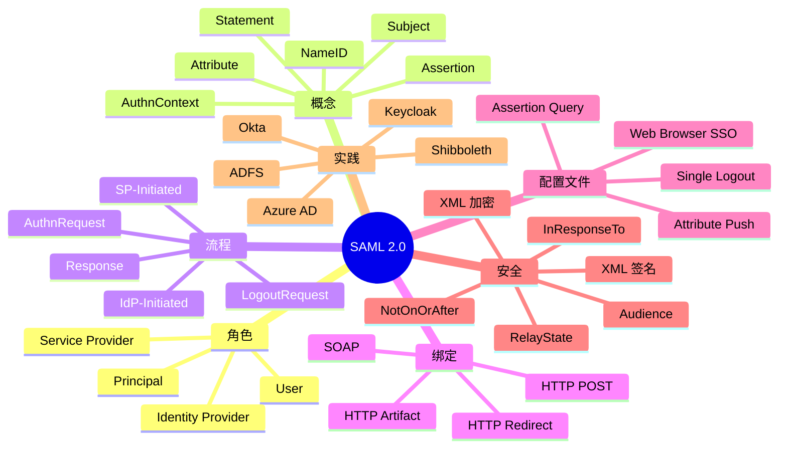

# SAML 2.0 深入剖析

## 一、前言

SAML（Security Assertion Markup Language）2.0 是企业级 SSO 的传统标准协议，基于 XML 在 IdP（身份提供商）与 SP（服务提供商）之间传递认证断言。虽然 OIDC 在新项目中更流行，但 SAML 仍在政府、金融、大型企业中广泛使用。

## 二、架构思维导图



## 三、关键代码

### 3.1 SAML 工具与依赖

```xml
<!-- pom.xml -->
<dependency>
    <groupId>org.opensaml</groupId>
    <artifactId>opensaml-core</artifactId>
    <version>4.3.0</version>
</dependency>
<dependency>
    <groupId>org.opensaml</groupId>
    <artifactId>opensaml-saml-api</artifactId>
    <version>4.3.0</version>
</dependency>
```

### 3.2 SP-Initiated SSO（Java）

```java
@Service
public class SamlService {
    
    public String buildAuthnRequest(String idpSsoUrl) {
        AuthnRequest authnRequest = (AuthnRequest) XMLObjectProviderFactorySupport
            .getBuilderFactory()
            .getBuilder(AuthnRequest.DEFAULT_ELEMENT_NAME)
            .buildObject(AuthnRequest.DEFAULT_ELEMENT_NAME);
        
        authnRequest.setID("_" + UUID.randomUUID().toString());
        authnRequest.setVersion(SAMLVersion.VERSION_20);
        authnRequest.setIssueInstant(new DateTime());
        authnRequest.setDestination(idpSsoUrl);
        authnRequest.setProtocolBinding("urn:oasis:names:tc:SAML:2.0:bindings:HTTP-POST");
        authnRequest.setAssertionConsumerServiceURL("https://sp.example.com/acs");
        authnRequest.setIssuer(buildIssuer("https://sp.example.com"));
        authnRequest.setNameIDPolicy(buildNameIDPolicy());
        
        // 签名
        signRequest(authnRequest);
        
        // 编码并构造 Redirect URL
        String encoded = deflateAndBase64Encode(SAMLObjectSupport
            .marshall(authnRequest));
        return idpSsoUrl + "?SAMLRequest=" + encoded 
            + "&RelayState=" + URLEncoder.encode("https://sp.example.com", "UTF-8");
    }
    
    public void handleSamlResponse(String samlResponseB64) throws Exception {
        Response response = (Response) SAMLObjectSupport.unmarshallFromInputStream(
            new ByteArrayInputStream(Base64.getDecoder().decode(samlResponseB64))
        );
        
        // 1. 验证签名
        verifySignature(response);
        
        // 2. 验证时间窗口
        Assertion assertion = response.getAssertions().get(0);
        if (assertion.getConditions().getNotOnOrAfter().isBeforeNow()) {
            throw new SecurityException("Assertion expired");
        }
        
        // 3. 验证 Audience
        for (AudienceRestriction ar : assertion.getConditions().getAudienceRestrictions()) {
            if (!ar.getAudiences().contains("https://sp.example.com")) {
                throw new SecurityException("Invalid audience");
            }
        }
        
        // 4. 提取 NameID 和属性
        NameID nameID = assertion.getSubject().getNameID();
        Map<String, String> attributes = new HashMap<>();
        for (Attribute attr : assertion.getAttributeStatements().get(0).getAttributes()) {
            attributes.put(attr.getName(), attr.getAttributeValues().get(0).getDOM().getTextContent());
        }
        
        // 5. 创建本地会话
        createSession(nameID.getValue(), attributes);
    }
}
```


## 扩展阅读：SAML 深入剖析深度专题

SAML（Security Assertion Markup Language）是企业级 SSO 的标准协议，被广泛应用于政府、金融、大型企业。


### 扩展 1. 核心原理

SAML 2.0（2005 年发布）是 OASIS 标准，基于 XML 交换身份认证信息。SAML 包含三个角色：Principal（用户）、IdP（Identity Provider，身份提供方）、SP（Service Provider，服务提供方）。

SAML 流程：1) 用户访问 SP 资源；2) SP 生成 SAML Request（AuthnRequest）；3) 用户浏览器重定向到 IdP；4) IdP 认证用户；5) IdP 生成 SAML Response（Assertion）签名；6) 用户浏览器 POST 到 SP 的 ACS（Assertion Consumer Service）；7) SP 验证签名和断言。


### 扩展 2. 工程实践

SAML 流程：1) 用户访问 SP 资源；2) SP 生成 SAML Request（AuthnRequest）；3) 用户浏览器重定向到 IdP；4) IdP 认证用户；5) IdP 生成 SAML Response（Assertion）签名；6) 用户浏览器 POST 到 SP 的 ACS（Assertion Consumer Service）；7) SP 验证签名和断言。

SAML 绑定（Bindings）：HTTP Redirect（URL 参数）、HTTP POST（表单提交）、HTTP Artifact（引用 ID）、SOAP（后端拉取）。Web 浏览器 SSO Profile 通常使用 Redirect + POST 组合。


### 扩展 3. 性能优化

SAML 绑定（Bindings）：HTTP Redirect（URL 参数）、HTTP POST（表单提交）、HTTP Artifact（引用 ID）、SOAP（后端拉取）。Web 浏览器 SSO Profile 通常使用 Redirect + POST 组合。

SAML 断言（Assertion）类型：Authentication Assertion（认证）、Attribute Assertion（属性）、Authorization Decision Assertion（授权）。Assertion 默认有 NotBefore、NotOnOrAfter 有效期。


### 扩展 4. 安全加固

SAML 断言（Assertion）类型：Authentication Assertion（认证）、Attribute Assertion（属性）、Authorization Decision Assertion（授权）。Assertion 默认有 NotBefore、NotOnOrAfter 有效期。

SAML 签名：Assertion 必须数字签名（XML Signature，RFC 3275），同时支持加密（SAML Encryption）。XML Signature 比 JWT 复杂，性能较差。


### 扩展 5. 未来演进

SAML 签名：Assertion 必须数字签名（XML Signature，RFC 3275），同时支持加密（SAML Encryption）。XML Signature 比 JWT 复杂，性能较差。

SAML NameID：用户唯一标识。格式：email-address、persistent（随机 ID）、transient（临时）、unspecified。SP 用 NameID 关联本地账户。


### 扩展 6. 案例分析

SAML NameID：用户唯一标识。格式：email-address、persistent（随机 ID）、transient（临时）、unspecified。SP 用 NameID 关联本地账户。

SAML 单点登录（SSO）：用户在一个 IdP 登录后，访问其他 SP 时，IdP 通过 SLO（Single Logout）或 IdP 会话复用实现免登录。SLO 流程复杂，常出现登出不完整问题。


### 扩展 7. 工具链

SAML 单点登录（SSO）：用户在一个 IdP 登录后，访问其他 SP 时，IdP 通过 SLO（Single Logout）或 IdP 会话复用实现免登录。SLO 流程复杂，常出现登出不完整问题。

SAML 与 OIDC 对比：SAML 基于 XML、笨重、企业级；OIDC 基于 JSON/JWT、轻量、现代。SAML 在企业市场仍占主导，OIDC 在新项目和移动端更流行。


### 扩展 8. 最佳实践

SAML 与 OIDC 对比：SAML 基于 XML、笨重、企业级；OIDC 基于 JSON/JWT、轻量、现代。SAML 在企业市场仍占主导，OIDC 在新项目和移动端更流行。

SAML 实施工具：OpenSAML（Java）、python-saml（Python）、samlify（Node.js）、gosaml2（Go）、rust-saml（Rust）。商业 IdP：Okta、Azure AD、OneLogin、Auth0、Authing。


### 扩展 9. 常见陷阱

SAML 实施工具：OpenSAML（Java）、python-saml（Python）、samlify（Node.js）、gosaml2（Go）、rust-saml（Rust）。商业 IdP：Okta、Azure AD、OneLogin、Auth0、Authing。

SAML 元数据（Metadata）：IdP 和 SP 交换 XML 元数据，包含 EntityID、SSO URL、签名证书、加密证书、支持绑定等。元数据交换是 SAML 集成的第一步。


### 扩展 10. 业界标准

SAML 元数据（Metadata）：IdP 和 SP 交换 XML 元数据，包含 EntityID、SSO URL、签名证书、加密证书、支持绑定等。元数据交换是 SAML 集成的第一步。

SAML 安全威胁：XML Signature Wrapping（XSW）、SAML Response 注入、Replay（断言重放）、加密未启用、签名剥离、Receiver 错误。OWASP SAML Cheat Sheet 提供了完整防护指南。


### 扩展 11. 生态对比

SAML 安全威胁：XML Signature Wrapping（XSW）、SAML Response 注入、Replay（断言重放）、加密未启用、签名剥离、Receiver 错误。OWASP SAML Cheat Sheet 提供了完整防护指南。

SAML IdP Initiated：用户从 IdP 门户直接登录 SP，无需 AuthnRequest。安全性低于 SP Initiated（无法验证 SP 身份），但 UX 更好。


### 扩展 12. 标准演进

SAML IdP Initiated：用户从 IdP 门户直接登录 SP，无需 AuthnRequest。安全性低于 SP Initiated（无法验证 SP 身份），但 UX 更好。

SAML 加密：SAML Assertion 可以整体加密（EncryptedAssertion）或部分加密（如 NameID、Attribute）。SAML 加密使用 XML Encryption，性能开销大。


### 扩展 13. 核心原理

SAML 加密：SAML Assertion 可以整体加密（EncryptedAssertion）或部分加密（如 NameID、Attribute）。SAML 加密使用 XML Encryption，性能开销大。

SAML 性能：每次 SSO 涉及多次 XML 解析、签名验证、加密解密。O（秒级）延迟，远高于 OIDC 毫秒级。缓存机制可以优化。


### 扩展 14. 工程实践

SAML 性能：每次 SSO 涉及多次 XML 解析、签名验证、加密解密。O（秒级）延迟，远高于 OIDC 毫秒级。缓存机制可以优化。

SAML 与 SCIM：SCIM（System for Cross-domain Identity Management，RFC 7644）用于用户配置同步。SAML 处理认证，SCIM 处理用户/组同步，两者互补。


### 扩展 15. 性能优化

SAML 与 SCIM：SCIM（System for Cross-domain Identity Management，RFC 7644）用于用户配置同步。SAML 处理认证，SCIM 处理用户/组同步，两者互补。

SAML 部署场景：员工访问 Salesforce、Workday、ServiceNow、Office 365；学生访问 Blackboard、Moodle；政府机构跨部门系统互信。SAML 是 B2B 集成的事实标准。


### 扩展 16. 安全加固

SAML 部署场景：员工访问 Salesforce、Workday、ServiceNow、Office 365；学生访问 Blackboard、Moodle；政府机构跨部门系统互信。SAML 是 B2B 集成的事实标准。

SAML 移动端：移动 App 通过 WebView 或原生 SAML 库实现 SSO。Auth0、Okta、Azure AD 提供原生 SDK。Web SSO + Native SSO 桥接是常见架构。


### 扩展 17. 未来演进

SAML 移动端：移动 App 通过 WebView 或原生 SAML 库实现 SSO。Auth0、Okta、Azure AD 提供原生 SDK。Web SSO + Native SSO 桥接是常见架构。

SAML 互操作性测试：SAML 2.0 互操作性测试由 OASIS 管理，包含数十个测试用例。商业 IdP 都通过该测试，确保 SP 兼容性。


### 扩展 18. 案例分析

SAML 互操作性测试：SAML 2.0 互操作性测试由 OASIS 管理，包含数十个测试用例。商业 IdP 都通过该测试，确保 SP 兼容性。

SAML 与 FAPI：金融行业的 SAML 部署需要满足 FAPI（Financial-grade API）安全要求，包括强制签名、加密、JWKS Endpoint 验证。


### 扩展 19. 工具链

SAML 与 FAPI：金融行业的 SAML 部署需要满足 FAPI（Financial-grade API）安全要求，包括强制签名、加密、JWKS Endpoint 验证。

SAML 未来：SAML 仍将在企业 SSO 占据一席之地，但新项目首选 OIDC。SAML 与 OIDC 互通的解决方案（OIDC-SAML Bridge、IdP Proxy）将延长 SAML 生命周期。


### 扩展 20. 最佳实践

SAML 未来：SAML 仍将在企业 SSO 占据一席之地，但新项目首选 OIDC。SAML 与 OIDC 互通的解决方案（OIDC-SAML Bridge、IdP Proxy）将延长 SAML 生命周期。

SAML 2.0（2005 年发布）是 OASIS 标准，基于 XML 交换身份认证信息。SAML 包含三个角色：Principal（用户）、IdP（Identity Provider，身份提供方）、SP（Service Provider，服务提供方）。


## 扩展阅读：SAML 深入剖析深度专题

SAML（Security Assertion Markup Language）是企业级 SSO 的标准协议，被广泛应用于政府、金融、大型企业。


### 扩展 1. 核心原理

SAML 2.0（2005 年发布）是 OASIS 标准，基于 XML 交换身份认证信息。SAML 包含三个角色：Principal（用户）、IdP（Identity Provider，身份提供方）、SP（Service Provider，服务提供方）。

SAML 流程：1) 用户访问 SP 资源；2) SP 生成 SAML Request（AuthnRequest）；3) 用户浏览器重定向到 IdP；4) IdP 认证用户；5) IdP 生成 SAML Response（Assertion）签名；6) 用户浏览器 POST 到 SP 的 ACS（Assertion Consumer Service）；7) SP 验证签名和断言。


### 扩展 2. 工程实践

SAML 流程：1) 用户访问 SP 资源；2) SP 生成 SAML Request（AuthnRequest）；3) 用户浏览器重定向到 IdP；4) IdP 认证用户；5) IdP 生成 SAML Response（Assertion）签名；6) 用户浏览器 POST 到 SP 的 ACS（Assertion Consumer Service）；7) SP 验证签名和断言。

SAML 绑定（Bindings）：HTTP Redirect（URL 参数）、HTTP POST（表单提交）、HTTP Artifact（引用 ID）、SOAP（后端拉取）。Web 浏览器 SSO Profile 通常使用 Redirect + POST 组合。


### 扩展 3. 性能优化

SAML 绑定（Bindings）：HTTP Redirect（URL 参数）、HTTP POST（表单提交）、HTTP Artifact（引用 ID）、SOAP（后端拉取）。Web 浏览器 SSO Profile 通常使用 Redirect + POST 组合。

SAML 断言（Assertion）类型：Authentication Assertion（认证）、Attribute Assertion（属性）、Authorization Decision Assertion（授权）。Assertion 默认有 NotBefore、NotOnOrAfter 有效期。


### 扩展 4. 安全加固

SAML 断言（Assertion）类型：Authentication Assertion（认证）、Attribute Assertion（属性）、Authorization Decision Assertion（授权）。Assertion 默认有 NotBefore、NotOnOrAfter 有效期。

SAML 签名：Assertion 必须数字签名（XML Signature，RFC 3275），同时支持加密（SAML Encryption）。XML Signature 比 JWT 复杂，性能较差。


### 扩展 5. 未来演进

SAML 签名：Assertion 必须数字签名（XML Signature，RFC 3275），同时支持加密（SAML Encryption）。XML Signature 比 JWT 复杂，性能较差。

SAML NameID：用户唯一标识。格式：email-address、persistent（随机 ID）、transient（临时）、unspecified。SP 用 NameID 关联本地账户。


### 扩展 6. 案例分析

SAML NameID：用户唯一标识。格式：email-address、persistent（随机 ID）、transient（临时）、unspecified。SP 用 NameID 关联本地账户。

SAML 单点登录（SSO）：用户在一个 IdP 登录后，访问其他 SP 时，IdP 通过 SLO（Single Logout）或 IdP 会话复用实现免登录。SLO 流程复杂，常出现登出不完整问题。


### 扩展 7. 工具链

SAML 单点登录（SSO）：用户在一个 IdP 登录后，访问其他 SP 时，IdP 通过 SLO（Single Logout）或 IdP 会话复用实现免登录。SLO 流程复杂，常出现登出不完整问题。

SAML 与 OIDC 对比：SAML 基于 XML、笨重、企业级；OIDC 基于 JSON/JWT、轻量、现代。SAML 在企业市场仍占主导，OIDC 在新项目和移动端更流行。


### 扩展 8. 最佳实践

SAML 与 OIDC 对比：SAML 基于 XML、笨重、企业级；OIDC 基于 JSON/JWT、轻量、现代。SAML 在企业市场仍占主导，OIDC 在新项目和移动端更流行。

SAML 实施工具：OpenSAML（Java）、python-saml（Python）、samlify（Node.js）、gosaml2（Go）、rust-saml（Rust）。商业 IdP：Okta、Azure AD、OneLogin、Auth0、Authing。


### 扩展 9. 常见陷阱

SAML 实施工具：OpenSAML（Java）、python-saml（Python）、samlify（Node.js）、gosaml2（Go）、rust-saml（Rust）。商业 IdP：Okta、Azure AD、OneLogin、Auth0、Authing。

SAML 元数据（Metadata）：IdP 和 SP 交换 XML 元数据，包含 EntityID、SSO URL、签名证书、加密证书、支持绑定等。元数据交换是 SAML 集成的第一步。


### 扩展 10. 业界标准

SAML 元数据（Metadata）：IdP 和 SP 交换 XML 元数据，包含 EntityID、SSO URL、签名证书、加密证书、支持绑定等。元数据交换是 SAML 集成的第一步。

SAML 安全威胁：XML Signature Wrapping（XSW）、SAML Response 注入、Replay（断言重放）、加密未启用、签名剥离、Receiver 错误。OWASP SAML Cheat Sheet 提供了完整防护指南。


### 扩展 11. 生态对比

SAML 安全威胁：XML Signature Wrapping（XSW）、SAML Response 注入、Replay（断言重放）、加密未启用、签名剥离、Receiver 错误。OWASP SAML Cheat Sheet 提供了完整防护指南。

SAML IdP Initiated：用户从 IdP 门户直接登录 SP，无需 AuthnRequest。安全性低于 SP Initiated（无法验证 SP 身份），但 UX 更好。


### 扩展 12. 标准演进

SAML IdP Initiated：用户从 IdP 门户直接登录 SP，无需 AuthnRequest。安全性低于 SP Initiated（无法验证 SP 身份），但 UX 更好。

SAML 加密：SAML Assertion 可以整体加密（EncryptedAssertion）或部分加密（如 NameID、Attribute）。SAML 加密使用 XML Encryption，性能开销大。


### 扩展 13. 核心原理

SAML 加密：SAML Assertion 可以整体加密（EncryptedAssertion）或部分加密（如 NameID、Attribute）。SAML 加密使用 XML Encryption，性能开销大。

SAML 性能：每次 SSO 涉及多次 XML 解析、签名验证、加密解密。O（秒级）延迟，远高于 OIDC 毫秒级。缓存机制可以优化。


### 扩展 14. 工程实践

SAML 性能：每次 SSO 涉及多次 XML 解析、签名验证、加密解密。O（秒级）延迟，远高于 OIDC 毫秒级。缓存机制可以优化。

SAML 与 SCIM：SCIM（System for Cross-domain Identity Management，RFC 7644）用于用户配置同步。SAML 处理认证，SCIM 处理用户/组同步，两者互补。


### 扩展 15. 性能优化

SAML 与 SCIM：SCIM（System for Cross-domain Identity Management，RFC 7644）用于用户配置同步。SAML 处理认证，SCIM 处理用户/组同步，两者互补。

SAML 部署场景：员工访问 Salesforce、Workday、ServiceNow、Office 365；学生访问 Blackboard、Moodle；政府机构跨部门系统互信。SAML 是 B2B 集成的事实标准。


### 扩展 16. 安全加固

SAML 部署场景：员工访问 Salesforce、Workday、ServiceNow、Office 365；学生访问 Blackboard、Moodle；政府机构跨部门系统互信。SAML 是 B2B 集成的事实标准。

SAML 移动端：移动 App 通过 WebView 或原生 SAML 库实现 SSO。Auth0、Okta、Azure AD 提供原生 SDK。Web SSO + Native SSO 桥接是常见架构。


### 扩展 17. 未来演进

SAML 移动端：移动 App 通过 WebView 或原生 SAML 库实现 SSO。Auth0、Okta、Azure AD 提供原生 SDK。Web SSO + Native SSO 桥接是常见架构。

SAML 互操作性测试：SAML 2.0 互操作性测试由 OASIS 管理，包含数十个测试用例。商业 IdP 都通过该测试，确保 SP 兼容性。


### 扩展 18. 案例分析

SAML 互操作性测试：SAML 2.0 互操作性测试由 OASIS 管理，包含数十个测试用例。商业 IdP 都通过该测试，确保 SP 兼容性。

SAML 与 FAPI：金融行业的 SAML 部署需要满足 FAPI（Financial-grade API）安全要求，包括强制签名、加密、JWKS Endpoint 验证。


### 扩展 19. 工具链

SAML 与 FAPI：金融行业的 SAML 部署需要满足 FAPI（Financial-grade API）安全要求，包括强制签名、加密、JWKS Endpoint 验证。

SAML 未来：SAML 仍将在企业 SSO 占据一席之地，但新项目首选 OIDC。SAML 与 OIDC 互通的解决方案（OIDC-SAML Bridge、IdP Proxy）将延长 SAML 生命周期。


### 扩展 20. 最佳实践

SAML 未来：SAML 仍将在企业 SSO 占据一席之地，但新项目首选 OIDC。SAML 与 OIDC 互通的解决方案（OIDC-SAML Bridge、IdP Proxy）将延长 SAML 生命周期。

SAML 2.0（2005 年发布）是 OASIS 标准，基于 XML 交换身份认证信息。SAML 包含三个角色：Principal（用户）、IdP（Identity Provider，身份提供方）、SP（Service Provider，服务提供方）。


## 扩展阅读：SAML 深入剖析深度专题

SAML（Security Assertion Markup Language）是企业级 SSO 的标准协议，被广泛应用于政府、金融、大型企业。


### 扩展 1. 核心原理

SAML 2.0（2005 年发布）是 OASIS 标准，基于 XML 交换身份认证信息。SAML 包含三个角色：Principal（用户）、IdP（Identity Provider，身份提供方）、SP（Service Provider，服务提供方）。

SAML 流程：1) 用户访问 SP 资源；2) SP 生成 SAML Request（AuthnRequest）；3) 用户浏览器重定向到 IdP；4) IdP 认证用户；5) IdP 生成 SAML Response（Assertion）签名；6) 用户浏览器 POST 到 SP 的 ACS（Assertion Consumer Service）；7) SP 验证签名和断言。


### 扩展 2. 工程实践

SAML 流程：1) 用户访问 SP 资源；2) SP 生成 SAML Request（AuthnRequest）；3) 用户浏览器重定向到 IdP；4) IdP 认证用户；5) IdP 生成 SAML Response（Assertion）签名；6) 用户浏览器 POST 到 SP 的 ACS（Assertion Consumer Service）；7) SP 验证签名和断言。

SAML 绑定（Bindings）：HTTP Redirect（URL 参数）、HTTP POST（表单提交）、HTTP Artifact（引用 ID）、SOAP（后端拉取）。Web 浏览器 SSO Profile 通常使用 Redirect + POST 组合。


### 扩展 3. 性能优化

SAML 绑定（Bindings）：HTTP Redirect（URL 参数）、HTTP POST（表单提交）、HTTP Artifact（引用 ID）、SOAP（后端拉取）。Web 浏览器 SSO Profile 通常使用 Redirect + POST 组合。

SAML 断言（Assertion）类型：Authentication Assertion（认证）、Attribute Assertion（属性）、Authorization Decision Assertion（授权）。Assertion 默认有 NotBefore、NotOnOrAfter 有效期。


### 扩展 4. 安全加固

SAML 断言（Assertion）类型：Authentication Assertion（认证）、Attribute Assertion（属性）、Authorization Decision Assertion（授权）。Assertion 默认有 NotBefore、NotOnOrAfter 有效期。

SAML 签名：Assertion 必须数字签名（XML Signature，RFC 3275），同时支持加密（SAML Encryption）。XML Signature 比 JWT 复杂，性能较差。


### 扩展 5. 未来演进

SAML 签名：Assertion 必须数字签名（XML Signature，RFC 3275），同时支持加密（SAML Encryption）。XML Signature 比 JWT 复杂，性能较差。

SAML NameID：用户唯一标识。格式：email-address、persistent（随机 ID）、transient（临时）、unspecified。SP 用 NameID 关联本地账户。


### 扩展 6. 案例分析

SAML NameID：用户唯一标识。格式：email-address、persistent（随机 ID）、transient（临时）、unspecified。SP 用 NameID 关联本地账户。

SAML 单点登录（SSO）：用户在一个 IdP 登录后，访问其他 SP 时，IdP 通过 SLO（Single Logout）或 IdP 会话复用实现免登录。SLO 流程复杂，常出现登出不完整问题。


### 扩展 7. 工具链

SAML 单点登录（SSO）：用户在一个 IdP 登录后，访问其他 SP 时，IdP 通过 SLO（Single Logout）或 IdP 会话复用实现免登录。SLO 流程复杂，常出现登出不完整问题。

SAML 与 OIDC 对比：SAML 基于 XML、笨重、企业级；OIDC 基于 JSON/JWT、轻量、现代。SAML 在企业市场仍占主导，OIDC 在新项目和移动端更流行。


### 扩展 8. 最佳实践

SAML 与 OIDC 对比：SAML 基于 XML、笨重、企业级；OIDC 基于 JSON/JWT、轻量、现代。SAML 在企业市场仍占主导，OIDC 在新项目和移动端更流行。

SAML 实施工具：OpenSAML（Java）、python-saml（Python）、samlify（Node.js）、gosaml2（Go）、rust-saml（Rust）。商业 IdP：Okta、Azure AD、OneLogin、Auth0、Authing。


### 扩展 9. 常见陷阱

SAML 实施工具：OpenSAML（Java）、python-saml（Python）、samlify（Node.js）、gosaml2（Go）、rust-saml（Rust）。商业 IdP：Okta、Azure AD、OneLogin、Auth0、Authing。

SAML 元数据（Metadata）：IdP 和 SP 交换 XML 元数据，包含 EntityID、SSO URL、签名证书、加密证书、支持绑定等。元数据交换是 SAML 集成的第一步。


### 扩展 10. 业界标准

SAML 元数据（Metadata）：IdP 和 SP 交换 XML 元数据，包含 EntityID、SSO URL、签名证书、加密证书、支持绑定等。元数据交换是 SAML 集成的第一步。

SAML 安全威胁：XML Signature Wrapping（XSW）、SAML Response 注入、Replay（断言重放）、加密未启用、签名剥离、Receiver 错误。OWASP SAML Cheat Sheet 提供了完整防护指南。


### 扩展 11. 生态对比

SAML 安全威胁：XML Signature Wrapping（XSW）、SAML Response 注入、Replay（断言重放）、加密未启用、签名剥离、Receiver 错误。OWASP SAML Cheat Sheet 提供了完整防护指南。

SAML IdP Initiated：用户从 IdP 门户直接登录 SP，无需 AuthnRequest。安全性低于 SP Initiated（无法验证 SP 身份），但 UX 更好。


### 扩展 12. 标准演进

SAML IdP Initiated：用户从 IdP 门户直接登录 SP，无需 AuthnRequest。安全性低于 SP Initiated（无法验证 SP 身份），但 UX 更好。

SAML 加密：SAML Assertion 可以整体加密（EncryptedAssertion）或部分加密（如 NameID、Attribute）。SAML 加密使用 XML Encryption，性能开销大。


### 扩展 13. 核心原理

SAML 加密：SAML Assertion 可以整体加密（EncryptedAssertion）或部分加密（如 NameID、Attribute）。SAML 加密使用 XML Encryption，性能开销大。

SAML 性能：每次 SSO 涉及多次 XML 解析、签名验证、加密解密。O（秒级）延迟，远高于 OIDC 毫秒级。缓存机制可以优化。


### 扩展 14. 工程实践

SAML 性能：每次 SSO 涉及多次 XML 解析、签名验证、加密解密。O（秒级）延迟，远高于 OIDC 毫秒级。缓存机制可以优化。

SAML 与 SCIM：SCIM（System for Cross-domain Identity Management，RFC 7644）用于用户配置同步。SAML 处理认证，SCIM 处理用户/组同步，两者互补。


### 扩展 15. 性能优化

SAML 与 SCIM：SCIM（System for Cross-domain Identity Management，RFC 7644）用于用户配置同步。SAML 处理认证，SCIM 处理用户/组同步，两者互补。

SAML 部署场景：员工访问 Salesforce、Workday、ServiceNow、Office 365；学生访问 Blackboard、Moodle；政府机构跨部门系统互信。SAML 是 B2B 集成的事实标准。


### 扩展 16. 安全加固

SAML 部署场景：员工访问 Salesforce、Workday、ServiceNow、Office 365；学生访问 Blackboard、Moodle；政府机构跨部门系统互信。SAML 是 B2B 集成的事实标准。

SAML 移动端：移动 App 通过 WebView 或原生 SAML 库实现 SSO。Auth0、Okta、Azure AD 提供原生 SDK。Web SSO + Native SSO 桥接是常见架构。


### 扩展 17. 未来演进

SAML 移动端：移动 App 通过 WebView 或原生 SAML 库实现 SSO。Auth0、Okta、Azure AD 提供原生 SDK。Web SSO + Native SSO 桥接是常见架构。

SAML 互操作性测试：SAML 2.0 互操作性测试由 OASIS 管理，包含数十个测试用例。商业 IdP 都通过该测试，确保 SP 兼容性。


### 扩展 18. 案例分析

SAML 互操作性测试：SAML 2.0 互操作性测试由 OASIS 管理，包含数十个测试用例。商业 IdP 都通过该测试，确保 SP 兼容性。

SAML 与 FAPI：金融行业的 SAML 部署需要满足 FAPI（Financial-grade API）安全要求，包括强制签名、加密、JWKS Endpoint 验证。


### 扩展 19. 工具链

SAML 与 FAPI：金融行业的 SAML 部署需要满足 FAPI（Financial-grade API）安全要求，包括强制签名、加密、JWKS Endpoint 验证。

SAML 未来：SAML 仍将在企业 SSO 占据一席之地，但新项目首选 OIDC。SAML 与 OIDC 互通的解决方案（OIDC-SAML Bridge、IdP Proxy）将延长 SAML 生命周期。


### 扩展 20. 最佳实践

SAML 未来：SAML 仍将在企业 SSO 占据一席之地，但新项目首选 OIDC。SAML 与 OIDC 互通的解决方案（OIDC-SAML Bridge、IdP Proxy）将延长 SAML 生命周期。

SAML 2.0（2005 年发布）是 OASIS 标准，基于 XML 交换身份认证信息。SAML 包含三个角色：Principal（用户）、IdP（Identity Provider，身份提供方）、SP（Service Provider，服务提供方）。


## 扩展阅读：SAML 深入剖析深度专题

SAML（Security Assertion Markup Language）是企业级 SSO 的标准协议，被广泛应用于政府、金融、大型企业。


### 扩展 1. 核心原理

SAML 2.0（2005 年发布）是 OASIS 标准，基于 XML 交换身份认证信息。SAML 包含三个角色：Principal（用户）、IdP（Identity Provider，身份提供方）、SP（Service Provider，服务提供方）。

SAML 流程：1) 用户访问 SP 资源；2) SP 生成 SAML Request（AuthnRequest）；3) 用户浏览器重定向到 IdP；4) IdP 认证用户；5) IdP 生成 SAML Response（Assertion）签名；6) 用户浏览器 POST 到 SP 的 ACS（Assertion Consumer Service）；7) SP 验证签名和断言。


### 扩展 2. 工程实践

SAML 流程：1) 用户访问 SP 资源；2) SP 生成 SAML Request（AuthnRequest）；3) 用户浏览器重定向到 IdP；4) IdP 认证用户；5) IdP 生成 SAML Response（Assertion）签名；6) 用户浏览器 POST 到 SP 的 ACS（Assertion Consumer Service）；7) SP 验证签名和断言。

SAML 绑定（Bindings）：HTTP Redirect（URL 参数）、HTTP POST（表单提交）、HTTP Artifact（引用 ID）、SOAP（后端拉取）。Web 浏览器 SSO Profile 通常使用 Redirect + POST 组合。


### 扩展 3. 性能优化

SAML 绑定（Bindings）：HTTP Redirect（URL 参数）、HTTP POST（表单提交）、HTTP Artifact（引用 ID）、SOAP（后端拉取）。Web 浏览器 SSO Profile 通常使用 Redirect + POST 组合。

SAML 断言（Assertion）类型：Authentication Assertion（认证）、Attribute Assertion（属性）、Authorization Decision Assertion（授权）。Assertion 默认有 NotBefore、NotOnOrAfter 有效期。


### 扩展 4. 安全加固

SAML 断言（Assertion）类型：Authentication Assertion（认证）、Attribute Assertion（属性）、Authorization Decision Assertion（授权）。Assertion 默认有 NotBefore、NotOnOrAfter 有效期。

SAML 签名：Assertion 必须数字签名（XML Signature，RFC 3275），同时支持加密（SAML Encryption）。XML Signature 比 JWT 复杂，性能较差。


### 扩展 5. 未来演进

SAML 签名：Assertion 必须数字签名（XML Signature，RFC 3275），同时支持加密（SAML Encryption）。XML Signature 比 JWT 复杂，性能较差。

SAML NameID：用户唯一标识。格式：email-address、persistent（随机 ID）、transient（临时）、unspecified。SP 用 NameID 关联本地账户。


### 扩展 6. 案例分析

SAML NameID：用户唯一标识。格式：email-address、persistent（随机 ID）、transient（临时）、unspecified。SP 用 NameID 关联本地账户。

SAML 单点登录（SSO）：用户在一个 IdP 登录后，访问其他 SP 时，IdP 通过 SLO（Single Logout）或 IdP 会话复用实现免登录。SLO 流程复杂，常出现登出不完整问题。


### 扩展 7. 工具链

SAML 单点登录（SSO）：用户在一个 IdP 登录后，访问其他 SP 时，IdP 通过 SLO（Single Logout）或 IdP 会话复用实现免登录。SLO 流程复杂，常出现登出不完整问题。

SAML 与 OIDC 对比：SAML 基于 XML、笨重、企业级；OIDC 基于 JSON/JWT、轻量、现代。SAML 在企业市场仍占主导，OIDC 在新项目和移动端更流行。


### 扩展 8. 最佳实践

SAML 与 OIDC 对比：SAML 基于 XML、笨重、企业级；OIDC 基于 JSON/JWT、轻量、现代。SAML 在企业市场仍占主导，OIDC 在新项目和移动端更流行。

SAML 实施工具：OpenSAML（Java）、python-saml（Python）、samlify（Node.js）、gosaml2（Go）、rust-saml（Rust）。商业 IdP：Okta、Azure AD、OneLogin、Auth0、Authing。


### 扩展 9. 常见陷阱

SAML 实施工具：OpenSAML（Java）、python-saml（Python）、samlify（Node.js）、gosaml2（Go）、rust-saml（Rust）。商业 IdP：Okta、Azure AD、OneLogin、Auth0、Authing。

SAML 元数据（Metadata）：IdP 和 SP 交换 XML 元数据，包含 EntityID、SSO URL、签名证书、加密证书、支持绑定等。元数据交换是 SAML 集成的第一步。


### 扩展 10. 业界标准

SAML 元数据（Metadata）：IdP 和 SP 交换 XML 元数据，包含 EntityID、SSO URL、签名证书、加密证书、支持绑定等。元数据交换是 SAML 集成的第一步。

SAML 安全威胁：XML Signature Wrapping（XSW）、SAML Response 注入、Replay（断言重放）、加密未启用、签名剥离、Receiver 错误。OWASP SAML Cheat Sheet 提供了完整防护指南。


### 扩展 11. 生态对比

SAML 安全威胁：XML Signature Wrapping（XSW）、SAML Response 注入、Replay（断言重放）、加密未启用、签名剥离、Receiver 错误。OWASP SAML Cheat Sheet 提供了完整防护指南。

SAML IdP Initiated：用户从 IdP 门户直接登录 SP，无需 AuthnRequest。安全性低于 SP Initiated（无法验证 SP 身份），但 UX 更好。


### 扩展 12. 标准演进

SAML IdP Initiated：用户从 IdP 门户直接登录 SP，无需 AuthnRequest。安全性低于 SP Initiated（无法验证 SP 身份），但 UX 更好。

SAML 加密：SAML Assertion 可以整体加密（EncryptedAssertion）或部分加密（如 NameID、Attribute）。SAML 加密使用 XML Encryption，性能开销大。


### 扩展 13. 核心原理

SAML 加密：SAML Assertion 可以整体加密（EncryptedAssertion）或部分加密（如 NameID、Attribute）。SAML 加密使用 XML Encryption，性能开销大。

SAML 性能：每次 SSO 涉及多次 XML 解析、签名验证、加密解密。O（秒级）延迟，远高于 OIDC 毫秒级。缓存机制可以优化。


### 扩展 14. 工程实践

SAML 性能：每次 SSO 涉及多次 XML 解析、签名验证、加密解密。O（秒级）延迟，远高于 OIDC 毫秒级。缓存机制可以优化。

SAML 与 SCIM：SCIM（System for Cross-domain Identity Management，RFC 7644）用于用户配置同步。SAML 处理认证，SCIM 处理用户/组同步，两者互补。


### 扩展 15. 性能优化

SAML 与 SCIM：SCIM（System for Cross-domain Identity Management，RFC 7644）用于用户配置同步。SAML 处理认证，SCIM 处理用户/组同步，两者互补。

SAML 部署场景：员工访问 Salesforce、Workday、ServiceNow、Office 365；学生访问 Blackboard、Moodle；政府机构跨部门系统互信。SAML 是 B2B 集成的事实标准。


### 扩展 16. 安全加固

SAML 部署场景：员工访问 Salesforce、Workday、ServiceNow、Office 365；学生访问 Blackboard、Moodle；政府机构跨部门系统互信。SAML 是 B2B 集成的事实标准。

SAML 移动端：移动 App 通过 WebView 或原生 SAML 库实现 SSO。Auth0、Okta、Azure AD 提供原生 SDK。Web SSO + Native SSO 桥接是常见架构。


### 扩展 17. 未来演进

SAML 移动端：移动 App 通过 WebView 或原生 SAML 库实现 SSO。Auth0、Okta、Azure AD 提供原生 SDK。Web SSO + Native SSO 桥接是常见架构。

SAML 互操作性测试：SAML 2.0 互操作性测试由 OASIS 管理，包含数十个测试用例。商业 IdP 都通过该测试，确保 SP 兼容性。


### 扩展 18. 案例分析

SAML 互操作性测试：SAML 2.0 互操作性测试由 OASIS 管理，包含数十个测试用例。商业 IdP 都通过该测试，确保 SP 兼容性。

SAML 与 FAPI：金融行业的 SAML 部署需要满足 FAPI（Financial-grade API）安全要求，包括强制签名、加密、JWKS Endpoint 验证。


### 扩展 19. 工具链

SAML 与 FAPI：金融行业的 SAML 部署需要满足 FAPI（Financial-grade API）安全要求，包括强制签名、加密、JWKS Endpoint 验证。

SAML 未来：SAML 仍将在企业 SSO 占据一席之地，但新项目首选 OIDC。SAML 与 OIDC 互通的解决方案（OIDC-SAML Bridge、IdP Proxy）将延长 SAML 生命周期。


### 扩展 20. 最佳实践

SAML 未来：SAML 仍将在企业 SSO 占据一席之地，但新项目首选 OIDC。SAML 与 OIDC 互通的解决方案（OIDC-SAML Bridge、IdP Proxy）将延长 SAML 生命周期。

SAML 2.0（2005 年发布）是 OASIS 标准，基于 XML 交换身份认证信息。SAML 包含三个角色：Principal（用户）、IdP（Identity Provider，身份提供方）、SP（Service Provider，服务提供方）。


## 扩展阅读：SAML 深入剖析深度专题

SAML（Security Assertion Markup Language）是企业级 SSO 的标准协议，被广泛应用于政府、金融、大型企业。


### 扩展 1. 核心原理

SAML 2.0（2005 年发布）是 OASIS 标准，基于 XML 交换身份认证信息。SAML 包含三个角色：Principal（用户）、IdP（Identity Provider，身份提供方）、SP（Service Provider，服务提供方）。

SAML 流程：1) 用户访问 SP 资源；2) SP 生成 SAML Request（AuthnRequest）；3) 用户浏览器重定向到 IdP；4) IdP 认证用户；5) IdP 生成 SAML Response（Assertion）签名；6) 用户浏览器 POST 到 SP 的 ACS（Assertion Consumer Service）；7) SP 验证签名和断言。


### 扩展 2. 工程实践

SAML 流程：1) 用户访问 SP 资源；2) SP 生成 SAML Request（AuthnRequest）；3) 用户浏览器重定向到 IdP；4) IdP 认证用户；5) IdP 生成 SAML Response（Assertion）签名；6) 用户浏览器 POST 到 SP 的 ACS（Assertion Consumer Service）；7) SP 验证签名和断言。

SAML 绑定（Bindings）：HTTP Redirect（URL 参数）、HTTP POST（表单提交）、HTTP Artifact（引用 ID）、SOAP（后端拉取）。Web 浏览器 SSO Profile 通常使用 Redirect + POST 组合。


### 扩展 3. 性能优化

SAML 绑定（Bindings）：HTTP Redirect（URL 参数）、HTTP POST（表单提交）、HTTP Artifact（引用 ID）、SOAP（后端拉取）。Web 浏览器 SSO Profile 通常使用 Redirect + POST 组合。

SAML 断言（Assertion）类型：Authentication Assertion（认证）、Attribute Assertion（属性）、Authorization Decision Assertion（授权）。Assertion 默认有 NotBefore、NotOnOrAfter 有效期。


### 扩展 4. 安全加固

SAML 断言（Assertion）类型：Authentication Assertion（认证）、Attribute Assertion（属性）、Authorization Decision Assertion（授权）。Assertion 默认有 NotBefore、NotOnOrAfter 有效期。

SAML 签名：Assertion 必须数字签名（XML Signature，RFC 3275），同时支持加密（SAML Encryption）。XML Signature 比 JWT 复杂，性能较差。


### 扩展 5. 未来演进

SAML 签名：Assertion 必须数字签名（XML Signature，RFC 3275），同时支持加密（SAML Encryption）。XML Signature 比 JWT 复杂，性能较差。

SAML NameID：用户唯一标识。格式：email-address、persistent（随机 ID）、transient（临时）、unspecified。SP 用 NameID 关联本地账户。


### 扩展 6. 案例分析

SAML NameID：用户唯一标识。格式：email-address、persistent（随机 ID）、transient（临时）、unspecified。SP 用 NameID 关联本地账户。

SAML 单点登录（SSO）：用户在一个 IdP 登录后，访问其他 SP 时，IdP 通过 SLO（Single Logout）或 IdP 会话复用实现免登录。SLO 流程复杂，常出现登出不完整问题。


### 扩展 7. 工具链

SAML 单点登录（SSO）：用户在一个 IdP 登录后，访问其他 SP 时，IdP 通过 SLO（Single Logout）或 IdP 会话复用实现免登录。SLO 流程复杂，常出现登出不完整问题。

SAML 与 OIDC 对比：SAML 基于 XML、笨重、企业级；OIDC 基于 JSON/JWT、轻量、现代。SAML 在企业市场仍占主导，OIDC 在新项目和移动端更流行。


### 扩展 8. 最佳实践

SAML 与 OIDC 对比：SAML 基于 XML、笨重、企业级；OIDC 基于 JSON/JWT、轻量、现代。SAML 在企业市场仍占主导，OIDC 在新项目和移动端更流行。

SAML 实施工具：OpenSAML（Java）、python-saml（Python）、samlify（Node.js）、gosaml2（Go）、rust-saml（Rust）。商业 IdP：Okta、Azure AD、OneLogin、Auth0、Authing。


### 扩展 9. 常见陷阱

SAML 实施工具：OpenSAML（Java）、python-saml（Python）、samlify（Node.js）、gosaml2（Go）、rust-saml（Rust）。商业 IdP：Okta、Azure AD、OneLogin、Auth0、Authing。

SAML 元数据（Metadata）：IdP 和 SP 交换 XML 元数据，包含 EntityID、SSO URL、签名证书、加密证书、支持绑定等。元数据交换是 SAML 集成的第一步。


### 扩展 10. 业界标准

SAML 元数据（Metadata）：IdP 和 SP 交换 XML 元数据，包含 EntityID、SSO URL、签名证书、加密证书、支持绑定等。元数据交换是 SAML 集成的第一步。

SAML 安全威胁：XML Signature Wrapping（XSW）、SAML Response 注入、Replay（断言重放）、加密未启用、签名剥离、Receiver 错误。OWASP SAML Cheat Sheet 提供了完整防护指南。


### 扩展 11. 生态对比

SAML 安全威胁：XML Signature Wrapping（XSW）、SAML Response 注入、Replay（断言重放）、加密未启用、签名剥离、Receiver 错误。OWASP SAML Cheat Sheet 提供了完整防护指南。

SAML IdP Initiated：用户从 IdP 门户直接登录 SP，无需 AuthnRequest。安全性低于 SP Initiated（无法验证 SP 身份），但 UX 更好。


### 扩展 12. 标准演进

SAML IdP Initiated：用户从 IdP 门户直接登录 SP，无需 AuthnRequest。安全性低于 SP Initiated（无法验证 SP 身份），但 UX 更好。

SAML 加密：SAML Assertion 可以整体加密（EncryptedAssertion）或部分加密（如 NameID、Attribute）。SAML 加密使用 XML Encryption，性能开销大。


### 扩展 13. 核心原理

SAML 加密：SAML Assertion 可以整体加密（EncryptedAssertion）或部分加密（如 NameID、Attribute）。SAML 加密使用 XML Encryption，性能开销大。

SAML 性能：每次 SSO 涉及多次 XML 解析、签名验证、加密解密。O（秒级）延迟，远高于 OIDC 毫秒级。缓存机制可以优化。


### 扩展 14. 工程实践

SAML 性能：每次 SSO 涉及多次 XML 解析、签名验证、加密解密。O（秒级）延迟，远高于 OIDC 毫秒级。缓存机制可以优化。

SAML 与 SCIM：SCIM（System for Cross-domain Identity Management，RFC 7644）用于用户配置同步。SAML 处理认证，SCIM 处理用户/组同步，两者互补。


### 扩展 15. 性能优化

SAML 与 SCIM：SCIM（System for Cross-domain Identity Management，RFC 7644）用于用户配置同步。SAML 处理认证，SCIM 处理用户/组同步，两者互补。

SAML 部署场景：员工访问 Salesforce、Workday、ServiceNow、Office 365；学生访问 Blackboard、Moodle；政府机构跨部门系统互信。SAML 是 B2B 集成的事实标准。


### 扩展 16. 安全加固

SAML 部署场景：员工访问 Salesforce、Workday、ServiceNow、Office 365；学生访问 Blackboard、Moodle；政府机构跨部门系统互信。SAML 是 B2B 集成的事实标准。

SAML 移动端：移动 App 通过 WebView 或原生 SAML 库实现 SSO。Auth0、Okta、Azure AD 提供原生 SDK。Web SSO + Native SSO 桥接是常见架构。


### 扩展 17. 未来演进

SAML 移动端：移动 App 通过 WebView 或原生 SAML 库实现 SSO。Auth0、Okta、Azure AD 提供原生 SDK。Web SSO + Native SSO 桥接是常见架构。

SAML 互操作性测试：SAML 2.0 互操作性测试由 OASIS 管理，包含数十个测试用例。商业 IdP 都通过该测试，确保 SP 兼容性。


### 扩展 18. 案例分析

SAML 互操作性测试：SAML 2.0 互操作性测试由 OASIS 管理，包含数十个测试用例。商业 IdP 都通过该测试，确保 SP 兼容性。

SAML 与 FAPI：金融行业的 SAML 部署需要满足 FAPI（Financial-grade API）安全要求，包括强制签名、加密、JWKS Endpoint 验证。


### 扩展 19. 工具链

SAML 与 FAPI：金融行业的 SAML 部署需要满足 FAPI（Financial-grade API）安全要求，包括强制签名、加密、JWKS Endpoint 验证。

SAML 未来：SAML 仍将在企业 SSO 占据一席之地，但新项目首选 OIDC。SAML 与 OIDC 互通的解决方案（OIDC-SAML Bridge、IdP Proxy）将延长 SAML 生命周期。


### 扩展 20. 最佳实践

SAML 未来：SAML 仍将在企业 SSO 占据一席之地，但新项目首选 OIDC。SAML 与 OIDC 互通的解决方案（OIDC-SAML Bridge、IdP Proxy）将延长 SAML 生命周期。

SAML 2.0（2005 年发布）是 OASIS 标准，基于 XML 交换身份认证信息。SAML 包含三个角色：Principal（用户）、IdP（Identity Provider，身份提供方）、SP（Service Provider，服务提供方）。


## 扩展阅读：SAML 深入剖析深度专题

SAML（Security Assertion Markup Language）是企业级 SSO 的标准协议，被广泛应用于政府、金融、大型企业。


### 扩展 1. 核心原理

SAML 2.0（2005 年发布）是 OASIS 标准，基于 XML 交换身份认证信息。SAML 包含三个角色：Principal（用户）、IdP（Identity Provider，身份提供方）、SP（Service Provider，服务提供方）。

SAML 流程：1) 用户访问 SP 资源；2) SP 生成 SAML Request（AuthnRequest）；3) 用户浏览器重定向到 IdP；4) IdP 认证用户；5) IdP 生成 SAML Response（Assertion）签名；6) 用户浏览器 POST 到 SP 的 ACS（Assertion Consumer Service）；7) SP 验证签名和断言。


### 扩展 2. 工程实践

SAML 流程：1) 用户访问 SP 资源；2) SP 生成 SAML Request（AuthnRequest）；3) 用户浏览器重定向到 IdP；4) IdP 认证用户；5) IdP 生成 SAML Response（Assertion）签名；6) 用户浏览器 POST 到 SP 的 ACS（Assertion Consumer Service）；7) SP 验证签名和断言。

SAML 绑定（Bindings）：HTTP Redirect（URL 参数）、HTTP POST（表单提交）、HTTP Artifact（引用 ID）、SOAP（后端拉取）。Web 浏览器 SSO Profile 通常使用 Redirect + POST 组合。


### 扩展 3. 性能优化

SAML 绑定（Bindings）：HTTP Redirect（URL 参数）、HTTP POST（表单提交）、HTTP Artifact（引用 ID）、SOAP（后端拉取）。Web 浏览器 SSO Profile 通常使用 Redirect + POST 组合。

SAML 断言（Assertion）类型：Authentication Assertion（认证）、Attribute Assertion（属性）、Authorization Decision Assertion（授权）。Assertion 默认有 NotBefore、NotOnOrAfter 有效期。


### 扩展 4. 安全加固

SAML 断言（Assertion）类型：Authentication Assertion（认证）、Attribute Assertion（属性）、Authorization Decision Assertion（授权）。Assertion 默认有 NotBefore、NotOnOrAfter 有效期。

SAML 签名：Assertion 必须数字签名（XML Signature，RFC 3275），同时支持加密（SAML Encryption）。XML Signature 比 JWT 复杂，性能较差。


### 扩展 5. 未来演进

SAML 签名：Assertion 必须数字签名（XML Signature，RFC 3275），同时支持加密（SAML Encryption）。XML Signature 比 JWT 复杂，性能较差。

SAML NameID：用户唯一标识。格式：email-address、persistent（随机 ID）、transient（临时）、unspecified。SP 用 NameID 关联本地账户。


### 扩展 6. 案例分析

SAML NameID：用户唯一标识。格式：email-address、persistent（随机 ID）、transient（临时）、unspecified。SP 用 NameID 关联本地账户。

SAML 单点登录（SSO）：用户在一个 IdP 登录后，访问其他 SP 时，IdP 通过 SLO（Single Logout）或 IdP 会话复用实现免登录。SLO 流程复杂，常出现登出不完整问题。


### 扩展 7. 工具链

SAML 单点登录（SSO）：用户在一个 IdP 登录后，访问其他 SP 时，IdP 通过 SLO（Single Logout）或 IdP 会话复用实现免登录。SLO 流程复杂，常出现登出不完整问题。

SAML 与 OIDC 对比：SAML 基于 XML、笨重、企业级；OIDC 基于 JSON/JWT、轻量、现代。SAML 在企业市场仍占主导，OIDC 在新项目和移动端更流行。


### 扩展 8. 最佳实践

SAML 与 OIDC 对比：SAML 基于 XML、笨重、企业级；OIDC 基于 JSON/JWT、轻量、现代。SAML 在企业市场仍占主导，OIDC 在新项目和移动端更流行。

SAML 实施工具：OpenSAML（Java）、python-saml（Python）、samlify（Node.js）、gosaml2（Go）、rust-saml（Rust）。商业 IdP：Okta、Azure AD、OneLogin、Auth0、Authing。


### 扩展 9. 常见陷阱

SAML 实施工具：OpenSAML（Java）、python-saml（Python）、samlify（Node.js）、gosaml2（Go）、rust-saml（Rust）。商业 IdP：Okta、Azure AD、OneLogin、Auth0、Authing。

SAML 元数据（Metadata）：IdP 和 SP 交换 XML 元数据，包含 EntityID、SSO URL、签名证书、加密证书、支持绑定等。元数据交换是 SAML 集成的第一步。


### 扩展 10. 业界标准

SAML 元数据（Metadata）：IdP 和 SP 交换 XML 元数据，包含 EntityID、SSO URL、签名证书、加密证书、支持绑定等。元数据交换是 SAML 集成的第一步。

SAML 安全威胁：XML Signature Wrapping（XSW）、SAML Response 注入、Replay（断言重放）、加密未启用、签名剥离、Receiver 错误。OWASP SAML Cheat Sheet 提供了完整防护指南。


### 扩展 11. 生态对比

SAML 安全威胁：XML Signature Wrapping（XSW）、SAML Response 注入、Replay（断言重放）、加密未启用、签名剥离、Receiver 错误。OWASP SAML Cheat Sheet 提供了完整防护指南。

SAML IdP Initiated：用户从 IdP 门户直接登录 SP，无需 AuthnRequest。安全性低于 SP Initiated（无法验证 SP 身份），但 UX 更好。


### 扩展 12. 标准演进

SAML IdP Initiated：用户从 IdP 门户直接登录 SP，无需 AuthnRequest。安全性低于 SP Initiated（无法验证 SP 身份），但 UX 更好。

SAML 加密：SAML Assertion 可以整体加密（EncryptedAssertion）或部分加密（如 NameID、Attribute）。SAML 加密使用 XML Encryption，性能开销大。


### 扩展 13. 核心原理

SAML 加密：SAML Assertion 可以整体加密（EncryptedAssertion）或部分加密（如 NameID、Attribute）。SAML 加密使用 XML Encryption，性能开销大。

SAML 性能：每次 SSO 涉及多次 XML 解析、签名验证、加密解密。O（秒级）延迟，远高于 OIDC 毫秒级。缓存机制可以优化。


### 扩展 14. 工程实践

SAML 性能：每次 SSO 涉及多次 XML 解析、签名验证、加密解密。O（秒级）延迟，远高于 OIDC 毫秒级。缓存机制可以优化。

SAML 与 SCIM：SCIM（System for Cross-domain Identity Management，RFC 7644）用于用户配置同步。SAML 处理认证，SCIM 处理用户/组同步，两者互补。


### 扩展 15. 性能优化

SAML 与 SCIM：SCIM（System for Cross-domain Identity Management，RFC 7644）用于用户配置同步。SAML 处理认证，SCIM 处理用户/组同步，两者互补。

SAML 部署场景：员工访问 Salesforce、Workday、ServiceNow、Office 365；学生访问 Blackboard、Moodle；政府机构跨部门系统互信。SAML 是 B2B 集成的事实标准。


### 扩展 16. 安全加固

SAML 部署场景：员工访问 Salesforce、Workday、ServiceNow、Office 365；学生访问 Blackboard、Moodle；政府机构跨部门系统互信。SAML 是 B2B 集成的事实标准。

SAML 移动端：移动 App 通过 WebView 或原生 SAML 库实现 SSO。Auth0、Okta、Azure AD 提供原生 SDK。Web SSO + Native SSO 桥接是常见架构。


### 扩展 17. 未来演进

SAML 移动端：移动 App 通过 WebView 或原生 SAML 库实现 SSO。Auth0、Okta、Azure AD 提供原生 SDK。Web SSO + Native SSO 桥接是常见架构。

SAML 互操作性测试：SAML 2.0 互操作性测试由 OASIS 管理，包含数十个测试用例。商业 IdP 都通过该测试，确保 SP 兼容性。


### 扩展 18. 案例分析

SAML 互操作性测试：SAML 2.0 互操作性测试由 OASIS 管理，包含数十个测试用例。商业 IdP 都通过该测试，确保 SP 兼容性。

SAML 与 FAPI：金融行业的 SAML 部署需要满足 FAPI（Financial-grade API）安全要求，包括强制签名、加密、JWKS Endpoint 验证。


### 扩展 19. 工具链

SAML 与 FAPI：金融行业的 SAML 部署需要满足 FAPI（Financial-grade API）安全要求，包括强制签名、加密、JWKS Endpoint 验证。

SAML 未来：SAML 仍将在企业 SSO 占据一席之地，但新项目首选 OIDC。SAML 与 OIDC 互通的解决方案（OIDC-SAML Bridge、IdP Proxy）将延长 SAML 生命周期。


### 扩展 20. 最佳实践

SAML 未来：SAML 仍将在企业 SSO 占据一席之地，但新项目首选 OIDC。SAML 与 OIDC 互通的解决方案（OIDC-SAML Bridge、IdP Proxy）将延长 SAML 生命周期。

SAML 2.0（2005 年发布）是 OASIS 标准，基于 XML 交换身份认证信息。SAML 包含三个角色：Principal（用户）、IdP（Identity Provider，身份提供方）、SP（Service Provider，服务提供方）。


## 扩展阅读：SAML 深入剖析深度专题

SAML（Security Assertion Markup Language）是企业级 SSO 的标准协议，被广泛应用于政府、金融、大型企业。


### 扩展 1. 核心原理

SAML 2.0（2005 年发布）是 OASIS 标准，基于 XML 交换身份认证信息。SAML 包含三个角色：Principal（用户）、IdP（Identity Provider，身份提供方）、SP（Service Provider，服务提供方）。

SAML 流程：1) 用户访问 SP 资源；2) SP 生成 SAML Request（AuthnRequest）；3) 用户浏览器重定向到 IdP；4) IdP 认证用户；5) IdP 生成 SAML Response（Assertion）签名；6) 用户浏览器 POST 到 SP 的 ACS（Assertion Consumer Service）；7) SP 验证签名和断言。


### 扩展 2. 工程实践

SAML 流程：1) 用户访问 SP 资源；2) SP 生成 SAML Request（AuthnRequest）；3) 用户浏览器重定向到 IdP；4) IdP 认证用户；5) IdP 生成 SAML Response（Assertion）签名；6) 用户浏览器 POST 到 SP 的 ACS（Assertion Consumer Service）；7) SP 验证签名和断言。

SAML 绑定（Bindings）：HTTP Redirect（URL 参数）、HTTP POST（表单提交）、HTTP Artifact（引用 ID）、SOAP（后端拉取）。Web 浏览器 SSO Profile 通常使用 Redirect + POST 组合。


### 扩展 3. 性能优化

SAML 绑定（Bindings）：HTTP Redirect（URL 参数）、HTTP POST（表单提交）、HTTP Artifact（引用 ID）、SOAP（后端拉取）。Web 浏览器 SSO Profile 通常使用 Redirect + POST 组合。

SAML 断言（Assertion）类型：Authentication Assertion（认证）、Attribute Assertion（属性）、Authorization Decision Assertion（授权）。Assertion 默认有 NotBefore、NotOnOrAfter 有效期。


### 扩展 4. 安全加固

SAML 断言（Assertion）类型：Authentication Assertion（认证）、Attribute Assertion（属性）、Authorization Decision Assertion（授权）。Assertion 默认有 NotBefore、NotOnOrAfter 有效期。

SAML 签名：Assertion 必须数字签名（XML Signature，RFC 3275），同时支持加密（SAML Encryption）。XML Signature 比 JWT 复杂，性能较差。


### 扩展 5. 未来演进

SAML 签名：Assertion 必须数字签名（XML Signature，RFC 3275），同时支持加密（SAML Encryption）。XML Signature 比 JWT 复杂，性能较差。

SAML NameID：用户唯一标识。格式：email-address、persistent（随机 ID）、transient（临时）、unspecified。SP 用 NameID 关联本地账户。


### 扩展 6. 案例分析

SAML NameID：用户唯一标识。格式：email-address、persistent（随机 ID）、transient（临时）、unspecified。SP 用 NameID 关联本地账户。

SAML 单点登录（SSO）：用户在一个 IdP 登录后，访问其他 SP 时，IdP 通过 SLO（Single Logout）或 IdP 会话复用实现免登录。SLO 流程复杂，常出现登出不完整问题。


### 扩展 7. 工具链

SAML 单点登录（SSO）：用户在一个 IdP 登录后，访问其他 SP 时，IdP 通过 SLO（Single Logout）或 IdP 会话复用实现免登录。SLO 流程复杂，常出现登出不完整问题。

SAML 与 OIDC 对比：SAML 基于 XML、笨重、企业级；OIDC 基于 JSON/JWT、轻量、现代。SAML 在企业市场仍占主导，OIDC 在新项目和移动端更流行。


### 扩展 8. 最佳实践

SAML 与 OIDC 对比：SAML 基于 XML、笨重、企业级；OIDC 基于 JSON/JWT、轻量、现代。SAML 在企业市场仍占主导，OIDC 在新项目和移动端更流行。

SAML 实施工具：OpenSAML（Java）、python-saml（Python）、samlify（Node.js）、gosaml2（Go）、rust-saml（Rust）。商业 IdP：Okta、Azure AD、OneLogin、Auth0、Authing。


### 扩展 9. 常见陷阱

SAML 实施工具：OpenSAML（Java）、python-saml（Python）、samlify（Node.js）、gosaml2（Go）、rust-saml（Rust）。商业 IdP：Okta、Azure AD、OneLogin、Auth0、Authing。

SAML 元数据（Metadata）：IdP 和 SP 交换 XML 元数据，包含 EntityID、SSO URL、签名证书、加密证书、支持绑定等。元数据交换是 SAML 集成的第一步。


### 扩展 10. 业界标准

SAML 元数据（Metadata）：IdP 和 SP 交换 XML 元数据，包含 EntityID、SSO URL、签名证书、加密证书、支持绑定等。元数据交换是 SAML 集成的第一步。

SAML 安全威胁：XML Signature Wrapping（XSW）、SAML Response 注入、Replay（断言重放）、加密未启用、签名剥离、Receiver 错误。OWASP SAML Cheat Sheet 提供了完整防护指南。


### 扩展 11. 生态对比

SAML 安全威胁：XML Signature Wrapping（XSW）、SAML Response 注入、Replay（断言重放）、加密未启用、签名剥离、Receiver 错误。OWASP SAML Cheat Sheet 提供了完整防护指南。

SAML IdP Initiated：用户从 IdP 门户直接登录 SP，无需 AuthnRequest。安全性低于 SP Initiated（无法验证 SP 身份），但 UX 更好。


### 扩展 12. 标准演进

SAML IdP Initiated：用户从 IdP 门户直接登录 SP，无需 AuthnRequest。安全性低于 SP Initiated（无法验证 SP 身份），但 UX 更好。

SAML 加密：SAML Assertion 可以整体加密（EncryptedAssertion）或部分加密（如 NameID、Attribute）。SAML 加密使用 XML Encryption，性能开销大。


### 扩展 13. 核心原理

SAML 加密：SAML Assertion 可以整体加密（EncryptedAssertion）或部分加密（如 NameID、Attribute）。SAML 加密使用 XML Encryption，性能开销大。

SAML 性能：每次 SSO 涉及多次 XML 解析、签名验证、加密解密。O（秒级）延迟，远高于 OIDC 毫秒级。缓存机制可以优化。


### 扩展 14. 工程实践

SAML 性能：每次 SSO 涉及多次 XML 解析、签名验证、加密解密。O（秒级）延迟，远高于 OIDC 毫秒级。缓存机制可以优化。

SAML 与 SCIM：SCIM（System for Cross-domain Identity Management，RFC 7644）用于用户配置同步。SAML 处理认证，SCIM 处理用户/组同步，两者互补。


### 扩展 15. 性能优化

SAML 与 SCIM：SCIM（System for Cross-domain Identity Management，RFC 7644）用于用户配置同步。SAML 处理认证，SCIM 处理用户/组同步，两者互补。

SAML 部署场景：员工访问 Salesforce、Workday、ServiceNow、Office 365；学生访问 Blackboard、Moodle；政府机构跨部门系统互信。SAML 是 B2B 集成的事实标准。


### 扩展 16. 安全加固

SAML 部署场景：员工访问 Salesforce、Workday、ServiceNow、Office 365；学生访问 Blackboard、Moodle；政府机构跨部门系统互信。SAML 是 B2B 集成的事实标准。

SAML 移动端：移动 App 通过 WebView 或原生 SAML 库实现 SSO。Auth0、Okta、Azure AD 提供原生 SDK。Web SSO + Native SSO 桥接是常见架构。


### 扩展 17. 未来演进

SAML 移动端：移动 App 通过 WebView 或原生 SAML 库实现 SSO。Auth0、Okta、Azure AD 提供原生 SDK。Web SSO + Native SSO 桥接是常见架构。

SAML 互操作性测试：SAML 2.0 互操作性测试由 OASIS 管理，包含数十个测试用例。商业 IdP 都通过该测试，确保 SP 兼容性。


### 扩展 18. 案例分析

SAML 互操作性测试：SAML 2.0 互操作性测试由 OASIS 管理，包含数十个测试用例。商业 IdP 都通过该测试，确保 SP 兼容性。

SAML 与 FAPI：金融行业的 SAML 部署需要满足 FAPI（Financial-grade API）安全要求，包括强制签名、加密、JWKS Endpoint 验证。


### 扩展 19. 工具链

SAML 与 FAPI：金融行业的 SAML 部署需要满足 FAPI（Financial-grade API）安全要求，包括强制签名、加密、JWKS Endpoint 验证。

SAML 未来：SAML 仍将在企业 SSO 占据一席之地，但新项目首选 OIDC。SAML 与 OIDC 互通的解决方案（OIDC-SAML Bridge、IdP Proxy）将延长 SAML 生命周期。


### 扩展 20. 最佳实践

SAML 未来：SAML 仍将在企业 SSO 占据一席之地，但新项目首选 OIDC。SAML 与 OIDC 互通的解决方案（OIDC-SAML Bridge、IdP Proxy）将延长 SAML 生命周期。

SAML 2.0（2005 年发布）是 OASIS 标准，基于 XML 交换身份认证信息。SAML 包含三个角色：Principal（用户）、IdP（Identity Provider，身份提供方）、SP（Service Provider，服务提供方）。


## 扩展阅读：SAML 深入剖析深度专题

SAML（Security Assertion Markup Language）是企业级 SSO 的标准协议，被广泛应用于政府、金融、大型企业。


### 扩展 1. 核心原理

SAML 2.0（2005 年发布）是 OASIS 标准，基于 XML 交换身份认证信息。SAML 包含三个角色：Principal（用户）、IdP（Identity Provider，身份提供方）、SP（Service Provider，服务提供方）。

SAML 流程：1) 用户访问 SP 资源；2) SP 生成 SAML Request（AuthnRequest）；3) 用户浏览器重定向到 IdP；4) IdP 认证用户；5) IdP 生成 SAML Response（Assertion）签名；6) 用户浏览器 POST 到 SP 的 ACS（Assertion Consumer Service）；7) SP 验证签名和断言。


### 扩展 2. 工程实践

SAML 流程：1) 用户访问 SP 资源；2) SP 生成 SAML Request（AuthnRequest）；3) 用户浏览器重定向到 IdP；4) IdP 认证用户；5) IdP 生成 SAML Response（Assertion）签名；6) 用户浏览器 POST 到 SP 的 ACS（Assertion Consumer Service）；7) SP 验证签名和断言。

SAML 绑定（Bindings）：HTTP Redirect（URL 参数）、HTTP POST（表单提交）、HTTP Artifact（引用 ID）、SOAP（后端拉取）。Web 浏览器 SSO Profile 通常使用 Redirect + POST 组合。


### 扩展 3. 性能优化

SAML 绑定（Bindings）：HTTP Redirect（URL 参数）、HTTP POST（表单提交）、HTTP Artifact（引用 ID）、SOAP（后端拉取）。Web 浏览器 SSO Profile 通常使用 Redirect + POST 组合。

SAML 断言（Assertion）类型：Authentication Assertion（认证）、Attribute Assertion（属性）、Authorization Decision Assertion（授权）。Assertion 默认有 NotBefore、NotOnOrAfter 有效期。


### 扩展 4. 安全加固

SAML 断言（Assertion）类型：Authentication Assertion（认证）、Attribute Assertion（属性）、Authorization Decision Assertion（授权）。Assertion 默认有 NotBefore、NotOnOrAfter 有效期。

SAML 签名：Assertion 必须数字签名（XML Signature，RFC 3275），同时支持加密（SAML Encryption）。XML Signature 比 JWT 复杂，性能较差。


### 扩展 5. 未来演进

SAML 签名：Assertion 必须数字签名（XML Signature，RFC 3275），同时支持加密（SAML Encryption）。XML Signature 比 JWT 复杂，性能较差。

SAML NameID：用户唯一标识。格式：email-address、persistent（随机 ID）、transient（临时）、unspecified。SP 用 NameID 关联本地账户。


### 扩展 6. 案例分析

SAML NameID：用户唯一标识。格式：email-address、persistent（随机 ID）、transient（临时）、unspecified。SP 用 NameID 关联本地账户。

SAML 单点登录（SSO）：用户在一个 IdP 登录后，访问其他 SP 时，IdP 通过 SLO（Single Logout）或 IdP 会话复用实现免登录。SLO 流程复杂，常出现登出不完整问题。


### 扩展 7. 工具链

SAML 单点登录（SSO）：用户在一个 IdP 登录后，访问其他 SP 时，IdP 通过 SLO（Single Logout）或 IdP 会话复用实现免登录。SLO 流程复杂，常出现登出不完整问题。

SAML 与 OIDC 对比：SAML 基于 XML、笨重、企业级；OIDC 基于 JSON/JWT、轻量、现代。SAML 在企业市场仍占主导，OIDC 在新项目和移动端更流行。


### 扩展 8. 最佳实践

SAML 与 OIDC 对比：SAML 基于 XML、笨重、企业级；OIDC 基于 JSON/JWT、轻量、现代。SAML 在企业市场仍占主导，OIDC 在新项目和移动端更流行。

SAML 实施工具：OpenSAML（Java）、python-saml（Python）、samlify（Node.js）、gosaml2（Go）、rust-saml（Rust）。商业 IdP：Okta、Azure AD、OneLogin、Auth0、Authing。


### 扩展 9. 常见陷阱

SAML 实施工具：OpenSAML（Java）、python-saml（Python）、samlify（Node.js）、gosaml2（Go）、rust-saml（Rust）。商业 IdP：Okta、Azure AD、OneLogin、Auth0、Authing。

SAML 元数据（Metadata）：IdP 和 SP 交换 XML 元数据，包含 EntityID、SSO URL、签名证书、加密证书、支持绑定等。元数据交换是 SAML 集成的第一步。


### 扩展 10. 业界标准

SAML 元数据（Metadata）：IdP 和 SP 交换 XML 元数据，包含 EntityID、SSO URL、签名证书、加密证书、支持绑定等。元数据交换是 SAML 集成的第一步。

SAML 安全威胁：XML Signature Wrapping（XSW）、SAML Response 注入、Replay（断言重放）、加密未启用、签名剥离、Receiver 错误。OWASP SAML Cheat Sheet 提供了完整防护指南。


### 扩展 11. 生态对比

SAML 安全威胁：XML Signature Wrapping（XSW）、SAML Response 注入、Replay（断言重放）、加密未启用、签名剥离、Receiver 错误。OWASP SAML Cheat Sheet 提供了完整防护指南。

SAML IdP Initiated：用户从 IdP 门户直接登录 SP，无需 AuthnRequest。安全性低于 SP Initiated（无法验证 SP 身份），但 UX 更好。


### 扩展 12. 标准演进

SAML IdP Initiated：用户从 IdP 门户直接登录 SP，无需 AuthnRequest。安全性低于 SP Initiated（无法验证 SP 身份），但 UX 更好。

SAML 加密：SAML Assertion 可以整体加密（EncryptedAssertion）或部分加密（如 NameID、Attribute）。SAML 加密使用 XML Encryption，性能开销大。


### 扩展 13. 核心原理

SAML 加密：SAML Assertion 可以整体加密（EncryptedAssertion）或部分加密（如 NameID、Attribute）。SAML 加密使用 XML Encryption，性能开销大。

SAML 性能：每次 SSO 涉及多次 XML 解析、签名验证、加密解密。O（秒级）延迟，远高于 OIDC 毫秒级。缓存机制可以优化。


### 扩展 14. 工程实践

SAML 性能：每次 SSO 涉及多次 XML 解析、签名验证、加密解密。O（秒级）延迟，远高于 OIDC 毫秒级。缓存机制可以优化。

SAML 与 SCIM：SCIM（System for Cross-domain Identity Management，RFC 7644）用于用户配置同步。SAML 处理认证，SCIM 处理用户/组同步，两者互补。


### 扩展 15. 性能优化

SAML 与 SCIM：SCIM（System for Cross-domain Identity Management，RFC 7644）用于用户配置同步。SAML 处理认证，SCIM 处理用户/组同步，两者互补。

SAML 部署场景：员工访问 Salesforce、Workday、ServiceNow、Office 365；学生访问 Blackboard、Moodle；政府机构跨部门系统互信。SAML 是 B2B 集成的事实标准。


### 扩展 16. 安全加固

SAML 部署场景：员工访问 Salesforce、Workday、ServiceNow、Office 365；学生访问 Blackboard、Moodle；政府机构跨部门系统互信。SAML 是 B2B 集成的事实标准。

SAML 移动端：移动 App 通过 WebView 或原生 SAML 库实现 SSO。Auth0、Okta、Azure AD 提供原生 SDK。Web SSO + Native SSO 桥接是常见架构。


### 扩展 17. 未来演进

SAML 移动端：移动 App 通过 WebView 或原生 SAML 库实现 SSO。Auth0、Okta、Azure AD 提供原生 SDK。Web SSO + Native SSO 桥接是常见架构。

SAML 互操作性测试：SAML 2.0 互操作性测试由 OASIS 管理，包含数十个测试用例。商业 IdP 都通过该测试，确保 SP 兼容性。


### 扩展 18. 案例分析

SAML 互操作性测试：SAML 2.0 互操作性测试由 OASIS 管理，包含数十个测试用例。商业 IdP 都通过该测试，确保 SP 兼容性。

SAML 与 FAPI：金融行业的 SAML 部署需要满足 FAPI（Financial-grade API）安全要求，包括强制签名、加密、JWKS Endpoint 验证。


### 扩展 19. 工具链

SAML 与 FAPI：金融行业的 SAML 部署需要满足 FAPI（Financial-grade API）安全要求，包括强制签名、加密、JWKS Endpoint 验证。

SAML 未来：SAML 仍将在企业 SSO 占据一席之地，但新项目首选 OIDC。SAML 与 OIDC 互通的解决方案（OIDC-SAML Bridge、IdP Proxy）将延长 SAML 生命周期。


### 扩展 20. 最佳实践

SAML 未来：SAML 仍将在企业 SSO 占据一席之地，但新项目首选 OIDC。SAML 与 OIDC 互通的解决方案（OIDC-SAML Bridge、IdP Proxy）将延长 SAML 生命周期。

SAML 2.0（2005 年发布）是 OASIS 标准，基于 XML 交换身份认证信息。SAML 包含三个角色：Principal（用户）、IdP（Identity Provider，身份提供方）、SP（Service Provider，服务提供方）。


## 扩展阅读：SAML 深入剖析深度专题

SAML（Security Assertion Markup Language）是企业级 SSO 的标准协议，被广泛应用于政府、金融、大型企业。


### 扩展 1. 核心原理

SAML 2.0（2005 年发布）是 OASIS 标准，基于 XML 交换身份认证信息。SAML 包含三个角色：Principal（用户）、IdP（Identity Provider，身份提供方）、SP（Service Provider，服务提供方）。

SAML 流程：1) 用户访问 SP 资源；2) SP 生成 SAML Request（AuthnRequest）；3) 用户浏览器重定向到 IdP；4) IdP 认证用户；5) IdP 生成 SAML Response（Assertion）签名；6) 用户浏览器 POST 到 SP 的 ACS（Assertion Consumer Service）；7) SP 验证签名和断言。


### 扩展 2. 工程实践

SAML 流程：1) 用户访问 SP 资源；2) SP 生成 SAML Request（AuthnRequest）；3) 用户浏览器重定向到 IdP；4) IdP 认证用户；5) IdP 生成 SAML Response（Assertion）签名；6) 用户浏览器 POST 到 SP 的 ACS（Assertion Consumer Service）；7) SP 验证签名和断言。

SAML 绑定（Bindings）：HTTP Redirect（URL 参数）、HTTP POST（表单提交）、HTTP Artifact（引用 ID）、SOAP（后端拉取）。Web 浏览器 SSO Profile 通常使用 Redirect + POST 组合。


### 扩展 3. 性能优化

SAML 绑定（Bindings）：HTTP Redirect（URL 参数）、HTTP POST（表单提交）、HTTP Artifact（引用 ID）、SOAP（后端拉取）。Web 浏览器 SSO Profile 通常使用 Redirect + POST 组合。

SAML 断言（Assertion）类型：Authentication Assertion（认证）、Attribute Assertion（属性）、Authorization Decision Assertion（授权）。Assertion 默认有 NotBefore、NotOnOrAfter 有效期。


### 扩展 4. 安全加固

SAML 断言（Assertion）类型：Authentication Assertion（认证）、Attribute Assertion（属性）、Authorization Decision Assertion（授权）。Assertion 默认有 NotBefore、NotOnOrAfter 有效期。

SAML 签名：Assertion 必须数字签名（XML Signature，RFC 3275），同时支持加密（SAML Encryption）。XML Signature 比 JWT 复杂，性能较差。


### 扩展 5. 未来演进

SAML 签名：Assertion 必须数字签名（XML Signature，RFC 3275），同时支持加密（SAML Encryption）。XML Signature 比 JWT 复杂，性能较差。

SAML NameID：用户唯一标识。格式：email-address、persistent（随机 ID）、transient（临时）、unspecified。SP 用 NameID 关联本地账户。


### 扩展 6. 案例分析

SAML NameID：用户唯一标识。格式：email-address、persistent（随机 ID）、transient（临时）、unspecified。SP 用 NameID 关联本地账户。

SAML 单点登录（SSO）：用户在一个 IdP 登录后，访问其他 SP 时，IdP 通过 SLO（Single Logout）或 IdP 会话复用实现免登录。SLO 流程复杂，常出现登出不完整问题。


### 扩展 7. 工具链

SAML 单点登录（SSO）：用户在一个 IdP 登录后，访问其他 SP 时，IdP 通过 SLO（Single Logout）或 IdP 会话复用实现免登录。SLO 流程复杂，常出现登出不完整问题。

SAML 与 OIDC 对比：SAML 基于 XML、笨重、企业级；OIDC 基于 JSON/JWT、轻量、现代。SAML 在企业市场仍占主导，OIDC 在新项目和移动端更流行。


### 扩展 8. 最佳实践

SAML 与 OIDC 对比：SAML 基于 XML、笨重、企业级；OIDC 基于 JSON/JWT、轻量、现代。SAML 在企业市场仍占主导，OIDC 在新项目和移动端更流行。

SAML 实施工具：OpenSAML（Java）、python-saml（Python）、samlify（Node.js）、gosaml2（Go）、rust-saml（Rust）。商业 IdP：Okta、Azure AD、OneLogin、Auth0、Authing。


### 扩展 9. 常见陷阱

SAML 实施工具：OpenSAML（Java）、python-saml（Python）、samlify（Node.js）、gosaml2（Go）、rust-saml（Rust）。商业 IdP：Okta、Azure AD、OneLogin、Auth0、Authing。

SAML 元数据（Metadata）：IdP 和 SP 交换 XML 元数据，包含 EntityID、SSO URL、签名证书、加密证书、支持绑定等。元数据交换是 SAML 集成的第一步。


### 扩展 10. 业界标准

SAML 元数据（Metadata）：IdP 和 SP 交换 XML 元数据，包含 EntityID、SSO URL、签名证书、加密证书、支持绑定等。元数据交换是 SAML 集成的第一步。

SAML 安全威胁：XML Signature Wrapping（XSW）、SAML Response 注入、Replay（断言重放）、加密未启用、签名剥离、Receiver 错误。OWASP SAML Cheat Sheet 提供了完整防护指南。


### 扩展 11. 生态对比

SAML 安全威胁：XML Signature Wrapping（XSW）、SAML Response 注入、Replay（断言重放）、加密未启用、签名剥离、Receiver 错误。OWASP SAML Cheat Sheet 提供了完整防护指南。

SAML IdP Initiated：用户从 IdP 门户直接登录 SP，无需 AuthnRequest。安全性低于 SP Initiated（无法验证 SP 身份），但 UX 更好。


### 扩展 12. 标准演进

SAML IdP Initiated：用户从 IdP 门户直接登录 SP，无需 AuthnRequest。安全性低于 SP Initiated（无法验证 SP 身份），但 UX 更好。

SAML 加密：SAML Assertion 可以整体加密（EncryptedAssertion）或部分加密（如 NameID、Attribute）。SAML 加密使用 XML Encryption，性能开销大。


### 扩展 13. 核心原理

SAML 加密：SAML Assertion 可以整体加密（EncryptedAssertion）或部分加密（如 NameID、Attribute）。SAML 加密使用 XML Encryption，性能开销大。

SAML 性能：每次 SSO 涉及多次 XML 解析、签名验证、加密解密。O（秒级）延迟，远高于 OIDC 毫秒级。缓存机制可以优化。


### 扩展 14. 工程实践

SAML 性能：每次 SSO 涉及多次 XML 解析、签名验证、加密解密。O（秒级）延迟，远高于 OIDC 毫秒级。缓存机制可以优化。

SAML 与 SCIM：SCIM（System for Cross-domain Identity Management，RFC 7644）用于用户配置同步。SAML 处理认证，SCIM 处理用户/组同步，两者互补。


### 扩展 15. 性能优化

SAML 与 SCIM：SCIM（System for Cross-domain Identity Management，RFC 7644）用于用户配置同步。SAML 处理认证，SCIM 处理用户/组同步，两者互补。

SAML 部署场景：员工访问 Salesforce、Workday、ServiceNow、Office 365；学生访问 Blackboard、Moodle；政府机构跨部门系统互信。SAML 是 B2B 集成的事实标准。


### 扩展 16. 安全加固

SAML 部署场景：员工访问 Salesforce、Workday、ServiceNow、Office 365；学生访问 Blackboard、Moodle；政府机构跨部门系统互信。SAML 是 B2B 集成的事实标准。

SAML 移动端：移动 App 通过 WebView 或原生 SAML 库实现 SSO。Auth0、Okta、Azure AD 提供原生 SDK。Web SSO + Native SSO 桥接是常见架构。


### 扩展 17. 未来演进

SAML 移动端：移动 App 通过 WebView 或原生 SAML 库实现 SSO。Auth0、Okta、Azure AD 提供原生 SDK。Web SSO + Native SSO 桥接是常见架构。

SAML 互操作性测试：SAML 2.0 互操作性测试由 OASIS 管理，包含数十个测试用例。商业 IdP 都通过该测试，确保 SP 兼容性。


### 扩展 18. 案例分析

SAML 互操作性测试：SAML 2.0 互操作性测试由 OASIS 管理，包含数十个测试用例。商业 IdP 都通过该测试，确保 SP 兼容性。

SAML 与 FAPI：金融行业的 SAML 部署需要满足 FAPI（Financial-grade API）安全要求，包括强制签名、加密、JWKS Endpoint 验证。


### 扩展 19. 工具链

SAML 与 FAPI：金融行业的 SAML 部署需要满足 FAPI（Financial-grade API）安全要求，包括强制签名、加密、JWKS Endpoint 验证。

SAML 未来：SAML 仍将在企业 SSO 占据一席之地，但新项目首选 OIDC。SAML 与 OIDC 互通的解决方案（OIDC-SAML Bridge、IdP Proxy）将延长 SAML 生命周期。


### 扩展 20. 最佳实践

SAML 未来：SAML 仍将在企业 SSO 占据一席之地，但新项目首选 OIDC。SAML 与 OIDC 互通的解决方案（OIDC-SAML Bridge、IdP Proxy）将延长 SAML 生命周期。

SAML 2.0（2005 年发布）是 OASIS 标准，基于 XML 交换身份认证信息。SAML 包含三个角色：Principal（用户）、IdP（Identity Provider，身份提供方）、SP（Service Provider，服务提供方）。


## 扩展阅读：SAML 深入剖析深度专题

SAML（Security Assertion Markup Language）是企业级 SSO 的标准协议，被广泛应用于政府、金融、大型企业。


### 扩展 1. 核心原理

SAML 2.0（2005 年发布）是 OASIS 标准，基于 XML 交换身份认证信息。SAML 包含三个角色：Principal（用户）、IdP（Identity Provider，身份提供方）、SP（Service Provider，服务提供方）。

SAML 流程：1) 用户访问 SP 资源；2) SP 生成 SAML Request（AuthnRequest）；3) 用户浏览器重定向到 IdP；4) IdP 认证用户；5) IdP 生成 SAML Response（Assertion）签名；6) 用户浏览器 POST 到 SP 的 ACS（Assertion Consumer Service）；7) SP 验证签名和断言。


### 扩展 2. 工程实践

SAML 流程：1) 用户访问 SP 资源；2) SP 生成 SAML Request（AuthnRequest）；3) 用户浏览器重定向到 IdP；4) IdP 认证用户；5) IdP 生成 SAML Response（Assertion）签名；6) 用户浏览器 POST 到 SP 的 ACS（Assertion Consumer Service）；7) SP 验证签名和断言。

SAML 绑定（Bindings）：HTTP Redirect（URL 参数）、HTTP POST（表单提交）、HTTP Artifact（引用 ID）、SOAP（后端拉取）。Web 浏览器 SSO Profile 通常使用 Redirect + POST 组合。


### 扩展 3. 性能优化

SAML 绑定（Bindings）：HTTP Redirect（URL 参数）、HTTP POST（表单提交）、HTTP Artifact（引用 ID）、SOAP（后端拉取）。Web 浏览器 SSO Profile 通常使用 Redirect + POST 组合。

SAML 断言（Assertion）类型：Authentication Assertion（认证）、Attribute Assertion（属性）、Authorization Decision Assertion（授权）。Assertion 默认有 NotBefore、NotOnOrAfter 有效期。


### 扩展 4. 安全加固

SAML 断言（Assertion）类型：Authentication Assertion（认证）、Attribute Assertion（属性）、Authorization Decision Assertion（授权）。Assertion 默认有 NotBefore、NotOnOrAfter 有效期。

SAML 签名：Assertion 必须数字签名（XML Signature，RFC 3275），同时支持加密（SAML Encryption）。XML Signature 比 JWT 复杂，性能较差。


### 扩展 5. 未来演进

SAML 签名：Assertion 必须数字签名（XML Signature，RFC 3275），同时支持加密（SAML Encryption）。XML Signature 比 JWT 复杂，性能较差。

SAML NameID：用户唯一标识。格式：email-address、persistent（随机 ID）、transient（临时）、unspecified。SP 用 NameID 关联本地账户。


### 扩展 6. 案例分析

SAML NameID：用户唯一标识。格式：email-address、persistent（随机 ID）、transient（临时）、unspecified。SP 用 NameID 关联本地账户。

SAML 单点登录（SSO）：用户在一个 IdP 登录后，访问其他 SP 时，IdP 通过 SLO（Single Logout）或 IdP 会话复用实现免登录。SLO 流程复杂，常出现登出不完整问题。


### 扩展 7. 工具链

SAML 单点登录（SSO）：用户在一个 IdP 登录后，访问其他 SP 时，IdP 通过 SLO（Single Logout）或 IdP 会话复用实现免登录。SLO 流程复杂，常出现登出不完整问题。

SAML 与 OIDC 对比：SAML 基于 XML、笨重、企业级；OIDC 基于 JSON/JWT、轻量、现代。SAML 在企业市场仍占主导，OIDC 在新项目和移动端更流行。


### 扩展 8. 最佳实践

SAML 与 OIDC 对比：SAML 基于 XML、笨重、企业级；OIDC 基于 JSON/JWT、轻量、现代。SAML 在企业市场仍占主导，OIDC 在新项目和移动端更流行。

SAML 实施工具：OpenSAML（Java）、python-saml（Python）、samlify（Node.js）、gosaml2（Go）、rust-saml（Rust）。商业 IdP：Okta、Azure AD、OneLogin、Auth0、Authing。


### 扩展 9. 常见陷阱

SAML 实施工具：OpenSAML（Java）、python-saml（Python）、samlify（Node.js）、gosaml2（Go）、rust-saml（Rust）。商业 IdP：Okta、Azure AD、OneLogin、Auth0、Authing。

SAML 元数据（Metadata）：IdP 和 SP 交换 XML 元数据，包含 EntityID、SSO URL、签名证书、加密证书、支持绑定等。元数据交换是 SAML 集成的第一步。


### 扩展 10. 业界标准

SAML 元数据（Metadata）：IdP 和 SP 交换 XML 元数据，包含 EntityID、SSO URL、签名证书、加密证书、支持绑定等。元数据交换是 SAML 集成的第一步。

SAML 安全威胁：XML Signature Wrapping（XSW）、SAML Response 注入、Replay（断言重放）、加密未启用、签名剥离、Receiver 错误。OWASP SAML Cheat Sheet 提供了完整防护指南。


### 扩展 11. 生态对比

SAML 安全威胁：XML Signature Wrapping（XSW）、SAML Response 注入、Replay（断言重放）、加密未启用、签名剥离、Receiver 错误。OWASP SAML Cheat Sheet 提供了完整防护指南。

SAML IdP Initiated：用户从 IdP 门户直接登录 SP，无需 AuthnRequest。安全性低于 SP Initiated（无法验证 SP 身份），但 UX 更好。


### 扩展 12. 标准演进

SAML IdP Initiated：用户从 IdP 门户直接登录 SP，无需 AuthnRequest。安全性低于 SP Initiated（无法验证 SP 身份），但 UX 更好。

SAML 加密：SAML Assertion 可以整体加密（EncryptedAssertion）或部分加密（如 NameID、Attribute）。SAML 加密使用 XML Encryption，性能开销大。


### 扩展 13. 核心原理

SAML 加密：SAML Assertion 可以整体加密（EncryptedAssertion）或部分加密（如 NameID、Attribute）。SAML 加密使用 XML Encryption，性能开销大。

SAML 性能：每次 SSO 涉及多次 XML 解析、签名验证、加密解密。O（秒级）延迟，远高于 OIDC 毫秒级。缓存机制可以优化。


### 扩展 14. 工程实践

SAML 性能：每次 SSO 涉及多次 XML 解析、签名验证、加密解密。O（秒级）延迟，远高于 OIDC 毫秒级。缓存机制可以优化。

SAML 与 SCIM：SCIM（System for Cross-domain Identity Management，RFC 7644）用于用户配置同步。SAML 处理认证，SCIM 处理用户/组同步，两者互补。


### 扩展 15. 性能优化

SAML 与 SCIM：SCIM（System for Cross-domain Identity Management，RFC 7644）用于用户配置同步。SAML 处理认证，SCIM 处理用户/组同步，两者互补。

SAML 部署场景：员工访问 Salesforce、Workday、ServiceNow、Office 365；学生访问 Blackboard、Moodle；政府机构跨部门系统互信。SAML 是 B2B 集成的事实标准。


### 扩展 16. 安全加固

SAML 部署场景：员工访问 Salesforce、Workday、ServiceNow、Office 365；学生访问 Blackboard、Moodle；政府机构跨部门系统互信。SAML 是 B2B 集成的事实标准。

SAML 移动端：移动 App 通过 WebView 或原生 SAML 库实现 SSO。Auth0、Okta、Azure AD 提供原生 SDK。Web SSO + Native SSO 桥接是常见架构。


### 扩展 17. 未来演进

SAML 移动端：移动 App 通过 WebView 或原生 SAML 库实现 SSO。Auth0、Okta、Azure AD 提供原生 SDK。Web SSO + Native SSO 桥接是常见架构。

SAML 互操作性测试：SAML 2.0 互操作性测试由 OASIS 管理，包含数十个测试用例。商业 IdP 都通过该测试，确保 SP 兼容性。


### 扩展 18. 案例分析

SAML 互操作性测试：SAML 2.0 互操作性测试由 OASIS 管理，包含数十个测试用例。商业 IdP 都通过该测试，确保 SP 兼容性。

SAML 与 FAPI：金融行业的 SAML 部署需要满足 FAPI（Financial-grade API）安全要求，包括强制签名、加密、JWKS Endpoint 验证。


### 扩展 19. 工具链

SAML 与 FAPI：金融行业的 SAML 部署需要满足 FAPI（Financial-grade API）安全要求，包括强制签名、加密、JWKS Endpoint 验证。

SAML 未来：SAML 仍将在企业 SSO 占据一席之地，但新项目首选 OIDC。SAML 与 OIDC 互通的解决方案（OIDC-SAML Bridge、IdP Proxy）将延长 SAML 生命周期。


### 扩展 20. 最佳实践

SAML 未来：SAML 仍将在企业 SSO 占据一席之地，但新项目首选 OIDC。SAML 与 OIDC 互通的解决方案（OIDC-SAML Bridge、IdP Proxy）将延长 SAML 生命周期。

SAML 2.0（2005 年发布）是 OASIS 标准，基于 XML 交换身份认证信息。SAML 包含三个角色：Principal（用户）、IdP（Identity Provider，身份提供方）、SP（Service Provider，服务提供方）。


## 扩展阅读：SAML 深入剖析深度专题

SAML（Security Assertion Markup Language）是企业级 SSO 的标准协议，被广泛应用于政府、金融、大型企业。


### 扩展 1. 核心原理

SAML 2.0（2005 年发布）是 OASIS 标准，基于 XML 交换身份认证信息。SAML 包含三个角色：Principal（用户）、IdP（Identity Provider，身份提供方）、SP（Service Provider，服务提供方）。

SAML 流程：1) 用户访问 SP 资源；2) SP 生成 SAML Request（AuthnRequest）；3) 用户浏览器重定向到 IdP；4) IdP 认证用户；5) IdP 生成 SAML Response（Assertion）签名；6) 用户浏览器 POST 到 SP 的 ACS（Assertion Consumer Service）；7) SP 验证签名和断言。


### 扩展 2. 工程实践

SAML 流程：1) 用户访问 SP 资源；2) SP 生成 SAML Request（AuthnRequest）；3) 用户浏览器重定向到 IdP；4) IdP 认证用户；5) IdP 生成 SAML Response（Assertion）签名；6) 用户浏览器 POST 到 SP 的 ACS（Assertion Consumer Service）；7) SP 验证签名和断言。

SAML 绑定（Bindings）：HTTP Redirect（URL 参数）、HTTP POST（表单提交）、HTTP Artifact（引用 ID）、SOAP（后端拉取）。Web 浏览器 SSO Profile 通常使用 Redirect + POST 组合。


### 扩展 3. 性能优化

SAML 绑定（Bindings）：HTTP Redirect（URL 参数）、HTTP POST（表单提交）、HTTP Artifact（引用 ID）、SOAP（后端拉取）。Web 浏览器 SSO Profile 通常使用 Redirect + POST 组合。

SAML 断言（Assertion）类型：Authentication Assertion（认证）、Attribute Assertion（属性）、Authorization Decision Assertion（授权）。Assertion 默认有 NotBefore、NotOnOrAfter 有效期。


### 扩展 4. 安全加固

SAML 断言（Assertion）类型：Authentication Assertion（认证）、Attribute Assertion（属性）、Authorization Decision Assertion（授权）。Assertion 默认有 NotBefore、NotOnOrAfter 有效期。

SAML 签名：Assertion 必须数字签名（XML Signature，RFC 3275），同时支持加密（SAML Encryption）。XML Signature 比 JWT 复杂，性能较差。


### 扩展 5. 未来演进

SAML 签名：Assertion 必须数字签名（XML Signature，RFC 3275），同时支持加密（SAML Encryption）。XML Signature 比 JWT 复杂，性能较差。

SAML NameID：用户唯一标识。格式：email-address、persistent（随机 ID）、transient（临时）、unspecified。SP 用 NameID 关联本地账户。


### 扩展 6. 案例分析

SAML NameID：用户唯一标识。格式：email-address、persistent（随机 ID）、transient（临时）、unspecified。SP 用 NameID 关联本地账户。

SAML 单点登录（SSO）：用户在一个 IdP 登录后，访问其他 SP 时，IdP 通过 SLO（Single Logout）或 IdP 会话复用实现免登录。SLO 流程复杂，常出现登出不完整问题。


### 扩展 7. 工具链

SAML 单点登录（SSO）：用户在一个 IdP 登录后，访问其他 SP 时，IdP 通过 SLO（Single Logout）或 IdP 会话复用实现免登录。SLO 流程复杂，常出现登出不完整问题。

SAML 与 OIDC 对比：SAML 基于 XML、笨重、企业级；OIDC 基于 JSON/JWT、轻量、现代。SAML 在企业市场仍占主导，OIDC 在新项目和移动端更流行。


### 扩展 8. 最佳实践

SAML 与 OIDC 对比：SAML 基于 XML、笨重、企业级；OIDC 基于 JSON/JWT、轻量、现代。SAML 在企业市场仍占主导，OIDC 在新项目和移动端更流行。

SAML 实施工具：OpenSAML（Java）、python-saml（Python）、samlify（Node.js）、gosaml2（Go）、rust-saml（Rust）。商业 IdP：Okta、Azure AD、OneLogin、Auth0、Authing。


### 扩展 9. 常见陷阱

SAML 实施工具：OpenSAML（Java）、python-saml（Python）、samlify（Node.js）、gosaml2（Go）、rust-saml（Rust）。商业 IdP：Okta、Azure AD、OneLogin、Auth0、Authing。

SAML 元数据（Metadata）：IdP 和 SP 交换 XML 元数据，包含 EntityID、SSO URL、签名证书、加密证书、支持绑定等。元数据交换是 SAML 集成的第一步。


### 扩展 10. 业界标准

SAML 元数据（Metadata）：IdP 和 SP 交换 XML 元数据，包含 EntityID、SSO URL、签名证书、加密证书、支持绑定等。元数据交换是 SAML 集成的第一步。

SAML 安全威胁：XML Signature Wrapping（XSW）、SAML Response 注入、Replay（断言重放）、加密未启用、签名剥离、Receiver 错误。OWASP SAML Cheat Sheet 提供了完整防护指南。


### 扩展 11. 生态对比

SAML 安全威胁：XML Signature Wrapping（XSW）、SAML Response 注入、Replay（断言重放）、加密未启用、签名剥离、Receiver 错误。OWASP SAML Cheat Sheet 提供了完整防护指南。

SAML IdP Initiated：用户从 IdP 门户直接登录 SP，无需 AuthnRequest。安全性低于 SP Initiated（无法验证 SP 身份），但 UX 更好。


### 扩展 12. 标准演进

SAML IdP Initiated：用户从 IdP 门户直接登录 SP，无需 AuthnRequest。安全性低于 SP Initiated（无法验证 SP 身份），但 UX 更好。

SAML 加密：SAML Assertion 可以整体加密（EncryptedAssertion）或部分加密（如 NameID、Attribute）。SAML 加密使用 XML Encryption，性能开销大。


### 扩展 13. 核心原理

SAML 加密：SAML Assertion 可以整体加密（EncryptedAssertion）或部分加密（如 NameID、Attribute）。SAML 加密使用 XML Encryption，性能开销大。

SAML 性能：每次 SSO 涉及多次 XML 解析、签名验证、加密解密。O（秒级）延迟，远高于 OIDC 毫秒级。缓存机制可以优化。


### 扩展 14. 工程实践

SAML 性能：每次 SSO 涉及多次 XML 解析、签名验证、加密解密。O（秒级）延迟，远高于 OIDC 毫秒级。缓存机制可以优化。

SAML 与 SCIM：SCIM（System for Cross-domain Identity Management，RFC 7644）用于用户配置同步。SAML 处理认证，SCIM 处理用户/组同步，两者互补。


### 扩展 15. 性能优化

SAML 与 SCIM：SCIM（System for Cross-domain Identity Management，RFC 7644）用于用户配置同步。SAML 处理认证，SCIM 处理用户/组同步，两者互补。

SAML 部署场景：员工访问 Salesforce、Workday、ServiceNow、Office 365；学生访问 Blackboard、Moodle；政府机构跨部门系统互信。SAML 是 B2B 集成的事实标准。


### 扩展 16. 安全加固

SAML 部署场景：员工访问 Salesforce、Workday、ServiceNow、Office 365；学生访问 Blackboard、Moodle；政府机构跨部门系统互信。SAML 是 B2B 集成的事实标准。

SAML 移动端：移动 App 通过 WebView 或原生 SAML 库实现 SSO。Auth0、Okta、Azure AD 提供原生 SDK。Web SSO + Native SSO 桥接是常见架构。


### 扩展 17. 未来演进

SAML 移动端：移动 App 通过 WebView 或原生 SAML 库实现 SSO。Auth0、Okta、Azure AD 提供原生 SDK。Web SSO + Native SSO 桥接是常见架构。

SAML 互操作性测试：SAML 2.0 互操作性测试由 OASIS 管理，包含数十个测试用例。商业 IdP 都通过该测试，确保 SP 兼容性。


### 扩展 18. 案例分析

SAML 互操作性测试：SAML 2.0 互操作性测试由 OASIS 管理，包含数十个测试用例。商业 IdP 都通过该测试，确保 SP 兼容性。

SAML 与 FAPI：金融行业的 SAML 部署需要满足 FAPI（Financial-grade API）安全要求，包括强制签名、加密、JWKS Endpoint 验证。


### 扩展 19. 工具链

SAML 与 FAPI：金融行业的 SAML 部署需要满足 FAPI（Financial-grade API）安全要求，包括强制签名、加密、JWKS Endpoint 验证。

SAML 未来：SAML 仍将在企业 SSO 占据一席之地，但新项目首选 OIDC。SAML 与 OIDC 互通的解决方案（OIDC-SAML Bridge、IdP Proxy）将延长 SAML 生命周期。


### 扩展 20. 最佳实践

SAML 未来：SAML 仍将在企业 SSO 占据一席之地，但新项目首选 OIDC。SAML 与 OIDC 互通的解决方案（OIDC-SAML Bridge、IdP Proxy）将延长 SAML 生命周期。

SAML 2.0（2005 年发布）是 OASIS 标准，基于 XML 交换身份认证信息。SAML 包含三个角色：Principal（用户）、IdP（Identity Provider，身份提供方）、SP（Service Provider，服务提供方）。


## 扩展阅读：SAML 深入剖析深度专题

SAML（Security Assertion Markup Language）是企业级 SSO 的标准协议，被广泛应用于政府、金融、大型企业。


### 扩展 1. 核心原理

SAML 2.0（2005 年发布）是 OASIS 标准，基于 XML 交换身份认证信息。SAML 包含三个角色：Principal（用户）、IdP（Identity Provider，身份提供方）、SP（Service Provider，服务提供方）。

SAML 流程：1) 用户访问 SP 资源；2) SP 生成 SAML Request（AuthnRequest）；3) 用户浏览器重定向到 IdP；4) IdP 认证用户；5) IdP 生成 SAML Response（Assertion）签名；6) 用户浏览器 POST 到 SP 的 ACS（Assertion Consumer Service）；7) SP 验证签名和断言。


### 扩展 2. 工程实践

SAML 流程：1) 用户访问 SP 资源；2) SP 生成 SAML Request（AuthnRequest）；3) 用户浏览器重定向到 IdP；4) IdP 认证用户；5) IdP 生成 SAML Response（Assertion）签名；6) 用户浏览器 POST 到 SP 的 ACS（Assertion Consumer Service）；7) SP 验证签名和断言。

SAML 绑定（Bindings）：HTTP Redirect（URL 参数）、HTTP POST（表单提交）、HTTP Artifact（引用 ID）、SOAP（后端拉取）。Web 浏览器 SSO Profile 通常使用 Redirect + POST 组合。


### 扩展 3. 性能优化

SAML 绑定（Bindings）：HTTP Redirect（URL 参数）、HTTP POST（表单提交）、HTTP Artifact（引用 ID）、SOAP（后端拉取）。Web 浏览器 SSO Profile 通常使用 Redirect + POST 组合。

SAML 断言（Assertion）类型：Authentication Assertion（认证）、Attribute Assertion（属性）、Authorization Decision Assertion（授权）。Assertion 默认有 NotBefore、NotOnOrAfter 有效期。


### 扩展 4. 安全加固

SAML 断言（Assertion）类型：Authentication Assertion（认证）、Attribute Assertion（属性）、Authorization Decision Assertion（授权）。Assertion 默认有 NotBefore、NotOnOrAfter 有效期。

SAML 签名：Assertion 必须数字签名（XML Signature，RFC 3275），同时支持加密（SAML Encryption）。XML Signature 比 JWT 复杂，性能较差。


### 扩展 5. 未来演进

SAML 签名：Assertion 必须数字签名（XML Signature，RFC 3275），同时支持加密（SAML Encryption）。XML Signature 比 JWT 复杂，性能较差。

SAML NameID：用户唯一标识。格式：email-address、persistent（随机 ID）、transient（临时）、unspecified。SP 用 NameID 关联本地账户。


### 扩展 6. 案例分析

SAML NameID：用户唯一标识。格式：email-address、persistent（随机 ID）、transient（临时）、unspecified。SP 用 NameID 关联本地账户。

SAML 单点登录（SSO）：用户在一个 IdP 登录后，访问其他 SP 时，IdP 通过 SLO（Single Logout）或 IdP 会话复用实现免登录。SLO 流程复杂，常出现登出不完整问题。


### 扩展 7. 工具链

SAML 单点登录（SSO）：用户在一个 IdP 登录后，访问其他 SP 时，IdP 通过 SLO（Single Logout）或 IdP 会话复用实现免登录。SLO 流程复杂，常出现登出不完整问题。

SAML 与 OIDC 对比：SAML 基于 XML、笨重、企业级；OIDC 基于 JSON/JWT、轻量、现代。SAML 在企业市场仍占主导，OIDC 在新项目和移动端更流行。


### 扩展 8. 最佳实践

SAML 与 OIDC 对比：SAML 基于 XML、笨重、企业级；OIDC 基于 JSON/JWT、轻量、现代。SAML 在企业市场仍占主导，OIDC 在新项目和移动端更流行。

SAML 实施工具：OpenSAML（Java）、python-saml（Python）、samlify（Node.js）、gosaml2（Go）、rust-saml（Rust）。商业 IdP：Okta、Azure AD、OneLogin、Auth0、Authing。


### 扩展 9. 常见陷阱

SAML 实施工具：OpenSAML（Java）、python-saml（Python）、samlify（Node.js）、gosaml2（Go）、rust-saml（Rust）。商业 IdP：Okta、Azure AD、OneLogin、Auth0、Authing。

SAML 元数据（Metadata）：IdP 和 SP 交换 XML 元数据，包含 EntityID、SSO URL、签名证书、加密证书、支持绑定等。元数据交换是 SAML 集成的第一步。


### 扩展 10. 业界标准

SAML 元数据（Metadata）：IdP 和 SP 交换 XML 元数据，包含 EntityID、SSO URL、签名证书、加密证书、支持绑定等。元数据交换是 SAML 集成的第一步。

SAML 安全威胁：XML Signature Wrapping（XSW）、SAML Response 注入、Replay（断言重放）、加密未启用、签名剥离、Receiver 错误。OWASP SAML Cheat Sheet 提供了完整防护指南。


### 扩展 11. 生态对比

SAML 安全威胁：XML Signature Wrapping（XSW）、SAML Response 注入、Replay（断言重放）、加密未启用、签名剥离、Receiver 错误。OWASP SAML Cheat Sheet 提供了完整防护指南。

SAML IdP Initiated：用户从 IdP 门户直接登录 SP，无需 AuthnRequest。安全性低于 SP Initiated（无法验证 SP 身份），但 UX 更好。


### 扩展 12. 标准演进

SAML IdP Initiated：用户从 IdP 门户直接登录 SP，无需 AuthnRequest。安全性低于 SP Initiated（无法验证 SP 身份），但 UX 更好。

SAML 加密：SAML Assertion 可以整体加密（EncryptedAssertion）或部分加密（如 NameID、Attribute）。SAML 加密使用 XML Encryption，性能开销大。


### 扩展 13. 核心原理

SAML 加密：SAML Assertion 可以整体加密（EncryptedAssertion）或部分加密（如 NameID、Attribute）。SAML 加密使用 XML Encryption，性能开销大。

SAML 性能：每次 SSO 涉及多次 XML 解析、签名验证、加密解密。O（秒级）延迟，远高于 OIDC 毫秒级。缓存机制可以优化。


### 扩展 14. 工程实践

SAML 性能：每次 SSO 涉及多次 XML 解析、签名验证、加密解密。O（秒级）延迟，远高于 OIDC 毫秒级。缓存机制可以优化。

SAML 与 SCIM：SCIM（System for Cross-domain Identity Management，RFC 7644）用于用户配置同步。SAML 处理认证，SCIM 处理用户/组同步，两者互补。


### 扩展 15. 性能优化

SAML 与 SCIM：SCIM（System for Cross-domain Identity Management，RFC 7644）用于用户配置同步。SAML 处理认证，SCIM 处理用户/组同步，两者互补。

SAML 部署场景：员工访问 Salesforce、Workday、ServiceNow、Office 365；学生访问 Blackboard、Moodle；政府机构跨部门系统互信。SAML 是 B2B 集成的事实标准。


### 扩展 16. 安全加固

SAML 部署场景：员工访问 Salesforce、Workday、ServiceNow、Office 365；学生访问 Blackboard、Moodle；政府机构跨部门系统互信。SAML 是 B2B 集成的事实标准。

SAML 移动端：移动 App 通过 WebView 或原生 SAML 库实现 SSO。Auth0、Okta、Azure AD 提供原生 SDK。Web SSO + Native SSO 桥接是常见架构。


### 扩展 17. 未来演进

SAML 移动端：移动 App 通过 WebView 或原生 SAML 库实现 SSO。Auth0、Okta、Azure AD 提供原生 SDK。Web SSO + Native SSO 桥接是常见架构。

SAML 互操作性测试：SAML 2.0 互操作性测试由 OASIS 管理，包含数十个测试用例。商业 IdP 都通过该测试，确保 SP 兼容性。


### 扩展 18. 案例分析

SAML 互操作性测试：SAML 2.0 互操作性测试由 OASIS 管理，包含数十个测试用例。商业 IdP 都通过该测试，确保 SP 兼容性。

SAML 与 FAPI：金融行业的 SAML 部署需要满足 FAPI（Financial-grade API）安全要求，包括强制签名、加密、JWKS Endpoint 验证。


### 扩展 19. 工具链

SAML 与 FAPI：金融行业的 SAML 部署需要满足 FAPI（Financial-grade API）安全要求，包括强制签名、加密、JWKS Endpoint 验证。

SAML 未来：SAML 仍将在企业 SSO 占据一席之地，但新项目首选 OIDC。SAML 与 OIDC 互通的解决方案（OIDC-SAML Bridge、IdP Proxy）将延长 SAML 生命周期。


### 扩展 20. 最佳实践

SAML 未来：SAML 仍将在企业 SSO 占据一席之地，但新项目首选 OIDC。SAML 与 OIDC 互通的解决方案（OIDC-SAML Bridge、IdP Proxy）将延长 SAML 生命周期。

SAML 2.0（2005 年发布）是 OASIS 标准，基于 XML 交换身份认证信息。SAML 包含三个角色：Principal（用户）、IdP（Identity Provider，身份提供方）、SP（Service Provider，服务提供方）。


## 扩展阅读：SAML 深入剖析深度专题

SAML（Security Assertion Markup Language）是企业级 SSO 的标准协议，被广泛应用于政府、金融、大型企业。


### 扩展 1. 核心原理

SAML 2.0（2005 年发布）是 OASIS 标准，基于 XML 交换身份认证信息。SAML 包含三个角色：Principal（用户）、IdP（Identity Provider，身份提供方）、SP（Service Provider，服务提供方）。

SAML 流程：1) 用户访问 SP 资源；2) SP 生成 SAML Request（AuthnRequest）；3) 用户浏览器重定向到 IdP；4) IdP 认证用户；5) IdP 生成 SAML Response（Assertion）签名；6) 用户浏览器 POST 到 SP 的 ACS（Assertion Consumer Service）；7) SP 验证签名和断言。


### 扩展 2. 工程实践

SAML 流程：1) 用户访问 SP 资源；2) SP 生成 SAML Request（AuthnRequest）；3) 用户浏览器重定向到 IdP；4) IdP 认证用户；5) IdP 生成 SAML Response（Assertion）签名；6) 用户浏览器 POST 到 SP 的 ACS（Assertion Consumer Service）；7) SP 验证签名和断言。

SAML 绑定（Bindings）：HTTP Redirect（URL 参数）、HTTP POST（表单提交）、HTTP Artifact（引用 ID）、SOAP（后端拉取）。Web 浏览器 SSO Profile 通常使用 Redirect + POST 组合。


### 扩展 3. 性能优化

SAML 绑定（Bindings）：HTTP Redirect（URL 参数）、HTTP POST（表单提交）、HTTP Artifact（引用 ID）、SOAP（后端拉取）。Web 浏览器 SSO Profile 通常使用 Redirect + POST 组合。

SAML 断言（Assertion）类型：Authentication Assertion（认证）、Attribute Assertion（属性）、Authorization Decision Assertion（授权）。Assertion 默认有 NotBefore、NotOnOrAfter 有效期。


### 扩展 4. 安全加固

SAML 断言（Assertion）类型：Authentication Assertion（认证）、Attribute Assertion（属性）、Authorization Decision Assertion（授权）。Assertion 默认有 NotBefore、NotOnOrAfter 有效期。

SAML 签名：Assertion 必须数字签名（XML Signature，RFC 3275），同时支持加密（SAML Encryption）。XML Signature 比 JWT 复杂，性能较差。


### 扩展 5. 未来演进

SAML 签名：Assertion 必须数字签名（XML Signature，RFC 3275），同时支持加密（SAML Encryption）。XML Signature 比 JWT 复杂，性能较差。

SAML NameID：用户唯一标识。格式：email-address、persistent（随机 ID）、transient（临时）、unspecified。SP 用 NameID 关联本地账户。


### 扩展 6. 案例分析

SAML NameID：用户唯一标识。格式：email-address、persistent（随机 ID）、transient（临时）、unspecified。SP 用 NameID 关联本地账户。

SAML 单点登录（SSO）：用户在一个 IdP 登录后，访问其他 SP 时，IdP 通过 SLO（Single Logout）或 IdP 会话复用实现免登录。SLO 流程复杂，常出现登出不完整问题。


### 扩展 7. 工具链

SAML 单点登录（SSO）：用户在一个 IdP 登录后，访问其他 SP 时，IdP 通过 SLO（Single Logout）或 IdP 会话复用实现免登录。SLO 流程复杂，常出现登出不完整问题。

SAML 与 OIDC 对比：SAML 基于 XML、笨重、企业级；OIDC 基于 JSON/JWT、轻量、现代。SAML 在企业市场仍占主导，OIDC 在新项目和移动端更流行。


### 扩展 8. 最佳实践

SAML 与 OIDC 对比：SAML 基于 XML、笨重、企业级；OIDC 基于 JSON/JWT、轻量、现代。SAML 在企业市场仍占主导，OIDC 在新项目和移动端更流行。

SAML 实施工具：OpenSAML（Java）、python-saml（Python）、samlify（Node.js）、gosaml2（Go）、rust-saml（Rust）。商业 IdP：Okta、Azure AD、OneLogin、Auth0、Authing。


### 扩展 9. 常见陷阱

SAML 实施工具：OpenSAML（Java）、python-saml（Python）、samlify（Node.js）、gosaml2（Go）、rust-saml（Rust）。商业 IdP：Okta、Azure AD、OneLogin、Auth0、Authing。

SAML 元数据（Metadata）：IdP 和 SP 交换 XML 元数据，包含 EntityID、SSO URL、签名证书、加密证书、支持绑定等。元数据交换是 SAML 集成的第一步。


### 扩展 10. 业界标准

SAML 元数据（Metadata）：IdP 和 SP 交换 XML 元数据，包含 EntityID、SSO URL、签名证书、加密证书、支持绑定等。元数据交换是 SAML 集成的第一步。

SAML 安全威胁：XML Signature Wrapping（XSW）、SAML Response 注入、Replay（断言重放）、加密未启用、签名剥离、Receiver 错误。OWASP SAML Cheat Sheet 提供了完整防护指南。


### 扩展 11. 生态对比

SAML 安全威胁：XML Signature Wrapping（XSW）、SAML Response 注入、Replay（断言重放）、加密未启用、签名剥离、Receiver 错误。OWASP SAML Cheat Sheet 提供了完整防护指南。

SAML IdP Initiated：用户从 IdP 门户直接登录 SP，无需 AuthnRequest。安全性低于 SP Initiated（无法验证 SP 身份），但 UX 更好。


### 扩展 12. 标准演进

SAML IdP Initiated：用户从 IdP 门户直接登录 SP，无需 AuthnRequest。安全性低于 SP Initiated（无法验证 SP 身份），但 UX 更好。

SAML 加密：SAML Assertion 可以整体加密（EncryptedAssertion）或部分加密（如 NameID、Attribute）。SAML 加密使用 XML Encryption，性能开销大。


### 扩展 13. 核心原理

SAML 加密：SAML Assertion 可以整体加密（EncryptedAssertion）或部分加密（如 NameID、Attribute）。SAML 加密使用 XML Encryption，性能开销大。

SAML 性能：每次 SSO 涉及多次 XML 解析、签名验证、加密解密。O（秒级）延迟，远高于 OIDC 毫秒级。缓存机制可以优化。


### 扩展 14. 工程实践

SAML 性能：每次 SSO 涉及多次 XML 解析、签名验证、加密解密。O（秒级）延迟，远高于 OIDC 毫秒级。缓存机制可以优化。

SAML 与 SCIM：SCIM（System for Cross-domain Identity Management，RFC 7644）用于用户配置同步。SAML 处理认证，SCIM 处理用户/组同步，两者互补。


### 扩展 15. 性能优化

SAML 与 SCIM：SCIM（System for Cross-domain Identity Management，RFC 7644）用于用户配置同步。SAML 处理认证，SCIM 处理用户/组同步，两者互补。

SAML 部署场景：员工访问 Salesforce、Workday、ServiceNow、Office 365；学生访问 Blackboard、Moodle；政府机构跨部门系统互信。SAML 是 B2B 集成的事实标准。


### 扩展 16. 安全加固

SAML 部署场景：员工访问 Salesforce、Workday、ServiceNow、Office 365；学生访问 Blackboard、Moodle；政府机构跨部门系统互信。SAML 是 B2B 集成的事实标准。

SAML 移动端：移动 App 通过 WebView 或原生 SAML 库实现 SSO。Auth0、Okta、Azure AD 提供原生 SDK。Web SSO + Native SSO 桥接是常见架构。


### 扩展 17. 未来演进

SAML 移动端：移动 App 通过 WebView 或原生 SAML 库实现 SSO。Auth0、Okta、Azure AD 提供原生 SDK。Web SSO + Native SSO 桥接是常见架构。

SAML 互操作性测试：SAML 2.0 互操作性测试由 OASIS 管理，包含数十个测试用例。商业 IdP 都通过该测试，确保 SP 兼容性。


### 扩展 18. 案例分析

SAML 互操作性测试：SAML 2.0 互操作性测试由 OASIS 管理，包含数十个测试用例。商业 IdP 都通过该测试，确保 SP 兼容性。

SAML 与 FAPI：金融行业的 SAML 部署需要满足 FAPI（Financial-grade API）安全要求，包括强制签名、加密、JWKS Endpoint 验证。


### 扩展 19. 工具链

SAML 与 FAPI：金融行业的 SAML 部署需要满足 FAPI（Financial-grade API）安全要求，包括强制签名、加密、JWKS Endpoint 验证。

SAML 未来：SAML 仍将在企业 SSO 占据一席之地，但新项目首选 OIDC。SAML 与 OIDC 互通的解决方案（OIDC-SAML Bridge、IdP Proxy）将延长 SAML 生命周期。


### 扩展 20. 最佳实践

SAML 未来：SAML 仍将在企业 SSO 占据一席之地，但新项目首选 OIDC。SAML 与 OIDC 互通的解决方案（OIDC-SAML Bridge、IdP Proxy）将延长 SAML 生命周期。

SAML 2.0（2005 年发布）是 OASIS 标准，基于 XML 交换身份认证信息。SAML 包含三个角色：Principal（用户）、IdP（Identity Provider，身份提供方）、SP（Service Provider，服务提供方）。


## 扩展阅读：SAML 深入剖析深度专题

SAML（Security Assertion Markup Language）是企业级 SSO 的标准协议，被广泛应用于政府、金融、大型企业。


### 扩展 1. 核心原理

SAML 2.0（2005 年发布）是 OASIS 标准，基于 XML 交换身份认证信息。SAML 包含三个角色：Principal（用户）、IdP（Identity Provider，身份提供方）、SP（Service Provider，服务提供方）。

SAML 流程：1) 用户访问 SP 资源；2) SP 生成 SAML Request（AuthnRequest）；3) 用户浏览器重定向到 IdP；4) IdP 认证用户；5) IdP 生成 SAML Response（Assertion）签名；6) 用户浏览器 POST 到 SP 的 ACS（Assertion Consumer Service）；7) SP 验证签名和断言。


### 扩展 2. 工程实践

SAML 流程：1) 用户访问 SP 资源；2) SP 生成 SAML Request（AuthnRequest）；3) 用户浏览器重定向到 IdP；4) IdP 认证用户；5) IdP 生成 SAML Response（Assertion）签名；6) 用户浏览器 POST 到 SP 的 ACS（Assertion Consumer Service）；7) SP 验证签名和断言。

SAML 绑定（Bindings）：HTTP Redirect（URL 参数）、HTTP POST（表单提交）、HTTP Artifact（引用 ID）、SOAP（后端拉取）。Web 浏览器 SSO Profile 通常使用 Redirect + POST 组合。


### 扩展 3. 性能优化

SAML 绑定（Bindings）：HTTP Redirect（URL 参数）、HTTP POST（表单提交）、HTTP Artifact（引用 ID）、SOAP（后端拉取）。Web 浏览器 SSO Profile 通常使用 Redirect + POST 组合。

SAML 断言（Assertion）类型：Authentication Assertion（认证）、Attribute Assertion（属性）、Authorization Decision Assertion（授权）。Assertion 默认有 NotBefore、NotOnOrAfter 有效期。


### 扩展 4. 安全加固

SAML 断言（Assertion）类型：Authentication Assertion（认证）、Attribute Assertion（属性）、Authorization Decision Assertion（授权）。Assertion 默认有 NotBefore、NotOnOrAfter 有效期。

SAML 签名：Assertion 必须数字签名（XML Signature，RFC 3275），同时支持加密（SAML Encryption）。XML Signature 比 JWT 复杂，性能较差。


### 扩展 5. 未来演进

SAML 签名：Assertion 必须数字签名（XML Signature，RFC 3275），同时支持加密（SAML Encryption）。XML Signature 比 JWT 复杂，性能较差。

SAML NameID：用户唯一标识。格式：email-address、persistent（随机 ID）、transient（临时）、unspecified。SP 用 NameID 关联本地账户。


### 扩展 6. 案例分析

SAML NameID：用户唯一标识。格式：email-address、persistent（随机 ID）、transient（临时）、unspecified。SP 用 NameID 关联本地账户。

SAML 单点登录（SSO）：用户在一个 IdP 登录后，访问其他 SP 时，IdP 通过 SLO（Single Logout）或 IdP 会话复用实现免登录。SLO 流程复杂，常出现登出不完整问题。


### 扩展 7. 工具链

SAML 单点登录（SSO）：用户在一个 IdP 登录后，访问其他 SP 时，IdP 通过 SLO（Single Logout）或 IdP 会话复用实现免登录。SLO 流程复杂，常出现登出不完整问题。

SAML 与 OIDC 对比：SAML 基于 XML、笨重、企业级；OIDC 基于 JSON/JWT、轻量、现代。SAML 在企业市场仍占主导，OIDC 在新项目和移动端更流行。


### 扩展 8. 最佳实践

SAML 与 OIDC 对比：SAML 基于 XML、笨重、企业级；OIDC 基于 JSON/JWT、轻量、现代。SAML 在企业市场仍占主导，OIDC 在新项目和移动端更流行。

SAML 实施工具：OpenSAML（Java）、python-saml（Python）、samlify（Node.js）、gosaml2（Go）、rust-saml（Rust）。商业 IdP：Okta、Azure AD、OneLogin、Auth0、Authing。


### 扩展 9. 常见陷阱

SAML 实施工具：OpenSAML（Java）、python-saml（Python）、samlify（Node.js）、gosaml2（Go）、rust-saml（Rust）。商业 IdP：Okta、Azure AD、OneLogin、Auth0、Authing。

SAML 元数据（Metadata）：IdP 和 SP 交换 XML 元数据，包含 EntityID、SSO URL、签名证书、加密证书、支持绑定等。元数据交换是 SAML 集成的第一步。


### 扩展 10. 业界标准

SAML 元数据（Metadata）：IdP 和 SP 交换 XML 元数据，包含 EntityID、SSO URL、签名证书、加密证书、支持绑定等。元数据交换是 SAML 集成的第一步。

SAML 安全威胁：XML Signature Wrapping（XSW）、SAML Response 注入、Replay（断言重放）、加密未启用、签名剥离、Receiver 错误。OWASP SAML Cheat Sheet 提供了完整防护指南。


### 扩展 11. 生态对比

SAML 安全威胁：XML Signature Wrapping（XSW）、SAML Response 注入、Replay（断言重放）、加密未启用、签名剥离、Receiver 错误。OWASP SAML Cheat Sheet 提供了完整防护指南。

SAML IdP Initiated：用户从 IdP 门户直接登录 SP，无需 AuthnRequest。安全性低于 SP Initiated（无法验证 SP 身份），但 UX 更好。


### 扩展 12. 标准演进

SAML IdP Initiated：用户从 IdP 门户直接登录 SP，无需 AuthnRequest。安全性低于 SP Initiated（无法验证 SP 身份），但 UX 更好。

SAML 加密：SAML Assertion 可以整体加密（EncryptedAssertion）或部分加密（如 NameID、Attribute）。SAML 加密使用 XML Encryption，性能开销大。


### 扩展 13. 核心原理

SAML 加密：SAML Assertion 可以整体加密（EncryptedAssertion）或部分加密（如 NameID、Attribute）。SAML 加密使用 XML Encryption，性能开销大。

SAML 性能：每次 SSO 涉及多次 XML 解析、签名验证、加密解密。O（秒级）延迟，远高于 OIDC 毫秒级。缓存机制可以优化。


### 扩展 14. 工程实践

SAML 性能：每次 SSO 涉及多次 XML 解析、签名验证、加密解密。O（秒级）延迟，远高于 OIDC 毫秒级。缓存机制可以优化。

SAML 与 SCIM：SCIM（System for Cross-domain Identity Management，RFC 7644）用于用户配置同步。SAML 处理认证，SCIM 处理用户/组同步，两者互补。


### 扩展 15. 性能优化

SAML 与 SCIM：SCIM（System for Cross-domain Identity Management，RFC 7644）用于用户配置同步。SAML 处理认证，SCIM 处理用户/组同步，两者互补。

SAML 部署场景：员工访问 Salesforce、Workday、ServiceNow、Office 365；学生访问 Blackboard、Moodle；政府机构跨部门系统互信。SAML 是 B2B 集成的事实标准。


### 扩展 16. 安全加固

SAML 部署场景：员工访问 Salesforce、Workday、ServiceNow、Office 365；学生访问 Blackboard、Moodle；政府机构跨部门系统互信。SAML 是 B2B 集成的事实标准。

SAML 移动端：移动 App 通过 WebView 或原生 SAML 库实现 SSO。Auth0、Okta、Azure AD 提供原生 SDK。Web SSO + Native SSO 桥接是常见架构。


### 扩展 17. 未来演进

SAML 移动端：移动 App 通过 WebView 或原生 SAML 库实现 SSO。Auth0、Okta、Azure AD 提供原生 SDK。Web SSO + Native SSO 桥接是常见架构。

SAML 互操作性测试：SAML 2.0 互操作性测试由 OASIS 管理，包含数十个测试用例。商业 IdP 都通过该测试，确保 SP 兼容性。


### 扩展 18. 案例分析

SAML 互操作性测试：SAML 2.0 互操作性测试由 OASIS 管理，包含数十个测试用例。商业 IdP 都通过该测试，确保 SP 兼容性。

SAML 与 FAPI：金融行业的 SAML 部署需要满足 FAPI（Financial-grade API）安全要求，包括强制签名、加密、JWKS Endpoint 验证。


### 扩展 19. 工具链

SAML 与 FAPI：金融行业的 SAML 部署需要满足 FAPI（Financial-grade API）安全要求，包括强制签名、加密、JWKS Endpoint 验证。

SAML 未来：SAML 仍将在企业 SSO 占据一席之地，但新项目首选 OIDC。SAML 与 OIDC 互通的解决方案（OIDC-SAML Bridge、IdP Proxy）将延长 SAML 生命周期。


### 扩展 20. 最佳实践

SAML 未来：SAML 仍将在企业 SSO 占据一席之地，但新项目首选 OIDC。SAML 与 OIDC 互通的解决方案（OIDC-SAML Bridge、IdP Proxy）将延长 SAML 生命周期。

SAML 2.0（2005 年发布）是 OASIS 标准，基于 XML 交换身份认证信息。SAML 包含三个角色：Principal（用户）、IdP（Identity Provider，身份提供方）、SP（Service Provider，服务提供方）。


## 扩展阅读：SAML 深入剖析深度专题

SAML（Security Assertion Markup Language）是企业级 SSO 的标准协议，被广泛应用于政府、金融、大型企业。


### 扩展 1. 核心原理

SAML 2.0（2005 年发布）是 OASIS 标准，基于 XML 交换身份认证信息。SAML 包含三个角色：Principal（用户）、IdP（Identity Provider，身份提供方）、SP（Service Provider，服务提供方）。

SAML 流程：1) 用户访问 SP 资源；2) SP 生成 SAML Request（AuthnRequest）；3) 用户浏览器重定向到 IdP；4) IdP 认证用户；5) IdP 生成 SAML Response（Assertion）签名；6) 用户浏览器 POST 到 SP 的 ACS（Assertion Consumer Service）；7) SP 验证签名和断言。


### 扩展 2. 工程实践

SAML 流程：1) 用户访问 SP 资源；2) SP 生成 SAML Request（AuthnRequest）；3) 用户浏览器重定向到 IdP；4) IdP 认证用户；5) IdP 生成 SAML Response（Assertion）签名；6) 用户浏览器 POST 到 SP 的 ACS（Assertion Consumer Service）；7) SP 验证签名和断言。

SAML 绑定（Bindings）：HTTP Redirect（URL 参数）、HTTP POST（表单提交）、HTTP Artifact（引用 ID）、SOAP（后端拉取）。Web 浏览器 SSO Profile 通常使用 Redirect + POST 组合。


### 扩展 3. 性能优化

SAML 绑定（Bindings）：HTTP Redirect（URL 参数）、HTTP POST（表单提交）、HTTP Artifact（引用 ID）、SOAP（后端拉取）。Web 浏览器 SSO Profile 通常使用 Redirect + POST 组合。

SAML 断言（Assertion）类型：Authentication Assertion（认证）、Attribute Assertion（属性）、Authorization Decision Assertion（授权）。Assertion 默认有 NotBefore、NotOnOrAfter 有效期。


### 扩展 4. 安全加固

SAML 断言（Assertion）类型：Authentication Assertion（认证）、Attribute Assertion（属性）、Authorization Decision Assertion（授权）。Assertion 默认有 NotBefore、NotOnOrAfter 有效期。

SAML 签名：Assertion 必须数字签名（XML Signature，RFC 3275），同时支持加密（SAML Encryption）。XML Signature 比 JWT 复杂，性能较差。


### 扩展 5. 未来演进

SAML 签名：Assertion 必须数字签名（XML Signature，RFC 3275），同时支持加密（SAML Encryption）。XML Signature 比 JWT 复杂，性能较差。

SAML NameID：用户唯一标识。格式：email-address、persistent（随机 ID）、transient（临时）、unspecified。SP 用 NameID 关联本地账户。


### 扩展 6. 案例分析

SAML NameID：用户唯一标识。格式：email-address、persistent（随机 ID）、transient（临时）、unspecified。SP 用 NameID 关联本地账户。

SAML 单点登录（SSO）：用户在一个 IdP 登录后，访问其他 SP 时，IdP 通过 SLO（Single Logout）或 IdP 会话复用实现免登录。SLO 流程复杂，常出现登出不完整问题。


### 扩展 7. 工具链

SAML 单点登录（SSO）：用户在一个 IdP 登录后，访问其他 SP 时，IdP 通过 SLO（Single Logout）或 IdP 会话复用实现免登录。SLO 流程复杂，常出现登出不完整问题。

SAML 与 OIDC 对比：SAML 基于 XML、笨重、企业级；OIDC 基于 JSON/JWT、轻量、现代。SAML 在企业市场仍占主导，OIDC 在新项目和移动端更流行。


### 扩展 8. 最佳实践

SAML 与 OIDC 对比：SAML 基于 XML、笨重、企业级；OIDC 基于 JSON/JWT、轻量、现代。SAML 在企业市场仍占主导，OIDC 在新项目和移动端更流行。

SAML 实施工具：OpenSAML（Java）、python-saml（Python）、samlify（Node.js）、gosaml2（Go）、rust-saml（Rust）。商业 IdP：Okta、Azure AD、OneLogin、Auth0、Authing。


### 扩展 9. 常见陷阱

SAML 实施工具：OpenSAML（Java）、python-saml（Python）、samlify（Node.js）、gosaml2（Go）、rust-saml（Rust）。商业 IdP：Okta、Azure AD、OneLogin、Auth0、Authing。

SAML 元数据（Metadata）：IdP 和 SP 交换 XML 元数据，包含 EntityID、SSO URL、签名证书、加密证书、支持绑定等。元数据交换是 SAML 集成的第一步。


### 扩展 10. 业界标准

SAML 元数据（Metadata）：IdP 和 SP 交换 XML 元数据，包含 EntityID、SSO URL、签名证书、加密证书、支持绑定等。元数据交换是 SAML 集成的第一步。

SAML 安全威胁：XML Signature Wrapping（XSW）、SAML Response 注入、Replay（断言重放）、加密未启用、签名剥离、Receiver 错误。OWASP SAML Cheat Sheet 提供了完整防护指南。


### 扩展 11. 生态对比

SAML 安全威胁：XML Signature Wrapping（XSW）、SAML Response 注入、Replay（断言重放）、加密未启用、签名剥离、Receiver 错误。OWASP SAML Cheat Sheet 提供了完整防护指南。

SAML IdP Initiated：用户从 IdP 门户直接登录 SP，无需 AuthnRequest。安全性低于 SP Initiated（无法验证 SP 身份），但 UX 更好。


### 扩展 12. 标准演进

SAML IdP Initiated：用户从 IdP 门户直接登录 SP，无需 AuthnRequest。安全性低于 SP Initiated（无法验证 SP 身份），但 UX 更好。

SAML 加密：SAML Assertion 可以整体加密（EncryptedAssertion）或部分加密（如 NameID、Attribute）。SAML 加密使用 XML Encryption，性能开销大。


### 扩展 13. 核心原理

SAML 加密：SAML Assertion 可以整体加密（EncryptedAssertion）或部分加密（如 NameID、Attribute）。SAML 加密使用 XML Encryption，性能开销大。

SAML 性能：每次 SSO 涉及多次 XML 解析、签名验证、加密解密。O（秒级）延迟，远高于 OIDC 毫秒级。缓存机制可以优化。


### 扩展 14. 工程实践

SAML 性能：每次 SSO 涉及多次 XML 解析、签名验证、加密解密。O（秒级）延迟，远高于 OIDC 毫秒级。缓存机制可以优化。

SAML 与 SCIM：SCIM（System for Cross-domain Identity Management，RFC 7644）用于用户配置同步。SAML 处理认证，SCIM 处理用户/组同步，两者互补。


### 扩展 15. 性能优化

SAML 与 SCIM：SCIM（System for Cross-domain Identity Management，RFC 7644）用于用户配置同步。SAML 处理认证，SCIM 处理用户/组同步，两者互补。

SAML 部署场景：员工访问 Salesforce、Workday、ServiceNow、Office 365；学生访问 Blackboard、Moodle；政府机构跨部门系统互信。SAML 是 B2B 集成的事实标准。


### 扩展 16. 安全加固

SAML 部署场景：员工访问 Salesforce、Workday、ServiceNow、Office 365；学生访问 Blackboard、Moodle；政府机构跨部门系统互信。SAML 是 B2B 集成的事实标准。

SAML 移动端：移动 App 通过 WebView 或原生 SAML 库实现 SSO。Auth0、Okta、Azure AD 提供原生 SDK。Web SSO + Native SSO 桥接是常见架构。


### 扩展 17. 未来演进

SAML 移动端：移动 App 通过 WebView 或原生 SAML 库实现 SSO。Auth0、Okta、Azure AD 提供原生 SDK。Web SSO + Native SSO 桥接是常见架构。

SAML 互操作性测试：SAML 2.0 互操作性测试由 OASIS 管理，包含数十个测试用例。商业 IdP 都通过该测试，确保 SP 兼容性。


### 扩展 18. 案例分析

SAML 互操作性测试：SAML 2.0 互操作性测试由 OASIS 管理，包含数十个测试用例。商业 IdP 都通过该测试，确保 SP 兼容性。

SAML 与 FAPI：金融行业的 SAML 部署需要满足 FAPI（Financial-grade API）安全要求，包括强制签名、加密、JWKS Endpoint 验证。


### 扩展 19. 工具链

SAML 与 FAPI：金融行业的 SAML 部署需要满足 FAPI（Financial-grade API）安全要求，包括强制签名、加密、JWKS Endpoint 验证。

SAML 未来：SAML 仍将在企业 SSO 占据一席之地，但新项目首选 OIDC。SAML 与 OIDC 互通的解决方案（OIDC-SAML Bridge、IdP Proxy）将延长 SAML 生命周期。


### 扩展 20. 最佳实践

SAML 未来：SAML 仍将在企业 SSO 占据一席之地，但新项目首选 OIDC。SAML 与 OIDC 互通的解决方案（OIDC-SAML Bridge、IdP Proxy）将延长 SAML 生命周期。

SAML 2.0（2005 年发布）是 OASIS 标准，基于 XML 交换身份认证信息。SAML 包含三个角色：Principal（用户）、IdP（Identity Provider，身份提供方）、SP（Service Provider，服务提供方）。


## 扩展阅读：SAML 深入剖析深度专题

SAML（Security Assertion Markup Language）是企业级 SSO 的标准协议，被广泛应用于政府、金融、大型企业。


### 扩展 1. 核心原理

SAML 2.0（2005 年发布）是 OASIS 标准，基于 XML 交换身份认证信息。SAML 包含三个角色：Principal（用户）、IdP（Identity Provider，身份提供方）、SP（Service Provider，服务提供方）。

SAML 流程：1) 用户访问 SP 资源；2) SP 生成 SAML Request（AuthnRequest）；3) 用户浏览器重定向到 IdP；4) IdP 认证用户；5) IdP 生成 SAML Response（Assertion）签名；6) 用户浏览器 POST 到 SP 的 ACS（Assertion Consumer Service）；7) SP 验证签名和断言。


### 扩展 2. 工程实践

SAML 流程：1) 用户访问 SP 资源；2) SP 生成 SAML Request（AuthnRequest）；3) 用户浏览器重定向到 IdP；4) IdP 认证用户；5) IdP 生成 SAML Response（Assertion）签名；6) 用户浏览器 POST 到 SP 的 ACS（Assertion Consumer Service）；7) SP 验证签名和断言。

SAML 绑定（Bindings）：HTTP Redirect（URL 参数）、HTTP POST（表单提交）、HTTP Artifact（引用 ID）、SOAP（后端拉取）。Web 浏览器 SSO Profile 通常使用 Redirect + POST 组合。


### 扩展 3. 性能优化

SAML 绑定（Bindings）：HTTP Redirect（URL 参数）、HTTP POST（表单提交）、HTTP Artifact（引用 ID）、SOAP（后端拉取）。Web 浏览器 SSO Profile 通常使用 Redirect + POST 组合。

SAML 断言（Assertion）类型：Authentication Assertion（认证）、Attribute Assertion（属性）、Authorization Decision Assertion（授权）。Assertion 默认有 NotBefore、NotOnOrAfter 有效期。


### 扩展 4. 安全加固

SAML 断言（Assertion）类型：Authentication Assertion（认证）、Attribute Assertion（属性）、Authorization Decision Assertion（授权）。Assertion 默认有 NotBefore、NotOnOrAfter 有效期。

SAML 签名：Assertion 必须数字签名（XML Signature，RFC 3275），同时支持加密（SAML Encryption）。XML Signature 比 JWT 复杂，性能较差。


### 扩展 5. 未来演进

SAML 签名：Assertion 必须数字签名（XML Signature，RFC 3275），同时支持加密（SAML Encryption）。XML Signature 比 JWT 复杂，性能较差。

SAML NameID：用户唯一标识。格式：email-address、persistent（随机 ID）、transient（临时）、unspecified。SP 用 NameID 关联本地账户。


### 扩展 6. 案例分析

SAML NameID：用户唯一标识。格式：email-address、persistent（随机 ID）、transient（临时）、unspecified。SP 用 NameID 关联本地账户。

SAML 单点登录（SSO）：用户在一个 IdP 登录后，访问其他 SP 时，IdP 通过 SLO（Single Logout）或 IdP 会话复用实现免登录。SLO 流程复杂，常出现登出不完整问题。


### 扩展 7. 工具链

SAML 单点登录（SSO）：用户在一个 IdP 登录后，访问其他 SP 时，IdP 通过 SLO（Single Logout）或 IdP 会话复用实现免登录。SLO 流程复杂，常出现登出不完整问题。

SAML 与 OIDC 对比：SAML 基于 XML、笨重、企业级；OIDC 基于 JSON/JWT、轻量、现代。SAML 在企业市场仍占主导，OIDC 在新项目和移动端更流行。


### 扩展 8. 最佳实践

SAML 与 OIDC 对比：SAML 基于 XML、笨重、企业级；OIDC 基于 JSON/JWT、轻量、现代。SAML 在企业市场仍占主导，OIDC 在新项目和移动端更流行。

SAML 实施工具：OpenSAML（Java）、python-saml（Python）、samlify（Node.js）、gosaml2（Go）、rust-saml（Rust）。商业 IdP：Okta、Azure AD、OneLogin、Auth0、Authing。


### 扩展 9. 常见陷阱

SAML 实施工具：OpenSAML（Java）、python-saml（Python）、samlify（Node.js）、gosaml2（Go）、rust-saml（Rust）。商业 IdP：Okta、Azure AD、OneLogin、Auth0、Authing。

SAML 元数据（Metadata）：IdP 和 SP 交换 XML 元数据，包含 EntityID、SSO URL、签名证书、加密证书、支持绑定等。元数据交换是 SAML 集成的第一步。


### 扩展 10. 业界标准

SAML 元数据（Metadata）：IdP 和 SP 交换 XML 元数据，包含 EntityID、SSO URL、签名证书、加密证书、支持绑定等。元数据交换是 SAML 集成的第一步。

SAML 安全威胁：XML Signature Wrapping（XSW）、SAML Response 注入、Replay（断言重放）、加密未启用、签名剥离、Receiver 错误。OWASP SAML Cheat Sheet 提供了完整防护指南。


### 扩展 11. 生态对比

SAML 安全威胁：XML Signature Wrapping（XSW）、SAML Response 注入、Replay（断言重放）、加密未启用、签名剥离、Receiver 错误。OWASP SAML Cheat Sheet 提供了完整防护指南。

SAML IdP Initiated：用户从 IdP 门户直接登录 SP，无需 AuthnRequest。安全性低于 SP Initiated（无法验证 SP 身份），但 UX 更好。


### 扩展 12. 标准演进

SAML IdP Initiated：用户从 IdP 门户直接登录 SP，无需 AuthnRequest。安全性低于 SP Initiated（无法验证 SP 身份），但 UX 更好。

SAML 加密：SAML Assertion 可以整体加密（EncryptedAssertion）或部分加密（如 NameID、Attribute）。SAML 加密使用 XML Encryption，性能开销大。


### 扩展 13. 核心原理

SAML 加密：SAML Assertion 可以整体加密（EncryptedAssertion）或部分加密（如 NameID、Attribute）。SAML 加密使用 XML Encryption，性能开销大。

SAML 性能：每次 SSO 涉及多次 XML 解析、签名验证、加密解密。O（秒级）延迟，远高于 OIDC 毫秒级。缓存机制可以优化。


### 扩展 14. 工程实践

SAML 性能：每次 SSO 涉及多次 XML 解析、签名验证、加密解密。O（秒级）延迟，远高于 OIDC 毫秒级。缓存机制可以优化。

SAML 与 SCIM：SCIM（System for Cross-domain Identity Management，RFC 7644）用于用户配置同步。SAML 处理认证，SCIM 处理用户/组同步，两者互补。


### 扩展 15. 性能优化

SAML 与 SCIM：SCIM（System for Cross-domain Identity Management，RFC 7644）用于用户配置同步。SAML 处理认证，SCIM 处理用户/组同步，两者互补。

SAML 部署场景：员工访问 Salesforce、Workday、ServiceNow、Office 365；学生访问 Blackboard、Moodle；政府机构跨部门系统互信。SAML 是 B2B 集成的事实标准。


### 扩展 16. 安全加固

SAML 部署场景：员工访问 Salesforce、Workday、ServiceNow、Office 365；学生访问 Blackboard、Moodle；政府机构跨部门系统互信。SAML 是 B2B 集成的事实标准。

SAML 移动端：移动 App 通过 WebView 或原生 SAML 库实现 SSO。Auth0、Okta、Azure AD 提供原生 SDK。Web SSO + Native SSO 桥接是常见架构。


### 扩展 17. 未来演进

SAML 移动端：移动 App 通过 WebView 或原生 SAML 库实现 SSO。Auth0、Okta、Azure AD 提供原生 SDK。Web SSO + Native SSO 桥接是常见架构。

SAML 互操作性测试：SAML 2.0 互操作性测试由 OASIS 管理，包含数十个测试用例。商业 IdP 都通过该测试，确保 SP 兼容性。


### 扩展 18. 案例分析

SAML 互操作性测试：SAML 2.0 互操作性测试由 OASIS 管理，包含数十个测试用例。商业 IdP 都通过该测试，确保 SP 兼容性。

SAML 与 FAPI：金融行业的 SAML 部署需要满足 FAPI（Financial-grade API）安全要求，包括强制签名、加密、JWKS Endpoint 验证。


### 扩展 19. 工具链

SAML 与 FAPI：金融行业的 SAML 部署需要满足 FAPI（Financial-grade API）安全要求，包括强制签名、加密、JWKS Endpoint 验证。

SAML 未来：SAML 仍将在企业 SSO 占据一席之地，但新项目首选 OIDC。SAML 与 OIDC 互通的解决方案（OIDC-SAML Bridge、IdP Proxy）将延长 SAML 生命周期。


### 扩展 20. 最佳实践

SAML 未来：SAML 仍将在企业 SSO 占据一席之地，但新项目首选 OIDC。SAML 与 OIDC 互通的解决方案（OIDC-SAML Bridge、IdP Proxy）将延长 SAML 生命周期。

SAML 2.0（2005 年发布）是 OASIS 标准，基于 XML 交换身份认证信息。SAML 包含三个角色：Principal（用户）、IdP（Identity Provider，身份提供方）、SP（Service Provider，服务提供方）。


## 扩展阅读：SAML 深入剖析深度专题

SAML（Security Assertion Markup Language）是企业级 SSO 的标准协议，被广泛应用于政府、金融、大型企业。


### 扩展 1. 核心原理

SAML 2.0（2005 年发布）是 OASIS 标准，基于 XML 交换身份认证信息。SAML 包含三个角色：Principal（用户）、IdP（Identity Provider，身份提供方）、SP（Service Provider，服务提供方）。

SAML 流程：1) 用户访问 SP 资源；2) SP 生成 SAML Request（AuthnRequest）；3) 用户浏览器重定向到 IdP；4) IdP 认证用户；5) IdP 生成 SAML Response（Assertion）签名；6) 用户浏览器 POST 到 SP 的 ACS（Assertion Consumer Service）；7) SP 验证签名和断言。


### 扩展 2. 工程实践

SAML 流程：1) 用户访问 SP 资源；2) SP 生成 SAML Request（AuthnRequest）；3) 用户浏览器重定向到 IdP；4) IdP 认证用户；5) IdP 生成 SAML Response（Assertion）签名；6) 用户浏览器 POST 到 SP 的 ACS（Assertion Consumer Service）；7) SP 验证签名和断言。

SAML 绑定（Bindings）：HTTP Redirect（URL 参数）、HTTP POST（表单提交）、HTTP Artifact（引用 ID）、SOAP（后端拉取）。Web 浏览器 SSO Profile 通常使用 Redirect + POST 组合。


### 扩展 3. 性能优化

SAML 绑定（Bindings）：HTTP Redirect（URL 参数）、HTTP POST（表单提交）、HTTP Artifact（引用 ID）、SOAP（后端拉取）。Web 浏览器 SSO Profile 通常使用 Redirect + POST 组合。

SAML 断言（Assertion）类型：Authentication Assertion（认证）、Attribute Assertion（属性）、Authorization Decision Assertion（授权）。Assertion 默认有 NotBefore、NotOnOrAfter 有效期。


### 扩展 4. 安全加固

SAML 断言（Assertion）类型：Authentication Assertion（认证）、Attribute Assertion（属性）、Authorization Decision Assertion（授权）。Assertion 默认有 NotBefore、NotOnOrAfter 有效期。

SAML 签名：Assertion 必须数字签名（XML Signature，RFC 3275），同时支持加密（SAML Encryption）。XML Signature 比 JWT 复杂，性能较差。


### 扩展 5. 未来演进

SAML 签名：Assertion 必须数字签名（XML Signature，RFC 3275），同时支持加密（SAML Encryption）。XML Signature 比 JWT 复杂，性能较差。

SAML NameID：用户唯一标识。格式：email-address、persistent（随机 ID）、transient（临时）、unspecified。SP 用 NameID 关联本地账户。


### 扩展 6. 案例分析

SAML NameID：用户唯一标识。格式：email-address、persistent（随机 ID）、transient（临时）、unspecified。SP 用 NameID 关联本地账户。

SAML 单点登录（SSO）：用户在一个 IdP 登录后，访问其他 SP 时，IdP 通过 SLO（Single Logout）或 IdP 会话复用实现免登录。SLO 流程复杂，常出现登出不完整问题。


### 扩展 7. 工具链

SAML 单点登录（SSO）：用户在一个 IdP 登录后，访问其他 SP 时，IdP 通过 SLO（Single Logout）或 IdP 会话复用实现免登录。SLO 流程复杂，常出现登出不完整问题。

SAML 与 OIDC 对比：SAML 基于 XML、笨重、企业级；OIDC 基于 JSON/JWT、轻量、现代。SAML 在企业市场仍占主导，OIDC 在新项目和移动端更流行。


### 扩展 8. 最佳实践

SAML 与 OIDC 对比：SAML 基于 XML、笨重、企业级；OIDC 基于 JSON/JWT、轻量、现代。SAML 在企业市场仍占主导，OIDC 在新项目和移动端更流行。

SAML 实施工具：OpenSAML（Java）、python-saml（Python）、samlify（Node.js）、gosaml2（Go）、rust-saml（Rust）。商业 IdP：Okta、Azure AD、OneLogin、Auth0、Authing。


### 扩展 9. 常见陷阱

SAML 实施工具：OpenSAML（Java）、python-saml（Python）、samlify（Node.js）、gosaml2（Go）、rust-saml（Rust）。商业 IdP：Okta、Azure AD、OneLogin、Auth0、Authing。

SAML 元数据（Metadata）：IdP 和 SP 交换 XML 元数据，包含 EntityID、SSO URL、签名证书、加密证书、支持绑定等。元数据交换是 SAML 集成的第一步。


### 扩展 10. 业界标准

SAML 元数据（Metadata）：IdP 和 SP 交换 XML 元数据，包含 EntityID、SSO URL、签名证书、加密证书、支持绑定等。元数据交换是 SAML 集成的第一步。

SAML 安全威胁：XML Signature Wrapping（XSW）、SAML Response 注入、Replay（断言重放）、加密未启用、签名剥离、Receiver 错误。OWASP SAML Cheat Sheet 提供了完整防护指南。


### 扩展 11. 生态对比

SAML 安全威胁：XML Signature Wrapping（XSW）、SAML Response 注入、Replay（断言重放）、加密未启用、签名剥离、Receiver 错误。OWASP SAML Cheat Sheet 提供了完整防护指南。

SAML IdP Initiated：用户从 IdP 门户直接登录 SP，无需 AuthnRequest。安全性低于 SP Initiated（无法验证 SP 身份），但 UX 更好。


### 扩展 12. 标准演进

SAML IdP Initiated：用户从 IdP 门户直接登录 SP，无需 AuthnRequest。安全性低于 SP Initiated（无法验证 SP 身份），但 UX 更好。

SAML 加密：SAML Assertion 可以整体加密（EncryptedAssertion）或部分加密（如 NameID、Attribute）。SAML 加密使用 XML Encryption，性能开销大。


### 扩展 13. 核心原理

SAML 加密：SAML Assertion 可以整体加密（EncryptedAssertion）或部分加密（如 NameID、Attribute）。SAML 加密使用 XML Encryption，性能开销大。

SAML 性能：每次 SSO 涉及多次 XML 解析、签名验证、加密解密。O（秒级）延迟，远高于 OIDC 毫秒级。缓存机制可以优化。


### 扩展 14. 工程实践

SAML 性能：每次 SSO 涉及多次 XML 解析、签名验证、加密解密。O（秒级）延迟，远高于 OIDC 毫秒级。缓存机制可以优化。

SAML 与 SCIM：SCIM（System for Cross-domain Identity Management，RFC 7644）用于用户配置同步。SAML 处理认证，SCIM 处理用户/组同步，两者互补。


### 扩展 15. 性能优化

SAML 与 SCIM：SCIM（System for Cross-domain Identity Management，RFC 7644）用于用户配置同步。SAML 处理认证，SCIM 处理用户/组同步，两者互补。

SAML 部署场景：员工访问 Salesforce、Workday、ServiceNow、Office 365；学生访问 Blackboard、Moodle；政府机构跨部门系统互信。SAML 是 B2B 集成的事实标准。


### 扩展 16. 安全加固

SAML 部署场景：员工访问 Salesforce、Workday、ServiceNow、Office 365；学生访问 Blackboard、Moodle；政府机构跨部门系统互信。SAML 是 B2B 集成的事实标准。

SAML 移动端：移动 App 通过 WebView 或原生 SAML 库实现 SSO。Auth0、Okta、Azure AD 提供原生 SDK。Web SSO + Native SSO 桥接是常见架构。


### 扩展 17. 未来演进

SAML 移动端：移动 App 通过 WebView 或原生 SAML 库实现 SSO。Auth0、Okta、Azure AD 提供原生 SDK。Web SSO + Native SSO 桥接是常见架构。

SAML 互操作性测试：SAML 2.0 互操作性测试由 OASIS 管理，包含数十个测试用例。商业 IdP 都通过该测试，确保 SP 兼容性。


### 扩展 18. 案例分析

SAML 互操作性测试：SAML 2.0 互操作性测试由 OASIS 管理，包含数十个测试用例。商业 IdP 都通过该测试，确保 SP 兼容性。

SAML 与 FAPI：金融行业的 SAML 部署需要满足 FAPI（Financial-grade API）安全要求，包括强制签名、加密、JWKS Endpoint 验证。


### 扩展 19. 工具链

SAML 与 FAPI：金融行业的 SAML 部署需要满足 FAPI（Financial-grade API）安全要求，包括强制签名、加密、JWKS Endpoint 验证。

SAML 未来：SAML 仍将在企业 SSO 占据一席之地，但新项目首选 OIDC。SAML 与 OIDC 互通的解决方案（OIDC-SAML Bridge、IdP Proxy）将延长 SAML 生命周期。


### 扩展 20. 最佳实践

SAML 未来：SAML 仍将在企业 SSO 占据一席之地，但新项目首选 OIDC。SAML 与 OIDC 互通的解决方案（OIDC-SAML Bridge、IdP Proxy）将延长 SAML 生命周期。

SAML 2.0（2005 年发布）是 OASIS 标准，基于 XML 交换身份认证信息。SAML 包含三个角色：Principal（用户）、IdP（Identity Provider，身份提供方）、SP（Service Provider，服务提供方）。


## 扩展阅读：SAML 深入剖析深度专题

SAML（Security Assertion Markup Language）是企业级 SSO 的标准协议，被广泛应用于政府、金融、大型企业。


### 扩展 1. 核心原理

SAML 2.0（2005 年发布）是 OASIS 标准，基于 XML 交换身份认证信息。SAML 包含三个角色：Principal（用户）、IdP（Identity Provider，身份提供方）、SP（Service Provider，服务提供方）。

SAML 流程：1) 用户访问 SP 资源；2) SP 生成 SAML Request（AuthnRequest）；3) 用户浏览器重定向到 IdP；4) IdP 认证用户；5) IdP 生成 SAML Response（Assertion）签名；6) 用户浏览器 POST 到 SP 的 ACS（Assertion Consumer Service）；7) SP 验证签名和断言。


### 扩展 2. 工程实践

SAML 流程：1) 用户访问 SP 资源；2) SP 生成 SAML Request（AuthnRequest）；3) 用户浏览器重定向到 IdP；4) IdP 认证用户；5) IdP 生成 SAML Response（Assertion）签名；6) 用户浏览器 POST 到 SP 的 ACS（Assertion Consumer Service）；7) SP 验证签名和断言。

SAML 绑定（Bindings）：HTTP Redirect（URL 参数）、HTTP POST（表单提交）、HTTP Artifact（引用 ID）、SOAP（后端拉取）。Web 浏览器 SSO Profile 通常使用 Redirect + POST 组合。


### 扩展 3. 性能优化

SAML 绑定（Bindings）：HTTP Redirect（URL 参数）、HTTP POST（表单提交）、HTTP Artifact（引用 ID）、SOAP（后端拉取）。Web 浏览器 SSO Profile 通常使用 Redirect + POST 组合。

SAML 断言（Assertion）类型：Authentication Assertion（认证）、Attribute Assertion（属性）、Authorization Decision Assertion（授权）。Assertion 默认有 NotBefore、NotOnOrAfter 有效期。


### 扩展 4. 安全加固

SAML 断言（Assertion）类型：Authentication Assertion（认证）、Attribute Assertion（属性）、Authorization Decision Assertion（授权）。Assertion 默认有 NotBefore、NotOnOrAfter 有效期。

SAML 签名：Assertion 必须数字签名（XML Signature，RFC 3275），同时支持加密（SAML Encryption）。XML Signature 比 JWT 复杂，性能较差。


### 扩展 5. 未来演进

SAML 签名：Assertion 必须数字签名（XML Signature，RFC 3275），同时支持加密（SAML Encryption）。XML Signature 比 JWT 复杂，性能较差。

SAML NameID：用户唯一标识。格式：email-address、persistent（随机 ID）、transient（临时）、unspecified。SP 用 NameID 关联本地账户。


### 扩展 6. 案例分析

SAML NameID：用户唯一标识。格式：email-address、persistent（随机 ID）、transient（临时）、unspecified。SP 用 NameID 关联本地账户。

SAML 单点登录（SSO）：用户在一个 IdP 登录后，访问其他 SP 时，IdP 通过 SLO（Single Logout）或 IdP 会话复用实现免登录。SLO 流程复杂，常出现登出不完整问题。


### 扩展 7. 工具链

SAML 单点登录（SSO）：用户在一个 IdP 登录后，访问其他 SP 时，IdP 通过 SLO（Single Logout）或 IdP 会话复用实现免登录。SLO 流程复杂，常出现登出不完整问题。

SAML 与 OIDC 对比：SAML 基于 XML、笨重、企业级；OIDC 基于 JSON/JWT、轻量、现代。SAML 在企业市场仍占主导，OIDC 在新项目和移动端更流行。


### 扩展 8. 最佳实践

SAML 与 OIDC 对比：SAML 基于 XML、笨重、企业级；OIDC 基于 JSON/JWT、轻量、现代。SAML 在企业市场仍占主导，OIDC 在新项目和移动端更流行。

SAML 实施工具：OpenSAML（Java）、python-saml（Python）、samlify（Node.js）、gosaml2（Go）、rust-saml（Rust）。商业 IdP：Okta、Azure AD、OneLogin、Auth0、Authing。


### 扩展 9. 常见陷阱

SAML 实施工具：OpenSAML（Java）、python-saml（Python）、samlify（Node.js）、gosaml2（Go）、rust-saml（Rust）。商业 IdP：Okta、Azure AD、OneLogin、Auth0、Authing。

SAML 元数据（Metadata）：IdP 和 SP 交换 XML 元数据，包含 EntityID、SSO URL、签名证书、加密证书、支持绑定等。元数据交换是 SAML 集成的第一步。


### 扩展 10. 业界标准

SAML 元数据（Metadata）：IdP 和 SP 交换 XML 元数据，包含 EntityID、SSO URL、签名证书、加密证书、支持绑定等。元数据交换是 SAML 集成的第一步。

SAML 安全威胁：XML Signature Wrapping（XSW）、SAML Response 注入、Replay（断言重放）、加密未启用、签名剥离、Receiver 错误。OWASP SAML Cheat Sheet 提供了完整防护指南。


### 扩展 11. 生态对比

SAML 安全威胁：XML Signature Wrapping（XSW）、SAML Response 注入、Replay（断言重放）、加密未启用、签名剥离、Receiver 错误。OWASP SAML Cheat Sheet 提供了完整防护指南。

SAML IdP Initiated：用户从 IdP 门户直接登录 SP，无需 AuthnRequest。安全性低于 SP Initiated（无法验证 SP 身份），但 UX 更好。


### 扩展 12. 标准演进

SAML IdP Initiated：用户从 IdP 门户直接登录 SP，无需 AuthnRequest。安全性低于 SP Initiated（无法验证 SP 身份），但 UX 更好。

SAML 加密：SAML Assertion 可以整体加密（EncryptedAssertion）或部分加密（如 NameID、Attribute）。SAML 加密使用 XML Encryption，性能开销大。


### 扩展 13. 核心原理

SAML 加密：SAML Assertion 可以整体加密（EncryptedAssertion）或部分加密（如 NameID、Attribute）。SAML 加密使用 XML Encryption，性能开销大。

SAML 性能：每次 SSO 涉及多次 XML 解析、签名验证、加密解密。O（秒级）延迟，远高于 OIDC 毫秒级。缓存机制可以优化。


### 扩展 14. 工程实践

SAML 性能：每次 SSO 涉及多次 XML 解析、签名验证、加密解密。O（秒级）延迟，远高于 OIDC 毫秒级。缓存机制可以优化。

SAML 与 SCIM：SCIM（System for Cross-domain Identity Management，RFC 7644）用于用户配置同步。SAML 处理认证，SCIM 处理用户/组同步，两者互补。


### 扩展 15. 性能优化

SAML 与 SCIM：SCIM（System for Cross-domain Identity Management，RFC 7644）用于用户配置同步。SAML 处理认证，SCIM 处理用户/组同步，两者互补。

SAML 部署场景：员工访问 Salesforce、Workday、ServiceNow、Office 365；学生访问 Blackboard、Moodle；政府机构跨部门系统互信。SAML 是 B2B 集成的事实标准。


### 扩展 16. 安全加固

SAML 部署场景：员工访问 Salesforce、Workday、ServiceNow、Office 365；学生访问 Blackboard、Moodle；政府机构跨部门系统互信。SAML 是 B2B 集成的事实标准。

SAML 移动端：移动 App 通过 WebView 或原生 SAML 库实现 SSO。Auth0、Okta、Azure AD 提供原生 SDK。Web SSO + Native SSO 桥接是常见架构。


### 扩展 17. 未来演进

SAML 移动端：移动 App 通过 WebView 或原生 SAML 库实现 SSO。Auth0、Okta、Azure AD 提供原生 SDK。Web SSO + Native SSO 桥接是常见架构。

SAML 互操作性测试：SAML 2.0 互操作性测试由 OASIS 管理，包含数十个测试用例。商业 IdP 都通过该测试，确保 SP 兼容性。


### 扩展 18. 案例分析

SAML 互操作性测试：SAML 2.0 互操作性测试由 OASIS 管理，包含数十个测试用例。商业 IdP 都通过该测试，确保 SP 兼容性。

SAML 与 FAPI：金融行业的 SAML 部署需要满足 FAPI（Financial-grade API）安全要求，包括强制签名、加密、JWKS Endpoint 验证。


### 扩展 19. 工具链

SAML 与 FAPI：金融行业的 SAML 部署需要满足 FAPI（Financial-grade API）安全要求，包括强制签名、加密、JWKS Endpoint 验证。

SAML 未来：SAML 仍将在企业 SSO 占据一席之地，但新项目首选 OIDC。SAML 与 OIDC 互通的解决方案（OIDC-SAML Bridge、IdP Proxy）将延长 SAML 生命周期。


### 扩展 20. 最佳实践

SAML 未来：SAML 仍将在企业 SSO 占据一席之地，但新项目首选 OIDC。SAML 与 OIDC 互通的解决方案（OIDC-SAML Bridge、IdP Proxy）将延长 SAML 生命周期。

SAML 2.0（2005 年发布）是 OASIS 标准，基于 XML 交换身份认证信息。SAML 包含三个角色：Principal（用户）、IdP（Identity Provider，身份提供方）、SP（Service Provider，服务提供方）。


## 扩展阅读：SAML 深入剖析深度专题

SAML（Security Assertion Markup Language）是企业级 SSO 的标准协议，被广泛应用于政府、金融、大型企业。


### 扩展 1. 核心原理

SAML 2.0（2005 年发布）是 OASIS 标准，基于 XML 交换身份认证信息。SAML 包含三个角色：Principal（用户）、IdP（Identity Provider，身份提供方）、SP（Service Provider，服务提供方）。

SAML 流程：1) 用户访问 SP 资源；2) SP 生成 SAML Request（AuthnRequest）；3) 用户浏览器重定向到 IdP；4) IdP 认证用户；5) IdP 生成 SAML Response（Assertion）签名；6) 用户浏览器 POST 到 SP 的 ACS（Assertion Consumer Service）；7) SP 验证签名和断言。


### 扩展 2. 工程实践

SAML 流程：1) 用户访问 SP 资源；2) SP 生成 SAML Request（AuthnRequest）；3) 用户浏览器重定向到 IdP；4) IdP 认证用户；5) IdP 生成 SAML Response（Assertion）签名；6) 用户浏览器 POST 到 SP 的 ACS（Assertion Consumer Service）；7) SP 验证签名和断言。

SAML 绑定（Bindings）：HTTP Redirect（URL 参数）、HTTP POST（表单提交）、HTTP Artifact（引用 ID）、SOAP（后端拉取）。Web 浏览器 SSO Profile 通常使用 Redirect + POST 组合。


### 扩展 3. 性能优化

SAML 绑定（Bindings）：HTTP Redirect（URL 参数）、HTTP POST（表单提交）、HTTP Artifact（引用 ID）、SOAP（后端拉取）。Web 浏览器 SSO Profile 通常使用 Redirect + POST 组合。

SAML 断言（Assertion）类型：Authentication Assertion（认证）、Attribute Assertion（属性）、Authorization Decision Assertion（授权）。Assertion 默认有 NotBefore、NotOnOrAfter 有效期。


### 扩展 4. 安全加固

SAML 断言（Assertion）类型：Authentication Assertion（认证）、Attribute Assertion（属性）、Authorization Decision Assertion（授权）。Assertion 默认有 NotBefore、NotOnOrAfter 有效期。

SAML 签名：Assertion 必须数字签名（XML Signature，RFC 3275），同时支持加密（SAML Encryption）。XML Signature 比 JWT 复杂，性能较差。


### 扩展 5. 未来演进

SAML 签名：Assertion 必须数字签名（XML Signature，RFC 3275），同时支持加密（SAML Encryption）。XML Signature 比 JWT 复杂，性能较差。

SAML NameID：用户唯一标识。格式：email-address、persistent（随机 ID）、transient（临时）、unspecified。SP 用 NameID 关联本地账户。


### 扩展 6. 案例分析

SAML NameID：用户唯一标识。格式：email-address、persistent（随机 ID）、transient（临时）、unspecified。SP 用 NameID 关联本地账户。

SAML 单点登录（SSO）：用户在一个 IdP 登录后，访问其他 SP 时，IdP 通过 SLO（Single Logout）或 IdP 会话复用实现免登录。SLO 流程复杂，常出现登出不完整问题。


### 扩展 7. 工具链

SAML 单点登录（SSO）：用户在一个 IdP 登录后，访问其他 SP 时，IdP 通过 SLO（Single Logout）或 IdP 会话复用实现免登录。SLO 流程复杂，常出现登出不完整问题。

SAML 与 OIDC 对比：SAML 基于 XML、笨重、企业级；OIDC 基于 JSON/JWT、轻量、现代。SAML 在企业市场仍占主导，OIDC 在新项目和移动端更流行。


### 扩展 8. 最佳实践

SAML 与 OIDC 对比：SAML 基于 XML、笨重、企业级；OIDC 基于 JSON/JWT、轻量、现代。SAML 在企业市场仍占主导，OIDC 在新项目和移动端更流行。

SAML 实施工具：OpenSAML（Java）、python-saml（Python）、samlify（Node.js）、gosaml2（Go）、rust-saml（Rust）。商业 IdP：Okta、Azure AD、OneLogin、Auth0、Authing。


### 扩展 9. 常见陷阱

SAML 实施工具：OpenSAML（Java）、python-saml（Python）、samlify（Node.js）、gosaml2（Go）、rust-saml（Rust）。商业 IdP：Okta、Azure AD、OneLogin、Auth0、Authing。

SAML 元数据（Metadata）：IdP 和 SP 交换 XML 元数据，包含 EntityID、SSO URL、签名证书、加密证书、支持绑定等。元数据交换是 SAML 集成的第一步。


### 扩展 10. 业界标准

SAML 元数据（Metadata）：IdP 和 SP 交换 XML 元数据，包含 EntityID、SSO URL、签名证书、加密证书、支持绑定等。元数据交换是 SAML 集成的第一步。

SAML 安全威胁：XML Signature Wrapping（XSW）、SAML Response 注入、Replay（断言重放）、加密未启用、签名剥离、Receiver 错误。OWASP SAML Cheat Sheet 提供了完整防护指南。


### 扩展 11. 生态对比

SAML 安全威胁：XML Signature Wrapping（XSW）、SAML Response 注入、Replay（断言重放）、加密未启用、签名剥离、Receiver 错误。OWASP SAML Cheat Sheet 提供了完整防护指南。

SAML IdP Initiated：用户从 IdP 门户直接登录 SP，无需 AuthnRequest。安全性低于 SP Initiated（无法验证 SP 身份），但 UX 更好。


### 扩展 12. 标准演进

SAML IdP Initiated：用户从 IdP 门户直接登录 SP，无需 AuthnRequest。安全性低于 SP Initiated（无法验证 SP 身份），但 UX 更好。

SAML 加密：SAML Assertion 可以整体加密（EncryptedAssertion）或部分加密（如 NameID、Attribute）。SAML 加密使用 XML Encryption，性能开销大。


### 扩展 13. 核心原理

SAML 加密：SAML Assertion 可以整体加密（EncryptedAssertion）或部分加密（如 NameID、Attribute）。SAML 加密使用 XML Encryption，性能开销大。

SAML 性能：每次 SSO 涉及多次 XML 解析、签名验证、加密解密。O（秒级）延迟，远高于 OIDC 毫秒级。缓存机制可以优化。


### 扩展 14. 工程实践

SAML 性能：每次 SSO 涉及多次 XML 解析、签名验证、加密解密。O（秒级）延迟，远高于 OIDC 毫秒级。缓存机制可以优化。

SAML 与 SCIM：SCIM（System for Cross-domain Identity Management，RFC 7644）用于用户配置同步。SAML 处理认证，SCIM 处理用户/组同步，两者互补。


### 扩展 15. 性能优化

SAML 与 SCIM：SCIM（System for Cross-domain Identity Management，RFC 7644）用于用户配置同步。SAML 处理认证，SCIM 处理用户/组同步，两者互补。

SAML 部署场景：员工访问 Salesforce、Workday、ServiceNow、Office 365；学生访问 Blackboard、Moodle；政府机构跨部门系统互信。SAML 是 B2B 集成的事实标准。


### 扩展 16. 安全加固

SAML 部署场景：员工访问 Salesforce、Workday、ServiceNow、Office 365；学生访问 Blackboard、Moodle；政府机构跨部门系统互信。SAML 是 B2B 集成的事实标准。

SAML 移动端：移动 App 通过 WebView 或原生 SAML 库实现 SSO。Auth0、Okta、Azure AD 提供原生 SDK。Web SSO + Native SSO 桥接是常见架构。


### 扩展 17. 未来演进

SAML 移动端：移动 App 通过 WebView 或原生 SAML 库实现 SSO。Auth0、Okta、Azure AD 提供原生 SDK。Web SSO + Native SSO 桥接是常见架构。

SAML 互操作性测试：SAML 2.0 互操作性测试由 OASIS 管理，包含数十个测试用例。商业 IdP 都通过该测试，确保 SP 兼容性。


### 扩展 18. 案例分析

SAML 互操作性测试：SAML 2.0 互操作性测试由 OASIS 管理，包含数十个测试用例。商业 IdP 都通过该测试，确保 SP 兼容性。

SAML 与 FAPI：金融行业的 SAML 部署需要满足 FAPI（Financial-grade API）安全要求，包括强制签名、加密、JWKS Endpoint 验证。


### 扩展 19. 工具链

SAML 与 FAPI：金融行业的 SAML 部署需要满足 FAPI（Financial-grade API）安全要求，包括强制签名、加密、JWKS Endpoint 验证。

SAML 未来：SAML 仍将在企业 SSO 占据一席之地，但新项目首选 OIDC。SAML 与 OIDC 互通的解决方案（OIDC-SAML Bridge、IdP Proxy）将延长 SAML 生命周期。


### 扩展 20. 最佳实践

SAML 未来：SAML 仍将在企业 SSO 占据一席之地，但新项目首选 OIDC。SAML 与 OIDC 互通的解决方案（OIDC-SAML Bridge、IdP Proxy）将延长 SAML 生命周期。

SAML 2.0（2005 年发布）是 OASIS 标准，基于 XML 交换身份认证信息。SAML 包含三个角色：Principal（用户）、IdP（Identity Provider，身份提供方）、SP（Service Provider，服务提供方）。


## 扩展阅读：SAML 深入剖析深度专题

SAML（Security Assertion Markup Language）是企业级 SSO 的标准协议，被广泛应用于政府、金融、大型企业。


### 扩展 1. 核心原理

SAML 2.0（2005 年发布）是 OASIS 标准，基于 XML 交换身份认证信息。SAML 包含三个角色：Principal（用户）、IdP（Identity Provider，身份提供方）、SP（Service Provider，服务提供方）。

SAML 流程：1) 用户访问 SP 资源；2) SP 生成 SAML Request（AuthnRequest）；3) 用户浏览器重定向到 IdP；4) IdP 认证用户；5) IdP 生成 SAML Response（Assertion）签名；6) 用户浏览器 POST 到 SP 的 ACS（Assertion Consumer Service）；7) SP 验证签名和断言。


### 扩展 2. 工程实践

SAML 流程：1) 用户访问 SP 资源；2) SP 生成 SAML Request（AuthnRequest）；3) 用户浏览器重定向到 IdP；4) IdP 认证用户；5) IdP 生成 SAML Response（Assertion）签名；6) 用户浏览器 POST 到 SP 的 ACS（Assertion Consumer Service）；7) SP 验证签名和断言。

SAML 绑定（Bindings）：HTTP Redirect（URL 参数）、HTTP POST（表单提交）、HTTP Artifact（引用 ID）、SOAP（后端拉取）。Web 浏览器 SSO Profile 通常使用 Redirect + POST 组合。


### 扩展 3. 性能优化

SAML 绑定（Bindings）：HTTP Redirect（URL 参数）、HTTP POST（表单提交）、HTTP Artifact（引用 ID）、SOAP（后端拉取）。Web 浏览器 SSO Profile 通常使用 Redirect + POST 组合。

SAML 断言（Assertion）类型：Authentication Assertion（认证）、Attribute Assertion（属性）、Authorization Decision Assertion（授权）。Assertion 默认有 NotBefore、NotOnOrAfter 有效期。


### 扩展 4. 安全加固

SAML 断言（Assertion）类型：Authentication Assertion（认证）、Attribute Assertion（属性）、Authorization Decision Assertion（授权）。Assertion 默认有 NotBefore、NotOnOrAfter 有效期。

SAML 签名：Assertion 必须数字签名（XML Signature，RFC 3275），同时支持加密（SAML Encryption）。XML Signature 比 JWT 复杂，性能较差。


### 扩展 5. 未来演进

SAML 签名：Assertion 必须数字签名（XML Signature，RFC 3275），同时支持加密（SAML Encryption）。XML Signature 比 JWT 复杂，性能较差。

SAML NameID：用户唯一标识。格式：email-address、persistent（随机 ID）、transient（临时）、unspecified。SP 用 NameID 关联本地账户。


### 扩展 6. 案例分析

SAML NameID：用户唯一标识。格式：email-address、persistent（随机 ID）、transient（临时）、unspecified。SP 用 NameID 关联本地账户。

SAML 单点登录（SSO）：用户在一个 IdP 登录后，访问其他 SP 时，IdP 通过 SLO（Single Logout）或 IdP 会话复用实现免登录。SLO 流程复杂，常出现登出不完整问题。


### 扩展 7. 工具链

SAML 单点登录（SSO）：用户在一个 IdP 登录后，访问其他 SP 时，IdP 通过 SLO（Single Logout）或 IdP 会话复用实现免登录。SLO 流程复杂，常出现登出不完整问题。

SAML 与 OIDC 对比：SAML 基于 XML、笨重、企业级；OIDC 基于 JSON/JWT、轻量、现代。SAML 在企业市场仍占主导，OIDC 在新项目和移动端更流行。


### 扩展 8. 最佳实践

SAML 与 OIDC 对比：SAML 基于 XML、笨重、企业级；OIDC 基于 JSON/JWT、轻量、现代。SAML 在企业市场仍占主导，OIDC 在新项目和移动端更流行。

SAML 实施工具：OpenSAML（Java）、python-saml（Python）、samlify（Node.js）、gosaml2（Go）、rust-saml（Rust）。商业 IdP：Okta、Azure AD、OneLogin、Auth0、Authing。


### 扩展 9. 常见陷阱

SAML 实施工具：OpenSAML（Java）、python-saml（Python）、samlify（Node.js）、gosaml2（Go）、rust-saml（Rust）。商业 IdP：Okta、Azure AD、OneLogin、Auth0、Authing。

SAML 元数据（Metadata）：IdP 和 SP 交换 XML 元数据，包含 EntityID、SSO URL、签名证书、加密证书、支持绑定等。元数据交换是 SAML 集成的第一步。


### 扩展 10. 业界标准

SAML 元数据（Metadata）：IdP 和 SP 交换 XML 元数据，包含 EntityID、SSO URL、签名证书、加密证书、支持绑定等。元数据交换是 SAML 集成的第一步。

SAML 安全威胁：XML Signature Wrapping（XSW）、SAML Response 注入、Replay（断言重放）、加密未启用、签名剥离、Receiver 错误。OWASP SAML Cheat Sheet 提供了完整防护指南。


### 扩展 11. 生态对比

SAML 安全威胁：XML Signature Wrapping（XSW）、SAML Response 注入、Replay（断言重放）、加密未启用、签名剥离、Receiver 错误。OWASP SAML Cheat Sheet 提供了完整防护指南。

SAML IdP Initiated：用户从 IdP 门户直接登录 SP，无需 AuthnRequest。安全性低于 SP Initiated（无法验证 SP 身份），但 UX 更好。


### 扩展 12. 标准演进

SAML IdP Initiated：用户从 IdP 门户直接登录 SP，无需 AuthnRequest。安全性低于 SP Initiated（无法验证 SP 身份），但 UX 更好。

SAML 加密：SAML Assertion 可以整体加密（EncryptedAssertion）或部分加密（如 NameID、Attribute）。SAML 加密使用 XML Encryption，性能开销大。


### 扩展 13. 核心原理

SAML 加密：SAML Assertion 可以整体加密（EncryptedAssertion）或部分加密（如 NameID、Attribute）。SAML 加密使用 XML Encryption，性能开销大。

SAML 性能：每次 SSO 涉及多次 XML 解析、签名验证、加密解密。O（秒级）延迟，远高于 OIDC 毫秒级。缓存机制可以优化。


### 扩展 14. 工程实践

SAML 性能：每次 SSO 涉及多次 XML 解析、签名验证、加密解密。O（秒级）延迟，远高于 OIDC 毫秒级。缓存机制可以优化。

SAML 与 SCIM：SCIM（System for Cross-domain Identity Management，RFC 7644）用于用户配置同步。SAML 处理认证，SCIM 处理用户/组同步，两者互补。


### 扩展 15. 性能优化

SAML 与 SCIM：SCIM（System for Cross-domain Identity Management，RFC 7644）用于用户配置同步。SAML 处理认证，SCIM 处理用户/组同步，两者互补。

SAML 部署场景：员工访问 Salesforce、Workday、ServiceNow、Office 365；学生访问 Blackboard、Moodle；政府机构跨部门系统互信。SAML 是 B2B 集成的事实标准。


### 扩展 16. 安全加固

SAML 部署场景：员工访问 Salesforce、Workday、ServiceNow、Office 365；学生访问 Blackboard、Moodle；政府机构跨部门系统互信。SAML 是 B2B 集成的事实标准。

SAML 移动端：移动 App 通过 WebView 或原生 SAML 库实现 SSO。Auth0、Okta、Azure AD 提供原生 SDK。Web SSO + Native SSO 桥接是常见架构。


### 扩展 17. 未来演进

SAML 移动端：移动 App 通过 WebView 或原生 SAML 库实现 SSO。Auth0、Okta、Azure AD 提供原生 SDK。Web SSO + Native SSO 桥接是常见架构。

SAML 互操作性测试：SAML 2.0 互操作性测试由 OASIS 管理，包含数十个测试用例。商业 IdP 都通过该测试，确保 SP 兼容性。


### 扩展 18. 案例分析

SAML 互操作性测试：SAML 2.0 互操作性测试由 OASIS 管理，包含数十个测试用例。商业 IdP 都通过该测试，确保 SP 兼容性。

SAML 与 FAPI：金融行业的 SAML 部署需要满足 FAPI（Financial-grade API）安全要求，包括强制签名、加密、JWKS Endpoint 验证。


### 扩展 19. 工具链

SAML 与 FAPI：金融行业的 SAML 部署需要满足 FAPI（Financial-grade API）安全要求，包括强制签名、加密、JWKS Endpoint 验证。

SAML 未来：SAML 仍将在企业 SSO 占据一席之地，但新项目首选 OIDC。SAML 与 OIDC 互通的解决方案（OIDC-SAML Bridge、IdP Proxy）将延长 SAML 生命周期。


### 扩展 20. 最佳实践

SAML 未来：SAML 仍将在企业 SSO 占据一席之地，但新项目首选 OIDC。SAML 与 OIDC 互通的解决方案（OIDC-SAML Bridge、IdP Proxy）将延长 SAML 生命周期。

SAML 2.0（2005 年发布）是 OASIS 标准，基于 XML 交换身份认证信息。SAML 包含三个角色：Principal（用户）、IdP（Identity Provider，身份提供方）、SP（Service Provider，服务提供方）。


## 扩展阅读：SAML 深入剖析深度专题

SAML（Security Assertion Markup Language）是企业级 SSO 的标准协议，被广泛应用于政府、金融、大型企业。


### 扩展 1. 核心原理

SAML 2.0（2005 年发布）是 OASIS 标准，基于 XML 交换身份认证信息。SAML 包含三个角色：Principal（用户）、IdP（Identity Provider，身份提供方）、SP（Service Provider，服务提供方）。

SAML 流程：1) 用户访问 SP 资源；2) SP 生成 SAML Request（AuthnRequest）；3) 用户浏览器重定向到 IdP；4) IdP 认证用户；5) IdP 生成 SAML Response（Assertion）签名；6) 用户浏览器 POST 到 SP 的 ACS（Assertion Consumer Service）；7) SP 验证签名和断言。


### 扩展 2. 工程实践

SAML 流程：1) 用户访问 SP 资源；2) SP 生成 SAML Request（AuthnRequest）；3) 用户浏览器重定向到 IdP；4) IdP 认证用户；5) IdP 生成 SAML Response（Assertion）签名；6) 用户浏览器 POST 到 SP 的 ACS（Assertion Consumer Service）；7) SP 验证签名和断言。

SAML 绑定（Bindings）：HTTP Redirect（URL 参数）、HTTP POST（表单提交）、HTTP Artifact（引用 ID）、SOAP（后端拉取）。Web 浏览器 SSO Profile 通常使用 Redirect + POST 组合。


### 扩展 3. 性能优化

SAML 绑定（Bindings）：HTTP Redirect（URL 参数）、HTTP POST（表单提交）、HTTP Artifact（引用 ID）、SOAP（后端拉取）。Web 浏览器 SSO Profile 通常使用 Redirect + POST 组合。

SAML 断言（Assertion）类型：Authentication Assertion（认证）、Attribute Assertion（属性）、Authorization Decision Assertion（授权）。Assertion 默认有 NotBefore、NotOnOrAfter 有效期。


### 扩展 4. 安全加固

SAML 断言（Assertion）类型：Authentication Assertion（认证）、Attribute Assertion（属性）、Authorization Decision Assertion（授权）。Assertion 默认有 NotBefore、NotOnOrAfter 有效期。

SAML 签名：Assertion 必须数字签名（XML Signature，RFC 3275），同时支持加密（SAML Encryption）。XML Signature 比 JWT 复杂，性能较差。


### 扩展 5. 未来演进

SAML 签名：Assertion 必须数字签名（XML Signature，RFC 3275），同时支持加密（SAML Encryption）。XML Signature 比 JWT 复杂，性能较差。

SAML NameID：用户唯一标识。格式：email-address、persistent（随机 ID）、transient（临时）、unspecified。SP 用 NameID 关联本地账户。


### 扩展 6. 案例分析

SAML NameID：用户唯一标识。格式：email-address、persistent（随机 ID）、transient（临时）、unspecified。SP 用 NameID 关联本地账户。

SAML 单点登录（SSO）：用户在一个 IdP 登录后，访问其他 SP 时，IdP 通过 SLO（Single Logout）或 IdP 会话复用实现免登录。SLO 流程复杂，常出现登出不完整问题。


### 扩展 7. 工具链

SAML 单点登录（SSO）：用户在一个 IdP 登录后，访问其他 SP 时，IdP 通过 SLO（Single Logout）或 IdP 会话复用实现免登录。SLO 流程复杂，常出现登出不完整问题。

SAML 与 OIDC 对比：SAML 基于 XML、笨重、企业级；OIDC 基于 JSON/JWT、轻量、现代。SAML 在企业市场仍占主导，OIDC 在新项目和移动端更流行。


### 扩展 8. 最佳实践

SAML 与 OIDC 对比：SAML 基于 XML、笨重、企业级；OIDC 基于 JSON/JWT、轻量、现代。SAML 在企业市场仍占主导，OIDC 在新项目和移动端更流行。

SAML 实施工具：OpenSAML（Java）、python-saml（Python）、samlify（Node.js）、gosaml2（Go）、rust-saml（Rust）。商业 IdP：Okta、Azure AD、OneLogin、Auth0、Authing。


### 扩展 9. 常见陷阱

SAML 实施工具：OpenSAML（Java）、python-saml（Python）、samlify（Node.js）、gosaml2（Go）、rust-saml（Rust）。商业 IdP：Okta、Azure AD、OneLogin、Auth0、Authing。

SAML 元数据（Metadata）：IdP 和 SP 交换 XML 元数据，包含 EntityID、SSO URL、签名证书、加密证书、支持绑定等。元数据交换是 SAML 集成的第一步。


### 扩展 10. 业界标准

SAML 元数据（Metadata）：IdP 和 SP 交换 XML 元数据，包含 EntityID、SSO URL、签名证书、加密证书、支持绑定等。元数据交换是 SAML 集成的第一步。

SAML 安全威胁：XML Signature Wrapping（XSW）、SAML Response 注入、Replay（断言重放）、加密未启用、签名剥离、Receiver 错误。OWASP SAML Cheat Sheet 提供了完整防护指南。


### 扩展 11. 生态对比

SAML 安全威胁：XML Signature Wrapping（XSW）、SAML Response 注入、Replay（断言重放）、加密未启用、签名剥离、Receiver 错误。OWASP SAML Cheat Sheet 提供了完整防护指南。

SAML IdP Initiated：用户从 IdP 门户直接登录 SP，无需 AuthnRequest。安全性低于 SP Initiated（无法验证 SP 身份），但 UX 更好。


### 扩展 12. 标准演进

SAML IdP Initiated：用户从 IdP 门户直接登录 SP，无需 AuthnRequest。安全性低于 SP Initiated（无法验证 SP 身份），但 UX 更好。

SAML 加密：SAML Assertion 可以整体加密（EncryptedAssertion）或部分加密（如 NameID、Attribute）。SAML 加密使用 XML Encryption，性能开销大。


### 扩展 13. 核心原理

SAML 加密：SAML Assertion 可以整体加密（EncryptedAssertion）或部分加密（如 NameID、Attribute）。SAML 加密使用 XML Encryption，性能开销大。

SAML 性能：每次 SSO 涉及多次 XML 解析、签名验证、加密解密。O（秒级）延迟，远高于 OIDC 毫秒级。缓存机制可以优化。


### 扩展 14. 工程实践

SAML 性能：每次 SSO 涉及多次 XML 解析、签名验证、加密解密。O（秒级）延迟，远高于 OIDC 毫秒级。缓存机制可以优化。

SAML 与 SCIM：SCIM（System for Cross-domain Identity Management，RFC 7644）用于用户配置同步。SAML 处理认证，SCIM 处理用户/组同步，两者互补。


### 扩展 15. 性能优化

SAML 与 SCIM：SCIM（System for Cross-domain Identity Management，RFC 7644）用于用户配置同步。SAML 处理认证，SCIM 处理用户/组同步，两者互补。

SAML 部署场景：员工访问 Salesforce、Workday、ServiceNow、Office 365；学生访问 Blackboard、Moodle；政府机构跨部门系统互信。SAML 是 B2B 集成的事实标准。


### 扩展 16. 安全加固

SAML 部署场景：员工访问 Salesforce、Workday、ServiceNow、Office 365；学生访问 Blackboard、Moodle；政府机构跨部门系统互信。SAML 是 B2B 集成的事实标准。

SAML 移动端：移动 App 通过 WebView 或原生 SAML 库实现 SSO。Auth0、Okta、Azure AD 提供原生 SDK。Web SSO + Native SSO 桥接是常见架构。


### 扩展 17. 未来演进

SAML 移动端：移动 App 通过 WebView 或原生 SAML 库实现 SSO。Auth0、Okta、Azure AD 提供原生 SDK。Web SSO + Native SSO 桥接是常见架构。

SAML 互操作性测试：SAML 2.0 互操作性测试由 OASIS 管理，包含数十个测试用例。商业 IdP 都通过该测试，确保 SP 兼容性。


### 扩展 18. 案例分析

SAML 互操作性测试：SAML 2.0 互操作性测试由 OASIS 管理，包含数十个测试用例。商业 IdP 都通过该测试，确保 SP 兼容性。

SAML 与 FAPI：金融行业的 SAML 部署需要满足 FAPI（Financial-grade API）安全要求，包括强制签名、加密、JWKS Endpoint 验证。


### 扩展 19. 工具链

SAML 与 FAPI：金融行业的 SAML 部署需要满足 FAPI（Financial-grade API）安全要求，包括强制签名、加密、JWKS Endpoint 验证。

SAML 未来：SAML 仍将在企业 SSO 占据一席之地，但新项目首选 OIDC。SAML 与 OIDC 互通的解决方案（OIDC-SAML Bridge、IdP Proxy）将延长 SAML 生命周期。


### 扩展 20. 最佳实践

SAML 未来：SAML 仍将在企业 SSO 占据一席之地，但新项目首选 OIDC。SAML 与 OIDC 互通的解决方案（OIDC-SAML Bridge、IdP Proxy）将延长 SAML 生命周期。

SAML 2.0（2005 年发布）是 OASIS 标准，基于 XML 交换身份认证信息。SAML 包含三个角色：Principal（用户）、IdP（Identity Provider，身份提供方）、SP（Service Provider，服务提供方）。


## 扩展阅读：SAML 深入剖析深度专题

SAML（Security Assertion Markup Language）是企业级 SSO 的标准协议，被广泛应用于政府、金融、大型企业。


### 扩展 1. 核心原理

SAML 2.0（2005 年发布）是 OASIS 标准，基于 XML 交换身份认证信息。SAML 包含三个角色：Principal（用户）、IdP（Identity Provider，身份提供方）、SP（Service Provider，服务提供方）。

SAML 流程：1) 用户访问 SP 资源；2) SP 生成 SAML Request（AuthnRequest）；3) 用户浏览器重定向到 IdP；4) IdP 认证用户；5) IdP 生成 SAML Response（Assertion）签名；6) 用户浏览器 POST 到 SP 的 ACS（Assertion Consumer Service）；7) SP 验证签名和断言。


### 扩展 2. 工程实践

SAML 流程：1) 用户访问 SP 资源；2) SP 生成 SAML Request（AuthnRequest）；3) 用户浏览器重定向到 IdP；4) IdP 认证用户；5) IdP 生成 SAML Response（Assertion）签名；6) 用户浏览器 POST 到 SP 的 ACS（Assertion Consumer Service）；7) SP 验证签名和断言。

SAML 绑定（Bindings）：HTTP Redirect（URL 参数）、HTTP POST（表单提交）、HTTP Artifact（引用 ID）、SOAP（后端拉取）。Web 浏览器 SSO Profile 通常使用 Redirect + POST 组合。


### 扩展 3. 性能优化

SAML 绑定（Bindings）：HTTP Redirect（URL 参数）、HTTP POST（表单提交）、HTTP Artifact（引用 ID）、SOAP（后端拉取）。Web 浏览器 SSO Profile 通常使用 Redirect + POST 组合。

SAML 断言（Assertion）类型：Authentication Assertion（认证）、Attribute Assertion（属性）、Authorization Decision Assertion（授权）。Assertion 默认有 NotBefore、NotOnOrAfter 有效期。


### 扩展 4. 安全加固

SAML 断言（Assertion）类型：Authentication Assertion（认证）、Attribute Assertion（属性）、Authorization Decision Assertion（授权）。Assertion 默认有 NotBefore、NotOnOrAfter 有效期。

SAML 签名：Assertion 必须数字签名（XML Signature，RFC 3275），同时支持加密（SAML Encryption）。XML Signature 比 JWT 复杂，性能较差。


### 扩展 5. 未来演进

SAML 签名：Assertion 必须数字签名（XML Signature，RFC 3275），同时支持加密（SAML Encryption）。XML Signature 比 JWT 复杂，性能较差。

SAML NameID：用户唯一标识。格式：email-address、persistent（随机 ID）、transient（临时）、unspecified。SP 用 NameID 关联本地账户。


### 扩展 6. 案例分析

SAML NameID：用户唯一标识。格式：email-address、persistent（随机 ID）、transient（临时）、unspecified。SP 用 NameID 关联本地账户。

SAML 单点登录（SSO）：用户在一个 IdP 登录后，访问其他 SP 时，IdP 通过 SLO（Single Logout）或 IdP 会话复用实现免登录。SLO 流程复杂，常出现登出不完整问题。


### 扩展 7. 工具链

SAML 单点登录（SSO）：用户在一个 IdP 登录后，访问其他 SP 时，IdP 通过 SLO（Single Logout）或 IdP 会话复用实现免登录。SLO 流程复杂，常出现登出不完整问题。

SAML 与 OIDC 对比：SAML 基于 XML、笨重、企业级；OIDC 基于 JSON/JWT、轻量、现代。SAML 在企业市场仍占主导，OIDC 在新项目和移动端更流行。


### 扩展 8. 最佳实践

SAML 与 OIDC 对比：SAML 基于 XML、笨重、企业级；OIDC 基于 JSON/JWT、轻量、现代。SAML 在企业市场仍占主导，OIDC 在新项目和移动端更流行。

SAML 实施工具：OpenSAML（Java）、python-saml（Python）、samlify（Node.js）、gosaml2（Go）、rust-saml（Rust）。商业 IdP：Okta、Azure AD、OneLogin、Auth0、Authing。


### 扩展 9. 常见陷阱

SAML 实施工具：OpenSAML（Java）、python-saml（Python）、samlify（Node.js）、gosaml2（Go）、rust-saml（Rust）。商业 IdP：Okta、Azure AD、OneLogin、Auth0、Authing。

SAML 元数据（Metadata）：IdP 和 SP 交换 XML 元数据，包含 EntityID、SSO URL、签名证书、加密证书、支持绑定等。元数据交换是 SAML 集成的第一步。


### 扩展 10. 业界标准

SAML 元数据（Metadata）：IdP 和 SP 交换 XML 元数据，包含 EntityID、SSO URL、签名证书、加密证书、支持绑定等。元数据交换是 SAML 集成的第一步。

SAML 安全威胁：XML Signature Wrapping（XSW）、SAML Response 注入、Replay（断言重放）、加密未启用、签名剥离、Receiver 错误。OWASP SAML Cheat Sheet 提供了完整防护指南。


### 扩展 11. 生态对比

SAML 安全威胁：XML Signature Wrapping（XSW）、SAML Response 注入、Replay（断言重放）、加密未启用、签名剥离、Receiver 错误。OWASP SAML Cheat Sheet 提供了完整防护指南。

SAML IdP Initiated：用户从 IdP 门户直接登录 SP，无需 AuthnRequest。安全性低于 SP Initiated（无法验证 SP 身份），但 UX 更好。


### 扩展 12. 标准演进

SAML IdP Initiated：用户从 IdP 门户直接登录 SP，无需 AuthnRequest。安全性低于 SP Initiated（无法验证 SP 身份），但 UX 更好。

SAML 加密：SAML Assertion 可以整体加密（EncryptedAssertion）或部分加密（如 NameID、Attribute）。SAML 加密使用 XML Encryption，性能开销大。


### 扩展 13. 核心原理

SAML 加密：SAML Assertion 可以整体加密（EncryptedAssertion）或部分加密（如 NameID、Attribute）。SAML 加密使用 XML Encryption，性能开销大。

SAML 性能：每次 SSO 涉及多次 XML 解析、签名验证、加密解密。O（秒级）延迟，远高于 OIDC 毫秒级。缓存机制可以优化。


### 扩展 14. 工程实践

SAML 性能：每次 SSO 涉及多次 XML 解析、签名验证、加密解密。O（秒级）延迟，远高于 OIDC 毫秒级。缓存机制可以优化。

SAML 与 SCIM：SCIM（System for Cross-domain Identity Management，RFC 7644）用于用户配置同步。SAML 处理认证，SCIM 处理用户/组同步，两者互补。


### 扩展 15. 性能优化

SAML 与 SCIM：SCIM（System for Cross-domain Identity Management，RFC 7644）用于用户配置同步。SAML 处理认证，SCIM 处理用户/组同步，两者互补。

SAML 部署场景：员工访问 Salesforce、Workday、ServiceNow、Office 365；学生访问 Blackboard、Moodle；政府机构跨部门系统互信。SAML 是 B2B 集成的事实标准。


### 扩展 16. 安全加固

SAML 部署场景：员工访问 Salesforce、Workday、ServiceNow、Office 365；学生访问 Blackboard、Moodle；政府机构跨部门系统互信。SAML 是 B2B 集成的事实标准。

SAML 移动端：移动 App 通过 WebView 或原生 SAML 库实现 SSO。Auth0、Okta、Azure AD 提供原生 SDK。Web SSO + Native SSO 桥接是常见架构。


### 扩展 17. 未来演进

SAML 移动端：移动 App 通过 WebView 或原生 SAML 库实现 SSO。Auth0、Okta、Azure AD 提供原生 SDK。Web SSO + Native SSO 桥接是常见架构。

SAML 互操作性测试：SAML 2.0 互操作性测试由 OASIS 管理，包含数十个测试用例。商业 IdP 都通过该测试，确保 SP 兼容性。


### 扩展 18. 案例分析

SAML 互操作性测试：SAML 2.0 互操作性测试由 OASIS 管理，包含数十个测试用例。商业 IdP 都通过该测试，确保 SP 兼容性。

SAML 与 FAPI：金融行业的 SAML 部署需要满足 FAPI（Financial-grade API）安全要求，包括强制签名、加密、JWKS Endpoint 验证。


### 扩展 19. 工具链

SAML 与 FAPI：金融行业的 SAML 部署需要满足 FAPI（Financial-grade API）安全要求，包括强制签名、加密、JWKS Endpoint 验证。

SAML 未来：SAML 仍将在企业 SSO 占据一席之地，但新项目首选 OIDC。SAML 与 OIDC 互通的解决方案（OIDC-SAML Bridge、IdP Proxy）将延长 SAML 生命周期。


### 扩展 20. 最佳实践

SAML 未来：SAML 仍将在企业 SSO 占据一席之地，但新项目首选 OIDC。SAML 与 OIDC 互通的解决方案（OIDC-SAML Bridge、IdP Proxy）将延长 SAML 生命周期。

SAML 2.0（2005 年发布）是 OASIS 标准，基于 XML 交换身份认证信息。SAML 包含三个角色：Principal（用户）、IdP（Identity Provider，身份提供方）、SP（Service Provider，服务提供方）。


## 扩展阅读：SAML 深入剖析深度专题

SAML（Security Assertion Markup Language）是企业级 SSO 的标准协议，被广泛应用于政府、金融、大型企业。


### 扩展 1. 核心原理

SAML 2.0（2005 年发布）是 OASIS 标准，基于 XML 交换身份认证信息。SAML 包含三个角色：Principal（用户）、IdP（Identity Provider，身份提供方）、SP（Service Provider，服务提供方）。

SAML 流程：1) 用户访问 SP 资源；2) SP 生成 SAML Request（AuthnRequest）；3) 用户浏览器重定向到 IdP；4) IdP 认证用户；5) IdP 生成 SAML Response（Assertion）签名；6) 用户浏览器 POST 到 SP 的 ACS（Assertion Consumer Service）；7) SP 验证签名和断言。


### 扩展 2. 工程实践

SAML 流程：1) 用户访问 SP 资源；2) SP 生成 SAML Request（AuthnRequest）；3) 用户浏览器重定向到 IdP；4) IdP 认证用户；5) IdP 生成 SAML Response（Assertion）签名；6) 用户浏览器 POST 到 SP 的 ACS（Assertion Consumer Service）；7) SP 验证签名和断言。

SAML 绑定（Bindings）：HTTP Redirect（URL 参数）、HTTP POST（表单提交）、HTTP Artifact（引用 ID）、SOAP（后端拉取）。Web 浏览器 SSO Profile 通常使用 Redirect + POST 组合。


### 扩展 3. 性能优化

SAML 绑定（Bindings）：HTTP Redirect（URL 参数）、HTTP POST（表单提交）、HTTP Artifact（引用 ID）、SOAP（后端拉取）。Web 浏览器 SSO Profile 通常使用 Redirect + POST 组合。

SAML 断言（Assertion）类型：Authentication Assertion（认证）、Attribute Assertion（属性）、Authorization Decision Assertion（授权）。Assertion 默认有 NotBefore、NotOnOrAfter 有效期。


### 扩展 4. 安全加固

SAML 断言（Assertion）类型：Authentication Assertion（认证）、Attribute Assertion（属性）、Authorization Decision Assertion（授权）。Assertion 默认有 NotBefore、NotOnOrAfter 有效期。

SAML 签名：Assertion 必须数字签名（XML Signature，RFC 3275），同时支持加密（SAML Encryption）。XML Signature 比 JWT 复杂，性能较差。


### 扩展 5. 未来演进

SAML 签名：Assertion 必须数字签名（XML Signature，RFC 3275），同时支持加密（SAML Encryption）。XML Signature 比 JWT 复杂，性能较差。

SAML NameID：用户唯一标识。格式：email-address、persistent（随机 ID）、transient（临时）、unspecified。SP 用 NameID 关联本地账户。


### 扩展 6. 案例分析

SAML NameID：用户唯一标识。格式：email-address、persistent（随机 ID）、transient（临时）、unspecified。SP 用 NameID 关联本地账户。

SAML 单点登录（SSO）：用户在一个 IdP 登录后，访问其他 SP 时，IdP 通过 SLO（Single Logout）或 IdP 会话复用实现免登录。SLO 流程复杂，常出现登出不完整问题。


### 扩展 7. 工具链

SAML 单点登录（SSO）：用户在一个 IdP 登录后，访问其他 SP 时，IdP 通过 SLO（Single Logout）或 IdP 会话复用实现免登录。SLO 流程复杂，常出现登出不完整问题。

SAML 与 OIDC 对比：SAML 基于 XML、笨重、企业级；OIDC 基于 JSON/JWT、轻量、现代。SAML 在企业市场仍占主导，OIDC 在新项目和移动端更流行。


### 扩展 8. 最佳实践

SAML 与 OIDC 对比：SAML 基于 XML、笨重、企业级；OIDC 基于 JSON/JWT、轻量、现代。SAML 在企业市场仍占主导，OIDC 在新项目和移动端更流行。

SAML 实施工具：OpenSAML（Java）、python-saml（Python）、samlify（Node.js）、gosaml2（Go）、rust-saml（Rust）。商业 IdP：Okta、Azure AD、OneLogin、Auth0、Authing。


### 扩展 9. 常见陷阱

SAML 实施工具：OpenSAML（Java）、python-saml（Python）、samlify（Node.js）、gosaml2（Go）、rust-saml（Rust）。商业 IdP：Okta、Azure AD、OneLogin、Auth0、Authing。

SAML 元数据（Metadata）：IdP 和 SP 交换 XML 元数据，包含 EntityID、SSO URL、签名证书、加密证书、支持绑定等。元数据交换是 SAML 集成的第一步。


### 扩展 10. 业界标准

SAML 元数据（Metadata）：IdP 和 SP 交换 XML 元数据，包含 EntityID、SSO URL、签名证书、加密证书、支持绑定等。元数据交换是 SAML 集成的第一步。

SAML 安全威胁：XML Signature Wrapping（XSW）、SAML Response 注入、Replay（断言重放）、加密未启用、签名剥离、Receiver 错误。OWASP SAML Cheat Sheet 提供了完整防护指南。


### 扩展 11. 生态对比

SAML 安全威胁：XML Signature Wrapping（XSW）、SAML Response 注入、Replay（断言重放）、加密未启用、签名剥离、Receiver 错误。OWASP SAML Cheat Sheet 提供了完整防护指南。

SAML IdP Initiated：用户从 IdP 门户直接登录 SP，无需 AuthnRequest。安全性低于 SP Initiated（无法验证 SP 身份），但 UX 更好。


### 扩展 12. 标准演进

SAML IdP Initiated：用户从 IdP 门户直接登录 SP，无需 AuthnRequest。安全性低于 SP Initiated（无法验证 SP 身份），但 UX 更好。

SAML 加密：SAML Assertion 可以整体加密（EncryptedAssertion）或部分加密（如 NameID、Attribute）。SAML 加密使用 XML Encryption，性能开销大。


### 扩展 13. 核心原理

SAML 加密：SAML Assertion 可以整体加密（EncryptedAssertion）或部分加密（如 NameID、Attribute）。SAML 加密使用 XML Encryption，性能开销大。

SAML 性能：每次 SSO 涉及多次 XML 解析、签名验证、加密解密。O（秒级）延迟，远高于 OIDC 毫秒级。缓存机制可以优化。


### 扩展 14. 工程实践

SAML 性能：每次 SSO 涉及多次 XML 解析、签名验证、加密解密。O（秒级）延迟，远高于 OIDC 毫秒级。缓存机制可以优化。

SAML 与 SCIM：SCIM（System for Cross-domain Identity Management，RFC 7644）用于用户配置同步。SAML 处理认证，SCIM 处理用户/组同步，两者互补。


### 扩展 15. 性能优化

SAML 与 SCIM：SCIM（System for Cross-domain Identity Management，RFC 7644）用于用户配置同步。SAML 处理认证，SCIM 处理用户/组同步，两者互补。

SAML 部署场景：员工访问 Salesforce、Workday、ServiceNow、Office 365；学生访问 Blackboard、Moodle；政府机构跨部门系统互信。SAML 是 B2B 集成的事实标准。


### 扩展 16. 安全加固

SAML 部署场景：员工访问 Salesforce、Workday、ServiceNow、Office 365；学生访问 Blackboard、Moodle；政府机构跨部门系统互信。SAML 是 B2B 集成的事实标准。

SAML 移动端：移动 App 通过 WebView 或原生 SAML 库实现 SSO。Auth0、Okta、Azure AD 提供原生 SDK。Web SSO + Native SSO 桥接是常见架构。


### 扩展 17. 未来演进

SAML 移动端：移动 App 通过 WebView 或原生 SAML 库实现 SSO。Auth0、Okta、Azure AD 提供原生 SDK。Web SSO + Native SSO 桥接是常见架构。

SAML 互操作性测试：SAML 2.0 互操作性测试由 OASIS 管理，包含数十个测试用例。商业 IdP 都通过该测试，确保 SP 兼容性。


### 扩展 18. 案例分析

SAML 互操作性测试：SAML 2.0 互操作性测试由 OASIS 管理，包含数十个测试用例。商业 IdP 都通过该测试，确保 SP 兼容性。

SAML 与 FAPI：金融行业的 SAML 部署需要满足 FAPI（Financial-grade API）安全要求，包括强制签名、加密、JWKS Endpoint 验证。


### 扩展 19. 工具链

SAML 与 FAPI：金融行业的 SAML 部署需要满足 FAPI（Financial-grade API）安全要求，包括强制签名、加密、JWKS Endpoint 验证。

SAML 未来：SAML 仍将在企业 SSO 占据一席之地，但新项目首选 OIDC。SAML 与 OIDC 互通的解决方案（OIDC-SAML Bridge、IdP Proxy）将延长 SAML 生命周期。


### 扩展 20. 最佳实践

SAML 未来：SAML 仍将在企业 SSO 占据一席之地，但新项目首选 OIDC。SAML 与 OIDC 互通的解决方案（OIDC-SAML Bridge、IdP Proxy）将延长 SAML 生命周期。

SAML 2.0（2005 年发布）是 OASIS 标准，基于 XML 交换身份认证信息。SAML 包含三个角色：Principal（用户）、IdP（Identity Provider，身份提供方）、SP（Service Provider，服务提供方）。


## 扩展阅读：SAML 深入剖析深度专题

SAML（Security Assertion Markup Language）是企业级 SSO 的标准协议，被广泛应用于政府、金融、大型企业。


### 扩展 1. 核心原理

SAML 2.0（2005 年发布）是 OASIS 标准，基于 XML 交换身份认证信息。SAML 包含三个角色：Principal（用户）、IdP（Identity Provider，身份提供方）、SP（Service Provider，服务提供方）。

SAML 流程：1) 用户访问 SP 资源；2) SP 生成 SAML Request（AuthnRequest）；3) 用户浏览器重定向到 IdP；4) IdP 认证用户；5) IdP 生成 SAML Response（Assertion）签名；6) 用户浏览器 POST 到 SP 的 ACS（Assertion Consumer Service）；7) SP 验证签名和断言。


### 扩展 2. 工程实践

SAML 流程：1) 用户访问 SP 资源；2) SP 生成 SAML Request（AuthnRequest）；3) 用户浏览器重定向到 IdP；4) IdP 认证用户；5) IdP 生成 SAML Response（Assertion）签名；6) 用户浏览器 POST 到 SP 的 ACS（Assertion Consumer Service）；7) SP 验证签名和断言。

SAML 绑定（Bindings）：HTTP Redirect（URL 参数）、HTTP POST（表单提交）、HTTP Artifact（引用 ID）、SOAP（后端拉取）。Web 浏览器 SSO Profile 通常使用 Redirect + POST 组合。


### 扩展 3. 性能优化

SAML 绑定（Bindings）：HTTP Redirect（URL 参数）、HTTP POST（表单提交）、HTTP Artifact（引用 ID）、SOAP（后端拉取）。Web 浏览器 SSO Profile 通常使用 Redirect + POST 组合。

SAML 断言（Assertion）类型：Authentication Assertion（认证）、Attribute Assertion（属性）、Authorization Decision Assertion（授权）。Assertion 默认有 NotBefore、NotOnOrAfter 有效期。


### 扩展 4. 安全加固

SAML 断言（Assertion）类型：Authentication Assertion（认证）、Attribute Assertion（属性）、Authorization Decision Assertion（授权）。Assertion 默认有 NotBefore、NotOnOrAfter 有效期。

SAML 签名：Assertion 必须数字签名（XML Signature，RFC 3275），同时支持加密（SAML Encryption）。XML Signature 比 JWT 复杂，性能较差。


### 扩展 5. 未来演进

SAML 签名：Assertion 必须数字签名（XML Signature，RFC 3275），同时支持加密（SAML Encryption）。XML Signature 比 JWT 复杂，性能较差。

SAML NameID：用户唯一标识。格式：email-address、persistent（随机 ID）、transient（临时）、unspecified。SP 用 NameID 关联本地账户。


### 扩展 6. 案例分析

SAML NameID：用户唯一标识。格式：email-address、persistent（随机 ID）、transient（临时）、unspecified。SP 用 NameID 关联本地账户。

SAML 单点登录（SSO）：用户在一个 IdP 登录后，访问其他 SP 时，IdP 通过 SLO（Single Logout）或 IdP 会话复用实现免登录。SLO 流程复杂，常出现登出不完整问题。


### 扩展 7. 工具链

SAML 单点登录（SSO）：用户在一个 IdP 登录后，访问其他 SP 时，IdP 通过 SLO（Single Logout）或 IdP 会话复用实现免登录。SLO 流程复杂，常出现登出不完整问题。

SAML 与 OIDC 对比：SAML 基于 XML、笨重、企业级；OIDC 基于 JSON/JWT、轻量、现代。SAML 在企业市场仍占主导，OIDC 在新项目和移动端更流行。


### 扩展 8. 最佳实践

SAML 与 OIDC 对比：SAML 基于 XML、笨重、企业级；OIDC 基于 JSON/JWT、轻量、现代。SAML 在企业市场仍占主导，OIDC 在新项目和移动端更流行。

SAML 实施工具：OpenSAML（Java）、python-saml（Python）、samlify（Node.js）、gosaml2（Go）、rust-saml（Rust）。商业 IdP：Okta、Azure AD、OneLogin、Auth0、Authing。


### 扩展 9. 常见陷阱

SAML 实施工具：OpenSAML（Java）、python-saml（Python）、samlify（Node.js）、gosaml2（Go）、rust-saml（Rust）。商业 IdP：Okta、Azure AD、OneLogin、Auth0、Authing。

SAML 元数据（Metadata）：IdP 和 SP 交换 XML 元数据，包含 EntityID、SSO URL、签名证书、加密证书、支持绑定等。元数据交换是 SAML 集成的第一步。


### 扩展 10. 业界标准

SAML 元数据（Metadata）：IdP 和 SP 交换 XML 元数据，包含 EntityID、SSO URL、签名证书、加密证书、支持绑定等。元数据交换是 SAML 集成的第一步。

SAML 安全威胁：XML Signature Wrapping（XSW）、SAML Response 注入、Replay（断言重放）、加密未启用、签名剥离、Receiver 错误。OWASP SAML Cheat Sheet 提供了完整防护指南。


### 扩展 11. 生态对比

SAML 安全威胁：XML Signature Wrapping（XSW）、SAML Response 注入、Replay（断言重放）、加密未启用、签名剥离、Receiver 错误。OWASP SAML Cheat Sheet 提供了完整防护指南。

SAML IdP Initiated：用户从 IdP 门户直接登录 SP，无需 AuthnRequest。安全性低于 SP Initiated（无法验证 SP 身份），但 UX 更好。


### 扩展 12. 标准演进

SAML IdP Initiated：用户从 IdP 门户直接登录 SP，无需 AuthnRequest。安全性低于 SP Initiated（无法验证 SP 身份），但 UX 更好。

SAML 加密：SAML Assertion 可以整体加密（EncryptedAssertion）或部分加密（如 NameID、Attribute）。SAML 加密使用 XML Encryption，性能开销大。


### 扩展 13. 核心原理

SAML 加密：SAML Assertion 可以整体加密（EncryptedAssertion）或部分加密（如 NameID、Attribute）。SAML 加密使用 XML Encryption，性能开销大。

SAML 性能：每次 SSO 涉及多次 XML 解析、签名验证、加密解密。O（秒级）延迟，远高于 OIDC 毫秒级。缓存机制可以优化。


### 扩展 14. 工程实践

SAML 性能：每次 SSO 涉及多次 XML 解析、签名验证、加密解密。O（秒级）延迟，远高于 OIDC 毫秒级。缓存机制可以优化。

SAML 与 SCIM：SCIM（System for Cross-domain Identity Management，RFC 7644）用于用户配置同步。SAML 处理认证，SCIM 处理用户/组同步，两者互补。


### 扩展 15. 性能优化

SAML 与 SCIM：SCIM（System for Cross-domain Identity Management，RFC 7644）用于用户配置同步。SAML 处理认证，SCIM 处理用户/组同步，两者互补。

SAML 部署场景：员工访问 Salesforce、Workday、ServiceNow、Office 365；学生访问 Blackboard、Moodle；政府机构跨部门系统互信。SAML 是 B2B 集成的事实标准。


### 扩展 16. 安全加固

SAML 部署场景：员工访问 Salesforce、Workday、ServiceNow、Office 365；学生访问 Blackboard、Moodle；政府机构跨部门系统互信。SAML 是 B2B 集成的事实标准。

SAML 移动端：移动 App 通过 WebView 或原生 SAML 库实现 SSO。Auth0、Okta、Azure AD 提供原生 SDK。Web SSO + Native SSO 桥接是常见架构。


### 扩展 17. 未来演进

SAML 移动端：移动 App 通过 WebView 或原生 SAML 库实现 SSO。Auth0、Okta、Azure AD 提供原生 SDK。Web SSO + Native SSO 桥接是常见架构。

SAML 互操作性测试：SAML 2.0 互操作性测试由 OASIS 管理，包含数十个测试用例。商业 IdP 都通过该测试，确保 SP 兼容性。


### 扩展 18. 案例分析

SAML 互操作性测试：SAML 2.0 互操作性测试由 OASIS 管理，包含数十个测试用例。商业 IdP 都通过该测试，确保 SP 兼容性。

SAML 与 FAPI：金融行业的 SAML 部署需要满足 FAPI（Financial-grade API）安全要求，包括强制签名、加密、JWKS Endpoint 验证。


### 扩展 19. 工具链

SAML 与 FAPI：金融行业的 SAML 部署需要满足 FAPI（Financial-grade API）安全要求，包括强制签名、加密、JWKS Endpoint 验证。

SAML 未来：SAML 仍将在企业 SSO 占据一席之地，但新项目首选 OIDC。SAML 与 OIDC 互通的解决方案（OIDC-SAML Bridge、IdP Proxy）将延长 SAML 生命周期。


### 扩展 20. 最佳实践

SAML 未来：SAML 仍将在企业 SSO 占据一席之地，但新项目首选 OIDC。SAML 与 OIDC 互通的解决方案（OIDC-SAML Bridge、IdP Proxy）将延长 SAML 生命周期。

SAML 2.0（2005 年发布）是 OASIS 标准，基于 XML 交换身份认证信息。SAML 包含三个角色：Principal（用户）、IdP（Identity Provider，身份提供方）、SP（Service Provider，服务提供方）。


## 扩展阅读：SAML 深入剖析深度专题

SAML（Security Assertion Markup Language）是企业级 SSO 的标准协议，被广泛应用于政府、金融、大型企业。


### 扩展 1. 核心原理

SAML 2.0（2005 年发布）是 OASIS 标准，基于 XML 交换身份认证信息。SAML 包含三个角色：Principal（用户）、IdP（Identity Provider，身份提供方）、SP（Service Provider，服务提供方）。

SAML 流程：1) 用户访问 SP 资源；2) SP 生成 SAML Request（AuthnRequest）；3) 用户浏览器重定向到 IdP；4) IdP 认证用户；5) IdP 生成 SAML Response（Assertion）签名；6) 用户浏览器 POST 到 SP 的 ACS（Assertion Consumer Service）；7) SP 验证签名和断言。


### 扩展 2. 工程实践

SAML 流程：1) 用户访问 SP 资源；2) SP 生成 SAML Request（AuthnRequest）；3) 用户浏览器重定向到 IdP；4) IdP 认证用户；5) IdP 生成 SAML Response（Assertion）签名；6) 用户浏览器 POST 到 SP 的 ACS（Assertion Consumer Service）；7) SP 验证签名和断言。

SAML 绑定（Bindings）：HTTP Redirect（URL 参数）、HTTP POST（表单提交）、HTTP Artifact（引用 ID）、SOAP（后端拉取）。Web 浏览器 SSO Profile 通常使用 Redirect + POST 组合。


### 扩展 3. 性能优化

SAML 绑定（Bindings）：HTTP Redirect（URL 参数）、HTTP POST（表单提交）、HTTP Artifact（引用 ID）、SOAP（后端拉取）。Web 浏览器 SSO Profile 通常使用 Redirect + POST 组合。

SAML 断言（Assertion）类型：Authentication Assertion（认证）、Attribute Assertion（属性）、Authorization Decision Assertion（授权）。Assertion 默认有 NotBefore、NotOnOrAfter 有效期。


### 扩展 4. 安全加固

SAML 断言（Assertion）类型：Authentication Assertion（认证）、Attribute Assertion（属性）、Authorization Decision Assertion（授权）。Assertion 默认有 NotBefore、NotOnOrAfter 有效期。

SAML 签名：Assertion 必须数字签名（XML Signature，RFC 3275），同时支持加密（SAML Encryption）。XML Signature 比 JWT 复杂，性能较差。


### 扩展 5. 未来演进

SAML 签名：Assertion 必须数字签名（XML Signature，RFC 3275），同时支持加密（SAML Encryption）。XML Signature 比 JWT 复杂，性能较差。

SAML NameID：用户唯一标识。格式：email-address、persistent（随机 ID）、transient（临时）、unspecified。SP 用 NameID 关联本地账户。


### 扩展 6. 案例分析

SAML NameID：用户唯一标识。格式：email-address、persistent（随机 ID）、transient（临时）、unspecified。SP 用 NameID 关联本地账户。

SAML 单点登录（SSO）：用户在一个 IdP 登录后，访问其他 SP 时，IdP 通过 SLO（Single Logout）或 IdP 会话复用实现免登录。SLO 流程复杂，常出现登出不完整问题。


### 扩展 7. 工具链

SAML 单点登录（SSO）：用户在一个 IdP 登录后，访问其他 SP 时，IdP 通过 SLO（Single Logout）或 IdP 会话复用实现免登录。SLO 流程复杂，常出现登出不完整问题。

SAML 与 OIDC 对比：SAML 基于 XML、笨重、企业级；OIDC 基于 JSON/JWT、轻量、现代。SAML 在企业市场仍占主导，OIDC 在新项目和移动端更流行。


### 扩展 8. 最佳实践

SAML 与 OIDC 对比：SAML 基于 XML、笨重、企业级；OIDC 基于 JSON/JWT、轻量、现代。SAML 在企业市场仍占主导，OIDC 在新项目和移动端更流行。

SAML 实施工具：OpenSAML（Java）、python-saml（Python）、samlify（Node.js）、gosaml2（Go）、rust-saml（Rust）。商业 IdP：Okta、Azure AD、OneLogin、Auth0、Authing。


### 扩展 9. 常见陷阱

SAML 实施工具：OpenSAML（Java）、python-saml（Python）、samlify（Node.js）、gosaml2（Go）、rust-saml（Rust）。商业 IdP：Okta、Azure AD、OneLogin、Auth0、Authing。

SAML 元数据（Metadata）：IdP 和 SP 交换 XML 元数据，包含 EntityID、SSO URL、签名证书、加密证书、支持绑定等。元数据交换是 SAML 集成的第一步。


### 扩展 10. 业界标准

SAML 元数据（Metadata）：IdP 和 SP 交换 XML 元数据，包含 EntityID、SSO URL、签名证书、加密证书、支持绑定等。元数据交换是 SAML 集成的第一步。

SAML 安全威胁：XML Signature Wrapping（XSW）、SAML Response 注入、Replay（断言重放）、加密未启用、签名剥离、Receiver 错误。OWASP SAML Cheat Sheet 提供了完整防护指南。


### 扩展 11. 生态对比

SAML 安全威胁：XML Signature Wrapping（XSW）、SAML Response 注入、Replay（断言重放）、加密未启用、签名剥离、Receiver 错误。OWASP SAML Cheat Sheet 提供了完整防护指南。

SAML IdP Initiated：用户从 IdP 门户直接登录 SP，无需 AuthnRequest。安全性低于 SP Initiated（无法验证 SP 身份），但 UX 更好。


### 扩展 12. 标准演进

SAML IdP Initiated：用户从 IdP 门户直接登录 SP，无需 AuthnRequest。安全性低于 SP Initiated（无法验证 SP 身份），但 UX 更好。

SAML 加密：SAML Assertion 可以整体加密（EncryptedAssertion）或部分加密（如 NameID、Attribute）。SAML 加密使用 XML Encryption，性能开销大。


### 扩展 13. 核心原理

SAML 加密：SAML Assertion 可以整体加密（EncryptedAssertion）或部分加密（如 NameID、Attribute）。SAML 加密使用 XML Encryption，性能开销大。

SAML 性能：每次 SSO 涉及多次 XML 解析、签名验证、加密解密。O（秒级）延迟，远高于 OIDC 毫秒级。缓存机制可以优化。


### 扩展 14. 工程实践

SAML 性能：每次 SSO 涉及多次 XML 解析、签名验证、加密解密。O（秒级）延迟，远高于 OIDC 毫秒级。缓存机制可以优化。

SAML 与 SCIM：SCIM（System for Cross-domain Identity Management，RFC 7644）用于用户配置同步。SAML 处理认证，SCIM 处理用户/组同步，两者互补。


### 扩展 15. 性能优化

SAML 与 SCIM：SCIM（System for Cross-domain Identity Management，RFC 7644）用于用户配置同步。SAML 处理认证，SCIM 处理用户/组同步，两者互补。

SAML 部署场景：员工访问 Salesforce、Workday、ServiceNow、Office 365；学生访问 Blackboard、Moodle；政府机构跨部门系统互信。SAML 是 B2B 集成的事实标准。


### 扩展 16. 安全加固

SAML 部署场景：员工访问 Salesforce、Workday、ServiceNow、Office 365；学生访问 Blackboard、Moodle；政府机构跨部门系统互信。SAML 是 B2B 集成的事实标准。

SAML 移动端：移动 App 通过 WebView 或原生 SAML 库实现 SSO。Auth0、Okta、Azure AD 提供原生 SDK。Web SSO + Native SSO 桥接是常见架构。


### 扩展 17. 未来演进

SAML 移动端：移动 App 通过 WebView 或原生 SAML 库实现 SSO。Auth0、Okta、Azure AD 提供原生 SDK。Web SSO + Native SSO 桥接是常见架构。

SAML 互操作性测试：SAML 2.0 互操作性测试由 OASIS 管理，包含数十个测试用例。商业 IdP 都通过该测试，确保 SP 兼容性。


### 扩展 18. 案例分析

SAML 互操作性测试：SAML 2.0 互操作性测试由 OASIS 管理，包含数十个测试用例。商业 IdP 都通过该测试，确保 SP 兼容性。

SAML 与 FAPI：金融行业的 SAML 部署需要满足 FAPI（Financial-grade API）安全要求，包括强制签名、加密、JWKS Endpoint 验证。


### 扩展 19. 工具链

SAML 与 FAPI：金融行业的 SAML 部署需要满足 FAPI（Financial-grade API）安全要求，包括强制签名、加密、JWKS Endpoint 验证。

SAML 未来：SAML 仍将在企业 SSO 占据一席之地，但新项目首选 OIDC。SAML 与 OIDC 互通的解决方案（OIDC-SAML Bridge、IdP Proxy）将延长 SAML 生命周期。


### 扩展 20. 最佳实践

SAML 未来：SAML 仍将在企业 SSO 占据一席之地，但新项目首选 OIDC。SAML 与 OIDC 互通的解决方案（OIDC-SAML Bridge、IdP Proxy）将延长 SAML 生命周期。

SAML 2.0（2005 年发布）是 OASIS 标准，基于 XML 交换身份认证信息。SAML 包含三个角色：Principal（用户）、IdP（Identity Provider，身份提供方）、SP（Service Provider，服务提供方）。


## 扩展阅读：SAML 深入剖析深度专题

SAML（Security Assertion Markup Language）是企业级 SSO 的标准协议，被广泛应用于政府、金融、大型企业。


### 扩展 1. 核心原理

SAML 2.0（2005 年发布）是 OASIS 标准，基于 XML 交换身份认证信息。SAML 包含三个角色：Principal（用户）、IdP（Identity Provider，身份提供方）、SP（Service Provider，服务提供方）。

SAML 流程：1) 用户访问 SP 资源；2) SP 生成 SAML Request（AuthnRequest）；3) 用户浏览器重定向到 IdP；4) IdP 认证用户；5) IdP 生成 SAML Response（Assertion）签名；6) 用户浏览器 POST 到 SP 的 ACS（Assertion Consumer Service）；7) SP 验证签名和断言。


### 扩展 2. 工程实践

SAML 流程：1) 用户访问 SP 资源；2) SP 生成 SAML Request（AuthnRequest）；3) 用户浏览器重定向到 IdP；4) IdP 认证用户；5) IdP 生成 SAML Response（Assertion）签名；6) 用户浏览器 POST 到 SP 的 ACS（Assertion Consumer Service）；7) SP 验证签名和断言。

SAML 绑定（Bindings）：HTTP Redirect（URL 参数）、HTTP POST（表单提交）、HTTP Artifact（引用 ID）、SOAP（后端拉取）。Web 浏览器 SSO Profile 通常使用 Redirect + POST 组合。


### 扩展 3. 性能优化

SAML 绑定（Bindings）：HTTP Redirect（URL 参数）、HTTP POST（表单提交）、HTTP Artifact（引用 ID）、SOAP（后端拉取）。Web 浏览器 SSO Profile 通常使用 Redirect + POST 组合。

SAML 断言（Assertion）类型：Authentication Assertion（认证）、Attribute Assertion（属性）、Authorization Decision Assertion（授权）。Assertion 默认有 NotBefore、NotOnOrAfter 有效期。


### 扩展 4. 安全加固

SAML 断言（Assertion）类型：Authentication Assertion（认证）、Attribute Assertion（属性）、Authorization Decision Assertion（授权）。Assertion 默认有 NotBefore、NotOnOrAfter 有效期。

SAML 签名：Assertion 必须数字签名（XML Signature，RFC 3275），同时支持加密（SAML Encryption）。XML Signature 比 JWT 复杂，性能较差。


### 扩展 5. 未来演进

SAML 签名：Assertion 必须数字签名（XML Signature，RFC 3275），同时支持加密（SAML Encryption）。XML Signature 比 JWT 复杂，性能较差。

SAML NameID：用户唯一标识。格式：email-address、persistent（随机 ID）、transient（临时）、unspecified。SP 用 NameID 关联本地账户。


### 扩展 6. 案例分析

SAML NameID：用户唯一标识。格式：email-address、persistent（随机 ID）、transient（临时）、unspecified。SP 用 NameID 关联本地账户。

SAML 单点登录（SSO）：用户在一个 IdP 登录后，访问其他 SP 时，IdP 通过 SLO（Single Logout）或 IdP 会话复用实现免登录。SLO 流程复杂，常出现登出不完整问题。


### 扩展 7. 工具链

SAML 单点登录（SSO）：用户在一个 IdP 登录后，访问其他 SP 时，IdP 通过 SLO（Single Logout）或 IdP 会话复用实现免登录。SLO 流程复杂，常出现登出不完整问题。

SAML 与 OIDC 对比：SAML 基于 XML、笨重、企业级；OIDC 基于 JSON/JWT、轻量、现代。SAML 在企业市场仍占主导，OIDC 在新项目和移动端更流行。


### 扩展 8. 最佳实践

SAML 与 OIDC 对比：SAML 基于 XML、笨重、企业级；OIDC 基于 JSON/JWT、轻量、现代。SAML 在企业市场仍占主导，OIDC 在新项目和移动端更流行。

SAML 实施工具：OpenSAML（Java）、python-saml（Python）、samlify（Node.js）、gosaml2（Go）、rust-saml（Rust）。商业 IdP：Okta、Azure AD、OneLogin、Auth0、Authing。


### 扩展 9. 常见陷阱

SAML 实施工具：OpenSAML（Java）、python-saml（Python）、samlify（Node.js）、gosaml2（Go）、rust-saml（Rust）。商业 IdP：Okta、Azure AD、OneLogin、Auth0、Authing。

SAML 元数据（Metadata）：IdP 和 SP 交换 XML 元数据，包含 EntityID、SSO URL、签名证书、加密证书、支持绑定等。元数据交换是 SAML 集成的第一步。


### 扩展 10. 业界标准

SAML 元数据（Metadata）：IdP 和 SP 交换 XML 元数据，包含 EntityID、SSO URL、签名证书、加密证书、支持绑定等。元数据交换是 SAML 集成的第一步。

SAML 安全威胁：XML Signature Wrapping（XSW）、SAML Response 注入、Replay（断言重放）、加密未启用、签名剥离、Receiver 错误。OWASP SAML Cheat Sheet 提供了完整防护指南。


### 扩展 11. 生态对比

SAML 安全威胁：XML Signature Wrapping（XSW）、SAML Response 注入、Replay（断言重放）、加密未启用、签名剥离、Receiver 错误。OWASP SAML Cheat Sheet 提供了完整防护指南。

SAML IdP Initiated：用户从 IdP 门户直接登录 SP，无需 AuthnRequest。安全性低于 SP Initiated（无法验证 SP 身份），但 UX 更好。


### 扩展 12. 标准演进

SAML IdP Initiated：用户从 IdP 门户直接登录 SP，无需 AuthnRequest。安全性低于 SP Initiated（无法验证 SP 身份），但 UX 更好。

SAML 加密：SAML Assertion 可以整体加密（EncryptedAssertion）或部分加密（如 NameID、Attribute）。SAML 加密使用 XML Encryption，性能开销大。


### 扩展 13. 核心原理

SAML 加密：SAML Assertion 可以整体加密（EncryptedAssertion）或部分加密（如 NameID、Attribute）。SAML 加密使用 XML Encryption，性能开销大。

SAML 性能：每次 SSO 涉及多次 XML 解析、签名验证、加密解密。O（秒级）延迟，远高于 OIDC 毫秒级。缓存机制可以优化。


### 扩展 14. 工程实践

SAML 性能：每次 SSO 涉及多次 XML 解析、签名验证、加密解密。O（秒级）延迟，远高于 OIDC 毫秒级。缓存机制可以优化。

SAML 与 SCIM：SCIM（System for Cross-domain Identity Management，RFC 7644）用于用户配置同步。SAML 处理认证，SCIM 处理用户/组同步，两者互补。


### 扩展 15. 性能优化

SAML 与 SCIM：SCIM（System for Cross-domain Identity Management，RFC 7644）用于用户配置同步。SAML 处理认证，SCIM 处理用户/组同步，两者互补。

SAML 部署场景：员工访问 Salesforce、Workday、ServiceNow、Office 365；学生访问 Blackboard、Moodle；政府机构跨部门系统互信。SAML 是 B2B 集成的事实标准。


### 扩展 16. 安全加固

SAML 部署场景：员工访问 Salesforce、Workday、ServiceNow、Office 365；学生访问 Blackboard、Moodle；政府机构跨部门系统互信。SAML 是 B2B 集成的事实标准。

SAML 移动端：移动 App 通过 WebView 或原生 SAML 库实现 SSO。Auth0、Okta、Azure AD 提供原生 SDK。Web SSO + Native SSO 桥接是常见架构。


### 扩展 17. 未来演进

SAML 移动端：移动 App 通过 WebView 或原生 SAML 库实现 SSO。Auth0、Okta、Azure AD 提供原生 SDK。Web SSO + Native SSO 桥接是常见架构。

SAML 互操作性测试：SAML 2.0 互操作性测试由 OASIS 管理，包含数十个测试用例。商业 IdP 都通过该测试，确保 SP 兼容性。


### 扩展 18. 案例分析

SAML 互操作性测试：SAML 2.0 互操作性测试由 OASIS 管理，包含数十个测试用例。商业 IdP 都通过该测试，确保 SP 兼容性。

SAML 与 FAPI：金融行业的 SAML 部署需要满足 FAPI（Financial-grade API）安全要求，包括强制签名、加密、JWKS Endpoint 验证。


### 扩展 19. 工具链

SAML 与 FAPI：金融行业的 SAML 部署需要满足 FAPI（Financial-grade API）安全要求，包括强制签名、加密、JWKS Endpoint 验证。

SAML 未来：SAML 仍将在企业 SSO 占据一席之地，但新项目首选 OIDC。SAML 与 OIDC 互通的解决方案（OIDC-SAML Bridge、IdP Proxy）将延长 SAML 生命周期。


### 扩展 20. 最佳实践

SAML 未来：SAML 仍将在企业 SSO 占据一席之地，但新项目首选 OIDC。SAML 与 OIDC 互通的解决方案（OIDC-SAML Bridge、IdP Proxy）将延长 SAML 生命周期。

SAML 2.0（2005 年发布）是 OASIS 标准，基于 XML 交换身份认证信息。SAML 包含三个角色：Principal（用户）、IdP（Identity Provider，身份提供方）、SP（Service Provider，服务提供方）。


## 扩展阅读：SAML 深入剖析深度专题

SAML（Security Assertion Markup Language）是企业级 SSO 的标准协议，被广泛应用于政府、金融、大型企业。


### 扩展 1. 核心原理

SAML 2.0（2005 年发布）是 OASIS 标准，基于 XML 交换身份认证信息。SAML 包含三个角色：Principal（用户）、IdP（Identity Provider，身份提供方）、SP（Service Provider，服务提供方）。

SAML 流程：1) 用户访问 SP 资源；2) SP 生成 SAML Request（AuthnRequest）；3) 用户浏览器重定向到 IdP；4) IdP 认证用户；5) IdP 生成 SAML Response（Assertion）签名；6) 用户浏览器 POST 到 SP 的 ACS（Assertion Consumer Service）；7) SP 验证签名和断言。


### 扩展 2. 工程实践

SAML 流程：1) 用户访问 SP 资源；2) SP 生成 SAML Request（AuthnRequest）；3) 用户浏览器重定向到 IdP；4) IdP 认证用户；5) IdP 生成 SAML Response（Assertion）签名；6) 用户浏览器 POST 到 SP 的 ACS（Assertion Consumer Service）；7) SP 验证签名和断言。

SAML 绑定（Bindings）：HTTP Redirect（URL 参数）、HTTP POST（表单提交）、HTTP Artifact（引用 ID）、SOAP（后端拉取）。Web 浏览器 SSO Profile 通常使用 Redirect + POST 组合。


### 扩展 3. 性能优化

SAML 绑定（Bindings）：HTTP Redirect（URL 参数）、HTTP POST（表单提交）、HTTP Artifact（引用 ID）、SOAP（后端拉取）。Web 浏览器 SSO Profile 通常使用 Redirect + POST 组合。

SAML 断言（Assertion）类型：Authentication Assertion（认证）、Attribute Assertion（属性）、Authorization Decision Assertion（授权）。Assertion 默认有 NotBefore、NotOnOrAfter 有效期。


### 扩展 4. 安全加固

SAML 断言（Assertion）类型：Authentication Assertion（认证）、Attribute Assertion（属性）、Authorization Decision Assertion（授权）。Assertion 默认有 NotBefore、NotOnOrAfter 有效期。

SAML 签名：Assertion 必须数字签名（XML Signature，RFC 3275），同时支持加密（SAML Encryption）。XML Signature 比 JWT 复杂，性能较差。


### 扩展 5. 未来演进

SAML 签名：Assertion 必须数字签名（XML Signature，RFC 3275），同时支持加密（SAML Encryption）。XML Signature 比 JWT 复杂，性能较差。

SAML NameID：用户唯一标识。格式：email-address、persistent（随机 ID）、transient（临时）、unspecified。SP 用 NameID 关联本地账户。


### 扩展 6. 案例分析

SAML NameID：用户唯一标识。格式：email-address、persistent（随机 ID）、transient（临时）、unspecified。SP 用 NameID 关联本地账户。

SAML 单点登录（SSO）：用户在一个 IdP 登录后，访问其他 SP 时，IdP 通过 SLO（Single Logout）或 IdP 会话复用实现免登录。SLO 流程复杂，常出现登出不完整问题。


### 扩展 7. 工具链

SAML 单点登录（SSO）：用户在一个 IdP 登录后，访问其他 SP 时，IdP 通过 SLO（Single Logout）或 IdP 会话复用实现免登录。SLO 流程复杂，常出现登出不完整问题。

SAML 与 OIDC 对比：SAML 基于 XML、笨重、企业级；OIDC 基于 JSON/JWT、轻量、现代。SAML 在企业市场仍占主导，OIDC 在新项目和移动端更流行。


### 扩展 8. 最佳实践

SAML 与 OIDC 对比：SAML 基于 XML、笨重、企业级；OIDC 基于 JSON/JWT、轻量、现代。SAML 在企业市场仍占主导，OIDC 在新项目和移动端更流行。

SAML 实施工具：OpenSAML（Java）、python-saml（Python）、samlify（Node.js）、gosaml2（Go）、rust-saml（Rust）。商业 IdP：Okta、Azure AD、OneLogin、Auth0、Authing。


### 扩展 9. 常见陷阱

SAML 实施工具：OpenSAML（Java）、python-saml（Python）、samlify（Node.js）、gosaml2（Go）、rust-saml（Rust）。商业 IdP：Okta、Azure AD、OneLogin、Auth0、Authing。

SAML 元数据（Metadata）：IdP 和 SP 交换 XML 元数据，包含 EntityID、SSO URL、签名证书、加密证书、支持绑定等。元数据交换是 SAML 集成的第一步。


### 扩展 10. 业界标准

SAML 元数据（Metadata）：IdP 和 SP 交换 XML 元数据，包含 EntityID、SSO URL、签名证书、加密证书、支持绑定等。元数据交换是 SAML 集成的第一步。

SAML 安全威胁：XML Signature Wrapping（XSW）、SAML Response 注入、Replay（断言重放）、加密未启用、签名剥离、Receiver 错误。OWASP SAML Cheat Sheet 提供了完整防护指南。


### 扩展 11. 生态对比

SAML 安全威胁：XML Signature Wrapping（XSW）、SAML Response 注入、Replay（断言重放）、加密未启用、签名剥离、Receiver 错误。OWASP SAML Cheat Sheet 提供了完整防护指南。

SAML IdP Initiated：用户从 IdP 门户直接登录 SP，无需 AuthnRequest。安全性低于 SP Initiated（无法验证 SP 身份），但 UX 更好。


### 扩展 12. 标准演进

SAML IdP Initiated：用户从 IdP 门户直接登录 SP，无需 AuthnRequest。安全性低于 SP Initiated（无法验证 SP 身份），但 UX 更好。

SAML 加密：SAML Assertion 可以整体加密（EncryptedAssertion）或部分加密（如 NameID、Attribute）。SAML 加密使用 XML Encryption，性能开销大。


### 扩展 13. 核心原理

SAML 加密：SAML Assertion 可以整体加密（EncryptedAssertion）或部分加密（如 NameID、Attribute）。SAML 加密使用 XML Encryption，性能开销大。

SAML 性能：每次 SSO 涉及多次 XML 解析、签名验证、加密解密。O（秒级）延迟，远高于 OIDC 毫秒级。缓存机制可以优化。


### 扩展 14. 工程实践

SAML 性能：每次 SSO 涉及多次 XML 解析、签名验证、加密解密。O（秒级）延迟，远高于 OIDC 毫秒级。缓存机制可以优化。

SAML 与 SCIM：SCIM（System for Cross-domain Identity Management，RFC 7644）用于用户配置同步。SAML 处理认证，SCIM 处理用户/组同步，两者互补。


### 扩展 15. 性能优化

SAML 与 SCIM：SCIM（System for Cross-domain Identity Management，RFC 7644）用于用户配置同步。SAML 处理认证，SCIM 处理用户/组同步，两者互补。

SAML 部署场景：员工访问 Salesforce、Workday、ServiceNow、Office 365；学生访问 Blackboard、Moodle；政府机构跨部门系统互信。SAML 是 B2B 集成的事实标准。


### 扩展 16. 安全加固

SAML 部署场景：员工访问 Salesforce、Workday、ServiceNow、Office 365；学生访问 Blackboard、Moodle；政府机构跨部门系统互信。SAML 是 B2B 集成的事实标准。

SAML 移动端：移动 App 通过 WebView 或原生 SAML 库实现 SSO。Auth0、Okta、Azure AD 提供原生 SDK。Web SSO + Native SSO 桥接是常见架构。


### 扩展 17. 未来演进

SAML 移动端：移动 App 通过 WebView 或原生 SAML 库实现 SSO。Auth0、Okta、Azure AD 提供原生 SDK。Web SSO + Native SSO 桥接是常见架构。

SAML 互操作性测试：SAML 2.0 互操作性测试由 OASIS 管理，包含数十个测试用例。商业 IdP 都通过该测试，确保 SP 兼容性。


### 扩展 18. 案例分析

SAML 互操作性测试：SAML 2.0 互操作性测试由 OASIS 管理，包含数十个测试用例。商业 IdP 都通过该测试，确保 SP 兼容性。

SAML 与 FAPI：金融行业的 SAML 部署需要满足 FAPI（Financial-grade API）安全要求，包括强制签名、加密、JWKS Endpoint 验证。


### 扩展 19. 工具链

SAML 与 FAPI：金融行业的 SAML 部署需要满足 FAPI（Financial-grade API）安全要求，包括强制签名、加密、JWKS Endpoint 验证。

SAML 未来：SAML 仍将在企业 SSO 占据一席之地，但新项目首选 OIDC。SAML 与 OIDC 互通的解决方案（OIDC-SAML Bridge、IdP Proxy）将延长 SAML 生命周期。


### 扩展 20. 最佳实践

SAML 未来：SAML 仍将在企业 SSO 占据一席之地，但新项目首选 OIDC。SAML 与 OIDC 互通的解决方案（OIDC-SAML Bridge、IdP Proxy）将延长 SAML 生命周期。

SAML 2.0（2005 年发布）是 OASIS 标准，基于 XML 交换身份认证信息。SAML 包含三个角色：Principal（用户）、IdP（Identity Provider，身份提供方）、SP（Service Provider，服务提供方）。


## 扩展阅读：SAML 深入剖析深度专题

SAML（Security Assertion Markup Language）是企业级 SSO 的标准协议，被广泛应用于政府、金融、大型企业。


### 扩展 1. 核心原理

SAML 2.0（2005 年发布）是 OASIS 标准，基于 XML 交换身份认证信息。SAML 包含三个角色：Principal（用户）、IdP（Identity Provider，身份提供方）、SP（Service Provider，服务提供方）。

SAML 流程：1) 用户访问 SP 资源；2) SP 生成 SAML Request（AuthnRequest）；3) 用户浏览器重定向到 IdP；4) IdP 认证用户；5) IdP 生成 SAML Response（Assertion）签名；6) 用户浏览器 POST 到 SP 的 ACS（Assertion Consumer Service）；7) SP 验证签名和断言。


### 扩展 2. 工程实践

SAML 流程：1) 用户访问 SP 资源；2) SP 生成 SAML Request（AuthnRequest）；3) 用户浏览器重定向到 IdP；4) IdP 认证用户；5) IdP 生成 SAML Response（Assertion）签名；6) 用户浏览器 POST 到 SP 的 ACS（Assertion Consumer Service）；7) SP 验证签名和断言。

SAML 绑定（Bindings）：HTTP Redirect（URL 参数）、HTTP POST（表单提交）、HTTP Artifact（引用 ID）、SOAP（后端拉取）。Web 浏览器 SSO Profile 通常使用 Redirect + POST 组合。


### 扩展 3. 性能优化

SAML 绑定（Bindings）：HTTP Redirect（URL 参数）、HTTP POST（表单提交）、HTTP Artifact（引用 ID）、SOAP（后端拉取）。Web 浏览器 SSO Profile 通常使用 Redirect + POST 组合。

SAML 断言（Assertion）类型：Authentication Assertion（认证）、Attribute Assertion（属性）、Authorization Decision Assertion（授权）。Assertion 默认有 NotBefore、NotOnOrAfter 有效期。


### 扩展 4. 安全加固

SAML 断言（Assertion）类型：Authentication Assertion（认证）、Attribute Assertion（属性）、Authorization Decision Assertion（授权）。Assertion 默认有 NotBefore、NotOnOrAfter 有效期。

SAML 签名：Assertion 必须数字签名（XML Signature，RFC 3275），同时支持加密（SAML Encryption）。XML Signature 比 JWT 复杂，性能较差。


### 扩展 5. 未来演进

SAML 签名：Assertion 必须数字签名（XML Signature，RFC 3275），同时支持加密（SAML Encryption）。XML Signature 比 JWT 复杂，性能较差。

SAML NameID：用户唯一标识。格式：email-address、persistent（随机 ID）、transient（临时）、unspecified。SP 用 NameID 关联本地账户。


### 扩展 6. 案例分析

SAML NameID：用户唯一标识。格式：email-address、persistent（随机 ID）、transient（临时）、unspecified。SP 用 NameID 关联本地账户。

SAML 单点登录（SSO）：用户在一个 IdP 登录后，访问其他 SP 时，IdP 通过 SLO（Single Logout）或 IdP 会话复用实现免登录。SLO 流程复杂，常出现登出不完整问题。


### 扩展 7. 工具链

SAML 单点登录（SSO）：用户在一个 IdP 登录后，访问其他 SP 时，IdP 通过 SLO（Single Logout）或 IdP 会话复用实现免登录。SLO 流程复杂，常出现登出不完整问题。

SAML 与 OIDC 对比：SAML 基于 XML、笨重、企业级；OIDC 基于 JSON/JWT、轻量、现代。SAML 在企业市场仍占主导，OIDC 在新项目和移动端更流行。


### 扩展 8. 最佳实践

SAML 与 OIDC 对比：SAML 基于 XML、笨重、企业级；OIDC 基于 JSON/JWT、轻量、现代。SAML 在企业市场仍占主导，OIDC 在新项目和移动端更流行。

SAML 实施工具：OpenSAML（Java）、python-saml（Python）、samlify（Node.js）、gosaml2（Go）、rust-saml（Rust）。商业 IdP：Okta、Azure AD、OneLogin、Auth0、Authing。


### 扩展 9. 常见陷阱

SAML 实施工具：OpenSAML（Java）、python-saml（Python）、samlify（Node.js）、gosaml2（Go）、rust-saml（Rust）。商业 IdP：Okta、Azure AD、OneLogin、Auth0、Authing。

SAML 元数据（Metadata）：IdP 和 SP 交换 XML 元数据，包含 EntityID、SSO URL、签名证书、加密证书、支持绑定等。元数据交换是 SAML 集成的第一步。


### 扩展 10. 业界标准

SAML 元数据（Metadata）：IdP 和 SP 交换 XML 元数据，包含 EntityID、SSO URL、签名证书、加密证书、支持绑定等。元数据交换是 SAML 集成的第一步。

SAML 安全威胁：XML Signature Wrapping（XSW）、SAML Response 注入、Replay（断言重放）、加密未启用、签名剥离、Receiver 错误。OWASP SAML Cheat Sheet 提供了完整防护指南。


### 扩展 11. 生态对比

SAML 安全威胁：XML Signature Wrapping（XSW）、SAML Response 注入、Replay（断言重放）、加密未启用、签名剥离、Receiver 错误。OWASP SAML Cheat Sheet 提供了完整防护指南。

SAML IdP Initiated：用户从 IdP 门户直接登录 SP，无需 AuthnRequest。安全性低于 SP Initiated（无法验证 SP 身份），但 UX 更好。


### 扩展 12. 标准演进

SAML IdP Initiated：用户从 IdP 门户直接登录 SP，无需 AuthnRequest。安全性低于 SP Initiated（无法验证 SP 身份），但 UX 更好。

SAML 加密：SAML Assertion 可以整体加密（EncryptedAssertion）或部分加密（如 NameID、Attribute）。SAML 加密使用 XML Encryption，性能开销大。


### 扩展 13. 核心原理

SAML 加密：SAML Assertion 可以整体加密（EncryptedAssertion）或部分加密（如 NameID、Attribute）。SAML 加密使用 XML Encryption，性能开销大。

SAML 性能：每次 SSO 涉及多次 XML 解析、签名验证、加密解密。O（秒级）延迟，远高于 OIDC 毫秒级。缓存机制可以优化。


### 扩展 14. 工程实践

SAML 性能：每次 SSO 涉及多次 XML 解析、签名验证、加密解密。O（秒级）延迟，远高于 OIDC 毫秒级。缓存机制可以优化。

SAML 与 SCIM：SCIM（System for Cross-domain Identity Management，RFC 7644）用于用户配置同步。SAML 处理认证，SCIM 处理用户/组同步，两者互补。


### 扩展 15. 性能优化

SAML 与 SCIM：SCIM（System for Cross-domain Identity Management，RFC 7644）用于用户配置同步。SAML 处理认证，SCIM 处理用户/组同步，两者互补。

SAML 部署场景：员工访问 Salesforce、Workday、ServiceNow、Office 365；学生访问 Blackboard、Moodle；政府机构跨部门系统互信。SAML 是 B2B 集成的事实标准。


### 扩展 16. 安全加固

SAML 部署场景：员工访问 Salesforce、Workday、ServiceNow、Office 365；学生访问 Blackboard、Moodle；政府机构跨部门系统互信。SAML 是 B2B 集成的事实标准。

SAML 移动端：移动 App 通过 WebView 或原生 SAML 库实现 SSO。Auth0、Okta、Azure AD 提供原生 SDK。Web SSO + Native SSO 桥接是常见架构。


### 扩展 17. 未来演进

SAML 移动端：移动 App 通过 WebView 或原生 SAML 库实现 SSO。Auth0、Okta、Azure AD 提供原生 SDK。Web SSO + Native SSO 桥接是常见架构。

SAML 互操作性测试：SAML 2.0 互操作性测试由 OASIS 管理，包含数十个测试用例。商业 IdP 都通过该测试，确保 SP 兼容性。


### 扩展 18. 案例分析

SAML 互操作性测试：SAML 2.0 互操作性测试由 OASIS 管理，包含数十个测试用例。商业 IdP 都通过该测试，确保 SP 兼容性。

SAML 与 FAPI：金融行业的 SAML 部署需要满足 FAPI（Financial-grade API）安全要求，包括强制签名、加密、JWKS Endpoint 验证。


### 扩展 19. 工具链

SAML 与 FAPI：金融行业的 SAML 部署需要满足 FAPI（Financial-grade API）安全要求，包括强制签名、加密、JWKS Endpoint 验证。

SAML 未来：SAML 仍将在企业 SSO 占据一席之地，但新项目首选 OIDC。SAML 与 OIDC 互通的解决方案（OIDC-SAML Bridge、IdP Proxy）将延长 SAML 生命周期。


### 扩展 20. 最佳实践

SAML 未来：SAML 仍将在企业 SSO 占据一席之地，但新项目首选 OIDC。SAML 与 OIDC 互通的解决方案（OIDC-SAML Bridge、IdP Proxy）将延长 SAML 生命周期。

SAML 2.0（2005 年发布）是 OASIS 标准，基于 XML 交换身份认证信息。SAML 包含三个角色：Principal（用户）、IdP（Identity Provider，身份提供方）、SP（Service Provider，服务提供方）。


## 扩展阅读：SAML 深入剖析深度专题

SAML（Security Assertion Markup Language）是企业级 SSO 的标准协议，被广泛应用于政府、金融、大型企业。


### 扩展 1. 核心原理

SAML 2.0（2005 年发布）是 OASIS 标准，基于 XML 交换身份认证信息。SAML 包含三个角色：Principal（用户）、IdP（Identity Provider，身份提供方）、SP（Service Provider，服务提供方）。

SAML 流程：1) 用户访问 SP 资源；2) SP 生成 SAML Request（AuthnRequest）；3) 用户浏览器重定向到 IdP；4) IdP 认证用户；5) IdP 生成 SAML Response（Assertion）签名；6) 用户浏览器 POST 到 SP 的 ACS（Assertion Consumer Service）；7) SP 验证签名和断言。


### 扩展 2. 工程实践

SAML 流程：1) 用户访问 SP 资源；2) SP 生成 SAML Request（AuthnRequest）；3) 用户浏览器重定向到 IdP；4) IdP 认证用户；5) IdP 生成 SAML Response（Assertion）签名；6) 用户浏览器 POST 到 SP 的 ACS（Assertion Consumer Service）；7) SP 验证签名和断言。

SAML 绑定（Bindings）：HTTP Redirect（URL 参数）、HTTP POST（表单提交）、HTTP Artifact（引用 ID）、SOAP（后端拉取）。Web 浏览器 SSO Profile 通常使用 Redirect + POST 组合。


### 扩展 3. 性能优化

SAML 绑定（Bindings）：HTTP Redirect（URL 参数）、HTTP POST（表单提交）、HTTP Artifact（引用 ID）、SOAP（后端拉取）。Web 浏览器 SSO Profile 通常使用 Redirect + POST 组合。

SAML 断言（Assertion）类型：Authentication Assertion（认证）、Attribute Assertion（属性）、Authorization Decision Assertion（授权）。Assertion 默认有 NotBefore、NotOnOrAfter 有效期。


### 扩展 4. 安全加固

SAML 断言（Assertion）类型：Authentication Assertion（认证）、Attribute Assertion（属性）、Authorization Decision Assertion（授权）。Assertion 默认有 NotBefore、NotOnOrAfter 有效期。

SAML 签名：Assertion 必须数字签名（XML Signature，RFC 3275），同时支持加密（SAML Encryption）。XML Signature 比 JWT 复杂，性能较差。


### 扩展 5. 未来演进

SAML 签名：Assertion 必须数字签名（XML Signature，RFC 3275），同时支持加密（SAML Encryption）。XML Signature 比 JWT 复杂，性能较差。

SAML NameID：用户唯一标识。格式：email-address、persistent（随机 ID）、transient（临时）、unspecified。SP 用 NameID 关联本地账户。


### 扩展 6. 案例分析

SAML NameID：用户唯一标识。格式：email-address、persistent（随机 ID）、transient（临时）、unspecified。SP 用 NameID 关联本地账户。

SAML 单点登录（SSO）：用户在一个 IdP 登录后，访问其他 SP 时，IdP 通过 SLO（Single Logout）或 IdP 会话复用实现免登录。SLO 流程复杂，常出现登出不完整问题。


### 扩展 7. 工具链

SAML 单点登录（SSO）：用户在一个 IdP 登录后，访问其他 SP 时，IdP 通过 SLO（Single Logout）或 IdP 会话复用实现免登录。SLO 流程复杂，常出现登出不完整问题。

SAML 与 OIDC 对比：SAML 基于 XML、笨重、企业级；OIDC 基于 JSON/JWT、轻量、现代。SAML 在企业市场仍占主导，OIDC 在新项目和移动端更流行。


### 扩展 8. 最佳实践

SAML 与 OIDC 对比：SAML 基于 XML、笨重、企业级；OIDC 基于 JSON/JWT、轻量、现代。SAML 在企业市场仍占主导，OIDC 在新项目和移动端更流行。

SAML 实施工具：OpenSAML（Java）、python-saml（Python）、samlify（Node.js）、gosaml2（Go）、rust-saml（Rust）。商业 IdP：Okta、Azure AD、OneLogin、Auth0、Authing。


### 扩展 9. 常见陷阱

SAML 实施工具：OpenSAML（Java）、python-saml（Python）、samlify（Node.js）、gosaml2（Go）、rust-saml（Rust）。商业 IdP：Okta、Azure AD、OneLogin、Auth0、Authing。

SAML 元数据（Metadata）：IdP 和 SP 交换 XML 元数据，包含 EntityID、SSO URL、签名证书、加密证书、支持绑定等。元数据交换是 SAML 集成的第一步。


### 扩展 10. 业界标准

SAML 元数据（Metadata）：IdP 和 SP 交换 XML 元数据，包含 EntityID、SSO URL、签名证书、加密证书、支持绑定等。元数据交换是 SAML 集成的第一步。

SAML 安全威胁：XML Signature Wrapping（XSW）、SAML Response 注入、Replay（断言重放）、加密未启用、签名剥离、Receiver 错误。OWASP SAML Cheat Sheet 提供了完整防护指南。


### 扩展 11. 生态对比

SAML 安全威胁：XML Signature Wrapping（XSW）、SAML Response 注入、Replay（断言重放）、加密未启用、签名剥离、Receiver 错误。OWASP SAML Cheat Sheet 提供了完整防护指南。

SAML IdP Initiated：用户从 IdP 门户直接登录 SP，无需 AuthnRequest。安全性低于 SP Initiated（无法验证 SP 身份），但 UX 更好。


### 扩展 12. 标准演进

SAML IdP Initiated：用户从 IdP 门户直接登录 SP，无需 AuthnRequest。安全性低于 SP Initiated（无法验证 SP 身份），但 UX 更好。

SAML 加密：SAML Assertion 可以整体加密（EncryptedAssertion）或部分加密（如 NameID、Attribute）。SAML 加密使用 XML Encryption，性能开销大。


### 扩展 13. 核心原理

SAML 加密：SAML Assertion 可以整体加密（EncryptedAssertion）或部分加密（如 NameID、Attribute）。SAML 加密使用 XML Encryption，性能开销大。

SAML 性能：每次 SSO 涉及多次 XML 解析、签名验证、加密解密。O（秒级）延迟，远高于 OIDC 毫秒级。缓存机制可以优化。


### 扩展 14. 工程实践

SAML 性能：每次 SSO 涉及多次 XML 解析、签名验证、加密解密。O（秒级）延迟，远高于 OIDC 毫秒级。缓存机制可以优化。

SAML 与 SCIM：SCIM（System for Cross-domain Identity Management，RFC 7644）用于用户配置同步。SAML 处理认证，SCIM 处理用户/组同步，两者互补。


### 扩展 15. 性能优化

SAML 与 SCIM：SCIM（System for Cross-domain Identity Management，RFC 7644）用于用户配置同步。SAML 处理认证，SCIM 处理用户/组同步，两者互补。

SAML 部署场景：员工访问 Salesforce、Workday、ServiceNow、Office 365；学生访问 Blackboard、Moodle；政府机构跨部门系统互信。SAML 是 B2B 集成的事实标准。


### 扩展 16. 安全加固

SAML 部署场景：员工访问 Salesforce、Workday、ServiceNow、Office 365；学生访问 Blackboard、Moodle；政府机构跨部门系统互信。SAML 是 B2B 集成的事实标准。

SAML 移动端：移动 App 通过 WebView 或原生 SAML 库实现 SSO。Auth0、Okta、Azure AD 提供原生 SDK。Web SSO + Native SSO 桥接是常见架构。


### 扩展 17. 未来演进

SAML 移动端：移动 App 通过 WebView 或原生 SAML 库实现 SSO。Auth0、Okta、Azure AD 提供原生 SDK。Web SSO + Native SSO 桥接是常见架构。

SAML 互操作性测试：SAML 2.0 互操作性测试由 OASIS 管理，包含数十个测试用例。商业 IdP 都通过该测试，确保 SP 兼容性。


### 扩展 18. 案例分析

SAML 互操作性测试：SAML 2.0 互操作性测试由 OASIS 管理，包含数十个测试用例。商业 IdP 都通过该测试，确保 SP 兼容性。

SAML 与 FAPI：金融行业的 SAML 部署需要满足 FAPI（Financial-grade API）安全要求，包括强制签名、加密、JWKS Endpoint 验证。


### 扩展 19. 工具链

SAML 与 FAPI：金融行业的 SAML 部署需要满足 FAPI（Financial-grade API）安全要求，包括强制签名、加密、JWKS Endpoint 验证。

SAML 未来：SAML 仍将在企业 SSO 占据一席之地，但新项目首选 OIDC。SAML 与 OIDC 互通的解决方案（OIDC-SAML Bridge、IdP Proxy）将延长 SAML 生命周期。


### 扩展 20. 最佳实践

SAML 未来：SAML 仍将在企业 SSO 占据一席之地，但新项目首选 OIDC。SAML 与 OIDC 互通的解决方案（OIDC-SAML Bridge、IdP Proxy）将延长 SAML 生命周期。

SAML 2.0（2005 年发布）是 OASIS 标准，基于 XML 交换身份认证信息。SAML 包含三个角色：Principal（用户）、IdP（Identity Provider，身份提供方）、SP（Service Provider，服务提供方）。


## 扩展阅读：SAML 深入剖析深度专题

SAML（Security Assertion Markup Language）是企业级 SSO 的标准协议，被广泛应用于政府、金融、大型企业。


### 扩展 1. 核心原理

SAML 2.0（2005 年发布）是 OASIS 标准，基于 XML 交换身份认证信息。SAML 包含三个角色：Principal（用户）、IdP（Identity Provider，身份提供方）、SP（Service Provider，服务提供方）。

SAML 流程：1) 用户访问 SP 资源；2) SP 生成 SAML Request（AuthnRequest）；3) 用户浏览器重定向到 IdP；4) IdP 认证用户；5) IdP 生成 SAML Response（Assertion）签名；6) 用户浏览器 POST 到 SP 的 ACS（Assertion Consumer Service）；7) SP 验证签名和断言。


### 扩展 2. 工程实践

SAML 流程：1) 用户访问 SP 资源；2) SP 生成 SAML Request（AuthnRequest）；3) 用户浏览器重定向到 IdP；4) IdP 认证用户；5) IdP 生成 SAML Response（Assertion）签名；6) 用户浏览器 POST 到 SP 的 ACS（Assertion Consumer Service）；7) SP 验证签名和断言。

SAML 绑定（Bindings）：HTTP Redirect（URL 参数）、HTTP POST（表单提交）、HTTP Artifact（引用 ID）、SOAP（后端拉取）。Web 浏览器 SSO Profile 通常使用 Redirect + POST 组合。


### 扩展 3. 性能优化

SAML 绑定（Bindings）：HTTP Redirect（URL 参数）、HTTP POST（表单提交）、HTTP Artifact（引用 ID）、SOAP（后端拉取）。Web 浏览器 SSO Profile 通常使用 Redirect + POST 组合。

SAML 断言（Assertion）类型：Authentication Assertion（认证）、Attribute Assertion（属性）、Authorization Decision Assertion（授权）。Assertion 默认有 NotBefore、NotOnOrAfter 有效期。


### 扩展 4. 安全加固

SAML 断言（Assertion）类型：Authentication Assertion（认证）、Attribute Assertion（属性）、Authorization Decision Assertion（授权）。Assertion 默认有 NotBefore、NotOnOrAfter 有效期。

SAML 签名：Assertion 必须数字签名（XML Signature，RFC 3275），同时支持加密（SAML Encryption）。XML Signature 比 JWT 复杂，性能较差。


### 扩展 5. 未来演进

SAML 签名：Assertion 必须数字签名（XML Signature，RFC 3275），同时支持加密（SAML Encryption）。XML Signature 比 JWT 复杂，性能较差。

SAML NameID：用户唯一标识。格式：email-address、persistent（随机 ID）、transient（临时）、unspecified。SP 用 NameID 关联本地账户。


### 扩展 6. 案例分析

SAML NameID：用户唯一标识。格式：email-address、persistent（随机 ID）、transient（临时）、unspecified。SP 用 NameID 关联本地账户。

SAML 单点登录（SSO）：用户在一个 IdP 登录后，访问其他 SP 时，IdP 通过 SLO（Single Logout）或 IdP 会话复用实现免登录。SLO 流程复杂，常出现登出不完整问题。


### 扩展 7. 工具链

SAML 单点登录（SSO）：用户在一个 IdP 登录后，访问其他 SP 时，IdP 通过 SLO（Single Logout）或 IdP 会话复用实现免登录。SLO 流程复杂，常出现登出不完整问题。

SAML 与 OIDC 对比：SAML 基于 XML、笨重、企业级；OIDC 基于 JSON/JWT、轻量、现代。SAML 在企业市场仍占主导，OIDC 在新项目和移动端更流行。


### 扩展 8. 最佳实践

SAML 与 OIDC 对比：SAML 基于 XML、笨重、企业级；OIDC 基于 JSON/JWT、轻量、现代。SAML 在企业市场仍占主导，OIDC 在新项目和移动端更流行。

SAML 实施工具：OpenSAML（Java）、python-saml（Python）、samlify（Node.js）、gosaml2（Go）、rust-saml（Rust）。商业 IdP：Okta、Azure AD、OneLogin、Auth0、Authing。


### 扩展 9. 常见陷阱

SAML 实施工具：OpenSAML（Java）、python-saml（Python）、samlify（Node.js）、gosaml2（Go）、rust-saml（Rust）。商业 IdP：Okta、Azure AD、OneLogin、Auth0、Authing。

SAML 元数据（Metadata）：IdP 和 SP 交换 XML 元数据，包含 EntityID、SSO URL、签名证书、加密证书、支持绑定等。元数据交换是 SAML 集成的第一步。


### 扩展 10. 业界标准

SAML 元数据（Metadata）：IdP 和 SP 交换 XML 元数据，包含 EntityID、SSO URL、签名证书、加密证书、支持绑定等。元数据交换是 SAML 集成的第一步。

SAML 安全威胁：XML Signature Wrapping（XSW）、SAML Response 注入、Replay（断言重放）、加密未启用、签名剥离、Receiver 错误。OWASP SAML Cheat Sheet 提供了完整防护指南。


### 扩展 11. 生态对比

SAML 安全威胁：XML Signature Wrapping（XSW）、SAML Response 注入、Replay（断言重放）、加密未启用、签名剥离、Receiver 错误。OWASP SAML Cheat Sheet 提供了完整防护指南。

SAML IdP Initiated：用户从 IdP 门户直接登录 SP，无需 AuthnRequest。安全性低于 SP Initiated（无法验证 SP 身份），但 UX 更好。


### 扩展 12. 标准演进

SAML IdP Initiated：用户从 IdP 门户直接登录 SP，无需 AuthnRequest。安全性低于 SP Initiated（无法验证 SP 身份），但 UX 更好。

SAML 加密：SAML Assertion 可以整体加密（EncryptedAssertion）或部分加密（如 NameID、Attribute）。SAML 加密使用 XML Encryption，性能开销大。


### 扩展 13. 核心原理

SAML 加密：SAML Assertion 可以整体加密（EncryptedAssertion）或部分加密（如 NameID、Attribute）。SAML 加密使用 XML Encryption，性能开销大。

SAML 性能：每次 SSO 涉及多次 XML 解析、签名验证、加密解密。O（秒级）延迟，远高于 OIDC 毫秒级。缓存机制可以优化。


### 扩展 14. 工程实践

SAML 性能：每次 SSO 涉及多次 XML 解析、签名验证、加密解密。O（秒级）延迟，远高于 OIDC 毫秒级。缓存机制可以优化。

SAML 与 SCIM：SCIM（System for Cross-domain Identity Management，RFC 7644）用于用户配置同步。SAML 处理认证，SCIM 处理用户/组同步，两者互补。


### 扩展 15. 性能优化

SAML 与 SCIM：SCIM（System for Cross-domain Identity Management，RFC 7644）用于用户配置同步。SAML 处理认证，SCIM 处理用户/组同步，两者互补。

SAML 部署场景：员工访问 Salesforce、Workday、ServiceNow、Office 365；学生访问 Blackboard、Moodle；政府机构跨部门系统互信。SAML 是 B2B 集成的事实标准。


### 扩展 16. 安全加固

SAML 部署场景：员工访问 Salesforce、Workday、ServiceNow、Office 365；学生访问 Blackboard、Moodle；政府机构跨部门系统互信。SAML 是 B2B 集成的事实标准。

SAML 移动端：移动 App 通过 WebView 或原生 SAML 库实现 SSO。Auth0、Okta、Azure AD 提供原生 SDK。Web SSO + Native SSO 桥接是常见架构。


### 扩展 17. 未来演进

SAML 移动端：移动 App 通过 WebView 或原生 SAML 库实现 SSO。Auth0、Okta、Azure AD 提供原生 SDK。Web SSO + Native SSO 桥接是常见架构。

SAML 互操作性测试：SAML 2.0 互操作性测试由 OASIS 管理，包含数十个测试用例。商业 IdP 都通过该测试，确保 SP 兼容性。


### 扩展 18. 案例分析

SAML 互操作性测试：SAML 2.0 互操作性测试由 OASIS 管理，包含数十个测试用例。商业 IdP 都通过该测试，确保 SP 兼容性。

SAML 与 FAPI：金融行业的 SAML 部署需要满足 FAPI（Financial-grade API）安全要求，包括强制签名、加密、JWKS Endpoint 验证。


### 扩展 19. 工具链

SAML 与 FAPI：金融行业的 SAML 部署需要满足 FAPI（Financial-grade API）安全要求，包括强制签名、加密、JWKS Endpoint 验证。

SAML 未来：SAML 仍将在企业 SSO 占据一席之地，但新项目首选 OIDC。SAML 与 OIDC 互通的解决方案（OIDC-SAML Bridge、IdP Proxy）将延长 SAML 生命周期。


### 扩展 20. 最佳实践

SAML 未来：SAML 仍将在企业 SSO 占据一席之地，但新项目首选 OIDC。SAML 与 OIDC 互通的解决方案（OIDC-SAML Bridge、IdP Proxy）将延长 SAML 生命周期。

SAML 2.0（2005 年发布）是 OASIS 标准，基于 XML 交换身份认证信息。SAML 包含三个角色：Principal（用户）、IdP（Identity Provider，身份提供方）、SP（Service Provider，服务提供方）。


## 扩展阅读：SAML 深入剖析深度专题

SAML（Security Assertion Markup Language）是企业级 SSO 的标准协议，被广泛应用于政府、金融、大型企业。


### 扩展 1. 核心原理

SAML 2.0（2005 年发布）是 OASIS 标准，基于 XML 交换身份认证信息。SAML 包含三个角色：Principal（用户）、IdP（Identity Provider，身份提供方）、SP（Service Provider，服务提供方）。

SAML 流程：1) 用户访问 SP 资源；2) SP 生成 SAML Request（AuthnRequest）；3) 用户浏览器重定向到 IdP；4) IdP 认证用户；5) IdP 生成 SAML Response（Assertion）签名；6) 用户浏览器 POST 到 SP 的 ACS（Assertion Consumer Service）；7) SP 验证签名和断言。


### 扩展 2. 工程实践

SAML 流程：1) 用户访问 SP 资源；2) SP 生成 SAML Request（AuthnRequest）；3) 用户浏览器重定向到 IdP；4) IdP 认证用户；5) IdP 生成 SAML Response（Assertion）签名；6) 用户浏览器 POST 到 SP 的 ACS（Assertion Consumer Service）；7) SP 验证签名和断言。

SAML 绑定（Bindings）：HTTP Redirect（URL 参数）、HTTP POST（表单提交）、HTTP Artifact（引用 ID）、SOAP（后端拉取）。Web 浏览器 SSO Profile 通常使用 Redirect + POST 组合。


### 扩展 3. 性能优化

SAML 绑定（Bindings）：HTTP Redirect（URL 参数）、HTTP POST（表单提交）、HTTP Artifact（引用 ID）、SOAP（后端拉取）。Web 浏览器 SSO Profile 通常使用 Redirect + POST 组合。

SAML 断言（Assertion）类型：Authentication Assertion（认证）、Attribute Assertion（属性）、Authorization Decision Assertion（授权）。Assertion 默认有 NotBefore、NotOnOrAfter 有效期。


### 扩展 4. 安全加固

SAML 断言（Assertion）类型：Authentication Assertion（认证）、Attribute Assertion（属性）、Authorization Decision Assertion（授权）。Assertion 默认有 NotBefore、NotOnOrAfter 有效期。

SAML 签名：Assertion 必须数字签名（XML Signature，RFC 3275），同时支持加密（SAML Encryption）。XML Signature 比 JWT 复杂，性能较差。


### 扩展 5. 未来演进

SAML 签名：Assertion 必须数字签名（XML Signature，RFC 3275），同时支持加密（SAML Encryption）。XML Signature 比 JWT 复杂，性能较差。

SAML NameID：用户唯一标识。格式：email-address、persistent（随机 ID）、transient（临时）、unspecified。SP 用 NameID 关联本地账户。


### 扩展 6. 案例分析

SAML NameID：用户唯一标识。格式：email-address、persistent（随机 ID）、transient（临时）、unspecified。SP 用 NameID 关联本地账户。

SAML 单点登录（SSO）：用户在一个 IdP 登录后，访问其他 SP 时，IdP 通过 SLO（Single Logout）或 IdP 会话复用实现免登录。SLO 流程复杂，常出现登出不完整问题。


### 扩展 7. 工具链

SAML 单点登录（SSO）：用户在一个 IdP 登录后，访问其他 SP 时，IdP 通过 SLO（Single Logout）或 IdP 会话复用实现免登录。SLO 流程复杂，常出现登出不完整问题。

SAML 与 OIDC 对比：SAML 基于 XML、笨重、企业级；OIDC 基于 JSON/JWT、轻量、现代。SAML 在企业市场仍占主导，OIDC 在新项目和移动端更流行。


### 扩展 8. 最佳实践

SAML 与 OIDC 对比：SAML 基于 XML、笨重、企业级；OIDC 基于 JSON/JWT、轻量、现代。SAML 在企业市场仍占主导，OIDC 在新项目和移动端更流行。

SAML 实施工具：OpenSAML（Java）、python-saml（Python）、samlify（Node.js）、gosaml2（Go）、rust-saml（Rust）。商业 IdP：Okta、Azure AD、OneLogin、Auth0、Authing。


### 扩展 9. 常见陷阱

SAML 实施工具：OpenSAML（Java）、python-saml（Python）、samlify（Node.js）、gosaml2（Go）、rust-saml（Rust）。商业 IdP：Okta、Azure AD、OneLogin、Auth0、Authing。

SAML 元数据（Metadata）：IdP 和 SP 交换 XML 元数据，包含 EntityID、SSO URL、签名证书、加密证书、支持绑定等。元数据交换是 SAML 集成的第一步。


### 扩展 10. 业界标准

SAML 元数据（Metadata）：IdP 和 SP 交换 XML 元数据，包含 EntityID、SSO URL、签名证书、加密证书、支持绑定等。元数据交换是 SAML 集成的第一步。

SAML 安全威胁：XML Signature Wrapping（XSW）、SAML Response 注入、Replay（断言重放）、加密未启用、签名剥离、Receiver 错误。OWASP SAML Cheat Sheet 提供了完整防护指南。


### 扩展 11. 生态对比

SAML 安全威胁：XML Signature Wrapping（XSW）、SAML Response 注入、Replay（断言重放）、加密未启用、签名剥离、Receiver 错误。OWASP SAML Cheat Sheet 提供了完整防护指南。

SAML IdP Initiated：用户从 IdP 门户直接登录 SP，无需 AuthnRequest。安全性低于 SP Initiated（无法验证 SP 身份），但 UX 更好。


### 扩展 12. 标准演进

SAML IdP Initiated：用户从 IdP 门户直接登录 SP，无需 AuthnRequest。安全性低于 SP Initiated（无法验证 SP 身份），但 UX 更好。

SAML 加密：SAML Assertion 可以整体加密（EncryptedAssertion）或部分加密（如 NameID、Attribute）。SAML 加密使用 XML Encryption，性能开销大。


### 扩展 13. 核心原理

SAML 加密：SAML Assertion 可以整体加密（EncryptedAssertion）或部分加密（如 NameID、Attribute）。SAML 加密使用 XML Encryption，性能开销大。

SAML 性能：每次 SSO 涉及多次 XML 解析、签名验证、加密解密。O（秒级）延迟，远高于 OIDC 毫秒级。缓存机制可以优化。


### 扩展 14. 工程实践

SAML 性能：每次 SSO 涉及多次 XML 解析、签名验证、加密解密。O（秒级）延迟，远高于 OIDC 毫秒级。缓存机制可以优化。

SAML 与 SCIM：SCIM（System for Cross-domain Identity Management，RFC 7644）用于用户配置同步。SAML 处理认证，SCIM 处理用户/组同步，两者互补。


### 扩展 15. 性能优化

SAML 与 SCIM：SCIM（System for Cross-domain Identity Management，RFC 7644）用于用户配置同步。SAML 处理认证，SCIM 处理用户/组同步，两者互补。

SAML 部署场景：员工访问 Salesforce、Workday、ServiceNow、Office 365；学生访问 Blackboard、Moodle；政府机构跨部门系统互信。SAML 是 B2B 集成的事实标准。


### 扩展 16. 安全加固

SAML 部署场景：员工访问 Salesforce、Workday、ServiceNow、Office 365；学生访问 Blackboard、Moodle；政府机构跨部门系统互信。SAML 是 B2B 集成的事实标准。

SAML 移动端：移动 App 通过 WebView 或原生 SAML 库实现 SSO。Auth0、Okta、Azure AD 提供原生 SDK。Web SSO + Native SSO 桥接是常见架构。


### 扩展 17. 未来演进

SAML 移动端：移动 App 通过 WebView 或原生 SAML 库实现 SSO。Auth0、Okta、Azure AD 提供原生 SDK。Web SSO + Native SSO 桥接是常见架构。

SAML 互操作性测试：SAML 2.0 互操作性测试由 OASIS 管理，包含数十个测试用例。商业 IdP 都通过该测试，确保 SP 兼容性。


### 扩展 18. 案例分析

SAML 互操作性测试：SAML 2.0 互操作性测试由 OASIS 管理，包含数十个测试用例。商业 IdP 都通过该测试，确保 SP 兼容性。

SAML 与 FAPI：金融行业的 SAML 部署需要满足 FAPI（Financial-grade API）安全要求，包括强制签名、加密、JWKS Endpoint 验证。


### 扩展 19. 工具链

SAML 与 FAPI：金融行业的 SAML 部署需要满足 FAPI（Financial-grade API）安全要求，包括强制签名、加密、JWKS Endpoint 验证。

SAML 未来：SAML 仍将在企业 SSO 占据一席之地，但新项目首选 OIDC。SAML 与 OIDC 互通的解决方案（OIDC-SAML Bridge、IdP Proxy）将延长 SAML 生命周期。


### 扩展 20. 最佳实践

SAML 未来：SAML 仍将在企业 SSO 占据一席之地，但新项目首选 OIDC。SAML 与 OIDC 互通的解决方案（OIDC-SAML Bridge、IdP Proxy）将延长 SAML 生命周期。

SAML 2.0（2005 年发布）是 OASIS 标准，基于 XML 交换身份认证信息。SAML 包含三个角色：Principal（用户）、IdP（Identity Provider，身份提供方）、SP（Service Provider，服务提供方）。


## 扩展阅读：SAML 深入剖析深度专题

SAML（Security Assertion Markup Language）是企业级 SSO 的标准协议，被广泛应用于政府、金融、大型企业。


### 扩展 1. 核心原理

SAML 2.0（2005 年发布）是 OASIS 标准，基于 XML 交换身份认证信息。SAML 包含三个角色：Principal（用户）、IdP（Identity Provider，身份提供方）、SP（Service Provider，服务提供方）。

SAML 流程：1) 用户访问 SP 资源；2) SP 生成 SAML Request（AuthnRequest）；3) 用户浏览器重定向到 IdP；4) IdP 认证用户；5) IdP 生成 SAML Response（Assertion）签名；6) 用户浏览器 POST 到 SP 的 ACS（Assertion Consumer Service）；7) SP 验证签名和断言。


### 扩展 2. 工程实践

SAML 流程：1) 用户访问 SP 资源；2) SP 生成 SAML Request（AuthnRequest）；3) 用户浏览器重定向到 IdP；4) IdP 认证用户；5) IdP 生成 SAML Response（Assertion）签名；6) 用户浏览器 POST 到 SP 的 ACS（Assertion Consumer Service）；7) SP 验证签名和断言。

SAML 绑定（Bindings）：HTTP Redirect（URL 参数）、HTTP POST（表单提交）、HTTP Artifact（引用 ID）、SOAP（后端拉取）。Web 浏览器 SSO Profile 通常使用 Redirect + POST 组合。


### 扩展 3. 性能优化

SAML 绑定（Bindings）：HTTP Redirect（URL 参数）、HTTP POST（表单提交）、HTTP Artifact（引用 ID）、SOAP（后端拉取）。Web 浏览器 SSO Profile 通常使用 Redirect + POST 组合。

SAML 断言（Assertion）类型：Authentication Assertion（认证）、Attribute Assertion（属性）、Authorization Decision Assertion（授权）。Assertion 默认有 NotBefore、NotOnOrAfter 有效期。


### 扩展 4. 安全加固

SAML 断言（Assertion）类型：Authentication Assertion（认证）、Attribute Assertion（属性）、Authorization Decision Assertion（授权）。Assertion 默认有 NotBefore、NotOnOrAfter 有效期。

SAML 签名：Assertion 必须数字签名（XML Signature，RFC 3275），同时支持加密（SAML Encryption）。XML Signature 比 JWT 复杂，性能较差。


### 扩展 5. 未来演进

SAML 签名：Assertion 必须数字签名（XML Signature，RFC 3275），同时支持加密（SAML Encryption）。XML Signature 比 JWT 复杂，性能较差。

SAML NameID：用户唯一标识。格式：email-address、persistent（随机 ID）、transient（临时）、unspecified。SP 用 NameID 关联本地账户。


### 扩展 6. 案例分析

SAML NameID：用户唯一标识。格式：email-address、persistent（随机 ID）、transient（临时）、unspecified。SP 用 NameID 关联本地账户。

SAML 单点登录（SSO）：用户在一个 IdP 登录后，访问其他 SP 时，IdP 通过 SLO（Single Logout）或 IdP 会话复用实现免登录。SLO 流程复杂，常出现登出不完整问题。


### 扩展 7. 工具链

SAML 单点登录（SSO）：用户在一个 IdP 登录后，访问其他 SP 时，IdP 通过 SLO（Single Logout）或 IdP 会话复用实现免登录。SLO 流程复杂，常出现登出不完整问题。

SAML 与 OIDC 对比：SAML 基于 XML、笨重、企业级；OIDC 基于 JSON/JWT、轻量、现代。SAML 在企业市场仍占主导，OIDC 在新项目和移动端更流行。


### 扩展 8. 最佳实践

SAML 与 OIDC 对比：SAML 基于 XML、笨重、企业级；OIDC 基于 JSON/JWT、轻量、现代。SAML 在企业市场仍占主导，OIDC 在新项目和移动端更流行。

SAML 实施工具：OpenSAML（Java）、python-saml（Python）、samlify（Node.js）、gosaml2（Go）、rust-saml（Rust）。商业 IdP：Okta、Azure AD、OneLogin、Auth0、Authing。


### 扩展 9. 常见陷阱

SAML 实施工具：OpenSAML（Java）、python-saml（Python）、samlify（Node.js）、gosaml2（Go）、rust-saml（Rust）。商业 IdP：Okta、Azure AD、OneLogin、Auth0、Authing。

SAML 元数据（Metadata）：IdP 和 SP 交换 XML 元数据，包含 EntityID、SSO URL、签名证书、加密证书、支持绑定等。元数据交换是 SAML 集成的第一步。


### 扩展 10. 业界标准

SAML 元数据（Metadata）：IdP 和 SP 交换 XML 元数据，包含 EntityID、SSO URL、签名证书、加密证书、支持绑定等。元数据交换是 SAML 集成的第一步。

SAML 安全威胁：XML Signature Wrapping（XSW）、SAML Response 注入、Replay（断言重放）、加密未启用、签名剥离、Receiver 错误。OWASP SAML Cheat Sheet 提供了完整防护指南。


### 扩展 11. 生态对比

SAML 安全威胁：XML Signature Wrapping（XSW）、SAML Response 注入、Replay（断言重放）、加密未启用、签名剥离、Receiver 错误。OWASP SAML Cheat Sheet 提供了完整防护指南。

SAML IdP Initiated：用户从 IdP 门户直接登录 SP，无需 AuthnRequest。安全性低于 SP Initiated（无法验证 SP 身份），但 UX 更好。


### 扩展 12. 标准演进

SAML IdP Initiated：用户从 IdP 门户直接登录 SP，无需 AuthnRequest。安全性低于 SP Initiated（无法验证 SP 身份），但 UX 更好。

SAML 加密：SAML Assertion 可以整体加密（EncryptedAssertion）或部分加密（如 NameID、Attribute）。SAML 加密使用 XML Encryption，性能开销大。


### 扩展 13. 核心原理

SAML 加密：SAML Assertion 可以整体加密（EncryptedAssertion）或部分加密（如 NameID、Attribute）。SAML 加密使用 XML Encryption，性能开销大。

SAML 性能：每次 SSO 涉及多次 XML 解析、签名验证、加密解密。O（秒级）延迟，远高于 OIDC 毫秒级。缓存机制可以优化。


### 扩展 14. 工程实践

SAML 性能：每次 SSO 涉及多次 XML 解析、签名验证、加密解密。O（秒级）延迟，远高于 OIDC 毫秒级。缓存机制可以优化。

SAML 与 SCIM：SCIM（System for Cross-domain Identity Management，RFC 7644）用于用户配置同步。SAML 处理认证，SCIM 处理用户/组同步，两者互补。


### 扩展 15. 性能优化

SAML 与 SCIM：SCIM（System for Cross-domain Identity Management，RFC 7644）用于用户配置同步。SAML 处理认证，SCIM 处理用户/组同步，两者互补。

SAML 部署场景：员工访问 Salesforce、Workday、ServiceNow、Office 365；学生访问 Blackboard、Moodle；政府机构跨部门系统互信。SAML 是 B2B 集成的事实标准。


### 扩展 16. 安全加固

SAML 部署场景：员工访问 Salesforce、Workday、ServiceNow、Office 365；学生访问 Blackboard、Moodle；政府机构跨部门系统互信。SAML 是 B2B 集成的事实标准。

SAML 移动端：移动 App 通过 WebView 或原生 SAML 库实现 SSO。Auth0、Okta、Azure AD 提供原生 SDK。Web SSO + Native SSO 桥接是常见架构。


### 扩展 17. 未来演进

SAML 移动端：移动 App 通过 WebView 或原生 SAML 库实现 SSO。Auth0、Okta、Azure AD 提供原生 SDK。Web SSO + Native SSO 桥接是常见架构。

SAML 互操作性测试：SAML 2.0 互操作性测试由 OASIS 管理，包含数十个测试用例。商业 IdP 都通过该测试，确保 SP 兼容性。


### 扩展 18. 案例分析

SAML 互操作性测试：SAML 2.0 互操作性测试由 OASIS 管理，包含数十个测试用例。商业 IdP 都通过该测试，确保 SP 兼容性。

SAML 与 FAPI：金融行业的 SAML 部署需要满足 FAPI（Financial-grade API）安全要求，包括强制签名、加密、JWKS Endpoint 验证。


### 扩展 19. 工具链

SAML 与 FAPI：金融行业的 SAML 部署需要满足 FAPI（Financial-grade API）安全要求，包括强制签名、加密、JWKS Endpoint 验证。

SAML 未来：SAML 仍将在企业 SSO 占据一席之地，但新项目首选 OIDC。SAML 与 OIDC 互通的解决方案（OIDC-SAML Bridge、IdP Proxy）将延长 SAML 生命周期。


### 扩展 20. 最佳实践

SAML 未来：SAML 仍将在企业 SSO 占据一席之地，但新项目首选 OIDC。SAML 与 OIDC 互通的解决方案（OIDC-SAML Bridge、IdP Proxy）将延长 SAML 生命周期。

SAML 2.0（2005 年发布）是 OASIS 标准，基于 XML 交换身份认证信息。SAML 包含三个角色：Principal（用户）、IdP（Identity Provider，身份提供方）、SP（Service Provider，服务提供方）。


## 扩展阅读：SAML 深入剖析深度专题

SAML（Security Assertion Markup Language）是企业级 SSO 的标准协议，被广泛应用于政府、金融、大型企业。


### 扩展 1. 核心原理

SAML 2.0（2005 年发布）是 OASIS 标准，基于 XML 交换身份认证信息。SAML 包含三个角色：Principal（用户）、IdP（Identity Provider，身份提供方）、SP（Service Provider，服务提供方）。

SAML 流程：1) 用户访问 SP 资源；2) SP 生成 SAML Request（AuthnRequest）；3) 用户浏览器重定向到 IdP；4) IdP 认证用户；5) IdP 生成 SAML Response（Assertion）签名；6) 用户浏览器 POST 到 SP 的 ACS（Assertion Consumer Service）；7) SP 验证签名和断言。


### 扩展 2. 工程实践

SAML 流程：1) 用户访问 SP 资源；2) SP 生成 SAML Request（AuthnRequest）；3) 用户浏览器重定向到 IdP；4) IdP 认证用户；5) IdP 生成 SAML Response（Assertion）签名；6) 用户浏览器 POST 到 SP 的 ACS（Assertion Consumer Service）；7) SP 验证签名和断言。

SAML 绑定（Bindings）：HTTP Redirect（URL 参数）、HTTP POST（表单提交）、HTTP Artifact（引用 ID）、SOAP（后端拉取）。Web 浏览器 SSO Profile 通常使用 Redirect + POST 组合。


### 扩展 3. 性能优化

SAML 绑定（Bindings）：HTTP Redirect（URL 参数）、HTTP POST（表单提交）、HTTP Artifact（引用 ID）、SOAP（后端拉取）。Web 浏览器 SSO Profile 通常使用 Redirect + POST 组合。

SAML 断言（Assertion）类型：Authentication Assertion（认证）、Attribute Assertion（属性）、Authorization Decision Assertion（授权）。Assertion 默认有 NotBefore、NotOnOrAfter 有效期。


### 扩展 4. 安全加固

SAML 断言（Assertion）类型：Authentication Assertion（认证）、Attribute Assertion（属性）、Authorization Decision Assertion（授权）。Assertion 默认有 NotBefore、NotOnOrAfter 有效期。

SAML 签名：Assertion 必须数字签名（XML Signature，RFC 3275），同时支持加密（SAML Encryption）。XML Signature 比 JWT 复杂，性能较差。


### 扩展 5. 未来演进

SAML 签名：Assertion 必须数字签名（XML Signature，RFC 3275），同时支持加密（SAML Encryption）。XML Signature 比 JWT 复杂，性能较差。

SAML NameID：用户唯一标识。格式：email-address、persistent（随机 ID）、transient（临时）、unspecified。SP 用 NameID 关联本地账户。


### 扩展 6. 案例分析

SAML NameID：用户唯一标识。格式：email-address、persistent（随机 ID）、transient（临时）、unspecified。SP 用 NameID 关联本地账户。

SAML 单点登录（SSO）：用户在一个 IdP 登录后，访问其他 SP 时，IdP 通过 SLO（Single Logout）或 IdP 会话复用实现免登录。SLO 流程复杂，常出现登出不完整问题。


### 扩展 7. 工具链

SAML 单点登录（SSO）：用户在一个 IdP 登录后，访问其他 SP 时，IdP 通过 SLO（Single Logout）或 IdP 会话复用实现免登录。SLO 流程复杂，常出现登出不完整问题。

SAML 与 OIDC 对比：SAML 基于 XML、笨重、企业级；OIDC 基于 JSON/JWT、轻量、现代。SAML 在企业市场仍占主导，OIDC 在新项目和移动端更流行。


### 扩展 8. 最佳实践

SAML 与 OIDC 对比：SAML 基于 XML、笨重、企业级；OIDC 基于 JSON/JWT、轻量、现代。SAML 在企业市场仍占主导，OIDC 在新项目和移动端更流行。

SAML 实施工具：OpenSAML（Java）、python-saml（Python）、samlify（Node.js）、gosaml2（Go）、rust-saml（Rust）。商业 IdP：Okta、Azure AD、OneLogin、Auth0、Authing。


### 扩展 9. 常见陷阱

SAML 实施工具：OpenSAML（Java）、python-saml（Python）、samlify（Node.js）、gosaml2（Go）、rust-saml（Rust）。商业 IdP：Okta、Azure AD、OneLogin、Auth0、Authing。

SAML 元数据（Metadata）：IdP 和 SP 交换 XML 元数据，包含 EntityID、SSO URL、签名证书、加密证书、支持绑定等。元数据交换是 SAML 集成的第一步。


### 扩展 10. 业界标准

SAML 元数据（Metadata）：IdP 和 SP 交换 XML 元数据，包含 EntityID、SSO URL、签名证书、加密证书、支持绑定等。元数据交换是 SAML 集成的第一步。

SAML 安全威胁：XML Signature Wrapping（XSW）、SAML Response 注入、Replay（断言重放）、加密未启用、签名剥离、Receiver 错误。OWASP SAML Cheat Sheet 提供了完整防护指南。


### 扩展 11. 生态对比

SAML 安全威胁：XML Signature Wrapping（XSW）、SAML Response 注入、Replay（断言重放）、加密未启用、签名剥离、Receiver 错误。OWASP SAML Cheat Sheet 提供了完整防护指南。

SAML IdP Initiated：用户从 IdP 门户直接登录 SP，无需 AuthnRequest。安全性低于 SP Initiated（无法验证 SP 身份），但 UX 更好。


### 扩展 12. 标准演进

SAML IdP Initiated：用户从 IdP 门户直接登录 SP，无需 AuthnRequest。安全性低于 SP Initiated（无法验证 SP 身份），但 UX 更好。

SAML 加密：SAML Assertion 可以整体加密（EncryptedAssertion）或部分加密（如 NameID、Attribute）。SAML 加密使用 XML Encryption，性能开销大。


### 扩展 13. 核心原理

SAML 加密：SAML Assertion 可以整体加密（EncryptedAssertion）或部分加密（如 NameID、Attribute）。SAML 加密使用 XML Encryption，性能开销大。

SAML 性能：每次 SSO 涉及多次 XML 解析、签名验证、加密解密。O（秒级）延迟，远高于 OIDC 毫秒级。缓存机制可以优化。


### 扩展 14. 工程实践

SAML 性能：每次 SSO 涉及多次 XML 解析、签名验证、加密解密。O（秒级）延迟，远高于 OIDC 毫秒级。缓存机制可以优化。

SAML 与 SCIM：SCIM（System for Cross-domain Identity Management，RFC 7644）用于用户配置同步。SAML 处理认证，SCIM 处理用户/组同步，两者互补。


### 扩展 15. 性能优化

SAML 与 SCIM：SCIM（System for Cross-domain Identity Management，RFC 7644）用于用户配置同步。SAML 处理认证，SCIM 处理用户/组同步，两者互补。

SAML 部署场景：员工访问 Salesforce、Workday、ServiceNow、Office 365；学生访问 Blackboard、Moodle；政府机构跨部门系统互信。SAML 是 B2B 集成的事实标准。


### 扩展 16. 安全加固

SAML 部署场景：员工访问 Salesforce、Workday、ServiceNow、Office 365；学生访问 Blackboard、Moodle；政府机构跨部门系统互信。SAML 是 B2B 集成的事实标准。

SAML 移动端：移动 App 通过 WebView 或原生 SAML 库实现 SSO。Auth0、Okta、Azure AD 提供原生 SDK。Web SSO + Native SSO 桥接是常见架构。


### 扩展 17. 未来演进

SAML 移动端：移动 App 通过 WebView 或原生 SAML 库实现 SSO。Auth0、Okta、Azure AD 提供原生 SDK。Web SSO + Native SSO 桥接是常见架构。

SAML 互操作性测试：SAML 2.0 互操作性测试由 OASIS 管理，包含数十个测试用例。商业 IdP 都通过该测试，确保 SP 兼容性。


### 扩展 18. 案例分析

SAML 互操作性测试：SAML 2.0 互操作性测试由 OASIS 管理，包含数十个测试用例。商业 IdP 都通过该测试，确保 SP 兼容性。

SAML 与 FAPI：金融行业的 SAML 部署需要满足 FAPI（Financial-grade API）安全要求，包括强制签名、加密、JWKS Endpoint 验证。


### 扩展 19. 工具链

SAML 与 FAPI：金融行业的 SAML 部署需要满足 FAPI（Financial-grade API）安全要求，包括强制签名、加密、JWKS Endpoint 验证。

SAML 未来：SAML 仍将在企业 SSO 占据一席之地，但新项目首选 OIDC。SAML 与 OIDC 互通的解决方案（OIDC-SAML Bridge、IdP Proxy）将延长 SAML 生命周期。


### 扩展 20. 最佳实践

SAML 未来：SAML 仍将在企业 SSO 占据一席之地，但新项目首选 OIDC。SAML 与 OIDC 互通的解决方案（OIDC-SAML Bridge、IdP Proxy）将延长 SAML 生命周期。

SAML 2.0（2005 年发布）是 OASIS 标准，基于 XML 交换身份认证信息。SAML 包含三个角色：Principal（用户）、IdP（Identity Provider，身份提供方）、SP（Service Provider，服务提供方）。


## 扩展阅读：SAML 深入剖析深度专题

SAML（Security Assertion Markup Language）是企业级 SSO 的标准协议，被广泛应用于政府、金融、大型企业。


### 扩展 1. 核心原理

SAML 2.0（2005 年发布）是 OASIS 标准，基于 XML 交换身份认证信息。SAML 包含三个角色：Principal（用户）、IdP（Identity Provider，身份提供方）、SP（Service Provider，服务提供方）。

SAML 流程：1) 用户访问 SP 资源；2) SP 生成 SAML Request（AuthnRequest）；3) 用户浏览器重定向到 IdP；4) IdP 认证用户；5) IdP 生成 SAML Response（Assertion）签名；6) 用户浏览器 POST 到 SP 的 ACS（Assertion Consumer Service）；7) SP 验证签名和断言。


### 扩展 2. 工程实践

SAML 流程：1) 用户访问 SP 资源；2) SP 生成 SAML Request（AuthnRequest）；3) 用户浏览器重定向到 IdP；4) IdP 认证用户；5) IdP 生成 SAML Response（Assertion）签名；6) 用户浏览器 POST 到 SP 的 ACS（Assertion Consumer Service）；7) SP 验证签名和断言。

SAML 绑定（Bindings）：HTTP Redirect（URL 参数）、HTTP POST（表单提交）、HTTP Artifact（引用 ID）、SOAP（后端拉取）。Web 浏览器 SSO Profile 通常使用 Redirect + POST 组合。


### 扩展 3. 性能优化

SAML 绑定（Bindings）：HTTP Redirect（URL 参数）、HTTP POST（表单提交）、HTTP Artifact（引用 ID）、SOAP（后端拉取）。Web 浏览器 SSO Profile 通常使用 Redirect + POST 组合。

SAML 断言（Assertion）类型：Authentication Assertion（认证）、Attribute Assertion（属性）、Authorization Decision Assertion（授权）。Assertion 默认有 NotBefore、NotOnOrAfter 有效期。


### 扩展 4. 安全加固

SAML 断言（Assertion）类型：Authentication Assertion（认证）、Attribute Assertion（属性）、Authorization Decision Assertion（授权）。Assertion 默认有 NotBefore、NotOnOrAfter 有效期。

SAML 签名：Assertion 必须数字签名（XML Signature，RFC 3275），同时支持加密（SAML Encryption）。XML Signature 比 JWT 复杂，性能较差。


### 扩展 5. 未来演进

SAML 签名：Assertion 必须数字签名（XML Signature，RFC 3275），同时支持加密（SAML Encryption）。XML Signature 比 JWT 复杂，性能较差。

SAML NameID：用户唯一标识。格式：email-address、persistent（随机 ID）、transient（临时）、unspecified。SP 用 NameID 关联本地账户。


### 扩展 6. 案例分析

SAML NameID：用户唯一标识。格式：email-address、persistent（随机 ID）、transient（临时）、unspecified。SP 用 NameID 关联本地账户。

SAML 单点登录（SSO）：用户在一个 IdP 登录后，访问其他 SP 时，IdP 通过 SLO（Single Logout）或 IdP 会话复用实现免登录。SLO 流程复杂，常出现登出不完整问题。


### 扩展 7. 工具链

SAML 单点登录（SSO）：用户在一个 IdP 登录后，访问其他 SP 时，IdP 通过 SLO（Single Logout）或 IdP 会话复用实现免登录。SLO 流程复杂，常出现登出不完整问题。

SAML 与 OIDC 对比：SAML 基于 XML、笨重、企业级；OIDC 基于 JSON/JWT、轻量、现代。SAML 在企业市场仍占主导，OIDC 在新项目和移动端更流行。


### 扩展 8. 最佳实践

SAML 与 OIDC 对比：SAML 基于 XML、笨重、企业级；OIDC 基于 JSON/JWT、轻量、现代。SAML 在企业市场仍占主导，OIDC 在新项目和移动端更流行。

SAML 实施工具：OpenSAML（Java）、python-saml（Python）、samlify（Node.js）、gosaml2（Go）、rust-saml（Rust）。商业 IdP：Okta、Azure AD、OneLogin、Auth0、Authing。


### 扩展 9. 常见陷阱

SAML 实施工具：OpenSAML（Java）、python-saml（Python）、samlify（Node.js）、gosaml2（Go）、rust-saml（Rust）。商业 IdP：Okta、Azure AD、OneLogin、Auth0、Authing。

SAML 元数据（Metadata）：IdP 和 SP 交换 XML 元数据，包含 EntityID、SSO URL、签名证书、加密证书、支持绑定等。元数据交换是 SAML 集成的第一步。


### 扩展 10. 业界标准

SAML 元数据（Metadata）：IdP 和 SP 交换 XML 元数据，包含 EntityID、SSO URL、签名证书、加密证书、支持绑定等。元数据交换是 SAML 集成的第一步。

SAML 安全威胁：XML Signature Wrapping（XSW）、SAML Response 注入、Replay（断言重放）、加密未启用、签名剥离、Receiver 错误。OWASP SAML Cheat Sheet 提供了完整防护指南。


### 扩展 11. 生态对比

SAML 安全威胁：XML Signature Wrapping（XSW）、SAML Response 注入、Replay（断言重放）、加密未启用、签名剥离、Receiver 错误。OWASP SAML Cheat Sheet 提供了完整防护指南。

SAML IdP Initiated：用户从 IdP 门户直接登录 SP，无需 AuthnRequest。安全性低于 SP Initiated（无法验证 SP 身份），但 UX 更好。


### 扩展 12. 标准演进

SAML IdP Initiated：用户从 IdP 门户直接登录 SP，无需 AuthnRequest。安全性低于 SP Initiated（无法验证 SP 身份），但 UX 更好。

SAML 加密：SAML Assertion 可以整体加密（EncryptedAssertion）或部分加密（如 NameID、Attribute）。SAML 加密使用 XML Encryption，性能开销大。


### 扩展 13. 核心原理

SAML 加密：SAML Assertion 可以整体加密（EncryptedAssertion）或部分加密（如 NameID、Attribute）。SAML 加密使用 XML Encryption，性能开销大。

SAML 性能：每次 SSO 涉及多次 XML 解析、签名验证、加密解密。O（秒级）延迟，远高于 OIDC 毫秒级。缓存机制可以优化。


### 扩展 14. 工程实践

SAML 性能：每次 SSO 涉及多次 XML 解析、签名验证、加密解密。O（秒级）延迟，远高于 OIDC 毫秒级。缓存机制可以优化。

SAML 与 SCIM：SCIM（System for Cross-domain Identity Management，RFC 7644）用于用户配置同步。SAML 处理认证，SCIM 处理用户/组同步，两者互补。


### 扩展 15. 性能优化

SAML 与 SCIM：SCIM（System for Cross-domain Identity Management，RFC 7644）用于用户配置同步。SAML 处理认证，SCIM 处理用户/组同步，两者互补。

SAML 部署场景：员工访问 Salesforce、Workday、ServiceNow、Office 365；学生访问 Blackboard、Moodle；政府机构跨部门系统互信。SAML 是 B2B 集成的事实标准。


### 扩展 16. 安全加固

SAML 部署场景：员工访问 Salesforce、Workday、ServiceNow、Office 365；学生访问 Blackboard、Moodle；政府机构跨部门系统互信。SAML 是 B2B 集成的事实标准。

SAML 移动端：移动 App 通过 WebView 或原生 SAML 库实现 SSO。Auth0、Okta、Azure AD 提供原生 SDK。Web SSO + Native SSO 桥接是常见架构。


### 扩展 17. 未来演进

SAML 移动端：移动 App 通过 WebView 或原生 SAML 库实现 SSO。Auth0、Okta、Azure AD 提供原生 SDK。Web SSO + Native SSO 桥接是常见架构。

SAML 互操作性测试：SAML 2.0 互操作性测试由 OASIS 管理，包含数十个测试用例。商业 IdP 都通过该测试，确保 SP 兼容性。


### 扩展 18. 案例分析

SAML 互操作性测试：SAML 2.0 互操作性测试由 OASIS 管理，包含数十个测试用例。商业 IdP 都通过该测试，确保 SP 兼容性。

SAML 与 FAPI：金融行业的 SAML 部署需要满足 FAPI（Financial-grade API）安全要求，包括强制签名、加密、JWKS Endpoint 验证。


### 扩展 19. 工具链

SAML 与 FAPI：金融行业的 SAML 部署需要满足 FAPI（Financial-grade API）安全要求，包括强制签名、加密、JWKS Endpoint 验证。

SAML 未来：SAML 仍将在企业 SSO 占据一席之地，但新项目首选 OIDC。SAML 与 OIDC 互通的解决方案（OIDC-SAML Bridge、IdP Proxy）将延长 SAML 生命周期。


### 扩展 20. 最佳实践

SAML 未来：SAML 仍将在企业 SSO 占据一席之地，但新项目首选 OIDC。SAML 与 OIDC 互通的解决方案（OIDC-SAML Bridge、IdP Proxy）将延长 SAML 生命周期。

SAML 2.0（2005 年发布）是 OASIS 标准，基于 XML 交换身份认证信息。SAML 包含三个角色：Principal（用户）、IdP（Identity Provider，身份提供方）、SP（Service Provider，服务提供方）。


## 扩展阅读：SAML 深入剖析深度专题

SAML（Security Assertion Markup Language）是企业级 SSO 的标准协议，被广泛应用于政府、金融、大型企业。


### 扩展 1. 核心原理

SAML 2.0（2005 年发布）是 OASIS 标准，基于 XML 交换身份认证信息。SAML 包含三个角色：Principal（用户）、IdP（Identity Provider，身份提供方）、SP（Service Provider，服务提供方）。

SAML 流程：1) 用户访问 SP 资源；2) SP 生成 SAML Request（AuthnRequest）；3) 用户浏览器重定向到 IdP；4) IdP 认证用户；5) IdP 生成 SAML Response（Assertion）签名；6) 用户浏览器 POST 到 SP 的 ACS（Assertion Consumer Service）；7) SP 验证签名和断言。


### 扩展 2. 工程实践

SAML 流程：1) 用户访问 SP 资源；2) SP 生成 SAML Request（AuthnRequest）；3) 用户浏览器重定向到 IdP；4) IdP 认证用户；5) IdP 生成 SAML Response（Assertion）签名；6) 用户浏览器 POST 到 SP 的 ACS（Assertion Consumer Service）；7) SP 验证签名和断言。

SAML 绑定（Bindings）：HTTP Redirect（URL 参数）、HTTP POST（表单提交）、HTTP Artifact（引用 ID）、SOAP（后端拉取）。Web 浏览器 SSO Profile 通常使用 Redirect + POST 组合。


### 扩展 3. 性能优化

SAML 绑定（Bindings）：HTTP Redirect（URL 参数）、HTTP POST（表单提交）、HTTP Artifact（引用 ID）、SOAP（后端拉取）。Web 浏览器 SSO Profile 通常使用 Redirect + POST 组合。

SAML 断言（Assertion）类型：Authentication Assertion（认证）、Attribute Assertion（属性）、Authorization Decision Assertion（授权）。Assertion 默认有 NotBefore、NotOnOrAfter 有效期。


### 扩展 4. 安全加固

SAML 断言（Assertion）类型：Authentication Assertion（认证）、Attribute Assertion（属性）、Authorization Decision Assertion（授权）。Assertion 默认有 NotBefore、NotOnOrAfter 有效期。

SAML 签名：Assertion 必须数字签名（XML Signature，RFC 3275），同时支持加密（SAML Encryption）。XML Signature 比 JWT 复杂，性能较差。


### 扩展 5. 未来演进

SAML 签名：Assertion 必须数字签名（XML Signature，RFC 3275），同时支持加密（SAML Encryption）。XML Signature 比 JWT 复杂，性能较差。

SAML NameID：用户唯一标识。格式：email-address、persistent（随机 ID）、transient（临时）、unspecified。SP 用 NameID 关联本地账户。


### 扩展 6. 案例分析

SAML NameID：用户唯一标识。格式：email-address、persistent（随机 ID）、transient（临时）、unspecified。SP 用 NameID 关联本地账户。

SAML 单点登录（SSO）：用户在一个 IdP 登录后，访问其他 SP 时，IdP 通过 SLO（Single Logout）或 IdP 会话复用实现免登录。SLO 流程复杂，常出现登出不完整问题。


### 扩展 7. 工具链

SAML 单点登录（SSO）：用户在一个 IdP 登录后，访问其他 SP 时，IdP 通过 SLO（Single Logout）或 IdP 会话复用实现免登录。SLO 流程复杂，常出现登出不完整问题。

SAML 与 OIDC 对比：SAML 基于 XML、笨重、企业级；OIDC 基于 JSON/JWT、轻量、现代。SAML 在企业市场仍占主导，OIDC 在新项目和移动端更流行。


### 扩展 8. 最佳实践

SAML 与 OIDC 对比：SAML 基于 XML、笨重、企业级；OIDC 基于 JSON/JWT、轻量、现代。SAML 在企业市场仍占主导，OIDC 在新项目和移动端更流行。

SAML 实施工具：OpenSAML（Java）、python-saml（Python）、samlify（Node.js）、gosaml2（Go）、rust-saml（Rust）。商业 IdP：Okta、Azure AD、OneLogin、Auth0、Authing。


### 扩展 9. 常见陷阱

SAML 实施工具：OpenSAML（Java）、python-saml（Python）、samlify（Node.js）、gosaml2（Go）、rust-saml（Rust）。商业 IdP：Okta、Azure AD、OneLogin、Auth0、Authing。

SAML 元数据（Metadata）：IdP 和 SP 交换 XML 元数据，包含 EntityID、SSO URL、签名证书、加密证书、支持绑定等。元数据交换是 SAML 集成的第一步。


### 扩展 10. 业界标准

SAML 元数据（Metadata）：IdP 和 SP 交换 XML 元数据，包含 EntityID、SSO URL、签名证书、加密证书、支持绑定等。元数据交换是 SAML 集成的第一步。

SAML 安全威胁：XML Signature Wrapping（XSW）、SAML Response 注入、Replay（断言重放）、加密未启用、签名剥离、Receiver 错误。OWASP SAML Cheat Sheet 提供了完整防护指南。


### 扩展 11. 生态对比

SAML 安全威胁：XML Signature Wrapping（XSW）、SAML Response 注入、Replay（断言重放）、加密未启用、签名剥离、Receiver 错误。OWASP SAML Cheat Sheet 提供了完整防护指南。

SAML IdP Initiated：用户从 IdP 门户直接登录 SP，无需 AuthnRequest。安全性低于 SP Initiated（无法验证 SP 身份），但 UX 更好。


### 扩展 12. 标准演进

SAML IdP Initiated：用户从 IdP 门户直接登录 SP，无需 AuthnRequest。安全性低于 SP Initiated（无法验证 SP 身份），但 UX 更好。

SAML 加密：SAML Assertion 可以整体加密（EncryptedAssertion）或部分加密（如 NameID、Attribute）。SAML 加密使用 XML Encryption，性能开销大。


### 扩展 13. 核心原理

SAML 加密：SAML Assertion 可以整体加密（EncryptedAssertion）或部分加密（如 NameID、Attribute）。SAML 加密使用 XML Encryption，性能开销大。

SAML 性能：每次 SSO 涉及多次 XML 解析、签名验证、加密解密。O（秒级）延迟，远高于 OIDC 毫秒级。缓存机制可以优化。


### 扩展 14. 工程实践

SAML 性能：每次 SSO 涉及多次 XML 解析、签名验证、加密解密。O（秒级）延迟，远高于 OIDC 毫秒级。缓存机制可以优化。

SAML 与 SCIM：SCIM（System for Cross-domain Identity Management，RFC 7644）用于用户配置同步。SAML 处理认证，SCIM 处理用户/组同步，两者互补。


### 扩展 15. 性能优化

SAML 与 SCIM：SCIM（System for Cross-domain Identity Management，RFC 7644）用于用户配置同步。SAML 处理认证，SCIM 处理用户/组同步，两者互补。

SAML 部署场景：员工访问 Salesforce、Workday、ServiceNow、Office 365；学生访问 Blackboard、Moodle；政府机构跨部门系统互信。SAML 是 B2B 集成的事实标准。


### 扩展 16. 安全加固

SAML 部署场景：员工访问 Salesforce、Workday、ServiceNow、Office 365；学生访问 Blackboard、Moodle；政府机构跨部门系统互信。SAML 是 B2B 集成的事实标准。

SAML 移动端：移动 App 通过 WebView 或原生 SAML 库实现 SSO。Auth0、Okta、Azure AD 提供原生 SDK。Web SSO + Native SSO 桥接是常见架构。


### 扩展 17. 未来演进

SAML 移动端：移动 App 通过 WebView 或原生 SAML 库实现 SSO。Auth0、Okta、Azure AD 提供原生 SDK。Web SSO + Native SSO 桥接是常见架构。

SAML 互操作性测试：SAML 2.0 互操作性测试由 OASIS 管理，包含数十个测试用例。商业 IdP 都通过该测试，确保 SP 兼容性。


### 扩展 18. 案例分析

SAML 互操作性测试：SAML 2.0 互操作性测试由 OASIS 管理，包含数十个测试用例。商业 IdP 都通过该测试，确保 SP 兼容性。

SAML 与 FAPI：金融行业的 SAML 部署需要满足 FAPI（Financial-grade API）安全要求，包括强制签名、加密、JWKS Endpoint 验证。


### 扩展 19. 工具链

SAML 与 FAPI：金融行业的 SAML 部署需要满足 FAPI（Financial-grade API）安全要求，包括强制签名、加密、JWKS Endpoint 验证。

SAML 未来：SAML 仍将在企业 SSO 占据一席之地，但新项目首选 OIDC。SAML 与 OIDC 互通的解决方案（OIDC-SAML Bridge、IdP Proxy）将延长 SAML 生命周期。


### 扩展 20. 最佳实践

SAML 未来：SAML 仍将在企业 SSO 占据一席之地，但新项目首选 OIDC。SAML 与 OIDC 互通的解决方案（OIDC-SAML Bridge、IdP Proxy）将延长 SAML 生命周期。

SAML 2.0（2005 年发布）是 OASIS 标准，基于 XML 交换身份认证信息。SAML 包含三个角色：Principal（用户）、IdP（Identity Provider，身份提供方）、SP（Service Provider，服务提供方）。


## 扩展阅读：SAML 深入剖析深度专题

SAML（Security Assertion Markup Language）是企业级 SSO 的标准协议，被广泛应用于政府、金融、大型企业。


### 扩展 1. 核心原理

SAML 2.0（2005 年发布）是 OASIS 标准，基于 XML 交换身份认证信息。SAML 包含三个角色：Principal（用户）、IdP（Identity Provider，身份提供方）、SP（Service Provider，服务提供方）。

SAML 流程：1) 用户访问 SP 资源；2) SP 生成 SAML Request（AuthnRequest）；3) 用户浏览器重定向到 IdP；4) IdP 认证用户；5) IdP 生成 SAML Response（Assertion）签名；6) 用户浏览器 POST 到 SP 的 ACS（Assertion Consumer Service）；7) SP 验证签名和断言。


### 扩展 2. 工程实践

SAML 流程：1) 用户访问 SP 资源；2) SP 生成 SAML Request（AuthnRequest）；3) 用户浏览器重定向到 IdP；4) IdP 认证用户；5) IdP 生成 SAML Response（Assertion）签名；6) 用户浏览器 POST 到 SP 的 ACS（Assertion Consumer Service）；7) SP 验证签名和断言。

SAML 绑定（Bindings）：HTTP Redirect（URL 参数）、HTTP POST（表单提交）、HTTP Artifact（引用 ID）、SOAP（后端拉取）。Web 浏览器 SSO Profile 通常使用 Redirect + POST 组合。


### 扩展 3. 性能优化

SAML 绑定（Bindings）：HTTP Redirect（URL 参数）、HTTP POST（表单提交）、HTTP Artifact（引用 ID）、SOAP（后端拉取）。Web 浏览器 SSO Profile 通常使用 Redirect + POST 组合。

SAML 断言（Assertion）类型：Authentication Assertion（认证）、Attribute Assertion（属性）、Authorization Decision Assertion（授权）。Assertion 默认有 NotBefore、NotOnOrAfter 有效期。


### 扩展 4. 安全加固

SAML 断言（Assertion）类型：Authentication Assertion（认证）、Attribute Assertion（属性）、Authorization Decision Assertion（授权）。Assertion 默认有 NotBefore、NotOnOrAfter 有效期。

SAML 签名：Assertion 必须数字签名（XML Signature，RFC 3275），同时支持加密（SAML Encryption）。XML Signature 比 JWT 复杂，性能较差。


### 扩展 5. 未来演进

SAML 签名：Assertion 必须数字签名（XML Signature，RFC 3275），同时支持加密（SAML Encryption）。XML Signature 比 JWT 复杂，性能较差。

SAML NameID：用户唯一标识。格式：email-address、persistent（随机 ID）、transient（临时）、unspecified。SP 用 NameID 关联本地账户。


### 扩展 6. 案例分析

SAML NameID：用户唯一标识。格式：email-address、persistent（随机 ID）、transient（临时）、unspecified。SP 用 NameID 关联本地账户。

SAML 单点登录（SSO）：用户在一个 IdP 登录后，访问其他 SP 时，IdP 通过 SLO（Single Logout）或 IdP 会话复用实现免登录。SLO 流程复杂，常出现登出不完整问题。


### 扩展 7. 工具链

SAML 单点登录（SSO）：用户在一个 IdP 登录后，访问其他 SP 时，IdP 通过 SLO（Single Logout）或 IdP 会话复用实现免登录。SLO 流程复杂，常出现登出不完整问题。

SAML 与 OIDC 对比：SAML 基于 XML、笨重、企业级；OIDC 基于 JSON/JWT、轻量、现代。SAML 在企业市场仍占主导，OIDC 在新项目和移动端更流行。


### 扩展 8. 最佳实践

SAML 与 OIDC 对比：SAML 基于 XML、笨重、企业级；OIDC 基于 JSON/JWT、轻量、现代。SAML 在企业市场仍占主导，OIDC 在新项目和移动端更流行。

SAML 实施工具：OpenSAML（Java）、python-saml（Python）、samlify（Node.js）、gosaml2（Go）、rust-saml（Rust）。商业 IdP：Okta、Azure AD、OneLogin、Auth0、Authing。


### 扩展 9. 常见陷阱

SAML 实施工具：OpenSAML（Java）、python-saml（Python）、samlify（Node.js）、gosaml2（Go）、rust-saml（Rust）。商业 IdP：Okta、Azure AD、OneLogin、Auth0、Authing。

SAML 元数据（Metadata）：IdP 和 SP 交换 XML 元数据，包含 EntityID、SSO URL、签名证书、加密证书、支持绑定等。元数据交换是 SAML 集成的第一步。


### 扩展 10. 业界标准

SAML 元数据（Metadata）：IdP 和 SP 交换 XML 元数据，包含 EntityID、SSO URL、签名证书、加密证书、支持绑定等。元数据交换是 SAML 集成的第一步。

SAML 安全威胁：XML Signature Wrapping（XSW）、SAML Response 注入、Replay（断言重放）、加密未启用、签名剥离、Receiver 错误。OWASP SAML Cheat Sheet 提供了完整防护指南。


### 扩展 11. 生态对比

SAML 安全威胁：XML Signature Wrapping（XSW）、SAML Response 注入、Replay（断言重放）、加密未启用、签名剥离、Receiver 错误。OWASP SAML Cheat Sheet 提供了完整防护指南。

SAML IdP Initiated：用户从 IdP 门户直接登录 SP，无需 AuthnRequest。安全性低于 SP Initiated（无法验证 SP 身份），但 UX 更好。


### 扩展 12. 标准演进

SAML IdP Initiated：用户从 IdP 门户直接登录 SP，无需 AuthnRequest。安全性低于 SP Initiated（无法验证 SP 身份），但 UX 更好。

SAML 加密：SAML Assertion 可以整体加密（EncryptedAssertion）或部分加密（如 NameID、Attribute）。SAML 加密使用 XML Encryption，性能开销大。


### 扩展 13. 核心原理

SAML 加密：SAML Assertion 可以整体加密（EncryptedAssertion）或部分加密（如 NameID、Attribute）。SAML 加密使用 XML Encryption，性能开销大。

SAML 性能：每次 SSO 涉及多次 XML 解析、签名验证、加密解密。O（秒级）延迟，远高于 OIDC 毫秒级。缓存机制可以优化。


### 扩展 14. 工程实践

SAML 性能：每次 SSO 涉及多次 XML 解析、签名验证、加密解密。O（秒级）延迟，远高于 OIDC 毫秒级。缓存机制可以优化。

SAML 与 SCIM：SCIM（System for Cross-domain Identity Management，RFC 7644）用于用户配置同步。SAML 处理认证，SCIM 处理用户/组同步，两者互补。


### 扩展 15. 性能优化

SAML 与 SCIM：SCIM（System for Cross-domain Identity Management，RFC 7644）用于用户配置同步。SAML 处理认证，SCIM 处理用户/组同步，两者互补。

SAML 部署场景：员工访问 Salesforce、Workday、ServiceNow、Office 365；学生访问 Blackboard、Moodle；政府机构跨部门系统互信。SAML 是 B2B 集成的事实标准。


### 扩展 16. 安全加固

SAML 部署场景：员工访问 Salesforce、Workday、ServiceNow、Office 365；学生访问 Blackboard、Moodle；政府机构跨部门系统互信。SAML 是 B2B 集成的事实标准。

SAML 移动端：移动 App 通过 WebView 或原生 SAML 库实现 SSO。Auth0、Okta、Azure AD 提供原生 SDK。Web SSO + Native SSO 桥接是常见架构。


### 扩展 17. 未来演进

SAML 移动端：移动 App 通过 WebView 或原生 SAML 库实现 SSO。Auth0、Okta、Azure AD 提供原生 SDK。Web SSO + Native SSO 桥接是常见架构。

SAML 互操作性测试：SAML 2.0 互操作性测试由 OASIS 管理，包含数十个测试用例。商业 IdP 都通过该测试，确保 SP 兼容性。


### 扩展 18. 案例分析

SAML 互操作性测试：SAML 2.0 互操作性测试由 OASIS 管理，包含数十个测试用例。商业 IdP 都通过该测试，确保 SP 兼容性。

SAML 与 FAPI：金融行业的 SAML 部署需要满足 FAPI（Financial-grade API）安全要求，包括强制签名、加密、JWKS Endpoint 验证。


### 扩展 19. 工具链

SAML 与 FAPI：金融行业的 SAML 部署需要满足 FAPI（Financial-grade API）安全要求，包括强制签名、加密、JWKS Endpoint 验证。

SAML 未来：SAML 仍将在企业 SSO 占据一席之地，但新项目首选 OIDC。SAML 与 OIDC 互通的解决方案（OIDC-SAML Bridge、IdP Proxy）将延长 SAML 生命周期。


### 扩展 20. 最佳实践

SAML 未来：SAML 仍将在企业 SSO 占据一席之地，但新项目首选 OIDC。SAML 与 OIDC 互通的解决方案（OIDC-SAML Bridge、IdP Proxy）将延长 SAML 生命周期。

SAML 2.0（2005 年发布）是 OASIS 标准，基于 XML 交换身份认证信息。SAML 包含三个角色：Principal（用户）、IdP（Identity Provider，身份提供方）、SP（Service Provider，服务提供方）。


## 扩展阅读：SAML 深入剖析深度专题

SAML（Security Assertion Markup Language）是企业级 SSO 的标准协议，被广泛应用于政府、金融、大型企业。


### 扩展 1. 核心原理

SAML 2.0（2005 年发布）是 OASIS 标准，基于 XML 交换身份认证信息。SAML 包含三个角色：Principal（用户）、IdP（Identity Provider，身份提供方）、SP（Service Provider，服务提供方）。

SAML 流程：1) 用户访问 SP 资源；2) SP 生成 SAML Request（AuthnRequest）；3) 用户浏览器重定向到 IdP；4) IdP 认证用户；5) IdP 生成 SAML Response（Assertion）签名；6) 用户浏览器 POST 到 SP 的 ACS（Assertion Consumer Service）；7) SP 验证签名和断言。


### 扩展 2. 工程实践

SAML 流程：1) 用户访问 SP 资源；2) SP 生成 SAML Request（AuthnRequest）；3) 用户浏览器重定向到 IdP；4) IdP 认证用户；5) IdP 生成 SAML Response（Assertion）签名；6) 用户浏览器 POST 到 SP 的 ACS（Assertion Consumer Service）；7) SP 验证签名和断言。

SAML 绑定（Bindings）：HTTP Redirect（URL 参数）、HTTP POST（表单提交）、HTTP Artifact（引用 ID）、SOAP（后端拉取）。Web 浏览器 SSO Profile 通常使用 Redirect + POST 组合。


### 扩展 3. 性能优化

SAML 绑定（Bindings）：HTTP Redirect（URL 参数）、HTTP POST（表单提交）、HTTP Artifact（引用 ID）、SOAP（后端拉取）。Web 浏览器 SSO Profile 通常使用 Redirect + POST 组合。

SAML 断言（Assertion）类型：Authentication Assertion（认证）、Attribute Assertion（属性）、Authorization Decision Assertion（授权）。Assertion 默认有 NotBefore、NotOnOrAfter 有效期。


### 扩展 4. 安全加固

SAML 断言（Assertion）类型：Authentication Assertion（认证）、Attribute Assertion（属性）、Authorization Decision Assertion（授权）。Assertion 默认有 NotBefore、NotOnOrAfter 有效期。

SAML 签名：Assertion 必须数字签名（XML Signature，RFC 3275），同时支持加密（SAML Encryption）。XML Signature 比 JWT 复杂，性能较差。


### 扩展 5. 未来演进

SAML 签名：Assertion 必须数字签名（XML Signature，RFC 3275），同时支持加密（SAML Encryption）。XML Signature 比 JWT 复杂，性能较差。

SAML NameID：用户唯一标识。格式：email-address、persistent（随机 ID）、transient（临时）、unspecified。SP 用 NameID 关联本地账户。


### 扩展 6. 案例分析

SAML NameID：用户唯一标识。格式：email-address、persistent（随机 ID）、transient（临时）、unspecified。SP 用 NameID 关联本地账户。

SAML 单点登录（SSO）：用户在一个 IdP 登录后，访问其他 SP 时，IdP 通过 SLO（Single Logout）或 IdP 会话复用实现免登录。SLO 流程复杂，常出现登出不完整问题。


### 扩展 7. 工具链

SAML 单点登录（SSO）：用户在一个 IdP 登录后，访问其他 SP 时，IdP 通过 SLO（Single Logout）或 IdP 会话复用实现免登录。SLO 流程复杂，常出现登出不完整问题。

SAML 与 OIDC 对比：SAML 基于 XML、笨重、企业级；OIDC 基于 JSON/JWT、轻量、现代。SAML 在企业市场仍占主导，OIDC 在新项目和移动端更流行。


### 扩展 8. 最佳实践

SAML 与 OIDC 对比：SAML 基于 XML、笨重、企业级；OIDC 基于 JSON/JWT、轻量、现代。SAML 在企业市场仍占主导，OIDC 在新项目和移动端更流行。

SAML 实施工具：OpenSAML（Java）、python-saml（Python）、samlify（Node.js）、gosaml2（Go）、rust-saml（Rust）。商业 IdP：Okta、Azure AD、OneLogin、Auth0、Authing。


### 扩展 9. 常见陷阱

SAML 实施工具：OpenSAML（Java）、python-saml（Python）、samlify（Node.js）、gosaml2（Go）、rust-saml（Rust）。商业 IdP：Okta、Azure AD、OneLogin、Auth0、Authing。

SAML 元数据（Metadata）：IdP 和 SP 交换 XML 元数据，包含 EntityID、SSO URL、签名证书、加密证书、支持绑定等。元数据交换是 SAML 集成的第一步。


### 扩展 10. 业界标准

SAML 元数据（Metadata）：IdP 和 SP 交换 XML 元数据，包含 EntityID、SSO URL、签名证书、加密证书、支持绑定等。元数据交换是 SAML 集成的第一步。

SAML 安全威胁：XML Signature Wrapping（XSW）、SAML Response 注入、Replay（断言重放）、加密未启用、签名剥离、Receiver 错误。OWASP SAML Cheat Sheet 提供了完整防护指南。


### 扩展 11. 生态对比

SAML 安全威胁：XML Signature Wrapping（XSW）、SAML Response 注入、Replay（断言重放）、加密未启用、签名剥离、Receiver 错误。OWASP SAML Cheat Sheet 提供了完整防护指南。

SAML IdP Initiated：用户从 IdP 门户直接登录 SP，无需 AuthnRequest。安全性低于 SP Initiated（无法验证 SP 身份），但 UX 更好。


### 扩展 12. 标准演进

SAML IdP Initiated：用户从 IdP 门户直接登录 SP，无需 AuthnRequest。安全性低于 SP Initiated（无法验证 SP 身份），但 UX 更好。

SAML 加密：SAML Assertion 可以整体加密（EncryptedAssertion）或部分加密（如 NameID、Attribute）。SAML 加密使用 XML Encryption，性能开销大。


### 扩展 13. 核心原理

SAML 加密：SAML Assertion 可以整体加密（EncryptedAssertion）或部分加密（如 NameID、Attribute）。SAML 加密使用 XML Encryption，性能开销大。

SAML 性能：每次 SSO 涉及多次 XML 解析、签名验证、加密解密。O（秒级）延迟，远高于 OIDC 毫秒级。缓存机制可以优化。


### 扩展 14. 工程实践

SAML 性能：每次 SSO 涉及多次 XML 解析、签名验证、加密解密。O（秒级）延迟，远高于 OIDC 毫秒级。缓存机制可以优化。

SAML 与 SCIM：SCIM（System for Cross-domain Identity Management，RFC 7644）用于用户配置同步。SAML 处理认证，SCIM 处理用户/组同步，两者互补。


### 扩展 15. 性能优化

SAML 与 SCIM：SCIM（System for Cross-domain Identity Management，RFC 7644）用于用户配置同步。SAML 处理认证，SCIM 处理用户/组同步，两者互补。

SAML 部署场景：员工访问 Salesforce、Workday、ServiceNow、Office 365；学生访问 Blackboard、Moodle；政府机构跨部门系统互信。SAML 是 B2B 集成的事实标准。


### 扩展 16. 安全加固

SAML 部署场景：员工访问 Salesforce、Workday、ServiceNow、Office 365；学生访问 Blackboard、Moodle；政府机构跨部门系统互信。SAML 是 B2B 集成的事实标准。

SAML 移动端：移动 App 通过 WebView 或原生 SAML 库实现 SSO。Auth0、Okta、Azure AD 提供原生 SDK。Web SSO + Native SSO 桥接是常见架构。


### 扩展 17. 未来演进

SAML 移动端：移动 App 通过 WebView 或原生 SAML 库实现 SSO。Auth0、Okta、Azure AD 提供原生 SDK。Web SSO + Native SSO 桥接是常见架构。

SAML 互操作性测试：SAML 2.0 互操作性测试由 OASIS 管理，包含数十个测试用例。商业 IdP 都通过该测试，确保 SP 兼容性。


### 扩展 18. 案例分析

SAML 互操作性测试：SAML 2.0 互操作性测试由 OASIS 管理，包含数十个测试用例。商业 IdP 都通过该测试，确保 SP 兼容性。

SAML 与 FAPI：金融行业的 SAML 部署需要满足 FAPI（Financial-grade API）安全要求，包括强制签名、加密、JWKS Endpoint 验证。


### 扩展 19. 工具链

SAML 与 FAPI：金融行业的 SAML 部署需要满足 FAPI（Financial-grade API）安全要求，包括强制签名、加密、JWKS Endpoint 验证。

SAML 未来：SAML 仍将在企业 SSO 占据一席之地，但新项目首选 OIDC。SAML 与 OIDC 互通的解决方案（OIDC-SAML Bridge、IdP Proxy）将延长 SAML 生命周期。


### 扩展 20. 最佳实践

SAML 未来：SAML 仍将在企业 SSO 占据一席之地，但新项目首选 OIDC。SAML 与 OIDC 互通的解决方案（OIDC-SAML Bridge、IdP Proxy）将延长 SAML 生命周期。

SAML 2.0（2005 年发布）是 OASIS 标准，基于 XML 交换身份认证信息。SAML 包含三个角色：Principal（用户）、IdP（Identity Provider，身份提供方）、SP（Service Provider，服务提供方）。


## 扩展阅读：SAML 深入剖析深度专题

SAML（Security Assertion Markup Language）是企业级 SSO 的标准协议，被广泛应用于政府、金融、大型企业。


### 扩展 1. 核心原理

SAML 2.0（2005 年发布）是 OASIS 标准，基于 XML 交换身份认证信息。SAML 包含三个角色：Principal（用户）、IdP（Identity Provider，身份提供方）、SP（Service Provider，服务提供方）。

SAML 流程：1) 用户访问 SP 资源；2) SP 生成 SAML Request（AuthnRequest）；3) 用户浏览器重定向到 IdP；4) IdP 认证用户；5) IdP 生成 SAML Response（Assertion）签名；6) 用户浏览器 POST 到 SP 的 ACS（Assertion Consumer Service）；7) SP 验证签名和断言。


### 扩展 2. 工程实践

SAML 流程：1) 用户访问 SP 资源；2) SP 生成 SAML Request（AuthnRequest）；3) 用户浏览器重定向到 IdP；4) IdP 认证用户；5) IdP 生成 SAML Response（Assertion）签名；6) 用户浏览器 POST 到 SP 的 ACS（Assertion Consumer Service）；7) SP 验证签名和断言。

SAML 绑定（Bindings）：HTTP Redirect（URL 参数）、HTTP POST（表单提交）、HTTP Artifact（引用 ID）、SOAP（后端拉取）。Web 浏览器 SSO Profile 通常使用 Redirect + POST 组合。


### 扩展 3. 性能优化

SAML 绑定（Bindings）：HTTP Redirect（URL 参数）、HTTP POST（表单提交）、HTTP Artifact（引用 ID）、SOAP（后端拉取）。Web 浏览器 SSO Profile 通常使用 Redirect + POST 组合。

SAML 断言（Assertion）类型：Authentication Assertion（认证）、Attribute Assertion（属性）、Authorization Decision Assertion（授权）。Assertion 默认有 NotBefore、NotOnOrAfter 有效期。


### 扩展 4. 安全加固

SAML 断言（Assertion）类型：Authentication Assertion（认证）、Attribute Assertion（属性）、Authorization Decision Assertion（授权）。Assertion 默认有 NotBefore、NotOnOrAfter 有效期。

SAML 签名：Assertion 必须数字签名（XML Signature，RFC 3275），同时支持加密（SAML Encryption）。XML Signature 比 JWT 复杂，性能较差。


### 扩展 5. 未来演进

SAML 签名：Assertion 必须数字签名（XML Signature，RFC 3275），同时支持加密（SAML Encryption）。XML Signature 比 JWT 复杂，性能较差。

SAML NameID：用户唯一标识。格式：email-address、persistent（随机 ID）、transient（临时）、unspecified。SP 用 NameID 关联本地账户。


### 扩展 6. 案例分析

SAML NameID：用户唯一标识。格式：email-address、persistent（随机 ID）、transient（临时）、unspecified。SP 用 NameID 关联本地账户。

SAML 单点登录（SSO）：用户在一个 IdP 登录后，访问其他 SP 时，IdP 通过 SLO（Single Logout）或 IdP 会话复用实现免登录。SLO 流程复杂，常出现登出不完整问题。


### 扩展 7. 工具链

SAML 单点登录（SSO）：用户在一个 IdP 登录后，访问其他 SP 时，IdP 通过 SLO（Single Logout）或 IdP 会话复用实现免登录。SLO 流程复杂，常出现登出不完整问题。

SAML 与 OIDC 对比：SAML 基于 XML、笨重、企业级；OIDC 基于 JSON/JWT、轻量、现代。SAML 在企业市场仍占主导，OIDC 在新项目和移动端更流行。


### 扩展 8. 最佳实践

SAML 与 OIDC 对比：SAML 基于 XML、笨重、企业级；OIDC 基于 JSON/JWT、轻量、现代。SAML 在企业市场仍占主导，OIDC 在新项目和移动端更流行。

SAML 实施工具：OpenSAML（Java）、python-saml（Python）、samlify（Node.js）、gosaml2（Go）、rust-saml（Rust）。商业 IdP：Okta、Azure AD、OneLogin、Auth0、Authing。


### 扩展 9. 常见陷阱

SAML 实施工具：OpenSAML（Java）、python-saml（Python）、samlify（Node.js）、gosaml2（Go）、rust-saml（Rust）。商业 IdP：Okta、Azure AD、OneLogin、Auth0、Authing。

SAML 元数据（Metadata）：IdP 和 SP 交换 XML 元数据，包含 EntityID、SSO URL、签名证书、加密证书、支持绑定等。元数据交换是 SAML 集成的第一步。


### 扩展 10. 业界标准

SAML 元数据（Metadata）：IdP 和 SP 交换 XML 元数据，包含 EntityID、SSO URL、签名证书、加密证书、支持绑定等。元数据交换是 SAML 集成的第一步。

SAML 安全威胁：XML Signature Wrapping（XSW）、SAML Response 注入、Replay（断言重放）、加密未启用、签名剥离、Receiver 错误。OWASP SAML Cheat Sheet 提供了完整防护指南。


### 扩展 11. 生态对比

SAML 安全威胁：XML Signature Wrapping（XSW）、SAML Response 注入、Replay（断言重放）、加密未启用、签名剥离、Receiver 错误。OWASP SAML Cheat Sheet 提供了完整防护指南。

SAML IdP Initiated：用户从 IdP 门户直接登录 SP，无需 AuthnRequest。安全性低于 SP Initiated（无法验证 SP 身份），但 UX 更好。


### 扩展 12. 标准演进

SAML IdP Initiated：用户从 IdP 门户直接登录 SP，无需 AuthnRequest。安全性低于 SP Initiated（无法验证 SP 身份），但 UX 更好。

SAML 加密：SAML Assertion 可以整体加密（EncryptedAssertion）或部分加密（如 NameID、Attribute）。SAML 加密使用 XML Encryption，性能开销大。


### 扩展 13. 核心原理

SAML 加密：SAML Assertion 可以整体加密（EncryptedAssertion）或部分加密（如 NameID、Attribute）。SAML 加密使用 XML Encryption，性能开销大。

SAML 性能：每次 SSO 涉及多次 XML 解析、签名验证、加密解密。O（秒级）延迟，远高于 OIDC 毫秒级。缓存机制可以优化。


### 扩展 14. 工程实践

SAML 性能：每次 SSO 涉及多次 XML 解析、签名验证、加密解密。O（秒级）延迟，远高于 OIDC 毫秒级。缓存机制可以优化。

SAML 与 SCIM：SCIM（System for Cross-domain Identity Management，RFC 7644）用于用户配置同步。SAML 处理认证，SCIM 处理用户/组同步，两者互补。


### 扩展 15. 性能优化

SAML 与 SCIM：SCIM（System for Cross-domain Identity Management，RFC 7644）用于用户配置同步。SAML 处理认证，SCIM 处理用户/组同步，两者互补。

SAML 部署场景：员工访问 Salesforce、Workday、ServiceNow、Office 365；学生访问 Blackboard、Moodle；政府机构跨部门系统互信。SAML 是 B2B 集成的事实标准。


### 扩展 16. 安全加固

SAML 部署场景：员工访问 Salesforce、Workday、ServiceNow、Office 365；学生访问 Blackboard、Moodle；政府机构跨部门系统互信。SAML 是 B2B 集成的事实标准。

SAML 移动端：移动 App 通过 WebView 或原生 SAML 库实现 SSO。Auth0、Okta、Azure AD 提供原生 SDK。Web SSO + Native SSO 桥接是常见架构。


### 扩展 17. 未来演进

SAML 移动端：移动 App 通过 WebView 或原生 SAML 库实现 SSO。Auth0、Okta、Azure AD 提供原生 SDK。Web SSO + Native SSO 桥接是常见架构。

SAML 互操作性测试：SAML 2.0 互操作性测试由 OASIS 管理，包含数十个测试用例。商业 IdP 都通过该测试，确保 SP 兼容性。


### 扩展 18. 案例分析

SAML 互操作性测试：SAML 2.0 互操作性测试由 OASIS 管理，包含数十个测试用例。商业 IdP 都通过该测试，确保 SP 兼容性。

SAML 与 FAPI：金融行业的 SAML 部署需要满足 FAPI（Financial-grade API）安全要求，包括强制签名、加密、JWKS Endpoint 验证。


### 扩展 19. 工具链

SAML 与 FAPI：金融行业的 SAML 部署需要满足 FAPI（Financial-grade API）安全要求，包括强制签名、加密、JWKS Endpoint 验证。

SAML 未来：SAML 仍将在企业 SSO 占据一席之地，但新项目首选 OIDC。SAML 与 OIDC 互通的解决方案（OIDC-SAML Bridge、IdP Proxy）将延长 SAML 生命周期。


### 扩展 20. 最佳实践

SAML 未来：SAML 仍将在企业 SSO 占据一席之地，但新项目首选 OIDC。SAML 与 OIDC 互通的解决方案（OIDC-SAML Bridge、IdP Proxy）将延长 SAML 生命周期。

SAML 2.0（2005 年发布）是 OASIS 标准，基于 XML 交换身份认证信息。SAML 包含三个角色：Principal（用户）、IdP（Identity Provider，身份提供方）、SP（Service Provider，服务提供方）。


## 扩展阅读：SAML 深入剖析深度专题

SAML（Security Assertion Markup Language）是企业级 SSO 的标准协议，被广泛应用于政府、金融、大型企业。


### 扩展 1. 核心原理

SAML 2.0（2005 年发布）是 OASIS 标准，基于 XML 交换身份认证信息。SAML 包含三个角色：Principal（用户）、IdP（Identity Provider，身份提供方）、SP（Service Provider，服务提供方）。

SAML 流程：1) 用户访问 SP 资源；2) SP 生成 SAML Request（AuthnRequest）；3) 用户浏览器重定向到 IdP；4) IdP 认证用户；5) IdP 生成 SAML Response（Assertion）签名；6) 用户浏览器 POST 到 SP 的 ACS（Assertion Consumer Service）；7) SP 验证签名和断言。


### 扩展 2. 工程实践

SAML 流程：1) 用户访问 SP 资源；2) SP 生成 SAML Request（AuthnRequest）；3) 用户浏览器重定向到 IdP；4) IdP 认证用户；5) IdP 生成 SAML Response（Assertion）签名；6) 用户浏览器 POST 到 SP 的 ACS（Assertion Consumer Service）；7) SP 验证签名和断言。

SAML 绑定（Bindings）：HTTP Redirect（URL 参数）、HTTP POST（表单提交）、HTTP Artifact（引用 ID）、SOAP（后端拉取）。Web 浏览器 SSO Profile 通常使用 Redirect + POST 组合。


### 扩展 3. 性能优化

SAML 绑定（Bindings）：HTTP Redirect（URL 参数）、HTTP POST（表单提交）、HTTP Artifact（引用 ID）、SOAP（后端拉取）。Web 浏览器 SSO Profile 通常使用 Redirect + POST 组合。

SAML 断言（Assertion）类型：Authentication Assertion（认证）、Attribute Assertion（属性）、Authorization Decision Assertion（授权）。Assertion 默认有 NotBefore、NotOnOrAfter 有效期。


### 扩展 4. 安全加固

SAML 断言（Assertion）类型：Authentication Assertion（认证）、Attribute Assertion（属性）、Authorization Decision Assertion（授权）。Assertion 默认有 NotBefore、NotOnOrAfter 有效期。

SAML 签名：Assertion 必须数字签名（XML Signature，RFC 3275），同时支持加密（SAML Encryption）。XML Signature 比 JWT 复杂，性能较差。


### 扩展 5. 未来演进

SAML 签名：Assertion 必须数字签名（XML Signature，RFC 3275），同时支持加密（SAML Encryption）。XML Signature 比 JWT 复杂，性能较差。

SAML NameID：用户唯一标识。格式：email-address、persistent（随机 ID）、transient（临时）、unspecified。SP 用 NameID 关联本地账户。


### 扩展 6. 案例分析

SAML NameID：用户唯一标识。格式：email-address、persistent（随机 ID）、transient（临时）、unspecified。SP 用 NameID 关联本地账户。

SAML 单点登录（SSO）：用户在一个 IdP 登录后，访问其他 SP 时，IdP 通过 SLO（Single Logout）或 IdP 会话复用实现免登录。SLO 流程复杂，常出现登出不完整问题。


### 扩展 7. 工具链

SAML 单点登录（SSO）：用户在一个 IdP 登录后，访问其他 SP 时，IdP 通过 SLO（Single Logout）或 IdP 会话复用实现免登录。SLO 流程复杂，常出现登出不完整问题。

SAML 与 OIDC 对比：SAML 基于 XML、笨重、企业级；OIDC 基于 JSON/JWT、轻量、现代。SAML 在企业市场仍占主导，OIDC 在新项目和移动端更流行。


### 扩展 8. 最佳实践

SAML 与 OIDC 对比：SAML 基于 XML、笨重、企业级；OIDC 基于 JSON/JWT、轻量、现代。SAML 在企业市场仍占主导，OIDC 在新项目和移动端更流行。

SAML 实施工具：OpenSAML（Java）、python-saml（Python）、samlify（Node.js）、gosaml2（Go）、rust-saml（Rust）。商业 IdP：Okta、Azure AD、OneLogin、Auth0、Authing。


### 扩展 9. 常见陷阱

SAML 实施工具：OpenSAML（Java）、python-saml（Python）、samlify（Node.js）、gosaml2（Go）、rust-saml（Rust）。商业 IdP：Okta、Azure AD、OneLogin、Auth0、Authing。

SAML 元数据（Metadata）：IdP 和 SP 交换 XML 元数据，包含 EntityID、SSO URL、签名证书、加密证书、支持绑定等。元数据交换是 SAML 集成的第一步。


### 扩展 10. 业界标准

SAML 元数据（Metadata）：IdP 和 SP 交换 XML 元数据，包含 EntityID、SSO URL、签名证书、加密证书、支持绑定等。元数据交换是 SAML 集成的第一步。

SAML 安全威胁：XML Signature Wrapping（XSW）、SAML Response 注入、Replay（断言重放）、加密未启用、签名剥离、Receiver 错误。OWASP SAML Cheat Sheet 提供了完整防护指南。


### 扩展 11. 生态对比

SAML 安全威胁：XML Signature Wrapping（XSW）、SAML Response 注入、Replay（断言重放）、加密未启用、签名剥离、Receiver 错误。OWASP SAML Cheat Sheet 提供了完整防护指南。

SAML IdP Initiated：用户从 IdP 门户直接登录 SP，无需 AuthnRequest。安全性低于 SP Initiated（无法验证 SP 身份），但 UX 更好。


### 扩展 12. 标准演进

SAML IdP Initiated：用户从 IdP 门户直接登录 SP，无需 AuthnRequest。安全性低于 SP Initiated（无法验证 SP 身份），但 UX 更好。

SAML 加密：SAML Assertion 可以整体加密（EncryptedAssertion）或部分加密（如 NameID、Attribute）。SAML 加密使用 XML Encryption，性能开销大。


### 扩展 13. 核心原理

SAML 加密：SAML Assertion 可以整体加密（EncryptedAssertion）或部分加密（如 NameID、Attribute）。SAML 加密使用 XML Encryption，性能开销大。

SAML 性能：每次 SSO 涉及多次 XML 解析、签名验证、加密解密。O（秒级）延迟，远高于 OIDC 毫秒级。缓存机制可以优化。


### 扩展 14. 工程实践

SAML 性能：每次 SSO 涉及多次 XML 解析、签名验证、加密解密。O（秒级）延迟，远高于 OIDC 毫秒级。缓存机制可以优化。

SAML 与 SCIM：SCIM（System for Cross-domain Identity Management，RFC 7644）用于用户配置同步。SAML 处理认证，SCIM 处理用户/组同步，两者互补。


### 扩展 15. 性能优化

SAML 与 SCIM：SCIM（System for Cross-domain Identity Management，RFC 7644）用于用户配置同步。SAML 处理认证，SCIM 处理用户/组同步，两者互补。

SAML 部署场景：员工访问 Salesforce、Workday、ServiceNow、Office 365；学生访问 Blackboard、Moodle；政府机构跨部门系统互信。SAML 是 B2B 集成的事实标准。


### 扩展 16. 安全加固

SAML 部署场景：员工访问 Salesforce、Workday、ServiceNow、Office 365；学生访问 Blackboard、Moodle；政府机构跨部门系统互信。SAML 是 B2B 集成的事实标准。

SAML 移动端：移动 App 通过 WebView 或原生 SAML 库实现 SSO。Auth0、Okta、Azure AD 提供原生 SDK。Web SSO + Native SSO 桥接是常见架构。


### 扩展 17. 未来演进

SAML 移动端：移动 App 通过 WebView 或原生 SAML 库实现 SSO。Auth0、Okta、Azure AD 提供原生 SDK。Web SSO + Native SSO 桥接是常见架构。

SAML 互操作性测试：SAML 2.0 互操作性测试由 OASIS 管理，包含数十个测试用例。商业 IdP 都通过该测试，确保 SP 兼容性。


### 扩展 18. 案例分析

SAML 互操作性测试：SAML 2.0 互操作性测试由 OASIS 管理，包含数十个测试用例。商业 IdP 都通过该测试，确保 SP 兼容性。

SAML 与 FAPI：金融行业的 SAML 部署需要满足 FAPI（Financial-grade API）安全要求，包括强制签名、加密、JWKS Endpoint 验证。


### 扩展 19. 工具链

SAML 与 FAPI：金融行业的 SAML 部署需要满足 FAPI（Financial-grade API）安全要求，包括强制签名、加密、JWKS Endpoint 验证。

SAML 未来：SAML 仍将在企业 SSO 占据一席之地，但新项目首选 OIDC。SAML 与 OIDC 互通的解决方案（OIDC-SAML Bridge、IdP Proxy）将延长 SAML 生命周期。


### 扩展 20. 最佳实践

SAML 未来：SAML 仍将在企业 SSO 占据一席之地，但新项目首选 OIDC。SAML 与 OIDC 互通的解决方案（OIDC-SAML Bridge、IdP Proxy）将延长 SAML 生命周期。

SAML 2.0（2005 年发布）是 OASIS 标准，基于 XML 交换身份认证信息。SAML 包含三个角色：Principal（用户）、IdP（Identity Provider，身份提供方）、SP（Service Provider，服务提供方）。


## 扩展阅读：SAML 深入剖析深度专题

SAML（Security Assertion Markup Language）是企业级 SSO 的标准协议，被广泛应用于政府、金融、大型企业。


### 扩展 1. 核心原理

SAML 2.0（2005 年发布）是 OASIS 标准，基于 XML 交换身份认证信息。SAML 包含三个角色：Principal（用户）、IdP（Identity Provider，身份提供方）、SP（Service Provider，服务提供方）。

SAML 流程：1) 用户访问 SP 资源；2) SP 生成 SAML Request（AuthnRequest）；3) 用户浏览器重定向到 IdP；4) IdP 认证用户；5) IdP 生成 SAML Response（Assertion）签名；6) 用户浏览器 POST 到 SP 的 ACS（Assertion Consumer Service）；7) SP 验证签名和断言。


### 扩展 2. 工程实践

SAML 流程：1) 用户访问 SP 资源；2) SP 生成 SAML Request（AuthnRequest）；3) 用户浏览器重定向到 IdP；4) IdP 认证用户；5) IdP 生成 SAML Response（Assertion）签名；6) 用户浏览器 POST 到 SP 的 ACS（Assertion Consumer Service）；7) SP 验证签名和断言。

SAML 绑定（Bindings）：HTTP Redirect（URL 参数）、HTTP POST（表单提交）、HTTP Artifact（引用 ID）、SOAP（后端拉取）。Web 浏览器 SSO Profile 通常使用 Redirect + POST 组合。


### 扩展 3. 性能优化

SAML 绑定（Bindings）：HTTP Redirect（URL 参数）、HTTP POST（表单提交）、HTTP Artifact（引用 ID）、SOAP（后端拉取）。Web 浏览器 SSO Profile 通常使用 Redirect + POST 组合。

SAML 断言（Assertion）类型：Authentication Assertion（认证）、Attribute Assertion（属性）、Authorization Decision Assertion（授权）。Assertion 默认有 NotBefore、NotOnOrAfter 有效期。


### 扩展 4. 安全加固

SAML 断言（Assertion）类型：Authentication Assertion（认证）、Attribute Assertion（属性）、Authorization Decision Assertion（授权）。Assertion 默认有 NotBefore、NotOnOrAfter 有效期。

SAML 签名：Assertion 必须数字签名（XML Signature，RFC 3275），同时支持加密（SAML Encryption）。XML Signature 比 JWT 复杂，性能较差。


### 扩展 5. 未来演进

SAML 签名：Assertion 必须数字签名（XML Signature，RFC 3275），同时支持加密（SAML Encryption）。XML Signature 比 JWT 复杂，性能较差。

SAML NameID：用户唯一标识。格式：email-address、persistent（随机 ID）、transient（临时）、unspecified。SP 用 NameID 关联本地账户。


### 扩展 6. 案例分析

SAML NameID：用户唯一标识。格式：email-address、persistent（随机 ID）、transient（临时）、unspecified。SP 用 NameID 关联本地账户。

SAML 单点登录（SSO）：用户在一个 IdP 登录后，访问其他 SP 时，IdP 通过 SLO（Single Logout）或 IdP 会话复用实现免登录。SLO 流程复杂，常出现登出不完整问题。


### 扩展 7. 工具链

SAML 单点登录（SSO）：用户在一个 IdP 登录后，访问其他 SP 时，IdP 通过 SLO（Single Logout）或 IdP 会话复用实现免登录。SLO 流程复杂，常出现登出不完整问题。

SAML 与 OIDC 对比：SAML 基于 XML、笨重、企业级；OIDC 基于 JSON/JWT、轻量、现代。SAML 在企业市场仍占主导，OIDC 在新项目和移动端更流行。


### 扩展 8. 最佳实践

SAML 与 OIDC 对比：SAML 基于 XML、笨重、企业级；OIDC 基于 JSON/JWT、轻量、现代。SAML 在企业市场仍占主导，OIDC 在新项目和移动端更流行。

SAML 实施工具：OpenSAML（Java）、python-saml（Python）、samlify（Node.js）、gosaml2（Go）、rust-saml（Rust）。商业 IdP：Okta、Azure AD、OneLogin、Auth0、Authing。


### 扩展 9. 常见陷阱

SAML 实施工具：OpenSAML（Java）、python-saml（Python）、samlify（Node.js）、gosaml2（Go）、rust-saml（Rust）。商业 IdP：Okta、Azure AD、OneLogin、Auth0、Authing。

SAML 元数据（Metadata）：IdP 和 SP 交换 XML 元数据，包含 EntityID、SSO URL、签名证书、加密证书、支持绑定等。元数据交换是 SAML 集成的第一步。


### 扩展 10. 业界标准

SAML 元数据（Metadata）：IdP 和 SP 交换 XML 元数据，包含 EntityID、SSO URL、签名证书、加密证书、支持绑定等。元数据交换是 SAML 集成的第一步。

SAML 安全威胁：XML Signature Wrapping（XSW）、SAML Response 注入、Replay（断言重放）、加密未启用、签名剥离、Receiver 错误。OWASP SAML Cheat Sheet 提供了完整防护指南。


### 扩展 11. 生态对比

SAML 安全威胁：XML Signature Wrapping（XSW）、SAML Response 注入、Replay（断言重放）、加密未启用、签名剥离、Receiver 错误。OWASP SAML Cheat Sheet 提供了完整防护指南。

SAML IdP Initiated：用户从 IdP 门户直接登录 SP，无需 AuthnRequest。安全性低于 SP Initiated（无法验证 SP 身份），但 UX 更好。


### 扩展 12. 标准演进

SAML IdP Initiated：用户从 IdP 门户直接登录 SP，无需 AuthnRequest。安全性低于 SP Initiated（无法验证 SP 身份），但 UX 更好。

SAML 加密：SAML Assertion 可以整体加密（EncryptedAssertion）或部分加密（如 NameID、Attribute）。SAML 加密使用 XML Encryption，性能开销大。


### 扩展 13. 核心原理

SAML 加密：SAML Assertion 可以整体加密（EncryptedAssertion）或部分加密（如 NameID、Attribute）。SAML 加密使用 XML Encryption，性能开销大。

SAML 性能：每次 SSO 涉及多次 XML 解析、签名验证、加密解密。O（秒级）延迟，远高于 OIDC 毫秒级。缓存机制可以优化。


### 扩展 14. 工程实践

SAML 性能：每次 SSO 涉及多次 XML 解析、签名验证、加密解密。O（秒级）延迟，远高于 OIDC 毫秒级。缓存机制可以优化。

SAML 与 SCIM：SCIM（System for Cross-domain Identity Management，RFC 7644）用于用户配置同步。SAML 处理认证，SCIM 处理用户/组同步，两者互补。


### 扩展 15. 性能优化

SAML 与 SCIM：SCIM（System for Cross-domain Identity Management，RFC 7644）用于用户配置同步。SAML 处理认证，SCIM 处理用户/组同步，两者互补。

SAML 部署场景：员工访问 Salesforce、Workday、ServiceNow、Office 365；学生访问 Blackboard、Moodle；政府机构跨部门系统互信。SAML 是 B2B 集成的事实标准。


### 扩展 16. 安全加固

SAML 部署场景：员工访问 Salesforce、Workday、ServiceNow、Office 365；学生访问 Blackboard、Moodle；政府机构跨部门系统互信。SAML 是 B2B 集成的事实标准。

SAML 移动端：移动 App 通过 WebView 或原生 SAML 库实现 SSO。Auth0、Okta、Azure AD 提供原生 SDK。Web SSO + Native SSO 桥接是常见架构。


### 扩展 17. 未来演进

SAML 移动端：移动 App 通过 WebView 或原生 SAML 库实现 SSO。Auth0、Okta、Azure AD 提供原生 SDK。Web SSO + Native SSO 桥接是常见架构。

SAML 互操作性测试：SAML 2.0 互操作性测试由 OASIS 管理，包含数十个测试用例。商业 IdP 都通过该测试，确保 SP 兼容性。


### 扩展 18. 案例分析

SAML 互操作性测试：SAML 2.0 互操作性测试由 OASIS 管理，包含数十个测试用例。商业 IdP 都通过该测试，确保 SP 兼容性。

SAML 与 FAPI：金融行业的 SAML 部署需要满足 FAPI（Financial-grade API）安全要求，包括强制签名、加密、JWKS Endpoint 验证。


### 扩展 19. 工具链

SAML 与 FAPI：金融行业的 SAML 部署需要满足 FAPI（Financial-grade API）安全要求，包括强制签名、加密、JWKS Endpoint 验证。

SAML 未来：SAML 仍将在企业 SSO 占据一席之地，但新项目首选 OIDC。SAML 与 OIDC 互通的解决方案（OIDC-SAML Bridge、IdP Proxy）将延长 SAML 生命周期。


### 扩展 20. 最佳实践

SAML 未来：SAML 仍将在企业 SSO 占据一席之地，但新项目首选 OIDC。SAML 与 OIDC 互通的解决方案（OIDC-SAML Bridge、IdP Proxy）将延长 SAML 生命周期。

SAML 2.0（2005 年发布）是 OASIS 标准，基于 XML 交换身份认证信息。SAML 包含三个角色：Principal（用户）、IdP（Identity Provider，身份提供方）、SP（Service Provider，服务提供方）。


## 扩展阅读：SAML 深入剖析深度专题

SAML（Security Assertion Markup Language）是企业级 SSO 的标准协议，被广泛应用于政府、金融、大型企业。


### 扩展 1. 核心原理

SAML 2.0（2005 年发布）是 OASIS 标准，基于 XML 交换身份认证信息。SAML 包含三个角色：Principal（用户）、IdP（Identity Provider，身份提供方）、SP（Service Provider，服务提供方）。

SAML 流程：1) 用户访问 SP 资源；2) SP 生成 SAML Request（AuthnRequest）；3) 用户浏览器重定向到 IdP；4) IdP 认证用户；5) IdP 生成 SAML Response（Assertion）签名；6) 用户浏览器 POST 到 SP 的 ACS（Assertion Consumer Service）；7) SP 验证签名和断言。


### 扩展 2. 工程实践

SAML 流程：1) 用户访问 SP 资源；2) SP 生成 SAML Request（AuthnRequest）；3) 用户浏览器重定向到 IdP；4) IdP 认证用户；5) IdP 生成 SAML Response（Assertion）签名；6) 用户浏览器 POST 到 SP 的 ACS（Assertion Consumer Service）；7) SP 验证签名和断言。

SAML 绑定（Bindings）：HTTP Redirect（URL 参数）、HTTP POST（表单提交）、HTTP Artifact（引用 ID）、SOAP（后端拉取）。Web 浏览器 SSO Profile 通常使用 Redirect + POST 组合。


### 扩展 3. 性能优化

SAML 绑定（Bindings）：HTTP Redirect（URL 参数）、HTTP POST（表单提交）、HTTP Artifact（引用 ID）、SOAP（后端拉取）。Web 浏览器 SSO Profile 通常使用 Redirect + POST 组合。

SAML 断言（Assertion）类型：Authentication Assertion（认证）、Attribute Assertion（属性）、Authorization Decision Assertion（授权）。Assertion 默认有 NotBefore、NotOnOrAfter 有效期。


### 扩展 4. 安全加固

SAML 断言（Assertion）类型：Authentication Assertion（认证）、Attribute Assertion（属性）、Authorization Decision Assertion（授权）。Assertion 默认有 NotBefore、NotOnOrAfter 有效期。

SAML 签名：Assertion 必须数字签名（XML Signature，RFC 3275），同时支持加密（SAML Encryption）。XML Signature 比 JWT 复杂，性能较差。


### 扩展 5. 未来演进

SAML 签名：Assertion 必须数字签名（XML Signature，RFC 3275），同时支持加密（SAML Encryption）。XML Signature 比 JWT 复杂，性能较差。

SAML NameID：用户唯一标识。格式：email-address、persistent（随机 ID）、transient（临时）、unspecified。SP 用 NameID 关联本地账户。


### 扩展 6. 案例分析

SAML NameID：用户唯一标识。格式：email-address、persistent（随机 ID）、transient（临时）、unspecified。SP 用 NameID 关联本地账户。

SAML 单点登录（SSO）：用户在一个 IdP 登录后，访问其他 SP 时，IdP 通过 SLO（Single Logout）或 IdP 会话复用实现免登录。SLO 流程复杂，常出现登出不完整问题。


### 扩展 7. 工具链

SAML 单点登录（SSO）：用户在一个 IdP 登录后，访问其他 SP 时，IdP 通过 SLO（Single Logout）或 IdP 会话复用实现免登录。SLO 流程复杂，常出现登出不完整问题。

SAML 与 OIDC 对比：SAML 基于 XML、笨重、企业级；OIDC 基于 JSON/JWT、轻量、现代。SAML 在企业市场仍占主导，OIDC 在新项目和移动端更流行。


### 扩展 8. 最佳实践

SAML 与 OIDC 对比：SAML 基于 XML、笨重、企业级；OIDC 基于 JSON/JWT、轻量、现代。SAML 在企业市场仍占主导，OIDC 在新项目和移动端更流行。

SAML 实施工具：OpenSAML（Java）、python-saml（Python）、samlify（Node.js）、gosaml2（Go）、rust-saml（Rust）。商业 IdP：Okta、Azure AD、OneLogin、Auth0、Authing。


### 扩展 9. 常见陷阱

SAML 实施工具：OpenSAML（Java）、python-saml（Python）、samlify（Node.js）、gosaml2（Go）、rust-saml（Rust）。商业 IdP：Okta、Azure AD、OneLogin、Auth0、Authing。

SAML 元数据（Metadata）：IdP 和 SP 交换 XML 元数据，包含 EntityID、SSO URL、签名证书、加密证书、支持绑定等。元数据交换是 SAML 集成的第一步。


### 扩展 10. 业界标准

SAML 元数据（Metadata）：IdP 和 SP 交换 XML 元数据，包含 EntityID、SSO URL、签名证书、加密证书、支持绑定等。元数据交换是 SAML 集成的第一步。

SAML 安全威胁：XML Signature Wrapping（XSW）、SAML Response 注入、Replay（断言重放）、加密未启用、签名剥离、Receiver 错误。OWASP SAML Cheat Sheet 提供了完整防护指南。


### 扩展 11. 生态对比

SAML 安全威胁：XML Signature Wrapping（XSW）、SAML Response 注入、Replay（断言重放）、加密未启用、签名剥离、Receiver 错误。OWASP SAML Cheat Sheet 提供了完整防护指南。

SAML IdP Initiated：用户从 IdP 门户直接登录 SP，无需 AuthnRequest。安全性低于 SP Initiated（无法验证 SP 身份），但 UX 更好。


### 扩展 12. 标准演进

SAML IdP Initiated：用户从 IdP 门户直接登录 SP，无需 AuthnRequest。安全性低于 SP Initiated（无法验证 SP 身份），但 UX 更好。

SAML 加密：SAML Assertion 可以整体加密（EncryptedAssertion）或部分加密（如 NameID、Attribute）。SAML 加密使用 XML Encryption，性能开销大。


### 扩展 13. 核心原理

SAML 加密：SAML Assertion 可以整体加密（EncryptedAssertion）或部分加密（如 NameID、Attribute）。SAML 加密使用 XML Encryption，性能开销大。

SAML 性能：每次 SSO 涉及多次 XML 解析、签名验证、加密解密。O（秒级）延迟，远高于 OIDC 毫秒级。缓存机制可以优化。


### 扩展 14. 工程实践

SAML 性能：每次 SSO 涉及多次 XML 解析、签名验证、加密解密。O（秒级）延迟，远高于 OIDC 毫秒级。缓存机制可以优化。

SAML 与 SCIM：SCIM（System for Cross-domain Identity Management，RFC 7644）用于用户配置同步。SAML 处理认证，SCIM 处理用户/组同步，两者互补。


### 扩展 15. 性能优化

SAML 与 SCIM：SCIM（System for Cross-domain Identity Management，RFC 7644）用于用户配置同步。SAML 处理认证，SCIM 处理用户/组同步，两者互补。

SAML 部署场景：员工访问 Salesforce、Workday、ServiceNow、Office 365；学生访问 Blackboard、Moodle；政府机构跨部门系统互信。SAML 是 B2B 集成的事实标准。


### 扩展 16. 安全加固

SAML 部署场景：员工访问 Salesforce、Workday、ServiceNow、Office 365；学生访问 Blackboard、Moodle；政府机构跨部门系统互信。SAML 是 B2B 集成的事实标准。

SAML 移动端：移动 App 通过 WebView 或原生 SAML 库实现 SSO。Auth0、Okta、Azure AD 提供原生 SDK。Web SSO + Native SSO 桥接是常见架构。


### 扩展 17. 未来演进

SAML 移动端：移动 App 通过 WebView 或原生 SAML 库实现 SSO。Auth0、Okta、Azure AD 提供原生 SDK。Web SSO + Native SSO 桥接是常见架构。

SAML 互操作性测试：SAML 2.0 互操作性测试由 OASIS 管理，包含数十个测试用例。商业 IdP 都通过该测试，确保 SP 兼容性。


### 扩展 18. 案例分析

SAML 互操作性测试：SAML 2.0 互操作性测试由 OASIS 管理，包含数十个测试用例。商业 IdP 都通过该测试，确保 SP 兼容性。

SAML 与 FAPI：金融行业的 SAML 部署需要满足 FAPI（Financial-grade API）安全要求，包括强制签名、加密、JWKS Endpoint 验证。


### 扩展 19. 工具链

SAML 与 FAPI：金融行业的 SAML 部署需要满足 FAPI（Financial-grade API）安全要求，包括强制签名、加密、JWKS Endpoint 验证。

SAML 未来：SAML 仍将在企业 SSO 占据一席之地，但新项目首选 OIDC。SAML 与 OIDC 互通的解决方案（OIDC-SAML Bridge、IdP Proxy）将延长 SAML 生命周期。


### 扩展 20. 最佳实践

SAML 未来：SAML 仍将在企业 SSO 占据一席之地，但新项目首选 OIDC。SAML 与 OIDC 互通的解决方案（OIDC-SAML Bridge、IdP Proxy）将延长 SAML 生命周期。

SAML 2.0（2005 年发布）是 OASIS 标准，基于 XML 交换身份认证信息。SAML 包含三个角色：Principal（用户）、IdP（Identity Provider，身份提供方）、SP（Service Provider，服务提供方）。


## 扩展阅读：SAML 深入剖析深度专题

SAML（Security Assertion Markup Language）是企业级 SSO 的标准协议，被广泛应用于政府、金融、大型企业。


### 扩展 1. 核心原理

SAML 2.0（2005 年发布）是 OASIS 标准，基于 XML 交换身份认证信息。SAML 包含三个角色：Principal（用户）、IdP（Identity Provider，身份提供方）、SP（Service Provider，服务提供方）。

SAML 流程：1) 用户访问 SP 资源；2) SP 生成 SAML Request（AuthnRequest）；3) 用户浏览器重定向到 IdP；4) IdP 认证用户；5) IdP 生成 SAML Response（Assertion）签名；6) 用户浏览器 POST 到 SP 的 ACS（Assertion Consumer Service）；7) SP 验证签名和断言。


### 扩展 2. 工程实践

SAML 流程：1) 用户访问 SP 资源；2) SP 生成 SAML Request（AuthnRequest）；3) 用户浏览器重定向到 IdP；4) IdP 认证用户；5) IdP 生成 SAML Response（Assertion）签名；6) 用户浏览器 POST 到 SP 的 ACS（Assertion Consumer Service）；7) SP 验证签名和断言。

SAML 绑定（Bindings）：HTTP Redirect（URL 参数）、HTTP POST（表单提交）、HTTP Artifact（引用 ID）、SOAP（后端拉取）。Web 浏览器 SSO Profile 通常使用 Redirect + POST 组合。


### 扩展 3. 性能优化

SAML 绑定（Bindings）：HTTP Redirect（URL 参数）、HTTP POST（表单提交）、HTTP Artifact（引用 ID）、SOAP（后端拉取）。Web 浏览器 SSO Profile 通常使用 Redirect + POST 组合。

SAML 断言（Assertion）类型：Authentication Assertion（认证）、Attribute Assertion（属性）、Authorization Decision Assertion（授权）。Assertion 默认有 NotBefore、NotOnOrAfter 有效期。


### 扩展 4. 安全加固

SAML 断言（Assertion）类型：Authentication Assertion（认证）、Attribute Assertion（属性）、Authorization Decision Assertion（授权）。Assertion 默认有 NotBefore、NotOnOrAfter 有效期。

SAML 签名：Assertion 必须数字签名（XML Signature，RFC 3275），同时支持加密（SAML Encryption）。XML Signature 比 JWT 复杂，性能较差。


### 扩展 5. 未来演进

SAML 签名：Assertion 必须数字签名（XML Signature，RFC 3275），同时支持加密（SAML Encryption）。XML Signature 比 JWT 复杂，性能较差。

SAML NameID：用户唯一标识。格式：email-address、persistent（随机 ID）、transient（临时）、unspecified。SP 用 NameID 关联本地账户。


### 扩展 6. 案例分析

SAML NameID：用户唯一标识。格式：email-address、persistent（随机 ID）、transient（临时）、unspecified。SP 用 NameID 关联本地账户。

SAML 单点登录（SSO）：用户在一个 IdP 登录后，访问其他 SP 时，IdP 通过 SLO（Single Logout）或 IdP 会话复用实现免登录。SLO 流程复杂，常出现登出不完整问题。


### 扩展 7. 工具链

SAML 单点登录（SSO）：用户在一个 IdP 登录后，访问其他 SP 时，IdP 通过 SLO（Single Logout）或 IdP 会话复用实现免登录。SLO 流程复杂，常出现登出不完整问题。

SAML 与 OIDC 对比：SAML 基于 XML、笨重、企业级；OIDC 基于 JSON/JWT、轻量、现代。SAML 在企业市场仍占主导，OIDC 在新项目和移动端更流行。


### 扩展 8. 最佳实践

SAML 与 OIDC 对比：SAML 基于 XML、笨重、企业级；OIDC 基于 JSON/JWT、轻量、现代。SAML 在企业市场仍占主导，OIDC 在新项目和移动端更流行。

SAML 实施工具：OpenSAML（Java）、python-saml（Python）、samlify（Node.js）、gosaml2（Go）、rust-saml（Rust）。商业 IdP：Okta、Azure AD、OneLogin、Auth0、Authing。


### 扩展 9. 常见陷阱

SAML 实施工具：OpenSAML（Java）、python-saml（Python）、samlify（Node.js）、gosaml2（Go）、rust-saml（Rust）。商业 IdP：Okta、Azure AD、OneLogin、Auth0、Authing。

SAML 元数据（Metadata）：IdP 和 SP 交换 XML 元数据，包含 EntityID、SSO URL、签名证书、加密证书、支持绑定等。元数据交换是 SAML 集成的第一步。


### 扩展 10. 业界标准

SAML 元数据（Metadata）：IdP 和 SP 交换 XML 元数据，包含 EntityID、SSO URL、签名证书、加密证书、支持绑定等。元数据交换是 SAML 集成的第一步。

SAML 安全威胁：XML Signature Wrapping（XSW）、SAML Response 注入、Replay（断言重放）、加密未启用、签名剥离、Receiver 错误。OWASP SAML Cheat Sheet 提供了完整防护指南。


### 扩展 11. 生态对比

SAML 安全威胁：XML Signature Wrapping（XSW）、SAML Response 注入、Replay（断言重放）、加密未启用、签名剥离、Receiver 错误。OWASP SAML Cheat Sheet 提供了完整防护指南。

SAML IdP Initiated：用户从 IdP 门户直接登录 SP，无需 AuthnRequest。安全性低于 SP Initiated（无法验证 SP 身份），但 UX 更好。


### 扩展 12. 标准演进

SAML IdP Initiated：用户从 IdP 门户直接登录 SP，无需 AuthnRequest。安全性低于 SP Initiated（无法验证 SP 身份），但 UX 更好。

SAML 加密：SAML Assertion 可以整体加密（EncryptedAssertion）或部分加密（如 NameID、Attribute）。SAML 加密使用 XML Encryption，性能开销大。


### 扩展 13. 核心原理

SAML 加密：SAML Assertion 可以整体加密（EncryptedAssertion）或部分加密（如 NameID、Attribute）。SAML 加密使用 XML Encryption，性能开销大。

SAML 性能：每次 SSO 涉及多次 XML 解析、签名验证、加密解密。O（秒级）延迟，远高于 OIDC 毫秒级。缓存机制可以优化。


### 扩展 14. 工程实践

SAML 性能：每次 SSO 涉及多次 XML 解析、签名验证、加密解密。O（秒级）延迟，远高于 OIDC 毫秒级。缓存机制可以优化。

SAML 与 SCIM：SCIM（System for Cross-domain Identity Management，RFC 7644）用于用户配置同步。SAML 处理认证，SCIM 处理用户/组同步，两者互补。


### 扩展 15. 性能优化

SAML 与 SCIM：SCIM（System for Cross-domain Identity Management，RFC 7644）用于用户配置同步。SAML 处理认证，SCIM 处理用户/组同步，两者互补。

SAML 部署场景：员工访问 Salesforce、Workday、ServiceNow、Office 365；学生访问 Blackboard、Moodle；政府机构跨部门系统互信。SAML 是 B2B 集成的事实标准。


### 扩展 16. 安全加固

SAML 部署场景：员工访问 Salesforce、Workday、ServiceNow、Office 365；学生访问 Blackboard、Moodle；政府机构跨部门系统互信。SAML 是 B2B 集成的事实标准。

SAML 移动端：移动 App 通过 WebView 或原生 SAML 库实现 SSO。Auth0、Okta、Azure AD 提供原生 SDK。Web SSO + Native SSO 桥接是常见架构。


### 扩展 17. 未来演进

SAML 移动端：移动 App 通过 WebView 或原生 SAML 库实现 SSO。Auth0、Okta、Azure AD 提供原生 SDK。Web SSO + Native SSO 桥接是常见架构。

SAML 互操作性测试：SAML 2.0 互操作性测试由 OASIS 管理，包含数十个测试用例。商业 IdP 都通过该测试，确保 SP 兼容性。


### 扩展 18. 案例分析

SAML 互操作性测试：SAML 2.0 互操作性测试由 OASIS 管理，包含数十个测试用例。商业 IdP 都通过该测试，确保 SP 兼容性。

SAML 与 FAPI：金融行业的 SAML 部署需要满足 FAPI（Financial-grade API）安全要求，包括强制签名、加密、JWKS Endpoint 验证。


### 扩展 19. 工具链

SAML 与 FAPI：金融行业的 SAML 部署需要满足 FAPI（Financial-grade API）安全要求，包括强制签名、加密、JWKS Endpoint 验证。

SAML 未来：SAML 仍将在企业 SSO 占据一席之地，但新项目首选 OIDC。SAML 与 OIDC 互通的解决方案（OIDC-SAML Bridge、IdP Proxy）将延长 SAML 生命周期。


### 扩展 20. 最佳实践

SAML 未来：SAML 仍将在企业 SSO 占据一席之地，但新项目首选 OIDC。SAML 与 OIDC 互通的解决方案（OIDC-SAML Bridge、IdP Proxy）将延长 SAML 生命周期。

SAML 2.0（2005 年发布）是 OASIS 标准，基于 XML 交换身份认证信息。SAML 包含三个角色：Principal（用户）、IdP（Identity Provider，身份提供方）、SP（Service Provider，服务提供方）。


## 扩展阅读：SAML 深入剖析深度专题

SAML（Security Assertion Markup Language）是企业级 SSO 的标准协议，被广泛应用于政府、金融、大型企业。


### 扩展 1. 核心原理

SAML 2.0（2005 年发布）是 OASIS 标准，基于 XML 交换身份认证信息。SAML 包含三个角色：Principal（用户）、IdP（Identity Provider，身份提供方）、SP（Service Provider，服务提供方）。

SAML 流程：1) 用户访问 SP 资源；2) SP 生成 SAML Request（AuthnRequest）；3) 用户浏览器重定向到 IdP；4) IdP 认证用户；5) IdP 生成 SAML Response（Assertion）签名；6) 用户浏览器 POST 到 SP 的 ACS（Assertion Consumer Service）；7) SP 验证签名和断言。


### 扩展 2. 工程实践

SAML 流程：1) 用户访问 SP 资源；2) SP 生成 SAML Request（AuthnRequest）；3) 用户浏览器重定向到 IdP；4) IdP 认证用户；5) IdP 生成 SAML Response（Assertion）签名；6) 用户浏览器 POST 到 SP 的 ACS（Assertion Consumer Service）；7) SP 验证签名和断言。

SAML 绑定（Bindings）：HTTP Redirect（URL 参数）、HTTP POST（表单提交）、HTTP Artifact（引用 ID）、SOAP（后端拉取）。Web 浏览器 SSO Profile 通常使用 Redirect + POST 组合。


### 扩展 3. 性能优化

SAML 绑定（Bindings）：HTTP Redirect（URL 参数）、HTTP POST（表单提交）、HTTP Artifact（引用 ID）、SOAP（后端拉取）。Web 浏览器 SSO Profile 通常使用 Redirect + POST 组合。

SAML 断言（Assertion）类型：Authentication Assertion（认证）、Attribute Assertion（属性）、Authorization Decision Assertion（授权）。Assertion 默认有 NotBefore、NotOnOrAfter 有效期。


### 扩展 4. 安全加固

SAML 断言（Assertion）类型：Authentication Assertion（认证）、Attribute Assertion（属性）、Authorization Decision Assertion（授权）。Assertion 默认有 NotBefore、NotOnOrAfter 有效期。

SAML 签名：Assertion 必须数字签名（XML Signature，RFC 3275），同时支持加密（SAML Encryption）。XML Signature 比 JWT 复杂，性能较差。


### 扩展 5. 未来演进

SAML 签名：Assertion 必须数字签名（XML Signature，RFC 3275），同时支持加密（SAML Encryption）。XML Signature 比 JWT 复杂，性能较差。

SAML NameID：用户唯一标识。格式：email-address、persistent（随机 ID）、transient（临时）、unspecified。SP 用 NameID 关联本地账户。


### 扩展 6. 案例分析

SAML NameID：用户唯一标识。格式：email-address、persistent（随机 ID）、transient（临时）、unspecified。SP 用 NameID 关联本地账户。

SAML 单点登录（SSO）：用户在一个 IdP 登录后，访问其他 SP 时，IdP 通过 SLO（Single Logout）或 IdP 会话复用实现免登录。SLO 流程复杂，常出现登出不完整问题。


### 扩展 7. 工具链

SAML 单点登录（SSO）：用户在一个 IdP 登录后，访问其他 SP 时，IdP 通过 SLO（Single Logout）或 IdP 会话复用实现免登录。SLO 流程复杂，常出现登出不完整问题。

SAML 与 OIDC 对比：SAML 基于 XML、笨重、企业级；OIDC 基于 JSON/JWT、轻量、现代。SAML 在企业市场仍占主导，OIDC 在新项目和移动端更流行。


### 扩展 8. 最佳实践

SAML 与 OIDC 对比：SAML 基于 XML、笨重、企业级；OIDC 基于 JSON/JWT、轻量、现代。SAML 在企业市场仍占主导，OIDC 在新项目和移动端更流行。

SAML 实施工具：OpenSAML（Java）、python-saml（Python）、samlify（Node.js）、gosaml2（Go）、rust-saml（Rust）。商业 IdP：Okta、Azure AD、OneLogin、Auth0、Authing。


### 扩展 9. 常见陷阱

SAML 实施工具：OpenSAML（Java）、python-saml（Python）、samlify（Node.js）、gosaml2（Go）、rust-saml（Rust）。商业 IdP：Okta、Azure AD、OneLogin、Auth0、Authing。

SAML 元数据（Metadata）：IdP 和 SP 交换 XML 元数据，包含 EntityID、SSO URL、签名证书、加密证书、支持绑定等。元数据交换是 SAML 集成的第一步。


### 扩展 10. 业界标准

SAML 元数据（Metadata）：IdP 和 SP 交换 XML 元数据，包含 EntityID、SSO URL、签名证书、加密证书、支持绑定等。元数据交换是 SAML 集成的第一步。

SAML 安全威胁：XML Signature Wrapping（XSW）、SAML Response 注入、Replay（断言重放）、加密未启用、签名剥离、Receiver 错误。OWASP SAML Cheat Sheet 提供了完整防护指南。


### 扩展 11. 生态对比

SAML 安全威胁：XML Signature Wrapping（XSW）、SAML Response 注入、Replay（断言重放）、加密未启用、签名剥离、Receiver 错误。OWASP SAML Cheat Sheet 提供了完整防护指南。

SAML IdP Initiated：用户从 IdP 门户直接登录 SP，无需 AuthnRequest。安全性低于 SP Initiated（无法验证 SP 身份），但 UX 更好。


### 扩展 12. 标准演进

SAML IdP Initiated：用户从 IdP 门户直接登录 SP，无需 AuthnRequest。安全性低于 SP Initiated（无法验证 SP 身份），但 UX 更好。

SAML 加密：SAML Assertion 可以整体加密（EncryptedAssertion）或部分加密（如 NameID、Attribute）。SAML 加密使用 XML Encryption，性能开销大。


### 扩展 13. 核心原理

SAML 加密：SAML Assertion 可以整体加密（EncryptedAssertion）或部分加密（如 NameID、Attribute）。SAML 加密使用 XML Encryption，性能开销大。

SAML 性能：每次 SSO 涉及多次 XML 解析、签名验证、加密解密。O（秒级）延迟，远高于 OIDC 毫秒级。缓存机制可以优化。


### 扩展 14. 工程实践

SAML 性能：每次 SSO 涉及多次 XML 解析、签名验证、加密解密。O（秒级）延迟，远高于 OIDC 毫秒级。缓存机制可以优化。

SAML 与 SCIM：SCIM（System for Cross-domain Identity Management，RFC 7644）用于用户配置同步。SAML 处理认证，SCIM 处理用户/组同步，两者互补。


### 扩展 15. 性能优化

SAML 与 SCIM：SCIM（System for Cross-domain Identity Management，RFC 7644）用于用户配置同步。SAML 处理认证，SCIM 处理用户/组同步，两者互补。

SAML 部署场景：员工访问 Salesforce、Workday、ServiceNow、Office 365；学生访问 Blackboard、Moodle；政府机构跨部门系统互信。SAML 是 B2B 集成的事实标准。


### 扩展 16. 安全加固

SAML 部署场景：员工访问 Salesforce、Workday、ServiceNow、Office 365；学生访问 Blackboard、Moodle；政府机构跨部门系统互信。SAML 是 B2B 集成的事实标准。

SAML 移动端：移动 App 通过 WebView 或原生 SAML 库实现 SSO。Auth0、Okta、Azure AD 提供原生 SDK。Web SSO + Native SSO 桥接是常见架构。


### 扩展 17. 未来演进

SAML 移动端：移动 App 通过 WebView 或原生 SAML 库实现 SSO。Auth0、Okta、Azure AD 提供原生 SDK。Web SSO + Native SSO 桥接是常见架构。

SAML 互操作性测试：SAML 2.0 互操作性测试由 OASIS 管理，包含数十个测试用例。商业 IdP 都通过该测试，确保 SP 兼容性。


### 扩展 18. 案例分析

SAML 互操作性测试：SAML 2.0 互操作性测试由 OASIS 管理，包含数十个测试用例。商业 IdP 都通过该测试，确保 SP 兼容性。

SAML 与 FAPI：金融行业的 SAML 部署需要满足 FAPI（Financial-grade API）安全要求，包括强制签名、加密、JWKS Endpoint 验证。


### 扩展 19. 工具链

SAML 与 FAPI：金融行业的 SAML 部署需要满足 FAPI（Financial-grade API）安全要求，包括强制签名、加密、JWKS Endpoint 验证。

SAML 未来：SAML 仍将在企业 SSO 占据一席之地，但新项目首选 OIDC。SAML 与 OIDC 互通的解决方案（OIDC-SAML Bridge、IdP Proxy）将延长 SAML 生命周期。


### 扩展 20. 最佳实践

SAML 未来：SAML 仍将在企业 SSO 占据一席之地，但新项目首选 OIDC。SAML 与 OIDC 互通的解决方案（OIDC-SAML Bridge、IdP Proxy）将延长 SAML 生命周期。

SAML 2.0（2005 年发布）是 OASIS 标准，基于 XML 交换身份认证信息。SAML 包含三个角色：Principal（用户）、IdP（Identity Provider，身份提供方）、SP（Service Provider，服务提供方）。


## 扩展阅读：SAML 深入剖析深度专题

SAML（Security Assertion Markup Language）是企业级 SSO 的标准协议，被广泛应用于政府、金融、大型企业。


### 扩展 1. 核心原理

SAML 2.0（2005 年发布）是 OASIS 标准，基于 XML 交换身份认证信息。SAML 包含三个角色：Principal（用户）、IdP（Identity Provider，身份提供方）、SP（Service Provider，服务提供方）。

SAML 流程：1) 用户访问 SP 资源；2) SP 生成 SAML Request（AuthnRequest）；3) 用户浏览器重定向到 IdP；4) IdP 认证用户；5) IdP 生成 SAML Response（Assertion）签名；6) 用户浏览器 POST 到 SP 的 ACS（Assertion Consumer Service）；7) SP 验证签名和断言。


### 扩展 2. 工程实践

SAML 流程：1) 用户访问 SP 资源；2) SP 生成 SAML Request（AuthnRequest）；3) 用户浏览器重定向到 IdP；4) IdP 认证用户；5) IdP 生成 SAML Response（Assertion）签名；6) 用户浏览器 POST 到 SP 的 ACS（Assertion Consumer Service）；7) SP 验证签名和断言。

SAML 绑定（Bindings）：HTTP Redirect（URL 参数）、HTTP POST（表单提交）、HTTP Artifact（引用 ID）、SOAP（后端拉取）。Web 浏览器 SSO Profile 通常使用 Redirect + POST 组合。


### 扩展 3. 性能优化

SAML 绑定（Bindings）：HTTP Redirect（URL 参数）、HTTP POST（表单提交）、HTTP Artifact（引用 ID）、SOAP（后端拉取）。Web 浏览器 SSO Profile 通常使用 Redirect + POST 组合。

SAML 断言（Assertion）类型：Authentication Assertion（认证）、Attribute Assertion（属性）、Authorization Decision Assertion（授权）。Assertion 默认有 NotBefore、NotOnOrAfter 有效期。


### 扩展 4. 安全加固

SAML 断言（Assertion）类型：Authentication Assertion（认证）、Attribute Assertion（属性）、Authorization Decision Assertion（授权）。Assertion 默认有 NotBefore、NotOnOrAfter 有效期。

SAML 签名：Assertion 必须数字签名（XML Signature，RFC 3275），同时支持加密（SAML Encryption）。XML Signature 比 JWT 复杂，性能较差。


### 扩展 5. 未来演进

SAML 签名：Assertion 必须数字签名（XML Signature，RFC 3275），同时支持加密（SAML Encryption）。XML Signature 比 JWT 复杂，性能较差。

SAML NameID：用户唯一标识。格式：email-address、persistent（随机 ID）、transient（临时）、unspecified。SP 用 NameID 关联本地账户。


### 扩展 6. 案例分析

SAML NameID：用户唯一标识。格式：email-address、persistent（随机 ID）、transient（临时）、unspecified。SP 用 NameID 关联本地账户。

SAML 单点登录（SSO）：用户在一个 IdP 登录后，访问其他 SP 时，IdP 通过 SLO（Single Logout）或 IdP 会话复用实现免登录。SLO 流程复杂，常出现登出不完整问题。


### 扩展 7. 工具链

SAML 单点登录（SSO）：用户在一个 IdP 登录后，访问其他 SP 时，IdP 通过 SLO（Single Logout）或 IdP 会话复用实现免登录。SLO 流程复杂，常出现登出不完整问题。

SAML 与 OIDC 对比：SAML 基于 XML、笨重、企业级；OIDC 基于 JSON/JWT、轻量、现代。SAML 在企业市场仍占主导，OIDC 在新项目和移动端更流行。


### 扩展 8. 最佳实践

SAML 与 OIDC 对比：SAML 基于 XML、笨重、企业级；OIDC 基于 JSON/JWT、轻量、现代。SAML 在企业市场仍占主导，OIDC 在新项目和移动端更流行。

SAML 实施工具：OpenSAML（Java）、python-saml（Python）、samlify（Node.js）、gosaml2（Go）、rust-saml（Rust）。商业 IdP：Okta、Azure AD、OneLogin、Auth0、Authing。


### 扩展 9. 常见陷阱

SAML 实施工具：OpenSAML（Java）、python-saml（Python）、samlify（Node.js）、gosaml2（Go）、rust-saml（Rust）。商业 IdP：Okta、Azure AD、OneLogin、Auth0、Authing。

SAML 元数据（Metadata）：IdP 和 SP 交换 XML 元数据，包含 EntityID、SSO URL、签名证书、加密证书、支持绑定等。元数据交换是 SAML 集成的第一步。


### 扩展 10. 业界标准

SAML 元数据（Metadata）：IdP 和 SP 交换 XML 元数据，包含 EntityID、SSO URL、签名证书、加密证书、支持绑定等。元数据交换是 SAML 集成的第一步。

SAML 安全威胁：XML Signature Wrapping（XSW）、SAML Response 注入、Replay（断言重放）、加密未启用、签名剥离、Receiver 错误。OWASP SAML Cheat Sheet 提供了完整防护指南。


### 扩展 11. 生态对比

SAML 安全威胁：XML Signature Wrapping（XSW）、SAML Response 注入、Replay（断言重放）、加密未启用、签名剥离、Receiver 错误。OWASP SAML Cheat Sheet 提供了完整防护指南。

SAML IdP Initiated：用户从 IdP 门户直接登录 SP，无需 AuthnRequest。安全性低于 SP Initiated（无法验证 SP 身份），但 UX 更好。


### 扩展 12. 标准演进

SAML IdP Initiated：用户从 IdP 门户直接登录 SP，无需 AuthnRequest。安全性低于 SP Initiated（无法验证 SP 身份），但 UX 更好。

SAML 加密：SAML Assertion 可以整体加密（EncryptedAssertion）或部分加密（如 NameID、Attribute）。SAML 加密使用 XML Encryption，性能开销大。


### 扩展 13. 核心原理

SAML 加密：SAML Assertion 可以整体加密（EncryptedAssertion）或部分加密（如 NameID、Attribute）。SAML 加密使用 XML Encryption，性能开销大。

SAML 性能：每次 SSO 涉及多次 XML 解析、签名验证、加密解密。O（秒级）延迟，远高于 OIDC 毫秒级。缓存机制可以优化。


### 扩展 14. 工程实践

SAML 性能：每次 SSO 涉及多次 XML 解析、签名验证、加密解密。O（秒级）延迟，远高于 OIDC 毫秒级。缓存机制可以优化。

SAML 与 SCIM：SCIM（System for Cross-domain Identity Management，RFC 7644）用于用户配置同步。SAML 处理认证，SCIM 处理用户/组同步，两者互补。


### 扩展 15. 性能优化

SAML 与 SCIM：SCIM（System for Cross-domain Identity Management，RFC 7644）用于用户配置同步。SAML 处理认证，SCIM 处理用户/组同步，两者互补。

SAML 部署场景：员工访问 Salesforce、Workday、ServiceNow、Office 365；学生访问 Blackboard、Moodle；政府机构跨部门系统互信。SAML 是 B2B 集成的事实标准。


### 扩展 16. 安全加固

SAML 部署场景：员工访问 Salesforce、Workday、ServiceNow、Office 365；学生访问 Blackboard、Moodle；政府机构跨部门系统互信。SAML 是 B2B 集成的事实标准。

SAML 移动端：移动 App 通过 WebView 或原生 SAML 库实现 SSO。Auth0、Okta、Azure AD 提供原生 SDK。Web SSO + Native SSO 桥接是常见架构。


### 扩展 17. 未来演进

SAML 移动端：移动 App 通过 WebView 或原生 SAML 库实现 SSO。Auth0、Okta、Azure AD 提供原生 SDK。Web SSO + Native SSO 桥接是常见架构。

SAML 互操作性测试：SAML 2.0 互操作性测试由 OASIS 管理，包含数十个测试用例。商业 IdP 都通过该测试，确保 SP 兼容性。


### 扩展 18. 案例分析

SAML 互操作性测试：SAML 2.0 互操作性测试由 OASIS 管理，包含数十个测试用例。商业 IdP 都通过该测试，确保 SP 兼容性。

SAML 与 FAPI：金融行业的 SAML 部署需要满足 FAPI（Financial-grade API）安全要求，包括强制签名、加密、JWKS Endpoint 验证。


### 扩展 19. 工具链

SAML 与 FAPI：金融行业的 SAML 部署需要满足 FAPI（Financial-grade API）安全要求，包括强制签名、加密、JWKS Endpoint 验证。

SAML 未来：SAML 仍将在企业 SSO 占据一席之地，但新项目首选 OIDC。SAML 与 OIDC 互通的解决方案（OIDC-SAML Bridge、IdP Proxy）将延长 SAML 生命周期。


### 扩展 20. 最佳实践

SAML 未来：SAML 仍将在企业 SSO 占据一席之地，但新项目首选 OIDC。SAML 与 OIDC 互通的解决方案（OIDC-SAML Bridge、IdP Proxy）将延长 SAML 生命周期。

SAML 2.0（2005 年发布）是 OASIS 标准，基于 XML 交换身份认证信息。SAML 包含三个角色：Principal（用户）、IdP（Identity Provider，身份提供方）、SP（Service Provider，服务提供方）。


## 扩展阅读：SAML 深入剖析深度专题

SAML（Security Assertion Markup Language）是企业级 SSO 的标准协议，被广泛应用于政府、金融、大型企业。


### 扩展 1. 核心原理

SAML 2.0（2005 年发布）是 OASIS 标准，基于 XML 交换身份认证信息。SAML 包含三个角色：Principal（用户）、IdP（Identity Provider，身份提供方）、SP（Service Provider，服务提供方）。

SAML 流程：1) 用户访问 SP 资源；2) SP 生成 SAML Request（AuthnRequest）；3) 用户浏览器重定向到 IdP；4) IdP 认证用户；5) IdP 生成 SAML Response（Assertion）签名；6) 用户浏览器 POST 到 SP 的 ACS（Assertion Consumer Service）；7) SP 验证签名和断言。


### 扩展 2. 工程实践

SAML 流程：1) 用户访问 SP 资源；2) SP 生成 SAML Request（AuthnRequest）；3) 用户浏览器重定向到 IdP；4) IdP 认证用户；5) IdP 生成 SAML Response（Assertion）签名；6) 用户浏览器 POST 到 SP 的 ACS（Assertion Consumer Service）；7) SP 验证签名和断言。

SAML 绑定（Bindings）：HTTP Redirect（URL 参数）、HTTP POST（表单提交）、HTTP Artifact（引用 ID）、SOAP（后端拉取）。Web 浏览器 SSO Profile 通常使用 Redirect + POST 组合。


### 扩展 3. 性能优化

SAML 绑定（Bindings）：HTTP Redirect（URL 参数）、HTTP POST（表单提交）、HTTP Artifact（引用 ID）、SOAP（后端拉取）。Web 浏览器 SSO Profile 通常使用 Redirect + POST 组合。

SAML 断言（Assertion）类型：Authentication Assertion（认证）、Attribute Assertion（属性）、Authorization Decision Assertion（授权）。Assertion 默认有 NotBefore、NotOnOrAfter 有效期。


### 扩展 4. 安全加固

SAML 断言（Assertion）类型：Authentication Assertion（认证）、Attribute Assertion（属性）、Authorization Decision Assertion（授权）。Assertion 默认有 NotBefore、NotOnOrAfter 有效期。

SAML 签名：Assertion 必须数字签名（XML Signature，RFC 3275），同时支持加密（SAML Encryption）。XML Signature 比 JWT 复杂，性能较差。


### 扩展 5. 未来演进

SAML 签名：Assertion 必须数字签名（XML Signature，RFC 3275），同时支持加密（SAML Encryption）。XML Signature 比 JWT 复杂，性能较差。

SAML NameID：用户唯一标识。格式：email-address、persistent（随机 ID）、transient（临时）、unspecified。SP 用 NameID 关联本地账户。


### 扩展 6. 案例分析

SAML NameID：用户唯一标识。格式：email-address、persistent（随机 ID）、transient（临时）、unspecified。SP 用 NameID 关联本地账户。

SAML 单点登录（SSO）：用户在一个 IdP 登录后，访问其他 SP 时，IdP 通过 SLO（Single Logout）或 IdP 会话复用实现免登录。SLO 流程复杂，常出现登出不完整问题。


### 扩展 7. 工具链

SAML 单点登录（SSO）：用户在一个 IdP 登录后，访问其他 SP 时，IdP 通过 SLO（Single Logout）或 IdP 会话复用实现免登录。SLO 流程复杂，常出现登出不完整问题。

SAML 与 OIDC 对比：SAML 基于 XML、笨重、企业级；OIDC 基于 JSON/JWT、轻量、现代。SAML 在企业市场仍占主导，OIDC 在新项目和移动端更流行。


### 扩展 8. 最佳实践

SAML 与 OIDC 对比：SAML 基于 XML、笨重、企业级；OIDC 基于 JSON/JWT、轻量、现代。SAML 在企业市场仍占主导，OIDC 在新项目和移动端更流行。

SAML 实施工具：OpenSAML（Java）、python-saml（Python）、samlify（Node.js）、gosaml2（Go）、rust-saml（Rust）。商业 IdP：Okta、Azure AD、OneLogin、Auth0、Authing。


### 扩展 9. 常见陷阱

SAML 实施工具：OpenSAML（Java）、python-saml（Python）、samlify（Node.js）、gosaml2（Go）、rust-saml（Rust）。商业 IdP：Okta、Azure AD、OneLogin、Auth0、Authing。

SAML 元数据（Metadata）：IdP 和 SP 交换 XML 元数据，包含 EntityID、SSO URL、签名证书、加密证书、支持绑定等。元数据交换是 SAML 集成的第一步。


### 扩展 10. 业界标准

SAML 元数据（Metadata）：IdP 和 SP 交换 XML 元数据，包含 EntityID、SSO URL、签名证书、加密证书、支持绑定等。元数据交换是 SAML 集成的第一步。

SAML 安全威胁：XML Signature Wrapping（XSW）、SAML Response 注入、Replay（断言重放）、加密未启用、签名剥离、Receiver 错误。OWASP SAML Cheat Sheet 提供了完整防护指南。


### 扩展 11. 生态对比

SAML 安全威胁：XML Signature Wrapping（XSW）、SAML Response 注入、Replay（断言重放）、加密未启用、签名剥离、Receiver 错误。OWASP SAML Cheat Sheet 提供了完整防护指南。

SAML IdP Initiated：用户从 IdP 门户直接登录 SP，无需 AuthnRequest。安全性低于 SP Initiated（无法验证 SP 身份），但 UX 更好。


### 扩展 12. 标准演进

SAML IdP Initiated：用户从 IdP 门户直接登录 SP，无需 AuthnRequest。安全性低于 SP Initiated（无法验证 SP 身份），但 UX 更好。

SAML 加密：SAML Assertion 可以整体加密（EncryptedAssertion）或部分加密（如 NameID、Attribute）。SAML 加密使用 XML Encryption，性能开销大。


### 扩展 13. 核心原理

SAML 加密：SAML Assertion 可以整体加密（EncryptedAssertion）或部分加密（如 NameID、Attribute）。SAML 加密使用 XML Encryption，性能开销大。

SAML 性能：每次 SSO 涉及多次 XML 解析、签名验证、加密解密。O（秒级）延迟，远高于 OIDC 毫秒级。缓存机制可以优化。


### 扩展 14. 工程实践

SAML 性能：每次 SSO 涉及多次 XML 解析、签名验证、加密解密。O（秒级）延迟，远高于 OIDC 毫秒级。缓存机制可以优化。

SAML 与 SCIM：SCIM（System for Cross-domain Identity Management，RFC 7644）用于用户配置同步。SAML 处理认证，SCIM 处理用户/组同步，两者互补。


### 扩展 15. 性能优化

SAML 与 SCIM：SCIM（System for Cross-domain Identity Management，RFC 7644）用于用户配置同步。SAML 处理认证，SCIM 处理用户/组同步，两者互补。

SAML 部署场景：员工访问 Salesforce、Workday、ServiceNow、Office 365；学生访问 Blackboard、Moodle；政府机构跨部门系统互信。SAML 是 B2B 集成的事实标准。


### 扩展 16. 安全加固

SAML 部署场景：员工访问 Salesforce、Workday、ServiceNow、Office 365；学生访问 Blackboard、Moodle；政府机构跨部门系统互信。SAML 是 B2B 集成的事实标准。

SAML 移动端：移动 App 通过 WebView 或原生 SAML 库实现 SSO。Auth0、Okta、Azure AD 提供原生 SDK。Web SSO + Native SSO 桥接是常见架构。


### 扩展 17. 未来演进

SAML 移动端：移动 App 通过 WebView 或原生 SAML 库实现 SSO。Auth0、Okta、Azure AD 提供原生 SDK。Web SSO + Native SSO 桥接是常见架构。

SAML 互操作性测试：SAML 2.0 互操作性测试由 OASIS 管理，包含数十个测试用例。商业 IdP 都通过该测试，确保 SP 兼容性。


### 扩展 18. 案例分析

SAML 互操作性测试：SAML 2.0 互操作性测试由 OASIS 管理，包含数十个测试用例。商业 IdP 都通过该测试，确保 SP 兼容性。

SAML 与 FAPI：金融行业的 SAML 部署需要满足 FAPI（Financial-grade API）安全要求，包括强制签名、加密、JWKS Endpoint 验证。


### 扩展 19. 工具链

SAML 与 FAPI：金融行业的 SAML 部署需要满足 FAPI（Financial-grade API）安全要求，包括强制签名、加密、JWKS Endpoint 验证。

SAML 未来：SAML 仍将在企业 SSO 占据一席之地，但新项目首选 OIDC。SAML 与 OIDC 互通的解决方案（OIDC-SAML Bridge、IdP Proxy）将延长 SAML 生命周期。


### 扩展 20. 最佳实践

SAML 未来：SAML 仍将在企业 SSO 占据一席之地，但新项目首选 OIDC。SAML 与 OIDC 互通的解决方案（OIDC-SAML Bridge、IdP Proxy）将延长 SAML 生命周期。

SAML 2.0（2005 年发布）是 OASIS 标准，基于 XML 交换身份认证信息。SAML 包含三个角色：Principal（用户）、IdP（Identity Provider，身份提供方）、SP（Service Provider，服务提供方）。


## 扩展阅读：SAML 深入剖析深度专题

SAML（Security Assertion Markup Language）是企业级 SSO 的标准协议，被广泛应用于政府、金融、大型企业。


### 扩展 1. 核心原理

SAML 2.0（2005 年发布）是 OASIS 标准，基于 XML 交换身份认证信息。SAML 包含三个角色：Principal（用户）、IdP（Identity Provider，身份提供方）、SP（Service Provider，服务提供方）。

SAML 流程：1) 用户访问 SP 资源；2) SP 生成 SAML Request（AuthnRequest）；3) 用户浏览器重定向到 IdP；4) IdP 认证用户；5) IdP 生成 SAML Response（Assertion）签名；6) 用户浏览器 POST 到 SP 的 ACS（Assertion Consumer Service）；7) SP 验证签名和断言。


### 扩展 2. 工程实践

SAML 流程：1) 用户访问 SP 资源；2) SP 生成 SAML Request（AuthnRequest）；3) 用户浏览器重定向到 IdP；4) IdP 认证用户；5) IdP 生成 SAML Response（Assertion）签名；6) 用户浏览器 POST 到 SP 的 ACS（Assertion Consumer Service）；7) SP 验证签名和断言。

SAML 绑定（Bindings）：HTTP Redirect（URL 参数）、HTTP POST（表单提交）、HTTP Artifact（引用 ID）、SOAP（后端拉取）。Web 浏览器 SSO Profile 通常使用 Redirect + POST 组合。


### 扩展 3. 性能优化

SAML 绑定（Bindings）：HTTP Redirect（URL 参数）、HTTP POST（表单提交）、HTTP Artifact（引用 ID）、SOAP（后端拉取）。Web 浏览器 SSO Profile 通常使用 Redirect + POST 组合。

SAML 断言（Assertion）类型：Authentication Assertion（认证）、Attribute Assertion（属性）、Authorization Decision Assertion（授权）。Assertion 默认有 NotBefore、NotOnOrAfter 有效期。


### 扩展 4. 安全加固

SAML 断言（Assertion）类型：Authentication Assertion（认证）、Attribute Assertion（属性）、Authorization Decision Assertion（授权）。Assertion 默认有 NotBefore、NotOnOrAfter 有效期。

SAML 签名：Assertion 必须数字签名（XML Signature，RFC 3275），同时支持加密（SAML Encryption）。XML Signature 比 JWT 复杂，性能较差。


### 扩展 5. 未来演进

SAML 签名：Assertion 必须数字签名（XML Signature，RFC 3275），同时支持加密（SAML Encryption）。XML Signature 比 JWT 复杂，性能较差。

SAML NameID：用户唯一标识。格式：email-address、persistent（随机 ID）、transient（临时）、unspecified。SP 用 NameID 关联本地账户。


### 扩展 6. 案例分析

SAML NameID：用户唯一标识。格式：email-address、persistent（随机 ID）、transient（临时）、unspecified。SP 用 NameID 关联本地账户。

SAML 单点登录（SSO）：用户在一个 IdP 登录后，访问其他 SP 时，IdP 通过 SLO（Single Logout）或 IdP 会话复用实现免登录。SLO 流程复杂，常出现登出不完整问题。


### 扩展 7. 工具链

SAML 单点登录（SSO）：用户在一个 IdP 登录后，访问其他 SP 时，IdP 通过 SLO（Single Logout）或 IdP 会话复用实现免登录。SLO 流程复杂，常出现登出不完整问题。

SAML 与 OIDC 对比：SAML 基于 XML、笨重、企业级；OIDC 基于 JSON/JWT、轻量、现代。SAML 在企业市场仍占主导，OIDC 在新项目和移动端更流行。


### 扩展 8. 最佳实践

SAML 与 OIDC 对比：SAML 基于 XML、笨重、企业级；OIDC 基于 JSON/JWT、轻量、现代。SAML 在企业市场仍占主导，OIDC 在新项目和移动端更流行。

SAML 实施工具：OpenSAML（Java）、python-saml（Python）、samlify（Node.js）、gosaml2（Go）、rust-saml（Rust）。商业 IdP：Okta、Azure AD、OneLogin、Auth0、Authing。


### 扩展 9. 常见陷阱

SAML 实施工具：OpenSAML（Java）、python-saml（Python）、samlify（Node.js）、gosaml2（Go）、rust-saml（Rust）。商业 IdP：Okta、Azure AD、OneLogin、Auth0、Authing。

SAML 元数据（Metadata）：IdP 和 SP 交换 XML 元数据，包含 EntityID、SSO URL、签名证书、加密证书、支持绑定等。元数据交换是 SAML 集成的第一步。


### 扩展 10. 业界标准

SAML 元数据（Metadata）：IdP 和 SP 交换 XML 元数据，包含 EntityID、SSO URL、签名证书、加密证书、支持绑定等。元数据交换是 SAML 集成的第一步。

SAML 安全威胁：XML Signature Wrapping（XSW）、SAML Response 注入、Replay（断言重放）、加密未启用、签名剥离、Receiver 错误。OWASP SAML Cheat Sheet 提供了完整防护指南。


### 扩展 11. 生态对比

SAML 安全威胁：XML Signature Wrapping（XSW）、SAML Response 注入、Replay（断言重放）、加密未启用、签名剥离、Receiver 错误。OWASP SAML Cheat Sheet 提供了完整防护指南。

SAML IdP Initiated：用户从 IdP 门户直接登录 SP，无需 AuthnRequest。安全性低于 SP Initiated（无法验证 SP 身份），但 UX 更好。


### 扩展 12. 标准演进

SAML IdP Initiated：用户从 IdP 门户直接登录 SP，无需 AuthnRequest。安全性低于 SP Initiated（无法验证 SP 身份），但 UX 更好。

SAML 加密：SAML Assertion 可以整体加密（EncryptedAssertion）或部分加密（如 NameID、Attribute）。SAML 加密使用 XML Encryption，性能开销大。


### 扩展 13. 核心原理

SAML 加密：SAML Assertion 可以整体加密（EncryptedAssertion）或部分加密（如 NameID、Attribute）。SAML 加密使用 XML Encryption，性能开销大。

SAML 性能：每次 SSO 涉及多次 XML 解析、签名验证、加密解密。O（秒级）延迟，远高于 OIDC 毫秒级。缓存机制可以优化。


### 扩展 14. 工程实践

SAML 性能：每次 SSO 涉及多次 XML 解析、签名验证、加密解密。O（秒级）延迟，远高于 OIDC 毫秒级。缓存机制可以优化。

SAML 与 SCIM：SCIM（System for Cross-domain Identity Management，RFC 7644）用于用户配置同步。SAML 处理认证，SCIM 处理用户/组同步，两者互补。


### 扩展 15. 性能优化

SAML 与 SCIM：SCIM（System for Cross-domain Identity Management，RFC 7644）用于用户配置同步。SAML 处理认证，SCIM 处理用户/组同步，两者互补。

SAML 部署场景：员工访问 Salesforce、Workday、ServiceNow、Office 365；学生访问 Blackboard、Moodle；政府机构跨部门系统互信。SAML 是 B2B 集成的事实标准。


### 扩展 16. 安全加固

SAML 部署场景：员工访问 Salesforce、Workday、ServiceNow、Office 365；学生访问 Blackboard、Moodle；政府机构跨部门系统互信。SAML 是 B2B 集成的事实标准。

SAML 移动端：移动 App 通过 WebView 或原生 SAML 库实现 SSO。Auth0、Okta、Azure AD 提供原生 SDK。Web SSO + Native SSO 桥接是常见架构。


### 扩展 17. 未来演进

SAML 移动端：移动 App 通过 WebView 或原生 SAML 库实现 SSO。Auth0、Okta、Azure AD 提供原生 SDK。Web SSO + Native SSO 桥接是常见架构。

SAML 互操作性测试：SAML 2.0 互操作性测试由 OASIS 管理，包含数十个测试用例。商业 IdP 都通过该测试，确保 SP 兼容性。


### 扩展 18. 案例分析

SAML 互操作性测试：SAML 2.0 互操作性测试由 OASIS 管理，包含数十个测试用例。商业 IdP 都通过该测试，确保 SP 兼容性。

SAML 与 FAPI：金融行业的 SAML 部署需要满足 FAPI（Financial-grade API）安全要求，包括强制签名、加密、JWKS Endpoint 验证。


### 扩展 19. 工具链

SAML 与 FAPI：金融行业的 SAML 部署需要满足 FAPI（Financial-grade API）安全要求，包括强制签名、加密、JWKS Endpoint 验证。

SAML 未来：SAML 仍将在企业 SSO 占据一席之地，但新项目首选 OIDC。SAML 与 OIDC 互通的解决方案（OIDC-SAML Bridge、IdP Proxy）将延长 SAML 生命周期。


### 扩展 20. 最佳实践

SAML 未来：SAML 仍将在企业 SSO 占据一席之地，但新项目首选 OIDC。SAML 与 OIDC 互通的解决方案（OIDC-SAML Bridge、IdP Proxy）将延长 SAML 生命周期。

SAML 2.0（2005 年发布）是 OASIS 标准，基于 XML 交换身份认证信息。SAML 包含三个角色：Principal（用户）、IdP（Identity Provider，身份提供方）、SP（Service Provider，服务提供方）。


## 扩展阅读：SAML 深入剖析深度专题

SAML（Security Assertion Markup Language）是企业级 SSO 的标准协议，被广泛应用于政府、金融、大型企业。


### 扩展 1. 核心原理

SAML 2.0（2005 年发布）是 OASIS 标准，基于 XML 交换身份认证信息。SAML 包含三个角色：Principal（用户）、IdP（Identity Provider，身份提供方）、SP（Service Provider，服务提供方）。

SAML 流程：1) 用户访问 SP 资源；2) SP 生成 SAML Request（AuthnRequest）；3) 用户浏览器重定向到 IdP；4) IdP 认证用户；5) IdP 生成 SAML Response（Assertion）签名；6) 用户浏览器 POST 到 SP 的 ACS（Assertion Consumer Service）；7) SP 验证签名和断言。


### 扩展 2. 工程实践

SAML 流程：1) 用户访问 SP 资源；2) SP 生成 SAML Request（AuthnRequest）；3) 用户浏览器重定向到 IdP；4) IdP 认证用户；5) IdP 生成 SAML Response（Assertion）签名；6) 用户浏览器 POST 到 SP 的 ACS（Assertion Consumer Service）；7) SP 验证签名和断言。

SAML 绑定（Bindings）：HTTP Redirect（URL 参数）、HTTP POST（表单提交）、HTTP Artifact（引用 ID）、SOAP（后端拉取）。Web 浏览器 SSO Profile 通常使用 Redirect + POST 组合。


### 扩展 3. 性能优化

SAML 绑定（Bindings）：HTTP Redirect（URL 参数）、HTTP POST（表单提交）、HTTP Artifact（引用 ID）、SOAP（后端拉取）。Web 浏览器 SSO Profile 通常使用 Redirect + POST 组合。

SAML 断言（Assertion）类型：Authentication Assertion（认证）、Attribute Assertion（属性）、Authorization Decision Assertion（授权）。Assertion 默认有 NotBefore、NotOnOrAfter 有效期。


### 扩展 4. 安全加固

SAML 断言（Assertion）类型：Authentication Assertion（认证）、Attribute Assertion（属性）、Authorization Decision Assertion（授权）。Assertion 默认有 NotBefore、NotOnOrAfter 有效期。

SAML 签名：Assertion 必须数字签名（XML Signature，RFC 3275），同时支持加密（SAML Encryption）。XML Signature 比 JWT 复杂，性能较差。


### 扩展 5. 未来演进

SAML 签名：Assertion 必须数字签名（XML Signature，RFC 3275），同时支持加密（SAML Encryption）。XML Signature 比 JWT 复杂，性能较差。

SAML NameID：用户唯一标识。格式：email-address、persistent（随机 ID）、transient（临时）、unspecified。SP 用 NameID 关联本地账户。


### 扩展 6. 案例分析

SAML NameID：用户唯一标识。格式：email-address、persistent（随机 ID）、transient（临时）、unspecified。SP 用 NameID 关联本地账户。

SAML 单点登录（SSO）：用户在一个 IdP 登录后，访问其他 SP 时，IdP 通过 SLO（Single Logout）或 IdP 会话复用实现免登录。SLO 流程复杂，常出现登出不完整问题。


### 扩展 7. 工具链

SAML 单点登录（SSO）：用户在一个 IdP 登录后，访问其他 SP 时，IdP 通过 SLO（Single Logout）或 IdP 会话复用实现免登录。SLO 流程复杂，常出现登出不完整问题。

SAML 与 OIDC 对比：SAML 基于 XML、笨重、企业级；OIDC 基于 JSON/JWT、轻量、现代。SAML 在企业市场仍占主导，OIDC 在新项目和移动端更流行。


### 扩展 8. 最佳实践

SAML 与 OIDC 对比：SAML 基于 XML、笨重、企业级；OIDC 基于 JSON/JWT、轻量、现代。SAML 在企业市场仍占主导，OIDC 在新项目和移动端更流行。

SAML 实施工具：OpenSAML（Java）、python-saml（Python）、samlify（Node.js）、gosaml2（Go）、rust-saml（Rust）。商业 IdP：Okta、Azure AD、OneLogin、Auth0、Authing。


### 扩展 9. 常见陷阱

SAML 实施工具：OpenSAML（Java）、python-saml（Python）、samlify（Node.js）、gosaml2（Go）、rust-saml（Rust）。商业 IdP：Okta、Azure AD、OneLogin、Auth0、Authing。

SAML 元数据（Metadata）：IdP 和 SP 交换 XML 元数据，包含 EntityID、SSO URL、签名证书、加密证书、支持绑定等。元数据交换是 SAML 集成的第一步。


### 扩展 10. 业界标准

SAML 元数据（Metadata）：IdP 和 SP 交换 XML 元数据，包含 EntityID、SSO URL、签名证书、加密证书、支持绑定等。元数据交换是 SAML 集成的第一步。

SAML 安全威胁：XML Signature Wrapping（XSW）、SAML Response 注入、Replay（断言重放）、加密未启用、签名剥离、Receiver 错误。OWASP SAML Cheat Sheet 提供了完整防护指南。


### 扩展 11. 生态对比

SAML 安全威胁：XML Signature Wrapping（XSW）、SAML Response 注入、Replay（断言重放）、加密未启用、签名剥离、Receiver 错误。OWASP SAML Cheat Sheet 提供了完整防护指南。

SAML IdP Initiated：用户从 IdP 门户直接登录 SP，无需 AuthnRequest。安全性低于 SP Initiated（无法验证 SP 身份），但 UX 更好。


### 扩展 12. 标准演进

SAML IdP Initiated：用户从 IdP 门户直接登录 SP，无需 AuthnRequest。安全性低于 SP Initiated（无法验证 SP 身份），但 UX 更好。

SAML 加密：SAML Assertion 可以整体加密（EncryptedAssertion）或部分加密（如 NameID、Attribute）。SAML 加密使用 XML Encryption，性能开销大。


### 扩展 13. 核心原理

SAML 加密：SAML Assertion 可以整体加密（EncryptedAssertion）或部分加密（如 NameID、Attribute）。SAML 加密使用 XML Encryption，性能开销大。

SAML 性能：每次 SSO 涉及多次 XML 解析、签名验证、加密解密。O（秒级）延迟，远高于 OIDC 毫秒级。缓存机制可以优化。


### 扩展 14. 工程实践

SAML 性能：每次 SSO 涉及多次 XML 解析、签名验证、加密解密。O（秒级）延迟，远高于 OIDC 毫秒级。缓存机制可以优化。

SAML 与 SCIM：SCIM（System for Cross-domain Identity Management，RFC 7644）用于用户配置同步。SAML 处理认证，SCIM 处理用户/组同步，两者互补。


### 扩展 15. 性能优化

SAML 与 SCIM：SCIM（System for Cross-domain Identity Management，RFC 7644）用于用户配置同步。SAML 处理认证，SCIM 处理用户/组同步，两者互补。

SAML 部署场景：员工访问 Salesforce、Workday、ServiceNow、Office 365；学生访问 Blackboard、Moodle；政府机构跨部门系统互信。SAML 是 B2B 集成的事实标准。


### 扩展 16. 安全加固

SAML 部署场景：员工访问 Salesforce、Workday、ServiceNow、Office 365；学生访问 Blackboard、Moodle；政府机构跨部门系统互信。SAML 是 B2B 集成的事实标准。

SAML 移动端：移动 App 通过 WebView 或原生 SAML 库实现 SSO。Auth0、Okta、Azure AD 提供原生 SDK。Web SSO + Native SSO 桥接是常见架构。


### 扩展 17. 未来演进

SAML 移动端：移动 App 通过 WebView 或原生 SAML 库实现 SSO。Auth0、Okta、Azure AD 提供原生 SDK。Web SSO + Native SSO 桥接是常见架构。

SAML 互操作性测试：SAML 2.0 互操作性测试由 OASIS 管理，包含数十个测试用例。商业 IdP 都通过该测试，确保 SP 兼容性。


### 扩展 18. 案例分析

SAML 互操作性测试：SAML 2.0 互操作性测试由 OASIS 管理，包含数十个测试用例。商业 IdP 都通过该测试，确保 SP 兼容性。

SAML 与 FAPI：金融行业的 SAML 部署需要满足 FAPI（Financial-grade API）安全要求，包括强制签名、加密、JWKS Endpoint 验证。


### 扩展 19. 工具链

SAML 与 FAPI：金融行业的 SAML 部署需要满足 FAPI（Financial-grade API）安全要求，包括强制签名、加密、JWKS Endpoint 验证。

SAML 未来：SAML 仍将在企业 SSO 占据一席之地，但新项目首选 OIDC。SAML 与 OIDC 互通的解决方案（OIDC-SAML Bridge、IdP Proxy）将延长 SAML 生命周期。


### 扩展 20. 最佳实践

SAML 未来：SAML 仍将在企业 SSO 占据一席之地，但新项目首选 OIDC。SAML 与 OIDC 互通的解决方案（OIDC-SAML Bridge、IdP Proxy）将延长 SAML 生命周期。

SAML 2.0（2005 年发布）是 OASIS 标准，基于 XML 交换身份认证信息。SAML 包含三个角色：Principal（用户）、IdP（Identity Provider，身份提供方）、SP（Service Provider，服务提供方）。


## 扩展阅读：SAML 深入剖析深度专题

SAML（Security Assertion Markup Language）是企业级 SSO 的标准协议，被广泛应用于政府、金融、大型企业。


### 扩展 1. 核心原理

SAML 2.0（2005 年发布）是 OASIS 标准，基于 XML 交换身份认证信息。SAML 包含三个角色：Principal（用户）、IdP（Identity Provider，身份提供方）、SP（Service Provider，服务提供方）。

SAML 流程：1) 用户访问 SP 资源；2) SP 生成 SAML Request（AuthnRequest）；3) 用户浏览器重定向到 IdP；4) IdP 认证用户；5) IdP 生成 SAML Response（Assertion）签名；6) 用户浏览器 POST 到 SP 的 ACS（Assertion Consumer Service）；7) SP 验证签名和断言。


### 扩展 2. 工程实践

SAML 流程：1) 用户访问 SP 资源；2) SP 生成 SAML Request（AuthnRequest）；3) 用户浏览器重定向到 IdP；4) IdP 认证用户；5) IdP 生成 SAML Response（Assertion）签名；6) 用户浏览器 POST 到 SP 的 ACS（Assertion Consumer Service）；7) SP 验证签名和断言。

SAML 绑定（Bindings）：HTTP Redirect（URL 参数）、HTTP POST（表单提交）、HTTP Artifact（引用 ID）、SOAP（后端拉取）。Web 浏览器 SSO Profile 通常使用 Redirect + POST 组合。


### 扩展 3. 性能优化

SAML 绑定（Bindings）：HTTP Redirect（URL 参数）、HTTP POST（表单提交）、HTTP Artifact（引用 ID）、SOAP（后端拉取）。Web 浏览器 SSO Profile 通常使用 Redirect + POST 组合。

SAML 断言（Assertion）类型：Authentication Assertion（认证）、Attribute Assertion（属性）、Authorization Decision Assertion（授权）。Assertion 默认有 NotBefore、NotOnOrAfter 有效期。


### 扩展 4. 安全加固

SAML 断言（Assertion）类型：Authentication Assertion（认证）、Attribute Assertion（属性）、Authorization Decision Assertion（授权）。Assertion 默认有 NotBefore、NotOnOrAfter 有效期。

SAML 签名：Assertion 必须数字签名（XML Signature，RFC 3275），同时支持加密（SAML Encryption）。XML Signature 比 JWT 复杂，性能较差。


### 扩展 5. 未来演进

SAML 签名：Assertion 必须数字签名（XML Signature，RFC 3275），同时支持加密（SAML Encryption）。XML Signature 比 JWT 复杂，性能较差。

SAML NameID：用户唯一标识。格式：email-address、persistent（随机 ID）、transient（临时）、unspecified。SP 用 NameID 关联本地账户。


### 扩展 6. 案例分析

SAML NameID：用户唯一标识。格式：email-address、persistent（随机 ID）、transient（临时）、unspecified。SP 用 NameID 关联本地账户。

SAML 单点登录（SSO）：用户在一个 IdP 登录后，访问其他 SP 时，IdP 通过 SLO（Single Logout）或 IdP 会话复用实现免登录。SLO 流程复杂，常出现登出不完整问题。


### 扩展 7. 工具链

SAML 单点登录（SSO）：用户在一个 IdP 登录后，访问其他 SP 时，IdP 通过 SLO（Single Logout）或 IdP 会话复用实现免登录。SLO 流程复杂，常出现登出不完整问题。

SAML 与 OIDC 对比：SAML 基于 XML、笨重、企业级；OIDC 基于 JSON/JWT、轻量、现代。SAML 在企业市场仍占主导，OIDC 在新项目和移动端更流行。


### 扩展 8. 最佳实践

SAML 与 OIDC 对比：SAML 基于 XML、笨重、企业级；OIDC 基于 JSON/JWT、轻量、现代。SAML 在企业市场仍占主导，OIDC 在新项目和移动端更流行。

SAML 实施工具：OpenSAML（Java）、python-saml（Python）、samlify（Node.js）、gosaml2（Go）、rust-saml（Rust）。商业 IdP：Okta、Azure AD、OneLogin、Auth0、Authing。


### 扩展 9. 常见陷阱

SAML 实施工具：OpenSAML（Java）、python-saml（Python）、samlify（Node.js）、gosaml2（Go）、rust-saml（Rust）。商业 IdP：Okta、Azure AD、OneLogin、Auth0、Authing。

SAML 元数据（Metadata）：IdP 和 SP 交换 XML 元数据，包含 EntityID、SSO URL、签名证书、加密证书、支持绑定等。元数据交换是 SAML 集成的第一步。


### 扩展 10. 业界标准

SAML 元数据（Metadata）：IdP 和 SP 交换 XML 元数据，包含 EntityID、SSO URL、签名证书、加密证书、支持绑定等。元数据交换是 SAML 集成的第一步。

SAML 安全威胁：XML Signature Wrapping（XSW）、SAML Response 注入、Replay（断言重放）、加密未启用、签名剥离、Receiver 错误。OWASP SAML Cheat Sheet 提供了完整防护指南。


### 扩展 11. 生态对比

SAML 安全威胁：XML Signature Wrapping（XSW）、SAML Response 注入、Replay（断言重放）、加密未启用、签名剥离、Receiver 错误。OWASP SAML Cheat Sheet 提供了完整防护指南。

SAML IdP Initiated：用户从 IdP 门户直接登录 SP，无需 AuthnRequest。安全性低于 SP Initiated（无法验证 SP 身份），但 UX 更好。


### 扩展 12. 标准演进

SAML IdP Initiated：用户从 IdP 门户直接登录 SP，无需 AuthnRequest。安全性低于 SP Initiated（无法验证 SP 身份），但 UX 更好。

SAML 加密：SAML Assertion 可以整体加密（EncryptedAssertion）或部分加密（如 NameID、Attribute）。SAML 加密使用 XML Encryption，性能开销大。


### 扩展 13. 核心原理

SAML 加密：SAML Assertion 可以整体加密（EncryptedAssertion）或部分加密（如 NameID、Attribute）。SAML 加密使用 XML Encryption，性能开销大。

SAML 性能：每次 SSO 涉及多次 XML 解析、签名验证、加密解密。O（秒级）延迟，远高于 OIDC 毫秒级。缓存机制可以优化。


### 扩展 14. 工程实践

SAML 性能：每次 SSO 涉及多次 XML 解析、签名验证、加密解密。O（秒级）延迟，远高于 OIDC 毫秒级。缓存机制可以优化。

SAML 与 SCIM：SCIM（System for Cross-domain Identity Management，RFC 7644）用于用户配置同步。SAML 处理认证，SCIM 处理用户/组同步，两者互补。


### 扩展 15. 性能优化

SAML 与 SCIM：SCIM（System for Cross-domain Identity Management，RFC 7644）用于用户配置同步。SAML 处理认证，SCIM 处理用户/组同步，两者互补。

SAML 部署场景：员工访问 Salesforce、Workday、ServiceNow、Office 365；学生访问 Blackboard、Moodle；政府机构跨部门系统互信。SAML 是 B2B 集成的事实标准。


### 扩展 16. 安全加固

SAML 部署场景：员工访问 Salesforce、Workday、ServiceNow、Office 365；学生访问 Blackboard、Moodle；政府机构跨部门系统互信。SAML 是 B2B 集成的事实标准。

SAML 移动端：移动 App 通过 WebView 或原生 SAML 库实现 SSO。Auth0、Okta、Azure AD 提供原生 SDK。Web SSO + Native SSO 桥接是常见架构。


### 扩展 17. 未来演进

SAML 移动端：移动 App 通过 WebView 或原生 SAML 库实现 SSO。Auth0、Okta、Azure AD 提供原生 SDK。Web SSO + Native SSO 桥接是常见架构。

SAML 互操作性测试：SAML 2.0 互操作性测试由 OASIS 管理，包含数十个测试用例。商业 IdP 都通过该测试，确保 SP 兼容性。


### 扩展 18. 案例分析

SAML 互操作性测试：SAML 2.0 互操作性测试由 OASIS 管理，包含数十个测试用例。商业 IdP 都通过该测试，确保 SP 兼容性。

SAML 与 FAPI：金融行业的 SAML 部署需要满足 FAPI（Financial-grade API）安全要求，包括强制签名、加密、JWKS Endpoint 验证。


### 扩展 19. 工具链

SAML 与 FAPI：金融行业的 SAML 部署需要满足 FAPI（Financial-grade API）安全要求，包括强制签名、加密、JWKS Endpoint 验证。

SAML 未来：SAML 仍将在企业 SSO 占据一席之地，但新项目首选 OIDC。SAML 与 OIDC 互通的解决方案（OIDC-SAML Bridge、IdP Proxy）将延长 SAML 生命周期。


### 扩展 20. 最佳实践

SAML 未来：SAML 仍将在企业 SSO 占据一席之地，但新项目首选 OIDC。SAML 与 OIDC 互通的解决方案（OIDC-SAML Bridge、IdP Proxy）将延长 SAML 生命周期。

SAML 2.0（2005 年发布）是 OASIS 标准，基于 XML 交换身份认证信息。SAML 包含三个角色：Principal（用户）、IdP（Identity Provider，身份提供方）、SP（Service Provider，服务提供方）。


## 扩展阅读：SAML 深入剖析深度专题

SAML（Security Assertion Markup Language）是企业级 SSO 的标准协议，被广泛应用于政府、金融、大型企业。


### 扩展 1. 核心原理

SAML 2.0（2005 年发布）是 OASIS 标准，基于 XML 交换身份认证信息。SAML 包含三个角色：Principal（用户）、IdP（Identity Provider，身份提供方）、SP（Service Provider，服务提供方）。

SAML 流程：1) 用户访问 SP 资源；2) SP 生成 SAML Request（AuthnRequest）；3) 用户浏览器重定向到 IdP；4) IdP 认证用户；5) IdP 生成 SAML Response（Assertion）签名；6) 用户浏览器 POST 到 SP 的 ACS（Assertion Consumer Service）；7) SP 验证签名和断言。


### 扩展 2. 工程实践

SAML 流程：1) 用户访问 SP 资源；2) SP 生成 SAML Request（AuthnRequest）；3) 用户浏览器重定向到 IdP；4) IdP 认证用户；5) IdP 生成 SAML Response（Assertion）签名；6) 用户浏览器 POST 到 SP 的 ACS（Assertion Consumer Service）；7) SP 验证签名和断言。

SAML 绑定（Bindings）：HTTP Redirect（URL 参数）、HTTP POST（表单提交）、HTTP Artifact（引用 ID）、SOAP（后端拉取）。Web 浏览器 SSO Profile 通常使用 Redirect + POST 组合。


### 扩展 3. 性能优化

SAML 绑定（Bindings）：HTTP Redirect（URL 参数）、HTTP POST（表单提交）、HTTP Artifact（引用 ID）、SOAP（后端拉取）。Web 浏览器 SSO Profile 通常使用 Redirect + POST 组合。

SAML 断言（Assertion）类型：Authentication Assertion（认证）、Attribute Assertion（属性）、Authorization Decision Assertion（授权）。Assertion 默认有 NotBefore、NotOnOrAfter 有效期。


### 扩展 4. 安全加固

SAML 断言（Assertion）类型：Authentication Assertion（认证）、Attribute Assertion（属性）、Authorization Decision Assertion（授权）。Assertion 默认有 NotBefore、NotOnOrAfter 有效期。

SAML 签名：Assertion 必须数字签名（XML Signature，RFC 3275），同时支持加密（SAML Encryption）。XML Signature 比 JWT 复杂，性能较差。


### 扩展 5. 未来演进

SAML 签名：Assertion 必须数字签名（XML Signature，RFC 3275），同时支持加密（SAML Encryption）。XML Signature 比 JWT 复杂，性能较差。

SAML NameID：用户唯一标识。格式：email-address、persistent（随机 ID）、transient（临时）、unspecified。SP 用 NameID 关联本地账户。


### 扩展 6. 案例分析

SAML NameID：用户唯一标识。格式：email-address、persistent（随机 ID）、transient（临时）、unspecified。SP 用 NameID 关联本地账户。

SAML 单点登录（SSO）：用户在一个 IdP 登录后，访问其他 SP 时，IdP 通过 SLO（Single Logout）或 IdP 会话复用实现免登录。SLO 流程复杂，常出现登出不完整问题。


### 扩展 7. 工具链

SAML 单点登录（SSO）：用户在一个 IdP 登录后，访问其他 SP 时，IdP 通过 SLO（Single Logout）或 IdP 会话复用实现免登录。SLO 流程复杂，常出现登出不完整问题。

SAML 与 OIDC 对比：SAML 基于 XML、笨重、企业级；OIDC 基于 JSON/JWT、轻量、现代。SAML 在企业市场仍占主导，OIDC 在新项目和移动端更流行。


### 扩展 8. 最佳实践

SAML 与 OIDC 对比：SAML 基于 XML、笨重、企业级；OIDC 基于 JSON/JWT、轻量、现代。SAML 在企业市场仍占主导，OIDC 在新项目和移动端更流行。

SAML 实施工具：OpenSAML（Java）、python-saml（Python）、samlify（Node.js）、gosaml2（Go）、rust-saml（Rust）。商业 IdP：Okta、Azure AD、OneLogin、Auth0、Authing。


### 扩展 9. 常见陷阱

SAML 实施工具：OpenSAML（Java）、python-saml（Python）、samlify（Node.js）、gosaml2（Go）、rust-saml（Rust）。商业 IdP：Okta、Azure AD、OneLogin、Auth0、Authing。

SAML 元数据（Metadata）：IdP 和 SP 交换 XML 元数据，包含 EntityID、SSO URL、签名证书、加密证书、支持绑定等。元数据交换是 SAML 集成的第一步。


### 扩展 10. 业界标准

SAML 元数据（Metadata）：IdP 和 SP 交换 XML 元数据，包含 EntityID、SSO URL、签名证书、加密证书、支持绑定等。元数据交换是 SAML 集成的第一步。

SAML 安全威胁：XML Signature Wrapping（XSW）、SAML Response 注入、Replay（断言重放）、加密未启用、签名剥离、Receiver 错误。OWASP SAML Cheat Sheet 提供了完整防护指南。


### 扩展 11. 生态对比

SAML 安全威胁：XML Signature Wrapping（XSW）、SAML Response 注入、Replay（断言重放）、加密未启用、签名剥离、Receiver 错误。OWASP SAML Cheat Sheet 提供了完整防护指南。

SAML IdP Initiated：用户从 IdP 门户直接登录 SP，无需 AuthnRequest。安全性低于 SP Initiated（无法验证 SP 身份），但 UX 更好。


### 扩展 12. 标准演进

SAML IdP Initiated：用户从 IdP 门户直接登录 SP，无需 AuthnRequest。安全性低于 SP Initiated（无法验证 SP 身份），但 UX 更好。

SAML 加密：SAML Assertion 可以整体加密（EncryptedAssertion）或部分加密（如 NameID、Attribute）。SAML 加密使用 XML Encryption，性能开销大。


### 扩展 13. 核心原理

SAML 加密：SAML Assertion 可以整体加密（EncryptedAssertion）或部分加密（如 NameID、Attribute）。SAML 加密使用 XML Encryption，性能开销大。

SAML 性能：每次 SSO 涉及多次 XML 解析、签名验证、加密解密。O（秒级）延迟，远高于 OIDC 毫秒级。缓存机制可以优化。


### 扩展 14. 工程实践

SAML 性能：每次 SSO 涉及多次 XML 解析、签名验证、加密解密。O（秒级）延迟，远高于 OIDC 毫秒级。缓存机制可以优化。

SAML 与 SCIM：SCIM（System for Cross-domain Identity Management，RFC 7644）用于用户配置同步。SAML 处理认证，SCIM 处理用户/组同步，两者互补。


### 扩展 15. 性能优化

SAML 与 SCIM：SCIM（System for Cross-domain Identity Management，RFC 7644）用于用户配置同步。SAML 处理认证，SCIM 处理用户/组同步，两者互补。

SAML 部署场景：员工访问 Salesforce、Workday、ServiceNow、Office 365；学生访问 Blackboard、Moodle；政府机构跨部门系统互信。SAML 是 B2B 集成的事实标准。


### 扩展 16. 安全加固

SAML 部署场景：员工访问 Salesforce、Workday、ServiceNow、Office 365；学生访问 Blackboard、Moodle；政府机构跨部门系统互信。SAML 是 B2B 集成的事实标准。

SAML 移动端：移动 App 通过 WebView 或原生 SAML 库实现 SSO。Auth0、Okta、Azure AD 提供原生 SDK。Web SSO + Native SSO 桥接是常见架构。


### 扩展 17. 未来演进

SAML 移动端：移动 App 通过 WebView 或原生 SAML 库实现 SSO。Auth0、Okta、Azure AD 提供原生 SDK。Web SSO + Native SSO 桥接是常见架构。

SAML 互操作性测试：SAML 2.0 互操作性测试由 OASIS 管理，包含数十个测试用例。商业 IdP 都通过该测试，确保 SP 兼容性。


### 扩展 18. 案例分析

SAML 互操作性测试：SAML 2.0 互操作性测试由 OASIS 管理，包含数十个测试用例。商业 IdP 都通过该测试，确保 SP 兼容性。

SAML 与 FAPI：金融行业的 SAML 部署需要满足 FAPI（Financial-grade API）安全要求，包括强制签名、加密、JWKS Endpoint 验证。


### 扩展 19. 工具链

SAML 与 FAPI：金融行业的 SAML 部署需要满足 FAPI（Financial-grade API）安全要求，包括强制签名、加密、JWKS Endpoint 验证。

SAML 未来：SAML 仍将在企业 SSO 占据一席之地，但新项目首选 OIDC。SAML 与 OIDC 互通的解决方案（OIDC-SAML Bridge、IdP Proxy）将延长 SAML 生命周期。


### 扩展 20. 最佳实践

SAML 未来：SAML 仍将在企业 SSO 占据一席之地，但新项目首选 OIDC。SAML 与 OIDC 互通的解决方案（OIDC-SAML Bridge、IdP Proxy）将延长 SAML 生命周期。

SAML 2.0（2005 年发布）是 OASIS 标准，基于 XML 交换身份认证信息。SAML 包含三个角色：Principal（用户）、IdP（Identity Provider，身份提供方）、SP（Service Provider，服务提供方）。


## 扩展阅读：SAML 深入剖析深度专题

SAML（Security Assertion Markup Language）是企业级 SSO 的标准协议，被广泛应用于政府、金融、大型企业。


### 扩展 1. 核心原理

SAML 2.0（2005 年发布）是 OASIS 标准，基于 XML 交换身份认证信息。SAML 包含三个角色：Principal（用户）、IdP（Identity Provider，身份提供方）、SP（Service Provider，服务提供方）。

SAML 流程：1) 用户访问 SP 资源；2) SP 生成 SAML Request（AuthnRequest）；3) 用户浏览器重定向到 IdP；4) IdP 认证用户；5) IdP 生成 SAML Response（Assertion）签名；6) 用户浏览器 POST 到 SP 的 ACS（Assertion Consumer Service）；7) SP 验证签名和断言。


### 扩展 2. 工程实践

SAML 流程：1) 用户访问 SP 资源；2) SP 生成 SAML Request（AuthnRequest）；3) 用户浏览器重定向到 IdP；4) IdP 认证用户；5) IdP 生成 SAML Response（Assertion）签名；6) 用户浏览器 POST 到 SP 的 ACS（Assertion Consumer Service）；7) SP 验证签名和断言。

SAML 绑定（Bindings）：HTTP Redirect（URL 参数）、HTTP POST（表单提交）、HTTP Artifact（引用 ID）、SOAP（后端拉取）。Web 浏览器 SSO Profile 通常使用 Redirect + POST 组合。


### 扩展 3. 性能优化

SAML 绑定（Bindings）：HTTP Redirect（URL 参数）、HTTP POST（表单提交）、HTTP Artifact（引用 ID）、SOAP（后端拉取）。Web 浏览器 SSO Profile 通常使用 Redirect + POST 组合。

SAML 断言（Assertion）类型：Authentication Assertion（认证）、Attribute Assertion（属性）、Authorization Decision Assertion（授权）。Assertion 默认有 NotBefore、NotOnOrAfter 有效期。


### 扩展 4. 安全加固

SAML 断言（Assertion）类型：Authentication Assertion（认证）、Attribute Assertion（属性）、Authorization Decision Assertion（授权）。Assertion 默认有 NotBefore、NotOnOrAfter 有效期。

SAML 签名：Assertion 必须数字签名（XML Signature，RFC 3275），同时支持加密（SAML Encryption）。XML Signature 比 JWT 复杂，性能较差。


### 扩展 5. 未来演进

SAML 签名：Assertion 必须数字签名（XML Signature，RFC 3275），同时支持加密（SAML Encryption）。XML Signature 比 JWT 复杂，性能较差。

SAML NameID：用户唯一标识。格式：email-address、persistent（随机 ID）、transient（临时）、unspecified。SP 用 NameID 关联本地账户。


### 扩展 6. 案例分析

SAML NameID：用户唯一标识。格式：email-address、persistent（随机 ID）、transient（临时）、unspecified。SP 用 NameID 关联本地账户。

SAML 单点登录（SSO）：用户在一个 IdP 登录后，访问其他 SP 时，IdP 通过 SLO（Single Logout）或 IdP 会话复用实现免登录。SLO 流程复杂，常出现登出不完整问题。


### 扩展 7. 工具链

SAML 单点登录（SSO）：用户在一个 IdP 登录后，访问其他 SP 时，IdP 通过 SLO（Single Logout）或 IdP 会话复用实现免登录。SLO 流程复杂，常出现登出不完整问题。

SAML 与 OIDC 对比：SAML 基于 XML、笨重、企业级；OIDC 基于 JSON/JWT、轻量、现代。SAML 在企业市场仍占主导，OIDC 在新项目和移动端更流行。


### 扩展 8. 最佳实践

SAML 与 OIDC 对比：SAML 基于 XML、笨重、企业级；OIDC 基于 JSON/JWT、轻量、现代。SAML 在企业市场仍占主导，OIDC 在新项目和移动端更流行。

SAML 实施工具：OpenSAML（Java）、python-saml（Python）、samlify（Node.js）、gosaml2（Go）、rust-saml（Rust）。商业 IdP：Okta、Azure AD、OneLogin、Auth0、Authing。


### 扩展 9. 常见陷阱

SAML 实施工具：OpenSAML（Java）、python-saml（Python）、samlify（Node.js）、gosaml2（Go）、rust-saml（Rust）。商业 IdP：Okta、Azure AD、OneLogin、Auth0、Authing。

SAML 元数据（Metadata）：IdP 和 SP 交换 XML 元数据，包含 EntityID、SSO URL、签名证书、加密证书、支持绑定等。元数据交换是 SAML 集成的第一步。


### 扩展 10. 业界标准

SAML 元数据（Metadata）：IdP 和 SP 交换 XML 元数据，包含 EntityID、SSO URL、签名证书、加密证书、支持绑定等。元数据交换是 SAML 集成的第一步。

SAML 安全威胁：XML Signature Wrapping（XSW）、SAML Response 注入、Replay（断言重放）、加密未启用、签名剥离、Receiver 错误。OWASP SAML Cheat Sheet 提供了完整防护指南。


### 扩展 11. 生态对比

SAML 安全威胁：XML Signature Wrapping（XSW）、SAML Response 注入、Replay（断言重放）、加密未启用、签名剥离、Receiver 错误。OWASP SAML Cheat Sheet 提供了完整防护指南。

SAML IdP Initiated：用户从 IdP 门户直接登录 SP，无需 AuthnRequest。安全性低于 SP Initiated（无法验证 SP 身份），但 UX 更好。


### 扩展 12. 标准演进

SAML IdP Initiated：用户从 IdP 门户直接登录 SP，无需 AuthnRequest。安全性低于 SP Initiated（无法验证 SP 身份），但 UX 更好。

SAML 加密：SAML Assertion 可以整体加密（EncryptedAssertion）或部分加密（如 NameID、Attribute）。SAML 加密使用 XML Encryption，性能开销大。


### 扩展 13. 核心原理

SAML 加密：SAML Assertion 可以整体加密（EncryptedAssertion）或部分加密（如 NameID、Attribute）。SAML 加密使用 XML Encryption，性能开销大。

SAML 性能：每次 SSO 涉及多次 XML 解析、签名验证、加密解密。O（秒级）延迟，远高于 OIDC 毫秒级。缓存机制可以优化。


### 扩展 14. 工程实践

SAML 性能：每次 SSO 涉及多次 XML 解析、签名验证、加密解密。O（秒级）延迟，远高于 OIDC 毫秒级。缓存机制可以优化。

SAML 与 SCIM：SCIM（System for Cross-domain Identity Management，RFC 7644）用于用户配置同步。SAML 处理认证，SCIM 处理用户/组同步，两者互补。


### 扩展 15. 性能优化

SAML 与 SCIM：SCIM（System for Cross-domain Identity Management，RFC 7644）用于用户配置同步。SAML 处理认证，SCIM 处理用户/组同步，两者互补。

SAML 部署场景：员工访问 Salesforce、Workday、ServiceNow、Office 365；学生访问 Blackboard、Moodle；政府机构跨部门系统互信。SAML 是 B2B 集成的事实标准。


### 扩展 16. 安全加固

SAML 部署场景：员工访问 Salesforce、Workday、ServiceNow、Office 365；学生访问 Blackboard、Moodle；政府机构跨部门系统互信。SAML 是 B2B 集成的事实标准。

SAML 移动端：移动 App 通过 WebView 或原生 SAML 库实现 SSO。Auth0、Okta、Azure AD 提供原生 SDK。Web SSO + Native SSO 桥接是常见架构。


### 扩展 17. 未来演进

SAML 移动端：移动 App 通过 WebView 或原生 SAML 库实现 SSO。Auth0、Okta、Azure AD 提供原生 SDK。Web SSO + Native SSO 桥接是常见架构。

SAML 互操作性测试：SAML 2.0 互操作性测试由 OASIS 管理，包含数十个测试用例。商业 IdP 都通过该测试，确保 SP 兼容性。


### 扩展 18. 案例分析

SAML 互操作性测试：SAML 2.0 互操作性测试由 OASIS 管理，包含数十个测试用例。商业 IdP 都通过该测试，确保 SP 兼容性。

SAML 与 FAPI：金融行业的 SAML 部署需要满足 FAPI（Financial-grade API）安全要求，包括强制签名、加密、JWKS Endpoint 验证。


### 扩展 19. 工具链

SAML 与 FAPI：金融行业的 SAML 部署需要满足 FAPI（Financial-grade API）安全要求，包括强制签名、加密、JWKS Endpoint 验证。

SAML 未来：SAML 仍将在企业 SSO 占据一席之地，但新项目首选 OIDC。SAML 与 OIDC 互通的解决方案（OIDC-SAML Bridge、IdP Proxy）将延长 SAML 生命周期。


### 扩展 20. 最佳实践

SAML 未来：SAML 仍将在企业 SSO 占据一席之地，但新项目首选 OIDC。SAML 与 OIDC 互通的解决方案（OIDC-SAML Bridge、IdP Proxy）将延长 SAML 生命周期。

SAML 2.0（2005 年发布）是 OASIS 标准，基于 XML 交换身份认证信息。SAML 包含三个角色：Principal（用户）、IdP（Identity Provider，身份提供方）、SP（Service Provider，服务提供方）。


## 扩展阅读：SAML 深入剖析深度专题

SAML（Security Assertion Markup Language）是企业级 SSO 的标准协议，被广泛应用于政府、金融、大型企业。


### 扩展 1. 核心原理

SAML 2.0（2005 年发布）是 OASIS 标准，基于 XML 交换身份认证信息。SAML 包含三个角色：Principal（用户）、IdP（Identity Provider，身份提供方）、SP（Service Provider，服务提供方）。

SAML 流程：1) 用户访问 SP 资源；2) SP 生成 SAML Request（AuthnRequest）；3) 用户浏览器重定向到 IdP；4) IdP 认证用户；5) IdP 生成 SAML Response（Assertion）签名；6) 用户浏览器 POST 到 SP 的 ACS（Assertion Consumer Service）；7) SP 验证签名和断言。


### 扩展 2. 工程实践

SAML 流程：1) 用户访问 SP 资源；2) SP 生成 SAML Request（AuthnRequest）；3) 用户浏览器重定向到 IdP；4) IdP 认证用户；5) IdP 生成 SAML Response（Assertion）签名；6) 用户浏览器 POST 到 SP 的 ACS（Assertion Consumer Service）；7) SP 验证签名和断言。

SAML 绑定（Bindings）：HTTP Redirect（URL 参数）、HTTP POST（表单提交）、HTTP Artifact（引用 ID）、SOAP（后端拉取）。Web 浏览器 SSO Profile 通常使用 Redirect + POST 组合。


### 扩展 3. 性能优化

SAML 绑定（Bindings）：HTTP Redirect（URL 参数）、HTTP POST（表单提交）、HTTP Artifact（引用 ID）、SOAP（后端拉取）。Web 浏览器 SSO Profile 通常使用 Redirect + POST 组合。

SAML 断言（Assertion）类型：Authentication Assertion（认证）、Attribute Assertion（属性）、Authorization Decision Assertion（授权）。Assertion 默认有 NotBefore、NotOnOrAfter 有效期。


### 扩展 4. 安全加固

SAML 断言（Assertion）类型：Authentication Assertion（认证）、Attribute Assertion（属性）、Authorization Decision Assertion（授权）。Assertion 默认有 NotBefore、NotOnOrAfter 有效期。

SAML 签名：Assertion 必须数字签名（XML Signature，RFC 3275），同时支持加密（SAML Encryption）。XML Signature 比 JWT 复杂，性能较差。


### 扩展 5. 未来演进

SAML 签名：Assertion 必须数字签名（XML Signature，RFC 3275），同时支持加密（SAML Encryption）。XML Signature 比 JWT 复杂，性能较差。

SAML NameID：用户唯一标识。格式：email-address、persistent（随机 ID）、transient（临时）、unspecified。SP 用 NameID 关联本地账户。


### 扩展 6. 案例分析

SAML NameID：用户唯一标识。格式：email-address、persistent（随机 ID）、transient（临时）、unspecified。SP 用 NameID 关联本地账户。

SAML 单点登录（SSO）：用户在一个 IdP 登录后，访问其他 SP 时，IdP 通过 SLO（Single Logout）或 IdP 会话复用实现免登录。SLO 流程复杂，常出现登出不完整问题。


### 扩展 7. 工具链

SAML 单点登录（SSO）：用户在一个 IdP 登录后，访问其他 SP 时，IdP 通过 SLO（Single Logout）或 IdP 会话复用实现免登录。SLO 流程复杂，常出现登出不完整问题。

SAML 与 OIDC 对比：SAML 基于 XML、笨重、企业级；OIDC 基于 JSON/JWT、轻量、现代。SAML 在企业市场仍占主导，OIDC 在新项目和移动端更流行。


### 扩展 8. 最佳实践

SAML 与 OIDC 对比：SAML 基于 XML、笨重、企业级；OIDC 基于 JSON/JWT、轻量、现代。SAML 在企业市场仍占主导，OIDC 在新项目和移动端更流行。

SAML 实施工具：OpenSAML（Java）、python-saml（Python）、samlify（Node.js）、gosaml2（Go）、rust-saml（Rust）。商业 IdP：Okta、Azure AD、OneLogin、Auth0、Authing。


### 扩展 9. 常见陷阱

SAML 实施工具：OpenSAML（Java）、python-saml（Python）、samlify（Node.js）、gosaml2（Go）、rust-saml（Rust）。商业 IdP：Okta、Azure AD、OneLogin、Auth0、Authing。

SAML 元数据（Metadata）：IdP 和 SP 交换 XML 元数据，包含 EntityID、SSO URL、签名证书、加密证书、支持绑定等。元数据交换是 SAML 集成的第一步。


### 扩展 10. 业界标准

SAML 元数据（Metadata）：IdP 和 SP 交换 XML 元数据，包含 EntityID、SSO URL、签名证书、加密证书、支持绑定等。元数据交换是 SAML 集成的第一步。

SAML 安全威胁：XML Signature Wrapping（XSW）、SAML Response 注入、Replay（断言重放）、加密未启用、签名剥离、Receiver 错误。OWASP SAML Cheat Sheet 提供了完整防护指南。


### 扩展 11. 生态对比

SAML 安全威胁：XML Signature Wrapping（XSW）、SAML Response 注入、Replay（断言重放）、加密未启用、签名剥离、Receiver 错误。OWASP SAML Cheat Sheet 提供了完整防护指南。

SAML IdP Initiated：用户从 IdP 门户直接登录 SP，无需 AuthnRequest。安全性低于 SP Initiated（无法验证 SP 身份），但 UX 更好。


### 扩展 12. 标准演进

SAML IdP Initiated：用户从 IdP 门户直接登录 SP，无需 AuthnRequest。安全性低于 SP Initiated（无法验证 SP 身份），但 UX 更好。

SAML 加密：SAML Assertion 可以整体加密（EncryptedAssertion）或部分加密（如 NameID、Attribute）。SAML 加密使用 XML Encryption，性能开销大。


### 扩展 13. 核心原理

SAML 加密：SAML Assertion 可以整体加密（EncryptedAssertion）或部分加密（如 NameID、Attribute）。SAML 加密使用 XML Encryption，性能开销大。

SAML 性能：每次 SSO 涉及多次 XML 解析、签名验证、加密解密。O（秒级）延迟，远高于 OIDC 毫秒级。缓存机制可以优化。


### 扩展 14. 工程实践

SAML 性能：每次 SSO 涉及多次 XML 解析、签名验证、加密解密。O（秒级）延迟，远高于 OIDC 毫秒级。缓存机制可以优化。

SAML 与 SCIM：SCIM（System for Cross-domain Identity Management，RFC 7644）用于用户配置同步。SAML 处理认证，SCIM 处理用户/组同步，两者互补。


### 扩展 15. 性能优化

SAML 与 SCIM：SCIM（System for Cross-domain Identity Management，RFC 7644）用于用户配置同步。SAML 处理认证，SCIM 处理用户/组同步，两者互补。

SAML 部署场景：员工访问 Salesforce、Workday、ServiceNow、Office 365；学生访问 Blackboard、Moodle；政府机构跨部门系统互信。SAML 是 B2B 集成的事实标准。


### 扩展 16. 安全加固

SAML 部署场景：员工访问 Salesforce、Workday、ServiceNow、Office 365；学生访问 Blackboard、Moodle；政府机构跨部门系统互信。SAML 是 B2B 集成的事实标准。

SAML 移动端：移动 App 通过 WebView 或原生 SAML 库实现 SSO。Auth0、Okta、Azure AD 提供原生 SDK。Web SSO + Native SSO 桥接是常见架构。


### 扩展 17. 未来演进

SAML 移动端：移动 App 通过 WebView 或原生 SAML 库实现 SSO。Auth0、Okta、Azure AD 提供原生 SDK。Web SSO + Native SSO 桥接是常见架构。

SAML 互操作性测试：SAML 2.0 互操作性测试由 OASIS 管理，包含数十个测试用例。商业 IdP 都通过该测试，确保 SP 兼容性。


### 扩展 18. 案例分析

SAML 互操作性测试：SAML 2.0 互操作性测试由 OASIS 管理，包含数十个测试用例。商业 IdP 都通过该测试，确保 SP 兼容性。

SAML 与 FAPI：金融行业的 SAML 部署需要满足 FAPI（Financial-grade API）安全要求，包括强制签名、加密、JWKS Endpoint 验证。


### 扩展 19. 工具链

SAML 与 FAPI：金融行业的 SAML 部署需要满足 FAPI（Financial-grade API）安全要求，包括强制签名、加密、JWKS Endpoint 验证。

SAML 未来：SAML 仍将在企业 SSO 占据一席之地，但新项目首选 OIDC。SAML 与 OIDC 互通的解决方案（OIDC-SAML Bridge、IdP Proxy）将延长 SAML 生命周期。


### 扩展 20. 最佳实践

SAML 未来：SAML 仍将在企业 SSO 占据一席之地，但新项目首选 OIDC。SAML 与 OIDC 互通的解决方案（OIDC-SAML Bridge、IdP Proxy）将延长 SAML 生命周期。

SAML 2.0（2005 年发布）是 OASIS 标准，基于 XML 交换身份认证信息。SAML 包含三个角色：Principal（用户）、IdP（Identity Provider，身份提供方）、SP（Service Provider，服务提供方）。


## 扩展阅读：SAML 深入剖析深度专题

SAML（Security Assertion Markup Language）是企业级 SSO 的标准协议，被广泛应用于政府、金融、大型企业。


### 扩展 1. 核心原理

SAML 2.0（2005 年发布）是 OASIS 标准，基于 XML 交换身份认证信息。SAML 包含三个角色：Principal（用户）、IdP（Identity Provider，身份提供方）、SP（Service Provider，服务提供方）。

SAML 流程：1) 用户访问 SP 资源；2) SP 生成 SAML Request（AuthnRequest）；3) 用户浏览器重定向到 IdP；4) IdP 认证用户；5) IdP 生成 SAML Response（Assertion）签名；6) 用户浏览器 POST 到 SP 的 ACS（Assertion Consumer Service）；7) SP 验证签名和断言。


### 扩展 2. 工程实践

SAML 流程：1) 用户访问 SP 资源；2) SP 生成 SAML Request（AuthnRequest）；3) 用户浏览器重定向到 IdP；4) IdP 认证用户；5) IdP 生成 SAML Response（Assertion）签名；6) 用户浏览器 POST 到 SP 的 ACS（Assertion Consumer Service）；7) SP 验证签名和断言。

SAML 绑定（Bindings）：HTTP Redirect（URL 参数）、HTTP POST（表单提交）、HTTP Artifact（引用 ID）、SOAP（后端拉取）。Web 浏览器 SSO Profile 通常使用 Redirect + POST 组合。


### 扩展 3. 性能优化

SAML 绑定（Bindings）：HTTP Redirect（URL 参数）、HTTP POST（表单提交）、HTTP Artifact（引用 ID）、SOAP（后端拉取）。Web 浏览器 SSO Profile 通常使用 Redirect + POST 组合。

SAML 断言（Assertion）类型：Authentication Assertion（认证）、Attribute Assertion（属性）、Authorization Decision Assertion（授权）。Assertion 默认有 NotBefore、NotOnOrAfter 有效期。


### 扩展 4. 安全加固

SAML 断言（Assertion）类型：Authentication Assertion（认证）、Attribute Assertion（属性）、Authorization Decision Assertion（授权）。Assertion 默认有 NotBefore、NotOnOrAfter 有效期。

SAML 签名：Assertion 必须数字签名（XML Signature，RFC 3275），同时支持加密（SAML Encryption）。XML Signature 比 JWT 复杂，性能较差。


### 扩展 5. 未来演进

SAML 签名：Assertion 必须数字签名（XML Signature，RFC 3275），同时支持加密（SAML Encryption）。XML Signature 比 JWT 复杂，性能较差。

SAML NameID：用户唯一标识。格式：email-address、persistent（随机 ID）、transient（临时）、unspecified。SP 用 NameID 关联本地账户。


### 扩展 6. 案例分析

SAML NameID：用户唯一标识。格式：email-address、persistent（随机 ID）、transient（临时）、unspecified。SP 用 NameID 关联本地账户。

SAML 单点登录（SSO）：用户在一个 IdP 登录后，访问其他 SP 时，IdP 通过 SLO（Single Logout）或 IdP 会话复用实现免登录。SLO 流程复杂，常出现登出不完整问题。


### 扩展 7. 工具链

SAML 单点登录（SSO）：用户在一个 IdP 登录后，访问其他 SP 时，IdP 通过 SLO（Single Logout）或 IdP 会话复用实现免登录。SLO 流程复杂，常出现登出不完整问题。

SAML 与 OIDC 对比：SAML 基于 XML、笨重、企业级；OIDC 基于 JSON/JWT、轻量、现代。SAML 在企业市场仍占主导，OIDC 在新项目和移动端更流行。


### 扩展 8. 最佳实践

SAML 与 OIDC 对比：SAML 基于 XML、笨重、企业级；OIDC 基于 JSON/JWT、轻量、现代。SAML 在企业市场仍占主导，OIDC 在新项目和移动端更流行。

SAML 实施工具：OpenSAML（Java）、python-saml（Python）、samlify（Node.js）、gosaml2（Go）、rust-saml（Rust）。商业 IdP：Okta、Azure AD、OneLogin、Auth0、Authing。


### 扩展 9. 常见陷阱

SAML 实施工具：OpenSAML（Java）、python-saml（Python）、samlify（Node.js）、gosaml2（Go）、rust-saml（Rust）。商业 IdP：Okta、Azure AD、OneLogin、Auth0、Authing。

SAML 元数据（Metadata）：IdP 和 SP 交换 XML 元数据，包含 EntityID、SSO URL、签名证书、加密证书、支持绑定等。元数据交换是 SAML 集成的第一步。


### 扩展 10. 业界标准

SAML 元数据（Metadata）：IdP 和 SP 交换 XML 元数据，包含 EntityID、SSO URL、签名证书、加密证书、支持绑定等。元数据交换是 SAML 集成的第一步。

SAML 安全威胁：XML Signature Wrapping（XSW）、SAML Response 注入、Replay（断言重放）、加密未启用、签名剥离、Receiver 错误。OWASP SAML Cheat Sheet 提供了完整防护指南。


### 扩展 11. 生态对比

SAML 安全威胁：XML Signature Wrapping（XSW）、SAML Response 注入、Replay（断言重放）、加密未启用、签名剥离、Receiver 错误。OWASP SAML Cheat Sheet 提供了完整防护指南。

SAML IdP Initiated：用户从 IdP 门户直接登录 SP，无需 AuthnRequest。安全性低于 SP Initiated（无法验证 SP 身份），但 UX 更好。


### 扩展 12. 标准演进

SAML IdP Initiated：用户从 IdP 门户直接登录 SP，无需 AuthnRequest。安全性低于 SP Initiated（无法验证 SP 身份），但 UX 更好。

SAML 加密：SAML Assertion 可以整体加密（EncryptedAssertion）或部分加密（如 NameID、Attribute）。SAML 加密使用 XML Encryption，性能开销大。


### 扩展 13. 核心原理

SAML 加密：SAML Assertion 可以整体加密（EncryptedAssertion）或部分加密（如 NameID、Attribute）。SAML 加密使用 XML Encryption，性能开销大。

SAML 性能：每次 SSO 涉及多次 XML 解析、签名验证、加密解密。O（秒级）延迟，远高于 OIDC 毫秒级。缓存机制可以优化。


### 扩展 14. 工程实践

SAML 性能：每次 SSO 涉及多次 XML 解析、签名验证、加密解密。O（秒级）延迟，远高于 OIDC 毫秒级。缓存机制可以优化。

SAML 与 SCIM：SCIM（System for Cross-domain Identity Management，RFC 7644）用于用户配置同步。SAML 处理认证，SCIM 处理用户/组同步，两者互补。


### 扩展 15. 性能优化

SAML 与 SCIM：SCIM（System for Cross-domain Identity Management，RFC 7644）用于用户配置同步。SAML 处理认证，SCIM 处理用户/组同步，两者互补。

SAML 部署场景：员工访问 Salesforce、Workday、ServiceNow、Office 365；学生访问 Blackboard、Moodle；政府机构跨部门系统互信。SAML 是 B2B 集成的事实标准。


### 扩展 16. 安全加固

SAML 部署场景：员工访问 Salesforce、Workday、ServiceNow、Office 365；学生访问 Blackboard、Moodle；政府机构跨部门系统互信。SAML 是 B2B 集成的事实标准。

SAML 移动端：移动 App 通过 WebView 或原生 SAML 库实现 SSO。Auth0、Okta、Azure AD 提供原生 SDK。Web SSO + Native SSO 桥接是常见架构。


### 扩展 17. 未来演进

SAML 移动端：移动 App 通过 WebView 或原生 SAML 库实现 SSO。Auth0、Okta、Azure AD 提供原生 SDK。Web SSO + Native SSO 桥接是常见架构。

SAML 互操作性测试：SAML 2.0 互操作性测试由 OASIS 管理，包含数十个测试用例。商业 IdP 都通过该测试，确保 SP 兼容性。


### 扩展 18. 案例分析

SAML 互操作性测试：SAML 2.0 互操作性测试由 OASIS 管理，包含数十个测试用例。商业 IdP 都通过该测试，确保 SP 兼容性。

SAML 与 FAPI：金融行业的 SAML 部署需要满足 FAPI（Financial-grade API）安全要求，包括强制签名、加密、JWKS Endpoint 验证。


### 扩展 19. 工具链

SAML 与 FAPI：金融行业的 SAML 部署需要满足 FAPI（Financial-grade API）安全要求，包括强制签名、加密、JWKS Endpoint 验证。

SAML 未来：SAML 仍将在企业 SSO 占据一席之地，但新项目首选 OIDC。SAML 与 OIDC 互通的解决方案（OIDC-SAML Bridge、IdP Proxy）将延长 SAML 生命周期。


### 扩展 20. 最佳实践

SAML 未来：SAML 仍将在企业 SSO 占据一席之地，但新项目首选 OIDC。SAML 与 OIDC 互通的解决方案（OIDC-SAML Bridge、IdP Proxy）将延长 SAML 生命周期。

SAML 2.0（2005 年发布）是 OASIS 标准，基于 XML 交换身份认证信息。SAML 包含三个角色：Principal（用户）、IdP（Identity Provider，身份提供方）、SP（Service Provider，服务提供方）。


## 扩展阅读：SAML 深入剖析深度专题

SAML（Security Assertion Markup Language）是企业级 SSO 的标准协议，被广泛应用于政府、金融、大型企业。


### 扩展 1. 核心原理

SAML 2.0（2005 年发布）是 OASIS 标准，基于 XML 交换身份认证信息。SAML 包含三个角色：Principal（用户）、IdP（Identity Provider，身份提供方）、SP（Service Provider，服务提供方）。

SAML 流程：1) 用户访问 SP 资源；2) SP 生成 SAML Request（AuthnRequest）；3) 用户浏览器重定向到 IdP；4) IdP 认证用户；5) IdP 生成 SAML Response（Assertion）签名；6) 用户浏览器 POST 到 SP 的 ACS（Assertion Consumer Service）；7) SP 验证签名和断言。


### 扩展 2. 工程实践

SAML 流程：1) 用户访问 SP 资源；2) SP 生成 SAML Request（AuthnRequest）；3) 用户浏览器重定向到 IdP；4) IdP 认证用户；5) IdP 生成 SAML Response（Assertion）签名；6) 用户浏览器 POST 到 SP 的 ACS（Assertion Consumer Service）；7) SP 验证签名和断言。

SAML 绑定（Bindings）：HTTP Redirect（URL 参数）、HTTP POST（表单提交）、HTTP Artifact（引用 ID）、SOAP（后端拉取）。Web 浏览器 SSO Profile 通常使用 Redirect + POST 组合。


### 扩展 3. 性能优化

SAML 绑定（Bindings）：HTTP Redirect（URL 参数）、HTTP POST（表单提交）、HTTP Artifact（引用 ID）、SOAP（后端拉取）。Web 浏览器 SSO Profile 通常使用 Redirect + POST 组合。

SAML 断言（Assertion）类型：Authentication Assertion（认证）、Attribute Assertion（属性）、Authorization Decision Assertion（授权）。Assertion 默认有 NotBefore、NotOnOrAfter 有效期。


### 扩展 4. 安全加固

SAML 断言（Assertion）类型：Authentication Assertion（认证）、Attribute Assertion（属性）、Authorization Decision Assertion（授权）。Assertion 默认有 NotBefore、NotOnOrAfter 有效期。

SAML 签名：Assertion 必须数字签名（XML Signature，RFC 3275），同时支持加密（SAML Encryption）。XML Signature 比 JWT 复杂，性能较差。


### 扩展 5. 未来演进

SAML 签名：Assertion 必须数字签名（XML Signature，RFC 3275），同时支持加密（SAML Encryption）。XML Signature 比 JWT 复杂，性能较差。

SAML NameID：用户唯一标识。格式：email-address、persistent（随机 ID）、transient（临时）、unspecified。SP 用 NameID 关联本地账户。


### 扩展 6. 案例分析

SAML NameID：用户唯一标识。格式：email-address、persistent（随机 ID）、transient（临时）、unspecified。SP 用 NameID 关联本地账户。

SAML 单点登录（SSO）：用户在一个 IdP 登录后，访问其他 SP 时，IdP 通过 SLO（Single Logout）或 IdP 会话复用实现免登录。SLO 流程复杂，常出现登出不完整问题。


### 扩展 7. 工具链

SAML 单点登录（SSO）：用户在一个 IdP 登录后，访问其他 SP 时，IdP 通过 SLO（Single Logout）或 IdP 会话复用实现免登录。SLO 流程复杂，常出现登出不完整问题。

SAML 与 OIDC 对比：SAML 基于 XML、笨重、企业级；OIDC 基于 JSON/JWT、轻量、现代。SAML 在企业市场仍占主导，OIDC 在新项目和移动端更流行。


### 扩展 8. 最佳实践

SAML 与 OIDC 对比：SAML 基于 XML、笨重、企业级；OIDC 基于 JSON/JWT、轻量、现代。SAML 在企业市场仍占主导，OIDC 在新项目和移动端更流行。

SAML 实施工具：OpenSAML（Java）、python-saml（Python）、samlify（Node.js）、gosaml2（Go）、rust-saml（Rust）。商业 IdP：Okta、Azure AD、OneLogin、Auth0、Authing。


### 扩展 9. 常见陷阱

SAML 实施工具：OpenSAML（Java）、python-saml（Python）、samlify（Node.js）、gosaml2（Go）、rust-saml（Rust）。商业 IdP：Okta、Azure AD、OneLogin、Auth0、Authing。

SAML 元数据（Metadata）：IdP 和 SP 交换 XML 元数据，包含 EntityID、SSO URL、签名证书、加密证书、支持绑定等。元数据交换是 SAML 集成的第一步。


### 扩展 10. 业界标准

SAML 元数据（Metadata）：IdP 和 SP 交换 XML 元数据，包含 EntityID、SSO URL、签名证书、加密证书、支持绑定等。元数据交换是 SAML 集成的第一步。

SAML 安全威胁：XML Signature Wrapping（XSW）、SAML Response 注入、Replay（断言重放）、加密未启用、签名剥离、Receiver 错误。OWASP SAML Cheat Sheet 提供了完整防护指南。


### 扩展 11. 生态对比

SAML 安全威胁：XML Signature Wrapping（XSW）、SAML Response 注入、Replay（断言重放）、加密未启用、签名剥离、Receiver 错误。OWASP SAML Cheat Sheet 提供了完整防护指南。

SAML IdP Initiated：用户从 IdP 门户直接登录 SP，无需 AuthnRequest。安全性低于 SP Initiated（无法验证 SP 身份），但 UX 更好。


### 扩展 12. 标准演进

SAML IdP Initiated：用户从 IdP 门户直接登录 SP，无需 AuthnRequest。安全性低于 SP Initiated（无法验证 SP 身份），但 UX 更好。

SAML 加密：SAML Assertion 可以整体加密（EncryptedAssertion）或部分加密（如 NameID、Attribute）。SAML 加密使用 XML Encryption，性能开销大。


### 扩展 13. 核心原理

SAML 加密：SAML Assertion 可以整体加密（EncryptedAssertion）或部分加密（如 NameID、Attribute）。SAML 加密使用 XML Encryption，性能开销大。

SAML 性能：每次 SSO 涉及多次 XML 解析、签名验证、加密解密。O（秒级）延迟，远高于 OIDC 毫秒级。缓存机制可以优化。


### 扩展 14. 工程实践

SAML 性能：每次 SSO 涉及多次 XML 解析、签名验证、加密解密。O（秒级）延迟，远高于 OIDC 毫秒级。缓存机制可以优化。

SAML 与 SCIM：SCIM（System for Cross-domain Identity Management，RFC 7644）用于用户配置同步。SAML 处理认证，SCIM 处理用户/组同步，两者互补。


### 扩展 15. 性能优化

SAML 与 SCIM：SCIM（System for Cross-domain Identity Management，RFC 7644）用于用户配置同步。SAML 处理认证，SCIM 处理用户/组同步，两者互补。

SAML 部署场景：员工访问 Salesforce、Workday、ServiceNow、Office 365；学生访问 Blackboard、Moodle；政府机构跨部门系统互信。SAML 是 B2B 集成的事实标准。


### 扩展 16. 安全加固

SAML 部署场景：员工访问 Salesforce、Workday、ServiceNow、Office 365；学生访问 Blackboard、Moodle；政府机构跨部门系统互信。SAML 是 B2B 集成的事实标准。

SAML 移动端：移动 App 通过 WebView 或原生 SAML 库实现 SSO。Auth0、Okta、Azure AD 提供原生 SDK。Web SSO + Native SSO 桥接是常见架构。


### 扩展 17. 未来演进

SAML 移动端：移动 App 通过 WebView 或原生 SAML 库实现 SSO。Auth0、Okta、Azure AD 提供原生 SDK。Web SSO + Native SSO 桥接是常见架构。

SAML 互操作性测试：SAML 2.0 互操作性测试由 OASIS 管理，包含数十个测试用例。商业 IdP 都通过该测试，确保 SP 兼容性。


### 扩展 18. 案例分析

SAML 互操作性测试：SAML 2.0 互操作性测试由 OASIS 管理，包含数十个测试用例。商业 IdP 都通过该测试，确保 SP 兼容性。

SAML 与 FAPI：金融行业的 SAML 部署需要满足 FAPI（Financial-grade API）安全要求，包括强制签名、加密、JWKS Endpoint 验证。


### 扩展 19. 工具链

SAML 与 FAPI：金融行业的 SAML 部署需要满足 FAPI（Financial-grade API）安全要求，包括强制签名、加密、JWKS Endpoint 验证。

SAML 未来：SAML 仍将在企业 SSO 占据一席之地，但新项目首选 OIDC。SAML 与 OIDC 互通的解决方案（OIDC-SAML Bridge、IdP Proxy）将延长 SAML 生命周期。


### 扩展 20. 最佳实践

SAML 未来：SAML 仍将在企业 SSO 占据一席之地，但新项目首选 OIDC。SAML 与 OIDC 互通的解决方案（OIDC-SAML Bridge、IdP Proxy）将延长 SAML 生命周期。

SAML 2.0（2005 年发布）是 OASIS 标准，基于 XML 交换身份认证信息。SAML 包含三个角色：Principal（用户）、IdP（Identity Provider，身份提供方）、SP（Service Provider，服务提供方）。


## 扩展阅读：SAML 深入剖析深度专题

SAML（Security Assertion Markup Language）是企业级 SSO 的标准协议，被广泛应用于政府、金融、大型企业。


### 扩展 1. 核心原理

SAML 2.0（2005 年发布）是 OASIS 标准，基于 XML 交换身份认证信息。SAML 包含三个角色：Principal（用户）、IdP（Identity Provider，身份提供方）、SP（Service Provider，服务提供方）。

SAML 流程：1) 用户访问 SP 资源；2) SP 生成 SAML Request（AuthnRequest）；3) 用户浏览器重定向到 IdP；4) IdP 认证用户；5) IdP 生成 SAML Response（Assertion）签名；6) 用户浏览器 POST 到 SP 的 ACS（Assertion Consumer Service）；7) SP 验证签名和断言。


### 扩展 2. 工程实践

SAML 流程：1) 用户访问 SP 资源；2) SP 生成 SAML Request（AuthnRequest）；3) 用户浏览器重定向到 IdP；4) IdP 认证用户；5) IdP 生成 SAML Response（Assertion）签名；6) 用户浏览器 POST 到 SP 的 ACS（Assertion Consumer Service）；7) SP 验证签名和断言。

SAML 绑定（Bindings）：HTTP Redirect（URL 参数）、HTTP POST（表单提交）、HTTP Artifact（引用 ID）、SOAP（后端拉取）。Web 浏览器 SSO Profile 通常使用 Redirect + POST 组合。


### 扩展 3. 性能优化

SAML 绑定（Bindings）：HTTP Redirect（URL 参数）、HTTP POST（表单提交）、HTTP Artifact（引用 ID）、SOAP（后端拉取）。Web 浏览器 SSO Profile 通常使用 Redirect + POST 组合。

SAML 断言（Assertion）类型：Authentication Assertion（认证）、Attribute Assertion（属性）、Authorization Decision Assertion（授权）。Assertion 默认有 NotBefore、NotOnOrAfter 有效期。


### 扩展 4. 安全加固

SAML 断言（Assertion）类型：Authentication Assertion（认证）、Attribute Assertion（属性）、Authorization Decision Assertion（授权）。Assertion 默认有 NotBefore、NotOnOrAfter 有效期。

SAML 签名：Assertion 必须数字签名（XML Signature，RFC 3275），同时支持加密（SAML Encryption）。XML Signature 比 JWT 复杂，性能较差。


### 扩展 5. 未来演进

SAML 签名：Assertion 必须数字签名（XML Signature，RFC 3275），同时支持加密（SAML Encryption）。XML Signature 比 JWT 复杂，性能较差。

SAML NameID：用户唯一标识。格式：email-address、persistent（随机 ID）、transient（临时）、unspecified。SP 用 NameID 关联本地账户。


### 扩展 6. 案例分析

SAML NameID：用户唯一标识。格式：email-address、persistent（随机 ID）、transient（临时）、unspecified。SP 用 NameID 关联本地账户。

SAML 单点登录（SSO）：用户在一个 IdP 登录后，访问其他 SP 时，IdP 通过 SLO（Single Logout）或 IdP 会话复用实现免登录。SLO 流程复杂，常出现登出不完整问题。


### 扩展 7. 工具链

SAML 单点登录（SSO）：用户在一个 IdP 登录后，访问其他 SP 时，IdP 通过 SLO（Single Logout）或 IdP 会话复用实现免登录。SLO 流程复杂，常出现登出不完整问题。

SAML 与 OIDC 对比：SAML 基于 XML、笨重、企业级；OIDC 基于 JSON/JWT、轻量、现代。SAML 在企业市场仍占主导，OIDC 在新项目和移动端更流行。


### 扩展 8. 最佳实践

SAML 与 OIDC 对比：SAML 基于 XML、笨重、企业级；OIDC 基于 JSON/JWT、轻量、现代。SAML 在企业市场仍占主导，OIDC 在新项目和移动端更流行。

SAML 实施工具：OpenSAML（Java）、python-saml（Python）、samlify（Node.js）、gosaml2（Go）、rust-saml（Rust）。商业 IdP：Okta、Azure AD、OneLogin、Auth0、Authing。


### 扩展 9. 常见陷阱

SAML 实施工具：OpenSAML（Java）、python-saml（Python）、samlify（Node.js）、gosaml2（Go）、rust-saml（Rust）。商业 IdP：Okta、Azure AD、OneLogin、Auth0、Authing。

SAML 元数据（Metadata）：IdP 和 SP 交换 XML 元数据，包含 EntityID、SSO URL、签名证书、加密证书、支持绑定等。元数据交换是 SAML 集成的第一步。


### 扩展 10. 业界标准

SAML 元数据（Metadata）：IdP 和 SP 交换 XML 元数据，包含 EntityID、SSO URL、签名证书、加密证书、支持绑定等。元数据交换是 SAML 集成的第一步。

SAML 安全威胁：XML Signature Wrapping（XSW）、SAML Response 注入、Replay（断言重放）、加密未启用、签名剥离、Receiver 错误。OWASP SAML Cheat Sheet 提供了完整防护指南。


### 扩展 11. 生态对比

SAML 安全威胁：XML Signature Wrapping（XSW）、SAML Response 注入、Replay（断言重放）、加密未启用、签名剥离、Receiver 错误。OWASP SAML Cheat Sheet 提供了完整防护指南。

SAML IdP Initiated：用户从 IdP 门户直接登录 SP，无需 AuthnRequest。安全性低于 SP Initiated（无法验证 SP 身份），但 UX 更好。


### 扩展 12. 标准演进

SAML IdP Initiated：用户从 IdP 门户直接登录 SP，无需 AuthnRequest。安全性低于 SP Initiated（无法验证 SP 身份），但 UX 更好。

SAML 加密：SAML Assertion 可以整体加密（EncryptedAssertion）或部分加密（如 NameID、Attribute）。SAML 加密使用 XML Encryption，性能开销大。


### 扩展 13. 核心原理

SAML 加密：SAML Assertion 可以整体加密（EncryptedAssertion）或部分加密（如 NameID、Attribute）。SAML 加密使用 XML Encryption，性能开销大。

SAML 性能：每次 SSO 涉及多次 XML 解析、签名验证、加密解密。O（秒级）延迟，远高于 OIDC 毫秒级。缓存机制可以优化。


### 扩展 14. 工程实践

SAML 性能：每次 SSO 涉及多次 XML 解析、签名验证、加密解密。O（秒级）延迟，远高于 OIDC 毫秒级。缓存机制可以优化。

SAML 与 SCIM：SCIM（System for Cross-domain Identity Management，RFC 7644）用于用户配置同步。SAML 处理认证，SCIM 处理用户/组同步，两者互补。


### 扩展 15. 性能优化

SAML 与 SCIM：SCIM（System for Cross-domain Identity Management，RFC 7644）用于用户配置同步。SAML 处理认证，SCIM 处理用户/组同步，两者互补。

SAML 部署场景：员工访问 Salesforce、Workday、ServiceNow、Office 365；学生访问 Blackboard、Moodle；政府机构跨部门系统互信。SAML 是 B2B 集成的事实标准。


### 扩展 16. 安全加固

SAML 部署场景：员工访问 Salesforce、Workday、ServiceNow、Office 365；学生访问 Blackboard、Moodle；政府机构跨部门系统互信。SAML 是 B2B 集成的事实标准。

SAML 移动端：移动 App 通过 WebView 或原生 SAML 库实现 SSO。Auth0、Okta、Azure AD 提供原生 SDK。Web SSO + Native SSO 桥接是常见架构。


### 扩展 17. 未来演进

SAML 移动端：移动 App 通过 WebView 或原生 SAML 库实现 SSO。Auth0、Okta、Azure AD 提供原生 SDK。Web SSO + Native SSO 桥接是常见架构。

SAML 互操作性测试：SAML 2.0 互操作性测试由 OASIS 管理，包含数十个测试用例。商业 IdP 都通过该测试，确保 SP 兼容性。


### 扩展 18. 案例分析

SAML 互操作性测试：SAML 2.0 互操作性测试由 OASIS 管理，包含数十个测试用例。商业 IdP 都通过该测试，确保 SP 兼容性。

SAML 与 FAPI：金融行业的 SAML 部署需要满足 FAPI（Financial-grade API）安全要求，包括强制签名、加密、JWKS Endpoint 验证。


### 扩展 19. 工具链

SAML 与 FAPI：金融行业的 SAML 部署需要满足 FAPI（Financial-grade API）安全要求，包括强制签名、加密、JWKS Endpoint 验证。

SAML 未来：SAML 仍将在企业 SSO 占据一席之地，但新项目首选 OIDC。SAML 与 OIDC 互通的解决方案（OIDC-SAML Bridge、IdP Proxy）将延长 SAML 生命周期。


### 扩展 20. 最佳实践

SAML 未来：SAML 仍将在企业 SSO 占据一席之地，但新项目首选 OIDC。SAML 与 OIDC 互通的解决方案（OIDC-SAML Bridge、IdP Proxy）将延长 SAML 生命周期。

SAML 2.0（2005 年发布）是 OASIS 标准，基于 XML 交换身份认证信息。SAML 包含三个角色：Principal（用户）、IdP（Identity Provider，身份提供方）、SP（Service Provider，服务提供方）。


## 扩展阅读：SAML 深入剖析深度专题

SAML（Security Assertion Markup Language）是企业级 SSO 的标准协议，被广泛应用于政府、金融、大型企业。


### 扩展 1. 核心原理

SAML 2.0（2005 年发布）是 OASIS 标准，基于 XML 交换身份认证信息。SAML 包含三个角色：Principal（用户）、IdP（Identity Provider，身份提供方）、SP（Service Provider，服务提供方）。

SAML 流程：1) 用户访问 SP 资源；2) SP 生成 SAML Request（AuthnRequest）；3) 用户浏览器重定向到 IdP；4) IdP 认证用户；5) IdP 生成 SAML Response（Assertion）签名；6) 用户浏览器 POST 到 SP 的 ACS（Assertion Consumer Service）；7) SP 验证签名和断言。


### 扩展 2. 工程实践

SAML 流程：1) 用户访问 SP 资源；2) SP 生成 SAML Request（AuthnRequest）；3) 用户浏览器重定向到 IdP；4) IdP 认证用户；5) IdP 生成 SAML Response（Assertion）签名；6) 用户浏览器 POST 到 SP 的 ACS（Assertion Consumer Service）；7) SP 验证签名和断言。

SAML 绑定（Bindings）：HTTP Redirect（URL 参数）、HTTP POST（表单提交）、HTTP Artifact（引用 ID）、SOAP（后端拉取）。Web 浏览器 SSO Profile 通常使用 Redirect + POST 组合。


### 扩展 3. 性能优化

SAML 绑定（Bindings）：HTTP Redirect（URL 参数）、HTTP POST（表单提交）、HTTP Artifact（引用 ID）、SOAP（后端拉取）。Web 浏览器 SSO Profile 通常使用 Redirect + POST 组合。

SAML 断言（Assertion）类型：Authentication Assertion（认证）、Attribute Assertion（属性）、Authorization Decision Assertion（授权）。Assertion 默认有 NotBefore、NotOnOrAfter 有效期。


### 扩展 4. 安全加固

SAML 断言（Assertion）类型：Authentication Assertion（认证）、Attribute Assertion（属性）、Authorization Decision Assertion（授权）。Assertion 默认有 NotBefore、NotOnOrAfter 有效期。

SAML 签名：Assertion 必须数字签名（XML Signature，RFC 3275），同时支持加密（SAML Encryption）。XML Signature 比 JWT 复杂，性能较差。


### 扩展 5. 未来演进

SAML 签名：Assertion 必须数字签名（XML Signature，RFC 3275），同时支持加密（SAML Encryption）。XML Signature 比 JWT 复杂，性能较差。

SAML NameID：用户唯一标识。格式：email-address、persistent（随机 ID）、transient（临时）、unspecified。SP 用 NameID 关联本地账户。


### 扩展 6. 案例分析

SAML NameID：用户唯一标识。格式：email-address、persistent（随机 ID）、transient（临时）、unspecified。SP 用 NameID 关联本地账户。

SAML 单点登录（SSO）：用户在一个 IdP 登录后，访问其他 SP 时，IdP 通过 SLO（Single Logout）或 IdP 会话复用实现免登录。SLO 流程复杂，常出现登出不完整问题。


### 扩展 7. 工具链

SAML 单点登录（SSO）：用户在一个 IdP 登录后，访问其他 SP 时，IdP 通过 SLO（Single Logout）或 IdP 会话复用实现免登录。SLO 流程复杂，常出现登出不完整问题。

SAML 与 OIDC 对比：SAML 基于 XML、笨重、企业级；OIDC 基于 JSON/JWT、轻量、现代。SAML 在企业市场仍占主导，OIDC 在新项目和移动端更流行。


### 扩展 8. 最佳实践

SAML 与 OIDC 对比：SAML 基于 XML、笨重、企业级；OIDC 基于 JSON/JWT、轻量、现代。SAML 在企业市场仍占主导，OIDC 在新项目和移动端更流行。

SAML 实施工具：OpenSAML（Java）、python-saml（Python）、samlify（Node.js）、gosaml2（Go）、rust-saml（Rust）。商业 IdP：Okta、Azure AD、OneLogin、Auth0、Authing。


### 扩展 9. 常见陷阱

SAML 实施工具：OpenSAML（Java）、python-saml（Python）、samlify（Node.js）、gosaml2（Go）、rust-saml（Rust）。商业 IdP：Okta、Azure AD、OneLogin、Auth0、Authing。

SAML 元数据（Metadata）：IdP 和 SP 交换 XML 元数据，包含 EntityID、SSO URL、签名证书、加密证书、支持绑定等。元数据交换是 SAML 集成的第一步。


### 扩展 10. 业界标准

SAML 元数据（Metadata）：IdP 和 SP 交换 XML 元数据，包含 EntityID、SSO URL、签名证书、加密证书、支持绑定等。元数据交换是 SAML 集成的第一步。

SAML 安全威胁：XML Signature Wrapping（XSW）、SAML Response 注入、Replay（断言重放）、加密未启用、签名剥离、Receiver 错误。OWASP SAML Cheat Sheet 提供了完整防护指南。


### 扩展 11. 生态对比

SAML 安全威胁：XML Signature Wrapping（XSW）、SAML Response 注入、Replay（断言重放）、加密未启用、签名剥离、Receiver 错误。OWASP SAML Cheat Sheet 提供了完整防护指南。

SAML IdP Initiated：用户从 IdP 门户直接登录 SP，无需 AuthnRequest。安全性低于 SP Initiated（无法验证 SP 身份），但 UX 更好。


### 扩展 12. 标准演进

SAML IdP Initiated：用户从 IdP 门户直接登录 SP，无需 AuthnRequest。安全性低于 SP Initiated（无法验证 SP 身份），但 UX 更好。

SAML 加密：SAML Assertion 可以整体加密（EncryptedAssertion）或部分加密（如 NameID、Attribute）。SAML 加密使用 XML Encryption，性能开销大。


### 扩展 13. 核心原理

SAML 加密：SAML Assertion 可以整体加密（EncryptedAssertion）或部分加密（如 NameID、Attribute）。SAML 加密使用 XML Encryption，性能开销大。

SAML 性能：每次 SSO 涉及多次 XML 解析、签名验证、加密解密。O（秒级）延迟，远高于 OIDC 毫秒级。缓存机制可以优化。


### 扩展 14. 工程实践

SAML 性能：每次 SSO 涉及多次 XML 解析、签名验证、加密解密。O（秒级）延迟，远高于 OIDC 毫秒级。缓存机制可以优化。

SAML 与 SCIM：SCIM（System for Cross-domain Identity Management，RFC 7644）用于用户配置同步。SAML 处理认证，SCIM 处理用户/组同步，两者互补。


### 扩展 15. 性能优化

SAML 与 SCIM：SCIM（System for Cross-domain Identity Management，RFC 7644）用于用户配置同步。SAML 处理认证，SCIM 处理用户/组同步，两者互补。

SAML 部署场景：员工访问 Salesforce、Workday、ServiceNow、Office 365；学生访问 Blackboard、Moodle；政府机构跨部门系统互信。SAML 是 B2B 集成的事实标准。


### 扩展 16. 安全加固

SAML 部署场景：员工访问 Salesforce、Workday、ServiceNow、Office 365；学生访问 Blackboard、Moodle；政府机构跨部门系统互信。SAML 是 B2B 集成的事实标准。

SAML 移动端：移动 App 通过 WebView 或原生 SAML 库实现 SSO。Auth0、Okta、Azure AD 提供原生 SDK。Web SSO + Native SSO 桥接是常见架构。


### 扩展 17. 未来演进

SAML 移动端：移动 App 通过 WebView 或原生 SAML 库实现 SSO。Auth0、Okta、Azure AD 提供原生 SDK。Web SSO + Native SSO 桥接是常见架构。

SAML 互操作性测试：SAML 2.0 互操作性测试由 OASIS 管理，包含数十个测试用例。商业 IdP 都通过该测试，确保 SP 兼容性。


### 扩展 18. 案例分析

SAML 互操作性测试：SAML 2.0 互操作性测试由 OASIS 管理，包含数十个测试用例。商业 IdP 都通过该测试，确保 SP 兼容性。

SAML 与 FAPI：金融行业的 SAML 部署需要满足 FAPI（Financial-grade API）安全要求，包括强制签名、加密、JWKS Endpoint 验证。


### 扩展 19. 工具链

SAML 与 FAPI：金融行业的 SAML 部署需要满足 FAPI（Financial-grade API）安全要求，包括强制签名、加密、JWKS Endpoint 验证。

SAML 未来：SAML 仍将在企业 SSO 占据一席之地，但新项目首选 OIDC。SAML 与 OIDC 互通的解决方案（OIDC-SAML Bridge、IdP Proxy）将延长 SAML 生命周期。


### 扩展 20. 最佳实践

SAML 未来：SAML 仍将在企业 SSO 占据一席之地，但新项目首选 OIDC。SAML 与 OIDC 互通的解决方案（OIDC-SAML Bridge、IdP Proxy）将延长 SAML 生命周期。

SAML 2.0（2005 年发布）是 OASIS 标准，基于 XML 交换身份认证信息。SAML 包含三个角色：Principal（用户）、IdP（Identity Provider，身份提供方）、SP（Service Provider，服务提供方）。


## 渗透测试：安全测试的红队方法

渗透测试是检验安全的最佳方式。黑盒测试（外部视角）、白盒测试（代码视角）、灰盒测试（部分信息）、红队（持续对抗）、蓝队（防御）是主要方法论。

反序列化漏洞影响 Java、PHP、Python、Node.js 等。Java ObjectInputStream、PHP serialize、Python pickle、Node.js node-serialize 都可能存在 RCE。


## 漏洞扫描：安全测试的Burp/ZAP

OWASP Top 10 是 Web 安全的权威指南。注入攻击、身份认证失效、敏感数据泄露、XXE、访问控制失效、安全配置错误、XSS、不安全反序列化、组件漏洞、日志监控不足是 2021 版。

身份认证与授权是安全的核心。OAuth 2.0、OpenID Connect、SAML、JWT、Passkey/WebAuthn 是主流方案。多因素认证（MFA）是降低账户被盗的关键。


## 代码审计：安全测试的SAST/DAST

XSS（跨站脚本）是最经典的 Web 攻击。反射型 XSS、存储型 XSS、DOM XSS、Mutation XSS 是主要类型。Content Security Policy（CSP）、输入过滤、输出编码是防御核心。

加密算法的选择至关重要。对称加密（AES-256、ChaCha20）、非对称加密（RSA、ECC、Ed25519）、哈希算法（SHA-256、SHA-3、BLAKE3）是基础。MD5、SHA-1、DES 应被淘汰。


## 威胁建模：安全测试的STRIDE

CSRF（跨站请求伪造）利用用户身份执行未授权操作。SameSite Cookie、CSRF Token、Origin 验证、Double Submit Cookie 是防御手段。

HTTPS 是 Web 安全的基石。TLS 1.3 提供了前向保密、0-RTT、AEAD 加密。Let's Encrypt 让 HTTPS 免费普及。HSTS、HPKP、OCSP Stapling 增强了 TLS 部署。


## 密码学：安全测试的对称/非对称

SQL 注入是最危险的注入攻击。UNION 注入、布尔盲注、时间盲注、堆叠注入、宽字节注入、二次注入是主要类型。预编译参数化查询、ORM、输入验证是防御核心。

PKI 体系是数字证书的信任基础。CA/Browser Forum 制定了证书标准，CT（Certificate Transparency）记录所有证书。CRL、OCSP 提供证书吊销检查。


## 身份认证：安全测试的OIDC/SAML

SSRF（服务端请求伪造）让服务器访问内部资源。DNS Rebinding、IPv6 Bypass、URL 解析差异是绕过手段。URL 白名单、网络隔离是防御方法。

零信任（Zero Trust）是新一代安全架构。BeyondCorp（Google）、BeyondCorp Enterprise、SASE、ZTNA 1.0/2.0、SDP、SD-WAN 是实现方案。Never Trust, Always Verify 是核心理念。


## 授权：安全测试的OAuth2/RBAC

XXE（XML 外部实体注入）利用 XML 解析器读取文件、SSRF、RCE。禁用 DTD、关闭外部实体解析是防御方法。

漏洞赏金是社区驱动的安全模式。HackerOne、Intigriti、YesWeHack 是平台。Microsoft、Google、Apple、Meta、字节、阿里、腾讯都运营漏洞赏金项目。


## 加密传输：安全测试的TLS/HTTPS

反序列化漏洞影响 Java、PHP、Python、Node.js 等。Java ObjectInputStream、PHP serialize、Python pickle、Node.js node-serialize 都可能存在 RCE。

CTF（Capture The Flag）是安全人才的练兵场。Web、Misc、Crypto、Pwn、Reverse、Forensics、Mobile 是分类。PwnTheBox、CTFTime 是社区平台。


## 密钥管理：安全测试的HSM/KMS

身份认证与授权是安全的核心。OAuth 2.0、OpenID Connect、SAML、JWT、Passkey/WebAuthn 是主流方案。多因素认证（MFA）是降低账户被盗的关键。

应急响应（IR）是安全事件的标准流程。NIST IR 流程：准备、检测、分析、遏制、根除、恢复、复盘。NIST CSF、ISO 27035 是标准。


## 证书体系：安全测试的PKI/CA

加密算法的选择至关重要。对称加密（AES-256、ChaCha20）、非对称加密（RSA、ECC、Ed25519）、哈希算法（SHA-256、SHA-3、BLAKE3）是基础。MD5、SHA-1、DES 应被淘汰。

数字取证是事后追溯的关键。磁盘取证（Autopsy、The Sleuth Kit）、内存取证（Volatility、Rekall）、网络取证（Wireshark、NetworkMiner）、移动取证（UFED、Cellebrite）是工具链。


## 零信任：安全测试的BeyondCorp

HTTPS 是 Web 安全的基石。TLS 1.3 提供了前向保密、0-RTT、AEAD 加密。Let's Encrypt 让 HTTPS 免费普及。HSTS、HPKP、OCSP Stapling 增强了 TLS 部署。

DDoS 防护是基础设施的关键。SYN Flood、UDP Flood、HTTP Flood、CC 攻击是主要类型。Cloudflare、Akamai、阿里云高防、腾讯云高防是商业方案。


## 漏洞赏金：安全测试的HackerOne

PKI 体系是数字证书的信任基础。CA/Browser Forum 制定了证书标准，CT（Certificate Transparency）记录所有证书。CRL、OCSP 提供证书吊销检查。

WAF（Web Application Firewall）是 Web 防护的核心。ModSecurity + OWASP CRS 是开源方案，Cloudflare WAF、AWS WAF、阿里云 WAF 是商业方案。


## CTF：安全测试的夺旗赛

零信任（Zero Trust）是新一代安全架构。BeyondCorp（Google）、BeyondCorp Enterprise、SASE、ZTNA 1.0/2.0、SDP、SD-WAN 是实现方案。Never Trust, Always Verify 是核心理念。

RASP（Runtime Application Self-Protection）在应用层自我保护。Contrast、Imperva RASP、OpenRASP 是商业/开源方案，绕过难度大。


## 应急响应：安全测试的IRP

漏洞赏金是社区驱动的安全模式。HackerOne、Intigriti、YesWeHack 是平台。Microsoft、Google、Apple、Meta、字节、阿里、腾讯都运营漏洞赏金项目。

渗透测试是检验安全的最佳方式。黑盒测试（外部视角）、白盒测试（代码视角）、灰盒测试（部分信息）、红队（持续对抗）、蓝队（防御）是主要方法论。


## 取证分析：安全测试的数字取证

CTF（Capture The Flag）是安全人才的练兵场。Web、Misc、Crypto、Pwn、Reverse、Forensics、Mobile 是分类。PwnTheBox、CTFTime 是社区平台。

OWASP Top 10 是 Web 安全的权威指南。注入攻击、身份认证失效、敏感数据泄露、XXE、访问控制失效、安全配置错误、XSS、不安全反序列化、组件漏洞、日志监控不足是 2021 版。


## 恶意软件：安全测试的逆向分析

应急响应（IR）是安全事件的标准流程。NIST IR 流程：准备、检测、分析、遏制、根除、恢复、复盘。NIST CSF、ISO 27035 是标准。

XSS（跨站脚本）是最经典的 Web 攻击。反射型 XSS、存储型 XSS、DOM XSS、Mutation XSS 是主要类型。Content Security Policy（CSP）、输入过滤、输出编码是防御核心。


## 社工：安全测试的钓鱼防护

数字取证是事后追溯的关键。磁盘取证（Autopsy、The Sleuth Kit）、内存取证（Volatility、Rekall）、网络取证（Wireshark、NetworkMiner）、移动取证（UFED、Cellebrite）是工具链。

CSRF（跨站请求伪造）利用用户身份执行未授权操作。SameSite Cookie、CSRF Token、Origin 验证、Double Submit Cookie 是防御手段。


## DDoS：安全测试的防护与清洗

DDoS 防护是基础设施的关键。SYN Flood、UDP Flood、HTTP Flood、CC 攻击是主要类型。Cloudflare、Akamai、阿里云高防、腾讯云高防是商业方案。

SQL 注入是最危险的注入攻击。UNION 注入、布尔盲注、时间盲注、堆叠注入、宽字节注入、二次注入是主要类型。预编译参数化查询、ORM、输入验证是防御核心。


## WAF：安全测试的ModSecurity

WAF（Web Application Firewall）是 Web 防护的核心。ModSecurity + OWASP CRS 是开源方案，Cloudflare WAF、AWS WAF、阿里云 WAF 是商业方案。

SSRF（服务端请求伪造）让服务器访问内部资源。DNS Rebinding、IPv6 Bypass、URL 解析差异是绕过手段。URL 白名单、网络隔离是防御方法。


## RASP：安全测试的运行时防护

RASP（Runtime Application Self-Protection）在应用层自我保护。Contrast、Imperva RASP、OpenRASP 是商业/开源方案，绕过难度大。

XXE（XML 外部实体注入）利用 XML 解析器读取文件、SSRF、RCE。禁用 DTD、关闭外部实体解析是防御方法。


## SBOM：安全测试的软件物料清单

渗透测试是检验安全的最佳方式。黑盒测试（外部视角）、白盒测试（代码视角）、灰盒测试（部分信息）、红队（持续对抗）、蓝队（防御）是主要方法论。

反序列化漏洞影响 Java、PHP、Python、Node.js 等。Java ObjectInputStream、PHP serialize、Python pickle、Node.js node-serialize 都可能存在 RCE。


## 合规：安全测试的等保/GDPR

OWASP Top 10 是 Web 安全的权威指南。注入攻击、身份认证失效、敏感数据泄露、XXE、访问控制失效、安全配置错误、XSS、不安全反序列化、组件漏洞、日志监控不足是 2021 版。

身份认证与授权是安全的核心。OAuth 2.0、OpenID Connect、SAML、JWT、Passkey/WebAuthn 是主流方案。多因素认证（MFA）是降低账户被盗的关键。


## 隐私：安全测试的差分隐私

XSS（跨站脚本）是最经典的 Web 攻击。反射型 XSS、存储型 XSS、DOM XSS、Mutation XSS 是主要类型。Content Security Policy（CSP）、输入过滤、输出编码是防御核心。

加密算法的选择至关重要。对称加密（AES-256、ChaCha20）、非对称加密（RSA、ECC、Ed25519）、哈希算法（SHA-256、SHA-3、BLAKE3）是基础。MD5、SHA-1、DES 应被淘汰。


## 量子安全：安全测试的PQC

CSRF（跨站请求伪造）利用用户身份执行未授权操作。SameSite Cookie、CSRF Token、Origin 验证、Double Submit Cookie 是防御手段。

HTTPS 是 Web 安全的基石。TLS 1.3 提供了前向保密、0-RTT、AEAD 加密。Let's Encrypt 让 HTTPS 免费普及。HSTS、HPKP、OCSP Stapling 增强了 TLS 部署。


## 区块链安全：安全测试的智能合约

SQL 注入是最危险的注入攻击。UNION 注入、布尔盲注、时间盲注、堆叠注入、宽字节注入、二次注入是主要类型。预编译参数化查询、ORM、输入验证是防御核心。

PKI 体系是数字证书的信任基础。CA/Browser Forum 制定了证书标准，CT（Certificate Transparency）记录所有证书。CRL、OCSP 提供证书吊销检查。


## 云安全：安全测试的CSPM/CWPP

SSRF（服务端请求伪造）让服务器访问内部资源。DNS Rebinding、IPv6 Bypass、URL 解析差异是绕过手段。URL 白名单、网络隔离是防御方法。

零信任（Zero Trust）是新一代安全架构。BeyondCorp（Google）、BeyondCorp Enterprise、SASE、ZTNA 1.0/2.0、SDP、SD-WAN 是实现方案。Never Trust, Always Verify 是核心理念。


## 容器安全：安全测试的Trivy

XXE（XML 外部实体注入）利用 XML 解析器读取文件、SSRF、RCE。禁用 DTD、关闭外部实体解析是防御方法。

漏洞赏金是社区驱动的安全模式。HackerOne、Intigriti、YesWeHack 是平台。Microsoft、Google、Apple、Meta、字节、阿里、腾讯都运营漏洞赏金项目。


## API安全：安全测试的OWASP Top 10

反序列化漏洞影响 Java、PHP、Python、Node.js 等。Java ObjectInputStream、PHP serialize、Python pickle、Node.js node-serialize 都可能存在 RCE。

CTF（Capture The Flag）是安全人才的练兵场。Web、Misc、Crypto、Pwn、Reverse、Forensics、Mobile 是分类。PwnTheBox、CTFTime 是社区平台。


## DevSecOps：安全测试的SDL

身份认证与授权是安全的核心。OAuth 2.0、OpenID Connect、SAML、JWT、Passkey/WebAuthn 是主流方案。多因素认证（MFA）是降低账户被盗的关键。

应急响应（IR）是安全事件的标准流程。NIST IR 流程：准备、检测、分析、遏制、根除、恢复、复盘。NIST CSF、ISO 27035 是标准。


## 安全文化：安全测试的意识培训

加密算法的选择至关重要。对称加密（AES-256、ChaCha20）、非对称加密（RSA、ECC、Ed25519）、哈希算法（SHA-256、SHA-3、BLAKE3）是基础。MD5、SHA-1、DES 应被淘汰。

数字取证是事后追溯的关键。磁盘取证（Autopsy、The Sleuth Kit）、内存取证（Volatility、Rekall）、网络取证（Wireshark、NetworkMiner）、移动取证（UFED、Cellebrite）是工具链。


## 渗透测试：安全测试的红队方法

渗透测试是检验安全的最佳方式。黑盒测试（外部视角）、白盒测试（代码视角）、灰盒测试（部分信息）、红队（持续对抗）、蓝队（防御）是主要方法论。

反序列化漏洞影响 Java、PHP、Python、Node.js 等。Java ObjectInputStream、PHP serialize、Python pickle、Node.js node-serialize 都可能存在 RCE。


## 漏洞扫描：安全测试的Burp/ZAP

OWASP Top 10 是 Web 安全的权威指南。注入攻击、身份认证失效、敏感数据泄露、XXE、访问控制失效、安全配置错误、XSS、不安全反序列化、组件漏洞、日志监控不足是 2021 版。

身份认证与授权是安全的核心。OAuth 2.0、OpenID Connect、SAML、JWT、Passkey/WebAuthn 是主流方案。多因素认证（MFA）是降低账户被盗的关键。


## 代码审计：安全测试的SAST/DAST

XSS（跨站脚本）是最经典的 Web 攻击。反射型 XSS、存储型 XSS、DOM XSS、Mutation XSS 是主要类型。Content Security Policy（CSP）、输入过滤、输出编码是防御核心。

加密算法的选择至关重要。对称加密（AES-256、ChaCha20）、非对称加密（RSA、ECC、Ed25519）、哈希算法（SHA-256、SHA-3、BLAKE3）是基础。MD5、SHA-1、DES 应被淘汰。


## 威胁建模：安全测试的STRIDE

CSRF（跨站请求伪造）利用用户身份执行未授权操作。SameSite Cookie、CSRF Token、Origin 验证、Double Submit Cookie 是防御手段。

HTTPS 是 Web 安全的基石。TLS 1.3 提供了前向保密、0-RTT、AEAD 加密。Let's Encrypt 让 HTTPS 免费普及。HSTS、HPKP、OCSP Stapling 增强了 TLS 部署。


## 密码学：安全测试的对称/非对称

SQL 注入是最危险的注入攻击。UNION 注入、布尔盲注、时间盲注、堆叠注入、宽字节注入、二次注入是主要类型。预编译参数化查询、ORM、输入验证是防御核心。

PKI 体系是数字证书的信任基础。CA/Browser Forum 制定了证书标准，CT（Certificate Transparency）记录所有证书。CRL、OCSP 提供证书吊销检查。


## 身份认证：安全测试的OIDC/SAML

SSRF（服务端请求伪造）让服务器访问内部资源。DNS Rebinding、IPv6 Bypass、URL 解析差异是绕过手段。URL 白名单、网络隔离是防御方法。

零信任（Zero Trust）是新一代安全架构。BeyondCorp（Google）、BeyondCorp Enterprise、SASE、ZTNA 1.0/2.0、SDP、SD-WAN 是实现方案。Never Trust, Always Verify 是核心理念。


## 授权：安全测试的OAuth2/RBAC

XXE（XML 外部实体注入）利用 XML 解析器读取文件、SSRF、RCE。禁用 DTD、关闭外部实体解析是防御方法。

漏洞赏金是社区驱动的安全模式。HackerOne、Intigriti、YesWeHack 是平台。Microsoft、Google、Apple、Meta、字节、阿里、腾讯都运营漏洞赏金项目。


## 加密传输：安全测试的TLS/HTTPS

反序列化漏洞影响 Java、PHP、Python、Node.js 等。Java ObjectInputStream、PHP serialize、Python pickle、Node.js node-serialize 都可能存在 RCE。

CTF（Capture The Flag）是安全人才的练兵场。Web、Misc、Crypto、Pwn、Reverse、Forensics、Mobile 是分类。PwnTheBox、CTFTime 是社区平台。


## 密钥管理：安全测试的HSM/KMS

身份认证与授权是安全的核心。OAuth 2.0、OpenID Connect、SAML、JWT、Passkey/WebAuthn 是主流方案。多因素认证（MFA）是降低账户被盗的关键。

应急响应（IR）是安全事件的标准流程。NIST IR 流程：准备、检测、分析、遏制、根除、恢复、复盘。NIST CSF、ISO 27035 是标准。


## 证书体系：安全测试的PKI/CA

加密算法的选择至关重要。对称加密（AES-256、ChaCha20）、非对称加密（RSA、ECC、Ed25519）、哈希算法（SHA-256、SHA-3、BLAKE3）是基础。MD5、SHA-1、DES 应被淘汰。

数字取证是事后追溯的关键。磁盘取证（Autopsy、The Sleuth Kit）、内存取证（Volatility、Rekall）、网络取证（Wireshark、NetworkMiner）、移动取证（UFED、Cellebrite）是工具链。


## 零信任：安全测试的BeyondCorp

HTTPS 是 Web 安全的基石。TLS 1.3 提供了前向保密、0-RTT、AEAD 加密。Let's Encrypt 让 HTTPS 免费普及。HSTS、HPKP、OCSP Stapling 增强了 TLS 部署。

DDoS 防护是基础设施的关键。SYN Flood、UDP Flood、HTTP Flood、CC 攻击是主要类型。Cloudflare、Akamai、阿里云高防、腾讯云高防是商业方案。


## 漏洞赏金：安全测试的HackerOne

PKI 体系是数字证书的信任基础。CA/Browser Forum 制定了证书标准，CT（Certificate Transparency）记录所有证书。CRL、OCSP 提供证书吊销检查。

WAF（Web Application Firewall）是 Web 防护的核心。ModSecurity + OWASP CRS 是开源方案，Cloudflare WAF、AWS WAF、阿里云 WAF 是商业方案。


## CTF：安全测试的夺旗赛

零信任（Zero Trust）是新一代安全架构。BeyondCorp（Google）、BeyondCorp Enterprise、SASE、ZTNA 1.0/2.0、SDP、SD-WAN 是实现方案。Never Trust, Always Verify 是核心理念。

RASP（Runtime Application Self-Protection）在应用层自我保护。Contrast、Imperva RASP、OpenRASP 是商业/开源方案，绕过难度大。


## 应急响应：安全测试的IRP

漏洞赏金是社区驱动的安全模式。HackerOne、Intigriti、YesWeHack 是平台。Microsoft、Google、Apple、Meta、字节、阿里、腾讯都运营漏洞赏金项目。

渗透测试是检验安全的最佳方式。黑盒测试（外部视角）、白盒测试（代码视角）、灰盒测试（部分信息）、红队（持续对抗）、蓝队（防御）是主要方法论。


## 取证分析：安全测试的数字取证

CTF（Capture The Flag）是安全人才的练兵场。Web、Misc、Crypto、Pwn、Reverse、Forensics、Mobile 是分类。PwnTheBox、CTFTime 是社区平台。

OWASP Top 10 是 Web 安全的权威指南。注入攻击、身份认证失效、敏感数据泄露、XXE、访问控制失效、安全配置错误、XSS、不安全反序列化、组件漏洞、日志监控不足是 2021 版。


## 恶意软件：安全测试的逆向分析

应急响应（IR）是安全事件的标准流程。NIST IR 流程：准备、检测、分析、遏制、根除、恢复、复盘。NIST CSF、ISO 27035 是标准。

XSS（跨站脚本）是最经典的 Web 攻击。反射型 XSS、存储型 XSS、DOM XSS、Mutation XSS 是主要类型。Content Security Policy（CSP）、输入过滤、输出编码是防御核心。


## 社工：安全测试的钓鱼防护

数字取证是事后追溯的关键。磁盘取证（Autopsy、The Sleuth Kit）、内存取证（Volatility、Rekall）、网络取证（Wireshark、NetworkMiner）、移动取证（UFED、Cellebrite）是工具链。

CSRF（跨站请求伪造）利用用户身份执行未授权操作。SameSite Cookie、CSRF Token、Origin 验证、Double Submit Cookie 是防御手段。


## DDoS：安全测试的防护与清洗

DDoS 防护是基础设施的关键。SYN Flood、UDP Flood、HTTP Flood、CC 攻击是主要类型。Cloudflare、Akamai、阿里云高防、腾讯云高防是商业方案。

SQL 注入是最危险的注入攻击。UNION 注入、布尔盲注、时间盲注、堆叠注入、宽字节注入、二次注入是主要类型。预编译参数化查询、ORM、输入验证是防御核心。


## WAF：安全测试的ModSecurity

WAF（Web Application Firewall）是 Web 防护的核心。ModSecurity + OWASP CRS 是开源方案，Cloudflare WAF、AWS WAF、阿里云 WAF 是商业方案。

SSRF（服务端请求伪造）让服务器访问内部资源。DNS Rebinding、IPv6 Bypass、URL 解析差异是绕过手段。URL 白名单、网络隔离是防御方法。


## RASP：安全测试的运行时防护

RASP（Runtime Application Self-Protection）在应用层自我保护。Contrast、Imperva RASP、OpenRASP 是商业/开源方案，绕过难度大。

XXE（XML 外部实体注入）利用 XML 解析器读取文件、SSRF、RCE。禁用 DTD、关闭外部实体解析是防御方法。


## SBOM：安全测试的软件物料清单

渗透测试是检验安全的最佳方式。黑盒测试（外部视角）、白盒测试（代码视角）、灰盒测试（部分信息）、红队（持续对抗）、蓝队（防御）是主要方法论。

反序列化漏洞影响 Java、PHP、Python、Node.js 等。Java ObjectInputStream、PHP serialize、Python pickle、Node.js node-serialize 都可能存在 RCE。


## 合规：安全测试的等保/GDPR

OWASP Top 10 是 Web 安全的权威指南。注入攻击、身份认证失效、敏感数据泄露、XXE、访问控制失效、安全配置错误、XSS、不安全反序列化、组件漏洞、日志监控不足是 2021 版。

身份认证与授权是安全的核心。OAuth 2.0、OpenID Connect、SAML、JWT、Passkey/WebAuthn 是主流方案。多因素认证（MFA）是降低账户被盗的关键。


## 隐私：安全测试的差分隐私

XSS（跨站脚本）是最经典的 Web 攻击。反射型 XSS、存储型 XSS、DOM XSS、Mutation XSS 是主要类型。Content Security Policy（CSP）、输入过滤、输出编码是防御核心。

加密算法的选择至关重要。对称加密（AES-256、ChaCha20）、非对称加密（RSA、ECC、Ed25519）、哈希算法（SHA-256、SHA-3、BLAKE3）是基础。MD5、SHA-1、DES 应被淘汰。


## 量子安全：安全测试的PQC

CSRF（跨站请求伪造）利用用户身份执行未授权操作。SameSite Cookie、CSRF Token、Origin 验证、Double Submit Cookie 是防御手段。

HTTPS 是 Web 安全的基石。TLS 1.3 提供了前向保密、0-RTT、AEAD 加密。Let's Encrypt 让 HTTPS 免费普及。HSTS、HPKP、OCSP Stapling 增强了 TLS 部署。


## 区块链安全：安全测试的智能合约

SQL 注入是最危险的注入攻击。UNION 注入、布尔盲注、时间盲注、堆叠注入、宽字节注入、二次注入是主要类型。预编译参数化查询、ORM、输入验证是防御核心。

PKI 体系是数字证书的信任基础。CA/Browser Forum 制定了证书标准，CT（Certificate Transparency）记录所有证书。CRL、OCSP 提供证书吊销检查。


## 云安全：安全测试的CSPM/CWPP

SSRF（服务端请求伪造）让服务器访问内部资源。DNS Rebinding、IPv6 Bypass、URL 解析差异是绕过手段。URL 白名单、网络隔离是防御方法。

零信任（Zero Trust）是新一代安全架构。BeyondCorp（Google）、BeyondCorp Enterprise、SASE、ZTNA 1.0/2.0、SDP、SD-WAN 是实现方案。Never Trust, Always Verify 是核心理念。


## 容器安全：安全测试的Trivy

XXE（XML 外部实体注入）利用 XML 解析器读取文件、SSRF、RCE。禁用 DTD、关闭外部实体解析是防御方法。

漏洞赏金是社区驱动的安全模式。HackerOne、Intigriti、YesWeHack 是平台。Microsoft、Google、Apple、Meta、字节、阿里、腾讯都运营漏洞赏金项目。


## API安全：安全测试的OWASP Top 10

反序列化漏洞影响 Java、PHP、Python、Node.js 等。Java ObjectInputStream、PHP serialize、Python pickle、Node.js node-serialize 都可能存在 RCE。

CTF（Capture The Flag）是安全人才的练兵场。Web、Misc、Crypto、Pwn、Reverse、Forensics、Mobile 是分类。PwnTheBox、CTFTime 是社区平台。


## DevSecOps：安全测试的SDL

身份认证与授权是安全的核心。OAuth 2.0、OpenID Connect、SAML、JWT、Passkey/WebAuthn 是主流方案。多因素认证（MFA）是降低账户被盗的关键。

应急响应（IR）是安全事件的标准流程。NIST IR 流程：准备、检测、分析、遏制、根除、恢复、复盘。NIST CSF、ISO 27035 是标准。


## 安全文化：安全测试的意识培训

加密算法的选择至关重要。对称加密（AES-256、ChaCha20）、非对称加密（RSA、ECC、Ed25519）、哈希算法（SHA-256、SHA-3、BLAKE3）是基础。MD5、SHA-1、DES 应被淘汰。

数字取证是事后追溯的关键。磁盘取证（Autopsy、The Sleuth Kit）、内存取证（Volatility、Rekall）、网络取证（Wireshark、NetworkMiner）、移动取证（UFED、Cellebrite）是工具链。


## 渗透测试：安全测试的红队方法

渗透测试是检验安全的最佳方式。黑盒测试（外部视角）、白盒测试（代码视角）、灰盒测试（部分信息）、红队（持续对抗）、蓝队（防御）是主要方法论。

反序列化漏洞影响 Java、PHP、Python、Node.js 等。Java ObjectInputStream、PHP serialize、Python pickle、Node.js node-serialize 都可能存在 RCE。


## 漏洞扫描：安全测试的Burp/ZAP

OWASP Top 10 是 Web 安全的权威指南。注入攻击、身份认证失效、敏感数据泄露、XXE、访问控制失效、安全配置错误、XSS、不安全反序列化、组件漏洞、日志监控不足是 2021 版。

身份认证与授权是安全的核心。OAuth 2.0、OpenID Connect、SAML、JWT、Passkey/WebAuthn 是主流方案。多因素认证（MFA）是降低账户被盗的关键。


## 代码审计：安全测试的SAST/DAST

XSS（跨站脚本）是最经典的 Web 攻击。反射型 XSS、存储型 XSS、DOM XSS、Mutation XSS 是主要类型。Content Security Policy（CSP）、输入过滤、输出编码是防御核心。

加密算法的选择至关重要。对称加密（AES-256、ChaCha20）、非对称加密（RSA、ECC、Ed25519）、哈希算法（SHA-256、SHA-3、BLAKE3）是基础。MD5、SHA-1、DES 应被淘汰。


## 威胁建模：安全测试的STRIDE

CSRF（跨站请求伪造）利用用户身份执行未授权操作。SameSite Cookie、CSRF Token、Origin 验证、Double Submit Cookie 是防御手段。

HTTPS 是 Web 安全的基石。TLS 1.3 提供了前向保密、0-RTT、AEAD 加密。Let's Encrypt 让 HTTPS 免费普及。HSTS、HPKP、OCSP Stapling 增强了 TLS 部署。


## 密码学：安全测试的对称/非对称

SQL 注入是最危险的注入攻击。UNION 注入、布尔盲注、时间盲注、堆叠注入、宽字节注入、二次注入是主要类型。预编译参数化查询、ORM、输入验证是防御核心。

PKI 体系是数字证书的信任基础。CA/Browser Forum 制定了证书标准，CT（Certificate Transparency）记录所有证书。CRL、OCSP 提供证书吊销检查。


## 身份认证：安全测试的OIDC/SAML

SSRF（服务端请求伪造）让服务器访问内部资源。DNS Rebinding、IPv6 Bypass、URL 解析差异是绕过手段。URL 白名单、网络隔离是防御方法。

零信任（Zero Trust）是新一代安全架构。BeyondCorp（Google）、BeyondCorp Enterprise、SASE、ZTNA 1.0/2.0、SDP、SD-WAN 是实现方案。Never Trust, Always Verify 是核心理念。


## 授权：安全测试的OAuth2/RBAC

XXE（XML 外部实体注入）利用 XML 解析器读取文件、SSRF、RCE。禁用 DTD、关闭外部实体解析是防御方法。

漏洞赏金是社区驱动的安全模式。HackerOne、Intigriti、YesWeHack 是平台。Microsoft、Google、Apple、Meta、字节、阿里、腾讯都运营漏洞赏金项目。


## 加密传输：安全测试的TLS/HTTPS

反序列化漏洞影响 Java、PHP、Python、Node.js 等。Java ObjectInputStream、PHP serialize、Python pickle、Node.js node-serialize 都可能存在 RCE。

CTF（Capture The Flag）是安全人才的练兵场。Web、Misc、Crypto、Pwn、Reverse、Forensics、Mobile 是分类。PwnTheBox、CTFTime 是社区平台。


## 密钥管理：安全测试的HSM/KMS

身份认证与授权是安全的核心。OAuth 2.0、OpenID Connect、SAML、JWT、Passkey/WebAuthn 是主流方案。多因素认证（MFA）是降低账户被盗的关键。

应急响应（IR）是安全事件的标准流程。NIST IR 流程：准备、检测、分析、遏制、根除、恢复、复盘。NIST CSF、ISO 27035 是标准。


## 证书体系：安全测试的PKI/CA

加密算法的选择至关重要。对称加密（AES-256、ChaCha20）、非对称加密（RSA、ECC、Ed25519）、哈希算法（SHA-256、SHA-3、BLAKE3）是基础。MD5、SHA-1、DES 应被淘汰。

数字取证是事后追溯的关键。磁盘取证（Autopsy、The Sleuth Kit）、内存取证（Volatility、Rekall）、网络取证（Wireshark、NetworkMiner）、移动取证（UFED、Cellebrite）是工具链。


## 零信任：安全测试的BeyondCorp

HTTPS 是 Web 安全的基石。TLS 1.3 提供了前向保密、0-RTT、AEAD 加密。Let's Encrypt 让 HTTPS 免费普及。HSTS、HPKP、OCSP Stapling 增强了 TLS 部署。

DDoS 防护是基础设施的关键。SYN Flood、UDP Flood、HTTP Flood、CC 攻击是主要类型。Cloudflare、Akamai、阿里云高防、腾讯云高防是商业方案。


## 漏洞赏金：安全测试的HackerOne

PKI 体系是数字证书的信任基础。CA/Browser Forum 制定了证书标准，CT（Certificate Transparency）记录所有证书。CRL、OCSP 提供证书吊销检查。

WAF（Web Application Firewall）是 Web 防护的核心。ModSecurity + OWASP CRS 是开源方案，Cloudflare WAF、AWS WAF、阿里云 WAF 是商业方案。


## CTF：安全测试的夺旗赛

零信任（Zero Trust）是新一代安全架构。BeyondCorp（Google）、BeyondCorp Enterprise、SASE、ZTNA 1.0/2.0、SDP、SD-WAN 是实现方案。Never Trust, Always Verify 是核心理念。

RASP（Runtime Application Self-Protection）在应用层自我保护。Contrast、Imperva RASP、OpenRASP 是商业/开源方案，绕过难度大。


## 应急响应：安全测试的IRP

漏洞赏金是社区驱动的安全模式。HackerOne、Intigriti、YesWeHack 是平台。Microsoft、Google、Apple、Meta、字节、阿里、腾讯都运营漏洞赏金项目。

渗透测试是检验安全的最佳方式。黑盒测试（外部视角）、白盒测试（代码视角）、灰盒测试（部分信息）、红队（持续对抗）、蓝队（防御）是主要方法论。


## 取证分析：安全测试的数字取证

CTF（Capture The Flag）是安全人才的练兵场。Web、Misc、Crypto、Pwn、Reverse、Forensics、Mobile 是分类。PwnTheBox、CTFTime 是社区平台。

OWASP Top 10 是 Web 安全的权威指南。注入攻击、身份认证失效、敏感数据泄露、XXE、访问控制失效、安全配置错误、XSS、不安全反序列化、组件漏洞、日志监控不足是 2021 版。


## 恶意软件：安全测试的逆向分析

应急响应（IR）是安全事件的标准流程。NIST IR 流程：准备、检测、分析、遏制、根除、恢复、复盘。NIST CSF、ISO 27035 是标准。

XSS（跨站脚本）是最经典的 Web 攻击。反射型 XSS、存储型 XSS、DOM XSS、Mutation XSS 是主要类型。Content Security Policy（CSP）、输入过滤、输出编码是防御核心。


## 社工：安全测试的钓鱼防护

数字取证是事后追溯的关键。磁盘取证（Autopsy、The Sleuth Kit）、内存取证（Volatility、Rekall）、网络取证（Wireshark、NetworkMiner）、移动取证（UFED、Cellebrite）是工具链。

CSRF（跨站请求伪造）利用用户身份执行未授权操作。SameSite Cookie、CSRF Token、Origin 验证、Double Submit Cookie 是防御手段。


## DDoS：安全测试的防护与清洗

DDoS 防护是基础设施的关键。SYN Flood、UDP Flood、HTTP Flood、CC 攻击是主要类型。Cloudflare、Akamai、阿里云高防、腾讯云高防是商业方案。

SQL 注入是最危险的注入攻击。UNION 注入、布尔盲注、时间盲注、堆叠注入、宽字节注入、二次注入是主要类型。预编译参数化查询、ORM、输入验证是防御核心。


## WAF：安全测试的ModSecurity

WAF（Web Application Firewall）是 Web 防护的核心。ModSecurity + OWASP CRS 是开源方案，Cloudflare WAF、AWS WAF、阿里云 WAF 是商业方案。

SSRF（服务端请求伪造）让服务器访问内部资源。DNS Rebinding、IPv6 Bypass、URL 解析差异是绕过手段。URL 白名单、网络隔离是防御方法。


## RASP：安全测试的运行时防护

RASP（Runtime Application Self-Protection）在应用层自我保护。Contrast、Imperva RASP、OpenRASP 是商业/开源方案，绕过难度大。

XXE（XML 外部实体注入）利用 XML 解析器读取文件、SSRF、RCE。禁用 DTD、关闭外部实体解析是防御方法。


## SBOM：安全测试的软件物料清单

渗透测试是检验安全的最佳方式。黑盒测试（外部视角）、白盒测试（代码视角）、灰盒测试（部分信息）、红队（持续对抗）、蓝队（防御）是主要方法论。

反序列化漏洞影响 Java、PHP、Python、Node.js 等。Java ObjectInputStream、PHP serialize、Python pickle、Node.js node-serialize 都可能存在 RCE。


## 合规：安全测试的等保/GDPR

OWASP Top 10 是 Web 安全的权威指南。注入攻击、身份认证失效、敏感数据泄露、XXE、访问控制失效、安全配置错误、XSS、不安全反序列化、组件漏洞、日志监控不足是 2021 版。

身份认证与授权是安全的核心。OAuth 2.0、OpenID Connect、SAML、JWT、Passkey/WebAuthn 是主流方案。多因素认证（MFA）是降低账户被盗的关键。


## 隐私：安全测试的差分隐私

XSS（跨站脚本）是最经典的 Web 攻击。反射型 XSS、存储型 XSS、DOM XSS、Mutation XSS 是主要类型。Content Security Policy（CSP）、输入过滤、输出编码是防御核心。

加密算法的选择至关重要。对称加密（AES-256、ChaCha20）、非对称加密（RSA、ECC、Ed25519）、哈希算法（SHA-256、SHA-3、BLAKE3）是基础。MD5、SHA-1、DES 应被淘汰。


## 量子安全：安全测试的PQC

CSRF（跨站请求伪造）利用用户身份执行未授权操作。SameSite Cookie、CSRF Token、Origin 验证、Double Submit Cookie 是防御手段。

HTTPS 是 Web 安全的基石。TLS 1.3 提供了前向保密、0-RTT、AEAD 加密。Let's Encrypt 让 HTTPS 免费普及。HSTS、HPKP、OCSP Stapling 增强了 TLS 部署。


## 区块链安全：安全测试的智能合约

SQL 注入是最危险的注入攻击。UNION 注入、布尔盲注、时间盲注、堆叠注入、宽字节注入、二次注入是主要类型。预编译参数化查询、ORM、输入验证是防御核心。

PKI 体系是数字证书的信任基础。CA/Browser Forum 制定了证书标准，CT（Certificate Transparency）记录所有证书。CRL、OCSP 提供证书吊销检查。


## 云安全：安全测试的CSPM/CWPP

SSRF（服务端请求伪造）让服务器访问内部资源。DNS Rebinding、IPv6 Bypass、URL 解析差异是绕过手段。URL 白名单、网络隔离是防御方法。

零信任（Zero Trust）是新一代安全架构。BeyondCorp（Google）、BeyondCorp Enterprise、SASE、ZTNA 1.0/2.0、SDP、SD-WAN 是实现方案。Never Trust, Always Verify 是核心理念。


## 容器安全：安全测试的Trivy

XXE（XML 外部实体注入）利用 XML 解析器读取文件、SSRF、RCE。禁用 DTD、关闭外部实体解析是防御方法。

漏洞赏金是社区驱动的安全模式。HackerOne、Intigriti、YesWeHack 是平台。Microsoft、Google、Apple、Meta、字节、阿里、腾讯都运营漏洞赏金项目。


## API安全：安全测试的OWASP Top 10

反序列化漏洞影响 Java、PHP、Python、Node.js 等。Java ObjectInputStream、PHP serialize、Python pickle、Node.js node-serialize 都可能存在 RCE。

CTF（Capture The Flag）是安全人才的练兵场。Web、Misc、Crypto、Pwn、Reverse、Forensics、Mobile 是分类。PwnTheBox、CTFTime 是社区平台。


## DevSecOps：安全测试的SDL

身份认证与授权是安全的核心。OAuth 2.0、OpenID Connect、SAML、JWT、Passkey/WebAuthn 是主流方案。多因素认证（MFA）是降低账户被盗的关键。

应急响应（IR）是安全事件的标准流程。NIST IR 流程：准备、检测、分析、遏制、根除、恢复、复盘。NIST CSF、ISO 27035 是标准。


## 安全文化：安全测试的意识培训

加密算法的选择至关重要。对称加密（AES-256、ChaCha20）、非对称加密（RSA、ECC、Ed25519）、哈希算法（SHA-256、SHA-3、BLAKE3）是基础。MD5、SHA-1、DES 应被淘汰。

数字取证是事后追溯的关键。磁盘取证（Autopsy、The Sleuth Kit）、内存取证（Volatility、Rekall）、网络取证（Wireshark、NetworkMiner）、移动取证（UFED、Cellebrite）是工具链。


## 渗透测试：安全测试的红队方法

渗透测试是检验安全的最佳方式。黑盒测试（外部视角）、白盒测试（代码视角）、灰盒测试（部分信息）、红队（持续对抗）、蓝队（防御）是主要方法论。

反序列化漏洞影响 Java、PHP、Python、Node.js 等。Java ObjectInputStream、PHP serialize、Python pickle、Node.js node-serialize 都可能存在 RCE。


## 漏洞扫描：安全测试的Burp/ZAP

OWASP Top 10 是 Web 安全的权威指南。注入攻击、身份认证失效、敏感数据泄露、XXE、访问控制失效、安全配置错误、XSS、不安全反序列化、组件漏洞、日志监控不足是 2021 版。

身份认证与授权是安全的核心。OAuth 2.0、OpenID Connect、SAML、JWT、Passkey/WebAuthn 是主流方案。多因素认证（MFA）是降低账户被盗的关键。


## 代码审计：安全测试的SAST/DAST

XSS（跨站脚本）是最经典的 Web 攻击。反射型 XSS、存储型 XSS、DOM XSS、Mutation XSS 是主要类型。Content Security Policy（CSP）、输入过滤、输出编码是防御核心。

加密算法的选择至关重要。对称加密（AES-256、ChaCha20）、非对称加密（RSA、ECC、Ed25519）、哈希算法（SHA-256、SHA-3、BLAKE3）是基础。MD5、SHA-1、DES 应被淘汰。


## 威胁建模：安全测试的STRIDE

CSRF（跨站请求伪造）利用用户身份执行未授权操作。SameSite Cookie、CSRF Token、Origin 验证、Double Submit Cookie 是防御手段。

HTTPS 是 Web 安全的基石。TLS 1.3 提供了前向保密、0-RTT、AEAD 加密。Let's Encrypt 让 HTTPS 免费普及。HSTS、HPKP、OCSP Stapling 增强了 TLS 部署。


## 密码学：安全测试的对称/非对称

SQL 注入是最危险的注入攻击。UNION 注入、布尔盲注、时间盲注、堆叠注入、宽字节注入、二次注入是主要类型。预编译参数化查询、ORM、输入验证是防御核心。

PKI 体系是数字证书的信任基础。CA/Browser Forum 制定了证书标准，CT（Certificate Transparency）记录所有证书。CRL、OCSP 提供证书吊销检查。


## 身份认证：安全测试的OIDC/SAML

SSRF（服务端请求伪造）让服务器访问内部资源。DNS Rebinding、IPv6 Bypass、URL 解析差异是绕过手段。URL 白名单、网络隔离是防御方法。

零信任（Zero Trust）是新一代安全架构。BeyondCorp（Google）、BeyondCorp Enterprise、SASE、ZTNA 1.0/2.0、SDP、SD-WAN 是实现方案。Never Trust, Always Verify 是核心理念。


## 授权：安全测试的OAuth2/RBAC

XXE（XML 外部实体注入）利用 XML 解析器读取文件、SSRF、RCE。禁用 DTD、关闭外部实体解析是防御方法。

漏洞赏金是社区驱动的安全模式。HackerOne、Intigriti、YesWeHack 是平台。Microsoft、Google、Apple、Meta、字节、阿里、腾讯都运营漏洞赏金项目。


## 加密传输：安全测试的TLS/HTTPS

反序列化漏洞影响 Java、PHP、Python、Node.js 等。Java ObjectInputStream、PHP serialize、Python pickle、Node.js node-serialize 都可能存在 RCE。

CTF（Capture The Flag）是安全人才的练兵场。Web、Misc、Crypto、Pwn、Reverse、Forensics、Mobile 是分类。PwnTheBox、CTFTime 是社区平台。


## 密钥管理：安全测试的HSM/KMS

身份认证与授权是安全的核心。OAuth 2.0、OpenID Connect、SAML、JWT、Passkey/WebAuthn 是主流方案。多因素认证（MFA）是降低账户被盗的关键。

应急响应（IR）是安全事件的标准流程。NIST IR 流程：准备、检测、分析、遏制、根除、恢复、复盘。NIST CSF、ISO 27035 是标准。


## 证书体系：安全测试的PKI/CA

加密算法的选择至关重要。对称加密（AES-256、ChaCha20）、非对称加密（RSA、ECC、Ed25519）、哈希算法（SHA-256、SHA-3、BLAKE3）是基础。MD5、SHA-1、DES 应被淘汰。

数字取证是事后追溯的关键。磁盘取证（Autopsy、The Sleuth Kit）、内存取证（Volatility、Rekall）、网络取证（Wireshark、NetworkMiner）、移动取证（UFED、Cellebrite）是工具链。


## 零信任：安全测试的BeyondCorp

HTTPS 是 Web 安全的基石。TLS 1.3 提供了前向保密、0-RTT、AEAD 加密。Let's Encrypt 让 HTTPS 免费普及。HSTS、HPKP、OCSP Stapling 增强了 TLS 部署。

DDoS 防护是基础设施的关键。SYN Flood、UDP Flood、HTTP Flood、CC 攻击是主要类型。Cloudflare、Akamai、阿里云高防、腾讯云高防是商业方案。


## 漏洞赏金：安全测试的HackerOne

PKI 体系是数字证书的信任基础。CA/Browser Forum 制定了证书标准，CT（Certificate Transparency）记录所有证书。CRL、OCSP 提供证书吊销检查。

WAF（Web Application Firewall）是 Web 防护的核心。ModSecurity + OWASP CRS 是开源方案，Cloudflare WAF、AWS WAF、阿里云 WAF 是商业方案。


## CTF：安全测试的夺旗赛

零信任（Zero Trust）是新一代安全架构。BeyondCorp（Google）、BeyondCorp Enterprise、SASE、ZTNA 1.0/2.0、SDP、SD-WAN 是实现方案。Never Trust, Always Verify 是核心理念。

RASP（Runtime Application Self-Protection）在应用层自我保护。Contrast、Imperva RASP、OpenRASP 是商业/开源方案，绕过难度大。


## 应急响应：安全测试的IRP

漏洞赏金是社区驱动的安全模式。HackerOne、Intigriti、YesWeHack 是平台。Microsoft、Google、Apple、Meta、字节、阿里、腾讯都运营漏洞赏金项目。

渗透测试是检验安全的最佳方式。黑盒测试（外部视角）、白盒测试（代码视角）、灰盒测试（部分信息）、红队（持续对抗）、蓝队（防御）是主要方法论。


## 取证分析：安全测试的数字取证

CTF（Capture The Flag）是安全人才的练兵场。Web、Misc、Crypto、Pwn、Reverse、Forensics、Mobile 是分类。PwnTheBox、CTFTime 是社区平台。

OWASP Top 10 是 Web 安全的权威指南。注入攻击、身份认证失效、敏感数据泄露、XXE、访问控制失效、安全配置错误、XSS、不安全反序列化、组件漏洞、日志监控不足是 2021 版。


## 恶意软件：安全测试的逆向分析

应急响应（IR）是安全事件的标准流程。NIST IR 流程：准备、检测、分析、遏制、根除、恢复、复盘。NIST CSF、ISO 27035 是标准。

XSS（跨站脚本）是最经典的 Web 攻击。反射型 XSS、存储型 XSS、DOM XSS、Mutation XSS 是主要类型。Content Security Policy（CSP）、输入过滤、输出编码是防御核心。


## 社工：安全测试的钓鱼防护

数字取证是事后追溯的关键。磁盘取证（Autopsy、The Sleuth Kit）、内存取证（Volatility、Rekall）、网络取证（Wireshark、NetworkMiner）、移动取证（UFED、Cellebrite）是工具链。

CSRF（跨站请求伪造）利用用户身份执行未授权操作。SameSite Cookie、CSRF Token、Origin 验证、Double Submit Cookie 是防御手段。


## DDoS：安全测试的防护与清洗

DDoS 防护是基础设施的关键。SYN Flood、UDP Flood、HTTP Flood、CC 攻击是主要类型。Cloudflare、Akamai、阿里云高防、腾讯云高防是商业方案。

SQL 注入是最危险的注入攻击。UNION 注入、布尔盲注、时间盲注、堆叠注入、宽字节注入、二次注入是主要类型。预编译参数化查询、ORM、输入验证是防御核心。


## WAF：安全测试的ModSecurity

WAF（Web Application Firewall）是 Web 防护的核心。ModSecurity + OWASP CRS 是开源方案，Cloudflare WAF、AWS WAF、阿里云 WAF 是商业方案。

SSRF（服务端请求伪造）让服务器访问内部资源。DNS Rebinding、IPv6 Bypass、URL 解析差异是绕过手段。URL 白名单、网络隔离是防御方法。


## RASP：安全测试的运行时防护

RASP（Runtime Application Self-Protection）在应用层自我保护。Contrast、Imperva RASP、OpenRASP 是商业/开源方案，绕过难度大。

XXE（XML 外部实体注入）利用 XML 解析器读取文件、SSRF、RCE。禁用 DTD、关闭外部实体解析是防御方法。


## SBOM：安全测试的软件物料清单

渗透测试是检验安全的最佳方式。黑盒测试（外部视角）、白盒测试（代码视角）、灰盒测试（部分信息）、红队（持续对抗）、蓝队（防御）是主要方法论。

反序列化漏洞影响 Java、PHP、Python、Node.js 等。Java ObjectInputStream、PHP serialize、Python pickle、Node.js node-serialize 都可能存在 RCE。


## 合规：安全测试的等保/GDPR

OWASP Top 10 是 Web 安全的权威指南。注入攻击、身份认证失效、敏感数据泄露、XXE、访问控制失效、安全配置错误、XSS、不安全反序列化、组件漏洞、日志监控不足是 2021 版。

身份认证与授权是安全的核心。OAuth 2.0、OpenID Connect、SAML、JWT、Passkey/WebAuthn 是主流方案。多因素认证（MFA）是降低账户被盗的关键。


## 隐私：安全测试的差分隐私

XSS（跨站脚本）是最经典的 Web 攻击。反射型 XSS、存储型 XSS、DOM XSS、Mutation XSS 是主要类型。Content Security Policy（CSP）、输入过滤、输出编码是防御核心。

加密算法的选择至关重要。对称加密（AES-256、ChaCha20）、非对称加密（RSA、ECC、Ed25519）、哈希算法（SHA-256、SHA-3、BLAKE3）是基础。MD5、SHA-1、DES 应被淘汰。


## 量子安全：安全测试的PQC

CSRF（跨站请求伪造）利用用户身份执行未授权操作。SameSite Cookie、CSRF Token、Origin 验证、Double Submit Cookie 是防御手段。

HTTPS 是 Web 安全的基石。TLS 1.3 提供了前向保密、0-RTT、AEAD 加密。Let's Encrypt 让 HTTPS 免费普及。HSTS、HPKP、OCSP Stapling 增强了 TLS 部署。


## 区块链安全：安全测试的智能合约

SQL 注入是最危险的注入攻击。UNION 注入、布尔盲注、时间盲注、堆叠注入、宽字节注入、二次注入是主要类型。预编译参数化查询、ORM、输入验证是防御核心。

PKI 体系是数字证书的信任基础。CA/Browser Forum 制定了证书标准，CT（Certificate Transparency）记录所有证书。CRL、OCSP 提供证书吊销检查。


## 云安全：安全测试的CSPM/CWPP

SSRF（服务端请求伪造）让服务器访问内部资源。DNS Rebinding、IPv6 Bypass、URL 解析差异是绕过手段。URL 白名单、网络隔离是防御方法。

零信任（Zero Trust）是新一代安全架构。BeyondCorp（Google）、BeyondCorp Enterprise、SASE、ZTNA 1.0/2.0、SDP、SD-WAN 是实现方案。Never Trust, Always Verify 是核心理念。


## 容器安全：安全测试的Trivy

XXE（XML 外部实体注入）利用 XML 解析器读取文件、SSRF、RCE。禁用 DTD、关闭外部实体解析是防御方法。

漏洞赏金是社区驱动的安全模式。HackerOne、Intigriti、YesWeHack 是平台。Microsoft、Google、Apple、Meta、字节、阿里、腾讯都运营漏洞赏金项目。


## API安全：安全测试的OWASP Top 10

反序列化漏洞影响 Java、PHP、Python、Node.js 等。Java ObjectInputStream、PHP serialize、Python pickle、Node.js node-serialize 都可能存在 RCE。

CTF（Capture The Flag）是安全人才的练兵场。Web、Misc、Crypto、Pwn、Reverse、Forensics、Mobile 是分类。PwnTheBox、CTFTime 是社区平台。


## DevSecOps：安全测试的SDL

身份认证与授权是安全的核心。OAuth 2.0、OpenID Connect、SAML、JWT、Passkey/WebAuthn 是主流方案。多因素认证（MFA）是降低账户被盗的关键。

应急响应（IR）是安全事件的标准流程。NIST IR 流程：准备、检测、分析、遏制、根除、恢复、复盘。NIST CSF、ISO 27035 是标准。


## 安全文化：安全测试的意识培训

加密算法的选择至关重要。对称加密（AES-256、ChaCha20）、非对称加密（RSA、ECC、Ed25519）、哈希算法（SHA-256、SHA-3、BLAKE3）是基础。MD5、SHA-1、DES 应被淘汰。

数字取证是事后追溯的关键。磁盘取证（Autopsy、The Sleuth Kit）、内存取证（Volatility、Rekall）、网络取证（Wireshark、NetworkMiner）、移动取证（UFED、Cellebrite）是工具链。


## 渗透测试：安全测试的红队方法

渗透测试是检验安全的最佳方式。黑盒测试（外部视角）、白盒测试（代码视角）、灰盒测试（部分信息）、红队（持续对抗）、蓝队（防御）是主要方法论。

反序列化漏洞影响 Java、PHP、Python、Node.js 等。Java ObjectInputStream、PHP serialize、Python pickle、Node.js node-serialize 都可能存在 RCE。


## 漏洞扫描：安全测试的Burp/ZAP

OWASP Top 10 是 Web 安全的权威指南。注入攻击、身份认证失效、敏感数据泄露、XXE、访问控制失效、安全配置错误、XSS、不安全反序列化、组件漏洞、日志监控不足是 2021 版。

身份认证与授权是安全的核心。OAuth 2.0、OpenID Connect、SAML、JWT、Passkey/WebAuthn 是主流方案。多因素认证（MFA）是降低账户被盗的关键。


## 代码审计：安全测试的SAST/DAST

XSS（跨站脚本）是最经典的 Web 攻击。反射型 XSS、存储型 XSS、DOM XSS、Mutation XSS 是主要类型。Content Security Policy（CSP）、输入过滤、输出编码是防御核心。

加密算法的选择至关重要。对称加密（AES-256、ChaCha20）、非对称加密（RSA、ECC、Ed25519）、哈希算法（SHA-256、SHA-3、BLAKE3）是基础。MD5、SHA-1、DES 应被淘汰。


## 威胁建模：安全测试的STRIDE

CSRF（跨站请求伪造）利用用户身份执行未授权操作。SameSite Cookie、CSRF Token、Origin 验证、Double Submit Cookie 是防御手段。

HTTPS 是 Web 安全的基石。TLS 1.3 提供了前向保密、0-RTT、AEAD 加密。Let's Encrypt 让 HTTPS 免费普及。HSTS、HPKP、OCSP Stapling 增强了 TLS 部署。


## 密码学：安全测试的对称/非对称

SQL 注入是最危险的注入攻击。UNION 注入、布尔盲注、时间盲注、堆叠注入、宽字节注入、二次注入是主要类型。预编译参数化查询、ORM、输入验证是防御核心。

PKI 体系是数字证书的信任基础。CA/Browser Forum 制定了证书标准，CT（Certificate Transparency）记录所有证书。CRL、OCSP 提供证书吊销检查。


## 身份认证：安全测试的OIDC/SAML

SSRF（服务端请求伪造）让服务器访问内部资源。DNS Rebinding、IPv6 Bypass、URL 解析差异是绕过手段。URL 白名单、网络隔离是防御方法。

零信任（Zero Trust）是新一代安全架构。BeyondCorp（Google）、BeyondCorp Enterprise、SASE、ZTNA 1.0/2.0、SDP、SD-WAN 是实现方案。Never Trust, Always Verify 是核心理念。


## 授权：安全测试的OAuth2/RBAC

XXE（XML 外部实体注入）利用 XML 解析器读取文件、SSRF、RCE。禁用 DTD、关闭外部实体解析是防御方法。

漏洞赏金是社区驱动的安全模式。HackerOne、Intigriti、YesWeHack 是平台。Microsoft、Google、Apple、Meta、字节、阿里、腾讯都运营漏洞赏金项目。


## 加密传输：安全测试的TLS/HTTPS

反序列化漏洞影响 Java、PHP、Python、Node.js 等。Java ObjectInputStream、PHP serialize、Python pickle、Node.js node-serialize 都可能存在 RCE。

CTF（Capture The Flag）是安全人才的练兵场。Web、Misc、Crypto、Pwn、Reverse、Forensics、Mobile 是分类。PwnTheBox、CTFTime 是社区平台。


## 密钥管理：安全测试的HSM/KMS

身份认证与授权是安全的核心。OAuth 2.0、OpenID Connect、SAML、JWT、Passkey/WebAuthn 是主流方案。多因素认证（MFA）是降低账户被盗的关键。

应急响应（IR）是安全事件的标准流程。NIST IR 流程：准备、检测、分析、遏制、根除、恢复、复盘。NIST CSF、ISO 27035 是标准。


## 证书体系：安全测试的PKI/CA

加密算法的选择至关重要。对称加密（AES-256、ChaCha20）、非对称加密（RSA、ECC、Ed25519）、哈希算法（SHA-256、SHA-3、BLAKE3）是基础。MD5、SHA-1、DES 应被淘汰。

数字取证是事后追溯的关键。磁盘取证（Autopsy、The Sleuth Kit）、内存取证（Volatility、Rekall）、网络取证（Wireshark、NetworkMiner）、移动取证（UFED、Cellebrite）是工具链。


## 零信任：安全测试的BeyondCorp

HTTPS 是 Web 安全的基石。TLS 1.3 提供了前向保密、0-RTT、AEAD 加密。Let's Encrypt 让 HTTPS 免费普及。HSTS、HPKP、OCSP Stapling 增强了 TLS 部署。

DDoS 防护是基础设施的关键。SYN Flood、UDP Flood、HTTP Flood、CC 攻击是主要类型。Cloudflare、Akamai、阿里云高防、腾讯云高防是商业方案。


## 漏洞赏金：安全测试的HackerOne

PKI 体系是数字证书的信任基础。CA/Browser Forum 制定了证书标准，CT（Certificate Transparency）记录所有证书。CRL、OCSP 提供证书吊销检查。

WAF（Web Application Firewall）是 Web 防护的核心。ModSecurity + OWASP CRS 是开源方案，Cloudflare WAF、AWS WAF、阿里云 WAF 是商业方案。


## CTF：安全测试的夺旗赛

零信任（Zero Trust）是新一代安全架构。BeyondCorp（Google）、BeyondCorp Enterprise、SASE、ZTNA 1.0/2.0、SDP、SD-WAN 是实现方案。Never Trust, Always Verify 是核心理念。

RASP（Runtime Application Self-Protection）在应用层自我保护。Contrast、Imperva RASP、OpenRASP 是商业/开源方案，绕过难度大。


## 应急响应：安全测试的IRP

漏洞赏金是社区驱动的安全模式。HackerOne、Intigriti、YesWeHack 是平台。Microsoft、Google、Apple、Meta、字节、阿里、腾讯都运营漏洞赏金项目。

渗透测试是检验安全的最佳方式。黑盒测试（外部视角）、白盒测试（代码视角）、灰盒测试（部分信息）、红队（持续对抗）、蓝队（防御）是主要方法论。


## 取证分析：安全测试的数字取证

CTF（Capture The Flag）是安全人才的练兵场。Web、Misc、Crypto、Pwn、Reverse、Forensics、Mobile 是分类。PwnTheBox、CTFTime 是社区平台。

OWASP Top 10 是 Web 安全的权威指南。注入攻击、身份认证失效、敏感数据泄露、XXE、访问控制失效、安全配置错误、XSS、不安全反序列化、组件漏洞、日志监控不足是 2021 版。


## 恶意软件：安全测试的逆向分析

应急响应（IR）是安全事件的标准流程。NIST IR 流程：准备、检测、分析、遏制、根除、恢复、复盘。NIST CSF、ISO 27035 是标准。

XSS（跨站脚本）是最经典的 Web 攻击。反射型 XSS、存储型 XSS、DOM XSS、Mutation XSS 是主要类型。Content Security Policy（CSP）、输入过滤、输出编码是防御核心。


## 社工：安全测试的钓鱼防护

数字取证是事后追溯的关键。磁盘取证（Autopsy、The Sleuth Kit）、内存取证（Volatility、Rekall）、网络取证（Wireshark、NetworkMiner）、移动取证（UFED、Cellebrite）是工具链。

CSRF（跨站请求伪造）利用用户身份执行未授权操作。SameSite Cookie、CSRF Token、Origin 验证、Double Submit Cookie 是防御手段。


## DDoS：安全测试的防护与清洗

DDoS 防护是基础设施的关键。SYN Flood、UDP Flood、HTTP Flood、CC 攻击是主要类型。Cloudflare、Akamai、阿里云高防、腾讯云高防是商业方案。

SQL 注入是最危险的注入攻击。UNION 注入、布尔盲注、时间盲注、堆叠注入、宽字节注入、二次注入是主要类型。预编译参数化查询、ORM、输入验证是防御核心。


## WAF：安全测试的ModSecurity

WAF（Web Application Firewall）是 Web 防护的核心。ModSecurity + OWASP CRS 是开源方案，Cloudflare WAF、AWS WAF、阿里云 WAF 是商业方案。

SSRF（服务端请求伪造）让服务器访问内部资源。DNS Rebinding、IPv6 Bypass、URL 解析差异是绕过手段。URL 白名单、网络隔离是防御方法。


## RASP：安全测试的运行时防护

RASP（Runtime Application Self-Protection）在应用层自我保护。Contrast、Imperva RASP、OpenRASP 是商业/开源方案，绕过难度大。

XXE（XML 外部实体注入）利用 XML 解析器读取文件、SSRF、RCE。禁用 DTD、关闭外部实体解析是防御方法。


## SBOM：安全测试的软件物料清单

渗透测试是检验安全的最佳方式。黑盒测试（外部视角）、白盒测试（代码视角）、灰盒测试（部分信息）、红队（持续对抗）、蓝队（防御）是主要方法论。

反序列化漏洞影响 Java、PHP、Python、Node.js 等。Java ObjectInputStream、PHP serialize、Python pickle、Node.js node-serialize 都可能存在 RCE。


## 合规：安全测试的等保/GDPR

OWASP Top 10 是 Web 安全的权威指南。注入攻击、身份认证失效、敏感数据泄露、XXE、访问控制失效、安全配置错误、XSS、不安全反序列化、组件漏洞、日志监控不足是 2021 版。

身份认证与授权是安全的核心。OAuth 2.0、OpenID Connect、SAML、JWT、Passkey/WebAuthn 是主流方案。多因素认证（MFA）是降低账户被盗的关键。


## 隐私：安全测试的差分隐私

XSS（跨站脚本）是最经典的 Web 攻击。反射型 XSS、存储型 XSS、DOM XSS、Mutation XSS 是主要类型。Content Security Policy（CSP）、输入过滤、输出编码是防御核心。

加密算法的选择至关重要。对称加密（AES-256、ChaCha20）、非对称加密（RSA、ECC、Ed25519）、哈希算法（SHA-256、SHA-3、BLAKE3）是基础。MD5、SHA-1、DES 应被淘汰。


## 量子安全：安全测试的PQC

CSRF（跨站请求伪造）利用用户身份执行未授权操作。SameSite Cookie、CSRF Token、Origin 验证、Double Submit Cookie 是防御手段。

HTTPS 是 Web 安全的基石。TLS 1.3 提供了前向保密、0-RTT、AEAD 加密。Let's Encrypt 让 HTTPS 免费普及。HSTS、HPKP、OCSP Stapling 增强了 TLS 部署。


## 区块链安全：安全测试的智能合约

SQL 注入是最危险的注入攻击。UNION 注入、布尔盲注、时间盲注、堆叠注入、宽字节注入、二次注入是主要类型。预编译参数化查询、ORM、输入验证是防御核心。

PKI 体系是数字证书的信任基础。CA/Browser Forum 制定了证书标准，CT（Certificate Transparency）记录所有证书。CRL、OCSP 提供证书吊销检查。


## 云安全：安全测试的CSPM/CWPP

SSRF（服务端请求伪造）让服务器访问内部资源。DNS Rebinding、IPv6 Bypass、URL 解析差异是绕过手段。URL 白名单、网络隔离是防御方法。

零信任（Zero Trust）是新一代安全架构。BeyondCorp（Google）、BeyondCorp Enterprise、SASE、ZTNA 1.0/2.0、SDP、SD-WAN 是实现方案。Never Trust, Always Verify 是核心理念。


## 容器安全：安全测试的Trivy

XXE（XML 外部实体注入）利用 XML 解析器读取文件、SSRF、RCE。禁用 DTD、关闭外部实体解析是防御方法。

漏洞赏金是社区驱动的安全模式。HackerOne、Intigriti、YesWeHack 是平台。Microsoft、Google、Apple、Meta、字节、阿里、腾讯都运营漏洞赏金项目。


## API安全：安全测试的OWASP Top 10

反序列化漏洞影响 Java、PHP、Python、Node.js 等。Java ObjectInputStream、PHP serialize、Python pickle、Node.js node-serialize 都可能存在 RCE。

CTF（Capture The Flag）是安全人才的练兵场。Web、Misc、Crypto、Pwn、Reverse、Forensics、Mobile 是分类。PwnTheBox、CTFTime 是社区平台。


## DevSecOps：安全测试的SDL

身份认证与授权是安全的核心。OAuth 2.0、OpenID Connect、SAML、JWT、Passkey/WebAuthn 是主流方案。多因素认证（MFA）是降低账户被盗的关键。

应急响应（IR）是安全事件的标准流程。NIST IR 流程：准备、检测、分析、遏制、根除、恢复、复盘。NIST CSF、ISO 27035 是标准。


## 安全文化：安全测试的意识培训

加密算法的选择至关重要。对称加密（AES-256、ChaCha20）、非对称加密（RSA、ECC、Ed25519）、哈希算法（SHA-256、SHA-3、BLAKE3）是基础。MD5、SHA-1、DES 应被淘汰。

数字取证是事后追溯的关键。磁盘取证（Autopsy、The Sleuth Kit）、内存取证（Volatility、Rekall）、网络取证（Wireshark、NetworkMiner）、移动取证（UFED、Cellebrite）是工具链。


## 渗透测试：安全测试的红队方法

XXE（XML 外部实体注入）利用 XML 解析器读取文件、SSRF、RCE。禁用 DTD、关闭外部实体解析是防御方法。

漏洞赏金是社区驱动的安全模式。HackerOne、Intigriti、YesWeHack 是平台。Microsoft、Google、Apple、Meta、字节、阿里、腾讯都运营漏洞赏金项目。


## 漏洞扫描：安全测试的Burp/ZAP

反序列化漏洞影响 Java、PHP、Python、Node.js 等。Java ObjectInputStream、PHP serialize、Python pickle、Node.js node-serialize 都可能存在 RCE。

CTF（Capture The Flag）是安全人才的练兵场。Web、Misc、Crypto、Pwn、Reverse、Forensics、Mobile 是分类。PwnTheBox、CTFTime 是社区平台。


## 代码审计：安全测试的SAST/DAST

身份认证与授权是安全的核心。OAuth 2.0、OpenID Connect、SAML、JWT、Passkey/WebAuthn 是主流方案。多因素认证（MFA）是降低账户被盗的关键。

应急响应（IR）是安全事件的标准流程。NIST IR 流程：准备、检测、分析、遏制、根除、恢复、复盘。NIST CSF、ISO 27035 是标准。


## 威胁建模：安全测试的STRIDE

加密算法的选择至关重要。对称加密（AES-256、ChaCha20）、非对称加密（RSA、ECC、Ed25519）、哈希算法（SHA-256、SHA-3、BLAKE3）是基础。MD5、SHA-1、DES 应被淘汰。

数字取证是事后追溯的关键。磁盘取证（Autopsy、The Sleuth Kit）、内存取证（Volatility、Rekall）、网络取证（Wireshark、NetworkMiner）、移动取证（UFED、Cellebrite）是工具链。


## 密码学：安全测试的对称/非对称

HTTPS 是 Web 安全的基石。TLS 1.3 提供了前向保密、0-RTT、AEAD 加密。Let's Encrypt 让 HTTPS 免费普及。HSTS、HPKP、OCSP Stapling 增强了 TLS 部署。

DDoS 防护是基础设施的关键。SYN Flood、UDP Flood、HTTP Flood、CC 攻击是主要类型。Cloudflare、Akamai、阿里云高防、腾讯云高防是商业方案。


## 身份认证：安全测试的OIDC/SAML

PKI 体系是数字证书的信任基础。CA/Browser Forum 制定了证书标准，CT（Certificate Transparency）记录所有证书。CRL、OCSP 提供证书吊销检查。

WAF（Web Application Firewall）是 Web 防护的核心。ModSecurity + OWASP CRS 是开源方案，Cloudflare WAF、AWS WAF、阿里云 WAF 是商业方案。


## 授权：安全测试的OAuth2/RBAC

零信任（Zero Trust）是新一代安全架构。BeyondCorp（Google）、BeyondCorp Enterprise、SASE、ZTNA 1.0/2.0、SDP、SD-WAN 是实现方案。Never Trust, Always Verify 是核心理念。

RASP（Runtime Application Self-Protection）在应用层自我保护。Contrast、Imperva RASP、OpenRASP 是商业/开源方案，绕过难度大。


## 加密传输：安全测试的TLS/HTTPS

漏洞赏金是社区驱动的安全模式。HackerOne、Intigriti、YesWeHack 是平台。Microsoft、Google、Apple、Meta、字节、阿里、腾讯都运营漏洞赏金项目。

渗透测试是检验安全的最佳方式。黑盒测试（外部视角）、白盒测试（代码视角）、灰盒测试（部分信息）、红队（持续对抗）、蓝队（防御）是主要方法论。


## 密钥管理：安全测试的HSM/KMS

CTF（Capture The Flag）是安全人才的练兵场。Web、Misc、Crypto、Pwn、Reverse、Forensics、Mobile 是分类。PwnTheBox、CTFTime 是社区平台。

OWASP Top 10 是 Web 安全的权威指南。注入攻击、身份认证失效、敏感数据泄露、XXE、访问控制失效、安全配置错误、XSS、不安全反序列化、组件漏洞、日志监控不足是 2021 版。


## 证书体系：安全测试的PKI/CA

应急响应（IR）是安全事件的标准流程。NIST IR 流程：准备、检测、分析、遏制、根除、恢复、复盘。NIST CSF、ISO 27035 是标准。

XSS（跨站脚本）是最经典的 Web 攻击。反射型 XSS、存储型 XSS、DOM XSS、Mutation XSS 是主要类型。Content Security Policy（CSP）、输入过滤、输出编码是防御核心。


## 零信任：安全测试的BeyondCorp

数字取证是事后追溯的关键。磁盘取证（Autopsy、The Sleuth Kit）、内存取证（Volatility、Rekall）、网络取证（Wireshark、NetworkMiner）、移动取证（UFED、Cellebrite）是工具链。

CSRF（跨站请求伪造）利用用户身份执行未授权操作。SameSite Cookie、CSRF Token、Origin 验证、Double Submit Cookie 是防御手段。


## 漏洞赏金：安全测试的HackerOne

DDoS 防护是基础设施的关键。SYN Flood、UDP Flood、HTTP Flood、CC 攻击是主要类型。Cloudflare、Akamai、阿里云高防、腾讯云高防是商业方案。

SQL 注入是最危险的注入攻击。UNION 注入、布尔盲注、时间盲注、堆叠注入、宽字节注入、二次注入是主要类型。预编译参数化查询、ORM、输入验证是防御核心。


## CTF：安全测试的夺旗赛

WAF（Web Application Firewall）是 Web 防护的核心。ModSecurity + OWASP CRS 是开源方案，Cloudflare WAF、AWS WAF、阿里云 WAF 是商业方案。

SSRF（服务端请求伪造）让服务器访问内部资源。DNS Rebinding、IPv6 Bypass、URL 解析差异是绕过手段。URL 白名单、网络隔离是防御方法。


## 应急响应：安全测试的IRP

RASP（Runtime Application Self-Protection）在应用层自我保护。Contrast、Imperva RASP、OpenRASP 是商业/开源方案，绕过难度大。

XXE（XML 外部实体注入）利用 XML 解析器读取文件、SSRF、RCE。禁用 DTD、关闭外部实体解析是防御方法。


## 取证分析：安全测试的数字取证

渗透测试是检验安全的最佳方式。黑盒测试（外部视角）、白盒测试（代码视角）、灰盒测试（部分信息）、红队（持续对抗）、蓝队（防御）是主要方法论。

反序列化漏洞影响 Java、PHP、Python、Node.js 等。Java ObjectInputStream、PHP serialize、Python pickle、Node.js node-serialize 都可能存在 RCE。


## 恶意软件：安全测试的逆向分析

OWASP Top 10 是 Web 安全的权威指南。注入攻击、身份认证失效、敏感数据泄露、XXE、访问控制失效、安全配置错误、XSS、不安全反序列化、组件漏洞、日志监控不足是 2021 版。

身份认证与授权是安全的核心。OAuth 2.0、OpenID Connect、SAML、JWT、Passkey/WebAuthn 是主流方案。多因素认证（MFA）是降低账户被盗的关键。


## 社工：安全测试的钓鱼防护

XSS（跨站脚本）是最经典的 Web 攻击。反射型 XSS、存储型 XSS、DOM XSS、Mutation XSS 是主要类型。Content Security Policy（CSP）、输入过滤、输出编码是防御核心。

加密算法的选择至关重要。对称加密（AES-256、ChaCha20）、非对称加密（RSA、ECC、Ed25519）、哈希算法（SHA-256、SHA-3、BLAKE3）是基础。MD5、SHA-1、DES 应被淘汰。


## DDoS：安全测试的防护与清洗

CSRF（跨站请求伪造）利用用户身份执行未授权操作。SameSite Cookie、CSRF Token、Origin 验证、Double Submit Cookie 是防御手段。

HTTPS 是 Web 安全的基石。TLS 1.3 提供了前向保密、0-RTT、AEAD 加密。Let's Encrypt 让 HTTPS 免费普及。HSTS、HPKP、OCSP Stapling 增强了 TLS 部署。


## WAF：安全测试的ModSecurity

SQL 注入是最危险的注入攻击。UNION 注入、布尔盲注、时间盲注、堆叠注入、宽字节注入、二次注入是主要类型。预编译参数化查询、ORM、输入验证是防御核心。

PKI 体系是数字证书的信任基础。CA/Browser Forum 制定了证书标准，CT（Certificate Transparency）记录所有证书。CRL、OCSP 提供证书吊销检查。


## RASP：安全测试的运行时防护

SSRF（服务端请求伪造）让服务器访问内部资源。DNS Rebinding、IPv6 Bypass、URL 解析差异是绕过手段。URL 白名单、网络隔离是防御方法。

零信任（Zero Trust）是新一代安全架构。BeyondCorp（Google）、BeyondCorp Enterprise、SASE、ZTNA 1.0/2.0、SDP、SD-WAN 是实现方案。Never Trust, Always Verify 是核心理念。


## SBOM：安全测试的软件物料清单

XXE（XML 外部实体注入）利用 XML 解析器读取文件、SSRF、RCE。禁用 DTD、关闭外部实体解析是防御方法。

漏洞赏金是社区驱动的安全模式。HackerOne、Intigriti、YesWeHack 是平台。Microsoft、Google、Apple、Meta、字节、阿里、腾讯都运营漏洞赏金项目。


## 合规：安全测试的等保/GDPR

反序列化漏洞影响 Java、PHP、Python、Node.js 等。Java ObjectInputStream、PHP serialize、Python pickle、Node.js node-serialize 都可能存在 RCE。

CTF（Capture The Flag）是安全人才的练兵场。Web、Misc、Crypto、Pwn、Reverse、Forensics、Mobile 是分类。PwnTheBox、CTFTime 是社区平台。


## 隐私：安全测试的差分隐私

身份认证与授权是安全的核心。OAuth 2.0、OpenID Connect、SAML、JWT、Passkey/WebAuthn 是主流方案。多因素认证（MFA）是降低账户被盗的关键。

应急响应（IR）是安全事件的标准流程。NIST IR 流程：准备、检测、分析、遏制、根除、恢复、复盘。NIST CSF、ISO 27035 是标准。


## 量子安全：安全测试的PQC

加密算法的选择至关重要。对称加密（AES-256、ChaCha20）、非对称加密（RSA、ECC、Ed25519）、哈希算法（SHA-256、SHA-3、BLAKE3）是基础。MD5、SHA-1、DES 应被淘汰。

数字取证是事后追溯的关键。磁盘取证（Autopsy、The Sleuth Kit）、内存取证（Volatility、Rekall）、网络取证（Wireshark、NetworkMiner）、移动取证（UFED、Cellebrite）是工具链。


## 区块链安全：安全测试的智能合约

HTTPS 是 Web 安全的基石。TLS 1.3 提供了前向保密、0-RTT、AEAD 加密。Let's Encrypt 让 HTTPS 免费普及。HSTS、HPKP、OCSP Stapling 增强了 TLS 部署。

DDoS 防护是基础设施的关键。SYN Flood、UDP Flood、HTTP Flood、CC 攻击是主要类型。Cloudflare、Akamai、阿里云高防、腾讯云高防是商业方案。


## 云安全：安全测试的CSPM/CWPP

PKI 体系是数字证书的信任基础。CA/Browser Forum 制定了证书标准，CT（Certificate Transparency）记录所有证书。CRL、OCSP 提供证书吊销检查。

WAF（Web Application Firewall）是 Web 防护的核心。ModSecurity + OWASP CRS 是开源方案，Cloudflare WAF、AWS WAF、阿里云 WAF 是商业方案。


## 容器安全：安全测试的Trivy

零信任（Zero Trust）是新一代安全架构。BeyondCorp（Google）、BeyondCorp Enterprise、SASE、ZTNA 1.0/2.0、SDP、SD-WAN 是实现方案。Never Trust, Always Verify 是核心理念。

RASP（Runtime Application Self-Protection）在应用层自我保护。Contrast、Imperva RASP、OpenRASP 是商业/开源方案，绕过难度大。


## API安全：安全测试的OWASP Top 10

漏洞赏金是社区驱动的安全模式。HackerOne、Intigriti、YesWeHack 是平台。Microsoft、Google、Apple、Meta、字节、阿里、腾讯都运营漏洞赏金项目。

渗透测试是检验安全的最佳方式。黑盒测试（外部视角）、白盒测试（代码视角）、灰盒测试（部分信息）、红队（持续对抗）、蓝队（防御）是主要方法论。


## DevSecOps：安全测试的SDL

CTF（Capture The Flag）是安全人才的练兵场。Web、Misc、Crypto、Pwn、Reverse、Forensics、Mobile 是分类。PwnTheBox、CTFTime 是社区平台。

OWASP Top 10 是 Web 安全的权威指南。注入攻击、身份认证失效、敏感数据泄露、XXE、访问控制失效、安全配置错误、XSS、不安全反序列化、组件漏洞、日志监控不足是 2021 版。


## 安全文化：安全测试的意识培训

应急响应（IR）是安全事件的标准流程。NIST IR 流程：准备、检测、分析、遏制、根除、恢复、复盘。NIST CSF、ISO 27035 是标准。

XSS（跨站脚本）是最经典的 Web 攻击。反射型 XSS、存储型 XSS、DOM XSS、Mutation XSS 是主要类型。Content Security Policy（CSP）、输入过滤、输出编码是防御核心。


## 渗透测试：安全测试的红队方法

反序列化漏洞影响 Java、PHP、Python、Node.js 等。Java ObjectInputStream、PHP serialize、Python pickle、Node.js node-serialize 都可能存在 RCE。

CTF（Capture The Flag）是安全人才的练兵场。Web、Misc、Crypto、Pwn、Reverse、Forensics、Mobile 是分类。PwnTheBox、CTFTime 是社区平台。


## 漏洞扫描：安全测试的Burp/ZAP

身份认证与授权是安全的核心。OAuth 2.0、OpenID Connect、SAML、JWT、Passkey/WebAuthn 是主流方案。多因素认证（MFA）是降低账户被盗的关键。

应急响应（IR）是安全事件的标准流程。NIST IR 流程：准备、检测、分析、遏制、根除、恢复、复盘。NIST CSF、ISO 27035 是标准。


## 代码审计：安全测试的SAST/DAST

加密算法的选择至关重要。对称加密（AES-256、ChaCha20）、非对称加密（RSA、ECC、Ed25519）、哈希算法（SHA-256、SHA-3、BLAKE3）是基础。MD5、SHA-1、DES 应被淘汰。

数字取证是事后追溯的关键。磁盘取证（Autopsy、The Sleuth Kit）、内存取证（Volatility、Rekall）、网络取证（Wireshark、NetworkMiner）、移动取证（UFED、Cellebrite）是工具链。


## 威胁建模：安全测试的STRIDE

HTTPS 是 Web 安全的基石。TLS 1.3 提供了前向保密、0-RTT、AEAD 加密。Let's Encrypt 让 HTTPS 免费普及。HSTS、HPKP、OCSP Stapling 增强了 TLS 部署。

DDoS 防护是基础设施的关键。SYN Flood、UDP Flood、HTTP Flood、CC 攻击是主要类型。Cloudflare、Akamai、阿里云高防、腾讯云高防是商业方案。


## 密码学：安全测试的对称/非对称

PKI 体系是数字证书的信任基础。CA/Browser Forum 制定了证书标准，CT（Certificate Transparency）记录所有证书。CRL、OCSP 提供证书吊销检查。

WAF（Web Application Firewall）是 Web 防护的核心。ModSecurity + OWASP CRS 是开源方案，Cloudflare WAF、AWS WAF、阿里云 WAF 是商业方案。


## 身份认证：安全测试的OIDC/SAML

零信任（Zero Trust）是新一代安全架构。BeyondCorp（Google）、BeyondCorp Enterprise、SASE、ZTNA 1.0/2.0、SDP、SD-WAN 是实现方案。Never Trust, Always Verify 是核心理念。

RASP（Runtime Application Self-Protection）在应用层自我保护。Contrast、Imperva RASP、OpenRASP 是商业/开源方案，绕过难度大。


## 授权：安全测试的OAuth2/RBAC

漏洞赏金是社区驱动的安全模式。HackerOne、Intigriti、YesWeHack 是平台。Microsoft、Google、Apple、Meta、字节、阿里、腾讯都运营漏洞赏金项目。

渗透测试是检验安全的最佳方式。黑盒测试（外部视角）、白盒测试（代码视角）、灰盒测试（部分信息）、红队（持续对抗）、蓝队（防御）是主要方法论。


## 加密传输：安全测试的TLS/HTTPS

CTF（Capture The Flag）是安全人才的练兵场。Web、Misc、Crypto、Pwn、Reverse、Forensics、Mobile 是分类。PwnTheBox、CTFTime 是社区平台。

OWASP Top 10 是 Web 安全的权威指南。注入攻击、身份认证失效、敏感数据泄露、XXE、访问控制失效、安全配置错误、XSS、不安全反序列化、组件漏洞、日志监控不足是 2021 版。


## 密钥管理：安全测试的HSM/KMS

应急响应（IR）是安全事件的标准流程。NIST IR 流程：准备、检测、分析、遏制、根除、恢复、复盘。NIST CSF、ISO 27035 是标准。

XSS（跨站脚本）是最经典的 Web 攻击。反射型 XSS、存储型 XSS、DOM XSS、Mutation XSS 是主要类型。Content Security Policy（CSP）、输入过滤、输出编码是防御核心。


## 证书体系：安全测试的PKI/CA

数字取证是事后追溯的关键。磁盘取证（Autopsy、The Sleuth Kit）、内存取证（Volatility、Rekall）、网络取证（Wireshark、NetworkMiner）、移动取证（UFED、Cellebrite）是工具链。

CSRF（跨站请求伪造）利用用户身份执行未授权操作。SameSite Cookie、CSRF Token、Origin 验证、Double Submit Cookie 是防御手段。


## 零信任：安全测试的BeyondCorp

DDoS 防护是基础设施的关键。SYN Flood、UDP Flood、HTTP Flood、CC 攻击是主要类型。Cloudflare、Akamai、阿里云高防、腾讯云高防是商业方案。

SQL 注入是最危险的注入攻击。UNION 注入、布尔盲注、时间盲注、堆叠注入、宽字节注入、二次注入是主要类型。预编译参数化查询、ORM、输入验证是防御核心。


## 漏洞赏金：安全测试的HackerOne

WAF（Web Application Firewall）是 Web 防护的核心。ModSecurity + OWASP CRS 是开源方案，Cloudflare WAF、AWS WAF、阿里云 WAF 是商业方案。

SSRF（服务端请求伪造）让服务器访问内部资源。DNS Rebinding、IPv6 Bypass、URL 解析差异是绕过手段。URL 白名单、网络隔离是防御方法。


## CTF：安全测试的夺旗赛

RASP（Runtime Application Self-Protection）在应用层自我保护。Contrast、Imperva RASP、OpenRASP 是商业/开源方案，绕过难度大。

XXE（XML 外部实体注入）利用 XML 解析器读取文件、SSRF、RCE。禁用 DTD、关闭外部实体解析是防御方法。


## 应急响应：安全测试的IRP

渗透测试是检验安全的最佳方式。黑盒测试（外部视角）、白盒测试（代码视角）、灰盒测试（部分信息）、红队（持续对抗）、蓝队（防御）是主要方法论。

反序列化漏洞影响 Java、PHP、Python、Node.js 等。Java ObjectInputStream、PHP serialize、Python pickle、Node.js node-serialize 都可能存在 RCE。


## 取证分析：安全测试的数字取证

OWASP Top 10 是 Web 安全的权威指南。注入攻击、身份认证失效、敏感数据泄露、XXE、访问控制失效、安全配置错误、XSS、不安全反序列化、组件漏洞、日志监控不足是 2021 版。

身份认证与授权是安全的核心。OAuth 2.0、OpenID Connect、SAML、JWT、Passkey/WebAuthn 是主流方案。多因素认证（MFA）是降低账户被盗的关键。


## 恶意软件：安全测试的逆向分析

XSS（跨站脚本）是最经典的 Web 攻击。反射型 XSS、存储型 XSS、DOM XSS、Mutation XSS 是主要类型。Content Security Policy（CSP）、输入过滤、输出编码是防御核心。

加密算法的选择至关重要。对称加密（AES-256、ChaCha20）、非对称加密（RSA、ECC、Ed25519）、哈希算法（SHA-256、SHA-3、BLAKE3）是基础。MD5、SHA-1、DES 应被淘汰。


## 社工：安全测试的钓鱼防护

CSRF（跨站请求伪造）利用用户身份执行未授权操作。SameSite Cookie、CSRF Token、Origin 验证、Double Submit Cookie 是防御手段。

HTTPS 是 Web 安全的基石。TLS 1.3 提供了前向保密、0-RTT、AEAD 加密。Let's Encrypt 让 HTTPS 免费普及。HSTS、HPKP、OCSP Stapling 增强了 TLS 部署。


## DDoS：安全测试的防护与清洗

SQL 注入是最危险的注入攻击。UNION 注入、布尔盲注、时间盲注、堆叠注入、宽字节注入、二次注入是主要类型。预编译参数化查询、ORM、输入验证是防御核心。

PKI 体系是数字证书的信任基础。CA/Browser Forum 制定了证书标准，CT（Certificate Transparency）记录所有证书。CRL、OCSP 提供证书吊销检查。


## WAF：安全测试的ModSecurity

SSRF（服务端请求伪造）让服务器访问内部资源。DNS Rebinding、IPv6 Bypass、URL 解析差异是绕过手段。URL 白名单、网络隔离是防御方法。

零信任（Zero Trust）是新一代安全架构。BeyondCorp（Google）、BeyondCorp Enterprise、SASE、ZTNA 1.0/2.0、SDP、SD-WAN 是实现方案。Never Trust, Always Verify 是核心理念。


## RASP：安全测试的运行时防护

XXE（XML 外部实体注入）利用 XML 解析器读取文件、SSRF、RCE。禁用 DTD、关闭外部实体解析是防御方法。

漏洞赏金是社区驱动的安全模式。HackerOne、Intigriti、YesWeHack 是平台。Microsoft、Google、Apple、Meta、字节、阿里、腾讯都运营漏洞赏金项目。


## SBOM：安全测试的软件物料清单

反序列化漏洞影响 Java、PHP、Python、Node.js 等。Java ObjectInputStream、PHP serialize、Python pickle、Node.js node-serialize 都可能存在 RCE。

CTF（Capture The Flag）是安全人才的练兵场。Web、Misc、Crypto、Pwn、Reverse、Forensics、Mobile 是分类。PwnTheBox、CTFTime 是社区平台。


## 合规：安全测试的等保/GDPR

身份认证与授权是安全的核心。OAuth 2.0、OpenID Connect、SAML、JWT、Passkey/WebAuthn 是主流方案。多因素认证（MFA）是降低账户被盗的关键。

应急响应（IR）是安全事件的标准流程。NIST IR 流程：准备、检测、分析、遏制、根除、恢复、复盘。NIST CSF、ISO 27035 是标准。


## 隐私：安全测试的差分隐私

加密算法的选择至关重要。对称加密（AES-256、ChaCha20）、非对称加密（RSA、ECC、Ed25519）、哈希算法（SHA-256、SHA-3、BLAKE3）是基础。MD5、SHA-1、DES 应被淘汰。

数字取证是事后追溯的关键。磁盘取证（Autopsy、The Sleuth Kit）、内存取证（Volatility、Rekall）、网络取证（Wireshark、NetworkMiner）、移动取证（UFED、Cellebrite）是工具链。


## 量子安全：安全测试的PQC

HTTPS 是 Web 安全的基石。TLS 1.3 提供了前向保密、0-RTT、AEAD 加密。Let's Encrypt 让 HTTPS 免费普及。HSTS、HPKP、OCSP Stapling 增强了 TLS 部署。

DDoS 防护是基础设施的关键。SYN Flood、UDP Flood、HTTP Flood、CC 攻击是主要类型。Cloudflare、Akamai、阿里云高防、腾讯云高防是商业方案。


## 区块链安全：安全测试的智能合约

PKI 体系是数字证书的信任基础。CA/Browser Forum 制定了证书标准，CT（Certificate Transparency）记录所有证书。CRL、OCSP 提供证书吊销检查。

WAF（Web Application Firewall）是 Web 防护的核心。ModSecurity + OWASP CRS 是开源方案，Cloudflare WAF、AWS WAF、阿里云 WAF 是商业方案。


## 云安全：安全测试的CSPM/CWPP

零信任（Zero Trust）是新一代安全架构。BeyondCorp（Google）、BeyondCorp Enterprise、SASE、ZTNA 1.0/2.0、SDP、SD-WAN 是实现方案。Never Trust, Always Verify 是核心理念。

RASP（Runtime Application Self-Protection）在应用层自我保护。Contrast、Imperva RASP、OpenRASP 是商业/开源方案，绕过难度大。


## 容器安全：安全测试的Trivy

漏洞赏金是社区驱动的安全模式。HackerOne、Intigriti、YesWeHack 是平台。Microsoft、Google、Apple、Meta、字节、阿里、腾讯都运营漏洞赏金项目。

渗透测试是检验安全的最佳方式。黑盒测试（外部视角）、白盒测试（代码视角）、灰盒测试（部分信息）、红队（持续对抗）、蓝队（防御）是主要方法论。


## API安全：安全测试的OWASP Top 10

CTF（Capture The Flag）是安全人才的练兵场。Web、Misc、Crypto、Pwn、Reverse、Forensics、Mobile 是分类。PwnTheBox、CTFTime 是社区平台。

OWASP Top 10 是 Web 安全的权威指南。注入攻击、身份认证失效、敏感数据泄露、XXE、访问控制失效、安全配置错误、XSS、不安全反序列化、组件漏洞、日志监控不足是 2021 版。


## DevSecOps：安全测试的SDL

应急响应（IR）是安全事件的标准流程。NIST IR 流程：准备、检测、分析、遏制、根除、恢复、复盘。NIST CSF、ISO 27035 是标准。

XSS（跨站脚本）是最经典的 Web 攻击。反射型 XSS、存储型 XSS、DOM XSS、Mutation XSS 是主要类型。Content Security Policy（CSP）、输入过滤、输出编码是防御核心。


## 安全文化：安全测试的意识培训

数字取证是事后追溯的关键。磁盘取证（Autopsy、The Sleuth Kit）、内存取证（Volatility、Rekall）、网络取证（Wireshark、NetworkMiner）、移动取证（UFED、Cellebrite）是工具链。

CSRF（跨站请求伪造）利用用户身份执行未授权操作。SameSite Cookie、CSRF Token、Origin 验证、Double Submit Cookie 是防御手段。


## 渗透测试：安全测试的红队方法

身份认证与授权是安全的核心。OAuth 2.0、OpenID Connect、SAML、JWT、Passkey/WebAuthn 是主流方案。多因素认证（MFA）是降低账户被盗的关键。

应急响应（IR）是安全事件的标准流程。NIST IR 流程：准备、检测、分析、遏制、根除、恢复、复盘。NIST CSF、ISO 27035 是标准。


## 漏洞扫描：安全测试的Burp/ZAP

加密算法的选择至关重要。对称加密（AES-256、ChaCha20）、非对称加密（RSA、ECC、Ed25519）、哈希算法（SHA-256、SHA-3、BLAKE3）是基础。MD5、SHA-1、DES 应被淘汰。

数字取证是事后追溯的关键。磁盘取证（Autopsy、The Sleuth Kit）、内存取证（Volatility、Rekall）、网络取证（Wireshark、NetworkMiner）、移动取证（UFED、Cellebrite）是工具链。


## 代码审计：安全测试的SAST/DAST

HTTPS 是 Web 安全的基石。TLS 1.3 提供了前向保密、0-RTT、AEAD 加密。Let's Encrypt 让 HTTPS 免费普及。HSTS、HPKP、OCSP Stapling 增强了 TLS 部署。

DDoS 防护是基础设施的关键。SYN Flood、UDP Flood、HTTP Flood、CC 攻击是主要类型。Cloudflare、Akamai、阿里云高防、腾讯云高防是商业方案。


## 威胁建模：安全测试的STRIDE

PKI 体系是数字证书的信任基础。CA/Browser Forum 制定了证书标准，CT（Certificate Transparency）记录所有证书。CRL、OCSP 提供证书吊销检查。

WAF（Web Application Firewall）是 Web 防护的核心。ModSecurity + OWASP CRS 是开源方案，Cloudflare WAF、AWS WAF、阿里云 WAF 是商业方案。


## 密码学：安全测试的对称/非对称

零信任（Zero Trust）是新一代安全架构。BeyondCorp（Google）、BeyondCorp Enterprise、SASE、ZTNA 1.0/2.0、SDP、SD-WAN 是实现方案。Never Trust, Always Verify 是核心理念。

RASP（Runtime Application Self-Protection）在应用层自我保护。Contrast、Imperva RASP、OpenRASP 是商业/开源方案，绕过难度大。


## 身份认证：安全测试的OIDC/SAML

漏洞赏金是社区驱动的安全模式。HackerOne、Intigriti、YesWeHack 是平台。Microsoft、Google、Apple、Meta、字节、阿里、腾讯都运营漏洞赏金项目。

渗透测试是检验安全的最佳方式。黑盒测试（外部视角）、白盒测试（代码视角）、灰盒测试（部分信息）、红队（持续对抗）、蓝队（防御）是主要方法论。


## 授权：安全测试的OAuth2/RBAC

CTF（Capture The Flag）是安全人才的练兵场。Web、Misc、Crypto、Pwn、Reverse、Forensics、Mobile 是分类。PwnTheBox、CTFTime 是社区平台。

OWASP Top 10 是 Web 安全的权威指南。注入攻击、身份认证失效、敏感数据泄露、XXE、访问控制失效、安全配置错误、XSS、不安全反序列化、组件漏洞、日志监控不足是 2021 版。


## 加密传输：安全测试的TLS/HTTPS

应急响应（IR）是安全事件的标准流程。NIST IR 流程：准备、检测、分析、遏制、根除、恢复、复盘。NIST CSF、ISO 27035 是标准。

XSS（跨站脚本）是最经典的 Web 攻击。反射型 XSS、存储型 XSS、DOM XSS、Mutation XSS 是主要类型。Content Security Policy（CSP）、输入过滤、输出编码是防御核心。


## 密钥管理：安全测试的HSM/KMS

数字取证是事后追溯的关键。磁盘取证（Autopsy、The Sleuth Kit）、内存取证（Volatility、Rekall）、网络取证（Wireshark、NetworkMiner）、移动取证（UFED、Cellebrite）是工具链。

CSRF（跨站请求伪造）利用用户身份执行未授权操作。SameSite Cookie、CSRF Token、Origin 验证、Double Submit Cookie 是防御手段。


## 证书体系：安全测试的PKI/CA

DDoS 防护是基础设施的关键。SYN Flood、UDP Flood、HTTP Flood、CC 攻击是主要类型。Cloudflare、Akamai、阿里云高防、腾讯云高防是商业方案。

SQL 注入是最危险的注入攻击。UNION 注入、布尔盲注、时间盲注、堆叠注入、宽字节注入、二次注入是主要类型。预编译参数化查询、ORM、输入验证是防御核心。


## 零信任：安全测试的BeyondCorp

WAF（Web Application Firewall）是 Web 防护的核心。ModSecurity + OWASP CRS 是开源方案，Cloudflare WAF、AWS WAF、阿里云 WAF 是商业方案。

SSRF（服务端请求伪造）让服务器访问内部资源。DNS Rebinding、IPv6 Bypass、URL 解析差异是绕过手段。URL 白名单、网络隔离是防御方法。


## 漏洞赏金：安全测试的HackerOne

RASP（Runtime Application Self-Protection）在应用层自我保护。Contrast、Imperva RASP、OpenRASP 是商业/开源方案，绕过难度大。

XXE（XML 外部实体注入）利用 XML 解析器读取文件、SSRF、RCE。禁用 DTD、关闭外部实体解析是防御方法。


## CTF：安全测试的夺旗赛

渗透测试是检验安全的最佳方式。黑盒测试（外部视角）、白盒测试（代码视角）、灰盒测试（部分信息）、红队（持续对抗）、蓝队（防御）是主要方法论。

反序列化漏洞影响 Java、PHP、Python、Node.js 等。Java ObjectInputStream、PHP serialize、Python pickle、Node.js node-serialize 都可能存在 RCE。


## 应急响应：安全测试的IRP

OWASP Top 10 是 Web 安全的权威指南。注入攻击、身份认证失效、敏感数据泄露、XXE、访问控制失效、安全配置错误、XSS、不安全反序列化、组件漏洞、日志监控不足是 2021 版。

身份认证与授权是安全的核心。OAuth 2.0、OpenID Connect、SAML、JWT、Passkey/WebAuthn 是主流方案。多因素认证（MFA）是降低账户被盗的关键。


## 取证分析：安全测试的数字取证

XSS（跨站脚本）是最经典的 Web 攻击。反射型 XSS、存储型 XSS、DOM XSS、Mutation XSS 是主要类型。Content Security Policy（CSP）、输入过滤、输出编码是防御核心。

加密算法的选择至关重要。对称加密（AES-256、ChaCha20）、非对称加密（RSA、ECC、Ed25519）、哈希算法（SHA-256、SHA-3、BLAKE3）是基础。MD5、SHA-1、DES 应被淘汰。


## 恶意软件：安全测试的逆向分析

CSRF（跨站请求伪造）利用用户身份执行未授权操作。SameSite Cookie、CSRF Token、Origin 验证、Double Submit Cookie 是防御手段。

HTTPS 是 Web 安全的基石。TLS 1.3 提供了前向保密、0-RTT、AEAD 加密。Let's Encrypt 让 HTTPS 免费普及。HSTS、HPKP、OCSP Stapling 增强了 TLS 部署。


## 社工：安全测试的钓鱼防护

SQL 注入是最危险的注入攻击。UNION 注入、布尔盲注、时间盲注、堆叠注入、宽字节注入、二次注入是主要类型。预编译参数化查询、ORM、输入验证是防御核心。

PKI 体系是数字证书的信任基础。CA/Browser Forum 制定了证书标准，CT（Certificate Transparency）记录所有证书。CRL、OCSP 提供证书吊销检查。


## DDoS：安全测试的防护与清洗

SSRF（服务端请求伪造）让服务器访问内部资源。DNS Rebinding、IPv6 Bypass、URL 解析差异是绕过手段。URL 白名单、网络隔离是防御方法。

零信任（Zero Trust）是新一代安全架构。BeyondCorp（Google）、BeyondCorp Enterprise、SASE、ZTNA 1.0/2.0、SDP、SD-WAN 是实现方案。Never Trust, Always Verify 是核心理念。


## WAF：安全测试的ModSecurity

XXE（XML 外部实体注入）利用 XML 解析器读取文件、SSRF、RCE。禁用 DTD、关闭外部实体解析是防御方法。

漏洞赏金是社区驱动的安全模式。HackerOne、Intigriti、YesWeHack 是平台。Microsoft、Google、Apple、Meta、字节、阿里、腾讯都运营漏洞赏金项目。


## RASP：安全测试的运行时防护

反序列化漏洞影响 Java、PHP、Python、Node.js 等。Java ObjectInputStream、PHP serialize、Python pickle、Node.js node-serialize 都可能存在 RCE。

CTF（Capture The Flag）是安全人才的练兵场。Web、Misc、Crypto、Pwn、Reverse、Forensics、Mobile 是分类。PwnTheBox、CTFTime 是社区平台。


## SBOM：安全测试的软件物料清单

身份认证与授权是安全的核心。OAuth 2.0、OpenID Connect、SAML、JWT、Passkey/WebAuthn 是主流方案。多因素认证（MFA）是降低账户被盗的关键。

应急响应（IR）是安全事件的标准流程。NIST IR 流程：准备、检测、分析、遏制、根除、恢复、复盘。NIST CSF、ISO 27035 是标准。


## 合规：安全测试的等保/GDPR

加密算法的选择至关重要。对称加密（AES-256、ChaCha20）、非对称加密（RSA、ECC、Ed25519）、哈希算法（SHA-256、SHA-3、BLAKE3）是基础。MD5、SHA-1、DES 应被淘汰。

数字取证是事后追溯的关键。磁盘取证（Autopsy、The Sleuth Kit）、内存取证（Volatility、Rekall）、网络取证（Wireshark、NetworkMiner）、移动取证（UFED、Cellebrite）是工具链。


## 隐私：安全测试的差分隐私

HTTPS 是 Web 安全的基石。TLS 1.3 提供了前向保密、0-RTT、AEAD 加密。Let's Encrypt 让 HTTPS 免费普及。HSTS、HPKP、OCSP Stapling 增强了 TLS 部署。

DDoS 防护是基础设施的关键。SYN Flood、UDP Flood、HTTP Flood、CC 攻击是主要类型。Cloudflare、Akamai、阿里云高防、腾讯云高防是商业方案。


## 量子安全：安全测试的PQC

PKI 体系是数字证书的信任基础。CA/Browser Forum 制定了证书标准，CT（Certificate Transparency）记录所有证书。CRL、OCSP 提供证书吊销检查。

WAF（Web Application Firewall）是 Web 防护的核心。ModSecurity + OWASP CRS 是开源方案，Cloudflare WAF、AWS WAF、阿里云 WAF 是商业方案。


## 区块链安全：安全测试的智能合约

零信任（Zero Trust）是新一代安全架构。BeyondCorp（Google）、BeyondCorp Enterprise、SASE、ZTNA 1.0/2.0、SDP、SD-WAN 是实现方案。Never Trust, Always Verify 是核心理念。

RASP（Runtime Application Self-Protection）在应用层自我保护。Contrast、Imperva RASP、OpenRASP 是商业/开源方案，绕过难度大。


## 云安全：安全测试的CSPM/CWPP

漏洞赏金是社区驱动的安全模式。HackerOne、Intigriti、YesWeHack 是平台。Microsoft、Google、Apple、Meta、字节、阿里、腾讯都运营漏洞赏金项目。

渗透测试是检验安全的最佳方式。黑盒测试（外部视角）、白盒测试（代码视角）、灰盒测试（部分信息）、红队（持续对抗）、蓝队（防御）是主要方法论。


## 容器安全：安全测试的Trivy

CTF（Capture The Flag）是安全人才的练兵场。Web、Misc、Crypto、Pwn、Reverse、Forensics、Mobile 是分类。PwnTheBox、CTFTime 是社区平台。

OWASP Top 10 是 Web 安全的权威指南。注入攻击、身份认证失效、敏感数据泄露、XXE、访问控制失效、安全配置错误、XSS、不安全反序列化、组件漏洞、日志监控不足是 2021 版。


## API安全：安全测试的OWASP Top 10

应急响应（IR）是安全事件的标准流程。NIST IR 流程：准备、检测、分析、遏制、根除、恢复、复盘。NIST CSF、ISO 27035 是标准。

XSS（跨站脚本）是最经典的 Web 攻击。反射型 XSS、存储型 XSS、DOM XSS、Mutation XSS 是主要类型。Content Security Policy（CSP）、输入过滤、输出编码是防御核心。


## DevSecOps：安全测试的SDL

数字取证是事后追溯的关键。磁盘取证（Autopsy、The Sleuth Kit）、内存取证（Volatility、Rekall）、网络取证（Wireshark、NetworkMiner）、移动取证（UFED、Cellebrite）是工具链。

CSRF（跨站请求伪造）利用用户身份执行未授权操作。SameSite Cookie、CSRF Token、Origin 验证、Double Submit Cookie 是防御手段。


## 安全文化：安全测试的意识培训

DDoS 防护是基础设施的关键。SYN Flood、UDP Flood、HTTP Flood、CC 攻击是主要类型。Cloudflare、Akamai、阿里云高防、腾讯云高防是商业方案。

SQL 注入是最危险的注入攻击。UNION 注入、布尔盲注、时间盲注、堆叠注入、宽字节注入、二次注入是主要类型。预编译参数化查询、ORM、输入验证是防御核心。


## 渗透测试：安全测试的红队方法

加密算法的选择至关重要。对称加密（AES-256、ChaCha20）、非对称加密（RSA、ECC、Ed25519）、哈希算法（SHA-256、SHA-3、BLAKE3）是基础。MD5、SHA-1、DES 应被淘汰。

数字取证是事后追溯的关键。磁盘取证（Autopsy、The Sleuth Kit）、内存取证（Volatility、Rekall）、网络取证（Wireshark、NetworkMiner）、移动取证（UFED、Cellebrite）是工具链。


## 漏洞扫描：安全测试的Burp/ZAP

HTTPS 是 Web 安全的基石。TLS 1.3 提供了前向保密、0-RTT、AEAD 加密。Let's Encrypt 让 HTTPS 免费普及。HSTS、HPKP、OCSP Stapling 增强了 TLS 部署。

DDoS 防护是基础设施的关键。SYN Flood、UDP Flood、HTTP Flood、CC 攻击是主要类型。Cloudflare、Akamai、阿里云高防、腾讯云高防是商业方案。


## 代码审计：安全测试的SAST/DAST

PKI 体系是数字证书的信任基础。CA/Browser Forum 制定了证书标准，CT（Certificate Transparency）记录所有证书。CRL、OCSP 提供证书吊销检查。

WAF（Web Application Firewall）是 Web 防护的核心。ModSecurity + OWASP CRS 是开源方案，Cloudflare WAF、AWS WAF、阿里云 WAF 是商业方案。


## 威胁建模：安全测试的STRIDE

零信任（Zero Trust）是新一代安全架构。BeyondCorp（Google）、BeyondCorp Enterprise、SASE、ZTNA 1.0/2.0、SDP、SD-WAN 是实现方案。Never Trust, Always Verify 是核心理念。

RASP（Runtime Application Self-Protection）在应用层自我保护。Contrast、Imperva RASP、OpenRASP 是商业/开源方案，绕过难度大。


## 密码学：安全测试的对称/非对称

漏洞赏金是社区驱动的安全模式。HackerOne、Intigriti、YesWeHack 是平台。Microsoft、Google、Apple、Meta、字节、阿里、腾讯都运营漏洞赏金项目。

渗透测试是检验安全的最佳方式。黑盒测试（外部视角）、白盒测试（代码视角）、灰盒测试（部分信息）、红队（持续对抗）、蓝队（防御）是主要方法论。


## 身份认证：安全测试的OIDC/SAML

CTF（Capture The Flag）是安全人才的练兵场。Web、Misc、Crypto、Pwn、Reverse、Forensics、Mobile 是分类。PwnTheBox、CTFTime 是社区平台。

OWASP Top 10 是 Web 安全的权威指南。注入攻击、身份认证失效、敏感数据泄露、XXE、访问控制失效、安全配置错误、XSS、不安全反序列化、组件漏洞、日志监控不足是 2021 版。


## 授权：安全测试的OAuth2/RBAC

应急响应（IR）是安全事件的标准流程。NIST IR 流程：准备、检测、分析、遏制、根除、恢复、复盘。NIST CSF、ISO 27035 是标准。

XSS（跨站脚本）是最经典的 Web 攻击。反射型 XSS、存储型 XSS、DOM XSS、Mutation XSS 是主要类型。Content Security Policy（CSP）、输入过滤、输出编码是防御核心。


## 加密传输：安全测试的TLS/HTTPS

数字取证是事后追溯的关键。磁盘取证（Autopsy、The Sleuth Kit）、内存取证（Volatility、Rekall）、网络取证（Wireshark、NetworkMiner）、移动取证（UFED、Cellebrite）是工具链。

CSRF（跨站请求伪造）利用用户身份执行未授权操作。SameSite Cookie、CSRF Token、Origin 验证、Double Submit Cookie 是防御手段。


## 密钥管理：安全测试的HSM/KMS

DDoS 防护是基础设施的关键。SYN Flood、UDP Flood、HTTP Flood、CC 攻击是主要类型。Cloudflare、Akamai、阿里云高防、腾讯云高防是商业方案。

SQL 注入是最危险的注入攻击。UNION 注入、布尔盲注、时间盲注、堆叠注入、宽字节注入、二次注入是主要类型。预编译参数化查询、ORM、输入验证是防御核心。


## 证书体系：安全测试的PKI/CA

WAF（Web Application Firewall）是 Web 防护的核心。ModSecurity + OWASP CRS 是开源方案，Cloudflare WAF、AWS WAF、阿里云 WAF 是商业方案。

SSRF（服务端请求伪造）让服务器访问内部资源。DNS Rebinding、IPv6 Bypass、URL 解析差异是绕过手段。URL 白名单、网络隔离是防御方法。


## 零信任：安全测试的BeyondCorp

RASP（Runtime Application Self-Protection）在应用层自我保护。Contrast、Imperva RASP、OpenRASP 是商业/开源方案，绕过难度大。

XXE（XML 外部实体注入）利用 XML 解析器读取文件、SSRF、RCE。禁用 DTD、关闭外部实体解析是防御方法。


## 漏洞赏金：安全测试的HackerOne

渗透测试是检验安全的最佳方式。黑盒测试（外部视角）、白盒测试（代码视角）、灰盒测试（部分信息）、红队（持续对抗）、蓝队（防御）是主要方法论。

反序列化漏洞影响 Java、PHP、Python、Node.js 等。Java ObjectInputStream、PHP serialize、Python pickle、Node.js node-serialize 都可能存在 RCE。


## CTF：安全测试的夺旗赛

OWASP Top 10 是 Web 安全的权威指南。注入攻击、身份认证失效、敏感数据泄露、XXE、访问控制失效、安全配置错误、XSS、不安全反序列化、组件漏洞、日志监控不足是 2021 版。

身份认证与授权是安全的核心。OAuth 2.0、OpenID Connect、SAML、JWT、Passkey/WebAuthn 是主流方案。多因素认证（MFA）是降低账户被盗的关键。


## 应急响应：安全测试的IRP

XSS（跨站脚本）是最经典的 Web 攻击。反射型 XSS、存储型 XSS、DOM XSS、Mutation XSS 是主要类型。Content Security Policy（CSP）、输入过滤、输出编码是防御核心。

加密算法的选择至关重要。对称加密（AES-256、ChaCha20）、非对称加密（RSA、ECC、Ed25519）、哈希算法（SHA-256、SHA-3、BLAKE3）是基础。MD5、SHA-1、DES 应被淘汰。


## 取证分析：安全测试的数字取证

CSRF（跨站请求伪造）利用用户身份执行未授权操作。SameSite Cookie、CSRF Token、Origin 验证、Double Submit Cookie 是防御手段。

HTTPS 是 Web 安全的基石。TLS 1.3 提供了前向保密、0-RTT、AEAD 加密。Let's Encrypt 让 HTTPS 免费普及。HSTS、HPKP、OCSP Stapling 增强了 TLS 部署。


## 恶意软件：安全测试的逆向分析

SQL 注入是最危险的注入攻击。UNION 注入、布尔盲注、时间盲注、堆叠注入、宽字节注入、二次注入是主要类型。预编译参数化查询、ORM、输入验证是防御核心。

PKI 体系是数字证书的信任基础。CA/Browser Forum 制定了证书标准，CT（Certificate Transparency）记录所有证书。CRL、OCSP 提供证书吊销检查。


## 社工：安全测试的钓鱼防护

SSRF（服务端请求伪造）让服务器访问内部资源。DNS Rebinding、IPv6 Bypass、URL 解析差异是绕过手段。URL 白名单、网络隔离是防御方法。

零信任（Zero Trust）是新一代安全架构。BeyondCorp（Google）、BeyondCorp Enterprise、SASE、ZTNA 1.0/2.0、SDP、SD-WAN 是实现方案。Never Trust, Always Verify 是核心理念。


## DDoS：安全测试的防护与清洗

XXE（XML 外部实体注入）利用 XML 解析器读取文件、SSRF、RCE。禁用 DTD、关闭外部实体解析是防御方法。

漏洞赏金是社区驱动的安全模式。HackerOne、Intigriti、YesWeHack 是平台。Microsoft、Google、Apple、Meta、字节、阿里、腾讯都运营漏洞赏金项目。


## WAF：安全测试的ModSecurity

反序列化漏洞影响 Java、PHP、Python、Node.js 等。Java ObjectInputStream、PHP serialize、Python pickle、Node.js node-serialize 都可能存在 RCE。

CTF（Capture The Flag）是安全人才的练兵场。Web、Misc、Crypto、Pwn、Reverse、Forensics、Mobile 是分类。PwnTheBox、CTFTime 是社区平台。


## RASP：安全测试的运行时防护

身份认证与授权是安全的核心。OAuth 2.0、OpenID Connect、SAML、JWT、Passkey/WebAuthn 是主流方案。多因素认证（MFA）是降低账户被盗的关键。

应急响应（IR）是安全事件的标准流程。NIST IR 流程：准备、检测、分析、遏制、根除、恢复、复盘。NIST CSF、ISO 27035 是标准。


## SBOM：安全测试的软件物料清单

加密算法的选择至关重要。对称加密（AES-256、ChaCha20）、非对称加密（RSA、ECC、Ed25519）、哈希算法（SHA-256、SHA-3、BLAKE3）是基础。MD5、SHA-1、DES 应被淘汰。

数字取证是事后追溯的关键。磁盘取证（Autopsy、The Sleuth Kit）、内存取证（Volatility、Rekall）、网络取证（Wireshark、NetworkMiner）、移动取证（UFED、Cellebrite）是工具链。


## 合规：安全测试的等保/GDPR

HTTPS 是 Web 安全的基石。TLS 1.3 提供了前向保密、0-RTT、AEAD 加密。Let's Encrypt 让 HTTPS 免费普及。HSTS、HPKP、OCSP Stapling 增强了 TLS 部署。

DDoS 防护是基础设施的关键。SYN Flood、UDP Flood、HTTP Flood、CC 攻击是主要类型。Cloudflare、Akamai、阿里云高防、腾讯云高防是商业方案。


## 隐私：安全测试的差分隐私

PKI 体系是数字证书的信任基础。CA/Browser Forum 制定了证书标准，CT（Certificate Transparency）记录所有证书。CRL、OCSP 提供证书吊销检查。

WAF（Web Application Firewall）是 Web 防护的核心。ModSecurity + OWASP CRS 是开源方案，Cloudflare WAF、AWS WAF、阿里云 WAF 是商业方案。


## 量子安全：安全测试的PQC

零信任（Zero Trust）是新一代安全架构。BeyondCorp（Google）、BeyondCorp Enterprise、SASE、ZTNA 1.0/2.0、SDP、SD-WAN 是实现方案。Never Trust, Always Verify 是核心理念。

RASP（Runtime Application Self-Protection）在应用层自我保护。Contrast、Imperva RASP、OpenRASP 是商业/开源方案，绕过难度大。


## 区块链安全：安全测试的智能合约

漏洞赏金是社区驱动的安全模式。HackerOne、Intigriti、YesWeHack 是平台。Microsoft、Google、Apple、Meta、字节、阿里、腾讯都运营漏洞赏金项目。

渗透测试是检验安全的最佳方式。黑盒测试（外部视角）、白盒测试（代码视角）、灰盒测试（部分信息）、红队（持续对抗）、蓝队（防御）是主要方法论。


## 云安全：安全测试的CSPM/CWPP

CTF（Capture The Flag）是安全人才的练兵场。Web、Misc、Crypto、Pwn、Reverse、Forensics、Mobile 是分类。PwnTheBox、CTFTime 是社区平台。

OWASP Top 10 是 Web 安全的权威指南。注入攻击、身份认证失效、敏感数据泄露、XXE、访问控制失效、安全配置错误、XSS、不安全反序列化、组件漏洞、日志监控不足是 2021 版。


## 容器安全：安全测试的Trivy

应急响应（IR）是安全事件的标准流程。NIST IR 流程：准备、检测、分析、遏制、根除、恢复、复盘。NIST CSF、ISO 27035 是标准。

XSS（跨站脚本）是最经典的 Web 攻击。反射型 XSS、存储型 XSS、DOM XSS、Mutation XSS 是主要类型。Content Security Policy（CSP）、输入过滤、输出编码是防御核心。


## API安全：安全测试的OWASP Top 10

数字取证是事后追溯的关键。磁盘取证（Autopsy、The Sleuth Kit）、内存取证（Volatility、Rekall）、网络取证（Wireshark、NetworkMiner）、移动取证（UFED、Cellebrite）是工具链。

CSRF（跨站请求伪造）利用用户身份执行未授权操作。SameSite Cookie、CSRF Token、Origin 验证、Double Submit Cookie 是防御手段。


## DevSecOps：安全测试的SDL

DDoS 防护是基础设施的关键。SYN Flood、UDP Flood、HTTP Flood、CC 攻击是主要类型。Cloudflare、Akamai、阿里云高防、腾讯云高防是商业方案。

SQL 注入是最危险的注入攻击。UNION 注入、布尔盲注、时间盲注、堆叠注入、宽字节注入、二次注入是主要类型。预编译参数化查询、ORM、输入验证是防御核心。


## 安全文化：安全测试的意识培训

WAF（Web Application Firewall）是 Web 防护的核心。ModSecurity + OWASP CRS 是开源方案，Cloudflare WAF、AWS WAF、阿里云 WAF 是商业方案。

SSRF（服务端请求伪造）让服务器访问内部资源。DNS Rebinding、IPv6 Bypass、URL 解析差异是绕过手段。URL 白名单、网络隔离是防御方法。


## 渗透测试：安全测试的红队方法

HTTPS 是 Web 安全的基石。TLS 1.3 提供了前向保密、0-RTT、AEAD 加密。Let's Encrypt 让 HTTPS 免费普及。HSTS、HPKP、OCSP Stapling 增强了 TLS 部署。

DDoS 防护是基础设施的关键。SYN Flood、UDP Flood、HTTP Flood、CC 攻击是主要类型。Cloudflare、Akamai、阿里云高防、腾讯云高防是商业方案。


## 漏洞扫描：安全测试的Burp/ZAP

PKI 体系是数字证书的信任基础。CA/Browser Forum 制定了证书标准，CT（Certificate Transparency）记录所有证书。CRL、OCSP 提供证书吊销检查。

WAF（Web Application Firewall）是 Web 防护的核心。ModSecurity + OWASP CRS 是开源方案，Cloudflare WAF、AWS WAF、阿里云 WAF 是商业方案。


## 代码审计：安全测试的SAST/DAST

零信任（Zero Trust）是新一代安全架构。BeyondCorp（Google）、BeyondCorp Enterprise、SASE、ZTNA 1.0/2.0、SDP、SD-WAN 是实现方案。Never Trust, Always Verify 是核心理念。

RASP（Runtime Application Self-Protection）在应用层自我保护。Contrast、Imperva RASP、OpenRASP 是商业/开源方案，绕过难度大。


## 威胁建模：安全测试的STRIDE

漏洞赏金是社区驱动的安全模式。HackerOne、Intigriti、YesWeHack 是平台。Microsoft、Google、Apple、Meta、字节、阿里、腾讯都运营漏洞赏金项目。

渗透测试是检验安全的最佳方式。黑盒测试（外部视角）、白盒测试（代码视角）、灰盒测试（部分信息）、红队（持续对抗）、蓝队（防御）是主要方法论。


## 密码学：安全测试的对称/非对称

CTF（Capture The Flag）是安全人才的练兵场。Web、Misc、Crypto、Pwn、Reverse、Forensics、Mobile 是分类。PwnTheBox、CTFTime 是社区平台。

OWASP Top 10 是 Web 安全的权威指南。注入攻击、身份认证失效、敏感数据泄露、XXE、访问控制失效、安全配置错误、XSS、不安全反序列化、组件漏洞、日志监控不足是 2021 版。


## 身份认证：安全测试的OIDC/SAML

应急响应（IR）是安全事件的标准流程。NIST IR 流程：准备、检测、分析、遏制、根除、恢复、复盘。NIST CSF、ISO 27035 是标准。

XSS（跨站脚本）是最经典的 Web 攻击。反射型 XSS、存储型 XSS、DOM XSS、Mutation XSS 是主要类型。Content Security Policy（CSP）、输入过滤、输出编码是防御核心。


## 授权：安全测试的OAuth2/RBAC

数字取证是事后追溯的关键。磁盘取证（Autopsy、The Sleuth Kit）、内存取证（Volatility、Rekall）、网络取证（Wireshark、NetworkMiner）、移动取证（UFED、Cellebrite）是工具链。

CSRF（跨站请求伪造）利用用户身份执行未授权操作。SameSite Cookie、CSRF Token、Origin 验证、Double Submit Cookie 是防御手段。


## 加密传输：安全测试的TLS/HTTPS

DDoS 防护是基础设施的关键。SYN Flood、UDP Flood、HTTP Flood、CC 攻击是主要类型。Cloudflare、Akamai、阿里云高防、腾讯云高防是商业方案。

SQL 注入是最危险的注入攻击。UNION 注入、布尔盲注、时间盲注、堆叠注入、宽字节注入、二次注入是主要类型。预编译参数化查询、ORM、输入验证是防御核心。


## 密钥管理：安全测试的HSM/KMS

WAF（Web Application Firewall）是 Web 防护的核心。ModSecurity + OWASP CRS 是开源方案，Cloudflare WAF、AWS WAF、阿里云 WAF 是商业方案。

SSRF（服务端请求伪造）让服务器访问内部资源。DNS Rebinding、IPv6 Bypass、URL 解析差异是绕过手段。URL 白名单、网络隔离是防御方法。


## 证书体系：安全测试的PKI/CA

RASP（Runtime Application Self-Protection）在应用层自我保护。Contrast、Imperva RASP、OpenRASP 是商业/开源方案，绕过难度大。

XXE（XML 外部实体注入）利用 XML 解析器读取文件、SSRF、RCE。禁用 DTD、关闭外部实体解析是防御方法。


## 零信任：安全测试的BeyondCorp

渗透测试是检验安全的最佳方式。黑盒测试（外部视角）、白盒测试（代码视角）、灰盒测试（部分信息）、红队（持续对抗）、蓝队（防御）是主要方法论。

反序列化漏洞影响 Java、PHP、Python、Node.js 等。Java ObjectInputStream、PHP serialize、Python pickle、Node.js node-serialize 都可能存在 RCE。


## 漏洞赏金：安全测试的HackerOne

OWASP Top 10 是 Web 安全的权威指南。注入攻击、身份认证失效、敏感数据泄露、XXE、访问控制失效、安全配置错误、XSS、不安全反序列化、组件漏洞、日志监控不足是 2021 版。

身份认证与授权是安全的核心。OAuth 2.0、OpenID Connect、SAML、JWT、Passkey/WebAuthn 是主流方案。多因素认证（MFA）是降低账户被盗的关键。


## CTF：安全测试的夺旗赛

XSS（跨站脚本）是最经典的 Web 攻击。反射型 XSS、存储型 XSS、DOM XSS、Mutation XSS 是主要类型。Content Security Policy（CSP）、输入过滤、输出编码是防御核心。

加密算法的选择至关重要。对称加密（AES-256、ChaCha20）、非对称加密（RSA、ECC、Ed25519）、哈希算法（SHA-256、SHA-3、BLAKE3）是基础。MD5、SHA-1、DES 应被淘汰。


## 应急响应：安全测试的IRP

CSRF（跨站请求伪造）利用用户身份执行未授权操作。SameSite Cookie、CSRF Token、Origin 验证、Double Submit Cookie 是防御手段。

HTTPS 是 Web 安全的基石。TLS 1.3 提供了前向保密、0-RTT、AEAD 加密。Let's Encrypt 让 HTTPS 免费普及。HSTS、HPKP、OCSP Stapling 增强了 TLS 部署。


## 取证分析：安全测试的数字取证

SQL 注入是最危险的注入攻击。UNION 注入、布尔盲注、时间盲注、堆叠注入、宽字节注入、二次注入是主要类型。预编译参数化查询、ORM、输入验证是防御核心。

PKI 体系是数字证书的信任基础。CA/Browser Forum 制定了证书标准，CT（Certificate Transparency）记录所有证书。CRL、OCSP 提供证书吊销检查。


## 恶意软件：安全测试的逆向分析

SSRF（服务端请求伪造）让服务器访问内部资源。DNS Rebinding、IPv6 Bypass、URL 解析差异是绕过手段。URL 白名单、网络隔离是防御方法。

零信任（Zero Trust）是新一代安全架构。BeyondCorp（Google）、BeyondCorp Enterprise、SASE、ZTNA 1.0/2.0、SDP、SD-WAN 是实现方案。Never Trust, Always Verify 是核心理念。


## 社工：安全测试的钓鱼防护

XXE（XML 外部实体注入）利用 XML 解析器读取文件、SSRF、RCE。禁用 DTD、关闭外部实体解析是防御方法。

漏洞赏金是社区驱动的安全模式。HackerOne、Intigriti、YesWeHack 是平台。Microsoft、Google、Apple、Meta、字节、阿里、腾讯都运营漏洞赏金项目。


## DDoS：安全测试的防护与清洗

反序列化漏洞影响 Java、PHP、Python、Node.js 等。Java ObjectInputStream、PHP serialize、Python pickle、Node.js node-serialize 都可能存在 RCE。

CTF（Capture The Flag）是安全人才的练兵场。Web、Misc、Crypto、Pwn、Reverse、Forensics、Mobile 是分类。PwnTheBox、CTFTime 是社区平台。


## WAF：安全测试的ModSecurity

身份认证与授权是安全的核心。OAuth 2.0、OpenID Connect、SAML、JWT、Passkey/WebAuthn 是主流方案。多因素认证（MFA）是降低账户被盗的关键。

应急响应（IR）是安全事件的标准流程。NIST IR 流程：准备、检测、分析、遏制、根除、恢复、复盘。NIST CSF、ISO 27035 是标准。


## RASP：安全测试的运行时防护

加密算法的选择至关重要。对称加密（AES-256、ChaCha20）、非对称加密（RSA、ECC、Ed25519）、哈希算法（SHA-256、SHA-3、BLAKE3）是基础。MD5、SHA-1、DES 应被淘汰。

数字取证是事后追溯的关键。磁盘取证（Autopsy、The Sleuth Kit）、内存取证（Volatility、Rekall）、网络取证（Wireshark、NetworkMiner）、移动取证（UFED、Cellebrite）是工具链。


## SBOM：安全测试的软件物料清单

HTTPS 是 Web 安全的基石。TLS 1.3 提供了前向保密、0-RTT、AEAD 加密。Let's Encrypt 让 HTTPS 免费普及。HSTS、HPKP、OCSP Stapling 增强了 TLS 部署。

DDoS 防护是基础设施的关键。SYN Flood、UDP Flood、HTTP Flood、CC 攻击是主要类型。Cloudflare、Akamai、阿里云高防、腾讯云高防是商业方案。


## 合规：安全测试的等保/GDPR

PKI 体系是数字证书的信任基础。CA/Browser Forum 制定了证书标准，CT（Certificate Transparency）记录所有证书。CRL、OCSP 提供证书吊销检查。

WAF（Web Application Firewall）是 Web 防护的核心。ModSecurity + OWASP CRS 是开源方案，Cloudflare WAF、AWS WAF、阿里云 WAF 是商业方案。


## 隐私：安全测试的差分隐私

零信任（Zero Trust）是新一代安全架构。BeyondCorp（Google）、BeyondCorp Enterprise、SASE、ZTNA 1.0/2.0、SDP、SD-WAN 是实现方案。Never Trust, Always Verify 是核心理念。

RASP（Runtime Application Self-Protection）在应用层自我保护。Contrast、Imperva RASP、OpenRASP 是商业/开源方案，绕过难度大。


## 量子安全：安全测试的PQC

漏洞赏金是社区驱动的安全模式。HackerOne、Intigriti、YesWeHack 是平台。Microsoft、Google、Apple、Meta、字节、阿里、腾讯都运营漏洞赏金项目。

渗透测试是检验安全的最佳方式。黑盒测试（外部视角）、白盒测试（代码视角）、灰盒测试（部分信息）、红队（持续对抗）、蓝队（防御）是主要方法论。


## 区块链安全：安全测试的智能合约

CTF（Capture The Flag）是安全人才的练兵场。Web、Misc、Crypto、Pwn、Reverse、Forensics、Mobile 是分类。PwnTheBox、CTFTime 是社区平台。

OWASP Top 10 是 Web 安全的权威指南。注入攻击、身份认证失效、敏感数据泄露、XXE、访问控制失效、安全配置错误、XSS、不安全反序列化、组件漏洞、日志监控不足是 2021 版。


## 云安全：安全测试的CSPM/CWPP

应急响应（IR）是安全事件的标准流程。NIST IR 流程：准备、检测、分析、遏制、根除、恢复、复盘。NIST CSF、ISO 27035 是标准。

XSS（跨站脚本）是最经典的 Web 攻击。反射型 XSS、存储型 XSS、DOM XSS、Mutation XSS 是主要类型。Content Security Policy（CSP）、输入过滤、输出编码是防御核心。


## 容器安全：安全测试的Trivy

数字取证是事后追溯的关键。磁盘取证（Autopsy、The Sleuth Kit）、内存取证（Volatility、Rekall）、网络取证（Wireshark、NetworkMiner）、移动取证（UFED、Cellebrite）是工具链。

CSRF（跨站请求伪造）利用用户身份执行未授权操作。SameSite Cookie、CSRF Token、Origin 验证、Double Submit Cookie 是防御手段。


## API安全：安全测试的OWASP Top 10

DDoS 防护是基础设施的关键。SYN Flood、UDP Flood、HTTP Flood、CC 攻击是主要类型。Cloudflare、Akamai、阿里云高防、腾讯云高防是商业方案。

SQL 注入是最危险的注入攻击。UNION 注入、布尔盲注、时间盲注、堆叠注入、宽字节注入、二次注入是主要类型。预编译参数化查询、ORM、输入验证是防御核心。


## DevSecOps：安全测试的SDL

WAF（Web Application Firewall）是 Web 防护的核心。ModSecurity + OWASP CRS 是开源方案，Cloudflare WAF、AWS WAF、阿里云 WAF 是商业方案。

SSRF（服务端请求伪造）让服务器访问内部资源。DNS Rebinding、IPv6 Bypass、URL 解析差异是绕过手段。URL 白名单、网络隔离是防御方法。


## 安全文化：安全测试的意识培训

RASP（Runtime Application Self-Protection）在应用层自我保护。Contrast、Imperva RASP、OpenRASP 是商业/开源方案，绕过难度大。

XXE（XML 外部实体注入）利用 XML 解析器读取文件、SSRF、RCE。禁用 DTD、关闭外部实体解析是防御方法。


## 渗透测试：安全测试的红队方法

PKI 体系是数字证书的信任基础。CA/Browser Forum 制定了证书标准，CT（Certificate Transparency）记录所有证书。CRL、OCSP 提供证书吊销检查。

WAF（Web Application Firewall）是 Web 防护的核心。ModSecurity + OWASP CRS 是开源方案，Cloudflare WAF、AWS WAF、阿里云 WAF 是商业方案。


## 漏洞扫描：安全测试的Burp/ZAP

零信任（Zero Trust）是新一代安全架构。BeyondCorp（Google）、BeyondCorp Enterprise、SASE、ZTNA 1.0/2.0、SDP、SD-WAN 是实现方案。Never Trust, Always Verify 是核心理念。

RASP（Runtime Application Self-Protection）在应用层自我保护。Contrast、Imperva RASP、OpenRASP 是商业/开源方案，绕过难度大。


## 代码审计：安全测试的SAST/DAST

漏洞赏金是社区驱动的安全模式。HackerOne、Intigriti、YesWeHack 是平台。Microsoft、Google、Apple、Meta、字节、阿里、腾讯都运营漏洞赏金项目。

渗透测试是检验安全的最佳方式。黑盒测试（外部视角）、白盒测试（代码视角）、灰盒测试（部分信息）、红队（持续对抗）、蓝队（防御）是主要方法论。


## 威胁建模：安全测试的STRIDE

CTF（Capture The Flag）是安全人才的练兵场。Web、Misc、Crypto、Pwn、Reverse、Forensics、Mobile 是分类。PwnTheBox、CTFTime 是社区平台。

OWASP Top 10 是 Web 安全的权威指南。注入攻击、身份认证失效、敏感数据泄露、XXE、访问控制失效、安全配置错误、XSS、不安全反序列化、组件漏洞、日志监控不足是 2021 版。


## 密码学：安全测试的对称/非对称

应急响应（IR）是安全事件的标准流程。NIST IR 流程：准备、检测、分析、遏制、根除、恢复、复盘。NIST CSF、ISO 27035 是标准。

XSS（跨站脚本）是最经典的 Web 攻击。反射型 XSS、存储型 XSS、DOM XSS、Mutation XSS 是主要类型。Content Security Policy（CSP）、输入过滤、输出编码是防御核心。


## 身份认证：安全测试的OIDC/SAML

数字取证是事后追溯的关键。磁盘取证（Autopsy、The Sleuth Kit）、内存取证（Volatility、Rekall）、网络取证（Wireshark、NetworkMiner）、移动取证（UFED、Cellebrite）是工具链。

CSRF（跨站请求伪造）利用用户身份执行未授权操作。SameSite Cookie、CSRF Token、Origin 验证、Double Submit Cookie 是防御手段。


## 授权：安全测试的OAuth2/RBAC

DDoS 防护是基础设施的关键。SYN Flood、UDP Flood、HTTP Flood、CC 攻击是主要类型。Cloudflare、Akamai、阿里云高防、腾讯云高防是商业方案。

SQL 注入是最危险的注入攻击。UNION 注入、布尔盲注、时间盲注、堆叠注入、宽字节注入、二次注入是主要类型。预编译参数化查询、ORM、输入验证是防御核心。


## 加密传输：安全测试的TLS/HTTPS

WAF（Web Application Firewall）是 Web 防护的核心。ModSecurity + OWASP CRS 是开源方案，Cloudflare WAF、AWS WAF、阿里云 WAF 是商业方案。

SSRF（服务端请求伪造）让服务器访问内部资源。DNS Rebinding、IPv6 Bypass、URL 解析差异是绕过手段。URL 白名单、网络隔离是防御方法。


## 密钥管理：安全测试的HSM/KMS

RASP（Runtime Application Self-Protection）在应用层自我保护。Contrast、Imperva RASP、OpenRASP 是商业/开源方案，绕过难度大。

XXE（XML 外部实体注入）利用 XML 解析器读取文件、SSRF、RCE。禁用 DTD、关闭外部实体解析是防御方法。


## 证书体系：安全测试的PKI/CA

渗透测试是检验安全的最佳方式。黑盒测试（外部视角）、白盒测试（代码视角）、灰盒测试（部分信息）、红队（持续对抗）、蓝队（防御）是主要方法论。

反序列化漏洞影响 Java、PHP、Python、Node.js 等。Java ObjectInputStream、PHP serialize、Python pickle、Node.js node-serialize 都可能存在 RCE。


## 零信任：安全测试的BeyondCorp

OWASP Top 10 是 Web 安全的权威指南。注入攻击、身份认证失效、敏感数据泄露、XXE、访问控制失效、安全配置错误、XSS、不安全反序列化、组件漏洞、日志监控不足是 2021 版。

身份认证与授权是安全的核心。OAuth 2.0、OpenID Connect、SAML、JWT、Passkey/WebAuthn 是主流方案。多因素认证（MFA）是降低账户被盗的关键。


## 漏洞赏金：安全测试的HackerOne

XSS（跨站脚本）是最经典的 Web 攻击。反射型 XSS、存储型 XSS、DOM XSS、Mutation XSS 是主要类型。Content Security Policy（CSP）、输入过滤、输出编码是防御核心。

加密算法的选择至关重要。对称加密（AES-256、ChaCha20）、非对称加密（RSA、ECC、Ed25519）、哈希算法（SHA-256、SHA-3、BLAKE3）是基础。MD5、SHA-1、DES 应被淘汰。


## CTF：安全测试的夺旗赛

CSRF（跨站请求伪造）利用用户身份执行未授权操作。SameSite Cookie、CSRF Token、Origin 验证、Double Submit Cookie 是防御手段。

HTTPS 是 Web 安全的基石。TLS 1.3 提供了前向保密、0-RTT、AEAD 加密。Let's Encrypt 让 HTTPS 免费普及。HSTS、HPKP、OCSP Stapling 增强了 TLS 部署。


## 应急响应：安全测试的IRP

SQL 注入是最危险的注入攻击。UNION 注入、布尔盲注、时间盲注、堆叠注入、宽字节注入、二次注入是主要类型。预编译参数化查询、ORM、输入验证是防御核心。

PKI 体系是数字证书的信任基础。CA/Browser Forum 制定了证书标准，CT（Certificate Transparency）记录所有证书。CRL、OCSP 提供证书吊销检查。


## 取证分析：安全测试的数字取证

SSRF（服务端请求伪造）让服务器访问内部资源。DNS Rebinding、IPv6 Bypass、URL 解析差异是绕过手段。URL 白名单、网络隔离是防御方法。

零信任（Zero Trust）是新一代安全架构。BeyondCorp（Google）、BeyondCorp Enterprise、SASE、ZTNA 1.0/2.0、SDP、SD-WAN 是实现方案。Never Trust, Always Verify 是核心理念。


## 恶意软件：安全测试的逆向分析

XXE（XML 外部实体注入）利用 XML 解析器读取文件、SSRF、RCE。禁用 DTD、关闭外部实体解析是防御方法。

漏洞赏金是社区驱动的安全模式。HackerOne、Intigriti、YesWeHack 是平台。Microsoft、Google、Apple、Meta、字节、阿里、腾讯都运营漏洞赏金项目。


## 社工：安全测试的钓鱼防护

反序列化漏洞影响 Java、PHP、Python、Node.js 等。Java ObjectInputStream、PHP serialize、Python pickle、Node.js node-serialize 都可能存在 RCE。

CTF（Capture The Flag）是安全人才的练兵场。Web、Misc、Crypto、Pwn、Reverse、Forensics、Mobile 是分类。PwnTheBox、CTFTime 是社区平台。


## DDoS：安全测试的防护与清洗

身份认证与授权是安全的核心。OAuth 2.0、OpenID Connect、SAML、JWT、Passkey/WebAuthn 是主流方案。多因素认证（MFA）是降低账户被盗的关键。

应急响应（IR）是安全事件的标准流程。NIST IR 流程：准备、检测、分析、遏制、根除、恢复、复盘。NIST CSF、ISO 27035 是标准。


## WAF：安全测试的ModSecurity

加密算法的选择至关重要。对称加密（AES-256、ChaCha20）、非对称加密（RSA、ECC、Ed25519）、哈希算法（SHA-256、SHA-3、BLAKE3）是基础。MD5、SHA-1、DES 应被淘汰。

数字取证是事后追溯的关键。磁盘取证（Autopsy、The Sleuth Kit）、内存取证（Volatility、Rekall）、网络取证（Wireshark、NetworkMiner）、移动取证（UFED、Cellebrite）是工具链。


## RASP：安全测试的运行时防护

HTTPS 是 Web 安全的基石。TLS 1.3 提供了前向保密、0-RTT、AEAD 加密。Let's Encrypt 让 HTTPS 免费普及。HSTS、HPKP、OCSP Stapling 增强了 TLS 部署。

DDoS 防护是基础设施的关键。SYN Flood、UDP Flood、HTTP Flood、CC 攻击是主要类型。Cloudflare、Akamai、阿里云高防、腾讯云高防是商业方案。


## SBOM：安全测试的软件物料清单

PKI 体系是数字证书的信任基础。CA/Browser Forum 制定了证书标准，CT（Certificate Transparency）记录所有证书。CRL、OCSP 提供证书吊销检查。

WAF（Web Application Firewall）是 Web 防护的核心。ModSecurity + OWASP CRS 是开源方案，Cloudflare WAF、AWS WAF、阿里云 WAF 是商业方案。


## 合规：安全测试的等保/GDPR

零信任（Zero Trust）是新一代安全架构。BeyondCorp（Google）、BeyondCorp Enterprise、SASE、ZTNA 1.0/2.0、SDP、SD-WAN 是实现方案。Never Trust, Always Verify 是核心理念。

RASP（Runtime Application Self-Protection）在应用层自我保护。Contrast、Imperva RASP、OpenRASP 是商业/开源方案，绕过难度大。


## 隐私：安全测试的差分隐私

漏洞赏金是社区驱动的安全模式。HackerOne、Intigriti、YesWeHack 是平台。Microsoft、Google、Apple、Meta、字节、阿里、腾讯都运营漏洞赏金项目。

渗透测试是检验安全的最佳方式。黑盒测试（外部视角）、白盒测试（代码视角）、灰盒测试（部分信息）、红队（持续对抗）、蓝队（防御）是主要方法论。


## 量子安全：安全测试的PQC

CTF（Capture The Flag）是安全人才的练兵场。Web、Misc、Crypto、Pwn、Reverse、Forensics、Mobile 是分类。PwnTheBox、CTFTime 是社区平台。

OWASP Top 10 是 Web 安全的权威指南。注入攻击、身份认证失效、敏感数据泄露、XXE、访问控制失效、安全配置错误、XSS、不安全反序列化、组件漏洞、日志监控不足是 2021 版。


## 区块链安全：安全测试的智能合约

应急响应（IR）是安全事件的标准流程。NIST IR 流程：准备、检测、分析、遏制、根除、恢复、复盘。NIST CSF、ISO 27035 是标准。

XSS（跨站脚本）是最经典的 Web 攻击。反射型 XSS、存储型 XSS、DOM XSS、Mutation XSS 是主要类型。Content Security Policy（CSP）、输入过滤、输出编码是防御核心。


## 云安全：安全测试的CSPM/CWPP

数字取证是事后追溯的关键。磁盘取证（Autopsy、The Sleuth Kit）、内存取证（Volatility、Rekall）、网络取证（Wireshark、NetworkMiner）、移动取证（UFED、Cellebrite）是工具链。

CSRF（跨站请求伪造）利用用户身份执行未授权操作。SameSite Cookie、CSRF Token、Origin 验证、Double Submit Cookie 是防御手段。


## 容器安全：安全测试的Trivy

DDoS 防护是基础设施的关键。SYN Flood、UDP Flood、HTTP Flood、CC 攻击是主要类型。Cloudflare、Akamai、阿里云高防、腾讯云高防是商业方案。

SQL 注入是最危险的注入攻击。UNION 注入、布尔盲注、时间盲注、堆叠注入、宽字节注入、二次注入是主要类型。预编译参数化查询、ORM、输入验证是防御核心。


## API安全：安全测试的OWASP Top 10

WAF（Web Application Firewall）是 Web 防护的核心。ModSecurity + OWASP CRS 是开源方案，Cloudflare WAF、AWS WAF、阿里云 WAF 是商业方案。

SSRF（服务端请求伪造）让服务器访问内部资源。DNS Rebinding、IPv6 Bypass、URL 解析差异是绕过手段。URL 白名单、网络隔离是防御方法。


## DevSecOps：安全测试的SDL

RASP（Runtime Application Self-Protection）在应用层自我保护。Contrast、Imperva RASP、OpenRASP 是商业/开源方案，绕过难度大。

XXE（XML 外部实体注入）利用 XML 解析器读取文件、SSRF、RCE。禁用 DTD、关闭外部实体解析是防御方法。


## 安全文化：安全测试的意识培训

渗透测试是检验安全的最佳方式。黑盒测试（外部视角）、白盒测试（代码视角）、灰盒测试（部分信息）、红队（持续对抗）、蓝队（防御）是主要方法论。

反序列化漏洞影响 Java、PHP、Python、Node.js 等。Java ObjectInputStream、PHP serialize、Python pickle、Node.js node-serialize 都可能存在 RCE。


## 渗透测试：安全测试的红队方法

零信任（Zero Trust）是新一代安全架构。BeyondCorp（Google）、BeyondCorp Enterprise、SASE、ZTNA 1.0/2.0、SDP、SD-WAN 是实现方案。Never Trust, Always Verify 是核心理念。

RASP（Runtime Application Self-Protection）在应用层自我保护。Contrast、Imperva RASP、OpenRASP 是商业/开源方案，绕过难度大。


## 漏洞扫描：安全测试的Burp/ZAP

漏洞赏金是社区驱动的安全模式。HackerOne、Intigriti、YesWeHack 是平台。Microsoft、Google、Apple、Meta、字节、阿里、腾讯都运营漏洞赏金项目。

渗透测试是检验安全的最佳方式。黑盒测试（外部视角）、白盒测试（代码视角）、灰盒测试（部分信息）、红队（持续对抗）、蓝队（防御）是主要方法论。


## 代码审计：安全测试的SAST/DAST

CTF（Capture The Flag）是安全人才的练兵场。Web、Misc、Crypto、Pwn、Reverse、Forensics、Mobile 是分类。PwnTheBox、CTFTime 是社区平台。

OWASP Top 10 是 Web 安全的权威指南。注入攻击、身份认证失效、敏感数据泄露、XXE、访问控制失效、安全配置错误、XSS、不安全反序列化、组件漏洞、日志监控不足是 2021 版。


## 威胁建模：安全测试的STRIDE

应急响应（IR）是安全事件的标准流程。NIST IR 流程：准备、检测、分析、遏制、根除、恢复、复盘。NIST CSF、ISO 27035 是标准。

XSS（跨站脚本）是最经典的 Web 攻击。反射型 XSS、存储型 XSS、DOM XSS、Mutation XSS 是主要类型。Content Security Policy（CSP）、输入过滤、输出编码是防御核心。


## 密码学：安全测试的对称/非对称

数字取证是事后追溯的关键。磁盘取证（Autopsy、The Sleuth Kit）、内存取证（Volatility、Rekall）、网络取证（Wireshark、NetworkMiner）、移动取证（UFED、Cellebrite）是工具链。

CSRF（跨站请求伪造）利用用户身份执行未授权操作。SameSite Cookie、CSRF Token、Origin 验证、Double Submit Cookie 是防御手段。


## 身份认证：安全测试的OIDC/SAML

DDoS 防护是基础设施的关键。SYN Flood、UDP Flood、HTTP Flood、CC 攻击是主要类型。Cloudflare、Akamai、阿里云高防、腾讯云高防是商业方案。

SQL 注入是最危险的注入攻击。UNION 注入、布尔盲注、时间盲注、堆叠注入、宽字节注入、二次注入是主要类型。预编译参数化查询、ORM、输入验证是防御核心。


## 授权：安全测试的OAuth2/RBAC

WAF（Web Application Firewall）是 Web 防护的核心。ModSecurity + OWASP CRS 是开源方案，Cloudflare WAF、AWS WAF、阿里云 WAF 是商业方案。

SSRF（服务端请求伪造）让服务器访问内部资源。DNS Rebinding、IPv6 Bypass、URL 解析差异是绕过手段。URL 白名单、网络隔离是防御方法。


## 加密传输：安全测试的TLS/HTTPS

RASP（Runtime Application Self-Protection）在应用层自我保护。Contrast、Imperva RASP、OpenRASP 是商业/开源方案，绕过难度大。

XXE（XML 外部实体注入）利用 XML 解析器读取文件、SSRF、RCE。禁用 DTD、关闭外部实体解析是防御方法。


## 密钥管理：安全测试的HSM/KMS

渗透测试是检验安全的最佳方式。黑盒测试（外部视角）、白盒测试（代码视角）、灰盒测试（部分信息）、红队（持续对抗）、蓝队（防御）是主要方法论。

反序列化漏洞影响 Java、PHP、Python、Node.js 等。Java ObjectInputStream、PHP serialize、Python pickle、Node.js node-serialize 都可能存在 RCE。


## 证书体系：安全测试的PKI/CA

OWASP Top 10 是 Web 安全的权威指南。注入攻击、身份认证失效、敏感数据泄露、XXE、访问控制失效、安全配置错误、XSS、不安全反序列化、组件漏洞、日志监控不足是 2021 版。

身份认证与授权是安全的核心。OAuth 2.0、OpenID Connect、SAML、JWT、Passkey/WebAuthn 是主流方案。多因素认证（MFA）是降低账户被盗的关键。


## 零信任：安全测试的BeyondCorp

XSS（跨站脚本）是最经典的 Web 攻击。反射型 XSS、存储型 XSS、DOM XSS、Mutation XSS 是主要类型。Content Security Policy（CSP）、输入过滤、输出编码是防御核心。

加密算法的选择至关重要。对称加密（AES-256、ChaCha20）、非对称加密（RSA、ECC、Ed25519）、哈希算法（SHA-256、SHA-3、BLAKE3）是基础。MD5、SHA-1、DES 应被淘汰。


## 漏洞赏金：安全测试的HackerOne

CSRF（跨站请求伪造）利用用户身份执行未授权操作。SameSite Cookie、CSRF Token、Origin 验证、Double Submit Cookie 是防御手段。

HTTPS 是 Web 安全的基石。TLS 1.3 提供了前向保密、0-RTT、AEAD 加密。Let's Encrypt 让 HTTPS 免费普及。HSTS、HPKP、OCSP Stapling 增强了 TLS 部署。


## CTF：安全测试的夺旗赛

SQL 注入是最危险的注入攻击。UNION 注入、布尔盲注、时间盲注、堆叠注入、宽字节注入、二次注入是主要类型。预编译参数化查询、ORM、输入验证是防御核心。

PKI 体系是数字证书的信任基础。CA/Browser Forum 制定了证书标准，CT（Certificate Transparency）记录所有证书。CRL、OCSP 提供证书吊销检查。


## 应急响应：安全测试的IRP

SSRF（服务端请求伪造）让服务器访问内部资源。DNS Rebinding、IPv6 Bypass、URL 解析差异是绕过手段。URL 白名单、网络隔离是防御方法。

零信任（Zero Trust）是新一代安全架构。BeyondCorp（Google）、BeyondCorp Enterprise、SASE、ZTNA 1.0/2.0、SDP、SD-WAN 是实现方案。Never Trust, Always Verify 是核心理念。


## 取证分析：安全测试的数字取证

XXE（XML 外部实体注入）利用 XML 解析器读取文件、SSRF、RCE。禁用 DTD、关闭外部实体解析是防御方法。

漏洞赏金是社区驱动的安全模式。HackerOne、Intigriti、YesWeHack 是平台。Microsoft、Google、Apple、Meta、字节、阿里、腾讯都运营漏洞赏金项目。


## 恶意软件：安全测试的逆向分析

反序列化漏洞影响 Java、PHP、Python、Node.js 等。Java ObjectInputStream、PHP serialize、Python pickle、Node.js node-serialize 都可能存在 RCE。

CTF（Capture The Flag）是安全人才的练兵场。Web、Misc、Crypto、Pwn、Reverse、Forensics、Mobile 是分类。PwnTheBox、CTFTime 是社区平台。


## 社工：安全测试的钓鱼防护

身份认证与授权是安全的核心。OAuth 2.0、OpenID Connect、SAML、JWT、Passkey/WebAuthn 是主流方案。多因素认证（MFA）是降低账户被盗的关键。

应急响应（IR）是安全事件的标准流程。NIST IR 流程：准备、检测、分析、遏制、根除、恢复、复盘。NIST CSF、ISO 27035 是标准。


## DDoS：安全测试的防护与清洗

加密算法的选择至关重要。对称加密（AES-256、ChaCha20）、非对称加密（RSA、ECC、Ed25519）、哈希算法（SHA-256、SHA-3、BLAKE3）是基础。MD5、SHA-1、DES 应被淘汰。

数字取证是事后追溯的关键。磁盘取证（Autopsy、The Sleuth Kit）、内存取证（Volatility、Rekall）、网络取证（Wireshark、NetworkMiner）、移动取证（UFED、Cellebrite）是工具链。


## WAF：安全测试的ModSecurity

HTTPS 是 Web 安全的基石。TLS 1.3 提供了前向保密、0-RTT、AEAD 加密。Let's Encrypt 让 HTTPS 免费普及。HSTS、HPKP、OCSP Stapling 增强了 TLS 部署。

DDoS 防护是基础设施的关键。SYN Flood、UDP Flood、HTTP Flood、CC 攻击是主要类型。Cloudflare、Akamai、阿里云高防、腾讯云高防是商业方案。


## RASP：安全测试的运行时防护

PKI 体系是数字证书的信任基础。CA/Browser Forum 制定了证书标准，CT（Certificate Transparency）记录所有证书。CRL、OCSP 提供证书吊销检查。

WAF（Web Application Firewall）是 Web 防护的核心。ModSecurity + OWASP CRS 是开源方案，Cloudflare WAF、AWS WAF、阿里云 WAF 是商业方案。


## SBOM：安全测试的软件物料清单

零信任（Zero Trust）是新一代安全架构。BeyondCorp（Google）、BeyondCorp Enterprise、SASE、ZTNA 1.0/2.0、SDP、SD-WAN 是实现方案。Never Trust, Always Verify 是核心理念。

RASP（Runtime Application Self-Protection）在应用层自我保护。Contrast、Imperva RASP、OpenRASP 是商业/开源方案，绕过难度大。


## 合规：安全测试的等保/GDPR

漏洞赏金是社区驱动的安全模式。HackerOne、Intigriti、YesWeHack 是平台。Microsoft、Google、Apple、Meta、字节、阿里、腾讯都运营漏洞赏金项目。

渗透测试是检验安全的最佳方式。黑盒测试（外部视角）、白盒测试（代码视角）、灰盒测试（部分信息）、红队（持续对抗）、蓝队（防御）是主要方法论。


## 隐私：安全测试的差分隐私

CTF（Capture The Flag）是安全人才的练兵场。Web、Misc、Crypto、Pwn、Reverse、Forensics、Mobile 是分类。PwnTheBox、CTFTime 是社区平台。

OWASP Top 10 是 Web 安全的权威指南。注入攻击、身份认证失效、敏感数据泄露、XXE、访问控制失效、安全配置错误、XSS、不安全反序列化、组件漏洞、日志监控不足是 2021 版。


## 量子安全：安全测试的PQC

应急响应（IR）是安全事件的标准流程。NIST IR 流程：准备、检测、分析、遏制、根除、恢复、复盘。NIST CSF、ISO 27035 是标准。

XSS（跨站脚本）是最经典的 Web 攻击。反射型 XSS、存储型 XSS、DOM XSS、Mutation XSS 是主要类型。Content Security Policy（CSP）、输入过滤、输出编码是防御核心。


## 区块链安全：安全测试的智能合约

数字取证是事后追溯的关键。磁盘取证（Autopsy、The Sleuth Kit）、内存取证（Volatility、Rekall）、网络取证（Wireshark、NetworkMiner）、移动取证（UFED、Cellebrite）是工具链。

CSRF（跨站请求伪造）利用用户身份执行未授权操作。SameSite Cookie、CSRF Token、Origin 验证、Double Submit Cookie 是防御手段。


## 云安全：安全测试的CSPM/CWPP

DDoS 防护是基础设施的关键。SYN Flood、UDP Flood、HTTP Flood、CC 攻击是主要类型。Cloudflare、Akamai、阿里云高防、腾讯云高防是商业方案。

SQL 注入是最危险的注入攻击。UNION 注入、布尔盲注、时间盲注、堆叠注入、宽字节注入、二次注入是主要类型。预编译参数化查询、ORM、输入验证是防御核心。


## 容器安全：安全测试的Trivy

WAF（Web Application Firewall）是 Web 防护的核心。ModSecurity + OWASP CRS 是开源方案，Cloudflare WAF、AWS WAF、阿里云 WAF 是商业方案。

SSRF（服务端请求伪造）让服务器访问内部资源。DNS Rebinding、IPv6 Bypass、URL 解析差异是绕过手段。URL 白名单、网络隔离是防御方法。


## API安全：安全测试的OWASP Top 10

RASP（Runtime Application Self-Protection）在应用层自我保护。Contrast、Imperva RASP、OpenRASP 是商业/开源方案，绕过难度大。

XXE（XML 外部实体注入）利用 XML 解析器读取文件、SSRF、RCE。禁用 DTD、关闭外部实体解析是防御方法。


## DevSecOps：安全测试的SDL

渗透测试是检验安全的最佳方式。黑盒测试（外部视角）、白盒测试（代码视角）、灰盒测试（部分信息）、红队（持续对抗）、蓝队（防御）是主要方法论。

反序列化漏洞影响 Java、PHP、Python、Node.js 等。Java ObjectInputStream、PHP serialize、Python pickle、Node.js node-serialize 都可能存在 RCE。


## 安全文化：安全测试的意识培训

OWASP Top 10 是 Web 安全的权威指南。注入攻击、身份认证失效、敏感数据泄露、XXE、访问控制失效、安全配置错误、XSS、不安全反序列化、组件漏洞、日志监控不足是 2021 版。

身份认证与授权是安全的核心。OAuth 2.0、OpenID Connect、SAML、JWT、Passkey/WebAuthn 是主流方案。多因素认证（MFA）是降低账户被盗的关键。


## 渗透测试：安全测试的红队方法

漏洞赏金是社区驱动的安全模式。HackerOne、Intigriti、YesWeHack 是平台。Microsoft、Google、Apple、Meta、字节、阿里、腾讯都运营漏洞赏金项目。

渗透测试是检验安全的最佳方式。黑盒测试（外部视角）、白盒测试（代码视角）、灰盒测试（部分信息）、红队（持续对抗）、蓝队（防御）是主要方法论。


## 漏洞扫描：安全测试的Burp/ZAP

CTF（Capture The Flag）是安全人才的练兵场。Web、Misc、Crypto、Pwn、Reverse、Forensics、Mobile 是分类。PwnTheBox、CTFTime 是社区平台。

OWASP Top 10 是 Web 安全的权威指南。注入攻击、身份认证失效、敏感数据泄露、XXE、访问控制失效、安全配置错误、XSS、不安全反序列化、组件漏洞、日志监控不足是 2021 版。


## 代码审计：安全测试的SAST/DAST

应急响应（IR）是安全事件的标准流程。NIST IR 流程：准备、检测、分析、遏制、根除、恢复、复盘。NIST CSF、ISO 27035 是标准。

XSS（跨站脚本）是最经典的 Web 攻击。反射型 XSS、存储型 XSS、DOM XSS、Mutation XSS 是主要类型。Content Security Policy（CSP）、输入过滤、输出编码是防御核心。


## 威胁建模：安全测试的STRIDE

数字取证是事后追溯的关键。磁盘取证（Autopsy、The Sleuth Kit）、内存取证（Volatility、Rekall）、网络取证（Wireshark、NetworkMiner）、移动取证（UFED、Cellebrite）是工具链。

CSRF（跨站请求伪造）利用用户身份执行未授权操作。SameSite Cookie、CSRF Token、Origin 验证、Double Submit Cookie 是防御手段。


## 密码学：安全测试的对称/非对称

DDoS 防护是基础设施的关键。SYN Flood、UDP Flood、HTTP Flood、CC 攻击是主要类型。Cloudflare、Akamai、阿里云高防、腾讯云高防是商业方案。

SQL 注入是最危险的注入攻击。UNION 注入、布尔盲注、时间盲注、堆叠注入、宽字节注入、二次注入是主要类型。预编译参数化查询、ORM、输入验证是防御核心。


## 身份认证：安全测试的OIDC/SAML

WAF（Web Application Firewall）是 Web 防护的核心。ModSecurity + OWASP CRS 是开源方案，Cloudflare WAF、AWS WAF、阿里云 WAF 是商业方案。

SSRF（服务端请求伪造）让服务器访问内部资源。DNS Rebinding、IPv6 Bypass、URL 解析差异是绕过手段。URL 白名单、网络隔离是防御方法。


## 授权：安全测试的OAuth2/RBAC

RASP（Runtime Application Self-Protection）在应用层自我保护。Contrast、Imperva RASP、OpenRASP 是商业/开源方案，绕过难度大。

XXE（XML 外部实体注入）利用 XML 解析器读取文件、SSRF、RCE。禁用 DTD、关闭外部实体解析是防御方法。


## 加密传输：安全测试的TLS/HTTPS

渗透测试是检验安全的最佳方式。黑盒测试（外部视角）、白盒测试（代码视角）、灰盒测试（部分信息）、红队（持续对抗）、蓝队（防御）是主要方法论。

反序列化漏洞影响 Java、PHP、Python、Node.js 等。Java ObjectInputStream、PHP serialize、Python pickle、Node.js node-serialize 都可能存在 RCE。


## 密钥管理：安全测试的HSM/KMS

OWASP Top 10 是 Web 安全的权威指南。注入攻击、身份认证失效、敏感数据泄露、XXE、访问控制失效、安全配置错误、XSS、不安全反序列化、组件漏洞、日志监控不足是 2021 版。

身份认证与授权是安全的核心。OAuth 2.0、OpenID Connect、SAML、JWT、Passkey/WebAuthn 是主流方案。多因素认证（MFA）是降低账户被盗的关键。


## 证书体系：安全测试的PKI/CA

XSS（跨站脚本）是最经典的 Web 攻击。反射型 XSS、存储型 XSS、DOM XSS、Mutation XSS 是主要类型。Content Security Policy（CSP）、输入过滤、输出编码是防御核心。

加密算法的选择至关重要。对称加密（AES-256、ChaCha20）、非对称加密（RSA、ECC、Ed25519）、哈希算法（SHA-256、SHA-3、BLAKE3）是基础。MD5、SHA-1、DES 应被淘汰。


## 零信任：安全测试的BeyondCorp

CSRF（跨站请求伪造）利用用户身份执行未授权操作。SameSite Cookie、CSRF Token、Origin 验证、Double Submit Cookie 是防御手段。

HTTPS 是 Web 安全的基石。TLS 1.3 提供了前向保密、0-RTT、AEAD 加密。Let's Encrypt 让 HTTPS 免费普及。HSTS、HPKP、OCSP Stapling 增强了 TLS 部署。


## 漏洞赏金：安全测试的HackerOne

SQL 注入是最危险的注入攻击。UNION 注入、布尔盲注、时间盲注、堆叠注入、宽字节注入、二次注入是主要类型。预编译参数化查询、ORM、输入验证是防御核心。

PKI 体系是数字证书的信任基础。CA/Browser Forum 制定了证书标准，CT（Certificate Transparency）记录所有证书。CRL、OCSP 提供证书吊销检查。


## CTF：安全测试的夺旗赛

SSRF（服务端请求伪造）让服务器访问内部资源。DNS Rebinding、IPv6 Bypass、URL 解析差异是绕过手段。URL 白名单、网络隔离是防御方法。

零信任（Zero Trust）是新一代安全架构。BeyondCorp（Google）、BeyondCorp Enterprise、SASE、ZTNA 1.0/2.0、SDP、SD-WAN 是实现方案。Never Trust, Always Verify 是核心理念。


## 应急响应：安全测试的IRP

XXE（XML 外部实体注入）利用 XML 解析器读取文件、SSRF、RCE。禁用 DTD、关闭外部实体解析是防御方法。

漏洞赏金是社区驱动的安全模式。HackerOne、Intigriti、YesWeHack 是平台。Microsoft、Google、Apple、Meta、字节、阿里、腾讯都运营漏洞赏金项目。


## 取证分析：安全测试的数字取证

反序列化漏洞影响 Java、PHP、Python、Node.js 等。Java ObjectInputStream、PHP serialize、Python pickle、Node.js node-serialize 都可能存在 RCE。

CTF（Capture The Flag）是安全人才的练兵场。Web、Misc、Crypto、Pwn、Reverse、Forensics、Mobile 是分类。PwnTheBox、CTFTime 是社区平台。


## 恶意软件：安全测试的逆向分析

身份认证与授权是安全的核心。OAuth 2.0、OpenID Connect、SAML、JWT、Passkey/WebAuthn 是主流方案。多因素认证（MFA）是降低账户被盗的关键。

应急响应（IR）是安全事件的标准流程。NIST IR 流程：准备、检测、分析、遏制、根除、恢复、复盘。NIST CSF、ISO 27035 是标准。


## 社工：安全测试的钓鱼防护

加密算法的选择至关重要。对称加密（AES-256、ChaCha20）、非对称加密（RSA、ECC、Ed25519）、哈希算法（SHA-256、SHA-3、BLAKE3）是基础。MD5、SHA-1、DES 应被淘汰。

数字取证是事后追溯的关键。磁盘取证（Autopsy、The Sleuth Kit）、内存取证（Volatility、Rekall）、网络取证（Wireshark、NetworkMiner）、移动取证（UFED、Cellebrite）是工具链。


## DDoS：安全测试的防护与清洗

HTTPS 是 Web 安全的基石。TLS 1.3 提供了前向保密、0-RTT、AEAD 加密。Let's Encrypt 让 HTTPS 免费普及。HSTS、HPKP、OCSP Stapling 增强了 TLS 部署。

DDoS 防护是基础设施的关键。SYN Flood、UDP Flood、HTTP Flood、CC 攻击是主要类型。Cloudflare、Akamai、阿里云高防、腾讯云高防是商业方案。


## WAF：安全测试的ModSecurity

PKI 体系是数字证书的信任基础。CA/Browser Forum 制定了证书标准，CT（Certificate Transparency）记录所有证书。CRL、OCSP 提供证书吊销检查。

WAF（Web Application Firewall）是 Web 防护的核心。ModSecurity + OWASP CRS 是开源方案，Cloudflare WAF、AWS WAF、阿里云 WAF 是商业方案。


## RASP：安全测试的运行时防护

零信任（Zero Trust）是新一代安全架构。BeyondCorp（Google）、BeyondCorp Enterprise、SASE、ZTNA 1.0/2.0、SDP、SD-WAN 是实现方案。Never Trust, Always Verify 是核心理念。

RASP（Runtime Application Self-Protection）在应用层自我保护。Contrast、Imperva RASP、OpenRASP 是商业/开源方案，绕过难度大。


## SBOM：安全测试的软件物料清单

漏洞赏金是社区驱动的安全模式。HackerOne、Intigriti、YesWeHack 是平台。Microsoft、Google、Apple、Meta、字节、阿里、腾讯都运营漏洞赏金项目。

渗透测试是检验安全的最佳方式。黑盒测试（外部视角）、白盒测试（代码视角）、灰盒测试（部分信息）、红队（持续对抗）、蓝队（防御）是主要方法论。


## 合规：安全测试的等保/GDPR

CTF（Capture The Flag）是安全人才的练兵场。Web、Misc、Crypto、Pwn、Reverse、Forensics、Mobile 是分类。PwnTheBox、CTFTime 是社区平台。

OWASP Top 10 是 Web 安全的权威指南。注入攻击、身份认证失效、敏感数据泄露、XXE、访问控制失效、安全配置错误、XSS、不安全反序列化、组件漏洞、日志监控不足是 2021 版。


## 隐私：安全测试的差分隐私

应急响应（IR）是安全事件的标准流程。NIST IR 流程：准备、检测、分析、遏制、根除、恢复、复盘。NIST CSF、ISO 27035 是标准。

XSS（跨站脚本）是最经典的 Web 攻击。反射型 XSS、存储型 XSS、DOM XSS、Mutation XSS 是主要类型。Content Security Policy（CSP）、输入过滤、输出编码是防御核心。


## 量子安全：安全测试的PQC

数字取证是事后追溯的关键。磁盘取证（Autopsy、The Sleuth Kit）、内存取证（Volatility、Rekall）、网络取证（Wireshark、NetworkMiner）、移动取证（UFED、Cellebrite）是工具链。

CSRF（跨站请求伪造）利用用户身份执行未授权操作。SameSite Cookie、CSRF Token、Origin 验证、Double Submit Cookie 是防御手段。


## 区块链安全：安全测试的智能合约

DDoS 防护是基础设施的关键。SYN Flood、UDP Flood、HTTP Flood、CC 攻击是主要类型。Cloudflare、Akamai、阿里云高防、腾讯云高防是商业方案。

SQL 注入是最危险的注入攻击。UNION 注入、布尔盲注、时间盲注、堆叠注入、宽字节注入、二次注入是主要类型。预编译参数化查询、ORM、输入验证是防御核心。


## 云安全：安全测试的CSPM/CWPP

WAF（Web Application Firewall）是 Web 防护的核心。ModSecurity + OWASP CRS 是开源方案，Cloudflare WAF、AWS WAF、阿里云 WAF 是商业方案。

SSRF（服务端请求伪造）让服务器访问内部资源。DNS Rebinding、IPv6 Bypass、URL 解析差异是绕过手段。URL 白名单、网络隔离是防御方法。


## 容器安全：安全测试的Trivy

RASP（Runtime Application Self-Protection）在应用层自我保护。Contrast、Imperva RASP、OpenRASP 是商业/开源方案，绕过难度大。

XXE（XML 外部实体注入）利用 XML 解析器读取文件、SSRF、RCE。禁用 DTD、关闭外部实体解析是防御方法。


## API安全：安全测试的OWASP Top 10

渗透测试是检验安全的最佳方式。黑盒测试（外部视角）、白盒测试（代码视角）、灰盒测试（部分信息）、红队（持续对抗）、蓝队（防御）是主要方法论。

反序列化漏洞影响 Java、PHP、Python、Node.js 等。Java ObjectInputStream、PHP serialize、Python pickle、Node.js node-serialize 都可能存在 RCE。


## DevSecOps：安全测试的SDL

OWASP Top 10 是 Web 安全的权威指南。注入攻击、身份认证失效、敏感数据泄露、XXE、访问控制失效、安全配置错误、XSS、不安全反序列化、组件漏洞、日志监控不足是 2021 版。

身份认证与授权是安全的核心。OAuth 2.0、OpenID Connect、SAML、JWT、Passkey/WebAuthn 是主流方案。多因素认证（MFA）是降低账户被盗的关键。


## 安全文化：安全测试的意识培训

XSS（跨站脚本）是最经典的 Web 攻击。反射型 XSS、存储型 XSS、DOM XSS、Mutation XSS 是主要类型。Content Security Policy（CSP）、输入过滤、输出编码是防御核心。

加密算法的选择至关重要。对称加密（AES-256、ChaCha20）、非对称加密（RSA、ECC、Ed25519）、哈希算法（SHA-256、SHA-3、BLAKE3）是基础。MD5、SHA-1、DES 应被淘汰。


## 渗透测试：安全测试的红队方法

CTF（Capture The Flag）是安全人才的练兵场。Web、Misc、Crypto、Pwn、Reverse、Forensics、Mobile 是分类。PwnTheBox、CTFTime 是社区平台。

OWASP Top 10 是 Web 安全的权威指南。注入攻击、身份认证失效、敏感数据泄露、XXE、访问控制失效、安全配置错误、XSS、不安全反序列化、组件漏洞、日志监控不足是 2021 版。


## 漏洞扫描：安全测试的Burp/ZAP

应急响应（IR）是安全事件的标准流程。NIST IR 流程：准备、检测、分析、遏制、根除、恢复、复盘。NIST CSF、ISO 27035 是标准。

XSS（跨站脚本）是最经典的 Web 攻击。反射型 XSS、存储型 XSS、DOM XSS、Mutation XSS 是主要类型。Content Security Policy（CSP）、输入过滤、输出编码是防御核心。


## 代码审计：安全测试的SAST/DAST

数字取证是事后追溯的关键。磁盘取证（Autopsy、The Sleuth Kit）、内存取证（Volatility、Rekall）、网络取证（Wireshark、NetworkMiner）、移动取证（UFED、Cellebrite）是工具链。

CSRF（跨站请求伪造）利用用户身份执行未授权操作。SameSite Cookie、CSRF Token、Origin 验证、Double Submit Cookie 是防御手段。


## 威胁建模：安全测试的STRIDE

DDoS 防护是基础设施的关键。SYN Flood、UDP Flood、HTTP Flood、CC 攻击是主要类型。Cloudflare、Akamai、阿里云高防、腾讯云高防是商业方案。

SQL 注入是最危险的注入攻击。UNION 注入、布尔盲注、时间盲注、堆叠注入、宽字节注入、二次注入是主要类型。预编译参数化查询、ORM、输入验证是防御核心。


## 密码学：安全测试的对称/非对称

WAF（Web Application Firewall）是 Web 防护的核心。ModSecurity + OWASP CRS 是开源方案，Cloudflare WAF、AWS WAF、阿里云 WAF 是商业方案。

SSRF（服务端请求伪造）让服务器访问内部资源。DNS Rebinding、IPv6 Bypass、URL 解析差异是绕过手段。URL 白名单、网络隔离是防御方法。


## 身份认证：安全测试的OIDC/SAML

RASP（Runtime Application Self-Protection）在应用层自我保护。Contrast、Imperva RASP、OpenRASP 是商业/开源方案，绕过难度大。

XXE（XML 外部实体注入）利用 XML 解析器读取文件、SSRF、RCE。禁用 DTD、关闭外部实体解析是防御方法。


## 授权：安全测试的OAuth2/RBAC

渗透测试是检验安全的最佳方式。黑盒测试（外部视角）、白盒测试（代码视角）、灰盒测试（部分信息）、红队（持续对抗）、蓝队（防御）是主要方法论。

反序列化漏洞影响 Java、PHP、Python、Node.js 等。Java ObjectInputStream、PHP serialize、Python pickle、Node.js node-serialize 都可能存在 RCE。


## 加密传输：安全测试的TLS/HTTPS

OWASP Top 10 是 Web 安全的权威指南。注入攻击、身份认证失效、敏感数据泄露、XXE、访问控制失效、安全配置错误、XSS、不安全反序列化、组件漏洞、日志监控不足是 2021 版。

身份认证与授权是安全的核心。OAuth 2.0、OpenID Connect、SAML、JWT、Passkey/WebAuthn 是主流方案。多因素认证（MFA）是降低账户被盗的关键。


## 密钥管理：安全测试的HSM/KMS

XSS（跨站脚本）是最经典的 Web 攻击。反射型 XSS、存储型 XSS、DOM XSS、Mutation XSS 是主要类型。Content Security Policy（CSP）、输入过滤、输出编码是防御核心。

加密算法的选择至关重要。对称加密（AES-256、ChaCha20）、非对称加密（RSA、ECC、Ed25519）、哈希算法（SHA-256、SHA-3、BLAKE3）是基础。MD5、SHA-1、DES 应被淘汰。


## 证书体系：安全测试的PKI/CA

CSRF（跨站请求伪造）利用用户身份执行未授权操作。SameSite Cookie、CSRF Token、Origin 验证、Double Submit Cookie 是防御手段。

HTTPS 是 Web 安全的基石。TLS 1.3 提供了前向保密、0-RTT、AEAD 加密。Let's Encrypt 让 HTTPS 免费普及。HSTS、HPKP、OCSP Stapling 增强了 TLS 部署。


## 零信任：安全测试的BeyondCorp

SQL 注入是最危险的注入攻击。UNION 注入、布尔盲注、时间盲注、堆叠注入、宽字节注入、二次注入是主要类型。预编译参数化查询、ORM、输入验证是防御核心。

PKI 体系是数字证书的信任基础。CA/Browser Forum 制定了证书标准，CT（Certificate Transparency）记录所有证书。CRL、OCSP 提供证书吊销检查。


## 漏洞赏金：安全测试的HackerOne

SSRF（服务端请求伪造）让服务器访问内部资源。DNS Rebinding、IPv6 Bypass、URL 解析差异是绕过手段。URL 白名单、网络隔离是防御方法。

零信任（Zero Trust）是新一代安全架构。BeyondCorp（Google）、BeyondCorp Enterprise、SASE、ZTNA 1.0/2.0、SDP、SD-WAN 是实现方案。Never Trust, Always Verify 是核心理念。


## CTF：安全测试的夺旗赛

XXE（XML 外部实体注入）利用 XML 解析器读取文件、SSRF、RCE。禁用 DTD、关闭外部实体解析是防御方法。

漏洞赏金是社区驱动的安全模式。HackerOne、Intigriti、YesWeHack 是平台。Microsoft、Google、Apple、Meta、字节、阿里、腾讯都运营漏洞赏金项目。


## 应急响应：安全测试的IRP

反序列化漏洞影响 Java、PHP、Python、Node.js 等。Java ObjectInputStream、PHP serialize、Python pickle、Node.js node-serialize 都可能存在 RCE。

CTF（Capture The Flag）是安全人才的练兵场。Web、Misc、Crypto、Pwn、Reverse、Forensics、Mobile 是分类。PwnTheBox、CTFTime 是社区平台。


## 取证分析：安全测试的数字取证

身份认证与授权是安全的核心。OAuth 2.0、OpenID Connect、SAML、JWT、Passkey/WebAuthn 是主流方案。多因素认证（MFA）是降低账户被盗的关键。

应急响应（IR）是安全事件的标准流程。NIST IR 流程：准备、检测、分析、遏制、根除、恢复、复盘。NIST CSF、ISO 27035 是标准。


## 恶意软件：安全测试的逆向分析

加密算法的选择至关重要。对称加密（AES-256、ChaCha20）、非对称加密（RSA、ECC、Ed25519）、哈希算法（SHA-256、SHA-3、BLAKE3）是基础。MD5、SHA-1、DES 应被淘汰。

数字取证是事后追溯的关键。磁盘取证（Autopsy、The Sleuth Kit）、内存取证（Volatility、Rekall）、网络取证（Wireshark、NetworkMiner）、移动取证（UFED、Cellebrite）是工具链。


## 社工：安全测试的钓鱼防护

HTTPS 是 Web 安全的基石。TLS 1.3 提供了前向保密、0-RTT、AEAD 加密。Let's Encrypt 让 HTTPS 免费普及。HSTS、HPKP、OCSP Stapling 增强了 TLS 部署。

DDoS 防护是基础设施的关键。SYN Flood、UDP Flood、HTTP Flood、CC 攻击是主要类型。Cloudflare、Akamai、阿里云高防、腾讯云高防是商业方案。


## DDoS：安全测试的防护与清洗

PKI 体系是数字证书的信任基础。CA/Browser Forum 制定了证书标准，CT（Certificate Transparency）记录所有证书。CRL、OCSP 提供证书吊销检查。

WAF（Web Application Firewall）是 Web 防护的核心。ModSecurity + OWASP CRS 是开源方案，Cloudflare WAF、AWS WAF、阿里云 WAF 是商业方案。


## WAF：安全测试的ModSecurity

零信任（Zero Trust）是新一代安全架构。BeyondCorp（Google）、BeyondCorp Enterprise、SASE、ZTNA 1.0/2.0、SDP、SD-WAN 是实现方案。Never Trust, Always Verify 是核心理念。

RASP（Runtime Application Self-Protection）在应用层自我保护。Contrast、Imperva RASP、OpenRASP 是商业/开源方案，绕过难度大。


## RASP：安全测试的运行时防护

漏洞赏金是社区驱动的安全模式。HackerOne、Intigriti、YesWeHack 是平台。Microsoft、Google、Apple、Meta、字节、阿里、腾讯都运营漏洞赏金项目。

渗透测试是检验安全的最佳方式。黑盒测试（外部视角）、白盒测试（代码视角）、灰盒测试（部分信息）、红队（持续对抗）、蓝队（防御）是主要方法论。


## SBOM：安全测试的软件物料清单

CTF（Capture The Flag）是安全人才的练兵场。Web、Misc、Crypto、Pwn、Reverse、Forensics、Mobile 是分类。PwnTheBox、CTFTime 是社区平台。

OWASP Top 10 是 Web 安全的权威指南。注入攻击、身份认证失效、敏感数据泄露、XXE、访问控制失效、安全配置错误、XSS、不安全反序列化、组件漏洞、日志监控不足是 2021 版。


## 合规：安全测试的等保/GDPR

应急响应（IR）是安全事件的标准流程。NIST IR 流程：准备、检测、分析、遏制、根除、恢复、复盘。NIST CSF、ISO 27035 是标准。

XSS（跨站脚本）是最经典的 Web 攻击。反射型 XSS、存储型 XSS、DOM XSS、Mutation XSS 是主要类型。Content Security Policy（CSP）、输入过滤、输出编码是防御核心。


## 隐私：安全测试的差分隐私

数字取证是事后追溯的关键。磁盘取证（Autopsy、The Sleuth Kit）、内存取证（Volatility、Rekall）、网络取证（Wireshark、NetworkMiner）、移动取证（UFED、Cellebrite）是工具链。

CSRF（跨站请求伪造）利用用户身份执行未授权操作。SameSite Cookie、CSRF Token、Origin 验证、Double Submit Cookie 是防御手段。


## 量子安全：安全测试的PQC

DDoS 防护是基础设施的关键。SYN Flood、UDP Flood、HTTP Flood、CC 攻击是主要类型。Cloudflare、Akamai、阿里云高防、腾讯云高防是商业方案。

SQL 注入是最危险的注入攻击。UNION 注入、布尔盲注、时间盲注、堆叠注入、宽字节注入、二次注入是主要类型。预编译参数化查询、ORM、输入验证是防御核心。


## 区块链安全：安全测试的智能合约

WAF（Web Application Firewall）是 Web 防护的核心。ModSecurity + OWASP CRS 是开源方案，Cloudflare WAF、AWS WAF、阿里云 WAF 是商业方案。

SSRF（服务端请求伪造）让服务器访问内部资源。DNS Rebinding、IPv6 Bypass、URL 解析差异是绕过手段。URL 白名单、网络隔离是防御方法。


## 云安全：安全测试的CSPM/CWPP

RASP（Runtime Application Self-Protection）在应用层自我保护。Contrast、Imperva RASP、OpenRASP 是商业/开源方案，绕过难度大。

XXE（XML 外部实体注入）利用 XML 解析器读取文件、SSRF、RCE。禁用 DTD、关闭外部实体解析是防御方法。


## 容器安全：安全测试的Trivy

渗透测试是检验安全的最佳方式。黑盒测试（外部视角）、白盒测试（代码视角）、灰盒测试（部分信息）、红队（持续对抗）、蓝队（防御）是主要方法论。

反序列化漏洞影响 Java、PHP、Python、Node.js 等。Java ObjectInputStream、PHP serialize、Python pickle、Node.js node-serialize 都可能存在 RCE。


## API安全：安全测试的OWASP Top 10

OWASP Top 10 是 Web 安全的权威指南。注入攻击、身份认证失效、敏感数据泄露、XXE、访问控制失效、安全配置错误、XSS、不安全反序列化、组件漏洞、日志监控不足是 2021 版。

身份认证与授权是安全的核心。OAuth 2.0、OpenID Connect、SAML、JWT、Passkey/WebAuthn 是主流方案。多因素认证（MFA）是降低账户被盗的关键。


## DevSecOps：安全测试的SDL

XSS（跨站脚本）是最经典的 Web 攻击。反射型 XSS、存储型 XSS、DOM XSS、Mutation XSS 是主要类型。Content Security Policy（CSP）、输入过滤、输出编码是防御核心。

加密算法的选择至关重要。对称加密（AES-256、ChaCha20）、非对称加密（RSA、ECC、Ed25519）、哈希算法（SHA-256、SHA-3、BLAKE3）是基础。MD5、SHA-1、DES 应被淘汰。


## 安全文化：安全测试的意识培训

CSRF（跨站请求伪造）利用用户身份执行未授权操作。SameSite Cookie、CSRF Token、Origin 验证、Double Submit Cookie 是防御手段。

HTTPS 是 Web 安全的基石。TLS 1.3 提供了前向保密、0-RTT、AEAD 加密。Let's Encrypt 让 HTTPS 免费普及。HSTS、HPKP、OCSP Stapling 增强了 TLS 部署。


## 渗透测试：安全测试的红队方法

应急响应（IR）是安全事件的标准流程。NIST IR 流程：准备、检测、分析、遏制、根除、恢复、复盘。NIST CSF、ISO 27035 是标准。

XSS（跨站脚本）是最经典的 Web 攻击。反射型 XSS、存储型 XSS、DOM XSS、Mutation XSS 是主要类型。Content Security Policy（CSP）、输入过滤、输出编码是防御核心。


## 漏洞扫描：安全测试的Burp/ZAP

数字取证是事后追溯的关键。磁盘取证（Autopsy、The Sleuth Kit）、内存取证（Volatility、Rekall）、网络取证（Wireshark、NetworkMiner）、移动取证（UFED、Cellebrite）是工具链。

CSRF（跨站请求伪造）利用用户身份执行未授权操作。SameSite Cookie、CSRF Token、Origin 验证、Double Submit Cookie 是防御手段。


## 代码审计：安全测试的SAST/DAST

DDoS 防护是基础设施的关键。SYN Flood、UDP Flood、HTTP Flood、CC 攻击是主要类型。Cloudflare、Akamai、阿里云高防、腾讯云高防是商业方案。

SQL 注入是最危险的注入攻击。UNION 注入、布尔盲注、时间盲注、堆叠注入、宽字节注入、二次注入是主要类型。预编译参数化查询、ORM、输入验证是防御核心。


## 威胁建模：安全测试的STRIDE

WAF（Web Application Firewall）是 Web 防护的核心。ModSecurity + OWASP CRS 是开源方案，Cloudflare WAF、AWS WAF、阿里云 WAF 是商业方案。

SSRF（服务端请求伪造）让服务器访问内部资源。DNS Rebinding、IPv6 Bypass、URL 解析差异是绕过手段。URL 白名单、网络隔离是防御方法。


## 密码学：安全测试的对称/非对称

RASP（Runtime Application Self-Protection）在应用层自我保护。Contrast、Imperva RASP、OpenRASP 是商业/开源方案，绕过难度大。

XXE（XML 外部实体注入）利用 XML 解析器读取文件、SSRF、RCE。禁用 DTD、关闭外部实体解析是防御方法。


## 身份认证：安全测试的OIDC/SAML

渗透测试是检验安全的最佳方式。黑盒测试（外部视角）、白盒测试（代码视角）、灰盒测试（部分信息）、红队（持续对抗）、蓝队（防御）是主要方法论。

反序列化漏洞影响 Java、PHP、Python、Node.js 等。Java ObjectInputStream、PHP serialize、Python pickle、Node.js node-serialize 都可能存在 RCE。


## 授权：安全测试的OAuth2/RBAC

OWASP Top 10 是 Web 安全的权威指南。注入攻击、身份认证失效、敏感数据泄露、XXE、访问控制失效、安全配置错误、XSS、不安全反序列化、组件漏洞、日志监控不足是 2021 版。

身份认证与授权是安全的核心。OAuth 2.0、OpenID Connect、SAML、JWT、Passkey/WebAuthn 是主流方案。多因素认证（MFA）是降低账户被盗的关键。


## 加密传输：安全测试的TLS/HTTPS

XSS（跨站脚本）是最经典的 Web 攻击。反射型 XSS、存储型 XSS、DOM XSS、Mutation XSS 是主要类型。Content Security Policy（CSP）、输入过滤、输出编码是防御核心。

加密算法的选择至关重要。对称加密（AES-256、ChaCha20）、非对称加密（RSA、ECC、Ed25519）、哈希算法（SHA-256、SHA-3、BLAKE3）是基础。MD5、SHA-1、DES 应被淘汰。


## 密钥管理：安全测试的HSM/KMS

CSRF（跨站请求伪造）利用用户身份执行未授权操作。SameSite Cookie、CSRF Token、Origin 验证、Double Submit Cookie 是防御手段。

HTTPS 是 Web 安全的基石。TLS 1.3 提供了前向保密、0-RTT、AEAD 加密。Let's Encrypt 让 HTTPS 免费普及。HSTS、HPKP、OCSP Stapling 增强了 TLS 部署。


## 证书体系：安全测试的PKI/CA

SQL 注入是最危险的注入攻击。UNION 注入、布尔盲注、时间盲注、堆叠注入、宽字节注入、二次注入是主要类型。预编译参数化查询、ORM、输入验证是防御核心。

PKI 体系是数字证书的信任基础。CA/Browser Forum 制定了证书标准，CT（Certificate Transparency）记录所有证书。CRL、OCSP 提供证书吊销检查。


## 零信任：安全测试的BeyondCorp

SSRF（服务端请求伪造）让服务器访问内部资源。DNS Rebinding、IPv6 Bypass、URL 解析差异是绕过手段。URL 白名单、网络隔离是防御方法。

零信任（Zero Trust）是新一代安全架构。BeyondCorp（Google）、BeyondCorp Enterprise、SASE、ZTNA 1.0/2.0、SDP、SD-WAN 是实现方案。Never Trust, Always Verify 是核心理念。


## 漏洞赏金：安全测试的HackerOne

XXE（XML 外部实体注入）利用 XML 解析器读取文件、SSRF、RCE。禁用 DTD、关闭外部实体解析是防御方法。

漏洞赏金是社区驱动的安全模式。HackerOne、Intigriti、YesWeHack 是平台。Microsoft、Google、Apple、Meta、字节、阿里、腾讯都运营漏洞赏金项目。


## CTF：安全测试的夺旗赛

反序列化漏洞影响 Java、PHP、Python、Node.js 等。Java ObjectInputStream、PHP serialize、Python pickle、Node.js node-serialize 都可能存在 RCE。

CTF（Capture The Flag）是安全人才的练兵场。Web、Misc、Crypto、Pwn、Reverse、Forensics、Mobile 是分类。PwnTheBox、CTFTime 是社区平台。


## 应急响应：安全测试的IRP

身份认证与授权是安全的核心。OAuth 2.0、OpenID Connect、SAML、JWT、Passkey/WebAuthn 是主流方案。多因素认证（MFA）是降低账户被盗的关键。

应急响应（IR）是安全事件的标准流程。NIST IR 流程：准备、检测、分析、遏制、根除、恢复、复盘。NIST CSF、ISO 27035 是标准。


## 取证分析：安全测试的数字取证

加密算法的选择至关重要。对称加密（AES-256、ChaCha20）、非对称加密（RSA、ECC、Ed25519）、哈希算法（SHA-256、SHA-3、BLAKE3）是基础。MD5、SHA-1、DES 应被淘汰。

数字取证是事后追溯的关键。磁盘取证（Autopsy、The Sleuth Kit）、内存取证（Volatility、Rekall）、网络取证（Wireshark、NetworkMiner）、移动取证（UFED、Cellebrite）是工具链。


## 恶意软件：安全测试的逆向分析

HTTPS 是 Web 安全的基石。TLS 1.3 提供了前向保密、0-RTT、AEAD 加密。Let's Encrypt 让 HTTPS 免费普及。HSTS、HPKP、OCSP Stapling 增强了 TLS 部署。

DDoS 防护是基础设施的关键。SYN Flood、UDP Flood、HTTP Flood、CC 攻击是主要类型。Cloudflare、Akamai、阿里云高防、腾讯云高防是商业方案。


## 社工：安全测试的钓鱼防护

PKI 体系是数字证书的信任基础。CA/Browser Forum 制定了证书标准，CT（Certificate Transparency）记录所有证书。CRL、OCSP 提供证书吊销检查。

WAF（Web Application Firewall）是 Web 防护的核心。ModSecurity + OWASP CRS 是开源方案，Cloudflare WAF、AWS WAF、阿里云 WAF 是商业方案。


## DDoS：安全测试的防护与清洗

零信任（Zero Trust）是新一代安全架构。BeyondCorp（Google）、BeyondCorp Enterprise、SASE、ZTNA 1.0/2.0、SDP、SD-WAN 是实现方案。Never Trust, Always Verify 是核心理念。

RASP（Runtime Application Self-Protection）在应用层自我保护。Contrast、Imperva RASP、OpenRASP 是商业/开源方案，绕过难度大。


## WAF：安全测试的ModSecurity

漏洞赏金是社区驱动的安全模式。HackerOne、Intigriti、YesWeHack 是平台。Microsoft、Google、Apple、Meta、字节、阿里、腾讯都运营漏洞赏金项目。

渗透测试是检验安全的最佳方式。黑盒测试（外部视角）、白盒测试（代码视角）、灰盒测试（部分信息）、红队（持续对抗）、蓝队（防御）是主要方法论。


## RASP：安全测试的运行时防护

CTF（Capture The Flag）是安全人才的练兵场。Web、Misc、Crypto、Pwn、Reverse、Forensics、Mobile 是分类。PwnTheBox、CTFTime 是社区平台。

OWASP Top 10 是 Web 安全的权威指南。注入攻击、身份认证失效、敏感数据泄露、XXE、访问控制失效、安全配置错误、XSS、不安全反序列化、组件漏洞、日志监控不足是 2021 版。


## SBOM：安全测试的软件物料清单

应急响应（IR）是安全事件的标准流程。NIST IR 流程：准备、检测、分析、遏制、根除、恢复、复盘。NIST CSF、ISO 27035 是标准。

XSS（跨站脚本）是最经典的 Web 攻击。反射型 XSS、存储型 XSS、DOM XSS、Mutation XSS 是主要类型。Content Security Policy（CSP）、输入过滤、输出编码是防御核心。


## 合规：安全测试的等保/GDPR

数字取证是事后追溯的关键。磁盘取证（Autopsy、The Sleuth Kit）、内存取证（Volatility、Rekall）、网络取证（Wireshark、NetworkMiner）、移动取证（UFED、Cellebrite）是工具链。

CSRF（跨站请求伪造）利用用户身份执行未授权操作。SameSite Cookie、CSRF Token、Origin 验证、Double Submit Cookie 是防御手段。


## 隐私：安全测试的差分隐私

DDoS 防护是基础设施的关键。SYN Flood、UDP Flood、HTTP Flood、CC 攻击是主要类型。Cloudflare、Akamai、阿里云高防、腾讯云高防是商业方案。

SQL 注入是最危险的注入攻击。UNION 注入、布尔盲注、时间盲注、堆叠注入、宽字节注入、二次注入是主要类型。预编译参数化查询、ORM、输入验证是防御核心。


## 量子安全：安全测试的PQC

WAF（Web Application Firewall）是 Web 防护的核心。ModSecurity + OWASP CRS 是开源方案，Cloudflare WAF、AWS WAF、阿里云 WAF 是商业方案。

SSRF（服务端请求伪造）让服务器访问内部资源。DNS Rebinding、IPv6 Bypass、URL 解析差异是绕过手段。URL 白名单、网络隔离是防御方法。


## 区块链安全：安全测试的智能合约

RASP（Runtime Application Self-Protection）在应用层自我保护。Contrast、Imperva RASP、OpenRASP 是商业/开源方案，绕过难度大。

XXE（XML 外部实体注入）利用 XML 解析器读取文件、SSRF、RCE。禁用 DTD、关闭外部实体解析是防御方法。


## 云安全：安全测试的CSPM/CWPP

渗透测试是检验安全的最佳方式。黑盒测试（外部视角）、白盒测试（代码视角）、灰盒测试（部分信息）、红队（持续对抗）、蓝队（防御）是主要方法论。

反序列化漏洞影响 Java、PHP、Python、Node.js 等。Java ObjectInputStream、PHP serialize、Python pickle、Node.js node-serialize 都可能存在 RCE。


## 容器安全：安全测试的Trivy

OWASP Top 10 是 Web 安全的权威指南。注入攻击、身份认证失效、敏感数据泄露、XXE、访问控制失效、安全配置错误、XSS、不安全反序列化、组件漏洞、日志监控不足是 2021 版。

身份认证与授权是安全的核心。OAuth 2.0、OpenID Connect、SAML、JWT、Passkey/WebAuthn 是主流方案。多因素认证（MFA）是降低账户被盗的关键。


## API安全：安全测试的OWASP Top 10

XSS（跨站脚本）是最经典的 Web 攻击。反射型 XSS、存储型 XSS、DOM XSS、Mutation XSS 是主要类型。Content Security Policy（CSP）、输入过滤、输出编码是防御核心。

加密算法的选择至关重要。对称加密（AES-256、ChaCha20）、非对称加密（RSA、ECC、Ed25519）、哈希算法（SHA-256、SHA-3、BLAKE3）是基础。MD5、SHA-1、DES 应被淘汰。


## DevSecOps：安全测试的SDL

CSRF（跨站请求伪造）利用用户身份执行未授权操作。SameSite Cookie、CSRF Token、Origin 验证、Double Submit Cookie 是防御手段。

HTTPS 是 Web 安全的基石。TLS 1.3 提供了前向保密、0-RTT、AEAD 加密。Let's Encrypt 让 HTTPS 免费普及。HSTS、HPKP、OCSP Stapling 增强了 TLS 部署。


## 安全文化：安全测试的意识培训

SQL 注入是最危险的注入攻击。UNION 注入、布尔盲注、时间盲注、堆叠注入、宽字节注入、二次注入是主要类型。预编译参数化查询、ORM、输入验证是防御核心。

PKI 体系是数字证书的信任基础。CA/Browser Forum 制定了证书标准，CT（Certificate Transparency）记录所有证书。CRL、OCSP 提供证书吊销检查。


## 渗透测试：安全测试的红队方法

数字取证是事后追溯的关键。磁盘取证（Autopsy、The Sleuth Kit）、内存取证（Volatility、Rekall）、网络取证（Wireshark、NetworkMiner）、移动取证（UFED、Cellebrite）是工具链。

CSRF（跨站请求伪造）利用用户身份执行未授权操作。SameSite Cookie、CSRF Token、Origin 验证、Double Submit Cookie 是防御手段。


## 漏洞扫描：安全测试的Burp/ZAP

DDoS 防护是基础设施的关键。SYN Flood、UDP Flood、HTTP Flood、CC 攻击是主要类型。Cloudflare、Akamai、阿里云高防、腾讯云高防是商业方案。

SQL 注入是最危险的注入攻击。UNION 注入、布尔盲注、时间盲注、堆叠注入、宽字节注入、二次注入是主要类型。预编译参数化查询、ORM、输入验证是防御核心。


## 代码审计：安全测试的SAST/DAST

WAF（Web Application Firewall）是 Web 防护的核心。ModSecurity + OWASP CRS 是开源方案，Cloudflare WAF、AWS WAF、阿里云 WAF 是商业方案。

SSRF（服务端请求伪造）让服务器访问内部资源。DNS Rebinding、IPv6 Bypass、URL 解析差异是绕过手段。URL 白名单、网络隔离是防御方法。


## 威胁建模：安全测试的STRIDE

RASP（Runtime Application Self-Protection）在应用层自我保护。Contrast、Imperva RASP、OpenRASP 是商业/开源方案，绕过难度大。

XXE（XML 外部实体注入）利用 XML 解析器读取文件、SSRF、RCE。禁用 DTD、关闭外部实体解析是防御方法。


## 密码学：安全测试的对称/非对称

渗透测试是检验安全的最佳方式。黑盒测试（外部视角）、白盒测试（代码视角）、灰盒测试（部分信息）、红队（持续对抗）、蓝队（防御）是主要方法论。

反序列化漏洞影响 Java、PHP、Python、Node.js 等。Java ObjectInputStream、PHP serialize、Python pickle、Node.js node-serialize 都可能存在 RCE。


## 身份认证：安全测试的OIDC/SAML

OWASP Top 10 是 Web 安全的权威指南。注入攻击、身份认证失效、敏感数据泄露、XXE、访问控制失效、安全配置错误、XSS、不安全反序列化、组件漏洞、日志监控不足是 2021 版。

身份认证与授权是安全的核心。OAuth 2.0、OpenID Connect、SAML、JWT、Passkey/WebAuthn 是主流方案。多因素认证（MFA）是降低账户被盗的关键。


## 授权：安全测试的OAuth2/RBAC

XSS（跨站脚本）是最经典的 Web 攻击。反射型 XSS、存储型 XSS、DOM XSS、Mutation XSS 是主要类型。Content Security Policy（CSP）、输入过滤、输出编码是防御核心。

加密算法的选择至关重要。对称加密（AES-256、ChaCha20）、非对称加密（RSA、ECC、Ed25519）、哈希算法（SHA-256、SHA-3、BLAKE3）是基础。MD5、SHA-1、DES 应被淘汰。


## 加密传输：安全测试的TLS/HTTPS

CSRF（跨站请求伪造）利用用户身份执行未授权操作。SameSite Cookie、CSRF Token、Origin 验证、Double Submit Cookie 是防御手段。

HTTPS 是 Web 安全的基石。TLS 1.3 提供了前向保密、0-RTT、AEAD 加密。Let's Encrypt 让 HTTPS 免费普及。HSTS、HPKP、OCSP Stapling 增强了 TLS 部署。


## 密钥管理：安全测试的HSM/KMS

SQL 注入是最危险的注入攻击。UNION 注入、布尔盲注、时间盲注、堆叠注入、宽字节注入、二次注入是主要类型。预编译参数化查询、ORM、输入验证是防御核心。

PKI 体系是数字证书的信任基础。CA/Browser Forum 制定了证书标准，CT（Certificate Transparency）记录所有证书。CRL、OCSP 提供证书吊销检查。


## 证书体系：安全测试的PKI/CA

SSRF（服务端请求伪造）让服务器访问内部资源。DNS Rebinding、IPv6 Bypass、URL 解析差异是绕过手段。URL 白名单、网络隔离是防御方法。

零信任（Zero Trust）是新一代安全架构。BeyondCorp（Google）、BeyondCorp Enterprise、SASE、ZTNA 1.0/2.0、SDP、SD-WAN 是实现方案。Never Trust, Always Verify 是核心理念。


## 零信任：安全测试的BeyondCorp

XXE（XML 外部实体注入）利用 XML 解析器读取文件、SSRF、RCE。禁用 DTD、关闭外部实体解析是防御方法。

漏洞赏金是社区驱动的安全模式。HackerOne、Intigriti、YesWeHack 是平台。Microsoft、Google、Apple、Meta、字节、阿里、腾讯都运营漏洞赏金项目。


## 漏洞赏金：安全测试的HackerOne

反序列化漏洞影响 Java、PHP、Python、Node.js 等。Java ObjectInputStream、PHP serialize、Python pickle、Node.js node-serialize 都可能存在 RCE。

CTF（Capture The Flag）是安全人才的练兵场。Web、Misc、Crypto、Pwn、Reverse、Forensics、Mobile 是分类。PwnTheBox、CTFTime 是社区平台。


## CTF：安全测试的夺旗赛

身份认证与授权是安全的核心。OAuth 2.0、OpenID Connect、SAML、JWT、Passkey/WebAuthn 是主流方案。多因素认证（MFA）是降低账户被盗的关键。

应急响应（IR）是安全事件的标准流程。NIST IR 流程：准备、检测、分析、遏制、根除、恢复、复盘。NIST CSF、ISO 27035 是标准。


## 应急响应：安全测试的IRP

加密算法的选择至关重要。对称加密（AES-256、ChaCha20）、非对称加密（RSA、ECC、Ed25519）、哈希算法（SHA-256、SHA-3、BLAKE3）是基础。MD5、SHA-1、DES 应被淘汰。

数字取证是事后追溯的关键。磁盘取证（Autopsy、The Sleuth Kit）、内存取证（Volatility、Rekall）、网络取证（Wireshark、NetworkMiner）、移动取证（UFED、Cellebrite）是工具链。


## 取证分析：安全测试的数字取证

HTTPS 是 Web 安全的基石。TLS 1.3 提供了前向保密、0-RTT、AEAD 加密。Let's Encrypt 让 HTTPS 免费普及。HSTS、HPKP、OCSP Stapling 增强了 TLS 部署。

DDoS 防护是基础设施的关键。SYN Flood、UDP Flood、HTTP Flood、CC 攻击是主要类型。Cloudflare、Akamai、阿里云高防、腾讯云高防是商业方案。


## 恶意软件：安全测试的逆向分析

PKI 体系是数字证书的信任基础。CA/Browser Forum 制定了证书标准，CT（Certificate Transparency）记录所有证书。CRL、OCSP 提供证书吊销检查。

WAF（Web Application Firewall）是 Web 防护的核心。ModSecurity + OWASP CRS 是开源方案，Cloudflare WAF、AWS WAF、阿里云 WAF 是商业方案。


## 社工：安全测试的钓鱼防护

零信任（Zero Trust）是新一代安全架构。BeyondCorp（Google）、BeyondCorp Enterprise、SASE、ZTNA 1.0/2.0、SDP、SD-WAN 是实现方案。Never Trust, Always Verify 是核心理念。

RASP（Runtime Application Self-Protection）在应用层自我保护。Contrast、Imperva RASP、OpenRASP 是商业/开源方案，绕过难度大。


## DDoS：安全测试的防护与清洗

漏洞赏金是社区驱动的安全模式。HackerOne、Intigriti、YesWeHack 是平台。Microsoft、Google、Apple、Meta、字节、阿里、腾讯都运营漏洞赏金项目。

渗透测试是检验安全的最佳方式。黑盒测试（外部视角）、白盒测试（代码视角）、灰盒测试（部分信息）、红队（持续对抗）、蓝队（防御）是主要方法论。


## WAF：安全测试的ModSecurity

CTF（Capture The Flag）是安全人才的练兵场。Web、Misc、Crypto、Pwn、Reverse、Forensics、Mobile 是分类。PwnTheBox、CTFTime 是社区平台。

OWASP Top 10 是 Web 安全的权威指南。注入攻击、身份认证失效、敏感数据泄露、XXE、访问控制失效、安全配置错误、XSS、不安全反序列化、组件漏洞、日志监控不足是 2021 版。


## RASP：安全测试的运行时防护

应急响应（IR）是安全事件的标准流程。NIST IR 流程：准备、检测、分析、遏制、根除、恢复、复盘。NIST CSF、ISO 27035 是标准。

XSS（跨站脚本）是最经典的 Web 攻击。反射型 XSS、存储型 XSS、DOM XSS、Mutation XSS 是主要类型。Content Security Policy（CSP）、输入过滤、输出编码是防御核心。


## SBOM：安全测试的软件物料清单

数字取证是事后追溯的关键。磁盘取证（Autopsy、The Sleuth Kit）、内存取证（Volatility、Rekall）、网络取证（Wireshark、NetworkMiner）、移动取证（UFED、Cellebrite）是工具链。

CSRF（跨站请求伪造）利用用户身份执行未授权操作。SameSite Cookie、CSRF Token、Origin 验证、Double Submit Cookie 是防御手段。


## 合规：安全测试的等保/GDPR

DDoS 防护是基础设施的关键。SYN Flood、UDP Flood、HTTP Flood、CC 攻击是主要类型。Cloudflare、Akamai、阿里云高防、腾讯云高防是商业方案。

SQL 注入是最危险的注入攻击。UNION 注入、布尔盲注、时间盲注、堆叠注入、宽字节注入、二次注入是主要类型。预编译参数化查询、ORM、输入验证是防御核心。


## 隐私：安全测试的差分隐私

WAF（Web Application Firewall）是 Web 防护的核心。ModSecurity + OWASP CRS 是开源方案，Cloudflare WAF、AWS WAF、阿里云 WAF 是商业方案。

SSRF（服务端请求伪造）让服务器访问内部资源。DNS Rebinding、IPv6 Bypass、URL 解析差异是绕过手段。URL 白名单、网络隔离是防御方法。


## 量子安全：安全测试的PQC

RASP（Runtime Application Self-Protection）在应用层自我保护。Contrast、Imperva RASP、OpenRASP 是商业/开源方案，绕过难度大。

XXE（XML 外部实体注入）利用 XML 解析器读取文件、SSRF、RCE。禁用 DTD、关闭外部实体解析是防御方法。


## 区块链安全：安全测试的智能合约

渗透测试是检验安全的最佳方式。黑盒测试（外部视角）、白盒测试（代码视角）、灰盒测试（部分信息）、红队（持续对抗）、蓝队（防御）是主要方法论。

反序列化漏洞影响 Java、PHP、Python、Node.js 等。Java ObjectInputStream、PHP serialize、Python pickle、Node.js node-serialize 都可能存在 RCE。


## 云安全：安全测试的CSPM/CWPP

OWASP Top 10 是 Web 安全的权威指南。注入攻击、身份认证失效、敏感数据泄露、XXE、访问控制失效、安全配置错误、XSS、不安全反序列化、组件漏洞、日志监控不足是 2021 版。

身份认证与授权是安全的核心。OAuth 2.0、OpenID Connect、SAML、JWT、Passkey/WebAuthn 是主流方案。多因素认证（MFA）是降低账户被盗的关键。


## 容器安全：安全测试的Trivy

XSS（跨站脚本）是最经典的 Web 攻击。反射型 XSS、存储型 XSS、DOM XSS、Mutation XSS 是主要类型。Content Security Policy（CSP）、输入过滤、输出编码是防御核心。

加密算法的选择至关重要。对称加密（AES-256、ChaCha20）、非对称加密（RSA、ECC、Ed25519）、哈希算法（SHA-256、SHA-3、BLAKE3）是基础。MD5、SHA-1、DES 应被淘汰。


## API安全：安全测试的OWASP Top 10

CSRF（跨站请求伪造）利用用户身份执行未授权操作。SameSite Cookie、CSRF Token、Origin 验证、Double Submit Cookie 是防御手段。

HTTPS 是 Web 安全的基石。TLS 1.3 提供了前向保密、0-RTT、AEAD 加密。Let's Encrypt 让 HTTPS 免费普及。HSTS、HPKP、OCSP Stapling 增强了 TLS 部署。


## DevSecOps：安全测试的SDL

SQL 注入是最危险的注入攻击。UNION 注入、布尔盲注、时间盲注、堆叠注入、宽字节注入、二次注入是主要类型。预编译参数化查询、ORM、输入验证是防御核心。

PKI 体系是数字证书的信任基础。CA/Browser Forum 制定了证书标准，CT（Certificate Transparency）记录所有证书。CRL、OCSP 提供证书吊销检查。


## 安全文化：安全测试的意识培训

SSRF（服务端请求伪造）让服务器访问内部资源。DNS Rebinding、IPv6 Bypass、URL 解析差异是绕过手段。URL 白名单、网络隔离是防御方法。

零信任（Zero Trust）是新一代安全架构。BeyondCorp（Google）、BeyondCorp Enterprise、SASE、ZTNA 1.0/2.0、SDP、SD-WAN 是实现方案。Never Trust, Always Verify 是核心理念。


## 渗透测试：安全测试的红队方法

DDoS 防护是基础设施的关键。SYN Flood、UDP Flood、HTTP Flood、CC 攻击是主要类型。Cloudflare、Akamai、阿里云高防、腾讯云高防是商业方案。

SQL 注入是最危险的注入攻击。UNION 注入、布尔盲注、时间盲注、堆叠注入、宽字节注入、二次注入是主要类型。预编译参数化查询、ORM、输入验证是防御核心。


## 漏洞扫描：安全测试的Burp/ZAP

WAF（Web Application Firewall）是 Web 防护的核心。ModSecurity + OWASP CRS 是开源方案，Cloudflare WAF、AWS WAF、阿里云 WAF 是商业方案。

SSRF（服务端请求伪造）让服务器访问内部资源。DNS Rebinding、IPv6 Bypass、URL 解析差异是绕过手段。URL 白名单、网络隔离是防御方法。


## 代码审计：安全测试的SAST/DAST

RASP（Runtime Application Self-Protection）在应用层自我保护。Contrast、Imperva RASP、OpenRASP 是商业/开源方案，绕过难度大。

XXE（XML 外部实体注入）利用 XML 解析器读取文件、SSRF、RCE。禁用 DTD、关闭外部实体解析是防御方法。


## 威胁建模：安全测试的STRIDE

渗透测试是检验安全的最佳方式。黑盒测试（外部视角）、白盒测试（代码视角）、灰盒测试（部分信息）、红队（持续对抗）、蓝队（防御）是主要方法论。

反序列化漏洞影响 Java、PHP、Python、Node.js 等。Java ObjectInputStream、PHP serialize、Python pickle、Node.js node-serialize 都可能存在 RCE。


## 密码学：安全测试的对称/非对称

OWASP Top 10 是 Web 安全的权威指南。注入攻击、身份认证失效、敏感数据泄露、XXE、访问控制失效、安全配置错误、XSS、不安全反序列化、组件漏洞、日志监控不足是 2021 版。

身份认证与授权是安全的核心。OAuth 2.0、OpenID Connect、SAML、JWT、Passkey/WebAuthn 是主流方案。多因素认证（MFA）是降低账户被盗的关键。


## 身份认证：安全测试的OIDC/SAML

XSS（跨站脚本）是最经典的 Web 攻击。反射型 XSS、存储型 XSS、DOM XSS、Mutation XSS 是主要类型。Content Security Policy（CSP）、输入过滤、输出编码是防御核心。

加密算法的选择至关重要。对称加密（AES-256、ChaCha20）、非对称加密（RSA、ECC、Ed25519）、哈希算法（SHA-256、SHA-3、BLAKE3）是基础。MD5、SHA-1、DES 应被淘汰。


## 授权：安全测试的OAuth2/RBAC

CSRF（跨站请求伪造）利用用户身份执行未授权操作。SameSite Cookie、CSRF Token、Origin 验证、Double Submit Cookie 是防御手段。

HTTPS 是 Web 安全的基石。TLS 1.3 提供了前向保密、0-RTT、AEAD 加密。Let's Encrypt 让 HTTPS 免费普及。HSTS、HPKP、OCSP Stapling 增强了 TLS 部署。


## 加密传输：安全测试的TLS/HTTPS

SQL 注入是最危险的注入攻击。UNION 注入、布尔盲注、时间盲注、堆叠注入、宽字节注入、二次注入是主要类型。预编译参数化查询、ORM、输入验证是防御核心。

PKI 体系是数字证书的信任基础。CA/Browser Forum 制定了证书标准，CT（Certificate Transparency）记录所有证书。CRL、OCSP 提供证书吊销检查。


## 密钥管理：安全测试的HSM/KMS

SSRF（服务端请求伪造）让服务器访问内部资源。DNS Rebinding、IPv6 Bypass、URL 解析差异是绕过手段。URL 白名单、网络隔离是防御方法。

零信任（Zero Trust）是新一代安全架构。BeyondCorp（Google）、BeyondCorp Enterprise、SASE、ZTNA 1.0/2.0、SDP、SD-WAN 是实现方案。Never Trust, Always Verify 是核心理念。


## 证书体系：安全测试的PKI/CA

XXE（XML 外部实体注入）利用 XML 解析器读取文件、SSRF、RCE。禁用 DTD、关闭外部实体解析是防御方法。

漏洞赏金是社区驱动的安全模式。HackerOne、Intigriti、YesWeHack 是平台。Microsoft、Google、Apple、Meta、字节、阿里、腾讯都运营漏洞赏金项目。


## 零信任：安全测试的BeyondCorp

反序列化漏洞影响 Java、PHP、Python、Node.js 等。Java ObjectInputStream、PHP serialize、Python pickle、Node.js node-serialize 都可能存在 RCE。

CTF（Capture The Flag）是安全人才的练兵场。Web、Misc、Crypto、Pwn、Reverse、Forensics、Mobile 是分类。PwnTheBox、CTFTime 是社区平台。


## 漏洞赏金：安全测试的HackerOne

身份认证与授权是安全的核心。OAuth 2.0、OpenID Connect、SAML、JWT、Passkey/WebAuthn 是主流方案。多因素认证（MFA）是降低账户被盗的关键。

应急响应（IR）是安全事件的标准流程。NIST IR 流程：准备、检测、分析、遏制、根除、恢复、复盘。NIST CSF、ISO 27035 是标准。


## CTF：安全测试的夺旗赛

加密算法的选择至关重要。对称加密（AES-256、ChaCha20）、非对称加密（RSA、ECC、Ed25519）、哈希算法（SHA-256、SHA-3、BLAKE3）是基础。MD5、SHA-1、DES 应被淘汰。

数字取证是事后追溯的关键。磁盘取证（Autopsy、The Sleuth Kit）、内存取证（Volatility、Rekall）、网络取证（Wireshark、NetworkMiner）、移动取证（UFED、Cellebrite）是工具链。


## 应急响应：安全测试的IRP

HTTPS 是 Web 安全的基石。TLS 1.3 提供了前向保密、0-RTT、AEAD 加密。Let's Encrypt 让 HTTPS 免费普及。HSTS、HPKP、OCSP Stapling 增强了 TLS 部署。

DDoS 防护是基础设施的关键。SYN Flood、UDP Flood、HTTP Flood、CC 攻击是主要类型。Cloudflare、Akamai、阿里云高防、腾讯云高防是商业方案。


## 取证分析：安全测试的数字取证

PKI 体系是数字证书的信任基础。CA/Browser Forum 制定了证书标准，CT（Certificate Transparency）记录所有证书。CRL、OCSP 提供证书吊销检查。

WAF（Web Application Firewall）是 Web 防护的核心。ModSecurity + OWASP CRS 是开源方案，Cloudflare WAF、AWS WAF、阿里云 WAF 是商业方案。


## 恶意软件：安全测试的逆向分析

零信任（Zero Trust）是新一代安全架构。BeyondCorp（Google）、BeyondCorp Enterprise、SASE、ZTNA 1.0/2.0、SDP、SD-WAN 是实现方案。Never Trust, Always Verify 是核心理念。

RASP（Runtime Application Self-Protection）在应用层自我保护。Contrast、Imperva RASP、OpenRASP 是商业/开源方案，绕过难度大。


## 社工：安全测试的钓鱼防护

漏洞赏金是社区驱动的安全模式。HackerOne、Intigriti、YesWeHack 是平台。Microsoft、Google、Apple、Meta、字节、阿里、腾讯都运营漏洞赏金项目。

渗透测试是检验安全的最佳方式。黑盒测试（外部视角）、白盒测试（代码视角）、灰盒测试（部分信息）、红队（持续对抗）、蓝队（防御）是主要方法论。


## DDoS：安全测试的防护与清洗

CTF（Capture The Flag）是安全人才的练兵场。Web、Misc、Crypto、Pwn、Reverse、Forensics、Mobile 是分类。PwnTheBox、CTFTime 是社区平台。

OWASP Top 10 是 Web 安全的权威指南。注入攻击、身份认证失效、敏感数据泄露、XXE、访问控制失效、安全配置错误、XSS、不安全反序列化、组件漏洞、日志监控不足是 2021 版。


## WAF：安全测试的ModSecurity

应急响应（IR）是安全事件的标准流程。NIST IR 流程：准备、检测、分析、遏制、根除、恢复、复盘。NIST CSF、ISO 27035 是标准。

XSS（跨站脚本）是最经典的 Web 攻击。反射型 XSS、存储型 XSS、DOM XSS、Mutation XSS 是主要类型。Content Security Policy（CSP）、输入过滤、输出编码是防御核心。


## RASP：安全测试的运行时防护

数字取证是事后追溯的关键。磁盘取证（Autopsy、The Sleuth Kit）、内存取证（Volatility、Rekall）、网络取证（Wireshark、NetworkMiner）、移动取证（UFED、Cellebrite）是工具链。

CSRF（跨站请求伪造）利用用户身份执行未授权操作。SameSite Cookie、CSRF Token、Origin 验证、Double Submit Cookie 是防御手段。


## SBOM：安全测试的软件物料清单

DDoS 防护是基础设施的关键。SYN Flood、UDP Flood、HTTP Flood、CC 攻击是主要类型。Cloudflare、Akamai、阿里云高防、腾讯云高防是商业方案。

SQL 注入是最危险的注入攻击。UNION 注入、布尔盲注、时间盲注、堆叠注入、宽字节注入、二次注入是主要类型。预编译参数化查询、ORM、输入验证是防御核心。


## 合规：安全测试的等保/GDPR

WAF（Web Application Firewall）是 Web 防护的核心。ModSecurity + OWASP CRS 是开源方案，Cloudflare WAF、AWS WAF、阿里云 WAF 是商业方案。

SSRF（服务端请求伪造）让服务器访问内部资源。DNS Rebinding、IPv6 Bypass、URL 解析差异是绕过手段。URL 白名单、网络隔离是防御方法。


## 隐私：安全测试的差分隐私

RASP（Runtime Application Self-Protection）在应用层自我保护。Contrast、Imperva RASP、OpenRASP 是商业/开源方案，绕过难度大。

XXE（XML 外部实体注入）利用 XML 解析器读取文件、SSRF、RCE。禁用 DTD、关闭外部实体解析是防御方法。


## 量子安全：安全测试的PQC

渗透测试是检验安全的最佳方式。黑盒测试（外部视角）、白盒测试（代码视角）、灰盒测试（部分信息）、红队（持续对抗）、蓝队（防御）是主要方法论。

反序列化漏洞影响 Java、PHP、Python、Node.js 等。Java ObjectInputStream、PHP serialize、Python pickle、Node.js node-serialize 都可能存在 RCE。


## 区块链安全：安全测试的智能合约

OWASP Top 10 是 Web 安全的权威指南。注入攻击、身份认证失效、敏感数据泄露、XXE、访问控制失效、安全配置错误、XSS、不安全反序列化、组件漏洞、日志监控不足是 2021 版。

身份认证与授权是安全的核心。OAuth 2.0、OpenID Connect、SAML、JWT、Passkey/WebAuthn 是主流方案。多因素认证（MFA）是降低账户被盗的关键。


## 云安全：安全测试的CSPM/CWPP

XSS（跨站脚本）是最经典的 Web 攻击。反射型 XSS、存储型 XSS、DOM XSS、Mutation XSS 是主要类型。Content Security Policy（CSP）、输入过滤、输出编码是防御核心。

加密算法的选择至关重要。对称加密（AES-256、ChaCha20）、非对称加密（RSA、ECC、Ed25519）、哈希算法（SHA-256、SHA-3、BLAKE3）是基础。MD5、SHA-1、DES 应被淘汰。


## 容器安全：安全测试的Trivy

CSRF（跨站请求伪造）利用用户身份执行未授权操作。SameSite Cookie、CSRF Token、Origin 验证、Double Submit Cookie 是防御手段。

HTTPS 是 Web 安全的基石。TLS 1.3 提供了前向保密、0-RTT、AEAD 加密。Let's Encrypt 让 HTTPS 免费普及。HSTS、HPKP、OCSP Stapling 增强了 TLS 部署。


## API安全：安全测试的OWASP Top 10

SQL 注入是最危险的注入攻击。UNION 注入、布尔盲注、时间盲注、堆叠注入、宽字节注入、二次注入是主要类型。预编译参数化查询、ORM、输入验证是防御核心。

PKI 体系是数字证书的信任基础。CA/Browser Forum 制定了证书标准，CT（Certificate Transparency）记录所有证书。CRL、OCSP 提供证书吊销检查。


## DevSecOps：安全测试的SDL

SSRF（服务端请求伪造）让服务器访问内部资源。DNS Rebinding、IPv6 Bypass、URL 解析差异是绕过手段。URL 白名单、网络隔离是防御方法。

零信任（Zero Trust）是新一代安全架构。BeyondCorp（Google）、BeyondCorp Enterprise、SASE、ZTNA 1.0/2.0、SDP、SD-WAN 是实现方案。Never Trust, Always Verify 是核心理念。


## 安全文化：安全测试的意识培训

XXE（XML 外部实体注入）利用 XML 解析器读取文件、SSRF、RCE。禁用 DTD、关闭外部实体解析是防御方法。

漏洞赏金是社区驱动的安全模式。HackerOne、Intigriti、YesWeHack 是平台。Microsoft、Google、Apple、Meta、字节、阿里、腾讯都运营漏洞赏金项目。


## 渗透测试：安全测试的红队方法

WAF（Web Application Firewall）是 Web 防护的核心。ModSecurity + OWASP CRS 是开源方案，Cloudflare WAF、AWS WAF、阿里云 WAF 是商业方案。

SSRF（服务端请求伪造）让服务器访问内部资源。DNS Rebinding、IPv6 Bypass、URL 解析差异是绕过手段。URL 白名单、网络隔离是防御方法。


## 漏洞扫描：安全测试的Burp/ZAP

RASP（Runtime Application Self-Protection）在应用层自我保护。Contrast、Imperva RASP、OpenRASP 是商业/开源方案，绕过难度大。

XXE（XML 外部实体注入）利用 XML 解析器读取文件、SSRF、RCE。禁用 DTD、关闭外部实体解析是防御方法。


## 代码审计：安全测试的SAST/DAST

渗透测试是检验安全的最佳方式。黑盒测试（外部视角）、白盒测试（代码视角）、灰盒测试（部分信息）、红队（持续对抗）、蓝队（防御）是主要方法论。

反序列化漏洞影响 Java、PHP、Python、Node.js 等。Java ObjectInputStream、PHP serialize、Python pickle、Node.js node-serialize 都可能存在 RCE。


## 威胁建模：安全测试的STRIDE

OWASP Top 10 是 Web 安全的权威指南。注入攻击、身份认证失效、敏感数据泄露、XXE、访问控制失效、安全配置错误、XSS、不安全反序列化、组件漏洞、日志监控不足是 2021 版。

身份认证与授权是安全的核心。OAuth 2.0、OpenID Connect、SAML、JWT、Passkey/WebAuthn 是主流方案。多因素认证（MFA）是降低账户被盗的关键。


## 密码学：安全测试的对称/非对称

XSS（跨站脚本）是最经典的 Web 攻击。反射型 XSS、存储型 XSS、DOM XSS、Mutation XSS 是主要类型。Content Security Policy（CSP）、输入过滤、输出编码是防御核心。

加密算法的选择至关重要。对称加密（AES-256、ChaCha20）、非对称加密（RSA、ECC、Ed25519）、哈希算法（SHA-256、SHA-3、BLAKE3）是基础。MD5、SHA-1、DES 应被淘汰。


## 身份认证：安全测试的OIDC/SAML

CSRF（跨站请求伪造）利用用户身份执行未授权操作。SameSite Cookie、CSRF Token、Origin 验证、Double Submit Cookie 是防御手段。

HTTPS 是 Web 安全的基石。TLS 1.3 提供了前向保密、0-RTT、AEAD 加密。Let's Encrypt 让 HTTPS 免费普及。HSTS、HPKP、OCSP Stapling 增强了 TLS 部署。


## 授权：安全测试的OAuth2/RBAC

SQL 注入是最危险的注入攻击。UNION 注入、布尔盲注、时间盲注、堆叠注入、宽字节注入、二次注入是主要类型。预编译参数化查询、ORM、输入验证是防御核心。

PKI 体系是数字证书的信任基础。CA/Browser Forum 制定了证书标准，CT（Certificate Transparency）记录所有证书。CRL、OCSP 提供证书吊销检查。


## 加密传输：安全测试的TLS/HTTPS

SSRF（服务端请求伪造）让服务器访问内部资源。DNS Rebinding、IPv6 Bypass、URL 解析差异是绕过手段。URL 白名单、网络隔离是防御方法。

零信任（Zero Trust）是新一代安全架构。BeyondCorp（Google）、BeyondCorp Enterprise、SASE、ZTNA 1.0/2.0、SDP、SD-WAN 是实现方案。Never Trust, Always Verify 是核心理念。


## 密钥管理：安全测试的HSM/KMS

XXE（XML 外部实体注入）利用 XML 解析器读取文件、SSRF、RCE。禁用 DTD、关闭外部实体解析是防御方法。

漏洞赏金是社区驱动的安全模式。HackerOne、Intigriti、YesWeHack 是平台。Microsoft、Google、Apple、Meta、字节、阿里、腾讯都运营漏洞赏金项目。


## 证书体系：安全测试的PKI/CA

反序列化漏洞影响 Java、PHP、Python、Node.js 等。Java ObjectInputStream、PHP serialize、Python pickle、Node.js node-serialize 都可能存在 RCE。

CTF（Capture The Flag）是安全人才的练兵场。Web、Misc、Crypto、Pwn、Reverse、Forensics、Mobile 是分类。PwnTheBox、CTFTime 是社区平台。


## 零信任：安全测试的BeyondCorp

身份认证与授权是安全的核心。OAuth 2.0、OpenID Connect、SAML、JWT、Passkey/WebAuthn 是主流方案。多因素认证（MFA）是降低账户被盗的关键。

应急响应（IR）是安全事件的标准流程。NIST IR 流程：准备、检测、分析、遏制、根除、恢复、复盘。NIST CSF、ISO 27035 是标准。


## 漏洞赏金：安全测试的HackerOne

加密算法的选择至关重要。对称加密（AES-256、ChaCha20）、非对称加密（RSA、ECC、Ed25519）、哈希算法（SHA-256、SHA-3、BLAKE3）是基础。MD5、SHA-1、DES 应被淘汰。

数字取证是事后追溯的关键。磁盘取证（Autopsy、The Sleuth Kit）、内存取证（Volatility、Rekall）、网络取证（Wireshark、NetworkMiner）、移动取证（UFED、Cellebrite）是工具链。


## CTF：安全测试的夺旗赛

HTTPS 是 Web 安全的基石。TLS 1.3 提供了前向保密、0-RTT、AEAD 加密。Let's Encrypt 让 HTTPS 免费普及。HSTS、HPKP、OCSP Stapling 增强了 TLS 部署。

DDoS 防护是基础设施的关键。SYN Flood、UDP Flood、HTTP Flood、CC 攻击是主要类型。Cloudflare、Akamai、阿里云高防、腾讯云高防是商业方案。


## 应急响应：安全测试的IRP

PKI 体系是数字证书的信任基础。CA/Browser Forum 制定了证书标准，CT（Certificate Transparency）记录所有证书。CRL、OCSP 提供证书吊销检查。

WAF（Web Application Firewall）是 Web 防护的核心。ModSecurity + OWASP CRS 是开源方案，Cloudflare WAF、AWS WAF、阿里云 WAF 是商业方案。


## 取证分析：安全测试的数字取证

零信任（Zero Trust）是新一代安全架构。BeyondCorp（Google）、BeyondCorp Enterprise、SASE、ZTNA 1.0/2.0、SDP、SD-WAN 是实现方案。Never Trust, Always Verify 是核心理念。

RASP（Runtime Application Self-Protection）在应用层自我保护。Contrast、Imperva RASP、OpenRASP 是商业/开源方案，绕过难度大。


## 恶意软件：安全测试的逆向分析

漏洞赏金是社区驱动的安全模式。HackerOne、Intigriti、YesWeHack 是平台。Microsoft、Google、Apple、Meta、字节、阿里、腾讯都运营漏洞赏金项目。

渗透测试是检验安全的最佳方式。黑盒测试（外部视角）、白盒测试（代码视角）、灰盒测试（部分信息）、红队（持续对抗）、蓝队（防御）是主要方法论。


## 社工：安全测试的钓鱼防护

CTF（Capture The Flag）是安全人才的练兵场。Web、Misc、Crypto、Pwn、Reverse、Forensics、Mobile 是分类。PwnTheBox、CTFTime 是社区平台。

OWASP Top 10 是 Web 安全的权威指南。注入攻击、身份认证失效、敏感数据泄露、XXE、访问控制失效、安全配置错误、XSS、不安全反序列化、组件漏洞、日志监控不足是 2021 版。


## DDoS：安全测试的防护与清洗

应急响应（IR）是安全事件的标准流程。NIST IR 流程：准备、检测、分析、遏制、根除、恢复、复盘。NIST CSF、ISO 27035 是标准。

XSS（跨站脚本）是最经典的 Web 攻击。反射型 XSS、存储型 XSS、DOM XSS、Mutation XSS 是主要类型。Content Security Policy（CSP）、输入过滤、输出编码是防御核心。


## WAF：安全测试的ModSecurity

数字取证是事后追溯的关键。磁盘取证（Autopsy、The Sleuth Kit）、内存取证（Volatility、Rekall）、网络取证（Wireshark、NetworkMiner）、移动取证（UFED、Cellebrite）是工具链。

CSRF（跨站请求伪造）利用用户身份执行未授权操作。SameSite Cookie、CSRF Token、Origin 验证、Double Submit Cookie 是防御手段。


## RASP：安全测试的运行时防护

DDoS 防护是基础设施的关键。SYN Flood、UDP Flood、HTTP Flood、CC 攻击是主要类型。Cloudflare、Akamai、阿里云高防、腾讯云高防是商业方案。

SQL 注入是最危险的注入攻击。UNION 注入、布尔盲注、时间盲注、堆叠注入、宽字节注入、二次注入是主要类型。预编译参数化查询、ORM、输入验证是防御核心。


## SBOM：安全测试的软件物料清单

WAF（Web Application Firewall）是 Web 防护的核心。ModSecurity + OWASP CRS 是开源方案，Cloudflare WAF、AWS WAF、阿里云 WAF 是商业方案。

SSRF（服务端请求伪造）让服务器访问内部资源。DNS Rebinding、IPv6 Bypass、URL 解析差异是绕过手段。URL 白名单、网络隔离是防御方法。


## 合规：安全测试的等保/GDPR

RASP（Runtime Application Self-Protection）在应用层自我保护。Contrast、Imperva RASP、OpenRASP 是商业/开源方案，绕过难度大。

XXE（XML 外部实体注入）利用 XML 解析器读取文件、SSRF、RCE。禁用 DTD、关闭外部实体解析是防御方法。


## 隐私：安全测试的差分隐私

渗透测试是检验安全的最佳方式。黑盒测试（外部视角）、白盒测试（代码视角）、灰盒测试（部分信息）、红队（持续对抗）、蓝队（防御）是主要方法论。

反序列化漏洞影响 Java、PHP、Python、Node.js 等。Java ObjectInputStream、PHP serialize、Python pickle、Node.js node-serialize 都可能存在 RCE。


## 量子安全：安全测试的PQC

OWASP Top 10 是 Web 安全的权威指南。注入攻击、身份认证失效、敏感数据泄露、XXE、访问控制失效、安全配置错误、XSS、不安全反序列化、组件漏洞、日志监控不足是 2021 版。

身份认证与授权是安全的核心。OAuth 2.0、OpenID Connect、SAML、JWT、Passkey/WebAuthn 是主流方案。多因素认证（MFA）是降低账户被盗的关键。


## 区块链安全：安全测试的智能合约

XSS（跨站脚本）是最经典的 Web 攻击。反射型 XSS、存储型 XSS、DOM XSS、Mutation XSS 是主要类型。Content Security Policy（CSP）、输入过滤、输出编码是防御核心。

加密算法的选择至关重要。对称加密（AES-256、ChaCha20）、非对称加密（RSA、ECC、Ed25519）、哈希算法（SHA-256、SHA-3、BLAKE3）是基础。MD5、SHA-1、DES 应被淘汰。


## 云安全：安全测试的CSPM/CWPP

CSRF（跨站请求伪造）利用用户身份执行未授权操作。SameSite Cookie、CSRF Token、Origin 验证、Double Submit Cookie 是防御手段。

HTTPS 是 Web 安全的基石。TLS 1.3 提供了前向保密、0-RTT、AEAD 加密。Let's Encrypt 让 HTTPS 免费普及。HSTS、HPKP、OCSP Stapling 增强了 TLS 部署。


## 容器安全：安全测试的Trivy

SQL 注入是最危险的注入攻击。UNION 注入、布尔盲注、时间盲注、堆叠注入、宽字节注入、二次注入是主要类型。预编译参数化查询、ORM、输入验证是防御核心。

PKI 体系是数字证书的信任基础。CA/Browser Forum 制定了证书标准，CT（Certificate Transparency）记录所有证书。CRL、OCSP 提供证书吊销检查。


## API安全：安全测试的OWASP Top 10

SSRF（服务端请求伪造）让服务器访问内部资源。DNS Rebinding、IPv6 Bypass、URL 解析差异是绕过手段。URL 白名单、网络隔离是防御方法。

零信任（Zero Trust）是新一代安全架构。BeyondCorp（Google）、BeyondCorp Enterprise、SASE、ZTNA 1.0/2.0、SDP、SD-WAN 是实现方案。Never Trust, Always Verify 是核心理念。


## DevSecOps：安全测试的SDL

XXE（XML 外部实体注入）利用 XML 解析器读取文件、SSRF、RCE。禁用 DTD、关闭外部实体解析是防御方法。

漏洞赏金是社区驱动的安全模式。HackerOne、Intigriti、YesWeHack 是平台。Microsoft、Google、Apple、Meta、字节、阿里、腾讯都运营漏洞赏金项目。


## 安全文化：安全测试的意识培训

反序列化漏洞影响 Java、PHP、Python、Node.js 等。Java ObjectInputStream、PHP serialize、Python pickle、Node.js node-serialize 都可能存在 RCE。

CTF（Capture The Flag）是安全人才的练兵场。Web、Misc、Crypto、Pwn、Reverse、Forensics、Mobile 是分类。PwnTheBox、CTFTime 是社区平台。


## 渗透测试：安全测试的红队方法

RASP（Runtime Application Self-Protection）在应用层自我保护。Contrast、Imperva RASP、OpenRASP 是商业/开源方案，绕过难度大。

XXE（XML 外部实体注入）利用 XML 解析器读取文件、SSRF、RCE。禁用 DTD、关闭外部实体解析是防御方法。


## 漏洞扫描：安全测试的Burp/ZAP

渗透测试是检验安全的最佳方式。黑盒测试（外部视角）、白盒测试（代码视角）、灰盒测试（部分信息）、红队（持续对抗）、蓝队（防御）是主要方法论。

反序列化漏洞影响 Java、PHP、Python、Node.js 等。Java ObjectInputStream、PHP serialize、Python pickle、Node.js node-serialize 都可能存在 RCE。


## 代码审计：安全测试的SAST/DAST

OWASP Top 10 是 Web 安全的权威指南。注入攻击、身份认证失效、敏感数据泄露、XXE、访问控制失效、安全配置错误、XSS、不安全反序列化、组件漏洞、日志监控不足是 2021 版。

身份认证与授权是安全的核心。OAuth 2.0、OpenID Connect、SAML、JWT、Passkey/WebAuthn 是主流方案。多因素认证（MFA）是降低账户被盗的关键。


## 威胁建模：安全测试的STRIDE

XSS（跨站脚本）是最经典的 Web 攻击。反射型 XSS、存储型 XSS、DOM XSS、Mutation XSS 是主要类型。Content Security Policy（CSP）、输入过滤、输出编码是防御核心。

加密算法的选择至关重要。对称加密（AES-256、ChaCha20）、非对称加密（RSA、ECC、Ed25519）、哈希算法（SHA-256、SHA-3、BLAKE3）是基础。MD5、SHA-1、DES 应被淘汰。


## 密码学：安全测试的对称/非对称

CSRF（跨站请求伪造）利用用户身份执行未授权操作。SameSite Cookie、CSRF Token、Origin 验证、Double Submit Cookie 是防御手段。

HTTPS 是 Web 安全的基石。TLS 1.3 提供了前向保密、0-RTT、AEAD 加密。Let's Encrypt 让 HTTPS 免费普及。HSTS、HPKP、OCSP Stapling 增强了 TLS 部署。


## 身份认证：安全测试的OIDC/SAML

SQL 注入是最危险的注入攻击。UNION 注入、布尔盲注、时间盲注、堆叠注入、宽字节注入、二次注入是主要类型。预编译参数化查询、ORM、输入验证是防御核心。

PKI 体系是数字证书的信任基础。CA/Browser Forum 制定了证书标准，CT（Certificate Transparency）记录所有证书。CRL、OCSP 提供证书吊销检查。


## 授权：安全测试的OAuth2/RBAC

SSRF（服务端请求伪造）让服务器访问内部资源。DNS Rebinding、IPv6 Bypass、URL 解析差异是绕过手段。URL 白名单、网络隔离是防御方法。

零信任（Zero Trust）是新一代安全架构。BeyondCorp（Google）、BeyondCorp Enterprise、SASE、ZTNA 1.0/2.0、SDP、SD-WAN 是实现方案。Never Trust, Always Verify 是核心理念。


## 加密传输：安全测试的TLS/HTTPS

XXE（XML 外部实体注入）利用 XML 解析器读取文件、SSRF、RCE。禁用 DTD、关闭外部实体解析是防御方法。

漏洞赏金是社区驱动的安全模式。HackerOne、Intigriti、YesWeHack 是平台。Microsoft、Google、Apple、Meta、字节、阿里、腾讯都运营漏洞赏金项目。


## 密钥管理：安全测试的HSM/KMS

反序列化漏洞影响 Java、PHP、Python、Node.js 等。Java ObjectInputStream、PHP serialize、Python pickle、Node.js node-serialize 都可能存在 RCE。

CTF（Capture The Flag）是安全人才的练兵场。Web、Misc、Crypto、Pwn、Reverse、Forensics、Mobile 是分类。PwnTheBox、CTFTime 是社区平台。


## 证书体系：安全测试的PKI/CA

身份认证与授权是安全的核心。OAuth 2.0、OpenID Connect、SAML、JWT、Passkey/WebAuthn 是主流方案。多因素认证（MFA）是降低账户被盗的关键。

应急响应（IR）是安全事件的标准流程。NIST IR 流程：准备、检测、分析、遏制、根除、恢复、复盘。NIST CSF、ISO 27035 是标准。


## 零信任：安全测试的BeyondCorp

加密算法的选择至关重要。对称加密（AES-256、ChaCha20）、非对称加密（RSA、ECC、Ed25519）、哈希算法（SHA-256、SHA-3、BLAKE3）是基础。MD5、SHA-1、DES 应被淘汰。

数字取证是事后追溯的关键。磁盘取证（Autopsy、The Sleuth Kit）、内存取证（Volatility、Rekall）、网络取证（Wireshark、NetworkMiner）、移动取证（UFED、Cellebrite）是工具链。


## 漏洞赏金：安全测试的HackerOne

HTTPS 是 Web 安全的基石。TLS 1.3 提供了前向保密、0-RTT、AEAD 加密。Let's Encrypt 让 HTTPS 免费普及。HSTS、HPKP、OCSP Stapling 增强了 TLS 部署。

DDoS 防护是基础设施的关键。SYN Flood、UDP Flood、HTTP Flood、CC 攻击是主要类型。Cloudflare、Akamai、阿里云高防、腾讯云高防是商业方案。


## CTF：安全测试的夺旗赛

PKI 体系是数字证书的信任基础。CA/Browser Forum 制定了证书标准，CT（Certificate Transparency）记录所有证书。CRL、OCSP 提供证书吊销检查。

WAF（Web Application Firewall）是 Web 防护的核心。ModSecurity + OWASP CRS 是开源方案，Cloudflare WAF、AWS WAF、阿里云 WAF 是商业方案。


## 应急响应：安全测试的IRP

零信任（Zero Trust）是新一代安全架构。BeyondCorp（Google）、BeyondCorp Enterprise、SASE、ZTNA 1.0/2.0、SDP、SD-WAN 是实现方案。Never Trust, Always Verify 是核心理念。

RASP（Runtime Application Self-Protection）在应用层自我保护。Contrast、Imperva RASP、OpenRASP 是商业/开源方案，绕过难度大。


## 取证分析：安全测试的数字取证

漏洞赏金是社区驱动的安全模式。HackerOne、Intigriti、YesWeHack 是平台。Microsoft、Google、Apple、Meta、字节、阿里、腾讯都运营漏洞赏金项目。

渗透测试是检验安全的最佳方式。黑盒测试（外部视角）、白盒测试（代码视角）、灰盒测试（部分信息）、红队（持续对抗）、蓝队（防御）是主要方法论。


## 恶意软件：安全测试的逆向分析

CTF（Capture The Flag）是安全人才的练兵场。Web、Misc、Crypto、Pwn、Reverse、Forensics、Mobile 是分类。PwnTheBox、CTFTime 是社区平台。

OWASP Top 10 是 Web 安全的权威指南。注入攻击、身份认证失效、敏感数据泄露、XXE、访问控制失效、安全配置错误、XSS、不安全反序列化、组件漏洞、日志监控不足是 2021 版。


## 社工：安全测试的钓鱼防护

应急响应（IR）是安全事件的标准流程。NIST IR 流程：准备、检测、分析、遏制、根除、恢复、复盘。NIST CSF、ISO 27035 是标准。

XSS（跨站脚本）是最经典的 Web 攻击。反射型 XSS、存储型 XSS、DOM XSS、Mutation XSS 是主要类型。Content Security Policy（CSP）、输入过滤、输出编码是防御核心。


## DDoS：安全测试的防护与清洗

数字取证是事后追溯的关键。磁盘取证（Autopsy、The Sleuth Kit）、内存取证（Volatility、Rekall）、网络取证（Wireshark、NetworkMiner）、移动取证（UFED、Cellebrite）是工具链。

CSRF（跨站请求伪造）利用用户身份执行未授权操作。SameSite Cookie、CSRF Token、Origin 验证、Double Submit Cookie 是防御手段。


## WAF：安全测试的ModSecurity

DDoS 防护是基础设施的关键。SYN Flood、UDP Flood、HTTP Flood、CC 攻击是主要类型。Cloudflare、Akamai、阿里云高防、腾讯云高防是商业方案。

SQL 注入是最危险的注入攻击。UNION 注入、布尔盲注、时间盲注、堆叠注入、宽字节注入、二次注入是主要类型。预编译参数化查询、ORM、输入验证是防御核心。


## RASP：安全测试的运行时防护

WAF（Web Application Firewall）是 Web 防护的核心。ModSecurity + OWASP CRS 是开源方案，Cloudflare WAF、AWS WAF、阿里云 WAF 是商业方案。

SSRF（服务端请求伪造）让服务器访问内部资源。DNS Rebinding、IPv6 Bypass、URL 解析差异是绕过手段。URL 白名单、网络隔离是防御方法。


## SBOM：安全测试的软件物料清单

RASP（Runtime Application Self-Protection）在应用层自我保护。Contrast、Imperva RASP、OpenRASP 是商业/开源方案，绕过难度大。

XXE（XML 外部实体注入）利用 XML 解析器读取文件、SSRF、RCE。禁用 DTD、关闭外部实体解析是防御方法。


## 合规：安全测试的等保/GDPR

渗透测试是检验安全的最佳方式。黑盒测试（外部视角）、白盒测试（代码视角）、灰盒测试（部分信息）、红队（持续对抗）、蓝队（防御）是主要方法论。

反序列化漏洞影响 Java、PHP、Python、Node.js 等。Java ObjectInputStream、PHP serialize、Python pickle、Node.js node-serialize 都可能存在 RCE。


## 隐私：安全测试的差分隐私

OWASP Top 10 是 Web 安全的权威指南。注入攻击、身份认证失效、敏感数据泄露、XXE、访问控制失效、安全配置错误、XSS、不安全反序列化、组件漏洞、日志监控不足是 2021 版。

身份认证与授权是安全的核心。OAuth 2.0、OpenID Connect、SAML、JWT、Passkey/WebAuthn 是主流方案。多因素认证（MFA）是降低账户被盗的关键。


## 量子安全：安全测试的PQC

XSS（跨站脚本）是最经典的 Web 攻击。反射型 XSS、存储型 XSS、DOM XSS、Mutation XSS 是主要类型。Content Security Policy（CSP）、输入过滤、输出编码是防御核心。

加密算法的选择至关重要。对称加密（AES-256、ChaCha20）、非对称加密（RSA、ECC、Ed25519）、哈希算法（SHA-256、SHA-3、BLAKE3）是基础。MD5、SHA-1、DES 应被淘汰。


## 区块链安全：安全测试的智能合约

CSRF（跨站请求伪造）利用用户身份执行未授权操作。SameSite Cookie、CSRF Token、Origin 验证、Double Submit Cookie 是防御手段。

HTTPS 是 Web 安全的基石。TLS 1.3 提供了前向保密、0-RTT、AEAD 加密。Let's Encrypt 让 HTTPS 免费普及。HSTS、HPKP、OCSP Stapling 增强了 TLS 部署。


## 云安全：安全测试的CSPM/CWPP

SQL 注入是最危险的注入攻击。UNION 注入、布尔盲注、时间盲注、堆叠注入、宽字节注入、二次注入是主要类型。预编译参数化查询、ORM、输入验证是防御核心。

PKI 体系是数字证书的信任基础。CA/Browser Forum 制定了证书标准，CT（Certificate Transparency）记录所有证书。CRL、OCSP 提供证书吊销检查。


## 容器安全：安全测试的Trivy

SSRF（服务端请求伪造）让服务器访问内部资源。DNS Rebinding、IPv6 Bypass、URL 解析差异是绕过手段。URL 白名单、网络隔离是防御方法。

零信任（Zero Trust）是新一代安全架构。BeyondCorp（Google）、BeyondCorp Enterprise、SASE、ZTNA 1.0/2.0、SDP、SD-WAN 是实现方案。Never Trust, Always Verify 是核心理念。


## API安全：安全测试的OWASP Top 10

XXE（XML 外部实体注入）利用 XML 解析器读取文件、SSRF、RCE。禁用 DTD、关闭外部实体解析是防御方法。

漏洞赏金是社区驱动的安全模式。HackerOne、Intigriti、YesWeHack 是平台。Microsoft、Google、Apple、Meta、字节、阿里、腾讯都运营漏洞赏金项目。


## DevSecOps：安全测试的SDL

反序列化漏洞影响 Java、PHP、Python、Node.js 等。Java ObjectInputStream、PHP serialize、Python pickle、Node.js node-serialize 都可能存在 RCE。

CTF（Capture The Flag）是安全人才的练兵场。Web、Misc、Crypto、Pwn、Reverse、Forensics、Mobile 是分类。PwnTheBox、CTFTime 是社区平台。


## 安全文化：安全测试的意识培训

身份认证与授权是安全的核心。OAuth 2.0、OpenID Connect、SAML、JWT、Passkey/WebAuthn 是主流方案。多因素认证（MFA）是降低账户被盗的关键。

应急响应（IR）是安全事件的标准流程。NIST IR 流程：准备、检测、分析、遏制、根除、恢复、复盘。NIST CSF、ISO 27035 是标准。


## 渗透测试：安全测试的红队方法

渗透测试是检验安全的最佳方式。黑盒测试（外部视角）、白盒测试（代码视角）、灰盒测试（部分信息）、红队（持续对抗）、蓝队（防御）是主要方法论。

反序列化漏洞影响 Java、PHP、Python、Node.js 等。Java ObjectInputStream、PHP serialize、Python pickle、Node.js node-serialize 都可能存在 RCE。


## 漏洞扫描：安全测试的Burp/ZAP

OWASP Top 10 是 Web 安全的权威指南。注入攻击、身份认证失效、敏感数据泄露、XXE、访问控制失效、安全配置错误、XSS、不安全反序列化、组件漏洞、日志监控不足是 2021 版。

身份认证与授权是安全的核心。OAuth 2.0、OpenID Connect、SAML、JWT、Passkey/WebAuthn 是主流方案。多因素认证（MFA）是降低账户被盗的关键。


## 代码审计：安全测试的SAST/DAST

XSS（跨站脚本）是最经典的 Web 攻击。反射型 XSS、存储型 XSS、DOM XSS、Mutation XSS 是主要类型。Content Security Policy（CSP）、输入过滤、输出编码是防御核心。

加密算法的选择至关重要。对称加密（AES-256、ChaCha20）、非对称加密（RSA、ECC、Ed25519）、哈希算法（SHA-256、SHA-3、BLAKE3）是基础。MD5、SHA-1、DES 应被淘汰。


## 威胁建模：安全测试的STRIDE

CSRF（跨站请求伪造）利用用户身份执行未授权操作。SameSite Cookie、CSRF Token、Origin 验证、Double Submit Cookie 是防御手段。

HTTPS 是 Web 安全的基石。TLS 1.3 提供了前向保密、0-RTT、AEAD 加密。Let's Encrypt 让 HTTPS 免费普及。HSTS、HPKP、OCSP Stapling 增强了 TLS 部署。


## 密码学：安全测试的对称/非对称

SQL 注入是最危险的注入攻击。UNION 注入、布尔盲注、时间盲注、堆叠注入、宽字节注入、二次注入是主要类型。预编译参数化查询、ORM、输入验证是防御核心。

PKI 体系是数字证书的信任基础。CA/Browser Forum 制定了证书标准，CT（Certificate Transparency）记录所有证书。CRL、OCSP 提供证书吊销检查。


## 身份认证：安全测试的OIDC/SAML

SSRF（服务端请求伪造）让服务器访问内部资源。DNS Rebinding、IPv6 Bypass、URL 解析差异是绕过手段。URL 白名单、网络隔离是防御方法。

零信任（Zero Trust）是新一代安全架构。BeyondCorp（Google）、BeyondCorp Enterprise、SASE、ZTNA 1.0/2.0、SDP、SD-WAN 是实现方案。Never Trust, Always Verify 是核心理念。


## 授权：安全测试的OAuth2/RBAC

XXE（XML 外部实体注入）利用 XML 解析器读取文件、SSRF、RCE。禁用 DTD、关闭外部实体解析是防御方法。

漏洞赏金是社区驱动的安全模式。HackerOne、Intigriti、YesWeHack 是平台。Microsoft、Google、Apple、Meta、字节、阿里、腾讯都运营漏洞赏金项目。


## 加密传输：安全测试的TLS/HTTPS

反序列化漏洞影响 Java、PHP、Python、Node.js 等。Java ObjectInputStream、PHP serialize、Python pickle、Node.js node-serialize 都可能存在 RCE。

CTF（Capture The Flag）是安全人才的练兵场。Web、Misc、Crypto、Pwn、Reverse、Forensics、Mobile 是分类。PwnTheBox、CTFTime 是社区平台。


## 密钥管理：安全测试的HSM/KMS

身份认证与授权是安全的核心。OAuth 2.0、OpenID Connect、SAML、JWT、Passkey/WebAuthn 是主流方案。多因素认证（MFA）是降低账户被盗的关键。

应急响应（IR）是安全事件的标准流程。NIST IR 流程：准备、检测、分析、遏制、根除、恢复、复盘。NIST CSF、ISO 27035 是标准。


## 证书体系：安全测试的PKI/CA

加密算法的选择至关重要。对称加密（AES-256、ChaCha20）、非对称加密（RSA、ECC、Ed25519）、哈希算法（SHA-256、SHA-3、BLAKE3）是基础。MD5、SHA-1、DES 应被淘汰。

数字取证是事后追溯的关键。磁盘取证（Autopsy、The Sleuth Kit）、内存取证（Volatility、Rekall）、网络取证（Wireshark、NetworkMiner）、移动取证（UFED、Cellebrite）是工具链。


## 零信任：安全测试的BeyondCorp

HTTPS 是 Web 安全的基石。TLS 1.3 提供了前向保密、0-RTT、AEAD 加密。Let's Encrypt 让 HTTPS 免费普及。HSTS、HPKP、OCSP Stapling 增强了 TLS 部署。

DDoS 防护是基础设施的关键。SYN Flood、UDP Flood、HTTP Flood、CC 攻击是主要类型。Cloudflare、Akamai、阿里云高防、腾讯云高防是商业方案。


## 漏洞赏金：安全测试的HackerOne

PKI 体系是数字证书的信任基础。CA/Browser Forum 制定了证书标准，CT（Certificate Transparency）记录所有证书。CRL、OCSP 提供证书吊销检查。

WAF（Web Application Firewall）是 Web 防护的核心。ModSecurity + OWASP CRS 是开源方案，Cloudflare WAF、AWS WAF、阿里云 WAF 是商业方案。


## CTF：安全测试的夺旗赛

零信任（Zero Trust）是新一代安全架构。BeyondCorp（Google）、BeyondCorp Enterprise、SASE、ZTNA 1.0/2.0、SDP、SD-WAN 是实现方案。Never Trust, Always Verify 是核心理念。

RASP（Runtime Application Self-Protection）在应用层自我保护。Contrast、Imperva RASP、OpenRASP 是商业/开源方案，绕过难度大。


## 应急响应：安全测试的IRP

漏洞赏金是社区驱动的安全模式。HackerOne、Intigriti、YesWeHack 是平台。Microsoft、Google、Apple、Meta、字节、阿里、腾讯都运营漏洞赏金项目。

渗透测试是检验安全的最佳方式。黑盒测试（外部视角）、白盒测试（代码视角）、灰盒测试（部分信息）、红队（持续对抗）、蓝队（防御）是主要方法论。


## 取证分析：安全测试的数字取证

CTF（Capture The Flag）是安全人才的练兵场。Web、Misc、Crypto、Pwn、Reverse、Forensics、Mobile 是分类。PwnTheBox、CTFTime 是社区平台。

OWASP Top 10 是 Web 安全的权威指南。注入攻击、身份认证失效、敏感数据泄露、XXE、访问控制失效、安全配置错误、XSS、不安全反序列化、组件漏洞、日志监控不足是 2021 版。


## 恶意软件：安全测试的逆向分析

应急响应（IR）是安全事件的标准流程。NIST IR 流程：准备、检测、分析、遏制、根除、恢复、复盘。NIST CSF、ISO 27035 是标准。

XSS（跨站脚本）是最经典的 Web 攻击。反射型 XSS、存储型 XSS、DOM XSS、Mutation XSS 是主要类型。Content Security Policy（CSP）、输入过滤、输出编码是防御核心。


## 社工：安全测试的钓鱼防护

数字取证是事后追溯的关键。磁盘取证（Autopsy、The Sleuth Kit）、内存取证（Volatility、Rekall）、网络取证（Wireshark、NetworkMiner）、移动取证（UFED、Cellebrite）是工具链。

CSRF（跨站请求伪造）利用用户身份执行未授权操作。SameSite Cookie、CSRF Token、Origin 验证、Double Submit Cookie 是防御手段。


## DDoS：安全测试的防护与清洗

DDoS 防护是基础设施的关键。SYN Flood、UDP Flood、HTTP Flood、CC 攻击是主要类型。Cloudflare、Akamai、阿里云高防、腾讯云高防是商业方案。

SQL 注入是最危险的注入攻击。UNION 注入、布尔盲注、时间盲注、堆叠注入、宽字节注入、二次注入是主要类型。预编译参数化查询、ORM、输入验证是防御核心。


## WAF：安全测试的ModSecurity

WAF（Web Application Firewall）是 Web 防护的核心。ModSecurity + OWASP CRS 是开源方案，Cloudflare WAF、AWS WAF、阿里云 WAF 是商业方案。

SSRF（服务端请求伪造）让服务器访问内部资源。DNS Rebinding、IPv6 Bypass、URL 解析差异是绕过手段。URL 白名单、网络隔离是防御方法。


## RASP：安全测试的运行时防护

RASP（Runtime Application Self-Protection）在应用层自我保护。Contrast、Imperva RASP、OpenRASP 是商业/开源方案，绕过难度大。

XXE（XML 外部实体注入）利用 XML 解析器读取文件、SSRF、RCE。禁用 DTD、关闭外部实体解析是防御方法。


## SBOM：安全测试的软件物料清单

渗透测试是检验安全的最佳方式。黑盒测试（外部视角）、白盒测试（代码视角）、灰盒测试（部分信息）、红队（持续对抗）、蓝队（防御）是主要方法论。

反序列化漏洞影响 Java、PHP、Python、Node.js 等。Java ObjectInputStream、PHP serialize、Python pickle、Node.js node-serialize 都可能存在 RCE。


## 合规：安全测试的等保/GDPR

OWASP Top 10 是 Web 安全的权威指南。注入攻击、身份认证失效、敏感数据泄露、XXE、访问控制失效、安全配置错误、XSS、不安全反序列化、组件漏洞、日志监控不足是 2021 版。

身份认证与授权是安全的核心。OAuth 2.0、OpenID Connect、SAML、JWT、Passkey/WebAuthn 是主流方案。多因素认证（MFA）是降低账户被盗的关键。


## 隐私：安全测试的差分隐私

XSS（跨站脚本）是最经典的 Web 攻击。反射型 XSS、存储型 XSS、DOM XSS、Mutation XSS 是主要类型。Content Security Policy（CSP）、输入过滤、输出编码是防御核心。

加密算法的选择至关重要。对称加密（AES-256、ChaCha20）、非对称加密（RSA、ECC、Ed25519）、哈希算法（SHA-256、SHA-3、BLAKE3）是基础。MD5、SHA-1、DES 应被淘汰。


## 量子安全：安全测试的PQC

CSRF（跨站请求伪造）利用用户身份执行未授权操作。SameSite Cookie、CSRF Token、Origin 验证、Double Submit Cookie 是防御手段。

HTTPS 是 Web 安全的基石。TLS 1.3 提供了前向保密、0-RTT、AEAD 加密。Let's Encrypt 让 HTTPS 免费普及。HSTS、HPKP、OCSP Stapling 增强了 TLS 部署。


## 区块链安全：安全测试的智能合约

SQL 注入是最危险的注入攻击。UNION 注入、布尔盲注、时间盲注、堆叠注入、宽字节注入、二次注入是主要类型。预编译参数化查询、ORM、输入验证是防御核心。

PKI 体系是数字证书的信任基础。CA/Browser Forum 制定了证书标准，CT（Certificate Transparency）记录所有证书。CRL、OCSP 提供证书吊销检查。


## 云安全：安全测试的CSPM/CWPP

SSRF（服务端请求伪造）让服务器访问内部资源。DNS Rebinding、IPv6 Bypass、URL 解析差异是绕过手段。URL 白名单、网络隔离是防御方法。

零信任（Zero Trust）是新一代安全架构。BeyondCorp（Google）、BeyondCorp Enterprise、SASE、ZTNA 1.0/2.0、SDP、SD-WAN 是实现方案。Never Trust, Always Verify 是核心理念。


## 容器安全：安全测试的Trivy

XXE（XML 外部实体注入）利用 XML 解析器读取文件、SSRF、RCE。禁用 DTD、关闭外部实体解析是防御方法。

漏洞赏金是社区驱动的安全模式。HackerOne、Intigriti、YesWeHack 是平台。Microsoft、Google、Apple、Meta、字节、阿里、腾讯都运营漏洞赏金项目。


## API安全：安全测试的OWASP Top 10

反序列化漏洞影响 Java、PHP、Python、Node.js 等。Java ObjectInputStream、PHP serialize、Python pickle、Node.js node-serialize 都可能存在 RCE。

CTF（Capture The Flag）是安全人才的练兵场。Web、Misc、Crypto、Pwn、Reverse、Forensics、Mobile 是分类。PwnTheBox、CTFTime 是社区平台。


## DevSecOps：安全测试的SDL

身份认证与授权是安全的核心。OAuth 2.0、OpenID Connect、SAML、JWT、Passkey/WebAuthn 是主流方案。多因素认证（MFA）是降低账户被盗的关键。

应急响应（IR）是安全事件的标准流程。NIST IR 流程：准备、检测、分析、遏制、根除、恢复、复盘。NIST CSF、ISO 27035 是标准。


## 安全文化：安全测试的意识培训

加密算法的选择至关重要。对称加密（AES-256、ChaCha20）、非对称加密（RSA、ECC、Ed25519）、哈希算法（SHA-256、SHA-3、BLAKE3）是基础。MD5、SHA-1、DES 应被淘汰。

数字取证是事后追溯的关键。磁盘取证（Autopsy、The Sleuth Kit）、内存取证（Volatility、Rekall）、网络取证（Wireshark、NetworkMiner）、移动取证（UFED、Cellebrite）是工具链。


## 渗透测试：安全测试的红队方法

OWASP Top 10 是 Web 安全的权威指南。注入攻击、身份认证失效、敏感数据泄露、XXE、访问控制失效、安全配置错误、XSS、不安全反序列化、组件漏洞、日志监控不足是 2021 版。

身份认证与授权是安全的核心。OAuth 2.0、OpenID Connect、SAML、JWT、Passkey/WebAuthn 是主流方案。多因素认证（MFA）是降低账户被盗的关键。


## 漏洞扫描：安全测试的Burp/ZAP

XSS（跨站脚本）是最经典的 Web 攻击。反射型 XSS、存储型 XSS、DOM XSS、Mutation XSS 是主要类型。Content Security Policy（CSP）、输入过滤、输出编码是防御核心。

加密算法的选择至关重要。对称加密（AES-256、ChaCha20）、非对称加密（RSA、ECC、Ed25519）、哈希算法（SHA-256、SHA-3、BLAKE3）是基础。MD5、SHA-1、DES 应被淘汰。


## 代码审计：安全测试的SAST/DAST

CSRF（跨站请求伪造）利用用户身份执行未授权操作。SameSite Cookie、CSRF Token、Origin 验证、Double Submit Cookie 是防御手段。

HTTPS 是 Web 安全的基石。TLS 1.3 提供了前向保密、0-RTT、AEAD 加密。Let's Encrypt 让 HTTPS 免费普及。HSTS、HPKP、OCSP Stapling 增强了 TLS 部署。


## 威胁建模：安全测试的STRIDE

SQL 注入是最危险的注入攻击。UNION 注入、布尔盲注、时间盲注、堆叠注入、宽字节注入、二次注入是主要类型。预编译参数化查询、ORM、输入验证是防御核心。

PKI 体系是数字证书的信任基础。CA/Browser Forum 制定了证书标准，CT（Certificate Transparency）记录所有证书。CRL、OCSP 提供证书吊销检查。


## 密码学：安全测试的对称/非对称

SSRF（服务端请求伪造）让服务器访问内部资源。DNS Rebinding、IPv6 Bypass、URL 解析差异是绕过手段。URL 白名单、网络隔离是防御方法。

零信任（Zero Trust）是新一代安全架构。BeyondCorp（Google）、BeyondCorp Enterprise、SASE、ZTNA 1.0/2.0、SDP、SD-WAN 是实现方案。Never Trust, Always Verify 是核心理念。


## 身份认证：安全测试的OIDC/SAML

XXE（XML 外部实体注入）利用 XML 解析器读取文件、SSRF、RCE。禁用 DTD、关闭外部实体解析是防御方法。

漏洞赏金是社区驱动的安全模式。HackerOne、Intigriti、YesWeHack 是平台。Microsoft、Google、Apple、Meta、字节、阿里、腾讯都运营漏洞赏金项目。


## 授权：安全测试的OAuth2/RBAC

反序列化漏洞影响 Java、PHP、Python、Node.js 等。Java ObjectInputStream、PHP serialize、Python pickle、Node.js node-serialize 都可能存在 RCE。

CTF（Capture The Flag）是安全人才的练兵场。Web、Misc、Crypto、Pwn、Reverse、Forensics、Mobile 是分类。PwnTheBox、CTFTime 是社区平台。


## 加密传输：安全测试的TLS/HTTPS

身份认证与授权是安全的核心。OAuth 2.0、OpenID Connect、SAML、JWT、Passkey/WebAuthn 是主流方案。多因素认证（MFA）是降低账户被盗的关键。

应急响应（IR）是安全事件的标准流程。NIST IR 流程：准备、检测、分析、遏制、根除、恢复、复盘。NIST CSF、ISO 27035 是标准。


## 密钥管理：安全测试的HSM/KMS

加密算法的选择至关重要。对称加密（AES-256、ChaCha20）、非对称加密（RSA、ECC、Ed25519）、哈希算法（SHA-256、SHA-3、BLAKE3）是基础。MD5、SHA-1、DES 应被淘汰。

数字取证是事后追溯的关键。磁盘取证（Autopsy、The Sleuth Kit）、内存取证（Volatility、Rekall）、网络取证（Wireshark、NetworkMiner）、移动取证（UFED、Cellebrite）是工具链。


## 证书体系：安全测试的PKI/CA

HTTPS 是 Web 安全的基石。TLS 1.3 提供了前向保密、0-RTT、AEAD 加密。Let's Encrypt 让 HTTPS 免费普及。HSTS、HPKP、OCSP Stapling 增强了 TLS 部署。

DDoS 防护是基础设施的关键。SYN Flood、UDP Flood、HTTP Flood、CC 攻击是主要类型。Cloudflare、Akamai、阿里云高防、腾讯云高防是商业方案。


## 零信任：安全测试的BeyondCorp

PKI 体系是数字证书的信任基础。CA/Browser Forum 制定了证书标准，CT（Certificate Transparency）记录所有证书。CRL、OCSP 提供证书吊销检查。

WAF（Web Application Firewall）是 Web 防护的核心。ModSecurity + OWASP CRS 是开源方案，Cloudflare WAF、AWS WAF、阿里云 WAF 是商业方案。


## 漏洞赏金：安全测试的HackerOne

零信任（Zero Trust）是新一代安全架构。BeyondCorp（Google）、BeyondCorp Enterprise、SASE、ZTNA 1.0/2.0、SDP、SD-WAN 是实现方案。Never Trust, Always Verify 是核心理念。

RASP（Runtime Application Self-Protection）在应用层自我保护。Contrast、Imperva RASP、OpenRASP 是商业/开源方案，绕过难度大。


## CTF：安全测试的夺旗赛

漏洞赏金是社区驱动的安全模式。HackerOne、Intigriti、YesWeHack 是平台。Microsoft、Google、Apple、Meta、字节、阿里、腾讯都运营漏洞赏金项目。

渗透测试是检验安全的最佳方式。黑盒测试（外部视角）、白盒测试（代码视角）、灰盒测试（部分信息）、红队（持续对抗）、蓝队（防御）是主要方法论。


## 应急响应：安全测试的IRP

CTF（Capture The Flag）是安全人才的练兵场。Web、Misc、Crypto、Pwn、Reverse、Forensics、Mobile 是分类。PwnTheBox、CTFTime 是社区平台。

OWASP Top 10 是 Web 安全的权威指南。注入攻击、身份认证失效、敏感数据泄露、XXE、访问控制失效、安全配置错误、XSS、不安全反序列化、组件漏洞、日志监控不足是 2021 版。


## 取证分析：安全测试的数字取证

应急响应（IR）是安全事件的标准流程。NIST IR 流程：准备、检测、分析、遏制、根除、恢复、复盘。NIST CSF、ISO 27035 是标准。

XSS（跨站脚本）是最经典的 Web 攻击。反射型 XSS、存储型 XSS、DOM XSS、Mutation XSS 是主要类型。Content Security Policy（CSP）、输入过滤、输出编码是防御核心。


## 恶意软件：安全测试的逆向分析

数字取证是事后追溯的关键。磁盘取证（Autopsy、The Sleuth Kit）、内存取证（Volatility、Rekall）、网络取证（Wireshark、NetworkMiner）、移动取证（UFED、Cellebrite）是工具链。

CSRF（跨站请求伪造）利用用户身份执行未授权操作。SameSite Cookie、CSRF Token、Origin 验证、Double Submit Cookie 是防御手段。


## 社工：安全测试的钓鱼防护

DDoS 防护是基础设施的关键。SYN Flood、UDP Flood、HTTP Flood、CC 攻击是主要类型。Cloudflare、Akamai、阿里云高防、腾讯云高防是商业方案。

SQL 注入是最危险的注入攻击。UNION 注入、布尔盲注、时间盲注、堆叠注入、宽字节注入、二次注入是主要类型。预编译参数化查询、ORM、输入验证是防御核心。


## DDoS：安全测试的防护与清洗

WAF（Web Application Firewall）是 Web 防护的核心。ModSecurity + OWASP CRS 是开源方案，Cloudflare WAF、AWS WAF、阿里云 WAF 是商业方案。

SSRF（服务端请求伪造）让服务器访问内部资源。DNS Rebinding、IPv6 Bypass、URL 解析差异是绕过手段。URL 白名单、网络隔离是防御方法。


## WAF：安全测试的ModSecurity

RASP（Runtime Application Self-Protection）在应用层自我保护。Contrast、Imperva RASP、OpenRASP 是商业/开源方案，绕过难度大。

XXE（XML 外部实体注入）利用 XML 解析器读取文件、SSRF、RCE。禁用 DTD、关闭外部实体解析是防御方法。


## RASP：安全测试的运行时防护

渗透测试是检验安全的最佳方式。黑盒测试（外部视角）、白盒测试（代码视角）、灰盒测试（部分信息）、红队（持续对抗）、蓝队（防御）是主要方法论。

反序列化漏洞影响 Java、PHP、Python、Node.js 等。Java ObjectInputStream、PHP serialize、Python pickle、Node.js node-serialize 都可能存在 RCE。


## SBOM：安全测试的软件物料清单

OWASP Top 10 是 Web 安全的权威指南。注入攻击、身份认证失效、敏感数据泄露、XXE、访问控制失效、安全配置错误、XSS、不安全反序列化、组件漏洞、日志监控不足是 2021 版。

身份认证与授权是安全的核心。OAuth 2.0、OpenID Connect、SAML、JWT、Passkey/WebAuthn 是主流方案。多因素认证（MFA）是降低账户被盗的关键。


## 合规：安全测试的等保/GDPR

XSS（跨站脚本）是最经典的 Web 攻击。反射型 XSS、存储型 XSS、DOM XSS、Mutation XSS 是主要类型。Content Security Policy（CSP）、输入过滤、输出编码是防御核心。

加密算法的选择至关重要。对称加密（AES-256、ChaCha20）、非对称加密（RSA、ECC、Ed25519）、哈希算法（SHA-256、SHA-3、BLAKE3）是基础。MD5、SHA-1、DES 应被淘汰。


## 隐私：安全测试的差分隐私

CSRF（跨站请求伪造）利用用户身份执行未授权操作。SameSite Cookie、CSRF Token、Origin 验证、Double Submit Cookie 是防御手段。

HTTPS 是 Web 安全的基石。TLS 1.3 提供了前向保密、0-RTT、AEAD 加密。Let's Encrypt 让 HTTPS 免费普及。HSTS、HPKP、OCSP Stapling 增强了 TLS 部署。


## 量子安全：安全测试的PQC

SQL 注入是最危险的注入攻击。UNION 注入、布尔盲注、时间盲注、堆叠注入、宽字节注入、二次注入是主要类型。预编译参数化查询、ORM、输入验证是防御核心。

PKI 体系是数字证书的信任基础。CA/Browser Forum 制定了证书标准，CT（Certificate Transparency）记录所有证书。CRL、OCSP 提供证书吊销检查。


## 区块链安全：安全测试的智能合约

SSRF（服务端请求伪造）让服务器访问内部资源。DNS Rebinding、IPv6 Bypass、URL 解析差异是绕过手段。URL 白名单、网络隔离是防御方法。

零信任（Zero Trust）是新一代安全架构。BeyondCorp（Google）、BeyondCorp Enterprise、SASE、ZTNA 1.0/2.0、SDP、SD-WAN 是实现方案。Never Trust, Always Verify 是核心理念。


## 云安全：安全测试的CSPM/CWPP

XXE（XML 外部实体注入）利用 XML 解析器读取文件、SSRF、RCE。禁用 DTD、关闭外部实体解析是防御方法。

漏洞赏金是社区驱动的安全模式。HackerOne、Intigriti、YesWeHack 是平台。Microsoft、Google、Apple、Meta、字节、阿里、腾讯都运营漏洞赏金项目。


## 容器安全：安全测试的Trivy

反序列化漏洞影响 Java、PHP、Python、Node.js 等。Java ObjectInputStream、PHP serialize、Python pickle、Node.js node-serialize 都可能存在 RCE。

CTF（Capture The Flag）是安全人才的练兵场。Web、Misc、Crypto、Pwn、Reverse、Forensics、Mobile 是分类。PwnTheBox、CTFTime 是社区平台。


## API安全：安全测试的OWASP Top 10

身份认证与授权是安全的核心。OAuth 2.0、OpenID Connect、SAML、JWT、Passkey/WebAuthn 是主流方案。多因素认证（MFA）是降低账户被盗的关键。

应急响应（IR）是安全事件的标准流程。NIST IR 流程：准备、检测、分析、遏制、根除、恢复、复盘。NIST CSF、ISO 27035 是标准。


## DevSecOps：安全测试的SDL

加密算法的选择至关重要。对称加密（AES-256、ChaCha20）、非对称加密（RSA、ECC、Ed25519）、哈希算法（SHA-256、SHA-3、BLAKE3）是基础。MD5、SHA-1、DES 应被淘汰。

数字取证是事后追溯的关键。磁盘取证（Autopsy、The Sleuth Kit）、内存取证（Volatility、Rekall）、网络取证（Wireshark、NetworkMiner）、移动取证（UFED、Cellebrite）是工具链。


## 安全文化：安全测试的意识培训

HTTPS 是 Web 安全的基石。TLS 1.3 提供了前向保密、0-RTT、AEAD 加密。Let's Encrypt 让 HTTPS 免费普及。HSTS、HPKP、OCSP Stapling 增强了 TLS 部署。

DDoS 防护是基础设施的关键。SYN Flood、UDP Flood、HTTP Flood、CC 攻击是主要类型。Cloudflare、Akamai、阿里云高防、腾讯云高防是商业方案。


## 渗透测试：安全测试的红队方法

XSS（跨站脚本）是最经典的 Web 攻击。反射型 XSS、存储型 XSS、DOM XSS、Mutation XSS 是主要类型。Content Security Policy（CSP）、输入过滤、输出编码是防御核心。

加密算法的选择至关重要。对称加密（AES-256、ChaCha20）、非对称加密（RSA、ECC、Ed25519）、哈希算法（SHA-256、SHA-3、BLAKE3）是基础。MD5、SHA-1、DES 应被淘汰。


## 漏洞扫描：安全测试的Burp/ZAP

CSRF（跨站请求伪造）利用用户身份执行未授权操作。SameSite Cookie、CSRF Token、Origin 验证、Double Submit Cookie 是防御手段。

HTTPS 是 Web 安全的基石。TLS 1.3 提供了前向保密、0-RTT、AEAD 加密。Let's Encrypt 让 HTTPS 免费普及。HSTS、HPKP、OCSP Stapling 增强了 TLS 部署。


## 代码审计：安全测试的SAST/DAST

SQL 注入是最危险的注入攻击。UNION 注入、布尔盲注、时间盲注、堆叠注入、宽字节注入、二次注入是主要类型。预编译参数化查询、ORM、输入验证是防御核心。

PKI 体系是数字证书的信任基础。CA/Browser Forum 制定了证书标准，CT（Certificate Transparency）记录所有证书。CRL、OCSP 提供证书吊销检查。


## 威胁建模：安全测试的STRIDE

SSRF（服务端请求伪造）让服务器访问内部资源。DNS Rebinding、IPv6 Bypass、URL 解析差异是绕过手段。URL 白名单、网络隔离是防御方法。

零信任（Zero Trust）是新一代安全架构。BeyondCorp（Google）、BeyondCorp Enterprise、SASE、ZTNA 1.0/2.0、SDP、SD-WAN 是实现方案。Never Trust, Always Verify 是核心理念。


## 密码学：安全测试的对称/非对称

XXE（XML 外部实体注入）利用 XML 解析器读取文件、SSRF、RCE。禁用 DTD、关闭外部实体解析是防御方法。

漏洞赏金是社区驱动的安全模式。HackerOne、Intigriti、YesWeHack 是平台。Microsoft、Google、Apple、Meta、字节、阿里、腾讯都运营漏洞赏金项目。


## 身份认证：安全测试的OIDC/SAML

反序列化漏洞影响 Java、PHP、Python、Node.js 等。Java ObjectInputStream、PHP serialize、Python pickle、Node.js node-serialize 都可能存在 RCE。

CTF（Capture The Flag）是安全人才的练兵场。Web、Misc、Crypto、Pwn、Reverse、Forensics、Mobile 是分类。PwnTheBox、CTFTime 是社区平台。


## 授权：安全测试的OAuth2/RBAC

身份认证与授权是安全的核心。OAuth 2.0、OpenID Connect、SAML、JWT、Passkey/WebAuthn 是主流方案。多因素认证（MFA）是降低账户被盗的关键。

应急响应（IR）是安全事件的标准流程。NIST IR 流程：准备、检测、分析、遏制、根除、恢复、复盘。NIST CSF、ISO 27035 是标准。


## 加密传输：安全测试的TLS/HTTPS

加密算法的选择至关重要。对称加密（AES-256、ChaCha20）、非对称加密（RSA、ECC、Ed25519）、哈希算法（SHA-256、SHA-3、BLAKE3）是基础。MD5、SHA-1、DES 应被淘汰。

数字取证是事后追溯的关键。磁盘取证（Autopsy、The Sleuth Kit）、内存取证（Volatility、Rekall）、网络取证（Wireshark、NetworkMiner）、移动取证（UFED、Cellebrite）是工具链。


## 密钥管理：安全测试的HSM/KMS

HTTPS 是 Web 安全的基石。TLS 1.3 提供了前向保密、0-RTT、AEAD 加密。Let's Encrypt 让 HTTPS 免费普及。HSTS、HPKP、OCSP Stapling 增强了 TLS 部署。

DDoS 防护是基础设施的关键。SYN Flood、UDP Flood、HTTP Flood、CC 攻击是主要类型。Cloudflare、Akamai、阿里云高防、腾讯云高防是商业方案。


## 证书体系：安全测试的PKI/CA

PKI 体系是数字证书的信任基础。CA/Browser Forum 制定了证书标准，CT（Certificate Transparency）记录所有证书。CRL、OCSP 提供证书吊销检查。

WAF（Web Application Firewall）是 Web 防护的核心。ModSecurity + OWASP CRS 是开源方案，Cloudflare WAF、AWS WAF、阿里云 WAF 是商业方案。


## 零信任：安全测试的BeyondCorp

零信任（Zero Trust）是新一代安全架构。BeyondCorp（Google）、BeyondCorp Enterprise、SASE、ZTNA 1.0/2.0、SDP、SD-WAN 是实现方案。Never Trust, Always Verify 是核心理念。

RASP（Runtime Application Self-Protection）在应用层自我保护。Contrast、Imperva RASP、OpenRASP 是商业/开源方案，绕过难度大。


## 漏洞赏金：安全测试的HackerOne

漏洞赏金是社区驱动的安全模式。HackerOne、Intigriti、YesWeHack 是平台。Microsoft、Google、Apple、Meta、字节、阿里、腾讯都运营漏洞赏金项目。

渗透测试是检验安全的最佳方式。黑盒测试（外部视角）、白盒测试（代码视角）、灰盒测试（部分信息）、红队（持续对抗）、蓝队（防御）是主要方法论。


## CTF：安全测试的夺旗赛

CTF（Capture The Flag）是安全人才的练兵场。Web、Misc、Crypto、Pwn、Reverse、Forensics、Mobile 是分类。PwnTheBox、CTFTime 是社区平台。

OWASP Top 10 是 Web 安全的权威指南。注入攻击、身份认证失效、敏感数据泄露、XXE、访问控制失效、安全配置错误、XSS、不安全反序列化、组件漏洞、日志监控不足是 2021 版。


## 应急响应：安全测试的IRP

应急响应（IR）是安全事件的标准流程。NIST IR 流程：准备、检测、分析、遏制、根除、恢复、复盘。NIST CSF、ISO 27035 是标准。

XSS（跨站脚本）是最经典的 Web 攻击。反射型 XSS、存储型 XSS、DOM XSS、Mutation XSS 是主要类型。Content Security Policy（CSP）、输入过滤、输出编码是防御核心。


## 取证分析：安全测试的数字取证

数字取证是事后追溯的关键。磁盘取证（Autopsy、The Sleuth Kit）、内存取证（Volatility、Rekall）、网络取证（Wireshark、NetworkMiner）、移动取证（UFED、Cellebrite）是工具链。

CSRF（跨站请求伪造）利用用户身份执行未授权操作。SameSite Cookie、CSRF Token、Origin 验证、Double Submit Cookie 是防御手段。


## 恶意软件：安全测试的逆向分析

DDoS 防护是基础设施的关键。SYN Flood、UDP Flood、HTTP Flood、CC 攻击是主要类型。Cloudflare、Akamai、阿里云高防、腾讯云高防是商业方案。

SQL 注入是最危险的注入攻击。UNION 注入、布尔盲注、时间盲注、堆叠注入、宽字节注入、二次注入是主要类型。预编译参数化查询、ORM、输入验证是防御核心。


## 社工：安全测试的钓鱼防护

WAF（Web Application Firewall）是 Web 防护的核心。ModSecurity + OWASP CRS 是开源方案，Cloudflare WAF、AWS WAF、阿里云 WAF 是商业方案。

SSRF（服务端请求伪造）让服务器访问内部资源。DNS Rebinding、IPv6 Bypass、URL 解析差异是绕过手段。URL 白名单、网络隔离是防御方法。


## DDoS：安全测试的防护与清洗

RASP（Runtime Application Self-Protection）在应用层自我保护。Contrast、Imperva RASP、OpenRASP 是商业/开源方案，绕过难度大。

XXE（XML 外部实体注入）利用 XML 解析器读取文件、SSRF、RCE。禁用 DTD、关闭外部实体解析是防御方法。


## WAF：安全测试的ModSecurity

渗透测试是检验安全的最佳方式。黑盒测试（外部视角）、白盒测试（代码视角）、灰盒测试（部分信息）、红队（持续对抗）、蓝队（防御）是主要方法论。

反序列化漏洞影响 Java、PHP、Python、Node.js 等。Java ObjectInputStream、PHP serialize、Python pickle、Node.js node-serialize 都可能存在 RCE。


## RASP：安全测试的运行时防护

OWASP Top 10 是 Web 安全的权威指南。注入攻击、身份认证失效、敏感数据泄露、XXE、访问控制失效、安全配置错误、XSS、不安全反序列化、组件漏洞、日志监控不足是 2021 版。

身份认证与授权是安全的核心。OAuth 2.0、OpenID Connect、SAML、JWT、Passkey/WebAuthn 是主流方案。多因素认证（MFA）是降低账户被盗的关键。


## SBOM：安全测试的软件物料清单

XSS（跨站脚本）是最经典的 Web 攻击。反射型 XSS、存储型 XSS、DOM XSS、Mutation XSS 是主要类型。Content Security Policy（CSP）、输入过滤、输出编码是防御核心。

加密算法的选择至关重要。对称加密（AES-256、ChaCha20）、非对称加密（RSA、ECC、Ed25519）、哈希算法（SHA-256、SHA-3、BLAKE3）是基础。MD5、SHA-1、DES 应被淘汰。


## 合规：安全测试的等保/GDPR

CSRF（跨站请求伪造）利用用户身份执行未授权操作。SameSite Cookie、CSRF Token、Origin 验证、Double Submit Cookie 是防御手段。

HTTPS 是 Web 安全的基石。TLS 1.3 提供了前向保密、0-RTT、AEAD 加密。Let's Encrypt 让 HTTPS 免费普及。HSTS、HPKP、OCSP Stapling 增强了 TLS 部署。


## 隐私：安全测试的差分隐私

SQL 注入是最危险的注入攻击。UNION 注入、布尔盲注、时间盲注、堆叠注入、宽字节注入、二次注入是主要类型。预编译参数化查询、ORM、输入验证是防御核心。

PKI 体系是数字证书的信任基础。CA/Browser Forum 制定了证书标准，CT（Certificate Transparency）记录所有证书。CRL、OCSP 提供证书吊销检查。


## 量子安全：安全测试的PQC

SSRF（服务端请求伪造）让服务器访问内部资源。DNS Rebinding、IPv6 Bypass、URL 解析差异是绕过手段。URL 白名单、网络隔离是防御方法。

零信任（Zero Trust）是新一代安全架构。BeyondCorp（Google）、BeyondCorp Enterprise、SASE、ZTNA 1.0/2.0、SDP、SD-WAN 是实现方案。Never Trust, Always Verify 是核心理念。


## 区块链安全：安全测试的智能合约

XXE（XML 外部实体注入）利用 XML 解析器读取文件、SSRF、RCE。禁用 DTD、关闭外部实体解析是防御方法。

漏洞赏金是社区驱动的安全模式。HackerOne、Intigriti、YesWeHack 是平台。Microsoft、Google、Apple、Meta、字节、阿里、腾讯都运营漏洞赏金项目。


## 云安全：安全测试的CSPM/CWPP

反序列化漏洞影响 Java、PHP、Python、Node.js 等。Java ObjectInputStream、PHP serialize、Python pickle、Node.js node-serialize 都可能存在 RCE。

CTF（Capture The Flag）是安全人才的练兵场。Web、Misc、Crypto、Pwn、Reverse、Forensics、Mobile 是分类。PwnTheBox、CTFTime 是社区平台。


## 容器安全：安全测试的Trivy

身份认证与授权是安全的核心。OAuth 2.0、OpenID Connect、SAML、JWT、Passkey/WebAuthn 是主流方案。多因素认证（MFA）是降低账户被盗的关键。

应急响应（IR）是安全事件的标准流程。NIST IR 流程：准备、检测、分析、遏制、根除、恢复、复盘。NIST CSF、ISO 27035 是标准。


## API安全：安全测试的OWASP Top 10

加密算法的选择至关重要。对称加密（AES-256、ChaCha20）、非对称加密（RSA、ECC、Ed25519）、哈希算法（SHA-256、SHA-3、BLAKE3）是基础。MD5、SHA-1、DES 应被淘汰。

数字取证是事后追溯的关键。磁盘取证（Autopsy、The Sleuth Kit）、内存取证（Volatility、Rekall）、网络取证（Wireshark、NetworkMiner）、移动取证（UFED、Cellebrite）是工具链。


## DevSecOps：安全测试的SDL

HTTPS 是 Web 安全的基石。TLS 1.3 提供了前向保密、0-RTT、AEAD 加密。Let's Encrypt 让 HTTPS 免费普及。HSTS、HPKP、OCSP Stapling 增强了 TLS 部署。

DDoS 防护是基础设施的关键。SYN Flood、UDP Flood、HTTP Flood、CC 攻击是主要类型。Cloudflare、Akamai、阿里云高防、腾讯云高防是商业方案。


## 安全文化：安全测试的意识培训

PKI 体系是数字证书的信任基础。CA/Browser Forum 制定了证书标准，CT（Certificate Transparency）记录所有证书。CRL、OCSP 提供证书吊销检查。

WAF（Web Application Firewall）是 Web 防护的核心。ModSecurity + OWASP CRS 是开源方案，Cloudflare WAF、AWS WAF、阿里云 WAF 是商业方案。


## 渗透测试：安全测试的红队方法

CSRF（跨站请求伪造）利用用户身份执行未授权操作。SameSite Cookie、CSRF Token、Origin 验证、Double Submit Cookie 是防御手段。

HTTPS 是 Web 安全的基石。TLS 1.3 提供了前向保密、0-RTT、AEAD 加密。Let's Encrypt 让 HTTPS 免费普及。HSTS、HPKP、OCSP Stapling 增强了 TLS 部署。


## 漏洞扫描：安全测试的Burp/ZAP

SQL 注入是最危险的注入攻击。UNION 注入、布尔盲注、时间盲注、堆叠注入、宽字节注入、二次注入是主要类型。预编译参数化查询、ORM、输入验证是防御核心。

PKI 体系是数字证书的信任基础。CA/Browser Forum 制定了证书标准，CT（Certificate Transparency）记录所有证书。CRL、OCSP 提供证书吊销检查。


## 代码审计：安全测试的SAST/DAST

SSRF（服务端请求伪造）让服务器访问内部资源。DNS Rebinding、IPv6 Bypass、URL 解析差异是绕过手段。URL 白名单、网络隔离是防御方法。

零信任（Zero Trust）是新一代安全架构。BeyondCorp（Google）、BeyondCorp Enterprise、SASE、ZTNA 1.0/2.0、SDP、SD-WAN 是实现方案。Never Trust, Always Verify 是核心理念。


## 威胁建模：安全测试的STRIDE

XXE（XML 外部实体注入）利用 XML 解析器读取文件、SSRF、RCE。禁用 DTD、关闭外部实体解析是防御方法。

漏洞赏金是社区驱动的安全模式。HackerOne、Intigriti、YesWeHack 是平台。Microsoft、Google、Apple、Meta、字节、阿里、腾讯都运营漏洞赏金项目。


## 密码学：安全测试的对称/非对称

反序列化漏洞影响 Java、PHP、Python、Node.js 等。Java ObjectInputStream、PHP serialize、Python pickle、Node.js node-serialize 都可能存在 RCE。

CTF（Capture The Flag）是安全人才的练兵场。Web、Misc、Crypto、Pwn、Reverse、Forensics、Mobile 是分类。PwnTheBox、CTFTime 是社区平台。


## 身份认证：安全测试的OIDC/SAML

身份认证与授权是安全的核心。OAuth 2.0、OpenID Connect、SAML、JWT、Passkey/WebAuthn 是主流方案。多因素认证（MFA）是降低账户被盗的关键。

应急响应（IR）是安全事件的标准流程。NIST IR 流程：准备、检测、分析、遏制、根除、恢复、复盘。NIST CSF、ISO 27035 是标准。


## 授权：安全测试的OAuth2/RBAC

加密算法的选择至关重要。对称加密（AES-256、ChaCha20）、非对称加密（RSA、ECC、Ed25519）、哈希算法（SHA-256、SHA-3、BLAKE3）是基础。MD5、SHA-1、DES 应被淘汰。

数字取证是事后追溯的关键。磁盘取证（Autopsy、The Sleuth Kit）、内存取证（Volatility、Rekall）、网络取证（Wireshark、NetworkMiner）、移动取证（UFED、Cellebrite）是工具链。


## 加密传输：安全测试的TLS/HTTPS

HTTPS 是 Web 安全的基石。TLS 1.3 提供了前向保密、0-RTT、AEAD 加密。Let's Encrypt 让 HTTPS 免费普及。HSTS、HPKP、OCSP Stapling 增强了 TLS 部署。

DDoS 防护是基础设施的关键。SYN Flood、UDP Flood、HTTP Flood、CC 攻击是主要类型。Cloudflare、Akamai、阿里云高防、腾讯云高防是商业方案。


## 密钥管理：安全测试的HSM/KMS

PKI 体系是数字证书的信任基础。CA/Browser Forum 制定了证书标准，CT（Certificate Transparency）记录所有证书。CRL、OCSP 提供证书吊销检查。

WAF（Web Application Firewall）是 Web 防护的核心。ModSecurity + OWASP CRS 是开源方案，Cloudflare WAF、AWS WAF、阿里云 WAF 是商业方案。


## 证书体系：安全测试的PKI/CA

零信任（Zero Trust）是新一代安全架构。BeyondCorp（Google）、BeyondCorp Enterprise、SASE、ZTNA 1.0/2.0、SDP、SD-WAN 是实现方案。Never Trust, Always Verify 是核心理念。

RASP（Runtime Application Self-Protection）在应用层自我保护。Contrast、Imperva RASP、OpenRASP 是商业/开源方案，绕过难度大。


## 零信任：安全测试的BeyondCorp

漏洞赏金是社区驱动的安全模式。HackerOne、Intigriti、YesWeHack 是平台。Microsoft、Google、Apple、Meta、字节、阿里、腾讯都运营漏洞赏金项目。

渗透测试是检验安全的最佳方式。黑盒测试（外部视角）、白盒测试（代码视角）、灰盒测试（部分信息）、红队（持续对抗）、蓝队（防御）是主要方法论。


## 漏洞赏金：安全测试的HackerOne

CTF（Capture The Flag）是安全人才的练兵场。Web、Misc、Crypto、Pwn、Reverse、Forensics、Mobile 是分类。PwnTheBox、CTFTime 是社区平台。

OWASP Top 10 是 Web 安全的权威指南。注入攻击、身份认证失效、敏感数据泄露、XXE、访问控制失效、安全配置错误、XSS、不安全反序列化、组件漏洞、日志监控不足是 2021 版。


## CTF：安全测试的夺旗赛

应急响应（IR）是安全事件的标准流程。NIST IR 流程：准备、检测、分析、遏制、根除、恢复、复盘。NIST CSF、ISO 27035 是标准。

XSS（跨站脚本）是最经典的 Web 攻击。反射型 XSS、存储型 XSS、DOM XSS、Mutation XSS 是主要类型。Content Security Policy（CSP）、输入过滤、输出编码是防御核心。


## 应急响应：安全测试的IRP

数字取证是事后追溯的关键。磁盘取证（Autopsy、The Sleuth Kit）、内存取证（Volatility、Rekall）、网络取证（Wireshark、NetworkMiner）、移动取证（UFED、Cellebrite）是工具链。

CSRF（跨站请求伪造）利用用户身份执行未授权操作。SameSite Cookie、CSRF Token、Origin 验证、Double Submit Cookie 是防御手段。


## 取证分析：安全测试的数字取证

DDoS 防护是基础设施的关键。SYN Flood、UDP Flood、HTTP Flood、CC 攻击是主要类型。Cloudflare、Akamai、阿里云高防、腾讯云高防是商业方案。

SQL 注入是最危险的注入攻击。UNION 注入、布尔盲注、时间盲注、堆叠注入、宽字节注入、二次注入是主要类型。预编译参数化查询、ORM、输入验证是防御核心。


## 恶意软件：安全测试的逆向分析

WAF（Web Application Firewall）是 Web 防护的核心。ModSecurity + OWASP CRS 是开源方案，Cloudflare WAF、AWS WAF、阿里云 WAF 是商业方案。

SSRF（服务端请求伪造）让服务器访问内部资源。DNS Rebinding、IPv6 Bypass、URL 解析差异是绕过手段。URL 白名单、网络隔离是防御方法。


## 社工：安全测试的钓鱼防护

RASP（Runtime Application Self-Protection）在应用层自我保护。Contrast、Imperva RASP、OpenRASP 是商业/开源方案，绕过难度大。

XXE（XML 外部实体注入）利用 XML 解析器读取文件、SSRF、RCE。禁用 DTD、关闭外部实体解析是防御方法。


## DDoS：安全测试的防护与清洗

渗透测试是检验安全的最佳方式。黑盒测试（外部视角）、白盒测试（代码视角）、灰盒测试（部分信息）、红队（持续对抗）、蓝队（防御）是主要方法论。

反序列化漏洞影响 Java、PHP、Python、Node.js 等。Java ObjectInputStream、PHP serialize、Python pickle、Node.js node-serialize 都可能存在 RCE。


## WAF：安全测试的ModSecurity

OWASP Top 10 是 Web 安全的权威指南。注入攻击、身份认证失效、敏感数据泄露、XXE、访问控制失效、安全配置错误、XSS、不安全反序列化、组件漏洞、日志监控不足是 2021 版。

身份认证与授权是安全的核心。OAuth 2.0、OpenID Connect、SAML、JWT、Passkey/WebAuthn 是主流方案。多因素认证（MFA）是降低账户被盗的关键。


## RASP：安全测试的运行时防护

XSS（跨站脚本）是最经典的 Web 攻击。反射型 XSS、存储型 XSS、DOM XSS、Mutation XSS 是主要类型。Content Security Policy（CSP）、输入过滤、输出编码是防御核心。

加密算法的选择至关重要。对称加密（AES-256、ChaCha20）、非对称加密（RSA、ECC、Ed25519）、哈希算法（SHA-256、SHA-3、BLAKE3）是基础。MD5、SHA-1、DES 应被淘汰。


## SBOM：安全测试的软件物料清单

CSRF（跨站请求伪造）利用用户身份执行未授权操作。SameSite Cookie、CSRF Token、Origin 验证、Double Submit Cookie 是防御手段。

HTTPS 是 Web 安全的基石。TLS 1.3 提供了前向保密、0-RTT、AEAD 加密。Let's Encrypt 让 HTTPS 免费普及。HSTS、HPKP、OCSP Stapling 增强了 TLS 部署。


## 合规：安全测试的等保/GDPR

SQL 注入是最危险的注入攻击。UNION 注入、布尔盲注、时间盲注、堆叠注入、宽字节注入、二次注入是主要类型。预编译参数化查询、ORM、输入验证是防御核心。

PKI 体系是数字证书的信任基础。CA/Browser Forum 制定了证书标准，CT（Certificate Transparency）记录所有证书。CRL、OCSP 提供证书吊销检查。


## 隐私：安全测试的差分隐私

SSRF（服务端请求伪造）让服务器访问内部资源。DNS Rebinding、IPv6 Bypass、URL 解析差异是绕过手段。URL 白名单、网络隔离是防御方法。

零信任（Zero Trust）是新一代安全架构。BeyondCorp（Google）、BeyondCorp Enterprise、SASE、ZTNA 1.0/2.0、SDP、SD-WAN 是实现方案。Never Trust, Always Verify 是核心理念。


## 量子安全：安全测试的PQC

XXE（XML 外部实体注入）利用 XML 解析器读取文件、SSRF、RCE。禁用 DTD、关闭外部实体解析是防御方法。

漏洞赏金是社区驱动的安全模式。HackerOne、Intigriti、YesWeHack 是平台。Microsoft、Google、Apple、Meta、字节、阿里、腾讯都运营漏洞赏金项目。


## 区块链安全：安全测试的智能合约

反序列化漏洞影响 Java、PHP、Python、Node.js 等。Java ObjectInputStream、PHP serialize、Python pickle、Node.js node-serialize 都可能存在 RCE。

CTF（Capture The Flag）是安全人才的练兵场。Web、Misc、Crypto、Pwn、Reverse、Forensics、Mobile 是分类。PwnTheBox、CTFTime 是社区平台。


## 云安全：安全测试的CSPM/CWPP

身份认证与授权是安全的核心。OAuth 2.0、OpenID Connect、SAML、JWT、Passkey/WebAuthn 是主流方案。多因素认证（MFA）是降低账户被盗的关键。

应急响应（IR）是安全事件的标准流程。NIST IR 流程：准备、检测、分析、遏制、根除、恢复、复盘。NIST CSF、ISO 27035 是标准。


## 容器安全：安全测试的Trivy

加密算法的选择至关重要。对称加密（AES-256、ChaCha20）、非对称加密（RSA、ECC、Ed25519）、哈希算法（SHA-256、SHA-3、BLAKE3）是基础。MD5、SHA-1、DES 应被淘汰。

数字取证是事后追溯的关键。磁盘取证（Autopsy、The Sleuth Kit）、内存取证（Volatility、Rekall）、网络取证（Wireshark、NetworkMiner）、移动取证（UFED、Cellebrite）是工具链。


## API安全：安全测试的OWASP Top 10

HTTPS 是 Web 安全的基石。TLS 1.3 提供了前向保密、0-RTT、AEAD 加密。Let's Encrypt 让 HTTPS 免费普及。HSTS、HPKP、OCSP Stapling 增强了 TLS 部署。

DDoS 防护是基础设施的关键。SYN Flood、UDP Flood、HTTP Flood、CC 攻击是主要类型。Cloudflare、Akamai、阿里云高防、腾讯云高防是商业方案。


## DevSecOps：安全测试的SDL

PKI 体系是数字证书的信任基础。CA/Browser Forum 制定了证书标准，CT（Certificate Transparency）记录所有证书。CRL、OCSP 提供证书吊销检查。

WAF（Web Application Firewall）是 Web 防护的核心。ModSecurity + OWASP CRS 是开源方案，Cloudflare WAF、AWS WAF、阿里云 WAF 是商业方案。


## 安全文化：安全测试的意识培训

零信任（Zero Trust）是新一代安全架构。BeyondCorp（Google）、BeyondCorp Enterprise、SASE、ZTNA 1.0/2.0、SDP、SD-WAN 是实现方案。Never Trust, Always Verify 是核心理念。

RASP（Runtime Application Self-Protection）在应用层自我保护。Contrast、Imperva RASP、OpenRASP 是商业/开源方案，绕过难度大。


## 渗透测试：安全测试的红队方法

SQL 注入是最危险的注入攻击。UNION 注入、布尔盲注、时间盲注、堆叠注入、宽字节注入、二次注入是主要类型。预编译参数化查询、ORM、输入验证是防御核心。

PKI 体系是数字证书的信任基础。CA/Browser Forum 制定了证书标准，CT（Certificate Transparency）记录所有证书。CRL、OCSP 提供证书吊销检查。


## 漏洞扫描：安全测试的Burp/ZAP

SSRF（服务端请求伪造）让服务器访问内部资源。DNS Rebinding、IPv6 Bypass、URL 解析差异是绕过手段。URL 白名单、网络隔离是防御方法。

零信任（Zero Trust）是新一代安全架构。BeyondCorp（Google）、BeyondCorp Enterprise、SASE、ZTNA 1.0/2.0、SDP、SD-WAN 是实现方案。Never Trust, Always Verify 是核心理念。


## 代码审计：安全测试的SAST/DAST

XXE（XML 外部实体注入）利用 XML 解析器读取文件、SSRF、RCE。禁用 DTD、关闭外部实体解析是防御方法。

漏洞赏金是社区驱动的安全模式。HackerOne、Intigriti、YesWeHack 是平台。Microsoft、Google、Apple、Meta、字节、阿里、腾讯都运营漏洞赏金项目。


## 威胁建模：安全测试的STRIDE

反序列化漏洞影响 Java、PHP、Python、Node.js 等。Java ObjectInputStream、PHP serialize、Python pickle、Node.js node-serialize 都可能存在 RCE。

CTF（Capture The Flag）是安全人才的练兵场。Web、Misc、Crypto、Pwn、Reverse、Forensics、Mobile 是分类。PwnTheBox、CTFTime 是社区平台。


## 密码学：安全测试的对称/非对称

身份认证与授权是安全的核心。OAuth 2.0、OpenID Connect、SAML、JWT、Passkey/WebAuthn 是主流方案。多因素认证（MFA）是降低账户被盗的关键。

应急响应（IR）是安全事件的标准流程。NIST IR 流程：准备、检测、分析、遏制、根除、恢复、复盘。NIST CSF、ISO 27035 是标准。


## 身份认证：安全测试的OIDC/SAML

加密算法的选择至关重要。对称加密（AES-256、ChaCha20）、非对称加密（RSA、ECC、Ed25519）、哈希算法（SHA-256、SHA-3、BLAKE3）是基础。MD5、SHA-1、DES 应被淘汰。

数字取证是事后追溯的关键。磁盘取证（Autopsy、The Sleuth Kit）、内存取证（Volatility、Rekall）、网络取证（Wireshark、NetworkMiner）、移动取证（UFED、Cellebrite）是工具链。


## 授权：安全测试的OAuth2/RBAC

HTTPS 是 Web 安全的基石。TLS 1.3 提供了前向保密、0-RTT、AEAD 加密。Let's Encrypt 让 HTTPS 免费普及。HSTS、HPKP、OCSP Stapling 增强了 TLS 部署。

DDoS 防护是基础设施的关键。SYN Flood、UDP Flood、HTTP Flood、CC 攻击是主要类型。Cloudflare、Akamai、阿里云高防、腾讯云高防是商业方案。


## 加密传输：安全测试的TLS/HTTPS

PKI 体系是数字证书的信任基础。CA/Browser Forum 制定了证书标准，CT（Certificate Transparency）记录所有证书。CRL、OCSP 提供证书吊销检查。

WAF（Web Application Firewall）是 Web 防护的核心。ModSecurity + OWASP CRS 是开源方案，Cloudflare WAF、AWS WAF、阿里云 WAF 是商业方案。


## 密钥管理：安全测试的HSM/KMS

零信任（Zero Trust）是新一代安全架构。BeyondCorp（Google）、BeyondCorp Enterprise、SASE、ZTNA 1.0/2.0、SDP、SD-WAN 是实现方案。Never Trust, Always Verify 是核心理念。

RASP（Runtime Application Self-Protection）在应用层自我保护。Contrast、Imperva RASP、OpenRASP 是商业/开源方案，绕过难度大。


## 证书体系：安全测试的PKI/CA

漏洞赏金是社区驱动的安全模式。HackerOne、Intigriti、YesWeHack 是平台。Microsoft、Google、Apple、Meta、字节、阿里、腾讯都运营漏洞赏金项目。

渗透测试是检验安全的最佳方式。黑盒测试（外部视角）、白盒测试（代码视角）、灰盒测试（部分信息）、红队（持续对抗）、蓝队（防御）是主要方法论。


## 零信任：安全测试的BeyondCorp

CTF（Capture The Flag）是安全人才的练兵场。Web、Misc、Crypto、Pwn、Reverse、Forensics、Mobile 是分类。PwnTheBox、CTFTime 是社区平台。

OWASP Top 10 是 Web 安全的权威指南。注入攻击、身份认证失效、敏感数据泄露、XXE、访问控制失效、安全配置错误、XSS、不安全反序列化、组件漏洞、日志监控不足是 2021 版。


## 漏洞赏金：安全测试的HackerOne

应急响应（IR）是安全事件的标准流程。NIST IR 流程：准备、检测、分析、遏制、根除、恢复、复盘。NIST CSF、ISO 27035 是标准。

XSS（跨站脚本）是最经典的 Web 攻击。反射型 XSS、存储型 XSS、DOM XSS、Mutation XSS 是主要类型。Content Security Policy（CSP）、输入过滤、输出编码是防御核心。


## CTF：安全测试的夺旗赛

数字取证是事后追溯的关键。磁盘取证（Autopsy、The Sleuth Kit）、内存取证（Volatility、Rekall）、网络取证（Wireshark、NetworkMiner）、移动取证（UFED、Cellebrite）是工具链。

CSRF（跨站请求伪造）利用用户身份执行未授权操作。SameSite Cookie、CSRF Token、Origin 验证、Double Submit Cookie 是防御手段。


## 应急响应：安全测试的IRP

DDoS 防护是基础设施的关键。SYN Flood、UDP Flood、HTTP Flood、CC 攻击是主要类型。Cloudflare、Akamai、阿里云高防、腾讯云高防是商业方案。

SQL 注入是最危险的注入攻击。UNION 注入、布尔盲注、时间盲注、堆叠注入、宽字节注入、二次注入是主要类型。预编译参数化查询、ORM、输入验证是防御核心。


## 取证分析：安全测试的数字取证

WAF（Web Application Firewall）是 Web 防护的核心。ModSecurity + OWASP CRS 是开源方案，Cloudflare WAF、AWS WAF、阿里云 WAF 是商业方案。

SSRF（服务端请求伪造）让服务器访问内部资源。DNS Rebinding、IPv6 Bypass、URL 解析差异是绕过手段。URL 白名单、网络隔离是防御方法。


## 恶意软件：安全测试的逆向分析

RASP（Runtime Application Self-Protection）在应用层自我保护。Contrast、Imperva RASP、OpenRASP 是商业/开源方案，绕过难度大。

XXE（XML 外部实体注入）利用 XML 解析器读取文件、SSRF、RCE。禁用 DTD、关闭外部实体解析是防御方法。


## 社工：安全测试的钓鱼防护

渗透测试是检验安全的最佳方式。黑盒测试（外部视角）、白盒测试（代码视角）、灰盒测试（部分信息）、红队（持续对抗）、蓝队（防御）是主要方法论。

反序列化漏洞影响 Java、PHP、Python、Node.js 等。Java ObjectInputStream、PHP serialize、Python pickle、Node.js node-serialize 都可能存在 RCE。


## DDoS：安全测试的防护与清洗

OWASP Top 10 是 Web 安全的权威指南。注入攻击、身份认证失效、敏感数据泄露、XXE、访问控制失效、安全配置错误、XSS、不安全反序列化、组件漏洞、日志监控不足是 2021 版。

身份认证与授权是安全的核心。OAuth 2.0、OpenID Connect、SAML、JWT、Passkey/WebAuthn 是主流方案。多因素认证（MFA）是降低账户被盗的关键。


## WAF：安全测试的ModSecurity

XSS（跨站脚本）是最经典的 Web 攻击。反射型 XSS、存储型 XSS、DOM XSS、Mutation XSS 是主要类型。Content Security Policy（CSP）、输入过滤、输出编码是防御核心。

加密算法的选择至关重要。对称加密（AES-256、ChaCha20）、非对称加密（RSA、ECC、Ed25519）、哈希算法（SHA-256、SHA-3、BLAKE3）是基础。MD5、SHA-1、DES 应被淘汰。


## RASP：安全测试的运行时防护

CSRF（跨站请求伪造）利用用户身份执行未授权操作。SameSite Cookie、CSRF Token、Origin 验证、Double Submit Cookie 是防御手段。

HTTPS 是 Web 安全的基石。TLS 1.3 提供了前向保密、0-RTT、AEAD 加密。Let's Encrypt 让 HTTPS 免费普及。HSTS、HPKP、OCSP Stapling 增强了 TLS 部署。


## SBOM：安全测试的软件物料清单

SQL 注入是最危险的注入攻击。UNION 注入、布尔盲注、时间盲注、堆叠注入、宽字节注入、二次注入是主要类型。预编译参数化查询、ORM、输入验证是防御核心。

PKI 体系是数字证书的信任基础。CA/Browser Forum 制定了证书标准，CT（Certificate Transparency）记录所有证书。CRL、OCSP 提供证书吊销检查。


## 合规：安全测试的等保/GDPR

SSRF（服务端请求伪造）让服务器访问内部资源。DNS Rebinding、IPv6 Bypass、URL 解析差异是绕过手段。URL 白名单、网络隔离是防御方法。

零信任（Zero Trust）是新一代安全架构。BeyondCorp（Google）、BeyondCorp Enterprise、SASE、ZTNA 1.0/2.0、SDP、SD-WAN 是实现方案。Never Trust, Always Verify 是核心理念。


## 隐私：安全测试的差分隐私

XXE（XML 外部实体注入）利用 XML 解析器读取文件、SSRF、RCE。禁用 DTD、关闭外部实体解析是防御方法。

漏洞赏金是社区驱动的安全模式。HackerOne、Intigriti、YesWeHack 是平台。Microsoft、Google、Apple、Meta、字节、阿里、腾讯都运营漏洞赏金项目。


## 量子安全：安全测试的PQC

反序列化漏洞影响 Java、PHP、Python、Node.js 等。Java ObjectInputStream、PHP serialize、Python pickle、Node.js node-serialize 都可能存在 RCE。

CTF（Capture The Flag）是安全人才的练兵场。Web、Misc、Crypto、Pwn、Reverse、Forensics、Mobile 是分类。PwnTheBox、CTFTime 是社区平台。


## 区块链安全：安全测试的智能合约

身份认证与授权是安全的核心。OAuth 2.0、OpenID Connect、SAML、JWT、Passkey/WebAuthn 是主流方案。多因素认证（MFA）是降低账户被盗的关键。

应急响应（IR）是安全事件的标准流程。NIST IR 流程：准备、检测、分析、遏制、根除、恢复、复盘。NIST CSF、ISO 27035 是标准。


## 云安全：安全测试的CSPM/CWPP

加密算法的选择至关重要。对称加密（AES-256、ChaCha20）、非对称加密（RSA、ECC、Ed25519）、哈希算法（SHA-256、SHA-3、BLAKE3）是基础。MD5、SHA-1、DES 应被淘汰。

数字取证是事后追溯的关键。磁盘取证（Autopsy、The Sleuth Kit）、内存取证（Volatility、Rekall）、网络取证（Wireshark、NetworkMiner）、移动取证（UFED、Cellebrite）是工具链。


## 容器安全：安全测试的Trivy

HTTPS 是 Web 安全的基石。TLS 1.3 提供了前向保密、0-RTT、AEAD 加密。Let's Encrypt 让 HTTPS 免费普及。HSTS、HPKP、OCSP Stapling 增强了 TLS 部署。

DDoS 防护是基础设施的关键。SYN Flood、UDP Flood、HTTP Flood、CC 攻击是主要类型。Cloudflare、Akamai、阿里云高防、腾讯云高防是商业方案。


## API安全：安全测试的OWASP Top 10

PKI 体系是数字证书的信任基础。CA/Browser Forum 制定了证书标准，CT（Certificate Transparency）记录所有证书。CRL、OCSP 提供证书吊销检查。

WAF（Web Application Firewall）是 Web 防护的核心。ModSecurity + OWASP CRS 是开源方案，Cloudflare WAF、AWS WAF、阿里云 WAF 是商业方案。


## DevSecOps：安全测试的SDL

零信任（Zero Trust）是新一代安全架构。BeyondCorp（Google）、BeyondCorp Enterprise、SASE、ZTNA 1.0/2.0、SDP、SD-WAN 是实现方案。Never Trust, Always Verify 是核心理念。

RASP（Runtime Application Self-Protection）在应用层自我保护。Contrast、Imperva RASP、OpenRASP 是商业/开源方案，绕过难度大。


## 安全文化：安全测试的意识培训

漏洞赏金是社区驱动的安全模式。HackerOne、Intigriti、YesWeHack 是平台。Microsoft、Google、Apple、Meta、字节、阿里、腾讯都运营漏洞赏金项目。

渗透测试是检验安全的最佳方式。黑盒测试（外部视角）、白盒测试（代码视角）、灰盒测试（部分信息）、红队（持续对抗）、蓝队（防御）是主要方法论。


## 渗透测试：安全测试的红队方法

SSRF（服务端请求伪造）让服务器访问内部资源。DNS Rebinding、IPv6 Bypass、URL 解析差异是绕过手段。URL 白名单、网络隔离是防御方法。

零信任（Zero Trust）是新一代安全架构。BeyondCorp（Google）、BeyondCorp Enterprise、SASE、ZTNA 1.0/2.0、SDP、SD-WAN 是实现方案。Never Trust, Always Verify 是核心理念。


## 漏洞扫描：安全测试的Burp/ZAP

XXE（XML 外部实体注入）利用 XML 解析器读取文件、SSRF、RCE。禁用 DTD、关闭外部实体解析是防御方法。

漏洞赏金是社区驱动的安全模式。HackerOne、Intigriti、YesWeHack 是平台。Microsoft、Google、Apple、Meta、字节、阿里、腾讯都运营漏洞赏金项目。


## 代码审计：安全测试的SAST/DAST

反序列化漏洞影响 Java、PHP、Python、Node.js 等。Java ObjectInputStream、PHP serialize、Python pickle、Node.js node-serialize 都可能存在 RCE。

CTF（Capture The Flag）是安全人才的练兵场。Web、Misc、Crypto、Pwn、Reverse、Forensics、Mobile 是分类。PwnTheBox、CTFTime 是社区平台。


## 威胁建模：安全测试的STRIDE

身份认证与授权是安全的核心。OAuth 2.0、OpenID Connect、SAML、JWT、Passkey/WebAuthn 是主流方案。多因素认证（MFA）是降低账户被盗的关键。

应急响应（IR）是安全事件的标准流程。NIST IR 流程：准备、检测、分析、遏制、根除、恢复、复盘。NIST CSF、ISO 27035 是标准。


## 密码学：安全测试的对称/非对称

加密算法的选择至关重要。对称加密（AES-256、ChaCha20）、非对称加密（RSA、ECC、Ed25519）、哈希算法（SHA-256、SHA-3、BLAKE3）是基础。MD5、SHA-1、DES 应被淘汰。

数字取证是事后追溯的关键。磁盘取证（Autopsy、The Sleuth Kit）、内存取证（Volatility、Rekall）、网络取证（Wireshark、NetworkMiner）、移动取证（UFED、Cellebrite）是工具链。


## 身份认证：安全测试的OIDC/SAML

HTTPS 是 Web 安全的基石。TLS 1.3 提供了前向保密、0-RTT、AEAD 加密。Let's Encrypt 让 HTTPS 免费普及。HSTS、HPKP、OCSP Stapling 增强了 TLS 部署。

DDoS 防护是基础设施的关键。SYN Flood、UDP Flood、HTTP Flood、CC 攻击是主要类型。Cloudflare、Akamai、阿里云高防、腾讯云高防是商业方案。


## 授权：安全测试的OAuth2/RBAC

PKI 体系是数字证书的信任基础。CA/Browser Forum 制定了证书标准，CT（Certificate Transparency）记录所有证书。CRL、OCSP 提供证书吊销检查。

WAF（Web Application Firewall）是 Web 防护的核心。ModSecurity + OWASP CRS 是开源方案，Cloudflare WAF、AWS WAF、阿里云 WAF 是商业方案。


## 加密传输：安全测试的TLS/HTTPS

零信任（Zero Trust）是新一代安全架构。BeyondCorp（Google）、BeyondCorp Enterprise、SASE、ZTNA 1.0/2.0、SDP、SD-WAN 是实现方案。Never Trust, Always Verify 是核心理念。

RASP（Runtime Application Self-Protection）在应用层自我保护。Contrast、Imperva RASP、OpenRASP 是商业/开源方案，绕过难度大。


## 密钥管理：安全测试的HSM/KMS

漏洞赏金是社区驱动的安全模式。HackerOne、Intigriti、YesWeHack 是平台。Microsoft、Google、Apple、Meta、字节、阿里、腾讯都运营漏洞赏金项目。

渗透测试是检验安全的最佳方式。黑盒测试（外部视角）、白盒测试（代码视角）、灰盒测试（部分信息）、红队（持续对抗）、蓝队（防御）是主要方法论。


## 证书体系：安全测试的PKI/CA

CTF（Capture The Flag）是安全人才的练兵场。Web、Misc、Crypto、Pwn、Reverse、Forensics、Mobile 是分类。PwnTheBox、CTFTime 是社区平台。

OWASP Top 10 是 Web 安全的权威指南。注入攻击、身份认证失效、敏感数据泄露、XXE、访问控制失效、安全配置错误、XSS、不安全反序列化、组件漏洞、日志监控不足是 2021 版。


## 零信任：安全测试的BeyondCorp

应急响应（IR）是安全事件的标准流程。NIST IR 流程：准备、检测、分析、遏制、根除、恢复、复盘。NIST CSF、ISO 27035 是标准。

XSS（跨站脚本）是最经典的 Web 攻击。反射型 XSS、存储型 XSS、DOM XSS、Mutation XSS 是主要类型。Content Security Policy（CSP）、输入过滤、输出编码是防御核心。


## 漏洞赏金：安全测试的HackerOne

数字取证是事后追溯的关键。磁盘取证（Autopsy、The Sleuth Kit）、内存取证（Volatility、Rekall）、网络取证（Wireshark、NetworkMiner）、移动取证（UFED、Cellebrite）是工具链。

CSRF（跨站请求伪造）利用用户身份执行未授权操作。SameSite Cookie、CSRF Token、Origin 验证、Double Submit Cookie 是防御手段。


## CTF：安全测试的夺旗赛

DDoS 防护是基础设施的关键。SYN Flood、UDP Flood、HTTP Flood、CC 攻击是主要类型。Cloudflare、Akamai、阿里云高防、腾讯云高防是商业方案。

SQL 注入是最危险的注入攻击。UNION 注入、布尔盲注、时间盲注、堆叠注入、宽字节注入、二次注入是主要类型。预编译参数化查询、ORM、输入验证是防御核心。


## 应急响应：安全测试的IRP

WAF（Web Application Firewall）是 Web 防护的核心。ModSecurity + OWASP CRS 是开源方案，Cloudflare WAF、AWS WAF、阿里云 WAF 是商业方案。

SSRF（服务端请求伪造）让服务器访问内部资源。DNS Rebinding、IPv6 Bypass、URL 解析差异是绕过手段。URL 白名单、网络隔离是防御方法。


## 取证分析：安全测试的数字取证

RASP（Runtime Application Self-Protection）在应用层自我保护。Contrast、Imperva RASP、OpenRASP 是商业/开源方案，绕过难度大。

XXE（XML 外部实体注入）利用 XML 解析器读取文件、SSRF、RCE。禁用 DTD、关闭外部实体解析是防御方法。


## 恶意软件：安全测试的逆向分析

渗透测试是检验安全的最佳方式。黑盒测试（外部视角）、白盒测试（代码视角）、灰盒测试（部分信息）、红队（持续对抗）、蓝队（防御）是主要方法论。

反序列化漏洞影响 Java、PHP、Python、Node.js 等。Java ObjectInputStream、PHP serialize、Python pickle、Node.js node-serialize 都可能存在 RCE。


## 社工：安全测试的钓鱼防护

OWASP Top 10 是 Web 安全的权威指南。注入攻击、身份认证失效、敏感数据泄露、XXE、访问控制失效、安全配置错误、XSS、不安全反序列化、组件漏洞、日志监控不足是 2021 版。

身份认证与授权是安全的核心。OAuth 2.0、OpenID Connect、SAML、JWT、Passkey/WebAuthn 是主流方案。多因素认证（MFA）是降低账户被盗的关键。


## DDoS：安全测试的防护与清洗

XSS（跨站脚本）是最经典的 Web 攻击。反射型 XSS、存储型 XSS、DOM XSS、Mutation XSS 是主要类型。Content Security Policy（CSP）、输入过滤、输出编码是防御核心。

加密算法的选择至关重要。对称加密（AES-256、ChaCha20）、非对称加密（RSA、ECC、Ed25519）、哈希算法（SHA-256、SHA-3、BLAKE3）是基础。MD5、SHA-1、DES 应被淘汰。


## WAF：安全测试的ModSecurity

CSRF（跨站请求伪造）利用用户身份执行未授权操作。SameSite Cookie、CSRF Token、Origin 验证、Double Submit Cookie 是防御手段。

HTTPS 是 Web 安全的基石。TLS 1.3 提供了前向保密、0-RTT、AEAD 加密。Let's Encrypt 让 HTTPS 免费普及。HSTS、HPKP、OCSP Stapling 增强了 TLS 部署。


## RASP：安全测试的运行时防护

SQL 注入是最危险的注入攻击。UNION 注入、布尔盲注、时间盲注、堆叠注入、宽字节注入、二次注入是主要类型。预编译参数化查询、ORM、输入验证是防御核心。

PKI 体系是数字证书的信任基础。CA/Browser Forum 制定了证书标准，CT（Certificate Transparency）记录所有证书。CRL、OCSP 提供证书吊销检查。


## SBOM：安全测试的软件物料清单

SSRF（服务端请求伪造）让服务器访问内部资源。DNS Rebinding、IPv6 Bypass、URL 解析差异是绕过手段。URL 白名单、网络隔离是防御方法。

零信任（Zero Trust）是新一代安全架构。BeyondCorp（Google）、BeyondCorp Enterprise、SASE、ZTNA 1.0/2.0、SDP、SD-WAN 是实现方案。Never Trust, Always Verify 是核心理念。


## 合规：安全测试的等保/GDPR

XXE（XML 外部实体注入）利用 XML 解析器读取文件、SSRF、RCE。禁用 DTD、关闭外部实体解析是防御方法。

漏洞赏金是社区驱动的安全模式。HackerOne、Intigriti、YesWeHack 是平台。Microsoft、Google、Apple、Meta、字节、阿里、腾讯都运营漏洞赏金项目。


## 隐私：安全测试的差分隐私

反序列化漏洞影响 Java、PHP、Python、Node.js 等。Java ObjectInputStream、PHP serialize、Python pickle、Node.js node-serialize 都可能存在 RCE。

CTF（Capture The Flag）是安全人才的练兵场。Web、Misc、Crypto、Pwn、Reverse、Forensics、Mobile 是分类。PwnTheBox、CTFTime 是社区平台。


## 量子安全：安全测试的PQC

身份认证与授权是安全的核心。OAuth 2.0、OpenID Connect、SAML、JWT、Passkey/WebAuthn 是主流方案。多因素认证（MFA）是降低账户被盗的关键。

应急响应（IR）是安全事件的标准流程。NIST IR 流程：准备、检测、分析、遏制、根除、恢复、复盘。NIST CSF、ISO 27035 是标准。


## 区块链安全：安全测试的智能合约

加密算法的选择至关重要。对称加密（AES-256、ChaCha20）、非对称加密（RSA、ECC、Ed25519）、哈希算法（SHA-256、SHA-3、BLAKE3）是基础。MD5、SHA-1、DES 应被淘汰。

数字取证是事后追溯的关键。磁盘取证（Autopsy、The Sleuth Kit）、内存取证（Volatility、Rekall）、网络取证（Wireshark、NetworkMiner）、移动取证（UFED、Cellebrite）是工具链。


## 云安全：安全测试的CSPM/CWPP

HTTPS 是 Web 安全的基石。TLS 1.3 提供了前向保密、0-RTT、AEAD 加密。Let's Encrypt 让 HTTPS 免费普及。HSTS、HPKP、OCSP Stapling 增强了 TLS 部署。

DDoS 防护是基础设施的关键。SYN Flood、UDP Flood、HTTP Flood、CC 攻击是主要类型。Cloudflare、Akamai、阿里云高防、腾讯云高防是商业方案。


## 容器安全：安全测试的Trivy

PKI 体系是数字证书的信任基础。CA/Browser Forum 制定了证书标准，CT（Certificate Transparency）记录所有证书。CRL、OCSP 提供证书吊销检查。

WAF（Web Application Firewall）是 Web 防护的核心。ModSecurity + OWASP CRS 是开源方案，Cloudflare WAF、AWS WAF、阿里云 WAF 是商业方案。


## API安全：安全测试的OWASP Top 10

零信任（Zero Trust）是新一代安全架构。BeyondCorp（Google）、BeyondCorp Enterprise、SASE、ZTNA 1.0/2.0、SDP、SD-WAN 是实现方案。Never Trust, Always Verify 是核心理念。

RASP（Runtime Application Self-Protection）在应用层自我保护。Contrast、Imperva RASP、OpenRASP 是商业/开源方案，绕过难度大。


## DevSecOps：安全测试的SDL

漏洞赏金是社区驱动的安全模式。HackerOne、Intigriti、YesWeHack 是平台。Microsoft、Google、Apple、Meta、字节、阿里、腾讯都运营漏洞赏金项目。

渗透测试是检验安全的最佳方式。黑盒测试（外部视角）、白盒测试（代码视角）、灰盒测试（部分信息）、红队（持续对抗）、蓝队（防御）是主要方法论。


## 安全文化：安全测试的意识培训

CTF（Capture The Flag）是安全人才的练兵场。Web、Misc、Crypto、Pwn、Reverse、Forensics、Mobile 是分类。PwnTheBox、CTFTime 是社区平台。

OWASP Top 10 是 Web 安全的权威指南。注入攻击、身份认证失效、敏感数据泄露、XXE、访问控制失效、安全配置错误、XSS、不安全反序列化、组件漏洞、日志监控不足是 2021 版。


## 渗透测试：安全测试的红队方法

XXE（XML 外部实体注入）利用 XML 解析器读取文件、SSRF、RCE。禁用 DTD、关闭外部实体解析是防御方法。

漏洞赏金是社区驱动的安全模式。HackerOne、Intigriti、YesWeHack 是平台。Microsoft、Google、Apple、Meta、字节、阿里、腾讯都运营漏洞赏金项目。


## 漏洞扫描：安全测试的Burp/ZAP

反序列化漏洞影响 Java、PHP、Python、Node.js 等。Java ObjectInputStream、PHP serialize、Python pickle、Node.js node-serialize 都可能存在 RCE。

CTF（Capture The Flag）是安全人才的练兵场。Web、Misc、Crypto、Pwn、Reverse、Forensics、Mobile 是分类。PwnTheBox、CTFTime 是社区平台。


## 代码审计：安全测试的SAST/DAST

身份认证与授权是安全的核心。OAuth 2.0、OpenID Connect、SAML、JWT、Passkey/WebAuthn 是主流方案。多因素认证（MFA）是降低账户被盗的关键。

应急响应（IR）是安全事件的标准流程。NIST IR 流程：准备、检测、分析、遏制、根除、恢复、复盘。NIST CSF、ISO 27035 是标准。


## 威胁建模：安全测试的STRIDE

加密算法的选择至关重要。对称加密（AES-256、ChaCha20）、非对称加密（RSA、ECC、Ed25519）、哈希算法（SHA-256、SHA-3、BLAKE3）是基础。MD5、SHA-1、DES 应被淘汰。

数字取证是事后追溯的关键。磁盘取证（Autopsy、The Sleuth Kit）、内存取证（Volatility、Rekall）、网络取证（Wireshark、NetworkMiner）、移动取证（UFED、Cellebrite）是工具链。


## 密码学：安全测试的对称/非对称

HTTPS 是 Web 安全的基石。TLS 1.3 提供了前向保密、0-RTT、AEAD 加密。Let's Encrypt 让 HTTPS 免费普及。HSTS、HPKP、OCSP Stapling 增强了 TLS 部署。

DDoS 防护是基础设施的关键。SYN Flood、UDP Flood、HTTP Flood、CC 攻击是主要类型。Cloudflare、Akamai、阿里云高防、腾讯云高防是商业方案。


## 身份认证：安全测试的OIDC/SAML

PKI 体系是数字证书的信任基础。CA/Browser Forum 制定了证书标准，CT（Certificate Transparency）记录所有证书。CRL、OCSP 提供证书吊销检查。

WAF（Web Application Firewall）是 Web 防护的核心。ModSecurity + OWASP CRS 是开源方案，Cloudflare WAF、AWS WAF、阿里云 WAF 是商业方案。


## 授权：安全测试的OAuth2/RBAC

零信任（Zero Trust）是新一代安全架构。BeyondCorp（Google）、BeyondCorp Enterprise、SASE、ZTNA 1.0/2.0、SDP、SD-WAN 是实现方案。Never Trust, Always Verify 是核心理念。

RASP（Runtime Application Self-Protection）在应用层自我保护。Contrast、Imperva RASP、OpenRASP 是商业/开源方案，绕过难度大。


## 加密传输：安全测试的TLS/HTTPS

漏洞赏金是社区驱动的安全模式。HackerOne、Intigriti、YesWeHack 是平台。Microsoft、Google、Apple、Meta、字节、阿里、腾讯都运营漏洞赏金项目。

渗透测试是检验安全的最佳方式。黑盒测试（外部视角）、白盒测试（代码视角）、灰盒测试（部分信息）、红队（持续对抗）、蓝队（防御）是主要方法论。


## 密钥管理：安全测试的HSM/KMS

CTF（Capture The Flag）是安全人才的练兵场。Web、Misc、Crypto、Pwn、Reverse、Forensics、Mobile 是分类。PwnTheBox、CTFTime 是社区平台。

OWASP Top 10 是 Web 安全的权威指南。注入攻击、身份认证失效、敏感数据泄露、XXE、访问控制失效、安全配置错误、XSS、不安全反序列化、组件漏洞、日志监控不足是 2021 版。


## 证书体系：安全测试的PKI/CA

应急响应（IR）是安全事件的标准流程。NIST IR 流程：准备、检测、分析、遏制、根除、恢复、复盘。NIST CSF、ISO 27035 是标准。

XSS（跨站脚本）是最经典的 Web 攻击。反射型 XSS、存储型 XSS、DOM XSS、Mutation XSS 是主要类型。Content Security Policy（CSP）、输入过滤、输出编码是防御核心。


## 零信任：安全测试的BeyondCorp

数字取证是事后追溯的关键。磁盘取证（Autopsy、The Sleuth Kit）、内存取证（Volatility、Rekall）、网络取证（Wireshark、NetworkMiner）、移动取证（UFED、Cellebrite）是工具链。

CSRF（跨站请求伪造）利用用户身份执行未授权操作。SameSite Cookie、CSRF Token、Origin 验证、Double Submit Cookie 是防御手段。


## 漏洞赏金：安全测试的HackerOne

DDoS 防护是基础设施的关键。SYN Flood、UDP Flood、HTTP Flood、CC 攻击是主要类型。Cloudflare、Akamai、阿里云高防、腾讯云高防是商业方案。

SQL 注入是最危险的注入攻击。UNION 注入、布尔盲注、时间盲注、堆叠注入、宽字节注入、二次注入是主要类型。预编译参数化查询、ORM、输入验证是防御核心。


## CTF：安全测试的夺旗赛

WAF（Web Application Firewall）是 Web 防护的核心。ModSecurity + OWASP CRS 是开源方案，Cloudflare WAF、AWS WAF、阿里云 WAF 是商业方案。

SSRF（服务端请求伪造）让服务器访问内部资源。DNS Rebinding、IPv6 Bypass、URL 解析差异是绕过手段。URL 白名单、网络隔离是防御方法。


## 应急响应：安全测试的IRP

RASP（Runtime Application Self-Protection）在应用层自我保护。Contrast、Imperva RASP、OpenRASP 是商业/开源方案，绕过难度大。

XXE（XML 外部实体注入）利用 XML 解析器读取文件、SSRF、RCE。禁用 DTD、关闭外部实体解析是防御方法。


## 取证分析：安全测试的数字取证

渗透测试是检验安全的最佳方式。黑盒测试（外部视角）、白盒测试（代码视角）、灰盒测试（部分信息）、红队（持续对抗）、蓝队（防御）是主要方法论。

反序列化漏洞影响 Java、PHP、Python、Node.js 等。Java ObjectInputStream、PHP serialize、Python pickle、Node.js node-serialize 都可能存在 RCE。


## 恶意软件：安全测试的逆向分析

OWASP Top 10 是 Web 安全的权威指南。注入攻击、身份认证失效、敏感数据泄露、XXE、访问控制失效、安全配置错误、XSS、不安全反序列化、组件漏洞、日志监控不足是 2021 版。

身份认证与授权是安全的核心。OAuth 2.0、OpenID Connect、SAML、JWT、Passkey/WebAuthn 是主流方案。多因素认证（MFA）是降低账户被盗的关键。


## 社工：安全测试的钓鱼防护

XSS（跨站脚本）是最经典的 Web 攻击。反射型 XSS、存储型 XSS、DOM XSS、Mutation XSS 是主要类型。Content Security Policy（CSP）、输入过滤、输出编码是防御核心。

加密算法的选择至关重要。对称加密（AES-256、ChaCha20）、非对称加密（RSA、ECC、Ed25519）、哈希算法（SHA-256、SHA-3、BLAKE3）是基础。MD5、SHA-1、DES 应被淘汰。


## DDoS：安全测试的防护与清洗

CSRF（跨站请求伪造）利用用户身份执行未授权操作。SameSite Cookie、CSRF Token、Origin 验证、Double Submit Cookie 是防御手段。

HTTPS 是 Web 安全的基石。TLS 1.3 提供了前向保密、0-RTT、AEAD 加密。Let's Encrypt 让 HTTPS 免费普及。HSTS、HPKP、OCSP Stapling 增强了 TLS 部署。


## WAF：安全测试的ModSecurity

SQL 注入是最危险的注入攻击。UNION 注入、布尔盲注、时间盲注、堆叠注入、宽字节注入、二次注入是主要类型。预编译参数化查询、ORM、输入验证是防御核心。

PKI 体系是数字证书的信任基础。CA/Browser Forum 制定了证书标准，CT（Certificate Transparency）记录所有证书。CRL、OCSP 提供证书吊销检查。


## RASP：安全测试的运行时防护

SSRF（服务端请求伪造）让服务器访问内部资源。DNS Rebinding、IPv6 Bypass、URL 解析差异是绕过手段。URL 白名单、网络隔离是防御方法。

零信任（Zero Trust）是新一代安全架构。BeyondCorp（Google）、BeyondCorp Enterprise、SASE、ZTNA 1.0/2.0、SDP、SD-WAN 是实现方案。Never Trust, Always Verify 是核心理念。


## SBOM：安全测试的软件物料清单

XXE（XML 外部实体注入）利用 XML 解析器读取文件、SSRF、RCE。禁用 DTD、关闭外部实体解析是防御方法。

漏洞赏金是社区驱动的安全模式。HackerOne、Intigriti、YesWeHack 是平台。Microsoft、Google、Apple、Meta、字节、阿里、腾讯都运营漏洞赏金项目。


## 合规：安全测试的等保/GDPR

反序列化漏洞影响 Java、PHP、Python、Node.js 等。Java ObjectInputStream、PHP serialize、Python pickle、Node.js node-serialize 都可能存在 RCE。

CTF（Capture The Flag）是安全人才的练兵场。Web、Misc、Crypto、Pwn、Reverse、Forensics、Mobile 是分类。PwnTheBox、CTFTime 是社区平台。


## 隐私：安全测试的差分隐私

身份认证与授权是安全的核心。OAuth 2.0、OpenID Connect、SAML、JWT、Passkey/WebAuthn 是主流方案。多因素认证（MFA）是降低账户被盗的关键。

应急响应（IR）是安全事件的标准流程。NIST IR 流程：准备、检测、分析、遏制、根除、恢复、复盘。NIST CSF、ISO 27035 是标准。


## 量子安全：安全测试的PQC

加密算法的选择至关重要。对称加密（AES-256、ChaCha20）、非对称加密（RSA、ECC、Ed25519）、哈希算法（SHA-256、SHA-3、BLAKE3）是基础。MD5、SHA-1、DES 应被淘汰。

数字取证是事后追溯的关键。磁盘取证（Autopsy、The Sleuth Kit）、内存取证（Volatility、Rekall）、网络取证（Wireshark、NetworkMiner）、移动取证（UFED、Cellebrite）是工具链。


## 区块链安全：安全测试的智能合约

HTTPS 是 Web 安全的基石。TLS 1.3 提供了前向保密、0-RTT、AEAD 加密。Let's Encrypt 让 HTTPS 免费普及。HSTS、HPKP、OCSP Stapling 增强了 TLS 部署。

DDoS 防护是基础设施的关键。SYN Flood、UDP Flood、HTTP Flood、CC 攻击是主要类型。Cloudflare、Akamai、阿里云高防、腾讯云高防是商业方案。


## 云安全：安全测试的CSPM/CWPP

PKI 体系是数字证书的信任基础。CA/Browser Forum 制定了证书标准，CT（Certificate Transparency）记录所有证书。CRL、OCSP 提供证书吊销检查。

WAF（Web Application Firewall）是 Web 防护的核心。ModSecurity + OWASP CRS 是开源方案，Cloudflare WAF、AWS WAF、阿里云 WAF 是商业方案。


## 容器安全：安全测试的Trivy

零信任（Zero Trust）是新一代安全架构。BeyondCorp（Google）、BeyondCorp Enterprise、SASE、ZTNA 1.0/2.0、SDP、SD-WAN 是实现方案。Never Trust, Always Verify 是核心理念。

RASP（Runtime Application Self-Protection）在应用层自我保护。Contrast、Imperva RASP、OpenRASP 是商业/开源方案，绕过难度大。


## API安全：安全测试的OWASP Top 10

漏洞赏金是社区驱动的安全模式。HackerOne、Intigriti、YesWeHack 是平台。Microsoft、Google、Apple、Meta、字节、阿里、腾讯都运营漏洞赏金项目。

渗透测试是检验安全的最佳方式。黑盒测试（外部视角）、白盒测试（代码视角）、灰盒测试（部分信息）、红队（持续对抗）、蓝队（防御）是主要方法论。


## DevSecOps：安全测试的SDL

CTF（Capture The Flag）是安全人才的练兵场。Web、Misc、Crypto、Pwn、Reverse、Forensics、Mobile 是分类。PwnTheBox、CTFTime 是社区平台。

OWASP Top 10 是 Web 安全的权威指南。注入攻击、身份认证失效、敏感数据泄露、XXE、访问控制失效、安全配置错误、XSS、不安全反序列化、组件漏洞、日志监控不足是 2021 版。


## 安全文化：安全测试的意识培训

应急响应（IR）是安全事件的标准流程。NIST IR 流程：准备、检测、分析、遏制、根除、恢复、复盘。NIST CSF、ISO 27035 是标准。

XSS（跨站脚本）是最经典的 Web 攻击。反射型 XSS、存储型 XSS、DOM XSS、Mutation XSS 是主要类型。Content Security Policy（CSP）、输入过滤、输出编码是防御核心。


## 渗透测试：安全测试的红队方法

反序列化漏洞影响 Java、PHP、Python、Node.js 等。Java ObjectInputStream、PHP serialize、Python pickle、Node.js node-serialize 都可能存在 RCE。

CTF（Capture The Flag）是安全人才的练兵场。Web、Misc、Crypto、Pwn、Reverse、Forensics、Mobile 是分类。PwnTheBox、CTFTime 是社区平台。


## 漏洞扫描：安全测试的Burp/ZAP

身份认证与授权是安全的核心。OAuth 2.0、OpenID Connect、SAML、JWT、Passkey/WebAuthn 是主流方案。多因素认证（MFA）是降低账户被盗的关键。

应急响应（IR）是安全事件的标准流程。NIST IR 流程：准备、检测、分析、遏制、根除、恢复、复盘。NIST CSF、ISO 27035 是标准。


## 代码审计：安全测试的SAST/DAST

加密算法的选择至关重要。对称加密（AES-256、ChaCha20）、非对称加密（RSA、ECC、Ed25519）、哈希算法（SHA-256、SHA-3、BLAKE3）是基础。MD5、SHA-1、DES 应被淘汰。

数字取证是事后追溯的关键。磁盘取证（Autopsy、The Sleuth Kit）、内存取证（Volatility、Rekall）、网络取证（Wireshark、NetworkMiner）、移动取证（UFED、Cellebrite）是工具链。


## 威胁建模：安全测试的STRIDE

HTTPS 是 Web 安全的基石。TLS 1.3 提供了前向保密、0-RTT、AEAD 加密。Let's Encrypt 让 HTTPS 免费普及。HSTS、HPKP、OCSP Stapling 增强了 TLS 部署。

DDoS 防护是基础设施的关键。SYN Flood、UDP Flood、HTTP Flood、CC 攻击是主要类型。Cloudflare、Akamai、阿里云高防、腾讯云高防是商业方案。


## 密码学：安全测试的对称/非对称

PKI 体系是数字证书的信任基础。CA/Browser Forum 制定了证书标准，CT（Certificate Transparency）记录所有证书。CRL、OCSP 提供证书吊销检查。

WAF（Web Application Firewall）是 Web 防护的核心。ModSecurity + OWASP CRS 是开源方案，Cloudflare WAF、AWS WAF、阿里云 WAF 是商业方案。


## 身份认证：安全测试的OIDC/SAML

零信任（Zero Trust）是新一代安全架构。BeyondCorp（Google）、BeyondCorp Enterprise、SASE、ZTNA 1.0/2.0、SDP、SD-WAN 是实现方案。Never Trust, Always Verify 是核心理念。

RASP（Runtime Application Self-Protection）在应用层自我保护。Contrast、Imperva RASP、OpenRASP 是商业/开源方案，绕过难度大。


## 授权：安全测试的OAuth2/RBAC

漏洞赏金是社区驱动的安全模式。HackerOne、Intigriti、YesWeHack 是平台。Microsoft、Google、Apple、Meta、字节、阿里、腾讯都运营漏洞赏金项目。

渗透测试是检验安全的最佳方式。黑盒测试（外部视角）、白盒测试（代码视角）、灰盒测试（部分信息）、红队（持续对抗）、蓝队（防御）是主要方法论。


## 加密传输：安全测试的TLS/HTTPS

CTF（Capture The Flag）是安全人才的练兵场。Web、Misc、Crypto、Pwn、Reverse、Forensics、Mobile 是分类。PwnTheBox、CTFTime 是社区平台。

OWASP Top 10 是 Web 安全的权威指南。注入攻击、身份认证失效、敏感数据泄露、XXE、访问控制失效、安全配置错误、XSS、不安全反序列化、组件漏洞、日志监控不足是 2021 版。


## 密钥管理：安全测试的HSM/KMS

应急响应（IR）是安全事件的标准流程。NIST IR 流程：准备、检测、分析、遏制、根除、恢复、复盘。NIST CSF、ISO 27035 是标准。

XSS（跨站脚本）是最经典的 Web 攻击。反射型 XSS、存储型 XSS、DOM XSS、Mutation XSS 是主要类型。Content Security Policy（CSP）、输入过滤、输出编码是防御核心。


## 证书体系：安全测试的PKI/CA

数字取证是事后追溯的关键。磁盘取证（Autopsy、The Sleuth Kit）、内存取证（Volatility、Rekall）、网络取证（Wireshark、NetworkMiner）、移动取证（UFED、Cellebrite）是工具链。

CSRF（跨站请求伪造）利用用户身份执行未授权操作。SameSite Cookie、CSRF Token、Origin 验证、Double Submit Cookie 是防御手段。


## 零信任：安全测试的BeyondCorp

DDoS 防护是基础设施的关键。SYN Flood、UDP Flood、HTTP Flood、CC 攻击是主要类型。Cloudflare、Akamai、阿里云高防、腾讯云高防是商业方案。

SQL 注入是最危险的注入攻击。UNION 注入、布尔盲注、时间盲注、堆叠注入、宽字节注入、二次注入是主要类型。预编译参数化查询、ORM、输入验证是防御核心。


## 漏洞赏金：安全测试的HackerOne

WAF（Web Application Firewall）是 Web 防护的核心。ModSecurity + OWASP CRS 是开源方案，Cloudflare WAF、AWS WAF、阿里云 WAF 是商业方案。

SSRF（服务端请求伪造）让服务器访问内部资源。DNS Rebinding、IPv6 Bypass、URL 解析差异是绕过手段。URL 白名单、网络隔离是防御方法。


## CTF：安全测试的夺旗赛

RASP（Runtime Application Self-Protection）在应用层自我保护。Contrast、Imperva RASP、OpenRASP 是商业/开源方案，绕过难度大。

XXE（XML 外部实体注入）利用 XML 解析器读取文件、SSRF、RCE。禁用 DTD、关闭外部实体解析是防御方法。


## 应急响应：安全测试的IRP

渗透测试是检验安全的最佳方式。黑盒测试（外部视角）、白盒测试（代码视角）、灰盒测试（部分信息）、红队（持续对抗）、蓝队（防御）是主要方法论。

反序列化漏洞影响 Java、PHP、Python、Node.js 等。Java ObjectInputStream、PHP serialize、Python pickle、Node.js node-serialize 都可能存在 RCE。


## 取证分析：安全测试的数字取证

OWASP Top 10 是 Web 安全的权威指南。注入攻击、身份认证失效、敏感数据泄露、XXE、访问控制失效、安全配置错误、XSS、不安全反序列化、组件漏洞、日志监控不足是 2021 版。

身份认证与授权是安全的核心。OAuth 2.0、OpenID Connect、SAML、JWT、Passkey/WebAuthn 是主流方案。多因素认证（MFA）是降低账户被盗的关键。


## 恶意软件：安全测试的逆向分析

XSS（跨站脚本）是最经典的 Web 攻击。反射型 XSS、存储型 XSS、DOM XSS、Mutation XSS 是主要类型。Content Security Policy（CSP）、输入过滤、输出编码是防御核心。

加密算法的选择至关重要。对称加密（AES-256、ChaCha20）、非对称加密（RSA、ECC、Ed25519）、哈希算法（SHA-256、SHA-3、BLAKE3）是基础。MD5、SHA-1、DES 应被淘汰。


## 社工：安全测试的钓鱼防护

CSRF（跨站请求伪造）利用用户身份执行未授权操作。SameSite Cookie、CSRF Token、Origin 验证、Double Submit Cookie 是防御手段。

HTTPS 是 Web 安全的基石。TLS 1.3 提供了前向保密、0-RTT、AEAD 加密。Let's Encrypt 让 HTTPS 免费普及。HSTS、HPKP、OCSP Stapling 增强了 TLS 部署。


## DDoS：安全测试的防护与清洗

SQL 注入是最危险的注入攻击。UNION 注入、布尔盲注、时间盲注、堆叠注入、宽字节注入、二次注入是主要类型。预编译参数化查询、ORM、输入验证是防御核心。

PKI 体系是数字证书的信任基础。CA/Browser Forum 制定了证书标准，CT（Certificate Transparency）记录所有证书。CRL、OCSP 提供证书吊销检查。


## WAF：安全测试的ModSecurity

SSRF（服务端请求伪造）让服务器访问内部资源。DNS Rebinding、IPv6 Bypass、URL 解析差异是绕过手段。URL 白名单、网络隔离是防御方法。

零信任（Zero Trust）是新一代安全架构。BeyondCorp（Google）、BeyondCorp Enterprise、SASE、ZTNA 1.0/2.0、SDP、SD-WAN 是实现方案。Never Trust, Always Verify 是核心理念。


## RASP：安全测试的运行时防护

XXE（XML 外部实体注入）利用 XML 解析器读取文件、SSRF、RCE。禁用 DTD、关闭外部实体解析是防御方法。

漏洞赏金是社区驱动的安全模式。HackerOne、Intigriti、YesWeHack 是平台。Microsoft、Google、Apple、Meta、字节、阿里、腾讯都运营漏洞赏金项目。


## SBOM：安全测试的软件物料清单

反序列化漏洞影响 Java、PHP、Python、Node.js 等。Java ObjectInputStream、PHP serialize、Python pickle、Node.js node-serialize 都可能存在 RCE。

CTF（Capture The Flag）是安全人才的练兵场。Web、Misc、Crypto、Pwn、Reverse、Forensics、Mobile 是分类。PwnTheBox、CTFTime 是社区平台。


## 合规：安全测试的等保/GDPR

身份认证与授权是安全的核心。OAuth 2.0、OpenID Connect、SAML、JWT、Passkey/WebAuthn 是主流方案。多因素认证（MFA）是降低账户被盗的关键。

应急响应（IR）是安全事件的标准流程。NIST IR 流程：准备、检测、分析、遏制、根除、恢复、复盘。NIST CSF、ISO 27035 是标准。


## 隐私：安全测试的差分隐私

加密算法的选择至关重要。对称加密（AES-256、ChaCha20）、非对称加密（RSA、ECC、Ed25519）、哈希算法（SHA-256、SHA-3、BLAKE3）是基础。MD5、SHA-1、DES 应被淘汰。

数字取证是事后追溯的关键。磁盘取证（Autopsy、The Sleuth Kit）、内存取证（Volatility、Rekall）、网络取证（Wireshark、NetworkMiner）、移动取证（UFED、Cellebrite）是工具链。


## 量子安全：安全测试的PQC

HTTPS 是 Web 安全的基石。TLS 1.3 提供了前向保密、0-RTT、AEAD 加密。Let's Encrypt 让 HTTPS 免费普及。HSTS、HPKP、OCSP Stapling 增强了 TLS 部署。

DDoS 防护是基础设施的关键。SYN Flood、UDP Flood、HTTP Flood、CC 攻击是主要类型。Cloudflare、Akamai、阿里云高防、腾讯云高防是商业方案。


## 区块链安全：安全测试的智能合约

PKI 体系是数字证书的信任基础。CA/Browser Forum 制定了证书标准，CT（Certificate Transparency）记录所有证书。CRL、OCSP 提供证书吊销检查。

WAF（Web Application Firewall）是 Web 防护的核心。ModSecurity + OWASP CRS 是开源方案，Cloudflare WAF、AWS WAF、阿里云 WAF 是商业方案。


## 云安全：安全测试的CSPM/CWPP

零信任（Zero Trust）是新一代安全架构。BeyondCorp（Google）、BeyondCorp Enterprise、SASE、ZTNA 1.0/2.0、SDP、SD-WAN 是实现方案。Never Trust, Always Verify 是核心理念。

RASP（Runtime Application Self-Protection）在应用层自我保护。Contrast、Imperva RASP、OpenRASP 是商业/开源方案，绕过难度大。


## 容器安全：安全测试的Trivy

漏洞赏金是社区驱动的安全模式。HackerOne、Intigriti、YesWeHack 是平台。Microsoft、Google、Apple、Meta、字节、阿里、腾讯都运营漏洞赏金项目。

渗透测试是检验安全的最佳方式。黑盒测试（外部视角）、白盒测试（代码视角）、灰盒测试（部分信息）、红队（持续对抗）、蓝队（防御）是主要方法论。


## API安全：安全测试的OWASP Top 10

CTF（Capture The Flag）是安全人才的练兵场。Web、Misc、Crypto、Pwn、Reverse、Forensics、Mobile 是分类。PwnTheBox、CTFTime 是社区平台。

OWASP Top 10 是 Web 安全的权威指南。注入攻击、身份认证失效、敏感数据泄露、XXE、访问控制失效、安全配置错误、XSS、不安全反序列化、组件漏洞、日志监控不足是 2021 版。


## DevSecOps：安全测试的SDL

应急响应（IR）是安全事件的标准流程。NIST IR 流程：准备、检测、分析、遏制、根除、恢复、复盘。NIST CSF、ISO 27035 是标准。

XSS（跨站脚本）是最经典的 Web 攻击。反射型 XSS、存储型 XSS、DOM XSS、Mutation XSS 是主要类型。Content Security Policy（CSP）、输入过滤、输出编码是防御核心。


## 安全文化：安全测试的意识培训

数字取证是事后追溯的关键。磁盘取证（Autopsy、The Sleuth Kit）、内存取证（Volatility、Rekall）、网络取证（Wireshark、NetworkMiner）、移动取证（UFED、Cellebrite）是工具链。

CSRF（跨站请求伪造）利用用户身份执行未授权操作。SameSite Cookie、CSRF Token、Origin 验证、Double Submit Cookie 是防御手段。


## 渗透测试：安全测试的红队方法

身份认证与授权是安全的核心。OAuth 2.0、OpenID Connect、SAML、JWT、Passkey/WebAuthn 是主流方案。多因素认证（MFA）是降低账户被盗的关键。

应急响应（IR）是安全事件的标准流程。NIST IR 流程：准备、检测、分析、遏制、根除、恢复、复盘。NIST CSF、ISO 27035 是标准。


## 漏洞扫描：安全测试的Burp/ZAP

加密算法的选择至关重要。对称加密（AES-256、ChaCha20）、非对称加密（RSA、ECC、Ed25519）、哈希算法（SHA-256、SHA-3、BLAKE3）是基础。MD5、SHA-1、DES 应被淘汰。

数字取证是事后追溯的关键。磁盘取证（Autopsy、The Sleuth Kit）、内存取证（Volatility、Rekall）、网络取证（Wireshark、NetworkMiner）、移动取证（UFED、Cellebrite）是工具链。


## 代码审计：安全测试的SAST/DAST

HTTPS 是 Web 安全的基石。TLS 1.3 提供了前向保密、0-RTT、AEAD 加密。Let's Encrypt 让 HTTPS 免费普及。HSTS、HPKP、OCSP Stapling 增强了 TLS 部署。

DDoS 防护是基础设施的关键。SYN Flood、UDP Flood、HTTP Flood、CC 攻击是主要类型。Cloudflare、Akamai、阿里云高防、腾讯云高防是商业方案。


## 威胁建模：安全测试的STRIDE

PKI 体系是数字证书的信任基础。CA/Browser Forum 制定了证书标准，CT（Certificate Transparency）记录所有证书。CRL、OCSP 提供证书吊销检查。

WAF（Web Application Firewall）是 Web 防护的核心。ModSecurity + OWASP CRS 是开源方案，Cloudflare WAF、AWS WAF、阿里云 WAF 是商业方案。


## 密码学：安全测试的对称/非对称

零信任（Zero Trust）是新一代安全架构。BeyondCorp（Google）、BeyondCorp Enterprise、SASE、ZTNA 1.0/2.0、SDP、SD-WAN 是实现方案。Never Trust, Always Verify 是核心理念。

RASP（Runtime Application Self-Protection）在应用层自我保护。Contrast、Imperva RASP、OpenRASP 是商业/开源方案，绕过难度大。


## 身份认证：安全测试的OIDC/SAML

漏洞赏金是社区驱动的安全模式。HackerOne、Intigriti、YesWeHack 是平台。Microsoft、Google、Apple、Meta、字节、阿里、腾讯都运营漏洞赏金项目。

渗透测试是检验安全的最佳方式。黑盒测试（外部视角）、白盒测试（代码视角）、灰盒测试（部分信息）、红队（持续对抗）、蓝队（防御）是主要方法论。


## 授权：安全测试的OAuth2/RBAC

CTF（Capture The Flag）是安全人才的练兵场。Web、Misc、Crypto、Pwn、Reverse、Forensics、Mobile 是分类。PwnTheBox、CTFTime 是社区平台。

OWASP Top 10 是 Web 安全的权威指南。注入攻击、身份认证失效、敏感数据泄露、XXE、访问控制失效、安全配置错误、XSS、不安全反序列化、组件漏洞、日志监控不足是 2021 版。


## 加密传输：安全测试的TLS/HTTPS

应急响应（IR）是安全事件的标准流程。NIST IR 流程：准备、检测、分析、遏制、根除、恢复、复盘。NIST CSF、ISO 27035 是标准。

XSS（跨站脚本）是最经典的 Web 攻击。反射型 XSS、存储型 XSS、DOM XSS、Mutation XSS 是主要类型。Content Security Policy（CSP）、输入过滤、输出编码是防御核心。


## 密钥管理：安全测试的HSM/KMS

数字取证是事后追溯的关键。磁盘取证（Autopsy、The Sleuth Kit）、内存取证（Volatility、Rekall）、网络取证（Wireshark、NetworkMiner）、移动取证（UFED、Cellebrite）是工具链。

CSRF（跨站请求伪造）利用用户身份执行未授权操作。SameSite Cookie、CSRF Token、Origin 验证、Double Submit Cookie 是防御手段。


## 证书体系：安全测试的PKI/CA

DDoS 防护是基础设施的关键。SYN Flood、UDP Flood、HTTP Flood、CC 攻击是主要类型。Cloudflare、Akamai、阿里云高防、腾讯云高防是商业方案。

SQL 注入是最危险的注入攻击。UNION 注入、布尔盲注、时间盲注、堆叠注入、宽字节注入、二次注入是主要类型。预编译参数化查询、ORM、输入验证是防御核心。


## 零信任：安全测试的BeyondCorp

WAF（Web Application Firewall）是 Web 防护的核心。ModSecurity + OWASP CRS 是开源方案，Cloudflare WAF、AWS WAF、阿里云 WAF 是商业方案。

SSRF（服务端请求伪造）让服务器访问内部资源。DNS Rebinding、IPv6 Bypass、URL 解析差异是绕过手段。URL 白名单、网络隔离是防御方法。


## 漏洞赏金：安全测试的HackerOne

RASP（Runtime Application Self-Protection）在应用层自我保护。Contrast、Imperva RASP、OpenRASP 是商业/开源方案，绕过难度大。

XXE（XML 外部实体注入）利用 XML 解析器读取文件、SSRF、RCE。禁用 DTD、关闭外部实体解析是防御方法。


## CTF：安全测试的夺旗赛

渗透测试是检验安全的最佳方式。黑盒测试（外部视角）、白盒测试（代码视角）、灰盒测试（部分信息）、红队（持续对抗）、蓝队（防御）是主要方法论。

反序列化漏洞影响 Java、PHP、Python、Node.js 等。Java ObjectInputStream、PHP serialize、Python pickle、Node.js node-serialize 都可能存在 RCE。


## 应急响应：安全测试的IRP

OWASP Top 10 是 Web 安全的权威指南。注入攻击、身份认证失效、敏感数据泄露、XXE、访问控制失效、安全配置错误、XSS、不安全反序列化、组件漏洞、日志监控不足是 2021 版。

身份认证与授权是安全的核心。OAuth 2.0、OpenID Connect、SAML、JWT、Passkey/WebAuthn 是主流方案。多因素认证（MFA）是降低账户被盗的关键。


## 取证分析：安全测试的数字取证

XSS（跨站脚本）是最经典的 Web 攻击。反射型 XSS、存储型 XSS、DOM XSS、Mutation XSS 是主要类型。Content Security Policy（CSP）、输入过滤、输出编码是防御核心。

加密算法的选择至关重要。对称加密（AES-256、ChaCha20）、非对称加密（RSA、ECC、Ed25519）、哈希算法（SHA-256、SHA-3、BLAKE3）是基础。MD5、SHA-1、DES 应被淘汰。


## 恶意软件：安全测试的逆向分析

CSRF（跨站请求伪造）利用用户身份执行未授权操作。SameSite Cookie、CSRF Token、Origin 验证、Double Submit Cookie 是防御手段。

HTTPS 是 Web 安全的基石。TLS 1.3 提供了前向保密、0-RTT、AEAD 加密。Let's Encrypt 让 HTTPS 免费普及。HSTS、HPKP、OCSP Stapling 增强了 TLS 部署。


## 社工：安全测试的钓鱼防护

SQL 注入是最危险的注入攻击。UNION 注入、布尔盲注、时间盲注、堆叠注入、宽字节注入、二次注入是主要类型。预编译参数化查询、ORM、输入验证是防御核心。

PKI 体系是数字证书的信任基础。CA/Browser Forum 制定了证书标准，CT（Certificate Transparency）记录所有证书。CRL、OCSP 提供证书吊销检查。


## DDoS：安全测试的防护与清洗

SSRF（服务端请求伪造）让服务器访问内部资源。DNS Rebinding、IPv6 Bypass、URL 解析差异是绕过手段。URL 白名单、网络隔离是防御方法。

零信任（Zero Trust）是新一代安全架构。BeyondCorp（Google）、BeyondCorp Enterprise、SASE、ZTNA 1.0/2.0、SDP、SD-WAN 是实现方案。Never Trust, Always Verify 是核心理念。


## WAF：安全测试的ModSecurity

XXE（XML 外部实体注入）利用 XML 解析器读取文件、SSRF、RCE。禁用 DTD、关闭外部实体解析是防御方法。

漏洞赏金是社区驱动的安全模式。HackerOne、Intigriti、YesWeHack 是平台。Microsoft、Google、Apple、Meta、字节、阿里、腾讯都运营漏洞赏金项目。


## RASP：安全测试的运行时防护

反序列化漏洞影响 Java、PHP、Python、Node.js 等。Java ObjectInputStream、PHP serialize、Python pickle、Node.js node-serialize 都可能存在 RCE。

CTF（Capture The Flag）是安全人才的练兵场。Web、Misc、Crypto、Pwn、Reverse、Forensics、Mobile 是分类。PwnTheBox、CTFTime 是社区平台。


## SBOM：安全测试的软件物料清单

身份认证与授权是安全的核心。OAuth 2.0、OpenID Connect、SAML、JWT、Passkey/WebAuthn 是主流方案。多因素认证（MFA）是降低账户被盗的关键。

应急响应（IR）是安全事件的标准流程。NIST IR 流程：准备、检测、分析、遏制、根除、恢复、复盘。NIST CSF、ISO 27035 是标准。


## 合规：安全测试的等保/GDPR

加密算法的选择至关重要。对称加密（AES-256、ChaCha20）、非对称加密（RSA、ECC、Ed25519）、哈希算法（SHA-256、SHA-3、BLAKE3）是基础。MD5、SHA-1、DES 应被淘汰。

数字取证是事后追溯的关键。磁盘取证（Autopsy、The Sleuth Kit）、内存取证（Volatility、Rekall）、网络取证（Wireshark、NetworkMiner）、移动取证（UFED、Cellebrite）是工具链。


## 隐私：安全测试的差分隐私

HTTPS 是 Web 安全的基石。TLS 1.3 提供了前向保密、0-RTT、AEAD 加密。Let's Encrypt 让 HTTPS 免费普及。HSTS、HPKP、OCSP Stapling 增强了 TLS 部署。

DDoS 防护是基础设施的关键。SYN Flood、UDP Flood、HTTP Flood、CC 攻击是主要类型。Cloudflare、Akamai、阿里云高防、腾讯云高防是商业方案。


## 量子安全：安全测试的PQC

PKI 体系是数字证书的信任基础。CA/Browser Forum 制定了证书标准，CT（Certificate Transparency）记录所有证书。CRL、OCSP 提供证书吊销检查。

WAF（Web Application Firewall）是 Web 防护的核心。ModSecurity + OWASP CRS 是开源方案，Cloudflare WAF、AWS WAF、阿里云 WAF 是商业方案。


## 区块链安全：安全测试的智能合约

零信任（Zero Trust）是新一代安全架构。BeyondCorp（Google）、BeyondCorp Enterprise、SASE、ZTNA 1.0/2.0、SDP、SD-WAN 是实现方案。Never Trust, Always Verify 是核心理念。

RASP（Runtime Application Self-Protection）在应用层自我保护。Contrast、Imperva RASP、OpenRASP 是商业/开源方案，绕过难度大。


## 云安全：安全测试的CSPM/CWPP

漏洞赏金是社区驱动的安全模式。HackerOne、Intigriti、YesWeHack 是平台。Microsoft、Google、Apple、Meta、字节、阿里、腾讯都运营漏洞赏金项目。

渗透测试是检验安全的最佳方式。黑盒测试（外部视角）、白盒测试（代码视角）、灰盒测试（部分信息）、红队（持续对抗）、蓝队（防御）是主要方法论。


## 容器安全：安全测试的Trivy

CTF（Capture The Flag）是安全人才的练兵场。Web、Misc、Crypto、Pwn、Reverse、Forensics、Mobile 是分类。PwnTheBox、CTFTime 是社区平台。

OWASP Top 10 是 Web 安全的权威指南。注入攻击、身份认证失效、敏感数据泄露、XXE、访问控制失效、安全配置错误、XSS、不安全反序列化、组件漏洞、日志监控不足是 2021 版。


## API安全：安全测试的OWASP Top 10

应急响应（IR）是安全事件的标准流程。NIST IR 流程：准备、检测、分析、遏制、根除、恢复、复盘。NIST CSF、ISO 27035 是标准。

XSS（跨站脚本）是最经典的 Web 攻击。反射型 XSS、存储型 XSS、DOM XSS、Mutation XSS 是主要类型。Content Security Policy（CSP）、输入过滤、输出编码是防御核心。


## DevSecOps：安全测试的SDL

数字取证是事后追溯的关键。磁盘取证（Autopsy、The Sleuth Kit）、内存取证（Volatility、Rekall）、网络取证（Wireshark、NetworkMiner）、移动取证（UFED、Cellebrite）是工具链。

CSRF（跨站请求伪造）利用用户身份执行未授权操作。SameSite Cookie、CSRF Token、Origin 验证、Double Submit Cookie 是防御手段。


## 安全文化：安全测试的意识培训

DDoS 防护是基础设施的关键。SYN Flood、UDP Flood、HTTP Flood、CC 攻击是主要类型。Cloudflare、Akamai、阿里云高防、腾讯云高防是商业方案。

SQL 注入是最危险的注入攻击。UNION 注入、布尔盲注、时间盲注、堆叠注入、宽字节注入、二次注入是主要类型。预编译参数化查询、ORM、输入验证是防御核心。


## 渗透测试：安全测试的红队方法

加密算法的选择至关重要。对称加密（AES-256、ChaCha20）、非对称加密（RSA、ECC、Ed25519）、哈希算法（SHA-256、SHA-3、BLAKE3）是基础。MD5、SHA-1、DES 应被淘汰。

数字取证是事后追溯的关键。磁盘取证（Autopsy、The Sleuth Kit）、内存取证（Volatility、Rekall）、网络取证（Wireshark、NetworkMiner）、移动取证（UFED、Cellebrite）是工具链。


## 漏洞扫描：安全测试的Burp/ZAP

HTTPS 是 Web 安全的基石。TLS 1.3 提供了前向保密、0-RTT、AEAD 加密。Let's Encrypt 让 HTTPS 免费普及。HSTS、HPKP、OCSP Stapling 增强了 TLS 部署。

DDoS 防护是基础设施的关键。SYN Flood、UDP Flood、HTTP Flood、CC 攻击是主要类型。Cloudflare、Akamai、阿里云高防、腾讯云高防是商业方案。


## 代码审计：安全测试的SAST/DAST

PKI 体系是数字证书的信任基础。CA/Browser Forum 制定了证书标准，CT（Certificate Transparency）记录所有证书。CRL、OCSP 提供证书吊销检查。

WAF（Web Application Firewall）是 Web 防护的核心。ModSecurity + OWASP CRS 是开源方案，Cloudflare WAF、AWS WAF、阿里云 WAF 是商业方案。


## 威胁建模：安全测试的STRIDE

零信任（Zero Trust）是新一代安全架构。BeyondCorp（Google）、BeyondCorp Enterprise、SASE、ZTNA 1.0/2.0、SDP、SD-WAN 是实现方案。Never Trust, Always Verify 是核心理念。

RASP（Runtime Application Self-Protection）在应用层自我保护。Contrast、Imperva RASP、OpenRASP 是商业/开源方案，绕过难度大。


## 密码学：安全测试的对称/非对称

漏洞赏金是社区驱动的安全模式。HackerOne、Intigriti、YesWeHack 是平台。Microsoft、Google、Apple、Meta、字节、阿里、腾讯都运营漏洞赏金项目。

渗透测试是检验安全的最佳方式。黑盒测试（外部视角）、白盒测试（代码视角）、灰盒测试（部分信息）、红队（持续对抗）、蓝队（防御）是主要方法论。


## 身份认证：安全测试的OIDC/SAML

CTF（Capture The Flag）是安全人才的练兵场。Web、Misc、Crypto、Pwn、Reverse、Forensics、Mobile 是分类。PwnTheBox、CTFTime 是社区平台。

OWASP Top 10 是 Web 安全的权威指南。注入攻击、身份认证失效、敏感数据泄露、XXE、访问控制失效、安全配置错误、XSS、不安全反序列化、组件漏洞、日志监控不足是 2021 版。


## 授权：安全测试的OAuth2/RBAC

应急响应（IR）是安全事件的标准流程。NIST IR 流程：准备、检测、分析、遏制、根除、恢复、复盘。NIST CSF、ISO 27035 是标准。

XSS（跨站脚本）是最经典的 Web 攻击。反射型 XSS、存储型 XSS、DOM XSS、Mutation XSS 是主要类型。Content Security Policy（CSP）、输入过滤、输出编码是防御核心。


## 加密传输：安全测试的TLS/HTTPS

数字取证是事后追溯的关键。磁盘取证（Autopsy、The Sleuth Kit）、内存取证（Volatility、Rekall）、网络取证（Wireshark、NetworkMiner）、移动取证（UFED、Cellebrite）是工具链。

CSRF（跨站请求伪造）利用用户身份执行未授权操作。SameSite Cookie、CSRF Token、Origin 验证、Double Submit Cookie 是防御手段。


## 密钥管理：安全测试的HSM/KMS

DDoS 防护是基础设施的关键。SYN Flood、UDP Flood、HTTP Flood、CC 攻击是主要类型。Cloudflare、Akamai、阿里云高防、腾讯云高防是商业方案。

SQL 注入是最危险的注入攻击。UNION 注入、布尔盲注、时间盲注、堆叠注入、宽字节注入、二次注入是主要类型。预编译参数化查询、ORM、输入验证是防御核心。


## 证书体系：安全测试的PKI/CA

WAF（Web Application Firewall）是 Web 防护的核心。ModSecurity + OWASP CRS 是开源方案，Cloudflare WAF、AWS WAF、阿里云 WAF 是商业方案。

SSRF（服务端请求伪造）让服务器访问内部资源。DNS Rebinding、IPv6 Bypass、URL 解析差异是绕过手段。URL 白名单、网络隔离是防御方法。


## 零信任：安全测试的BeyondCorp

RASP（Runtime Application Self-Protection）在应用层自我保护。Contrast、Imperva RASP、OpenRASP 是商业/开源方案，绕过难度大。

XXE（XML 外部实体注入）利用 XML 解析器读取文件、SSRF、RCE。禁用 DTD、关闭外部实体解析是防御方法。


## 漏洞赏金：安全测试的HackerOne

渗透测试是检验安全的最佳方式。黑盒测试（外部视角）、白盒测试（代码视角）、灰盒测试（部分信息）、红队（持续对抗）、蓝队（防御）是主要方法论。

反序列化漏洞影响 Java、PHP、Python、Node.js 等。Java ObjectInputStream、PHP serialize、Python pickle、Node.js node-serialize 都可能存在 RCE。


## CTF：安全测试的夺旗赛

OWASP Top 10 是 Web 安全的权威指南。注入攻击、身份认证失效、敏感数据泄露、XXE、访问控制失效、安全配置错误、XSS、不安全反序列化、组件漏洞、日志监控不足是 2021 版。

身份认证与授权是安全的核心。OAuth 2.0、OpenID Connect、SAML、JWT、Passkey/WebAuthn 是主流方案。多因素认证（MFA）是降低账户被盗的关键。


## 应急响应：安全测试的IRP

XSS（跨站脚本）是最经典的 Web 攻击。反射型 XSS、存储型 XSS、DOM XSS、Mutation XSS 是主要类型。Content Security Policy（CSP）、输入过滤、输出编码是防御核心。

加密算法的选择至关重要。对称加密（AES-256、ChaCha20）、非对称加密（RSA、ECC、Ed25519）、哈希算法（SHA-256、SHA-3、BLAKE3）是基础。MD5、SHA-1、DES 应被淘汰。


## 取证分析：安全测试的数字取证

CSRF（跨站请求伪造）利用用户身份执行未授权操作。SameSite Cookie、CSRF Token、Origin 验证、Double Submit Cookie 是防御手段。

HTTPS 是 Web 安全的基石。TLS 1.3 提供了前向保密、0-RTT、AEAD 加密。Let's Encrypt 让 HTTPS 免费普及。HSTS、HPKP、OCSP Stapling 增强了 TLS 部署。


## 恶意软件：安全测试的逆向分析

SQL 注入是最危险的注入攻击。UNION 注入、布尔盲注、时间盲注、堆叠注入、宽字节注入、二次注入是主要类型。预编译参数化查询、ORM、输入验证是防御核心。

PKI 体系是数字证书的信任基础。CA/Browser Forum 制定了证书标准，CT（Certificate Transparency）记录所有证书。CRL、OCSP 提供证书吊销检查。


## 社工：安全测试的钓鱼防护

SSRF（服务端请求伪造）让服务器访问内部资源。DNS Rebinding、IPv6 Bypass、URL 解析差异是绕过手段。URL 白名单、网络隔离是防御方法。

零信任（Zero Trust）是新一代安全架构。BeyondCorp（Google）、BeyondCorp Enterprise、SASE、ZTNA 1.0/2.0、SDP、SD-WAN 是实现方案。Never Trust, Always Verify 是核心理念。


## DDoS：安全测试的防护与清洗

XXE（XML 外部实体注入）利用 XML 解析器读取文件、SSRF、RCE。禁用 DTD、关闭外部实体解析是防御方法。

漏洞赏金是社区驱动的安全模式。HackerOne、Intigriti、YesWeHack 是平台。Microsoft、Google、Apple、Meta、字节、阿里、腾讯都运营漏洞赏金项目。


## WAF：安全测试的ModSecurity

反序列化漏洞影响 Java、PHP、Python、Node.js 等。Java ObjectInputStream、PHP serialize、Python pickle、Node.js node-serialize 都可能存在 RCE。

CTF（Capture The Flag）是安全人才的练兵场。Web、Misc、Crypto、Pwn、Reverse、Forensics、Mobile 是分类。PwnTheBox、CTFTime 是社区平台。


## RASP：安全测试的运行时防护

身份认证与授权是安全的核心。OAuth 2.0、OpenID Connect、SAML、JWT、Passkey/WebAuthn 是主流方案。多因素认证（MFA）是降低账户被盗的关键。

应急响应（IR）是安全事件的标准流程。NIST IR 流程：准备、检测、分析、遏制、根除、恢复、复盘。NIST CSF、ISO 27035 是标准。


## SBOM：安全测试的软件物料清单

加密算法的选择至关重要。对称加密（AES-256、ChaCha20）、非对称加密（RSA、ECC、Ed25519）、哈希算法（SHA-256、SHA-3、BLAKE3）是基础。MD5、SHA-1、DES 应被淘汰。

数字取证是事后追溯的关键。磁盘取证（Autopsy、The Sleuth Kit）、内存取证（Volatility、Rekall）、网络取证（Wireshark、NetworkMiner）、移动取证（UFED、Cellebrite）是工具链。


## 合规：安全测试的等保/GDPR

HTTPS 是 Web 安全的基石。TLS 1.3 提供了前向保密、0-RTT、AEAD 加密。Let's Encrypt 让 HTTPS 免费普及。HSTS、HPKP、OCSP Stapling 增强了 TLS 部署。

DDoS 防护是基础设施的关键。SYN Flood、UDP Flood、HTTP Flood、CC 攻击是主要类型。Cloudflare、Akamai、阿里云高防、腾讯云高防是商业方案。


## 隐私：安全测试的差分隐私

PKI 体系是数字证书的信任基础。CA/Browser Forum 制定了证书标准，CT（Certificate Transparency）记录所有证书。CRL、OCSP 提供证书吊销检查。

WAF（Web Application Firewall）是 Web 防护的核心。ModSecurity + OWASP CRS 是开源方案，Cloudflare WAF、AWS WAF、阿里云 WAF 是商业方案。


## 量子安全：安全测试的PQC

零信任（Zero Trust）是新一代安全架构。BeyondCorp（Google）、BeyondCorp Enterprise、SASE、ZTNA 1.0/2.0、SDP、SD-WAN 是实现方案。Never Trust, Always Verify 是核心理念。

RASP（Runtime Application Self-Protection）在应用层自我保护。Contrast、Imperva RASP、OpenRASP 是商业/开源方案，绕过难度大。


## 区块链安全：安全测试的智能合约

漏洞赏金是社区驱动的安全模式。HackerOne、Intigriti、YesWeHack 是平台。Microsoft、Google、Apple、Meta、字节、阿里、腾讯都运营漏洞赏金项目。

渗透测试是检验安全的最佳方式。黑盒测试（外部视角）、白盒测试（代码视角）、灰盒测试（部分信息）、红队（持续对抗）、蓝队（防御）是主要方法论。


## 云安全：安全测试的CSPM/CWPP

CTF（Capture The Flag）是安全人才的练兵场。Web、Misc、Crypto、Pwn、Reverse、Forensics、Mobile 是分类。PwnTheBox、CTFTime 是社区平台。

OWASP Top 10 是 Web 安全的权威指南。注入攻击、身份认证失效、敏感数据泄露、XXE、访问控制失效、安全配置错误、XSS、不安全反序列化、组件漏洞、日志监控不足是 2021 版。


## 容器安全：安全测试的Trivy

应急响应（IR）是安全事件的标准流程。NIST IR 流程：准备、检测、分析、遏制、根除、恢复、复盘。NIST CSF、ISO 27035 是标准。

XSS（跨站脚本）是最经典的 Web 攻击。反射型 XSS、存储型 XSS、DOM XSS、Mutation XSS 是主要类型。Content Security Policy（CSP）、输入过滤、输出编码是防御核心。


## API安全：安全测试的OWASP Top 10

数字取证是事后追溯的关键。磁盘取证（Autopsy、The Sleuth Kit）、内存取证（Volatility、Rekall）、网络取证（Wireshark、NetworkMiner）、移动取证（UFED、Cellebrite）是工具链。

CSRF（跨站请求伪造）利用用户身份执行未授权操作。SameSite Cookie、CSRF Token、Origin 验证、Double Submit Cookie 是防御手段。


## DevSecOps：安全测试的SDL

DDoS 防护是基础设施的关键。SYN Flood、UDP Flood、HTTP Flood、CC 攻击是主要类型。Cloudflare、Akamai、阿里云高防、腾讯云高防是商业方案。

SQL 注入是最危险的注入攻击。UNION 注入、布尔盲注、时间盲注、堆叠注入、宽字节注入、二次注入是主要类型。预编译参数化查询、ORM、输入验证是防御核心。


## 安全文化：安全测试的意识培训

WAF（Web Application Firewall）是 Web 防护的核心。ModSecurity + OWASP CRS 是开源方案，Cloudflare WAF、AWS WAF、阿里云 WAF 是商业方案。

SSRF（服务端请求伪造）让服务器访问内部资源。DNS Rebinding、IPv6 Bypass、URL 解析差异是绕过手段。URL 白名单、网络隔离是防御方法。


## 渗透测试：安全测试的红队方法

HTTPS 是 Web 安全的基石。TLS 1.3 提供了前向保密、0-RTT、AEAD 加密。Let's Encrypt 让 HTTPS 免费普及。HSTS、HPKP、OCSP Stapling 增强了 TLS 部署。

DDoS 防护是基础设施的关键。SYN Flood、UDP Flood、HTTP Flood、CC 攻击是主要类型。Cloudflare、Akamai、阿里云高防、腾讯云高防是商业方案。


## 漏洞扫描：安全测试的Burp/ZAP

PKI 体系是数字证书的信任基础。CA/Browser Forum 制定了证书标准，CT（Certificate Transparency）记录所有证书。CRL、OCSP 提供证书吊销检查。

WAF（Web Application Firewall）是 Web 防护的核心。ModSecurity + OWASP CRS 是开源方案，Cloudflare WAF、AWS WAF、阿里云 WAF 是商业方案。


## 代码审计：安全测试的SAST/DAST

零信任（Zero Trust）是新一代安全架构。BeyondCorp（Google）、BeyondCorp Enterprise、SASE、ZTNA 1.0/2.0、SDP、SD-WAN 是实现方案。Never Trust, Always Verify 是核心理念。

RASP（Runtime Application Self-Protection）在应用层自我保护。Contrast、Imperva RASP、OpenRASP 是商业/开源方案，绕过难度大。


## 威胁建模：安全测试的STRIDE

漏洞赏金是社区驱动的安全模式。HackerOne、Intigriti、YesWeHack 是平台。Microsoft、Google、Apple、Meta、字节、阿里、腾讯都运营漏洞赏金项目。

渗透测试是检验安全的最佳方式。黑盒测试（外部视角）、白盒测试（代码视角）、灰盒测试（部分信息）、红队（持续对抗）、蓝队（防御）是主要方法论。


## 密码学：安全测试的对称/非对称

CTF（Capture The Flag）是安全人才的练兵场。Web、Misc、Crypto、Pwn、Reverse、Forensics、Mobile 是分类。PwnTheBox、CTFTime 是社区平台。

OWASP Top 10 是 Web 安全的权威指南。注入攻击、身份认证失效、敏感数据泄露、XXE、访问控制失效、安全配置错误、XSS、不安全反序列化、组件漏洞、日志监控不足是 2021 版。


## 身份认证：安全测试的OIDC/SAML

应急响应（IR）是安全事件的标准流程。NIST IR 流程：准备、检测、分析、遏制、根除、恢复、复盘。NIST CSF、ISO 27035 是标准。

XSS（跨站脚本）是最经典的 Web 攻击。反射型 XSS、存储型 XSS、DOM XSS、Mutation XSS 是主要类型。Content Security Policy（CSP）、输入过滤、输出编码是防御核心。


## 授权：安全测试的OAuth2/RBAC

数字取证是事后追溯的关键。磁盘取证（Autopsy、The Sleuth Kit）、内存取证（Volatility、Rekall）、网络取证（Wireshark、NetworkMiner）、移动取证（UFED、Cellebrite）是工具链。

CSRF（跨站请求伪造）利用用户身份执行未授权操作。SameSite Cookie、CSRF Token、Origin 验证、Double Submit Cookie 是防御手段。


## 加密传输：安全测试的TLS/HTTPS

DDoS 防护是基础设施的关键。SYN Flood、UDP Flood、HTTP Flood、CC 攻击是主要类型。Cloudflare、Akamai、阿里云高防、腾讯云高防是商业方案。

SQL 注入是最危险的注入攻击。UNION 注入、布尔盲注、时间盲注、堆叠注入、宽字节注入、二次注入是主要类型。预编译参数化查询、ORM、输入验证是防御核心。


## 密钥管理：安全测试的HSM/KMS

WAF（Web Application Firewall）是 Web 防护的核心。ModSecurity + OWASP CRS 是开源方案，Cloudflare WAF、AWS WAF、阿里云 WAF 是商业方案。

SSRF（服务端请求伪造）让服务器访问内部资源。DNS Rebinding、IPv6 Bypass、URL 解析差异是绕过手段。URL 白名单、网络隔离是防御方法。


## 证书体系：安全测试的PKI/CA

RASP（Runtime Application Self-Protection）在应用层自我保护。Contrast、Imperva RASP、OpenRASP 是商业/开源方案，绕过难度大。

XXE（XML 外部实体注入）利用 XML 解析器读取文件、SSRF、RCE。禁用 DTD、关闭外部实体解析是防御方法。


## 零信任：安全测试的BeyondCorp

渗透测试是检验安全的最佳方式。黑盒测试（外部视角）、白盒测试（代码视角）、灰盒测试（部分信息）、红队（持续对抗）、蓝队（防御）是主要方法论。

反序列化漏洞影响 Java、PHP、Python、Node.js 等。Java ObjectInputStream、PHP serialize、Python pickle、Node.js node-serialize 都可能存在 RCE。


## 漏洞赏金：安全测试的HackerOne

OWASP Top 10 是 Web 安全的权威指南。注入攻击、身份认证失效、敏感数据泄露、XXE、访问控制失效、安全配置错误、XSS、不安全反序列化、组件漏洞、日志监控不足是 2021 版。

身份认证与授权是安全的核心。OAuth 2.0、OpenID Connect、SAML、JWT、Passkey/WebAuthn 是主流方案。多因素认证（MFA）是降低账户被盗的关键。


## CTF：安全测试的夺旗赛

XSS（跨站脚本）是最经典的 Web 攻击。反射型 XSS、存储型 XSS、DOM XSS、Mutation XSS 是主要类型。Content Security Policy（CSP）、输入过滤、输出编码是防御核心。

加密算法的选择至关重要。对称加密（AES-256、ChaCha20）、非对称加密（RSA、ECC、Ed25519）、哈希算法（SHA-256、SHA-3、BLAKE3）是基础。MD5、SHA-1、DES 应被淘汰。


## 应急响应：安全测试的IRP

CSRF（跨站请求伪造）利用用户身份执行未授权操作。SameSite Cookie、CSRF Token、Origin 验证、Double Submit Cookie 是防御手段。

HTTPS 是 Web 安全的基石。TLS 1.3 提供了前向保密、0-RTT、AEAD 加密。Let's Encrypt 让 HTTPS 免费普及。HSTS、HPKP、OCSP Stapling 增强了 TLS 部署。


## 取证分析：安全测试的数字取证

SQL 注入是最危险的注入攻击。UNION 注入、布尔盲注、时间盲注、堆叠注入、宽字节注入、二次注入是主要类型。预编译参数化查询、ORM、输入验证是防御核心。

PKI 体系是数字证书的信任基础。CA/Browser Forum 制定了证书标准，CT（Certificate Transparency）记录所有证书。CRL、OCSP 提供证书吊销检查。


## 恶意软件：安全测试的逆向分析

SSRF（服务端请求伪造）让服务器访问内部资源。DNS Rebinding、IPv6 Bypass、URL 解析差异是绕过手段。URL 白名单、网络隔离是防御方法。

零信任（Zero Trust）是新一代安全架构。BeyondCorp（Google）、BeyondCorp Enterprise、SASE、ZTNA 1.0/2.0、SDP、SD-WAN 是实现方案。Never Trust, Always Verify 是核心理念。


## 社工：安全测试的钓鱼防护

XXE（XML 外部实体注入）利用 XML 解析器读取文件、SSRF、RCE。禁用 DTD、关闭外部实体解析是防御方法。

漏洞赏金是社区驱动的安全模式。HackerOne、Intigriti、YesWeHack 是平台。Microsoft、Google、Apple、Meta、字节、阿里、腾讯都运营漏洞赏金项目。


## DDoS：安全测试的防护与清洗

反序列化漏洞影响 Java、PHP、Python、Node.js 等。Java ObjectInputStream、PHP serialize、Python pickle、Node.js node-serialize 都可能存在 RCE。

CTF（Capture The Flag）是安全人才的练兵场。Web、Misc、Crypto、Pwn、Reverse、Forensics、Mobile 是分类。PwnTheBox、CTFTime 是社区平台。


## WAF：安全测试的ModSecurity

身份认证与授权是安全的核心。OAuth 2.0、OpenID Connect、SAML、JWT、Passkey/WebAuthn 是主流方案。多因素认证（MFA）是降低账户被盗的关键。

应急响应（IR）是安全事件的标准流程。NIST IR 流程：准备、检测、分析、遏制、根除、恢复、复盘。NIST CSF、ISO 27035 是标准。


## RASP：安全测试的运行时防护

加密算法的选择至关重要。对称加密（AES-256、ChaCha20）、非对称加密（RSA、ECC、Ed25519）、哈希算法（SHA-256、SHA-3、BLAKE3）是基础。MD5、SHA-1、DES 应被淘汰。

数字取证是事后追溯的关键。磁盘取证（Autopsy、The Sleuth Kit）、内存取证（Volatility、Rekall）、网络取证（Wireshark、NetworkMiner）、移动取证（UFED、Cellebrite）是工具链。


## SBOM：安全测试的软件物料清单

HTTPS 是 Web 安全的基石。TLS 1.3 提供了前向保密、0-RTT、AEAD 加密。Let's Encrypt 让 HTTPS 免费普及。HSTS、HPKP、OCSP Stapling 增强了 TLS 部署。

DDoS 防护是基础设施的关键。SYN Flood、UDP Flood、HTTP Flood、CC 攻击是主要类型。Cloudflare、Akamai、阿里云高防、腾讯云高防是商业方案。


## 合规：安全测试的等保/GDPR

PKI 体系是数字证书的信任基础。CA/Browser Forum 制定了证书标准，CT（Certificate Transparency）记录所有证书。CRL、OCSP 提供证书吊销检查。

WAF（Web Application Firewall）是 Web 防护的核心。ModSecurity + OWASP CRS 是开源方案，Cloudflare WAF、AWS WAF、阿里云 WAF 是商业方案。


## 隐私：安全测试的差分隐私

零信任（Zero Trust）是新一代安全架构。BeyondCorp（Google）、BeyondCorp Enterprise、SASE、ZTNA 1.0/2.0、SDP、SD-WAN 是实现方案。Never Trust, Always Verify 是核心理念。

RASP（Runtime Application Self-Protection）在应用层自我保护。Contrast、Imperva RASP、OpenRASP 是商业/开源方案，绕过难度大。


## 量子安全：安全测试的PQC

漏洞赏金是社区驱动的安全模式。HackerOne、Intigriti、YesWeHack 是平台。Microsoft、Google、Apple、Meta、字节、阿里、腾讯都运营漏洞赏金项目。

渗透测试是检验安全的最佳方式。黑盒测试（外部视角）、白盒测试（代码视角）、灰盒测试（部分信息）、红队（持续对抗）、蓝队（防御）是主要方法论。


## 区块链安全：安全测试的智能合约

CTF（Capture The Flag）是安全人才的练兵场。Web、Misc、Crypto、Pwn、Reverse、Forensics、Mobile 是分类。PwnTheBox、CTFTime 是社区平台。

OWASP Top 10 是 Web 安全的权威指南。注入攻击、身份认证失效、敏感数据泄露、XXE、访问控制失效、安全配置错误、XSS、不安全反序列化、组件漏洞、日志监控不足是 2021 版。


## 云安全：安全测试的CSPM/CWPP

应急响应（IR）是安全事件的标准流程。NIST IR 流程：准备、检测、分析、遏制、根除、恢复、复盘。NIST CSF、ISO 27035 是标准。

XSS（跨站脚本）是最经典的 Web 攻击。反射型 XSS、存储型 XSS、DOM XSS、Mutation XSS 是主要类型。Content Security Policy（CSP）、输入过滤、输出编码是防御核心。


## 容器安全：安全测试的Trivy

数字取证是事后追溯的关键。磁盘取证（Autopsy、The Sleuth Kit）、内存取证（Volatility、Rekall）、网络取证（Wireshark、NetworkMiner）、移动取证（UFED、Cellebrite）是工具链。

CSRF（跨站请求伪造）利用用户身份执行未授权操作。SameSite Cookie、CSRF Token、Origin 验证、Double Submit Cookie 是防御手段。


## API安全：安全测试的OWASP Top 10

DDoS 防护是基础设施的关键。SYN Flood、UDP Flood、HTTP Flood、CC 攻击是主要类型。Cloudflare、Akamai、阿里云高防、腾讯云高防是商业方案。

SQL 注入是最危险的注入攻击。UNION 注入、布尔盲注、时间盲注、堆叠注入、宽字节注入、二次注入是主要类型。预编译参数化查询、ORM、输入验证是防御核心。


## DevSecOps：安全测试的SDL

WAF（Web Application Firewall）是 Web 防护的核心。ModSecurity + OWASP CRS 是开源方案，Cloudflare WAF、AWS WAF、阿里云 WAF 是商业方案。

SSRF（服务端请求伪造）让服务器访问内部资源。DNS Rebinding、IPv6 Bypass、URL 解析差异是绕过手段。URL 白名单、网络隔离是防御方法。


## 安全文化：安全测试的意识培训

RASP（Runtime Application Self-Protection）在应用层自我保护。Contrast、Imperva RASP、OpenRASP 是商业/开源方案，绕过难度大。

XXE（XML 外部实体注入）利用 XML 解析器读取文件、SSRF、RCE。禁用 DTD、关闭外部实体解析是防御方法。


## 渗透测试：安全测试的红队方法

PKI 体系是数字证书的信任基础。CA/Browser Forum 制定了证书标准，CT（Certificate Transparency）记录所有证书。CRL、OCSP 提供证书吊销检查。

WAF（Web Application Firewall）是 Web 防护的核心。ModSecurity + OWASP CRS 是开源方案，Cloudflare WAF、AWS WAF、阿里云 WAF 是商业方案。


## 漏洞扫描：安全测试的Burp/ZAP

零信任（Zero Trust）是新一代安全架构。BeyondCorp（Google）、BeyondCorp Enterprise、SASE、ZTNA 1.0/2.0、SDP、SD-WAN 是实现方案。Never Trust, Always Verify 是核心理念。

RASP（Runtime Application Self-Protection）在应用层自我保护。Contrast、Imperva RASP、OpenRASP 是商业/开源方案，绕过难度大。


## 代码审计：安全测试的SAST/DAST

漏洞赏金是社区驱动的安全模式。HackerOne、Intigriti、YesWeHack 是平台。Microsoft、Google、Apple、Meta、字节、阿里、腾讯都运营漏洞赏金项目。

渗透测试是检验安全的最佳方式。黑盒测试（外部视角）、白盒测试（代码视角）、灰盒测试（部分信息）、红队（持续对抗）、蓝队（防御）是主要方法论。


## 威胁建模：安全测试的STRIDE

CTF（Capture The Flag）是安全人才的练兵场。Web、Misc、Crypto、Pwn、Reverse、Forensics、Mobile 是分类。PwnTheBox、CTFTime 是社区平台。

OWASP Top 10 是 Web 安全的权威指南。注入攻击、身份认证失效、敏感数据泄露、XXE、访问控制失效、安全配置错误、XSS、不安全反序列化、组件漏洞、日志监控不足是 2021 版。


## 密码学：安全测试的对称/非对称

应急响应（IR）是安全事件的标准流程。NIST IR 流程：准备、检测、分析、遏制、根除、恢复、复盘。NIST CSF、ISO 27035 是标准。

XSS（跨站脚本）是最经典的 Web 攻击。反射型 XSS、存储型 XSS、DOM XSS、Mutation XSS 是主要类型。Content Security Policy（CSP）、输入过滤、输出编码是防御核心。


## 身份认证：安全测试的OIDC/SAML

数字取证是事后追溯的关键。磁盘取证（Autopsy、The Sleuth Kit）、内存取证（Volatility、Rekall）、网络取证（Wireshark、NetworkMiner）、移动取证（UFED、Cellebrite）是工具链。

CSRF（跨站请求伪造）利用用户身份执行未授权操作。SameSite Cookie、CSRF Token、Origin 验证、Double Submit Cookie 是防御手段。


## 授权：安全测试的OAuth2/RBAC

DDoS 防护是基础设施的关键。SYN Flood、UDP Flood、HTTP Flood、CC 攻击是主要类型。Cloudflare、Akamai、阿里云高防、腾讯云高防是商业方案。

SQL 注入是最危险的注入攻击。UNION 注入、布尔盲注、时间盲注、堆叠注入、宽字节注入、二次注入是主要类型。预编译参数化查询、ORM、输入验证是防御核心。


## 加密传输：安全测试的TLS/HTTPS

WAF（Web Application Firewall）是 Web 防护的核心。ModSecurity + OWASP CRS 是开源方案，Cloudflare WAF、AWS WAF、阿里云 WAF 是商业方案。

SSRF（服务端请求伪造）让服务器访问内部资源。DNS Rebinding、IPv6 Bypass、URL 解析差异是绕过手段。URL 白名单、网络隔离是防御方法。


## 密钥管理：安全测试的HSM/KMS

RASP（Runtime Application Self-Protection）在应用层自我保护。Contrast、Imperva RASP、OpenRASP 是商业/开源方案，绕过难度大。

XXE（XML 外部实体注入）利用 XML 解析器读取文件、SSRF、RCE。禁用 DTD、关闭外部实体解析是防御方法。


## 证书体系：安全测试的PKI/CA

渗透测试是检验安全的最佳方式。黑盒测试（外部视角）、白盒测试（代码视角）、灰盒测试（部分信息）、红队（持续对抗）、蓝队（防御）是主要方法论。

反序列化漏洞影响 Java、PHP、Python、Node.js 等。Java ObjectInputStream、PHP serialize、Python pickle、Node.js node-serialize 都可能存在 RCE。


## 零信任：安全测试的BeyondCorp

OWASP Top 10 是 Web 安全的权威指南。注入攻击、身份认证失效、敏感数据泄露、XXE、访问控制失效、安全配置错误、XSS、不安全反序列化、组件漏洞、日志监控不足是 2021 版。

身份认证与授权是安全的核心。OAuth 2.0、OpenID Connect、SAML、JWT、Passkey/WebAuthn 是主流方案。多因素认证（MFA）是降低账户被盗的关键。


## 漏洞赏金：安全测试的HackerOne

XSS（跨站脚本）是最经典的 Web 攻击。反射型 XSS、存储型 XSS、DOM XSS、Mutation XSS 是主要类型。Content Security Policy（CSP）、输入过滤、输出编码是防御核心。

加密算法的选择至关重要。对称加密（AES-256、ChaCha20）、非对称加密（RSA、ECC、Ed25519）、哈希算法（SHA-256、SHA-3、BLAKE3）是基础。MD5、SHA-1、DES 应被淘汰。


## CTF：安全测试的夺旗赛

CSRF（跨站请求伪造）利用用户身份执行未授权操作。SameSite Cookie、CSRF Token、Origin 验证、Double Submit Cookie 是防御手段。

HTTPS 是 Web 安全的基石。TLS 1.3 提供了前向保密、0-RTT、AEAD 加密。Let's Encrypt 让 HTTPS 免费普及。HSTS、HPKP、OCSP Stapling 增强了 TLS 部署。


## 应急响应：安全测试的IRP

SQL 注入是最危险的注入攻击。UNION 注入、布尔盲注、时间盲注、堆叠注入、宽字节注入、二次注入是主要类型。预编译参数化查询、ORM、输入验证是防御核心。

PKI 体系是数字证书的信任基础。CA/Browser Forum 制定了证书标准，CT（Certificate Transparency）记录所有证书。CRL、OCSP 提供证书吊销检查。


## 取证分析：安全测试的数字取证

SSRF（服务端请求伪造）让服务器访问内部资源。DNS Rebinding、IPv6 Bypass、URL 解析差异是绕过手段。URL 白名单、网络隔离是防御方法。

零信任（Zero Trust）是新一代安全架构。BeyondCorp（Google）、BeyondCorp Enterprise、SASE、ZTNA 1.0/2.0、SDP、SD-WAN 是实现方案。Never Trust, Always Verify 是核心理念。


## 恶意软件：安全测试的逆向分析

XXE（XML 外部实体注入）利用 XML 解析器读取文件、SSRF、RCE。禁用 DTD、关闭外部实体解析是防御方法。

漏洞赏金是社区驱动的安全模式。HackerOne、Intigriti、YesWeHack 是平台。Microsoft、Google、Apple、Meta、字节、阿里、腾讯都运营漏洞赏金项目。


## 社工：安全测试的钓鱼防护

反序列化漏洞影响 Java、PHP、Python、Node.js 等。Java ObjectInputStream、PHP serialize、Python pickle、Node.js node-serialize 都可能存在 RCE。

CTF（Capture The Flag）是安全人才的练兵场。Web、Misc、Crypto、Pwn、Reverse、Forensics、Mobile 是分类。PwnTheBox、CTFTime 是社区平台。


## DDoS：安全测试的防护与清洗

身份认证与授权是安全的核心。OAuth 2.0、OpenID Connect、SAML、JWT、Passkey/WebAuthn 是主流方案。多因素认证（MFA）是降低账户被盗的关键。

应急响应（IR）是安全事件的标准流程。NIST IR 流程：准备、检测、分析、遏制、根除、恢复、复盘。NIST CSF、ISO 27035 是标准。


## WAF：安全测试的ModSecurity

加密算法的选择至关重要。对称加密（AES-256、ChaCha20）、非对称加密（RSA、ECC、Ed25519）、哈希算法（SHA-256、SHA-3、BLAKE3）是基础。MD5、SHA-1、DES 应被淘汰。

数字取证是事后追溯的关键。磁盘取证（Autopsy、The Sleuth Kit）、内存取证（Volatility、Rekall）、网络取证（Wireshark、NetworkMiner）、移动取证（UFED、Cellebrite）是工具链。


## RASP：安全测试的运行时防护

HTTPS 是 Web 安全的基石。TLS 1.3 提供了前向保密、0-RTT、AEAD 加密。Let's Encrypt 让 HTTPS 免费普及。HSTS、HPKP、OCSP Stapling 增强了 TLS 部署。

DDoS 防护是基础设施的关键。SYN Flood、UDP Flood、HTTP Flood、CC 攻击是主要类型。Cloudflare、Akamai、阿里云高防、腾讯云高防是商业方案。


## SBOM：安全测试的软件物料清单

PKI 体系是数字证书的信任基础。CA/Browser Forum 制定了证书标准，CT（Certificate Transparency）记录所有证书。CRL、OCSP 提供证书吊销检查。

WAF（Web Application Firewall）是 Web 防护的核心。ModSecurity + OWASP CRS 是开源方案，Cloudflare WAF、AWS WAF、阿里云 WAF 是商业方案。


## 合规：安全测试的等保/GDPR

零信任（Zero Trust）是新一代安全架构。BeyondCorp（Google）、BeyondCorp Enterprise、SASE、ZTNA 1.0/2.0、SDP、SD-WAN 是实现方案。Never Trust, Always Verify 是核心理念。

RASP（Runtime Application Self-Protection）在应用层自我保护。Contrast、Imperva RASP、OpenRASP 是商业/开源方案，绕过难度大。


## 隐私：安全测试的差分隐私

漏洞赏金是社区驱动的安全模式。HackerOne、Intigriti、YesWeHack 是平台。Microsoft、Google、Apple、Meta、字节、阿里、腾讯都运营漏洞赏金项目。

渗透测试是检验安全的最佳方式。黑盒测试（外部视角）、白盒测试（代码视角）、灰盒测试（部分信息）、红队（持续对抗）、蓝队（防御）是主要方法论。


## 量子安全：安全测试的PQC

CTF（Capture The Flag）是安全人才的练兵场。Web、Misc、Crypto、Pwn、Reverse、Forensics、Mobile 是分类。PwnTheBox、CTFTime 是社区平台。

OWASP Top 10 是 Web 安全的权威指南。注入攻击、身份认证失效、敏感数据泄露、XXE、访问控制失效、安全配置错误、XSS、不安全反序列化、组件漏洞、日志监控不足是 2021 版。


## 区块链安全：安全测试的智能合约

应急响应（IR）是安全事件的标准流程。NIST IR 流程：准备、检测、分析、遏制、根除、恢复、复盘。NIST CSF、ISO 27035 是标准。

XSS（跨站脚本）是最经典的 Web 攻击。反射型 XSS、存储型 XSS、DOM XSS、Mutation XSS 是主要类型。Content Security Policy（CSP）、输入过滤、输出编码是防御核心。


## 云安全：安全测试的CSPM/CWPP

数字取证是事后追溯的关键。磁盘取证（Autopsy、The Sleuth Kit）、内存取证（Volatility、Rekall）、网络取证（Wireshark、NetworkMiner）、移动取证（UFED、Cellebrite）是工具链。

CSRF（跨站请求伪造）利用用户身份执行未授权操作。SameSite Cookie、CSRF Token、Origin 验证、Double Submit Cookie 是防御手段。


## 容器安全：安全测试的Trivy

DDoS 防护是基础设施的关键。SYN Flood、UDP Flood、HTTP Flood、CC 攻击是主要类型。Cloudflare、Akamai、阿里云高防、腾讯云高防是商业方案。

SQL 注入是最危险的注入攻击。UNION 注入、布尔盲注、时间盲注、堆叠注入、宽字节注入、二次注入是主要类型。预编译参数化查询、ORM、输入验证是防御核心。


## API安全：安全测试的OWASP Top 10

WAF（Web Application Firewall）是 Web 防护的核心。ModSecurity + OWASP CRS 是开源方案，Cloudflare WAF、AWS WAF、阿里云 WAF 是商业方案。

SSRF（服务端请求伪造）让服务器访问内部资源。DNS Rebinding、IPv6 Bypass、URL 解析差异是绕过手段。URL 白名单、网络隔离是防御方法。


## DevSecOps：安全测试的SDL

RASP（Runtime Application Self-Protection）在应用层自我保护。Contrast、Imperva RASP、OpenRASP 是商业/开源方案，绕过难度大。

XXE（XML 外部实体注入）利用 XML 解析器读取文件、SSRF、RCE。禁用 DTD、关闭外部实体解析是防御方法。


## 安全文化：安全测试的意识培训

渗透测试是检验安全的最佳方式。黑盒测试（外部视角）、白盒测试（代码视角）、灰盒测试（部分信息）、红队（持续对抗）、蓝队（防御）是主要方法论。

反序列化漏洞影响 Java、PHP、Python、Node.js 等。Java ObjectInputStream、PHP serialize、Python pickle、Node.js node-serialize 都可能存在 RCE。


## 渗透测试：安全测试的红队方法

零信任（Zero Trust）是新一代安全架构。BeyondCorp（Google）、BeyondCorp Enterprise、SASE、ZTNA 1.0/2.0、SDP、SD-WAN 是实现方案。Never Trust, Always Verify 是核心理念。

RASP（Runtime Application Self-Protection）在应用层自我保护。Contrast、Imperva RASP、OpenRASP 是商业/开源方案，绕过难度大。


## 漏洞扫描：安全测试的Burp/ZAP

漏洞赏金是社区驱动的安全模式。HackerOne、Intigriti、YesWeHack 是平台。Microsoft、Google、Apple、Meta、字节、阿里、腾讯都运营漏洞赏金项目。

渗透测试是检验安全的最佳方式。黑盒测试（外部视角）、白盒测试（代码视角）、灰盒测试（部分信息）、红队（持续对抗）、蓝队（防御）是主要方法论。


## 代码审计：安全测试的SAST/DAST

CTF（Capture The Flag）是安全人才的练兵场。Web、Misc、Crypto、Pwn、Reverse、Forensics、Mobile 是分类。PwnTheBox、CTFTime 是社区平台。

OWASP Top 10 是 Web 安全的权威指南。注入攻击、身份认证失效、敏感数据泄露、XXE、访问控制失效、安全配置错误、XSS、不安全反序列化、组件漏洞、日志监控不足是 2021 版。


## 威胁建模：安全测试的STRIDE

应急响应（IR）是安全事件的标准流程。NIST IR 流程：准备、检测、分析、遏制、根除、恢复、复盘。NIST CSF、ISO 27035 是标准。

XSS（跨站脚本）是最经典的 Web 攻击。反射型 XSS、存储型 XSS、DOM XSS、Mutation XSS 是主要类型。Content Security Policy（CSP）、输入过滤、输出编码是防御核心。


## 密码学：安全测试的对称/非对称

数字取证是事后追溯的关键。磁盘取证（Autopsy、The Sleuth Kit）、内存取证（Volatility、Rekall）、网络取证（Wireshark、NetworkMiner）、移动取证（UFED、Cellebrite）是工具链。

CSRF（跨站请求伪造）利用用户身份执行未授权操作。SameSite Cookie、CSRF Token、Origin 验证、Double Submit Cookie 是防御手段。


## 身份认证：安全测试的OIDC/SAML

DDoS 防护是基础设施的关键。SYN Flood、UDP Flood、HTTP Flood、CC 攻击是主要类型。Cloudflare、Akamai、阿里云高防、腾讯云高防是商业方案。

SQL 注入是最危险的注入攻击。UNION 注入、布尔盲注、时间盲注、堆叠注入、宽字节注入、二次注入是主要类型。预编译参数化查询、ORM、输入验证是防御核心。


## 授权：安全测试的OAuth2/RBAC

WAF（Web Application Firewall）是 Web 防护的核心。ModSecurity + OWASP CRS 是开源方案，Cloudflare WAF、AWS WAF、阿里云 WAF 是商业方案。

SSRF（服务端请求伪造）让服务器访问内部资源。DNS Rebinding、IPv6 Bypass、URL 解析差异是绕过手段。URL 白名单、网络隔离是防御方法。


## 加密传输：安全测试的TLS/HTTPS

RASP（Runtime Application Self-Protection）在应用层自我保护。Contrast、Imperva RASP、OpenRASP 是商业/开源方案，绕过难度大。

XXE（XML 外部实体注入）利用 XML 解析器读取文件、SSRF、RCE。禁用 DTD、关闭外部实体解析是防御方法。


## 密钥管理：安全测试的HSM/KMS

渗透测试是检验安全的最佳方式。黑盒测试（外部视角）、白盒测试（代码视角）、灰盒测试（部分信息）、红队（持续对抗）、蓝队（防御）是主要方法论。

反序列化漏洞影响 Java、PHP、Python、Node.js 等。Java ObjectInputStream、PHP serialize、Python pickle、Node.js node-serialize 都可能存在 RCE。


## 证书体系：安全测试的PKI/CA

OWASP Top 10 是 Web 安全的权威指南。注入攻击、身份认证失效、敏感数据泄露、XXE、访问控制失效、安全配置错误、XSS、不安全反序列化、组件漏洞、日志监控不足是 2021 版。

身份认证与授权是安全的核心。OAuth 2.0、OpenID Connect、SAML、JWT、Passkey/WebAuthn 是主流方案。多因素认证（MFA）是降低账户被盗的关键。


## 零信任：安全测试的BeyondCorp

XSS（跨站脚本）是最经典的 Web 攻击。反射型 XSS、存储型 XSS、DOM XSS、Mutation XSS 是主要类型。Content Security Policy（CSP）、输入过滤、输出编码是防御核心。

加密算法的选择至关重要。对称加密（AES-256、ChaCha20）、非对称加密（RSA、ECC、Ed25519）、哈希算法（SHA-256、SHA-3、BLAKE3）是基础。MD5、SHA-1、DES 应被淘汰。


## 漏洞赏金：安全测试的HackerOne

CSRF（跨站请求伪造）利用用户身份执行未授权操作。SameSite Cookie、CSRF Token、Origin 验证、Double Submit Cookie 是防御手段。

HTTPS 是 Web 安全的基石。TLS 1.3 提供了前向保密、0-RTT、AEAD 加密。Let's Encrypt 让 HTTPS 免费普及。HSTS、HPKP、OCSP Stapling 增强了 TLS 部署。


## CTF：安全测试的夺旗赛

SQL 注入是最危险的注入攻击。UNION 注入、布尔盲注、时间盲注、堆叠注入、宽字节注入、二次注入是主要类型。预编译参数化查询、ORM、输入验证是防御核心。

PKI 体系是数字证书的信任基础。CA/Browser Forum 制定了证书标准，CT（Certificate Transparency）记录所有证书。CRL、OCSP 提供证书吊销检查。


## 应急响应：安全测试的IRP

SSRF（服务端请求伪造）让服务器访问内部资源。DNS Rebinding、IPv6 Bypass、URL 解析差异是绕过手段。URL 白名单、网络隔离是防御方法。

零信任（Zero Trust）是新一代安全架构。BeyondCorp（Google）、BeyondCorp Enterprise、SASE、ZTNA 1.0/2.0、SDP、SD-WAN 是实现方案。Never Trust, Always Verify 是核心理念。


## 取证分析：安全测试的数字取证

XXE（XML 外部实体注入）利用 XML 解析器读取文件、SSRF、RCE。禁用 DTD、关闭外部实体解析是防御方法。

漏洞赏金是社区驱动的安全模式。HackerOne、Intigriti、YesWeHack 是平台。Microsoft、Google、Apple、Meta、字节、阿里、腾讯都运营漏洞赏金项目。


## 恶意软件：安全测试的逆向分析

反序列化漏洞影响 Java、PHP、Python、Node.js 等。Java ObjectInputStream、PHP serialize、Python pickle、Node.js node-serialize 都可能存在 RCE。

CTF（Capture The Flag）是安全人才的练兵场。Web、Misc、Crypto、Pwn、Reverse、Forensics、Mobile 是分类。PwnTheBox、CTFTime 是社区平台。


## 社工：安全测试的钓鱼防护

身份认证与授权是安全的核心。OAuth 2.0、OpenID Connect、SAML、JWT、Passkey/WebAuthn 是主流方案。多因素认证（MFA）是降低账户被盗的关键。

应急响应（IR）是安全事件的标准流程。NIST IR 流程：准备、检测、分析、遏制、根除、恢复、复盘。NIST CSF、ISO 27035 是标准。


## DDoS：安全测试的防护与清洗

加密算法的选择至关重要。对称加密（AES-256、ChaCha20）、非对称加密（RSA、ECC、Ed25519）、哈希算法（SHA-256、SHA-3、BLAKE3）是基础。MD5、SHA-1、DES 应被淘汰。

数字取证是事后追溯的关键。磁盘取证（Autopsy、The Sleuth Kit）、内存取证（Volatility、Rekall）、网络取证（Wireshark、NetworkMiner）、移动取证（UFED、Cellebrite）是工具链。


## WAF：安全测试的ModSecurity

HTTPS 是 Web 安全的基石。TLS 1.3 提供了前向保密、0-RTT、AEAD 加密。Let's Encrypt 让 HTTPS 免费普及。HSTS、HPKP、OCSP Stapling 增强了 TLS 部署。

DDoS 防护是基础设施的关键。SYN Flood、UDP Flood、HTTP Flood、CC 攻击是主要类型。Cloudflare、Akamai、阿里云高防、腾讯云高防是商业方案。


## RASP：安全测试的运行时防护

PKI 体系是数字证书的信任基础。CA/Browser Forum 制定了证书标准，CT（Certificate Transparency）记录所有证书。CRL、OCSP 提供证书吊销检查。

WAF（Web Application Firewall）是 Web 防护的核心。ModSecurity + OWASP CRS 是开源方案，Cloudflare WAF、AWS WAF、阿里云 WAF 是商业方案。


## SBOM：安全测试的软件物料清单

零信任（Zero Trust）是新一代安全架构。BeyondCorp（Google）、BeyondCorp Enterprise、SASE、ZTNA 1.0/2.0、SDP、SD-WAN 是实现方案。Never Trust, Always Verify 是核心理念。

RASP（Runtime Application Self-Protection）在应用层自我保护。Contrast、Imperva RASP、OpenRASP 是商业/开源方案，绕过难度大。


## 合规：安全测试的等保/GDPR

漏洞赏金是社区驱动的安全模式。HackerOne、Intigriti、YesWeHack 是平台。Microsoft、Google、Apple、Meta、字节、阿里、腾讯都运营漏洞赏金项目。

渗透测试是检验安全的最佳方式。黑盒测试（外部视角）、白盒测试（代码视角）、灰盒测试（部分信息）、红队（持续对抗）、蓝队（防御）是主要方法论。


## 隐私：安全测试的差分隐私

CTF（Capture The Flag）是安全人才的练兵场。Web、Misc、Crypto、Pwn、Reverse、Forensics、Mobile 是分类。PwnTheBox、CTFTime 是社区平台。

OWASP Top 10 是 Web 安全的权威指南。注入攻击、身份认证失效、敏感数据泄露、XXE、访问控制失效、安全配置错误、XSS、不安全反序列化、组件漏洞、日志监控不足是 2021 版。


## 量子安全：安全测试的PQC

应急响应（IR）是安全事件的标准流程。NIST IR 流程：准备、检测、分析、遏制、根除、恢复、复盘。NIST CSF、ISO 27035 是标准。

XSS（跨站脚本）是最经典的 Web 攻击。反射型 XSS、存储型 XSS、DOM XSS、Mutation XSS 是主要类型。Content Security Policy（CSP）、输入过滤、输出编码是防御核心。


## 区块链安全：安全测试的智能合约

数字取证是事后追溯的关键。磁盘取证（Autopsy、The Sleuth Kit）、内存取证（Volatility、Rekall）、网络取证（Wireshark、NetworkMiner）、移动取证（UFED、Cellebrite）是工具链。

CSRF（跨站请求伪造）利用用户身份执行未授权操作。SameSite Cookie、CSRF Token、Origin 验证、Double Submit Cookie 是防御手段。


## 云安全：安全测试的CSPM/CWPP

DDoS 防护是基础设施的关键。SYN Flood、UDP Flood、HTTP Flood、CC 攻击是主要类型。Cloudflare、Akamai、阿里云高防、腾讯云高防是商业方案。

SQL 注入是最危险的注入攻击。UNION 注入、布尔盲注、时间盲注、堆叠注入、宽字节注入、二次注入是主要类型。预编译参数化查询、ORM、输入验证是防御核心。


## 容器安全：安全测试的Trivy

WAF（Web Application Firewall）是 Web 防护的核心。ModSecurity + OWASP CRS 是开源方案，Cloudflare WAF、AWS WAF、阿里云 WAF 是商业方案。

SSRF（服务端请求伪造）让服务器访问内部资源。DNS Rebinding、IPv6 Bypass、URL 解析差异是绕过手段。URL 白名单、网络隔离是防御方法。


## API安全：安全测试的OWASP Top 10

RASP（Runtime Application Self-Protection）在应用层自我保护。Contrast、Imperva RASP、OpenRASP 是商业/开源方案，绕过难度大。

XXE（XML 外部实体注入）利用 XML 解析器读取文件、SSRF、RCE。禁用 DTD、关闭外部实体解析是防御方法。


## DevSecOps：安全测试的SDL

渗透测试是检验安全的最佳方式。黑盒测试（外部视角）、白盒测试（代码视角）、灰盒测试（部分信息）、红队（持续对抗）、蓝队（防御）是主要方法论。

反序列化漏洞影响 Java、PHP、Python、Node.js 等。Java ObjectInputStream、PHP serialize、Python pickle、Node.js node-serialize 都可能存在 RCE。


## 安全文化：安全测试的意识培训

OWASP Top 10 是 Web 安全的权威指南。注入攻击、身份认证失效、敏感数据泄露、XXE、访问控制失效、安全配置错误、XSS、不安全反序列化、组件漏洞、日志监控不足是 2021 版。

身份认证与授权是安全的核心。OAuth 2.0、OpenID Connect、SAML、JWT、Passkey/WebAuthn 是主流方案。多因素认证（MFA）是降低账户被盗的关键。


## 渗透测试：安全测试的红队方法

漏洞赏金是社区驱动的安全模式。HackerOne、Intigriti、YesWeHack 是平台。Microsoft、Google、Apple、Meta、字节、阿里、腾讯都运营漏洞赏金项目。

渗透测试是检验安全的最佳方式。黑盒测试（外部视角）、白盒测试（代码视角）、灰盒测试（部分信息）、红队（持续对抗）、蓝队（防御）是主要方法论。


## 漏洞扫描：安全测试的Burp/ZAP

CTF（Capture The Flag）是安全人才的练兵场。Web、Misc、Crypto、Pwn、Reverse、Forensics、Mobile 是分类。PwnTheBox、CTFTime 是社区平台。

OWASP Top 10 是 Web 安全的权威指南。注入攻击、身份认证失效、敏感数据泄露、XXE、访问控制失效、安全配置错误、XSS、不安全反序列化、组件漏洞、日志监控不足是 2021 版。


## 代码审计：安全测试的SAST/DAST

应急响应（IR）是安全事件的标准流程。NIST IR 流程：准备、检测、分析、遏制、根除、恢复、复盘。NIST CSF、ISO 27035 是标准。

XSS（跨站脚本）是最经典的 Web 攻击。反射型 XSS、存储型 XSS、DOM XSS、Mutation XSS 是主要类型。Content Security Policy（CSP）、输入过滤、输出编码是防御核心。


## 威胁建模：安全测试的STRIDE

数字取证是事后追溯的关键。磁盘取证（Autopsy、The Sleuth Kit）、内存取证（Volatility、Rekall）、网络取证（Wireshark、NetworkMiner）、移动取证（UFED、Cellebrite）是工具链。

CSRF（跨站请求伪造）利用用户身份执行未授权操作。SameSite Cookie、CSRF Token、Origin 验证、Double Submit Cookie 是防御手段。


## 密码学：安全测试的对称/非对称

DDoS 防护是基础设施的关键。SYN Flood、UDP Flood、HTTP Flood、CC 攻击是主要类型。Cloudflare、Akamai、阿里云高防、腾讯云高防是商业方案。

SQL 注入是最危险的注入攻击。UNION 注入、布尔盲注、时间盲注、堆叠注入、宽字节注入、二次注入是主要类型。预编译参数化查询、ORM、输入验证是防御核心。


## 身份认证：安全测试的OIDC/SAML

WAF（Web Application Firewall）是 Web 防护的核心。ModSecurity + OWASP CRS 是开源方案，Cloudflare WAF、AWS WAF、阿里云 WAF 是商业方案。

SSRF（服务端请求伪造）让服务器访问内部资源。DNS Rebinding、IPv6 Bypass、URL 解析差异是绕过手段。URL 白名单、网络隔离是防御方法。


## 授权：安全测试的OAuth2/RBAC

RASP（Runtime Application Self-Protection）在应用层自我保护。Contrast、Imperva RASP、OpenRASP 是商业/开源方案，绕过难度大。

XXE（XML 外部实体注入）利用 XML 解析器读取文件、SSRF、RCE。禁用 DTD、关闭外部实体解析是防御方法。


## 加密传输：安全测试的TLS/HTTPS

渗透测试是检验安全的最佳方式。黑盒测试（外部视角）、白盒测试（代码视角）、灰盒测试（部分信息）、红队（持续对抗）、蓝队（防御）是主要方法论。

反序列化漏洞影响 Java、PHP、Python、Node.js 等。Java ObjectInputStream、PHP serialize、Python pickle、Node.js node-serialize 都可能存在 RCE。


## 密钥管理：安全测试的HSM/KMS

OWASP Top 10 是 Web 安全的权威指南。注入攻击、身份认证失效、敏感数据泄露、XXE、访问控制失效、安全配置错误、XSS、不安全反序列化、组件漏洞、日志监控不足是 2021 版。

身份认证与授权是安全的核心。OAuth 2.0、OpenID Connect、SAML、JWT、Passkey/WebAuthn 是主流方案。多因素认证（MFA）是降低账户被盗的关键。


## 证书体系：安全测试的PKI/CA

XSS（跨站脚本）是最经典的 Web 攻击。反射型 XSS、存储型 XSS、DOM XSS、Mutation XSS 是主要类型。Content Security Policy（CSP）、输入过滤、输出编码是防御核心。

加密算法的选择至关重要。对称加密（AES-256、ChaCha20）、非对称加密（RSA、ECC、Ed25519）、哈希算法（SHA-256、SHA-3、BLAKE3）是基础。MD5、SHA-1、DES 应被淘汰。


## 零信任：安全测试的BeyondCorp

CSRF（跨站请求伪造）利用用户身份执行未授权操作。SameSite Cookie、CSRF Token、Origin 验证、Double Submit Cookie 是防御手段。

HTTPS 是 Web 安全的基石。TLS 1.3 提供了前向保密、0-RTT、AEAD 加密。Let's Encrypt 让 HTTPS 免费普及。HSTS、HPKP、OCSP Stapling 增强了 TLS 部署。


## 漏洞赏金：安全测试的HackerOne

SQL 注入是最危险的注入攻击。UNION 注入、布尔盲注、时间盲注、堆叠注入、宽字节注入、二次注入是主要类型。预编译参数化查询、ORM、输入验证是防御核心。

PKI 体系是数字证书的信任基础。CA/Browser Forum 制定了证书标准，CT（Certificate Transparency）记录所有证书。CRL、OCSP 提供证书吊销检查。


## CTF：安全测试的夺旗赛

SSRF（服务端请求伪造）让服务器访问内部资源。DNS Rebinding、IPv6 Bypass、URL 解析差异是绕过手段。URL 白名单、网络隔离是防御方法。

零信任（Zero Trust）是新一代安全架构。BeyondCorp（Google）、BeyondCorp Enterprise、SASE、ZTNA 1.0/2.0、SDP、SD-WAN 是实现方案。Never Trust, Always Verify 是核心理念。


## 应急响应：安全测试的IRP

XXE（XML 外部实体注入）利用 XML 解析器读取文件、SSRF、RCE。禁用 DTD、关闭外部实体解析是防御方法。

漏洞赏金是社区驱动的安全模式。HackerOne、Intigriti、YesWeHack 是平台。Microsoft、Google、Apple、Meta、字节、阿里、腾讯都运营漏洞赏金项目。


## 取证分析：安全测试的数字取证

反序列化漏洞影响 Java、PHP、Python、Node.js 等。Java ObjectInputStream、PHP serialize、Python pickle、Node.js node-serialize 都可能存在 RCE。

CTF（Capture The Flag）是安全人才的练兵场。Web、Misc、Crypto、Pwn、Reverse、Forensics、Mobile 是分类。PwnTheBox、CTFTime 是社区平台。


## 恶意软件：安全测试的逆向分析

身份认证与授权是安全的核心。OAuth 2.0、OpenID Connect、SAML、JWT、Passkey/WebAuthn 是主流方案。多因素认证（MFA）是降低账户被盗的关键。

应急响应（IR）是安全事件的标准流程。NIST IR 流程：准备、检测、分析、遏制、根除、恢复、复盘。NIST CSF、ISO 27035 是标准。


## 社工：安全测试的钓鱼防护

加密算法的选择至关重要。对称加密（AES-256、ChaCha20）、非对称加密（RSA、ECC、Ed25519）、哈希算法（SHA-256、SHA-3、BLAKE3）是基础。MD5、SHA-1、DES 应被淘汰。

数字取证是事后追溯的关键。磁盘取证（Autopsy、The Sleuth Kit）、内存取证（Volatility、Rekall）、网络取证（Wireshark、NetworkMiner）、移动取证（UFED、Cellebrite）是工具链。


## DDoS：安全测试的防护与清洗

HTTPS 是 Web 安全的基石。TLS 1.3 提供了前向保密、0-RTT、AEAD 加密。Let's Encrypt 让 HTTPS 免费普及。HSTS、HPKP、OCSP Stapling 增强了 TLS 部署。

DDoS 防护是基础设施的关键。SYN Flood、UDP Flood、HTTP Flood、CC 攻击是主要类型。Cloudflare、Akamai、阿里云高防、腾讯云高防是商业方案。


## WAF：安全测试的ModSecurity

PKI 体系是数字证书的信任基础。CA/Browser Forum 制定了证书标准，CT（Certificate Transparency）记录所有证书。CRL、OCSP 提供证书吊销检查。

WAF（Web Application Firewall）是 Web 防护的核心。ModSecurity + OWASP CRS 是开源方案，Cloudflare WAF、AWS WAF、阿里云 WAF 是商业方案。


## RASP：安全测试的运行时防护

零信任（Zero Trust）是新一代安全架构。BeyondCorp（Google）、BeyondCorp Enterprise、SASE、ZTNA 1.0/2.0、SDP、SD-WAN 是实现方案。Never Trust, Always Verify 是核心理念。

RASP（Runtime Application Self-Protection）在应用层自我保护。Contrast、Imperva RASP、OpenRASP 是商业/开源方案，绕过难度大。


## SBOM：安全测试的软件物料清单

漏洞赏金是社区驱动的安全模式。HackerOne、Intigriti、YesWeHack 是平台。Microsoft、Google、Apple、Meta、字节、阿里、腾讯都运营漏洞赏金项目。

渗透测试是检验安全的最佳方式。黑盒测试（外部视角）、白盒测试（代码视角）、灰盒测试（部分信息）、红队（持续对抗）、蓝队（防御）是主要方法论。


## 合规：安全测试的等保/GDPR

CTF（Capture The Flag）是安全人才的练兵场。Web、Misc、Crypto、Pwn、Reverse、Forensics、Mobile 是分类。PwnTheBox、CTFTime 是社区平台。

OWASP Top 10 是 Web 安全的权威指南。注入攻击、身份认证失效、敏感数据泄露、XXE、访问控制失效、安全配置错误、XSS、不安全反序列化、组件漏洞、日志监控不足是 2021 版。


## 隐私：安全测试的差分隐私

应急响应（IR）是安全事件的标准流程。NIST IR 流程：准备、检测、分析、遏制、根除、恢复、复盘。NIST CSF、ISO 27035 是标准。

XSS（跨站脚本）是最经典的 Web 攻击。反射型 XSS、存储型 XSS、DOM XSS、Mutation XSS 是主要类型。Content Security Policy（CSP）、输入过滤、输出编码是防御核心。


## 量子安全：安全测试的PQC

数字取证是事后追溯的关键。磁盘取证（Autopsy、The Sleuth Kit）、内存取证（Volatility、Rekall）、网络取证（Wireshark、NetworkMiner）、移动取证（UFED、Cellebrite）是工具链。

CSRF（跨站请求伪造）利用用户身份执行未授权操作。SameSite Cookie、CSRF Token、Origin 验证、Double Submit Cookie 是防御手段。


## 区块链安全：安全测试的智能合约

DDoS 防护是基础设施的关键。SYN Flood、UDP Flood、HTTP Flood、CC 攻击是主要类型。Cloudflare、Akamai、阿里云高防、腾讯云高防是商业方案。

SQL 注入是最危险的注入攻击。UNION 注入、布尔盲注、时间盲注、堆叠注入、宽字节注入、二次注入是主要类型。预编译参数化查询、ORM、输入验证是防御核心。


## 云安全：安全测试的CSPM/CWPP

WAF（Web Application Firewall）是 Web 防护的核心。ModSecurity + OWASP CRS 是开源方案，Cloudflare WAF、AWS WAF、阿里云 WAF 是商业方案。

SSRF（服务端请求伪造）让服务器访问内部资源。DNS Rebinding、IPv6 Bypass、URL 解析差异是绕过手段。URL 白名单、网络隔离是防御方法。


## 容器安全：安全测试的Trivy

RASP（Runtime Application Self-Protection）在应用层自我保护。Contrast、Imperva RASP、OpenRASP 是商业/开源方案，绕过难度大。

XXE（XML 外部实体注入）利用 XML 解析器读取文件、SSRF、RCE。禁用 DTD、关闭外部实体解析是防御方法。


## API安全：安全测试的OWASP Top 10

渗透测试是检验安全的最佳方式。黑盒测试（外部视角）、白盒测试（代码视角）、灰盒测试（部分信息）、红队（持续对抗）、蓝队（防御）是主要方法论。

反序列化漏洞影响 Java、PHP、Python、Node.js 等。Java ObjectInputStream、PHP serialize、Python pickle、Node.js node-serialize 都可能存在 RCE。


## DevSecOps：安全测试的SDL

OWASP Top 10 是 Web 安全的权威指南。注入攻击、身份认证失效、敏感数据泄露、XXE、访问控制失效、安全配置错误、XSS、不安全反序列化、组件漏洞、日志监控不足是 2021 版。

身份认证与授权是安全的核心。OAuth 2.0、OpenID Connect、SAML、JWT、Passkey/WebAuthn 是主流方案。多因素认证（MFA）是降低账户被盗的关键。


## 安全文化：安全测试的意识培训

XSS（跨站脚本）是最经典的 Web 攻击。反射型 XSS、存储型 XSS、DOM XSS、Mutation XSS 是主要类型。Content Security Policy（CSP）、输入过滤、输出编码是防御核心。

加密算法的选择至关重要。对称加密（AES-256、ChaCha20）、非对称加密（RSA、ECC、Ed25519）、哈希算法（SHA-256、SHA-3、BLAKE3）是基础。MD5、SHA-1、DES 应被淘汰。


## 渗透测试：安全测试的红队方法

CTF（Capture The Flag）是安全人才的练兵场。Web、Misc、Crypto、Pwn、Reverse、Forensics、Mobile 是分类。PwnTheBox、CTFTime 是社区平台。

OWASP Top 10 是 Web 安全的权威指南。注入攻击、身份认证失效、敏感数据泄露、XXE、访问控制失效、安全配置错误、XSS、不安全反序列化、组件漏洞、日志监控不足是 2021 版。


## 漏洞扫描：安全测试的Burp/ZAP

应急响应（IR）是安全事件的标准流程。NIST IR 流程：准备、检测、分析、遏制、根除、恢复、复盘。NIST CSF、ISO 27035 是标准。

XSS（跨站脚本）是最经典的 Web 攻击。反射型 XSS、存储型 XSS、DOM XSS、Mutation XSS 是主要类型。Content Security Policy（CSP）、输入过滤、输出编码是防御核心。


## 代码审计：安全测试的SAST/DAST

数字取证是事后追溯的关键。磁盘取证（Autopsy、The Sleuth Kit）、内存取证（Volatility、Rekall）、网络取证（Wireshark、NetworkMiner）、移动取证（UFED、Cellebrite）是工具链。

CSRF（跨站请求伪造）利用用户身份执行未授权操作。SameSite Cookie、CSRF Token、Origin 验证、Double Submit Cookie 是防御手段。


## 威胁建模：安全测试的STRIDE

DDoS 防护是基础设施的关键。SYN Flood、UDP Flood、HTTP Flood、CC 攻击是主要类型。Cloudflare、Akamai、阿里云高防、腾讯云高防是商业方案。

SQL 注入是最危险的注入攻击。UNION 注入、布尔盲注、时间盲注、堆叠注入、宽字节注入、二次注入是主要类型。预编译参数化查询、ORM、输入验证是防御核心。


## 密码学：安全测试的对称/非对称

WAF（Web Application Firewall）是 Web 防护的核心。ModSecurity + OWASP CRS 是开源方案，Cloudflare WAF、AWS WAF、阿里云 WAF 是商业方案。

SSRF（服务端请求伪造）让服务器访问内部资源。DNS Rebinding、IPv6 Bypass、URL 解析差异是绕过手段。URL 白名单、网络隔离是防御方法。


## 身份认证：安全测试的OIDC/SAML

RASP（Runtime Application Self-Protection）在应用层自我保护。Contrast、Imperva RASP、OpenRASP 是商业/开源方案，绕过难度大。

XXE（XML 外部实体注入）利用 XML 解析器读取文件、SSRF、RCE。禁用 DTD、关闭外部实体解析是防御方法。


## 授权：安全测试的OAuth2/RBAC

渗透测试是检验安全的最佳方式。黑盒测试（外部视角）、白盒测试（代码视角）、灰盒测试（部分信息）、红队（持续对抗）、蓝队（防御）是主要方法论。

反序列化漏洞影响 Java、PHP、Python、Node.js 等。Java ObjectInputStream、PHP serialize、Python pickle、Node.js node-serialize 都可能存在 RCE。


## 加密传输：安全测试的TLS/HTTPS

OWASP Top 10 是 Web 安全的权威指南。注入攻击、身份认证失效、敏感数据泄露、XXE、访问控制失效、安全配置错误、XSS、不安全反序列化、组件漏洞、日志监控不足是 2021 版。

身份认证与授权是安全的核心。OAuth 2.0、OpenID Connect、SAML、JWT、Passkey/WebAuthn 是主流方案。多因素认证（MFA）是降低账户被盗的关键。


## 密钥管理：安全测试的HSM/KMS

XSS（跨站脚本）是最经典的 Web 攻击。反射型 XSS、存储型 XSS、DOM XSS、Mutation XSS 是主要类型。Content Security Policy（CSP）、输入过滤、输出编码是防御核心。

加密算法的选择至关重要。对称加密（AES-256、ChaCha20）、非对称加密（RSA、ECC、Ed25519）、哈希算法（SHA-256、SHA-3、BLAKE3）是基础。MD5、SHA-1、DES 应被淘汰。


## 证书体系：安全测试的PKI/CA

CSRF（跨站请求伪造）利用用户身份执行未授权操作。SameSite Cookie、CSRF Token、Origin 验证、Double Submit Cookie 是防御手段。

HTTPS 是 Web 安全的基石。TLS 1.3 提供了前向保密、0-RTT、AEAD 加密。Let's Encrypt 让 HTTPS 免费普及。HSTS、HPKP、OCSP Stapling 增强了 TLS 部署。


## 零信任：安全测试的BeyondCorp

SQL 注入是最危险的注入攻击。UNION 注入、布尔盲注、时间盲注、堆叠注入、宽字节注入、二次注入是主要类型。预编译参数化查询、ORM、输入验证是防御核心。

PKI 体系是数字证书的信任基础。CA/Browser Forum 制定了证书标准，CT（Certificate Transparency）记录所有证书。CRL、OCSP 提供证书吊销检查。


## 漏洞赏金：安全测试的HackerOne

SSRF（服务端请求伪造）让服务器访问内部资源。DNS Rebinding、IPv6 Bypass、URL 解析差异是绕过手段。URL 白名单、网络隔离是防御方法。

零信任（Zero Trust）是新一代安全架构。BeyondCorp（Google）、BeyondCorp Enterprise、SASE、ZTNA 1.0/2.0、SDP、SD-WAN 是实现方案。Never Trust, Always Verify 是核心理念。


## CTF：安全测试的夺旗赛

XXE（XML 外部实体注入）利用 XML 解析器读取文件、SSRF、RCE。禁用 DTD、关闭外部实体解析是防御方法。

漏洞赏金是社区驱动的安全模式。HackerOne、Intigriti、YesWeHack 是平台。Microsoft、Google、Apple、Meta、字节、阿里、腾讯都运营漏洞赏金项目。


## 应急响应：安全测试的IRP

反序列化漏洞影响 Java、PHP、Python、Node.js 等。Java ObjectInputStream、PHP serialize、Python pickle、Node.js node-serialize 都可能存在 RCE。

CTF（Capture The Flag）是安全人才的练兵场。Web、Misc、Crypto、Pwn、Reverse、Forensics、Mobile 是分类。PwnTheBox、CTFTime 是社区平台。


## 取证分析：安全测试的数字取证

身份认证与授权是安全的核心。OAuth 2.0、OpenID Connect、SAML、JWT、Passkey/WebAuthn 是主流方案。多因素认证（MFA）是降低账户被盗的关键。

应急响应（IR）是安全事件的标准流程。NIST IR 流程：准备、检测、分析、遏制、根除、恢复、复盘。NIST CSF、ISO 27035 是标准。


## 恶意软件：安全测试的逆向分析

加密算法的选择至关重要。对称加密（AES-256、ChaCha20）、非对称加密（RSA、ECC、Ed25519）、哈希算法（SHA-256、SHA-3、BLAKE3）是基础。MD5、SHA-1、DES 应被淘汰。

数字取证是事后追溯的关键。磁盘取证（Autopsy、The Sleuth Kit）、内存取证（Volatility、Rekall）、网络取证（Wireshark、NetworkMiner）、移动取证（UFED、Cellebrite）是工具链。


## 社工：安全测试的钓鱼防护

HTTPS 是 Web 安全的基石。TLS 1.3 提供了前向保密、0-RTT、AEAD 加密。Let's Encrypt 让 HTTPS 免费普及。HSTS、HPKP、OCSP Stapling 增强了 TLS 部署。

DDoS 防护是基础设施的关键。SYN Flood、UDP Flood、HTTP Flood、CC 攻击是主要类型。Cloudflare、Akamai、阿里云高防、腾讯云高防是商业方案。


## DDoS：安全测试的防护与清洗

PKI 体系是数字证书的信任基础。CA/Browser Forum 制定了证书标准，CT（Certificate Transparency）记录所有证书。CRL、OCSP 提供证书吊销检查。

WAF（Web Application Firewall）是 Web 防护的核心。ModSecurity + OWASP CRS 是开源方案，Cloudflare WAF、AWS WAF、阿里云 WAF 是商业方案。


## WAF：安全测试的ModSecurity

零信任（Zero Trust）是新一代安全架构。BeyondCorp（Google）、BeyondCorp Enterprise、SASE、ZTNA 1.0/2.0、SDP、SD-WAN 是实现方案。Never Trust, Always Verify 是核心理念。

RASP（Runtime Application Self-Protection）在应用层自我保护。Contrast、Imperva RASP、OpenRASP 是商业/开源方案，绕过难度大。


## RASP：安全测试的运行时防护

漏洞赏金是社区驱动的安全模式。HackerOne、Intigriti、YesWeHack 是平台。Microsoft、Google、Apple、Meta、字节、阿里、腾讯都运营漏洞赏金项目。

渗透测试是检验安全的最佳方式。黑盒测试（外部视角）、白盒测试（代码视角）、灰盒测试（部分信息）、红队（持续对抗）、蓝队（防御）是主要方法论。


## SBOM：安全测试的软件物料清单

CTF（Capture The Flag）是安全人才的练兵场。Web、Misc、Crypto、Pwn、Reverse、Forensics、Mobile 是分类。PwnTheBox、CTFTime 是社区平台。

OWASP Top 10 是 Web 安全的权威指南。注入攻击、身份认证失效、敏感数据泄露、XXE、访问控制失效、安全配置错误、XSS、不安全反序列化、组件漏洞、日志监控不足是 2021 版。


## 合规：安全测试的等保/GDPR

应急响应（IR）是安全事件的标准流程。NIST IR 流程：准备、检测、分析、遏制、根除、恢复、复盘。NIST CSF、ISO 27035 是标准。

XSS（跨站脚本）是最经典的 Web 攻击。反射型 XSS、存储型 XSS、DOM XSS、Mutation XSS 是主要类型。Content Security Policy（CSP）、输入过滤、输出编码是防御核心。


## 隐私：安全测试的差分隐私

数字取证是事后追溯的关键。磁盘取证（Autopsy、The Sleuth Kit）、内存取证（Volatility、Rekall）、网络取证（Wireshark、NetworkMiner）、移动取证（UFED、Cellebrite）是工具链。

CSRF（跨站请求伪造）利用用户身份执行未授权操作。SameSite Cookie、CSRF Token、Origin 验证、Double Submit Cookie 是防御手段。


## 量子安全：安全测试的PQC

DDoS 防护是基础设施的关键。SYN Flood、UDP Flood、HTTP Flood、CC 攻击是主要类型。Cloudflare、Akamai、阿里云高防、腾讯云高防是商业方案。

SQL 注入是最危险的注入攻击。UNION 注入、布尔盲注、时间盲注、堆叠注入、宽字节注入、二次注入是主要类型。预编译参数化查询、ORM、输入验证是防御核心。


## 区块链安全：安全测试的智能合约

WAF（Web Application Firewall）是 Web 防护的核心。ModSecurity + OWASP CRS 是开源方案，Cloudflare WAF、AWS WAF、阿里云 WAF 是商业方案。

SSRF（服务端请求伪造）让服务器访问内部资源。DNS Rebinding、IPv6 Bypass、URL 解析差异是绕过手段。URL 白名单、网络隔离是防御方法。


## 云安全：安全测试的CSPM/CWPP

RASP（Runtime Application Self-Protection）在应用层自我保护。Contrast、Imperva RASP、OpenRASP 是商业/开源方案，绕过难度大。

XXE（XML 外部实体注入）利用 XML 解析器读取文件、SSRF、RCE。禁用 DTD、关闭外部实体解析是防御方法。


## 容器安全：安全测试的Trivy

渗透测试是检验安全的最佳方式。黑盒测试（外部视角）、白盒测试（代码视角）、灰盒测试（部分信息）、红队（持续对抗）、蓝队（防御）是主要方法论。

反序列化漏洞影响 Java、PHP、Python、Node.js 等。Java ObjectInputStream、PHP serialize、Python pickle、Node.js node-serialize 都可能存在 RCE。


## API安全：安全测试的OWASP Top 10

OWASP Top 10 是 Web 安全的权威指南。注入攻击、身份认证失效、敏感数据泄露、XXE、访问控制失效、安全配置错误、XSS、不安全反序列化、组件漏洞、日志监控不足是 2021 版。

身份认证与授权是安全的核心。OAuth 2.0、OpenID Connect、SAML、JWT、Passkey/WebAuthn 是主流方案。多因素认证（MFA）是降低账户被盗的关键。


## DevSecOps：安全测试的SDL

XSS（跨站脚本）是最经典的 Web 攻击。反射型 XSS、存储型 XSS、DOM XSS、Mutation XSS 是主要类型。Content Security Policy（CSP）、输入过滤、输出编码是防御核心。

加密算法的选择至关重要。对称加密（AES-256、ChaCha20）、非对称加密（RSA、ECC、Ed25519）、哈希算法（SHA-256、SHA-3、BLAKE3）是基础。MD5、SHA-1、DES 应被淘汰。


## 安全文化：安全测试的意识培训

CSRF（跨站请求伪造）利用用户身份执行未授权操作。SameSite Cookie、CSRF Token、Origin 验证、Double Submit Cookie 是防御手段。

HTTPS 是 Web 安全的基石。TLS 1.3 提供了前向保密、0-RTT、AEAD 加密。Let's Encrypt 让 HTTPS 免费普及。HSTS、HPKP、OCSP Stapling 增强了 TLS 部署。


## 渗透测试：安全测试的红队方法

应急响应（IR）是安全事件的标准流程。NIST IR 流程：准备、检测、分析、遏制、根除、恢复、复盘。NIST CSF、ISO 27035 是标准。

XSS（跨站脚本）是最经典的 Web 攻击。反射型 XSS、存储型 XSS、DOM XSS、Mutation XSS 是主要类型。Content Security Policy（CSP）、输入过滤、输出编码是防御核心。


## 漏洞扫描：安全测试的Burp/ZAP

数字取证是事后追溯的关键。磁盘取证（Autopsy、The Sleuth Kit）、内存取证（Volatility、Rekall）、网络取证（Wireshark、NetworkMiner）、移动取证（UFED、Cellebrite）是工具链。

CSRF（跨站请求伪造）利用用户身份执行未授权操作。SameSite Cookie、CSRF Token、Origin 验证、Double Submit Cookie 是防御手段。


## 代码审计：安全测试的SAST/DAST

DDoS 防护是基础设施的关键。SYN Flood、UDP Flood、HTTP Flood、CC 攻击是主要类型。Cloudflare、Akamai、阿里云高防、腾讯云高防是商业方案。

SQL 注入是最危险的注入攻击。UNION 注入、布尔盲注、时间盲注、堆叠注入、宽字节注入、二次注入是主要类型。预编译参数化查询、ORM、输入验证是防御核心。


## 威胁建模：安全测试的STRIDE

WAF（Web Application Firewall）是 Web 防护的核心。ModSecurity + OWASP CRS 是开源方案，Cloudflare WAF、AWS WAF、阿里云 WAF 是商业方案。

SSRF（服务端请求伪造）让服务器访问内部资源。DNS Rebinding、IPv6 Bypass、URL 解析差异是绕过手段。URL 白名单、网络隔离是防御方法。


## 密码学：安全测试的对称/非对称

RASP（Runtime Application Self-Protection）在应用层自我保护。Contrast、Imperva RASP、OpenRASP 是商业/开源方案，绕过难度大。

XXE（XML 外部实体注入）利用 XML 解析器读取文件、SSRF、RCE。禁用 DTD、关闭外部实体解析是防御方法。


## 身份认证：安全测试的OIDC/SAML

渗透测试是检验安全的最佳方式。黑盒测试（外部视角）、白盒测试（代码视角）、灰盒测试（部分信息）、红队（持续对抗）、蓝队（防御）是主要方法论。

反序列化漏洞影响 Java、PHP、Python、Node.js 等。Java ObjectInputStream、PHP serialize、Python pickle、Node.js node-serialize 都可能存在 RCE。


## 授权：安全测试的OAuth2/RBAC

OWASP Top 10 是 Web 安全的权威指南。注入攻击、身份认证失效、敏感数据泄露、XXE、访问控制失效、安全配置错误、XSS、不安全反序列化、组件漏洞、日志监控不足是 2021 版。

身份认证与授权是安全的核心。OAuth 2.0、OpenID Connect、SAML、JWT、Passkey/WebAuthn 是主流方案。多因素认证（MFA）是降低账户被盗的关键。


## 加密传输：安全测试的TLS/HTTPS

XSS（跨站脚本）是最经典的 Web 攻击。反射型 XSS、存储型 XSS、DOM XSS、Mutation XSS 是主要类型。Content Security Policy（CSP）、输入过滤、输出编码是防御核心。

加密算法的选择至关重要。对称加密（AES-256、ChaCha20）、非对称加密（RSA、ECC、Ed25519）、哈希算法（SHA-256、SHA-3、BLAKE3）是基础。MD5、SHA-1、DES 应被淘汰。


## 密钥管理：安全测试的HSM/KMS

CSRF（跨站请求伪造）利用用户身份执行未授权操作。SameSite Cookie、CSRF Token、Origin 验证、Double Submit Cookie 是防御手段。

HTTPS 是 Web 安全的基石。TLS 1.3 提供了前向保密、0-RTT、AEAD 加密。Let's Encrypt 让 HTTPS 免费普及。HSTS、HPKP、OCSP Stapling 增强了 TLS 部署。


## 证书体系：安全测试的PKI/CA

SQL 注入是最危险的注入攻击。UNION 注入、布尔盲注、时间盲注、堆叠注入、宽字节注入、二次注入是主要类型。预编译参数化查询、ORM、输入验证是防御核心。

PKI 体系是数字证书的信任基础。CA/Browser Forum 制定了证书标准，CT（Certificate Transparency）记录所有证书。CRL、OCSP 提供证书吊销检查。


## 零信任：安全测试的BeyondCorp

SSRF（服务端请求伪造）让服务器访问内部资源。DNS Rebinding、IPv6 Bypass、URL 解析差异是绕过手段。URL 白名单、网络隔离是防御方法。

零信任（Zero Trust）是新一代安全架构。BeyondCorp（Google）、BeyondCorp Enterprise、SASE、ZTNA 1.0/2.0、SDP、SD-WAN 是实现方案。Never Trust, Always Verify 是核心理念。


## 漏洞赏金：安全测试的HackerOne

XXE（XML 外部实体注入）利用 XML 解析器读取文件、SSRF、RCE。禁用 DTD、关闭外部实体解析是防御方法。

漏洞赏金是社区驱动的安全模式。HackerOne、Intigriti、YesWeHack 是平台。Microsoft、Google、Apple、Meta、字节、阿里、腾讯都运营漏洞赏金项目。


## CTF：安全测试的夺旗赛

反序列化漏洞影响 Java、PHP、Python、Node.js 等。Java ObjectInputStream、PHP serialize、Python pickle、Node.js node-serialize 都可能存在 RCE。

CTF（Capture The Flag）是安全人才的练兵场。Web、Misc、Crypto、Pwn、Reverse、Forensics、Mobile 是分类。PwnTheBox、CTFTime 是社区平台。


## 应急响应：安全测试的IRP

身份认证与授权是安全的核心。OAuth 2.0、OpenID Connect、SAML、JWT、Passkey/WebAuthn 是主流方案。多因素认证（MFA）是降低账户被盗的关键。

应急响应（IR）是安全事件的标准流程。NIST IR 流程：准备、检测、分析、遏制、根除、恢复、复盘。NIST CSF、ISO 27035 是标准。


## 取证分析：安全测试的数字取证

加密算法的选择至关重要。对称加密（AES-256、ChaCha20）、非对称加密（RSA、ECC、Ed25519）、哈希算法（SHA-256、SHA-3、BLAKE3）是基础。MD5、SHA-1、DES 应被淘汰。

数字取证是事后追溯的关键。磁盘取证（Autopsy、The Sleuth Kit）、内存取证（Volatility、Rekall）、网络取证（Wireshark、NetworkMiner）、移动取证（UFED、Cellebrite）是工具链。


## 恶意软件：安全测试的逆向分析

HTTPS 是 Web 安全的基石。TLS 1.3 提供了前向保密、0-RTT、AEAD 加密。Let's Encrypt 让 HTTPS 免费普及。HSTS、HPKP、OCSP Stapling 增强了 TLS 部署。

DDoS 防护是基础设施的关键。SYN Flood、UDP Flood、HTTP Flood、CC 攻击是主要类型。Cloudflare、Akamai、阿里云高防、腾讯云高防是商业方案。


## 社工：安全测试的钓鱼防护

PKI 体系是数字证书的信任基础。CA/Browser Forum 制定了证书标准，CT（Certificate Transparency）记录所有证书。CRL、OCSP 提供证书吊销检查。

WAF（Web Application Firewall）是 Web 防护的核心。ModSecurity + OWASP CRS 是开源方案，Cloudflare WAF、AWS WAF、阿里云 WAF 是商业方案。


## DDoS：安全测试的防护与清洗

零信任（Zero Trust）是新一代安全架构。BeyondCorp（Google）、BeyondCorp Enterprise、SASE、ZTNA 1.0/2.0、SDP、SD-WAN 是实现方案。Never Trust, Always Verify 是核心理念。

RASP（Runtime Application Self-Protection）在应用层自我保护。Contrast、Imperva RASP、OpenRASP 是商业/开源方案，绕过难度大。


## WAF：安全测试的ModSecurity

漏洞赏金是社区驱动的安全模式。HackerOne、Intigriti、YesWeHack 是平台。Microsoft、Google、Apple、Meta、字节、阿里、腾讯都运营漏洞赏金项目。

渗透测试是检验安全的最佳方式。黑盒测试（外部视角）、白盒测试（代码视角）、灰盒测试（部分信息）、红队（持续对抗）、蓝队（防御）是主要方法论。


## RASP：安全测试的运行时防护

CTF（Capture The Flag）是安全人才的练兵场。Web、Misc、Crypto、Pwn、Reverse、Forensics、Mobile 是分类。PwnTheBox、CTFTime 是社区平台。

OWASP Top 10 是 Web 安全的权威指南。注入攻击、身份认证失效、敏感数据泄露、XXE、访问控制失效、安全配置错误、XSS、不安全反序列化、组件漏洞、日志监控不足是 2021 版。


## SBOM：安全测试的软件物料清单

应急响应（IR）是安全事件的标准流程。NIST IR 流程：准备、检测、分析、遏制、根除、恢复、复盘。NIST CSF、ISO 27035 是标准。

XSS（跨站脚本）是最经典的 Web 攻击。反射型 XSS、存储型 XSS、DOM XSS、Mutation XSS 是主要类型。Content Security Policy（CSP）、输入过滤、输出编码是防御核心。


## 合规：安全测试的等保/GDPR

数字取证是事后追溯的关键。磁盘取证（Autopsy、The Sleuth Kit）、内存取证（Volatility、Rekall）、网络取证（Wireshark、NetworkMiner）、移动取证（UFED、Cellebrite）是工具链。

CSRF（跨站请求伪造）利用用户身份执行未授权操作。SameSite Cookie、CSRF Token、Origin 验证、Double Submit Cookie 是防御手段。


## 隐私：安全测试的差分隐私

DDoS 防护是基础设施的关键。SYN Flood、UDP Flood、HTTP Flood、CC 攻击是主要类型。Cloudflare、Akamai、阿里云高防、腾讯云高防是商业方案。

SQL 注入是最危险的注入攻击。UNION 注入、布尔盲注、时间盲注、堆叠注入、宽字节注入、二次注入是主要类型。预编译参数化查询、ORM、输入验证是防御核心。


## 量子安全：安全测试的PQC

WAF（Web Application Firewall）是 Web 防护的核心。ModSecurity + OWASP CRS 是开源方案，Cloudflare WAF、AWS WAF、阿里云 WAF 是商业方案。

SSRF（服务端请求伪造）让服务器访问内部资源。DNS Rebinding、IPv6 Bypass、URL 解析差异是绕过手段。URL 白名单、网络隔离是防御方法。


## 区块链安全：安全测试的智能合约

RASP（Runtime Application Self-Protection）在应用层自我保护。Contrast、Imperva RASP、OpenRASP 是商业/开源方案，绕过难度大。

XXE（XML 外部实体注入）利用 XML 解析器读取文件、SSRF、RCE。禁用 DTD、关闭外部实体解析是防御方法。


## 云安全：安全测试的CSPM/CWPP

渗透测试是检验安全的最佳方式。黑盒测试（外部视角）、白盒测试（代码视角）、灰盒测试（部分信息）、红队（持续对抗）、蓝队（防御）是主要方法论。

反序列化漏洞影响 Java、PHP、Python、Node.js 等。Java ObjectInputStream、PHP serialize、Python pickle、Node.js node-serialize 都可能存在 RCE。


## 容器安全：安全测试的Trivy

OWASP Top 10 是 Web 安全的权威指南。注入攻击、身份认证失效、敏感数据泄露、XXE、访问控制失效、安全配置错误、XSS、不安全反序列化、组件漏洞、日志监控不足是 2021 版。

身份认证与授权是安全的核心。OAuth 2.0、OpenID Connect、SAML、JWT、Passkey/WebAuthn 是主流方案。多因素认证（MFA）是降低账户被盗的关键。


## API安全：安全测试的OWASP Top 10

XSS（跨站脚本）是最经典的 Web 攻击。反射型 XSS、存储型 XSS、DOM XSS、Mutation XSS 是主要类型。Content Security Policy（CSP）、输入过滤、输出编码是防御核心。

加密算法的选择至关重要。对称加密（AES-256、ChaCha20）、非对称加密（RSA、ECC、Ed25519）、哈希算法（SHA-256、SHA-3、BLAKE3）是基础。MD5、SHA-1、DES 应被淘汰。


## DevSecOps：安全测试的SDL

CSRF（跨站请求伪造）利用用户身份执行未授权操作。SameSite Cookie、CSRF Token、Origin 验证、Double Submit Cookie 是防御手段。

HTTPS 是 Web 安全的基石。TLS 1.3 提供了前向保密、0-RTT、AEAD 加密。Let's Encrypt 让 HTTPS 免费普及。HSTS、HPKP、OCSP Stapling 增强了 TLS 部署。


## 安全文化：安全测试的意识培训

SQL 注入是最危险的注入攻击。UNION 注入、布尔盲注、时间盲注、堆叠注入、宽字节注入、二次注入是主要类型。预编译参数化查询、ORM、输入验证是防御核心。

PKI 体系是数字证书的信任基础。CA/Browser Forum 制定了证书标准，CT（Certificate Transparency）记录所有证书。CRL、OCSP 提供证书吊销检查。


## 渗透测试：安全测试的红队方法

数字取证是事后追溯的关键。磁盘取证（Autopsy、The Sleuth Kit）、内存取证（Volatility、Rekall）、网络取证（Wireshark、NetworkMiner）、移动取证（UFED、Cellebrite）是工具链。

CSRF（跨站请求伪造）利用用户身份执行未授权操作。SameSite Cookie、CSRF Token、Origin 验证、Double Submit Cookie 是防御手段。


## 漏洞扫描：安全测试的Burp/ZAP

DDoS 防护是基础设施的关键。SYN Flood、UDP Flood、HTTP Flood、CC 攻击是主要类型。Cloudflare、Akamai、阿里云高防、腾讯云高防是商业方案。

SQL 注入是最危险的注入攻击。UNION 注入、布尔盲注、时间盲注、堆叠注入、宽字节注入、二次注入是主要类型。预编译参数化查询、ORM、输入验证是防御核心。


## 代码审计：安全测试的SAST/DAST

WAF（Web Application Firewall）是 Web 防护的核心。ModSecurity + OWASP CRS 是开源方案，Cloudflare WAF、AWS WAF、阿里云 WAF 是商业方案。

SSRF（服务端请求伪造）让服务器访问内部资源。DNS Rebinding、IPv6 Bypass、URL 解析差异是绕过手段。URL 白名单、网络隔离是防御方法。


## 威胁建模：安全测试的STRIDE

RASP（Runtime Application Self-Protection）在应用层自我保护。Contrast、Imperva RASP、OpenRASP 是商业/开源方案，绕过难度大。

XXE（XML 外部实体注入）利用 XML 解析器读取文件、SSRF、RCE。禁用 DTD、关闭外部实体解析是防御方法。


## 密码学：安全测试的对称/非对称

渗透测试是检验安全的最佳方式。黑盒测试（外部视角）、白盒测试（代码视角）、灰盒测试（部分信息）、红队（持续对抗）、蓝队（防御）是主要方法论。

反序列化漏洞影响 Java、PHP、Python、Node.js 等。Java ObjectInputStream、PHP serialize、Python pickle、Node.js node-serialize 都可能存在 RCE。


## 身份认证：安全测试的OIDC/SAML

OWASP Top 10 是 Web 安全的权威指南。注入攻击、身份认证失效、敏感数据泄露、XXE、访问控制失效、安全配置错误、XSS、不安全反序列化、组件漏洞、日志监控不足是 2021 版。

身份认证与授权是安全的核心。OAuth 2.0、OpenID Connect、SAML、JWT、Passkey/WebAuthn 是主流方案。多因素认证（MFA）是降低账户被盗的关键。


## 授权：安全测试的OAuth2/RBAC

XSS（跨站脚本）是最经典的 Web 攻击。反射型 XSS、存储型 XSS、DOM XSS、Mutation XSS 是主要类型。Content Security Policy（CSP）、输入过滤、输出编码是防御核心。

加密算法的选择至关重要。对称加密（AES-256、ChaCha20）、非对称加密（RSA、ECC、Ed25519）、哈希算法（SHA-256、SHA-3、BLAKE3）是基础。MD5、SHA-1、DES 应被淘汰。


## 加密传输：安全测试的TLS/HTTPS

CSRF（跨站请求伪造）利用用户身份执行未授权操作。SameSite Cookie、CSRF Token、Origin 验证、Double Submit Cookie 是防御手段。

HTTPS 是 Web 安全的基石。TLS 1.3 提供了前向保密、0-RTT、AEAD 加密。Let's Encrypt 让 HTTPS 免费普及。HSTS、HPKP、OCSP Stapling 增强了 TLS 部署。


## 密钥管理：安全测试的HSM/KMS

SQL 注入是最危险的注入攻击。UNION 注入、布尔盲注、时间盲注、堆叠注入、宽字节注入、二次注入是主要类型。预编译参数化查询、ORM、输入验证是防御核心。

PKI 体系是数字证书的信任基础。CA/Browser Forum 制定了证书标准，CT（Certificate Transparency）记录所有证书。CRL、OCSP 提供证书吊销检查。


## 证书体系：安全测试的PKI/CA

SSRF（服务端请求伪造）让服务器访问内部资源。DNS Rebinding、IPv6 Bypass、URL 解析差异是绕过手段。URL 白名单、网络隔离是防御方法。

零信任（Zero Trust）是新一代安全架构。BeyondCorp（Google）、BeyondCorp Enterprise、SASE、ZTNA 1.0/2.0、SDP、SD-WAN 是实现方案。Never Trust, Always Verify 是核心理念。


## 零信任：安全测试的BeyondCorp

XXE（XML 外部实体注入）利用 XML 解析器读取文件、SSRF、RCE。禁用 DTD、关闭外部实体解析是防御方法。

漏洞赏金是社区驱动的安全模式。HackerOne、Intigriti、YesWeHack 是平台。Microsoft、Google、Apple、Meta、字节、阿里、腾讯都运营漏洞赏金项目。


## 漏洞赏金：安全测试的HackerOne

反序列化漏洞影响 Java、PHP、Python、Node.js 等。Java ObjectInputStream、PHP serialize、Python pickle、Node.js node-serialize 都可能存在 RCE。

CTF（Capture The Flag）是安全人才的练兵场。Web、Misc、Crypto、Pwn、Reverse、Forensics、Mobile 是分类。PwnTheBox、CTFTime 是社区平台。


## CTF：安全测试的夺旗赛

身份认证与授权是安全的核心。OAuth 2.0、OpenID Connect、SAML、JWT、Passkey/WebAuthn 是主流方案。多因素认证（MFA）是降低账户被盗的关键。

应急响应（IR）是安全事件的标准流程。NIST IR 流程：准备、检测、分析、遏制、根除、恢复、复盘。NIST CSF、ISO 27035 是标准。


## 应急响应：安全测试的IRP

加密算法的选择至关重要。对称加密（AES-256、ChaCha20）、非对称加密（RSA、ECC、Ed25519）、哈希算法（SHA-256、SHA-3、BLAKE3）是基础。MD5、SHA-1、DES 应被淘汰。

数字取证是事后追溯的关键。磁盘取证（Autopsy、The Sleuth Kit）、内存取证（Volatility、Rekall）、网络取证（Wireshark、NetworkMiner）、移动取证（UFED、Cellebrite）是工具链。


## 取证分析：安全测试的数字取证

HTTPS 是 Web 安全的基石。TLS 1.3 提供了前向保密、0-RTT、AEAD 加密。Let's Encrypt 让 HTTPS 免费普及。HSTS、HPKP、OCSP Stapling 增强了 TLS 部署。

DDoS 防护是基础设施的关键。SYN Flood、UDP Flood、HTTP Flood、CC 攻击是主要类型。Cloudflare、Akamai、阿里云高防、腾讯云高防是商业方案。


## 恶意软件：安全测试的逆向分析

PKI 体系是数字证书的信任基础。CA/Browser Forum 制定了证书标准，CT（Certificate Transparency）记录所有证书。CRL、OCSP 提供证书吊销检查。

WAF（Web Application Firewall）是 Web 防护的核心。ModSecurity + OWASP CRS 是开源方案，Cloudflare WAF、AWS WAF、阿里云 WAF 是商业方案。


## 社工：安全测试的钓鱼防护

零信任（Zero Trust）是新一代安全架构。BeyondCorp（Google）、BeyondCorp Enterprise、SASE、ZTNA 1.0/2.0、SDP、SD-WAN 是实现方案。Never Trust, Always Verify 是核心理念。

RASP（Runtime Application Self-Protection）在应用层自我保护。Contrast、Imperva RASP、OpenRASP 是商业/开源方案，绕过难度大。


## DDoS：安全测试的防护与清洗

漏洞赏金是社区驱动的安全模式。HackerOne、Intigriti、YesWeHack 是平台。Microsoft、Google、Apple、Meta、字节、阿里、腾讯都运营漏洞赏金项目。

渗透测试是检验安全的最佳方式。黑盒测试（外部视角）、白盒测试（代码视角）、灰盒测试（部分信息）、红队（持续对抗）、蓝队（防御）是主要方法论。


## WAF：安全测试的ModSecurity

CTF（Capture The Flag）是安全人才的练兵场。Web、Misc、Crypto、Pwn、Reverse、Forensics、Mobile 是分类。PwnTheBox、CTFTime 是社区平台。

OWASP Top 10 是 Web 安全的权威指南。注入攻击、身份认证失效、敏感数据泄露、XXE、访问控制失效、安全配置错误、XSS、不安全反序列化、组件漏洞、日志监控不足是 2021 版。


## RASP：安全测试的运行时防护

应急响应（IR）是安全事件的标准流程。NIST IR 流程：准备、检测、分析、遏制、根除、恢复、复盘。NIST CSF、ISO 27035 是标准。

XSS（跨站脚本）是最经典的 Web 攻击。反射型 XSS、存储型 XSS、DOM XSS、Mutation XSS 是主要类型。Content Security Policy（CSP）、输入过滤、输出编码是防御核心。


## SBOM：安全测试的软件物料清单

数字取证是事后追溯的关键。磁盘取证（Autopsy、The Sleuth Kit）、内存取证（Volatility、Rekall）、网络取证（Wireshark、NetworkMiner）、移动取证（UFED、Cellebrite）是工具链。

CSRF（跨站请求伪造）利用用户身份执行未授权操作。SameSite Cookie、CSRF Token、Origin 验证、Double Submit Cookie 是防御手段。


## 合规：安全测试的等保/GDPR

DDoS 防护是基础设施的关键。SYN Flood、UDP Flood、HTTP Flood、CC 攻击是主要类型。Cloudflare、Akamai、阿里云高防、腾讯云高防是商业方案。

SQL 注入是最危险的注入攻击。UNION 注入、布尔盲注、时间盲注、堆叠注入、宽字节注入、二次注入是主要类型。预编译参数化查询、ORM、输入验证是防御核心。


## 隐私：安全测试的差分隐私

WAF（Web Application Firewall）是 Web 防护的核心。ModSecurity + OWASP CRS 是开源方案，Cloudflare WAF、AWS WAF、阿里云 WAF 是商业方案。

SSRF（服务端请求伪造）让服务器访问内部资源。DNS Rebinding、IPv6 Bypass、URL 解析差异是绕过手段。URL 白名单、网络隔离是防御方法。


## 量子安全：安全测试的PQC

RASP（Runtime Application Self-Protection）在应用层自我保护。Contrast、Imperva RASP、OpenRASP 是商业/开源方案，绕过难度大。

XXE（XML 外部实体注入）利用 XML 解析器读取文件、SSRF、RCE。禁用 DTD、关闭外部实体解析是防御方法。


## 区块链安全：安全测试的智能合约

渗透测试是检验安全的最佳方式。黑盒测试（外部视角）、白盒测试（代码视角）、灰盒测试（部分信息）、红队（持续对抗）、蓝队（防御）是主要方法论。

反序列化漏洞影响 Java、PHP、Python、Node.js 等。Java ObjectInputStream、PHP serialize、Python pickle、Node.js node-serialize 都可能存在 RCE。


## 云安全：安全测试的CSPM/CWPP

OWASP Top 10 是 Web 安全的权威指南。注入攻击、身份认证失效、敏感数据泄露、XXE、访问控制失效、安全配置错误、XSS、不安全反序列化、组件漏洞、日志监控不足是 2021 版。

身份认证与授权是安全的核心。OAuth 2.0、OpenID Connect、SAML、JWT、Passkey/WebAuthn 是主流方案。多因素认证（MFA）是降低账户被盗的关键。


## 容器安全：安全测试的Trivy

XSS（跨站脚本）是最经典的 Web 攻击。反射型 XSS、存储型 XSS、DOM XSS、Mutation XSS 是主要类型。Content Security Policy（CSP）、输入过滤、输出编码是防御核心。

加密算法的选择至关重要。对称加密（AES-256、ChaCha20）、非对称加密（RSA、ECC、Ed25519）、哈希算法（SHA-256、SHA-3、BLAKE3）是基础。MD5、SHA-1、DES 应被淘汰。


## API安全：安全测试的OWASP Top 10

CSRF（跨站请求伪造）利用用户身份执行未授权操作。SameSite Cookie、CSRF Token、Origin 验证、Double Submit Cookie 是防御手段。

HTTPS 是 Web 安全的基石。TLS 1.3 提供了前向保密、0-RTT、AEAD 加密。Let's Encrypt 让 HTTPS 免费普及。HSTS、HPKP、OCSP Stapling 增强了 TLS 部署。


## DevSecOps：安全测试的SDL

SQL 注入是最危险的注入攻击。UNION 注入、布尔盲注、时间盲注、堆叠注入、宽字节注入、二次注入是主要类型。预编译参数化查询、ORM、输入验证是防御核心。

PKI 体系是数字证书的信任基础。CA/Browser Forum 制定了证书标准，CT（Certificate Transparency）记录所有证书。CRL、OCSP 提供证书吊销检查。


## 安全文化：安全测试的意识培训

SSRF（服务端请求伪造）让服务器访问内部资源。DNS Rebinding、IPv6 Bypass、URL 解析差异是绕过手段。URL 白名单、网络隔离是防御方法。

零信任（Zero Trust）是新一代安全架构。BeyondCorp（Google）、BeyondCorp Enterprise、SASE、ZTNA 1.0/2.0、SDP、SD-WAN 是实现方案。Never Trust, Always Verify 是核心理念。


## 渗透测试：安全测试的红队方法

DDoS 防护是基础设施的关键。SYN Flood、UDP Flood、HTTP Flood、CC 攻击是主要类型。Cloudflare、Akamai、阿里云高防、腾讯云高防是商业方案。

SQL 注入是最危险的注入攻击。UNION 注入、布尔盲注、时间盲注、堆叠注入、宽字节注入、二次注入是主要类型。预编译参数化查询、ORM、输入验证是防御核心。


## 漏洞扫描：安全测试的Burp/ZAP

WAF（Web Application Firewall）是 Web 防护的核心。ModSecurity + OWASP CRS 是开源方案，Cloudflare WAF、AWS WAF、阿里云 WAF 是商业方案。

SSRF（服务端请求伪造）让服务器访问内部资源。DNS Rebinding、IPv6 Bypass、URL 解析差异是绕过手段。URL 白名单、网络隔离是防御方法。


## 代码审计：安全测试的SAST/DAST

RASP（Runtime Application Self-Protection）在应用层自我保护。Contrast、Imperva RASP、OpenRASP 是商业/开源方案，绕过难度大。

XXE（XML 外部实体注入）利用 XML 解析器读取文件、SSRF、RCE。禁用 DTD、关闭外部实体解析是防御方法。


## 威胁建模：安全测试的STRIDE

渗透测试是检验安全的最佳方式。黑盒测试（外部视角）、白盒测试（代码视角）、灰盒测试（部分信息）、红队（持续对抗）、蓝队（防御）是主要方法论。

反序列化漏洞影响 Java、PHP、Python、Node.js 等。Java ObjectInputStream、PHP serialize、Python pickle、Node.js node-serialize 都可能存在 RCE。


## 密码学：安全测试的对称/非对称

OWASP Top 10 是 Web 安全的权威指南。注入攻击、身份认证失效、敏感数据泄露、XXE、访问控制失效、安全配置错误、XSS、不安全反序列化、组件漏洞、日志监控不足是 2021 版。

身份认证与授权是安全的核心。OAuth 2.0、OpenID Connect、SAML、JWT、Passkey/WebAuthn 是主流方案。多因素认证（MFA）是降低账户被盗的关键。


## 身份认证：安全测试的OIDC/SAML

XSS（跨站脚本）是最经典的 Web 攻击。反射型 XSS、存储型 XSS、DOM XSS、Mutation XSS 是主要类型。Content Security Policy（CSP）、输入过滤、输出编码是防御核心。

加密算法的选择至关重要。对称加密（AES-256、ChaCha20）、非对称加密（RSA、ECC、Ed25519）、哈希算法（SHA-256、SHA-3、BLAKE3）是基础。MD5、SHA-1、DES 应被淘汰。


## 授权：安全测试的OAuth2/RBAC

CSRF（跨站请求伪造）利用用户身份执行未授权操作。SameSite Cookie、CSRF Token、Origin 验证、Double Submit Cookie 是防御手段。

HTTPS 是 Web 安全的基石。TLS 1.3 提供了前向保密、0-RTT、AEAD 加密。Let's Encrypt 让 HTTPS 免费普及。HSTS、HPKP、OCSP Stapling 增强了 TLS 部署。


## 加密传输：安全测试的TLS/HTTPS

SQL 注入是最危险的注入攻击。UNION 注入、布尔盲注、时间盲注、堆叠注入、宽字节注入、二次注入是主要类型。预编译参数化查询、ORM、输入验证是防御核心。

PKI 体系是数字证书的信任基础。CA/Browser Forum 制定了证书标准，CT（Certificate Transparency）记录所有证书。CRL、OCSP 提供证书吊销检查。


## 密钥管理：安全测试的HSM/KMS

SSRF（服务端请求伪造）让服务器访问内部资源。DNS Rebinding、IPv6 Bypass、URL 解析差异是绕过手段。URL 白名单、网络隔离是防御方法。

零信任（Zero Trust）是新一代安全架构。BeyondCorp（Google）、BeyondCorp Enterprise、SASE、ZTNA 1.0/2.0、SDP、SD-WAN 是实现方案。Never Trust, Always Verify 是核心理念。


## 证书体系：安全测试的PKI/CA

XXE（XML 外部实体注入）利用 XML 解析器读取文件、SSRF、RCE。禁用 DTD、关闭外部实体解析是防御方法。

漏洞赏金是社区驱动的安全模式。HackerOne、Intigriti、YesWeHack 是平台。Microsoft、Google、Apple、Meta、字节、阿里、腾讯都运营漏洞赏金项目。


## 零信任：安全测试的BeyondCorp

反序列化漏洞影响 Java、PHP、Python、Node.js 等。Java ObjectInputStream、PHP serialize、Python pickle、Node.js node-serialize 都可能存在 RCE。

CTF（Capture The Flag）是安全人才的练兵场。Web、Misc、Crypto、Pwn、Reverse、Forensics、Mobile 是分类。PwnTheBox、CTFTime 是社区平台。


## 漏洞赏金：安全测试的HackerOne

身份认证与授权是安全的核心。OAuth 2.0、OpenID Connect、SAML、JWT、Passkey/WebAuthn 是主流方案。多因素认证（MFA）是降低账户被盗的关键。

应急响应（IR）是安全事件的标准流程。NIST IR 流程：准备、检测、分析、遏制、根除、恢复、复盘。NIST CSF、ISO 27035 是标准。


## CTF：安全测试的夺旗赛

加密算法的选择至关重要。对称加密（AES-256、ChaCha20）、非对称加密（RSA、ECC、Ed25519）、哈希算法（SHA-256、SHA-3、BLAKE3）是基础。MD5、SHA-1、DES 应被淘汰。

数字取证是事后追溯的关键。磁盘取证（Autopsy、The Sleuth Kit）、内存取证（Volatility、Rekall）、网络取证（Wireshark、NetworkMiner）、移动取证（UFED、Cellebrite）是工具链。


## 应急响应：安全测试的IRP

HTTPS 是 Web 安全的基石。TLS 1.3 提供了前向保密、0-RTT、AEAD 加密。Let's Encrypt 让 HTTPS 免费普及。HSTS、HPKP、OCSP Stapling 增强了 TLS 部署。

DDoS 防护是基础设施的关键。SYN Flood、UDP Flood、HTTP Flood、CC 攻击是主要类型。Cloudflare、Akamai、阿里云高防、腾讯云高防是商业方案。


## 取证分析：安全测试的数字取证

PKI 体系是数字证书的信任基础。CA/Browser Forum 制定了证书标准，CT（Certificate Transparency）记录所有证书。CRL、OCSP 提供证书吊销检查。

WAF（Web Application Firewall）是 Web 防护的核心。ModSecurity + OWASP CRS 是开源方案，Cloudflare WAF、AWS WAF、阿里云 WAF 是商业方案。


## 恶意软件：安全测试的逆向分析

零信任（Zero Trust）是新一代安全架构。BeyondCorp（Google）、BeyondCorp Enterprise、SASE、ZTNA 1.0/2.0、SDP、SD-WAN 是实现方案。Never Trust, Always Verify 是核心理念。

RASP（Runtime Application Self-Protection）在应用层自我保护。Contrast、Imperva RASP、OpenRASP 是商业/开源方案，绕过难度大。


## 社工：安全测试的钓鱼防护

漏洞赏金是社区驱动的安全模式。HackerOne、Intigriti、YesWeHack 是平台。Microsoft、Google、Apple、Meta、字节、阿里、腾讯都运营漏洞赏金项目。

渗透测试是检验安全的最佳方式。黑盒测试（外部视角）、白盒测试（代码视角）、灰盒测试（部分信息）、红队（持续对抗）、蓝队（防御）是主要方法论。


## DDoS：安全测试的防护与清洗

CTF（Capture The Flag）是安全人才的练兵场。Web、Misc、Crypto、Pwn、Reverse、Forensics、Mobile 是分类。PwnTheBox、CTFTime 是社区平台。

OWASP Top 10 是 Web 安全的权威指南。注入攻击、身份认证失效、敏感数据泄露、XXE、访问控制失效、安全配置错误、XSS、不安全反序列化、组件漏洞、日志监控不足是 2021 版。


## WAF：安全测试的ModSecurity

应急响应（IR）是安全事件的标准流程。NIST IR 流程：准备、检测、分析、遏制、根除、恢复、复盘。NIST CSF、ISO 27035 是标准。

XSS（跨站脚本）是最经典的 Web 攻击。反射型 XSS、存储型 XSS、DOM XSS、Mutation XSS 是主要类型。Content Security Policy（CSP）、输入过滤、输出编码是防御核心。


## RASP：安全测试的运行时防护

数字取证是事后追溯的关键。磁盘取证（Autopsy、The Sleuth Kit）、内存取证（Volatility、Rekall）、网络取证（Wireshark、NetworkMiner）、移动取证（UFED、Cellebrite）是工具链。

CSRF（跨站请求伪造）利用用户身份执行未授权操作。SameSite Cookie、CSRF Token、Origin 验证、Double Submit Cookie 是防御手段。


## SBOM：安全测试的软件物料清单

DDoS 防护是基础设施的关键。SYN Flood、UDP Flood、HTTP Flood、CC 攻击是主要类型。Cloudflare、Akamai、阿里云高防、腾讯云高防是商业方案。

SQL 注入是最危险的注入攻击。UNION 注入、布尔盲注、时间盲注、堆叠注入、宽字节注入、二次注入是主要类型。预编译参数化查询、ORM、输入验证是防御核心。


## 合规：安全测试的等保/GDPR

WAF（Web Application Firewall）是 Web 防护的核心。ModSecurity + OWASP CRS 是开源方案，Cloudflare WAF、AWS WAF、阿里云 WAF 是商业方案。

SSRF（服务端请求伪造）让服务器访问内部资源。DNS Rebinding、IPv6 Bypass、URL 解析差异是绕过手段。URL 白名单、网络隔离是防御方法。


## 隐私：安全测试的差分隐私

RASP（Runtime Application Self-Protection）在应用层自我保护。Contrast、Imperva RASP、OpenRASP 是商业/开源方案，绕过难度大。

XXE（XML 外部实体注入）利用 XML 解析器读取文件、SSRF、RCE。禁用 DTD、关闭外部实体解析是防御方法。


## 量子安全：安全测试的PQC

渗透测试是检验安全的最佳方式。黑盒测试（外部视角）、白盒测试（代码视角）、灰盒测试（部分信息）、红队（持续对抗）、蓝队（防御）是主要方法论。

反序列化漏洞影响 Java、PHP、Python、Node.js 等。Java ObjectInputStream、PHP serialize、Python pickle、Node.js node-serialize 都可能存在 RCE。


## 区块链安全：安全测试的智能合约

OWASP Top 10 是 Web 安全的权威指南。注入攻击、身份认证失效、敏感数据泄露、XXE、访问控制失效、安全配置错误、XSS、不安全反序列化、组件漏洞、日志监控不足是 2021 版。

身份认证与授权是安全的核心。OAuth 2.0、OpenID Connect、SAML、JWT、Passkey/WebAuthn 是主流方案。多因素认证（MFA）是降低账户被盗的关键。


## 云安全：安全测试的CSPM/CWPP

XSS（跨站脚本）是最经典的 Web 攻击。反射型 XSS、存储型 XSS、DOM XSS、Mutation XSS 是主要类型。Content Security Policy（CSP）、输入过滤、输出编码是防御核心。

加密算法的选择至关重要。对称加密（AES-256、ChaCha20）、非对称加密（RSA、ECC、Ed25519）、哈希算法（SHA-256、SHA-3、BLAKE3）是基础。MD5、SHA-1、DES 应被淘汰。


## 容器安全：安全测试的Trivy

CSRF（跨站请求伪造）利用用户身份执行未授权操作。SameSite Cookie、CSRF Token、Origin 验证、Double Submit Cookie 是防御手段。

HTTPS 是 Web 安全的基石。TLS 1.3 提供了前向保密、0-RTT、AEAD 加密。Let's Encrypt 让 HTTPS 免费普及。HSTS、HPKP、OCSP Stapling 增强了 TLS 部署。


## API安全：安全测试的OWASP Top 10

SQL 注入是最危险的注入攻击。UNION 注入、布尔盲注、时间盲注、堆叠注入、宽字节注入、二次注入是主要类型。预编译参数化查询、ORM、输入验证是防御核心。

PKI 体系是数字证书的信任基础。CA/Browser Forum 制定了证书标准，CT（Certificate Transparency）记录所有证书。CRL、OCSP 提供证书吊销检查。


## DevSecOps：安全测试的SDL

SSRF（服务端请求伪造）让服务器访问内部资源。DNS Rebinding、IPv6 Bypass、URL 解析差异是绕过手段。URL 白名单、网络隔离是防御方法。

零信任（Zero Trust）是新一代安全架构。BeyondCorp（Google）、BeyondCorp Enterprise、SASE、ZTNA 1.0/2.0、SDP、SD-WAN 是实现方案。Never Trust, Always Verify 是核心理念。


## 安全文化：安全测试的意识培训

XXE（XML 外部实体注入）利用 XML 解析器读取文件、SSRF、RCE。禁用 DTD、关闭外部实体解析是防御方法。

漏洞赏金是社区驱动的安全模式。HackerOne、Intigriti、YesWeHack 是平台。Microsoft、Google、Apple、Meta、字节、阿里、腾讯都运营漏洞赏金项目。


## 渗透测试：安全测试的红队方法

WAF（Web Application Firewall）是 Web 防护的核心。ModSecurity + OWASP CRS 是开源方案，Cloudflare WAF、AWS WAF、阿里云 WAF 是商业方案。

SSRF（服务端请求伪造）让服务器访问内部资源。DNS Rebinding、IPv6 Bypass、URL 解析差异是绕过手段。URL 白名单、网络隔离是防御方法。


## 漏洞扫描：安全测试的Burp/ZAP

RASP（Runtime Application Self-Protection）在应用层自我保护。Contrast、Imperva RASP、OpenRASP 是商业/开源方案，绕过难度大。

XXE（XML 外部实体注入）利用 XML 解析器读取文件、SSRF、RCE。禁用 DTD、关闭外部实体解析是防御方法。


## 代码审计：安全测试的SAST/DAST

渗透测试是检验安全的最佳方式。黑盒测试（外部视角）、白盒测试（代码视角）、灰盒测试（部分信息）、红队（持续对抗）、蓝队（防御）是主要方法论。

反序列化漏洞影响 Java、PHP、Python、Node.js 等。Java ObjectInputStream、PHP serialize、Python pickle、Node.js node-serialize 都可能存在 RCE。


## 威胁建模：安全测试的STRIDE

OWASP Top 10 是 Web 安全的权威指南。注入攻击、身份认证失效、敏感数据泄露、XXE、访问控制失效、安全配置错误、XSS、不安全反序列化、组件漏洞、日志监控不足是 2021 版。

身份认证与授权是安全的核心。OAuth 2.0、OpenID Connect、SAML、JWT、Passkey/WebAuthn 是主流方案。多因素认证（MFA）是降低账户被盗的关键。


## 密码学：安全测试的对称/非对称

XSS（跨站脚本）是最经典的 Web 攻击。反射型 XSS、存储型 XSS、DOM XSS、Mutation XSS 是主要类型。Content Security Policy（CSP）、输入过滤、输出编码是防御核心。

加密算法的选择至关重要。对称加密（AES-256、ChaCha20）、非对称加密（RSA、ECC、Ed25519）、哈希算法（SHA-256、SHA-3、BLAKE3）是基础。MD5、SHA-1、DES 应被淘汰。


## 身份认证：安全测试的OIDC/SAML

CSRF（跨站请求伪造）利用用户身份执行未授权操作。SameSite Cookie、CSRF Token、Origin 验证、Double Submit Cookie 是防御手段。

HTTPS 是 Web 安全的基石。TLS 1.3 提供了前向保密、0-RTT、AEAD 加密。Let's Encrypt 让 HTTPS 免费普及。HSTS、HPKP、OCSP Stapling 增强了 TLS 部署。


## 授权：安全测试的OAuth2/RBAC

SQL 注入是最危险的注入攻击。UNION 注入、布尔盲注、时间盲注、堆叠注入、宽字节注入、二次注入是主要类型。预编译参数化查询、ORM、输入验证是防御核心。

PKI 体系是数字证书的信任基础。CA/Browser Forum 制定了证书标准，CT（Certificate Transparency）记录所有证书。CRL、OCSP 提供证书吊销检查。


## 加密传输：安全测试的TLS/HTTPS

SSRF（服务端请求伪造）让服务器访问内部资源。DNS Rebinding、IPv6 Bypass、URL 解析差异是绕过手段。URL 白名单、网络隔离是防御方法。

零信任（Zero Trust）是新一代安全架构。BeyondCorp（Google）、BeyondCorp Enterprise、SASE、ZTNA 1.0/2.0、SDP、SD-WAN 是实现方案。Never Trust, Always Verify 是核心理念。


## 密钥管理：安全测试的HSM/KMS

XXE（XML 外部实体注入）利用 XML 解析器读取文件、SSRF、RCE。禁用 DTD、关闭外部实体解析是防御方法。

漏洞赏金是社区驱动的安全模式。HackerOne、Intigriti、YesWeHack 是平台。Microsoft、Google、Apple、Meta、字节、阿里、腾讯都运营漏洞赏金项目。


## 证书体系：安全测试的PKI/CA

反序列化漏洞影响 Java、PHP、Python、Node.js 等。Java ObjectInputStream、PHP serialize、Python pickle、Node.js node-serialize 都可能存在 RCE。

CTF（Capture The Flag）是安全人才的练兵场。Web、Misc、Crypto、Pwn、Reverse、Forensics、Mobile 是分类。PwnTheBox、CTFTime 是社区平台。


## 零信任：安全测试的BeyondCorp

身份认证与授权是安全的核心。OAuth 2.0、OpenID Connect、SAML、JWT、Passkey/WebAuthn 是主流方案。多因素认证（MFA）是降低账户被盗的关键。

应急响应（IR）是安全事件的标准流程。NIST IR 流程：准备、检测、分析、遏制、根除、恢复、复盘。NIST CSF、ISO 27035 是标准。


## 漏洞赏金：安全测试的HackerOne

加密算法的选择至关重要。对称加密（AES-256、ChaCha20）、非对称加密（RSA、ECC、Ed25519）、哈希算法（SHA-256、SHA-3、BLAKE3）是基础。MD5、SHA-1、DES 应被淘汰。

数字取证是事后追溯的关键。磁盘取证（Autopsy、The Sleuth Kit）、内存取证（Volatility、Rekall）、网络取证（Wireshark、NetworkMiner）、移动取证（UFED、Cellebrite）是工具链。


## CTF：安全测试的夺旗赛

HTTPS 是 Web 安全的基石。TLS 1.3 提供了前向保密、0-RTT、AEAD 加密。Let's Encrypt 让 HTTPS 免费普及。HSTS、HPKP、OCSP Stapling 增强了 TLS 部署。

DDoS 防护是基础设施的关键。SYN Flood、UDP Flood、HTTP Flood、CC 攻击是主要类型。Cloudflare、Akamai、阿里云高防、腾讯云高防是商业方案。


## 应急响应：安全测试的IRP

PKI 体系是数字证书的信任基础。CA/Browser Forum 制定了证书标准，CT（Certificate Transparency）记录所有证书。CRL、OCSP 提供证书吊销检查。

WAF（Web Application Firewall）是 Web 防护的核心。ModSecurity + OWASP CRS 是开源方案，Cloudflare WAF、AWS WAF、阿里云 WAF 是商业方案。


## 取证分析：安全测试的数字取证

零信任（Zero Trust）是新一代安全架构。BeyondCorp（Google）、BeyondCorp Enterprise、SASE、ZTNA 1.0/2.0、SDP、SD-WAN 是实现方案。Never Trust, Always Verify 是核心理念。

RASP（Runtime Application Self-Protection）在应用层自我保护。Contrast、Imperva RASP、OpenRASP 是商业/开源方案，绕过难度大。


## 恶意软件：安全测试的逆向分析

漏洞赏金是社区驱动的安全模式。HackerOne、Intigriti、YesWeHack 是平台。Microsoft、Google、Apple、Meta、字节、阿里、腾讯都运营漏洞赏金项目。

渗透测试是检验安全的最佳方式。黑盒测试（外部视角）、白盒测试（代码视角）、灰盒测试（部分信息）、红队（持续对抗）、蓝队（防御）是主要方法论。


## 社工：安全测试的钓鱼防护

CTF（Capture The Flag）是安全人才的练兵场。Web、Misc、Crypto、Pwn、Reverse、Forensics、Mobile 是分类。PwnTheBox、CTFTime 是社区平台。

OWASP Top 10 是 Web 安全的权威指南。注入攻击、身份认证失效、敏感数据泄露、XXE、访问控制失效、安全配置错误、XSS、不安全反序列化、组件漏洞、日志监控不足是 2021 版。


## DDoS：安全测试的防护与清洗

应急响应（IR）是安全事件的标准流程。NIST IR 流程：准备、检测、分析、遏制、根除、恢复、复盘。NIST CSF、ISO 27035 是标准。

XSS（跨站脚本）是最经典的 Web 攻击。反射型 XSS、存储型 XSS、DOM XSS、Mutation XSS 是主要类型。Content Security Policy（CSP）、输入过滤、输出编码是防御核心。


## WAF：安全测试的ModSecurity

数字取证是事后追溯的关键。磁盘取证（Autopsy、The Sleuth Kit）、内存取证（Volatility、Rekall）、网络取证（Wireshark、NetworkMiner）、移动取证（UFED、Cellebrite）是工具链。

CSRF（跨站请求伪造）利用用户身份执行未授权操作。SameSite Cookie、CSRF Token、Origin 验证、Double Submit Cookie 是防御手段。


## RASP：安全测试的运行时防护

DDoS 防护是基础设施的关键。SYN Flood、UDP Flood、HTTP Flood、CC 攻击是主要类型。Cloudflare、Akamai、阿里云高防、腾讯云高防是商业方案。

SQL 注入是最危险的注入攻击。UNION 注入、布尔盲注、时间盲注、堆叠注入、宽字节注入、二次注入是主要类型。预编译参数化查询、ORM、输入验证是防御核心。


## SBOM：安全测试的软件物料清单

WAF（Web Application Firewall）是 Web 防护的核心。ModSecurity + OWASP CRS 是开源方案，Cloudflare WAF、AWS WAF、阿里云 WAF 是商业方案。

SSRF（服务端请求伪造）让服务器访问内部资源。DNS Rebinding、IPv6 Bypass、URL 解析差异是绕过手段。URL 白名单、网络隔离是防御方法。


## 合规：安全测试的等保/GDPR

RASP（Runtime Application Self-Protection）在应用层自我保护。Contrast、Imperva RASP、OpenRASP 是商业/开源方案，绕过难度大。

XXE（XML 外部实体注入）利用 XML 解析器读取文件、SSRF、RCE。禁用 DTD、关闭外部实体解析是防御方法。


## 隐私：安全测试的差分隐私

渗透测试是检验安全的最佳方式。黑盒测试（外部视角）、白盒测试（代码视角）、灰盒测试（部分信息）、红队（持续对抗）、蓝队（防御）是主要方法论。

反序列化漏洞影响 Java、PHP、Python、Node.js 等。Java ObjectInputStream、PHP serialize、Python pickle、Node.js node-serialize 都可能存在 RCE。


## 量子安全：安全测试的PQC

OWASP Top 10 是 Web 安全的权威指南。注入攻击、身份认证失效、敏感数据泄露、XXE、访问控制失效、安全配置错误、XSS、不安全反序列化、组件漏洞、日志监控不足是 2021 版。

身份认证与授权是安全的核心。OAuth 2.0、OpenID Connect、SAML、JWT、Passkey/WebAuthn 是主流方案。多因素认证（MFA）是降低账户被盗的关键。


## 区块链安全：安全测试的智能合约

XSS（跨站脚本）是最经典的 Web 攻击。反射型 XSS、存储型 XSS、DOM XSS、Mutation XSS 是主要类型。Content Security Policy（CSP）、输入过滤、输出编码是防御核心。

加密算法的选择至关重要。对称加密（AES-256、ChaCha20）、非对称加密（RSA、ECC、Ed25519）、哈希算法（SHA-256、SHA-3、BLAKE3）是基础。MD5、SHA-1、DES 应被淘汰。


## 云安全：安全测试的CSPM/CWPP

CSRF（跨站请求伪造）利用用户身份执行未授权操作。SameSite Cookie、CSRF Token、Origin 验证、Double Submit Cookie 是防御手段。

HTTPS 是 Web 安全的基石。TLS 1.3 提供了前向保密、0-RTT、AEAD 加密。Let's Encrypt 让 HTTPS 免费普及。HSTS、HPKP、OCSP Stapling 增强了 TLS 部署。


## 容器安全：安全测试的Trivy

SQL 注入是最危险的注入攻击。UNION 注入、布尔盲注、时间盲注、堆叠注入、宽字节注入、二次注入是主要类型。预编译参数化查询、ORM、输入验证是防御核心。

PKI 体系是数字证书的信任基础。CA/Browser Forum 制定了证书标准，CT（Certificate Transparency）记录所有证书。CRL、OCSP 提供证书吊销检查。


## API安全：安全测试的OWASP Top 10

SSRF（服务端请求伪造）让服务器访问内部资源。DNS Rebinding、IPv6 Bypass、URL 解析差异是绕过手段。URL 白名单、网络隔离是防御方法。

零信任（Zero Trust）是新一代安全架构。BeyondCorp（Google）、BeyondCorp Enterprise、SASE、ZTNA 1.0/2.0、SDP、SD-WAN 是实现方案。Never Trust, Always Verify 是核心理念。


## DevSecOps：安全测试的SDL

XXE（XML 外部实体注入）利用 XML 解析器读取文件、SSRF、RCE。禁用 DTD、关闭外部实体解析是防御方法。

漏洞赏金是社区驱动的安全模式。HackerOne、Intigriti、YesWeHack 是平台。Microsoft、Google、Apple、Meta、字节、阿里、腾讯都运营漏洞赏金项目。


## 安全文化：安全测试的意识培训

反序列化漏洞影响 Java、PHP、Python、Node.js 等。Java ObjectInputStream、PHP serialize、Python pickle、Node.js node-serialize 都可能存在 RCE。

CTF（Capture The Flag）是安全人才的练兵场。Web、Misc、Crypto、Pwn、Reverse、Forensics、Mobile 是分类。PwnTheBox、CTFTime 是社区平台。


## 渗透测试：安全测试的红队方法

RASP（Runtime Application Self-Protection）在应用层自我保护。Contrast、Imperva RASP、OpenRASP 是商业/开源方案，绕过难度大。

XXE（XML 外部实体注入）利用 XML 解析器读取文件、SSRF、RCE。禁用 DTD、关闭外部实体解析是防御方法。


## 漏洞扫描：安全测试的Burp/ZAP

渗透测试是检验安全的最佳方式。黑盒测试（外部视角）、白盒测试（代码视角）、灰盒测试（部分信息）、红队（持续对抗）、蓝队（防御）是主要方法论。

反序列化漏洞影响 Java、PHP、Python、Node.js 等。Java ObjectInputStream、PHP serialize、Python pickle、Node.js node-serialize 都可能存在 RCE。


## 代码审计：安全测试的SAST/DAST

OWASP Top 10 是 Web 安全的权威指南。注入攻击、身份认证失效、敏感数据泄露、XXE、访问控制失效、安全配置错误、XSS、不安全反序列化、组件漏洞、日志监控不足是 2021 版。

身份认证与授权是安全的核心。OAuth 2.0、OpenID Connect、SAML、JWT、Passkey/WebAuthn 是主流方案。多因素认证（MFA）是降低账户被盗的关键。


## 威胁建模：安全测试的STRIDE

XSS（跨站脚本）是最经典的 Web 攻击。反射型 XSS、存储型 XSS、DOM XSS、Mutation XSS 是主要类型。Content Security Policy（CSP）、输入过滤、输出编码是防御核心。

加密算法的选择至关重要。对称加密（AES-256、ChaCha20）、非对称加密（RSA、ECC、Ed25519）、哈希算法（SHA-256、SHA-3、BLAKE3）是基础。MD5、SHA-1、DES 应被淘汰。


## 密码学：安全测试的对称/非对称

CSRF（跨站请求伪造）利用用户身份执行未授权操作。SameSite Cookie、CSRF Token、Origin 验证、Double Submit Cookie 是防御手段。

HTTPS 是 Web 安全的基石。TLS 1.3 提供了前向保密、0-RTT、AEAD 加密。Let's Encrypt 让 HTTPS 免费普及。HSTS、HPKP、OCSP Stapling 增强了 TLS 部署。


## 身份认证：安全测试的OIDC/SAML

SQL 注入是最危险的注入攻击。UNION 注入、布尔盲注、时间盲注、堆叠注入、宽字节注入、二次注入是主要类型。预编译参数化查询、ORM、输入验证是防御核心。

PKI 体系是数字证书的信任基础。CA/Browser Forum 制定了证书标准，CT（Certificate Transparency）记录所有证书。CRL、OCSP 提供证书吊销检查。


## 授权：安全测试的OAuth2/RBAC

SSRF（服务端请求伪造）让服务器访问内部资源。DNS Rebinding、IPv6 Bypass、URL 解析差异是绕过手段。URL 白名单、网络隔离是防御方法。

零信任（Zero Trust）是新一代安全架构。BeyondCorp（Google）、BeyondCorp Enterprise、SASE、ZTNA 1.0/2.0、SDP、SD-WAN 是实现方案。Never Trust, Always Verify 是核心理念。


## 加密传输：安全测试的TLS/HTTPS

XXE（XML 外部实体注入）利用 XML 解析器读取文件、SSRF、RCE。禁用 DTD、关闭外部实体解析是防御方法。

漏洞赏金是社区驱动的安全模式。HackerOne、Intigriti、YesWeHack 是平台。Microsoft、Google、Apple、Meta、字节、阿里、腾讯都运营漏洞赏金项目。


## 密钥管理：安全测试的HSM/KMS

反序列化漏洞影响 Java、PHP、Python、Node.js 等。Java ObjectInputStream、PHP serialize、Python pickle、Node.js node-serialize 都可能存在 RCE。

CTF（Capture The Flag）是安全人才的练兵场。Web、Misc、Crypto、Pwn、Reverse、Forensics、Mobile 是分类。PwnTheBox、CTFTime 是社区平台。


## 证书体系：安全测试的PKI/CA

身份认证与授权是安全的核心。OAuth 2.0、OpenID Connect、SAML、JWT、Passkey/WebAuthn 是主流方案。多因素认证（MFA）是降低账户被盗的关键。

应急响应（IR）是安全事件的标准流程。NIST IR 流程：准备、检测、分析、遏制、根除、恢复、复盘。NIST CSF、ISO 27035 是标准。


## 零信任：安全测试的BeyondCorp

加密算法的选择至关重要。对称加密（AES-256、ChaCha20）、非对称加密（RSA、ECC、Ed25519）、哈希算法（SHA-256、SHA-3、BLAKE3）是基础。MD5、SHA-1、DES 应被淘汰。

数字取证是事后追溯的关键。磁盘取证（Autopsy、The Sleuth Kit）、内存取证（Volatility、Rekall）、网络取证（Wireshark、NetworkMiner）、移动取证（UFED、Cellebrite）是工具链。


## 漏洞赏金：安全测试的HackerOne

HTTPS 是 Web 安全的基石。TLS 1.3 提供了前向保密、0-RTT、AEAD 加密。Let's Encrypt 让 HTTPS 免费普及。HSTS、HPKP、OCSP Stapling 增强了 TLS 部署。

DDoS 防护是基础设施的关键。SYN Flood、UDP Flood、HTTP Flood、CC 攻击是主要类型。Cloudflare、Akamai、阿里云高防、腾讯云高防是商业方案。


## CTF：安全测试的夺旗赛

PKI 体系是数字证书的信任基础。CA/Browser Forum 制定了证书标准，CT（Certificate Transparency）记录所有证书。CRL、OCSP 提供证书吊销检查。

WAF（Web Application Firewall）是 Web 防护的核心。ModSecurity + OWASP CRS 是开源方案，Cloudflare WAF、AWS WAF、阿里云 WAF 是商业方案。


## 应急响应：安全测试的IRP

零信任（Zero Trust）是新一代安全架构。BeyondCorp（Google）、BeyondCorp Enterprise、SASE、ZTNA 1.0/2.0、SDP、SD-WAN 是实现方案。Never Trust, Always Verify 是核心理念。

RASP（Runtime Application Self-Protection）在应用层自我保护。Contrast、Imperva RASP、OpenRASP 是商业/开源方案，绕过难度大。


## 取证分析：安全测试的数字取证

漏洞赏金是社区驱动的安全模式。HackerOne、Intigriti、YesWeHack 是平台。Microsoft、Google、Apple、Meta、字节、阿里、腾讯都运营漏洞赏金项目。

渗透测试是检验安全的最佳方式。黑盒测试（外部视角）、白盒测试（代码视角）、灰盒测试（部分信息）、红队（持续对抗）、蓝队（防御）是主要方法论。


## 恶意软件：安全测试的逆向分析

CTF（Capture The Flag）是安全人才的练兵场。Web、Misc、Crypto、Pwn、Reverse、Forensics、Mobile 是分类。PwnTheBox、CTFTime 是社区平台。

OWASP Top 10 是 Web 安全的权威指南。注入攻击、身份认证失效、敏感数据泄露、XXE、访问控制失效、安全配置错误、XSS、不安全反序列化、组件漏洞、日志监控不足是 2021 版。


## 社工：安全测试的钓鱼防护

应急响应（IR）是安全事件的标准流程。NIST IR 流程：准备、检测、分析、遏制、根除、恢复、复盘。NIST CSF、ISO 27035 是标准。

XSS（跨站脚本）是最经典的 Web 攻击。反射型 XSS、存储型 XSS、DOM XSS、Mutation XSS 是主要类型。Content Security Policy（CSP）、输入过滤、输出编码是防御核心。


## DDoS：安全测试的防护与清洗

数字取证是事后追溯的关键。磁盘取证（Autopsy、The Sleuth Kit）、内存取证（Volatility、Rekall）、网络取证（Wireshark、NetworkMiner）、移动取证（UFED、Cellebrite）是工具链。

CSRF（跨站请求伪造）利用用户身份执行未授权操作。SameSite Cookie、CSRF Token、Origin 验证、Double Submit Cookie 是防御手段。


## WAF：安全测试的ModSecurity

DDoS 防护是基础设施的关键。SYN Flood、UDP Flood、HTTP Flood、CC 攻击是主要类型。Cloudflare、Akamai、阿里云高防、腾讯云高防是商业方案。

SQL 注入是最危险的注入攻击。UNION 注入、布尔盲注、时间盲注、堆叠注入、宽字节注入、二次注入是主要类型。预编译参数化查询、ORM、输入验证是防御核心。


## RASP：安全测试的运行时防护

WAF（Web Application Firewall）是 Web 防护的核心。ModSecurity + OWASP CRS 是开源方案，Cloudflare WAF、AWS WAF、阿里云 WAF 是商业方案。

SSRF（服务端请求伪造）让服务器访问内部资源。DNS Rebinding、IPv6 Bypass、URL 解析差异是绕过手段。URL 白名单、网络隔离是防御方法。


## SBOM：安全测试的软件物料清单

RASP（Runtime Application Self-Protection）在应用层自我保护。Contrast、Imperva RASP、OpenRASP 是商业/开源方案，绕过难度大。

XXE（XML 外部实体注入）利用 XML 解析器读取文件、SSRF、RCE。禁用 DTD、关闭外部实体解析是防御方法。


## 合规：安全测试的等保/GDPR

渗透测试是检验安全的最佳方式。黑盒测试（外部视角）、白盒测试（代码视角）、灰盒测试（部分信息）、红队（持续对抗）、蓝队（防御）是主要方法论。

反序列化漏洞影响 Java、PHP、Python、Node.js 等。Java ObjectInputStream、PHP serialize、Python pickle、Node.js node-serialize 都可能存在 RCE。


## 隐私：安全测试的差分隐私

OWASP Top 10 是 Web 安全的权威指南。注入攻击、身份认证失效、敏感数据泄露、XXE、访问控制失效、安全配置错误、XSS、不安全反序列化、组件漏洞、日志监控不足是 2021 版。

身份认证与授权是安全的核心。OAuth 2.0、OpenID Connect、SAML、JWT、Passkey/WebAuthn 是主流方案。多因素认证（MFA）是降低账户被盗的关键。


## 量子安全：安全测试的PQC

XSS（跨站脚本）是最经典的 Web 攻击。反射型 XSS、存储型 XSS、DOM XSS、Mutation XSS 是主要类型。Content Security Policy（CSP）、输入过滤、输出编码是防御核心。

加密算法的选择至关重要。对称加密（AES-256、ChaCha20）、非对称加密（RSA、ECC、Ed25519）、哈希算法（SHA-256、SHA-3、BLAKE3）是基础。MD5、SHA-1、DES 应被淘汰。


## 区块链安全：安全测试的智能合约

CSRF（跨站请求伪造）利用用户身份执行未授权操作。SameSite Cookie、CSRF Token、Origin 验证、Double Submit Cookie 是防御手段。

HTTPS 是 Web 安全的基石。TLS 1.3 提供了前向保密、0-RTT、AEAD 加密。Let's Encrypt 让 HTTPS 免费普及。HSTS、HPKP、OCSP Stapling 增强了 TLS 部署。


## 云安全：安全测试的CSPM/CWPP

SQL 注入是最危险的注入攻击。UNION 注入、布尔盲注、时间盲注、堆叠注入、宽字节注入、二次注入是主要类型。预编译参数化查询、ORM、输入验证是防御核心。

PKI 体系是数字证书的信任基础。CA/Browser Forum 制定了证书标准，CT（Certificate Transparency）记录所有证书。CRL、OCSP 提供证书吊销检查。


## 容器安全：安全测试的Trivy

SSRF（服务端请求伪造）让服务器访问内部资源。DNS Rebinding、IPv6 Bypass、URL 解析差异是绕过手段。URL 白名单、网络隔离是防御方法。

零信任（Zero Trust）是新一代安全架构。BeyondCorp（Google）、BeyondCorp Enterprise、SASE、ZTNA 1.0/2.0、SDP、SD-WAN 是实现方案。Never Trust, Always Verify 是核心理念。


## API安全：安全测试的OWASP Top 10

XXE（XML 外部实体注入）利用 XML 解析器读取文件、SSRF、RCE。禁用 DTD、关闭外部实体解析是防御方法。

漏洞赏金是社区驱动的安全模式。HackerOne、Intigriti、YesWeHack 是平台。Microsoft、Google、Apple、Meta、字节、阿里、腾讯都运营漏洞赏金项目。


## DevSecOps：安全测试的SDL

反序列化漏洞影响 Java、PHP、Python、Node.js 等。Java ObjectInputStream、PHP serialize、Python pickle、Node.js node-serialize 都可能存在 RCE。

CTF（Capture The Flag）是安全人才的练兵场。Web、Misc、Crypto、Pwn、Reverse、Forensics、Mobile 是分类。PwnTheBox、CTFTime 是社区平台。


## 安全文化：安全测试的意识培训

身份认证与授权是安全的核心。OAuth 2.0、OpenID Connect、SAML、JWT、Passkey/WebAuthn 是主流方案。多因素认证（MFA）是降低账户被盗的关键。

应急响应（IR）是安全事件的标准流程。NIST IR 流程：准备、检测、分析、遏制、根除、恢复、复盘。NIST CSF、ISO 27035 是标准。


## 渗透测试：安全测试的红队方法

渗透测试是检验安全的最佳方式。黑盒测试（外部视角）、白盒测试（代码视角）、灰盒测试（部分信息）、红队（持续对抗）、蓝队（防御）是主要方法论。

反序列化漏洞影响 Java、PHP、Python、Node.js 等。Java ObjectInputStream、PHP serialize、Python pickle、Node.js node-serialize 都可能存在 RCE。


## 漏洞扫描：安全测试的Burp/ZAP

OWASP Top 10 是 Web 安全的权威指南。注入攻击、身份认证失效、敏感数据泄露、XXE、访问控制失效、安全配置错误、XSS、不安全反序列化、组件漏洞、日志监控不足是 2021 版。

身份认证与授权是安全的核心。OAuth 2.0、OpenID Connect、SAML、JWT、Passkey/WebAuthn 是主流方案。多因素认证（MFA）是降低账户被盗的关键。


## 代码审计：安全测试的SAST/DAST

XSS（跨站脚本）是最经典的 Web 攻击。反射型 XSS、存储型 XSS、DOM XSS、Mutation XSS 是主要类型。Content Security Policy（CSP）、输入过滤、输出编码是防御核心。

加密算法的选择至关重要。对称加密（AES-256、ChaCha20）、非对称加密（RSA、ECC、Ed25519）、哈希算法（SHA-256、SHA-3、BLAKE3）是基础。MD5、SHA-1、DES 应被淘汰。


## 威胁建模：安全测试的STRIDE

CSRF（跨站请求伪造）利用用户身份执行未授权操作。SameSite Cookie、CSRF Token、Origin 验证、Double Submit Cookie 是防御手段。

HTTPS 是 Web 安全的基石。TLS 1.3 提供了前向保密、0-RTT、AEAD 加密。Let's Encrypt 让 HTTPS 免费普及。HSTS、HPKP、OCSP Stapling 增强了 TLS 部署。


## 密码学：安全测试的对称/非对称

SQL 注入是最危险的注入攻击。UNION 注入、布尔盲注、时间盲注、堆叠注入、宽字节注入、二次注入是主要类型。预编译参数化查询、ORM、输入验证是防御核心。

PKI 体系是数字证书的信任基础。CA/Browser Forum 制定了证书标准，CT（Certificate Transparency）记录所有证书。CRL、OCSP 提供证书吊销检查。


## 身份认证：安全测试的OIDC/SAML

SSRF（服务端请求伪造）让服务器访问内部资源。DNS Rebinding、IPv6 Bypass、URL 解析差异是绕过手段。URL 白名单、网络隔离是防御方法。

零信任（Zero Trust）是新一代安全架构。BeyondCorp（Google）、BeyondCorp Enterprise、SASE、ZTNA 1.0/2.0、SDP、SD-WAN 是实现方案。Never Trust, Always Verify 是核心理念。


## 授权：安全测试的OAuth2/RBAC

XXE（XML 外部实体注入）利用 XML 解析器读取文件、SSRF、RCE。禁用 DTD、关闭外部实体解析是防御方法。

漏洞赏金是社区驱动的安全模式。HackerOne、Intigriti、YesWeHack 是平台。Microsoft、Google、Apple、Meta、字节、阿里、腾讯都运营漏洞赏金项目。


## 加密传输：安全测试的TLS/HTTPS

反序列化漏洞影响 Java、PHP、Python、Node.js 等。Java ObjectInputStream、PHP serialize、Python pickle、Node.js node-serialize 都可能存在 RCE。

CTF（Capture The Flag）是安全人才的练兵场。Web、Misc、Crypto、Pwn、Reverse、Forensics、Mobile 是分类。PwnTheBox、CTFTime 是社区平台。


## 密钥管理：安全测试的HSM/KMS

身份认证与授权是安全的核心。OAuth 2.0、OpenID Connect、SAML、JWT、Passkey/WebAuthn 是主流方案。多因素认证（MFA）是降低账户被盗的关键。

应急响应（IR）是安全事件的标准流程。NIST IR 流程：准备、检测、分析、遏制、根除、恢复、复盘。NIST CSF、ISO 27035 是标准。


## 证书体系：安全测试的PKI/CA

加密算法的选择至关重要。对称加密（AES-256、ChaCha20）、非对称加密（RSA、ECC、Ed25519）、哈希算法（SHA-256、SHA-3、BLAKE3）是基础。MD5、SHA-1、DES 应被淘汰。

数字取证是事后追溯的关键。磁盘取证（Autopsy、The Sleuth Kit）、内存取证（Volatility、Rekall）、网络取证（Wireshark、NetworkMiner）、移动取证（UFED、Cellebrite）是工具链。


## 零信任：安全测试的BeyondCorp

HTTPS 是 Web 安全的基石。TLS 1.3 提供了前向保密、0-RTT、AEAD 加密。Let's Encrypt 让 HTTPS 免费普及。HSTS、HPKP、OCSP Stapling 增强了 TLS 部署。

DDoS 防护是基础设施的关键。SYN Flood、UDP Flood、HTTP Flood、CC 攻击是主要类型。Cloudflare、Akamai、阿里云高防、腾讯云高防是商业方案。


## 漏洞赏金：安全测试的HackerOne

PKI 体系是数字证书的信任基础。CA/Browser Forum 制定了证书标准，CT（Certificate Transparency）记录所有证书。CRL、OCSP 提供证书吊销检查。

WAF（Web Application Firewall）是 Web 防护的核心。ModSecurity + OWASP CRS 是开源方案，Cloudflare WAF、AWS WAF、阿里云 WAF 是商业方案。


## CTF：安全测试的夺旗赛

零信任（Zero Trust）是新一代安全架构。BeyondCorp（Google）、BeyondCorp Enterprise、SASE、ZTNA 1.0/2.0、SDP、SD-WAN 是实现方案。Never Trust, Always Verify 是核心理念。

RASP（Runtime Application Self-Protection）在应用层自我保护。Contrast、Imperva RASP、OpenRASP 是商业/开源方案，绕过难度大。


## 应急响应：安全测试的IRP

漏洞赏金是社区驱动的安全模式。HackerOne、Intigriti、YesWeHack 是平台。Microsoft、Google、Apple、Meta、字节、阿里、腾讯都运营漏洞赏金项目。

渗透测试是检验安全的最佳方式。黑盒测试（外部视角）、白盒测试（代码视角）、灰盒测试（部分信息）、红队（持续对抗）、蓝队（防御）是主要方法论。


## 取证分析：安全测试的数字取证

CTF（Capture The Flag）是安全人才的练兵场。Web、Misc、Crypto、Pwn、Reverse、Forensics、Mobile 是分类。PwnTheBox、CTFTime 是社区平台。

OWASP Top 10 是 Web 安全的权威指南。注入攻击、身份认证失效、敏感数据泄露、XXE、访问控制失效、安全配置错误、XSS、不安全反序列化、组件漏洞、日志监控不足是 2021 版。


## 恶意软件：安全测试的逆向分析

应急响应（IR）是安全事件的标准流程。NIST IR 流程：准备、检测、分析、遏制、根除、恢复、复盘。NIST CSF、ISO 27035 是标准。

XSS（跨站脚本）是最经典的 Web 攻击。反射型 XSS、存储型 XSS、DOM XSS、Mutation XSS 是主要类型。Content Security Policy（CSP）、输入过滤、输出编码是防御核心。


## 社工：安全测试的钓鱼防护

数字取证是事后追溯的关键。磁盘取证（Autopsy、The Sleuth Kit）、内存取证（Volatility、Rekall）、网络取证（Wireshark、NetworkMiner）、移动取证（UFED、Cellebrite）是工具链。

CSRF（跨站请求伪造）利用用户身份执行未授权操作。SameSite Cookie、CSRF Token、Origin 验证、Double Submit Cookie 是防御手段。


## DDoS：安全测试的防护与清洗

DDoS 防护是基础设施的关键。SYN Flood、UDP Flood、HTTP Flood、CC 攻击是主要类型。Cloudflare、Akamai、阿里云高防、腾讯云高防是商业方案。

SQL 注入是最危险的注入攻击。UNION 注入、布尔盲注、时间盲注、堆叠注入、宽字节注入、二次注入是主要类型。预编译参数化查询、ORM、输入验证是防御核心。


## WAF：安全测试的ModSecurity

WAF（Web Application Firewall）是 Web 防护的核心。ModSecurity + OWASP CRS 是开源方案，Cloudflare WAF、AWS WAF、阿里云 WAF 是商业方案。

SSRF（服务端请求伪造）让服务器访问内部资源。DNS Rebinding、IPv6 Bypass、URL 解析差异是绕过手段。URL 白名单、网络隔离是防御方法。


## RASP：安全测试的运行时防护

RASP（Runtime Application Self-Protection）在应用层自我保护。Contrast、Imperva RASP、OpenRASP 是商业/开源方案，绕过难度大。

XXE（XML 外部实体注入）利用 XML 解析器读取文件、SSRF、RCE。禁用 DTD、关闭外部实体解析是防御方法。


## SBOM：安全测试的软件物料清单

渗透测试是检验安全的最佳方式。黑盒测试（外部视角）、白盒测试（代码视角）、灰盒测试（部分信息）、红队（持续对抗）、蓝队（防御）是主要方法论。

反序列化漏洞影响 Java、PHP、Python、Node.js 等。Java ObjectInputStream、PHP serialize、Python pickle、Node.js node-serialize 都可能存在 RCE。


## 合规：安全测试的等保/GDPR

OWASP Top 10 是 Web 安全的权威指南。注入攻击、身份认证失效、敏感数据泄露、XXE、访问控制失效、安全配置错误、XSS、不安全反序列化、组件漏洞、日志监控不足是 2021 版。

身份认证与授权是安全的核心。OAuth 2.0、OpenID Connect、SAML、JWT、Passkey/WebAuthn 是主流方案。多因素认证（MFA）是降低账户被盗的关键。


## 隐私：安全测试的差分隐私

XSS（跨站脚本）是最经典的 Web 攻击。反射型 XSS、存储型 XSS、DOM XSS、Mutation XSS 是主要类型。Content Security Policy（CSP）、输入过滤、输出编码是防御核心。

加密算法的选择至关重要。对称加密（AES-256、ChaCha20）、非对称加密（RSA、ECC、Ed25519）、哈希算法（SHA-256、SHA-3、BLAKE3）是基础。MD5、SHA-1、DES 应被淘汰。


## 量子安全：安全测试的PQC

CSRF（跨站请求伪造）利用用户身份执行未授权操作。SameSite Cookie、CSRF Token、Origin 验证、Double Submit Cookie 是防御手段。

HTTPS 是 Web 安全的基石。TLS 1.3 提供了前向保密、0-RTT、AEAD 加密。Let's Encrypt 让 HTTPS 免费普及。HSTS、HPKP、OCSP Stapling 增强了 TLS 部署。


## 区块链安全：安全测试的智能合约

SQL 注入是最危险的注入攻击。UNION 注入、布尔盲注、时间盲注、堆叠注入、宽字节注入、二次注入是主要类型。预编译参数化查询、ORM、输入验证是防御核心。

PKI 体系是数字证书的信任基础。CA/Browser Forum 制定了证书标准，CT（Certificate Transparency）记录所有证书。CRL、OCSP 提供证书吊销检查。


## 云安全：安全测试的CSPM/CWPP

SSRF（服务端请求伪造）让服务器访问内部资源。DNS Rebinding、IPv6 Bypass、URL 解析差异是绕过手段。URL 白名单、网络隔离是防御方法。

零信任（Zero Trust）是新一代安全架构。BeyondCorp（Google）、BeyondCorp Enterprise、SASE、ZTNA 1.0/2.0、SDP、SD-WAN 是实现方案。Never Trust, Always Verify 是核心理念。


## 容器安全：安全测试的Trivy

XXE（XML 外部实体注入）利用 XML 解析器读取文件、SSRF、RCE。禁用 DTD、关闭外部实体解析是防御方法。

漏洞赏金是社区驱动的安全模式。HackerOne、Intigriti、YesWeHack 是平台。Microsoft、Google、Apple、Meta、字节、阿里、腾讯都运营漏洞赏金项目。


## API安全：安全测试的OWASP Top 10

反序列化漏洞影响 Java、PHP、Python、Node.js 等。Java ObjectInputStream、PHP serialize、Python pickle、Node.js node-serialize 都可能存在 RCE。

CTF（Capture The Flag）是安全人才的练兵场。Web、Misc、Crypto、Pwn、Reverse、Forensics、Mobile 是分类。PwnTheBox、CTFTime 是社区平台。


## DevSecOps：安全测试的SDL

身份认证与授权是安全的核心。OAuth 2.0、OpenID Connect、SAML、JWT、Passkey/WebAuthn 是主流方案。多因素认证（MFA）是降低账户被盗的关键。

应急响应（IR）是安全事件的标准流程。NIST IR 流程：准备、检测、分析、遏制、根除、恢复、复盘。NIST CSF、ISO 27035 是标准。


## 安全文化：安全测试的意识培训

加密算法的选择至关重要。对称加密（AES-256、ChaCha20）、非对称加密（RSA、ECC、Ed25519）、哈希算法（SHA-256、SHA-3、BLAKE3）是基础。MD5、SHA-1、DES 应被淘汰。

数字取证是事后追溯的关键。磁盘取证（Autopsy、The Sleuth Kit）、内存取证（Volatility、Rekall）、网络取证（Wireshark、NetworkMiner）、移动取证（UFED、Cellebrite）是工具链。


## 渗透测试：安全测试的红队方法

OWASP Top 10 是 Web 安全的权威指南。注入攻击、身份认证失效、敏感数据泄露、XXE、访问控制失效、安全配置错误、XSS、不安全反序列化、组件漏洞、日志监控不足是 2021 版。

身份认证与授权是安全的核心。OAuth 2.0、OpenID Connect、SAML、JWT、Passkey/WebAuthn 是主流方案。多因素认证（MFA）是降低账户被盗的关键。


## 漏洞扫描：安全测试的Burp/ZAP

XSS（跨站脚本）是最经典的 Web 攻击。反射型 XSS、存储型 XSS、DOM XSS、Mutation XSS 是主要类型。Content Security Policy（CSP）、输入过滤、输出编码是防御核心。

加密算法的选择至关重要。对称加密（AES-256、ChaCha20）、非对称加密（RSA、ECC、Ed25519）、哈希算法（SHA-256、SHA-3、BLAKE3）是基础。MD5、SHA-1、DES 应被淘汰。


## 代码审计：安全测试的SAST/DAST

CSRF（跨站请求伪造）利用用户身份执行未授权操作。SameSite Cookie、CSRF Token、Origin 验证、Double Submit Cookie 是防御手段。

HTTPS 是 Web 安全的基石。TLS 1.3 提供了前向保密、0-RTT、AEAD 加密。Let's Encrypt 让 HTTPS 免费普及。HSTS、HPKP、OCSP Stapling 增强了 TLS 部署。


## 威胁建模：安全测试的STRIDE

SQL 注入是最危险的注入攻击。UNION 注入、布尔盲注、时间盲注、堆叠注入、宽字节注入、二次注入是主要类型。预编译参数化查询、ORM、输入验证是防御核心。

PKI 体系是数字证书的信任基础。CA/Browser Forum 制定了证书标准，CT（Certificate Transparency）记录所有证书。CRL、OCSP 提供证书吊销检查。


## 密码学：安全测试的对称/非对称

SSRF（服务端请求伪造）让服务器访问内部资源。DNS Rebinding、IPv6 Bypass、URL 解析差异是绕过手段。URL 白名单、网络隔离是防御方法。

零信任（Zero Trust）是新一代安全架构。BeyondCorp（Google）、BeyondCorp Enterprise、SASE、ZTNA 1.0/2.0、SDP、SD-WAN 是实现方案。Never Trust, Always Verify 是核心理念。


## 身份认证：安全测试的OIDC/SAML

XXE（XML 外部实体注入）利用 XML 解析器读取文件、SSRF、RCE。禁用 DTD、关闭外部实体解析是防御方法。

漏洞赏金是社区驱动的安全模式。HackerOne、Intigriti、YesWeHack 是平台。Microsoft、Google、Apple、Meta、字节、阿里、腾讯都运营漏洞赏金项目。


## 授权：安全测试的OAuth2/RBAC

反序列化漏洞影响 Java、PHP、Python、Node.js 等。Java ObjectInputStream、PHP serialize、Python pickle、Node.js node-serialize 都可能存在 RCE。

CTF（Capture The Flag）是安全人才的练兵场。Web、Misc、Crypto、Pwn、Reverse、Forensics、Mobile 是分类。PwnTheBox、CTFTime 是社区平台。


## 加密传输：安全测试的TLS/HTTPS

身份认证与授权是安全的核心。OAuth 2.0、OpenID Connect、SAML、JWT、Passkey/WebAuthn 是主流方案。多因素认证（MFA）是降低账户被盗的关键。

应急响应（IR）是安全事件的标准流程。NIST IR 流程：准备、检测、分析、遏制、根除、恢复、复盘。NIST CSF、ISO 27035 是标准。


## 密钥管理：安全测试的HSM/KMS

加密算法的选择至关重要。对称加密（AES-256、ChaCha20）、非对称加密（RSA、ECC、Ed25519）、哈希算法（SHA-256、SHA-3、BLAKE3）是基础。MD5、SHA-1、DES 应被淘汰。

数字取证是事后追溯的关键。磁盘取证（Autopsy、The Sleuth Kit）、内存取证（Volatility、Rekall）、网络取证（Wireshark、NetworkMiner）、移动取证（UFED、Cellebrite）是工具链。


## 证书体系：安全测试的PKI/CA

HTTPS 是 Web 安全的基石。TLS 1.3 提供了前向保密、0-RTT、AEAD 加密。Let's Encrypt 让 HTTPS 免费普及。HSTS、HPKP、OCSP Stapling 增强了 TLS 部署。

DDoS 防护是基础设施的关键。SYN Flood、UDP Flood、HTTP Flood、CC 攻击是主要类型。Cloudflare、Akamai、阿里云高防、腾讯云高防是商业方案。


## 零信任：安全测试的BeyondCorp

PKI 体系是数字证书的信任基础。CA/Browser Forum 制定了证书标准，CT（Certificate Transparency）记录所有证书。CRL、OCSP 提供证书吊销检查。

WAF（Web Application Firewall）是 Web 防护的核心。ModSecurity + OWASP CRS 是开源方案，Cloudflare WAF、AWS WAF、阿里云 WAF 是商业方案。


## 漏洞赏金：安全测试的HackerOne

零信任（Zero Trust）是新一代安全架构。BeyondCorp（Google）、BeyondCorp Enterprise、SASE、ZTNA 1.0/2.0、SDP、SD-WAN 是实现方案。Never Trust, Always Verify 是核心理念。

RASP（Runtime Application Self-Protection）在应用层自我保护。Contrast、Imperva RASP、OpenRASP 是商业/开源方案，绕过难度大。


## CTF：安全测试的夺旗赛

漏洞赏金是社区驱动的安全模式。HackerOne、Intigriti、YesWeHack 是平台。Microsoft、Google、Apple、Meta、字节、阿里、腾讯都运营漏洞赏金项目。

渗透测试是检验安全的最佳方式。黑盒测试（外部视角）、白盒测试（代码视角）、灰盒测试（部分信息）、红队（持续对抗）、蓝队（防御）是主要方法论。


## 应急响应：安全测试的IRP

CTF（Capture The Flag）是安全人才的练兵场。Web、Misc、Crypto、Pwn、Reverse、Forensics、Mobile 是分类。PwnTheBox、CTFTime 是社区平台。

OWASP Top 10 是 Web 安全的权威指南。注入攻击、身份认证失效、敏感数据泄露、XXE、访问控制失效、安全配置错误、XSS、不安全反序列化、组件漏洞、日志监控不足是 2021 版。


## 取证分析：安全测试的数字取证

应急响应（IR）是安全事件的标准流程。NIST IR 流程：准备、检测、分析、遏制、根除、恢复、复盘。NIST CSF、ISO 27035 是标准。

XSS（跨站脚本）是最经典的 Web 攻击。反射型 XSS、存储型 XSS、DOM XSS、Mutation XSS 是主要类型。Content Security Policy（CSP）、输入过滤、输出编码是防御核心。


## 恶意软件：安全测试的逆向分析

数字取证是事后追溯的关键。磁盘取证（Autopsy、The Sleuth Kit）、内存取证（Volatility、Rekall）、网络取证（Wireshark、NetworkMiner）、移动取证（UFED、Cellebrite）是工具链。

CSRF（跨站请求伪造）利用用户身份执行未授权操作。SameSite Cookie、CSRF Token、Origin 验证、Double Submit Cookie 是防御手段。


## 社工：安全测试的钓鱼防护

DDoS 防护是基础设施的关键。SYN Flood、UDP Flood、HTTP Flood、CC 攻击是主要类型。Cloudflare、Akamai、阿里云高防、腾讯云高防是商业方案。

SQL 注入是最危险的注入攻击。UNION 注入、布尔盲注、时间盲注、堆叠注入、宽字节注入、二次注入是主要类型。预编译参数化查询、ORM、输入验证是防御核心。


## DDoS：安全测试的防护与清洗

WAF（Web Application Firewall）是 Web 防护的核心。ModSecurity + OWASP CRS 是开源方案，Cloudflare WAF、AWS WAF、阿里云 WAF 是商业方案。

SSRF（服务端请求伪造）让服务器访问内部资源。DNS Rebinding、IPv6 Bypass、URL 解析差异是绕过手段。URL 白名单、网络隔离是防御方法。


## WAF：安全测试的ModSecurity

RASP（Runtime Application Self-Protection）在应用层自我保护。Contrast、Imperva RASP、OpenRASP 是商业/开源方案，绕过难度大。

XXE（XML 外部实体注入）利用 XML 解析器读取文件、SSRF、RCE。禁用 DTD、关闭外部实体解析是防御方法。


## RASP：安全测试的运行时防护

渗透测试是检验安全的最佳方式。黑盒测试（外部视角）、白盒测试（代码视角）、灰盒测试（部分信息）、红队（持续对抗）、蓝队（防御）是主要方法论。

反序列化漏洞影响 Java、PHP、Python、Node.js 等。Java ObjectInputStream、PHP serialize、Python pickle、Node.js node-serialize 都可能存在 RCE。


## SBOM：安全测试的软件物料清单

OWASP Top 10 是 Web 安全的权威指南。注入攻击、身份认证失效、敏感数据泄露、XXE、访问控制失效、安全配置错误、XSS、不安全反序列化、组件漏洞、日志监控不足是 2021 版。

身份认证与授权是安全的核心。OAuth 2.0、OpenID Connect、SAML、JWT、Passkey/WebAuthn 是主流方案。多因素认证（MFA）是降低账户被盗的关键。


## 合规：安全测试的等保/GDPR

XSS（跨站脚本）是最经典的 Web 攻击。反射型 XSS、存储型 XSS、DOM XSS、Mutation XSS 是主要类型。Content Security Policy（CSP）、输入过滤、输出编码是防御核心。

加密算法的选择至关重要。对称加密（AES-256、ChaCha20）、非对称加密（RSA、ECC、Ed25519）、哈希算法（SHA-256、SHA-3、BLAKE3）是基础。MD5、SHA-1、DES 应被淘汰。


## 隐私：安全测试的差分隐私

CSRF（跨站请求伪造）利用用户身份执行未授权操作。SameSite Cookie、CSRF Token、Origin 验证、Double Submit Cookie 是防御手段。

HTTPS 是 Web 安全的基石。TLS 1.3 提供了前向保密、0-RTT、AEAD 加密。Let's Encrypt 让 HTTPS 免费普及。HSTS、HPKP、OCSP Stapling 增强了 TLS 部署。


## 量子安全：安全测试的PQC

SQL 注入是最危险的注入攻击。UNION 注入、布尔盲注、时间盲注、堆叠注入、宽字节注入、二次注入是主要类型。预编译参数化查询、ORM、输入验证是防御核心。

PKI 体系是数字证书的信任基础。CA/Browser Forum 制定了证书标准，CT（Certificate Transparency）记录所有证书。CRL、OCSP 提供证书吊销检查。


## 区块链安全：安全测试的智能合约

SSRF（服务端请求伪造）让服务器访问内部资源。DNS Rebinding、IPv6 Bypass、URL 解析差异是绕过手段。URL 白名单、网络隔离是防御方法。

零信任（Zero Trust）是新一代安全架构。BeyondCorp（Google）、BeyondCorp Enterprise、SASE、ZTNA 1.0/2.0、SDP、SD-WAN 是实现方案。Never Trust, Always Verify 是核心理念。


## 云安全：安全测试的CSPM/CWPP

XXE（XML 外部实体注入）利用 XML 解析器读取文件、SSRF、RCE。禁用 DTD、关闭外部实体解析是防御方法。

漏洞赏金是社区驱动的安全模式。HackerOne、Intigriti、YesWeHack 是平台。Microsoft、Google、Apple、Meta、字节、阿里、腾讯都运营漏洞赏金项目。


## 容器安全：安全测试的Trivy

反序列化漏洞影响 Java、PHP、Python、Node.js 等。Java ObjectInputStream、PHP serialize、Python pickle、Node.js node-serialize 都可能存在 RCE。

CTF（Capture The Flag）是安全人才的练兵场。Web、Misc、Crypto、Pwn、Reverse、Forensics、Mobile 是分类。PwnTheBox、CTFTime 是社区平台。


## API安全：安全测试的OWASP Top 10

身份认证与授权是安全的核心。OAuth 2.0、OpenID Connect、SAML、JWT、Passkey/WebAuthn 是主流方案。多因素认证（MFA）是降低账户被盗的关键。

应急响应（IR）是安全事件的标准流程。NIST IR 流程：准备、检测、分析、遏制、根除、恢复、复盘。NIST CSF、ISO 27035 是标准。


## DevSecOps：安全测试的SDL

加密算法的选择至关重要。对称加密（AES-256、ChaCha20）、非对称加密（RSA、ECC、Ed25519）、哈希算法（SHA-256、SHA-3、BLAKE3）是基础。MD5、SHA-1、DES 应被淘汰。

数字取证是事后追溯的关键。磁盘取证（Autopsy、The Sleuth Kit）、内存取证（Volatility、Rekall）、网络取证（Wireshark、NetworkMiner）、移动取证（UFED、Cellebrite）是工具链。


## 安全文化：安全测试的意识培训

HTTPS 是 Web 安全的基石。TLS 1.3 提供了前向保密、0-RTT、AEAD 加密。Let's Encrypt 让 HTTPS 免费普及。HSTS、HPKP、OCSP Stapling 增强了 TLS 部署。

DDoS 防护是基础设施的关键。SYN Flood、UDP Flood、HTTP Flood、CC 攻击是主要类型。Cloudflare、Akamai、阿里云高防、腾讯云高防是商业方案。


## 渗透测试：安全测试的红队方法

XSS（跨站脚本）是最经典的 Web 攻击。反射型 XSS、存储型 XSS、DOM XSS、Mutation XSS 是主要类型。Content Security Policy（CSP）、输入过滤、输出编码是防御核心。

加密算法的选择至关重要。对称加密（AES-256、ChaCha20）、非对称加密（RSA、ECC、Ed25519）、哈希算法（SHA-256、SHA-3、BLAKE3）是基础。MD5、SHA-1、DES 应被淘汰。


## 漏洞扫描：安全测试的Burp/ZAP

CSRF（跨站请求伪造）利用用户身份执行未授权操作。SameSite Cookie、CSRF Token、Origin 验证、Double Submit Cookie 是防御手段。

HTTPS 是 Web 安全的基石。TLS 1.3 提供了前向保密、0-RTT、AEAD 加密。Let's Encrypt 让 HTTPS 免费普及。HSTS、HPKP、OCSP Stapling 增强了 TLS 部署。


## 代码审计：安全测试的SAST/DAST

SQL 注入是最危险的注入攻击。UNION 注入、布尔盲注、时间盲注、堆叠注入、宽字节注入、二次注入是主要类型。预编译参数化查询、ORM、输入验证是防御核心。

PKI 体系是数字证书的信任基础。CA/Browser Forum 制定了证书标准，CT（Certificate Transparency）记录所有证书。CRL、OCSP 提供证书吊销检查。


## 威胁建模：安全测试的STRIDE

SSRF（服务端请求伪造）让服务器访问内部资源。DNS Rebinding、IPv6 Bypass、URL 解析差异是绕过手段。URL 白名单、网络隔离是防御方法。

零信任（Zero Trust）是新一代安全架构。BeyondCorp（Google）、BeyondCorp Enterprise、SASE、ZTNA 1.0/2.0、SDP、SD-WAN 是实现方案。Never Trust, Always Verify 是核心理念。


## 密码学：安全测试的对称/非对称

XXE（XML 外部实体注入）利用 XML 解析器读取文件、SSRF、RCE。禁用 DTD、关闭外部实体解析是防御方法。

漏洞赏金是社区驱动的安全模式。HackerOne、Intigriti、YesWeHack 是平台。Microsoft、Google、Apple、Meta、字节、阿里、腾讯都运营漏洞赏金项目。


## 身份认证：安全测试的OIDC/SAML

反序列化漏洞影响 Java、PHP、Python、Node.js 等。Java ObjectInputStream、PHP serialize、Python pickle、Node.js node-serialize 都可能存在 RCE。

CTF（Capture The Flag）是安全人才的练兵场。Web、Misc、Crypto、Pwn、Reverse、Forensics、Mobile 是分类。PwnTheBox、CTFTime 是社区平台。


## 授权：安全测试的OAuth2/RBAC

身份认证与授权是安全的核心。OAuth 2.0、OpenID Connect、SAML、JWT、Passkey/WebAuthn 是主流方案。多因素认证（MFA）是降低账户被盗的关键。

应急响应（IR）是安全事件的标准流程。NIST IR 流程：准备、检测、分析、遏制、根除、恢复、复盘。NIST CSF、ISO 27035 是标准。


## 加密传输：安全测试的TLS/HTTPS

加密算法的选择至关重要。对称加密（AES-256、ChaCha20）、非对称加密（RSA、ECC、Ed25519）、哈希算法（SHA-256、SHA-3、BLAKE3）是基础。MD5、SHA-1、DES 应被淘汰。

数字取证是事后追溯的关键。磁盘取证（Autopsy、The Sleuth Kit）、内存取证（Volatility、Rekall）、网络取证（Wireshark、NetworkMiner）、移动取证（UFED、Cellebrite）是工具链。


## 密钥管理：安全测试的HSM/KMS

HTTPS 是 Web 安全的基石。TLS 1.3 提供了前向保密、0-RTT、AEAD 加密。Let's Encrypt 让 HTTPS 免费普及。HSTS、HPKP、OCSP Stapling 增强了 TLS 部署。

DDoS 防护是基础设施的关键。SYN Flood、UDP Flood、HTTP Flood、CC 攻击是主要类型。Cloudflare、Akamai、阿里云高防、腾讯云高防是商业方案。


## 证书体系：安全测试的PKI/CA

PKI 体系是数字证书的信任基础。CA/Browser Forum 制定了证书标准，CT（Certificate Transparency）记录所有证书。CRL、OCSP 提供证书吊销检查。

WAF（Web Application Firewall）是 Web 防护的核心。ModSecurity + OWASP CRS 是开源方案，Cloudflare WAF、AWS WAF、阿里云 WAF 是商业方案。


## 零信任：安全测试的BeyondCorp

零信任（Zero Trust）是新一代安全架构。BeyondCorp（Google）、BeyondCorp Enterprise、SASE、ZTNA 1.0/2.0、SDP、SD-WAN 是实现方案。Never Trust, Always Verify 是核心理念。

RASP（Runtime Application Self-Protection）在应用层自我保护。Contrast、Imperva RASP、OpenRASP 是商业/开源方案，绕过难度大。


## 漏洞赏金：安全测试的HackerOne

漏洞赏金是社区驱动的安全模式。HackerOne、Intigriti、YesWeHack 是平台。Microsoft、Google、Apple、Meta、字节、阿里、腾讯都运营漏洞赏金项目。

渗透测试是检验安全的最佳方式。黑盒测试（外部视角）、白盒测试（代码视角）、灰盒测试（部分信息）、红队（持续对抗）、蓝队（防御）是主要方法论。


## CTF：安全测试的夺旗赛

CTF（Capture The Flag）是安全人才的练兵场。Web、Misc、Crypto、Pwn、Reverse、Forensics、Mobile 是分类。PwnTheBox、CTFTime 是社区平台。

OWASP Top 10 是 Web 安全的权威指南。注入攻击、身份认证失效、敏感数据泄露、XXE、访问控制失效、安全配置错误、XSS、不安全反序列化、组件漏洞、日志监控不足是 2021 版。


## 应急响应：安全测试的IRP

应急响应（IR）是安全事件的标准流程。NIST IR 流程：准备、检测、分析、遏制、根除、恢复、复盘。NIST CSF、ISO 27035 是标准。

XSS（跨站脚本）是最经典的 Web 攻击。反射型 XSS、存储型 XSS、DOM XSS、Mutation XSS 是主要类型。Content Security Policy（CSP）、输入过滤、输出编码是防御核心。


## 取证分析：安全测试的数字取证

数字取证是事后追溯的关键。磁盘取证（Autopsy、The Sleuth Kit）、内存取证（Volatility、Rekall）、网络取证（Wireshark、NetworkMiner）、移动取证（UFED、Cellebrite）是工具链。

CSRF（跨站请求伪造）利用用户身份执行未授权操作。SameSite Cookie、CSRF Token、Origin 验证、Double Submit Cookie 是防御手段。


## 恶意软件：安全测试的逆向分析

DDoS 防护是基础设施的关键。SYN Flood、UDP Flood、HTTP Flood、CC 攻击是主要类型。Cloudflare、Akamai、阿里云高防、腾讯云高防是商业方案。

SQL 注入是最危险的注入攻击。UNION 注入、布尔盲注、时间盲注、堆叠注入、宽字节注入、二次注入是主要类型。预编译参数化查询、ORM、输入验证是防御核心。


## 社工：安全测试的钓鱼防护

WAF（Web Application Firewall）是 Web 防护的核心。ModSecurity + OWASP CRS 是开源方案，Cloudflare WAF、AWS WAF、阿里云 WAF 是商业方案。

SSRF（服务端请求伪造）让服务器访问内部资源。DNS Rebinding、IPv6 Bypass、URL 解析差异是绕过手段。URL 白名单、网络隔离是防御方法。


## DDoS：安全测试的防护与清洗

RASP（Runtime Application Self-Protection）在应用层自我保护。Contrast、Imperva RASP、OpenRASP 是商业/开源方案，绕过难度大。

XXE（XML 外部实体注入）利用 XML 解析器读取文件、SSRF、RCE。禁用 DTD、关闭外部实体解析是防御方法。


## WAF：安全测试的ModSecurity

渗透测试是检验安全的最佳方式。黑盒测试（外部视角）、白盒测试（代码视角）、灰盒测试（部分信息）、红队（持续对抗）、蓝队（防御）是主要方法论。

反序列化漏洞影响 Java、PHP、Python、Node.js 等。Java ObjectInputStream、PHP serialize、Python pickle、Node.js node-serialize 都可能存在 RCE。


## RASP：安全测试的运行时防护

OWASP Top 10 是 Web 安全的权威指南。注入攻击、身份认证失效、敏感数据泄露、XXE、访问控制失效、安全配置错误、XSS、不安全反序列化、组件漏洞、日志监控不足是 2021 版。

身份认证与授权是安全的核心。OAuth 2.0、OpenID Connect、SAML、JWT、Passkey/WebAuthn 是主流方案。多因素认证（MFA）是降低账户被盗的关键。


## SBOM：安全测试的软件物料清单

XSS（跨站脚本）是最经典的 Web 攻击。反射型 XSS、存储型 XSS、DOM XSS、Mutation XSS 是主要类型。Content Security Policy（CSP）、输入过滤、输出编码是防御核心。

加密算法的选择至关重要。对称加密（AES-256、ChaCha20）、非对称加密（RSA、ECC、Ed25519）、哈希算法（SHA-256、SHA-3、BLAKE3）是基础。MD5、SHA-1、DES 应被淘汰。


## 合规：安全测试的等保/GDPR

CSRF（跨站请求伪造）利用用户身份执行未授权操作。SameSite Cookie、CSRF Token、Origin 验证、Double Submit Cookie 是防御手段。

HTTPS 是 Web 安全的基石。TLS 1.3 提供了前向保密、0-RTT、AEAD 加密。Let's Encrypt 让 HTTPS 免费普及。HSTS、HPKP、OCSP Stapling 增强了 TLS 部署。


## 隐私：安全测试的差分隐私

SQL 注入是最危险的注入攻击。UNION 注入、布尔盲注、时间盲注、堆叠注入、宽字节注入、二次注入是主要类型。预编译参数化查询、ORM、输入验证是防御核心。

PKI 体系是数字证书的信任基础。CA/Browser Forum 制定了证书标准，CT（Certificate Transparency）记录所有证书。CRL、OCSP 提供证书吊销检查。


## 量子安全：安全测试的PQC

SSRF（服务端请求伪造）让服务器访问内部资源。DNS Rebinding、IPv6 Bypass、URL 解析差异是绕过手段。URL 白名单、网络隔离是防御方法。

零信任（Zero Trust）是新一代安全架构。BeyondCorp（Google）、BeyondCorp Enterprise、SASE、ZTNA 1.0/2.0、SDP、SD-WAN 是实现方案。Never Trust, Always Verify 是核心理念。


## 区块链安全：安全测试的智能合约

XXE（XML 外部实体注入）利用 XML 解析器读取文件、SSRF、RCE。禁用 DTD、关闭外部实体解析是防御方法。

漏洞赏金是社区驱动的安全模式。HackerOne、Intigriti、YesWeHack 是平台。Microsoft、Google、Apple、Meta、字节、阿里、腾讯都运营漏洞赏金项目。


## 云安全：安全测试的CSPM/CWPP

反序列化漏洞影响 Java、PHP、Python、Node.js 等。Java ObjectInputStream、PHP serialize、Python pickle、Node.js node-serialize 都可能存在 RCE。

CTF（Capture The Flag）是安全人才的练兵场。Web、Misc、Crypto、Pwn、Reverse、Forensics、Mobile 是分类。PwnTheBox、CTFTime 是社区平台。


## 容器安全：安全测试的Trivy

身份认证与授权是安全的核心。OAuth 2.0、OpenID Connect、SAML、JWT、Passkey/WebAuthn 是主流方案。多因素认证（MFA）是降低账户被盗的关键。

应急响应（IR）是安全事件的标准流程。NIST IR 流程：准备、检测、分析、遏制、根除、恢复、复盘。NIST CSF、ISO 27035 是标准。


## API安全：安全测试的OWASP Top 10

加密算法的选择至关重要。对称加密（AES-256、ChaCha20）、非对称加密（RSA、ECC、Ed25519）、哈希算法（SHA-256、SHA-3、BLAKE3）是基础。MD5、SHA-1、DES 应被淘汰。

数字取证是事后追溯的关键。磁盘取证（Autopsy、The Sleuth Kit）、内存取证（Volatility、Rekall）、网络取证（Wireshark、NetworkMiner）、移动取证（UFED、Cellebrite）是工具链。


## DevSecOps：安全测试的SDL

HTTPS 是 Web 安全的基石。TLS 1.3 提供了前向保密、0-RTT、AEAD 加密。Let's Encrypt 让 HTTPS 免费普及。HSTS、HPKP、OCSP Stapling 增强了 TLS 部署。

DDoS 防护是基础设施的关键。SYN Flood、UDP Flood、HTTP Flood、CC 攻击是主要类型。Cloudflare、Akamai、阿里云高防、腾讯云高防是商业方案。


## 安全文化：安全测试的意识培训

PKI 体系是数字证书的信任基础。CA/Browser Forum 制定了证书标准，CT（Certificate Transparency）记录所有证书。CRL、OCSP 提供证书吊销检查。

WAF（Web Application Firewall）是 Web 防护的核心。ModSecurity + OWASP CRS 是开源方案，Cloudflare WAF、AWS WAF、阿里云 WAF 是商业方案。


## 渗透测试：安全测试的红队方法

CSRF（跨站请求伪造）利用用户身份执行未授权操作。SameSite Cookie、CSRF Token、Origin 验证、Double Submit Cookie 是防御手段。

HTTPS 是 Web 安全的基石。TLS 1.3 提供了前向保密、0-RTT、AEAD 加密。Let's Encrypt 让 HTTPS 免费普及。HSTS、HPKP、OCSP Stapling 增强了 TLS 部署。


## 漏洞扫描：安全测试的Burp/ZAP

SQL 注入是最危险的注入攻击。UNION 注入、布尔盲注、时间盲注、堆叠注入、宽字节注入、二次注入是主要类型。预编译参数化查询、ORM、输入验证是防御核心。

PKI 体系是数字证书的信任基础。CA/Browser Forum 制定了证书标准，CT（Certificate Transparency）记录所有证书。CRL、OCSP 提供证书吊销检查。


## 代码审计：安全测试的SAST/DAST

SSRF（服务端请求伪造）让服务器访问内部资源。DNS Rebinding、IPv6 Bypass、URL 解析差异是绕过手段。URL 白名单、网络隔离是防御方法。

零信任（Zero Trust）是新一代安全架构。BeyondCorp（Google）、BeyondCorp Enterprise、SASE、ZTNA 1.0/2.0、SDP、SD-WAN 是实现方案。Never Trust, Always Verify 是核心理念。


## 威胁建模：安全测试的STRIDE

XXE（XML 外部实体注入）利用 XML 解析器读取文件、SSRF、RCE。禁用 DTD、关闭外部实体解析是防御方法。

漏洞赏金是社区驱动的安全模式。HackerOne、Intigriti、YesWeHack 是平台。Microsoft、Google、Apple、Meta、字节、阿里、腾讯都运营漏洞赏金项目。


## 密码学：安全测试的对称/非对称

反序列化漏洞影响 Java、PHP、Python、Node.js 等。Java ObjectInputStream、PHP serialize、Python pickle、Node.js node-serialize 都可能存在 RCE。

CTF（Capture The Flag）是安全人才的练兵场。Web、Misc、Crypto、Pwn、Reverse、Forensics、Mobile 是分类。PwnTheBox、CTFTime 是社区平台。


## 身份认证：安全测试的OIDC/SAML

身份认证与授权是安全的核心。OAuth 2.0、OpenID Connect、SAML、JWT、Passkey/WebAuthn 是主流方案。多因素认证（MFA）是降低账户被盗的关键。

应急响应（IR）是安全事件的标准流程。NIST IR 流程：准备、检测、分析、遏制、根除、恢复、复盘。NIST CSF、ISO 27035 是标准。


## 授权：安全测试的OAuth2/RBAC

加密算法的选择至关重要。对称加密（AES-256、ChaCha20）、非对称加密（RSA、ECC、Ed25519）、哈希算法（SHA-256、SHA-3、BLAKE3）是基础。MD5、SHA-1、DES 应被淘汰。

数字取证是事后追溯的关键。磁盘取证（Autopsy、The Sleuth Kit）、内存取证（Volatility、Rekall）、网络取证（Wireshark、NetworkMiner）、移动取证（UFED、Cellebrite）是工具链。


## 加密传输：安全测试的TLS/HTTPS

HTTPS 是 Web 安全的基石。TLS 1.3 提供了前向保密、0-RTT、AEAD 加密。Let's Encrypt 让 HTTPS 免费普及。HSTS、HPKP、OCSP Stapling 增强了 TLS 部署。

DDoS 防护是基础设施的关键。SYN Flood、UDP Flood、HTTP Flood、CC 攻击是主要类型。Cloudflare、Akamai、阿里云高防、腾讯云高防是商业方案。


## 密钥管理：安全测试的HSM/KMS

PKI 体系是数字证书的信任基础。CA/Browser Forum 制定了证书标准，CT（Certificate Transparency）记录所有证书。CRL、OCSP 提供证书吊销检查。

WAF（Web Application Firewall）是 Web 防护的核心。ModSecurity + OWASP CRS 是开源方案，Cloudflare WAF、AWS WAF、阿里云 WAF 是商业方案。


## 证书体系：安全测试的PKI/CA

零信任（Zero Trust）是新一代安全架构。BeyondCorp（Google）、BeyondCorp Enterprise、SASE、ZTNA 1.0/2.0、SDP、SD-WAN 是实现方案。Never Trust, Always Verify 是核心理念。

RASP（Runtime Application Self-Protection）在应用层自我保护。Contrast、Imperva RASP、OpenRASP 是商业/开源方案，绕过难度大。


## 零信任：安全测试的BeyondCorp

漏洞赏金是社区驱动的安全模式。HackerOne、Intigriti、YesWeHack 是平台。Microsoft、Google、Apple、Meta、字节、阿里、腾讯都运营漏洞赏金项目。

渗透测试是检验安全的最佳方式。黑盒测试（外部视角）、白盒测试（代码视角）、灰盒测试（部分信息）、红队（持续对抗）、蓝队（防御）是主要方法论。


## 漏洞赏金：安全测试的HackerOne

CTF（Capture The Flag）是安全人才的练兵场。Web、Misc、Crypto、Pwn、Reverse、Forensics、Mobile 是分类。PwnTheBox、CTFTime 是社区平台。

OWASP Top 10 是 Web 安全的权威指南。注入攻击、身份认证失效、敏感数据泄露、XXE、访问控制失效、安全配置错误、XSS、不安全反序列化、组件漏洞、日志监控不足是 2021 版。


## CTF：安全测试的夺旗赛

应急响应（IR）是安全事件的标准流程。NIST IR 流程：准备、检测、分析、遏制、根除、恢复、复盘。NIST CSF、ISO 27035 是标准。

XSS（跨站脚本）是最经典的 Web 攻击。反射型 XSS、存储型 XSS、DOM XSS、Mutation XSS 是主要类型。Content Security Policy（CSP）、输入过滤、输出编码是防御核心。


## 应急响应：安全测试的IRP

数字取证是事后追溯的关键。磁盘取证（Autopsy、The Sleuth Kit）、内存取证（Volatility、Rekall）、网络取证（Wireshark、NetworkMiner）、移动取证（UFED、Cellebrite）是工具链。

CSRF（跨站请求伪造）利用用户身份执行未授权操作。SameSite Cookie、CSRF Token、Origin 验证、Double Submit Cookie 是防御手段。


## 取证分析：安全测试的数字取证

DDoS 防护是基础设施的关键。SYN Flood、UDP Flood、HTTP Flood、CC 攻击是主要类型。Cloudflare、Akamai、阿里云高防、腾讯云高防是商业方案。

SQL 注入是最危险的注入攻击。UNION 注入、布尔盲注、时间盲注、堆叠注入、宽字节注入、二次注入是主要类型。预编译参数化查询、ORM、输入验证是防御核心。


## 恶意软件：安全测试的逆向分析

WAF（Web Application Firewall）是 Web 防护的核心。ModSecurity + OWASP CRS 是开源方案，Cloudflare WAF、AWS WAF、阿里云 WAF 是商业方案。

SSRF（服务端请求伪造）让服务器访问内部资源。DNS Rebinding、IPv6 Bypass、URL 解析差异是绕过手段。URL 白名单、网络隔离是防御方法。


## 社工：安全测试的钓鱼防护

RASP（Runtime Application Self-Protection）在应用层自我保护。Contrast、Imperva RASP、OpenRASP 是商业/开源方案，绕过难度大。

XXE（XML 外部实体注入）利用 XML 解析器读取文件、SSRF、RCE。禁用 DTD、关闭外部实体解析是防御方法。


## DDoS：安全测试的防护与清洗

渗透测试是检验安全的最佳方式。黑盒测试（外部视角）、白盒测试（代码视角）、灰盒测试（部分信息）、红队（持续对抗）、蓝队（防御）是主要方法论。

反序列化漏洞影响 Java、PHP、Python、Node.js 等。Java ObjectInputStream、PHP serialize、Python pickle、Node.js node-serialize 都可能存在 RCE。


## WAF：安全测试的ModSecurity

OWASP Top 10 是 Web 安全的权威指南。注入攻击、身份认证失效、敏感数据泄露、XXE、访问控制失效、安全配置错误、XSS、不安全反序列化、组件漏洞、日志监控不足是 2021 版。

身份认证与授权是安全的核心。OAuth 2.0、OpenID Connect、SAML、JWT、Passkey/WebAuthn 是主流方案。多因素认证（MFA）是降低账户被盗的关键。


## RASP：安全测试的运行时防护

XSS（跨站脚本）是最经典的 Web 攻击。反射型 XSS、存储型 XSS、DOM XSS、Mutation XSS 是主要类型。Content Security Policy（CSP）、输入过滤、输出编码是防御核心。

加密算法的选择至关重要。对称加密（AES-256、ChaCha20）、非对称加密（RSA、ECC、Ed25519）、哈希算法（SHA-256、SHA-3、BLAKE3）是基础。MD5、SHA-1、DES 应被淘汰。


## SBOM：安全测试的软件物料清单

CSRF（跨站请求伪造）利用用户身份执行未授权操作。SameSite Cookie、CSRF Token、Origin 验证、Double Submit Cookie 是防御手段。

HTTPS 是 Web 安全的基石。TLS 1.3 提供了前向保密、0-RTT、AEAD 加密。Let's Encrypt 让 HTTPS 免费普及。HSTS、HPKP、OCSP Stapling 增强了 TLS 部署。


## 合规：安全测试的等保/GDPR

SQL 注入是最危险的注入攻击。UNION 注入、布尔盲注、时间盲注、堆叠注入、宽字节注入、二次注入是主要类型。预编译参数化查询、ORM、输入验证是防御核心。

PKI 体系是数字证书的信任基础。CA/Browser Forum 制定了证书标准，CT（Certificate Transparency）记录所有证书。CRL、OCSP 提供证书吊销检查。


## 隐私：安全测试的差分隐私

SSRF（服务端请求伪造）让服务器访问内部资源。DNS Rebinding、IPv6 Bypass、URL 解析差异是绕过手段。URL 白名单、网络隔离是防御方法。

零信任（Zero Trust）是新一代安全架构。BeyondCorp（Google）、BeyondCorp Enterprise、SASE、ZTNA 1.0/2.0、SDP、SD-WAN 是实现方案。Never Trust, Always Verify 是核心理念。


## 量子安全：安全测试的PQC

XXE（XML 外部实体注入）利用 XML 解析器读取文件、SSRF、RCE。禁用 DTD、关闭外部实体解析是防御方法。

漏洞赏金是社区驱动的安全模式。HackerOne、Intigriti、YesWeHack 是平台。Microsoft、Google、Apple、Meta、字节、阿里、腾讯都运营漏洞赏金项目。


## 区块链安全：安全测试的智能合约

反序列化漏洞影响 Java、PHP、Python、Node.js 等。Java ObjectInputStream、PHP serialize、Python pickle、Node.js node-serialize 都可能存在 RCE。

CTF（Capture The Flag）是安全人才的练兵场。Web、Misc、Crypto、Pwn、Reverse、Forensics、Mobile 是分类。PwnTheBox、CTFTime 是社区平台。


## 云安全：安全测试的CSPM/CWPP

身份认证与授权是安全的核心。OAuth 2.0、OpenID Connect、SAML、JWT、Passkey/WebAuthn 是主流方案。多因素认证（MFA）是降低账户被盗的关键。

应急响应（IR）是安全事件的标准流程。NIST IR 流程：准备、检测、分析、遏制、根除、恢复、复盘。NIST CSF、ISO 27035 是标准。


## 容器安全：安全测试的Trivy

加密算法的选择至关重要。对称加密（AES-256、ChaCha20）、非对称加密（RSA、ECC、Ed25519）、哈希算法（SHA-256、SHA-3、BLAKE3）是基础。MD5、SHA-1、DES 应被淘汰。

数字取证是事后追溯的关键。磁盘取证（Autopsy、The Sleuth Kit）、内存取证（Volatility、Rekall）、网络取证（Wireshark、NetworkMiner）、移动取证（UFED、Cellebrite）是工具链。


## API安全：安全测试的OWASP Top 10

HTTPS 是 Web 安全的基石。TLS 1.3 提供了前向保密、0-RTT、AEAD 加密。Let's Encrypt 让 HTTPS 免费普及。HSTS、HPKP、OCSP Stapling 增强了 TLS 部署。

DDoS 防护是基础设施的关键。SYN Flood、UDP Flood、HTTP Flood、CC 攻击是主要类型。Cloudflare、Akamai、阿里云高防、腾讯云高防是商业方案。


## DevSecOps：安全测试的SDL

PKI 体系是数字证书的信任基础。CA/Browser Forum 制定了证书标准，CT（Certificate Transparency）记录所有证书。CRL、OCSP 提供证书吊销检查。

WAF（Web Application Firewall）是 Web 防护的核心。ModSecurity + OWASP CRS 是开源方案，Cloudflare WAF、AWS WAF、阿里云 WAF 是商业方案。


## 安全文化：安全测试的意识培训

零信任（Zero Trust）是新一代安全架构。BeyondCorp（Google）、BeyondCorp Enterprise、SASE、ZTNA 1.0/2.0、SDP、SD-WAN 是实现方案。Never Trust, Always Verify 是核心理念。

RASP（Runtime Application Self-Protection）在应用层自我保护。Contrast、Imperva RASP、OpenRASP 是商业/开源方案，绕过难度大。


## 渗透测试：安全测试的红队方法

SQL 注入是最危险的注入攻击。UNION 注入、布尔盲注、时间盲注、堆叠注入、宽字节注入、二次注入是主要类型。预编译参数化查询、ORM、输入验证是防御核心。

PKI 体系是数字证书的信任基础。CA/Browser Forum 制定了证书标准，CT（Certificate Transparency）记录所有证书。CRL、OCSP 提供证书吊销检查。


## 漏洞扫描：安全测试的Burp/ZAP

SSRF（服务端请求伪造）让服务器访问内部资源。DNS Rebinding、IPv6 Bypass、URL 解析差异是绕过手段。URL 白名单、网络隔离是防御方法。

零信任（Zero Trust）是新一代安全架构。BeyondCorp（Google）、BeyondCorp Enterprise、SASE、ZTNA 1.0/2.0、SDP、SD-WAN 是实现方案。Never Trust, Always Verify 是核心理念。


## 代码审计：安全测试的SAST/DAST

XXE（XML 外部实体注入）利用 XML 解析器读取文件、SSRF、RCE。禁用 DTD、关闭外部实体解析是防御方法。

漏洞赏金是社区驱动的安全模式。HackerOne、Intigriti、YesWeHack 是平台。Microsoft、Google、Apple、Meta、字节、阿里、腾讯都运营漏洞赏金项目。


## 威胁建模：安全测试的STRIDE

反序列化漏洞影响 Java、PHP、Python、Node.js 等。Java ObjectInputStream、PHP serialize、Python pickle、Node.js node-serialize 都可能存在 RCE。

CTF（Capture The Flag）是安全人才的练兵场。Web、Misc、Crypto、Pwn、Reverse、Forensics、Mobile 是分类。PwnTheBox、CTFTime 是社区平台。


## 密码学：安全测试的对称/非对称

身份认证与授权是安全的核心。OAuth 2.0、OpenID Connect、SAML、JWT、Passkey/WebAuthn 是主流方案。多因素认证（MFA）是降低账户被盗的关键。

应急响应（IR）是安全事件的标准流程。NIST IR 流程：准备、检测、分析、遏制、根除、恢复、复盘。NIST CSF、ISO 27035 是标准。


## 身份认证：安全测试的OIDC/SAML

加密算法的选择至关重要。对称加密（AES-256、ChaCha20）、非对称加密（RSA、ECC、Ed25519）、哈希算法（SHA-256、SHA-3、BLAKE3）是基础。MD5、SHA-1、DES 应被淘汰。

数字取证是事后追溯的关键。磁盘取证（Autopsy、The Sleuth Kit）、内存取证（Volatility、Rekall）、网络取证（Wireshark、NetworkMiner）、移动取证（UFED、Cellebrite）是工具链。


## 授权：安全测试的OAuth2/RBAC

HTTPS 是 Web 安全的基石。TLS 1.3 提供了前向保密、0-RTT、AEAD 加密。Let's Encrypt 让 HTTPS 免费普及。HSTS、HPKP、OCSP Stapling 增强了 TLS 部署。

DDoS 防护是基础设施的关键。SYN Flood、UDP Flood、HTTP Flood、CC 攻击是主要类型。Cloudflare、Akamai、阿里云高防、腾讯云高防是商业方案。


## 加密传输：安全测试的TLS/HTTPS

PKI 体系是数字证书的信任基础。CA/Browser Forum 制定了证书标准，CT（Certificate Transparency）记录所有证书。CRL、OCSP 提供证书吊销检查。

WAF（Web Application Firewall）是 Web 防护的核心。ModSecurity + OWASP CRS 是开源方案，Cloudflare WAF、AWS WAF、阿里云 WAF 是商业方案。


## 密钥管理：安全测试的HSM/KMS

零信任（Zero Trust）是新一代安全架构。BeyondCorp（Google）、BeyondCorp Enterprise、SASE、ZTNA 1.0/2.0、SDP、SD-WAN 是实现方案。Never Trust, Always Verify 是核心理念。

RASP（Runtime Application Self-Protection）在应用层自我保护。Contrast、Imperva RASP、OpenRASP 是商业/开源方案，绕过难度大。


## 证书体系：安全测试的PKI/CA

漏洞赏金是社区驱动的安全模式。HackerOne、Intigriti、YesWeHack 是平台。Microsoft、Google、Apple、Meta、字节、阿里、腾讯都运营漏洞赏金项目。

渗透测试是检验安全的最佳方式。黑盒测试（外部视角）、白盒测试（代码视角）、灰盒测试（部分信息）、红队（持续对抗）、蓝队（防御）是主要方法论。


## 零信任：安全测试的BeyondCorp

CTF（Capture The Flag）是安全人才的练兵场。Web、Misc、Crypto、Pwn、Reverse、Forensics、Mobile 是分类。PwnTheBox、CTFTime 是社区平台。

OWASP Top 10 是 Web 安全的权威指南。注入攻击、身份认证失效、敏感数据泄露、XXE、访问控制失效、安全配置错误、XSS、不安全反序列化、组件漏洞、日志监控不足是 2021 版。


## 漏洞赏金：安全测试的HackerOne

应急响应（IR）是安全事件的标准流程。NIST IR 流程：准备、检测、分析、遏制、根除、恢复、复盘。NIST CSF、ISO 27035 是标准。

XSS（跨站脚本）是最经典的 Web 攻击。反射型 XSS、存储型 XSS、DOM XSS、Mutation XSS 是主要类型。Content Security Policy（CSP）、输入过滤、输出编码是防御核心。


## CTF：安全测试的夺旗赛

数字取证是事后追溯的关键。磁盘取证（Autopsy、The Sleuth Kit）、内存取证（Volatility、Rekall）、网络取证（Wireshark、NetworkMiner）、移动取证（UFED、Cellebrite）是工具链。

CSRF（跨站请求伪造）利用用户身份执行未授权操作。SameSite Cookie、CSRF Token、Origin 验证、Double Submit Cookie 是防御手段。


## 应急响应：安全测试的IRP

DDoS 防护是基础设施的关键。SYN Flood、UDP Flood、HTTP Flood、CC 攻击是主要类型。Cloudflare、Akamai、阿里云高防、腾讯云高防是商业方案。

SQL 注入是最危险的注入攻击。UNION 注入、布尔盲注、时间盲注、堆叠注入、宽字节注入、二次注入是主要类型。预编译参数化查询、ORM、输入验证是防御核心。


## 取证分析：安全测试的数字取证

WAF（Web Application Firewall）是 Web 防护的核心。ModSecurity + OWASP CRS 是开源方案，Cloudflare WAF、AWS WAF、阿里云 WAF 是商业方案。

SSRF（服务端请求伪造）让服务器访问内部资源。DNS Rebinding、IPv6 Bypass、URL 解析差异是绕过手段。URL 白名单、网络隔离是防御方法。


## 恶意软件：安全测试的逆向分析

RASP（Runtime Application Self-Protection）在应用层自我保护。Contrast、Imperva RASP、OpenRASP 是商业/开源方案，绕过难度大。

XXE（XML 外部实体注入）利用 XML 解析器读取文件、SSRF、RCE。禁用 DTD、关闭外部实体解析是防御方法。


## 社工：安全测试的钓鱼防护

渗透测试是检验安全的最佳方式。黑盒测试（外部视角）、白盒测试（代码视角）、灰盒测试（部分信息）、红队（持续对抗）、蓝队（防御）是主要方法论。

反序列化漏洞影响 Java、PHP、Python、Node.js 等。Java ObjectInputStream、PHP serialize、Python pickle、Node.js node-serialize 都可能存在 RCE。


## DDoS：安全测试的防护与清洗

OWASP Top 10 是 Web 安全的权威指南。注入攻击、身份认证失效、敏感数据泄露、XXE、访问控制失效、安全配置错误、XSS、不安全反序列化、组件漏洞、日志监控不足是 2021 版。

身份认证与授权是安全的核心。OAuth 2.0、OpenID Connect、SAML、JWT、Passkey/WebAuthn 是主流方案。多因素认证（MFA）是降低账户被盗的关键。


## WAF：安全测试的ModSecurity

XSS（跨站脚本）是最经典的 Web 攻击。反射型 XSS、存储型 XSS、DOM XSS、Mutation XSS 是主要类型。Content Security Policy（CSP）、输入过滤、输出编码是防御核心。

加密算法的选择至关重要。对称加密（AES-256、ChaCha20）、非对称加密（RSA、ECC、Ed25519）、哈希算法（SHA-256、SHA-3、BLAKE3）是基础。MD5、SHA-1、DES 应被淘汰。


## RASP：安全测试的运行时防护

CSRF（跨站请求伪造）利用用户身份执行未授权操作。SameSite Cookie、CSRF Token、Origin 验证、Double Submit Cookie 是防御手段。

HTTPS 是 Web 安全的基石。TLS 1.3 提供了前向保密、0-RTT、AEAD 加密。Let's Encrypt 让 HTTPS 免费普及。HSTS、HPKP、OCSP Stapling 增强了 TLS 部署。


## SBOM：安全测试的软件物料清单

SQL 注入是最危险的注入攻击。UNION 注入、布尔盲注、时间盲注、堆叠注入、宽字节注入、二次注入是主要类型。预编译参数化查询、ORM、输入验证是防御核心。

PKI 体系是数字证书的信任基础。CA/Browser Forum 制定了证书标准，CT（Certificate Transparency）记录所有证书。CRL、OCSP 提供证书吊销检查。


## 合规：安全测试的等保/GDPR

SSRF（服务端请求伪造）让服务器访问内部资源。DNS Rebinding、IPv6 Bypass、URL 解析差异是绕过手段。URL 白名单、网络隔离是防御方法。

零信任（Zero Trust）是新一代安全架构。BeyondCorp（Google）、BeyondCorp Enterprise、SASE、ZTNA 1.0/2.0、SDP、SD-WAN 是实现方案。Never Trust, Always Verify 是核心理念。


## 隐私：安全测试的差分隐私

XXE（XML 外部实体注入）利用 XML 解析器读取文件、SSRF、RCE。禁用 DTD、关闭外部实体解析是防御方法。

漏洞赏金是社区驱动的安全模式。HackerOne、Intigriti、YesWeHack 是平台。Microsoft、Google、Apple、Meta、字节、阿里、腾讯都运营漏洞赏金项目。


## 量子安全：安全测试的PQC

反序列化漏洞影响 Java、PHP、Python、Node.js 等。Java ObjectInputStream、PHP serialize、Python pickle、Node.js node-serialize 都可能存在 RCE。

CTF（Capture The Flag）是安全人才的练兵场。Web、Misc、Crypto、Pwn、Reverse、Forensics、Mobile 是分类。PwnTheBox、CTFTime 是社区平台。


## 区块链安全：安全测试的智能合约

身份认证与授权是安全的核心。OAuth 2.0、OpenID Connect、SAML、JWT、Passkey/WebAuthn 是主流方案。多因素认证（MFA）是降低账户被盗的关键。

应急响应（IR）是安全事件的标准流程。NIST IR 流程：准备、检测、分析、遏制、根除、恢复、复盘。NIST CSF、ISO 27035 是标准。


## 云安全：安全测试的CSPM/CWPP

加密算法的选择至关重要。对称加密（AES-256、ChaCha20）、非对称加密（RSA、ECC、Ed25519）、哈希算法（SHA-256、SHA-3、BLAKE3）是基础。MD5、SHA-1、DES 应被淘汰。

数字取证是事后追溯的关键。磁盘取证（Autopsy、The Sleuth Kit）、内存取证（Volatility、Rekall）、网络取证（Wireshark、NetworkMiner）、移动取证（UFED、Cellebrite）是工具链。


## 容器安全：安全测试的Trivy

HTTPS 是 Web 安全的基石。TLS 1.3 提供了前向保密、0-RTT、AEAD 加密。Let's Encrypt 让 HTTPS 免费普及。HSTS、HPKP、OCSP Stapling 增强了 TLS 部署。

DDoS 防护是基础设施的关键。SYN Flood、UDP Flood、HTTP Flood、CC 攻击是主要类型。Cloudflare、Akamai、阿里云高防、腾讯云高防是商业方案。


## API安全：安全测试的OWASP Top 10

PKI 体系是数字证书的信任基础。CA/Browser Forum 制定了证书标准，CT（Certificate Transparency）记录所有证书。CRL、OCSP 提供证书吊销检查。

WAF（Web Application Firewall）是 Web 防护的核心。ModSecurity + OWASP CRS 是开源方案，Cloudflare WAF、AWS WAF、阿里云 WAF 是商业方案。


## DevSecOps：安全测试的SDL

零信任（Zero Trust）是新一代安全架构。BeyondCorp（Google）、BeyondCorp Enterprise、SASE、ZTNA 1.0/2.0、SDP、SD-WAN 是实现方案。Never Trust, Always Verify 是核心理念。

RASP（Runtime Application Self-Protection）在应用层自我保护。Contrast、Imperva RASP、OpenRASP 是商业/开源方案，绕过难度大。


## 安全文化：安全测试的意识培训

漏洞赏金是社区驱动的安全模式。HackerOne、Intigriti、YesWeHack 是平台。Microsoft、Google、Apple、Meta、字节、阿里、腾讯都运营漏洞赏金项目。

渗透测试是检验安全的最佳方式。黑盒测试（外部视角）、白盒测试（代码视角）、灰盒测试（部分信息）、红队（持续对抗）、蓝队（防御）是主要方法论。


## 渗透测试：安全测试的红队方法

SSRF（服务端请求伪造）让服务器访问内部资源。DNS Rebinding、IPv6 Bypass、URL 解析差异是绕过手段。URL 白名单、网络隔离是防御方法。

零信任（Zero Trust）是新一代安全架构。BeyondCorp（Google）、BeyondCorp Enterprise、SASE、ZTNA 1.0/2.0、SDP、SD-WAN 是实现方案。Never Trust, Always Verify 是核心理念。


## 漏洞扫描：安全测试的Burp/ZAP

XXE（XML 外部实体注入）利用 XML 解析器读取文件、SSRF、RCE。禁用 DTD、关闭外部实体解析是防御方法。

漏洞赏金是社区驱动的安全模式。HackerOne、Intigriti、YesWeHack 是平台。Microsoft、Google、Apple、Meta、字节、阿里、腾讯都运营漏洞赏金项目。


## 代码审计：安全测试的SAST/DAST

反序列化漏洞影响 Java、PHP、Python、Node.js 等。Java ObjectInputStream、PHP serialize、Python pickle、Node.js node-serialize 都可能存在 RCE。

CTF（Capture The Flag）是安全人才的练兵场。Web、Misc、Crypto、Pwn、Reverse、Forensics、Mobile 是分类。PwnTheBox、CTFTime 是社区平台。


## 威胁建模：安全测试的STRIDE

身份认证与授权是安全的核心。OAuth 2.0、OpenID Connect、SAML、JWT、Passkey/WebAuthn 是主流方案。多因素认证（MFA）是降低账户被盗的关键。

应急响应（IR）是安全事件的标准流程。NIST IR 流程：准备、检测、分析、遏制、根除、恢复、复盘。NIST CSF、ISO 27035 是标准。


## 密码学：安全测试的对称/非对称

加密算法的选择至关重要。对称加密（AES-256、ChaCha20）、非对称加密（RSA、ECC、Ed25519）、哈希算法（SHA-256、SHA-3、BLAKE3）是基础。MD5、SHA-1、DES 应被淘汰。

数字取证是事后追溯的关键。磁盘取证（Autopsy、The Sleuth Kit）、内存取证（Volatility、Rekall）、网络取证（Wireshark、NetworkMiner）、移动取证（UFED、Cellebrite）是工具链。


## 身份认证：安全测试的OIDC/SAML

HTTPS 是 Web 安全的基石。TLS 1.3 提供了前向保密、0-RTT、AEAD 加密。Let's Encrypt 让 HTTPS 免费普及。HSTS、HPKP、OCSP Stapling 增强了 TLS 部署。

DDoS 防护是基础设施的关键。SYN Flood、UDP Flood、HTTP Flood、CC 攻击是主要类型。Cloudflare、Akamai、阿里云高防、腾讯云高防是商业方案。


## 授权：安全测试的OAuth2/RBAC

PKI 体系是数字证书的信任基础。CA/Browser Forum 制定了证书标准，CT（Certificate Transparency）记录所有证书。CRL、OCSP 提供证书吊销检查。

WAF（Web Application Firewall）是 Web 防护的核心。ModSecurity + OWASP CRS 是开源方案，Cloudflare WAF、AWS WAF、阿里云 WAF 是商业方案。


## 加密传输：安全测试的TLS/HTTPS

零信任（Zero Trust）是新一代安全架构。BeyondCorp（Google）、BeyondCorp Enterprise、SASE、ZTNA 1.0/2.0、SDP、SD-WAN 是实现方案。Never Trust, Always Verify 是核心理念。

RASP（Runtime Application Self-Protection）在应用层自我保护。Contrast、Imperva RASP、OpenRASP 是商业/开源方案，绕过难度大。


## 密钥管理：安全测试的HSM/KMS

漏洞赏金是社区驱动的安全模式。HackerOne、Intigriti、YesWeHack 是平台。Microsoft、Google、Apple、Meta、字节、阿里、腾讯都运营漏洞赏金项目。

渗透测试是检验安全的最佳方式。黑盒测试（外部视角）、白盒测试（代码视角）、灰盒测试（部分信息）、红队（持续对抗）、蓝队（防御）是主要方法论。


## 证书体系：安全测试的PKI/CA

CTF（Capture The Flag）是安全人才的练兵场。Web、Misc、Crypto、Pwn、Reverse、Forensics、Mobile 是分类。PwnTheBox、CTFTime 是社区平台。

OWASP Top 10 是 Web 安全的权威指南。注入攻击、身份认证失效、敏感数据泄露、XXE、访问控制失效、安全配置错误、XSS、不安全反序列化、组件漏洞、日志监控不足是 2021 版。


## 零信任：安全测试的BeyondCorp

应急响应（IR）是安全事件的标准流程。NIST IR 流程：准备、检测、分析、遏制、根除、恢复、复盘。NIST CSF、ISO 27035 是标准。

XSS（跨站脚本）是最经典的 Web 攻击。反射型 XSS、存储型 XSS、DOM XSS、Mutation XSS 是主要类型。Content Security Policy（CSP）、输入过滤、输出编码是防御核心。


## 漏洞赏金：安全测试的HackerOne

数字取证是事后追溯的关键。磁盘取证（Autopsy、The Sleuth Kit）、内存取证（Volatility、Rekall）、网络取证（Wireshark、NetworkMiner）、移动取证（UFED、Cellebrite）是工具链。

CSRF（跨站请求伪造）利用用户身份执行未授权操作。SameSite Cookie、CSRF Token、Origin 验证、Double Submit Cookie 是防御手段。


## CTF：安全测试的夺旗赛

DDoS 防护是基础设施的关键。SYN Flood、UDP Flood、HTTP Flood、CC 攻击是主要类型。Cloudflare、Akamai、阿里云高防、腾讯云高防是商业方案。

SQL 注入是最危险的注入攻击。UNION 注入、布尔盲注、时间盲注、堆叠注入、宽字节注入、二次注入是主要类型。预编译参数化查询、ORM、输入验证是防御核心。


## 应急响应：安全测试的IRP

WAF（Web Application Firewall）是 Web 防护的核心。ModSecurity + OWASP CRS 是开源方案，Cloudflare WAF、AWS WAF、阿里云 WAF 是商业方案。

SSRF（服务端请求伪造）让服务器访问内部资源。DNS Rebinding、IPv6 Bypass、URL 解析差异是绕过手段。URL 白名单、网络隔离是防御方法。


## 取证分析：安全测试的数字取证

RASP（Runtime Application Self-Protection）在应用层自我保护。Contrast、Imperva RASP、OpenRASP 是商业/开源方案，绕过难度大。

XXE（XML 外部实体注入）利用 XML 解析器读取文件、SSRF、RCE。禁用 DTD、关闭外部实体解析是防御方法。


## 恶意软件：安全测试的逆向分析

渗透测试是检验安全的最佳方式。黑盒测试（外部视角）、白盒测试（代码视角）、灰盒测试（部分信息）、红队（持续对抗）、蓝队（防御）是主要方法论。

反序列化漏洞影响 Java、PHP、Python、Node.js 等。Java ObjectInputStream、PHP serialize、Python pickle、Node.js node-serialize 都可能存在 RCE。


## 社工：安全测试的钓鱼防护

OWASP Top 10 是 Web 安全的权威指南。注入攻击、身份认证失效、敏感数据泄露、XXE、访问控制失效、安全配置错误、XSS、不安全反序列化、组件漏洞、日志监控不足是 2021 版。

身份认证与授权是安全的核心。OAuth 2.0、OpenID Connect、SAML、JWT、Passkey/WebAuthn 是主流方案。多因素认证（MFA）是降低账户被盗的关键。


## DDoS：安全测试的防护与清洗

XSS（跨站脚本）是最经典的 Web 攻击。反射型 XSS、存储型 XSS、DOM XSS、Mutation XSS 是主要类型。Content Security Policy（CSP）、输入过滤、输出编码是防御核心。

加密算法的选择至关重要。对称加密（AES-256、ChaCha20）、非对称加密（RSA、ECC、Ed25519）、哈希算法（SHA-256、SHA-3、BLAKE3）是基础。MD5、SHA-1、DES 应被淘汰。


## WAF：安全测试的ModSecurity

CSRF（跨站请求伪造）利用用户身份执行未授权操作。SameSite Cookie、CSRF Token、Origin 验证、Double Submit Cookie 是防御手段。

HTTPS 是 Web 安全的基石。TLS 1.3 提供了前向保密、0-RTT、AEAD 加密。Let's Encrypt 让 HTTPS 免费普及。HSTS、HPKP、OCSP Stapling 增强了 TLS 部署。


## RASP：安全测试的运行时防护

SQL 注入是最危险的注入攻击。UNION 注入、布尔盲注、时间盲注、堆叠注入、宽字节注入、二次注入是主要类型。预编译参数化查询、ORM、输入验证是防御核心。

PKI 体系是数字证书的信任基础。CA/Browser Forum 制定了证书标准，CT（Certificate Transparency）记录所有证书。CRL、OCSP 提供证书吊销检查。


## SBOM：安全测试的软件物料清单

SSRF（服务端请求伪造）让服务器访问内部资源。DNS Rebinding、IPv6 Bypass、URL 解析差异是绕过手段。URL 白名单、网络隔离是防御方法。

零信任（Zero Trust）是新一代安全架构。BeyondCorp（Google）、BeyondCorp Enterprise、SASE、ZTNA 1.0/2.0、SDP、SD-WAN 是实现方案。Never Trust, Always Verify 是核心理念。


## 合规：安全测试的等保/GDPR

XXE（XML 外部实体注入）利用 XML 解析器读取文件、SSRF、RCE。禁用 DTD、关闭外部实体解析是防御方法。

漏洞赏金是社区驱动的安全模式。HackerOne、Intigriti、YesWeHack 是平台。Microsoft、Google、Apple、Meta、字节、阿里、腾讯都运营漏洞赏金项目。


## 隐私：安全测试的差分隐私

反序列化漏洞影响 Java、PHP、Python、Node.js 等。Java ObjectInputStream、PHP serialize、Python pickle、Node.js node-serialize 都可能存在 RCE。

CTF（Capture The Flag）是安全人才的练兵场。Web、Misc、Crypto、Pwn、Reverse、Forensics、Mobile 是分类。PwnTheBox、CTFTime 是社区平台。


## 量子安全：安全测试的PQC

身份认证与授权是安全的核心。OAuth 2.0、OpenID Connect、SAML、JWT、Passkey/WebAuthn 是主流方案。多因素认证（MFA）是降低账户被盗的关键。

应急响应（IR）是安全事件的标准流程。NIST IR 流程：准备、检测、分析、遏制、根除、恢复、复盘。NIST CSF、ISO 27035 是标准。


## 区块链安全：安全测试的智能合约

加密算法的选择至关重要。对称加密（AES-256、ChaCha20）、非对称加密（RSA、ECC、Ed25519）、哈希算法（SHA-256、SHA-3、BLAKE3）是基础。MD5、SHA-1、DES 应被淘汰。

数字取证是事后追溯的关键。磁盘取证（Autopsy、The Sleuth Kit）、内存取证（Volatility、Rekall）、网络取证（Wireshark、NetworkMiner）、移动取证（UFED、Cellebrite）是工具链。


## 云安全：安全测试的CSPM/CWPP

HTTPS 是 Web 安全的基石。TLS 1.3 提供了前向保密、0-RTT、AEAD 加密。Let's Encrypt 让 HTTPS 免费普及。HSTS、HPKP、OCSP Stapling 增强了 TLS 部署。

DDoS 防护是基础设施的关键。SYN Flood、UDP Flood、HTTP Flood、CC 攻击是主要类型。Cloudflare、Akamai、阿里云高防、腾讯云高防是商业方案。


## 容器安全：安全测试的Trivy

PKI 体系是数字证书的信任基础。CA/Browser Forum 制定了证书标准，CT（Certificate Transparency）记录所有证书。CRL、OCSP 提供证书吊销检查。

WAF（Web Application Firewall）是 Web 防护的核心。ModSecurity + OWASP CRS 是开源方案，Cloudflare WAF、AWS WAF、阿里云 WAF 是商业方案。


## API安全：安全测试的OWASP Top 10

零信任（Zero Trust）是新一代安全架构。BeyondCorp（Google）、BeyondCorp Enterprise、SASE、ZTNA 1.0/2.0、SDP、SD-WAN 是实现方案。Never Trust, Always Verify 是核心理念。

RASP（Runtime Application Self-Protection）在应用层自我保护。Contrast、Imperva RASP、OpenRASP 是商业/开源方案，绕过难度大。


## DevSecOps：安全测试的SDL

漏洞赏金是社区驱动的安全模式。HackerOne、Intigriti、YesWeHack 是平台。Microsoft、Google、Apple、Meta、字节、阿里、腾讯都运营漏洞赏金项目。

渗透测试是检验安全的最佳方式。黑盒测试（外部视角）、白盒测试（代码视角）、灰盒测试（部分信息）、红队（持续对抗）、蓝队（防御）是主要方法论。


## 安全文化：安全测试的意识培训

CTF（Capture The Flag）是安全人才的练兵场。Web、Misc、Crypto、Pwn、Reverse、Forensics、Mobile 是分类。PwnTheBox、CTFTime 是社区平台。

OWASP Top 10 是 Web 安全的权威指南。注入攻击、身份认证失效、敏感数据泄露、XXE、访问控制失效、安全配置错误、XSS、不安全反序列化、组件漏洞、日志监控不足是 2021 版。


## 渗透测试：安全测试的红队方法

XXE（XML 外部实体注入）利用 XML 解析器读取文件、SSRF、RCE。禁用 DTD、关闭外部实体解析是防御方法。

漏洞赏金是社区驱动的安全模式。HackerOne、Intigriti、YesWeHack 是平台。Microsoft、Google、Apple、Meta、字节、阿里、腾讯都运营漏洞赏金项目。


## 漏洞扫描：安全测试的Burp/ZAP

反序列化漏洞影响 Java、PHP、Python、Node.js 等。Java ObjectInputStream、PHP serialize、Python pickle、Node.js node-serialize 都可能存在 RCE。

CTF（Capture The Flag）是安全人才的练兵场。Web、Misc、Crypto、Pwn、Reverse、Forensics、Mobile 是分类。PwnTheBox、CTFTime 是社区平台。


## 代码审计：安全测试的SAST/DAST

身份认证与授权是安全的核心。OAuth 2.0、OpenID Connect、SAML、JWT、Passkey/WebAuthn 是主流方案。多因素认证（MFA）是降低账户被盗的关键。

应急响应（IR）是安全事件的标准流程。NIST IR 流程：准备、检测、分析、遏制、根除、恢复、复盘。NIST CSF、ISO 27035 是标准。


## 威胁建模：安全测试的STRIDE

加密算法的选择至关重要。对称加密（AES-256、ChaCha20）、非对称加密（RSA、ECC、Ed25519）、哈希算法（SHA-256、SHA-3、BLAKE3）是基础。MD5、SHA-1、DES 应被淘汰。

数字取证是事后追溯的关键。磁盘取证（Autopsy、The Sleuth Kit）、内存取证（Volatility、Rekall）、网络取证（Wireshark、NetworkMiner）、移动取证（UFED、Cellebrite）是工具链。


## 密码学：安全测试的对称/非对称

HTTPS 是 Web 安全的基石。TLS 1.3 提供了前向保密、0-RTT、AEAD 加密。Let's Encrypt 让 HTTPS 免费普及。HSTS、HPKP、OCSP Stapling 增强了 TLS 部署。

DDoS 防护是基础设施的关键。SYN Flood、UDP Flood、HTTP Flood、CC 攻击是主要类型。Cloudflare、Akamai、阿里云高防、腾讯云高防是商业方案。


## 身份认证：安全测试的OIDC/SAML

PKI 体系是数字证书的信任基础。CA/Browser Forum 制定了证书标准，CT（Certificate Transparency）记录所有证书。CRL、OCSP 提供证书吊销检查。

WAF（Web Application Firewall）是 Web 防护的核心。ModSecurity + OWASP CRS 是开源方案，Cloudflare WAF、AWS WAF、阿里云 WAF 是商业方案。


## 授权：安全测试的OAuth2/RBAC

零信任（Zero Trust）是新一代安全架构。BeyondCorp（Google）、BeyondCorp Enterprise、SASE、ZTNA 1.0/2.0、SDP、SD-WAN 是实现方案。Never Trust, Always Verify 是核心理念。

RASP（Runtime Application Self-Protection）在应用层自我保护。Contrast、Imperva RASP、OpenRASP 是商业/开源方案，绕过难度大。


## 加密传输：安全测试的TLS/HTTPS

漏洞赏金是社区驱动的安全模式。HackerOne、Intigriti、YesWeHack 是平台。Microsoft、Google、Apple、Meta、字节、阿里、腾讯都运营漏洞赏金项目。

渗透测试是检验安全的最佳方式。黑盒测试（外部视角）、白盒测试（代码视角）、灰盒测试（部分信息）、红队（持续对抗）、蓝队（防御）是主要方法论。


## 密钥管理：安全测试的HSM/KMS

CTF（Capture The Flag）是安全人才的练兵场。Web、Misc、Crypto、Pwn、Reverse、Forensics、Mobile 是分类。PwnTheBox、CTFTime 是社区平台。

OWASP Top 10 是 Web 安全的权威指南。注入攻击、身份认证失效、敏感数据泄露、XXE、访问控制失效、安全配置错误、XSS、不安全反序列化、组件漏洞、日志监控不足是 2021 版。


## 证书体系：安全测试的PKI/CA

应急响应（IR）是安全事件的标准流程。NIST IR 流程：准备、检测、分析、遏制、根除、恢复、复盘。NIST CSF、ISO 27035 是标准。

XSS（跨站脚本）是最经典的 Web 攻击。反射型 XSS、存储型 XSS、DOM XSS、Mutation XSS 是主要类型。Content Security Policy（CSP）、输入过滤、输出编码是防御核心。


## 零信任：安全测试的BeyondCorp

数字取证是事后追溯的关键。磁盘取证（Autopsy、The Sleuth Kit）、内存取证（Volatility、Rekall）、网络取证（Wireshark、NetworkMiner）、移动取证（UFED、Cellebrite）是工具链。

CSRF（跨站请求伪造）利用用户身份执行未授权操作。SameSite Cookie、CSRF Token、Origin 验证、Double Submit Cookie 是防御手段。


## 漏洞赏金：安全测试的HackerOne

DDoS 防护是基础设施的关键。SYN Flood、UDP Flood、HTTP Flood、CC 攻击是主要类型。Cloudflare、Akamai、阿里云高防、腾讯云高防是商业方案。

SQL 注入是最危险的注入攻击。UNION 注入、布尔盲注、时间盲注、堆叠注入、宽字节注入、二次注入是主要类型。预编译参数化查询、ORM、输入验证是防御核心。


## CTF：安全测试的夺旗赛

WAF（Web Application Firewall）是 Web 防护的核心。ModSecurity + OWASP CRS 是开源方案，Cloudflare WAF、AWS WAF、阿里云 WAF 是商业方案。

SSRF（服务端请求伪造）让服务器访问内部资源。DNS Rebinding、IPv6 Bypass、URL 解析差异是绕过手段。URL 白名单、网络隔离是防御方法。


## 应急响应：安全测试的IRP

RASP（Runtime Application Self-Protection）在应用层自我保护。Contrast、Imperva RASP、OpenRASP 是商业/开源方案，绕过难度大。

XXE（XML 外部实体注入）利用 XML 解析器读取文件、SSRF、RCE。禁用 DTD、关闭外部实体解析是防御方法。


## 取证分析：安全测试的数字取证

渗透测试是检验安全的最佳方式。黑盒测试（外部视角）、白盒测试（代码视角）、灰盒测试（部分信息）、红队（持续对抗）、蓝队（防御）是主要方法论。

反序列化漏洞影响 Java、PHP、Python、Node.js 等。Java ObjectInputStream、PHP serialize、Python pickle、Node.js node-serialize 都可能存在 RCE。


## 恶意软件：安全测试的逆向分析

OWASP Top 10 是 Web 安全的权威指南。注入攻击、身份认证失效、敏感数据泄露、XXE、访问控制失效、安全配置错误、XSS、不安全反序列化、组件漏洞、日志监控不足是 2021 版。

身份认证与授权是安全的核心。OAuth 2.0、OpenID Connect、SAML、JWT、Passkey/WebAuthn 是主流方案。多因素认证（MFA）是降低账户被盗的关键。


## 社工：安全测试的钓鱼防护

XSS（跨站脚本）是最经典的 Web 攻击。反射型 XSS、存储型 XSS、DOM XSS、Mutation XSS 是主要类型。Content Security Policy（CSP）、输入过滤、输出编码是防御核心。

加密算法的选择至关重要。对称加密（AES-256、ChaCha20）、非对称加密（RSA、ECC、Ed25519）、哈希算法（SHA-256、SHA-3、BLAKE3）是基础。MD5、SHA-1、DES 应被淘汰。


## DDoS：安全测试的防护与清洗

CSRF（跨站请求伪造）利用用户身份执行未授权操作。SameSite Cookie、CSRF Token、Origin 验证、Double Submit Cookie 是防御手段。

HTTPS 是 Web 安全的基石。TLS 1.3 提供了前向保密、0-RTT、AEAD 加密。Let's Encrypt 让 HTTPS 免费普及。HSTS、HPKP、OCSP Stapling 增强了 TLS 部署。


## WAF：安全测试的ModSecurity

SQL 注入是最危险的注入攻击。UNION 注入、布尔盲注、时间盲注、堆叠注入、宽字节注入、二次注入是主要类型。预编译参数化查询、ORM、输入验证是防御核心。

PKI 体系是数字证书的信任基础。CA/Browser Forum 制定了证书标准，CT（Certificate Transparency）记录所有证书。CRL、OCSP 提供证书吊销检查。


## RASP：安全测试的运行时防护

SSRF（服务端请求伪造）让服务器访问内部资源。DNS Rebinding、IPv6 Bypass、URL 解析差异是绕过手段。URL 白名单、网络隔离是防御方法。

零信任（Zero Trust）是新一代安全架构。BeyondCorp（Google）、BeyondCorp Enterprise、SASE、ZTNA 1.0/2.0、SDP、SD-WAN 是实现方案。Never Trust, Always Verify 是核心理念。


## SBOM：安全测试的软件物料清单

XXE（XML 外部实体注入）利用 XML 解析器读取文件、SSRF、RCE。禁用 DTD、关闭外部实体解析是防御方法。

漏洞赏金是社区驱动的安全模式。HackerOne、Intigriti、YesWeHack 是平台。Microsoft、Google、Apple、Meta、字节、阿里、腾讯都运营漏洞赏金项目。


## 合规：安全测试的等保/GDPR

反序列化漏洞影响 Java、PHP、Python、Node.js 等。Java ObjectInputStream、PHP serialize、Python pickle、Node.js node-serialize 都可能存在 RCE。

CTF（Capture The Flag）是安全人才的练兵场。Web、Misc、Crypto、Pwn、Reverse、Forensics、Mobile 是分类。PwnTheBox、CTFTime 是社区平台。


## 隐私：安全测试的差分隐私

身份认证与授权是安全的核心。OAuth 2.0、OpenID Connect、SAML、JWT、Passkey/WebAuthn 是主流方案。多因素认证（MFA）是降低账户被盗的关键。

应急响应（IR）是安全事件的标准流程。NIST IR 流程：准备、检测、分析、遏制、根除、恢复、复盘。NIST CSF、ISO 27035 是标准。


## 量子安全：安全测试的PQC

加密算法的选择至关重要。对称加密（AES-256、ChaCha20）、非对称加密（RSA、ECC、Ed25519）、哈希算法（SHA-256、SHA-3、BLAKE3）是基础。MD5、SHA-1、DES 应被淘汰。

数字取证是事后追溯的关键。磁盘取证（Autopsy、The Sleuth Kit）、内存取证（Volatility、Rekall）、网络取证（Wireshark、NetworkMiner）、移动取证（UFED、Cellebrite）是工具链。


## 区块链安全：安全测试的智能合约

HTTPS 是 Web 安全的基石。TLS 1.3 提供了前向保密、0-RTT、AEAD 加密。Let's Encrypt 让 HTTPS 免费普及。HSTS、HPKP、OCSP Stapling 增强了 TLS 部署。

DDoS 防护是基础设施的关键。SYN Flood、UDP Flood、HTTP Flood、CC 攻击是主要类型。Cloudflare、Akamai、阿里云高防、腾讯云高防是商业方案。


## 云安全：安全测试的CSPM/CWPP

PKI 体系是数字证书的信任基础。CA/Browser Forum 制定了证书标准，CT（Certificate Transparency）记录所有证书。CRL、OCSP 提供证书吊销检查。

WAF（Web Application Firewall）是 Web 防护的核心。ModSecurity + OWASP CRS 是开源方案，Cloudflare WAF、AWS WAF、阿里云 WAF 是商业方案。


## 容器安全：安全测试的Trivy

零信任（Zero Trust）是新一代安全架构。BeyondCorp（Google）、BeyondCorp Enterprise、SASE、ZTNA 1.0/2.0、SDP、SD-WAN 是实现方案。Never Trust, Always Verify 是核心理念。

RASP（Runtime Application Self-Protection）在应用层自我保护。Contrast、Imperva RASP、OpenRASP 是商业/开源方案，绕过难度大。


## API安全：安全测试的OWASP Top 10

漏洞赏金是社区驱动的安全模式。HackerOne、Intigriti、YesWeHack 是平台。Microsoft、Google、Apple、Meta、字节、阿里、腾讯都运营漏洞赏金项目。

渗透测试是检验安全的最佳方式。黑盒测试（外部视角）、白盒测试（代码视角）、灰盒测试（部分信息）、红队（持续对抗）、蓝队（防御）是主要方法论。


## DevSecOps：安全测试的SDL

CTF（Capture The Flag）是安全人才的练兵场。Web、Misc、Crypto、Pwn、Reverse、Forensics、Mobile 是分类。PwnTheBox、CTFTime 是社区平台。

OWASP Top 10 是 Web 安全的权威指南。注入攻击、身份认证失效、敏感数据泄露、XXE、访问控制失效、安全配置错误、XSS、不安全反序列化、组件漏洞、日志监控不足是 2021 版。


## 安全文化：安全测试的意识培训

应急响应（IR）是安全事件的标准流程。NIST IR 流程：准备、检测、分析、遏制、根除、恢复、复盘。NIST CSF、ISO 27035 是标准。

XSS（跨站脚本）是最经典的 Web 攻击。反射型 XSS、存储型 XSS、DOM XSS、Mutation XSS 是主要类型。Content Security Policy（CSP）、输入过滤、输出编码是防御核心。


## 渗透测试：安全测试的红队方法

反序列化漏洞影响 Java、PHP、Python、Node.js 等。Java ObjectInputStream、PHP serialize、Python pickle、Node.js node-serialize 都可能存在 RCE。

CTF（Capture The Flag）是安全人才的练兵场。Web、Misc、Crypto、Pwn、Reverse、Forensics、Mobile 是分类。PwnTheBox、CTFTime 是社区平台。


## 漏洞扫描：安全测试的Burp/ZAP

身份认证与授权是安全的核心。OAuth 2.0、OpenID Connect、SAML、JWT、Passkey/WebAuthn 是主流方案。多因素认证（MFA）是降低账户被盗的关键。

应急响应（IR）是安全事件的标准流程。NIST IR 流程：准备、检测、分析、遏制、根除、恢复、复盘。NIST CSF、ISO 27035 是标准。


## 代码审计：安全测试的SAST/DAST

加密算法的选择至关重要。对称加密（AES-256、ChaCha20）、非对称加密（RSA、ECC、Ed25519）、哈希算法（SHA-256、SHA-3、BLAKE3）是基础。MD5、SHA-1、DES 应被淘汰。

数字取证是事后追溯的关键。磁盘取证（Autopsy、The Sleuth Kit）、内存取证（Volatility、Rekall）、网络取证（Wireshark、NetworkMiner）、移动取证（UFED、Cellebrite）是工具链。


## 威胁建模：安全测试的STRIDE

HTTPS 是 Web 安全的基石。TLS 1.3 提供了前向保密、0-RTT、AEAD 加密。Let's Encrypt 让 HTTPS 免费普及。HSTS、HPKP、OCSP Stapling 增强了 TLS 部署。

DDoS 防护是基础设施的关键。SYN Flood、UDP Flood、HTTP Flood、CC 攻击是主要类型。Cloudflare、Akamai、阿里云高防、腾讯云高防是商业方案。


## 密码学：安全测试的对称/非对称

PKI 体系是数字证书的信任基础。CA/Browser Forum 制定了证书标准，CT（Certificate Transparency）记录所有证书。CRL、OCSP 提供证书吊销检查。

WAF（Web Application Firewall）是 Web 防护的核心。ModSecurity + OWASP CRS 是开源方案，Cloudflare WAF、AWS WAF、阿里云 WAF 是商业方案。


## 身份认证：安全测试的OIDC/SAML

零信任（Zero Trust）是新一代安全架构。BeyondCorp（Google）、BeyondCorp Enterprise、SASE、ZTNA 1.0/2.0、SDP、SD-WAN 是实现方案。Never Trust, Always Verify 是核心理念。

RASP（Runtime Application Self-Protection）在应用层自我保护。Contrast、Imperva RASP、OpenRASP 是商业/开源方案，绕过难度大。


## 授权：安全测试的OAuth2/RBAC

漏洞赏金是社区驱动的安全模式。HackerOne、Intigriti、YesWeHack 是平台。Microsoft、Google、Apple、Meta、字节、阿里、腾讯都运营漏洞赏金项目。

渗透测试是检验安全的最佳方式。黑盒测试（外部视角）、白盒测试（代码视角）、灰盒测试（部分信息）、红队（持续对抗）、蓝队（防御）是主要方法论。


## 加密传输：安全测试的TLS/HTTPS

CTF（Capture The Flag）是安全人才的练兵场。Web、Misc、Crypto、Pwn、Reverse、Forensics、Mobile 是分类。PwnTheBox、CTFTime 是社区平台。

OWASP Top 10 是 Web 安全的权威指南。注入攻击、身份认证失效、敏感数据泄露、XXE、访问控制失效、安全配置错误、XSS、不安全反序列化、组件漏洞、日志监控不足是 2021 版。


## 密钥管理：安全测试的HSM/KMS

应急响应（IR）是安全事件的标准流程。NIST IR 流程：准备、检测、分析、遏制、根除、恢复、复盘。NIST CSF、ISO 27035 是标准。

XSS（跨站脚本）是最经典的 Web 攻击。反射型 XSS、存储型 XSS、DOM XSS、Mutation XSS 是主要类型。Content Security Policy（CSP）、输入过滤、输出编码是防御核心。


## 证书体系：安全测试的PKI/CA

数字取证是事后追溯的关键。磁盘取证（Autopsy、The Sleuth Kit）、内存取证（Volatility、Rekall）、网络取证（Wireshark、NetworkMiner）、移动取证（UFED、Cellebrite）是工具链。

CSRF（跨站请求伪造）利用用户身份执行未授权操作。SameSite Cookie、CSRF Token、Origin 验证、Double Submit Cookie 是防御手段。


## 零信任：安全测试的BeyondCorp

DDoS 防护是基础设施的关键。SYN Flood、UDP Flood、HTTP Flood、CC 攻击是主要类型。Cloudflare、Akamai、阿里云高防、腾讯云高防是商业方案。

SQL 注入是最危险的注入攻击。UNION 注入、布尔盲注、时间盲注、堆叠注入、宽字节注入、二次注入是主要类型。预编译参数化查询、ORM、输入验证是防御核心。


## 漏洞赏金：安全测试的HackerOne

WAF（Web Application Firewall）是 Web 防护的核心。ModSecurity + OWASP CRS 是开源方案，Cloudflare WAF、AWS WAF、阿里云 WAF 是商业方案。

SSRF（服务端请求伪造）让服务器访问内部资源。DNS Rebinding、IPv6 Bypass、URL 解析差异是绕过手段。URL 白名单、网络隔离是防御方法。


## CTF：安全测试的夺旗赛

RASP（Runtime Application Self-Protection）在应用层自我保护。Contrast、Imperva RASP、OpenRASP 是商业/开源方案，绕过难度大。

XXE（XML 外部实体注入）利用 XML 解析器读取文件、SSRF、RCE。禁用 DTD、关闭外部实体解析是防御方法。


## 应急响应：安全测试的IRP

渗透测试是检验安全的最佳方式。黑盒测试（外部视角）、白盒测试（代码视角）、灰盒测试（部分信息）、红队（持续对抗）、蓝队（防御）是主要方法论。

反序列化漏洞影响 Java、PHP、Python、Node.js 等。Java ObjectInputStream、PHP serialize、Python pickle、Node.js node-serialize 都可能存在 RCE。


## 取证分析：安全测试的数字取证

OWASP Top 10 是 Web 安全的权威指南。注入攻击、身份认证失效、敏感数据泄露、XXE、访问控制失效、安全配置错误、XSS、不安全反序列化、组件漏洞、日志监控不足是 2021 版。

身份认证与授权是安全的核心。OAuth 2.0、OpenID Connect、SAML、JWT、Passkey/WebAuthn 是主流方案。多因素认证（MFA）是降低账户被盗的关键。


## 恶意软件：安全测试的逆向分析

XSS（跨站脚本）是最经典的 Web 攻击。反射型 XSS、存储型 XSS、DOM XSS、Mutation XSS 是主要类型。Content Security Policy（CSP）、输入过滤、输出编码是防御核心。

加密算法的选择至关重要。对称加密（AES-256、ChaCha20）、非对称加密（RSA、ECC、Ed25519）、哈希算法（SHA-256、SHA-3、BLAKE3）是基础。MD5、SHA-1、DES 应被淘汰。


## 社工：安全测试的钓鱼防护

CSRF（跨站请求伪造）利用用户身份执行未授权操作。SameSite Cookie、CSRF Token、Origin 验证、Double Submit Cookie 是防御手段。

HTTPS 是 Web 安全的基石。TLS 1.3 提供了前向保密、0-RTT、AEAD 加密。Let's Encrypt 让 HTTPS 免费普及。HSTS、HPKP、OCSP Stapling 增强了 TLS 部署。


## DDoS：安全测试的防护与清洗

SQL 注入是最危险的注入攻击。UNION 注入、布尔盲注、时间盲注、堆叠注入、宽字节注入、二次注入是主要类型。预编译参数化查询、ORM、输入验证是防御核心。

PKI 体系是数字证书的信任基础。CA/Browser Forum 制定了证书标准，CT（Certificate Transparency）记录所有证书。CRL、OCSP 提供证书吊销检查。


## WAF：安全测试的ModSecurity

SSRF（服务端请求伪造）让服务器访问内部资源。DNS Rebinding、IPv6 Bypass、URL 解析差异是绕过手段。URL 白名单、网络隔离是防御方法。

零信任（Zero Trust）是新一代安全架构。BeyondCorp（Google）、BeyondCorp Enterprise、SASE、ZTNA 1.0/2.0、SDP、SD-WAN 是实现方案。Never Trust, Always Verify 是核心理念。


## RASP：安全测试的运行时防护

XXE（XML 外部实体注入）利用 XML 解析器读取文件、SSRF、RCE。禁用 DTD、关闭外部实体解析是防御方法。

漏洞赏金是社区驱动的安全模式。HackerOne、Intigriti、YesWeHack 是平台。Microsoft、Google、Apple、Meta、字节、阿里、腾讯都运营漏洞赏金项目。


## SBOM：安全测试的软件物料清单

反序列化漏洞影响 Java、PHP、Python、Node.js 等。Java ObjectInputStream、PHP serialize、Python pickle、Node.js node-serialize 都可能存在 RCE。

CTF（Capture The Flag）是安全人才的练兵场。Web、Misc、Crypto、Pwn、Reverse、Forensics、Mobile 是分类。PwnTheBox、CTFTime 是社区平台。


## 合规：安全测试的等保/GDPR

身份认证与授权是安全的核心。OAuth 2.0、OpenID Connect、SAML、JWT、Passkey/WebAuthn 是主流方案。多因素认证（MFA）是降低账户被盗的关键。

应急响应（IR）是安全事件的标准流程。NIST IR 流程：准备、检测、分析、遏制、根除、恢复、复盘。NIST CSF、ISO 27035 是标准。


## 隐私：安全测试的差分隐私

加密算法的选择至关重要。对称加密（AES-256、ChaCha20）、非对称加密（RSA、ECC、Ed25519）、哈希算法（SHA-256、SHA-3、BLAKE3）是基础。MD5、SHA-1、DES 应被淘汰。

数字取证是事后追溯的关键。磁盘取证（Autopsy、The Sleuth Kit）、内存取证（Volatility、Rekall）、网络取证（Wireshark、NetworkMiner）、移动取证（UFED、Cellebrite）是工具链。


## 量子安全：安全测试的PQC

HTTPS 是 Web 安全的基石。TLS 1.3 提供了前向保密、0-RTT、AEAD 加密。Let's Encrypt 让 HTTPS 免费普及。HSTS、HPKP、OCSP Stapling 增强了 TLS 部署。

DDoS 防护是基础设施的关键。SYN Flood、UDP Flood、HTTP Flood、CC 攻击是主要类型。Cloudflare、Akamai、阿里云高防、腾讯云高防是商业方案。


## 区块链安全：安全测试的智能合约

PKI 体系是数字证书的信任基础。CA/Browser Forum 制定了证书标准，CT（Certificate Transparency）记录所有证书。CRL、OCSP 提供证书吊销检查。

WAF（Web Application Firewall）是 Web 防护的核心。ModSecurity + OWASP CRS 是开源方案，Cloudflare WAF、AWS WAF、阿里云 WAF 是商业方案。


## 云安全：安全测试的CSPM/CWPP

零信任（Zero Trust）是新一代安全架构。BeyondCorp（Google）、BeyondCorp Enterprise、SASE、ZTNA 1.0/2.0、SDP、SD-WAN 是实现方案。Never Trust, Always Verify 是核心理念。

RASP（Runtime Application Self-Protection）在应用层自我保护。Contrast、Imperva RASP、OpenRASP 是商业/开源方案，绕过难度大。


## 容器安全：安全测试的Trivy

漏洞赏金是社区驱动的安全模式。HackerOne、Intigriti、YesWeHack 是平台。Microsoft、Google、Apple、Meta、字节、阿里、腾讯都运营漏洞赏金项目。

渗透测试是检验安全的最佳方式。黑盒测试（外部视角）、白盒测试（代码视角）、灰盒测试（部分信息）、红队（持续对抗）、蓝队（防御）是主要方法论。


## API安全：安全测试的OWASP Top 10

CTF（Capture The Flag）是安全人才的练兵场。Web、Misc、Crypto、Pwn、Reverse、Forensics、Mobile 是分类。PwnTheBox、CTFTime 是社区平台。

OWASP Top 10 是 Web 安全的权威指南。注入攻击、身份认证失效、敏感数据泄露、XXE、访问控制失效、安全配置错误、XSS、不安全反序列化、组件漏洞、日志监控不足是 2021 版。


## DevSecOps：安全测试的SDL

应急响应（IR）是安全事件的标准流程。NIST IR 流程：准备、检测、分析、遏制、根除、恢复、复盘。NIST CSF、ISO 27035 是标准。

XSS（跨站脚本）是最经典的 Web 攻击。反射型 XSS、存储型 XSS、DOM XSS、Mutation XSS 是主要类型。Content Security Policy（CSP）、输入过滤、输出编码是防御核心。


## 安全文化：安全测试的意识培训

数字取证是事后追溯的关键。磁盘取证（Autopsy、The Sleuth Kit）、内存取证（Volatility、Rekall）、网络取证（Wireshark、NetworkMiner）、移动取证（UFED、Cellebrite）是工具链。

CSRF（跨站请求伪造）利用用户身份执行未授权操作。SameSite Cookie、CSRF Token、Origin 验证、Double Submit Cookie 是防御手段。


## 渗透测试：安全测试的红队方法

身份认证与授权是安全的核心。OAuth 2.0、OpenID Connect、SAML、JWT、Passkey/WebAuthn 是主流方案。多因素认证（MFA）是降低账户被盗的关键。

应急响应（IR）是安全事件的标准流程。NIST IR 流程：准备、检测、分析、遏制、根除、恢复、复盘。NIST CSF、ISO 27035 是标准。


## 漏洞扫描：安全测试的Burp/ZAP

加密算法的选择至关重要。对称加密（AES-256、ChaCha20）、非对称加密（RSA、ECC、Ed25519）、哈希算法（SHA-256、SHA-3、BLAKE3）是基础。MD5、SHA-1、DES 应被淘汰。

数字取证是事后追溯的关键。磁盘取证（Autopsy、The Sleuth Kit）、内存取证（Volatility、Rekall）、网络取证（Wireshark、NetworkMiner）、移动取证（UFED、Cellebrite）是工具链。


## 代码审计：安全测试的SAST/DAST

HTTPS 是 Web 安全的基石。TLS 1.3 提供了前向保密、0-RTT、AEAD 加密。Let's Encrypt 让 HTTPS 免费普及。HSTS、HPKP、OCSP Stapling 增强了 TLS 部署。

DDoS 防护是基础设施的关键。SYN Flood、UDP Flood、HTTP Flood、CC 攻击是主要类型。Cloudflare、Akamai、阿里云高防、腾讯云高防是商业方案。


## 威胁建模：安全测试的STRIDE

PKI 体系是数字证书的信任基础。CA/Browser Forum 制定了证书标准，CT（Certificate Transparency）记录所有证书。CRL、OCSP 提供证书吊销检查。

WAF（Web Application Firewall）是 Web 防护的核心。ModSecurity + OWASP CRS 是开源方案，Cloudflare WAF、AWS WAF、阿里云 WAF 是商业方案。


## 密码学：安全测试的对称/非对称

零信任（Zero Trust）是新一代安全架构。BeyondCorp（Google）、BeyondCorp Enterprise、SASE、ZTNA 1.0/2.0、SDP、SD-WAN 是实现方案。Never Trust, Always Verify 是核心理念。

RASP（Runtime Application Self-Protection）在应用层自我保护。Contrast、Imperva RASP、OpenRASP 是商业/开源方案，绕过难度大。


## 身份认证：安全测试的OIDC/SAML

漏洞赏金是社区驱动的安全模式。HackerOne、Intigriti、YesWeHack 是平台。Microsoft、Google、Apple、Meta、字节、阿里、腾讯都运营漏洞赏金项目。

渗透测试是检验安全的最佳方式。黑盒测试（外部视角）、白盒测试（代码视角）、灰盒测试（部分信息）、红队（持续对抗）、蓝队（防御）是主要方法论。


## 授权：安全测试的OAuth2/RBAC

CTF（Capture The Flag）是安全人才的练兵场。Web、Misc、Crypto、Pwn、Reverse、Forensics、Mobile 是分类。PwnTheBox、CTFTime 是社区平台。

OWASP Top 10 是 Web 安全的权威指南。注入攻击、身份认证失效、敏感数据泄露、XXE、访问控制失效、安全配置错误、XSS、不安全反序列化、组件漏洞、日志监控不足是 2021 版。


## 加密传输：安全测试的TLS/HTTPS

应急响应（IR）是安全事件的标准流程。NIST IR 流程：准备、检测、分析、遏制、根除、恢复、复盘。NIST CSF、ISO 27035 是标准。

XSS（跨站脚本）是最经典的 Web 攻击。反射型 XSS、存储型 XSS、DOM XSS、Mutation XSS 是主要类型。Content Security Policy（CSP）、输入过滤、输出编码是防御核心。


## 密钥管理：安全测试的HSM/KMS

数字取证是事后追溯的关键。磁盘取证（Autopsy、The Sleuth Kit）、内存取证（Volatility、Rekall）、网络取证（Wireshark、NetworkMiner）、移动取证（UFED、Cellebrite）是工具链。

CSRF（跨站请求伪造）利用用户身份执行未授权操作。SameSite Cookie、CSRF Token、Origin 验证、Double Submit Cookie 是防御手段。


## 证书体系：安全测试的PKI/CA

DDoS 防护是基础设施的关键。SYN Flood、UDP Flood、HTTP Flood、CC 攻击是主要类型。Cloudflare、Akamai、阿里云高防、腾讯云高防是商业方案。

SQL 注入是最危险的注入攻击。UNION 注入、布尔盲注、时间盲注、堆叠注入、宽字节注入、二次注入是主要类型。预编译参数化查询、ORM、输入验证是防御核心。


## 零信任：安全测试的BeyondCorp

WAF（Web Application Firewall）是 Web 防护的核心。ModSecurity + OWASP CRS 是开源方案，Cloudflare WAF、AWS WAF、阿里云 WAF 是商业方案。

SSRF（服务端请求伪造）让服务器访问内部资源。DNS Rebinding、IPv6 Bypass、URL 解析差异是绕过手段。URL 白名单、网络隔离是防御方法。


## 漏洞赏金：安全测试的HackerOne

RASP（Runtime Application Self-Protection）在应用层自我保护。Contrast、Imperva RASP、OpenRASP 是商业/开源方案，绕过难度大。

XXE（XML 外部实体注入）利用 XML 解析器读取文件、SSRF、RCE。禁用 DTD、关闭外部实体解析是防御方法。


## CTF：安全测试的夺旗赛

渗透测试是检验安全的最佳方式。黑盒测试（外部视角）、白盒测试（代码视角）、灰盒测试（部分信息）、红队（持续对抗）、蓝队（防御）是主要方法论。

反序列化漏洞影响 Java、PHP、Python、Node.js 等。Java ObjectInputStream、PHP serialize、Python pickle、Node.js node-serialize 都可能存在 RCE。


## 应急响应：安全测试的IRP

OWASP Top 10 是 Web 安全的权威指南。注入攻击、身份认证失效、敏感数据泄露、XXE、访问控制失效、安全配置错误、XSS、不安全反序列化、组件漏洞、日志监控不足是 2021 版。

身份认证与授权是安全的核心。OAuth 2.0、OpenID Connect、SAML、JWT、Passkey/WebAuthn 是主流方案。多因素认证（MFA）是降低账户被盗的关键。


## 取证分析：安全测试的数字取证

XSS（跨站脚本）是最经典的 Web 攻击。反射型 XSS、存储型 XSS、DOM XSS、Mutation XSS 是主要类型。Content Security Policy（CSP）、输入过滤、输出编码是防御核心。

加密算法的选择至关重要。对称加密（AES-256、ChaCha20）、非对称加密（RSA、ECC、Ed25519）、哈希算法（SHA-256、SHA-3、BLAKE3）是基础。MD5、SHA-1、DES 应被淘汰。


## 恶意软件：安全测试的逆向分析

CSRF（跨站请求伪造）利用用户身份执行未授权操作。SameSite Cookie、CSRF Token、Origin 验证、Double Submit Cookie 是防御手段。

HTTPS 是 Web 安全的基石。TLS 1.3 提供了前向保密、0-RTT、AEAD 加密。Let's Encrypt 让 HTTPS 免费普及。HSTS、HPKP、OCSP Stapling 增强了 TLS 部署。


## 社工：安全测试的钓鱼防护

SQL 注入是最危险的注入攻击。UNION 注入、布尔盲注、时间盲注、堆叠注入、宽字节注入、二次注入是主要类型。预编译参数化查询、ORM、输入验证是防御核心。

PKI 体系是数字证书的信任基础。CA/Browser Forum 制定了证书标准，CT（Certificate Transparency）记录所有证书。CRL、OCSP 提供证书吊销检查。


## DDoS：安全测试的防护与清洗

SSRF（服务端请求伪造）让服务器访问内部资源。DNS Rebinding、IPv6 Bypass、URL 解析差异是绕过手段。URL 白名单、网络隔离是防御方法。

零信任（Zero Trust）是新一代安全架构。BeyondCorp（Google）、BeyondCorp Enterprise、SASE、ZTNA 1.0/2.0、SDP、SD-WAN 是实现方案。Never Trust, Always Verify 是核心理念。


## WAF：安全测试的ModSecurity

XXE（XML 外部实体注入）利用 XML 解析器读取文件、SSRF、RCE。禁用 DTD、关闭外部实体解析是防御方法。

漏洞赏金是社区驱动的安全模式。HackerOne、Intigriti、YesWeHack 是平台。Microsoft、Google、Apple、Meta、字节、阿里、腾讯都运营漏洞赏金项目。


## RASP：安全测试的运行时防护

反序列化漏洞影响 Java、PHP、Python、Node.js 等。Java ObjectInputStream、PHP serialize、Python pickle、Node.js node-serialize 都可能存在 RCE。

CTF（Capture The Flag）是安全人才的练兵场。Web、Misc、Crypto、Pwn、Reverse、Forensics、Mobile 是分类。PwnTheBox、CTFTime 是社区平台。


## SBOM：安全测试的软件物料清单

身份认证与授权是安全的核心。OAuth 2.0、OpenID Connect、SAML、JWT、Passkey/WebAuthn 是主流方案。多因素认证（MFA）是降低账户被盗的关键。

应急响应（IR）是安全事件的标准流程。NIST IR 流程：准备、检测、分析、遏制、根除、恢复、复盘。NIST CSF、ISO 27035 是标准。


## 合规：安全测试的等保/GDPR

加密算法的选择至关重要。对称加密（AES-256、ChaCha20）、非对称加密（RSA、ECC、Ed25519）、哈希算法（SHA-256、SHA-3、BLAKE3）是基础。MD5、SHA-1、DES 应被淘汰。

数字取证是事后追溯的关键。磁盘取证（Autopsy、The Sleuth Kit）、内存取证（Volatility、Rekall）、网络取证（Wireshark、NetworkMiner）、移动取证（UFED、Cellebrite）是工具链。


## 隐私：安全测试的差分隐私

HTTPS 是 Web 安全的基石。TLS 1.3 提供了前向保密、0-RTT、AEAD 加密。Let's Encrypt 让 HTTPS 免费普及。HSTS、HPKP、OCSP Stapling 增强了 TLS 部署。

DDoS 防护是基础设施的关键。SYN Flood、UDP Flood、HTTP Flood、CC 攻击是主要类型。Cloudflare、Akamai、阿里云高防、腾讯云高防是商业方案。


## 量子安全：安全测试的PQC

PKI 体系是数字证书的信任基础。CA/Browser Forum 制定了证书标准，CT（Certificate Transparency）记录所有证书。CRL、OCSP 提供证书吊销检查。

WAF（Web Application Firewall）是 Web 防护的核心。ModSecurity + OWASP CRS 是开源方案，Cloudflare WAF、AWS WAF、阿里云 WAF 是商业方案。


## 区块链安全：安全测试的智能合约

零信任（Zero Trust）是新一代安全架构。BeyondCorp（Google）、BeyondCorp Enterprise、SASE、ZTNA 1.0/2.0、SDP、SD-WAN 是实现方案。Never Trust, Always Verify 是核心理念。

RASP（Runtime Application Self-Protection）在应用层自我保护。Contrast、Imperva RASP、OpenRASP 是商业/开源方案，绕过难度大。


## 云安全：安全测试的CSPM/CWPP

漏洞赏金是社区驱动的安全模式。HackerOne、Intigriti、YesWeHack 是平台。Microsoft、Google、Apple、Meta、字节、阿里、腾讯都运营漏洞赏金项目。

渗透测试是检验安全的最佳方式。黑盒测试（外部视角）、白盒测试（代码视角）、灰盒测试（部分信息）、红队（持续对抗）、蓝队（防御）是主要方法论。


## 容器安全：安全测试的Trivy

CTF（Capture The Flag）是安全人才的练兵场。Web、Misc、Crypto、Pwn、Reverse、Forensics、Mobile 是分类。PwnTheBox、CTFTime 是社区平台。

OWASP Top 10 是 Web 安全的权威指南。注入攻击、身份认证失效、敏感数据泄露、XXE、访问控制失效、安全配置错误、XSS、不安全反序列化、组件漏洞、日志监控不足是 2021 版。


## API安全：安全测试的OWASP Top 10

应急响应（IR）是安全事件的标准流程。NIST IR 流程：准备、检测、分析、遏制、根除、恢复、复盘。NIST CSF、ISO 27035 是标准。

XSS（跨站脚本）是最经典的 Web 攻击。反射型 XSS、存储型 XSS、DOM XSS、Mutation XSS 是主要类型。Content Security Policy（CSP）、输入过滤、输出编码是防御核心。


## DevSecOps：安全测试的SDL

数字取证是事后追溯的关键。磁盘取证（Autopsy、The Sleuth Kit）、内存取证（Volatility、Rekall）、网络取证（Wireshark、NetworkMiner）、移动取证（UFED、Cellebrite）是工具链。

CSRF（跨站请求伪造）利用用户身份执行未授权操作。SameSite Cookie、CSRF Token、Origin 验证、Double Submit Cookie 是防御手段。


## 安全文化：安全测试的意识培训

DDoS 防护是基础设施的关键。SYN Flood、UDP Flood、HTTP Flood、CC 攻击是主要类型。Cloudflare、Akamai、阿里云高防、腾讯云高防是商业方案。

SQL 注入是最危险的注入攻击。UNION 注入、布尔盲注、时间盲注、堆叠注入、宽字节注入、二次注入是主要类型。预编译参数化查询、ORM、输入验证是防御核心。


## 渗透测试：安全测试的红队方法

加密算法的选择至关重要。对称加密（AES-256、ChaCha20）、非对称加密（RSA、ECC、Ed25519）、哈希算法（SHA-256、SHA-3、BLAKE3）是基础。MD5、SHA-1、DES 应被淘汰。

数字取证是事后追溯的关键。磁盘取证（Autopsy、The Sleuth Kit）、内存取证（Volatility、Rekall）、网络取证（Wireshark、NetworkMiner）、移动取证（UFED、Cellebrite）是工具链。


## 漏洞扫描：安全测试的Burp/ZAP

HTTPS 是 Web 安全的基石。TLS 1.3 提供了前向保密、0-RTT、AEAD 加密。Let's Encrypt 让 HTTPS 免费普及。HSTS、HPKP、OCSP Stapling 增强了 TLS 部署。

DDoS 防护是基础设施的关键。SYN Flood、UDP Flood、HTTP Flood、CC 攻击是主要类型。Cloudflare、Akamai、阿里云高防、腾讯云高防是商业方案。


## 代码审计：安全测试的SAST/DAST

PKI 体系是数字证书的信任基础。CA/Browser Forum 制定了证书标准，CT（Certificate Transparency）记录所有证书。CRL、OCSP 提供证书吊销检查。

WAF（Web Application Firewall）是 Web 防护的核心。ModSecurity + OWASP CRS 是开源方案，Cloudflare WAF、AWS WAF、阿里云 WAF 是商业方案。


## 威胁建模：安全测试的STRIDE

零信任（Zero Trust）是新一代安全架构。BeyondCorp（Google）、BeyondCorp Enterprise、SASE、ZTNA 1.0/2.0、SDP、SD-WAN 是实现方案。Never Trust, Always Verify 是核心理念。

RASP（Runtime Application Self-Protection）在应用层自我保护。Contrast、Imperva RASP、OpenRASP 是商业/开源方案，绕过难度大。


## 密码学：安全测试的对称/非对称

漏洞赏金是社区驱动的安全模式。HackerOne、Intigriti、YesWeHack 是平台。Microsoft、Google、Apple、Meta、字节、阿里、腾讯都运营漏洞赏金项目。

渗透测试是检验安全的最佳方式。黑盒测试（外部视角）、白盒测试（代码视角）、灰盒测试（部分信息）、红队（持续对抗）、蓝队（防御）是主要方法论。


## 身份认证：安全测试的OIDC/SAML

CTF（Capture The Flag）是安全人才的练兵场。Web、Misc、Crypto、Pwn、Reverse、Forensics、Mobile 是分类。PwnTheBox、CTFTime 是社区平台。

OWASP Top 10 是 Web 安全的权威指南。注入攻击、身份认证失效、敏感数据泄露、XXE、访问控制失效、安全配置错误、XSS、不安全反序列化、组件漏洞、日志监控不足是 2021 版。


## 授权：安全测试的OAuth2/RBAC

应急响应（IR）是安全事件的标准流程。NIST IR 流程：准备、检测、分析、遏制、根除、恢复、复盘。NIST CSF、ISO 27035 是标准。

XSS（跨站脚本）是最经典的 Web 攻击。反射型 XSS、存储型 XSS、DOM XSS、Mutation XSS 是主要类型。Content Security Policy（CSP）、输入过滤、输出编码是防御核心。


## 加密传输：安全测试的TLS/HTTPS

数字取证是事后追溯的关键。磁盘取证（Autopsy、The Sleuth Kit）、内存取证（Volatility、Rekall）、网络取证（Wireshark、NetworkMiner）、移动取证（UFED、Cellebrite）是工具链。

CSRF（跨站请求伪造）利用用户身份执行未授权操作。SameSite Cookie、CSRF Token、Origin 验证、Double Submit Cookie 是防御手段。


## 密钥管理：安全测试的HSM/KMS

DDoS 防护是基础设施的关键。SYN Flood、UDP Flood、HTTP Flood、CC 攻击是主要类型。Cloudflare、Akamai、阿里云高防、腾讯云高防是商业方案。

SQL 注入是最危险的注入攻击。UNION 注入、布尔盲注、时间盲注、堆叠注入、宽字节注入、二次注入是主要类型。预编译参数化查询、ORM、输入验证是防御核心。


## 证书体系：安全测试的PKI/CA

WAF（Web Application Firewall）是 Web 防护的核心。ModSecurity + OWASP CRS 是开源方案，Cloudflare WAF、AWS WAF、阿里云 WAF 是商业方案。

SSRF（服务端请求伪造）让服务器访问内部资源。DNS Rebinding、IPv6 Bypass、URL 解析差异是绕过手段。URL 白名单、网络隔离是防御方法。


## 零信任：安全测试的BeyondCorp

RASP（Runtime Application Self-Protection）在应用层自我保护。Contrast、Imperva RASP、OpenRASP 是商业/开源方案，绕过难度大。

XXE（XML 外部实体注入）利用 XML 解析器读取文件、SSRF、RCE。禁用 DTD、关闭外部实体解析是防御方法。


## 漏洞赏金：安全测试的HackerOne

渗透测试是检验安全的最佳方式。黑盒测试（外部视角）、白盒测试（代码视角）、灰盒测试（部分信息）、红队（持续对抗）、蓝队（防御）是主要方法论。

反序列化漏洞影响 Java、PHP、Python、Node.js 等。Java ObjectInputStream、PHP serialize、Python pickle、Node.js node-serialize 都可能存在 RCE。


## CTF：安全测试的夺旗赛

OWASP Top 10 是 Web 安全的权威指南。注入攻击、身份认证失效、敏感数据泄露、XXE、访问控制失效、安全配置错误、XSS、不安全反序列化、组件漏洞、日志监控不足是 2021 版。

身份认证与授权是安全的核心。OAuth 2.0、OpenID Connect、SAML、JWT、Passkey/WebAuthn 是主流方案。多因素认证（MFA）是降低账户被盗的关键。


## 应急响应：安全测试的IRP

XSS（跨站脚本）是最经典的 Web 攻击。反射型 XSS、存储型 XSS、DOM XSS、Mutation XSS 是主要类型。Content Security Policy（CSP）、输入过滤、输出编码是防御核心。

加密算法的选择至关重要。对称加密（AES-256、ChaCha20）、非对称加密（RSA、ECC、Ed25519）、哈希算法（SHA-256、SHA-3、BLAKE3）是基础。MD5、SHA-1、DES 应被淘汰。


## 取证分析：安全测试的数字取证

CSRF（跨站请求伪造）利用用户身份执行未授权操作。SameSite Cookie、CSRF Token、Origin 验证、Double Submit Cookie 是防御手段。

HTTPS 是 Web 安全的基石。TLS 1.3 提供了前向保密、0-RTT、AEAD 加密。Let's Encrypt 让 HTTPS 免费普及。HSTS、HPKP、OCSP Stapling 增强了 TLS 部署。


## 恶意软件：安全测试的逆向分析

SQL 注入是最危险的注入攻击。UNION 注入、布尔盲注、时间盲注、堆叠注入、宽字节注入、二次注入是主要类型。预编译参数化查询、ORM、输入验证是防御核心。

PKI 体系是数字证书的信任基础。CA/Browser Forum 制定了证书标准，CT（Certificate Transparency）记录所有证书。CRL、OCSP 提供证书吊销检查。


## 社工：安全测试的钓鱼防护

SSRF（服务端请求伪造）让服务器访问内部资源。DNS Rebinding、IPv6 Bypass、URL 解析差异是绕过手段。URL 白名单、网络隔离是防御方法。

零信任（Zero Trust）是新一代安全架构。BeyondCorp（Google）、BeyondCorp Enterprise、SASE、ZTNA 1.0/2.0、SDP、SD-WAN 是实现方案。Never Trust, Always Verify 是核心理念。


## DDoS：安全测试的防护与清洗

XXE（XML 外部实体注入）利用 XML 解析器读取文件、SSRF、RCE。禁用 DTD、关闭外部实体解析是防御方法。

漏洞赏金是社区驱动的安全模式。HackerOne、Intigriti、YesWeHack 是平台。Microsoft、Google、Apple、Meta、字节、阿里、腾讯都运营漏洞赏金项目。


## WAF：安全测试的ModSecurity

反序列化漏洞影响 Java、PHP、Python、Node.js 等。Java ObjectInputStream、PHP serialize、Python pickle、Node.js node-serialize 都可能存在 RCE。

CTF（Capture The Flag）是安全人才的练兵场。Web、Misc、Crypto、Pwn、Reverse、Forensics、Mobile 是分类。PwnTheBox、CTFTime 是社区平台。


## RASP：安全测试的运行时防护

身份认证与授权是安全的核心。OAuth 2.0、OpenID Connect、SAML、JWT、Passkey/WebAuthn 是主流方案。多因素认证（MFA）是降低账户被盗的关键。

应急响应（IR）是安全事件的标准流程。NIST IR 流程：准备、检测、分析、遏制、根除、恢复、复盘。NIST CSF、ISO 27035 是标准。


## SBOM：安全测试的软件物料清单

加密算法的选择至关重要。对称加密（AES-256、ChaCha20）、非对称加密（RSA、ECC、Ed25519）、哈希算法（SHA-256、SHA-3、BLAKE3）是基础。MD5、SHA-1、DES 应被淘汰。

数字取证是事后追溯的关键。磁盘取证（Autopsy、The Sleuth Kit）、内存取证（Volatility、Rekall）、网络取证（Wireshark、NetworkMiner）、移动取证（UFED、Cellebrite）是工具链。


## 合规：安全测试的等保/GDPR

HTTPS 是 Web 安全的基石。TLS 1.3 提供了前向保密、0-RTT、AEAD 加密。Let's Encrypt 让 HTTPS 免费普及。HSTS、HPKP、OCSP Stapling 增强了 TLS 部署。

DDoS 防护是基础设施的关键。SYN Flood、UDP Flood、HTTP Flood、CC 攻击是主要类型。Cloudflare、Akamai、阿里云高防、腾讯云高防是商业方案。


## 隐私：安全测试的差分隐私

PKI 体系是数字证书的信任基础。CA/Browser Forum 制定了证书标准，CT（Certificate Transparency）记录所有证书。CRL、OCSP 提供证书吊销检查。

WAF（Web Application Firewall）是 Web 防护的核心。ModSecurity + OWASP CRS 是开源方案，Cloudflare WAF、AWS WAF、阿里云 WAF 是商业方案。


## 量子安全：安全测试的PQC

零信任（Zero Trust）是新一代安全架构。BeyondCorp（Google）、BeyondCorp Enterprise、SASE、ZTNA 1.0/2.0、SDP、SD-WAN 是实现方案。Never Trust, Always Verify 是核心理念。

RASP（Runtime Application Self-Protection）在应用层自我保护。Contrast、Imperva RASP、OpenRASP 是商业/开源方案，绕过难度大。


## 区块链安全：安全测试的智能合约

漏洞赏金是社区驱动的安全模式。HackerOne、Intigriti、YesWeHack 是平台。Microsoft、Google、Apple、Meta、字节、阿里、腾讯都运营漏洞赏金项目。

渗透测试是检验安全的最佳方式。黑盒测试（外部视角）、白盒测试（代码视角）、灰盒测试（部分信息）、红队（持续对抗）、蓝队（防御）是主要方法论。


## 云安全：安全测试的CSPM/CWPP

CTF（Capture The Flag）是安全人才的练兵场。Web、Misc、Crypto、Pwn、Reverse、Forensics、Mobile 是分类。PwnTheBox、CTFTime 是社区平台。

OWASP Top 10 是 Web 安全的权威指南。注入攻击、身份认证失效、敏感数据泄露、XXE、访问控制失效、安全配置错误、XSS、不安全反序列化、组件漏洞、日志监控不足是 2021 版。


## 容器安全：安全测试的Trivy

应急响应（IR）是安全事件的标准流程。NIST IR 流程：准备、检测、分析、遏制、根除、恢复、复盘。NIST CSF、ISO 27035 是标准。

XSS（跨站脚本）是最经典的 Web 攻击。反射型 XSS、存储型 XSS、DOM XSS、Mutation XSS 是主要类型。Content Security Policy（CSP）、输入过滤、输出编码是防御核心。


## API安全：安全测试的OWASP Top 10

数字取证是事后追溯的关键。磁盘取证（Autopsy、The Sleuth Kit）、内存取证（Volatility、Rekall）、网络取证（Wireshark、NetworkMiner）、移动取证（UFED、Cellebrite）是工具链。

CSRF（跨站请求伪造）利用用户身份执行未授权操作。SameSite Cookie、CSRF Token、Origin 验证、Double Submit Cookie 是防御手段。


## DevSecOps：安全测试的SDL

DDoS 防护是基础设施的关键。SYN Flood、UDP Flood、HTTP Flood、CC 攻击是主要类型。Cloudflare、Akamai、阿里云高防、腾讯云高防是商业方案。

SQL 注入是最危险的注入攻击。UNION 注入、布尔盲注、时间盲注、堆叠注入、宽字节注入、二次注入是主要类型。预编译参数化查询、ORM、输入验证是防御核心。


## 安全文化：安全测试的意识培训

WAF（Web Application Firewall）是 Web 防护的核心。ModSecurity + OWASP CRS 是开源方案，Cloudflare WAF、AWS WAF、阿里云 WAF 是商业方案。

SSRF（服务端请求伪造）让服务器访问内部资源。DNS Rebinding、IPv6 Bypass、URL 解析差异是绕过手段。URL 白名单、网络隔离是防御方法。


## 渗透测试：安全测试的红队方法

HTTPS 是 Web 安全的基石。TLS 1.3 提供了前向保密、0-RTT、AEAD 加密。Let's Encrypt 让 HTTPS 免费普及。HSTS、HPKP、OCSP Stapling 增强了 TLS 部署。

DDoS 防护是基础设施的关键。SYN Flood、UDP Flood、HTTP Flood、CC 攻击是主要类型。Cloudflare、Akamai、阿里云高防、腾讯云高防是商业方案。


## 漏洞扫描：安全测试的Burp/ZAP

PKI 体系是数字证书的信任基础。CA/Browser Forum 制定了证书标准，CT（Certificate Transparency）记录所有证书。CRL、OCSP 提供证书吊销检查。

WAF（Web Application Firewall）是 Web 防护的核心。ModSecurity + OWASP CRS 是开源方案，Cloudflare WAF、AWS WAF、阿里云 WAF 是商业方案。


## 代码审计：安全测试的SAST/DAST

零信任（Zero Trust）是新一代安全架构。BeyondCorp（Google）、BeyondCorp Enterprise、SASE、ZTNA 1.0/2.0、SDP、SD-WAN 是实现方案。Never Trust, Always Verify 是核心理念。

RASP（Runtime Application Self-Protection）在应用层自我保护。Contrast、Imperva RASP、OpenRASP 是商业/开源方案，绕过难度大。


## 威胁建模：安全测试的STRIDE

漏洞赏金是社区驱动的安全模式。HackerOne、Intigriti、YesWeHack 是平台。Microsoft、Google、Apple、Meta、字节、阿里、腾讯都运营漏洞赏金项目。

渗透测试是检验安全的最佳方式。黑盒测试（外部视角）、白盒测试（代码视角）、灰盒测试（部分信息）、红队（持续对抗）、蓝队（防御）是主要方法论。


## 密码学：安全测试的对称/非对称

CTF（Capture The Flag）是安全人才的练兵场。Web、Misc、Crypto、Pwn、Reverse、Forensics、Mobile 是分类。PwnTheBox、CTFTime 是社区平台。

OWASP Top 10 是 Web 安全的权威指南。注入攻击、身份认证失效、敏感数据泄露、XXE、访问控制失效、安全配置错误、XSS、不安全反序列化、组件漏洞、日志监控不足是 2021 版。


## 身份认证：安全测试的OIDC/SAML

应急响应（IR）是安全事件的标准流程。NIST IR 流程：准备、检测、分析、遏制、根除、恢复、复盘。NIST CSF、ISO 27035 是标准。

XSS（跨站脚本）是最经典的 Web 攻击。反射型 XSS、存储型 XSS、DOM XSS、Mutation XSS 是主要类型。Content Security Policy（CSP）、输入过滤、输出编码是防御核心。


## 授权：安全测试的OAuth2/RBAC

数字取证是事后追溯的关键。磁盘取证（Autopsy、The Sleuth Kit）、内存取证（Volatility、Rekall）、网络取证（Wireshark、NetworkMiner）、移动取证（UFED、Cellebrite）是工具链。

CSRF（跨站请求伪造）利用用户身份执行未授权操作。SameSite Cookie、CSRF Token、Origin 验证、Double Submit Cookie 是防御手段。


## 加密传输：安全测试的TLS/HTTPS

DDoS 防护是基础设施的关键。SYN Flood、UDP Flood、HTTP Flood、CC 攻击是主要类型。Cloudflare、Akamai、阿里云高防、腾讯云高防是商业方案。

SQL 注入是最危险的注入攻击。UNION 注入、布尔盲注、时间盲注、堆叠注入、宽字节注入、二次注入是主要类型。预编译参数化查询、ORM、输入验证是防御核心。


## 密钥管理：安全测试的HSM/KMS

WAF（Web Application Firewall）是 Web 防护的核心。ModSecurity + OWASP CRS 是开源方案，Cloudflare WAF、AWS WAF、阿里云 WAF 是商业方案。

SSRF（服务端请求伪造）让服务器访问内部资源。DNS Rebinding、IPv6 Bypass、URL 解析差异是绕过手段。URL 白名单、网络隔离是防御方法。


## 证书体系：安全测试的PKI/CA

RASP（Runtime Application Self-Protection）在应用层自我保护。Contrast、Imperva RASP、OpenRASP 是商业/开源方案，绕过难度大。

XXE（XML 外部实体注入）利用 XML 解析器读取文件、SSRF、RCE。禁用 DTD、关闭外部实体解析是防御方法。


## 零信任：安全测试的BeyondCorp

渗透测试是检验安全的最佳方式。黑盒测试（外部视角）、白盒测试（代码视角）、灰盒测试（部分信息）、红队（持续对抗）、蓝队（防御）是主要方法论。

反序列化漏洞影响 Java、PHP、Python、Node.js 等。Java ObjectInputStream、PHP serialize、Python pickle、Node.js node-serialize 都可能存在 RCE。


## 漏洞赏金：安全测试的HackerOne

OWASP Top 10 是 Web 安全的权威指南。注入攻击、身份认证失效、敏感数据泄露、XXE、访问控制失效、安全配置错误、XSS、不安全反序列化、组件漏洞、日志监控不足是 2021 版。

身份认证与授权是安全的核心。OAuth 2.0、OpenID Connect、SAML、JWT、Passkey/WebAuthn 是主流方案。多因素认证（MFA）是降低账户被盗的关键。


## CTF：安全测试的夺旗赛

XSS（跨站脚本）是最经典的 Web 攻击。反射型 XSS、存储型 XSS、DOM XSS、Mutation XSS 是主要类型。Content Security Policy（CSP）、输入过滤、输出编码是防御核心。

加密算法的选择至关重要。对称加密（AES-256、ChaCha20）、非对称加密（RSA、ECC、Ed25519）、哈希算法（SHA-256、SHA-3、BLAKE3）是基础。MD5、SHA-1、DES 应被淘汰。


## 应急响应：安全测试的IRP

CSRF（跨站请求伪造）利用用户身份执行未授权操作。SameSite Cookie、CSRF Token、Origin 验证、Double Submit Cookie 是防御手段。

HTTPS 是 Web 安全的基石。TLS 1.3 提供了前向保密、0-RTT、AEAD 加密。Let's Encrypt 让 HTTPS 免费普及。HSTS、HPKP、OCSP Stapling 增强了 TLS 部署。


## 取证分析：安全测试的数字取证

SQL 注入是最危险的注入攻击。UNION 注入、布尔盲注、时间盲注、堆叠注入、宽字节注入、二次注入是主要类型。预编译参数化查询、ORM、输入验证是防御核心。

PKI 体系是数字证书的信任基础。CA/Browser Forum 制定了证书标准，CT（Certificate Transparency）记录所有证书。CRL、OCSP 提供证书吊销检查。


## 恶意软件：安全测试的逆向分析

SSRF（服务端请求伪造）让服务器访问内部资源。DNS Rebinding、IPv6 Bypass、URL 解析差异是绕过手段。URL 白名单、网络隔离是防御方法。

零信任（Zero Trust）是新一代安全架构。BeyondCorp（Google）、BeyondCorp Enterprise、SASE、ZTNA 1.0/2.0、SDP、SD-WAN 是实现方案。Never Trust, Always Verify 是核心理念。


## 社工：安全测试的钓鱼防护

XXE（XML 外部实体注入）利用 XML 解析器读取文件、SSRF、RCE。禁用 DTD、关闭外部实体解析是防御方法。

漏洞赏金是社区驱动的安全模式。HackerOne、Intigriti、YesWeHack 是平台。Microsoft、Google、Apple、Meta、字节、阿里、腾讯都运营漏洞赏金项目。


## DDoS：安全测试的防护与清洗

反序列化漏洞影响 Java、PHP、Python、Node.js 等。Java ObjectInputStream、PHP serialize、Python pickle、Node.js node-serialize 都可能存在 RCE。

CTF（Capture The Flag）是安全人才的练兵场。Web、Misc、Crypto、Pwn、Reverse、Forensics、Mobile 是分类。PwnTheBox、CTFTime 是社区平台。


## WAF：安全测试的ModSecurity

身份认证与授权是安全的核心。OAuth 2.0、OpenID Connect、SAML、JWT、Passkey/WebAuthn 是主流方案。多因素认证（MFA）是降低账户被盗的关键。

应急响应（IR）是安全事件的标准流程。NIST IR 流程：准备、检测、分析、遏制、根除、恢复、复盘。NIST CSF、ISO 27035 是标准。


## RASP：安全测试的运行时防护

加密算法的选择至关重要。对称加密（AES-256、ChaCha20）、非对称加密（RSA、ECC、Ed25519）、哈希算法（SHA-256、SHA-3、BLAKE3）是基础。MD5、SHA-1、DES 应被淘汰。

数字取证是事后追溯的关键。磁盘取证（Autopsy、The Sleuth Kit）、内存取证（Volatility、Rekall）、网络取证（Wireshark、NetworkMiner）、移动取证（UFED、Cellebrite）是工具链。


## SBOM：安全测试的软件物料清单

HTTPS 是 Web 安全的基石。TLS 1.3 提供了前向保密、0-RTT、AEAD 加密。Let's Encrypt 让 HTTPS 免费普及。HSTS、HPKP、OCSP Stapling 增强了 TLS 部署。

DDoS 防护是基础设施的关键。SYN Flood、UDP Flood、HTTP Flood、CC 攻击是主要类型。Cloudflare、Akamai、阿里云高防、腾讯云高防是商业方案。


## 合规：安全测试的等保/GDPR

PKI 体系是数字证书的信任基础。CA/Browser Forum 制定了证书标准，CT（Certificate Transparency）记录所有证书。CRL、OCSP 提供证书吊销检查。

WAF（Web Application Firewall）是 Web 防护的核心。ModSecurity + OWASP CRS 是开源方案，Cloudflare WAF、AWS WAF、阿里云 WAF 是商业方案。


## 隐私：安全测试的差分隐私

零信任（Zero Trust）是新一代安全架构。BeyondCorp（Google）、BeyondCorp Enterprise、SASE、ZTNA 1.0/2.0、SDP、SD-WAN 是实现方案。Never Trust, Always Verify 是核心理念。

RASP（Runtime Application Self-Protection）在应用层自我保护。Contrast、Imperva RASP、OpenRASP 是商业/开源方案，绕过难度大。


## 量子安全：安全测试的PQC

漏洞赏金是社区驱动的安全模式。HackerOne、Intigriti、YesWeHack 是平台。Microsoft、Google、Apple、Meta、字节、阿里、腾讯都运营漏洞赏金项目。

渗透测试是检验安全的最佳方式。黑盒测试（外部视角）、白盒测试（代码视角）、灰盒测试（部分信息）、红队（持续对抗）、蓝队（防御）是主要方法论。


## 区块链安全：安全测试的智能合约

CTF（Capture The Flag）是安全人才的练兵场。Web、Misc、Crypto、Pwn、Reverse、Forensics、Mobile 是分类。PwnTheBox、CTFTime 是社区平台。

OWASP Top 10 是 Web 安全的权威指南。注入攻击、身份认证失效、敏感数据泄露、XXE、访问控制失效、安全配置错误、XSS、不安全反序列化、组件漏洞、日志监控不足是 2021 版。


## 云安全：安全测试的CSPM/CWPP

应急响应（IR）是安全事件的标准流程。NIST IR 流程：准备、检测、分析、遏制、根除、恢复、复盘。NIST CSF、ISO 27035 是标准。

XSS（跨站脚本）是最经典的 Web 攻击。反射型 XSS、存储型 XSS、DOM XSS、Mutation XSS 是主要类型。Content Security Policy（CSP）、输入过滤、输出编码是防御核心。


## 容器安全：安全测试的Trivy

数字取证是事后追溯的关键。磁盘取证（Autopsy、The Sleuth Kit）、内存取证（Volatility、Rekall）、网络取证（Wireshark、NetworkMiner）、移动取证（UFED、Cellebrite）是工具链。

CSRF（跨站请求伪造）利用用户身份执行未授权操作。SameSite Cookie、CSRF Token、Origin 验证、Double Submit Cookie 是防御手段。


## API安全：安全测试的OWASP Top 10

DDoS 防护是基础设施的关键。SYN Flood、UDP Flood、HTTP Flood、CC 攻击是主要类型。Cloudflare、Akamai、阿里云高防、腾讯云高防是商业方案。

SQL 注入是最危险的注入攻击。UNION 注入、布尔盲注、时间盲注、堆叠注入、宽字节注入、二次注入是主要类型。预编译参数化查询、ORM、输入验证是防御核心。


## DevSecOps：安全测试的SDL

WAF（Web Application Firewall）是 Web 防护的核心。ModSecurity + OWASP CRS 是开源方案，Cloudflare WAF、AWS WAF、阿里云 WAF 是商业方案。

SSRF（服务端请求伪造）让服务器访问内部资源。DNS Rebinding、IPv6 Bypass、URL 解析差异是绕过手段。URL 白名单、网络隔离是防御方法。


## 安全文化：安全测试的意识培训

RASP（Runtime Application Self-Protection）在应用层自我保护。Contrast、Imperva RASP、OpenRASP 是商业/开源方案，绕过难度大。

XXE（XML 外部实体注入）利用 XML 解析器读取文件、SSRF、RCE。禁用 DTD、关闭外部实体解析是防御方法。


## 渗透测试：安全测试的红队方法

PKI 体系是数字证书的信任基础。CA/Browser Forum 制定了证书标准，CT（Certificate Transparency）记录所有证书。CRL、OCSP 提供证书吊销检查。

WAF（Web Application Firewall）是 Web 防护的核心。ModSecurity + OWASP CRS 是开源方案，Cloudflare WAF、AWS WAF、阿里云 WAF 是商业方案。


## 漏洞扫描：安全测试的Burp/ZAP

零信任（Zero Trust）是新一代安全架构。BeyondCorp（Google）、BeyondCorp Enterprise、SASE、ZTNA 1.0/2.0、SDP、SD-WAN 是实现方案。Never Trust, Always Verify 是核心理念。

RASP（Runtime Application Self-Protection）在应用层自我保护。Contrast、Imperva RASP、OpenRASP 是商业/开源方案，绕过难度大。


## 代码审计：安全测试的SAST/DAST

漏洞赏金是社区驱动的安全模式。HackerOne、Intigriti、YesWeHack 是平台。Microsoft、Google、Apple、Meta、字节、阿里、腾讯都运营漏洞赏金项目。

渗透测试是检验安全的最佳方式。黑盒测试（外部视角）、白盒测试（代码视角）、灰盒测试（部分信息）、红队（持续对抗）、蓝队（防御）是主要方法论。


## 威胁建模：安全测试的STRIDE

CTF（Capture The Flag）是安全人才的练兵场。Web、Misc、Crypto、Pwn、Reverse、Forensics、Mobile 是分类。PwnTheBox、CTFTime 是社区平台。

OWASP Top 10 是 Web 安全的权威指南。注入攻击、身份认证失效、敏感数据泄露、XXE、访问控制失效、安全配置错误、XSS、不安全反序列化、组件漏洞、日志监控不足是 2021 版。


## 密码学：安全测试的对称/非对称

应急响应（IR）是安全事件的标准流程。NIST IR 流程：准备、检测、分析、遏制、根除、恢复、复盘。NIST CSF、ISO 27035 是标准。

XSS（跨站脚本）是最经典的 Web 攻击。反射型 XSS、存储型 XSS、DOM XSS、Mutation XSS 是主要类型。Content Security Policy（CSP）、输入过滤、输出编码是防御核心。


## 身份认证：安全测试的OIDC/SAML

数字取证是事后追溯的关键。磁盘取证（Autopsy、The Sleuth Kit）、内存取证（Volatility、Rekall）、网络取证（Wireshark、NetworkMiner）、移动取证（UFED、Cellebrite）是工具链。

CSRF（跨站请求伪造）利用用户身份执行未授权操作。SameSite Cookie、CSRF Token、Origin 验证、Double Submit Cookie 是防御手段。


## 授权：安全测试的OAuth2/RBAC

DDoS 防护是基础设施的关键。SYN Flood、UDP Flood、HTTP Flood、CC 攻击是主要类型。Cloudflare、Akamai、阿里云高防、腾讯云高防是商业方案。

SQL 注入是最危险的注入攻击。UNION 注入、布尔盲注、时间盲注、堆叠注入、宽字节注入、二次注入是主要类型。预编译参数化查询、ORM、输入验证是防御核心。


## 加密传输：安全测试的TLS/HTTPS

WAF（Web Application Firewall）是 Web 防护的核心。ModSecurity + OWASP CRS 是开源方案，Cloudflare WAF、AWS WAF、阿里云 WAF 是商业方案。

SSRF（服务端请求伪造）让服务器访问内部资源。DNS Rebinding、IPv6 Bypass、URL 解析差异是绕过手段。URL 白名单、网络隔离是防御方法。


## 密钥管理：安全测试的HSM/KMS

RASP（Runtime Application Self-Protection）在应用层自我保护。Contrast、Imperva RASP、OpenRASP 是商业/开源方案，绕过难度大。

XXE（XML 外部实体注入）利用 XML 解析器读取文件、SSRF、RCE。禁用 DTD、关闭外部实体解析是防御方法。


## 证书体系：安全测试的PKI/CA

渗透测试是检验安全的最佳方式。黑盒测试（外部视角）、白盒测试（代码视角）、灰盒测试（部分信息）、红队（持续对抗）、蓝队（防御）是主要方法论。

反序列化漏洞影响 Java、PHP、Python、Node.js 等。Java ObjectInputStream、PHP serialize、Python pickle、Node.js node-serialize 都可能存在 RCE。


## 零信任：安全测试的BeyondCorp

OWASP Top 10 是 Web 安全的权威指南。注入攻击、身份认证失效、敏感数据泄露、XXE、访问控制失效、安全配置错误、XSS、不安全反序列化、组件漏洞、日志监控不足是 2021 版。

身份认证与授权是安全的核心。OAuth 2.0、OpenID Connect、SAML、JWT、Passkey/WebAuthn 是主流方案。多因素认证（MFA）是降低账户被盗的关键。


## 漏洞赏金：安全测试的HackerOne

XSS（跨站脚本）是最经典的 Web 攻击。反射型 XSS、存储型 XSS、DOM XSS、Mutation XSS 是主要类型。Content Security Policy（CSP）、输入过滤、输出编码是防御核心。

加密算法的选择至关重要。对称加密（AES-256、ChaCha20）、非对称加密（RSA、ECC、Ed25519）、哈希算法（SHA-256、SHA-3、BLAKE3）是基础。MD5、SHA-1、DES 应被淘汰。


## CTF：安全测试的夺旗赛

CSRF（跨站请求伪造）利用用户身份执行未授权操作。SameSite Cookie、CSRF Token、Origin 验证、Double Submit Cookie 是防御手段。

HTTPS 是 Web 安全的基石。TLS 1.3 提供了前向保密、0-RTT、AEAD 加密。Let's Encrypt 让 HTTPS 免费普及。HSTS、HPKP、OCSP Stapling 增强了 TLS 部署。


## 应急响应：安全测试的IRP

SQL 注入是最危险的注入攻击。UNION 注入、布尔盲注、时间盲注、堆叠注入、宽字节注入、二次注入是主要类型。预编译参数化查询、ORM、输入验证是防御核心。

PKI 体系是数字证书的信任基础。CA/Browser Forum 制定了证书标准，CT（Certificate Transparency）记录所有证书。CRL、OCSP 提供证书吊销检查。


## 取证分析：安全测试的数字取证

SSRF（服务端请求伪造）让服务器访问内部资源。DNS Rebinding、IPv6 Bypass、URL 解析差异是绕过手段。URL 白名单、网络隔离是防御方法。

零信任（Zero Trust）是新一代安全架构。BeyondCorp（Google）、BeyondCorp Enterprise、SASE、ZTNA 1.0/2.0、SDP、SD-WAN 是实现方案。Never Trust, Always Verify 是核心理念。


## 恶意软件：安全测试的逆向分析

XXE（XML 外部实体注入）利用 XML 解析器读取文件、SSRF、RCE。禁用 DTD、关闭外部实体解析是防御方法。

漏洞赏金是社区驱动的安全模式。HackerOne、Intigriti、YesWeHack 是平台。Microsoft、Google、Apple、Meta、字节、阿里、腾讯都运营漏洞赏金项目。


## 社工：安全测试的钓鱼防护

反序列化漏洞影响 Java、PHP、Python、Node.js 等。Java ObjectInputStream、PHP serialize、Python pickle、Node.js node-serialize 都可能存在 RCE。

CTF（Capture The Flag）是安全人才的练兵场。Web、Misc、Crypto、Pwn、Reverse、Forensics、Mobile 是分类。PwnTheBox、CTFTime 是社区平台。


## DDoS：安全测试的防护与清洗

身份认证与授权是安全的核心。OAuth 2.0、OpenID Connect、SAML、JWT、Passkey/WebAuthn 是主流方案。多因素认证（MFA）是降低账户被盗的关键。

应急响应（IR）是安全事件的标准流程。NIST IR 流程：准备、检测、分析、遏制、根除、恢复、复盘。NIST CSF、ISO 27035 是标准。


## WAF：安全测试的ModSecurity

加密算法的选择至关重要。对称加密（AES-256、ChaCha20）、非对称加密（RSA、ECC、Ed25519）、哈希算法（SHA-256、SHA-3、BLAKE3）是基础。MD5、SHA-1、DES 应被淘汰。

数字取证是事后追溯的关键。磁盘取证（Autopsy、The Sleuth Kit）、内存取证（Volatility、Rekall）、网络取证（Wireshark、NetworkMiner）、移动取证（UFED、Cellebrite）是工具链。


## RASP：安全测试的运行时防护

HTTPS 是 Web 安全的基石。TLS 1.3 提供了前向保密、0-RTT、AEAD 加密。Let's Encrypt 让 HTTPS 免费普及。HSTS、HPKP、OCSP Stapling 增强了 TLS 部署。

DDoS 防护是基础设施的关键。SYN Flood、UDP Flood、HTTP Flood、CC 攻击是主要类型。Cloudflare、Akamai、阿里云高防、腾讯云高防是商业方案。


## SBOM：安全测试的软件物料清单

PKI 体系是数字证书的信任基础。CA/Browser Forum 制定了证书标准，CT（Certificate Transparency）记录所有证书。CRL、OCSP 提供证书吊销检查。

WAF（Web Application Firewall）是 Web 防护的核心。ModSecurity + OWASP CRS 是开源方案，Cloudflare WAF、AWS WAF、阿里云 WAF 是商业方案。


## 合规：安全测试的等保/GDPR

零信任（Zero Trust）是新一代安全架构。BeyondCorp（Google）、BeyondCorp Enterprise、SASE、ZTNA 1.0/2.0、SDP、SD-WAN 是实现方案。Never Trust, Always Verify 是核心理念。

RASP（Runtime Application Self-Protection）在应用层自我保护。Contrast、Imperva RASP、OpenRASP 是商业/开源方案，绕过难度大。


## 隐私：安全测试的差分隐私

漏洞赏金是社区驱动的安全模式。HackerOne、Intigriti、YesWeHack 是平台。Microsoft、Google、Apple、Meta、字节、阿里、腾讯都运营漏洞赏金项目。

渗透测试是检验安全的最佳方式。黑盒测试（外部视角）、白盒测试（代码视角）、灰盒测试（部分信息）、红队（持续对抗）、蓝队（防御）是主要方法论。


## 量子安全：安全测试的PQC

CTF（Capture The Flag）是安全人才的练兵场。Web、Misc、Crypto、Pwn、Reverse、Forensics、Mobile 是分类。PwnTheBox、CTFTime 是社区平台。

OWASP Top 10 是 Web 安全的权威指南。注入攻击、身份认证失效、敏感数据泄露、XXE、访问控制失效、安全配置错误、XSS、不安全反序列化、组件漏洞、日志监控不足是 2021 版。


## 区块链安全：安全测试的智能合约

应急响应（IR）是安全事件的标准流程。NIST IR 流程：准备、检测、分析、遏制、根除、恢复、复盘。NIST CSF、ISO 27035 是标准。

XSS（跨站脚本）是最经典的 Web 攻击。反射型 XSS、存储型 XSS、DOM XSS、Mutation XSS 是主要类型。Content Security Policy（CSP）、输入过滤、输出编码是防御核心。


## 云安全：安全测试的CSPM/CWPP

数字取证是事后追溯的关键。磁盘取证（Autopsy、The Sleuth Kit）、内存取证（Volatility、Rekall）、网络取证（Wireshark、NetworkMiner）、移动取证（UFED、Cellebrite）是工具链。

CSRF（跨站请求伪造）利用用户身份执行未授权操作。SameSite Cookie、CSRF Token、Origin 验证、Double Submit Cookie 是防御手段。


## 容器安全：安全测试的Trivy

DDoS 防护是基础设施的关键。SYN Flood、UDP Flood、HTTP Flood、CC 攻击是主要类型。Cloudflare、Akamai、阿里云高防、腾讯云高防是商业方案。

SQL 注入是最危险的注入攻击。UNION 注入、布尔盲注、时间盲注、堆叠注入、宽字节注入、二次注入是主要类型。预编译参数化查询、ORM、输入验证是防御核心。


## API安全：安全测试的OWASP Top 10

WAF（Web Application Firewall）是 Web 防护的核心。ModSecurity + OWASP CRS 是开源方案，Cloudflare WAF、AWS WAF、阿里云 WAF 是商业方案。

SSRF（服务端请求伪造）让服务器访问内部资源。DNS Rebinding、IPv6 Bypass、URL 解析差异是绕过手段。URL 白名单、网络隔离是防御方法。


## DevSecOps：安全测试的SDL

RASP（Runtime Application Self-Protection）在应用层自我保护。Contrast、Imperva RASP、OpenRASP 是商业/开源方案，绕过难度大。

XXE（XML 外部实体注入）利用 XML 解析器读取文件、SSRF、RCE。禁用 DTD、关闭外部实体解析是防御方法。


## 安全文化：安全测试的意识培训

渗透测试是检验安全的最佳方式。黑盒测试（外部视角）、白盒测试（代码视角）、灰盒测试（部分信息）、红队（持续对抗）、蓝队（防御）是主要方法论。

反序列化漏洞影响 Java、PHP、Python、Node.js 等。Java ObjectInputStream、PHP serialize、Python pickle、Node.js node-serialize 都可能存在 RCE。


## 渗透测试：安全测试的红队方法

零信任（Zero Trust）是新一代安全架构。BeyondCorp（Google）、BeyondCorp Enterprise、SASE、ZTNA 1.0/2.0、SDP、SD-WAN 是实现方案。Never Trust, Always Verify 是核心理念。

RASP（Runtime Application Self-Protection）在应用层自我保护。Contrast、Imperva RASP、OpenRASP 是商业/开源方案，绕过难度大。


## 漏洞扫描：安全测试的Burp/ZAP

漏洞赏金是社区驱动的安全模式。HackerOne、Intigriti、YesWeHack 是平台。Microsoft、Google、Apple、Meta、字节、阿里、腾讯都运营漏洞赏金项目。

渗透测试是检验安全的最佳方式。黑盒测试（外部视角）、白盒测试（代码视角）、灰盒测试（部分信息）、红队（持续对抗）、蓝队（防御）是主要方法论。


## 代码审计：安全测试的SAST/DAST

CTF（Capture The Flag）是安全人才的练兵场。Web、Misc、Crypto、Pwn、Reverse、Forensics、Mobile 是分类。PwnTheBox、CTFTime 是社区平台。

OWASP Top 10 是 Web 安全的权威指南。注入攻击、身份认证失效、敏感数据泄露、XXE、访问控制失效、安全配置错误、XSS、不安全反序列化、组件漏洞、日志监控不足是 2021 版。


## 威胁建模：安全测试的STRIDE

应急响应（IR）是安全事件的标准流程。NIST IR 流程：准备、检测、分析、遏制、根除、恢复、复盘。NIST CSF、ISO 27035 是标准。

XSS（跨站脚本）是最经典的 Web 攻击。反射型 XSS、存储型 XSS、DOM XSS、Mutation XSS 是主要类型。Content Security Policy（CSP）、输入过滤、输出编码是防御核心。


## 密码学：安全测试的对称/非对称

数字取证是事后追溯的关键。磁盘取证（Autopsy、The Sleuth Kit）、内存取证（Volatility、Rekall）、网络取证（Wireshark、NetworkMiner）、移动取证（UFED、Cellebrite）是工具链。

CSRF（跨站请求伪造）利用用户身份执行未授权操作。SameSite Cookie、CSRF Token、Origin 验证、Double Submit Cookie 是防御手段。


## 身份认证：安全测试的OIDC/SAML

DDoS 防护是基础设施的关键。SYN Flood、UDP Flood、HTTP Flood、CC 攻击是主要类型。Cloudflare、Akamai、阿里云高防、腾讯云高防是商业方案。

SQL 注入是最危险的注入攻击。UNION 注入、布尔盲注、时间盲注、堆叠注入、宽字节注入、二次注入是主要类型。预编译参数化查询、ORM、输入验证是防御核心。


## 授权：安全测试的OAuth2/RBAC

WAF（Web Application Firewall）是 Web 防护的核心。ModSecurity + OWASP CRS 是开源方案，Cloudflare WAF、AWS WAF、阿里云 WAF 是商业方案。

SSRF（服务端请求伪造）让服务器访问内部资源。DNS Rebinding、IPv6 Bypass、URL 解析差异是绕过手段。URL 白名单、网络隔离是防御方法。


## 加密传输：安全测试的TLS/HTTPS

RASP（Runtime Application Self-Protection）在应用层自我保护。Contrast、Imperva RASP、OpenRASP 是商业/开源方案，绕过难度大。

XXE（XML 外部实体注入）利用 XML 解析器读取文件、SSRF、RCE。禁用 DTD、关闭外部实体解析是防御方法。


## 密钥管理：安全测试的HSM/KMS

渗透测试是检验安全的最佳方式。黑盒测试（外部视角）、白盒测试（代码视角）、灰盒测试（部分信息）、红队（持续对抗）、蓝队（防御）是主要方法论。

反序列化漏洞影响 Java、PHP、Python、Node.js 等。Java ObjectInputStream、PHP serialize、Python pickle、Node.js node-serialize 都可能存在 RCE。


## 证书体系：安全测试的PKI/CA

OWASP Top 10 是 Web 安全的权威指南。注入攻击、身份认证失效、敏感数据泄露、XXE、访问控制失效、安全配置错误、XSS、不安全反序列化、组件漏洞、日志监控不足是 2021 版。

身份认证与授权是安全的核心。OAuth 2.0、OpenID Connect、SAML、JWT、Passkey/WebAuthn 是主流方案。多因素认证（MFA）是降低账户被盗的关键。


## 零信任：安全测试的BeyondCorp

XSS（跨站脚本）是最经典的 Web 攻击。反射型 XSS、存储型 XSS、DOM XSS、Mutation XSS 是主要类型。Content Security Policy（CSP）、输入过滤、输出编码是防御核心。

加密算法的选择至关重要。对称加密（AES-256、ChaCha20）、非对称加密（RSA、ECC、Ed25519）、哈希算法（SHA-256、SHA-3、BLAKE3）是基础。MD5、SHA-1、DES 应被淘汰。


## 漏洞赏金：安全测试的HackerOne

CSRF（跨站请求伪造）利用用户身份执行未授权操作。SameSite Cookie、CSRF Token、Origin 验证、Double Submit Cookie 是防御手段。

HTTPS 是 Web 安全的基石。TLS 1.3 提供了前向保密、0-RTT、AEAD 加密。Let's Encrypt 让 HTTPS 免费普及。HSTS、HPKP、OCSP Stapling 增强了 TLS 部署。


## CTF：安全测试的夺旗赛

SQL 注入是最危险的注入攻击。UNION 注入、布尔盲注、时间盲注、堆叠注入、宽字节注入、二次注入是主要类型。预编译参数化查询、ORM、输入验证是防御核心。

PKI 体系是数字证书的信任基础。CA/Browser Forum 制定了证书标准，CT（Certificate Transparency）记录所有证书。CRL、OCSP 提供证书吊销检查。


## 应急响应：安全测试的IRP

SSRF（服务端请求伪造）让服务器访问内部资源。DNS Rebinding、IPv6 Bypass、URL 解析差异是绕过手段。URL 白名单、网络隔离是防御方法。

零信任（Zero Trust）是新一代安全架构。BeyondCorp（Google）、BeyondCorp Enterprise、SASE、ZTNA 1.0/2.0、SDP、SD-WAN 是实现方案。Never Trust, Always Verify 是核心理念。


## 取证分析：安全测试的数字取证

XXE（XML 外部实体注入）利用 XML 解析器读取文件、SSRF、RCE。禁用 DTD、关闭外部实体解析是防御方法。

漏洞赏金是社区驱动的安全模式。HackerOne、Intigriti、YesWeHack 是平台。Microsoft、Google、Apple、Meta、字节、阿里、腾讯都运营漏洞赏金项目。


## 恶意软件：安全测试的逆向分析

反序列化漏洞影响 Java、PHP、Python、Node.js 等。Java ObjectInputStream、PHP serialize、Python pickle、Node.js node-serialize 都可能存在 RCE。

CTF（Capture The Flag）是安全人才的练兵场。Web、Misc、Crypto、Pwn、Reverse、Forensics、Mobile 是分类。PwnTheBox、CTFTime 是社区平台。


## 社工：安全测试的钓鱼防护

身份认证与授权是安全的核心。OAuth 2.0、OpenID Connect、SAML、JWT、Passkey/WebAuthn 是主流方案。多因素认证（MFA）是降低账户被盗的关键。

应急响应（IR）是安全事件的标准流程。NIST IR 流程：准备、检测、分析、遏制、根除、恢复、复盘。NIST CSF、ISO 27035 是标准。


## DDoS：安全测试的防护与清洗

加密算法的选择至关重要。对称加密（AES-256、ChaCha20）、非对称加密（RSA、ECC、Ed25519）、哈希算法（SHA-256、SHA-3、BLAKE3）是基础。MD5、SHA-1、DES 应被淘汰。

数字取证是事后追溯的关键。磁盘取证（Autopsy、The Sleuth Kit）、内存取证（Volatility、Rekall）、网络取证（Wireshark、NetworkMiner）、移动取证（UFED、Cellebrite）是工具链。


## WAF：安全测试的ModSecurity

HTTPS 是 Web 安全的基石。TLS 1.3 提供了前向保密、0-RTT、AEAD 加密。Let's Encrypt 让 HTTPS 免费普及。HSTS、HPKP、OCSP Stapling 增强了 TLS 部署。

DDoS 防护是基础设施的关键。SYN Flood、UDP Flood、HTTP Flood、CC 攻击是主要类型。Cloudflare、Akamai、阿里云高防、腾讯云高防是商业方案。


## RASP：安全测试的运行时防护

PKI 体系是数字证书的信任基础。CA/Browser Forum 制定了证书标准，CT（Certificate Transparency）记录所有证书。CRL、OCSP 提供证书吊销检查。

WAF（Web Application Firewall）是 Web 防护的核心。ModSecurity + OWASP CRS 是开源方案，Cloudflare WAF、AWS WAF、阿里云 WAF 是商业方案。


## SBOM：安全测试的软件物料清单

零信任（Zero Trust）是新一代安全架构。BeyondCorp（Google）、BeyondCorp Enterprise、SASE、ZTNA 1.0/2.0、SDP、SD-WAN 是实现方案。Never Trust, Always Verify 是核心理念。

RASP（Runtime Application Self-Protection）在应用层自我保护。Contrast、Imperva RASP、OpenRASP 是商业/开源方案，绕过难度大。


## 合规：安全测试的等保/GDPR

漏洞赏金是社区驱动的安全模式。HackerOne、Intigriti、YesWeHack 是平台。Microsoft、Google、Apple、Meta、字节、阿里、腾讯都运营漏洞赏金项目。

渗透测试是检验安全的最佳方式。黑盒测试（外部视角）、白盒测试（代码视角）、灰盒测试（部分信息）、红队（持续对抗）、蓝队（防御）是主要方法论。


## 隐私：安全测试的差分隐私

CTF（Capture The Flag）是安全人才的练兵场。Web、Misc、Crypto、Pwn、Reverse、Forensics、Mobile 是分类。PwnTheBox、CTFTime 是社区平台。

OWASP Top 10 是 Web 安全的权威指南。注入攻击、身份认证失效、敏感数据泄露、XXE、访问控制失效、安全配置错误、XSS、不安全反序列化、组件漏洞、日志监控不足是 2021 版。


## 量子安全：安全测试的PQC

应急响应（IR）是安全事件的标准流程。NIST IR 流程：准备、检测、分析、遏制、根除、恢复、复盘。NIST CSF、ISO 27035 是标准。

XSS（跨站脚本）是最经典的 Web 攻击。反射型 XSS、存储型 XSS、DOM XSS、Mutation XSS 是主要类型。Content Security Policy（CSP）、输入过滤、输出编码是防御核心。


## 区块链安全：安全测试的智能合约

数字取证是事后追溯的关键。磁盘取证（Autopsy、The Sleuth Kit）、内存取证（Volatility、Rekall）、网络取证（Wireshark、NetworkMiner）、移动取证（UFED、Cellebrite）是工具链。

CSRF（跨站请求伪造）利用用户身份执行未授权操作。SameSite Cookie、CSRF Token、Origin 验证、Double Submit Cookie 是防御手段。


## 云安全：安全测试的CSPM/CWPP

DDoS 防护是基础设施的关键。SYN Flood、UDP Flood、HTTP Flood、CC 攻击是主要类型。Cloudflare、Akamai、阿里云高防、腾讯云高防是商业方案。

SQL 注入是最危险的注入攻击。UNION 注入、布尔盲注、时间盲注、堆叠注入、宽字节注入、二次注入是主要类型。预编译参数化查询、ORM、输入验证是防御核心。


## 容器安全：安全测试的Trivy

WAF（Web Application Firewall）是 Web 防护的核心。ModSecurity + OWASP CRS 是开源方案，Cloudflare WAF、AWS WAF、阿里云 WAF 是商业方案。

SSRF（服务端请求伪造）让服务器访问内部资源。DNS Rebinding、IPv6 Bypass、URL 解析差异是绕过手段。URL 白名单、网络隔离是防御方法。


## API安全：安全测试的OWASP Top 10

RASP（Runtime Application Self-Protection）在应用层自我保护。Contrast、Imperva RASP、OpenRASP 是商业/开源方案，绕过难度大。

XXE（XML 外部实体注入）利用 XML 解析器读取文件、SSRF、RCE。禁用 DTD、关闭外部实体解析是防御方法。


## DevSecOps：安全测试的SDL

渗透测试是检验安全的最佳方式。黑盒测试（外部视角）、白盒测试（代码视角）、灰盒测试（部分信息）、红队（持续对抗）、蓝队（防御）是主要方法论。

反序列化漏洞影响 Java、PHP、Python、Node.js 等。Java ObjectInputStream、PHP serialize、Python pickle、Node.js node-serialize 都可能存在 RCE。


## 安全文化：安全测试的意识培训

OWASP Top 10 是 Web 安全的权威指南。注入攻击、身份认证失效、敏感数据泄露、XXE、访问控制失效、安全配置错误、XSS、不安全反序列化、组件漏洞、日志监控不足是 2021 版。

身份认证与授权是安全的核心。OAuth 2.0、OpenID Connect、SAML、JWT、Passkey/WebAuthn 是主流方案。多因素认证（MFA）是降低账户被盗的关键。


## 渗透测试：安全测试的红队方法

漏洞赏金是社区驱动的安全模式。HackerOne、Intigriti、YesWeHack 是平台。Microsoft、Google、Apple、Meta、字节、阿里、腾讯都运营漏洞赏金项目。

渗透测试是检验安全的最佳方式。黑盒测试（外部视角）、白盒测试（代码视角）、灰盒测试（部分信息）、红队（持续对抗）、蓝队（防御）是主要方法论。


## 漏洞扫描：安全测试的Burp/ZAP

CTF（Capture The Flag）是安全人才的练兵场。Web、Misc、Crypto、Pwn、Reverse、Forensics、Mobile 是分类。PwnTheBox、CTFTime 是社区平台。

OWASP Top 10 是 Web 安全的权威指南。注入攻击、身份认证失效、敏感数据泄露、XXE、访问控制失效、安全配置错误、XSS、不安全反序列化、组件漏洞、日志监控不足是 2021 版。


## 代码审计：安全测试的SAST/DAST

应急响应（IR）是安全事件的标准流程。NIST IR 流程：准备、检测、分析、遏制、根除、恢复、复盘。NIST CSF、ISO 27035 是标准。

XSS（跨站脚本）是最经典的 Web 攻击。反射型 XSS、存储型 XSS、DOM XSS、Mutation XSS 是主要类型。Content Security Policy（CSP）、输入过滤、输出编码是防御核心。


## 威胁建模：安全测试的STRIDE

数字取证是事后追溯的关键。磁盘取证（Autopsy、The Sleuth Kit）、内存取证（Volatility、Rekall）、网络取证（Wireshark、NetworkMiner）、移动取证（UFED、Cellebrite）是工具链。

CSRF（跨站请求伪造）利用用户身份执行未授权操作。SameSite Cookie、CSRF Token、Origin 验证、Double Submit Cookie 是防御手段。


## 密码学：安全测试的对称/非对称

DDoS 防护是基础设施的关键。SYN Flood、UDP Flood、HTTP Flood、CC 攻击是主要类型。Cloudflare、Akamai、阿里云高防、腾讯云高防是商业方案。

SQL 注入是最危险的注入攻击。UNION 注入、布尔盲注、时间盲注、堆叠注入、宽字节注入、二次注入是主要类型。预编译参数化查询、ORM、输入验证是防御核心。


## 身份认证：安全测试的OIDC/SAML

WAF（Web Application Firewall）是 Web 防护的核心。ModSecurity + OWASP CRS 是开源方案，Cloudflare WAF、AWS WAF、阿里云 WAF 是商业方案。

SSRF（服务端请求伪造）让服务器访问内部资源。DNS Rebinding、IPv6 Bypass、URL 解析差异是绕过手段。URL 白名单、网络隔离是防御方法。


## 授权：安全测试的OAuth2/RBAC

RASP（Runtime Application Self-Protection）在应用层自我保护。Contrast、Imperva RASP、OpenRASP 是商业/开源方案，绕过难度大。

XXE（XML 外部实体注入）利用 XML 解析器读取文件、SSRF、RCE。禁用 DTD、关闭外部实体解析是防御方法。


## 加密传输：安全测试的TLS/HTTPS

渗透测试是检验安全的最佳方式。黑盒测试（外部视角）、白盒测试（代码视角）、灰盒测试（部分信息）、红队（持续对抗）、蓝队（防御）是主要方法论。

反序列化漏洞影响 Java、PHP、Python、Node.js 等。Java ObjectInputStream、PHP serialize、Python pickle、Node.js node-serialize 都可能存在 RCE。


## 密钥管理：安全测试的HSM/KMS

OWASP Top 10 是 Web 安全的权威指南。注入攻击、身份认证失效、敏感数据泄露、XXE、访问控制失效、安全配置错误、XSS、不安全反序列化、组件漏洞、日志监控不足是 2021 版。

身份认证与授权是安全的核心。OAuth 2.0、OpenID Connect、SAML、JWT、Passkey/WebAuthn 是主流方案。多因素认证（MFA）是降低账户被盗的关键。


## 证书体系：安全测试的PKI/CA

XSS（跨站脚本）是最经典的 Web 攻击。反射型 XSS、存储型 XSS、DOM XSS、Mutation XSS 是主要类型。Content Security Policy（CSP）、输入过滤、输出编码是防御核心。

加密算法的选择至关重要。对称加密（AES-256、ChaCha20）、非对称加密（RSA、ECC、Ed25519）、哈希算法（SHA-256、SHA-3、BLAKE3）是基础。MD5、SHA-1、DES 应被淘汰。


## 零信任：安全测试的BeyondCorp

CSRF（跨站请求伪造）利用用户身份执行未授权操作。SameSite Cookie、CSRF Token、Origin 验证、Double Submit Cookie 是防御手段。

HTTPS 是 Web 安全的基石。TLS 1.3 提供了前向保密、0-RTT、AEAD 加密。Let's Encrypt 让 HTTPS 免费普及。HSTS、HPKP、OCSP Stapling 增强了 TLS 部署。


## 漏洞赏金：安全测试的HackerOne

SQL 注入是最危险的注入攻击。UNION 注入、布尔盲注、时间盲注、堆叠注入、宽字节注入、二次注入是主要类型。预编译参数化查询、ORM、输入验证是防御核心。

PKI 体系是数字证书的信任基础。CA/Browser Forum 制定了证书标准，CT（Certificate Transparency）记录所有证书。CRL、OCSP 提供证书吊销检查。


## CTF：安全测试的夺旗赛

SSRF（服务端请求伪造）让服务器访问内部资源。DNS Rebinding、IPv6 Bypass、URL 解析差异是绕过手段。URL 白名单、网络隔离是防御方法。

零信任（Zero Trust）是新一代安全架构。BeyondCorp（Google）、BeyondCorp Enterprise、SASE、ZTNA 1.0/2.0、SDP、SD-WAN 是实现方案。Never Trust, Always Verify 是核心理念。


## 应急响应：安全测试的IRP

XXE（XML 外部实体注入）利用 XML 解析器读取文件、SSRF、RCE。禁用 DTD、关闭外部实体解析是防御方法。

漏洞赏金是社区驱动的安全模式。HackerOne、Intigriti、YesWeHack 是平台。Microsoft、Google、Apple、Meta、字节、阿里、腾讯都运营漏洞赏金项目。


## 取证分析：安全测试的数字取证

反序列化漏洞影响 Java、PHP、Python、Node.js 等。Java ObjectInputStream、PHP serialize、Python pickle、Node.js node-serialize 都可能存在 RCE。

CTF（Capture The Flag）是安全人才的练兵场。Web、Misc、Crypto、Pwn、Reverse、Forensics、Mobile 是分类。PwnTheBox、CTFTime 是社区平台。


## 恶意软件：安全测试的逆向分析

身份认证与授权是安全的核心。OAuth 2.0、OpenID Connect、SAML、JWT、Passkey/WebAuthn 是主流方案。多因素认证（MFA）是降低账户被盗的关键。

应急响应（IR）是安全事件的标准流程。NIST IR 流程：准备、检测、分析、遏制、根除、恢复、复盘。NIST CSF、ISO 27035 是标准。


## 社工：安全测试的钓鱼防护

加密算法的选择至关重要。对称加密（AES-256、ChaCha20）、非对称加密（RSA、ECC、Ed25519）、哈希算法（SHA-256、SHA-3、BLAKE3）是基础。MD5、SHA-1、DES 应被淘汰。

数字取证是事后追溯的关键。磁盘取证（Autopsy、The Sleuth Kit）、内存取证（Volatility、Rekall）、网络取证（Wireshark、NetworkMiner）、移动取证（UFED、Cellebrite）是工具链。


## DDoS：安全测试的防护与清洗

HTTPS 是 Web 安全的基石。TLS 1.3 提供了前向保密、0-RTT、AEAD 加密。Let's Encrypt 让 HTTPS 免费普及。HSTS、HPKP、OCSP Stapling 增强了 TLS 部署。

DDoS 防护是基础设施的关键。SYN Flood、UDP Flood、HTTP Flood、CC 攻击是主要类型。Cloudflare、Akamai、阿里云高防、腾讯云高防是商业方案。


## WAF：安全测试的ModSecurity

PKI 体系是数字证书的信任基础。CA/Browser Forum 制定了证书标准，CT（Certificate Transparency）记录所有证书。CRL、OCSP 提供证书吊销检查。

WAF（Web Application Firewall）是 Web 防护的核心。ModSecurity + OWASP CRS 是开源方案，Cloudflare WAF、AWS WAF、阿里云 WAF 是商业方案。


## RASP：安全测试的运行时防护

零信任（Zero Trust）是新一代安全架构。BeyondCorp（Google）、BeyondCorp Enterprise、SASE、ZTNA 1.0/2.0、SDP、SD-WAN 是实现方案。Never Trust, Always Verify 是核心理念。

RASP（Runtime Application Self-Protection）在应用层自我保护。Contrast、Imperva RASP、OpenRASP 是商业/开源方案，绕过难度大。


## SBOM：安全测试的软件物料清单

漏洞赏金是社区驱动的安全模式。HackerOne、Intigriti、YesWeHack 是平台。Microsoft、Google、Apple、Meta、字节、阿里、腾讯都运营漏洞赏金项目。

渗透测试是检验安全的最佳方式。黑盒测试（外部视角）、白盒测试（代码视角）、灰盒测试（部分信息）、红队（持续对抗）、蓝队（防御）是主要方法论。


## 合规：安全测试的等保/GDPR

CTF（Capture The Flag）是安全人才的练兵场。Web、Misc、Crypto、Pwn、Reverse、Forensics、Mobile 是分类。PwnTheBox、CTFTime 是社区平台。

OWASP Top 10 是 Web 安全的权威指南。注入攻击、身份认证失效、敏感数据泄露、XXE、访问控制失效、安全配置错误、XSS、不安全反序列化、组件漏洞、日志监控不足是 2021 版。


## 隐私：安全测试的差分隐私

应急响应（IR）是安全事件的标准流程。NIST IR 流程：准备、检测、分析、遏制、根除、恢复、复盘。NIST CSF、ISO 27035 是标准。

XSS（跨站脚本）是最经典的 Web 攻击。反射型 XSS、存储型 XSS、DOM XSS、Mutation XSS 是主要类型。Content Security Policy（CSP）、输入过滤、输出编码是防御核心。


## 量子安全：安全测试的PQC

数字取证是事后追溯的关键。磁盘取证（Autopsy、The Sleuth Kit）、内存取证（Volatility、Rekall）、网络取证（Wireshark、NetworkMiner）、移动取证（UFED、Cellebrite）是工具链。

CSRF（跨站请求伪造）利用用户身份执行未授权操作。SameSite Cookie、CSRF Token、Origin 验证、Double Submit Cookie 是防御手段。


## 区块链安全：安全测试的智能合约

DDoS 防护是基础设施的关键。SYN Flood、UDP Flood、HTTP Flood、CC 攻击是主要类型。Cloudflare、Akamai、阿里云高防、腾讯云高防是商业方案。

SQL 注入是最危险的注入攻击。UNION 注入、布尔盲注、时间盲注、堆叠注入、宽字节注入、二次注入是主要类型。预编译参数化查询、ORM、输入验证是防御核心。


## 云安全：安全测试的CSPM/CWPP

WAF（Web Application Firewall）是 Web 防护的核心。ModSecurity + OWASP CRS 是开源方案，Cloudflare WAF、AWS WAF、阿里云 WAF 是商业方案。

SSRF（服务端请求伪造）让服务器访问内部资源。DNS Rebinding、IPv6 Bypass、URL 解析差异是绕过手段。URL 白名单、网络隔离是防御方法。


## 容器安全：安全测试的Trivy

RASP（Runtime Application Self-Protection）在应用层自我保护。Contrast、Imperva RASP、OpenRASP 是商业/开源方案，绕过难度大。

XXE（XML 外部实体注入）利用 XML 解析器读取文件、SSRF、RCE。禁用 DTD、关闭外部实体解析是防御方法。


## API安全：安全测试的OWASP Top 10

渗透测试是检验安全的最佳方式。黑盒测试（外部视角）、白盒测试（代码视角）、灰盒测试（部分信息）、红队（持续对抗）、蓝队（防御）是主要方法论。

反序列化漏洞影响 Java、PHP、Python、Node.js 等。Java ObjectInputStream、PHP serialize、Python pickle、Node.js node-serialize 都可能存在 RCE。


## DevSecOps：安全测试的SDL

OWASP Top 10 是 Web 安全的权威指南。注入攻击、身份认证失效、敏感数据泄露、XXE、访问控制失效、安全配置错误、XSS、不安全反序列化、组件漏洞、日志监控不足是 2021 版。

身份认证与授权是安全的核心。OAuth 2.0、OpenID Connect、SAML、JWT、Passkey/WebAuthn 是主流方案。多因素认证（MFA）是降低账户被盗的关键。


## 安全文化：安全测试的意识培训

XSS（跨站脚本）是最经典的 Web 攻击。反射型 XSS、存储型 XSS、DOM XSS、Mutation XSS 是主要类型。Content Security Policy（CSP）、输入过滤、输出编码是防御核心。

加密算法的选择至关重要。对称加密（AES-256、ChaCha20）、非对称加密（RSA、ECC、Ed25519）、哈希算法（SHA-256、SHA-3、BLAKE3）是基础。MD5、SHA-1、DES 应被淘汰。


## 渗透测试：安全测试的红队方法

CTF（Capture The Flag）是安全人才的练兵场。Web、Misc、Crypto、Pwn、Reverse、Forensics、Mobile 是分类。PwnTheBox、CTFTime 是社区平台。

OWASP Top 10 是 Web 安全的权威指南。注入攻击、身份认证失效、敏感数据泄露、XXE、访问控制失效、安全配置错误、XSS、不安全反序列化、组件漏洞、日志监控不足是 2021 版。


## 漏洞扫描：安全测试的Burp/ZAP

应急响应（IR）是安全事件的标准流程。NIST IR 流程：准备、检测、分析、遏制、根除、恢复、复盘。NIST CSF、ISO 27035 是标准。

XSS（跨站脚本）是最经典的 Web 攻击。反射型 XSS、存储型 XSS、DOM XSS、Mutation XSS 是主要类型。Content Security Policy（CSP）、输入过滤、输出编码是防御核心。


## 代码审计：安全测试的SAST/DAST

数字取证是事后追溯的关键。磁盘取证（Autopsy、The Sleuth Kit）、内存取证（Volatility、Rekall）、网络取证（Wireshark、NetworkMiner）、移动取证（UFED、Cellebrite）是工具链。

CSRF（跨站请求伪造）利用用户身份执行未授权操作。SameSite Cookie、CSRF Token、Origin 验证、Double Submit Cookie 是防御手段。


## 威胁建模：安全测试的STRIDE

DDoS 防护是基础设施的关键。SYN Flood、UDP Flood、HTTP Flood、CC 攻击是主要类型。Cloudflare、Akamai、阿里云高防、腾讯云高防是商业方案。

SQL 注入是最危险的注入攻击。UNION 注入、布尔盲注、时间盲注、堆叠注入、宽字节注入、二次注入是主要类型。预编译参数化查询、ORM、输入验证是防御核心。


## 密码学：安全测试的对称/非对称

WAF（Web Application Firewall）是 Web 防护的核心。ModSecurity + OWASP CRS 是开源方案，Cloudflare WAF、AWS WAF、阿里云 WAF 是商业方案。

SSRF（服务端请求伪造）让服务器访问内部资源。DNS Rebinding、IPv6 Bypass、URL 解析差异是绕过手段。URL 白名单、网络隔离是防御方法。


## 身份认证：安全测试的OIDC/SAML

RASP（Runtime Application Self-Protection）在应用层自我保护。Contrast、Imperva RASP、OpenRASP 是商业/开源方案，绕过难度大。

XXE（XML 外部实体注入）利用 XML 解析器读取文件、SSRF、RCE。禁用 DTD、关闭外部实体解析是防御方法。


## 授权：安全测试的OAuth2/RBAC

渗透测试是检验安全的最佳方式。黑盒测试（外部视角）、白盒测试（代码视角）、灰盒测试（部分信息）、红队（持续对抗）、蓝队（防御）是主要方法论。

反序列化漏洞影响 Java、PHP、Python、Node.js 等。Java ObjectInputStream、PHP serialize、Python pickle、Node.js node-serialize 都可能存在 RCE。


## 加密传输：安全测试的TLS/HTTPS

OWASP Top 10 是 Web 安全的权威指南。注入攻击、身份认证失效、敏感数据泄露、XXE、访问控制失效、安全配置错误、XSS、不安全反序列化、组件漏洞、日志监控不足是 2021 版。

身份认证与授权是安全的核心。OAuth 2.0、OpenID Connect、SAML、JWT、Passkey/WebAuthn 是主流方案。多因素认证（MFA）是降低账户被盗的关键。


## 密钥管理：安全测试的HSM/KMS

XSS（跨站脚本）是最经典的 Web 攻击。反射型 XSS、存储型 XSS、DOM XSS、Mutation XSS 是主要类型。Content Security Policy（CSP）、输入过滤、输出编码是防御核心。

加密算法的选择至关重要。对称加密（AES-256、ChaCha20）、非对称加密（RSA、ECC、Ed25519）、哈希算法（SHA-256、SHA-3、BLAKE3）是基础。MD5、SHA-1、DES 应被淘汰。


## 证书体系：安全测试的PKI/CA

CSRF（跨站请求伪造）利用用户身份执行未授权操作。SameSite Cookie、CSRF Token、Origin 验证、Double Submit Cookie 是防御手段。

HTTPS 是 Web 安全的基石。TLS 1.3 提供了前向保密、0-RTT、AEAD 加密。Let's Encrypt 让 HTTPS 免费普及。HSTS、HPKP、OCSP Stapling 增强了 TLS 部署。


## 零信任：安全测试的BeyondCorp

SQL 注入是最危险的注入攻击。UNION 注入、布尔盲注、时间盲注、堆叠注入、宽字节注入、二次注入是主要类型。预编译参数化查询、ORM、输入验证是防御核心。

PKI 体系是数字证书的信任基础。CA/Browser Forum 制定了证书标准，CT（Certificate Transparency）记录所有证书。CRL、OCSP 提供证书吊销检查。


## 漏洞赏金：安全测试的HackerOne

SSRF（服务端请求伪造）让服务器访问内部资源。DNS Rebinding、IPv6 Bypass、URL 解析差异是绕过手段。URL 白名单、网络隔离是防御方法。

零信任（Zero Trust）是新一代安全架构。BeyondCorp（Google）、BeyondCorp Enterprise、SASE、ZTNA 1.0/2.0、SDP、SD-WAN 是实现方案。Never Trust, Always Verify 是核心理念。


## CTF：安全测试的夺旗赛

XXE（XML 外部实体注入）利用 XML 解析器读取文件、SSRF、RCE。禁用 DTD、关闭外部实体解析是防御方法。

漏洞赏金是社区驱动的安全模式。HackerOne、Intigriti、YesWeHack 是平台。Microsoft、Google、Apple、Meta、字节、阿里、腾讯都运营漏洞赏金项目。


## 应急响应：安全测试的IRP

反序列化漏洞影响 Java、PHP、Python、Node.js 等。Java ObjectInputStream、PHP serialize、Python pickle、Node.js node-serialize 都可能存在 RCE。

CTF（Capture The Flag）是安全人才的练兵场。Web、Misc、Crypto、Pwn、Reverse、Forensics、Mobile 是分类。PwnTheBox、CTFTime 是社区平台。


## 取证分析：安全测试的数字取证

身份认证与授权是安全的核心。OAuth 2.0、OpenID Connect、SAML、JWT、Passkey/WebAuthn 是主流方案。多因素认证（MFA）是降低账户被盗的关键。

应急响应（IR）是安全事件的标准流程。NIST IR 流程：准备、检测、分析、遏制、根除、恢复、复盘。NIST CSF、ISO 27035 是标准。


## 恶意软件：安全测试的逆向分析

加密算法的选择至关重要。对称加密（AES-256、ChaCha20）、非对称加密（RSA、ECC、Ed25519）、哈希算法（SHA-256、SHA-3、BLAKE3）是基础。MD5、SHA-1、DES 应被淘汰。

数字取证是事后追溯的关键。磁盘取证（Autopsy、The Sleuth Kit）、内存取证（Volatility、Rekall）、网络取证（Wireshark、NetworkMiner）、移动取证（UFED、Cellebrite）是工具链。


## 社工：安全测试的钓鱼防护

HTTPS 是 Web 安全的基石。TLS 1.3 提供了前向保密、0-RTT、AEAD 加密。Let's Encrypt 让 HTTPS 免费普及。HSTS、HPKP、OCSP Stapling 增强了 TLS 部署。

DDoS 防护是基础设施的关键。SYN Flood、UDP Flood、HTTP Flood、CC 攻击是主要类型。Cloudflare、Akamai、阿里云高防、腾讯云高防是商业方案。


## DDoS：安全测试的防护与清洗

PKI 体系是数字证书的信任基础。CA/Browser Forum 制定了证书标准，CT（Certificate Transparency）记录所有证书。CRL、OCSP 提供证书吊销检查。

WAF（Web Application Firewall）是 Web 防护的核心。ModSecurity + OWASP CRS 是开源方案，Cloudflare WAF、AWS WAF、阿里云 WAF 是商业方案。


## WAF：安全测试的ModSecurity

零信任（Zero Trust）是新一代安全架构。BeyondCorp（Google）、BeyondCorp Enterprise、SASE、ZTNA 1.0/2.0、SDP、SD-WAN 是实现方案。Never Trust, Always Verify 是核心理念。

RASP（Runtime Application Self-Protection）在应用层自我保护。Contrast、Imperva RASP、OpenRASP 是商业/开源方案，绕过难度大。


## RASP：安全测试的运行时防护

漏洞赏金是社区驱动的安全模式。HackerOne、Intigriti、YesWeHack 是平台。Microsoft、Google、Apple、Meta、字节、阿里、腾讯都运营漏洞赏金项目。

渗透测试是检验安全的最佳方式。黑盒测试（外部视角）、白盒测试（代码视角）、灰盒测试（部分信息）、红队（持续对抗）、蓝队（防御）是主要方法论。


## SBOM：安全测试的软件物料清单

CTF（Capture The Flag）是安全人才的练兵场。Web、Misc、Crypto、Pwn、Reverse、Forensics、Mobile 是分类。PwnTheBox、CTFTime 是社区平台。

OWASP Top 10 是 Web 安全的权威指南。注入攻击、身份认证失效、敏感数据泄露、XXE、访问控制失效、安全配置错误、XSS、不安全反序列化、组件漏洞、日志监控不足是 2021 版。


## 合规：安全测试的等保/GDPR

应急响应（IR）是安全事件的标准流程。NIST IR 流程：准备、检测、分析、遏制、根除、恢复、复盘。NIST CSF、ISO 27035 是标准。

XSS（跨站脚本）是最经典的 Web 攻击。反射型 XSS、存储型 XSS、DOM XSS、Mutation XSS 是主要类型。Content Security Policy（CSP）、输入过滤、输出编码是防御核心。


## 隐私：安全测试的差分隐私

数字取证是事后追溯的关键。磁盘取证（Autopsy、The Sleuth Kit）、内存取证（Volatility、Rekall）、网络取证（Wireshark、NetworkMiner）、移动取证（UFED、Cellebrite）是工具链。

CSRF（跨站请求伪造）利用用户身份执行未授权操作。SameSite Cookie、CSRF Token、Origin 验证、Double Submit Cookie 是防御手段。


## 量子安全：安全测试的PQC

DDoS 防护是基础设施的关键。SYN Flood、UDP Flood、HTTP Flood、CC 攻击是主要类型。Cloudflare、Akamai、阿里云高防、腾讯云高防是商业方案。

SQL 注入是最危险的注入攻击。UNION 注入、布尔盲注、时间盲注、堆叠注入、宽字节注入、二次注入是主要类型。预编译参数化查询、ORM、输入验证是防御核心。


## 区块链安全：安全测试的智能合约

WAF（Web Application Firewall）是 Web 防护的核心。ModSecurity + OWASP CRS 是开源方案，Cloudflare WAF、AWS WAF、阿里云 WAF 是商业方案。

SSRF（服务端请求伪造）让服务器访问内部资源。DNS Rebinding、IPv6 Bypass、URL 解析差异是绕过手段。URL 白名单、网络隔离是防御方法。


## 云安全：安全测试的CSPM/CWPP

RASP（Runtime Application Self-Protection）在应用层自我保护。Contrast、Imperva RASP、OpenRASP 是商业/开源方案，绕过难度大。

XXE（XML 外部实体注入）利用 XML 解析器读取文件、SSRF、RCE。禁用 DTD、关闭外部实体解析是防御方法。


## 容器安全：安全测试的Trivy

渗透测试是检验安全的最佳方式。黑盒测试（外部视角）、白盒测试（代码视角）、灰盒测试（部分信息）、红队（持续对抗）、蓝队（防御）是主要方法论。

反序列化漏洞影响 Java、PHP、Python、Node.js 等。Java ObjectInputStream、PHP serialize、Python pickle、Node.js node-serialize 都可能存在 RCE。


## API安全：安全测试的OWASP Top 10

OWASP Top 10 是 Web 安全的权威指南。注入攻击、身份认证失效、敏感数据泄露、XXE、访问控制失效、安全配置错误、XSS、不安全反序列化、组件漏洞、日志监控不足是 2021 版。

身份认证与授权是安全的核心。OAuth 2.0、OpenID Connect、SAML、JWT、Passkey/WebAuthn 是主流方案。多因素认证（MFA）是降低账户被盗的关键。


## DevSecOps：安全测试的SDL

XSS（跨站脚本）是最经典的 Web 攻击。反射型 XSS、存储型 XSS、DOM XSS、Mutation XSS 是主要类型。Content Security Policy（CSP）、输入过滤、输出编码是防御核心。

加密算法的选择至关重要。对称加密（AES-256、ChaCha20）、非对称加密（RSA、ECC、Ed25519）、哈希算法（SHA-256、SHA-3、BLAKE3）是基础。MD5、SHA-1、DES 应被淘汰。


## 安全文化：安全测试的意识培训

CSRF（跨站请求伪造）利用用户身份执行未授权操作。SameSite Cookie、CSRF Token、Origin 验证、Double Submit Cookie 是防御手段。

HTTPS 是 Web 安全的基石。TLS 1.3 提供了前向保密、0-RTT、AEAD 加密。Let's Encrypt 让 HTTPS 免费普及。HSTS、HPKP、OCSP Stapling 增强了 TLS 部署。


## 渗透测试：安全测试的红队方法

应急响应（IR）是安全事件的标准流程。NIST IR 流程：准备、检测、分析、遏制、根除、恢复、复盘。NIST CSF、ISO 27035 是标准。

XSS（跨站脚本）是最经典的 Web 攻击。反射型 XSS、存储型 XSS、DOM XSS、Mutation XSS 是主要类型。Content Security Policy（CSP）、输入过滤、输出编码是防御核心。


## 漏洞扫描：安全测试的Burp/ZAP

数字取证是事后追溯的关键。磁盘取证（Autopsy、The Sleuth Kit）、内存取证（Volatility、Rekall）、网络取证（Wireshark、NetworkMiner）、移动取证（UFED、Cellebrite）是工具链。

CSRF（跨站请求伪造）利用用户身份执行未授权操作。SameSite Cookie、CSRF Token、Origin 验证、Double Submit Cookie 是防御手段。


## 代码审计：安全测试的SAST/DAST

DDoS 防护是基础设施的关键。SYN Flood、UDP Flood、HTTP Flood、CC 攻击是主要类型。Cloudflare、Akamai、阿里云高防、腾讯云高防是商业方案。

SQL 注入是最危险的注入攻击。UNION 注入、布尔盲注、时间盲注、堆叠注入、宽字节注入、二次注入是主要类型。预编译参数化查询、ORM、输入验证是防御核心。


## 威胁建模：安全测试的STRIDE

WAF（Web Application Firewall）是 Web 防护的核心。ModSecurity + OWASP CRS 是开源方案，Cloudflare WAF、AWS WAF、阿里云 WAF 是商业方案。

SSRF（服务端请求伪造）让服务器访问内部资源。DNS Rebinding、IPv6 Bypass、URL 解析差异是绕过手段。URL 白名单、网络隔离是防御方法。


## 密码学：安全测试的对称/非对称

RASP（Runtime Application Self-Protection）在应用层自我保护。Contrast、Imperva RASP、OpenRASP 是商业/开源方案，绕过难度大。

XXE（XML 外部实体注入）利用 XML 解析器读取文件、SSRF、RCE。禁用 DTD、关闭外部实体解析是防御方法。


## 身份认证：安全测试的OIDC/SAML

渗透测试是检验安全的最佳方式。黑盒测试（外部视角）、白盒测试（代码视角）、灰盒测试（部分信息）、红队（持续对抗）、蓝队（防御）是主要方法论。

反序列化漏洞影响 Java、PHP、Python、Node.js 等。Java ObjectInputStream、PHP serialize、Python pickle、Node.js node-serialize 都可能存在 RCE。


## 授权：安全测试的OAuth2/RBAC

OWASP Top 10 是 Web 安全的权威指南。注入攻击、身份认证失效、敏感数据泄露、XXE、访问控制失效、安全配置错误、XSS、不安全反序列化、组件漏洞、日志监控不足是 2021 版。

身份认证与授权是安全的核心。OAuth 2.0、OpenID Connect、SAML、JWT、Passkey/WebAuthn 是主流方案。多因素认证（MFA）是降低账户被盗的关键。


## 加密传输：安全测试的TLS/HTTPS

XSS（跨站脚本）是最经典的 Web 攻击。反射型 XSS、存储型 XSS、DOM XSS、Mutation XSS 是主要类型。Content Security Policy（CSP）、输入过滤、输出编码是防御核心。

加密算法的选择至关重要。对称加密（AES-256、ChaCha20）、非对称加密（RSA、ECC、Ed25519）、哈希算法（SHA-256、SHA-3、BLAKE3）是基础。MD5、SHA-1、DES 应被淘汰。


## 密钥管理：安全测试的HSM/KMS

CSRF（跨站请求伪造）利用用户身份执行未授权操作。SameSite Cookie、CSRF Token、Origin 验证、Double Submit Cookie 是防御手段。

HTTPS 是 Web 安全的基石。TLS 1.3 提供了前向保密、0-RTT、AEAD 加密。Let's Encrypt 让 HTTPS 免费普及。HSTS、HPKP、OCSP Stapling 增强了 TLS 部署。


## 证书体系：安全测试的PKI/CA

SQL 注入是最危险的注入攻击。UNION 注入、布尔盲注、时间盲注、堆叠注入、宽字节注入、二次注入是主要类型。预编译参数化查询、ORM、输入验证是防御核心。

PKI 体系是数字证书的信任基础。CA/Browser Forum 制定了证书标准，CT（Certificate Transparency）记录所有证书。CRL、OCSP 提供证书吊销检查。


## 零信任：安全测试的BeyondCorp

SSRF（服务端请求伪造）让服务器访问内部资源。DNS Rebinding、IPv6 Bypass、URL 解析差异是绕过手段。URL 白名单、网络隔离是防御方法。

零信任（Zero Trust）是新一代安全架构。BeyondCorp（Google）、BeyondCorp Enterprise、SASE、ZTNA 1.0/2.0、SDP、SD-WAN 是实现方案。Never Trust, Always Verify 是核心理念。


## 漏洞赏金：安全测试的HackerOne

XXE（XML 外部实体注入）利用 XML 解析器读取文件、SSRF、RCE。禁用 DTD、关闭外部实体解析是防御方法。

漏洞赏金是社区驱动的安全模式。HackerOne、Intigriti、YesWeHack 是平台。Microsoft、Google、Apple、Meta、字节、阿里、腾讯都运营漏洞赏金项目。


## CTF：安全测试的夺旗赛

反序列化漏洞影响 Java、PHP、Python、Node.js 等。Java ObjectInputStream、PHP serialize、Python pickle、Node.js node-serialize 都可能存在 RCE。

CTF（Capture The Flag）是安全人才的练兵场。Web、Misc、Crypto、Pwn、Reverse、Forensics、Mobile 是分类。PwnTheBox、CTFTime 是社区平台。


## 应急响应：安全测试的IRP

身份认证与授权是安全的核心。OAuth 2.0、OpenID Connect、SAML、JWT、Passkey/WebAuthn 是主流方案。多因素认证（MFA）是降低账户被盗的关键。

应急响应（IR）是安全事件的标准流程。NIST IR 流程：准备、检测、分析、遏制、根除、恢复、复盘。NIST CSF、ISO 27035 是标准。


## 取证分析：安全测试的数字取证

加密算法的选择至关重要。对称加密（AES-256、ChaCha20）、非对称加密（RSA、ECC、Ed25519）、哈希算法（SHA-256、SHA-3、BLAKE3）是基础。MD5、SHA-1、DES 应被淘汰。

数字取证是事后追溯的关键。磁盘取证（Autopsy、The Sleuth Kit）、内存取证（Volatility、Rekall）、网络取证（Wireshark、NetworkMiner）、移动取证（UFED、Cellebrite）是工具链。


## 恶意软件：安全测试的逆向分析

HTTPS 是 Web 安全的基石。TLS 1.3 提供了前向保密、0-RTT、AEAD 加密。Let's Encrypt 让 HTTPS 免费普及。HSTS、HPKP、OCSP Stapling 增强了 TLS 部署。

DDoS 防护是基础设施的关键。SYN Flood、UDP Flood、HTTP Flood、CC 攻击是主要类型。Cloudflare、Akamai、阿里云高防、腾讯云高防是商业方案。


## 社工：安全测试的钓鱼防护

PKI 体系是数字证书的信任基础。CA/Browser Forum 制定了证书标准，CT（Certificate Transparency）记录所有证书。CRL、OCSP 提供证书吊销检查。

WAF（Web Application Firewall）是 Web 防护的核心。ModSecurity + OWASP CRS 是开源方案，Cloudflare WAF、AWS WAF、阿里云 WAF 是商业方案。


## DDoS：安全测试的防护与清洗

零信任（Zero Trust）是新一代安全架构。BeyondCorp（Google）、BeyondCorp Enterprise、SASE、ZTNA 1.0/2.0、SDP、SD-WAN 是实现方案。Never Trust, Always Verify 是核心理念。

RASP（Runtime Application Self-Protection）在应用层自我保护。Contrast、Imperva RASP、OpenRASP 是商业/开源方案，绕过难度大。


## WAF：安全测试的ModSecurity

漏洞赏金是社区驱动的安全模式。HackerOne、Intigriti、YesWeHack 是平台。Microsoft、Google、Apple、Meta、字节、阿里、腾讯都运营漏洞赏金项目。

渗透测试是检验安全的最佳方式。黑盒测试（外部视角）、白盒测试（代码视角）、灰盒测试（部分信息）、红队（持续对抗）、蓝队（防御）是主要方法论。


## RASP：安全测试的运行时防护

CTF（Capture The Flag）是安全人才的练兵场。Web、Misc、Crypto、Pwn、Reverse、Forensics、Mobile 是分类。PwnTheBox、CTFTime 是社区平台。

OWASP Top 10 是 Web 安全的权威指南。注入攻击、身份认证失效、敏感数据泄露、XXE、访问控制失效、安全配置错误、XSS、不安全反序列化、组件漏洞、日志监控不足是 2021 版。


## SBOM：安全测试的软件物料清单

应急响应（IR）是安全事件的标准流程。NIST IR 流程：准备、检测、分析、遏制、根除、恢复、复盘。NIST CSF、ISO 27035 是标准。

XSS（跨站脚本）是最经典的 Web 攻击。反射型 XSS、存储型 XSS、DOM XSS、Mutation XSS 是主要类型。Content Security Policy（CSP）、输入过滤、输出编码是防御核心。


## 合规：安全测试的等保/GDPR

数字取证是事后追溯的关键。磁盘取证（Autopsy、The Sleuth Kit）、内存取证（Volatility、Rekall）、网络取证（Wireshark、NetworkMiner）、移动取证（UFED、Cellebrite）是工具链。

CSRF（跨站请求伪造）利用用户身份执行未授权操作。SameSite Cookie、CSRF Token、Origin 验证、Double Submit Cookie 是防御手段。


## 隐私：安全测试的差分隐私

DDoS 防护是基础设施的关键。SYN Flood、UDP Flood、HTTP Flood、CC 攻击是主要类型。Cloudflare、Akamai、阿里云高防、腾讯云高防是商业方案。

SQL 注入是最危险的注入攻击。UNION 注入、布尔盲注、时间盲注、堆叠注入、宽字节注入、二次注入是主要类型。预编译参数化查询、ORM、输入验证是防御核心。


## 量子安全：安全测试的PQC

WAF（Web Application Firewall）是 Web 防护的核心。ModSecurity + OWASP CRS 是开源方案，Cloudflare WAF、AWS WAF、阿里云 WAF 是商业方案。

SSRF（服务端请求伪造）让服务器访问内部资源。DNS Rebinding、IPv6 Bypass、URL 解析差异是绕过手段。URL 白名单、网络隔离是防御方法。


## 区块链安全：安全测试的智能合约

RASP（Runtime Application Self-Protection）在应用层自我保护。Contrast、Imperva RASP、OpenRASP 是商业/开源方案，绕过难度大。

XXE（XML 外部实体注入）利用 XML 解析器读取文件、SSRF、RCE。禁用 DTD、关闭外部实体解析是防御方法。


## 云安全：安全测试的CSPM/CWPP

渗透测试是检验安全的最佳方式。黑盒测试（外部视角）、白盒测试（代码视角）、灰盒测试（部分信息）、红队（持续对抗）、蓝队（防御）是主要方法论。

反序列化漏洞影响 Java、PHP、Python、Node.js 等。Java ObjectInputStream、PHP serialize、Python pickle、Node.js node-serialize 都可能存在 RCE。


## 容器安全：安全测试的Trivy

OWASP Top 10 是 Web 安全的权威指南。注入攻击、身份认证失效、敏感数据泄露、XXE、访问控制失效、安全配置错误、XSS、不安全反序列化、组件漏洞、日志监控不足是 2021 版。

身份认证与授权是安全的核心。OAuth 2.0、OpenID Connect、SAML、JWT、Passkey/WebAuthn 是主流方案。多因素认证（MFA）是降低账户被盗的关键。


## API安全：安全测试的OWASP Top 10

XSS（跨站脚本）是最经典的 Web 攻击。反射型 XSS、存储型 XSS、DOM XSS、Mutation XSS 是主要类型。Content Security Policy（CSP）、输入过滤、输出编码是防御核心。

加密算法的选择至关重要。对称加密（AES-256、ChaCha20）、非对称加密（RSA、ECC、Ed25519）、哈希算法（SHA-256、SHA-3、BLAKE3）是基础。MD5、SHA-1、DES 应被淘汰。


## DevSecOps：安全测试的SDL

CSRF（跨站请求伪造）利用用户身份执行未授权操作。SameSite Cookie、CSRF Token、Origin 验证、Double Submit Cookie 是防御手段。

HTTPS 是 Web 安全的基石。TLS 1.3 提供了前向保密、0-RTT、AEAD 加密。Let's Encrypt 让 HTTPS 免费普及。HSTS、HPKP、OCSP Stapling 增强了 TLS 部署。


## 安全文化：安全测试的意识培训

SQL 注入是最危险的注入攻击。UNION 注入、布尔盲注、时间盲注、堆叠注入、宽字节注入、二次注入是主要类型。预编译参数化查询、ORM、输入验证是防御核心。

PKI 体系是数字证书的信任基础。CA/Browser Forum 制定了证书标准，CT（Certificate Transparency）记录所有证书。CRL、OCSP 提供证书吊销检查。


## 渗透测试：安全测试的红队方法

数字取证是事后追溯的关键。磁盘取证（Autopsy、The Sleuth Kit）、内存取证（Volatility、Rekall）、网络取证（Wireshark、NetworkMiner）、移动取证（UFED、Cellebrite）是工具链。

CSRF（跨站请求伪造）利用用户身份执行未授权操作。SameSite Cookie、CSRF Token、Origin 验证、Double Submit Cookie 是防御手段。


## 漏洞扫描：安全测试的Burp/ZAP

DDoS 防护是基础设施的关键。SYN Flood、UDP Flood、HTTP Flood、CC 攻击是主要类型。Cloudflare、Akamai、阿里云高防、腾讯云高防是商业方案。

SQL 注入是最危险的注入攻击。UNION 注入、布尔盲注、时间盲注、堆叠注入、宽字节注入、二次注入是主要类型。预编译参数化查询、ORM、输入验证是防御核心。


## 代码审计：安全测试的SAST/DAST

WAF（Web Application Firewall）是 Web 防护的核心。ModSecurity + OWASP CRS 是开源方案，Cloudflare WAF、AWS WAF、阿里云 WAF 是商业方案。

SSRF（服务端请求伪造）让服务器访问内部资源。DNS Rebinding、IPv6 Bypass、URL 解析差异是绕过手段。URL 白名单、网络隔离是防御方法。


## 威胁建模：安全测试的STRIDE

RASP（Runtime Application Self-Protection）在应用层自我保护。Contrast、Imperva RASP、OpenRASP 是商业/开源方案，绕过难度大。

XXE（XML 外部实体注入）利用 XML 解析器读取文件、SSRF、RCE。禁用 DTD、关闭外部实体解析是防御方法。


## 密码学：安全测试的对称/非对称

渗透测试是检验安全的最佳方式。黑盒测试（外部视角）、白盒测试（代码视角）、灰盒测试（部分信息）、红队（持续对抗）、蓝队（防御）是主要方法论。

反序列化漏洞影响 Java、PHP、Python、Node.js 等。Java ObjectInputStream、PHP serialize、Python pickle、Node.js node-serialize 都可能存在 RCE。


## 身份认证：安全测试的OIDC/SAML

OWASP Top 10 是 Web 安全的权威指南。注入攻击、身份认证失效、敏感数据泄露、XXE、访问控制失效、安全配置错误、XSS、不安全反序列化、组件漏洞、日志监控不足是 2021 版。

身份认证与授权是安全的核心。OAuth 2.0、OpenID Connect、SAML、JWT、Passkey/WebAuthn 是主流方案。多因素认证（MFA）是降低账户被盗的关键。


## 授权：安全测试的OAuth2/RBAC

XSS（跨站脚本）是最经典的 Web 攻击。反射型 XSS、存储型 XSS、DOM XSS、Mutation XSS 是主要类型。Content Security Policy（CSP）、输入过滤、输出编码是防御核心。

加密算法的选择至关重要。对称加密（AES-256、ChaCha20）、非对称加密（RSA、ECC、Ed25519）、哈希算法（SHA-256、SHA-3、BLAKE3）是基础。MD5、SHA-1、DES 应被淘汰。


## 加密传输：安全测试的TLS/HTTPS

CSRF（跨站请求伪造）利用用户身份执行未授权操作。SameSite Cookie、CSRF Token、Origin 验证、Double Submit Cookie 是防御手段。

HTTPS 是 Web 安全的基石。TLS 1.3 提供了前向保密、0-RTT、AEAD 加密。Let's Encrypt 让 HTTPS 免费普及。HSTS、HPKP、OCSP Stapling 增强了 TLS 部署。


## 密钥管理：安全测试的HSM/KMS

SQL 注入是最危险的注入攻击。UNION 注入、布尔盲注、时间盲注、堆叠注入、宽字节注入、二次注入是主要类型。预编译参数化查询、ORM、输入验证是防御核心。

PKI 体系是数字证书的信任基础。CA/Browser Forum 制定了证书标准，CT（Certificate Transparency）记录所有证书。CRL、OCSP 提供证书吊销检查。


## 证书体系：安全测试的PKI/CA

SSRF（服务端请求伪造）让服务器访问内部资源。DNS Rebinding、IPv6 Bypass、URL 解析差异是绕过手段。URL 白名单、网络隔离是防御方法。

零信任（Zero Trust）是新一代安全架构。BeyondCorp（Google）、BeyondCorp Enterprise、SASE、ZTNA 1.0/2.0、SDP、SD-WAN 是实现方案。Never Trust, Always Verify 是核心理念。


## 零信任：安全测试的BeyondCorp

XXE（XML 外部实体注入）利用 XML 解析器读取文件、SSRF、RCE。禁用 DTD、关闭外部实体解析是防御方法。

漏洞赏金是社区驱动的安全模式。HackerOne、Intigriti、YesWeHack 是平台。Microsoft、Google、Apple、Meta、字节、阿里、腾讯都运营漏洞赏金项目。


## 漏洞赏金：安全测试的HackerOne

反序列化漏洞影响 Java、PHP、Python、Node.js 等。Java ObjectInputStream、PHP serialize、Python pickle、Node.js node-serialize 都可能存在 RCE。

CTF（Capture The Flag）是安全人才的练兵场。Web、Misc、Crypto、Pwn、Reverse、Forensics、Mobile 是分类。PwnTheBox、CTFTime 是社区平台。


## CTF：安全测试的夺旗赛

身份认证与授权是安全的核心。OAuth 2.0、OpenID Connect、SAML、JWT、Passkey/WebAuthn 是主流方案。多因素认证（MFA）是降低账户被盗的关键。

应急响应（IR）是安全事件的标准流程。NIST IR 流程：准备、检测、分析、遏制、根除、恢复、复盘。NIST CSF、ISO 27035 是标准。


## 应急响应：安全测试的IRP

加密算法的选择至关重要。对称加密（AES-256、ChaCha20）、非对称加密（RSA、ECC、Ed25519）、哈希算法（SHA-256、SHA-3、BLAKE3）是基础。MD5、SHA-1、DES 应被淘汰。

数字取证是事后追溯的关键。磁盘取证（Autopsy、The Sleuth Kit）、内存取证（Volatility、Rekall）、网络取证（Wireshark、NetworkMiner）、移动取证（UFED、Cellebrite）是工具链。


## 取证分析：安全测试的数字取证

HTTPS 是 Web 安全的基石。TLS 1.3 提供了前向保密、0-RTT、AEAD 加密。Let's Encrypt 让 HTTPS 免费普及。HSTS、HPKP、OCSP Stapling 增强了 TLS 部署。

DDoS 防护是基础设施的关键。SYN Flood、UDP Flood、HTTP Flood、CC 攻击是主要类型。Cloudflare、Akamai、阿里云高防、腾讯云高防是商业方案。


## 恶意软件：安全测试的逆向分析

PKI 体系是数字证书的信任基础。CA/Browser Forum 制定了证书标准，CT（Certificate Transparency）记录所有证书。CRL、OCSP 提供证书吊销检查。

WAF（Web Application Firewall）是 Web 防护的核心。ModSecurity + OWASP CRS 是开源方案，Cloudflare WAF、AWS WAF、阿里云 WAF 是商业方案。


## 社工：安全测试的钓鱼防护

零信任（Zero Trust）是新一代安全架构。BeyondCorp（Google）、BeyondCorp Enterprise、SASE、ZTNA 1.0/2.0、SDP、SD-WAN 是实现方案。Never Trust, Always Verify 是核心理念。

RASP（Runtime Application Self-Protection）在应用层自我保护。Contrast、Imperva RASP、OpenRASP 是商业/开源方案，绕过难度大。


## DDoS：安全测试的防护与清洗

漏洞赏金是社区驱动的安全模式。HackerOne、Intigriti、YesWeHack 是平台。Microsoft、Google、Apple、Meta、字节、阿里、腾讯都运营漏洞赏金项目。

渗透测试是检验安全的最佳方式。黑盒测试（外部视角）、白盒测试（代码视角）、灰盒测试（部分信息）、红队（持续对抗）、蓝队（防御）是主要方法论。


## WAF：安全测试的ModSecurity

CTF（Capture The Flag）是安全人才的练兵场。Web、Misc、Crypto、Pwn、Reverse、Forensics、Mobile 是分类。PwnTheBox、CTFTime 是社区平台。

OWASP Top 10 是 Web 安全的权威指南。注入攻击、身份认证失效、敏感数据泄露、XXE、访问控制失效、安全配置错误、XSS、不安全反序列化、组件漏洞、日志监控不足是 2021 版。


## RASP：安全测试的运行时防护

应急响应（IR）是安全事件的标准流程。NIST IR 流程：准备、检测、分析、遏制、根除、恢复、复盘。NIST CSF、ISO 27035 是标准。

XSS（跨站脚本）是最经典的 Web 攻击。反射型 XSS、存储型 XSS、DOM XSS、Mutation XSS 是主要类型。Content Security Policy（CSP）、输入过滤、输出编码是防御核心。


## SBOM：安全测试的软件物料清单

数字取证是事后追溯的关键。磁盘取证（Autopsy、The Sleuth Kit）、内存取证（Volatility、Rekall）、网络取证（Wireshark、NetworkMiner）、移动取证（UFED、Cellebrite）是工具链。

CSRF（跨站请求伪造）利用用户身份执行未授权操作。SameSite Cookie、CSRF Token、Origin 验证、Double Submit Cookie 是防御手段。


## 合规：安全测试的等保/GDPR

DDoS 防护是基础设施的关键。SYN Flood、UDP Flood、HTTP Flood、CC 攻击是主要类型。Cloudflare、Akamai、阿里云高防、腾讯云高防是商业方案。

SQL 注入是最危险的注入攻击。UNION 注入、布尔盲注、时间盲注、堆叠注入、宽字节注入、二次注入是主要类型。预编译参数化查询、ORM、输入验证是防御核心。


## 隐私：安全测试的差分隐私

WAF（Web Application Firewall）是 Web 防护的核心。ModSecurity + OWASP CRS 是开源方案，Cloudflare WAF、AWS WAF、阿里云 WAF 是商业方案。

SSRF（服务端请求伪造）让服务器访问内部资源。DNS Rebinding、IPv6 Bypass、URL 解析差异是绕过手段。URL 白名单、网络隔离是防御方法。


## 量子安全：安全测试的PQC

RASP（Runtime Application Self-Protection）在应用层自我保护。Contrast、Imperva RASP、OpenRASP 是商业/开源方案，绕过难度大。

XXE（XML 外部实体注入）利用 XML 解析器读取文件、SSRF、RCE。禁用 DTD、关闭外部实体解析是防御方法。


## 区块链安全：安全测试的智能合约

渗透测试是检验安全的最佳方式。黑盒测试（外部视角）、白盒测试（代码视角）、灰盒测试（部分信息）、红队（持续对抗）、蓝队（防御）是主要方法论。

反序列化漏洞影响 Java、PHP、Python、Node.js 等。Java ObjectInputStream、PHP serialize、Python pickle、Node.js node-serialize 都可能存在 RCE。


## 云安全：安全测试的CSPM/CWPP

OWASP Top 10 是 Web 安全的权威指南。注入攻击、身份认证失效、敏感数据泄露、XXE、访问控制失效、安全配置错误、XSS、不安全反序列化、组件漏洞、日志监控不足是 2021 版。

身份认证与授权是安全的核心。OAuth 2.0、OpenID Connect、SAML、JWT、Passkey/WebAuthn 是主流方案。多因素认证（MFA）是降低账户被盗的关键。


## 容器安全：安全测试的Trivy

XSS（跨站脚本）是最经典的 Web 攻击。反射型 XSS、存储型 XSS、DOM XSS、Mutation XSS 是主要类型。Content Security Policy（CSP）、输入过滤、输出编码是防御核心。

加密算法的选择至关重要。对称加密（AES-256、ChaCha20）、非对称加密（RSA、ECC、Ed25519）、哈希算法（SHA-256、SHA-3、BLAKE3）是基础。MD5、SHA-1、DES 应被淘汰。


## API安全：安全测试的OWASP Top 10

CSRF（跨站请求伪造）利用用户身份执行未授权操作。SameSite Cookie、CSRF Token、Origin 验证、Double Submit Cookie 是防御手段。

HTTPS 是 Web 安全的基石。TLS 1.3 提供了前向保密、0-RTT、AEAD 加密。Let's Encrypt 让 HTTPS 免费普及。HSTS、HPKP、OCSP Stapling 增强了 TLS 部署。


## DevSecOps：安全测试的SDL

SQL 注入是最危险的注入攻击。UNION 注入、布尔盲注、时间盲注、堆叠注入、宽字节注入、二次注入是主要类型。预编译参数化查询、ORM、输入验证是防御核心。

PKI 体系是数字证书的信任基础。CA/Browser Forum 制定了证书标准，CT（Certificate Transparency）记录所有证书。CRL、OCSP 提供证书吊销检查。


## 安全文化：安全测试的意识培训

SSRF（服务端请求伪造）让服务器访问内部资源。DNS Rebinding、IPv6 Bypass、URL 解析差异是绕过手段。URL 白名单、网络隔离是防御方法。

零信任（Zero Trust）是新一代安全架构。BeyondCorp（Google）、BeyondCorp Enterprise、SASE、ZTNA 1.0/2.0、SDP、SD-WAN 是实现方案。Never Trust, Always Verify 是核心理念。


## 渗透测试：安全测试的红队方法

XXE（XML 外部实体注入）利用 XML 解析器读取文件、SSRF、RCE。禁用 DTD、关闭外部实体解析是防御方法。

漏洞赏金是社区驱动的安全模式。HackerOne、Intigriti、YesWeHack 是平台。Microsoft、Google、Apple、Meta、字节、阿里、腾讯都运营漏洞赏金项目。


## 漏洞扫描：安全测试的Burp/ZAP

反序列化漏洞影响 Java、PHP、Python、Node.js 等。Java ObjectInputStream、PHP serialize、Python pickle、Node.js node-serialize 都可能存在 RCE。

CTF（Capture The Flag）是安全人才的练兵场。Web、Misc、Crypto、Pwn、Reverse、Forensics、Mobile 是分类。PwnTheBox、CTFTime 是社区平台。


## 代码审计：安全测试的SAST/DAST

身份认证与授权是安全的核心。OAuth 2.0、OpenID Connect、SAML、JWT、Passkey/WebAuthn 是主流方案。多因素认证（MFA）是降低账户被盗的关键。

应急响应（IR）是安全事件的标准流程。NIST IR 流程：准备、检测、分析、遏制、根除、恢复、复盘。NIST CSF、ISO 27035 是标准。


## 威胁建模：安全测试的STRIDE

加密算法的选择至关重要。对称加密（AES-256、ChaCha20）、非对称加密（RSA、ECC、Ed25519）、哈希算法（SHA-256、SHA-3、BLAKE3）是基础。MD5、SHA-1、DES 应被淘汰。

数字取证是事后追溯的关键。磁盘取证（Autopsy、The Sleuth Kit）、内存取证（Volatility、Rekall）、网络取证（Wireshark、NetworkMiner）、移动取证（UFED、Cellebrite）是工具链。


## 密码学：安全测试的对称/非对称

HTTPS 是 Web 安全的基石。TLS 1.3 提供了前向保密、0-RTT、AEAD 加密。Let's Encrypt 让 HTTPS 免费普及。HSTS、HPKP、OCSP Stapling 增强了 TLS 部署。

DDoS 防护是基础设施的关键。SYN Flood、UDP Flood、HTTP Flood、CC 攻击是主要类型。Cloudflare、Akamai、阿里云高防、腾讯云高防是商业方案。


## 身份认证：安全测试的OIDC/SAML

PKI 体系是数字证书的信任基础。CA/Browser Forum 制定了证书标准，CT（Certificate Transparency）记录所有证书。CRL、OCSP 提供证书吊销检查。

WAF（Web Application Firewall）是 Web 防护的核心。ModSecurity + OWASP CRS 是开源方案，Cloudflare WAF、AWS WAF、阿里云 WAF 是商业方案。


## 授权：安全测试的OAuth2/RBAC

零信任（Zero Trust）是新一代安全架构。BeyondCorp（Google）、BeyondCorp Enterprise、SASE、ZTNA 1.0/2.0、SDP、SD-WAN 是实现方案。Never Trust, Always Verify 是核心理念。

RASP（Runtime Application Self-Protection）在应用层自我保护。Contrast、Imperva RASP、OpenRASP 是商业/开源方案，绕过难度大。


## 加密传输：安全测试的TLS/HTTPS

漏洞赏金是社区驱动的安全模式。HackerOne、Intigriti、YesWeHack 是平台。Microsoft、Google、Apple、Meta、字节、阿里、腾讯都运营漏洞赏金项目。

渗透测试是检验安全的最佳方式。黑盒测试（外部视角）、白盒测试（代码视角）、灰盒测试（部分信息）、红队（持续对抗）、蓝队（防御）是主要方法论。


## 密钥管理：安全测试的HSM/KMS

CTF（Capture The Flag）是安全人才的练兵场。Web、Misc、Crypto、Pwn、Reverse、Forensics、Mobile 是分类。PwnTheBox、CTFTime 是社区平台。

OWASP Top 10 是 Web 安全的权威指南。注入攻击、身份认证失效、敏感数据泄露、XXE、访问控制失效、安全配置错误、XSS、不安全反序列化、组件漏洞、日志监控不足是 2021 版。


## 证书体系：安全测试的PKI/CA

应急响应（IR）是安全事件的标准流程。NIST IR 流程：准备、检测、分析、遏制、根除、恢复、复盘。NIST CSF、ISO 27035 是标准。

XSS（跨站脚本）是最经典的 Web 攻击。反射型 XSS、存储型 XSS、DOM XSS、Mutation XSS 是主要类型。Content Security Policy（CSP）、输入过滤、输出编码是防御核心。


## 零信任：安全测试的BeyondCorp

数字取证是事后追溯的关键。磁盘取证（Autopsy、The Sleuth Kit）、内存取证（Volatility、Rekall）、网络取证（Wireshark、NetworkMiner）、移动取证（UFED、Cellebrite）是工具链。

CSRF（跨站请求伪造）利用用户身份执行未授权操作。SameSite Cookie、CSRF Token、Origin 验证、Double Submit Cookie 是防御手段。


## 漏洞赏金：安全测试的HackerOne

DDoS 防护是基础设施的关键。SYN Flood、UDP Flood、HTTP Flood、CC 攻击是主要类型。Cloudflare、Akamai、阿里云高防、腾讯云高防是商业方案。

SQL 注入是最危险的注入攻击。UNION 注入、布尔盲注、时间盲注、堆叠注入、宽字节注入、二次注入是主要类型。预编译参数化查询、ORM、输入验证是防御核心。


## CTF：安全测试的夺旗赛

WAF（Web Application Firewall）是 Web 防护的核心。ModSecurity + OWASP CRS 是开源方案，Cloudflare WAF、AWS WAF、阿里云 WAF 是商业方案。

SSRF（服务端请求伪造）让服务器访问内部资源。DNS Rebinding、IPv6 Bypass、URL 解析差异是绕过手段。URL 白名单、网络隔离是防御方法。


## 应急响应：安全测试的IRP

RASP（Runtime Application Self-Protection）在应用层自我保护。Contrast、Imperva RASP、OpenRASP 是商业/开源方案，绕过难度大。

XXE（XML 外部实体注入）利用 XML 解析器读取文件、SSRF、RCE。禁用 DTD、关闭外部实体解析是防御方法。


## 取证分析：安全测试的数字取证

渗透测试是检验安全的最佳方式。黑盒测试（外部视角）、白盒测试（代码视角）、灰盒测试（部分信息）、红队（持续对抗）、蓝队（防御）是主要方法论。

反序列化漏洞影响 Java、PHP、Python、Node.js 等。Java ObjectInputStream、PHP serialize、Python pickle、Node.js node-serialize 都可能存在 RCE。


## 恶意软件：安全测试的逆向分析

OWASP Top 10 是 Web 安全的权威指南。注入攻击、身份认证失效、敏感数据泄露、XXE、访问控制失效、安全配置错误、XSS、不安全反序列化、组件漏洞、日志监控不足是 2021 版。

身份认证与授权是安全的核心。OAuth 2.0、OpenID Connect、SAML、JWT、Passkey/WebAuthn 是主流方案。多因素认证（MFA）是降低账户被盗的关键。


## 社工：安全测试的钓鱼防护

XSS（跨站脚本）是最经典的 Web 攻击。反射型 XSS、存储型 XSS、DOM XSS、Mutation XSS 是主要类型。Content Security Policy（CSP）、输入过滤、输出编码是防御核心。

加密算法的选择至关重要。对称加密（AES-256、ChaCha20）、非对称加密（RSA、ECC、Ed25519）、哈希算法（SHA-256、SHA-3、BLAKE3）是基础。MD5、SHA-1、DES 应被淘汰。


## DDoS：安全测试的防护与清洗

CSRF（跨站请求伪造）利用用户身份执行未授权操作。SameSite Cookie、CSRF Token、Origin 验证、Double Submit Cookie 是防御手段。

HTTPS 是 Web 安全的基石。TLS 1.3 提供了前向保密、0-RTT、AEAD 加密。Let's Encrypt 让 HTTPS 免费普及。HSTS、HPKP、OCSP Stapling 增强了 TLS 部署。


## WAF：安全测试的ModSecurity

SQL 注入是最危险的注入攻击。UNION 注入、布尔盲注、时间盲注、堆叠注入、宽字节注入、二次注入是主要类型。预编译参数化查询、ORM、输入验证是防御核心。

PKI 体系是数字证书的信任基础。CA/Browser Forum 制定了证书标准，CT（Certificate Transparency）记录所有证书。CRL、OCSP 提供证书吊销检查。


## RASP：安全测试的运行时防护

SSRF（服务端请求伪造）让服务器访问内部资源。DNS Rebinding、IPv6 Bypass、URL 解析差异是绕过手段。URL 白名单、网络隔离是防御方法。

零信任（Zero Trust）是新一代安全架构。BeyondCorp（Google）、BeyondCorp Enterprise、SASE、ZTNA 1.0/2.0、SDP、SD-WAN 是实现方案。Never Trust, Always Verify 是核心理念。


## SBOM：安全测试的软件物料清单

XXE（XML 外部实体注入）利用 XML 解析器读取文件、SSRF、RCE。禁用 DTD、关闭外部实体解析是防御方法。

漏洞赏金是社区驱动的安全模式。HackerOne、Intigriti、YesWeHack 是平台。Microsoft、Google、Apple、Meta、字节、阿里、腾讯都运营漏洞赏金项目。


## 合规：安全测试的等保/GDPR

反序列化漏洞影响 Java、PHP、Python、Node.js 等。Java ObjectInputStream、PHP serialize、Python pickle、Node.js node-serialize 都可能存在 RCE。

CTF（Capture The Flag）是安全人才的练兵场。Web、Misc、Crypto、Pwn、Reverse、Forensics、Mobile 是分类。PwnTheBox、CTFTime 是社区平台。


## 隐私：安全测试的差分隐私

身份认证与授权是安全的核心。OAuth 2.0、OpenID Connect、SAML、JWT、Passkey/WebAuthn 是主流方案。多因素认证（MFA）是降低账户被盗的关键。

应急响应（IR）是安全事件的标准流程。NIST IR 流程：准备、检测、分析、遏制、根除、恢复、复盘。NIST CSF、ISO 27035 是标准。


## 量子安全：安全测试的PQC

加密算法的选择至关重要。对称加密（AES-256、ChaCha20）、非对称加密（RSA、ECC、Ed25519）、哈希算法（SHA-256、SHA-3、BLAKE3）是基础。MD5、SHA-1、DES 应被淘汰。

数字取证是事后追溯的关键。磁盘取证（Autopsy、The Sleuth Kit）、内存取证（Volatility、Rekall）、网络取证（Wireshark、NetworkMiner）、移动取证（UFED、Cellebrite）是工具链。


## 区块链安全：安全测试的智能合约

HTTPS 是 Web 安全的基石。TLS 1.3 提供了前向保密、0-RTT、AEAD 加密。Let's Encrypt 让 HTTPS 免费普及。HSTS、HPKP、OCSP Stapling 增强了 TLS 部署。

DDoS 防护是基础设施的关键。SYN Flood、UDP Flood、HTTP Flood、CC 攻击是主要类型。Cloudflare、Akamai、阿里云高防、腾讯云高防是商业方案。


## 云安全：安全测试的CSPM/CWPP

PKI 体系是数字证书的信任基础。CA/Browser Forum 制定了证书标准，CT（Certificate Transparency）记录所有证书。CRL、OCSP 提供证书吊销检查。

WAF（Web Application Firewall）是 Web 防护的核心。ModSecurity + OWASP CRS 是开源方案，Cloudflare WAF、AWS WAF、阿里云 WAF 是商业方案。


## 容器安全：安全测试的Trivy

零信任（Zero Trust）是新一代安全架构。BeyondCorp（Google）、BeyondCorp Enterprise、SASE、ZTNA 1.0/2.0、SDP、SD-WAN 是实现方案。Never Trust, Always Verify 是核心理念。

RASP（Runtime Application Self-Protection）在应用层自我保护。Contrast、Imperva RASP、OpenRASP 是商业/开源方案，绕过难度大。


## API安全：安全测试的OWASP Top 10

漏洞赏金是社区驱动的安全模式。HackerOne、Intigriti、YesWeHack 是平台。Microsoft、Google、Apple、Meta、字节、阿里、腾讯都运营漏洞赏金项目。

渗透测试是检验安全的最佳方式。黑盒测试（外部视角）、白盒测试（代码视角）、灰盒测试（部分信息）、红队（持续对抗）、蓝队（防御）是主要方法论。


## DevSecOps：安全测试的SDL

CTF（Capture The Flag）是安全人才的练兵场。Web、Misc、Crypto、Pwn、Reverse、Forensics、Mobile 是分类。PwnTheBox、CTFTime 是社区平台。

OWASP Top 10 是 Web 安全的权威指南。注入攻击、身份认证失效、敏感数据泄露、XXE、访问控制失效、安全配置错误、XSS、不安全反序列化、组件漏洞、日志监控不足是 2021 版。


## 安全文化：安全测试的意识培训

应急响应（IR）是安全事件的标准流程。NIST IR 流程：准备、检测、分析、遏制、根除、恢复、复盘。NIST CSF、ISO 27035 是标准。

XSS（跨站脚本）是最经典的 Web 攻击。反射型 XSS、存储型 XSS、DOM XSS、Mutation XSS 是主要类型。Content Security Policy（CSP）、输入过滤、输出编码是防御核心。


## 渗透测试：安全测试的红队方法

反序列化漏洞影响 Java、PHP、Python、Node.js 等。Java ObjectInputStream、PHP serialize、Python pickle、Node.js node-serialize 都可能存在 RCE。

CTF（Capture The Flag）是安全人才的练兵场。Web、Misc、Crypto、Pwn、Reverse、Forensics、Mobile 是分类。PwnTheBox、CTFTime 是社区平台。


## 漏洞扫描：安全测试的Burp/ZAP

身份认证与授权是安全的核心。OAuth 2.0、OpenID Connect、SAML、JWT、Passkey/WebAuthn 是主流方案。多因素认证（MFA）是降低账户被盗的关键。

应急响应（IR）是安全事件的标准流程。NIST IR 流程：准备、检测、分析、遏制、根除、恢复、复盘。NIST CSF、ISO 27035 是标准。


## 代码审计：安全测试的SAST/DAST

加密算法的选择至关重要。对称加密（AES-256、ChaCha20）、非对称加密（RSA、ECC、Ed25519）、哈希算法（SHA-256、SHA-3、BLAKE3）是基础。MD5、SHA-1、DES 应被淘汰。

数字取证是事后追溯的关键。磁盘取证（Autopsy、The Sleuth Kit）、内存取证（Volatility、Rekall）、网络取证（Wireshark、NetworkMiner）、移动取证（UFED、Cellebrite）是工具链。


## 威胁建模：安全测试的STRIDE

HTTPS 是 Web 安全的基石。TLS 1.3 提供了前向保密、0-RTT、AEAD 加密。Let's Encrypt 让 HTTPS 免费普及。HSTS、HPKP、OCSP Stapling 增强了 TLS 部署。

DDoS 防护是基础设施的关键。SYN Flood、UDP Flood、HTTP Flood、CC 攻击是主要类型。Cloudflare、Akamai、阿里云高防、腾讯云高防是商业方案。


## 密码学：安全测试的对称/非对称

PKI 体系是数字证书的信任基础。CA/Browser Forum 制定了证书标准，CT（Certificate Transparency）记录所有证书。CRL、OCSP 提供证书吊销检查。

WAF（Web Application Firewall）是 Web 防护的核心。ModSecurity + OWASP CRS 是开源方案，Cloudflare WAF、AWS WAF、阿里云 WAF 是商业方案。


## 身份认证：安全测试的OIDC/SAML

零信任（Zero Trust）是新一代安全架构。BeyondCorp（Google）、BeyondCorp Enterprise、SASE、ZTNA 1.0/2.0、SDP、SD-WAN 是实现方案。Never Trust, Always Verify 是核心理念。

RASP（Runtime Application Self-Protection）在应用层自我保护。Contrast、Imperva RASP、OpenRASP 是商业/开源方案，绕过难度大。


## 授权：安全测试的OAuth2/RBAC

漏洞赏金是社区驱动的安全模式。HackerOne、Intigriti、YesWeHack 是平台。Microsoft、Google、Apple、Meta、字节、阿里、腾讯都运营漏洞赏金项目。

渗透测试是检验安全的最佳方式。黑盒测试（外部视角）、白盒测试（代码视角）、灰盒测试（部分信息）、红队（持续对抗）、蓝队（防御）是主要方法论。


## 加密传输：安全测试的TLS/HTTPS

CTF（Capture The Flag）是安全人才的练兵场。Web、Misc、Crypto、Pwn、Reverse、Forensics、Mobile 是分类。PwnTheBox、CTFTime 是社区平台。

OWASP Top 10 是 Web 安全的权威指南。注入攻击、身份认证失效、敏感数据泄露、XXE、访问控制失效、安全配置错误、XSS、不安全反序列化、组件漏洞、日志监控不足是 2021 版。


## 密钥管理：安全测试的HSM/KMS

应急响应（IR）是安全事件的标准流程。NIST IR 流程：准备、检测、分析、遏制、根除、恢复、复盘。NIST CSF、ISO 27035 是标准。

XSS（跨站脚本）是最经典的 Web 攻击。反射型 XSS、存储型 XSS、DOM XSS、Mutation XSS 是主要类型。Content Security Policy（CSP）、输入过滤、输出编码是防御核心。


## 证书体系：安全测试的PKI/CA

数字取证是事后追溯的关键。磁盘取证（Autopsy、The Sleuth Kit）、内存取证（Volatility、Rekall）、网络取证（Wireshark、NetworkMiner）、移动取证（UFED、Cellebrite）是工具链。

CSRF（跨站请求伪造）利用用户身份执行未授权操作。SameSite Cookie、CSRF Token、Origin 验证、Double Submit Cookie 是防御手段。


## 零信任：安全测试的BeyondCorp

DDoS 防护是基础设施的关键。SYN Flood、UDP Flood、HTTP Flood、CC 攻击是主要类型。Cloudflare、Akamai、阿里云高防、腾讯云高防是商业方案。

SQL 注入是最危险的注入攻击。UNION 注入、布尔盲注、时间盲注、堆叠注入、宽字节注入、二次注入是主要类型。预编译参数化查询、ORM、输入验证是防御核心。


## 漏洞赏金：安全测试的HackerOne

WAF（Web Application Firewall）是 Web 防护的核心。ModSecurity + OWASP CRS 是开源方案，Cloudflare WAF、AWS WAF、阿里云 WAF 是商业方案。

SSRF（服务端请求伪造）让服务器访问内部资源。DNS Rebinding、IPv6 Bypass、URL 解析差异是绕过手段。URL 白名单、网络隔离是防御方法。


## CTF：安全测试的夺旗赛

RASP（Runtime Application Self-Protection）在应用层自我保护。Contrast、Imperva RASP、OpenRASP 是商业/开源方案，绕过难度大。

XXE（XML 外部实体注入）利用 XML 解析器读取文件、SSRF、RCE。禁用 DTD、关闭外部实体解析是防御方法。


## 应急响应：安全测试的IRP

渗透测试是检验安全的最佳方式。黑盒测试（外部视角）、白盒测试（代码视角）、灰盒测试（部分信息）、红队（持续对抗）、蓝队（防御）是主要方法论。

反序列化漏洞影响 Java、PHP、Python、Node.js 等。Java ObjectInputStream、PHP serialize、Python pickle、Node.js node-serialize 都可能存在 RCE。


## 取证分析：安全测试的数字取证

OWASP Top 10 是 Web 安全的权威指南。注入攻击、身份认证失效、敏感数据泄露、XXE、访问控制失效、安全配置错误、XSS、不安全反序列化、组件漏洞、日志监控不足是 2021 版。

身份认证与授权是安全的核心。OAuth 2.0、OpenID Connect、SAML、JWT、Passkey/WebAuthn 是主流方案。多因素认证（MFA）是降低账户被盗的关键。


## 恶意软件：安全测试的逆向分析

XSS（跨站脚本）是最经典的 Web 攻击。反射型 XSS、存储型 XSS、DOM XSS、Mutation XSS 是主要类型。Content Security Policy（CSP）、输入过滤、输出编码是防御核心。

加密算法的选择至关重要。对称加密（AES-256、ChaCha20）、非对称加密（RSA、ECC、Ed25519）、哈希算法（SHA-256、SHA-3、BLAKE3）是基础。MD5、SHA-1、DES 应被淘汰。


## 社工：安全测试的钓鱼防护

CSRF（跨站请求伪造）利用用户身份执行未授权操作。SameSite Cookie、CSRF Token、Origin 验证、Double Submit Cookie 是防御手段。

HTTPS 是 Web 安全的基石。TLS 1.3 提供了前向保密、0-RTT、AEAD 加密。Let's Encrypt 让 HTTPS 免费普及。HSTS、HPKP、OCSP Stapling 增强了 TLS 部署。


## DDoS：安全测试的防护与清洗

SQL 注入是最危险的注入攻击。UNION 注入、布尔盲注、时间盲注、堆叠注入、宽字节注入、二次注入是主要类型。预编译参数化查询、ORM、输入验证是防御核心。

PKI 体系是数字证书的信任基础。CA/Browser Forum 制定了证书标准，CT（Certificate Transparency）记录所有证书。CRL、OCSP 提供证书吊销检查。


## WAF：安全测试的ModSecurity

SSRF（服务端请求伪造）让服务器访问内部资源。DNS Rebinding、IPv6 Bypass、URL 解析差异是绕过手段。URL 白名单、网络隔离是防御方法。

零信任（Zero Trust）是新一代安全架构。BeyondCorp（Google）、BeyondCorp Enterprise、SASE、ZTNA 1.0/2.0、SDP、SD-WAN 是实现方案。Never Trust, Always Verify 是核心理念。


## RASP：安全测试的运行时防护

XXE（XML 外部实体注入）利用 XML 解析器读取文件、SSRF、RCE。禁用 DTD、关闭外部实体解析是防御方法。

漏洞赏金是社区驱动的安全模式。HackerOne、Intigriti、YesWeHack 是平台。Microsoft、Google、Apple、Meta、字节、阿里、腾讯都运营漏洞赏金项目。


## SBOM：安全测试的软件物料清单

反序列化漏洞影响 Java、PHP、Python、Node.js 等。Java ObjectInputStream、PHP serialize、Python pickle、Node.js node-serialize 都可能存在 RCE。

CTF（Capture The Flag）是安全人才的练兵场。Web、Misc、Crypto、Pwn、Reverse、Forensics、Mobile 是分类。PwnTheBox、CTFTime 是社区平台。


## 合规：安全测试的等保/GDPR

身份认证与授权是安全的核心。OAuth 2.0、OpenID Connect、SAML、JWT、Passkey/WebAuthn 是主流方案。多因素认证（MFA）是降低账户被盗的关键。

应急响应（IR）是安全事件的标准流程。NIST IR 流程：准备、检测、分析、遏制、根除、恢复、复盘。NIST CSF、ISO 27035 是标准。


## 隐私：安全测试的差分隐私

加密算法的选择至关重要。对称加密（AES-256、ChaCha20）、非对称加密（RSA、ECC、Ed25519）、哈希算法（SHA-256、SHA-3、BLAKE3）是基础。MD5、SHA-1、DES 应被淘汰。

数字取证是事后追溯的关键。磁盘取证（Autopsy、The Sleuth Kit）、内存取证（Volatility、Rekall）、网络取证（Wireshark、NetworkMiner）、移动取证（UFED、Cellebrite）是工具链。


## 量子安全：安全测试的PQC

HTTPS 是 Web 安全的基石。TLS 1.3 提供了前向保密、0-RTT、AEAD 加密。Let's Encrypt 让 HTTPS 免费普及。HSTS、HPKP、OCSP Stapling 增强了 TLS 部署。

DDoS 防护是基础设施的关键。SYN Flood、UDP Flood、HTTP Flood、CC 攻击是主要类型。Cloudflare、Akamai、阿里云高防、腾讯云高防是商业方案。


## 区块链安全：安全测试的智能合约

PKI 体系是数字证书的信任基础。CA/Browser Forum 制定了证书标准，CT（Certificate Transparency）记录所有证书。CRL、OCSP 提供证书吊销检查。

WAF（Web Application Firewall）是 Web 防护的核心。ModSecurity + OWASP CRS 是开源方案，Cloudflare WAF、AWS WAF、阿里云 WAF 是商业方案。


## 云安全：安全测试的CSPM/CWPP

零信任（Zero Trust）是新一代安全架构。BeyondCorp（Google）、BeyondCorp Enterprise、SASE、ZTNA 1.0/2.0、SDP、SD-WAN 是实现方案。Never Trust, Always Verify 是核心理念。

RASP（Runtime Application Self-Protection）在应用层自我保护。Contrast、Imperva RASP、OpenRASP 是商业/开源方案，绕过难度大。


## 容器安全：安全测试的Trivy

漏洞赏金是社区驱动的安全模式。HackerOne、Intigriti、YesWeHack 是平台。Microsoft、Google、Apple、Meta、字节、阿里、腾讯都运营漏洞赏金项目。

渗透测试是检验安全的最佳方式。黑盒测试（外部视角）、白盒测试（代码视角）、灰盒测试（部分信息）、红队（持续对抗）、蓝队（防御）是主要方法论。


## API安全：安全测试的OWASP Top 10

CTF（Capture The Flag）是安全人才的练兵场。Web、Misc、Crypto、Pwn、Reverse、Forensics、Mobile 是分类。PwnTheBox、CTFTime 是社区平台。

OWASP Top 10 是 Web 安全的权威指南。注入攻击、身份认证失效、敏感数据泄露、XXE、访问控制失效、安全配置错误、XSS、不安全反序列化、组件漏洞、日志监控不足是 2021 版。


## DevSecOps：安全测试的SDL

应急响应（IR）是安全事件的标准流程。NIST IR 流程：准备、检测、分析、遏制、根除、恢复、复盘。NIST CSF、ISO 27035 是标准。

XSS（跨站脚本）是最经典的 Web 攻击。反射型 XSS、存储型 XSS、DOM XSS、Mutation XSS 是主要类型。Content Security Policy（CSP）、输入过滤、输出编码是防御核心。


## 安全文化：安全测试的意识培训

数字取证是事后追溯的关键。磁盘取证（Autopsy、The Sleuth Kit）、内存取证（Volatility、Rekall）、网络取证（Wireshark、NetworkMiner）、移动取证（UFED、Cellebrite）是工具链。

CSRF（跨站请求伪造）利用用户身份执行未授权操作。SameSite Cookie、CSRF Token、Origin 验证、Double Submit Cookie 是防御手段。


## 渗透测试：安全测试的红队方法

身份认证与授权是安全的核心。OAuth 2.0、OpenID Connect、SAML、JWT、Passkey/WebAuthn 是主流方案。多因素认证（MFA）是降低账户被盗的关键。

应急响应（IR）是安全事件的标准流程。NIST IR 流程：准备、检测、分析、遏制、根除、恢复、复盘。NIST CSF、ISO 27035 是标准。


## 漏洞扫描：安全测试的Burp/ZAP

加密算法的选择至关重要。对称加密（AES-256、ChaCha20）、非对称加密（RSA、ECC、Ed25519）、哈希算法（SHA-256、SHA-3、BLAKE3）是基础。MD5、SHA-1、DES 应被淘汰。

数字取证是事后追溯的关键。磁盘取证（Autopsy、The Sleuth Kit）、内存取证（Volatility、Rekall）、网络取证（Wireshark、NetworkMiner）、移动取证（UFED、Cellebrite）是工具链。


## 代码审计：安全测试的SAST/DAST

HTTPS 是 Web 安全的基石。TLS 1.3 提供了前向保密、0-RTT、AEAD 加密。Let's Encrypt 让 HTTPS 免费普及。HSTS、HPKP、OCSP Stapling 增强了 TLS 部署。

DDoS 防护是基础设施的关键。SYN Flood、UDP Flood、HTTP Flood、CC 攻击是主要类型。Cloudflare、Akamai、阿里云高防、腾讯云高防是商业方案。


## 威胁建模：安全测试的STRIDE

PKI 体系是数字证书的信任基础。CA/Browser Forum 制定了证书标准，CT（Certificate Transparency）记录所有证书。CRL、OCSP 提供证书吊销检查。

WAF（Web Application Firewall）是 Web 防护的核心。ModSecurity + OWASP CRS 是开源方案，Cloudflare WAF、AWS WAF、阿里云 WAF 是商业方案。


## 密码学：安全测试的对称/非对称

零信任（Zero Trust）是新一代安全架构。BeyondCorp（Google）、BeyondCorp Enterprise、SASE、ZTNA 1.0/2.0、SDP、SD-WAN 是实现方案。Never Trust, Always Verify 是核心理念。

RASP（Runtime Application Self-Protection）在应用层自我保护。Contrast、Imperva RASP、OpenRASP 是商业/开源方案，绕过难度大。


## 身份认证：安全测试的OIDC/SAML

漏洞赏金是社区驱动的安全模式。HackerOne、Intigriti、YesWeHack 是平台。Microsoft、Google、Apple、Meta、字节、阿里、腾讯都运营漏洞赏金项目。

渗透测试是检验安全的最佳方式。黑盒测试（外部视角）、白盒测试（代码视角）、灰盒测试（部分信息）、红队（持续对抗）、蓝队（防御）是主要方法论。


## 授权：安全测试的OAuth2/RBAC

CTF（Capture The Flag）是安全人才的练兵场。Web、Misc、Crypto、Pwn、Reverse、Forensics、Mobile 是分类。PwnTheBox、CTFTime 是社区平台。

OWASP Top 10 是 Web 安全的权威指南。注入攻击、身份认证失效、敏感数据泄露、XXE、访问控制失效、安全配置错误、XSS、不安全反序列化、组件漏洞、日志监控不足是 2021 版。


## 加密传输：安全测试的TLS/HTTPS

应急响应（IR）是安全事件的标准流程。NIST IR 流程：准备、检测、分析、遏制、根除、恢复、复盘。NIST CSF、ISO 27035 是标准。

XSS（跨站脚本）是最经典的 Web 攻击。反射型 XSS、存储型 XSS、DOM XSS、Mutation XSS 是主要类型。Content Security Policy（CSP）、输入过滤、输出编码是防御核心。


## 密钥管理：安全测试的HSM/KMS

数字取证是事后追溯的关键。磁盘取证（Autopsy、The Sleuth Kit）、内存取证（Volatility、Rekall）、网络取证（Wireshark、NetworkMiner）、移动取证（UFED、Cellebrite）是工具链。

CSRF（跨站请求伪造）利用用户身份执行未授权操作。SameSite Cookie、CSRF Token、Origin 验证、Double Submit Cookie 是防御手段。


## 证书体系：安全测试的PKI/CA

DDoS 防护是基础设施的关键。SYN Flood、UDP Flood、HTTP Flood、CC 攻击是主要类型。Cloudflare、Akamai、阿里云高防、腾讯云高防是商业方案。

SQL 注入是最危险的注入攻击。UNION 注入、布尔盲注、时间盲注、堆叠注入、宽字节注入、二次注入是主要类型。预编译参数化查询、ORM、输入验证是防御核心。


## 零信任：安全测试的BeyondCorp

WAF（Web Application Firewall）是 Web 防护的核心。ModSecurity + OWASP CRS 是开源方案，Cloudflare WAF、AWS WAF、阿里云 WAF 是商业方案。

SSRF（服务端请求伪造）让服务器访问内部资源。DNS Rebinding、IPv6 Bypass、URL 解析差异是绕过手段。URL 白名单、网络隔离是防御方法。


## 漏洞赏金：安全测试的HackerOne

RASP（Runtime Application Self-Protection）在应用层自我保护。Contrast、Imperva RASP、OpenRASP 是商业/开源方案，绕过难度大。

XXE（XML 外部实体注入）利用 XML 解析器读取文件、SSRF、RCE。禁用 DTD、关闭外部实体解析是防御方法。


## CTF：安全测试的夺旗赛

渗透测试是检验安全的最佳方式。黑盒测试（外部视角）、白盒测试（代码视角）、灰盒测试（部分信息）、红队（持续对抗）、蓝队（防御）是主要方法论。

反序列化漏洞影响 Java、PHP、Python、Node.js 等。Java ObjectInputStream、PHP serialize、Python pickle、Node.js node-serialize 都可能存在 RCE。


## 应急响应：安全测试的IRP

OWASP Top 10 是 Web 安全的权威指南。注入攻击、身份认证失效、敏感数据泄露、XXE、访问控制失效、安全配置错误、XSS、不安全反序列化、组件漏洞、日志监控不足是 2021 版。

身份认证与授权是安全的核心。OAuth 2.0、OpenID Connect、SAML、JWT、Passkey/WebAuthn 是主流方案。多因素认证（MFA）是降低账户被盗的关键。


## 取证分析：安全测试的数字取证

XSS（跨站脚本）是最经典的 Web 攻击。反射型 XSS、存储型 XSS、DOM XSS、Mutation XSS 是主要类型。Content Security Policy（CSP）、输入过滤、输出编码是防御核心。

加密算法的选择至关重要。对称加密（AES-256、ChaCha20）、非对称加密（RSA、ECC、Ed25519）、哈希算法（SHA-256、SHA-3、BLAKE3）是基础。MD5、SHA-1、DES 应被淘汰。


## 恶意软件：安全测试的逆向分析

CSRF（跨站请求伪造）利用用户身份执行未授权操作。SameSite Cookie、CSRF Token、Origin 验证、Double Submit Cookie 是防御手段。

HTTPS 是 Web 安全的基石。TLS 1.3 提供了前向保密、0-RTT、AEAD 加密。Let's Encrypt 让 HTTPS 免费普及。HSTS、HPKP、OCSP Stapling 增强了 TLS 部署。


## 社工：安全测试的钓鱼防护

SQL 注入是最危险的注入攻击。UNION 注入、布尔盲注、时间盲注、堆叠注入、宽字节注入、二次注入是主要类型。预编译参数化查询、ORM、输入验证是防御核心。

PKI 体系是数字证书的信任基础。CA/Browser Forum 制定了证书标准，CT（Certificate Transparency）记录所有证书。CRL、OCSP 提供证书吊销检查。


## DDoS：安全测试的防护与清洗

SSRF（服务端请求伪造）让服务器访问内部资源。DNS Rebinding、IPv6 Bypass、URL 解析差异是绕过手段。URL 白名单、网络隔离是防御方法。

零信任（Zero Trust）是新一代安全架构。BeyondCorp（Google）、BeyondCorp Enterprise、SASE、ZTNA 1.0/2.0、SDP、SD-WAN 是实现方案。Never Trust, Always Verify 是核心理念。


## WAF：安全测试的ModSecurity

XXE（XML 外部实体注入）利用 XML 解析器读取文件、SSRF、RCE。禁用 DTD、关闭外部实体解析是防御方法。

漏洞赏金是社区驱动的安全模式。HackerOne、Intigriti、YesWeHack 是平台。Microsoft、Google、Apple、Meta、字节、阿里、腾讯都运营漏洞赏金项目。


## RASP：安全测试的运行时防护

反序列化漏洞影响 Java、PHP、Python、Node.js 等。Java ObjectInputStream、PHP serialize、Python pickle、Node.js node-serialize 都可能存在 RCE。

CTF（Capture The Flag）是安全人才的练兵场。Web、Misc、Crypto、Pwn、Reverse、Forensics、Mobile 是分类。PwnTheBox、CTFTime 是社区平台。


## SBOM：安全测试的软件物料清单

身份认证与授权是安全的核心。OAuth 2.0、OpenID Connect、SAML、JWT、Passkey/WebAuthn 是主流方案。多因素认证（MFA）是降低账户被盗的关键。

应急响应（IR）是安全事件的标准流程。NIST IR 流程：准备、检测、分析、遏制、根除、恢复、复盘。NIST CSF、ISO 27035 是标准。


## 合规：安全测试的等保/GDPR

加密算法的选择至关重要。对称加密（AES-256、ChaCha20）、非对称加密（RSA、ECC、Ed25519）、哈希算法（SHA-256、SHA-3、BLAKE3）是基础。MD5、SHA-1、DES 应被淘汰。

数字取证是事后追溯的关键。磁盘取证（Autopsy、The Sleuth Kit）、内存取证（Volatility、Rekall）、网络取证（Wireshark、NetworkMiner）、移动取证（UFED、Cellebrite）是工具链。


## 隐私：安全测试的差分隐私

HTTPS 是 Web 安全的基石。TLS 1.3 提供了前向保密、0-RTT、AEAD 加密。Let's Encrypt 让 HTTPS 免费普及。HSTS、HPKP、OCSP Stapling 增强了 TLS 部署。

DDoS 防护是基础设施的关键。SYN Flood、UDP Flood、HTTP Flood、CC 攻击是主要类型。Cloudflare、Akamai、阿里云高防、腾讯云高防是商业方案。


## 量子安全：安全测试的PQC

PKI 体系是数字证书的信任基础。CA/Browser Forum 制定了证书标准，CT（Certificate Transparency）记录所有证书。CRL、OCSP 提供证书吊销检查。

WAF（Web Application Firewall）是 Web 防护的核心。ModSecurity + OWASP CRS 是开源方案，Cloudflare WAF、AWS WAF、阿里云 WAF 是商业方案。


## 区块链安全：安全测试的智能合约

零信任（Zero Trust）是新一代安全架构。BeyondCorp（Google）、BeyondCorp Enterprise、SASE、ZTNA 1.0/2.0、SDP、SD-WAN 是实现方案。Never Trust, Always Verify 是核心理念。

RASP（Runtime Application Self-Protection）在应用层自我保护。Contrast、Imperva RASP、OpenRASP 是商业/开源方案，绕过难度大。


## 云安全：安全测试的CSPM/CWPP

漏洞赏金是社区驱动的安全模式。HackerOne、Intigriti、YesWeHack 是平台。Microsoft、Google、Apple、Meta、字节、阿里、腾讯都运营漏洞赏金项目。

渗透测试是检验安全的最佳方式。黑盒测试（外部视角）、白盒测试（代码视角）、灰盒测试（部分信息）、红队（持续对抗）、蓝队（防御）是主要方法论。


## 容器安全：安全测试的Trivy

CTF（Capture The Flag）是安全人才的练兵场。Web、Misc、Crypto、Pwn、Reverse、Forensics、Mobile 是分类。PwnTheBox、CTFTime 是社区平台。

OWASP Top 10 是 Web 安全的权威指南。注入攻击、身份认证失效、敏感数据泄露、XXE、访问控制失效、安全配置错误、XSS、不安全反序列化、组件漏洞、日志监控不足是 2021 版。


## API安全：安全测试的OWASP Top 10

应急响应（IR）是安全事件的标准流程。NIST IR 流程：准备、检测、分析、遏制、根除、恢复、复盘。NIST CSF、ISO 27035 是标准。

XSS（跨站脚本）是最经典的 Web 攻击。反射型 XSS、存储型 XSS、DOM XSS、Mutation XSS 是主要类型。Content Security Policy（CSP）、输入过滤、输出编码是防御核心。


## DevSecOps：安全测试的SDL

数字取证是事后追溯的关键。磁盘取证（Autopsy、The Sleuth Kit）、内存取证（Volatility、Rekall）、网络取证（Wireshark、NetworkMiner）、移动取证（UFED、Cellebrite）是工具链。

CSRF（跨站请求伪造）利用用户身份执行未授权操作。SameSite Cookie、CSRF Token、Origin 验证、Double Submit Cookie 是防御手段。


## 安全文化：安全测试的意识培训

DDoS 防护是基础设施的关键。SYN Flood、UDP Flood、HTTP Flood、CC 攻击是主要类型。Cloudflare、Akamai、阿里云高防、腾讯云高防是商业方案。

SQL 注入是最危险的注入攻击。UNION 注入、布尔盲注、时间盲注、堆叠注入、宽字节注入、二次注入是主要类型。预编译参数化查询、ORM、输入验证是防御核心。


## 渗透测试：安全测试的红队方法

加密算法的选择至关重要。对称加密（AES-256、ChaCha20）、非对称加密（RSA、ECC、Ed25519）、哈希算法（SHA-256、SHA-3、BLAKE3）是基础。MD5、SHA-1、DES 应被淘汰。

数字取证是事后追溯的关键。磁盘取证（Autopsy、The Sleuth Kit）、内存取证（Volatility、Rekall）、网络取证（Wireshark、NetworkMiner）、移动取证（UFED、Cellebrite）是工具链。


## 漏洞扫描：安全测试的Burp/ZAP

HTTPS 是 Web 安全的基石。TLS 1.3 提供了前向保密、0-RTT、AEAD 加密。Let's Encrypt 让 HTTPS 免费普及。HSTS、HPKP、OCSP Stapling 增强了 TLS 部署。

DDoS 防护是基础设施的关键。SYN Flood、UDP Flood、HTTP Flood、CC 攻击是主要类型。Cloudflare、Akamai、阿里云高防、腾讯云高防是商业方案。


## 代码审计：安全测试的SAST/DAST

PKI 体系是数字证书的信任基础。CA/Browser Forum 制定了证书标准，CT（Certificate Transparency）记录所有证书。CRL、OCSP 提供证书吊销检查。

WAF（Web Application Firewall）是 Web 防护的核心。ModSecurity + OWASP CRS 是开源方案，Cloudflare WAF、AWS WAF、阿里云 WAF 是商业方案。


## 威胁建模：安全测试的STRIDE

零信任（Zero Trust）是新一代安全架构。BeyondCorp（Google）、BeyondCorp Enterprise、SASE、ZTNA 1.0/2.0、SDP、SD-WAN 是实现方案。Never Trust, Always Verify 是核心理念。

RASP（Runtime Application Self-Protection）在应用层自我保护。Contrast、Imperva RASP、OpenRASP 是商业/开源方案，绕过难度大。


## 密码学：安全测试的对称/非对称

漏洞赏金是社区驱动的安全模式。HackerOne、Intigriti、YesWeHack 是平台。Microsoft、Google、Apple、Meta、字节、阿里、腾讯都运营漏洞赏金项目。

渗透测试是检验安全的最佳方式。黑盒测试（外部视角）、白盒测试（代码视角）、灰盒测试（部分信息）、红队（持续对抗）、蓝队（防御）是主要方法论。


## 身份认证：安全测试的OIDC/SAML

CTF（Capture The Flag）是安全人才的练兵场。Web、Misc、Crypto、Pwn、Reverse、Forensics、Mobile 是分类。PwnTheBox、CTFTime 是社区平台。

OWASP Top 10 是 Web 安全的权威指南。注入攻击、身份认证失效、敏感数据泄露、XXE、访问控制失效、安全配置错误、XSS、不安全反序列化、组件漏洞、日志监控不足是 2021 版。


## 授权：安全测试的OAuth2/RBAC

应急响应（IR）是安全事件的标准流程。NIST IR 流程：准备、检测、分析、遏制、根除、恢复、复盘。NIST CSF、ISO 27035 是标准。

XSS（跨站脚本）是最经典的 Web 攻击。反射型 XSS、存储型 XSS、DOM XSS、Mutation XSS 是主要类型。Content Security Policy（CSP）、输入过滤、输出编码是防御核心。


## 加密传输：安全测试的TLS/HTTPS

数字取证是事后追溯的关键。磁盘取证（Autopsy、The Sleuth Kit）、内存取证（Volatility、Rekall）、网络取证（Wireshark、NetworkMiner）、移动取证（UFED、Cellebrite）是工具链。

CSRF（跨站请求伪造）利用用户身份执行未授权操作。SameSite Cookie、CSRF Token、Origin 验证、Double Submit Cookie 是防御手段。


## 密钥管理：安全测试的HSM/KMS

DDoS 防护是基础设施的关键。SYN Flood、UDP Flood、HTTP Flood、CC 攻击是主要类型。Cloudflare、Akamai、阿里云高防、腾讯云高防是商业方案。

SQL 注入是最危险的注入攻击。UNION 注入、布尔盲注、时间盲注、堆叠注入、宽字节注入、二次注入是主要类型。预编译参数化查询、ORM、输入验证是防御核心。


## 证书体系：安全测试的PKI/CA

WAF（Web Application Firewall）是 Web 防护的核心。ModSecurity + OWASP CRS 是开源方案，Cloudflare WAF、AWS WAF、阿里云 WAF 是商业方案。

SSRF（服务端请求伪造）让服务器访问内部资源。DNS Rebinding、IPv6 Bypass、URL 解析差异是绕过手段。URL 白名单、网络隔离是防御方法。


## 零信任：安全测试的BeyondCorp

RASP（Runtime Application Self-Protection）在应用层自我保护。Contrast、Imperva RASP、OpenRASP 是商业/开源方案，绕过难度大。

XXE（XML 外部实体注入）利用 XML 解析器读取文件、SSRF、RCE。禁用 DTD、关闭外部实体解析是防御方法。


## 漏洞赏金：安全测试的HackerOne

渗透测试是检验安全的最佳方式。黑盒测试（外部视角）、白盒测试（代码视角）、灰盒测试（部分信息）、红队（持续对抗）、蓝队（防御）是主要方法论。

反序列化漏洞影响 Java、PHP、Python、Node.js 等。Java ObjectInputStream、PHP serialize、Python pickle、Node.js node-serialize 都可能存在 RCE。


## CTF：安全测试的夺旗赛

OWASP Top 10 是 Web 安全的权威指南。注入攻击、身份认证失效、敏感数据泄露、XXE、访问控制失效、安全配置错误、XSS、不安全反序列化、组件漏洞、日志监控不足是 2021 版。

身份认证与授权是安全的核心。OAuth 2.0、OpenID Connect、SAML、JWT、Passkey/WebAuthn 是主流方案。多因素认证（MFA）是降低账户被盗的关键。


## 应急响应：安全测试的IRP

XSS（跨站脚本）是最经典的 Web 攻击。反射型 XSS、存储型 XSS、DOM XSS、Mutation XSS 是主要类型。Content Security Policy（CSP）、输入过滤、输出编码是防御核心。

加密算法的选择至关重要。对称加密（AES-256、ChaCha20）、非对称加密（RSA、ECC、Ed25519）、哈希算法（SHA-256、SHA-3、BLAKE3）是基础。MD5、SHA-1、DES 应被淘汰。


## 取证分析：安全测试的数字取证

CSRF（跨站请求伪造）利用用户身份执行未授权操作。SameSite Cookie、CSRF Token、Origin 验证、Double Submit Cookie 是防御手段。

HTTPS 是 Web 安全的基石。TLS 1.3 提供了前向保密、0-RTT、AEAD 加密。Let's Encrypt 让 HTTPS 免费普及。HSTS、HPKP、OCSP Stapling 增强了 TLS 部署。


## 恶意软件：安全测试的逆向分析

SQL 注入是最危险的注入攻击。UNION 注入、布尔盲注、时间盲注、堆叠注入、宽字节注入、二次注入是主要类型。预编译参数化查询、ORM、输入验证是防御核心。

PKI 体系是数字证书的信任基础。CA/Browser Forum 制定了证书标准，CT（Certificate Transparency）记录所有证书。CRL、OCSP 提供证书吊销检查。


## 社工：安全测试的钓鱼防护

SSRF（服务端请求伪造）让服务器访问内部资源。DNS Rebinding、IPv6 Bypass、URL 解析差异是绕过手段。URL 白名单、网络隔离是防御方法。

零信任（Zero Trust）是新一代安全架构。BeyondCorp（Google）、BeyondCorp Enterprise、SASE、ZTNA 1.0/2.0、SDP、SD-WAN 是实现方案。Never Trust, Always Verify 是核心理念。


## DDoS：安全测试的防护与清洗

XXE（XML 外部实体注入）利用 XML 解析器读取文件、SSRF、RCE。禁用 DTD、关闭外部实体解析是防御方法。

漏洞赏金是社区驱动的安全模式。HackerOne、Intigriti、YesWeHack 是平台。Microsoft、Google、Apple、Meta、字节、阿里、腾讯都运营漏洞赏金项目。


## WAF：安全测试的ModSecurity

反序列化漏洞影响 Java、PHP、Python、Node.js 等。Java ObjectInputStream、PHP serialize、Python pickle、Node.js node-serialize 都可能存在 RCE。

CTF（Capture The Flag）是安全人才的练兵场。Web、Misc、Crypto、Pwn、Reverse、Forensics、Mobile 是分类。PwnTheBox、CTFTime 是社区平台。


## RASP：安全测试的运行时防护

身份认证与授权是安全的核心。OAuth 2.0、OpenID Connect、SAML、JWT、Passkey/WebAuthn 是主流方案。多因素认证（MFA）是降低账户被盗的关键。

应急响应（IR）是安全事件的标准流程。NIST IR 流程：准备、检测、分析、遏制、根除、恢复、复盘。NIST CSF、ISO 27035 是标准。


## SBOM：安全测试的软件物料清单

加密算法的选择至关重要。对称加密（AES-256、ChaCha20）、非对称加密（RSA、ECC、Ed25519）、哈希算法（SHA-256、SHA-3、BLAKE3）是基础。MD5、SHA-1、DES 应被淘汰。

数字取证是事后追溯的关键。磁盘取证（Autopsy、The Sleuth Kit）、内存取证（Volatility、Rekall）、网络取证（Wireshark、NetworkMiner）、移动取证（UFED、Cellebrite）是工具链。


## 合规：安全测试的等保/GDPR

HTTPS 是 Web 安全的基石。TLS 1.3 提供了前向保密、0-RTT、AEAD 加密。Let's Encrypt 让 HTTPS 免费普及。HSTS、HPKP、OCSP Stapling 增强了 TLS 部署。

DDoS 防护是基础设施的关键。SYN Flood、UDP Flood、HTTP Flood、CC 攻击是主要类型。Cloudflare、Akamai、阿里云高防、腾讯云高防是商业方案。


## 隐私：安全测试的差分隐私

PKI 体系是数字证书的信任基础。CA/Browser Forum 制定了证书标准，CT（Certificate Transparency）记录所有证书。CRL、OCSP 提供证书吊销检查。

WAF（Web Application Firewall）是 Web 防护的核心。ModSecurity + OWASP CRS 是开源方案，Cloudflare WAF、AWS WAF、阿里云 WAF 是商业方案。


## 量子安全：安全测试的PQC

零信任（Zero Trust）是新一代安全架构。BeyondCorp（Google）、BeyondCorp Enterprise、SASE、ZTNA 1.0/2.0、SDP、SD-WAN 是实现方案。Never Trust, Always Verify 是核心理念。

RASP（Runtime Application Self-Protection）在应用层自我保护。Contrast、Imperva RASP、OpenRASP 是商业/开源方案，绕过难度大。


## 区块链安全：安全测试的智能合约

漏洞赏金是社区驱动的安全模式。HackerOne、Intigriti、YesWeHack 是平台。Microsoft、Google、Apple、Meta、字节、阿里、腾讯都运营漏洞赏金项目。

渗透测试是检验安全的最佳方式。黑盒测试（外部视角）、白盒测试（代码视角）、灰盒测试（部分信息）、红队（持续对抗）、蓝队（防御）是主要方法论。


## 云安全：安全测试的CSPM/CWPP

CTF（Capture The Flag）是安全人才的练兵场。Web、Misc、Crypto、Pwn、Reverse、Forensics、Mobile 是分类。PwnTheBox、CTFTime 是社区平台。

OWASP Top 10 是 Web 安全的权威指南。注入攻击、身份认证失效、敏感数据泄露、XXE、访问控制失效、安全配置错误、XSS、不安全反序列化、组件漏洞、日志监控不足是 2021 版。


## 容器安全：安全测试的Trivy

应急响应（IR）是安全事件的标准流程。NIST IR 流程：准备、检测、分析、遏制、根除、恢复、复盘。NIST CSF、ISO 27035 是标准。

XSS（跨站脚本）是最经典的 Web 攻击。反射型 XSS、存储型 XSS、DOM XSS、Mutation XSS 是主要类型。Content Security Policy（CSP）、输入过滤、输出编码是防御核心。


## API安全：安全测试的OWASP Top 10

数字取证是事后追溯的关键。磁盘取证（Autopsy、The Sleuth Kit）、内存取证（Volatility、Rekall）、网络取证（Wireshark、NetworkMiner）、移动取证（UFED、Cellebrite）是工具链。

CSRF（跨站请求伪造）利用用户身份执行未授权操作。SameSite Cookie、CSRF Token、Origin 验证、Double Submit Cookie 是防御手段。


## DevSecOps：安全测试的SDL

DDoS 防护是基础设施的关键。SYN Flood、UDP Flood、HTTP Flood、CC 攻击是主要类型。Cloudflare、Akamai、阿里云高防、腾讯云高防是商业方案。

SQL 注入是最危险的注入攻击。UNION 注入、布尔盲注、时间盲注、堆叠注入、宽字节注入、二次注入是主要类型。预编译参数化查询、ORM、输入验证是防御核心。


## 安全文化：安全测试的意识培训

WAF（Web Application Firewall）是 Web 防护的核心。ModSecurity + OWASP CRS 是开源方案，Cloudflare WAF、AWS WAF、阿里云 WAF 是商业方案。

SSRF（服务端请求伪造）让服务器访问内部资源。DNS Rebinding、IPv6 Bypass、URL 解析差异是绕过手段。URL 白名单、网络隔离是防御方法。


## 渗透测试：安全测试的红队方法

HTTPS 是 Web 安全的基石。TLS 1.3 提供了前向保密、0-RTT、AEAD 加密。Let's Encrypt 让 HTTPS 免费普及。HSTS、HPKP、OCSP Stapling 增强了 TLS 部署。

DDoS 防护是基础设施的关键。SYN Flood、UDP Flood、HTTP Flood、CC 攻击是主要类型。Cloudflare、Akamai、阿里云高防、腾讯云高防是商业方案。


## 漏洞扫描：安全测试的Burp/ZAP

PKI 体系是数字证书的信任基础。CA/Browser Forum 制定了证书标准，CT（Certificate Transparency）记录所有证书。CRL、OCSP 提供证书吊销检查。

WAF（Web Application Firewall）是 Web 防护的核心。ModSecurity + OWASP CRS 是开源方案，Cloudflare WAF、AWS WAF、阿里云 WAF 是商业方案。


## 代码审计：安全测试的SAST/DAST

零信任（Zero Trust）是新一代安全架构。BeyondCorp（Google）、BeyondCorp Enterprise、SASE、ZTNA 1.0/2.0、SDP、SD-WAN 是实现方案。Never Trust, Always Verify 是核心理念。

RASP（Runtime Application Self-Protection）在应用层自我保护。Contrast、Imperva RASP、OpenRASP 是商业/开源方案，绕过难度大。


## 威胁建模：安全测试的STRIDE

漏洞赏金是社区驱动的安全模式。HackerOne、Intigriti、YesWeHack 是平台。Microsoft、Google、Apple、Meta、字节、阿里、腾讯都运营漏洞赏金项目。

渗透测试是检验安全的最佳方式。黑盒测试（外部视角）、白盒测试（代码视角）、灰盒测试（部分信息）、红队（持续对抗）、蓝队（防御）是主要方法论。


## 密码学：安全测试的对称/非对称

CTF（Capture The Flag）是安全人才的练兵场。Web、Misc、Crypto、Pwn、Reverse、Forensics、Mobile 是分类。PwnTheBox、CTFTime 是社区平台。

OWASP Top 10 是 Web 安全的权威指南。注入攻击、身份认证失效、敏感数据泄露、XXE、访问控制失效、安全配置错误、XSS、不安全反序列化、组件漏洞、日志监控不足是 2021 版。


## 身份认证：安全测试的OIDC/SAML

应急响应（IR）是安全事件的标准流程。NIST IR 流程：准备、检测、分析、遏制、根除、恢复、复盘。NIST CSF、ISO 27035 是标准。

XSS（跨站脚本）是最经典的 Web 攻击。反射型 XSS、存储型 XSS、DOM XSS、Mutation XSS 是主要类型。Content Security Policy（CSP）、输入过滤、输出编码是防御核心。


## 授权：安全测试的OAuth2/RBAC

数字取证是事后追溯的关键。磁盘取证（Autopsy、The Sleuth Kit）、内存取证（Volatility、Rekall）、网络取证（Wireshark、NetworkMiner）、移动取证（UFED、Cellebrite）是工具链。

CSRF（跨站请求伪造）利用用户身份执行未授权操作。SameSite Cookie、CSRF Token、Origin 验证、Double Submit Cookie 是防御手段。


## 加密传输：安全测试的TLS/HTTPS

DDoS 防护是基础设施的关键。SYN Flood、UDP Flood、HTTP Flood、CC 攻击是主要类型。Cloudflare、Akamai、阿里云高防、腾讯云高防是商业方案。

SQL 注入是最危险的注入攻击。UNION 注入、布尔盲注、时间盲注、堆叠注入、宽字节注入、二次注入是主要类型。预编译参数化查询、ORM、输入验证是防御核心。


## 密钥管理：安全测试的HSM/KMS

WAF（Web Application Firewall）是 Web 防护的核心。ModSecurity + OWASP CRS 是开源方案，Cloudflare WAF、AWS WAF、阿里云 WAF 是商业方案。

SSRF（服务端请求伪造）让服务器访问内部资源。DNS Rebinding、IPv6 Bypass、URL 解析差异是绕过手段。URL 白名单、网络隔离是防御方法。


## 证书体系：安全测试的PKI/CA

RASP（Runtime Application Self-Protection）在应用层自我保护。Contrast、Imperva RASP、OpenRASP 是商业/开源方案，绕过难度大。

XXE（XML 外部实体注入）利用 XML 解析器读取文件、SSRF、RCE。禁用 DTD、关闭外部实体解析是防御方法。


## 零信任：安全测试的BeyondCorp

渗透测试是检验安全的最佳方式。黑盒测试（外部视角）、白盒测试（代码视角）、灰盒测试（部分信息）、红队（持续对抗）、蓝队（防御）是主要方法论。

反序列化漏洞影响 Java、PHP、Python、Node.js 等。Java ObjectInputStream、PHP serialize、Python pickle、Node.js node-serialize 都可能存在 RCE。


## 漏洞赏金：安全测试的HackerOne

OWASP Top 10 是 Web 安全的权威指南。注入攻击、身份认证失效、敏感数据泄露、XXE、访问控制失效、安全配置错误、XSS、不安全反序列化、组件漏洞、日志监控不足是 2021 版。

身份认证与授权是安全的核心。OAuth 2.0、OpenID Connect、SAML、JWT、Passkey/WebAuthn 是主流方案。多因素认证（MFA）是降低账户被盗的关键。


## CTF：安全测试的夺旗赛

XSS（跨站脚本）是最经典的 Web 攻击。反射型 XSS、存储型 XSS、DOM XSS、Mutation XSS 是主要类型。Content Security Policy（CSP）、输入过滤、输出编码是防御核心。

加密算法的选择至关重要。对称加密（AES-256、ChaCha20）、非对称加密（RSA、ECC、Ed25519）、哈希算法（SHA-256、SHA-3、BLAKE3）是基础。MD5、SHA-1、DES 应被淘汰。


## 应急响应：安全测试的IRP

CSRF（跨站请求伪造）利用用户身份执行未授权操作。SameSite Cookie、CSRF Token、Origin 验证、Double Submit Cookie 是防御手段。

HTTPS 是 Web 安全的基石。TLS 1.3 提供了前向保密、0-RTT、AEAD 加密。Let's Encrypt 让 HTTPS 免费普及。HSTS、HPKP、OCSP Stapling 增强了 TLS 部署。


## 取证分析：安全测试的数字取证

SQL 注入是最危险的注入攻击。UNION 注入、布尔盲注、时间盲注、堆叠注入、宽字节注入、二次注入是主要类型。预编译参数化查询、ORM、输入验证是防御核心。

PKI 体系是数字证书的信任基础。CA/Browser Forum 制定了证书标准，CT（Certificate Transparency）记录所有证书。CRL、OCSP 提供证书吊销检查。


## 恶意软件：安全测试的逆向分析

SSRF（服务端请求伪造）让服务器访问内部资源。DNS Rebinding、IPv6 Bypass、URL 解析差异是绕过手段。URL 白名单、网络隔离是防御方法。

零信任（Zero Trust）是新一代安全架构。BeyondCorp（Google）、BeyondCorp Enterprise、SASE、ZTNA 1.0/2.0、SDP、SD-WAN 是实现方案。Never Trust, Always Verify 是核心理念。


## 社工：安全测试的钓鱼防护

XXE（XML 外部实体注入）利用 XML 解析器读取文件、SSRF、RCE。禁用 DTD、关闭外部实体解析是防御方法。

漏洞赏金是社区驱动的安全模式。HackerOne、Intigriti、YesWeHack 是平台。Microsoft、Google、Apple、Meta、字节、阿里、腾讯都运营漏洞赏金项目。


## DDoS：安全测试的防护与清洗

反序列化漏洞影响 Java、PHP、Python、Node.js 等。Java ObjectInputStream、PHP serialize、Python pickle、Node.js node-serialize 都可能存在 RCE。

CTF（Capture The Flag）是安全人才的练兵场。Web、Misc、Crypto、Pwn、Reverse、Forensics、Mobile 是分类。PwnTheBox、CTFTime 是社区平台。


## WAF：安全测试的ModSecurity

身份认证与授权是安全的核心。OAuth 2.0、OpenID Connect、SAML、JWT、Passkey/WebAuthn 是主流方案。多因素认证（MFA）是降低账户被盗的关键。

应急响应（IR）是安全事件的标准流程。NIST IR 流程：准备、检测、分析、遏制、根除、恢复、复盘。NIST CSF、ISO 27035 是标准。


## RASP：安全测试的运行时防护

加密算法的选择至关重要。对称加密（AES-256、ChaCha20）、非对称加密（RSA、ECC、Ed25519）、哈希算法（SHA-256、SHA-3、BLAKE3）是基础。MD5、SHA-1、DES 应被淘汰。

数字取证是事后追溯的关键。磁盘取证（Autopsy、The Sleuth Kit）、内存取证（Volatility、Rekall）、网络取证（Wireshark、NetworkMiner）、移动取证（UFED、Cellebrite）是工具链。


## SBOM：安全测试的软件物料清单

HTTPS 是 Web 安全的基石。TLS 1.3 提供了前向保密、0-RTT、AEAD 加密。Let's Encrypt 让 HTTPS 免费普及。HSTS、HPKP、OCSP Stapling 增强了 TLS 部署。

DDoS 防护是基础设施的关键。SYN Flood、UDP Flood、HTTP Flood、CC 攻击是主要类型。Cloudflare、Akamai、阿里云高防、腾讯云高防是商业方案。


## 合规：安全测试的等保/GDPR

PKI 体系是数字证书的信任基础。CA/Browser Forum 制定了证书标准，CT（Certificate Transparency）记录所有证书。CRL、OCSP 提供证书吊销检查。

WAF（Web Application Firewall）是 Web 防护的核心。ModSecurity + OWASP CRS 是开源方案，Cloudflare WAF、AWS WAF、阿里云 WAF 是商业方案。


## 隐私：安全测试的差分隐私

零信任（Zero Trust）是新一代安全架构。BeyondCorp（Google）、BeyondCorp Enterprise、SASE、ZTNA 1.0/2.0、SDP、SD-WAN 是实现方案。Never Trust, Always Verify 是核心理念。

RASP（Runtime Application Self-Protection）在应用层自我保护。Contrast、Imperva RASP、OpenRASP 是商业/开源方案，绕过难度大。


## 量子安全：安全测试的PQC

漏洞赏金是社区驱动的安全模式。HackerOne、Intigriti、YesWeHack 是平台。Microsoft、Google、Apple、Meta、字节、阿里、腾讯都运营漏洞赏金项目。

渗透测试是检验安全的最佳方式。黑盒测试（外部视角）、白盒测试（代码视角）、灰盒测试（部分信息）、红队（持续对抗）、蓝队（防御）是主要方法论。


## 区块链安全：安全测试的智能合约

CTF（Capture The Flag）是安全人才的练兵场。Web、Misc、Crypto、Pwn、Reverse、Forensics、Mobile 是分类。PwnTheBox、CTFTime 是社区平台。

OWASP Top 10 是 Web 安全的权威指南。注入攻击、身份认证失效、敏感数据泄露、XXE、访问控制失效、安全配置错误、XSS、不安全反序列化、组件漏洞、日志监控不足是 2021 版。


## 云安全：安全测试的CSPM/CWPP

应急响应（IR）是安全事件的标准流程。NIST IR 流程：准备、检测、分析、遏制、根除、恢复、复盘。NIST CSF、ISO 27035 是标准。

XSS（跨站脚本）是最经典的 Web 攻击。反射型 XSS、存储型 XSS、DOM XSS、Mutation XSS 是主要类型。Content Security Policy（CSP）、输入过滤、输出编码是防御核心。


## 容器安全：安全测试的Trivy

数字取证是事后追溯的关键。磁盘取证（Autopsy、The Sleuth Kit）、内存取证（Volatility、Rekall）、网络取证（Wireshark、NetworkMiner）、移动取证（UFED、Cellebrite）是工具链。

CSRF（跨站请求伪造）利用用户身份执行未授权操作。SameSite Cookie、CSRF Token、Origin 验证、Double Submit Cookie 是防御手段。


## API安全：安全测试的OWASP Top 10

DDoS 防护是基础设施的关键。SYN Flood、UDP Flood、HTTP Flood、CC 攻击是主要类型。Cloudflare、Akamai、阿里云高防、腾讯云高防是商业方案。

SQL 注入是最危险的注入攻击。UNION 注入、布尔盲注、时间盲注、堆叠注入、宽字节注入、二次注入是主要类型。预编译参数化查询、ORM、输入验证是防御核心。


## DevSecOps：安全测试的SDL

WAF（Web Application Firewall）是 Web 防护的核心。ModSecurity + OWASP CRS 是开源方案，Cloudflare WAF、AWS WAF、阿里云 WAF 是商业方案。

SSRF（服务端请求伪造）让服务器访问内部资源。DNS Rebinding、IPv6 Bypass、URL 解析差异是绕过手段。URL 白名单、网络隔离是防御方法。


## 安全文化：安全测试的意识培训

RASP（Runtime Application Self-Protection）在应用层自我保护。Contrast、Imperva RASP、OpenRASP 是商业/开源方案，绕过难度大。

XXE（XML 外部实体注入）利用 XML 解析器读取文件、SSRF、RCE。禁用 DTD、关闭外部实体解析是防御方法。


## 渗透测试：安全测试的红队方法

PKI 体系是数字证书的信任基础。CA/Browser Forum 制定了证书标准，CT（Certificate Transparency）记录所有证书。CRL、OCSP 提供证书吊销检查。

WAF（Web Application Firewall）是 Web 防护的核心。ModSecurity + OWASP CRS 是开源方案，Cloudflare WAF、AWS WAF、阿里云 WAF 是商业方案。


## 漏洞扫描：安全测试的Burp/ZAP

零信任（Zero Trust）是新一代安全架构。BeyondCorp（Google）、BeyondCorp Enterprise、SASE、ZTNA 1.0/2.0、SDP、SD-WAN 是实现方案。Never Trust, Always Verify 是核心理念。

RASP（Runtime Application Self-Protection）在应用层自我保护。Contrast、Imperva RASP、OpenRASP 是商业/开源方案，绕过难度大。


## 代码审计：安全测试的SAST/DAST

漏洞赏金是社区驱动的安全模式。HackerOne、Intigriti、YesWeHack 是平台。Microsoft、Google、Apple、Meta、字节、阿里、腾讯都运营漏洞赏金项目。

渗透测试是检验安全的最佳方式。黑盒测试（外部视角）、白盒测试（代码视角）、灰盒测试（部分信息）、红队（持续对抗）、蓝队（防御）是主要方法论。


## 威胁建模：安全测试的STRIDE

CTF（Capture The Flag）是安全人才的练兵场。Web、Misc、Crypto、Pwn、Reverse、Forensics、Mobile 是分类。PwnTheBox、CTFTime 是社区平台。

OWASP Top 10 是 Web 安全的权威指南。注入攻击、身份认证失效、敏感数据泄露、XXE、访问控制失效、安全配置错误、XSS、不安全反序列化、组件漏洞、日志监控不足是 2021 版。


## 密码学：安全测试的对称/非对称

应急响应（IR）是安全事件的标准流程。NIST IR 流程：准备、检测、分析、遏制、根除、恢复、复盘。NIST CSF、ISO 27035 是标准。

XSS（跨站脚本）是最经典的 Web 攻击。反射型 XSS、存储型 XSS、DOM XSS、Mutation XSS 是主要类型。Content Security Policy（CSP）、输入过滤、输出编码是防御核心。


## 身份认证：安全测试的OIDC/SAML

数字取证是事后追溯的关键。磁盘取证（Autopsy、The Sleuth Kit）、内存取证（Volatility、Rekall）、网络取证（Wireshark、NetworkMiner）、移动取证（UFED、Cellebrite）是工具链。

CSRF（跨站请求伪造）利用用户身份执行未授权操作。SameSite Cookie、CSRF Token、Origin 验证、Double Submit Cookie 是防御手段。


## 授权：安全测试的OAuth2/RBAC

DDoS 防护是基础设施的关键。SYN Flood、UDP Flood、HTTP Flood、CC 攻击是主要类型。Cloudflare、Akamai、阿里云高防、腾讯云高防是商业方案。

SQL 注入是最危险的注入攻击。UNION 注入、布尔盲注、时间盲注、堆叠注入、宽字节注入、二次注入是主要类型。预编译参数化查询、ORM、输入验证是防御核心。


## 加密传输：安全测试的TLS/HTTPS

WAF（Web Application Firewall）是 Web 防护的核心。ModSecurity + OWASP CRS 是开源方案，Cloudflare WAF、AWS WAF、阿里云 WAF 是商业方案。

SSRF（服务端请求伪造）让服务器访问内部资源。DNS Rebinding、IPv6 Bypass、URL 解析差异是绕过手段。URL 白名单、网络隔离是防御方法。


## 密钥管理：安全测试的HSM/KMS

RASP（Runtime Application Self-Protection）在应用层自我保护。Contrast、Imperva RASP、OpenRASP 是商业/开源方案，绕过难度大。

XXE（XML 外部实体注入）利用 XML 解析器读取文件、SSRF、RCE。禁用 DTD、关闭外部实体解析是防御方法。


## 证书体系：安全测试的PKI/CA

渗透测试是检验安全的最佳方式。黑盒测试（外部视角）、白盒测试（代码视角）、灰盒测试（部分信息）、红队（持续对抗）、蓝队（防御）是主要方法论。

反序列化漏洞影响 Java、PHP、Python、Node.js 等。Java ObjectInputStream、PHP serialize、Python pickle、Node.js node-serialize 都可能存在 RCE。


## 零信任：安全测试的BeyondCorp

OWASP Top 10 是 Web 安全的权威指南。注入攻击、身份认证失效、敏感数据泄露、XXE、访问控制失效、安全配置错误、XSS、不安全反序列化、组件漏洞、日志监控不足是 2021 版。

身份认证与授权是安全的核心。OAuth 2.0、OpenID Connect、SAML、JWT、Passkey/WebAuthn 是主流方案。多因素认证（MFA）是降低账户被盗的关键。


## 漏洞赏金：安全测试的HackerOne

XSS（跨站脚本）是最经典的 Web 攻击。反射型 XSS、存储型 XSS、DOM XSS、Mutation XSS 是主要类型。Content Security Policy（CSP）、输入过滤、输出编码是防御核心。

加密算法的选择至关重要。对称加密（AES-256、ChaCha20）、非对称加密（RSA、ECC、Ed25519）、哈希算法（SHA-256、SHA-3、BLAKE3）是基础。MD5、SHA-1、DES 应被淘汰。


## CTF：安全测试的夺旗赛

CSRF（跨站请求伪造）利用用户身份执行未授权操作。SameSite Cookie、CSRF Token、Origin 验证、Double Submit Cookie 是防御手段。

HTTPS 是 Web 安全的基石。TLS 1.3 提供了前向保密、0-RTT、AEAD 加密。Let's Encrypt 让 HTTPS 免费普及。HSTS、HPKP、OCSP Stapling 增强了 TLS 部署。


## 应急响应：安全测试的IRP

SQL 注入是最危险的注入攻击。UNION 注入、布尔盲注、时间盲注、堆叠注入、宽字节注入、二次注入是主要类型。预编译参数化查询、ORM、输入验证是防御核心。

PKI 体系是数字证书的信任基础。CA/Browser Forum 制定了证书标准，CT（Certificate Transparency）记录所有证书。CRL、OCSP 提供证书吊销检查。


## 取证分析：安全测试的数字取证

SSRF（服务端请求伪造）让服务器访问内部资源。DNS Rebinding、IPv6 Bypass、URL 解析差异是绕过手段。URL 白名单、网络隔离是防御方法。

零信任（Zero Trust）是新一代安全架构。BeyondCorp（Google）、BeyondCorp Enterprise、SASE、ZTNA 1.0/2.0、SDP、SD-WAN 是实现方案。Never Trust, Always Verify 是核心理念。


## 恶意软件：安全测试的逆向分析

XXE（XML 外部实体注入）利用 XML 解析器读取文件、SSRF、RCE。禁用 DTD、关闭外部实体解析是防御方法。

漏洞赏金是社区驱动的安全模式。HackerOne、Intigriti、YesWeHack 是平台。Microsoft、Google、Apple、Meta、字节、阿里、腾讯都运营漏洞赏金项目。


## 社工：安全测试的钓鱼防护

反序列化漏洞影响 Java、PHP、Python、Node.js 等。Java ObjectInputStream、PHP serialize、Python pickle、Node.js node-serialize 都可能存在 RCE。

CTF（Capture The Flag）是安全人才的练兵场。Web、Misc、Crypto、Pwn、Reverse、Forensics、Mobile 是分类。PwnTheBox、CTFTime 是社区平台。


## DDoS：安全测试的防护与清洗

身份认证与授权是安全的核心。OAuth 2.0、OpenID Connect、SAML、JWT、Passkey/WebAuthn 是主流方案。多因素认证（MFA）是降低账户被盗的关键。

应急响应（IR）是安全事件的标准流程。NIST IR 流程：准备、检测、分析、遏制、根除、恢复、复盘。NIST CSF、ISO 27035 是标准。


## WAF：安全测试的ModSecurity

加密算法的选择至关重要。对称加密（AES-256、ChaCha20）、非对称加密（RSA、ECC、Ed25519）、哈希算法（SHA-256、SHA-3、BLAKE3）是基础。MD5、SHA-1、DES 应被淘汰。

数字取证是事后追溯的关键。磁盘取证（Autopsy、The Sleuth Kit）、内存取证（Volatility、Rekall）、网络取证（Wireshark、NetworkMiner）、移动取证（UFED、Cellebrite）是工具链。


## RASP：安全测试的运行时防护

HTTPS 是 Web 安全的基石。TLS 1.3 提供了前向保密、0-RTT、AEAD 加密。Let's Encrypt 让 HTTPS 免费普及。HSTS、HPKP、OCSP Stapling 增强了 TLS 部署。

DDoS 防护是基础设施的关键。SYN Flood、UDP Flood、HTTP Flood、CC 攻击是主要类型。Cloudflare、Akamai、阿里云高防、腾讯云高防是商业方案。


## SBOM：安全测试的软件物料清单

PKI 体系是数字证书的信任基础。CA/Browser Forum 制定了证书标准，CT（Certificate Transparency）记录所有证书。CRL、OCSP 提供证书吊销检查。

WAF（Web Application Firewall）是 Web 防护的核心。ModSecurity + OWASP CRS 是开源方案，Cloudflare WAF、AWS WAF、阿里云 WAF 是商业方案。


## 合规：安全测试的等保/GDPR

零信任（Zero Trust）是新一代安全架构。BeyondCorp（Google）、BeyondCorp Enterprise、SASE、ZTNA 1.0/2.0、SDP、SD-WAN 是实现方案。Never Trust, Always Verify 是核心理念。

RASP（Runtime Application Self-Protection）在应用层自我保护。Contrast、Imperva RASP、OpenRASP 是商业/开源方案，绕过难度大。


## 隐私：安全测试的差分隐私

漏洞赏金是社区驱动的安全模式。HackerOne、Intigriti、YesWeHack 是平台。Microsoft、Google、Apple、Meta、字节、阿里、腾讯都运营漏洞赏金项目。

渗透测试是检验安全的最佳方式。黑盒测试（外部视角）、白盒测试（代码视角）、灰盒测试（部分信息）、红队（持续对抗）、蓝队（防御）是主要方法论。


## 量子安全：安全测试的PQC

CTF（Capture The Flag）是安全人才的练兵场。Web、Misc、Crypto、Pwn、Reverse、Forensics、Mobile 是分类。PwnTheBox、CTFTime 是社区平台。

OWASP Top 10 是 Web 安全的权威指南。注入攻击、身份认证失效、敏感数据泄露、XXE、访问控制失效、安全配置错误、XSS、不安全反序列化、组件漏洞、日志监控不足是 2021 版。


## 区块链安全：安全测试的智能合约

应急响应（IR）是安全事件的标准流程。NIST IR 流程：准备、检测、分析、遏制、根除、恢复、复盘。NIST CSF、ISO 27035 是标准。

XSS（跨站脚本）是最经典的 Web 攻击。反射型 XSS、存储型 XSS、DOM XSS、Mutation XSS 是主要类型。Content Security Policy（CSP）、输入过滤、输出编码是防御核心。


## 云安全：安全测试的CSPM/CWPP

数字取证是事后追溯的关键。磁盘取证（Autopsy、The Sleuth Kit）、内存取证（Volatility、Rekall）、网络取证（Wireshark、NetworkMiner）、移动取证（UFED、Cellebrite）是工具链。

CSRF（跨站请求伪造）利用用户身份执行未授权操作。SameSite Cookie、CSRF Token、Origin 验证、Double Submit Cookie 是防御手段。


## 容器安全：安全测试的Trivy

DDoS 防护是基础设施的关键。SYN Flood、UDP Flood、HTTP Flood、CC 攻击是主要类型。Cloudflare、Akamai、阿里云高防、腾讯云高防是商业方案。

SQL 注入是最危险的注入攻击。UNION 注入、布尔盲注、时间盲注、堆叠注入、宽字节注入、二次注入是主要类型。预编译参数化查询、ORM、输入验证是防御核心。


## API安全：安全测试的OWASP Top 10

WAF（Web Application Firewall）是 Web 防护的核心。ModSecurity + OWASP CRS 是开源方案，Cloudflare WAF、AWS WAF、阿里云 WAF 是商业方案。

SSRF（服务端请求伪造）让服务器访问内部资源。DNS Rebinding、IPv6 Bypass、URL 解析差异是绕过手段。URL 白名单、网络隔离是防御方法。


## DevSecOps：安全测试的SDL

RASP（Runtime Application Self-Protection）在应用层自我保护。Contrast、Imperva RASP、OpenRASP 是商业/开源方案，绕过难度大。

XXE（XML 外部实体注入）利用 XML 解析器读取文件、SSRF、RCE。禁用 DTD、关闭外部实体解析是防御方法。


## 安全文化：安全测试的意识培训

渗透测试是检验安全的最佳方式。黑盒测试（外部视角）、白盒测试（代码视角）、灰盒测试（部分信息）、红队（持续对抗）、蓝队（防御）是主要方法论。

反序列化漏洞影响 Java、PHP、Python、Node.js 等。Java ObjectInputStream、PHP serialize、Python pickle、Node.js node-serialize 都可能存在 RCE。


## 渗透测试：安全测试的红队方法

零信任（Zero Trust）是新一代安全架构。BeyondCorp（Google）、BeyondCorp Enterprise、SASE、ZTNA 1.0/2.0、SDP、SD-WAN 是实现方案。Never Trust, Always Verify 是核心理念。

RASP（Runtime Application Self-Protection）在应用层自我保护。Contrast、Imperva RASP、OpenRASP 是商业/开源方案，绕过难度大。


## 漏洞扫描：安全测试的Burp/ZAP

漏洞赏金是社区驱动的安全模式。HackerOne、Intigriti、YesWeHack 是平台。Microsoft、Google、Apple、Meta、字节、阿里、腾讯都运营漏洞赏金项目。

渗透测试是检验安全的最佳方式。黑盒测试（外部视角）、白盒测试（代码视角）、灰盒测试（部分信息）、红队（持续对抗）、蓝队（防御）是主要方法论。


## 代码审计：安全测试的SAST/DAST

CTF（Capture The Flag）是安全人才的练兵场。Web、Misc、Crypto、Pwn、Reverse、Forensics、Mobile 是分类。PwnTheBox、CTFTime 是社区平台。

OWASP Top 10 是 Web 安全的权威指南。注入攻击、身份认证失效、敏感数据泄露、XXE、访问控制失效、安全配置错误、XSS、不安全反序列化、组件漏洞、日志监控不足是 2021 版。


## 威胁建模：安全测试的STRIDE

应急响应（IR）是安全事件的标准流程。NIST IR 流程：准备、检测、分析、遏制、根除、恢复、复盘。NIST CSF、ISO 27035 是标准。

XSS（跨站脚本）是最经典的 Web 攻击。反射型 XSS、存储型 XSS、DOM XSS、Mutation XSS 是主要类型。Content Security Policy（CSP）、输入过滤、输出编码是防御核心。


## 密码学：安全测试的对称/非对称

数字取证是事后追溯的关键。磁盘取证（Autopsy、The Sleuth Kit）、内存取证（Volatility、Rekall）、网络取证（Wireshark、NetworkMiner）、移动取证（UFED、Cellebrite）是工具链。

CSRF（跨站请求伪造）利用用户身份执行未授权操作。SameSite Cookie、CSRF Token、Origin 验证、Double Submit Cookie 是防御手段。


## 身份认证：安全测试的OIDC/SAML

DDoS 防护是基础设施的关键。SYN Flood、UDP Flood、HTTP Flood、CC 攻击是主要类型。Cloudflare、Akamai、阿里云高防、腾讯云高防是商业方案。

SQL 注入是最危险的注入攻击。UNION 注入、布尔盲注、时间盲注、堆叠注入、宽字节注入、二次注入是主要类型。预编译参数化查询、ORM、输入验证是防御核心。


## 授权：安全测试的OAuth2/RBAC

WAF（Web Application Firewall）是 Web 防护的核心。ModSecurity + OWASP CRS 是开源方案，Cloudflare WAF、AWS WAF、阿里云 WAF 是商业方案。

SSRF（服务端请求伪造）让服务器访问内部资源。DNS Rebinding、IPv6 Bypass、URL 解析差异是绕过手段。URL 白名单、网络隔离是防御方法。


## 加密传输：安全测试的TLS/HTTPS

RASP（Runtime Application Self-Protection）在应用层自我保护。Contrast、Imperva RASP、OpenRASP 是商业/开源方案，绕过难度大。

XXE（XML 外部实体注入）利用 XML 解析器读取文件、SSRF、RCE。禁用 DTD、关闭外部实体解析是防御方法。


## 密钥管理：安全测试的HSM/KMS

渗透测试是检验安全的最佳方式。黑盒测试（外部视角）、白盒测试（代码视角）、灰盒测试（部分信息）、红队（持续对抗）、蓝队（防御）是主要方法论。

反序列化漏洞影响 Java、PHP、Python、Node.js 等。Java ObjectInputStream、PHP serialize、Python pickle、Node.js node-serialize 都可能存在 RCE。


## 证书体系：安全测试的PKI/CA

OWASP Top 10 是 Web 安全的权威指南。注入攻击、身份认证失效、敏感数据泄露、XXE、访问控制失效、安全配置错误、XSS、不安全反序列化、组件漏洞、日志监控不足是 2021 版。

身份认证与授权是安全的核心。OAuth 2.0、OpenID Connect、SAML、JWT、Passkey/WebAuthn 是主流方案。多因素认证（MFA）是降低账户被盗的关键。


## 零信任：安全测试的BeyondCorp

XSS（跨站脚本）是最经典的 Web 攻击。反射型 XSS、存储型 XSS、DOM XSS、Mutation XSS 是主要类型。Content Security Policy（CSP）、输入过滤、输出编码是防御核心。

加密算法的选择至关重要。对称加密（AES-256、ChaCha20）、非对称加密（RSA、ECC、Ed25519）、哈希算法（SHA-256、SHA-3、BLAKE3）是基础。MD5、SHA-1、DES 应被淘汰。


## 漏洞赏金：安全测试的HackerOne

CSRF（跨站请求伪造）利用用户身份执行未授权操作。SameSite Cookie、CSRF Token、Origin 验证、Double Submit Cookie 是防御手段。

HTTPS 是 Web 安全的基石。TLS 1.3 提供了前向保密、0-RTT、AEAD 加密。Let's Encrypt 让 HTTPS 免费普及。HSTS、HPKP、OCSP Stapling 增强了 TLS 部署。


## CTF：安全测试的夺旗赛

SQL 注入是最危险的注入攻击。UNION 注入、布尔盲注、时间盲注、堆叠注入、宽字节注入、二次注入是主要类型。预编译参数化查询、ORM、输入验证是防御核心。

PKI 体系是数字证书的信任基础。CA/Browser Forum 制定了证书标准，CT（Certificate Transparency）记录所有证书。CRL、OCSP 提供证书吊销检查。


## 应急响应：安全测试的IRP

SSRF（服务端请求伪造）让服务器访问内部资源。DNS Rebinding、IPv6 Bypass、URL 解析差异是绕过手段。URL 白名单、网络隔离是防御方法。

零信任（Zero Trust）是新一代安全架构。BeyondCorp（Google）、BeyondCorp Enterprise、SASE、ZTNA 1.0/2.0、SDP、SD-WAN 是实现方案。Never Trust, Always Verify 是核心理念。


## 取证分析：安全测试的数字取证

XXE（XML 外部实体注入）利用 XML 解析器读取文件、SSRF、RCE。禁用 DTD、关闭外部实体解析是防御方法。

漏洞赏金是社区驱动的安全模式。HackerOne、Intigriti、YesWeHack 是平台。Microsoft、Google、Apple、Meta、字节、阿里、腾讯都运营漏洞赏金项目。


## 恶意软件：安全测试的逆向分析

反序列化漏洞影响 Java、PHP、Python、Node.js 等。Java ObjectInputStream、PHP serialize、Python pickle、Node.js node-serialize 都可能存在 RCE。

CTF（Capture The Flag）是安全人才的练兵场。Web、Misc、Crypto、Pwn、Reverse、Forensics、Mobile 是分类。PwnTheBox、CTFTime 是社区平台。


## 社工：安全测试的钓鱼防护

身份认证与授权是安全的核心。OAuth 2.0、OpenID Connect、SAML、JWT、Passkey/WebAuthn 是主流方案。多因素认证（MFA）是降低账户被盗的关键。

应急响应（IR）是安全事件的标准流程。NIST IR 流程：准备、检测、分析、遏制、根除、恢复、复盘。NIST CSF、ISO 27035 是标准。


## DDoS：安全测试的防护与清洗

加密算法的选择至关重要。对称加密（AES-256、ChaCha20）、非对称加密（RSA、ECC、Ed25519）、哈希算法（SHA-256、SHA-3、BLAKE3）是基础。MD5、SHA-1、DES 应被淘汰。

数字取证是事后追溯的关键。磁盘取证（Autopsy、The Sleuth Kit）、内存取证（Volatility、Rekall）、网络取证（Wireshark、NetworkMiner）、移动取证（UFED、Cellebrite）是工具链。


## WAF：安全测试的ModSecurity

HTTPS 是 Web 安全的基石。TLS 1.3 提供了前向保密、0-RTT、AEAD 加密。Let's Encrypt 让 HTTPS 免费普及。HSTS、HPKP、OCSP Stapling 增强了 TLS 部署。

DDoS 防护是基础设施的关键。SYN Flood、UDP Flood、HTTP Flood、CC 攻击是主要类型。Cloudflare、Akamai、阿里云高防、腾讯云高防是商业方案。


## RASP：安全测试的运行时防护

PKI 体系是数字证书的信任基础。CA/Browser Forum 制定了证书标准，CT（Certificate Transparency）记录所有证书。CRL、OCSP 提供证书吊销检查。

WAF（Web Application Firewall）是 Web 防护的核心。ModSecurity + OWASP CRS 是开源方案，Cloudflare WAF、AWS WAF、阿里云 WAF 是商业方案。


## SBOM：安全测试的软件物料清单

零信任（Zero Trust）是新一代安全架构。BeyondCorp（Google）、BeyondCorp Enterprise、SASE、ZTNA 1.0/2.0、SDP、SD-WAN 是实现方案。Never Trust, Always Verify 是核心理念。

RASP（Runtime Application Self-Protection）在应用层自我保护。Contrast、Imperva RASP、OpenRASP 是商业/开源方案，绕过难度大。


## 合规：安全测试的等保/GDPR

漏洞赏金是社区驱动的安全模式。HackerOne、Intigriti、YesWeHack 是平台。Microsoft、Google、Apple、Meta、字节、阿里、腾讯都运营漏洞赏金项目。

渗透测试是检验安全的最佳方式。黑盒测试（外部视角）、白盒测试（代码视角）、灰盒测试（部分信息）、红队（持续对抗）、蓝队（防御）是主要方法论。


## 隐私：安全测试的差分隐私

CTF（Capture The Flag）是安全人才的练兵场。Web、Misc、Crypto、Pwn、Reverse、Forensics、Mobile 是分类。PwnTheBox、CTFTime 是社区平台。

OWASP Top 10 是 Web 安全的权威指南。注入攻击、身份认证失效、敏感数据泄露、XXE、访问控制失效、安全配置错误、XSS、不安全反序列化、组件漏洞、日志监控不足是 2021 版。


## 量子安全：安全测试的PQC

应急响应（IR）是安全事件的标准流程。NIST IR 流程：准备、检测、分析、遏制、根除、恢复、复盘。NIST CSF、ISO 27035 是标准。

XSS（跨站脚本）是最经典的 Web 攻击。反射型 XSS、存储型 XSS、DOM XSS、Mutation XSS 是主要类型。Content Security Policy（CSP）、输入过滤、输出编码是防御核心。


## 区块链安全：安全测试的智能合约

数字取证是事后追溯的关键。磁盘取证（Autopsy、The Sleuth Kit）、内存取证（Volatility、Rekall）、网络取证（Wireshark、NetworkMiner）、移动取证（UFED、Cellebrite）是工具链。

CSRF（跨站请求伪造）利用用户身份执行未授权操作。SameSite Cookie、CSRF Token、Origin 验证、Double Submit Cookie 是防御手段。


## 云安全：安全测试的CSPM/CWPP

DDoS 防护是基础设施的关键。SYN Flood、UDP Flood、HTTP Flood、CC 攻击是主要类型。Cloudflare、Akamai、阿里云高防、腾讯云高防是商业方案。

SQL 注入是最危险的注入攻击。UNION 注入、布尔盲注、时间盲注、堆叠注入、宽字节注入、二次注入是主要类型。预编译参数化查询、ORM、输入验证是防御核心。


## 容器安全：安全测试的Trivy

WAF（Web Application Firewall）是 Web 防护的核心。ModSecurity + OWASP CRS 是开源方案，Cloudflare WAF、AWS WAF、阿里云 WAF 是商业方案。

SSRF（服务端请求伪造）让服务器访问内部资源。DNS Rebinding、IPv6 Bypass、URL 解析差异是绕过手段。URL 白名单、网络隔离是防御方法。


## API安全：安全测试的OWASP Top 10

RASP（Runtime Application Self-Protection）在应用层自我保护。Contrast、Imperva RASP、OpenRASP 是商业/开源方案，绕过难度大。

XXE（XML 外部实体注入）利用 XML 解析器读取文件、SSRF、RCE。禁用 DTD、关闭外部实体解析是防御方法。


## DevSecOps：安全测试的SDL

渗透测试是检验安全的最佳方式。黑盒测试（外部视角）、白盒测试（代码视角）、灰盒测试（部分信息）、红队（持续对抗）、蓝队（防御）是主要方法论。

反序列化漏洞影响 Java、PHP、Python、Node.js 等。Java ObjectInputStream、PHP serialize、Python pickle、Node.js node-serialize 都可能存在 RCE。


## 安全文化：安全测试的意识培训

OWASP Top 10 是 Web 安全的权威指南。注入攻击、身份认证失效、敏感数据泄露、XXE、访问控制失效、安全配置错误、XSS、不安全反序列化、组件漏洞、日志监控不足是 2021 版。

身份认证与授权是安全的核心。OAuth 2.0、OpenID Connect、SAML、JWT、Passkey/WebAuthn 是主流方案。多因素认证（MFA）是降低账户被盗的关键。


## 渗透测试：安全测试的红队方法

漏洞赏金是社区驱动的安全模式。HackerOne、Intigriti、YesWeHack 是平台。Microsoft、Google、Apple、Meta、字节、阿里、腾讯都运营漏洞赏金项目。

渗透测试是检验安全的最佳方式。黑盒测试（外部视角）、白盒测试（代码视角）、灰盒测试（部分信息）、红队（持续对抗）、蓝队（防御）是主要方法论。


## 漏洞扫描：安全测试的Burp/ZAP

CTF（Capture The Flag）是安全人才的练兵场。Web、Misc、Crypto、Pwn、Reverse、Forensics、Mobile 是分类。PwnTheBox、CTFTime 是社区平台。

OWASP Top 10 是 Web 安全的权威指南。注入攻击、身份认证失效、敏感数据泄露、XXE、访问控制失效、安全配置错误、XSS、不安全反序列化、组件漏洞、日志监控不足是 2021 版。


## 代码审计：安全测试的SAST/DAST

应急响应（IR）是安全事件的标准流程。NIST IR 流程：准备、检测、分析、遏制、根除、恢复、复盘。NIST CSF、ISO 27035 是标准。

XSS（跨站脚本）是最经典的 Web 攻击。反射型 XSS、存储型 XSS、DOM XSS、Mutation XSS 是主要类型。Content Security Policy（CSP）、输入过滤、输出编码是防御核心。


## 威胁建模：安全测试的STRIDE

数字取证是事后追溯的关键。磁盘取证（Autopsy、The Sleuth Kit）、内存取证（Volatility、Rekall）、网络取证（Wireshark、NetworkMiner）、移动取证（UFED、Cellebrite）是工具链。

CSRF（跨站请求伪造）利用用户身份执行未授权操作。SameSite Cookie、CSRF Token、Origin 验证、Double Submit Cookie 是防御手段。


## 密码学：安全测试的对称/非对称

DDoS 防护是基础设施的关键。SYN Flood、UDP Flood、HTTP Flood、CC 攻击是主要类型。Cloudflare、Akamai、阿里云高防、腾讯云高防是商业方案。

SQL 注入是最危险的注入攻击。UNION 注入、布尔盲注、时间盲注、堆叠注入、宽字节注入、二次注入是主要类型。预编译参数化查询、ORM、输入验证是防御核心。


## 身份认证：安全测试的OIDC/SAML

WAF（Web Application Firewall）是 Web 防护的核心。ModSecurity + OWASP CRS 是开源方案，Cloudflare WAF、AWS WAF、阿里云 WAF 是商业方案。

SSRF（服务端请求伪造）让服务器访问内部资源。DNS Rebinding、IPv6 Bypass、URL 解析差异是绕过手段。URL 白名单、网络隔离是防御方法。


## 授权：安全测试的OAuth2/RBAC

RASP（Runtime Application Self-Protection）在应用层自我保护。Contrast、Imperva RASP、OpenRASP 是商业/开源方案，绕过难度大。

XXE（XML 外部实体注入）利用 XML 解析器读取文件、SSRF、RCE。禁用 DTD、关闭外部实体解析是防御方法。


## 加密传输：安全测试的TLS/HTTPS

渗透测试是检验安全的最佳方式。黑盒测试（外部视角）、白盒测试（代码视角）、灰盒测试（部分信息）、红队（持续对抗）、蓝队（防御）是主要方法论。

反序列化漏洞影响 Java、PHP、Python、Node.js 等。Java ObjectInputStream、PHP serialize、Python pickle、Node.js node-serialize 都可能存在 RCE。


## 密钥管理：安全测试的HSM/KMS

OWASP Top 10 是 Web 安全的权威指南。注入攻击、身份认证失效、敏感数据泄露、XXE、访问控制失效、安全配置错误、XSS、不安全反序列化、组件漏洞、日志监控不足是 2021 版。

身份认证与授权是安全的核心。OAuth 2.0、OpenID Connect、SAML、JWT、Passkey/WebAuthn 是主流方案。多因素认证（MFA）是降低账户被盗的关键。


## 证书体系：安全测试的PKI/CA

XSS（跨站脚本）是最经典的 Web 攻击。反射型 XSS、存储型 XSS、DOM XSS、Mutation XSS 是主要类型。Content Security Policy（CSP）、输入过滤、输出编码是防御核心。

加密算法的选择至关重要。对称加密（AES-256、ChaCha20）、非对称加密（RSA、ECC、Ed25519）、哈希算法（SHA-256、SHA-3、BLAKE3）是基础。MD5、SHA-1、DES 应被淘汰。


## 零信任：安全测试的BeyondCorp

CSRF（跨站请求伪造）利用用户身份执行未授权操作。SameSite Cookie、CSRF Token、Origin 验证、Double Submit Cookie 是防御手段。

HTTPS 是 Web 安全的基石。TLS 1.3 提供了前向保密、0-RTT、AEAD 加密。Let's Encrypt 让 HTTPS 免费普及。HSTS、HPKP、OCSP Stapling 增强了 TLS 部署。


## 漏洞赏金：安全测试的HackerOne

SQL 注入是最危险的注入攻击。UNION 注入、布尔盲注、时间盲注、堆叠注入、宽字节注入、二次注入是主要类型。预编译参数化查询、ORM、输入验证是防御核心。

PKI 体系是数字证书的信任基础。CA/Browser Forum 制定了证书标准，CT（Certificate Transparency）记录所有证书。CRL、OCSP 提供证书吊销检查。


## CTF：安全测试的夺旗赛

SSRF（服务端请求伪造）让服务器访问内部资源。DNS Rebinding、IPv6 Bypass、URL 解析差异是绕过手段。URL 白名单、网络隔离是防御方法。

零信任（Zero Trust）是新一代安全架构。BeyondCorp（Google）、BeyondCorp Enterprise、SASE、ZTNA 1.0/2.0、SDP、SD-WAN 是实现方案。Never Trust, Always Verify 是核心理念。


## 应急响应：安全测试的IRP

XXE（XML 外部实体注入）利用 XML 解析器读取文件、SSRF、RCE。禁用 DTD、关闭外部实体解析是防御方法。

漏洞赏金是社区驱动的安全模式。HackerOne、Intigriti、YesWeHack 是平台。Microsoft、Google、Apple、Meta、字节、阿里、腾讯都运营漏洞赏金项目。


## 取证分析：安全测试的数字取证

反序列化漏洞影响 Java、PHP、Python、Node.js 等。Java ObjectInputStream、PHP serialize、Python pickle、Node.js node-serialize 都可能存在 RCE。

CTF（Capture The Flag）是安全人才的练兵场。Web、Misc、Crypto、Pwn、Reverse、Forensics、Mobile 是分类。PwnTheBox、CTFTime 是社区平台。


## 恶意软件：安全测试的逆向分析

身份认证与授权是安全的核心。OAuth 2.0、OpenID Connect、SAML、JWT、Passkey/WebAuthn 是主流方案。多因素认证（MFA）是降低账户被盗的关键。

应急响应（IR）是安全事件的标准流程。NIST IR 流程：准备、检测、分析、遏制、根除、恢复、复盘。NIST CSF、ISO 27035 是标准。


## 社工：安全测试的钓鱼防护

加密算法的选择至关重要。对称加密（AES-256、ChaCha20）、非对称加密（RSA、ECC、Ed25519）、哈希算法（SHA-256、SHA-3、BLAKE3）是基础。MD5、SHA-1、DES 应被淘汰。

数字取证是事后追溯的关键。磁盘取证（Autopsy、The Sleuth Kit）、内存取证（Volatility、Rekall）、网络取证（Wireshark、NetworkMiner）、移动取证（UFED、Cellebrite）是工具链。


## DDoS：安全测试的防护与清洗

HTTPS 是 Web 安全的基石。TLS 1.3 提供了前向保密、0-RTT、AEAD 加密。Let's Encrypt 让 HTTPS 免费普及。HSTS、HPKP、OCSP Stapling 增强了 TLS 部署。

DDoS 防护是基础设施的关键。SYN Flood、UDP Flood、HTTP Flood、CC 攻击是主要类型。Cloudflare、Akamai、阿里云高防、腾讯云高防是商业方案。


## WAF：安全测试的ModSecurity

PKI 体系是数字证书的信任基础。CA/Browser Forum 制定了证书标准，CT（Certificate Transparency）记录所有证书。CRL、OCSP 提供证书吊销检查。

WAF（Web Application Firewall）是 Web 防护的核心。ModSecurity + OWASP CRS 是开源方案，Cloudflare WAF、AWS WAF、阿里云 WAF 是商业方案。


## RASP：安全测试的运行时防护

零信任（Zero Trust）是新一代安全架构。BeyondCorp（Google）、BeyondCorp Enterprise、SASE、ZTNA 1.0/2.0、SDP、SD-WAN 是实现方案。Never Trust, Always Verify 是核心理念。

RASP（Runtime Application Self-Protection）在应用层自我保护。Contrast、Imperva RASP、OpenRASP 是商业/开源方案，绕过难度大。


## SBOM：安全测试的软件物料清单

漏洞赏金是社区驱动的安全模式。HackerOne、Intigriti、YesWeHack 是平台。Microsoft、Google、Apple、Meta、字节、阿里、腾讯都运营漏洞赏金项目。

渗透测试是检验安全的最佳方式。黑盒测试（外部视角）、白盒测试（代码视角）、灰盒测试（部分信息）、红队（持续对抗）、蓝队（防御）是主要方法论。


## 合规：安全测试的等保/GDPR

CTF（Capture The Flag）是安全人才的练兵场。Web、Misc、Crypto、Pwn、Reverse、Forensics、Mobile 是分类。PwnTheBox、CTFTime 是社区平台。

OWASP Top 10 是 Web 安全的权威指南。注入攻击、身份认证失效、敏感数据泄露、XXE、访问控制失效、安全配置错误、XSS、不安全反序列化、组件漏洞、日志监控不足是 2021 版。


## 隐私：安全测试的差分隐私

应急响应（IR）是安全事件的标准流程。NIST IR 流程：准备、检测、分析、遏制、根除、恢复、复盘。NIST CSF、ISO 27035 是标准。

XSS（跨站脚本）是最经典的 Web 攻击。反射型 XSS、存储型 XSS、DOM XSS、Mutation XSS 是主要类型。Content Security Policy（CSP）、输入过滤、输出编码是防御核心。


## 量子安全：安全测试的PQC

数字取证是事后追溯的关键。磁盘取证（Autopsy、The Sleuth Kit）、内存取证（Volatility、Rekall）、网络取证（Wireshark、NetworkMiner）、移动取证（UFED、Cellebrite）是工具链。

CSRF（跨站请求伪造）利用用户身份执行未授权操作。SameSite Cookie、CSRF Token、Origin 验证、Double Submit Cookie 是防御手段。


## 区块链安全：安全测试的智能合约

DDoS 防护是基础设施的关键。SYN Flood、UDP Flood、HTTP Flood、CC 攻击是主要类型。Cloudflare、Akamai、阿里云高防、腾讯云高防是商业方案。

SQL 注入是最危险的注入攻击。UNION 注入、布尔盲注、时间盲注、堆叠注入、宽字节注入、二次注入是主要类型。预编译参数化查询、ORM、输入验证是防御核心。


## 云安全：安全测试的CSPM/CWPP

WAF（Web Application Firewall）是 Web 防护的核心。ModSecurity + OWASP CRS 是开源方案，Cloudflare WAF、AWS WAF、阿里云 WAF 是商业方案。

SSRF（服务端请求伪造）让服务器访问内部资源。DNS Rebinding、IPv6 Bypass、URL 解析差异是绕过手段。URL 白名单、网络隔离是防御方法。


## 容器安全：安全测试的Trivy

RASP（Runtime Application Self-Protection）在应用层自我保护。Contrast、Imperva RASP、OpenRASP 是商业/开源方案，绕过难度大。

XXE（XML 外部实体注入）利用 XML 解析器读取文件、SSRF、RCE。禁用 DTD、关闭外部实体解析是防御方法。


## API安全：安全测试的OWASP Top 10

渗透测试是检验安全的最佳方式。黑盒测试（外部视角）、白盒测试（代码视角）、灰盒测试（部分信息）、红队（持续对抗）、蓝队（防御）是主要方法论。

反序列化漏洞影响 Java、PHP、Python、Node.js 等。Java ObjectInputStream、PHP serialize、Python pickle、Node.js node-serialize 都可能存在 RCE。


## DevSecOps：安全测试的SDL

OWASP Top 10 是 Web 安全的权威指南。注入攻击、身份认证失效、敏感数据泄露、XXE、访问控制失效、安全配置错误、XSS、不安全反序列化、组件漏洞、日志监控不足是 2021 版。

身份认证与授权是安全的核心。OAuth 2.0、OpenID Connect、SAML、JWT、Passkey/WebAuthn 是主流方案。多因素认证（MFA）是降低账户被盗的关键。


## 安全文化：安全测试的意识培训

XSS（跨站脚本）是最经典的 Web 攻击。反射型 XSS、存储型 XSS、DOM XSS、Mutation XSS 是主要类型。Content Security Policy（CSP）、输入过滤、输出编码是防御核心。

加密算法的选择至关重要。对称加密（AES-256、ChaCha20）、非对称加密（RSA、ECC、Ed25519）、哈希算法（SHA-256、SHA-3、BLAKE3）是基础。MD5、SHA-1、DES 应被淘汰。


## 渗透测试：安全测试的红队方法

CTF（Capture The Flag）是安全人才的练兵场。Web、Misc、Crypto、Pwn、Reverse、Forensics、Mobile 是分类。PwnTheBox、CTFTime 是社区平台。

OWASP Top 10 是 Web 安全的权威指南。注入攻击、身份认证失效、敏感数据泄露、XXE、访问控制失效、安全配置错误、XSS、不安全反序列化、组件漏洞、日志监控不足是 2021 版。


## 漏洞扫描：安全测试的Burp/ZAP

应急响应（IR）是安全事件的标准流程。NIST IR 流程：准备、检测、分析、遏制、根除、恢复、复盘。NIST CSF、ISO 27035 是标准。

XSS（跨站脚本）是最经典的 Web 攻击。反射型 XSS、存储型 XSS、DOM XSS、Mutation XSS 是主要类型。Content Security Policy（CSP）、输入过滤、输出编码是防御核心。


## 代码审计：安全测试的SAST/DAST

数字取证是事后追溯的关键。磁盘取证（Autopsy、The Sleuth Kit）、内存取证（Volatility、Rekall）、网络取证（Wireshark、NetworkMiner）、移动取证（UFED、Cellebrite）是工具链。

CSRF（跨站请求伪造）利用用户身份执行未授权操作。SameSite Cookie、CSRF Token、Origin 验证、Double Submit Cookie 是防御手段。


## 威胁建模：安全测试的STRIDE

DDoS 防护是基础设施的关键。SYN Flood、UDP Flood、HTTP Flood、CC 攻击是主要类型。Cloudflare、Akamai、阿里云高防、腾讯云高防是商业方案。

SQL 注入是最危险的注入攻击。UNION 注入、布尔盲注、时间盲注、堆叠注入、宽字节注入、二次注入是主要类型。预编译参数化查询、ORM、输入验证是防御核心。


## 密码学：安全测试的对称/非对称

WAF（Web Application Firewall）是 Web 防护的核心。ModSecurity + OWASP CRS 是开源方案，Cloudflare WAF、AWS WAF、阿里云 WAF 是商业方案。

SSRF（服务端请求伪造）让服务器访问内部资源。DNS Rebinding、IPv6 Bypass、URL 解析差异是绕过手段。URL 白名单、网络隔离是防御方法。


## 身份认证：安全测试的OIDC/SAML

RASP（Runtime Application Self-Protection）在应用层自我保护。Contrast、Imperva RASP、OpenRASP 是商业/开源方案，绕过难度大。

XXE（XML 外部实体注入）利用 XML 解析器读取文件、SSRF、RCE。禁用 DTD、关闭外部实体解析是防御方法。


## 授权：安全测试的OAuth2/RBAC

渗透测试是检验安全的最佳方式。黑盒测试（外部视角）、白盒测试（代码视角）、灰盒测试（部分信息）、红队（持续对抗）、蓝队（防御）是主要方法论。

反序列化漏洞影响 Java、PHP、Python、Node.js 等。Java ObjectInputStream、PHP serialize、Python pickle、Node.js node-serialize 都可能存在 RCE。


## 加密传输：安全测试的TLS/HTTPS

OWASP Top 10 是 Web 安全的权威指南。注入攻击、身份认证失效、敏感数据泄露、XXE、访问控制失效、安全配置错误、XSS、不安全反序列化、组件漏洞、日志监控不足是 2021 版。

身份认证与授权是安全的核心。OAuth 2.0、OpenID Connect、SAML、JWT、Passkey/WebAuthn 是主流方案。多因素认证（MFA）是降低账户被盗的关键。


## 密钥管理：安全测试的HSM/KMS

XSS（跨站脚本）是最经典的 Web 攻击。反射型 XSS、存储型 XSS、DOM XSS、Mutation XSS 是主要类型。Content Security Policy（CSP）、输入过滤、输出编码是防御核心。

加密算法的选择至关重要。对称加密（AES-256、ChaCha20）、非对称加密（RSA、ECC、Ed25519）、哈希算法（SHA-256、SHA-3、BLAKE3）是基础。MD5、SHA-1、DES 应被淘汰。


## 证书体系：安全测试的PKI/CA

CSRF（跨站请求伪造）利用用户身份执行未授权操作。SameSite Cookie、CSRF Token、Origin 验证、Double Submit Cookie 是防御手段。

HTTPS 是 Web 安全的基石。TLS 1.3 提供了前向保密、0-RTT、AEAD 加密。Let's Encrypt 让 HTTPS 免费普及。HSTS、HPKP、OCSP Stapling 增强了 TLS 部署。


## 零信任：安全测试的BeyondCorp

SQL 注入是最危险的注入攻击。UNION 注入、布尔盲注、时间盲注、堆叠注入、宽字节注入、二次注入是主要类型。预编译参数化查询、ORM、输入验证是防御核心。

PKI 体系是数字证书的信任基础。CA/Browser Forum 制定了证书标准，CT（Certificate Transparency）记录所有证书。CRL、OCSP 提供证书吊销检查。


## 漏洞赏金：安全测试的HackerOne

SSRF（服务端请求伪造）让服务器访问内部资源。DNS Rebinding、IPv6 Bypass、URL 解析差异是绕过手段。URL 白名单、网络隔离是防御方法。

零信任（Zero Trust）是新一代安全架构。BeyondCorp（Google）、BeyondCorp Enterprise、SASE、ZTNA 1.0/2.0、SDP、SD-WAN 是实现方案。Never Trust, Always Verify 是核心理念。


## CTF：安全测试的夺旗赛

XXE（XML 外部实体注入）利用 XML 解析器读取文件、SSRF、RCE。禁用 DTD、关闭外部实体解析是防御方法。

漏洞赏金是社区驱动的安全模式。HackerOne、Intigriti、YesWeHack 是平台。Microsoft、Google、Apple、Meta、字节、阿里、腾讯都运营漏洞赏金项目。


## 应急响应：安全测试的IRP

反序列化漏洞影响 Java、PHP、Python、Node.js 等。Java ObjectInputStream、PHP serialize、Python pickle、Node.js node-serialize 都可能存在 RCE。

CTF（Capture The Flag）是安全人才的练兵场。Web、Misc、Crypto、Pwn、Reverse、Forensics、Mobile 是分类。PwnTheBox、CTFTime 是社区平台。


## 取证分析：安全测试的数字取证

身份认证与授权是安全的核心。OAuth 2.0、OpenID Connect、SAML、JWT、Passkey/WebAuthn 是主流方案。多因素认证（MFA）是降低账户被盗的关键。

应急响应（IR）是安全事件的标准流程。NIST IR 流程：准备、检测、分析、遏制、根除、恢复、复盘。NIST CSF、ISO 27035 是标准。


## 恶意软件：安全测试的逆向分析

加密算法的选择至关重要。对称加密（AES-256、ChaCha20）、非对称加密（RSA、ECC、Ed25519）、哈希算法（SHA-256、SHA-3、BLAKE3）是基础。MD5、SHA-1、DES 应被淘汰。

数字取证是事后追溯的关键。磁盘取证（Autopsy、The Sleuth Kit）、内存取证（Volatility、Rekall）、网络取证（Wireshark、NetworkMiner）、移动取证（UFED、Cellebrite）是工具链。


## 社工：安全测试的钓鱼防护

HTTPS 是 Web 安全的基石。TLS 1.3 提供了前向保密、0-RTT、AEAD 加密。Let's Encrypt 让 HTTPS 免费普及。HSTS、HPKP、OCSP Stapling 增强了 TLS 部署。

DDoS 防护是基础设施的关键。SYN Flood、UDP Flood、HTTP Flood、CC 攻击是主要类型。Cloudflare、Akamai、阿里云高防、腾讯云高防是商业方案。


## DDoS：安全测试的防护与清洗

PKI 体系是数字证书的信任基础。CA/Browser Forum 制定了证书标准，CT（Certificate Transparency）记录所有证书。CRL、OCSP 提供证书吊销检查。

WAF（Web Application Firewall）是 Web 防护的核心。ModSecurity + OWASP CRS 是开源方案，Cloudflare WAF、AWS WAF、阿里云 WAF 是商业方案。


## WAF：安全测试的ModSecurity

零信任（Zero Trust）是新一代安全架构。BeyondCorp（Google）、BeyondCorp Enterprise、SASE、ZTNA 1.0/2.0、SDP、SD-WAN 是实现方案。Never Trust, Always Verify 是核心理念。

RASP（Runtime Application Self-Protection）在应用层自我保护。Contrast、Imperva RASP、OpenRASP 是商业/开源方案，绕过难度大。


## RASP：安全测试的运行时防护

漏洞赏金是社区驱动的安全模式。HackerOne、Intigriti、YesWeHack 是平台。Microsoft、Google、Apple、Meta、字节、阿里、腾讯都运营漏洞赏金项目。

渗透测试是检验安全的最佳方式。黑盒测试（外部视角）、白盒测试（代码视角）、灰盒测试（部分信息）、红队（持续对抗）、蓝队（防御）是主要方法论。


## SBOM：安全测试的软件物料清单

CTF（Capture The Flag）是安全人才的练兵场。Web、Misc、Crypto、Pwn、Reverse、Forensics、Mobile 是分类。PwnTheBox、CTFTime 是社区平台。

OWASP Top 10 是 Web 安全的权威指南。注入攻击、身份认证失效、敏感数据泄露、XXE、访问控制失效、安全配置错误、XSS、不安全反序列化、组件漏洞、日志监控不足是 2021 版。


## 合规：安全测试的等保/GDPR

应急响应（IR）是安全事件的标准流程。NIST IR 流程：准备、检测、分析、遏制、根除、恢复、复盘。NIST CSF、ISO 27035 是标准。

XSS（跨站脚本）是最经典的 Web 攻击。反射型 XSS、存储型 XSS、DOM XSS、Mutation XSS 是主要类型。Content Security Policy（CSP）、输入过滤、输出编码是防御核心。


## 隐私：安全测试的差分隐私

数字取证是事后追溯的关键。磁盘取证（Autopsy、The Sleuth Kit）、内存取证（Volatility、Rekall）、网络取证（Wireshark、NetworkMiner）、移动取证（UFED、Cellebrite）是工具链。

CSRF（跨站请求伪造）利用用户身份执行未授权操作。SameSite Cookie、CSRF Token、Origin 验证、Double Submit Cookie 是防御手段。


## 量子安全：安全测试的PQC

DDoS 防护是基础设施的关键。SYN Flood、UDP Flood、HTTP Flood、CC 攻击是主要类型。Cloudflare、Akamai、阿里云高防、腾讯云高防是商业方案。

SQL 注入是最危险的注入攻击。UNION 注入、布尔盲注、时间盲注、堆叠注入、宽字节注入、二次注入是主要类型。预编译参数化查询、ORM、输入验证是防御核心。


## 区块链安全：安全测试的智能合约

WAF（Web Application Firewall）是 Web 防护的核心。ModSecurity + OWASP CRS 是开源方案，Cloudflare WAF、AWS WAF、阿里云 WAF 是商业方案。

SSRF（服务端请求伪造）让服务器访问内部资源。DNS Rebinding、IPv6 Bypass、URL 解析差异是绕过手段。URL 白名单、网络隔离是防御方法。


## 云安全：安全测试的CSPM/CWPP

RASP（Runtime Application Self-Protection）在应用层自我保护。Contrast、Imperva RASP、OpenRASP 是商业/开源方案，绕过难度大。

XXE（XML 外部实体注入）利用 XML 解析器读取文件、SSRF、RCE。禁用 DTD、关闭外部实体解析是防御方法。


## 容器安全：安全测试的Trivy

渗透测试是检验安全的最佳方式。黑盒测试（外部视角）、白盒测试（代码视角）、灰盒测试（部分信息）、红队（持续对抗）、蓝队（防御）是主要方法论。

反序列化漏洞影响 Java、PHP、Python、Node.js 等。Java ObjectInputStream、PHP serialize、Python pickle、Node.js node-serialize 都可能存在 RCE。


## API安全：安全测试的OWASP Top 10

OWASP Top 10 是 Web 安全的权威指南。注入攻击、身份认证失效、敏感数据泄露、XXE、访问控制失效、安全配置错误、XSS、不安全反序列化、组件漏洞、日志监控不足是 2021 版。

身份认证与授权是安全的核心。OAuth 2.0、OpenID Connect、SAML、JWT、Passkey/WebAuthn 是主流方案。多因素认证（MFA）是降低账户被盗的关键。


## DevSecOps：安全测试的SDL

XSS（跨站脚本）是最经典的 Web 攻击。反射型 XSS、存储型 XSS、DOM XSS、Mutation XSS 是主要类型。Content Security Policy（CSP）、输入过滤、输出编码是防御核心。

加密算法的选择至关重要。对称加密（AES-256、ChaCha20）、非对称加密（RSA、ECC、Ed25519）、哈希算法（SHA-256、SHA-3、BLAKE3）是基础。MD5、SHA-1、DES 应被淘汰。


## 安全文化：安全测试的意识培训

CSRF（跨站请求伪造）利用用户身份执行未授权操作。SameSite Cookie、CSRF Token、Origin 验证、Double Submit Cookie 是防御手段。

HTTPS 是 Web 安全的基石。TLS 1.3 提供了前向保密、0-RTT、AEAD 加密。Let's Encrypt 让 HTTPS 免费普及。HSTS、HPKP、OCSP Stapling 增强了 TLS 部署。


## 渗透测试：安全测试的红队方法

应急响应（IR）是安全事件的标准流程。NIST IR 流程：准备、检测、分析、遏制、根除、恢复、复盘。NIST CSF、ISO 27035 是标准。

XSS（跨站脚本）是最经典的 Web 攻击。反射型 XSS、存储型 XSS、DOM XSS、Mutation XSS 是主要类型。Content Security Policy（CSP）、输入过滤、输出编码是防御核心。


## 漏洞扫描：安全测试的Burp/ZAP

数字取证是事后追溯的关键。磁盘取证（Autopsy、The Sleuth Kit）、内存取证（Volatility、Rekall）、网络取证（Wireshark、NetworkMiner）、移动取证（UFED、Cellebrite）是工具链。

CSRF（跨站请求伪造）利用用户身份执行未授权操作。SameSite Cookie、CSRF Token、Origin 验证、Double Submit Cookie 是防御手段。


## 代码审计：安全测试的SAST/DAST

DDoS 防护是基础设施的关键。SYN Flood、UDP Flood、HTTP Flood、CC 攻击是主要类型。Cloudflare、Akamai、阿里云高防、腾讯云高防是商业方案。

SQL 注入是最危险的注入攻击。UNION 注入、布尔盲注、时间盲注、堆叠注入、宽字节注入、二次注入是主要类型。预编译参数化查询、ORM、输入验证是防御核心。


## 威胁建模：安全测试的STRIDE

WAF（Web Application Firewall）是 Web 防护的核心。ModSecurity + OWASP CRS 是开源方案，Cloudflare WAF、AWS WAF、阿里云 WAF 是商业方案。

SSRF（服务端请求伪造）让服务器访问内部资源。DNS Rebinding、IPv6 Bypass、URL 解析差异是绕过手段。URL 白名单、网络隔离是防御方法。


## 密码学：安全测试的对称/非对称

RASP（Runtime Application Self-Protection）在应用层自我保护。Contrast、Imperva RASP、OpenRASP 是商业/开源方案，绕过难度大。

XXE（XML 外部实体注入）利用 XML 解析器读取文件、SSRF、RCE。禁用 DTD、关闭外部实体解析是防御方法。


## 身份认证：安全测试的OIDC/SAML

渗透测试是检验安全的最佳方式。黑盒测试（外部视角）、白盒测试（代码视角）、灰盒测试（部分信息）、红队（持续对抗）、蓝队（防御）是主要方法论。

反序列化漏洞影响 Java、PHP、Python、Node.js 等。Java ObjectInputStream、PHP serialize、Python pickle、Node.js node-serialize 都可能存在 RCE。


## 授权：安全测试的OAuth2/RBAC

OWASP Top 10 是 Web 安全的权威指南。注入攻击、身份认证失效、敏感数据泄露、XXE、访问控制失效、安全配置错误、XSS、不安全反序列化、组件漏洞、日志监控不足是 2021 版。

身份认证与授权是安全的核心。OAuth 2.0、OpenID Connect、SAML、JWT、Passkey/WebAuthn 是主流方案。多因素认证（MFA）是降低账户被盗的关键。


## 加密传输：安全测试的TLS/HTTPS

XSS（跨站脚本）是最经典的 Web 攻击。反射型 XSS、存储型 XSS、DOM XSS、Mutation XSS 是主要类型。Content Security Policy（CSP）、输入过滤、输出编码是防御核心。

加密算法的选择至关重要。对称加密（AES-256、ChaCha20）、非对称加密（RSA、ECC、Ed25519）、哈希算法（SHA-256、SHA-3、BLAKE3）是基础。MD5、SHA-1、DES 应被淘汰。


## 密钥管理：安全测试的HSM/KMS

CSRF（跨站请求伪造）利用用户身份执行未授权操作。SameSite Cookie、CSRF Token、Origin 验证、Double Submit Cookie 是防御手段。

HTTPS 是 Web 安全的基石。TLS 1.3 提供了前向保密、0-RTT、AEAD 加密。Let's Encrypt 让 HTTPS 免费普及。HSTS、HPKP、OCSP Stapling 增强了 TLS 部署。


## 证书体系：安全测试的PKI/CA

SQL 注入是最危险的注入攻击。UNION 注入、布尔盲注、时间盲注、堆叠注入、宽字节注入、二次注入是主要类型。预编译参数化查询、ORM、输入验证是防御核心。

PKI 体系是数字证书的信任基础。CA/Browser Forum 制定了证书标准，CT（Certificate Transparency）记录所有证书。CRL、OCSP 提供证书吊销检查。


## 零信任：安全测试的BeyondCorp

SSRF（服务端请求伪造）让服务器访问内部资源。DNS Rebinding、IPv6 Bypass、URL 解析差异是绕过手段。URL 白名单、网络隔离是防御方法。

零信任（Zero Trust）是新一代安全架构。BeyondCorp（Google）、BeyondCorp Enterprise、SASE、ZTNA 1.0/2.0、SDP、SD-WAN 是实现方案。Never Trust, Always Verify 是核心理念。


## 漏洞赏金：安全测试的HackerOne

XXE（XML 外部实体注入）利用 XML 解析器读取文件、SSRF、RCE。禁用 DTD、关闭外部实体解析是防御方法。

漏洞赏金是社区驱动的安全模式。HackerOne、Intigriti、YesWeHack 是平台。Microsoft、Google、Apple、Meta、字节、阿里、腾讯都运营漏洞赏金项目。


## CTF：安全测试的夺旗赛

反序列化漏洞影响 Java、PHP、Python、Node.js 等。Java ObjectInputStream、PHP serialize、Python pickle、Node.js node-serialize 都可能存在 RCE。

CTF（Capture The Flag）是安全人才的练兵场。Web、Misc、Crypto、Pwn、Reverse、Forensics、Mobile 是分类。PwnTheBox、CTFTime 是社区平台。


## 应急响应：安全测试的IRP

身份认证与授权是安全的核心。OAuth 2.0、OpenID Connect、SAML、JWT、Passkey/WebAuthn 是主流方案。多因素认证（MFA）是降低账户被盗的关键。

应急响应（IR）是安全事件的标准流程。NIST IR 流程：准备、检测、分析、遏制、根除、恢复、复盘。NIST CSF、ISO 27035 是标准。


## 取证分析：安全测试的数字取证

加密算法的选择至关重要。对称加密（AES-256、ChaCha20）、非对称加密（RSA、ECC、Ed25519）、哈希算法（SHA-256、SHA-3、BLAKE3）是基础。MD5、SHA-1、DES 应被淘汰。

数字取证是事后追溯的关键。磁盘取证（Autopsy、The Sleuth Kit）、内存取证（Volatility、Rekall）、网络取证（Wireshark、NetworkMiner）、移动取证（UFED、Cellebrite）是工具链。


## 恶意软件：安全测试的逆向分析

HTTPS 是 Web 安全的基石。TLS 1.3 提供了前向保密、0-RTT、AEAD 加密。Let's Encrypt 让 HTTPS 免费普及。HSTS、HPKP、OCSP Stapling 增强了 TLS 部署。

DDoS 防护是基础设施的关键。SYN Flood、UDP Flood、HTTP Flood、CC 攻击是主要类型。Cloudflare、Akamai、阿里云高防、腾讯云高防是商业方案。


## 社工：安全测试的钓鱼防护

PKI 体系是数字证书的信任基础。CA/Browser Forum 制定了证书标准，CT（Certificate Transparency）记录所有证书。CRL、OCSP 提供证书吊销检查。

WAF（Web Application Firewall）是 Web 防护的核心。ModSecurity + OWASP CRS 是开源方案，Cloudflare WAF、AWS WAF、阿里云 WAF 是商业方案。


## DDoS：安全测试的防护与清洗

零信任（Zero Trust）是新一代安全架构。BeyondCorp（Google）、BeyondCorp Enterprise、SASE、ZTNA 1.0/2.0、SDP、SD-WAN 是实现方案。Never Trust, Always Verify 是核心理念。

RASP（Runtime Application Self-Protection）在应用层自我保护。Contrast、Imperva RASP、OpenRASP 是商业/开源方案，绕过难度大。


## WAF：安全测试的ModSecurity

漏洞赏金是社区驱动的安全模式。HackerOne、Intigriti、YesWeHack 是平台。Microsoft、Google、Apple、Meta、字节、阿里、腾讯都运营漏洞赏金项目。

渗透测试是检验安全的最佳方式。黑盒测试（外部视角）、白盒测试（代码视角）、灰盒测试（部分信息）、红队（持续对抗）、蓝队（防御）是主要方法论。


## RASP：安全测试的运行时防护

CTF（Capture The Flag）是安全人才的练兵场。Web、Misc、Crypto、Pwn、Reverse、Forensics、Mobile 是分类。PwnTheBox、CTFTime 是社区平台。

OWASP Top 10 是 Web 安全的权威指南。注入攻击、身份认证失效、敏感数据泄露、XXE、访问控制失效、安全配置错误、XSS、不安全反序列化、组件漏洞、日志监控不足是 2021 版。


## SBOM：安全测试的软件物料清单

应急响应（IR）是安全事件的标准流程。NIST IR 流程：准备、检测、分析、遏制、根除、恢复、复盘。NIST CSF、ISO 27035 是标准。

XSS（跨站脚本）是最经典的 Web 攻击。反射型 XSS、存储型 XSS、DOM XSS、Mutation XSS 是主要类型。Content Security Policy（CSP）、输入过滤、输出编码是防御核心。


## 合规：安全测试的等保/GDPR

数字取证是事后追溯的关键。磁盘取证（Autopsy、The Sleuth Kit）、内存取证（Volatility、Rekall）、网络取证（Wireshark、NetworkMiner）、移动取证（UFED、Cellebrite）是工具链。

CSRF（跨站请求伪造）利用用户身份执行未授权操作。SameSite Cookie、CSRF Token、Origin 验证、Double Submit Cookie 是防御手段。


## 隐私：安全测试的差分隐私

DDoS 防护是基础设施的关键。SYN Flood、UDP Flood、HTTP Flood、CC 攻击是主要类型。Cloudflare、Akamai、阿里云高防、腾讯云高防是商业方案。

SQL 注入是最危险的注入攻击。UNION 注入、布尔盲注、时间盲注、堆叠注入、宽字节注入、二次注入是主要类型。预编译参数化查询、ORM、输入验证是防御核心。


## 量子安全：安全测试的PQC

WAF（Web Application Firewall）是 Web 防护的核心。ModSecurity + OWASP CRS 是开源方案，Cloudflare WAF、AWS WAF、阿里云 WAF 是商业方案。

SSRF（服务端请求伪造）让服务器访问内部资源。DNS Rebinding、IPv6 Bypass、URL 解析差异是绕过手段。URL 白名单、网络隔离是防御方法。


## 区块链安全：安全测试的智能合约

RASP（Runtime Application Self-Protection）在应用层自我保护。Contrast、Imperva RASP、OpenRASP 是商业/开源方案，绕过难度大。

XXE（XML 外部实体注入）利用 XML 解析器读取文件、SSRF、RCE。禁用 DTD、关闭外部实体解析是防御方法。


## 云安全：安全测试的CSPM/CWPP

渗透测试是检验安全的最佳方式。黑盒测试（外部视角）、白盒测试（代码视角）、灰盒测试（部分信息）、红队（持续对抗）、蓝队（防御）是主要方法论。

反序列化漏洞影响 Java、PHP、Python、Node.js 等。Java ObjectInputStream、PHP serialize、Python pickle、Node.js node-serialize 都可能存在 RCE。


## 容器安全：安全测试的Trivy

OWASP Top 10 是 Web 安全的权威指南。注入攻击、身份认证失效、敏感数据泄露、XXE、访问控制失效、安全配置错误、XSS、不安全反序列化、组件漏洞、日志监控不足是 2021 版。

身份认证与授权是安全的核心。OAuth 2.0、OpenID Connect、SAML、JWT、Passkey/WebAuthn 是主流方案。多因素认证（MFA）是降低账户被盗的关键。


## API安全：安全测试的OWASP Top 10

XSS（跨站脚本）是最经典的 Web 攻击。反射型 XSS、存储型 XSS、DOM XSS、Mutation XSS 是主要类型。Content Security Policy（CSP）、输入过滤、输出编码是防御核心。

加密算法的选择至关重要。对称加密（AES-256、ChaCha20）、非对称加密（RSA、ECC、Ed25519）、哈希算法（SHA-256、SHA-3、BLAKE3）是基础。MD5、SHA-1、DES 应被淘汰。


## DevSecOps：安全测试的SDL

CSRF（跨站请求伪造）利用用户身份执行未授权操作。SameSite Cookie、CSRF Token、Origin 验证、Double Submit Cookie 是防御手段。

HTTPS 是 Web 安全的基石。TLS 1.3 提供了前向保密、0-RTT、AEAD 加密。Let's Encrypt 让 HTTPS 免费普及。HSTS、HPKP、OCSP Stapling 增强了 TLS 部署。


## 安全文化：安全测试的意识培训

SQL 注入是最危险的注入攻击。UNION 注入、布尔盲注、时间盲注、堆叠注入、宽字节注入、二次注入是主要类型。预编译参数化查询、ORM、输入验证是防御核心。

PKI 体系是数字证书的信任基础。CA/Browser Forum 制定了证书标准，CT（Certificate Transparency）记录所有证书。CRL、OCSP 提供证书吊销检查。


## 渗透测试：安全测试的红队方法

数字取证是事后追溯的关键。磁盘取证（Autopsy、The Sleuth Kit）、内存取证（Volatility、Rekall）、网络取证（Wireshark、NetworkMiner）、移动取证（UFED、Cellebrite）是工具链。

CSRF（跨站请求伪造）利用用户身份执行未授权操作。SameSite Cookie、CSRF Token、Origin 验证、Double Submit Cookie 是防御手段。


## 漏洞扫描：安全测试的Burp/ZAP

DDoS 防护是基础设施的关键。SYN Flood、UDP Flood、HTTP Flood、CC 攻击是主要类型。Cloudflare、Akamai、阿里云高防、腾讯云高防是商业方案。

SQL 注入是最危险的注入攻击。UNION 注入、布尔盲注、时间盲注、堆叠注入、宽字节注入、二次注入是主要类型。预编译参数化查询、ORM、输入验证是防御核心。


## 代码审计：安全测试的SAST/DAST

WAF（Web Application Firewall）是 Web 防护的核心。ModSecurity + OWASP CRS 是开源方案，Cloudflare WAF、AWS WAF、阿里云 WAF 是商业方案。

SSRF（服务端请求伪造）让服务器访问内部资源。DNS Rebinding、IPv6 Bypass、URL 解析差异是绕过手段。URL 白名单、网络隔离是防御方法。


## 威胁建模：安全测试的STRIDE

RASP（Runtime Application Self-Protection）在应用层自我保护。Contrast、Imperva RASP、OpenRASP 是商业/开源方案，绕过难度大。

XXE（XML 外部实体注入）利用 XML 解析器读取文件、SSRF、RCE。禁用 DTD、关闭外部实体解析是防御方法。


## 密码学：安全测试的对称/非对称

渗透测试是检验安全的最佳方式。黑盒测试（外部视角）、白盒测试（代码视角）、灰盒测试（部分信息）、红队（持续对抗）、蓝队（防御）是主要方法论。

反序列化漏洞影响 Java、PHP、Python、Node.js 等。Java ObjectInputStream、PHP serialize、Python pickle、Node.js node-serialize 都可能存在 RCE。


## 身份认证：安全测试的OIDC/SAML

OWASP Top 10 是 Web 安全的权威指南。注入攻击、身份认证失效、敏感数据泄露、XXE、访问控制失效、安全配置错误、XSS、不安全反序列化、组件漏洞、日志监控不足是 2021 版。

身份认证与授权是安全的核心。OAuth 2.0、OpenID Connect、SAML、JWT、Passkey/WebAuthn 是主流方案。多因素认证（MFA）是降低账户被盗的关键。


## 授权：安全测试的OAuth2/RBAC

XSS（跨站脚本）是最经典的 Web 攻击。反射型 XSS、存储型 XSS、DOM XSS、Mutation XSS 是主要类型。Content Security Policy（CSP）、输入过滤、输出编码是防御核心。

加密算法的选择至关重要。对称加密（AES-256、ChaCha20）、非对称加密（RSA、ECC、Ed25519）、哈希算法（SHA-256、SHA-3、BLAKE3）是基础。MD5、SHA-1、DES 应被淘汰。


## 加密传输：安全测试的TLS/HTTPS

CSRF（跨站请求伪造）利用用户身份执行未授权操作。SameSite Cookie、CSRF Token、Origin 验证、Double Submit Cookie 是防御手段。

HTTPS 是 Web 安全的基石。TLS 1.3 提供了前向保密、0-RTT、AEAD 加密。Let's Encrypt 让 HTTPS 免费普及。HSTS、HPKP、OCSP Stapling 增强了 TLS 部署。


## 密钥管理：安全测试的HSM/KMS

SQL 注入是最危险的注入攻击。UNION 注入、布尔盲注、时间盲注、堆叠注入、宽字节注入、二次注入是主要类型。预编译参数化查询、ORM、输入验证是防御核心。

PKI 体系是数字证书的信任基础。CA/Browser Forum 制定了证书标准，CT（Certificate Transparency）记录所有证书。CRL、OCSP 提供证书吊销检查。


## 证书体系：安全测试的PKI/CA

SSRF（服务端请求伪造）让服务器访问内部资源。DNS Rebinding、IPv6 Bypass、URL 解析差异是绕过手段。URL 白名单、网络隔离是防御方法。

零信任（Zero Trust）是新一代安全架构。BeyondCorp（Google）、BeyondCorp Enterprise、SASE、ZTNA 1.0/2.0、SDP、SD-WAN 是实现方案。Never Trust, Always Verify 是核心理念。


## 零信任：安全测试的BeyondCorp

XXE（XML 外部实体注入）利用 XML 解析器读取文件、SSRF、RCE。禁用 DTD、关闭外部实体解析是防御方法。

漏洞赏金是社区驱动的安全模式。HackerOne、Intigriti、YesWeHack 是平台。Microsoft、Google、Apple、Meta、字节、阿里、腾讯都运营漏洞赏金项目。


## 漏洞赏金：安全测试的HackerOne

反序列化漏洞影响 Java、PHP、Python、Node.js 等。Java ObjectInputStream、PHP serialize、Python pickle、Node.js node-serialize 都可能存在 RCE。

CTF（Capture The Flag）是安全人才的练兵场。Web、Misc、Crypto、Pwn、Reverse、Forensics、Mobile 是分类。PwnTheBox、CTFTime 是社区平台。


## CTF：安全测试的夺旗赛

身份认证与授权是安全的核心。OAuth 2.0、OpenID Connect、SAML、JWT、Passkey/WebAuthn 是主流方案。多因素认证（MFA）是降低账户被盗的关键。

应急响应（IR）是安全事件的标准流程。NIST IR 流程：准备、检测、分析、遏制、根除、恢复、复盘。NIST CSF、ISO 27035 是标准。


## 应急响应：安全测试的IRP

加密算法的选择至关重要。对称加密（AES-256、ChaCha20）、非对称加密（RSA、ECC、Ed25519）、哈希算法（SHA-256、SHA-3、BLAKE3）是基础。MD5、SHA-1、DES 应被淘汰。

数字取证是事后追溯的关键。磁盘取证（Autopsy、The Sleuth Kit）、内存取证（Volatility、Rekall）、网络取证（Wireshark、NetworkMiner）、移动取证（UFED、Cellebrite）是工具链。


## 取证分析：安全测试的数字取证

HTTPS 是 Web 安全的基石。TLS 1.3 提供了前向保密、0-RTT、AEAD 加密。Let's Encrypt 让 HTTPS 免费普及。HSTS、HPKP、OCSP Stapling 增强了 TLS 部署。

DDoS 防护是基础设施的关键。SYN Flood、UDP Flood、HTTP Flood、CC 攻击是主要类型。Cloudflare、Akamai、阿里云高防、腾讯云高防是商业方案。


## 恶意软件：安全测试的逆向分析

PKI 体系是数字证书的信任基础。CA/Browser Forum 制定了证书标准，CT（Certificate Transparency）记录所有证书。CRL、OCSP 提供证书吊销检查。

WAF（Web Application Firewall）是 Web 防护的核心。ModSecurity + OWASP CRS 是开源方案，Cloudflare WAF、AWS WAF、阿里云 WAF 是商业方案。


## 社工：安全测试的钓鱼防护

零信任（Zero Trust）是新一代安全架构。BeyondCorp（Google）、BeyondCorp Enterprise、SASE、ZTNA 1.0/2.0、SDP、SD-WAN 是实现方案。Never Trust, Always Verify 是核心理念。

RASP（Runtime Application Self-Protection）在应用层自我保护。Contrast、Imperva RASP、OpenRASP 是商业/开源方案，绕过难度大。


## DDoS：安全测试的防护与清洗

漏洞赏金是社区驱动的安全模式。HackerOne、Intigriti、YesWeHack 是平台。Microsoft、Google、Apple、Meta、字节、阿里、腾讯都运营漏洞赏金项目。

渗透测试是检验安全的最佳方式。黑盒测试（外部视角）、白盒测试（代码视角）、灰盒测试（部分信息）、红队（持续对抗）、蓝队（防御）是主要方法论。


## WAF：安全测试的ModSecurity

CTF（Capture The Flag）是安全人才的练兵场。Web、Misc、Crypto、Pwn、Reverse、Forensics、Mobile 是分类。PwnTheBox、CTFTime 是社区平台。

OWASP Top 10 是 Web 安全的权威指南。注入攻击、身份认证失效、敏感数据泄露、XXE、访问控制失效、安全配置错误、XSS、不安全反序列化、组件漏洞、日志监控不足是 2021 版。


## RASP：安全测试的运行时防护

应急响应（IR）是安全事件的标准流程。NIST IR 流程：准备、检测、分析、遏制、根除、恢复、复盘。NIST CSF、ISO 27035 是标准。

XSS（跨站脚本）是最经典的 Web 攻击。反射型 XSS、存储型 XSS、DOM XSS、Mutation XSS 是主要类型。Content Security Policy（CSP）、输入过滤、输出编码是防御核心。


## SBOM：安全测试的软件物料清单

数字取证是事后追溯的关键。磁盘取证（Autopsy、The Sleuth Kit）、内存取证（Volatility、Rekall）、网络取证（Wireshark、NetworkMiner）、移动取证（UFED、Cellebrite）是工具链。

CSRF（跨站请求伪造）利用用户身份执行未授权操作。SameSite Cookie、CSRF Token、Origin 验证、Double Submit Cookie 是防御手段。


## 合规：安全测试的等保/GDPR

DDoS 防护是基础设施的关键。SYN Flood、UDP Flood、HTTP Flood、CC 攻击是主要类型。Cloudflare、Akamai、阿里云高防、腾讯云高防是商业方案。

SQL 注入是最危险的注入攻击。UNION 注入、布尔盲注、时间盲注、堆叠注入、宽字节注入、二次注入是主要类型。预编译参数化查询、ORM、输入验证是防御核心。


## 隐私：安全测试的差分隐私

WAF（Web Application Firewall）是 Web 防护的核心。ModSecurity + OWASP CRS 是开源方案，Cloudflare WAF、AWS WAF、阿里云 WAF 是商业方案。

SSRF（服务端请求伪造）让服务器访问内部资源。DNS Rebinding、IPv6 Bypass、URL 解析差异是绕过手段。URL 白名单、网络隔离是防御方法。


## 量子安全：安全测试的PQC

RASP（Runtime Application Self-Protection）在应用层自我保护。Contrast、Imperva RASP、OpenRASP 是商业/开源方案，绕过难度大。

XXE（XML 外部实体注入）利用 XML 解析器读取文件、SSRF、RCE。禁用 DTD、关闭外部实体解析是防御方法。


## 区块链安全：安全测试的智能合约

渗透测试是检验安全的最佳方式。黑盒测试（外部视角）、白盒测试（代码视角）、灰盒测试（部分信息）、红队（持续对抗）、蓝队（防御）是主要方法论。

反序列化漏洞影响 Java、PHP、Python、Node.js 等。Java ObjectInputStream、PHP serialize、Python pickle、Node.js node-serialize 都可能存在 RCE。


## 云安全：安全测试的CSPM/CWPP

OWASP Top 10 是 Web 安全的权威指南。注入攻击、身份认证失效、敏感数据泄露、XXE、访问控制失效、安全配置错误、XSS、不安全反序列化、组件漏洞、日志监控不足是 2021 版。

身份认证与授权是安全的核心。OAuth 2.0、OpenID Connect、SAML、JWT、Passkey/WebAuthn 是主流方案。多因素认证（MFA）是降低账户被盗的关键。


## 容器安全：安全测试的Trivy

XSS（跨站脚本）是最经典的 Web 攻击。反射型 XSS、存储型 XSS、DOM XSS、Mutation XSS 是主要类型。Content Security Policy（CSP）、输入过滤、输出编码是防御核心。

加密算法的选择至关重要。对称加密（AES-256、ChaCha20）、非对称加密（RSA、ECC、Ed25519）、哈希算法（SHA-256、SHA-3、BLAKE3）是基础。MD5、SHA-1、DES 应被淘汰。


## API安全：安全测试的OWASP Top 10

CSRF（跨站请求伪造）利用用户身份执行未授权操作。SameSite Cookie、CSRF Token、Origin 验证、Double Submit Cookie 是防御手段。

HTTPS 是 Web 安全的基石。TLS 1.3 提供了前向保密、0-RTT、AEAD 加密。Let's Encrypt 让 HTTPS 免费普及。HSTS、HPKP、OCSP Stapling 增强了 TLS 部署。


## DevSecOps：安全测试的SDL

SQL 注入是最危险的注入攻击。UNION 注入、布尔盲注、时间盲注、堆叠注入、宽字节注入、二次注入是主要类型。预编译参数化查询、ORM、输入验证是防御核心。

PKI 体系是数字证书的信任基础。CA/Browser Forum 制定了证书标准，CT（Certificate Transparency）记录所有证书。CRL、OCSP 提供证书吊销检查。


## 安全文化：安全测试的意识培训

SSRF（服务端请求伪造）让服务器访问内部资源。DNS Rebinding、IPv6 Bypass、URL 解析差异是绕过手段。URL 白名单、网络隔离是防御方法。

零信任（Zero Trust）是新一代安全架构。BeyondCorp（Google）、BeyondCorp Enterprise、SASE、ZTNA 1.0/2.0、SDP、SD-WAN 是实现方案。Never Trust, Always Verify 是核心理念。


## 渗透测试：安全测试的红队方法

DDoS 防护是基础设施的关键。SYN Flood、UDP Flood、HTTP Flood、CC 攻击是主要类型。Cloudflare、Akamai、阿里云高防、腾讯云高防是商业方案。

SQL 注入是最危险的注入攻击。UNION 注入、布尔盲注、时间盲注、堆叠注入、宽字节注入、二次注入是主要类型。预编译参数化查询、ORM、输入验证是防御核心。


## 漏洞扫描：安全测试的Burp/ZAP

WAF（Web Application Firewall）是 Web 防护的核心。ModSecurity + OWASP CRS 是开源方案，Cloudflare WAF、AWS WAF、阿里云 WAF 是商业方案。

SSRF（服务端请求伪造）让服务器访问内部资源。DNS Rebinding、IPv6 Bypass、URL 解析差异是绕过手段。URL 白名单、网络隔离是防御方法。


## 代码审计：安全测试的SAST/DAST

RASP（Runtime Application Self-Protection）在应用层自我保护。Contrast、Imperva RASP、OpenRASP 是商业/开源方案，绕过难度大。

XXE（XML 外部实体注入）利用 XML 解析器读取文件、SSRF、RCE。禁用 DTD、关闭外部实体解析是防御方法。


## 威胁建模：安全测试的STRIDE

渗透测试是检验安全的最佳方式。黑盒测试（外部视角）、白盒测试（代码视角）、灰盒测试（部分信息）、红队（持续对抗）、蓝队（防御）是主要方法论。

反序列化漏洞影响 Java、PHP、Python、Node.js 等。Java ObjectInputStream、PHP serialize、Python pickle、Node.js node-serialize 都可能存在 RCE。


## 密码学：安全测试的对称/非对称

OWASP Top 10 是 Web 安全的权威指南。注入攻击、身份认证失效、敏感数据泄露、XXE、访问控制失效、安全配置错误、XSS、不安全反序列化、组件漏洞、日志监控不足是 2021 版。

身份认证与授权是安全的核心。OAuth 2.0、OpenID Connect、SAML、JWT、Passkey/WebAuthn 是主流方案。多因素认证（MFA）是降低账户被盗的关键。


## 身份认证：安全测试的OIDC/SAML

XSS（跨站脚本）是最经典的 Web 攻击。反射型 XSS、存储型 XSS、DOM XSS、Mutation XSS 是主要类型。Content Security Policy（CSP）、输入过滤、输出编码是防御核心。

加密算法的选择至关重要。对称加密（AES-256、ChaCha20）、非对称加密（RSA、ECC、Ed25519）、哈希算法（SHA-256、SHA-3、BLAKE3）是基础。MD5、SHA-1、DES 应被淘汰。


## 授权：安全测试的OAuth2/RBAC

CSRF（跨站请求伪造）利用用户身份执行未授权操作。SameSite Cookie、CSRF Token、Origin 验证、Double Submit Cookie 是防御手段。

HTTPS 是 Web 安全的基石。TLS 1.3 提供了前向保密、0-RTT、AEAD 加密。Let's Encrypt 让 HTTPS 免费普及。HSTS、HPKP、OCSP Stapling 增强了 TLS 部署。


## 加密传输：安全测试的TLS/HTTPS

SQL 注入是最危险的注入攻击。UNION 注入、布尔盲注、时间盲注、堆叠注入、宽字节注入、二次注入是主要类型。预编译参数化查询、ORM、输入验证是防御核心。

PKI 体系是数字证书的信任基础。CA/Browser Forum 制定了证书标准，CT（Certificate Transparency）记录所有证书。CRL、OCSP 提供证书吊销检查。


## 密钥管理：安全测试的HSM/KMS

SSRF（服务端请求伪造）让服务器访问内部资源。DNS Rebinding、IPv6 Bypass、URL 解析差异是绕过手段。URL 白名单、网络隔离是防御方法。

零信任（Zero Trust）是新一代安全架构。BeyondCorp（Google）、BeyondCorp Enterprise、SASE、ZTNA 1.0/2.0、SDP、SD-WAN 是实现方案。Never Trust, Always Verify 是核心理念。


## 证书体系：安全测试的PKI/CA

XXE（XML 外部实体注入）利用 XML 解析器读取文件、SSRF、RCE。禁用 DTD、关闭外部实体解析是防御方法。

漏洞赏金是社区驱动的安全模式。HackerOne、Intigriti、YesWeHack 是平台。Microsoft、Google、Apple、Meta、字节、阿里、腾讯都运营漏洞赏金项目。


## 零信任：安全测试的BeyondCorp

反序列化漏洞影响 Java、PHP、Python、Node.js 等。Java ObjectInputStream、PHP serialize、Python pickle、Node.js node-serialize 都可能存在 RCE。

CTF（Capture The Flag）是安全人才的练兵场。Web、Misc、Crypto、Pwn、Reverse、Forensics、Mobile 是分类。PwnTheBox、CTFTime 是社区平台。


## 漏洞赏金：安全测试的HackerOne

身份认证与授权是安全的核心。OAuth 2.0、OpenID Connect、SAML、JWT、Passkey/WebAuthn 是主流方案。多因素认证（MFA）是降低账户被盗的关键。

应急响应（IR）是安全事件的标准流程。NIST IR 流程：准备、检测、分析、遏制、根除、恢复、复盘。NIST CSF、ISO 27035 是标准。


## CTF：安全测试的夺旗赛

加密算法的选择至关重要。对称加密（AES-256、ChaCha20）、非对称加密（RSA、ECC、Ed25519）、哈希算法（SHA-256、SHA-3、BLAKE3）是基础。MD5、SHA-1、DES 应被淘汰。

数字取证是事后追溯的关键。磁盘取证（Autopsy、The Sleuth Kit）、内存取证（Volatility、Rekall）、网络取证（Wireshark、NetworkMiner）、移动取证（UFED、Cellebrite）是工具链。


## 应急响应：安全测试的IRP

HTTPS 是 Web 安全的基石。TLS 1.3 提供了前向保密、0-RTT、AEAD 加密。Let's Encrypt 让 HTTPS 免费普及。HSTS、HPKP、OCSP Stapling 增强了 TLS 部署。

DDoS 防护是基础设施的关键。SYN Flood、UDP Flood、HTTP Flood、CC 攻击是主要类型。Cloudflare、Akamai、阿里云高防、腾讯云高防是商业方案。


## 取证分析：安全测试的数字取证

PKI 体系是数字证书的信任基础。CA/Browser Forum 制定了证书标准，CT（Certificate Transparency）记录所有证书。CRL、OCSP 提供证书吊销检查。

WAF（Web Application Firewall）是 Web 防护的核心。ModSecurity + OWASP CRS 是开源方案，Cloudflare WAF、AWS WAF、阿里云 WAF 是商业方案。


## 恶意软件：安全测试的逆向分析

零信任（Zero Trust）是新一代安全架构。BeyondCorp（Google）、BeyondCorp Enterprise、SASE、ZTNA 1.0/2.0、SDP、SD-WAN 是实现方案。Never Trust, Always Verify 是核心理念。

RASP（Runtime Application Self-Protection）在应用层自我保护。Contrast、Imperva RASP、OpenRASP 是商业/开源方案，绕过难度大。


## 社工：安全测试的钓鱼防护

漏洞赏金是社区驱动的安全模式。HackerOne、Intigriti、YesWeHack 是平台。Microsoft、Google、Apple、Meta、字节、阿里、腾讯都运营漏洞赏金项目。

渗透测试是检验安全的最佳方式。黑盒测试（外部视角）、白盒测试（代码视角）、灰盒测试（部分信息）、红队（持续对抗）、蓝队（防御）是主要方法论。


## DDoS：安全测试的防护与清洗

CTF（Capture The Flag）是安全人才的练兵场。Web、Misc、Crypto、Pwn、Reverse、Forensics、Mobile 是分类。PwnTheBox、CTFTime 是社区平台。

OWASP Top 10 是 Web 安全的权威指南。注入攻击、身份认证失效、敏感数据泄露、XXE、访问控制失效、安全配置错误、XSS、不安全反序列化、组件漏洞、日志监控不足是 2021 版。


## WAF：安全测试的ModSecurity

应急响应（IR）是安全事件的标准流程。NIST IR 流程：准备、检测、分析、遏制、根除、恢复、复盘。NIST CSF、ISO 27035 是标准。

XSS（跨站脚本）是最经典的 Web 攻击。反射型 XSS、存储型 XSS、DOM XSS、Mutation XSS 是主要类型。Content Security Policy（CSP）、输入过滤、输出编码是防御核心。


## RASP：安全测试的运行时防护

数字取证是事后追溯的关键。磁盘取证（Autopsy、The Sleuth Kit）、内存取证（Volatility、Rekall）、网络取证（Wireshark、NetworkMiner）、移动取证（UFED、Cellebrite）是工具链。

CSRF（跨站请求伪造）利用用户身份执行未授权操作。SameSite Cookie、CSRF Token、Origin 验证、Double Submit Cookie 是防御手段。


## SBOM：安全测试的软件物料清单

DDoS 防护是基础设施的关键。SYN Flood、UDP Flood、HTTP Flood、CC 攻击是主要类型。Cloudflare、Akamai、阿里云高防、腾讯云高防是商业方案。

SQL 注入是最危险的注入攻击。UNION 注入、布尔盲注、时间盲注、堆叠注入、宽字节注入、二次注入是主要类型。预编译参数化查询、ORM、输入验证是防御核心。


## 合规：安全测试的等保/GDPR

WAF（Web Application Firewall）是 Web 防护的核心。ModSecurity + OWASP CRS 是开源方案，Cloudflare WAF、AWS WAF、阿里云 WAF 是商业方案。

SSRF（服务端请求伪造）让服务器访问内部资源。DNS Rebinding、IPv6 Bypass、URL 解析差异是绕过手段。URL 白名单、网络隔离是防御方法。


## 隐私：安全测试的差分隐私

RASP（Runtime Application Self-Protection）在应用层自我保护。Contrast、Imperva RASP、OpenRASP 是商业/开源方案，绕过难度大。

XXE（XML 外部实体注入）利用 XML 解析器读取文件、SSRF、RCE。禁用 DTD、关闭外部实体解析是防御方法。


## 量子安全：安全测试的PQC

渗透测试是检验安全的最佳方式。黑盒测试（外部视角）、白盒测试（代码视角）、灰盒测试（部分信息）、红队（持续对抗）、蓝队（防御）是主要方法论。

反序列化漏洞影响 Java、PHP、Python、Node.js 等。Java ObjectInputStream、PHP serialize、Python pickle、Node.js node-serialize 都可能存在 RCE。


## 区块链安全：安全测试的智能合约

OWASP Top 10 是 Web 安全的权威指南。注入攻击、身份认证失效、敏感数据泄露、XXE、访问控制失效、安全配置错误、XSS、不安全反序列化、组件漏洞、日志监控不足是 2021 版。

身份认证与授权是安全的核心。OAuth 2.0、OpenID Connect、SAML、JWT、Passkey/WebAuthn 是主流方案。多因素认证（MFA）是降低账户被盗的关键。


## 云安全：安全测试的CSPM/CWPP

XSS（跨站脚本）是最经典的 Web 攻击。反射型 XSS、存储型 XSS、DOM XSS、Mutation XSS 是主要类型。Content Security Policy（CSP）、输入过滤、输出编码是防御核心。

加密算法的选择至关重要。对称加密（AES-256、ChaCha20）、非对称加密（RSA、ECC、Ed25519）、哈希算法（SHA-256、SHA-3、BLAKE3）是基础。MD5、SHA-1、DES 应被淘汰。


## 容器安全：安全测试的Trivy

CSRF（跨站请求伪造）利用用户身份执行未授权操作。SameSite Cookie、CSRF Token、Origin 验证、Double Submit Cookie 是防御手段。

HTTPS 是 Web 安全的基石。TLS 1.3 提供了前向保密、0-RTT、AEAD 加密。Let's Encrypt 让 HTTPS 免费普及。HSTS、HPKP、OCSP Stapling 增强了 TLS 部署。


## API安全：安全测试的OWASP Top 10

SQL 注入是最危险的注入攻击。UNION 注入、布尔盲注、时间盲注、堆叠注入、宽字节注入、二次注入是主要类型。预编译参数化查询、ORM、输入验证是防御核心。

PKI 体系是数字证书的信任基础。CA/Browser Forum 制定了证书标准，CT（Certificate Transparency）记录所有证书。CRL、OCSP 提供证书吊销检查。


## DevSecOps：安全测试的SDL

SSRF（服务端请求伪造）让服务器访问内部资源。DNS Rebinding、IPv6 Bypass、URL 解析差异是绕过手段。URL 白名单、网络隔离是防御方法。

零信任（Zero Trust）是新一代安全架构。BeyondCorp（Google）、BeyondCorp Enterprise、SASE、ZTNA 1.0/2.0、SDP、SD-WAN 是实现方案。Never Trust, Always Verify 是核心理念。


## 安全文化：安全测试的意识培训

XXE（XML 外部实体注入）利用 XML 解析器读取文件、SSRF、RCE。禁用 DTD、关闭外部实体解析是防御方法。

漏洞赏金是社区驱动的安全模式。HackerOne、Intigriti、YesWeHack 是平台。Microsoft、Google、Apple、Meta、字节、阿里、腾讯都运营漏洞赏金项目。


## 渗透测试：安全测试的红队方法

WAF（Web Application Firewall）是 Web 防护的核心。ModSecurity + OWASP CRS 是开源方案，Cloudflare WAF、AWS WAF、阿里云 WAF 是商业方案。

SSRF（服务端请求伪造）让服务器访问内部资源。DNS Rebinding、IPv6 Bypass、URL 解析差异是绕过手段。URL 白名单、网络隔离是防御方法。


## 漏洞扫描：安全测试的Burp/ZAP

RASP（Runtime Application Self-Protection）在应用层自我保护。Contrast、Imperva RASP、OpenRASP 是商业/开源方案，绕过难度大。

XXE（XML 外部实体注入）利用 XML 解析器读取文件、SSRF、RCE。禁用 DTD、关闭外部实体解析是防御方法。


## 代码审计：安全测试的SAST/DAST

渗透测试是检验安全的最佳方式。黑盒测试（外部视角）、白盒测试（代码视角）、灰盒测试（部分信息）、红队（持续对抗）、蓝队（防御）是主要方法论。

反序列化漏洞影响 Java、PHP、Python、Node.js 等。Java ObjectInputStream、PHP serialize、Python pickle、Node.js node-serialize 都可能存在 RCE。


## 威胁建模：安全测试的STRIDE

OWASP Top 10 是 Web 安全的权威指南。注入攻击、身份认证失效、敏感数据泄露、XXE、访问控制失效、安全配置错误、XSS、不安全反序列化、组件漏洞、日志监控不足是 2021 版。

身份认证与授权是安全的核心。OAuth 2.0、OpenID Connect、SAML、JWT、Passkey/WebAuthn 是主流方案。多因素认证（MFA）是降低账户被盗的关键。


## 密码学：安全测试的对称/非对称

XSS（跨站脚本）是最经典的 Web 攻击。反射型 XSS、存储型 XSS、DOM XSS、Mutation XSS 是主要类型。Content Security Policy（CSP）、输入过滤、输出编码是防御核心。

加密算法的选择至关重要。对称加密（AES-256、ChaCha20）、非对称加密（RSA、ECC、Ed25519）、哈希算法（SHA-256、SHA-3、BLAKE3）是基础。MD5、SHA-1、DES 应被淘汰。


## 身份认证：安全测试的OIDC/SAML

CSRF（跨站请求伪造）利用用户身份执行未授权操作。SameSite Cookie、CSRF Token、Origin 验证、Double Submit Cookie 是防御手段。

HTTPS 是 Web 安全的基石。TLS 1.3 提供了前向保密、0-RTT、AEAD 加密。Let's Encrypt 让 HTTPS 免费普及。HSTS、HPKP、OCSP Stapling 增强了 TLS 部署。


## 授权：安全测试的OAuth2/RBAC

SQL 注入是最危险的注入攻击。UNION 注入、布尔盲注、时间盲注、堆叠注入、宽字节注入、二次注入是主要类型。预编译参数化查询、ORM、输入验证是防御核心。

PKI 体系是数字证书的信任基础。CA/Browser Forum 制定了证书标准，CT（Certificate Transparency）记录所有证书。CRL、OCSP 提供证书吊销检查。


## 加密传输：安全测试的TLS/HTTPS

SSRF（服务端请求伪造）让服务器访问内部资源。DNS Rebinding、IPv6 Bypass、URL 解析差异是绕过手段。URL 白名单、网络隔离是防御方法。

零信任（Zero Trust）是新一代安全架构。BeyondCorp（Google）、BeyondCorp Enterprise、SASE、ZTNA 1.0/2.0、SDP、SD-WAN 是实现方案。Never Trust, Always Verify 是核心理念。


## 密钥管理：安全测试的HSM/KMS

XXE（XML 外部实体注入）利用 XML 解析器读取文件、SSRF、RCE。禁用 DTD、关闭外部实体解析是防御方法。

漏洞赏金是社区驱动的安全模式。HackerOne、Intigriti、YesWeHack 是平台。Microsoft、Google、Apple、Meta、字节、阿里、腾讯都运营漏洞赏金项目。


## 证书体系：安全测试的PKI/CA

反序列化漏洞影响 Java、PHP、Python、Node.js 等。Java ObjectInputStream、PHP serialize、Python pickle、Node.js node-serialize 都可能存在 RCE。

CTF（Capture The Flag）是安全人才的练兵场。Web、Misc、Crypto、Pwn、Reverse、Forensics、Mobile 是分类。PwnTheBox、CTFTime 是社区平台。


## 零信任：安全测试的BeyondCorp

身份认证与授权是安全的核心。OAuth 2.0、OpenID Connect、SAML、JWT、Passkey/WebAuthn 是主流方案。多因素认证（MFA）是降低账户被盗的关键。

应急响应（IR）是安全事件的标准流程。NIST IR 流程：准备、检测、分析、遏制、根除、恢复、复盘。NIST CSF、ISO 27035 是标准。


## 漏洞赏金：安全测试的HackerOne

加密算法的选择至关重要。对称加密（AES-256、ChaCha20）、非对称加密（RSA、ECC、Ed25519）、哈希算法（SHA-256、SHA-3、BLAKE3）是基础。MD5、SHA-1、DES 应被淘汰。

数字取证是事后追溯的关键。磁盘取证（Autopsy、The Sleuth Kit）、内存取证（Volatility、Rekall）、网络取证（Wireshark、NetworkMiner）、移动取证（UFED、Cellebrite）是工具链。


## CTF：安全测试的夺旗赛

HTTPS 是 Web 安全的基石。TLS 1.3 提供了前向保密、0-RTT、AEAD 加密。Let's Encrypt 让 HTTPS 免费普及。HSTS、HPKP、OCSP Stapling 增强了 TLS 部署。

DDoS 防护是基础设施的关键。SYN Flood、UDP Flood、HTTP Flood、CC 攻击是主要类型。Cloudflare、Akamai、阿里云高防、腾讯云高防是商业方案。


## 应急响应：安全测试的IRP

PKI 体系是数字证书的信任基础。CA/Browser Forum 制定了证书标准，CT（Certificate Transparency）记录所有证书。CRL、OCSP 提供证书吊销检查。

WAF（Web Application Firewall）是 Web 防护的核心。ModSecurity + OWASP CRS 是开源方案，Cloudflare WAF、AWS WAF、阿里云 WAF 是商业方案。


## 取证分析：安全测试的数字取证

零信任（Zero Trust）是新一代安全架构。BeyondCorp（Google）、BeyondCorp Enterprise、SASE、ZTNA 1.0/2.0、SDP、SD-WAN 是实现方案。Never Trust, Always Verify 是核心理念。

RASP（Runtime Application Self-Protection）在应用层自我保护。Contrast、Imperva RASP、OpenRASP 是商业/开源方案，绕过难度大。


## 恶意软件：安全测试的逆向分析

漏洞赏金是社区驱动的安全模式。HackerOne、Intigriti、YesWeHack 是平台。Microsoft、Google、Apple、Meta、字节、阿里、腾讯都运营漏洞赏金项目。

渗透测试是检验安全的最佳方式。黑盒测试（外部视角）、白盒测试（代码视角）、灰盒测试（部分信息）、红队（持续对抗）、蓝队（防御）是主要方法论。


## 社工：安全测试的钓鱼防护

CTF（Capture The Flag）是安全人才的练兵场。Web、Misc、Crypto、Pwn、Reverse、Forensics、Mobile 是分类。PwnTheBox、CTFTime 是社区平台。

OWASP Top 10 是 Web 安全的权威指南。注入攻击、身份认证失效、敏感数据泄露、XXE、访问控制失效、安全配置错误、XSS、不安全反序列化、组件漏洞、日志监控不足是 2021 版。


## DDoS：安全测试的防护与清洗

应急响应（IR）是安全事件的标准流程。NIST IR 流程：准备、检测、分析、遏制、根除、恢复、复盘。NIST CSF、ISO 27035 是标准。

XSS（跨站脚本）是最经典的 Web 攻击。反射型 XSS、存储型 XSS、DOM XSS、Mutation XSS 是主要类型。Content Security Policy（CSP）、输入过滤、输出编码是防御核心。


## WAF：安全测试的ModSecurity

数字取证是事后追溯的关键。磁盘取证（Autopsy、The Sleuth Kit）、内存取证（Volatility、Rekall）、网络取证（Wireshark、NetworkMiner）、移动取证（UFED、Cellebrite）是工具链。

CSRF（跨站请求伪造）利用用户身份执行未授权操作。SameSite Cookie、CSRF Token、Origin 验证、Double Submit Cookie 是防御手段。


## RASP：安全测试的运行时防护

DDoS 防护是基础设施的关键。SYN Flood、UDP Flood、HTTP Flood、CC 攻击是主要类型。Cloudflare、Akamai、阿里云高防、腾讯云高防是商业方案。

SQL 注入是最危险的注入攻击。UNION 注入、布尔盲注、时间盲注、堆叠注入、宽字节注入、二次注入是主要类型。预编译参数化查询、ORM、输入验证是防御核心。


## SBOM：安全测试的软件物料清单

WAF（Web Application Firewall）是 Web 防护的核心。ModSecurity + OWASP CRS 是开源方案，Cloudflare WAF、AWS WAF、阿里云 WAF 是商业方案。

SSRF（服务端请求伪造）让服务器访问内部资源。DNS Rebinding、IPv6 Bypass、URL 解析差异是绕过手段。URL 白名单、网络隔离是防御方法。


## 合规：安全测试的等保/GDPR

RASP（Runtime Application Self-Protection）在应用层自我保护。Contrast、Imperva RASP、OpenRASP 是商业/开源方案，绕过难度大。

XXE（XML 外部实体注入）利用 XML 解析器读取文件、SSRF、RCE。禁用 DTD、关闭外部实体解析是防御方法。


## 隐私：安全测试的差分隐私

渗透测试是检验安全的最佳方式。黑盒测试（外部视角）、白盒测试（代码视角）、灰盒测试（部分信息）、红队（持续对抗）、蓝队（防御）是主要方法论。

反序列化漏洞影响 Java、PHP、Python、Node.js 等。Java ObjectInputStream、PHP serialize、Python pickle、Node.js node-serialize 都可能存在 RCE。


## 量子安全：安全测试的PQC

OWASP Top 10 是 Web 安全的权威指南。注入攻击、身份认证失效、敏感数据泄露、XXE、访问控制失效、安全配置错误、XSS、不安全反序列化、组件漏洞、日志监控不足是 2021 版。

身份认证与授权是安全的核心。OAuth 2.0、OpenID Connect、SAML、JWT、Passkey/WebAuthn 是主流方案。多因素认证（MFA）是降低账户被盗的关键。


## 区块链安全：安全测试的智能合约

XSS（跨站脚本）是最经典的 Web 攻击。反射型 XSS、存储型 XSS、DOM XSS、Mutation XSS 是主要类型。Content Security Policy（CSP）、输入过滤、输出编码是防御核心。

加密算法的选择至关重要。对称加密（AES-256、ChaCha20）、非对称加密（RSA、ECC、Ed25519）、哈希算法（SHA-256、SHA-3、BLAKE3）是基础。MD5、SHA-1、DES 应被淘汰。


## 云安全：安全测试的CSPM/CWPP

CSRF（跨站请求伪造）利用用户身份执行未授权操作。SameSite Cookie、CSRF Token、Origin 验证、Double Submit Cookie 是防御手段。

HTTPS 是 Web 安全的基石。TLS 1.3 提供了前向保密、0-RTT、AEAD 加密。Let's Encrypt 让 HTTPS 免费普及。HSTS、HPKP、OCSP Stapling 增强了 TLS 部署。


## 容器安全：安全测试的Trivy

SQL 注入是最危险的注入攻击。UNION 注入、布尔盲注、时间盲注、堆叠注入、宽字节注入、二次注入是主要类型。预编译参数化查询、ORM、输入验证是防御核心。

PKI 体系是数字证书的信任基础。CA/Browser Forum 制定了证书标准，CT（Certificate Transparency）记录所有证书。CRL、OCSP 提供证书吊销检查。


## API安全：安全测试的OWASP Top 10

SSRF（服务端请求伪造）让服务器访问内部资源。DNS Rebinding、IPv6 Bypass、URL 解析差异是绕过手段。URL 白名单、网络隔离是防御方法。

零信任（Zero Trust）是新一代安全架构。BeyondCorp（Google）、BeyondCorp Enterprise、SASE、ZTNA 1.0/2.0、SDP、SD-WAN 是实现方案。Never Trust, Always Verify 是核心理念。


## DevSecOps：安全测试的SDL

XXE（XML 外部实体注入）利用 XML 解析器读取文件、SSRF、RCE。禁用 DTD、关闭外部实体解析是防御方法。

漏洞赏金是社区驱动的安全模式。HackerOne、Intigriti、YesWeHack 是平台。Microsoft、Google、Apple、Meta、字节、阿里、腾讯都运营漏洞赏金项目。


## 安全文化：安全测试的意识培训

反序列化漏洞影响 Java、PHP、Python、Node.js 等。Java ObjectInputStream、PHP serialize、Python pickle、Node.js node-serialize 都可能存在 RCE。

CTF（Capture The Flag）是安全人才的练兵场。Web、Misc、Crypto、Pwn、Reverse、Forensics、Mobile 是分类。PwnTheBox、CTFTime 是社区平台。


## 渗透测试：安全测试的红队方法

RASP（Runtime Application Self-Protection）在应用层自我保护。Contrast、Imperva RASP、OpenRASP 是商业/开源方案，绕过难度大。

XXE（XML 外部实体注入）利用 XML 解析器读取文件、SSRF、RCE。禁用 DTD、关闭外部实体解析是防御方法。


## 漏洞扫描：安全测试的Burp/ZAP

渗透测试是检验安全的最佳方式。黑盒测试（外部视角）、白盒测试（代码视角）、灰盒测试（部分信息）、红队（持续对抗）、蓝队（防御）是主要方法论。

反序列化漏洞影响 Java、PHP、Python、Node.js 等。Java ObjectInputStream、PHP serialize、Python pickle、Node.js node-serialize 都可能存在 RCE。


## 代码审计：安全测试的SAST/DAST

OWASP Top 10 是 Web 安全的权威指南。注入攻击、身份认证失效、敏感数据泄露、XXE、访问控制失效、安全配置错误、XSS、不安全反序列化、组件漏洞、日志监控不足是 2021 版。

身份认证与授权是安全的核心。OAuth 2.0、OpenID Connect、SAML、JWT、Passkey/WebAuthn 是主流方案。多因素认证（MFA）是降低账户被盗的关键。


## 威胁建模：安全测试的STRIDE

XSS（跨站脚本）是最经典的 Web 攻击。反射型 XSS、存储型 XSS、DOM XSS、Mutation XSS 是主要类型。Content Security Policy（CSP）、输入过滤、输出编码是防御核心。

加密算法的选择至关重要。对称加密（AES-256、ChaCha20）、非对称加密（RSA、ECC、Ed25519）、哈希算法（SHA-256、SHA-3、BLAKE3）是基础。MD5、SHA-1、DES 应被淘汰。


## 密码学：安全测试的对称/非对称

CSRF（跨站请求伪造）利用用户身份执行未授权操作。SameSite Cookie、CSRF Token、Origin 验证、Double Submit Cookie 是防御手段。

HTTPS 是 Web 安全的基石。TLS 1.3 提供了前向保密、0-RTT、AEAD 加密。Let's Encrypt 让 HTTPS 免费普及。HSTS、HPKP、OCSP Stapling 增强了 TLS 部署。


## 身份认证：安全测试的OIDC/SAML

SQL 注入是最危险的注入攻击。UNION 注入、布尔盲注、时间盲注、堆叠注入、宽字节注入、二次注入是主要类型。预编译参数化查询、ORM、输入验证是防御核心。

PKI 体系是数字证书的信任基础。CA/Browser Forum 制定了证书标准，CT（Certificate Transparency）记录所有证书。CRL、OCSP 提供证书吊销检查。


## 授权：安全测试的OAuth2/RBAC

SSRF（服务端请求伪造）让服务器访问内部资源。DNS Rebinding、IPv6 Bypass、URL 解析差异是绕过手段。URL 白名单、网络隔离是防御方法。

零信任（Zero Trust）是新一代安全架构。BeyondCorp（Google）、BeyondCorp Enterprise、SASE、ZTNA 1.0/2.0、SDP、SD-WAN 是实现方案。Never Trust, Always Verify 是核心理念。


## 加密传输：安全测试的TLS/HTTPS

XXE（XML 外部实体注入）利用 XML 解析器读取文件、SSRF、RCE。禁用 DTD、关闭外部实体解析是防御方法。

漏洞赏金是社区驱动的安全模式。HackerOne、Intigriti、YesWeHack 是平台。Microsoft、Google、Apple、Meta、字节、阿里、腾讯都运营漏洞赏金项目。


## 密钥管理：安全测试的HSM/KMS

反序列化漏洞影响 Java、PHP、Python、Node.js 等。Java ObjectInputStream、PHP serialize、Python pickle、Node.js node-serialize 都可能存在 RCE。

CTF（Capture The Flag）是安全人才的练兵场。Web、Misc、Crypto、Pwn、Reverse、Forensics、Mobile 是分类。PwnTheBox、CTFTime 是社区平台。


## 证书体系：安全测试的PKI/CA

身份认证与授权是安全的核心。OAuth 2.0、OpenID Connect、SAML、JWT、Passkey/WebAuthn 是主流方案。多因素认证（MFA）是降低账户被盗的关键。

应急响应（IR）是安全事件的标准流程。NIST IR 流程：准备、检测、分析、遏制、根除、恢复、复盘。NIST CSF、ISO 27035 是标准。


## 零信任：安全测试的BeyondCorp

加密算法的选择至关重要。对称加密（AES-256、ChaCha20）、非对称加密（RSA、ECC、Ed25519）、哈希算法（SHA-256、SHA-3、BLAKE3）是基础。MD5、SHA-1、DES 应被淘汰。

数字取证是事后追溯的关键。磁盘取证（Autopsy、The Sleuth Kit）、内存取证（Volatility、Rekall）、网络取证（Wireshark、NetworkMiner）、移动取证（UFED、Cellebrite）是工具链。


## 漏洞赏金：安全测试的HackerOne

HTTPS 是 Web 安全的基石。TLS 1.3 提供了前向保密、0-RTT、AEAD 加密。Let's Encrypt 让 HTTPS 免费普及。HSTS、HPKP、OCSP Stapling 增强了 TLS 部署。

DDoS 防护是基础设施的关键。SYN Flood、UDP Flood、HTTP Flood、CC 攻击是主要类型。Cloudflare、Akamai、阿里云高防、腾讯云高防是商业方案。


## CTF：安全测试的夺旗赛

PKI 体系是数字证书的信任基础。CA/Browser Forum 制定了证书标准，CT（Certificate Transparency）记录所有证书。CRL、OCSP 提供证书吊销检查。

WAF（Web Application Firewall）是 Web 防护的核心。ModSecurity + OWASP CRS 是开源方案，Cloudflare WAF、AWS WAF、阿里云 WAF 是商业方案。


## 应急响应：安全测试的IRP

零信任（Zero Trust）是新一代安全架构。BeyondCorp（Google）、BeyondCorp Enterprise、SASE、ZTNA 1.0/2.0、SDP、SD-WAN 是实现方案。Never Trust, Always Verify 是核心理念。

RASP（Runtime Application Self-Protection）在应用层自我保护。Contrast、Imperva RASP、OpenRASP 是商业/开源方案，绕过难度大。


## 取证分析：安全测试的数字取证

漏洞赏金是社区驱动的安全模式。HackerOne、Intigriti、YesWeHack 是平台。Microsoft、Google、Apple、Meta、字节、阿里、腾讯都运营漏洞赏金项目。

渗透测试是检验安全的最佳方式。黑盒测试（外部视角）、白盒测试（代码视角）、灰盒测试（部分信息）、红队（持续对抗）、蓝队（防御）是主要方法论。


## 恶意软件：安全测试的逆向分析

CTF（Capture The Flag）是安全人才的练兵场。Web、Misc、Crypto、Pwn、Reverse、Forensics、Mobile 是分类。PwnTheBox、CTFTime 是社区平台。

OWASP Top 10 是 Web 安全的权威指南。注入攻击、身份认证失效、敏感数据泄露、XXE、访问控制失效、安全配置错误、XSS、不安全反序列化、组件漏洞、日志监控不足是 2021 版。


## 社工：安全测试的钓鱼防护

应急响应（IR）是安全事件的标准流程。NIST IR 流程：准备、检测、分析、遏制、根除、恢复、复盘。NIST CSF、ISO 27035 是标准。

XSS（跨站脚本）是最经典的 Web 攻击。反射型 XSS、存储型 XSS、DOM XSS、Mutation XSS 是主要类型。Content Security Policy（CSP）、输入过滤、输出编码是防御核心。


## DDoS：安全测试的防护与清洗

数字取证是事后追溯的关键。磁盘取证（Autopsy、The Sleuth Kit）、内存取证（Volatility、Rekall）、网络取证（Wireshark、NetworkMiner）、移动取证（UFED、Cellebrite）是工具链。

CSRF（跨站请求伪造）利用用户身份执行未授权操作。SameSite Cookie、CSRF Token、Origin 验证、Double Submit Cookie 是防御手段。


## WAF：安全测试的ModSecurity

DDoS 防护是基础设施的关键。SYN Flood、UDP Flood、HTTP Flood、CC 攻击是主要类型。Cloudflare、Akamai、阿里云高防、腾讯云高防是商业方案。

SQL 注入是最危险的注入攻击。UNION 注入、布尔盲注、时间盲注、堆叠注入、宽字节注入、二次注入是主要类型。预编译参数化查询、ORM、输入验证是防御核心。


## RASP：安全测试的运行时防护

WAF（Web Application Firewall）是 Web 防护的核心。ModSecurity + OWASP CRS 是开源方案，Cloudflare WAF、AWS WAF、阿里云 WAF 是商业方案。

SSRF（服务端请求伪造）让服务器访问内部资源。DNS Rebinding、IPv6 Bypass、URL 解析差异是绕过手段。URL 白名单、网络隔离是防御方法。


## SBOM：安全测试的软件物料清单

RASP（Runtime Application Self-Protection）在应用层自我保护。Contrast、Imperva RASP、OpenRASP 是商业/开源方案，绕过难度大。

XXE（XML 外部实体注入）利用 XML 解析器读取文件、SSRF、RCE。禁用 DTD、关闭外部实体解析是防御方法。


## 合规：安全测试的等保/GDPR

渗透测试是检验安全的最佳方式。黑盒测试（外部视角）、白盒测试（代码视角）、灰盒测试（部分信息）、红队（持续对抗）、蓝队（防御）是主要方法论。

反序列化漏洞影响 Java、PHP、Python、Node.js 等。Java ObjectInputStream、PHP serialize、Python pickle、Node.js node-serialize 都可能存在 RCE。


## 隐私：安全测试的差分隐私

OWASP Top 10 是 Web 安全的权威指南。注入攻击、身份认证失效、敏感数据泄露、XXE、访问控制失效、安全配置错误、XSS、不安全反序列化、组件漏洞、日志监控不足是 2021 版。

身份认证与授权是安全的核心。OAuth 2.0、OpenID Connect、SAML、JWT、Passkey/WebAuthn 是主流方案。多因素认证（MFA）是降低账户被盗的关键。


## 量子安全：安全测试的PQC

XSS（跨站脚本）是最经典的 Web 攻击。反射型 XSS、存储型 XSS、DOM XSS、Mutation XSS 是主要类型。Content Security Policy（CSP）、输入过滤、输出编码是防御核心。

加密算法的选择至关重要。对称加密（AES-256、ChaCha20）、非对称加密（RSA、ECC、Ed25519）、哈希算法（SHA-256、SHA-3、BLAKE3）是基础。MD5、SHA-1、DES 应被淘汰。


## 区块链安全：安全测试的智能合约

CSRF（跨站请求伪造）利用用户身份执行未授权操作。SameSite Cookie、CSRF Token、Origin 验证、Double Submit Cookie 是防御手段。

HTTPS 是 Web 安全的基石。TLS 1.3 提供了前向保密、0-RTT、AEAD 加密。Let's Encrypt 让 HTTPS 免费普及。HSTS、HPKP、OCSP Stapling 增强了 TLS 部署。


## 云安全：安全测试的CSPM/CWPP

SQL 注入是最危险的注入攻击。UNION 注入、布尔盲注、时间盲注、堆叠注入、宽字节注入、二次注入是主要类型。预编译参数化查询、ORM、输入验证是防御核心。

PKI 体系是数字证书的信任基础。CA/Browser Forum 制定了证书标准，CT（Certificate Transparency）记录所有证书。CRL、OCSP 提供证书吊销检查。


## 容器安全：安全测试的Trivy

SSRF（服务端请求伪造）让服务器访问内部资源。DNS Rebinding、IPv6 Bypass、URL 解析差异是绕过手段。URL 白名单、网络隔离是防御方法。

零信任（Zero Trust）是新一代安全架构。BeyondCorp（Google）、BeyondCorp Enterprise、SASE、ZTNA 1.0/2.0、SDP、SD-WAN 是实现方案。Never Trust, Always Verify 是核心理念。


## API安全：安全测试的OWASP Top 10

XXE（XML 外部实体注入）利用 XML 解析器读取文件、SSRF、RCE。禁用 DTD、关闭外部实体解析是防御方法。

漏洞赏金是社区驱动的安全模式。HackerOne、Intigriti、YesWeHack 是平台。Microsoft、Google、Apple、Meta、字节、阿里、腾讯都运营漏洞赏金项目。


## DevSecOps：安全测试的SDL

反序列化漏洞影响 Java、PHP、Python、Node.js 等。Java ObjectInputStream、PHP serialize、Python pickle、Node.js node-serialize 都可能存在 RCE。

CTF（Capture The Flag）是安全人才的练兵场。Web、Misc、Crypto、Pwn、Reverse、Forensics、Mobile 是分类。PwnTheBox、CTFTime 是社区平台。


## 安全文化：安全测试的意识培训

身份认证与授权是安全的核心。OAuth 2.0、OpenID Connect、SAML、JWT、Passkey/WebAuthn 是主流方案。多因素认证（MFA）是降低账户被盗的关键。

应急响应（IR）是安全事件的标准流程。NIST IR 流程：准备、检测、分析、遏制、根除、恢复、复盘。NIST CSF、ISO 27035 是标准。


## 渗透测试：安全测试的红队方法

渗透测试是检验安全的最佳方式。黑盒测试（外部视角）、白盒测试（代码视角）、灰盒测试（部分信息）、红队（持续对抗）、蓝队（防御）是主要方法论。

反序列化漏洞影响 Java、PHP、Python、Node.js 等。Java ObjectInputStream、PHP serialize、Python pickle、Node.js node-serialize 都可能存在 RCE。


## 漏洞扫描：安全测试的Burp/ZAP

OWASP Top 10 是 Web 安全的权威指南。注入攻击、身份认证失效、敏感数据泄露、XXE、访问控制失效、安全配置错误、XSS、不安全反序列化、组件漏洞、日志监控不足是 2021 版。

身份认证与授权是安全的核心。OAuth 2.0、OpenID Connect、SAML、JWT、Passkey/WebAuthn 是主流方案。多因素认证（MFA）是降低账户被盗的关键。


## 代码审计：安全测试的SAST/DAST

XSS（跨站脚本）是最经典的 Web 攻击。反射型 XSS、存储型 XSS、DOM XSS、Mutation XSS 是主要类型。Content Security Policy（CSP）、输入过滤、输出编码是防御核心。

加密算法的选择至关重要。对称加密（AES-256、ChaCha20）、非对称加密（RSA、ECC、Ed25519）、哈希算法（SHA-256、SHA-3、BLAKE3）是基础。MD5、SHA-1、DES 应被淘汰。


## 威胁建模：安全测试的STRIDE

CSRF（跨站请求伪造）利用用户身份执行未授权操作。SameSite Cookie、CSRF Token、Origin 验证、Double Submit Cookie 是防御手段。

HTTPS 是 Web 安全的基石。TLS 1.3 提供了前向保密、0-RTT、AEAD 加密。Let's Encrypt 让 HTTPS 免费普及。HSTS、HPKP、OCSP Stapling 增强了 TLS 部署。


## 密码学：安全测试的对称/非对称

SQL 注入是最危险的注入攻击。UNION 注入、布尔盲注、时间盲注、堆叠注入、宽字节注入、二次注入是主要类型。预编译参数化查询、ORM、输入验证是防御核心。

PKI 体系是数字证书的信任基础。CA/Browser Forum 制定了证书标准，CT（Certificate Transparency）记录所有证书。CRL、OCSP 提供证书吊销检查。


## 身份认证：安全测试的OIDC/SAML

SSRF（服务端请求伪造）让服务器访问内部资源。DNS Rebinding、IPv6 Bypass、URL 解析差异是绕过手段。URL 白名单、网络隔离是防御方法。

零信任（Zero Trust）是新一代安全架构。BeyondCorp（Google）、BeyondCorp Enterprise、SASE、ZTNA 1.0/2.0、SDP、SD-WAN 是实现方案。Never Trust, Always Verify 是核心理念。


## 授权：安全测试的OAuth2/RBAC

XXE（XML 外部实体注入）利用 XML 解析器读取文件、SSRF、RCE。禁用 DTD、关闭外部实体解析是防御方法。

漏洞赏金是社区驱动的安全模式。HackerOne、Intigriti、YesWeHack 是平台。Microsoft、Google、Apple、Meta、字节、阿里、腾讯都运营漏洞赏金项目。


## 加密传输：安全测试的TLS/HTTPS

反序列化漏洞影响 Java、PHP、Python、Node.js 等。Java ObjectInputStream、PHP serialize、Python pickle、Node.js node-serialize 都可能存在 RCE。

CTF（Capture The Flag）是安全人才的练兵场。Web、Misc、Crypto、Pwn、Reverse、Forensics、Mobile 是分类。PwnTheBox、CTFTime 是社区平台。


## 密钥管理：安全测试的HSM/KMS

身份认证与授权是安全的核心。OAuth 2.0、OpenID Connect、SAML、JWT、Passkey/WebAuthn 是主流方案。多因素认证（MFA）是降低账户被盗的关键。

应急响应（IR）是安全事件的标准流程。NIST IR 流程：准备、检测、分析、遏制、根除、恢复、复盘。NIST CSF、ISO 27035 是标准。


## 证书体系：安全测试的PKI/CA

加密算法的选择至关重要。对称加密（AES-256、ChaCha20）、非对称加密（RSA、ECC、Ed25519）、哈希算法（SHA-256、SHA-3、BLAKE3）是基础。MD5、SHA-1、DES 应被淘汰。

数字取证是事后追溯的关键。磁盘取证（Autopsy、The Sleuth Kit）、内存取证（Volatility、Rekall）、网络取证（Wireshark、NetworkMiner）、移动取证（UFED、Cellebrite）是工具链。


## 零信任：安全测试的BeyondCorp

HTTPS 是 Web 安全的基石。TLS 1.3 提供了前向保密、0-RTT、AEAD 加密。Let's Encrypt 让 HTTPS 免费普及。HSTS、HPKP、OCSP Stapling 增强了 TLS 部署。

DDoS 防护是基础设施的关键。SYN Flood、UDP Flood、HTTP Flood、CC 攻击是主要类型。Cloudflare、Akamai、阿里云高防、腾讯云高防是商业方案。


## 漏洞赏金：安全测试的HackerOne

PKI 体系是数字证书的信任基础。CA/Browser Forum 制定了证书标准，CT（Certificate Transparency）记录所有证书。CRL、OCSP 提供证书吊销检查。

WAF（Web Application Firewall）是 Web 防护的核心。ModSecurity + OWASP CRS 是开源方案，Cloudflare WAF、AWS WAF、阿里云 WAF 是商业方案。


## CTF：安全测试的夺旗赛

零信任（Zero Trust）是新一代安全架构。BeyondCorp（Google）、BeyondCorp Enterprise、SASE、ZTNA 1.0/2.0、SDP、SD-WAN 是实现方案。Never Trust, Always Verify 是核心理念。

RASP（Runtime Application Self-Protection）在应用层自我保护。Contrast、Imperva RASP、OpenRASP 是商业/开源方案，绕过难度大。


## 应急响应：安全测试的IRP

漏洞赏金是社区驱动的安全模式。HackerOne、Intigriti、YesWeHack 是平台。Microsoft、Google、Apple、Meta、字节、阿里、腾讯都运营漏洞赏金项目。

渗透测试是检验安全的最佳方式。黑盒测试（外部视角）、白盒测试（代码视角）、灰盒测试（部分信息）、红队（持续对抗）、蓝队（防御）是主要方法论。


## 取证分析：安全测试的数字取证

CTF（Capture The Flag）是安全人才的练兵场。Web、Misc、Crypto、Pwn、Reverse、Forensics、Mobile 是分类。PwnTheBox、CTFTime 是社区平台。

OWASP Top 10 是 Web 安全的权威指南。注入攻击、身份认证失效、敏感数据泄露、XXE、访问控制失效、安全配置错误、XSS、不安全反序列化、组件漏洞、日志监控不足是 2021 版。


## 恶意软件：安全测试的逆向分析

应急响应（IR）是安全事件的标准流程。NIST IR 流程：准备、检测、分析、遏制、根除、恢复、复盘。NIST CSF、ISO 27035 是标准。

XSS（跨站脚本）是最经典的 Web 攻击。反射型 XSS、存储型 XSS、DOM XSS、Mutation XSS 是主要类型。Content Security Policy（CSP）、输入过滤、输出编码是防御核心。


## 社工：安全测试的钓鱼防护

数字取证是事后追溯的关键。磁盘取证（Autopsy、The Sleuth Kit）、内存取证（Volatility、Rekall）、网络取证（Wireshark、NetworkMiner）、移动取证（UFED、Cellebrite）是工具链。

CSRF（跨站请求伪造）利用用户身份执行未授权操作。SameSite Cookie、CSRF Token、Origin 验证、Double Submit Cookie 是防御手段。


## DDoS：安全测试的防护与清洗

DDoS 防护是基础设施的关键。SYN Flood、UDP Flood、HTTP Flood、CC 攻击是主要类型。Cloudflare、Akamai、阿里云高防、腾讯云高防是商业方案。

SQL 注入是最危险的注入攻击。UNION 注入、布尔盲注、时间盲注、堆叠注入、宽字节注入、二次注入是主要类型。预编译参数化查询、ORM、输入验证是防御核心。


## WAF：安全测试的ModSecurity

WAF（Web Application Firewall）是 Web 防护的核心。ModSecurity + OWASP CRS 是开源方案，Cloudflare WAF、AWS WAF、阿里云 WAF 是商业方案。

SSRF（服务端请求伪造）让服务器访问内部资源。DNS Rebinding、IPv6 Bypass、URL 解析差异是绕过手段。URL 白名单、网络隔离是防御方法。


## RASP：安全测试的运行时防护

RASP（Runtime Application Self-Protection）在应用层自我保护。Contrast、Imperva RASP、OpenRASP 是商业/开源方案，绕过难度大。

XXE（XML 外部实体注入）利用 XML 解析器读取文件、SSRF、RCE。禁用 DTD、关闭外部实体解析是防御方法。


## SBOM：安全测试的软件物料清单

渗透测试是检验安全的最佳方式。黑盒测试（外部视角）、白盒测试（代码视角）、灰盒测试（部分信息）、红队（持续对抗）、蓝队（防御）是主要方法论。

反序列化漏洞影响 Java、PHP、Python、Node.js 等。Java ObjectInputStream、PHP serialize、Python pickle、Node.js node-serialize 都可能存在 RCE。


## 合规：安全测试的等保/GDPR

OWASP Top 10 是 Web 安全的权威指南。注入攻击、身份认证失效、敏感数据泄露、XXE、访问控制失效、安全配置错误、XSS、不安全反序列化、组件漏洞、日志监控不足是 2021 版。

身份认证与授权是安全的核心。OAuth 2.0、OpenID Connect、SAML、JWT、Passkey/WebAuthn 是主流方案。多因素认证（MFA）是降低账户被盗的关键。


## 隐私：安全测试的差分隐私

XSS（跨站脚本）是最经典的 Web 攻击。反射型 XSS、存储型 XSS、DOM XSS、Mutation XSS 是主要类型。Content Security Policy（CSP）、输入过滤、输出编码是防御核心。

加密算法的选择至关重要。对称加密（AES-256、ChaCha20）、非对称加密（RSA、ECC、Ed25519）、哈希算法（SHA-256、SHA-3、BLAKE3）是基础。MD5、SHA-1、DES 应被淘汰。


## 量子安全：安全测试的PQC

CSRF（跨站请求伪造）利用用户身份执行未授权操作。SameSite Cookie、CSRF Token、Origin 验证、Double Submit Cookie 是防御手段。

HTTPS 是 Web 安全的基石。TLS 1.3 提供了前向保密、0-RTT、AEAD 加密。Let's Encrypt 让 HTTPS 免费普及。HSTS、HPKP、OCSP Stapling 增强了 TLS 部署。


## 区块链安全：安全测试的智能合约

SQL 注入是最危险的注入攻击。UNION 注入、布尔盲注、时间盲注、堆叠注入、宽字节注入、二次注入是主要类型。预编译参数化查询、ORM、输入验证是防御核心。

PKI 体系是数字证书的信任基础。CA/Browser Forum 制定了证书标准，CT（Certificate Transparency）记录所有证书。CRL、OCSP 提供证书吊销检查。


## 云安全：安全测试的CSPM/CWPP

SSRF（服务端请求伪造）让服务器访问内部资源。DNS Rebinding、IPv6 Bypass、URL 解析差异是绕过手段。URL 白名单、网络隔离是防御方法。

零信任（Zero Trust）是新一代安全架构。BeyondCorp（Google）、BeyondCorp Enterprise、SASE、ZTNA 1.0/2.0、SDP、SD-WAN 是实现方案。Never Trust, Always Verify 是核心理念。


## 容器安全：安全测试的Trivy

XXE（XML 外部实体注入）利用 XML 解析器读取文件、SSRF、RCE。禁用 DTD、关闭外部实体解析是防御方法。

漏洞赏金是社区驱动的安全模式。HackerOne、Intigriti、YesWeHack 是平台。Microsoft、Google、Apple、Meta、字节、阿里、腾讯都运营漏洞赏金项目。


## API安全：安全测试的OWASP Top 10

反序列化漏洞影响 Java、PHP、Python、Node.js 等。Java ObjectInputStream、PHP serialize、Python pickle、Node.js node-serialize 都可能存在 RCE。

CTF（Capture The Flag）是安全人才的练兵场。Web、Misc、Crypto、Pwn、Reverse、Forensics、Mobile 是分类。PwnTheBox、CTFTime 是社区平台。


## DevSecOps：安全测试的SDL

身份认证与授权是安全的核心。OAuth 2.0、OpenID Connect、SAML、JWT、Passkey/WebAuthn 是主流方案。多因素认证（MFA）是降低账户被盗的关键。

应急响应（IR）是安全事件的标准流程。NIST IR 流程：准备、检测、分析、遏制、根除、恢复、复盘。NIST CSF、ISO 27035 是标准。


## 安全文化：安全测试的意识培训

加密算法的选择至关重要。对称加密（AES-256、ChaCha20）、非对称加密（RSA、ECC、Ed25519）、哈希算法（SHA-256、SHA-3、BLAKE3）是基础。MD5、SHA-1、DES 应被淘汰。

数字取证是事后追溯的关键。磁盘取证（Autopsy、The Sleuth Kit）、内存取证（Volatility、Rekall）、网络取证（Wireshark、NetworkMiner）、移动取证（UFED、Cellebrite）是工具链。


## 渗透测试：安全测试的红队方法

OWASP Top 10 是 Web 安全的权威指南。注入攻击、身份认证失效、敏感数据泄露、XXE、访问控制失效、安全配置错误、XSS、不安全反序列化、组件漏洞、日志监控不足是 2021 版。

身份认证与授权是安全的核心。OAuth 2.0、OpenID Connect、SAML、JWT、Passkey/WebAuthn 是主流方案。多因素认证（MFA）是降低账户被盗的关键。


## 漏洞扫描：安全测试的Burp/ZAP

XSS（跨站脚本）是最经典的 Web 攻击。反射型 XSS、存储型 XSS、DOM XSS、Mutation XSS 是主要类型。Content Security Policy（CSP）、输入过滤、输出编码是防御核心。

加密算法的选择至关重要。对称加密（AES-256、ChaCha20）、非对称加密（RSA、ECC、Ed25519）、哈希算法（SHA-256、SHA-3、BLAKE3）是基础。MD5、SHA-1、DES 应被淘汰。


## 代码审计：安全测试的SAST/DAST

CSRF（跨站请求伪造）利用用户身份执行未授权操作。SameSite Cookie、CSRF Token、Origin 验证、Double Submit Cookie 是防御手段。

HTTPS 是 Web 安全的基石。TLS 1.3 提供了前向保密、0-RTT、AEAD 加密。Let's Encrypt 让 HTTPS 免费普及。HSTS、HPKP、OCSP Stapling 增强了 TLS 部署。


## 威胁建模：安全测试的STRIDE

SQL 注入是最危险的注入攻击。UNION 注入、布尔盲注、时间盲注、堆叠注入、宽字节注入、二次注入是主要类型。预编译参数化查询、ORM、输入验证是防御核心。

PKI 体系是数字证书的信任基础。CA/Browser Forum 制定了证书标准，CT（Certificate Transparency）记录所有证书。CRL、OCSP 提供证书吊销检查。


## 密码学：安全测试的对称/非对称

SSRF（服务端请求伪造）让服务器访问内部资源。DNS Rebinding、IPv6 Bypass、URL 解析差异是绕过手段。URL 白名单、网络隔离是防御方法。

零信任（Zero Trust）是新一代安全架构。BeyondCorp（Google）、BeyondCorp Enterprise、SASE、ZTNA 1.0/2.0、SDP、SD-WAN 是实现方案。Never Trust, Always Verify 是核心理念。


## 身份认证：安全测试的OIDC/SAML

XXE（XML 外部实体注入）利用 XML 解析器读取文件、SSRF、RCE。禁用 DTD、关闭外部实体解析是防御方法。

漏洞赏金是社区驱动的安全模式。HackerOne、Intigriti、YesWeHack 是平台。Microsoft、Google、Apple、Meta、字节、阿里、腾讯都运营漏洞赏金项目。


## 授权：安全测试的OAuth2/RBAC

反序列化漏洞影响 Java、PHP、Python、Node.js 等。Java ObjectInputStream、PHP serialize、Python pickle、Node.js node-serialize 都可能存在 RCE。

CTF（Capture The Flag）是安全人才的练兵场。Web、Misc、Crypto、Pwn、Reverse、Forensics、Mobile 是分类。PwnTheBox、CTFTime 是社区平台。


## 加密传输：安全测试的TLS/HTTPS

身份认证与授权是安全的核心。OAuth 2.0、OpenID Connect、SAML、JWT、Passkey/WebAuthn 是主流方案。多因素认证（MFA）是降低账户被盗的关键。

应急响应（IR）是安全事件的标准流程。NIST IR 流程：准备、检测、分析、遏制、根除、恢复、复盘。NIST CSF、ISO 27035 是标准。


## 密钥管理：安全测试的HSM/KMS

加密算法的选择至关重要。对称加密（AES-256、ChaCha20）、非对称加密（RSA、ECC、Ed25519）、哈希算法（SHA-256、SHA-3、BLAKE3）是基础。MD5、SHA-1、DES 应被淘汰。

数字取证是事后追溯的关键。磁盘取证（Autopsy、The Sleuth Kit）、内存取证（Volatility、Rekall）、网络取证（Wireshark、NetworkMiner）、移动取证（UFED、Cellebrite）是工具链。


## 证书体系：安全测试的PKI/CA

HTTPS 是 Web 安全的基石。TLS 1.3 提供了前向保密、0-RTT、AEAD 加密。Let's Encrypt 让 HTTPS 免费普及。HSTS、HPKP、OCSP Stapling 增强了 TLS 部署。

DDoS 防护是基础设施的关键。SYN Flood、UDP Flood、HTTP Flood、CC 攻击是主要类型。Cloudflare、Akamai、阿里云高防、腾讯云高防是商业方案。


## 零信任：安全测试的BeyondCorp

PKI 体系是数字证书的信任基础。CA/Browser Forum 制定了证书标准，CT（Certificate Transparency）记录所有证书。CRL、OCSP 提供证书吊销检查。

WAF（Web Application Firewall）是 Web 防护的核心。ModSecurity + OWASP CRS 是开源方案，Cloudflare WAF、AWS WAF、阿里云 WAF 是商业方案。


## 漏洞赏金：安全测试的HackerOne

零信任（Zero Trust）是新一代安全架构。BeyondCorp（Google）、BeyondCorp Enterprise、SASE、ZTNA 1.0/2.0、SDP、SD-WAN 是实现方案。Never Trust, Always Verify 是核心理念。

RASP（Runtime Application Self-Protection）在应用层自我保护。Contrast、Imperva RASP、OpenRASP 是商业/开源方案，绕过难度大。


## CTF：安全测试的夺旗赛

漏洞赏金是社区驱动的安全模式。HackerOne、Intigriti、YesWeHack 是平台。Microsoft、Google、Apple、Meta、字节、阿里、腾讯都运营漏洞赏金项目。

渗透测试是检验安全的最佳方式。黑盒测试（外部视角）、白盒测试（代码视角）、灰盒测试（部分信息）、红队（持续对抗）、蓝队（防御）是主要方法论。


## 应急响应：安全测试的IRP

CTF（Capture The Flag）是安全人才的练兵场。Web、Misc、Crypto、Pwn、Reverse、Forensics、Mobile 是分类。PwnTheBox、CTFTime 是社区平台。

OWASP Top 10 是 Web 安全的权威指南。注入攻击、身份认证失效、敏感数据泄露、XXE、访问控制失效、安全配置错误、XSS、不安全反序列化、组件漏洞、日志监控不足是 2021 版。


## 取证分析：安全测试的数字取证

应急响应（IR）是安全事件的标准流程。NIST IR 流程：准备、检测、分析、遏制、根除、恢复、复盘。NIST CSF、ISO 27035 是标准。

XSS（跨站脚本）是最经典的 Web 攻击。反射型 XSS、存储型 XSS、DOM XSS、Mutation XSS 是主要类型。Content Security Policy（CSP）、输入过滤、输出编码是防御核心。


## 恶意软件：安全测试的逆向分析

数字取证是事后追溯的关键。磁盘取证（Autopsy、The Sleuth Kit）、内存取证（Volatility、Rekall）、网络取证（Wireshark、NetworkMiner）、移动取证（UFED、Cellebrite）是工具链。

CSRF（跨站请求伪造）利用用户身份执行未授权操作。SameSite Cookie、CSRF Token、Origin 验证、Double Submit Cookie 是防御手段。


## 社工：安全测试的钓鱼防护

DDoS 防护是基础设施的关键。SYN Flood、UDP Flood、HTTP Flood、CC 攻击是主要类型。Cloudflare、Akamai、阿里云高防、腾讯云高防是商业方案。

SQL 注入是最危险的注入攻击。UNION 注入、布尔盲注、时间盲注、堆叠注入、宽字节注入、二次注入是主要类型。预编译参数化查询、ORM、输入验证是防御核心。


## DDoS：安全测试的防护与清洗

WAF（Web Application Firewall）是 Web 防护的核心。ModSecurity + OWASP CRS 是开源方案，Cloudflare WAF、AWS WAF、阿里云 WAF 是商业方案。

SSRF（服务端请求伪造）让服务器访问内部资源。DNS Rebinding、IPv6 Bypass、URL 解析差异是绕过手段。URL 白名单、网络隔离是防御方法。


## WAF：安全测试的ModSecurity

RASP（Runtime Application Self-Protection）在应用层自我保护。Contrast、Imperva RASP、OpenRASP 是商业/开源方案，绕过难度大。

XXE（XML 外部实体注入）利用 XML 解析器读取文件、SSRF、RCE。禁用 DTD、关闭外部实体解析是防御方法。


## RASP：安全测试的运行时防护

渗透测试是检验安全的最佳方式。黑盒测试（外部视角）、白盒测试（代码视角）、灰盒测试（部分信息）、红队（持续对抗）、蓝队（防御）是主要方法论。

反序列化漏洞影响 Java、PHP、Python、Node.js 等。Java ObjectInputStream、PHP serialize、Python pickle、Node.js node-serialize 都可能存在 RCE。


## SBOM：安全测试的软件物料清单

OWASP Top 10 是 Web 安全的权威指南。注入攻击、身份认证失效、敏感数据泄露、XXE、访问控制失效、安全配置错误、XSS、不安全反序列化、组件漏洞、日志监控不足是 2021 版。

身份认证与授权是安全的核心。OAuth 2.0、OpenID Connect、SAML、JWT、Passkey/WebAuthn 是主流方案。多因素认证（MFA）是降低账户被盗的关键。


## 合规：安全测试的等保/GDPR

XSS（跨站脚本）是最经典的 Web 攻击。反射型 XSS、存储型 XSS、DOM XSS、Mutation XSS 是主要类型。Content Security Policy（CSP）、输入过滤、输出编码是防御核心。

加密算法的选择至关重要。对称加密（AES-256、ChaCha20）、非对称加密（RSA、ECC、Ed25519）、哈希算法（SHA-256、SHA-3、BLAKE3）是基础。MD5、SHA-1、DES 应被淘汰。


## 隐私：安全测试的差分隐私

CSRF（跨站请求伪造）利用用户身份执行未授权操作。SameSite Cookie、CSRF Token、Origin 验证、Double Submit Cookie 是防御手段。

HTTPS 是 Web 安全的基石。TLS 1.3 提供了前向保密、0-RTT、AEAD 加密。Let's Encrypt 让 HTTPS 免费普及。HSTS、HPKP、OCSP Stapling 增强了 TLS 部署。


## 量子安全：安全测试的PQC

SQL 注入是最危险的注入攻击。UNION 注入、布尔盲注、时间盲注、堆叠注入、宽字节注入、二次注入是主要类型。预编译参数化查询、ORM、输入验证是防御核心。

PKI 体系是数字证书的信任基础。CA/Browser Forum 制定了证书标准，CT（Certificate Transparency）记录所有证书。CRL、OCSP 提供证书吊销检查。


## 区块链安全：安全测试的智能合约

SSRF（服务端请求伪造）让服务器访问内部资源。DNS Rebinding、IPv6 Bypass、URL 解析差异是绕过手段。URL 白名单、网络隔离是防御方法。

零信任（Zero Trust）是新一代安全架构。BeyondCorp（Google）、BeyondCorp Enterprise、SASE、ZTNA 1.0/2.0、SDP、SD-WAN 是实现方案。Never Trust, Always Verify 是核心理念。


## 云安全：安全测试的CSPM/CWPP

XXE（XML 外部实体注入）利用 XML 解析器读取文件、SSRF、RCE。禁用 DTD、关闭外部实体解析是防御方法。

漏洞赏金是社区驱动的安全模式。HackerOne、Intigriti、YesWeHack 是平台。Microsoft、Google、Apple、Meta、字节、阿里、腾讯都运营漏洞赏金项目。


## 容器安全：安全测试的Trivy

反序列化漏洞影响 Java、PHP、Python、Node.js 等。Java ObjectInputStream、PHP serialize、Python pickle、Node.js node-serialize 都可能存在 RCE。

CTF（Capture The Flag）是安全人才的练兵场。Web、Misc、Crypto、Pwn、Reverse、Forensics、Mobile 是分类。PwnTheBox、CTFTime 是社区平台。


## API安全：安全测试的OWASP Top 10

身份认证与授权是安全的核心。OAuth 2.0、OpenID Connect、SAML、JWT、Passkey/WebAuthn 是主流方案。多因素认证（MFA）是降低账户被盗的关键。

应急响应（IR）是安全事件的标准流程。NIST IR 流程：准备、检测、分析、遏制、根除、恢复、复盘。NIST CSF、ISO 27035 是标准。


## DevSecOps：安全测试的SDL

加密算法的选择至关重要。对称加密（AES-256、ChaCha20）、非对称加密（RSA、ECC、Ed25519）、哈希算法（SHA-256、SHA-3、BLAKE3）是基础。MD5、SHA-1、DES 应被淘汰。

数字取证是事后追溯的关键。磁盘取证（Autopsy、The Sleuth Kit）、内存取证（Volatility、Rekall）、网络取证（Wireshark、NetworkMiner）、移动取证（UFED、Cellebrite）是工具链。


## 安全文化：安全测试的意识培训

HTTPS 是 Web 安全的基石。TLS 1.3 提供了前向保密、0-RTT、AEAD 加密。Let's Encrypt 让 HTTPS 免费普及。HSTS、HPKP、OCSP Stapling 增强了 TLS 部署。

DDoS 防护是基础设施的关键。SYN Flood、UDP Flood、HTTP Flood、CC 攻击是主要类型。Cloudflare、Akamai、阿里云高防、腾讯云高防是商业方案。


## 渗透测试：安全测试的红队方法

XSS（跨站脚本）是最经典的 Web 攻击。反射型 XSS、存储型 XSS、DOM XSS、Mutation XSS 是主要类型。Content Security Policy（CSP）、输入过滤、输出编码是防御核心。

加密算法的选择至关重要。对称加密（AES-256、ChaCha20）、非对称加密（RSA、ECC、Ed25519）、哈希算法（SHA-256、SHA-3、BLAKE3）是基础。MD5、SHA-1、DES 应被淘汰。


## 漏洞扫描：安全测试的Burp/ZAP

CSRF（跨站请求伪造）利用用户身份执行未授权操作。SameSite Cookie、CSRF Token、Origin 验证、Double Submit Cookie 是防御手段。

HTTPS 是 Web 安全的基石。TLS 1.3 提供了前向保密、0-RTT、AEAD 加密。Let's Encrypt 让 HTTPS 免费普及。HSTS、HPKP、OCSP Stapling 增强了 TLS 部署。


## 代码审计：安全测试的SAST/DAST

SQL 注入是最危险的注入攻击。UNION 注入、布尔盲注、时间盲注、堆叠注入、宽字节注入、二次注入是主要类型。预编译参数化查询、ORM、输入验证是防御核心。

PKI 体系是数字证书的信任基础。CA/Browser Forum 制定了证书标准，CT（Certificate Transparency）记录所有证书。CRL、OCSP 提供证书吊销检查。


## 威胁建模：安全测试的STRIDE

SSRF（服务端请求伪造）让服务器访问内部资源。DNS Rebinding、IPv6 Bypass、URL 解析差异是绕过手段。URL 白名单、网络隔离是防御方法。

零信任（Zero Trust）是新一代安全架构。BeyondCorp（Google）、BeyondCorp Enterprise、SASE、ZTNA 1.0/2.0、SDP、SD-WAN 是实现方案。Never Trust, Always Verify 是核心理念。


## 密码学：安全测试的对称/非对称

XXE（XML 外部实体注入）利用 XML 解析器读取文件、SSRF、RCE。禁用 DTD、关闭外部实体解析是防御方法。

漏洞赏金是社区驱动的安全模式。HackerOne、Intigriti、YesWeHack 是平台。Microsoft、Google、Apple、Meta、字节、阿里、腾讯都运营漏洞赏金项目。


## 身份认证：安全测试的OIDC/SAML

反序列化漏洞影响 Java、PHP、Python、Node.js 等。Java ObjectInputStream、PHP serialize、Python pickle、Node.js node-serialize 都可能存在 RCE。

CTF（Capture The Flag）是安全人才的练兵场。Web、Misc、Crypto、Pwn、Reverse、Forensics、Mobile 是分类。PwnTheBox、CTFTime 是社区平台。


## 授权：安全测试的OAuth2/RBAC

身份认证与授权是安全的核心。OAuth 2.0、OpenID Connect、SAML、JWT、Passkey/WebAuthn 是主流方案。多因素认证（MFA）是降低账户被盗的关键。

应急响应（IR）是安全事件的标准流程。NIST IR 流程：准备、检测、分析、遏制、根除、恢复、复盘。NIST CSF、ISO 27035 是标准。


## 加密传输：安全测试的TLS/HTTPS

加密算法的选择至关重要。对称加密（AES-256、ChaCha20）、非对称加密（RSA、ECC、Ed25519）、哈希算法（SHA-256、SHA-3、BLAKE3）是基础。MD5、SHA-1、DES 应被淘汰。

数字取证是事后追溯的关键。磁盘取证（Autopsy、The Sleuth Kit）、内存取证（Volatility、Rekall）、网络取证（Wireshark、NetworkMiner）、移动取证（UFED、Cellebrite）是工具链。


## 密钥管理：安全测试的HSM/KMS

HTTPS 是 Web 安全的基石。TLS 1.3 提供了前向保密、0-RTT、AEAD 加密。Let's Encrypt 让 HTTPS 免费普及。HSTS、HPKP、OCSP Stapling 增强了 TLS 部署。

DDoS 防护是基础设施的关键。SYN Flood、UDP Flood、HTTP Flood、CC 攻击是主要类型。Cloudflare、Akamai、阿里云高防、腾讯云高防是商业方案。


## 证书体系：安全测试的PKI/CA

PKI 体系是数字证书的信任基础。CA/Browser Forum 制定了证书标准，CT（Certificate Transparency）记录所有证书。CRL、OCSP 提供证书吊销检查。

WAF（Web Application Firewall）是 Web 防护的核心。ModSecurity + OWASP CRS 是开源方案，Cloudflare WAF、AWS WAF、阿里云 WAF 是商业方案。


## 零信任：安全测试的BeyondCorp

零信任（Zero Trust）是新一代安全架构。BeyondCorp（Google）、BeyondCorp Enterprise、SASE、ZTNA 1.0/2.0、SDP、SD-WAN 是实现方案。Never Trust, Always Verify 是核心理念。

RASP（Runtime Application Self-Protection）在应用层自我保护。Contrast、Imperva RASP、OpenRASP 是商业/开源方案，绕过难度大。


## 漏洞赏金：安全测试的HackerOne

漏洞赏金是社区驱动的安全模式。HackerOne、Intigriti、YesWeHack 是平台。Microsoft、Google、Apple、Meta、字节、阿里、腾讯都运营漏洞赏金项目。

渗透测试是检验安全的最佳方式。黑盒测试（外部视角）、白盒测试（代码视角）、灰盒测试（部分信息）、红队（持续对抗）、蓝队（防御）是主要方法论。


## CTF：安全测试的夺旗赛

CTF（Capture The Flag）是安全人才的练兵场。Web、Misc、Crypto、Pwn、Reverse、Forensics、Mobile 是分类。PwnTheBox、CTFTime 是社区平台。

OWASP Top 10 是 Web 安全的权威指南。注入攻击、身份认证失效、敏感数据泄露、XXE、访问控制失效、安全配置错误、XSS、不安全反序列化、组件漏洞、日志监控不足是 2021 版。


## 应急响应：安全测试的IRP

应急响应（IR）是安全事件的标准流程。NIST IR 流程：准备、检测、分析、遏制、根除、恢复、复盘。NIST CSF、ISO 27035 是标准。

XSS（跨站脚本）是最经典的 Web 攻击。反射型 XSS、存储型 XSS、DOM XSS、Mutation XSS 是主要类型。Content Security Policy（CSP）、输入过滤、输出编码是防御核心。


## 取证分析：安全测试的数字取证

数字取证是事后追溯的关键。磁盘取证（Autopsy、The Sleuth Kit）、内存取证（Volatility、Rekall）、网络取证（Wireshark、NetworkMiner）、移动取证（UFED、Cellebrite）是工具链。

CSRF（跨站请求伪造）利用用户身份执行未授权操作。SameSite Cookie、CSRF Token、Origin 验证、Double Submit Cookie 是防御手段。


## 恶意软件：安全测试的逆向分析

DDoS 防护是基础设施的关键。SYN Flood、UDP Flood、HTTP Flood、CC 攻击是主要类型。Cloudflare、Akamai、阿里云高防、腾讯云高防是商业方案。

SQL 注入是最危险的注入攻击。UNION 注入、布尔盲注、时间盲注、堆叠注入、宽字节注入、二次注入是主要类型。预编译参数化查询、ORM、输入验证是防御核心。


## 社工：安全测试的钓鱼防护

WAF（Web Application Firewall）是 Web 防护的核心。ModSecurity + OWASP CRS 是开源方案，Cloudflare WAF、AWS WAF、阿里云 WAF 是商业方案。

SSRF（服务端请求伪造）让服务器访问内部资源。DNS Rebinding、IPv6 Bypass、URL 解析差异是绕过手段。URL 白名单、网络隔离是防御方法。


## DDoS：安全测试的防护与清洗

RASP（Runtime Application Self-Protection）在应用层自我保护。Contrast、Imperva RASP、OpenRASP 是商业/开源方案，绕过难度大。

XXE（XML 外部实体注入）利用 XML 解析器读取文件、SSRF、RCE。禁用 DTD、关闭外部实体解析是防御方法。


## WAF：安全测试的ModSecurity

渗透测试是检验安全的最佳方式。黑盒测试（外部视角）、白盒测试（代码视角）、灰盒测试（部分信息）、红队（持续对抗）、蓝队（防御）是主要方法论。

反序列化漏洞影响 Java、PHP、Python、Node.js 等。Java ObjectInputStream、PHP serialize、Python pickle、Node.js node-serialize 都可能存在 RCE。


## RASP：安全测试的运行时防护

OWASP Top 10 是 Web 安全的权威指南。注入攻击、身份认证失效、敏感数据泄露、XXE、访问控制失效、安全配置错误、XSS、不安全反序列化、组件漏洞、日志监控不足是 2021 版。

身份认证与授权是安全的核心。OAuth 2.0、OpenID Connect、SAML、JWT、Passkey/WebAuthn 是主流方案。多因素认证（MFA）是降低账户被盗的关键。


## SBOM：安全测试的软件物料清单

XSS（跨站脚本）是最经典的 Web 攻击。反射型 XSS、存储型 XSS、DOM XSS、Mutation XSS 是主要类型。Content Security Policy（CSP）、输入过滤、输出编码是防御核心。

加密算法的选择至关重要。对称加密（AES-256、ChaCha20）、非对称加密（RSA、ECC、Ed25519）、哈希算法（SHA-256、SHA-3、BLAKE3）是基础。MD5、SHA-1、DES 应被淘汰。


## 合规：安全测试的等保/GDPR

CSRF（跨站请求伪造）利用用户身份执行未授权操作。SameSite Cookie、CSRF Token、Origin 验证、Double Submit Cookie 是防御手段。

HTTPS 是 Web 安全的基石。TLS 1.3 提供了前向保密、0-RTT、AEAD 加密。Let's Encrypt 让 HTTPS 免费普及。HSTS、HPKP、OCSP Stapling 增强了 TLS 部署。


## 隐私：安全测试的差分隐私

SQL 注入是最危险的注入攻击。UNION 注入、布尔盲注、时间盲注、堆叠注入、宽字节注入、二次注入是主要类型。预编译参数化查询、ORM、输入验证是防御核心。

PKI 体系是数字证书的信任基础。CA/Browser Forum 制定了证书标准，CT（Certificate Transparency）记录所有证书。CRL、OCSP 提供证书吊销检查。


## 量子安全：安全测试的PQC

SSRF（服务端请求伪造）让服务器访问内部资源。DNS Rebinding、IPv6 Bypass、URL 解析差异是绕过手段。URL 白名单、网络隔离是防御方法。

零信任（Zero Trust）是新一代安全架构。BeyondCorp（Google）、BeyondCorp Enterprise、SASE、ZTNA 1.0/2.0、SDP、SD-WAN 是实现方案。Never Trust, Always Verify 是核心理念。


## 区块链安全：安全测试的智能合约

XXE（XML 外部实体注入）利用 XML 解析器读取文件、SSRF、RCE。禁用 DTD、关闭外部实体解析是防御方法。

漏洞赏金是社区驱动的安全模式。HackerOne、Intigriti、YesWeHack 是平台。Microsoft、Google、Apple、Meta、字节、阿里、腾讯都运营漏洞赏金项目。


## 云安全：安全测试的CSPM/CWPP

反序列化漏洞影响 Java、PHP、Python、Node.js 等。Java ObjectInputStream、PHP serialize、Python pickle、Node.js node-serialize 都可能存在 RCE。

CTF（Capture The Flag）是安全人才的练兵场。Web、Misc、Crypto、Pwn、Reverse、Forensics、Mobile 是分类。PwnTheBox、CTFTime 是社区平台。


## 容器安全：安全测试的Trivy

身份认证与授权是安全的核心。OAuth 2.0、OpenID Connect、SAML、JWT、Passkey/WebAuthn 是主流方案。多因素认证（MFA）是降低账户被盗的关键。

应急响应（IR）是安全事件的标准流程。NIST IR 流程：准备、检测、分析、遏制、根除、恢复、复盘。NIST CSF、ISO 27035 是标准。


## API安全：安全测试的OWASP Top 10

加密算法的选择至关重要。对称加密（AES-256、ChaCha20）、非对称加密（RSA、ECC、Ed25519）、哈希算法（SHA-256、SHA-3、BLAKE3）是基础。MD5、SHA-1、DES 应被淘汰。

数字取证是事后追溯的关键。磁盘取证（Autopsy、The Sleuth Kit）、内存取证（Volatility、Rekall）、网络取证（Wireshark、NetworkMiner）、移动取证（UFED、Cellebrite）是工具链。


## DevSecOps：安全测试的SDL

HTTPS 是 Web 安全的基石。TLS 1.3 提供了前向保密、0-RTT、AEAD 加密。Let's Encrypt 让 HTTPS 免费普及。HSTS、HPKP、OCSP Stapling 增强了 TLS 部署。

DDoS 防护是基础设施的关键。SYN Flood、UDP Flood、HTTP Flood、CC 攻击是主要类型。Cloudflare、Akamai、阿里云高防、腾讯云高防是商业方案。


## 安全文化：安全测试的意识培训

PKI 体系是数字证书的信任基础。CA/Browser Forum 制定了证书标准，CT（Certificate Transparency）记录所有证书。CRL、OCSP 提供证书吊销检查。

WAF（Web Application Firewall）是 Web 防护的核心。ModSecurity + OWASP CRS 是开源方案，Cloudflare WAF、AWS WAF、阿里云 WAF 是商业方案。


## 渗透测试：安全测试的红队方法

CSRF（跨站请求伪造）利用用户身份执行未授权操作。SameSite Cookie、CSRF Token、Origin 验证、Double Submit Cookie 是防御手段。

HTTPS 是 Web 安全的基石。TLS 1.3 提供了前向保密、0-RTT、AEAD 加密。Let's Encrypt 让 HTTPS 免费普及。HSTS、HPKP、OCSP Stapling 增强了 TLS 部署。


## 漏洞扫描：安全测试的Burp/ZAP

SQL 注入是最危险的注入攻击。UNION 注入、布尔盲注、时间盲注、堆叠注入、宽字节注入、二次注入是主要类型。预编译参数化查询、ORM、输入验证是防御核心。

PKI 体系是数字证书的信任基础。CA/Browser Forum 制定了证书标准，CT（Certificate Transparency）记录所有证书。CRL、OCSP 提供证书吊销检查。


## 代码审计：安全测试的SAST/DAST

SSRF（服务端请求伪造）让服务器访问内部资源。DNS Rebinding、IPv6 Bypass、URL 解析差异是绕过手段。URL 白名单、网络隔离是防御方法。

零信任（Zero Trust）是新一代安全架构。BeyondCorp（Google）、BeyondCorp Enterprise、SASE、ZTNA 1.0/2.0、SDP、SD-WAN 是实现方案。Never Trust, Always Verify 是核心理念。


## 威胁建模：安全测试的STRIDE

XXE（XML 外部实体注入）利用 XML 解析器读取文件、SSRF、RCE。禁用 DTD、关闭外部实体解析是防御方法。

漏洞赏金是社区驱动的安全模式。HackerOne、Intigriti、YesWeHack 是平台。Microsoft、Google、Apple、Meta、字节、阿里、腾讯都运营漏洞赏金项目。


## 密码学：安全测试的对称/非对称

反序列化漏洞影响 Java、PHP、Python、Node.js 等。Java ObjectInputStream、PHP serialize、Python pickle、Node.js node-serialize 都可能存在 RCE。

CTF（Capture The Flag）是安全人才的练兵场。Web、Misc、Crypto、Pwn、Reverse、Forensics、Mobile 是分类。PwnTheBox、CTFTime 是社区平台。


## 身份认证：安全测试的OIDC/SAML

身份认证与授权是安全的核心。OAuth 2.0、OpenID Connect、SAML、JWT、Passkey/WebAuthn 是主流方案。多因素认证（MFA）是降低账户被盗的关键。

应急响应（IR）是安全事件的标准流程。NIST IR 流程：准备、检测、分析、遏制、根除、恢复、复盘。NIST CSF、ISO 27035 是标准。


## 授权：安全测试的OAuth2/RBAC

加密算法的选择至关重要。对称加密（AES-256、ChaCha20）、非对称加密（RSA、ECC、Ed25519）、哈希算法（SHA-256、SHA-3、BLAKE3）是基础。MD5、SHA-1、DES 应被淘汰。

数字取证是事后追溯的关键。磁盘取证（Autopsy、The Sleuth Kit）、内存取证（Volatility、Rekall）、网络取证（Wireshark、NetworkMiner）、移动取证（UFED、Cellebrite）是工具链。


## 加密传输：安全测试的TLS/HTTPS

HTTPS 是 Web 安全的基石。TLS 1.3 提供了前向保密、0-RTT、AEAD 加密。Let's Encrypt 让 HTTPS 免费普及。HSTS、HPKP、OCSP Stapling 增强了 TLS 部署。

DDoS 防护是基础设施的关键。SYN Flood、UDP Flood、HTTP Flood、CC 攻击是主要类型。Cloudflare、Akamai、阿里云高防、腾讯云高防是商业方案。


## 密钥管理：安全测试的HSM/KMS

PKI 体系是数字证书的信任基础。CA/Browser Forum 制定了证书标准，CT（Certificate Transparency）记录所有证书。CRL、OCSP 提供证书吊销检查。

WAF（Web Application Firewall）是 Web 防护的核心。ModSecurity + OWASP CRS 是开源方案，Cloudflare WAF、AWS WAF、阿里云 WAF 是商业方案。


## 证书体系：安全测试的PKI/CA

零信任（Zero Trust）是新一代安全架构。BeyondCorp（Google）、BeyondCorp Enterprise、SASE、ZTNA 1.0/2.0、SDP、SD-WAN 是实现方案。Never Trust, Always Verify 是核心理念。

RASP（Runtime Application Self-Protection）在应用层自我保护。Contrast、Imperva RASP、OpenRASP 是商业/开源方案，绕过难度大。


## 零信任：安全测试的BeyondCorp

漏洞赏金是社区驱动的安全模式。HackerOne、Intigriti、YesWeHack 是平台。Microsoft、Google、Apple、Meta、字节、阿里、腾讯都运营漏洞赏金项目。

渗透测试是检验安全的最佳方式。黑盒测试（外部视角）、白盒测试（代码视角）、灰盒测试（部分信息）、红队（持续对抗）、蓝队（防御）是主要方法论。


## 漏洞赏金：安全测试的HackerOne

CTF（Capture The Flag）是安全人才的练兵场。Web、Misc、Crypto、Pwn、Reverse、Forensics、Mobile 是分类。PwnTheBox、CTFTime 是社区平台。

OWASP Top 10 是 Web 安全的权威指南。注入攻击、身份认证失效、敏感数据泄露、XXE、访问控制失效、安全配置错误、XSS、不安全反序列化、组件漏洞、日志监控不足是 2021 版。


## CTF：安全测试的夺旗赛

应急响应（IR）是安全事件的标准流程。NIST IR 流程：准备、检测、分析、遏制、根除、恢复、复盘。NIST CSF、ISO 27035 是标准。

XSS（跨站脚本）是最经典的 Web 攻击。反射型 XSS、存储型 XSS、DOM XSS、Mutation XSS 是主要类型。Content Security Policy（CSP）、输入过滤、输出编码是防御核心。


## 应急响应：安全测试的IRP

数字取证是事后追溯的关键。磁盘取证（Autopsy、The Sleuth Kit）、内存取证（Volatility、Rekall）、网络取证（Wireshark、NetworkMiner）、移动取证（UFED、Cellebrite）是工具链。

CSRF（跨站请求伪造）利用用户身份执行未授权操作。SameSite Cookie、CSRF Token、Origin 验证、Double Submit Cookie 是防御手段。


## 取证分析：安全测试的数字取证

DDoS 防护是基础设施的关键。SYN Flood、UDP Flood、HTTP Flood、CC 攻击是主要类型。Cloudflare、Akamai、阿里云高防、腾讯云高防是商业方案。

SQL 注入是最危险的注入攻击。UNION 注入、布尔盲注、时间盲注、堆叠注入、宽字节注入、二次注入是主要类型。预编译参数化查询、ORM、输入验证是防御核心。


## 恶意软件：安全测试的逆向分析

WAF（Web Application Firewall）是 Web 防护的核心。ModSecurity + OWASP CRS 是开源方案，Cloudflare WAF、AWS WAF、阿里云 WAF 是商业方案。

SSRF（服务端请求伪造）让服务器访问内部资源。DNS Rebinding、IPv6 Bypass、URL 解析差异是绕过手段。URL 白名单、网络隔离是防御方法。


## 社工：安全测试的钓鱼防护

RASP（Runtime Application Self-Protection）在应用层自我保护。Contrast、Imperva RASP、OpenRASP 是商业/开源方案，绕过难度大。

XXE（XML 外部实体注入）利用 XML 解析器读取文件、SSRF、RCE。禁用 DTD、关闭外部实体解析是防御方法。


## DDoS：安全测试的防护与清洗

渗透测试是检验安全的最佳方式。黑盒测试（外部视角）、白盒测试（代码视角）、灰盒测试（部分信息）、红队（持续对抗）、蓝队（防御）是主要方法论。

反序列化漏洞影响 Java、PHP、Python、Node.js 等。Java ObjectInputStream、PHP serialize、Python pickle、Node.js node-serialize 都可能存在 RCE。


## WAF：安全测试的ModSecurity

OWASP Top 10 是 Web 安全的权威指南。注入攻击、身份认证失效、敏感数据泄露、XXE、访问控制失效、安全配置错误、XSS、不安全反序列化、组件漏洞、日志监控不足是 2021 版。

身份认证与授权是安全的核心。OAuth 2.0、OpenID Connect、SAML、JWT、Passkey/WebAuthn 是主流方案。多因素认证（MFA）是降低账户被盗的关键。


## RASP：安全测试的运行时防护

XSS（跨站脚本）是最经典的 Web 攻击。反射型 XSS、存储型 XSS、DOM XSS、Mutation XSS 是主要类型。Content Security Policy（CSP）、输入过滤、输出编码是防御核心。

加密算法的选择至关重要。对称加密（AES-256、ChaCha20）、非对称加密（RSA、ECC、Ed25519）、哈希算法（SHA-256、SHA-3、BLAKE3）是基础。MD5、SHA-1、DES 应被淘汰。


## SBOM：安全测试的软件物料清单

CSRF（跨站请求伪造）利用用户身份执行未授权操作。SameSite Cookie、CSRF Token、Origin 验证、Double Submit Cookie 是防御手段。

HTTPS 是 Web 安全的基石。TLS 1.3 提供了前向保密、0-RTT、AEAD 加密。Let's Encrypt 让 HTTPS 免费普及。HSTS、HPKP、OCSP Stapling 增强了 TLS 部署。


## 合规：安全测试的等保/GDPR

SQL 注入是最危险的注入攻击。UNION 注入、布尔盲注、时间盲注、堆叠注入、宽字节注入、二次注入是主要类型。预编译参数化查询、ORM、输入验证是防御核心。

PKI 体系是数字证书的信任基础。CA/Browser Forum 制定了证书标准，CT（Certificate Transparency）记录所有证书。CRL、OCSP 提供证书吊销检查。


## 隐私：安全测试的差分隐私

SSRF（服务端请求伪造）让服务器访问内部资源。DNS Rebinding、IPv6 Bypass、URL 解析差异是绕过手段。URL 白名单、网络隔离是防御方法。

零信任（Zero Trust）是新一代安全架构。BeyondCorp（Google）、BeyondCorp Enterprise、SASE、ZTNA 1.0/2.0、SDP、SD-WAN 是实现方案。Never Trust, Always Verify 是核心理念。


## 量子安全：安全测试的PQC

XXE（XML 外部实体注入）利用 XML 解析器读取文件、SSRF、RCE。禁用 DTD、关闭外部实体解析是防御方法。

漏洞赏金是社区驱动的安全模式。HackerOne、Intigriti、YesWeHack 是平台。Microsoft、Google、Apple、Meta、字节、阿里、腾讯都运营漏洞赏金项目。


## 区块链安全：安全测试的智能合约

反序列化漏洞影响 Java、PHP、Python、Node.js 等。Java ObjectInputStream、PHP serialize、Python pickle、Node.js node-serialize 都可能存在 RCE。

CTF（Capture The Flag）是安全人才的练兵场。Web、Misc、Crypto、Pwn、Reverse、Forensics、Mobile 是分类。PwnTheBox、CTFTime 是社区平台。


## 云安全：安全测试的CSPM/CWPP

身份认证与授权是安全的核心。OAuth 2.0、OpenID Connect、SAML、JWT、Passkey/WebAuthn 是主流方案。多因素认证（MFA）是降低账户被盗的关键。

应急响应（IR）是安全事件的标准流程。NIST IR 流程：准备、检测、分析、遏制、根除、恢复、复盘。NIST CSF、ISO 27035 是标准。


## 容器安全：安全测试的Trivy

加密算法的选择至关重要。对称加密（AES-256、ChaCha20）、非对称加密（RSA、ECC、Ed25519）、哈希算法（SHA-256、SHA-3、BLAKE3）是基础。MD5、SHA-1、DES 应被淘汰。

数字取证是事后追溯的关键。磁盘取证（Autopsy、The Sleuth Kit）、内存取证（Volatility、Rekall）、网络取证（Wireshark、NetworkMiner）、移动取证（UFED、Cellebrite）是工具链。


## API安全：安全测试的OWASP Top 10

HTTPS 是 Web 安全的基石。TLS 1.3 提供了前向保密、0-RTT、AEAD 加密。Let's Encrypt 让 HTTPS 免费普及。HSTS、HPKP、OCSP Stapling 增强了 TLS 部署。

DDoS 防护是基础设施的关键。SYN Flood、UDP Flood、HTTP Flood、CC 攻击是主要类型。Cloudflare、Akamai、阿里云高防、腾讯云高防是商业方案。


## DevSecOps：安全测试的SDL

PKI 体系是数字证书的信任基础。CA/Browser Forum 制定了证书标准，CT（Certificate Transparency）记录所有证书。CRL、OCSP 提供证书吊销检查。

WAF（Web Application Firewall）是 Web 防护的核心。ModSecurity + OWASP CRS 是开源方案，Cloudflare WAF、AWS WAF、阿里云 WAF 是商业方案。


## 安全文化：安全测试的意识培训

零信任（Zero Trust）是新一代安全架构。BeyondCorp（Google）、BeyondCorp Enterprise、SASE、ZTNA 1.0/2.0、SDP、SD-WAN 是实现方案。Never Trust, Always Verify 是核心理念。

RASP（Runtime Application Self-Protection）在应用层自我保护。Contrast、Imperva RASP、OpenRASP 是商业/开源方案，绕过难度大。


## 渗透测试：安全测试的红队方法

SQL 注入是最危险的注入攻击。UNION 注入、布尔盲注、时间盲注、堆叠注入、宽字节注入、二次注入是主要类型。预编译参数化查询、ORM、输入验证是防御核心。

PKI 体系是数字证书的信任基础。CA/Browser Forum 制定了证书标准，CT（Certificate Transparency）记录所有证书。CRL、OCSP 提供证书吊销检查。


## 漏洞扫描：安全测试的Burp/ZAP

SSRF（服务端请求伪造）让服务器访问内部资源。DNS Rebinding、IPv6 Bypass、URL 解析差异是绕过手段。URL 白名单、网络隔离是防御方法。

零信任（Zero Trust）是新一代安全架构。BeyondCorp（Google）、BeyondCorp Enterprise、SASE、ZTNA 1.0/2.0、SDP、SD-WAN 是实现方案。Never Trust, Always Verify 是核心理念。


## 代码审计：安全测试的SAST/DAST

XXE（XML 外部实体注入）利用 XML 解析器读取文件、SSRF、RCE。禁用 DTD、关闭外部实体解析是防御方法。

漏洞赏金是社区驱动的安全模式。HackerOne、Intigriti、YesWeHack 是平台。Microsoft、Google、Apple、Meta、字节、阿里、腾讯都运营漏洞赏金项目。


## 威胁建模：安全测试的STRIDE

反序列化漏洞影响 Java、PHP、Python、Node.js 等。Java ObjectInputStream、PHP serialize、Python pickle、Node.js node-serialize 都可能存在 RCE。

CTF（Capture The Flag）是安全人才的练兵场。Web、Misc、Crypto、Pwn、Reverse、Forensics、Mobile 是分类。PwnTheBox、CTFTime 是社区平台。


## 密码学：安全测试的对称/非对称

身份认证与授权是安全的核心。OAuth 2.0、OpenID Connect、SAML、JWT、Passkey/WebAuthn 是主流方案。多因素认证（MFA）是降低账户被盗的关键。

应急响应（IR）是安全事件的标准流程。NIST IR 流程：准备、检测、分析、遏制、根除、恢复、复盘。NIST CSF、ISO 27035 是标准。


## 身份认证：安全测试的OIDC/SAML

加密算法的选择至关重要。对称加密（AES-256、ChaCha20）、非对称加密（RSA、ECC、Ed25519）、哈希算法（SHA-256、SHA-3、BLAKE3）是基础。MD5、SHA-1、DES 应被淘汰。

数字取证是事后追溯的关键。磁盘取证（Autopsy、The Sleuth Kit）、内存取证（Volatility、Rekall）、网络取证（Wireshark、NetworkMiner）、移动取证（UFED、Cellebrite）是工具链。


## 授权：安全测试的OAuth2/RBAC

HTTPS 是 Web 安全的基石。TLS 1.3 提供了前向保密、0-RTT、AEAD 加密。Let's Encrypt 让 HTTPS 免费普及。HSTS、HPKP、OCSP Stapling 增强了 TLS 部署。

DDoS 防护是基础设施的关键。SYN Flood、UDP Flood、HTTP Flood、CC 攻击是主要类型。Cloudflare、Akamai、阿里云高防、腾讯云高防是商业方案。


## 加密传输：安全测试的TLS/HTTPS

PKI 体系是数字证书的信任基础。CA/Browser Forum 制定了证书标准，CT（Certificate Transparency）记录所有证书。CRL、OCSP 提供证书吊销检查。

WAF（Web Application Firewall）是 Web 防护的核心。ModSecurity + OWASP CRS 是开源方案，Cloudflare WAF、AWS WAF、阿里云 WAF 是商业方案。


## 密钥管理：安全测试的HSM/KMS

零信任（Zero Trust）是新一代安全架构。BeyondCorp（Google）、BeyondCorp Enterprise、SASE、ZTNA 1.0/2.0、SDP、SD-WAN 是实现方案。Never Trust, Always Verify 是核心理念。

RASP（Runtime Application Self-Protection）在应用层自我保护。Contrast、Imperva RASP、OpenRASP 是商业/开源方案，绕过难度大。


## 证书体系：安全测试的PKI/CA

漏洞赏金是社区驱动的安全模式。HackerOne、Intigriti、YesWeHack 是平台。Microsoft、Google、Apple、Meta、字节、阿里、腾讯都运营漏洞赏金项目。

渗透测试是检验安全的最佳方式。黑盒测试（外部视角）、白盒测试（代码视角）、灰盒测试（部分信息）、红队（持续对抗）、蓝队（防御）是主要方法论。


## 零信任：安全测试的BeyondCorp

CTF（Capture The Flag）是安全人才的练兵场。Web、Misc、Crypto、Pwn、Reverse、Forensics、Mobile 是分类。PwnTheBox、CTFTime 是社区平台。

OWASP Top 10 是 Web 安全的权威指南。注入攻击、身份认证失效、敏感数据泄露、XXE、访问控制失效、安全配置错误、XSS、不安全反序列化、组件漏洞、日志监控不足是 2021 版。


## 漏洞赏金：安全测试的HackerOne

应急响应（IR）是安全事件的标准流程。NIST IR 流程：准备、检测、分析、遏制、根除、恢复、复盘。NIST CSF、ISO 27035 是标准。

XSS（跨站脚本）是最经典的 Web 攻击。反射型 XSS、存储型 XSS、DOM XSS、Mutation XSS 是主要类型。Content Security Policy（CSP）、输入过滤、输出编码是防御核心。


## CTF：安全测试的夺旗赛

数字取证是事后追溯的关键。磁盘取证（Autopsy、The Sleuth Kit）、内存取证（Volatility、Rekall）、网络取证（Wireshark、NetworkMiner）、移动取证（UFED、Cellebrite）是工具链。

CSRF（跨站请求伪造）利用用户身份执行未授权操作。SameSite Cookie、CSRF Token、Origin 验证、Double Submit Cookie 是防御手段。


## 应急响应：安全测试的IRP

DDoS 防护是基础设施的关键。SYN Flood、UDP Flood、HTTP Flood、CC 攻击是主要类型。Cloudflare、Akamai、阿里云高防、腾讯云高防是商业方案。

SQL 注入是最危险的注入攻击。UNION 注入、布尔盲注、时间盲注、堆叠注入、宽字节注入、二次注入是主要类型。预编译参数化查询、ORM、输入验证是防御核心。


## 取证分析：安全测试的数字取证

WAF（Web Application Firewall）是 Web 防护的核心。ModSecurity + OWASP CRS 是开源方案，Cloudflare WAF、AWS WAF、阿里云 WAF 是商业方案。

SSRF（服务端请求伪造）让服务器访问内部资源。DNS Rebinding、IPv6 Bypass、URL 解析差异是绕过手段。URL 白名单、网络隔离是防御方法。


## 恶意软件：安全测试的逆向分析

RASP（Runtime Application Self-Protection）在应用层自我保护。Contrast、Imperva RASP、OpenRASP 是商业/开源方案，绕过难度大。

XXE（XML 外部实体注入）利用 XML 解析器读取文件、SSRF、RCE。禁用 DTD、关闭外部实体解析是防御方法。


## 社工：安全测试的钓鱼防护

渗透测试是检验安全的最佳方式。黑盒测试（外部视角）、白盒测试（代码视角）、灰盒测试（部分信息）、红队（持续对抗）、蓝队（防御）是主要方法论。

反序列化漏洞影响 Java、PHP、Python、Node.js 等。Java ObjectInputStream、PHP serialize、Python pickle、Node.js node-serialize 都可能存在 RCE。


## DDoS：安全测试的防护与清洗

OWASP Top 10 是 Web 安全的权威指南。注入攻击、身份认证失效、敏感数据泄露、XXE、访问控制失效、安全配置错误、XSS、不安全反序列化、组件漏洞、日志监控不足是 2021 版。

身份认证与授权是安全的核心。OAuth 2.0、OpenID Connect、SAML、JWT、Passkey/WebAuthn 是主流方案。多因素认证（MFA）是降低账户被盗的关键。


## WAF：安全测试的ModSecurity

XSS（跨站脚本）是最经典的 Web 攻击。反射型 XSS、存储型 XSS、DOM XSS、Mutation XSS 是主要类型。Content Security Policy（CSP）、输入过滤、输出编码是防御核心。

加密算法的选择至关重要。对称加密（AES-256、ChaCha20）、非对称加密（RSA、ECC、Ed25519）、哈希算法（SHA-256、SHA-3、BLAKE3）是基础。MD5、SHA-1、DES 应被淘汰。


## RASP：安全测试的运行时防护

CSRF（跨站请求伪造）利用用户身份执行未授权操作。SameSite Cookie、CSRF Token、Origin 验证、Double Submit Cookie 是防御手段。

HTTPS 是 Web 安全的基石。TLS 1.3 提供了前向保密、0-RTT、AEAD 加密。Let's Encrypt 让 HTTPS 免费普及。HSTS、HPKP、OCSP Stapling 增强了 TLS 部署。


## SBOM：安全测试的软件物料清单

SQL 注入是最危险的注入攻击。UNION 注入、布尔盲注、时间盲注、堆叠注入、宽字节注入、二次注入是主要类型。预编译参数化查询、ORM、输入验证是防御核心。

PKI 体系是数字证书的信任基础。CA/Browser Forum 制定了证书标准，CT（Certificate Transparency）记录所有证书。CRL、OCSP 提供证书吊销检查。


## 合规：安全测试的等保/GDPR

SSRF（服务端请求伪造）让服务器访问内部资源。DNS Rebinding、IPv6 Bypass、URL 解析差异是绕过手段。URL 白名单、网络隔离是防御方法。

零信任（Zero Trust）是新一代安全架构。BeyondCorp（Google）、BeyondCorp Enterprise、SASE、ZTNA 1.0/2.0、SDP、SD-WAN 是实现方案。Never Trust, Always Verify 是核心理念。


## 隐私：安全测试的差分隐私

XXE（XML 外部实体注入）利用 XML 解析器读取文件、SSRF、RCE。禁用 DTD、关闭外部实体解析是防御方法。

漏洞赏金是社区驱动的安全模式。HackerOne、Intigriti、YesWeHack 是平台。Microsoft、Google、Apple、Meta、字节、阿里、腾讯都运营漏洞赏金项目。


## 量子安全：安全测试的PQC

反序列化漏洞影响 Java、PHP、Python、Node.js 等。Java ObjectInputStream、PHP serialize、Python pickle、Node.js node-serialize 都可能存在 RCE。

CTF（Capture The Flag）是安全人才的练兵场。Web、Misc、Crypto、Pwn、Reverse、Forensics、Mobile 是分类。PwnTheBox、CTFTime 是社区平台。


## 区块链安全：安全测试的智能合约

身份认证与授权是安全的核心。OAuth 2.0、OpenID Connect、SAML、JWT、Passkey/WebAuthn 是主流方案。多因素认证（MFA）是降低账户被盗的关键。

应急响应（IR）是安全事件的标准流程。NIST IR 流程：准备、检测、分析、遏制、根除、恢复、复盘。NIST CSF、ISO 27035 是标准。


## 云安全：安全测试的CSPM/CWPP

加密算法的选择至关重要。对称加密（AES-256、ChaCha20）、非对称加密（RSA、ECC、Ed25519）、哈希算法（SHA-256、SHA-3、BLAKE3）是基础。MD5、SHA-1、DES 应被淘汰。

数字取证是事后追溯的关键。磁盘取证（Autopsy、The Sleuth Kit）、内存取证（Volatility、Rekall）、网络取证（Wireshark、NetworkMiner）、移动取证（UFED、Cellebrite）是工具链。


## 容器安全：安全测试的Trivy

HTTPS 是 Web 安全的基石。TLS 1.3 提供了前向保密、0-RTT、AEAD 加密。Let's Encrypt 让 HTTPS 免费普及。HSTS、HPKP、OCSP Stapling 增强了 TLS 部署。

DDoS 防护是基础设施的关键。SYN Flood、UDP Flood、HTTP Flood、CC 攻击是主要类型。Cloudflare、Akamai、阿里云高防、腾讯云高防是商业方案。


## API安全：安全测试的OWASP Top 10

PKI 体系是数字证书的信任基础。CA/Browser Forum 制定了证书标准，CT（Certificate Transparency）记录所有证书。CRL、OCSP 提供证书吊销检查。

WAF（Web Application Firewall）是 Web 防护的核心。ModSecurity + OWASP CRS 是开源方案，Cloudflare WAF、AWS WAF、阿里云 WAF 是商业方案。


## DevSecOps：安全测试的SDL

零信任（Zero Trust）是新一代安全架构。BeyondCorp（Google）、BeyondCorp Enterprise、SASE、ZTNA 1.0/2.0、SDP、SD-WAN 是实现方案。Never Trust, Always Verify 是核心理念。

RASP（Runtime Application Self-Protection）在应用层自我保护。Contrast、Imperva RASP、OpenRASP 是商业/开源方案，绕过难度大。


## 安全文化：安全测试的意识培训

漏洞赏金是社区驱动的安全模式。HackerOne、Intigriti、YesWeHack 是平台。Microsoft、Google、Apple、Meta、字节、阿里、腾讯都运营漏洞赏金项目。

渗透测试是检验安全的最佳方式。黑盒测试（外部视角）、白盒测试（代码视角）、灰盒测试（部分信息）、红队（持续对抗）、蓝队（防御）是主要方法论。


## 渗透测试：安全测试的红队方法

SSRF（服务端请求伪造）让服务器访问内部资源。DNS Rebinding、IPv6 Bypass、URL 解析差异是绕过手段。URL 白名单、网络隔离是防御方法。

零信任（Zero Trust）是新一代安全架构。BeyondCorp（Google）、BeyondCorp Enterprise、SASE、ZTNA 1.0/2.0、SDP、SD-WAN 是实现方案。Never Trust, Always Verify 是核心理念。


## 漏洞扫描：安全测试的Burp/ZAP

XXE（XML 外部实体注入）利用 XML 解析器读取文件、SSRF、RCE。禁用 DTD、关闭外部实体解析是防御方法。

漏洞赏金是社区驱动的安全模式。HackerOne、Intigriti、YesWeHack 是平台。Microsoft、Google、Apple、Meta、字节、阿里、腾讯都运营漏洞赏金项目。


## 代码审计：安全测试的SAST/DAST

反序列化漏洞影响 Java、PHP、Python、Node.js 等。Java ObjectInputStream、PHP serialize、Python pickle、Node.js node-serialize 都可能存在 RCE。

CTF（Capture The Flag）是安全人才的练兵场。Web、Misc、Crypto、Pwn、Reverse、Forensics、Mobile 是分类。PwnTheBox、CTFTime 是社区平台。


## 威胁建模：安全测试的STRIDE

身份认证与授权是安全的核心。OAuth 2.0、OpenID Connect、SAML、JWT、Passkey/WebAuthn 是主流方案。多因素认证（MFA）是降低账户被盗的关键。

应急响应（IR）是安全事件的标准流程。NIST IR 流程：准备、检测、分析、遏制、根除、恢复、复盘。NIST CSF、ISO 27035 是标准。


## 密码学：安全测试的对称/非对称

加密算法的选择至关重要。对称加密（AES-256、ChaCha20）、非对称加密（RSA、ECC、Ed25519）、哈希算法（SHA-256、SHA-3、BLAKE3）是基础。MD5、SHA-1、DES 应被淘汰。

数字取证是事后追溯的关键。磁盘取证（Autopsy、The Sleuth Kit）、内存取证（Volatility、Rekall）、网络取证（Wireshark、NetworkMiner）、移动取证（UFED、Cellebrite）是工具链。


## 身份认证：安全测试的OIDC/SAML

HTTPS 是 Web 安全的基石。TLS 1.3 提供了前向保密、0-RTT、AEAD 加密。Let's Encrypt 让 HTTPS 免费普及。HSTS、HPKP、OCSP Stapling 增强了 TLS 部署。

DDoS 防护是基础设施的关键。SYN Flood、UDP Flood、HTTP Flood、CC 攻击是主要类型。Cloudflare、Akamai、阿里云高防、腾讯云高防是商业方案。


## 授权：安全测试的OAuth2/RBAC

PKI 体系是数字证书的信任基础。CA/Browser Forum 制定了证书标准，CT（Certificate Transparency）记录所有证书。CRL、OCSP 提供证书吊销检查。

WAF（Web Application Firewall）是 Web 防护的核心。ModSecurity + OWASP CRS 是开源方案，Cloudflare WAF、AWS WAF、阿里云 WAF 是商业方案。


## 加密传输：安全测试的TLS/HTTPS

零信任（Zero Trust）是新一代安全架构。BeyondCorp（Google）、BeyondCorp Enterprise、SASE、ZTNA 1.0/2.0、SDP、SD-WAN 是实现方案。Never Trust, Always Verify 是核心理念。

RASP（Runtime Application Self-Protection）在应用层自我保护。Contrast、Imperva RASP、OpenRASP 是商业/开源方案，绕过难度大。


## 密钥管理：安全测试的HSM/KMS

漏洞赏金是社区驱动的安全模式。HackerOne、Intigriti、YesWeHack 是平台。Microsoft、Google、Apple、Meta、字节、阿里、腾讯都运营漏洞赏金项目。

渗透测试是检验安全的最佳方式。黑盒测试（外部视角）、白盒测试（代码视角）、灰盒测试（部分信息）、红队（持续对抗）、蓝队（防御）是主要方法论。


## 证书体系：安全测试的PKI/CA

CTF（Capture The Flag）是安全人才的练兵场。Web、Misc、Crypto、Pwn、Reverse、Forensics、Mobile 是分类。PwnTheBox、CTFTime 是社区平台。

OWASP Top 10 是 Web 安全的权威指南。注入攻击、身份认证失效、敏感数据泄露、XXE、访问控制失效、安全配置错误、XSS、不安全反序列化、组件漏洞、日志监控不足是 2021 版。


## 零信任：安全测试的BeyondCorp

应急响应（IR）是安全事件的标准流程。NIST IR 流程：准备、检测、分析、遏制、根除、恢复、复盘。NIST CSF、ISO 27035 是标准。

XSS（跨站脚本）是最经典的 Web 攻击。反射型 XSS、存储型 XSS、DOM XSS、Mutation XSS 是主要类型。Content Security Policy（CSP）、输入过滤、输出编码是防御核心。


## 漏洞赏金：安全测试的HackerOne

数字取证是事后追溯的关键。磁盘取证（Autopsy、The Sleuth Kit）、内存取证（Volatility、Rekall）、网络取证（Wireshark、NetworkMiner）、移动取证（UFED、Cellebrite）是工具链。

CSRF（跨站请求伪造）利用用户身份执行未授权操作。SameSite Cookie、CSRF Token、Origin 验证、Double Submit Cookie 是防御手段。


## CTF：安全测试的夺旗赛

DDoS 防护是基础设施的关键。SYN Flood、UDP Flood、HTTP Flood、CC 攻击是主要类型。Cloudflare、Akamai、阿里云高防、腾讯云高防是商业方案。

SQL 注入是最危险的注入攻击。UNION 注入、布尔盲注、时间盲注、堆叠注入、宽字节注入、二次注入是主要类型。预编译参数化查询、ORM、输入验证是防御核心。


## 应急响应：安全测试的IRP

WAF（Web Application Firewall）是 Web 防护的核心。ModSecurity + OWASP CRS 是开源方案，Cloudflare WAF、AWS WAF、阿里云 WAF 是商业方案。

SSRF（服务端请求伪造）让服务器访问内部资源。DNS Rebinding、IPv6 Bypass、URL 解析差异是绕过手段。URL 白名单、网络隔离是防御方法。


## 取证分析：安全测试的数字取证

RASP（Runtime Application Self-Protection）在应用层自我保护。Contrast、Imperva RASP、OpenRASP 是商业/开源方案，绕过难度大。

XXE（XML 外部实体注入）利用 XML 解析器读取文件、SSRF、RCE。禁用 DTD、关闭外部实体解析是防御方法。


## 恶意软件：安全测试的逆向分析

渗透测试是检验安全的最佳方式。黑盒测试（外部视角）、白盒测试（代码视角）、灰盒测试（部分信息）、红队（持续对抗）、蓝队（防御）是主要方法论。

反序列化漏洞影响 Java、PHP、Python、Node.js 等。Java ObjectInputStream、PHP serialize、Python pickle、Node.js node-serialize 都可能存在 RCE。


## 社工：安全测试的钓鱼防护

OWASP Top 10 是 Web 安全的权威指南。注入攻击、身份认证失效、敏感数据泄露、XXE、访问控制失效、安全配置错误、XSS、不安全反序列化、组件漏洞、日志监控不足是 2021 版。

身份认证与授权是安全的核心。OAuth 2.0、OpenID Connect、SAML、JWT、Passkey/WebAuthn 是主流方案。多因素认证（MFA）是降低账户被盗的关键。


## DDoS：安全测试的防护与清洗

XSS（跨站脚本）是最经典的 Web 攻击。反射型 XSS、存储型 XSS、DOM XSS、Mutation XSS 是主要类型。Content Security Policy（CSP）、输入过滤、输出编码是防御核心。

加密算法的选择至关重要。对称加密（AES-256、ChaCha20）、非对称加密（RSA、ECC、Ed25519）、哈希算法（SHA-256、SHA-3、BLAKE3）是基础。MD5、SHA-1、DES 应被淘汰。


## WAF：安全测试的ModSecurity

CSRF（跨站请求伪造）利用用户身份执行未授权操作。SameSite Cookie、CSRF Token、Origin 验证、Double Submit Cookie 是防御手段。

HTTPS 是 Web 安全的基石。TLS 1.3 提供了前向保密、0-RTT、AEAD 加密。Let's Encrypt 让 HTTPS 免费普及。HSTS、HPKP、OCSP Stapling 增强了 TLS 部署。


## RASP：安全测试的运行时防护

SQL 注入是最危险的注入攻击。UNION 注入、布尔盲注、时间盲注、堆叠注入、宽字节注入、二次注入是主要类型。预编译参数化查询、ORM、输入验证是防御核心。

PKI 体系是数字证书的信任基础。CA/Browser Forum 制定了证书标准，CT（Certificate Transparency）记录所有证书。CRL、OCSP 提供证书吊销检查。


## SBOM：安全测试的软件物料清单

SSRF（服务端请求伪造）让服务器访问内部资源。DNS Rebinding、IPv6 Bypass、URL 解析差异是绕过手段。URL 白名单、网络隔离是防御方法。

零信任（Zero Trust）是新一代安全架构。BeyondCorp（Google）、BeyondCorp Enterprise、SASE、ZTNA 1.0/2.0、SDP、SD-WAN 是实现方案。Never Trust, Always Verify 是核心理念。


## 合规：安全测试的等保/GDPR

XXE（XML 外部实体注入）利用 XML 解析器读取文件、SSRF、RCE。禁用 DTD、关闭外部实体解析是防御方法。

漏洞赏金是社区驱动的安全模式。HackerOne、Intigriti、YesWeHack 是平台。Microsoft、Google、Apple、Meta、字节、阿里、腾讯都运营漏洞赏金项目。


## 隐私：安全测试的差分隐私

反序列化漏洞影响 Java、PHP、Python、Node.js 等。Java ObjectInputStream、PHP serialize、Python pickle、Node.js node-serialize 都可能存在 RCE。

CTF（Capture The Flag）是安全人才的练兵场。Web、Misc、Crypto、Pwn、Reverse、Forensics、Mobile 是分类。PwnTheBox、CTFTime 是社区平台。


## 量子安全：安全测试的PQC

身份认证与授权是安全的核心。OAuth 2.0、OpenID Connect、SAML、JWT、Passkey/WebAuthn 是主流方案。多因素认证（MFA）是降低账户被盗的关键。

应急响应（IR）是安全事件的标准流程。NIST IR 流程：准备、检测、分析、遏制、根除、恢复、复盘。NIST CSF、ISO 27035 是标准。


## 区块链安全：安全测试的智能合约

加密算法的选择至关重要。对称加密（AES-256、ChaCha20）、非对称加密（RSA、ECC、Ed25519）、哈希算法（SHA-256、SHA-3、BLAKE3）是基础。MD5、SHA-1、DES 应被淘汰。

数字取证是事后追溯的关键。磁盘取证（Autopsy、The Sleuth Kit）、内存取证（Volatility、Rekall）、网络取证（Wireshark、NetworkMiner）、移动取证（UFED、Cellebrite）是工具链。


## 云安全：安全测试的CSPM/CWPP

HTTPS 是 Web 安全的基石。TLS 1.3 提供了前向保密、0-RTT、AEAD 加密。Let's Encrypt 让 HTTPS 免费普及。HSTS、HPKP、OCSP Stapling 增强了 TLS 部署。

DDoS 防护是基础设施的关键。SYN Flood、UDP Flood、HTTP Flood、CC 攻击是主要类型。Cloudflare、Akamai、阿里云高防、腾讯云高防是商业方案。


## 容器安全：安全测试的Trivy

PKI 体系是数字证书的信任基础。CA/Browser Forum 制定了证书标准，CT（Certificate Transparency）记录所有证书。CRL、OCSP 提供证书吊销检查。

WAF（Web Application Firewall）是 Web 防护的核心。ModSecurity + OWASP CRS 是开源方案，Cloudflare WAF、AWS WAF、阿里云 WAF 是商业方案。


## API安全：安全测试的OWASP Top 10

零信任（Zero Trust）是新一代安全架构。BeyondCorp（Google）、BeyondCorp Enterprise、SASE、ZTNA 1.0/2.0、SDP、SD-WAN 是实现方案。Never Trust, Always Verify 是核心理念。

RASP（Runtime Application Self-Protection）在应用层自我保护。Contrast、Imperva RASP、OpenRASP 是商业/开源方案，绕过难度大。


## DevSecOps：安全测试的SDL

漏洞赏金是社区驱动的安全模式。HackerOne、Intigriti、YesWeHack 是平台。Microsoft、Google、Apple、Meta、字节、阿里、腾讯都运营漏洞赏金项目。

渗透测试是检验安全的最佳方式。黑盒测试（外部视角）、白盒测试（代码视角）、灰盒测试（部分信息）、红队（持续对抗）、蓝队（防御）是主要方法论。


## 安全文化：安全测试的意识培训

CTF（Capture The Flag）是安全人才的练兵场。Web、Misc、Crypto、Pwn、Reverse、Forensics、Mobile 是分类。PwnTheBox、CTFTime 是社区平台。

OWASP Top 10 是 Web 安全的权威指南。注入攻击、身份认证失效、敏感数据泄露、XXE、访问控制失效、安全配置错误、XSS、不安全反序列化、组件漏洞、日志监控不足是 2021 版。


## 渗透测试：安全测试的红队方法

XXE（XML 外部实体注入）利用 XML 解析器读取文件、SSRF、RCE。禁用 DTD、关闭外部实体解析是防御方法。

漏洞赏金是社区驱动的安全模式。HackerOne、Intigriti、YesWeHack 是平台。Microsoft、Google、Apple、Meta、字节、阿里、腾讯都运营漏洞赏金项目。


## 漏洞扫描：安全测试的Burp/ZAP

反序列化漏洞影响 Java、PHP、Python、Node.js 等。Java ObjectInputStream、PHP serialize、Python pickle、Node.js node-serialize 都可能存在 RCE。

CTF（Capture The Flag）是安全人才的练兵场。Web、Misc、Crypto、Pwn、Reverse、Forensics、Mobile 是分类。PwnTheBox、CTFTime 是社区平台。


## 代码审计：安全测试的SAST/DAST

身份认证与授权是安全的核心。OAuth 2.0、OpenID Connect、SAML、JWT、Passkey/WebAuthn 是主流方案。多因素认证（MFA）是降低账户被盗的关键。

应急响应（IR）是安全事件的标准流程。NIST IR 流程：准备、检测、分析、遏制、根除、恢复、复盘。NIST CSF、ISO 27035 是标准。


## 威胁建模：安全测试的STRIDE

加密算法的选择至关重要。对称加密（AES-256、ChaCha20）、非对称加密（RSA、ECC、Ed25519）、哈希算法（SHA-256、SHA-3、BLAKE3）是基础。MD5、SHA-1、DES 应被淘汰。

数字取证是事后追溯的关键。磁盘取证（Autopsy、The Sleuth Kit）、内存取证（Volatility、Rekall）、网络取证（Wireshark、NetworkMiner）、移动取证（UFED、Cellebrite）是工具链。


## 密码学：安全测试的对称/非对称

HTTPS 是 Web 安全的基石。TLS 1.3 提供了前向保密、0-RTT、AEAD 加密。Let's Encrypt 让 HTTPS 免费普及。HSTS、HPKP、OCSP Stapling 增强了 TLS 部署。

DDoS 防护是基础设施的关键。SYN Flood、UDP Flood、HTTP Flood、CC 攻击是主要类型。Cloudflare、Akamai、阿里云高防、腾讯云高防是商业方案。


## 身份认证：安全测试的OIDC/SAML

PKI 体系是数字证书的信任基础。CA/Browser Forum 制定了证书标准，CT（Certificate Transparency）记录所有证书。CRL、OCSP 提供证书吊销检查。

WAF（Web Application Firewall）是 Web 防护的核心。ModSecurity + OWASP CRS 是开源方案，Cloudflare WAF、AWS WAF、阿里云 WAF 是商业方案。


## 授权：安全测试的OAuth2/RBAC

零信任（Zero Trust）是新一代安全架构。BeyondCorp（Google）、BeyondCorp Enterprise、SASE、ZTNA 1.0/2.0、SDP、SD-WAN 是实现方案。Never Trust, Always Verify 是核心理念。

RASP（Runtime Application Self-Protection）在应用层自我保护。Contrast、Imperva RASP、OpenRASP 是商业/开源方案，绕过难度大。


## 加密传输：安全测试的TLS/HTTPS

漏洞赏金是社区驱动的安全模式。HackerOne、Intigriti、YesWeHack 是平台。Microsoft、Google、Apple、Meta、字节、阿里、腾讯都运营漏洞赏金项目。

渗透测试是检验安全的最佳方式。黑盒测试（外部视角）、白盒测试（代码视角）、灰盒测试（部分信息）、红队（持续对抗）、蓝队（防御）是主要方法论。


## 密钥管理：安全测试的HSM/KMS

CTF（Capture The Flag）是安全人才的练兵场。Web、Misc、Crypto、Pwn、Reverse、Forensics、Mobile 是分类。PwnTheBox、CTFTime 是社区平台。

OWASP Top 10 是 Web 安全的权威指南。注入攻击、身份认证失效、敏感数据泄露、XXE、访问控制失效、安全配置错误、XSS、不安全反序列化、组件漏洞、日志监控不足是 2021 版。


## 证书体系：安全测试的PKI/CA

应急响应（IR）是安全事件的标准流程。NIST IR 流程：准备、检测、分析、遏制、根除、恢复、复盘。NIST CSF、ISO 27035 是标准。

XSS（跨站脚本）是最经典的 Web 攻击。反射型 XSS、存储型 XSS、DOM XSS、Mutation XSS 是主要类型。Content Security Policy（CSP）、输入过滤、输出编码是防御核心。


## 零信任：安全测试的BeyondCorp

数字取证是事后追溯的关键。磁盘取证（Autopsy、The Sleuth Kit）、内存取证（Volatility、Rekall）、网络取证（Wireshark、NetworkMiner）、移动取证（UFED、Cellebrite）是工具链。

CSRF（跨站请求伪造）利用用户身份执行未授权操作。SameSite Cookie、CSRF Token、Origin 验证、Double Submit Cookie 是防御手段。


## 漏洞赏金：安全测试的HackerOne

DDoS 防护是基础设施的关键。SYN Flood、UDP Flood、HTTP Flood、CC 攻击是主要类型。Cloudflare、Akamai、阿里云高防、腾讯云高防是商业方案。

SQL 注入是最危险的注入攻击。UNION 注入、布尔盲注、时间盲注、堆叠注入、宽字节注入、二次注入是主要类型。预编译参数化查询、ORM、输入验证是防御核心。


## CTF：安全测试的夺旗赛

WAF（Web Application Firewall）是 Web 防护的核心。ModSecurity + OWASP CRS 是开源方案，Cloudflare WAF、AWS WAF、阿里云 WAF 是商业方案。

SSRF（服务端请求伪造）让服务器访问内部资源。DNS Rebinding、IPv6 Bypass、URL 解析差异是绕过手段。URL 白名单、网络隔离是防御方法。


## 应急响应：安全测试的IRP

RASP（Runtime Application Self-Protection）在应用层自我保护。Contrast、Imperva RASP、OpenRASP 是商业/开源方案，绕过难度大。

XXE（XML 外部实体注入）利用 XML 解析器读取文件、SSRF、RCE。禁用 DTD、关闭外部实体解析是防御方法。


## 取证分析：安全测试的数字取证

渗透测试是检验安全的最佳方式。黑盒测试（外部视角）、白盒测试（代码视角）、灰盒测试（部分信息）、红队（持续对抗）、蓝队（防御）是主要方法论。

反序列化漏洞影响 Java、PHP、Python、Node.js 等。Java ObjectInputStream、PHP serialize、Python pickle、Node.js node-serialize 都可能存在 RCE。


## 恶意软件：安全测试的逆向分析

OWASP Top 10 是 Web 安全的权威指南。注入攻击、身份认证失效、敏感数据泄露、XXE、访问控制失效、安全配置错误、XSS、不安全反序列化、组件漏洞、日志监控不足是 2021 版。

身份认证与授权是安全的核心。OAuth 2.0、OpenID Connect、SAML、JWT、Passkey/WebAuthn 是主流方案。多因素认证（MFA）是降低账户被盗的关键。


## 社工：安全测试的钓鱼防护

XSS（跨站脚本）是最经典的 Web 攻击。反射型 XSS、存储型 XSS、DOM XSS、Mutation XSS 是主要类型。Content Security Policy（CSP）、输入过滤、输出编码是防御核心。

加密算法的选择至关重要。对称加密（AES-256、ChaCha20）、非对称加密（RSA、ECC、Ed25519）、哈希算法（SHA-256、SHA-3、BLAKE3）是基础。MD5、SHA-1、DES 应被淘汰。


## DDoS：安全测试的防护与清洗

CSRF（跨站请求伪造）利用用户身份执行未授权操作。SameSite Cookie、CSRF Token、Origin 验证、Double Submit Cookie 是防御手段。

HTTPS 是 Web 安全的基石。TLS 1.3 提供了前向保密、0-RTT、AEAD 加密。Let's Encrypt 让 HTTPS 免费普及。HSTS、HPKP、OCSP Stapling 增强了 TLS 部署。


## WAF：安全测试的ModSecurity

SQL 注入是最危险的注入攻击。UNION 注入、布尔盲注、时间盲注、堆叠注入、宽字节注入、二次注入是主要类型。预编译参数化查询、ORM、输入验证是防御核心。

PKI 体系是数字证书的信任基础。CA/Browser Forum 制定了证书标准，CT（Certificate Transparency）记录所有证书。CRL、OCSP 提供证书吊销检查。


## RASP：安全测试的运行时防护

SSRF（服务端请求伪造）让服务器访问内部资源。DNS Rebinding、IPv6 Bypass、URL 解析差异是绕过手段。URL 白名单、网络隔离是防御方法。

零信任（Zero Trust）是新一代安全架构。BeyondCorp（Google）、BeyondCorp Enterprise、SASE、ZTNA 1.0/2.0、SDP、SD-WAN 是实现方案。Never Trust, Always Verify 是核心理念。


## SBOM：安全测试的软件物料清单

XXE（XML 外部实体注入）利用 XML 解析器读取文件、SSRF、RCE。禁用 DTD、关闭外部实体解析是防御方法。

漏洞赏金是社区驱动的安全模式。HackerOne、Intigriti、YesWeHack 是平台。Microsoft、Google、Apple、Meta、字节、阿里、腾讯都运营漏洞赏金项目。


## 合规：安全测试的等保/GDPR

反序列化漏洞影响 Java、PHP、Python、Node.js 等。Java ObjectInputStream、PHP serialize、Python pickle、Node.js node-serialize 都可能存在 RCE。

CTF（Capture The Flag）是安全人才的练兵场。Web、Misc、Crypto、Pwn、Reverse、Forensics、Mobile 是分类。PwnTheBox、CTFTime 是社区平台。


## 隐私：安全测试的差分隐私

身份认证与授权是安全的核心。OAuth 2.0、OpenID Connect、SAML、JWT、Passkey/WebAuthn 是主流方案。多因素认证（MFA）是降低账户被盗的关键。

应急响应（IR）是安全事件的标准流程。NIST IR 流程：准备、检测、分析、遏制、根除、恢复、复盘。NIST CSF、ISO 27035 是标准。


## 量子安全：安全测试的PQC

加密算法的选择至关重要。对称加密（AES-256、ChaCha20）、非对称加密（RSA、ECC、Ed25519）、哈希算法（SHA-256、SHA-3、BLAKE3）是基础。MD5、SHA-1、DES 应被淘汰。

数字取证是事后追溯的关键。磁盘取证（Autopsy、The Sleuth Kit）、内存取证（Volatility、Rekall）、网络取证（Wireshark、NetworkMiner）、移动取证（UFED、Cellebrite）是工具链。


## 区块链安全：安全测试的智能合约

HTTPS 是 Web 安全的基石。TLS 1.3 提供了前向保密、0-RTT、AEAD 加密。Let's Encrypt 让 HTTPS 免费普及。HSTS、HPKP、OCSP Stapling 增强了 TLS 部署。

DDoS 防护是基础设施的关键。SYN Flood、UDP Flood、HTTP Flood、CC 攻击是主要类型。Cloudflare、Akamai、阿里云高防、腾讯云高防是商业方案。


## 云安全：安全测试的CSPM/CWPP

PKI 体系是数字证书的信任基础。CA/Browser Forum 制定了证书标准，CT（Certificate Transparency）记录所有证书。CRL、OCSP 提供证书吊销检查。

WAF（Web Application Firewall）是 Web 防护的核心。ModSecurity + OWASP CRS 是开源方案，Cloudflare WAF、AWS WAF、阿里云 WAF 是商业方案。


## 容器安全：安全测试的Trivy

零信任（Zero Trust）是新一代安全架构。BeyondCorp（Google）、BeyondCorp Enterprise、SASE、ZTNA 1.0/2.0、SDP、SD-WAN 是实现方案。Never Trust, Always Verify 是核心理念。

RASP（Runtime Application Self-Protection）在应用层自我保护。Contrast、Imperva RASP、OpenRASP 是商业/开源方案，绕过难度大。


## API安全：安全测试的OWASP Top 10

漏洞赏金是社区驱动的安全模式。HackerOne、Intigriti、YesWeHack 是平台。Microsoft、Google、Apple、Meta、字节、阿里、腾讯都运营漏洞赏金项目。

渗透测试是检验安全的最佳方式。黑盒测试（外部视角）、白盒测试（代码视角）、灰盒测试（部分信息）、红队（持续对抗）、蓝队（防御）是主要方法论。


## DevSecOps：安全测试的SDL

CTF（Capture The Flag）是安全人才的练兵场。Web、Misc、Crypto、Pwn、Reverse、Forensics、Mobile 是分类。PwnTheBox、CTFTime 是社区平台。

OWASP Top 10 是 Web 安全的权威指南。注入攻击、身份认证失效、敏感数据泄露、XXE、访问控制失效、安全配置错误、XSS、不安全反序列化、组件漏洞、日志监控不足是 2021 版。


## 安全文化：安全测试的意识培训

应急响应（IR）是安全事件的标准流程。NIST IR 流程：准备、检测、分析、遏制、根除、恢复、复盘。NIST CSF、ISO 27035 是标准。

XSS（跨站脚本）是最经典的 Web 攻击。反射型 XSS、存储型 XSS、DOM XSS、Mutation XSS 是主要类型。Content Security Policy（CSP）、输入过滤、输出编码是防御核心。


## 渗透测试：安全测试的红队方法

反序列化漏洞影响 Java、PHP、Python、Node.js 等。Java ObjectInputStream、PHP serialize、Python pickle、Node.js node-serialize 都可能存在 RCE。

CTF（Capture The Flag）是安全人才的练兵场。Web、Misc、Crypto、Pwn、Reverse、Forensics、Mobile 是分类。PwnTheBox、CTFTime 是社区平台。


## 漏洞扫描：安全测试的Burp/ZAP

身份认证与授权是安全的核心。OAuth 2.0、OpenID Connect、SAML、JWT、Passkey/WebAuthn 是主流方案。多因素认证（MFA）是降低账户被盗的关键。

应急响应（IR）是安全事件的标准流程。NIST IR 流程：准备、检测、分析、遏制、根除、恢复、复盘。NIST CSF、ISO 27035 是标准。


## 代码审计：安全测试的SAST/DAST

加密算法的选择至关重要。对称加密（AES-256、ChaCha20）、非对称加密（RSA、ECC、Ed25519）、哈希算法（SHA-256、SHA-3、BLAKE3）是基础。MD5、SHA-1、DES 应被淘汰。

数字取证是事后追溯的关键。磁盘取证（Autopsy、The Sleuth Kit）、内存取证（Volatility、Rekall）、网络取证（Wireshark、NetworkMiner）、移动取证（UFED、Cellebrite）是工具链。


## 威胁建模：安全测试的STRIDE

HTTPS 是 Web 安全的基石。TLS 1.3 提供了前向保密、0-RTT、AEAD 加密。Let's Encrypt 让 HTTPS 免费普及。HSTS、HPKP、OCSP Stapling 增强了 TLS 部署。

DDoS 防护是基础设施的关键。SYN Flood、UDP Flood、HTTP Flood、CC 攻击是主要类型。Cloudflare、Akamai、阿里云高防、腾讯云高防是商业方案。


## 密码学：安全测试的对称/非对称

PKI 体系是数字证书的信任基础。CA/Browser Forum 制定了证书标准，CT（Certificate Transparency）记录所有证书。CRL、OCSP 提供证书吊销检查。

WAF（Web Application Firewall）是 Web 防护的核心。ModSecurity + OWASP CRS 是开源方案，Cloudflare WAF、AWS WAF、阿里云 WAF 是商业方案。


## 身份认证：安全测试的OIDC/SAML

零信任（Zero Trust）是新一代安全架构。BeyondCorp（Google）、BeyondCorp Enterprise、SASE、ZTNA 1.0/2.0、SDP、SD-WAN 是实现方案。Never Trust, Always Verify 是核心理念。

RASP（Runtime Application Self-Protection）在应用层自我保护。Contrast、Imperva RASP、OpenRASP 是商业/开源方案，绕过难度大。


## 授权：安全测试的OAuth2/RBAC

漏洞赏金是社区驱动的安全模式。HackerOne、Intigriti、YesWeHack 是平台。Microsoft、Google、Apple、Meta、字节、阿里、腾讯都运营漏洞赏金项目。

渗透测试是检验安全的最佳方式。黑盒测试（外部视角）、白盒测试（代码视角）、灰盒测试（部分信息）、红队（持续对抗）、蓝队（防御）是主要方法论。


## 加密传输：安全测试的TLS/HTTPS

CTF（Capture The Flag）是安全人才的练兵场。Web、Misc、Crypto、Pwn、Reverse、Forensics、Mobile 是分类。PwnTheBox、CTFTime 是社区平台。

OWASP Top 10 是 Web 安全的权威指南。注入攻击、身份认证失效、敏感数据泄露、XXE、访问控制失效、安全配置错误、XSS、不安全反序列化、组件漏洞、日志监控不足是 2021 版。


## 密钥管理：安全测试的HSM/KMS

应急响应（IR）是安全事件的标准流程。NIST IR 流程：准备、检测、分析、遏制、根除、恢复、复盘。NIST CSF、ISO 27035 是标准。

XSS（跨站脚本）是最经典的 Web 攻击。反射型 XSS、存储型 XSS、DOM XSS、Mutation XSS 是主要类型。Content Security Policy（CSP）、输入过滤、输出编码是防御核心。


## 证书体系：安全测试的PKI/CA

数字取证是事后追溯的关键。磁盘取证（Autopsy、The Sleuth Kit）、内存取证（Volatility、Rekall）、网络取证（Wireshark、NetworkMiner）、移动取证（UFED、Cellebrite）是工具链。

CSRF（跨站请求伪造）利用用户身份执行未授权操作。SameSite Cookie、CSRF Token、Origin 验证、Double Submit Cookie 是防御手段。


## 零信任：安全测试的BeyondCorp

DDoS 防护是基础设施的关键。SYN Flood、UDP Flood、HTTP Flood、CC 攻击是主要类型。Cloudflare、Akamai、阿里云高防、腾讯云高防是商业方案。

SQL 注入是最危险的注入攻击。UNION 注入、布尔盲注、时间盲注、堆叠注入、宽字节注入、二次注入是主要类型。预编译参数化查询、ORM、输入验证是防御核心。


## 漏洞赏金：安全测试的HackerOne

WAF（Web Application Firewall）是 Web 防护的核心。ModSecurity + OWASP CRS 是开源方案，Cloudflare WAF、AWS WAF、阿里云 WAF 是商业方案。

SSRF（服务端请求伪造）让服务器访问内部资源。DNS Rebinding、IPv6 Bypass、URL 解析差异是绕过手段。URL 白名单、网络隔离是防御方法。


## CTF：安全测试的夺旗赛

RASP（Runtime Application Self-Protection）在应用层自我保护。Contrast、Imperva RASP、OpenRASP 是商业/开源方案，绕过难度大。

XXE（XML 外部实体注入）利用 XML 解析器读取文件、SSRF、RCE。禁用 DTD、关闭外部实体解析是防御方法。


## 应急响应：安全测试的IRP

渗透测试是检验安全的最佳方式。黑盒测试（外部视角）、白盒测试（代码视角）、灰盒测试（部分信息）、红队（持续对抗）、蓝队（防御）是主要方法论。

反序列化漏洞影响 Java、PHP、Python、Node.js 等。Java ObjectInputStream、PHP serialize、Python pickle、Node.js node-serialize 都可能存在 RCE。


## 取证分析：安全测试的数字取证

OWASP Top 10 是 Web 安全的权威指南。注入攻击、身份认证失效、敏感数据泄露、XXE、访问控制失效、安全配置错误、XSS、不安全反序列化、组件漏洞、日志监控不足是 2021 版。

身份认证与授权是安全的核心。OAuth 2.0、OpenID Connect、SAML、JWT、Passkey/WebAuthn 是主流方案。多因素认证（MFA）是降低账户被盗的关键。


## 恶意软件：安全测试的逆向分析

XSS（跨站脚本）是最经典的 Web 攻击。反射型 XSS、存储型 XSS、DOM XSS、Mutation XSS 是主要类型。Content Security Policy（CSP）、输入过滤、输出编码是防御核心。

加密算法的选择至关重要。对称加密（AES-256、ChaCha20）、非对称加密（RSA、ECC、Ed25519）、哈希算法（SHA-256、SHA-3、BLAKE3）是基础。MD5、SHA-1、DES 应被淘汰。


## 社工：安全测试的钓鱼防护

CSRF（跨站请求伪造）利用用户身份执行未授权操作。SameSite Cookie、CSRF Token、Origin 验证、Double Submit Cookie 是防御手段。

HTTPS 是 Web 安全的基石。TLS 1.3 提供了前向保密、0-RTT、AEAD 加密。Let's Encrypt 让 HTTPS 免费普及。HSTS、HPKP、OCSP Stapling 增强了 TLS 部署。


## DDoS：安全测试的防护与清洗

SQL 注入是最危险的注入攻击。UNION 注入、布尔盲注、时间盲注、堆叠注入、宽字节注入、二次注入是主要类型。预编译参数化查询、ORM、输入验证是防御核心。

PKI 体系是数字证书的信任基础。CA/Browser Forum 制定了证书标准，CT（Certificate Transparency）记录所有证书。CRL、OCSP 提供证书吊销检查。


## WAF：安全测试的ModSecurity

SSRF（服务端请求伪造）让服务器访问内部资源。DNS Rebinding、IPv6 Bypass、URL 解析差异是绕过手段。URL 白名单、网络隔离是防御方法。

零信任（Zero Trust）是新一代安全架构。BeyondCorp（Google）、BeyondCorp Enterprise、SASE、ZTNA 1.0/2.0、SDP、SD-WAN 是实现方案。Never Trust, Always Verify 是核心理念。


## RASP：安全测试的运行时防护

XXE（XML 外部实体注入）利用 XML 解析器读取文件、SSRF、RCE。禁用 DTD、关闭外部实体解析是防御方法。

漏洞赏金是社区驱动的安全模式。HackerOne、Intigriti、YesWeHack 是平台。Microsoft、Google、Apple、Meta、字节、阿里、腾讯都运营漏洞赏金项目。


## SBOM：安全测试的软件物料清单

反序列化漏洞影响 Java、PHP、Python、Node.js 等。Java ObjectInputStream、PHP serialize、Python pickle、Node.js node-serialize 都可能存在 RCE。

CTF（Capture The Flag）是安全人才的练兵场。Web、Misc、Crypto、Pwn、Reverse、Forensics、Mobile 是分类。PwnTheBox、CTFTime 是社区平台。


## 合规：安全测试的等保/GDPR

身份认证与授权是安全的核心。OAuth 2.0、OpenID Connect、SAML、JWT、Passkey/WebAuthn 是主流方案。多因素认证（MFA）是降低账户被盗的关键。

应急响应（IR）是安全事件的标准流程。NIST IR 流程：准备、检测、分析、遏制、根除、恢复、复盘。NIST CSF、ISO 27035 是标准。


## 隐私：安全测试的差分隐私

加密算法的选择至关重要。对称加密（AES-256、ChaCha20）、非对称加密（RSA、ECC、Ed25519）、哈希算法（SHA-256、SHA-3、BLAKE3）是基础。MD5、SHA-1、DES 应被淘汰。

数字取证是事后追溯的关键。磁盘取证（Autopsy、The Sleuth Kit）、内存取证（Volatility、Rekall）、网络取证（Wireshark、NetworkMiner）、移动取证（UFED、Cellebrite）是工具链。


## 量子安全：安全测试的PQC

HTTPS 是 Web 安全的基石。TLS 1.3 提供了前向保密、0-RTT、AEAD 加密。Let's Encrypt 让 HTTPS 免费普及。HSTS、HPKP、OCSP Stapling 增强了 TLS 部署。

DDoS 防护是基础设施的关键。SYN Flood、UDP Flood、HTTP Flood、CC 攻击是主要类型。Cloudflare、Akamai、阿里云高防、腾讯云高防是商业方案。


## 区块链安全：安全测试的智能合约

PKI 体系是数字证书的信任基础。CA/Browser Forum 制定了证书标准，CT（Certificate Transparency）记录所有证书。CRL、OCSP 提供证书吊销检查。

WAF（Web Application Firewall）是 Web 防护的核心。ModSecurity + OWASP CRS 是开源方案，Cloudflare WAF、AWS WAF、阿里云 WAF 是商业方案。


## 云安全：安全测试的CSPM/CWPP

零信任（Zero Trust）是新一代安全架构。BeyondCorp（Google）、BeyondCorp Enterprise、SASE、ZTNA 1.0/2.0、SDP、SD-WAN 是实现方案。Never Trust, Always Verify 是核心理念。

RASP（Runtime Application Self-Protection）在应用层自我保护。Contrast、Imperva RASP、OpenRASP 是商业/开源方案，绕过难度大。


## 容器安全：安全测试的Trivy

漏洞赏金是社区驱动的安全模式。HackerOne、Intigriti、YesWeHack 是平台。Microsoft、Google、Apple、Meta、字节、阿里、腾讯都运营漏洞赏金项目。

渗透测试是检验安全的最佳方式。黑盒测试（外部视角）、白盒测试（代码视角）、灰盒测试（部分信息）、红队（持续对抗）、蓝队（防御）是主要方法论。


## API安全：安全测试的OWASP Top 10

CTF（Capture The Flag）是安全人才的练兵场。Web、Misc、Crypto、Pwn、Reverse、Forensics、Mobile 是分类。PwnTheBox、CTFTime 是社区平台。

OWASP Top 10 是 Web 安全的权威指南。注入攻击、身份认证失效、敏感数据泄露、XXE、访问控制失效、安全配置错误、XSS、不安全反序列化、组件漏洞、日志监控不足是 2021 版。


## DevSecOps：安全测试的SDL

应急响应（IR）是安全事件的标准流程。NIST IR 流程：准备、检测、分析、遏制、根除、恢复、复盘。NIST CSF、ISO 27035 是标准。

XSS（跨站脚本）是最经典的 Web 攻击。反射型 XSS、存储型 XSS、DOM XSS、Mutation XSS 是主要类型。Content Security Policy（CSP）、输入过滤、输出编码是防御核心。


## 安全文化：安全测试的意识培训

数字取证是事后追溯的关键。磁盘取证（Autopsy、The Sleuth Kit）、内存取证（Volatility、Rekall）、网络取证（Wireshark、NetworkMiner）、移动取证（UFED、Cellebrite）是工具链。

CSRF（跨站请求伪造）利用用户身份执行未授权操作。SameSite Cookie、CSRF Token、Origin 验证、Double Submit Cookie 是防御手段。


## 渗透测试：安全测试的红队方法

身份认证与授权是安全的核心。OAuth 2.0、OpenID Connect、SAML、JWT、Passkey/WebAuthn 是主流方案。多因素认证（MFA）是降低账户被盗的关键。

应急响应（IR）是安全事件的标准流程。NIST IR 流程：准备、检测、分析、遏制、根除、恢复、复盘。NIST CSF、ISO 27035 是标准。


## 漏洞扫描：安全测试的Burp/ZAP

加密算法的选择至关重要。对称加密（AES-256、ChaCha20）、非对称加密（RSA、ECC、Ed25519）、哈希算法（SHA-256、SHA-3、BLAKE3）是基础。MD5、SHA-1、DES 应被淘汰。

数字取证是事后追溯的关键。磁盘取证（Autopsy、The Sleuth Kit）、内存取证（Volatility、Rekall）、网络取证（Wireshark、NetworkMiner）、移动取证（UFED、Cellebrite）是工具链。


## 代码审计：安全测试的SAST/DAST

HTTPS 是 Web 安全的基石。TLS 1.3 提供了前向保密、0-RTT、AEAD 加密。Let's Encrypt 让 HTTPS 免费普及。HSTS、HPKP、OCSP Stapling 增强了 TLS 部署。

DDoS 防护是基础设施的关键。SYN Flood、UDP Flood、HTTP Flood、CC 攻击是主要类型。Cloudflare、Akamai、阿里云高防、腾讯云高防是商业方案。


## 威胁建模：安全测试的STRIDE

PKI 体系是数字证书的信任基础。CA/Browser Forum 制定了证书标准，CT（Certificate Transparency）记录所有证书。CRL、OCSP 提供证书吊销检查。

WAF（Web Application Firewall）是 Web 防护的核心。ModSecurity + OWASP CRS 是开源方案，Cloudflare WAF、AWS WAF、阿里云 WAF 是商业方案。


## 密码学：安全测试的对称/非对称

零信任（Zero Trust）是新一代安全架构。BeyondCorp（Google）、BeyondCorp Enterprise、SASE、ZTNA 1.0/2.0、SDP、SD-WAN 是实现方案。Never Trust, Always Verify 是核心理念。

RASP（Runtime Application Self-Protection）在应用层自我保护。Contrast、Imperva RASP、OpenRASP 是商业/开源方案，绕过难度大。


## 身份认证：安全测试的OIDC/SAML

漏洞赏金是社区驱动的安全模式。HackerOne、Intigriti、YesWeHack 是平台。Microsoft、Google、Apple、Meta、字节、阿里、腾讯都运营漏洞赏金项目。

渗透测试是检验安全的最佳方式。黑盒测试（外部视角）、白盒测试（代码视角）、灰盒测试（部分信息）、红队（持续对抗）、蓝队（防御）是主要方法论。


## 授权：安全测试的OAuth2/RBAC

CTF（Capture The Flag）是安全人才的练兵场。Web、Misc、Crypto、Pwn、Reverse、Forensics、Mobile 是分类。PwnTheBox、CTFTime 是社区平台。

OWASP Top 10 是 Web 安全的权威指南。注入攻击、身份认证失效、敏感数据泄露、XXE、访问控制失效、安全配置错误、XSS、不安全反序列化、组件漏洞、日志监控不足是 2021 版。


## 加密传输：安全测试的TLS/HTTPS

应急响应（IR）是安全事件的标准流程。NIST IR 流程：准备、检测、分析、遏制、根除、恢复、复盘。NIST CSF、ISO 27035 是标准。

XSS（跨站脚本）是最经典的 Web 攻击。反射型 XSS、存储型 XSS、DOM XSS、Mutation XSS 是主要类型。Content Security Policy（CSP）、输入过滤、输出编码是防御核心。


## 密钥管理：安全测试的HSM/KMS

数字取证是事后追溯的关键。磁盘取证（Autopsy、The Sleuth Kit）、内存取证（Volatility、Rekall）、网络取证（Wireshark、NetworkMiner）、移动取证（UFED、Cellebrite）是工具链。

CSRF（跨站请求伪造）利用用户身份执行未授权操作。SameSite Cookie、CSRF Token、Origin 验证、Double Submit Cookie 是防御手段。


## 证书体系：安全测试的PKI/CA

DDoS 防护是基础设施的关键。SYN Flood、UDP Flood、HTTP Flood、CC 攻击是主要类型。Cloudflare、Akamai、阿里云高防、腾讯云高防是商业方案。

SQL 注入是最危险的注入攻击。UNION 注入、布尔盲注、时间盲注、堆叠注入、宽字节注入、二次注入是主要类型。预编译参数化查询、ORM、输入验证是防御核心。


## 零信任：安全测试的BeyondCorp

WAF（Web Application Firewall）是 Web 防护的核心。ModSecurity + OWASP CRS 是开源方案，Cloudflare WAF、AWS WAF、阿里云 WAF 是商业方案。

SSRF（服务端请求伪造）让服务器访问内部资源。DNS Rebinding、IPv6 Bypass、URL 解析差异是绕过手段。URL 白名单、网络隔离是防御方法。


## 漏洞赏金：安全测试的HackerOne

RASP（Runtime Application Self-Protection）在应用层自我保护。Contrast、Imperva RASP、OpenRASP 是商业/开源方案，绕过难度大。

XXE（XML 外部实体注入）利用 XML 解析器读取文件、SSRF、RCE。禁用 DTD、关闭外部实体解析是防御方法。


## CTF：安全测试的夺旗赛

渗透测试是检验安全的最佳方式。黑盒测试（外部视角）、白盒测试（代码视角）、灰盒测试（部分信息）、红队（持续对抗）、蓝队（防御）是主要方法论。

反序列化漏洞影响 Java、PHP、Python、Node.js 等。Java ObjectInputStream、PHP serialize、Python pickle、Node.js node-serialize 都可能存在 RCE。


## 应急响应：安全测试的IRP

OWASP Top 10 是 Web 安全的权威指南。注入攻击、身份认证失效、敏感数据泄露、XXE、访问控制失效、安全配置错误、XSS、不安全反序列化、组件漏洞、日志监控不足是 2021 版。

身份认证与授权是安全的核心。OAuth 2.0、OpenID Connect、SAML、JWT、Passkey/WebAuthn 是主流方案。多因素认证（MFA）是降低账户被盗的关键。


## 取证分析：安全测试的数字取证

XSS（跨站脚本）是最经典的 Web 攻击。反射型 XSS、存储型 XSS、DOM XSS、Mutation XSS 是主要类型。Content Security Policy（CSP）、输入过滤、输出编码是防御核心。

加密算法的选择至关重要。对称加密（AES-256、ChaCha20）、非对称加密（RSA、ECC、Ed25519）、哈希算法（SHA-256、SHA-3、BLAKE3）是基础。MD5、SHA-1、DES 应被淘汰。


## 恶意软件：安全测试的逆向分析

CSRF（跨站请求伪造）利用用户身份执行未授权操作。SameSite Cookie、CSRF Token、Origin 验证、Double Submit Cookie 是防御手段。

HTTPS 是 Web 安全的基石。TLS 1.3 提供了前向保密、0-RTT、AEAD 加密。Let's Encrypt 让 HTTPS 免费普及。HSTS、HPKP、OCSP Stapling 增强了 TLS 部署。


## 社工：安全测试的钓鱼防护

SQL 注入是最危险的注入攻击。UNION 注入、布尔盲注、时间盲注、堆叠注入、宽字节注入、二次注入是主要类型。预编译参数化查询、ORM、输入验证是防御核心。

PKI 体系是数字证书的信任基础。CA/Browser Forum 制定了证书标准，CT（Certificate Transparency）记录所有证书。CRL、OCSP 提供证书吊销检查。


## DDoS：安全测试的防护与清洗

SSRF（服务端请求伪造）让服务器访问内部资源。DNS Rebinding、IPv6 Bypass、URL 解析差异是绕过手段。URL 白名单、网络隔离是防御方法。

零信任（Zero Trust）是新一代安全架构。BeyondCorp（Google）、BeyondCorp Enterprise、SASE、ZTNA 1.0/2.0、SDP、SD-WAN 是实现方案。Never Trust, Always Verify 是核心理念。


## WAF：安全测试的ModSecurity

XXE（XML 外部实体注入）利用 XML 解析器读取文件、SSRF、RCE。禁用 DTD、关闭外部实体解析是防御方法。

漏洞赏金是社区驱动的安全模式。HackerOne、Intigriti、YesWeHack 是平台。Microsoft、Google、Apple、Meta、字节、阿里、腾讯都运营漏洞赏金项目。


## RASP：安全测试的运行时防护

反序列化漏洞影响 Java、PHP、Python、Node.js 等。Java ObjectInputStream、PHP serialize、Python pickle、Node.js node-serialize 都可能存在 RCE。

CTF（Capture The Flag）是安全人才的练兵场。Web、Misc、Crypto、Pwn、Reverse、Forensics、Mobile 是分类。PwnTheBox、CTFTime 是社区平台。


## SBOM：安全测试的软件物料清单

身份认证与授权是安全的核心。OAuth 2.0、OpenID Connect、SAML、JWT、Passkey/WebAuthn 是主流方案。多因素认证（MFA）是降低账户被盗的关键。

应急响应（IR）是安全事件的标准流程。NIST IR 流程：准备、检测、分析、遏制、根除、恢复、复盘。NIST CSF、ISO 27035 是标准。


## 合规：安全测试的等保/GDPR

加密算法的选择至关重要。对称加密（AES-256、ChaCha20）、非对称加密（RSA、ECC、Ed25519）、哈希算法（SHA-256、SHA-3、BLAKE3）是基础。MD5、SHA-1、DES 应被淘汰。

数字取证是事后追溯的关键。磁盘取证（Autopsy、The Sleuth Kit）、内存取证（Volatility、Rekall）、网络取证（Wireshark、NetworkMiner）、移动取证（UFED、Cellebrite）是工具链。


## 隐私：安全测试的差分隐私

HTTPS 是 Web 安全的基石。TLS 1.3 提供了前向保密、0-RTT、AEAD 加密。Let's Encrypt 让 HTTPS 免费普及。HSTS、HPKP、OCSP Stapling 增强了 TLS 部署。

DDoS 防护是基础设施的关键。SYN Flood、UDP Flood、HTTP Flood、CC 攻击是主要类型。Cloudflare、Akamai、阿里云高防、腾讯云高防是商业方案。


## 量子安全：安全测试的PQC

PKI 体系是数字证书的信任基础。CA/Browser Forum 制定了证书标准，CT（Certificate Transparency）记录所有证书。CRL、OCSP 提供证书吊销检查。

WAF（Web Application Firewall）是 Web 防护的核心。ModSecurity + OWASP CRS 是开源方案，Cloudflare WAF、AWS WAF、阿里云 WAF 是商业方案。


## 区块链安全：安全测试的智能合约

零信任（Zero Trust）是新一代安全架构。BeyondCorp（Google）、BeyondCorp Enterprise、SASE、ZTNA 1.0/2.0、SDP、SD-WAN 是实现方案。Never Trust, Always Verify 是核心理念。

RASP（Runtime Application Self-Protection）在应用层自我保护。Contrast、Imperva RASP、OpenRASP 是商业/开源方案，绕过难度大。


## 云安全：安全测试的CSPM/CWPP

漏洞赏金是社区驱动的安全模式。HackerOne、Intigriti、YesWeHack 是平台。Microsoft、Google、Apple、Meta、字节、阿里、腾讯都运营漏洞赏金项目。

渗透测试是检验安全的最佳方式。黑盒测试（外部视角）、白盒测试（代码视角）、灰盒测试（部分信息）、红队（持续对抗）、蓝队（防御）是主要方法论。


## 容器安全：安全测试的Trivy

CTF（Capture The Flag）是安全人才的练兵场。Web、Misc、Crypto、Pwn、Reverse、Forensics、Mobile 是分类。PwnTheBox、CTFTime 是社区平台。

OWASP Top 10 是 Web 安全的权威指南。注入攻击、身份认证失效、敏感数据泄露、XXE、访问控制失效、安全配置错误、XSS、不安全反序列化、组件漏洞、日志监控不足是 2021 版。


## API安全：安全测试的OWASP Top 10

应急响应（IR）是安全事件的标准流程。NIST IR 流程：准备、检测、分析、遏制、根除、恢复、复盘。NIST CSF、ISO 27035 是标准。

XSS（跨站脚本）是最经典的 Web 攻击。反射型 XSS、存储型 XSS、DOM XSS、Mutation XSS 是主要类型。Content Security Policy（CSP）、输入过滤、输出编码是防御核心。


## DevSecOps：安全测试的SDL

数字取证是事后追溯的关键。磁盘取证（Autopsy、The Sleuth Kit）、内存取证（Volatility、Rekall）、网络取证（Wireshark、NetworkMiner）、移动取证（UFED、Cellebrite）是工具链。

CSRF（跨站请求伪造）利用用户身份执行未授权操作。SameSite Cookie、CSRF Token、Origin 验证、Double Submit Cookie 是防御手段。


## 安全文化：安全测试的意识培训

DDoS 防护是基础设施的关键。SYN Flood、UDP Flood、HTTP Flood、CC 攻击是主要类型。Cloudflare、Akamai、阿里云高防、腾讯云高防是商业方案。

SQL 注入是最危险的注入攻击。UNION 注入、布尔盲注、时间盲注、堆叠注入、宽字节注入、二次注入是主要类型。预编译参数化查询、ORM、输入验证是防御核心。


## 渗透测试：安全测试的红队方法

加密算法的选择至关重要。对称加密（AES-256、ChaCha20）、非对称加密（RSA、ECC、Ed25519）、哈希算法（SHA-256、SHA-3、BLAKE3）是基础。MD5、SHA-1、DES 应被淘汰。

数字取证是事后追溯的关键。磁盘取证（Autopsy、The Sleuth Kit）、内存取证（Volatility、Rekall）、网络取证（Wireshark、NetworkMiner）、移动取证（UFED、Cellebrite）是工具链。


## 漏洞扫描：安全测试的Burp/ZAP

HTTPS 是 Web 安全的基石。TLS 1.3 提供了前向保密、0-RTT、AEAD 加密。Let's Encrypt 让 HTTPS 免费普及。HSTS、HPKP、OCSP Stapling 增强了 TLS 部署。

DDoS 防护是基础设施的关键。SYN Flood、UDP Flood、HTTP Flood、CC 攻击是主要类型。Cloudflare、Akamai、阿里云高防、腾讯云高防是商业方案。


## 代码审计：安全测试的SAST/DAST

PKI 体系是数字证书的信任基础。CA/Browser Forum 制定了证书标准，CT（Certificate Transparency）记录所有证书。CRL、OCSP 提供证书吊销检查。

WAF（Web Application Firewall）是 Web 防护的核心。ModSecurity + OWASP CRS 是开源方案，Cloudflare WAF、AWS WAF、阿里云 WAF 是商业方案。


## 威胁建模：安全测试的STRIDE

零信任（Zero Trust）是新一代安全架构。BeyondCorp（Google）、BeyondCorp Enterprise、SASE、ZTNA 1.0/2.0、SDP、SD-WAN 是实现方案。Never Trust, Always Verify 是核心理念。

RASP（Runtime Application Self-Protection）在应用层自我保护。Contrast、Imperva RASP、OpenRASP 是商业/开源方案，绕过难度大。


## 密码学：安全测试的对称/非对称

漏洞赏金是社区驱动的安全模式。HackerOne、Intigriti、YesWeHack 是平台。Microsoft、Google、Apple、Meta、字节、阿里、腾讯都运营漏洞赏金项目。

渗透测试是检验安全的最佳方式。黑盒测试（外部视角）、白盒测试（代码视角）、灰盒测试（部分信息）、红队（持续对抗）、蓝队（防御）是主要方法论。


## 身份认证：安全测试的OIDC/SAML

CTF（Capture The Flag）是安全人才的练兵场。Web、Misc、Crypto、Pwn、Reverse、Forensics、Mobile 是分类。PwnTheBox、CTFTime 是社区平台。

OWASP Top 10 是 Web 安全的权威指南。注入攻击、身份认证失效、敏感数据泄露、XXE、访问控制失效、安全配置错误、XSS、不安全反序列化、组件漏洞、日志监控不足是 2021 版。


## 授权：安全测试的OAuth2/RBAC

应急响应（IR）是安全事件的标准流程。NIST IR 流程：准备、检测、分析、遏制、根除、恢复、复盘。NIST CSF、ISO 27035 是标准。

XSS（跨站脚本）是最经典的 Web 攻击。反射型 XSS、存储型 XSS、DOM XSS、Mutation XSS 是主要类型。Content Security Policy（CSP）、输入过滤、输出编码是防御核心。


## 加密传输：安全测试的TLS/HTTPS

数字取证是事后追溯的关键。磁盘取证（Autopsy、The Sleuth Kit）、内存取证（Volatility、Rekall）、网络取证（Wireshark、NetworkMiner）、移动取证（UFED、Cellebrite）是工具链。

CSRF（跨站请求伪造）利用用户身份执行未授权操作。SameSite Cookie、CSRF Token、Origin 验证、Double Submit Cookie 是防御手段。


## 密钥管理：安全测试的HSM/KMS

DDoS 防护是基础设施的关键。SYN Flood、UDP Flood、HTTP Flood、CC 攻击是主要类型。Cloudflare、Akamai、阿里云高防、腾讯云高防是商业方案。

SQL 注入是最危险的注入攻击。UNION 注入、布尔盲注、时间盲注、堆叠注入、宽字节注入、二次注入是主要类型。预编译参数化查询、ORM、输入验证是防御核心。


## 证书体系：安全测试的PKI/CA

WAF（Web Application Firewall）是 Web 防护的核心。ModSecurity + OWASP CRS 是开源方案，Cloudflare WAF、AWS WAF、阿里云 WAF 是商业方案。

SSRF（服务端请求伪造）让服务器访问内部资源。DNS Rebinding、IPv6 Bypass、URL 解析差异是绕过手段。URL 白名单、网络隔离是防御方法。


## 零信任：安全测试的BeyondCorp

RASP（Runtime Application Self-Protection）在应用层自我保护。Contrast、Imperva RASP、OpenRASP 是商业/开源方案，绕过难度大。

XXE（XML 外部实体注入）利用 XML 解析器读取文件、SSRF、RCE。禁用 DTD、关闭外部实体解析是防御方法。


## 漏洞赏金：安全测试的HackerOne

渗透测试是检验安全的最佳方式。黑盒测试（外部视角）、白盒测试（代码视角）、灰盒测试（部分信息）、红队（持续对抗）、蓝队（防御）是主要方法论。

反序列化漏洞影响 Java、PHP、Python、Node.js 等。Java ObjectInputStream、PHP serialize、Python pickle、Node.js node-serialize 都可能存在 RCE。


## CTF：安全测试的夺旗赛

OWASP Top 10 是 Web 安全的权威指南。注入攻击、身份认证失效、敏感数据泄露、XXE、访问控制失效、安全配置错误、XSS、不安全反序列化、组件漏洞、日志监控不足是 2021 版。

身份认证与授权是安全的核心。OAuth 2.0、OpenID Connect、SAML、JWT、Passkey/WebAuthn 是主流方案。多因素认证（MFA）是降低账户被盗的关键。


## 应急响应：安全测试的IRP

XSS（跨站脚本）是最经典的 Web 攻击。反射型 XSS、存储型 XSS、DOM XSS、Mutation XSS 是主要类型。Content Security Policy（CSP）、输入过滤、输出编码是防御核心。

加密算法的选择至关重要。对称加密（AES-256、ChaCha20）、非对称加密（RSA、ECC、Ed25519）、哈希算法（SHA-256、SHA-3、BLAKE3）是基础。MD5、SHA-1、DES 应被淘汰。


## 取证分析：安全测试的数字取证

CSRF（跨站请求伪造）利用用户身份执行未授权操作。SameSite Cookie、CSRF Token、Origin 验证、Double Submit Cookie 是防御手段。

HTTPS 是 Web 安全的基石。TLS 1.3 提供了前向保密、0-RTT、AEAD 加密。Let's Encrypt 让 HTTPS 免费普及。HSTS、HPKP、OCSP Stapling 增强了 TLS 部署。


## 恶意软件：安全测试的逆向分析

SQL 注入是最危险的注入攻击。UNION 注入、布尔盲注、时间盲注、堆叠注入、宽字节注入、二次注入是主要类型。预编译参数化查询、ORM、输入验证是防御核心。

PKI 体系是数字证书的信任基础。CA/Browser Forum 制定了证书标准，CT（Certificate Transparency）记录所有证书。CRL、OCSP 提供证书吊销检查。


## 社工：安全测试的钓鱼防护

SSRF（服务端请求伪造）让服务器访问内部资源。DNS Rebinding、IPv6 Bypass、URL 解析差异是绕过手段。URL 白名单、网络隔离是防御方法。

零信任（Zero Trust）是新一代安全架构。BeyondCorp（Google）、BeyondCorp Enterprise、SASE、ZTNA 1.0/2.0、SDP、SD-WAN 是实现方案。Never Trust, Always Verify 是核心理念。


## DDoS：安全测试的防护与清洗

XXE（XML 外部实体注入）利用 XML 解析器读取文件、SSRF、RCE。禁用 DTD、关闭外部实体解析是防御方法。

漏洞赏金是社区驱动的安全模式。HackerOne、Intigriti、YesWeHack 是平台。Microsoft、Google、Apple、Meta、字节、阿里、腾讯都运营漏洞赏金项目。


## WAF：安全测试的ModSecurity

反序列化漏洞影响 Java、PHP、Python、Node.js 等。Java ObjectInputStream、PHP serialize、Python pickle、Node.js node-serialize 都可能存在 RCE。

CTF（Capture The Flag）是安全人才的练兵场。Web、Misc、Crypto、Pwn、Reverse、Forensics、Mobile 是分类。PwnTheBox、CTFTime 是社区平台。


## RASP：安全测试的运行时防护

身份认证与授权是安全的核心。OAuth 2.0、OpenID Connect、SAML、JWT、Passkey/WebAuthn 是主流方案。多因素认证（MFA）是降低账户被盗的关键。

应急响应（IR）是安全事件的标准流程。NIST IR 流程：准备、检测、分析、遏制、根除、恢复、复盘。NIST CSF、ISO 27035 是标准。


## SBOM：安全测试的软件物料清单

加密算法的选择至关重要。对称加密（AES-256、ChaCha20）、非对称加密（RSA、ECC、Ed25519）、哈希算法（SHA-256、SHA-3、BLAKE3）是基础。MD5、SHA-1、DES 应被淘汰。

数字取证是事后追溯的关键。磁盘取证（Autopsy、The Sleuth Kit）、内存取证（Volatility、Rekall）、网络取证（Wireshark、NetworkMiner）、移动取证（UFED、Cellebrite）是工具链。


## 合规：安全测试的等保/GDPR

HTTPS 是 Web 安全的基石。TLS 1.3 提供了前向保密、0-RTT、AEAD 加密。Let's Encrypt 让 HTTPS 免费普及。HSTS、HPKP、OCSP Stapling 增强了 TLS 部署。

DDoS 防护是基础设施的关键。SYN Flood、UDP Flood、HTTP Flood、CC 攻击是主要类型。Cloudflare、Akamai、阿里云高防、腾讯云高防是商业方案。


## 隐私：安全测试的差分隐私

PKI 体系是数字证书的信任基础。CA/Browser Forum 制定了证书标准，CT（Certificate Transparency）记录所有证书。CRL、OCSP 提供证书吊销检查。

WAF（Web Application Firewall）是 Web 防护的核心。ModSecurity + OWASP CRS 是开源方案，Cloudflare WAF、AWS WAF、阿里云 WAF 是商业方案。


## 量子安全：安全测试的PQC

零信任（Zero Trust）是新一代安全架构。BeyondCorp（Google）、BeyondCorp Enterprise、SASE、ZTNA 1.0/2.0、SDP、SD-WAN 是实现方案。Never Trust, Always Verify 是核心理念。

RASP（Runtime Application Self-Protection）在应用层自我保护。Contrast、Imperva RASP、OpenRASP 是商业/开源方案，绕过难度大。


## 区块链安全：安全测试的智能合约

漏洞赏金是社区驱动的安全模式。HackerOne、Intigriti、YesWeHack 是平台。Microsoft、Google、Apple、Meta、字节、阿里、腾讯都运营漏洞赏金项目。

渗透测试是检验安全的最佳方式。黑盒测试（外部视角）、白盒测试（代码视角）、灰盒测试（部分信息）、红队（持续对抗）、蓝队（防御）是主要方法论。


## 云安全：安全测试的CSPM/CWPP

CTF（Capture The Flag）是安全人才的练兵场。Web、Misc、Crypto、Pwn、Reverse、Forensics、Mobile 是分类。PwnTheBox、CTFTime 是社区平台。

OWASP Top 10 是 Web 安全的权威指南。注入攻击、身份认证失效、敏感数据泄露、XXE、访问控制失效、安全配置错误、XSS、不安全反序列化、组件漏洞、日志监控不足是 2021 版。


## 容器安全：安全测试的Trivy

应急响应（IR）是安全事件的标准流程。NIST IR 流程：准备、检测、分析、遏制、根除、恢复、复盘。NIST CSF、ISO 27035 是标准。

XSS（跨站脚本）是最经典的 Web 攻击。反射型 XSS、存储型 XSS、DOM XSS、Mutation XSS 是主要类型。Content Security Policy（CSP）、输入过滤、输出编码是防御核心。


## API安全：安全测试的OWASP Top 10

数字取证是事后追溯的关键。磁盘取证（Autopsy、The Sleuth Kit）、内存取证（Volatility、Rekall）、网络取证（Wireshark、NetworkMiner）、移动取证（UFED、Cellebrite）是工具链。

CSRF（跨站请求伪造）利用用户身份执行未授权操作。SameSite Cookie、CSRF Token、Origin 验证、Double Submit Cookie 是防御手段。


## DevSecOps：安全测试的SDL

DDoS 防护是基础设施的关键。SYN Flood、UDP Flood、HTTP Flood、CC 攻击是主要类型。Cloudflare、Akamai、阿里云高防、腾讯云高防是商业方案。

SQL 注入是最危险的注入攻击。UNION 注入、布尔盲注、时间盲注、堆叠注入、宽字节注入、二次注入是主要类型。预编译参数化查询、ORM、输入验证是防御核心。


## 安全文化：安全测试的意识培训

WAF（Web Application Firewall）是 Web 防护的核心。ModSecurity + OWASP CRS 是开源方案，Cloudflare WAF、AWS WAF、阿里云 WAF 是商业方案。

SSRF（服务端请求伪造）让服务器访问内部资源。DNS Rebinding、IPv6 Bypass、URL 解析差异是绕过手段。URL 白名单、网络隔离是防御方法。


## 渗透测试：安全测试的红队方法

HTTPS 是 Web 安全的基石。TLS 1.3 提供了前向保密、0-RTT、AEAD 加密。Let's Encrypt 让 HTTPS 免费普及。HSTS、HPKP、OCSP Stapling 增强了 TLS 部署。

DDoS 防护是基础设施的关键。SYN Flood、UDP Flood、HTTP Flood、CC 攻击是主要类型。Cloudflare、Akamai、阿里云高防、腾讯云高防是商业方案。


## 漏洞扫描：安全测试的Burp/ZAP

PKI 体系是数字证书的信任基础。CA/Browser Forum 制定了证书标准，CT（Certificate Transparency）记录所有证书。CRL、OCSP 提供证书吊销检查。

WAF（Web Application Firewall）是 Web 防护的核心。ModSecurity + OWASP CRS 是开源方案，Cloudflare WAF、AWS WAF、阿里云 WAF 是商业方案。


## 代码审计：安全测试的SAST/DAST

零信任（Zero Trust）是新一代安全架构。BeyondCorp（Google）、BeyondCorp Enterprise、SASE、ZTNA 1.0/2.0、SDP、SD-WAN 是实现方案。Never Trust, Always Verify 是核心理念。

RASP（Runtime Application Self-Protection）在应用层自我保护。Contrast、Imperva RASP、OpenRASP 是商业/开源方案，绕过难度大。


## 威胁建模：安全测试的STRIDE

漏洞赏金是社区驱动的安全模式。HackerOne、Intigriti、YesWeHack 是平台。Microsoft、Google、Apple、Meta、字节、阿里、腾讯都运营漏洞赏金项目。

渗透测试是检验安全的最佳方式。黑盒测试（外部视角）、白盒测试（代码视角）、灰盒测试（部分信息）、红队（持续对抗）、蓝队（防御）是主要方法论。


## 密码学：安全测试的对称/非对称

CTF（Capture The Flag）是安全人才的练兵场。Web、Misc、Crypto、Pwn、Reverse、Forensics、Mobile 是分类。PwnTheBox、CTFTime 是社区平台。

OWASP Top 10 是 Web 安全的权威指南。注入攻击、身份认证失效、敏感数据泄露、XXE、访问控制失效、安全配置错误、XSS、不安全反序列化、组件漏洞、日志监控不足是 2021 版。


## 身份认证：安全测试的OIDC/SAML

应急响应（IR）是安全事件的标准流程。NIST IR 流程：准备、检测、分析、遏制、根除、恢复、复盘。NIST CSF、ISO 27035 是标准。

XSS（跨站脚本）是最经典的 Web 攻击。反射型 XSS、存储型 XSS、DOM XSS、Mutation XSS 是主要类型。Content Security Policy（CSP）、输入过滤、输出编码是防御核心。


## 授权：安全测试的OAuth2/RBAC

数字取证是事后追溯的关键。磁盘取证（Autopsy、The Sleuth Kit）、内存取证（Volatility、Rekall）、网络取证（Wireshark、NetworkMiner）、移动取证（UFED、Cellebrite）是工具链。

CSRF（跨站请求伪造）利用用户身份执行未授权操作。SameSite Cookie、CSRF Token、Origin 验证、Double Submit Cookie 是防御手段。


## 加密传输：安全测试的TLS/HTTPS

DDoS 防护是基础设施的关键。SYN Flood、UDP Flood、HTTP Flood、CC 攻击是主要类型。Cloudflare、Akamai、阿里云高防、腾讯云高防是商业方案。

SQL 注入是最危险的注入攻击。UNION 注入、布尔盲注、时间盲注、堆叠注入、宽字节注入、二次注入是主要类型。预编译参数化查询、ORM、输入验证是防御核心。


## 密钥管理：安全测试的HSM/KMS

WAF（Web Application Firewall）是 Web 防护的核心。ModSecurity + OWASP CRS 是开源方案，Cloudflare WAF、AWS WAF、阿里云 WAF 是商业方案。

SSRF（服务端请求伪造）让服务器访问内部资源。DNS Rebinding、IPv6 Bypass、URL 解析差异是绕过手段。URL 白名单、网络隔离是防御方法。


## 证书体系：安全测试的PKI/CA

RASP（Runtime Application Self-Protection）在应用层自我保护。Contrast、Imperva RASP、OpenRASP 是商业/开源方案，绕过难度大。

XXE（XML 外部实体注入）利用 XML 解析器读取文件、SSRF、RCE。禁用 DTD、关闭外部实体解析是防御方法。


## 零信任：安全测试的BeyondCorp

渗透测试是检验安全的最佳方式。黑盒测试（外部视角）、白盒测试（代码视角）、灰盒测试（部分信息）、红队（持续对抗）、蓝队（防御）是主要方法论。

反序列化漏洞影响 Java、PHP、Python、Node.js 等。Java ObjectInputStream、PHP serialize、Python pickle、Node.js node-serialize 都可能存在 RCE。


## 漏洞赏金：安全测试的HackerOne

OWASP Top 10 是 Web 安全的权威指南。注入攻击、身份认证失效、敏感数据泄露、XXE、访问控制失效、安全配置错误、XSS、不安全反序列化、组件漏洞、日志监控不足是 2021 版。

身份认证与授权是安全的核心。OAuth 2.0、OpenID Connect、SAML、JWT、Passkey/WebAuthn 是主流方案。多因素认证（MFA）是降低账户被盗的关键。


## CTF：安全测试的夺旗赛

XSS（跨站脚本）是最经典的 Web 攻击。反射型 XSS、存储型 XSS、DOM XSS、Mutation XSS 是主要类型。Content Security Policy（CSP）、输入过滤、输出编码是防御核心。

加密算法的选择至关重要。对称加密（AES-256、ChaCha20）、非对称加密（RSA、ECC、Ed25519）、哈希算法（SHA-256、SHA-3、BLAKE3）是基础。MD5、SHA-1、DES 应被淘汰。


## 应急响应：安全测试的IRP

CSRF（跨站请求伪造）利用用户身份执行未授权操作。SameSite Cookie、CSRF Token、Origin 验证、Double Submit Cookie 是防御手段。

HTTPS 是 Web 安全的基石。TLS 1.3 提供了前向保密、0-RTT、AEAD 加密。Let's Encrypt 让 HTTPS 免费普及。HSTS、HPKP、OCSP Stapling 增强了 TLS 部署。


## 取证分析：安全测试的数字取证

SQL 注入是最危险的注入攻击。UNION 注入、布尔盲注、时间盲注、堆叠注入、宽字节注入、二次注入是主要类型。预编译参数化查询、ORM、输入验证是防御核心。

PKI 体系是数字证书的信任基础。CA/Browser Forum 制定了证书标准，CT（Certificate Transparency）记录所有证书。CRL、OCSP 提供证书吊销检查。


## 恶意软件：安全测试的逆向分析

SSRF（服务端请求伪造）让服务器访问内部资源。DNS Rebinding、IPv6 Bypass、URL 解析差异是绕过手段。URL 白名单、网络隔离是防御方法。

零信任（Zero Trust）是新一代安全架构。BeyondCorp（Google）、BeyondCorp Enterprise、SASE、ZTNA 1.0/2.0、SDP、SD-WAN 是实现方案。Never Trust, Always Verify 是核心理念。


## 社工：安全测试的钓鱼防护

XXE（XML 外部实体注入）利用 XML 解析器读取文件、SSRF、RCE。禁用 DTD、关闭外部实体解析是防御方法。

漏洞赏金是社区驱动的安全模式。HackerOne、Intigriti、YesWeHack 是平台。Microsoft、Google、Apple、Meta、字节、阿里、腾讯都运营漏洞赏金项目。


## DDoS：安全测试的防护与清洗

反序列化漏洞影响 Java、PHP、Python、Node.js 等。Java ObjectInputStream、PHP serialize、Python pickle、Node.js node-serialize 都可能存在 RCE。

CTF（Capture The Flag）是安全人才的练兵场。Web、Misc、Crypto、Pwn、Reverse、Forensics、Mobile 是分类。PwnTheBox、CTFTime 是社区平台。


## WAF：安全测试的ModSecurity

身份认证与授权是安全的核心。OAuth 2.0、OpenID Connect、SAML、JWT、Passkey/WebAuthn 是主流方案。多因素认证（MFA）是降低账户被盗的关键。

应急响应（IR）是安全事件的标准流程。NIST IR 流程：准备、检测、分析、遏制、根除、恢复、复盘。NIST CSF、ISO 27035 是标准。


## RASP：安全测试的运行时防护

加密算法的选择至关重要。对称加密（AES-256、ChaCha20）、非对称加密（RSA、ECC、Ed25519）、哈希算法（SHA-256、SHA-3、BLAKE3）是基础。MD5、SHA-1、DES 应被淘汰。

数字取证是事后追溯的关键。磁盘取证（Autopsy、The Sleuth Kit）、内存取证（Volatility、Rekall）、网络取证（Wireshark、NetworkMiner）、移动取证（UFED、Cellebrite）是工具链。


## SBOM：安全测试的软件物料清单

HTTPS 是 Web 安全的基石。TLS 1.3 提供了前向保密、0-RTT、AEAD 加密。Let's Encrypt 让 HTTPS 免费普及。HSTS、HPKP、OCSP Stapling 增强了 TLS 部署。

DDoS 防护是基础设施的关键。SYN Flood、UDP Flood、HTTP Flood、CC 攻击是主要类型。Cloudflare、Akamai、阿里云高防、腾讯云高防是商业方案。


## 合规：安全测试的等保/GDPR

PKI 体系是数字证书的信任基础。CA/Browser Forum 制定了证书标准，CT（Certificate Transparency）记录所有证书。CRL、OCSP 提供证书吊销检查。

WAF（Web Application Firewall）是 Web 防护的核心。ModSecurity + OWASP CRS 是开源方案，Cloudflare WAF、AWS WAF、阿里云 WAF 是商业方案。


## 隐私：安全测试的差分隐私

零信任（Zero Trust）是新一代安全架构。BeyondCorp（Google）、BeyondCorp Enterprise、SASE、ZTNA 1.0/2.0、SDP、SD-WAN 是实现方案。Never Trust, Always Verify 是核心理念。

RASP（Runtime Application Self-Protection）在应用层自我保护。Contrast、Imperva RASP、OpenRASP 是商业/开源方案，绕过难度大。


## 量子安全：安全测试的PQC

漏洞赏金是社区驱动的安全模式。HackerOne、Intigriti、YesWeHack 是平台。Microsoft、Google、Apple、Meta、字节、阿里、腾讯都运营漏洞赏金项目。

渗透测试是检验安全的最佳方式。黑盒测试（外部视角）、白盒测试（代码视角）、灰盒测试（部分信息）、红队（持续对抗）、蓝队（防御）是主要方法论。


## 区块链安全：安全测试的智能合约

CTF（Capture The Flag）是安全人才的练兵场。Web、Misc、Crypto、Pwn、Reverse、Forensics、Mobile 是分类。PwnTheBox、CTFTime 是社区平台。

OWASP Top 10 是 Web 安全的权威指南。注入攻击、身份认证失效、敏感数据泄露、XXE、访问控制失效、安全配置错误、XSS、不安全反序列化、组件漏洞、日志监控不足是 2021 版。


## 云安全：安全测试的CSPM/CWPP

应急响应（IR）是安全事件的标准流程。NIST IR 流程：准备、检测、分析、遏制、根除、恢复、复盘。NIST CSF、ISO 27035 是标准。

XSS（跨站脚本）是最经典的 Web 攻击。反射型 XSS、存储型 XSS、DOM XSS、Mutation XSS 是主要类型。Content Security Policy（CSP）、输入过滤、输出编码是防御核心。


## 容器安全：安全测试的Trivy

数字取证是事后追溯的关键。磁盘取证（Autopsy、The Sleuth Kit）、内存取证（Volatility、Rekall）、网络取证（Wireshark、NetworkMiner）、移动取证（UFED、Cellebrite）是工具链。

CSRF（跨站请求伪造）利用用户身份执行未授权操作。SameSite Cookie、CSRF Token、Origin 验证、Double Submit Cookie 是防御手段。


## API安全：安全测试的OWASP Top 10

DDoS 防护是基础设施的关键。SYN Flood、UDP Flood、HTTP Flood、CC 攻击是主要类型。Cloudflare、Akamai、阿里云高防、腾讯云高防是商业方案。

SQL 注入是最危险的注入攻击。UNION 注入、布尔盲注、时间盲注、堆叠注入、宽字节注入、二次注入是主要类型。预编译参数化查询、ORM、输入验证是防御核心。


## DevSecOps：安全测试的SDL

WAF（Web Application Firewall）是 Web 防护的核心。ModSecurity + OWASP CRS 是开源方案，Cloudflare WAF、AWS WAF、阿里云 WAF 是商业方案。

SSRF（服务端请求伪造）让服务器访问内部资源。DNS Rebinding、IPv6 Bypass、URL 解析差异是绕过手段。URL 白名单、网络隔离是防御方法。


## 安全文化：安全测试的意识培训

RASP（Runtime Application Self-Protection）在应用层自我保护。Contrast、Imperva RASP、OpenRASP 是商业/开源方案，绕过难度大。

XXE（XML 外部实体注入）利用 XML 解析器读取文件、SSRF、RCE。禁用 DTD、关闭外部实体解析是防御方法。


## 渗透测试：安全测试的红队方法

PKI 体系是数字证书的信任基础。CA/Browser Forum 制定了证书标准，CT（Certificate Transparency）记录所有证书。CRL、OCSP 提供证书吊销检查。

WAF（Web Application Firewall）是 Web 防护的核心。ModSecurity + OWASP CRS 是开源方案，Cloudflare WAF、AWS WAF、阿里云 WAF 是商业方案。


## 漏洞扫描：安全测试的Burp/ZAP

零信任（Zero Trust）是新一代安全架构。BeyondCorp（Google）、BeyondCorp Enterprise、SASE、ZTNA 1.0/2.0、SDP、SD-WAN 是实现方案。Never Trust, Always Verify 是核心理念。

RASP（Runtime Application Self-Protection）在应用层自我保护。Contrast、Imperva RASP、OpenRASP 是商业/开源方案，绕过难度大。


## 代码审计：安全测试的SAST/DAST

漏洞赏金是社区驱动的安全模式。HackerOne、Intigriti、YesWeHack 是平台。Microsoft、Google、Apple、Meta、字节、阿里、腾讯都运营漏洞赏金项目。

渗透测试是检验安全的最佳方式。黑盒测试（外部视角）、白盒测试（代码视角）、灰盒测试（部分信息）、红队（持续对抗）、蓝队（防御）是主要方法论。


## 威胁建模：安全测试的STRIDE

CTF（Capture The Flag）是安全人才的练兵场。Web、Misc、Crypto、Pwn、Reverse、Forensics、Mobile 是分类。PwnTheBox、CTFTime 是社区平台。

OWASP Top 10 是 Web 安全的权威指南。注入攻击、身份认证失效、敏感数据泄露、XXE、访问控制失效、安全配置错误、XSS、不安全反序列化、组件漏洞、日志监控不足是 2021 版。


## 密码学：安全测试的对称/非对称

应急响应（IR）是安全事件的标准流程。NIST IR 流程：准备、检测、分析、遏制、根除、恢复、复盘。NIST CSF、ISO 27035 是标准。

XSS（跨站脚本）是最经典的 Web 攻击。反射型 XSS、存储型 XSS、DOM XSS、Mutation XSS 是主要类型。Content Security Policy（CSP）、输入过滤、输出编码是防御核心。


## 身份认证：安全测试的OIDC/SAML

数字取证是事后追溯的关键。磁盘取证（Autopsy、The Sleuth Kit）、内存取证（Volatility、Rekall）、网络取证（Wireshark、NetworkMiner）、移动取证（UFED、Cellebrite）是工具链。

CSRF（跨站请求伪造）利用用户身份执行未授权操作。SameSite Cookie、CSRF Token、Origin 验证、Double Submit Cookie 是防御手段。


## 授权：安全测试的OAuth2/RBAC

DDoS 防护是基础设施的关键。SYN Flood、UDP Flood、HTTP Flood、CC 攻击是主要类型。Cloudflare、Akamai、阿里云高防、腾讯云高防是商业方案。

SQL 注入是最危险的注入攻击。UNION 注入、布尔盲注、时间盲注、堆叠注入、宽字节注入、二次注入是主要类型。预编译参数化查询、ORM、输入验证是防御核心。


## 加密传输：安全测试的TLS/HTTPS

WAF（Web Application Firewall）是 Web 防护的核心。ModSecurity + OWASP CRS 是开源方案，Cloudflare WAF、AWS WAF、阿里云 WAF 是商业方案。

SSRF（服务端请求伪造）让服务器访问内部资源。DNS Rebinding、IPv6 Bypass、URL 解析差异是绕过手段。URL 白名单、网络隔离是防御方法。


## 密钥管理：安全测试的HSM/KMS

RASP（Runtime Application Self-Protection）在应用层自我保护。Contrast、Imperva RASP、OpenRASP 是商业/开源方案，绕过难度大。

XXE（XML 外部实体注入）利用 XML 解析器读取文件、SSRF、RCE。禁用 DTD、关闭外部实体解析是防御方法。


## 证书体系：安全测试的PKI/CA

渗透测试是检验安全的最佳方式。黑盒测试（外部视角）、白盒测试（代码视角）、灰盒测试（部分信息）、红队（持续对抗）、蓝队（防御）是主要方法论。

反序列化漏洞影响 Java、PHP、Python、Node.js 等。Java ObjectInputStream、PHP serialize、Python pickle、Node.js node-serialize 都可能存在 RCE。


## 零信任：安全测试的BeyondCorp

OWASP Top 10 是 Web 安全的权威指南。注入攻击、身份认证失效、敏感数据泄露、XXE、访问控制失效、安全配置错误、XSS、不安全反序列化、组件漏洞、日志监控不足是 2021 版。

身份认证与授权是安全的核心。OAuth 2.0、OpenID Connect、SAML、JWT、Passkey/WebAuthn 是主流方案。多因素认证（MFA）是降低账户被盗的关键。


## 漏洞赏金：安全测试的HackerOne

XSS（跨站脚本）是最经典的 Web 攻击。反射型 XSS、存储型 XSS、DOM XSS、Mutation XSS 是主要类型。Content Security Policy（CSP）、输入过滤、输出编码是防御核心。

加密算法的选择至关重要。对称加密（AES-256、ChaCha20）、非对称加密（RSA、ECC、Ed25519）、哈希算法（SHA-256、SHA-3、BLAKE3）是基础。MD5、SHA-1、DES 应被淘汰。


## CTF：安全测试的夺旗赛

CSRF（跨站请求伪造）利用用户身份执行未授权操作。SameSite Cookie、CSRF Token、Origin 验证、Double Submit Cookie 是防御手段。

HTTPS 是 Web 安全的基石。TLS 1.3 提供了前向保密、0-RTT、AEAD 加密。Let's Encrypt 让 HTTPS 免费普及。HSTS、HPKP、OCSP Stapling 增强了 TLS 部署。


## 应急响应：安全测试的IRP

SQL 注入是最危险的注入攻击。UNION 注入、布尔盲注、时间盲注、堆叠注入、宽字节注入、二次注入是主要类型。预编译参数化查询、ORM、输入验证是防御核心。

PKI 体系是数字证书的信任基础。CA/Browser Forum 制定了证书标准，CT（Certificate Transparency）记录所有证书。CRL、OCSP 提供证书吊销检查。


## 取证分析：安全测试的数字取证

SSRF（服务端请求伪造）让服务器访问内部资源。DNS Rebinding、IPv6 Bypass、URL 解析差异是绕过手段。URL 白名单、网络隔离是防御方法。

零信任（Zero Trust）是新一代安全架构。BeyondCorp（Google）、BeyondCorp Enterprise、SASE、ZTNA 1.0/2.0、SDP、SD-WAN 是实现方案。Never Trust, Always Verify 是核心理念。


## 恶意软件：安全测试的逆向分析

XXE（XML 外部实体注入）利用 XML 解析器读取文件、SSRF、RCE。禁用 DTD、关闭外部实体解析是防御方法。

漏洞赏金是社区驱动的安全模式。HackerOne、Intigriti、YesWeHack 是平台。Microsoft、Google、Apple、Meta、字节、阿里、腾讯都运营漏洞赏金项目。


## 社工：安全测试的钓鱼防护

反序列化漏洞影响 Java、PHP、Python、Node.js 等。Java ObjectInputStream、PHP serialize、Python pickle、Node.js node-serialize 都可能存在 RCE。

CTF（Capture The Flag）是安全人才的练兵场。Web、Misc、Crypto、Pwn、Reverse、Forensics、Mobile 是分类。PwnTheBox、CTFTime 是社区平台。


## DDoS：安全测试的防护与清洗

身份认证与授权是安全的核心。OAuth 2.0、OpenID Connect、SAML、JWT、Passkey/WebAuthn 是主流方案。多因素认证（MFA）是降低账户被盗的关键。

应急响应（IR）是安全事件的标准流程。NIST IR 流程：准备、检测、分析、遏制、根除、恢复、复盘。NIST CSF、ISO 27035 是标准。


## WAF：安全测试的ModSecurity

加密算法的选择至关重要。对称加密（AES-256、ChaCha20）、非对称加密（RSA、ECC、Ed25519）、哈希算法（SHA-256、SHA-3、BLAKE3）是基础。MD5、SHA-1、DES 应被淘汰。

数字取证是事后追溯的关键。磁盘取证（Autopsy、The Sleuth Kit）、内存取证（Volatility、Rekall）、网络取证（Wireshark、NetworkMiner）、移动取证（UFED、Cellebrite）是工具链。


## RASP：安全测试的运行时防护

HTTPS 是 Web 安全的基石。TLS 1.3 提供了前向保密、0-RTT、AEAD 加密。Let's Encrypt 让 HTTPS 免费普及。HSTS、HPKP、OCSP Stapling 增强了 TLS 部署。

DDoS 防护是基础设施的关键。SYN Flood、UDP Flood、HTTP Flood、CC 攻击是主要类型。Cloudflare、Akamai、阿里云高防、腾讯云高防是商业方案。


## SBOM：安全测试的软件物料清单

PKI 体系是数字证书的信任基础。CA/Browser Forum 制定了证书标准，CT（Certificate Transparency）记录所有证书。CRL、OCSP 提供证书吊销检查。

WAF（Web Application Firewall）是 Web 防护的核心。ModSecurity + OWASP CRS 是开源方案，Cloudflare WAF、AWS WAF、阿里云 WAF 是商业方案。


## 合规：安全测试的等保/GDPR

零信任（Zero Trust）是新一代安全架构。BeyondCorp（Google）、BeyondCorp Enterprise、SASE、ZTNA 1.0/2.0、SDP、SD-WAN 是实现方案。Never Trust, Always Verify 是核心理念。

RASP（Runtime Application Self-Protection）在应用层自我保护。Contrast、Imperva RASP、OpenRASP 是商业/开源方案，绕过难度大。


## 隐私：安全测试的差分隐私

漏洞赏金是社区驱动的安全模式。HackerOne、Intigriti、YesWeHack 是平台。Microsoft、Google、Apple、Meta、字节、阿里、腾讯都运营漏洞赏金项目。

渗透测试是检验安全的最佳方式。黑盒测试（外部视角）、白盒测试（代码视角）、灰盒测试（部分信息）、红队（持续对抗）、蓝队（防御）是主要方法论。


## 量子安全：安全测试的PQC

CTF（Capture The Flag）是安全人才的练兵场。Web、Misc、Crypto、Pwn、Reverse、Forensics、Mobile 是分类。PwnTheBox、CTFTime 是社区平台。

OWASP Top 10 是 Web 安全的权威指南。注入攻击、身份认证失效、敏感数据泄露、XXE、访问控制失效、安全配置错误、XSS、不安全反序列化、组件漏洞、日志监控不足是 2021 版。


## 区块链安全：安全测试的智能合约

应急响应（IR）是安全事件的标准流程。NIST IR 流程：准备、检测、分析、遏制、根除、恢复、复盘。NIST CSF、ISO 27035 是标准。

XSS（跨站脚本）是最经典的 Web 攻击。反射型 XSS、存储型 XSS、DOM XSS、Mutation XSS 是主要类型。Content Security Policy（CSP）、输入过滤、输出编码是防御核心。


## 云安全：安全测试的CSPM/CWPP

数字取证是事后追溯的关键。磁盘取证（Autopsy、The Sleuth Kit）、内存取证（Volatility、Rekall）、网络取证（Wireshark、NetworkMiner）、移动取证（UFED、Cellebrite）是工具链。

CSRF（跨站请求伪造）利用用户身份执行未授权操作。SameSite Cookie、CSRF Token、Origin 验证、Double Submit Cookie 是防御手段。


## 容器安全：安全测试的Trivy

DDoS 防护是基础设施的关键。SYN Flood、UDP Flood、HTTP Flood、CC 攻击是主要类型。Cloudflare、Akamai、阿里云高防、腾讯云高防是商业方案。

SQL 注入是最危险的注入攻击。UNION 注入、布尔盲注、时间盲注、堆叠注入、宽字节注入、二次注入是主要类型。预编译参数化查询、ORM、输入验证是防御核心。


## API安全：安全测试的OWASP Top 10

WAF（Web Application Firewall）是 Web 防护的核心。ModSecurity + OWASP CRS 是开源方案，Cloudflare WAF、AWS WAF、阿里云 WAF 是商业方案。

SSRF（服务端请求伪造）让服务器访问内部资源。DNS Rebinding、IPv6 Bypass、URL 解析差异是绕过手段。URL 白名单、网络隔离是防御方法。


## DevSecOps：安全测试的SDL

RASP（Runtime Application Self-Protection）在应用层自我保护。Contrast、Imperva RASP、OpenRASP 是商业/开源方案，绕过难度大。

XXE（XML 外部实体注入）利用 XML 解析器读取文件、SSRF、RCE。禁用 DTD、关闭外部实体解析是防御方法。


## 安全文化：安全测试的意识培训

渗透测试是检验安全的最佳方式。黑盒测试（外部视角）、白盒测试（代码视角）、灰盒测试（部分信息）、红队（持续对抗）、蓝队（防御）是主要方法论。

反序列化漏洞影响 Java、PHP、Python、Node.js 等。Java ObjectInputStream、PHP serialize、Python pickle、Node.js node-serialize 都可能存在 RCE。


## 渗透测试：安全测试的红队方法

零信任（Zero Trust）是新一代安全架构。BeyondCorp（Google）、BeyondCorp Enterprise、SASE、ZTNA 1.0/2.0、SDP、SD-WAN 是实现方案。Never Trust, Always Verify 是核心理念。

RASP（Runtime Application Self-Protection）在应用层自我保护。Contrast、Imperva RASP、OpenRASP 是商业/开源方案，绕过难度大。


## 漏洞扫描：安全测试的Burp/ZAP

漏洞赏金是社区驱动的安全模式。HackerOne、Intigriti、YesWeHack 是平台。Microsoft、Google、Apple、Meta、字节、阿里、腾讯都运营漏洞赏金项目。

渗透测试是检验安全的最佳方式。黑盒测试（外部视角）、白盒测试（代码视角）、灰盒测试（部分信息）、红队（持续对抗）、蓝队（防御）是主要方法论。


## 代码审计：安全测试的SAST/DAST

CTF（Capture The Flag）是安全人才的练兵场。Web、Misc、Crypto、Pwn、Reverse、Forensics、Mobile 是分类。PwnTheBox、CTFTime 是社区平台。

OWASP Top 10 是 Web 安全的权威指南。注入攻击、身份认证失效、敏感数据泄露、XXE、访问控制失效、安全配置错误、XSS、不安全反序列化、组件漏洞、日志监控不足是 2021 版。


## 威胁建模：安全测试的STRIDE

应急响应（IR）是安全事件的标准流程。NIST IR 流程：准备、检测、分析、遏制、根除、恢复、复盘。NIST CSF、ISO 27035 是标准。

XSS（跨站脚本）是最经典的 Web 攻击。反射型 XSS、存储型 XSS、DOM XSS、Mutation XSS 是主要类型。Content Security Policy（CSP）、输入过滤、输出编码是防御核心。


## 密码学：安全测试的对称/非对称

数字取证是事后追溯的关键。磁盘取证（Autopsy、The Sleuth Kit）、内存取证（Volatility、Rekall）、网络取证（Wireshark、NetworkMiner）、移动取证（UFED、Cellebrite）是工具链。

CSRF（跨站请求伪造）利用用户身份执行未授权操作。SameSite Cookie、CSRF Token、Origin 验证、Double Submit Cookie 是防御手段。


## 身份认证：安全测试的OIDC/SAML

DDoS 防护是基础设施的关键。SYN Flood、UDP Flood、HTTP Flood、CC 攻击是主要类型。Cloudflare、Akamai、阿里云高防、腾讯云高防是商业方案。

SQL 注入是最危险的注入攻击。UNION 注入、布尔盲注、时间盲注、堆叠注入、宽字节注入、二次注入是主要类型。预编译参数化查询、ORM、输入验证是防御核心。


## 授权：安全测试的OAuth2/RBAC

WAF（Web Application Firewall）是 Web 防护的核心。ModSecurity + OWASP CRS 是开源方案，Cloudflare WAF、AWS WAF、阿里云 WAF 是商业方案。

SSRF（服务端请求伪造）让服务器访问内部资源。DNS Rebinding、IPv6 Bypass、URL 解析差异是绕过手段。URL 白名单、网络隔离是防御方法。


## 加密传输：安全测试的TLS/HTTPS

RASP（Runtime Application Self-Protection）在应用层自我保护。Contrast、Imperva RASP、OpenRASP 是商业/开源方案，绕过难度大。

XXE（XML 外部实体注入）利用 XML 解析器读取文件、SSRF、RCE。禁用 DTD、关闭外部实体解析是防御方法。


## 密钥管理：安全测试的HSM/KMS

渗透测试是检验安全的最佳方式。黑盒测试（外部视角）、白盒测试（代码视角）、灰盒测试（部分信息）、红队（持续对抗）、蓝队（防御）是主要方法论。

反序列化漏洞影响 Java、PHP、Python、Node.js 等。Java ObjectInputStream、PHP serialize、Python pickle、Node.js node-serialize 都可能存在 RCE。


## 证书体系：安全测试的PKI/CA

OWASP Top 10 是 Web 安全的权威指南。注入攻击、身份认证失效、敏感数据泄露、XXE、访问控制失效、安全配置错误、XSS、不安全反序列化、组件漏洞、日志监控不足是 2021 版。

身份认证与授权是安全的核心。OAuth 2.0、OpenID Connect、SAML、JWT、Passkey/WebAuthn 是主流方案。多因素认证（MFA）是降低账户被盗的关键。


## 零信任：安全测试的BeyondCorp

XSS（跨站脚本）是最经典的 Web 攻击。反射型 XSS、存储型 XSS、DOM XSS、Mutation XSS 是主要类型。Content Security Policy（CSP）、输入过滤、输出编码是防御核心。

加密算法的选择至关重要。对称加密（AES-256、ChaCha20）、非对称加密（RSA、ECC、Ed25519）、哈希算法（SHA-256、SHA-3、BLAKE3）是基础。MD5、SHA-1、DES 应被淘汰。


## 漏洞赏金：安全测试的HackerOne

CSRF（跨站请求伪造）利用用户身份执行未授权操作。SameSite Cookie、CSRF Token、Origin 验证、Double Submit Cookie 是防御手段。

HTTPS 是 Web 安全的基石。TLS 1.3 提供了前向保密、0-RTT、AEAD 加密。Let's Encrypt 让 HTTPS 免费普及。HSTS、HPKP、OCSP Stapling 增强了 TLS 部署。


## CTF：安全测试的夺旗赛

SQL 注入是最危险的注入攻击。UNION 注入、布尔盲注、时间盲注、堆叠注入、宽字节注入、二次注入是主要类型。预编译参数化查询、ORM、输入验证是防御核心。

PKI 体系是数字证书的信任基础。CA/Browser Forum 制定了证书标准，CT（Certificate Transparency）记录所有证书。CRL、OCSP 提供证书吊销检查。


## 应急响应：安全测试的IRP

SSRF（服务端请求伪造）让服务器访问内部资源。DNS Rebinding、IPv6 Bypass、URL 解析差异是绕过手段。URL 白名单、网络隔离是防御方法。

零信任（Zero Trust）是新一代安全架构。BeyondCorp（Google）、BeyondCorp Enterprise、SASE、ZTNA 1.0/2.0、SDP、SD-WAN 是实现方案。Never Trust, Always Verify 是核心理念。


## 取证分析：安全测试的数字取证

XXE（XML 外部实体注入）利用 XML 解析器读取文件、SSRF、RCE。禁用 DTD、关闭外部实体解析是防御方法。

漏洞赏金是社区驱动的安全模式。HackerOne、Intigriti、YesWeHack 是平台。Microsoft、Google、Apple、Meta、字节、阿里、腾讯都运营漏洞赏金项目。


## 恶意软件：安全测试的逆向分析

反序列化漏洞影响 Java、PHP、Python、Node.js 等。Java ObjectInputStream、PHP serialize、Python pickle、Node.js node-serialize 都可能存在 RCE。

CTF（Capture The Flag）是安全人才的练兵场。Web、Misc、Crypto、Pwn、Reverse、Forensics、Mobile 是分类。PwnTheBox、CTFTime 是社区平台。


## 社工：安全测试的钓鱼防护

身份认证与授权是安全的核心。OAuth 2.0、OpenID Connect、SAML、JWT、Passkey/WebAuthn 是主流方案。多因素认证（MFA）是降低账户被盗的关键。

应急响应（IR）是安全事件的标准流程。NIST IR 流程：准备、检测、分析、遏制、根除、恢复、复盘。NIST CSF、ISO 27035 是标准。


## DDoS：安全测试的防护与清洗

加密算法的选择至关重要。对称加密（AES-256、ChaCha20）、非对称加密（RSA、ECC、Ed25519）、哈希算法（SHA-256、SHA-3、BLAKE3）是基础。MD5、SHA-1、DES 应被淘汰。

数字取证是事后追溯的关键。磁盘取证（Autopsy、The Sleuth Kit）、内存取证（Volatility、Rekall）、网络取证（Wireshark、NetworkMiner）、移动取证（UFED、Cellebrite）是工具链。


## WAF：安全测试的ModSecurity

HTTPS 是 Web 安全的基石。TLS 1.3 提供了前向保密、0-RTT、AEAD 加密。Let's Encrypt 让 HTTPS 免费普及。HSTS、HPKP、OCSP Stapling 增强了 TLS 部署。

DDoS 防护是基础设施的关键。SYN Flood、UDP Flood、HTTP Flood、CC 攻击是主要类型。Cloudflare、Akamai、阿里云高防、腾讯云高防是商业方案。


## RASP：安全测试的运行时防护

PKI 体系是数字证书的信任基础。CA/Browser Forum 制定了证书标准，CT（Certificate Transparency）记录所有证书。CRL、OCSP 提供证书吊销检查。

WAF（Web Application Firewall）是 Web 防护的核心。ModSecurity + OWASP CRS 是开源方案，Cloudflare WAF、AWS WAF、阿里云 WAF 是商业方案。


## SBOM：安全测试的软件物料清单

零信任（Zero Trust）是新一代安全架构。BeyondCorp（Google）、BeyondCorp Enterprise、SASE、ZTNA 1.0/2.0、SDP、SD-WAN 是实现方案。Never Trust, Always Verify 是核心理念。

RASP（Runtime Application Self-Protection）在应用层自我保护。Contrast、Imperva RASP、OpenRASP 是商业/开源方案，绕过难度大。


## 合规：安全测试的等保/GDPR

漏洞赏金是社区驱动的安全模式。HackerOne、Intigriti、YesWeHack 是平台。Microsoft、Google、Apple、Meta、字节、阿里、腾讯都运营漏洞赏金项目。

渗透测试是检验安全的最佳方式。黑盒测试（外部视角）、白盒测试（代码视角）、灰盒测试（部分信息）、红队（持续对抗）、蓝队（防御）是主要方法论。


## 隐私：安全测试的差分隐私

CTF（Capture The Flag）是安全人才的练兵场。Web、Misc、Crypto、Pwn、Reverse、Forensics、Mobile 是分类。PwnTheBox、CTFTime 是社区平台。

OWASP Top 10 是 Web 安全的权威指南。注入攻击、身份认证失效、敏感数据泄露、XXE、访问控制失效、安全配置错误、XSS、不安全反序列化、组件漏洞、日志监控不足是 2021 版。


## 量子安全：安全测试的PQC

应急响应（IR）是安全事件的标准流程。NIST IR 流程：准备、检测、分析、遏制、根除、恢复、复盘。NIST CSF、ISO 27035 是标准。

XSS（跨站脚本）是最经典的 Web 攻击。反射型 XSS、存储型 XSS、DOM XSS、Mutation XSS 是主要类型。Content Security Policy（CSP）、输入过滤、输出编码是防御核心。


## 区块链安全：安全测试的智能合约

数字取证是事后追溯的关键。磁盘取证（Autopsy、The Sleuth Kit）、内存取证（Volatility、Rekall）、网络取证（Wireshark、NetworkMiner）、移动取证（UFED、Cellebrite）是工具链。

CSRF（跨站请求伪造）利用用户身份执行未授权操作。SameSite Cookie、CSRF Token、Origin 验证、Double Submit Cookie 是防御手段。


## 云安全：安全测试的CSPM/CWPP

DDoS 防护是基础设施的关键。SYN Flood、UDP Flood、HTTP Flood、CC 攻击是主要类型。Cloudflare、Akamai、阿里云高防、腾讯云高防是商业方案。

SQL 注入是最危险的注入攻击。UNION 注入、布尔盲注、时间盲注、堆叠注入、宽字节注入、二次注入是主要类型。预编译参数化查询、ORM、输入验证是防御核心。


## 容器安全：安全测试的Trivy

WAF（Web Application Firewall）是 Web 防护的核心。ModSecurity + OWASP CRS 是开源方案，Cloudflare WAF、AWS WAF、阿里云 WAF 是商业方案。

SSRF（服务端请求伪造）让服务器访问内部资源。DNS Rebinding、IPv6 Bypass、URL 解析差异是绕过手段。URL 白名单、网络隔离是防御方法。


## API安全：安全测试的OWASP Top 10

RASP（Runtime Application Self-Protection）在应用层自我保护。Contrast、Imperva RASP、OpenRASP 是商业/开源方案，绕过难度大。

XXE（XML 外部实体注入）利用 XML 解析器读取文件、SSRF、RCE。禁用 DTD、关闭外部实体解析是防御方法。


## DevSecOps：安全测试的SDL

渗透测试是检验安全的最佳方式。黑盒测试（外部视角）、白盒测试（代码视角）、灰盒测试（部分信息）、红队（持续对抗）、蓝队（防御）是主要方法论。

反序列化漏洞影响 Java、PHP、Python、Node.js 等。Java ObjectInputStream、PHP serialize、Python pickle、Node.js node-serialize 都可能存在 RCE。


## 安全文化：安全测试的意识培训

OWASP Top 10 是 Web 安全的权威指南。注入攻击、身份认证失效、敏感数据泄露、XXE、访问控制失效、安全配置错误、XSS、不安全反序列化、组件漏洞、日志监控不足是 2021 版。

身份认证与授权是安全的核心。OAuth 2.0、OpenID Connect、SAML、JWT、Passkey/WebAuthn 是主流方案。多因素认证（MFA）是降低账户被盗的关键。


## 渗透测试：安全测试的红队方法

漏洞赏金是社区驱动的安全模式。HackerOne、Intigriti、YesWeHack 是平台。Microsoft、Google、Apple、Meta、字节、阿里、腾讯都运营漏洞赏金项目。

渗透测试是检验安全的最佳方式。黑盒测试（外部视角）、白盒测试（代码视角）、灰盒测试（部分信息）、红队（持续对抗）、蓝队（防御）是主要方法论。


## 漏洞扫描：安全测试的Burp/ZAP

CTF（Capture The Flag）是安全人才的练兵场。Web、Misc、Crypto、Pwn、Reverse、Forensics、Mobile 是分类。PwnTheBox、CTFTime 是社区平台。

OWASP Top 10 是 Web 安全的权威指南。注入攻击、身份认证失效、敏感数据泄露、XXE、访问控制失效、安全配置错误、XSS、不安全反序列化、组件漏洞、日志监控不足是 2021 版。


## 代码审计：安全测试的SAST/DAST

应急响应（IR）是安全事件的标准流程。NIST IR 流程：准备、检测、分析、遏制、根除、恢复、复盘。NIST CSF、ISO 27035 是标准。

XSS（跨站脚本）是最经典的 Web 攻击。反射型 XSS、存储型 XSS、DOM XSS、Mutation XSS 是主要类型。Content Security Policy（CSP）、输入过滤、输出编码是防御核心。


## 威胁建模：安全测试的STRIDE

数字取证是事后追溯的关键。磁盘取证（Autopsy、The Sleuth Kit）、内存取证（Volatility、Rekall）、网络取证（Wireshark、NetworkMiner）、移动取证（UFED、Cellebrite）是工具链。

CSRF（跨站请求伪造）利用用户身份执行未授权操作。SameSite Cookie、CSRF Token、Origin 验证、Double Submit Cookie 是防御手段。


## 密码学：安全测试的对称/非对称

DDoS 防护是基础设施的关键。SYN Flood、UDP Flood、HTTP Flood、CC 攻击是主要类型。Cloudflare、Akamai、阿里云高防、腾讯云高防是商业方案。

SQL 注入是最危险的注入攻击。UNION 注入、布尔盲注、时间盲注、堆叠注入、宽字节注入、二次注入是主要类型。预编译参数化查询、ORM、输入验证是防御核心。


## 身份认证：安全测试的OIDC/SAML

WAF（Web Application Firewall）是 Web 防护的核心。ModSecurity + OWASP CRS 是开源方案，Cloudflare WAF、AWS WAF、阿里云 WAF 是商业方案。

SSRF（服务端请求伪造）让服务器访问内部资源。DNS Rebinding、IPv6 Bypass、URL 解析差异是绕过手段。URL 白名单、网络隔离是防御方法。


## 授权：安全测试的OAuth2/RBAC

RASP（Runtime Application Self-Protection）在应用层自我保护。Contrast、Imperva RASP、OpenRASP 是商业/开源方案，绕过难度大。

XXE（XML 外部实体注入）利用 XML 解析器读取文件、SSRF、RCE。禁用 DTD、关闭外部实体解析是防御方法。


## 加密传输：安全测试的TLS/HTTPS

渗透测试是检验安全的最佳方式。黑盒测试（外部视角）、白盒测试（代码视角）、灰盒测试（部分信息）、红队（持续对抗）、蓝队（防御）是主要方法论。

反序列化漏洞影响 Java、PHP、Python、Node.js 等。Java ObjectInputStream、PHP serialize、Python pickle、Node.js node-serialize 都可能存在 RCE。


## 密钥管理：安全测试的HSM/KMS

OWASP Top 10 是 Web 安全的权威指南。注入攻击、身份认证失效、敏感数据泄露、XXE、访问控制失效、安全配置错误、XSS、不安全反序列化、组件漏洞、日志监控不足是 2021 版。

身份认证与授权是安全的核心。OAuth 2.0、OpenID Connect、SAML、JWT、Passkey/WebAuthn 是主流方案。多因素认证（MFA）是降低账户被盗的关键。


## 证书体系：安全测试的PKI/CA

XSS（跨站脚本）是最经典的 Web 攻击。反射型 XSS、存储型 XSS、DOM XSS、Mutation XSS 是主要类型。Content Security Policy（CSP）、输入过滤、输出编码是防御核心。

加密算法的选择至关重要。对称加密（AES-256、ChaCha20）、非对称加密（RSA、ECC、Ed25519）、哈希算法（SHA-256、SHA-3、BLAKE3）是基础。MD5、SHA-1、DES 应被淘汰。


## 零信任：安全测试的BeyondCorp

CSRF（跨站请求伪造）利用用户身份执行未授权操作。SameSite Cookie、CSRF Token、Origin 验证、Double Submit Cookie 是防御手段。

HTTPS 是 Web 安全的基石。TLS 1.3 提供了前向保密、0-RTT、AEAD 加密。Let's Encrypt 让 HTTPS 免费普及。HSTS、HPKP、OCSP Stapling 增强了 TLS 部署。


## 漏洞赏金：安全测试的HackerOne

SQL 注入是最危险的注入攻击。UNION 注入、布尔盲注、时间盲注、堆叠注入、宽字节注入、二次注入是主要类型。预编译参数化查询、ORM、输入验证是防御核心。

PKI 体系是数字证书的信任基础。CA/Browser Forum 制定了证书标准，CT（Certificate Transparency）记录所有证书。CRL、OCSP 提供证书吊销检查。


## CTF：安全测试的夺旗赛

SSRF（服务端请求伪造）让服务器访问内部资源。DNS Rebinding、IPv6 Bypass、URL 解析差异是绕过手段。URL 白名单、网络隔离是防御方法。

零信任（Zero Trust）是新一代安全架构。BeyondCorp（Google）、BeyondCorp Enterprise、SASE、ZTNA 1.0/2.0、SDP、SD-WAN 是实现方案。Never Trust, Always Verify 是核心理念。


## 应急响应：安全测试的IRP

XXE（XML 外部实体注入）利用 XML 解析器读取文件、SSRF、RCE。禁用 DTD、关闭外部实体解析是防御方法。

漏洞赏金是社区驱动的安全模式。HackerOne、Intigriti、YesWeHack 是平台。Microsoft、Google、Apple、Meta、字节、阿里、腾讯都运营漏洞赏金项目。


## 取证分析：安全测试的数字取证

反序列化漏洞影响 Java、PHP、Python、Node.js 等。Java ObjectInputStream、PHP serialize、Python pickle、Node.js node-serialize 都可能存在 RCE。

CTF（Capture The Flag）是安全人才的练兵场。Web、Misc、Crypto、Pwn、Reverse、Forensics、Mobile 是分类。PwnTheBox、CTFTime 是社区平台。


## 恶意软件：安全测试的逆向分析

身份认证与授权是安全的核心。OAuth 2.0、OpenID Connect、SAML、JWT、Passkey/WebAuthn 是主流方案。多因素认证（MFA）是降低账户被盗的关键。

应急响应（IR）是安全事件的标准流程。NIST IR 流程：准备、检测、分析、遏制、根除、恢复、复盘。NIST CSF、ISO 27035 是标准。


## 社工：安全测试的钓鱼防护

加密算法的选择至关重要。对称加密（AES-256、ChaCha20）、非对称加密（RSA、ECC、Ed25519）、哈希算法（SHA-256、SHA-3、BLAKE3）是基础。MD5、SHA-1、DES 应被淘汰。

数字取证是事后追溯的关键。磁盘取证（Autopsy、The Sleuth Kit）、内存取证（Volatility、Rekall）、网络取证（Wireshark、NetworkMiner）、移动取证（UFED、Cellebrite）是工具链。


## DDoS：安全测试的防护与清洗

HTTPS 是 Web 安全的基石。TLS 1.3 提供了前向保密、0-RTT、AEAD 加密。Let's Encrypt 让 HTTPS 免费普及。HSTS、HPKP、OCSP Stapling 增强了 TLS 部署。

DDoS 防护是基础设施的关键。SYN Flood、UDP Flood、HTTP Flood、CC 攻击是主要类型。Cloudflare、Akamai、阿里云高防、腾讯云高防是商业方案。


## WAF：安全测试的ModSecurity

PKI 体系是数字证书的信任基础。CA/Browser Forum 制定了证书标准，CT（Certificate Transparency）记录所有证书。CRL、OCSP 提供证书吊销检查。

WAF（Web Application Firewall）是 Web 防护的核心。ModSecurity + OWASP CRS 是开源方案，Cloudflare WAF、AWS WAF、阿里云 WAF 是商业方案。


## RASP：安全测试的运行时防护

零信任（Zero Trust）是新一代安全架构。BeyondCorp（Google）、BeyondCorp Enterprise、SASE、ZTNA 1.0/2.0、SDP、SD-WAN 是实现方案。Never Trust, Always Verify 是核心理念。

RASP（Runtime Application Self-Protection）在应用层自我保护。Contrast、Imperva RASP、OpenRASP 是商业/开源方案，绕过难度大。


## SBOM：安全测试的软件物料清单

漏洞赏金是社区驱动的安全模式。HackerOne、Intigriti、YesWeHack 是平台。Microsoft、Google、Apple、Meta、字节、阿里、腾讯都运营漏洞赏金项目。

渗透测试是检验安全的最佳方式。黑盒测试（外部视角）、白盒测试（代码视角）、灰盒测试（部分信息）、红队（持续对抗）、蓝队（防御）是主要方法论。


## 合规：安全测试的等保/GDPR

CTF（Capture The Flag）是安全人才的练兵场。Web、Misc、Crypto、Pwn、Reverse、Forensics、Mobile 是分类。PwnTheBox、CTFTime 是社区平台。

OWASP Top 10 是 Web 安全的权威指南。注入攻击、身份认证失效、敏感数据泄露、XXE、访问控制失效、安全配置错误、XSS、不安全反序列化、组件漏洞、日志监控不足是 2021 版。


## 隐私：安全测试的差分隐私

应急响应（IR）是安全事件的标准流程。NIST IR 流程：准备、检测、分析、遏制、根除、恢复、复盘。NIST CSF、ISO 27035 是标准。

XSS（跨站脚本）是最经典的 Web 攻击。反射型 XSS、存储型 XSS、DOM XSS、Mutation XSS 是主要类型。Content Security Policy（CSP）、输入过滤、输出编码是防御核心。


## 量子安全：安全测试的PQC

数字取证是事后追溯的关键。磁盘取证（Autopsy、The Sleuth Kit）、内存取证（Volatility、Rekall）、网络取证（Wireshark、NetworkMiner）、移动取证（UFED、Cellebrite）是工具链。

CSRF（跨站请求伪造）利用用户身份执行未授权操作。SameSite Cookie、CSRF Token、Origin 验证、Double Submit Cookie 是防御手段。


## 区块链安全：安全测试的智能合约

DDoS 防护是基础设施的关键。SYN Flood、UDP Flood、HTTP Flood、CC 攻击是主要类型。Cloudflare、Akamai、阿里云高防、腾讯云高防是商业方案。

SQL 注入是最危险的注入攻击。UNION 注入、布尔盲注、时间盲注、堆叠注入、宽字节注入、二次注入是主要类型。预编译参数化查询、ORM、输入验证是防御核心。


## 云安全：安全测试的CSPM/CWPP

WAF（Web Application Firewall）是 Web 防护的核心。ModSecurity + OWASP CRS 是开源方案，Cloudflare WAF、AWS WAF、阿里云 WAF 是商业方案。

SSRF（服务端请求伪造）让服务器访问内部资源。DNS Rebinding、IPv6 Bypass、URL 解析差异是绕过手段。URL 白名单、网络隔离是防御方法。


## 容器安全：安全测试的Trivy

RASP（Runtime Application Self-Protection）在应用层自我保护。Contrast、Imperva RASP、OpenRASP 是商业/开源方案，绕过难度大。

XXE（XML 外部实体注入）利用 XML 解析器读取文件、SSRF、RCE。禁用 DTD、关闭外部实体解析是防御方法。


## API安全：安全测试的OWASP Top 10

渗透测试是检验安全的最佳方式。黑盒测试（外部视角）、白盒测试（代码视角）、灰盒测试（部分信息）、红队（持续对抗）、蓝队（防御）是主要方法论。

反序列化漏洞影响 Java、PHP、Python、Node.js 等。Java ObjectInputStream、PHP serialize、Python pickle、Node.js node-serialize 都可能存在 RCE。


## DevSecOps：安全测试的SDL

OWASP Top 10 是 Web 安全的权威指南。注入攻击、身份认证失效、敏感数据泄露、XXE、访问控制失效、安全配置错误、XSS、不安全反序列化、组件漏洞、日志监控不足是 2021 版。

身份认证与授权是安全的核心。OAuth 2.0、OpenID Connect、SAML、JWT、Passkey/WebAuthn 是主流方案。多因素认证（MFA）是降低账户被盗的关键。


## 安全文化：安全测试的意识培训

XSS（跨站脚本）是最经典的 Web 攻击。反射型 XSS、存储型 XSS、DOM XSS、Mutation XSS 是主要类型。Content Security Policy（CSP）、输入过滤、输出编码是防御核心。

加密算法的选择至关重要。对称加密（AES-256、ChaCha20）、非对称加密（RSA、ECC、Ed25519）、哈希算法（SHA-256、SHA-3、BLAKE3）是基础。MD5、SHA-1、DES 应被淘汰。


## 渗透测试：安全测试的红队方法

CTF（Capture The Flag）是安全人才的练兵场。Web、Misc、Crypto、Pwn、Reverse、Forensics、Mobile 是分类。PwnTheBox、CTFTime 是社区平台。

OWASP Top 10 是 Web 安全的权威指南。注入攻击、身份认证失效、敏感数据泄露、XXE、访问控制失效、安全配置错误、XSS、不安全反序列化、组件漏洞、日志监控不足是 2021 版。


## 漏洞扫描：安全测试的Burp/ZAP

应急响应（IR）是安全事件的标准流程。NIST IR 流程：准备、检测、分析、遏制、根除、恢复、复盘。NIST CSF、ISO 27035 是标准。

XSS（跨站脚本）是最经典的 Web 攻击。反射型 XSS、存储型 XSS、DOM XSS、Mutation XSS 是主要类型。Content Security Policy（CSP）、输入过滤、输出编码是防御核心。


## 代码审计：安全测试的SAST/DAST

数字取证是事后追溯的关键。磁盘取证（Autopsy、The Sleuth Kit）、内存取证（Volatility、Rekall）、网络取证（Wireshark、NetworkMiner）、移动取证（UFED、Cellebrite）是工具链。

CSRF（跨站请求伪造）利用用户身份执行未授权操作。SameSite Cookie、CSRF Token、Origin 验证、Double Submit Cookie 是防御手段。


## 威胁建模：安全测试的STRIDE

DDoS 防护是基础设施的关键。SYN Flood、UDP Flood、HTTP Flood、CC 攻击是主要类型。Cloudflare、Akamai、阿里云高防、腾讯云高防是商业方案。

SQL 注入是最危险的注入攻击。UNION 注入、布尔盲注、时间盲注、堆叠注入、宽字节注入、二次注入是主要类型。预编译参数化查询、ORM、输入验证是防御核心。


## 密码学：安全测试的对称/非对称

WAF（Web Application Firewall）是 Web 防护的核心。ModSecurity + OWASP CRS 是开源方案，Cloudflare WAF、AWS WAF、阿里云 WAF 是商业方案。

SSRF（服务端请求伪造）让服务器访问内部资源。DNS Rebinding、IPv6 Bypass、URL 解析差异是绕过手段。URL 白名单、网络隔离是防御方法。


## 身份认证：安全测试的OIDC/SAML

RASP（Runtime Application Self-Protection）在应用层自我保护。Contrast、Imperva RASP、OpenRASP 是商业/开源方案，绕过难度大。

XXE（XML 外部实体注入）利用 XML 解析器读取文件、SSRF、RCE。禁用 DTD、关闭外部实体解析是防御方法。


## 授权：安全测试的OAuth2/RBAC

渗透测试是检验安全的最佳方式。黑盒测试（外部视角）、白盒测试（代码视角）、灰盒测试（部分信息）、红队（持续对抗）、蓝队（防御）是主要方法论。

反序列化漏洞影响 Java、PHP、Python、Node.js 等。Java ObjectInputStream、PHP serialize、Python pickle、Node.js node-serialize 都可能存在 RCE。


## 加密传输：安全测试的TLS/HTTPS

OWASP Top 10 是 Web 安全的权威指南。注入攻击、身份认证失效、敏感数据泄露、XXE、访问控制失效、安全配置错误、XSS、不安全反序列化、组件漏洞、日志监控不足是 2021 版。

身份认证与授权是安全的核心。OAuth 2.0、OpenID Connect、SAML、JWT、Passkey/WebAuthn 是主流方案。多因素认证（MFA）是降低账户被盗的关键。


## 密钥管理：安全测试的HSM/KMS

XSS（跨站脚本）是最经典的 Web 攻击。反射型 XSS、存储型 XSS、DOM XSS、Mutation XSS 是主要类型。Content Security Policy（CSP）、输入过滤、输出编码是防御核心。

加密算法的选择至关重要。对称加密（AES-256、ChaCha20）、非对称加密（RSA、ECC、Ed25519）、哈希算法（SHA-256、SHA-3、BLAKE3）是基础。MD5、SHA-1、DES 应被淘汰。


## 证书体系：安全测试的PKI/CA

CSRF（跨站请求伪造）利用用户身份执行未授权操作。SameSite Cookie、CSRF Token、Origin 验证、Double Submit Cookie 是防御手段。

HTTPS 是 Web 安全的基石。TLS 1.3 提供了前向保密、0-RTT、AEAD 加密。Let's Encrypt 让 HTTPS 免费普及。HSTS、HPKP、OCSP Stapling 增强了 TLS 部署。


## 零信任：安全测试的BeyondCorp

SQL 注入是最危险的注入攻击。UNION 注入、布尔盲注、时间盲注、堆叠注入、宽字节注入、二次注入是主要类型。预编译参数化查询、ORM、输入验证是防御核心。

PKI 体系是数字证书的信任基础。CA/Browser Forum 制定了证书标准，CT（Certificate Transparency）记录所有证书。CRL、OCSP 提供证书吊销检查。


## 漏洞赏金：安全测试的HackerOne

SSRF（服务端请求伪造）让服务器访问内部资源。DNS Rebinding、IPv6 Bypass、URL 解析差异是绕过手段。URL 白名单、网络隔离是防御方法。

零信任（Zero Trust）是新一代安全架构。BeyondCorp（Google）、BeyondCorp Enterprise、SASE、ZTNA 1.0/2.0、SDP、SD-WAN 是实现方案。Never Trust, Always Verify 是核心理念。


## CTF：安全测试的夺旗赛

XXE（XML 外部实体注入）利用 XML 解析器读取文件、SSRF、RCE。禁用 DTD、关闭外部实体解析是防御方法。

漏洞赏金是社区驱动的安全模式。HackerOne、Intigriti、YesWeHack 是平台。Microsoft、Google、Apple、Meta、字节、阿里、腾讯都运营漏洞赏金项目。


## 应急响应：安全测试的IRP

反序列化漏洞影响 Java、PHP、Python、Node.js 等。Java ObjectInputStream、PHP serialize、Python pickle、Node.js node-serialize 都可能存在 RCE。

CTF（Capture The Flag）是安全人才的练兵场。Web、Misc、Crypto、Pwn、Reverse、Forensics、Mobile 是分类。PwnTheBox、CTFTime 是社区平台。


## 取证分析：安全测试的数字取证

身份认证与授权是安全的核心。OAuth 2.0、OpenID Connect、SAML、JWT、Passkey/WebAuthn 是主流方案。多因素认证（MFA）是降低账户被盗的关键。

应急响应（IR）是安全事件的标准流程。NIST IR 流程：准备、检测、分析、遏制、根除、恢复、复盘。NIST CSF、ISO 27035 是标准。


## 恶意软件：安全测试的逆向分析

加密算法的选择至关重要。对称加密（AES-256、ChaCha20）、非对称加密（RSA、ECC、Ed25519）、哈希算法（SHA-256、SHA-3、BLAKE3）是基础。MD5、SHA-1、DES 应被淘汰。

数字取证是事后追溯的关键。磁盘取证（Autopsy、The Sleuth Kit）、内存取证（Volatility、Rekall）、网络取证（Wireshark、NetworkMiner）、移动取证（UFED、Cellebrite）是工具链。


## 社工：安全测试的钓鱼防护

HTTPS 是 Web 安全的基石。TLS 1.3 提供了前向保密、0-RTT、AEAD 加密。Let's Encrypt 让 HTTPS 免费普及。HSTS、HPKP、OCSP Stapling 增强了 TLS 部署。

DDoS 防护是基础设施的关键。SYN Flood、UDP Flood、HTTP Flood、CC 攻击是主要类型。Cloudflare、Akamai、阿里云高防、腾讯云高防是商业方案。


## DDoS：安全测试的防护与清洗

PKI 体系是数字证书的信任基础。CA/Browser Forum 制定了证书标准，CT（Certificate Transparency）记录所有证书。CRL、OCSP 提供证书吊销检查。

WAF（Web Application Firewall）是 Web 防护的核心。ModSecurity + OWASP CRS 是开源方案，Cloudflare WAF、AWS WAF、阿里云 WAF 是商业方案。


## WAF：安全测试的ModSecurity

零信任（Zero Trust）是新一代安全架构。BeyondCorp（Google）、BeyondCorp Enterprise、SASE、ZTNA 1.0/2.0、SDP、SD-WAN 是实现方案。Never Trust, Always Verify 是核心理念。

RASP（Runtime Application Self-Protection）在应用层自我保护。Contrast、Imperva RASP、OpenRASP 是商业/开源方案，绕过难度大。


## RASP：安全测试的运行时防护

漏洞赏金是社区驱动的安全模式。HackerOne、Intigriti、YesWeHack 是平台。Microsoft、Google、Apple、Meta、字节、阿里、腾讯都运营漏洞赏金项目。

渗透测试是检验安全的最佳方式。黑盒测试（外部视角）、白盒测试（代码视角）、灰盒测试（部分信息）、红队（持续对抗）、蓝队（防御）是主要方法论。


## SBOM：安全测试的软件物料清单

CTF（Capture The Flag）是安全人才的练兵场。Web、Misc、Crypto、Pwn、Reverse、Forensics、Mobile 是分类。PwnTheBox、CTFTime 是社区平台。

OWASP Top 10 是 Web 安全的权威指南。注入攻击、身份认证失效、敏感数据泄露、XXE、访问控制失效、安全配置错误、XSS、不安全反序列化、组件漏洞、日志监控不足是 2021 版。


## 合规：安全测试的等保/GDPR

应急响应（IR）是安全事件的标准流程。NIST IR 流程：准备、检测、分析、遏制、根除、恢复、复盘。NIST CSF、ISO 27035 是标准。

XSS（跨站脚本）是最经典的 Web 攻击。反射型 XSS、存储型 XSS、DOM XSS、Mutation XSS 是主要类型。Content Security Policy（CSP）、输入过滤、输出编码是防御核心。


## 隐私：安全测试的差分隐私

数字取证是事后追溯的关键。磁盘取证（Autopsy、The Sleuth Kit）、内存取证（Volatility、Rekall）、网络取证（Wireshark、NetworkMiner）、移动取证（UFED、Cellebrite）是工具链。

CSRF（跨站请求伪造）利用用户身份执行未授权操作。SameSite Cookie、CSRF Token、Origin 验证、Double Submit Cookie 是防御手段。


## 量子安全：安全测试的PQC

DDoS 防护是基础设施的关键。SYN Flood、UDP Flood、HTTP Flood、CC 攻击是主要类型。Cloudflare、Akamai、阿里云高防、腾讯云高防是商业方案。

SQL 注入是最危险的注入攻击。UNION 注入、布尔盲注、时间盲注、堆叠注入、宽字节注入、二次注入是主要类型。预编译参数化查询、ORM、输入验证是防御核心。


## 区块链安全：安全测试的智能合约

WAF（Web Application Firewall）是 Web 防护的核心。ModSecurity + OWASP CRS 是开源方案，Cloudflare WAF、AWS WAF、阿里云 WAF 是商业方案。

SSRF（服务端请求伪造）让服务器访问内部资源。DNS Rebinding、IPv6 Bypass、URL 解析差异是绕过手段。URL 白名单、网络隔离是防御方法。


## 云安全：安全测试的CSPM/CWPP

RASP（Runtime Application Self-Protection）在应用层自我保护。Contrast、Imperva RASP、OpenRASP 是商业/开源方案，绕过难度大。

XXE（XML 外部实体注入）利用 XML 解析器读取文件、SSRF、RCE。禁用 DTD、关闭外部实体解析是防御方法。


## 容器安全：安全测试的Trivy

渗透测试是检验安全的最佳方式。黑盒测试（外部视角）、白盒测试（代码视角）、灰盒测试（部分信息）、红队（持续对抗）、蓝队（防御）是主要方法论。

反序列化漏洞影响 Java、PHP、Python、Node.js 等。Java ObjectInputStream、PHP serialize、Python pickle、Node.js node-serialize 都可能存在 RCE。


## API安全：安全测试的OWASP Top 10

OWASP Top 10 是 Web 安全的权威指南。注入攻击、身份认证失效、敏感数据泄露、XXE、访问控制失效、安全配置错误、XSS、不安全反序列化、组件漏洞、日志监控不足是 2021 版。

身份认证与授权是安全的核心。OAuth 2.0、OpenID Connect、SAML、JWT、Passkey/WebAuthn 是主流方案。多因素认证（MFA）是降低账户被盗的关键。


## DevSecOps：安全测试的SDL

XSS（跨站脚本）是最经典的 Web 攻击。反射型 XSS、存储型 XSS、DOM XSS、Mutation XSS 是主要类型。Content Security Policy（CSP）、输入过滤、输出编码是防御核心。

加密算法的选择至关重要。对称加密（AES-256、ChaCha20）、非对称加密（RSA、ECC、Ed25519）、哈希算法（SHA-256、SHA-3、BLAKE3）是基础。MD5、SHA-1、DES 应被淘汰。


## 安全文化：安全测试的意识培训

CSRF（跨站请求伪造）利用用户身份执行未授权操作。SameSite Cookie、CSRF Token、Origin 验证、Double Submit Cookie 是防御手段。

HTTPS 是 Web 安全的基石。TLS 1.3 提供了前向保密、0-RTT、AEAD 加密。Let's Encrypt 让 HTTPS 免费普及。HSTS、HPKP、OCSP Stapling 增强了 TLS 部署。


## 渗透测试：安全测试的红队方法

应急响应（IR）是安全事件的标准流程。NIST IR 流程：准备、检测、分析、遏制、根除、恢复、复盘。NIST CSF、ISO 27035 是标准。

XSS（跨站脚本）是最经典的 Web 攻击。反射型 XSS、存储型 XSS、DOM XSS、Mutation XSS 是主要类型。Content Security Policy（CSP）、输入过滤、输出编码是防御核心。


## 漏洞扫描：安全测试的Burp/ZAP

数字取证是事后追溯的关键。磁盘取证（Autopsy、The Sleuth Kit）、内存取证（Volatility、Rekall）、网络取证（Wireshark、NetworkMiner）、移动取证（UFED、Cellebrite）是工具链。

CSRF（跨站请求伪造）利用用户身份执行未授权操作。SameSite Cookie、CSRF Token、Origin 验证、Double Submit Cookie 是防御手段。


## 代码审计：安全测试的SAST/DAST

DDoS 防护是基础设施的关键。SYN Flood、UDP Flood、HTTP Flood、CC 攻击是主要类型。Cloudflare、Akamai、阿里云高防、腾讯云高防是商业方案。

SQL 注入是最危险的注入攻击。UNION 注入、布尔盲注、时间盲注、堆叠注入、宽字节注入、二次注入是主要类型。预编译参数化查询、ORM、输入验证是防御核心。


## 威胁建模：安全测试的STRIDE

WAF（Web Application Firewall）是 Web 防护的核心。ModSecurity + OWASP CRS 是开源方案，Cloudflare WAF、AWS WAF、阿里云 WAF 是商业方案。

SSRF（服务端请求伪造）让服务器访问内部资源。DNS Rebinding、IPv6 Bypass、URL 解析差异是绕过手段。URL 白名单、网络隔离是防御方法。


## 密码学：安全测试的对称/非对称

RASP（Runtime Application Self-Protection）在应用层自我保护。Contrast、Imperva RASP、OpenRASP 是商业/开源方案，绕过难度大。

XXE（XML 外部实体注入）利用 XML 解析器读取文件、SSRF、RCE。禁用 DTD、关闭外部实体解析是防御方法。


## 身份认证：安全测试的OIDC/SAML

渗透测试是检验安全的最佳方式。黑盒测试（外部视角）、白盒测试（代码视角）、灰盒测试（部分信息）、红队（持续对抗）、蓝队（防御）是主要方法论。

反序列化漏洞影响 Java、PHP、Python、Node.js 等。Java ObjectInputStream、PHP serialize、Python pickle、Node.js node-serialize 都可能存在 RCE。


## 授权：安全测试的OAuth2/RBAC

OWASP Top 10 是 Web 安全的权威指南。注入攻击、身份认证失效、敏感数据泄露、XXE、访问控制失效、安全配置错误、XSS、不安全反序列化、组件漏洞、日志监控不足是 2021 版。

身份认证与授权是安全的核心。OAuth 2.0、OpenID Connect、SAML、JWT、Passkey/WebAuthn 是主流方案。多因素认证（MFA）是降低账户被盗的关键。


## 加密传输：安全测试的TLS/HTTPS

XSS（跨站脚本）是最经典的 Web 攻击。反射型 XSS、存储型 XSS、DOM XSS、Mutation XSS 是主要类型。Content Security Policy（CSP）、输入过滤、输出编码是防御核心。

加密算法的选择至关重要。对称加密（AES-256、ChaCha20）、非对称加密（RSA、ECC、Ed25519）、哈希算法（SHA-256、SHA-3、BLAKE3）是基础。MD5、SHA-1、DES 应被淘汰。


## 密钥管理：安全测试的HSM/KMS

CSRF（跨站请求伪造）利用用户身份执行未授权操作。SameSite Cookie、CSRF Token、Origin 验证、Double Submit Cookie 是防御手段。

HTTPS 是 Web 安全的基石。TLS 1.3 提供了前向保密、0-RTT、AEAD 加密。Let's Encrypt 让 HTTPS 免费普及。HSTS、HPKP、OCSP Stapling 增强了 TLS 部署。


## 证书体系：安全测试的PKI/CA

SQL 注入是最危险的注入攻击。UNION 注入、布尔盲注、时间盲注、堆叠注入、宽字节注入、二次注入是主要类型。预编译参数化查询、ORM、输入验证是防御核心。

PKI 体系是数字证书的信任基础。CA/Browser Forum 制定了证书标准，CT（Certificate Transparency）记录所有证书。CRL、OCSP 提供证书吊销检查。


## 零信任：安全测试的BeyondCorp

SSRF（服务端请求伪造）让服务器访问内部资源。DNS Rebinding、IPv6 Bypass、URL 解析差异是绕过手段。URL 白名单、网络隔离是防御方法。

零信任（Zero Trust）是新一代安全架构。BeyondCorp（Google）、BeyondCorp Enterprise、SASE、ZTNA 1.0/2.0、SDP、SD-WAN 是实现方案。Never Trust, Always Verify 是核心理念。


## 漏洞赏金：安全测试的HackerOne

XXE（XML 外部实体注入）利用 XML 解析器读取文件、SSRF、RCE。禁用 DTD、关闭外部实体解析是防御方法。

漏洞赏金是社区驱动的安全模式。HackerOne、Intigriti、YesWeHack 是平台。Microsoft、Google、Apple、Meta、字节、阿里、腾讯都运营漏洞赏金项目。


## CTF：安全测试的夺旗赛

反序列化漏洞影响 Java、PHP、Python、Node.js 等。Java ObjectInputStream、PHP serialize、Python pickle、Node.js node-serialize 都可能存在 RCE。

CTF（Capture The Flag）是安全人才的练兵场。Web、Misc、Crypto、Pwn、Reverse、Forensics、Mobile 是分类。PwnTheBox、CTFTime 是社区平台。


## 应急响应：安全测试的IRP

身份认证与授权是安全的核心。OAuth 2.0、OpenID Connect、SAML、JWT、Passkey/WebAuthn 是主流方案。多因素认证（MFA）是降低账户被盗的关键。

应急响应（IR）是安全事件的标准流程。NIST IR 流程：准备、检测、分析、遏制、根除、恢复、复盘。NIST CSF、ISO 27035 是标准。


## 取证分析：安全测试的数字取证

加密算法的选择至关重要。对称加密（AES-256、ChaCha20）、非对称加密（RSA、ECC、Ed25519）、哈希算法（SHA-256、SHA-3、BLAKE3）是基础。MD5、SHA-1、DES 应被淘汰。

数字取证是事后追溯的关键。磁盘取证（Autopsy、The Sleuth Kit）、内存取证（Volatility、Rekall）、网络取证（Wireshark、NetworkMiner）、移动取证（UFED、Cellebrite）是工具链。


## 恶意软件：安全测试的逆向分析

HTTPS 是 Web 安全的基石。TLS 1.3 提供了前向保密、0-RTT、AEAD 加密。Let's Encrypt 让 HTTPS 免费普及。HSTS、HPKP、OCSP Stapling 增强了 TLS 部署。

DDoS 防护是基础设施的关键。SYN Flood、UDP Flood、HTTP Flood、CC 攻击是主要类型。Cloudflare、Akamai、阿里云高防、腾讯云高防是商业方案。


## 社工：安全测试的钓鱼防护

PKI 体系是数字证书的信任基础。CA/Browser Forum 制定了证书标准，CT（Certificate Transparency）记录所有证书。CRL、OCSP 提供证书吊销检查。

WAF（Web Application Firewall）是 Web 防护的核心。ModSecurity + OWASP CRS 是开源方案，Cloudflare WAF、AWS WAF、阿里云 WAF 是商业方案。


## DDoS：安全测试的防护与清洗

零信任（Zero Trust）是新一代安全架构。BeyondCorp（Google）、BeyondCorp Enterprise、SASE、ZTNA 1.0/2.0、SDP、SD-WAN 是实现方案。Never Trust, Always Verify 是核心理念。

RASP（Runtime Application Self-Protection）在应用层自我保护。Contrast、Imperva RASP、OpenRASP 是商业/开源方案，绕过难度大。


## WAF：安全测试的ModSecurity

漏洞赏金是社区驱动的安全模式。HackerOne、Intigriti、YesWeHack 是平台。Microsoft、Google、Apple、Meta、字节、阿里、腾讯都运营漏洞赏金项目。

渗透测试是检验安全的最佳方式。黑盒测试（外部视角）、白盒测试（代码视角）、灰盒测试（部分信息）、红队（持续对抗）、蓝队（防御）是主要方法论。


## RASP：安全测试的运行时防护

CTF（Capture The Flag）是安全人才的练兵场。Web、Misc、Crypto、Pwn、Reverse、Forensics、Mobile 是分类。PwnTheBox、CTFTime 是社区平台。

OWASP Top 10 是 Web 安全的权威指南。注入攻击、身份认证失效、敏感数据泄露、XXE、访问控制失效、安全配置错误、XSS、不安全反序列化、组件漏洞、日志监控不足是 2021 版。


## SBOM：安全测试的软件物料清单

应急响应（IR）是安全事件的标准流程。NIST IR 流程：准备、检测、分析、遏制、根除、恢复、复盘。NIST CSF、ISO 27035 是标准。

XSS（跨站脚本）是最经典的 Web 攻击。反射型 XSS、存储型 XSS、DOM XSS、Mutation XSS 是主要类型。Content Security Policy（CSP）、输入过滤、输出编码是防御核心。


## 合规：安全测试的等保/GDPR

数字取证是事后追溯的关键。磁盘取证（Autopsy、The Sleuth Kit）、内存取证（Volatility、Rekall）、网络取证（Wireshark、NetworkMiner）、移动取证（UFED、Cellebrite）是工具链。

CSRF（跨站请求伪造）利用用户身份执行未授权操作。SameSite Cookie、CSRF Token、Origin 验证、Double Submit Cookie 是防御手段。


## 隐私：安全测试的差分隐私

DDoS 防护是基础设施的关键。SYN Flood、UDP Flood、HTTP Flood、CC 攻击是主要类型。Cloudflare、Akamai、阿里云高防、腾讯云高防是商业方案。

SQL 注入是最危险的注入攻击。UNION 注入、布尔盲注、时间盲注、堆叠注入、宽字节注入、二次注入是主要类型。预编译参数化查询、ORM、输入验证是防御核心。


## 量子安全：安全测试的PQC

WAF（Web Application Firewall）是 Web 防护的核心。ModSecurity + OWASP CRS 是开源方案，Cloudflare WAF、AWS WAF、阿里云 WAF 是商业方案。

SSRF（服务端请求伪造）让服务器访问内部资源。DNS Rebinding、IPv6 Bypass、URL 解析差异是绕过手段。URL 白名单、网络隔离是防御方法。


## 区块链安全：安全测试的智能合约

RASP（Runtime Application Self-Protection）在应用层自我保护。Contrast、Imperva RASP、OpenRASP 是商业/开源方案，绕过难度大。

XXE（XML 外部实体注入）利用 XML 解析器读取文件、SSRF、RCE。禁用 DTD、关闭外部实体解析是防御方法。


## 云安全：安全测试的CSPM/CWPP

渗透测试是检验安全的最佳方式。黑盒测试（外部视角）、白盒测试（代码视角）、灰盒测试（部分信息）、红队（持续对抗）、蓝队（防御）是主要方法论。

反序列化漏洞影响 Java、PHP、Python、Node.js 等。Java ObjectInputStream、PHP serialize、Python pickle、Node.js node-serialize 都可能存在 RCE。


## 容器安全：安全测试的Trivy

OWASP Top 10 是 Web 安全的权威指南。注入攻击、身份认证失效、敏感数据泄露、XXE、访问控制失效、安全配置错误、XSS、不安全反序列化、组件漏洞、日志监控不足是 2021 版。

身份认证与授权是安全的核心。OAuth 2.0、OpenID Connect、SAML、JWT、Passkey/WebAuthn 是主流方案。多因素认证（MFA）是降低账户被盗的关键。


## API安全：安全测试的OWASP Top 10

XSS（跨站脚本）是最经典的 Web 攻击。反射型 XSS、存储型 XSS、DOM XSS、Mutation XSS 是主要类型。Content Security Policy（CSP）、输入过滤、输出编码是防御核心。

加密算法的选择至关重要。对称加密（AES-256、ChaCha20）、非对称加密（RSA、ECC、Ed25519）、哈希算法（SHA-256、SHA-3、BLAKE3）是基础。MD5、SHA-1、DES 应被淘汰。


## DevSecOps：安全测试的SDL

CSRF（跨站请求伪造）利用用户身份执行未授权操作。SameSite Cookie、CSRF Token、Origin 验证、Double Submit Cookie 是防御手段。

HTTPS 是 Web 安全的基石。TLS 1.3 提供了前向保密、0-RTT、AEAD 加密。Let's Encrypt 让 HTTPS 免费普及。HSTS、HPKP、OCSP Stapling 增强了 TLS 部署。


## 安全文化：安全测试的意识培训

SQL 注入是最危险的注入攻击。UNION 注入、布尔盲注、时间盲注、堆叠注入、宽字节注入、二次注入是主要类型。预编译参数化查询、ORM、输入验证是防御核心。

PKI 体系是数字证书的信任基础。CA/Browser Forum 制定了证书标准，CT（Certificate Transparency）记录所有证书。CRL、OCSP 提供证书吊销检查。


## 渗透测试：安全测试的红队方法

数字取证是事后追溯的关键。磁盘取证（Autopsy、The Sleuth Kit）、内存取证（Volatility、Rekall）、网络取证（Wireshark、NetworkMiner）、移动取证（UFED、Cellebrite）是工具链。

CSRF（跨站请求伪造）利用用户身份执行未授权操作。SameSite Cookie、CSRF Token、Origin 验证、Double Submit Cookie 是防御手段。


## 漏洞扫描：安全测试的Burp/ZAP

DDoS 防护是基础设施的关键。SYN Flood、UDP Flood、HTTP Flood、CC 攻击是主要类型。Cloudflare、Akamai、阿里云高防、腾讯云高防是商业方案。

SQL 注入是最危险的注入攻击。UNION 注入、布尔盲注、时间盲注、堆叠注入、宽字节注入、二次注入是主要类型。预编译参数化查询、ORM、输入验证是防御核心。


## 代码审计：安全测试的SAST/DAST

WAF（Web Application Firewall）是 Web 防护的核心。ModSecurity + OWASP CRS 是开源方案，Cloudflare WAF、AWS WAF、阿里云 WAF 是商业方案。

SSRF（服务端请求伪造）让服务器访问内部资源。DNS Rebinding、IPv6 Bypass、URL 解析差异是绕过手段。URL 白名单、网络隔离是防御方法。


## 威胁建模：安全测试的STRIDE

RASP（Runtime Application Self-Protection）在应用层自我保护。Contrast、Imperva RASP、OpenRASP 是商业/开源方案，绕过难度大。

XXE（XML 外部实体注入）利用 XML 解析器读取文件、SSRF、RCE。禁用 DTD、关闭外部实体解析是防御方法。


## 密码学：安全测试的对称/非对称

渗透测试是检验安全的最佳方式。黑盒测试（外部视角）、白盒测试（代码视角）、灰盒测试（部分信息）、红队（持续对抗）、蓝队（防御）是主要方法论。

反序列化漏洞影响 Java、PHP、Python、Node.js 等。Java ObjectInputStream、PHP serialize、Python pickle、Node.js node-serialize 都可能存在 RCE。


## 身份认证：安全测试的OIDC/SAML

OWASP Top 10 是 Web 安全的权威指南。注入攻击、身份认证失效、敏感数据泄露、XXE、访问控制失效、安全配置错误、XSS、不安全反序列化、组件漏洞、日志监控不足是 2021 版。

身份认证与授权是安全的核心。OAuth 2.0、OpenID Connect、SAML、JWT、Passkey/WebAuthn 是主流方案。多因素认证（MFA）是降低账户被盗的关键。


## 授权：安全测试的OAuth2/RBAC

XSS（跨站脚本）是最经典的 Web 攻击。反射型 XSS、存储型 XSS、DOM XSS、Mutation XSS 是主要类型。Content Security Policy（CSP）、输入过滤、输出编码是防御核心。

加密算法的选择至关重要。对称加密（AES-256、ChaCha20）、非对称加密（RSA、ECC、Ed25519）、哈希算法（SHA-256、SHA-3、BLAKE3）是基础。MD5、SHA-1、DES 应被淘汰。


## 加密传输：安全测试的TLS/HTTPS

CSRF（跨站请求伪造）利用用户身份执行未授权操作。SameSite Cookie、CSRF Token、Origin 验证、Double Submit Cookie 是防御手段。

HTTPS 是 Web 安全的基石。TLS 1.3 提供了前向保密、0-RTT、AEAD 加密。Let's Encrypt 让 HTTPS 免费普及。HSTS、HPKP、OCSP Stapling 增强了 TLS 部署。


## 密钥管理：安全测试的HSM/KMS

SQL 注入是最危险的注入攻击。UNION 注入、布尔盲注、时间盲注、堆叠注入、宽字节注入、二次注入是主要类型。预编译参数化查询、ORM、输入验证是防御核心。

PKI 体系是数字证书的信任基础。CA/Browser Forum 制定了证书标准，CT（Certificate Transparency）记录所有证书。CRL、OCSP 提供证书吊销检查。


## 证书体系：安全测试的PKI/CA

SSRF（服务端请求伪造）让服务器访问内部资源。DNS Rebinding、IPv6 Bypass、URL 解析差异是绕过手段。URL 白名单、网络隔离是防御方法。

零信任（Zero Trust）是新一代安全架构。BeyondCorp（Google）、BeyondCorp Enterprise、SASE、ZTNA 1.0/2.0、SDP、SD-WAN 是实现方案。Never Trust, Always Verify 是核心理念。


## 零信任：安全测试的BeyondCorp

XXE（XML 外部实体注入）利用 XML 解析器读取文件、SSRF、RCE。禁用 DTD、关闭外部实体解析是防御方法。

漏洞赏金是社区驱动的安全模式。HackerOne、Intigriti、YesWeHack 是平台。Microsoft、Google、Apple、Meta、字节、阿里、腾讯都运营漏洞赏金项目。


## 漏洞赏金：安全测试的HackerOne

反序列化漏洞影响 Java、PHP、Python、Node.js 等。Java ObjectInputStream、PHP serialize、Python pickle、Node.js node-serialize 都可能存在 RCE。

CTF（Capture The Flag）是安全人才的练兵场。Web、Misc、Crypto、Pwn、Reverse、Forensics、Mobile 是分类。PwnTheBox、CTFTime 是社区平台。


## CTF：安全测试的夺旗赛

身份认证与授权是安全的核心。OAuth 2.0、OpenID Connect、SAML、JWT、Passkey/WebAuthn 是主流方案。多因素认证（MFA）是降低账户被盗的关键。

应急响应（IR）是安全事件的标准流程。NIST IR 流程：准备、检测、分析、遏制、根除、恢复、复盘。NIST CSF、ISO 27035 是标准。


## 应急响应：安全测试的IRP

加密算法的选择至关重要。对称加密（AES-256、ChaCha20）、非对称加密（RSA、ECC、Ed25519）、哈希算法（SHA-256、SHA-3、BLAKE3）是基础。MD5、SHA-1、DES 应被淘汰。

数字取证是事后追溯的关键。磁盘取证（Autopsy、The Sleuth Kit）、内存取证（Volatility、Rekall）、网络取证（Wireshark、NetworkMiner）、移动取证（UFED、Cellebrite）是工具链。


## 取证分析：安全测试的数字取证

HTTPS 是 Web 安全的基石。TLS 1.3 提供了前向保密、0-RTT、AEAD 加密。Let's Encrypt 让 HTTPS 免费普及。HSTS、HPKP、OCSP Stapling 增强了 TLS 部署。

DDoS 防护是基础设施的关键。SYN Flood、UDP Flood、HTTP Flood、CC 攻击是主要类型。Cloudflare、Akamai、阿里云高防、腾讯云高防是商业方案。


## 恶意软件：安全测试的逆向分析

PKI 体系是数字证书的信任基础。CA/Browser Forum 制定了证书标准，CT（Certificate Transparency）记录所有证书。CRL、OCSP 提供证书吊销检查。

WAF（Web Application Firewall）是 Web 防护的核心。ModSecurity + OWASP CRS 是开源方案，Cloudflare WAF、AWS WAF、阿里云 WAF 是商业方案。


## 社工：安全测试的钓鱼防护

零信任（Zero Trust）是新一代安全架构。BeyondCorp（Google）、BeyondCorp Enterprise、SASE、ZTNA 1.0/2.0、SDP、SD-WAN 是实现方案。Never Trust, Always Verify 是核心理念。

RASP（Runtime Application Self-Protection）在应用层自我保护。Contrast、Imperva RASP、OpenRASP 是商业/开源方案，绕过难度大。


## DDoS：安全测试的防护与清洗

漏洞赏金是社区驱动的安全模式。HackerOne、Intigriti、YesWeHack 是平台。Microsoft、Google、Apple、Meta、字节、阿里、腾讯都运营漏洞赏金项目。

渗透测试是检验安全的最佳方式。黑盒测试（外部视角）、白盒测试（代码视角）、灰盒测试（部分信息）、红队（持续对抗）、蓝队（防御）是主要方法论。


## WAF：安全测试的ModSecurity

CTF（Capture The Flag）是安全人才的练兵场。Web、Misc、Crypto、Pwn、Reverse、Forensics、Mobile 是分类。PwnTheBox、CTFTime 是社区平台。

OWASP Top 10 是 Web 安全的权威指南。注入攻击、身份认证失效、敏感数据泄露、XXE、访问控制失效、安全配置错误、XSS、不安全反序列化、组件漏洞、日志监控不足是 2021 版。


## RASP：安全测试的运行时防护

应急响应（IR）是安全事件的标准流程。NIST IR 流程：准备、检测、分析、遏制、根除、恢复、复盘。NIST CSF、ISO 27035 是标准。

XSS（跨站脚本）是最经典的 Web 攻击。反射型 XSS、存储型 XSS、DOM XSS、Mutation XSS 是主要类型。Content Security Policy（CSP）、输入过滤、输出编码是防御核心。


## SBOM：安全测试的软件物料清单

数字取证是事后追溯的关键。磁盘取证（Autopsy、The Sleuth Kit）、内存取证（Volatility、Rekall）、网络取证（Wireshark、NetworkMiner）、移动取证（UFED、Cellebrite）是工具链。

CSRF（跨站请求伪造）利用用户身份执行未授权操作。SameSite Cookie、CSRF Token、Origin 验证、Double Submit Cookie 是防御手段。


## 合规：安全测试的等保/GDPR

DDoS 防护是基础设施的关键。SYN Flood、UDP Flood、HTTP Flood、CC 攻击是主要类型。Cloudflare、Akamai、阿里云高防、腾讯云高防是商业方案。

SQL 注入是最危险的注入攻击。UNION 注入、布尔盲注、时间盲注、堆叠注入、宽字节注入、二次注入是主要类型。预编译参数化查询、ORM、输入验证是防御核心。


## 隐私：安全测试的差分隐私

WAF（Web Application Firewall）是 Web 防护的核心。ModSecurity + OWASP CRS 是开源方案，Cloudflare WAF、AWS WAF、阿里云 WAF 是商业方案。

SSRF（服务端请求伪造）让服务器访问内部资源。DNS Rebinding、IPv6 Bypass、URL 解析差异是绕过手段。URL 白名单、网络隔离是防御方法。


## 量子安全：安全测试的PQC

RASP（Runtime Application Self-Protection）在应用层自我保护。Contrast、Imperva RASP、OpenRASP 是商业/开源方案，绕过难度大。

XXE（XML 外部实体注入）利用 XML 解析器读取文件、SSRF、RCE。禁用 DTD、关闭外部实体解析是防御方法。


## 区块链安全：安全测试的智能合约

渗透测试是检验安全的最佳方式。黑盒测试（外部视角）、白盒测试（代码视角）、灰盒测试（部分信息）、红队（持续对抗）、蓝队（防御）是主要方法论。

反序列化漏洞影响 Java、PHP、Python、Node.js 等。Java ObjectInputStream、PHP serialize、Python pickle、Node.js node-serialize 都可能存在 RCE。


## 云安全：安全测试的CSPM/CWPP

OWASP Top 10 是 Web 安全的权威指南。注入攻击、身份认证失效、敏感数据泄露、XXE、访问控制失效、安全配置错误、XSS、不安全反序列化、组件漏洞、日志监控不足是 2021 版。

身份认证与授权是安全的核心。OAuth 2.0、OpenID Connect、SAML、JWT、Passkey/WebAuthn 是主流方案。多因素认证（MFA）是降低账户被盗的关键。


## 容器安全：安全测试的Trivy

XSS（跨站脚本）是最经典的 Web 攻击。反射型 XSS、存储型 XSS、DOM XSS、Mutation XSS 是主要类型。Content Security Policy（CSP）、输入过滤、输出编码是防御核心。

加密算法的选择至关重要。对称加密（AES-256、ChaCha20）、非对称加密（RSA、ECC、Ed25519）、哈希算法（SHA-256、SHA-3、BLAKE3）是基础。MD5、SHA-1、DES 应被淘汰。


## API安全：安全测试的OWASP Top 10

CSRF（跨站请求伪造）利用用户身份执行未授权操作。SameSite Cookie、CSRF Token、Origin 验证、Double Submit Cookie 是防御手段。

HTTPS 是 Web 安全的基石。TLS 1.3 提供了前向保密、0-RTT、AEAD 加密。Let's Encrypt 让 HTTPS 免费普及。HSTS、HPKP、OCSP Stapling 增强了 TLS 部署。


## DevSecOps：安全测试的SDL

SQL 注入是最危险的注入攻击。UNION 注入、布尔盲注、时间盲注、堆叠注入、宽字节注入、二次注入是主要类型。预编译参数化查询、ORM、输入验证是防御核心。

PKI 体系是数字证书的信任基础。CA/Browser Forum 制定了证书标准，CT（Certificate Transparency）记录所有证书。CRL、OCSP 提供证书吊销检查。


## 安全文化：安全测试的意识培训

SSRF（服务端请求伪造）让服务器访问内部资源。DNS Rebinding、IPv6 Bypass、URL 解析差异是绕过手段。URL 白名单、网络隔离是防御方法。

零信任（Zero Trust）是新一代安全架构。BeyondCorp（Google）、BeyondCorp Enterprise、SASE、ZTNA 1.0/2.0、SDP、SD-WAN 是实现方案。Never Trust, Always Verify 是核心理念。


## 渗透测试：安全测试的红队方法

DDoS 防护是基础设施的关键。SYN Flood、UDP Flood、HTTP Flood、CC 攻击是主要类型。Cloudflare、Akamai、阿里云高防、腾讯云高防是商业方案。

SQL 注入是最危险的注入攻击。UNION 注入、布尔盲注、时间盲注、堆叠注入、宽字节注入、二次注入是主要类型。预编译参数化查询、ORM、输入验证是防御核心。


## 漏洞扫描：安全测试的Burp/ZAP

WAF（Web Application Firewall）是 Web 防护的核心。ModSecurity + OWASP CRS 是开源方案，Cloudflare WAF、AWS WAF、阿里云 WAF 是商业方案。

SSRF（服务端请求伪造）让服务器访问内部资源。DNS Rebinding、IPv6 Bypass、URL 解析差异是绕过手段。URL 白名单、网络隔离是防御方法。


## 代码审计：安全测试的SAST/DAST

RASP（Runtime Application Self-Protection）在应用层自我保护。Contrast、Imperva RASP、OpenRASP 是商业/开源方案，绕过难度大。

XXE（XML 外部实体注入）利用 XML 解析器读取文件、SSRF、RCE。禁用 DTD、关闭外部实体解析是防御方法。


## 威胁建模：安全测试的STRIDE

渗透测试是检验安全的最佳方式。黑盒测试（外部视角）、白盒测试（代码视角）、灰盒测试（部分信息）、红队（持续对抗）、蓝队（防御）是主要方法论。

反序列化漏洞影响 Java、PHP、Python、Node.js 等。Java ObjectInputStream、PHP serialize、Python pickle、Node.js node-serialize 都可能存在 RCE。


## 密码学：安全测试的对称/非对称

OWASP Top 10 是 Web 安全的权威指南。注入攻击、身份认证失效、敏感数据泄露、XXE、访问控制失效、安全配置错误、XSS、不安全反序列化、组件漏洞、日志监控不足是 2021 版。

身份认证与授权是安全的核心。OAuth 2.0、OpenID Connect、SAML、JWT、Passkey/WebAuthn 是主流方案。多因素认证（MFA）是降低账户被盗的关键。


## 身份认证：安全测试的OIDC/SAML

XSS（跨站脚本）是最经典的 Web 攻击。反射型 XSS、存储型 XSS、DOM XSS、Mutation XSS 是主要类型。Content Security Policy（CSP）、输入过滤、输出编码是防御核心。

加密算法的选择至关重要。对称加密（AES-256、ChaCha20）、非对称加密（RSA、ECC、Ed25519）、哈希算法（SHA-256、SHA-3、BLAKE3）是基础。MD5、SHA-1、DES 应被淘汰。


## 授权：安全测试的OAuth2/RBAC

CSRF（跨站请求伪造）利用用户身份执行未授权操作。SameSite Cookie、CSRF Token、Origin 验证、Double Submit Cookie 是防御手段。

HTTPS 是 Web 安全的基石。TLS 1.3 提供了前向保密、0-RTT、AEAD 加密。Let's Encrypt 让 HTTPS 免费普及。HSTS、HPKP、OCSP Stapling 增强了 TLS 部署。


## 加密传输：安全测试的TLS/HTTPS

SQL 注入是最危险的注入攻击。UNION 注入、布尔盲注、时间盲注、堆叠注入、宽字节注入、二次注入是主要类型。预编译参数化查询、ORM、输入验证是防御核心。

PKI 体系是数字证书的信任基础。CA/Browser Forum 制定了证书标准，CT（Certificate Transparency）记录所有证书。CRL、OCSP 提供证书吊销检查。


## 密钥管理：安全测试的HSM/KMS

SSRF（服务端请求伪造）让服务器访问内部资源。DNS Rebinding、IPv6 Bypass、URL 解析差异是绕过手段。URL 白名单、网络隔离是防御方法。

零信任（Zero Trust）是新一代安全架构。BeyondCorp（Google）、BeyondCorp Enterprise、SASE、ZTNA 1.0/2.0、SDP、SD-WAN 是实现方案。Never Trust, Always Verify 是核心理念。


## 证书体系：安全测试的PKI/CA

XXE（XML 外部实体注入）利用 XML 解析器读取文件、SSRF、RCE。禁用 DTD、关闭外部实体解析是防御方法。

漏洞赏金是社区驱动的安全模式。HackerOne、Intigriti、YesWeHack 是平台。Microsoft、Google、Apple、Meta、字节、阿里、腾讯都运营漏洞赏金项目。


## 零信任：安全测试的BeyondCorp

反序列化漏洞影响 Java、PHP、Python、Node.js 等。Java ObjectInputStream、PHP serialize、Python pickle、Node.js node-serialize 都可能存在 RCE。

CTF（Capture The Flag）是安全人才的练兵场。Web、Misc、Crypto、Pwn、Reverse、Forensics、Mobile 是分类。PwnTheBox、CTFTime 是社区平台。


## 漏洞赏金：安全测试的HackerOne

身份认证与授权是安全的核心。OAuth 2.0、OpenID Connect、SAML、JWT、Passkey/WebAuthn 是主流方案。多因素认证（MFA）是降低账户被盗的关键。

应急响应（IR）是安全事件的标准流程。NIST IR 流程：准备、检测、分析、遏制、根除、恢复、复盘。NIST CSF、ISO 27035 是标准。


## CTF：安全测试的夺旗赛

加密算法的选择至关重要。对称加密（AES-256、ChaCha20）、非对称加密（RSA、ECC、Ed25519）、哈希算法（SHA-256、SHA-3、BLAKE3）是基础。MD5、SHA-1、DES 应被淘汰。

数字取证是事后追溯的关键。磁盘取证（Autopsy、The Sleuth Kit）、内存取证（Volatility、Rekall）、网络取证（Wireshark、NetworkMiner）、移动取证（UFED、Cellebrite）是工具链。


## 应急响应：安全测试的IRP

HTTPS 是 Web 安全的基石。TLS 1.3 提供了前向保密、0-RTT、AEAD 加密。Let's Encrypt 让 HTTPS 免费普及。HSTS、HPKP、OCSP Stapling 增强了 TLS 部署。

DDoS 防护是基础设施的关键。SYN Flood、UDP Flood、HTTP Flood、CC 攻击是主要类型。Cloudflare、Akamai、阿里云高防、腾讯云高防是商业方案。


## 取证分析：安全测试的数字取证

PKI 体系是数字证书的信任基础。CA/Browser Forum 制定了证书标准，CT（Certificate Transparency）记录所有证书。CRL、OCSP 提供证书吊销检查。

WAF（Web Application Firewall）是 Web 防护的核心。ModSecurity + OWASP CRS 是开源方案，Cloudflare WAF、AWS WAF、阿里云 WAF 是商业方案。


## 恶意软件：安全测试的逆向分析

零信任（Zero Trust）是新一代安全架构。BeyondCorp（Google）、BeyondCorp Enterprise、SASE、ZTNA 1.0/2.0、SDP、SD-WAN 是实现方案。Never Trust, Always Verify 是核心理念。

RASP（Runtime Application Self-Protection）在应用层自我保护。Contrast、Imperva RASP、OpenRASP 是商业/开源方案，绕过难度大。


## 社工：安全测试的钓鱼防护

漏洞赏金是社区驱动的安全模式。HackerOne、Intigriti、YesWeHack 是平台。Microsoft、Google、Apple、Meta、字节、阿里、腾讯都运营漏洞赏金项目。

渗透测试是检验安全的最佳方式。黑盒测试（外部视角）、白盒测试（代码视角）、灰盒测试（部分信息）、红队（持续对抗）、蓝队（防御）是主要方法论。


## DDoS：安全测试的防护与清洗

CTF（Capture The Flag）是安全人才的练兵场。Web、Misc、Crypto、Pwn、Reverse、Forensics、Mobile 是分类。PwnTheBox、CTFTime 是社区平台。

OWASP Top 10 是 Web 安全的权威指南。注入攻击、身份认证失效、敏感数据泄露、XXE、访问控制失效、安全配置错误、XSS、不安全反序列化、组件漏洞、日志监控不足是 2021 版。


## WAF：安全测试的ModSecurity

应急响应（IR）是安全事件的标准流程。NIST IR 流程：准备、检测、分析、遏制、根除、恢复、复盘。NIST CSF、ISO 27035 是标准。

XSS（跨站脚本）是最经典的 Web 攻击。反射型 XSS、存储型 XSS、DOM XSS、Mutation XSS 是主要类型。Content Security Policy（CSP）、输入过滤、输出编码是防御核心。


## RASP：安全测试的运行时防护

数字取证是事后追溯的关键。磁盘取证（Autopsy、The Sleuth Kit）、内存取证（Volatility、Rekall）、网络取证（Wireshark、NetworkMiner）、移动取证（UFED、Cellebrite）是工具链。

CSRF（跨站请求伪造）利用用户身份执行未授权操作。SameSite Cookie、CSRF Token、Origin 验证、Double Submit Cookie 是防御手段。


## SBOM：安全测试的软件物料清单

DDoS 防护是基础设施的关键。SYN Flood、UDP Flood、HTTP Flood、CC 攻击是主要类型。Cloudflare、Akamai、阿里云高防、腾讯云高防是商业方案。

SQL 注入是最危险的注入攻击。UNION 注入、布尔盲注、时间盲注、堆叠注入、宽字节注入、二次注入是主要类型。预编译参数化查询、ORM、输入验证是防御核心。


## 合规：安全测试的等保/GDPR

WAF（Web Application Firewall）是 Web 防护的核心。ModSecurity + OWASP CRS 是开源方案，Cloudflare WAF、AWS WAF、阿里云 WAF 是商业方案。

SSRF（服务端请求伪造）让服务器访问内部资源。DNS Rebinding、IPv6 Bypass、URL 解析差异是绕过手段。URL 白名单、网络隔离是防御方法。


## 隐私：安全测试的差分隐私

RASP（Runtime Application Self-Protection）在应用层自我保护。Contrast、Imperva RASP、OpenRASP 是商业/开源方案，绕过难度大。

XXE（XML 外部实体注入）利用 XML 解析器读取文件、SSRF、RCE。禁用 DTD、关闭外部实体解析是防御方法。


## 量子安全：安全测试的PQC

渗透测试是检验安全的最佳方式。黑盒测试（外部视角）、白盒测试（代码视角）、灰盒测试（部分信息）、红队（持续对抗）、蓝队（防御）是主要方法论。

反序列化漏洞影响 Java、PHP、Python、Node.js 等。Java ObjectInputStream、PHP serialize、Python pickle、Node.js node-serialize 都可能存在 RCE。


## 区块链安全：安全测试的智能合约

OWASP Top 10 是 Web 安全的权威指南。注入攻击、身份认证失效、敏感数据泄露、XXE、访问控制失效、安全配置错误、XSS、不安全反序列化、组件漏洞、日志监控不足是 2021 版。

身份认证与授权是安全的核心。OAuth 2.0、OpenID Connect、SAML、JWT、Passkey/WebAuthn 是主流方案。多因素认证（MFA）是降低账户被盗的关键。


## 云安全：安全测试的CSPM/CWPP

XSS（跨站脚本）是最经典的 Web 攻击。反射型 XSS、存储型 XSS、DOM XSS、Mutation XSS 是主要类型。Content Security Policy（CSP）、输入过滤、输出编码是防御核心。

加密算法的选择至关重要。对称加密（AES-256、ChaCha20）、非对称加密（RSA、ECC、Ed25519）、哈希算法（SHA-256、SHA-3、BLAKE3）是基础。MD5、SHA-1、DES 应被淘汰。


## 容器安全：安全测试的Trivy

CSRF（跨站请求伪造）利用用户身份执行未授权操作。SameSite Cookie、CSRF Token、Origin 验证、Double Submit Cookie 是防御手段。

HTTPS 是 Web 安全的基石。TLS 1.3 提供了前向保密、0-RTT、AEAD 加密。Let's Encrypt 让 HTTPS 免费普及。HSTS、HPKP、OCSP Stapling 增强了 TLS 部署。


## API安全：安全测试的OWASP Top 10

SQL 注入是最危险的注入攻击。UNION 注入、布尔盲注、时间盲注、堆叠注入、宽字节注入、二次注入是主要类型。预编译参数化查询、ORM、输入验证是防御核心。

PKI 体系是数字证书的信任基础。CA/Browser Forum 制定了证书标准，CT（Certificate Transparency）记录所有证书。CRL、OCSP 提供证书吊销检查。


## DevSecOps：安全测试的SDL

SSRF（服务端请求伪造）让服务器访问内部资源。DNS Rebinding、IPv6 Bypass、URL 解析差异是绕过手段。URL 白名单、网络隔离是防御方法。

零信任（Zero Trust）是新一代安全架构。BeyondCorp（Google）、BeyondCorp Enterprise、SASE、ZTNA 1.0/2.0、SDP、SD-WAN 是实现方案。Never Trust, Always Verify 是核心理念。


## 安全文化：安全测试的意识培训

XXE（XML 外部实体注入）利用 XML 解析器读取文件、SSRF、RCE。禁用 DTD、关闭外部实体解析是防御方法。

漏洞赏金是社区驱动的安全模式。HackerOne、Intigriti、YesWeHack 是平台。Microsoft、Google、Apple、Meta、字节、阿里、腾讯都运营漏洞赏金项目。


## 渗透测试：安全测试的红队方法

WAF（Web Application Firewall）是 Web 防护的核心。ModSecurity + OWASP CRS 是开源方案，Cloudflare WAF、AWS WAF、阿里云 WAF 是商业方案。

SSRF（服务端请求伪造）让服务器访问内部资源。DNS Rebinding、IPv6 Bypass、URL 解析差异是绕过手段。URL 白名单、网络隔离是防御方法。


## 漏洞扫描：安全测试的Burp/ZAP

RASP（Runtime Application Self-Protection）在应用层自我保护。Contrast、Imperva RASP、OpenRASP 是商业/开源方案，绕过难度大。

XXE（XML 外部实体注入）利用 XML 解析器读取文件、SSRF、RCE。禁用 DTD、关闭外部实体解析是防御方法。


## 代码审计：安全测试的SAST/DAST

渗透测试是检验安全的最佳方式。黑盒测试（外部视角）、白盒测试（代码视角）、灰盒测试（部分信息）、红队（持续对抗）、蓝队（防御）是主要方法论。

反序列化漏洞影响 Java、PHP、Python、Node.js 等。Java ObjectInputStream、PHP serialize、Python pickle、Node.js node-serialize 都可能存在 RCE。


## 威胁建模：安全测试的STRIDE

OWASP Top 10 是 Web 安全的权威指南。注入攻击、身份认证失效、敏感数据泄露、XXE、访问控制失效、安全配置错误、XSS、不安全反序列化、组件漏洞、日志监控不足是 2021 版。

身份认证与授权是安全的核心。OAuth 2.0、OpenID Connect、SAML、JWT、Passkey/WebAuthn 是主流方案。多因素认证（MFA）是降低账户被盗的关键。


## 密码学：安全测试的对称/非对称

XSS（跨站脚本）是最经典的 Web 攻击。反射型 XSS、存储型 XSS、DOM XSS、Mutation XSS 是主要类型。Content Security Policy（CSP）、输入过滤、输出编码是防御核心。

加密算法的选择至关重要。对称加密（AES-256、ChaCha20）、非对称加密（RSA、ECC、Ed25519）、哈希算法（SHA-256、SHA-3、BLAKE3）是基础。MD5、SHA-1、DES 应被淘汰。


## 身份认证：安全测试的OIDC/SAML

CSRF（跨站请求伪造）利用用户身份执行未授权操作。SameSite Cookie、CSRF Token、Origin 验证、Double Submit Cookie 是防御手段。

HTTPS 是 Web 安全的基石。TLS 1.3 提供了前向保密、0-RTT、AEAD 加密。Let's Encrypt 让 HTTPS 免费普及。HSTS、HPKP、OCSP Stapling 增强了 TLS 部署。


## 授权：安全测试的OAuth2/RBAC

SQL 注入是最危险的注入攻击。UNION 注入、布尔盲注、时间盲注、堆叠注入、宽字节注入、二次注入是主要类型。预编译参数化查询、ORM、输入验证是防御核心。

PKI 体系是数字证书的信任基础。CA/Browser Forum 制定了证书标准，CT（Certificate Transparency）记录所有证书。CRL、OCSP 提供证书吊销检查。


## 加密传输：安全测试的TLS/HTTPS

SSRF（服务端请求伪造）让服务器访问内部资源。DNS Rebinding、IPv6 Bypass、URL 解析差异是绕过手段。URL 白名单、网络隔离是防御方法。

零信任（Zero Trust）是新一代安全架构。BeyondCorp（Google）、BeyondCorp Enterprise、SASE、ZTNA 1.0/2.0、SDP、SD-WAN 是实现方案。Never Trust, Always Verify 是核心理念。


## 密钥管理：安全测试的HSM/KMS

XXE（XML 外部实体注入）利用 XML 解析器读取文件、SSRF、RCE。禁用 DTD、关闭外部实体解析是防御方法。

漏洞赏金是社区驱动的安全模式。HackerOne、Intigriti、YesWeHack 是平台。Microsoft、Google、Apple、Meta、字节、阿里、腾讯都运营漏洞赏金项目。


## 证书体系：安全测试的PKI/CA

反序列化漏洞影响 Java、PHP、Python、Node.js 等。Java ObjectInputStream、PHP serialize、Python pickle、Node.js node-serialize 都可能存在 RCE。

CTF（Capture The Flag）是安全人才的练兵场。Web、Misc、Crypto、Pwn、Reverse、Forensics、Mobile 是分类。PwnTheBox、CTFTime 是社区平台。


## 零信任：安全测试的BeyondCorp

身份认证与授权是安全的核心。OAuth 2.0、OpenID Connect、SAML、JWT、Passkey/WebAuthn 是主流方案。多因素认证（MFA）是降低账户被盗的关键。

应急响应（IR）是安全事件的标准流程。NIST IR 流程：准备、检测、分析、遏制、根除、恢复、复盘。NIST CSF、ISO 27035 是标准。


## 漏洞赏金：安全测试的HackerOne

加密算法的选择至关重要。对称加密（AES-256、ChaCha20）、非对称加密（RSA、ECC、Ed25519）、哈希算法（SHA-256、SHA-3、BLAKE3）是基础。MD5、SHA-1、DES 应被淘汰。

数字取证是事后追溯的关键。磁盘取证（Autopsy、The Sleuth Kit）、内存取证（Volatility、Rekall）、网络取证（Wireshark、NetworkMiner）、移动取证（UFED、Cellebrite）是工具链。


## CTF：安全测试的夺旗赛

HTTPS 是 Web 安全的基石。TLS 1.3 提供了前向保密、0-RTT、AEAD 加密。Let's Encrypt 让 HTTPS 免费普及。HSTS、HPKP、OCSP Stapling 增强了 TLS 部署。

DDoS 防护是基础设施的关键。SYN Flood、UDP Flood、HTTP Flood、CC 攻击是主要类型。Cloudflare、Akamai、阿里云高防、腾讯云高防是商业方案。


## 应急响应：安全测试的IRP

PKI 体系是数字证书的信任基础。CA/Browser Forum 制定了证书标准，CT（Certificate Transparency）记录所有证书。CRL、OCSP 提供证书吊销检查。

WAF（Web Application Firewall）是 Web 防护的核心。ModSecurity + OWASP CRS 是开源方案，Cloudflare WAF、AWS WAF、阿里云 WAF 是商业方案。


## 取证分析：安全测试的数字取证

零信任（Zero Trust）是新一代安全架构。BeyondCorp（Google）、BeyondCorp Enterprise、SASE、ZTNA 1.0/2.0、SDP、SD-WAN 是实现方案。Never Trust, Always Verify 是核心理念。

RASP（Runtime Application Self-Protection）在应用层自我保护。Contrast、Imperva RASP、OpenRASP 是商业/开源方案，绕过难度大。


## 恶意软件：安全测试的逆向分析

漏洞赏金是社区驱动的安全模式。HackerOne、Intigriti、YesWeHack 是平台。Microsoft、Google、Apple、Meta、字节、阿里、腾讯都运营漏洞赏金项目。

渗透测试是检验安全的最佳方式。黑盒测试（外部视角）、白盒测试（代码视角）、灰盒测试（部分信息）、红队（持续对抗）、蓝队（防御）是主要方法论。


## 社工：安全测试的钓鱼防护

CTF（Capture The Flag）是安全人才的练兵场。Web、Misc、Crypto、Pwn、Reverse、Forensics、Mobile 是分类。PwnTheBox、CTFTime 是社区平台。

OWASP Top 10 是 Web 安全的权威指南。注入攻击、身份认证失效、敏感数据泄露、XXE、访问控制失效、安全配置错误、XSS、不安全反序列化、组件漏洞、日志监控不足是 2021 版。


## DDoS：安全测试的防护与清洗

应急响应（IR）是安全事件的标准流程。NIST IR 流程：准备、检测、分析、遏制、根除、恢复、复盘。NIST CSF、ISO 27035 是标准。

XSS（跨站脚本）是最经典的 Web 攻击。反射型 XSS、存储型 XSS、DOM XSS、Mutation XSS 是主要类型。Content Security Policy（CSP）、输入过滤、输出编码是防御核心。


## WAF：安全测试的ModSecurity

数字取证是事后追溯的关键。磁盘取证（Autopsy、The Sleuth Kit）、内存取证（Volatility、Rekall）、网络取证（Wireshark、NetworkMiner）、移动取证（UFED、Cellebrite）是工具链。

CSRF（跨站请求伪造）利用用户身份执行未授权操作。SameSite Cookie、CSRF Token、Origin 验证、Double Submit Cookie 是防御手段。


## RASP：安全测试的运行时防护

DDoS 防护是基础设施的关键。SYN Flood、UDP Flood、HTTP Flood、CC 攻击是主要类型。Cloudflare、Akamai、阿里云高防、腾讯云高防是商业方案。

SQL 注入是最危险的注入攻击。UNION 注入、布尔盲注、时间盲注、堆叠注入、宽字节注入、二次注入是主要类型。预编译参数化查询、ORM、输入验证是防御核心。


## SBOM：安全测试的软件物料清单

WAF（Web Application Firewall）是 Web 防护的核心。ModSecurity + OWASP CRS 是开源方案，Cloudflare WAF、AWS WAF、阿里云 WAF 是商业方案。

SSRF（服务端请求伪造）让服务器访问内部资源。DNS Rebinding、IPv6 Bypass、URL 解析差异是绕过手段。URL 白名单、网络隔离是防御方法。


## 合规：安全测试的等保/GDPR

RASP（Runtime Application Self-Protection）在应用层自我保护。Contrast、Imperva RASP、OpenRASP 是商业/开源方案，绕过难度大。

XXE（XML 外部实体注入）利用 XML 解析器读取文件、SSRF、RCE。禁用 DTD、关闭外部实体解析是防御方法。


## 隐私：安全测试的差分隐私

渗透测试是检验安全的最佳方式。黑盒测试（外部视角）、白盒测试（代码视角）、灰盒测试（部分信息）、红队（持续对抗）、蓝队（防御）是主要方法论。

反序列化漏洞影响 Java、PHP、Python、Node.js 等。Java ObjectInputStream、PHP serialize、Python pickle、Node.js node-serialize 都可能存在 RCE。


## 量子安全：安全测试的PQC

OWASP Top 10 是 Web 安全的权威指南。注入攻击、身份认证失效、敏感数据泄露、XXE、访问控制失效、安全配置错误、XSS、不安全反序列化、组件漏洞、日志监控不足是 2021 版。

身份认证与授权是安全的核心。OAuth 2.0、OpenID Connect、SAML、JWT、Passkey/WebAuthn 是主流方案。多因素认证（MFA）是降低账户被盗的关键。


## 区块链安全：安全测试的智能合约

XSS（跨站脚本）是最经典的 Web 攻击。反射型 XSS、存储型 XSS、DOM XSS、Mutation XSS 是主要类型。Content Security Policy（CSP）、输入过滤、输出编码是防御核心。

加密算法的选择至关重要。对称加密（AES-256、ChaCha20）、非对称加密（RSA、ECC、Ed25519）、哈希算法（SHA-256、SHA-3、BLAKE3）是基础。MD5、SHA-1、DES 应被淘汰。


## 云安全：安全测试的CSPM/CWPP

CSRF（跨站请求伪造）利用用户身份执行未授权操作。SameSite Cookie、CSRF Token、Origin 验证、Double Submit Cookie 是防御手段。

HTTPS 是 Web 安全的基石。TLS 1.3 提供了前向保密、0-RTT、AEAD 加密。Let's Encrypt 让 HTTPS 免费普及。HSTS、HPKP、OCSP Stapling 增强了 TLS 部署。


## 容器安全：安全测试的Trivy

SQL 注入是最危险的注入攻击。UNION 注入、布尔盲注、时间盲注、堆叠注入、宽字节注入、二次注入是主要类型。预编译参数化查询、ORM、输入验证是防御核心。

PKI 体系是数字证书的信任基础。CA/Browser Forum 制定了证书标准，CT（Certificate Transparency）记录所有证书。CRL、OCSP 提供证书吊销检查。


## API安全：安全测试的OWASP Top 10

SSRF（服务端请求伪造）让服务器访问内部资源。DNS Rebinding、IPv6 Bypass、URL 解析差异是绕过手段。URL 白名单、网络隔离是防御方法。

零信任（Zero Trust）是新一代安全架构。BeyondCorp（Google）、BeyondCorp Enterprise、SASE、ZTNA 1.0/2.0、SDP、SD-WAN 是实现方案。Never Trust, Always Verify 是核心理念。


## DevSecOps：安全测试的SDL

XXE（XML 外部实体注入）利用 XML 解析器读取文件、SSRF、RCE。禁用 DTD、关闭外部实体解析是防御方法。

漏洞赏金是社区驱动的安全模式。HackerOne、Intigriti、YesWeHack 是平台。Microsoft、Google、Apple、Meta、字节、阿里、腾讯都运营漏洞赏金项目。


## 安全文化：安全测试的意识培训

反序列化漏洞影响 Java、PHP、Python、Node.js 等。Java ObjectInputStream、PHP serialize、Python pickle、Node.js node-serialize 都可能存在 RCE。

CTF（Capture The Flag）是安全人才的练兵场。Web、Misc、Crypto、Pwn、Reverse、Forensics、Mobile 是分类。PwnTheBox、CTFTime 是社区平台。


## 渗透测试：安全测试的红队方法

RASP（Runtime Application Self-Protection）在应用层自我保护。Contrast、Imperva RASP、OpenRASP 是商业/开源方案，绕过难度大。

XXE（XML 外部实体注入）利用 XML 解析器读取文件、SSRF、RCE。禁用 DTD、关闭外部实体解析是防御方法。


## 漏洞扫描：安全测试的Burp/ZAP

渗透测试是检验安全的最佳方式。黑盒测试（外部视角）、白盒测试（代码视角）、灰盒测试（部分信息）、红队（持续对抗）、蓝队（防御）是主要方法论。

反序列化漏洞影响 Java、PHP、Python、Node.js 等。Java ObjectInputStream、PHP serialize、Python pickle、Node.js node-serialize 都可能存在 RCE。


## 代码审计：安全测试的SAST/DAST

OWASP Top 10 是 Web 安全的权威指南。注入攻击、身份认证失效、敏感数据泄露、XXE、访问控制失效、安全配置错误、XSS、不安全反序列化、组件漏洞、日志监控不足是 2021 版。

身份认证与授权是安全的核心。OAuth 2.0、OpenID Connect、SAML、JWT、Passkey/WebAuthn 是主流方案。多因素认证（MFA）是降低账户被盗的关键。


## 威胁建模：安全测试的STRIDE

XSS（跨站脚本）是最经典的 Web 攻击。反射型 XSS、存储型 XSS、DOM XSS、Mutation XSS 是主要类型。Content Security Policy（CSP）、输入过滤、输出编码是防御核心。

加密算法的选择至关重要。对称加密（AES-256、ChaCha20）、非对称加密（RSA、ECC、Ed25519）、哈希算法（SHA-256、SHA-3、BLAKE3）是基础。MD5、SHA-1、DES 应被淘汰。


## 密码学：安全测试的对称/非对称

CSRF（跨站请求伪造）利用用户身份执行未授权操作。SameSite Cookie、CSRF Token、Origin 验证、Double Submit Cookie 是防御手段。

HTTPS 是 Web 安全的基石。TLS 1.3 提供了前向保密、0-RTT、AEAD 加密。Let's Encrypt 让 HTTPS 免费普及。HSTS、HPKP、OCSP Stapling 增强了 TLS 部署。


## 身份认证：安全测试的OIDC/SAML

SQL 注入是最危险的注入攻击。UNION 注入、布尔盲注、时间盲注、堆叠注入、宽字节注入、二次注入是主要类型。预编译参数化查询、ORM、输入验证是防御核心。

PKI 体系是数字证书的信任基础。CA/Browser Forum 制定了证书标准，CT（Certificate Transparency）记录所有证书。CRL、OCSP 提供证书吊销检查。


## 授权：安全测试的OAuth2/RBAC

SSRF（服务端请求伪造）让服务器访问内部资源。DNS Rebinding、IPv6 Bypass、URL 解析差异是绕过手段。URL 白名单、网络隔离是防御方法。

零信任（Zero Trust）是新一代安全架构。BeyondCorp（Google）、BeyondCorp Enterprise、SASE、ZTNA 1.0/2.0、SDP、SD-WAN 是实现方案。Never Trust, Always Verify 是核心理念。


## 加密传输：安全测试的TLS/HTTPS

XXE（XML 外部实体注入）利用 XML 解析器读取文件、SSRF、RCE。禁用 DTD、关闭外部实体解析是防御方法。

漏洞赏金是社区驱动的安全模式。HackerOne、Intigriti、YesWeHack 是平台。Microsoft、Google、Apple、Meta、字节、阿里、腾讯都运营漏洞赏金项目。


## 密钥管理：安全测试的HSM/KMS

反序列化漏洞影响 Java、PHP、Python、Node.js 等。Java ObjectInputStream、PHP serialize、Python pickle、Node.js node-serialize 都可能存在 RCE。

CTF（Capture The Flag）是安全人才的练兵场。Web、Misc、Crypto、Pwn、Reverse、Forensics、Mobile 是分类。PwnTheBox、CTFTime 是社区平台。


## 证书体系：安全测试的PKI/CA

身份认证与授权是安全的核心。OAuth 2.0、OpenID Connect、SAML、JWT、Passkey/WebAuthn 是主流方案。多因素认证（MFA）是降低账户被盗的关键。

应急响应（IR）是安全事件的标准流程。NIST IR 流程：准备、检测、分析、遏制、根除、恢复、复盘。NIST CSF、ISO 27035 是标准。


## 零信任：安全测试的BeyondCorp

加密算法的选择至关重要。对称加密（AES-256、ChaCha20）、非对称加密（RSA、ECC、Ed25519）、哈希算法（SHA-256、SHA-3、BLAKE3）是基础。MD5、SHA-1、DES 应被淘汰。

数字取证是事后追溯的关键。磁盘取证（Autopsy、The Sleuth Kit）、内存取证（Volatility、Rekall）、网络取证（Wireshark、NetworkMiner）、移动取证（UFED、Cellebrite）是工具链。


## 漏洞赏金：安全测试的HackerOne

HTTPS 是 Web 安全的基石。TLS 1.3 提供了前向保密、0-RTT、AEAD 加密。Let's Encrypt 让 HTTPS 免费普及。HSTS、HPKP、OCSP Stapling 增强了 TLS 部署。

DDoS 防护是基础设施的关键。SYN Flood、UDP Flood、HTTP Flood、CC 攻击是主要类型。Cloudflare、Akamai、阿里云高防、腾讯云高防是商业方案。


## CTF：安全测试的夺旗赛

PKI 体系是数字证书的信任基础。CA/Browser Forum 制定了证书标准，CT（Certificate Transparency）记录所有证书。CRL、OCSP 提供证书吊销检查。

WAF（Web Application Firewall）是 Web 防护的核心。ModSecurity + OWASP CRS 是开源方案，Cloudflare WAF、AWS WAF、阿里云 WAF 是商业方案。


## 应急响应：安全测试的IRP

零信任（Zero Trust）是新一代安全架构。BeyondCorp（Google）、BeyondCorp Enterprise、SASE、ZTNA 1.0/2.0、SDP、SD-WAN 是实现方案。Never Trust, Always Verify 是核心理念。

RASP（Runtime Application Self-Protection）在应用层自我保护。Contrast、Imperva RASP、OpenRASP 是商业/开源方案，绕过难度大。


## 取证分析：安全测试的数字取证

漏洞赏金是社区驱动的安全模式。HackerOne、Intigriti、YesWeHack 是平台。Microsoft、Google、Apple、Meta、字节、阿里、腾讯都运营漏洞赏金项目。

渗透测试是检验安全的最佳方式。黑盒测试（外部视角）、白盒测试（代码视角）、灰盒测试（部分信息）、红队（持续对抗）、蓝队（防御）是主要方法论。


## 恶意软件：安全测试的逆向分析

CTF（Capture The Flag）是安全人才的练兵场。Web、Misc、Crypto、Pwn、Reverse、Forensics、Mobile 是分类。PwnTheBox、CTFTime 是社区平台。

OWASP Top 10 是 Web 安全的权威指南。注入攻击、身份认证失效、敏感数据泄露、XXE、访问控制失效、安全配置错误、XSS、不安全反序列化、组件漏洞、日志监控不足是 2021 版。


## 社工：安全测试的钓鱼防护

应急响应（IR）是安全事件的标准流程。NIST IR 流程：准备、检测、分析、遏制、根除、恢复、复盘。NIST CSF、ISO 27035 是标准。

XSS（跨站脚本）是最经典的 Web 攻击。反射型 XSS、存储型 XSS、DOM XSS、Mutation XSS 是主要类型。Content Security Policy（CSP）、输入过滤、输出编码是防御核心。


## DDoS：安全测试的防护与清洗

数字取证是事后追溯的关键。磁盘取证（Autopsy、The Sleuth Kit）、内存取证（Volatility、Rekall）、网络取证（Wireshark、NetworkMiner）、移动取证（UFED、Cellebrite）是工具链。

CSRF（跨站请求伪造）利用用户身份执行未授权操作。SameSite Cookie、CSRF Token、Origin 验证、Double Submit Cookie 是防御手段。


## WAF：安全测试的ModSecurity

DDoS 防护是基础设施的关键。SYN Flood、UDP Flood、HTTP Flood、CC 攻击是主要类型。Cloudflare、Akamai、阿里云高防、腾讯云高防是商业方案。

SQL 注入是最危险的注入攻击。UNION 注入、布尔盲注、时间盲注、堆叠注入、宽字节注入、二次注入是主要类型。预编译参数化查询、ORM、输入验证是防御核心。


## RASP：安全测试的运行时防护

WAF（Web Application Firewall）是 Web 防护的核心。ModSecurity + OWASP CRS 是开源方案，Cloudflare WAF、AWS WAF、阿里云 WAF 是商业方案。

SSRF（服务端请求伪造）让服务器访问内部资源。DNS Rebinding、IPv6 Bypass、URL 解析差异是绕过手段。URL 白名单、网络隔离是防御方法。


## SBOM：安全测试的软件物料清单

RASP（Runtime Application Self-Protection）在应用层自我保护。Contrast、Imperva RASP、OpenRASP 是商业/开源方案，绕过难度大。

XXE（XML 外部实体注入）利用 XML 解析器读取文件、SSRF、RCE。禁用 DTD、关闭外部实体解析是防御方法。


## 合规：安全测试的等保/GDPR

渗透测试是检验安全的最佳方式。黑盒测试（外部视角）、白盒测试（代码视角）、灰盒测试（部分信息）、红队（持续对抗）、蓝队（防御）是主要方法论。

反序列化漏洞影响 Java、PHP、Python、Node.js 等。Java ObjectInputStream、PHP serialize、Python pickle、Node.js node-serialize 都可能存在 RCE。


## 隐私：安全测试的差分隐私

OWASP Top 10 是 Web 安全的权威指南。注入攻击、身份认证失效、敏感数据泄露、XXE、访问控制失效、安全配置错误、XSS、不安全反序列化、组件漏洞、日志监控不足是 2021 版。

身份认证与授权是安全的核心。OAuth 2.0、OpenID Connect、SAML、JWT、Passkey/WebAuthn 是主流方案。多因素认证（MFA）是降低账户被盗的关键。


## 量子安全：安全测试的PQC

XSS（跨站脚本）是最经典的 Web 攻击。反射型 XSS、存储型 XSS、DOM XSS、Mutation XSS 是主要类型。Content Security Policy（CSP）、输入过滤、输出编码是防御核心。

加密算法的选择至关重要。对称加密（AES-256、ChaCha20）、非对称加密（RSA、ECC、Ed25519）、哈希算法（SHA-256、SHA-3、BLAKE3）是基础。MD5、SHA-1、DES 应被淘汰。


## 区块链安全：安全测试的智能合约

CSRF（跨站请求伪造）利用用户身份执行未授权操作。SameSite Cookie、CSRF Token、Origin 验证、Double Submit Cookie 是防御手段。

HTTPS 是 Web 安全的基石。TLS 1.3 提供了前向保密、0-RTT、AEAD 加密。Let's Encrypt 让 HTTPS 免费普及。HSTS、HPKP、OCSP Stapling 增强了 TLS 部署。


## 云安全：安全测试的CSPM/CWPP

SQL 注入是最危险的注入攻击。UNION 注入、布尔盲注、时间盲注、堆叠注入、宽字节注入、二次注入是主要类型。预编译参数化查询、ORM、输入验证是防御核心。

PKI 体系是数字证书的信任基础。CA/Browser Forum 制定了证书标准，CT（Certificate Transparency）记录所有证书。CRL、OCSP 提供证书吊销检查。


## 容器安全：安全测试的Trivy

SSRF（服务端请求伪造）让服务器访问内部资源。DNS Rebinding、IPv6 Bypass、URL 解析差异是绕过手段。URL 白名单、网络隔离是防御方法。

零信任（Zero Trust）是新一代安全架构。BeyondCorp（Google）、BeyondCorp Enterprise、SASE、ZTNA 1.0/2.0、SDP、SD-WAN 是实现方案。Never Trust, Always Verify 是核心理念。


## API安全：安全测试的OWASP Top 10

XXE（XML 外部实体注入）利用 XML 解析器读取文件、SSRF、RCE。禁用 DTD、关闭外部实体解析是防御方法。

漏洞赏金是社区驱动的安全模式。HackerOne、Intigriti、YesWeHack 是平台。Microsoft、Google、Apple、Meta、字节、阿里、腾讯都运营漏洞赏金项目。


## DevSecOps：安全测试的SDL

反序列化漏洞影响 Java、PHP、Python、Node.js 等。Java ObjectInputStream、PHP serialize、Python pickle、Node.js node-serialize 都可能存在 RCE。

CTF（Capture The Flag）是安全人才的练兵场。Web、Misc、Crypto、Pwn、Reverse、Forensics、Mobile 是分类。PwnTheBox、CTFTime 是社区平台。


## 安全文化：安全测试的意识培训

身份认证与授权是安全的核心。OAuth 2.0、OpenID Connect、SAML、JWT、Passkey/WebAuthn 是主流方案。多因素认证（MFA）是降低账户被盗的关键。

应急响应（IR）是安全事件的标准流程。NIST IR 流程：准备、检测、分析、遏制、根除、恢复、复盘。NIST CSF、ISO 27035 是标准。


## 渗透测试：安全测试的红队方法

渗透测试是检验安全的最佳方式。黑盒测试（外部视角）、白盒测试（代码视角）、灰盒测试（部分信息）、红队（持续对抗）、蓝队（防御）是主要方法论。

反序列化漏洞影响 Java、PHP、Python、Node.js 等。Java ObjectInputStream、PHP serialize、Python pickle、Node.js node-serialize 都可能存在 RCE。


## 漏洞扫描：安全测试的Burp/ZAP

OWASP Top 10 是 Web 安全的权威指南。注入攻击、身份认证失效、敏感数据泄露、XXE、访问控制失效、安全配置错误、XSS、不安全反序列化、组件漏洞、日志监控不足是 2021 版。

身份认证与授权是安全的核心。OAuth 2.0、OpenID Connect、SAML、JWT、Passkey/WebAuthn 是主流方案。多因素认证（MFA）是降低账户被盗的关键。


## 代码审计：安全测试的SAST/DAST

XSS（跨站脚本）是最经典的 Web 攻击。反射型 XSS、存储型 XSS、DOM XSS、Mutation XSS 是主要类型。Content Security Policy（CSP）、输入过滤、输出编码是防御核心。

加密算法的选择至关重要。对称加密（AES-256、ChaCha20）、非对称加密（RSA、ECC、Ed25519）、哈希算法（SHA-256、SHA-3、BLAKE3）是基础。MD5、SHA-1、DES 应被淘汰。


## 威胁建模：安全测试的STRIDE

CSRF（跨站请求伪造）利用用户身份执行未授权操作。SameSite Cookie、CSRF Token、Origin 验证、Double Submit Cookie 是防御手段。

HTTPS 是 Web 安全的基石。TLS 1.3 提供了前向保密、0-RTT、AEAD 加密。Let's Encrypt 让 HTTPS 免费普及。HSTS、HPKP、OCSP Stapling 增强了 TLS 部署。


## 密码学：安全测试的对称/非对称

SQL 注入是最危险的注入攻击。UNION 注入、布尔盲注、时间盲注、堆叠注入、宽字节注入、二次注入是主要类型。预编译参数化查询、ORM、输入验证是防御核心。

PKI 体系是数字证书的信任基础。CA/Browser Forum 制定了证书标准，CT（Certificate Transparency）记录所有证书。CRL、OCSP 提供证书吊销检查。


## 身份认证：安全测试的OIDC/SAML

SSRF（服务端请求伪造）让服务器访问内部资源。DNS Rebinding、IPv6 Bypass、URL 解析差异是绕过手段。URL 白名单、网络隔离是防御方法。

零信任（Zero Trust）是新一代安全架构。BeyondCorp（Google）、BeyondCorp Enterprise、SASE、ZTNA 1.0/2.0、SDP、SD-WAN 是实现方案。Never Trust, Always Verify 是核心理念。


## 授权：安全测试的OAuth2/RBAC

XXE（XML 外部实体注入）利用 XML 解析器读取文件、SSRF、RCE。禁用 DTD、关闭外部实体解析是防御方法。

漏洞赏金是社区驱动的安全模式。HackerOne、Intigriti、YesWeHack 是平台。Microsoft、Google、Apple、Meta、字节、阿里、腾讯都运营漏洞赏金项目。


## 加密传输：安全测试的TLS/HTTPS

反序列化漏洞影响 Java、PHP、Python、Node.js 等。Java ObjectInputStream、PHP serialize、Python pickle、Node.js node-serialize 都可能存在 RCE。

CTF（Capture The Flag）是安全人才的练兵场。Web、Misc、Crypto、Pwn、Reverse、Forensics、Mobile 是分类。PwnTheBox、CTFTime 是社区平台。


## 密钥管理：安全测试的HSM/KMS

身份认证与授权是安全的核心。OAuth 2.0、OpenID Connect、SAML、JWT、Passkey/WebAuthn 是主流方案。多因素认证（MFA）是降低账户被盗的关键。

应急响应（IR）是安全事件的标准流程。NIST IR 流程：准备、检测、分析、遏制、根除、恢复、复盘。NIST CSF、ISO 27035 是标准。


## 证书体系：安全测试的PKI/CA

加密算法的选择至关重要。对称加密（AES-256、ChaCha20）、非对称加密（RSA、ECC、Ed25519）、哈希算法（SHA-256、SHA-3、BLAKE3）是基础。MD5、SHA-1、DES 应被淘汰。

数字取证是事后追溯的关键。磁盘取证（Autopsy、The Sleuth Kit）、内存取证（Volatility、Rekall）、网络取证（Wireshark、NetworkMiner）、移动取证（UFED、Cellebrite）是工具链。


## 零信任：安全测试的BeyondCorp

HTTPS 是 Web 安全的基石。TLS 1.3 提供了前向保密、0-RTT、AEAD 加密。Let's Encrypt 让 HTTPS 免费普及。HSTS、HPKP、OCSP Stapling 增强了 TLS 部署。

DDoS 防护是基础设施的关键。SYN Flood、UDP Flood、HTTP Flood、CC 攻击是主要类型。Cloudflare、Akamai、阿里云高防、腾讯云高防是商业方案。


## 漏洞赏金：安全测试的HackerOne

PKI 体系是数字证书的信任基础。CA/Browser Forum 制定了证书标准，CT（Certificate Transparency）记录所有证书。CRL、OCSP 提供证书吊销检查。

WAF（Web Application Firewall）是 Web 防护的核心。ModSecurity + OWASP CRS 是开源方案，Cloudflare WAF、AWS WAF、阿里云 WAF 是商业方案。


## CTF：安全测试的夺旗赛

零信任（Zero Trust）是新一代安全架构。BeyondCorp（Google）、BeyondCorp Enterprise、SASE、ZTNA 1.0/2.0、SDP、SD-WAN 是实现方案。Never Trust, Always Verify 是核心理念。

RASP（Runtime Application Self-Protection）在应用层自我保护。Contrast、Imperva RASP、OpenRASP 是商业/开源方案，绕过难度大。


## 应急响应：安全测试的IRP

漏洞赏金是社区驱动的安全模式。HackerOne、Intigriti、YesWeHack 是平台。Microsoft、Google、Apple、Meta、字节、阿里、腾讯都运营漏洞赏金项目。

渗透测试是检验安全的最佳方式。黑盒测试（外部视角）、白盒测试（代码视角）、灰盒测试（部分信息）、红队（持续对抗）、蓝队（防御）是主要方法论。


## 取证分析：安全测试的数字取证

CTF（Capture The Flag）是安全人才的练兵场。Web、Misc、Crypto、Pwn、Reverse、Forensics、Mobile 是分类。PwnTheBox、CTFTime 是社区平台。

OWASP Top 10 是 Web 安全的权威指南。注入攻击、身份认证失效、敏感数据泄露、XXE、访问控制失效、安全配置错误、XSS、不安全反序列化、组件漏洞、日志监控不足是 2021 版。


## 恶意软件：安全测试的逆向分析

应急响应（IR）是安全事件的标准流程。NIST IR 流程：准备、检测、分析、遏制、根除、恢复、复盘。NIST CSF、ISO 27035 是标准。

XSS（跨站脚本）是最经典的 Web 攻击。反射型 XSS、存储型 XSS、DOM XSS、Mutation XSS 是主要类型。Content Security Policy（CSP）、输入过滤、输出编码是防御核心。


## 社工：安全测试的钓鱼防护

数字取证是事后追溯的关键。磁盘取证（Autopsy、The Sleuth Kit）、内存取证（Volatility、Rekall）、网络取证（Wireshark、NetworkMiner）、移动取证（UFED、Cellebrite）是工具链。

CSRF（跨站请求伪造）利用用户身份执行未授权操作。SameSite Cookie、CSRF Token、Origin 验证、Double Submit Cookie 是防御手段。


## DDoS：安全测试的防护与清洗

DDoS 防护是基础设施的关键。SYN Flood、UDP Flood、HTTP Flood、CC 攻击是主要类型。Cloudflare、Akamai、阿里云高防、腾讯云高防是商业方案。

SQL 注入是最危险的注入攻击。UNION 注入、布尔盲注、时间盲注、堆叠注入、宽字节注入、二次注入是主要类型。预编译参数化查询、ORM、输入验证是防御核心。


## WAF：安全测试的ModSecurity

WAF（Web Application Firewall）是 Web 防护的核心。ModSecurity + OWASP CRS 是开源方案，Cloudflare WAF、AWS WAF、阿里云 WAF 是商业方案。

SSRF（服务端请求伪造）让服务器访问内部资源。DNS Rebinding、IPv6 Bypass、URL 解析差异是绕过手段。URL 白名单、网络隔离是防御方法。


## RASP：安全测试的运行时防护

RASP（Runtime Application Self-Protection）在应用层自我保护。Contrast、Imperva RASP、OpenRASP 是商业/开源方案，绕过难度大。

XXE（XML 外部实体注入）利用 XML 解析器读取文件、SSRF、RCE。禁用 DTD、关闭外部实体解析是防御方法。


## SBOM：安全测试的软件物料清单

渗透测试是检验安全的最佳方式。黑盒测试（外部视角）、白盒测试（代码视角）、灰盒测试（部分信息）、红队（持续对抗）、蓝队（防御）是主要方法论。

反序列化漏洞影响 Java、PHP、Python、Node.js 等。Java ObjectInputStream、PHP serialize、Python pickle、Node.js node-serialize 都可能存在 RCE。


## 合规：安全测试的等保/GDPR

OWASP Top 10 是 Web 安全的权威指南。注入攻击、身份认证失效、敏感数据泄露、XXE、访问控制失效、安全配置错误、XSS、不安全反序列化、组件漏洞、日志监控不足是 2021 版。

身份认证与授权是安全的核心。OAuth 2.0、OpenID Connect、SAML、JWT、Passkey/WebAuthn 是主流方案。多因素认证（MFA）是降低账户被盗的关键。


## 隐私：安全测试的差分隐私

XSS（跨站脚本）是最经典的 Web 攻击。反射型 XSS、存储型 XSS、DOM XSS、Mutation XSS 是主要类型。Content Security Policy（CSP）、输入过滤、输出编码是防御核心。

加密算法的选择至关重要。对称加密（AES-256、ChaCha20）、非对称加密（RSA、ECC、Ed25519）、哈希算法（SHA-256、SHA-3、BLAKE3）是基础。MD5、SHA-1、DES 应被淘汰。


## 量子安全：安全测试的PQC

CSRF（跨站请求伪造）利用用户身份执行未授权操作。SameSite Cookie、CSRF Token、Origin 验证、Double Submit Cookie 是防御手段。

HTTPS 是 Web 安全的基石。TLS 1.3 提供了前向保密、0-RTT、AEAD 加密。Let's Encrypt 让 HTTPS 免费普及。HSTS、HPKP、OCSP Stapling 增强了 TLS 部署。


## 区块链安全：安全测试的智能合约

SQL 注入是最危险的注入攻击。UNION 注入、布尔盲注、时间盲注、堆叠注入、宽字节注入、二次注入是主要类型。预编译参数化查询、ORM、输入验证是防御核心。

PKI 体系是数字证书的信任基础。CA/Browser Forum 制定了证书标准，CT（Certificate Transparency）记录所有证书。CRL、OCSP 提供证书吊销检查。


## 云安全：安全测试的CSPM/CWPP

SSRF（服务端请求伪造）让服务器访问内部资源。DNS Rebinding、IPv6 Bypass、URL 解析差异是绕过手段。URL 白名单、网络隔离是防御方法。

零信任（Zero Trust）是新一代安全架构。BeyondCorp（Google）、BeyondCorp Enterprise、SASE、ZTNA 1.0/2.0、SDP、SD-WAN 是实现方案。Never Trust, Always Verify 是核心理念。


## 容器安全：安全测试的Trivy

XXE（XML 外部实体注入）利用 XML 解析器读取文件、SSRF、RCE。禁用 DTD、关闭外部实体解析是防御方法。

漏洞赏金是社区驱动的安全模式。HackerOne、Intigriti、YesWeHack 是平台。Microsoft、Google、Apple、Meta、字节、阿里、腾讯都运营漏洞赏金项目。


## API安全：安全测试的OWASP Top 10

反序列化漏洞影响 Java、PHP、Python、Node.js 等。Java ObjectInputStream、PHP serialize、Python pickle、Node.js node-serialize 都可能存在 RCE。

CTF（Capture The Flag）是安全人才的练兵场。Web、Misc、Crypto、Pwn、Reverse、Forensics、Mobile 是分类。PwnTheBox、CTFTime 是社区平台。


## DevSecOps：安全测试的SDL

身份认证与授权是安全的核心。OAuth 2.0、OpenID Connect、SAML、JWT、Passkey/WebAuthn 是主流方案。多因素认证（MFA）是降低账户被盗的关键。

应急响应（IR）是安全事件的标准流程。NIST IR 流程：准备、检测、分析、遏制、根除、恢复、复盘。NIST CSF、ISO 27035 是标准。


## 安全文化：安全测试的意识培训

加密算法的选择至关重要。对称加密（AES-256、ChaCha20）、非对称加密（RSA、ECC、Ed25519）、哈希算法（SHA-256、SHA-3、BLAKE3）是基础。MD5、SHA-1、DES 应被淘汰。

数字取证是事后追溯的关键。磁盘取证（Autopsy、The Sleuth Kit）、内存取证（Volatility、Rekall）、网络取证（Wireshark、NetworkMiner）、移动取证（UFED、Cellebrite）是工具链。


## 渗透测试：安全测试的红队方法

OWASP Top 10 是 Web 安全的权威指南。注入攻击、身份认证失效、敏感数据泄露、XXE、访问控制失效、安全配置错误、XSS、不安全反序列化、组件漏洞、日志监控不足是 2021 版。

身份认证与授权是安全的核心。OAuth 2.0、OpenID Connect、SAML、JWT、Passkey/WebAuthn 是主流方案。多因素认证（MFA）是降低账户被盗的关键。


## 漏洞扫描：安全测试的Burp/ZAP

XSS（跨站脚本）是最经典的 Web 攻击。反射型 XSS、存储型 XSS、DOM XSS、Mutation XSS 是主要类型。Content Security Policy（CSP）、输入过滤、输出编码是防御核心。

加密算法的选择至关重要。对称加密（AES-256、ChaCha20）、非对称加密（RSA、ECC、Ed25519）、哈希算法（SHA-256、SHA-3、BLAKE3）是基础。MD5、SHA-1、DES 应被淘汰。


## 代码审计：安全测试的SAST/DAST

CSRF（跨站请求伪造）利用用户身份执行未授权操作。SameSite Cookie、CSRF Token、Origin 验证、Double Submit Cookie 是防御手段。

HTTPS 是 Web 安全的基石。TLS 1.3 提供了前向保密、0-RTT、AEAD 加密。Let's Encrypt 让 HTTPS 免费普及。HSTS、HPKP、OCSP Stapling 增强了 TLS 部署。


## 威胁建模：安全测试的STRIDE

SQL 注入是最危险的注入攻击。UNION 注入、布尔盲注、时间盲注、堆叠注入、宽字节注入、二次注入是主要类型。预编译参数化查询、ORM、输入验证是防御核心。

PKI 体系是数字证书的信任基础。CA/Browser Forum 制定了证书标准，CT（Certificate Transparency）记录所有证书。CRL、OCSP 提供证书吊销检查。


## 密码学：安全测试的对称/非对称

SSRF（服务端请求伪造）让服务器访问内部资源。DNS Rebinding、IPv6 Bypass、URL 解析差异是绕过手段。URL 白名单、网络隔离是防御方法。

零信任（Zero Trust）是新一代安全架构。BeyondCorp（Google）、BeyondCorp Enterprise、SASE、ZTNA 1.0/2.0、SDP、SD-WAN 是实现方案。Never Trust, Always Verify 是核心理念。


## 身份认证：安全测试的OIDC/SAML

XXE（XML 外部实体注入）利用 XML 解析器读取文件、SSRF、RCE。禁用 DTD、关闭外部实体解析是防御方法。

漏洞赏金是社区驱动的安全模式。HackerOne、Intigriti、YesWeHack 是平台。Microsoft、Google、Apple、Meta、字节、阿里、腾讯都运营漏洞赏金项目。


## 授权：安全测试的OAuth2/RBAC

反序列化漏洞影响 Java、PHP、Python、Node.js 等。Java ObjectInputStream、PHP serialize、Python pickle、Node.js node-serialize 都可能存在 RCE。

CTF（Capture The Flag）是安全人才的练兵场。Web、Misc、Crypto、Pwn、Reverse、Forensics、Mobile 是分类。PwnTheBox、CTFTime 是社区平台。


## 加密传输：安全测试的TLS/HTTPS

身份认证与授权是安全的核心。OAuth 2.0、OpenID Connect、SAML、JWT、Passkey/WebAuthn 是主流方案。多因素认证（MFA）是降低账户被盗的关键。

应急响应（IR）是安全事件的标准流程。NIST IR 流程：准备、检测、分析、遏制、根除、恢复、复盘。NIST CSF、ISO 27035 是标准。


## 密钥管理：安全测试的HSM/KMS

加密算法的选择至关重要。对称加密（AES-256、ChaCha20）、非对称加密（RSA、ECC、Ed25519）、哈希算法（SHA-256、SHA-3、BLAKE3）是基础。MD5、SHA-1、DES 应被淘汰。

数字取证是事后追溯的关键。磁盘取证（Autopsy、The Sleuth Kit）、内存取证（Volatility、Rekall）、网络取证（Wireshark、NetworkMiner）、移动取证（UFED、Cellebrite）是工具链。


## 证书体系：安全测试的PKI/CA

HTTPS 是 Web 安全的基石。TLS 1.3 提供了前向保密、0-RTT、AEAD 加密。Let's Encrypt 让 HTTPS 免费普及。HSTS、HPKP、OCSP Stapling 增强了 TLS 部署。

DDoS 防护是基础设施的关键。SYN Flood、UDP Flood、HTTP Flood、CC 攻击是主要类型。Cloudflare、Akamai、阿里云高防、腾讯云高防是商业方案。


## 零信任：安全测试的BeyondCorp

PKI 体系是数字证书的信任基础。CA/Browser Forum 制定了证书标准，CT（Certificate Transparency）记录所有证书。CRL、OCSP 提供证书吊销检查。

WAF（Web Application Firewall）是 Web 防护的核心。ModSecurity + OWASP CRS 是开源方案，Cloudflare WAF、AWS WAF、阿里云 WAF 是商业方案。


## 漏洞赏金：安全测试的HackerOne

零信任（Zero Trust）是新一代安全架构。BeyondCorp（Google）、BeyondCorp Enterprise、SASE、ZTNA 1.0/2.0、SDP、SD-WAN 是实现方案。Never Trust, Always Verify 是核心理念。

RASP（Runtime Application Self-Protection）在应用层自我保护。Contrast、Imperva RASP、OpenRASP 是商业/开源方案，绕过难度大。


## CTF：安全测试的夺旗赛

漏洞赏金是社区驱动的安全模式。HackerOne、Intigriti、YesWeHack 是平台。Microsoft、Google、Apple、Meta、字节、阿里、腾讯都运营漏洞赏金项目。

渗透测试是检验安全的最佳方式。黑盒测试（外部视角）、白盒测试（代码视角）、灰盒测试（部分信息）、红队（持续对抗）、蓝队（防御）是主要方法论。


## 应急响应：安全测试的IRP

CTF（Capture The Flag）是安全人才的练兵场。Web、Misc、Crypto、Pwn、Reverse、Forensics、Mobile 是分类。PwnTheBox、CTFTime 是社区平台。

OWASP Top 10 是 Web 安全的权威指南。注入攻击、身份认证失效、敏感数据泄露、XXE、访问控制失效、安全配置错误、XSS、不安全反序列化、组件漏洞、日志监控不足是 2021 版。


## 取证分析：安全测试的数字取证

应急响应（IR）是安全事件的标准流程。NIST IR 流程：准备、检测、分析、遏制、根除、恢复、复盘。NIST CSF、ISO 27035 是标准。

XSS（跨站脚本）是最经典的 Web 攻击。反射型 XSS、存储型 XSS、DOM XSS、Mutation XSS 是主要类型。Content Security Policy（CSP）、输入过滤、输出编码是防御核心。


## 恶意软件：安全测试的逆向分析

数字取证是事后追溯的关键。磁盘取证（Autopsy、The Sleuth Kit）、内存取证（Volatility、Rekall）、网络取证（Wireshark、NetworkMiner）、移动取证（UFED、Cellebrite）是工具链。

CSRF（跨站请求伪造）利用用户身份执行未授权操作。SameSite Cookie、CSRF Token、Origin 验证、Double Submit Cookie 是防御手段。


## 社工：安全测试的钓鱼防护

DDoS 防护是基础设施的关键。SYN Flood、UDP Flood、HTTP Flood、CC 攻击是主要类型。Cloudflare、Akamai、阿里云高防、腾讯云高防是商业方案。

SQL 注入是最危险的注入攻击。UNION 注入、布尔盲注、时间盲注、堆叠注入、宽字节注入、二次注入是主要类型。预编译参数化查询、ORM、输入验证是防御核心。


## DDoS：安全测试的防护与清洗

WAF（Web Application Firewall）是 Web 防护的核心。ModSecurity + OWASP CRS 是开源方案，Cloudflare WAF、AWS WAF、阿里云 WAF 是商业方案。

SSRF（服务端请求伪造）让服务器访问内部资源。DNS Rebinding、IPv6 Bypass、URL 解析差异是绕过手段。URL 白名单、网络隔离是防御方法。


## WAF：安全测试的ModSecurity

RASP（Runtime Application Self-Protection）在应用层自我保护。Contrast、Imperva RASP、OpenRASP 是商业/开源方案，绕过难度大。

XXE（XML 外部实体注入）利用 XML 解析器读取文件、SSRF、RCE。禁用 DTD、关闭外部实体解析是防御方法。


## RASP：安全测试的运行时防护

渗透测试是检验安全的最佳方式。黑盒测试（外部视角）、白盒测试（代码视角）、灰盒测试（部分信息）、红队（持续对抗）、蓝队（防御）是主要方法论。

反序列化漏洞影响 Java、PHP、Python、Node.js 等。Java ObjectInputStream、PHP serialize、Python pickle、Node.js node-serialize 都可能存在 RCE。


## SBOM：安全测试的软件物料清单

OWASP Top 10 是 Web 安全的权威指南。注入攻击、身份认证失效、敏感数据泄露、XXE、访问控制失效、安全配置错误、XSS、不安全反序列化、组件漏洞、日志监控不足是 2021 版。

身份认证与授权是安全的核心。OAuth 2.0、OpenID Connect、SAML、JWT、Passkey/WebAuthn 是主流方案。多因素认证（MFA）是降低账户被盗的关键。


## 合规：安全测试的等保/GDPR

XSS（跨站脚本）是最经典的 Web 攻击。反射型 XSS、存储型 XSS、DOM XSS、Mutation XSS 是主要类型。Content Security Policy（CSP）、输入过滤、输出编码是防御核心。

加密算法的选择至关重要。对称加密（AES-256、ChaCha20）、非对称加密（RSA、ECC、Ed25519）、哈希算法（SHA-256、SHA-3、BLAKE3）是基础。MD5、SHA-1、DES 应被淘汰。


## 隐私：安全测试的差分隐私

CSRF（跨站请求伪造）利用用户身份执行未授权操作。SameSite Cookie、CSRF Token、Origin 验证、Double Submit Cookie 是防御手段。

HTTPS 是 Web 安全的基石。TLS 1.3 提供了前向保密、0-RTT、AEAD 加密。Let's Encrypt 让 HTTPS 免费普及。HSTS、HPKP、OCSP Stapling 增强了 TLS 部署。


## 量子安全：安全测试的PQC

SQL 注入是最危险的注入攻击。UNION 注入、布尔盲注、时间盲注、堆叠注入、宽字节注入、二次注入是主要类型。预编译参数化查询、ORM、输入验证是防御核心。

PKI 体系是数字证书的信任基础。CA/Browser Forum 制定了证书标准，CT（Certificate Transparency）记录所有证书。CRL、OCSP 提供证书吊销检查。


## 区块链安全：安全测试的智能合约

SSRF（服务端请求伪造）让服务器访问内部资源。DNS Rebinding、IPv6 Bypass、URL 解析差异是绕过手段。URL 白名单、网络隔离是防御方法。

零信任（Zero Trust）是新一代安全架构。BeyondCorp（Google）、BeyondCorp Enterprise、SASE、ZTNA 1.0/2.0、SDP、SD-WAN 是实现方案。Never Trust, Always Verify 是核心理念。


## 云安全：安全测试的CSPM/CWPP

XXE（XML 外部实体注入）利用 XML 解析器读取文件、SSRF、RCE。禁用 DTD、关闭外部实体解析是防御方法。

漏洞赏金是社区驱动的安全模式。HackerOne、Intigriti、YesWeHack 是平台。Microsoft、Google、Apple、Meta、字节、阿里、腾讯都运营漏洞赏金项目。


## 容器安全：安全测试的Trivy

反序列化漏洞影响 Java、PHP、Python、Node.js 等。Java ObjectInputStream、PHP serialize、Python pickle、Node.js node-serialize 都可能存在 RCE。

CTF（Capture The Flag）是安全人才的练兵场。Web、Misc、Crypto、Pwn、Reverse、Forensics、Mobile 是分类。PwnTheBox、CTFTime 是社区平台。


## API安全：安全测试的OWASP Top 10

身份认证与授权是安全的核心。OAuth 2.0、OpenID Connect、SAML、JWT、Passkey/WebAuthn 是主流方案。多因素认证（MFA）是降低账户被盗的关键。

应急响应（IR）是安全事件的标准流程。NIST IR 流程：准备、检测、分析、遏制、根除、恢复、复盘。NIST CSF、ISO 27035 是标准。


## DevSecOps：安全测试的SDL

加密算法的选择至关重要。对称加密（AES-256、ChaCha20）、非对称加密（RSA、ECC、Ed25519）、哈希算法（SHA-256、SHA-3、BLAKE3）是基础。MD5、SHA-1、DES 应被淘汰。

数字取证是事后追溯的关键。磁盘取证（Autopsy、The Sleuth Kit）、内存取证（Volatility、Rekall）、网络取证（Wireshark、NetworkMiner）、移动取证（UFED、Cellebrite）是工具链。


## 安全文化：安全测试的意识培训

HTTPS 是 Web 安全的基石。TLS 1.3 提供了前向保密、0-RTT、AEAD 加密。Let's Encrypt 让 HTTPS 免费普及。HSTS、HPKP、OCSP Stapling 增强了 TLS 部署。

DDoS 防护是基础设施的关键。SYN Flood、UDP Flood、HTTP Flood、CC 攻击是主要类型。Cloudflare、Akamai、阿里云高防、腾讯云高防是商业方案。


## 渗透测试：安全测试的红队方法

XSS（跨站脚本）是最经典的 Web 攻击。反射型 XSS、存储型 XSS、DOM XSS、Mutation XSS 是主要类型。Content Security Policy（CSP）、输入过滤、输出编码是防御核心。

加密算法的选择至关重要。对称加密（AES-256、ChaCha20）、非对称加密（RSA、ECC、Ed25519）、哈希算法（SHA-256、SHA-3、BLAKE3）是基础。MD5、SHA-1、DES 应被淘汰。


## 漏洞扫描：安全测试的Burp/ZAP

CSRF（跨站请求伪造）利用用户身份执行未授权操作。SameSite Cookie、CSRF Token、Origin 验证、Double Submit Cookie 是防御手段。

HTTPS 是 Web 安全的基石。TLS 1.3 提供了前向保密、0-RTT、AEAD 加密。Let's Encrypt 让 HTTPS 免费普及。HSTS、HPKP、OCSP Stapling 增强了 TLS 部署。


## 代码审计：安全测试的SAST/DAST

SQL 注入是最危险的注入攻击。UNION 注入、布尔盲注、时间盲注、堆叠注入、宽字节注入、二次注入是主要类型。预编译参数化查询、ORM、输入验证是防御核心。

PKI 体系是数字证书的信任基础。CA/Browser Forum 制定了证书标准，CT（Certificate Transparency）记录所有证书。CRL、OCSP 提供证书吊销检查。


## 威胁建模：安全测试的STRIDE

SSRF（服务端请求伪造）让服务器访问内部资源。DNS Rebinding、IPv6 Bypass、URL 解析差异是绕过手段。URL 白名单、网络隔离是防御方法。

零信任（Zero Trust）是新一代安全架构。BeyondCorp（Google）、BeyondCorp Enterprise、SASE、ZTNA 1.0/2.0、SDP、SD-WAN 是实现方案。Never Trust, Always Verify 是核心理念。


## 密码学：安全测试的对称/非对称

XXE（XML 外部实体注入）利用 XML 解析器读取文件、SSRF、RCE。禁用 DTD、关闭外部实体解析是防御方法。

漏洞赏金是社区驱动的安全模式。HackerOne、Intigriti、YesWeHack 是平台。Microsoft、Google、Apple、Meta、字节、阿里、腾讯都运营漏洞赏金项目。


## 身份认证：安全测试的OIDC/SAML

反序列化漏洞影响 Java、PHP、Python、Node.js 等。Java ObjectInputStream、PHP serialize、Python pickle、Node.js node-serialize 都可能存在 RCE。

CTF（Capture The Flag）是安全人才的练兵场。Web、Misc、Crypto、Pwn、Reverse、Forensics、Mobile 是分类。PwnTheBox、CTFTime 是社区平台。


## 授权：安全测试的OAuth2/RBAC

身份认证与授权是安全的核心。OAuth 2.0、OpenID Connect、SAML、JWT、Passkey/WebAuthn 是主流方案。多因素认证（MFA）是降低账户被盗的关键。

应急响应（IR）是安全事件的标准流程。NIST IR 流程：准备、检测、分析、遏制、根除、恢复、复盘。NIST CSF、ISO 27035 是标准。


## 加密传输：安全测试的TLS/HTTPS

加密算法的选择至关重要。对称加密（AES-256、ChaCha20）、非对称加密（RSA、ECC、Ed25519）、哈希算法（SHA-256、SHA-3、BLAKE3）是基础。MD5、SHA-1、DES 应被淘汰。

数字取证是事后追溯的关键。磁盘取证（Autopsy、The Sleuth Kit）、内存取证（Volatility、Rekall）、网络取证（Wireshark、NetworkMiner）、移动取证（UFED、Cellebrite）是工具链。


## 密钥管理：安全测试的HSM/KMS

HTTPS 是 Web 安全的基石。TLS 1.3 提供了前向保密、0-RTT、AEAD 加密。Let's Encrypt 让 HTTPS 免费普及。HSTS、HPKP、OCSP Stapling 增强了 TLS 部署。

DDoS 防护是基础设施的关键。SYN Flood、UDP Flood、HTTP Flood、CC 攻击是主要类型。Cloudflare、Akamai、阿里云高防、腾讯云高防是商业方案。


## 证书体系：安全测试的PKI/CA

PKI 体系是数字证书的信任基础。CA/Browser Forum 制定了证书标准，CT（Certificate Transparency）记录所有证书。CRL、OCSP 提供证书吊销检查。

WAF（Web Application Firewall）是 Web 防护的核心。ModSecurity + OWASP CRS 是开源方案，Cloudflare WAF、AWS WAF、阿里云 WAF 是商业方案。


## 零信任：安全测试的BeyondCorp

零信任（Zero Trust）是新一代安全架构。BeyondCorp（Google）、BeyondCorp Enterprise、SASE、ZTNA 1.0/2.0、SDP、SD-WAN 是实现方案。Never Trust, Always Verify 是核心理念。

RASP（Runtime Application Self-Protection）在应用层自我保护。Contrast、Imperva RASP、OpenRASP 是商业/开源方案，绕过难度大。


## 漏洞赏金：安全测试的HackerOne

漏洞赏金是社区驱动的安全模式。HackerOne、Intigriti、YesWeHack 是平台。Microsoft、Google、Apple、Meta、字节、阿里、腾讯都运营漏洞赏金项目。

渗透测试是检验安全的最佳方式。黑盒测试（外部视角）、白盒测试（代码视角）、灰盒测试（部分信息）、红队（持续对抗）、蓝队（防御）是主要方法论。


## CTF：安全测试的夺旗赛

CTF（Capture The Flag）是安全人才的练兵场。Web、Misc、Crypto、Pwn、Reverse、Forensics、Mobile 是分类。PwnTheBox、CTFTime 是社区平台。

OWASP Top 10 是 Web 安全的权威指南。注入攻击、身份认证失效、敏感数据泄露、XXE、访问控制失效、安全配置错误、XSS、不安全反序列化、组件漏洞、日志监控不足是 2021 版。


## 应急响应：安全测试的IRP

应急响应（IR）是安全事件的标准流程。NIST IR 流程：准备、检测、分析、遏制、根除、恢复、复盘。NIST CSF、ISO 27035 是标准。

XSS（跨站脚本）是最经典的 Web 攻击。反射型 XSS、存储型 XSS、DOM XSS、Mutation XSS 是主要类型。Content Security Policy（CSP）、输入过滤、输出编码是防御核心。


## 取证分析：安全测试的数字取证

数字取证是事后追溯的关键。磁盘取证（Autopsy、The Sleuth Kit）、内存取证（Volatility、Rekall）、网络取证（Wireshark、NetworkMiner）、移动取证（UFED、Cellebrite）是工具链。

CSRF（跨站请求伪造）利用用户身份执行未授权操作。SameSite Cookie、CSRF Token、Origin 验证、Double Submit Cookie 是防御手段。


## 恶意软件：安全测试的逆向分析

DDoS 防护是基础设施的关键。SYN Flood、UDP Flood、HTTP Flood、CC 攻击是主要类型。Cloudflare、Akamai、阿里云高防、腾讯云高防是商业方案。

SQL 注入是最危险的注入攻击。UNION 注入、布尔盲注、时间盲注、堆叠注入、宽字节注入、二次注入是主要类型。预编译参数化查询、ORM、输入验证是防御核心。


## 社工：安全测试的钓鱼防护

WAF（Web Application Firewall）是 Web 防护的核心。ModSecurity + OWASP CRS 是开源方案，Cloudflare WAF、AWS WAF、阿里云 WAF 是商业方案。

SSRF（服务端请求伪造）让服务器访问内部资源。DNS Rebinding、IPv6 Bypass、URL 解析差异是绕过手段。URL 白名单、网络隔离是防御方法。


## DDoS：安全测试的防护与清洗

RASP（Runtime Application Self-Protection）在应用层自我保护。Contrast、Imperva RASP、OpenRASP 是商业/开源方案，绕过难度大。

XXE（XML 外部实体注入）利用 XML 解析器读取文件、SSRF、RCE。禁用 DTD、关闭外部实体解析是防御方法。


## WAF：安全测试的ModSecurity

渗透测试是检验安全的最佳方式。黑盒测试（外部视角）、白盒测试（代码视角）、灰盒测试（部分信息）、红队（持续对抗）、蓝队（防御）是主要方法论。

反序列化漏洞影响 Java、PHP、Python、Node.js 等。Java ObjectInputStream、PHP serialize、Python pickle、Node.js node-serialize 都可能存在 RCE。


## RASP：安全测试的运行时防护

OWASP Top 10 是 Web 安全的权威指南。注入攻击、身份认证失效、敏感数据泄露、XXE、访问控制失效、安全配置错误、XSS、不安全反序列化、组件漏洞、日志监控不足是 2021 版。

身份认证与授权是安全的核心。OAuth 2.0、OpenID Connect、SAML、JWT、Passkey/WebAuthn 是主流方案。多因素认证（MFA）是降低账户被盗的关键。


## SBOM：安全测试的软件物料清单

XSS（跨站脚本）是最经典的 Web 攻击。反射型 XSS、存储型 XSS、DOM XSS、Mutation XSS 是主要类型。Content Security Policy（CSP）、输入过滤、输出编码是防御核心。

加密算法的选择至关重要。对称加密（AES-256、ChaCha20）、非对称加密（RSA、ECC、Ed25519）、哈希算法（SHA-256、SHA-3、BLAKE3）是基础。MD5、SHA-1、DES 应被淘汰。


## 合规：安全测试的等保/GDPR

CSRF（跨站请求伪造）利用用户身份执行未授权操作。SameSite Cookie、CSRF Token、Origin 验证、Double Submit Cookie 是防御手段。

HTTPS 是 Web 安全的基石。TLS 1.3 提供了前向保密、0-RTT、AEAD 加密。Let's Encrypt 让 HTTPS 免费普及。HSTS、HPKP、OCSP Stapling 增强了 TLS 部署。


## 隐私：安全测试的差分隐私

SQL 注入是最危险的注入攻击。UNION 注入、布尔盲注、时间盲注、堆叠注入、宽字节注入、二次注入是主要类型。预编译参数化查询、ORM、输入验证是防御核心。

PKI 体系是数字证书的信任基础。CA/Browser Forum 制定了证书标准，CT（Certificate Transparency）记录所有证书。CRL、OCSP 提供证书吊销检查。


## 量子安全：安全测试的PQC

SSRF（服务端请求伪造）让服务器访问内部资源。DNS Rebinding、IPv6 Bypass、URL 解析差异是绕过手段。URL 白名单、网络隔离是防御方法。

零信任（Zero Trust）是新一代安全架构。BeyondCorp（Google）、BeyondCorp Enterprise、SASE、ZTNA 1.0/2.0、SDP、SD-WAN 是实现方案。Never Trust, Always Verify 是核心理念。


## 区块链安全：安全测试的智能合约

XXE（XML 外部实体注入）利用 XML 解析器读取文件、SSRF、RCE。禁用 DTD、关闭外部实体解析是防御方法。

漏洞赏金是社区驱动的安全模式。HackerOne、Intigriti、YesWeHack 是平台。Microsoft、Google、Apple、Meta、字节、阿里、腾讯都运营漏洞赏金项目。


## 云安全：安全测试的CSPM/CWPP

反序列化漏洞影响 Java、PHP、Python、Node.js 等。Java ObjectInputStream、PHP serialize、Python pickle、Node.js node-serialize 都可能存在 RCE。

CTF（Capture The Flag）是安全人才的练兵场。Web、Misc、Crypto、Pwn、Reverse、Forensics、Mobile 是分类。PwnTheBox、CTFTime 是社区平台。


## 容器安全：安全测试的Trivy

身份认证与授权是安全的核心。OAuth 2.0、OpenID Connect、SAML、JWT、Passkey/WebAuthn 是主流方案。多因素认证（MFA）是降低账户被盗的关键。

应急响应（IR）是安全事件的标准流程。NIST IR 流程：准备、检测、分析、遏制、根除、恢复、复盘。NIST CSF、ISO 27035 是标准。


## API安全：安全测试的OWASP Top 10

加密算法的选择至关重要。对称加密（AES-256、ChaCha20）、非对称加密（RSA、ECC、Ed25519）、哈希算法（SHA-256、SHA-3、BLAKE3）是基础。MD5、SHA-1、DES 应被淘汰。

数字取证是事后追溯的关键。磁盘取证（Autopsy、The Sleuth Kit）、内存取证（Volatility、Rekall）、网络取证（Wireshark、NetworkMiner）、移动取证（UFED、Cellebrite）是工具链。


## DevSecOps：安全测试的SDL

HTTPS 是 Web 安全的基石。TLS 1.3 提供了前向保密、0-RTT、AEAD 加密。Let's Encrypt 让 HTTPS 免费普及。HSTS、HPKP、OCSP Stapling 增强了 TLS 部署。

DDoS 防护是基础设施的关键。SYN Flood、UDP Flood、HTTP Flood、CC 攻击是主要类型。Cloudflare、Akamai、阿里云高防、腾讯云高防是商业方案。


## 安全文化：安全测试的意识培训

PKI 体系是数字证书的信任基础。CA/Browser Forum 制定了证书标准，CT（Certificate Transparency）记录所有证书。CRL、OCSP 提供证书吊销检查。

WAF（Web Application Firewall）是 Web 防护的核心。ModSecurity + OWASP CRS 是开源方案，Cloudflare WAF、AWS WAF、阿里云 WAF 是商业方案。


## 渗透测试：安全测试的红队方法

CSRF（跨站请求伪造）利用用户身份执行未授权操作。SameSite Cookie、CSRF Token、Origin 验证、Double Submit Cookie 是防御手段。

HTTPS 是 Web 安全的基石。TLS 1.3 提供了前向保密、0-RTT、AEAD 加密。Let's Encrypt 让 HTTPS 免费普及。HSTS、HPKP、OCSP Stapling 增强了 TLS 部署。


## 漏洞扫描：安全测试的Burp/ZAP

SQL 注入是最危险的注入攻击。UNION 注入、布尔盲注、时间盲注、堆叠注入、宽字节注入、二次注入是主要类型。预编译参数化查询、ORM、输入验证是防御核心。

PKI 体系是数字证书的信任基础。CA/Browser Forum 制定了证书标准，CT（Certificate Transparency）记录所有证书。CRL、OCSP 提供证书吊销检查。


## 代码审计：安全测试的SAST/DAST

SSRF（服务端请求伪造）让服务器访问内部资源。DNS Rebinding、IPv6 Bypass、URL 解析差异是绕过手段。URL 白名单、网络隔离是防御方法。

零信任（Zero Trust）是新一代安全架构。BeyondCorp（Google）、BeyondCorp Enterprise、SASE、ZTNA 1.0/2.0、SDP、SD-WAN 是实现方案。Never Trust, Always Verify 是核心理念。


## 威胁建模：安全测试的STRIDE

XXE（XML 外部实体注入）利用 XML 解析器读取文件、SSRF、RCE。禁用 DTD、关闭外部实体解析是防御方法。

漏洞赏金是社区驱动的安全模式。HackerOne、Intigriti、YesWeHack 是平台。Microsoft、Google、Apple、Meta、字节、阿里、腾讯都运营漏洞赏金项目。


## 密码学：安全测试的对称/非对称

反序列化漏洞影响 Java、PHP、Python、Node.js 等。Java ObjectInputStream、PHP serialize、Python pickle、Node.js node-serialize 都可能存在 RCE。

CTF（Capture The Flag）是安全人才的练兵场。Web、Misc、Crypto、Pwn、Reverse、Forensics、Mobile 是分类。PwnTheBox、CTFTime 是社区平台。


## 身份认证：安全测试的OIDC/SAML

身份认证与授权是安全的核心。OAuth 2.0、OpenID Connect、SAML、JWT、Passkey/WebAuthn 是主流方案。多因素认证（MFA）是降低账户被盗的关键。

应急响应（IR）是安全事件的标准流程。NIST IR 流程：准备、检测、分析、遏制、根除、恢复、复盘。NIST CSF、ISO 27035 是标准。


## 授权：安全测试的OAuth2/RBAC

加密算法的选择至关重要。对称加密（AES-256、ChaCha20）、非对称加密（RSA、ECC、Ed25519）、哈希算法（SHA-256、SHA-3、BLAKE3）是基础。MD5、SHA-1、DES 应被淘汰。

数字取证是事后追溯的关键。磁盘取证（Autopsy、The Sleuth Kit）、内存取证（Volatility、Rekall）、网络取证（Wireshark、NetworkMiner）、移动取证（UFED、Cellebrite）是工具链。


## 加密传输：安全测试的TLS/HTTPS

HTTPS 是 Web 安全的基石。TLS 1.3 提供了前向保密、0-RTT、AEAD 加密。Let's Encrypt 让 HTTPS 免费普及。HSTS、HPKP、OCSP Stapling 增强了 TLS 部署。

DDoS 防护是基础设施的关键。SYN Flood、UDP Flood、HTTP Flood、CC 攻击是主要类型。Cloudflare、Akamai、阿里云高防、腾讯云高防是商业方案。


## 密钥管理：安全测试的HSM/KMS

PKI 体系是数字证书的信任基础。CA/Browser Forum 制定了证书标准，CT（Certificate Transparency）记录所有证书。CRL、OCSP 提供证书吊销检查。

WAF（Web Application Firewall）是 Web 防护的核心。ModSecurity + OWASP CRS 是开源方案，Cloudflare WAF、AWS WAF、阿里云 WAF 是商业方案。


## 证书体系：安全测试的PKI/CA

零信任（Zero Trust）是新一代安全架构。BeyondCorp（Google）、BeyondCorp Enterprise、SASE、ZTNA 1.0/2.0、SDP、SD-WAN 是实现方案。Never Trust, Always Verify 是核心理念。

RASP（Runtime Application Self-Protection）在应用层自我保护。Contrast、Imperva RASP、OpenRASP 是商业/开源方案，绕过难度大。


## 零信任：安全测试的BeyondCorp

漏洞赏金是社区驱动的安全模式。HackerOne、Intigriti、YesWeHack 是平台。Microsoft、Google、Apple、Meta、字节、阿里、腾讯都运营漏洞赏金项目。

渗透测试是检验安全的最佳方式。黑盒测试（外部视角）、白盒测试（代码视角）、灰盒测试（部分信息）、红队（持续对抗）、蓝队（防御）是主要方法论。


## 漏洞赏金：安全测试的HackerOne

CTF（Capture The Flag）是安全人才的练兵场。Web、Misc、Crypto、Pwn、Reverse、Forensics、Mobile 是分类。PwnTheBox、CTFTime 是社区平台。

OWASP Top 10 是 Web 安全的权威指南。注入攻击、身份认证失效、敏感数据泄露、XXE、访问控制失效、安全配置错误、XSS、不安全反序列化、组件漏洞、日志监控不足是 2021 版。


## CTF：安全测试的夺旗赛

应急响应（IR）是安全事件的标准流程。NIST IR 流程：准备、检测、分析、遏制、根除、恢复、复盘。NIST CSF、ISO 27035 是标准。

XSS（跨站脚本）是最经典的 Web 攻击。反射型 XSS、存储型 XSS、DOM XSS、Mutation XSS 是主要类型。Content Security Policy（CSP）、输入过滤、输出编码是防御核心。


## 应急响应：安全测试的IRP

数字取证是事后追溯的关键。磁盘取证（Autopsy、The Sleuth Kit）、内存取证（Volatility、Rekall）、网络取证（Wireshark、NetworkMiner）、移动取证（UFED、Cellebrite）是工具链。

CSRF（跨站请求伪造）利用用户身份执行未授权操作。SameSite Cookie、CSRF Token、Origin 验证、Double Submit Cookie 是防御手段。


## 取证分析：安全测试的数字取证

DDoS 防护是基础设施的关键。SYN Flood、UDP Flood、HTTP Flood、CC 攻击是主要类型。Cloudflare、Akamai、阿里云高防、腾讯云高防是商业方案。

SQL 注入是最危险的注入攻击。UNION 注入、布尔盲注、时间盲注、堆叠注入、宽字节注入、二次注入是主要类型。预编译参数化查询、ORM、输入验证是防御核心。


## 恶意软件：安全测试的逆向分析

WAF（Web Application Firewall）是 Web 防护的核心。ModSecurity + OWASP CRS 是开源方案，Cloudflare WAF、AWS WAF、阿里云 WAF 是商业方案。

SSRF（服务端请求伪造）让服务器访问内部资源。DNS Rebinding、IPv6 Bypass、URL 解析差异是绕过手段。URL 白名单、网络隔离是防御方法。


## 社工：安全测试的钓鱼防护

RASP（Runtime Application Self-Protection）在应用层自我保护。Contrast、Imperva RASP、OpenRASP 是商业/开源方案，绕过难度大。

XXE（XML 外部实体注入）利用 XML 解析器读取文件、SSRF、RCE。禁用 DTD、关闭外部实体解析是防御方法。


## DDoS：安全测试的防护与清洗

渗透测试是检验安全的最佳方式。黑盒测试（外部视角）、白盒测试（代码视角）、灰盒测试（部分信息）、红队（持续对抗）、蓝队（防御）是主要方法论。

反序列化漏洞影响 Java、PHP、Python、Node.js 等。Java ObjectInputStream、PHP serialize、Python pickle、Node.js node-serialize 都可能存在 RCE。


## WAF：安全测试的ModSecurity

OWASP Top 10 是 Web 安全的权威指南。注入攻击、身份认证失效、敏感数据泄露、XXE、访问控制失效、安全配置错误、XSS、不安全反序列化、组件漏洞、日志监控不足是 2021 版。

身份认证与授权是安全的核心。OAuth 2.0、OpenID Connect、SAML、JWT、Passkey/WebAuthn 是主流方案。多因素认证（MFA）是降低账户被盗的关键。


## RASP：安全测试的运行时防护

XSS（跨站脚本）是最经典的 Web 攻击。反射型 XSS、存储型 XSS、DOM XSS、Mutation XSS 是主要类型。Content Security Policy（CSP）、输入过滤、输出编码是防御核心。

加密算法的选择至关重要。对称加密（AES-256、ChaCha20）、非对称加密（RSA、ECC、Ed25519）、哈希算法（SHA-256、SHA-3、BLAKE3）是基础。MD5、SHA-1、DES 应被淘汰。


## SBOM：安全测试的软件物料清单

CSRF（跨站请求伪造）利用用户身份执行未授权操作。SameSite Cookie、CSRF Token、Origin 验证、Double Submit Cookie 是防御手段。

HTTPS 是 Web 安全的基石。TLS 1.3 提供了前向保密、0-RTT、AEAD 加密。Let's Encrypt 让 HTTPS 免费普及。HSTS、HPKP、OCSP Stapling 增强了 TLS 部署。


## 合规：安全测试的等保/GDPR

SQL 注入是最危险的注入攻击。UNION 注入、布尔盲注、时间盲注、堆叠注入、宽字节注入、二次注入是主要类型。预编译参数化查询、ORM、输入验证是防御核心。

PKI 体系是数字证书的信任基础。CA/Browser Forum 制定了证书标准，CT（Certificate Transparency）记录所有证书。CRL、OCSP 提供证书吊销检查。


## 隐私：安全测试的差分隐私

SSRF（服务端请求伪造）让服务器访问内部资源。DNS Rebinding、IPv6 Bypass、URL 解析差异是绕过手段。URL 白名单、网络隔离是防御方法。

零信任（Zero Trust）是新一代安全架构。BeyondCorp（Google）、BeyondCorp Enterprise、SASE、ZTNA 1.0/2.0、SDP、SD-WAN 是实现方案。Never Trust, Always Verify 是核心理念。


## 量子安全：安全测试的PQC

XXE（XML 外部实体注入）利用 XML 解析器读取文件、SSRF、RCE。禁用 DTD、关闭外部实体解析是防御方法。

漏洞赏金是社区驱动的安全模式。HackerOne、Intigriti、YesWeHack 是平台。Microsoft、Google、Apple、Meta、字节、阿里、腾讯都运营漏洞赏金项目。


## 区块链安全：安全测试的智能合约

反序列化漏洞影响 Java、PHP、Python、Node.js 等。Java ObjectInputStream、PHP serialize、Python pickle、Node.js node-serialize 都可能存在 RCE。

CTF（Capture The Flag）是安全人才的练兵场。Web、Misc、Crypto、Pwn、Reverse、Forensics、Mobile 是分类。PwnTheBox、CTFTime 是社区平台。


## 云安全：安全测试的CSPM/CWPP

身份认证与授权是安全的核心。OAuth 2.0、OpenID Connect、SAML、JWT、Passkey/WebAuthn 是主流方案。多因素认证（MFA）是降低账户被盗的关键。

应急响应（IR）是安全事件的标准流程。NIST IR 流程：准备、检测、分析、遏制、根除、恢复、复盘。NIST CSF、ISO 27035 是标准。


## 容器安全：安全测试的Trivy

加密算法的选择至关重要。对称加密（AES-256、ChaCha20）、非对称加密（RSA、ECC、Ed25519）、哈希算法（SHA-256、SHA-3、BLAKE3）是基础。MD5、SHA-1、DES 应被淘汰。

数字取证是事后追溯的关键。磁盘取证（Autopsy、The Sleuth Kit）、内存取证（Volatility、Rekall）、网络取证（Wireshark、NetworkMiner）、移动取证（UFED、Cellebrite）是工具链。


## API安全：安全测试的OWASP Top 10

HTTPS 是 Web 安全的基石。TLS 1.3 提供了前向保密、0-RTT、AEAD 加密。Let's Encrypt 让 HTTPS 免费普及。HSTS、HPKP、OCSP Stapling 增强了 TLS 部署。

DDoS 防护是基础设施的关键。SYN Flood、UDP Flood、HTTP Flood、CC 攻击是主要类型。Cloudflare、Akamai、阿里云高防、腾讯云高防是商业方案。


## DevSecOps：安全测试的SDL

PKI 体系是数字证书的信任基础。CA/Browser Forum 制定了证书标准，CT（Certificate Transparency）记录所有证书。CRL、OCSP 提供证书吊销检查。

WAF（Web Application Firewall）是 Web 防护的核心。ModSecurity + OWASP CRS 是开源方案，Cloudflare WAF、AWS WAF、阿里云 WAF 是商业方案。


## 安全文化：安全测试的意识培训

零信任（Zero Trust）是新一代安全架构。BeyondCorp（Google）、BeyondCorp Enterprise、SASE、ZTNA 1.0/2.0、SDP、SD-WAN 是实现方案。Never Trust, Always Verify 是核心理念。

RASP（Runtime Application Self-Protection）在应用层自我保护。Contrast、Imperva RASP、OpenRASP 是商业/开源方案，绕过难度大。


## 渗透测试：安全测试的红队方法

SQL 注入是最危险的注入攻击。UNION 注入、布尔盲注、时间盲注、堆叠注入、宽字节注入、二次注入是主要类型。预编译参数化查询、ORM、输入验证是防御核心。

PKI 体系是数字证书的信任基础。CA/Browser Forum 制定了证书标准，CT（Certificate Transparency）记录所有证书。CRL、OCSP 提供证书吊销检查。


## 漏洞扫描：安全测试的Burp/ZAP

SSRF（服务端请求伪造）让服务器访问内部资源。DNS Rebinding、IPv6 Bypass、URL 解析差异是绕过手段。URL 白名单、网络隔离是防御方法。

零信任（Zero Trust）是新一代安全架构。BeyondCorp（Google）、BeyondCorp Enterprise、SASE、ZTNA 1.0/2.0、SDP、SD-WAN 是实现方案。Never Trust, Always Verify 是核心理念。


## 代码审计：安全测试的SAST/DAST

XXE（XML 外部实体注入）利用 XML 解析器读取文件、SSRF、RCE。禁用 DTD、关闭外部实体解析是防御方法。

漏洞赏金是社区驱动的安全模式。HackerOne、Intigriti、YesWeHack 是平台。Microsoft、Google、Apple、Meta、字节、阿里、腾讯都运营漏洞赏金项目。


## 威胁建模：安全测试的STRIDE

反序列化漏洞影响 Java、PHP、Python、Node.js 等。Java ObjectInputStream、PHP serialize、Python pickle、Node.js node-serialize 都可能存在 RCE。

CTF（Capture The Flag）是安全人才的练兵场。Web、Misc、Crypto、Pwn、Reverse、Forensics、Mobile 是分类。PwnTheBox、CTFTime 是社区平台。


## 密码学：安全测试的对称/非对称

身份认证与授权是安全的核心。OAuth 2.0、OpenID Connect、SAML、JWT、Passkey/WebAuthn 是主流方案。多因素认证（MFA）是降低账户被盗的关键。

应急响应（IR）是安全事件的标准流程。NIST IR 流程：准备、检测、分析、遏制、根除、恢复、复盘。NIST CSF、ISO 27035 是标准。


## 身份认证：安全测试的OIDC/SAML

加密算法的选择至关重要。对称加密（AES-256、ChaCha20）、非对称加密（RSA、ECC、Ed25519）、哈希算法（SHA-256、SHA-3、BLAKE3）是基础。MD5、SHA-1、DES 应被淘汰。

数字取证是事后追溯的关键。磁盘取证（Autopsy、The Sleuth Kit）、内存取证（Volatility、Rekall）、网络取证（Wireshark、NetworkMiner）、移动取证（UFED、Cellebrite）是工具链。


## 授权：安全测试的OAuth2/RBAC

HTTPS 是 Web 安全的基石。TLS 1.3 提供了前向保密、0-RTT、AEAD 加密。Let's Encrypt 让 HTTPS 免费普及。HSTS、HPKP、OCSP Stapling 增强了 TLS 部署。

DDoS 防护是基础设施的关键。SYN Flood、UDP Flood、HTTP Flood、CC 攻击是主要类型。Cloudflare、Akamai、阿里云高防、腾讯云高防是商业方案。


## 加密传输：安全测试的TLS/HTTPS

PKI 体系是数字证书的信任基础。CA/Browser Forum 制定了证书标准，CT（Certificate Transparency）记录所有证书。CRL、OCSP 提供证书吊销检查。

WAF（Web Application Firewall）是 Web 防护的核心。ModSecurity + OWASP CRS 是开源方案，Cloudflare WAF、AWS WAF、阿里云 WAF 是商业方案。


## 密钥管理：安全测试的HSM/KMS

零信任（Zero Trust）是新一代安全架构。BeyondCorp（Google）、BeyondCorp Enterprise、SASE、ZTNA 1.0/2.0、SDP、SD-WAN 是实现方案。Never Trust, Always Verify 是核心理念。

RASP（Runtime Application Self-Protection）在应用层自我保护。Contrast、Imperva RASP、OpenRASP 是商业/开源方案，绕过难度大。


## 证书体系：安全测试的PKI/CA

漏洞赏金是社区驱动的安全模式。HackerOne、Intigriti、YesWeHack 是平台。Microsoft、Google、Apple、Meta、字节、阿里、腾讯都运营漏洞赏金项目。

渗透测试是检验安全的最佳方式。黑盒测试（外部视角）、白盒测试（代码视角）、灰盒测试（部分信息）、红队（持续对抗）、蓝队（防御）是主要方法论。


## 零信任：安全测试的BeyondCorp

CTF（Capture The Flag）是安全人才的练兵场。Web、Misc、Crypto、Pwn、Reverse、Forensics、Mobile 是分类。PwnTheBox、CTFTime 是社区平台。

OWASP Top 10 是 Web 安全的权威指南。注入攻击、身份认证失效、敏感数据泄露、XXE、访问控制失效、安全配置错误、XSS、不安全反序列化、组件漏洞、日志监控不足是 2021 版。


## 漏洞赏金：安全测试的HackerOne

应急响应（IR）是安全事件的标准流程。NIST IR 流程：准备、检测、分析、遏制、根除、恢复、复盘。NIST CSF、ISO 27035 是标准。

XSS（跨站脚本）是最经典的 Web 攻击。反射型 XSS、存储型 XSS、DOM XSS、Mutation XSS 是主要类型。Content Security Policy（CSP）、输入过滤、输出编码是防御核心。


## CTF：安全测试的夺旗赛

数字取证是事后追溯的关键。磁盘取证（Autopsy、The Sleuth Kit）、内存取证（Volatility、Rekall）、网络取证（Wireshark、NetworkMiner）、移动取证（UFED、Cellebrite）是工具链。

CSRF（跨站请求伪造）利用用户身份执行未授权操作。SameSite Cookie、CSRF Token、Origin 验证、Double Submit Cookie 是防御手段。


## 应急响应：安全测试的IRP

DDoS 防护是基础设施的关键。SYN Flood、UDP Flood、HTTP Flood、CC 攻击是主要类型。Cloudflare、Akamai、阿里云高防、腾讯云高防是商业方案。

SQL 注入是最危险的注入攻击。UNION 注入、布尔盲注、时间盲注、堆叠注入、宽字节注入、二次注入是主要类型。预编译参数化查询、ORM、输入验证是防御核心。


## 取证分析：安全测试的数字取证

WAF（Web Application Firewall）是 Web 防护的核心。ModSecurity + OWASP CRS 是开源方案，Cloudflare WAF、AWS WAF、阿里云 WAF 是商业方案。

SSRF（服务端请求伪造）让服务器访问内部资源。DNS Rebinding、IPv6 Bypass、URL 解析差异是绕过手段。URL 白名单、网络隔离是防御方法。


## 恶意软件：安全测试的逆向分析

RASP（Runtime Application Self-Protection）在应用层自我保护。Contrast、Imperva RASP、OpenRASP 是商业/开源方案，绕过难度大。

XXE（XML 外部实体注入）利用 XML 解析器读取文件、SSRF、RCE。禁用 DTD、关闭外部实体解析是防御方法。


## 社工：安全测试的钓鱼防护

渗透测试是检验安全的最佳方式。黑盒测试（外部视角）、白盒测试（代码视角）、灰盒测试（部分信息）、红队（持续对抗）、蓝队（防御）是主要方法论。

反序列化漏洞影响 Java、PHP、Python、Node.js 等。Java ObjectInputStream、PHP serialize、Python pickle、Node.js node-serialize 都可能存在 RCE。


## DDoS：安全测试的防护与清洗

OWASP Top 10 是 Web 安全的权威指南。注入攻击、身份认证失效、敏感数据泄露、XXE、访问控制失效、安全配置错误、XSS、不安全反序列化、组件漏洞、日志监控不足是 2021 版。

身份认证与授权是安全的核心。OAuth 2.0、OpenID Connect、SAML、JWT、Passkey/WebAuthn 是主流方案。多因素认证（MFA）是降低账户被盗的关键。


## WAF：安全测试的ModSecurity

XSS（跨站脚本）是最经典的 Web 攻击。反射型 XSS、存储型 XSS、DOM XSS、Mutation XSS 是主要类型。Content Security Policy（CSP）、输入过滤、输出编码是防御核心。

加密算法的选择至关重要。对称加密（AES-256、ChaCha20）、非对称加密（RSA、ECC、Ed25519）、哈希算法（SHA-256、SHA-3、BLAKE3）是基础。MD5、SHA-1、DES 应被淘汰。


## RASP：安全测试的运行时防护

CSRF（跨站请求伪造）利用用户身份执行未授权操作。SameSite Cookie、CSRF Token、Origin 验证、Double Submit Cookie 是防御手段。

HTTPS 是 Web 安全的基石。TLS 1.3 提供了前向保密、0-RTT、AEAD 加密。Let's Encrypt 让 HTTPS 免费普及。HSTS、HPKP、OCSP Stapling 增强了 TLS 部署。


## SBOM：安全测试的软件物料清单

SQL 注入是最危险的注入攻击。UNION 注入、布尔盲注、时间盲注、堆叠注入、宽字节注入、二次注入是主要类型。预编译参数化查询、ORM、输入验证是防御核心。

PKI 体系是数字证书的信任基础。CA/Browser Forum 制定了证书标准，CT（Certificate Transparency）记录所有证书。CRL、OCSP 提供证书吊销检查。


## 合规：安全测试的等保/GDPR

SSRF（服务端请求伪造）让服务器访问内部资源。DNS Rebinding、IPv6 Bypass、URL 解析差异是绕过手段。URL 白名单、网络隔离是防御方法。

零信任（Zero Trust）是新一代安全架构。BeyondCorp（Google）、BeyondCorp Enterprise、SASE、ZTNA 1.0/2.0、SDP、SD-WAN 是实现方案。Never Trust, Always Verify 是核心理念。


## 隐私：安全测试的差分隐私

XXE（XML 外部实体注入）利用 XML 解析器读取文件、SSRF、RCE。禁用 DTD、关闭外部实体解析是防御方法。

漏洞赏金是社区驱动的安全模式。HackerOne、Intigriti、YesWeHack 是平台。Microsoft、Google、Apple、Meta、字节、阿里、腾讯都运营漏洞赏金项目。


## 量子安全：安全测试的PQC

反序列化漏洞影响 Java、PHP、Python、Node.js 等。Java ObjectInputStream、PHP serialize、Python pickle、Node.js node-serialize 都可能存在 RCE。

CTF（Capture The Flag）是安全人才的练兵场。Web、Misc、Crypto、Pwn、Reverse、Forensics、Mobile 是分类。PwnTheBox、CTFTime 是社区平台。


## 区块链安全：安全测试的智能合约

身份认证与授权是安全的核心。OAuth 2.0、OpenID Connect、SAML、JWT、Passkey/WebAuthn 是主流方案。多因素认证（MFA）是降低账户被盗的关键。

应急响应（IR）是安全事件的标准流程。NIST IR 流程：准备、检测、分析、遏制、根除、恢复、复盘。NIST CSF、ISO 27035 是标准。


## 云安全：安全测试的CSPM/CWPP

加密算法的选择至关重要。对称加密（AES-256、ChaCha20）、非对称加密（RSA、ECC、Ed25519）、哈希算法（SHA-256、SHA-3、BLAKE3）是基础。MD5、SHA-1、DES 应被淘汰。

数字取证是事后追溯的关键。磁盘取证（Autopsy、The Sleuth Kit）、内存取证（Volatility、Rekall）、网络取证（Wireshark、NetworkMiner）、移动取证（UFED、Cellebrite）是工具链。


## 容器安全：安全测试的Trivy

HTTPS 是 Web 安全的基石。TLS 1.3 提供了前向保密、0-RTT、AEAD 加密。Let's Encrypt 让 HTTPS 免费普及。HSTS、HPKP、OCSP Stapling 增强了 TLS 部署。

DDoS 防护是基础设施的关键。SYN Flood、UDP Flood、HTTP Flood、CC 攻击是主要类型。Cloudflare、Akamai、阿里云高防、腾讯云高防是商业方案。


## API安全：安全测试的OWASP Top 10

PKI 体系是数字证书的信任基础。CA/Browser Forum 制定了证书标准，CT（Certificate Transparency）记录所有证书。CRL、OCSP 提供证书吊销检查。

WAF（Web Application Firewall）是 Web 防护的核心。ModSecurity + OWASP CRS 是开源方案，Cloudflare WAF、AWS WAF、阿里云 WAF 是商业方案。


## DevSecOps：安全测试的SDL

零信任（Zero Trust）是新一代安全架构。BeyondCorp（Google）、BeyondCorp Enterprise、SASE、ZTNA 1.0/2.0、SDP、SD-WAN 是实现方案。Never Trust, Always Verify 是核心理念。

RASP（Runtime Application Self-Protection）在应用层自我保护。Contrast、Imperva RASP、OpenRASP 是商业/开源方案，绕过难度大。


## 安全文化：安全测试的意识培训

漏洞赏金是社区驱动的安全模式。HackerOne、Intigriti、YesWeHack 是平台。Microsoft、Google、Apple、Meta、字节、阿里、腾讯都运营漏洞赏金项目。

渗透测试是检验安全的最佳方式。黑盒测试（外部视角）、白盒测试（代码视角）、灰盒测试（部分信息）、红队（持续对抗）、蓝队（防御）是主要方法论。


## 渗透测试：安全测试的红队方法

SSRF（服务端请求伪造）让服务器访问内部资源。DNS Rebinding、IPv6 Bypass、URL 解析差异是绕过手段。URL 白名单、网络隔离是防御方法。

零信任（Zero Trust）是新一代安全架构。BeyondCorp（Google）、BeyondCorp Enterprise、SASE、ZTNA 1.0/2.0、SDP、SD-WAN 是实现方案。Never Trust, Always Verify 是核心理念。


## 漏洞扫描：安全测试的Burp/ZAP

XXE（XML 外部实体注入）利用 XML 解析器读取文件、SSRF、RCE。禁用 DTD、关闭外部实体解析是防御方法。

漏洞赏金是社区驱动的安全模式。HackerOne、Intigriti、YesWeHack 是平台。Microsoft、Google、Apple、Meta、字节、阿里、腾讯都运营漏洞赏金项目。


## 代码审计：安全测试的SAST/DAST

反序列化漏洞影响 Java、PHP、Python、Node.js 等。Java ObjectInputStream、PHP serialize、Python pickle、Node.js node-serialize 都可能存在 RCE。

CTF（Capture The Flag）是安全人才的练兵场。Web、Misc、Crypto、Pwn、Reverse、Forensics、Mobile 是分类。PwnTheBox、CTFTime 是社区平台。


## 威胁建模：安全测试的STRIDE

身份认证与授权是安全的核心。OAuth 2.0、OpenID Connect、SAML、JWT、Passkey/WebAuthn 是主流方案。多因素认证（MFA）是降低账户被盗的关键。

应急响应（IR）是安全事件的标准流程。NIST IR 流程：准备、检测、分析、遏制、根除、恢复、复盘。NIST CSF、ISO 27035 是标准。


## 密码学：安全测试的对称/非对称

加密算法的选择至关重要。对称加密（AES-256、ChaCha20）、非对称加密（RSA、ECC、Ed25519）、哈希算法（SHA-256、SHA-3、BLAKE3）是基础。MD5、SHA-1、DES 应被淘汰。

数字取证是事后追溯的关键。磁盘取证（Autopsy、The Sleuth Kit）、内存取证（Volatility、Rekall）、网络取证（Wireshark、NetworkMiner）、移动取证（UFED、Cellebrite）是工具链。


## 身份认证：安全测试的OIDC/SAML

HTTPS 是 Web 安全的基石。TLS 1.3 提供了前向保密、0-RTT、AEAD 加密。Let's Encrypt 让 HTTPS 免费普及。HSTS、HPKP、OCSP Stapling 增强了 TLS 部署。

DDoS 防护是基础设施的关键。SYN Flood、UDP Flood、HTTP Flood、CC 攻击是主要类型。Cloudflare、Akamai、阿里云高防、腾讯云高防是商业方案。


## 授权：安全测试的OAuth2/RBAC

PKI 体系是数字证书的信任基础。CA/Browser Forum 制定了证书标准，CT（Certificate Transparency）记录所有证书。CRL、OCSP 提供证书吊销检查。

WAF（Web Application Firewall）是 Web 防护的核心。ModSecurity + OWASP CRS 是开源方案，Cloudflare WAF、AWS WAF、阿里云 WAF 是商业方案。


## 加密传输：安全测试的TLS/HTTPS

零信任（Zero Trust）是新一代安全架构。BeyondCorp（Google）、BeyondCorp Enterprise、SASE、ZTNA 1.0/2.0、SDP、SD-WAN 是实现方案。Never Trust, Always Verify 是核心理念。

RASP（Runtime Application Self-Protection）在应用层自我保护。Contrast、Imperva RASP、OpenRASP 是商业/开源方案，绕过难度大。


## 密钥管理：安全测试的HSM/KMS

漏洞赏金是社区驱动的安全模式。HackerOne、Intigriti、YesWeHack 是平台。Microsoft、Google、Apple、Meta、字节、阿里、腾讯都运营漏洞赏金项目。

渗透测试是检验安全的最佳方式。黑盒测试（外部视角）、白盒测试（代码视角）、灰盒测试（部分信息）、红队（持续对抗）、蓝队（防御）是主要方法论。


## 证书体系：安全测试的PKI/CA

CTF（Capture The Flag）是安全人才的练兵场。Web、Misc、Crypto、Pwn、Reverse、Forensics、Mobile 是分类。PwnTheBox、CTFTime 是社区平台。

OWASP Top 10 是 Web 安全的权威指南。注入攻击、身份认证失效、敏感数据泄露、XXE、访问控制失效、安全配置错误、XSS、不安全反序列化、组件漏洞、日志监控不足是 2021 版。


## 零信任：安全测试的BeyondCorp

应急响应（IR）是安全事件的标准流程。NIST IR 流程：准备、检测、分析、遏制、根除、恢复、复盘。NIST CSF、ISO 27035 是标准。

XSS（跨站脚本）是最经典的 Web 攻击。反射型 XSS、存储型 XSS、DOM XSS、Mutation XSS 是主要类型。Content Security Policy（CSP）、输入过滤、输出编码是防御核心。


## 漏洞赏金：安全测试的HackerOne

数字取证是事后追溯的关键。磁盘取证（Autopsy、The Sleuth Kit）、内存取证（Volatility、Rekall）、网络取证（Wireshark、NetworkMiner）、移动取证（UFED、Cellebrite）是工具链。

CSRF（跨站请求伪造）利用用户身份执行未授权操作。SameSite Cookie、CSRF Token、Origin 验证、Double Submit Cookie 是防御手段。


## CTF：安全测试的夺旗赛

DDoS 防护是基础设施的关键。SYN Flood、UDP Flood、HTTP Flood、CC 攻击是主要类型。Cloudflare、Akamai、阿里云高防、腾讯云高防是商业方案。

SQL 注入是最危险的注入攻击。UNION 注入、布尔盲注、时间盲注、堆叠注入、宽字节注入、二次注入是主要类型。预编译参数化查询、ORM、输入验证是防御核心。


## 应急响应：安全测试的IRP

WAF（Web Application Firewall）是 Web 防护的核心。ModSecurity + OWASP CRS 是开源方案，Cloudflare WAF、AWS WAF、阿里云 WAF 是商业方案。

SSRF（服务端请求伪造）让服务器访问内部资源。DNS Rebinding、IPv6 Bypass、URL 解析差异是绕过手段。URL 白名单、网络隔离是防御方法。


## 取证分析：安全测试的数字取证

RASP（Runtime Application Self-Protection）在应用层自我保护。Contrast、Imperva RASP、OpenRASP 是商业/开源方案，绕过难度大。

XXE（XML 外部实体注入）利用 XML 解析器读取文件、SSRF、RCE。禁用 DTD、关闭外部实体解析是防御方法。


## 恶意软件：安全测试的逆向分析

渗透测试是检验安全的最佳方式。黑盒测试（外部视角）、白盒测试（代码视角）、灰盒测试（部分信息）、红队（持续对抗）、蓝队（防御）是主要方法论。

反序列化漏洞影响 Java、PHP、Python、Node.js 等。Java ObjectInputStream、PHP serialize、Python pickle、Node.js node-serialize 都可能存在 RCE。


## 社工：安全测试的钓鱼防护

OWASP Top 10 是 Web 安全的权威指南。注入攻击、身份认证失效、敏感数据泄露、XXE、访问控制失效、安全配置错误、XSS、不安全反序列化、组件漏洞、日志监控不足是 2021 版。

身份认证与授权是安全的核心。OAuth 2.0、OpenID Connect、SAML、JWT、Passkey/WebAuthn 是主流方案。多因素认证（MFA）是降低账户被盗的关键。


## DDoS：安全测试的防护与清洗

XSS（跨站脚本）是最经典的 Web 攻击。反射型 XSS、存储型 XSS、DOM XSS、Mutation XSS 是主要类型。Content Security Policy（CSP）、输入过滤、输出编码是防御核心。

加密算法的选择至关重要。对称加密（AES-256、ChaCha20）、非对称加密（RSA、ECC、Ed25519）、哈希算法（SHA-256、SHA-3、BLAKE3）是基础。MD5、SHA-1、DES 应被淘汰。


## WAF：安全测试的ModSecurity

CSRF（跨站请求伪造）利用用户身份执行未授权操作。SameSite Cookie、CSRF Token、Origin 验证、Double Submit Cookie 是防御手段。

HTTPS 是 Web 安全的基石。TLS 1.3 提供了前向保密、0-RTT、AEAD 加密。Let's Encrypt 让 HTTPS 免费普及。HSTS、HPKP、OCSP Stapling 增强了 TLS 部署。


## RASP：安全测试的运行时防护

SQL 注入是最危险的注入攻击。UNION 注入、布尔盲注、时间盲注、堆叠注入、宽字节注入、二次注入是主要类型。预编译参数化查询、ORM、输入验证是防御核心。

PKI 体系是数字证书的信任基础。CA/Browser Forum 制定了证书标准，CT（Certificate Transparency）记录所有证书。CRL、OCSP 提供证书吊销检查。


## SBOM：安全测试的软件物料清单

SSRF（服务端请求伪造）让服务器访问内部资源。DNS Rebinding、IPv6 Bypass、URL 解析差异是绕过手段。URL 白名单、网络隔离是防御方法。

零信任（Zero Trust）是新一代安全架构。BeyondCorp（Google）、BeyondCorp Enterprise、SASE、ZTNA 1.0/2.0、SDP、SD-WAN 是实现方案。Never Trust, Always Verify 是核心理念。


## 合规：安全测试的等保/GDPR

XXE（XML 外部实体注入）利用 XML 解析器读取文件、SSRF、RCE。禁用 DTD、关闭外部实体解析是防御方法。

漏洞赏金是社区驱动的安全模式。HackerOne、Intigriti、YesWeHack 是平台。Microsoft、Google、Apple、Meta、字节、阿里、腾讯都运营漏洞赏金项目。


## 隐私：安全测试的差分隐私

反序列化漏洞影响 Java、PHP、Python、Node.js 等。Java ObjectInputStream、PHP serialize、Python pickle、Node.js node-serialize 都可能存在 RCE。

CTF（Capture The Flag）是安全人才的练兵场。Web、Misc、Crypto、Pwn、Reverse、Forensics、Mobile 是分类。PwnTheBox、CTFTime 是社区平台。


## 量子安全：安全测试的PQC

身份认证与授权是安全的核心。OAuth 2.0、OpenID Connect、SAML、JWT、Passkey/WebAuthn 是主流方案。多因素认证（MFA）是降低账户被盗的关键。

应急响应（IR）是安全事件的标准流程。NIST IR 流程：准备、检测、分析、遏制、根除、恢复、复盘。NIST CSF、ISO 27035 是标准。


## 区块链安全：安全测试的智能合约

加密算法的选择至关重要。对称加密（AES-256、ChaCha20）、非对称加密（RSA、ECC、Ed25519）、哈希算法（SHA-256、SHA-3、BLAKE3）是基础。MD5、SHA-1、DES 应被淘汰。

数字取证是事后追溯的关键。磁盘取证（Autopsy、The Sleuth Kit）、内存取证（Volatility、Rekall）、网络取证（Wireshark、NetworkMiner）、移动取证（UFED、Cellebrite）是工具链。


## 云安全：安全测试的CSPM/CWPP

HTTPS 是 Web 安全的基石。TLS 1.3 提供了前向保密、0-RTT、AEAD 加密。Let's Encrypt 让 HTTPS 免费普及。HSTS、HPKP、OCSP Stapling 增强了 TLS 部署。

DDoS 防护是基础设施的关键。SYN Flood、UDP Flood、HTTP Flood、CC 攻击是主要类型。Cloudflare、Akamai、阿里云高防、腾讯云高防是商业方案。


## 容器安全：安全测试的Trivy

PKI 体系是数字证书的信任基础。CA/Browser Forum 制定了证书标准，CT（Certificate Transparency）记录所有证书。CRL、OCSP 提供证书吊销检查。

WAF（Web Application Firewall）是 Web 防护的核心。ModSecurity + OWASP CRS 是开源方案，Cloudflare WAF、AWS WAF、阿里云 WAF 是商业方案。


## API安全：安全测试的OWASP Top 10

零信任（Zero Trust）是新一代安全架构。BeyondCorp（Google）、BeyondCorp Enterprise、SASE、ZTNA 1.0/2.0、SDP、SD-WAN 是实现方案。Never Trust, Always Verify 是核心理念。

RASP（Runtime Application Self-Protection）在应用层自我保护。Contrast、Imperva RASP、OpenRASP 是商业/开源方案，绕过难度大。


## DevSecOps：安全测试的SDL

漏洞赏金是社区驱动的安全模式。HackerOne、Intigriti、YesWeHack 是平台。Microsoft、Google、Apple、Meta、字节、阿里、腾讯都运营漏洞赏金项目。

渗透测试是检验安全的最佳方式。黑盒测试（外部视角）、白盒测试（代码视角）、灰盒测试（部分信息）、红队（持续对抗）、蓝队（防御）是主要方法论。


## 安全文化：安全测试的意识培训

CTF（Capture The Flag）是安全人才的练兵场。Web、Misc、Crypto、Pwn、Reverse、Forensics、Mobile 是分类。PwnTheBox、CTFTime 是社区平台。

OWASP Top 10 是 Web 安全的权威指南。注入攻击、身份认证失效、敏感数据泄露、XXE、访问控制失效、安全配置错误、XSS、不安全反序列化、组件漏洞、日志监控不足是 2021 版。


## 渗透测试：安全测试的红队方法

XXE（XML 外部实体注入）利用 XML 解析器读取文件、SSRF、RCE。禁用 DTD、关闭外部实体解析是防御方法。

漏洞赏金是社区驱动的安全模式。HackerOne、Intigriti、YesWeHack 是平台。Microsoft、Google、Apple、Meta、字节、阿里、腾讯都运营漏洞赏金项目。


## 漏洞扫描：安全测试的Burp/ZAP

反序列化漏洞影响 Java、PHP、Python、Node.js 等。Java ObjectInputStream、PHP serialize、Python pickle、Node.js node-serialize 都可能存在 RCE。

CTF（Capture The Flag）是安全人才的练兵场。Web、Misc、Crypto、Pwn、Reverse、Forensics、Mobile 是分类。PwnTheBox、CTFTime 是社区平台。


## 代码审计：安全测试的SAST/DAST

身份认证与授权是安全的核心。OAuth 2.0、OpenID Connect、SAML、JWT、Passkey/WebAuthn 是主流方案。多因素认证（MFA）是降低账户被盗的关键。

应急响应（IR）是安全事件的标准流程。NIST IR 流程：准备、检测、分析、遏制、根除、恢复、复盘。NIST CSF、ISO 27035 是标准。


## 威胁建模：安全测试的STRIDE

加密算法的选择至关重要。对称加密（AES-256、ChaCha20）、非对称加密（RSA、ECC、Ed25519）、哈希算法（SHA-256、SHA-3、BLAKE3）是基础。MD5、SHA-1、DES 应被淘汰。

数字取证是事后追溯的关键。磁盘取证（Autopsy、The Sleuth Kit）、内存取证（Volatility、Rekall）、网络取证（Wireshark、NetworkMiner）、移动取证（UFED、Cellebrite）是工具链。


## 密码学：安全测试的对称/非对称

HTTPS 是 Web 安全的基石。TLS 1.3 提供了前向保密、0-RTT、AEAD 加密。Let's Encrypt 让 HTTPS 免费普及。HSTS、HPKP、OCSP Stapling 增强了 TLS 部署。

DDoS 防护是基础设施的关键。SYN Flood、UDP Flood、HTTP Flood、CC 攻击是主要类型。Cloudflare、Akamai、阿里云高防、腾讯云高防是商业方案。


## 身份认证：安全测试的OIDC/SAML

PKI 体系是数字证书的信任基础。CA/Browser Forum 制定了证书标准，CT（Certificate Transparency）记录所有证书。CRL、OCSP 提供证书吊销检查。

WAF（Web Application Firewall）是 Web 防护的核心。ModSecurity + OWASP CRS 是开源方案，Cloudflare WAF、AWS WAF、阿里云 WAF 是商业方案。


## 授权：安全测试的OAuth2/RBAC

零信任（Zero Trust）是新一代安全架构。BeyondCorp（Google）、BeyondCorp Enterprise、SASE、ZTNA 1.0/2.0、SDP、SD-WAN 是实现方案。Never Trust, Always Verify 是核心理念。

RASP（Runtime Application Self-Protection）在应用层自我保护。Contrast、Imperva RASP、OpenRASP 是商业/开源方案，绕过难度大。


## 加密传输：安全测试的TLS/HTTPS

漏洞赏金是社区驱动的安全模式。HackerOne、Intigriti、YesWeHack 是平台。Microsoft、Google、Apple、Meta、字节、阿里、腾讯都运营漏洞赏金项目。

渗透测试是检验安全的最佳方式。黑盒测试（外部视角）、白盒测试（代码视角）、灰盒测试（部分信息）、红队（持续对抗）、蓝队（防御）是主要方法论。


## 密钥管理：安全测试的HSM/KMS

CTF（Capture The Flag）是安全人才的练兵场。Web、Misc、Crypto、Pwn、Reverse、Forensics、Mobile 是分类。PwnTheBox、CTFTime 是社区平台。

OWASP Top 10 是 Web 安全的权威指南。注入攻击、身份认证失效、敏感数据泄露、XXE、访问控制失效、安全配置错误、XSS、不安全反序列化、组件漏洞、日志监控不足是 2021 版。


## 证书体系：安全测试的PKI/CA

应急响应（IR）是安全事件的标准流程。NIST IR 流程：准备、检测、分析、遏制、根除、恢复、复盘。NIST CSF、ISO 27035 是标准。

XSS（跨站脚本）是最经典的 Web 攻击。反射型 XSS、存储型 XSS、DOM XSS、Mutation XSS 是主要类型。Content Security Policy（CSP）、输入过滤、输出编码是防御核心。


## 零信任：安全测试的BeyondCorp

数字取证是事后追溯的关键。磁盘取证（Autopsy、The Sleuth Kit）、内存取证（Volatility、Rekall）、网络取证（Wireshark、NetworkMiner）、移动取证（UFED、Cellebrite）是工具链。

CSRF（跨站请求伪造）利用用户身份执行未授权操作。SameSite Cookie、CSRF Token、Origin 验证、Double Submit Cookie 是防御手段。


## 漏洞赏金：安全测试的HackerOne

DDoS 防护是基础设施的关键。SYN Flood、UDP Flood、HTTP Flood、CC 攻击是主要类型。Cloudflare、Akamai、阿里云高防、腾讯云高防是商业方案。

SQL 注入是最危险的注入攻击。UNION 注入、布尔盲注、时间盲注、堆叠注入、宽字节注入、二次注入是主要类型。预编译参数化查询、ORM、输入验证是防御核心。


## CTF：安全测试的夺旗赛

WAF（Web Application Firewall）是 Web 防护的核心。ModSecurity + OWASP CRS 是开源方案，Cloudflare WAF、AWS WAF、阿里云 WAF 是商业方案。

SSRF（服务端请求伪造）让服务器访问内部资源。DNS Rebinding、IPv6 Bypass、URL 解析差异是绕过手段。URL 白名单、网络隔离是防御方法。


## 应急响应：安全测试的IRP

RASP（Runtime Application Self-Protection）在应用层自我保护。Contrast、Imperva RASP、OpenRASP 是商业/开源方案，绕过难度大。

XXE（XML 外部实体注入）利用 XML 解析器读取文件、SSRF、RCE。禁用 DTD、关闭外部实体解析是防御方法。


## 取证分析：安全测试的数字取证

渗透测试是检验安全的最佳方式。黑盒测试（外部视角）、白盒测试（代码视角）、灰盒测试（部分信息）、红队（持续对抗）、蓝队（防御）是主要方法论。

反序列化漏洞影响 Java、PHP、Python、Node.js 等。Java ObjectInputStream、PHP serialize、Python pickle、Node.js node-serialize 都可能存在 RCE。


## 恶意软件：安全测试的逆向分析

OWASP Top 10 是 Web 安全的权威指南。注入攻击、身份认证失效、敏感数据泄露、XXE、访问控制失效、安全配置错误、XSS、不安全反序列化、组件漏洞、日志监控不足是 2021 版。

身份认证与授权是安全的核心。OAuth 2.0、OpenID Connect、SAML、JWT、Passkey/WebAuthn 是主流方案。多因素认证（MFA）是降低账户被盗的关键。


## 社工：安全测试的钓鱼防护

XSS（跨站脚本）是最经典的 Web 攻击。反射型 XSS、存储型 XSS、DOM XSS、Mutation XSS 是主要类型。Content Security Policy（CSP）、输入过滤、输出编码是防御核心。

加密算法的选择至关重要。对称加密（AES-256、ChaCha20）、非对称加密（RSA、ECC、Ed25519）、哈希算法（SHA-256、SHA-3、BLAKE3）是基础。MD5、SHA-1、DES 应被淘汰。


## DDoS：安全测试的防护与清洗

CSRF（跨站请求伪造）利用用户身份执行未授权操作。SameSite Cookie、CSRF Token、Origin 验证、Double Submit Cookie 是防御手段。

HTTPS 是 Web 安全的基石。TLS 1.3 提供了前向保密、0-RTT、AEAD 加密。Let's Encrypt 让 HTTPS 免费普及。HSTS、HPKP、OCSP Stapling 增强了 TLS 部署。


## WAF：安全测试的ModSecurity

SQL 注入是最危险的注入攻击。UNION 注入、布尔盲注、时间盲注、堆叠注入、宽字节注入、二次注入是主要类型。预编译参数化查询、ORM、输入验证是防御核心。

PKI 体系是数字证书的信任基础。CA/Browser Forum 制定了证书标准，CT（Certificate Transparency）记录所有证书。CRL、OCSP 提供证书吊销检查。


## RASP：安全测试的运行时防护

SSRF（服务端请求伪造）让服务器访问内部资源。DNS Rebinding、IPv6 Bypass、URL 解析差异是绕过手段。URL 白名单、网络隔离是防御方法。

零信任（Zero Trust）是新一代安全架构。BeyondCorp（Google）、BeyondCorp Enterprise、SASE、ZTNA 1.0/2.0、SDP、SD-WAN 是实现方案。Never Trust, Always Verify 是核心理念。


## SBOM：安全测试的软件物料清单

XXE（XML 外部实体注入）利用 XML 解析器读取文件、SSRF、RCE。禁用 DTD、关闭外部实体解析是防御方法。

漏洞赏金是社区驱动的安全模式。HackerOne、Intigriti、YesWeHack 是平台。Microsoft、Google、Apple、Meta、字节、阿里、腾讯都运营漏洞赏金项目。


## 合规：安全测试的等保/GDPR

反序列化漏洞影响 Java、PHP、Python、Node.js 等。Java ObjectInputStream、PHP serialize、Python pickle、Node.js node-serialize 都可能存在 RCE。

CTF（Capture The Flag）是安全人才的练兵场。Web、Misc、Crypto、Pwn、Reverse、Forensics、Mobile 是分类。PwnTheBox、CTFTime 是社区平台。


## 隐私：安全测试的差分隐私

身份认证与授权是安全的核心。OAuth 2.0、OpenID Connect、SAML、JWT、Passkey/WebAuthn 是主流方案。多因素认证（MFA）是降低账户被盗的关键。

应急响应（IR）是安全事件的标准流程。NIST IR 流程：准备、检测、分析、遏制、根除、恢复、复盘。NIST CSF、ISO 27035 是标准。


## 量子安全：安全测试的PQC

加密算法的选择至关重要。对称加密（AES-256、ChaCha20）、非对称加密（RSA、ECC、Ed25519）、哈希算法（SHA-256、SHA-3、BLAKE3）是基础。MD5、SHA-1、DES 应被淘汰。

数字取证是事后追溯的关键。磁盘取证（Autopsy、The Sleuth Kit）、内存取证（Volatility、Rekall）、网络取证（Wireshark、NetworkMiner）、移动取证（UFED、Cellebrite）是工具链。


## 区块链安全：安全测试的智能合约

HTTPS 是 Web 安全的基石。TLS 1.3 提供了前向保密、0-RTT、AEAD 加密。Let's Encrypt 让 HTTPS 免费普及。HSTS、HPKP、OCSP Stapling 增强了 TLS 部署。

DDoS 防护是基础设施的关键。SYN Flood、UDP Flood、HTTP Flood、CC 攻击是主要类型。Cloudflare、Akamai、阿里云高防、腾讯云高防是商业方案。


## 云安全：安全测试的CSPM/CWPP

PKI 体系是数字证书的信任基础。CA/Browser Forum 制定了证书标准，CT（Certificate Transparency）记录所有证书。CRL、OCSP 提供证书吊销检查。

WAF（Web Application Firewall）是 Web 防护的核心。ModSecurity + OWASP CRS 是开源方案，Cloudflare WAF、AWS WAF、阿里云 WAF 是商业方案。


## 容器安全：安全测试的Trivy

零信任（Zero Trust）是新一代安全架构。BeyondCorp（Google）、BeyondCorp Enterprise、SASE、ZTNA 1.0/2.0、SDP、SD-WAN 是实现方案。Never Trust, Always Verify 是核心理念。

RASP（Runtime Application Self-Protection）在应用层自我保护。Contrast、Imperva RASP、OpenRASP 是商业/开源方案，绕过难度大。


## API安全：安全测试的OWASP Top 10

漏洞赏金是社区驱动的安全模式。HackerOne、Intigriti、YesWeHack 是平台。Microsoft、Google、Apple、Meta、字节、阿里、腾讯都运营漏洞赏金项目。

渗透测试是检验安全的最佳方式。黑盒测试（外部视角）、白盒测试（代码视角）、灰盒测试（部分信息）、红队（持续对抗）、蓝队（防御）是主要方法论。


## DevSecOps：安全测试的SDL

CTF（Capture The Flag）是安全人才的练兵场。Web、Misc、Crypto、Pwn、Reverse、Forensics、Mobile 是分类。PwnTheBox、CTFTime 是社区平台。

OWASP Top 10 是 Web 安全的权威指南。注入攻击、身份认证失效、敏感数据泄露、XXE、访问控制失效、安全配置错误、XSS、不安全反序列化、组件漏洞、日志监控不足是 2021 版。


## 安全文化：安全测试的意识培训

应急响应（IR）是安全事件的标准流程。NIST IR 流程：准备、检测、分析、遏制、根除、恢复、复盘。NIST CSF、ISO 27035 是标准。

XSS（跨站脚本）是最经典的 Web 攻击。反射型 XSS、存储型 XSS、DOM XSS、Mutation XSS 是主要类型。Content Security Policy（CSP）、输入过滤、输出编码是防御核心。


## 渗透测试：安全测试的红队方法

反序列化漏洞影响 Java、PHP、Python、Node.js 等。Java ObjectInputStream、PHP serialize、Python pickle、Node.js node-serialize 都可能存在 RCE。

CTF（Capture The Flag）是安全人才的练兵场。Web、Misc、Crypto、Pwn、Reverse、Forensics、Mobile 是分类。PwnTheBox、CTFTime 是社区平台。


## 漏洞扫描：安全测试的Burp/ZAP

身份认证与授权是安全的核心。OAuth 2.0、OpenID Connect、SAML、JWT、Passkey/WebAuthn 是主流方案。多因素认证（MFA）是降低账户被盗的关键。

应急响应（IR）是安全事件的标准流程。NIST IR 流程：准备、检测、分析、遏制、根除、恢复、复盘。NIST CSF、ISO 27035 是标准。


## 代码审计：安全测试的SAST/DAST

加密算法的选择至关重要。对称加密（AES-256、ChaCha20）、非对称加密（RSA、ECC、Ed25519）、哈希算法（SHA-256、SHA-3、BLAKE3）是基础。MD5、SHA-1、DES 应被淘汰。

数字取证是事后追溯的关键。磁盘取证（Autopsy、The Sleuth Kit）、内存取证（Volatility、Rekall）、网络取证（Wireshark、NetworkMiner）、移动取证（UFED、Cellebrite）是工具链。


## 威胁建模：安全测试的STRIDE

HTTPS 是 Web 安全的基石。TLS 1.3 提供了前向保密、0-RTT、AEAD 加密。Let's Encrypt 让 HTTPS 免费普及。HSTS、HPKP、OCSP Stapling 增强了 TLS 部署。

DDoS 防护是基础设施的关键。SYN Flood、UDP Flood、HTTP Flood、CC 攻击是主要类型。Cloudflare、Akamai、阿里云高防、腾讯云高防是商业方案。


## 密码学：安全测试的对称/非对称

PKI 体系是数字证书的信任基础。CA/Browser Forum 制定了证书标准，CT（Certificate Transparency）记录所有证书。CRL、OCSP 提供证书吊销检查。

WAF（Web Application Firewall）是 Web 防护的核心。ModSecurity + OWASP CRS 是开源方案，Cloudflare WAF、AWS WAF、阿里云 WAF 是商业方案。


## 身份认证：安全测试的OIDC/SAML

零信任（Zero Trust）是新一代安全架构。BeyondCorp（Google）、BeyondCorp Enterprise、SASE、ZTNA 1.0/2.0、SDP、SD-WAN 是实现方案。Never Trust, Always Verify 是核心理念。

RASP（Runtime Application Self-Protection）在应用层自我保护。Contrast、Imperva RASP、OpenRASP 是商业/开源方案，绕过难度大。


## 授权：安全测试的OAuth2/RBAC

漏洞赏金是社区驱动的安全模式。HackerOne、Intigriti、YesWeHack 是平台。Microsoft、Google、Apple、Meta、字节、阿里、腾讯都运营漏洞赏金项目。

渗透测试是检验安全的最佳方式。黑盒测试（外部视角）、白盒测试（代码视角）、灰盒测试（部分信息）、红队（持续对抗）、蓝队（防御）是主要方法论。


## 加密传输：安全测试的TLS/HTTPS

CTF（Capture The Flag）是安全人才的练兵场。Web、Misc、Crypto、Pwn、Reverse、Forensics、Mobile 是分类。PwnTheBox、CTFTime 是社区平台。

OWASP Top 10 是 Web 安全的权威指南。注入攻击、身份认证失效、敏感数据泄露、XXE、访问控制失效、安全配置错误、XSS、不安全反序列化、组件漏洞、日志监控不足是 2021 版。


## 密钥管理：安全测试的HSM/KMS

应急响应（IR）是安全事件的标准流程。NIST IR 流程：准备、检测、分析、遏制、根除、恢复、复盘。NIST CSF、ISO 27035 是标准。

XSS（跨站脚本）是最经典的 Web 攻击。反射型 XSS、存储型 XSS、DOM XSS、Mutation XSS 是主要类型。Content Security Policy（CSP）、输入过滤、输出编码是防御核心。


## 证书体系：安全测试的PKI/CA

数字取证是事后追溯的关键。磁盘取证（Autopsy、The Sleuth Kit）、内存取证（Volatility、Rekall）、网络取证（Wireshark、NetworkMiner）、移动取证（UFED、Cellebrite）是工具链。

CSRF（跨站请求伪造）利用用户身份执行未授权操作。SameSite Cookie、CSRF Token、Origin 验证、Double Submit Cookie 是防御手段。


## 零信任：安全测试的BeyondCorp

DDoS 防护是基础设施的关键。SYN Flood、UDP Flood、HTTP Flood、CC 攻击是主要类型。Cloudflare、Akamai、阿里云高防、腾讯云高防是商业方案。

SQL 注入是最危险的注入攻击。UNION 注入、布尔盲注、时间盲注、堆叠注入、宽字节注入、二次注入是主要类型。预编译参数化查询、ORM、输入验证是防御核心。


## 漏洞赏金：安全测试的HackerOne

WAF（Web Application Firewall）是 Web 防护的核心。ModSecurity + OWASP CRS 是开源方案，Cloudflare WAF、AWS WAF、阿里云 WAF 是商业方案。

SSRF（服务端请求伪造）让服务器访问内部资源。DNS Rebinding、IPv6 Bypass、URL 解析差异是绕过手段。URL 白名单、网络隔离是防御方法。


## CTF：安全测试的夺旗赛

RASP（Runtime Application Self-Protection）在应用层自我保护。Contrast、Imperva RASP、OpenRASP 是商业/开源方案，绕过难度大。

XXE（XML 外部实体注入）利用 XML 解析器读取文件、SSRF、RCE。禁用 DTD、关闭外部实体解析是防御方法。


## 应急响应：安全测试的IRP

渗透测试是检验安全的最佳方式。黑盒测试（外部视角）、白盒测试（代码视角）、灰盒测试（部分信息）、红队（持续对抗）、蓝队（防御）是主要方法论。

反序列化漏洞影响 Java、PHP、Python、Node.js 等。Java ObjectInputStream、PHP serialize、Python pickle、Node.js node-serialize 都可能存在 RCE。


## 取证分析：安全测试的数字取证

OWASP Top 10 是 Web 安全的权威指南。注入攻击、身份认证失效、敏感数据泄露、XXE、访问控制失效、安全配置错误、XSS、不安全反序列化、组件漏洞、日志监控不足是 2021 版。

身份认证与授权是安全的核心。OAuth 2.0、OpenID Connect、SAML、JWT、Passkey/WebAuthn 是主流方案。多因素认证（MFA）是降低账户被盗的关键。


## 恶意软件：安全测试的逆向分析

XSS（跨站脚本）是最经典的 Web 攻击。反射型 XSS、存储型 XSS、DOM XSS、Mutation XSS 是主要类型。Content Security Policy（CSP）、输入过滤、输出编码是防御核心。

加密算法的选择至关重要。对称加密（AES-256、ChaCha20）、非对称加密（RSA、ECC、Ed25519）、哈希算法（SHA-256、SHA-3、BLAKE3）是基础。MD5、SHA-1、DES 应被淘汰。


## 社工：安全测试的钓鱼防护

CSRF（跨站请求伪造）利用用户身份执行未授权操作。SameSite Cookie、CSRF Token、Origin 验证、Double Submit Cookie 是防御手段。

HTTPS 是 Web 安全的基石。TLS 1.3 提供了前向保密、0-RTT、AEAD 加密。Let's Encrypt 让 HTTPS 免费普及。HSTS、HPKP、OCSP Stapling 增强了 TLS 部署。


## DDoS：安全测试的防护与清洗

SQL 注入是最危险的注入攻击。UNION 注入、布尔盲注、时间盲注、堆叠注入、宽字节注入、二次注入是主要类型。预编译参数化查询、ORM、输入验证是防御核心。

PKI 体系是数字证书的信任基础。CA/Browser Forum 制定了证书标准，CT（Certificate Transparency）记录所有证书。CRL、OCSP 提供证书吊销检查。


## WAF：安全测试的ModSecurity

SSRF（服务端请求伪造）让服务器访问内部资源。DNS Rebinding、IPv6 Bypass、URL 解析差异是绕过手段。URL 白名单、网络隔离是防御方法。

零信任（Zero Trust）是新一代安全架构。BeyondCorp（Google）、BeyondCorp Enterprise、SASE、ZTNA 1.0/2.0、SDP、SD-WAN 是实现方案。Never Trust, Always Verify 是核心理念。


## RASP：安全测试的运行时防护

XXE（XML 外部实体注入）利用 XML 解析器读取文件、SSRF、RCE。禁用 DTD、关闭外部实体解析是防御方法。

漏洞赏金是社区驱动的安全模式。HackerOne、Intigriti、YesWeHack 是平台。Microsoft、Google、Apple、Meta、字节、阿里、腾讯都运营漏洞赏金项目。


## SBOM：安全测试的软件物料清单

反序列化漏洞影响 Java、PHP、Python、Node.js 等。Java ObjectInputStream、PHP serialize、Python pickle、Node.js node-serialize 都可能存在 RCE。

CTF（Capture The Flag）是安全人才的练兵场。Web、Misc、Crypto、Pwn、Reverse、Forensics、Mobile 是分类。PwnTheBox、CTFTime 是社区平台。


## 合规：安全测试的等保/GDPR

身份认证与授权是安全的核心。OAuth 2.0、OpenID Connect、SAML、JWT、Passkey/WebAuthn 是主流方案。多因素认证（MFA）是降低账户被盗的关键。

应急响应（IR）是安全事件的标准流程。NIST IR 流程：准备、检测、分析、遏制、根除、恢复、复盘。NIST CSF、ISO 27035 是标准。


## 隐私：安全测试的差分隐私

加密算法的选择至关重要。对称加密（AES-256、ChaCha20）、非对称加密（RSA、ECC、Ed25519）、哈希算法（SHA-256、SHA-3、BLAKE3）是基础。MD5、SHA-1、DES 应被淘汰。

数字取证是事后追溯的关键。磁盘取证（Autopsy、The Sleuth Kit）、内存取证（Volatility、Rekall）、网络取证（Wireshark、NetworkMiner）、移动取证（UFED、Cellebrite）是工具链。


## 量子安全：安全测试的PQC

HTTPS 是 Web 安全的基石。TLS 1.3 提供了前向保密、0-RTT、AEAD 加密。Let's Encrypt 让 HTTPS 免费普及。HSTS、HPKP、OCSP Stapling 增强了 TLS 部署。

DDoS 防护是基础设施的关键。SYN Flood、UDP Flood、HTTP Flood、CC 攻击是主要类型。Cloudflare、Akamai、阿里云高防、腾讯云高防是商业方案。


## 区块链安全：安全测试的智能合约

PKI 体系是数字证书的信任基础。CA/Browser Forum 制定了证书标准，CT（Certificate Transparency）记录所有证书。CRL、OCSP 提供证书吊销检查。

WAF（Web Application Firewall）是 Web 防护的核心。ModSecurity + OWASP CRS 是开源方案，Cloudflare WAF、AWS WAF、阿里云 WAF 是商业方案。


## 云安全：安全测试的CSPM/CWPP

零信任（Zero Trust）是新一代安全架构。BeyondCorp（Google）、BeyondCorp Enterprise、SASE、ZTNA 1.0/2.0、SDP、SD-WAN 是实现方案。Never Trust, Always Verify 是核心理念。

RASP（Runtime Application Self-Protection）在应用层自我保护。Contrast、Imperva RASP、OpenRASP 是商业/开源方案，绕过难度大。


## 容器安全：安全测试的Trivy

漏洞赏金是社区驱动的安全模式。HackerOne、Intigriti、YesWeHack 是平台。Microsoft、Google、Apple、Meta、字节、阿里、腾讯都运营漏洞赏金项目。

渗透测试是检验安全的最佳方式。黑盒测试（外部视角）、白盒测试（代码视角）、灰盒测试（部分信息）、红队（持续对抗）、蓝队（防御）是主要方法论。


## API安全：安全测试的OWASP Top 10

CTF（Capture The Flag）是安全人才的练兵场。Web、Misc、Crypto、Pwn、Reverse、Forensics、Mobile 是分类。PwnTheBox、CTFTime 是社区平台。

OWASP Top 10 是 Web 安全的权威指南。注入攻击、身份认证失效、敏感数据泄露、XXE、访问控制失效、安全配置错误、XSS、不安全反序列化、组件漏洞、日志监控不足是 2021 版。


## DevSecOps：安全测试的SDL

应急响应（IR）是安全事件的标准流程。NIST IR 流程：准备、检测、分析、遏制、根除、恢复、复盘。NIST CSF、ISO 27035 是标准。

XSS（跨站脚本）是最经典的 Web 攻击。反射型 XSS、存储型 XSS、DOM XSS、Mutation XSS 是主要类型。Content Security Policy（CSP）、输入过滤、输出编码是防御核心。


## 安全文化：安全测试的意识培训

数字取证是事后追溯的关键。磁盘取证（Autopsy、The Sleuth Kit）、内存取证（Volatility、Rekall）、网络取证（Wireshark、NetworkMiner）、移动取证（UFED、Cellebrite）是工具链。

CSRF（跨站请求伪造）利用用户身份执行未授权操作。SameSite Cookie、CSRF Token、Origin 验证、Double Submit Cookie 是防御手段。


## 渗透测试：安全测试的红队方法

身份认证与授权是安全的核心。OAuth 2.0、OpenID Connect、SAML、JWT、Passkey/WebAuthn 是主流方案。多因素认证（MFA）是降低账户被盗的关键。

应急响应（IR）是安全事件的标准流程。NIST IR 流程：准备、检测、分析、遏制、根除、恢复、复盘。NIST CSF、ISO 27035 是标准。


## 漏洞扫描：安全测试的Burp/ZAP

加密算法的选择至关重要。对称加密（AES-256、ChaCha20）、非对称加密（RSA、ECC、Ed25519）、哈希算法（SHA-256、SHA-3、BLAKE3）是基础。MD5、SHA-1、DES 应被淘汰。

数字取证是事后追溯的关键。磁盘取证（Autopsy、The Sleuth Kit）、内存取证（Volatility、Rekall）、网络取证（Wireshark、NetworkMiner）、移动取证（UFED、Cellebrite）是工具链。


## 代码审计：安全测试的SAST/DAST

HTTPS 是 Web 安全的基石。TLS 1.3 提供了前向保密、0-RTT、AEAD 加密。Let's Encrypt 让 HTTPS 免费普及。HSTS、HPKP、OCSP Stapling 增强了 TLS 部署。

DDoS 防护是基础设施的关键。SYN Flood、UDP Flood、HTTP Flood、CC 攻击是主要类型。Cloudflare、Akamai、阿里云高防、腾讯云高防是商业方案。


## 威胁建模：安全测试的STRIDE

PKI 体系是数字证书的信任基础。CA/Browser Forum 制定了证书标准，CT（Certificate Transparency）记录所有证书。CRL、OCSP 提供证书吊销检查。

WAF（Web Application Firewall）是 Web 防护的核心。ModSecurity + OWASP CRS 是开源方案，Cloudflare WAF、AWS WAF、阿里云 WAF 是商业方案。


## 密码学：安全测试的对称/非对称

零信任（Zero Trust）是新一代安全架构。BeyondCorp（Google）、BeyondCorp Enterprise、SASE、ZTNA 1.0/2.0、SDP、SD-WAN 是实现方案。Never Trust, Always Verify 是核心理念。

RASP（Runtime Application Self-Protection）在应用层自我保护。Contrast、Imperva RASP、OpenRASP 是商业/开源方案，绕过难度大。


## 身份认证：安全测试的OIDC/SAML

漏洞赏金是社区驱动的安全模式。HackerOne、Intigriti、YesWeHack 是平台。Microsoft、Google、Apple、Meta、字节、阿里、腾讯都运营漏洞赏金项目。

渗透测试是检验安全的最佳方式。黑盒测试（外部视角）、白盒测试（代码视角）、灰盒测试（部分信息）、红队（持续对抗）、蓝队（防御）是主要方法论。


## 授权：安全测试的OAuth2/RBAC

CTF（Capture The Flag）是安全人才的练兵场。Web、Misc、Crypto、Pwn、Reverse、Forensics、Mobile 是分类。PwnTheBox、CTFTime 是社区平台。

OWASP Top 10 是 Web 安全的权威指南。注入攻击、身份认证失效、敏感数据泄露、XXE、访问控制失效、安全配置错误、XSS、不安全反序列化、组件漏洞、日志监控不足是 2021 版。


## 加密传输：安全测试的TLS/HTTPS

应急响应（IR）是安全事件的标准流程。NIST IR 流程：准备、检测、分析、遏制、根除、恢复、复盘。NIST CSF、ISO 27035 是标准。

XSS（跨站脚本）是最经典的 Web 攻击。反射型 XSS、存储型 XSS、DOM XSS、Mutation XSS 是主要类型。Content Security Policy（CSP）、输入过滤、输出编码是防御核心。


## 密钥管理：安全测试的HSM/KMS

数字取证是事后追溯的关键。磁盘取证（Autopsy、The Sleuth Kit）、内存取证（Volatility、Rekall）、网络取证（Wireshark、NetworkMiner）、移动取证（UFED、Cellebrite）是工具链。

CSRF（跨站请求伪造）利用用户身份执行未授权操作。SameSite Cookie、CSRF Token、Origin 验证、Double Submit Cookie 是防御手段。


## 证书体系：安全测试的PKI/CA

DDoS 防护是基础设施的关键。SYN Flood、UDP Flood、HTTP Flood、CC 攻击是主要类型。Cloudflare、Akamai、阿里云高防、腾讯云高防是商业方案。

SQL 注入是最危险的注入攻击。UNION 注入、布尔盲注、时间盲注、堆叠注入、宽字节注入、二次注入是主要类型。预编译参数化查询、ORM、输入验证是防御核心。


## 零信任：安全测试的BeyondCorp

WAF（Web Application Firewall）是 Web 防护的核心。ModSecurity + OWASP CRS 是开源方案，Cloudflare WAF、AWS WAF、阿里云 WAF 是商业方案。

SSRF（服务端请求伪造）让服务器访问内部资源。DNS Rebinding、IPv6 Bypass、URL 解析差异是绕过手段。URL 白名单、网络隔离是防御方法。


## 漏洞赏金：安全测试的HackerOne

RASP（Runtime Application Self-Protection）在应用层自我保护。Contrast、Imperva RASP、OpenRASP 是商业/开源方案，绕过难度大。

XXE（XML 外部实体注入）利用 XML 解析器读取文件、SSRF、RCE。禁用 DTD、关闭外部实体解析是防御方法。


## CTF：安全测试的夺旗赛

渗透测试是检验安全的最佳方式。黑盒测试（外部视角）、白盒测试（代码视角）、灰盒测试（部分信息）、红队（持续对抗）、蓝队（防御）是主要方法论。

反序列化漏洞影响 Java、PHP、Python、Node.js 等。Java ObjectInputStream、PHP serialize、Python pickle、Node.js node-serialize 都可能存在 RCE。


## 应急响应：安全测试的IRP

OWASP Top 10 是 Web 安全的权威指南。注入攻击、身份认证失效、敏感数据泄露、XXE、访问控制失效、安全配置错误、XSS、不安全反序列化、组件漏洞、日志监控不足是 2021 版。

身份认证与授权是安全的核心。OAuth 2.0、OpenID Connect、SAML、JWT、Passkey/WebAuthn 是主流方案。多因素认证（MFA）是降低账户被盗的关键。


## 取证分析：安全测试的数字取证

XSS（跨站脚本）是最经典的 Web 攻击。反射型 XSS、存储型 XSS、DOM XSS、Mutation XSS 是主要类型。Content Security Policy（CSP）、输入过滤、输出编码是防御核心。

加密算法的选择至关重要。对称加密（AES-256、ChaCha20）、非对称加密（RSA、ECC、Ed25519）、哈希算法（SHA-256、SHA-3、BLAKE3）是基础。MD5、SHA-1、DES 应被淘汰。


## 恶意软件：安全测试的逆向分析

CSRF（跨站请求伪造）利用用户身份执行未授权操作。SameSite Cookie、CSRF Token、Origin 验证、Double Submit Cookie 是防御手段。

HTTPS 是 Web 安全的基石。TLS 1.3 提供了前向保密、0-RTT、AEAD 加密。Let's Encrypt 让 HTTPS 免费普及。HSTS、HPKP、OCSP Stapling 增强了 TLS 部署。


## 社工：安全测试的钓鱼防护

SQL 注入是最危险的注入攻击。UNION 注入、布尔盲注、时间盲注、堆叠注入、宽字节注入、二次注入是主要类型。预编译参数化查询、ORM、输入验证是防御核心。

PKI 体系是数字证书的信任基础。CA/Browser Forum 制定了证书标准，CT（Certificate Transparency）记录所有证书。CRL、OCSP 提供证书吊销检查。


## DDoS：安全测试的防护与清洗

SSRF（服务端请求伪造）让服务器访问内部资源。DNS Rebinding、IPv6 Bypass、URL 解析差异是绕过手段。URL 白名单、网络隔离是防御方法。

零信任（Zero Trust）是新一代安全架构。BeyondCorp（Google）、BeyondCorp Enterprise、SASE、ZTNA 1.0/2.0、SDP、SD-WAN 是实现方案。Never Trust, Always Verify 是核心理念。


## WAF：安全测试的ModSecurity

XXE（XML 外部实体注入）利用 XML 解析器读取文件、SSRF、RCE。禁用 DTD、关闭外部实体解析是防御方法。

漏洞赏金是社区驱动的安全模式。HackerOne、Intigriti、YesWeHack 是平台。Microsoft、Google、Apple、Meta、字节、阿里、腾讯都运营漏洞赏金项目。


## RASP：安全测试的运行时防护

反序列化漏洞影响 Java、PHP、Python、Node.js 等。Java ObjectInputStream、PHP serialize、Python pickle、Node.js node-serialize 都可能存在 RCE。

CTF（Capture The Flag）是安全人才的练兵场。Web、Misc、Crypto、Pwn、Reverse、Forensics、Mobile 是分类。PwnTheBox、CTFTime 是社区平台。


## SBOM：安全测试的软件物料清单

身份认证与授权是安全的核心。OAuth 2.0、OpenID Connect、SAML、JWT、Passkey/WebAuthn 是主流方案。多因素认证（MFA）是降低账户被盗的关键。

应急响应（IR）是安全事件的标准流程。NIST IR 流程：准备、检测、分析、遏制、根除、恢复、复盘。NIST CSF、ISO 27035 是标准。


## 合规：安全测试的等保/GDPR

加密算法的选择至关重要。对称加密（AES-256、ChaCha20）、非对称加密（RSA、ECC、Ed25519）、哈希算法（SHA-256、SHA-3、BLAKE3）是基础。MD5、SHA-1、DES 应被淘汰。

数字取证是事后追溯的关键。磁盘取证（Autopsy、The Sleuth Kit）、内存取证（Volatility、Rekall）、网络取证（Wireshark、NetworkMiner）、移动取证（UFED、Cellebrite）是工具链。


## 隐私：安全测试的差分隐私

HTTPS 是 Web 安全的基石。TLS 1.3 提供了前向保密、0-RTT、AEAD 加密。Let's Encrypt 让 HTTPS 免费普及。HSTS、HPKP、OCSP Stapling 增强了 TLS 部署。

DDoS 防护是基础设施的关键。SYN Flood、UDP Flood、HTTP Flood、CC 攻击是主要类型。Cloudflare、Akamai、阿里云高防、腾讯云高防是商业方案。


## 量子安全：安全测试的PQC

PKI 体系是数字证书的信任基础。CA/Browser Forum 制定了证书标准，CT（Certificate Transparency）记录所有证书。CRL、OCSP 提供证书吊销检查。

WAF（Web Application Firewall）是 Web 防护的核心。ModSecurity + OWASP CRS 是开源方案，Cloudflare WAF、AWS WAF、阿里云 WAF 是商业方案。


## 区块链安全：安全测试的智能合约

零信任（Zero Trust）是新一代安全架构。BeyondCorp（Google）、BeyondCorp Enterprise、SASE、ZTNA 1.0/2.0、SDP、SD-WAN 是实现方案。Never Trust, Always Verify 是核心理念。

RASP（Runtime Application Self-Protection）在应用层自我保护。Contrast、Imperva RASP、OpenRASP 是商业/开源方案，绕过难度大。


## 云安全：安全测试的CSPM/CWPP

漏洞赏金是社区驱动的安全模式。HackerOne、Intigriti、YesWeHack 是平台。Microsoft、Google、Apple、Meta、字节、阿里、腾讯都运营漏洞赏金项目。

渗透测试是检验安全的最佳方式。黑盒测试（外部视角）、白盒测试（代码视角）、灰盒测试（部分信息）、红队（持续对抗）、蓝队（防御）是主要方法论。


## 容器安全：安全测试的Trivy

CTF（Capture The Flag）是安全人才的练兵场。Web、Misc、Crypto、Pwn、Reverse、Forensics、Mobile 是分类。PwnTheBox、CTFTime 是社区平台。

OWASP Top 10 是 Web 安全的权威指南。注入攻击、身份认证失效、敏感数据泄露、XXE、访问控制失效、安全配置错误、XSS、不安全反序列化、组件漏洞、日志监控不足是 2021 版。


## API安全：安全测试的OWASP Top 10

应急响应（IR）是安全事件的标准流程。NIST IR 流程：准备、检测、分析、遏制、根除、恢复、复盘。NIST CSF、ISO 27035 是标准。

XSS（跨站脚本）是最经典的 Web 攻击。反射型 XSS、存储型 XSS、DOM XSS、Mutation XSS 是主要类型。Content Security Policy（CSP）、输入过滤、输出编码是防御核心。


## DevSecOps：安全测试的SDL

数字取证是事后追溯的关键。磁盘取证（Autopsy、The Sleuth Kit）、内存取证（Volatility、Rekall）、网络取证（Wireshark、NetworkMiner）、移动取证（UFED、Cellebrite）是工具链。

CSRF（跨站请求伪造）利用用户身份执行未授权操作。SameSite Cookie、CSRF Token、Origin 验证、Double Submit Cookie 是防御手段。


## 安全文化：安全测试的意识培训

DDoS 防护是基础设施的关键。SYN Flood、UDP Flood、HTTP Flood、CC 攻击是主要类型。Cloudflare、Akamai、阿里云高防、腾讯云高防是商业方案。

SQL 注入是最危险的注入攻击。UNION 注入、布尔盲注、时间盲注、堆叠注入、宽字节注入、二次注入是主要类型。预编译参数化查询、ORM、输入验证是防御核心。


## 渗透测试：安全测试的红队方法

加密算法的选择至关重要。对称加密（AES-256、ChaCha20）、非对称加密（RSA、ECC、Ed25519）、哈希算法（SHA-256、SHA-3、BLAKE3）是基础。MD5、SHA-1、DES 应被淘汰。

数字取证是事后追溯的关键。磁盘取证（Autopsy、The Sleuth Kit）、内存取证（Volatility、Rekall）、网络取证（Wireshark、NetworkMiner）、移动取证（UFED、Cellebrite）是工具链。


## 漏洞扫描：安全测试的Burp/ZAP

HTTPS 是 Web 安全的基石。TLS 1.3 提供了前向保密、0-RTT、AEAD 加密。Let's Encrypt 让 HTTPS 免费普及。HSTS、HPKP、OCSP Stapling 增强了 TLS 部署。

DDoS 防护是基础设施的关键。SYN Flood、UDP Flood、HTTP Flood、CC 攻击是主要类型。Cloudflare、Akamai、阿里云高防、腾讯云高防是商业方案。


## 代码审计：安全测试的SAST/DAST

PKI 体系是数字证书的信任基础。CA/Browser Forum 制定了证书标准，CT（Certificate Transparency）记录所有证书。CRL、OCSP 提供证书吊销检查。

WAF（Web Application Firewall）是 Web 防护的核心。ModSecurity + OWASP CRS 是开源方案，Cloudflare WAF、AWS WAF、阿里云 WAF 是商业方案。


## 威胁建模：安全测试的STRIDE

零信任（Zero Trust）是新一代安全架构。BeyondCorp（Google）、BeyondCorp Enterprise、SASE、ZTNA 1.0/2.0、SDP、SD-WAN 是实现方案。Never Trust, Always Verify 是核心理念。

RASP（Runtime Application Self-Protection）在应用层自我保护。Contrast、Imperva RASP、OpenRASP 是商业/开源方案，绕过难度大。


## 密码学：安全测试的对称/非对称

漏洞赏金是社区驱动的安全模式。HackerOne、Intigriti、YesWeHack 是平台。Microsoft、Google、Apple、Meta、字节、阿里、腾讯都运营漏洞赏金项目。

渗透测试是检验安全的最佳方式。黑盒测试（外部视角）、白盒测试（代码视角）、灰盒测试（部分信息）、红队（持续对抗）、蓝队（防御）是主要方法论。


## 身份认证：安全测试的OIDC/SAML

CTF（Capture The Flag）是安全人才的练兵场。Web、Misc、Crypto、Pwn、Reverse、Forensics、Mobile 是分类。PwnTheBox、CTFTime 是社区平台。

OWASP Top 10 是 Web 安全的权威指南。注入攻击、身份认证失效、敏感数据泄露、XXE、访问控制失效、安全配置错误、XSS、不安全反序列化、组件漏洞、日志监控不足是 2021 版。


## 授权：安全测试的OAuth2/RBAC

应急响应（IR）是安全事件的标准流程。NIST IR 流程：准备、检测、分析、遏制、根除、恢复、复盘。NIST CSF、ISO 27035 是标准。

XSS（跨站脚本）是最经典的 Web 攻击。反射型 XSS、存储型 XSS、DOM XSS、Mutation XSS 是主要类型。Content Security Policy（CSP）、输入过滤、输出编码是防御核心。


## 加密传输：安全测试的TLS/HTTPS

数字取证是事后追溯的关键。磁盘取证（Autopsy、The Sleuth Kit）、内存取证（Volatility、Rekall）、网络取证（Wireshark、NetworkMiner）、移动取证（UFED、Cellebrite）是工具链。

CSRF（跨站请求伪造）利用用户身份执行未授权操作。SameSite Cookie、CSRF Token、Origin 验证、Double Submit Cookie 是防御手段。


## 密钥管理：安全测试的HSM/KMS

DDoS 防护是基础设施的关键。SYN Flood、UDP Flood、HTTP Flood、CC 攻击是主要类型。Cloudflare、Akamai、阿里云高防、腾讯云高防是商业方案。

SQL 注入是最危险的注入攻击。UNION 注入、布尔盲注、时间盲注、堆叠注入、宽字节注入、二次注入是主要类型。预编译参数化查询、ORM、输入验证是防御核心。


## 证书体系：安全测试的PKI/CA

WAF（Web Application Firewall）是 Web 防护的核心。ModSecurity + OWASP CRS 是开源方案，Cloudflare WAF、AWS WAF、阿里云 WAF 是商业方案。

SSRF（服务端请求伪造）让服务器访问内部资源。DNS Rebinding、IPv6 Bypass、URL 解析差异是绕过手段。URL 白名单、网络隔离是防御方法。


## 零信任：安全测试的BeyondCorp

RASP（Runtime Application Self-Protection）在应用层自我保护。Contrast、Imperva RASP、OpenRASP 是商业/开源方案，绕过难度大。

XXE（XML 外部实体注入）利用 XML 解析器读取文件、SSRF、RCE。禁用 DTD、关闭外部实体解析是防御方法。


## 漏洞赏金：安全测试的HackerOne

渗透测试是检验安全的最佳方式。黑盒测试（外部视角）、白盒测试（代码视角）、灰盒测试（部分信息）、红队（持续对抗）、蓝队（防御）是主要方法论。

反序列化漏洞影响 Java、PHP、Python、Node.js 等。Java ObjectInputStream、PHP serialize、Python pickle、Node.js node-serialize 都可能存在 RCE。


## CTF：安全测试的夺旗赛

OWASP Top 10 是 Web 安全的权威指南。注入攻击、身份认证失效、敏感数据泄露、XXE、访问控制失效、安全配置错误、XSS、不安全反序列化、组件漏洞、日志监控不足是 2021 版。

身份认证与授权是安全的核心。OAuth 2.0、OpenID Connect、SAML、JWT、Passkey/WebAuthn 是主流方案。多因素认证（MFA）是降低账户被盗的关键。


## 应急响应：安全测试的IRP

XSS（跨站脚本）是最经典的 Web 攻击。反射型 XSS、存储型 XSS、DOM XSS、Mutation XSS 是主要类型。Content Security Policy（CSP）、输入过滤、输出编码是防御核心。

加密算法的选择至关重要。对称加密（AES-256、ChaCha20）、非对称加密（RSA、ECC、Ed25519）、哈希算法（SHA-256、SHA-3、BLAKE3）是基础。MD5、SHA-1、DES 应被淘汰。


## 取证分析：安全测试的数字取证

CSRF（跨站请求伪造）利用用户身份执行未授权操作。SameSite Cookie、CSRF Token、Origin 验证、Double Submit Cookie 是防御手段。

HTTPS 是 Web 安全的基石。TLS 1.3 提供了前向保密、0-RTT、AEAD 加密。Let's Encrypt 让 HTTPS 免费普及。HSTS、HPKP、OCSP Stapling 增强了 TLS 部署。


## 恶意软件：安全测试的逆向分析

SQL 注入是最危险的注入攻击。UNION 注入、布尔盲注、时间盲注、堆叠注入、宽字节注入、二次注入是主要类型。预编译参数化查询、ORM、输入验证是防御核心。

PKI 体系是数字证书的信任基础。CA/Browser Forum 制定了证书标准，CT（Certificate Transparency）记录所有证书。CRL、OCSP 提供证书吊销检查。


## 社工：安全测试的钓鱼防护

SSRF（服务端请求伪造）让服务器访问内部资源。DNS Rebinding、IPv6 Bypass、URL 解析差异是绕过手段。URL 白名单、网络隔离是防御方法。

零信任（Zero Trust）是新一代安全架构。BeyondCorp（Google）、BeyondCorp Enterprise、SASE、ZTNA 1.0/2.0、SDP、SD-WAN 是实现方案。Never Trust, Always Verify 是核心理念。


## DDoS：安全测试的防护与清洗

XXE（XML 外部实体注入）利用 XML 解析器读取文件、SSRF、RCE。禁用 DTD、关闭外部实体解析是防御方法。

漏洞赏金是社区驱动的安全模式。HackerOne、Intigriti、YesWeHack 是平台。Microsoft、Google、Apple、Meta、字节、阿里、腾讯都运营漏洞赏金项目。


## WAF：安全测试的ModSecurity

反序列化漏洞影响 Java、PHP、Python、Node.js 等。Java ObjectInputStream、PHP serialize、Python pickle、Node.js node-serialize 都可能存在 RCE。

CTF（Capture The Flag）是安全人才的练兵场。Web、Misc、Crypto、Pwn、Reverse、Forensics、Mobile 是分类。PwnTheBox、CTFTime 是社区平台。


## RASP：安全测试的运行时防护

身份认证与授权是安全的核心。OAuth 2.0、OpenID Connect、SAML、JWT、Passkey/WebAuthn 是主流方案。多因素认证（MFA）是降低账户被盗的关键。

应急响应（IR）是安全事件的标准流程。NIST IR 流程：准备、检测、分析、遏制、根除、恢复、复盘。NIST CSF、ISO 27035 是标准。


## SBOM：安全测试的软件物料清单

加密算法的选择至关重要。对称加密（AES-256、ChaCha20）、非对称加密（RSA、ECC、Ed25519）、哈希算法（SHA-256、SHA-3、BLAKE3）是基础。MD5、SHA-1、DES 应被淘汰。

数字取证是事后追溯的关键。磁盘取证（Autopsy、The Sleuth Kit）、内存取证（Volatility、Rekall）、网络取证（Wireshark、NetworkMiner）、移动取证（UFED、Cellebrite）是工具链。


## 合规：安全测试的等保/GDPR

HTTPS 是 Web 安全的基石。TLS 1.3 提供了前向保密、0-RTT、AEAD 加密。Let's Encrypt 让 HTTPS 免费普及。HSTS、HPKP、OCSP Stapling 增强了 TLS 部署。

DDoS 防护是基础设施的关键。SYN Flood、UDP Flood、HTTP Flood、CC 攻击是主要类型。Cloudflare、Akamai、阿里云高防、腾讯云高防是商业方案。


## 隐私：安全测试的差分隐私

PKI 体系是数字证书的信任基础。CA/Browser Forum 制定了证书标准，CT（Certificate Transparency）记录所有证书。CRL、OCSP 提供证书吊销检查。

WAF（Web Application Firewall）是 Web 防护的核心。ModSecurity + OWASP CRS 是开源方案，Cloudflare WAF、AWS WAF、阿里云 WAF 是商业方案。


## 量子安全：安全测试的PQC

零信任（Zero Trust）是新一代安全架构。BeyondCorp（Google）、BeyondCorp Enterprise、SASE、ZTNA 1.0/2.0、SDP、SD-WAN 是实现方案。Never Trust, Always Verify 是核心理念。

RASP（Runtime Application Self-Protection）在应用层自我保护。Contrast、Imperva RASP、OpenRASP 是商业/开源方案，绕过难度大。


## 区块链安全：安全测试的智能合约

漏洞赏金是社区驱动的安全模式。HackerOne、Intigriti、YesWeHack 是平台。Microsoft、Google、Apple、Meta、字节、阿里、腾讯都运营漏洞赏金项目。

渗透测试是检验安全的最佳方式。黑盒测试（外部视角）、白盒测试（代码视角）、灰盒测试（部分信息）、红队（持续对抗）、蓝队（防御）是主要方法论。


## 云安全：安全测试的CSPM/CWPP

CTF（Capture The Flag）是安全人才的练兵场。Web、Misc、Crypto、Pwn、Reverse、Forensics、Mobile 是分类。PwnTheBox、CTFTime 是社区平台。

OWASP Top 10 是 Web 安全的权威指南。注入攻击、身份认证失效、敏感数据泄露、XXE、访问控制失效、安全配置错误、XSS、不安全反序列化、组件漏洞、日志监控不足是 2021 版。


## 容器安全：安全测试的Trivy

应急响应（IR）是安全事件的标准流程。NIST IR 流程：准备、检测、分析、遏制、根除、恢复、复盘。NIST CSF、ISO 27035 是标准。

XSS（跨站脚本）是最经典的 Web 攻击。反射型 XSS、存储型 XSS、DOM XSS、Mutation XSS 是主要类型。Content Security Policy（CSP）、输入过滤、输出编码是防御核心。


## API安全：安全测试的OWASP Top 10

数字取证是事后追溯的关键。磁盘取证（Autopsy、The Sleuth Kit）、内存取证（Volatility、Rekall）、网络取证（Wireshark、NetworkMiner）、移动取证（UFED、Cellebrite）是工具链。

CSRF（跨站请求伪造）利用用户身份执行未授权操作。SameSite Cookie、CSRF Token、Origin 验证、Double Submit Cookie 是防御手段。


## DevSecOps：安全测试的SDL

DDoS 防护是基础设施的关键。SYN Flood、UDP Flood、HTTP Flood、CC 攻击是主要类型。Cloudflare、Akamai、阿里云高防、腾讯云高防是商业方案。

SQL 注入是最危险的注入攻击。UNION 注入、布尔盲注、时间盲注、堆叠注入、宽字节注入、二次注入是主要类型。预编译参数化查询、ORM、输入验证是防御核心。


## 安全文化：安全测试的意识培训

WAF（Web Application Firewall）是 Web 防护的核心。ModSecurity + OWASP CRS 是开源方案，Cloudflare WAF、AWS WAF、阿里云 WAF 是商业方案。

SSRF（服务端请求伪造）让服务器访问内部资源。DNS Rebinding、IPv6 Bypass、URL 解析差异是绕过手段。URL 白名单、网络隔离是防御方法。


## 渗透测试：安全测试的红队方法

HTTPS 是 Web 安全的基石。TLS 1.3 提供了前向保密、0-RTT、AEAD 加密。Let's Encrypt 让 HTTPS 免费普及。HSTS、HPKP、OCSP Stapling 增强了 TLS 部署。

DDoS 防护是基础设施的关键。SYN Flood、UDP Flood、HTTP Flood、CC 攻击是主要类型。Cloudflare、Akamai、阿里云高防、腾讯云高防是商业方案。


## 漏洞扫描：安全测试的Burp/ZAP

PKI 体系是数字证书的信任基础。CA/Browser Forum 制定了证书标准，CT（Certificate Transparency）记录所有证书。CRL、OCSP 提供证书吊销检查。

WAF（Web Application Firewall）是 Web 防护的核心。ModSecurity + OWASP CRS 是开源方案，Cloudflare WAF、AWS WAF、阿里云 WAF 是商业方案。


## 代码审计：安全测试的SAST/DAST

零信任（Zero Trust）是新一代安全架构。BeyondCorp（Google）、BeyondCorp Enterprise、SASE、ZTNA 1.0/2.0、SDP、SD-WAN 是实现方案。Never Trust, Always Verify 是核心理念。

RASP（Runtime Application Self-Protection）在应用层自我保护。Contrast、Imperva RASP、OpenRASP 是商业/开源方案，绕过难度大。


## 威胁建模：安全测试的STRIDE

漏洞赏金是社区驱动的安全模式。HackerOne、Intigriti、YesWeHack 是平台。Microsoft、Google、Apple、Meta、字节、阿里、腾讯都运营漏洞赏金项目。

渗透测试是检验安全的最佳方式。黑盒测试（外部视角）、白盒测试（代码视角）、灰盒测试（部分信息）、红队（持续对抗）、蓝队（防御）是主要方法论。


## 密码学：安全测试的对称/非对称

CTF（Capture The Flag）是安全人才的练兵场。Web、Misc、Crypto、Pwn、Reverse、Forensics、Mobile 是分类。PwnTheBox、CTFTime 是社区平台。

OWASP Top 10 是 Web 安全的权威指南。注入攻击、身份认证失效、敏感数据泄露、XXE、访问控制失效、安全配置错误、XSS、不安全反序列化、组件漏洞、日志监控不足是 2021 版。


## 身份认证：安全测试的OIDC/SAML

应急响应（IR）是安全事件的标准流程。NIST IR 流程：准备、检测、分析、遏制、根除、恢复、复盘。NIST CSF、ISO 27035 是标准。

XSS（跨站脚本）是最经典的 Web 攻击。反射型 XSS、存储型 XSS、DOM XSS、Mutation XSS 是主要类型。Content Security Policy（CSP）、输入过滤、输出编码是防御核心。


## 授权：安全测试的OAuth2/RBAC

数字取证是事后追溯的关键。磁盘取证（Autopsy、The Sleuth Kit）、内存取证（Volatility、Rekall）、网络取证（Wireshark、NetworkMiner）、移动取证（UFED、Cellebrite）是工具链。

CSRF（跨站请求伪造）利用用户身份执行未授权操作。SameSite Cookie、CSRF Token、Origin 验证、Double Submit Cookie 是防御手段。


## 加密传输：安全测试的TLS/HTTPS

DDoS 防护是基础设施的关键。SYN Flood、UDP Flood、HTTP Flood、CC 攻击是主要类型。Cloudflare、Akamai、阿里云高防、腾讯云高防是商业方案。

SQL 注入是最危险的注入攻击。UNION 注入、布尔盲注、时间盲注、堆叠注入、宽字节注入、二次注入是主要类型。预编译参数化查询、ORM、输入验证是防御核心。


## 密钥管理：安全测试的HSM/KMS

WAF（Web Application Firewall）是 Web 防护的核心。ModSecurity + OWASP CRS 是开源方案，Cloudflare WAF、AWS WAF、阿里云 WAF 是商业方案。

SSRF（服务端请求伪造）让服务器访问内部资源。DNS Rebinding、IPv6 Bypass、URL 解析差异是绕过手段。URL 白名单、网络隔离是防御方法。


## 证书体系：安全测试的PKI/CA

RASP（Runtime Application Self-Protection）在应用层自我保护。Contrast、Imperva RASP、OpenRASP 是商业/开源方案，绕过难度大。

XXE（XML 外部实体注入）利用 XML 解析器读取文件、SSRF、RCE。禁用 DTD、关闭外部实体解析是防御方法。


## 零信任：安全测试的BeyondCorp

渗透测试是检验安全的最佳方式。黑盒测试（外部视角）、白盒测试（代码视角）、灰盒测试（部分信息）、红队（持续对抗）、蓝队（防御）是主要方法论。

反序列化漏洞影响 Java、PHP、Python、Node.js 等。Java ObjectInputStream、PHP serialize、Python pickle、Node.js node-serialize 都可能存在 RCE。


## 漏洞赏金：安全测试的HackerOne

OWASP Top 10 是 Web 安全的权威指南。注入攻击、身份认证失效、敏感数据泄露、XXE、访问控制失效、安全配置错误、XSS、不安全反序列化、组件漏洞、日志监控不足是 2021 版。

身份认证与授权是安全的核心。OAuth 2.0、OpenID Connect、SAML、JWT、Passkey/WebAuthn 是主流方案。多因素认证（MFA）是降低账户被盗的关键。


## CTF：安全测试的夺旗赛

XSS（跨站脚本）是最经典的 Web 攻击。反射型 XSS、存储型 XSS、DOM XSS、Mutation XSS 是主要类型。Content Security Policy（CSP）、输入过滤、输出编码是防御核心。

加密算法的选择至关重要。对称加密（AES-256、ChaCha20）、非对称加密（RSA、ECC、Ed25519）、哈希算法（SHA-256、SHA-3、BLAKE3）是基础。MD5、SHA-1、DES 应被淘汰。


## 应急响应：安全测试的IRP

CSRF（跨站请求伪造）利用用户身份执行未授权操作。SameSite Cookie、CSRF Token、Origin 验证、Double Submit Cookie 是防御手段。

HTTPS 是 Web 安全的基石。TLS 1.3 提供了前向保密、0-RTT、AEAD 加密。Let's Encrypt 让 HTTPS 免费普及。HSTS、HPKP、OCSP Stapling 增强了 TLS 部署。


## 取证分析：安全测试的数字取证

SQL 注入是最危险的注入攻击。UNION 注入、布尔盲注、时间盲注、堆叠注入、宽字节注入、二次注入是主要类型。预编译参数化查询、ORM、输入验证是防御核心。

PKI 体系是数字证书的信任基础。CA/Browser Forum 制定了证书标准，CT（Certificate Transparency）记录所有证书。CRL、OCSP 提供证书吊销检查。


## 恶意软件：安全测试的逆向分析

SSRF（服务端请求伪造）让服务器访问内部资源。DNS Rebinding、IPv6 Bypass、URL 解析差异是绕过手段。URL 白名单、网络隔离是防御方法。

零信任（Zero Trust）是新一代安全架构。BeyondCorp（Google）、BeyondCorp Enterprise、SASE、ZTNA 1.0/2.0、SDP、SD-WAN 是实现方案。Never Trust, Always Verify 是核心理念。


## 社工：安全测试的钓鱼防护

XXE（XML 外部实体注入）利用 XML 解析器读取文件、SSRF、RCE。禁用 DTD、关闭外部实体解析是防御方法。

漏洞赏金是社区驱动的安全模式。HackerOne、Intigriti、YesWeHack 是平台。Microsoft、Google、Apple、Meta、字节、阿里、腾讯都运营漏洞赏金项目。


## DDoS：安全测试的防护与清洗

反序列化漏洞影响 Java、PHP、Python、Node.js 等。Java ObjectInputStream、PHP serialize、Python pickle、Node.js node-serialize 都可能存在 RCE。

CTF（Capture The Flag）是安全人才的练兵场。Web、Misc、Crypto、Pwn、Reverse、Forensics、Mobile 是分类。PwnTheBox、CTFTime 是社区平台。


## WAF：安全测试的ModSecurity

身份认证与授权是安全的核心。OAuth 2.0、OpenID Connect、SAML、JWT、Passkey/WebAuthn 是主流方案。多因素认证（MFA）是降低账户被盗的关键。

应急响应（IR）是安全事件的标准流程。NIST IR 流程：准备、检测、分析、遏制、根除、恢复、复盘。NIST CSF、ISO 27035 是标准。


## RASP：安全测试的运行时防护

加密算法的选择至关重要。对称加密（AES-256、ChaCha20）、非对称加密（RSA、ECC、Ed25519）、哈希算法（SHA-256、SHA-3、BLAKE3）是基础。MD5、SHA-1、DES 应被淘汰。

数字取证是事后追溯的关键。磁盘取证（Autopsy、The Sleuth Kit）、内存取证（Volatility、Rekall）、网络取证（Wireshark、NetworkMiner）、移动取证（UFED、Cellebrite）是工具链。


## SBOM：安全测试的软件物料清单

HTTPS 是 Web 安全的基石。TLS 1.3 提供了前向保密、0-RTT、AEAD 加密。Let's Encrypt 让 HTTPS 免费普及。HSTS、HPKP、OCSP Stapling 增强了 TLS 部署。

DDoS 防护是基础设施的关键。SYN Flood、UDP Flood、HTTP Flood、CC 攻击是主要类型。Cloudflare、Akamai、阿里云高防、腾讯云高防是商业方案。


## 合规：安全测试的等保/GDPR

PKI 体系是数字证书的信任基础。CA/Browser Forum 制定了证书标准，CT（Certificate Transparency）记录所有证书。CRL、OCSP 提供证书吊销检查。

WAF（Web Application Firewall）是 Web 防护的核心。ModSecurity + OWASP CRS 是开源方案，Cloudflare WAF、AWS WAF、阿里云 WAF 是商业方案。


## 隐私：安全测试的差分隐私

零信任（Zero Trust）是新一代安全架构。BeyondCorp（Google）、BeyondCorp Enterprise、SASE、ZTNA 1.0/2.0、SDP、SD-WAN 是实现方案。Never Trust, Always Verify 是核心理念。

RASP（Runtime Application Self-Protection）在应用层自我保护。Contrast、Imperva RASP、OpenRASP 是商业/开源方案，绕过难度大。


## 量子安全：安全测试的PQC

漏洞赏金是社区驱动的安全模式。HackerOne、Intigriti、YesWeHack 是平台。Microsoft、Google、Apple、Meta、字节、阿里、腾讯都运营漏洞赏金项目。

渗透测试是检验安全的最佳方式。黑盒测试（外部视角）、白盒测试（代码视角）、灰盒测试（部分信息）、红队（持续对抗）、蓝队（防御）是主要方法论。


## 区块链安全：安全测试的智能合约

CTF（Capture The Flag）是安全人才的练兵场。Web、Misc、Crypto、Pwn、Reverse、Forensics、Mobile 是分类。PwnTheBox、CTFTime 是社区平台。

OWASP Top 10 是 Web 安全的权威指南。注入攻击、身份认证失效、敏感数据泄露、XXE、访问控制失效、安全配置错误、XSS、不安全反序列化、组件漏洞、日志监控不足是 2021 版。


## 云安全：安全测试的CSPM/CWPP

应急响应（IR）是安全事件的标准流程。NIST IR 流程：准备、检测、分析、遏制、根除、恢复、复盘。NIST CSF、ISO 27035 是标准。

XSS（跨站脚本）是最经典的 Web 攻击。反射型 XSS、存储型 XSS、DOM XSS、Mutation XSS 是主要类型。Content Security Policy（CSP）、输入过滤、输出编码是防御核心。


## 容器安全：安全测试的Trivy

数字取证是事后追溯的关键。磁盘取证（Autopsy、The Sleuth Kit）、内存取证（Volatility、Rekall）、网络取证（Wireshark、NetworkMiner）、移动取证（UFED、Cellebrite）是工具链。

CSRF（跨站请求伪造）利用用户身份执行未授权操作。SameSite Cookie、CSRF Token、Origin 验证、Double Submit Cookie 是防御手段。


## API安全：安全测试的OWASP Top 10

DDoS 防护是基础设施的关键。SYN Flood、UDP Flood、HTTP Flood、CC 攻击是主要类型。Cloudflare、Akamai、阿里云高防、腾讯云高防是商业方案。

SQL 注入是最危险的注入攻击。UNION 注入、布尔盲注、时间盲注、堆叠注入、宽字节注入、二次注入是主要类型。预编译参数化查询、ORM、输入验证是防御核心。


## DevSecOps：安全测试的SDL

WAF（Web Application Firewall）是 Web 防护的核心。ModSecurity + OWASP CRS 是开源方案，Cloudflare WAF、AWS WAF、阿里云 WAF 是商业方案。

SSRF（服务端请求伪造）让服务器访问内部资源。DNS Rebinding、IPv6 Bypass、URL 解析差异是绕过手段。URL 白名单、网络隔离是防御方法。


## 安全文化：安全测试的意识培训

RASP（Runtime Application Self-Protection）在应用层自我保护。Contrast、Imperva RASP、OpenRASP 是商业/开源方案，绕过难度大。

XXE（XML 外部实体注入）利用 XML 解析器读取文件、SSRF、RCE。禁用 DTD、关闭外部实体解析是防御方法。


## 渗透测试：安全测试的红队方法

PKI 体系是数字证书的信任基础。CA/Browser Forum 制定了证书标准，CT（Certificate Transparency）记录所有证书。CRL、OCSP 提供证书吊销检查。

WAF（Web Application Firewall）是 Web 防护的核心。ModSecurity + OWASP CRS 是开源方案，Cloudflare WAF、AWS WAF、阿里云 WAF 是商业方案。


## 漏洞扫描：安全测试的Burp/ZAP

零信任（Zero Trust）是新一代安全架构。BeyondCorp（Google）、BeyondCorp Enterprise、SASE、ZTNA 1.0/2.0、SDP、SD-WAN 是实现方案。Never Trust, Always Verify 是核心理念。

RASP（Runtime Application Self-Protection）在应用层自我保护。Contrast、Imperva RASP、OpenRASP 是商业/开源方案，绕过难度大。


## 代码审计：安全测试的SAST/DAST

漏洞赏金是社区驱动的安全模式。HackerOne、Intigriti、YesWeHack 是平台。Microsoft、Google、Apple、Meta、字节、阿里、腾讯都运营漏洞赏金项目。

渗透测试是检验安全的最佳方式。黑盒测试（外部视角）、白盒测试（代码视角）、灰盒测试（部分信息）、红队（持续对抗）、蓝队（防御）是主要方法论。


## 威胁建模：安全测试的STRIDE

CTF（Capture The Flag）是安全人才的练兵场。Web、Misc、Crypto、Pwn、Reverse、Forensics、Mobile 是分类。PwnTheBox、CTFTime 是社区平台。

OWASP Top 10 是 Web 安全的权威指南。注入攻击、身份认证失效、敏感数据泄露、XXE、访问控制失效、安全配置错误、XSS、不安全反序列化、组件漏洞、日志监控不足是 2021 版。


## 密码学：安全测试的对称/非对称

应急响应（IR）是安全事件的标准流程。NIST IR 流程：准备、检测、分析、遏制、根除、恢复、复盘。NIST CSF、ISO 27035 是标准。

XSS（跨站脚本）是最经典的 Web 攻击。反射型 XSS、存储型 XSS、DOM XSS、Mutation XSS 是主要类型。Content Security Policy（CSP）、输入过滤、输出编码是防御核心。


## 身份认证：安全测试的OIDC/SAML

数字取证是事后追溯的关键。磁盘取证（Autopsy、The Sleuth Kit）、内存取证（Volatility、Rekall）、网络取证（Wireshark、NetworkMiner）、移动取证（UFED、Cellebrite）是工具链。

CSRF（跨站请求伪造）利用用户身份执行未授权操作。SameSite Cookie、CSRF Token、Origin 验证、Double Submit Cookie 是防御手段。


## 授权：安全测试的OAuth2/RBAC

DDoS 防护是基础设施的关键。SYN Flood、UDP Flood、HTTP Flood、CC 攻击是主要类型。Cloudflare、Akamai、阿里云高防、腾讯云高防是商业方案。

SQL 注入是最危险的注入攻击。UNION 注入、布尔盲注、时间盲注、堆叠注入、宽字节注入、二次注入是主要类型。预编译参数化查询、ORM、输入验证是防御核心。


## 加密传输：安全测试的TLS/HTTPS

WAF（Web Application Firewall）是 Web 防护的核心。ModSecurity + OWASP CRS 是开源方案，Cloudflare WAF、AWS WAF、阿里云 WAF 是商业方案。

SSRF（服务端请求伪造）让服务器访问内部资源。DNS Rebinding、IPv6 Bypass、URL 解析差异是绕过手段。URL 白名单、网络隔离是防御方法。


## 密钥管理：安全测试的HSM/KMS

RASP（Runtime Application Self-Protection）在应用层自我保护。Contrast、Imperva RASP、OpenRASP 是商业/开源方案，绕过难度大。

XXE（XML 外部实体注入）利用 XML 解析器读取文件、SSRF、RCE。禁用 DTD、关闭外部实体解析是防御方法。


## 证书体系：安全测试的PKI/CA

渗透测试是检验安全的最佳方式。黑盒测试（外部视角）、白盒测试（代码视角）、灰盒测试（部分信息）、红队（持续对抗）、蓝队（防御）是主要方法论。

反序列化漏洞影响 Java、PHP、Python、Node.js 等。Java ObjectInputStream、PHP serialize、Python pickle、Node.js node-serialize 都可能存在 RCE。


## 零信任：安全测试的BeyondCorp

OWASP Top 10 是 Web 安全的权威指南。注入攻击、身份认证失效、敏感数据泄露、XXE、访问控制失效、安全配置错误、XSS、不安全反序列化、组件漏洞、日志监控不足是 2021 版。

身份认证与授权是安全的核心。OAuth 2.0、OpenID Connect、SAML、JWT、Passkey/WebAuthn 是主流方案。多因素认证（MFA）是降低账户被盗的关键。


## 漏洞赏金：安全测试的HackerOne

XSS（跨站脚本）是最经典的 Web 攻击。反射型 XSS、存储型 XSS、DOM XSS、Mutation XSS 是主要类型。Content Security Policy（CSP）、输入过滤、输出编码是防御核心。

加密算法的选择至关重要。对称加密（AES-256、ChaCha20）、非对称加密（RSA、ECC、Ed25519）、哈希算法（SHA-256、SHA-3、BLAKE3）是基础。MD5、SHA-1、DES 应被淘汰。


## CTF：安全测试的夺旗赛

CSRF（跨站请求伪造）利用用户身份执行未授权操作。SameSite Cookie、CSRF Token、Origin 验证、Double Submit Cookie 是防御手段。

HTTPS 是 Web 安全的基石。TLS 1.3 提供了前向保密、0-RTT、AEAD 加密。Let's Encrypt 让 HTTPS 免费普及。HSTS、HPKP、OCSP Stapling 增强了 TLS 部署。


## 应急响应：安全测试的IRP

SQL 注入是最危险的注入攻击。UNION 注入、布尔盲注、时间盲注、堆叠注入、宽字节注入、二次注入是主要类型。预编译参数化查询、ORM、输入验证是防御核心。

PKI 体系是数字证书的信任基础。CA/Browser Forum 制定了证书标准，CT（Certificate Transparency）记录所有证书。CRL、OCSP 提供证书吊销检查。


## 取证分析：安全测试的数字取证

SSRF（服务端请求伪造）让服务器访问内部资源。DNS Rebinding、IPv6 Bypass、URL 解析差异是绕过手段。URL 白名单、网络隔离是防御方法。

零信任（Zero Trust）是新一代安全架构。BeyondCorp（Google）、BeyondCorp Enterprise、SASE、ZTNA 1.0/2.0、SDP、SD-WAN 是实现方案。Never Trust, Always Verify 是核心理念。


## 恶意软件：安全测试的逆向分析

XXE（XML 外部实体注入）利用 XML 解析器读取文件、SSRF、RCE。禁用 DTD、关闭外部实体解析是防御方法。

漏洞赏金是社区驱动的安全模式。HackerOne、Intigriti、YesWeHack 是平台。Microsoft、Google、Apple、Meta、字节、阿里、腾讯都运营漏洞赏金项目。


## 社工：安全测试的钓鱼防护

反序列化漏洞影响 Java、PHP、Python、Node.js 等。Java ObjectInputStream、PHP serialize、Python pickle、Node.js node-serialize 都可能存在 RCE。

CTF（Capture The Flag）是安全人才的练兵场。Web、Misc、Crypto、Pwn、Reverse、Forensics、Mobile 是分类。PwnTheBox、CTFTime 是社区平台。


## DDoS：安全测试的防护与清洗

身份认证与授权是安全的核心。OAuth 2.0、OpenID Connect、SAML、JWT、Passkey/WebAuthn 是主流方案。多因素认证（MFA）是降低账户被盗的关键。

应急响应（IR）是安全事件的标准流程。NIST IR 流程：准备、检测、分析、遏制、根除、恢复、复盘。NIST CSF、ISO 27035 是标准。


## WAF：安全测试的ModSecurity

加密算法的选择至关重要。对称加密（AES-256、ChaCha20）、非对称加密（RSA、ECC、Ed25519）、哈希算法（SHA-256、SHA-3、BLAKE3）是基础。MD5、SHA-1、DES 应被淘汰。

数字取证是事后追溯的关键。磁盘取证（Autopsy、The Sleuth Kit）、内存取证（Volatility、Rekall）、网络取证（Wireshark、NetworkMiner）、移动取证（UFED、Cellebrite）是工具链。


## RASP：安全测试的运行时防护

HTTPS 是 Web 安全的基石。TLS 1.3 提供了前向保密、0-RTT、AEAD 加密。Let's Encrypt 让 HTTPS 免费普及。HSTS、HPKP、OCSP Stapling 增强了 TLS 部署。

DDoS 防护是基础设施的关键。SYN Flood、UDP Flood、HTTP Flood、CC 攻击是主要类型。Cloudflare、Akamai、阿里云高防、腾讯云高防是商业方案。


## SBOM：安全测试的软件物料清单

PKI 体系是数字证书的信任基础。CA/Browser Forum 制定了证书标准，CT（Certificate Transparency）记录所有证书。CRL、OCSP 提供证书吊销检查。

WAF（Web Application Firewall）是 Web 防护的核心。ModSecurity + OWASP CRS 是开源方案，Cloudflare WAF、AWS WAF、阿里云 WAF 是商业方案。


## 合规：安全测试的等保/GDPR

零信任（Zero Trust）是新一代安全架构。BeyondCorp（Google）、BeyondCorp Enterprise、SASE、ZTNA 1.0/2.0、SDP、SD-WAN 是实现方案。Never Trust, Always Verify 是核心理念。

RASP（Runtime Application Self-Protection）在应用层自我保护。Contrast、Imperva RASP、OpenRASP 是商业/开源方案，绕过难度大。


## 隐私：安全测试的差分隐私

漏洞赏金是社区驱动的安全模式。HackerOne、Intigriti、YesWeHack 是平台。Microsoft、Google、Apple、Meta、字节、阿里、腾讯都运营漏洞赏金项目。

渗透测试是检验安全的最佳方式。黑盒测试（外部视角）、白盒测试（代码视角）、灰盒测试（部分信息）、红队（持续对抗）、蓝队（防御）是主要方法论。


## 量子安全：安全测试的PQC

CTF（Capture The Flag）是安全人才的练兵场。Web、Misc、Crypto、Pwn、Reverse、Forensics、Mobile 是分类。PwnTheBox、CTFTime 是社区平台。

OWASP Top 10 是 Web 安全的权威指南。注入攻击、身份认证失效、敏感数据泄露、XXE、访问控制失效、安全配置错误、XSS、不安全反序列化、组件漏洞、日志监控不足是 2021 版。


## 区块链安全：安全测试的智能合约

应急响应（IR）是安全事件的标准流程。NIST IR 流程：准备、检测、分析、遏制、根除、恢复、复盘。NIST CSF、ISO 27035 是标准。

XSS（跨站脚本）是最经典的 Web 攻击。反射型 XSS、存储型 XSS、DOM XSS、Mutation XSS 是主要类型。Content Security Policy（CSP）、输入过滤、输出编码是防御核心。


## 云安全：安全测试的CSPM/CWPP

数字取证是事后追溯的关键。磁盘取证（Autopsy、The Sleuth Kit）、内存取证（Volatility、Rekall）、网络取证（Wireshark、NetworkMiner）、移动取证（UFED、Cellebrite）是工具链。

CSRF（跨站请求伪造）利用用户身份执行未授权操作。SameSite Cookie、CSRF Token、Origin 验证、Double Submit Cookie 是防御手段。


## 容器安全：安全测试的Trivy

DDoS 防护是基础设施的关键。SYN Flood、UDP Flood、HTTP Flood、CC 攻击是主要类型。Cloudflare、Akamai、阿里云高防、腾讯云高防是商业方案。

SQL 注入是最危险的注入攻击。UNION 注入、布尔盲注、时间盲注、堆叠注入、宽字节注入、二次注入是主要类型。预编译参数化查询、ORM、输入验证是防御核心。


## API安全：安全测试的OWASP Top 10

WAF（Web Application Firewall）是 Web 防护的核心。ModSecurity + OWASP CRS 是开源方案，Cloudflare WAF、AWS WAF、阿里云 WAF 是商业方案。

SSRF（服务端请求伪造）让服务器访问内部资源。DNS Rebinding、IPv6 Bypass、URL 解析差异是绕过手段。URL 白名单、网络隔离是防御方法。


## DevSecOps：安全测试的SDL

RASP（Runtime Application Self-Protection）在应用层自我保护。Contrast、Imperva RASP、OpenRASP 是商业/开源方案，绕过难度大。

XXE（XML 外部实体注入）利用 XML 解析器读取文件、SSRF、RCE。禁用 DTD、关闭外部实体解析是防御方法。


## 安全文化：安全测试的意识培训

渗透测试是检验安全的最佳方式。黑盒测试（外部视角）、白盒测试（代码视角）、灰盒测试（部分信息）、红队（持续对抗）、蓝队（防御）是主要方法论。

反序列化漏洞影响 Java、PHP、Python、Node.js 等。Java ObjectInputStream、PHP serialize、Python pickle、Node.js node-serialize 都可能存在 RCE。


## 渗透测试：安全测试的红队方法

零信任（Zero Trust）是新一代安全架构。BeyondCorp（Google）、BeyondCorp Enterprise、SASE、ZTNA 1.0/2.0、SDP、SD-WAN 是实现方案。Never Trust, Always Verify 是核心理念。

RASP（Runtime Application Self-Protection）在应用层自我保护。Contrast、Imperva RASP、OpenRASP 是商业/开源方案，绕过难度大。


## 漏洞扫描：安全测试的Burp/ZAP

漏洞赏金是社区驱动的安全模式。HackerOne、Intigriti、YesWeHack 是平台。Microsoft、Google、Apple、Meta、字节、阿里、腾讯都运营漏洞赏金项目。

渗透测试是检验安全的最佳方式。黑盒测试（外部视角）、白盒测试（代码视角）、灰盒测试（部分信息）、红队（持续对抗）、蓝队（防御）是主要方法论。


## 代码审计：安全测试的SAST/DAST

CTF（Capture The Flag）是安全人才的练兵场。Web、Misc、Crypto、Pwn、Reverse、Forensics、Mobile 是分类。PwnTheBox、CTFTime 是社区平台。

OWASP Top 10 是 Web 安全的权威指南。注入攻击、身份认证失效、敏感数据泄露、XXE、访问控制失效、安全配置错误、XSS、不安全反序列化、组件漏洞、日志监控不足是 2021 版。


## 威胁建模：安全测试的STRIDE

应急响应（IR）是安全事件的标准流程。NIST IR 流程：准备、检测、分析、遏制、根除、恢复、复盘。NIST CSF、ISO 27035 是标准。

XSS（跨站脚本）是最经典的 Web 攻击。反射型 XSS、存储型 XSS、DOM XSS、Mutation XSS 是主要类型。Content Security Policy（CSP）、输入过滤、输出编码是防御核心。


## 密码学：安全测试的对称/非对称

数字取证是事后追溯的关键。磁盘取证（Autopsy、The Sleuth Kit）、内存取证（Volatility、Rekall）、网络取证（Wireshark、NetworkMiner）、移动取证（UFED、Cellebrite）是工具链。

CSRF（跨站请求伪造）利用用户身份执行未授权操作。SameSite Cookie、CSRF Token、Origin 验证、Double Submit Cookie 是防御手段。


## 身份认证：安全测试的OIDC/SAML

DDoS 防护是基础设施的关键。SYN Flood、UDP Flood、HTTP Flood、CC 攻击是主要类型。Cloudflare、Akamai、阿里云高防、腾讯云高防是商业方案。

SQL 注入是最危险的注入攻击。UNION 注入、布尔盲注、时间盲注、堆叠注入、宽字节注入、二次注入是主要类型。预编译参数化查询、ORM、输入验证是防御核心。


## 授权：安全测试的OAuth2/RBAC

WAF（Web Application Firewall）是 Web 防护的核心。ModSecurity + OWASP CRS 是开源方案，Cloudflare WAF、AWS WAF、阿里云 WAF 是商业方案。

SSRF（服务端请求伪造）让服务器访问内部资源。DNS Rebinding、IPv6 Bypass、URL 解析差异是绕过手段。URL 白名单、网络隔离是防御方法。


## 加密传输：安全测试的TLS/HTTPS

RASP（Runtime Application Self-Protection）在应用层自我保护。Contrast、Imperva RASP、OpenRASP 是商业/开源方案，绕过难度大。

XXE（XML 外部实体注入）利用 XML 解析器读取文件、SSRF、RCE。禁用 DTD、关闭外部实体解析是防御方法。


## 密钥管理：安全测试的HSM/KMS

渗透测试是检验安全的最佳方式。黑盒测试（外部视角）、白盒测试（代码视角）、灰盒测试（部分信息）、红队（持续对抗）、蓝队（防御）是主要方法论。

反序列化漏洞影响 Java、PHP、Python、Node.js 等。Java ObjectInputStream、PHP serialize、Python pickle、Node.js node-serialize 都可能存在 RCE。


## 证书体系：安全测试的PKI/CA

OWASP Top 10 是 Web 安全的权威指南。注入攻击、身份认证失效、敏感数据泄露、XXE、访问控制失效、安全配置错误、XSS、不安全反序列化、组件漏洞、日志监控不足是 2021 版。

身份认证与授权是安全的核心。OAuth 2.0、OpenID Connect、SAML、JWT、Passkey/WebAuthn 是主流方案。多因素认证（MFA）是降低账户被盗的关键。


## 零信任：安全测试的BeyondCorp

XSS（跨站脚本）是最经典的 Web 攻击。反射型 XSS、存储型 XSS、DOM XSS、Mutation XSS 是主要类型。Content Security Policy（CSP）、输入过滤、输出编码是防御核心。

加密算法的选择至关重要。对称加密（AES-256、ChaCha20）、非对称加密（RSA、ECC、Ed25519）、哈希算法（SHA-256、SHA-3、BLAKE3）是基础。MD5、SHA-1、DES 应被淘汰。


## 漏洞赏金：安全测试的HackerOne

CSRF（跨站请求伪造）利用用户身份执行未授权操作。SameSite Cookie、CSRF Token、Origin 验证、Double Submit Cookie 是防御手段。

HTTPS 是 Web 安全的基石。TLS 1.3 提供了前向保密、0-RTT、AEAD 加密。Let's Encrypt 让 HTTPS 免费普及。HSTS、HPKP、OCSP Stapling 增强了 TLS 部署。


## CTF：安全测试的夺旗赛

SQL 注入是最危险的注入攻击。UNION 注入、布尔盲注、时间盲注、堆叠注入、宽字节注入、二次注入是主要类型。预编译参数化查询、ORM、输入验证是防御核心。

PKI 体系是数字证书的信任基础。CA/Browser Forum 制定了证书标准，CT（Certificate Transparency）记录所有证书。CRL、OCSP 提供证书吊销检查。


## 应急响应：安全测试的IRP

SSRF（服务端请求伪造）让服务器访问内部资源。DNS Rebinding、IPv6 Bypass、URL 解析差异是绕过手段。URL 白名单、网络隔离是防御方法。

零信任（Zero Trust）是新一代安全架构。BeyondCorp（Google）、BeyondCorp Enterprise、SASE、ZTNA 1.0/2.0、SDP、SD-WAN 是实现方案。Never Trust, Always Verify 是核心理念。


## 取证分析：安全测试的数字取证

XXE（XML 外部实体注入）利用 XML 解析器读取文件、SSRF、RCE。禁用 DTD、关闭外部实体解析是防御方法。

漏洞赏金是社区驱动的安全模式。HackerOne、Intigriti、YesWeHack 是平台。Microsoft、Google、Apple、Meta、字节、阿里、腾讯都运营漏洞赏金项目。


## 恶意软件：安全测试的逆向分析

反序列化漏洞影响 Java、PHP、Python、Node.js 等。Java ObjectInputStream、PHP serialize、Python pickle、Node.js node-serialize 都可能存在 RCE。

CTF（Capture The Flag）是安全人才的练兵场。Web、Misc、Crypto、Pwn、Reverse、Forensics、Mobile 是分类。PwnTheBox、CTFTime 是社区平台。


## 社工：安全测试的钓鱼防护

身份认证与授权是安全的核心。OAuth 2.0、OpenID Connect、SAML、JWT、Passkey/WebAuthn 是主流方案。多因素认证（MFA）是降低账户被盗的关键。

应急响应（IR）是安全事件的标准流程。NIST IR 流程：准备、检测、分析、遏制、根除、恢复、复盘。NIST CSF、ISO 27035 是标准。


## DDoS：安全测试的防护与清洗

加密算法的选择至关重要。对称加密（AES-256、ChaCha20）、非对称加密（RSA、ECC、Ed25519）、哈希算法（SHA-256、SHA-3、BLAKE3）是基础。MD5、SHA-1、DES 应被淘汰。

数字取证是事后追溯的关键。磁盘取证（Autopsy、The Sleuth Kit）、内存取证（Volatility、Rekall）、网络取证（Wireshark、NetworkMiner）、移动取证（UFED、Cellebrite）是工具链。


## WAF：安全测试的ModSecurity

HTTPS 是 Web 安全的基石。TLS 1.3 提供了前向保密、0-RTT、AEAD 加密。Let's Encrypt 让 HTTPS 免费普及。HSTS、HPKP、OCSP Stapling 增强了 TLS 部署。

DDoS 防护是基础设施的关键。SYN Flood、UDP Flood、HTTP Flood、CC 攻击是主要类型。Cloudflare、Akamai、阿里云高防、腾讯云高防是商业方案。


## RASP：安全测试的运行时防护

PKI 体系是数字证书的信任基础。CA/Browser Forum 制定了证书标准，CT（Certificate Transparency）记录所有证书。CRL、OCSP 提供证书吊销检查。

WAF（Web Application Firewall）是 Web 防护的核心。ModSecurity + OWASP CRS 是开源方案，Cloudflare WAF、AWS WAF、阿里云 WAF 是商业方案。


## SBOM：安全测试的软件物料清单

零信任（Zero Trust）是新一代安全架构。BeyondCorp（Google）、BeyondCorp Enterprise、SASE、ZTNA 1.0/2.0、SDP、SD-WAN 是实现方案。Never Trust, Always Verify 是核心理念。

RASP（Runtime Application Self-Protection）在应用层自我保护。Contrast、Imperva RASP、OpenRASP 是商业/开源方案，绕过难度大。


## 合规：安全测试的等保/GDPR

漏洞赏金是社区驱动的安全模式。HackerOne、Intigriti、YesWeHack 是平台。Microsoft、Google、Apple、Meta、字节、阿里、腾讯都运营漏洞赏金项目。

渗透测试是检验安全的最佳方式。黑盒测试（外部视角）、白盒测试（代码视角）、灰盒测试（部分信息）、红队（持续对抗）、蓝队（防御）是主要方法论。


## 隐私：安全测试的差分隐私

CTF（Capture The Flag）是安全人才的练兵场。Web、Misc、Crypto、Pwn、Reverse、Forensics、Mobile 是分类。PwnTheBox、CTFTime 是社区平台。

OWASP Top 10 是 Web 安全的权威指南。注入攻击、身份认证失效、敏感数据泄露、XXE、访问控制失效、安全配置错误、XSS、不安全反序列化、组件漏洞、日志监控不足是 2021 版。


## 量子安全：安全测试的PQC

应急响应（IR）是安全事件的标准流程。NIST IR 流程：准备、检测、分析、遏制、根除、恢复、复盘。NIST CSF、ISO 27035 是标准。

XSS（跨站脚本）是最经典的 Web 攻击。反射型 XSS、存储型 XSS、DOM XSS、Mutation XSS 是主要类型。Content Security Policy（CSP）、输入过滤、输出编码是防御核心。


## 区块链安全：安全测试的智能合约

数字取证是事后追溯的关键。磁盘取证（Autopsy、The Sleuth Kit）、内存取证（Volatility、Rekall）、网络取证（Wireshark、NetworkMiner）、移动取证（UFED、Cellebrite）是工具链。

CSRF（跨站请求伪造）利用用户身份执行未授权操作。SameSite Cookie、CSRF Token、Origin 验证、Double Submit Cookie 是防御手段。


## 云安全：安全测试的CSPM/CWPP

DDoS 防护是基础设施的关键。SYN Flood、UDP Flood、HTTP Flood、CC 攻击是主要类型。Cloudflare、Akamai、阿里云高防、腾讯云高防是商业方案。

SQL 注入是最危险的注入攻击。UNION 注入、布尔盲注、时间盲注、堆叠注入、宽字节注入、二次注入是主要类型。预编译参数化查询、ORM、输入验证是防御核心。


## 容器安全：安全测试的Trivy

WAF（Web Application Firewall）是 Web 防护的核心。ModSecurity + OWASP CRS 是开源方案，Cloudflare WAF、AWS WAF、阿里云 WAF 是商业方案。

SSRF（服务端请求伪造）让服务器访问内部资源。DNS Rebinding、IPv6 Bypass、URL 解析差异是绕过手段。URL 白名单、网络隔离是防御方法。


## API安全：安全测试的OWASP Top 10

RASP（Runtime Application Self-Protection）在应用层自我保护。Contrast、Imperva RASP、OpenRASP 是商业/开源方案，绕过难度大。

XXE（XML 外部实体注入）利用 XML 解析器读取文件、SSRF、RCE。禁用 DTD、关闭外部实体解析是防御方法。


## DevSecOps：安全测试的SDL

渗透测试是检验安全的最佳方式。黑盒测试（外部视角）、白盒测试（代码视角）、灰盒测试（部分信息）、红队（持续对抗）、蓝队（防御）是主要方法论。

反序列化漏洞影响 Java、PHP、Python、Node.js 等。Java ObjectInputStream、PHP serialize、Python pickle、Node.js node-serialize 都可能存在 RCE。


## 安全文化：安全测试的意识培训

OWASP Top 10 是 Web 安全的权威指南。注入攻击、身份认证失效、敏感数据泄露、XXE、访问控制失效、安全配置错误、XSS、不安全反序列化、组件漏洞、日志监控不足是 2021 版。

身份认证与授权是安全的核心。OAuth 2.0、OpenID Connect、SAML、JWT、Passkey/WebAuthn 是主流方案。多因素认证（MFA）是降低账户被盗的关键。


## 渗透测试：安全测试的红队方法

漏洞赏金是社区驱动的安全模式。HackerOne、Intigriti、YesWeHack 是平台。Microsoft、Google、Apple、Meta、字节、阿里、腾讯都运营漏洞赏金项目。

渗透测试是检验安全的最佳方式。黑盒测试（外部视角）、白盒测试（代码视角）、灰盒测试（部分信息）、红队（持续对抗）、蓝队（防御）是主要方法论。


## 漏洞扫描：安全测试的Burp/ZAP

CTF（Capture The Flag）是安全人才的练兵场。Web、Misc、Crypto、Pwn、Reverse、Forensics、Mobile 是分类。PwnTheBox、CTFTime 是社区平台。

OWASP Top 10 是 Web 安全的权威指南。注入攻击、身份认证失效、敏感数据泄露、XXE、访问控制失效、安全配置错误、XSS、不安全反序列化、组件漏洞、日志监控不足是 2021 版。


## 代码审计：安全测试的SAST/DAST

应急响应（IR）是安全事件的标准流程。NIST IR 流程：准备、检测、分析、遏制、根除、恢复、复盘。NIST CSF、ISO 27035 是标准。

XSS（跨站脚本）是最经典的 Web 攻击。反射型 XSS、存储型 XSS、DOM XSS、Mutation XSS 是主要类型。Content Security Policy（CSP）、输入过滤、输出编码是防御核心。


## 威胁建模：安全测试的STRIDE

数字取证是事后追溯的关键。磁盘取证（Autopsy、The Sleuth Kit）、内存取证（Volatility、Rekall）、网络取证（Wireshark、NetworkMiner）、移动取证（UFED、Cellebrite）是工具链。

CSRF（跨站请求伪造）利用用户身份执行未授权操作。SameSite Cookie、CSRF Token、Origin 验证、Double Submit Cookie 是防御手段。


## 密码学：安全测试的对称/非对称

DDoS 防护是基础设施的关键。SYN Flood、UDP Flood、HTTP Flood、CC 攻击是主要类型。Cloudflare、Akamai、阿里云高防、腾讯云高防是商业方案。

SQL 注入是最危险的注入攻击。UNION 注入、布尔盲注、时间盲注、堆叠注入、宽字节注入、二次注入是主要类型。预编译参数化查询、ORM、输入验证是防御核心。


## 身份认证：安全测试的OIDC/SAML

WAF（Web Application Firewall）是 Web 防护的核心。ModSecurity + OWASP CRS 是开源方案，Cloudflare WAF、AWS WAF、阿里云 WAF 是商业方案。

SSRF（服务端请求伪造）让服务器访问内部资源。DNS Rebinding、IPv6 Bypass、URL 解析差异是绕过手段。URL 白名单、网络隔离是防御方法。


## 授权：安全测试的OAuth2/RBAC

RASP（Runtime Application Self-Protection）在应用层自我保护。Contrast、Imperva RASP、OpenRASP 是商业/开源方案，绕过难度大。

XXE（XML 外部实体注入）利用 XML 解析器读取文件、SSRF、RCE。禁用 DTD、关闭外部实体解析是防御方法。


## 加密传输：安全测试的TLS/HTTPS

渗透测试是检验安全的最佳方式。黑盒测试（外部视角）、白盒测试（代码视角）、灰盒测试（部分信息）、红队（持续对抗）、蓝队（防御）是主要方法论。

反序列化漏洞影响 Java、PHP、Python、Node.js 等。Java ObjectInputStream、PHP serialize、Python pickle、Node.js node-serialize 都可能存在 RCE。


## 密钥管理：安全测试的HSM/KMS

OWASP Top 10 是 Web 安全的权威指南。注入攻击、身份认证失效、敏感数据泄露、XXE、访问控制失效、安全配置错误、XSS、不安全反序列化、组件漏洞、日志监控不足是 2021 版。

身份认证与授权是安全的核心。OAuth 2.0、OpenID Connect、SAML、JWT、Passkey/WebAuthn 是主流方案。多因素认证（MFA）是降低账户被盗的关键。


## 证书体系：安全测试的PKI/CA

XSS（跨站脚本）是最经典的 Web 攻击。反射型 XSS、存储型 XSS、DOM XSS、Mutation XSS 是主要类型。Content Security Policy（CSP）、输入过滤、输出编码是防御核心。

加密算法的选择至关重要。对称加密（AES-256、ChaCha20）、非对称加密（RSA、ECC、Ed25519）、哈希算法（SHA-256、SHA-3、BLAKE3）是基础。MD5、SHA-1、DES 应被淘汰。


## 零信任：安全测试的BeyondCorp

CSRF（跨站请求伪造）利用用户身份执行未授权操作。SameSite Cookie、CSRF Token、Origin 验证、Double Submit Cookie 是防御手段。

HTTPS 是 Web 安全的基石。TLS 1.3 提供了前向保密、0-RTT、AEAD 加密。Let's Encrypt 让 HTTPS 免费普及。HSTS、HPKP、OCSP Stapling 增强了 TLS 部署。


## 漏洞赏金：安全测试的HackerOne

SQL 注入是最危险的注入攻击。UNION 注入、布尔盲注、时间盲注、堆叠注入、宽字节注入、二次注入是主要类型。预编译参数化查询、ORM、输入验证是防御核心。

PKI 体系是数字证书的信任基础。CA/Browser Forum 制定了证书标准，CT（Certificate Transparency）记录所有证书。CRL、OCSP 提供证书吊销检查。


## CTF：安全测试的夺旗赛

SSRF（服务端请求伪造）让服务器访问内部资源。DNS Rebinding、IPv6 Bypass、URL 解析差异是绕过手段。URL 白名单、网络隔离是防御方法。

零信任（Zero Trust）是新一代安全架构。BeyondCorp（Google）、BeyondCorp Enterprise、SASE、ZTNA 1.0/2.0、SDP、SD-WAN 是实现方案。Never Trust, Always Verify 是核心理念。


## 应急响应：安全测试的IRP

XXE（XML 外部实体注入）利用 XML 解析器读取文件、SSRF、RCE。禁用 DTD、关闭外部实体解析是防御方法。

漏洞赏金是社区驱动的安全模式。HackerOne、Intigriti、YesWeHack 是平台。Microsoft、Google、Apple、Meta、字节、阿里、腾讯都运营漏洞赏金项目。


## 取证分析：安全测试的数字取证

反序列化漏洞影响 Java、PHP、Python、Node.js 等。Java ObjectInputStream、PHP serialize、Python pickle、Node.js node-serialize 都可能存在 RCE。

CTF（Capture The Flag）是安全人才的练兵场。Web、Misc、Crypto、Pwn、Reverse、Forensics、Mobile 是分类。PwnTheBox、CTFTime 是社区平台。


## 恶意软件：安全测试的逆向分析

身份认证与授权是安全的核心。OAuth 2.0、OpenID Connect、SAML、JWT、Passkey/WebAuthn 是主流方案。多因素认证（MFA）是降低账户被盗的关键。

应急响应（IR）是安全事件的标准流程。NIST IR 流程：准备、检测、分析、遏制、根除、恢复、复盘。NIST CSF、ISO 27035 是标准。


## 社工：安全测试的钓鱼防护

加密算法的选择至关重要。对称加密（AES-256、ChaCha20）、非对称加密（RSA、ECC、Ed25519）、哈希算法（SHA-256、SHA-3、BLAKE3）是基础。MD5、SHA-1、DES 应被淘汰。

数字取证是事后追溯的关键。磁盘取证（Autopsy、The Sleuth Kit）、内存取证（Volatility、Rekall）、网络取证（Wireshark、NetworkMiner）、移动取证（UFED、Cellebrite）是工具链。


## DDoS：安全测试的防护与清洗

HTTPS 是 Web 安全的基石。TLS 1.3 提供了前向保密、0-RTT、AEAD 加密。Let's Encrypt 让 HTTPS 免费普及。HSTS、HPKP、OCSP Stapling 增强了 TLS 部署。

DDoS 防护是基础设施的关键。SYN Flood、UDP Flood、HTTP Flood、CC 攻击是主要类型。Cloudflare、Akamai、阿里云高防、腾讯云高防是商业方案。


## WAF：安全测试的ModSecurity

PKI 体系是数字证书的信任基础。CA/Browser Forum 制定了证书标准，CT（Certificate Transparency）记录所有证书。CRL、OCSP 提供证书吊销检查。

WAF（Web Application Firewall）是 Web 防护的核心。ModSecurity + OWASP CRS 是开源方案，Cloudflare WAF、AWS WAF、阿里云 WAF 是商业方案。


## RASP：安全测试的运行时防护

零信任（Zero Trust）是新一代安全架构。BeyondCorp（Google）、BeyondCorp Enterprise、SASE、ZTNA 1.0/2.0、SDP、SD-WAN 是实现方案。Never Trust, Always Verify 是核心理念。

RASP（Runtime Application Self-Protection）在应用层自我保护。Contrast、Imperva RASP、OpenRASP 是商业/开源方案，绕过难度大。


## SBOM：安全测试的软件物料清单

漏洞赏金是社区驱动的安全模式。HackerOne、Intigriti、YesWeHack 是平台。Microsoft、Google、Apple、Meta、字节、阿里、腾讯都运营漏洞赏金项目。

渗透测试是检验安全的最佳方式。黑盒测试（外部视角）、白盒测试（代码视角）、灰盒测试（部分信息）、红队（持续对抗）、蓝队（防御）是主要方法论。


## 合规：安全测试的等保/GDPR

CTF（Capture The Flag）是安全人才的练兵场。Web、Misc、Crypto、Pwn、Reverse、Forensics、Mobile 是分类。PwnTheBox、CTFTime 是社区平台。

OWASP Top 10 是 Web 安全的权威指南。注入攻击、身份认证失效、敏感数据泄露、XXE、访问控制失效、安全配置错误、XSS、不安全反序列化、组件漏洞、日志监控不足是 2021 版。


## 隐私：安全测试的差分隐私

应急响应（IR）是安全事件的标准流程。NIST IR 流程：准备、检测、分析、遏制、根除、恢复、复盘。NIST CSF、ISO 27035 是标准。

XSS（跨站脚本）是最经典的 Web 攻击。反射型 XSS、存储型 XSS、DOM XSS、Mutation XSS 是主要类型。Content Security Policy（CSP）、输入过滤、输出编码是防御核心。


## 量子安全：安全测试的PQC

数字取证是事后追溯的关键。磁盘取证（Autopsy、The Sleuth Kit）、内存取证（Volatility、Rekall）、网络取证（Wireshark、NetworkMiner）、移动取证（UFED、Cellebrite）是工具链。

CSRF（跨站请求伪造）利用用户身份执行未授权操作。SameSite Cookie、CSRF Token、Origin 验证、Double Submit Cookie 是防御手段。


## 区块链安全：安全测试的智能合约

DDoS 防护是基础设施的关键。SYN Flood、UDP Flood、HTTP Flood、CC 攻击是主要类型。Cloudflare、Akamai、阿里云高防、腾讯云高防是商业方案。

SQL 注入是最危险的注入攻击。UNION 注入、布尔盲注、时间盲注、堆叠注入、宽字节注入、二次注入是主要类型。预编译参数化查询、ORM、输入验证是防御核心。


## 云安全：安全测试的CSPM/CWPP

WAF（Web Application Firewall）是 Web 防护的核心。ModSecurity + OWASP CRS 是开源方案，Cloudflare WAF、AWS WAF、阿里云 WAF 是商业方案。

SSRF（服务端请求伪造）让服务器访问内部资源。DNS Rebinding、IPv6 Bypass、URL 解析差异是绕过手段。URL 白名单、网络隔离是防御方法。


## 容器安全：安全测试的Trivy

RASP（Runtime Application Self-Protection）在应用层自我保护。Contrast、Imperva RASP、OpenRASP 是商业/开源方案，绕过难度大。

XXE（XML 外部实体注入）利用 XML 解析器读取文件、SSRF、RCE。禁用 DTD、关闭外部实体解析是防御方法。


## API安全：安全测试的OWASP Top 10

渗透测试是检验安全的最佳方式。黑盒测试（外部视角）、白盒测试（代码视角）、灰盒测试（部分信息）、红队（持续对抗）、蓝队（防御）是主要方法论。

反序列化漏洞影响 Java、PHP、Python、Node.js 等。Java ObjectInputStream、PHP serialize、Python pickle、Node.js node-serialize 都可能存在 RCE。


## DevSecOps：安全测试的SDL

OWASP Top 10 是 Web 安全的权威指南。注入攻击、身份认证失效、敏感数据泄露、XXE、访问控制失效、安全配置错误、XSS、不安全反序列化、组件漏洞、日志监控不足是 2021 版。

身份认证与授权是安全的核心。OAuth 2.0、OpenID Connect、SAML、JWT、Passkey/WebAuthn 是主流方案。多因素认证（MFA）是降低账户被盗的关键。


## 安全文化：安全测试的意识培训

XSS（跨站脚本）是最经典的 Web 攻击。反射型 XSS、存储型 XSS、DOM XSS、Mutation XSS 是主要类型。Content Security Policy（CSP）、输入过滤、输出编码是防御核心。

加密算法的选择至关重要。对称加密（AES-256、ChaCha20）、非对称加密（RSA、ECC、Ed25519）、哈希算法（SHA-256、SHA-3、BLAKE3）是基础。MD5、SHA-1、DES 应被淘汰。


## 渗透测试：安全测试的红队方法

CTF（Capture The Flag）是安全人才的练兵场。Web、Misc、Crypto、Pwn、Reverse、Forensics、Mobile 是分类。PwnTheBox、CTFTime 是社区平台。

OWASP Top 10 是 Web 安全的权威指南。注入攻击、身份认证失效、敏感数据泄露、XXE、访问控制失效、安全配置错误、XSS、不安全反序列化、组件漏洞、日志监控不足是 2021 版。


## 漏洞扫描：安全测试的Burp/ZAP

应急响应（IR）是安全事件的标准流程。NIST IR 流程：准备、检测、分析、遏制、根除、恢复、复盘。NIST CSF、ISO 27035 是标准。

XSS（跨站脚本）是最经典的 Web 攻击。反射型 XSS、存储型 XSS、DOM XSS、Mutation XSS 是主要类型。Content Security Policy（CSP）、输入过滤、输出编码是防御核心。


## 代码审计：安全测试的SAST/DAST

数字取证是事后追溯的关键。磁盘取证（Autopsy、The Sleuth Kit）、内存取证（Volatility、Rekall）、网络取证（Wireshark、NetworkMiner）、移动取证（UFED、Cellebrite）是工具链。

CSRF（跨站请求伪造）利用用户身份执行未授权操作。SameSite Cookie、CSRF Token、Origin 验证、Double Submit Cookie 是防御手段。


## 威胁建模：安全测试的STRIDE

DDoS 防护是基础设施的关键。SYN Flood、UDP Flood、HTTP Flood、CC 攻击是主要类型。Cloudflare、Akamai、阿里云高防、腾讯云高防是商业方案。

SQL 注入是最危险的注入攻击。UNION 注入、布尔盲注、时间盲注、堆叠注入、宽字节注入、二次注入是主要类型。预编译参数化查询、ORM、输入验证是防御核心。


## 密码学：安全测试的对称/非对称

WAF（Web Application Firewall）是 Web 防护的核心。ModSecurity + OWASP CRS 是开源方案，Cloudflare WAF、AWS WAF、阿里云 WAF 是商业方案。

SSRF（服务端请求伪造）让服务器访问内部资源。DNS Rebinding、IPv6 Bypass、URL 解析差异是绕过手段。URL 白名单、网络隔离是防御方法。


## 身份认证：安全测试的OIDC/SAML

RASP（Runtime Application Self-Protection）在应用层自我保护。Contrast、Imperva RASP、OpenRASP 是商业/开源方案，绕过难度大。

XXE（XML 外部实体注入）利用 XML 解析器读取文件、SSRF、RCE。禁用 DTD、关闭外部实体解析是防御方法。


## 授权：安全测试的OAuth2/RBAC

渗透测试是检验安全的最佳方式。黑盒测试（外部视角）、白盒测试（代码视角）、灰盒测试（部分信息）、红队（持续对抗）、蓝队（防御）是主要方法论。

反序列化漏洞影响 Java、PHP、Python、Node.js 等。Java ObjectInputStream、PHP serialize、Python pickle、Node.js node-serialize 都可能存在 RCE。


## 加密传输：安全测试的TLS/HTTPS

OWASP Top 10 是 Web 安全的权威指南。注入攻击、身份认证失效、敏感数据泄露、XXE、访问控制失效、安全配置错误、XSS、不安全反序列化、组件漏洞、日志监控不足是 2021 版。

身份认证与授权是安全的核心。OAuth 2.0、OpenID Connect、SAML、JWT、Passkey/WebAuthn 是主流方案。多因素认证（MFA）是降低账户被盗的关键。


## 密钥管理：安全测试的HSM/KMS

XSS（跨站脚本）是最经典的 Web 攻击。反射型 XSS、存储型 XSS、DOM XSS、Mutation XSS 是主要类型。Content Security Policy（CSP）、输入过滤、输出编码是防御核心。

加密算法的选择至关重要。对称加密（AES-256、ChaCha20）、非对称加密（RSA、ECC、Ed25519）、哈希算法（SHA-256、SHA-3、BLAKE3）是基础。MD5、SHA-1、DES 应被淘汰。


## 证书体系：安全测试的PKI/CA

CSRF（跨站请求伪造）利用用户身份执行未授权操作。SameSite Cookie、CSRF Token、Origin 验证、Double Submit Cookie 是防御手段。

HTTPS 是 Web 安全的基石。TLS 1.3 提供了前向保密、0-RTT、AEAD 加密。Let's Encrypt 让 HTTPS 免费普及。HSTS、HPKP、OCSP Stapling 增强了 TLS 部署。


## 零信任：安全测试的BeyondCorp

SQL 注入是最危险的注入攻击。UNION 注入、布尔盲注、时间盲注、堆叠注入、宽字节注入、二次注入是主要类型。预编译参数化查询、ORM、输入验证是防御核心。

PKI 体系是数字证书的信任基础。CA/Browser Forum 制定了证书标准，CT（Certificate Transparency）记录所有证书。CRL、OCSP 提供证书吊销检查。


## 漏洞赏金：安全测试的HackerOne

SSRF（服务端请求伪造）让服务器访问内部资源。DNS Rebinding、IPv6 Bypass、URL 解析差异是绕过手段。URL 白名单、网络隔离是防御方法。

零信任（Zero Trust）是新一代安全架构。BeyondCorp（Google）、BeyondCorp Enterprise、SASE、ZTNA 1.0/2.0、SDP、SD-WAN 是实现方案。Never Trust, Always Verify 是核心理念。


## CTF：安全测试的夺旗赛

XXE（XML 外部实体注入）利用 XML 解析器读取文件、SSRF、RCE。禁用 DTD、关闭外部实体解析是防御方法。

漏洞赏金是社区驱动的安全模式。HackerOne、Intigriti、YesWeHack 是平台。Microsoft、Google、Apple、Meta、字节、阿里、腾讯都运营漏洞赏金项目。


## 应急响应：安全测试的IRP

反序列化漏洞影响 Java、PHP、Python、Node.js 等。Java ObjectInputStream、PHP serialize、Python pickle、Node.js node-serialize 都可能存在 RCE。

CTF（Capture The Flag）是安全人才的练兵场。Web、Misc、Crypto、Pwn、Reverse、Forensics、Mobile 是分类。PwnTheBox、CTFTime 是社区平台。


## 取证分析：安全测试的数字取证

身份认证与授权是安全的核心。OAuth 2.0、OpenID Connect、SAML、JWT、Passkey/WebAuthn 是主流方案。多因素认证（MFA）是降低账户被盗的关键。

应急响应（IR）是安全事件的标准流程。NIST IR 流程：准备、检测、分析、遏制、根除、恢复、复盘。NIST CSF、ISO 27035 是标准。


## 恶意软件：安全测试的逆向分析

加密算法的选择至关重要。对称加密（AES-256、ChaCha20）、非对称加密（RSA、ECC、Ed25519）、哈希算法（SHA-256、SHA-3、BLAKE3）是基础。MD5、SHA-1、DES 应被淘汰。

数字取证是事后追溯的关键。磁盘取证（Autopsy、The Sleuth Kit）、内存取证（Volatility、Rekall）、网络取证（Wireshark、NetworkMiner）、移动取证（UFED、Cellebrite）是工具链。


## 社工：安全测试的钓鱼防护

HTTPS 是 Web 安全的基石。TLS 1.3 提供了前向保密、0-RTT、AEAD 加密。Let's Encrypt 让 HTTPS 免费普及。HSTS、HPKP、OCSP Stapling 增强了 TLS 部署。

DDoS 防护是基础设施的关键。SYN Flood、UDP Flood、HTTP Flood、CC 攻击是主要类型。Cloudflare、Akamai、阿里云高防、腾讯云高防是商业方案。


## DDoS：安全测试的防护与清洗

PKI 体系是数字证书的信任基础。CA/Browser Forum 制定了证书标准，CT（Certificate Transparency）记录所有证书。CRL、OCSP 提供证书吊销检查。

WAF（Web Application Firewall）是 Web 防护的核心。ModSecurity + OWASP CRS 是开源方案，Cloudflare WAF、AWS WAF、阿里云 WAF 是商业方案。


## WAF：安全测试的ModSecurity

零信任（Zero Trust）是新一代安全架构。BeyondCorp（Google）、BeyondCorp Enterprise、SASE、ZTNA 1.0/2.0、SDP、SD-WAN 是实现方案。Never Trust, Always Verify 是核心理念。

RASP（Runtime Application Self-Protection）在应用层自我保护。Contrast、Imperva RASP、OpenRASP 是商业/开源方案，绕过难度大。


## RASP：安全测试的运行时防护

漏洞赏金是社区驱动的安全模式。HackerOne、Intigriti、YesWeHack 是平台。Microsoft、Google、Apple、Meta、字节、阿里、腾讯都运营漏洞赏金项目。

渗透测试是检验安全的最佳方式。黑盒测试（外部视角）、白盒测试（代码视角）、灰盒测试（部分信息）、红队（持续对抗）、蓝队（防御）是主要方法论。


## SBOM：安全测试的软件物料清单

CTF（Capture The Flag）是安全人才的练兵场。Web、Misc、Crypto、Pwn、Reverse、Forensics、Mobile 是分类。PwnTheBox、CTFTime 是社区平台。

OWASP Top 10 是 Web 安全的权威指南。注入攻击、身份认证失效、敏感数据泄露、XXE、访问控制失效、安全配置错误、XSS、不安全反序列化、组件漏洞、日志监控不足是 2021 版。


## 合规：安全测试的等保/GDPR

应急响应（IR）是安全事件的标准流程。NIST IR 流程：准备、检测、分析、遏制、根除、恢复、复盘。NIST CSF、ISO 27035 是标准。

XSS（跨站脚本）是最经典的 Web 攻击。反射型 XSS、存储型 XSS、DOM XSS、Mutation XSS 是主要类型。Content Security Policy（CSP）、输入过滤、输出编码是防御核心。


## 隐私：安全测试的差分隐私

数字取证是事后追溯的关键。磁盘取证（Autopsy、The Sleuth Kit）、内存取证（Volatility、Rekall）、网络取证（Wireshark、NetworkMiner）、移动取证（UFED、Cellebrite）是工具链。

CSRF（跨站请求伪造）利用用户身份执行未授权操作。SameSite Cookie、CSRF Token、Origin 验证、Double Submit Cookie 是防御手段。


## 量子安全：安全测试的PQC

DDoS 防护是基础设施的关键。SYN Flood、UDP Flood、HTTP Flood、CC 攻击是主要类型。Cloudflare、Akamai、阿里云高防、腾讯云高防是商业方案。

SQL 注入是最危险的注入攻击。UNION 注入、布尔盲注、时间盲注、堆叠注入、宽字节注入、二次注入是主要类型。预编译参数化查询、ORM、输入验证是防御核心。


## 区块链安全：安全测试的智能合约

WAF（Web Application Firewall）是 Web 防护的核心。ModSecurity + OWASP CRS 是开源方案，Cloudflare WAF、AWS WAF、阿里云 WAF 是商业方案。

SSRF（服务端请求伪造）让服务器访问内部资源。DNS Rebinding、IPv6 Bypass、URL 解析差异是绕过手段。URL 白名单、网络隔离是防御方法。


## 云安全：安全测试的CSPM/CWPP

RASP（Runtime Application Self-Protection）在应用层自我保护。Contrast、Imperva RASP、OpenRASP 是商业/开源方案，绕过难度大。

XXE（XML 外部实体注入）利用 XML 解析器读取文件、SSRF、RCE。禁用 DTD、关闭外部实体解析是防御方法。


## 容器安全：安全测试的Trivy

渗透测试是检验安全的最佳方式。黑盒测试（外部视角）、白盒测试（代码视角）、灰盒测试（部分信息）、红队（持续对抗）、蓝队（防御）是主要方法论。

反序列化漏洞影响 Java、PHP、Python、Node.js 等。Java ObjectInputStream、PHP serialize、Python pickle、Node.js node-serialize 都可能存在 RCE。


## API安全：安全测试的OWASP Top 10

OWASP Top 10 是 Web 安全的权威指南。注入攻击、身份认证失效、敏感数据泄露、XXE、访问控制失效、安全配置错误、XSS、不安全反序列化、组件漏洞、日志监控不足是 2021 版。

身份认证与授权是安全的核心。OAuth 2.0、OpenID Connect、SAML、JWT、Passkey/WebAuthn 是主流方案。多因素认证（MFA）是降低账户被盗的关键。


## DevSecOps：安全测试的SDL

XSS（跨站脚本）是最经典的 Web 攻击。反射型 XSS、存储型 XSS、DOM XSS、Mutation XSS 是主要类型。Content Security Policy（CSP）、输入过滤、输出编码是防御核心。

加密算法的选择至关重要。对称加密（AES-256、ChaCha20）、非对称加密（RSA、ECC、Ed25519）、哈希算法（SHA-256、SHA-3、BLAKE3）是基础。MD5、SHA-1、DES 应被淘汰。


## 安全文化：安全测试的意识培训

CSRF（跨站请求伪造）利用用户身份执行未授权操作。SameSite Cookie、CSRF Token、Origin 验证、Double Submit Cookie 是防御手段。

HTTPS 是 Web 安全的基石。TLS 1.3 提供了前向保密、0-RTT、AEAD 加密。Let's Encrypt 让 HTTPS 免费普及。HSTS、HPKP、OCSP Stapling 增强了 TLS 部署。


## 渗透测试：安全测试的红队方法

XXE（XML 外部实体注入）利用 XML 解析器读取文件、SSRF、RCE。禁用 DTD、关闭外部实体解析是防御方法。

漏洞赏金是社区驱动的安全模式。HackerOne、Intigriti、YesWeHack 是平台。Microsoft、Google、Apple、Meta、字节、阿里、腾讯都运营漏洞赏金项目。


## 漏洞扫描：安全测试的Burp/ZAP

反序列化漏洞影响 Java、PHP、Python、Node.js 等。Java ObjectInputStream、PHP serialize、Python pickle、Node.js node-serialize 都可能存在 RCE。

CTF（Capture The Flag）是安全人才的练兵场。Web、Misc、Crypto、Pwn、Reverse、Forensics、Mobile 是分类。PwnTheBox、CTFTime 是社区平台。


## 代码审计：安全测试的SAST/DAST

身份认证与授权是安全的核心。OAuth 2.0、OpenID Connect、SAML、JWT、Passkey/WebAuthn 是主流方案。多因素认证（MFA）是降低账户被盗的关键。

应急响应（IR）是安全事件的标准流程。NIST IR 流程：准备、检测、分析、遏制、根除、恢复、复盘。NIST CSF、ISO 27035 是标准。


## 威胁建模：安全测试的STRIDE

加密算法的选择至关重要。对称加密（AES-256、ChaCha20）、非对称加密（RSA、ECC、Ed25519）、哈希算法（SHA-256、SHA-3、BLAKE3）是基础。MD5、SHA-1、DES 应被淘汰。

数字取证是事后追溯的关键。磁盘取证（Autopsy、The Sleuth Kit）、内存取证（Volatility、Rekall）、网络取证（Wireshark、NetworkMiner）、移动取证（UFED、Cellebrite）是工具链。


## 密码学：安全测试的对称/非对称

HTTPS 是 Web 安全的基石。TLS 1.3 提供了前向保密、0-RTT、AEAD 加密。Let's Encrypt 让 HTTPS 免费普及。HSTS、HPKP、OCSP Stapling 增强了 TLS 部署。

DDoS 防护是基础设施的关键。SYN Flood、UDP Flood、HTTP Flood、CC 攻击是主要类型。Cloudflare、Akamai、阿里云高防、腾讯云高防是商业方案。


## 身份认证：安全测试的OIDC/SAML

PKI 体系是数字证书的信任基础。CA/Browser Forum 制定了证书标准，CT（Certificate Transparency）记录所有证书。CRL、OCSP 提供证书吊销检查。

WAF（Web Application Firewall）是 Web 防护的核心。ModSecurity + OWASP CRS 是开源方案，Cloudflare WAF、AWS WAF、阿里云 WAF 是商业方案。


## 授权：安全测试的OAuth2/RBAC

零信任（Zero Trust）是新一代安全架构。BeyondCorp（Google）、BeyondCorp Enterprise、SASE、ZTNA 1.0/2.0、SDP、SD-WAN 是实现方案。Never Trust, Always Verify 是核心理念。

RASP（Runtime Application Self-Protection）在应用层自我保护。Contrast、Imperva RASP、OpenRASP 是商业/开源方案，绕过难度大。


## 加密传输：安全测试的TLS/HTTPS

漏洞赏金是社区驱动的安全模式。HackerOne、Intigriti、YesWeHack 是平台。Microsoft、Google、Apple、Meta、字节、阿里、腾讯都运营漏洞赏金项目。

渗透测试是检验安全的最佳方式。黑盒测试（外部视角）、白盒测试（代码视角）、灰盒测试（部分信息）、红队（持续对抗）、蓝队（防御）是主要方法论。


## 密钥管理：安全测试的HSM/KMS

CTF（Capture The Flag）是安全人才的练兵场。Web、Misc、Crypto、Pwn、Reverse、Forensics、Mobile 是分类。PwnTheBox、CTFTime 是社区平台。

OWASP Top 10 是 Web 安全的权威指南。注入攻击、身份认证失效、敏感数据泄露、XXE、访问控制失效、安全配置错误、XSS、不安全反序列化、组件漏洞、日志监控不足是 2021 版。


## 证书体系：安全测试的PKI/CA

应急响应（IR）是安全事件的标准流程。NIST IR 流程：准备、检测、分析、遏制、根除、恢复、复盘。NIST CSF、ISO 27035 是标准。

XSS（跨站脚本）是最经典的 Web 攻击。反射型 XSS、存储型 XSS、DOM XSS、Mutation XSS 是主要类型。Content Security Policy（CSP）、输入过滤、输出编码是防御核心。


## 零信任：安全测试的BeyondCorp

数字取证是事后追溯的关键。磁盘取证（Autopsy、The Sleuth Kit）、内存取证（Volatility、Rekall）、网络取证（Wireshark、NetworkMiner）、移动取证（UFED、Cellebrite）是工具链。

CSRF（跨站请求伪造）利用用户身份执行未授权操作。SameSite Cookie、CSRF Token、Origin 验证、Double Submit Cookie 是防御手段。


## 漏洞赏金：安全测试的HackerOne

DDoS 防护是基础设施的关键。SYN Flood、UDP Flood、HTTP Flood、CC 攻击是主要类型。Cloudflare、Akamai、阿里云高防、腾讯云高防是商业方案。

SQL 注入是最危险的注入攻击。UNION 注入、布尔盲注、时间盲注、堆叠注入、宽字节注入、二次注入是主要类型。预编译参数化查询、ORM、输入验证是防御核心。


## CTF：安全测试的夺旗赛

WAF（Web Application Firewall）是 Web 防护的核心。ModSecurity + OWASP CRS 是开源方案，Cloudflare WAF、AWS WAF、阿里云 WAF 是商业方案。

SSRF（服务端请求伪造）让服务器访问内部资源。DNS Rebinding、IPv6 Bypass、URL 解析差异是绕过手段。URL 白名单、网络隔离是防御方法。


## 应急响应：安全测试的IRP

RASP（Runtime Application Self-Protection）在应用层自我保护。Contrast、Imperva RASP、OpenRASP 是商业/开源方案，绕过难度大。

XXE（XML 外部实体注入）利用 XML 解析器读取文件、SSRF、RCE。禁用 DTD、关闭外部实体解析是防御方法。


## 取证分析：安全测试的数字取证

渗透测试是检验安全的最佳方式。黑盒测试（外部视角）、白盒测试（代码视角）、灰盒测试（部分信息）、红队（持续对抗）、蓝队（防御）是主要方法论。

反序列化漏洞影响 Java、PHP、Python、Node.js 等。Java ObjectInputStream、PHP serialize、Python pickle、Node.js node-serialize 都可能存在 RCE。


## 恶意软件：安全测试的逆向分析

OWASP Top 10 是 Web 安全的权威指南。注入攻击、身份认证失效、敏感数据泄露、XXE、访问控制失效、安全配置错误、XSS、不安全反序列化、组件漏洞、日志监控不足是 2021 版。

身份认证与授权是安全的核心。OAuth 2.0、OpenID Connect、SAML、JWT、Passkey/WebAuthn 是主流方案。多因素认证（MFA）是降低账户被盗的关键。


## 社工：安全测试的钓鱼防护

XSS（跨站脚本）是最经典的 Web 攻击。反射型 XSS、存储型 XSS、DOM XSS、Mutation XSS 是主要类型。Content Security Policy（CSP）、输入过滤、输出编码是防御核心。

加密算法的选择至关重要。对称加密（AES-256、ChaCha20）、非对称加密（RSA、ECC、Ed25519）、哈希算法（SHA-256、SHA-3、BLAKE3）是基础。MD5、SHA-1、DES 应被淘汰。


## DDoS：安全测试的防护与清洗

CSRF（跨站请求伪造）利用用户身份执行未授权操作。SameSite Cookie、CSRF Token、Origin 验证、Double Submit Cookie 是防御手段。

HTTPS 是 Web 安全的基石。TLS 1.3 提供了前向保密、0-RTT、AEAD 加密。Let's Encrypt 让 HTTPS 免费普及。HSTS、HPKP、OCSP Stapling 增强了 TLS 部署。


## WAF：安全测试的ModSecurity

SQL 注入是最危险的注入攻击。UNION 注入、布尔盲注、时间盲注、堆叠注入、宽字节注入、二次注入是主要类型。预编译参数化查询、ORM、输入验证是防御核心。

PKI 体系是数字证书的信任基础。CA/Browser Forum 制定了证书标准，CT（Certificate Transparency）记录所有证书。CRL、OCSP 提供证书吊销检查。


## RASP：安全测试的运行时防护

SSRF（服务端请求伪造）让服务器访问内部资源。DNS Rebinding、IPv6 Bypass、URL 解析差异是绕过手段。URL 白名单、网络隔离是防御方法。

零信任（Zero Trust）是新一代安全架构。BeyondCorp（Google）、BeyondCorp Enterprise、SASE、ZTNA 1.0/2.0、SDP、SD-WAN 是实现方案。Never Trust, Always Verify 是核心理念。


## SBOM：安全测试的软件物料清单

XXE（XML 外部实体注入）利用 XML 解析器读取文件、SSRF、RCE。禁用 DTD、关闭外部实体解析是防御方法。

漏洞赏金是社区驱动的安全模式。HackerOne、Intigriti、YesWeHack 是平台。Microsoft、Google、Apple、Meta、字节、阿里、腾讯都运营漏洞赏金项目。


## 合规：安全测试的等保/GDPR

反序列化漏洞影响 Java、PHP、Python、Node.js 等。Java ObjectInputStream、PHP serialize、Python pickle、Node.js node-serialize 都可能存在 RCE。

CTF（Capture The Flag）是安全人才的练兵场。Web、Misc、Crypto、Pwn、Reverse、Forensics、Mobile 是分类。PwnTheBox、CTFTime 是社区平台。


## 隐私：安全测试的差分隐私

身份认证与授权是安全的核心。OAuth 2.0、OpenID Connect、SAML、JWT、Passkey/WebAuthn 是主流方案。多因素认证（MFA）是降低账户被盗的关键。

应急响应（IR）是安全事件的标准流程。NIST IR 流程：准备、检测、分析、遏制、根除、恢复、复盘。NIST CSF、ISO 27035 是标准。


## 量子安全：安全测试的PQC

加密算法的选择至关重要。对称加密（AES-256、ChaCha20）、非对称加密（RSA、ECC、Ed25519）、哈希算法（SHA-256、SHA-3、BLAKE3）是基础。MD5、SHA-1、DES 应被淘汰。

数字取证是事后追溯的关键。磁盘取证（Autopsy、The Sleuth Kit）、内存取证（Volatility、Rekall）、网络取证（Wireshark、NetworkMiner）、移动取证（UFED、Cellebrite）是工具链。


## 区块链安全：安全测试的智能合约

HTTPS 是 Web 安全的基石。TLS 1.3 提供了前向保密、0-RTT、AEAD 加密。Let's Encrypt 让 HTTPS 免费普及。HSTS、HPKP、OCSP Stapling 增强了 TLS 部署。

DDoS 防护是基础设施的关键。SYN Flood、UDP Flood、HTTP Flood、CC 攻击是主要类型。Cloudflare、Akamai、阿里云高防、腾讯云高防是商业方案。


## 云安全：安全测试的CSPM/CWPP

PKI 体系是数字证书的信任基础。CA/Browser Forum 制定了证书标准，CT（Certificate Transparency）记录所有证书。CRL、OCSP 提供证书吊销检查。

WAF（Web Application Firewall）是 Web 防护的核心。ModSecurity + OWASP CRS 是开源方案，Cloudflare WAF、AWS WAF、阿里云 WAF 是商业方案。


## 容器安全：安全测试的Trivy

零信任（Zero Trust）是新一代安全架构。BeyondCorp（Google）、BeyondCorp Enterprise、SASE、ZTNA 1.0/2.0、SDP、SD-WAN 是实现方案。Never Trust, Always Verify 是核心理念。

RASP（Runtime Application Self-Protection）在应用层自我保护。Contrast、Imperva RASP、OpenRASP 是商业/开源方案，绕过难度大。


## API安全：安全测试的OWASP Top 10

漏洞赏金是社区驱动的安全模式。HackerOne、Intigriti、YesWeHack 是平台。Microsoft、Google、Apple、Meta、字节、阿里、腾讯都运营漏洞赏金项目。

渗透测试是检验安全的最佳方式。黑盒测试（外部视角）、白盒测试（代码视角）、灰盒测试（部分信息）、红队（持续对抗）、蓝队（防御）是主要方法论。


## DevSecOps：安全测试的SDL

CTF（Capture The Flag）是安全人才的练兵场。Web、Misc、Crypto、Pwn、Reverse、Forensics、Mobile 是分类。PwnTheBox、CTFTime 是社区平台。

OWASP Top 10 是 Web 安全的权威指南。注入攻击、身份认证失效、敏感数据泄露、XXE、访问控制失效、安全配置错误、XSS、不安全反序列化、组件漏洞、日志监控不足是 2021 版。


## 安全文化：安全测试的意识培训

应急响应（IR）是安全事件的标准流程。NIST IR 流程：准备、检测、分析、遏制、根除、恢复、复盘。NIST CSF、ISO 27035 是标准。

XSS（跨站脚本）是最经典的 Web 攻击。反射型 XSS、存储型 XSS、DOM XSS、Mutation XSS 是主要类型。Content Security Policy（CSP）、输入过滤、输出编码是防御核心。


## 渗透测试：安全测试的红队方法

反序列化漏洞影响 Java、PHP、Python、Node.js 等。Java ObjectInputStream、PHP serialize、Python pickle、Node.js node-serialize 都可能存在 RCE。

CTF（Capture The Flag）是安全人才的练兵场。Web、Misc、Crypto、Pwn、Reverse、Forensics、Mobile 是分类。PwnTheBox、CTFTime 是社区平台。


## 漏洞扫描：安全测试的Burp/ZAP

身份认证与授权是安全的核心。OAuth 2.0、OpenID Connect、SAML、JWT、Passkey/WebAuthn 是主流方案。多因素认证（MFA）是降低账户被盗的关键。

应急响应（IR）是安全事件的标准流程。NIST IR 流程：准备、检测、分析、遏制、根除、恢复、复盘。NIST CSF、ISO 27035 是标准。


## 代码审计：安全测试的SAST/DAST

加密算法的选择至关重要。对称加密（AES-256、ChaCha20）、非对称加密（RSA、ECC、Ed25519）、哈希算法（SHA-256、SHA-3、BLAKE3）是基础。MD5、SHA-1、DES 应被淘汰。

数字取证是事后追溯的关键。磁盘取证（Autopsy、The Sleuth Kit）、内存取证（Volatility、Rekall）、网络取证（Wireshark、NetworkMiner）、移动取证（UFED、Cellebrite）是工具链。


## 威胁建模：安全测试的STRIDE

HTTPS 是 Web 安全的基石。TLS 1.3 提供了前向保密、0-RTT、AEAD 加密。Let's Encrypt 让 HTTPS 免费普及。HSTS、HPKP、OCSP Stapling 增强了 TLS 部署。

DDoS 防护是基础设施的关键。SYN Flood、UDP Flood、HTTP Flood、CC 攻击是主要类型。Cloudflare、Akamai、阿里云高防、腾讯云高防是商业方案。


## 密码学：安全测试的对称/非对称

PKI 体系是数字证书的信任基础。CA/Browser Forum 制定了证书标准，CT（Certificate Transparency）记录所有证书。CRL、OCSP 提供证书吊销检查。

WAF（Web Application Firewall）是 Web 防护的核心。ModSecurity + OWASP CRS 是开源方案，Cloudflare WAF、AWS WAF、阿里云 WAF 是商业方案。


## 身份认证：安全测试的OIDC/SAML

零信任（Zero Trust）是新一代安全架构。BeyondCorp（Google）、BeyondCorp Enterprise、SASE、ZTNA 1.0/2.0、SDP、SD-WAN 是实现方案。Never Trust, Always Verify 是核心理念。

RASP（Runtime Application Self-Protection）在应用层自我保护。Contrast、Imperva RASP、OpenRASP 是商业/开源方案，绕过难度大。


## 授权：安全测试的OAuth2/RBAC

漏洞赏金是社区驱动的安全模式。HackerOne、Intigriti、YesWeHack 是平台。Microsoft、Google、Apple、Meta、字节、阿里、腾讯都运营漏洞赏金项目。

渗透测试是检验安全的最佳方式。黑盒测试（外部视角）、白盒测试（代码视角）、灰盒测试（部分信息）、红队（持续对抗）、蓝队（防御）是主要方法论。


## 加密传输：安全测试的TLS/HTTPS

CTF（Capture The Flag）是安全人才的练兵场。Web、Misc、Crypto、Pwn、Reverse、Forensics、Mobile 是分类。PwnTheBox、CTFTime 是社区平台。

OWASP Top 10 是 Web 安全的权威指南。注入攻击、身份认证失效、敏感数据泄露、XXE、访问控制失效、安全配置错误、XSS、不安全反序列化、组件漏洞、日志监控不足是 2021 版。


## 密钥管理：安全测试的HSM/KMS

应急响应（IR）是安全事件的标准流程。NIST IR 流程：准备、检测、分析、遏制、根除、恢复、复盘。NIST CSF、ISO 27035 是标准。

XSS（跨站脚本）是最经典的 Web 攻击。反射型 XSS、存储型 XSS、DOM XSS、Mutation XSS 是主要类型。Content Security Policy（CSP）、输入过滤、输出编码是防御核心。


## 证书体系：安全测试的PKI/CA

数字取证是事后追溯的关键。磁盘取证（Autopsy、The Sleuth Kit）、内存取证（Volatility、Rekall）、网络取证（Wireshark、NetworkMiner）、移动取证（UFED、Cellebrite）是工具链。

CSRF（跨站请求伪造）利用用户身份执行未授权操作。SameSite Cookie、CSRF Token、Origin 验证、Double Submit Cookie 是防御手段。


## 零信任：安全测试的BeyondCorp

DDoS 防护是基础设施的关键。SYN Flood、UDP Flood、HTTP Flood、CC 攻击是主要类型。Cloudflare、Akamai、阿里云高防、腾讯云高防是商业方案。

SQL 注入是最危险的注入攻击。UNION 注入、布尔盲注、时间盲注、堆叠注入、宽字节注入、二次注入是主要类型。预编译参数化查询、ORM、输入验证是防御核心。


## 漏洞赏金：安全测试的HackerOne

WAF（Web Application Firewall）是 Web 防护的核心。ModSecurity + OWASP CRS 是开源方案，Cloudflare WAF、AWS WAF、阿里云 WAF 是商业方案。

SSRF（服务端请求伪造）让服务器访问内部资源。DNS Rebinding、IPv6 Bypass、URL 解析差异是绕过手段。URL 白名单、网络隔离是防御方法。


## CTF：安全测试的夺旗赛

RASP（Runtime Application Self-Protection）在应用层自我保护。Contrast、Imperva RASP、OpenRASP 是商业/开源方案，绕过难度大。

XXE（XML 外部实体注入）利用 XML 解析器读取文件、SSRF、RCE。禁用 DTD、关闭外部实体解析是防御方法。


## 应急响应：安全测试的IRP

渗透测试是检验安全的最佳方式。黑盒测试（外部视角）、白盒测试（代码视角）、灰盒测试（部分信息）、红队（持续对抗）、蓝队（防御）是主要方法论。

反序列化漏洞影响 Java、PHP、Python、Node.js 等。Java ObjectInputStream、PHP serialize、Python pickle、Node.js node-serialize 都可能存在 RCE。


## 取证分析：安全测试的数字取证

OWASP Top 10 是 Web 安全的权威指南。注入攻击、身份认证失效、敏感数据泄露、XXE、访问控制失效、安全配置错误、XSS、不安全反序列化、组件漏洞、日志监控不足是 2021 版。

身份认证与授权是安全的核心。OAuth 2.0、OpenID Connect、SAML、JWT、Passkey/WebAuthn 是主流方案。多因素认证（MFA）是降低账户被盗的关键。


## 恶意软件：安全测试的逆向分析

XSS（跨站脚本）是最经典的 Web 攻击。反射型 XSS、存储型 XSS、DOM XSS、Mutation XSS 是主要类型。Content Security Policy（CSP）、输入过滤、输出编码是防御核心。

加密算法的选择至关重要。对称加密（AES-256、ChaCha20）、非对称加密（RSA、ECC、Ed25519）、哈希算法（SHA-256、SHA-3、BLAKE3）是基础。MD5、SHA-1、DES 应被淘汰。


## 社工：安全测试的钓鱼防护

CSRF（跨站请求伪造）利用用户身份执行未授权操作。SameSite Cookie、CSRF Token、Origin 验证、Double Submit Cookie 是防御手段。

HTTPS 是 Web 安全的基石。TLS 1.3 提供了前向保密、0-RTT、AEAD 加密。Let's Encrypt 让 HTTPS 免费普及。HSTS、HPKP、OCSP Stapling 增强了 TLS 部署。


## DDoS：安全测试的防护与清洗

SQL 注入是最危险的注入攻击。UNION 注入、布尔盲注、时间盲注、堆叠注入、宽字节注入、二次注入是主要类型。预编译参数化查询、ORM、输入验证是防御核心。

PKI 体系是数字证书的信任基础。CA/Browser Forum 制定了证书标准，CT（Certificate Transparency）记录所有证书。CRL、OCSP 提供证书吊销检查。


## WAF：安全测试的ModSecurity

SSRF（服务端请求伪造）让服务器访问内部资源。DNS Rebinding、IPv6 Bypass、URL 解析差异是绕过手段。URL 白名单、网络隔离是防御方法。

零信任（Zero Trust）是新一代安全架构。BeyondCorp（Google）、BeyondCorp Enterprise、SASE、ZTNA 1.0/2.0、SDP、SD-WAN 是实现方案。Never Trust, Always Verify 是核心理念。


## RASP：安全测试的运行时防护

XXE（XML 外部实体注入）利用 XML 解析器读取文件、SSRF、RCE。禁用 DTD、关闭外部实体解析是防御方法。

漏洞赏金是社区驱动的安全模式。HackerOne、Intigriti、YesWeHack 是平台。Microsoft、Google、Apple、Meta、字节、阿里、腾讯都运营漏洞赏金项目。


## SBOM：安全测试的软件物料清单

反序列化漏洞影响 Java、PHP、Python、Node.js 等。Java ObjectInputStream、PHP serialize、Python pickle、Node.js node-serialize 都可能存在 RCE。

CTF（Capture The Flag）是安全人才的练兵场。Web、Misc、Crypto、Pwn、Reverse、Forensics、Mobile 是分类。PwnTheBox、CTFTime 是社区平台。


## 合规：安全测试的等保/GDPR

身份认证与授权是安全的核心。OAuth 2.0、OpenID Connect、SAML、JWT、Passkey/WebAuthn 是主流方案。多因素认证（MFA）是降低账户被盗的关键。

应急响应（IR）是安全事件的标准流程。NIST IR 流程：准备、检测、分析、遏制、根除、恢复、复盘。NIST CSF、ISO 27035 是标准。


## 隐私：安全测试的差分隐私

加密算法的选择至关重要。对称加密（AES-256、ChaCha20）、非对称加密（RSA、ECC、Ed25519）、哈希算法（SHA-256、SHA-3、BLAKE3）是基础。MD5、SHA-1、DES 应被淘汰。

数字取证是事后追溯的关键。磁盘取证（Autopsy、The Sleuth Kit）、内存取证（Volatility、Rekall）、网络取证（Wireshark、NetworkMiner）、移动取证（UFED、Cellebrite）是工具链。


## 量子安全：安全测试的PQC

HTTPS 是 Web 安全的基石。TLS 1.3 提供了前向保密、0-RTT、AEAD 加密。Let's Encrypt 让 HTTPS 免费普及。HSTS、HPKP、OCSP Stapling 增强了 TLS 部署。

DDoS 防护是基础设施的关键。SYN Flood、UDP Flood、HTTP Flood、CC 攻击是主要类型。Cloudflare、Akamai、阿里云高防、腾讯云高防是商业方案。


## 区块链安全：安全测试的智能合约

PKI 体系是数字证书的信任基础。CA/Browser Forum 制定了证书标准，CT（Certificate Transparency）记录所有证书。CRL、OCSP 提供证书吊销检查。

WAF（Web Application Firewall）是 Web 防护的核心。ModSecurity + OWASP CRS 是开源方案，Cloudflare WAF、AWS WAF、阿里云 WAF 是商业方案。


## 云安全：安全测试的CSPM/CWPP

零信任（Zero Trust）是新一代安全架构。BeyondCorp（Google）、BeyondCorp Enterprise、SASE、ZTNA 1.0/2.0、SDP、SD-WAN 是实现方案。Never Trust, Always Verify 是核心理念。

RASP（Runtime Application Self-Protection）在应用层自我保护。Contrast、Imperva RASP、OpenRASP 是商业/开源方案，绕过难度大。


## 容器安全：安全测试的Trivy

漏洞赏金是社区驱动的安全模式。HackerOne、Intigriti、YesWeHack 是平台。Microsoft、Google、Apple、Meta、字节、阿里、腾讯都运营漏洞赏金项目。

渗透测试是检验安全的最佳方式。黑盒测试（外部视角）、白盒测试（代码视角）、灰盒测试（部分信息）、红队（持续对抗）、蓝队（防御）是主要方法论。


## API安全：安全测试的OWASP Top 10

CTF（Capture The Flag）是安全人才的练兵场。Web、Misc、Crypto、Pwn、Reverse、Forensics、Mobile 是分类。PwnTheBox、CTFTime 是社区平台。

OWASP Top 10 是 Web 安全的权威指南。注入攻击、身份认证失效、敏感数据泄露、XXE、访问控制失效、安全配置错误、XSS、不安全反序列化、组件漏洞、日志监控不足是 2021 版。


## DevSecOps：安全测试的SDL

应急响应（IR）是安全事件的标准流程。NIST IR 流程：准备、检测、分析、遏制、根除、恢复、复盘。NIST CSF、ISO 27035 是标准。

XSS（跨站脚本）是最经典的 Web 攻击。反射型 XSS、存储型 XSS、DOM XSS、Mutation XSS 是主要类型。Content Security Policy（CSP）、输入过滤、输出编码是防御核心。


## 安全文化：安全测试的意识培训

数字取证是事后追溯的关键。磁盘取证（Autopsy、The Sleuth Kit）、内存取证（Volatility、Rekall）、网络取证（Wireshark、NetworkMiner）、移动取证（UFED、Cellebrite）是工具链。

CSRF（跨站请求伪造）利用用户身份执行未授权操作。SameSite Cookie、CSRF Token、Origin 验证、Double Submit Cookie 是防御手段。


## 渗透测试：安全测试的红队方法

身份认证与授权是安全的核心。OAuth 2.0、OpenID Connect、SAML、JWT、Passkey/WebAuthn 是主流方案。多因素认证（MFA）是降低账户被盗的关键。

应急响应（IR）是安全事件的标准流程。NIST IR 流程：准备、检测、分析、遏制、根除、恢复、复盘。NIST CSF、ISO 27035 是标准。


## 漏洞扫描：安全测试的Burp/ZAP

加密算法的选择至关重要。对称加密（AES-256、ChaCha20）、非对称加密（RSA、ECC、Ed25519）、哈希算法（SHA-256、SHA-3、BLAKE3）是基础。MD5、SHA-1、DES 应被淘汰。

数字取证是事后追溯的关键。磁盘取证（Autopsy、The Sleuth Kit）、内存取证（Volatility、Rekall）、网络取证（Wireshark、NetworkMiner）、移动取证（UFED、Cellebrite）是工具链。


## 代码审计：安全测试的SAST/DAST

HTTPS 是 Web 安全的基石。TLS 1.3 提供了前向保密、0-RTT、AEAD 加密。Let's Encrypt 让 HTTPS 免费普及。HSTS、HPKP、OCSP Stapling 增强了 TLS 部署。

DDoS 防护是基础设施的关键。SYN Flood、UDP Flood、HTTP Flood、CC 攻击是主要类型。Cloudflare、Akamai、阿里云高防、腾讯云高防是商业方案。


## 威胁建模：安全测试的STRIDE

PKI 体系是数字证书的信任基础。CA/Browser Forum 制定了证书标准，CT（Certificate Transparency）记录所有证书。CRL、OCSP 提供证书吊销检查。

WAF（Web Application Firewall）是 Web 防护的核心。ModSecurity + OWASP CRS 是开源方案，Cloudflare WAF、AWS WAF、阿里云 WAF 是商业方案。


## 密码学：安全测试的对称/非对称

零信任（Zero Trust）是新一代安全架构。BeyondCorp（Google）、BeyondCorp Enterprise、SASE、ZTNA 1.0/2.0、SDP、SD-WAN 是实现方案。Never Trust, Always Verify 是核心理念。

RASP（Runtime Application Self-Protection）在应用层自我保护。Contrast、Imperva RASP、OpenRASP 是商业/开源方案，绕过难度大。


## 身份认证：安全测试的OIDC/SAML

漏洞赏金是社区驱动的安全模式。HackerOne、Intigriti、YesWeHack 是平台。Microsoft、Google、Apple、Meta、字节、阿里、腾讯都运营漏洞赏金项目。

渗透测试是检验安全的最佳方式。黑盒测试（外部视角）、白盒测试（代码视角）、灰盒测试（部分信息）、红队（持续对抗）、蓝队（防御）是主要方法论。


## 授权：安全测试的OAuth2/RBAC

CTF（Capture The Flag）是安全人才的练兵场。Web、Misc、Crypto、Pwn、Reverse、Forensics、Mobile 是分类。PwnTheBox、CTFTime 是社区平台。

OWASP Top 10 是 Web 安全的权威指南。注入攻击、身份认证失效、敏感数据泄露、XXE、访问控制失效、安全配置错误、XSS、不安全反序列化、组件漏洞、日志监控不足是 2021 版。


## 加密传输：安全测试的TLS/HTTPS

应急响应（IR）是安全事件的标准流程。NIST IR 流程：准备、检测、分析、遏制、根除、恢复、复盘。NIST CSF、ISO 27035 是标准。

XSS（跨站脚本）是最经典的 Web 攻击。反射型 XSS、存储型 XSS、DOM XSS、Mutation XSS 是主要类型。Content Security Policy（CSP）、输入过滤、输出编码是防御核心。


## 密钥管理：安全测试的HSM/KMS

数字取证是事后追溯的关键。磁盘取证（Autopsy、The Sleuth Kit）、内存取证（Volatility、Rekall）、网络取证（Wireshark、NetworkMiner）、移动取证（UFED、Cellebrite）是工具链。

CSRF（跨站请求伪造）利用用户身份执行未授权操作。SameSite Cookie、CSRF Token、Origin 验证、Double Submit Cookie 是防御手段。


## 证书体系：安全测试的PKI/CA

DDoS 防护是基础设施的关键。SYN Flood、UDP Flood、HTTP Flood、CC 攻击是主要类型。Cloudflare、Akamai、阿里云高防、腾讯云高防是商业方案。

SQL 注入是最危险的注入攻击。UNION 注入、布尔盲注、时间盲注、堆叠注入、宽字节注入、二次注入是主要类型。预编译参数化查询、ORM、输入验证是防御核心。


## 零信任：安全测试的BeyondCorp

WAF（Web Application Firewall）是 Web 防护的核心。ModSecurity + OWASP CRS 是开源方案，Cloudflare WAF、AWS WAF、阿里云 WAF 是商业方案。

SSRF（服务端请求伪造）让服务器访问内部资源。DNS Rebinding、IPv6 Bypass、URL 解析差异是绕过手段。URL 白名单、网络隔离是防御方法。


## 漏洞赏金：安全测试的HackerOne

RASP（Runtime Application Self-Protection）在应用层自我保护。Contrast、Imperva RASP、OpenRASP 是商业/开源方案，绕过难度大。

XXE（XML 外部实体注入）利用 XML 解析器读取文件、SSRF、RCE。禁用 DTD、关闭外部实体解析是防御方法。


## CTF：安全测试的夺旗赛

渗透测试是检验安全的最佳方式。黑盒测试（外部视角）、白盒测试（代码视角）、灰盒测试（部分信息）、红队（持续对抗）、蓝队（防御）是主要方法论。

反序列化漏洞影响 Java、PHP、Python、Node.js 等。Java ObjectInputStream、PHP serialize、Python pickle、Node.js node-serialize 都可能存在 RCE。


## 应急响应：安全测试的IRP

OWASP Top 10 是 Web 安全的权威指南。注入攻击、身份认证失效、敏感数据泄露、XXE、访问控制失效、安全配置错误、XSS、不安全反序列化、组件漏洞、日志监控不足是 2021 版。

身份认证与授权是安全的核心。OAuth 2.0、OpenID Connect、SAML、JWT、Passkey/WebAuthn 是主流方案。多因素认证（MFA）是降低账户被盗的关键。


## 取证分析：安全测试的数字取证

XSS（跨站脚本）是最经典的 Web 攻击。反射型 XSS、存储型 XSS、DOM XSS、Mutation XSS 是主要类型。Content Security Policy（CSP）、输入过滤、输出编码是防御核心。

加密算法的选择至关重要。对称加密（AES-256、ChaCha20）、非对称加密（RSA、ECC、Ed25519）、哈希算法（SHA-256、SHA-3、BLAKE3）是基础。MD5、SHA-1、DES 应被淘汰。


## 恶意软件：安全测试的逆向分析

CSRF（跨站请求伪造）利用用户身份执行未授权操作。SameSite Cookie、CSRF Token、Origin 验证、Double Submit Cookie 是防御手段。

HTTPS 是 Web 安全的基石。TLS 1.3 提供了前向保密、0-RTT、AEAD 加密。Let's Encrypt 让 HTTPS 免费普及。HSTS、HPKP、OCSP Stapling 增强了 TLS 部署。


## 社工：安全测试的钓鱼防护

SQL 注入是最危险的注入攻击。UNION 注入、布尔盲注、时间盲注、堆叠注入、宽字节注入、二次注入是主要类型。预编译参数化查询、ORM、输入验证是防御核心。

PKI 体系是数字证书的信任基础。CA/Browser Forum 制定了证书标准，CT（Certificate Transparency）记录所有证书。CRL、OCSP 提供证书吊销检查。


## DDoS：安全测试的防护与清洗

SSRF（服务端请求伪造）让服务器访问内部资源。DNS Rebinding、IPv6 Bypass、URL 解析差异是绕过手段。URL 白名单、网络隔离是防御方法。

零信任（Zero Trust）是新一代安全架构。BeyondCorp（Google）、BeyondCorp Enterprise、SASE、ZTNA 1.0/2.0、SDP、SD-WAN 是实现方案。Never Trust, Always Verify 是核心理念。


## WAF：安全测试的ModSecurity

XXE（XML 外部实体注入）利用 XML 解析器读取文件、SSRF、RCE。禁用 DTD、关闭外部实体解析是防御方法。

漏洞赏金是社区驱动的安全模式。HackerOne、Intigriti、YesWeHack 是平台。Microsoft、Google、Apple、Meta、字节、阿里、腾讯都运营漏洞赏金项目。


## RASP：安全测试的运行时防护

反序列化漏洞影响 Java、PHP、Python、Node.js 等。Java ObjectInputStream、PHP serialize、Python pickle、Node.js node-serialize 都可能存在 RCE。

CTF（Capture The Flag）是安全人才的练兵场。Web、Misc、Crypto、Pwn、Reverse、Forensics、Mobile 是分类。PwnTheBox、CTFTime 是社区平台。


## SBOM：安全测试的软件物料清单

身份认证与授权是安全的核心。OAuth 2.0、OpenID Connect、SAML、JWT、Passkey/WebAuthn 是主流方案。多因素认证（MFA）是降低账户被盗的关键。

应急响应（IR）是安全事件的标准流程。NIST IR 流程：准备、检测、分析、遏制、根除、恢复、复盘。NIST CSF、ISO 27035 是标准。


## 合规：安全测试的等保/GDPR

加密算法的选择至关重要。对称加密（AES-256、ChaCha20）、非对称加密（RSA、ECC、Ed25519）、哈希算法（SHA-256、SHA-3、BLAKE3）是基础。MD5、SHA-1、DES 应被淘汰。

数字取证是事后追溯的关键。磁盘取证（Autopsy、The Sleuth Kit）、内存取证（Volatility、Rekall）、网络取证（Wireshark、NetworkMiner）、移动取证（UFED、Cellebrite）是工具链。


## 隐私：安全测试的差分隐私

HTTPS 是 Web 安全的基石。TLS 1.3 提供了前向保密、0-RTT、AEAD 加密。Let's Encrypt 让 HTTPS 免费普及。HSTS、HPKP、OCSP Stapling 增强了 TLS 部署。

DDoS 防护是基础设施的关键。SYN Flood、UDP Flood、HTTP Flood、CC 攻击是主要类型。Cloudflare、Akamai、阿里云高防、腾讯云高防是商业方案。


## 量子安全：安全测试的PQC

PKI 体系是数字证书的信任基础。CA/Browser Forum 制定了证书标准，CT（Certificate Transparency）记录所有证书。CRL、OCSP 提供证书吊销检查。

WAF（Web Application Firewall）是 Web 防护的核心。ModSecurity + OWASP CRS 是开源方案，Cloudflare WAF、AWS WAF、阿里云 WAF 是商业方案。


## 区块链安全：安全测试的智能合约

零信任（Zero Trust）是新一代安全架构。BeyondCorp（Google）、BeyondCorp Enterprise、SASE、ZTNA 1.0/2.0、SDP、SD-WAN 是实现方案。Never Trust, Always Verify 是核心理念。

RASP（Runtime Application Self-Protection）在应用层自我保护。Contrast、Imperva RASP、OpenRASP 是商业/开源方案，绕过难度大。


## 云安全：安全测试的CSPM/CWPP

漏洞赏金是社区驱动的安全模式。HackerOne、Intigriti、YesWeHack 是平台。Microsoft、Google、Apple、Meta、字节、阿里、腾讯都运营漏洞赏金项目。

渗透测试是检验安全的最佳方式。黑盒测试（外部视角）、白盒测试（代码视角）、灰盒测试（部分信息）、红队（持续对抗）、蓝队（防御）是主要方法论。


## 容器安全：安全测试的Trivy

CTF（Capture The Flag）是安全人才的练兵场。Web、Misc、Crypto、Pwn、Reverse、Forensics、Mobile 是分类。PwnTheBox、CTFTime 是社区平台。

OWASP Top 10 是 Web 安全的权威指南。注入攻击、身份认证失效、敏感数据泄露、XXE、访问控制失效、安全配置错误、XSS、不安全反序列化、组件漏洞、日志监控不足是 2021 版。


## API安全：安全测试的OWASP Top 10

应急响应（IR）是安全事件的标准流程。NIST IR 流程：准备、检测、分析、遏制、根除、恢复、复盘。NIST CSF、ISO 27035 是标准。

XSS（跨站脚本）是最经典的 Web 攻击。反射型 XSS、存储型 XSS、DOM XSS、Mutation XSS 是主要类型。Content Security Policy（CSP）、输入过滤、输出编码是防御核心。


## DevSecOps：安全测试的SDL

数字取证是事后追溯的关键。磁盘取证（Autopsy、The Sleuth Kit）、内存取证（Volatility、Rekall）、网络取证（Wireshark、NetworkMiner）、移动取证（UFED、Cellebrite）是工具链。

CSRF（跨站请求伪造）利用用户身份执行未授权操作。SameSite Cookie、CSRF Token、Origin 验证、Double Submit Cookie 是防御手段。


## 安全文化：安全测试的意识培训

DDoS 防护是基础设施的关键。SYN Flood、UDP Flood、HTTP Flood、CC 攻击是主要类型。Cloudflare、Akamai、阿里云高防、腾讯云高防是商业方案。

SQL 注入是最危险的注入攻击。UNION 注入、布尔盲注、时间盲注、堆叠注入、宽字节注入、二次注入是主要类型。预编译参数化查询、ORM、输入验证是防御核心。


## 渗透测试：安全测试的红队方法

加密算法的选择至关重要。对称加密（AES-256、ChaCha20）、非对称加密（RSA、ECC、Ed25519）、哈希算法（SHA-256、SHA-3、BLAKE3）是基础。MD5、SHA-1、DES 应被淘汰。

数字取证是事后追溯的关键。磁盘取证（Autopsy、The Sleuth Kit）、内存取证（Volatility、Rekall）、网络取证（Wireshark、NetworkMiner）、移动取证（UFED、Cellebrite）是工具链。


## 漏洞扫描：安全测试的Burp/ZAP

HTTPS 是 Web 安全的基石。TLS 1.3 提供了前向保密、0-RTT、AEAD 加密。Let's Encrypt 让 HTTPS 免费普及。HSTS、HPKP、OCSP Stapling 增强了 TLS 部署。

DDoS 防护是基础设施的关键。SYN Flood、UDP Flood、HTTP Flood、CC 攻击是主要类型。Cloudflare、Akamai、阿里云高防、腾讯云高防是商业方案。


## 代码审计：安全测试的SAST/DAST

PKI 体系是数字证书的信任基础。CA/Browser Forum 制定了证书标准，CT（Certificate Transparency）记录所有证书。CRL、OCSP 提供证书吊销检查。

WAF（Web Application Firewall）是 Web 防护的核心。ModSecurity + OWASP CRS 是开源方案，Cloudflare WAF、AWS WAF、阿里云 WAF 是商业方案。


## 威胁建模：安全测试的STRIDE

零信任（Zero Trust）是新一代安全架构。BeyondCorp（Google）、BeyondCorp Enterprise、SASE、ZTNA 1.0/2.0、SDP、SD-WAN 是实现方案。Never Trust, Always Verify 是核心理念。

RASP（Runtime Application Self-Protection）在应用层自我保护。Contrast、Imperva RASP、OpenRASP 是商业/开源方案，绕过难度大。


## 密码学：安全测试的对称/非对称

漏洞赏金是社区驱动的安全模式。HackerOne、Intigriti、YesWeHack 是平台。Microsoft、Google、Apple、Meta、字节、阿里、腾讯都运营漏洞赏金项目。

渗透测试是检验安全的最佳方式。黑盒测试（外部视角）、白盒测试（代码视角）、灰盒测试（部分信息）、红队（持续对抗）、蓝队（防御）是主要方法论。


## 身份认证：安全测试的OIDC/SAML

CTF（Capture The Flag）是安全人才的练兵场。Web、Misc、Crypto、Pwn、Reverse、Forensics、Mobile 是分类。PwnTheBox、CTFTime 是社区平台。

OWASP Top 10 是 Web 安全的权威指南。注入攻击、身份认证失效、敏感数据泄露、XXE、访问控制失效、安全配置错误、XSS、不安全反序列化、组件漏洞、日志监控不足是 2021 版。


## 授权：安全测试的OAuth2/RBAC

应急响应（IR）是安全事件的标准流程。NIST IR 流程：准备、检测、分析、遏制、根除、恢复、复盘。NIST CSF、ISO 27035 是标准。

XSS（跨站脚本）是最经典的 Web 攻击。反射型 XSS、存储型 XSS、DOM XSS、Mutation XSS 是主要类型。Content Security Policy（CSP）、输入过滤、输出编码是防御核心。


## 加密传输：安全测试的TLS/HTTPS

数字取证是事后追溯的关键。磁盘取证（Autopsy、The Sleuth Kit）、内存取证（Volatility、Rekall）、网络取证（Wireshark、NetworkMiner）、移动取证（UFED、Cellebrite）是工具链。

CSRF（跨站请求伪造）利用用户身份执行未授权操作。SameSite Cookie、CSRF Token、Origin 验证、Double Submit Cookie 是防御手段。


## 密钥管理：安全测试的HSM/KMS

DDoS 防护是基础设施的关键。SYN Flood、UDP Flood、HTTP Flood、CC 攻击是主要类型。Cloudflare、Akamai、阿里云高防、腾讯云高防是商业方案。

SQL 注入是最危险的注入攻击。UNION 注入、布尔盲注、时间盲注、堆叠注入、宽字节注入、二次注入是主要类型。预编译参数化查询、ORM、输入验证是防御核心。


## 证书体系：安全测试的PKI/CA

WAF（Web Application Firewall）是 Web 防护的核心。ModSecurity + OWASP CRS 是开源方案，Cloudflare WAF、AWS WAF、阿里云 WAF 是商业方案。

SSRF（服务端请求伪造）让服务器访问内部资源。DNS Rebinding、IPv6 Bypass、URL 解析差异是绕过手段。URL 白名单、网络隔离是防御方法。


## 零信任：安全测试的BeyondCorp

RASP（Runtime Application Self-Protection）在应用层自我保护。Contrast、Imperva RASP、OpenRASP 是商业/开源方案，绕过难度大。

XXE（XML 外部实体注入）利用 XML 解析器读取文件、SSRF、RCE。禁用 DTD、关闭外部实体解析是防御方法。


## 漏洞赏金：安全测试的HackerOne

渗透测试是检验安全的最佳方式。黑盒测试（外部视角）、白盒测试（代码视角）、灰盒测试（部分信息）、红队（持续对抗）、蓝队（防御）是主要方法论。

反序列化漏洞影响 Java、PHP、Python、Node.js 等。Java ObjectInputStream、PHP serialize、Python pickle、Node.js node-serialize 都可能存在 RCE。


## CTF：安全测试的夺旗赛

OWASP Top 10 是 Web 安全的权威指南。注入攻击、身份认证失效、敏感数据泄露、XXE、访问控制失效、安全配置错误、XSS、不安全反序列化、组件漏洞、日志监控不足是 2021 版。

身份认证与授权是安全的核心。OAuth 2.0、OpenID Connect、SAML、JWT、Passkey/WebAuthn 是主流方案。多因素认证（MFA）是降低账户被盗的关键。


## 应急响应：安全测试的IRP

XSS（跨站脚本）是最经典的 Web 攻击。反射型 XSS、存储型 XSS、DOM XSS、Mutation XSS 是主要类型。Content Security Policy（CSP）、输入过滤、输出编码是防御核心。

加密算法的选择至关重要。对称加密（AES-256、ChaCha20）、非对称加密（RSA、ECC、Ed25519）、哈希算法（SHA-256、SHA-3、BLAKE3）是基础。MD5、SHA-1、DES 应被淘汰。


## 取证分析：安全测试的数字取证

CSRF（跨站请求伪造）利用用户身份执行未授权操作。SameSite Cookie、CSRF Token、Origin 验证、Double Submit Cookie 是防御手段。

HTTPS 是 Web 安全的基石。TLS 1.3 提供了前向保密、0-RTT、AEAD 加密。Let's Encrypt 让 HTTPS 免费普及。HSTS、HPKP、OCSP Stapling 增强了 TLS 部署。


## 恶意软件：安全测试的逆向分析

SQL 注入是最危险的注入攻击。UNION 注入、布尔盲注、时间盲注、堆叠注入、宽字节注入、二次注入是主要类型。预编译参数化查询、ORM、输入验证是防御核心。

PKI 体系是数字证书的信任基础。CA/Browser Forum 制定了证书标准，CT（Certificate Transparency）记录所有证书。CRL、OCSP 提供证书吊销检查。


## 社工：安全测试的钓鱼防护

SSRF（服务端请求伪造）让服务器访问内部资源。DNS Rebinding、IPv6 Bypass、URL 解析差异是绕过手段。URL 白名单、网络隔离是防御方法。

零信任（Zero Trust）是新一代安全架构。BeyondCorp（Google）、BeyondCorp Enterprise、SASE、ZTNA 1.0/2.0、SDP、SD-WAN 是实现方案。Never Trust, Always Verify 是核心理念。


## DDoS：安全测试的防护与清洗

XXE（XML 外部实体注入）利用 XML 解析器读取文件、SSRF、RCE。禁用 DTD、关闭外部实体解析是防御方法。

漏洞赏金是社区驱动的安全模式。HackerOne、Intigriti、YesWeHack 是平台。Microsoft、Google、Apple、Meta、字节、阿里、腾讯都运营漏洞赏金项目。


## WAF：安全测试的ModSecurity

反序列化漏洞影响 Java、PHP、Python、Node.js 等。Java ObjectInputStream、PHP serialize、Python pickle、Node.js node-serialize 都可能存在 RCE。

CTF（Capture The Flag）是安全人才的练兵场。Web、Misc、Crypto、Pwn、Reverse、Forensics、Mobile 是分类。PwnTheBox、CTFTime 是社区平台。


## RASP：安全测试的运行时防护

身份认证与授权是安全的核心。OAuth 2.0、OpenID Connect、SAML、JWT、Passkey/WebAuthn 是主流方案。多因素认证（MFA）是降低账户被盗的关键。

应急响应（IR）是安全事件的标准流程。NIST IR 流程：准备、检测、分析、遏制、根除、恢复、复盘。NIST CSF、ISO 27035 是标准。


## SBOM：安全测试的软件物料清单

加密算法的选择至关重要。对称加密（AES-256、ChaCha20）、非对称加密（RSA、ECC、Ed25519）、哈希算法（SHA-256、SHA-3、BLAKE3）是基础。MD5、SHA-1、DES 应被淘汰。

数字取证是事后追溯的关键。磁盘取证（Autopsy、The Sleuth Kit）、内存取证（Volatility、Rekall）、网络取证（Wireshark、NetworkMiner）、移动取证（UFED、Cellebrite）是工具链。


## 合规：安全测试的等保/GDPR

HTTPS 是 Web 安全的基石。TLS 1.3 提供了前向保密、0-RTT、AEAD 加密。Let's Encrypt 让 HTTPS 免费普及。HSTS、HPKP、OCSP Stapling 增强了 TLS 部署。

DDoS 防护是基础设施的关键。SYN Flood、UDP Flood、HTTP Flood、CC 攻击是主要类型。Cloudflare、Akamai、阿里云高防、腾讯云高防是商业方案。


## 隐私：安全测试的差分隐私

PKI 体系是数字证书的信任基础。CA/Browser Forum 制定了证书标准，CT（Certificate Transparency）记录所有证书。CRL、OCSP 提供证书吊销检查。

WAF（Web Application Firewall）是 Web 防护的核心。ModSecurity + OWASP CRS 是开源方案，Cloudflare WAF、AWS WAF、阿里云 WAF 是商业方案。


## 量子安全：安全测试的PQC

零信任（Zero Trust）是新一代安全架构。BeyondCorp（Google）、BeyondCorp Enterprise、SASE、ZTNA 1.0/2.0、SDP、SD-WAN 是实现方案。Never Trust, Always Verify 是核心理念。

RASP（Runtime Application Self-Protection）在应用层自我保护。Contrast、Imperva RASP、OpenRASP 是商业/开源方案，绕过难度大。


## 区块链安全：安全测试的智能合约

漏洞赏金是社区驱动的安全模式。HackerOne、Intigriti、YesWeHack 是平台。Microsoft、Google、Apple、Meta、字节、阿里、腾讯都运营漏洞赏金项目。

渗透测试是检验安全的最佳方式。黑盒测试（外部视角）、白盒测试（代码视角）、灰盒测试（部分信息）、红队（持续对抗）、蓝队（防御）是主要方法论。


## 云安全：安全测试的CSPM/CWPP

CTF（Capture The Flag）是安全人才的练兵场。Web、Misc、Crypto、Pwn、Reverse、Forensics、Mobile 是分类。PwnTheBox、CTFTime 是社区平台。

OWASP Top 10 是 Web 安全的权威指南。注入攻击、身份认证失效、敏感数据泄露、XXE、访问控制失效、安全配置错误、XSS、不安全反序列化、组件漏洞、日志监控不足是 2021 版。


## 容器安全：安全测试的Trivy

应急响应（IR）是安全事件的标准流程。NIST IR 流程：准备、检测、分析、遏制、根除、恢复、复盘。NIST CSF、ISO 27035 是标准。

XSS（跨站脚本）是最经典的 Web 攻击。反射型 XSS、存储型 XSS、DOM XSS、Mutation XSS 是主要类型。Content Security Policy（CSP）、输入过滤、输出编码是防御核心。


## API安全：安全测试的OWASP Top 10

数字取证是事后追溯的关键。磁盘取证（Autopsy、The Sleuth Kit）、内存取证（Volatility、Rekall）、网络取证（Wireshark、NetworkMiner）、移动取证（UFED、Cellebrite）是工具链。

CSRF（跨站请求伪造）利用用户身份执行未授权操作。SameSite Cookie、CSRF Token、Origin 验证、Double Submit Cookie 是防御手段。


## DevSecOps：安全测试的SDL

DDoS 防护是基础设施的关键。SYN Flood、UDP Flood、HTTP Flood、CC 攻击是主要类型。Cloudflare、Akamai、阿里云高防、腾讯云高防是商业方案。

SQL 注入是最危险的注入攻击。UNION 注入、布尔盲注、时间盲注、堆叠注入、宽字节注入、二次注入是主要类型。预编译参数化查询、ORM、输入验证是防御核心。


## 安全文化：安全测试的意识培训

WAF（Web Application Firewall）是 Web 防护的核心。ModSecurity + OWASP CRS 是开源方案，Cloudflare WAF、AWS WAF、阿里云 WAF 是商业方案。

SSRF（服务端请求伪造）让服务器访问内部资源。DNS Rebinding、IPv6 Bypass、URL 解析差异是绕过手段。URL 白名单、网络隔离是防御方法。


## 渗透测试：安全测试的红队方法

HTTPS 是 Web 安全的基石。TLS 1.3 提供了前向保密、0-RTT、AEAD 加密。Let's Encrypt 让 HTTPS 免费普及。HSTS、HPKP、OCSP Stapling 增强了 TLS 部署。

DDoS 防护是基础设施的关键。SYN Flood、UDP Flood、HTTP Flood、CC 攻击是主要类型。Cloudflare、Akamai、阿里云高防、腾讯云高防是商业方案。


## 漏洞扫描：安全测试的Burp/ZAP

PKI 体系是数字证书的信任基础。CA/Browser Forum 制定了证书标准，CT（Certificate Transparency）记录所有证书。CRL、OCSP 提供证书吊销检查。

WAF（Web Application Firewall）是 Web 防护的核心。ModSecurity + OWASP CRS 是开源方案，Cloudflare WAF、AWS WAF、阿里云 WAF 是商业方案。


## 代码审计：安全测试的SAST/DAST

零信任（Zero Trust）是新一代安全架构。BeyondCorp（Google）、BeyondCorp Enterprise、SASE、ZTNA 1.0/2.0、SDP、SD-WAN 是实现方案。Never Trust, Always Verify 是核心理念。

RASP（Runtime Application Self-Protection）在应用层自我保护。Contrast、Imperva RASP、OpenRASP 是商业/开源方案，绕过难度大。


## 威胁建模：安全测试的STRIDE

漏洞赏金是社区驱动的安全模式。HackerOne、Intigriti、YesWeHack 是平台。Microsoft、Google、Apple、Meta、字节、阿里、腾讯都运营漏洞赏金项目。

渗透测试是检验安全的最佳方式。黑盒测试（外部视角）、白盒测试（代码视角）、灰盒测试（部分信息）、红队（持续对抗）、蓝队（防御）是主要方法论。


## 密码学：安全测试的对称/非对称

CTF（Capture The Flag）是安全人才的练兵场。Web、Misc、Crypto、Pwn、Reverse、Forensics、Mobile 是分类。PwnTheBox、CTFTime 是社区平台。

OWASP Top 10 是 Web 安全的权威指南。注入攻击、身份认证失效、敏感数据泄露、XXE、访问控制失效、安全配置错误、XSS、不安全反序列化、组件漏洞、日志监控不足是 2021 版。


## 身份认证：安全测试的OIDC/SAML

应急响应（IR）是安全事件的标准流程。NIST IR 流程：准备、检测、分析、遏制、根除、恢复、复盘。NIST CSF、ISO 27035 是标准。

XSS（跨站脚本）是最经典的 Web 攻击。反射型 XSS、存储型 XSS、DOM XSS、Mutation XSS 是主要类型。Content Security Policy（CSP）、输入过滤、输出编码是防御核心。


## 授权：安全测试的OAuth2/RBAC

数字取证是事后追溯的关键。磁盘取证（Autopsy、The Sleuth Kit）、内存取证（Volatility、Rekall）、网络取证（Wireshark、NetworkMiner）、移动取证（UFED、Cellebrite）是工具链。

CSRF（跨站请求伪造）利用用户身份执行未授权操作。SameSite Cookie、CSRF Token、Origin 验证、Double Submit Cookie 是防御手段。


## 加密传输：安全测试的TLS/HTTPS

DDoS 防护是基础设施的关键。SYN Flood、UDP Flood、HTTP Flood、CC 攻击是主要类型。Cloudflare、Akamai、阿里云高防、腾讯云高防是商业方案。

SQL 注入是最危险的注入攻击。UNION 注入、布尔盲注、时间盲注、堆叠注入、宽字节注入、二次注入是主要类型。预编译参数化查询、ORM、输入验证是防御核心。


## 密钥管理：安全测试的HSM/KMS

WAF（Web Application Firewall）是 Web 防护的核心。ModSecurity + OWASP CRS 是开源方案，Cloudflare WAF、AWS WAF、阿里云 WAF 是商业方案。

SSRF（服务端请求伪造）让服务器访问内部资源。DNS Rebinding、IPv6 Bypass、URL 解析差异是绕过手段。URL 白名单、网络隔离是防御方法。


## 证书体系：安全测试的PKI/CA

RASP（Runtime Application Self-Protection）在应用层自我保护。Contrast、Imperva RASP、OpenRASP 是商业/开源方案，绕过难度大。

XXE（XML 外部实体注入）利用 XML 解析器读取文件、SSRF、RCE。禁用 DTD、关闭外部实体解析是防御方法。


## 零信任：安全测试的BeyondCorp

渗透测试是检验安全的最佳方式。黑盒测试（外部视角）、白盒测试（代码视角）、灰盒测试（部分信息）、红队（持续对抗）、蓝队（防御）是主要方法论。

反序列化漏洞影响 Java、PHP、Python、Node.js 等。Java ObjectInputStream、PHP serialize、Python pickle、Node.js node-serialize 都可能存在 RCE。


## 漏洞赏金：安全测试的HackerOne

OWASP Top 10 是 Web 安全的权威指南。注入攻击、身份认证失效、敏感数据泄露、XXE、访问控制失效、安全配置错误、XSS、不安全反序列化、组件漏洞、日志监控不足是 2021 版。

身份认证与授权是安全的核心。OAuth 2.0、OpenID Connect、SAML、JWT、Passkey/WebAuthn 是主流方案。多因素认证（MFA）是降低账户被盗的关键。


## CTF：安全测试的夺旗赛

XSS（跨站脚本）是最经典的 Web 攻击。反射型 XSS、存储型 XSS、DOM XSS、Mutation XSS 是主要类型。Content Security Policy（CSP）、输入过滤、输出编码是防御核心。

加密算法的选择至关重要。对称加密（AES-256、ChaCha20）、非对称加密（RSA、ECC、Ed25519）、哈希算法（SHA-256、SHA-3、BLAKE3）是基础。MD5、SHA-1、DES 应被淘汰。


## 应急响应：安全测试的IRP

CSRF（跨站请求伪造）利用用户身份执行未授权操作。SameSite Cookie、CSRF Token、Origin 验证、Double Submit Cookie 是防御手段。

HTTPS 是 Web 安全的基石。TLS 1.3 提供了前向保密、0-RTT、AEAD 加密。Let's Encrypt 让 HTTPS 免费普及。HSTS、HPKP、OCSP Stapling 增强了 TLS 部署。


## 取证分析：安全测试的数字取证

SQL 注入是最危险的注入攻击。UNION 注入、布尔盲注、时间盲注、堆叠注入、宽字节注入、二次注入是主要类型。预编译参数化查询、ORM、输入验证是防御核心。

PKI 体系是数字证书的信任基础。CA/Browser Forum 制定了证书标准，CT（Certificate Transparency）记录所有证书。CRL、OCSP 提供证书吊销检查。


## 恶意软件：安全测试的逆向分析

SSRF（服务端请求伪造）让服务器访问内部资源。DNS Rebinding、IPv6 Bypass、URL 解析差异是绕过手段。URL 白名单、网络隔离是防御方法。

零信任（Zero Trust）是新一代安全架构。BeyondCorp（Google）、BeyondCorp Enterprise、SASE、ZTNA 1.0/2.0、SDP、SD-WAN 是实现方案。Never Trust, Always Verify 是核心理念。


## 社工：安全测试的钓鱼防护

XXE（XML 外部实体注入）利用 XML 解析器读取文件、SSRF、RCE。禁用 DTD、关闭外部实体解析是防御方法。

漏洞赏金是社区驱动的安全模式。HackerOne、Intigriti、YesWeHack 是平台。Microsoft、Google、Apple、Meta、字节、阿里、腾讯都运营漏洞赏金项目。


## DDoS：安全测试的防护与清洗

反序列化漏洞影响 Java、PHP、Python、Node.js 等。Java ObjectInputStream、PHP serialize、Python pickle、Node.js node-serialize 都可能存在 RCE。

CTF（Capture The Flag）是安全人才的练兵场。Web、Misc、Crypto、Pwn、Reverse、Forensics、Mobile 是分类。PwnTheBox、CTFTime 是社区平台。


## WAF：安全测试的ModSecurity

身份认证与授权是安全的核心。OAuth 2.0、OpenID Connect、SAML、JWT、Passkey/WebAuthn 是主流方案。多因素认证（MFA）是降低账户被盗的关键。

应急响应（IR）是安全事件的标准流程。NIST IR 流程：准备、检测、分析、遏制、根除、恢复、复盘。NIST CSF、ISO 27035 是标准。


## RASP：安全测试的运行时防护

加密算法的选择至关重要。对称加密（AES-256、ChaCha20）、非对称加密（RSA、ECC、Ed25519）、哈希算法（SHA-256、SHA-3、BLAKE3）是基础。MD5、SHA-1、DES 应被淘汰。

数字取证是事后追溯的关键。磁盘取证（Autopsy、The Sleuth Kit）、内存取证（Volatility、Rekall）、网络取证（Wireshark、NetworkMiner）、移动取证（UFED、Cellebrite）是工具链。


## SBOM：安全测试的软件物料清单

HTTPS 是 Web 安全的基石。TLS 1.3 提供了前向保密、0-RTT、AEAD 加密。Let's Encrypt 让 HTTPS 免费普及。HSTS、HPKP、OCSP Stapling 增强了 TLS 部署。

DDoS 防护是基础设施的关键。SYN Flood、UDP Flood、HTTP Flood、CC 攻击是主要类型。Cloudflare、Akamai、阿里云高防、腾讯云高防是商业方案。


## 合规：安全测试的等保/GDPR

PKI 体系是数字证书的信任基础。CA/Browser Forum 制定了证书标准，CT（Certificate Transparency）记录所有证书。CRL、OCSP 提供证书吊销检查。

WAF（Web Application Firewall）是 Web 防护的核心。ModSecurity + OWASP CRS 是开源方案，Cloudflare WAF、AWS WAF、阿里云 WAF 是商业方案。


## 隐私：安全测试的差分隐私

零信任（Zero Trust）是新一代安全架构。BeyondCorp（Google）、BeyondCorp Enterprise、SASE、ZTNA 1.0/2.0、SDP、SD-WAN 是实现方案。Never Trust, Always Verify 是核心理念。

RASP（Runtime Application Self-Protection）在应用层自我保护。Contrast、Imperva RASP、OpenRASP 是商业/开源方案，绕过难度大。


## 量子安全：安全测试的PQC

漏洞赏金是社区驱动的安全模式。HackerOne、Intigriti、YesWeHack 是平台。Microsoft、Google、Apple、Meta、字节、阿里、腾讯都运营漏洞赏金项目。

渗透测试是检验安全的最佳方式。黑盒测试（外部视角）、白盒测试（代码视角）、灰盒测试（部分信息）、红队（持续对抗）、蓝队（防御）是主要方法论。


## 区块链安全：安全测试的智能合约

CTF（Capture The Flag）是安全人才的练兵场。Web、Misc、Crypto、Pwn、Reverse、Forensics、Mobile 是分类。PwnTheBox、CTFTime 是社区平台。

OWASP Top 10 是 Web 安全的权威指南。注入攻击、身份认证失效、敏感数据泄露、XXE、访问控制失效、安全配置错误、XSS、不安全反序列化、组件漏洞、日志监控不足是 2021 版。


## 云安全：安全测试的CSPM/CWPP

应急响应（IR）是安全事件的标准流程。NIST IR 流程：准备、检测、分析、遏制、根除、恢复、复盘。NIST CSF、ISO 27035 是标准。

XSS（跨站脚本）是最经典的 Web 攻击。反射型 XSS、存储型 XSS、DOM XSS、Mutation XSS 是主要类型。Content Security Policy（CSP）、输入过滤、输出编码是防御核心。


## 容器安全：安全测试的Trivy

数字取证是事后追溯的关键。磁盘取证（Autopsy、The Sleuth Kit）、内存取证（Volatility、Rekall）、网络取证（Wireshark、NetworkMiner）、移动取证（UFED、Cellebrite）是工具链。

CSRF（跨站请求伪造）利用用户身份执行未授权操作。SameSite Cookie、CSRF Token、Origin 验证、Double Submit Cookie 是防御手段。


## API安全：安全测试的OWASP Top 10

DDoS 防护是基础设施的关键。SYN Flood、UDP Flood、HTTP Flood、CC 攻击是主要类型。Cloudflare、Akamai、阿里云高防、腾讯云高防是商业方案。

SQL 注入是最危险的注入攻击。UNION 注入、布尔盲注、时间盲注、堆叠注入、宽字节注入、二次注入是主要类型。预编译参数化查询、ORM、输入验证是防御核心。


## DevSecOps：安全测试的SDL

WAF（Web Application Firewall）是 Web 防护的核心。ModSecurity + OWASP CRS 是开源方案，Cloudflare WAF、AWS WAF、阿里云 WAF 是商业方案。

SSRF（服务端请求伪造）让服务器访问内部资源。DNS Rebinding、IPv6 Bypass、URL 解析差异是绕过手段。URL 白名单、网络隔离是防御方法。


## 安全文化：安全测试的意识培训

RASP（Runtime Application Self-Protection）在应用层自我保护。Contrast、Imperva RASP、OpenRASP 是商业/开源方案，绕过难度大。

XXE（XML 外部实体注入）利用 XML 解析器读取文件、SSRF、RCE。禁用 DTD、关闭外部实体解析是防御方法。


## 渗透测试：安全测试的红队方法

PKI 体系是数字证书的信任基础。CA/Browser Forum 制定了证书标准，CT（Certificate Transparency）记录所有证书。CRL、OCSP 提供证书吊销检查。

WAF（Web Application Firewall）是 Web 防护的核心。ModSecurity + OWASP CRS 是开源方案，Cloudflare WAF、AWS WAF、阿里云 WAF 是商业方案。


## 漏洞扫描：安全测试的Burp/ZAP

零信任（Zero Trust）是新一代安全架构。BeyondCorp（Google）、BeyondCorp Enterprise、SASE、ZTNA 1.0/2.0、SDP、SD-WAN 是实现方案。Never Trust, Always Verify 是核心理念。

RASP（Runtime Application Self-Protection）在应用层自我保护。Contrast、Imperva RASP、OpenRASP 是商业/开源方案，绕过难度大。


## 代码审计：安全测试的SAST/DAST

漏洞赏金是社区驱动的安全模式。HackerOne、Intigriti、YesWeHack 是平台。Microsoft、Google、Apple、Meta、字节、阿里、腾讯都运营漏洞赏金项目。

渗透测试是检验安全的最佳方式。黑盒测试（外部视角）、白盒测试（代码视角）、灰盒测试（部分信息）、红队（持续对抗）、蓝队（防御）是主要方法论。


## 威胁建模：安全测试的STRIDE

CTF（Capture The Flag）是安全人才的练兵场。Web、Misc、Crypto、Pwn、Reverse、Forensics、Mobile 是分类。PwnTheBox、CTFTime 是社区平台。

OWASP Top 10 是 Web 安全的权威指南。注入攻击、身份认证失效、敏感数据泄露、XXE、访问控制失效、安全配置错误、XSS、不安全反序列化、组件漏洞、日志监控不足是 2021 版。


## 密码学：安全测试的对称/非对称

应急响应（IR）是安全事件的标准流程。NIST IR 流程：准备、检测、分析、遏制、根除、恢复、复盘。NIST CSF、ISO 27035 是标准。

XSS（跨站脚本）是最经典的 Web 攻击。反射型 XSS、存储型 XSS、DOM XSS、Mutation XSS 是主要类型。Content Security Policy（CSP）、输入过滤、输出编码是防御核心。


## 身份认证：安全测试的OIDC/SAML

数字取证是事后追溯的关键。磁盘取证（Autopsy、The Sleuth Kit）、内存取证（Volatility、Rekall）、网络取证（Wireshark、NetworkMiner）、移动取证（UFED、Cellebrite）是工具链。

CSRF（跨站请求伪造）利用用户身份执行未授权操作。SameSite Cookie、CSRF Token、Origin 验证、Double Submit Cookie 是防御手段。


## 授权：安全测试的OAuth2/RBAC

DDoS 防护是基础设施的关键。SYN Flood、UDP Flood、HTTP Flood、CC 攻击是主要类型。Cloudflare、Akamai、阿里云高防、腾讯云高防是商业方案。

SQL 注入是最危险的注入攻击。UNION 注入、布尔盲注、时间盲注、堆叠注入、宽字节注入、二次注入是主要类型。预编译参数化查询、ORM、输入验证是防御核心。


## 加密传输：安全测试的TLS/HTTPS

WAF（Web Application Firewall）是 Web 防护的核心。ModSecurity + OWASP CRS 是开源方案，Cloudflare WAF、AWS WAF、阿里云 WAF 是商业方案。

SSRF（服务端请求伪造）让服务器访问内部资源。DNS Rebinding、IPv6 Bypass、URL 解析差异是绕过手段。URL 白名单、网络隔离是防御方法。


## 密钥管理：安全测试的HSM/KMS

RASP（Runtime Application Self-Protection）在应用层自我保护。Contrast、Imperva RASP、OpenRASP 是商业/开源方案，绕过难度大。

XXE（XML 外部实体注入）利用 XML 解析器读取文件、SSRF、RCE。禁用 DTD、关闭外部实体解析是防御方法。


## 证书体系：安全测试的PKI/CA

渗透测试是检验安全的最佳方式。黑盒测试（外部视角）、白盒测试（代码视角）、灰盒测试（部分信息）、红队（持续对抗）、蓝队（防御）是主要方法论。

反序列化漏洞影响 Java、PHP、Python、Node.js 等。Java ObjectInputStream、PHP serialize、Python pickle、Node.js node-serialize 都可能存在 RCE。


## 零信任：安全测试的BeyondCorp

OWASP Top 10 是 Web 安全的权威指南。注入攻击、身份认证失效、敏感数据泄露、XXE、访问控制失效、安全配置错误、XSS、不安全反序列化、组件漏洞、日志监控不足是 2021 版。

身份认证与授权是安全的核心。OAuth 2.0、OpenID Connect、SAML、JWT、Passkey/WebAuthn 是主流方案。多因素认证（MFA）是降低账户被盗的关键。


## 漏洞赏金：安全测试的HackerOne

XSS（跨站脚本）是最经典的 Web 攻击。反射型 XSS、存储型 XSS、DOM XSS、Mutation XSS 是主要类型。Content Security Policy（CSP）、输入过滤、输出编码是防御核心。

加密算法的选择至关重要。对称加密（AES-256、ChaCha20）、非对称加密（RSA、ECC、Ed25519）、哈希算法（SHA-256、SHA-3、BLAKE3）是基础。MD5、SHA-1、DES 应被淘汰。


## CTF：安全测试的夺旗赛

CSRF（跨站请求伪造）利用用户身份执行未授权操作。SameSite Cookie、CSRF Token、Origin 验证、Double Submit Cookie 是防御手段。

HTTPS 是 Web 安全的基石。TLS 1.3 提供了前向保密、0-RTT、AEAD 加密。Let's Encrypt 让 HTTPS 免费普及。HSTS、HPKP、OCSP Stapling 增强了 TLS 部署。


## 应急响应：安全测试的IRP

SQL 注入是最危险的注入攻击。UNION 注入、布尔盲注、时间盲注、堆叠注入、宽字节注入、二次注入是主要类型。预编译参数化查询、ORM、输入验证是防御核心。

PKI 体系是数字证书的信任基础。CA/Browser Forum 制定了证书标准，CT（Certificate Transparency）记录所有证书。CRL、OCSP 提供证书吊销检查。


## 取证分析：安全测试的数字取证

SSRF（服务端请求伪造）让服务器访问内部资源。DNS Rebinding、IPv6 Bypass、URL 解析差异是绕过手段。URL 白名单、网络隔离是防御方法。

零信任（Zero Trust）是新一代安全架构。BeyondCorp（Google）、BeyondCorp Enterprise、SASE、ZTNA 1.0/2.0、SDP、SD-WAN 是实现方案。Never Trust, Always Verify 是核心理念。


## 恶意软件：安全测试的逆向分析

XXE（XML 外部实体注入）利用 XML 解析器读取文件、SSRF、RCE。禁用 DTD、关闭外部实体解析是防御方法。

漏洞赏金是社区驱动的安全模式。HackerOne、Intigriti、YesWeHack 是平台。Microsoft、Google、Apple、Meta、字节、阿里、腾讯都运营漏洞赏金项目。


## 社工：安全测试的钓鱼防护

反序列化漏洞影响 Java、PHP、Python、Node.js 等。Java ObjectInputStream、PHP serialize、Python pickle、Node.js node-serialize 都可能存在 RCE。

CTF（Capture The Flag）是安全人才的练兵场。Web、Misc、Crypto、Pwn、Reverse、Forensics、Mobile 是分类。PwnTheBox、CTFTime 是社区平台。


## DDoS：安全测试的防护与清洗

身份认证与授权是安全的核心。OAuth 2.0、OpenID Connect、SAML、JWT、Passkey/WebAuthn 是主流方案。多因素认证（MFA）是降低账户被盗的关键。

应急响应（IR）是安全事件的标准流程。NIST IR 流程：准备、检测、分析、遏制、根除、恢复、复盘。NIST CSF、ISO 27035 是标准。


## WAF：安全测试的ModSecurity

加密算法的选择至关重要。对称加密（AES-256、ChaCha20）、非对称加密（RSA、ECC、Ed25519）、哈希算法（SHA-256、SHA-3、BLAKE3）是基础。MD5、SHA-1、DES 应被淘汰。

数字取证是事后追溯的关键。磁盘取证（Autopsy、The Sleuth Kit）、内存取证（Volatility、Rekall）、网络取证（Wireshark、NetworkMiner）、移动取证（UFED、Cellebrite）是工具链。


## RASP：安全测试的运行时防护

HTTPS 是 Web 安全的基石。TLS 1.3 提供了前向保密、0-RTT、AEAD 加密。Let's Encrypt 让 HTTPS 免费普及。HSTS、HPKP、OCSP Stapling 增强了 TLS 部署。

DDoS 防护是基础设施的关键。SYN Flood、UDP Flood、HTTP Flood、CC 攻击是主要类型。Cloudflare、Akamai、阿里云高防、腾讯云高防是商业方案。


## SBOM：安全测试的软件物料清单

PKI 体系是数字证书的信任基础。CA/Browser Forum 制定了证书标准，CT（Certificate Transparency）记录所有证书。CRL、OCSP 提供证书吊销检查。

WAF（Web Application Firewall）是 Web 防护的核心。ModSecurity + OWASP CRS 是开源方案，Cloudflare WAF、AWS WAF、阿里云 WAF 是商业方案。


## 合规：安全测试的等保/GDPR

零信任（Zero Trust）是新一代安全架构。BeyondCorp（Google）、BeyondCorp Enterprise、SASE、ZTNA 1.0/2.0、SDP、SD-WAN 是实现方案。Never Trust, Always Verify 是核心理念。

RASP（Runtime Application Self-Protection）在应用层自我保护。Contrast、Imperva RASP、OpenRASP 是商业/开源方案，绕过难度大。


## 隐私：安全测试的差分隐私

漏洞赏金是社区驱动的安全模式。HackerOne、Intigriti、YesWeHack 是平台。Microsoft、Google、Apple、Meta、字节、阿里、腾讯都运营漏洞赏金项目。

渗透测试是检验安全的最佳方式。黑盒测试（外部视角）、白盒测试（代码视角）、灰盒测试（部分信息）、红队（持续对抗）、蓝队（防御）是主要方法论。


## 量子安全：安全测试的PQC

CTF（Capture The Flag）是安全人才的练兵场。Web、Misc、Crypto、Pwn、Reverse、Forensics、Mobile 是分类。PwnTheBox、CTFTime 是社区平台。

OWASP Top 10 是 Web 安全的权威指南。注入攻击、身份认证失效、敏感数据泄露、XXE、访问控制失效、安全配置错误、XSS、不安全反序列化、组件漏洞、日志监控不足是 2021 版。


## 区块链安全：安全测试的智能合约

应急响应（IR）是安全事件的标准流程。NIST IR 流程：准备、检测、分析、遏制、根除、恢复、复盘。NIST CSF、ISO 27035 是标准。

XSS（跨站脚本）是最经典的 Web 攻击。反射型 XSS、存储型 XSS、DOM XSS、Mutation XSS 是主要类型。Content Security Policy（CSP）、输入过滤、输出编码是防御核心。


## 云安全：安全测试的CSPM/CWPP

数字取证是事后追溯的关键。磁盘取证（Autopsy、The Sleuth Kit）、内存取证（Volatility、Rekall）、网络取证（Wireshark、NetworkMiner）、移动取证（UFED、Cellebrite）是工具链。

CSRF（跨站请求伪造）利用用户身份执行未授权操作。SameSite Cookie、CSRF Token、Origin 验证、Double Submit Cookie 是防御手段。


## 容器安全：安全测试的Trivy

DDoS 防护是基础设施的关键。SYN Flood、UDP Flood、HTTP Flood、CC 攻击是主要类型。Cloudflare、Akamai、阿里云高防、腾讯云高防是商业方案。

SQL 注入是最危险的注入攻击。UNION 注入、布尔盲注、时间盲注、堆叠注入、宽字节注入、二次注入是主要类型。预编译参数化查询、ORM、输入验证是防御核心。


## API安全：安全测试的OWASP Top 10

WAF（Web Application Firewall）是 Web 防护的核心。ModSecurity + OWASP CRS 是开源方案，Cloudflare WAF、AWS WAF、阿里云 WAF 是商业方案。

SSRF（服务端请求伪造）让服务器访问内部资源。DNS Rebinding、IPv6 Bypass、URL 解析差异是绕过手段。URL 白名单、网络隔离是防御方法。


## DevSecOps：安全测试的SDL

RASP（Runtime Application Self-Protection）在应用层自我保护。Contrast、Imperva RASP、OpenRASP 是商业/开源方案，绕过难度大。

XXE（XML 外部实体注入）利用 XML 解析器读取文件、SSRF、RCE。禁用 DTD、关闭外部实体解析是防御方法。


## 安全文化：安全测试的意识培训

渗透测试是检验安全的最佳方式。黑盒测试（外部视角）、白盒测试（代码视角）、灰盒测试（部分信息）、红队（持续对抗）、蓝队（防御）是主要方法论。

反序列化漏洞影响 Java、PHP、Python、Node.js 等。Java ObjectInputStream、PHP serialize、Python pickle、Node.js node-serialize 都可能存在 RCE。


## 渗透测试：安全测试的红队方法

零信任（Zero Trust）是新一代安全架构。BeyondCorp（Google）、BeyondCorp Enterprise、SASE、ZTNA 1.0/2.0、SDP、SD-WAN 是实现方案。Never Trust, Always Verify 是核心理念。

RASP（Runtime Application Self-Protection）在应用层自我保护。Contrast、Imperva RASP、OpenRASP 是商业/开源方案，绕过难度大。


## 漏洞扫描：安全测试的Burp/ZAP

漏洞赏金是社区驱动的安全模式。HackerOne、Intigriti、YesWeHack 是平台。Microsoft、Google、Apple、Meta、字节、阿里、腾讯都运营漏洞赏金项目。

渗透测试是检验安全的最佳方式。黑盒测试（外部视角）、白盒测试（代码视角）、灰盒测试（部分信息）、红队（持续对抗）、蓝队（防御）是主要方法论。


## 代码审计：安全测试的SAST/DAST

CTF（Capture The Flag）是安全人才的练兵场。Web、Misc、Crypto、Pwn、Reverse、Forensics、Mobile 是分类。PwnTheBox、CTFTime 是社区平台。

OWASP Top 10 是 Web 安全的权威指南。注入攻击、身份认证失效、敏感数据泄露、XXE、访问控制失效、安全配置错误、XSS、不安全反序列化、组件漏洞、日志监控不足是 2021 版。


## 威胁建模：安全测试的STRIDE

应急响应（IR）是安全事件的标准流程。NIST IR 流程：准备、检测、分析、遏制、根除、恢复、复盘。NIST CSF、ISO 27035 是标准。

XSS（跨站脚本）是最经典的 Web 攻击。反射型 XSS、存储型 XSS、DOM XSS、Mutation XSS 是主要类型。Content Security Policy（CSP）、输入过滤、输出编码是防御核心。


## 密码学：安全测试的对称/非对称

数字取证是事后追溯的关键。磁盘取证（Autopsy、The Sleuth Kit）、内存取证（Volatility、Rekall）、网络取证（Wireshark、NetworkMiner）、移动取证（UFED、Cellebrite）是工具链。

CSRF（跨站请求伪造）利用用户身份执行未授权操作。SameSite Cookie、CSRF Token、Origin 验证、Double Submit Cookie 是防御手段。


## 身份认证：安全测试的OIDC/SAML

DDoS 防护是基础设施的关键。SYN Flood、UDP Flood、HTTP Flood、CC 攻击是主要类型。Cloudflare、Akamai、阿里云高防、腾讯云高防是商业方案。

SQL 注入是最危险的注入攻击。UNION 注入、布尔盲注、时间盲注、堆叠注入、宽字节注入、二次注入是主要类型。预编译参数化查询、ORM、输入验证是防御核心。


## 授权：安全测试的OAuth2/RBAC

WAF（Web Application Firewall）是 Web 防护的核心。ModSecurity + OWASP CRS 是开源方案，Cloudflare WAF、AWS WAF、阿里云 WAF 是商业方案。

SSRF（服务端请求伪造）让服务器访问内部资源。DNS Rebinding、IPv6 Bypass、URL 解析差异是绕过手段。URL 白名单、网络隔离是防御方法。


## 加密传输：安全测试的TLS/HTTPS

RASP（Runtime Application Self-Protection）在应用层自我保护。Contrast、Imperva RASP、OpenRASP 是商业/开源方案，绕过难度大。

XXE（XML 外部实体注入）利用 XML 解析器读取文件、SSRF、RCE。禁用 DTD、关闭外部实体解析是防御方法。


## 密钥管理：安全测试的HSM/KMS

渗透测试是检验安全的最佳方式。黑盒测试（外部视角）、白盒测试（代码视角）、灰盒测试（部分信息）、红队（持续对抗）、蓝队（防御）是主要方法论。

反序列化漏洞影响 Java、PHP、Python、Node.js 等。Java ObjectInputStream、PHP serialize、Python pickle、Node.js node-serialize 都可能存在 RCE。


## 证书体系：安全测试的PKI/CA

OWASP Top 10 是 Web 安全的权威指南。注入攻击、身份认证失效、敏感数据泄露、XXE、访问控制失效、安全配置错误、XSS、不安全反序列化、组件漏洞、日志监控不足是 2021 版。

身份认证与授权是安全的核心。OAuth 2.0、OpenID Connect、SAML、JWT、Passkey/WebAuthn 是主流方案。多因素认证（MFA）是降低账户被盗的关键。


## 零信任：安全测试的BeyondCorp

XSS（跨站脚本）是最经典的 Web 攻击。反射型 XSS、存储型 XSS、DOM XSS、Mutation XSS 是主要类型。Content Security Policy（CSP）、输入过滤、输出编码是防御核心。

加密算法的选择至关重要。对称加密（AES-256、ChaCha20）、非对称加密（RSA、ECC、Ed25519）、哈希算法（SHA-256、SHA-3、BLAKE3）是基础。MD5、SHA-1、DES 应被淘汰。


## 漏洞赏金：安全测试的HackerOne

CSRF（跨站请求伪造）利用用户身份执行未授权操作。SameSite Cookie、CSRF Token、Origin 验证、Double Submit Cookie 是防御手段。

HTTPS 是 Web 安全的基石。TLS 1.3 提供了前向保密、0-RTT、AEAD 加密。Let's Encrypt 让 HTTPS 免费普及。HSTS、HPKP、OCSP Stapling 增强了 TLS 部署。


## CTF：安全测试的夺旗赛

SQL 注入是最危险的注入攻击。UNION 注入、布尔盲注、时间盲注、堆叠注入、宽字节注入、二次注入是主要类型。预编译参数化查询、ORM、输入验证是防御核心。

PKI 体系是数字证书的信任基础。CA/Browser Forum 制定了证书标准，CT（Certificate Transparency）记录所有证书。CRL、OCSP 提供证书吊销检查。


## 应急响应：安全测试的IRP

SSRF（服务端请求伪造）让服务器访问内部资源。DNS Rebinding、IPv6 Bypass、URL 解析差异是绕过手段。URL 白名单、网络隔离是防御方法。

零信任（Zero Trust）是新一代安全架构。BeyondCorp（Google）、BeyondCorp Enterprise、SASE、ZTNA 1.0/2.0、SDP、SD-WAN 是实现方案。Never Trust, Always Verify 是核心理念。


## 取证分析：安全测试的数字取证

XXE（XML 外部实体注入）利用 XML 解析器读取文件、SSRF、RCE。禁用 DTD、关闭外部实体解析是防御方法。

漏洞赏金是社区驱动的安全模式。HackerOne、Intigriti、YesWeHack 是平台。Microsoft、Google、Apple、Meta、字节、阿里、腾讯都运营漏洞赏金项目。


## 恶意软件：安全测试的逆向分析

反序列化漏洞影响 Java、PHP、Python、Node.js 等。Java ObjectInputStream、PHP serialize、Python pickle、Node.js node-serialize 都可能存在 RCE。

CTF（Capture The Flag）是安全人才的练兵场。Web、Misc、Crypto、Pwn、Reverse、Forensics、Mobile 是分类。PwnTheBox、CTFTime 是社区平台。


## 社工：安全测试的钓鱼防护

身份认证与授权是安全的核心。OAuth 2.0、OpenID Connect、SAML、JWT、Passkey/WebAuthn 是主流方案。多因素认证（MFA）是降低账户被盗的关键。

应急响应（IR）是安全事件的标准流程。NIST IR 流程：准备、检测、分析、遏制、根除、恢复、复盘。NIST CSF、ISO 27035 是标准。


## DDoS：安全测试的防护与清洗

加密算法的选择至关重要。对称加密（AES-256、ChaCha20）、非对称加密（RSA、ECC、Ed25519）、哈希算法（SHA-256、SHA-3、BLAKE3）是基础。MD5、SHA-1、DES 应被淘汰。

数字取证是事后追溯的关键。磁盘取证（Autopsy、The Sleuth Kit）、内存取证（Volatility、Rekall）、网络取证（Wireshark、NetworkMiner）、移动取证（UFED、Cellebrite）是工具链。


## WAF：安全测试的ModSecurity

HTTPS 是 Web 安全的基石。TLS 1.3 提供了前向保密、0-RTT、AEAD 加密。Let's Encrypt 让 HTTPS 免费普及。HSTS、HPKP、OCSP Stapling 增强了 TLS 部署。

DDoS 防护是基础设施的关键。SYN Flood、UDP Flood、HTTP Flood、CC 攻击是主要类型。Cloudflare、Akamai、阿里云高防、腾讯云高防是商业方案。


## RASP：安全测试的运行时防护

PKI 体系是数字证书的信任基础。CA/Browser Forum 制定了证书标准，CT（Certificate Transparency）记录所有证书。CRL、OCSP 提供证书吊销检查。

WAF（Web Application Firewall）是 Web 防护的核心。ModSecurity + OWASP CRS 是开源方案，Cloudflare WAF、AWS WAF、阿里云 WAF 是商业方案。


## SBOM：安全测试的软件物料清单

零信任（Zero Trust）是新一代安全架构。BeyondCorp（Google）、BeyondCorp Enterprise、SASE、ZTNA 1.0/2.0、SDP、SD-WAN 是实现方案。Never Trust, Always Verify 是核心理念。

RASP（Runtime Application Self-Protection）在应用层自我保护。Contrast、Imperva RASP、OpenRASP 是商业/开源方案，绕过难度大。


## 合规：安全测试的等保/GDPR

漏洞赏金是社区驱动的安全模式。HackerOne、Intigriti、YesWeHack 是平台。Microsoft、Google、Apple、Meta、字节、阿里、腾讯都运营漏洞赏金项目。

渗透测试是检验安全的最佳方式。黑盒测试（外部视角）、白盒测试（代码视角）、灰盒测试（部分信息）、红队（持续对抗）、蓝队（防御）是主要方法论。


## 隐私：安全测试的差分隐私

CTF（Capture The Flag）是安全人才的练兵场。Web、Misc、Crypto、Pwn、Reverse、Forensics、Mobile 是分类。PwnTheBox、CTFTime 是社区平台。

OWASP Top 10 是 Web 安全的权威指南。注入攻击、身份认证失效、敏感数据泄露、XXE、访问控制失效、安全配置错误、XSS、不安全反序列化、组件漏洞、日志监控不足是 2021 版。


## 量子安全：安全测试的PQC

应急响应（IR）是安全事件的标准流程。NIST IR 流程：准备、检测、分析、遏制、根除、恢复、复盘。NIST CSF、ISO 27035 是标准。

XSS（跨站脚本）是最经典的 Web 攻击。反射型 XSS、存储型 XSS、DOM XSS、Mutation XSS 是主要类型。Content Security Policy（CSP）、输入过滤、输出编码是防御核心。


## 区块链安全：安全测试的智能合约

数字取证是事后追溯的关键。磁盘取证（Autopsy、The Sleuth Kit）、内存取证（Volatility、Rekall）、网络取证（Wireshark、NetworkMiner）、移动取证（UFED、Cellebrite）是工具链。

CSRF（跨站请求伪造）利用用户身份执行未授权操作。SameSite Cookie、CSRF Token、Origin 验证、Double Submit Cookie 是防御手段。


## 云安全：安全测试的CSPM/CWPP

DDoS 防护是基础设施的关键。SYN Flood、UDP Flood、HTTP Flood、CC 攻击是主要类型。Cloudflare、Akamai、阿里云高防、腾讯云高防是商业方案。

SQL 注入是最危险的注入攻击。UNION 注入、布尔盲注、时间盲注、堆叠注入、宽字节注入、二次注入是主要类型。预编译参数化查询、ORM、输入验证是防御核心。


## 容器安全：安全测试的Trivy

WAF（Web Application Firewall）是 Web 防护的核心。ModSecurity + OWASP CRS 是开源方案，Cloudflare WAF、AWS WAF、阿里云 WAF 是商业方案。

SSRF（服务端请求伪造）让服务器访问内部资源。DNS Rebinding、IPv6 Bypass、URL 解析差异是绕过手段。URL 白名单、网络隔离是防御方法。


## API安全：安全测试的OWASP Top 10

RASP（Runtime Application Self-Protection）在应用层自我保护。Contrast、Imperva RASP、OpenRASP 是商业/开源方案，绕过难度大。

XXE（XML 外部实体注入）利用 XML 解析器读取文件、SSRF、RCE。禁用 DTD、关闭外部实体解析是防御方法。


## DevSecOps：安全测试的SDL

渗透测试是检验安全的最佳方式。黑盒测试（外部视角）、白盒测试（代码视角）、灰盒测试（部分信息）、红队（持续对抗）、蓝队（防御）是主要方法论。

反序列化漏洞影响 Java、PHP、Python、Node.js 等。Java ObjectInputStream、PHP serialize、Python pickle、Node.js node-serialize 都可能存在 RCE。


## 安全文化：安全测试的意识培训

OWASP Top 10 是 Web 安全的权威指南。注入攻击、身份认证失效、敏感数据泄露、XXE、访问控制失效、安全配置错误、XSS、不安全反序列化、组件漏洞、日志监控不足是 2021 版。

身份认证与授权是安全的核心。OAuth 2.0、OpenID Connect、SAML、JWT、Passkey/WebAuthn 是主流方案。多因素认证（MFA）是降低账户被盗的关键。


## 渗透测试：安全测试的红队方法

漏洞赏金是社区驱动的安全模式。HackerOne、Intigriti、YesWeHack 是平台。Microsoft、Google、Apple、Meta、字节、阿里、腾讯都运营漏洞赏金项目。

渗透测试是检验安全的最佳方式。黑盒测试（外部视角）、白盒测试（代码视角）、灰盒测试（部分信息）、红队（持续对抗）、蓝队（防御）是主要方法论。


## 漏洞扫描：安全测试的Burp/ZAP

CTF（Capture The Flag）是安全人才的练兵场。Web、Misc、Crypto、Pwn、Reverse、Forensics、Mobile 是分类。PwnTheBox、CTFTime 是社区平台。

OWASP Top 10 是 Web 安全的权威指南。注入攻击、身份认证失效、敏感数据泄露、XXE、访问控制失效、安全配置错误、XSS、不安全反序列化、组件漏洞、日志监控不足是 2021 版。


## 代码审计：安全测试的SAST/DAST

应急响应（IR）是安全事件的标准流程。NIST IR 流程：准备、检测、分析、遏制、根除、恢复、复盘。NIST CSF、ISO 27035 是标准。

XSS（跨站脚本）是最经典的 Web 攻击。反射型 XSS、存储型 XSS、DOM XSS、Mutation XSS 是主要类型。Content Security Policy（CSP）、输入过滤、输出编码是防御核心。


## 威胁建模：安全测试的STRIDE

数字取证是事后追溯的关键。磁盘取证（Autopsy、The Sleuth Kit）、内存取证（Volatility、Rekall）、网络取证（Wireshark、NetworkMiner）、移动取证（UFED、Cellebrite）是工具链。

CSRF（跨站请求伪造）利用用户身份执行未授权操作。SameSite Cookie、CSRF Token、Origin 验证、Double Submit Cookie 是防御手段。


## 密码学：安全测试的对称/非对称

DDoS 防护是基础设施的关键。SYN Flood、UDP Flood、HTTP Flood、CC 攻击是主要类型。Cloudflare、Akamai、阿里云高防、腾讯云高防是商业方案。

SQL 注入是最危险的注入攻击。UNION 注入、布尔盲注、时间盲注、堆叠注入、宽字节注入、二次注入是主要类型。预编译参数化查询、ORM、输入验证是防御核心。


## 身份认证：安全测试的OIDC/SAML

WAF（Web Application Firewall）是 Web 防护的核心。ModSecurity + OWASP CRS 是开源方案，Cloudflare WAF、AWS WAF、阿里云 WAF 是商业方案。

SSRF（服务端请求伪造）让服务器访问内部资源。DNS Rebinding、IPv6 Bypass、URL 解析差异是绕过手段。URL 白名单、网络隔离是防御方法。


## 授权：安全测试的OAuth2/RBAC

RASP（Runtime Application Self-Protection）在应用层自我保护。Contrast、Imperva RASP、OpenRASP 是商业/开源方案，绕过难度大。

XXE（XML 外部实体注入）利用 XML 解析器读取文件、SSRF、RCE。禁用 DTD、关闭外部实体解析是防御方法。


## 加密传输：安全测试的TLS/HTTPS

渗透测试是检验安全的最佳方式。黑盒测试（外部视角）、白盒测试（代码视角）、灰盒测试（部分信息）、红队（持续对抗）、蓝队（防御）是主要方法论。

反序列化漏洞影响 Java、PHP、Python、Node.js 等。Java ObjectInputStream、PHP serialize、Python pickle、Node.js node-serialize 都可能存在 RCE。


## 密钥管理：安全测试的HSM/KMS

OWASP Top 10 是 Web 安全的权威指南。注入攻击、身份认证失效、敏感数据泄露、XXE、访问控制失效、安全配置错误、XSS、不安全反序列化、组件漏洞、日志监控不足是 2021 版。

身份认证与授权是安全的核心。OAuth 2.0、OpenID Connect、SAML、JWT、Passkey/WebAuthn 是主流方案。多因素认证（MFA）是降低账户被盗的关键。


## 证书体系：安全测试的PKI/CA

XSS（跨站脚本）是最经典的 Web 攻击。反射型 XSS、存储型 XSS、DOM XSS、Mutation XSS 是主要类型。Content Security Policy（CSP）、输入过滤、输出编码是防御核心。

加密算法的选择至关重要。对称加密（AES-256、ChaCha20）、非对称加密（RSA、ECC、Ed25519）、哈希算法（SHA-256、SHA-3、BLAKE3）是基础。MD5、SHA-1、DES 应被淘汰。


## 零信任：安全测试的BeyondCorp

CSRF（跨站请求伪造）利用用户身份执行未授权操作。SameSite Cookie、CSRF Token、Origin 验证、Double Submit Cookie 是防御手段。

HTTPS 是 Web 安全的基石。TLS 1.3 提供了前向保密、0-RTT、AEAD 加密。Let's Encrypt 让 HTTPS 免费普及。HSTS、HPKP、OCSP Stapling 增强了 TLS 部署。


## 漏洞赏金：安全测试的HackerOne

SQL 注入是最危险的注入攻击。UNION 注入、布尔盲注、时间盲注、堆叠注入、宽字节注入、二次注入是主要类型。预编译参数化查询、ORM、输入验证是防御核心。

PKI 体系是数字证书的信任基础。CA/Browser Forum 制定了证书标准，CT（Certificate Transparency）记录所有证书。CRL、OCSP 提供证书吊销检查。


## CTF：安全测试的夺旗赛

SSRF（服务端请求伪造）让服务器访问内部资源。DNS Rebinding、IPv6 Bypass、URL 解析差异是绕过手段。URL 白名单、网络隔离是防御方法。

零信任（Zero Trust）是新一代安全架构。BeyondCorp（Google）、BeyondCorp Enterprise、SASE、ZTNA 1.0/2.0、SDP、SD-WAN 是实现方案。Never Trust, Always Verify 是核心理念。


## 应急响应：安全测试的IRP

XXE（XML 外部实体注入）利用 XML 解析器读取文件、SSRF、RCE。禁用 DTD、关闭外部实体解析是防御方法。

漏洞赏金是社区驱动的安全模式。HackerOne、Intigriti、YesWeHack 是平台。Microsoft、Google、Apple、Meta、字节、阿里、腾讯都运营漏洞赏金项目。


## 取证分析：安全测试的数字取证

反序列化漏洞影响 Java、PHP、Python、Node.js 等。Java ObjectInputStream、PHP serialize、Python pickle、Node.js node-serialize 都可能存在 RCE。

CTF（Capture The Flag）是安全人才的练兵场。Web、Misc、Crypto、Pwn、Reverse、Forensics、Mobile 是分类。PwnTheBox、CTFTime 是社区平台。


## 恶意软件：安全测试的逆向分析

身份认证与授权是安全的核心。OAuth 2.0、OpenID Connect、SAML、JWT、Passkey/WebAuthn 是主流方案。多因素认证（MFA）是降低账户被盗的关键。

应急响应（IR）是安全事件的标准流程。NIST IR 流程：准备、检测、分析、遏制、根除、恢复、复盘。NIST CSF、ISO 27035 是标准。


## 社工：安全测试的钓鱼防护

加密算法的选择至关重要。对称加密（AES-256、ChaCha20）、非对称加密（RSA、ECC、Ed25519）、哈希算法（SHA-256、SHA-3、BLAKE3）是基础。MD5、SHA-1、DES 应被淘汰。

数字取证是事后追溯的关键。磁盘取证（Autopsy、The Sleuth Kit）、内存取证（Volatility、Rekall）、网络取证（Wireshark、NetworkMiner）、移动取证（UFED、Cellebrite）是工具链。


## DDoS：安全测试的防护与清洗

HTTPS 是 Web 安全的基石。TLS 1.3 提供了前向保密、0-RTT、AEAD 加密。Let's Encrypt 让 HTTPS 免费普及。HSTS、HPKP、OCSP Stapling 增强了 TLS 部署。

DDoS 防护是基础设施的关键。SYN Flood、UDP Flood、HTTP Flood、CC 攻击是主要类型。Cloudflare、Akamai、阿里云高防、腾讯云高防是商业方案。


## WAF：安全测试的ModSecurity

PKI 体系是数字证书的信任基础。CA/Browser Forum 制定了证书标准，CT（Certificate Transparency）记录所有证书。CRL、OCSP 提供证书吊销检查。

WAF（Web Application Firewall）是 Web 防护的核心。ModSecurity + OWASP CRS 是开源方案，Cloudflare WAF、AWS WAF、阿里云 WAF 是商业方案。


## RASP：安全测试的运行时防护

零信任（Zero Trust）是新一代安全架构。BeyondCorp（Google）、BeyondCorp Enterprise、SASE、ZTNA 1.0/2.0、SDP、SD-WAN 是实现方案。Never Trust, Always Verify 是核心理念。

RASP（Runtime Application Self-Protection）在应用层自我保护。Contrast、Imperva RASP、OpenRASP 是商业/开源方案，绕过难度大。


## SBOM：安全测试的软件物料清单

漏洞赏金是社区驱动的安全模式。HackerOne、Intigriti、YesWeHack 是平台。Microsoft、Google、Apple、Meta、字节、阿里、腾讯都运营漏洞赏金项目。

渗透测试是检验安全的最佳方式。黑盒测试（外部视角）、白盒测试（代码视角）、灰盒测试（部分信息）、红队（持续对抗）、蓝队（防御）是主要方法论。


## 合规：安全测试的等保/GDPR

CTF（Capture The Flag）是安全人才的练兵场。Web、Misc、Crypto、Pwn、Reverse、Forensics、Mobile 是分类。PwnTheBox、CTFTime 是社区平台。

OWASP Top 10 是 Web 安全的权威指南。注入攻击、身份认证失效、敏感数据泄露、XXE、访问控制失效、安全配置错误、XSS、不安全反序列化、组件漏洞、日志监控不足是 2021 版。


## 隐私：安全测试的差分隐私

应急响应（IR）是安全事件的标准流程。NIST IR 流程：准备、检测、分析、遏制、根除、恢复、复盘。NIST CSF、ISO 27035 是标准。

XSS（跨站脚本）是最经典的 Web 攻击。反射型 XSS、存储型 XSS、DOM XSS、Mutation XSS 是主要类型。Content Security Policy（CSP）、输入过滤、输出编码是防御核心。


## 量子安全：安全测试的PQC

数字取证是事后追溯的关键。磁盘取证（Autopsy、The Sleuth Kit）、内存取证（Volatility、Rekall）、网络取证（Wireshark、NetworkMiner）、移动取证（UFED、Cellebrite）是工具链。

CSRF（跨站请求伪造）利用用户身份执行未授权操作。SameSite Cookie、CSRF Token、Origin 验证、Double Submit Cookie 是防御手段。


## 区块链安全：安全测试的智能合约

DDoS 防护是基础设施的关键。SYN Flood、UDP Flood、HTTP Flood、CC 攻击是主要类型。Cloudflare、Akamai、阿里云高防、腾讯云高防是商业方案。

SQL 注入是最危险的注入攻击。UNION 注入、布尔盲注、时间盲注、堆叠注入、宽字节注入、二次注入是主要类型。预编译参数化查询、ORM、输入验证是防御核心。


## 云安全：安全测试的CSPM/CWPP

WAF（Web Application Firewall）是 Web 防护的核心。ModSecurity + OWASP CRS 是开源方案，Cloudflare WAF、AWS WAF、阿里云 WAF 是商业方案。

SSRF（服务端请求伪造）让服务器访问内部资源。DNS Rebinding、IPv6 Bypass、URL 解析差异是绕过手段。URL 白名单、网络隔离是防御方法。


## 容器安全：安全测试的Trivy

RASP（Runtime Application Self-Protection）在应用层自我保护。Contrast、Imperva RASP、OpenRASP 是商业/开源方案，绕过难度大。

XXE（XML 外部实体注入）利用 XML 解析器读取文件、SSRF、RCE。禁用 DTD、关闭外部实体解析是防御方法。


## API安全：安全测试的OWASP Top 10

渗透测试是检验安全的最佳方式。黑盒测试（外部视角）、白盒测试（代码视角）、灰盒测试（部分信息）、红队（持续对抗）、蓝队（防御）是主要方法论。

反序列化漏洞影响 Java、PHP、Python、Node.js 等。Java ObjectInputStream、PHP serialize、Python pickle、Node.js node-serialize 都可能存在 RCE。


## DevSecOps：安全测试的SDL

OWASP Top 10 是 Web 安全的权威指南。注入攻击、身份认证失效、敏感数据泄露、XXE、访问控制失效、安全配置错误、XSS、不安全反序列化、组件漏洞、日志监控不足是 2021 版。

身份认证与授权是安全的核心。OAuth 2.0、OpenID Connect、SAML、JWT、Passkey/WebAuthn 是主流方案。多因素认证（MFA）是降低账户被盗的关键。


## 安全文化：安全测试的意识培训

XSS（跨站脚本）是最经典的 Web 攻击。反射型 XSS、存储型 XSS、DOM XSS、Mutation XSS 是主要类型。Content Security Policy（CSP）、输入过滤、输出编码是防御核心。

加密算法的选择至关重要。对称加密（AES-256、ChaCha20）、非对称加密（RSA、ECC、Ed25519）、哈希算法（SHA-256、SHA-3、BLAKE3）是基础。MD5、SHA-1、DES 应被淘汰。


## 渗透测试：安全测试的红队方法

CTF（Capture The Flag）是安全人才的练兵场。Web、Misc、Crypto、Pwn、Reverse、Forensics、Mobile 是分类。PwnTheBox、CTFTime 是社区平台。

OWASP Top 10 是 Web 安全的权威指南。注入攻击、身份认证失效、敏感数据泄露、XXE、访问控制失效、安全配置错误、XSS、不安全反序列化、组件漏洞、日志监控不足是 2021 版。


## 漏洞扫描：安全测试的Burp/ZAP

应急响应（IR）是安全事件的标准流程。NIST IR 流程：准备、检测、分析、遏制、根除、恢复、复盘。NIST CSF、ISO 27035 是标准。

XSS（跨站脚本）是最经典的 Web 攻击。反射型 XSS、存储型 XSS、DOM XSS、Mutation XSS 是主要类型。Content Security Policy（CSP）、输入过滤、输出编码是防御核心。


## 代码审计：安全测试的SAST/DAST

数字取证是事后追溯的关键。磁盘取证（Autopsy、The Sleuth Kit）、内存取证（Volatility、Rekall）、网络取证（Wireshark、NetworkMiner）、移动取证（UFED、Cellebrite）是工具链。

CSRF（跨站请求伪造）利用用户身份执行未授权操作。SameSite Cookie、CSRF Token、Origin 验证、Double Submit Cookie 是防御手段。


## 威胁建模：安全测试的STRIDE

DDoS 防护是基础设施的关键。SYN Flood、UDP Flood、HTTP Flood、CC 攻击是主要类型。Cloudflare、Akamai、阿里云高防、腾讯云高防是商业方案。

SQL 注入是最危险的注入攻击。UNION 注入、布尔盲注、时间盲注、堆叠注入、宽字节注入、二次注入是主要类型。预编译参数化查询、ORM、输入验证是防御核心。


## 密码学：安全测试的对称/非对称

WAF（Web Application Firewall）是 Web 防护的核心。ModSecurity + OWASP CRS 是开源方案，Cloudflare WAF、AWS WAF、阿里云 WAF 是商业方案。

SSRF（服务端请求伪造）让服务器访问内部资源。DNS Rebinding、IPv6 Bypass、URL 解析差异是绕过手段。URL 白名单、网络隔离是防御方法。


## 身份认证：安全测试的OIDC/SAML

RASP（Runtime Application Self-Protection）在应用层自我保护。Contrast、Imperva RASP、OpenRASP 是商业/开源方案，绕过难度大。

XXE（XML 外部实体注入）利用 XML 解析器读取文件、SSRF、RCE。禁用 DTD、关闭外部实体解析是防御方法。


## 授权：安全测试的OAuth2/RBAC

渗透测试是检验安全的最佳方式。黑盒测试（外部视角）、白盒测试（代码视角）、灰盒测试（部分信息）、红队（持续对抗）、蓝队（防御）是主要方法论。

反序列化漏洞影响 Java、PHP、Python、Node.js 等。Java ObjectInputStream、PHP serialize、Python pickle、Node.js node-serialize 都可能存在 RCE。


## 加密传输：安全测试的TLS/HTTPS

OWASP Top 10 是 Web 安全的权威指南。注入攻击、身份认证失效、敏感数据泄露、XXE、访问控制失效、安全配置错误、XSS、不安全反序列化、组件漏洞、日志监控不足是 2021 版。

身份认证与授权是安全的核心。OAuth 2.0、OpenID Connect、SAML、JWT、Passkey/WebAuthn 是主流方案。多因素认证（MFA）是降低账户被盗的关键。


## 密钥管理：安全测试的HSM/KMS

XSS（跨站脚本）是最经典的 Web 攻击。反射型 XSS、存储型 XSS、DOM XSS、Mutation XSS 是主要类型。Content Security Policy（CSP）、输入过滤、输出编码是防御核心。

加密算法的选择至关重要。对称加密（AES-256、ChaCha20）、非对称加密（RSA、ECC、Ed25519）、哈希算法（SHA-256、SHA-3、BLAKE3）是基础。MD5、SHA-1、DES 应被淘汰。


## 证书体系：安全测试的PKI/CA

CSRF（跨站请求伪造）利用用户身份执行未授权操作。SameSite Cookie、CSRF Token、Origin 验证、Double Submit Cookie 是防御手段。

HTTPS 是 Web 安全的基石。TLS 1.3 提供了前向保密、0-RTT、AEAD 加密。Let's Encrypt 让 HTTPS 免费普及。HSTS、HPKP、OCSP Stapling 增强了 TLS 部署。


## 零信任：安全测试的BeyondCorp

SQL 注入是最危险的注入攻击。UNION 注入、布尔盲注、时间盲注、堆叠注入、宽字节注入、二次注入是主要类型。预编译参数化查询、ORM、输入验证是防御核心。

PKI 体系是数字证书的信任基础。CA/Browser Forum 制定了证书标准，CT（Certificate Transparency）记录所有证书。CRL、OCSP 提供证书吊销检查。


## 漏洞赏金：安全测试的HackerOne

SSRF（服务端请求伪造）让服务器访问内部资源。DNS Rebinding、IPv6 Bypass、URL 解析差异是绕过手段。URL 白名单、网络隔离是防御方法。

零信任（Zero Trust）是新一代安全架构。BeyondCorp（Google）、BeyondCorp Enterprise、SASE、ZTNA 1.0/2.0、SDP、SD-WAN 是实现方案。Never Trust, Always Verify 是核心理念。


## CTF：安全测试的夺旗赛

XXE（XML 外部实体注入）利用 XML 解析器读取文件、SSRF、RCE。禁用 DTD、关闭外部实体解析是防御方法。

漏洞赏金是社区驱动的安全模式。HackerOne、Intigriti、YesWeHack 是平台。Microsoft、Google、Apple、Meta、字节、阿里、腾讯都运营漏洞赏金项目。


## 应急响应：安全测试的IRP

反序列化漏洞影响 Java、PHP、Python、Node.js 等。Java ObjectInputStream、PHP serialize、Python pickle、Node.js node-serialize 都可能存在 RCE。

CTF（Capture The Flag）是安全人才的练兵场。Web、Misc、Crypto、Pwn、Reverse、Forensics、Mobile 是分类。PwnTheBox、CTFTime 是社区平台。


## 取证分析：安全测试的数字取证

身份认证与授权是安全的核心。OAuth 2.0、OpenID Connect、SAML、JWT、Passkey/WebAuthn 是主流方案。多因素认证（MFA）是降低账户被盗的关键。

应急响应（IR）是安全事件的标准流程。NIST IR 流程：准备、检测、分析、遏制、根除、恢复、复盘。NIST CSF、ISO 27035 是标准。


## 恶意软件：安全测试的逆向分析

加密算法的选择至关重要。对称加密（AES-256、ChaCha20）、非对称加密（RSA、ECC、Ed25519）、哈希算法（SHA-256、SHA-3、BLAKE3）是基础。MD5、SHA-1、DES 应被淘汰。

数字取证是事后追溯的关键。磁盘取证（Autopsy、The Sleuth Kit）、内存取证（Volatility、Rekall）、网络取证（Wireshark、NetworkMiner）、移动取证（UFED、Cellebrite）是工具链。


## 社工：安全测试的钓鱼防护

HTTPS 是 Web 安全的基石。TLS 1.3 提供了前向保密、0-RTT、AEAD 加密。Let's Encrypt 让 HTTPS 免费普及。HSTS、HPKP、OCSP Stapling 增强了 TLS 部署。

DDoS 防护是基础设施的关键。SYN Flood、UDP Flood、HTTP Flood、CC 攻击是主要类型。Cloudflare、Akamai、阿里云高防、腾讯云高防是商业方案。


## DDoS：安全测试的防护与清洗

PKI 体系是数字证书的信任基础。CA/Browser Forum 制定了证书标准，CT（Certificate Transparency）记录所有证书。CRL、OCSP 提供证书吊销检查。

WAF（Web Application Firewall）是 Web 防护的核心。ModSecurity + OWASP CRS 是开源方案，Cloudflare WAF、AWS WAF、阿里云 WAF 是商业方案。


## WAF：安全测试的ModSecurity

零信任（Zero Trust）是新一代安全架构。BeyondCorp（Google）、BeyondCorp Enterprise、SASE、ZTNA 1.0/2.0、SDP、SD-WAN 是实现方案。Never Trust, Always Verify 是核心理念。

RASP（Runtime Application Self-Protection）在应用层自我保护。Contrast、Imperva RASP、OpenRASP 是商业/开源方案，绕过难度大。


## RASP：安全测试的运行时防护

漏洞赏金是社区驱动的安全模式。HackerOne、Intigriti、YesWeHack 是平台。Microsoft、Google、Apple、Meta、字节、阿里、腾讯都运营漏洞赏金项目。

渗透测试是检验安全的最佳方式。黑盒测试（外部视角）、白盒测试（代码视角）、灰盒测试（部分信息）、红队（持续对抗）、蓝队（防御）是主要方法论。


## SBOM：安全测试的软件物料清单

CTF（Capture The Flag）是安全人才的练兵场。Web、Misc、Crypto、Pwn、Reverse、Forensics、Mobile 是分类。PwnTheBox、CTFTime 是社区平台。

OWASP Top 10 是 Web 安全的权威指南。注入攻击、身份认证失效、敏感数据泄露、XXE、访问控制失效、安全配置错误、XSS、不安全反序列化、组件漏洞、日志监控不足是 2021 版。


## 合规：安全测试的等保/GDPR

应急响应（IR）是安全事件的标准流程。NIST IR 流程：准备、检测、分析、遏制、根除、恢复、复盘。NIST CSF、ISO 27035 是标准。

XSS（跨站脚本）是最经典的 Web 攻击。反射型 XSS、存储型 XSS、DOM XSS、Mutation XSS 是主要类型。Content Security Policy（CSP）、输入过滤、输出编码是防御核心。


## 隐私：安全测试的差分隐私

数字取证是事后追溯的关键。磁盘取证（Autopsy、The Sleuth Kit）、内存取证（Volatility、Rekall）、网络取证（Wireshark、NetworkMiner）、移动取证（UFED、Cellebrite）是工具链。

CSRF（跨站请求伪造）利用用户身份执行未授权操作。SameSite Cookie、CSRF Token、Origin 验证、Double Submit Cookie 是防御手段。


## 量子安全：安全测试的PQC

DDoS 防护是基础设施的关键。SYN Flood、UDP Flood、HTTP Flood、CC 攻击是主要类型。Cloudflare、Akamai、阿里云高防、腾讯云高防是商业方案。

SQL 注入是最危险的注入攻击。UNION 注入、布尔盲注、时间盲注、堆叠注入、宽字节注入、二次注入是主要类型。预编译参数化查询、ORM、输入验证是防御核心。


## 区块链安全：安全测试的智能合约

WAF（Web Application Firewall）是 Web 防护的核心。ModSecurity + OWASP CRS 是开源方案，Cloudflare WAF、AWS WAF、阿里云 WAF 是商业方案。

SSRF（服务端请求伪造）让服务器访问内部资源。DNS Rebinding、IPv6 Bypass、URL 解析差异是绕过手段。URL 白名单、网络隔离是防御方法。


## 云安全：安全测试的CSPM/CWPP

RASP（Runtime Application Self-Protection）在应用层自我保护。Contrast、Imperva RASP、OpenRASP 是商业/开源方案，绕过难度大。

XXE（XML 外部实体注入）利用 XML 解析器读取文件、SSRF、RCE。禁用 DTD、关闭外部实体解析是防御方法。


## 容器安全：安全测试的Trivy

渗透测试是检验安全的最佳方式。黑盒测试（外部视角）、白盒测试（代码视角）、灰盒测试（部分信息）、红队（持续对抗）、蓝队（防御）是主要方法论。

反序列化漏洞影响 Java、PHP、Python、Node.js 等。Java ObjectInputStream、PHP serialize、Python pickle、Node.js node-serialize 都可能存在 RCE。


## API安全：安全测试的OWASP Top 10

OWASP Top 10 是 Web 安全的权威指南。注入攻击、身份认证失效、敏感数据泄露、XXE、访问控制失效、安全配置错误、XSS、不安全反序列化、组件漏洞、日志监控不足是 2021 版。

身份认证与授权是安全的核心。OAuth 2.0、OpenID Connect、SAML、JWT、Passkey/WebAuthn 是主流方案。多因素认证（MFA）是降低账户被盗的关键。


## DevSecOps：安全测试的SDL

XSS（跨站脚本）是最经典的 Web 攻击。反射型 XSS、存储型 XSS、DOM XSS、Mutation XSS 是主要类型。Content Security Policy（CSP）、输入过滤、输出编码是防御核心。

加密算法的选择至关重要。对称加密（AES-256、ChaCha20）、非对称加密（RSA、ECC、Ed25519）、哈希算法（SHA-256、SHA-3、BLAKE3）是基础。MD5、SHA-1、DES 应被淘汰。


## 安全文化：安全测试的意识培训

CSRF（跨站请求伪造）利用用户身份执行未授权操作。SameSite Cookie、CSRF Token、Origin 验证、Double Submit Cookie 是防御手段。

HTTPS 是 Web 安全的基石。TLS 1.3 提供了前向保密、0-RTT、AEAD 加密。Let's Encrypt 让 HTTPS 免费普及。HSTS、HPKP、OCSP Stapling 增强了 TLS 部署。


## 渗透测试：安全测试的红队方法

应急响应（IR）是安全事件的标准流程。NIST IR 流程：准备、检测、分析、遏制、根除、恢复、复盘。NIST CSF、ISO 27035 是标准。

XSS（跨站脚本）是最经典的 Web 攻击。反射型 XSS、存储型 XSS、DOM XSS、Mutation XSS 是主要类型。Content Security Policy（CSP）、输入过滤、输出编码是防御核心。


## 漏洞扫描：安全测试的Burp/ZAP

数字取证是事后追溯的关键。磁盘取证（Autopsy、The Sleuth Kit）、内存取证（Volatility、Rekall）、网络取证（Wireshark、NetworkMiner）、移动取证（UFED、Cellebrite）是工具链。

CSRF（跨站请求伪造）利用用户身份执行未授权操作。SameSite Cookie、CSRF Token、Origin 验证、Double Submit Cookie 是防御手段。


## 代码审计：安全测试的SAST/DAST

DDoS 防护是基础设施的关键。SYN Flood、UDP Flood、HTTP Flood、CC 攻击是主要类型。Cloudflare、Akamai、阿里云高防、腾讯云高防是商业方案。

SQL 注入是最危险的注入攻击。UNION 注入、布尔盲注、时间盲注、堆叠注入、宽字节注入、二次注入是主要类型。预编译参数化查询、ORM、输入验证是防御核心。


## 威胁建模：安全测试的STRIDE

WAF（Web Application Firewall）是 Web 防护的核心。ModSecurity + OWASP CRS 是开源方案，Cloudflare WAF、AWS WAF、阿里云 WAF 是商业方案。

SSRF（服务端请求伪造）让服务器访问内部资源。DNS Rebinding、IPv6 Bypass、URL 解析差异是绕过手段。URL 白名单、网络隔离是防御方法。


## 密码学：安全测试的对称/非对称

RASP（Runtime Application Self-Protection）在应用层自我保护。Contrast、Imperva RASP、OpenRASP 是商业/开源方案，绕过难度大。

XXE（XML 外部实体注入）利用 XML 解析器读取文件、SSRF、RCE。禁用 DTD、关闭外部实体解析是防御方法。


## 身份认证：安全测试的OIDC/SAML

渗透测试是检验安全的最佳方式。黑盒测试（外部视角）、白盒测试（代码视角）、灰盒测试（部分信息）、红队（持续对抗）、蓝队（防御）是主要方法论。

反序列化漏洞影响 Java、PHP、Python、Node.js 等。Java ObjectInputStream、PHP serialize、Python pickle、Node.js node-serialize 都可能存在 RCE。


## 授权：安全测试的OAuth2/RBAC

OWASP Top 10 是 Web 安全的权威指南。注入攻击、身份认证失效、敏感数据泄露、XXE、访问控制失效、安全配置错误、XSS、不安全反序列化、组件漏洞、日志监控不足是 2021 版。

身份认证与授权是安全的核心。OAuth 2.0、OpenID Connect、SAML、JWT、Passkey/WebAuthn 是主流方案。多因素认证（MFA）是降低账户被盗的关键。


## 加密传输：安全测试的TLS/HTTPS

XSS（跨站脚本）是最经典的 Web 攻击。反射型 XSS、存储型 XSS、DOM XSS、Mutation XSS 是主要类型。Content Security Policy（CSP）、输入过滤、输出编码是防御核心。

加密算法的选择至关重要。对称加密（AES-256、ChaCha20）、非对称加密（RSA、ECC、Ed25519）、哈希算法（SHA-256、SHA-3、BLAKE3）是基础。MD5、SHA-1、DES 应被淘汰。


## 密钥管理：安全测试的HSM/KMS

CSRF（跨站请求伪造）利用用户身份执行未授权操作。SameSite Cookie、CSRF Token、Origin 验证、Double Submit Cookie 是防御手段。

HTTPS 是 Web 安全的基石。TLS 1.3 提供了前向保密、0-RTT、AEAD 加密。Let's Encrypt 让 HTTPS 免费普及。HSTS、HPKP、OCSP Stapling 增强了 TLS 部署。


## 证书体系：安全测试的PKI/CA

SQL 注入是最危险的注入攻击。UNION 注入、布尔盲注、时间盲注、堆叠注入、宽字节注入、二次注入是主要类型。预编译参数化查询、ORM、输入验证是防御核心。

PKI 体系是数字证书的信任基础。CA/Browser Forum 制定了证书标准，CT（Certificate Transparency）记录所有证书。CRL、OCSP 提供证书吊销检查。


## 零信任：安全测试的BeyondCorp

SSRF（服务端请求伪造）让服务器访问内部资源。DNS Rebinding、IPv6 Bypass、URL 解析差异是绕过手段。URL 白名单、网络隔离是防御方法。

零信任（Zero Trust）是新一代安全架构。BeyondCorp（Google）、BeyondCorp Enterprise、SASE、ZTNA 1.0/2.0、SDP、SD-WAN 是实现方案。Never Trust, Always Verify 是核心理念。


## 漏洞赏金：安全测试的HackerOne

XXE（XML 外部实体注入）利用 XML 解析器读取文件、SSRF、RCE。禁用 DTD、关闭外部实体解析是防御方法。

漏洞赏金是社区驱动的安全模式。HackerOne、Intigriti、YesWeHack 是平台。Microsoft、Google、Apple、Meta、字节、阿里、腾讯都运营漏洞赏金项目。


## CTF：安全测试的夺旗赛

反序列化漏洞影响 Java、PHP、Python、Node.js 等。Java ObjectInputStream、PHP serialize、Python pickle、Node.js node-serialize 都可能存在 RCE。

CTF（Capture The Flag）是安全人才的练兵场。Web、Misc、Crypto、Pwn、Reverse、Forensics、Mobile 是分类。PwnTheBox、CTFTime 是社区平台。


## 应急响应：安全测试的IRP

身份认证与授权是安全的核心。OAuth 2.0、OpenID Connect、SAML、JWT、Passkey/WebAuthn 是主流方案。多因素认证（MFA）是降低账户被盗的关键。

应急响应（IR）是安全事件的标准流程。NIST IR 流程：准备、检测、分析、遏制、根除、恢复、复盘。NIST CSF、ISO 27035 是标准。


## 取证分析：安全测试的数字取证

加密算法的选择至关重要。对称加密（AES-256、ChaCha20）、非对称加密（RSA、ECC、Ed25519）、哈希算法（SHA-256、SHA-3、BLAKE3）是基础。MD5、SHA-1、DES 应被淘汰。

数字取证是事后追溯的关键。磁盘取证（Autopsy、The Sleuth Kit）、内存取证（Volatility、Rekall）、网络取证（Wireshark、NetworkMiner）、移动取证（UFED、Cellebrite）是工具链。


## 恶意软件：安全测试的逆向分析

HTTPS 是 Web 安全的基石。TLS 1.3 提供了前向保密、0-RTT、AEAD 加密。Let's Encrypt 让 HTTPS 免费普及。HSTS、HPKP、OCSP Stapling 增强了 TLS 部署。

DDoS 防护是基础设施的关键。SYN Flood、UDP Flood、HTTP Flood、CC 攻击是主要类型。Cloudflare、Akamai、阿里云高防、腾讯云高防是商业方案。


## 社工：安全测试的钓鱼防护

PKI 体系是数字证书的信任基础。CA/Browser Forum 制定了证书标准，CT（Certificate Transparency）记录所有证书。CRL、OCSP 提供证书吊销检查。

WAF（Web Application Firewall）是 Web 防护的核心。ModSecurity + OWASP CRS 是开源方案，Cloudflare WAF、AWS WAF、阿里云 WAF 是商业方案。


## DDoS：安全测试的防护与清洗

零信任（Zero Trust）是新一代安全架构。BeyondCorp（Google）、BeyondCorp Enterprise、SASE、ZTNA 1.0/2.0、SDP、SD-WAN 是实现方案。Never Trust, Always Verify 是核心理念。

RASP（Runtime Application Self-Protection）在应用层自我保护。Contrast、Imperva RASP、OpenRASP 是商业/开源方案，绕过难度大。


## WAF：安全测试的ModSecurity

漏洞赏金是社区驱动的安全模式。HackerOne、Intigriti、YesWeHack 是平台。Microsoft、Google、Apple、Meta、字节、阿里、腾讯都运营漏洞赏金项目。

渗透测试是检验安全的最佳方式。黑盒测试（外部视角）、白盒测试（代码视角）、灰盒测试（部分信息）、红队（持续对抗）、蓝队（防御）是主要方法论。


## RASP：安全测试的运行时防护

CTF（Capture The Flag）是安全人才的练兵场。Web、Misc、Crypto、Pwn、Reverse、Forensics、Mobile 是分类。PwnTheBox、CTFTime 是社区平台。

OWASP Top 10 是 Web 安全的权威指南。注入攻击、身份认证失效、敏感数据泄露、XXE、访问控制失效、安全配置错误、XSS、不安全反序列化、组件漏洞、日志监控不足是 2021 版。


## SBOM：安全测试的软件物料清单

应急响应（IR）是安全事件的标准流程。NIST IR 流程：准备、检测、分析、遏制、根除、恢复、复盘。NIST CSF、ISO 27035 是标准。

XSS（跨站脚本）是最经典的 Web 攻击。反射型 XSS、存储型 XSS、DOM XSS、Mutation XSS 是主要类型。Content Security Policy（CSP）、输入过滤、输出编码是防御核心。


## 合规：安全测试的等保/GDPR

数字取证是事后追溯的关键。磁盘取证（Autopsy、The Sleuth Kit）、内存取证（Volatility、Rekall）、网络取证（Wireshark、NetworkMiner）、移动取证（UFED、Cellebrite）是工具链。

CSRF（跨站请求伪造）利用用户身份执行未授权操作。SameSite Cookie、CSRF Token、Origin 验证、Double Submit Cookie 是防御手段。


## 隐私：安全测试的差分隐私

DDoS 防护是基础设施的关键。SYN Flood、UDP Flood、HTTP Flood、CC 攻击是主要类型。Cloudflare、Akamai、阿里云高防、腾讯云高防是商业方案。

SQL 注入是最危险的注入攻击。UNION 注入、布尔盲注、时间盲注、堆叠注入、宽字节注入、二次注入是主要类型。预编译参数化查询、ORM、输入验证是防御核心。


## 量子安全：安全测试的PQC

WAF（Web Application Firewall）是 Web 防护的核心。ModSecurity + OWASP CRS 是开源方案，Cloudflare WAF、AWS WAF、阿里云 WAF 是商业方案。

SSRF（服务端请求伪造）让服务器访问内部资源。DNS Rebinding、IPv6 Bypass、URL 解析差异是绕过手段。URL 白名单、网络隔离是防御方法。


## 区块链安全：安全测试的智能合约

RASP（Runtime Application Self-Protection）在应用层自我保护。Contrast、Imperva RASP、OpenRASP 是商业/开源方案，绕过难度大。

XXE（XML 外部实体注入）利用 XML 解析器读取文件、SSRF、RCE。禁用 DTD、关闭外部实体解析是防御方法。


## 云安全：安全测试的CSPM/CWPP

渗透测试是检验安全的最佳方式。黑盒测试（外部视角）、白盒测试（代码视角）、灰盒测试（部分信息）、红队（持续对抗）、蓝队（防御）是主要方法论。

反序列化漏洞影响 Java、PHP、Python、Node.js 等。Java ObjectInputStream、PHP serialize、Python pickle、Node.js node-serialize 都可能存在 RCE。


## 容器安全：安全测试的Trivy

OWASP Top 10 是 Web 安全的权威指南。注入攻击、身份认证失效、敏感数据泄露、XXE、访问控制失效、安全配置错误、XSS、不安全反序列化、组件漏洞、日志监控不足是 2021 版。

身份认证与授权是安全的核心。OAuth 2.0、OpenID Connect、SAML、JWT、Passkey/WebAuthn 是主流方案。多因素认证（MFA）是降低账户被盗的关键。


## API安全：安全测试的OWASP Top 10

XSS（跨站脚本）是最经典的 Web 攻击。反射型 XSS、存储型 XSS、DOM XSS、Mutation XSS 是主要类型。Content Security Policy（CSP）、输入过滤、输出编码是防御核心。

加密算法的选择至关重要。对称加密（AES-256、ChaCha20）、非对称加密（RSA、ECC、Ed25519）、哈希算法（SHA-256、SHA-3、BLAKE3）是基础。MD5、SHA-1、DES 应被淘汰。


## DevSecOps：安全测试的SDL

CSRF（跨站请求伪造）利用用户身份执行未授权操作。SameSite Cookie、CSRF Token、Origin 验证、Double Submit Cookie 是防御手段。

HTTPS 是 Web 安全的基石。TLS 1.3 提供了前向保密、0-RTT、AEAD 加密。Let's Encrypt 让 HTTPS 免费普及。HSTS、HPKP、OCSP Stapling 增强了 TLS 部署。


## 安全文化：安全测试的意识培训

SQL 注入是最危险的注入攻击。UNION 注入、布尔盲注、时间盲注、堆叠注入、宽字节注入、二次注入是主要类型。预编译参数化查询、ORM、输入验证是防御核心。

PKI 体系是数字证书的信任基础。CA/Browser Forum 制定了证书标准，CT（Certificate Transparency）记录所有证书。CRL、OCSP 提供证书吊销检查。


## 渗透测试：安全测试的红队方法

数字取证是事后追溯的关键。磁盘取证（Autopsy、The Sleuth Kit）、内存取证（Volatility、Rekall）、网络取证（Wireshark、NetworkMiner）、移动取证（UFED、Cellebrite）是工具链。

CSRF（跨站请求伪造）利用用户身份执行未授权操作。SameSite Cookie、CSRF Token、Origin 验证、Double Submit Cookie 是防御手段。


## 漏洞扫描：安全测试的Burp/ZAP

DDoS 防护是基础设施的关键。SYN Flood、UDP Flood、HTTP Flood、CC 攻击是主要类型。Cloudflare、Akamai、阿里云高防、腾讯云高防是商业方案。

SQL 注入是最危险的注入攻击。UNION 注入、布尔盲注、时间盲注、堆叠注入、宽字节注入、二次注入是主要类型。预编译参数化查询、ORM、输入验证是防御核心。


## 代码审计：安全测试的SAST/DAST

WAF（Web Application Firewall）是 Web 防护的核心。ModSecurity + OWASP CRS 是开源方案，Cloudflare WAF、AWS WAF、阿里云 WAF 是商业方案。

SSRF（服务端请求伪造）让服务器访问内部资源。DNS Rebinding、IPv6 Bypass、URL 解析差异是绕过手段。URL 白名单、网络隔离是防御方法。


## 威胁建模：安全测试的STRIDE

RASP（Runtime Application Self-Protection）在应用层自我保护。Contrast、Imperva RASP、OpenRASP 是商业/开源方案，绕过难度大。

XXE（XML 外部实体注入）利用 XML 解析器读取文件、SSRF、RCE。禁用 DTD、关闭外部实体解析是防御方法。


## 密码学：安全测试的对称/非对称

渗透测试是检验安全的最佳方式。黑盒测试（外部视角）、白盒测试（代码视角）、灰盒测试（部分信息）、红队（持续对抗）、蓝队（防御）是主要方法论。

反序列化漏洞影响 Java、PHP、Python、Node.js 等。Java ObjectInputStream、PHP serialize、Python pickle、Node.js node-serialize 都可能存在 RCE。


## 身份认证：安全测试的OIDC/SAML

OWASP Top 10 是 Web 安全的权威指南。注入攻击、身份认证失效、敏感数据泄露、XXE、访问控制失效、安全配置错误、XSS、不安全反序列化、组件漏洞、日志监控不足是 2021 版。

身份认证与授权是安全的核心。OAuth 2.0、OpenID Connect、SAML、JWT、Passkey/WebAuthn 是主流方案。多因素认证（MFA）是降低账户被盗的关键。


## 授权：安全测试的OAuth2/RBAC

XSS（跨站脚本）是最经典的 Web 攻击。反射型 XSS、存储型 XSS、DOM XSS、Mutation XSS 是主要类型。Content Security Policy（CSP）、输入过滤、输出编码是防御核心。

加密算法的选择至关重要。对称加密（AES-256、ChaCha20）、非对称加密（RSA、ECC、Ed25519）、哈希算法（SHA-256、SHA-3、BLAKE3）是基础。MD5、SHA-1、DES 应被淘汰。


## 加密传输：安全测试的TLS/HTTPS

CSRF（跨站请求伪造）利用用户身份执行未授权操作。SameSite Cookie、CSRF Token、Origin 验证、Double Submit Cookie 是防御手段。

HTTPS 是 Web 安全的基石。TLS 1.3 提供了前向保密、0-RTT、AEAD 加密。Let's Encrypt 让 HTTPS 免费普及。HSTS、HPKP、OCSP Stapling 增强了 TLS 部署。


## 密钥管理：安全测试的HSM/KMS

SQL 注入是最危险的注入攻击。UNION 注入、布尔盲注、时间盲注、堆叠注入、宽字节注入、二次注入是主要类型。预编译参数化查询、ORM、输入验证是防御核心。

PKI 体系是数字证书的信任基础。CA/Browser Forum 制定了证书标准，CT（Certificate Transparency）记录所有证书。CRL、OCSP 提供证书吊销检查。


## 证书体系：安全测试的PKI/CA

SSRF（服务端请求伪造）让服务器访问内部资源。DNS Rebinding、IPv6 Bypass、URL 解析差异是绕过手段。URL 白名单、网络隔离是防御方法。

零信任（Zero Trust）是新一代安全架构。BeyondCorp（Google）、BeyondCorp Enterprise、SASE、ZTNA 1.0/2.0、SDP、SD-WAN 是实现方案。Never Trust, Always Verify 是核心理念。


## 零信任：安全测试的BeyondCorp

XXE（XML 外部实体注入）利用 XML 解析器读取文件、SSRF、RCE。禁用 DTD、关闭外部实体解析是防御方法。

漏洞赏金是社区驱动的安全模式。HackerOne、Intigriti、YesWeHack 是平台。Microsoft、Google、Apple、Meta、字节、阿里、腾讯都运营漏洞赏金项目。


## 漏洞赏金：安全测试的HackerOne

反序列化漏洞影响 Java、PHP、Python、Node.js 等。Java ObjectInputStream、PHP serialize、Python pickle、Node.js node-serialize 都可能存在 RCE。

CTF（Capture The Flag）是安全人才的练兵场。Web、Misc、Crypto、Pwn、Reverse、Forensics、Mobile 是分类。PwnTheBox、CTFTime 是社区平台。


## CTF：安全测试的夺旗赛

身份认证与授权是安全的核心。OAuth 2.0、OpenID Connect、SAML、JWT、Passkey/WebAuthn 是主流方案。多因素认证（MFA）是降低账户被盗的关键。

应急响应（IR）是安全事件的标准流程。NIST IR 流程：准备、检测、分析、遏制、根除、恢复、复盘。NIST CSF、ISO 27035 是标准。


## 应急响应：安全测试的IRP

加密算法的选择至关重要。对称加密（AES-256、ChaCha20）、非对称加密（RSA、ECC、Ed25519）、哈希算法（SHA-256、SHA-3、BLAKE3）是基础。MD5、SHA-1、DES 应被淘汰。

数字取证是事后追溯的关键。磁盘取证（Autopsy、The Sleuth Kit）、内存取证（Volatility、Rekall）、网络取证（Wireshark、NetworkMiner）、移动取证（UFED、Cellebrite）是工具链。


## 取证分析：安全测试的数字取证

HTTPS 是 Web 安全的基石。TLS 1.3 提供了前向保密、0-RTT、AEAD 加密。Let's Encrypt 让 HTTPS 免费普及。HSTS、HPKP、OCSP Stapling 增强了 TLS 部署。

DDoS 防护是基础设施的关键。SYN Flood、UDP Flood、HTTP Flood、CC 攻击是主要类型。Cloudflare、Akamai、阿里云高防、腾讯云高防是商业方案。


## 恶意软件：安全测试的逆向分析

PKI 体系是数字证书的信任基础。CA/Browser Forum 制定了证书标准，CT（Certificate Transparency）记录所有证书。CRL、OCSP 提供证书吊销检查。

WAF（Web Application Firewall）是 Web 防护的核心。ModSecurity + OWASP CRS 是开源方案，Cloudflare WAF、AWS WAF、阿里云 WAF 是商业方案。


## 社工：安全测试的钓鱼防护

零信任（Zero Trust）是新一代安全架构。BeyondCorp（Google）、BeyondCorp Enterprise、SASE、ZTNA 1.0/2.0、SDP、SD-WAN 是实现方案。Never Trust, Always Verify 是核心理念。

RASP（Runtime Application Self-Protection）在应用层自我保护。Contrast、Imperva RASP、OpenRASP 是商业/开源方案，绕过难度大。


## DDoS：安全测试的防护与清洗

漏洞赏金是社区驱动的安全模式。HackerOne、Intigriti、YesWeHack 是平台。Microsoft、Google、Apple、Meta、字节、阿里、腾讯都运营漏洞赏金项目。

渗透测试是检验安全的最佳方式。黑盒测试（外部视角）、白盒测试（代码视角）、灰盒测试（部分信息）、红队（持续对抗）、蓝队（防御）是主要方法论。


## WAF：安全测试的ModSecurity

CTF（Capture The Flag）是安全人才的练兵场。Web、Misc、Crypto、Pwn、Reverse、Forensics、Mobile 是分类。PwnTheBox、CTFTime 是社区平台。

OWASP Top 10 是 Web 安全的权威指南。注入攻击、身份认证失效、敏感数据泄露、XXE、访问控制失效、安全配置错误、XSS、不安全反序列化、组件漏洞、日志监控不足是 2021 版。


## RASP：安全测试的运行时防护

应急响应（IR）是安全事件的标准流程。NIST IR 流程：准备、检测、分析、遏制、根除、恢复、复盘。NIST CSF、ISO 27035 是标准。

XSS（跨站脚本）是最经典的 Web 攻击。反射型 XSS、存储型 XSS、DOM XSS、Mutation XSS 是主要类型。Content Security Policy（CSP）、输入过滤、输出编码是防御核心。


## SBOM：安全测试的软件物料清单

数字取证是事后追溯的关键。磁盘取证（Autopsy、The Sleuth Kit）、内存取证（Volatility、Rekall）、网络取证（Wireshark、NetworkMiner）、移动取证（UFED、Cellebrite）是工具链。

CSRF（跨站请求伪造）利用用户身份执行未授权操作。SameSite Cookie、CSRF Token、Origin 验证、Double Submit Cookie 是防御手段。


## 合规：安全测试的等保/GDPR

DDoS 防护是基础设施的关键。SYN Flood、UDP Flood、HTTP Flood、CC 攻击是主要类型。Cloudflare、Akamai、阿里云高防、腾讯云高防是商业方案。

SQL 注入是最危险的注入攻击。UNION 注入、布尔盲注、时间盲注、堆叠注入、宽字节注入、二次注入是主要类型。预编译参数化查询、ORM、输入验证是防御核心。


## 隐私：安全测试的差分隐私

WAF（Web Application Firewall）是 Web 防护的核心。ModSecurity + OWASP CRS 是开源方案，Cloudflare WAF、AWS WAF、阿里云 WAF 是商业方案。

SSRF（服务端请求伪造）让服务器访问内部资源。DNS Rebinding、IPv6 Bypass、URL 解析差异是绕过手段。URL 白名单、网络隔离是防御方法。


## 量子安全：安全测试的PQC

RASP（Runtime Application Self-Protection）在应用层自我保护。Contrast、Imperva RASP、OpenRASP 是商业/开源方案，绕过难度大。

XXE（XML 外部实体注入）利用 XML 解析器读取文件、SSRF、RCE。禁用 DTD、关闭外部实体解析是防御方法。


## 区块链安全：安全测试的智能合约

渗透测试是检验安全的最佳方式。黑盒测试（外部视角）、白盒测试（代码视角）、灰盒测试（部分信息）、红队（持续对抗）、蓝队（防御）是主要方法论。

反序列化漏洞影响 Java、PHP、Python、Node.js 等。Java ObjectInputStream、PHP serialize、Python pickle、Node.js node-serialize 都可能存在 RCE。


## 云安全：安全测试的CSPM/CWPP

OWASP Top 10 是 Web 安全的权威指南。注入攻击、身份认证失效、敏感数据泄露、XXE、访问控制失效、安全配置错误、XSS、不安全反序列化、组件漏洞、日志监控不足是 2021 版。

身份认证与授权是安全的核心。OAuth 2.0、OpenID Connect、SAML、JWT、Passkey/WebAuthn 是主流方案。多因素认证（MFA）是降低账户被盗的关键。


## 容器安全：安全测试的Trivy

XSS（跨站脚本）是最经典的 Web 攻击。反射型 XSS、存储型 XSS、DOM XSS、Mutation XSS 是主要类型。Content Security Policy（CSP）、输入过滤、输出编码是防御核心。

加密算法的选择至关重要。对称加密（AES-256、ChaCha20）、非对称加密（RSA、ECC、Ed25519）、哈希算法（SHA-256、SHA-3、BLAKE3）是基础。MD5、SHA-1、DES 应被淘汰。


## API安全：安全测试的OWASP Top 10

CSRF（跨站请求伪造）利用用户身份执行未授权操作。SameSite Cookie、CSRF Token、Origin 验证、Double Submit Cookie 是防御手段。

HTTPS 是 Web 安全的基石。TLS 1.3 提供了前向保密、0-RTT、AEAD 加密。Let's Encrypt 让 HTTPS 免费普及。HSTS、HPKP、OCSP Stapling 增强了 TLS 部署。


## DevSecOps：安全测试的SDL

SQL 注入是最危险的注入攻击。UNION 注入、布尔盲注、时间盲注、堆叠注入、宽字节注入、二次注入是主要类型。预编译参数化查询、ORM、输入验证是防御核心。

PKI 体系是数字证书的信任基础。CA/Browser Forum 制定了证书标准，CT（Certificate Transparency）记录所有证书。CRL、OCSP 提供证书吊销检查。


## 安全文化：安全测试的意识培训

SSRF（服务端请求伪造）让服务器访问内部资源。DNS Rebinding、IPv6 Bypass、URL 解析差异是绕过手段。URL 白名单、网络隔离是防御方法。

零信任（Zero Trust）是新一代安全架构。BeyondCorp（Google）、BeyondCorp Enterprise、SASE、ZTNA 1.0/2.0、SDP、SD-WAN 是实现方案。Never Trust, Always Verify 是核心理念。


## 渗透测试：安全测试的红队方法

DDoS 防护是基础设施的关键。SYN Flood、UDP Flood、HTTP Flood、CC 攻击是主要类型。Cloudflare、Akamai、阿里云高防、腾讯云高防是商业方案。

SQL 注入是最危险的注入攻击。UNION 注入、布尔盲注、时间盲注、堆叠注入、宽字节注入、二次注入是主要类型。预编译参数化查询、ORM、输入验证是防御核心。


## 漏洞扫描：安全测试的Burp/ZAP

WAF（Web Application Firewall）是 Web 防护的核心。ModSecurity + OWASP CRS 是开源方案，Cloudflare WAF、AWS WAF、阿里云 WAF 是商业方案。

SSRF（服务端请求伪造）让服务器访问内部资源。DNS Rebinding、IPv6 Bypass、URL 解析差异是绕过手段。URL 白名单、网络隔离是防御方法。


## 代码审计：安全测试的SAST/DAST

RASP（Runtime Application Self-Protection）在应用层自我保护。Contrast、Imperva RASP、OpenRASP 是商业/开源方案，绕过难度大。

XXE（XML 外部实体注入）利用 XML 解析器读取文件、SSRF、RCE。禁用 DTD、关闭外部实体解析是防御方法。


## 威胁建模：安全测试的STRIDE

渗透测试是检验安全的最佳方式。黑盒测试（外部视角）、白盒测试（代码视角）、灰盒测试（部分信息）、红队（持续对抗）、蓝队（防御）是主要方法论。

反序列化漏洞影响 Java、PHP、Python、Node.js 等。Java ObjectInputStream、PHP serialize、Python pickle、Node.js node-serialize 都可能存在 RCE。


## 密码学：安全测试的对称/非对称

OWASP Top 10 是 Web 安全的权威指南。注入攻击、身份认证失效、敏感数据泄露、XXE、访问控制失效、安全配置错误、XSS、不安全反序列化、组件漏洞、日志监控不足是 2021 版。

身份认证与授权是安全的核心。OAuth 2.0、OpenID Connect、SAML、JWT、Passkey/WebAuthn 是主流方案。多因素认证（MFA）是降低账户被盗的关键。


## 身份认证：安全测试的OIDC/SAML

XSS（跨站脚本）是最经典的 Web 攻击。反射型 XSS、存储型 XSS、DOM XSS、Mutation XSS 是主要类型。Content Security Policy（CSP）、输入过滤、输出编码是防御核心。

加密算法的选择至关重要。对称加密（AES-256、ChaCha20）、非对称加密（RSA、ECC、Ed25519）、哈希算法（SHA-256、SHA-3、BLAKE3）是基础。MD5、SHA-1、DES 应被淘汰。


## 授权：安全测试的OAuth2/RBAC

CSRF（跨站请求伪造）利用用户身份执行未授权操作。SameSite Cookie、CSRF Token、Origin 验证、Double Submit Cookie 是防御手段。

HTTPS 是 Web 安全的基石。TLS 1.3 提供了前向保密、0-RTT、AEAD 加密。Let's Encrypt 让 HTTPS 免费普及。HSTS、HPKP、OCSP Stapling 增强了 TLS 部署。


## 加密传输：安全测试的TLS/HTTPS

SQL 注入是最危险的注入攻击。UNION 注入、布尔盲注、时间盲注、堆叠注入、宽字节注入、二次注入是主要类型。预编译参数化查询、ORM、输入验证是防御核心。

PKI 体系是数字证书的信任基础。CA/Browser Forum 制定了证书标准，CT（Certificate Transparency）记录所有证书。CRL、OCSP 提供证书吊销检查。


## 密钥管理：安全测试的HSM/KMS

SSRF（服务端请求伪造）让服务器访问内部资源。DNS Rebinding、IPv6 Bypass、URL 解析差异是绕过手段。URL 白名单、网络隔离是防御方法。

零信任（Zero Trust）是新一代安全架构。BeyondCorp（Google）、BeyondCorp Enterprise、SASE、ZTNA 1.0/2.0、SDP、SD-WAN 是实现方案。Never Trust, Always Verify 是核心理念。


## 证书体系：安全测试的PKI/CA

XXE（XML 外部实体注入）利用 XML 解析器读取文件、SSRF、RCE。禁用 DTD、关闭外部实体解析是防御方法。

漏洞赏金是社区驱动的安全模式。HackerOne、Intigriti、YesWeHack 是平台。Microsoft、Google、Apple、Meta、字节、阿里、腾讯都运营漏洞赏金项目。


## 零信任：安全测试的BeyondCorp

反序列化漏洞影响 Java、PHP、Python、Node.js 等。Java ObjectInputStream、PHP serialize、Python pickle、Node.js node-serialize 都可能存在 RCE。

CTF（Capture The Flag）是安全人才的练兵场。Web、Misc、Crypto、Pwn、Reverse、Forensics、Mobile 是分类。PwnTheBox、CTFTime 是社区平台。


## 漏洞赏金：安全测试的HackerOne

身份认证与授权是安全的核心。OAuth 2.0、OpenID Connect、SAML、JWT、Passkey/WebAuthn 是主流方案。多因素认证（MFA）是降低账户被盗的关键。

应急响应（IR）是安全事件的标准流程。NIST IR 流程：准备、检测、分析、遏制、根除、恢复、复盘。NIST CSF、ISO 27035 是标准。


## CTF：安全测试的夺旗赛

加密算法的选择至关重要。对称加密（AES-256、ChaCha20）、非对称加密（RSA、ECC、Ed25519）、哈希算法（SHA-256、SHA-3、BLAKE3）是基础。MD5、SHA-1、DES 应被淘汰。

数字取证是事后追溯的关键。磁盘取证（Autopsy、The Sleuth Kit）、内存取证（Volatility、Rekall）、网络取证（Wireshark、NetworkMiner）、移动取证（UFED、Cellebrite）是工具链。


## 应急响应：安全测试的IRP

HTTPS 是 Web 安全的基石。TLS 1.3 提供了前向保密、0-RTT、AEAD 加密。Let's Encrypt 让 HTTPS 免费普及。HSTS、HPKP、OCSP Stapling 增强了 TLS 部署。

DDoS 防护是基础设施的关键。SYN Flood、UDP Flood、HTTP Flood、CC 攻击是主要类型。Cloudflare、Akamai、阿里云高防、腾讯云高防是商业方案。


## 取证分析：安全测试的数字取证

PKI 体系是数字证书的信任基础。CA/Browser Forum 制定了证书标准，CT（Certificate Transparency）记录所有证书。CRL、OCSP 提供证书吊销检查。

WAF（Web Application Firewall）是 Web 防护的核心。ModSecurity + OWASP CRS 是开源方案，Cloudflare WAF、AWS WAF、阿里云 WAF 是商业方案。


## 恶意软件：安全测试的逆向分析

零信任（Zero Trust）是新一代安全架构。BeyondCorp（Google）、BeyondCorp Enterprise、SASE、ZTNA 1.0/2.0、SDP、SD-WAN 是实现方案。Never Trust, Always Verify 是核心理念。

RASP（Runtime Application Self-Protection）在应用层自我保护。Contrast、Imperva RASP、OpenRASP 是商业/开源方案，绕过难度大。


## 社工：安全测试的钓鱼防护

漏洞赏金是社区驱动的安全模式。HackerOne、Intigriti、YesWeHack 是平台。Microsoft、Google、Apple、Meta、字节、阿里、腾讯都运营漏洞赏金项目。

渗透测试是检验安全的最佳方式。黑盒测试（外部视角）、白盒测试（代码视角）、灰盒测试（部分信息）、红队（持续对抗）、蓝队（防御）是主要方法论。


## DDoS：安全测试的防护与清洗

CTF（Capture The Flag）是安全人才的练兵场。Web、Misc、Crypto、Pwn、Reverse、Forensics、Mobile 是分类。PwnTheBox、CTFTime 是社区平台。

OWASP Top 10 是 Web 安全的权威指南。注入攻击、身份认证失效、敏感数据泄露、XXE、访问控制失效、安全配置错误、XSS、不安全反序列化、组件漏洞、日志监控不足是 2021 版。


## WAF：安全测试的ModSecurity

应急响应（IR）是安全事件的标准流程。NIST IR 流程：准备、检测、分析、遏制、根除、恢复、复盘。NIST CSF、ISO 27035 是标准。

XSS（跨站脚本）是最经典的 Web 攻击。反射型 XSS、存储型 XSS、DOM XSS、Mutation XSS 是主要类型。Content Security Policy（CSP）、输入过滤、输出编码是防御核心。


## RASP：安全测试的运行时防护

数字取证是事后追溯的关键。磁盘取证（Autopsy、The Sleuth Kit）、内存取证（Volatility、Rekall）、网络取证（Wireshark、NetworkMiner）、移动取证（UFED、Cellebrite）是工具链。

CSRF（跨站请求伪造）利用用户身份执行未授权操作。SameSite Cookie、CSRF Token、Origin 验证、Double Submit Cookie 是防御手段。


## SBOM：安全测试的软件物料清单

DDoS 防护是基础设施的关键。SYN Flood、UDP Flood、HTTP Flood、CC 攻击是主要类型。Cloudflare、Akamai、阿里云高防、腾讯云高防是商业方案。

SQL 注入是最危险的注入攻击。UNION 注入、布尔盲注、时间盲注、堆叠注入、宽字节注入、二次注入是主要类型。预编译参数化查询、ORM、输入验证是防御核心。


## 合规：安全测试的等保/GDPR

WAF（Web Application Firewall）是 Web 防护的核心。ModSecurity + OWASP CRS 是开源方案，Cloudflare WAF、AWS WAF、阿里云 WAF 是商业方案。

SSRF（服务端请求伪造）让服务器访问内部资源。DNS Rebinding、IPv6 Bypass、URL 解析差异是绕过手段。URL 白名单、网络隔离是防御方法。


## 隐私：安全测试的差分隐私

RASP（Runtime Application Self-Protection）在应用层自我保护。Contrast、Imperva RASP、OpenRASP 是商业/开源方案，绕过难度大。

XXE（XML 外部实体注入）利用 XML 解析器读取文件、SSRF、RCE。禁用 DTD、关闭外部实体解析是防御方法。


## 量子安全：安全测试的PQC

渗透测试是检验安全的最佳方式。黑盒测试（外部视角）、白盒测试（代码视角）、灰盒测试（部分信息）、红队（持续对抗）、蓝队（防御）是主要方法论。

反序列化漏洞影响 Java、PHP、Python、Node.js 等。Java ObjectInputStream、PHP serialize、Python pickle、Node.js node-serialize 都可能存在 RCE。


## 区块链安全：安全测试的智能合约

OWASP Top 10 是 Web 安全的权威指南。注入攻击、身份认证失效、敏感数据泄露、XXE、访问控制失效、安全配置错误、XSS、不安全反序列化、组件漏洞、日志监控不足是 2021 版。

身份认证与授权是安全的核心。OAuth 2.0、OpenID Connect、SAML、JWT、Passkey/WebAuthn 是主流方案。多因素认证（MFA）是降低账户被盗的关键。


## 云安全：安全测试的CSPM/CWPP

XSS（跨站脚本）是最经典的 Web 攻击。反射型 XSS、存储型 XSS、DOM XSS、Mutation XSS 是主要类型。Content Security Policy（CSP）、输入过滤、输出编码是防御核心。

加密算法的选择至关重要。对称加密（AES-256、ChaCha20）、非对称加密（RSA、ECC、Ed25519）、哈希算法（SHA-256、SHA-3、BLAKE3）是基础。MD5、SHA-1、DES 应被淘汰。


## 容器安全：安全测试的Trivy

CSRF（跨站请求伪造）利用用户身份执行未授权操作。SameSite Cookie、CSRF Token、Origin 验证、Double Submit Cookie 是防御手段。

HTTPS 是 Web 安全的基石。TLS 1.3 提供了前向保密、0-RTT、AEAD 加密。Let's Encrypt 让 HTTPS 免费普及。HSTS、HPKP、OCSP Stapling 增强了 TLS 部署。


## API安全：安全测试的OWASP Top 10

SQL 注入是最危险的注入攻击。UNION 注入、布尔盲注、时间盲注、堆叠注入、宽字节注入、二次注入是主要类型。预编译参数化查询、ORM、输入验证是防御核心。

PKI 体系是数字证书的信任基础。CA/Browser Forum 制定了证书标准，CT（Certificate Transparency）记录所有证书。CRL、OCSP 提供证书吊销检查。


## DevSecOps：安全测试的SDL

SSRF（服务端请求伪造）让服务器访问内部资源。DNS Rebinding、IPv6 Bypass、URL 解析差异是绕过手段。URL 白名单、网络隔离是防御方法。

零信任（Zero Trust）是新一代安全架构。BeyondCorp（Google）、BeyondCorp Enterprise、SASE、ZTNA 1.0/2.0、SDP、SD-WAN 是实现方案。Never Trust, Always Verify 是核心理念。


## 安全文化：安全测试的意识培训

XXE（XML 外部实体注入）利用 XML 解析器读取文件、SSRF、RCE。禁用 DTD、关闭外部实体解析是防御方法。

漏洞赏金是社区驱动的安全模式。HackerOne、Intigriti、YesWeHack 是平台。Microsoft、Google、Apple、Meta、字节、阿里、腾讯都运营漏洞赏金项目。


## 渗透测试：安全测试的红队方法

WAF（Web Application Firewall）是 Web 防护的核心。ModSecurity + OWASP CRS 是开源方案，Cloudflare WAF、AWS WAF、阿里云 WAF 是商业方案。

SSRF（服务端请求伪造）让服务器访问内部资源。DNS Rebinding、IPv6 Bypass、URL 解析差异是绕过手段。URL 白名单、网络隔离是防御方法。


## 漏洞扫描：安全测试的Burp/ZAP

RASP（Runtime Application Self-Protection）在应用层自我保护。Contrast、Imperva RASP、OpenRASP 是商业/开源方案，绕过难度大。

XXE（XML 外部实体注入）利用 XML 解析器读取文件、SSRF、RCE。禁用 DTD、关闭外部实体解析是防御方法。


## 代码审计：安全测试的SAST/DAST

渗透测试是检验安全的最佳方式。黑盒测试（外部视角）、白盒测试（代码视角）、灰盒测试（部分信息）、红队（持续对抗）、蓝队（防御）是主要方法论。

反序列化漏洞影响 Java、PHP、Python、Node.js 等。Java ObjectInputStream、PHP serialize、Python pickle、Node.js node-serialize 都可能存在 RCE。


## 威胁建模：安全测试的STRIDE

OWASP Top 10 是 Web 安全的权威指南。注入攻击、身份认证失效、敏感数据泄露、XXE、访问控制失效、安全配置错误、XSS、不安全反序列化、组件漏洞、日志监控不足是 2021 版。

身份认证与授权是安全的核心。OAuth 2.0、OpenID Connect、SAML、JWT、Passkey/WebAuthn 是主流方案。多因素认证（MFA）是降低账户被盗的关键。


## 密码学：安全测试的对称/非对称

XSS（跨站脚本）是最经典的 Web 攻击。反射型 XSS、存储型 XSS、DOM XSS、Mutation XSS 是主要类型。Content Security Policy（CSP）、输入过滤、输出编码是防御核心。

加密算法的选择至关重要。对称加密（AES-256、ChaCha20）、非对称加密（RSA、ECC、Ed25519）、哈希算法（SHA-256、SHA-3、BLAKE3）是基础。MD5、SHA-1、DES 应被淘汰。


## 身份认证：安全测试的OIDC/SAML

CSRF（跨站请求伪造）利用用户身份执行未授权操作。SameSite Cookie、CSRF Token、Origin 验证、Double Submit Cookie 是防御手段。

HTTPS 是 Web 安全的基石。TLS 1.3 提供了前向保密、0-RTT、AEAD 加密。Let's Encrypt 让 HTTPS 免费普及。HSTS、HPKP、OCSP Stapling 增强了 TLS 部署。


## 授权：安全测试的OAuth2/RBAC

SQL 注入是最危险的注入攻击。UNION 注入、布尔盲注、时间盲注、堆叠注入、宽字节注入、二次注入是主要类型。预编译参数化查询、ORM、输入验证是防御核心。

PKI 体系是数字证书的信任基础。CA/Browser Forum 制定了证书标准，CT（Certificate Transparency）记录所有证书。CRL、OCSP 提供证书吊销检查。


## 加密传输：安全测试的TLS/HTTPS

SSRF（服务端请求伪造）让服务器访问内部资源。DNS Rebinding、IPv6 Bypass、URL 解析差异是绕过手段。URL 白名单、网络隔离是防御方法。

零信任（Zero Trust）是新一代安全架构。BeyondCorp（Google）、BeyondCorp Enterprise、SASE、ZTNA 1.0/2.0、SDP、SD-WAN 是实现方案。Never Trust, Always Verify 是核心理念。


## 密钥管理：安全测试的HSM/KMS

XXE（XML 外部实体注入）利用 XML 解析器读取文件、SSRF、RCE。禁用 DTD、关闭外部实体解析是防御方法。

漏洞赏金是社区驱动的安全模式。HackerOne、Intigriti、YesWeHack 是平台。Microsoft、Google、Apple、Meta、字节、阿里、腾讯都运营漏洞赏金项目。


## 证书体系：安全测试的PKI/CA

反序列化漏洞影响 Java、PHP、Python、Node.js 等。Java ObjectInputStream、PHP serialize、Python pickle、Node.js node-serialize 都可能存在 RCE。

CTF（Capture The Flag）是安全人才的练兵场。Web、Misc、Crypto、Pwn、Reverse、Forensics、Mobile 是分类。PwnTheBox、CTFTime 是社区平台。


## 零信任：安全测试的BeyondCorp

身份认证与授权是安全的核心。OAuth 2.0、OpenID Connect、SAML、JWT、Passkey/WebAuthn 是主流方案。多因素认证（MFA）是降低账户被盗的关键。

应急响应（IR）是安全事件的标准流程。NIST IR 流程：准备、检测、分析、遏制、根除、恢复、复盘。NIST CSF、ISO 27035 是标准。


## 漏洞赏金：安全测试的HackerOne

加密算法的选择至关重要。对称加密（AES-256、ChaCha20）、非对称加密（RSA、ECC、Ed25519）、哈希算法（SHA-256、SHA-3、BLAKE3）是基础。MD5、SHA-1、DES 应被淘汰。

数字取证是事后追溯的关键。磁盘取证（Autopsy、The Sleuth Kit）、内存取证（Volatility、Rekall）、网络取证（Wireshark、NetworkMiner）、移动取证（UFED、Cellebrite）是工具链。


## CTF：安全测试的夺旗赛

HTTPS 是 Web 安全的基石。TLS 1.3 提供了前向保密、0-RTT、AEAD 加密。Let's Encrypt 让 HTTPS 免费普及。HSTS、HPKP、OCSP Stapling 增强了 TLS 部署。

DDoS 防护是基础设施的关键。SYN Flood、UDP Flood、HTTP Flood、CC 攻击是主要类型。Cloudflare、Akamai、阿里云高防、腾讯云高防是商业方案。


## 应急响应：安全测试的IRP

PKI 体系是数字证书的信任基础。CA/Browser Forum 制定了证书标准，CT（Certificate Transparency）记录所有证书。CRL、OCSP 提供证书吊销检查。

WAF（Web Application Firewall）是 Web 防护的核心。ModSecurity + OWASP CRS 是开源方案，Cloudflare WAF、AWS WAF、阿里云 WAF 是商业方案。


## 取证分析：安全测试的数字取证

零信任（Zero Trust）是新一代安全架构。BeyondCorp（Google）、BeyondCorp Enterprise、SASE、ZTNA 1.0/2.0、SDP、SD-WAN 是实现方案。Never Trust, Always Verify 是核心理念。

RASP（Runtime Application Self-Protection）在应用层自我保护。Contrast、Imperva RASP、OpenRASP 是商业/开源方案，绕过难度大。


## 恶意软件：安全测试的逆向分析

漏洞赏金是社区驱动的安全模式。HackerOne、Intigriti、YesWeHack 是平台。Microsoft、Google、Apple、Meta、字节、阿里、腾讯都运营漏洞赏金项目。

渗透测试是检验安全的最佳方式。黑盒测试（外部视角）、白盒测试（代码视角）、灰盒测试（部分信息）、红队（持续对抗）、蓝队（防御）是主要方法论。


## 社工：安全测试的钓鱼防护

CTF（Capture The Flag）是安全人才的练兵场。Web、Misc、Crypto、Pwn、Reverse、Forensics、Mobile 是分类。PwnTheBox、CTFTime 是社区平台。

OWASP Top 10 是 Web 安全的权威指南。注入攻击、身份认证失效、敏感数据泄露、XXE、访问控制失效、安全配置错误、XSS、不安全反序列化、组件漏洞、日志监控不足是 2021 版。


## DDoS：安全测试的防护与清洗

应急响应（IR）是安全事件的标准流程。NIST IR 流程：准备、检测、分析、遏制、根除、恢复、复盘。NIST CSF、ISO 27035 是标准。

XSS（跨站脚本）是最经典的 Web 攻击。反射型 XSS、存储型 XSS、DOM XSS、Mutation XSS 是主要类型。Content Security Policy（CSP）、输入过滤、输出编码是防御核心。


## WAF：安全测试的ModSecurity

数字取证是事后追溯的关键。磁盘取证（Autopsy、The Sleuth Kit）、内存取证（Volatility、Rekall）、网络取证（Wireshark、NetworkMiner）、移动取证（UFED、Cellebrite）是工具链。

CSRF（跨站请求伪造）利用用户身份执行未授权操作。SameSite Cookie、CSRF Token、Origin 验证、Double Submit Cookie 是防御手段。


## RASP：安全测试的运行时防护

DDoS 防护是基础设施的关键。SYN Flood、UDP Flood、HTTP Flood、CC 攻击是主要类型。Cloudflare、Akamai、阿里云高防、腾讯云高防是商业方案。

SQL 注入是最危险的注入攻击。UNION 注入、布尔盲注、时间盲注、堆叠注入、宽字节注入、二次注入是主要类型。预编译参数化查询、ORM、输入验证是防御核心。


## SBOM：安全测试的软件物料清单

WAF（Web Application Firewall）是 Web 防护的核心。ModSecurity + OWASP CRS 是开源方案，Cloudflare WAF、AWS WAF、阿里云 WAF 是商业方案。

SSRF（服务端请求伪造）让服务器访问内部资源。DNS Rebinding、IPv6 Bypass、URL 解析差异是绕过手段。URL 白名单、网络隔离是防御方法。


## 合规：安全测试的等保/GDPR

RASP（Runtime Application Self-Protection）在应用层自我保护。Contrast、Imperva RASP、OpenRASP 是商业/开源方案，绕过难度大。

XXE（XML 外部实体注入）利用 XML 解析器读取文件、SSRF、RCE。禁用 DTD、关闭外部实体解析是防御方法。


## 隐私：安全测试的差分隐私

渗透测试是检验安全的最佳方式。黑盒测试（外部视角）、白盒测试（代码视角）、灰盒测试（部分信息）、红队（持续对抗）、蓝队（防御）是主要方法论。

反序列化漏洞影响 Java、PHP、Python、Node.js 等。Java ObjectInputStream、PHP serialize、Python pickle、Node.js node-serialize 都可能存在 RCE。


## 量子安全：安全测试的PQC

OWASP Top 10 是 Web 安全的权威指南。注入攻击、身份认证失效、敏感数据泄露、XXE、访问控制失效、安全配置错误、XSS、不安全反序列化、组件漏洞、日志监控不足是 2021 版。

身份认证与授权是安全的核心。OAuth 2.0、OpenID Connect、SAML、JWT、Passkey/WebAuthn 是主流方案。多因素认证（MFA）是降低账户被盗的关键。


## 区块链安全：安全测试的智能合约

XSS（跨站脚本）是最经典的 Web 攻击。反射型 XSS、存储型 XSS、DOM XSS、Mutation XSS 是主要类型。Content Security Policy（CSP）、输入过滤、输出编码是防御核心。

加密算法的选择至关重要。对称加密（AES-256、ChaCha20）、非对称加密（RSA、ECC、Ed25519）、哈希算法（SHA-256、SHA-3、BLAKE3）是基础。MD5、SHA-1、DES 应被淘汰。


## 云安全：安全测试的CSPM/CWPP

CSRF（跨站请求伪造）利用用户身份执行未授权操作。SameSite Cookie、CSRF Token、Origin 验证、Double Submit Cookie 是防御手段。

HTTPS 是 Web 安全的基石。TLS 1.3 提供了前向保密、0-RTT、AEAD 加密。Let's Encrypt 让 HTTPS 免费普及。HSTS、HPKP、OCSP Stapling 增强了 TLS 部署。


## 容器安全：安全测试的Trivy

SQL 注入是最危险的注入攻击。UNION 注入、布尔盲注、时间盲注、堆叠注入、宽字节注入、二次注入是主要类型。预编译参数化查询、ORM、输入验证是防御核心。

PKI 体系是数字证书的信任基础。CA/Browser Forum 制定了证书标准，CT（Certificate Transparency）记录所有证书。CRL、OCSP 提供证书吊销检查。


## API安全：安全测试的OWASP Top 10

SSRF（服务端请求伪造）让服务器访问内部资源。DNS Rebinding、IPv6 Bypass、URL 解析差异是绕过手段。URL 白名单、网络隔离是防御方法。

零信任（Zero Trust）是新一代安全架构。BeyondCorp（Google）、BeyondCorp Enterprise、SASE、ZTNA 1.0/2.0、SDP、SD-WAN 是实现方案。Never Trust, Always Verify 是核心理念。


## DevSecOps：安全测试的SDL

XXE（XML 外部实体注入）利用 XML 解析器读取文件、SSRF、RCE。禁用 DTD、关闭外部实体解析是防御方法。

漏洞赏金是社区驱动的安全模式。HackerOne、Intigriti、YesWeHack 是平台。Microsoft、Google、Apple、Meta、字节、阿里、腾讯都运营漏洞赏金项目。


## 安全文化：安全测试的意识培训

反序列化漏洞影响 Java、PHP、Python、Node.js 等。Java ObjectInputStream、PHP serialize、Python pickle、Node.js node-serialize 都可能存在 RCE。

CTF（Capture The Flag）是安全人才的练兵场。Web、Misc、Crypto、Pwn、Reverse、Forensics、Mobile 是分类。PwnTheBox、CTFTime 是社区平台。


## 渗透测试：安全测试的红队方法

RASP（Runtime Application Self-Protection）在应用层自我保护。Contrast、Imperva RASP、OpenRASP 是商业/开源方案，绕过难度大。

XXE（XML 外部实体注入）利用 XML 解析器读取文件、SSRF、RCE。禁用 DTD、关闭外部实体解析是防御方法。


## 漏洞扫描：安全测试的Burp/ZAP

渗透测试是检验安全的最佳方式。黑盒测试（外部视角）、白盒测试（代码视角）、灰盒测试（部分信息）、红队（持续对抗）、蓝队（防御）是主要方法论。

反序列化漏洞影响 Java、PHP、Python、Node.js 等。Java ObjectInputStream、PHP serialize、Python pickle、Node.js node-serialize 都可能存在 RCE。


## 代码审计：安全测试的SAST/DAST

OWASP Top 10 是 Web 安全的权威指南。注入攻击、身份认证失效、敏感数据泄露、XXE、访问控制失效、安全配置错误、XSS、不安全反序列化、组件漏洞、日志监控不足是 2021 版。

身份认证与授权是安全的核心。OAuth 2.0、OpenID Connect、SAML、JWT、Passkey/WebAuthn 是主流方案。多因素认证（MFA）是降低账户被盗的关键。


## 威胁建模：安全测试的STRIDE

XSS（跨站脚本）是最经典的 Web 攻击。反射型 XSS、存储型 XSS、DOM XSS、Mutation XSS 是主要类型。Content Security Policy（CSP）、输入过滤、输出编码是防御核心。

加密算法的选择至关重要。对称加密（AES-256、ChaCha20）、非对称加密（RSA、ECC、Ed25519）、哈希算法（SHA-256、SHA-3、BLAKE3）是基础。MD5、SHA-1、DES 应被淘汰。


## 密码学：安全测试的对称/非对称

CSRF（跨站请求伪造）利用用户身份执行未授权操作。SameSite Cookie、CSRF Token、Origin 验证、Double Submit Cookie 是防御手段。

HTTPS 是 Web 安全的基石。TLS 1.3 提供了前向保密、0-RTT、AEAD 加密。Let's Encrypt 让 HTTPS 免费普及。HSTS、HPKP、OCSP Stapling 增强了 TLS 部署。


## 身份认证：安全测试的OIDC/SAML

SQL 注入是最危险的注入攻击。UNION 注入、布尔盲注、时间盲注、堆叠注入、宽字节注入、二次注入是主要类型。预编译参数化查询、ORM、输入验证是防御核心。

PKI 体系是数字证书的信任基础。CA/Browser Forum 制定了证书标准，CT（Certificate Transparency）记录所有证书。CRL、OCSP 提供证书吊销检查。


## 授权：安全测试的OAuth2/RBAC

SSRF（服务端请求伪造）让服务器访问内部资源。DNS Rebinding、IPv6 Bypass、URL 解析差异是绕过手段。URL 白名单、网络隔离是防御方法。

零信任（Zero Trust）是新一代安全架构。BeyondCorp（Google）、BeyondCorp Enterprise、SASE、ZTNA 1.0/2.0、SDP、SD-WAN 是实现方案。Never Trust, Always Verify 是核心理念。


## 加密传输：安全测试的TLS/HTTPS

XXE（XML 外部实体注入）利用 XML 解析器读取文件、SSRF、RCE。禁用 DTD、关闭外部实体解析是防御方法。

漏洞赏金是社区驱动的安全模式。HackerOne、Intigriti、YesWeHack 是平台。Microsoft、Google、Apple、Meta、字节、阿里、腾讯都运营漏洞赏金项目。


## 密钥管理：安全测试的HSM/KMS

反序列化漏洞影响 Java、PHP、Python、Node.js 等。Java ObjectInputStream、PHP serialize、Python pickle、Node.js node-serialize 都可能存在 RCE。

CTF（Capture The Flag）是安全人才的练兵场。Web、Misc、Crypto、Pwn、Reverse、Forensics、Mobile 是分类。PwnTheBox、CTFTime 是社区平台。


## 证书体系：安全测试的PKI/CA

身份认证与授权是安全的核心。OAuth 2.0、OpenID Connect、SAML、JWT、Passkey/WebAuthn 是主流方案。多因素认证（MFA）是降低账户被盗的关键。

应急响应（IR）是安全事件的标准流程。NIST IR 流程：准备、检测、分析、遏制、根除、恢复、复盘。NIST CSF、ISO 27035 是标准。


## 零信任：安全测试的BeyondCorp

加密算法的选择至关重要。对称加密（AES-256、ChaCha20）、非对称加密（RSA、ECC、Ed25519）、哈希算法（SHA-256、SHA-3、BLAKE3）是基础。MD5、SHA-1、DES 应被淘汰。

数字取证是事后追溯的关键。磁盘取证（Autopsy、The Sleuth Kit）、内存取证（Volatility、Rekall）、网络取证（Wireshark、NetworkMiner）、移动取证（UFED、Cellebrite）是工具链。


## 漏洞赏金：安全测试的HackerOne

HTTPS 是 Web 安全的基石。TLS 1.3 提供了前向保密、0-RTT、AEAD 加密。Let's Encrypt 让 HTTPS 免费普及。HSTS、HPKP、OCSP Stapling 增强了 TLS 部署。

DDoS 防护是基础设施的关键。SYN Flood、UDP Flood、HTTP Flood、CC 攻击是主要类型。Cloudflare、Akamai、阿里云高防、腾讯云高防是商业方案。


## CTF：安全测试的夺旗赛

PKI 体系是数字证书的信任基础。CA/Browser Forum 制定了证书标准，CT（Certificate Transparency）记录所有证书。CRL、OCSP 提供证书吊销检查。

WAF（Web Application Firewall）是 Web 防护的核心。ModSecurity + OWASP CRS 是开源方案，Cloudflare WAF、AWS WAF、阿里云 WAF 是商业方案。


## 应急响应：安全测试的IRP

零信任（Zero Trust）是新一代安全架构。BeyondCorp（Google）、BeyondCorp Enterprise、SASE、ZTNA 1.0/2.0、SDP、SD-WAN 是实现方案。Never Trust, Always Verify 是核心理念。

RASP（Runtime Application Self-Protection）在应用层自我保护。Contrast、Imperva RASP、OpenRASP 是商业/开源方案，绕过难度大。


## 取证分析：安全测试的数字取证

漏洞赏金是社区驱动的安全模式。HackerOne、Intigriti、YesWeHack 是平台。Microsoft、Google、Apple、Meta、字节、阿里、腾讯都运营漏洞赏金项目。

渗透测试是检验安全的最佳方式。黑盒测试（外部视角）、白盒测试（代码视角）、灰盒测试（部分信息）、红队（持续对抗）、蓝队（防御）是主要方法论。


## 恶意软件：安全测试的逆向分析

CTF（Capture The Flag）是安全人才的练兵场。Web、Misc、Crypto、Pwn、Reverse、Forensics、Mobile 是分类。PwnTheBox、CTFTime 是社区平台。

OWASP Top 10 是 Web 安全的权威指南。注入攻击、身份认证失效、敏感数据泄露、XXE、访问控制失效、安全配置错误、XSS、不安全反序列化、组件漏洞、日志监控不足是 2021 版。


## 社工：安全测试的钓鱼防护

应急响应（IR）是安全事件的标准流程。NIST IR 流程：准备、检测、分析、遏制、根除、恢复、复盘。NIST CSF、ISO 27035 是标准。

XSS（跨站脚本）是最经典的 Web 攻击。反射型 XSS、存储型 XSS、DOM XSS、Mutation XSS 是主要类型。Content Security Policy（CSP）、输入过滤、输出编码是防御核心。


## DDoS：安全测试的防护与清洗

数字取证是事后追溯的关键。磁盘取证（Autopsy、The Sleuth Kit）、内存取证（Volatility、Rekall）、网络取证（Wireshark、NetworkMiner）、移动取证（UFED、Cellebrite）是工具链。

CSRF（跨站请求伪造）利用用户身份执行未授权操作。SameSite Cookie、CSRF Token、Origin 验证、Double Submit Cookie 是防御手段。


## WAF：安全测试的ModSecurity

DDoS 防护是基础设施的关键。SYN Flood、UDP Flood、HTTP Flood、CC 攻击是主要类型。Cloudflare、Akamai、阿里云高防、腾讯云高防是商业方案。

SQL 注入是最危险的注入攻击。UNION 注入、布尔盲注、时间盲注、堆叠注入、宽字节注入、二次注入是主要类型。预编译参数化查询、ORM、输入验证是防御核心。


## RASP：安全测试的运行时防护

WAF（Web Application Firewall）是 Web 防护的核心。ModSecurity + OWASP CRS 是开源方案，Cloudflare WAF、AWS WAF、阿里云 WAF 是商业方案。

SSRF（服务端请求伪造）让服务器访问内部资源。DNS Rebinding、IPv6 Bypass、URL 解析差异是绕过手段。URL 白名单、网络隔离是防御方法。


## SBOM：安全测试的软件物料清单

RASP（Runtime Application Self-Protection）在应用层自我保护。Contrast、Imperva RASP、OpenRASP 是商业/开源方案，绕过难度大。

XXE（XML 外部实体注入）利用 XML 解析器读取文件、SSRF、RCE。禁用 DTD、关闭外部实体解析是防御方法。


## 合规：安全测试的等保/GDPR

渗透测试是检验安全的最佳方式。黑盒测试（外部视角）、白盒测试（代码视角）、灰盒测试（部分信息）、红队（持续对抗）、蓝队（防御）是主要方法论。

反序列化漏洞影响 Java、PHP、Python、Node.js 等。Java ObjectInputStream、PHP serialize、Python pickle、Node.js node-serialize 都可能存在 RCE。


## 隐私：安全测试的差分隐私

OWASP Top 10 是 Web 安全的权威指南。注入攻击、身份认证失效、敏感数据泄露、XXE、访问控制失效、安全配置错误、XSS、不安全反序列化、组件漏洞、日志监控不足是 2021 版。

身份认证与授权是安全的核心。OAuth 2.0、OpenID Connect、SAML、JWT、Passkey/WebAuthn 是主流方案。多因素认证（MFA）是降低账户被盗的关键。


## 量子安全：安全测试的PQC

XSS（跨站脚本）是最经典的 Web 攻击。反射型 XSS、存储型 XSS、DOM XSS、Mutation XSS 是主要类型。Content Security Policy（CSP）、输入过滤、输出编码是防御核心。

加密算法的选择至关重要。对称加密（AES-256、ChaCha20）、非对称加密（RSA、ECC、Ed25519）、哈希算法（SHA-256、SHA-3、BLAKE3）是基础。MD5、SHA-1、DES 应被淘汰。


## 区块链安全：安全测试的智能合约

CSRF（跨站请求伪造）利用用户身份执行未授权操作。SameSite Cookie、CSRF Token、Origin 验证、Double Submit Cookie 是防御手段。

HTTPS 是 Web 安全的基石。TLS 1.3 提供了前向保密、0-RTT、AEAD 加密。Let's Encrypt 让 HTTPS 免费普及。HSTS、HPKP、OCSP Stapling 增强了 TLS 部署。


## 云安全：安全测试的CSPM/CWPP

SQL 注入是最危险的注入攻击。UNION 注入、布尔盲注、时间盲注、堆叠注入、宽字节注入、二次注入是主要类型。预编译参数化查询、ORM、输入验证是防御核心。

PKI 体系是数字证书的信任基础。CA/Browser Forum 制定了证书标准，CT（Certificate Transparency）记录所有证书。CRL、OCSP 提供证书吊销检查。


## 容器安全：安全测试的Trivy

SSRF（服务端请求伪造）让服务器访问内部资源。DNS Rebinding、IPv6 Bypass、URL 解析差异是绕过手段。URL 白名单、网络隔离是防御方法。

零信任（Zero Trust）是新一代安全架构。BeyondCorp（Google）、BeyondCorp Enterprise、SASE、ZTNA 1.0/2.0、SDP、SD-WAN 是实现方案。Never Trust, Always Verify 是核心理念。


## API安全：安全测试的OWASP Top 10

XXE（XML 外部实体注入）利用 XML 解析器读取文件、SSRF、RCE。禁用 DTD、关闭外部实体解析是防御方法。

漏洞赏金是社区驱动的安全模式。HackerOne、Intigriti、YesWeHack 是平台。Microsoft、Google、Apple、Meta、字节、阿里、腾讯都运营漏洞赏金项目。


## DevSecOps：安全测试的SDL

反序列化漏洞影响 Java、PHP、Python、Node.js 等。Java ObjectInputStream、PHP serialize、Python pickle、Node.js node-serialize 都可能存在 RCE。

CTF（Capture The Flag）是安全人才的练兵场。Web、Misc、Crypto、Pwn、Reverse、Forensics、Mobile 是分类。PwnTheBox、CTFTime 是社区平台。


## 安全文化：安全测试的意识培训

身份认证与授权是安全的核心。OAuth 2.0、OpenID Connect、SAML、JWT、Passkey/WebAuthn 是主流方案。多因素认证（MFA）是降低账户被盗的关键。

应急响应（IR）是安全事件的标准流程。NIST IR 流程：准备、检测、分析、遏制、根除、恢复、复盘。NIST CSF、ISO 27035 是标准。


## 渗透测试：安全测试的红队方法

渗透测试是检验安全的最佳方式。黑盒测试（外部视角）、白盒测试（代码视角）、灰盒测试（部分信息）、红队（持续对抗）、蓝队（防御）是主要方法论。

反序列化漏洞影响 Java、PHP、Python、Node.js 等。Java ObjectInputStream、PHP serialize、Python pickle、Node.js node-serialize 都可能存在 RCE。


## 漏洞扫描：安全测试的Burp/ZAP

OWASP Top 10 是 Web 安全的权威指南。注入攻击、身份认证失效、敏感数据泄露、XXE、访问控制失效、安全配置错误、XSS、不安全反序列化、组件漏洞、日志监控不足是 2021 版。

身份认证与授权是安全的核心。OAuth 2.0、OpenID Connect、SAML、JWT、Passkey/WebAuthn 是主流方案。多因素认证（MFA）是降低账户被盗的关键。


## 代码审计：安全测试的SAST/DAST

XSS（跨站脚本）是最经典的 Web 攻击。反射型 XSS、存储型 XSS、DOM XSS、Mutation XSS 是主要类型。Content Security Policy（CSP）、输入过滤、输出编码是防御核心。

加密算法的选择至关重要。对称加密（AES-256、ChaCha20）、非对称加密（RSA、ECC、Ed25519）、哈希算法（SHA-256、SHA-3、BLAKE3）是基础。MD5、SHA-1、DES 应被淘汰。


## 威胁建模：安全测试的STRIDE

CSRF（跨站请求伪造）利用用户身份执行未授权操作。SameSite Cookie、CSRF Token、Origin 验证、Double Submit Cookie 是防御手段。

HTTPS 是 Web 安全的基石。TLS 1.3 提供了前向保密、0-RTT、AEAD 加密。Let's Encrypt 让 HTTPS 免费普及。HSTS、HPKP、OCSP Stapling 增强了 TLS 部署。


## 密码学：安全测试的对称/非对称

SQL 注入是最危险的注入攻击。UNION 注入、布尔盲注、时间盲注、堆叠注入、宽字节注入、二次注入是主要类型。预编译参数化查询、ORM、输入验证是防御核心。

PKI 体系是数字证书的信任基础。CA/Browser Forum 制定了证书标准，CT（Certificate Transparency）记录所有证书。CRL、OCSP 提供证书吊销检查。


## 身份认证：安全测试的OIDC/SAML

SSRF（服务端请求伪造）让服务器访问内部资源。DNS Rebinding、IPv6 Bypass、URL 解析差异是绕过手段。URL 白名单、网络隔离是防御方法。

零信任（Zero Trust）是新一代安全架构。BeyondCorp（Google）、BeyondCorp Enterprise、SASE、ZTNA 1.0/2.0、SDP、SD-WAN 是实现方案。Never Trust, Always Verify 是核心理念。


## 授权：安全测试的OAuth2/RBAC

XXE（XML 外部实体注入）利用 XML 解析器读取文件、SSRF、RCE。禁用 DTD、关闭外部实体解析是防御方法。

漏洞赏金是社区驱动的安全模式。HackerOne、Intigriti、YesWeHack 是平台。Microsoft、Google、Apple、Meta、字节、阿里、腾讯都运营漏洞赏金项目。


## 加密传输：安全测试的TLS/HTTPS

反序列化漏洞影响 Java、PHP、Python、Node.js 等。Java ObjectInputStream、PHP serialize、Python pickle、Node.js node-serialize 都可能存在 RCE。

CTF（Capture The Flag）是安全人才的练兵场。Web、Misc、Crypto、Pwn、Reverse、Forensics、Mobile 是分类。PwnTheBox、CTFTime 是社区平台。


## 密钥管理：安全测试的HSM/KMS

身份认证与授权是安全的核心。OAuth 2.0、OpenID Connect、SAML、JWT、Passkey/WebAuthn 是主流方案。多因素认证（MFA）是降低账户被盗的关键。

应急响应（IR）是安全事件的标准流程。NIST IR 流程：准备、检测、分析、遏制、根除、恢复、复盘。NIST CSF、ISO 27035 是标准。


## 证书体系：安全测试的PKI/CA

加密算法的选择至关重要。对称加密（AES-256、ChaCha20）、非对称加密（RSA、ECC、Ed25519）、哈希算法（SHA-256、SHA-3、BLAKE3）是基础。MD5、SHA-1、DES 应被淘汰。

数字取证是事后追溯的关键。磁盘取证（Autopsy、The Sleuth Kit）、内存取证（Volatility、Rekall）、网络取证（Wireshark、NetworkMiner）、移动取证（UFED、Cellebrite）是工具链。


## 零信任：安全测试的BeyondCorp

HTTPS 是 Web 安全的基石。TLS 1.3 提供了前向保密、0-RTT、AEAD 加密。Let's Encrypt 让 HTTPS 免费普及。HSTS、HPKP、OCSP Stapling 增强了 TLS 部署。

DDoS 防护是基础设施的关键。SYN Flood、UDP Flood、HTTP Flood、CC 攻击是主要类型。Cloudflare、Akamai、阿里云高防、腾讯云高防是商业方案。


## 漏洞赏金：安全测试的HackerOne

PKI 体系是数字证书的信任基础。CA/Browser Forum 制定了证书标准，CT（Certificate Transparency）记录所有证书。CRL、OCSP 提供证书吊销检查。

WAF（Web Application Firewall）是 Web 防护的核心。ModSecurity + OWASP CRS 是开源方案，Cloudflare WAF、AWS WAF、阿里云 WAF 是商业方案。


## CTF：安全测试的夺旗赛

零信任（Zero Trust）是新一代安全架构。BeyondCorp（Google）、BeyondCorp Enterprise、SASE、ZTNA 1.0/2.0、SDP、SD-WAN 是实现方案。Never Trust, Always Verify 是核心理念。

RASP（Runtime Application Self-Protection）在应用层自我保护。Contrast、Imperva RASP、OpenRASP 是商业/开源方案，绕过难度大。


## 应急响应：安全测试的IRP

漏洞赏金是社区驱动的安全模式。HackerOne、Intigriti、YesWeHack 是平台。Microsoft、Google、Apple、Meta、字节、阿里、腾讯都运营漏洞赏金项目。

渗透测试是检验安全的最佳方式。黑盒测试（外部视角）、白盒测试（代码视角）、灰盒测试（部分信息）、红队（持续对抗）、蓝队（防御）是主要方法论。


## 取证分析：安全测试的数字取证

CTF（Capture The Flag）是安全人才的练兵场。Web、Misc、Crypto、Pwn、Reverse、Forensics、Mobile 是分类。PwnTheBox、CTFTime 是社区平台。

OWASP Top 10 是 Web 安全的权威指南。注入攻击、身份认证失效、敏感数据泄露、XXE、访问控制失效、安全配置错误、XSS、不安全反序列化、组件漏洞、日志监控不足是 2021 版。


## 恶意软件：安全测试的逆向分析

应急响应（IR）是安全事件的标准流程。NIST IR 流程：准备、检测、分析、遏制、根除、恢复、复盘。NIST CSF、ISO 27035 是标准。

XSS（跨站脚本）是最经典的 Web 攻击。反射型 XSS、存储型 XSS、DOM XSS、Mutation XSS 是主要类型。Content Security Policy（CSP）、输入过滤、输出编码是防御核心。


## 社工：安全测试的钓鱼防护

数字取证是事后追溯的关键。磁盘取证（Autopsy、The Sleuth Kit）、内存取证（Volatility、Rekall）、网络取证（Wireshark、NetworkMiner）、移动取证（UFED、Cellebrite）是工具链。

CSRF（跨站请求伪造）利用用户身份执行未授权操作。SameSite Cookie、CSRF Token、Origin 验证、Double Submit Cookie 是防御手段。


## DDoS：安全测试的防护与清洗

DDoS 防护是基础设施的关键。SYN Flood、UDP Flood、HTTP Flood、CC 攻击是主要类型。Cloudflare、Akamai、阿里云高防、腾讯云高防是商业方案。

SQL 注入是最危险的注入攻击。UNION 注入、布尔盲注、时间盲注、堆叠注入、宽字节注入、二次注入是主要类型。预编译参数化查询、ORM、输入验证是防御核心。


## WAF：安全测试的ModSecurity

WAF（Web Application Firewall）是 Web 防护的核心。ModSecurity + OWASP CRS 是开源方案，Cloudflare WAF、AWS WAF、阿里云 WAF 是商业方案。

SSRF（服务端请求伪造）让服务器访问内部资源。DNS Rebinding、IPv6 Bypass、URL 解析差异是绕过手段。URL 白名单、网络隔离是防御方法。


## RASP：安全测试的运行时防护

RASP（Runtime Application Self-Protection）在应用层自我保护。Contrast、Imperva RASP、OpenRASP 是商业/开源方案，绕过难度大。

XXE（XML 外部实体注入）利用 XML 解析器读取文件、SSRF、RCE。禁用 DTD、关闭外部实体解析是防御方法。


## SBOM：安全测试的软件物料清单

渗透测试是检验安全的最佳方式。黑盒测试（外部视角）、白盒测试（代码视角）、灰盒测试（部分信息）、红队（持续对抗）、蓝队（防御）是主要方法论。

反序列化漏洞影响 Java、PHP、Python、Node.js 等。Java ObjectInputStream、PHP serialize、Python pickle、Node.js node-serialize 都可能存在 RCE。


## 合规：安全测试的等保/GDPR

OWASP Top 10 是 Web 安全的权威指南。注入攻击、身份认证失效、敏感数据泄露、XXE、访问控制失效、安全配置错误、XSS、不安全反序列化、组件漏洞、日志监控不足是 2021 版。

身份认证与授权是安全的核心。OAuth 2.0、OpenID Connect、SAML、JWT、Passkey/WebAuthn 是主流方案。多因素认证（MFA）是降低账户被盗的关键。


## 隐私：安全测试的差分隐私

XSS（跨站脚本）是最经典的 Web 攻击。反射型 XSS、存储型 XSS、DOM XSS、Mutation XSS 是主要类型。Content Security Policy（CSP）、输入过滤、输出编码是防御核心。

加密算法的选择至关重要。对称加密（AES-256、ChaCha20）、非对称加密（RSA、ECC、Ed25519）、哈希算法（SHA-256、SHA-3、BLAKE3）是基础。MD5、SHA-1、DES 应被淘汰。


## 量子安全：安全测试的PQC

CSRF（跨站请求伪造）利用用户身份执行未授权操作。SameSite Cookie、CSRF Token、Origin 验证、Double Submit Cookie 是防御手段。

HTTPS 是 Web 安全的基石。TLS 1.3 提供了前向保密、0-RTT、AEAD 加密。Let's Encrypt 让 HTTPS 免费普及。HSTS、HPKP、OCSP Stapling 增强了 TLS 部署。


## 区块链安全：安全测试的智能合约

SQL 注入是最危险的注入攻击。UNION 注入、布尔盲注、时间盲注、堆叠注入、宽字节注入、二次注入是主要类型。预编译参数化查询、ORM、输入验证是防御核心。

PKI 体系是数字证书的信任基础。CA/Browser Forum 制定了证书标准，CT（Certificate Transparency）记录所有证书。CRL、OCSP 提供证书吊销检查。


## 云安全：安全测试的CSPM/CWPP

SSRF（服务端请求伪造）让服务器访问内部资源。DNS Rebinding、IPv6 Bypass、URL 解析差异是绕过手段。URL 白名单、网络隔离是防御方法。

零信任（Zero Trust）是新一代安全架构。BeyondCorp（Google）、BeyondCorp Enterprise、SASE、ZTNA 1.0/2.0、SDP、SD-WAN 是实现方案。Never Trust, Always Verify 是核心理念。


## 容器安全：安全测试的Trivy

XXE（XML 外部实体注入）利用 XML 解析器读取文件、SSRF、RCE。禁用 DTD、关闭外部实体解析是防御方法。

漏洞赏金是社区驱动的安全模式。HackerOne、Intigriti、YesWeHack 是平台。Microsoft、Google、Apple、Meta、字节、阿里、腾讯都运营漏洞赏金项目。


## API安全：安全测试的OWASP Top 10

反序列化漏洞影响 Java、PHP、Python、Node.js 等。Java ObjectInputStream、PHP serialize、Python pickle、Node.js node-serialize 都可能存在 RCE。

CTF（Capture The Flag）是安全人才的练兵场。Web、Misc、Crypto、Pwn、Reverse、Forensics、Mobile 是分类。PwnTheBox、CTFTime 是社区平台。


## DevSecOps：安全测试的SDL

身份认证与授权是安全的核心。OAuth 2.0、OpenID Connect、SAML、JWT、Passkey/WebAuthn 是主流方案。多因素认证（MFA）是降低账户被盗的关键。

应急响应（IR）是安全事件的标准流程。NIST IR 流程：准备、检测、分析、遏制、根除、恢复、复盘。NIST CSF、ISO 27035 是标准。


## 安全文化：安全测试的意识培训

加密算法的选择至关重要。对称加密（AES-256、ChaCha20）、非对称加密（RSA、ECC、Ed25519）、哈希算法（SHA-256、SHA-3、BLAKE3）是基础。MD5、SHA-1、DES 应被淘汰。

数字取证是事后追溯的关键。磁盘取证（Autopsy、The Sleuth Kit）、内存取证（Volatility、Rekall）、网络取证（Wireshark、NetworkMiner）、移动取证（UFED、Cellebrite）是工具链。


## 渗透测试：安全测试的红队方法

OWASP Top 10 是 Web 安全的权威指南。注入攻击、身份认证失效、敏感数据泄露、XXE、访问控制失效、安全配置错误、XSS、不安全反序列化、组件漏洞、日志监控不足是 2021 版。

身份认证与授权是安全的核心。OAuth 2.0、OpenID Connect、SAML、JWT、Passkey/WebAuthn 是主流方案。多因素认证（MFA）是降低账户被盗的关键。


## 漏洞扫描：安全测试的Burp/ZAP

XSS（跨站脚本）是最经典的 Web 攻击。反射型 XSS、存储型 XSS、DOM XSS、Mutation XSS 是主要类型。Content Security Policy（CSP）、输入过滤、输出编码是防御核心。

加密算法的选择至关重要。对称加密（AES-256、ChaCha20）、非对称加密（RSA、ECC、Ed25519）、哈希算法（SHA-256、SHA-3、BLAKE3）是基础。MD5、SHA-1、DES 应被淘汰。


## 代码审计：安全测试的SAST/DAST

CSRF（跨站请求伪造）利用用户身份执行未授权操作。SameSite Cookie、CSRF Token、Origin 验证、Double Submit Cookie 是防御手段。

HTTPS 是 Web 安全的基石。TLS 1.3 提供了前向保密、0-RTT、AEAD 加密。Let's Encrypt 让 HTTPS 免费普及。HSTS、HPKP、OCSP Stapling 增强了 TLS 部署。


## 威胁建模：安全测试的STRIDE

SQL 注入是最危险的注入攻击。UNION 注入、布尔盲注、时间盲注、堆叠注入、宽字节注入、二次注入是主要类型。预编译参数化查询、ORM、输入验证是防御核心。

PKI 体系是数字证书的信任基础。CA/Browser Forum 制定了证书标准，CT（Certificate Transparency）记录所有证书。CRL、OCSP 提供证书吊销检查。


## 密码学：安全测试的对称/非对称

SSRF（服务端请求伪造）让服务器访问内部资源。DNS Rebinding、IPv6 Bypass、URL 解析差异是绕过手段。URL 白名单、网络隔离是防御方法。

零信任（Zero Trust）是新一代安全架构。BeyondCorp（Google）、BeyondCorp Enterprise、SASE、ZTNA 1.0/2.0、SDP、SD-WAN 是实现方案。Never Trust, Always Verify 是核心理念。


## 身份认证：安全测试的OIDC/SAML

XXE（XML 外部实体注入）利用 XML 解析器读取文件、SSRF、RCE。禁用 DTD、关闭外部实体解析是防御方法。

漏洞赏金是社区驱动的安全模式。HackerOne、Intigriti、YesWeHack 是平台。Microsoft、Google、Apple、Meta、字节、阿里、腾讯都运营漏洞赏金项目。


## 授权：安全测试的OAuth2/RBAC

反序列化漏洞影响 Java、PHP、Python、Node.js 等。Java ObjectInputStream、PHP serialize、Python pickle、Node.js node-serialize 都可能存在 RCE。

CTF（Capture The Flag）是安全人才的练兵场。Web、Misc、Crypto、Pwn、Reverse、Forensics、Mobile 是分类。PwnTheBox、CTFTime 是社区平台。


## 加密传输：安全测试的TLS/HTTPS

身份认证与授权是安全的核心。OAuth 2.0、OpenID Connect、SAML、JWT、Passkey/WebAuthn 是主流方案。多因素认证（MFA）是降低账户被盗的关键。

应急响应（IR）是安全事件的标准流程。NIST IR 流程：准备、检测、分析、遏制、根除、恢复、复盘。NIST CSF、ISO 27035 是标准。


## 密钥管理：安全测试的HSM/KMS

加密算法的选择至关重要。对称加密（AES-256、ChaCha20）、非对称加密（RSA、ECC、Ed25519）、哈希算法（SHA-256、SHA-3、BLAKE3）是基础。MD5、SHA-1、DES 应被淘汰。

数字取证是事后追溯的关键。磁盘取证（Autopsy、The Sleuth Kit）、内存取证（Volatility、Rekall）、网络取证（Wireshark、NetworkMiner）、移动取证（UFED、Cellebrite）是工具链。


## 证书体系：安全测试的PKI/CA

HTTPS 是 Web 安全的基石。TLS 1.3 提供了前向保密、0-RTT、AEAD 加密。Let's Encrypt 让 HTTPS 免费普及。HSTS、HPKP、OCSP Stapling 增强了 TLS 部署。

DDoS 防护是基础设施的关键。SYN Flood、UDP Flood、HTTP Flood、CC 攻击是主要类型。Cloudflare、Akamai、阿里云高防、腾讯云高防是商业方案。


## 零信任：安全测试的BeyondCorp

PKI 体系是数字证书的信任基础。CA/Browser Forum 制定了证书标准，CT（Certificate Transparency）记录所有证书。CRL、OCSP 提供证书吊销检查。

WAF（Web Application Firewall）是 Web 防护的核心。ModSecurity + OWASP CRS 是开源方案，Cloudflare WAF、AWS WAF、阿里云 WAF 是商业方案。


## 漏洞赏金：安全测试的HackerOne

零信任（Zero Trust）是新一代安全架构。BeyondCorp（Google）、BeyondCorp Enterprise、SASE、ZTNA 1.0/2.0、SDP、SD-WAN 是实现方案。Never Trust, Always Verify 是核心理念。

RASP（Runtime Application Self-Protection）在应用层自我保护。Contrast、Imperva RASP、OpenRASP 是商业/开源方案，绕过难度大。


## CTF：安全测试的夺旗赛

漏洞赏金是社区驱动的安全模式。HackerOne、Intigriti、YesWeHack 是平台。Microsoft、Google、Apple、Meta、字节、阿里、腾讯都运营漏洞赏金项目。

渗透测试是检验安全的最佳方式。黑盒测试（外部视角）、白盒测试（代码视角）、灰盒测试（部分信息）、红队（持续对抗）、蓝队（防御）是主要方法论。


## 应急响应：安全测试的IRP

CTF（Capture The Flag）是安全人才的练兵场。Web、Misc、Crypto、Pwn、Reverse、Forensics、Mobile 是分类。PwnTheBox、CTFTime 是社区平台。

OWASP Top 10 是 Web 安全的权威指南。注入攻击、身份认证失效、敏感数据泄露、XXE、访问控制失效、安全配置错误、XSS、不安全反序列化、组件漏洞、日志监控不足是 2021 版。


## 取证分析：安全测试的数字取证

应急响应（IR）是安全事件的标准流程。NIST IR 流程：准备、检测、分析、遏制、根除、恢复、复盘。NIST CSF、ISO 27035 是标准。

XSS（跨站脚本）是最经典的 Web 攻击。反射型 XSS、存储型 XSS、DOM XSS、Mutation XSS 是主要类型。Content Security Policy（CSP）、输入过滤、输出编码是防御核心。


## 恶意软件：安全测试的逆向分析

数字取证是事后追溯的关键。磁盘取证（Autopsy、The Sleuth Kit）、内存取证（Volatility、Rekall）、网络取证（Wireshark、NetworkMiner）、移动取证（UFED、Cellebrite）是工具链。

CSRF（跨站请求伪造）利用用户身份执行未授权操作。SameSite Cookie、CSRF Token、Origin 验证、Double Submit Cookie 是防御手段。


## 社工：安全测试的钓鱼防护

DDoS 防护是基础设施的关键。SYN Flood、UDP Flood、HTTP Flood、CC 攻击是主要类型。Cloudflare、Akamai、阿里云高防、腾讯云高防是商业方案。

SQL 注入是最危险的注入攻击。UNION 注入、布尔盲注、时间盲注、堆叠注入、宽字节注入、二次注入是主要类型。预编译参数化查询、ORM、输入验证是防御核心。


## DDoS：安全测试的防护与清洗

WAF（Web Application Firewall）是 Web 防护的核心。ModSecurity + OWASP CRS 是开源方案，Cloudflare WAF、AWS WAF、阿里云 WAF 是商业方案。

SSRF（服务端请求伪造）让服务器访问内部资源。DNS Rebinding、IPv6 Bypass、URL 解析差异是绕过手段。URL 白名单、网络隔离是防御方法。


## WAF：安全测试的ModSecurity

RASP（Runtime Application Self-Protection）在应用层自我保护。Contrast、Imperva RASP、OpenRASP 是商业/开源方案，绕过难度大。

XXE（XML 外部实体注入）利用 XML 解析器读取文件、SSRF、RCE。禁用 DTD、关闭外部实体解析是防御方法。


## RASP：安全测试的运行时防护

渗透测试是检验安全的最佳方式。黑盒测试（外部视角）、白盒测试（代码视角）、灰盒测试（部分信息）、红队（持续对抗）、蓝队（防御）是主要方法论。

反序列化漏洞影响 Java、PHP、Python、Node.js 等。Java ObjectInputStream、PHP serialize、Python pickle、Node.js node-serialize 都可能存在 RCE。


## SBOM：安全测试的软件物料清单

OWASP Top 10 是 Web 安全的权威指南。注入攻击、身份认证失效、敏感数据泄露、XXE、访问控制失效、安全配置错误、XSS、不安全反序列化、组件漏洞、日志监控不足是 2021 版。

身份认证与授权是安全的核心。OAuth 2.0、OpenID Connect、SAML、JWT、Passkey/WebAuthn 是主流方案。多因素认证（MFA）是降低账户被盗的关键。


## 合规：安全测试的等保/GDPR

XSS（跨站脚本）是最经典的 Web 攻击。反射型 XSS、存储型 XSS、DOM XSS、Mutation XSS 是主要类型。Content Security Policy（CSP）、输入过滤、输出编码是防御核心。

加密算法的选择至关重要。对称加密（AES-256、ChaCha20）、非对称加密（RSA、ECC、Ed25519）、哈希算法（SHA-256、SHA-3、BLAKE3）是基础。MD5、SHA-1、DES 应被淘汰。


## 隐私：安全测试的差分隐私

CSRF（跨站请求伪造）利用用户身份执行未授权操作。SameSite Cookie、CSRF Token、Origin 验证、Double Submit Cookie 是防御手段。

HTTPS 是 Web 安全的基石。TLS 1.3 提供了前向保密、0-RTT、AEAD 加密。Let's Encrypt 让 HTTPS 免费普及。HSTS、HPKP、OCSP Stapling 增强了 TLS 部署。


## 量子安全：安全测试的PQC

SQL 注入是最危险的注入攻击。UNION 注入、布尔盲注、时间盲注、堆叠注入、宽字节注入、二次注入是主要类型。预编译参数化查询、ORM、输入验证是防御核心。

PKI 体系是数字证书的信任基础。CA/Browser Forum 制定了证书标准，CT（Certificate Transparency）记录所有证书。CRL、OCSP 提供证书吊销检查。


## 区块链安全：安全测试的智能合约

SSRF（服务端请求伪造）让服务器访问内部资源。DNS Rebinding、IPv6 Bypass、URL 解析差异是绕过手段。URL 白名单、网络隔离是防御方法。

零信任（Zero Trust）是新一代安全架构。BeyondCorp（Google）、BeyondCorp Enterprise、SASE、ZTNA 1.0/2.0、SDP、SD-WAN 是实现方案。Never Trust, Always Verify 是核心理念。


## 云安全：安全测试的CSPM/CWPP

XXE（XML 外部实体注入）利用 XML 解析器读取文件、SSRF、RCE。禁用 DTD、关闭外部实体解析是防御方法。

漏洞赏金是社区驱动的安全模式。HackerOne、Intigriti、YesWeHack 是平台。Microsoft、Google、Apple、Meta、字节、阿里、腾讯都运营漏洞赏金项目。


## 容器安全：安全测试的Trivy

反序列化漏洞影响 Java、PHP、Python、Node.js 等。Java ObjectInputStream、PHP serialize、Python pickle、Node.js node-serialize 都可能存在 RCE。

CTF（Capture The Flag）是安全人才的练兵场。Web、Misc、Crypto、Pwn、Reverse、Forensics、Mobile 是分类。PwnTheBox、CTFTime 是社区平台。


## API安全：安全测试的OWASP Top 10

身份认证与授权是安全的核心。OAuth 2.0、OpenID Connect、SAML、JWT、Passkey/WebAuthn 是主流方案。多因素认证（MFA）是降低账户被盗的关键。

应急响应（IR）是安全事件的标准流程。NIST IR 流程：准备、检测、分析、遏制、根除、恢复、复盘。NIST CSF、ISO 27035 是标准。


## DevSecOps：安全测试的SDL

加密算法的选择至关重要。对称加密（AES-256、ChaCha20）、非对称加密（RSA、ECC、Ed25519）、哈希算法（SHA-256、SHA-3、BLAKE3）是基础。MD5、SHA-1、DES 应被淘汰。

数字取证是事后追溯的关键。磁盘取证（Autopsy、The Sleuth Kit）、内存取证（Volatility、Rekall）、网络取证（Wireshark、NetworkMiner）、移动取证（UFED、Cellebrite）是工具链。


## 安全文化：安全测试的意识培训

HTTPS 是 Web 安全的基石。TLS 1.3 提供了前向保密、0-RTT、AEAD 加密。Let's Encrypt 让 HTTPS 免费普及。HSTS、HPKP、OCSP Stapling 增强了 TLS 部署。

DDoS 防护是基础设施的关键。SYN Flood、UDP Flood、HTTP Flood、CC 攻击是主要类型。Cloudflare、Akamai、阿里云高防、腾讯云高防是商业方案。


## 渗透测试：安全测试的红队方法

XSS（跨站脚本）是最经典的 Web 攻击。反射型 XSS、存储型 XSS、DOM XSS、Mutation XSS 是主要类型。Content Security Policy（CSP）、输入过滤、输出编码是防御核心。

加密算法的选择至关重要。对称加密（AES-256、ChaCha20）、非对称加密（RSA、ECC、Ed25519）、哈希算法（SHA-256、SHA-3、BLAKE3）是基础。MD5、SHA-1、DES 应被淘汰。


## 漏洞扫描：安全测试的Burp/ZAP

CSRF（跨站请求伪造）利用用户身份执行未授权操作。SameSite Cookie、CSRF Token、Origin 验证、Double Submit Cookie 是防御手段。

HTTPS 是 Web 安全的基石。TLS 1.3 提供了前向保密、0-RTT、AEAD 加密。Let's Encrypt 让 HTTPS 免费普及。HSTS、HPKP、OCSP Stapling 增强了 TLS 部署。


## 代码审计：安全测试的SAST/DAST

SQL 注入是最危险的注入攻击。UNION 注入、布尔盲注、时间盲注、堆叠注入、宽字节注入、二次注入是主要类型。预编译参数化查询、ORM、输入验证是防御核心。

PKI 体系是数字证书的信任基础。CA/Browser Forum 制定了证书标准，CT（Certificate Transparency）记录所有证书。CRL、OCSP 提供证书吊销检查。


## 威胁建模：安全测试的STRIDE

SSRF（服务端请求伪造）让服务器访问内部资源。DNS Rebinding、IPv6 Bypass、URL 解析差异是绕过手段。URL 白名单、网络隔离是防御方法。

零信任（Zero Trust）是新一代安全架构。BeyondCorp（Google）、BeyondCorp Enterprise、SASE、ZTNA 1.0/2.0、SDP、SD-WAN 是实现方案。Never Trust, Always Verify 是核心理念。


## 密码学：安全测试的对称/非对称

XXE（XML 外部实体注入）利用 XML 解析器读取文件、SSRF、RCE。禁用 DTD、关闭外部实体解析是防御方法。

漏洞赏金是社区驱动的安全模式。HackerOne、Intigriti、YesWeHack 是平台。Microsoft、Google、Apple、Meta、字节、阿里、腾讯都运营漏洞赏金项目。


## 身份认证：安全测试的OIDC/SAML

反序列化漏洞影响 Java、PHP、Python、Node.js 等。Java ObjectInputStream、PHP serialize、Python pickle、Node.js node-serialize 都可能存在 RCE。

CTF（Capture The Flag）是安全人才的练兵场。Web、Misc、Crypto、Pwn、Reverse、Forensics、Mobile 是分类。PwnTheBox、CTFTime 是社区平台。


## 授权：安全测试的OAuth2/RBAC

身份认证与授权是安全的核心。OAuth 2.0、OpenID Connect、SAML、JWT、Passkey/WebAuthn 是主流方案。多因素认证（MFA）是降低账户被盗的关键。

应急响应（IR）是安全事件的标准流程。NIST IR 流程：准备、检测、分析、遏制、根除、恢复、复盘。NIST CSF、ISO 27035 是标准。


## 加密传输：安全测试的TLS/HTTPS

加密算法的选择至关重要。对称加密（AES-256、ChaCha20）、非对称加密（RSA、ECC、Ed25519）、哈希算法（SHA-256、SHA-3、BLAKE3）是基础。MD5、SHA-1、DES 应被淘汰。

数字取证是事后追溯的关键。磁盘取证（Autopsy、The Sleuth Kit）、内存取证（Volatility、Rekall）、网络取证（Wireshark、NetworkMiner）、移动取证（UFED、Cellebrite）是工具链。


## 密钥管理：安全测试的HSM/KMS

HTTPS 是 Web 安全的基石。TLS 1.3 提供了前向保密、0-RTT、AEAD 加密。Let's Encrypt 让 HTTPS 免费普及。HSTS、HPKP、OCSP Stapling 增强了 TLS 部署。

DDoS 防护是基础设施的关键。SYN Flood、UDP Flood、HTTP Flood、CC 攻击是主要类型。Cloudflare、Akamai、阿里云高防、腾讯云高防是商业方案。


## 证书体系：安全测试的PKI/CA

PKI 体系是数字证书的信任基础。CA/Browser Forum 制定了证书标准，CT（Certificate Transparency）记录所有证书。CRL、OCSP 提供证书吊销检查。

WAF（Web Application Firewall）是 Web 防护的核心。ModSecurity + OWASP CRS 是开源方案，Cloudflare WAF、AWS WAF、阿里云 WAF 是商业方案。


## 零信任：安全测试的BeyondCorp

零信任（Zero Trust）是新一代安全架构。BeyondCorp（Google）、BeyondCorp Enterprise、SASE、ZTNA 1.0/2.0、SDP、SD-WAN 是实现方案。Never Trust, Always Verify 是核心理念。

RASP（Runtime Application Self-Protection）在应用层自我保护。Contrast、Imperva RASP、OpenRASP 是商业/开源方案，绕过难度大。


## 漏洞赏金：安全测试的HackerOne

漏洞赏金是社区驱动的安全模式。HackerOne、Intigriti、YesWeHack 是平台。Microsoft、Google、Apple、Meta、字节、阿里、腾讯都运营漏洞赏金项目。

渗透测试是检验安全的最佳方式。黑盒测试（外部视角）、白盒测试（代码视角）、灰盒测试（部分信息）、红队（持续对抗）、蓝队（防御）是主要方法论。


## CTF：安全测试的夺旗赛

CTF（Capture The Flag）是安全人才的练兵场。Web、Misc、Crypto、Pwn、Reverse、Forensics、Mobile 是分类。PwnTheBox、CTFTime 是社区平台。

OWASP Top 10 是 Web 安全的权威指南。注入攻击、身份认证失效、敏感数据泄露、XXE、访问控制失效、安全配置错误、XSS、不安全反序列化、组件漏洞、日志监控不足是 2021 版。


## 应急响应：安全测试的IRP

应急响应（IR）是安全事件的标准流程。NIST IR 流程：准备、检测、分析、遏制、根除、恢复、复盘。NIST CSF、ISO 27035 是标准。

XSS（跨站脚本）是最经典的 Web 攻击。反射型 XSS、存储型 XSS、DOM XSS、Mutation XSS 是主要类型。Content Security Policy（CSP）、输入过滤、输出编码是防御核心。


## 取证分析：安全测试的数字取证

数字取证是事后追溯的关键。磁盘取证（Autopsy、The Sleuth Kit）、内存取证（Volatility、Rekall）、网络取证（Wireshark、NetworkMiner）、移动取证（UFED、Cellebrite）是工具链。

CSRF（跨站请求伪造）利用用户身份执行未授权操作。SameSite Cookie、CSRF Token、Origin 验证、Double Submit Cookie 是防御手段。


## 恶意软件：安全测试的逆向分析

DDoS 防护是基础设施的关键。SYN Flood、UDP Flood、HTTP Flood、CC 攻击是主要类型。Cloudflare、Akamai、阿里云高防、腾讯云高防是商业方案。

SQL 注入是最危险的注入攻击。UNION 注入、布尔盲注、时间盲注、堆叠注入、宽字节注入、二次注入是主要类型。预编译参数化查询、ORM、输入验证是防御核心。


## 社工：安全测试的钓鱼防护

WAF（Web Application Firewall）是 Web 防护的核心。ModSecurity + OWASP CRS 是开源方案，Cloudflare WAF、AWS WAF、阿里云 WAF 是商业方案。

SSRF（服务端请求伪造）让服务器访问内部资源。DNS Rebinding、IPv6 Bypass、URL 解析差异是绕过手段。URL 白名单、网络隔离是防御方法。


## DDoS：安全测试的防护与清洗

RASP（Runtime Application Self-Protection）在应用层自我保护。Contrast、Imperva RASP、OpenRASP 是商业/开源方案，绕过难度大。

XXE（XML 外部实体注入）利用 XML 解析器读取文件、SSRF、RCE。禁用 DTD、关闭外部实体解析是防御方法。


## WAF：安全测试的ModSecurity

渗透测试是检验安全的最佳方式。黑盒测试（外部视角）、白盒测试（代码视角）、灰盒测试（部分信息）、红队（持续对抗）、蓝队（防御）是主要方法论。

反序列化漏洞影响 Java、PHP、Python、Node.js 等。Java ObjectInputStream、PHP serialize、Python pickle、Node.js node-serialize 都可能存在 RCE。


## RASP：安全测试的运行时防护

OWASP Top 10 是 Web 安全的权威指南。注入攻击、身份认证失效、敏感数据泄露、XXE、访问控制失效、安全配置错误、XSS、不安全反序列化、组件漏洞、日志监控不足是 2021 版。

身份认证与授权是安全的核心。OAuth 2.0、OpenID Connect、SAML、JWT、Passkey/WebAuthn 是主流方案。多因素认证（MFA）是降低账户被盗的关键。


## SBOM：安全测试的软件物料清单

XSS（跨站脚本）是最经典的 Web 攻击。反射型 XSS、存储型 XSS、DOM XSS、Mutation XSS 是主要类型。Content Security Policy（CSP）、输入过滤、输出编码是防御核心。

加密算法的选择至关重要。对称加密（AES-256、ChaCha20）、非对称加密（RSA、ECC、Ed25519）、哈希算法（SHA-256、SHA-3、BLAKE3）是基础。MD5、SHA-1、DES 应被淘汰。


## 合规：安全测试的等保/GDPR

CSRF（跨站请求伪造）利用用户身份执行未授权操作。SameSite Cookie、CSRF Token、Origin 验证、Double Submit Cookie 是防御手段。

HTTPS 是 Web 安全的基石。TLS 1.3 提供了前向保密、0-RTT、AEAD 加密。Let's Encrypt 让 HTTPS 免费普及。HSTS、HPKP、OCSP Stapling 增强了 TLS 部署。


## 隐私：安全测试的差分隐私

SQL 注入是最危险的注入攻击。UNION 注入、布尔盲注、时间盲注、堆叠注入、宽字节注入、二次注入是主要类型。预编译参数化查询、ORM、输入验证是防御核心。

PKI 体系是数字证书的信任基础。CA/Browser Forum 制定了证书标准，CT（Certificate Transparency）记录所有证书。CRL、OCSP 提供证书吊销检查。


## 量子安全：安全测试的PQC

SSRF（服务端请求伪造）让服务器访问内部资源。DNS Rebinding、IPv6 Bypass、URL 解析差异是绕过手段。URL 白名单、网络隔离是防御方法。

零信任（Zero Trust）是新一代安全架构。BeyondCorp（Google）、BeyondCorp Enterprise、SASE、ZTNA 1.0/2.0、SDP、SD-WAN 是实现方案。Never Trust, Always Verify 是核心理念。


## 区块链安全：安全测试的智能合约

XXE（XML 外部实体注入）利用 XML 解析器读取文件、SSRF、RCE。禁用 DTD、关闭外部实体解析是防御方法。

漏洞赏金是社区驱动的安全模式。HackerOne、Intigriti、YesWeHack 是平台。Microsoft、Google、Apple、Meta、字节、阿里、腾讯都运营漏洞赏金项目。


## 云安全：安全测试的CSPM/CWPP

反序列化漏洞影响 Java、PHP、Python、Node.js 等。Java ObjectInputStream、PHP serialize、Python pickle、Node.js node-serialize 都可能存在 RCE。

CTF（Capture The Flag）是安全人才的练兵场。Web、Misc、Crypto、Pwn、Reverse、Forensics、Mobile 是分类。PwnTheBox、CTFTime 是社区平台。


## 容器安全：安全测试的Trivy

身份认证与授权是安全的核心。OAuth 2.0、OpenID Connect、SAML、JWT、Passkey/WebAuthn 是主流方案。多因素认证（MFA）是降低账户被盗的关键。

应急响应（IR）是安全事件的标准流程。NIST IR 流程：准备、检测、分析、遏制、根除、恢复、复盘。NIST CSF、ISO 27035 是标准。


## API安全：安全测试的OWASP Top 10

加密算法的选择至关重要。对称加密（AES-256、ChaCha20）、非对称加密（RSA、ECC、Ed25519）、哈希算法（SHA-256、SHA-3、BLAKE3）是基础。MD5、SHA-1、DES 应被淘汰。

数字取证是事后追溯的关键。磁盘取证（Autopsy、The Sleuth Kit）、内存取证（Volatility、Rekall）、网络取证（Wireshark、NetworkMiner）、移动取证（UFED、Cellebrite）是工具链。


## DevSecOps：安全测试的SDL

HTTPS 是 Web 安全的基石。TLS 1.3 提供了前向保密、0-RTT、AEAD 加密。Let's Encrypt 让 HTTPS 免费普及。HSTS、HPKP、OCSP Stapling 增强了 TLS 部署。

DDoS 防护是基础设施的关键。SYN Flood、UDP Flood、HTTP Flood、CC 攻击是主要类型。Cloudflare、Akamai、阿里云高防、腾讯云高防是商业方案。


## 安全文化：安全测试的意识培训

PKI 体系是数字证书的信任基础。CA/Browser Forum 制定了证书标准，CT（Certificate Transparency）记录所有证书。CRL、OCSP 提供证书吊销检查。

WAF（Web Application Firewall）是 Web 防护的核心。ModSecurity + OWASP CRS 是开源方案，Cloudflare WAF、AWS WAF、阿里云 WAF 是商业方案。


## 渗透测试：安全测试的红队方法

CSRF（跨站请求伪造）利用用户身份执行未授权操作。SameSite Cookie、CSRF Token、Origin 验证、Double Submit Cookie 是防御手段。

HTTPS 是 Web 安全的基石。TLS 1.3 提供了前向保密、0-RTT、AEAD 加密。Let's Encrypt 让 HTTPS 免费普及。HSTS、HPKP、OCSP Stapling 增强了 TLS 部署。


## 漏洞扫描：安全测试的Burp/ZAP

SQL 注入是最危险的注入攻击。UNION 注入、布尔盲注、时间盲注、堆叠注入、宽字节注入、二次注入是主要类型。预编译参数化查询、ORM、输入验证是防御核心。

PKI 体系是数字证书的信任基础。CA/Browser Forum 制定了证书标准，CT（Certificate Transparency）记录所有证书。CRL、OCSP 提供证书吊销检查。


## 代码审计：安全测试的SAST/DAST

SSRF（服务端请求伪造）让服务器访问内部资源。DNS Rebinding、IPv6 Bypass、URL 解析差异是绕过手段。URL 白名单、网络隔离是防御方法。

零信任（Zero Trust）是新一代安全架构。BeyondCorp（Google）、BeyondCorp Enterprise、SASE、ZTNA 1.0/2.0、SDP、SD-WAN 是实现方案。Never Trust, Always Verify 是核心理念。


## 威胁建模：安全测试的STRIDE

XXE（XML 外部实体注入）利用 XML 解析器读取文件、SSRF、RCE。禁用 DTD、关闭外部实体解析是防御方法。

漏洞赏金是社区驱动的安全模式。HackerOne、Intigriti、YesWeHack 是平台。Microsoft、Google、Apple、Meta、字节、阿里、腾讯都运营漏洞赏金项目。


## 密码学：安全测试的对称/非对称

反序列化漏洞影响 Java、PHP、Python、Node.js 等。Java ObjectInputStream、PHP serialize、Python pickle、Node.js node-serialize 都可能存在 RCE。

CTF（Capture The Flag）是安全人才的练兵场。Web、Misc、Crypto、Pwn、Reverse、Forensics、Mobile 是分类。PwnTheBox、CTFTime 是社区平台。


## 身份认证：安全测试的OIDC/SAML

身份认证与授权是安全的核心。OAuth 2.0、OpenID Connect、SAML、JWT、Passkey/WebAuthn 是主流方案。多因素认证（MFA）是降低账户被盗的关键。

应急响应（IR）是安全事件的标准流程。NIST IR 流程：准备、检测、分析、遏制、根除、恢复、复盘。NIST CSF、ISO 27035 是标准。


## 授权：安全测试的OAuth2/RBAC

加密算法的选择至关重要。对称加密（AES-256、ChaCha20）、非对称加密（RSA、ECC、Ed25519）、哈希算法（SHA-256、SHA-3、BLAKE3）是基础。MD5、SHA-1、DES 应被淘汰。

数字取证是事后追溯的关键。磁盘取证（Autopsy、The Sleuth Kit）、内存取证（Volatility、Rekall）、网络取证（Wireshark、NetworkMiner）、移动取证（UFED、Cellebrite）是工具链。


## 加密传输：安全测试的TLS/HTTPS

HTTPS 是 Web 安全的基石。TLS 1.3 提供了前向保密、0-RTT、AEAD 加密。Let's Encrypt 让 HTTPS 免费普及。HSTS、HPKP、OCSP Stapling 增强了 TLS 部署。

DDoS 防护是基础设施的关键。SYN Flood、UDP Flood、HTTP Flood、CC 攻击是主要类型。Cloudflare、Akamai、阿里云高防、腾讯云高防是商业方案。


## 密钥管理：安全测试的HSM/KMS

PKI 体系是数字证书的信任基础。CA/Browser Forum 制定了证书标准，CT（Certificate Transparency）记录所有证书。CRL、OCSP 提供证书吊销检查。

WAF（Web Application Firewall）是 Web 防护的核心。ModSecurity + OWASP CRS 是开源方案，Cloudflare WAF、AWS WAF、阿里云 WAF 是商业方案。


## 证书体系：安全测试的PKI/CA

零信任（Zero Trust）是新一代安全架构。BeyondCorp（Google）、BeyondCorp Enterprise、SASE、ZTNA 1.0/2.0、SDP、SD-WAN 是实现方案。Never Trust, Always Verify 是核心理念。

RASP（Runtime Application Self-Protection）在应用层自我保护。Contrast、Imperva RASP、OpenRASP 是商业/开源方案，绕过难度大。


## 零信任：安全测试的BeyondCorp

漏洞赏金是社区驱动的安全模式。HackerOne、Intigriti、YesWeHack 是平台。Microsoft、Google、Apple、Meta、字节、阿里、腾讯都运营漏洞赏金项目。

渗透测试是检验安全的最佳方式。黑盒测试（外部视角）、白盒测试（代码视角）、灰盒测试（部分信息）、红队（持续对抗）、蓝队（防御）是主要方法论。


## 漏洞赏金：安全测试的HackerOne

CTF（Capture The Flag）是安全人才的练兵场。Web、Misc、Crypto、Pwn、Reverse、Forensics、Mobile 是分类。PwnTheBox、CTFTime 是社区平台。

OWASP Top 10 是 Web 安全的权威指南。注入攻击、身份认证失效、敏感数据泄露、XXE、访问控制失效、安全配置错误、XSS、不安全反序列化、组件漏洞、日志监控不足是 2021 版。


## CTF：安全测试的夺旗赛

应急响应（IR）是安全事件的标准流程。NIST IR 流程：准备、检测、分析、遏制、根除、恢复、复盘。NIST CSF、ISO 27035 是标准。

XSS（跨站脚本）是最经典的 Web 攻击。反射型 XSS、存储型 XSS、DOM XSS、Mutation XSS 是主要类型。Content Security Policy（CSP）、输入过滤、输出编码是防御核心。


## 应急响应：安全测试的IRP

数字取证是事后追溯的关键。磁盘取证（Autopsy、The Sleuth Kit）、内存取证（Volatility、Rekall）、网络取证（Wireshark、NetworkMiner）、移动取证（UFED、Cellebrite）是工具链。

CSRF（跨站请求伪造）利用用户身份执行未授权操作。SameSite Cookie、CSRF Token、Origin 验证、Double Submit Cookie 是防御手段。


## 取证分析：安全测试的数字取证

DDoS 防护是基础设施的关键。SYN Flood、UDP Flood、HTTP Flood、CC 攻击是主要类型。Cloudflare、Akamai、阿里云高防、腾讯云高防是商业方案。

SQL 注入是最危险的注入攻击。UNION 注入、布尔盲注、时间盲注、堆叠注入、宽字节注入、二次注入是主要类型。预编译参数化查询、ORM、输入验证是防御核心。


## 恶意软件：安全测试的逆向分析

WAF（Web Application Firewall）是 Web 防护的核心。ModSecurity + OWASP CRS 是开源方案，Cloudflare WAF、AWS WAF、阿里云 WAF 是商业方案。

SSRF（服务端请求伪造）让服务器访问内部资源。DNS Rebinding、IPv6 Bypass、URL 解析差异是绕过手段。URL 白名单、网络隔离是防御方法。


## 社工：安全测试的钓鱼防护

RASP（Runtime Application Self-Protection）在应用层自我保护。Contrast、Imperva RASP、OpenRASP 是商业/开源方案，绕过难度大。

XXE（XML 外部实体注入）利用 XML 解析器读取文件、SSRF、RCE。禁用 DTD、关闭外部实体解析是防御方法。


## DDoS：安全测试的防护与清洗

渗透测试是检验安全的最佳方式。黑盒测试（外部视角）、白盒测试（代码视角）、灰盒测试（部分信息）、红队（持续对抗）、蓝队（防御）是主要方法论。

反序列化漏洞影响 Java、PHP、Python、Node.js 等。Java ObjectInputStream、PHP serialize、Python pickle、Node.js node-serialize 都可能存在 RCE。


## WAF：安全测试的ModSecurity

OWASP Top 10 是 Web 安全的权威指南。注入攻击、身份认证失效、敏感数据泄露、XXE、访问控制失效、安全配置错误、XSS、不安全反序列化、组件漏洞、日志监控不足是 2021 版。

身份认证与授权是安全的核心。OAuth 2.0、OpenID Connect、SAML、JWT、Passkey/WebAuthn 是主流方案。多因素认证（MFA）是降低账户被盗的关键。


## RASP：安全测试的运行时防护

XSS（跨站脚本）是最经典的 Web 攻击。反射型 XSS、存储型 XSS、DOM XSS、Mutation XSS 是主要类型。Content Security Policy（CSP）、输入过滤、输出编码是防御核心。

加密算法的选择至关重要。对称加密（AES-256、ChaCha20）、非对称加密（RSA、ECC、Ed25519）、哈希算法（SHA-256、SHA-3、BLAKE3）是基础。MD5、SHA-1、DES 应被淘汰。


## SBOM：安全测试的软件物料清单

CSRF（跨站请求伪造）利用用户身份执行未授权操作。SameSite Cookie、CSRF Token、Origin 验证、Double Submit Cookie 是防御手段。

HTTPS 是 Web 安全的基石。TLS 1.3 提供了前向保密、0-RTT、AEAD 加密。Let's Encrypt 让 HTTPS 免费普及。HSTS、HPKP、OCSP Stapling 增强了 TLS 部署。


## 合规：安全测试的等保/GDPR

SQL 注入是最危险的注入攻击。UNION 注入、布尔盲注、时间盲注、堆叠注入、宽字节注入、二次注入是主要类型。预编译参数化查询、ORM、输入验证是防御核心。

PKI 体系是数字证书的信任基础。CA/Browser Forum 制定了证书标准，CT（Certificate Transparency）记录所有证书。CRL、OCSP 提供证书吊销检查。


## 隐私：安全测试的差分隐私

SSRF（服务端请求伪造）让服务器访问内部资源。DNS Rebinding、IPv6 Bypass、URL 解析差异是绕过手段。URL 白名单、网络隔离是防御方法。

零信任（Zero Trust）是新一代安全架构。BeyondCorp（Google）、BeyondCorp Enterprise、SASE、ZTNA 1.0/2.0、SDP、SD-WAN 是实现方案。Never Trust, Always Verify 是核心理念。


## 量子安全：安全测试的PQC

XXE（XML 外部实体注入）利用 XML 解析器读取文件、SSRF、RCE。禁用 DTD、关闭外部实体解析是防御方法。

漏洞赏金是社区驱动的安全模式。HackerOne、Intigriti、YesWeHack 是平台。Microsoft、Google、Apple、Meta、字节、阿里、腾讯都运营漏洞赏金项目。


## 区块链安全：安全测试的智能合约

反序列化漏洞影响 Java、PHP、Python、Node.js 等。Java ObjectInputStream、PHP serialize、Python pickle、Node.js node-serialize 都可能存在 RCE。

CTF（Capture The Flag）是安全人才的练兵场。Web、Misc、Crypto、Pwn、Reverse、Forensics、Mobile 是分类。PwnTheBox、CTFTime 是社区平台。


## 云安全：安全测试的CSPM/CWPP

身份认证与授权是安全的核心。OAuth 2.0、OpenID Connect、SAML、JWT、Passkey/WebAuthn 是主流方案。多因素认证（MFA）是降低账户被盗的关键。

应急响应（IR）是安全事件的标准流程。NIST IR 流程：准备、检测、分析、遏制、根除、恢复、复盘。NIST CSF、ISO 27035 是标准。


## 容器安全：安全测试的Trivy

加密算法的选择至关重要。对称加密（AES-256、ChaCha20）、非对称加密（RSA、ECC、Ed25519）、哈希算法（SHA-256、SHA-3、BLAKE3）是基础。MD5、SHA-1、DES 应被淘汰。

数字取证是事后追溯的关键。磁盘取证（Autopsy、The Sleuth Kit）、内存取证（Volatility、Rekall）、网络取证（Wireshark、NetworkMiner）、移动取证（UFED、Cellebrite）是工具链。


## API安全：安全测试的OWASP Top 10

HTTPS 是 Web 安全的基石。TLS 1.3 提供了前向保密、0-RTT、AEAD 加密。Let's Encrypt 让 HTTPS 免费普及。HSTS、HPKP、OCSP Stapling 增强了 TLS 部署。

DDoS 防护是基础设施的关键。SYN Flood、UDP Flood、HTTP Flood、CC 攻击是主要类型。Cloudflare、Akamai、阿里云高防、腾讯云高防是商业方案。


## DevSecOps：安全测试的SDL

PKI 体系是数字证书的信任基础。CA/Browser Forum 制定了证书标准，CT（Certificate Transparency）记录所有证书。CRL、OCSP 提供证书吊销检查。

WAF（Web Application Firewall）是 Web 防护的核心。ModSecurity + OWASP CRS 是开源方案，Cloudflare WAF、AWS WAF、阿里云 WAF 是商业方案。


## 安全文化：安全测试的意识培训

零信任（Zero Trust）是新一代安全架构。BeyondCorp（Google）、BeyondCorp Enterprise、SASE、ZTNA 1.0/2.0、SDP、SD-WAN 是实现方案。Never Trust, Always Verify 是核心理念。

RASP（Runtime Application Self-Protection）在应用层自我保护。Contrast、Imperva RASP、OpenRASP 是商业/开源方案，绕过难度大。


## 渗透测试：安全测试的红队方法

SQL 注入是最危险的注入攻击。UNION 注入、布尔盲注、时间盲注、堆叠注入、宽字节注入、二次注入是主要类型。预编译参数化查询、ORM、输入验证是防御核心。

PKI 体系是数字证书的信任基础。CA/Browser Forum 制定了证书标准，CT（Certificate Transparency）记录所有证书。CRL、OCSP 提供证书吊销检查。


## 漏洞扫描：安全测试的Burp/ZAP

SSRF（服务端请求伪造）让服务器访问内部资源。DNS Rebinding、IPv6 Bypass、URL 解析差异是绕过手段。URL 白名单、网络隔离是防御方法。

零信任（Zero Trust）是新一代安全架构。BeyondCorp（Google）、BeyondCorp Enterprise、SASE、ZTNA 1.0/2.0、SDP、SD-WAN 是实现方案。Never Trust, Always Verify 是核心理念。


## 代码审计：安全测试的SAST/DAST

XXE（XML 外部实体注入）利用 XML 解析器读取文件、SSRF、RCE。禁用 DTD、关闭外部实体解析是防御方法。

漏洞赏金是社区驱动的安全模式。HackerOne、Intigriti、YesWeHack 是平台。Microsoft、Google、Apple、Meta、字节、阿里、腾讯都运营漏洞赏金项目。


## 威胁建模：安全测试的STRIDE

反序列化漏洞影响 Java、PHP、Python、Node.js 等。Java ObjectInputStream、PHP serialize、Python pickle、Node.js node-serialize 都可能存在 RCE。

CTF（Capture The Flag）是安全人才的练兵场。Web、Misc、Crypto、Pwn、Reverse、Forensics、Mobile 是分类。PwnTheBox、CTFTime 是社区平台。


## 密码学：安全测试的对称/非对称

身份认证与授权是安全的核心。OAuth 2.0、OpenID Connect、SAML、JWT、Passkey/WebAuthn 是主流方案。多因素认证（MFA）是降低账户被盗的关键。

应急响应（IR）是安全事件的标准流程。NIST IR 流程：准备、检测、分析、遏制、根除、恢复、复盘。NIST CSF、ISO 27035 是标准。


## 身份认证：安全测试的OIDC/SAML

加密算法的选择至关重要。对称加密（AES-256、ChaCha20）、非对称加密（RSA、ECC、Ed25519）、哈希算法（SHA-256、SHA-3、BLAKE3）是基础。MD5、SHA-1、DES 应被淘汰。

数字取证是事后追溯的关键。磁盘取证（Autopsy、The Sleuth Kit）、内存取证（Volatility、Rekall）、网络取证（Wireshark、NetworkMiner）、移动取证（UFED、Cellebrite）是工具链。


## 授权：安全测试的OAuth2/RBAC

HTTPS 是 Web 安全的基石。TLS 1.3 提供了前向保密、0-RTT、AEAD 加密。Let's Encrypt 让 HTTPS 免费普及。HSTS、HPKP、OCSP Stapling 增强了 TLS 部署。

DDoS 防护是基础设施的关键。SYN Flood、UDP Flood、HTTP Flood、CC 攻击是主要类型。Cloudflare、Akamai、阿里云高防、腾讯云高防是商业方案。


## 加密传输：安全测试的TLS/HTTPS

PKI 体系是数字证书的信任基础。CA/Browser Forum 制定了证书标准，CT（Certificate Transparency）记录所有证书。CRL、OCSP 提供证书吊销检查。

WAF（Web Application Firewall）是 Web 防护的核心。ModSecurity + OWASP CRS 是开源方案，Cloudflare WAF、AWS WAF、阿里云 WAF 是商业方案。


## 密钥管理：安全测试的HSM/KMS

零信任（Zero Trust）是新一代安全架构。BeyondCorp（Google）、BeyondCorp Enterprise、SASE、ZTNA 1.0/2.0、SDP、SD-WAN 是实现方案。Never Trust, Always Verify 是核心理念。

RASP（Runtime Application Self-Protection）在应用层自我保护。Contrast、Imperva RASP、OpenRASP 是商业/开源方案，绕过难度大。


## 证书体系：安全测试的PKI/CA

漏洞赏金是社区驱动的安全模式。HackerOne、Intigriti、YesWeHack 是平台。Microsoft、Google、Apple、Meta、字节、阿里、腾讯都运营漏洞赏金项目。

渗透测试是检验安全的最佳方式。黑盒测试（外部视角）、白盒测试（代码视角）、灰盒测试（部分信息）、红队（持续对抗）、蓝队（防御）是主要方法论。


## 零信任：安全测试的BeyondCorp

CTF（Capture The Flag）是安全人才的练兵场。Web、Misc、Crypto、Pwn、Reverse、Forensics、Mobile 是分类。PwnTheBox、CTFTime 是社区平台。

OWASP Top 10 是 Web 安全的权威指南。注入攻击、身份认证失效、敏感数据泄露、XXE、访问控制失效、安全配置错误、XSS、不安全反序列化、组件漏洞、日志监控不足是 2021 版。


## 漏洞赏金：安全测试的HackerOne

应急响应（IR）是安全事件的标准流程。NIST IR 流程：准备、检测、分析、遏制、根除、恢复、复盘。NIST CSF、ISO 27035 是标准。

XSS（跨站脚本）是最经典的 Web 攻击。反射型 XSS、存储型 XSS、DOM XSS、Mutation XSS 是主要类型。Content Security Policy（CSP）、输入过滤、输出编码是防御核心。


## CTF：安全测试的夺旗赛

数字取证是事后追溯的关键。磁盘取证（Autopsy、The Sleuth Kit）、内存取证（Volatility、Rekall）、网络取证（Wireshark、NetworkMiner）、移动取证（UFED、Cellebrite）是工具链。

CSRF（跨站请求伪造）利用用户身份执行未授权操作。SameSite Cookie、CSRF Token、Origin 验证、Double Submit Cookie 是防御手段。


## 应急响应：安全测试的IRP

DDoS 防护是基础设施的关键。SYN Flood、UDP Flood、HTTP Flood、CC 攻击是主要类型。Cloudflare、Akamai、阿里云高防、腾讯云高防是商业方案。

SQL 注入是最危险的注入攻击。UNION 注入、布尔盲注、时间盲注、堆叠注入、宽字节注入、二次注入是主要类型。预编译参数化查询、ORM、输入验证是防御核心。


## 取证分析：安全测试的数字取证

WAF（Web Application Firewall）是 Web 防护的核心。ModSecurity + OWASP CRS 是开源方案，Cloudflare WAF、AWS WAF、阿里云 WAF 是商业方案。

SSRF（服务端请求伪造）让服务器访问内部资源。DNS Rebinding、IPv6 Bypass、URL 解析差异是绕过手段。URL 白名单、网络隔离是防御方法。


## 恶意软件：安全测试的逆向分析

RASP（Runtime Application Self-Protection）在应用层自我保护。Contrast、Imperva RASP、OpenRASP 是商业/开源方案，绕过难度大。

XXE（XML 外部实体注入）利用 XML 解析器读取文件、SSRF、RCE。禁用 DTD、关闭外部实体解析是防御方法。


## 社工：安全测试的钓鱼防护

渗透测试是检验安全的最佳方式。黑盒测试（外部视角）、白盒测试（代码视角）、灰盒测试（部分信息）、红队（持续对抗）、蓝队（防御）是主要方法论。

反序列化漏洞影响 Java、PHP、Python、Node.js 等。Java ObjectInputStream、PHP serialize、Python pickle、Node.js node-serialize 都可能存在 RCE。


## DDoS：安全测试的防护与清洗

OWASP Top 10 是 Web 安全的权威指南。注入攻击、身份认证失效、敏感数据泄露、XXE、访问控制失效、安全配置错误、XSS、不安全反序列化、组件漏洞、日志监控不足是 2021 版。

身份认证与授权是安全的核心。OAuth 2.0、OpenID Connect、SAML、JWT、Passkey/WebAuthn 是主流方案。多因素认证（MFA）是降低账户被盗的关键。


## WAF：安全测试的ModSecurity

XSS（跨站脚本）是最经典的 Web 攻击。反射型 XSS、存储型 XSS、DOM XSS、Mutation XSS 是主要类型。Content Security Policy（CSP）、输入过滤、输出编码是防御核心。

加密算法的选择至关重要。对称加密（AES-256、ChaCha20）、非对称加密（RSA、ECC、Ed25519）、哈希算法（SHA-256、SHA-3、BLAKE3）是基础。MD5、SHA-1、DES 应被淘汰。


## RASP：安全测试的运行时防护

CSRF（跨站请求伪造）利用用户身份执行未授权操作。SameSite Cookie、CSRF Token、Origin 验证、Double Submit Cookie 是防御手段。

HTTPS 是 Web 安全的基石。TLS 1.3 提供了前向保密、0-RTT、AEAD 加密。Let's Encrypt 让 HTTPS 免费普及。HSTS、HPKP、OCSP Stapling 增强了 TLS 部署。


## SBOM：安全测试的软件物料清单

SQL 注入是最危险的注入攻击。UNION 注入、布尔盲注、时间盲注、堆叠注入、宽字节注入、二次注入是主要类型。预编译参数化查询、ORM、输入验证是防御核心。

PKI 体系是数字证书的信任基础。CA/Browser Forum 制定了证书标准，CT（Certificate Transparency）记录所有证书。CRL、OCSP 提供证书吊销检查。


## 合规：安全测试的等保/GDPR

SSRF（服务端请求伪造）让服务器访问内部资源。DNS Rebinding、IPv6 Bypass、URL 解析差异是绕过手段。URL 白名单、网络隔离是防御方法。

零信任（Zero Trust）是新一代安全架构。BeyondCorp（Google）、BeyondCorp Enterprise、SASE、ZTNA 1.0/2.0、SDP、SD-WAN 是实现方案。Never Trust, Always Verify 是核心理念。


## 隐私：安全测试的差分隐私

XXE（XML 外部实体注入）利用 XML 解析器读取文件、SSRF、RCE。禁用 DTD、关闭外部实体解析是防御方法。

漏洞赏金是社区驱动的安全模式。HackerOne、Intigriti、YesWeHack 是平台。Microsoft、Google、Apple、Meta、字节、阿里、腾讯都运营漏洞赏金项目。


## 量子安全：安全测试的PQC

反序列化漏洞影响 Java、PHP、Python、Node.js 等。Java ObjectInputStream、PHP serialize、Python pickle、Node.js node-serialize 都可能存在 RCE。

CTF（Capture The Flag）是安全人才的练兵场。Web、Misc、Crypto、Pwn、Reverse、Forensics、Mobile 是分类。PwnTheBox、CTFTime 是社区平台。


## 区块链安全：安全测试的智能合约

身份认证与授权是安全的核心。OAuth 2.0、OpenID Connect、SAML、JWT、Passkey/WebAuthn 是主流方案。多因素认证（MFA）是降低账户被盗的关键。

应急响应（IR）是安全事件的标准流程。NIST IR 流程：准备、检测、分析、遏制、根除、恢复、复盘。NIST CSF、ISO 27035 是标准。


## 云安全：安全测试的CSPM/CWPP

加密算法的选择至关重要。对称加密（AES-256、ChaCha20）、非对称加密（RSA、ECC、Ed25519）、哈希算法（SHA-256、SHA-3、BLAKE3）是基础。MD5、SHA-1、DES 应被淘汰。

数字取证是事后追溯的关键。磁盘取证（Autopsy、The Sleuth Kit）、内存取证（Volatility、Rekall）、网络取证（Wireshark、NetworkMiner）、移动取证（UFED、Cellebrite）是工具链。


## 容器安全：安全测试的Trivy

HTTPS 是 Web 安全的基石。TLS 1.3 提供了前向保密、0-RTT、AEAD 加密。Let's Encrypt 让 HTTPS 免费普及。HSTS、HPKP、OCSP Stapling 增强了 TLS 部署。

DDoS 防护是基础设施的关键。SYN Flood、UDP Flood、HTTP Flood、CC 攻击是主要类型。Cloudflare、Akamai、阿里云高防、腾讯云高防是商业方案。


## API安全：安全测试的OWASP Top 10

PKI 体系是数字证书的信任基础。CA/Browser Forum 制定了证书标准，CT（Certificate Transparency）记录所有证书。CRL、OCSP 提供证书吊销检查。

WAF（Web Application Firewall）是 Web 防护的核心。ModSecurity + OWASP CRS 是开源方案，Cloudflare WAF、AWS WAF、阿里云 WAF 是商业方案。


## DevSecOps：安全测试的SDL

零信任（Zero Trust）是新一代安全架构。BeyondCorp（Google）、BeyondCorp Enterprise、SASE、ZTNA 1.0/2.0、SDP、SD-WAN 是实现方案。Never Trust, Always Verify 是核心理念。

RASP（Runtime Application Self-Protection）在应用层自我保护。Contrast、Imperva RASP、OpenRASP 是商业/开源方案，绕过难度大。


## 安全文化：安全测试的意识培训

漏洞赏金是社区驱动的安全模式。HackerOne、Intigriti、YesWeHack 是平台。Microsoft、Google、Apple、Meta、字节、阿里、腾讯都运营漏洞赏金项目。

渗透测试是检验安全的最佳方式。黑盒测试（外部视角）、白盒测试（代码视角）、灰盒测试（部分信息）、红队（持续对抗）、蓝队（防御）是主要方法论。


## 渗透测试：安全测试的红队方法

SSRF（服务端请求伪造）让服务器访问内部资源。DNS Rebinding、IPv6 Bypass、URL 解析差异是绕过手段。URL 白名单、网络隔离是防御方法。

零信任（Zero Trust）是新一代安全架构。BeyondCorp（Google）、BeyondCorp Enterprise、SASE、ZTNA 1.0/2.0、SDP、SD-WAN 是实现方案。Never Trust, Always Verify 是核心理念。


## 漏洞扫描：安全测试的Burp/ZAP

XXE（XML 外部实体注入）利用 XML 解析器读取文件、SSRF、RCE。禁用 DTD、关闭外部实体解析是防御方法。

漏洞赏金是社区驱动的安全模式。HackerOne、Intigriti、YesWeHack 是平台。Microsoft、Google、Apple、Meta、字节、阿里、腾讯都运营漏洞赏金项目。


## 代码审计：安全测试的SAST/DAST

反序列化漏洞影响 Java、PHP、Python、Node.js 等。Java ObjectInputStream、PHP serialize、Python pickle、Node.js node-serialize 都可能存在 RCE。

CTF（Capture The Flag）是安全人才的练兵场。Web、Misc、Crypto、Pwn、Reverse、Forensics、Mobile 是分类。PwnTheBox、CTFTime 是社区平台。


## 威胁建模：安全测试的STRIDE

身份认证与授权是安全的核心。OAuth 2.0、OpenID Connect、SAML、JWT、Passkey/WebAuthn 是主流方案。多因素认证（MFA）是降低账户被盗的关键。

应急响应（IR）是安全事件的标准流程。NIST IR 流程：准备、检测、分析、遏制、根除、恢复、复盘。NIST CSF、ISO 27035 是标准。


## 密码学：安全测试的对称/非对称

加密算法的选择至关重要。对称加密（AES-256、ChaCha20）、非对称加密（RSA、ECC、Ed25519）、哈希算法（SHA-256、SHA-3、BLAKE3）是基础。MD5、SHA-1、DES 应被淘汰。

数字取证是事后追溯的关键。磁盘取证（Autopsy、The Sleuth Kit）、内存取证（Volatility、Rekall）、网络取证（Wireshark、NetworkMiner）、移动取证（UFED、Cellebrite）是工具链。


## 身份认证：安全测试的OIDC/SAML

HTTPS 是 Web 安全的基石。TLS 1.3 提供了前向保密、0-RTT、AEAD 加密。Let's Encrypt 让 HTTPS 免费普及。HSTS、HPKP、OCSP Stapling 增强了 TLS 部署。

DDoS 防护是基础设施的关键。SYN Flood、UDP Flood、HTTP Flood、CC 攻击是主要类型。Cloudflare、Akamai、阿里云高防、腾讯云高防是商业方案。


## 授权：安全测试的OAuth2/RBAC

PKI 体系是数字证书的信任基础。CA/Browser Forum 制定了证书标准，CT（Certificate Transparency）记录所有证书。CRL、OCSP 提供证书吊销检查。

WAF（Web Application Firewall）是 Web 防护的核心。ModSecurity + OWASP CRS 是开源方案，Cloudflare WAF、AWS WAF、阿里云 WAF 是商业方案。


## 加密传输：安全测试的TLS/HTTPS

零信任（Zero Trust）是新一代安全架构。BeyondCorp（Google）、BeyondCorp Enterprise、SASE、ZTNA 1.0/2.0、SDP、SD-WAN 是实现方案。Never Trust, Always Verify 是核心理念。

RASP（Runtime Application Self-Protection）在应用层自我保护。Contrast、Imperva RASP、OpenRASP 是商业/开源方案，绕过难度大。


## 密钥管理：安全测试的HSM/KMS

漏洞赏金是社区驱动的安全模式。HackerOne、Intigriti、YesWeHack 是平台。Microsoft、Google、Apple、Meta、字节、阿里、腾讯都运营漏洞赏金项目。

渗透测试是检验安全的最佳方式。黑盒测试（外部视角）、白盒测试（代码视角）、灰盒测试（部分信息）、红队（持续对抗）、蓝队（防御）是主要方法论。


## 证书体系：安全测试的PKI/CA

CTF（Capture The Flag）是安全人才的练兵场。Web、Misc、Crypto、Pwn、Reverse、Forensics、Mobile 是分类。PwnTheBox、CTFTime 是社区平台。

OWASP Top 10 是 Web 安全的权威指南。注入攻击、身份认证失效、敏感数据泄露、XXE、访问控制失效、安全配置错误、XSS、不安全反序列化、组件漏洞、日志监控不足是 2021 版。


## 零信任：安全测试的BeyondCorp

应急响应（IR）是安全事件的标准流程。NIST IR 流程：准备、检测、分析、遏制、根除、恢复、复盘。NIST CSF、ISO 27035 是标准。

XSS（跨站脚本）是最经典的 Web 攻击。反射型 XSS、存储型 XSS、DOM XSS、Mutation XSS 是主要类型。Content Security Policy（CSP）、输入过滤、输出编码是防御核心。


## 漏洞赏金：安全测试的HackerOne

数字取证是事后追溯的关键。磁盘取证（Autopsy、The Sleuth Kit）、内存取证（Volatility、Rekall）、网络取证（Wireshark、NetworkMiner）、移动取证（UFED、Cellebrite）是工具链。

CSRF（跨站请求伪造）利用用户身份执行未授权操作。SameSite Cookie、CSRF Token、Origin 验证、Double Submit Cookie 是防御手段。


## CTF：安全测试的夺旗赛

DDoS 防护是基础设施的关键。SYN Flood、UDP Flood、HTTP Flood、CC 攻击是主要类型。Cloudflare、Akamai、阿里云高防、腾讯云高防是商业方案。

SQL 注入是最危险的注入攻击。UNION 注入、布尔盲注、时间盲注、堆叠注入、宽字节注入、二次注入是主要类型。预编译参数化查询、ORM、输入验证是防御核心。


## 应急响应：安全测试的IRP

WAF（Web Application Firewall）是 Web 防护的核心。ModSecurity + OWASP CRS 是开源方案，Cloudflare WAF、AWS WAF、阿里云 WAF 是商业方案。

SSRF（服务端请求伪造）让服务器访问内部资源。DNS Rebinding、IPv6 Bypass、URL 解析差异是绕过手段。URL 白名单、网络隔离是防御方法。


## 取证分析：安全测试的数字取证

RASP（Runtime Application Self-Protection）在应用层自我保护。Contrast、Imperva RASP、OpenRASP 是商业/开源方案，绕过难度大。

XXE（XML 外部实体注入）利用 XML 解析器读取文件、SSRF、RCE。禁用 DTD、关闭外部实体解析是防御方法。


## 恶意软件：安全测试的逆向分析

渗透测试是检验安全的最佳方式。黑盒测试（外部视角）、白盒测试（代码视角）、灰盒测试（部分信息）、红队（持续对抗）、蓝队（防御）是主要方法论。

反序列化漏洞影响 Java、PHP、Python、Node.js 等。Java ObjectInputStream、PHP serialize、Python pickle、Node.js node-serialize 都可能存在 RCE。


## 社工：安全测试的钓鱼防护

OWASP Top 10 是 Web 安全的权威指南。注入攻击、身份认证失效、敏感数据泄露、XXE、访问控制失效、安全配置错误、XSS、不安全反序列化、组件漏洞、日志监控不足是 2021 版。

身份认证与授权是安全的核心。OAuth 2.0、OpenID Connect、SAML、JWT、Passkey/WebAuthn 是主流方案。多因素认证（MFA）是降低账户被盗的关键。


## DDoS：安全测试的防护与清洗

XSS（跨站脚本）是最经典的 Web 攻击。反射型 XSS、存储型 XSS、DOM XSS、Mutation XSS 是主要类型。Content Security Policy（CSP）、输入过滤、输出编码是防御核心。

加密算法的选择至关重要。对称加密（AES-256、ChaCha20）、非对称加密（RSA、ECC、Ed25519）、哈希算法（SHA-256、SHA-3、BLAKE3）是基础。MD5、SHA-1、DES 应被淘汰。


## WAF：安全测试的ModSecurity

CSRF（跨站请求伪造）利用用户身份执行未授权操作。SameSite Cookie、CSRF Token、Origin 验证、Double Submit Cookie 是防御手段。

HTTPS 是 Web 安全的基石。TLS 1.3 提供了前向保密、0-RTT、AEAD 加密。Let's Encrypt 让 HTTPS 免费普及。HSTS、HPKP、OCSP Stapling 增强了 TLS 部署。


## RASP：安全测试的运行时防护

SQL 注入是最危险的注入攻击。UNION 注入、布尔盲注、时间盲注、堆叠注入、宽字节注入、二次注入是主要类型。预编译参数化查询、ORM、输入验证是防御核心。

PKI 体系是数字证书的信任基础。CA/Browser Forum 制定了证书标准，CT（Certificate Transparency）记录所有证书。CRL、OCSP 提供证书吊销检查。


## SBOM：安全测试的软件物料清单

SSRF（服务端请求伪造）让服务器访问内部资源。DNS Rebinding、IPv6 Bypass、URL 解析差异是绕过手段。URL 白名单、网络隔离是防御方法。

零信任（Zero Trust）是新一代安全架构。BeyondCorp（Google）、BeyondCorp Enterprise、SASE、ZTNA 1.0/2.0、SDP、SD-WAN 是实现方案。Never Trust, Always Verify 是核心理念。


## 合规：安全测试的等保/GDPR

XXE（XML 外部实体注入）利用 XML 解析器读取文件、SSRF、RCE。禁用 DTD、关闭外部实体解析是防御方法。

漏洞赏金是社区驱动的安全模式。HackerOne、Intigriti、YesWeHack 是平台。Microsoft、Google、Apple、Meta、字节、阿里、腾讯都运营漏洞赏金项目。


## 隐私：安全测试的差分隐私

反序列化漏洞影响 Java、PHP、Python、Node.js 等。Java ObjectInputStream、PHP serialize、Python pickle、Node.js node-serialize 都可能存在 RCE。

CTF（Capture The Flag）是安全人才的练兵场。Web、Misc、Crypto、Pwn、Reverse、Forensics、Mobile 是分类。PwnTheBox、CTFTime 是社区平台。


## 量子安全：安全测试的PQC

身份认证与授权是安全的核心。OAuth 2.0、OpenID Connect、SAML、JWT、Passkey/WebAuthn 是主流方案。多因素认证（MFA）是降低账户被盗的关键。

应急响应（IR）是安全事件的标准流程。NIST IR 流程：准备、检测、分析、遏制、根除、恢复、复盘。NIST CSF、ISO 27035 是标准。


## 区块链安全：安全测试的智能合约

加密算法的选择至关重要。对称加密（AES-256、ChaCha20）、非对称加密（RSA、ECC、Ed25519）、哈希算法（SHA-256、SHA-3、BLAKE3）是基础。MD5、SHA-1、DES 应被淘汰。

数字取证是事后追溯的关键。磁盘取证（Autopsy、The Sleuth Kit）、内存取证（Volatility、Rekall）、网络取证（Wireshark、NetworkMiner）、移动取证（UFED、Cellebrite）是工具链。


## 云安全：安全测试的CSPM/CWPP

HTTPS 是 Web 安全的基石。TLS 1.3 提供了前向保密、0-RTT、AEAD 加密。Let's Encrypt 让 HTTPS 免费普及。HSTS、HPKP、OCSP Stapling 增强了 TLS 部署。

DDoS 防护是基础设施的关键。SYN Flood、UDP Flood、HTTP Flood、CC 攻击是主要类型。Cloudflare、Akamai、阿里云高防、腾讯云高防是商业方案。


## 容器安全：安全测试的Trivy

PKI 体系是数字证书的信任基础。CA/Browser Forum 制定了证书标准，CT（Certificate Transparency）记录所有证书。CRL、OCSP 提供证书吊销检查。

WAF（Web Application Firewall）是 Web 防护的核心。ModSecurity + OWASP CRS 是开源方案，Cloudflare WAF、AWS WAF、阿里云 WAF 是商业方案。


## API安全：安全测试的OWASP Top 10

零信任（Zero Trust）是新一代安全架构。BeyondCorp（Google）、BeyondCorp Enterprise、SASE、ZTNA 1.0/2.0、SDP、SD-WAN 是实现方案。Never Trust, Always Verify 是核心理念。

RASP（Runtime Application Self-Protection）在应用层自我保护。Contrast、Imperva RASP、OpenRASP 是商业/开源方案，绕过难度大。


## DevSecOps：安全测试的SDL

漏洞赏金是社区驱动的安全模式。HackerOne、Intigriti、YesWeHack 是平台。Microsoft、Google、Apple、Meta、字节、阿里、腾讯都运营漏洞赏金项目。

渗透测试是检验安全的最佳方式。黑盒测试（外部视角）、白盒测试（代码视角）、灰盒测试（部分信息）、红队（持续对抗）、蓝队（防御）是主要方法论。


## 安全文化：安全测试的意识培训

CTF（Capture The Flag）是安全人才的练兵场。Web、Misc、Crypto、Pwn、Reverse、Forensics、Mobile 是分类。PwnTheBox、CTFTime 是社区平台。

OWASP Top 10 是 Web 安全的权威指南。注入攻击、身份认证失效、敏感数据泄露、XXE、访问控制失效、安全配置错误、XSS、不安全反序列化、组件漏洞、日志监控不足是 2021 版。


## 渗透测试：安全测试的红队方法

XXE（XML 外部实体注入）利用 XML 解析器读取文件、SSRF、RCE。禁用 DTD、关闭外部实体解析是防御方法。

漏洞赏金是社区驱动的安全模式。HackerOne、Intigriti、YesWeHack 是平台。Microsoft、Google、Apple、Meta、字节、阿里、腾讯都运营漏洞赏金项目。


## 漏洞扫描：安全测试的Burp/ZAP

反序列化漏洞影响 Java、PHP、Python、Node.js 等。Java ObjectInputStream、PHP serialize、Python pickle、Node.js node-serialize 都可能存在 RCE。

CTF（Capture The Flag）是安全人才的练兵场。Web、Misc、Crypto、Pwn、Reverse、Forensics、Mobile 是分类。PwnTheBox、CTFTime 是社区平台。


## 代码审计：安全测试的SAST/DAST

身份认证与授权是安全的核心。OAuth 2.0、OpenID Connect、SAML、JWT、Passkey/WebAuthn 是主流方案。多因素认证（MFA）是降低账户被盗的关键。

应急响应（IR）是安全事件的标准流程。NIST IR 流程：准备、检测、分析、遏制、根除、恢复、复盘。NIST CSF、ISO 27035 是标准。


## 威胁建模：安全测试的STRIDE

加密算法的选择至关重要。对称加密（AES-256、ChaCha20）、非对称加密（RSA、ECC、Ed25519）、哈希算法（SHA-256、SHA-3、BLAKE3）是基础。MD5、SHA-1、DES 应被淘汰。

数字取证是事后追溯的关键。磁盘取证（Autopsy、The Sleuth Kit）、内存取证（Volatility、Rekall）、网络取证（Wireshark、NetworkMiner）、移动取证（UFED、Cellebrite）是工具链。


## 密码学：安全测试的对称/非对称

HTTPS 是 Web 安全的基石。TLS 1.3 提供了前向保密、0-RTT、AEAD 加密。Let's Encrypt 让 HTTPS 免费普及。HSTS、HPKP、OCSP Stapling 增强了 TLS 部署。

DDoS 防护是基础设施的关键。SYN Flood、UDP Flood、HTTP Flood、CC 攻击是主要类型。Cloudflare、Akamai、阿里云高防、腾讯云高防是商业方案。


## 身份认证：安全测试的OIDC/SAML

PKI 体系是数字证书的信任基础。CA/Browser Forum 制定了证书标准，CT（Certificate Transparency）记录所有证书。CRL、OCSP 提供证书吊销检查。

WAF（Web Application Firewall）是 Web 防护的核心。ModSecurity + OWASP CRS 是开源方案，Cloudflare WAF、AWS WAF、阿里云 WAF 是商业方案。


## 授权：安全测试的OAuth2/RBAC

零信任（Zero Trust）是新一代安全架构。BeyondCorp（Google）、BeyondCorp Enterprise、SASE、ZTNA 1.0/2.0、SDP、SD-WAN 是实现方案。Never Trust, Always Verify 是核心理念。

RASP（Runtime Application Self-Protection）在应用层自我保护。Contrast、Imperva RASP、OpenRASP 是商业/开源方案，绕过难度大。


## 加密传输：安全测试的TLS/HTTPS

漏洞赏金是社区驱动的安全模式。HackerOne、Intigriti、YesWeHack 是平台。Microsoft、Google、Apple、Meta、字节、阿里、腾讯都运营漏洞赏金项目。

渗透测试是检验安全的最佳方式。黑盒测试（外部视角）、白盒测试（代码视角）、灰盒测试（部分信息）、红队（持续对抗）、蓝队（防御）是主要方法论。


## 密钥管理：安全测试的HSM/KMS

CTF（Capture The Flag）是安全人才的练兵场。Web、Misc、Crypto、Pwn、Reverse、Forensics、Mobile 是分类。PwnTheBox、CTFTime 是社区平台。

OWASP Top 10 是 Web 安全的权威指南。注入攻击、身份认证失效、敏感数据泄露、XXE、访问控制失效、安全配置错误、XSS、不安全反序列化、组件漏洞、日志监控不足是 2021 版。


## 证书体系：安全测试的PKI/CA

应急响应（IR）是安全事件的标准流程。NIST IR 流程：准备、检测、分析、遏制、根除、恢复、复盘。NIST CSF、ISO 27035 是标准。

XSS（跨站脚本）是最经典的 Web 攻击。反射型 XSS、存储型 XSS、DOM XSS、Mutation XSS 是主要类型。Content Security Policy（CSP）、输入过滤、输出编码是防御核心。


## 零信任：安全测试的BeyondCorp

数字取证是事后追溯的关键。磁盘取证（Autopsy、The Sleuth Kit）、内存取证（Volatility、Rekall）、网络取证（Wireshark、NetworkMiner）、移动取证（UFED、Cellebrite）是工具链。

CSRF（跨站请求伪造）利用用户身份执行未授权操作。SameSite Cookie、CSRF Token、Origin 验证、Double Submit Cookie 是防御手段。


## 漏洞赏金：安全测试的HackerOne

DDoS 防护是基础设施的关键。SYN Flood、UDP Flood、HTTP Flood、CC 攻击是主要类型。Cloudflare、Akamai、阿里云高防、腾讯云高防是商业方案。

SQL 注入是最危险的注入攻击。UNION 注入、布尔盲注、时间盲注、堆叠注入、宽字节注入、二次注入是主要类型。预编译参数化查询、ORM、输入验证是防御核心。


## CTF：安全测试的夺旗赛

WAF（Web Application Firewall）是 Web 防护的核心。ModSecurity + OWASP CRS 是开源方案，Cloudflare WAF、AWS WAF、阿里云 WAF 是商业方案。

SSRF（服务端请求伪造）让服务器访问内部资源。DNS Rebinding、IPv6 Bypass、URL 解析差异是绕过手段。URL 白名单、网络隔离是防御方法。


## 应急响应：安全测试的IRP

RASP（Runtime Application Self-Protection）在应用层自我保护。Contrast、Imperva RASP、OpenRASP 是商业/开源方案，绕过难度大。

XXE（XML 外部实体注入）利用 XML 解析器读取文件、SSRF、RCE。禁用 DTD、关闭外部实体解析是防御方法。


## 取证分析：安全测试的数字取证

渗透测试是检验安全的最佳方式。黑盒测试（外部视角）、白盒测试（代码视角）、灰盒测试（部分信息）、红队（持续对抗）、蓝队（防御）是主要方法论。

反序列化漏洞影响 Java、PHP、Python、Node.js 等。Java ObjectInputStream、PHP serialize、Python pickle、Node.js node-serialize 都可能存在 RCE。


## 恶意软件：安全测试的逆向分析

OWASP Top 10 是 Web 安全的权威指南。注入攻击、身份认证失效、敏感数据泄露、XXE、访问控制失效、安全配置错误、XSS、不安全反序列化、组件漏洞、日志监控不足是 2021 版。

身份认证与授权是安全的核心。OAuth 2.0、OpenID Connect、SAML、JWT、Passkey/WebAuthn 是主流方案。多因素认证（MFA）是降低账户被盗的关键。


## 社工：安全测试的钓鱼防护

XSS（跨站脚本）是最经典的 Web 攻击。反射型 XSS、存储型 XSS、DOM XSS、Mutation XSS 是主要类型。Content Security Policy（CSP）、输入过滤、输出编码是防御核心。

加密算法的选择至关重要。对称加密（AES-256、ChaCha20）、非对称加密（RSA、ECC、Ed25519）、哈希算法（SHA-256、SHA-3、BLAKE3）是基础。MD5、SHA-1、DES 应被淘汰。


## DDoS：安全测试的防护与清洗

CSRF（跨站请求伪造）利用用户身份执行未授权操作。SameSite Cookie、CSRF Token、Origin 验证、Double Submit Cookie 是防御手段。

HTTPS 是 Web 安全的基石。TLS 1.3 提供了前向保密、0-RTT、AEAD 加密。Let's Encrypt 让 HTTPS 免费普及。HSTS、HPKP、OCSP Stapling 增强了 TLS 部署。


## WAF：安全测试的ModSecurity

SQL 注入是最危险的注入攻击。UNION 注入、布尔盲注、时间盲注、堆叠注入、宽字节注入、二次注入是主要类型。预编译参数化查询、ORM、输入验证是防御核心。

PKI 体系是数字证书的信任基础。CA/Browser Forum 制定了证书标准，CT（Certificate Transparency）记录所有证书。CRL、OCSP 提供证书吊销检查。


## RASP：安全测试的运行时防护

SSRF（服务端请求伪造）让服务器访问内部资源。DNS Rebinding、IPv6 Bypass、URL 解析差异是绕过手段。URL 白名单、网络隔离是防御方法。

零信任（Zero Trust）是新一代安全架构。BeyondCorp（Google）、BeyondCorp Enterprise、SASE、ZTNA 1.0/2.0、SDP、SD-WAN 是实现方案。Never Trust, Always Verify 是核心理念。


## SBOM：安全测试的软件物料清单

XXE（XML 外部实体注入）利用 XML 解析器读取文件、SSRF、RCE。禁用 DTD、关闭外部实体解析是防御方法。

漏洞赏金是社区驱动的安全模式。HackerOne、Intigriti、YesWeHack 是平台。Microsoft、Google、Apple、Meta、字节、阿里、腾讯都运营漏洞赏金项目。


## 合规：安全测试的等保/GDPR

反序列化漏洞影响 Java、PHP、Python、Node.js 等。Java ObjectInputStream、PHP serialize、Python pickle、Node.js node-serialize 都可能存在 RCE。

CTF（Capture The Flag）是安全人才的练兵场。Web、Misc、Crypto、Pwn、Reverse、Forensics、Mobile 是分类。PwnTheBox、CTFTime 是社区平台。


## 隐私：安全测试的差分隐私

身份认证与授权是安全的核心。OAuth 2.0、OpenID Connect、SAML、JWT、Passkey/WebAuthn 是主流方案。多因素认证（MFA）是降低账户被盗的关键。

应急响应（IR）是安全事件的标准流程。NIST IR 流程：准备、检测、分析、遏制、根除、恢复、复盘。NIST CSF、ISO 27035 是标准。


## 量子安全：安全测试的PQC

加密算法的选择至关重要。对称加密（AES-256、ChaCha20）、非对称加密（RSA、ECC、Ed25519）、哈希算法（SHA-256、SHA-3、BLAKE3）是基础。MD5、SHA-1、DES 应被淘汰。

数字取证是事后追溯的关键。磁盘取证（Autopsy、The Sleuth Kit）、内存取证（Volatility、Rekall）、网络取证（Wireshark、NetworkMiner）、移动取证（UFED、Cellebrite）是工具链。


## 区块链安全：安全测试的智能合约

HTTPS 是 Web 安全的基石。TLS 1.3 提供了前向保密、0-RTT、AEAD 加密。Let's Encrypt 让 HTTPS 免费普及。HSTS、HPKP、OCSP Stapling 增强了 TLS 部署。

DDoS 防护是基础设施的关键。SYN Flood、UDP Flood、HTTP Flood、CC 攻击是主要类型。Cloudflare、Akamai、阿里云高防、腾讯云高防是商业方案。


## 云安全：安全测试的CSPM/CWPP

PKI 体系是数字证书的信任基础。CA/Browser Forum 制定了证书标准，CT（Certificate Transparency）记录所有证书。CRL、OCSP 提供证书吊销检查。

WAF（Web Application Firewall）是 Web 防护的核心。ModSecurity + OWASP CRS 是开源方案，Cloudflare WAF、AWS WAF、阿里云 WAF 是商业方案。


## 容器安全：安全测试的Trivy

零信任（Zero Trust）是新一代安全架构。BeyondCorp（Google）、BeyondCorp Enterprise、SASE、ZTNA 1.0/2.0、SDP、SD-WAN 是实现方案。Never Trust, Always Verify 是核心理念。

RASP（Runtime Application Self-Protection）在应用层自我保护。Contrast、Imperva RASP、OpenRASP 是商业/开源方案，绕过难度大。


## API安全：安全测试的OWASP Top 10

漏洞赏金是社区驱动的安全模式。HackerOne、Intigriti、YesWeHack 是平台。Microsoft、Google、Apple、Meta、字节、阿里、腾讯都运营漏洞赏金项目。

渗透测试是检验安全的最佳方式。黑盒测试（外部视角）、白盒测试（代码视角）、灰盒测试（部分信息）、红队（持续对抗）、蓝队（防御）是主要方法论。


## DevSecOps：安全测试的SDL

CTF（Capture The Flag）是安全人才的练兵场。Web、Misc、Crypto、Pwn、Reverse、Forensics、Mobile 是分类。PwnTheBox、CTFTime 是社区平台。

OWASP Top 10 是 Web 安全的权威指南。注入攻击、身份认证失效、敏感数据泄露、XXE、访问控制失效、安全配置错误、XSS、不安全反序列化、组件漏洞、日志监控不足是 2021 版。


## 安全文化：安全测试的意识培训

应急响应（IR）是安全事件的标准流程。NIST IR 流程：准备、检测、分析、遏制、根除、恢复、复盘。NIST CSF、ISO 27035 是标准。

XSS（跨站脚本）是最经典的 Web 攻击。反射型 XSS、存储型 XSS、DOM XSS、Mutation XSS 是主要类型。Content Security Policy（CSP）、输入过滤、输出编码是防御核心。


## 渗透测试：安全测试的红队方法

反序列化漏洞影响 Java、PHP、Python、Node.js 等。Java ObjectInputStream、PHP serialize、Python pickle、Node.js node-serialize 都可能存在 RCE。

CTF（Capture The Flag）是安全人才的练兵场。Web、Misc、Crypto、Pwn、Reverse、Forensics、Mobile 是分类。PwnTheBox、CTFTime 是社区平台。


## 漏洞扫描：安全测试的Burp/ZAP

身份认证与授权是安全的核心。OAuth 2.0、OpenID Connect、SAML、JWT、Passkey/WebAuthn 是主流方案。多因素认证（MFA）是降低账户被盗的关键。

应急响应（IR）是安全事件的标准流程。NIST IR 流程：准备、检测、分析、遏制、根除、恢复、复盘。NIST CSF、ISO 27035 是标准。


## 代码审计：安全测试的SAST/DAST

加密算法的选择至关重要。对称加密（AES-256、ChaCha20）、非对称加密（RSA、ECC、Ed25519）、哈希算法（SHA-256、SHA-3、BLAKE3）是基础。MD5、SHA-1、DES 应被淘汰。

数字取证是事后追溯的关键。磁盘取证（Autopsy、The Sleuth Kit）、内存取证（Volatility、Rekall）、网络取证（Wireshark、NetworkMiner）、移动取证（UFED、Cellebrite）是工具链。


## 威胁建模：安全测试的STRIDE

HTTPS 是 Web 安全的基石。TLS 1.3 提供了前向保密、0-RTT、AEAD 加密。Let's Encrypt 让 HTTPS 免费普及。HSTS、HPKP、OCSP Stapling 增强了 TLS 部署。

DDoS 防护是基础设施的关键。SYN Flood、UDP Flood、HTTP Flood、CC 攻击是主要类型。Cloudflare、Akamai、阿里云高防、腾讯云高防是商业方案。


## 密码学：安全测试的对称/非对称

PKI 体系是数字证书的信任基础。CA/Browser Forum 制定了证书标准，CT（Certificate Transparency）记录所有证书。CRL、OCSP 提供证书吊销检查。

WAF（Web Application Firewall）是 Web 防护的核心。ModSecurity + OWASP CRS 是开源方案，Cloudflare WAF、AWS WAF、阿里云 WAF 是商业方案。


## 身份认证：安全测试的OIDC/SAML

零信任（Zero Trust）是新一代安全架构。BeyondCorp（Google）、BeyondCorp Enterprise、SASE、ZTNA 1.0/2.0、SDP、SD-WAN 是实现方案。Never Trust, Always Verify 是核心理念。

RASP（Runtime Application Self-Protection）在应用层自我保护。Contrast、Imperva RASP、OpenRASP 是商业/开源方案，绕过难度大。


## 授权：安全测试的OAuth2/RBAC

漏洞赏金是社区驱动的安全模式。HackerOne、Intigriti、YesWeHack 是平台。Microsoft、Google、Apple、Meta、字节、阿里、腾讯都运营漏洞赏金项目。

渗透测试是检验安全的最佳方式。黑盒测试（外部视角）、白盒测试（代码视角）、灰盒测试（部分信息）、红队（持续对抗）、蓝队（防御）是主要方法论。


## 加密传输：安全测试的TLS/HTTPS

CTF（Capture The Flag）是安全人才的练兵场。Web、Misc、Crypto、Pwn、Reverse、Forensics、Mobile 是分类。PwnTheBox、CTFTime 是社区平台。

OWASP Top 10 是 Web 安全的权威指南。注入攻击、身份认证失效、敏感数据泄露、XXE、访问控制失效、安全配置错误、XSS、不安全反序列化、组件漏洞、日志监控不足是 2021 版。


## 密钥管理：安全测试的HSM/KMS

应急响应（IR）是安全事件的标准流程。NIST IR 流程：准备、检测、分析、遏制、根除、恢复、复盘。NIST CSF、ISO 27035 是标准。

XSS（跨站脚本）是最经典的 Web 攻击。反射型 XSS、存储型 XSS、DOM XSS、Mutation XSS 是主要类型。Content Security Policy（CSP）、输入过滤、输出编码是防御核心。


## 证书体系：安全测试的PKI/CA

数字取证是事后追溯的关键。磁盘取证（Autopsy、The Sleuth Kit）、内存取证（Volatility、Rekall）、网络取证（Wireshark、NetworkMiner）、移动取证（UFED、Cellebrite）是工具链。

CSRF（跨站请求伪造）利用用户身份执行未授权操作。SameSite Cookie、CSRF Token、Origin 验证、Double Submit Cookie 是防御手段。


## 零信任：安全测试的BeyondCorp

DDoS 防护是基础设施的关键。SYN Flood、UDP Flood、HTTP Flood、CC 攻击是主要类型。Cloudflare、Akamai、阿里云高防、腾讯云高防是商业方案。

SQL 注入是最危险的注入攻击。UNION 注入、布尔盲注、时间盲注、堆叠注入、宽字节注入、二次注入是主要类型。预编译参数化查询、ORM、输入验证是防御核心。


## 漏洞赏金：安全测试的HackerOne

WAF（Web Application Firewall）是 Web 防护的核心。ModSecurity + OWASP CRS 是开源方案，Cloudflare WAF、AWS WAF、阿里云 WAF 是商业方案。

SSRF（服务端请求伪造）让服务器访问内部资源。DNS Rebinding、IPv6 Bypass、URL 解析差异是绕过手段。URL 白名单、网络隔离是防御方法。


## CTF：安全测试的夺旗赛

RASP（Runtime Application Self-Protection）在应用层自我保护。Contrast、Imperva RASP、OpenRASP 是商业/开源方案，绕过难度大。

XXE（XML 外部实体注入）利用 XML 解析器读取文件、SSRF、RCE。禁用 DTD、关闭外部实体解析是防御方法。


## 应急响应：安全测试的IRP

渗透测试是检验安全的最佳方式。黑盒测试（外部视角）、白盒测试（代码视角）、灰盒测试（部分信息）、红队（持续对抗）、蓝队（防御）是主要方法论。

反序列化漏洞影响 Java、PHP、Python、Node.js 等。Java ObjectInputStream、PHP serialize、Python pickle、Node.js node-serialize 都可能存在 RCE。


## 取证分析：安全测试的数字取证

OWASP Top 10 是 Web 安全的权威指南。注入攻击、身份认证失效、敏感数据泄露、XXE、访问控制失效、安全配置错误、XSS、不安全反序列化、组件漏洞、日志监控不足是 2021 版。

身份认证与授权是安全的核心。OAuth 2.0、OpenID Connect、SAML、JWT、Passkey/WebAuthn 是主流方案。多因素认证（MFA）是降低账户被盗的关键。


## 恶意软件：安全测试的逆向分析

XSS（跨站脚本）是最经典的 Web 攻击。反射型 XSS、存储型 XSS、DOM XSS、Mutation XSS 是主要类型。Content Security Policy（CSP）、输入过滤、输出编码是防御核心。

加密算法的选择至关重要。对称加密（AES-256、ChaCha20）、非对称加密（RSA、ECC、Ed25519）、哈希算法（SHA-256、SHA-3、BLAKE3）是基础。MD5、SHA-1、DES 应被淘汰。


## 社工：安全测试的钓鱼防护

CSRF（跨站请求伪造）利用用户身份执行未授权操作。SameSite Cookie、CSRF Token、Origin 验证、Double Submit Cookie 是防御手段。

HTTPS 是 Web 安全的基石。TLS 1.3 提供了前向保密、0-RTT、AEAD 加密。Let's Encrypt 让 HTTPS 免费普及。HSTS、HPKP、OCSP Stapling 增强了 TLS 部署。


## DDoS：安全测试的防护与清洗

SQL 注入是最危险的注入攻击。UNION 注入、布尔盲注、时间盲注、堆叠注入、宽字节注入、二次注入是主要类型。预编译参数化查询、ORM、输入验证是防御核心。

PKI 体系是数字证书的信任基础。CA/Browser Forum 制定了证书标准，CT（Certificate Transparency）记录所有证书。CRL、OCSP 提供证书吊销检查。


## WAF：安全测试的ModSecurity

SSRF（服务端请求伪造）让服务器访问内部资源。DNS Rebinding、IPv6 Bypass、URL 解析差异是绕过手段。URL 白名单、网络隔离是防御方法。

零信任（Zero Trust）是新一代安全架构。BeyondCorp（Google）、BeyondCorp Enterprise、SASE、ZTNA 1.0/2.0、SDP、SD-WAN 是实现方案。Never Trust, Always Verify 是核心理念。


## RASP：安全测试的运行时防护

XXE（XML 外部实体注入）利用 XML 解析器读取文件、SSRF、RCE。禁用 DTD、关闭外部实体解析是防御方法。

漏洞赏金是社区驱动的安全模式。HackerOne、Intigriti、YesWeHack 是平台。Microsoft、Google、Apple、Meta、字节、阿里、腾讯都运营漏洞赏金项目。


## SBOM：安全测试的软件物料清单

反序列化漏洞影响 Java、PHP、Python、Node.js 等。Java ObjectInputStream、PHP serialize、Python pickle、Node.js node-serialize 都可能存在 RCE。

CTF（Capture The Flag）是安全人才的练兵场。Web、Misc、Crypto、Pwn、Reverse、Forensics、Mobile 是分类。PwnTheBox、CTFTime 是社区平台。


## 合规：安全测试的等保/GDPR

身份认证与授权是安全的核心。OAuth 2.0、OpenID Connect、SAML、JWT、Passkey/WebAuthn 是主流方案。多因素认证（MFA）是降低账户被盗的关键。

应急响应（IR）是安全事件的标准流程。NIST IR 流程：准备、检测、分析、遏制、根除、恢复、复盘。NIST CSF、ISO 27035 是标准。


## 隐私：安全测试的差分隐私

加密算法的选择至关重要。对称加密（AES-256、ChaCha20）、非对称加密（RSA、ECC、Ed25519）、哈希算法（SHA-256、SHA-3、BLAKE3）是基础。MD5、SHA-1、DES 应被淘汰。

数字取证是事后追溯的关键。磁盘取证（Autopsy、The Sleuth Kit）、内存取证（Volatility、Rekall）、网络取证（Wireshark、NetworkMiner）、移动取证（UFED、Cellebrite）是工具链。


## 量子安全：安全测试的PQC

HTTPS 是 Web 安全的基石。TLS 1.3 提供了前向保密、0-RTT、AEAD 加密。Let's Encrypt 让 HTTPS 免费普及。HSTS、HPKP、OCSP Stapling 增强了 TLS 部署。

DDoS 防护是基础设施的关键。SYN Flood、UDP Flood、HTTP Flood、CC 攻击是主要类型。Cloudflare、Akamai、阿里云高防、腾讯云高防是商业方案。


## 区块链安全：安全测试的智能合约

PKI 体系是数字证书的信任基础。CA/Browser Forum 制定了证书标准，CT（Certificate Transparency）记录所有证书。CRL、OCSP 提供证书吊销检查。

WAF（Web Application Firewall）是 Web 防护的核心。ModSecurity + OWASP CRS 是开源方案，Cloudflare WAF、AWS WAF、阿里云 WAF 是商业方案。


## 云安全：安全测试的CSPM/CWPP

零信任（Zero Trust）是新一代安全架构。BeyondCorp（Google）、BeyondCorp Enterprise、SASE、ZTNA 1.0/2.0、SDP、SD-WAN 是实现方案。Never Trust, Always Verify 是核心理念。

RASP（Runtime Application Self-Protection）在应用层自我保护。Contrast、Imperva RASP、OpenRASP 是商业/开源方案，绕过难度大。


## 容器安全：安全测试的Trivy

漏洞赏金是社区驱动的安全模式。HackerOne、Intigriti、YesWeHack 是平台。Microsoft、Google、Apple、Meta、字节、阿里、腾讯都运营漏洞赏金项目。

渗透测试是检验安全的最佳方式。黑盒测试（外部视角）、白盒测试（代码视角）、灰盒测试（部分信息）、红队（持续对抗）、蓝队（防御）是主要方法论。


## API安全：安全测试的OWASP Top 10

CTF（Capture The Flag）是安全人才的练兵场。Web、Misc、Crypto、Pwn、Reverse、Forensics、Mobile 是分类。PwnTheBox、CTFTime 是社区平台。

OWASP Top 10 是 Web 安全的权威指南。注入攻击、身份认证失效、敏感数据泄露、XXE、访问控制失效、安全配置错误、XSS、不安全反序列化、组件漏洞、日志监控不足是 2021 版。


## DevSecOps：安全测试的SDL

应急响应（IR）是安全事件的标准流程。NIST IR 流程：准备、检测、分析、遏制、根除、恢复、复盘。NIST CSF、ISO 27035 是标准。

XSS（跨站脚本）是最经典的 Web 攻击。反射型 XSS、存储型 XSS、DOM XSS、Mutation XSS 是主要类型。Content Security Policy（CSP）、输入过滤、输出编码是防御核心。


## 安全文化：安全测试的意识培训

数字取证是事后追溯的关键。磁盘取证（Autopsy、The Sleuth Kit）、内存取证（Volatility、Rekall）、网络取证（Wireshark、NetworkMiner）、移动取证（UFED、Cellebrite）是工具链。

CSRF（跨站请求伪造）利用用户身份执行未授权操作。SameSite Cookie、CSRF Token、Origin 验证、Double Submit Cookie 是防御手段。


## 渗透测试：安全测试的红队方法

身份认证与授权是安全的核心。OAuth 2.0、OpenID Connect、SAML、JWT、Passkey/WebAuthn 是主流方案。多因素认证（MFA）是降低账户被盗的关键。

应急响应（IR）是安全事件的标准流程。NIST IR 流程：准备、检测、分析、遏制、根除、恢复、复盘。NIST CSF、ISO 27035 是标准。


## 漏洞扫描：安全测试的Burp/ZAP

加密算法的选择至关重要。对称加密（AES-256、ChaCha20）、非对称加密（RSA、ECC、Ed25519）、哈希算法（SHA-256、SHA-3、BLAKE3）是基础。MD5、SHA-1、DES 应被淘汰。

数字取证是事后追溯的关键。磁盘取证（Autopsy、The Sleuth Kit）、内存取证（Volatility、Rekall）、网络取证（Wireshark、NetworkMiner）、移动取证（UFED、Cellebrite）是工具链。


## 代码审计：安全测试的SAST/DAST

HTTPS 是 Web 安全的基石。TLS 1.3 提供了前向保密、0-RTT、AEAD 加密。Let's Encrypt 让 HTTPS 免费普及。HSTS、HPKP、OCSP Stapling 增强了 TLS 部署。

DDoS 防护是基础设施的关键。SYN Flood、UDP Flood、HTTP Flood、CC 攻击是主要类型。Cloudflare、Akamai、阿里云高防、腾讯云高防是商业方案。


## 威胁建模：安全测试的STRIDE

PKI 体系是数字证书的信任基础。CA/Browser Forum 制定了证书标准，CT（Certificate Transparency）记录所有证书。CRL、OCSP 提供证书吊销检查。

WAF（Web Application Firewall）是 Web 防护的核心。ModSecurity + OWASP CRS 是开源方案，Cloudflare WAF、AWS WAF、阿里云 WAF 是商业方案。


## 密码学：安全测试的对称/非对称

零信任（Zero Trust）是新一代安全架构。BeyondCorp（Google）、BeyondCorp Enterprise、SASE、ZTNA 1.0/2.0、SDP、SD-WAN 是实现方案。Never Trust, Always Verify 是核心理念。

RASP（Runtime Application Self-Protection）在应用层自我保护。Contrast、Imperva RASP、OpenRASP 是商业/开源方案，绕过难度大。


## 身份认证：安全测试的OIDC/SAML

漏洞赏金是社区驱动的安全模式。HackerOne、Intigriti、YesWeHack 是平台。Microsoft、Google、Apple、Meta、字节、阿里、腾讯都运营漏洞赏金项目。

渗透测试是检验安全的最佳方式。黑盒测试（外部视角）、白盒测试（代码视角）、灰盒测试（部分信息）、红队（持续对抗）、蓝队（防御）是主要方法论。


## 授权：安全测试的OAuth2/RBAC

CTF（Capture The Flag）是安全人才的练兵场。Web、Misc、Crypto、Pwn、Reverse、Forensics、Mobile 是分类。PwnTheBox、CTFTime 是社区平台。

OWASP Top 10 是 Web 安全的权威指南。注入攻击、身份认证失效、敏感数据泄露、XXE、访问控制失效、安全配置错误、XSS、不安全反序列化、组件漏洞、日志监控不足是 2021 版。


## 加密传输：安全测试的TLS/HTTPS

应急响应（IR）是安全事件的标准流程。NIST IR 流程：准备、检测、分析、遏制、根除、恢复、复盘。NIST CSF、ISO 27035 是标准。

XSS（跨站脚本）是最经典的 Web 攻击。反射型 XSS、存储型 XSS、DOM XSS、Mutation XSS 是主要类型。Content Security Policy（CSP）、输入过滤、输出编码是防御核心。


## 密钥管理：安全测试的HSM/KMS

数字取证是事后追溯的关键。磁盘取证（Autopsy、The Sleuth Kit）、内存取证（Volatility、Rekall）、网络取证（Wireshark、NetworkMiner）、移动取证（UFED、Cellebrite）是工具链。

CSRF（跨站请求伪造）利用用户身份执行未授权操作。SameSite Cookie、CSRF Token、Origin 验证、Double Submit Cookie 是防御手段。


## 证书体系：安全测试的PKI/CA

DDoS 防护是基础设施的关键。SYN Flood、UDP Flood、HTTP Flood、CC 攻击是主要类型。Cloudflare、Akamai、阿里云高防、腾讯云高防是商业方案。

SQL 注入是最危险的注入攻击。UNION 注入、布尔盲注、时间盲注、堆叠注入、宽字节注入、二次注入是主要类型。预编译参数化查询、ORM、输入验证是防御核心。


## 零信任：安全测试的BeyondCorp

WAF（Web Application Firewall）是 Web 防护的核心。ModSecurity + OWASP CRS 是开源方案，Cloudflare WAF、AWS WAF、阿里云 WAF 是商业方案。

SSRF（服务端请求伪造）让服务器访问内部资源。DNS Rebinding、IPv6 Bypass、URL 解析差异是绕过手段。URL 白名单、网络隔离是防御方法。


## 漏洞赏金：安全测试的HackerOne

RASP（Runtime Application Self-Protection）在应用层自我保护。Contrast、Imperva RASP、OpenRASP 是商业/开源方案，绕过难度大。

XXE（XML 外部实体注入）利用 XML 解析器读取文件、SSRF、RCE。禁用 DTD、关闭外部实体解析是防御方法。


## CTF：安全测试的夺旗赛

渗透测试是检验安全的最佳方式。黑盒测试（外部视角）、白盒测试（代码视角）、灰盒测试（部分信息）、红队（持续对抗）、蓝队（防御）是主要方法论。

反序列化漏洞影响 Java、PHP、Python、Node.js 等。Java ObjectInputStream、PHP serialize、Python pickle、Node.js node-serialize 都可能存在 RCE。


## 应急响应：安全测试的IRP

OWASP Top 10 是 Web 安全的权威指南。注入攻击、身份认证失效、敏感数据泄露、XXE、访问控制失效、安全配置错误、XSS、不安全反序列化、组件漏洞、日志监控不足是 2021 版。

身份认证与授权是安全的核心。OAuth 2.0、OpenID Connect、SAML、JWT、Passkey/WebAuthn 是主流方案。多因素认证（MFA）是降低账户被盗的关键。


## 取证分析：安全测试的数字取证

XSS（跨站脚本）是最经典的 Web 攻击。反射型 XSS、存储型 XSS、DOM XSS、Mutation XSS 是主要类型。Content Security Policy（CSP）、输入过滤、输出编码是防御核心。

加密算法的选择至关重要。对称加密（AES-256、ChaCha20）、非对称加密（RSA、ECC、Ed25519）、哈希算法（SHA-256、SHA-3、BLAKE3）是基础。MD5、SHA-1、DES 应被淘汰。


## 恶意软件：安全测试的逆向分析

CSRF（跨站请求伪造）利用用户身份执行未授权操作。SameSite Cookie、CSRF Token、Origin 验证、Double Submit Cookie 是防御手段。

HTTPS 是 Web 安全的基石。TLS 1.3 提供了前向保密、0-RTT、AEAD 加密。Let's Encrypt 让 HTTPS 免费普及。HSTS、HPKP、OCSP Stapling 增强了 TLS 部署。


## 社工：安全测试的钓鱼防护

SQL 注入是最危险的注入攻击。UNION 注入、布尔盲注、时间盲注、堆叠注入、宽字节注入、二次注入是主要类型。预编译参数化查询、ORM、输入验证是防御核心。

PKI 体系是数字证书的信任基础。CA/Browser Forum 制定了证书标准，CT（Certificate Transparency）记录所有证书。CRL、OCSP 提供证书吊销检查。


## DDoS：安全测试的防护与清洗

SSRF（服务端请求伪造）让服务器访问内部资源。DNS Rebinding、IPv6 Bypass、URL 解析差异是绕过手段。URL 白名单、网络隔离是防御方法。

零信任（Zero Trust）是新一代安全架构。BeyondCorp（Google）、BeyondCorp Enterprise、SASE、ZTNA 1.0/2.0、SDP、SD-WAN 是实现方案。Never Trust, Always Verify 是核心理念。


## WAF：安全测试的ModSecurity

XXE（XML 外部实体注入）利用 XML 解析器读取文件、SSRF、RCE。禁用 DTD、关闭外部实体解析是防御方法。

漏洞赏金是社区驱动的安全模式。HackerOne、Intigriti、YesWeHack 是平台。Microsoft、Google、Apple、Meta、字节、阿里、腾讯都运营漏洞赏金项目。


## RASP：安全测试的运行时防护

反序列化漏洞影响 Java、PHP、Python、Node.js 等。Java ObjectInputStream、PHP serialize、Python pickle、Node.js node-serialize 都可能存在 RCE。

CTF（Capture The Flag）是安全人才的练兵场。Web、Misc、Crypto、Pwn、Reverse、Forensics、Mobile 是分类。PwnTheBox、CTFTime 是社区平台。


## SBOM：安全测试的软件物料清单

身份认证与授权是安全的核心。OAuth 2.0、OpenID Connect、SAML、JWT、Passkey/WebAuthn 是主流方案。多因素认证（MFA）是降低账户被盗的关键。

应急响应（IR）是安全事件的标准流程。NIST IR 流程：准备、检测、分析、遏制、根除、恢复、复盘。NIST CSF、ISO 27035 是标准。


## 合规：安全测试的等保/GDPR

加密算法的选择至关重要。对称加密（AES-256、ChaCha20）、非对称加密（RSA、ECC、Ed25519）、哈希算法（SHA-256、SHA-3、BLAKE3）是基础。MD5、SHA-1、DES 应被淘汰。

数字取证是事后追溯的关键。磁盘取证（Autopsy、The Sleuth Kit）、内存取证（Volatility、Rekall）、网络取证（Wireshark、NetworkMiner）、移动取证（UFED、Cellebrite）是工具链。


## 隐私：安全测试的差分隐私

HTTPS 是 Web 安全的基石。TLS 1.3 提供了前向保密、0-RTT、AEAD 加密。Let's Encrypt 让 HTTPS 免费普及。HSTS、HPKP、OCSP Stapling 增强了 TLS 部署。

DDoS 防护是基础设施的关键。SYN Flood、UDP Flood、HTTP Flood、CC 攻击是主要类型。Cloudflare、Akamai、阿里云高防、腾讯云高防是商业方案。


## 量子安全：安全测试的PQC

PKI 体系是数字证书的信任基础。CA/Browser Forum 制定了证书标准，CT（Certificate Transparency）记录所有证书。CRL、OCSP 提供证书吊销检查。

WAF（Web Application Firewall）是 Web 防护的核心。ModSecurity + OWASP CRS 是开源方案，Cloudflare WAF、AWS WAF、阿里云 WAF 是商业方案。


## 区块链安全：安全测试的智能合约

零信任（Zero Trust）是新一代安全架构。BeyondCorp（Google）、BeyondCorp Enterprise、SASE、ZTNA 1.0/2.0、SDP、SD-WAN 是实现方案。Never Trust, Always Verify 是核心理念。

RASP（Runtime Application Self-Protection）在应用层自我保护。Contrast、Imperva RASP、OpenRASP 是商业/开源方案，绕过难度大。


## 云安全：安全测试的CSPM/CWPP

漏洞赏金是社区驱动的安全模式。HackerOne、Intigriti、YesWeHack 是平台。Microsoft、Google、Apple、Meta、字节、阿里、腾讯都运营漏洞赏金项目。

渗透测试是检验安全的最佳方式。黑盒测试（外部视角）、白盒测试（代码视角）、灰盒测试（部分信息）、红队（持续对抗）、蓝队（防御）是主要方法论。


## 容器安全：安全测试的Trivy

CTF（Capture The Flag）是安全人才的练兵场。Web、Misc、Crypto、Pwn、Reverse、Forensics、Mobile 是分类。PwnTheBox、CTFTime 是社区平台。

OWASP Top 10 是 Web 安全的权威指南。注入攻击、身份认证失效、敏感数据泄露、XXE、访问控制失效、安全配置错误、XSS、不安全反序列化、组件漏洞、日志监控不足是 2021 版。


## API安全：安全测试的OWASP Top 10

应急响应（IR）是安全事件的标准流程。NIST IR 流程：准备、检测、分析、遏制、根除、恢复、复盘。NIST CSF、ISO 27035 是标准。

XSS（跨站脚本）是最经典的 Web 攻击。反射型 XSS、存储型 XSS、DOM XSS、Mutation XSS 是主要类型。Content Security Policy（CSP）、输入过滤、输出编码是防御核心。


## DevSecOps：安全测试的SDL

数字取证是事后追溯的关键。磁盘取证（Autopsy、The Sleuth Kit）、内存取证（Volatility、Rekall）、网络取证（Wireshark、NetworkMiner）、移动取证（UFED、Cellebrite）是工具链。

CSRF（跨站请求伪造）利用用户身份执行未授权操作。SameSite Cookie、CSRF Token、Origin 验证、Double Submit Cookie 是防御手段。


## 安全文化：安全测试的意识培训

DDoS 防护是基础设施的关键。SYN Flood、UDP Flood、HTTP Flood、CC 攻击是主要类型。Cloudflare、Akamai、阿里云高防、腾讯云高防是商业方案。

SQL 注入是最危险的注入攻击。UNION 注入、布尔盲注、时间盲注、堆叠注入、宽字节注入、二次注入是主要类型。预编译参数化查询、ORM、输入验证是防御核心。


## 渗透测试：安全测试的红队方法

加密算法的选择至关重要。对称加密（AES-256、ChaCha20）、非对称加密（RSA、ECC、Ed25519）、哈希算法（SHA-256、SHA-3、BLAKE3）是基础。MD5、SHA-1、DES 应被淘汰。

数字取证是事后追溯的关键。磁盘取证（Autopsy、The Sleuth Kit）、内存取证（Volatility、Rekall）、网络取证（Wireshark、NetworkMiner）、移动取证（UFED、Cellebrite）是工具链。


## 漏洞扫描：安全测试的Burp/ZAP

HTTPS 是 Web 安全的基石。TLS 1.3 提供了前向保密、0-RTT、AEAD 加密。Let's Encrypt 让 HTTPS 免费普及。HSTS、HPKP、OCSP Stapling 增强了 TLS 部署。

DDoS 防护是基础设施的关键。SYN Flood、UDP Flood、HTTP Flood、CC 攻击是主要类型。Cloudflare、Akamai、阿里云高防、腾讯云高防是商业方案。


## 代码审计：安全测试的SAST/DAST

PKI 体系是数字证书的信任基础。CA/Browser Forum 制定了证书标准，CT（Certificate Transparency）记录所有证书。CRL、OCSP 提供证书吊销检查。

WAF（Web Application Firewall）是 Web 防护的核心。ModSecurity + OWASP CRS 是开源方案，Cloudflare WAF、AWS WAF、阿里云 WAF 是商业方案。


## 威胁建模：安全测试的STRIDE

零信任（Zero Trust）是新一代安全架构。BeyondCorp（Google）、BeyondCorp Enterprise、SASE、ZTNA 1.0/2.0、SDP、SD-WAN 是实现方案。Never Trust, Always Verify 是核心理念。

RASP（Runtime Application Self-Protection）在应用层自我保护。Contrast、Imperva RASP、OpenRASP 是商业/开源方案，绕过难度大。


## 密码学：安全测试的对称/非对称

漏洞赏金是社区驱动的安全模式。HackerOne、Intigriti、YesWeHack 是平台。Microsoft、Google、Apple、Meta、字节、阿里、腾讯都运营漏洞赏金项目。

渗透测试是检验安全的最佳方式。黑盒测试（外部视角）、白盒测试（代码视角）、灰盒测试（部分信息）、红队（持续对抗）、蓝队（防御）是主要方法论。


## 身份认证：安全测试的OIDC/SAML

CTF（Capture The Flag）是安全人才的练兵场。Web、Misc、Crypto、Pwn、Reverse、Forensics、Mobile 是分类。PwnTheBox、CTFTime 是社区平台。

OWASP Top 10 是 Web 安全的权威指南。注入攻击、身份认证失效、敏感数据泄露、XXE、访问控制失效、安全配置错误、XSS、不安全反序列化、组件漏洞、日志监控不足是 2021 版。


## 授权：安全测试的OAuth2/RBAC

应急响应（IR）是安全事件的标准流程。NIST IR 流程：准备、检测、分析、遏制、根除、恢复、复盘。NIST CSF、ISO 27035 是标准。

XSS（跨站脚本）是最经典的 Web 攻击。反射型 XSS、存储型 XSS、DOM XSS、Mutation XSS 是主要类型。Content Security Policy（CSP）、输入过滤、输出编码是防御核心。


## 加密传输：安全测试的TLS/HTTPS

数字取证是事后追溯的关键。磁盘取证（Autopsy、The Sleuth Kit）、内存取证（Volatility、Rekall）、网络取证（Wireshark、NetworkMiner）、移动取证（UFED、Cellebrite）是工具链。

CSRF（跨站请求伪造）利用用户身份执行未授权操作。SameSite Cookie、CSRF Token、Origin 验证、Double Submit Cookie 是防御手段。


## 密钥管理：安全测试的HSM/KMS

DDoS 防护是基础设施的关键。SYN Flood、UDP Flood、HTTP Flood、CC 攻击是主要类型。Cloudflare、Akamai、阿里云高防、腾讯云高防是商业方案。

SQL 注入是最危险的注入攻击。UNION 注入、布尔盲注、时间盲注、堆叠注入、宽字节注入、二次注入是主要类型。预编译参数化查询、ORM、输入验证是防御核心。


## 证书体系：安全测试的PKI/CA

WAF（Web Application Firewall）是 Web 防护的核心。ModSecurity + OWASP CRS 是开源方案，Cloudflare WAF、AWS WAF、阿里云 WAF 是商业方案。

SSRF（服务端请求伪造）让服务器访问内部资源。DNS Rebinding、IPv6 Bypass、URL 解析差异是绕过手段。URL 白名单、网络隔离是防御方法。


## 零信任：安全测试的BeyondCorp

RASP（Runtime Application Self-Protection）在应用层自我保护。Contrast、Imperva RASP、OpenRASP 是商业/开源方案，绕过难度大。

XXE（XML 外部实体注入）利用 XML 解析器读取文件、SSRF、RCE。禁用 DTD、关闭外部实体解析是防御方法。


## 漏洞赏金：安全测试的HackerOne

渗透测试是检验安全的最佳方式。黑盒测试（外部视角）、白盒测试（代码视角）、灰盒测试（部分信息）、红队（持续对抗）、蓝队（防御）是主要方法论。

反序列化漏洞影响 Java、PHP、Python、Node.js 等。Java ObjectInputStream、PHP serialize、Python pickle、Node.js node-serialize 都可能存在 RCE。


## CTF：安全测试的夺旗赛

OWASP Top 10 是 Web 安全的权威指南。注入攻击、身份认证失效、敏感数据泄露、XXE、访问控制失效、安全配置错误、XSS、不安全反序列化、组件漏洞、日志监控不足是 2021 版。

身份认证与授权是安全的核心。OAuth 2.0、OpenID Connect、SAML、JWT、Passkey/WebAuthn 是主流方案。多因素认证（MFA）是降低账户被盗的关键。


## 应急响应：安全测试的IRP

XSS（跨站脚本）是最经典的 Web 攻击。反射型 XSS、存储型 XSS、DOM XSS、Mutation XSS 是主要类型。Content Security Policy（CSP）、输入过滤、输出编码是防御核心。

加密算法的选择至关重要。对称加密（AES-256、ChaCha20）、非对称加密（RSA、ECC、Ed25519）、哈希算法（SHA-256、SHA-3、BLAKE3）是基础。MD5、SHA-1、DES 应被淘汰。


## 取证分析：安全测试的数字取证

CSRF（跨站请求伪造）利用用户身份执行未授权操作。SameSite Cookie、CSRF Token、Origin 验证、Double Submit Cookie 是防御手段。

HTTPS 是 Web 安全的基石。TLS 1.3 提供了前向保密、0-RTT、AEAD 加密。Let's Encrypt 让 HTTPS 免费普及。HSTS、HPKP、OCSP Stapling 增强了 TLS 部署。


## 恶意软件：安全测试的逆向分析

SQL 注入是最危险的注入攻击。UNION 注入、布尔盲注、时间盲注、堆叠注入、宽字节注入、二次注入是主要类型。预编译参数化查询、ORM、输入验证是防御核心。

PKI 体系是数字证书的信任基础。CA/Browser Forum 制定了证书标准，CT（Certificate Transparency）记录所有证书。CRL、OCSP 提供证书吊销检查。


## 社工：安全测试的钓鱼防护

SSRF（服务端请求伪造）让服务器访问内部资源。DNS Rebinding、IPv6 Bypass、URL 解析差异是绕过手段。URL 白名单、网络隔离是防御方法。

零信任（Zero Trust）是新一代安全架构。BeyondCorp（Google）、BeyondCorp Enterprise、SASE、ZTNA 1.0/2.0、SDP、SD-WAN 是实现方案。Never Trust, Always Verify 是核心理念。


## DDoS：安全测试的防护与清洗

XXE（XML 外部实体注入）利用 XML 解析器读取文件、SSRF、RCE。禁用 DTD、关闭外部实体解析是防御方法。

漏洞赏金是社区驱动的安全模式。HackerOne、Intigriti、YesWeHack 是平台。Microsoft、Google、Apple、Meta、字节、阿里、腾讯都运营漏洞赏金项目。


## WAF：安全测试的ModSecurity

反序列化漏洞影响 Java、PHP、Python、Node.js 等。Java ObjectInputStream、PHP serialize、Python pickle、Node.js node-serialize 都可能存在 RCE。

CTF（Capture The Flag）是安全人才的练兵场。Web、Misc、Crypto、Pwn、Reverse、Forensics、Mobile 是分类。PwnTheBox、CTFTime 是社区平台。


## RASP：安全测试的运行时防护

身份认证与授权是安全的核心。OAuth 2.0、OpenID Connect、SAML、JWT、Passkey/WebAuthn 是主流方案。多因素认证（MFA）是降低账户被盗的关键。

应急响应（IR）是安全事件的标准流程。NIST IR 流程：准备、检测、分析、遏制、根除、恢复、复盘。NIST CSF、ISO 27035 是标准。


## SBOM：安全测试的软件物料清单

加密算法的选择至关重要。对称加密（AES-256、ChaCha20）、非对称加密（RSA、ECC、Ed25519）、哈希算法（SHA-256、SHA-3、BLAKE3）是基础。MD5、SHA-1、DES 应被淘汰。

数字取证是事后追溯的关键。磁盘取证（Autopsy、The Sleuth Kit）、内存取证（Volatility、Rekall）、网络取证（Wireshark、NetworkMiner）、移动取证（UFED、Cellebrite）是工具链。


## 合规：安全测试的等保/GDPR

HTTPS 是 Web 安全的基石。TLS 1.3 提供了前向保密、0-RTT、AEAD 加密。Let's Encrypt 让 HTTPS 免费普及。HSTS、HPKP、OCSP Stapling 增强了 TLS 部署。

DDoS 防护是基础设施的关键。SYN Flood、UDP Flood、HTTP Flood、CC 攻击是主要类型。Cloudflare、Akamai、阿里云高防、腾讯云高防是商业方案。


## 隐私：安全测试的差分隐私

PKI 体系是数字证书的信任基础。CA/Browser Forum 制定了证书标准，CT（Certificate Transparency）记录所有证书。CRL、OCSP 提供证书吊销检查。

WAF（Web Application Firewall）是 Web 防护的核心。ModSecurity + OWASP CRS 是开源方案，Cloudflare WAF、AWS WAF、阿里云 WAF 是商业方案。


## 量子安全：安全测试的PQC

零信任（Zero Trust）是新一代安全架构。BeyondCorp（Google）、BeyondCorp Enterprise、SASE、ZTNA 1.0/2.0、SDP、SD-WAN 是实现方案。Never Trust, Always Verify 是核心理念。

RASP（Runtime Application Self-Protection）在应用层自我保护。Contrast、Imperva RASP、OpenRASP 是商业/开源方案，绕过难度大。


## 区块链安全：安全测试的智能合约

漏洞赏金是社区驱动的安全模式。HackerOne、Intigriti、YesWeHack 是平台。Microsoft、Google、Apple、Meta、字节、阿里、腾讯都运营漏洞赏金项目。

渗透测试是检验安全的最佳方式。黑盒测试（外部视角）、白盒测试（代码视角）、灰盒测试（部分信息）、红队（持续对抗）、蓝队（防御）是主要方法论。


## 云安全：安全测试的CSPM/CWPP

CTF（Capture The Flag）是安全人才的练兵场。Web、Misc、Crypto、Pwn、Reverse、Forensics、Mobile 是分类。PwnTheBox、CTFTime 是社区平台。

OWASP Top 10 是 Web 安全的权威指南。注入攻击、身份认证失效、敏感数据泄露、XXE、访问控制失效、安全配置错误、XSS、不安全反序列化、组件漏洞、日志监控不足是 2021 版。


## 容器安全：安全测试的Trivy

应急响应（IR）是安全事件的标准流程。NIST IR 流程：准备、检测、分析、遏制、根除、恢复、复盘。NIST CSF、ISO 27035 是标准。

XSS（跨站脚本）是最经典的 Web 攻击。反射型 XSS、存储型 XSS、DOM XSS、Mutation XSS 是主要类型。Content Security Policy（CSP）、输入过滤、输出编码是防御核心。


## API安全：安全测试的OWASP Top 10

数字取证是事后追溯的关键。磁盘取证（Autopsy、The Sleuth Kit）、内存取证（Volatility、Rekall）、网络取证（Wireshark、NetworkMiner）、移动取证（UFED、Cellebrite）是工具链。

CSRF（跨站请求伪造）利用用户身份执行未授权操作。SameSite Cookie、CSRF Token、Origin 验证、Double Submit Cookie 是防御手段。


## DevSecOps：安全测试的SDL

DDoS 防护是基础设施的关键。SYN Flood、UDP Flood、HTTP Flood、CC 攻击是主要类型。Cloudflare、Akamai、阿里云高防、腾讯云高防是商业方案。

SQL 注入是最危险的注入攻击。UNION 注入、布尔盲注、时间盲注、堆叠注入、宽字节注入、二次注入是主要类型。预编译参数化查询、ORM、输入验证是防御核心。


## 安全文化：安全测试的意识培训

WAF（Web Application Firewall）是 Web 防护的核心。ModSecurity + OWASP CRS 是开源方案，Cloudflare WAF、AWS WAF、阿里云 WAF 是商业方案。

SSRF（服务端请求伪造）让服务器访问内部资源。DNS Rebinding、IPv6 Bypass、URL 解析差异是绕过手段。URL 白名单、网络隔离是防御方法。


## 渗透测试：安全测试的红队方法

HTTPS 是 Web 安全的基石。TLS 1.3 提供了前向保密、0-RTT、AEAD 加密。Let's Encrypt 让 HTTPS 免费普及。HSTS、HPKP、OCSP Stapling 增强了 TLS 部署。

DDoS 防护是基础设施的关键。SYN Flood、UDP Flood、HTTP Flood、CC 攻击是主要类型。Cloudflare、Akamai、阿里云高防、腾讯云高防是商业方案。


## 漏洞扫描：安全测试的Burp/ZAP

PKI 体系是数字证书的信任基础。CA/Browser Forum 制定了证书标准，CT（Certificate Transparency）记录所有证书。CRL、OCSP 提供证书吊销检查。

WAF（Web Application Firewall）是 Web 防护的核心。ModSecurity + OWASP CRS 是开源方案，Cloudflare WAF、AWS WAF、阿里云 WAF 是商业方案。


## 代码审计：安全测试的SAST/DAST

零信任（Zero Trust）是新一代安全架构。BeyondCorp（Google）、BeyondCorp Enterprise、SASE、ZTNA 1.0/2.0、SDP、SD-WAN 是实现方案。Never Trust, Always Verify 是核心理念。

RASP（Runtime Application Self-Protection）在应用层自我保护。Contrast、Imperva RASP、OpenRASP 是商业/开源方案，绕过难度大。


## 威胁建模：安全测试的STRIDE

漏洞赏金是社区驱动的安全模式。HackerOne、Intigriti、YesWeHack 是平台。Microsoft、Google、Apple、Meta、字节、阿里、腾讯都运营漏洞赏金项目。

渗透测试是检验安全的最佳方式。黑盒测试（外部视角）、白盒测试（代码视角）、灰盒测试（部分信息）、红队（持续对抗）、蓝队（防御）是主要方法论。


## 密码学：安全测试的对称/非对称

CTF（Capture The Flag）是安全人才的练兵场。Web、Misc、Crypto、Pwn、Reverse、Forensics、Mobile 是分类。PwnTheBox、CTFTime 是社区平台。

OWASP Top 10 是 Web 安全的权威指南。注入攻击、身份认证失效、敏感数据泄露、XXE、访问控制失效、安全配置错误、XSS、不安全反序列化、组件漏洞、日志监控不足是 2021 版。


## 身份认证：安全测试的OIDC/SAML

应急响应（IR）是安全事件的标准流程。NIST IR 流程：准备、检测、分析、遏制、根除、恢复、复盘。NIST CSF、ISO 27035 是标准。

XSS（跨站脚本）是最经典的 Web 攻击。反射型 XSS、存储型 XSS、DOM XSS、Mutation XSS 是主要类型。Content Security Policy（CSP）、输入过滤、输出编码是防御核心。


## 授权：安全测试的OAuth2/RBAC

数字取证是事后追溯的关键。磁盘取证（Autopsy、The Sleuth Kit）、内存取证（Volatility、Rekall）、网络取证（Wireshark、NetworkMiner）、移动取证（UFED、Cellebrite）是工具链。

CSRF（跨站请求伪造）利用用户身份执行未授权操作。SameSite Cookie、CSRF Token、Origin 验证、Double Submit Cookie 是防御手段。


## 加密传输：安全测试的TLS/HTTPS

DDoS 防护是基础设施的关键。SYN Flood、UDP Flood、HTTP Flood、CC 攻击是主要类型。Cloudflare、Akamai、阿里云高防、腾讯云高防是商业方案。

SQL 注入是最危险的注入攻击。UNION 注入、布尔盲注、时间盲注、堆叠注入、宽字节注入、二次注入是主要类型。预编译参数化查询、ORM、输入验证是防御核心。


## 密钥管理：安全测试的HSM/KMS

WAF（Web Application Firewall）是 Web 防护的核心。ModSecurity + OWASP CRS 是开源方案，Cloudflare WAF、AWS WAF、阿里云 WAF 是商业方案。

SSRF（服务端请求伪造）让服务器访问内部资源。DNS Rebinding、IPv6 Bypass、URL 解析差异是绕过手段。URL 白名单、网络隔离是防御方法。


## 证书体系：安全测试的PKI/CA

RASP（Runtime Application Self-Protection）在应用层自我保护。Contrast、Imperva RASP、OpenRASP 是商业/开源方案，绕过难度大。

XXE（XML 外部实体注入）利用 XML 解析器读取文件、SSRF、RCE。禁用 DTD、关闭外部实体解析是防御方法。


## 零信任：安全测试的BeyondCorp

渗透测试是检验安全的最佳方式。黑盒测试（外部视角）、白盒测试（代码视角）、灰盒测试（部分信息）、红队（持续对抗）、蓝队（防御）是主要方法论。

反序列化漏洞影响 Java、PHP、Python、Node.js 等。Java ObjectInputStream、PHP serialize、Python pickle、Node.js node-serialize 都可能存在 RCE。


## 漏洞赏金：安全测试的HackerOne

OWASP Top 10 是 Web 安全的权威指南。注入攻击、身份认证失效、敏感数据泄露、XXE、访问控制失效、安全配置错误、XSS、不安全反序列化、组件漏洞、日志监控不足是 2021 版。

身份认证与授权是安全的核心。OAuth 2.0、OpenID Connect、SAML、JWT、Passkey/WebAuthn 是主流方案。多因素认证（MFA）是降低账户被盗的关键。


## CTF：安全测试的夺旗赛

XSS（跨站脚本）是最经典的 Web 攻击。反射型 XSS、存储型 XSS、DOM XSS、Mutation XSS 是主要类型。Content Security Policy（CSP）、输入过滤、输出编码是防御核心。

加密算法的选择至关重要。对称加密（AES-256、ChaCha20）、非对称加密（RSA、ECC、Ed25519）、哈希算法（SHA-256、SHA-3、BLAKE3）是基础。MD5、SHA-1、DES 应被淘汰。


## 应急响应：安全测试的IRP

CSRF（跨站请求伪造）利用用户身份执行未授权操作。SameSite Cookie、CSRF Token、Origin 验证、Double Submit Cookie 是防御手段。

HTTPS 是 Web 安全的基石。TLS 1.3 提供了前向保密、0-RTT、AEAD 加密。Let's Encrypt 让 HTTPS 免费普及。HSTS、HPKP、OCSP Stapling 增强了 TLS 部署。


## 取证分析：安全测试的数字取证

SQL 注入是最危险的注入攻击。UNION 注入、布尔盲注、时间盲注、堆叠注入、宽字节注入、二次注入是主要类型。预编译参数化查询、ORM、输入验证是防御核心。

PKI 体系是数字证书的信任基础。CA/Browser Forum 制定了证书标准，CT（Certificate Transparency）记录所有证书。CRL、OCSP 提供证书吊销检查。


## 恶意软件：安全测试的逆向分析

SSRF（服务端请求伪造）让服务器访问内部资源。DNS Rebinding、IPv6 Bypass、URL 解析差异是绕过手段。URL 白名单、网络隔离是防御方法。

零信任（Zero Trust）是新一代安全架构。BeyondCorp（Google）、BeyondCorp Enterprise、SASE、ZTNA 1.0/2.0、SDP、SD-WAN 是实现方案。Never Trust, Always Verify 是核心理念。


## 社工：安全测试的钓鱼防护

XXE（XML 外部实体注入）利用 XML 解析器读取文件、SSRF、RCE。禁用 DTD、关闭外部实体解析是防御方法。

漏洞赏金是社区驱动的安全模式。HackerOne、Intigriti、YesWeHack 是平台。Microsoft、Google、Apple、Meta、字节、阿里、腾讯都运营漏洞赏金项目。


## DDoS：安全测试的防护与清洗

反序列化漏洞影响 Java、PHP、Python、Node.js 等。Java ObjectInputStream、PHP serialize、Python pickle、Node.js node-serialize 都可能存在 RCE。

CTF（Capture The Flag）是安全人才的练兵场。Web、Misc、Crypto、Pwn、Reverse、Forensics、Mobile 是分类。PwnTheBox、CTFTime 是社区平台。


## WAF：安全测试的ModSecurity

身份认证与授权是安全的核心。OAuth 2.0、OpenID Connect、SAML、JWT、Passkey/WebAuthn 是主流方案。多因素认证（MFA）是降低账户被盗的关键。

应急响应（IR）是安全事件的标准流程。NIST IR 流程：准备、检测、分析、遏制、根除、恢复、复盘。NIST CSF、ISO 27035 是标准。


## RASP：安全测试的运行时防护

加密算法的选择至关重要。对称加密（AES-256、ChaCha20）、非对称加密（RSA、ECC、Ed25519）、哈希算法（SHA-256、SHA-3、BLAKE3）是基础。MD5、SHA-1、DES 应被淘汰。

数字取证是事后追溯的关键。磁盘取证（Autopsy、The Sleuth Kit）、内存取证（Volatility、Rekall）、网络取证（Wireshark、NetworkMiner）、移动取证（UFED、Cellebrite）是工具链。


## SBOM：安全测试的软件物料清单

HTTPS 是 Web 安全的基石。TLS 1.3 提供了前向保密、0-RTT、AEAD 加密。Let's Encrypt 让 HTTPS 免费普及。HSTS、HPKP、OCSP Stapling 增强了 TLS 部署。

DDoS 防护是基础设施的关键。SYN Flood、UDP Flood、HTTP Flood、CC 攻击是主要类型。Cloudflare、Akamai、阿里云高防、腾讯云高防是商业方案。


## 合规：安全测试的等保/GDPR

PKI 体系是数字证书的信任基础。CA/Browser Forum 制定了证书标准，CT（Certificate Transparency）记录所有证书。CRL、OCSP 提供证书吊销检查。

WAF（Web Application Firewall）是 Web 防护的核心。ModSecurity + OWASP CRS 是开源方案，Cloudflare WAF、AWS WAF、阿里云 WAF 是商业方案。


## 隐私：安全测试的差分隐私

零信任（Zero Trust）是新一代安全架构。BeyondCorp（Google）、BeyondCorp Enterprise、SASE、ZTNA 1.0/2.0、SDP、SD-WAN 是实现方案。Never Trust, Always Verify 是核心理念。

RASP（Runtime Application Self-Protection）在应用层自我保护。Contrast、Imperva RASP、OpenRASP 是商业/开源方案，绕过难度大。


## 量子安全：安全测试的PQC

漏洞赏金是社区驱动的安全模式。HackerOne、Intigriti、YesWeHack 是平台。Microsoft、Google、Apple、Meta、字节、阿里、腾讯都运营漏洞赏金项目。

渗透测试是检验安全的最佳方式。黑盒测试（外部视角）、白盒测试（代码视角）、灰盒测试（部分信息）、红队（持续对抗）、蓝队（防御）是主要方法论。


## 区块链安全：安全测试的智能合约

CTF（Capture The Flag）是安全人才的练兵场。Web、Misc、Crypto、Pwn、Reverse、Forensics、Mobile 是分类。PwnTheBox、CTFTime 是社区平台。

OWASP Top 10 是 Web 安全的权威指南。注入攻击、身份认证失效、敏感数据泄露、XXE、访问控制失效、安全配置错误、XSS、不安全反序列化、组件漏洞、日志监控不足是 2021 版。


## 云安全：安全测试的CSPM/CWPP

应急响应（IR）是安全事件的标准流程。NIST IR 流程：准备、检测、分析、遏制、根除、恢复、复盘。NIST CSF、ISO 27035 是标准。

XSS（跨站脚本）是最经典的 Web 攻击。反射型 XSS、存储型 XSS、DOM XSS、Mutation XSS 是主要类型。Content Security Policy（CSP）、输入过滤、输出编码是防御核心。


## 容器安全：安全测试的Trivy

数字取证是事后追溯的关键。磁盘取证（Autopsy、The Sleuth Kit）、内存取证（Volatility、Rekall）、网络取证（Wireshark、NetworkMiner）、移动取证（UFED、Cellebrite）是工具链。

CSRF（跨站请求伪造）利用用户身份执行未授权操作。SameSite Cookie、CSRF Token、Origin 验证、Double Submit Cookie 是防御手段。


## API安全：安全测试的OWASP Top 10

DDoS 防护是基础设施的关键。SYN Flood、UDP Flood、HTTP Flood、CC 攻击是主要类型。Cloudflare、Akamai、阿里云高防、腾讯云高防是商业方案。

SQL 注入是最危险的注入攻击。UNION 注入、布尔盲注、时间盲注、堆叠注入、宽字节注入、二次注入是主要类型。预编译参数化查询、ORM、输入验证是防御核心。


## DevSecOps：安全测试的SDL

WAF（Web Application Firewall）是 Web 防护的核心。ModSecurity + OWASP CRS 是开源方案，Cloudflare WAF、AWS WAF、阿里云 WAF 是商业方案。

SSRF（服务端请求伪造）让服务器访问内部资源。DNS Rebinding、IPv6 Bypass、URL 解析差异是绕过手段。URL 白名单、网络隔离是防御方法。


## 安全文化：安全测试的意识培训

RASP（Runtime Application Self-Protection）在应用层自我保护。Contrast、Imperva RASP、OpenRASP 是商业/开源方案，绕过难度大。

XXE（XML 外部实体注入）利用 XML 解析器读取文件、SSRF、RCE。禁用 DTD、关闭外部实体解析是防御方法。


## 渗透测试：安全测试的红队方法

PKI 体系是数字证书的信任基础。CA/Browser Forum 制定了证书标准，CT（Certificate Transparency）记录所有证书。CRL、OCSP 提供证书吊销检查。

WAF（Web Application Firewall）是 Web 防护的核心。ModSecurity + OWASP CRS 是开源方案，Cloudflare WAF、AWS WAF、阿里云 WAF 是商业方案。


## 漏洞扫描：安全测试的Burp/ZAP

零信任（Zero Trust）是新一代安全架构。BeyondCorp（Google）、BeyondCorp Enterprise、SASE、ZTNA 1.0/2.0、SDP、SD-WAN 是实现方案。Never Trust, Always Verify 是核心理念。

RASP（Runtime Application Self-Protection）在应用层自我保护。Contrast、Imperva RASP、OpenRASP 是商业/开源方案，绕过难度大。


## 代码审计：安全测试的SAST/DAST

漏洞赏金是社区驱动的安全模式。HackerOne、Intigriti、YesWeHack 是平台。Microsoft、Google、Apple、Meta、字节、阿里、腾讯都运营漏洞赏金项目。

渗透测试是检验安全的最佳方式。黑盒测试（外部视角）、白盒测试（代码视角）、灰盒测试（部分信息）、红队（持续对抗）、蓝队（防御）是主要方法论。


## 威胁建模：安全测试的STRIDE

CTF（Capture The Flag）是安全人才的练兵场。Web、Misc、Crypto、Pwn、Reverse、Forensics、Mobile 是分类。PwnTheBox、CTFTime 是社区平台。

OWASP Top 10 是 Web 安全的权威指南。注入攻击、身份认证失效、敏感数据泄露、XXE、访问控制失效、安全配置错误、XSS、不安全反序列化、组件漏洞、日志监控不足是 2021 版。


## 密码学：安全测试的对称/非对称

应急响应（IR）是安全事件的标准流程。NIST IR 流程：准备、检测、分析、遏制、根除、恢复、复盘。NIST CSF、ISO 27035 是标准。

XSS（跨站脚本）是最经典的 Web 攻击。反射型 XSS、存储型 XSS、DOM XSS、Mutation XSS 是主要类型。Content Security Policy（CSP）、输入过滤、输出编码是防御核心。


## 身份认证：安全测试的OIDC/SAML

数字取证是事后追溯的关键。磁盘取证（Autopsy、The Sleuth Kit）、内存取证（Volatility、Rekall）、网络取证（Wireshark、NetworkMiner）、移动取证（UFED、Cellebrite）是工具链。

CSRF（跨站请求伪造）利用用户身份执行未授权操作。SameSite Cookie、CSRF Token、Origin 验证、Double Submit Cookie 是防御手段。


## 授权：安全测试的OAuth2/RBAC

DDoS 防护是基础设施的关键。SYN Flood、UDP Flood、HTTP Flood、CC 攻击是主要类型。Cloudflare、Akamai、阿里云高防、腾讯云高防是商业方案。

SQL 注入是最危险的注入攻击。UNION 注入、布尔盲注、时间盲注、堆叠注入、宽字节注入、二次注入是主要类型。预编译参数化查询、ORM、输入验证是防御核心。


## 加密传输：安全测试的TLS/HTTPS

WAF（Web Application Firewall）是 Web 防护的核心。ModSecurity + OWASP CRS 是开源方案，Cloudflare WAF、AWS WAF、阿里云 WAF 是商业方案。

SSRF（服务端请求伪造）让服务器访问内部资源。DNS Rebinding、IPv6 Bypass、URL 解析差异是绕过手段。URL 白名单、网络隔离是防御方法。


## 密钥管理：安全测试的HSM/KMS

RASP（Runtime Application Self-Protection）在应用层自我保护。Contrast、Imperva RASP、OpenRASP 是商业/开源方案，绕过难度大。

XXE（XML 外部实体注入）利用 XML 解析器读取文件、SSRF、RCE。禁用 DTD、关闭外部实体解析是防御方法。


## 证书体系：安全测试的PKI/CA

渗透测试是检验安全的最佳方式。黑盒测试（外部视角）、白盒测试（代码视角）、灰盒测试（部分信息）、红队（持续对抗）、蓝队（防御）是主要方法论。

反序列化漏洞影响 Java、PHP、Python、Node.js 等。Java ObjectInputStream、PHP serialize、Python pickle、Node.js node-serialize 都可能存在 RCE。


## 零信任：安全测试的BeyondCorp

OWASP Top 10 是 Web 安全的权威指南。注入攻击、身份认证失效、敏感数据泄露、XXE、访问控制失效、安全配置错误、XSS、不安全反序列化、组件漏洞、日志监控不足是 2021 版。

身份认证与授权是安全的核心。OAuth 2.0、OpenID Connect、SAML、JWT、Passkey/WebAuthn 是主流方案。多因素认证（MFA）是降低账户被盗的关键。


## 漏洞赏金：安全测试的HackerOne

XSS（跨站脚本）是最经典的 Web 攻击。反射型 XSS、存储型 XSS、DOM XSS、Mutation XSS 是主要类型。Content Security Policy（CSP）、输入过滤、输出编码是防御核心。

加密算法的选择至关重要。对称加密（AES-256、ChaCha20）、非对称加密（RSA、ECC、Ed25519）、哈希算法（SHA-256、SHA-3、BLAKE3）是基础。MD5、SHA-1、DES 应被淘汰。


## CTF：安全测试的夺旗赛

CSRF（跨站请求伪造）利用用户身份执行未授权操作。SameSite Cookie、CSRF Token、Origin 验证、Double Submit Cookie 是防御手段。

HTTPS 是 Web 安全的基石。TLS 1.3 提供了前向保密、0-RTT、AEAD 加密。Let's Encrypt 让 HTTPS 免费普及。HSTS、HPKP、OCSP Stapling 增强了 TLS 部署。


## 应急响应：安全测试的IRP

SQL 注入是最危险的注入攻击。UNION 注入、布尔盲注、时间盲注、堆叠注入、宽字节注入、二次注入是主要类型。预编译参数化查询、ORM、输入验证是防御核心。

PKI 体系是数字证书的信任基础。CA/Browser Forum 制定了证书标准，CT（Certificate Transparency）记录所有证书。CRL、OCSP 提供证书吊销检查。


## 取证分析：安全测试的数字取证

SSRF（服务端请求伪造）让服务器访问内部资源。DNS Rebinding、IPv6 Bypass、URL 解析差异是绕过手段。URL 白名单、网络隔离是防御方法。

零信任（Zero Trust）是新一代安全架构。BeyondCorp（Google）、BeyondCorp Enterprise、SASE、ZTNA 1.0/2.0、SDP、SD-WAN 是实现方案。Never Trust, Always Verify 是核心理念。


## 恶意软件：安全测试的逆向分析

XXE（XML 外部实体注入）利用 XML 解析器读取文件、SSRF、RCE。禁用 DTD、关闭外部实体解析是防御方法。

漏洞赏金是社区驱动的安全模式。HackerOne、Intigriti、YesWeHack 是平台。Microsoft、Google、Apple、Meta、字节、阿里、腾讯都运营漏洞赏金项目。


## 社工：安全测试的钓鱼防护

反序列化漏洞影响 Java、PHP、Python、Node.js 等。Java ObjectInputStream、PHP serialize、Python pickle、Node.js node-serialize 都可能存在 RCE。

CTF（Capture The Flag）是安全人才的练兵场。Web、Misc、Crypto、Pwn、Reverse、Forensics、Mobile 是分类。PwnTheBox、CTFTime 是社区平台。


## DDoS：安全测试的防护与清洗

身份认证与授权是安全的核心。OAuth 2.0、OpenID Connect、SAML、JWT、Passkey/WebAuthn 是主流方案。多因素认证（MFA）是降低账户被盗的关键。

应急响应（IR）是安全事件的标准流程。NIST IR 流程：准备、检测、分析、遏制、根除、恢复、复盘。NIST CSF、ISO 27035 是标准。


## WAF：安全测试的ModSecurity

加密算法的选择至关重要。对称加密（AES-256、ChaCha20）、非对称加密（RSA、ECC、Ed25519）、哈希算法（SHA-256、SHA-3、BLAKE3）是基础。MD5、SHA-1、DES 应被淘汰。

数字取证是事后追溯的关键。磁盘取证（Autopsy、The Sleuth Kit）、内存取证（Volatility、Rekall）、网络取证（Wireshark、NetworkMiner）、移动取证（UFED、Cellebrite）是工具链。


## RASP：安全测试的运行时防护

HTTPS 是 Web 安全的基石。TLS 1.3 提供了前向保密、0-RTT、AEAD 加密。Let's Encrypt 让 HTTPS 免费普及。HSTS、HPKP、OCSP Stapling 增强了 TLS 部署。

DDoS 防护是基础设施的关键。SYN Flood、UDP Flood、HTTP Flood、CC 攻击是主要类型。Cloudflare、Akamai、阿里云高防、腾讯云高防是商业方案。


## SBOM：安全测试的软件物料清单

PKI 体系是数字证书的信任基础。CA/Browser Forum 制定了证书标准，CT（Certificate Transparency）记录所有证书。CRL、OCSP 提供证书吊销检查。

WAF（Web Application Firewall）是 Web 防护的核心。ModSecurity + OWASP CRS 是开源方案，Cloudflare WAF、AWS WAF、阿里云 WAF 是商业方案。


## 合规：安全测试的等保/GDPR

零信任（Zero Trust）是新一代安全架构。BeyondCorp（Google）、BeyondCorp Enterprise、SASE、ZTNA 1.0/2.0、SDP、SD-WAN 是实现方案。Never Trust, Always Verify 是核心理念。

RASP（Runtime Application Self-Protection）在应用层自我保护。Contrast、Imperva RASP、OpenRASP 是商业/开源方案，绕过难度大。


## 隐私：安全测试的差分隐私

漏洞赏金是社区驱动的安全模式。HackerOne、Intigriti、YesWeHack 是平台。Microsoft、Google、Apple、Meta、字节、阿里、腾讯都运营漏洞赏金项目。

渗透测试是检验安全的最佳方式。黑盒测试（外部视角）、白盒测试（代码视角）、灰盒测试（部分信息）、红队（持续对抗）、蓝队（防御）是主要方法论。


## 量子安全：安全测试的PQC

CTF（Capture The Flag）是安全人才的练兵场。Web、Misc、Crypto、Pwn、Reverse、Forensics、Mobile 是分类。PwnTheBox、CTFTime 是社区平台。

OWASP Top 10 是 Web 安全的权威指南。注入攻击、身份认证失效、敏感数据泄露、XXE、访问控制失效、安全配置错误、XSS、不安全反序列化、组件漏洞、日志监控不足是 2021 版。


## 区块链安全：安全测试的智能合约

应急响应（IR）是安全事件的标准流程。NIST IR 流程：准备、检测、分析、遏制、根除、恢复、复盘。NIST CSF、ISO 27035 是标准。

XSS（跨站脚本）是最经典的 Web 攻击。反射型 XSS、存储型 XSS、DOM XSS、Mutation XSS 是主要类型。Content Security Policy（CSP）、输入过滤、输出编码是防御核心。


## 云安全：安全测试的CSPM/CWPP

数字取证是事后追溯的关键。磁盘取证（Autopsy、The Sleuth Kit）、内存取证（Volatility、Rekall）、网络取证（Wireshark、NetworkMiner）、移动取证（UFED、Cellebrite）是工具链。

CSRF（跨站请求伪造）利用用户身份执行未授权操作。SameSite Cookie、CSRF Token、Origin 验证、Double Submit Cookie 是防御手段。


## 容器安全：安全测试的Trivy

DDoS 防护是基础设施的关键。SYN Flood、UDP Flood、HTTP Flood、CC 攻击是主要类型。Cloudflare、Akamai、阿里云高防、腾讯云高防是商业方案。

SQL 注入是最危险的注入攻击。UNION 注入、布尔盲注、时间盲注、堆叠注入、宽字节注入、二次注入是主要类型。预编译参数化查询、ORM、输入验证是防御核心。


## API安全：安全测试的OWASP Top 10

WAF（Web Application Firewall）是 Web 防护的核心。ModSecurity + OWASP CRS 是开源方案，Cloudflare WAF、AWS WAF、阿里云 WAF 是商业方案。

SSRF（服务端请求伪造）让服务器访问内部资源。DNS Rebinding、IPv6 Bypass、URL 解析差异是绕过手段。URL 白名单、网络隔离是防御方法。


## DevSecOps：安全测试的SDL

RASP（Runtime Application Self-Protection）在应用层自我保护。Contrast、Imperva RASP、OpenRASP 是商业/开源方案，绕过难度大。

XXE（XML 外部实体注入）利用 XML 解析器读取文件、SSRF、RCE。禁用 DTD、关闭外部实体解析是防御方法。


## 安全文化：安全测试的意识培训

渗透测试是检验安全的最佳方式。黑盒测试（外部视角）、白盒测试（代码视角）、灰盒测试（部分信息）、红队（持续对抗）、蓝队（防御）是主要方法论。

反序列化漏洞影响 Java、PHP、Python、Node.js 等。Java ObjectInputStream、PHP serialize、Python pickle、Node.js node-serialize 都可能存在 RCE。


## 渗透测试：安全测试的红队方法

零信任（Zero Trust）是新一代安全架构。BeyondCorp（Google）、BeyondCorp Enterprise、SASE、ZTNA 1.0/2.0、SDP、SD-WAN 是实现方案。Never Trust, Always Verify 是核心理念。

RASP（Runtime Application Self-Protection）在应用层自我保护。Contrast、Imperva RASP、OpenRASP 是商业/开源方案，绕过难度大。


## 漏洞扫描：安全测试的Burp/ZAP

漏洞赏金是社区驱动的安全模式。HackerOne、Intigriti、YesWeHack 是平台。Microsoft、Google、Apple、Meta、字节、阿里、腾讯都运营漏洞赏金项目。

渗透测试是检验安全的最佳方式。黑盒测试（外部视角）、白盒测试（代码视角）、灰盒测试（部分信息）、红队（持续对抗）、蓝队（防御）是主要方法论。


## 代码审计：安全测试的SAST/DAST

CTF（Capture The Flag）是安全人才的练兵场。Web、Misc、Crypto、Pwn、Reverse、Forensics、Mobile 是分类。PwnTheBox、CTFTime 是社区平台。

OWASP Top 10 是 Web 安全的权威指南。注入攻击、身份认证失效、敏感数据泄露、XXE、访问控制失效、安全配置错误、XSS、不安全反序列化、组件漏洞、日志监控不足是 2021 版。


## 威胁建模：安全测试的STRIDE

应急响应（IR）是安全事件的标准流程。NIST IR 流程：准备、检测、分析、遏制、根除、恢复、复盘。NIST CSF、ISO 27035 是标准。

XSS（跨站脚本）是最经典的 Web 攻击。反射型 XSS、存储型 XSS、DOM XSS、Mutation XSS 是主要类型。Content Security Policy（CSP）、输入过滤、输出编码是防御核心。


## 密码学：安全测试的对称/非对称

数字取证是事后追溯的关键。磁盘取证（Autopsy、The Sleuth Kit）、内存取证（Volatility、Rekall）、网络取证（Wireshark、NetworkMiner）、移动取证（UFED、Cellebrite）是工具链。

CSRF（跨站请求伪造）利用用户身份执行未授权操作。SameSite Cookie、CSRF Token、Origin 验证、Double Submit Cookie 是防御手段。


## 身份认证：安全测试的OIDC/SAML

DDoS 防护是基础设施的关键。SYN Flood、UDP Flood、HTTP Flood、CC 攻击是主要类型。Cloudflare、Akamai、阿里云高防、腾讯云高防是商业方案。

SQL 注入是最危险的注入攻击。UNION 注入、布尔盲注、时间盲注、堆叠注入、宽字节注入、二次注入是主要类型。预编译参数化查询、ORM、输入验证是防御核心。


## 授权：安全测试的OAuth2/RBAC

WAF（Web Application Firewall）是 Web 防护的核心。ModSecurity + OWASP CRS 是开源方案，Cloudflare WAF、AWS WAF、阿里云 WAF 是商业方案。

SSRF（服务端请求伪造）让服务器访问内部资源。DNS Rebinding、IPv6 Bypass、URL 解析差异是绕过手段。URL 白名单、网络隔离是防御方法。


## 加密传输：安全测试的TLS/HTTPS

RASP（Runtime Application Self-Protection）在应用层自我保护。Contrast、Imperva RASP、OpenRASP 是商业/开源方案，绕过难度大。

XXE（XML 外部实体注入）利用 XML 解析器读取文件、SSRF、RCE。禁用 DTD、关闭外部实体解析是防御方法。


## 密钥管理：安全测试的HSM/KMS

渗透测试是检验安全的最佳方式。黑盒测试（外部视角）、白盒测试（代码视角）、灰盒测试（部分信息）、红队（持续对抗）、蓝队（防御）是主要方法论。

反序列化漏洞影响 Java、PHP、Python、Node.js 等。Java ObjectInputStream、PHP serialize、Python pickle、Node.js node-serialize 都可能存在 RCE。


## 证书体系：安全测试的PKI/CA

OWASP Top 10 是 Web 安全的权威指南。注入攻击、身份认证失效、敏感数据泄露、XXE、访问控制失效、安全配置错误、XSS、不安全反序列化、组件漏洞、日志监控不足是 2021 版。

身份认证与授权是安全的核心。OAuth 2.0、OpenID Connect、SAML、JWT、Passkey/WebAuthn 是主流方案。多因素认证（MFA）是降低账户被盗的关键。


## 零信任：安全测试的BeyondCorp

XSS（跨站脚本）是最经典的 Web 攻击。反射型 XSS、存储型 XSS、DOM XSS、Mutation XSS 是主要类型。Content Security Policy（CSP）、输入过滤、输出编码是防御核心。

加密算法的选择至关重要。对称加密（AES-256、ChaCha20）、非对称加密（RSA、ECC、Ed25519）、哈希算法（SHA-256、SHA-3、BLAKE3）是基础。MD5、SHA-1、DES 应被淘汰。


## 漏洞赏金：安全测试的HackerOne

CSRF（跨站请求伪造）利用用户身份执行未授权操作。SameSite Cookie、CSRF Token、Origin 验证、Double Submit Cookie 是防御手段。

HTTPS 是 Web 安全的基石。TLS 1.3 提供了前向保密、0-RTT、AEAD 加密。Let's Encrypt 让 HTTPS 免费普及。HSTS、HPKP、OCSP Stapling 增强了 TLS 部署。


## CTF：安全测试的夺旗赛

SQL 注入是最危险的注入攻击。UNION 注入、布尔盲注、时间盲注、堆叠注入、宽字节注入、二次注入是主要类型。预编译参数化查询、ORM、输入验证是防御核心。

PKI 体系是数字证书的信任基础。CA/Browser Forum 制定了证书标准，CT（Certificate Transparency）记录所有证书。CRL、OCSP 提供证书吊销检查。


## 应急响应：安全测试的IRP

SSRF（服务端请求伪造）让服务器访问内部资源。DNS Rebinding、IPv6 Bypass、URL 解析差异是绕过手段。URL 白名单、网络隔离是防御方法。

零信任（Zero Trust）是新一代安全架构。BeyondCorp（Google）、BeyondCorp Enterprise、SASE、ZTNA 1.0/2.0、SDP、SD-WAN 是实现方案。Never Trust, Always Verify 是核心理念。


## 取证分析：安全测试的数字取证

XXE（XML 外部实体注入）利用 XML 解析器读取文件、SSRF、RCE。禁用 DTD、关闭外部实体解析是防御方法。

漏洞赏金是社区驱动的安全模式。HackerOne、Intigriti、YesWeHack 是平台。Microsoft、Google、Apple、Meta、字节、阿里、腾讯都运营漏洞赏金项目。


## 恶意软件：安全测试的逆向分析

反序列化漏洞影响 Java、PHP、Python、Node.js 等。Java ObjectInputStream、PHP serialize、Python pickle、Node.js node-serialize 都可能存在 RCE。

CTF（Capture The Flag）是安全人才的练兵场。Web、Misc、Crypto、Pwn、Reverse、Forensics、Mobile 是分类。PwnTheBox、CTFTime 是社区平台。


## 社工：安全测试的钓鱼防护

身份认证与授权是安全的核心。OAuth 2.0、OpenID Connect、SAML、JWT、Passkey/WebAuthn 是主流方案。多因素认证（MFA）是降低账户被盗的关键。

应急响应（IR）是安全事件的标准流程。NIST IR 流程：准备、检测、分析、遏制、根除、恢复、复盘。NIST CSF、ISO 27035 是标准。


## DDoS：安全测试的防护与清洗

加密算法的选择至关重要。对称加密（AES-256、ChaCha20）、非对称加密（RSA、ECC、Ed25519）、哈希算法（SHA-256、SHA-3、BLAKE3）是基础。MD5、SHA-1、DES 应被淘汰。

数字取证是事后追溯的关键。磁盘取证（Autopsy、The Sleuth Kit）、内存取证（Volatility、Rekall）、网络取证（Wireshark、NetworkMiner）、移动取证（UFED、Cellebrite）是工具链。


## WAF：安全测试的ModSecurity

HTTPS 是 Web 安全的基石。TLS 1.3 提供了前向保密、0-RTT、AEAD 加密。Let's Encrypt 让 HTTPS 免费普及。HSTS、HPKP、OCSP Stapling 增强了 TLS 部署。

DDoS 防护是基础设施的关键。SYN Flood、UDP Flood、HTTP Flood、CC 攻击是主要类型。Cloudflare、Akamai、阿里云高防、腾讯云高防是商业方案。


## RASP：安全测试的运行时防护

PKI 体系是数字证书的信任基础。CA/Browser Forum 制定了证书标准，CT（Certificate Transparency）记录所有证书。CRL、OCSP 提供证书吊销检查。

WAF（Web Application Firewall）是 Web 防护的核心。ModSecurity + OWASP CRS 是开源方案，Cloudflare WAF、AWS WAF、阿里云 WAF 是商业方案。


## SBOM：安全测试的软件物料清单

零信任（Zero Trust）是新一代安全架构。BeyondCorp（Google）、BeyondCorp Enterprise、SASE、ZTNA 1.0/2.0、SDP、SD-WAN 是实现方案。Never Trust, Always Verify 是核心理念。

RASP（Runtime Application Self-Protection）在应用层自我保护。Contrast、Imperva RASP、OpenRASP 是商业/开源方案，绕过难度大。


## 合规：安全测试的等保/GDPR

漏洞赏金是社区驱动的安全模式。HackerOne、Intigriti、YesWeHack 是平台。Microsoft、Google、Apple、Meta、字节、阿里、腾讯都运营漏洞赏金项目。

渗透测试是检验安全的最佳方式。黑盒测试（外部视角）、白盒测试（代码视角）、灰盒测试（部分信息）、红队（持续对抗）、蓝队（防御）是主要方法论。


## 隐私：安全测试的差分隐私

CTF（Capture The Flag）是安全人才的练兵场。Web、Misc、Crypto、Pwn、Reverse、Forensics、Mobile 是分类。PwnTheBox、CTFTime 是社区平台。

OWASP Top 10 是 Web 安全的权威指南。注入攻击、身份认证失效、敏感数据泄露、XXE、访问控制失效、安全配置错误、XSS、不安全反序列化、组件漏洞、日志监控不足是 2021 版。


## 量子安全：安全测试的PQC

应急响应（IR）是安全事件的标准流程。NIST IR 流程：准备、检测、分析、遏制、根除、恢复、复盘。NIST CSF、ISO 27035 是标准。

XSS（跨站脚本）是最经典的 Web 攻击。反射型 XSS、存储型 XSS、DOM XSS、Mutation XSS 是主要类型。Content Security Policy（CSP）、输入过滤、输出编码是防御核心。


## 区块链安全：安全测试的智能合约

数字取证是事后追溯的关键。磁盘取证（Autopsy、The Sleuth Kit）、内存取证（Volatility、Rekall）、网络取证（Wireshark、NetworkMiner）、移动取证（UFED、Cellebrite）是工具链。

CSRF（跨站请求伪造）利用用户身份执行未授权操作。SameSite Cookie、CSRF Token、Origin 验证、Double Submit Cookie 是防御手段。


## 云安全：安全测试的CSPM/CWPP

DDoS 防护是基础设施的关键。SYN Flood、UDP Flood、HTTP Flood、CC 攻击是主要类型。Cloudflare、Akamai、阿里云高防、腾讯云高防是商业方案。

SQL 注入是最危险的注入攻击。UNION 注入、布尔盲注、时间盲注、堆叠注入、宽字节注入、二次注入是主要类型。预编译参数化查询、ORM、输入验证是防御核心。


## 容器安全：安全测试的Trivy

WAF（Web Application Firewall）是 Web 防护的核心。ModSecurity + OWASP CRS 是开源方案，Cloudflare WAF、AWS WAF、阿里云 WAF 是商业方案。

SSRF（服务端请求伪造）让服务器访问内部资源。DNS Rebinding、IPv6 Bypass、URL 解析差异是绕过手段。URL 白名单、网络隔离是防御方法。


## API安全：安全测试的OWASP Top 10

RASP（Runtime Application Self-Protection）在应用层自我保护。Contrast、Imperva RASP、OpenRASP 是商业/开源方案，绕过难度大。

XXE（XML 外部实体注入）利用 XML 解析器读取文件、SSRF、RCE。禁用 DTD、关闭外部实体解析是防御方法。


## DevSecOps：安全测试的SDL

渗透测试是检验安全的最佳方式。黑盒测试（外部视角）、白盒测试（代码视角）、灰盒测试（部分信息）、红队（持续对抗）、蓝队（防御）是主要方法论。

反序列化漏洞影响 Java、PHP、Python、Node.js 等。Java ObjectInputStream、PHP serialize、Python pickle、Node.js node-serialize 都可能存在 RCE。


## 安全文化：安全测试的意识培训

OWASP Top 10 是 Web 安全的权威指南。注入攻击、身份认证失效、敏感数据泄露、XXE、访问控制失效、安全配置错误、XSS、不安全反序列化、组件漏洞、日志监控不足是 2021 版。

身份认证与授权是安全的核心。OAuth 2.0、OpenID Connect、SAML、JWT、Passkey/WebAuthn 是主流方案。多因素认证（MFA）是降低账户被盗的关键。


## 渗透测试：安全测试的红队方法

漏洞赏金是社区驱动的安全模式。HackerOne、Intigriti、YesWeHack 是平台。Microsoft、Google、Apple、Meta、字节、阿里、腾讯都运营漏洞赏金项目。

渗透测试是检验安全的最佳方式。黑盒测试（外部视角）、白盒测试（代码视角）、灰盒测试（部分信息）、红队（持续对抗）、蓝队（防御）是主要方法论。


## 漏洞扫描：安全测试的Burp/ZAP

CTF（Capture The Flag）是安全人才的练兵场。Web、Misc、Crypto、Pwn、Reverse、Forensics、Mobile 是分类。PwnTheBox、CTFTime 是社区平台。

OWASP Top 10 是 Web 安全的权威指南。注入攻击、身份认证失效、敏感数据泄露、XXE、访问控制失效、安全配置错误、XSS、不安全反序列化、组件漏洞、日志监控不足是 2021 版。


## 代码审计：安全测试的SAST/DAST

应急响应（IR）是安全事件的标准流程。NIST IR 流程：准备、检测、分析、遏制、根除、恢复、复盘。NIST CSF、ISO 27035 是标准。

XSS（跨站脚本）是最经典的 Web 攻击。反射型 XSS、存储型 XSS、DOM XSS、Mutation XSS 是主要类型。Content Security Policy（CSP）、输入过滤、输出编码是防御核心。


## 威胁建模：安全测试的STRIDE

数字取证是事后追溯的关键。磁盘取证（Autopsy、The Sleuth Kit）、内存取证（Volatility、Rekall）、网络取证（Wireshark、NetworkMiner）、移动取证（UFED、Cellebrite）是工具链。

CSRF（跨站请求伪造）利用用户身份执行未授权操作。SameSite Cookie、CSRF Token、Origin 验证、Double Submit Cookie 是防御手段。


## 密码学：安全测试的对称/非对称

DDoS 防护是基础设施的关键。SYN Flood、UDP Flood、HTTP Flood、CC 攻击是主要类型。Cloudflare、Akamai、阿里云高防、腾讯云高防是商业方案。

SQL 注入是最危险的注入攻击。UNION 注入、布尔盲注、时间盲注、堆叠注入、宽字节注入、二次注入是主要类型。预编译参数化查询、ORM、输入验证是防御核心。


## 身份认证：安全测试的OIDC/SAML

WAF（Web Application Firewall）是 Web 防护的核心。ModSecurity + OWASP CRS 是开源方案，Cloudflare WAF、AWS WAF、阿里云 WAF 是商业方案。

SSRF（服务端请求伪造）让服务器访问内部资源。DNS Rebinding、IPv6 Bypass、URL 解析差异是绕过手段。URL 白名单、网络隔离是防御方法。


## 授权：安全测试的OAuth2/RBAC

RASP（Runtime Application Self-Protection）在应用层自我保护。Contrast、Imperva RASP、OpenRASP 是商业/开源方案，绕过难度大。

XXE（XML 外部实体注入）利用 XML 解析器读取文件、SSRF、RCE。禁用 DTD、关闭外部实体解析是防御方法。


## 加密传输：安全测试的TLS/HTTPS

渗透测试是检验安全的最佳方式。黑盒测试（外部视角）、白盒测试（代码视角）、灰盒测试（部分信息）、红队（持续对抗）、蓝队（防御）是主要方法论。

反序列化漏洞影响 Java、PHP、Python、Node.js 等。Java ObjectInputStream、PHP serialize、Python pickle、Node.js node-serialize 都可能存在 RCE。


## 密钥管理：安全测试的HSM/KMS

OWASP Top 10 是 Web 安全的权威指南。注入攻击、身份认证失效、敏感数据泄露、XXE、访问控制失效、安全配置错误、XSS、不安全反序列化、组件漏洞、日志监控不足是 2021 版。

身份认证与授权是安全的核心。OAuth 2.0、OpenID Connect、SAML、JWT、Passkey/WebAuthn 是主流方案。多因素认证（MFA）是降低账户被盗的关键。


## 证书体系：安全测试的PKI/CA

XSS（跨站脚本）是最经典的 Web 攻击。反射型 XSS、存储型 XSS、DOM XSS、Mutation XSS 是主要类型。Content Security Policy（CSP）、输入过滤、输出编码是防御核心。

加密算法的选择至关重要。对称加密（AES-256、ChaCha20）、非对称加密（RSA、ECC、Ed25519）、哈希算法（SHA-256、SHA-3、BLAKE3）是基础。MD5、SHA-1、DES 应被淘汰。


## 零信任：安全测试的BeyondCorp

CSRF（跨站请求伪造）利用用户身份执行未授权操作。SameSite Cookie、CSRF Token、Origin 验证、Double Submit Cookie 是防御手段。

HTTPS 是 Web 安全的基石。TLS 1.3 提供了前向保密、0-RTT、AEAD 加密。Let's Encrypt 让 HTTPS 免费普及。HSTS、HPKP、OCSP Stapling 增强了 TLS 部署。


## 漏洞赏金：安全测试的HackerOne

SQL 注入是最危险的注入攻击。UNION 注入、布尔盲注、时间盲注、堆叠注入、宽字节注入、二次注入是主要类型。预编译参数化查询、ORM、输入验证是防御核心。

PKI 体系是数字证书的信任基础。CA/Browser Forum 制定了证书标准，CT（Certificate Transparency）记录所有证书。CRL、OCSP 提供证书吊销检查。


## CTF：安全测试的夺旗赛

SSRF（服务端请求伪造）让服务器访问内部资源。DNS Rebinding、IPv6 Bypass、URL 解析差异是绕过手段。URL 白名单、网络隔离是防御方法。

零信任（Zero Trust）是新一代安全架构。BeyondCorp（Google）、BeyondCorp Enterprise、SASE、ZTNA 1.0/2.0、SDP、SD-WAN 是实现方案。Never Trust, Always Verify 是核心理念。


## 应急响应：安全测试的IRP

XXE（XML 外部实体注入）利用 XML 解析器读取文件、SSRF、RCE。禁用 DTD、关闭外部实体解析是防御方法。

漏洞赏金是社区驱动的安全模式。HackerOne、Intigriti、YesWeHack 是平台。Microsoft、Google、Apple、Meta、字节、阿里、腾讯都运营漏洞赏金项目。


## 取证分析：安全测试的数字取证

反序列化漏洞影响 Java、PHP、Python、Node.js 等。Java ObjectInputStream、PHP serialize、Python pickle、Node.js node-serialize 都可能存在 RCE。

CTF（Capture The Flag）是安全人才的练兵场。Web、Misc、Crypto、Pwn、Reverse、Forensics、Mobile 是分类。PwnTheBox、CTFTime 是社区平台。


## 恶意软件：安全测试的逆向分析

身份认证与授权是安全的核心。OAuth 2.0、OpenID Connect、SAML、JWT、Passkey/WebAuthn 是主流方案。多因素认证（MFA）是降低账户被盗的关键。

应急响应（IR）是安全事件的标准流程。NIST IR 流程：准备、检测、分析、遏制、根除、恢复、复盘。NIST CSF、ISO 27035 是标准。


## 社工：安全测试的钓鱼防护

加密算法的选择至关重要。对称加密（AES-256、ChaCha20）、非对称加密（RSA、ECC、Ed25519）、哈希算法（SHA-256、SHA-3、BLAKE3）是基础。MD5、SHA-1、DES 应被淘汰。

数字取证是事后追溯的关键。磁盘取证（Autopsy、The Sleuth Kit）、内存取证（Volatility、Rekall）、网络取证（Wireshark、NetworkMiner）、移动取证（UFED、Cellebrite）是工具链。


## DDoS：安全测试的防护与清洗

HTTPS 是 Web 安全的基石。TLS 1.3 提供了前向保密、0-RTT、AEAD 加密。Let's Encrypt 让 HTTPS 免费普及。HSTS、HPKP、OCSP Stapling 增强了 TLS 部署。

DDoS 防护是基础设施的关键。SYN Flood、UDP Flood、HTTP Flood、CC 攻击是主要类型。Cloudflare、Akamai、阿里云高防、腾讯云高防是商业方案。


## WAF：安全测试的ModSecurity

PKI 体系是数字证书的信任基础。CA/Browser Forum 制定了证书标准，CT（Certificate Transparency）记录所有证书。CRL、OCSP 提供证书吊销检查。

WAF（Web Application Firewall）是 Web 防护的核心。ModSecurity + OWASP CRS 是开源方案，Cloudflare WAF、AWS WAF、阿里云 WAF 是商业方案。


## RASP：安全测试的运行时防护

零信任（Zero Trust）是新一代安全架构。BeyondCorp（Google）、BeyondCorp Enterprise、SASE、ZTNA 1.0/2.0、SDP、SD-WAN 是实现方案。Never Trust, Always Verify 是核心理念。

RASP（Runtime Application Self-Protection）在应用层自我保护。Contrast、Imperva RASP、OpenRASP 是商业/开源方案，绕过难度大。


## SBOM：安全测试的软件物料清单

漏洞赏金是社区驱动的安全模式。HackerOne、Intigriti、YesWeHack 是平台。Microsoft、Google、Apple、Meta、字节、阿里、腾讯都运营漏洞赏金项目。

渗透测试是检验安全的最佳方式。黑盒测试（外部视角）、白盒测试（代码视角）、灰盒测试（部分信息）、红队（持续对抗）、蓝队（防御）是主要方法论。


## 合规：安全测试的等保/GDPR

CTF（Capture The Flag）是安全人才的练兵场。Web、Misc、Crypto、Pwn、Reverse、Forensics、Mobile 是分类。PwnTheBox、CTFTime 是社区平台。

OWASP Top 10 是 Web 安全的权威指南。注入攻击、身份认证失效、敏感数据泄露、XXE、访问控制失效、安全配置错误、XSS、不安全反序列化、组件漏洞、日志监控不足是 2021 版。


## 隐私：安全测试的差分隐私

应急响应（IR）是安全事件的标准流程。NIST IR 流程：准备、检测、分析、遏制、根除、恢复、复盘。NIST CSF、ISO 27035 是标准。

XSS（跨站脚本）是最经典的 Web 攻击。反射型 XSS、存储型 XSS、DOM XSS、Mutation XSS 是主要类型。Content Security Policy（CSP）、输入过滤、输出编码是防御核心。


## 量子安全：安全测试的PQC

数字取证是事后追溯的关键。磁盘取证（Autopsy、The Sleuth Kit）、内存取证（Volatility、Rekall）、网络取证（Wireshark、NetworkMiner）、移动取证（UFED、Cellebrite）是工具链。

CSRF（跨站请求伪造）利用用户身份执行未授权操作。SameSite Cookie、CSRF Token、Origin 验证、Double Submit Cookie 是防御手段。


## 区块链安全：安全测试的智能合约

DDoS 防护是基础设施的关键。SYN Flood、UDP Flood、HTTP Flood、CC 攻击是主要类型。Cloudflare、Akamai、阿里云高防、腾讯云高防是商业方案。

SQL 注入是最危险的注入攻击。UNION 注入、布尔盲注、时间盲注、堆叠注入、宽字节注入、二次注入是主要类型。预编译参数化查询、ORM、输入验证是防御核心。


## 云安全：安全测试的CSPM/CWPP

WAF（Web Application Firewall）是 Web 防护的核心。ModSecurity + OWASP CRS 是开源方案，Cloudflare WAF、AWS WAF、阿里云 WAF 是商业方案。

SSRF（服务端请求伪造）让服务器访问内部资源。DNS Rebinding、IPv6 Bypass、URL 解析差异是绕过手段。URL 白名单、网络隔离是防御方法。


## 容器安全：安全测试的Trivy

RASP（Runtime Application Self-Protection）在应用层自我保护。Contrast、Imperva RASP、OpenRASP 是商业/开源方案，绕过难度大。

XXE（XML 外部实体注入）利用 XML 解析器读取文件、SSRF、RCE。禁用 DTD、关闭外部实体解析是防御方法。


## API安全：安全测试的OWASP Top 10

渗透测试是检验安全的最佳方式。黑盒测试（外部视角）、白盒测试（代码视角）、灰盒测试（部分信息）、红队（持续对抗）、蓝队（防御）是主要方法论。

反序列化漏洞影响 Java、PHP、Python、Node.js 等。Java ObjectInputStream、PHP serialize、Python pickle、Node.js node-serialize 都可能存在 RCE。


## DevSecOps：安全测试的SDL

OWASP Top 10 是 Web 安全的权威指南。注入攻击、身份认证失效、敏感数据泄露、XXE、访问控制失效、安全配置错误、XSS、不安全反序列化、组件漏洞、日志监控不足是 2021 版。

身份认证与授权是安全的核心。OAuth 2.0、OpenID Connect、SAML、JWT、Passkey/WebAuthn 是主流方案。多因素认证（MFA）是降低账户被盗的关键。


## 安全文化：安全测试的意识培训

XSS（跨站脚本）是最经典的 Web 攻击。反射型 XSS、存储型 XSS、DOM XSS、Mutation XSS 是主要类型。Content Security Policy（CSP）、输入过滤、输出编码是防御核心。

加密算法的选择至关重要。对称加密（AES-256、ChaCha20）、非对称加密（RSA、ECC、Ed25519）、哈希算法（SHA-256、SHA-3、BLAKE3）是基础。MD5、SHA-1、DES 应被淘汰。


## 渗透测试：安全测试的红队方法

CTF（Capture The Flag）是安全人才的练兵场。Web、Misc、Crypto、Pwn、Reverse、Forensics、Mobile 是分类。PwnTheBox、CTFTime 是社区平台。

OWASP Top 10 是 Web 安全的权威指南。注入攻击、身份认证失效、敏感数据泄露、XXE、访问控制失效、安全配置错误、XSS、不安全反序列化、组件漏洞、日志监控不足是 2021 版。


## 漏洞扫描：安全测试的Burp/ZAP

应急响应（IR）是安全事件的标准流程。NIST IR 流程：准备、检测、分析、遏制、根除、恢复、复盘。NIST CSF、ISO 27035 是标准。

XSS（跨站脚本）是最经典的 Web 攻击。反射型 XSS、存储型 XSS、DOM XSS、Mutation XSS 是主要类型。Content Security Policy（CSP）、输入过滤、输出编码是防御核心。


## 代码审计：安全测试的SAST/DAST

数字取证是事后追溯的关键。磁盘取证（Autopsy、The Sleuth Kit）、内存取证（Volatility、Rekall）、网络取证（Wireshark、NetworkMiner）、移动取证（UFED、Cellebrite）是工具链。

CSRF（跨站请求伪造）利用用户身份执行未授权操作。SameSite Cookie、CSRF Token、Origin 验证、Double Submit Cookie 是防御手段。


## 威胁建模：安全测试的STRIDE

DDoS 防护是基础设施的关键。SYN Flood、UDP Flood、HTTP Flood、CC 攻击是主要类型。Cloudflare、Akamai、阿里云高防、腾讯云高防是商业方案。

SQL 注入是最危险的注入攻击。UNION 注入、布尔盲注、时间盲注、堆叠注入、宽字节注入、二次注入是主要类型。预编译参数化查询、ORM、输入验证是防御核心。


## 密码学：安全测试的对称/非对称

WAF（Web Application Firewall）是 Web 防护的核心。ModSecurity + OWASP CRS 是开源方案，Cloudflare WAF、AWS WAF、阿里云 WAF 是商业方案。

SSRF（服务端请求伪造）让服务器访问内部资源。DNS Rebinding、IPv6 Bypass、URL 解析差异是绕过手段。URL 白名单、网络隔离是防御方法。


## 身份认证：安全测试的OIDC/SAML

RASP（Runtime Application Self-Protection）在应用层自我保护。Contrast、Imperva RASP、OpenRASP 是商业/开源方案，绕过难度大。

XXE（XML 外部实体注入）利用 XML 解析器读取文件、SSRF、RCE。禁用 DTD、关闭外部实体解析是防御方法。


## 授权：安全测试的OAuth2/RBAC

渗透测试是检验安全的最佳方式。黑盒测试（外部视角）、白盒测试（代码视角）、灰盒测试（部分信息）、红队（持续对抗）、蓝队（防御）是主要方法论。

反序列化漏洞影响 Java、PHP、Python、Node.js 等。Java ObjectInputStream、PHP serialize、Python pickle、Node.js node-serialize 都可能存在 RCE。


## 加密传输：安全测试的TLS/HTTPS

OWASP Top 10 是 Web 安全的权威指南。注入攻击、身份认证失效、敏感数据泄露、XXE、访问控制失效、安全配置错误、XSS、不安全反序列化、组件漏洞、日志监控不足是 2021 版。

身份认证与授权是安全的核心。OAuth 2.0、OpenID Connect、SAML、JWT、Passkey/WebAuthn 是主流方案。多因素认证（MFA）是降低账户被盗的关键。


## 密钥管理：安全测试的HSM/KMS

XSS（跨站脚本）是最经典的 Web 攻击。反射型 XSS、存储型 XSS、DOM XSS、Mutation XSS 是主要类型。Content Security Policy（CSP）、输入过滤、输出编码是防御核心。

加密算法的选择至关重要。对称加密（AES-256、ChaCha20）、非对称加密（RSA、ECC、Ed25519）、哈希算法（SHA-256、SHA-3、BLAKE3）是基础。MD5、SHA-1、DES 应被淘汰。


## 证书体系：安全测试的PKI/CA

CSRF（跨站请求伪造）利用用户身份执行未授权操作。SameSite Cookie、CSRF Token、Origin 验证、Double Submit Cookie 是防御手段。

HTTPS 是 Web 安全的基石。TLS 1.3 提供了前向保密、0-RTT、AEAD 加密。Let's Encrypt 让 HTTPS 免费普及。HSTS、HPKP、OCSP Stapling 增强了 TLS 部署。


## 零信任：安全测试的BeyondCorp

SQL 注入是最危险的注入攻击。UNION 注入、布尔盲注、时间盲注、堆叠注入、宽字节注入、二次注入是主要类型。预编译参数化查询、ORM、输入验证是防御核心。

PKI 体系是数字证书的信任基础。CA/Browser Forum 制定了证书标准，CT（Certificate Transparency）记录所有证书。CRL、OCSP 提供证书吊销检查。


## 漏洞赏金：安全测试的HackerOne

SSRF（服务端请求伪造）让服务器访问内部资源。DNS Rebinding、IPv6 Bypass、URL 解析差异是绕过手段。URL 白名单、网络隔离是防御方法。

零信任（Zero Trust）是新一代安全架构。BeyondCorp（Google）、BeyondCorp Enterprise、SASE、ZTNA 1.0/2.0、SDP、SD-WAN 是实现方案。Never Trust, Always Verify 是核心理念。


## CTF：安全测试的夺旗赛

XXE（XML 外部实体注入）利用 XML 解析器读取文件、SSRF、RCE。禁用 DTD、关闭外部实体解析是防御方法。

漏洞赏金是社区驱动的安全模式。HackerOne、Intigriti、YesWeHack 是平台。Microsoft、Google、Apple、Meta、字节、阿里、腾讯都运营漏洞赏金项目。


## 应急响应：安全测试的IRP

反序列化漏洞影响 Java、PHP、Python、Node.js 等。Java ObjectInputStream、PHP serialize、Python pickle、Node.js node-serialize 都可能存在 RCE。

CTF（Capture The Flag）是安全人才的练兵场。Web、Misc、Crypto、Pwn、Reverse、Forensics、Mobile 是分类。PwnTheBox、CTFTime 是社区平台。


## 取证分析：安全测试的数字取证

身份认证与授权是安全的核心。OAuth 2.0、OpenID Connect、SAML、JWT、Passkey/WebAuthn 是主流方案。多因素认证（MFA）是降低账户被盗的关键。

应急响应（IR）是安全事件的标准流程。NIST IR 流程：准备、检测、分析、遏制、根除、恢复、复盘。NIST CSF、ISO 27035 是标准。


## 恶意软件：安全测试的逆向分析

加密算法的选择至关重要。对称加密（AES-256、ChaCha20）、非对称加密（RSA、ECC、Ed25519）、哈希算法（SHA-256、SHA-3、BLAKE3）是基础。MD5、SHA-1、DES 应被淘汰。

数字取证是事后追溯的关键。磁盘取证（Autopsy、The Sleuth Kit）、内存取证（Volatility、Rekall）、网络取证（Wireshark、NetworkMiner）、移动取证（UFED、Cellebrite）是工具链。


## 社工：安全测试的钓鱼防护

HTTPS 是 Web 安全的基石。TLS 1.3 提供了前向保密、0-RTT、AEAD 加密。Let's Encrypt 让 HTTPS 免费普及。HSTS、HPKP、OCSP Stapling 增强了 TLS 部署。

DDoS 防护是基础设施的关键。SYN Flood、UDP Flood、HTTP Flood、CC 攻击是主要类型。Cloudflare、Akamai、阿里云高防、腾讯云高防是商业方案。


## DDoS：安全测试的防护与清洗

PKI 体系是数字证书的信任基础。CA/Browser Forum 制定了证书标准，CT（Certificate Transparency）记录所有证书。CRL、OCSP 提供证书吊销检查。

WAF（Web Application Firewall）是 Web 防护的核心。ModSecurity + OWASP CRS 是开源方案，Cloudflare WAF、AWS WAF、阿里云 WAF 是商业方案。


## WAF：安全测试的ModSecurity

零信任（Zero Trust）是新一代安全架构。BeyondCorp（Google）、BeyondCorp Enterprise、SASE、ZTNA 1.0/2.0、SDP、SD-WAN 是实现方案。Never Trust, Always Verify 是核心理念。

RASP（Runtime Application Self-Protection）在应用层自我保护。Contrast、Imperva RASP、OpenRASP 是商业/开源方案，绕过难度大。


## RASP：安全测试的运行时防护

漏洞赏金是社区驱动的安全模式。HackerOne、Intigriti、YesWeHack 是平台。Microsoft、Google、Apple、Meta、字节、阿里、腾讯都运营漏洞赏金项目。

渗透测试是检验安全的最佳方式。黑盒测试（外部视角）、白盒测试（代码视角）、灰盒测试（部分信息）、红队（持续对抗）、蓝队（防御）是主要方法论。


## SBOM：安全测试的软件物料清单

CTF（Capture The Flag）是安全人才的练兵场。Web、Misc、Crypto、Pwn、Reverse、Forensics、Mobile 是分类。PwnTheBox、CTFTime 是社区平台。

OWASP Top 10 是 Web 安全的权威指南。注入攻击、身份认证失效、敏感数据泄露、XXE、访问控制失效、安全配置错误、XSS、不安全反序列化、组件漏洞、日志监控不足是 2021 版。


## 合规：安全测试的等保/GDPR

应急响应（IR）是安全事件的标准流程。NIST IR 流程：准备、检测、分析、遏制、根除、恢复、复盘。NIST CSF、ISO 27035 是标准。

XSS（跨站脚本）是最经典的 Web 攻击。反射型 XSS、存储型 XSS、DOM XSS、Mutation XSS 是主要类型。Content Security Policy（CSP）、输入过滤、输出编码是防御核心。


## 隐私：安全测试的差分隐私

数字取证是事后追溯的关键。磁盘取证（Autopsy、The Sleuth Kit）、内存取证（Volatility、Rekall）、网络取证（Wireshark、NetworkMiner）、移动取证（UFED、Cellebrite）是工具链。

CSRF（跨站请求伪造）利用用户身份执行未授权操作。SameSite Cookie、CSRF Token、Origin 验证、Double Submit Cookie 是防御手段。


## 量子安全：安全测试的PQC

DDoS 防护是基础设施的关键。SYN Flood、UDP Flood、HTTP Flood、CC 攻击是主要类型。Cloudflare、Akamai、阿里云高防、腾讯云高防是商业方案。

SQL 注入是最危险的注入攻击。UNION 注入、布尔盲注、时间盲注、堆叠注入、宽字节注入、二次注入是主要类型。预编译参数化查询、ORM、输入验证是防御核心。


## 区块链安全：安全测试的智能合约

WAF（Web Application Firewall）是 Web 防护的核心。ModSecurity + OWASP CRS 是开源方案，Cloudflare WAF、AWS WAF、阿里云 WAF 是商业方案。

SSRF（服务端请求伪造）让服务器访问内部资源。DNS Rebinding、IPv6 Bypass、URL 解析差异是绕过手段。URL 白名单、网络隔离是防御方法。


## 云安全：安全测试的CSPM/CWPP

RASP（Runtime Application Self-Protection）在应用层自我保护。Contrast、Imperva RASP、OpenRASP 是商业/开源方案，绕过难度大。

XXE（XML 外部实体注入）利用 XML 解析器读取文件、SSRF、RCE。禁用 DTD、关闭外部实体解析是防御方法。


## 容器安全：安全测试的Trivy

渗透测试是检验安全的最佳方式。黑盒测试（外部视角）、白盒测试（代码视角）、灰盒测试（部分信息）、红队（持续对抗）、蓝队（防御）是主要方法论。

反序列化漏洞影响 Java、PHP、Python、Node.js 等。Java ObjectInputStream、PHP serialize、Python pickle、Node.js node-serialize 都可能存在 RCE。


## API安全：安全测试的OWASP Top 10

OWASP Top 10 是 Web 安全的权威指南。注入攻击、身份认证失效、敏感数据泄露、XXE、访问控制失效、安全配置错误、XSS、不安全反序列化、组件漏洞、日志监控不足是 2021 版。

身份认证与授权是安全的核心。OAuth 2.0、OpenID Connect、SAML、JWT、Passkey/WebAuthn 是主流方案。多因素认证（MFA）是降低账户被盗的关键。


## DevSecOps：安全测试的SDL

XSS（跨站脚本）是最经典的 Web 攻击。反射型 XSS、存储型 XSS、DOM XSS、Mutation XSS 是主要类型。Content Security Policy（CSP）、输入过滤、输出编码是防御核心。

加密算法的选择至关重要。对称加密（AES-256、ChaCha20）、非对称加密（RSA、ECC、Ed25519）、哈希算法（SHA-256、SHA-3、BLAKE3）是基础。MD5、SHA-1、DES 应被淘汰。


## 安全文化：安全测试的意识培训

CSRF（跨站请求伪造）利用用户身份执行未授权操作。SameSite Cookie、CSRF Token、Origin 验证、Double Submit Cookie 是防御手段。

HTTPS 是 Web 安全的基石。TLS 1.3 提供了前向保密、0-RTT、AEAD 加密。Let's Encrypt 让 HTTPS 免费普及。HSTS、HPKP、OCSP Stapling 增强了 TLS 部署。


## 渗透测试：安全测试的红队方法

应急响应（IR）是安全事件的标准流程。NIST IR 流程：准备、检测、分析、遏制、根除、恢复、复盘。NIST CSF、ISO 27035 是标准。

XSS（跨站脚本）是最经典的 Web 攻击。反射型 XSS、存储型 XSS、DOM XSS、Mutation XSS 是主要类型。Content Security Policy（CSP）、输入过滤、输出编码是防御核心。


## 漏洞扫描：安全测试的Burp/ZAP

数字取证是事后追溯的关键。磁盘取证（Autopsy、The Sleuth Kit）、内存取证（Volatility、Rekall）、网络取证（Wireshark、NetworkMiner）、移动取证（UFED、Cellebrite）是工具链。

CSRF（跨站请求伪造）利用用户身份执行未授权操作。SameSite Cookie、CSRF Token、Origin 验证、Double Submit Cookie 是防御手段。


## 代码审计：安全测试的SAST/DAST

DDoS 防护是基础设施的关键。SYN Flood、UDP Flood、HTTP Flood、CC 攻击是主要类型。Cloudflare、Akamai、阿里云高防、腾讯云高防是商业方案。

SQL 注入是最危险的注入攻击。UNION 注入、布尔盲注、时间盲注、堆叠注入、宽字节注入、二次注入是主要类型。预编译参数化查询、ORM、输入验证是防御核心。


## 威胁建模：安全测试的STRIDE

WAF（Web Application Firewall）是 Web 防护的核心。ModSecurity + OWASP CRS 是开源方案，Cloudflare WAF、AWS WAF、阿里云 WAF 是商业方案。

SSRF（服务端请求伪造）让服务器访问内部资源。DNS Rebinding、IPv6 Bypass、URL 解析差异是绕过手段。URL 白名单、网络隔离是防御方法。


## 密码学：安全测试的对称/非对称

RASP（Runtime Application Self-Protection）在应用层自我保护。Contrast、Imperva RASP、OpenRASP 是商业/开源方案，绕过难度大。

XXE（XML 外部实体注入）利用 XML 解析器读取文件、SSRF、RCE。禁用 DTD、关闭外部实体解析是防御方法。


## 身份认证：安全测试的OIDC/SAML

渗透测试是检验安全的最佳方式。黑盒测试（外部视角）、白盒测试（代码视角）、灰盒测试（部分信息）、红队（持续对抗）、蓝队（防御）是主要方法论。

反序列化漏洞影响 Java、PHP、Python、Node.js 等。Java ObjectInputStream、PHP serialize、Python pickle、Node.js node-serialize 都可能存在 RCE。


## 授权：安全测试的OAuth2/RBAC

OWASP Top 10 是 Web 安全的权威指南。注入攻击、身份认证失效、敏感数据泄露、XXE、访问控制失效、安全配置错误、XSS、不安全反序列化、组件漏洞、日志监控不足是 2021 版。

身份认证与授权是安全的核心。OAuth 2.0、OpenID Connect、SAML、JWT、Passkey/WebAuthn 是主流方案。多因素认证（MFA）是降低账户被盗的关键。


## 加密传输：安全测试的TLS/HTTPS

XSS（跨站脚本）是最经典的 Web 攻击。反射型 XSS、存储型 XSS、DOM XSS、Mutation XSS 是主要类型。Content Security Policy（CSP）、输入过滤、输出编码是防御核心。

加密算法的选择至关重要。对称加密（AES-256、ChaCha20）、非对称加密（RSA、ECC、Ed25519）、哈希算法（SHA-256、SHA-3、BLAKE3）是基础。MD5、SHA-1、DES 应被淘汰。


## 密钥管理：安全测试的HSM/KMS

CSRF（跨站请求伪造）利用用户身份执行未授权操作。SameSite Cookie、CSRF Token、Origin 验证、Double Submit Cookie 是防御手段。

HTTPS 是 Web 安全的基石。TLS 1.3 提供了前向保密、0-RTT、AEAD 加密。Let's Encrypt 让 HTTPS 免费普及。HSTS、HPKP、OCSP Stapling 增强了 TLS 部署。


## 证书体系：安全测试的PKI/CA

SQL 注入是最危险的注入攻击。UNION 注入、布尔盲注、时间盲注、堆叠注入、宽字节注入、二次注入是主要类型。预编译参数化查询、ORM、输入验证是防御核心。

PKI 体系是数字证书的信任基础。CA/Browser Forum 制定了证书标准，CT（Certificate Transparency）记录所有证书。CRL、OCSP 提供证书吊销检查。


## 零信任：安全测试的BeyondCorp

SSRF（服务端请求伪造）让服务器访问内部资源。DNS Rebinding、IPv6 Bypass、URL 解析差异是绕过手段。URL 白名单、网络隔离是防御方法。

零信任（Zero Trust）是新一代安全架构。BeyondCorp（Google）、BeyondCorp Enterprise、SASE、ZTNA 1.0/2.0、SDP、SD-WAN 是实现方案。Never Trust, Always Verify 是核心理念。


## 漏洞赏金：安全测试的HackerOne

XXE（XML 外部实体注入）利用 XML 解析器读取文件、SSRF、RCE。禁用 DTD、关闭外部实体解析是防御方法。

漏洞赏金是社区驱动的安全模式。HackerOne、Intigriti、YesWeHack 是平台。Microsoft、Google、Apple、Meta、字节、阿里、腾讯都运营漏洞赏金项目。


## CTF：安全测试的夺旗赛

反序列化漏洞影响 Java、PHP、Python、Node.js 等。Java ObjectInputStream、PHP serialize、Python pickle、Node.js node-serialize 都可能存在 RCE。

CTF（Capture The Flag）是安全人才的练兵场。Web、Misc、Crypto、Pwn、Reverse、Forensics、Mobile 是分类。PwnTheBox、CTFTime 是社区平台。


## 应急响应：安全测试的IRP

身份认证与授权是安全的核心。OAuth 2.0、OpenID Connect、SAML、JWT、Passkey/WebAuthn 是主流方案。多因素认证（MFA）是降低账户被盗的关键。

应急响应（IR）是安全事件的标准流程。NIST IR 流程：准备、检测、分析、遏制、根除、恢复、复盘。NIST CSF、ISO 27035 是标准。


## 取证分析：安全测试的数字取证

加密算法的选择至关重要。对称加密（AES-256、ChaCha20）、非对称加密（RSA、ECC、Ed25519）、哈希算法（SHA-256、SHA-3、BLAKE3）是基础。MD5、SHA-1、DES 应被淘汰。

数字取证是事后追溯的关键。磁盘取证（Autopsy、The Sleuth Kit）、内存取证（Volatility、Rekall）、网络取证（Wireshark、NetworkMiner）、移动取证（UFED、Cellebrite）是工具链。


## 恶意软件：安全测试的逆向分析

HTTPS 是 Web 安全的基石。TLS 1.3 提供了前向保密、0-RTT、AEAD 加密。Let's Encrypt 让 HTTPS 免费普及。HSTS、HPKP、OCSP Stapling 增强了 TLS 部署。

DDoS 防护是基础设施的关键。SYN Flood、UDP Flood、HTTP Flood、CC 攻击是主要类型。Cloudflare、Akamai、阿里云高防、腾讯云高防是商业方案。


## 社工：安全测试的钓鱼防护

PKI 体系是数字证书的信任基础。CA/Browser Forum 制定了证书标准，CT（Certificate Transparency）记录所有证书。CRL、OCSP 提供证书吊销检查。

WAF（Web Application Firewall）是 Web 防护的核心。ModSecurity + OWASP CRS 是开源方案，Cloudflare WAF、AWS WAF、阿里云 WAF 是商业方案。


## DDoS：安全测试的防护与清洗

零信任（Zero Trust）是新一代安全架构。BeyondCorp（Google）、BeyondCorp Enterprise、SASE、ZTNA 1.0/2.0、SDP、SD-WAN 是实现方案。Never Trust, Always Verify 是核心理念。

RASP（Runtime Application Self-Protection）在应用层自我保护。Contrast、Imperva RASP、OpenRASP 是商业/开源方案，绕过难度大。


## WAF：安全测试的ModSecurity

漏洞赏金是社区驱动的安全模式。HackerOne、Intigriti、YesWeHack 是平台。Microsoft、Google、Apple、Meta、字节、阿里、腾讯都运营漏洞赏金项目。

渗透测试是检验安全的最佳方式。黑盒测试（外部视角）、白盒测试（代码视角）、灰盒测试（部分信息）、红队（持续对抗）、蓝队（防御）是主要方法论。


## RASP：安全测试的运行时防护

CTF（Capture The Flag）是安全人才的练兵场。Web、Misc、Crypto、Pwn、Reverse、Forensics、Mobile 是分类。PwnTheBox、CTFTime 是社区平台。

OWASP Top 10 是 Web 安全的权威指南。注入攻击、身份认证失效、敏感数据泄露、XXE、访问控制失效、安全配置错误、XSS、不安全反序列化、组件漏洞、日志监控不足是 2021 版。


## SBOM：安全测试的软件物料清单

应急响应（IR）是安全事件的标准流程。NIST IR 流程：准备、检测、分析、遏制、根除、恢复、复盘。NIST CSF、ISO 27035 是标准。

XSS（跨站脚本）是最经典的 Web 攻击。反射型 XSS、存储型 XSS、DOM XSS、Mutation XSS 是主要类型。Content Security Policy（CSP）、输入过滤、输出编码是防御核心。


## 合规：安全测试的等保/GDPR

数字取证是事后追溯的关键。磁盘取证（Autopsy、The Sleuth Kit）、内存取证（Volatility、Rekall）、网络取证（Wireshark、NetworkMiner）、移动取证（UFED、Cellebrite）是工具链。

CSRF（跨站请求伪造）利用用户身份执行未授权操作。SameSite Cookie、CSRF Token、Origin 验证、Double Submit Cookie 是防御手段。


## 隐私：安全测试的差分隐私

DDoS 防护是基础设施的关键。SYN Flood、UDP Flood、HTTP Flood、CC 攻击是主要类型。Cloudflare、Akamai、阿里云高防、腾讯云高防是商业方案。

SQL 注入是最危险的注入攻击。UNION 注入、布尔盲注、时间盲注、堆叠注入、宽字节注入、二次注入是主要类型。预编译参数化查询、ORM、输入验证是防御核心。


## 量子安全：安全测试的PQC

WAF（Web Application Firewall）是 Web 防护的核心。ModSecurity + OWASP CRS 是开源方案，Cloudflare WAF、AWS WAF、阿里云 WAF 是商业方案。

SSRF（服务端请求伪造）让服务器访问内部资源。DNS Rebinding、IPv6 Bypass、URL 解析差异是绕过手段。URL 白名单、网络隔离是防御方法。


## 区块链安全：安全测试的智能合约

RASP（Runtime Application Self-Protection）在应用层自我保护。Contrast、Imperva RASP、OpenRASP 是商业/开源方案，绕过难度大。

XXE（XML 外部实体注入）利用 XML 解析器读取文件、SSRF、RCE。禁用 DTD、关闭外部实体解析是防御方法。


## 云安全：安全测试的CSPM/CWPP

渗透测试是检验安全的最佳方式。黑盒测试（外部视角）、白盒测试（代码视角）、灰盒测试（部分信息）、红队（持续对抗）、蓝队（防御）是主要方法论。

反序列化漏洞影响 Java、PHP、Python、Node.js 等。Java ObjectInputStream、PHP serialize、Python pickle、Node.js node-serialize 都可能存在 RCE。


## 容器安全：安全测试的Trivy

OWASP Top 10 是 Web 安全的权威指南。注入攻击、身份认证失效、敏感数据泄露、XXE、访问控制失效、安全配置错误、XSS、不安全反序列化、组件漏洞、日志监控不足是 2021 版。

身份认证与授权是安全的核心。OAuth 2.0、OpenID Connect、SAML、JWT、Passkey/WebAuthn 是主流方案。多因素认证（MFA）是降低账户被盗的关键。


## API安全：安全测试的OWASP Top 10

XSS（跨站脚本）是最经典的 Web 攻击。反射型 XSS、存储型 XSS、DOM XSS、Mutation XSS 是主要类型。Content Security Policy（CSP）、输入过滤、输出编码是防御核心。

加密算法的选择至关重要。对称加密（AES-256、ChaCha20）、非对称加密（RSA、ECC、Ed25519）、哈希算法（SHA-256、SHA-3、BLAKE3）是基础。MD5、SHA-1、DES 应被淘汰。


## DevSecOps：安全测试的SDL

CSRF（跨站请求伪造）利用用户身份执行未授权操作。SameSite Cookie、CSRF Token、Origin 验证、Double Submit Cookie 是防御手段。

HTTPS 是 Web 安全的基石。TLS 1.3 提供了前向保密、0-RTT、AEAD 加密。Let's Encrypt 让 HTTPS 免费普及。HSTS、HPKP、OCSP Stapling 增强了 TLS 部署。


## 安全文化：安全测试的意识培训

SQL 注入是最危险的注入攻击。UNION 注入、布尔盲注、时间盲注、堆叠注入、宽字节注入、二次注入是主要类型。预编译参数化查询、ORM、输入验证是防御核心。

PKI 体系是数字证书的信任基础。CA/Browser Forum 制定了证书标准，CT（Certificate Transparency）记录所有证书。CRL、OCSP 提供证书吊销检查。


## 渗透测试：安全测试的红队方法

数字取证是事后追溯的关键。磁盘取证（Autopsy、The Sleuth Kit）、内存取证（Volatility、Rekall）、网络取证（Wireshark、NetworkMiner）、移动取证（UFED、Cellebrite）是工具链。

CSRF（跨站请求伪造）利用用户身份执行未授权操作。SameSite Cookie、CSRF Token、Origin 验证、Double Submit Cookie 是防御手段。


## 漏洞扫描：安全测试的Burp/ZAP

DDoS 防护是基础设施的关键。SYN Flood、UDP Flood、HTTP Flood、CC 攻击是主要类型。Cloudflare、Akamai、阿里云高防、腾讯云高防是商业方案。

SQL 注入是最危险的注入攻击。UNION 注入、布尔盲注、时间盲注、堆叠注入、宽字节注入、二次注入是主要类型。预编译参数化查询、ORM、输入验证是防御核心。


## 代码审计：安全测试的SAST/DAST

WAF（Web Application Firewall）是 Web 防护的核心。ModSecurity + OWASP CRS 是开源方案，Cloudflare WAF、AWS WAF、阿里云 WAF 是商业方案。

SSRF（服务端请求伪造）让服务器访问内部资源。DNS Rebinding、IPv6 Bypass、URL 解析差异是绕过手段。URL 白名单、网络隔离是防御方法。


## 威胁建模：安全测试的STRIDE

RASP（Runtime Application Self-Protection）在应用层自我保护。Contrast、Imperva RASP、OpenRASP 是商业/开源方案，绕过难度大。

XXE（XML 外部实体注入）利用 XML 解析器读取文件、SSRF、RCE。禁用 DTD、关闭外部实体解析是防御方法。


## 密码学：安全测试的对称/非对称

渗透测试是检验安全的最佳方式。黑盒测试（外部视角）、白盒测试（代码视角）、灰盒测试（部分信息）、红队（持续对抗）、蓝队（防御）是主要方法论。

反序列化漏洞影响 Java、PHP、Python、Node.js 等。Java ObjectInputStream、PHP serialize、Python pickle、Node.js node-serialize 都可能存在 RCE。


## 身份认证：安全测试的OIDC/SAML

OWASP Top 10 是 Web 安全的权威指南。注入攻击、身份认证失效、敏感数据泄露、XXE、访问控制失效、安全配置错误、XSS、不安全反序列化、组件漏洞、日志监控不足是 2021 版。

身份认证与授权是安全的核心。OAuth 2.0、OpenID Connect、SAML、JWT、Passkey/WebAuthn 是主流方案。多因素认证（MFA）是降低账户被盗的关键。


## 授权：安全测试的OAuth2/RBAC

XSS（跨站脚本）是最经典的 Web 攻击。反射型 XSS、存储型 XSS、DOM XSS、Mutation XSS 是主要类型。Content Security Policy（CSP）、输入过滤、输出编码是防御核心。

加密算法的选择至关重要。对称加密（AES-256、ChaCha20）、非对称加密（RSA、ECC、Ed25519）、哈希算法（SHA-256、SHA-3、BLAKE3）是基础。MD5、SHA-1、DES 应被淘汰。


## 加密传输：安全测试的TLS/HTTPS

CSRF（跨站请求伪造）利用用户身份执行未授权操作。SameSite Cookie、CSRF Token、Origin 验证、Double Submit Cookie 是防御手段。

HTTPS 是 Web 安全的基石。TLS 1.3 提供了前向保密、0-RTT、AEAD 加密。Let's Encrypt 让 HTTPS 免费普及。HSTS、HPKP、OCSP Stapling 增强了 TLS 部署。


## 密钥管理：安全测试的HSM/KMS

SQL 注入是最危险的注入攻击。UNION 注入、布尔盲注、时间盲注、堆叠注入、宽字节注入、二次注入是主要类型。预编译参数化查询、ORM、输入验证是防御核心。

PKI 体系是数字证书的信任基础。CA/Browser Forum 制定了证书标准，CT（Certificate Transparency）记录所有证书。CRL、OCSP 提供证书吊销检查。


## 证书体系：安全测试的PKI/CA

SSRF（服务端请求伪造）让服务器访问内部资源。DNS Rebinding、IPv6 Bypass、URL 解析差异是绕过手段。URL 白名单、网络隔离是防御方法。

零信任（Zero Trust）是新一代安全架构。BeyondCorp（Google）、BeyondCorp Enterprise、SASE、ZTNA 1.0/2.0、SDP、SD-WAN 是实现方案。Never Trust, Always Verify 是核心理念。


## 零信任：安全测试的BeyondCorp

XXE（XML 外部实体注入）利用 XML 解析器读取文件、SSRF、RCE。禁用 DTD、关闭外部实体解析是防御方法。

漏洞赏金是社区驱动的安全模式。HackerOne、Intigriti、YesWeHack 是平台。Microsoft、Google、Apple、Meta、字节、阿里、腾讯都运营漏洞赏金项目。


## 漏洞赏金：安全测试的HackerOne

反序列化漏洞影响 Java、PHP、Python、Node.js 等。Java ObjectInputStream、PHP serialize、Python pickle、Node.js node-serialize 都可能存在 RCE。

CTF（Capture The Flag）是安全人才的练兵场。Web、Misc、Crypto、Pwn、Reverse、Forensics、Mobile 是分类。PwnTheBox、CTFTime 是社区平台。


## CTF：安全测试的夺旗赛

身份认证与授权是安全的核心。OAuth 2.0、OpenID Connect、SAML、JWT、Passkey/WebAuthn 是主流方案。多因素认证（MFA）是降低账户被盗的关键。

应急响应（IR）是安全事件的标准流程。NIST IR 流程：准备、检测、分析、遏制、根除、恢复、复盘。NIST CSF、ISO 27035 是标准。


## 应急响应：安全测试的IRP

加密算法的选择至关重要。对称加密（AES-256、ChaCha20）、非对称加密（RSA、ECC、Ed25519）、哈希算法（SHA-256、SHA-3、BLAKE3）是基础。MD5、SHA-1、DES 应被淘汰。

数字取证是事后追溯的关键。磁盘取证（Autopsy、The Sleuth Kit）、内存取证（Volatility、Rekall）、网络取证（Wireshark、NetworkMiner）、移动取证（UFED、Cellebrite）是工具链。


## 取证分析：安全测试的数字取证

HTTPS 是 Web 安全的基石。TLS 1.3 提供了前向保密、0-RTT、AEAD 加密。Let's Encrypt 让 HTTPS 免费普及。HSTS、HPKP、OCSP Stapling 增强了 TLS 部署。

DDoS 防护是基础设施的关键。SYN Flood、UDP Flood、HTTP Flood、CC 攻击是主要类型。Cloudflare、Akamai、阿里云高防、腾讯云高防是商业方案。


## 恶意软件：安全测试的逆向分析

PKI 体系是数字证书的信任基础。CA/Browser Forum 制定了证书标准，CT（Certificate Transparency）记录所有证书。CRL、OCSP 提供证书吊销检查。

WAF（Web Application Firewall）是 Web 防护的核心。ModSecurity + OWASP CRS 是开源方案，Cloudflare WAF、AWS WAF、阿里云 WAF 是商业方案。


## 社工：安全测试的钓鱼防护

零信任（Zero Trust）是新一代安全架构。BeyondCorp（Google）、BeyondCorp Enterprise、SASE、ZTNA 1.0/2.0、SDP、SD-WAN 是实现方案。Never Trust, Always Verify 是核心理念。

RASP（Runtime Application Self-Protection）在应用层自我保护。Contrast、Imperva RASP、OpenRASP 是商业/开源方案，绕过难度大。


## DDoS：安全测试的防护与清洗

漏洞赏金是社区驱动的安全模式。HackerOne、Intigriti、YesWeHack 是平台。Microsoft、Google、Apple、Meta、字节、阿里、腾讯都运营漏洞赏金项目。

渗透测试是检验安全的最佳方式。黑盒测试（外部视角）、白盒测试（代码视角）、灰盒测试（部分信息）、红队（持续对抗）、蓝队（防御）是主要方法论。


## WAF：安全测试的ModSecurity

CTF（Capture The Flag）是安全人才的练兵场。Web、Misc、Crypto、Pwn、Reverse、Forensics、Mobile 是分类。PwnTheBox、CTFTime 是社区平台。

OWASP Top 10 是 Web 安全的权威指南。注入攻击、身份认证失效、敏感数据泄露、XXE、访问控制失效、安全配置错误、XSS、不安全反序列化、组件漏洞、日志监控不足是 2021 版。


## RASP：安全测试的运行时防护

应急响应（IR）是安全事件的标准流程。NIST IR 流程：准备、检测、分析、遏制、根除、恢复、复盘。NIST CSF、ISO 27035 是标准。

XSS（跨站脚本）是最经典的 Web 攻击。反射型 XSS、存储型 XSS、DOM XSS、Mutation XSS 是主要类型。Content Security Policy（CSP）、输入过滤、输出编码是防御核心。


## SBOM：安全测试的软件物料清单

数字取证是事后追溯的关键。磁盘取证（Autopsy、The Sleuth Kit）、内存取证（Volatility、Rekall）、网络取证（Wireshark、NetworkMiner）、移动取证（UFED、Cellebrite）是工具链。

CSRF（跨站请求伪造）利用用户身份执行未授权操作。SameSite Cookie、CSRF Token、Origin 验证、Double Submit Cookie 是防御手段。


## 合规：安全测试的等保/GDPR

DDoS 防护是基础设施的关键。SYN Flood、UDP Flood、HTTP Flood、CC 攻击是主要类型。Cloudflare、Akamai、阿里云高防、腾讯云高防是商业方案。

SQL 注入是最危险的注入攻击。UNION 注入、布尔盲注、时间盲注、堆叠注入、宽字节注入、二次注入是主要类型。预编译参数化查询、ORM、输入验证是防御核心。


## 隐私：安全测试的差分隐私

WAF（Web Application Firewall）是 Web 防护的核心。ModSecurity + OWASP CRS 是开源方案，Cloudflare WAF、AWS WAF、阿里云 WAF 是商业方案。

SSRF（服务端请求伪造）让服务器访问内部资源。DNS Rebinding、IPv6 Bypass、URL 解析差异是绕过手段。URL 白名单、网络隔离是防御方法。


## 量子安全：安全测试的PQC

RASP（Runtime Application Self-Protection）在应用层自我保护。Contrast、Imperva RASP、OpenRASP 是商业/开源方案，绕过难度大。

XXE（XML 外部实体注入）利用 XML 解析器读取文件、SSRF、RCE。禁用 DTD、关闭外部实体解析是防御方法。


## 区块链安全：安全测试的智能合约

渗透测试是检验安全的最佳方式。黑盒测试（外部视角）、白盒测试（代码视角）、灰盒测试（部分信息）、红队（持续对抗）、蓝队（防御）是主要方法论。

反序列化漏洞影响 Java、PHP、Python、Node.js 等。Java ObjectInputStream、PHP serialize、Python pickle、Node.js node-serialize 都可能存在 RCE。


## 云安全：安全测试的CSPM/CWPP

OWASP Top 10 是 Web 安全的权威指南。注入攻击、身份认证失效、敏感数据泄露、XXE、访问控制失效、安全配置错误、XSS、不安全反序列化、组件漏洞、日志监控不足是 2021 版。

身份认证与授权是安全的核心。OAuth 2.0、OpenID Connect、SAML、JWT、Passkey/WebAuthn 是主流方案。多因素认证（MFA）是降低账户被盗的关键。


## 容器安全：安全测试的Trivy

XSS（跨站脚本）是最经典的 Web 攻击。反射型 XSS、存储型 XSS、DOM XSS、Mutation XSS 是主要类型。Content Security Policy（CSP）、输入过滤、输出编码是防御核心。

加密算法的选择至关重要。对称加密（AES-256、ChaCha20）、非对称加密（RSA、ECC、Ed25519）、哈希算法（SHA-256、SHA-3、BLAKE3）是基础。MD5、SHA-1、DES 应被淘汰。


## API安全：安全测试的OWASP Top 10

CSRF（跨站请求伪造）利用用户身份执行未授权操作。SameSite Cookie、CSRF Token、Origin 验证、Double Submit Cookie 是防御手段。

HTTPS 是 Web 安全的基石。TLS 1.3 提供了前向保密、0-RTT、AEAD 加密。Let's Encrypt 让 HTTPS 免费普及。HSTS、HPKP、OCSP Stapling 增强了 TLS 部署。


## DevSecOps：安全测试的SDL

SQL 注入是最危险的注入攻击。UNION 注入、布尔盲注、时间盲注、堆叠注入、宽字节注入、二次注入是主要类型。预编译参数化查询、ORM、输入验证是防御核心。

PKI 体系是数字证书的信任基础。CA/Browser Forum 制定了证书标准，CT（Certificate Transparency）记录所有证书。CRL、OCSP 提供证书吊销检查。


## 安全文化：安全测试的意识培训

SSRF（服务端请求伪造）让服务器访问内部资源。DNS Rebinding、IPv6 Bypass、URL 解析差异是绕过手段。URL 白名单、网络隔离是防御方法。

零信任（Zero Trust）是新一代安全架构。BeyondCorp（Google）、BeyondCorp Enterprise、SASE、ZTNA 1.0/2.0、SDP、SD-WAN 是实现方案。Never Trust, Always Verify 是核心理念。


## 渗透测试：安全测试的红队方法

DDoS 防护是基础设施的关键。SYN Flood、UDP Flood、HTTP Flood、CC 攻击是主要类型。Cloudflare、Akamai、阿里云高防、腾讯云高防是商业方案。

SQL 注入是最危险的注入攻击。UNION 注入、布尔盲注、时间盲注、堆叠注入、宽字节注入、二次注入是主要类型。预编译参数化查询、ORM、输入验证是防御核心。


## 漏洞扫描：安全测试的Burp/ZAP

WAF（Web Application Firewall）是 Web 防护的核心。ModSecurity + OWASP CRS 是开源方案，Cloudflare WAF、AWS WAF、阿里云 WAF 是商业方案。

SSRF（服务端请求伪造）让服务器访问内部资源。DNS Rebinding、IPv6 Bypass、URL 解析差异是绕过手段。URL 白名单、网络隔离是防御方法。


## 代码审计：安全测试的SAST/DAST

RASP（Runtime Application Self-Protection）在应用层自我保护。Contrast、Imperva RASP、OpenRASP 是商业/开源方案，绕过难度大。

XXE（XML 外部实体注入）利用 XML 解析器读取文件、SSRF、RCE。禁用 DTD、关闭外部实体解析是防御方法。


## 威胁建模：安全测试的STRIDE

渗透测试是检验安全的最佳方式。黑盒测试（外部视角）、白盒测试（代码视角）、灰盒测试（部分信息）、红队（持续对抗）、蓝队（防御）是主要方法论。

反序列化漏洞影响 Java、PHP、Python、Node.js 等。Java ObjectInputStream、PHP serialize、Python pickle、Node.js node-serialize 都可能存在 RCE。


## 密码学：安全测试的对称/非对称

OWASP Top 10 是 Web 安全的权威指南。注入攻击、身份认证失效、敏感数据泄露、XXE、访问控制失效、安全配置错误、XSS、不安全反序列化、组件漏洞、日志监控不足是 2021 版。

身份认证与授权是安全的核心。OAuth 2.0、OpenID Connect、SAML、JWT、Passkey/WebAuthn 是主流方案。多因素认证（MFA）是降低账户被盗的关键。


## 身份认证：安全测试的OIDC/SAML

XSS（跨站脚本）是最经典的 Web 攻击。反射型 XSS、存储型 XSS、DOM XSS、Mutation XSS 是主要类型。Content Security Policy（CSP）、输入过滤、输出编码是防御核心。

加密算法的选择至关重要。对称加密（AES-256、ChaCha20）、非对称加密（RSA、ECC、Ed25519）、哈希算法（SHA-256、SHA-3、BLAKE3）是基础。MD5、SHA-1、DES 应被淘汰。


## 授权：安全测试的OAuth2/RBAC

CSRF（跨站请求伪造）利用用户身份执行未授权操作。SameSite Cookie、CSRF Token、Origin 验证、Double Submit Cookie 是防御手段。

HTTPS 是 Web 安全的基石。TLS 1.3 提供了前向保密、0-RTT、AEAD 加密。Let's Encrypt 让 HTTPS 免费普及。HSTS、HPKP、OCSP Stapling 增强了 TLS 部署。


## 加密传输：安全测试的TLS/HTTPS

SQL 注入是最危险的注入攻击。UNION 注入、布尔盲注、时间盲注、堆叠注入、宽字节注入、二次注入是主要类型。预编译参数化查询、ORM、输入验证是防御核心。

PKI 体系是数字证书的信任基础。CA/Browser Forum 制定了证书标准，CT（Certificate Transparency）记录所有证书。CRL、OCSP 提供证书吊销检查。


## 密钥管理：安全测试的HSM/KMS

SSRF（服务端请求伪造）让服务器访问内部资源。DNS Rebinding、IPv6 Bypass、URL 解析差异是绕过手段。URL 白名单、网络隔离是防御方法。

零信任（Zero Trust）是新一代安全架构。BeyondCorp（Google）、BeyondCorp Enterprise、SASE、ZTNA 1.0/2.0、SDP、SD-WAN 是实现方案。Never Trust, Always Verify 是核心理念。


## 证书体系：安全测试的PKI/CA

XXE（XML 外部实体注入）利用 XML 解析器读取文件、SSRF、RCE。禁用 DTD、关闭外部实体解析是防御方法。

漏洞赏金是社区驱动的安全模式。HackerOne、Intigriti、YesWeHack 是平台。Microsoft、Google、Apple、Meta、字节、阿里、腾讯都运营漏洞赏金项目。


## 零信任：安全测试的BeyondCorp

反序列化漏洞影响 Java、PHP、Python、Node.js 等。Java ObjectInputStream、PHP serialize、Python pickle、Node.js node-serialize 都可能存在 RCE。

CTF（Capture The Flag）是安全人才的练兵场。Web、Misc、Crypto、Pwn、Reverse、Forensics、Mobile 是分类。PwnTheBox、CTFTime 是社区平台。


## 漏洞赏金：安全测试的HackerOne

身份认证与授权是安全的核心。OAuth 2.0、OpenID Connect、SAML、JWT、Passkey/WebAuthn 是主流方案。多因素认证（MFA）是降低账户被盗的关键。

应急响应（IR）是安全事件的标准流程。NIST IR 流程：准备、检测、分析、遏制、根除、恢复、复盘。NIST CSF、ISO 27035 是标准。


## CTF：安全测试的夺旗赛

加密算法的选择至关重要。对称加密（AES-256、ChaCha20）、非对称加密（RSA、ECC、Ed25519）、哈希算法（SHA-256、SHA-3、BLAKE3）是基础。MD5、SHA-1、DES 应被淘汰。

数字取证是事后追溯的关键。磁盘取证（Autopsy、The Sleuth Kit）、内存取证（Volatility、Rekall）、网络取证（Wireshark、NetworkMiner）、移动取证（UFED、Cellebrite）是工具链。


## 应急响应：安全测试的IRP

HTTPS 是 Web 安全的基石。TLS 1.3 提供了前向保密、0-RTT、AEAD 加密。Let's Encrypt 让 HTTPS 免费普及。HSTS、HPKP、OCSP Stapling 增强了 TLS 部署。

DDoS 防护是基础设施的关键。SYN Flood、UDP Flood、HTTP Flood、CC 攻击是主要类型。Cloudflare、Akamai、阿里云高防、腾讯云高防是商业方案。


## 取证分析：安全测试的数字取证

PKI 体系是数字证书的信任基础。CA/Browser Forum 制定了证书标准，CT（Certificate Transparency）记录所有证书。CRL、OCSP 提供证书吊销检查。

WAF（Web Application Firewall）是 Web 防护的核心。ModSecurity + OWASP CRS 是开源方案，Cloudflare WAF、AWS WAF、阿里云 WAF 是商业方案。


## 恶意软件：安全测试的逆向分析

零信任（Zero Trust）是新一代安全架构。BeyondCorp（Google）、BeyondCorp Enterprise、SASE、ZTNA 1.0/2.0、SDP、SD-WAN 是实现方案。Never Trust, Always Verify 是核心理念。

RASP（Runtime Application Self-Protection）在应用层自我保护。Contrast、Imperva RASP、OpenRASP 是商业/开源方案，绕过难度大。


## 社工：安全测试的钓鱼防护

漏洞赏金是社区驱动的安全模式。HackerOne、Intigriti、YesWeHack 是平台。Microsoft、Google、Apple、Meta、字节、阿里、腾讯都运营漏洞赏金项目。

渗透测试是检验安全的最佳方式。黑盒测试（外部视角）、白盒测试（代码视角）、灰盒测试（部分信息）、红队（持续对抗）、蓝队（防御）是主要方法论。


## DDoS：安全测试的防护与清洗

CTF（Capture The Flag）是安全人才的练兵场。Web、Misc、Crypto、Pwn、Reverse、Forensics、Mobile 是分类。PwnTheBox、CTFTime 是社区平台。

OWASP Top 10 是 Web 安全的权威指南。注入攻击、身份认证失效、敏感数据泄露、XXE、访问控制失效、安全配置错误、XSS、不安全反序列化、组件漏洞、日志监控不足是 2021 版。


## WAF：安全测试的ModSecurity

应急响应（IR）是安全事件的标准流程。NIST IR 流程：准备、检测、分析、遏制、根除、恢复、复盘。NIST CSF、ISO 27035 是标准。

XSS（跨站脚本）是最经典的 Web 攻击。反射型 XSS、存储型 XSS、DOM XSS、Mutation XSS 是主要类型。Content Security Policy（CSP）、输入过滤、输出编码是防御核心。


## RASP：安全测试的运行时防护

数字取证是事后追溯的关键。磁盘取证（Autopsy、The Sleuth Kit）、内存取证（Volatility、Rekall）、网络取证（Wireshark、NetworkMiner）、移动取证（UFED、Cellebrite）是工具链。

CSRF（跨站请求伪造）利用用户身份执行未授权操作。SameSite Cookie、CSRF Token、Origin 验证、Double Submit Cookie 是防御手段。


## SBOM：安全测试的软件物料清单

DDoS 防护是基础设施的关键。SYN Flood、UDP Flood、HTTP Flood、CC 攻击是主要类型。Cloudflare、Akamai、阿里云高防、腾讯云高防是商业方案。

SQL 注入是最危险的注入攻击。UNION 注入、布尔盲注、时间盲注、堆叠注入、宽字节注入、二次注入是主要类型。预编译参数化查询、ORM、输入验证是防御核心。


## 合规：安全测试的等保/GDPR

WAF（Web Application Firewall）是 Web 防护的核心。ModSecurity + OWASP CRS 是开源方案，Cloudflare WAF、AWS WAF、阿里云 WAF 是商业方案。

SSRF（服务端请求伪造）让服务器访问内部资源。DNS Rebinding、IPv6 Bypass、URL 解析差异是绕过手段。URL 白名单、网络隔离是防御方法。


## 隐私：安全测试的差分隐私

RASP（Runtime Application Self-Protection）在应用层自我保护。Contrast、Imperva RASP、OpenRASP 是商业/开源方案，绕过难度大。

XXE（XML 外部实体注入）利用 XML 解析器读取文件、SSRF、RCE。禁用 DTD、关闭外部实体解析是防御方法。


## 量子安全：安全测试的PQC

渗透测试是检验安全的最佳方式。黑盒测试（外部视角）、白盒测试（代码视角）、灰盒测试（部分信息）、红队（持续对抗）、蓝队（防御）是主要方法论。

反序列化漏洞影响 Java、PHP、Python、Node.js 等。Java ObjectInputStream、PHP serialize、Python pickle、Node.js node-serialize 都可能存在 RCE。


## 区块链安全：安全测试的智能合约

OWASP Top 10 是 Web 安全的权威指南。注入攻击、身份认证失效、敏感数据泄露、XXE、访问控制失效、安全配置错误、XSS、不安全反序列化、组件漏洞、日志监控不足是 2021 版。

身份认证与授权是安全的核心。OAuth 2.0、OpenID Connect、SAML、JWT、Passkey/WebAuthn 是主流方案。多因素认证（MFA）是降低账户被盗的关键。


## 云安全：安全测试的CSPM/CWPP

XSS（跨站脚本）是最经典的 Web 攻击。反射型 XSS、存储型 XSS、DOM XSS、Mutation XSS 是主要类型。Content Security Policy（CSP）、输入过滤、输出编码是防御核心。

加密算法的选择至关重要。对称加密（AES-256、ChaCha20）、非对称加密（RSA、ECC、Ed25519）、哈希算法（SHA-256、SHA-3、BLAKE3）是基础。MD5、SHA-1、DES 应被淘汰。


## 容器安全：安全测试的Trivy

CSRF（跨站请求伪造）利用用户身份执行未授权操作。SameSite Cookie、CSRF Token、Origin 验证、Double Submit Cookie 是防御手段。

HTTPS 是 Web 安全的基石。TLS 1.3 提供了前向保密、0-RTT、AEAD 加密。Let's Encrypt 让 HTTPS 免费普及。HSTS、HPKP、OCSP Stapling 增强了 TLS 部署。


## API安全：安全测试的OWASP Top 10

SQL 注入是最危险的注入攻击。UNION 注入、布尔盲注、时间盲注、堆叠注入、宽字节注入、二次注入是主要类型。预编译参数化查询、ORM、输入验证是防御核心。

PKI 体系是数字证书的信任基础。CA/Browser Forum 制定了证书标准，CT（Certificate Transparency）记录所有证书。CRL、OCSP 提供证书吊销检查。


## DevSecOps：安全测试的SDL

SSRF（服务端请求伪造）让服务器访问内部资源。DNS Rebinding、IPv6 Bypass、URL 解析差异是绕过手段。URL 白名单、网络隔离是防御方法。

零信任（Zero Trust）是新一代安全架构。BeyondCorp（Google）、BeyondCorp Enterprise、SASE、ZTNA 1.0/2.0、SDP、SD-WAN 是实现方案。Never Trust, Always Verify 是核心理念。


## 安全文化：安全测试的意识培训

XXE（XML 外部实体注入）利用 XML 解析器读取文件、SSRF、RCE。禁用 DTD、关闭外部实体解析是防御方法。

漏洞赏金是社区驱动的安全模式。HackerOne、Intigriti、YesWeHack 是平台。Microsoft、Google、Apple、Meta、字节、阿里、腾讯都运营漏洞赏金项目。


## 渗透测试：安全测试的红队方法

WAF（Web Application Firewall）是 Web 防护的核心。ModSecurity + OWASP CRS 是开源方案，Cloudflare WAF、AWS WAF、阿里云 WAF 是商业方案。

SSRF（服务端请求伪造）让服务器访问内部资源。DNS Rebinding、IPv6 Bypass、URL 解析差异是绕过手段。URL 白名单、网络隔离是防御方法。


## 漏洞扫描：安全测试的Burp/ZAP

RASP（Runtime Application Self-Protection）在应用层自我保护。Contrast、Imperva RASP、OpenRASP 是商业/开源方案，绕过难度大。

XXE（XML 外部实体注入）利用 XML 解析器读取文件、SSRF、RCE。禁用 DTD、关闭外部实体解析是防御方法。


## 代码审计：安全测试的SAST/DAST

渗透测试是检验安全的最佳方式。黑盒测试（外部视角）、白盒测试（代码视角）、灰盒测试（部分信息）、红队（持续对抗）、蓝队（防御）是主要方法论。

反序列化漏洞影响 Java、PHP、Python、Node.js 等。Java ObjectInputStream、PHP serialize、Python pickle、Node.js node-serialize 都可能存在 RCE。


## 威胁建模：安全测试的STRIDE

OWASP Top 10 是 Web 安全的权威指南。注入攻击、身份认证失效、敏感数据泄露、XXE、访问控制失效、安全配置错误、XSS、不安全反序列化、组件漏洞、日志监控不足是 2021 版。

身份认证与授权是安全的核心。OAuth 2.0、OpenID Connect、SAML、JWT、Passkey/WebAuthn 是主流方案。多因素认证（MFA）是降低账户被盗的关键。


## 密码学：安全测试的对称/非对称

XSS（跨站脚本）是最经典的 Web 攻击。反射型 XSS、存储型 XSS、DOM XSS、Mutation XSS 是主要类型。Content Security Policy（CSP）、输入过滤、输出编码是防御核心。

加密算法的选择至关重要。对称加密（AES-256、ChaCha20）、非对称加密（RSA、ECC、Ed25519）、哈希算法（SHA-256、SHA-3、BLAKE3）是基础。MD5、SHA-1、DES 应被淘汰。


## 身份认证：安全测试的OIDC/SAML

CSRF（跨站请求伪造）利用用户身份执行未授权操作。SameSite Cookie、CSRF Token、Origin 验证、Double Submit Cookie 是防御手段。

HTTPS 是 Web 安全的基石。TLS 1.3 提供了前向保密、0-RTT、AEAD 加密。Let's Encrypt 让 HTTPS 免费普及。HSTS、HPKP、OCSP Stapling 增强了 TLS 部署。


## 授权：安全测试的OAuth2/RBAC

SQL 注入是最危险的注入攻击。UNION 注入、布尔盲注、时间盲注、堆叠注入、宽字节注入、二次注入是主要类型。预编译参数化查询、ORM、输入验证是防御核心。

PKI 体系是数字证书的信任基础。CA/Browser Forum 制定了证书标准，CT（Certificate Transparency）记录所有证书。CRL、OCSP 提供证书吊销检查。


## 加密传输：安全测试的TLS/HTTPS

SSRF（服务端请求伪造）让服务器访问内部资源。DNS Rebinding、IPv6 Bypass、URL 解析差异是绕过手段。URL 白名单、网络隔离是防御方法。

零信任（Zero Trust）是新一代安全架构。BeyondCorp（Google）、BeyondCorp Enterprise、SASE、ZTNA 1.0/2.0、SDP、SD-WAN 是实现方案。Never Trust, Always Verify 是核心理念。


## 密钥管理：安全测试的HSM/KMS

XXE（XML 外部实体注入）利用 XML 解析器读取文件、SSRF、RCE。禁用 DTD、关闭外部实体解析是防御方法。

漏洞赏金是社区驱动的安全模式。HackerOne、Intigriti、YesWeHack 是平台。Microsoft、Google、Apple、Meta、字节、阿里、腾讯都运营漏洞赏金项目。


## 证书体系：安全测试的PKI/CA

反序列化漏洞影响 Java、PHP、Python、Node.js 等。Java ObjectInputStream、PHP serialize、Python pickle、Node.js node-serialize 都可能存在 RCE。

CTF（Capture The Flag）是安全人才的练兵场。Web、Misc、Crypto、Pwn、Reverse、Forensics、Mobile 是分类。PwnTheBox、CTFTime 是社区平台。


## 零信任：安全测试的BeyondCorp

身份认证与授权是安全的核心。OAuth 2.0、OpenID Connect、SAML、JWT、Passkey/WebAuthn 是主流方案。多因素认证（MFA）是降低账户被盗的关键。

应急响应（IR）是安全事件的标准流程。NIST IR 流程：准备、检测、分析、遏制、根除、恢复、复盘。NIST CSF、ISO 27035 是标准。


## 漏洞赏金：安全测试的HackerOne

加密算法的选择至关重要。对称加密（AES-256、ChaCha20）、非对称加密（RSA、ECC、Ed25519）、哈希算法（SHA-256、SHA-3、BLAKE3）是基础。MD5、SHA-1、DES 应被淘汰。

数字取证是事后追溯的关键。磁盘取证（Autopsy、The Sleuth Kit）、内存取证（Volatility、Rekall）、网络取证（Wireshark、NetworkMiner）、移动取证（UFED、Cellebrite）是工具链。


## CTF：安全测试的夺旗赛

HTTPS 是 Web 安全的基石。TLS 1.3 提供了前向保密、0-RTT、AEAD 加密。Let's Encrypt 让 HTTPS 免费普及。HSTS、HPKP、OCSP Stapling 增强了 TLS 部署。

DDoS 防护是基础设施的关键。SYN Flood、UDP Flood、HTTP Flood、CC 攻击是主要类型。Cloudflare、Akamai、阿里云高防、腾讯云高防是商业方案。


## 应急响应：安全测试的IRP

PKI 体系是数字证书的信任基础。CA/Browser Forum 制定了证书标准，CT（Certificate Transparency）记录所有证书。CRL、OCSP 提供证书吊销检查。

WAF（Web Application Firewall）是 Web 防护的核心。ModSecurity + OWASP CRS 是开源方案，Cloudflare WAF、AWS WAF、阿里云 WAF 是商业方案。


## 取证分析：安全测试的数字取证

零信任（Zero Trust）是新一代安全架构。BeyondCorp（Google）、BeyondCorp Enterprise、SASE、ZTNA 1.0/2.0、SDP、SD-WAN 是实现方案。Never Trust, Always Verify 是核心理念。

RASP（Runtime Application Self-Protection）在应用层自我保护。Contrast、Imperva RASP、OpenRASP 是商业/开源方案，绕过难度大。


## 恶意软件：安全测试的逆向分析

漏洞赏金是社区驱动的安全模式。HackerOne、Intigriti、YesWeHack 是平台。Microsoft、Google、Apple、Meta、字节、阿里、腾讯都运营漏洞赏金项目。

渗透测试是检验安全的最佳方式。黑盒测试（外部视角）、白盒测试（代码视角）、灰盒测试（部分信息）、红队（持续对抗）、蓝队（防御）是主要方法论。


## 社工：安全测试的钓鱼防护

CTF（Capture The Flag）是安全人才的练兵场。Web、Misc、Crypto、Pwn、Reverse、Forensics、Mobile 是分类。PwnTheBox、CTFTime 是社区平台。

OWASP Top 10 是 Web 安全的权威指南。注入攻击、身份认证失效、敏感数据泄露、XXE、访问控制失效、安全配置错误、XSS、不安全反序列化、组件漏洞、日志监控不足是 2021 版。


## DDoS：安全测试的防护与清洗

应急响应（IR）是安全事件的标准流程。NIST IR 流程：准备、检测、分析、遏制、根除、恢复、复盘。NIST CSF、ISO 27035 是标准。

XSS（跨站脚本）是最经典的 Web 攻击。反射型 XSS、存储型 XSS、DOM XSS、Mutation XSS 是主要类型。Content Security Policy（CSP）、输入过滤、输出编码是防御核心。


## WAF：安全测试的ModSecurity

数字取证是事后追溯的关键。磁盘取证（Autopsy、The Sleuth Kit）、内存取证（Volatility、Rekall）、网络取证（Wireshark、NetworkMiner）、移动取证（UFED、Cellebrite）是工具链。

CSRF（跨站请求伪造）利用用户身份执行未授权操作。SameSite Cookie、CSRF Token、Origin 验证、Double Submit Cookie 是防御手段。


## RASP：安全测试的运行时防护

DDoS 防护是基础设施的关键。SYN Flood、UDP Flood、HTTP Flood、CC 攻击是主要类型。Cloudflare、Akamai、阿里云高防、腾讯云高防是商业方案。

SQL 注入是最危险的注入攻击。UNION 注入、布尔盲注、时间盲注、堆叠注入、宽字节注入、二次注入是主要类型。预编译参数化查询、ORM、输入验证是防御核心。


## SBOM：安全测试的软件物料清单

WAF（Web Application Firewall）是 Web 防护的核心。ModSecurity + OWASP CRS 是开源方案，Cloudflare WAF、AWS WAF、阿里云 WAF 是商业方案。

SSRF（服务端请求伪造）让服务器访问内部资源。DNS Rebinding、IPv6 Bypass、URL 解析差异是绕过手段。URL 白名单、网络隔离是防御方法。


## 合规：安全测试的等保/GDPR

RASP（Runtime Application Self-Protection）在应用层自我保护。Contrast、Imperva RASP、OpenRASP 是商业/开源方案，绕过难度大。

XXE（XML 外部实体注入）利用 XML 解析器读取文件、SSRF、RCE。禁用 DTD、关闭外部实体解析是防御方法。


## 隐私：安全测试的差分隐私

渗透测试是检验安全的最佳方式。黑盒测试（外部视角）、白盒测试（代码视角）、灰盒测试（部分信息）、红队（持续对抗）、蓝队（防御）是主要方法论。

反序列化漏洞影响 Java、PHP、Python、Node.js 等。Java ObjectInputStream、PHP serialize、Python pickle、Node.js node-serialize 都可能存在 RCE。


## 量子安全：安全测试的PQC

OWASP Top 10 是 Web 安全的权威指南。注入攻击、身份认证失效、敏感数据泄露、XXE、访问控制失效、安全配置错误、XSS、不安全反序列化、组件漏洞、日志监控不足是 2021 版。

身份认证与授权是安全的核心。OAuth 2.0、OpenID Connect、SAML、JWT、Passkey/WebAuthn 是主流方案。多因素认证（MFA）是降低账户被盗的关键。


## 区块链安全：安全测试的智能合约

XSS（跨站脚本）是最经典的 Web 攻击。反射型 XSS、存储型 XSS、DOM XSS、Mutation XSS 是主要类型。Content Security Policy（CSP）、输入过滤、输出编码是防御核心。

加密算法的选择至关重要。对称加密（AES-256、ChaCha20）、非对称加密（RSA、ECC、Ed25519）、哈希算法（SHA-256、SHA-3、BLAKE3）是基础。MD5、SHA-1、DES 应被淘汰。


## 云安全：安全测试的CSPM/CWPP

CSRF（跨站请求伪造）利用用户身份执行未授权操作。SameSite Cookie、CSRF Token、Origin 验证、Double Submit Cookie 是防御手段。

HTTPS 是 Web 安全的基石。TLS 1.3 提供了前向保密、0-RTT、AEAD 加密。Let's Encrypt 让 HTTPS 免费普及。HSTS、HPKP、OCSP Stapling 增强了 TLS 部署。


## 容器安全：安全测试的Trivy

SQL 注入是最危险的注入攻击。UNION 注入、布尔盲注、时间盲注、堆叠注入、宽字节注入、二次注入是主要类型。预编译参数化查询、ORM、输入验证是防御核心。

PKI 体系是数字证书的信任基础。CA/Browser Forum 制定了证书标准，CT（Certificate Transparency）记录所有证书。CRL、OCSP 提供证书吊销检查。


## API安全：安全测试的OWASP Top 10

SSRF（服务端请求伪造）让服务器访问内部资源。DNS Rebinding、IPv6 Bypass、URL 解析差异是绕过手段。URL 白名单、网络隔离是防御方法。

零信任（Zero Trust）是新一代安全架构。BeyondCorp（Google）、BeyondCorp Enterprise、SASE、ZTNA 1.0/2.0、SDP、SD-WAN 是实现方案。Never Trust, Always Verify 是核心理念。


## DevSecOps：安全测试的SDL

XXE（XML 外部实体注入）利用 XML 解析器读取文件、SSRF、RCE。禁用 DTD、关闭外部实体解析是防御方法。

漏洞赏金是社区驱动的安全模式。HackerOne、Intigriti、YesWeHack 是平台。Microsoft、Google、Apple、Meta、字节、阿里、腾讯都运营漏洞赏金项目。


## 安全文化：安全测试的意识培训

反序列化漏洞影响 Java、PHP、Python、Node.js 等。Java ObjectInputStream、PHP serialize、Python pickle、Node.js node-serialize 都可能存在 RCE。

CTF（Capture The Flag）是安全人才的练兵场。Web、Misc、Crypto、Pwn、Reverse、Forensics、Mobile 是分类。PwnTheBox、CTFTime 是社区平台。


## 渗透测试：安全测试的红队方法

RASP（Runtime Application Self-Protection）在应用层自我保护。Contrast、Imperva RASP、OpenRASP 是商业/开源方案，绕过难度大。

XXE（XML 外部实体注入）利用 XML 解析器读取文件、SSRF、RCE。禁用 DTD、关闭外部实体解析是防御方法。


## 漏洞扫描：安全测试的Burp/ZAP

渗透测试是检验安全的最佳方式。黑盒测试（外部视角）、白盒测试（代码视角）、灰盒测试（部分信息）、红队（持续对抗）、蓝队（防御）是主要方法论。

反序列化漏洞影响 Java、PHP、Python、Node.js 等。Java ObjectInputStream、PHP serialize、Python pickle、Node.js node-serialize 都可能存在 RCE。


## 代码审计：安全测试的SAST/DAST

OWASP Top 10 是 Web 安全的权威指南。注入攻击、身份认证失效、敏感数据泄露、XXE、访问控制失效、安全配置错误、XSS、不安全反序列化、组件漏洞、日志监控不足是 2021 版。

身份认证与授权是安全的核心。OAuth 2.0、OpenID Connect、SAML、JWT、Passkey/WebAuthn 是主流方案。多因素认证（MFA）是降低账户被盗的关键。


## 威胁建模：安全测试的STRIDE

XSS（跨站脚本）是最经典的 Web 攻击。反射型 XSS、存储型 XSS、DOM XSS、Mutation XSS 是主要类型。Content Security Policy（CSP）、输入过滤、输出编码是防御核心。

加密算法的选择至关重要。对称加密（AES-256、ChaCha20）、非对称加密（RSA、ECC、Ed25519）、哈希算法（SHA-256、SHA-3、BLAKE3）是基础。MD5、SHA-1、DES 应被淘汰。


## 密码学：安全测试的对称/非对称

CSRF（跨站请求伪造）利用用户身份执行未授权操作。SameSite Cookie、CSRF Token、Origin 验证、Double Submit Cookie 是防御手段。

HTTPS 是 Web 安全的基石。TLS 1.3 提供了前向保密、0-RTT、AEAD 加密。Let's Encrypt 让 HTTPS 免费普及。HSTS、HPKP、OCSP Stapling 增强了 TLS 部署。


## 身份认证：安全测试的OIDC/SAML

SQL 注入是最危险的注入攻击。UNION 注入、布尔盲注、时间盲注、堆叠注入、宽字节注入、二次注入是主要类型。预编译参数化查询、ORM、输入验证是防御核心。

PKI 体系是数字证书的信任基础。CA/Browser Forum 制定了证书标准，CT（Certificate Transparency）记录所有证书。CRL、OCSP 提供证书吊销检查。


## 授权：安全测试的OAuth2/RBAC

SSRF（服务端请求伪造）让服务器访问内部资源。DNS Rebinding、IPv6 Bypass、URL 解析差异是绕过手段。URL 白名单、网络隔离是防御方法。

零信任（Zero Trust）是新一代安全架构。BeyondCorp（Google）、BeyondCorp Enterprise、SASE、ZTNA 1.0/2.0、SDP、SD-WAN 是实现方案。Never Trust, Always Verify 是核心理念。


## 加密传输：安全测试的TLS/HTTPS

XXE（XML 外部实体注入）利用 XML 解析器读取文件、SSRF、RCE。禁用 DTD、关闭外部实体解析是防御方法。

漏洞赏金是社区驱动的安全模式。HackerOne、Intigriti、YesWeHack 是平台。Microsoft、Google、Apple、Meta、字节、阿里、腾讯都运营漏洞赏金项目。


## 密钥管理：安全测试的HSM/KMS

反序列化漏洞影响 Java、PHP、Python、Node.js 等。Java ObjectInputStream、PHP serialize、Python pickle、Node.js node-serialize 都可能存在 RCE。

CTF（Capture The Flag）是安全人才的练兵场。Web、Misc、Crypto、Pwn、Reverse、Forensics、Mobile 是分类。PwnTheBox、CTFTime 是社区平台。


## 证书体系：安全测试的PKI/CA

身份认证与授权是安全的核心。OAuth 2.0、OpenID Connect、SAML、JWT、Passkey/WebAuthn 是主流方案。多因素认证（MFA）是降低账户被盗的关键。

应急响应（IR）是安全事件的标准流程。NIST IR 流程：准备、检测、分析、遏制、根除、恢复、复盘。NIST CSF、ISO 27035 是标准。


## 零信任：安全测试的BeyondCorp

加密算法的选择至关重要。对称加密（AES-256、ChaCha20）、非对称加密（RSA、ECC、Ed25519）、哈希算法（SHA-256、SHA-3、BLAKE3）是基础。MD5、SHA-1、DES 应被淘汰。

数字取证是事后追溯的关键。磁盘取证（Autopsy、The Sleuth Kit）、内存取证（Volatility、Rekall）、网络取证（Wireshark、NetworkMiner）、移动取证（UFED、Cellebrite）是工具链。


## 漏洞赏金：安全测试的HackerOne

HTTPS 是 Web 安全的基石。TLS 1.3 提供了前向保密、0-RTT、AEAD 加密。Let's Encrypt 让 HTTPS 免费普及。HSTS、HPKP、OCSP Stapling 增强了 TLS 部署。

DDoS 防护是基础设施的关键。SYN Flood、UDP Flood、HTTP Flood、CC 攻击是主要类型。Cloudflare、Akamai、阿里云高防、腾讯云高防是商业方案。


## CTF：安全测试的夺旗赛

PKI 体系是数字证书的信任基础。CA/Browser Forum 制定了证书标准，CT（Certificate Transparency）记录所有证书。CRL、OCSP 提供证书吊销检查。

WAF（Web Application Firewall）是 Web 防护的核心。ModSecurity + OWASP CRS 是开源方案，Cloudflare WAF、AWS WAF、阿里云 WAF 是商业方案。


## 应急响应：安全测试的IRP

零信任（Zero Trust）是新一代安全架构。BeyondCorp（Google）、BeyondCorp Enterprise、SASE、ZTNA 1.0/2.0、SDP、SD-WAN 是实现方案。Never Trust, Always Verify 是核心理念。

RASP（Runtime Application Self-Protection）在应用层自我保护。Contrast、Imperva RASP、OpenRASP 是商业/开源方案，绕过难度大。


## 取证分析：安全测试的数字取证

漏洞赏金是社区驱动的安全模式。HackerOne、Intigriti、YesWeHack 是平台。Microsoft、Google、Apple、Meta、字节、阿里、腾讯都运营漏洞赏金项目。

渗透测试是检验安全的最佳方式。黑盒测试（外部视角）、白盒测试（代码视角）、灰盒测试（部分信息）、红队（持续对抗）、蓝队（防御）是主要方法论。


## 恶意软件：安全测试的逆向分析

CTF（Capture The Flag）是安全人才的练兵场。Web、Misc、Crypto、Pwn、Reverse、Forensics、Mobile 是分类。PwnTheBox、CTFTime 是社区平台。

OWASP Top 10 是 Web 安全的权威指南。注入攻击、身份认证失效、敏感数据泄露、XXE、访问控制失效、安全配置错误、XSS、不安全反序列化、组件漏洞、日志监控不足是 2021 版。


## 社工：安全测试的钓鱼防护

应急响应（IR）是安全事件的标准流程。NIST IR 流程：准备、检测、分析、遏制、根除、恢复、复盘。NIST CSF、ISO 27035 是标准。

XSS（跨站脚本）是最经典的 Web 攻击。反射型 XSS、存储型 XSS、DOM XSS、Mutation XSS 是主要类型。Content Security Policy（CSP）、输入过滤、输出编码是防御核心。


## DDoS：安全测试的防护与清洗

数字取证是事后追溯的关键。磁盘取证（Autopsy、The Sleuth Kit）、内存取证（Volatility、Rekall）、网络取证（Wireshark、NetworkMiner）、移动取证（UFED、Cellebrite）是工具链。

CSRF（跨站请求伪造）利用用户身份执行未授权操作。SameSite Cookie、CSRF Token、Origin 验证、Double Submit Cookie 是防御手段。


## WAF：安全测试的ModSecurity

DDoS 防护是基础设施的关键。SYN Flood、UDP Flood、HTTP Flood、CC 攻击是主要类型。Cloudflare、Akamai、阿里云高防、腾讯云高防是商业方案。

SQL 注入是最危险的注入攻击。UNION 注入、布尔盲注、时间盲注、堆叠注入、宽字节注入、二次注入是主要类型。预编译参数化查询、ORM、输入验证是防御核心。


## RASP：安全测试的运行时防护

WAF（Web Application Firewall）是 Web 防护的核心。ModSecurity + OWASP CRS 是开源方案，Cloudflare WAF、AWS WAF、阿里云 WAF 是商业方案。

SSRF（服务端请求伪造）让服务器访问内部资源。DNS Rebinding、IPv6 Bypass、URL 解析差异是绕过手段。URL 白名单、网络隔离是防御方法。


## SBOM：安全测试的软件物料清单

RASP（Runtime Application Self-Protection）在应用层自我保护。Contrast、Imperva RASP、OpenRASP 是商业/开源方案，绕过难度大。

XXE（XML 外部实体注入）利用 XML 解析器读取文件、SSRF、RCE。禁用 DTD、关闭外部实体解析是防御方法。


## 合规：安全测试的等保/GDPR

渗透测试是检验安全的最佳方式。黑盒测试（外部视角）、白盒测试（代码视角）、灰盒测试（部分信息）、红队（持续对抗）、蓝队（防御）是主要方法论。

反序列化漏洞影响 Java、PHP、Python、Node.js 等。Java ObjectInputStream、PHP serialize、Python pickle、Node.js node-serialize 都可能存在 RCE。


## 隐私：安全测试的差分隐私

OWASP Top 10 是 Web 安全的权威指南。注入攻击、身份认证失效、敏感数据泄露、XXE、访问控制失效、安全配置错误、XSS、不安全反序列化、组件漏洞、日志监控不足是 2021 版。

身份认证与授权是安全的核心。OAuth 2.0、OpenID Connect、SAML、JWT、Passkey/WebAuthn 是主流方案。多因素认证（MFA）是降低账户被盗的关键。


## 量子安全：安全测试的PQC

XSS（跨站脚本）是最经典的 Web 攻击。反射型 XSS、存储型 XSS、DOM XSS、Mutation XSS 是主要类型。Content Security Policy（CSP）、输入过滤、输出编码是防御核心。

加密算法的选择至关重要。对称加密（AES-256、ChaCha20）、非对称加密（RSA、ECC、Ed25519）、哈希算法（SHA-256、SHA-3、BLAKE3）是基础。MD5、SHA-1、DES 应被淘汰。


## 区块链安全：安全测试的智能合约

CSRF（跨站请求伪造）利用用户身份执行未授权操作。SameSite Cookie、CSRF Token、Origin 验证、Double Submit Cookie 是防御手段。

HTTPS 是 Web 安全的基石。TLS 1.3 提供了前向保密、0-RTT、AEAD 加密。Let's Encrypt 让 HTTPS 免费普及。HSTS、HPKP、OCSP Stapling 增强了 TLS 部署。


## 云安全：安全测试的CSPM/CWPP

SQL 注入是最危险的注入攻击。UNION 注入、布尔盲注、时间盲注、堆叠注入、宽字节注入、二次注入是主要类型。预编译参数化查询、ORM、输入验证是防御核心。

PKI 体系是数字证书的信任基础。CA/Browser Forum 制定了证书标准，CT（Certificate Transparency）记录所有证书。CRL、OCSP 提供证书吊销检查。


## 容器安全：安全测试的Trivy

SSRF（服务端请求伪造）让服务器访问内部资源。DNS Rebinding、IPv6 Bypass、URL 解析差异是绕过手段。URL 白名单、网络隔离是防御方法。

零信任（Zero Trust）是新一代安全架构。BeyondCorp（Google）、BeyondCorp Enterprise、SASE、ZTNA 1.0/2.0、SDP、SD-WAN 是实现方案。Never Trust, Always Verify 是核心理念。


## API安全：安全测试的OWASP Top 10

XXE（XML 外部实体注入）利用 XML 解析器读取文件、SSRF、RCE。禁用 DTD、关闭外部实体解析是防御方法。

漏洞赏金是社区驱动的安全模式。HackerOne、Intigriti、YesWeHack 是平台。Microsoft、Google、Apple、Meta、字节、阿里、腾讯都运营漏洞赏金项目。


## DevSecOps：安全测试的SDL

反序列化漏洞影响 Java、PHP、Python、Node.js 等。Java ObjectInputStream、PHP serialize、Python pickle、Node.js node-serialize 都可能存在 RCE。

CTF（Capture The Flag）是安全人才的练兵场。Web、Misc、Crypto、Pwn、Reverse、Forensics、Mobile 是分类。PwnTheBox、CTFTime 是社区平台。


## 安全文化：安全测试的意识培训

身份认证与授权是安全的核心。OAuth 2.0、OpenID Connect、SAML、JWT、Passkey/WebAuthn 是主流方案。多因素认证（MFA）是降低账户被盗的关键。

应急响应（IR）是安全事件的标准流程。NIST IR 流程：准备、检测、分析、遏制、根除、恢复、复盘。NIST CSF、ISO 27035 是标准。


## 渗透测试：安全测试的红队方法

渗透测试是检验安全的最佳方式。黑盒测试（外部视角）、白盒测试（代码视角）、灰盒测试（部分信息）、红队（持续对抗）、蓝队（防御）是主要方法论。

反序列化漏洞影响 Java、PHP、Python、Node.js 等。Java ObjectInputStream、PHP serialize、Python pickle、Node.js node-serialize 都可能存在 RCE。


## 漏洞扫描：安全测试的Burp/ZAP

OWASP Top 10 是 Web 安全的权威指南。注入攻击、身份认证失效、敏感数据泄露、XXE、访问控制失效、安全配置错误、XSS、不安全反序列化、组件漏洞、日志监控不足是 2021 版。

身份认证与授权是安全的核心。OAuth 2.0、OpenID Connect、SAML、JWT、Passkey/WebAuthn 是主流方案。多因素认证（MFA）是降低账户被盗的关键。


## 代码审计：安全测试的SAST/DAST

XSS（跨站脚本）是最经典的 Web 攻击。反射型 XSS、存储型 XSS、DOM XSS、Mutation XSS 是主要类型。Content Security Policy（CSP）、输入过滤、输出编码是防御核心。

加密算法的选择至关重要。对称加密（AES-256、ChaCha20）、非对称加密（RSA、ECC、Ed25519）、哈希算法（SHA-256、SHA-3、BLAKE3）是基础。MD5、SHA-1、DES 应被淘汰。


## 威胁建模：安全测试的STRIDE

CSRF（跨站请求伪造）利用用户身份执行未授权操作。SameSite Cookie、CSRF Token、Origin 验证、Double Submit Cookie 是防御手段。

HTTPS 是 Web 安全的基石。TLS 1.3 提供了前向保密、0-RTT、AEAD 加密。Let's Encrypt 让 HTTPS 免费普及。HSTS、HPKP、OCSP Stapling 增强了 TLS 部署。


## 密码学：安全测试的对称/非对称

SQL 注入是最危险的注入攻击。UNION 注入、布尔盲注、时间盲注、堆叠注入、宽字节注入、二次注入是主要类型。预编译参数化查询、ORM、输入验证是防御核心。

PKI 体系是数字证书的信任基础。CA/Browser Forum 制定了证书标准，CT（Certificate Transparency）记录所有证书。CRL、OCSP 提供证书吊销检查。


## 身份认证：安全测试的OIDC/SAML

SSRF（服务端请求伪造）让服务器访问内部资源。DNS Rebinding、IPv6 Bypass、URL 解析差异是绕过手段。URL 白名单、网络隔离是防御方法。

零信任（Zero Trust）是新一代安全架构。BeyondCorp（Google）、BeyondCorp Enterprise、SASE、ZTNA 1.0/2.0、SDP、SD-WAN 是实现方案。Never Trust, Always Verify 是核心理念。


## 授权：安全测试的OAuth2/RBAC

XXE（XML 外部实体注入）利用 XML 解析器读取文件、SSRF、RCE。禁用 DTD、关闭外部实体解析是防御方法。

漏洞赏金是社区驱动的安全模式。HackerOne、Intigriti、YesWeHack 是平台。Microsoft、Google、Apple、Meta、字节、阿里、腾讯都运营漏洞赏金项目。


## 加密传输：安全测试的TLS/HTTPS

反序列化漏洞影响 Java、PHP、Python、Node.js 等。Java ObjectInputStream、PHP serialize、Python pickle、Node.js node-serialize 都可能存在 RCE。

CTF（Capture The Flag）是安全人才的练兵场。Web、Misc、Crypto、Pwn、Reverse、Forensics、Mobile 是分类。PwnTheBox、CTFTime 是社区平台。


## 密钥管理：安全测试的HSM/KMS

身份认证与授权是安全的核心。OAuth 2.0、OpenID Connect、SAML、JWT、Passkey/WebAuthn 是主流方案。多因素认证（MFA）是降低账户被盗的关键。

应急响应（IR）是安全事件的标准流程。NIST IR 流程：准备、检测、分析、遏制、根除、恢复、复盘。NIST CSF、ISO 27035 是标准。


## 证书体系：安全测试的PKI/CA

加密算法的选择至关重要。对称加密（AES-256、ChaCha20）、非对称加密（RSA、ECC、Ed25519）、哈希算法（SHA-256、SHA-3、BLAKE3）是基础。MD5、SHA-1、DES 应被淘汰。

数字取证是事后追溯的关键。磁盘取证（Autopsy、The Sleuth Kit）、内存取证（Volatility、Rekall）、网络取证（Wireshark、NetworkMiner）、移动取证（UFED、Cellebrite）是工具链。


## 零信任：安全测试的BeyondCorp

HTTPS 是 Web 安全的基石。TLS 1.3 提供了前向保密、0-RTT、AEAD 加密。Let's Encrypt 让 HTTPS 免费普及。HSTS、HPKP、OCSP Stapling 增强了 TLS 部署。

DDoS 防护是基础设施的关键。SYN Flood、UDP Flood、HTTP Flood、CC 攻击是主要类型。Cloudflare、Akamai、阿里云高防、腾讯云高防是商业方案。


## 漏洞赏金：安全测试的HackerOne

PKI 体系是数字证书的信任基础。CA/Browser Forum 制定了证书标准，CT（Certificate Transparency）记录所有证书。CRL、OCSP 提供证书吊销检查。

WAF（Web Application Firewall）是 Web 防护的核心。ModSecurity + OWASP CRS 是开源方案，Cloudflare WAF、AWS WAF、阿里云 WAF 是商业方案。


## CTF：安全测试的夺旗赛

零信任（Zero Trust）是新一代安全架构。BeyondCorp（Google）、BeyondCorp Enterprise、SASE、ZTNA 1.0/2.0、SDP、SD-WAN 是实现方案。Never Trust, Always Verify 是核心理念。

RASP（Runtime Application Self-Protection）在应用层自我保护。Contrast、Imperva RASP、OpenRASP 是商业/开源方案，绕过难度大。


## 应急响应：安全测试的IRP

漏洞赏金是社区驱动的安全模式。HackerOne、Intigriti、YesWeHack 是平台。Microsoft、Google、Apple、Meta、字节、阿里、腾讯都运营漏洞赏金项目。

渗透测试是检验安全的最佳方式。黑盒测试（外部视角）、白盒测试（代码视角）、灰盒测试（部分信息）、红队（持续对抗）、蓝队（防御）是主要方法论。


## 取证分析：安全测试的数字取证

CTF（Capture The Flag）是安全人才的练兵场。Web、Misc、Crypto、Pwn、Reverse、Forensics、Mobile 是分类。PwnTheBox、CTFTime 是社区平台。

OWASP Top 10 是 Web 安全的权威指南。注入攻击、身份认证失效、敏感数据泄露、XXE、访问控制失效、安全配置错误、XSS、不安全反序列化、组件漏洞、日志监控不足是 2021 版。


## 恶意软件：安全测试的逆向分析

应急响应（IR）是安全事件的标准流程。NIST IR 流程：准备、检测、分析、遏制、根除、恢复、复盘。NIST CSF、ISO 27035 是标准。

XSS（跨站脚本）是最经典的 Web 攻击。反射型 XSS、存储型 XSS、DOM XSS、Mutation XSS 是主要类型。Content Security Policy（CSP）、输入过滤、输出编码是防御核心。


## 社工：安全测试的钓鱼防护

数字取证是事后追溯的关键。磁盘取证（Autopsy、The Sleuth Kit）、内存取证（Volatility、Rekall）、网络取证（Wireshark、NetworkMiner）、移动取证（UFED、Cellebrite）是工具链。

CSRF（跨站请求伪造）利用用户身份执行未授权操作。SameSite Cookie、CSRF Token、Origin 验证、Double Submit Cookie 是防御手段。


## DDoS：安全测试的防护与清洗

DDoS 防护是基础设施的关键。SYN Flood、UDP Flood、HTTP Flood、CC 攻击是主要类型。Cloudflare、Akamai、阿里云高防、腾讯云高防是商业方案。

SQL 注入是最危险的注入攻击。UNION 注入、布尔盲注、时间盲注、堆叠注入、宽字节注入、二次注入是主要类型。预编译参数化查询、ORM、输入验证是防御核心。


## WAF：安全测试的ModSecurity

WAF（Web Application Firewall）是 Web 防护的核心。ModSecurity + OWASP CRS 是开源方案，Cloudflare WAF、AWS WAF、阿里云 WAF 是商业方案。

SSRF（服务端请求伪造）让服务器访问内部资源。DNS Rebinding、IPv6 Bypass、URL 解析差异是绕过手段。URL 白名单、网络隔离是防御方法。


## RASP：安全测试的运行时防护

RASP（Runtime Application Self-Protection）在应用层自我保护。Contrast、Imperva RASP、OpenRASP 是商业/开源方案，绕过难度大。

XXE（XML 外部实体注入）利用 XML 解析器读取文件、SSRF、RCE。禁用 DTD、关闭外部实体解析是防御方法。


## SBOM：安全测试的软件物料清单

渗透测试是检验安全的最佳方式。黑盒测试（外部视角）、白盒测试（代码视角）、灰盒测试（部分信息）、红队（持续对抗）、蓝队（防御）是主要方法论。

反序列化漏洞影响 Java、PHP、Python、Node.js 等。Java ObjectInputStream、PHP serialize、Python pickle、Node.js node-serialize 都可能存在 RCE。


## 合规：安全测试的等保/GDPR

OWASP Top 10 是 Web 安全的权威指南。注入攻击、身份认证失效、敏感数据泄露、XXE、访问控制失效、安全配置错误、XSS、不安全反序列化、组件漏洞、日志监控不足是 2021 版。

身份认证与授权是安全的核心。OAuth 2.0、OpenID Connect、SAML、JWT、Passkey/WebAuthn 是主流方案。多因素认证（MFA）是降低账户被盗的关键。


## 隐私：安全测试的差分隐私

XSS（跨站脚本）是最经典的 Web 攻击。反射型 XSS、存储型 XSS、DOM XSS、Mutation XSS 是主要类型。Content Security Policy（CSP）、输入过滤、输出编码是防御核心。

加密算法的选择至关重要。对称加密（AES-256、ChaCha20）、非对称加密（RSA、ECC、Ed25519）、哈希算法（SHA-256、SHA-3、BLAKE3）是基础。MD5、SHA-1、DES 应被淘汰。


## 量子安全：安全测试的PQC

CSRF（跨站请求伪造）利用用户身份执行未授权操作。SameSite Cookie、CSRF Token、Origin 验证、Double Submit Cookie 是防御手段。

HTTPS 是 Web 安全的基石。TLS 1.3 提供了前向保密、0-RTT、AEAD 加密。Let's Encrypt 让 HTTPS 免费普及。HSTS、HPKP、OCSP Stapling 增强了 TLS 部署。


## 区块链安全：安全测试的智能合约

SQL 注入是最危险的注入攻击。UNION 注入、布尔盲注、时间盲注、堆叠注入、宽字节注入、二次注入是主要类型。预编译参数化查询、ORM、输入验证是防御核心。

PKI 体系是数字证书的信任基础。CA/Browser Forum 制定了证书标准，CT（Certificate Transparency）记录所有证书。CRL、OCSP 提供证书吊销检查。


## 云安全：安全测试的CSPM/CWPP

SSRF（服务端请求伪造）让服务器访问内部资源。DNS Rebinding、IPv6 Bypass、URL 解析差异是绕过手段。URL 白名单、网络隔离是防御方法。

零信任（Zero Trust）是新一代安全架构。BeyondCorp（Google）、BeyondCorp Enterprise、SASE、ZTNA 1.0/2.0、SDP、SD-WAN 是实现方案。Never Trust, Always Verify 是核心理念。


## 容器安全：安全测试的Trivy

XXE（XML 外部实体注入）利用 XML 解析器读取文件、SSRF、RCE。禁用 DTD、关闭外部实体解析是防御方法。

漏洞赏金是社区驱动的安全模式。HackerOne、Intigriti、YesWeHack 是平台。Microsoft、Google、Apple、Meta、字节、阿里、腾讯都运营漏洞赏金项目。


## API安全：安全测试的OWASP Top 10

反序列化漏洞影响 Java、PHP、Python、Node.js 等。Java ObjectInputStream、PHP serialize、Python pickle、Node.js node-serialize 都可能存在 RCE。

CTF（Capture The Flag）是安全人才的练兵场。Web、Misc、Crypto、Pwn、Reverse、Forensics、Mobile 是分类。PwnTheBox、CTFTime 是社区平台。


## DevSecOps：安全测试的SDL

身份认证与授权是安全的核心。OAuth 2.0、OpenID Connect、SAML、JWT、Passkey/WebAuthn 是主流方案。多因素认证（MFA）是降低账户被盗的关键。

应急响应（IR）是安全事件的标准流程。NIST IR 流程：准备、检测、分析、遏制、根除、恢复、复盘。NIST CSF、ISO 27035 是标准。


## 安全文化：安全测试的意识培训

加密算法的选择至关重要。对称加密（AES-256、ChaCha20）、非对称加密（RSA、ECC、Ed25519）、哈希算法（SHA-256、SHA-3、BLAKE3）是基础。MD5、SHA-1、DES 应被淘汰。

数字取证是事后追溯的关键。磁盘取证（Autopsy、The Sleuth Kit）、内存取证（Volatility、Rekall）、网络取证（Wireshark、NetworkMiner）、移动取证（UFED、Cellebrite）是工具链。


## 渗透测试：安全测试的红队方法

OWASP Top 10 是 Web 安全的权威指南。注入攻击、身份认证失效、敏感数据泄露、XXE、访问控制失效、安全配置错误、XSS、不安全反序列化、组件漏洞、日志监控不足是 2021 版。

身份认证与授权是安全的核心。OAuth 2.0、OpenID Connect、SAML、JWT、Passkey/WebAuthn 是主流方案。多因素认证（MFA）是降低账户被盗的关键。


## 漏洞扫描：安全测试的Burp/ZAP

XSS（跨站脚本）是最经典的 Web 攻击。反射型 XSS、存储型 XSS、DOM XSS、Mutation XSS 是主要类型。Content Security Policy（CSP）、输入过滤、输出编码是防御核心。

加密算法的选择至关重要。对称加密（AES-256、ChaCha20）、非对称加密（RSA、ECC、Ed25519）、哈希算法（SHA-256、SHA-3、BLAKE3）是基础。MD5、SHA-1、DES 应被淘汰。


## 代码审计：安全测试的SAST/DAST

CSRF（跨站请求伪造）利用用户身份执行未授权操作。SameSite Cookie、CSRF Token、Origin 验证、Double Submit Cookie 是防御手段。

HTTPS 是 Web 安全的基石。TLS 1.3 提供了前向保密、0-RTT、AEAD 加密。Let's Encrypt 让 HTTPS 免费普及。HSTS、HPKP、OCSP Stapling 增强了 TLS 部署。


## 威胁建模：安全测试的STRIDE

SQL 注入是最危险的注入攻击。UNION 注入、布尔盲注、时间盲注、堆叠注入、宽字节注入、二次注入是主要类型。预编译参数化查询、ORM、输入验证是防御核心。

PKI 体系是数字证书的信任基础。CA/Browser Forum 制定了证书标准，CT（Certificate Transparency）记录所有证书。CRL、OCSP 提供证书吊销检查。


## 密码学：安全测试的对称/非对称

SSRF（服务端请求伪造）让服务器访问内部资源。DNS Rebinding、IPv6 Bypass、URL 解析差异是绕过手段。URL 白名单、网络隔离是防御方法。

零信任（Zero Trust）是新一代安全架构。BeyondCorp（Google）、BeyondCorp Enterprise、SASE、ZTNA 1.0/2.0、SDP、SD-WAN 是实现方案。Never Trust, Always Verify 是核心理念。


## 身份认证：安全测试的OIDC/SAML

XXE（XML 外部实体注入）利用 XML 解析器读取文件、SSRF、RCE。禁用 DTD、关闭外部实体解析是防御方法。

漏洞赏金是社区驱动的安全模式。HackerOne、Intigriti、YesWeHack 是平台。Microsoft、Google、Apple、Meta、字节、阿里、腾讯都运营漏洞赏金项目。


## 授权：安全测试的OAuth2/RBAC

反序列化漏洞影响 Java、PHP、Python、Node.js 等。Java ObjectInputStream、PHP serialize、Python pickle、Node.js node-serialize 都可能存在 RCE。

CTF（Capture The Flag）是安全人才的练兵场。Web、Misc、Crypto、Pwn、Reverse、Forensics、Mobile 是分类。PwnTheBox、CTFTime 是社区平台。


## 加密传输：安全测试的TLS/HTTPS

身份认证与授权是安全的核心。OAuth 2.0、OpenID Connect、SAML、JWT、Passkey/WebAuthn 是主流方案。多因素认证（MFA）是降低账户被盗的关键。

应急响应（IR）是安全事件的标准流程。NIST IR 流程：准备、检测、分析、遏制、根除、恢复、复盘。NIST CSF、ISO 27035 是标准。


## 密钥管理：安全测试的HSM/KMS

加密算法的选择至关重要。对称加密（AES-256、ChaCha20）、非对称加密（RSA、ECC、Ed25519）、哈希算法（SHA-256、SHA-3、BLAKE3）是基础。MD5、SHA-1、DES 应被淘汰。

数字取证是事后追溯的关键。磁盘取证（Autopsy、The Sleuth Kit）、内存取证（Volatility、Rekall）、网络取证（Wireshark、NetworkMiner）、移动取证（UFED、Cellebrite）是工具链。


## 证书体系：安全测试的PKI/CA

HTTPS 是 Web 安全的基石。TLS 1.3 提供了前向保密、0-RTT、AEAD 加密。Let's Encrypt 让 HTTPS 免费普及。HSTS、HPKP、OCSP Stapling 增强了 TLS 部署。

DDoS 防护是基础设施的关键。SYN Flood、UDP Flood、HTTP Flood、CC 攻击是主要类型。Cloudflare、Akamai、阿里云高防、腾讯云高防是商业方案。


## 零信任：安全测试的BeyondCorp

PKI 体系是数字证书的信任基础。CA/Browser Forum 制定了证书标准，CT（Certificate Transparency）记录所有证书。CRL、OCSP 提供证书吊销检查。

WAF（Web Application Firewall）是 Web 防护的核心。ModSecurity + OWASP CRS 是开源方案，Cloudflare WAF、AWS WAF、阿里云 WAF 是商业方案。


## 漏洞赏金：安全测试的HackerOne

零信任（Zero Trust）是新一代安全架构。BeyondCorp（Google）、BeyondCorp Enterprise、SASE、ZTNA 1.0/2.0、SDP、SD-WAN 是实现方案。Never Trust, Always Verify 是核心理念。

RASP（Runtime Application Self-Protection）在应用层自我保护。Contrast、Imperva RASP、OpenRASP 是商业/开源方案，绕过难度大。


## CTF：安全测试的夺旗赛

漏洞赏金是社区驱动的安全模式。HackerOne、Intigriti、YesWeHack 是平台。Microsoft、Google、Apple、Meta、字节、阿里、腾讯都运营漏洞赏金项目。

渗透测试是检验安全的最佳方式。黑盒测试（外部视角）、白盒测试（代码视角）、灰盒测试（部分信息）、红队（持续对抗）、蓝队（防御）是主要方法论。


## 应急响应：安全测试的IRP

CTF（Capture The Flag）是安全人才的练兵场。Web、Misc、Crypto、Pwn、Reverse、Forensics、Mobile 是分类。PwnTheBox、CTFTime 是社区平台。

OWASP Top 10 是 Web 安全的权威指南。注入攻击、身份认证失效、敏感数据泄露、XXE、访问控制失效、安全配置错误、XSS、不安全反序列化、组件漏洞、日志监控不足是 2021 版。


## 取证分析：安全测试的数字取证

应急响应（IR）是安全事件的标准流程。NIST IR 流程：准备、检测、分析、遏制、根除、恢复、复盘。NIST CSF、ISO 27035 是标准。

XSS（跨站脚本）是最经典的 Web 攻击。反射型 XSS、存储型 XSS、DOM XSS、Mutation XSS 是主要类型。Content Security Policy（CSP）、输入过滤、输出编码是防御核心。


## 恶意软件：安全测试的逆向分析

数字取证是事后追溯的关键。磁盘取证（Autopsy、The Sleuth Kit）、内存取证（Volatility、Rekall）、网络取证（Wireshark、NetworkMiner）、移动取证（UFED、Cellebrite）是工具链。

CSRF（跨站请求伪造）利用用户身份执行未授权操作。SameSite Cookie、CSRF Token、Origin 验证、Double Submit Cookie 是防御手段。


## 社工：安全测试的钓鱼防护

DDoS 防护是基础设施的关键。SYN Flood、UDP Flood、HTTP Flood、CC 攻击是主要类型。Cloudflare、Akamai、阿里云高防、腾讯云高防是商业方案。

SQL 注入是最危险的注入攻击。UNION 注入、布尔盲注、时间盲注、堆叠注入、宽字节注入、二次注入是主要类型。预编译参数化查询、ORM、输入验证是防御核心。


## DDoS：安全测试的防护与清洗

WAF（Web Application Firewall）是 Web 防护的核心。ModSecurity + OWASP CRS 是开源方案，Cloudflare WAF、AWS WAF、阿里云 WAF 是商业方案。

SSRF（服务端请求伪造）让服务器访问内部资源。DNS Rebinding、IPv6 Bypass、URL 解析差异是绕过手段。URL 白名单、网络隔离是防御方法。


## WAF：安全测试的ModSecurity

RASP（Runtime Application Self-Protection）在应用层自我保护。Contrast、Imperva RASP、OpenRASP 是商业/开源方案，绕过难度大。

XXE（XML 外部实体注入）利用 XML 解析器读取文件、SSRF、RCE。禁用 DTD、关闭外部实体解析是防御方法。


## RASP：安全测试的运行时防护

渗透测试是检验安全的最佳方式。黑盒测试（外部视角）、白盒测试（代码视角）、灰盒测试（部分信息）、红队（持续对抗）、蓝队（防御）是主要方法论。

反序列化漏洞影响 Java、PHP、Python、Node.js 等。Java ObjectInputStream、PHP serialize、Python pickle、Node.js node-serialize 都可能存在 RCE。


## SBOM：安全测试的软件物料清单

OWASP Top 10 是 Web 安全的权威指南。注入攻击、身份认证失效、敏感数据泄露、XXE、访问控制失效、安全配置错误、XSS、不安全反序列化、组件漏洞、日志监控不足是 2021 版。

身份认证与授权是安全的核心。OAuth 2.0、OpenID Connect、SAML、JWT、Passkey/WebAuthn 是主流方案。多因素认证（MFA）是降低账户被盗的关键。


## 合规：安全测试的等保/GDPR

XSS（跨站脚本）是最经典的 Web 攻击。反射型 XSS、存储型 XSS、DOM XSS、Mutation XSS 是主要类型。Content Security Policy（CSP）、输入过滤、输出编码是防御核心。

加密算法的选择至关重要。对称加密（AES-256、ChaCha20）、非对称加密（RSA、ECC、Ed25519）、哈希算法（SHA-256、SHA-3、BLAKE3）是基础。MD5、SHA-1、DES 应被淘汰。


## 隐私：安全测试的差分隐私

CSRF（跨站请求伪造）利用用户身份执行未授权操作。SameSite Cookie、CSRF Token、Origin 验证、Double Submit Cookie 是防御手段。

HTTPS 是 Web 安全的基石。TLS 1.3 提供了前向保密、0-RTT、AEAD 加密。Let's Encrypt 让 HTTPS 免费普及。HSTS、HPKP、OCSP Stapling 增强了 TLS 部署。


## 量子安全：安全测试的PQC

SQL 注入是最危险的注入攻击。UNION 注入、布尔盲注、时间盲注、堆叠注入、宽字节注入、二次注入是主要类型。预编译参数化查询、ORM、输入验证是防御核心。

PKI 体系是数字证书的信任基础。CA/Browser Forum 制定了证书标准，CT（Certificate Transparency）记录所有证书。CRL、OCSP 提供证书吊销检查。


## 区块链安全：安全测试的智能合约

SSRF（服务端请求伪造）让服务器访问内部资源。DNS Rebinding、IPv6 Bypass、URL 解析差异是绕过手段。URL 白名单、网络隔离是防御方法。

零信任（Zero Trust）是新一代安全架构。BeyondCorp（Google）、BeyondCorp Enterprise、SASE、ZTNA 1.0/2.0、SDP、SD-WAN 是实现方案。Never Trust, Always Verify 是核心理念。


## 云安全：安全测试的CSPM/CWPP

XXE（XML 外部实体注入）利用 XML 解析器读取文件、SSRF、RCE。禁用 DTD、关闭外部实体解析是防御方法。

漏洞赏金是社区驱动的安全模式。HackerOne、Intigriti、YesWeHack 是平台。Microsoft、Google、Apple、Meta、字节、阿里、腾讯都运营漏洞赏金项目。


## 容器安全：安全测试的Trivy

反序列化漏洞影响 Java、PHP、Python、Node.js 等。Java ObjectInputStream、PHP serialize、Python pickle、Node.js node-serialize 都可能存在 RCE。

CTF（Capture The Flag）是安全人才的练兵场。Web、Misc、Crypto、Pwn、Reverse、Forensics、Mobile 是分类。PwnTheBox、CTFTime 是社区平台。


## API安全：安全测试的OWASP Top 10

身份认证与授权是安全的核心。OAuth 2.0、OpenID Connect、SAML、JWT、Passkey/WebAuthn 是主流方案。多因素认证（MFA）是降低账户被盗的关键。

应急响应（IR）是安全事件的标准流程。NIST IR 流程：准备、检测、分析、遏制、根除、恢复、复盘。NIST CSF、ISO 27035 是标准。


## DevSecOps：安全测试的SDL

加密算法的选择至关重要。对称加密（AES-256、ChaCha20）、非对称加密（RSA、ECC、Ed25519）、哈希算法（SHA-256、SHA-3、BLAKE3）是基础。MD5、SHA-1、DES 应被淘汰。

数字取证是事后追溯的关键。磁盘取证（Autopsy、The Sleuth Kit）、内存取证（Volatility、Rekall）、网络取证（Wireshark、NetworkMiner）、移动取证（UFED、Cellebrite）是工具链。


## 安全文化：安全测试的意识培训

HTTPS 是 Web 安全的基石。TLS 1.3 提供了前向保密、0-RTT、AEAD 加密。Let's Encrypt 让 HTTPS 免费普及。HSTS、HPKP、OCSP Stapling 增强了 TLS 部署。

DDoS 防护是基础设施的关键。SYN Flood、UDP Flood、HTTP Flood、CC 攻击是主要类型。Cloudflare、Akamai、阿里云高防、腾讯云高防是商业方案。


## 渗透测试：安全测试的红队方法

XSS（跨站脚本）是最经典的 Web 攻击。反射型 XSS、存储型 XSS、DOM XSS、Mutation XSS 是主要类型。Content Security Policy（CSP）、输入过滤、输出编码是防御核心。

加密算法的选择至关重要。对称加密（AES-256、ChaCha20）、非对称加密（RSA、ECC、Ed25519）、哈希算法（SHA-256、SHA-3、BLAKE3）是基础。MD5、SHA-1、DES 应被淘汰。


## 漏洞扫描：安全测试的Burp/ZAP

CSRF（跨站请求伪造）利用用户身份执行未授权操作。SameSite Cookie、CSRF Token、Origin 验证、Double Submit Cookie 是防御手段。

HTTPS 是 Web 安全的基石。TLS 1.3 提供了前向保密、0-RTT、AEAD 加密。Let's Encrypt 让 HTTPS 免费普及。HSTS、HPKP、OCSP Stapling 增强了 TLS 部署。


## 代码审计：安全测试的SAST/DAST

SQL 注入是最危险的注入攻击。UNION 注入、布尔盲注、时间盲注、堆叠注入、宽字节注入、二次注入是主要类型。预编译参数化查询、ORM、输入验证是防御核心。

PKI 体系是数字证书的信任基础。CA/Browser Forum 制定了证书标准，CT（Certificate Transparency）记录所有证书。CRL、OCSP 提供证书吊销检查。


## 威胁建模：安全测试的STRIDE

SSRF（服务端请求伪造）让服务器访问内部资源。DNS Rebinding、IPv6 Bypass、URL 解析差异是绕过手段。URL 白名单、网络隔离是防御方法。

零信任（Zero Trust）是新一代安全架构。BeyondCorp（Google）、BeyondCorp Enterprise、SASE、ZTNA 1.0/2.0、SDP、SD-WAN 是实现方案。Never Trust, Always Verify 是核心理念。


## 密码学：安全测试的对称/非对称

XXE（XML 外部实体注入）利用 XML 解析器读取文件、SSRF、RCE。禁用 DTD、关闭外部实体解析是防御方法。

漏洞赏金是社区驱动的安全模式。HackerOne、Intigriti、YesWeHack 是平台。Microsoft、Google、Apple、Meta、字节、阿里、腾讯都运营漏洞赏金项目。


## 身份认证：安全测试的OIDC/SAML

反序列化漏洞影响 Java、PHP、Python、Node.js 等。Java ObjectInputStream、PHP serialize、Python pickle、Node.js node-serialize 都可能存在 RCE。

CTF（Capture The Flag）是安全人才的练兵场。Web、Misc、Crypto、Pwn、Reverse、Forensics、Mobile 是分类。PwnTheBox、CTFTime 是社区平台。


## 授权：安全测试的OAuth2/RBAC

身份认证与授权是安全的核心。OAuth 2.0、OpenID Connect、SAML、JWT、Passkey/WebAuthn 是主流方案。多因素认证（MFA）是降低账户被盗的关键。

应急响应（IR）是安全事件的标准流程。NIST IR 流程：准备、检测、分析、遏制、根除、恢复、复盘。NIST CSF、ISO 27035 是标准。


## 加密传输：安全测试的TLS/HTTPS

加密算法的选择至关重要。对称加密（AES-256、ChaCha20）、非对称加密（RSA、ECC、Ed25519）、哈希算法（SHA-256、SHA-3、BLAKE3）是基础。MD5、SHA-1、DES 应被淘汰。

数字取证是事后追溯的关键。磁盘取证（Autopsy、The Sleuth Kit）、内存取证（Volatility、Rekall）、网络取证（Wireshark、NetworkMiner）、移动取证（UFED、Cellebrite）是工具链。


## 密钥管理：安全测试的HSM/KMS

HTTPS 是 Web 安全的基石。TLS 1.3 提供了前向保密、0-RTT、AEAD 加密。Let's Encrypt 让 HTTPS 免费普及。HSTS、HPKP、OCSP Stapling 增强了 TLS 部署。

DDoS 防护是基础设施的关键。SYN Flood、UDP Flood、HTTP Flood、CC 攻击是主要类型。Cloudflare、Akamai、阿里云高防、腾讯云高防是商业方案。


## 证书体系：安全测试的PKI/CA

PKI 体系是数字证书的信任基础。CA/Browser Forum 制定了证书标准，CT（Certificate Transparency）记录所有证书。CRL、OCSP 提供证书吊销检查。

WAF（Web Application Firewall）是 Web 防护的核心。ModSecurity + OWASP CRS 是开源方案，Cloudflare WAF、AWS WAF、阿里云 WAF 是商业方案。


## 零信任：安全测试的BeyondCorp

零信任（Zero Trust）是新一代安全架构。BeyondCorp（Google）、BeyondCorp Enterprise、SASE、ZTNA 1.0/2.0、SDP、SD-WAN 是实现方案。Never Trust, Always Verify 是核心理念。

RASP（Runtime Application Self-Protection）在应用层自我保护。Contrast、Imperva RASP、OpenRASP 是商业/开源方案，绕过难度大。


## 漏洞赏金：安全测试的HackerOne

漏洞赏金是社区驱动的安全模式。HackerOne、Intigriti、YesWeHack 是平台。Microsoft、Google、Apple、Meta、字节、阿里、腾讯都运营漏洞赏金项目。

渗透测试是检验安全的最佳方式。黑盒测试（外部视角）、白盒测试（代码视角）、灰盒测试（部分信息）、红队（持续对抗）、蓝队（防御）是主要方法论。


## CTF：安全测试的夺旗赛

CTF（Capture The Flag）是安全人才的练兵场。Web、Misc、Crypto、Pwn、Reverse、Forensics、Mobile 是分类。PwnTheBox、CTFTime 是社区平台。

OWASP Top 10 是 Web 安全的权威指南。注入攻击、身份认证失效、敏感数据泄露、XXE、访问控制失效、安全配置错误、XSS、不安全反序列化、组件漏洞、日志监控不足是 2021 版。


## 应急响应：安全测试的IRP

应急响应（IR）是安全事件的标准流程。NIST IR 流程：准备、检测、分析、遏制、根除、恢复、复盘。NIST CSF、ISO 27035 是标准。

XSS（跨站脚本）是最经典的 Web 攻击。反射型 XSS、存储型 XSS、DOM XSS、Mutation XSS 是主要类型。Content Security Policy（CSP）、输入过滤、输出编码是防御核心。


## 取证分析：安全测试的数字取证

数字取证是事后追溯的关键。磁盘取证（Autopsy、The Sleuth Kit）、内存取证（Volatility、Rekall）、网络取证（Wireshark、NetworkMiner）、移动取证（UFED、Cellebrite）是工具链。

CSRF（跨站请求伪造）利用用户身份执行未授权操作。SameSite Cookie、CSRF Token、Origin 验证、Double Submit Cookie 是防御手段。


## 恶意软件：安全测试的逆向分析

DDoS 防护是基础设施的关键。SYN Flood、UDP Flood、HTTP Flood、CC 攻击是主要类型。Cloudflare、Akamai、阿里云高防、腾讯云高防是商业方案。

SQL 注入是最危险的注入攻击。UNION 注入、布尔盲注、时间盲注、堆叠注入、宽字节注入、二次注入是主要类型。预编译参数化查询、ORM、输入验证是防御核心。


## 社工：安全测试的钓鱼防护

WAF（Web Application Firewall）是 Web 防护的核心。ModSecurity + OWASP CRS 是开源方案，Cloudflare WAF、AWS WAF、阿里云 WAF 是商业方案。

SSRF（服务端请求伪造）让服务器访问内部资源。DNS Rebinding、IPv6 Bypass、URL 解析差异是绕过手段。URL 白名单、网络隔离是防御方法。


## DDoS：安全测试的防护与清洗

RASP（Runtime Application Self-Protection）在应用层自我保护。Contrast、Imperva RASP、OpenRASP 是商业/开源方案，绕过难度大。

XXE（XML 外部实体注入）利用 XML 解析器读取文件、SSRF、RCE。禁用 DTD、关闭外部实体解析是防御方法。


## WAF：安全测试的ModSecurity

渗透测试是检验安全的最佳方式。黑盒测试（外部视角）、白盒测试（代码视角）、灰盒测试（部分信息）、红队（持续对抗）、蓝队（防御）是主要方法论。

反序列化漏洞影响 Java、PHP、Python、Node.js 等。Java ObjectInputStream、PHP serialize、Python pickle、Node.js node-serialize 都可能存在 RCE。


## RASP：安全测试的运行时防护

OWASP Top 10 是 Web 安全的权威指南。注入攻击、身份认证失效、敏感数据泄露、XXE、访问控制失效、安全配置错误、XSS、不安全反序列化、组件漏洞、日志监控不足是 2021 版。

身份认证与授权是安全的核心。OAuth 2.0、OpenID Connect、SAML、JWT、Passkey/WebAuthn 是主流方案。多因素认证（MFA）是降低账户被盗的关键。


## SBOM：安全测试的软件物料清单

XSS（跨站脚本）是最经典的 Web 攻击。反射型 XSS、存储型 XSS、DOM XSS、Mutation XSS 是主要类型。Content Security Policy（CSP）、输入过滤、输出编码是防御核心。

加密算法的选择至关重要。对称加密（AES-256、ChaCha20）、非对称加密（RSA、ECC、Ed25519）、哈希算法（SHA-256、SHA-3、BLAKE3）是基础。MD5、SHA-1、DES 应被淘汰。


## 合规：安全测试的等保/GDPR

CSRF（跨站请求伪造）利用用户身份执行未授权操作。SameSite Cookie、CSRF Token、Origin 验证、Double Submit Cookie 是防御手段。

HTTPS 是 Web 安全的基石。TLS 1.3 提供了前向保密、0-RTT、AEAD 加密。Let's Encrypt 让 HTTPS 免费普及。HSTS、HPKP、OCSP Stapling 增强了 TLS 部署。


## 隐私：安全测试的差分隐私

SQL 注入是最危险的注入攻击。UNION 注入、布尔盲注、时间盲注、堆叠注入、宽字节注入、二次注入是主要类型。预编译参数化查询、ORM、输入验证是防御核心。

PKI 体系是数字证书的信任基础。CA/Browser Forum 制定了证书标准，CT（Certificate Transparency）记录所有证书。CRL、OCSP 提供证书吊销检查。


## 量子安全：安全测试的PQC

SSRF（服务端请求伪造）让服务器访问内部资源。DNS Rebinding、IPv6 Bypass、URL 解析差异是绕过手段。URL 白名单、网络隔离是防御方法。

零信任（Zero Trust）是新一代安全架构。BeyondCorp（Google）、BeyondCorp Enterprise、SASE、ZTNA 1.0/2.0、SDP、SD-WAN 是实现方案。Never Trust, Always Verify 是核心理念。


## 区块链安全：安全测试的智能合约

XXE（XML 外部实体注入）利用 XML 解析器读取文件、SSRF、RCE。禁用 DTD、关闭外部实体解析是防御方法。

漏洞赏金是社区驱动的安全模式。HackerOne、Intigriti、YesWeHack 是平台。Microsoft、Google、Apple、Meta、字节、阿里、腾讯都运营漏洞赏金项目。


## 云安全：安全测试的CSPM/CWPP

反序列化漏洞影响 Java、PHP、Python、Node.js 等。Java ObjectInputStream、PHP serialize、Python pickle、Node.js node-serialize 都可能存在 RCE。

CTF（Capture The Flag）是安全人才的练兵场。Web、Misc、Crypto、Pwn、Reverse、Forensics、Mobile 是分类。PwnTheBox、CTFTime 是社区平台。


## 容器安全：安全测试的Trivy

身份认证与授权是安全的核心。OAuth 2.0、OpenID Connect、SAML、JWT、Passkey/WebAuthn 是主流方案。多因素认证（MFA）是降低账户被盗的关键。

应急响应（IR）是安全事件的标准流程。NIST IR 流程：准备、检测、分析、遏制、根除、恢复、复盘。NIST CSF、ISO 27035 是标准。


## API安全：安全测试的OWASP Top 10

加密算法的选择至关重要。对称加密（AES-256、ChaCha20）、非对称加密（RSA、ECC、Ed25519）、哈希算法（SHA-256、SHA-3、BLAKE3）是基础。MD5、SHA-1、DES 应被淘汰。

数字取证是事后追溯的关键。磁盘取证（Autopsy、The Sleuth Kit）、内存取证（Volatility、Rekall）、网络取证（Wireshark、NetworkMiner）、移动取证（UFED、Cellebrite）是工具链。


## DevSecOps：安全测试的SDL

HTTPS 是 Web 安全的基石。TLS 1.3 提供了前向保密、0-RTT、AEAD 加密。Let's Encrypt 让 HTTPS 免费普及。HSTS、HPKP、OCSP Stapling 增强了 TLS 部署。

DDoS 防护是基础设施的关键。SYN Flood、UDP Flood、HTTP Flood、CC 攻击是主要类型。Cloudflare、Akamai、阿里云高防、腾讯云高防是商业方案。


## 安全文化：安全测试的意识培训

PKI 体系是数字证书的信任基础。CA/Browser Forum 制定了证书标准，CT（Certificate Transparency）记录所有证书。CRL、OCSP 提供证书吊销检查。

WAF（Web Application Firewall）是 Web 防护的核心。ModSecurity + OWASP CRS 是开源方案，Cloudflare WAF、AWS WAF、阿里云 WAF 是商业方案。


## 渗透测试：安全测试的红队方法

CSRF（跨站请求伪造）利用用户身份执行未授权操作。SameSite Cookie、CSRF Token、Origin 验证、Double Submit Cookie 是防御手段。

HTTPS 是 Web 安全的基石。TLS 1.3 提供了前向保密、0-RTT、AEAD 加密。Let's Encrypt 让 HTTPS 免费普及。HSTS、HPKP、OCSP Stapling 增强了 TLS 部署。


## 漏洞扫描：安全测试的Burp/ZAP

SQL 注入是最危险的注入攻击。UNION 注入、布尔盲注、时间盲注、堆叠注入、宽字节注入、二次注入是主要类型。预编译参数化查询、ORM、输入验证是防御核心。

PKI 体系是数字证书的信任基础。CA/Browser Forum 制定了证书标准，CT（Certificate Transparency）记录所有证书。CRL、OCSP 提供证书吊销检查。


## 代码审计：安全测试的SAST/DAST

SSRF（服务端请求伪造）让服务器访问内部资源。DNS Rebinding、IPv6 Bypass、URL 解析差异是绕过手段。URL 白名单、网络隔离是防御方法。

零信任（Zero Trust）是新一代安全架构。BeyondCorp（Google）、BeyondCorp Enterprise、SASE、ZTNA 1.0/2.0、SDP、SD-WAN 是实现方案。Never Trust, Always Verify 是核心理念。


## 威胁建模：安全测试的STRIDE

XXE（XML 外部实体注入）利用 XML 解析器读取文件、SSRF、RCE。禁用 DTD、关闭外部实体解析是防御方法。

漏洞赏金是社区驱动的安全模式。HackerOne、Intigriti、YesWeHack 是平台。Microsoft、Google、Apple、Meta、字节、阿里、腾讯都运营漏洞赏金项目。


## 密码学：安全测试的对称/非对称

反序列化漏洞影响 Java、PHP、Python、Node.js 等。Java ObjectInputStream、PHP serialize、Python pickle、Node.js node-serialize 都可能存在 RCE。

CTF（Capture The Flag）是安全人才的练兵场。Web、Misc、Crypto、Pwn、Reverse、Forensics、Mobile 是分类。PwnTheBox、CTFTime 是社区平台。


## 身份认证：安全测试的OIDC/SAML

身份认证与授权是安全的核心。OAuth 2.0、OpenID Connect、SAML、JWT、Passkey/WebAuthn 是主流方案。多因素认证（MFA）是降低账户被盗的关键。

应急响应（IR）是安全事件的标准流程。NIST IR 流程：准备、检测、分析、遏制、根除、恢复、复盘。NIST CSF、ISO 27035 是标准。


## 授权：安全测试的OAuth2/RBAC

加密算法的选择至关重要。对称加密（AES-256、ChaCha20）、非对称加密（RSA、ECC、Ed25519）、哈希算法（SHA-256、SHA-3、BLAKE3）是基础。MD5、SHA-1、DES 应被淘汰。

数字取证是事后追溯的关键。磁盘取证（Autopsy、The Sleuth Kit）、内存取证（Volatility、Rekall）、网络取证（Wireshark、NetworkMiner）、移动取证（UFED、Cellebrite）是工具链。


## 加密传输：安全测试的TLS/HTTPS

HTTPS 是 Web 安全的基石。TLS 1.3 提供了前向保密、0-RTT、AEAD 加密。Let's Encrypt 让 HTTPS 免费普及。HSTS、HPKP、OCSP Stapling 增强了 TLS 部署。

DDoS 防护是基础设施的关键。SYN Flood、UDP Flood、HTTP Flood、CC 攻击是主要类型。Cloudflare、Akamai、阿里云高防、腾讯云高防是商业方案。


## 密钥管理：安全测试的HSM/KMS

PKI 体系是数字证书的信任基础。CA/Browser Forum 制定了证书标准，CT（Certificate Transparency）记录所有证书。CRL、OCSP 提供证书吊销检查。

WAF（Web Application Firewall）是 Web 防护的核心。ModSecurity + OWASP CRS 是开源方案，Cloudflare WAF、AWS WAF、阿里云 WAF 是商业方案。


## 证书体系：安全测试的PKI/CA

零信任（Zero Trust）是新一代安全架构。BeyondCorp（Google）、BeyondCorp Enterprise、SASE、ZTNA 1.0/2.0、SDP、SD-WAN 是实现方案。Never Trust, Always Verify 是核心理念。

RASP（Runtime Application Self-Protection）在应用层自我保护。Contrast、Imperva RASP、OpenRASP 是商业/开源方案，绕过难度大。


## 零信任：安全测试的BeyondCorp

漏洞赏金是社区驱动的安全模式。HackerOne、Intigriti、YesWeHack 是平台。Microsoft、Google、Apple、Meta、字节、阿里、腾讯都运营漏洞赏金项目。

渗透测试是检验安全的最佳方式。黑盒测试（外部视角）、白盒测试（代码视角）、灰盒测试（部分信息）、红队（持续对抗）、蓝队（防御）是主要方法论。


## 漏洞赏金：安全测试的HackerOne

CTF（Capture The Flag）是安全人才的练兵场。Web、Misc、Crypto、Pwn、Reverse、Forensics、Mobile 是分类。PwnTheBox、CTFTime 是社区平台。

OWASP Top 10 是 Web 安全的权威指南。注入攻击、身份认证失效、敏感数据泄露、XXE、访问控制失效、安全配置错误、XSS、不安全反序列化、组件漏洞、日志监控不足是 2021 版。


## CTF：安全测试的夺旗赛

应急响应（IR）是安全事件的标准流程。NIST IR 流程：准备、检测、分析、遏制、根除、恢复、复盘。NIST CSF、ISO 27035 是标准。

XSS（跨站脚本）是最经典的 Web 攻击。反射型 XSS、存储型 XSS、DOM XSS、Mutation XSS 是主要类型。Content Security Policy（CSP）、输入过滤、输出编码是防御核心。


## 应急响应：安全测试的IRP

数字取证是事后追溯的关键。磁盘取证（Autopsy、The Sleuth Kit）、内存取证（Volatility、Rekall）、网络取证（Wireshark、NetworkMiner）、移动取证（UFED、Cellebrite）是工具链。

CSRF（跨站请求伪造）利用用户身份执行未授权操作。SameSite Cookie、CSRF Token、Origin 验证、Double Submit Cookie 是防御手段。


## 取证分析：安全测试的数字取证

DDoS 防护是基础设施的关键。SYN Flood、UDP Flood、HTTP Flood、CC 攻击是主要类型。Cloudflare、Akamai、阿里云高防、腾讯云高防是商业方案。

SQL 注入是最危险的注入攻击。UNION 注入、布尔盲注、时间盲注、堆叠注入、宽字节注入、二次注入是主要类型。预编译参数化查询、ORM、输入验证是防御核心。


## 恶意软件：安全测试的逆向分析

WAF（Web Application Firewall）是 Web 防护的核心。ModSecurity + OWASP CRS 是开源方案，Cloudflare WAF、AWS WAF、阿里云 WAF 是商业方案。

SSRF（服务端请求伪造）让服务器访问内部资源。DNS Rebinding、IPv6 Bypass、URL 解析差异是绕过手段。URL 白名单、网络隔离是防御方法。


## 社工：安全测试的钓鱼防护

RASP（Runtime Application Self-Protection）在应用层自我保护。Contrast、Imperva RASP、OpenRASP 是商业/开源方案，绕过难度大。

XXE（XML 外部实体注入）利用 XML 解析器读取文件、SSRF、RCE。禁用 DTD、关闭外部实体解析是防御方法。


## DDoS：安全测试的防护与清洗

渗透测试是检验安全的最佳方式。黑盒测试（外部视角）、白盒测试（代码视角）、灰盒测试（部分信息）、红队（持续对抗）、蓝队（防御）是主要方法论。

反序列化漏洞影响 Java、PHP、Python、Node.js 等。Java ObjectInputStream、PHP serialize、Python pickle、Node.js node-serialize 都可能存在 RCE。


## WAF：安全测试的ModSecurity

OWASP Top 10 是 Web 安全的权威指南。注入攻击、身份认证失效、敏感数据泄露、XXE、访问控制失效、安全配置错误、XSS、不安全反序列化、组件漏洞、日志监控不足是 2021 版。

身份认证与授权是安全的核心。OAuth 2.0、OpenID Connect、SAML、JWT、Passkey/WebAuthn 是主流方案。多因素认证（MFA）是降低账户被盗的关键。


## RASP：安全测试的运行时防护

XSS（跨站脚本）是最经典的 Web 攻击。反射型 XSS、存储型 XSS、DOM XSS、Mutation XSS 是主要类型。Content Security Policy（CSP）、输入过滤、输出编码是防御核心。

加密算法的选择至关重要。对称加密（AES-256、ChaCha20）、非对称加密（RSA、ECC、Ed25519）、哈希算法（SHA-256、SHA-3、BLAKE3）是基础。MD5、SHA-1、DES 应被淘汰。


## SBOM：安全测试的软件物料清单

CSRF（跨站请求伪造）利用用户身份执行未授权操作。SameSite Cookie、CSRF Token、Origin 验证、Double Submit Cookie 是防御手段。

HTTPS 是 Web 安全的基石。TLS 1.3 提供了前向保密、0-RTT、AEAD 加密。Let's Encrypt 让 HTTPS 免费普及。HSTS、HPKP、OCSP Stapling 增强了 TLS 部署。


## 合规：安全测试的等保/GDPR

SQL 注入是最危险的注入攻击。UNION 注入、布尔盲注、时间盲注、堆叠注入、宽字节注入、二次注入是主要类型。预编译参数化查询、ORM、输入验证是防御核心。

PKI 体系是数字证书的信任基础。CA/Browser Forum 制定了证书标准，CT（Certificate Transparency）记录所有证书。CRL、OCSP 提供证书吊销检查。


## 隐私：安全测试的差分隐私

SSRF（服务端请求伪造）让服务器访问内部资源。DNS Rebinding、IPv6 Bypass、URL 解析差异是绕过手段。URL 白名单、网络隔离是防御方法。

零信任（Zero Trust）是新一代安全架构。BeyondCorp（Google）、BeyondCorp Enterprise、SASE、ZTNA 1.0/2.0、SDP、SD-WAN 是实现方案。Never Trust, Always Verify 是核心理念。


## 量子安全：安全测试的PQC

XXE（XML 外部实体注入）利用 XML 解析器读取文件、SSRF、RCE。禁用 DTD、关闭外部实体解析是防御方法。

漏洞赏金是社区驱动的安全模式。HackerOne、Intigriti、YesWeHack 是平台。Microsoft、Google、Apple、Meta、字节、阿里、腾讯都运营漏洞赏金项目。


## 区块链安全：安全测试的智能合约

反序列化漏洞影响 Java、PHP、Python、Node.js 等。Java ObjectInputStream、PHP serialize、Python pickle、Node.js node-serialize 都可能存在 RCE。

CTF（Capture The Flag）是安全人才的练兵场。Web、Misc、Crypto、Pwn、Reverse、Forensics、Mobile 是分类。PwnTheBox、CTFTime 是社区平台。


## 云安全：安全测试的CSPM/CWPP

身份认证与授权是安全的核心。OAuth 2.0、OpenID Connect、SAML、JWT、Passkey/WebAuthn 是主流方案。多因素认证（MFA）是降低账户被盗的关键。

应急响应（IR）是安全事件的标准流程。NIST IR 流程：准备、检测、分析、遏制、根除、恢复、复盘。NIST CSF、ISO 27035 是标准。


## 容器安全：安全测试的Trivy

加密算法的选择至关重要。对称加密（AES-256、ChaCha20）、非对称加密（RSA、ECC、Ed25519）、哈希算法（SHA-256、SHA-3、BLAKE3）是基础。MD5、SHA-1、DES 应被淘汰。

数字取证是事后追溯的关键。磁盘取证（Autopsy、The Sleuth Kit）、内存取证（Volatility、Rekall）、网络取证（Wireshark、NetworkMiner）、移动取证（UFED、Cellebrite）是工具链。


## API安全：安全测试的OWASP Top 10

HTTPS 是 Web 安全的基石。TLS 1.3 提供了前向保密、0-RTT、AEAD 加密。Let's Encrypt 让 HTTPS 免费普及。HSTS、HPKP、OCSP Stapling 增强了 TLS 部署。

DDoS 防护是基础设施的关键。SYN Flood、UDP Flood、HTTP Flood、CC 攻击是主要类型。Cloudflare、Akamai、阿里云高防、腾讯云高防是商业方案。


## DevSecOps：安全测试的SDL

PKI 体系是数字证书的信任基础。CA/Browser Forum 制定了证书标准，CT（Certificate Transparency）记录所有证书。CRL、OCSP 提供证书吊销检查。

WAF（Web Application Firewall）是 Web 防护的核心。ModSecurity + OWASP CRS 是开源方案，Cloudflare WAF、AWS WAF、阿里云 WAF 是商业方案。


## 安全文化：安全测试的意识培训

零信任（Zero Trust）是新一代安全架构。BeyondCorp（Google）、BeyondCorp Enterprise、SASE、ZTNA 1.0/2.0、SDP、SD-WAN 是实现方案。Never Trust, Always Verify 是核心理念。

RASP（Runtime Application Self-Protection）在应用层自我保护。Contrast、Imperva RASP、OpenRASP 是商业/开源方案，绕过难度大。


## 渗透测试：安全测试的红队方法

SQL 注入是最危险的注入攻击。UNION 注入、布尔盲注、时间盲注、堆叠注入、宽字节注入、二次注入是主要类型。预编译参数化查询、ORM、输入验证是防御核心。

PKI 体系是数字证书的信任基础。CA/Browser Forum 制定了证书标准，CT（Certificate Transparency）记录所有证书。CRL、OCSP 提供证书吊销检查。


## 漏洞扫描：安全测试的Burp/ZAP

SSRF（服务端请求伪造）让服务器访问内部资源。DNS Rebinding、IPv6 Bypass、URL 解析差异是绕过手段。URL 白名单、网络隔离是防御方法。

零信任（Zero Trust）是新一代安全架构。BeyondCorp（Google）、BeyondCorp Enterprise、SASE、ZTNA 1.0/2.0、SDP、SD-WAN 是实现方案。Never Trust, Always Verify 是核心理念。


## 代码审计：安全测试的SAST/DAST

XXE（XML 外部实体注入）利用 XML 解析器读取文件、SSRF、RCE。禁用 DTD、关闭外部实体解析是防御方法。

漏洞赏金是社区驱动的安全模式。HackerOne、Intigriti、YesWeHack 是平台。Microsoft、Google、Apple、Meta、字节、阿里、腾讯都运营漏洞赏金项目。


## 威胁建模：安全测试的STRIDE

反序列化漏洞影响 Java、PHP、Python、Node.js 等。Java ObjectInputStream、PHP serialize、Python pickle、Node.js node-serialize 都可能存在 RCE。

CTF（Capture The Flag）是安全人才的练兵场。Web、Misc、Crypto、Pwn、Reverse、Forensics、Mobile 是分类。PwnTheBox、CTFTime 是社区平台。


## 密码学：安全测试的对称/非对称

身份认证与授权是安全的核心。OAuth 2.0、OpenID Connect、SAML、JWT、Passkey/WebAuthn 是主流方案。多因素认证（MFA）是降低账户被盗的关键。

应急响应（IR）是安全事件的标准流程。NIST IR 流程：准备、检测、分析、遏制、根除、恢复、复盘。NIST CSF、ISO 27035 是标准。


## 身份认证：安全测试的OIDC/SAML

加密算法的选择至关重要。对称加密（AES-256、ChaCha20）、非对称加密（RSA、ECC、Ed25519）、哈希算法（SHA-256、SHA-3、BLAKE3）是基础。MD5、SHA-1、DES 应被淘汰。

数字取证是事后追溯的关键。磁盘取证（Autopsy、The Sleuth Kit）、内存取证（Volatility、Rekall）、网络取证（Wireshark、NetworkMiner）、移动取证（UFED、Cellebrite）是工具链。


## 授权：安全测试的OAuth2/RBAC

HTTPS 是 Web 安全的基石。TLS 1.3 提供了前向保密、0-RTT、AEAD 加密。Let's Encrypt 让 HTTPS 免费普及。HSTS、HPKP、OCSP Stapling 增强了 TLS 部署。

DDoS 防护是基础设施的关键。SYN Flood、UDP Flood、HTTP Flood、CC 攻击是主要类型。Cloudflare、Akamai、阿里云高防、腾讯云高防是商业方案。


## 加密传输：安全测试的TLS/HTTPS

PKI 体系是数字证书的信任基础。CA/Browser Forum 制定了证书标准，CT（Certificate Transparency）记录所有证书。CRL、OCSP 提供证书吊销检查。

WAF（Web Application Firewall）是 Web 防护的核心。ModSecurity + OWASP CRS 是开源方案，Cloudflare WAF、AWS WAF、阿里云 WAF 是商业方案。


## 密钥管理：安全测试的HSM/KMS

零信任（Zero Trust）是新一代安全架构。BeyondCorp（Google）、BeyondCorp Enterprise、SASE、ZTNA 1.0/2.0、SDP、SD-WAN 是实现方案。Never Trust, Always Verify 是核心理念。

RASP（Runtime Application Self-Protection）在应用层自我保护。Contrast、Imperva RASP、OpenRASP 是商业/开源方案，绕过难度大。


## 证书体系：安全测试的PKI/CA

漏洞赏金是社区驱动的安全模式。HackerOne、Intigriti、YesWeHack 是平台。Microsoft、Google、Apple、Meta、字节、阿里、腾讯都运营漏洞赏金项目。

渗透测试是检验安全的最佳方式。黑盒测试（外部视角）、白盒测试（代码视角）、灰盒测试（部分信息）、红队（持续对抗）、蓝队（防御）是主要方法论。


## 零信任：安全测试的BeyondCorp

CTF（Capture The Flag）是安全人才的练兵场。Web、Misc、Crypto、Pwn、Reverse、Forensics、Mobile 是分类。PwnTheBox、CTFTime 是社区平台。

OWASP Top 10 是 Web 安全的权威指南。注入攻击、身份认证失效、敏感数据泄露、XXE、访问控制失效、安全配置错误、XSS、不安全反序列化、组件漏洞、日志监控不足是 2021 版。


## 漏洞赏金：安全测试的HackerOne

应急响应（IR）是安全事件的标准流程。NIST IR 流程：准备、检测、分析、遏制、根除、恢复、复盘。NIST CSF、ISO 27035 是标准。

XSS（跨站脚本）是最经典的 Web 攻击。反射型 XSS、存储型 XSS、DOM XSS、Mutation XSS 是主要类型。Content Security Policy（CSP）、输入过滤、输出编码是防御核心。


## CTF：安全测试的夺旗赛

数字取证是事后追溯的关键。磁盘取证（Autopsy、The Sleuth Kit）、内存取证（Volatility、Rekall）、网络取证（Wireshark、NetworkMiner）、移动取证（UFED、Cellebrite）是工具链。

CSRF（跨站请求伪造）利用用户身份执行未授权操作。SameSite Cookie、CSRF Token、Origin 验证、Double Submit Cookie 是防御手段。


## 应急响应：安全测试的IRP

DDoS 防护是基础设施的关键。SYN Flood、UDP Flood、HTTP Flood、CC 攻击是主要类型。Cloudflare、Akamai、阿里云高防、腾讯云高防是商业方案。

SQL 注入是最危险的注入攻击。UNION 注入、布尔盲注、时间盲注、堆叠注入、宽字节注入、二次注入是主要类型。预编译参数化查询、ORM、输入验证是防御核心。


## 取证分析：安全测试的数字取证

WAF（Web Application Firewall）是 Web 防护的核心。ModSecurity + OWASP CRS 是开源方案，Cloudflare WAF、AWS WAF、阿里云 WAF 是商业方案。

SSRF（服务端请求伪造）让服务器访问内部资源。DNS Rebinding、IPv6 Bypass、URL 解析差异是绕过手段。URL 白名单、网络隔离是防御方法。


## 恶意软件：安全测试的逆向分析

RASP（Runtime Application Self-Protection）在应用层自我保护。Contrast、Imperva RASP、OpenRASP 是商业/开源方案，绕过难度大。

XXE（XML 外部实体注入）利用 XML 解析器读取文件、SSRF、RCE。禁用 DTD、关闭外部实体解析是防御方法。


## 社工：安全测试的钓鱼防护

渗透测试是检验安全的最佳方式。黑盒测试（外部视角）、白盒测试（代码视角）、灰盒测试（部分信息）、红队（持续对抗）、蓝队（防御）是主要方法论。

反序列化漏洞影响 Java、PHP、Python、Node.js 等。Java ObjectInputStream、PHP serialize、Python pickle、Node.js node-serialize 都可能存在 RCE。


## DDoS：安全测试的防护与清洗

OWASP Top 10 是 Web 安全的权威指南。注入攻击、身份认证失效、敏感数据泄露、XXE、访问控制失效、安全配置错误、XSS、不安全反序列化、组件漏洞、日志监控不足是 2021 版。

身份认证与授权是安全的核心。OAuth 2.0、OpenID Connect、SAML、JWT、Passkey/WebAuthn 是主流方案。多因素认证（MFA）是降低账户被盗的关键。


## WAF：安全测试的ModSecurity

XSS（跨站脚本）是最经典的 Web 攻击。反射型 XSS、存储型 XSS、DOM XSS、Mutation XSS 是主要类型。Content Security Policy（CSP）、输入过滤、输出编码是防御核心。

加密算法的选择至关重要。对称加密（AES-256、ChaCha20）、非对称加密（RSA、ECC、Ed25519）、哈希算法（SHA-256、SHA-3、BLAKE3）是基础。MD5、SHA-1、DES 应被淘汰。


## RASP：安全测试的运行时防护

CSRF（跨站请求伪造）利用用户身份执行未授权操作。SameSite Cookie、CSRF Token、Origin 验证、Double Submit Cookie 是防御手段。

HTTPS 是 Web 安全的基石。TLS 1.3 提供了前向保密、0-RTT、AEAD 加密。Let's Encrypt 让 HTTPS 免费普及。HSTS、HPKP、OCSP Stapling 增强了 TLS 部署。


## SBOM：安全测试的软件物料清单

SQL 注入是最危险的注入攻击。UNION 注入、布尔盲注、时间盲注、堆叠注入、宽字节注入、二次注入是主要类型。预编译参数化查询、ORM、输入验证是防御核心。

PKI 体系是数字证书的信任基础。CA/Browser Forum 制定了证书标准，CT（Certificate Transparency）记录所有证书。CRL、OCSP 提供证书吊销检查。


## 合规：安全测试的等保/GDPR

SSRF（服务端请求伪造）让服务器访问内部资源。DNS Rebinding、IPv6 Bypass、URL 解析差异是绕过手段。URL 白名单、网络隔离是防御方法。

零信任（Zero Trust）是新一代安全架构。BeyondCorp（Google）、BeyondCorp Enterprise、SASE、ZTNA 1.0/2.0、SDP、SD-WAN 是实现方案。Never Trust, Always Verify 是核心理念。


## 隐私：安全测试的差分隐私

XXE（XML 外部实体注入）利用 XML 解析器读取文件、SSRF、RCE。禁用 DTD、关闭外部实体解析是防御方法。

漏洞赏金是社区驱动的安全模式。HackerOne、Intigriti、YesWeHack 是平台。Microsoft、Google、Apple、Meta、字节、阿里、腾讯都运营漏洞赏金项目。


## 量子安全：安全测试的PQC

反序列化漏洞影响 Java、PHP、Python、Node.js 等。Java ObjectInputStream、PHP serialize、Python pickle、Node.js node-serialize 都可能存在 RCE。

CTF（Capture The Flag）是安全人才的练兵场。Web、Misc、Crypto、Pwn、Reverse、Forensics、Mobile 是分类。PwnTheBox、CTFTime 是社区平台。


## 区块链安全：安全测试的智能合约

身份认证与授权是安全的核心。OAuth 2.0、OpenID Connect、SAML、JWT、Passkey/WebAuthn 是主流方案。多因素认证（MFA）是降低账户被盗的关键。

应急响应（IR）是安全事件的标准流程。NIST IR 流程：准备、检测、分析、遏制、根除、恢复、复盘。NIST CSF、ISO 27035 是标准。


## 云安全：安全测试的CSPM/CWPP

加密算法的选择至关重要。对称加密（AES-256、ChaCha20）、非对称加密（RSA、ECC、Ed25519）、哈希算法（SHA-256、SHA-3、BLAKE3）是基础。MD5、SHA-1、DES 应被淘汰。

数字取证是事后追溯的关键。磁盘取证（Autopsy、The Sleuth Kit）、内存取证（Volatility、Rekall）、网络取证（Wireshark、NetworkMiner）、移动取证（UFED、Cellebrite）是工具链。


## 容器安全：安全测试的Trivy

HTTPS 是 Web 安全的基石。TLS 1.3 提供了前向保密、0-RTT、AEAD 加密。Let's Encrypt 让 HTTPS 免费普及。HSTS、HPKP、OCSP Stapling 增强了 TLS 部署。

DDoS 防护是基础设施的关键。SYN Flood、UDP Flood、HTTP Flood、CC 攻击是主要类型。Cloudflare、Akamai、阿里云高防、腾讯云高防是商业方案。


## API安全：安全测试的OWASP Top 10

PKI 体系是数字证书的信任基础。CA/Browser Forum 制定了证书标准，CT（Certificate Transparency）记录所有证书。CRL、OCSP 提供证书吊销检查。

WAF（Web Application Firewall）是 Web 防护的核心。ModSecurity + OWASP CRS 是开源方案，Cloudflare WAF、AWS WAF、阿里云 WAF 是商业方案。


## DevSecOps：安全测试的SDL

零信任（Zero Trust）是新一代安全架构。BeyondCorp（Google）、BeyondCorp Enterprise、SASE、ZTNA 1.0/2.0、SDP、SD-WAN 是实现方案。Never Trust, Always Verify 是核心理念。

RASP（Runtime Application Self-Protection）在应用层自我保护。Contrast、Imperva RASP、OpenRASP 是商业/开源方案，绕过难度大。


## 安全文化：安全测试的意识培训

漏洞赏金是社区驱动的安全模式。HackerOne、Intigriti、YesWeHack 是平台。Microsoft、Google、Apple、Meta、字节、阿里、腾讯都运营漏洞赏金项目。

渗透测试是检验安全的最佳方式。黑盒测试（外部视角）、白盒测试（代码视角）、灰盒测试（部分信息）、红队（持续对抗）、蓝队（防御）是主要方法论。


## 渗透测试：安全测试的红队方法

SSRF（服务端请求伪造）让服务器访问内部资源。DNS Rebinding、IPv6 Bypass、URL 解析差异是绕过手段。URL 白名单、网络隔离是防御方法。

零信任（Zero Trust）是新一代安全架构。BeyondCorp（Google）、BeyondCorp Enterprise、SASE、ZTNA 1.0/2.0、SDP、SD-WAN 是实现方案。Never Trust, Always Verify 是核心理念。


## 漏洞扫描：安全测试的Burp/ZAP

XXE（XML 外部实体注入）利用 XML 解析器读取文件、SSRF、RCE。禁用 DTD、关闭外部实体解析是防御方法。

漏洞赏金是社区驱动的安全模式。HackerOne、Intigriti、YesWeHack 是平台。Microsoft、Google、Apple、Meta、字节、阿里、腾讯都运营漏洞赏金项目。


## 代码审计：安全测试的SAST/DAST

反序列化漏洞影响 Java、PHP、Python、Node.js 等。Java ObjectInputStream、PHP serialize、Python pickle、Node.js node-serialize 都可能存在 RCE。

CTF（Capture The Flag）是安全人才的练兵场。Web、Misc、Crypto、Pwn、Reverse、Forensics、Mobile 是分类。PwnTheBox、CTFTime 是社区平台。


## 威胁建模：安全测试的STRIDE

身份认证与授权是安全的核心。OAuth 2.0、OpenID Connect、SAML、JWT、Passkey/WebAuthn 是主流方案。多因素认证（MFA）是降低账户被盗的关键。

应急响应（IR）是安全事件的标准流程。NIST IR 流程：准备、检测、分析、遏制、根除、恢复、复盘。NIST CSF、ISO 27035 是标准。


## 密码学：安全测试的对称/非对称

加密算法的选择至关重要。对称加密（AES-256、ChaCha20）、非对称加密（RSA、ECC、Ed25519）、哈希算法（SHA-256、SHA-3、BLAKE3）是基础。MD5、SHA-1、DES 应被淘汰。

数字取证是事后追溯的关键。磁盘取证（Autopsy、The Sleuth Kit）、内存取证（Volatility、Rekall）、网络取证（Wireshark、NetworkMiner）、移动取证（UFED、Cellebrite）是工具链。


## 身份认证：安全测试的OIDC/SAML

HTTPS 是 Web 安全的基石。TLS 1.3 提供了前向保密、0-RTT、AEAD 加密。Let's Encrypt 让 HTTPS 免费普及。HSTS、HPKP、OCSP Stapling 增强了 TLS 部署。

DDoS 防护是基础设施的关键。SYN Flood、UDP Flood、HTTP Flood、CC 攻击是主要类型。Cloudflare、Akamai、阿里云高防、腾讯云高防是商业方案。


## 授权：安全测试的OAuth2/RBAC

PKI 体系是数字证书的信任基础。CA/Browser Forum 制定了证书标准，CT（Certificate Transparency）记录所有证书。CRL、OCSP 提供证书吊销检查。

WAF（Web Application Firewall）是 Web 防护的核心。ModSecurity + OWASP CRS 是开源方案，Cloudflare WAF、AWS WAF、阿里云 WAF 是商业方案。


## 加密传输：安全测试的TLS/HTTPS

零信任（Zero Trust）是新一代安全架构。BeyondCorp（Google）、BeyondCorp Enterprise、SASE、ZTNA 1.0/2.0、SDP、SD-WAN 是实现方案。Never Trust, Always Verify 是核心理念。

RASP（Runtime Application Self-Protection）在应用层自我保护。Contrast、Imperva RASP、OpenRASP 是商业/开源方案，绕过难度大。


## 密钥管理：安全测试的HSM/KMS

漏洞赏金是社区驱动的安全模式。HackerOne、Intigriti、YesWeHack 是平台。Microsoft、Google、Apple、Meta、字节、阿里、腾讯都运营漏洞赏金项目。

渗透测试是检验安全的最佳方式。黑盒测试（外部视角）、白盒测试（代码视角）、灰盒测试（部分信息）、红队（持续对抗）、蓝队（防御）是主要方法论。


## 证书体系：安全测试的PKI/CA

CTF（Capture The Flag）是安全人才的练兵场。Web、Misc、Crypto、Pwn、Reverse、Forensics、Mobile 是分类。PwnTheBox、CTFTime 是社区平台。

OWASP Top 10 是 Web 安全的权威指南。注入攻击、身份认证失效、敏感数据泄露、XXE、访问控制失效、安全配置错误、XSS、不安全反序列化、组件漏洞、日志监控不足是 2021 版。


## 零信任：安全测试的BeyondCorp

应急响应（IR）是安全事件的标准流程。NIST IR 流程：准备、检测、分析、遏制、根除、恢复、复盘。NIST CSF、ISO 27035 是标准。

XSS（跨站脚本）是最经典的 Web 攻击。反射型 XSS、存储型 XSS、DOM XSS、Mutation XSS 是主要类型。Content Security Policy（CSP）、输入过滤、输出编码是防御核心。


## 漏洞赏金：安全测试的HackerOne

数字取证是事后追溯的关键。磁盘取证（Autopsy、The Sleuth Kit）、内存取证（Volatility、Rekall）、网络取证（Wireshark、NetworkMiner）、移动取证（UFED、Cellebrite）是工具链。

CSRF（跨站请求伪造）利用用户身份执行未授权操作。SameSite Cookie、CSRF Token、Origin 验证、Double Submit Cookie 是防御手段。


## CTF：安全测试的夺旗赛

DDoS 防护是基础设施的关键。SYN Flood、UDP Flood、HTTP Flood、CC 攻击是主要类型。Cloudflare、Akamai、阿里云高防、腾讯云高防是商业方案。

SQL 注入是最危险的注入攻击。UNION 注入、布尔盲注、时间盲注、堆叠注入、宽字节注入、二次注入是主要类型。预编译参数化查询、ORM、输入验证是防御核心。


## 应急响应：安全测试的IRP

WAF（Web Application Firewall）是 Web 防护的核心。ModSecurity + OWASP CRS 是开源方案，Cloudflare WAF、AWS WAF、阿里云 WAF 是商业方案。

SSRF（服务端请求伪造）让服务器访问内部资源。DNS Rebinding、IPv6 Bypass、URL 解析差异是绕过手段。URL 白名单、网络隔离是防御方法。


## 取证分析：安全测试的数字取证

RASP（Runtime Application Self-Protection）在应用层自我保护。Contrast、Imperva RASP、OpenRASP 是商业/开源方案，绕过难度大。

XXE（XML 外部实体注入）利用 XML 解析器读取文件、SSRF、RCE。禁用 DTD、关闭外部实体解析是防御方法。


## 恶意软件：安全测试的逆向分析

渗透测试是检验安全的最佳方式。黑盒测试（外部视角）、白盒测试（代码视角）、灰盒测试（部分信息）、红队（持续对抗）、蓝队（防御）是主要方法论。

反序列化漏洞影响 Java、PHP、Python、Node.js 等。Java ObjectInputStream、PHP serialize、Python pickle、Node.js node-serialize 都可能存在 RCE。


## 社工：安全测试的钓鱼防护

OWASP Top 10 是 Web 安全的权威指南。注入攻击、身份认证失效、敏感数据泄露、XXE、访问控制失效、安全配置错误、XSS、不安全反序列化、组件漏洞、日志监控不足是 2021 版。

身份认证与授权是安全的核心。OAuth 2.0、OpenID Connect、SAML、JWT、Passkey/WebAuthn 是主流方案。多因素认证（MFA）是降低账户被盗的关键。


## DDoS：安全测试的防护与清洗

XSS（跨站脚本）是最经典的 Web 攻击。反射型 XSS、存储型 XSS、DOM XSS、Mutation XSS 是主要类型。Content Security Policy（CSP）、输入过滤、输出编码是防御核心。

加密算法的选择至关重要。对称加密（AES-256、ChaCha20）、非对称加密（RSA、ECC、Ed25519）、哈希算法（SHA-256、SHA-3、BLAKE3）是基础。MD5、SHA-1、DES 应被淘汰。


## WAF：安全测试的ModSecurity

CSRF（跨站请求伪造）利用用户身份执行未授权操作。SameSite Cookie、CSRF Token、Origin 验证、Double Submit Cookie 是防御手段。

HTTPS 是 Web 安全的基石。TLS 1.3 提供了前向保密、0-RTT、AEAD 加密。Let's Encrypt 让 HTTPS 免费普及。HSTS、HPKP、OCSP Stapling 增强了 TLS 部署。


## RASP：安全测试的运行时防护

SQL 注入是最危险的注入攻击。UNION 注入、布尔盲注、时间盲注、堆叠注入、宽字节注入、二次注入是主要类型。预编译参数化查询、ORM、输入验证是防御核心。

PKI 体系是数字证书的信任基础。CA/Browser Forum 制定了证书标准，CT（Certificate Transparency）记录所有证书。CRL、OCSP 提供证书吊销检查。


## SBOM：安全测试的软件物料清单

SSRF（服务端请求伪造）让服务器访问内部资源。DNS Rebinding、IPv6 Bypass、URL 解析差异是绕过手段。URL 白名单、网络隔离是防御方法。

零信任（Zero Trust）是新一代安全架构。BeyondCorp（Google）、BeyondCorp Enterprise、SASE、ZTNA 1.0/2.0、SDP、SD-WAN 是实现方案。Never Trust, Always Verify 是核心理念。


## 合规：安全测试的等保/GDPR

XXE（XML 外部实体注入）利用 XML 解析器读取文件、SSRF、RCE。禁用 DTD、关闭外部实体解析是防御方法。

漏洞赏金是社区驱动的安全模式。HackerOne、Intigriti、YesWeHack 是平台。Microsoft、Google、Apple、Meta、字节、阿里、腾讯都运营漏洞赏金项目。


## 隐私：安全测试的差分隐私

反序列化漏洞影响 Java、PHP、Python、Node.js 等。Java ObjectInputStream、PHP serialize、Python pickle、Node.js node-serialize 都可能存在 RCE。

CTF（Capture The Flag）是安全人才的练兵场。Web、Misc、Crypto、Pwn、Reverse、Forensics、Mobile 是分类。PwnTheBox、CTFTime 是社区平台。


## 量子安全：安全测试的PQC

身份认证与授权是安全的核心。OAuth 2.0、OpenID Connect、SAML、JWT、Passkey/WebAuthn 是主流方案。多因素认证（MFA）是降低账户被盗的关键。

应急响应（IR）是安全事件的标准流程。NIST IR 流程：准备、检测、分析、遏制、根除、恢复、复盘。NIST CSF、ISO 27035 是标准。


## 区块链安全：安全测试的智能合约

加密算法的选择至关重要。对称加密（AES-256、ChaCha20）、非对称加密（RSA、ECC、Ed25519）、哈希算法（SHA-256、SHA-3、BLAKE3）是基础。MD5、SHA-1、DES 应被淘汰。

数字取证是事后追溯的关键。磁盘取证（Autopsy、The Sleuth Kit）、内存取证（Volatility、Rekall）、网络取证（Wireshark、NetworkMiner）、移动取证（UFED、Cellebrite）是工具链。


## 云安全：安全测试的CSPM/CWPP

HTTPS 是 Web 安全的基石。TLS 1.3 提供了前向保密、0-RTT、AEAD 加密。Let's Encrypt 让 HTTPS 免费普及。HSTS、HPKP、OCSP Stapling 增强了 TLS 部署。

DDoS 防护是基础设施的关键。SYN Flood、UDP Flood、HTTP Flood、CC 攻击是主要类型。Cloudflare、Akamai、阿里云高防、腾讯云高防是商业方案。


## 容器安全：安全测试的Trivy

PKI 体系是数字证书的信任基础。CA/Browser Forum 制定了证书标准，CT（Certificate Transparency）记录所有证书。CRL、OCSP 提供证书吊销检查。

WAF（Web Application Firewall）是 Web 防护的核心。ModSecurity + OWASP CRS 是开源方案，Cloudflare WAF、AWS WAF、阿里云 WAF 是商业方案。


## API安全：安全测试的OWASP Top 10

零信任（Zero Trust）是新一代安全架构。BeyondCorp（Google）、BeyondCorp Enterprise、SASE、ZTNA 1.0/2.0、SDP、SD-WAN 是实现方案。Never Trust, Always Verify 是核心理念。

RASP（Runtime Application Self-Protection）在应用层自我保护。Contrast、Imperva RASP、OpenRASP 是商业/开源方案，绕过难度大。


## DevSecOps：安全测试的SDL

漏洞赏金是社区驱动的安全模式。HackerOne、Intigriti、YesWeHack 是平台。Microsoft、Google、Apple、Meta、字节、阿里、腾讯都运营漏洞赏金项目。

渗透测试是检验安全的最佳方式。黑盒测试（外部视角）、白盒测试（代码视角）、灰盒测试（部分信息）、红队（持续对抗）、蓝队（防御）是主要方法论。


## 安全文化：安全测试的意识培训

CTF（Capture The Flag）是安全人才的练兵场。Web、Misc、Crypto、Pwn、Reverse、Forensics、Mobile 是分类。PwnTheBox、CTFTime 是社区平台。

OWASP Top 10 是 Web 安全的权威指南。注入攻击、身份认证失效、敏感数据泄露、XXE、访问控制失效、安全配置错误、XSS、不安全反序列化、组件漏洞、日志监控不足是 2021 版。


## 渗透测试：安全测试的红队方法

XXE（XML 外部实体注入）利用 XML 解析器读取文件、SSRF、RCE。禁用 DTD、关闭外部实体解析是防御方法。

漏洞赏金是社区驱动的安全模式。HackerOne、Intigriti、YesWeHack 是平台。Microsoft、Google、Apple、Meta、字节、阿里、腾讯都运营漏洞赏金项目。


## 漏洞扫描：安全测试的Burp/ZAP

反序列化漏洞影响 Java、PHP、Python、Node.js 等。Java ObjectInputStream、PHP serialize、Python pickle、Node.js node-serialize 都可能存在 RCE。

CTF（Capture The Flag）是安全人才的练兵场。Web、Misc、Crypto、Pwn、Reverse、Forensics、Mobile 是分类。PwnTheBox、CTFTime 是社区平台。


## 代码审计：安全测试的SAST/DAST

身份认证与授权是安全的核心。OAuth 2.0、OpenID Connect、SAML、JWT、Passkey/WebAuthn 是主流方案。多因素认证（MFA）是降低账户被盗的关键。

应急响应（IR）是安全事件的标准流程。NIST IR 流程：准备、检测、分析、遏制、根除、恢复、复盘。NIST CSF、ISO 27035 是标准。


## 威胁建模：安全测试的STRIDE

加密算法的选择至关重要。对称加密（AES-256、ChaCha20）、非对称加密（RSA、ECC、Ed25519）、哈希算法（SHA-256、SHA-3、BLAKE3）是基础。MD5、SHA-1、DES 应被淘汰。

数字取证是事后追溯的关键。磁盘取证（Autopsy、The Sleuth Kit）、内存取证（Volatility、Rekall）、网络取证（Wireshark、NetworkMiner）、移动取证（UFED、Cellebrite）是工具链。


## 密码学：安全测试的对称/非对称

HTTPS 是 Web 安全的基石。TLS 1.3 提供了前向保密、0-RTT、AEAD 加密。Let's Encrypt 让 HTTPS 免费普及。HSTS、HPKP、OCSP Stapling 增强了 TLS 部署。

DDoS 防护是基础设施的关键。SYN Flood、UDP Flood、HTTP Flood、CC 攻击是主要类型。Cloudflare、Akamai、阿里云高防、腾讯云高防是商业方案。


## 身份认证：安全测试的OIDC/SAML

PKI 体系是数字证书的信任基础。CA/Browser Forum 制定了证书标准，CT（Certificate Transparency）记录所有证书。CRL、OCSP 提供证书吊销检查。

WAF（Web Application Firewall）是 Web 防护的核心。ModSecurity + OWASP CRS 是开源方案，Cloudflare WAF、AWS WAF、阿里云 WAF 是商业方案。


## 授权：安全测试的OAuth2/RBAC

零信任（Zero Trust）是新一代安全架构。BeyondCorp（Google）、BeyondCorp Enterprise、SASE、ZTNA 1.0/2.0、SDP、SD-WAN 是实现方案。Never Trust, Always Verify 是核心理念。

RASP（Runtime Application Self-Protection）在应用层自我保护。Contrast、Imperva RASP、OpenRASP 是商业/开源方案，绕过难度大。


## 加密传输：安全测试的TLS/HTTPS

漏洞赏金是社区驱动的安全模式。HackerOne、Intigriti、YesWeHack 是平台。Microsoft、Google、Apple、Meta、字节、阿里、腾讯都运营漏洞赏金项目。

渗透测试是检验安全的最佳方式。黑盒测试（外部视角）、白盒测试（代码视角）、灰盒测试（部分信息）、红队（持续对抗）、蓝队（防御）是主要方法论。


## 密钥管理：安全测试的HSM/KMS

CTF（Capture The Flag）是安全人才的练兵场。Web、Misc、Crypto、Pwn、Reverse、Forensics、Mobile 是分类。PwnTheBox、CTFTime 是社区平台。

OWASP Top 10 是 Web 安全的权威指南。注入攻击、身份认证失效、敏感数据泄露、XXE、访问控制失效、安全配置错误、XSS、不安全反序列化、组件漏洞、日志监控不足是 2021 版。


## 证书体系：安全测试的PKI/CA

应急响应（IR）是安全事件的标准流程。NIST IR 流程：准备、检测、分析、遏制、根除、恢复、复盘。NIST CSF、ISO 27035 是标准。

XSS（跨站脚本）是最经典的 Web 攻击。反射型 XSS、存储型 XSS、DOM XSS、Mutation XSS 是主要类型。Content Security Policy（CSP）、输入过滤、输出编码是防御核心。


## 零信任：安全测试的BeyondCorp

数字取证是事后追溯的关键。磁盘取证（Autopsy、The Sleuth Kit）、内存取证（Volatility、Rekall）、网络取证（Wireshark、NetworkMiner）、移动取证（UFED、Cellebrite）是工具链。

CSRF（跨站请求伪造）利用用户身份执行未授权操作。SameSite Cookie、CSRF Token、Origin 验证、Double Submit Cookie 是防御手段。


## 漏洞赏金：安全测试的HackerOne

DDoS 防护是基础设施的关键。SYN Flood、UDP Flood、HTTP Flood、CC 攻击是主要类型。Cloudflare、Akamai、阿里云高防、腾讯云高防是商业方案。

SQL 注入是最危险的注入攻击。UNION 注入、布尔盲注、时间盲注、堆叠注入、宽字节注入、二次注入是主要类型。预编译参数化查询、ORM、输入验证是防御核心。


## CTF：安全测试的夺旗赛

WAF（Web Application Firewall）是 Web 防护的核心。ModSecurity + OWASP CRS 是开源方案，Cloudflare WAF、AWS WAF、阿里云 WAF 是商业方案。

SSRF（服务端请求伪造）让服务器访问内部资源。DNS Rebinding、IPv6 Bypass、URL 解析差异是绕过手段。URL 白名单、网络隔离是防御方法。


## 应急响应：安全测试的IRP

RASP（Runtime Application Self-Protection）在应用层自我保护。Contrast、Imperva RASP、OpenRASP 是商业/开源方案，绕过难度大。

XXE（XML 外部实体注入）利用 XML 解析器读取文件、SSRF、RCE。禁用 DTD、关闭外部实体解析是防御方法。


## 取证分析：安全测试的数字取证

渗透测试是检验安全的最佳方式。黑盒测试（外部视角）、白盒测试（代码视角）、灰盒测试（部分信息）、红队（持续对抗）、蓝队（防御）是主要方法论。

反序列化漏洞影响 Java、PHP、Python、Node.js 等。Java ObjectInputStream、PHP serialize、Python pickle、Node.js node-serialize 都可能存在 RCE。


## 恶意软件：安全测试的逆向分析

OWASP Top 10 是 Web 安全的权威指南。注入攻击、身份认证失效、敏感数据泄露、XXE、访问控制失效、安全配置错误、XSS、不安全反序列化、组件漏洞、日志监控不足是 2021 版。

身份认证与授权是安全的核心。OAuth 2.0、OpenID Connect、SAML、JWT、Passkey/WebAuthn 是主流方案。多因素认证（MFA）是降低账户被盗的关键。


## 社工：安全测试的钓鱼防护

XSS（跨站脚本）是最经典的 Web 攻击。反射型 XSS、存储型 XSS、DOM XSS、Mutation XSS 是主要类型。Content Security Policy（CSP）、输入过滤、输出编码是防御核心。

加密算法的选择至关重要。对称加密（AES-256、ChaCha20）、非对称加密（RSA、ECC、Ed25519）、哈希算法（SHA-256、SHA-3、BLAKE3）是基础。MD5、SHA-1、DES 应被淘汰。


## DDoS：安全测试的防护与清洗

CSRF（跨站请求伪造）利用用户身份执行未授权操作。SameSite Cookie、CSRF Token、Origin 验证、Double Submit Cookie 是防御手段。

HTTPS 是 Web 安全的基石。TLS 1.3 提供了前向保密、0-RTT、AEAD 加密。Let's Encrypt 让 HTTPS 免费普及。HSTS、HPKP、OCSP Stapling 增强了 TLS 部署。


## WAF：安全测试的ModSecurity

SQL 注入是最危险的注入攻击。UNION 注入、布尔盲注、时间盲注、堆叠注入、宽字节注入、二次注入是主要类型。预编译参数化查询、ORM、输入验证是防御核心。

PKI 体系是数字证书的信任基础。CA/Browser Forum 制定了证书标准，CT（Certificate Transparency）记录所有证书。CRL、OCSP 提供证书吊销检查。


## RASP：安全测试的运行时防护

SSRF（服务端请求伪造）让服务器访问内部资源。DNS Rebinding、IPv6 Bypass、URL 解析差异是绕过手段。URL 白名单、网络隔离是防御方法。

零信任（Zero Trust）是新一代安全架构。BeyondCorp（Google）、BeyondCorp Enterprise、SASE、ZTNA 1.0/2.0、SDP、SD-WAN 是实现方案。Never Trust, Always Verify 是核心理念。


## SBOM：安全测试的软件物料清单

XXE（XML 外部实体注入）利用 XML 解析器读取文件、SSRF、RCE。禁用 DTD、关闭外部实体解析是防御方法。

漏洞赏金是社区驱动的安全模式。HackerOne、Intigriti、YesWeHack 是平台。Microsoft、Google、Apple、Meta、字节、阿里、腾讯都运营漏洞赏金项目。


## 合规：安全测试的等保/GDPR

反序列化漏洞影响 Java、PHP、Python、Node.js 等。Java ObjectInputStream、PHP serialize、Python pickle、Node.js node-serialize 都可能存在 RCE。

CTF（Capture The Flag）是安全人才的练兵场。Web、Misc、Crypto、Pwn、Reverse、Forensics、Mobile 是分类。PwnTheBox、CTFTime 是社区平台。


## 隐私：安全测试的差分隐私

身份认证与授权是安全的核心。OAuth 2.0、OpenID Connect、SAML、JWT、Passkey/WebAuthn 是主流方案。多因素认证（MFA）是降低账户被盗的关键。

应急响应（IR）是安全事件的标准流程。NIST IR 流程：准备、检测、分析、遏制、根除、恢复、复盘。NIST CSF、ISO 27035 是标准。


## 量子安全：安全测试的PQC

加密算法的选择至关重要。对称加密（AES-256、ChaCha20）、非对称加密（RSA、ECC、Ed25519）、哈希算法（SHA-256、SHA-3、BLAKE3）是基础。MD5、SHA-1、DES 应被淘汰。

数字取证是事后追溯的关键。磁盘取证（Autopsy、The Sleuth Kit）、内存取证（Volatility、Rekall）、网络取证（Wireshark、NetworkMiner）、移动取证（UFED、Cellebrite）是工具链。


## 区块链安全：安全测试的智能合约

HTTPS 是 Web 安全的基石。TLS 1.3 提供了前向保密、0-RTT、AEAD 加密。Let's Encrypt 让 HTTPS 免费普及。HSTS、HPKP、OCSP Stapling 增强了 TLS 部署。

DDoS 防护是基础设施的关键。SYN Flood、UDP Flood、HTTP Flood、CC 攻击是主要类型。Cloudflare、Akamai、阿里云高防、腾讯云高防是商业方案。


## 云安全：安全测试的CSPM/CWPP

PKI 体系是数字证书的信任基础。CA/Browser Forum 制定了证书标准，CT（Certificate Transparency）记录所有证书。CRL、OCSP 提供证书吊销检查。

WAF（Web Application Firewall）是 Web 防护的核心。ModSecurity + OWASP CRS 是开源方案，Cloudflare WAF、AWS WAF、阿里云 WAF 是商业方案。


## 容器安全：安全测试的Trivy

零信任（Zero Trust）是新一代安全架构。BeyondCorp（Google）、BeyondCorp Enterprise、SASE、ZTNA 1.0/2.0、SDP、SD-WAN 是实现方案。Never Trust, Always Verify 是核心理念。

RASP（Runtime Application Self-Protection）在应用层自我保护。Contrast、Imperva RASP、OpenRASP 是商业/开源方案，绕过难度大。


## API安全：安全测试的OWASP Top 10

漏洞赏金是社区驱动的安全模式。HackerOne、Intigriti、YesWeHack 是平台。Microsoft、Google、Apple、Meta、字节、阿里、腾讯都运营漏洞赏金项目。

渗透测试是检验安全的最佳方式。黑盒测试（外部视角）、白盒测试（代码视角）、灰盒测试（部分信息）、红队（持续对抗）、蓝队（防御）是主要方法论。


## DevSecOps：安全测试的SDL

CTF（Capture The Flag）是安全人才的练兵场。Web、Misc、Crypto、Pwn、Reverse、Forensics、Mobile 是分类。PwnTheBox、CTFTime 是社区平台。

OWASP Top 10 是 Web 安全的权威指南。注入攻击、身份认证失效、敏感数据泄露、XXE、访问控制失效、安全配置错误、XSS、不安全反序列化、组件漏洞、日志监控不足是 2021 版。


## 安全文化：安全测试的意识培训

应急响应（IR）是安全事件的标准流程。NIST IR 流程：准备、检测、分析、遏制、根除、恢复、复盘。NIST CSF、ISO 27035 是标准。

XSS（跨站脚本）是最经典的 Web 攻击。反射型 XSS、存储型 XSS、DOM XSS、Mutation XSS 是主要类型。Content Security Policy（CSP）、输入过滤、输出编码是防御核心。


## 渗透测试：安全测试的红队方法

反序列化漏洞影响 Java、PHP、Python、Node.js 等。Java ObjectInputStream、PHP serialize、Python pickle、Node.js node-serialize 都可能存在 RCE。

CTF（Capture The Flag）是安全人才的练兵场。Web、Misc、Crypto、Pwn、Reverse、Forensics、Mobile 是分类。PwnTheBox、CTFTime 是社区平台。


## 漏洞扫描：安全测试的Burp/ZAP

身份认证与授权是安全的核心。OAuth 2.0、OpenID Connect、SAML、JWT、Passkey/WebAuthn 是主流方案。多因素认证（MFA）是降低账户被盗的关键。

应急响应（IR）是安全事件的标准流程。NIST IR 流程：准备、检测、分析、遏制、根除、恢复、复盘。NIST CSF、ISO 27035 是标准。


## 代码审计：安全测试的SAST/DAST

加密算法的选择至关重要。对称加密（AES-256、ChaCha20）、非对称加密（RSA、ECC、Ed25519）、哈希算法（SHA-256、SHA-3、BLAKE3）是基础。MD5、SHA-1、DES 应被淘汰。

数字取证是事后追溯的关键。磁盘取证（Autopsy、The Sleuth Kit）、内存取证（Volatility、Rekall）、网络取证（Wireshark、NetworkMiner）、移动取证（UFED、Cellebrite）是工具链。


## 威胁建模：安全测试的STRIDE

HTTPS 是 Web 安全的基石。TLS 1.3 提供了前向保密、0-RTT、AEAD 加密。Let's Encrypt 让 HTTPS 免费普及。HSTS、HPKP、OCSP Stapling 增强了 TLS 部署。

DDoS 防护是基础设施的关键。SYN Flood、UDP Flood、HTTP Flood、CC 攻击是主要类型。Cloudflare、Akamai、阿里云高防、腾讯云高防是商业方案。


## 密码学：安全测试的对称/非对称

PKI 体系是数字证书的信任基础。CA/Browser Forum 制定了证书标准，CT（Certificate Transparency）记录所有证书。CRL、OCSP 提供证书吊销检查。

WAF（Web Application Firewall）是 Web 防护的核心。ModSecurity + OWASP CRS 是开源方案，Cloudflare WAF、AWS WAF、阿里云 WAF 是商业方案。


## 身份认证：安全测试的OIDC/SAML

零信任（Zero Trust）是新一代安全架构。BeyondCorp（Google）、BeyondCorp Enterprise、SASE、ZTNA 1.0/2.0、SDP、SD-WAN 是实现方案。Never Trust, Always Verify 是核心理念。

RASP（Runtime Application Self-Protection）在应用层自我保护。Contrast、Imperva RASP、OpenRASP 是商业/开源方案，绕过难度大。


## 授权：安全测试的OAuth2/RBAC

漏洞赏金是社区驱动的安全模式。HackerOne、Intigriti、YesWeHack 是平台。Microsoft、Google、Apple、Meta、字节、阿里、腾讯都运营漏洞赏金项目。

渗透测试是检验安全的最佳方式。黑盒测试（外部视角）、白盒测试（代码视角）、灰盒测试（部分信息）、红队（持续对抗）、蓝队（防御）是主要方法论。


## 加密传输：安全测试的TLS/HTTPS

CTF（Capture The Flag）是安全人才的练兵场。Web、Misc、Crypto、Pwn、Reverse、Forensics、Mobile 是分类。PwnTheBox、CTFTime 是社区平台。

OWASP Top 10 是 Web 安全的权威指南。注入攻击、身份认证失效、敏感数据泄露、XXE、访问控制失效、安全配置错误、XSS、不安全反序列化、组件漏洞、日志监控不足是 2021 版。


## 密钥管理：安全测试的HSM/KMS

应急响应（IR）是安全事件的标准流程。NIST IR 流程：准备、检测、分析、遏制、根除、恢复、复盘。NIST CSF、ISO 27035 是标准。

XSS（跨站脚本）是最经典的 Web 攻击。反射型 XSS、存储型 XSS、DOM XSS、Mutation XSS 是主要类型。Content Security Policy（CSP）、输入过滤、输出编码是防御核心。


## 证书体系：安全测试的PKI/CA

数字取证是事后追溯的关键。磁盘取证（Autopsy、The Sleuth Kit）、内存取证（Volatility、Rekall）、网络取证（Wireshark、NetworkMiner）、移动取证（UFED、Cellebrite）是工具链。

CSRF（跨站请求伪造）利用用户身份执行未授权操作。SameSite Cookie、CSRF Token、Origin 验证、Double Submit Cookie 是防御手段。


## 零信任：安全测试的BeyondCorp

DDoS 防护是基础设施的关键。SYN Flood、UDP Flood、HTTP Flood、CC 攻击是主要类型。Cloudflare、Akamai、阿里云高防、腾讯云高防是商业方案。

SQL 注入是最危险的注入攻击。UNION 注入、布尔盲注、时间盲注、堆叠注入、宽字节注入、二次注入是主要类型。预编译参数化查询、ORM、输入验证是防御核心。


## 漏洞赏金：安全测试的HackerOne

WAF（Web Application Firewall）是 Web 防护的核心。ModSecurity + OWASP CRS 是开源方案，Cloudflare WAF、AWS WAF、阿里云 WAF 是商业方案。

SSRF（服务端请求伪造）让服务器访问内部资源。DNS Rebinding、IPv6 Bypass、URL 解析差异是绕过手段。URL 白名单、网络隔离是防御方法。


## CTF：安全测试的夺旗赛

RASP（Runtime Application Self-Protection）在应用层自我保护。Contrast、Imperva RASP、OpenRASP 是商业/开源方案，绕过难度大。

XXE（XML 外部实体注入）利用 XML 解析器读取文件、SSRF、RCE。禁用 DTD、关闭外部实体解析是防御方法。


## 应急响应：安全测试的IRP

渗透测试是检验安全的最佳方式。黑盒测试（外部视角）、白盒测试（代码视角）、灰盒测试（部分信息）、红队（持续对抗）、蓝队（防御）是主要方法论。

反序列化漏洞影响 Java、PHP、Python、Node.js 等。Java ObjectInputStream、PHP serialize、Python pickle、Node.js node-serialize 都可能存在 RCE。


## 取证分析：安全测试的数字取证

OWASP Top 10 是 Web 安全的权威指南。注入攻击、身份认证失效、敏感数据泄露、XXE、访问控制失效、安全配置错误、XSS、不安全反序列化、组件漏洞、日志监控不足是 2021 版。

身份认证与授权是安全的核心。OAuth 2.0、OpenID Connect、SAML、JWT、Passkey/WebAuthn 是主流方案。多因素认证（MFA）是降低账户被盗的关键。


## 恶意软件：安全测试的逆向分析

XSS（跨站脚本）是最经典的 Web 攻击。反射型 XSS、存储型 XSS、DOM XSS、Mutation XSS 是主要类型。Content Security Policy（CSP）、输入过滤、输出编码是防御核心。

加密算法的选择至关重要。对称加密（AES-256、ChaCha20）、非对称加密（RSA、ECC、Ed25519）、哈希算法（SHA-256、SHA-3、BLAKE3）是基础。MD5、SHA-1、DES 应被淘汰。


## 社工：安全测试的钓鱼防护

CSRF（跨站请求伪造）利用用户身份执行未授权操作。SameSite Cookie、CSRF Token、Origin 验证、Double Submit Cookie 是防御手段。

HTTPS 是 Web 安全的基石。TLS 1.3 提供了前向保密、0-RTT、AEAD 加密。Let's Encrypt 让 HTTPS 免费普及。HSTS、HPKP、OCSP Stapling 增强了 TLS 部署。


## DDoS：安全测试的防护与清洗

SQL 注入是最危险的注入攻击。UNION 注入、布尔盲注、时间盲注、堆叠注入、宽字节注入、二次注入是主要类型。预编译参数化查询、ORM、输入验证是防御核心。

PKI 体系是数字证书的信任基础。CA/Browser Forum 制定了证书标准，CT（Certificate Transparency）记录所有证书。CRL、OCSP 提供证书吊销检查。


## WAF：安全测试的ModSecurity

SSRF（服务端请求伪造）让服务器访问内部资源。DNS Rebinding、IPv6 Bypass、URL 解析差异是绕过手段。URL 白名单、网络隔离是防御方法。

零信任（Zero Trust）是新一代安全架构。BeyondCorp（Google）、BeyondCorp Enterprise、SASE、ZTNA 1.0/2.0、SDP、SD-WAN 是实现方案。Never Trust, Always Verify 是核心理念。


## RASP：安全测试的运行时防护

XXE（XML 外部实体注入）利用 XML 解析器读取文件、SSRF、RCE。禁用 DTD、关闭外部实体解析是防御方法。

漏洞赏金是社区驱动的安全模式。HackerOne、Intigriti、YesWeHack 是平台。Microsoft、Google、Apple、Meta、字节、阿里、腾讯都运营漏洞赏金项目。


## SBOM：安全测试的软件物料清单

反序列化漏洞影响 Java、PHP、Python、Node.js 等。Java ObjectInputStream、PHP serialize、Python pickle、Node.js node-serialize 都可能存在 RCE。

CTF（Capture The Flag）是安全人才的练兵场。Web、Misc、Crypto、Pwn、Reverse、Forensics、Mobile 是分类。PwnTheBox、CTFTime 是社区平台。


## 合规：安全测试的等保/GDPR

身份认证与授权是安全的核心。OAuth 2.0、OpenID Connect、SAML、JWT、Passkey/WebAuthn 是主流方案。多因素认证（MFA）是降低账户被盗的关键。

应急响应（IR）是安全事件的标准流程。NIST IR 流程：准备、检测、分析、遏制、根除、恢复、复盘。NIST CSF、ISO 27035 是标准。


## 隐私：安全测试的差分隐私

加密算法的选择至关重要。对称加密（AES-256、ChaCha20）、非对称加密（RSA、ECC、Ed25519）、哈希算法（SHA-256、SHA-3、BLAKE3）是基础。MD5、SHA-1、DES 应被淘汰。

数字取证是事后追溯的关键。磁盘取证（Autopsy、The Sleuth Kit）、内存取证（Volatility、Rekall）、网络取证（Wireshark、NetworkMiner）、移动取证（UFED、Cellebrite）是工具链。


## 量子安全：安全测试的PQC

HTTPS 是 Web 安全的基石。TLS 1.3 提供了前向保密、0-RTT、AEAD 加密。Let's Encrypt 让 HTTPS 免费普及。HSTS、HPKP、OCSP Stapling 增强了 TLS 部署。

DDoS 防护是基础设施的关键。SYN Flood、UDP Flood、HTTP Flood、CC 攻击是主要类型。Cloudflare、Akamai、阿里云高防、腾讯云高防是商业方案。


## 区块链安全：安全测试的智能合约

PKI 体系是数字证书的信任基础。CA/Browser Forum 制定了证书标准，CT（Certificate Transparency）记录所有证书。CRL、OCSP 提供证书吊销检查。

WAF（Web Application Firewall）是 Web 防护的核心。ModSecurity + OWASP CRS 是开源方案，Cloudflare WAF、AWS WAF、阿里云 WAF 是商业方案。


## 云安全：安全测试的CSPM/CWPP

零信任（Zero Trust）是新一代安全架构。BeyondCorp（Google）、BeyondCorp Enterprise、SASE、ZTNA 1.0/2.0、SDP、SD-WAN 是实现方案。Never Trust, Always Verify 是核心理念。

RASP（Runtime Application Self-Protection）在应用层自我保护。Contrast、Imperva RASP、OpenRASP 是商业/开源方案，绕过难度大。


## 容器安全：安全测试的Trivy

漏洞赏金是社区驱动的安全模式。HackerOne、Intigriti、YesWeHack 是平台。Microsoft、Google、Apple、Meta、字节、阿里、腾讯都运营漏洞赏金项目。

渗透测试是检验安全的最佳方式。黑盒测试（外部视角）、白盒测试（代码视角）、灰盒测试（部分信息）、红队（持续对抗）、蓝队（防御）是主要方法论。


## API安全：安全测试的OWASP Top 10

CTF（Capture The Flag）是安全人才的练兵场。Web、Misc、Crypto、Pwn、Reverse、Forensics、Mobile 是分类。PwnTheBox、CTFTime 是社区平台。

OWASP Top 10 是 Web 安全的权威指南。注入攻击、身份认证失效、敏感数据泄露、XXE、访问控制失效、安全配置错误、XSS、不安全反序列化、组件漏洞、日志监控不足是 2021 版。


## DevSecOps：安全测试的SDL

应急响应（IR）是安全事件的标准流程。NIST IR 流程：准备、检测、分析、遏制、根除、恢复、复盘。NIST CSF、ISO 27035 是标准。

XSS（跨站脚本）是最经典的 Web 攻击。反射型 XSS、存储型 XSS、DOM XSS、Mutation XSS 是主要类型。Content Security Policy（CSP）、输入过滤、输出编码是防御核心。


## 安全文化：安全测试的意识培训

数字取证是事后追溯的关键。磁盘取证（Autopsy、The Sleuth Kit）、内存取证（Volatility、Rekall）、网络取证（Wireshark、NetworkMiner）、移动取证（UFED、Cellebrite）是工具链。

CSRF（跨站请求伪造）利用用户身份执行未授权操作。SameSite Cookie、CSRF Token、Origin 验证、Double Submit Cookie 是防御手段。


## 渗透测试：安全测试的红队方法

身份认证与授权是安全的核心。OAuth 2.0、OpenID Connect、SAML、JWT、Passkey/WebAuthn 是主流方案。多因素认证（MFA）是降低账户被盗的关键。

应急响应（IR）是安全事件的标准流程。NIST IR 流程：准备、检测、分析、遏制、根除、恢复、复盘。NIST CSF、ISO 27035 是标准。


## 漏洞扫描：安全测试的Burp/ZAP

加密算法的选择至关重要。对称加密（AES-256、ChaCha20）、非对称加密（RSA、ECC、Ed25519）、哈希算法（SHA-256、SHA-3、BLAKE3）是基础。MD5、SHA-1、DES 应被淘汰。

数字取证是事后追溯的关键。磁盘取证（Autopsy、The Sleuth Kit）、内存取证（Volatility、Rekall）、网络取证（Wireshark、NetworkMiner）、移动取证（UFED、Cellebrite）是工具链。


## 代码审计：安全测试的SAST/DAST

HTTPS 是 Web 安全的基石。TLS 1.3 提供了前向保密、0-RTT、AEAD 加密。Let's Encrypt 让 HTTPS 免费普及。HSTS、HPKP、OCSP Stapling 增强了 TLS 部署。

DDoS 防护是基础设施的关键。SYN Flood、UDP Flood、HTTP Flood、CC 攻击是主要类型。Cloudflare、Akamai、阿里云高防、腾讯云高防是商业方案。


## 威胁建模：安全测试的STRIDE

PKI 体系是数字证书的信任基础。CA/Browser Forum 制定了证书标准，CT（Certificate Transparency）记录所有证书。CRL、OCSP 提供证书吊销检查。

WAF（Web Application Firewall）是 Web 防护的核心。ModSecurity + OWASP CRS 是开源方案，Cloudflare WAF、AWS WAF、阿里云 WAF 是商业方案。


## 密码学：安全测试的对称/非对称

零信任（Zero Trust）是新一代安全架构。BeyondCorp（Google）、BeyondCorp Enterprise、SASE、ZTNA 1.0/2.0、SDP、SD-WAN 是实现方案。Never Trust, Always Verify 是核心理念。

RASP（Runtime Application Self-Protection）在应用层自我保护。Contrast、Imperva RASP、OpenRASP 是商业/开源方案，绕过难度大。


## 身份认证：安全测试的OIDC/SAML

漏洞赏金是社区驱动的安全模式。HackerOne、Intigriti、YesWeHack 是平台。Microsoft、Google、Apple、Meta、字节、阿里、腾讯都运营漏洞赏金项目。

渗透测试是检验安全的最佳方式。黑盒测试（外部视角）、白盒测试（代码视角）、灰盒测试（部分信息）、红队（持续对抗）、蓝队（防御）是主要方法论。


## 授权：安全测试的OAuth2/RBAC

CTF（Capture The Flag）是安全人才的练兵场。Web、Misc、Crypto、Pwn、Reverse、Forensics、Mobile 是分类。PwnTheBox、CTFTime 是社区平台。

OWASP Top 10 是 Web 安全的权威指南。注入攻击、身份认证失效、敏感数据泄露、XXE、访问控制失效、安全配置错误、XSS、不安全反序列化、组件漏洞、日志监控不足是 2021 版。


## 加密传输：安全测试的TLS/HTTPS

应急响应（IR）是安全事件的标准流程。NIST IR 流程：准备、检测、分析、遏制、根除、恢复、复盘。NIST CSF、ISO 27035 是标准。

XSS（跨站脚本）是最经典的 Web 攻击。反射型 XSS、存储型 XSS、DOM XSS、Mutation XSS 是主要类型。Content Security Policy（CSP）、输入过滤、输出编码是防御核心。


## 密钥管理：安全测试的HSM/KMS

数字取证是事后追溯的关键。磁盘取证（Autopsy、The Sleuth Kit）、内存取证（Volatility、Rekall）、网络取证（Wireshark、NetworkMiner）、移动取证（UFED、Cellebrite）是工具链。

CSRF（跨站请求伪造）利用用户身份执行未授权操作。SameSite Cookie、CSRF Token、Origin 验证、Double Submit Cookie 是防御手段。


## 证书体系：安全测试的PKI/CA

DDoS 防护是基础设施的关键。SYN Flood、UDP Flood、HTTP Flood、CC 攻击是主要类型。Cloudflare、Akamai、阿里云高防、腾讯云高防是商业方案。

SQL 注入是最危险的注入攻击。UNION 注入、布尔盲注、时间盲注、堆叠注入、宽字节注入、二次注入是主要类型。预编译参数化查询、ORM、输入验证是防御核心。


## 零信任：安全测试的BeyondCorp

WAF（Web Application Firewall）是 Web 防护的核心。ModSecurity + OWASP CRS 是开源方案，Cloudflare WAF、AWS WAF、阿里云 WAF 是商业方案。

SSRF（服务端请求伪造）让服务器访问内部资源。DNS Rebinding、IPv6 Bypass、URL 解析差异是绕过手段。URL 白名单、网络隔离是防御方法。


## 漏洞赏金：安全测试的HackerOne

RASP（Runtime Application Self-Protection）在应用层自我保护。Contrast、Imperva RASP、OpenRASP 是商业/开源方案，绕过难度大。

XXE（XML 外部实体注入）利用 XML 解析器读取文件、SSRF、RCE。禁用 DTD、关闭外部实体解析是防御方法。


## CTF：安全测试的夺旗赛

渗透测试是检验安全的最佳方式。黑盒测试（外部视角）、白盒测试（代码视角）、灰盒测试（部分信息）、红队（持续对抗）、蓝队（防御）是主要方法论。

反序列化漏洞影响 Java、PHP、Python、Node.js 等。Java ObjectInputStream、PHP serialize、Python pickle、Node.js node-serialize 都可能存在 RCE。


## 应急响应：安全测试的IRP

OWASP Top 10 是 Web 安全的权威指南。注入攻击、身份认证失效、敏感数据泄露、XXE、访问控制失效、安全配置错误、XSS、不安全反序列化、组件漏洞、日志监控不足是 2021 版。

身份认证与授权是安全的核心。OAuth 2.0、OpenID Connect、SAML、JWT、Passkey/WebAuthn 是主流方案。多因素认证（MFA）是降低账户被盗的关键。


## 取证分析：安全测试的数字取证

XSS（跨站脚本）是最经典的 Web 攻击。反射型 XSS、存储型 XSS、DOM XSS、Mutation XSS 是主要类型。Content Security Policy（CSP）、输入过滤、输出编码是防御核心。

加密算法的选择至关重要。对称加密（AES-256、ChaCha20）、非对称加密（RSA、ECC、Ed25519）、哈希算法（SHA-256、SHA-3、BLAKE3）是基础。MD5、SHA-1、DES 应被淘汰。


## 恶意软件：安全测试的逆向分析

CSRF（跨站请求伪造）利用用户身份执行未授权操作。SameSite Cookie、CSRF Token、Origin 验证、Double Submit Cookie 是防御手段。

HTTPS 是 Web 安全的基石。TLS 1.3 提供了前向保密、0-RTT、AEAD 加密。Let's Encrypt 让 HTTPS 免费普及。HSTS、HPKP、OCSP Stapling 增强了 TLS 部署。


## 社工：安全测试的钓鱼防护

SQL 注入是最危险的注入攻击。UNION 注入、布尔盲注、时间盲注、堆叠注入、宽字节注入、二次注入是主要类型。预编译参数化查询、ORM、输入验证是防御核心。

PKI 体系是数字证书的信任基础。CA/Browser Forum 制定了证书标准，CT（Certificate Transparency）记录所有证书。CRL、OCSP 提供证书吊销检查。


## DDoS：安全测试的防护与清洗

SSRF（服务端请求伪造）让服务器访问内部资源。DNS Rebinding、IPv6 Bypass、URL 解析差异是绕过手段。URL 白名单、网络隔离是防御方法。

零信任（Zero Trust）是新一代安全架构。BeyondCorp（Google）、BeyondCorp Enterprise、SASE、ZTNA 1.0/2.0、SDP、SD-WAN 是实现方案。Never Trust, Always Verify 是核心理念。


## WAF：安全测试的ModSecurity

XXE（XML 外部实体注入）利用 XML 解析器读取文件、SSRF、RCE。禁用 DTD、关闭外部实体解析是防御方法。

漏洞赏金是社区驱动的安全模式。HackerOne、Intigriti、YesWeHack 是平台。Microsoft、Google、Apple、Meta、字节、阿里、腾讯都运营漏洞赏金项目。


## RASP：安全测试的运行时防护

反序列化漏洞影响 Java、PHP、Python、Node.js 等。Java ObjectInputStream、PHP serialize、Python pickle、Node.js node-serialize 都可能存在 RCE。

CTF（Capture The Flag）是安全人才的练兵场。Web、Misc、Crypto、Pwn、Reverse、Forensics、Mobile 是分类。PwnTheBox、CTFTime 是社区平台。


## SBOM：安全测试的软件物料清单

身份认证与授权是安全的核心。OAuth 2.0、OpenID Connect、SAML、JWT、Passkey/WebAuthn 是主流方案。多因素认证（MFA）是降低账户被盗的关键。

应急响应（IR）是安全事件的标准流程。NIST IR 流程：准备、检测、分析、遏制、根除、恢复、复盘。NIST CSF、ISO 27035 是标准。


## 合规：安全测试的等保/GDPR

加密算法的选择至关重要。对称加密（AES-256、ChaCha20）、非对称加密（RSA、ECC、Ed25519）、哈希算法（SHA-256、SHA-3、BLAKE3）是基础。MD5、SHA-1、DES 应被淘汰。

数字取证是事后追溯的关键。磁盘取证（Autopsy、The Sleuth Kit）、内存取证（Volatility、Rekall）、网络取证（Wireshark、NetworkMiner）、移动取证（UFED、Cellebrite）是工具链。


## 隐私：安全测试的差分隐私

HTTPS 是 Web 安全的基石。TLS 1.3 提供了前向保密、0-RTT、AEAD 加密。Let's Encrypt 让 HTTPS 免费普及。HSTS、HPKP、OCSP Stapling 增强了 TLS 部署。

DDoS 防护是基础设施的关键。SYN Flood、UDP Flood、HTTP Flood、CC 攻击是主要类型。Cloudflare、Akamai、阿里云高防、腾讯云高防是商业方案。


## 量子安全：安全测试的PQC

PKI 体系是数字证书的信任基础。CA/Browser Forum 制定了证书标准，CT（Certificate Transparency）记录所有证书。CRL、OCSP 提供证书吊销检查。

WAF（Web Application Firewall）是 Web 防护的核心。ModSecurity + OWASP CRS 是开源方案，Cloudflare WAF、AWS WAF、阿里云 WAF 是商业方案。


## 区块链安全：安全测试的智能合约

零信任（Zero Trust）是新一代安全架构。BeyondCorp（Google）、BeyondCorp Enterprise、SASE、ZTNA 1.0/2.0、SDP、SD-WAN 是实现方案。Never Trust, Always Verify 是核心理念。

RASP（Runtime Application Self-Protection）在应用层自我保护。Contrast、Imperva RASP、OpenRASP 是商业/开源方案，绕过难度大。


## 云安全：安全测试的CSPM/CWPP

漏洞赏金是社区驱动的安全模式。HackerOne、Intigriti、YesWeHack 是平台。Microsoft、Google、Apple、Meta、字节、阿里、腾讯都运营漏洞赏金项目。

渗透测试是检验安全的最佳方式。黑盒测试（外部视角）、白盒测试（代码视角）、灰盒测试（部分信息）、红队（持续对抗）、蓝队（防御）是主要方法论。


## 容器安全：安全测试的Trivy

CTF（Capture The Flag）是安全人才的练兵场。Web、Misc、Crypto、Pwn、Reverse、Forensics、Mobile 是分类。PwnTheBox、CTFTime 是社区平台。

OWASP Top 10 是 Web 安全的权威指南。注入攻击、身份认证失效、敏感数据泄露、XXE、访问控制失效、安全配置错误、XSS、不安全反序列化、组件漏洞、日志监控不足是 2021 版。


## API安全：安全测试的OWASP Top 10

应急响应（IR）是安全事件的标准流程。NIST IR 流程：准备、检测、分析、遏制、根除、恢复、复盘。NIST CSF、ISO 27035 是标准。

XSS（跨站脚本）是最经典的 Web 攻击。反射型 XSS、存储型 XSS、DOM XSS、Mutation XSS 是主要类型。Content Security Policy（CSP）、输入过滤、输出编码是防御核心。


## DevSecOps：安全测试的SDL

数字取证是事后追溯的关键。磁盘取证（Autopsy、The Sleuth Kit）、内存取证（Volatility、Rekall）、网络取证（Wireshark、NetworkMiner）、移动取证（UFED、Cellebrite）是工具链。

CSRF（跨站请求伪造）利用用户身份执行未授权操作。SameSite Cookie、CSRF Token、Origin 验证、Double Submit Cookie 是防御手段。


## 安全文化：安全测试的意识培训

DDoS 防护是基础设施的关键。SYN Flood、UDP Flood、HTTP Flood、CC 攻击是主要类型。Cloudflare、Akamai、阿里云高防、腾讯云高防是商业方案。

SQL 注入是最危险的注入攻击。UNION 注入、布尔盲注、时间盲注、堆叠注入、宽字节注入、二次注入是主要类型。预编译参数化查询、ORM、输入验证是防御核心。


## 渗透测试：安全测试的红队方法

加密算法的选择至关重要。对称加密（AES-256、ChaCha20）、非对称加密（RSA、ECC、Ed25519）、哈希算法（SHA-256、SHA-3、BLAKE3）是基础。MD5、SHA-1、DES 应被淘汰。

数字取证是事后追溯的关键。磁盘取证（Autopsy、The Sleuth Kit）、内存取证（Volatility、Rekall）、网络取证（Wireshark、NetworkMiner）、移动取证（UFED、Cellebrite）是工具链。


## 漏洞扫描：安全测试的Burp/ZAP

HTTPS 是 Web 安全的基石。TLS 1.3 提供了前向保密、0-RTT、AEAD 加密。Let's Encrypt 让 HTTPS 免费普及。HSTS、HPKP、OCSP Stapling 增强了 TLS 部署。

DDoS 防护是基础设施的关键。SYN Flood、UDP Flood、HTTP Flood、CC 攻击是主要类型。Cloudflare、Akamai、阿里云高防、腾讯云高防是商业方案。


## 代码审计：安全测试的SAST/DAST

PKI 体系是数字证书的信任基础。CA/Browser Forum 制定了证书标准，CT（Certificate Transparency）记录所有证书。CRL、OCSP 提供证书吊销检查。

WAF（Web Application Firewall）是 Web 防护的核心。ModSecurity + OWASP CRS 是开源方案，Cloudflare WAF、AWS WAF、阿里云 WAF 是商业方案。


## 威胁建模：安全测试的STRIDE

零信任（Zero Trust）是新一代安全架构。BeyondCorp（Google）、BeyondCorp Enterprise、SASE、ZTNA 1.0/2.0、SDP、SD-WAN 是实现方案。Never Trust, Always Verify 是核心理念。

RASP（Runtime Application Self-Protection）在应用层自我保护。Contrast、Imperva RASP、OpenRASP 是商业/开源方案，绕过难度大。


## 密码学：安全测试的对称/非对称

漏洞赏金是社区驱动的安全模式。HackerOne、Intigriti、YesWeHack 是平台。Microsoft、Google、Apple、Meta、字节、阿里、腾讯都运营漏洞赏金项目。

渗透测试是检验安全的最佳方式。黑盒测试（外部视角）、白盒测试（代码视角）、灰盒测试（部分信息）、红队（持续对抗）、蓝队（防御）是主要方法论。


## 身份认证：安全测试的OIDC/SAML

CTF（Capture The Flag）是安全人才的练兵场。Web、Misc、Crypto、Pwn、Reverse、Forensics、Mobile 是分类。PwnTheBox、CTFTime 是社区平台。

OWASP Top 10 是 Web 安全的权威指南。注入攻击、身份认证失效、敏感数据泄露、XXE、访问控制失效、安全配置错误、XSS、不安全反序列化、组件漏洞、日志监控不足是 2021 版。


## 授权：安全测试的OAuth2/RBAC

应急响应（IR）是安全事件的标准流程。NIST IR 流程：准备、检测、分析、遏制、根除、恢复、复盘。NIST CSF、ISO 27035 是标准。

XSS（跨站脚本）是最经典的 Web 攻击。反射型 XSS、存储型 XSS、DOM XSS、Mutation XSS 是主要类型。Content Security Policy（CSP）、输入过滤、输出编码是防御核心。


## 加密传输：安全测试的TLS/HTTPS

数字取证是事后追溯的关键。磁盘取证（Autopsy、The Sleuth Kit）、内存取证（Volatility、Rekall）、网络取证（Wireshark、NetworkMiner）、移动取证（UFED、Cellebrite）是工具链。

CSRF（跨站请求伪造）利用用户身份执行未授权操作。SameSite Cookie、CSRF Token、Origin 验证、Double Submit Cookie 是防御手段。


## 密钥管理：安全测试的HSM/KMS

DDoS 防护是基础设施的关键。SYN Flood、UDP Flood、HTTP Flood、CC 攻击是主要类型。Cloudflare、Akamai、阿里云高防、腾讯云高防是商业方案。

SQL 注入是最危险的注入攻击。UNION 注入、布尔盲注、时间盲注、堆叠注入、宽字节注入、二次注入是主要类型。预编译参数化查询、ORM、输入验证是防御核心。


## 证书体系：安全测试的PKI/CA

WAF（Web Application Firewall）是 Web 防护的核心。ModSecurity + OWASP CRS 是开源方案，Cloudflare WAF、AWS WAF、阿里云 WAF 是商业方案。

SSRF（服务端请求伪造）让服务器访问内部资源。DNS Rebinding、IPv6 Bypass、URL 解析差异是绕过手段。URL 白名单、网络隔离是防御方法。


## 零信任：安全测试的BeyondCorp

RASP（Runtime Application Self-Protection）在应用层自我保护。Contrast、Imperva RASP、OpenRASP 是商业/开源方案，绕过难度大。

XXE（XML 外部实体注入）利用 XML 解析器读取文件、SSRF、RCE。禁用 DTD、关闭外部实体解析是防御方法。


## 漏洞赏金：安全测试的HackerOne

渗透测试是检验安全的最佳方式。黑盒测试（外部视角）、白盒测试（代码视角）、灰盒测试（部分信息）、红队（持续对抗）、蓝队（防御）是主要方法论。

反序列化漏洞影响 Java、PHP、Python、Node.js 等。Java ObjectInputStream、PHP serialize、Python pickle、Node.js node-serialize 都可能存在 RCE。


## CTF：安全测试的夺旗赛

OWASP Top 10 是 Web 安全的权威指南。注入攻击、身份认证失效、敏感数据泄露、XXE、访问控制失效、安全配置错误、XSS、不安全反序列化、组件漏洞、日志监控不足是 2021 版。

身份认证与授权是安全的核心。OAuth 2.0、OpenID Connect、SAML、JWT、Passkey/WebAuthn 是主流方案。多因素认证（MFA）是降低账户被盗的关键。


## 应急响应：安全测试的IRP

XSS（跨站脚本）是最经典的 Web 攻击。反射型 XSS、存储型 XSS、DOM XSS、Mutation XSS 是主要类型。Content Security Policy（CSP）、输入过滤、输出编码是防御核心。

加密算法的选择至关重要。对称加密（AES-256、ChaCha20）、非对称加密（RSA、ECC、Ed25519）、哈希算法（SHA-256、SHA-3、BLAKE3）是基础。MD5、SHA-1、DES 应被淘汰。


## 取证分析：安全测试的数字取证

CSRF（跨站请求伪造）利用用户身份执行未授权操作。SameSite Cookie、CSRF Token、Origin 验证、Double Submit Cookie 是防御手段。

HTTPS 是 Web 安全的基石。TLS 1.3 提供了前向保密、0-RTT、AEAD 加密。Let's Encrypt 让 HTTPS 免费普及。HSTS、HPKP、OCSP Stapling 增强了 TLS 部署。


## 恶意软件：安全测试的逆向分析

SQL 注入是最危险的注入攻击。UNION 注入、布尔盲注、时间盲注、堆叠注入、宽字节注入、二次注入是主要类型。预编译参数化查询、ORM、输入验证是防御核心。

PKI 体系是数字证书的信任基础。CA/Browser Forum 制定了证书标准，CT（Certificate Transparency）记录所有证书。CRL、OCSP 提供证书吊销检查。


## 社工：安全测试的钓鱼防护

SSRF（服务端请求伪造）让服务器访问内部资源。DNS Rebinding、IPv6 Bypass、URL 解析差异是绕过手段。URL 白名单、网络隔离是防御方法。

零信任（Zero Trust）是新一代安全架构。BeyondCorp（Google）、BeyondCorp Enterprise、SASE、ZTNA 1.0/2.0、SDP、SD-WAN 是实现方案。Never Trust, Always Verify 是核心理念。


## DDoS：安全测试的防护与清洗

XXE（XML 外部实体注入）利用 XML 解析器读取文件、SSRF、RCE。禁用 DTD、关闭外部实体解析是防御方法。

漏洞赏金是社区驱动的安全模式。HackerOne、Intigriti、YesWeHack 是平台。Microsoft、Google、Apple、Meta、字节、阿里、腾讯都运营漏洞赏金项目。


## WAF：安全测试的ModSecurity

反序列化漏洞影响 Java、PHP、Python、Node.js 等。Java ObjectInputStream、PHP serialize、Python pickle、Node.js node-serialize 都可能存在 RCE。

CTF（Capture The Flag）是安全人才的练兵场。Web、Misc、Crypto、Pwn、Reverse、Forensics、Mobile 是分类。PwnTheBox、CTFTime 是社区平台。


## RASP：安全测试的运行时防护

身份认证与授权是安全的核心。OAuth 2.0、OpenID Connect、SAML、JWT、Passkey/WebAuthn 是主流方案。多因素认证（MFA）是降低账户被盗的关键。

应急响应（IR）是安全事件的标准流程。NIST IR 流程：准备、检测、分析、遏制、根除、恢复、复盘。NIST CSF、ISO 27035 是标准。


## SBOM：安全测试的软件物料清单

加密算法的选择至关重要。对称加密（AES-256、ChaCha20）、非对称加密（RSA、ECC、Ed25519）、哈希算法（SHA-256、SHA-3、BLAKE3）是基础。MD5、SHA-1、DES 应被淘汰。

数字取证是事后追溯的关键。磁盘取证（Autopsy、The Sleuth Kit）、内存取证（Volatility、Rekall）、网络取证（Wireshark、NetworkMiner）、移动取证（UFED、Cellebrite）是工具链。


## 合规：安全测试的等保/GDPR

HTTPS 是 Web 安全的基石。TLS 1.3 提供了前向保密、0-RTT、AEAD 加密。Let's Encrypt 让 HTTPS 免费普及。HSTS、HPKP、OCSP Stapling 增强了 TLS 部署。

DDoS 防护是基础设施的关键。SYN Flood、UDP Flood、HTTP Flood、CC 攻击是主要类型。Cloudflare、Akamai、阿里云高防、腾讯云高防是商业方案。


## 隐私：安全测试的差分隐私

PKI 体系是数字证书的信任基础。CA/Browser Forum 制定了证书标准，CT（Certificate Transparency）记录所有证书。CRL、OCSP 提供证书吊销检查。

WAF（Web Application Firewall）是 Web 防护的核心。ModSecurity + OWASP CRS 是开源方案，Cloudflare WAF、AWS WAF、阿里云 WAF 是商业方案。


## 量子安全：安全测试的PQC

零信任（Zero Trust）是新一代安全架构。BeyondCorp（Google）、BeyondCorp Enterprise、SASE、ZTNA 1.0/2.0、SDP、SD-WAN 是实现方案。Never Trust, Always Verify 是核心理念。

RASP（Runtime Application Self-Protection）在应用层自我保护。Contrast、Imperva RASP、OpenRASP 是商业/开源方案，绕过难度大。


## 区块链安全：安全测试的智能合约

漏洞赏金是社区驱动的安全模式。HackerOne、Intigriti、YesWeHack 是平台。Microsoft、Google、Apple、Meta、字节、阿里、腾讯都运营漏洞赏金项目。

渗透测试是检验安全的最佳方式。黑盒测试（外部视角）、白盒测试（代码视角）、灰盒测试（部分信息）、红队（持续对抗）、蓝队（防御）是主要方法论。


## 云安全：安全测试的CSPM/CWPP

CTF（Capture The Flag）是安全人才的练兵场。Web、Misc、Crypto、Pwn、Reverse、Forensics、Mobile 是分类。PwnTheBox、CTFTime 是社区平台。

OWASP Top 10 是 Web 安全的权威指南。注入攻击、身份认证失效、敏感数据泄露、XXE、访问控制失效、安全配置错误、XSS、不安全反序列化、组件漏洞、日志监控不足是 2021 版。


## 容器安全：安全测试的Trivy

应急响应（IR）是安全事件的标准流程。NIST IR 流程：准备、检测、分析、遏制、根除、恢复、复盘。NIST CSF、ISO 27035 是标准。

XSS（跨站脚本）是最经典的 Web 攻击。反射型 XSS、存储型 XSS、DOM XSS、Mutation XSS 是主要类型。Content Security Policy（CSP）、输入过滤、输出编码是防御核心。


## API安全：安全测试的OWASP Top 10

数字取证是事后追溯的关键。磁盘取证（Autopsy、The Sleuth Kit）、内存取证（Volatility、Rekall）、网络取证（Wireshark、NetworkMiner）、移动取证（UFED、Cellebrite）是工具链。

CSRF（跨站请求伪造）利用用户身份执行未授权操作。SameSite Cookie、CSRF Token、Origin 验证、Double Submit Cookie 是防御手段。


## DevSecOps：安全测试的SDL

DDoS 防护是基础设施的关键。SYN Flood、UDP Flood、HTTP Flood、CC 攻击是主要类型。Cloudflare、Akamai、阿里云高防、腾讯云高防是商业方案。

SQL 注入是最危险的注入攻击。UNION 注入、布尔盲注、时间盲注、堆叠注入、宽字节注入、二次注入是主要类型。预编译参数化查询、ORM、输入验证是防御核心。


## 安全文化：安全测试的意识培训

WAF（Web Application Firewall）是 Web 防护的核心。ModSecurity + OWASP CRS 是开源方案，Cloudflare WAF、AWS WAF、阿里云 WAF 是商业方案。

SSRF（服务端请求伪造）让服务器访问内部资源。DNS Rebinding、IPv6 Bypass、URL 解析差异是绕过手段。URL 白名单、网络隔离是防御方法。


## 渗透测试：安全测试的红队方法

HTTPS 是 Web 安全的基石。TLS 1.3 提供了前向保密、0-RTT、AEAD 加密。Let's Encrypt 让 HTTPS 免费普及。HSTS、HPKP、OCSP Stapling 增强了 TLS 部署。

DDoS 防护是基础设施的关键。SYN Flood、UDP Flood、HTTP Flood、CC 攻击是主要类型。Cloudflare、Akamai、阿里云高防、腾讯云高防是商业方案。


## 漏洞扫描：安全测试的Burp/ZAP

PKI 体系是数字证书的信任基础。CA/Browser Forum 制定了证书标准，CT（Certificate Transparency）记录所有证书。CRL、OCSP 提供证书吊销检查。

WAF（Web Application Firewall）是 Web 防护的核心。ModSecurity + OWASP CRS 是开源方案，Cloudflare WAF、AWS WAF、阿里云 WAF 是商业方案。


## 代码审计：安全测试的SAST/DAST

零信任（Zero Trust）是新一代安全架构。BeyondCorp（Google）、BeyondCorp Enterprise、SASE、ZTNA 1.0/2.0、SDP、SD-WAN 是实现方案。Never Trust, Always Verify 是核心理念。

RASP（Runtime Application Self-Protection）在应用层自我保护。Contrast、Imperva RASP、OpenRASP 是商业/开源方案，绕过难度大。


## 威胁建模：安全测试的STRIDE

漏洞赏金是社区驱动的安全模式。HackerOne、Intigriti、YesWeHack 是平台。Microsoft、Google、Apple、Meta、字节、阿里、腾讯都运营漏洞赏金项目。

渗透测试是检验安全的最佳方式。黑盒测试（外部视角）、白盒测试（代码视角）、灰盒测试（部分信息）、红队（持续对抗）、蓝队（防御）是主要方法论。


## 密码学：安全测试的对称/非对称

CTF（Capture The Flag）是安全人才的练兵场。Web、Misc、Crypto、Pwn、Reverse、Forensics、Mobile 是分类。PwnTheBox、CTFTime 是社区平台。

OWASP Top 10 是 Web 安全的权威指南。注入攻击、身份认证失效、敏感数据泄露、XXE、访问控制失效、安全配置错误、XSS、不安全反序列化、组件漏洞、日志监控不足是 2021 版。


## 身份认证：安全测试的OIDC/SAML

应急响应（IR）是安全事件的标准流程。NIST IR 流程：准备、检测、分析、遏制、根除、恢复、复盘。NIST CSF、ISO 27035 是标准。

XSS（跨站脚本）是最经典的 Web 攻击。反射型 XSS、存储型 XSS、DOM XSS、Mutation XSS 是主要类型。Content Security Policy（CSP）、输入过滤、输出编码是防御核心。


## 授权：安全测试的OAuth2/RBAC

数字取证是事后追溯的关键。磁盘取证（Autopsy、The Sleuth Kit）、内存取证（Volatility、Rekall）、网络取证（Wireshark、NetworkMiner）、移动取证（UFED、Cellebrite）是工具链。

CSRF（跨站请求伪造）利用用户身份执行未授权操作。SameSite Cookie、CSRF Token、Origin 验证、Double Submit Cookie 是防御手段。


## 加密传输：安全测试的TLS/HTTPS

DDoS 防护是基础设施的关键。SYN Flood、UDP Flood、HTTP Flood、CC 攻击是主要类型。Cloudflare、Akamai、阿里云高防、腾讯云高防是商业方案。

SQL 注入是最危险的注入攻击。UNION 注入、布尔盲注、时间盲注、堆叠注入、宽字节注入、二次注入是主要类型。预编译参数化查询、ORM、输入验证是防御核心。


## 密钥管理：安全测试的HSM/KMS

WAF（Web Application Firewall）是 Web 防护的核心。ModSecurity + OWASP CRS 是开源方案，Cloudflare WAF、AWS WAF、阿里云 WAF 是商业方案。

SSRF（服务端请求伪造）让服务器访问内部资源。DNS Rebinding、IPv6 Bypass、URL 解析差异是绕过手段。URL 白名单、网络隔离是防御方法。


## 证书体系：安全测试的PKI/CA

RASP（Runtime Application Self-Protection）在应用层自我保护。Contrast、Imperva RASP、OpenRASP 是商业/开源方案，绕过难度大。

XXE（XML 外部实体注入）利用 XML 解析器读取文件、SSRF、RCE。禁用 DTD、关闭外部实体解析是防御方法。


## 零信任：安全测试的BeyondCorp

渗透测试是检验安全的最佳方式。黑盒测试（外部视角）、白盒测试（代码视角）、灰盒测试（部分信息）、红队（持续对抗）、蓝队（防御）是主要方法论。

反序列化漏洞影响 Java、PHP、Python、Node.js 等。Java ObjectInputStream、PHP serialize、Python pickle、Node.js node-serialize 都可能存在 RCE。


## 漏洞赏金：安全测试的HackerOne

OWASP Top 10 是 Web 安全的权威指南。注入攻击、身份认证失效、敏感数据泄露、XXE、访问控制失效、安全配置错误、XSS、不安全反序列化、组件漏洞、日志监控不足是 2021 版。

身份认证与授权是安全的核心。OAuth 2.0、OpenID Connect、SAML、JWT、Passkey/WebAuthn 是主流方案。多因素认证（MFA）是降低账户被盗的关键。


## CTF：安全测试的夺旗赛

XSS（跨站脚本）是最经典的 Web 攻击。反射型 XSS、存储型 XSS、DOM XSS、Mutation XSS 是主要类型。Content Security Policy（CSP）、输入过滤、输出编码是防御核心。

加密算法的选择至关重要。对称加密（AES-256、ChaCha20）、非对称加密（RSA、ECC、Ed25519）、哈希算法（SHA-256、SHA-3、BLAKE3）是基础。MD5、SHA-1、DES 应被淘汰。


## 应急响应：安全测试的IRP

CSRF（跨站请求伪造）利用用户身份执行未授权操作。SameSite Cookie、CSRF Token、Origin 验证、Double Submit Cookie 是防御手段。

HTTPS 是 Web 安全的基石。TLS 1.3 提供了前向保密、0-RTT、AEAD 加密。Let's Encrypt 让 HTTPS 免费普及。HSTS、HPKP、OCSP Stapling 增强了 TLS 部署。


## 取证分析：安全测试的数字取证

SQL 注入是最危险的注入攻击。UNION 注入、布尔盲注、时间盲注、堆叠注入、宽字节注入、二次注入是主要类型。预编译参数化查询、ORM、输入验证是防御核心。

PKI 体系是数字证书的信任基础。CA/Browser Forum 制定了证书标准，CT（Certificate Transparency）记录所有证书。CRL、OCSP 提供证书吊销检查。


## 恶意软件：安全测试的逆向分析

SSRF（服务端请求伪造）让服务器访问内部资源。DNS Rebinding、IPv6 Bypass、URL 解析差异是绕过手段。URL 白名单、网络隔离是防御方法。

零信任（Zero Trust）是新一代安全架构。BeyondCorp（Google）、BeyondCorp Enterprise、SASE、ZTNA 1.0/2.0、SDP、SD-WAN 是实现方案。Never Trust, Always Verify 是核心理念。


## 社工：安全测试的钓鱼防护

XXE（XML 外部实体注入）利用 XML 解析器读取文件、SSRF、RCE。禁用 DTD、关闭外部实体解析是防御方法。

漏洞赏金是社区驱动的安全模式。HackerOne、Intigriti、YesWeHack 是平台。Microsoft、Google、Apple、Meta、字节、阿里、腾讯都运营漏洞赏金项目。


## DDoS：安全测试的防护与清洗

反序列化漏洞影响 Java、PHP、Python、Node.js 等。Java ObjectInputStream、PHP serialize、Python pickle、Node.js node-serialize 都可能存在 RCE。

CTF（Capture The Flag）是安全人才的练兵场。Web、Misc、Crypto、Pwn、Reverse、Forensics、Mobile 是分类。PwnTheBox、CTFTime 是社区平台。


## WAF：安全测试的ModSecurity

身份认证与授权是安全的核心。OAuth 2.0、OpenID Connect、SAML、JWT、Passkey/WebAuthn 是主流方案。多因素认证（MFA）是降低账户被盗的关键。

应急响应（IR）是安全事件的标准流程。NIST IR 流程：准备、检测、分析、遏制、根除、恢复、复盘。NIST CSF、ISO 27035 是标准。


## RASP：安全测试的运行时防护

加密算法的选择至关重要。对称加密（AES-256、ChaCha20）、非对称加密（RSA、ECC、Ed25519）、哈希算法（SHA-256、SHA-3、BLAKE3）是基础。MD5、SHA-1、DES 应被淘汰。

数字取证是事后追溯的关键。磁盘取证（Autopsy、The Sleuth Kit）、内存取证（Volatility、Rekall）、网络取证（Wireshark、NetworkMiner）、移动取证（UFED、Cellebrite）是工具链。


## SBOM：安全测试的软件物料清单

HTTPS 是 Web 安全的基石。TLS 1.3 提供了前向保密、0-RTT、AEAD 加密。Let's Encrypt 让 HTTPS 免费普及。HSTS、HPKP、OCSP Stapling 增强了 TLS 部署。

DDoS 防护是基础设施的关键。SYN Flood、UDP Flood、HTTP Flood、CC 攻击是主要类型。Cloudflare、Akamai、阿里云高防、腾讯云高防是商业方案。


## 合规：安全测试的等保/GDPR

PKI 体系是数字证书的信任基础。CA/Browser Forum 制定了证书标准，CT（Certificate Transparency）记录所有证书。CRL、OCSP 提供证书吊销检查。

WAF（Web Application Firewall）是 Web 防护的核心。ModSecurity + OWASP CRS 是开源方案，Cloudflare WAF、AWS WAF、阿里云 WAF 是商业方案。


## 隐私：安全测试的差分隐私

零信任（Zero Trust）是新一代安全架构。BeyondCorp（Google）、BeyondCorp Enterprise、SASE、ZTNA 1.0/2.0、SDP、SD-WAN 是实现方案。Never Trust, Always Verify 是核心理念。

RASP（Runtime Application Self-Protection）在应用层自我保护。Contrast、Imperva RASP、OpenRASP 是商业/开源方案，绕过难度大。


## 量子安全：安全测试的PQC

漏洞赏金是社区驱动的安全模式。HackerOne、Intigriti、YesWeHack 是平台。Microsoft、Google、Apple、Meta、字节、阿里、腾讯都运营漏洞赏金项目。

渗透测试是检验安全的最佳方式。黑盒测试（外部视角）、白盒测试（代码视角）、灰盒测试（部分信息）、红队（持续对抗）、蓝队（防御）是主要方法论。


## 区块链安全：安全测试的智能合约

CTF（Capture The Flag）是安全人才的练兵场。Web、Misc、Crypto、Pwn、Reverse、Forensics、Mobile 是分类。PwnTheBox、CTFTime 是社区平台。

OWASP Top 10 是 Web 安全的权威指南。注入攻击、身份认证失效、敏感数据泄露、XXE、访问控制失效、安全配置错误、XSS、不安全反序列化、组件漏洞、日志监控不足是 2021 版。


## 云安全：安全测试的CSPM/CWPP

应急响应（IR）是安全事件的标准流程。NIST IR 流程：准备、检测、分析、遏制、根除、恢复、复盘。NIST CSF、ISO 27035 是标准。

XSS（跨站脚本）是最经典的 Web 攻击。反射型 XSS、存储型 XSS、DOM XSS、Mutation XSS 是主要类型。Content Security Policy（CSP）、输入过滤、输出编码是防御核心。


## 容器安全：安全测试的Trivy

数字取证是事后追溯的关键。磁盘取证（Autopsy、The Sleuth Kit）、内存取证（Volatility、Rekall）、网络取证（Wireshark、NetworkMiner）、移动取证（UFED、Cellebrite）是工具链。

CSRF（跨站请求伪造）利用用户身份执行未授权操作。SameSite Cookie、CSRF Token、Origin 验证、Double Submit Cookie 是防御手段。


## API安全：安全测试的OWASP Top 10

DDoS 防护是基础设施的关键。SYN Flood、UDP Flood、HTTP Flood、CC 攻击是主要类型。Cloudflare、Akamai、阿里云高防、腾讯云高防是商业方案。

SQL 注入是最危险的注入攻击。UNION 注入、布尔盲注、时间盲注、堆叠注入、宽字节注入、二次注入是主要类型。预编译参数化查询、ORM、输入验证是防御核心。


## DevSecOps：安全测试的SDL

WAF（Web Application Firewall）是 Web 防护的核心。ModSecurity + OWASP CRS 是开源方案，Cloudflare WAF、AWS WAF、阿里云 WAF 是商业方案。

SSRF（服务端请求伪造）让服务器访问内部资源。DNS Rebinding、IPv6 Bypass、URL 解析差异是绕过手段。URL 白名单、网络隔离是防御方法。


## 安全文化：安全测试的意识培训

RASP（Runtime Application Self-Protection）在应用层自我保护。Contrast、Imperva RASP、OpenRASP 是商业/开源方案，绕过难度大。

XXE（XML 外部实体注入）利用 XML 解析器读取文件、SSRF、RCE。禁用 DTD、关闭外部实体解析是防御方法。


## 渗透测试：安全测试的红队方法

PKI 体系是数字证书的信任基础。CA/Browser Forum 制定了证书标准，CT（Certificate Transparency）记录所有证书。CRL、OCSP 提供证书吊销检查。

WAF（Web Application Firewall）是 Web 防护的核心。ModSecurity + OWASP CRS 是开源方案，Cloudflare WAF、AWS WAF、阿里云 WAF 是商业方案。


## 漏洞扫描：安全测试的Burp/ZAP

零信任（Zero Trust）是新一代安全架构。BeyondCorp（Google）、BeyondCorp Enterprise、SASE、ZTNA 1.0/2.0、SDP、SD-WAN 是实现方案。Never Trust, Always Verify 是核心理念。

RASP（Runtime Application Self-Protection）在应用层自我保护。Contrast、Imperva RASP、OpenRASP 是商业/开源方案，绕过难度大。


## 代码审计：安全测试的SAST/DAST

漏洞赏金是社区驱动的安全模式。HackerOne、Intigriti、YesWeHack 是平台。Microsoft、Google、Apple、Meta、字节、阿里、腾讯都运营漏洞赏金项目。

渗透测试是检验安全的最佳方式。黑盒测试（外部视角）、白盒测试（代码视角）、灰盒测试（部分信息）、红队（持续对抗）、蓝队（防御）是主要方法论。


## 威胁建模：安全测试的STRIDE

CTF（Capture The Flag）是安全人才的练兵场。Web、Misc、Crypto、Pwn、Reverse、Forensics、Mobile 是分类。PwnTheBox、CTFTime 是社区平台。

OWASP Top 10 是 Web 安全的权威指南。注入攻击、身份认证失效、敏感数据泄露、XXE、访问控制失效、安全配置错误、XSS、不安全反序列化、组件漏洞、日志监控不足是 2021 版。


## 密码学：安全测试的对称/非对称

应急响应（IR）是安全事件的标准流程。NIST IR 流程：准备、检测、分析、遏制、根除、恢复、复盘。NIST CSF、ISO 27035 是标准。

XSS（跨站脚本）是最经典的 Web 攻击。反射型 XSS、存储型 XSS、DOM XSS、Mutation XSS 是主要类型。Content Security Policy（CSP）、输入过滤、输出编码是防御核心。


## 身份认证：安全测试的OIDC/SAML

数字取证是事后追溯的关键。磁盘取证（Autopsy、The Sleuth Kit）、内存取证（Volatility、Rekall）、网络取证（Wireshark、NetworkMiner）、移动取证（UFED、Cellebrite）是工具链。

CSRF（跨站请求伪造）利用用户身份执行未授权操作。SameSite Cookie、CSRF Token、Origin 验证、Double Submit Cookie 是防御手段。


## 授权：安全测试的OAuth2/RBAC

DDoS 防护是基础设施的关键。SYN Flood、UDP Flood、HTTP Flood、CC 攻击是主要类型。Cloudflare、Akamai、阿里云高防、腾讯云高防是商业方案。

SQL 注入是最危险的注入攻击。UNION 注入、布尔盲注、时间盲注、堆叠注入、宽字节注入、二次注入是主要类型。预编译参数化查询、ORM、输入验证是防御核心。


## 加密传输：安全测试的TLS/HTTPS

WAF（Web Application Firewall）是 Web 防护的核心。ModSecurity + OWASP CRS 是开源方案，Cloudflare WAF、AWS WAF、阿里云 WAF 是商业方案。

SSRF（服务端请求伪造）让服务器访问内部资源。DNS Rebinding、IPv6 Bypass、URL 解析差异是绕过手段。URL 白名单、网络隔离是防御方法。


## 密钥管理：安全测试的HSM/KMS

RASP（Runtime Application Self-Protection）在应用层自我保护。Contrast、Imperva RASP、OpenRASP 是商业/开源方案，绕过难度大。

XXE（XML 外部实体注入）利用 XML 解析器读取文件、SSRF、RCE。禁用 DTD、关闭外部实体解析是防御方法。


## 证书体系：安全测试的PKI/CA

渗透测试是检验安全的最佳方式。黑盒测试（外部视角）、白盒测试（代码视角）、灰盒测试（部分信息）、红队（持续对抗）、蓝队（防御）是主要方法论。

反序列化漏洞影响 Java、PHP、Python、Node.js 等。Java ObjectInputStream、PHP serialize、Python pickle、Node.js node-serialize 都可能存在 RCE。


## 零信任：安全测试的BeyondCorp

OWASP Top 10 是 Web 安全的权威指南。注入攻击、身份认证失效、敏感数据泄露、XXE、访问控制失效、安全配置错误、XSS、不安全反序列化、组件漏洞、日志监控不足是 2021 版。

身份认证与授权是安全的核心。OAuth 2.0、OpenID Connect、SAML、JWT、Passkey/WebAuthn 是主流方案。多因素认证（MFA）是降低账户被盗的关键。


## 漏洞赏金：安全测试的HackerOne

XSS（跨站脚本）是最经典的 Web 攻击。反射型 XSS、存储型 XSS、DOM XSS、Mutation XSS 是主要类型。Content Security Policy（CSP）、输入过滤、输出编码是防御核心。

加密算法的选择至关重要。对称加密（AES-256、ChaCha20）、非对称加密（RSA、ECC、Ed25519）、哈希算法（SHA-256、SHA-3、BLAKE3）是基础。MD5、SHA-1、DES 应被淘汰。


## CTF：安全测试的夺旗赛

CSRF（跨站请求伪造）利用用户身份执行未授权操作。SameSite Cookie、CSRF Token、Origin 验证、Double Submit Cookie 是防御手段。

HTTPS 是 Web 安全的基石。TLS 1.3 提供了前向保密、0-RTT、AEAD 加密。Let's Encrypt 让 HTTPS 免费普及。HSTS、HPKP、OCSP Stapling 增强了 TLS 部署。


## 应急响应：安全测试的IRP

SQL 注入是最危险的注入攻击。UNION 注入、布尔盲注、时间盲注、堆叠注入、宽字节注入、二次注入是主要类型。预编译参数化查询、ORM、输入验证是防御核心。

PKI 体系是数字证书的信任基础。CA/Browser Forum 制定了证书标准，CT（Certificate Transparency）记录所有证书。CRL、OCSP 提供证书吊销检查。


## 取证分析：安全测试的数字取证

SSRF（服务端请求伪造）让服务器访问内部资源。DNS Rebinding、IPv6 Bypass、URL 解析差异是绕过手段。URL 白名单、网络隔离是防御方法。

零信任（Zero Trust）是新一代安全架构。BeyondCorp（Google）、BeyondCorp Enterprise、SASE、ZTNA 1.0/2.0、SDP、SD-WAN 是实现方案。Never Trust, Always Verify 是核心理念。


## 恶意软件：安全测试的逆向分析

XXE（XML 外部实体注入）利用 XML 解析器读取文件、SSRF、RCE。禁用 DTD、关闭外部实体解析是防御方法。

漏洞赏金是社区驱动的安全模式。HackerOne、Intigriti、YesWeHack 是平台。Microsoft、Google、Apple、Meta、字节、阿里、腾讯都运营漏洞赏金项目。


## 社工：安全测试的钓鱼防护

反序列化漏洞影响 Java、PHP、Python、Node.js 等。Java ObjectInputStream、PHP serialize、Python pickle、Node.js node-serialize 都可能存在 RCE。

CTF（Capture The Flag）是安全人才的练兵场。Web、Misc、Crypto、Pwn、Reverse、Forensics、Mobile 是分类。PwnTheBox、CTFTime 是社区平台。


## DDoS：安全测试的防护与清洗

身份认证与授权是安全的核心。OAuth 2.0、OpenID Connect、SAML、JWT、Passkey/WebAuthn 是主流方案。多因素认证（MFA）是降低账户被盗的关键。

应急响应（IR）是安全事件的标准流程。NIST IR 流程：准备、检测、分析、遏制、根除、恢复、复盘。NIST CSF、ISO 27035 是标准。


## WAF：安全测试的ModSecurity

加密算法的选择至关重要。对称加密（AES-256、ChaCha20）、非对称加密（RSA、ECC、Ed25519）、哈希算法（SHA-256、SHA-3、BLAKE3）是基础。MD5、SHA-1、DES 应被淘汰。

数字取证是事后追溯的关键。磁盘取证（Autopsy、The Sleuth Kit）、内存取证（Volatility、Rekall）、网络取证（Wireshark、NetworkMiner）、移动取证（UFED、Cellebrite）是工具链。


## RASP：安全测试的运行时防护

HTTPS 是 Web 安全的基石。TLS 1.3 提供了前向保密、0-RTT、AEAD 加密。Let's Encrypt 让 HTTPS 免费普及。HSTS、HPKP、OCSP Stapling 增强了 TLS 部署。

DDoS 防护是基础设施的关键。SYN Flood、UDP Flood、HTTP Flood、CC 攻击是主要类型。Cloudflare、Akamai、阿里云高防、腾讯云高防是商业方案。


## SBOM：安全测试的软件物料清单

PKI 体系是数字证书的信任基础。CA/Browser Forum 制定了证书标准，CT（Certificate Transparency）记录所有证书。CRL、OCSP 提供证书吊销检查。

WAF（Web Application Firewall）是 Web 防护的核心。ModSecurity + OWASP CRS 是开源方案，Cloudflare WAF、AWS WAF、阿里云 WAF 是商业方案。


## 合规：安全测试的等保/GDPR

零信任（Zero Trust）是新一代安全架构。BeyondCorp（Google）、BeyondCorp Enterprise、SASE、ZTNA 1.0/2.0、SDP、SD-WAN 是实现方案。Never Trust, Always Verify 是核心理念。

RASP（Runtime Application Self-Protection）在应用层自我保护。Contrast、Imperva RASP、OpenRASP 是商业/开源方案，绕过难度大。


## 隐私：安全测试的差分隐私

漏洞赏金是社区驱动的安全模式。HackerOne、Intigriti、YesWeHack 是平台。Microsoft、Google、Apple、Meta、字节、阿里、腾讯都运营漏洞赏金项目。

渗透测试是检验安全的最佳方式。黑盒测试（外部视角）、白盒测试（代码视角）、灰盒测试（部分信息）、红队（持续对抗）、蓝队（防御）是主要方法论。


## 量子安全：安全测试的PQC

CTF（Capture The Flag）是安全人才的练兵场。Web、Misc、Crypto、Pwn、Reverse、Forensics、Mobile 是分类。PwnTheBox、CTFTime 是社区平台。

OWASP Top 10 是 Web 安全的权威指南。注入攻击、身份认证失效、敏感数据泄露、XXE、访问控制失效、安全配置错误、XSS、不安全反序列化、组件漏洞、日志监控不足是 2021 版。


## 区块链安全：安全测试的智能合约

应急响应（IR）是安全事件的标准流程。NIST IR 流程：准备、检测、分析、遏制、根除、恢复、复盘。NIST CSF、ISO 27035 是标准。

XSS（跨站脚本）是最经典的 Web 攻击。反射型 XSS、存储型 XSS、DOM XSS、Mutation XSS 是主要类型。Content Security Policy（CSP）、输入过滤、输出编码是防御核心。


## 云安全：安全测试的CSPM/CWPP

数字取证是事后追溯的关键。磁盘取证（Autopsy、The Sleuth Kit）、内存取证（Volatility、Rekall）、网络取证（Wireshark、NetworkMiner）、移动取证（UFED、Cellebrite）是工具链。

CSRF（跨站请求伪造）利用用户身份执行未授权操作。SameSite Cookie、CSRF Token、Origin 验证、Double Submit Cookie 是防御手段。


## 容器安全：安全测试的Trivy

DDoS 防护是基础设施的关键。SYN Flood、UDP Flood、HTTP Flood、CC 攻击是主要类型。Cloudflare、Akamai、阿里云高防、腾讯云高防是商业方案。

SQL 注入是最危险的注入攻击。UNION 注入、布尔盲注、时间盲注、堆叠注入、宽字节注入、二次注入是主要类型。预编译参数化查询、ORM、输入验证是防御核心。


## API安全：安全测试的OWASP Top 10

WAF（Web Application Firewall）是 Web 防护的核心。ModSecurity + OWASP CRS 是开源方案，Cloudflare WAF、AWS WAF、阿里云 WAF 是商业方案。

SSRF（服务端请求伪造）让服务器访问内部资源。DNS Rebinding、IPv6 Bypass、URL 解析差异是绕过手段。URL 白名单、网络隔离是防御方法。


## DevSecOps：安全测试的SDL

RASP（Runtime Application Self-Protection）在应用层自我保护。Contrast、Imperva RASP、OpenRASP 是商业/开源方案，绕过难度大。

XXE（XML 外部实体注入）利用 XML 解析器读取文件、SSRF、RCE。禁用 DTD、关闭外部实体解析是防御方法。


## 安全文化：安全测试的意识培训

渗透测试是检验安全的最佳方式。黑盒测试（外部视角）、白盒测试（代码视角）、灰盒测试（部分信息）、红队（持续对抗）、蓝队（防御）是主要方法论。

反序列化漏洞影响 Java、PHP、Python、Node.js 等。Java ObjectInputStream、PHP serialize、Python pickle、Node.js node-serialize 都可能存在 RCE。


## 渗透测试：安全测试的红队方法

零信任（Zero Trust）是新一代安全架构。BeyondCorp（Google）、BeyondCorp Enterprise、SASE、ZTNA 1.0/2.0、SDP、SD-WAN 是实现方案。Never Trust, Always Verify 是核心理念。

RASP（Runtime Application Self-Protection）在应用层自我保护。Contrast、Imperva RASP、OpenRASP 是商业/开源方案，绕过难度大。


## 漏洞扫描：安全测试的Burp/ZAP

漏洞赏金是社区驱动的安全模式。HackerOne、Intigriti、YesWeHack 是平台。Microsoft、Google、Apple、Meta、字节、阿里、腾讯都运营漏洞赏金项目。

渗透测试是检验安全的最佳方式。黑盒测试（外部视角）、白盒测试（代码视角）、灰盒测试（部分信息）、红队（持续对抗）、蓝队（防御）是主要方法论。


## 代码审计：安全测试的SAST/DAST

CTF（Capture The Flag）是安全人才的练兵场。Web、Misc、Crypto、Pwn、Reverse、Forensics、Mobile 是分类。PwnTheBox、CTFTime 是社区平台。

OWASP Top 10 是 Web 安全的权威指南。注入攻击、身份认证失效、敏感数据泄露、XXE、访问控制失效、安全配置错误、XSS、不安全反序列化、组件漏洞、日志监控不足是 2021 版。


## 威胁建模：安全测试的STRIDE

应急响应（IR）是安全事件的标准流程。NIST IR 流程：准备、检测、分析、遏制、根除、恢复、复盘。NIST CSF、ISO 27035 是标准。

XSS（跨站脚本）是最经典的 Web 攻击。反射型 XSS、存储型 XSS、DOM XSS、Mutation XSS 是主要类型。Content Security Policy（CSP）、输入过滤、输出编码是防御核心。


## 密码学：安全测试的对称/非对称

数字取证是事后追溯的关键。磁盘取证（Autopsy、The Sleuth Kit）、内存取证（Volatility、Rekall）、网络取证（Wireshark、NetworkMiner）、移动取证（UFED、Cellebrite）是工具链。

CSRF（跨站请求伪造）利用用户身份执行未授权操作。SameSite Cookie、CSRF Token、Origin 验证、Double Submit Cookie 是防御手段。


## 身份认证：安全测试的OIDC/SAML

DDoS 防护是基础设施的关键。SYN Flood、UDP Flood、HTTP Flood、CC 攻击是主要类型。Cloudflare、Akamai、阿里云高防、腾讯云高防是商业方案。

SQL 注入是最危险的注入攻击。UNION 注入、布尔盲注、时间盲注、堆叠注入、宽字节注入、二次注入是主要类型。预编译参数化查询、ORM、输入验证是防御核心。


## 授权：安全测试的OAuth2/RBAC

WAF（Web Application Firewall）是 Web 防护的核心。ModSecurity + OWASP CRS 是开源方案，Cloudflare WAF、AWS WAF、阿里云 WAF 是商业方案。

SSRF（服务端请求伪造）让服务器访问内部资源。DNS Rebinding、IPv6 Bypass、URL 解析差异是绕过手段。URL 白名单、网络隔离是防御方法。


## 加密传输：安全测试的TLS/HTTPS

RASP（Runtime Application Self-Protection）在应用层自我保护。Contrast、Imperva RASP、OpenRASP 是商业/开源方案，绕过难度大。

XXE（XML 外部实体注入）利用 XML 解析器读取文件、SSRF、RCE。禁用 DTD、关闭外部实体解析是防御方法。


## 密钥管理：安全测试的HSM/KMS

渗透测试是检验安全的最佳方式。黑盒测试（外部视角）、白盒测试（代码视角）、灰盒测试（部分信息）、红队（持续对抗）、蓝队（防御）是主要方法论。

反序列化漏洞影响 Java、PHP、Python、Node.js 等。Java ObjectInputStream、PHP serialize、Python pickle、Node.js node-serialize 都可能存在 RCE。


## 证书体系：安全测试的PKI/CA

OWASP Top 10 是 Web 安全的权威指南。注入攻击、身份认证失效、敏感数据泄露、XXE、访问控制失效、安全配置错误、XSS、不安全反序列化、组件漏洞、日志监控不足是 2021 版。

身份认证与授权是安全的核心。OAuth 2.0、OpenID Connect、SAML、JWT、Passkey/WebAuthn 是主流方案。多因素认证（MFA）是降低账户被盗的关键。


## 零信任：安全测试的BeyondCorp

XSS（跨站脚本）是最经典的 Web 攻击。反射型 XSS、存储型 XSS、DOM XSS、Mutation XSS 是主要类型。Content Security Policy（CSP）、输入过滤、输出编码是防御核心。

加密算法的选择至关重要。对称加密（AES-256、ChaCha20）、非对称加密（RSA、ECC、Ed25519）、哈希算法（SHA-256、SHA-3、BLAKE3）是基础。MD5、SHA-1、DES 应被淘汰。


## 漏洞赏金：安全测试的HackerOne

CSRF（跨站请求伪造）利用用户身份执行未授权操作。SameSite Cookie、CSRF Token、Origin 验证、Double Submit Cookie 是防御手段。

HTTPS 是 Web 安全的基石。TLS 1.3 提供了前向保密、0-RTT、AEAD 加密。Let's Encrypt 让 HTTPS 免费普及。HSTS、HPKP、OCSP Stapling 增强了 TLS 部署。


## CTF：安全测试的夺旗赛

SQL 注入是最危险的注入攻击。UNION 注入、布尔盲注、时间盲注、堆叠注入、宽字节注入、二次注入是主要类型。预编译参数化查询、ORM、输入验证是防御核心。

PKI 体系是数字证书的信任基础。CA/Browser Forum 制定了证书标准，CT（Certificate Transparency）记录所有证书。CRL、OCSP 提供证书吊销检查。


## 应急响应：安全测试的IRP

SSRF（服务端请求伪造）让服务器访问内部资源。DNS Rebinding、IPv6 Bypass、URL 解析差异是绕过手段。URL 白名单、网络隔离是防御方法。

零信任（Zero Trust）是新一代安全架构。BeyondCorp（Google）、BeyondCorp Enterprise、SASE、ZTNA 1.0/2.0、SDP、SD-WAN 是实现方案。Never Trust, Always Verify 是核心理念。


## 取证分析：安全测试的数字取证

XXE（XML 外部实体注入）利用 XML 解析器读取文件、SSRF、RCE。禁用 DTD、关闭外部实体解析是防御方法。

漏洞赏金是社区驱动的安全模式。HackerOne、Intigriti、YesWeHack 是平台。Microsoft、Google、Apple、Meta、字节、阿里、腾讯都运营漏洞赏金项目。


## 恶意软件：安全测试的逆向分析

反序列化漏洞影响 Java、PHP、Python、Node.js 等。Java ObjectInputStream、PHP serialize、Python pickle、Node.js node-serialize 都可能存在 RCE。

CTF（Capture The Flag）是安全人才的练兵场。Web、Misc、Crypto、Pwn、Reverse、Forensics、Mobile 是分类。PwnTheBox、CTFTime 是社区平台。


## 社工：安全测试的钓鱼防护

身份认证与授权是安全的核心。OAuth 2.0、OpenID Connect、SAML、JWT、Passkey/WebAuthn 是主流方案。多因素认证（MFA）是降低账户被盗的关键。

应急响应（IR）是安全事件的标准流程。NIST IR 流程：准备、检测、分析、遏制、根除、恢复、复盘。NIST CSF、ISO 27035 是标准。


## DDoS：安全测试的防护与清洗

加密算法的选择至关重要。对称加密（AES-256、ChaCha20）、非对称加密（RSA、ECC、Ed25519）、哈希算法（SHA-256、SHA-3、BLAKE3）是基础。MD5、SHA-1、DES 应被淘汰。

数字取证是事后追溯的关键。磁盘取证（Autopsy、The Sleuth Kit）、内存取证（Volatility、Rekall）、网络取证（Wireshark、NetworkMiner）、移动取证（UFED、Cellebrite）是工具链。


## WAF：安全测试的ModSecurity

HTTPS 是 Web 安全的基石。TLS 1.3 提供了前向保密、0-RTT、AEAD 加密。Let's Encrypt 让 HTTPS 免费普及。HSTS、HPKP、OCSP Stapling 增强了 TLS 部署。

DDoS 防护是基础设施的关键。SYN Flood、UDP Flood、HTTP Flood、CC 攻击是主要类型。Cloudflare、Akamai、阿里云高防、腾讯云高防是商业方案。


## RASP：安全测试的运行时防护

PKI 体系是数字证书的信任基础。CA/Browser Forum 制定了证书标准，CT（Certificate Transparency）记录所有证书。CRL、OCSP 提供证书吊销检查。

WAF（Web Application Firewall）是 Web 防护的核心。ModSecurity + OWASP CRS 是开源方案，Cloudflare WAF、AWS WAF、阿里云 WAF 是商业方案。


## SBOM：安全测试的软件物料清单

零信任（Zero Trust）是新一代安全架构。BeyondCorp（Google）、BeyondCorp Enterprise、SASE、ZTNA 1.0/2.0、SDP、SD-WAN 是实现方案。Never Trust, Always Verify 是核心理念。

RASP（Runtime Application Self-Protection）在应用层自我保护。Contrast、Imperva RASP、OpenRASP 是商业/开源方案，绕过难度大。


## 合规：安全测试的等保/GDPR

漏洞赏金是社区驱动的安全模式。HackerOne、Intigriti、YesWeHack 是平台。Microsoft、Google、Apple、Meta、字节、阿里、腾讯都运营漏洞赏金项目。

渗透测试是检验安全的最佳方式。黑盒测试（外部视角）、白盒测试（代码视角）、灰盒测试（部分信息）、红队（持续对抗）、蓝队（防御）是主要方法论。


## 隐私：安全测试的差分隐私

CTF（Capture The Flag）是安全人才的练兵场。Web、Misc、Crypto、Pwn、Reverse、Forensics、Mobile 是分类。PwnTheBox、CTFTime 是社区平台。

OWASP Top 10 是 Web 安全的权威指南。注入攻击、身份认证失效、敏感数据泄露、XXE、访问控制失效、安全配置错误、XSS、不安全反序列化、组件漏洞、日志监控不足是 2021 版。


## 量子安全：安全测试的PQC

应急响应（IR）是安全事件的标准流程。NIST IR 流程：准备、检测、分析、遏制、根除、恢复、复盘。NIST CSF、ISO 27035 是标准。

XSS（跨站脚本）是最经典的 Web 攻击。反射型 XSS、存储型 XSS、DOM XSS、Mutation XSS 是主要类型。Content Security Policy（CSP）、输入过滤、输出编码是防御核心。


## 区块链安全：安全测试的智能合约

数字取证是事后追溯的关键。磁盘取证（Autopsy、The Sleuth Kit）、内存取证（Volatility、Rekall）、网络取证（Wireshark、NetworkMiner）、移动取证（UFED、Cellebrite）是工具链。

CSRF（跨站请求伪造）利用用户身份执行未授权操作。SameSite Cookie、CSRF Token、Origin 验证、Double Submit Cookie 是防御手段。


## 云安全：安全测试的CSPM/CWPP

DDoS 防护是基础设施的关键。SYN Flood、UDP Flood、HTTP Flood、CC 攻击是主要类型。Cloudflare、Akamai、阿里云高防、腾讯云高防是商业方案。

SQL 注入是最危险的注入攻击。UNION 注入、布尔盲注、时间盲注、堆叠注入、宽字节注入、二次注入是主要类型。预编译参数化查询、ORM、输入验证是防御核心。


## 容器安全：安全测试的Trivy

WAF（Web Application Firewall）是 Web 防护的核心。ModSecurity + OWASP CRS 是开源方案，Cloudflare WAF、AWS WAF、阿里云 WAF 是商业方案。

SSRF（服务端请求伪造）让服务器访问内部资源。DNS Rebinding、IPv6 Bypass、URL 解析差异是绕过手段。URL 白名单、网络隔离是防御方法。


## API安全：安全测试的OWASP Top 10

RASP（Runtime Application Self-Protection）在应用层自我保护。Contrast、Imperva RASP、OpenRASP 是商业/开源方案，绕过难度大。

XXE（XML 外部实体注入）利用 XML 解析器读取文件、SSRF、RCE。禁用 DTD、关闭外部实体解析是防御方法。


## DevSecOps：安全测试的SDL

渗透测试是检验安全的最佳方式。黑盒测试（外部视角）、白盒测试（代码视角）、灰盒测试（部分信息）、红队（持续对抗）、蓝队（防御）是主要方法论。

反序列化漏洞影响 Java、PHP、Python、Node.js 等。Java ObjectInputStream、PHP serialize、Python pickle、Node.js node-serialize 都可能存在 RCE。


## 安全文化：安全测试的意识培训

OWASP Top 10 是 Web 安全的权威指南。注入攻击、身份认证失效、敏感数据泄露、XXE、访问控制失效、安全配置错误、XSS、不安全反序列化、组件漏洞、日志监控不足是 2021 版。

身份认证与授权是安全的核心。OAuth 2.0、OpenID Connect、SAML、JWT、Passkey/WebAuthn 是主流方案。多因素认证（MFA）是降低账户被盗的关键。


## 渗透测试：安全测试的红队方法

漏洞赏金是社区驱动的安全模式。HackerOne、Intigriti、YesWeHack 是平台。Microsoft、Google、Apple、Meta、字节、阿里、腾讯都运营漏洞赏金项目。

渗透测试是检验安全的最佳方式。黑盒测试（外部视角）、白盒测试（代码视角）、灰盒测试（部分信息）、红队（持续对抗）、蓝队（防御）是主要方法论。


## 漏洞扫描：安全测试的Burp/ZAP

CTF（Capture The Flag）是安全人才的练兵场。Web、Misc、Crypto、Pwn、Reverse、Forensics、Mobile 是分类。PwnTheBox、CTFTime 是社区平台。

OWASP Top 10 是 Web 安全的权威指南。注入攻击、身份认证失效、敏感数据泄露、XXE、访问控制失效、安全配置错误、XSS、不安全反序列化、组件漏洞、日志监控不足是 2021 版。


## 代码审计：安全测试的SAST/DAST

应急响应（IR）是安全事件的标准流程。NIST IR 流程：准备、检测、分析、遏制、根除、恢复、复盘。NIST CSF、ISO 27035 是标准。

XSS（跨站脚本）是最经典的 Web 攻击。反射型 XSS、存储型 XSS、DOM XSS、Mutation XSS 是主要类型。Content Security Policy（CSP）、输入过滤、输出编码是防御核心。


## 威胁建模：安全测试的STRIDE

数字取证是事后追溯的关键。磁盘取证（Autopsy、The Sleuth Kit）、内存取证（Volatility、Rekall）、网络取证（Wireshark、NetworkMiner）、移动取证（UFED、Cellebrite）是工具链。

CSRF（跨站请求伪造）利用用户身份执行未授权操作。SameSite Cookie、CSRF Token、Origin 验证、Double Submit Cookie 是防御手段。


## 密码学：安全测试的对称/非对称

DDoS 防护是基础设施的关键。SYN Flood、UDP Flood、HTTP Flood、CC 攻击是主要类型。Cloudflare、Akamai、阿里云高防、腾讯云高防是商业方案。

SQL 注入是最危险的注入攻击。UNION 注入、布尔盲注、时间盲注、堆叠注入、宽字节注入、二次注入是主要类型。预编译参数化查询、ORM、输入验证是防御核心。


## 身份认证：安全测试的OIDC/SAML

WAF（Web Application Firewall）是 Web 防护的核心。ModSecurity + OWASP CRS 是开源方案，Cloudflare WAF、AWS WAF、阿里云 WAF 是商业方案。

SSRF（服务端请求伪造）让服务器访问内部资源。DNS Rebinding、IPv6 Bypass、URL 解析差异是绕过手段。URL 白名单、网络隔离是防御方法。


## 授权：安全测试的OAuth2/RBAC

RASP（Runtime Application Self-Protection）在应用层自我保护。Contrast、Imperva RASP、OpenRASP 是商业/开源方案，绕过难度大。

XXE（XML 外部实体注入）利用 XML 解析器读取文件、SSRF、RCE。禁用 DTD、关闭外部实体解析是防御方法。


## 加密传输：安全测试的TLS/HTTPS

渗透测试是检验安全的最佳方式。黑盒测试（外部视角）、白盒测试（代码视角）、灰盒测试（部分信息）、红队（持续对抗）、蓝队（防御）是主要方法论。

反序列化漏洞影响 Java、PHP、Python、Node.js 等。Java ObjectInputStream、PHP serialize、Python pickle、Node.js node-serialize 都可能存在 RCE。


## 密钥管理：安全测试的HSM/KMS

OWASP Top 10 是 Web 安全的权威指南。注入攻击、身份认证失效、敏感数据泄露、XXE、访问控制失效、安全配置错误、XSS、不安全反序列化、组件漏洞、日志监控不足是 2021 版。

身份认证与授权是安全的核心。OAuth 2.0、OpenID Connect、SAML、JWT、Passkey/WebAuthn 是主流方案。多因素认证（MFA）是降低账户被盗的关键。


## 证书体系：安全测试的PKI/CA

XSS（跨站脚本）是最经典的 Web 攻击。反射型 XSS、存储型 XSS、DOM XSS、Mutation XSS 是主要类型。Content Security Policy（CSP）、输入过滤、输出编码是防御核心。

加密算法的选择至关重要。对称加密（AES-256、ChaCha20）、非对称加密（RSA、ECC、Ed25519）、哈希算法（SHA-256、SHA-3、BLAKE3）是基础。MD5、SHA-1、DES 应被淘汰。


## 零信任：安全测试的BeyondCorp

CSRF（跨站请求伪造）利用用户身份执行未授权操作。SameSite Cookie、CSRF Token、Origin 验证、Double Submit Cookie 是防御手段。

HTTPS 是 Web 安全的基石。TLS 1.3 提供了前向保密、0-RTT、AEAD 加密。Let's Encrypt 让 HTTPS 免费普及。HSTS、HPKP、OCSP Stapling 增强了 TLS 部署。


## 漏洞赏金：安全测试的HackerOne

SQL 注入是最危险的注入攻击。UNION 注入、布尔盲注、时间盲注、堆叠注入、宽字节注入、二次注入是主要类型。预编译参数化查询、ORM、输入验证是防御核心。

PKI 体系是数字证书的信任基础。CA/Browser Forum 制定了证书标准，CT（Certificate Transparency）记录所有证书。CRL、OCSP 提供证书吊销检查。


## CTF：安全测试的夺旗赛

SSRF（服务端请求伪造）让服务器访问内部资源。DNS Rebinding、IPv6 Bypass、URL 解析差异是绕过手段。URL 白名单、网络隔离是防御方法。

零信任（Zero Trust）是新一代安全架构。BeyondCorp（Google）、BeyondCorp Enterprise、SASE、ZTNA 1.0/2.0、SDP、SD-WAN 是实现方案。Never Trust, Always Verify 是核心理念。


## 应急响应：安全测试的IRP

XXE（XML 外部实体注入）利用 XML 解析器读取文件、SSRF、RCE。禁用 DTD、关闭外部实体解析是防御方法。

漏洞赏金是社区驱动的安全模式。HackerOne、Intigriti、YesWeHack 是平台。Microsoft、Google、Apple、Meta、字节、阿里、腾讯都运营漏洞赏金项目。


## 取证分析：安全测试的数字取证

反序列化漏洞影响 Java、PHP、Python、Node.js 等。Java ObjectInputStream、PHP serialize、Python pickle、Node.js node-serialize 都可能存在 RCE。

CTF（Capture The Flag）是安全人才的练兵场。Web、Misc、Crypto、Pwn、Reverse、Forensics、Mobile 是分类。PwnTheBox、CTFTime 是社区平台。


## 恶意软件：安全测试的逆向分析

身份认证与授权是安全的核心。OAuth 2.0、OpenID Connect、SAML、JWT、Passkey/WebAuthn 是主流方案。多因素认证（MFA）是降低账户被盗的关键。

应急响应（IR）是安全事件的标准流程。NIST IR 流程：准备、检测、分析、遏制、根除、恢复、复盘。NIST CSF、ISO 27035 是标准。


## 社工：安全测试的钓鱼防护

加密算法的选择至关重要。对称加密（AES-256、ChaCha20）、非对称加密（RSA、ECC、Ed25519）、哈希算法（SHA-256、SHA-3、BLAKE3）是基础。MD5、SHA-1、DES 应被淘汰。

数字取证是事后追溯的关键。磁盘取证（Autopsy、The Sleuth Kit）、内存取证（Volatility、Rekall）、网络取证（Wireshark、NetworkMiner）、移动取证（UFED、Cellebrite）是工具链。


## DDoS：安全测试的防护与清洗

HTTPS 是 Web 安全的基石。TLS 1.3 提供了前向保密、0-RTT、AEAD 加密。Let's Encrypt 让 HTTPS 免费普及。HSTS、HPKP、OCSP Stapling 增强了 TLS 部署。

DDoS 防护是基础设施的关键。SYN Flood、UDP Flood、HTTP Flood、CC 攻击是主要类型。Cloudflare、Akamai、阿里云高防、腾讯云高防是商业方案。


## WAF：安全测试的ModSecurity

PKI 体系是数字证书的信任基础。CA/Browser Forum 制定了证书标准，CT（Certificate Transparency）记录所有证书。CRL、OCSP 提供证书吊销检查。

WAF（Web Application Firewall）是 Web 防护的核心。ModSecurity + OWASP CRS 是开源方案，Cloudflare WAF、AWS WAF、阿里云 WAF 是商业方案。


## RASP：安全测试的运行时防护

零信任（Zero Trust）是新一代安全架构。BeyondCorp（Google）、BeyondCorp Enterprise、SASE、ZTNA 1.0/2.0、SDP、SD-WAN 是实现方案。Never Trust, Always Verify 是核心理念。

RASP（Runtime Application Self-Protection）在应用层自我保护。Contrast、Imperva RASP、OpenRASP 是商业/开源方案，绕过难度大。


## SBOM：安全测试的软件物料清单

漏洞赏金是社区驱动的安全模式。HackerOne、Intigriti、YesWeHack 是平台。Microsoft、Google、Apple、Meta、字节、阿里、腾讯都运营漏洞赏金项目。

渗透测试是检验安全的最佳方式。黑盒测试（外部视角）、白盒测试（代码视角）、灰盒测试（部分信息）、红队（持续对抗）、蓝队（防御）是主要方法论。


## 合规：安全测试的等保/GDPR

CTF（Capture The Flag）是安全人才的练兵场。Web、Misc、Crypto、Pwn、Reverse、Forensics、Mobile 是分类。PwnTheBox、CTFTime 是社区平台。

OWASP Top 10 是 Web 安全的权威指南。注入攻击、身份认证失效、敏感数据泄露、XXE、访问控制失效、安全配置错误、XSS、不安全反序列化、组件漏洞、日志监控不足是 2021 版。


## 隐私：安全测试的差分隐私

应急响应（IR）是安全事件的标准流程。NIST IR 流程：准备、检测、分析、遏制、根除、恢复、复盘。NIST CSF、ISO 27035 是标准。

XSS（跨站脚本）是最经典的 Web 攻击。反射型 XSS、存储型 XSS、DOM XSS、Mutation XSS 是主要类型。Content Security Policy（CSP）、输入过滤、输出编码是防御核心。


## 量子安全：安全测试的PQC

数字取证是事后追溯的关键。磁盘取证（Autopsy、The Sleuth Kit）、内存取证（Volatility、Rekall）、网络取证（Wireshark、NetworkMiner）、移动取证（UFED、Cellebrite）是工具链。

CSRF（跨站请求伪造）利用用户身份执行未授权操作。SameSite Cookie、CSRF Token、Origin 验证、Double Submit Cookie 是防御手段。


## 区块链安全：安全测试的智能合约

DDoS 防护是基础设施的关键。SYN Flood、UDP Flood、HTTP Flood、CC 攻击是主要类型。Cloudflare、Akamai、阿里云高防、腾讯云高防是商业方案。

SQL 注入是最危险的注入攻击。UNION 注入、布尔盲注、时间盲注、堆叠注入、宽字节注入、二次注入是主要类型。预编译参数化查询、ORM、输入验证是防御核心。


## 云安全：安全测试的CSPM/CWPP

WAF（Web Application Firewall）是 Web 防护的核心。ModSecurity + OWASP CRS 是开源方案，Cloudflare WAF、AWS WAF、阿里云 WAF 是商业方案。

SSRF（服务端请求伪造）让服务器访问内部资源。DNS Rebinding、IPv6 Bypass、URL 解析差异是绕过手段。URL 白名单、网络隔离是防御方法。


## 容器安全：安全测试的Trivy

RASP（Runtime Application Self-Protection）在应用层自我保护。Contrast、Imperva RASP、OpenRASP 是商业/开源方案，绕过难度大。

XXE（XML 外部实体注入）利用 XML 解析器读取文件、SSRF、RCE。禁用 DTD、关闭外部实体解析是防御方法。


## API安全：安全测试的OWASP Top 10

渗透测试是检验安全的最佳方式。黑盒测试（外部视角）、白盒测试（代码视角）、灰盒测试（部分信息）、红队（持续对抗）、蓝队（防御）是主要方法论。

反序列化漏洞影响 Java、PHP、Python、Node.js 等。Java ObjectInputStream、PHP serialize、Python pickle、Node.js node-serialize 都可能存在 RCE。


## DevSecOps：安全测试的SDL

OWASP Top 10 是 Web 安全的权威指南。注入攻击、身份认证失效、敏感数据泄露、XXE、访问控制失效、安全配置错误、XSS、不安全反序列化、组件漏洞、日志监控不足是 2021 版。

身份认证与授权是安全的核心。OAuth 2.0、OpenID Connect、SAML、JWT、Passkey/WebAuthn 是主流方案。多因素认证（MFA）是降低账户被盗的关键。


## 安全文化：安全测试的意识培训

XSS（跨站脚本）是最经典的 Web 攻击。反射型 XSS、存储型 XSS、DOM XSS、Mutation XSS 是主要类型。Content Security Policy（CSP）、输入过滤、输出编码是防御核心。

加密算法的选择至关重要。对称加密（AES-256、ChaCha20）、非对称加密（RSA、ECC、Ed25519）、哈希算法（SHA-256、SHA-3、BLAKE3）是基础。MD5、SHA-1、DES 应被淘汰。


## 渗透测试：安全测试的红队方法

CTF（Capture The Flag）是安全人才的练兵场。Web、Misc、Crypto、Pwn、Reverse、Forensics、Mobile 是分类。PwnTheBox、CTFTime 是社区平台。

OWASP Top 10 是 Web 安全的权威指南。注入攻击、身份认证失效、敏感数据泄露、XXE、访问控制失效、安全配置错误、XSS、不安全反序列化、组件漏洞、日志监控不足是 2021 版。


## 漏洞扫描：安全测试的Burp/ZAP

应急响应（IR）是安全事件的标准流程。NIST IR 流程：准备、检测、分析、遏制、根除、恢复、复盘。NIST CSF、ISO 27035 是标准。

XSS（跨站脚本）是最经典的 Web 攻击。反射型 XSS、存储型 XSS、DOM XSS、Mutation XSS 是主要类型。Content Security Policy（CSP）、输入过滤、输出编码是防御核心。


## 代码审计：安全测试的SAST/DAST

数字取证是事后追溯的关键。磁盘取证（Autopsy、The Sleuth Kit）、内存取证（Volatility、Rekall）、网络取证（Wireshark、NetworkMiner）、移动取证（UFED、Cellebrite）是工具链。

CSRF（跨站请求伪造）利用用户身份执行未授权操作。SameSite Cookie、CSRF Token、Origin 验证、Double Submit Cookie 是防御手段。


## 威胁建模：安全测试的STRIDE

DDoS 防护是基础设施的关键。SYN Flood、UDP Flood、HTTP Flood、CC 攻击是主要类型。Cloudflare、Akamai、阿里云高防、腾讯云高防是商业方案。

SQL 注入是最危险的注入攻击。UNION 注入、布尔盲注、时间盲注、堆叠注入、宽字节注入、二次注入是主要类型。预编译参数化查询、ORM、输入验证是防御核心。


## 密码学：安全测试的对称/非对称

WAF（Web Application Firewall）是 Web 防护的核心。ModSecurity + OWASP CRS 是开源方案，Cloudflare WAF、AWS WAF、阿里云 WAF 是商业方案。

SSRF（服务端请求伪造）让服务器访问内部资源。DNS Rebinding、IPv6 Bypass、URL 解析差异是绕过手段。URL 白名单、网络隔离是防御方法。


## 身份认证：安全测试的OIDC/SAML

RASP（Runtime Application Self-Protection）在应用层自我保护。Contrast、Imperva RASP、OpenRASP 是商业/开源方案，绕过难度大。

XXE（XML 外部实体注入）利用 XML 解析器读取文件、SSRF、RCE。禁用 DTD、关闭外部实体解析是防御方法。


## 授权：安全测试的OAuth2/RBAC

渗透测试是检验安全的最佳方式。黑盒测试（外部视角）、白盒测试（代码视角）、灰盒测试（部分信息）、红队（持续对抗）、蓝队（防御）是主要方法论。

反序列化漏洞影响 Java、PHP、Python、Node.js 等。Java ObjectInputStream、PHP serialize、Python pickle、Node.js node-serialize 都可能存在 RCE。


## 加密传输：安全测试的TLS/HTTPS

OWASP Top 10 是 Web 安全的权威指南。注入攻击、身份认证失效、敏感数据泄露、XXE、访问控制失效、安全配置错误、XSS、不安全反序列化、组件漏洞、日志监控不足是 2021 版。

身份认证与授权是安全的核心。OAuth 2.0、OpenID Connect、SAML、JWT、Passkey/WebAuthn 是主流方案。多因素认证（MFA）是降低账户被盗的关键。


## 密钥管理：安全测试的HSM/KMS

XSS（跨站脚本）是最经典的 Web 攻击。反射型 XSS、存储型 XSS、DOM XSS、Mutation XSS 是主要类型。Content Security Policy（CSP）、输入过滤、输出编码是防御核心。

加密算法的选择至关重要。对称加密（AES-256、ChaCha20）、非对称加密（RSA、ECC、Ed25519）、哈希算法（SHA-256、SHA-3、BLAKE3）是基础。MD5、SHA-1、DES 应被淘汰。


## 证书体系：安全测试的PKI/CA

CSRF（跨站请求伪造）利用用户身份执行未授权操作。SameSite Cookie、CSRF Token、Origin 验证、Double Submit Cookie 是防御手段。

HTTPS 是 Web 安全的基石。TLS 1.3 提供了前向保密、0-RTT、AEAD 加密。Let's Encrypt 让 HTTPS 免费普及。HSTS、HPKP、OCSP Stapling 增强了 TLS 部署。


## 零信任：安全测试的BeyondCorp

SQL 注入是最危险的注入攻击。UNION 注入、布尔盲注、时间盲注、堆叠注入、宽字节注入、二次注入是主要类型。预编译参数化查询、ORM、输入验证是防御核心。

PKI 体系是数字证书的信任基础。CA/Browser Forum 制定了证书标准，CT（Certificate Transparency）记录所有证书。CRL、OCSP 提供证书吊销检查。


## 漏洞赏金：安全测试的HackerOne

SSRF（服务端请求伪造）让服务器访问内部资源。DNS Rebinding、IPv6 Bypass、URL 解析差异是绕过手段。URL 白名单、网络隔离是防御方法。

零信任（Zero Trust）是新一代安全架构。BeyondCorp（Google）、BeyondCorp Enterprise、SASE、ZTNA 1.0/2.0、SDP、SD-WAN 是实现方案。Never Trust, Always Verify 是核心理念。


## CTF：安全测试的夺旗赛

XXE（XML 外部实体注入）利用 XML 解析器读取文件、SSRF、RCE。禁用 DTD、关闭外部实体解析是防御方法。

漏洞赏金是社区驱动的安全模式。HackerOne、Intigriti、YesWeHack 是平台。Microsoft、Google、Apple、Meta、字节、阿里、腾讯都运营漏洞赏金项目。


## 应急响应：安全测试的IRP

反序列化漏洞影响 Java、PHP、Python、Node.js 等。Java ObjectInputStream、PHP serialize、Python pickle、Node.js node-serialize 都可能存在 RCE。

CTF（Capture The Flag）是安全人才的练兵场。Web、Misc、Crypto、Pwn、Reverse、Forensics、Mobile 是分类。PwnTheBox、CTFTime 是社区平台。


## 取证分析：安全测试的数字取证

身份认证与授权是安全的核心。OAuth 2.0、OpenID Connect、SAML、JWT、Passkey/WebAuthn 是主流方案。多因素认证（MFA）是降低账户被盗的关键。

应急响应（IR）是安全事件的标准流程。NIST IR 流程：准备、检测、分析、遏制、根除、恢复、复盘。NIST CSF、ISO 27035 是标准。


## 恶意软件：安全测试的逆向分析

加密算法的选择至关重要。对称加密（AES-256、ChaCha20）、非对称加密（RSA、ECC、Ed25519）、哈希算法（SHA-256、SHA-3、BLAKE3）是基础。MD5、SHA-1、DES 应被淘汰。

数字取证是事后追溯的关键。磁盘取证（Autopsy、The Sleuth Kit）、内存取证（Volatility、Rekall）、网络取证（Wireshark、NetworkMiner）、移动取证（UFED、Cellebrite）是工具链。


## 社工：安全测试的钓鱼防护

HTTPS 是 Web 安全的基石。TLS 1.3 提供了前向保密、0-RTT、AEAD 加密。Let's Encrypt 让 HTTPS 免费普及。HSTS、HPKP、OCSP Stapling 增强了 TLS 部署。

DDoS 防护是基础设施的关键。SYN Flood、UDP Flood、HTTP Flood、CC 攻击是主要类型。Cloudflare、Akamai、阿里云高防、腾讯云高防是商业方案。


## DDoS：安全测试的防护与清洗

PKI 体系是数字证书的信任基础。CA/Browser Forum 制定了证书标准，CT（Certificate Transparency）记录所有证书。CRL、OCSP 提供证书吊销检查。

WAF（Web Application Firewall）是 Web 防护的核心。ModSecurity + OWASP CRS 是开源方案，Cloudflare WAF、AWS WAF、阿里云 WAF 是商业方案。


## WAF：安全测试的ModSecurity

零信任（Zero Trust）是新一代安全架构。BeyondCorp（Google）、BeyondCorp Enterprise、SASE、ZTNA 1.0/2.0、SDP、SD-WAN 是实现方案。Never Trust, Always Verify 是核心理念。

RASP（Runtime Application Self-Protection）在应用层自我保护。Contrast、Imperva RASP、OpenRASP 是商业/开源方案，绕过难度大。


## RASP：安全测试的运行时防护

漏洞赏金是社区驱动的安全模式。HackerOne、Intigriti、YesWeHack 是平台。Microsoft、Google、Apple、Meta、字节、阿里、腾讯都运营漏洞赏金项目。

渗透测试是检验安全的最佳方式。黑盒测试（外部视角）、白盒测试（代码视角）、灰盒测试（部分信息）、红队（持续对抗）、蓝队（防御）是主要方法论。


## SBOM：安全测试的软件物料清单

CTF（Capture The Flag）是安全人才的练兵场。Web、Misc、Crypto、Pwn、Reverse、Forensics、Mobile 是分类。PwnTheBox、CTFTime 是社区平台。

OWASP Top 10 是 Web 安全的权威指南。注入攻击、身份认证失效、敏感数据泄露、XXE、访问控制失效、安全配置错误、XSS、不安全反序列化、组件漏洞、日志监控不足是 2021 版。


## 合规：安全测试的等保/GDPR

应急响应（IR）是安全事件的标准流程。NIST IR 流程：准备、检测、分析、遏制、根除、恢复、复盘。NIST CSF、ISO 27035 是标准。

XSS（跨站脚本）是最经典的 Web 攻击。反射型 XSS、存储型 XSS、DOM XSS、Mutation XSS 是主要类型。Content Security Policy（CSP）、输入过滤、输出编码是防御核心。


## 隐私：安全测试的差分隐私

数字取证是事后追溯的关键。磁盘取证（Autopsy、The Sleuth Kit）、内存取证（Volatility、Rekall）、网络取证（Wireshark、NetworkMiner）、移动取证（UFED、Cellebrite）是工具链。

CSRF（跨站请求伪造）利用用户身份执行未授权操作。SameSite Cookie、CSRF Token、Origin 验证、Double Submit Cookie 是防御手段。


## 量子安全：安全测试的PQC

DDoS 防护是基础设施的关键。SYN Flood、UDP Flood、HTTP Flood、CC 攻击是主要类型。Cloudflare、Akamai、阿里云高防、腾讯云高防是商业方案。

SQL 注入是最危险的注入攻击。UNION 注入、布尔盲注、时间盲注、堆叠注入、宽字节注入、二次注入是主要类型。预编译参数化查询、ORM、输入验证是防御核心。


## 区块链安全：安全测试的智能合约

WAF（Web Application Firewall）是 Web 防护的核心。ModSecurity + OWASP CRS 是开源方案，Cloudflare WAF、AWS WAF、阿里云 WAF 是商业方案。

SSRF（服务端请求伪造）让服务器访问内部资源。DNS Rebinding、IPv6 Bypass、URL 解析差异是绕过手段。URL 白名单、网络隔离是防御方法。


## 云安全：安全测试的CSPM/CWPP

RASP（Runtime Application Self-Protection）在应用层自我保护。Contrast、Imperva RASP、OpenRASP 是商业/开源方案，绕过难度大。

XXE（XML 外部实体注入）利用 XML 解析器读取文件、SSRF、RCE。禁用 DTD、关闭外部实体解析是防御方法。


## 容器安全：安全测试的Trivy

渗透测试是检验安全的最佳方式。黑盒测试（外部视角）、白盒测试（代码视角）、灰盒测试（部分信息）、红队（持续对抗）、蓝队（防御）是主要方法论。

反序列化漏洞影响 Java、PHP、Python、Node.js 等。Java ObjectInputStream、PHP serialize、Python pickle、Node.js node-serialize 都可能存在 RCE。


## API安全：安全测试的OWASP Top 10

OWASP Top 10 是 Web 安全的权威指南。注入攻击、身份认证失效、敏感数据泄露、XXE、访问控制失效、安全配置错误、XSS、不安全反序列化、组件漏洞、日志监控不足是 2021 版。

身份认证与授权是安全的核心。OAuth 2.0、OpenID Connect、SAML、JWT、Passkey/WebAuthn 是主流方案。多因素认证（MFA）是降低账户被盗的关键。


## DevSecOps：安全测试的SDL

XSS（跨站脚本）是最经典的 Web 攻击。反射型 XSS、存储型 XSS、DOM XSS、Mutation XSS 是主要类型。Content Security Policy（CSP）、输入过滤、输出编码是防御核心。

加密算法的选择至关重要。对称加密（AES-256、ChaCha20）、非对称加密（RSA、ECC、Ed25519）、哈希算法（SHA-256、SHA-3、BLAKE3）是基础。MD5、SHA-1、DES 应被淘汰。


## 安全文化：安全测试的意识培训

CSRF（跨站请求伪造）利用用户身份执行未授权操作。SameSite Cookie、CSRF Token、Origin 验证、Double Submit Cookie 是防御手段。

HTTPS 是 Web 安全的基石。TLS 1.3 提供了前向保密、0-RTT、AEAD 加密。Let's Encrypt 让 HTTPS 免费普及。HSTS、HPKP、OCSP Stapling 增强了 TLS 部署。


## 渗透测试：安全测试的红队方法

应急响应（IR）是安全事件的标准流程。NIST IR 流程：准备、检测、分析、遏制、根除、恢复、复盘。NIST CSF、ISO 27035 是标准。

XSS（跨站脚本）是最经典的 Web 攻击。反射型 XSS、存储型 XSS、DOM XSS、Mutation XSS 是主要类型。Content Security Policy（CSP）、输入过滤、输出编码是防御核心。


## 漏洞扫描：安全测试的Burp/ZAP

数字取证是事后追溯的关键。磁盘取证（Autopsy、The Sleuth Kit）、内存取证（Volatility、Rekall）、网络取证（Wireshark、NetworkMiner）、移动取证（UFED、Cellebrite）是工具链。

CSRF（跨站请求伪造）利用用户身份执行未授权操作。SameSite Cookie、CSRF Token、Origin 验证、Double Submit Cookie 是防御手段。


## 代码审计：安全测试的SAST/DAST

DDoS 防护是基础设施的关键。SYN Flood、UDP Flood、HTTP Flood、CC 攻击是主要类型。Cloudflare、Akamai、阿里云高防、腾讯云高防是商业方案。

SQL 注入是最危险的注入攻击。UNION 注入、布尔盲注、时间盲注、堆叠注入、宽字节注入、二次注入是主要类型。预编译参数化查询、ORM、输入验证是防御核心。


## 威胁建模：安全测试的STRIDE

WAF（Web Application Firewall）是 Web 防护的核心。ModSecurity + OWASP CRS 是开源方案，Cloudflare WAF、AWS WAF、阿里云 WAF 是商业方案。

SSRF（服务端请求伪造）让服务器访问内部资源。DNS Rebinding、IPv6 Bypass、URL 解析差异是绕过手段。URL 白名单、网络隔离是防御方法。


## 密码学：安全测试的对称/非对称

RASP（Runtime Application Self-Protection）在应用层自我保护。Contrast、Imperva RASP、OpenRASP 是商业/开源方案，绕过难度大。

XXE（XML 外部实体注入）利用 XML 解析器读取文件、SSRF、RCE。禁用 DTD、关闭外部实体解析是防御方法。


## 身份认证：安全测试的OIDC/SAML

渗透测试是检验安全的最佳方式。黑盒测试（外部视角）、白盒测试（代码视角）、灰盒测试（部分信息）、红队（持续对抗）、蓝队（防御）是主要方法论。

反序列化漏洞影响 Java、PHP、Python、Node.js 等。Java ObjectInputStream、PHP serialize、Python pickle、Node.js node-serialize 都可能存在 RCE。


## 授权：安全测试的OAuth2/RBAC

OWASP Top 10 是 Web 安全的权威指南。注入攻击、身份认证失效、敏感数据泄露、XXE、访问控制失效、安全配置错误、XSS、不安全反序列化、组件漏洞、日志监控不足是 2021 版。

身份认证与授权是安全的核心。OAuth 2.0、OpenID Connect、SAML、JWT、Passkey/WebAuthn 是主流方案。多因素认证（MFA）是降低账户被盗的关键。


## 加密传输：安全测试的TLS/HTTPS

XSS（跨站脚本）是最经典的 Web 攻击。反射型 XSS、存储型 XSS、DOM XSS、Mutation XSS 是主要类型。Content Security Policy（CSP）、输入过滤、输出编码是防御核心。

加密算法的选择至关重要。对称加密（AES-256、ChaCha20）、非对称加密（RSA、ECC、Ed25519）、哈希算法（SHA-256、SHA-3、BLAKE3）是基础。MD5、SHA-1、DES 应被淘汰。


## 密钥管理：安全测试的HSM/KMS

CSRF（跨站请求伪造）利用用户身份执行未授权操作。SameSite Cookie、CSRF Token、Origin 验证、Double Submit Cookie 是防御手段。

HTTPS 是 Web 安全的基石。TLS 1.3 提供了前向保密、0-RTT、AEAD 加密。Let's Encrypt 让 HTTPS 免费普及。HSTS、HPKP、OCSP Stapling 增强了 TLS 部署。


## 证书体系：安全测试的PKI/CA

SQL 注入是最危险的注入攻击。UNION 注入、布尔盲注、时间盲注、堆叠注入、宽字节注入、二次注入是主要类型。预编译参数化查询、ORM、输入验证是防御核心。

PKI 体系是数字证书的信任基础。CA/Browser Forum 制定了证书标准，CT（Certificate Transparency）记录所有证书。CRL、OCSP 提供证书吊销检查。


## 零信任：安全测试的BeyondCorp

SSRF（服务端请求伪造）让服务器访问内部资源。DNS Rebinding、IPv6 Bypass、URL 解析差异是绕过手段。URL 白名单、网络隔离是防御方法。

零信任（Zero Trust）是新一代安全架构。BeyondCorp（Google）、BeyondCorp Enterprise、SASE、ZTNA 1.0/2.0、SDP、SD-WAN 是实现方案。Never Trust, Always Verify 是核心理念。


## 漏洞赏金：安全测试的HackerOne

XXE（XML 外部实体注入）利用 XML 解析器读取文件、SSRF、RCE。禁用 DTD、关闭外部实体解析是防御方法。

漏洞赏金是社区驱动的安全模式。HackerOne、Intigriti、YesWeHack 是平台。Microsoft、Google、Apple、Meta、字节、阿里、腾讯都运营漏洞赏金项目。


## CTF：安全测试的夺旗赛

反序列化漏洞影响 Java、PHP、Python、Node.js 等。Java ObjectInputStream、PHP serialize、Python pickle、Node.js node-serialize 都可能存在 RCE。

CTF（Capture The Flag）是安全人才的练兵场。Web、Misc、Crypto、Pwn、Reverse、Forensics、Mobile 是分类。PwnTheBox、CTFTime 是社区平台。


## 应急响应：安全测试的IRP

身份认证与授权是安全的核心。OAuth 2.0、OpenID Connect、SAML、JWT、Passkey/WebAuthn 是主流方案。多因素认证（MFA）是降低账户被盗的关键。

应急响应（IR）是安全事件的标准流程。NIST IR 流程：准备、检测、分析、遏制、根除、恢复、复盘。NIST CSF、ISO 27035 是标准。


## 取证分析：安全测试的数字取证

加密算法的选择至关重要。对称加密（AES-256、ChaCha20）、非对称加密（RSA、ECC、Ed25519）、哈希算法（SHA-256、SHA-3、BLAKE3）是基础。MD5、SHA-1、DES 应被淘汰。

数字取证是事后追溯的关键。磁盘取证（Autopsy、The Sleuth Kit）、内存取证（Volatility、Rekall）、网络取证（Wireshark、NetworkMiner）、移动取证（UFED、Cellebrite）是工具链。


## 恶意软件：安全测试的逆向分析

HTTPS 是 Web 安全的基石。TLS 1.3 提供了前向保密、0-RTT、AEAD 加密。Let's Encrypt 让 HTTPS 免费普及。HSTS、HPKP、OCSP Stapling 增强了 TLS 部署。

DDoS 防护是基础设施的关键。SYN Flood、UDP Flood、HTTP Flood、CC 攻击是主要类型。Cloudflare、Akamai、阿里云高防、腾讯云高防是商业方案。


## 社工：安全测试的钓鱼防护

PKI 体系是数字证书的信任基础。CA/Browser Forum 制定了证书标准，CT（Certificate Transparency）记录所有证书。CRL、OCSP 提供证书吊销检查。

WAF（Web Application Firewall）是 Web 防护的核心。ModSecurity + OWASP CRS 是开源方案，Cloudflare WAF、AWS WAF、阿里云 WAF 是商业方案。


## DDoS：安全测试的防护与清洗

零信任（Zero Trust）是新一代安全架构。BeyondCorp（Google）、BeyondCorp Enterprise、SASE、ZTNA 1.0/2.0、SDP、SD-WAN 是实现方案。Never Trust, Always Verify 是核心理念。

RASP（Runtime Application Self-Protection）在应用层自我保护。Contrast、Imperva RASP、OpenRASP 是商业/开源方案，绕过难度大。


## WAF：安全测试的ModSecurity

漏洞赏金是社区驱动的安全模式。HackerOne、Intigriti、YesWeHack 是平台。Microsoft、Google、Apple、Meta、字节、阿里、腾讯都运营漏洞赏金项目。

渗透测试是检验安全的最佳方式。黑盒测试（外部视角）、白盒测试（代码视角）、灰盒测试（部分信息）、红队（持续对抗）、蓝队（防御）是主要方法论。


## RASP：安全测试的运行时防护

CTF（Capture The Flag）是安全人才的练兵场。Web、Misc、Crypto、Pwn、Reverse、Forensics、Mobile 是分类。PwnTheBox、CTFTime 是社区平台。

OWASP Top 10 是 Web 安全的权威指南。注入攻击、身份认证失效、敏感数据泄露、XXE、访问控制失效、安全配置错误、XSS、不安全反序列化、组件漏洞、日志监控不足是 2021 版。


## SBOM：安全测试的软件物料清单

应急响应（IR）是安全事件的标准流程。NIST IR 流程：准备、检测、分析、遏制、根除、恢复、复盘。NIST CSF、ISO 27035 是标准。

XSS（跨站脚本）是最经典的 Web 攻击。反射型 XSS、存储型 XSS、DOM XSS、Mutation XSS 是主要类型。Content Security Policy（CSP）、输入过滤、输出编码是防御核心。


## 合规：安全测试的等保/GDPR

数字取证是事后追溯的关键。磁盘取证（Autopsy、The Sleuth Kit）、内存取证（Volatility、Rekall）、网络取证（Wireshark、NetworkMiner）、移动取证（UFED、Cellebrite）是工具链。

CSRF（跨站请求伪造）利用用户身份执行未授权操作。SameSite Cookie、CSRF Token、Origin 验证、Double Submit Cookie 是防御手段。


## 隐私：安全测试的差分隐私

DDoS 防护是基础设施的关键。SYN Flood、UDP Flood、HTTP Flood、CC 攻击是主要类型。Cloudflare、Akamai、阿里云高防、腾讯云高防是商业方案。

SQL 注入是最危险的注入攻击。UNION 注入、布尔盲注、时间盲注、堆叠注入、宽字节注入、二次注入是主要类型。预编译参数化查询、ORM、输入验证是防御核心。


## 量子安全：安全测试的PQC

WAF（Web Application Firewall）是 Web 防护的核心。ModSecurity + OWASP CRS 是开源方案，Cloudflare WAF、AWS WAF、阿里云 WAF 是商业方案。

SSRF（服务端请求伪造）让服务器访问内部资源。DNS Rebinding、IPv6 Bypass、URL 解析差异是绕过手段。URL 白名单、网络隔离是防御方法。


## 区块链安全：安全测试的智能合约

RASP（Runtime Application Self-Protection）在应用层自我保护。Contrast、Imperva RASP、OpenRASP 是商业/开源方案，绕过难度大。

XXE（XML 外部实体注入）利用 XML 解析器读取文件、SSRF、RCE。禁用 DTD、关闭外部实体解析是防御方法。


## 云安全：安全测试的CSPM/CWPP

渗透测试是检验安全的最佳方式。黑盒测试（外部视角）、白盒测试（代码视角）、灰盒测试（部分信息）、红队（持续对抗）、蓝队（防御）是主要方法论。

反序列化漏洞影响 Java、PHP、Python、Node.js 等。Java ObjectInputStream、PHP serialize、Python pickle、Node.js node-serialize 都可能存在 RCE。


## 容器安全：安全测试的Trivy

OWASP Top 10 是 Web 安全的权威指南。注入攻击、身份认证失效、敏感数据泄露、XXE、访问控制失效、安全配置错误、XSS、不安全反序列化、组件漏洞、日志监控不足是 2021 版。

身份认证与授权是安全的核心。OAuth 2.0、OpenID Connect、SAML、JWT、Passkey/WebAuthn 是主流方案。多因素认证（MFA）是降低账户被盗的关键。


## API安全：安全测试的OWASP Top 10

XSS（跨站脚本）是最经典的 Web 攻击。反射型 XSS、存储型 XSS、DOM XSS、Mutation XSS 是主要类型。Content Security Policy（CSP）、输入过滤、输出编码是防御核心。

加密算法的选择至关重要。对称加密（AES-256、ChaCha20）、非对称加密（RSA、ECC、Ed25519）、哈希算法（SHA-256、SHA-3、BLAKE3）是基础。MD5、SHA-1、DES 应被淘汰。


## DevSecOps：安全测试的SDL

CSRF（跨站请求伪造）利用用户身份执行未授权操作。SameSite Cookie、CSRF Token、Origin 验证、Double Submit Cookie 是防御手段。

HTTPS 是 Web 安全的基石。TLS 1.3 提供了前向保密、0-RTT、AEAD 加密。Let's Encrypt 让 HTTPS 免费普及。HSTS、HPKP、OCSP Stapling 增强了 TLS 部署。


## 安全文化：安全测试的意识培训

SQL 注入是最危险的注入攻击。UNION 注入、布尔盲注、时间盲注、堆叠注入、宽字节注入、二次注入是主要类型。预编译参数化查询、ORM、输入验证是防御核心。

PKI 体系是数字证书的信任基础。CA/Browser Forum 制定了证书标准，CT（Certificate Transparency）记录所有证书。CRL、OCSP 提供证书吊销检查。


## 渗透测试：安全测试的红队方法

数字取证是事后追溯的关键。磁盘取证（Autopsy、The Sleuth Kit）、内存取证（Volatility、Rekall）、网络取证（Wireshark、NetworkMiner）、移动取证（UFED、Cellebrite）是工具链。

CSRF（跨站请求伪造）利用用户身份执行未授权操作。SameSite Cookie、CSRF Token、Origin 验证、Double Submit Cookie 是防御手段。


## 漏洞扫描：安全测试的Burp/ZAP

DDoS 防护是基础设施的关键。SYN Flood、UDP Flood、HTTP Flood、CC 攻击是主要类型。Cloudflare、Akamai、阿里云高防、腾讯云高防是商业方案。

SQL 注入是最危险的注入攻击。UNION 注入、布尔盲注、时间盲注、堆叠注入、宽字节注入、二次注入是主要类型。预编译参数化查询、ORM、输入验证是防御核心。


## 代码审计：安全测试的SAST/DAST

WAF（Web Application Firewall）是 Web 防护的核心。ModSecurity + OWASP CRS 是开源方案，Cloudflare WAF、AWS WAF、阿里云 WAF 是商业方案。

SSRF（服务端请求伪造）让服务器访问内部资源。DNS Rebinding、IPv6 Bypass、URL 解析差异是绕过手段。URL 白名单、网络隔离是防御方法。


## 威胁建模：安全测试的STRIDE

RASP（Runtime Application Self-Protection）在应用层自我保护。Contrast、Imperva RASP、OpenRASP 是商业/开源方案，绕过难度大。

XXE（XML 外部实体注入）利用 XML 解析器读取文件、SSRF、RCE。禁用 DTD、关闭外部实体解析是防御方法。


## 密码学：安全测试的对称/非对称

渗透测试是检验安全的最佳方式。黑盒测试（外部视角）、白盒测试（代码视角）、灰盒测试（部分信息）、红队（持续对抗）、蓝队（防御）是主要方法论。

反序列化漏洞影响 Java、PHP、Python、Node.js 等。Java ObjectInputStream、PHP serialize、Python pickle、Node.js node-serialize 都可能存在 RCE。


## 身份认证：安全测试的OIDC/SAML

OWASP Top 10 是 Web 安全的权威指南。注入攻击、身份认证失效、敏感数据泄露、XXE、访问控制失效、安全配置错误、XSS、不安全反序列化、组件漏洞、日志监控不足是 2021 版。

身份认证与授权是安全的核心。OAuth 2.0、OpenID Connect、SAML、JWT、Passkey/WebAuthn 是主流方案。多因素认证（MFA）是降低账户被盗的关键。


## 授权：安全测试的OAuth2/RBAC

XSS（跨站脚本）是最经典的 Web 攻击。反射型 XSS、存储型 XSS、DOM XSS、Mutation XSS 是主要类型。Content Security Policy（CSP）、输入过滤、输出编码是防御核心。

加密算法的选择至关重要。对称加密（AES-256、ChaCha20）、非对称加密（RSA、ECC、Ed25519）、哈希算法（SHA-256、SHA-3、BLAKE3）是基础。MD5、SHA-1、DES 应被淘汰。


## 加密传输：安全测试的TLS/HTTPS

CSRF（跨站请求伪造）利用用户身份执行未授权操作。SameSite Cookie、CSRF Token、Origin 验证、Double Submit Cookie 是防御手段。

HTTPS 是 Web 安全的基石。TLS 1.3 提供了前向保密、0-RTT、AEAD 加密。Let's Encrypt 让 HTTPS 免费普及。HSTS、HPKP、OCSP Stapling 增强了 TLS 部署。


## 密钥管理：安全测试的HSM/KMS

SQL 注入是最危险的注入攻击。UNION 注入、布尔盲注、时间盲注、堆叠注入、宽字节注入、二次注入是主要类型。预编译参数化查询、ORM、输入验证是防御核心。

PKI 体系是数字证书的信任基础。CA/Browser Forum 制定了证书标准，CT（Certificate Transparency）记录所有证书。CRL、OCSP 提供证书吊销检查。


## 证书体系：安全测试的PKI/CA

SSRF（服务端请求伪造）让服务器访问内部资源。DNS Rebinding、IPv6 Bypass、URL 解析差异是绕过手段。URL 白名单、网络隔离是防御方法。

零信任（Zero Trust）是新一代安全架构。BeyondCorp（Google）、BeyondCorp Enterprise、SASE、ZTNA 1.0/2.0、SDP、SD-WAN 是实现方案。Never Trust, Always Verify 是核心理念。


## 零信任：安全测试的BeyondCorp

XXE（XML 外部实体注入）利用 XML 解析器读取文件、SSRF、RCE。禁用 DTD、关闭外部实体解析是防御方法。

漏洞赏金是社区驱动的安全模式。HackerOne、Intigriti、YesWeHack 是平台。Microsoft、Google、Apple、Meta、字节、阿里、腾讯都运营漏洞赏金项目。


## 漏洞赏金：安全测试的HackerOne

反序列化漏洞影响 Java、PHP、Python、Node.js 等。Java ObjectInputStream、PHP serialize、Python pickle、Node.js node-serialize 都可能存在 RCE。

CTF（Capture The Flag）是安全人才的练兵场。Web、Misc、Crypto、Pwn、Reverse、Forensics、Mobile 是分类。PwnTheBox、CTFTime 是社区平台。


## CTF：安全测试的夺旗赛

身份认证与授权是安全的核心。OAuth 2.0、OpenID Connect、SAML、JWT、Passkey/WebAuthn 是主流方案。多因素认证（MFA）是降低账户被盗的关键。

应急响应（IR）是安全事件的标准流程。NIST IR 流程：准备、检测、分析、遏制、根除、恢复、复盘。NIST CSF、ISO 27035 是标准。


## 应急响应：安全测试的IRP

加密算法的选择至关重要。对称加密（AES-256、ChaCha20）、非对称加密（RSA、ECC、Ed25519）、哈希算法（SHA-256、SHA-3、BLAKE3）是基础。MD5、SHA-1、DES 应被淘汰。

数字取证是事后追溯的关键。磁盘取证（Autopsy、The Sleuth Kit）、内存取证（Volatility、Rekall）、网络取证（Wireshark、NetworkMiner）、移动取证（UFED、Cellebrite）是工具链。


## 取证分析：安全测试的数字取证

HTTPS 是 Web 安全的基石。TLS 1.3 提供了前向保密、0-RTT、AEAD 加密。Let's Encrypt 让 HTTPS 免费普及。HSTS、HPKP、OCSP Stapling 增强了 TLS 部署。

DDoS 防护是基础设施的关键。SYN Flood、UDP Flood、HTTP Flood、CC 攻击是主要类型。Cloudflare、Akamai、阿里云高防、腾讯云高防是商业方案。


## 恶意软件：安全测试的逆向分析

PKI 体系是数字证书的信任基础。CA/Browser Forum 制定了证书标准，CT（Certificate Transparency）记录所有证书。CRL、OCSP 提供证书吊销检查。

WAF（Web Application Firewall）是 Web 防护的核心。ModSecurity + OWASP CRS 是开源方案，Cloudflare WAF、AWS WAF、阿里云 WAF 是商业方案。


## 社工：安全测试的钓鱼防护

零信任（Zero Trust）是新一代安全架构。BeyondCorp（Google）、BeyondCorp Enterprise、SASE、ZTNA 1.0/2.0、SDP、SD-WAN 是实现方案。Never Trust, Always Verify 是核心理念。

RASP（Runtime Application Self-Protection）在应用层自我保护。Contrast、Imperva RASP、OpenRASP 是商业/开源方案，绕过难度大。


## DDoS：安全测试的防护与清洗

漏洞赏金是社区驱动的安全模式。HackerOne、Intigriti、YesWeHack 是平台。Microsoft、Google、Apple、Meta、字节、阿里、腾讯都运营漏洞赏金项目。

渗透测试是检验安全的最佳方式。黑盒测试（外部视角）、白盒测试（代码视角）、灰盒测试（部分信息）、红队（持续对抗）、蓝队（防御）是主要方法论。


## WAF：安全测试的ModSecurity

CTF（Capture The Flag）是安全人才的练兵场。Web、Misc、Crypto、Pwn、Reverse、Forensics、Mobile 是分类。PwnTheBox、CTFTime 是社区平台。

OWASP Top 10 是 Web 安全的权威指南。注入攻击、身份认证失效、敏感数据泄露、XXE、访问控制失效、安全配置错误、XSS、不安全反序列化、组件漏洞、日志监控不足是 2021 版。


## RASP：安全测试的运行时防护

应急响应（IR）是安全事件的标准流程。NIST IR 流程：准备、检测、分析、遏制、根除、恢复、复盘。NIST CSF、ISO 27035 是标准。

XSS（跨站脚本）是最经典的 Web 攻击。反射型 XSS、存储型 XSS、DOM XSS、Mutation XSS 是主要类型。Content Security Policy（CSP）、输入过滤、输出编码是防御核心。


## SBOM：安全测试的软件物料清单

数字取证是事后追溯的关键。磁盘取证（Autopsy、The Sleuth Kit）、内存取证（Volatility、Rekall）、网络取证（Wireshark、NetworkMiner）、移动取证（UFED、Cellebrite）是工具链。

CSRF（跨站请求伪造）利用用户身份执行未授权操作。SameSite Cookie、CSRF Token、Origin 验证、Double Submit Cookie 是防御手段。


## 合规：安全测试的等保/GDPR

DDoS 防护是基础设施的关键。SYN Flood、UDP Flood、HTTP Flood、CC 攻击是主要类型。Cloudflare、Akamai、阿里云高防、腾讯云高防是商业方案。

SQL 注入是最危险的注入攻击。UNION 注入、布尔盲注、时间盲注、堆叠注入、宽字节注入、二次注入是主要类型。预编译参数化查询、ORM、输入验证是防御核心。


## 隐私：安全测试的差分隐私

WAF（Web Application Firewall）是 Web 防护的核心。ModSecurity + OWASP CRS 是开源方案，Cloudflare WAF、AWS WAF、阿里云 WAF 是商业方案。

SSRF（服务端请求伪造）让服务器访问内部资源。DNS Rebinding、IPv6 Bypass、URL 解析差异是绕过手段。URL 白名单、网络隔离是防御方法。


## 量子安全：安全测试的PQC

RASP（Runtime Application Self-Protection）在应用层自我保护。Contrast、Imperva RASP、OpenRASP 是商业/开源方案，绕过难度大。

XXE（XML 外部实体注入）利用 XML 解析器读取文件、SSRF、RCE。禁用 DTD、关闭外部实体解析是防御方法。


## 区块链安全：安全测试的智能合约

渗透测试是检验安全的最佳方式。黑盒测试（外部视角）、白盒测试（代码视角）、灰盒测试（部分信息）、红队（持续对抗）、蓝队（防御）是主要方法论。

反序列化漏洞影响 Java、PHP、Python、Node.js 等。Java ObjectInputStream、PHP serialize、Python pickle、Node.js node-serialize 都可能存在 RCE。


## 云安全：安全测试的CSPM/CWPP

OWASP Top 10 是 Web 安全的权威指南。注入攻击、身份认证失效、敏感数据泄露、XXE、访问控制失效、安全配置错误、XSS、不安全反序列化、组件漏洞、日志监控不足是 2021 版。

身份认证与授权是安全的核心。OAuth 2.0、OpenID Connect、SAML、JWT、Passkey/WebAuthn 是主流方案。多因素认证（MFA）是降低账户被盗的关键。


## 容器安全：安全测试的Trivy

XSS（跨站脚本）是最经典的 Web 攻击。反射型 XSS、存储型 XSS、DOM XSS、Mutation XSS 是主要类型。Content Security Policy（CSP）、输入过滤、输出编码是防御核心。

加密算法的选择至关重要。对称加密（AES-256、ChaCha20）、非对称加密（RSA、ECC、Ed25519）、哈希算法（SHA-256、SHA-3、BLAKE3）是基础。MD5、SHA-1、DES 应被淘汰。


## API安全：安全测试的OWASP Top 10

CSRF（跨站请求伪造）利用用户身份执行未授权操作。SameSite Cookie、CSRF Token、Origin 验证、Double Submit Cookie 是防御手段。

HTTPS 是 Web 安全的基石。TLS 1.3 提供了前向保密、0-RTT、AEAD 加密。Let's Encrypt 让 HTTPS 免费普及。HSTS、HPKP、OCSP Stapling 增强了 TLS 部署。


## DevSecOps：安全测试的SDL

SQL 注入是最危险的注入攻击。UNION 注入、布尔盲注、时间盲注、堆叠注入、宽字节注入、二次注入是主要类型。预编译参数化查询、ORM、输入验证是防御核心。

PKI 体系是数字证书的信任基础。CA/Browser Forum 制定了证书标准，CT（Certificate Transparency）记录所有证书。CRL、OCSP 提供证书吊销检查。


## 安全文化：安全测试的意识培训

SSRF（服务端请求伪造）让服务器访问内部资源。DNS Rebinding、IPv6 Bypass、URL 解析差异是绕过手段。URL 白名单、网络隔离是防御方法。

零信任（Zero Trust）是新一代安全架构。BeyondCorp（Google）、BeyondCorp Enterprise、SASE、ZTNA 1.0/2.0、SDP、SD-WAN 是实现方案。Never Trust, Always Verify 是核心理念。


## 渗透测试：安全测试的红队方法

渗透测试是检验安全的最佳方式。黑盒测试（外部视角）、白盒测试（代码视角）、灰盒测试（部分信息）、红队（持续对抗）、蓝队（防御）是主要方法论。

反序列化漏洞影响 Java、PHP、Python、Node.js 等。Java ObjectInputStream、PHP serialize、Python pickle、Node.js node-serialize 都可能存在 RCE。


## 漏洞扫描：安全测试的Burp/ZAP

OWASP Top 10 是 Web 安全的权威指南。注入攻击、身份认证失效、敏感数据泄露、XXE、访问控制失效、安全配置错误、XSS、不安全反序列化、组件漏洞、日志监控不足是 2021 版。

身份认证与授权是安全的核心。OAuth 2.0、OpenID Connect、SAML、JWT、Passkey/WebAuthn 是主流方案。多因素认证（MFA）是降低账户被盗的关键。


## 代码审计：安全测试的SAST/DAST

XSS（跨站脚本）是最经典的 Web 攻击。反射型 XSS、存储型 XSS、DOM XSS、Mutation XSS 是主要类型。Content Security Policy（CSP）、输入过滤、输出编码是防御核心。

加密算法的选择至关重要。对称加密（AES-256、ChaCha20）、非对称加密（RSA、ECC、Ed25519）、哈希算法（SHA-256、SHA-3、BLAKE3）是基础。MD5、SHA-1、DES 应被淘汰。


## 威胁建模：安全测试的STRIDE

CSRF（跨站请求伪造）利用用户身份执行未授权操作。SameSite Cookie、CSRF Token、Origin 验证、Double Submit Cookie 是防御手段。

HTTPS 是 Web 安全的基石。TLS 1.3 提供了前向保密、0-RTT、AEAD 加密。Let's Encrypt 让 HTTPS 免费普及。HSTS、HPKP、OCSP Stapling 增强了 TLS 部署。


## 密码学：安全测试的对称/非对称

SQL 注入是最危险的注入攻击。UNION 注入、布尔盲注、时间盲注、堆叠注入、宽字节注入、二次注入是主要类型。预编译参数化查询、ORM、输入验证是防御核心。

PKI 体系是数字证书的信任基础。CA/Browser Forum 制定了证书标准，CT（Certificate Transparency）记录所有证书。CRL、OCSP 提供证书吊销检查。


## 身份认证：安全测试的OIDC/SAML

SSRF（服务端请求伪造）让服务器访问内部资源。DNS Rebinding、IPv6 Bypass、URL 解析差异是绕过手段。URL 白名单、网络隔离是防御方法。

零信任（Zero Trust）是新一代安全架构。BeyondCorp（Google）、BeyondCorp Enterprise、SASE、ZTNA 1.0/2.0、SDP、SD-WAN 是实现方案。Never Trust, Always Verify 是核心理念。


## 授权：安全测试的OAuth2/RBAC

XXE（XML 外部实体注入）利用 XML 解析器读取文件、SSRF、RCE。禁用 DTD、关闭外部实体解析是防御方法。

漏洞赏金是社区驱动的安全模式。HackerOne、Intigriti、YesWeHack 是平台。Microsoft、Google、Apple、Meta、字节、阿里、腾讯都运营漏洞赏金项目。


## 加密传输：安全测试的TLS/HTTPS

反序列化漏洞影响 Java、PHP、Python、Node.js 等。Java ObjectInputStream、PHP serialize、Python pickle、Node.js node-serialize 都可能存在 RCE。

CTF（Capture The Flag）是安全人才的练兵场。Web、Misc、Crypto、Pwn、Reverse、Forensics、Mobile 是分类。PwnTheBox、CTFTime 是社区平台。


## 密钥管理：安全测试的HSM/KMS

身份认证与授权是安全的核心。OAuth 2.0、OpenID Connect、SAML、JWT、Passkey/WebAuthn 是主流方案。多因素认证（MFA）是降低账户被盗的关键。

应急响应（IR）是安全事件的标准流程。NIST IR 流程：准备、检测、分析、遏制、根除、恢复、复盘。NIST CSF、ISO 27035 是标准。


## 证书体系：安全测试的PKI/CA

加密算法的选择至关重要。对称加密（AES-256、ChaCha20）、非对称加密（RSA、ECC、Ed25519）、哈希算法（SHA-256、SHA-3、BLAKE3）是基础。MD5、SHA-1、DES 应被淘汰。

数字取证是事后追溯的关键。磁盘取证（Autopsy、The Sleuth Kit）、内存取证（Volatility、Rekall）、网络取证（Wireshark、NetworkMiner）、移动取证（UFED、Cellebrite）是工具链。


## 零信任：安全测试的BeyondCorp

HTTPS 是 Web 安全的基石。TLS 1.3 提供了前向保密、0-RTT、AEAD 加密。Let's Encrypt 让 HTTPS 免费普及。HSTS、HPKP、OCSP Stapling 增强了 TLS 部署。

DDoS 防护是基础设施的关键。SYN Flood、UDP Flood、HTTP Flood、CC 攻击是主要类型。Cloudflare、Akamai、阿里云高防、腾讯云高防是商业方案。


## 漏洞赏金：安全测试的HackerOne

PKI 体系是数字证书的信任基础。CA/Browser Forum 制定了证书标准，CT（Certificate Transparency）记录所有证书。CRL、OCSP 提供证书吊销检查。

WAF（Web Application Firewall）是 Web 防护的核心。ModSecurity + OWASP CRS 是开源方案，Cloudflare WAF、AWS WAF、阿里云 WAF 是商业方案。


## CTF：安全测试的夺旗赛

零信任（Zero Trust）是新一代安全架构。BeyondCorp（Google）、BeyondCorp Enterprise、SASE、ZTNA 1.0/2.0、SDP、SD-WAN 是实现方案。Never Trust, Always Verify 是核心理念。

RASP（Runtime Application Self-Protection）在应用层自我保护。Contrast、Imperva RASP、OpenRASP 是商业/开源方案，绕过难度大。


## 应急响应：安全测试的IRP

漏洞赏金是社区驱动的安全模式。HackerOne、Intigriti、YesWeHack 是平台。Microsoft、Google、Apple、Meta、字节、阿里、腾讯都运营漏洞赏金项目。

渗透测试是检验安全的最佳方式。黑盒测试（外部视角）、白盒测试（代码视角）、灰盒测试（部分信息）、红队（持续对抗）、蓝队（防御）是主要方法论。


## 取证分析：安全测试的数字取证

CTF（Capture The Flag）是安全人才的练兵场。Web、Misc、Crypto、Pwn、Reverse、Forensics、Mobile 是分类。PwnTheBox、CTFTime 是社区平台。

OWASP Top 10 是 Web 安全的权威指南。注入攻击、身份认证失效、敏感数据泄露、XXE、访问控制失效、安全配置错误、XSS、不安全反序列化、组件漏洞、日志监控不足是 2021 版。


## 恶意软件：安全测试的逆向分析

应急响应（IR）是安全事件的标准流程。NIST IR 流程：准备、检测、分析、遏制、根除、恢复、复盘。NIST CSF、ISO 27035 是标准。

XSS（跨站脚本）是最经典的 Web 攻击。反射型 XSS、存储型 XSS、DOM XSS、Mutation XSS 是主要类型。Content Security Policy（CSP）、输入过滤、输出编码是防御核心。


## 社工：安全测试的钓鱼防护

数字取证是事后追溯的关键。磁盘取证（Autopsy、The Sleuth Kit）、内存取证（Volatility、Rekall）、网络取证（Wireshark、NetworkMiner）、移动取证（UFED、Cellebrite）是工具链。

CSRF（跨站请求伪造）利用用户身份执行未授权操作。SameSite Cookie、CSRF Token、Origin 验证、Double Submit Cookie 是防御手段。


## DDoS：安全测试的防护与清洗

DDoS 防护是基础设施的关键。SYN Flood、UDP Flood、HTTP Flood、CC 攻击是主要类型。Cloudflare、Akamai、阿里云高防、腾讯云高防是商业方案。

SQL 注入是最危险的注入攻击。UNION 注入、布尔盲注、时间盲注、堆叠注入、宽字节注入、二次注入是主要类型。预编译参数化查询、ORM、输入验证是防御核心。


## WAF：安全测试的ModSecurity

WAF（Web Application Firewall）是 Web 防护的核心。ModSecurity + OWASP CRS 是开源方案，Cloudflare WAF、AWS WAF、阿里云 WAF 是商业方案。

SSRF（服务端请求伪造）让服务器访问内部资源。DNS Rebinding、IPv6 Bypass、URL 解析差异是绕过手段。URL 白名单、网络隔离是防御方法。


## RASP：安全测试的运行时防护

RASP（Runtime Application Self-Protection）在应用层自我保护。Contrast、Imperva RASP、OpenRASP 是商业/开源方案，绕过难度大。

XXE（XML 外部实体注入）利用 XML 解析器读取文件、SSRF、RCE。禁用 DTD、关闭外部实体解析是防御方法。


## SBOM：安全测试的软件物料清单

渗透测试是检验安全的最佳方式。黑盒测试（外部视角）、白盒测试（代码视角）、灰盒测试（部分信息）、红队（持续对抗）、蓝队（防御）是主要方法论。

反序列化漏洞影响 Java、PHP、Python、Node.js 等。Java ObjectInputStream、PHP serialize、Python pickle、Node.js node-serialize 都可能存在 RCE。


## 合规：安全测试的等保/GDPR

OWASP Top 10 是 Web 安全的权威指南。注入攻击、身份认证失效、敏感数据泄露、XXE、访问控制失效、安全配置错误、XSS、不安全反序列化、组件漏洞、日志监控不足是 2021 版。

身份认证与授权是安全的核心。OAuth 2.0、OpenID Connect、SAML、JWT、Passkey/WebAuthn 是主流方案。多因素认证（MFA）是降低账户被盗的关键。


## 隐私：安全测试的差分隐私

XSS（跨站脚本）是最经典的 Web 攻击。反射型 XSS、存储型 XSS、DOM XSS、Mutation XSS 是主要类型。Content Security Policy（CSP）、输入过滤、输出编码是防御核心。

加密算法的选择至关重要。对称加密（AES-256、ChaCha20）、非对称加密（RSA、ECC、Ed25519）、哈希算法（SHA-256、SHA-3、BLAKE3）是基础。MD5、SHA-1、DES 应被淘汰。


## 量子安全：安全测试的PQC

CSRF（跨站请求伪造）利用用户身份执行未授权操作。SameSite Cookie、CSRF Token、Origin 验证、Double Submit Cookie 是防御手段。

HTTPS 是 Web 安全的基石。TLS 1.3 提供了前向保密、0-RTT、AEAD 加密。Let's Encrypt 让 HTTPS 免费普及。HSTS、HPKP、OCSP Stapling 增强了 TLS 部署。


## 区块链安全：安全测试的智能合约

SQL 注入是最危险的注入攻击。UNION 注入、布尔盲注、时间盲注、堆叠注入、宽字节注入、二次注入是主要类型。预编译参数化查询、ORM、输入验证是防御核心。

PKI 体系是数字证书的信任基础。CA/Browser Forum 制定了证书标准，CT（Certificate Transparency）记录所有证书。CRL、OCSP 提供证书吊销检查。


## 云安全：安全测试的CSPM/CWPP

SSRF（服务端请求伪造）让服务器访问内部资源。DNS Rebinding、IPv6 Bypass、URL 解析差异是绕过手段。URL 白名单、网络隔离是防御方法。

零信任（Zero Trust）是新一代安全架构。BeyondCorp（Google）、BeyondCorp Enterprise、SASE、ZTNA 1.0/2.0、SDP、SD-WAN 是实现方案。Never Trust, Always Verify 是核心理念。


## 容器安全：安全测试的Trivy

XXE（XML 外部实体注入）利用 XML 解析器读取文件、SSRF、RCE。禁用 DTD、关闭外部实体解析是防御方法。

漏洞赏金是社区驱动的安全模式。HackerOne、Intigriti、YesWeHack 是平台。Microsoft、Google、Apple、Meta、字节、阿里、腾讯都运营漏洞赏金项目。


## API安全：安全测试的OWASP Top 10

反序列化漏洞影响 Java、PHP、Python、Node.js 等。Java ObjectInputStream、PHP serialize、Python pickle、Node.js node-serialize 都可能存在 RCE。

CTF（Capture The Flag）是安全人才的练兵场。Web、Misc、Crypto、Pwn、Reverse、Forensics、Mobile 是分类。PwnTheBox、CTFTime 是社区平台。


## DevSecOps：安全测试的SDL

身份认证与授权是安全的核心。OAuth 2.0、OpenID Connect、SAML、JWT、Passkey/WebAuthn 是主流方案。多因素认证（MFA）是降低账户被盗的关键。

应急响应（IR）是安全事件的标准流程。NIST IR 流程：准备、检测、分析、遏制、根除、恢复、复盘。NIST CSF、ISO 27035 是标准。


## 安全文化：安全测试的意识培训

加密算法的选择至关重要。对称加密（AES-256、ChaCha20）、非对称加密（RSA、ECC、Ed25519）、哈希算法（SHA-256、SHA-3、BLAKE3）是基础。MD5、SHA-1、DES 应被淘汰。

数字取证是事后追溯的关键。磁盘取证（Autopsy、The Sleuth Kit）、内存取证（Volatility、Rekall）、网络取证（Wireshark、NetworkMiner）、移动取证（UFED、Cellebrite）是工具链。


## 渗透测试：安全测试的红队方法

OWASP Top 10 是 Web 安全的权威指南。注入攻击、身份认证失效、敏感数据泄露、XXE、访问控制失效、安全配置错误、XSS、不安全反序列化、组件漏洞、日志监控不足是 2021 版。

身份认证与授权是安全的核心。OAuth 2.0、OpenID Connect、SAML、JWT、Passkey/WebAuthn 是主流方案。多因素认证（MFA）是降低账户被盗的关键。


## 漏洞扫描：安全测试的Burp/ZAP

XSS（跨站脚本）是最经典的 Web 攻击。反射型 XSS、存储型 XSS、DOM XSS、Mutation XSS 是主要类型。Content Security Policy（CSP）、输入过滤、输出编码是防御核心。

加密算法的选择至关重要。对称加密（AES-256、ChaCha20）、非对称加密（RSA、ECC、Ed25519）、哈希算法（SHA-256、SHA-3、BLAKE3）是基础。MD5、SHA-1、DES 应被淘汰。


## 代码审计：安全测试的SAST/DAST

CSRF（跨站请求伪造）利用用户身份执行未授权操作。SameSite Cookie、CSRF Token、Origin 验证、Double Submit Cookie 是防御手段。

HTTPS 是 Web 安全的基石。TLS 1.3 提供了前向保密、0-RTT、AEAD 加密。Let's Encrypt 让 HTTPS 免费普及。HSTS、HPKP、OCSP Stapling 增强了 TLS 部署。


## 威胁建模：安全测试的STRIDE

SQL 注入是最危险的注入攻击。UNION 注入、布尔盲注、时间盲注、堆叠注入、宽字节注入、二次注入是主要类型。预编译参数化查询、ORM、输入验证是防御核心。

PKI 体系是数字证书的信任基础。CA/Browser Forum 制定了证书标准，CT（Certificate Transparency）记录所有证书。CRL、OCSP 提供证书吊销检查。


## 密码学：安全测试的对称/非对称

SSRF（服务端请求伪造）让服务器访问内部资源。DNS Rebinding、IPv6 Bypass、URL 解析差异是绕过手段。URL 白名单、网络隔离是防御方法。

零信任（Zero Trust）是新一代安全架构。BeyondCorp（Google）、BeyondCorp Enterprise、SASE、ZTNA 1.0/2.0、SDP、SD-WAN 是实现方案。Never Trust, Always Verify 是核心理念。


## 身份认证：安全测试的OIDC/SAML

XXE（XML 外部实体注入）利用 XML 解析器读取文件、SSRF、RCE。禁用 DTD、关闭外部实体解析是防御方法。

漏洞赏金是社区驱动的安全模式。HackerOne、Intigriti、YesWeHack 是平台。Microsoft、Google、Apple、Meta、字节、阿里、腾讯都运营漏洞赏金项目。


## 授权：安全测试的OAuth2/RBAC

反序列化漏洞影响 Java、PHP、Python、Node.js 等。Java ObjectInputStream、PHP serialize、Python pickle、Node.js node-serialize 都可能存在 RCE。

CTF（Capture The Flag）是安全人才的练兵场。Web、Misc、Crypto、Pwn、Reverse、Forensics、Mobile 是分类。PwnTheBox、CTFTime 是社区平台。


## 加密传输：安全测试的TLS/HTTPS

身份认证与授权是安全的核心。OAuth 2.0、OpenID Connect、SAML、JWT、Passkey/WebAuthn 是主流方案。多因素认证（MFA）是降低账户被盗的关键。

应急响应（IR）是安全事件的标准流程。NIST IR 流程：准备、检测、分析、遏制、根除、恢复、复盘。NIST CSF、ISO 27035 是标准。


## 密钥管理：安全测试的HSM/KMS

加密算法的选择至关重要。对称加密（AES-256、ChaCha20）、非对称加密（RSA、ECC、Ed25519）、哈希算法（SHA-256、SHA-3、BLAKE3）是基础。MD5、SHA-1、DES 应被淘汰。

数字取证是事后追溯的关键。磁盘取证（Autopsy、The Sleuth Kit）、内存取证（Volatility、Rekall）、网络取证（Wireshark、NetworkMiner）、移动取证（UFED、Cellebrite）是工具链。


## 证书体系：安全测试的PKI/CA

HTTPS 是 Web 安全的基石。TLS 1.3 提供了前向保密、0-RTT、AEAD 加密。Let's Encrypt 让 HTTPS 免费普及。HSTS、HPKP、OCSP Stapling 增强了 TLS 部署。

DDoS 防护是基础设施的关键。SYN Flood、UDP Flood、HTTP Flood、CC 攻击是主要类型。Cloudflare、Akamai、阿里云高防、腾讯云高防是商业方案。


## 零信任：安全测试的BeyondCorp

PKI 体系是数字证书的信任基础。CA/Browser Forum 制定了证书标准，CT（Certificate Transparency）记录所有证书。CRL、OCSP 提供证书吊销检查。

WAF（Web Application Firewall）是 Web 防护的核心。ModSecurity + OWASP CRS 是开源方案，Cloudflare WAF、AWS WAF、阿里云 WAF 是商业方案。


## 漏洞赏金：安全测试的HackerOne

零信任（Zero Trust）是新一代安全架构。BeyondCorp（Google）、BeyondCorp Enterprise、SASE、ZTNA 1.0/2.0、SDP、SD-WAN 是实现方案。Never Trust, Always Verify 是核心理念。

RASP（Runtime Application Self-Protection）在应用层自我保护。Contrast、Imperva RASP、OpenRASP 是商业/开源方案，绕过难度大。


## CTF：安全测试的夺旗赛

漏洞赏金是社区驱动的安全模式。HackerOne、Intigriti、YesWeHack 是平台。Microsoft、Google、Apple、Meta、字节、阿里、腾讯都运营漏洞赏金项目。

渗透测试是检验安全的最佳方式。黑盒测试（外部视角）、白盒测试（代码视角）、灰盒测试（部分信息）、红队（持续对抗）、蓝队（防御）是主要方法论。


## 应急响应：安全测试的IRP

CTF（Capture The Flag）是安全人才的练兵场。Web、Misc、Crypto、Pwn、Reverse、Forensics、Mobile 是分类。PwnTheBox、CTFTime 是社区平台。

OWASP Top 10 是 Web 安全的权威指南。注入攻击、身份认证失效、敏感数据泄露、XXE、访问控制失效、安全配置错误、XSS、不安全反序列化、组件漏洞、日志监控不足是 2021 版。


## 取证分析：安全测试的数字取证

应急响应（IR）是安全事件的标准流程。NIST IR 流程：准备、检测、分析、遏制、根除、恢复、复盘。NIST CSF、ISO 27035 是标准。

XSS（跨站脚本）是最经典的 Web 攻击。反射型 XSS、存储型 XSS、DOM XSS、Mutation XSS 是主要类型。Content Security Policy（CSP）、输入过滤、输出编码是防御核心。


## 恶意软件：安全测试的逆向分析

数字取证是事后追溯的关键。磁盘取证（Autopsy、The Sleuth Kit）、内存取证（Volatility、Rekall）、网络取证（Wireshark、NetworkMiner）、移动取证（UFED、Cellebrite）是工具链。

CSRF（跨站请求伪造）利用用户身份执行未授权操作。SameSite Cookie、CSRF Token、Origin 验证、Double Submit Cookie 是防御手段。


## 社工：安全测试的钓鱼防护

DDoS 防护是基础设施的关键。SYN Flood、UDP Flood、HTTP Flood、CC 攻击是主要类型。Cloudflare、Akamai、阿里云高防、腾讯云高防是商业方案。

SQL 注入是最危险的注入攻击。UNION 注入、布尔盲注、时间盲注、堆叠注入、宽字节注入、二次注入是主要类型。预编译参数化查询、ORM、输入验证是防御核心。


## DDoS：安全测试的防护与清洗

WAF（Web Application Firewall）是 Web 防护的核心。ModSecurity + OWASP CRS 是开源方案，Cloudflare WAF、AWS WAF、阿里云 WAF 是商业方案。

SSRF（服务端请求伪造）让服务器访问内部资源。DNS Rebinding、IPv6 Bypass、URL 解析差异是绕过手段。URL 白名单、网络隔离是防御方法。


## WAF：安全测试的ModSecurity

RASP（Runtime Application Self-Protection）在应用层自我保护。Contrast、Imperva RASP、OpenRASP 是商业/开源方案，绕过难度大。

XXE（XML 外部实体注入）利用 XML 解析器读取文件、SSRF、RCE。禁用 DTD、关闭外部实体解析是防御方法。


## RASP：安全测试的运行时防护

渗透测试是检验安全的最佳方式。黑盒测试（外部视角）、白盒测试（代码视角）、灰盒测试（部分信息）、红队（持续对抗）、蓝队（防御）是主要方法论。

反序列化漏洞影响 Java、PHP、Python、Node.js 等。Java ObjectInputStream、PHP serialize、Python pickle、Node.js node-serialize 都可能存在 RCE。


## SBOM：安全测试的软件物料清单

OWASP Top 10 是 Web 安全的权威指南。注入攻击、身份认证失效、敏感数据泄露、XXE、访问控制失效、安全配置错误、XSS、不安全反序列化、组件漏洞、日志监控不足是 2021 版。

身份认证与授权是安全的核心。OAuth 2.0、OpenID Connect、SAML、JWT、Passkey/WebAuthn 是主流方案。多因素认证（MFA）是降低账户被盗的关键。


## 合规：安全测试的等保/GDPR

XSS（跨站脚本）是最经典的 Web 攻击。反射型 XSS、存储型 XSS、DOM XSS、Mutation XSS 是主要类型。Content Security Policy（CSP）、输入过滤、输出编码是防御核心。

加密算法的选择至关重要。对称加密（AES-256、ChaCha20）、非对称加密（RSA、ECC、Ed25519）、哈希算法（SHA-256、SHA-3、BLAKE3）是基础。MD5、SHA-1、DES 应被淘汰。


## 隐私：安全测试的差分隐私

CSRF（跨站请求伪造）利用用户身份执行未授权操作。SameSite Cookie、CSRF Token、Origin 验证、Double Submit Cookie 是防御手段。

HTTPS 是 Web 安全的基石。TLS 1.3 提供了前向保密、0-RTT、AEAD 加密。Let's Encrypt 让 HTTPS 免费普及。HSTS、HPKP、OCSP Stapling 增强了 TLS 部署。


## 量子安全：安全测试的PQC

SQL 注入是最危险的注入攻击。UNION 注入、布尔盲注、时间盲注、堆叠注入、宽字节注入、二次注入是主要类型。预编译参数化查询、ORM、输入验证是防御核心。

PKI 体系是数字证书的信任基础。CA/Browser Forum 制定了证书标准，CT（Certificate Transparency）记录所有证书。CRL、OCSP 提供证书吊销检查。


## 区块链安全：安全测试的智能合约

SSRF（服务端请求伪造）让服务器访问内部资源。DNS Rebinding、IPv6 Bypass、URL 解析差异是绕过手段。URL 白名单、网络隔离是防御方法。

零信任（Zero Trust）是新一代安全架构。BeyondCorp（Google）、BeyondCorp Enterprise、SASE、ZTNA 1.0/2.0、SDP、SD-WAN 是实现方案。Never Trust, Always Verify 是核心理念。


## 云安全：安全测试的CSPM/CWPP

XXE（XML 外部实体注入）利用 XML 解析器读取文件、SSRF、RCE。禁用 DTD、关闭外部实体解析是防御方法。

漏洞赏金是社区驱动的安全模式。HackerOne、Intigriti、YesWeHack 是平台。Microsoft、Google、Apple、Meta、字节、阿里、腾讯都运营漏洞赏金项目。


## 容器安全：安全测试的Trivy

反序列化漏洞影响 Java、PHP、Python、Node.js 等。Java ObjectInputStream、PHP serialize、Python pickle、Node.js node-serialize 都可能存在 RCE。

CTF（Capture The Flag）是安全人才的练兵场。Web、Misc、Crypto、Pwn、Reverse、Forensics、Mobile 是分类。PwnTheBox、CTFTime 是社区平台。


## API安全：安全测试的OWASP Top 10

身份认证与授权是安全的核心。OAuth 2.0、OpenID Connect、SAML、JWT、Passkey/WebAuthn 是主流方案。多因素认证（MFA）是降低账户被盗的关键。

应急响应（IR）是安全事件的标准流程。NIST IR 流程：准备、检测、分析、遏制、根除、恢复、复盘。NIST CSF、ISO 27035 是标准。


## DevSecOps：安全测试的SDL

加密算法的选择至关重要。对称加密（AES-256、ChaCha20）、非对称加密（RSA、ECC、Ed25519）、哈希算法（SHA-256、SHA-3、BLAKE3）是基础。MD5、SHA-1、DES 应被淘汰。

数字取证是事后追溯的关键。磁盘取证（Autopsy、The Sleuth Kit）、内存取证（Volatility、Rekall）、网络取证（Wireshark、NetworkMiner）、移动取证（UFED、Cellebrite）是工具链。


## 安全文化：安全测试的意识培训

HTTPS 是 Web 安全的基石。TLS 1.3 提供了前向保密、0-RTT、AEAD 加密。Let's Encrypt 让 HTTPS 免费普及。HSTS、HPKP、OCSP Stapling 增强了 TLS 部署。

DDoS 防护是基础设施的关键。SYN Flood、UDP Flood、HTTP Flood、CC 攻击是主要类型。Cloudflare、Akamai、阿里云高防、腾讯云高防是商业方案。


## 渗透测试：安全测试的红队方法

XSS（跨站脚本）是最经典的 Web 攻击。反射型 XSS、存储型 XSS、DOM XSS、Mutation XSS 是主要类型。Content Security Policy（CSP）、输入过滤、输出编码是防御核心。

加密算法的选择至关重要。对称加密（AES-256、ChaCha20）、非对称加密（RSA、ECC、Ed25519）、哈希算法（SHA-256、SHA-3、BLAKE3）是基础。MD5、SHA-1、DES 应被淘汰。


## 漏洞扫描：安全测试的Burp/ZAP

CSRF（跨站请求伪造）利用用户身份执行未授权操作。SameSite Cookie、CSRF Token、Origin 验证、Double Submit Cookie 是防御手段。

HTTPS 是 Web 安全的基石。TLS 1.3 提供了前向保密、0-RTT、AEAD 加密。Let's Encrypt 让 HTTPS 免费普及。HSTS、HPKP、OCSP Stapling 增强了 TLS 部署。


## 代码审计：安全测试的SAST/DAST

SQL 注入是最危险的注入攻击。UNION 注入、布尔盲注、时间盲注、堆叠注入、宽字节注入、二次注入是主要类型。预编译参数化查询、ORM、输入验证是防御核心。

PKI 体系是数字证书的信任基础。CA/Browser Forum 制定了证书标准，CT（Certificate Transparency）记录所有证书。CRL、OCSP 提供证书吊销检查。


## 威胁建模：安全测试的STRIDE

SSRF（服务端请求伪造）让服务器访问内部资源。DNS Rebinding、IPv6 Bypass、URL 解析差异是绕过手段。URL 白名单、网络隔离是防御方法。

零信任（Zero Trust）是新一代安全架构。BeyondCorp（Google）、BeyondCorp Enterprise、SASE、ZTNA 1.0/2.0、SDP、SD-WAN 是实现方案。Never Trust, Always Verify 是核心理念。


## 密码学：安全测试的对称/非对称

XXE（XML 外部实体注入）利用 XML 解析器读取文件、SSRF、RCE。禁用 DTD、关闭外部实体解析是防御方法。

漏洞赏金是社区驱动的安全模式。HackerOne、Intigriti、YesWeHack 是平台。Microsoft、Google、Apple、Meta、字节、阿里、腾讯都运营漏洞赏金项目。


## 身份认证：安全测试的OIDC/SAML

反序列化漏洞影响 Java、PHP、Python、Node.js 等。Java ObjectInputStream、PHP serialize、Python pickle、Node.js node-serialize 都可能存在 RCE。

CTF（Capture The Flag）是安全人才的练兵场。Web、Misc、Crypto、Pwn、Reverse、Forensics、Mobile 是分类。PwnTheBox、CTFTime 是社区平台。


## 授权：安全测试的OAuth2/RBAC

身份认证与授权是安全的核心。OAuth 2.0、OpenID Connect、SAML、JWT、Passkey/WebAuthn 是主流方案。多因素认证（MFA）是降低账户被盗的关键。

应急响应（IR）是安全事件的标准流程。NIST IR 流程：准备、检测、分析、遏制、根除、恢复、复盘。NIST CSF、ISO 27035 是标准。


## 加密传输：安全测试的TLS/HTTPS

加密算法的选择至关重要。对称加密（AES-256、ChaCha20）、非对称加密（RSA、ECC、Ed25519）、哈希算法（SHA-256、SHA-3、BLAKE3）是基础。MD5、SHA-1、DES 应被淘汰。

数字取证是事后追溯的关键。磁盘取证（Autopsy、The Sleuth Kit）、内存取证（Volatility、Rekall）、网络取证（Wireshark、NetworkMiner）、移动取证（UFED、Cellebrite）是工具链。


## 密钥管理：安全测试的HSM/KMS

HTTPS 是 Web 安全的基石。TLS 1.3 提供了前向保密、0-RTT、AEAD 加密。Let's Encrypt 让 HTTPS 免费普及。HSTS、HPKP、OCSP Stapling 增强了 TLS 部署。

DDoS 防护是基础设施的关键。SYN Flood、UDP Flood、HTTP Flood、CC 攻击是主要类型。Cloudflare、Akamai、阿里云高防、腾讯云高防是商业方案。


## 证书体系：安全测试的PKI/CA

PKI 体系是数字证书的信任基础。CA/Browser Forum 制定了证书标准，CT（Certificate Transparency）记录所有证书。CRL、OCSP 提供证书吊销检查。

WAF（Web Application Firewall）是 Web 防护的核心。ModSecurity + OWASP CRS 是开源方案，Cloudflare WAF、AWS WAF、阿里云 WAF 是商业方案。


## 零信任：安全测试的BeyondCorp

零信任（Zero Trust）是新一代安全架构。BeyondCorp（Google）、BeyondCorp Enterprise、SASE、ZTNA 1.0/2.0、SDP、SD-WAN 是实现方案。Never Trust, Always Verify 是核心理念。

RASP（Runtime Application Self-Protection）在应用层自我保护。Contrast、Imperva RASP、OpenRASP 是商业/开源方案，绕过难度大。


## 漏洞赏金：安全测试的HackerOne

漏洞赏金是社区驱动的安全模式。HackerOne、Intigriti、YesWeHack 是平台。Microsoft、Google、Apple、Meta、字节、阿里、腾讯都运营漏洞赏金项目。

渗透测试是检验安全的最佳方式。黑盒测试（外部视角）、白盒测试（代码视角）、灰盒测试（部分信息）、红队（持续对抗）、蓝队（防御）是主要方法论。


## CTF：安全测试的夺旗赛

CTF（Capture The Flag）是安全人才的练兵场。Web、Misc、Crypto、Pwn、Reverse、Forensics、Mobile 是分类。PwnTheBox、CTFTime 是社区平台。

OWASP Top 10 是 Web 安全的权威指南。注入攻击、身份认证失效、敏感数据泄露、XXE、访问控制失效、安全配置错误、XSS、不安全反序列化、组件漏洞、日志监控不足是 2021 版。


## 应急响应：安全测试的IRP

应急响应（IR）是安全事件的标准流程。NIST IR 流程：准备、检测、分析、遏制、根除、恢复、复盘。NIST CSF、ISO 27035 是标准。

XSS（跨站脚本）是最经典的 Web 攻击。反射型 XSS、存储型 XSS、DOM XSS、Mutation XSS 是主要类型。Content Security Policy（CSP）、输入过滤、输出编码是防御核心。


## 取证分析：安全测试的数字取证

数字取证是事后追溯的关键。磁盘取证（Autopsy、The Sleuth Kit）、内存取证（Volatility、Rekall）、网络取证（Wireshark、NetworkMiner）、移动取证（UFED、Cellebrite）是工具链。

CSRF（跨站请求伪造）利用用户身份执行未授权操作。SameSite Cookie、CSRF Token、Origin 验证、Double Submit Cookie 是防御手段。


## 恶意软件：安全测试的逆向分析

DDoS 防护是基础设施的关键。SYN Flood、UDP Flood、HTTP Flood、CC 攻击是主要类型。Cloudflare、Akamai、阿里云高防、腾讯云高防是商业方案。

SQL 注入是最危险的注入攻击。UNION 注入、布尔盲注、时间盲注、堆叠注入、宽字节注入、二次注入是主要类型。预编译参数化查询、ORM、输入验证是防御核心。


## 社工：安全测试的钓鱼防护

WAF（Web Application Firewall）是 Web 防护的核心。ModSecurity + OWASP CRS 是开源方案，Cloudflare WAF、AWS WAF、阿里云 WAF 是商业方案。

SSRF（服务端请求伪造）让服务器访问内部资源。DNS Rebinding、IPv6 Bypass、URL 解析差异是绕过手段。URL 白名单、网络隔离是防御方法。


## DDoS：安全测试的防护与清洗

RASP（Runtime Application Self-Protection）在应用层自我保护。Contrast、Imperva RASP、OpenRASP 是商业/开源方案，绕过难度大。

XXE（XML 外部实体注入）利用 XML 解析器读取文件、SSRF、RCE。禁用 DTD、关闭外部实体解析是防御方法。


## WAF：安全测试的ModSecurity

渗透测试是检验安全的最佳方式。黑盒测试（外部视角）、白盒测试（代码视角）、灰盒测试（部分信息）、红队（持续对抗）、蓝队（防御）是主要方法论。

反序列化漏洞影响 Java、PHP、Python、Node.js 等。Java ObjectInputStream、PHP serialize、Python pickle、Node.js node-serialize 都可能存在 RCE。


## RASP：安全测试的运行时防护

OWASP Top 10 是 Web 安全的权威指南。注入攻击、身份认证失效、敏感数据泄露、XXE、访问控制失效、安全配置错误、XSS、不安全反序列化、组件漏洞、日志监控不足是 2021 版。

身份认证与授权是安全的核心。OAuth 2.0、OpenID Connect、SAML、JWT、Passkey/WebAuthn 是主流方案。多因素认证（MFA）是降低账户被盗的关键。


## SBOM：安全测试的软件物料清单

XSS（跨站脚本）是最经典的 Web 攻击。反射型 XSS、存储型 XSS、DOM XSS、Mutation XSS 是主要类型。Content Security Policy（CSP）、输入过滤、输出编码是防御核心。

加密算法的选择至关重要。对称加密（AES-256、ChaCha20）、非对称加密（RSA、ECC、Ed25519）、哈希算法（SHA-256、SHA-3、BLAKE3）是基础。MD5、SHA-1、DES 应被淘汰。


## 合规：安全测试的等保/GDPR

CSRF（跨站请求伪造）利用用户身份执行未授权操作。SameSite Cookie、CSRF Token、Origin 验证、Double Submit Cookie 是防御手段。

HTTPS 是 Web 安全的基石。TLS 1.3 提供了前向保密、0-RTT、AEAD 加密。Let's Encrypt 让 HTTPS 免费普及。HSTS、HPKP、OCSP Stapling 增强了 TLS 部署。


## 隐私：安全测试的差分隐私

SQL 注入是最危险的注入攻击。UNION 注入、布尔盲注、时间盲注、堆叠注入、宽字节注入、二次注入是主要类型。预编译参数化查询、ORM、输入验证是防御核心。

PKI 体系是数字证书的信任基础。CA/Browser Forum 制定了证书标准，CT（Certificate Transparency）记录所有证书。CRL、OCSP 提供证书吊销检查。


## 量子安全：安全测试的PQC

SSRF（服务端请求伪造）让服务器访问内部资源。DNS Rebinding、IPv6 Bypass、URL 解析差异是绕过手段。URL 白名单、网络隔离是防御方法。

零信任（Zero Trust）是新一代安全架构。BeyondCorp（Google）、BeyondCorp Enterprise、SASE、ZTNA 1.0/2.0、SDP、SD-WAN 是实现方案。Never Trust, Always Verify 是核心理念。


## 区块链安全：安全测试的智能合约

XXE（XML 外部实体注入）利用 XML 解析器读取文件、SSRF、RCE。禁用 DTD、关闭外部实体解析是防御方法。

漏洞赏金是社区驱动的安全模式。HackerOne、Intigriti、YesWeHack 是平台。Microsoft、Google、Apple、Meta、字节、阿里、腾讯都运营漏洞赏金项目。


## 云安全：安全测试的CSPM/CWPP

反序列化漏洞影响 Java、PHP、Python、Node.js 等。Java ObjectInputStream、PHP serialize、Python pickle、Node.js node-serialize 都可能存在 RCE。

CTF（Capture The Flag）是安全人才的练兵场。Web、Misc、Crypto、Pwn、Reverse、Forensics、Mobile 是分类。PwnTheBox、CTFTime 是社区平台。


## 容器安全：安全测试的Trivy

身份认证与授权是安全的核心。OAuth 2.0、OpenID Connect、SAML、JWT、Passkey/WebAuthn 是主流方案。多因素认证（MFA）是降低账户被盗的关键。

应急响应（IR）是安全事件的标准流程。NIST IR 流程：准备、检测、分析、遏制、根除、恢复、复盘。NIST CSF、ISO 27035 是标准。


## API安全：安全测试的OWASP Top 10

加密算法的选择至关重要。对称加密（AES-256、ChaCha20）、非对称加密（RSA、ECC、Ed25519）、哈希算法（SHA-256、SHA-3、BLAKE3）是基础。MD5、SHA-1、DES 应被淘汰。

数字取证是事后追溯的关键。磁盘取证（Autopsy、The Sleuth Kit）、内存取证（Volatility、Rekall）、网络取证（Wireshark、NetworkMiner）、移动取证（UFED、Cellebrite）是工具链。


## DevSecOps：安全测试的SDL

HTTPS 是 Web 安全的基石。TLS 1.3 提供了前向保密、0-RTT、AEAD 加密。Let's Encrypt 让 HTTPS 免费普及。HSTS、HPKP、OCSP Stapling 增强了 TLS 部署。

DDoS 防护是基础设施的关键。SYN Flood、UDP Flood、HTTP Flood、CC 攻击是主要类型。Cloudflare、Akamai、阿里云高防、腾讯云高防是商业方案。


## 安全文化：安全测试的意识培训

PKI 体系是数字证书的信任基础。CA/Browser Forum 制定了证书标准，CT（Certificate Transparency）记录所有证书。CRL、OCSP 提供证书吊销检查。

WAF（Web Application Firewall）是 Web 防护的核心。ModSecurity + OWASP CRS 是开源方案，Cloudflare WAF、AWS WAF、阿里云 WAF 是商业方案。


## 渗透测试：安全测试的红队方法

CSRF（跨站请求伪造）利用用户身份执行未授权操作。SameSite Cookie、CSRF Token、Origin 验证、Double Submit Cookie 是防御手段。

HTTPS 是 Web 安全的基石。TLS 1.3 提供了前向保密、0-RTT、AEAD 加密。Let's Encrypt 让 HTTPS 免费普及。HSTS、HPKP、OCSP Stapling 增强了 TLS 部署。


## 漏洞扫描：安全测试的Burp/ZAP

SQL 注入是最危险的注入攻击。UNION 注入、布尔盲注、时间盲注、堆叠注入、宽字节注入、二次注入是主要类型。预编译参数化查询、ORM、输入验证是防御核心。

PKI 体系是数字证书的信任基础。CA/Browser Forum 制定了证书标准，CT（Certificate Transparency）记录所有证书。CRL、OCSP 提供证书吊销检查。


## 代码审计：安全测试的SAST/DAST

SSRF（服务端请求伪造）让服务器访问内部资源。DNS Rebinding、IPv6 Bypass、URL 解析差异是绕过手段。URL 白名单、网络隔离是防御方法。

零信任（Zero Trust）是新一代安全架构。BeyondCorp（Google）、BeyondCorp Enterprise、SASE、ZTNA 1.0/2.0、SDP、SD-WAN 是实现方案。Never Trust, Always Verify 是核心理念。


## 威胁建模：安全测试的STRIDE

XXE（XML 外部实体注入）利用 XML 解析器读取文件、SSRF、RCE。禁用 DTD、关闭外部实体解析是防御方法。

漏洞赏金是社区驱动的安全模式。HackerOne、Intigriti、YesWeHack 是平台。Microsoft、Google、Apple、Meta、字节、阿里、腾讯都运营漏洞赏金项目。


## 密码学：安全测试的对称/非对称

反序列化漏洞影响 Java、PHP、Python、Node.js 等。Java ObjectInputStream、PHP serialize、Python pickle、Node.js node-serialize 都可能存在 RCE。

CTF（Capture The Flag）是安全人才的练兵场。Web、Misc、Crypto、Pwn、Reverse、Forensics、Mobile 是分类。PwnTheBox、CTFTime 是社区平台。


## 身份认证：安全测试的OIDC/SAML

身份认证与授权是安全的核心。OAuth 2.0、OpenID Connect、SAML、JWT、Passkey/WebAuthn 是主流方案。多因素认证（MFA）是降低账户被盗的关键。

应急响应（IR）是安全事件的标准流程。NIST IR 流程：准备、检测、分析、遏制、根除、恢复、复盘。NIST CSF、ISO 27035 是标准。


## 授权：安全测试的OAuth2/RBAC

加密算法的选择至关重要。对称加密（AES-256、ChaCha20）、非对称加密（RSA、ECC、Ed25519）、哈希算法（SHA-256、SHA-3、BLAKE3）是基础。MD5、SHA-1、DES 应被淘汰。

数字取证是事后追溯的关键。磁盘取证（Autopsy、The Sleuth Kit）、内存取证（Volatility、Rekall）、网络取证（Wireshark、NetworkMiner）、移动取证（UFED、Cellebrite）是工具链。


## 加密传输：安全测试的TLS/HTTPS

HTTPS 是 Web 安全的基石。TLS 1.3 提供了前向保密、0-RTT、AEAD 加密。Let's Encrypt 让 HTTPS 免费普及。HSTS、HPKP、OCSP Stapling 增强了 TLS 部署。

DDoS 防护是基础设施的关键。SYN Flood、UDP Flood、HTTP Flood、CC 攻击是主要类型。Cloudflare、Akamai、阿里云高防、腾讯云高防是商业方案。


## 密钥管理：安全测试的HSM/KMS

PKI 体系是数字证书的信任基础。CA/Browser Forum 制定了证书标准，CT（Certificate Transparency）记录所有证书。CRL、OCSP 提供证书吊销检查。

WAF（Web Application Firewall）是 Web 防护的核心。ModSecurity + OWASP CRS 是开源方案，Cloudflare WAF、AWS WAF、阿里云 WAF 是商业方案。


## 证书体系：安全测试的PKI/CA

零信任（Zero Trust）是新一代安全架构。BeyondCorp（Google）、BeyondCorp Enterprise、SASE、ZTNA 1.0/2.0、SDP、SD-WAN 是实现方案。Never Trust, Always Verify 是核心理念。

RASP（Runtime Application Self-Protection）在应用层自我保护。Contrast、Imperva RASP、OpenRASP 是商业/开源方案，绕过难度大。


## 零信任：安全测试的BeyondCorp

漏洞赏金是社区驱动的安全模式。HackerOne、Intigriti、YesWeHack 是平台。Microsoft、Google、Apple、Meta、字节、阿里、腾讯都运营漏洞赏金项目。

渗透测试是检验安全的最佳方式。黑盒测试（外部视角）、白盒测试（代码视角）、灰盒测试（部分信息）、红队（持续对抗）、蓝队（防御）是主要方法论。


## 漏洞赏金：安全测试的HackerOne

CTF（Capture The Flag）是安全人才的练兵场。Web、Misc、Crypto、Pwn、Reverse、Forensics、Mobile 是分类。PwnTheBox、CTFTime 是社区平台。

OWASP Top 10 是 Web 安全的权威指南。注入攻击、身份认证失效、敏感数据泄露、XXE、访问控制失效、安全配置错误、XSS、不安全反序列化、组件漏洞、日志监控不足是 2021 版。


## CTF：安全测试的夺旗赛

应急响应（IR）是安全事件的标准流程。NIST IR 流程：准备、检测、分析、遏制、根除、恢复、复盘。NIST CSF、ISO 27035 是标准。

XSS（跨站脚本）是最经典的 Web 攻击。反射型 XSS、存储型 XSS、DOM XSS、Mutation XSS 是主要类型。Content Security Policy（CSP）、输入过滤、输出编码是防御核心。


## 应急响应：安全测试的IRP

数字取证是事后追溯的关键。磁盘取证（Autopsy、The Sleuth Kit）、内存取证（Volatility、Rekall）、网络取证（Wireshark、NetworkMiner）、移动取证（UFED、Cellebrite）是工具链。

CSRF（跨站请求伪造）利用用户身份执行未授权操作。SameSite Cookie、CSRF Token、Origin 验证、Double Submit Cookie 是防御手段。


## 取证分析：安全测试的数字取证

DDoS 防护是基础设施的关键。SYN Flood、UDP Flood、HTTP Flood、CC 攻击是主要类型。Cloudflare、Akamai、阿里云高防、腾讯云高防是商业方案。

SQL 注入是最危险的注入攻击。UNION 注入、布尔盲注、时间盲注、堆叠注入、宽字节注入、二次注入是主要类型。预编译参数化查询、ORM、输入验证是防御核心。


## 恶意软件：安全测试的逆向分析

WAF（Web Application Firewall）是 Web 防护的核心。ModSecurity + OWASP CRS 是开源方案，Cloudflare WAF、AWS WAF、阿里云 WAF 是商业方案。

SSRF（服务端请求伪造）让服务器访问内部资源。DNS Rebinding、IPv6 Bypass、URL 解析差异是绕过手段。URL 白名单、网络隔离是防御方法。


## 社工：安全测试的钓鱼防护

RASP（Runtime Application Self-Protection）在应用层自我保护。Contrast、Imperva RASP、OpenRASP 是商业/开源方案，绕过难度大。

XXE（XML 外部实体注入）利用 XML 解析器读取文件、SSRF、RCE。禁用 DTD、关闭外部实体解析是防御方法。


## DDoS：安全测试的防护与清洗

渗透测试是检验安全的最佳方式。黑盒测试（外部视角）、白盒测试（代码视角）、灰盒测试（部分信息）、红队（持续对抗）、蓝队（防御）是主要方法论。

反序列化漏洞影响 Java、PHP、Python、Node.js 等。Java ObjectInputStream、PHP serialize、Python pickle、Node.js node-serialize 都可能存在 RCE。


## WAF：安全测试的ModSecurity

OWASP Top 10 是 Web 安全的权威指南。注入攻击、身份认证失效、敏感数据泄露、XXE、访问控制失效、安全配置错误、XSS、不安全反序列化、组件漏洞、日志监控不足是 2021 版。

身份认证与授权是安全的核心。OAuth 2.0、OpenID Connect、SAML、JWT、Passkey/WebAuthn 是主流方案。多因素认证（MFA）是降低账户被盗的关键。


## RASP：安全测试的运行时防护

XSS（跨站脚本）是最经典的 Web 攻击。反射型 XSS、存储型 XSS、DOM XSS、Mutation XSS 是主要类型。Content Security Policy（CSP）、输入过滤、输出编码是防御核心。

加密算法的选择至关重要。对称加密（AES-256、ChaCha20）、非对称加密（RSA、ECC、Ed25519）、哈希算法（SHA-256、SHA-3、BLAKE3）是基础。MD5、SHA-1、DES 应被淘汰。


## SBOM：安全测试的软件物料清单

CSRF（跨站请求伪造）利用用户身份执行未授权操作。SameSite Cookie、CSRF Token、Origin 验证、Double Submit Cookie 是防御手段。

HTTPS 是 Web 安全的基石。TLS 1.3 提供了前向保密、0-RTT、AEAD 加密。Let's Encrypt 让 HTTPS 免费普及。HSTS、HPKP、OCSP Stapling 增强了 TLS 部署。


## 合规：安全测试的等保/GDPR

SQL 注入是最危险的注入攻击。UNION 注入、布尔盲注、时间盲注、堆叠注入、宽字节注入、二次注入是主要类型。预编译参数化查询、ORM、输入验证是防御核心。

PKI 体系是数字证书的信任基础。CA/Browser Forum 制定了证书标准，CT（Certificate Transparency）记录所有证书。CRL、OCSP 提供证书吊销检查。


## 隐私：安全测试的差分隐私

SSRF（服务端请求伪造）让服务器访问内部资源。DNS Rebinding、IPv6 Bypass、URL 解析差异是绕过手段。URL 白名单、网络隔离是防御方法。

零信任（Zero Trust）是新一代安全架构。BeyondCorp（Google）、BeyondCorp Enterprise、SASE、ZTNA 1.0/2.0、SDP、SD-WAN 是实现方案。Never Trust, Always Verify 是核心理念。


## 量子安全：安全测试的PQC

XXE（XML 外部实体注入）利用 XML 解析器读取文件、SSRF、RCE。禁用 DTD、关闭外部实体解析是防御方法。

漏洞赏金是社区驱动的安全模式。HackerOne、Intigriti、YesWeHack 是平台。Microsoft、Google、Apple、Meta、字节、阿里、腾讯都运营漏洞赏金项目。


## 区块链安全：安全测试的智能合约

反序列化漏洞影响 Java、PHP、Python、Node.js 等。Java ObjectInputStream、PHP serialize、Python pickle、Node.js node-serialize 都可能存在 RCE。

CTF（Capture The Flag）是安全人才的练兵场。Web、Misc、Crypto、Pwn、Reverse、Forensics、Mobile 是分类。PwnTheBox、CTFTime 是社区平台。


## 云安全：安全测试的CSPM/CWPP

身份认证与授权是安全的核心。OAuth 2.0、OpenID Connect、SAML、JWT、Passkey/WebAuthn 是主流方案。多因素认证（MFA）是降低账户被盗的关键。

应急响应（IR）是安全事件的标准流程。NIST IR 流程：准备、检测、分析、遏制、根除、恢复、复盘。NIST CSF、ISO 27035 是标准。


## 容器安全：安全测试的Trivy

加密算法的选择至关重要。对称加密（AES-256、ChaCha20）、非对称加密（RSA、ECC、Ed25519）、哈希算法（SHA-256、SHA-3、BLAKE3）是基础。MD5、SHA-1、DES 应被淘汰。

数字取证是事后追溯的关键。磁盘取证（Autopsy、The Sleuth Kit）、内存取证（Volatility、Rekall）、网络取证（Wireshark、NetworkMiner）、移动取证（UFED、Cellebrite）是工具链。


## API安全：安全测试的OWASP Top 10

HTTPS 是 Web 安全的基石。TLS 1.3 提供了前向保密、0-RTT、AEAD 加密。Let's Encrypt 让 HTTPS 免费普及。HSTS、HPKP、OCSP Stapling 增强了 TLS 部署。

DDoS 防护是基础设施的关键。SYN Flood、UDP Flood、HTTP Flood、CC 攻击是主要类型。Cloudflare、Akamai、阿里云高防、腾讯云高防是商业方案。


## DevSecOps：安全测试的SDL

PKI 体系是数字证书的信任基础。CA/Browser Forum 制定了证书标准，CT（Certificate Transparency）记录所有证书。CRL、OCSP 提供证书吊销检查。

WAF（Web Application Firewall）是 Web 防护的核心。ModSecurity + OWASP CRS 是开源方案，Cloudflare WAF、AWS WAF、阿里云 WAF 是商业方案。


## 安全文化：安全测试的意识培训

零信任（Zero Trust）是新一代安全架构。BeyondCorp（Google）、BeyondCorp Enterprise、SASE、ZTNA 1.0/2.0、SDP、SD-WAN 是实现方案。Never Trust, Always Verify 是核心理念。

RASP（Runtime Application Self-Protection）在应用层自我保护。Contrast、Imperva RASP、OpenRASP 是商业/开源方案，绕过难度大。


## 渗透测试：安全测试的红队方法

SQL 注入是最危险的注入攻击。UNION 注入、布尔盲注、时间盲注、堆叠注入、宽字节注入、二次注入是主要类型。预编译参数化查询、ORM、输入验证是防御核心。

PKI 体系是数字证书的信任基础。CA/Browser Forum 制定了证书标准，CT（Certificate Transparency）记录所有证书。CRL、OCSP 提供证书吊销检查。


## 漏洞扫描：安全测试的Burp/ZAP

SSRF（服务端请求伪造）让服务器访问内部资源。DNS Rebinding、IPv6 Bypass、URL 解析差异是绕过手段。URL 白名单、网络隔离是防御方法。

零信任（Zero Trust）是新一代安全架构。BeyondCorp（Google）、BeyondCorp Enterprise、SASE、ZTNA 1.0/2.0、SDP、SD-WAN 是实现方案。Never Trust, Always Verify 是核心理念。


## 代码审计：安全测试的SAST/DAST

XXE（XML 外部实体注入）利用 XML 解析器读取文件、SSRF、RCE。禁用 DTD、关闭外部实体解析是防御方法。

漏洞赏金是社区驱动的安全模式。HackerOne、Intigriti、YesWeHack 是平台。Microsoft、Google、Apple、Meta、字节、阿里、腾讯都运营漏洞赏金项目。


## 威胁建模：安全测试的STRIDE

反序列化漏洞影响 Java、PHP、Python、Node.js 等。Java ObjectInputStream、PHP serialize、Python pickle、Node.js node-serialize 都可能存在 RCE。

CTF（Capture The Flag）是安全人才的练兵场。Web、Misc、Crypto、Pwn、Reverse、Forensics、Mobile 是分类。PwnTheBox、CTFTime 是社区平台。


## 密码学：安全测试的对称/非对称

身份认证与授权是安全的核心。OAuth 2.0、OpenID Connect、SAML、JWT、Passkey/WebAuthn 是主流方案。多因素认证（MFA）是降低账户被盗的关键。

应急响应（IR）是安全事件的标准流程。NIST IR 流程：准备、检测、分析、遏制、根除、恢复、复盘。NIST CSF、ISO 27035 是标准。


## 身份认证：安全测试的OIDC/SAML

加密算法的选择至关重要。对称加密（AES-256、ChaCha20）、非对称加密（RSA、ECC、Ed25519）、哈希算法（SHA-256、SHA-3、BLAKE3）是基础。MD5、SHA-1、DES 应被淘汰。

数字取证是事后追溯的关键。磁盘取证（Autopsy、The Sleuth Kit）、内存取证（Volatility、Rekall）、网络取证（Wireshark、NetworkMiner）、移动取证（UFED、Cellebrite）是工具链。


## 授权：安全测试的OAuth2/RBAC

HTTPS 是 Web 安全的基石。TLS 1.3 提供了前向保密、0-RTT、AEAD 加密。Let's Encrypt 让 HTTPS 免费普及。HSTS、HPKP、OCSP Stapling 增强了 TLS 部署。

DDoS 防护是基础设施的关键。SYN Flood、UDP Flood、HTTP Flood、CC 攻击是主要类型。Cloudflare、Akamai、阿里云高防、腾讯云高防是商业方案。


## 加密传输：安全测试的TLS/HTTPS

PKI 体系是数字证书的信任基础。CA/Browser Forum 制定了证书标准，CT（Certificate Transparency）记录所有证书。CRL、OCSP 提供证书吊销检查。

WAF（Web Application Firewall）是 Web 防护的核心。ModSecurity + OWASP CRS 是开源方案，Cloudflare WAF、AWS WAF、阿里云 WAF 是商业方案。


## 密钥管理：安全测试的HSM/KMS

零信任（Zero Trust）是新一代安全架构。BeyondCorp（Google）、BeyondCorp Enterprise、SASE、ZTNA 1.0/2.0、SDP、SD-WAN 是实现方案。Never Trust, Always Verify 是核心理念。

RASP（Runtime Application Self-Protection）在应用层自我保护。Contrast、Imperva RASP、OpenRASP 是商业/开源方案，绕过难度大。


## 证书体系：安全测试的PKI/CA

漏洞赏金是社区驱动的安全模式。HackerOne、Intigriti、YesWeHack 是平台。Microsoft、Google、Apple、Meta、字节、阿里、腾讯都运营漏洞赏金项目。

渗透测试是检验安全的最佳方式。黑盒测试（外部视角）、白盒测试（代码视角）、灰盒测试（部分信息）、红队（持续对抗）、蓝队（防御）是主要方法论。


## 零信任：安全测试的BeyondCorp

CTF（Capture The Flag）是安全人才的练兵场。Web、Misc、Crypto、Pwn、Reverse、Forensics、Mobile 是分类。PwnTheBox、CTFTime 是社区平台。

OWASP Top 10 是 Web 安全的权威指南。注入攻击、身份认证失效、敏感数据泄露、XXE、访问控制失效、安全配置错误、XSS、不安全反序列化、组件漏洞、日志监控不足是 2021 版。


## 漏洞赏金：安全测试的HackerOne

应急响应（IR）是安全事件的标准流程。NIST IR 流程：准备、检测、分析、遏制、根除、恢复、复盘。NIST CSF、ISO 27035 是标准。

XSS（跨站脚本）是最经典的 Web 攻击。反射型 XSS、存储型 XSS、DOM XSS、Mutation XSS 是主要类型。Content Security Policy（CSP）、输入过滤、输出编码是防御核心。


## CTF：安全测试的夺旗赛

数字取证是事后追溯的关键。磁盘取证（Autopsy、The Sleuth Kit）、内存取证（Volatility、Rekall）、网络取证（Wireshark、NetworkMiner）、移动取证（UFED、Cellebrite）是工具链。

CSRF（跨站请求伪造）利用用户身份执行未授权操作。SameSite Cookie、CSRF Token、Origin 验证、Double Submit Cookie 是防御手段。


## 应急响应：安全测试的IRP

DDoS 防护是基础设施的关键。SYN Flood、UDP Flood、HTTP Flood、CC 攻击是主要类型。Cloudflare、Akamai、阿里云高防、腾讯云高防是商业方案。

SQL 注入是最危险的注入攻击。UNION 注入、布尔盲注、时间盲注、堆叠注入、宽字节注入、二次注入是主要类型。预编译参数化查询、ORM、输入验证是防御核心。


## 取证分析：安全测试的数字取证

WAF（Web Application Firewall）是 Web 防护的核心。ModSecurity + OWASP CRS 是开源方案，Cloudflare WAF、AWS WAF、阿里云 WAF 是商业方案。

SSRF（服务端请求伪造）让服务器访问内部资源。DNS Rebinding、IPv6 Bypass、URL 解析差异是绕过手段。URL 白名单、网络隔离是防御方法。


## 恶意软件：安全测试的逆向分析

RASP（Runtime Application Self-Protection）在应用层自我保护。Contrast、Imperva RASP、OpenRASP 是商业/开源方案，绕过难度大。

XXE（XML 外部实体注入）利用 XML 解析器读取文件、SSRF、RCE。禁用 DTD、关闭外部实体解析是防御方法。


## 社工：安全测试的钓鱼防护

渗透测试是检验安全的最佳方式。黑盒测试（外部视角）、白盒测试（代码视角）、灰盒测试（部分信息）、红队（持续对抗）、蓝队（防御）是主要方法论。

反序列化漏洞影响 Java、PHP、Python、Node.js 等。Java ObjectInputStream、PHP serialize、Python pickle、Node.js node-serialize 都可能存在 RCE。


## DDoS：安全测试的防护与清洗

OWASP Top 10 是 Web 安全的权威指南。注入攻击、身份认证失效、敏感数据泄露、XXE、访问控制失效、安全配置错误、XSS、不安全反序列化、组件漏洞、日志监控不足是 2021 版。

身份认证与授权是安全的核心。OAuth 2.0、OpenID Connect、SAML、JWT、Passkey/WebAuthn 是主流方案。多因素认证（MFA）是降低账户被盗的关键。


## WAF：安全测试的ModSecurity

XSS（跨站脚本）是最经典的 Web 攻击。反射型 XSS、存储型 XSS、DOM XSS、Mutation XSS 是主要类型。Content Security Policy（CSP）、输入过滤、输出编码是防御核心。

加密算法的选择至关重要。对称加密（AES-256、ChaCha20）、非对称加密（RSA、ECC、Ed25519）、哈希算法（SHA-256、SHA-3、BLAKE3）是基础。MD5、SHA-1、DES 应被淘汰。


## RASP：安全测试的运行时防护

CSRF（跨站请求伪造）利用用户身份执行未授权操作。SameSite Cookie、CSRF Token、Origin 验证、Double Submit Cookie 是防御手段。

HTTPS 是 Web 安全的基石。TLS 1.3 提供了前向保密、0-RTT、AEAD 加密。Let's Encrypt 让 HTTPS 免费普及。HSTS、HPKP、OCSP Stapling 增强了 TLS 部署。


## SBOM：安全测试的软件物料清单

SQL 注入是最危险的注入攻击。UNION 注入、布尔盲注、时间盲注、堆叠注入、宽字节注入、二次注入是主要类型。预编译参数化查询、ORM、输入验证是防御核心。

PKI 体系是数字证书的信任基础。CA/Browser Forum 制定了证书标准，CT（Certificate Transparency）记录所有证书。CRL、OCSP 提供证书吊销检查。


## 合规：安全测试的等保/GDPR

SSRF（服务端请求伪造）让服务器访问内部资源。DNS Rebinding、IPv6 Bypass、URL 解析差异是绕过手段。URL 白名单、网络隔离是防御方法。

零信任（Zero Trust）是新一代安全架构。BeyondCorp（Google）、BeyondCorp Enterprise、SASE、ZTNA 1.0/2.0、SDP、SD-WAN 是实现方案。Never Trust, Always Verify 是核心理念。


## 隐私：安全测试的差分隐私

XXE（XML 外部实体注入）利用 XML 解析器读取文件、SSRF、RCE。禁用 DTD、关闭外部实体解析是防御方法。

漏洞赏金是社区驱动的安全模式。HackerOne、Intigriti、YesWeHack 是平台。Microsoft、Google、Apple、Meta、字节、阿里、腾讯都运营漏洞赏金项目。


## 量子安全：安全测试的PQC

反序列化漏洞影响 Java、PHP、Python、Node.js 等。Java ObjectInputStream、PHP serialize、Python pickle、Node.js node-serialize 都可能存在 RCE。

CTF（Capture The Flag）是安全人才的练兵场。Web、Misc、Crypto、Pwn、Reverse、Forensics、Mobile 是分类。PwnTheBox、CTFTime 是社区平台。


## 区块链安全：安全测试的智能合约

身份认证与授权是安全的核心。OAuth 2.0、OpenID Connect、SAML、JWT、Passkey/WebAuthn 是主流方案。多因素认证（MFA）是降低账户被盗的关键。

应急响应（IR）是安全事件的标准流程。NIST IR 流程：准备、检测、分析、遏制、根除、恢复、复盘。NIST CSF、ISO 27035 是标准。


## 云安全：安全测试的CSPM/CWPP

加密算法的选择至关重要。对称加密（AES-256、ChaCha20）、非对称加密（RSA、ECC、Ed25519）、哈希算法（SHA-256、SHA-3、BLAKE3）是基础。MD5、SHA-1、DES 应被淘汰。

数字取证是事后追溯的关键。磁盘取证（Autopsy、The Sleuth Kit）、内存取证（Volatility、Rekall）、网络取证（Wireshark、NetworkMiner）、移动取证（UFED、Cellebrite）是工具链。


## 容器安全：安全测试的Trivy

HTTPS 是 Web 安全的基石。TLS 1.3 提供了前向保密、0-RTT、AEAD 加密。Let's Encrypt 让 HTTPS 免费普及。HSTS、HPKP、OCSP Stapling 增强了 TLS 部署。

DDoS 防护是基础设施的关键。SYN Flood、UDP Flood、HTTP Flood、CC 攻击是主要类型。Cloudflare、Akamai、阿里云高防、腾讯云高防是商业方案。


## API安全：安全测试的OWASP Top 10

PKI 体系是数字证书的信任基础。CA/Browser Forum 制定了证书标准，CT（Certificate Transparency）记录所有证书。CRL、OCSP 提供证书吊销检查。

WAF（Web Application Firewall）是 Web 防护的核心。ModSecurity + OWASP CRS 是开源方案，Cloudflare WAF、AWS WAF、阿里云 WAF 是商业方案。


## DevSecOps：安全测试的SDL

零信任（Zero Trust）是新一代安全架构。BeyondCorp（Google）、BeyondCorp Enterprise、SASE、ZTNA 1.0/2.0、SDP、SD-WAN 是实现方案。Never Trust, Always Verify 是核心理念。

RASP（Runtime Application Self-Protection）在应用层自我保护。Contrast、Imperva RASP、OpenRASP 是商业/开源方案，绕过难度大。


## 安全文化：安全测试的意识培训

漏洞赏金是社区驱动的安全模式。HackerOne、Intigriti、YesWeHack 是平台。Microsoft、Google、Apple、Meta、字节、阿里、腾讯都运营漏洞赏金项目。

渗透测试是检验安全的最佳方式。黑盒测试（外部视角）、白盒测试（代码视角）、灰盒测试（部分信息）、红队（持续对抗）、蓝队（防御）是主要方法论。


## 渗透测试：安全测试的红队方法

SSRF（服务端请求伪造）让服务器访问内部资源。DNS Rebinding、IPv6 Bypass、URL 解析差异是绕过手段。URL 白名单、网络隔离是防御方法。

零信任（Zero Trust）是新一代安全架构。BeyondCorp（Google）、BeyondCorp Enterprise、SASE、ZTNA 1.0/2.0、SDP、SD-WAN 是实现方案。Never Trust, Always Verify 是核心理念。


## 漏洞扫描：安全测试的Burp/ZAP

XXE（XML 外部实体注入）利用 XML 解析器读取文件、SSRF、RCE。禁用 DTD、关闭外部实体解析是防御方法。

漏洞赏金是社区驱动的安全模式。HackerOne、Intigriti、YesWeHack 是平台。Microsoft、Google、Apple、Meta、字节、阿里、腾讯都运营漏洞赏金项目。


## 代码审计：安全测试的SAST/DAST

反序列化漏洞影响 Java、PHP、Python、Node.js 等。Java ObjectInputStream、PHP serialize、Python pickle、Node.js node-serialize 都可能存在 RCE。

CTF（Capture The Flag）是安全人才的练兵场。Web、Misc、Crypto、Pwn、Reverse、Forensics、Mobile 是分类。PwnTheBox、CTFTime 是社区平台。


## 威胁建模：安全测试的STRIDE

身份认证与授权是安全的核心。OAuth 2.0、OpenID Connect、SAML、JWT、Passkey/WebAuthn 是主流方案。多因素认证（MFA）是降低账户被盗的关键。

应急响应（IR）是安全事件的标准流程。NIST IR 流程：准备、检测、分析、遏制、根除、恢复、复盘。NIST CSF、ISO 27035 是标准。


## 密码学：安全测试的对称/非对称

加密算法的选择至关重要。对称加密（AES-256、ChaCha20）、非对称加密（RSA、ECC、Ed25519）、哈希算法（SHA-256、SHA-3、BLAKE3）是基础。MD5、SHA-1、DES 应被淘汰。

数字取证是事后追溯的关键。磁盘取证（Autopsy、The Sleuth Kit）、内存取证（Volatility、Rekall）、网络取证（Wireshark、NetworkMiner）、移动取证（UFED、Cellebrite）是工具链。


## 身份认证：安全测试的OIDC/SAML

HTTPS 是 Web 安全的基石。TLS 1.3 提供了前向保密、0-RTT、AEAD 加密。Let's Encrypt 让 HTTPS 免费普及。HSTS、HPKP、OCSP Stapling 增强了 TLS 部署。

DDoS 防护是基础设施的关键。SYN Flood、UDP Flood、HTTP Flood、CC 攻击是主要类型。Cloudflare、Akamai、阿里云高防、腾讯云高防是商业方案。


## 授权：安全测试的OAuth2/RBAC

PKI 体系是数字证书的信任基础。CA/Browser Forum 制定了证书标准，CT（Certificate Transparency）记录所有证书。CRL、OCSP 提供证书吊销检查。

WAF（Web Application Firewall）是 Web 防护的核心。ModSecurity + OWASP CRS 是开源方案，Cloudflare WAF、AWS WAF、阿里云 WAF 是商业方案。


## 加密传输：安全测试的TLS/HTTPS

零信任（Zero Trust）是新一代安全架构。BeyondCorp（Google）、BeyondCorp Enterprise、SASE、ZTNA 1.0/2.0、SDP、SD-WAN 是实现方案。Never Trust, Always Verify 是核心理念。

RASP（Runtime Application Self-Protection）在应用层自我保护。Contrast、Imperva RASP、OpenRASP 是商业/开源方案，绕过难度大。


## 密钥管理：安全测试的HSM/KMS

漏洞赏金是社区驱动的安全模式。HackerOne、Intigriti、YesWeHack 是平台。Microsoft、Google、Apple、Meta、字节、阿里、腾讯都运营漏洞赏金项目。

渗透测试是检验安全的最佳方式。黑盒测试（外部视角）、白盒测试（代码视角）、灰盒测试（部分信息）、红队（持续对抗）、蓝队（防御）是主要方法论。


## 证书体系：安全测试的PKI/CA

CTF（Capture The Flag）是安全人才的练兵场。Web、Misc、Crypto、Pwn、Reverse、Forensics、Mobile 是分类。PwnTheBox、CTFTime 是社区平台。

OWASP Top 10 是 Web 安全的权威指南。注入攻击、身份认证失效、敏感数据泄露、XXE、访问控制失效、安全配置错误、XSS、不安全反序列化、组件漏洞、日志监控不足是 2021 版。


## 零信任：安全测试的BeyondCorp

应急响应（IR）是安全事件的标准流程。NIST IR 流程：准备、检测、分析、遏制、根除、恢复、复盘。NIST CSF、ISO 27035 是标准。

XSS（跨站脚本）是最经典的 Web 攻击。反射型 XSS、存储型 XSS、DOM XSS、Mutation XSS 是主要类型。Content Security Policy（CSP）、输入过滤、输出编码是防御核心。


## 漏洞赏金：安全测试的HackerOne

数字取证是事后追溯的关键。磁盘取证（Autopsy、The Sleuth Kit）、内存取证（Volatility、Rekall）、网络取证（Wireshark、NetworkMiner）、移动取证（UFED、Cellebrite）是工具链。

CSRF（跨站请求伪造）利用用户身份执行未授权操作。SameSite Cookie、CSRF Token、Origin 验证、Double Submit Cookie 是防御手段。


## CTF：安全测试的夺旗赛

DDoS 防护是基础设施的关键。SYN Flood、UDP Flood、HTTP Flood、CC 攻击是主要类型。Cloudflare、Akamai、阿里云高防、腾讯云高防是商业方案。

SQL 注入是最危险的注入攻击。UNION 注入、布尔盲注、时间盲注、堆叠注入、宽字节注入、二次注入是主要类型。预编译参数化查询、ORM、输入验证是防御核心。


## 应急响应：安全测试的IRP

WAF（Web Application Firewall）是 Web 防护的核心。ModSecurity + OWASP CRS 是开源方案，Cloudflare WAF、AWS WAF、阿里云 WAF 是商业方案。

SSRF（服务端请求伪造）让服务器访问内部资源。DNS Rebinding、IPv6 Bypass、URL 解析差异是绕过手段。URL 白名单、网络隔离是防御方法。


## 取证分析：安全测试的数字取证

RASP（Runtime Application Self-Protection）在应用层自我保护。Contrast、Imperva RASP、OpenRASP 是商业/开源方案，绕过难度大。

XXE（XML 外部实体注入）利用 XML 解析器读取文件、SSRF、RCE。禁用 DTD、关闭外部实体解析是防御方法。


## 恶意软件：安全测试的逆向分析

渗透测试是检验安全的最佳方式。黑盒测试（外部视角）、白盒测试（代码视角）、灰盒测试（部分信息）、红队（持续对抗）、蓝队（防御）是主要方法论。

反序列化漏洞影响 Java、PHP、Python、Node.js 等。Java ObjectInputStream、PHP serialize、Python pickle、Node.js node-serialize 都可能存在 RCE。


## 社工：安全测试的钓鱼防护

OWASP Top 10 是 Web 安全的权威指南。注入攻击、身份认证失效、敏感数据泄露、XXE、访问控制失效、安全配置错误、XSS、不安全反序列化、组件漏洞、日志监控不足是 2021 版。

身份认证与授权是安全的核心。OAuth 2.0、OpenID Connect、SAML、JWT、Passkey/WebAuthn 是主流方案。多因素认证（MFA）是降低账户被盗的关键。


## DDoS：安全测试的防护与清洗

XSS（跨站脚本）是最经典的 Web 攻击。反射型 XSS、存储型 XSS、DOM XSS、Mutation XSS 是主要类型。Content Security Policy（CSP）、输入过滤、输出编码是防御核心。

加密算法的选择至关重要。对称加密（AES-256、ChaCha20）、非对称加密（RSA、ECC、Ed25519）、哈希算法（SHA-256、SHA-3、BLAKE3）是基础。MD5、SHA-1、DES 应被淘汰。


## WAF：安全测试的ModSecurity

CSRF（跨站请求伪造）利用用户身份执行未授权操作。SameSite Cookie、CSRF Token、Origin 验证、Double Submit Cookie 是防御手段。

HTTPS 是 Web 安全的基石。TLS 1.3 提供了前向保密、0-RTT、AEAD 加密。Let's Encrypt 让 HTTPS 免费普及。HSTS、HPKP、OCSP Stapling 增强了 TLS 部署。


## RASP：安全测试的运行时防护

SQL 注入是最危险的注入攻击。UNION 注入、布尔盲注、时间盲注、堆叠注入、宽字节注入、二次注入是主要类型。预编译参数化查询、ORM、输入验证是防御核心。

PKI 体系是数字证书的信任基础。CA/Browser Forum 制定了证书标准，CT（Certificate Transparency）记录所有证书。CRL、OCSP 提供证书吊销检查。


## SBOM：安全测试的软件物料清单

SSRF（服务端请求伪造）让服务器访问内部资源。DNS Rebinding、IPv6 Bypass、URL 解析差异是绕过手段。URL 白名单、网络隔离是防御方法。

零信任（Zero Trust）是新一代安全架构。BeyondCorp（Google）、BeyondCorp Enterprise、SASE、ZTNA 1.0/2.0、SDP、SD-WAN 是实现方案。Never Trust, Always Verify 是核心理念。


## 合规：安全测试的等保/GDPR

XXE（XML 外部实体注入）利用 XML 解析器读取文件、SSRF、RCE。禁用 DTD、关闭外部实体解析是防御方法。

漏洞赏金是社区驱动的安全模式。HackerOne、Intigriti、YesWeHack 是平台。Microsoft、Google、Apple、Meta、字节、阿里、腾讯都运营漏洞赏金项目。


## 隐私：安全测试的差分隐私

反序列化漏洞影响 Java、PHP、Python、Node.js 等。Java ObjectInputStream、PHP serialize、Python pickle、Node.js node-serialize 都可能存在 RCE。

CTF（Capture The Flag）是安全人才的练兵场。Web、Misc、Crypto、Pwn、Reverse、Forensics、Mobile 是分类。PwnTheBox、CTFTime 是社区平台。


## 量子安全：安全测试的PQC

身份认证与授权是安全的核心。OAuth 2.0、OpenID Connect、SAML、JWT、Passkey/WebAuthn 是主流方案。多因素认证（MFA）是降低账户被盗的关键。

应急响应（IR）是安全事件的标准流程。NIST IR 流程：准备、检测、分析、遏制、根除、恢复、复盘。NIST CSF、ISO 27035 是标准。


## 区块链安全：安全测试的智能合约

加密算法的选择至关重要。对称加密（AES-256、ChaCha20）、非对称加密（RSA、ECC、Ed25519）、哈希算法（SHA-256、SHA-3、BLAKE3）是基础。MD5、SHA-1、DES 应被淘汰。

数字取证是事后追溯的关键。磁盘取证（Autopsy、The Sleuth Kit）、内存取证（Volatility、Rekall）、网络取证（Wireshark、NetworkMiner）、移动取证（UFED、Cellebrite）是工具链。


## 云安全：安全测试的CSPM/CWPP

HTTPS 是 Web 安全的基石。TLS 1.3 提供了前向保密、0-RTT、AEAD 加密。Let's Encrypt 让 HTTPS 免费普及。HSTS、HPKP、OCSP Stapling 增强了 TLS 部署。

DDoS 防护是基础设施的关键。SYN Flood、UDP Flood、HTTP Flood、CC 攻击是主要类型。Cloudflare、Akamai、阿里云高防、腾讯云高防是商业方案。


## 容器安全：安全测试的Trivy

PKI 体系是数字证书的信任基础。CA/Browser Forum 制定了证书标准，CT（Certificate Transparency）记录所有证书。CRL、OCSP 提供证书吊销检查。

WAF（Web Application Firewall）是 Web 防护的核心。ModSecurity + OWASP CRS 是开源方案，Cloudflare WAF、AWS WAF、阿里云 WAF 是商业方案。


## API安全：安全测试的OWASP Top 10

零信任（Zero Trust）是新一代安全架构。BeyondCorp（Google）、BeyondCorp Enterprise、SASE、ZTNA 1.0/2.0、SDP、SD-WAN 是实现方案。Never Trust, Always Verify 是核心理念。

RASP（Runtime Application Self-Protection）在应用层自我保护。Contrast、Imperva RASP、OpenRASP 是商业/开源方案，绕过难度大。


## DevSecOps：安全测试的SDL

漏洞赏金是社区驱动的安全模式。HackerOne、Intigriti、YesWeHack 是平台。Microsoft、Google、Apple、Meta、字节、阿里、腾讯都运营漏洞赏金项目。

渗透测试是检验安全的最佳方式。黑盒测试（外部视角）、白盒测试（代码视角）、灰盒测试（部分信息）、红队（持续对抗）、蓝队（防御）是主要方法论。


## 安全文化：安全测试的意识培训

CTF（Capture The Flag）是安全人才的练兵场。Web、Misc、Crypto、Pwn、Reverse、Forensics、Mobile 是分类。PwnTheBox、CTFTime 是社区平台。

OWASP Top 10 是 Web 安全的权威指南。注入攻击、身份认证失效、敏感数据泄露、XXE、访问控制失效、安全配置错误、XSS、不安全反序列化、组件漏洞、日志监控不足是 2021 版。


## 渗透测试：安全测试的红队方法

XXE（XML 外部实体注入）利用 XML 解析器读取文件、SSRF、RCE。禁用 DTD、关闭外部实体解析是防御方法。

漏洞赏金是社区驱动的安全模式。HackerOne、Intigriti、YesWeHack 是平台。Microsoft、Google、Apple、Meta、字节、阿里、腾讯都运营漏洞赏金项目。


## 漏洞扫描：安全测试的Burp/ZAP

反序列化漏洞影响 Java、PHP、Python、Node.js 等。Java ObjectInputStream、PHP serialize、Python pickle、Node.js node-serialize 都可能存在 RCE。

CTF（Capture The Flag）是安全人才的练兵场。Web、Misc、Crypto、Pwn、Reverse、Forensics、Mobile 是分类。PwnTheBox、CTFTime 是社区平台。


## 代码审计：安全测试的SAST/DAST

身份认证与授权是安全的核心。OAuth 2.0、OpenID Connect、SAML、JWT、Passkey/WebAuthn 是主流方案。多因素认证（MFA）是降低账户被盗的关键。

应急响应（IR）是安全事件的标准流程。NIST IR 流程：准备、检测、分析、遏制、根除、恢复、复盘。NIST CSF、ISO 27035 是标准。


## 威胁建模：安全测试的STRIDE

加密算法的选择至关重要。对称加密（AES-256、ChaCha20）、非对称加密（RSA、ECC、Ed25519）、哈希算法（SHA-256、SHA-3、BLAKE3）是基础。MD5、SHA-1、DES 应被淘汰。

数字取证是事后追溯的关键。磁盘取证（Autopsy、The Sleuth Kit）、内存取证（Volatility、Rekall）、网络取证（Wireshark、NetworkMiner）、移动取证（UFED、Cellebrite）是工具链。


## 密码学：安全测试的对称/非对称

HTTPS 是 Web 安全的基石。TLS 1.3 提供了前向保密、0-RTT、AEAD 加密。Let's Encrypt 让 HTTPS 免费普及。HSTS、HPKP、OCSP Stapling 增强了 TLS 部署。

DDoS 防护是基础设施的关键。SYN Flood、UDP Flood、HTTP Flood、CC 攻击是主要类型。Cloudflare、Akamai、阿里云高防、腾讯云高防是商业方案。


## 身份认证：安全测试的OIDC/SAML

PKI 体系是数字证书的信任基础。CA/Browser Forum 制定了证书标准，CT（Certificate Transparency）记录所有证书。CRL、OCSP 提供证书吊销检查。

WAF（Web Application Firewall）是 Web 防护的核心。ModSecurity + OWASP CRS 是开源方案，Cloudflare WAF、AWS WAF、阿里云 WAF 是商业方案。


## 授权：安全测试的OAuth2/RBAC

零信任（Zero Trust）是新一代安全架构。BeyondCorp（Google）、BeyondCorp Enterprise、SASE、ZTNA 1.0/2.0、SDP、SD-WAN 是实现方案。Never Trust, Always Verify 是核心理念。

RASP（Runtime Application Self-Protection）在应用层自我保护。Contrast、Imperva RASP、OpenRASP 是商业/开源方案，绕过难度大。


## 加密传输：安全测试的TLS/HTTPS

漏洞赏金是社区驱动的安全模式。HackerOne、Intigriti、YesWeHack 是平台。Microsoft、Google、Apple、Meta、字节、阿里、腾讯都运营漏洞赏金项目。

渗透测试是检验安全的最佳方式。黑盒测试（外部视角）、白盒测试（代码视角）、灰盒测试（部分信息）、红队（持续对抗）、蓝队（防御）是主要方法论。


## 密钥管理：安全测试的HSM/KMS

CTF（Capture The Flag）是安全人才的练兵场。Web、Misc、Crypto、Pwn、Reverse、Forensics、Mobile 是分类。PwnTheBox、CTFTime 是社区平台。

OWASP Top 10 是 Web 安全的权威指南。注入攻击、身份认证失效、敏感数据泄露、XXE、访问控制失效、安全配置错误、XSS、不安全反序列化、组件漏洞、日志监控不足是 2021 版。


## 证书体系：安全测试的PKI/CA

应急响应（IR）是安全事件的标准流程。NIST IR 流程：准备、检测、分析、遏制、根除、恢复、复盘。NIST CSF、ISO 27035 是标准。

XSS（跨站脚本）是最经典的 Web 攻击。反射型 XSS、存储型 XSS、DOM XSS、Mutation XSS 是主要类型。Content Security Policy（CSP）、输入过滤、输出编码是防御核心。


## 零信任：安全测试的BeyondCorp

数字取证是事后追溯的关键。磁盘取证（Autopsy、The Sleuth Kit）、内存取证（Volatility、Rekall）、网络取证（Wireshark、NetworkMiner）、移动取证（UFED、Cellebrite）是工具链。

CSRF（跨站请求伪造）利用用户身份执行未授权操作。SameSite Cookie、CSRF Token、Origin 验证、Double Submit Cookie 是防御手段。


## 漏洞赏金：安全测试的HackerOne

DDoS 防护是基础设施的关键。SYN Flood、UDP Flood、HTTP Flood、CC 攻击是主要类型。Cloudflare、Akamai、阿里云高防、腾讯云高防是商业方案。

SQL 注入是最危险的注入攻击。UNION 注入、布尔盲注、时间盲注、堆叠注入、宽字节注入、二次注入是主要类型。预编译参数化查询、ORM、输入验证是防御核心。


## CTF：安全测试的夺旗赛

WAF（Web Application Firewall）是 Web 防护的核心。ModSecurity + OWASP CRS 是开源方案，Cloudflare WAF、AWS WAF、阿里云 WAF 是商业方案。

SSRF（服务端请求伪造）让服务器访问内部资源。DNS Rebinding、IPv6 Bypass、URL 解析差异是绕过手段。URL 白名单、网络隔离是防御方法。


## 应急响应：安全测试的IRP

RASP（Runtime Application Self-Protection）在应用层自我保护。Contrast、Imperva RASP、OpenRASP 是商业/开源方案，绕过难度大。

XXE（XML 外部实体注入）利用 XML 解析器读取文件、SSRF、RCE。禁用 DTD、关闭外部实体解析是防御方法。


## 取证分析：安全测试的数字取证

渗透测试是检验安全的最佳方式。黑盒测试（外部视角）、白盒测试（代码视角）、灰盒测试（部分信息）、红队（持续对抗）、蓝队（防御）是主要方法论。

反序列化漏洞影响 Java、PHP、Python、Node.js 等。Java ObjectInputStream、PHP serialize、Python pickle、Node.js node-serialize 都可能存在 RCE。


## 恶意软件：安全测试的逆向分析

OWASP Top 10 是 Web 安全的权威指南。注入攻击、身份认证失效、敏感数据泄露、XXE、访问控制失效、安全配置错误、XSS、不安全反序列化、组件漏洞、日志监控不足是 2021 版。

身份认证与授权是安全的核心。OAuth 2.0、OpenID Connect、SAML、JWT、Passkey/WebAuthn 是主流方案。多因素认证（MFA）是降低账户被盗的关键。


## 社工：安全测试的钓鱼防护

XSS（跨站脚本）是最经典的 Web 攻击。反射型 XSS、存储型 XSS、DOM XSS、Mutation XSS 是主要类型。Content Security Policy（CSP）、输入过滤、输出编码是防御核心。

加密算法的选择至关重要。对称加密（AES-256、ChaCha20）、非对称加密（RSA、ECC、Ed25519）、哈希算法（SHA-256、SHA-3、BLAKE3）是基础。MD5、SHA-1、DES 应被淘汰。


## DDoS：安全测试的防护与清洗

CSRF（跨站请求伪造）利用用户身份执行未授权操作。SameSite Cookie、CSRF Token、Origin 验证、Double Submit Cookie 是防御手段。

HTTPS 是 Web 安全的基石。TLS 1.3 提供了前向保密、0-RTT、AEAD 加密。Let's Encrypt 让 HTTPS 免费普及。HSTS、HPKP、OCSP Stapling 增强了 TLS 部署。


## WAF：安全测试的ModSecurity

SQL 注入是最危险的注入攻击。UNION 注入、布尔盲注、时间盲注、堆叠注入、宽字节注入、二次注入是主要类型。预编译参数化查询、ORM、输入验证是防御核心。

PKI 体系是数字证书的信任基础。CA/Browser Forum 制定了证书标准，CT（Certificate Transparency）记录所有证书。CRL、OCSP 提供证书吊销检查。


## RASP：安全测试的运行时防护

SSRF（服务端请求伪造）让服务器访问内部资源。DNS Rebinding、IPv6 Bypass、URL 解析差异是绕过手段。URL 白名单、网络隔离是防御方法。

零信任（Zero Trust）是新一代安全架构。BeyondCorp（Google）、BeyondCorp Enterprise、SASE、ZTNA 1.0/2.0、SDP、SD-WAN 是实现方案。Never Trust, Always Verify 是核心理念。


## SBOM：安全测试的软件物料清单

XXE（XML 外部实体注入）利用 XML 解析器读取文件、SSRF、RCE。禁用 DTD、关闭外部实体解析是防御方法。

漏洞赏金是社区驱动的安全模式。HackerOne、Intigriti、YesWeHack 是平台。Microsoft、Google、Apple、Meta、字节、阿里、腾讯都运营漏洞赏金项目。


## 合规：安全测试的等保/GDPR

反序列化漏洞影响 Java、PHP、Python、Node.js 等。Java ObjectInputStream、PHP serialize、Python pickle、Node.js node-serialize 都可能存在 RCE。

CTF（Capture The Flag）是安全人才的练兵场。Web、Misc、Crypto、Pwn、Reverse、Forensics、Mobile 是分类。PwnTheBox、CTFTime 是社区平台。


## 隐私：安全测试的差分隐私

身份认证与授权是安全的核心。OAuth 2.0、OpenID Connect、SAML、JWT、Passkey/WebAuthn 是主流方案。多因素认证（MFA）是降低账户被盗的关键。

应急响应（IR）是安全事件的标准流程。NIST IR 流程：准备、检测、分析、遏制、根除、恢复、复盘。NIST CSF、ISO 27035 是标准。


## 量子安全：安全测试的PQC

加密算法的选择至关重要。对称加密（AES-256、ChaCha20）、非对称加密（RSA、ECC、Ed25519）、哈希算法（SHA-256、SHA-3、BLAKE3）是基础。MD5、SHA-1、DES 应被淘汰。

数字取证是事后追溯的关键。磁盘取证（Autopsy、The Sleuth Kit）、内存取证（Volatility、Rekall）、网络取证（Wireshark、NetworkMiner）、移动取证（UFED、Cellebrite）是工具链。


## 区块链安全：安全测试的智能合约

HTTPS 是 Web 安全的基石。TLS 1.3 提供了前向保密、0-RTT、AEAD 加密。Let's Encrypt 让 HTTPS 免费普及。HSTS、HPKP、OCSP Stapling 增强了 TLS 部署。

DDoS 防护是基础设施的关键。SYN Flood、UDP Flood、HTTP Flood、CC 攻击是主要类型。Cloudflare、Akamai、阿里云高防、腾讯云高防是商业方案。


## 云安全：安全测试的CSPM/CWPP

PKI 体系是数字证书的信任基础。CA/Browser Forum 制定了证书标准，CT（Certificate Transparency）记录所有证书。CRL、OCSP 提供证书吊销检查。

WAF（Web Application Firewall）是 Web 防护的核心。ModSecurity + OWASP CRS 是开源方案，Cloudflare WAF、AWS WAF、阿里云 WAF 是商业方案。


## 容器安全：安全测试的Trivy

零信任（Zero Trust）是新一代安全架构。BeyondCorp（Google）、BeyondCorp Enterprise、SASE、ZTNA 1.0/2.0、SDP、SD-WAN 是实现方案。Never Trust, Always Verify 是核心理念。

RASP（Runtime Application Self-Protection）在应用层自我保护。Contrast、Imperva RASP、OpenRASP 是商业/开源方案，绕过难度大。


## API安全：安全测试的OWASP Top 10

漏洞赏金是社区驱动的安全模式。HackerOne、Intigriti、YesWeHack 是平台。Microsoft、Google、Apple、Meta、字节、阿里、腾讯都运营漏洞赏金项目。

渗透测试是检验安全的最佳方式。黑盒测试（外部视角）、白盒测试（代码视角）、灰盒测试（部分信息）、红队（持续对抗）、蓝队（防御）是主要方法论。


## DevSecOps：安全测试的SDL

CTF（Capture The Flag）是安全人才的练兵场。Web、Misc、Crypto、Pwn、Reverse、Forensics、Mobile 是分类。PwnTheBox、CTFTime 是社区平台。

OWASP Top 10 是 Web 安全的权威指南。注入攻击、身份认证失效、敏感数据泄露、XXE、访问控制失效、安全配置错误、XSS、不安全反序列化、组件漏洞、日志监控不足是 2021 版。


## 安全文化：安全测试的意识培训

应急响应（IR）是安全事件的标准流程。NIST IR 流程：准备、检测、分析、遏制、根除、恢复、复盘。NIST CSF、ISO 27035 是标准。

XSS（跨站脚本）是最经典的 Web 攻击。反射型 XSS、存储型 XSS、DOM XSS、Mutation XSS 是主要类型。Content Security Policy（CSP）、输入过滤、输出编码是防御核心。


## 渗透测试：安全测试的红队方法

反序列化漏洞影响 Java、PHP、Python、Node.js 等。Java ObjectInputStream、PHP serialize、Python pickle、Node.js node-serialize 都可能存在 RCE。

CTF（Capture The Flag）是安全人才的练兵场。Web、Misc、Crypto、Pwn、Reverse、Forensics、Mobile 是分类。PwnTheBox、CTFTime 是社区平台。


## 漏洞扫描：安全测试的Burp/ZAP

身份认证与授权是安全的核心。OAuth 2.0、OpenID Connect、SAML、JWT、Passkey/WebAuthn 是主流方案。多因素认证（MFA）是降低账户被盗的关键。

应急响应（IR）是安全事件的标准流程。NIST IR 流程：准备、检测、分析、遏制、根除、恢复、复盘。NIST CSF、ISO 27035 是标准。


## 代码审计：安全测试的SAST/DAST

加密算法的选择至关重要。对称加密（AES-256、ChaCha20）、非对称加密（RSA、ECC、Ed25519）、哈希算法（SHA-256、SHA-3、BLAKE3）是基础。MD5、SHA-1、DES 应被淘汰。

数字取证是事后追溯的关键。磁盘取证（Autopsy、The Sleuth Kit）、内存取证（Volatility、Rekall）、网络取证（Wireshark、NetworkMiner）、移动取证（UFED、Cellebrite）是工具链。


## 威胁建模：安全测试的STRIDE

HTTPS 是 Web 安全的基石。TLS 1.3 提供了前向保密、0-RTT、AEAD 加密。Let's Encrypt 让 HTTPS 免费普及。HSTS、HPKP、OCSP Stapling 增强了 TLS 部署。

DDoS 防护是基础设施的关键。SYN Flood、UDP Flood、HTTP Flood、CC 攻击是主要类型。Cloudflare、Akamai、阿里云高防、腾讯云高防是商业方案。


## 密码学：安全测试的对称/非对称

PKI 体系是数字证书的信任基础。CA/Browser Forum 制定了证书标准，CT（Certificate Transparency）记录所有证书。CRL、OCSP 提供证书吊销检查。

WAF（Web Application Firewall）是 Web 防护的核心。ModSecurity + OWASP CRS 是开源方案，Cloudflare WAF、AWS WAF、阿里云 WAF 是商业方案。


## 身份认证：安全测试的OIDC/SAML

零信任（Zero Trust）是新一代安全架构。BeyondCorp（Google）、BeyondCorp Enterprise、SASE、ZTNA 1.0/2.0、SDP、SD-WAN 是实现方案。Never Trust, Always Verify 是核心理念。

RASP（Runtime Application Self-Protection）在应用层自我保护。Contrast、Imperva RASP、OpenRASP 是商业/开源方案，绕过难度大。


## 授权：安全测试的OAuth2/RBAC

漏洞赏金是社区驱动的安全模式。HackerOne、Intigriti、YesWeHack 是平台。Microsoft、Google、Apple、Meta、字节、阿里、腾讯都运营漏洞赏金项目。

渗透测试是检验安全的最佳方式。黑盒测试（外部视角）、白盒测试（代码视角）、灰盒测试（部分信息）、红队（持续对抗）、蓝队（防御）是主要方法论。


## 加密传输：安全测试的TLS/HTTPS

CTF（Capture The Flag）是安全人才的练兵场。Web、Misc、Crypto、Pwn、Reverse、Forensics、Mobile 是分类。PwnTheBox、CTFTime 是社区平台。

OWASP Top 10 是 Web 安全的权威指南。注入攻击、身份认证失效、敏感数据泄露、XXE、访问控制失效、安全配置错误、XSS、不安全反序列化、组件漏洞、日志监控不足是 2021 版。


## 密钥管理：安全测试的HSM/KMS

应急响应（IR）是安全事件的标准流程。NIST IR 流程：准备、检测、分析、遏制、根除、恢复、复盘。NIST CSF、ISO 27035 是标准。

XSS（跨站脚本）是最经典的 Web 攻击。反射型 XSS、存储型 XSS、DOM XSS、Mutation XSS 是主要类型。Content Security Policy（CSP）、输入过滤、输出编码是防御核心。


## 证书体系：安全测试的PKI/CA

数字取证是事后追溯的关键。磁盘取证（Autopsy、The Sleuth Kit）、内存取证（Volatility、Rekall）、网络取证（Wireshark、NetworkMiner）、移动取证（UFED、Cellebrite）是工具链。

CSRF（跨站请求伪造）利用用户身份执行未授权操作。SameSite Cookie、CSRF Token、Origin 验证、Double Submit Cookie 是防御手段。


## 零信任：安全测试的BeyondCorp

DDoS 防护是基础设施的关键。SYN Flood、UDP Flood、HTTP Flood、CC 攻击是主要类型。Cloudflare、Akamai、阿里云高防、腾讯云高防是商业方案。

SQL 注入是最危险的注入攻击。UNION 注入、布尔盲注、时间盲注、堆叠注入、宽字节注入、二次注入是主要类型。预编译参数化查询、ORM、输入验证是防御核心。


## 漏洞赏金：安全测试的HackerOne

WAF（Web Application Firewall）是 Web 防护的核心。ModSecurity + OWASP CRS 是开源方案，Cloudflare WAF、AWS WAF、阿里云 WAF 是商业方案。

SSRF（服务端请求伪造）让服务器访问内部资源。DNS Rebinding、IPv6 Bypass、URL 解析差异是绕过手段。URL 白名单、网络隔离是防御方法。


## CTF：安全测试的夺旗赛

RASP（Runtime Application Self-Protection）在应用层自我保护。Contrast、Imperva RASP、OpenRASP 是商业/开源方案，绕过难度大。

XXE（XML 外部实体注入）利用 XML 解析器读取文件、SSRF、RCE。禁用 DTD、关闭外部实体解析是防御方法。


## 应急响应：安全测试的IRP

渗透测试是检验安全的最佳方式。黑盒测试（外部视角）、白盒测试（代码视角）、灰盒测试（部分信息）、红队（持续对抗）、蓝队（防御）是主要方法论。

反序列化漏洞影响 Java、PHP、Python、Node.js 等。Java ObjectInputStream、PHP serialize、Python pickle、Node.js node-serialize 都可能存在 RCE。


## 取证分析：安全测试的数字取证

OWASP Top 10 是 Web 安全的权威指南。注入攻击、身份认证失效、敏感数据泄露、XXE、访问控制失效、安全配置错误、XSS、不安全反序列化、组件漏洞、日志监控不足是 2021 版。

身份认证与授权是安全的核心。OAuth 2.0、OpenID Connect、SAML、JWT、Passkey/WebAuthn 是主流方案。多因素认证（MFA）是降低账户被盗的关键。


## 恶意软件：安全测试的逆向分析

XSS（跨站脚本）是最经典的 Web 攻击。反射型 XSS、存储型 XSS、DOM XSS、Mutation XSS 是主要类型。Content Security Policy（CSP）、输入过滤、输出编码是防御核心。

加密算法的选择至关重要。对称加密（AES-256、ChaCha20）、非对称加密（RSA、ECC、Ed25519）、哈希算法（SHA-256、SHA-3、BLAKE3）是基础。MD5、SHA-1、DES 应被淘汰。


## 社工：安全测试的钓鱼防护

CSRF（跨站请求伪造）利用用户身份执行未授权操作。SameSite Cookie、CSRF Token、Origin 验证、Double Submit Cookie 是防御手段。

HTTPS 是 Web 安全的基石。TLS 1.3 提供了前向保密、0-RTT、AEAD 加密。Let's Encrypt 让 HTTPS 免费普及。HSTS、HPKP、OCSP Stapling 增强了 TLS 部署。


## DDoS：安全测试的防护与清洗

SQL 注入是最危险的注入攻击。UNION 注入、布尔盲注、时间盲注、堆叠注入、宽字节注入、二次注入是主要类型。预编译参数化查询、ORM、输入验证是防御核心。

PKI 体系是数字证书的信任基础。CA/Browser Forum 制定了证书标准，CT（Certificate Transparency）记录所有证书。CRL、OCSP 提供证书吊销检查。


## WAF：安全测试的ModSecurity

SSRF（服务端请求伪造）让服务器访问内部资源。DNS Rebinding、IPv6 Bypass、URL 解析差异是绕过手段。URL 白名单、网络隔离是防御方法。

零信任（Zero Trust）是新一代安全架构。BeyondCorp（Google）、BeyondCorp Enterprise、SASE、ZTNA 1.0/2.0、SDP、SD-WAN 是实现方案。Never Trust, Always Verify 是核心理念。


## RASP：安全测试的运行时防护

XXE（XML 外部实体注入）利用 XML 解析器读取文件、SSRF、RCE。禁用 DTD、关闭外部实体解析是防御方法。

漏洞赏金是社区驱动的安全模式。HackerOne、Intigriti、YesWeHack 是平台。Microsoft、Google、Apple、Meta、字节、阿里、腾讯都运营漏洞赏金项目。


## SBOM：安全测试的软件物料清单

反序列化漏洞影响 Java、PHP、Python、Node.js 等。Java ObjectInputStream、PHP serialize、Python pickle、Node.js node-serialize 都可能存在 RCE。

CTF（Capture The Flag）是安全人才的练兵场。Web、Misc、Crypto、Pwn、Reverse、Forensics、Mobile 是分类。PwnTheBox、CTFTime 是社区平台。


## 合规：安全测试的等保/GDPR

身份认证与授权是安全的核心。OAuth 2.0、OpenID Connect、SAML、JWT、Passkey/WebAuthn 是主流方案。多因素认证（MFA）是降低账户被盗的关键。

应急响应（IR）是安全事件的标准流程。NIST IR 流程：准备、检测、分析、遏制、根除、恢复、复盘。NIST CSF、ISO 27035 是标准。


## 隐私：安全测试的差分隐私

加密算法的选择至关重要。对称加密（AES-256、ChaCha20）、非对称加密（RSA、ECC、Ed25519）、哈希算法（SHA-256、SHA-3、BLAKE3）是基础。MD5、SHA-1、DES 应被淘汰。

数字取证是事后追溯的关键。磁盘取证（Autopsy、The Sleuth Kit）、内存取证（Volatility、Rekall）、网络取证（Wireshark、NetworkMiner）、移动取证（UFED、Cellebrite）是工具链。


## 量子安全：安全测试的PQC

HTTPS 是 Web 安全的基石。TLS 1.3 提供了前向保密、0-RTT、AEAD 加密。Let's Encrypt 让 HTTPS 免费普及。HSTS、HPKP、OCSP Stapling 增强了 TLS 部署。

DDoS 防护是基础设施的关键。SYN Flood、UDP Flood、HTTP Flood、CC 攻击是主要类型。Cloudflare、Akamai、阿里云高防、腾讯云高防是商业方案。


## 区块链安全：安全测试的智能合约

PKI 体系是数字证书的信任基础。CA/Browser Forum 制定了证书标准，CT（Certificate Transparency）记录所有证书。CRL、OCSP 提供证书吊销检查。

WAF（Web Application Firewall）是 Web 防护的核心。ModSecurity + OWASP CRS 是开源方案，Cloudflare WAF、AWS WAF、阿里云 WAF 是商业方案。


## 云安全：安全测试的CSPM/CWPP

零信任（Zero Trust）是新一代安全架构。BeyondCorp（Google）、BeyondCorp Enterprise、SASE、ZTNA 1.0/2.0、SDP、SD-WAN 是实现方案。Never Trust, Always Verify 是核心理念。

RASP（Runtime Application Self-Protection）在应用层自我保护。Contrast、Imperva RASP、OpenRASP 是商业/开源方案，绕过难度大。


## 容器安全：安全测试的Trivy

漏洞赏金是社区驱动的安全模式。HackerOne、Intigriti、YesWeHack 是平台。Microsoft、Google、Apple、Meta、字节、阿里、腾讯都运营漏洞赏金项目。

渗透测试是检验安全的最佳方式。黑盒测试（外部视角）、白盒测试（代码视角）、灰盒测试（部分信息）、红队（持续对抗）、蓝队（防御）是主要方法论。


## API安全：安全测试的OWASP Top 10

CTF（Capture The Flag）是安全人才的练兵场。Web、Misc、Crypto、Pwn、Reverse、Forensics、Mobile 是分类。PwnTheBox、CTFTime 是社区平台。

OWASP Top 10 是 Web 安全的权威指南。注入攻击、身份认证失效、敏感数据泄露、XXE、访问控制失效、安全配置错误、XSS、不安全反序列化、组件漏洞、日志监控不足是 2021 版。


## DevSecOps：安全测试的SDL

应急响应（IR）是安全事件的标准流程。NIST IR 流程：准备、检测、分析、遏制、根除、恢复、复盘。NIST CSF、ISO 27035 是标准。

XSS（跨站脚本）是最经典的 Web 攻击。反射型 XSS、存储型 XSS、DOM XSS、Mutation XSS 是主要类型。Content Security Policy（CSP）、输入过滤、输出编码是防御核心。


## 安全文化：安全测试的意识培训

数字取证是事后追溯的关键。磁盘取证（Autopsy、The Sleuth Kit）、内存取证（Volatility、Rekall）、网络取证（Wireshark、NetworkMiner）、移动取证（UFED、Cellebrite）是工具链。

CSRF（跨站请求伪造）利用用户身份执行未授权操作。SameSite Cookie、CSRF Token、Origin 验证、Double Submit Cookie 是防御手段。


## 渗透测试：安全测试的红队方法

身份认证与授权是安全的核心。OAuth 2.0、OpenID Connect、SAML、JWT、Passkey/WebAuthn 是主流方案。多因素认证（MFA）是降低账户被盗的关键。

应急响应（IR）是安全事件的标准流程。NIST IR 流程：准备、检测、分析、遏制、根除、恢复、复盘。NIST CSF、ISO 27035 是标准。


## 漏洞扫描：安全测试的Burp/ZAP

加密算法的选择至关重要。对称加密（AES-256、ChaCha20）、非对称加密（RSA、ECC、Ed25519）、哈希算法（SHA-256、SHA-3、BLAKE3）是基础。MD5、SHA-1、DES 应被淘汰。

数字取证是事后追溯的关键。磁盘取证（Autopsy、The Sleuth Kit）、内存取证（Volatility、Rekall）、网络取证（Wireshark、NetworkMiner）、移动取证（UFED、Cellebrite）是工具链。


## 代码审计：安全测试的SAST/DAST

HTTPS 是 Web 安全的基石。TLS 1.3 提供了前向保密、0-RTT、AEAD 加密。Let's Encrypt 让 HTTPS 免费普及。HSTS、HPKP、OCSP Stapling 增强了 TLS 部署。

DDoS 防护是基础设施的关键。SYN Flood、UDP Flood、HTTP Flood、CC 攻击是主要类型。Cloudflare、Akamai、阿里云高防、腾讯云高防是商业方案。


## 威胁建模：安全测试的STRIDE

PKI 体系是数字证书的信任基础。CA/Browser Forum 制定了证书标准，CT（Certificate Transparency）记录所有证书。CRL、OCSP 提供证书吊销检查。

WAF（Web Application Firewall）是 Web 防护的核心。ModSecurity + OWASP CRS 是开源方案，Cloudflare WAF、AWS WAF、阿里云 WAF 是商业方案。


## 密码学：安全测试的对称/非对称

零信任（Zero Trust）是新一代安全架构。BeyondCorp（Google）、BeyondCorp Enterprise、SASE、ZTNA 1.0/2.0、SDP、SD-WAN 是实现方案。Never Trust, Always Verify 是核心理念。

RASP（Runtime Application Self-Protection）在应用层自我保护。Contrast、Imperva RASP、OpenRASP 是商业/开源方案，绕过难度大。


## 身份认证：安全测试的OIDC/SAML

漏洞赏金是社区驱动的安全模式。HackerOne、Intigriti、YesWeHack 是平台。Microsoft、Google、Apple、Meta、字节、阿里、腾讯都运营漏洞赏金项目。

渗透测试是检验安全的最佳方式。黑盒测试（外部视角）、白盒测试（代码视角）、灰盒测试（部分信息）、红队（持续对抗）、蓝队（防御）是主要方法论。


## 授权：安全测试的OAuth2/RBAC

CTF（Capture The Flag）是安全人才的练兵场。Web、Misc、Crypto、Pwn、Reverse、Forensics、Mobile 是分类。PwnTheBox、CTFTime 是社区平台。

OWASP Top 10 是 Web 安全的权威指南。注入攻击、身份认证失效、敏感数据泄露、XXE、访问控制失效、安全配置错误、XSS、不安全反序列化、组件漏洞、日志监控不足是 2021 版。


## 加密传输：安全测试的TLS/HTTPS

应急响应（IR）是安全事件的标准流程。NIST IR 流程：准备、检测、分析、遏制、根除、恢复、复盘。NIST CSF、ISO 27035 是标准。

XSS（跨站脚本）是最经典的 Web 攻击。反射型 XSS、存储型 XSS、DOM XSS、Mutation XSS 是主要类型。Content Security Policy（CSP）、输入过滤、输出编码是防御核心。


## 密钥管理：安全测试的HSM/KMS

数字取证是事后追溯的关键。磁盘取证（Autopsy、The Sleuth Kit）、内存取证（Volatility、Rekall）、网络取证（Wireshark、NetworkMiner）、移动取证（UFED、Cellebrite）是工具链。

CSRF（跨站请求伪造）利用用户身份执行未授权操作。SameSite Cookie、CSRF Token、Origin 验证、Double Submit Cookie 是防御手段。


## 证书体系：安全测试的PKI/CA

DDoS 防护是基础设施的关键。SYN Flood、UDP Flood、HTTP Flood、CC 攻击是主要类型。Cloudflare、Akamai、阿里云高防、腾讯云高防是商业方案。

SQL 注入是最危险的注入攻击。UNION 注入、布尔盲注、时间盲注、堆叠注入、宽字节注入、二次注入是主要类型。预编译参数化查询、ORM、输入验证是防御核心。


## 零信任：安全测试的BeyondCorp

WAF（Web Application Firewall）是 Web 防护的核心。ModSecurity + OWASP CRS 是开源方案，Cloudflare WAF、AWS WAF、阿里云 WAF 是商业方案。

SSRF（服务端请求伪造）让服务器访问内部资源。DNS Rebinding、IPv6 Bypass、URL 解析差异是绕过手段。URL 白名单、网络隔离是防御方法。


## 漏洞赏金：安全测试的HackerOne

RASP（Runtime Application Self-Protection）在应用层自我保护。Contrast、Imperva RASP、OpenRASP 是商业/开源方案，绕过难度大。

XXE（XML 外部实体注入）利用 XML 解析器读取文件、SSRF、RCE。禁用 DTD、关闭外部实体解析是防御方法。


## CTF：安全测试的夺旗赛

渗透测试是检验安全的最佳方式。黑盒测试（外部视角）、白盒测试（代码视角）、灰盒测试（部分信息）、红队（持续对抗）、蓝队（防御）是主要方法论。

反序列化漏洞影响 Java、PHP、Python、Node.js 等。Java ObjectInputStream、PHP serialize、Python pickle、Node.js node-serialize 都可能存在 RCE。


## 应急响应：安全测试的IRP

OWASP Top 10 是 Web 安全的权威指南。注入攻击、身份认证失效、敏感数据泄露、XXE、访问控制失效、安全配置错误、XSS、不安全反序列化、组件漏洞、日志监控不足是 2021 版。

身份认证与授权是安全的核心。OAuth 2.0、OpenID Connect、SAML、JWT、Passkey/WebAuthn 是主流方案。多因素认证（MFA）是降低账户被盗的关键。


## 取证分析：安全测试的数字取证

XSS（跨站脚本）是最经典的 Web 攻击。反射型 XSS、存储型 XSS、DOM XSS、Mutation XSS 是主要类型。Content Security Policy（CSP）、输入过滤、输出编码是防御核心。

加密算法的选择至关重要。对称加密（AES-256、ChaCha20）、非对称加密（RSA、ECC、Ed25519）、哈希算法（SHA-256、SHA-3、BLAKE3）是基础。MD5、SHA-1、DES 应被淘汰。


## 恶意软件：安全测试的逆向分析

CSRF（跨站请求伪造）利用用户身份执行未授权操作。SameSite Cookie、CSRF Token、Origin 验证、Double Submit Cookie 是防御手段。

HTTPS 是 Web 安全的基石。TLS 1.3 提供了前向保密、0-RTT、AEAD 加密。Let's Encrypt 让 HTTPS 免费普及。HSTS、HPKP、OCSP Stapling 增强了 TLS 部署。


## 社工：安全测试的钓鱼防护

SQL 注入是最危险的注入攻击。UNION 注入、布尔盲注、时间盲注、堆叠注入、宽字节注入、二次注入是主要类型。预编译参数化查询、ORM、输入验证是防御核心。

PKI 体系是数字证书的信任基础。CA/Browser Forum 制定了证书标准，CT（Certificate Transparency）记录所有证书。CRL、OCSP 提供证书吊销检查。


## DDoS：安全测试的防护与清洗

SSRF（服务端请求伪造）让服务器访问内部资源。DNS Rebinding、IPv6 Bypass、URL 解析差异是绕过手段。URL 白名单、网络隔离是防御方法。

零信任（Zero Trust）是新一代安全架构。BeyondCorp（Google）、BeyondCorp Enterprise、SASE、ZTNA 1.0/2.0、SDP、SD-WAN 是实现方案。Never Trust, Always Verify 是核心理念。


## WAF：安全测试的ModSecurity

XXE（XML 外部实体注入）利用 XML 解析器读取文件、SSRF、RCE。禁用 DTD、关闭外部实体解析是防御方法。

漏洞赏金是社区驱动的安全模式。HackerOne、Intigriti、YesWeHack 是平台。Microsoft、Google、Apple、Meta、字节、阿里、腾讯都运营漏洞赏金项目。


## RASP：安全测试的运行时防护

反序列化漏洞影响 Java、PHP、Python、Node.js 等。Java ObjectInputStream、PHP serialize、Python pickle、Node.js node-serialize 都可能存在 RCE。

CTF（Capture The Flag）是安全人才的练兵场。Web、Misc、Crypto、Pwn、Reverse、Forensics、Mobile 是分类。PwnTheBox、CTFTime 是社区平台。


## SBOM：安全测试的软件物料清单

身份认证与授权是安全的核心。OAuth 2.0、OpenID Connect、SAML、JWT、Passkey/WebAuthn 是主流方案。多因素认证（MFA）是降低账户被盗的关键。

应急响应（IR）是安全事件的标准流程。NIST IR 流程：准备、检测、分析、遏制、根除、恢复、复盘。NIST CSF、ISO 27035 是标准。


## 合规：安全测试的等保/GDPR

加密算法的选择至关重要。对称加密（AES-256、ChaCha20）、非对称加密（RSA、ECC、Ed25519）、哈希算法（SHA-256、SHA-3、BLAKE3）是基础。MD5、SHA-1、DES 应被淘汰。

数字取证是事后追溯的关键。磁盘取证（Autopsy、The Sleuth Kit）、内存取证（Volatility、Rekall）、网络取证（Wireshark、NetworkMiner）、移动取证（UFED、Cellebrite）是工具链。


## 隐私：安全测试的差分隐私

HTTPS 是 Web 安全的基石。TLS 1.3 提供了前向保密、0-RTT、AEAD 加密。Let's Encrypt 让 HTTPS 免费普及。HSTS、HPKP、OCSP Stapling 增强了 TLS 部署。

DDoS 防护是基础设施的关键。SYN Flood、UDP Flood、HTTP Flood、CC 攻击是主要类型。Cloudflare、Akamai、阿里云高防、腾讯云高防是商业方案。


## 量子安全：安全测试的PQC

PKI 体系是数字证书的信任基础。CA/Browser Forum 制定了证书标准，CT（Certificate Transparency）记录所有证书。CRL、OCSP 提供证书吊销检查。

WAF（Web Application Firewall）是 Web 防护的核心。ModSecurity + OWASP CRS 是开源方案，Cloudflare WAF、AWS WAF、阿里云 WAF 是商业方案。


## 区块链安全：安全测试的智能合约

零信任（Zero Trust）是新一代安全架构。BeyondCorp（Google）、BeyondCorp Enterprise、SASE、ZTNA 1.0/2.0、SDP、SD-WAN 是实现方案。Never Trust, Always Verify 是核心理念。

RASP（Runtime Application Self-Protection）在应用层自我保护。Contrast、Imperva RASP、OpenRASP 是商业/开源方案，绕过难度大。


## 云安全：安全测试的CSPM/CWPP

漏洞赏金是社区驱动的安全模式。HackerOne、Intigriti、YesWeHack 是平台。Microsoft、Google、Apple、Meta、字节、阿里、腾讯都运营漏洞赏金项目。

渗透测试是检验安全的最佳方式。黑盒测试（外部视角）、白盒测试（代码视角）、灰盒测试（部分信息）、红队（持续对抗）、蓝队（防御）是主要方法论。


## 容器安全：安全测试的Trivy

CTF（Capture The Flag）是安全人才的练兵场。Web、Misc、Crypto、Pwn、Reverse、Forensics、Mobile 是分类。PwnTheBox、CTFTime 是社区平台。

OWASP Top 10 是 Web 安全的权威指南。注入攻击、身份认证失效、敏感数据泄露、XXE、访问控制失效、安全配置错误、XSS、不安全反序列化、组件漏洞、日志监控不足是 2021 版。


## API安全：安全测试的OWASP Top 10

应急响应（IR）是安全事件的标准流程。NIST IR 流程：准备、检测、分析、遏制、根除、恢复、复盘。NIST CSF、ISO 27035 是标准。

XSS（跨站脚本）是最经典的 Web 攻击。反射型 XSS、存储型 XSS、DOM XSS、Mutation XSS 是主要类型。Content Security Policy（CSP）、输入过滤、输出编码是防御核心。


## DevSecOps：安全测试的SDL

数字取证是事后追溯的关键。磁盘取证（Autopsy、The Sleuth Kit）、内存取证（Volatility、Rekall）、网络取证（Wireshark、NetworkMiner）、移动取证（UFED、Cellebrite）是工具链。

CSRF（跨站请求伪造）利用用户身份执行未授权操作。SameSite Cookie、CSRF Token、Origin 验证、Double Submit Cookie 是防御手段。


## 安全文化：安全测试的意识培训

DDoS 防护是基础设施的关键。SYN Flood、UDP Flood、HTTP Flood、CC 攻击是主要类型。Cloudflare、Akamai、阿里云高防、腾讯云高防是商业方案。

SQL 注入是最危险的注入攻击。UNION 注入、布尔盲注、时间盲注、堆叠注入、宽字节注入、二次注入是主要类型。预编译参数化查询、ORM、输入验证是防御核心。


## 渗透测试：安全测试的红队方法

加密算法的选择至关重要。对称加密（AES-256、ChaCha20）、非对称加密（RSA、ECC、Ed25519）、哈希算法（SHA-256、SHA-3、BLAKE3）是基础。MD5、SHA-1、DES 应被淘汰。

数字取证是事后追溯的关键。磁盘取证（Autopsy、The Sleuth Kit）、内存取证（Volatility、Rekall）、网络取证（Wireshark、NetworkMiner）、移动取证（UFED、Cellebrite）是工具链。


## 漏洞扫描：安全测试的Burp/ZAP

HTTPS 是 Web 安全的基石。TLS 1.3 提供了前向保密、0-RTT、AEAD 加密。Let's Encrypt 让 HTTPS 免费普及。HSTS、HPKP、OCSP Stapling 增强了 TLS 部署。

DDoS 防护是基础设施的关键。SYN Flood、UDP Flood、HTTP Flood、CC 攻击是主要类型。Cloudflare、Akamai、阿里云高防、腾讯云高防是商业方案。


## 代码审计：安全测试的SAST/DAST

PKI 体系是数字证书的信任基础。CA/Browser Forum 制定了证书标准，CT（Certificate Transparency）记录所有证书。CRL、OCSP 提供证书吊销检查。

WAF（Web Application Firewall）是 Web 防护的核心。ModSecurity + OWASP CRS 是开源方案，Cloudflare WAF、AWS WAF、阿里云 WAF 是商业方案。


## 威胁建模：安全测试的STRIDE

零信任（Zero Trust）是新一代安全架构。BeyondCorp（Google）、BeyondCorp Enterprise、SASE、ZTNA 1.0/2.0、SDP、SD-WAN 是实现方案。Never Trust, Always Verify 是核心理念。

RASP（Runtime Application Self-Protection）在应用层自我保护。Contrast、Imperva RASP、OpenRASP 是商业/开源方案，绕过难度大。


## 密码学：安全测试的对称/非对称

漏洞赏金是社区驱动的安全模式。HackerOne、Intigriti、YesWeHack 是平台。Microsoft、Google、Apple、Meta、字节、阿里、腾讯都运营漏洞赏金项目。

渗透测试是检验安全的最佳方式。黑盒测试（外部视角）、白盒测试（代码视角）、灰盒测试（部分信息）、红队（持续对抗）、蓝队（防御）是主要方法论。


## 身份认证：安全测试的OIDC/SAML

CTF（Capture The Flag）是安全人才的练兵场。Web、Misc、Crypto、Pwn、Reverse、Forensics、Mobile 是分类。PwnTheBox、CTFTime 是社区平台。

OWASP Top 10 是 Web 安全的权威指南。注入攻击、身份认证失效、敏感数据泄露、XXE、访问控制失效、安全配置错误、XSS、不安全反序列化、组件漏洞、日志监控不足是 2021 版。


## 授权：安全测试的OAuth2/RBAC

应急响应（IR）是安全事件的标准流程。NIST IR 流程：准备、检测、分析、遏制、根除、恢复、复盘。NIST CSF、ISO 27035 是标准。

XSS（跨站脚本）是最经典的 Web 攻击。反射型 XSS、存储型 XSS、DOM XSS、Mutation XSS 是主要类型。Content Security Policy（CSP）、输入过滤、输出编码是防御核心。


## 加密传输：安全测试的TLS/HTTPS

数字取证是事后追溯的关键。磁盘取证（Autopsy、The Sleuth Kit）、内存取证（Volatility、Rekall）、网络取证（Wireshark、NetworkMiner）、移动取证（UFED、Cellebrite）是工具链。

CSRF（跨站请求伪造）利用用户身份执行未授权操作。SameSite Cookie、CSRF Token、Origin 验证、Double Submit Cookie 是防御手段。


## 密钥管理：安全测试的HSM/KMS

DDoS 防护是基础设施的关键。SYN Flood、UDP Flood、HTTP Flood、CC 攻击是主要类型。Cloudflare、Akamai、阿里云高防、腾讯云高防是商业方案。

SQL 注入是最危险的注入攻击。UNION 注入、布尔盲注、时间盲注、堆叠注入、宽字节注入、二次注入是主要类型。预编译参数化查询、ORM、输入验证是防御核心。


## 证书体系：安全测试的PKI/CA

WAF（Web Application Firewall）是 Web 防护的核心。ModSecurity + OWASP CRS 是开源方案，Cloudflare WAF、AWS WAF、阿里云 WAF 是商业方案。

SSRF（服务端请求伪造）让服务器访问内部资源。DNS Rebinding、IPv6 Bypass、URL 解析差异是绕过手段。URL 白名单、网络隔离是防御方法。


## 零信任：安全测试的BeyondCorp

RASP（Runtime Application Self-Protection）在应用层自我保护。Contrast、Imperva RASP、OpenRASP 是商业/开源方案，绕过难度大。

XXE（XML 外部实体注入）利用 XML 解析器读取文件、SSRF、RCE。禁用 DTD、关闭外部实体解析是防御方法。


## 漏洞赏金：安全测试的HackerOne

渗透测试是检验安全的最佳方式。黑盒测试（外部视角）、白盒测试（代码视角）、灰盒测试（部分信息）、红队（持续对抗）、蓝队（防御）是主要方法论。

反序列化漏洞影响 Java、PHP、Python、Node.js 等。Java ObjectInputStream、PHP serialize、Python pickle、Node.js node-serialize 都可能存在 RCE。


## CTF：安全测试的夺旗赛

OWASP Top 10 是 Web 安全的权威指南。注入攻击、身份认证失效、敏感数据泄露、XXE、访问控制失效、安全配置错误、XSS、不安全反序列化、组件漏洞、日志监控不足是 2021 版。

身份认证与授权是安全的核心。OAuth 2.0、OpenID Connect、SAML、JWT、Passkey/WebAuthn 是主流方案。多因素认证（MFA）是降低账户被盗的关键。


## 应急响应：安全测试的IRP

XSS（跨站脚本）是最经典的 Web 攻击。反射型 XSS、存储型 XSS、DOM XSS、Mutation XSS 是主要类型。Content Security Policy（CSP）、输入过滤、输出编码是防御核心。

加密算法的选择至关重要。对称加密（AES-256、ChaCha20）、非对称加密（RSA、ECC、Ed25519）、哈希算法（SHA-256、SHA-3、BLAKE3）是基础。MD5、SHA-1、DES 应被淘汰。


## 取证分析：安全测试的数字取证

CSRF（跨站请求伪造）利用用户身份执行未授权操作。SameSite Cookie、CSRF Token、Origin 验证、Double Submit Cookie 是防御手段。

HTTPS 是 Web 安全的基石。TLS 1.3 提供了前向保密、0-RTT、AEAD 加密。Let's Encrypt 让 HTTPS 免费普及。HSTS、HPKP、OCSP Stapling 增强了 TLS 部署。


## 恶意软件：安全测试的逆向分析

SQL 注入是最危险的注入攻击。UNION 注入、布尔盲注、时间盲注、堆叠注入、宽字节注入、二次注入是主要类型。预编译参数化查询、ORM、输入验证是防御核心。

PKI 体系是数字证书的信任基础。CA/Browser Forum 制定了证书标准，CT（Certificate Transparency）记录所有证书。CRL、OCSP 提供证书吊销检查。


## 社工：安全测试的钓鱼防护

SSRF（服务端请求伪造）让服务器访问内部资源。DNS Rebinding、IPv6 Bypass、URL 解析差异是绕过手段。URL 白名单、网络隔离是防御方法。

零信任（Zero Trust）是新一代安全架构。BeyondCorp（Google）、BeyondCorp Enterprise、SASE、ZTNA 1.0/2.0、SDP、SD-WAN 是实现方案。Never Trust, Always Verify 是核心理念。


## DDoS：安全测试的防护与清洗

XXE（XML 外部实体注入）利用 XML 解析器读取文件、SSRF、RCE。禁用 DTD、关闭外部实体解析是防御方法。

漏洞赏金是社区驱动的安全模式。HackerOne、Intigriti、YesWeHack 是平台。Microsoft、Google、Apple、Meta、字节、阿里、腾讯都运营漏洞赏金项目。


## WAF：安全测试的ModSecurity

反序列化漏洞影响 Java、PHP、Python、Node.js 等。Java ObjectInputStream、PHP serialize、Python pickle、Node.js node-serialize 都可能存在 RCE。

CTF（Capture The Flag）是安全人才的练兵场。Web、Misc、Crypto、Pwn、Reverse、Forensics、Mobile 是分类。PwnTheBox、CTFTime 是社区平台。


## RASP：安全测试的运行时防护

身份认证与授权是安全的核心。OAuth 2.0、OpenID Connect、SAML、JWT、Passkey/WebAuthn 是主流方案。多因素认证（MFA）是降低账户被盗的关键。

应急响应（IR）是安全事件的标准流程。NIST IR 流程：准备、检测、分析、遏制、根除、恢复、复盘。NIST CSF、ISO 27035 是标准。


## SBOM：安全测试的软件物料清单

加密算法的选择至关重要。对称加密（AES-256、ChaCha20）、非对称加密（RSA、ECC、Ed25519）、哈希算法（SHA-256、SHA-3、BLAKE3）是基础。MD5、SHA-1、DES 应被淘汰。

数字取证是事后追溯的关键。磁盘取证（Autopsy、The Sleuth Kit）、内存取证（Volatility、Rekall）、网络取证（Wireshark、NetworkMiner）、移动取证（UFED、Cellebrite）是工具链。


## 合规：安全测试的等保/GDPR

HTTPS 是 Web 安全的基石。TLS 1.3 提供了前向保密、0-RTT、AEAD 加密。Let's Encrypt 让 HTTPS 免费普及。HSTS、HPKP、OCSP Stapling 增强了 TLS 部署。

DDoS 防护是基础设施的关键。SYN Flood、UDP Flood、HTTP Flood、CC 攻击是主要类型。Cloudflare、Akamai、阿里云高防、腾讯云高防是商业方案。


## 隐私：安全测试的差分隐私

PKI 体系是数字证书的信任基础。CA/Browser Forum 制定了证书标准，CT（Certificate Transparency）记录所有证书。CRL、OCSP 提供证书吊销检查。

WAF（Web Application Firewall）是 Web 防护的核心。ModSecurity + OWASP CRS 是开源方案，Cloudflare WAF、AWS WAF、阿里云 WAF 是商业方案。


## 量子安全：安全测试的PQC

零信任（Zero Trust）是新一代安全架构。BeyondCorp（Google）、BeyondCorp Enterprise、SASE、ZTNA 1.0/2.0、SDP、SD-WAN 是实现方案。Never Trust, Always Verify 是核心理念。

RASP（Runtime Application Self-Protection）在应用层自我保护。Contrast、Imperva RASP、OpenRASP 是商业/开源方案，绕过难度大。


## 区块链安全：安全测试的智能合约

漏洞赏金是社区驱动的安全模式。HackerOne、Intigriti、YesWeHack 是平台。Microsoft、Google、Apple、Meta、字节、阿里、腾讯都运营漏洞赏金项目。

渗透测试是检验安全的最佳方式。黑盒测试（外部视角）、白盒测试（代码视角）、灰盒测试（部分信息）、红队（持续对抗）、蓝队（防御）是主要方法论。


## 云安全：安全测试的CSPM/CWPP

CTF（Capture The Flag）是安全人才的练兵场。Web、Misc、Crypto、Pwn、Reverse、Forensics、Mobile 是分类。PwnTheBox、CTFTime 是社区平台。

OWASP Top 10 是 Web 安全的权威指南。注入攻击、身份认证失效、敏感数据泄露、XXE、访问控制失效、安全配置错误、XSS、不安全反序列化、组件漏洞、日志监控不足是 2021 版。


## 容器安全：安全测试的Trivy

应急响应（IR）是安全事件的标准流程。NIST IR 流程：准备、检测、分析、遏制、根除、恢复、复盘。NIST CSF、ISO 27035 是标准。

XSS（跨站脚本）是最经典的 Web 攻击。反射型 XSS、存储型 XSS、DOM XSS、Mutation XSS 是主要类型。Content Security Policy（CSP）、输入过滤、输出编码是防御核心。


## API安全：安全测试的OWASP Top 10

数字取证是事后追溯的关键。磁盘取证（Autopsy、The Sleuth Kit）、内存取证（Volatility、Rekall）、网络取证（Wireshark、NetworkMiner）、移动取证（UFED、Cellebrite）是工具链。

CSRF（跨站请求伪造）利用用户身份执行未授权操作。SameSite Cookie、CSRF Token、Origin 验证、Double Submit Cookie 是防御手段。


## DevSecOps：安全测试的SDL

DDoS 防护是基础设施的关键。SYN Flood、UDP Flood、HTTP Flood、CC 攻击是主要类型。Cloudflare、Akamai、阿里云高防、腾讯云高防是商业方案。

SQL 注入是最危险的注入攻击。UNION 注入、布尔盲注、时间盲注、堆叠注入、宽字节注入、二次注入是主要类型。预编译参数化查询、ORM、输入验证是防御核心。


## 安全文化：安全测试的意识培训

WAF（Web Application Firewall）是 Web 防护的核心。ModSecurity + OWASP CRS 是开源方案，Cloudflare WAF、AWS WAF、阿里云 WAF 是商业方案。

SSRF（服务端请求伪造）让服务器访问内部资源。DNS Rebinding、IPv6 Bypass、URL 解析差异是绕过手段。URL 白名单、网络隔离是防御方法。


## 渗透测试：安全测试的红队方法

HTTPS 是 Web 安全的基石。TLS 1.3 提供了前向保密、0-RTT、AEAD 加密。Let's Encrypt 让 HTTPS 免费普及。HSTS、HPKP、OCSP Stapling 增强了 TLS 部署。

DDoS 防护是基础设施的关键。SYN Flood、UDP Flood、HTTP Flood、CC 攻击是主要类型。Cloudflare、Akamai、阿里云高防、腾讯云高防是商业方案。


## 漏洞扫描：安全测试的Burp/ZAP

PKI 体系是数字证书的信任基础。CA/Browser Forum 制定了证书标准，CT（Certificate Transparency）记录所有证书。CRL、OCSP 提供证书吊销检查。

WAF（Web Application Firewall）是 Web 防护的核心。ModSecurity + OWASP CRS 是开源方案，Cloudflare WAF、AWS WAF、阿里云 WAF 是商业方案。


## 代码审计：安全测试的SAST/DAST

零信任（Zero Trust）是新一代安全架构。BeyondCorp（Google）、BeyondCorp Enterprise、SASE、ZTNA 1.0/2.0、SDP、SD-WAN 是实现方案。Never Trust, Always Verify 是核心理念。

RASP（Runtime Application Self-Protection）在应用层自我保护。Contrast、Imperva RASP、OpenRASP 是商业/开源方案，绕过难度大。


## 威胁建模：安全测试的STRIDE

漏洞赏金是社区驱动的安全模式。HackerOne、Intigriti、YesWeHack 是平台。Microsoft、Google、Apple、Meta、字节、阿里、腾讯都运营漏洞赏金项目。

渗透测试是检验安全的最佳方式。黑盒测试（外部视角）、白盒测试（代码视角）、灰盒测试（部分信息）、红队（持续对抗）、蓝队（防御）是主要方法论。


## 密码学：安全测试的对称/非对称

CTF（Capture The Flag）是安全人才的练兵场。Web、Misc、Crypto、Pwn、Reverse、Forensics、Mobile 是分类。PwnTheBox、CTFTime 是社区平台。

OWASP Top 10 是 Web 安全的权威指南。注入攻击、身份认证失效、敏感数据泄露、XXE、访问控制失效、安全配置错误、XSS、不安全反序列化、组件漏洞、日志监控不足是 2021 版。


## 身份认证：安全测试的OIDC/SAML

应急响应（IR）是安全事件的标准流程。NIST IR 流程：准备、检测、分析、遏制、根除、恢复、复盘。NIST CSF、ISO 27035 是标准。

XSS（跨站脚本）是最经典的 Web 攻击。反射型 XSS、存储型 XSS、DOM XSS、Mutation XSS 是主要类型。Content Security Policy（CSP）、输入过滤、输出编码是防御核心。


## 授权：安全测试的OAuth2/RBAC

数字取证是事后追溯的关键。磁盘取证（Autopsy、The Sleuth Kit）、内存取证（Volatility、Rekall）、网络取证（Wireshark、NetworkMiner）、移动取证（UFED、Cellebrite）是工具链。

CSRF（跨站请求伪造）利用用户身份执行未授权操作。SameSite Cookie、CSRF Token、Origin 验证、Double Submit Cookie 是防御手段。


## 加密传输：安全测试的TLS/HTTPS

DDoS 防护是基础设施的关键。SYN Flood、UDP Flood、HTTP Flood、CC 攻击是主要类型。Cloudflare、Akamai、阿里云高防、腾讯云高防是商业方案。

SQL 注入是最危险的注入攻击。UNION 注入、布尔盲注、时间盲注、堆叠注入、宽字节注入、二次注入是主要类型。预编译参数化查询、ORM、输入验证是防御核心。


## 密钥管理：安全测试的HSM/KMS

WAF（Web Application Firewall）是 Web 防护的核心。ModSecurity + OWASP CRS 是开源方案，Cloudflare WAF、AWS WAF、阿里云 WAF 是商业方案。

SSRF（服务端请求伪造）让服务器访问内部资源。DNS Rebinding、IPv6 Bypass、URL 解析差异是绕过手段。URL 白名单、网络隔离是防御方法。


## 证书体系：安全测试的PKI/CA

RASP（Runtime Application Self-Protection）在应用层自我保护。Contrast、Imperva RASP、OpenRASP 是商业/开源方案，绕过难度大。

XXE（XML 外部实体注入）利用 XML 解析器读取文件、SSRF、RCE。禁用 DTD、关闭外部实体解析是防御方法。


## 零信任：安全测试的BeyondCorp

渗透测试是检验安全的最佳方式。黑盒测试（外部视角）、白盒测试（代码视角）、灰盒测试（部分信息）、红队（持续对抗）、蓝队（防御）是主要方法论。

反序列化漏洞影响 Java、PHP、Python、Node.js 等。Java ObjectInputStream、PHP serialize、Python pickle、Node.js node-serialize 都可能存在 RCE。


## 漏洞赏金：安全测试的HackerOne

OWASP Top 10 是 Web 安全的权威指南。注入攻击、身份认证失效、敏感数据泄露、XXE、访问控制失效、安全配置错误、XSS、不安全反序列化、组件漏洞、日志监控不足是 2021 版。

身份认证与授权是安全的核心。OAuth 2.0、OpenID Connect、SAML、JWT、Passkey/WebAuthn 是主流方案。多因素认证（MFA）是降低账户被盗的关键。


## CTF：安全测试的夺旗赛

XSS（跨站脚本）是最经典的 Web 攻击。反射型 XSS、存储型 XSS、DOM XSS、Mutation XSS 是主要类型。Content Security Policy（CSP）、输入过滤、输出编码是防御核心。

加密算法的选择至关重要。对称加密（AES-256、ChaCha20）、非对称加密（RSA、ECC、Ed25519）、哈希算法（SHA-256、SHA-3、BLAKE3）是基础。MD5、SHA-1、DES 应被淘汰。


## 应急响应：安全测试的IRP

CSRF（跨站请求伪造）利用用户身份执行未授权操作。SameSite Cookie、CSRF Token、Origin 验证、Double Submit Cookie 是防御手段。

HTTPS 是 Web 安全的基石。TLS 1.3 提供了前向保密、0-RTT、AEAD 加密。Let's Encrypt 让 HTTPS 免费普及。HSTS、HPKP、OCSP Stapling 增强了 TLS 部署。


## 取证分析：安全测试的数字取证

SQL 注入是最危险的注入攻击。UNION 注入、布尔盲注、时间盲注、堆叠注入、宽字节注入、二次注入是主要类型。预编译参数化查询、ORM、输入验证是防御核心。

PKI 体系是数字证书的信任基础。CA/Browser Forum 制定了证书标准，CT（Certificate Transparency）记录所有证书。CRL、OCSP 提供证书吊销检查。


## 恶意软件：安全测试的逆向分析

SSRF（服务端请求伪造）让服务器访问内部资源。DNS Rebinding、IPv6 Bypass、URL 解析差异是绕过手段。URL 白名单、网络隔离是防御方法。

零信任（Zero Trust）是新一代安全架构。BeyondCorp（Google）、BeyondCorp Enterprise、SASE、ZTNA 1.0/2.0、SDP、SD-WAN 是实现方案。Never Trust, Always Verify 是核心理念。


## 社工：安全测试的钓鱼防护

XXE（XML 外部实体注入）利用 XML 解析器读取文件、SSRF、RCE。禁用 DTD、关闭外部实体解析是防御方法。

漏洞赏金是社区驱动的安全模式。HackerOne、Intigriti、YesWeHack 是平台。Microsoft、Google、Apple、Meta、字节、阿里、腾讯都运营漏洞赏金项目。


## DDoS：安全测试的防护与清洗

反序列化漏洞影响 Java、PHP、Python、Node.js 等。Java ObjectInputStream、PHP serialize、Python pickle、Node.js node-serialize 都可能存在 RCE。

CTF（Capture The Flag）是安全人才的练兵场。Web、Misc、Crypto、Pwn、Reverse、Forensics、Mobile 是分类。PwnTheBox、CTFTime 是社区平台。


## WAF：安全测试的ModSecurity

身份认证与授权是安全的核心。OAuth 2.0、OpenID Connect、SAML、JWT、Passkey/WebAuthn 是主流方案。多因素认证（MFA）是降低账户被盗的关键。

应急响应（IR）是安全事件的标准流程。NIST IR 流程：准备、检测、分析、遏制、根除、恢复、复盘。NIST CSF、ISO 27035 是标准。


## RASP：安全测试的运行时防护

加密算法的选择至关重要。对称加密（AES-256、ChaCha20）、非对称加密（RSA、ECC、Ed25519）、哈希算法（SHA-256、SHA-3、BLAKE3）是基础。MD5、SHA-1、DES 应被淘汰。

数字取证是事后追溯的关键。磁盘取证（Autopsy、The Sleuth Kit）、内存取证（Volatility、Rekall）、网络取证（Wireshark、NetworkMiner）、移动取证（UFED、Cellebrite）是工具链。


## SBOM：安全测试的软件物料清单

HTTPS 是 Web 安全的基石。TLS 1.3 提供了前向保密、0-RTT、AEAD 加密。Let's Encrypt 让 HTTPS 免费普及。HSTS、HPKP、OCSP Stapling 增强了 TLS 部署。

DDoS 防护是基础设施的关键。SYN Flood、UDP Flood、HTTP Flood、CC 攻击是主要类型。Cloudflare、Akamai、阿里云高防、腾讯云高防是商业方案。


## 合规：安全测试的等保/GDPR

PKI 体系是数字证书的信任基础。CA/Browser Forum 制定了证书标准，CT（Certificate Transparency）记录所有证书。CRL、OCSP 提供证书吊销检查。

WAF（Web Application Firewall）是 Web 防护的核心。ModSecurity + OWASP CRS 是开源方案，Cloudflare WAF、AWS WAF、阿里云 WAF 是商业方案。


## 隐私：安全测试的差分隐私

零信任（Zero Trust）是新一代安全架构。BeyondCorp（Google）、BeyondCorp Enterprise、SASE、ZTNA 1.0/2.0、SDP、SD-WAN 是实现方案。Never Trust, Always Verify 是核心理念。

RASP（Runtime Application Self-Protection）在应用层自我保护。Contrast、Imperva RASP、OpenRASP 是商业/开源方案，绕过难度大。


## 量子安全：安全测试的PQC

漏洞赏金是社区驱动的安全模式。HackerOne、Intigriti、YesWeHack 是平台。Microsoft、Google、Apple、Meta、字节、阿里、腾讯都运营漏洞赏金项目。

渗透测试是检验安全的最佳方式。黑盒测试（外部视角）、白盒测试（代码视角）、灰盒测试（部分信息）、红队（持续对抗）、蓝队（防御）是主要方法论。


## 区块链安全：安全测试的智能合约

CTF（Capture The Flag）是安全人才的练兵场。Web、Misc、Crypto、Pwn、Reverse、Forensics、Mobile 是分类。PwnTheBox、CTFTime 是社区平台。

OWASP Top 10 是 Web 安全的权威指南。注入攻击、身份认证失效、敏感数据泄露、XXE、访问控制失效、安全配置错误、XSS、不安全反序列化、组件漏洞、日志监控不足是 2021 版。


## 云安全：安全测试的CSPM/CWPP

应急响应（IR）是安全事件的标准流程。NIST IR 流程：准备、检测、分析、遏制、根除、恢复、复盘。NIST CSF、ISO 27035 是标准。

XSS（跨站脚本）是最经典的 Web 攻击。反射型 XSS、存储型 XSS、DOM XSS、Mutation XSS 是主要类型。Content Security Policy（CSP）、输入过滤、输出编码是防御核心。


## 容器安全：安全测试的Trivy

数字取证是事后追溯的关键。磁盘取证（Autopsy、The Sleuth Kit）、内存取证（Volatility、Rekall）、网络取证（Wireshark、NetworkMiner）、移动取证（UFED、Cellebrite）是工具链。

CSRF（跨站请求伪造）利用用户身份执行未授权操作。SameSite Cookie、CSRF Token、Origin 验证、Double Submit Cookie 是防御手段。


## API安全：安全测试的OWASP Top 10

DDoS 防护是基础设施的关键。SYN Flood、UDP Flood、HTTP Flood、CC 攻击是主要类型。Cloudflare、Akamai、阿里云高防、腾讯云高防是商业方案。

SQL 注入是最危险的注入攻击。UNION 注入、布尔盲注、时间盲注、堆叠注入、宽字节注入、二次注入是主要类型。预编译参数化查询、ORM、输入验证是防御核心。


## DevSecOps：安全测试的SDL

WAF（Web Application Firewall）是 Web 防护的核心。ModSecurity + OWASP CRS 是开源方案，Cloudflare WAF、AWS WAF、阿里云 WAF 是商业方案。

SSRF（服务端请求伪造）让服务器访问内部资源。DNS Rebinding、IPv6 Bypass、URL 解析差异是绕过手段。URL 白名单、网络隔离是防御方法。


## 安全文化：安全测试的意识培训

RASP（Runtime Application Self-Protection）在应用层自我保护。Contrast、Imperva RASP、OpenRASP 是商业/开源方案，绕过难度大。

XXE（XML 外部实体注入）利用 XML 解析器读取文件、SSRF、RCE。禁用 DTD、关闭外部实体解析是防御方法。


## 渗透测试：安全测试的红队方法

PKI 体系是数字证书的信任基础。CA/Browser Forum 制定了证书标准，CT（Certificate Transparency）记录所有证书。CRL、OCSP 提供证书吊销检查。

WAF（Web Application Firewall）是 Web 防护的核心。ModSecurity + OWASP CRS 是开源方案，Cloudflare WAF、AWS WAF、阿里云 WAF 是商业方案。


## 漏洞扫描：安全测试的Burp/ZAP

零信任（Zero Trust）是新一代安全架构。BeyondCorp（Google）、BeyondCorp Enterprise、SASE、ZTNA 1.0/2.0、SDP、SD-WAN 是实现方案。Never Trust, Always Verify 是核心理念。

RASP（Runtime Application Self-Protection）在应用层自我保护。Contrast、Imperva RASP、OpenRASP 是商业/开源方案，绕过难度大。


## 代码审计：安全测试的SAST/DAST

漏洞赏金是社区驱动的安全模式。HackerOne、Intigriti、YesWeHack 是平台。Microsoft、Google、Apple、Meta、字节、阿里、腾讯都运营漏洞赏金项目。

渗透测试是检验安全的最佳方式。黑盒测试（外部视角）、白盒测试（代码视角）、灰盒测试（部分信息）、红队（持续对抗）、蓝队（防御）是主要方法论。


## 威胁建模：安全测试的STRIDE

CTF（Capture The Flag）是安全人才的练兵场。Web、Misc、Crypto、Pwn、Reverse、Forensics、Mobile 是分类。PwnTheBox、CTFTime 是社区平台。

OWASP Top 10 是 Web 安全的权威指南。注入攻击、身份认证失效、敏感数据泄露、XXE、访问控制失效、安全配置错误、XSS、不安全反序列化、组件漏洞、日志监控不足是 2021 版。


## 密码学：安全测试的对称/非对称

应急响应（IR）是安全事件的标准流程。NIST IR 流程：准备、检测、分析、遏制、根除、恢复、复盘。NIST CSF、ISO 27035 是标准。

XSS（跨站脚本）是最经典的 Web 攻击。反射型 XSS、存储型 XSS、DOM XSS、Mutation XSS 是主要类型。Content Security Policy（CSP）、输入过滤、输出编码是防御核心。


## 身份认证：安全测试的OIDC/SAML

数字取证是事后追溯的关键。磁盘取证（Autopsy、The Sleuth Kit）、内存取证（Volatility、Rekall）、网络取证（Wireshark、NetworkMiner）、移动取证（UFED、Cellebrite）是工具链。

CSRF（跨站请求伪造）利用用户身份执行未授权操作。SameSite Cookie、CSRF Token、Origin 验证、Double Submit Cookie 是防御手段。


## 授权：安全测试的OAuth2/RBAC

DDoS 防护是基础设施的关键。SYN Flood、UDP Flood、HTTP Flood、CC 攻击是主要类型。Cloudflare、Akamai、阿里云高防、腾讯云高防是商业方案。

SQL 注入是最危险的注入攻击。UNION 注入、布尔盲注、时间盲注、堆叠注入、宽字节注入、二次注入是主要类型。预编译参数化查询、ORM、输入验证是防御核心。


## 加密传输：安全测试的TLS/HTTPS

WAF（Web Application Firewall）是 Web 防护的核心。ModSecurity + OWASP CRS 是开源方案，Cloudflare WAF、AWS WAF、阿里云 WAF 是商业方案。

SSRF（服务端请求伪造）让服务器访问内部资源。DNS Rebinding、IPv6 Bypass、URL 解析差异是绕过手段。URL 白名单、网络隔离是防御方法。


## 密钥管理：安全测试的HSM/KMS

RASP（Runtime Application Self-Protection）在应用层自我保护。Contrast、Imperva RASP、OpenRASP 是商业/开源方案，绕过难度大。

XXE（XML 外部实体注入）利用 XML 解析器读取文件、SSRF、RCE。禁用 DTD、关闭外部实体解析是防御方法。


## 证书体系：安全测试的PKI/CA

渗透测试是检验安全的最佳方式。黑盒测试（外部视角）、白盒测试（代码视角）、灰盒测试（部分信息）、红队（持续对抗）、蓝队（防御）是主要方法论。

反序列化漏洞影响 Java、PHP、Python、Node.js 等。Java ObjectInputStream、PHP serialize、Python pickle、Node.js node-serialize 都可能存在 RCE。


## 零信任：安全测试的BeyondCorp

OWASP Top 10 是 Web 安全的权威指南。注入攻击、身份认证失效、敏感数据泄露、XXE、访问控制失效、安全配置错误、XSS、不安全反序列化、组件漏洞、日志监控不足是 2021 版。

身份认证与授权是安全的核心。OAuth 2.0、OpenID Connect、SAML、JWT、Passkey/WebAuthn 是主流方案。多因素认证（MFA）是降低账户被盗的关键。


## 漏洞赏金：安全测试的HackerOne

XSS（跨站脚本）是最经典的 Web 攻击。反射型 XSS、存储型 XSS、DOM XSS、Mutation XSS 是主要类型。Content Security Policy（CSP）、输入过滤、输出编码是防御核心。

加密算法的选择至关重要。对称加密（AES-256、ChaCha20）、非对称加密（RSA、ECC、Ed25519）、哈希算法（SHA-256、SHA-3、BLAKE3）是基础。MD5、SHA-1、DES 应被淘汰。


## CTF：安全测试的夺旗赛

CSRF（跨站请求伪造）利用用户身份执行未授权操作。SameSite Cookie、CSRF Token、Origin 验证、Double Submit Cookie 是防御手段。

HTTPS 是 Web 安全的基石。TLS 1.3 提供了前向保密、0-RTT、AEAD 加密。Let's Encrypt 让 HTTPS 免费普及。HSTS、HPKP、OCSP Stapling 增强了 TLS 部署。


## 应急响应：安全测试的IRP

SQL 注入是最危险的注入攻击。UNION 注入、布尔盲注、时间盲注、堆叠注入、宽字节注入、二次注入是主要类型。预编译参数化查询、ORM、输入验证是防御核心。

PKI 体系是数字证书的信任基础。CA/Browser Forum 制定了证书标准，CT（Certificate Transparency）记录所有证书。CRL、OCSP 提供证书吊销检查。


## 取证分析：安全测试的数字取证

SSRF（服务端请求伪造）让服务器访问内部资源。DNS Rebinding、IPv6 Bypass、URL 解析差异是绕过手段。URL 白名单、网络隔离是防御方法。

零信任（Zero Trust）是新一代安全架构。BeyondCorp（Google）、BeyondCorp Enterprise、SASE、ZTNA 1.0/2.0、SDP、SD-WAN 是实现方案。Never Trust, Always Verify 是核心理念。


## 恶意软件：安全测试的逆向分析

XXE（XML 外部实体注入）利用 XML 解析器读取文件、SSRF、RCE。禁用 DTD、关闭外部实体解析是防御方法。

漏洞赏金是社区驱动的安全模式。HackerOne、Intigriti、YesWeHack 是平台。Microsoft、Google、Apple、Meta、字节、阿里、腾讯都运营漏洞赏金项目。


## 社工：安全测试的钓鱼防护

反序列化漏洞影响 Java、PHP、Python、Node.js 等。Java ObjectInputStream、PHP serialize、Python pickle、Node.js node-serialize 都可能存在 RCE。

CTF（Capture The Flag）是安全人才的练兵场。Web、Misc、Crypto、Pwn、Reverse、Forensics、Mobile 是分类。PwnTheBox、CTFTime 是社区平台。


## DDoS：安全测试的防护与清洗

身份认证与授权是安全的核心。OAuth 2.0、OpenID Connect、SAML、JWT、Passkey/WebAuthn 是主流方案。多因素认证（MFA）是降低账户被盗的关键。

应急响应（IR）是安全事件的标准流程。NIST IR 流程：准备、检测、分析、遏制、根除、恢复、复盘。NIST CSF、ISO 27035 是标准。


## WAF：安全测试的ModSecurity

加密算法的选择至关重要。对称加密（AES-256、ChaCha20）、非对称加密（RSA、ECC、Ed25519）、哈希算法（SHA-256、SHA-3、BLAKE3）是基础。MD5、SHA-1、DES 应被淘汰。

数字取证是事后追溯的关键。磁盘取证（Autopsy、The Sleuth Kit）、内存取证（Volatility、Rekall）、网络取证（Wireshark、NetworkMiner）、移动取证（UFED、Cellebrite）是工具链。


## RASP：安全测试的运行时防护

HTTPS 是 Web 安全的基石。TLS 1.3 提供了前向保密、0-RTT、AEAD 加密。Let's Encrypt 让 HTTPS 免费普及。HSTS、HPKP、OCSP Stapling 增强了 TLS 部署。

DDoS 防护是基础设施的关键。SYN Flood、UDP Flood、HTTP Flood、CC 攻击是主要类型。Cloudflare、Akamai、阿里云高防、腾讯云高防是商业方案。


## SBOM：安全测试的软件物料清单

PKI 体系是数字证书的信任基础。CA/Browser Forum 制定了证书标准，CT（Certificate Transparency）记录所有证书。CRL、OCSP 提供证书吊销检查。

WAF（Web Application Firewall）是 Web 防护的核心。ModSecurity + OWASP CRS 是开源方案，Cloudflare WAF、AWS WAF、阿里云 WAF 是商业方案。


## 合规：安全测试的等保/GDPR

零信任（Zero Trust）是新一代安全架构。BeyondCorp（Google）、BeyondCorp Enterprise、SASE、ZTNA 1.0/2.0、SDP、SD-WAN 是实现方案。Never Trust, Always Verify 是核心理念。

RASP（Runtime Application Self-Protection）在应用层自我保护。Contrast、Imperva RASP、OpenRASP 是商业/开源方案，绕过难度大。


## 隐私：安全测试的差分隐私

漏洞赏金是社区驱动的安全模式。HackerOne、Intigriti、YesWeHack 是平台。Microsoft、Google、Apple、Meta、字节、阿里、腾讯都运营漏洞赏金项目。

渗透测试是检验安全的最佳方式。黑盒测试（外部视角）、白盒测试（代码视角）、灰盒测试（部分信息）、红队（持续对抗）、蓝队（防御）是主要方法论。


## 量子安全：安全测试的PQC

CTF（Capture The Flag）是安全人才的练兵场。Web、Misc、Crypto、Pwn、Reverse、Forensics、Mobile 是分类。PwnTheBox、CTFTime 是社区平台。

OWASP Top 10 是 Web 安全的权威指南。注入攻击、身份认证失效、敏感数据泄露、XXE、访问控制失效、安全配置错误、XSS、不安全反序列化、组件漏洞、日志监控不足是 2021 版。


## 区块链安全：安全测试的智能合约

应急响应（IR）是安全事件的标准流程。NIST IR 流程：准备、检测、分析、遏制、根除、恢复、复盘。NIST CSF、ISO 27035 是标准。

XSS（跨站脚本）是最经典的 Web 攻击。反射型 XSS、存储型 XSS、DOM XSS、Mutation XSS 是主要类型。Content Security Policy（CSP）、输入过滤、输出编码是防御核心。


## 云安全：安全测试的CSPM/CWPP

数字取证是事后追溯的关键。磁盘取证（Autopsy、The Sleuth Kit）、内存取证（Volatility、Rekall）、网络取证（Wireshark、NetworkMiner）、移动取证（UFED、Cellebrite）是工具链。

CSRF（跨站请求伪造）利用用户身份执行未授权操作。SameSite Cookie、CSRF Token、Origin 验证、Double Submit Cookie 是防御手段。


## 容器安全：安全测试的Trivy

DDoS 防护是基础设施的关键。SYN Flood、UDP Flood、HTTP Flood、CC 攻击是主要类型。Cloudflare、Akamai、阿里云高防、腾讯云高防是商业方案。

SQL 注入是最危险的注入攻击。UNION 注入、布尔盲注、时间盲注、堆叠注入、宽字节注入、二次注入是主要类型。预编译参数化查询、ORM、输入验证是防御核心。


## API安全：安全测试的OWASP Top 10

WAF（Web Application Firewall）是 Web 防护的核心。ModSecurity + OWASP CRS 是开源方案，Cloudflare WAF、AWS WAF、阿里云 WAF 是商业方案。

SSRF（服务端请求伪造）让服务器访问内部资源。DNS Rebinding、IPv6 Bypass、URL 解析差异是绕过手段。URL 白名单、网络隔离是防御方法。


## DevSecOps：安全测试的SDL

RASP（Runtime Application Self-Protection）在应用层自我保护。Contrast、Imperva RASP、OpenRASP 是商业/开源方案，绕过难度大。

XXE（XML 外部实体注入）利用 XML 解析器读取文件、SSRF、RCE。禁用 DTD、关闭外部实体解析是防御方法。


## 安全文化：安全测试的意识培训

渗透测试是检验安全的最佳方式。黑盒测试（外部视角）、白盒测试（代码视角）、灰盒测试（部分信息）、红队（持续对抗）、蓝队（防御）是主要方法论。

反序列化漏洞影响 Java、PHP、Python、Node.js 等。Java ObjectInputStream、PHP serialize、Python pickle、Node.js node-serialize 都可能存在 RCE。


## 渗透测试：安全测试的红队方法

零信任（Zero Trust）是新一代安全架构。BeyondCorp（Google）、BeyondCorp Enterprise、SASE、ZTNA 1.0/2.0、SDP、SD-WAN 是实现方案。Never Trust, Always Verify 是核心理念。

RASP（Runtime Application Self-Protection）在应用层自我保护。Contrast、Imperva RASP、OpenRASP 是商业/开源方案，绕过难度大。


## 漏洞扫描：安全测试的Burp/ZAP

漏洞赏金是社区驱动的安全模式。HackerOne、Intigriti、YesWeHack 是平台。Microsoft、Google、Apple、Meta、字节、阿里、腾讯都运营漏洞赏金项目。

渗透测试是检验安全的最佳方式。黑盒测试（外部视角）、白盒测试（代码视角）、灰盒测试（部分信息）、红队（持续对抗）、蓝队（防御）是主要方法论。


## 代码审计：安全测试的SAST/DAST

CTF（Capture The Flag）是安全人才的练兵场。Web、Misc、Crypto、Pwn、Reverse、Forensics、Mobile 是分类。PwnTheBox、CTFTime 是社区平台。

OWASP Top 10 是 Web 安全的权威指南。注入攻击、身份认证失效、敏感数据泄露、XXE、访问控制失效、安全配置错误、XSS、不安全反序列化、组件漏洞、日志监控不足是 2021 版。


## 威胁建模：安全测试的STRIDE

应急响应（IR）是安全事件的标准流程。NIST IR 流程：准备、检测、分析、遏制、根除、恢复、复盘。NIST CSF、ISO 27035 是标准。

XSS（跨站脚本）是最经典的 Web 攻击。反射型 XSS、存储型 XSS、DOM XSS、Mutation XSS 是主要类型。Content Security Policy（CSP）、输入过滤、输出编码是防御核心。


## 密码学：安全测试的对称/非对称

数字取证是事后追溯的关键。磁盘取证（Autopsy、The Sleuth Kit）、内存取证（Volatility、Rekall）、网络取证（Wireshark、NetworkMiner）、移动取证（UFED、Cellebrite）是工具链。

CSRF（跨站请求伪造）利用用户身份执行未授权操作。SameSite Cookie、CSRF Token、Origin 验证、Double Submit Cookie 是防御手段。


## 身份认证：安全测试的OIDC/SAML

DDoS 防护是基础设施的关键。SYN Flood、UDP Flood、HTTP Flood、CC 攻击是主要类型。Cloudflare、Akamai、阿里云高防、腾讯云高防是商业方案。

SQL 注入是最危险的注入攻击。UNION 注入、布尔盲注、时间盲注、堆叠注入、宽字节注入、二次注入是主要类型。预编译参数化查询、ORM、输入验证是防御核心。


## 授权：安全测试的OAuth2/RBAC

WAF（Web Application Firewall）是 Web 防护的核心。ModSecurity + OWASP CRS 是开源方案，Cloudflare WAF、AWS WAF、阿里云 WAF 是商业方案。

SSRF（服务端请求伪造）让服务器访问内部资源。DNS Rebinding、IPv6 Bypass、URL 解析差异是绕过手段。URL 白名单、网络隔离是防御方法。


## 加密传输：安全测试的TLS/HTTPS

RASP（Runtime Application Self-Protection）在应用层自我保护。Contrast、Imperva RASP、OpenRASP 是商业/开源方案，绕过难度大。

XXE（XML 外部实体注入）利用 XML 解析器读取文件、SSRF、RCE。禁用 DTD、关闭外部实体解析是防御方法。


## 密钥管理：安全测试的HSM/KMS

渗透测试是检验安全的最佳方式。黑盒测试（外部视角）、白盒测试（代码视角）、灰盒测试（部分信息）、红队（持续对抗）、蓝队（防御）是主要方法论。

反序列化漏洞影响 Java、PHP、Python、Node.js 等。Java ObjectInputStream、PHP serialize、Python pickle、Node.js node-serialize 都可能存在 RCE。


## 证书体系：安全测试的PKI/CA

OWASP Top 10 是 Web 安全的权威指南。注入攻击、身份认证失效、敏感数据泄露、XXE、访问控制失效、安全配置错误、XSS、不安全反序列化、组件漏洞、日志监控不足是 2021 版。

身份认证与授权是安全的核心。OAuth 2.0、OpenID Connect、SAML、JWT、Passkey/WebAuthn 是主流方案。多因素认证（MFA）是降低账户被盗的关键。


## 零信任：安全测试的BeyondCorp

XSS（跨站脚本）是最经典的 Web 攻击。反射型 XSS、存储型 XSS、DOM XSS、Mutation XSS 是主要类型。Content Security Policy（CSP）、输入过滤、输出编码是防御核心。

加密算法的选择至关重要。对称加密（AES-256、ChaCha20）、非对称加密（RSA、ECC、Ed25519）、哈希算法（SHA-256、SHA-3、BLAKE3）是基础。MD5、SHA-1、DES 应被淘汰。


## 漏洞赏金：安全测试的HackerOne

CSRF（跨站请求伪造）利用用户身份执行未授权操作。SameSite Cookie、CSRF Token、Origin 验证、Double Submit Cookie 是防御手段。

HTTPS 是 Web 安全的基石。TLS 1.3 提供了前向保密、0-RTT、AEAD 加密。Let's Encrypt 让 HTTPS 免费普及。HSTS、HPKP、OCSP Stapling 增强了 TLS 部署。


## CTF：安全测试的夺旗赛

SQL 注入是最危险的注入攻击。UNION 注入、布尔盲注、时间盲注、堆叠注入、宽字节注入、二次注入是主要类型。预编译参数化查询、ORM、输入验证是防御核心。

PKI 体系是数字证书的信任基础。CA/Browser Forum 制定了证书标准，CT（Certificate Transparency）记录所有证书。CRL、OCSP 提供证书吊销检查。


## 应急响应：安全测试的IRP

SSRF（服务端请求伪造）让服务器访问内部资源。DNS Rebinding、IPv6 Bypass、URL 解析差异是绕过手段。URL 白名单、网络隔离是防御方法。

零信任（Zero Trust）是新一代安全架构。BeyondCorp（Google）、BeyondCorp Enterprise、SASE、ZTNA 1.0/2.0、SDP、SD-WAN 是实现方案。Never Trust, Always Verify 是核心理念。


## 取证分析：安全测试的数字取证

XXE（XML 外部实体注入）利用 XML 解析器读取文件、SSRF、RCE。禁用 DTD、关闭外部实体解析是防御方法。

漏洞赏金是社区驱动的安全模式。HackerOne、Intigriti、YesWeHack 是平台。Microsoft、Google、Apple、Meta、字节、阿里、腾讯都运营漏洞赏金项目。


## 恶意软件：安全测试的逆向分析

反序列化漏洞影响 Java、PHP、Python、Node.js 等。Java ObjectInputStream、PHP serialize、Python pickle、Node.js node-serialize 都可能存在 RCE。

CTF（Capture The Flag）是安全人才的练兵场。Web、Misc、Crypto、Pwn、Reverse、Forensics、Mobile 是分类。PwnTheBox、CTFTime 是社区平台。


## 社工：安全测试的钓鱼防护

身份认证与授权是安全的核心。OAuth 2.0、OpenID Connect、SAML、JWT、Passkey/WebAuthn 是主流方案。多因素认证（MFA）是降低账户被盗的关键。

应急响应（IR）是安全事件的标准流程。NIST IR 流程：准备、检测、分析、遏制、根除、恢复、复盘。NIST CSF、ISO 27035 是标准。


## DDoS：安全测试的防护与清洗

加密算法的选择至关重要。对称加密（AES-256、ChaCha20）、非对称加密（RSA、ECC、Ed25519）、哈希算法（SHA-256、SHA-3、BLAKE3）是基础。MD5、SHA-1、DES 应被淘汰。

数字取证是事后追溯的关键。磁盘取证（Autopsy、The Sleuth Kit）、内存取证（Volatility、Rekall）、网络取证（Wireshark、NetworkMiner）、移动取证（UFED、Cellebrite）是工具链。


## WAF：安全测试的ModSecurity

HTTPS 是 Web 安全的基石。TLS 1.3 提供了前向保密、0-RTT、AEAD 加密。Let's Encrypt 让 HTTPS 免费普及。HSTS、HPKP、OCSP Stapling 增强了 TLS 部署。

DDoS 防护是基础设施的关键。SYN Flood、UDP Flood、HTTP Flood、CC 攻击是主要类型。Cloudflare、Akamai、阿里云高防、腾讯云高防是商业方案。


## RASP：安全测试的运行时防护

PKI 体系是数字证书的信任基础。CA/Browser Forum 制定了证书标准，CT（Certificate Transparency）记录所有证书。CRL、OCSP 提供证书吊销检查。

WAF（Web Application Firewall）是 Web 防护的核心。ModSecurity + OWASP CRS 是开源方案，Cloudflare WAF、AWS WAF、阿里云 WAF 是商业方案。


## SBOM：安全测试的软件物料清单

零信任（Zero Trust）是新一代安全架构。BeyondCorp（Google）、BeyondCorp Enterprise、SASE、ZTNA 1.0/2.0、SDP、SD-WAN 是实现方案。Never Trust, Always Verify 是核心理念。

RASP（Runtime Application Self-Protection）在应用层自我保护。Contrast、Imperva RASP、OpenRASP 是商业/开源方案，绕过难度大。


## 合规：安全测试的等保/GDPR

漏洞赏金是社区驱动的安全模式。HackerOne、Intigriti、YesWeHack 是平台。Microsoft、Google、Apple、Meta、字节、阿里、腾讯都运营漏洞赏金项目。

渗透测试是检验安全的最佳方式。黑盒测试（外部视角）、白盒测试（代码视角）、灰盒测试（部分信息）、红队（持续对抗）、蓝队（防御）是主要方法论。


## 隐私：安全测试的差分隐私

CTF（Capture The Flag）是安全人才的练兵场。Web、Misc、Crypto、Pwn、Reverse、Forensics、Mobile 是分类。PwnTheBox、CTFTime 是社区平台。

OWASP Top 10 是 Web 安全的权威指南。注入攻击、身份认证失效、敏感数据泄露、XXE、访问控制失效、安全配置错误、XSS、不安全反序列化、组件漏洞、日志监控不足是 2021 版。


## 量子安全：安全测试的PQC

应急响应（IR）是安全事件的标准流程。NIST IR 流程：准备、检测、分析、遏制、根除、恢复、复盘。NIST CSF、ISO 27035 是标准。

XSS（跨站脚本）是最经典的 Web 攻击。反射型 XSS、存储型 XSS、DOM XSS、Mutation XSS 是主要类型。Content Security Policy（CSP）、输入过滤、输出编码是防御核心。


## 区块链安全：安全测试的智能合约

数字取证是事后追溯的关键。磁盘取证（Autopsy、The Sleuth Kit）、内存取证（Volatility、Rekall）、网络取证（Wireshark、NetworkMiner）、移动取证（UFED、Cellebrite）是工具链。

CSRF（跨站请求伪造）利用用户身份执行未授权操作。SameSite Cookie、CSRF Token、Origin 验证、Double Submit Cookie 是防御手段。


## 云安全：安全测试的CSPM/CWPP

DDoS 防护是基础设施的关键。SYN Flood、UDP Flood、HTTP Flood、CC 攻击是主要类型。Cloudflare、Akamai、阿里云高防、腾讯云高防是商业方案。

SQL 注入是最危险的注入攻击。UNION 注入、布尔盲注、时间盲注、堆叠注入、宽字节注入、二次注入是主要类型。预编译参数化查询、ORM、输入验证是防御核心。


## 容器安全：安全测试的Trivy

WAF（Web Application Firewall）是 Web 防护的核心。ModSecurity + OWASP CRS 是开源方案，Cloudflare WAF、AWS WAF、阿里云 WAF 是商业方案。

SSRF（服务端请求伪造）让服务器访问内部资源。DNS Rebinding、IPv6 Bypass、URL 解析差异是绕过手段。URL 白名单、网络隔离是防御方法。


## API安全：安全测试的OWASP Top 10

RASP（Runtime Application Self-Protection）在应用层自我保护。Contrast、Imperva RASP、OpenRASP 是商业/开源方案，绕过难度大。

XXE（XML 外部实体注入）利用 XML 解析器读取文件、SSRF、RCE。禁用 DTD、关闭外部实体解析是防御方法。


## DevSecOps：安全测试的SDL

渗透测试是检验安全的最佳方式。黑盒测试（外部视角）、白盒测试（代码视角）、灰盒测试（部分信息）、红队（持续对抗）、蓝队（防御）是主要方法论。

反序列化漏洞影响 Java、PHP、Python、Node.js 等。Java ObjectInputStream、PHP serialize、Python pickle、Node.js node-serialize 都可能存在 RCE。


## 安全文化：安全测试的意识培训

OWASP Top 10 是 Web 安全的权威指南。注入攻击、身份认证失效、敏感数据泄露、XXE、访问控制失效、安全配置错误、XSS、不安全反序列化、组件漏洞、日志监控不足是 2021 版。

身份认证与授权是安全的核心。OAuth 2.0、OpenID Connect、SAML、JWT、Passkey/WebAuthn 是主流方案。多因素认证（MFA）是降低账户被盗的关键。


## 渗透测试：安全测试的红队方法

漏洞赏金是社区驱动的安全模式。HackerOne、Intigriti、YesWeHack 是平台。Microsoft、Google、Apple、Meta、字节、阿里、腾讯都运营漏洞赏金项目。

渗透测试是检验安全的最佳方式。黑盒测试（外部视角）、白盒测试（代码视角）、灰盒测试（部分信息）、红队（持续对抗）、蓝队（防御）是主要方法论。


## 漏洞扫描：安全测试的Burp/ZAP

CTF（Capture The Flag）是安全人才的练兵场。Web、Misc、Crypto、Pwn、Reverse、Forensics、Mobile 是分类。PwnTheBox、CTFTime 是社区平台。

OWASP Top 10 是 Web 安全的权威指南。注入攻击、身份认证失效、敏感数据泄露、XXE、访问控制失效、安全配置错误、XSS、不安全反序列化、组件漏洞、日志监控不足是 2021 版。


## 代码审计：安全测试的SAST/DAST

应急响应（IR）是安全事件的标准流程。NIST IR 流程：准备、检测、分析、遏制、根除、恢复、复盘。NIST CSF、ISO 27035 是标准。

XSS（跨站脚本）是最经典的 Web 攻击。反射型 XSS、存储型 XSS、DOM XSS、Mutation XSS 是主要类型。Content Security Policy（CSP）、输入过滤、输出编码是防御核心。


## 威胁建模：安全测试的STRIDE

数字取证是事后追溯的关键。磁盘取证（Autopsy、The Sleuth Kit）、内存取证（Volatility、Rekall）、网络取证（Wireshark、NetworkMiner）、移动取证（UFED、Cellebrite）是工具链。

CSRF（跨站请求伪造）利用用户身份执行未授权操作。SameSite Cookie、CSRF Token、Origin 验证、Double Submit Cookie 是防御手段。


## 密码学：安全测试的对称/非对称

DDoS 防护是基础设施的关键。SYN Flood、UDP Flood、HTTP Flood、CC 攻击是主要类型。Cloudflare、Akamai、阿里云高防、腾讯云高防是商业方案。

SQL 注入是最危险的注入攻击。UNION 注入、布尔盲注、时间盲注、堆叠注入、宽字节注入、二次注入是主要类型。预编译参数化查询、ORM、输入验证是防御核心。


## 身份认证：安全测试的OIDC/SAML

WAF（Web Application Firewall）是 Web 防护的核心。ModSecurity + OWASP CRS 是开源方案，Cloudflare WAF、AWS WAF、阿里云 WAF 是商业方案。

SSRF（服务端请求伪造）让服务器访问内部资源。DNS Rebinding、IPv6 Bypass、URL 解析差异是绕过手段。URL 白名单、网络隔离是防御方法。


## 授权：安全测试的OAuth2/RBAC

RASP（Runtime Application Self-Protection）在应用层自我保护。Contrast、Imperva RASP、OpenRASP 是商业/开源方案，绕过难度大。

XXE（XML 外部实体注入）利用 XML 解析器读取文件、SSRF、RCE。禁用 DTD、关闭外部实体解析是防御方法。


## 加密传输：安全测试的TLS/HTTPS

渗透测试是检验安全的最佳方式。黑盒测试（外部视角）、白盒测试（代码视角）、灰盒测试（部分信息）、红队（持续对抗）、蓝队（防御）是主要方法论。

反序列化漏洞影响 Java、PHP、Python、Node.js 等。Java ObjectInputStream、PHP serialize、Python pickle、Node.js node-serialize 都可能存在 RCE。


## 密钥管理：安全测试的HSM/KMS

OWASP Top 10 是 Web 安全的权威指南。注入攻击、身份认证失效、敏感数据泄露、XXE、访问控制失效、安全配置错误、XSS、不安全反序列化、组件漏洞、日志监控不足是 2021 版。

身份认证与授权是安全的核心。OAuth 2.0、OpenID Connect、SAML、JWT、Passkey/WebAuthn 是主流方案。多因素认证（MFA）是降低账户被盗的关键。


## 证书体系：安全测试的PKI/CA

XSS（跨站脚本）是最经典的 Web 攻击。反射型 XSS、存储型 XSS、DOM XSS、Mutation XSS 是主要类型。Content Security Policy（CSP）、输入过滤、输出编码是防御核心。

加密算法的选择至关重要。对称加密（AES-256、ChaCha20）、非对称加密（RSA、ECC、Ed25519）、哈希算法（SHA-256、SHA-3、BLAKE3）是基础。MD5、SHA-1、DES 应被淘汰。


## 零信任：安全测试的BeyondCorp

CSRF（跨站请求伪造）利用用户身份执行未授权操作。SameSite Cookie、CSRF Token、Origin 验证、Double Submit Cookie 是防御手段。

HTTPS 是 Web 安全的基石。TLS 1.3 提供了前向保密、0-RTT、AEAD 加密。Let's Encrypt 让 HTTPS 免费普及。HSTS、HPKP、OCSP Stapling 增强了 TLS 部署。


## 漏洞赏金：安全测试的HackerOne

SQL 注入是最危险的注入攻击。UNION 注入、布尔盲注、时间盲注、堆叠注入、宽字节注入、二次注入是主要类型。预编译参数化查询、ORM、输入验证是防御核心。

PKI 体系是数字证书的信任基础。CA/Browser Forum 制定了证书标准，CT（Certificate Transparency）记录所有证书。CRL、OCSP 提供证书吊销检查。


## CTF：安全测试的夺旗赛

SSRF（服务端请求伪造）让服务器访问内部资源。DNS Rebinding、IPv6 Bypass、URL 解析差异是绕过手段。URL 白名单、网络隔离是防御方法。

零信任（Zero Trust）是新一代安全架构。BeyondCorp（Google）、BeyondCorp Enterprise、SASE、ZTNA 1.0/2.0、SDP、SD-WAN 是实现方案。Never Trust, Always Verify 是核心理念。


## 应急响应：安全测试的IRP

XXE（XML 外部实体注入）利用 XML 解析器读取文件、SSRF、RCE。禁用 DTD、关闭外部实体解析是防御方法。

漏洞赏金是社区驱动的安全模式。HackerOne、Intigriti、YesWeHack 是平台。Microsoft、Google、Apple、Meta、字节、阿里、腾讯都运营漏洞赏金项目。


## 取证分析：安全测试的数字取证

反序列化漏洞影响 Java、PHP、Python、Node.js 等。Java ObjectInputStream、PHP serialize、Python pickle、Node.js node-serialize 都可能存在 RCE。

CTF（Capture The Flag）是安全人才的练兵场。Web、Misc、Crypto、Pwn、Reverse、Forensics、Mobile 是分类。PwnTheBox、CTFTime 是社区平台。


## 恶意软件：安全测试的逆向分析

身份认证与授权是安全的核心。OAuth 2.0、OpenID Connect、SAML、JWT、Passkey/WebAuthn 是主流方案。多因素认证（MFA）是降低账户被盗的关键。

应急响应（IR）是安全事件的标准流程。NIST IR 流程：准备、检测、分析、遏制、根除、恢复、复盘。NIST CSF、ISO 27035 是标准。


## 社工：安全测试的钓鱼防护

加密算法的选择至关重要。对称加密（AES-256、ChaCha20）、非对称加密（RSA、ECC、Ed25519）、哈希算法（SHA-256、SHA-3、BLAKE3）是基础。MD5、SHA-1、DES 应被淘汰。

数字取证是事后追溯的关键。磁盘取证（Autopsy、The Sleuth Kit）、内存取证（Volatility、Rekall）、网络取证（Wireshark、NetworkMiner）、移动取证（UFED、Cellebrite）是工具链。


## DDoS：安全测试的防护与清洗

HTTPS 是 Web 安全的基石。TLS 1.3 提供了前向保密、0-RTT、AEAD 加密。Let's Encrypt 让 HTTPS 免费普及。HSTS、HPKP、OCSP Stapling 增强了 TLS 部署。

DDoS 防护是基础设施的关键。SYN Flood、UDP Flood、HTTP Flood、CC 攻击是主要类型。Cloudflare、Akamai、阿里云高防、腾讯云高防是商业方案。


## WAF：安全测试的ModSecurity

PKI 体系是数字证书的信任基础。CA/Browser Forum 制定了证书标准，CT（Certificate Transparency）记录所有证书。CRL、OCSP 提供证书吊销检查。

WAF（Web Application Firewall）是 Web 防护的核心。ModSecurity + OWASP CRS 是开源方案，Cloudflare WAF、AWS WAF、阿里云 WAF 是商业方案。


## RASP：安全测试的运行时防护

零信任（Zero Trust）是新一代安全架构。BeyondCorp（Google）、BeyondCorp Enterprise、SASE、ZTNA 1.0/2.0、SDP、SD-WAN 是实现方案。Never Trust, Always Verify 是核心理念。

RASP（Runtime Application Self-Protection）在应用层自我保护。Contrast、Imperva RASP、OpenRASP 是商业/开源方案，绕过难度大。


## SBOM：安全测试的软件物料清单

漏洞赏金是社区驱动的安全模式。HackerOne、Intigriti、YesWeHack 是平台。Microsoft、Google、Apple、Meta、字节、阿里、腾讯都运营漏洞赏金项目。

渗透测试是检验安全的最佳方式。黑盒测试（外部视角）、白盒测试（代码视角）、灰盒测试（部分信息）、红队（持续对抗）、蓝队（防御）是主要方法论。


## 合规：安全测试的等保/GDPR

CTF（Capture The Flag）是安全人才的练兵场。Web、Misc、Crypto、Pwn、Reverse、Forensics、Mobile 是分类。PwnTheBox、CTFTime 是社区平台。

OWASP Top 10 是 Web 安全的权威指南。注入攻击、身份认证失效、敏感数据泄露、XXE、访问控制失效、安全配置错误、XSS、不安全反序列化、组件漏洞、日志监控不足是 2021 版。


## 隐私：安全测试的差分隐私

应急响应（IR）是安全事件的标准流程。NIST IR 流程：准备、检测、分析、遏制、根除、恢复、复盘。NIST CSF、ISO 27035 是标准。

XSS（跨站脚本）是最经典的 Web 攻击。反射型 XSS、存储型 XSS、DOM XSS、Mutation XSS 是主要类型。Content Security Policy（CSP）、输入过滤、输出编码是防御核心。


## 量子安全：安全测试的PQC

数字取证是事后追溯的关键。磁盘取证（Autopsy、The Sleuth Kit）、内存取证（Volatility、Rekall）、网络取证（Wireshark、NetworkMiner）、移动取证（UFED、Cellebrite）是工具链。

CSRF（跨站请求伪造）利用用户身份执行未授权操作。SameSite Cookie、CSRF Token、Origin 验证、Double Submit Cookie 是防御手段。


## 区块链安全：安全测试的智能合约

DDoS 防护是基础设施的关键。SYN Flood、UDP Flood、HTTP Flood、CC 攻击是主要类型。Cloudflare、Akamai、阿里云高防、腾讯云高防是商业方案。

SQL 注入是最危险的注入攻击。UNION 注入、布尔盲注、时间盲注、堆叠注入、宽字节注入、二次注入是主要类型。预编译参数化查询、ORM、输入验证是防御核心。


## 云安全：安全测试的CSPM/CWPP

WAF（Web Application Firewall）是 Web 防护的核心。ModSecurity + OWASP CRS 是开源方案，Cloudflare WAF、AWS WAF、阿里云 WAF 是商业方案。

SSRF（服务端请求伪造）让服务器访问内部资源。DNS Rebinding、IPv6 Bypass、URL 解析差异是绕过手段。URL 白名单、网络隔离是防御方法。


## 容器安全：安全测试的Trivy

RASP（Runtime Application Self-Protection）在应用层自我保护。Contrast、Imperva RASP、OpenRASP 是商业/开源方案，绕过难度大。

XXE（XML 外部实体注入）利用 XML 解析器读取文件、SSRF、RCE。禁用 DTD、关闭外部实体解析是防御方法。


## API安全：安全测试的OWASP Top 10

渗透测试是检验安全的最佳方式。黑盒测试（外部视角）、白盒测试（代码视角）、灰盒测试（部分信息）、红队（持续对抗）、蓝队（防御）是主要方法论。

反序列化漏洞影响 Java、PHP、Python、Node.js 等。Java ObjectInputStream、PHP serialize、Python pickle、Node.js node-serialize 都可能存在 RCE。


## DevSecOps：安全测试的SDL

OWASP Top 10 是 Web 安全的权威指南。注入攻击、身份认证失效、敏感数据泄露、XXE、访问控制失效、安全配置错误、XSS、不安全反序列化、组件漏洞、日志监控不足是 2021 版。

身份认证与授权是安全的核心。OAuth 2.0、OpenID Connect、SAML、JWT、Passkey/WebAuthn 是主流方案。多因素认证（MFA）是降低账户被盗的关键。


## 安全文化：安全测试的意识培训

XSS（跨站脚本）是最经典的 Web 攻击。反射型 XSS、存储型 XSS、DOM XSS、Mutation XSS 是主要类型。Content Security Policy（CSP）、输入过滤、输出编码是防御核心。

加密算法的选择至关重要。对称加密（AES-256、ChaCha20）、非对称加密（RSA、ECC、Ed25519）、哈希算法（SHA-256、SHA-3、BLAKE3）是基础。MD5、SHA-1、DES 应被淘汰。


## 渗透测试：安全测试的红队方法

CTF（Capture The Flag）是安全人才的练兵场。Web、Misc、Crypto、Pwn、Reverse、Forensics、Mobile 是分类。PwnTheBox、CTFTime 是社区平台。

OWASP Top 10 是 Web 安全的权威指南。注入攻击、身份认证失效、敏感数据泄露、XXE、访问控制失效、安全配置错误、XSS、不安全反序列化、组件漏洞、日志监控不足是 2021 版。


## 漏洞扫描：安全测试的Burp/ZAP

应急响应（IR）是安全事件的标准流程。NIST IR 流程：准备、检测、分析、遏制、根除、恢复、复盘。NIST CSF、ISO 27035 是标准。

XSS（跨站脚本）是最经典的 Web 攻击。反射型 XSS、存储型 XSS、DOM XSS、Mutation XSS 是主要类型。Content Security Policy（CSP）、输入过滤、输出编码是防御核心。


## 代码审计：安全测试的SAST/DAST

数字取证是事后追溯的关键。磁盘取证（Autopsy、The Sleuth Kit）、内存取证（Volatility、Rekall）、网络取证（Wireshark、NetworkMiner）、移动取证（UFED、Cellebrite）是工具链。

CSRF（跨站请求伪造）利用用户身份执行未授权操作。SameSite Cookie、CSRF Token、Origin 验证、Double Submit Cookie 是防御手段。


## 威胁建模：安全测试的STRIDE

DDoS 防护是基础设施的关键。SYN Flood、UDP Flood、HTTP Flood、CC 攻击是主要类型。Cloudflare、Akamai、阿里云高防、腾讯云高防是商业方案。

SQL 注入是最危险的注入攻击。UNION 注入、布尔盲注、时间盲注、堆叠注入、宽字节注入、二次注入是主要类型。预编译参数化查询、ORM、输入验证是防御核心。


## 密码学：安全测试的对称/非对称

WAF（Web Application Firewall）是 Web 防护的核心。ModSecurity + OWASP CRS 是开源方案，Cloudflare WAF、AWS WAF、阿里云 WAF 是商业方案。

SSRF（服务端请求伪造）让服务器访问内部资源。DNS Rebinding、IPv6 Bypass、URL 解析差异是绕过手段。URL 白名单、网络隔离是防御方法。


## 身份认证：安全测试的OIDC/SAML

RASP（Runtime Application Self-Protection）在应用层自我保护。Contrast、Imperva RASP、OpenRASP 是商业/开源方案，绕过难度大。

XXE（XML 外部实体注入）利用 XML 解析器读取文件、SSRF、RCE。禁用 DTD、关闭外部实体解析是防御方法。


## 授权：安全测试的OAuth2/RBAC

渗透测试是检验安全的最佳方式。黑盒测试（外部视角）、白盒测试（代码视角）、灰盒测试（部分信息）、红队（持续对抗）、蓝队（防御）是主要方法论。

反序列化漏洞影响 Java、PHP、Python、Node.js 等。Java ObjectInputStream、PHP serialize、Python pickle、Node.js node-serialize 都可能存在 RCE。


## 加密传输：安全测试的TLS/HTTPS

OWASP Top 10 是 Web 安全的权威指南。注入攻击、身份认证失效、敏感数据泄露、XXE、访问控制失效、安全配置错误、XSS、不安全反序列化、组件漏洞、日志监控不足是 2021 版。

身份认证与授权是安全的核心。OAuth 2.0、OpenID Connect、SAML、JWT、Passkey/WebAuthn 是主流方案。多因素认证（MFA）是降低账户被盗的关键。


## 密钥管理：安全测试的HSM/KMS

XSS（跨站脚本）是最经典的 Web 攻击。反射型 XSS、存储型 XSS、DOM XSS、Mutation XSS 是主要类型。Content Security Policy（CSP）、输入过滤、输出编码是防御核心。

加密算法的选择至关重要。对称加密（AES-256、ChaCha20）、非对称加密（RSA、ECC、Ed25519）、哈希算法（SHA-256、SHA-3、BLAKE3）是基础。MD5、SHA-1、DES 应被淘汰。


## 证书体系：安全测试的PKI/CA

CSRF（跨站请求伪造）利用用户身份执行未授权操作。SameSite Cookie、CSRF Token、Origin 验证、Double Submit Cookie 是防御手段。

HTTPS 是 Web 安全的基石。TLS 1.3 提供了前向保密、0-RTT、AEAD 加密。Let's Encrypt 让 HTTPS 免费普及。HSTS、HPKP、OCSP Stapling 增强了 TLS 部署。


## 零信任：安全测试的BeyondCorp

SQL 注入是最危险的注入攻击。UNION 注入、布尔盲注、时间盲注、堆叠注入、宽字节注入、二次注入是主要类型。预编译参数化查询、ORM、输入验证是防御核心。

PKI 体系是数字证书的信任基础。CA/Browser Forum 制定了证书标准，CT（Certificate Transparency）记录所有证书。CRL、OCSP 提供证书吊销检查。


## 漏洞赏金：安全测试的HackerOne

SSRF（服务端请求伪造）让服务器访问内部资源。DNS Rebinding、IPv6 Bypass、URL 解析差异是绕过手段。URL 白名单、网络隔离是防御方法。

零信任（Zero Trust）是新一代安全架构。BeyondCorp（Google）、BeyondCorp Enterprise、SASE、ZTNA 1.0/2.0、SDP、SD-WAN 是实现方案。Never Trust, Always Verify 是核心理念。


## CTF：安全测试的夺旗赛

XXE（XML 外部实体注入）利用 XML 解析器读取文件、SSRF、RCE。禁用 DTD、关闭外部实体解析是防御方法。

漏洞赏金是社区驱动的安全模式。HackerOne、Intigriti、YesWeHack 是平台。Microsoft、Google、Apple、Meta、字节、阿里、腾讯都运营漏洞赏金项目。


## 应急响应：安全测试的IRP

反序列化漏洞影响 Java、PHP、Python、Node.js 等。Java ObjectInputStream、PHP serialize、Python pickle、Node.js node-serialize 都可能存在 RCE。

CTF（Capture The Flag）是安全人才的练兵场。Web、Misc、Crypto、Pwn、Reverse、Forensics、Mobile 是分类。PwnTheBox、CTFTime 是社区平台。


## 取证分析：安全测试的数字取证

身份认证与授权是安全的核心。OAuth 2.0、OpenID Connect、SAML、JWT、Passkey/WebAuthn 是主流方案。多因素认证（MFA）是降低账户被盗的关键。

应急响应（IR）是安全事件的标准流程。NIST IR 流程：准备、检测、分析、遏制、根除、恢复、复盘。NIST CSF、ISO 27035 是标准。


## 恶意软件：安全测试的逆向分析

加密算法的选择至关重要。对称加密（AES-256、ChaCha20）、非对称加密（RSA、ECC、Ed25519）、哈希算法（SHA-256、SHA-3、BLAKE3）是基础。MD5、SHA-1、DES 应被淘汰。

数字取证是事后追溯的关键。磁盘取证（Autopsy、The Sleuth Kit）、内存取证（Volatility、Rekall）、网络取证（Wireshark、NetworkMiner）、移动取证（UFED、Cellebrite）是工具链。


## 社工：安全测试的钓鱼防护

HTTPS 是 Web 安全的基石。TLS 1.3 提供了前向保密、0-RTT、AEAD 加密。Let's Encrypt 让 HTTPS 免费普及。HSTS、HPKP、OCSP Stapling 增强了 TLS 部署。

DDoS 防护是基础设施的关键。SYN Flood、UDP Flood、HTTP Flood、CC 攻击是主要类型。Cloudflare、Akamai、阿里云高防、腾讯云高防是商业方案。


## DDoS：安全测试的防护与清洗

PKI 体系是数字证书的信任基础。CA/Browser Forum 制定了证书标准，CT（Certificate Transparency）记录所有证书。CRL、OCSP 提供证书吊销检查。

WAF（Web Application Firewall）是 Web 防护的核心。ModSecurity + OWASP CRS 是开源方案，Cloudflare WAF、AWS WAF、阿里云 WAF 是商业方案。


## WAF：安全测试的ModSecurity

零信任（Zero Trust）是新一代安全架构。BeyondCorp（Google）、BeyondCorp Enterprise、SASE、ZTNA 1.0/2.0、SDP、SD-WAN 是实现方案。Never Trust, Always Verify 是核心理念。

RASP（Runtime Application Self-Protection）在应用层自我保护。Contrast、Imperva RASP、OpenRASP 是商业/开源方案，绕过难度大。


## RASP：安全测试的运行时防护

漏洞赏金是社区驱动的安全模式。HackerOne、Intigriti、YesWeHack 是平台。Microsoft、Google、Apple、Meta、字节、阿里、腾讯都运营漏洞赏金项目。

渗透测试是检验安全的最佳方式。黑盒测试（外部视角）、白盒测试（代码视角）、灰盒测试（部分信息）、红队（持续对抗）、蓝队（防御）是主要方法论。


## SBOM：安全测试的软件物料清单

CTF（Capture The Flag）是安全人才的练兵场。Web、Misc、Crypto、Pwn、Reverse、Forensics、Mobile 是分类。PwnTheBox、CTFTime 是社区平台。

OWASP Top 10 是 Web 安全的权威指南。注入攻击、身份认证失效、敏感数据泄露、XXE、访问控制失效、安全配置错误、XSS、不安全反序列化、组件漏洞、日志监控不足是 2021 版。


## 合规：安全测试的等保/GDPR

应急响应（IR）是安全事件的标准流程。NIST IR 流程：准备、检测、分析、遏制、根除、恢复、复盘。NIST CSF、ISO 27035 是标准。

XSS（跨站脚本）是最经典的 Web 攻击。反射型 XSS、存储型 XSS、DOM XSS、Mutation XSS 是主要类型。Content Security Policy（CSP）、输入过滤、输出编码是防御核心。


## 隐私：安全测试的差分隐私

数字取证是事后追溯的关键。磁盘取证（Autopsy、The Sleuth Kit）、内存取证（Volatility、Rekall）、网络取证（Wireshark、NetworkMiner）、移动取证（UFED、Cellebrite）是工具链。

CSRF（跨站请求伪造）利用用户身份执行未授权操作。SameSite Cookie、CSRF Token、Origin 验证、Double Submit Cookie 是防御手段。


## 量子安全：安全测试的PQC

DDoS 防护是基础设施的关键。SYN Flood、UDP Flood、HTTP Flood、CC 攻击是主要类型。Cloudflare、Akamai、阿里云高防、腾讯云高防是商业方案。

SQL 注入是最危险的注入攻击。UNION 注入、布尔盲注、时间盲注、堆叠注入、宽字节注入、二次注入是主要类型。预编译参数化查询、ORM、输入验证是防御核心。


## 区块链安全：安全测试的智能合约

WAF（Web Application Firewall）是 Web 防护的核心。ModSecurity + OWASP CRS 是开源方案，Cloudflare WAF、AWS WAF、阿里云 WAF 是商业方案。

SSRF（服务端请求伪造）让服务器访问内部资源。DNS Rebinding、IPv6 Bypass、URL 解析差异是绕过手段。URL 白名单、网络隔离是防御方法。


## 云安全：安全测试的CSPM/CWPP

RASP（Runtime Application Self-Protection）在应用层自我保护。Contrast、Imperva RASP、OpenRASP 是商业/开源方案，绕过难度大。

XXE（XML 外部实体注入）利用 XML 解析器读取文件、SSRF、RCE。禁用 DTD、关闭外部实体解析是防御方法。


## 容器安全：安全测试的Trivy

渗透测试是检验安全的最佳方式。黑盒测试（外部视角）、白盒测试（代码视角）、灰盒测试（部分信息）、红队（持续对抗）、蓝队（防御）是主要方法论。

反序列化漏洞影响 Java、PHP、Python、Node.js 等。Java ObjectInputStream、PHP serialize、Python pickle、Node.js node-serialize 都可能存在 RCE。


## API安全：安全测试的OWASP Top 10

OWASP Top 10 是 Web 安全的权威指南。注入攻击、身份认证失效、敏感数据泄露、XXE、访问控制失效、安全配置错误、XSS、不安全反序列化、组件漏洞、日志监控不足是 2021 版。

身份认证与授权是安全的核心。OAuth 2.0、OpenID Connect、SAML、JWT、Passkey/WebAuthn 是主流方案。多因素认证（MFA）是降低账户被盗的关键。


## DevSecOps：安全测试的SDL

XSS（跨站脚本）是最经典的 Web 攻击。反射型 XSS、存储型 XSS、DOM XSS、Mutation XSS 是主要类型。Content Security Policy（CSP）、输入过滤、输出编码是防御核心。

加密算法的选择至关重要。对称加密（AES-256、ChaCha20）、非对称加密（RSA、ECC、Ed25519）、哈希算法（SHA-256、SHA-3、BLAKE3）是基础。MD5、SHA-1、DES 应被淘汰。


## 安全文化：安全测试的意识培训

CSRF（跨站请求伪造）利用用户身份执行未授权操作。SameSite Cookie、CSRF Token、Origin 验证、Double Submit Cookie 是防御手段。

HTTPS 是 Web 安全的基石。TLS 1.3 提供了前向保密、0-RTT、AEAD 加密。Let's Encrypt 让 HTTPS 免费普及。HSTS、HPKP、OCSP Stapling 增强了 TLS 部署。


## 渗透测试：安全测试的红队方法

应急响应（IR）是安全事件的标准流程。NIST IR 流程：准备、检测、分析、遏制、根除、恢复、复盘。NIST CSF、ISO 27035 是标准。

XSS（跨站脚本）是最经典的 Web 攻击。反射型 XSS、存储型 XSS、DOM XSS、Mutation XSS 是主要类型。Content Security Policy（CSP）、输入过滤、输出编码是防御核心。


## 漏洞扫描：安全测试的Burp/ZAP

数字取证是事后追溯的关键。磁盘取证（Autopsy、The Sleuth Kit）、内存取证（Volatility、Rekall）、网络取证（Wireshark、NetworkMiner）、移动取证（UFED、Cellebrite）是工具链。

CSRF（跨站请求伪造）利用用户身份执行未授权操作。SameSite Cookie、CSRF Token、Origin 验证、Double Submit Cookie 是防御手段。


## 代码审计：安全测试的SAST/DAST

DDoS 防护是基础设施的关键。SYN Flood、UDP Flood、HTTP Flood、CC 攻击是主要类型。Cloudflare、Akamai、阿里云高防、腾讯云高防是商业方案。

SQL 注入是最危险的注入攻击。UNION 注入、布尔盲注、时间盲注、堆叠注入、宽字节注入、二次注入是主要类型。预编译参数化查询、ORM、输入验证是防御核心。


## 威胁建模：安全测试的STRIDE

WAF（Web Application Firewall）是 Web 防护的核心。ModSecurity + OWASP CRS 是开源方案，Cloudflare WAF、AWS WAF、阿里云 WAF 是商业方案。

SSRF（服务端请求伪造）让服务器访问内部资源。DNS Rebinding、IPv6 Bypass、URL 解析差异是绕过手段。URL 白名单、网络隔离是防御方法。


## 密码学：安全测试的对称/非对称

RASP（Runtime Application Self-Protection）在应用层自我保护。Contrast、Imperva RASP、OpenRASP 是商业/开源方案，绕过难度大。

XXE（XML 外部实体注入）利用 XML 解析器读取文件、SSRF、RCE。禁用 DTD、关闭外部实体解析是防御方法。


## 身份认证：安全测试的OIDC/SAML

渗透测试是检验安全的最佳方式。黑盒测试（外部视角）、白盒测试（代码视角）、灰盒测试（部分信息）、红队（持续对抗）、蓝队（防御）是主要方法论。

反序列化漏洞影响 Java、PHP、Python、Node.js 等。Java ObjectInputStream、PHP serialize、Python pickle、Node.js node-serialize 都可能存在 RCE。


## 授权：安全测试的OAuth2/RBAC

OWASP Top 10 是 Web 安全的权威指南。注入攻击、身份认证失效、敏感数据泄露、XXE、访问控制失效、安全配置错误、XSS、不安全反序列化、组件漏洞、日志监控不足是 2021 版。

身份认证与授权是安全的核心。OAuth 2.0、OpenID Connect、SAML、JWT、Passkey/WebAuthn 是主流方案。多因素认证（MFA）是降低账户被盗的关键。


## 加密传输：安全测试的TLS/HTTPS

XSS（跨站脚本）是最经典的 Web 攻击。反射型 XSS、存储型 XSS、DOM XSS、Mutation XSS 是主要类型。Content Security Policy（CSP）、输入过滤、输出编码是防御核心。

加密算法的选择至关重要。对称加密（AES-256、ChaCha20）、非对称加密（RSA、ECC、Ed25519）、哈希算法（SHA-256、SHA-3、BLAKE3）是基础。MD5、SHA-1、DES 应被淘汰。


## 密钥管理：安全测试的HSM/KMS

CSRF（跨站请求伪造）利用用户身份执行未授权操作。SameSite Cookie、CSRF Token、Origin 验证、Double Submit Cookie 是防御手段。

HTTPS 是 Web 安全的基石。TLS 1.3 提供了前向保密、0-RTT、AEAD 加密。Let's Encrypt 让 HTTPS 免费普及。HSTS、HPKP、OCSP Stapling 增强了 TLS 部署。


## 证书体系：安全测试的PKI/CA

SQL 注入是最危险的注入攻击。UNION 注入、布尔盲注、时间盲注、堆叠注入、宽字节注入、二次注入是主要类型。预编译参数化查询、ORM、输入验证是防御核心。

PKI 体系是数字证书的信任基础。CA/Browser Forum 制定了证书标准，CT（Certificate Transparency）记录所有证书。CRL、OCSP 提供证书吊销检查。


## 零信任：安全测试的BeyondCorp

SSRF（服务端请求伪造）让服务器访问内部资源。DNS Rebinding、IPv6 Bypass、URL 解析差异是绕过手段。URL 白名单、网络隔离是防御方法。

零信任（Zero Trust）是新一代安全架构。BeyondCorp（Google）、BeyondCorp Enterprise、SASE、ZTNA 1.0/2.0、SDP、SD-WAN 是实现方案。Never Trust, Always Verify 是核心理念。


## 漏洞赏金：安全测试的HackerOne

XXE（XML 外部实体注入）利用 XML 解析器读取文件、SSRF、RCE。禁用 DTD、关闭外部实体解析是防御方法。

漏洞赏金是社区驱动的安全模式。HackerOne、Intigriti、YesWeHack 是平台。Microsoft、Google、Apple、Meta、字节、阿里、腾讯都运营漏洞赏金项目。


## CTF：安全测试的夺旗赛

反序列化漏洞影响 Java、PHP、Python、Node.js 等。Java ObjectInputStream、PHP serialize、Python pickle、Node.js node-serialize 都可能存在 RCE。

CTF（Capture The Flag）是安全人才的练兵场。Web、Misc、Crypto、Pwn、Reverse、Forensics、Mobile 是分类。PwnTheBox、CTFTime 是社区平台。


## 应急响应：安全测试的IRP

身份认证与授权是安全的核心。OAuth 2.0、OpenID Connect、SAML、JWT、Passkey/WebAuthn 是主流方案。多因素认证（MFA）是降低账户被盗的关键。

应急响应（IR）是安全事件的标准流程。NIST IR 流程：准备、检测、分析、遏制、根除、恢复、复盘。NIST CSF、ISO 27035 是标准。


## 取证分析：安全测试的数字取证

加密算法的选择至关重要。对称加密（AES-256、ChaCha20）、非对称加密（RSA、ECC、Ed25519）、哈希算法（SHA-256、SHA-3、BLAKE3）是基础。MD5、SHA-1、DES 应被淘汰。

数字取证是事后追溯的关键。磁盘取证（Autopsy、The Sleuth Kit）、内存取证（Volatility、Rekall）、网络取证（Wireshark、NetworkMiner）、移动取证（UFED、Cellebrite）是工具链。


## 恶意软件：安全测试的逆向分析

HTTPS 是 Web 安全的基石。TLS 1.3 提供了前向保密、0-RTT、AEAD 加密。Let's Encrypt 让 HTTPS 免费普及。HSTS、HPKP、OCSP Stapling 增强了 TLS 部署。

DDoS 防护是基础设施的关键。SYN Flood、UDP Flood、HTTP Flood、CC 攻击是主要类型。Cloudflare、Akamai、阿里云高防、腾讯云高防是商业方案。


## 社工：安全测试的钓鱼防护

PKI 体系是数字证书的信任基础。CA/Browser Forum 制定了证书标准，CT（Certificate Transparency）记录所有证书。CRL、OCSP 提供证书吊销检查。

WAF（Web Application Firewall）是 Web 防护的核心。ModSecurity + OWASP CRS 是开源方案，Cloudflare WAF、AWS WAF、阿里云 WAF 是商业方案。


## DDoS：安全测试的防护与清洗

零信任（Zero Trust）是新一代安全架构。BeyondCorp（Google）、BeyondCorp Enterprise、SASE、ZTNA 1.0/2.0、SDP、SD-WAN 是实现方案。Never Trust, Always Verify 是核心理念。

RASP（Runtime Application Self-Protection）在应用层自我保护。Contrast、Imperva RASP、OpenRASP 是商业/开源方案，绕过难度大。


## WAF：安全测试的ModSecurity

漏洞赏金是社区驱动的安全模式。HackerOne、Intigriti、YesWeHack 是平台。Microsoft、Google、Apple、Meta、字节、阿里、腾讯都运营漏洞赏金项目。

渗透测试是检验安全的最佳方式。黑盒测试（外部视角）、白盒测试（代码视角）、灰盒测试（部分信息）、红队（持续对抗）、蓝队（防御）是主要方法论。


## RASP：安全测试的运行时防护

CTF（Capture The Flag）是安全人才的练兵场。Web、Misc、Crypto、Pwn、Reverse、Forensics、Mobile 是分类。PwnTheBox、CTFTime 是社区平台。

OWASP Top 10 是 Web 安全的权威指南。注入攻击、身份认证失效、敏感数据泄露、XXE、访问控制失效、安全配置错误、XSS、不安全反序列化、组件漏洞、日志监控不足是 2021 版。


## SBOM：安全测试的软件物料清单

应急响应（IR）是安全事件的标准流程。NIST IR 流程：准备、检测、分析、遏制、根除、恢复、复盘。NIST CSF、ISO 27035 是标准。

XSS（跨站脚本）是最经典的 Web 攻击。反射型 XSS、存储型 XSS、DOM XSS、Mutation XSS 是主要类型。Content Security Policy（CSP）、输入过滤、输出编码是防御核心。


## 合规：安全测试的等保/GDPR

数字取证是事后追溯的关键。磁盘取证（Autopsy、The Sleuth Kit）、内存取证（Volatility、Rekall）、网络取证（Wireshark、NetworkMiner）、移动取证（UFED、Cellebrite）是工具链。

CSRF（跨站请求伪造）利用用户身份执行未授权操作。SameSite Cookie、CSRF Token、Origin 验证、Double Submit Cookie 是防御手段。


## 隐私：安全测试的差分隐私

DDoS 防护是基础设施的关键。SYN Flood、UDP Flood、HTTP Flood、CC 攻击是主要类型。Cloudflare、Akamai、阿里云高防、腾讯云高防是商业方案。

SQL 注入是最危险的注入攻击。UNION 注入、布尔盲注、时间盲注、堆叠注入、宽字节注入、二次注入是主要类型。预编译参数化查询、ORM、输入验证是防御核心。


## 量子安全：安全测试的PQC

WAF（Web Application Firewall）是 Web 防护的核心。ModSecurity + OWASP CRS 是开源方案，Cloudflare WAF、AWS WAF、阿里云 WAF 是商业方案。

SSRF（服务端请求伪造）让服务器访问内部资源。DNS Rebinding、IPv6 Bypass、URL 解析差异是绕过手段。URL 白名单、网络隔离是防御方法。


## 区块链安全：安全测试的智能合约

RASP（Runtime Application Self-Protection）在应用层自我保护。Contrast、Imperva RASP、OpenRASP 是商业/开源方案，绕过难度大。

XXE（XML 外部实体注入）利用 XML 解析器读取文件、SSRF、RCE。禁用 DTD、关闭外部实体解析是防御方法。


## 云安全：安全测试的CSPM/CWPP

渗透测试是检验安全的最佳方式。黑盒测试（外部视角）、白盒测试（代码视角）、灰盒测试（部分信息）、红队（持续对抗）、蓝队（防御）是主要方法论。

反序列化漏洞影响 Java、PHP、Python、Node.js 等。Java ObjectInputStream、PHP serialize、Python pickle、Node.js node-serialize 都可能存在 RCE。


## 容器安全：安全测试的Trivy

OWASP Top 10 是 Web 安全的权威指南。注入攻击、身份认证失效、敏感数据泄露、XXE、访问控制失效、安全配置错误、XSS、不安全反序列化、组件漏洞、日志监控不足是 2021 版。

身份认证与授权是安全的核心。OAuth 2.0、OpenID Connect、SAML、JWT、Passkey/WebAuthn 是主流方案。多因素认证（MFA）是降低账户被盗的关键。


## API安全：安全测试的OWASP Top 10

XSS（跨站脚本）是最经典的 Web 攻击。反射型 XSS、存储型 XSS、DOM XSS、Mutation XSS 是主要类型。Content Security Policy（CSP）、输入过滤、输出编码是防御核心。

加密算法的选择至关重要。对称加密（AES-256、ChaCha20）、非对称加密（RSA、ECC、Ed25519）、哈希算法（SHA-256、SHA-3、BLAKE3）是基础。MD5、SHA-1、DES 应被淘汰。


## DevSecOps：安全测试的SDL

CSRF（跨站请求伪造）利用用户身份执行未授权操作。SameSite Cookie、CSRF Token、Origin 验证、Double Submit Cookie 是防御手段。

HTTPS 是 Web 安全的基石。TLS 1.3 提供了前向保密、0-RTT、AEAD 加密。Let's Encrypt 让 HTTPS 免费普及。HSTS、HPKP、OCSP Stapling 增强了 TLS 部署。


## 安全文化：安全测试的意识培训

SQL 注入是最危险的注入攻击。UNION 注入、布尔盲注、时间盲注、堆叠注入、宽字节注入、二次注入是主要类型。预编译参数化查询、ORM、输入验证是防御核心。

PKI 体系是数字证书的信任基础。CA/Browser Forum 制定了证书标准，CT（Certificate Transparency）记录所有证书。CRL、OCSP 提供证书吊销检查。


## 渗透测试：安全测试的红队方法

数字取证是事后追溯的关键。磁盘取证（Autopsy、The Sleuth Kit）、内存取证（Volatility、Rekall）、网络取证（Wireshark、NetworkMiner）、移动取证（UFED、Cellebrite）是工具链。

CSRF（跨站请求伪造）利用用户身份执行未授权操作。SameSite Cookie、CSRF Token、Origin 验证、Double Submit Cookie 是防御手段。


## 漏洞扫描：安全测试的Burp/ZAP

DDoS 防护是基础设施的关键。SYN Flood、UDP Flood、HTTP Flood、CC 攻击是主要类型。Cloudflare、Akamai、阿里云高防、腾讯云高防是商业方案。

SQL 注入是最危险的注入攻击。UNION 注入、布尔盲注、时间盲注、堆叠注入、宽字节注入、二次注入是主要类型。预编译参数化查询、ORM、输入验证是防御核心。


## 代码审计：安全测试的SAST/DAST

WAF（Web Application Firewall）是 Web 防护的核心。ModSecurity + OWASP CRS 是开源方案，Cloudflare WAF、AWS WAF、阿里云 WAF 是商业方案。

SSRF（服务端请求伪造）让服务器访问内部资源。DNS Rebinding、IPv6 Bypass、URL 解析差异是绕过手段。URL 白名单、网络隔离是防御方法。


## 威胁建模：安全测试的STRIDE

RASP（Runtime Application Self-Protection）在应用层自我保护。Contrast、Imperva RASP、OpenRASP 是商业/开源方案，绕过难度大。

XXE（XML 外部实体注入）利用 XML 解析器读取文件、SSRF、RCE。禁用 DTD、关闭外部实体解析是防御方法。


## 密码学：安全测试的对称/非对称

渗透测试是检验安全的最佳方式。黑盒测试（外部视角）、白盒测试（代码视角）、灰盒测试（部分信息）、红队（持续对抗）、蓝队（防御）是主要方法论。

反序列化漏洞影响 Java、PHP、Python、Node.js 等。Java ObjectInputStream、PHP serialize、Python pickle、Node.js node-serialize 都可能存在 RCE。


## 身份认证：安全测试的OIDC/SAML

OWASP Top 10 是 Web 安全的权威指南。注入攻击、身份认证失效、敏感数据泄露、XXE、访问控制失效、安全配置错误、XSS、不安全反序列化、组件漏洞、日志监控不足是 2021 版。

身份认证与授权是安全的核心。OAuth 2.0、OpenID Connect、SAML、JWT、Passkey/WebAuthn 是主流方案。多因素认证（MFA）是降低账户被盗的关键。


## 授权：安全测试的OAuth2/RBAC

XSS（跨站脚本）是最经典的 Web 攻击。反射型 XSS、存储型 XSS、DOM XSS、Mutation XSS 是主要类型。Content Security Policy（CSP）、输入过滤、输出编码是防御核心。

加密算法的选择至关重要。对称加密（AES-256、ChaCha20）、非对称加密（RSA、ECC、Ed25519）、哈希算法（SHA-256、SHA-3、BLAKE3）是基础。MD5、SHA-1、DES 应被淘汰。


## 加密传输：安全测试的TLS/HTTPS

CSRF（跨站请求伪造）利用用户身份执行未授权操作。SameSite Cookie、CSRF Token、Origin 验证、Double Submit Cookie 是防御手段。

HTTPS 是 Web 安全的基石。TLS 1.3 提供了前向保密、0-RTT、AEAD 加密。Let's Encrypt 让 HTTPS 免费普及。HSTS、HPKP、OCSP Stapling 增强了 TLS 部署。


## 密钥管理：安全测试的HSM/KMS

SQL 注入是最危险的注入攻击。UNION 注入、布尔盲注、时间盲注、堆叠注入、宽字节注入、二次注入是主要类型。预编译参数化查询、ORM、输入验证是防御核心。

PKI 体系是数字证书的信任基础。CA/Browser Forum 制定了证书标准，CT（Certificate Transparency）记录所有证书。CRL、OCSP 提供证书吊销检查。


## 证书体系：安全测试的PKI/CA

SSRF（服务端请求伪造）让服务器访问内部资源。DNS Rebinding、IPv6 Bypass、URL 解析差异是绕过手段。URL 白名单、网络隔离是防御方法。

零信任（Zero Trust）是新一代安全架构。BeyondCorp（Google）、BeyondCorp Enterprise、SASE、ZTNA 1.0/2.0、SDP、SD-WAN 是实现方案。Never Trust, Always Verify 是核心理念。


## 零信任：安全测试的BeyondCorp

XXE（XML 外部实体注入）利用 XML 解析器读取文件、SSRF、RCE。禁用 DTD、关闭外部实体解析是防御方法。

漏洞赏金是社区驱动的安全模式。HackerOne、Intigriti、YesWeHack 是平台。Microsoft、Google、Apple、Meta、字节、阿里、腾讯都运营漏洞赏金项目。


## 漏洞赏金：安全测试的HackerOne

反序列化漏洞影响 Java、PHP、Python、Node.js 等。Java ObjectInputStream、PHP serialize、Python pickle、Node.js node-serialize 都可能存在 RCE。

CTF（Capture The Flag）是安全人才的练兵场。Web、Misc、Crypto、Pwn、Reverse、Forensics、Mobile 是分类。PwnTheBox、CTFTime 是社区平台。


## CTF：安全测试的夺旗赛

身份认证与授权是安全的核心。OAuth 2.0、OpenID Connect、SAML、JWT、Passkey/WebAuthn 是主流方案。多因素认证（MFA）是降低账户被盗的关键。

应急响应（IR）是安全事件的标准流程。NIST IR 流程：准备、检测、分析、遏制、根除、恢复、复盘。NIST CSF、ISO 27035 是标准。


## 应急响应：安全测试的IRP

加密算法的选择至关重要。对称加密（AES-256、ChaCha20）、非对称加密（RSA、ECC、Ed25519）、哈希算法（SHA-256、SHA-3、BLAKE3）是基础。MD5、SHA-1、DES 应被淘汰。

数字取证是事后追溯的关键。磁盘取证（Autopsy、The Sleuth Kit）、内存取证（Volatility、Rekall）、网络取证（Wireshark、NetworkMiner）、移动取证（UFED、Cellebrite）是工具链。


## 取证分析：安全测试的数字取证

HTTPS 是 Web 安全的基石。TLS 1.3 提供了前向保密、0-RTT、AEAD 加密。Let's Encrypt 让 HTTPS 免费普及。HSTS、HPKP、OCSP Stapling 增强了 TLS 部署。

DDoS 防护是基础设施的关键。SYN Flood、UDP Flood、HTTP Flood、CC 攻击是主要类型。Cloudflare、Akamai、阿里云高防、腾讯云高防是商业方案。


## 恶意软件：安全测试的逆向分析

PKI 体系是数字证书的信任基础。CA/Browser Forum 制定了证书标准，CT（Certificate Transparency）记录所有证书。CRL、OCSP 提供证书吊销检查。

WAF（Web Application Firewall）是 Web 防护的核心。ModSecurity + OWASP CRS 是开源方案，Cloudflare WAF、AWS WAF、阿里云 WAF 是商业方案。


## 社工：安全测试的钓鱼防护

零信任（Zero Trust）是新一代安全架构。BeyondCorp（Google）、BeyondCorp Enterprise、SASE、ZTNA 1.0/2.0、SDP、SD-WAN 是实现方案。Never Trust, Always Verify 是核心理念。

RASP（Runtime Application Self-Protection）在应用层自我保护。Contrast、Imperva RASP、OpenRASP 是商业/开源方案，绕过难度大。


## DDoS：安全测试的防护与清洗

漏洞赏金是社区驱动的安全模式。HackerOne、Intigriti、YesWeHack 是平台。Microsoft、Google、Apple、Meta、字节、阿里、腾讯都运营漏洞赏金项目。

渗透测试是检验安全的最佳方式。黑盒测试（外部视角）、白盒测试（代码视角）、灰盒测试（部分信息）、红队（持续对抗）、蓝队（防御）是主要方法论。


## WAF：安全测试的ModSecurity

CTF（Capture The Flag）是安全人才的练兵场。Web、Misc、Crypto、Pwn、Reverse、Forensics、Mobile 是分类。PwnTheBox、CTFTime 是社区平台。

OWASP Top 10 是 Web 安全的权威指南。注入攻击、身份认证失效、敏感数据泄露、XXE、访问控制失效、安全配置错误、XSS、不安全反序列化、组件漏洞、日志监控不足是 2021 版。


## RASP：安全测试的运行时防护

应急响应（IR）是安全事件的标准流程。NIST IR 流程：准备、检测、分析、遏制、根除、恢复、复盘。NIST CSF、ISO 27035 是标准。

XSS（跨站脚本）是最经典的 Web 攻击。反射型 XSS、存储型 XSS、DOM XSS、Mutation XSS 是主要类型。Content Security Policy（CSP）、输入过滤、输出编码是防御核心。


## SBOM：安全测试的软件物料清单

数字取证是事后追溯的关键。磁盘取证（Autopsy、The Sleuth Kit）、内存取证（Volatility、Rekall）、网络取证（Wireshark、NetworkMiner）、移动取证（UFED、Cellebrite）是工具链。

CSRF（跨站请求伪造）利用用户身份执行未授权操作。SameSite Cookie、CSRF Token、Origin 验证、Double Submit Cookie 是防御手段。


## 合规：安全测试的等保/GDPR

DDoS 防护是基础设施的关键。SYN Flood、UDP Flood、HTTP Flood、CC 攻击是主要类型。Cloudflare、Akamai、阿里云高防、腾讯云高防是商业方案。

SQL 注入是最危险的注入攻击。UNION 注入、布尔盲注、时间盲注、堆叠注入、宽字节注入、二次注入是主要类型。预编译参数化查询、ORM、输入验证是防御核心。


## 隐私：安全测试的差分隐私

WAF（Web Application Firewall）是 Web 防护的核心。ModSecurity + OWASP CRS 是开源方案，Cloudflare WAF、AWS WAF、阿里云 WAF 是商业方案。

SSRF（服务端请求伪造）让服务器访问内部资源。DNS Rebinding、IPv6 Bypass、URL 解析差异是绕过手段。URL 白名单、网络隔离是防御方法。


## 量子安全：安全测试的PQC

RASP（Runtime Application Self-Protection）在应用层自我保护。Contrast、Imperva RASP、OpenRASP 是商业/开源方案，绕过难度大。

XXE（XML 外部实体注入）利用 XML 解析器读取文件、SSRF、RCE。禁用 DTD、关闭外部实体解析是防御方法。


## 区块链安全：安全测试的智能合约

渗透测试是检验安全的最佳方式。黑盒测试（外部视角）、白盒测试（代码视角）、灰盒测试（部分信息）、红队（持续对抗）、蓝队（防御）是主要方法论。

反序列化漏洞影响 Java、PHP、Python、Node.js 等。Java ObjectInputStream、PHP serialize、Python pickle、Node.js node-serialize 都可能存在 RCE。


## 云安全：安全测试的CSPM/CWPP

OWASP Top 10 是 Web 安全的权威指南。注入攻击、身份认证失效、敏感数据泄露、XXE、访问控制失效、安全配置错误、XSS、不安全反序列化、组件漏洞、日志监控不足是 2021 版。

身份认证与授权是安全的核心。OAuth 2.0、OpenID Connect、SAML、JWT、Passkey/WebAuthn 是主流方案。多因素认证（MFA）是降低账户被盗的关键。


## 容器安全：安全测试的Trivy

XSS（跨站脚本）是最经典的 Web 攻击。反射型 XSS、存储型 XSS、DOM XSS、Mutation XSS 是主要类型。Content Security Policy（CSP）、输入过滤、输出编码是防御核心。

加密算法的选择至关重要。对称加密（AES-256、ChaCha20）、非对称加密（RSA、ECC、Ed25519）、哈希算法（SHA-256、SHA-3、BLAKE3）是基础。MD5、SHA-1、DES 应被淘汰。


## API安全：安全测试的OWASP Top 10

CSRF（跨站请求伪造）利用用户身份执行未授权操作。SameSite Cookie、CSRF Token、Origin 验证、Double Submit Cookie 是防御手段。

HTTPS 是 Web 安全的基石。TLS 1.3 提供了前向保密、0-RTT、AEAD 加密。Let's Encrypt 让 HTTPS 免费普及。HSTS、HPKP、OCSP Stapling 增强了 TLS 部署。


## DevSecOps：安全测试的SDL

SQL 注入是最危险的注入攻击。UNION 注入、布尔盲注、时间盲注、堆叠注入、宽字节注入、二次注入是主要类型。预编译参数化查询、ORM、输入验证是防御核心。

PKI 体系是数字证书的信任基础。CA/Browser Forum 制定了证书标准，CT（Certificate Transparency）记录所有证书。CRL、OCSP 提供证书吊销检查。


## 安全文化：安全测试的意识培训

SSRF（服务端请求伪造）让服务器访问内部资源。DNS Rebinding、IPv6 Bypass、URL 解析差异是绕过手段。URL 白名单、网络隔离是防御方法。

零信任（Zero Trust）是新一代安全架构。BeyondCorp（Google）、BeyondCorp Enterprise、SASE、ZTNA 1.0/2.0、SDP、SD-WAN 是实现方案。Never Trust, Always Verify 是核心理念。


## 渗透测试：安全测试的红队方法

DDoS 防护是基础设施的关键。SYN Flood、UDP Flood、HTTP Flood、CC 攻击是主要类型。Cloudflare、Akamai、阿里云高防、腾讯云高防是商业方案。

SQL 注入是最危险的注入攻击。UNION 注入、布尔盲注、时间盲注、堆叠注入、宽字节注入、二次注入是主要类型。预编译参数化查询、ORM、输入验证是防御核心。


## 漏洞扫描：安全测试的Burp/ZAP

WAF（Web Application Firewall）是 Web 防护的核心。ModSecurity + OWASP CRS 是开源方案，Cloudflare WAF、AWS WAF、阿里云 WAF 是商业方案。

SSRF（服务端请求伪造）让服务器访问内部资源。DNS Rebinding、IPv6 Bypass、URL 解析差异是绕过手段。URL 白名单、网络隔离是防御方法。


## 代码审计：安全测试的SAST/DAST

RASP（Runtime Application Self-Protection）在应用层自我保护。Contrast、Imperva RASP、OpenRASP 是商业/开源方案，绕过难度大。

XXE（XML 外部实体注入）利用 XML 解析器读取文件、SSRF、RCE。禁用 DTD、关闭外部实体解析是防御方法。


## 威胁建模：安全测试的STRIDE

渗透测试是检验安全的最佳方式。黑盒测试（外部视角）、白盒测试（代码视角）、灰盒测试（部分信息）、红队（持续对抗）、蓝队（防御）是主要方法论。

反序列化漏洞影响 Java、PHP、Python、Node.js 等。Java ObjectInputStream、PHP serialize、Python pickle、Node.js node-serialize 都可能存在 RCE。


## 密码学：安全测试的对称/非对称

OWASP Top 10 是 Web 安全的权威指南。注入攻击、身份认证失效、敏感数据泄露、XXE、访问控制失效、安全配置错误、XSS、不安全反序列化、组件漏洞、日志监控不足是 2021 版。

身份认证与授权是安全的核心。OAuth 2.0、OpenID Connect、SAML、JWT、Passkey/WebAuthn 是主流方案。多因素认证（MFA）是降低账户被盗的关键。


## 身份认证：安全测试的OIDC/SAML

XSS（跨站脚本）是最经典的 Web 攻击。反射型 XSS、存储型 XSS、DOM XSS、Mutation XSS 是主要类型。Content Security Policy（CSP）、输入过滤、输出编码是防御核心。

加密算法的选择至关重要。对称加密（AES-256、ChaCha20）、非对称加密（RSA、ECC、Ed25519）、哈希算法（SHA-256、SHA-3、BLAKE3）是基础。MD5、SHA-1、DES 应被淘汰。


## 授权：安全测试的OAuth2/RBAC

CSRF（跨站请求伪造）利用用户身份执行未授权操作。SameSite Cookie、CSRF Token、Origin 验证、Double Submit Cookie 是防御手段。

HTTPS 是 Web 安全的基石。TLS 1.3 提供了前向保密、0-RTT、AEAD 加密。Let's Encrypt 让 HTTPS 免费普及。HSTS、HPKP、OCSP Stapling 增强了 TLS 部署。


## 加密传输：安全测试的TLS/HTTPS

SQL 注入是最危险的注入攻击。UNION 注入、布尔盲注、时间盲注、堆叠注入、宽字节注入、二次注入是主要类型。预编译参数化查询、ORM、输入验证是防御核心。

PKI 体系是数字证书的信任基础。CA/Browser Forum 制定了证书标准，CT（Certificate Transparency）记录所有证书。CRL、OCSP 提供证书吊销检查。


## 密钥管理：安全测试的HSM/KMS

SSRF（服务端请求伪造）让服务器访问内部资源。DNS Rebinding、IPv6 Bypass、URL 解析差异是绕过手段。URL 白名单、网络隔离是防御方法。

零信任（Zero Trust）是新一代安全架构。BeyondCorp（Google）、BeyondCorp Enterprise、SASE、ZTNA 1.0/2.0、SDP、SD-WAN 是实现方案。Never Trust, Always Verify 是核心理念。


## 证书体系：安全测试的PKI/CA

XXE（XML 外部实体注入）利用 XML 解析器读取文件、SSRF、RCE。禁用 DTD、关闭外部实体解析是防御方法。

漏洞赏金是社区驱动的安全模式。HackerOne、Intigriti、YesWeHack 是平台。Microsoft、Google、Apple、Meta、字节、阿里、腾讯都运营漏洞赏金项目。


## 零信任：安全测试的BeyondCorp

反序列化漏洞影响 Java、PHP、Python、Node.js 等。Java ObjectInputStream、PHP serialize、Python pickle、Node.js node-serialize 都可能存在 RCE。

CTF（Capture The Flag）是安全人才的练兵场。Web、Misc、Crypto、Pwn、Reverse、Forensics、Mobile 是分类。PwnTheBox、CTFTime 是社区平台。


## 漏洞赏金：安全测试的HackerOne

身份认证与授权是安全的核心。OAuth 2.0、OpenID Connect、SAML、JWT、Passkey/WebAuthn 是主流方案。多因素认证（MFA）是降低账户被盗的关键。

应急响应（IR）是安全事件的标准流程。NIST IR 流程：准备、检测、分析、遏制、根除、恢复、复盘。NIST CSF、ISO 27035 是标准。


## CTF：安全测试的夺旗赛

加密算法的选择至关重要。对称加密（AES-256、ChaCha20）、非对称加密（RSA、ECC、Ed25519）、哈希算法（SHA-256、SHA-3、BLAKE3）是基础。MD5、SHA-1、DES 应被淘汰。

数字取证是事后追溯的关键。磁盘取证（Autopsy、The Sleuth Kit）、内存取证（Volatility、Rekall）、网络取证（Wireshark、NetworkMiner）、移动取证（UFED、Cellebrite）是工具链。


## 应急响应：安全测试的IRP

HTTPS 是 Web 安全的基石。TLS 1.3 提供了前向保密、0-RTT、AEAD 加密。Let's Encrypt 让 HTTPS 免费普及。HSTS、HPKP、OCSP Stapling 增强了 TLS 部署。

DDoS 防护是基础设施的关键。SYN Flood、UDP Flood、HTTP Flood、CC 攻击是主要类型。Cloudflare、Akamai、阿里云高防、腾讯云高防是商业方案。


## 取证分析：安全测试的数字取证

PKI 体系是数字证书的信任基础。CA/Browser Forum 制定了证书标准，CT（Certificate Transparency）记录所有证书。CRL、OCSP 提供证书吊销检查。

WAF（Web Application Firewall）是 Web 防护的核心。ModSecurity + OWASP CRS 是开源方案，Cloudflare WAF、AWS WAF、阿里云 WAF 是商业方案。


## 恶意软件：安全测试的逆向分析

零信任（Zero Trust）是新一代安全架构。BeyondCorp（Google）、BeyondCorp Enterprise、SASE、ZTNA 1.0/2.0、SDP、SD-WAN 是实现方案。Never Trust, Always Verify 是核心理念。

RASP（Runtime Application Self-Protection）在应用层自我保护。Contrast、Imperva RASP、OpenRASP 是商业/开源方案，绕过难度大。


## 社工：安全测试的钓鱼防护

漏洞赏金是社区驱动的安全模式。HackerOne、Intigriti、YesWeHack 是平台。Microsoft、Google、Apple、Meta、字节、阿里、腾讯都运营漏洞赏金项目。

渗透测试是检验安全的最佳方式。黑盒测试（外部视角）、白盒测试（代码视角）、灰盒测试（部分信息）、红队（持续对抗）、蓝队（防御）是主要方法论。


## DDoS：安全测试的防护与清洗

CTF（Capture The Flag）是安全人才的练兵场。Web、Misc、Crypto、Pwn、Reverse、Forensics、Mobile 是分类。PwnTheBox、CTFTime 是社区平台。

OWASP Top 10 是 Web 安全的权威指南。注入攻击、身份认证失效、敏感数据泄露、XXE、访问控制失效、安全配置错误、XSS、不安全反序列化、组件漏洞、日志监控不足是 2021 版。


## WAF：安全测试的ModSecurity

应急响应（IR）是安全事件的标准流程。NIST IR 流程：准备、检测、分析、遏制、根除、恢复、复盘。NIST CSF、ISO 27035 是标准。

XSS（跨站脚本）是最经典的 Web 攻击。反射型 XSS、存储型 XSS、DOM XSS、Mutation XSS 是主要类型。Content Security Policy（CSP）、输入过滤、输出编码是防御核心。


## RASP：安全测试的运行时防护

数字取证是事后追溯的关键。磁盘取证（Autopsy、The Sleuth Kit）、内存取证（Volatility、Rekall）、网络取证（Wireshark、NetworkMiner）、移动取证（UFED、Cellebrite）是工具链。

CSRF（跨站请求伪造）利用用户身份执行未授权操作。SameSite Cookie、CSRF Token、Origin 验证、Double Submit Cookie 是防御手段。


## SBOM：安全测试的软件物料清单

DDoS 防护是基础设施的关键。SYN Flood、UDP Flood、HTTP Flood、CC 攻击是主要类型。Cloudflare、Akamai、阿里云高防、腾讯云高防是商业方案。

SQL 注入是最危险的注入攻击。UNION 注入、布尔盲注、时间盲注、堆叠注入、宽字节注入、二次注入是主要类型。预编译参数化查询、ORM、输入验证是防御核心。


## 合规：安全测试的等保/GDPR

WAF（Web Application Firewall）是 Web 防护的核心。ModSecurity + OWASP CRS 是开源方案，Cloudflare WAF、AWS WAF、阿里云 WAF 是商业方案。

SSRF（服务端请求伪造）让服务器访问内部资源。DNS Rebinding、IPv6 Bypass、URL 解析差异是绕过手段。URL 白名单、网络隔离是防御方法。


## 隐私：安全测试的差分隐私

RASP（Runtime Application Self-Protection）在应用层自我保护。Contrast、Imperva RASP、OpenRASP 是商业/开源方案，绕过难度大。

XXE（XML 外部实体注入）利用 XML 解析器读取文件、SSRF、RCE。禁用 DTD、关闭外部实体解析是防御方法。


## 量子安全：安全测试的PQC

渗透测试是检验安全的最佳方式。黑盒测试（外部视角）、白盒测试（代码视角）、灰盒测试（部分信息）、红队（持续对抗）、蓝队（防御）是主要方法论。

反序列化漏洞影响 Java、PHP、Python、Node.js 等。Java ObjectInputStream、PHP serialize、Python pickle、Node.js node-serialize 都可能存在 RCE。


## 区块链安全：安全测试的智能合约

OWASP Top 10 是 Web 安全的权威指南。注入攻击、身份认证失效、敏感数据泄露、XXE、访问控制失效、安全配置错误、XSS、不安全反序列化、组件漏洞、日志监控不足是 2021 版。

身份认证与授权是安全的核心。OAuth 2.0、OpenID Connect、SAML、JWT、Passkey/WebAuthn 是主流方案。多因素认证（MFA）是降低账户被盗的关键。


## 云安全：安全测试的CSPM/CWPP

XSS（跨站脚本）是最经典的 Web 攻击。反射型 XSS、存储型 XSS、DOM XSS、Mutation XSS 是主要类型。Content Security Policy（CSP）、输入过滤、输出编码是防御核心。

加密算法的选择至关重要。对称加密（AES-256、ChaCha20）、非对称加密（RSA、ECC、Ed25519）、哈希算法（SHA-256、SHA-3、BLAKE3）是基础。MD5、SHA-1、DES 应被淘汰。


## 容器安全：安全测试的Trivy

CSRF（跨站请求伪造）利用用户身份执行未授权操作。SameSite Cookie、CSRF Token、Origin 验证、Double Submit Cookie 是防御手段。

HTTPS 是 Web 安全的基石。TLS 1.3 提供了前向保密、0-RTT、AEAD 加密。Let's Encrypt 让 HTTPS 免费普及。HSTS、HPKP、OCSP Stapling 增强了 TLS 部署。


## API安全：安全测试的OWASP Top 10

SQL 注入是最危险的注入攻击。UNION 注入、布尔盲注、时间盲注、堆叠注入、宽字节注入、二次注入是主要类型。预编译参数化查询、ORM、输入验证是防御核心。

PKI 体系是数字证书的信任基础。CA/Browser Forum 制定了证书标准，CT（Certificate Transparency）记录所有证书。CRL、OCSP 提供证书吊销检查。


## DevSecOps：安全测试的SDL

SSRF（服务端请求伪造）让服务器访问内部资源。DNS Rebinding、IPv6 Bypass、URL 解析差异是绕过手段。URL 白名单、网络隔离是防御方法。

零信任（Zero Trust）是新一代安全架构。BeyondCorp（Google）、BeyondCorp Enterprise、SASE、ZTNA 1.0/2.0、SDP、SD-WAN 是实现方案。Never Trust, Always Verify 是核心理念。


## 安全文化：安全测试的意识培训

XXE（XML 外部实体注入）利用 XML 解析器读取文件、SSRF、RCE。禁用 DTD、关闭外部实体解析是防御方法。

漏洞赏金是社区驱动的安全模式。HackerOne、Intigriti、YesWeHack 是平台。Microsoft、Google、Apple、Meta、字节、阿里、腾讯都运营漏洞赏金项目。


## 渗透测试：安全测试的红队方法

WAF（Web Application Firewall）是 Web 防护的核心。ModSecurity + OWASP CRS 是开源方案，Cloudflare WAF、AWS WAF、阿里云 WAF 是商业方案。

SSRF（服务端请求伪造）让服务器访问内部资源。DNS Rebinding、IPv6 Bypass、URL 解析差异是绕过手段。URL 白名单、网络隔离是防御方法。


## 漏洞扫描：安全测试的Burp/ZAP

RASP（Runtime Application Self-Protection）在应用层自我保护。Contrast、Imperva RASP、OpenRASP 是商业/开源方案，绕过难度大。

XXE（XML 外部实体注入）利用 XML 解析器读取文件、SSRF、RCE。禁用 DTD、关闭外部实体解析是防御方法。


## 代码审计：安全测试的SAST/DAST

渗透测试是检验安全的最佳方式。黑盒测试（外部视角）、白盒测试（代码视角）、灰盒测试（部分信息）、红队（持续对抗）、蓝队（防御）是主要方法论。

反序列化漏洞影响 Java、PHP、Python、Node.js 等。Java ObjectInputStream、PHP serialize、Python pickle、Node.js node-serialize 都可能存在 RCE。


## 威胁建模：安全测试的STRIDE

OWASP Top 10 是 Web 安全的权威指南。注入攻击、身份认证失效、敏感数据泄露、XXE、访问控制失效、安全配置错误、XSS、不安全反序列化、组件漏洞、日志监控不足是 2021 版。

身份认证与授权是安全的核心。OAuth 2.0、OpenID Connect、SAML、JWT、Passkey/WebAuthn 是主流方案。多因素认证（MFA）是降低账户被盗的关键。


## 密码学：安全测试的对称/非对称

XSS（跨站脚本）是最经典的 Web 攻击。反射型 XSS、存储型 XSS、DOM XSS、Mutation XSS 是主要类型。Content Security Policy（CSP）、输入过滤、输出编码是防御核心。

加密算法的选择至关重要。对称加密（AES-256、ChaCha20）、非对称加密（RSA、ECC、Ed25519）、哈希算法（SHA-256、SHA-3、BLAKE3）是基础。MD5、SHA-1、DES 应被淘汰。


## 身份认证：安全测试的OIDC/SAML

CSRF（跨站请求伪造）利用用户身份执行未授权操作。SameSite Cookie、CSRF Token、Origin 验证、Double Submit Cookie 是防御手段。

HTTPS 是 Web 安全的基石。TLS 1.3 提供了前向保密、0-RTT、AEAD 加密。Let's Encrypt 让 HTTPS 免费普及。HSTS、HPKP、OCSP Stapling 增强了 TLS 部署。


## 授权：安全测试的OAuth2/RBAC

SQL 注入是最危险的注入攻击。UNION 注入、布尔盲注、时间盲注、堆叠注入、宽字节注入、二次注入是主要类型。预编译参数化查询、ORM、输入验证是防御核心。

PKI 体系是数字证书的信任基础。CA/Browser Forum 制定了证书标准，CT（Certificate Transparency）记录所有证书。CRL、OCSP 提供证书吊销检查。


## 加密传输：安全测试的TLS/HTTPS

SSRF（服务端请求伪造）让服务器访问内部资源。DNS Rebinding、IPv6 Bypass、URL 解析差异是绕过手段。URL 白名单、网络隔离是防御方法。

零信任（Zero Trust）是新一代安全架构。BeyondCorp（Google）、BeyondCorp Enterprise、SASE、ZTNA 1.0/2.0、SDP、SD-WAN 是实现方案。Never Trust, Always Verify 是核心理念。


## 密钥管理：安全测试的HSM/KMS

XXE（XML 外部实体注入）利用 XML 解析器读取文件、SSRF、RCE。禁用 DTD、关闭外部实体解析是防御方法。

漏洞赏金是社区驱动的安全模式。HackerOne、Intigriti、YesWeHack 是平台。Microsoft、Google、Apple、Meta、字节、阿里、腾讯都运营漏洞赏金项目。


## 证书体系：安全测试的PKI/CA

反序列化漏洞影响 Java、PHP、Python、Node.js 等。Java ObjectInputStream、PHP serialize、Python pickle、Node.js node-serialize 都可能存在 RCE。

CTF（Capture The Flag）是安全人才的练兵场。Web、Misc、Crypto、Pwn、Reverse、Forensics、Mobile 是分类。PwnTheBox、CTFTime 是社区平台。


## 零信任：安全测试的BeyondCorp

身份认证与授权是安全的核心。OAuth 2.0、OpenID Connect、SAML、JWT、Passkey/WebAuthn 是主流方案。多因素认证（MFA）是降低账户被盗的关键。

应急响应（IR）是安全事件的标准流程。NIST IR 流程：准备、检测、分析、遏制、根除、恢复、复盘。NIST CSF、ISO 27035 是标准。


## 漏洞赏金：安全测试的HackerOne

加密算法的选择至关重要。对称加密（AES-256、ChaCha20）、非对称加密（RSA、ECC、Ed25519）、哈希算法（SHA-256、SHA-3、BLAKE3）是基础。MD5、SHA-1、DES 应被淘汰。

数字取证是事后追溯的关键。磁盘取证（Autopsy、The Sleuth Kit）、内存取证（Volatility、Rekall）、网络取证（Wireshark、NetworkMiner）、移动取证（UFED、Cellebrite）是工具链。


## CTF：安全测试的夺旗赛

HTTPS 是 Web 安全的基石。TLS 1.3 提供了前向保密、0-RTT、AEAD 加密。Let's Encrypt 让 HTTPS 免费普及。HSTS、HPKP、OCSP Stapling 增强了 TLS 部署。

DDoS 防护是基础设施的关键。SYN Flood、UDP Flood、HTTP Flood、CC 攻击是主要类型。Cloudflare、Akamai、阿里云高防、腾讯云高防是商业方案。


## 应急响应：安全测试的IRP

PKI 体系是数字证书的信任基础。CA/Browser Forum 制定了证书标准，CT（Certificate Transparency）记录所有证书。CRL、OCSP 提供证书吊销检查。

WAF（Web Application Firewall）是 Web 防护的核心。ModSecurity + OWASP CRS 是开源方案，Cloudflare WAF、AWS WAF、阿里云 WAF 是商业方案。


## 取证分析：安全测试的数字取证

零信任（Zero Trust）是新一代安全架构。BeyondCorp（Google）、BeyondCorp Enterprise、SASE、ZTNA 1.0/2.0、SDP、SD-WAN 是实现方案。Never Trust, Always Verify 是核心理念。

RASP（Runtime Application Self-Protection）在应用层自我保护。Contrast、Imperva RASP、OpenRASP 是商业/开源方案，绕过难度大。


## 恶意软件：安全测试的逆向分析

漏洞赏金是社区驱动的安全模式。HackerOne、Intigriti、YesWeHack 是平台。Microsoft、Google、Apple、Meta、字节、阿里、腾讯都运营漏洞赏金项目。

渗透测试是检验安全的最佳方式。黑盒测试（外部视角）、白盒测试（代码视角）、灰盒测试（部分信息）、红队（持续对抗）、蓝队（防御）是主要方法论。


## 社工：安全测试的钓鱼防护

CTF（Capture The Flag）是安全人才的练兵场。Web、Misc、Crypto、Pwn、Reverse、Forensics、Mobile 是分类。PwnTheBox、CTFTime 是社区平台。

OWASP Top 10 是 Web 安全的权威指南。注入攻击、身份认证失效、敏感数据泄露、XXE、访问控制失效、安全配置错误、XSS、不安全反序列化、组件漏洞、日志监控不足是 2021 版。


## DDoS：安全测试的防护与清洗

应急响应（IR）是安全事件的标准流程。NIST IR 流程：准备、检测、分析、遏制、根除、恢复、复盘。NIST CSF、ISO 27035 是标准。

XSS（跨站脚本）是最经典的 Web 攻击。反射型 XSS、存储型 XSS、DOM XSS、Mutation XSS 是主要类型。Content Security Policy（CSP）、输入过滤、输出编码是防御核心。


## WAF：安全测试的ModSecurity

数字取证是事后追溯的关键。磁盘取证（Autopsy、The Sleuth Kit）、内存取证（Volatility、Rekall）、网络取证（Wireshark、NetworkMiner）、移动取证（UFED、Cellebrite）是工具链。

CSRF（跨站请求伪造）利用用户身份执行未授权操作。SameSite Cookie、CSRF Token、Origin 验证、Double Submit Cookie 是防御手段。


## RASP：安全测试的运行时防护

DDoS 防护是基础设施的关键。SYN Flood、UDP Flood、HTTP Flood、CC 攻击是主要类型。Cloudflare、Akamai、阿里云高防、腾讯云高防是商业方案。

SQL 注入是最危险的注入攻击。UNION 注入、布尔盲注、时间盲注、堆叠注入、宽字节注入、二次注入是主要类型。预编译参数化查询、ORM、输入验证是防御核心。


## SBOM：安全测试的软件物料清单

WAF（Web Application Firewall）是 Web 防护的核心。ModSecurity + OWASP CRS 是开源方案，Cloudflare WAF、AWS WAF、阿里云 WAF 是商业方案。

SSRF（服务端请求伪造）让服务器访问内部资源。DNS Rebinding、IPv6 Bypass、URL 解析差异是绕过手段。URL 白名单、网络隔离是防御方法。


## 合规：安全测试的等保/GDPR

RASP（Runtime Application Self-Protection）在应用层自我保护。Contrast、Imperva RASP、OpenRASP 是商业/开源方案，绕过难度大。

XXE（XML 外部实体注入）利用 XML 解析器读取文件、SSRF、RCE。禁用 DTD、关闭外部实体解析是防御方法。


## 隐私：安全测试的差分隐私

渗透测试是检验安全的最佳方式。黑盒测试（外部视角）、白盒测试（代码视角）、灰盒测试（部分信息）、红队（持续对抗）、蓝队（防御）是主要方法论。

反序列化漏洞影响 Java、PHP、Python、Node.js 等。Java ObjectInputStream、PHP serialize、Python pickle、Node.js node-serialize 都可能存在 RCE。


## 量子安全：安全测试的PQC

OWASP Top 10 是 Web 安全的权威指南。注入攻击、身份认证失效、敏感数据泄露、XXE、访问控制失效、安全配置错误、XSS、不安全反序列化、组件漏洞、日志监控不足是 2021 版。

身份认证与授权是安全的核心。OAuth 2.0、OpenID Connect、SAML、JWT、Passkey/WebAuthn 是主流方案。多因素认证（MFA）是降低账户被盗的关键。


## 区块链安全：安全测试的智能合约

XSS（跨站脚本）是最经典的 Web 攻击。反射型 XSS、存储型 XSS、DOM XSS、Mutation XSS 是主要类型。Content Security Policy（CSP）、输入过滤、输出编码是防御核心。

加密算法的选择至关重要。对称加密（AES-256、ChaCha20）、非对称加密（RSA、ECC、Ed25519）、哈希算法（SHA-256、SHA-3、BLAKE3）是基础。MD5、SHA-1、DES 应被淘汰。


## 云安全：安全测试的CSPM/CWPP

CSRF（跨站请求伪造）利用用户身份执行未授权操作。SameSite Cookie、CSRF Token、Origin 验证、Double Submit Cookie 是防御手段。

HTTPS 是 Web 安全的基石。TLS 1.3 提供了前向保密、0-RTT、AEAD 加密。Let's Encrypt 让 HTTPS 免费普及。HSTS、HPKP、OCSP Stapling 增强了 TLS 部署。


## 容器安全：安全测试的Trivy

SQL 注入是最危险的注入攻击。UNION 注入、布尔盲注、时间盲注、堆叠注入、宽字节注入、二次注入是主要类型。预编译参数化查询、ORM、输入验证是防御核心。

PKI 体系是数字证书的信任基础。CA/Browser Forum 制定了证书标准，CT（Certificate Transparency）记录所有证书。CRL、OCSP 提供证书吊销检查。


## API安全：安全测试的OWASP Top 10

SSRF（服务端请求伪造）让服务器访问内部资源。DNS Rebinding、IPv6 Bypass、URL 解析差异是绕过手段。URL 白名单、网络隔离是防御方法。

零信任（Zero Trust）是新一代安全架构。BeyondCorp（Google）、BeyondCorp Enterprise、SASE、ZTNA 1.0/2.0、SDP、SD-WAN 是实现方案。Never Trust, Always Verify 是核心理念。


## DevSecOps：安全测试的SDL

XXE（XML 外部实体注入）利用 XML 解析器读取文件、SSRF、RCE。禁用 DTD、关闭外部实体解析是防御方法。

漏洞赏金是社区驱动的安全模式。HackerOne、Intigriti、YesWeHack 是平台。Microsoft、Google、Apple、Meta、字节、阿里、腾讯都运营漏洞赏金项目。


## 安全文化：安全测试的意识培训

反序列化漏洞影响 Java、PHP、Python、Node.js 等。Java ObjectInputStream、PHP serialize、Python pickle、Node.js node-serialize 都可能存在 RCE。

CTF（Capture The Flag）是安全人才的练兵场。Web、Misc、Crypto、Pwn、Reverse、Forensics、Mobile 是分类。PwnTheBox、CTFTime 是社区平台。


## 渗透测试：安全测试的红队方法

RASP（Runtime Application Self-Protection）在应用层自我保护。Contrast、Imperva RASP、OpenRASP 是商业/开源方案，绕过难度大。

XXE（XML 外部实体注入）利用 XML 解析器读取文件、SSRF、RCE。禁用 DTD、关闭外部实体解析是防御方法。


## 漏洞扫描：安全测试的Burp/ZAP

渗透测试是检验安全的最佳方式。黑盒测试（外部视角）、白盒测试（代码视角）、灰盒测试（部分信息）、红队（持续对抗）、蓝队（防御）是主要方法论。

反序列化漏洞影响 Java、PHP、Python、Node.js 等。Java ObjectInputStream、PHP serialize、Python pickle、Node.js node-serialize 都可能存在 RCE。


## 代码审计：安全测试的SAST/DAST

OWASP Top 10 是 Web 安全的权威指南。注入攻击、身份认证失效、敏感数据泄露、XXE、访问控制失效、安全配置错误、XSS、不安全反序列化、组件漏洞、日志监控不足是 2021 版。

身份认证与授权是安全的核心。OAuth 2.0、OpenID Connect、SAML、JWT、Passkey/WebAuthn 是主流方案。多因素认证（MFA）是降低账户被盗的关键。


## 威胁建模：安全测试的STRIDE

XSS（跨站脚本）是最经典的 Web 攻击。反射型 XSS、存储型 XSS、DOM XSS、Mutation XSS 是主要类型。Content Security Policy（CSP）、输入过滤、输出编码是防御核心。

加密算法的选择至关重要。对称加密（AES-256、ChaCha20）、非对称加密（RSA、ECC、Ed25519）、哈希算法（SHA-256、SHA-3、BLAKE3）是基础。MD5、SHA-1、DES 应被淘汰。


## 密码学：安全测试的对称/非对称

CSRF（跨站请求伪造）利用用户身份执行未授权操作。SameSite Cookie、CSRF Token、Origin 验证、Double Submit Cookie 是防御手段。

HTTPS 是 Web 安全的基石。TLS 1.3 提供了前向保密、0-RTT、AEAD 加密。Let's Encrypt 让 HTTPS 免费普及。HSTS、HPKP、OCSP Stapling 增强了 TLS 部署。


## 身份认证：安全测试的OIDC/SAML

SQL 注入是最危险的注入攻击。UNION 注入、布尔盲注、时间盲注、堆叠注入、宽字节注入、二次注入是主要类型。预编译参数化查询、ORM、输入验证是防御核心。

PKI 体系是数字证书的信任基础。CA/Browser Forum 制定了证书标准，CT（Certificate Transparency）记录所有证书。CRL、OCSP 提供证书吊销检查。


## 授权：安全测试的OAuth2/RBAC

SSRF（服务端请求伪造）让服务器访问内部资源。DNS Rebinding、IPv6 Bypass、URL 解析差异是绕过手段。URL 白名单、网络隔离是防御方法。

零信任（Zero Trust）是新一代安全架构。BeyondCorp（Google）、BeyondCorp Enterprise、SASE、ZTNA 1.0/2.0、SDP、SD-WAN 是实现方案。Never Trust, Always Verify 是核心理念。


## 加密传输：安全测试的TLS/HTTPS

XXE（XML 外部实体注入）利用 XML 解析器读取文件、SSRF、RCE。禁用 DTD、关闭外部实体解析是防御方法。

漏洞赏金是社区驱动的安全模式。HackerOne、Intigriti、YesWeHack 是平台。Microsoft、Google、Apple、Meta、字节、阿里、腾讯都运营漏洞赏金项目。


## 密钥管理：安全测试的HSM/KMS

反序列化漏洞影响 Java、PHP、Python、Node.js 等。Java ObjectInputStream、PHP serialize、Python pickle、Node.js node-serialize 都可能存在 RCE。

CTF（Capture The Flag）是安全人才的练兵场。Web、Misc、Crypto、Pwn、Reverse、Forensics、Mobile 是分类。PwnTheBox、CTFTime 是社区平台。


## 证书体系：安全测试的PKI/CA

身份认证与授权是安全的核心。OAuth 2.0、OpenID Connect、SAML、JWT、Passkey/WebAuthn 是主流方案。多因素认证（MFA）是降低账户被盗的关键。

应急响应（IR）是安全事件的标准流程。NIST IR 流程：准备、检测、分析、遏制、根除、恢复、复盘。NIST CSF、ISO 27035 是标准。


## 零信任：安全测试的BeyondCorp

加密算法的选择至关重要。对称加密（AES-256、ChaCha20）、非对称加密（RSA、ECC、Ed25519）、哈希算法（SHA-256、SHA-3、BLAKE3）是基础。MD5、SHA-1、DES 应被淘汰。

数字取证是事后追溯的关键。磁盘取证（Autopsy、The Sleuth Kit）、内存取证（Volatility、Rekall）、网络取证（Wireshark、NetworkMiner）、移动取证（UFED、Cellebrite）是工具链。


## 漏洞赏金：安全测试的HackerOne

HTTPS 是 Web 安全的基石。TLS 1.3 提供了前向保密、0-RTT、AEAD 加密。Let's Encrypt 让 HTTPS 免费普及。HSTS、HPKP、OCSP Stapling 增强了 TLS 部署。

DDoS 防护是基础设施的关键。SYN Flood、UDP Flood、HTTP Flood、CC 攻击是主要类型。Cloudflare、Akamai、阿里云高防、腾讯云高防是商业方案。


## CTF：安全测试的夺旗赛

PKI 体系是数字证书的信任基础。CA/Browser Forum 制定了证书标准，CT（Certificate Transparency）记录所有证书。CRL、OCSP 提供证书吊销检查。

WAF（Web Application Firewall）是 Web 防护的核心。ModSecurity + OWASP CRS 是开源方案，Cloudflare WAF、AWS WAF、阿里云 WAF 是商业方案。


## 应急响应：安全测试的IRP

零信任（Zero Trust）是新一代安全架构。BeyondCorp（Google）、BeyondCorp Enterprise、SASE、ZTNA 1.0/2.0、SDP、SD-WAN 是实现方案。Never Trust, Always Verify 是核心理念。

RASP（Runtime Application Self-Protection）在应用层自我保护。Contrast、Imperva RASP、OpenRASP 是商业/开源方案，绕过难度大。


## 取证分析：安全测试的数字取证

漏洞赏金是社区驱动的安全模式。HackerOne、Intigriti、YesWeHack 是平台。Microsoft、Google、Apple、Meta、字节、阿里、腾讯都运营漏洞赏金项目。

渗透测试是检验安全的最佳方式。黑盒测试（外部视角）、白盒测试（代码视角）、灰盒测试（部分信息）、红队（持续对抗）、蓝队（防御）是主要方法论。


## 恶意软件：安全测试的逆向分析

CTF（Capture The Flag）是安全人才的练兵场。Web、Misc、Crypto、Pwn、Reverse、Forensics、Mobile 是分类。PwnTheBox、CTFTime 是社区平台。

OWASP Top 10 是 Web 安全的权威指南。注入攻击、身份认证失效、敏感数据泄露、XXE、访问控制失效、安全配置错误、XSS、不安全反序列化、组件漏洞、日志监控不足是 2021 版。


## 社工：安全测试的钓鱼防护

应急响应（IR）是安全事件的标准流程。NIST IR 流程：准备、检测、分析、遏制、根除、恢复、复盘。NIST CSF、ISO 27035 是标准。

XSS（跨站脚本）是最经典的 Web 攻击。反射型 XSS、存储型 XSS、DOM XSS、Mutation XSS 是主要类型。Content Security Policy（CSP）、输入过滤、输出编码是防御核心。


## DDoS：安全测试的防护与清洗

数字取证是事后追溯的关键。磁盘取证（Autopsy、The Sleuth Kit）、内存取证（Volatility、Rekall）、网络取证（Wireshark、NetworkMiner）、移动取证（UFED、Cellebrite）是工具链。

CSRF（跨站请求伪造）利用用户身份执行未授权操作。SameSite Cookie、CSRF Token、Origin 验证、Double Submit Cookie 是防御手段。


## WAF：安全测试的ModSecurity

DDoS 防护是基础设施的关键。SYN Flood、UDP Flood、HTTP Flood、CC 攻击是主要类型。Cloudflare、Akamai、阿里云高防、腾讯云高防是商业方案。

SQL 注入是最危险的注入攻击。UNION 注入、布尔盲注、时间盲注、堆叠注入、宽字节注入、二次注入是主要类型。预编译参数化查询、ORM、输入验证是防御核心。


## RASP：安全测试的运行时防护

WAF（Web Application Firewall）是 Web 防护的核心。ModSecurity + OWASP CRS 是开源方案，Cloudflare WAF、AWS WAF、阿里云 WAF 是商业方案。

SSRF（服务端请求伪造）让服务器访问内部资源。DNS Rebinding、IPv6 Bypass、URL 解析差异是绕过手段。URL 白名单、网络隔离是防御方法。


## SBOM：安全测试的软件物料清单

RASP（Runtime Application Self-Protection）在应用层自我保护。Contrast、Imperva RASP、OpenRASP 是商业/开源方案，绕过难度大。

XXE（XML 外部实体注入）利用 XML 解析器读取文件、SSRF、RCE。禁用 DTD、关闭外部实体解析是防御方法。


## 合规：安全测试的等保/GDPR

渗透测试是检验安全的最佳方式。黑盒测试（外部视角）、白盒测试（代码视角）、灰盒测试（部分信息）、红队（持续对抗）、蓝队（防御）是主要方法论。

反序列化漏洞影响 Java、PHP、Python、Node.js 等。Java ObjectInputStream、PHP serialize、Python pickle、Node.js node-serialize 都可能存在 RCE。


## 隐私：安全测试的差分隐私

OWASP Top 10 是 Web 安全的权威指南。注入攻击、身份认证失效、敏感数据泄露、XXE、访问控制失效、安全配置错误、XSS、不安全反序列化、组件漏洞、日志监控不足是 2021 版。

身份认证与授权是安全的核心。OAuth 2.0、OpenID Connect、SAML、JWT、Passkey/WebAuthn 是主流方案。多因素认证（MFA）是降低账户被盗的关键。


## 量子安全：安全测试的PQC

XSS（跨站脚本）是最经典的 Web 攻击。反射型 XSS、存储型 XSS、DOM XSS、Mutation XSS 是主要类型。Content Security Policy（CSP）、输入过滤、输出编码是防御核心。

加密算法的选择至关重要。对称加密（AES-256、ChaCha20）、非对称加密（RSA、ECC、Ed25519）、哈希算法（SHA-256、SHA-3、BLAKE3）是基础。MD5、SHA-1、DES 应被淘汰。


## 区块链安全：安全测试的智能合约

CSRF（跨站请求伪造）利用用户身份执行未授权操作。SameSite Cookie、CSRF Token、Origin 验证、Double Submit Cookie 是防御手段。

HTTPS 是 Web 安全的基石。TLS 1.3 提供了前向保密、0-RTT、AEAD 加密。Let's Encrypt 让 HTTPS 免费普及。HSTS、HPKP、OCSP Stapling 增强了 TLS 部署。


## 云安全：安全测试的CSPM/CWPP

SQL 注入是最危险的注入攻击。UNION 注入、布尔盲注、时间盲注、堆叠注入、宽字节注入、二次注入是主要类型。预编译参数化查询、ORM、输入验证是防御核心。

PKI 体系是数字证书的信任基础。CA/Browser Forum 制定了证书标准，CT（Certificate Transparency）记录所有证书。CRL、OCSP 提供证书吊销检查。


## 容器安全：安全测试的Trivy

SSRF（服务端请求伪造）让服务器访问内部资源。DNS Rebinding、IPv6 Bypass、URL 解析差异是绕过手段。URL 白名单、网络隔离是防御方法。

零信任（Zero Trust）是新一代安全架构。BeyondCorp（Google）、BeyondCorp Enterprise、SASE、ZTNA 1.0/2.0、SDP、SD-WAN 是实现方案。Never Trust, Always Verify 是核心理念。


## API安全：安全测试的OWASP Top 10

XXE（XML 外部实体注入）利用 XML 解析器读取文件、SSRF、RCE。禁用 DTD、关闭外部实体解析是防御方法。

漏洞赏金是社区驱动的安全模式。HackerOne、Intigriti、YesWeHack 是平台。Microsoft、Google、Apple、Meta、字节、阿里、腾讯都运营漏洞赏金项目。


## DevSecOps：安全测试的SDL

反序列化漏洞影响 Java、PHP、Python、Node.js 等。Java ObjectInputStream、PHP serialize、Python pickle、Node.js node-serialize 都可能存在 RCE。

CTF（Capture The Flag）是安全人才的练兵场。Web、Misc、Crypto、Pwn、Reverse、Forensics、Mobile 是分类。PwnTheBox、CTFTime 是社区平台。


## 安全文化：安全测试的意识培训

身份认证与授权是安全的核心。OAuth 2.0、OpenID Connect、SAML、JWT、Passkey/WebAuthn 是主流方案。多因素认证（MFA）是降低账户被盗的关键。

应急响应（IR）是安全事件的标准流程。NIST IR 流程：准备、检测、分析、遏制、根除、恢复、复盘。NIST CSF、ISO 27035 是标准。


## 渗透测试：安全测试的红队方法

渗透测试是检验安全的最佳方式。黑盒测试（外部视角）、白盒测试（代码视角）、灰盒测试（部分信息）、红队（持续对抗）、蓝队（防御）是主要方法论。

反序列化漏洞影响 Java、PHP、Python、Node.js 等。Java ObjectInputStream、PHP serialize、Python pickle、Node.js node-serialize 都可能存在 RCE。


## 漏洞扫描：安全测试的Burp/ZAP

OWASP Top 10 是 Web 安全的权威指南。注入攻击、身份认证失效、敏感数据泄露、XXE、访问控制失效、安全配置错误、XSS、不安全反序列化、组件漏洞、日志监控不足是 2021 版。

身份认证与授权是安全的核心。OAuth 2.0、OpenID Connect、SAML、JWT、Passkey/WebAuthn 是主流方案。多因素认证（MFA）是降低账户被盗的关键。


## 代码审计：安全测试的SAST/DAST

XSS（跨站脚本）是最经典的 Web 攻击。反射型 XSS、存储型 XSS、DOM XSS、Mutation XSS 是主要类型。Content Security Policy（CSP）、输入过滤、输出编码是防御核心。

加密算法的选择至关重要。对称加密（AES-256、ChaCha20）、非对称加密（RSA、ECC、Ed25519）、哈希算法（SHA-256、SHA-3、BLAKE3）是基础。MD5、SHA-1、DES 应被淘汰。


## 威胁建模：安全测试的STRIDE

CSRF（跨站请求伪造）利用用户身份执行未授权操作。SameSite Cookie、CSRF Token、Origin 验证、Double Submit Cookie 是防御手段。

HTTPS 是 Web 安全的基石。TLS 1.3 提供了前向保密、0-RTT、AEAD 加密。Let's Encrypt 让 HTTPS 免费普及。HSTS、HPKP、OCSP Stapling 增强了 TLS 部署。


## 密码学：安全测试的对称/非对称

SQL 注入是最危险的注入攻击。UNION 注入、布尔盲注、时间盲注、堆叠注入、宽字节注入、二次注入是主要类型。预编译参数化查询、ORM、输入验证是防御核心。

PKI 体系是数字证书的信任基础。CA/Browser Forum 制定了证书标准，CT（Certificate Transparency）记录所有证书。CRL、OCSP 提供证书吊销检查。


## 身份认证：安全测试的OIDC/SAML

SSRF（服务端请求伪造）让服务器访问内部资源。DNS Rebinding、IPv6 Bypass、URL 解析差异是绕过手段。URL 白名单、网络隔离是防御方法。

零信任（Zero Trust）是新一代安全架构。BeyondCorp（Google）、BeyondCorp Enterprise、SASE、ZTNA 1.0/2.0、SDP、SD-WAN 是实现方案。Never Trust, Always Verify 是核心理念。


## 授权：安全测试的OAuth2/RBAC

XXE（XML 外部实体注入）利用 XML 解析器读取文件、SSRF、RCE。禁用 DTD、关闭外部实体解析是防御方法。

漏洞赏金是社区驱动的安全模式。HackerOne、Intigriti、YesWeHack 是平台。Microsoft、Google、Apple、Meta、字节、阿里、腾讯都运营漏洞赏金项目。


## 加密传输：安全测试的TLS/HTTPS

反序列化漏洞影响 Java、PHP、Python、Node.js 等。Java ObjectInputStream、PHP serialize、Python pickle、Node.js node-serialize 都可能存在 RCE。

CTF（Capture The Flag）是安全人才的练兵场。Web、Misc、Crypto、Pwn、Reverse、Forensics、Mobile 是分类。PwnTheBox、CTFTime 是社区平台。


## 密钥管理：安全测试的HSM/KMS

身份认证与授权是安全的核心。OAuth 2.0、OpenID Connect、SAML、JWT、Passkey/WebAuthn 是主流方案。多因素认证（MFA）是降低账户被盗的关键。

应急响应（IR）是安全事件的标准流程。NIST IR 流程：准备、检测、分析、遏制、根除、恢复、复盘。NIST CSF、ISO 27035 是标准。


## 证书体系：安全测试的PKI/CA

加密算法的选择至关重要。对称加密（AES-256、ChaCha20）、非对称加密（RSA、ECC、Ed25519）、哈希算法（SHA-256、SHA-3、BLAKE3）是基础。MD5、SHA-1、DES 应被淘汰。

数字取证是事后追溯的关键。磁盘取证（Autopsy、The Sleuth Kit）、内存取证（Volatility、Rekall）、网络取证（Wireshark、NetworkMiner）、移动取证（UFED、Cellebrite）是工具链。


## 零信任：安全测试的BeyondCorp

HTTPS 是 Web 安全的基石。TLS 1.3 提供了前向保密、0-RTT、AEAD 加密。Let's Encrypt 让 HTTPS 免费普及。HSTS、HPKP、OCSP Stapling 增强了 TLS 部署。

DDoS 防护是基础设施的关键。SYN Flood、UDP Flood、HTTP Flood、CC 攻击是主要类型。Cloudflare、Akamai、阿里云高防、腾讯云高防是商业方案。


## 漏洞赏金：安全测试的HackerOne

PKI 体系是数字证书的信任基础。CA/Browser Forum 制定了证书标准，CT（Certificate Transparency）记录所有证书。CRL、OCSP 提供证书吊销检查。

WAF（Web Application Firewall）是 Web 防护的核心。ModSecurity + OWASP CRS 是开源方案，Cloudflare WAF、AWS WAF、阿里云 WAF 是商业方案。


## CTF：安全测试的夺旗赛

零信任（Zero Trust）是新一代安全架构。BeyondCorp（Google）、BeyondCorp Enterprise、SASE、ZTNA 1.0/2.0、SDP、SD-WAN 是实现方案。Never Trust, Always Verify 是核心理念。

RASP（Runtime Application Self-Protection）在应用层自我保护。Contrast、Imperva RASP、OpenRASP 是商业/开源方案，绕过难度大。


## 应急响应：安全测试的IRP

漏洞赏金是社区驱动的安全模式。HackerOne、Intigriti、YesWeHack 是平台。Microsoft、Google、Apple、Meta、字节、阿里、腾讯都运营漏洞赏金项目。

渗透测试是检验安全的最佳方式。黑盒测试（外部视角）、白盒测试（代码视角）、灰盒测试（部分信息）、红队（持续对抗）、蓝队（防御）是主要方法论。


## 取证分析：安全测试的数字取证

CTF（Capture The Flag）是安全人才的练兵场。Web、Misc、Crypto、Pwn、Reverse、Forensics、Mobile 是分类。PwnTheBox、CTFTime 是社区平台。

OWASP Top 10 是 Web 安全的权威指南。注入攻击、身份认证失效、敏感数据泄露、XXE、访问控制失效、安全配置错误、XSS、不安全反序列化、组件漏洞、日志监控不足是 2021 版。


## 恶意软件：安全测试的逆向分析

应急响应（IR）是安全事件的标准流程。NIST IR 流程：准备、检测、分析、遏制、根除、恢复、复盘。NIST CSF、ISO 27035 是标准。

XSS（跨站脚本）是最经典的 Web 攻击。反射型 XSS、存储型 XSS、DOM XSS、Mutation XSS 是主要类型。Content Security Policy（CSP）、输入过滤、输出编码是防御核心。


## 社工：安全测试的钓鱼防护

数字取证是事后追溯的关键。磁盘取证（Autopsy、The Sleuth Kit）、内存取证（Volatility、Rekall）、网络取证（Wireshark、NetworkMiner）、移动取证（UFED、Cellebrite）是工具链。

CSRF（跨站请求伪造）利用用户身份执行未授权操作。SameSite Cookie、CSRF Token、Origin 验证、Double Submit Cookie 是防御手段。


## DDoS：安全测试的防护与清洗

DDoS 防护是基础设施的关键。SYN Flood、UDP Flood、HTTP Flood、CC 攻击是主要类型。Cloudflare、Akamai、阿里云高防、腾讯云高防是商业方案。

SQL 注入是最危险的注入攻击。UNION 注入、布尔盲注、时间盲注、堆叠注入、宽字节注入、二次注入是主要类型。预编译参数化查询、ORM、输入验证是防御核心。


## WAF：安全测试的ModSecurity

WAF（Web Application Firewall）是 Web 防护的核心。ModSecurity + OWASP CRS 是开源方案，Cloudflare WAF、AWS WAF、阿里云 WAF 是商业方案。

SSRF（服务端请求伪造）让服务器访问内部资源。DNS Rebinding、IPv6 Bypass、URL 解析差异是绕过手段。URL 白名单、网络隔离是防御方法。


## RASP：安全测试的运行时防护

RASP（Runtime Application Self-Protection）在应用层自我保护。Contrast、Imperva RASP、OpenRASP 是商业/开源方案，绕过难度大。

XXE（XML 外部实体注入）利用 XML 解析器读取文件、SSRF、RCE。禁用 DTD、关闭外部实体解析是防御方法。


## SBOM：安全测试的软件物料清单

渗透测试是检验安全的最佳方式。黑盒测试（外部视角）、白盒测试（代码视角）、灰盒测试（部分信息）、红队（持续对抗）、蓝队（防御）是主要方法论。

反序列化漏洞影响 Java、PHP、Python、Node.js 等。Java ObjectInputStream、PHP serialize、Python pickle、Node.js node-serialize 都可能存在 RCE。


## 合规：安全测试的等保/GDPR

OWASP Top 10 是 Web 安全的权威指南。注入攻击、身份认证失效、敏感数据泄露、XXE、访问控制失效、安全配置错误、XSS、不安全反序列化、组件漏洞、日志监控不足是 2021 版。

身份认证与授权是安全的核心。OAuth 2.0、OpenID Connect、SAML、JWT、Passkey/WebAuthn 是主流方案。多因素认证（MFA）是降低账户被盗的关键。


## 隐私：安全测试的差分隐私

XSS（跨站脚本）是最经典的 Web 攻击。反射型 XSS、存储型 XSS、DOM XSS、Mutation XSS 是主要类型。Content Security Policy（CSP）、输入过滤、输出编码是防御核心。

加密算法的选择至关重要。对称加密（AES-256、ChaCha20）、非对称加密（RSA、ECC、Ed25519）、哈希算法（SHA-256、SHA-3、BLAKE3）是基础。MD5、SHA-1、DES 应被淘汰。


## 量子安全：安全测试的PQC

CSRF（跨站请求伪造）利用用户身份执行未授权操作。SameSite Cookie、CSRF Token、Origin 验证、Double Submit Cookie 是防御手段。

HTTPS 是 Web 安全的基石。TLS 1.3 提供了前向保密、0-RTT、AEAD 加密。Let's Encrypt 让 HTTPS 免费普及。HSTS、HPKP、OCSP Stapling 增强了 TLS 部署。


## 区块链安全：安全测试的智能合约

SQL 注入是最危险的注入攻击。UNION 注入、布尔盲注、时间盲注、堆叠注入、宽字节注入、二次注入是主要类型。预编译参数化查询、ORM、输入验证是防御核心。

PKI 体系是数字证书的信任基础。CA/Browser Forum 制定了证书标准，CT（Certificate Transparency）记录所有证书。CRL、OCSP 提供证书吊销检查。


## 云安全：安全测试的CSPM/CWPP

SSRF（服务端请求伪造）让服务器访问内部资源。DNS Rebinding、IPv6 Bypass、URL 解析差异是绕过手段。URL 白名单、网络隔离是防御方法。

零信任（Zero Trust）是新一代安全架构。BeyondCorp（Google）、BeyondCorp Enterprise、SASE、ZTNA 1.0/2.0、SDP、SD-WAN 是实现方案。Never Trust, Always Verify 是核心理念。


## 容器安全：安全测试的Trivy

XXE（XML 外部实体注入）利用 XML 解析器读取文件、SSRF、RCE。禁用 DTD、关闭外部实体解析是防御方法。

漏洞赏金是社区驱动的安全模式。HackerOne、Intigriti、YesWeHack 是平台。Microsoft、Google、Apple、Meta、字节、阿里、腾讯都运营漏洞赏金项目。


## API安全：安全测试的OWASP Top 10

反序列化漏洞影响 Java、PHP、Python、Node.js 等。Java ObjectInputStream、PHP serialize、Python pickle、Node.js node-serialize 都可能存在 RCE。

CTF（Capture The Flag）是安全人才的练兵场。Web、Misc、Crypto、Pwn、Reverse、Forensics、Mobile 是分类。PwnTheBox、CTFTime 是社区平台。


## DevSecOps：安全测试的SDL

身份认证与授权是安全的核心。OAuth 2.0、OpenID Connect、SAML、JWT、Passkey/WebAuthn 是主流方案。多因素认证（MFA）是降低账户被盗的关键。

应急响应（IR）是安全事件的标准流程。NIST IR 流程：准备、检测、分析、遏制、根除、恢复、复盘。NIST CSF、ISO 27035 是标准。


## 安全文化：安全测试的意识培训

加密算法的选择至关重要。对称加密（AES-256、ChaCha20）、非对称加密（RSA、ECC、Ed25519）、哈希算法（SHA-256、SHA-3、BLAKE3）是基础。MD5、SHA-1、DES 应被淘汰。

数字取证是事后追溯的关键。磁盘取证（Autopsy、The Sleuth Kit）、内存取证（Volatility、Rekall）、网络取证（Wireshark、NetworkMiner）、移动取证（UFED、Cellebrite）是工具链。


## 渗透测试：安全测试的红队方法

OWASP Top 10 是 Web 安全的权威指南。注入攻击、身份认证失效、敏感数据泄露、XXE、访问控制失效、安全配置错误、XSS、不安全反序列化、组件漏洞、日志监控不足是 2021 版。

身份认证与授权是安全的核心。OAuth 2.0、OpenID Connect、SAML、JWT、Passkey/WebAuthn 是主流方案。多因素认证（MFA）是降低账户被盗的关键。


## 漏洞扫描：安全测试的Burp/ZAP

XSS（跨站脚本）是最经典的 Web 攻击。反射型 XSS、存储型 XSS、DOM XSS、Mutation XSS 是主要类型。Content Security Policy（CSP）、输入过滤、输出编码是防御核心。

加密算法的选择至关重要。对称加密（AES-256、ChaCha20）、非对称加密（RSA、ECC、Ed25519）、哈希算法（SHA-256、SHA-3、BLAKE3）是基础。MD5、SHA-1、DES 应被淘汰。


## 代码审计：安全测试的SAST/DAST

CSRF（跨站请求伪造）利用用户身份执行未授权操作。SameSite Cookie、CSRF Token、Origin 验证、Double Submit Cookie 是防御手段。

HTTPS 是 Web 安全的基石。TLS 1.3 提供了前向保密、0-RTT、AEAD 加密。Let's Encrypt 让 HTTPS 免费普及。HSTS、HPKP、OCSP Stapling 增强了 TLS 部署。


## 威胁建模：安全测试的STRIDE

SQL 注入是最危险的注入攻击。UNION 注入、布尔盲注、时间盲注、堆叠注入、宽字节注入、二次注入是主要类型。预编译参数化查询、ORM、输入验证是防御核心。

PKI 体系是数字证书的信任基础。CA/Browser Forum 制定了证书标准，CT（Certificate Transparency）记录所有证书。CRL、OCSP 提供证书吊销检查。


## 密码学：安全测试的对称/非对称

SSRF（服务端请求伪造）让服务器访问内部资源。DNS Rebinding、IPv6 Bypass、URL 解析差异是绕过手段。URL 白名单、网络隔离是防御方法。

零信任（Zero Trust）是新一代安全架构。BeyondCorp（Google）、BeyondCorp Enterprise、SASE、ZTNA 1.0/2.0、SDP、SD-WAN 是实现方案。Never Trust, Always Verify 是核心理念。


## 身份认证：安全测试的OIDC/SAML

XXE（XML 外部实体注入）利用 XML 解析器读取文件、SSRF、RCE。禁用 DTD、关闭外部实体解析是防御方法。

漏洞赏金是社区驱动的安全模式。HackerOne、Intigriti、YesWeHack 是平台。Microsoft、Google、Apple、Meta、字节、阿里、腾讯都运营漏洞赏金项目。


## 授权：安全测试的OAuth2/RBAC

反序列化漏洞影响 Java、PHP、Python、Node.js 等。Java ObjectInputStream、PHP serialize、Python pickle、Node.js node-serialize 都可能存在 RCE。

CTF（Capture The Flag）是安全人才的练兵场。Web、Misc、Crypto、Pwn、Reverse、Forensics、Mobile 是分类。PwnTheBox、CTFTime 是社区平台。


## 加密传输：安全测试的TLS/HTTPS

身份认证与授权是安全的核心。OAuth 2.0、OpenID Connect、SAML、JWT、Passkey/WebAuthn 是主流方案。多因素认证（MFA）是降低账户被盗的关键。

应急响应（IR）是安全事件的标准流程。NIST IR 流程：准备、检测、分析、遏制、根除、恢复、复盘。NIST CSF、ISO 27035 是标准。


## 密钥管理：安全测试的HSM/KMS

加密算法的选择至关重要。对称加密（AES-256、ChaCha20）、非对称加密（RSA、ECC、Ed25519）、哈希算法（SHA-256、SHA-3、BLAKE3）是基础。MD5、SHA-1、DES 应被淘汰。

数字取证是事后追溯的关键。磁盘取证（Autopsy、The Sleuth Kit）、内存取证（Volatility、Rekall）、网络取证（Wireshark、NetworkMiner）、移动取证（UFED、Cellebrite）是工具链。


## 证书体系：安全测试的PKI/CA

HTTPS 是 Web 安全的基石。TLS 1.3 提供了前向保密、0-RTT、AEAD 加密。Let's Encrypt 让 HTTPS 免费普及。HSTS、HPKP、OCSP Stapling 增强了 TLS 部署。

DDoS 防护是基础设施的关键。SYN Flood、UDP Flood、HTTP Flood、CC 攻击是主要类型。Cloudflare、Akamai、阿里云高防、腾讯云高防是商业方案。


## 零信任：安全测试的BeyondCorp

PKI 体系是数字证书的信任基础。CA/Browser Forum 制定了证书标准，CT（Certificate Transparency）记录所有证书。CRL、OCSP 提供证书吊销检查。

WAF（Web Application Firewall）是 Web 防护的核心。ModSecurity + OWASP CRS 是开源方案，Cloudflare WAF、AWS WAF、阿里云 WAF 是商业方案。


## 漏洞赏金：安全测试的HackerOne

零信任（Zero Trust）是新一代安全架构。BeyondCorp（Google）、BeyondCorp Enterprise、SASE、ZTNA 1.0/2.0、SDP、SD-WAN 是实现方案。Never Trust, Always Verify 是核心理念。

RASP（Runtime Application Self-Protection）在应用层自我保护。Contrast、Imperva RASP、OpenRASP 是商业/开源方案，绕过难度大。


## CTF：安全测试的夺旗赛

漏洞赏金是社区驱动的安全模式。HackerOne、Intigriti、YesWeHack 是平台。Microsoft、Google、Apple、Meta、字节、阿里、腾讯都运营漏洞赏金项目。

渗透测试是检验安全的最佳方式。黑盒测试（外部视角）、白盒测试（代码视角）、灰盒测试（部分信息）、红队（持续对抗）、蓝队（防御）是主要方法论。


## 应急响应：安全测试的IRP

CTF（Capture The Flag）是安全人才的练兵场。Web、Misc、Crypto、Pwn、Reverse、Forensics、Mobile 是分类。PwnTheBox、CTFTime 是社区平台。

OWASP Top 10 是 Web 安全的权威指南。注入攻击、身份认证失效、敏感数据泄露、XXE、访问控制失效、安全配置错误、XSS、不安全反序列化、组件漏洞、日志监控不足是 2021 版。


## 取证分析：安全测试的数字取证

应急响应（IR）是安全事件的标准流程。NIST IR 流程：准备、检测、分析、遏制、根除、恢复、复盘。NIST CSF、ISO 27035 是标准。

XSS（跨站脚本）是最经典的 Web 攻击。反射型 XSS、存储型 XSS、DOM XSS、Mutation XSS 是主要类型。Content Security Policy（CSP）、输入过滤、输出编码是防御核心。


## 恶意软件：安全测试的逆向分析

数字取证是事后追溯的关键。磁盘取证（Autopsy、The Sleuth Kit）、内存取证（Volatility、Rekall）、网络取证（Wireshark、NetworkMiner）、移动取证（UFED、Cellebrite）是工具链。

CSRF（跨站请求伪造）利用用户身份执行未授权操作。SameSite Cookie、CSRF Token、Origin 验证、Double Submit Cookie 是防御手段。


## 社工：安全测试的钓鱼防护

DDoS 防护是基础设施的关键。SYN Flood、UDP Flood、HTTP Flood、CC 攻击是主要类型。Cloudflare、Akamai、阿里云高防、腾讯云高防是商业方案。

SQL 注入是最危险的注入攻击。UNION 注入、布尔盲注、时间盲注、堆叠注入、宽字节注入、二次注入是主要类型。预编译参数化查询、ORM、输入验证是防御核心。


## DDoS：安全测试的防护与清洗

WAF（Web Application Firewall）是 Web 防护的核心。ModSecurity + OWASP CRS 是开源方案，Cloudflare WAF、AWS WAF、阿里云 WAF 是商业方案。

SSRF（服务端请求伪造）让服务器访问内部资源。DNS Rebinding、IPv6 Bypass、URL 解析差异是绕过手段。URL 白名单、网络隔离是防御方法。


## WAF：安全测试的ModSecurity

RASP（Runtime Application Self-Protection）在应用层自我保护。Contrast、Imperva RASP、OpenRASP 是商业/开源方案，绕过难度大。

XXE（XML 外部实体注入）利用 XML 解析器读取文件、SSRF、RCE。禁用 DTD、关闭外部实体解析是防御方法。


## RASP：安全测试的运行时防护

渗透测试是检验安全的最佳方式。黑盒测试（外部视角）、白盒测试（代码视角）、灰盒测试（部分信息）、红队（持续对抗）、蓝队（防御）是主要方法论。

反序列化漏洞影响 Java、PHP、Python、Node.js 等。Java ObjectInputStream、PHP serialize、Python pickle、Node.js node-serialize 都可能存在 RCE。


## SBOM：安全测试的软件物料清单

OWASP Top 10 是 Web 安全的权威指南。注入攻击、身份认证失效、敏感数据泄露、XXE、访问控制失效、安全配置错误、XSS、不安全反序列化、组件漏洞、日志监控不足是 2021 版。

身份认证与授权是安全的核心。OAuth 2.0、OpenID Connect、SAML、JWT、Passkey/WebAuthn 是主流方案。多因素认证（MFA）是降低账户被盗的关键。


## 合规：安全测试的等保/GDPR

XSS（跨站脚本）是最经典的 Web 攻击。反射型 XSS、存储型 XSS、DOM XSS、Mutation XSS 是主要类型。Content Security Policy（CSP）、输入过滤、输出编码是防御核心。

加密算法的选择至关重要。对称加密（AES-256、ChaCha20）、非对称加密（RSA、ECC、Ed25519）、哈希算法（SHA-256、SHA-3、BLAKE3）是基础。MD5、SHA-1、DES 应被淘汰。


## 隐私：安全测试的差分隐私

CSRF（跨站请求伪造）利用用户身份执行未授权操作。SameSite Cookie、CSRF Token、Origin 验证、Double Submit Cookie 是防御手段。

HTTPS 是 Web 安全的基石。TLS 1.3 提供了前向保密、0-RTT、AEAD 加密。Let's Encrypt 让 HTTPS 免费普及。HSTS、HPKP、OCSP Stapling 增强了 TLS 部署。


## 量子安全：安全测试的PQC

SQL 注入是最危险的注入攻击。UNION 注入、布尔盲注、时间盲注、堆叠注入、宽字节注入、二次注入是主要类型。预编译参数化查询、ORM、输入验证是防御核心。

PKI 体系是数字证书的信任基础。CA/Browser Forum 制定了证书标准，CT（Certificate Transparency）记录所有证书。CRL、OCSP 提供证书吊销检查。


## 区块链安全：安全测试的智能合约

SSRF（服务端请求伪造）让服务器访问内部资源。DNS Rebinding、IPv6 Bypass、URL 解析差异是绕过手段。URL 白名单、网络隔离是防御方法。

零信任（Zero Trust）是新一代安全架构。BeyondCorp（Google）、BeyondCorp Enterprise、SASE、ZTNA 1.0/2.0、SDP、SD-WAN 是实现方案。Never Trust, Always Verify 是核心理念。


## 云安全：安全测试的CSPM/CWPP

XXE（XML 外部实体注入）利用 XML 解析器读取文件、SSRF、RCE。禁用 DTD、关闭外部实体解析是防御方法。

漏洞赏金是社区驱动的安全模式。HackerOne、Intigriti、YesWeHack 是平台。Microsoft、Google、Apple、Meta、字节、阿里、腾讯都运营漏洞赏金项目。


## 容器安全：安全测试的Trivy

反序列化漏洞影响 Java、PHP、Python、Node.js 等。Java ObjectInputStream、PHP serialize、Python pickle、Node.js node-serialize 都可能存在 RCE。

CTF（Capture The Flag）是安全人才的练兵场。Web、Misc、Crypto、Pwn、Reverse、Forensics、Mobile 是分类。PwnTheBox、CTFTime 是社区平台。


## API安全：安全测试的OWASP Top 10

身份认证与授权是安全的核心。OAuth 2.0、OpenID Connect、SAML、JWT、Passkey/WebAuthn 是主流方案。多因素认证（MFA）是降低账户被盗的关键。

应急响应（IR）是安全事件的标准流程。NIST IR 流程：准备、检测、分析、遏制、根除、恢复、复盘。NIST CSF、ISO 27035 是标准。


## DevSecOps：安全测试的SDL

加密算法的选择至关重要。对称加密（AES-256、ChaCha20）、非对称加密（RSA、ECC、Ed25519）、哈希算法（SHA-256、SHA-3、BLAKE3）是基础。MD5、SHA-1、DES 应被淘汰。

数字取证是事后追溯的关键。磁盘取证（Autopsy、The Sleuth Kit）、内存取证（Volatility、Rekall）、网络取证（Wireshark、NetworkMiner）、移动取证（UFED、Cellebrite）是工具链。


## 安全文化：安全测试的意识培训

HTTPS 是 Web 安全的基石。TLS 1.3 提供了前向保密、0-RTT、AEAD 加密。Let's Encrypt 让 HTTPS 免费普及。HSTS、HPKP、OCSP Stapling 增强了 TLS 部署。

DDoS 防护是基础设施的关键。SYN Flood、UDP Flood、HTTP Flood、CC 攻击是主要类型。Cloudflare、Akamai、阿里云高防、腾讯云高防是商业方案。


## 渗透测试：安全测试的红队方法

XSS（跨站脚本）是最经典的 Web 攻击。反射型 XSS、存储型 XSS、DOM XSS、Mutation XSS 是主要类型。Content Security Policy（CSP）、输入过滤、输出编码是防御核心。

加密算法的选择至关重要。对称加密（AES-256、ChaCha20）、非对称加密（RSA、ECC、Ed25519）、哈希算法（SHA-256、SHA-3、BLAKE3）是基础。MD5、SHA-1、DES 应被淘汰。


## 漏洞扫描：安全测试的Burp/ZAP

CSRF（跨站请求伪造）利用用户身份执行未授权操作。SameSite Cookie、CSRF Token、Origin 验证、Double Submit Cookie 是防御手段。

HTTPS 是 Web 安全的基石。TLS 1.3 提供了前向保密、0-RTT、AEAD 加密。Let's Encrypt 让 HTTPS 免费普及。HSTS、HPKP、OCSP Stapling 增强了 TLS 部署。


## 代码审计：安全测试的SAST/DAST

SQL 注入是最危险的注入攻击。UNION 注入、布尔盲注、时间盲注、堆叠注入、宽字节注入、二次注入是主要类型。预编译参数化查询、ORM、输入验证是防御核心。

PKI 体系是数字证书的信任基础。CA/Browser Forum 制定了证书标准，CT（Certificate Transparency）记录所有证书。CRL、OCSP 提供证书吊销检查。


## 威胁建模：安全测试的STRIDE

SSRF（服务端请求伪造）让服务器访问内部资源。DNS Rebinding、IPv6 Bypass、URL 解析差异是绕过手段。URL 白名单、网络隔离是防御方法。

零信任（Zero Trust）是新一代安全架构。BeyondCorp（Google）、BeyondCorp Enterprise、SASE、ZTNA 1.0/2.0、SDP、SD-WAN 是实现方案。Never Trust, Always Verify 是核心理念。


## 密码学：安全测试的对称/非对称

XXE（XML 外部实体注入）利用 XML 解析器读取文件、SSRF、RCE。禁用 DTD、关闭外部实体解析是防御方法。

漏洞赏金是社区驱动的安全模式。HackerOne、Intigriti、YesWeHack 是平台。Microsoft、Google、Apple、Meta、字节、阿里、腾讯都运营漏洞赏金项目。


## 身份认证：安全测试的OIDC/SAML

反序列化漏洞影响 Java、PHP、Python、Node.js 等。Java ObjectInputStream、PHP serialize、Python pickle、Node.js node-serialize 都可能存在 RCE。

CTF（Capture The Flag）是安全人才的练兵场。Web、Misc、Crypto、Pwn、Reverse、Forensics、Mobile 是分类。PwnTheBox、CTFTime 是社区平台。


## 授权：安全测试的OAuth2/RBAC

身份认证与授权是安全的核心。OAuth 2.0、OpenID Connect、SAML、JWT、Passkey/WebAuthn 是主流方案。多因素认证（MFA）是降低账户被盗的关键。

应急响应（IR）是安全事件的标准流程。NIST IR 流程：准备、检测、分析、遏制、根除、恢复、复盘。NIST CSF、ISO 27035 是标准。


## 加密传输：安全测试的TLS/HTTPS

加密算法的选择至关重要。对称加密（AES-256、ChaCha20）、非对称加密（RSA、ECC、Ed25519）、哈希算法（SHA-256、SHA-3、BLAKE3）是基础。MD5、SHA-1、DES 应被淘汰。

数字取证是事后追溯的关键。磁盘取证（Autopsy、The Sleuth Kit）、内存取证（Volatility、Rekall）、网络取证（Wireshark、NetworkMiner）、移动取证（UFED、Cellebrite）是工具链。


## 密钥管理：安全测试的HSM/KMS

HTTPS 是 Web 安全的基石。TLS 1.3 提供了前向保密、0-RTT、AEAD 加密。Let's Encrypt 让 HTTPS 免费普及。HSTS、HPKP、OCSP Stapling 增强了 TLS 部署。

DDoS 防护是基础设施的关键。SYN Flood、UDP Flood、HTTP Flood、CC 攻击是主要类型。Cloudflare、Akamai、阿里云高防、腾讯云高防是商业方案。


## 证书体系：安全测试的PKI/CA

PKI 体系是数字证书的信任基础。CA/Browser Forum 制定了证书标准，CT（Certificate Transparency）记录所有证书。CRL、OCSP 提供证书吊销检查。

WAF（Web Application Firewall）是 Web 防护的核心。ModSecurity + OWASP CRS 是开源方案，Cloudflare WAF、AWS WAF、阿里云 WAF 是商业方案。


## 零信任：安全测试的BeyondCorp

零信任（Zero Trust）是新一代安全架构。BeyondCorp（Google）、BeyondCorp Enterprise、SASE、ZTNA 1.0/2.0、SDP、SD-WAN 是实现方案。Never Trust, Always Verify 是核心理念。

RASP（Runtime Application Self-Protection）在应用层自我保护。Contrast、Imperva RASP、OpenRASP 是商业/开源方案，绕过难度大。


## 漏洞赏金：安全测试的HackerOne

漏洞赏金是社区驱动的安全模式。HackerOne、Intigriti、YesWeHack 是平台。Microsoft、Google、Apple、Meta、字节、阿里、腾讯都运营漏洞赏金项目。

渗透测试是检验安全的最佳方式。黑盒测试（外部视角）、白盒测试（代码视角）、灰盒测试（部分信息）、红队（持续对抗）、蓝队（防御）是主要方法论。


## CTF：安全测试的夺旗赛

CTF（Capture The Flag）是安全人才的练兵场。Web、Misc、Crypto、Pwn、Reverse、Forensics、Mobile 是分类。PwnTheBox、CTFTime 是社区平台。

OWASP Top 10 是 Web 安全的权威指南。注入攻击、身份认证失效、敏感数据泄露、XXE、访问控制失效、安全配置错误、XSS、不安全反序列化、组件漏洞、日志监控不足是 2021 版。


## 应急响应：安全测试的IRP

应急响应（IR）是安全事件的标准流程。NIST IR 流程：准备、检测、分析、遏制、根除、恢复、复盘。NIST CSF、ISO 27035 是标准。

XSS（跨站脚本）是最经典的 Web 攻击。反射型 XSS、存储型 XSS、DOM XSS、Mutation XSS 是主要类型。Content Security Policy（CSP）、输入过滤、输出编码是防御核心。


## 取证分析：安全测试的数字取证

数字取证是事后追溯的关键。磁盘取证（Autopsy、The Sleuth Kit）、内存取证（Volatility、Rekall）、网络取证（Wireshark、NetworkMiner）、移动取证（UFED、Cellebrite）是工具链。

CSRF（跨站请求伪造）利用用户身份执行未授权操作。SameSite Cookie、CSRF Token、Origin 验证、Double Submit Cookie 是防御手段。


## 恶意软件：安全测试的逆向分析

DDoS 防护是基础设施的关键。SYN Flood、UDP Flood、HTTP Flood、CC 攻击是主要类型。Cloudflare、Akamai、阿里云高防、腾讯云高防是商业方案。

SQL 注入是最危险的注入攻击。UNION 注入、布尔盲注、时间盲注、堆叠注入、宽字节注入、二次注入是主要类型。预编译参数化查询、ORM、输入验证是防御核心。


## 社工：安全测试的钓鱼防护

WAF（Web Application Firewall）是 Web 防护的核心。ModSecurity + OWASP CRS 是开源方案，Cloudflare WAF、AWS WAF、阿里云 WAF 是商业方案。

SSRF（服务端请求伪造）让服务器访问内部资源。DNS Rebinding、IPv6 Bypass、URL 解析差异是绕过手段。URL 白名单、网络隔离是防御方法。


## DDoS：安全测试的防护与清洗

RASP（Runtime Application Self-Protection）在应用层自我保护。Contrast、Imperva RASP、OpenRASP 是商业/开源方案，绕过难度大。

XXE（XML 外部实体注入）利用 XML 解析器读取文件、SSRF、RCE。禁用 DTD、关闭外部实体解析是防御方法。


## WAF：安全测试的ModSecurity

渗透测试是检验安全的最佳方式。黑盒测试（外部视角）、白盒测试（代码视角）、灰盒测试（部分信息）、红队（持续对抗）、蓝队（防御）是主要方法论。

反序列化漏洞影响 Java、PHP、Python、Node.js 等。Java ObjectInputStream、PHP serialize、Python pickle、Node.js node-serialize 都可能存在 RCE。


## RASP：安全测试的运行时防护

OWASP Top 10 是 Web 安全的权威指南。注入攻击、身份认证失效、敏感数据泄露、XXE、访问控制失效、安全配置错误、XSS、不安全反序列化、组件漏洞、日志监控不足是 2021 版。

身份认证与授权是安全的核心。OAuth 2.0、OpenID Connect、SAML、JWT、Passkey/WebAuthn 是主流方案。多因素认证（MFA）是降低账户被盗的关键。


## SBOM：安全测试的软件物料清单

XSS（跨站脚本）是最经典的 Web 攻击。反射型 XSS、存储型 XSS、DOM XSS、Mutation XSS 是主要类型。Content Security Policy（CSP）、输入过滤、输出编码是防御核心。

加密算法的选择至关重要。对称加密（AES-256、ChaCha20）、非对称加密（RSA、ECC、Ed25519）、哈希算法（SHA-256、SHA-3、BLAKE3）是基础。MD5、SHA-1、DES 应被淘汰。


## 合规：安全测试的等保/GDPR

CSRF（跨站请求伪造）利用用户身份执行未授权操作。SameSite Cookie、CSRF Token、Origin 验证、Double Submit Cookie 是防御手段。

HTTPS 是 Web 安全的基石。TLS 1.3 提供了前向保密、0-RTT、AEAD 加密。Let's Encrypt 让 HTTPS 免费普及。HSTS、HPKP、OCSP Stapling 增强了 TLS 部署。


## 隐私：安全测试的差分隐私

SQL 注入是最危险的注入攻击。UNION 注入、布尔盲注、时间盲注、堆叠注入、宽字节注入、二次注入是主要类型。预编译参数化查询、ORM、输入验证是防御核心。

PKI 体系是数字证书的信任基础。CA/Browser Forum 制定了证书标准，CT（Certificate Transparency）记录所有证书。CRL、OCSP 提供证书吊销检查。


## 量子安全：安全测试的PQC

SSRF（服务端请求伪造）让服务器访问内部资源。DNS Rebinding、IPv6 Bypass、URL 解析差异是绕过手段。URL 白名单、网络隔离是防御方法。

零信任（Zero Trust）是新一代安全架构。BeyondCorp（Google）、BeyondCorp Enterprise、SASE、ZTNA 1.0/2.0、SDP、SD-WAN 是实现方案。Never Trust, Always Verify 是核心理念。


## 区块链安全：安全测试的智能合约

XXE（XML 外部实体注入）利用 XML 解析器读取文件、SSRF、RCE。禁用 DTD、关闭外部实体解析是防御方法。

漏洞赏金是社区驱动的安全模式。HackerOne、Intigriti、YesWeHack 是平台。Microsoft、Google、Apple、Meta、字节、阿里、腾讯都运营漏洞赏金项目。


## 云安全：安全测试的CSPM/CWPP

反序列化漏洞影响 Java、PHP、Python、Node.js 等。Java ObjectInputStream、PHP serialize、Python pickle、Node.js node-serialize 都可能存在 RCE。

CTF（Capture The Flag）是安全人才的练兵场。Web、Misc、Crypto、Pwn、Reverse、Forensics、Mobile 是分类。PwnTheBox、CTFTime 是社区平台。


## 容器安全：安全测试的Trivy

身份认证与授权是安全的核心。OAuth 2.0、OpenID Connect、SAML、JWT、Passkey/WebAuthn 是主流方案。多因素认证（MFA）是降低账户被盗的关键。

应急响应（IR）是安全事件的标准流程。NIST IR 流程：准备、检测、分析、遏制、根除、恢复、复盘。NIST CSF、ISO 27035 是标准。


## API安全：安全测试的OWASP Top 10

加密算法的选择至关重要。对称加密（AES-256、ChaCha20）、非对称加密（RSA、ECC、Ed25519）、哈希算法（SHA-256、SHA-3、BLAKE3）是基础。MD5、SHA-1、DES 应被淘汰。

数字取证是事后追溯的关键。磁盘取证（Autopsy、The Sleuth Kit）、内存取证（Volatility、Rekall）、网络取证（Wireshark、NetworkMiner）、移动取证（UFED、Cellebrite）是工具链。


## DevSecOps：安全测试的SDL

HTTPS 是 Web 安全的基石。TLS 1.3 提供了前向保密、0-RTT、AEAD 加密。Let's Encrypt 让 HTTPS 免费普及。HSTS、HPKP、OCSP Stapling 增强了 TLS 部署。

DDoS 防护是基础设施的关键。SYN Flood、UDP Flood、HTTP Flood、CC 攻击是主要类型。Cloudflare、Akamai、阿里云高防、腾讯云高防是商业方案。


## 安全文化：安全测试的意识培训

PKI 体系是数字证书的信任基础。CA/Browser Forum 制定了证书标准，CT（Certificate Transparency）记录所有证书。CRL、OCSP 提供证书吊销检查。

WAF（Web Application Firewall）是 Web 防护的核心。ModSecurity + OWASP CRS 是开源方案，Cloudflare WAF、AWS WAF、阿里云 WAF 是商业方案。


## 渗透测试：安全测试的红队方法

CSRF（跨站请求伪造）利用用户身份执行未授权操作。SameSite Cookie、CSRF Token、Origin 验证、Double Submit Cookie 是防御手段。

HTTPS 是 Web 安全的基石。TLS 1.3 提供了前向保密、0-RTT、AEAD 加密。Let's Encrypt 让 HTTPS 免费普及。HSTS、HPKP、OCSP Stapling 增强了 TLS 部署。


## 漏洞扫描：安全测试的Burp/ZAP

SQL 注入是最危险的注入攻击。UNION 注入、布尔盲注、时间盲注、堆叠注入、宽字节注入、二次注入是主要类型。预编译参数化查询、ORM、输入验证是防御核心。

PKI 体系是数字证书的信任基础。CA/Browser Forum 制定了证书标准，CT（Certificate Transparency）记录所有证书。CRL、OCSP 提供证书吊销检查。


## 代码审计：安全测试的SAST/DAST

SSRF（服务端请求伪造）让服务器访问内部资源。DNS Rebinding、IPv6 Bypass、URL 解析差异是绕过手段。URL 白名单、网络隔离是防御方法。

零信任（Zero Trust）是新一代安全架构。BeyondCorp（Google）、BeyondCorp Enterprise、SASE、ZTNA 1.0/2.0、SDP、SD-WAN 是实现方案。Never Trust, Always Verify 是核心理念。


## 威胁建模：安全测试的STRIDE

XXE（XML 外部实体注入）利用 XML 解析器读取文件、SSRF、RCE。禁用 DTD、关闭外部实体解析是防御方法。

漏洞赏金是社区驱动的安全模式。HackerOne、Intigriti、YesWeHack 是平台。Microsoft、Google、Apple、Meta、字节、阿里、腾讯都运营漏洞赏金项目。


## 密码学：安全测试的对称/非对称

反序列化漏洞影响 Java、PHP、Python、Node.js 等。Java ObjectInputStream、PHP serialize、Python pickle、Node.js node-serialize 都可能存在 RCE。

CTF（Capture The Flag）是安全人才的练兵场。Web、Misc、Crypto、Pwn、Reverse、Forensics、Mobile 是分类。PwnTheBox、CTFTime 是社区平台。


## 身份认证：安全测试的OIDC/SAML

身份认证与授权是安全的核心。OAuth 2.0、OpenID Connect、SAML、JWT、Passkey/WebAuthn 是主流方案。多因素认证（MFA）是降低账户被盗的关键。

应急响应（IR）是安全事件的标准流程。NIST IR 流程：准备、检测、分析、遏制、根除、恢复、复盘。NIST CSF、ISO 27035 是标准。


## 授权：安全测试的OAuth2/RBAC

加密算法的选择至关重要。对称加密（AES-256、ChaCha20）、非对称加密（RSA、ECC、Ed25519）、哈希算法（SHA-256、SHA-3、BLAKE3）是基础。MD5、SHA-1、DES 应被淘汰。

数字取证是事后追溯的关键。磁盘取证（Autopsy、The Sleuth Kit）、内存取证（Volatility、Rekall）、网络取证（Wireshark、NetworkMiner）、移动取证（UFED、Cellebrite）是工具链。


## 加密传输：安全测试的TLS/HTTPS

HTTPS 是 Web 安全的基石。TLS 1.3 提供了前向保密、0-RTT、AEAD 加密。Let's Encrypt 让 HTTPS 免费普及。HSTS、HPKP、OCSP Stapling 增强了 TLS 部署。

DDoS 防护是基础设施的关键。SYN Flood、UDP Flood、HTTP Flood、CC 攻击是主要类型。Cloudflare、Akamai、阿里云高防、腾讯云高防是商业方案。


## 密钥管理：安全测试的HSM/KMS

PKI 体系是数字证书的信任基础。CA/Browser Forum 制定了证书标准，CT（Certificate Transparency）记录所有证书。CRL、OCSP 提供证书吊销检查。

WAF（Web Application Firewall）是 Web 防护的核心。ModSecurity + OWASP CRS 是开源方案，Cloudflare WAF、AWS WAF、阿里云 WAF 是商业方案。


## 证书体系：安全测试的PKI/CA

零信任（Zero Trust）是新一代安全架构。BeyondCorp（Google）、BeyondCorp Enterprise、SASE、ZTNA 1.0/2.0、SDP、SD-WAN 是实现方案。Never Trust, Always Verify 是核心理念。

RASP（Runtime Application Self-Protection）在应用层自我保护。Contrast、Imperva RASP、OpenRASP 是商业/开源方案，绕过难度大。


## 零信任：安全测试的BeyondCorp

漏洞赏金是社区驱动的安全模式。HackerOne、Intigriti、YesWeHack 是平台。Microsoft、Google、Apple、Meta、字节、阿里、腾讯都运营漏洞赏金项目。

渗透测试是检验安全的最佳方式。黑盒测试（外部视角）、白盒测试（代码视角）、灰盒测试（部分信息）、红队（持续对抗）、蓝队（防御）是主要方法论。


## 漏洞赏金：安全测试的HackerOne

CTF（Capture The Flag）是安全人才的练兵场。Web、Misc、Crypto、Pwn、Reverse、Forensics、Mobile 是分类。PwnTheBox、CTFTime 是社区平台。

OWASP Top 10 是 Web 安全的权威指南。注入攻击、身份认证失效、敏感数据泄露、XXE、访问控制失效、安全配置错误、XSS、不安全反序列化、组件漏洞、日志监控不足是 2021 版。


## CTF：安全测试的夺旗赛

应急响应（IR）是安全事件的标准流程。NIST IR 流程：准备、检测、分析、遏制、根除、恢复、复盘。NIST CSF、ISO 27035 是标准。

XSS（跨站脚本）是最经典的 Web 攻击。反射型 XSS、存储型 XSS、DOM XSS、Mutation XSS 是主要类型。Content Security Policy（CSP）、输入过滤、输出编码是防御核心。


## 应急响应：安全测试的IRP

数字取证是事后追溯的关键。磁盘取证（Autopsy、The Sleuth Kit）、内存取证（Volatility、Rekall）、网络取证（Wireshark、NetworkMiner）、移动取证（UFED、Cellebrite）是工具链。

CSRF（跨站请求伪造）利用用户身份执行未授权操作。SameSite Cookie、CSRF Token、Origin 验证、Double Submit Cookie 是防御手段。


## 取证分析：安全测试的数字取证

DDoS 防护是基础设施的关键。SYN Flood、UDP Flood、HTTP Flood、CC 攻击是主要类型。Cloudflare、Akamai、阿里云高防、腾讯云高防是商业方案。

SQL 注入是最危险的注入攻击。UNION 注入、布尔盲注、时间盲注、堆叠注入、宽字节注入、二次注入是主要类型。预编译参数化查询、ORM、输入验证是防御核心。


## 恶意软件：安全测试的逆向分析

WAF（Web Application Firewall）是 Web 防护的核心。ModSecurity + OWASP CRS 是开源方案，Cloudflare WAF、AWS WAF、阿里云 WAF 是商业方案。

SSRF（服务端请求伪造）让服务器访问内部资源。DNS Rebinding、IPv6 Bypass、URL 解析差异是绕过手段。URL 白名单、网络隔离是防御方法。


## 社工：安全测试的钓鱼防护

RASP（Runtime Application Self-Protection）在应用层自我保护。Contrast、Imperva RASP、OpenRASP 是商业/开源方案，绕过难度大。

XXE（XML 外部实体注入）利用 XML 解析器读取文件、SSRF、RCE。禁用 DTD、关闭外部实体解析是防御方法。


## DDoS：安全测试的防护与清洗

渗透测试是检验安全的最佳方式。黑盒测试（外部视角）、白盒测试（代码视角）、灰盒测试（部分信息）、红队（持续对抗）、蓝队（防御）是主要方法论。

反序列化漏洞影响 Java、PHP、Python、Node.js 等。Java ObjectInputStream、PHP serialize、Python pickle、Node.js node-serialize 都可能存在 RCE。


## WAF：安全测试的ModSecurity

OWASP Top 10 是 Web 安全的权威指南。注入攻击、身份认证失效、敏感数据泄露、XXE、访问控制失效、安全配置错误、XSS、不安全反序列化、组件漏洞、日志监控不足是 2021 版。

身份认证与授权是安全的核心。OAuth 2.0、OpenID Connect、SAML、JWT、Passkey/WebAuthn 是主流方案。多因素认证（MFA）是降低账户被盗的关键。


## RASP：安全测试的运行时防护

XSS（跨站脚本）是最经典的 Web 攻击。反射型 XSS、存储型 XSS、DOM XSS、Mutation XSS 是主要类型。Content Security Policy（CSP）、输入过滤、输出编码是防御核心。

加密算法的选择至关重要。对称加密（AES-256、ChaCha20）、非对称加密（RSA、ECC、Ed25519）、哈希算法（SHA-256、SHA-3、BLAKE3）是基础。MD5、SHA-1、DES 应被淘汰。


## SBOM：安全测试的软件物料清单

CSRF（跨站请求伪造）利用用户身份执行未授权操作。SameSite Cookie、CSRF Token、Origin 验证、Double Submit Cookie 是防御手段。

HTTPS 是 Web 安全的基石。TLS 1.3 提供了前向保密、0-RTT、AEAD 加密。Let's Encrypt 让 HTTPS 免费普及。HSTS、HPKP、OCSP Stapling 增强了 TLS 部署。


## 合规：安全测试的等保/GDPR

SQL 注入是最危险的注入攻击。UNION 注入、布尔盲注、时间盲注、堆叠注入、宽字节注入、二次注入是主要类型。预编译参数化查询、ORM、输入验证是防御核心。

PKI 体系是数字证书的信任基础。CA/Browser Forum 制定了证书标准，CT（Certificate Transparency）记录所有证书。CRL、OCSP 提供证书吊销检查。


## 隐私：安全测试的差分隐私

SSRF（服务端请求伪造）让服务器访问内部资源。DNS Rebinding、IPv6 Bypass、URL 解析差异是绕过手段。URL 白名单、网络隔离是防御方法。

零信任（Zero Trust）是新一代安全架构。BeyondCorp（Google）、BeyondCorp Enterprise、SASE、ZTNA 1.0/2.0、SDP、SD-WAN 是实现方案。Never Trust, Always Verify 是核心理念。


## 量子安全：安全测试的PQC

XXE（XML 外部实体注入）利用 XML 解析器读取文件、SSRF、RCE。禁用 DTD、关闭外部实体解析是防御方法。

漏洞赏金是社区驱动的安全模式。HackerOne、Intigriti、YesWeHack 是平台。Microsoft、Google、Apple、Meta、字节、阿里、腾讯都运营漏洞赏金项目。


## 区块链安全：安全测试的智能合约

反序列化漏洞影响 Java、PHP、Python、Node.js 等。Java ObjectInputStream、PHP serialize、Python pickle、Node.js node-serialize 都可能存在 RCE。

CTF（Capture The Flag）是安全人才的练兵场。Web、Misc、Crypto、Pwn、Reverse、Forensics、Mobile 是分类。PwnTheBox、CTFTime 是社区平台。


## 云安全：安全测试的CSPM/CWPP

身份认证与授权是安全的核心。OAuth 2.0、OpenID Connect、SAML、JWT、Passkey/WebAuthn 是主流方案。多因素认证（MFA）是降低账户被盗的关键。

应急响应（IR）是安全事件的标准流程。NIST IR 流程：准备、检测、分析、遏制、根除、恢复、复盘。NIST CSF、ISO 27035 是标准。


## 容器安全：安全测试的Trivy

加密算法的选择至关重要。对称加密（AES-256、ChaCha20）、非对称加密（RSA、ECC、Ed25519）、哈希算法（SHA-256、SHA-3、BLAKE3）是基础。MD5、SHA-1、DES 应被淘汰。

数字取证是事后追溯的关键。磁盘取证（Autopsy、The Sleuth Kit）、内存取证（Volatility、Rekall）、网络取证（Wireshark、NetworkMiner）、移动取证（UFED、Cellebrite）是工具链。


## API安全：安全测试的OWASP Top 10

HTTPS 是 Web 安全的基石。TLS 1.3 提供了前向保密、0-RTT、AEAD 加密。Let's Encrypt 让 HTTPS 免费普及。HSTS、HPKP、OCSP Stapling 增强了 TLS 部署。

DDoS 防护是基础设施的关键。SYN Flood、UDP Flood、HTTP Flood、CC 攻击是主要类型。Cloudflare、Akamai、阿里云高防、腾讯云高防是商业方案。


## DevSecOps：安全测试的SDL

PKI 体系是数字证书的信任基础。CA/Browser Forum 制定了证书标准，CT（Certificate Transparency）记录所有证书。CRL、OCSP 提供证书吊销检查。

WAF（Web Application Firewall）是 Web 防护的核心。ModSecurity + OWASP CRS 是开源方案，Cloudflare WAF、AWS WAF、阿里云 WAF 是商业方案。


## 安全文化：安全测试的意识培训

零信任（Zero Trust）是新一代安全架构。BeyondCorp（Google）、BeyondCorp Enterprise、SASE、ZTNA 1.0/2.0、SDP、SD-WAN 是实现方案。Never Trust, Always Verify 是核心理念。

RASP（Runtime Application Self-Protection）在应用层自我保护。Contrast、Imperva RASP、OpenRASP 是商业/开源方案，绕过难度大。


## 渗透测试：安全测试的红队方法

SQL 注入是最危险的注入攻击。UNION 注入、布尔盲注、时间盲注、堆叠注入、宽字节注入、二次注入是主要类型。预编译参数化查询、ORM、输入验证是防御核心。

PKI 体系是数字证书的信任基础。CA/Browser Forum 制定了证书标准，CT（Certificate Transparency）记录所有证书。CRL、OCSP 提供证书吊销检查。


## 漏洞扫描：安全测试的Burp/ZAP

SSRF（服务端请求伪造）让服务器访问内部资源。DNS Rebinding、IPv6 Bypass、URL 解析差异是绕过手段。URL 白名单、网络隔离是防御方法。

零信任（Zero Trust）是新一代安全架构。BeyondCorp（Google）、BeyondCorp Enterprise、SASE、ZTNA 1.0/2.0、SDP、SD-WAN 是实现方案。Never Trust, Always Verify 是核心理念。


## 代码审计：安全测试的SAST/DAST

XXE（XML 外部实体注入）利用 XML 解析器读取文件、SSRF、RCE。禁用 DTD、关闭外部实体解析是防御方法。

漏洞赏金是社区驱动的安全模式。HackerOne、Intigriti、YesWeHack 是平台。Microsoft、Google、Apple、Meta、字节、阿里、腾讯都运营漏洞赏金项目。


## 威胁建模：安全测试的STRIDE

反序列化漏洞影响 Java、PHP、Python、Node.js 等。Java ObjectInputStream、PHP serialize、Python pickle、Node.js node-serialize 都可能存在 RCE。

CTF（Capture The Flag）是安全人才的练兵场。Web、Misc、Crypto、Pwn、Reverse、Forensics、Mobile 是分类。PwnTheBox、CTFTime 是社区平台。


## 密码学：安全测试的对称/非对称

身份认证与授权是安全的核心。OAuth 2.0、OpenID Connect、SAML、JWT、Passkey/WebAuthn 是主流方案。多因素认证（MFA）是降低账户被盗的关键。

应急响应（IR）是安全事件的标准流程。NIST IR 流程：准备、检测、分析、遏制、根除、恢复、复盘。NIST CSF、ISO 27035 是标准。


## 身份认证：安全测试的OIDC/SAML

加密算法的选择至关重要。对称加密（AES-256、ChaCha20）、非对称加密（RSA、ECC、Ed25519）、哈希算法（SHA-256、SHA-3、BLAKE3）是基础。MD5、SHA-1、DES 应被淘汰。

数字取证是事后追溯的关键。磁盘取证（Autopsy、The Sleuth Kit）、内存取证（Volatility、Rekall）、网络取证（Wireshark、NetworkMiner）、移动取证（UFED、Cellebrite）是工具链。


## 授权：安全测试的OAuth2/RBAC

HTTPS 是 Web 安全的基石。TLS 1.3 提供了前向保密、0-RTT、AEAD 加密。Let's Encrypt 让 HTTPS 免费普及。HSTS、HPKP、OCSP Stapling 增强了 TLS 部署。

DDoS 防护是基础设施的关键。SYN Flood、UDP Flood、HTTP Flood、CC 攻击是主要类型。Cloudflare、Akamai、阿里云高防、腾讯云高防是商业方案。


## 加密传输：安全测试的TLS/HTTPS

PKI 体系是数字证书的信任基础。CA/Browser Forum 制定了证书标准，CT（Certificate Transparency）记录所有证书。CRL、OCSP 提供证书吊销检查。

WAF（Web Application Firewall）是 Web 防护的核心。ModSecurity + OWASP CRS 是开源方案，Cloudflare WAF、AWS WAF、阿里云 WAF 是商业方案。


## 密钥管理：安全测试的HSM/KMS

零信任（Zero Trust）是新一代安全架构。BeyondCorp（Google）、BeyondCorp Enterprise、SASE、ZTNA 1.0/2.0、SDP、SD-WAN 是实现方案。Never Trust, Always Verify 是核心理念。

RASP（Runtime Application Self-Protection）在应用层自我保护。Contrast、Imperva RASP、OpenRASP 是商业/开源方案，绕过难度大。


## 证书体系：安全测试的PKI/CA

漏洞赏金是社区驱动的安全模式。HackerOne、Intigriti、YesWeHack 是平台。Microsoft、Google、Apple、Meta、字节、阿里、腾讯都运营漏洞赏金项目。

渗透测试是检验安全的最佳方式。黑盒测试（外部视角）、白盒测试（代码视角）、灰盒测试（部分信息）、红队（持续对抗）、蓝队（防御）是主要方法论。


## 零信任：安全测试的BeyondCorp

CTF（Capture The Flag）是安全人才的练兵场。Web、Misc、Crypto、Pwn、Reverse、Forensics、Mobile 是分类。PwnTheBox、CTFTime 是社区平台。

OWASP Top 10 是 Web 安全的权威指南。注入攻击、身份认证失效、敏感数据泄露、XXE、访问控制失效、安全配置错误、XSS、不安全反序列化、组件漏洞、日志监控不足是 2021 版。


## 漏洞赏金：安全测试的HackerOne

应急响应（IR）是安全事件的标准流程。NIST IR 流程：准备、检测、分析、遏制、根除、恢复、复盘。NIST CSF、ISO 27035 是标准。

XSS（跨站脚本）是最经典的 Web 攻击。反射型 XSS、存储型 XSS、DOM XSS、Mutation XSS 是主要类型。Content Security Policy（CSP）、输入过滤、输出编码是防御核心。


## CTF：安全测试的夺旗赛

数字取证是事后追溯的关键。磁盘取证（Autopsy、The Sleuth Kit）、内存取证（Volatility、Rekall）、网络取证（Wireshark、NetworkMiner）、移动取证（UFED、Cellebrite）是工具链。

CSRF（跨站请求伪造）利用用户身份执行未授权操作。SameSite Cookie、CSRF Token、Origin 验证、Double Submit Cookie 是防御手段。


## 应急响应：安全测试的IRP

DDoS 防护是基础设施的关键。SYN Flood、UDP Flood、HTTP Flood、CC 攻击是主要类型。Cloudflare、Akamai、阿里云高防、腾讯云高防是商业方案。

SQL 注入是最危险的注入攻击。UNION 注入、布尔盲注、时间盲注、堆叠注入、宽字节注入、二次注入是主要类型。预编译参数化查询、ORM、输入验证是防御核心。


## 取证分析：安全测试的数字取证

WAF（Web Application Firewall）是 Web 防护的核心。ModSecurity + OWASP CRS 是开源方案，Cloudflare WAF、AWS WAF、阿里云 WAF 是商业方案。

SSRF（服务端请求伪造）让服务器访问内部资源。DNS Rebinding、IPv6 Bypass、URL 解析差异是绕过手段。URL 白名单、网络隔离是防御方法。


## 恶意软件：安全测试的逆向分析

RASP（Runtime Application Self-Protection）在应用层自我保护。Contrast、Imperva RASP、OpenRASP 是商业/开源方案，绕过难度大。

XXE（XML 外部实体注入）利用 XML 解析器读取文件、SSRF、RCE。禁用 DTD、关闭外部实体解析是防御方法。


## 社工：安全测试的钓鱼防护

渗透测试是检验安全的最佳方式。黑盒测试（外部视角）、白盒测试（代码视角）、灰盒测试（部分信息）、红队（持续对抗）、蓝队（防御）是主要方法论。

反序列化漏洞影响 Java、PHP、Python、Node.js 等。Java ObjectInputStream、PHP serialize、Python pickle、Node.js node-serialize 都可能存在 RCE。


## DDoS：安全测试的防护与清洗

OWASP Top 10 是 Web 安全的权威指南。注入攻击、身份认证失效、敏感数据泄露、XXE、访问控制失效、安全配置错误、XSS、不安全反序列化、组件漏洞、日志监控不足是 2021 版。

身份认证与授权是安全的核心。OAuth 2.0、OpenID Connect、SAML、JWT、Passkey/WebAuthn 是主流方案。多因素认证（MFA）是降低账户被盗的关键。


## WAF：安全测试的ModSecurity

XSS（跨站脚本）是最经典的 Web 攻击。反射型 XSS、存储型 XSS、DOM XSS、Mutation XSS 是主要类型。Content Security Policy（CSP）、输入过滤、输出编码是防御核心。

加密算法的选择至关重要。对称加密（AES-256、ChaCha20）、非对称加密（RSA、ECC、Ed25519）、哈希算法（SHA-256、SHA-3、BLAKE3）是基础。MD5、SHA-1、DES 应被淘汰。


## RASP：安全测试的运行时防护

CSRF（跨站请求伪造）利用用户身份执行未授权操作。SameSite Cookie、CSRF Token、Origin 验证、Double Submit Cookie 是防御手段。

HTTPS 是 Web 安全的基石。TLS 1.3 提供了前向保密、0-RTT、AEAD 加密。Let's Encrypt 让 HTTPS 免费普及。HSTS、HPKP、OCSP Stapling 增强了 TLS 部署。


## SBOM：安全测试的软件物料清单

SQL 注入是最危险的注入攻击。UNION 注入、布尔盲注、时间盲注、堆叠注入、宽字节注入、二次注入是主要类型。预编译参数化查询、ORM、输入验证是防御核心。

PKI 体系是数字证书的信任基础。CA/Browser Forum 制定了证书标准，CT（Certificate Transparency）记录所有证书。CRL、OCSP 提供证书吊销检查。


## 合规：安全测试的等保/GDPR

SSRF（服务端请求伪造）让服务器访问内部资源。DNS Rebinding、IPv6 Bypass、URL 解析差异是绕过手段。URL 白名单、网络隔离是防御方法。

零信任（Zero Trust）是新一代安全架构。BeyondCorp（Google）、BeyondCorp Enterprise、SASE、ZTNA 1.0/2.0、SDP、SD-WAN 是实现方案。Never Trust, Always Verify 是核心理念。


## 隐私：安全测试的差分隐私

XXE（XML 外部实体注入）利用 XML 解析器读取文件、SSRF、RCE。禁用 DTD、关闭外部实体解析是防御方法。

漏洞赏金是社区驱动的安全模式。HackerOne、Intigriti、YesWeHack 是平台。Microsoft、Google、Apple、Meta、字节、阿里、腾讯都运营漏洞赏金项目。


## 量子安全：安全测试的PQC

反序列化漏洞影响 Java、PHP、Python、Node.js 等。Java ObjectInputStream、PHP serialize、Python pickle、Node.js node-serialize 都可能存在 RCE。

CTF（Capture The Flag）是安全人才的练兵场。Web、Misc、Crypto、Pwn、Reverse、Forensics、Mobile 是分类。PwnTheBox、CTFTime 是社区平台。


## 区块链安全：安全测试的智能合约

身份认证与授权是安全的核心。OAuth 2.0、OpenID Connect、SAML、JWT、Passkey/WebAuthn 是主流方案。多因素认证（MFA）是降低账户被盗的关键。

应急响应（IR）是安全事件的标准流程。NIST IR 流程：准备、检测、分析、遏制、根除、恢复、复盘。NIST CSF、ISO 27035 是标准。


## 云安全：安全测试的CSPM/CWPP

加密算法的选择至关重要。对称加密（AES-256、ChaCha20）、非对称加密（RSA、ECC、Ed25519）、哈希算法（SHA-256、SHA-3、BLAKE3）是基础。MD5、SHA-1、DES 应被淘汰。

数字取证是事后追溯的关键。磁盘取证（Autopsy、The Sleuth Kit）、内存取证（Volatility、Rekall）、网络取证（Wireshark、NetworkMiner）、移动取证（UFED、Cellebrite）是工具链。


## 容器安全：安全测试的Trivy

HTTPS 是 Web 安全的基石。TLS 1.3 提供了前向保密、0-RTT、AEAD 加密。Let's Encrypt 让 HTTPS 免费普及。HSTS、HPKP、OCSP Stapling 增强了 TLS 部署。

DDoS 防护是基础设施的关键。SYN Flood、UDP Flood、HTTP Flood、CC 攻击是主要类型。Cloudflare、Akamai、阿里云高防、腾讯云高防是商业方案。


## API安全：安全测试的OWASP Top 10

PKI 体系是数字证书的信任基础。CA/Browser Forum 制定了证书标准，CT（Certificate Transparency）记录所有证书。CRL、OCSP 提供证书吊销检查。

WAF（Web Application Firewall）是 Web 防护的核心。ModSecurity + OWASP CRS 是开源方案，Cloudflare WAF、AWS WAF、阿里云 WAF 是商业方案。


## DevSecOps：安全测试的SDL

零信任（Zero Trust）是新一代安全架构。BeyondCorp（Google）、BeyondCorp Enterprise、SASE、ZTNA 1.0/2.0、SDP、SD-WAN 是实现方案。Never Trust, Always Verify 是核心理念。

RASP（Runtime Application Self-Protection）在应用层自我保护。Contrast、Imperva RASP、OpenRASP 是商业/开源方案，绕过难度大。


## 安全文化：安全测试的意识培训

漏洞赏金是社区驱动的安全模式。HackerOne、Intigriti、YesWeHack 是平台。Microsoft、Google、Apple、Meta、字节、阿里、腾讯都运营漏洞赏金项目。

渗透测试是检验安全的最佳方式。黑盒测试（外部视角）、白盒测试（代码视角）、灰盒测试（部分信息）、红队（持续对抗）、蓝队（防御）是主要方法论。


## 渗透测试：安全测试的红队方法

SSRF（服务端请求伪造）让服务器访问内部资源。DNS Rebinding、IPv6 Bypass、URL 解析差异是绕过手段。URL 白名单、网络隔离是防御方法。

零信任（Zero Trust）是新一代安全架构。BeyondCorp（Google）、BeyondCorp Enterprise、SASE、ZTNA 1.0/2.0、SDP、SD-WAN 是实现方案。Never Trust, Always Verify 是核心理念。


## 漏洞扫描：安全测试的Burp/ZAP

XXE（XML 外部实体注入）利用 XML 解析器读取文件、SSRF、RCE。禁用 DTD、关闭外部实体解析是防御方法。

漏洞赏金是社区驱动的安全模式。HackerOne、Intigriti、YesWeHack 是平台。Microsoft、Google、Apple、Meta、字节、阿里、腾讯都运营漏洞赏金项目。


## 代码审计：安全测试的SAST/DAST

反序列化漏洞影响 Java、PHP、Python、Node.js 等。Java ObjectInputStream、PHP serialize、Python pickle、Node.js node-serialize 都可能存在 RCE。

CTF（Capture The Flag）是安全人才的练兵场。Web、Misc、Crypto、Pwn、Reverse、Forensics、Mobile 是分类。PwnTheBox、CTFTime 是社区平台。


## 威胁建模：安全测试的STRIDE

身份认证与授权是安全的核心。OAuth 2.0、OpenID Connect、SAML、JWT、Passkey/WebAuthn 是主流方案。多因素认证（MFA）是降低账户被盗的关键。

应急响应（IR）是安全事件的标准流程。NIST IR 流程：准备、检测、分析、遏制、根除、恢复、复盘。NIST CSF、ISO 27035 是标准。


## 密码学：安全测试的对称/非对称

加密算法的选择至关重要。对称加密（AES-256、ChaCha20）、非对称加密（RSA、ECC、Ed25519）、哈希算法（SHA-256、SHA-3、BLAKE3）是基础。MD5、SHA-1、DES 应被淘汰。

数字取证是事后追溯的关键。磁盘取证（Autopsy、The Sleuth Kit）、内存取证（Volatility、Rekall）、网络取证（Wireshark、NetworkMiner）、移动取证（UFED、Cellebrite）是工具链。


## 身份认证：安全测试的OIDC/SAML

HTTPS 是 Web 安全的基石。TLS 1.3 提供了前向保密、0-RTT、AEAD 加密。Let's Encrypt 让 HTTPS 免费普及。HSTS、HPKP、OCSP Stapling 增强了 TLS 部署。

DDoS 防护是基础设施的关键。SYN Flood、UDP Flood、HTTP Flood、CC 攻击是主要类型。Cloudflare、Akamai、阿里云高防、腾讯云高防是商业方案。


## 授权：安全测试的OAuth2/RBAC

PKI 体系是数字证书的信任基础。CA/Browser Forum 制定了证书标准，CT（Certificate Transparency）记录所有证书。CRL、OCSP 提供证书吊销检查。

WAF（Web Application Firewall）是 Web 防护的核心。ModSecurity + OWASP CRS 是开源方案，Cloudflare WAF、AWS WAF、阿里云 WAF 是商业方案。


## 加密传输：安全测试的TLS/HTTPS

零信任（Zero Trust）是新一代安全架构。BeyondCorp（Google）、BeyondCorp Enterprise、SASE、ZTNA 1.0/2.0、SDP、SD-WAN 是实现方案。Never Trust, Always Verify 是核心理念。

RASP（Runtime Application Self-Protection）在应用层自我保护。Contrast、Imperva RASP、OpenRASP 是商业/开源方案，绕过难度大。


## 密钥管理：安全测试的HSM/KMS

漏洞赏金是社区驱动的安全模式。HackerOne、Intigriti、YesWeHack 是平台。Microsoft、Google、Apple、Meta、字节、阿里、腾讯都运营漏洞赏金项目。

渗透测试是检验安全的最佳方式。黑盒测试（外部视角）、白盒测试（代码视角）、灰盒测试（部分信息）、红队（持续对抗）、蓝队（防御）是主要方法论。


## 证书体系：安全测试的PKI/CA

CTF（Capture The Flag）是安全人才的练兵场。Web、Misc、Crypto、Pwn、Reverse、Forensics、Mobile 是分类。PwnTheBox、CTFTime 是社区平台。

OWASP Top 10 是 Web 安全的权威指南。注入攻击、身份认证失效、敏感数据泄露、XXE、访问控制失效、安全配置错误、XSS、不安全反序列化、组件漏洞、日志监控不足是 2021 版。


## 零信任：安全测试的BeyondCorp

应急响应（IR）是安全事件的标准流程。NIST IR 流程：准备、检测、分析、遏制、根除、恢复、复盘。NIST CSF、ISO 27035 是标准。

XSS（跨站脚本）是最经典的 Web 攻击。反射型 XSS、存储型 XSS、DOM XSS、Mutation XSS 是主要类型。Content Security Policy（CSP）、输入过滤、输出编码是防御核心。


## 漏洞赏金：安全测试的HackerOne

数字取证是事后追溯的关键。磁盘取证（Autopsy、The Sleuth Kit）、内存取证（Volatility、Rekall）、网络取证（Wireshark、NetworkMiner）、移动取证（UFED、Cellebrite）是工具链。

CSRF（跨站请求伪造）利用用户身份执行未授权操作。SameSite Cookie、CSRF Token、Origin 验证、Double Submit Cookie 是防御手段。


## CTF：安全测试的夺旗赛

DDoS 防护是基础设施的关键。SYN Flood、UDP Flood、HTTP Flood、CC 攻击是主要类型。Cloudflare、Akamai、阿里云高防、腾讯云高防是商业方案。

SQL 注入是最危险的注入攻击。UNION 注入、布尔盲注、时间盲注、堆叠注入、宽字节注入、二次注入是主要类型。预编译参数化查询、ORM、输入验证是防御核心。


## 应急响应：安全测试的IRP

WAF（Web Application Firewall）是 Web 防护的核心。ModSecurity + OWASP CRS 是开源方案，Cloudflare WAF、AWS WAF、阿里云 WAF 是商业方案。

SSRF（服务端请求伪造）让服务器访问内部资源。DNS Rebinding、IPv6 Bypass、URL 解析差异是绕过手段。URL 白名单、网络隔离是防御方法。


## 取证分析：安全测试的数字取证

RASP（Runtime Application Self-Protection）在应用层自我保护。Contrast、Imperva RASP、OpenRASP 是商业/开源方案，绕过难度大。

XXE（XML 外部实体注入）利用 XML 解析器读取文件、SSRF、RCE。禁用 DTD、关闭外部实体解析是防御方法。


## 恶意软件：安全测试的逆向分析

渗透测试是检验安全的最佳方式。黑盒测试（外部视角）、白盒测试（代码视角）、灰盒测试（部分信息）、红队（持续对抗）、蓝队（防御）是主要方法论。

反序列化漏洞影响 Java、PHP、Python、Node.js 等。Java ObjectInputStream、PHP serialize、Python pickle、Node.js node-serialize 都可能存在 RCE。


## 社工：安全测试的钓鱼防护

OWASP Top 10 是 Web 安全的权威指南。注入攻击、身份认证失效、敏感数据泄露、XXE、访问控制失效、安全配置错误、XSS、不安全反序列化、组件漏洞、日志监控不足是 2021 版。

身份认证与授权是安全的核心。OAuth 2.0、OpenID Connect、SAML、JWT、Passkey/WebAuthn 是主流方案。多因素认证（MFA）是降低账户被盗的关键。


## DDoS：安全测试的防护与清洗

XSS（跨站脚本）是最经典的 Web 攻击。反射型 XSS、存储型 XSS、DOM XSS、Mutation XSS 是主要类型。Content Security Policy（CSP）、输入过滤、输出编码是防御核心。

加密算法的选择至关重要。对称加密（AES-256、ChaCha20）、非对称加密（RSA、ECC、Ed25519）、哈希算法（SHA-256、SHA-3、BLAKE3）是基础。MD5、SHA-1、DES 应被淘汰。


## WAF：安全测试的ModSecurity

CSRF（跨站请求伪造）利用用户身份执行未授权操作。SameSite Cookie、CSRF Token、Origin 验证、Double Submit Cookie 是防御手段。

HTTPS 是 Web 安全的基石。TLS 1.3 提供了前向保密、0-RTT、AEAD 加密。Let's Encrypt 让 HTTPS 免费普及。HSTS、HPKP、OCSP Stapling 增强了 TLS 部署。


## RASP：安全测试的运行时防护

SQL 注入是最危险的注入攻击。UNION 注入、布尔盲注、时间盲注、堆叠注入、宽字节注入、二次注入是主要类型。预编译参数化查询、ORM、输入验证是防御核心。

PKI 体系是数字证书的信任基础。CA/Browser Forum 制定了证书标准，CT（Certificate Transparency）记录所有证书。CRL、OCSP 提供证书吊销检查。


## SBOM：安全测试的软件物料清单

SSRF（服务端请求伪造）让服务器访问内部资源。DNS Rebinding、IPv6 Bypass、URL 解析差异是绕过手段。URL 白名单、网络隔离是防御方法。

零信任（Zero Trust）是新一代安全架构。BeyondCorp（Google）、BeyondCorp Enterprise、SASE、ZTNA 1.0/2.0、SDP、SD-WAN 是实现方案。Never Trust, Always Verify 是核心理念。


## 合规：安全测试的等保/GDPR

XXE（XML 外部实体注入）利用 XML 解析器读取文件、SSRF、RCE。禁用 DTD、关闭外部实体解析是防御方法。

漏洞赏金是社区驱动的安全模式。HackerOne、Intigriti、YesWeHack 是平台。Microsoft、Google、Apple、Meta、字节、阿里、腾讯都运营漏洞赏金项目。


## 隐私：安全测试的差分隐私

反序列化漏洞影响 Java、PHP、Python、Node.js 等。Java ObjectInputStream、PHP serialize、Python pickle、Node.js node-serialize 都可能存在 RCE。

CTF（Capture The Flag）是安全人才的练兵场。Web、Misc、Crypto、Pwn、Reverse、Forensics、Mobile 是分类。PwnTheBox、CTFTime 是社区平台。


## 量子安全：安全测试的PQC

身份认证与授权是安全的核心。OAuth 2.0、OpenID Connect、SAML、JWT、Passkey/WebAuthn 是主流方案。多因素认证（MFA）是降低账户被盗的关键。

应急响应（IR）是安全事件的标准流程。NIST IR 流程：准备、检测、分析、遏制、根除、恢复、复盘。NIST CSF、ISO 27035 是标准。


## 区块链安全：安全测试的智能合约

加密算法的选择至关重要。对称加密（AES-256、ChaCha20）、非对称加密（RSA、ECC、Ed25519）、哈希算法（SHA-256、SHA-3、BLAKE3）是基础。MD5、SHA-1、DES 应被淘汰。

数字取证是事后追溯的关键。磁盘取证（Autopsy、The Sleuth Kit）、内存取证（Volatility、Rekall）、网络取证（Wireshark、NetworkMiner）、移动取证（UFED、Cellebrite）是工具链。


## 云安全：安全测试的CSPM/CWPP

HTTPS 是 Web 安全的基石。TLS 1.3 提供了前向保密、0-RTT、AEAD 加密。Let's Encrypt 让 HTTPS 免费普及。HSTS、HPKP、OCSP Stapling 增强了 TLS 部署。

DDoS 防护是基础设施的关键。SYN Flood、UDP Flood、HTTP Flood、CC 攻击是主要类型。Cloudflare、Akamai、阿里云高防、腾讯云高防是商业方案。


## 容器安全：安全测试的Trivy

PKI 体系是数字证书的信任基础。CA/Browser Forum 制定了证书标准，CT（Certificate Transparency）记录所有证书。CRL、OCSP 提供证书吊销检查。

WAF（Web Application Firewall）是 Web 防护的核心。ModSecurity + OWASP CRS 是开源方案，Cloudflare WAF、AWS WAF、阿里云 WAF 是商业方案。


## API安全：安全测试的OWASP Top 10

零信任（Zero Trust）是新一代安全架构。BeyondCorp（Google）、BeyondCorp Enterprise、SASE、ZTNA 1.0/2.0、SDP、SD-WAN 是实现方案。Never Trust, Always Verify 是核心理念。

RASP（Runtime Application Self-Protection）在应用层自我保护。Contrast、Imperva RASP、OpenRASP 是商业/开源方案，绕过难度大。


## DevSecOps：安全测试的SDL

漏洞赏金是社区驱动的安全模式。HackerOne、Intigriti、YesWeHack 是平台。Microsoft、Google、Apple、Meta、字节、阿里、腾讯都运营漏洞赏金项目。

渗透测试是检验安全的最佳方式。黑盒测试（外部视角）、白盒测试（代码视角）、灰盒测试（部分信息）、红队（持续对抗）、蓝队（防御）是主要方法论。


## 安全文化：安全测试的意识培训

CTF（Capture The Flag）是安全人才的练兵场。Web、Misc、Crypto、Pwn、Reverse、Forensics、Mobile 是分类。PwnTheBox、CTFTime 是社区平台。

OWASP Top 10 是 Web 安全的权威指南。注入攻击、身份认证失效、敏感数据泄露、XXE、访问控制失效、安全配置错误、XSS、不安全反序列化、组件漏洞、日志监控不足是 2021 版。


## 渗透测试：安全测试的红队方法

XXE（XML 外部实体注入）利用 XML 解析器读取文件、SSRF、RCE。禁用 DTD、关闭外部实体解析是防御方法。

漏洞赏金是社区驱动的安全模式。HackerOne、Intigriti、YesWeHack 是平台。Microsoft、Google、Apple、Meta、字节、阿里、腾讯都运营漏洞赏金项目。


## 漏洞扫描：安全测试的Burp/ZAP

反序列化漏洞影响 Java、PHP、Python、Node.js 等。Java ObjectInputStream、PHP serialize、Python pickle、Node.js node-serialize 都可能存在 RCE。

CTF（Capture The Flag）是安全人才的练兵场。Web、Misc、Crypto、Pwn、Reverse、Forensics、Mobile 是分类。PwnTheBox、CTFTime 是社区平台。


## 代码审计：安全测试的SAST/DAST

身份认证与授权是安全的核心。OAuth 2.0、OpenID Connect、SAML、JWT、Passkey/WebAuthn 是主流方案。多因素认证（MFA）是降低账户被盗的关键。

应急响应（IR）是安全事件的标准流程。NIST IR 流程：准备、检测、分析、遏制、根除、恢复、复盘。NIST CSF、ISO 27035 是标准。


## 威胁建模：安全测试的STRIDE

加密算法的选择至关重要。对称加密（AES-256、ChaCha20）、非对称加密（RSA、ECC、Ed25519）、哈希算法（SHA-256、SHA-3、BLAKE3）是基础。MD5、SHA-1、DES 应被淘汰。

数字取证是事后追溯的关键。磁盘取证（Autopsy、The Sleuth Kit）、内存取证（Volatility、Rekall）、网络取证（Wireshark、NetworkMiner）、移动取证（UFED、Cellebrite）是工具链。


## 密码学：安全测试的对称/非对称

HTTPS 是 Web 安全的基石。TLS 1.3 提供了前向保密、0-RTT、AEAD 加密。Let's Encrypt 让 HTTPS 免费普及。HSTS、HPKP、OCSP Stapling 增强了 TLS 部署。

DDoS 防护是基础设施的关键。SYN Flood、UDP Flood、HTTP Flood、CC 攻击是主要类型。Cloudflare、Akamai、阿里云高防、腾讯云高防是商业方案。


## 身份认证：安全测试的OIDC/SAML

PKI 体系是数字证书的信任基础。CA/Browser Forum 制定了证书标准，CT（Certificate Transparency）记录所有证书。CRL、OCSP 提供证书吊销检查。

WAF（Web Application Firewall）是 Web 防护的核心。ModSecurity + OWASP CRS 是开源方案，Cloudflare WAF、AWS WAF、阿里云 WAF 是商业方案。


## 授权：安全测试的OAuth2/RBAC

零信任（Zero Trust）是新一代安全架构。BeyondCorp（Google）、BeyondCorp Enterprise、SASE、ZTNA 1.0/2.0、SDP、SD-WAN 是实现方案。Never Trust, Always Verify 是核心理念。

RASP（Runtime Application Self-Protection）在应用层自我保护。Contrast、Imperva RASP、OpenRASP 是商业/开源方案，绕过难度大。


## 加密传输：安全测试的TLS/HTTPS

漏洞赏金是社区驱动的安全模式。HackerOne、Intigriti、YesWeHack 是平台。Microsoft、Google、Apple、Meta、字节、阿里、腾讯都运营漏洞赏金项目。

渗透测试是检验安全的最佳方式。黑盒测试（外部视角）、白盒测试（代码视角）、灰盒测试（部分信息）、红队（持续对抗）、蓝队（防御）是主要方法论。


## 密钥管理：安全测试的HSM/KMS

CTF（Capture The Flag）是安全人才的练兵场。Web、Misc、Crypto、Pwn、Reverse、Forensics、Mobile 是分类。PwnTheBox、CTFTime 是社区平台。

OWASP Top 10 是 Web 安全的权威指南。注入攻击、身份认证失效、敏感数据泄露、XXE、访问控制失效、安全配置错误、XSS、不安全反序列化、组件漏洞、日志监控不足是 2021 版。


## 证书体系：安全测试的PKI/CA

应急响应（IR）是安全事件的标准流程。NIST IR 流程：准备、检测、分析、遏制、根除、恢复、复盘。NIST CSF、ISO 27035 是标准。

XSS（跨站脚本）是最经典的 Web 攻击。反射型 XSS、存储型 XSS、DOM XSS、Mutation XSS 是主要类型。Content Security Policy（CSP）、输入过滤、输出编码是防御核心。


## 零信任：安全测试的BeyondCorp

数字取证是事后追溯的关键。磁盘取证（Autopsy、The Sleuth Kit）、内存取证（Volatility、Rekall）、网络取证（Wireshark、NetworkMiner）、移动取证（UFED、Cellebrite）是工具链。

CSRF（跨站请求伪造）利用用户身份执行未授权操作。SameSite Cookie、CSRF Token、Origin 验证、Double Submit Cookie 是防御手段。


## 漏洞赏金：安全测试的HackerOne

DDoS 防护是基础设施的关键。SYN Flood、UDP Flood、HTTP Flood、CC 攻击是主要类型。Cloudflare、Akamai、阿里云高防、腾讯云高防是商业方案。

SQL 注入是最危险的注入攻击。UNION 注入、布尔盲注、时间盲注、堆叠注入、宽字节注入、二次注入是主要类型。预编译参数化查询、ORM、输入验证是防御核心。


## CTF：安全测试的夺旗赛

WAF（Web Application Firewall）是 Web 防护的核心。ModSecurity + OWASP CRS 是开源方案，Cloudflare WAF、AWS WAF、阿里云 WAF 是商业方案。

SSRF（服务端请求伪造）让服务器访问内部资源。DNS Rebinding、IPv6 Bypass、URL 解析差异是绕过手段。URL 白名单、网络隔离是防御方法。


## 应急响应：安全测试的IRP

RASP（Runtime Application Self-Protection）在应用层自我保护。Contrast、Imperva RASP、OpenRASP 是商业/开源方案，绕过难度大。

XXE（XML 外部实体注入）利用 XML 解析器读取文件、SSRF、RCE。禁用 DTD、关闭外部实体解析是防御方法。


## 取证分析：安全测试的数字取证

渗透测试是检验安全的最佳方式。黑盒测试（外部视角）、白盒测试（代码视角）、灰盒测试（部分信息）、红队（持续对抗）、蓝队（防御）是主要方法论。

反序列化漏洞影响 Java、PHP、Python、Node.js 等。Java ObjectInputStream、PHP serialize、Python pickle、Node.js node-serialize 都可能存在 RCE。


## 恶意软件：安全测试的逆向分析

OWASP Top 10 是 Web 安全的权威指南。注入攻击、身份认证失效、敏感数据泄露、XXE、访问控制失效、安全配置错误、XSS、不安全反序列化、组件漏洞、日志监控不足是 2021 版。

身份认证与授权是安全的核心。OAuth 2.0、OpenID Connect、SAML、JWT、Passkey/WebAuthn 是主流方案。多因素认证（MFA）是降低账户被盗的关键。


## 社工：安全测试的钓鱼防护

XSS（跨站脚本）是最经典的 Web 攻击。反射型 XSS、存储型 XSS、DOM XSS、Mutation XSS 是主要类型。Content Security Policy（CSP）、输入过滤、输出编码是防御核心。

加密算法的选择至关重要。对称加密（AES-256、ChaCha20）、非对称加密（RSA、ECC、Ed25519）、哈希算法（SHA-256、SHA-3、BLAKE3）是基础。MD5、SHA-1、DES 应被淘汰。


## DDoS：安全测试的防护与清洗

CSRF（跨站请求伪造）利用用户身份执行未授权操作。SameSite Cookie、CSRF Token、Origin 验证、Double Submit Cookie 是防御手段。

HTTPS 是 Web 安全的基石。TLS 1.3 提供了前向保密、0-RTT、AEAD 加密。Let's Encrypt 让 HTTPS 免费普及。HSTS、HPKP、OCSP Stapling 增强了 TLS 部署。


## WAF：安全测试的ModSecurity

SQL 注入是最危险的注入攻击。UNION 注入、布尔盲注、时间盲注、堆叠注入、宽字节注入、二次注入是主要类型。预编译参数化查询、ORM、输入验证是防御核心。

PKI 体系是数字证书的信任基础。CA/Browser Forum 制定了证书标准，CT（Certificate Transparency）记录所有证书。CRL、OCSP 提供证书吊销检查。


## RASP：安全测试的运行时防护

SSRF（服务端请求伪造）让服务器访问内部资源。DNS Rebinding、IPv6 Bypass、URL 解析差异是绕过手段。URL 白名单、网络隔离是防御方法。

零信任（Zero Trust）是新一代安全架构。BeyondCorp（Google）、BeyondCorp Enterprise、SASE、ZTNA 1.0/2.0、SDP、SD-WAN 是实现方案。Never Trust, Always Verify 是核心理念。


## SBOM：安全测试的软件物料清单

XXE（XML 外部实体注入）利用 XML 解析器读取文件、SSRF、RCE。禁用 DTD、关闭外部实体解析是防御方法。

漏洞赏金是社区驱动的安全模式。HackerOne、Intigriti、YesWeHack 是平台。Microsoft、Google、Apple、Meta、字节、阿里、腾讯都运营漏洞赏金项目。


## 合规：安全测试的等保/GDPR

反序列化漏洞影响 Java、PHP、Python、Node.js 等。Java ObjectInputStream、PHP serialize、Python pickle、Node.js node-serialize 都可能存在 RCE。

CTF（Capture The Flag）是安全人才的练兵场。Web、Misc、Crypto、Pwn、Reverse、Forensics、Mobile 是分类。PwnTheBox、CTFTime 是社区平台。


## 隐私：安全测试的差分隐私

身份认证与授权是安全的核心。OAuth 2.0、OpenID Connect、SAML、JWT、Passkey/WebAuthn 是主流方案。多因素认证（MFA）是降低账户被盗的关键。

应急响应（IR）是安全事件的标准流程。NIST IR 流程：准备、检测、分析、遏制、根除、恢复、复盘。NIST CSF、ISO 27035 是标准。


## 量子安全：安全测试的PQC

加密算法的选择至关重要。对称加密（AES-256、ChaCha20）、非对称加密（RSA、ECC、Ed25519）、哈希算法（SHA-256、SHA-3、BLAKE3）是基础。MD5、SHA-1、DES 应被淘汰。

数字取证是事后追溯的关键。磁盘取证（Autopsy、The Sleuth Kit）、内存取证（Volatility、Rekall）、网络取证（Wireshark、NetworkMiner）、移动取证（UFED、Cellebrite）是工具链。


## 区块链安全：安全测试的智能合约

HTTPS 是 Web 安全的基石。TLS 1.3 提供了前向保密、0-RTT、AEAD 加密。Let's Encrypt 让 HTTPS 免费普及。HSTS、HPKP、OCSP Stapling 增强了 TLS 部署。

DDoS 防护是基础设施的关键。SYN Flood、UDP Flood、HTTP Flood、CC 攻击是主要类型。Cloudflare、Akamai、阿里云高防、腾讯云高防是商业方案。


## 云安全：安全测试的CSPM/CWPP

PKI 体系是数字证书的信任基础。CA/Browser Forum 制定了证书标准，CT（Certificate Transparency）记录所有证书。CRL、OCSP 提供证书吊销检查。

WAF（Web Application Firewall）是 Web 防护的核心。ModSecurity + OWASP CRS 是开源方案，Cloudflare WAF、AWS WAF、阿里云 WAF 是商业方案。


## 容器安全：安全测试的Trivy

零信任（Zero Trust）是新一代安全架构。BeyondCorp（Google）、BeyondCorp Enterprise、SASE、ZTNA 1.0/2.0、SDP、SD-WAN 是实现方案。Never Trust, Always Verify 是核心理念。

RASP（Runtime Application Self-Protection）在应用层自我保护。Contrast、Imperva RASP、OpenRASP 是商业/开源方案，绕过难度大。


## API安全：安全测试的OWASP Top 10

漏洞赏金是社区驱动的安全模式。HackerOne、Intigriti、YesWeHack 是平台。Microsoft、Google、Apple、Meta、字节、阿里、腾讯都运营漏洞赏金项目。

渗透测试是检验安全的最佳方式。黑盒测试（外部视角）、白盒测试（代码视角）、灰盒测试（部分信息）、红队（持续对抗）、蓝队（防御）是主要方法论。


## DevSecOps：安全测试的SDL

CTF（Capture The Flag）是安全人才的练兵场。Web、Misc、Crypto、Pwn、Reverse、Forensics、Mobile 是分类。PwnTheBox、CTFTime 是社区平台。

OWASP Top 10 是 Web 安全的权威指南。注入攻击、身份认证失效、敏感数据泄露、XXE、访问控制失效、安全配置错误、XSS、不安全反序列化、组件漏洞、日志监控不足是 2021 版。


## 安全文化：安全测试的意识培训

应急响应（IR）是安全事件的标准流程。NIST IR 流程：准备、检测、分析、遏制、根除、恢复、复盘。NIST CSF、ISO 27035 是标准。

XSS（跨站脚本）是最经典的 Web 攻击。反射型 XSS、存储型 XSS、DOM XSS、Mutation XSS 是主要类型。Content Security Policy（CSP）、输入过滤、输出编码是防御核心。


## 渗透测试：安全测试的红队方法

反序列化漏洞影响 Java、PHP、Python、Node.js 等。Java ObjectInputStream、PHP serialize、Python pickle、Node.js node-serialize 都可能存在 RCE。

CTF（Capture The Flag）是安全人才的练兵场。Web、Misc、Crypto、Pwn、Reverse、Forensics、Mobile 是分类。PwnTheBox、CTFTime 是社区平台。


## 漏洞扫描：安全测试的Burp/ZAP

身份认证与授权是安全的核心。OAuth 2.0、OpenID Connect、SAML、JWT、Passkey/WebAuthn 是主流方案。多因素认证（MFA）是降低账户被盗的关键。

应急响应（IR）是安全事件的标准流程。NIST IR 流程：准备、检测、分析、遏制、根除、恢复、复盘。NIST CSF、ISO 27035 是标准。


## 代码审计：安全测试的SAST/DAST

加密算法的选择至关重要。对称加密（AES-256、ChaCha20）、非对称加密（RSA、ECC、Ed25519）、哈希算法（SHA-256、SHA-3、BLAKE3）是基础。MD5、SHA-1、DES 应被淘汰。

数字取证是事后追溯的关键。磁盘取证（Autopsy、The Sleuth Kit）、内存取证（Volatility、Rekall）、网络取证（Wireshark、NetworkMiner）、移动取证（UFED、Cellebrite）是工具链。


## 威胁建模：安全测试的STRIDE

HTTPS 是 Web 安全的基石。TLS 1.3 提供了前向保密、0-RTT、AEAD 加密。Let's Encrypt 让 HTTPS 免费普及。HSTS、HPKP、OCSP Stapling 增强了 TLS 部署。

DDoS 防护是基础设施的关键。SYN Flood、UDP Flood、HTTP Flood、CC 攻击是主要类型。Cloudflare、Akamai、阿里云高防、腾讯云高防是商业方案。


## 密码学：安全测试的对称/非对称

PKI 体系是数字证书的信任基础。CA/Browser Forum 制定了证书标准，CT（Certificate Transparency）记录所有证书。CRL、OCSP 提供证书吊销检查。

WAF（Web Application Firewall）是 Web 防护的核心。ModSecurity + OWASP CRS 是开源方案，Cloudflare WAF、AWS WAF、阿里云 WAF 是商业方案。


## 身份认证：安全测试的OIDC/SAML

零信任（Zero Trust）是新一代安全架构。BeyondCorp（Google）、BeyondCorp Enterprise、SASE、ZTNA 1.0/2.0、SDP、SD-WAN 是实现方案。Never Trust, Always Verify 是核心理念。

RASP（Runtime Application Self-Protection）在应用层自我保护。Contrast、Imperva RASP、OpenRASP 是商业/开源方案，绕过难度大。


## 授权：安全测试的OAuth2/RBAC

漏洞赏金是社区驱动的安全模式。HackerOne、Intigriti、YesWeHack 是平台。Microsoft、Google、Apple、Meta、字节、阿里、腾讯都运营漏洞赏金项目。

渗透测试是检验安全的最佳方式。黑盒测试（外部视角）、白盒测试（代码视角）、灰盒测试（部分信息）、红队（持续对抗）、蓝队（防御）是主要方法论。


## 加密传输：安全测试的TLS/HTTPS

CTF（Capture The Flag）是安全人才的练兵场。Web、Misc、Crypto、Pwn、Reverse、Forensics、Mobile 是分类。PwnTheBox、CTFTime 是社区平台。

OWASP Top 10 是 Web 安全的权威指南。注入攻击、身份认证失效、敏感数据泄露、XXE、访问控制失效、安全配置错误、XSS、不安全反序列化、组件漏洞、日志监控不足是 2021 版。


## 密钥管理：安全测试的HSM/KMS

应急响应（IR）是安全事件的标准流程。NIST IR 流程：准备、检测、分析、遏制、根除、恢复、复盘。NIST CSF、ISO 27035 是标准。

XSS（跨站脚本）是最经典的 Web 攻击。反射型 XSS、存储型 XSS、DOM XSS、Mutation XSS 是主要类型。Content Security Policy（CSP）、输入过滤、输出编码是防御核心。


## 证书体系：安全测试的PKI/CA

数字取证是事后追溯的关键。磁盘取证（Autopsy、The Sleuth Kit）、内存取证（Volatility、Rekall）、网络取证（Wireshark、NetworkMiner）、移动取证（UFED、Cellebrite）是工具链。

CSRF（跨站请求伪造）利用用户身份执行未授权操作。SameSite Cookie、CSRF Token、Origin 验证、Double Submit Cookie 是防御手段。


## 零信任：安全测试的BeyondCorp

DDoS 防护是基础设施的关键。SYN Flood、UDP Flood、HTTP Flood、CC 攻击是主要类型。Cloudflare、Akamai、阿里云高防、腾讯云高防是商业方案。

SQL 注入是最危险的注入攻击。UNION 注入、布尔盲注、时间盲注、堆叠注入、宽字节注入、二次注入是主要类型。预编译参数化查询、ORM、输入验证是防御核心。


## 漏洞赏金：安全测试的HackerOne

WAF（Web Application Firewall）是 Web 防护的核心。ModSecurity + OWASP CRS 是开源方案，Cloudflare WAF、AWS WAF、阿里云 WAF 是商业方案。

SSRF（服务端请求伪造）让服务器访问内部资源。DNS Rebinding、IPv6 Bypass、URL 解析差异是绕过手段。URL 白名单、网络隔离是防御方法。


## CTF：安全测试的夺旗赛

RASP（Runtime Application Self-Protection）在应用层自我保护。Contrast、Imperva RASP、OpenRASP 是商业/开源方案，绕过难度大。

XXE（XML 外部实体注入）利用 XML 解析器读取文件、SSRF、RCE。禁用 DTD、关闭外部实体解析是防御方法。


## 应急响应：安全测试的IRP

渗透测试是检验安全的最佳方式。黑盒测试（外部视角）、白盒测试（代码视角）、灰盒测试（部分信息）、红队（持续对抗）、蓝队（防御）是主要方法论。

反序列化漏洞影响 Java、PHP、Python、Node.js 等。Java ObjectInputStream、PHP serialize、Python pickle、Node.js node-serialize 都可能存在 RCE。


## 取证分析：安全测试的数字取证

OWASP Top 10 是 Web 安全的权威指南。注入攻击、身份认证失效、敏感数据泄露、XXE、访问控制失效、安全配置错误、XSS、不安全反序列化、组件漏洞、日志监控不足是 2021 版。

身份认证与授权是安全的核心。OAuth 2.0、OpenID Connect、SAML、JWT、Passkey/WebAuthn 是主流方案。多因素认证（MFA）是降低账户被盗的关键。


## 恶意软件：安全测试的逆向分析

XSS（跨站脚本）是最经典的 Web 攻击。反射型 XSS、存储型 XSS、DOM XSS、Mutation XSS 是主要类型。Content Security Policy（CSP）、输入过滤、输出编码是防御核心。

加密算法的选择至关重要。对称加密（AES-256、ChaCha20）、非对称加密（RSA、ECC、Ed25519）、哈希算法（SHA-256、SHA-3、BLAKE3）是基础。MD5、SHA-1、DES 应被淘汰。


## 社工：安全测试的钓鱼防护

CSRF（跨站请求伪造）利用用户身份执行未授权操作。SameSite Cookie、CSRF Token、Origin 验证、Double Submit Cookie 是防御手段。

HTTPS 是 Web 安全的基石。TLS 1.3 提供了前向保密、0-RTT、AEAD 加密。Let's Encrypt 让 HTTPS 免费普及。HSTS、HPKP、OCSP Stapling 增强了 TLS 部署。


## DDoS：安全测试的防护与清洗

SQL 注入是最危险的注入攻击。UNION 注入、布尔盲注、时间盲注、堆叠注入、宽字节注入、二次注入是主要类型。预编译参数化查询、ORM、输入验证是防御核心。

PKI 体系是数字证书的信任基础。CA/Browser Forum 制定了证书标准，CT（Certificate Transparency）记录所有证书。CRL、OCSP 提供证书吊销检查。


## WAF：安全测试的ModSecurity

SSRF（服务端请求伪造）让服务器访问内部资源。DNS Rebinding、IPv6 Bypass、URL 解析差异是绕过手段。URL 白名单、网络隔离是防御方法。

零信任（Zero Trust）是新一代安全架构。BeyondCorp（Google）、BeyondCorp Enterprise、SASE、ZTNA 1.0/2.0、SDP、SD-WAN 是实现方案。Never Trust, Always Verify 是核心理念。


## RASP：安全测试的运行时防护

XXE（XML 外部实体注入）利用 XML 解析器读取文件、SSRF、RCE。禁用 DTD、关闭外部实体解析是防御方法。

漏洞赏金是社区驱动的安全模式。HackerOne、Intigriti、YesWeHack 是平台。Microsoft、Google、Apple、Meta、字节、阿里、腾讯都运营漏洞赏金项目。


## SBOM：安全测试的软件物料清单

反序列化漏洞影响 Java、PHP、Python、Node.js 等。Java ObjectInputStream、PHP serialize、Python pickle、Node.js node-serialize 都可能存在 RCE。

CTF（Capture The Flag）是安全人才的练兵场。Web、Misc、Crypto、Pwn、Reverse、Forensics、Mobile 是分类。PwnTheBox、CTFTime 是社区平台。


## 合规：安全测试的等保/GDPR

身份认证与授权是安全的核心。OAuth 2.0、OpenID Connect、SAML、JWT、Passkey/WebAuthn 是主流方案。多因素认证（MFA）是降低账户被盗的关键。

应急响应（IR）是安全事件的标准流程。NIST IR 流程：准备、检测、分析、遏制、根除、恢复、复盘。NIST CSF、ISO 27035 是标准。


## 隐私：安全测试的差分隐私

加密算法的选择至关重要。对称加密（AES-256、ChaCha20）、非对称加密（RSA、ECC、Ed25519）、哈希算法（SHA-256、SHA-3、BLAKE3）是基础。MD5、SHA-1、DES 应被淘汰。

数字取证是事后追溯的关键。磁盘取证（Autopsy、The Sleuth Kit）、内存取证（Volatility、Rekall）、网络取证（Wireshark、NetworkMiner）、移动取证（UFED、Cellebrite）是工具链。


## 量子安全：安全测试的PQC

HTTPS 是 Web 安全的基石。TLS 1.3 提供了前向保密、0-RTT、AEAD 加密。Let's Encrypt 让 HTTPS 免费普及。HSTS、HPKP、OCSP Stapling 增强了 TLS 部署。

DDoS 防护是基础设施的关键。SYN Flood、UDP Flood、HTTP Flood、CC 攻击是主要类型。Cloudflare、Akamai、阿里云高防、腾讯云高防是商业方案。


## 区块链安全：安全测试的智能合约

PKI 体系是数字证书的信任基础。CA/Browser Forum 制定了证书标准，CT（Certificate Transparency）记录所有证书。CRL、OCSP 提供证书吊销检查。

WAF（Web Application Firewall）是 Web 防护的核心。ModSecurity + OWASP CRS 是开源方案，Cloudflare WAF、AWS WAF、阿里云 WAF 是商业方案。


## 云安全：安全测试的CSPM/CWPP

零信任（Zero Trust）是新一代安全架构。BeyondCorp（Google）、BeyondCorp Enterprise、SASE、ZTNA 1.0/2.0、SDP、SD-WAN 是实现方案。Never Trust, Always Verify 是核心理念。

RASP（Runtime Application Self-Protection）在应用层自我保护。Contrast、Imperva RASP、OpenRASP 是商业/开源方案，绕过难度大。


## 容器安全：安全测试的Trivy

漏洞赏金是社区驱动的安全模式。HackerOne、Intigriti、YesWeHack 是平台。Microsoft、Google、Apple、Meta、字节、阿里、腾讯都运营漏洞赏金项目。

渗透测试是检验安全的最佳方式。黑盒测试（外部视角）、白盒测试（代码视角）、灰盒测试（部分信息）、红队（持续对抗）、蓝队（防御）是主要方法论。


## API安全：安全测试的OWASP Top 10

CTF（Capture The Flag）是安全人才的练兵场。Web、Misc、Crypto、Pwn、Reverse、Forensics、Mobile 是分类。PwnTheBox、CTFTime 是社区平台。

OWASP Top 10 是 Web 安全的权威指南。注入攻击、身份认证失效、敏感数据泄露、XXE、访问控制失效、安全配置错误、XSS、不安全反序列化、组件漏洞、日志监控不足是 2021 版。


## DevSecOps：安全测试的SDL

应急响应（IR）是安全事件的标准流程。NIST IR 流程：准备、检测、分析、遏制、根除、恢复、复盘。NIST CSF、ISO 27035 是标准。

XSS（跨站脚本）是最经典的 Web 攻击。反射型 XSS、存储型 XSS、DOM XSS、Mutation XSS 是主要类型。Content Security Policy（CSP）、输入过滤、输出编码是防御核心。


## 安全文化：安全测试的意识培训

数字取证是事后追溯的关键。磁盘取证（Autopsy、The Sleuth Kit）、内存取证（Volatility、Rekall）、网络取证（Wireshark、NetworkMiner）、移动取证（UFED、Cellebrite）是工具链。

CSRF（跨站请求伪造）利用用户身份执行未授权操作。SameSite Cookie、CSRF Token、Origin 验证、Double Submit Cookie 是防御手段。


## 渗透测试：安全测试的红队方法

身份认证与授权是安全的核心。OAuth 2.0、OpenID Connect、SAML、JWT、Passkey/WebAuthn 是主流方案。多因素认证（MFA）是降低账户被盗的关键。

应急响应（IR）是安全事件的标准流程。NIST IR 流程：准备、检测、分析、遏制、根除、恢复、复盘。NIST CSF、ISO 27035 是标准。


## 漏洞扫描：安全测试的Burp/ZAP

加密算法的选择至关重要。对称加密（AES-256、ChaCha20）、非对称加密（RSA、ECC、Ed25519）、哈希算法（SHA-256、SHA-3、BLAKE3）是基础。MD5、SHA-1、DES 应被淘汰。

数字取证是事后追溯的关键。磁盘取证（Autopsy、The Sleuth Kit）、内存取证（Volatility、Rekall）、网络取证（Wireshark、NetworkMiner）、移动取证（UFED、Cellebrite）是工具链。


## 代码审计：安全测试的SAST/DAST

HTTPS 是 Web 安全的基石。TLS 1.3 提供了前向保密、0-RTT、AEAD 加密。Let's Encrypt 让 HTTPS 免费普及。HSTS、HPKP、OCSP Stapling 增强了 TLS 部署。

DDoS 防护是基础设施的关键。SYN Flood、UDP Flood、HTTP Flood、CC 攻击是主要类型。Cloudflare、Akamai、阿里云高防、腾讯云高防是商业方案。


## 威胁建模：安全测试的STRIDE

PKI 体系是数字证书的信任基础。CA/Browser Forum 制定了证书标准，CT（Certificate Transparency）记录所有证书。CRL、OCSP 提供证书吊销检查。

WAF（Web Application Firewall）是 Web 防护的核心。ModSecurity + OWASP CRS 是开源方案，Cloudflare WAF、AWS WAF、阿里云 WAF 是商业方案。


## 密码学：安全测试的对称/非对称

零信任（Zero Trust）是新一代安全架构。BeyondCorp（Google）、BeyondCorp Enterprise、SASE、ZTNA 1.0/2.0、SDP、SD-WAN 是实现方案。Never Trust, Always Verify 是核心理念。

RASP（Runtime Application Self-Protection）在应用层自我保护。Contrast、Imperva RASP、OpenRASP 是商业/开源方案，绕过难度大。


## 身份认证：安全测试的OIDC/SAML

漏洞赏金是社区驱动的安全模式。HackerOne、Intigriti、YesWeHack 是平台。Microsoft、Google、Apple、Meta、字节、阿里、腾讯都运营漏洞赏金项目。

渗透测试是检验安全的最佳方式。黑盒测试（外部视角）、白盒测试（代码视角）、灰盒测试（部分信息）、红队（持续对抗）、蓝队（防御）是主要方法论。


## 授权：安全测试的OAuth2/RBAC

CTF（Capture The Flag）是安全人才的练兵场。Web、Misc、Crypto、Pwn、Reverse、Forensics、Mobile 是分类。PwnTheBox、CTFTime 是社区平台。

OWASP Top 10 是 Web 安全的权威指南。注入攻击、身份认证失效、敏感数据泄露、XXE、访问控制失效、安全配置错误、XSS、不安全反序列化、组件漏洞、日志监控不足是 2021 版。


## 加密传输：安全测试的TLS/HTTPS

应急响应（IR）是安全事件的标准流程。NIST IR 流程：准备、检测、分析、遏制、根除、恢复、复盘。NIST CSF、ISO 27035 是标准。

XSS（跨站脚本）是最经典的 Web 攻击。反射型 XSS、存储型 XSS、DOM XSS、Mutation XSS 是主要类型。Content Security Policy（CSP）、输入过滤、输出编码是防御核心。


## 密钥管理：安全测试的HSM/KMS

数字取证是事后追溯的关键。磁盘取证（Autopsy、The Sleuth Kit）、内存取证（Volatility、Rekall）、网络取证（Wireshark、NetworkMiner）、移动取证（UFED、Cellebrite）是工具链。

CSRF（跨站请求伪造）利用用户身份执行未授权操作。SameSite Cookie、CSRF Token、Origin 验证、Double Submit Cookie 是防御手段。


## 证书体系：安全测试的PKI/CA

DDoS 防护是基础设施的关键。SYN Flood、UDP Flood、HTTP Flood、CC 攻击是主要类型。Cloudflare、Akamai、阿里云高防、腾讯云高防是商业方案。

SQL 注入是最危险的注入攻击。UNION 注入、布尔盲注、时间盲注、堆叠注入、宽字节注入、二次注入是主要类型。预编译参数化查询、ORM、输入验证是防御核心。


## 零信任：安全测试的BeyondCorp

WAF（Web Application Firewall）是 Web 防护的核心。ModSecurity + OWASP CRS 是开源方案，Cloudflare WAF、AWS WAF、阿里云 WAF 是商业方案。

SSRF（服务端请求伪造）让服务器访问内部资源。DNS Rebinding、IPv6 Bypass、URL 解析差异是绕过手段。URL 白名单、网络隔离是防御方法。


## 漏洞赏金：安全测试的HackerOne

RASP（Runtime Application Self-Protection）在应用层自我保护。Contrast、Imperva RASP、OpenRASP 是商业/开源方案，绕过难度大。

XXE（XML 外部实体注入）利用 XML 解析器读取文件、SSRF、RCE。禁用 DTD、关闭外部实体解析是防御方法。


## CTF：安全测试的夺旗赛

渗透测试是检验安全的最佳方式。黑盒测试（外部视角）、白盒测试（代码视角）、灰盒测试（部分信息）、红队（持续对抗）、蓝队（防御）是主要方法论。

反序列化漏洞影响 Java、PHP、Python、Node.js 等。Java ObjectInputStream、PHP serialize、Python pickle、Node.js node-serialize 都可能存在 RCE。


## 应急响应：安全测试的IRP

OWASP Top 10 是 Web 安全的权威指南。注入攻击、身份认证失效、敏感数据泄露、XXE、访问控制失效、安全配置错误、XSS、不安全反序列化、组件漏洞、日志监控不足是 2021 版。

身份认证与授权是安全的核心。OAuth 2.0、OpenID Connect、SAML、JWT、Passkey/WebAuthn 是主流方案。多因素认证（MFA）是降低账户被盗的关键。


## 取证分析：安全测试的数字取证

XSS（跨站脚本）是最经典的 Web 攻击。反射型 XSS、存储型 XSS、DOM XSS、Mutation XSS 是主要类型。Content Security Policy（CSP）、输入过滤、输出编码是防御核心。

加密算法的选择至关重要。对称加密（AES-256、ChaCha20）、非对称加密（RSA、ECC、Ed25519）、哈希算法（SHA-256、SHA-3、BLAKE3）是基础。MD5、SHA-1、DES 应被淘汰。


## 恶意软件：安全测试的逆向分析

CSRF（跨站请求伪造）利用用户身份执行未授权操作。SameSite Cookie、CSRF Token、Origin 验证、Double Submit Cookie 是防御手段。

HTTPS 是 Web 安全的基石。TLS 1.3 提供了前向保密、0-RTT、AEAD 加密。Let's Encrypt 让 HTTPS 免费普及。HSTS、HPKP、OCSP Stapling 增强了 TLS 部署。


## 社工：安全测试的钓鱼防护

SQL 注入是最危险的注入攻击。UNION 注入、布尔盲注、时间盲注、堆叠注入、宽字节注入、二次注入是主要类型。预编译参数化查询、ORM、输入验证是防御核心。

PKI 体系是数字证书的信任基础。CA/Browser Forum 制定了证书标准，CT（Certificate Transparency）记录所有证书。CRL、OCSP 提供证书吊销检查。


## DDoS：安全测试的防护与清洗

SSRF（服务端请求伪造）让服务器访问内部资源。DNS Rebinding、IPv6 Bypass、URL 解析差异是绕过手段。URL 白名单、网络隔离是防御方法。

零信任（Zero Trust）是新一代安全架构。BeyondCorp（Google）、BeyondCorp Enterprise、SASE、ZTNA 1.0/2.0、SDP、SD-WAN 是实现方案。Never Trust, Always Verify 是核心理念。


## WAF：安全测试的ModSecurity

XXE（XML 外部实体注入）利用 XML 解析器读取文件、SSRF、RCE。禁用 DTD、关闭外部实体解析是防御方法。

漏洞赏金是社区驱动的安全模式。HackerOne、Intigriti、YesWeHack 是平台。Microsoft、Google、Apple、Meta、字节、阿里、腾讯都运营漏洞赏金项目。


## RASP：安全测试的运行时防护

反序列化漏洞影响 Java、PHP、Python、Node.js 等。Java ObjectInputStream、PHP serialize、Python pickle、Node.js node-serialize 都可能存在 RCE。

CTF（Capture The Flag）是安全人才的练兵场。Web、Misc、Crypto、Pwn、Reverse、Forensics、Mobile 是分类。PwnTheBox、CTFTime 是社区平台。


## SBOM：安全测试的软件物料清单

身份认证与授权是安全的核心。OAuth 2.0、OpenID Connect、SAML、JWT、Passkey/WebAuthn 是主流方案。多因素认证（MFA）是降低账户被盗的关键。

应急响应（IR）是安全事件的标准流程。NIST IR 流程：准备、检测、分析、遏制、根除、恢复、复盘。NIST CSF、ISO 27035 是标准。


## 合规：安全测试的等保/GDPR

加密算法的选择至关重要。对称加密（AES-256、ChaCha20）、非对称加密（RSA、ECC、Ed25519）、哈希算法（SHA-256、SHA-3、BLAKE3）是基础。MD5、SHA-1、DES 应被淘汰。

数字取证是事后追溯的关键。磁盘取证（Autopsy、The Sleuth Kit）、内存取证（Volatility、Rekall）、网络取证（Wireshark、NetworkMiner）、移动取证（UFED、Cellebrite）是工具链。


## 隐私：安全测试的差分隐私

HTTPS 是 Web 安全的基石。TLS 1.3 提供了前向保密、0-RTT、AEAD 加密。Let's Encrypt 让 HTTPS 免费普及。HSTS、HPKP、OCSP Stapling 增强了 TLS 部署。

DDoS 防护是基础设施的关键。SYN Flood、UDP Flood、HTTP Flood、CC 攻击是主要类型。Cloudflare、Akamai、阿里云高防、腾讯云高防是商业方案。


## 量子安全：安全测试的PQC

PKI 体系是数字证书的信任基础。CA/Browser Forum 制定了证书标准，CT（Certificate Transparency）记录所有证书。CRL、OCSP 提供证书吊销检查。

WAF（Web Application Firewall）是 Web 防护的核心。ModSecurity + OWASP CRS 是开源方案，Cloudflare WAF、AWS WAF、阿里云 WAF 是商业方案。


## 区块链安全：安全测试的智能合约

零信任（Zero Trust）是新一代安全架构。BeyondCorp（Google）、BeyondCorp Enterprise、SASE、ZTNA 1.0/2.0、SDP、SD-WAN 是实现方案。Never Trust, Always Verify 是核心理念。

RASP（Runtime Application Self-Protection）在应用层自我保护。Contrast、Imperva RASP、OpenRASP 是商业/开源方案，绕过难度大。


## 云安全：安全测试的CSPM/CWPP

漏洞赏金是社区驱动的安全模式。HackerOne、Intigriti、YesWeHack 是平台。Microsoft、Google、Apple、Meta、字节、阿里、腾讯都运营漏洞赏金项目。

渗透测试是检验安全的最佳方式。黑盒测试（外部视角）、白盒测试（代码视角）、灰盒测试（部分信息）、红队（持续对抗）、蓝队（防御）是主要方法论。


## 容器安全：安全测试的Trivy

CTF（Capture The Flag）是安全人才的练兵场。Web、Misc、Crypto、Pwn、Reverse、Forensics、Mobile 是分类。PwnTheBox、CTFTime 是社区平台。

OWASP Top 10 是 Web 安全的权威指南。注入攻击、身份认证失效、敏感数据泄露、XXE、访问控制失效、安全配置错误、XSS、不安全反序列化、组件漏洞、日志监控不足是 2021 版。


## API安全：安全测试的OWASP Top 10

应急响应（IR）是安全事件的标准流程。NIST IR 流程：准备、检测、分析、遏制、根除、恢复、复盘。NIST CSF、ISO 27035 是标准。

XSS（跨站脚本）是最经典的 Web 攻击。反射型 XSS、存储型 XSS、DOM XSS、Mutation XSS 是主要类型。Content Security Policy（CSP）、输入过滤、输出编码是防御核心。


## DevSecOps：安全测试的SDL

数字取证是事后追溯的关键。磁盘取证（Autopsy、The Sleuth Kit）、内存取证（Volatility、Rekall）、网络取证（Wireshark、NetworkMiner）、移动取证（UFED、Cellebrite）是工具链。

CSRF（跨站请求伪造）利用用户身份执行未授权操作。SameSite Cookie、CSRF Token、Origin 验证、Double Submit Cookie 是防御手段。


## 安全文化：安全测试的意识培训

DDoS 防护是基础设施的关键。SYN Flood、UDP Flood、HTTP Flood、CC 攻击是主要类型。Cloudflare、Akamai、阿里云高防、腾讯云高防是商业方案。

SQL 注入是最危险的注入攻击。UNION 注入、布尔盲注、时间盲注、堆叠注入、宽字节注入、二次注入是主要类型。预编译参数化查询、ORM、输入验证是防御核心。


## 渗透测试：安全测试的红队方法

加密算法的选择至关重要。对称加密（AES-256、ChaCha20）、非对称加密（RSA、ECC、Ed25519）、哈希算法（SHA-256、SHA-3、BLAKE3）是基础。MD5、SHA-1、DES 应被淘汰。

数字取证是事后追溯的关键。磁盘取证（Autopsy、The Sleuth Kit）、内存取证（Volatility、Rekall）、网络取证（Wireshark、NetworkMiner）、移动取证（UFED、Cellebrite）是工具链。


## 漏洞扫描：安全测试的Burp/ZAP

HTTPS 是 Web 安全的基石。TLS 1.3 提供了前向保密、0-RTT、AEAD 加密。Let's Encrypt 让 HTTPS 免费普及。HSTS、HPKP、OCSP Stapling 增强了 TLS 部署。

DDoS 防护是基础设施的关键。SYN Flood、UDP Flood、HTTP Flood、CC 攻击是主要类型。Cloudflare、Akamai、阿里云高防、腾讯云高防是商业方案。


## 代码审计：安全测试的SAST/DAST

PKI 体系是数字证书的信任基础。CA/Browser Forum 制定了证书标准，CT（Certificate Transparency）记录所有证书。CRL、OCSP 提供证书吊销检查。

WAF（Web Application Firewall）是 Web 防护的核心。ModSecurity + OWASP CRS 是开源方案，Cloudflare WAF、AWS WAF、阿里云 WAF 是商业方案。


## 威胁建模：安全测试的STRIDE

零信任（Zero Trust）是新一代安全架构。BeyondCorp（Google）、BeyondCorp Enterprise、SASE、ZTNA 1.0/2.0、SDP、SD-WAN 是实现方案。Never Trust, Always Verify 是核心理念。

RASP（Runtime Application Self-Protection）在应用层自我保护。Contrast、Imperva RASP、OpenRASP 是商业/开源方案，绕过难度大。


## 密码学：安全测试的对称/非对称

漏洞赏金是社区驱动的安全模式。HackerOne、Intigriti、YesWeHack 是平台。Microsoft、Google、Apple、Meta、字节、阿里、腾讯都运营漏洞赏金项目。

渗透测试是检验安全的最佳方式。黑盒测试（外部视角）、白盒测试（代码视角）、灰盒测试（部分信息）、红队（持续对抗）、蓝队（防御）是主要方法论。


## 身份认证：安全测试的OIDC/SAML

CTF（Capture The Flag）是安全人才的练兵场。Web、Misc、Crypto、Pwn、Reverse、Forensics、Mobile 是分类。PwnTheBox、CTFTime 是社区平台。

OWASP Top 10 是 Web 安全的权威指南。注入攻击、身份认证失效、敏感数据泄露、XXE、访问控制失效、安全配置错误、XSS、不安全反序列化、组件漏洞、日志监控不足是 2021 版。


## 授权：安全测试的OAuth2/RBAC

应急响应（IR）是安全事件的标准流程。NIST IR 流程：准备、检测、分析、遏制、根除、恢复、复盘。NIST CSF、ISO 27035 是标准。

XSS（跨站脚本）是最经典的 Web 攻击。反射型 XSS、存储型 XSS、DOM XSS、Mutation XSS 是主要类型。Content Security Policy（CSP）、输入过滤、输出编码是防御核心。


## 加密传输：安全测试的TLS/HTTPS

数字取证是事后追溯的关键。磁盘取证（Autopsy、The Sleuth Kit）、内存取证（Volatility、Rekall）、网络取证（Wireshark、NetworkMiner）、移动取证（UFED、Cellebrite）是工具链。

CSRF（跨站请求伪造）利用用户身份执行未授权操作。SameSite Cookie、CSRF Token、Origin 验证、Double Submit Cookie 是防御手段。


## 密钥管理：安全测试的HSM/KMS

DDoS 防护是基础设施的关键。SYN Flood、UDP Flood、HTTP Flood、CC 攻击是主要类型。Cloudflare、Akamai、阿里云高防、腾讯云高防是商业方案。

SQL 注入是最危险的注入攻击。UNION 注入、布尔盲注、时间盲注、堆叠注入、宽字节注入、二次注入是主要类型。预编译参数化查询、ORM、输入验证是防御核心。


## 证书体系：安全测试的PKI/CA

WAF（Web Application Firewall）是 Web 防护的核心。ModSecurity + OWASP CRS 是开源方案，Cloudflare WAF、AWS WAF、阿里云 WAF 是商业方案。

SSRF（服务端请求伪造）让服务器访问内部资源。DNS Rebinding、IPv6 Bypass、URL 解析差异是绕过手段。URL 白名单、网络隔离是防御方法。


## 零信任：安全测试的BeyondCorp

RASP（Runtime Application Self-Protection）在应用层自我保护。Contrast、Imperva RASP、OpenRASP 是商业/开源方案，绕过难度大。

XXE（XML 外部实体注入）利用 XML 解析器读取文件、SSRF、RCE。禁用 DTD、关闭外部实体解析是防御方法。


## 漏洞赏金：安全测试的HackerOne

渗透测试是检验安全的最佳方式。黑盒测试（外部视角）、白盒测试（代码视角）、灰盒测试（部分信息）、红队（持续对抗）、蓝队（防御）是主要方法论。

反序列化漏洞影响 Java、PHP、Python、Node.js 等。Java ObjectInputStream、PHP serialize、Python pickle、Node.js node-serialize 都可能存在 RCE。


## CTF：安全测试的夺旗赛

OWASP Top 10 是 Web 安全的权威指南。注入攻击、身份认证失效、敏感数据泄露、XXE、访问控制失效、安全配置错误、XSS、不安全反序列化、组件漏洞、日志监控不足是 2021 版。

身份认证与授权是安全的核心。OAuth 2.0、OpenID Connect、SAML、JWT、Passkey/WebAuthn 是主流方案。多因素认证（MFA）是降低账户被盗的关键。


## 应急响应：安全测试的IRP

XSS（跨站脚本）是最经典的 Web 攻击。反射型 XSS、存储型 XSS、DOM XSS、Mutation XSS 是主要类型。Content Security Policy（CSP）、输入过滤、输出编码是防御核心。

加密算法的选择至关重要。对称加密（AES-256、ChaCha20）、非对称加密（RSA、ECC、Ed25519）、哈希算法（SHA-256、SHA-3、BLAKE3）是基础。MD5、SHA-1、DES 应被淘汰。


## 取证分析：安全测试的数字取证

CSRF（跨站请求伪造）利用用户身份执行未授权操作。SameSite Cookie、CSRF Token、Origin 验证、Double Submit Cookie 是防御手段。

HTTPS 是 Web 安全的基石。TLS 1.3 提供了前向保密、0-RTT、AEAD 加密。Let's Encrypt 让 HTTPS 免费普及。HSTS、HPKP、OCSP Stapling 增强了 TLS 部署。


## 恶意软件：安全测试的逆向分析

SQL 注入是最危险的注入攻击。UNION 注入、布尔盲注、时间盲注、堆叠注入、宽字节注入、二次注入是主要类型。预编译参数化查询、ORM、输入验证是防御核心。

PKI 体系是数字证书的信任基础。CA/Browser Forum 制定了证书标准，CT（Certificate Transparency）记录所有证书。CRL、OCSP 提供证书吊销检查。


## 社工：安全测试的钓鱼防护

SSRF（服务端请求伪造）让服务器访问内部资源。DNS Rebinding、IPv6 Bypass、URL 解析差异是绕过手段。URL 白名单、网络隔离是防御方法。

零信任（Zero Trust）是新一代安全架构。BeyondCorp（Google）、BeyondCorp Enterprise、SASE、ZTNA 1.0/2.0、SDP、SD-WAN 是实现方案。Never Trust, Always Verify 是核心理念。


## DDoS：安全测试的防护与清洗

XXE（XML 外部实体注入）利用 XML 解析器读取文件、SSRF、RCE。禁用 DTD、关闭外部实体解析是防御方法。

漏洞赏金是社区驱动的安全模式。HackerOne、Intigriti、YesWeHack 是平台。Microsoft、Google、Apple、Meta、字节、阿里、腾讯都运营漏洞赏金项目。


## WAF：安全测试的ModSecurity

反序列化漏洞影响 Java、PHP、Python、Node.js 等。Java ObjectInputStream、PHP serialize、Python pickle、Node.js node-serialize 都可能存在 RCE。

CTF（Capture The Flag）是安全人才的练兵场。Web、Misc、Crypto、Pwn、Reverse、Forensics、Mobile 是分类。PwnTheBox、CTFTime 是社区平台。


## RASP：安全测试的运行时防护

身份认证与授权是安全的核心。OAuth 2.0、OpenID Connect、SAML、JWT、Passkey/WebAuthn 是主流方案。多因素认证（MFA）是降低账户被盗的关键。

应急响应（IR）是安全事件的标准流程。NIST IR 流程：准备、检测、分析、遏制、根除、恢复、复盘。NIST CSF、ISO 27035 是标准。


## SBOM：安全测试的软件物料清单

加密算法的选择至关重要。对称加密（AES-256、ChaCha20）、非对称加密（RSA、ECC、Ed25519）、哈希算法（SHA-256、SHA-3、BLAKE3）是基础。MD5、SHA-1、DES 应被淘汰。

数字取证是事后追溯的关键。磁盘取证（Autopsy、The Sleuth Kit）、内存取证（Volatility、Rekall）、网络取证（Wireshark、NetworkMiner）、移动取证（UFED、Cellebrite）是工具链。


## 合规：安全测试的等保/GDPR

HTTPS 是 Web 安全的基石。TLS 1.3 提供了前向保密、0-RTT、AEAD 加密。Let's Encrypt 让 HTTPS 免费普及。HSTS、HPKP、OCSP Stapling 增强了 TLS 部署。

DDoS 防护是基础设施的关键。SYN Flood、UDP Flood、HTTP Flood、CC 攻击是主要类型。Cloudflare、Akamai、阿里云高防、腾讯云高防是商业方案。


## 隐私：安全测试的差分隐私

PKI 体系是数字证书的信任基础。CA/Browser Forum 制定了证书标准，CT（Certificate Transparency）记录所有证书。CRL、OCSP 提供证书吊销检查。

WAF（Web Application Firewall）是 Web 防护的核心。ModSecurity + OWASP CRS 是开源方案，Cloudflare WAF、AWS WAF、阿里云 WAF 是商业方案。


## 量子安全：安全测试的PQC

零信任（Zero Trust）是新一代安全架构。BeyondCorp（Google）、BeyondCorp Enterprise、SASE、ZTNA 1.0/2.0、SDP、SD-WAN 是实现方案。Never Trust, Always Verify 是核心理念。

RASP（Runtime Application Self-Protection）在应用层自我保护。Contrast、Imperva RASP、OpenRASP 是商业/开源方案，绕过难度大。


## 区块链安全：安全测试的智能合约

漏洞赏金是社区驱动的安全模式。HackerOne、Intigriti、YesWeHack 是平台。Microsoft、Google、Apple、Meta、字节、阿里、腾讯都运营漏洞赏金项目。

渗透测试是检验安全的最佳方式。黑盒测试（外部视角）、白盒测试（代码视角）、灰盒测试（部分信息）、红队（持续对抗）、蓝队（防御）是主要方法论。


## 云安全：安全测试的CSPM/CWPP

CTF（Capture The Flag）是安全人才的练兵场。Web、Misc、Crypto、Pwn、Reverse、Forensics、Mobile 是分类。PwnTheBox、CTFTime 是社区平台。

OWASP Top 10 是 Web 安全的权威指南。注入攻击、身份认证失效、敏感数据泄露、XXE、访问控制失效、安全配置错误、XSS、不安全反序列化、组件漏洞、日志监控不足是 2021 版。


## 容器安全：安全测试的Trivy

应急响应（IR）是安全事件的标准流程。NIST IR 流程：准备、检测、分析、遏制、根除、恢复、复盘。NIST CSF、ISO 27035 是标准。

XSS（跨站脚本）是最经典的 Web 攻击。反射型 XSS、存储型 XSS、DOM XSS、Mutation XSS 是主要类型。Content Security Policy（CSP）、输入过滤、输出编码是防御核心。


## API安全：安全测试的OWASP Top 10

数字取证是事后追溯的关键。磁盘取证（Autopsy、The Sleuth Kit）、内存取证（Volatility、Rekall）、网络取证（Wireshark、NetworkMiner）、移动取证（UFED、Cellebrite）是工具链。

CSRF（跨站请求伪造）利用用户身份执行未授权操作。SameSite Cookie、CSRF Token、Origin 验证、Double Submit Cookie 是防御手段。


## DevSecOps：安全测试的SDL

DDoS 防护是基础设施的关键。SYN Flood、UDP Flood、HTTP Flood、CC 攻击是主要类型。Cloudflare、Akamai、阿里云高防、腾讯云高防是商业方案。

SQL 注入是最危险的注入攻击。UNION 注入、布尔盲注、时间盲注、堆叠注入、宽字节注入、二次注入是主要类型。预编译参数化查询、ORM、输入验证是防御核心。


## 安全文化：安全测试的意识培训

WAF（Web Application Firewall）是 Web 防护的核心。ModSecurity + OWASP CRS 是开源方案，Cloudflare WAF、AWS WAF、阿里云 WAF 是商业方案。

SSRF（服务端请求伪造）让服务器访问内部资源。DNS Rebinding、IPv6 Bypass、URL 解析差异是绕过手段。URL 白名单、网络隔离是防御方法。


## 渗透测试：安全测试的红队方法

HTTPS 是 Web 安全的基石。TLS 1.3 提供了前向保密、0-RTT、AEAD 加密。Let's Encrypt 让 HTTPS 免费普及。HSTS、HPKP、OCSP Stapling 增强了 TLS 部署。

DDoS 防护是基础设施的关键。SYN Flood、UDP Flood、HTTP Flood、CC 攻击是主要类型。Cloudflare、Akamai、阿里云高防、腾讯云高防是商业方案。


## 漏洞扫描：安全测试的Burp/ZAP

PKI 体系是数字证书的信任基础。CA/Browser Forum 制定了证书标准，CT（Certificate Transparency）记录所有证书。CRL、OCSP 提供证书吊销检查。

WAF（Web Application Firewall）是 Web 防护的核心。ModSecurity + OWASP CRS 是开源方案，Cloudflare WAF、AWS WAF、阿里云 WAF 是商业方案。


## 代码审计：安全测试的SAST/DAST

零信任（Zero Trust）是新一代安全架构。BeyondCorp（Google）、BeyondCorp Enterprise、SASE、ZTNA 1.0/2.0、SDP、SD-WAN 是实现方案。Never Trust, Always Verify 是核心理念。

RASP（Runtime Application Self-Protection）在应用层自我保护。Contrast、Imperva RASP、OpenRASP 是商业/开源方案，绕过难度大。


## 威胁建模：安全测试的STRIDE

漏洞赏金是社区驱动的安全模式。HackerOne、Intigriti、YesWeHack 是平台。Microsoft、Google、Apple、Meta、字节、阿里、腾讯都运营漏洞赏金项目。

渗透测试是检验安全的最佳方式。黑盒测试（外部视角）、白盒测试（代码视角）、灰盒测试（部分信息）、红队（持续对抗）、蓝队（防御）是主要方法论。


## 密码学：安全测试的对称/非对称

CTF（Capture The Flag）是安全人才的练兵场。Web、Misc、Crypto、Pwn、Reverse、Forensics、Mobile 是分类。PwnTheBox、CTFTime 是社区平台。

OWASP Top 10 是 Web 安全的权威指南。注入攻击、身份认证失效、敏感数据泄露、XXE、访问控制失效、安全配置错误、XSS、不安全反序列化、组件漏洞、日志监控不足是 2021 版。


## 身份认证：安全测试的OIDC/SAML

应急响应（IR）是安全事件的标准流程。NIST IR 流程：准备、检测、分析、遏制、根除、恢复、复盘。NIST CSF、ISO 27035 是标准。

XSS（跨站脚本）是最经典的 Web 攻击。反射型 XSS、存储型 XSS、DOM XSS、Mutation XSS 是主要类型。Content Security Policy（CSP）、输入过滤、输出编码是防御核心。


## 授权：安全测试的OAuth2/RBAC

数字取证是事后追溯的关键。磁盘取证（Autopsy、The Sleuth Kit）、内存取证（Volatility、Rekall）、网络取证（Wireshark、NetworkMiner）、移动取证（UFED、Cellebrite）是工具链。

CSRF（跨站请求伪造）利用用户身份执行未授权操作。SameSite Cookie、CSRF Token、Origin 验证、Double Submit Cookie 是防御手段。


## 加密传输：安全测试的TLS/HTTPS

DDoS 防护是基础设施的关键。SYN Flood、UDP Flood、HTTP Flood、CC 攻击是主要类型。Cloudflare、Akamai、阿里云高防、腾讯云高防是商业方案。

SQL 注入是最危险的注入攻击。UNION 注入、布尔盲注、时间盲注、堆叠注入、宽字节注入、二次注入是主要类型。预编译参数化查询、ORM、输入验证是防御核心。


## 密钥管理：安全测试的HSM/KMS

WAF（Web Application Firewall）是 Web 防护的核心。ModSecurity + OWASP CRS 是开源方案，Cloudflare WAF、AWS WAF、阿里云 WAF 是商业方案。

SSRF（服务端请求伪造）让服务器访问内部资源。DNS Rebinding、IPv6 Bypass、URL 解析差异是绕过手段。URL 白名单、网络隔离是防御方法。


## 证书体系：安全测试的PKI/CA

RASP（Runtime Application Self-Protection）在应用层自我保护。Contrast、Imperva RASP、OpenRASP 是商业/开源方案，绕过难度大。

XXE（XML 外部实体注入）利用 XML 解析器读取文件、SSRF、RCE。禁用 DTD、关闭外部实体解析是防御方法。


## 零信任：安全测试的BeyondCorp

渗透测试是检验安全的最佳方式。黑盒测试（外部视角）、白盒测试（代码视角）、灰盒测试（部分信息）、红队（持续对抗）、蓝队（防御）是主要方法论。

反序列化漏洞影响 Java、PHP、Python、Node.js 等。Java ObjectInputStream、PHP serialize、Python pickle、Node.js node-serialize 都可能存在 RCE。


## 漏洞赏金：安全测试的HackerOne

OWASP Top 10 是 Web 安全的权威指南。注入攻击、身份认证失效、敏感数据泄露、XXE、访问控制失效、安全配置错误、XSS、不安全反序列化、组件漏洞、日志监控不足是 2021 版。

身份认证与授权是安全的核心。OAuth 2.0、OpenID Connect、SAML、JWT、Passkey/WebAuthn 是主流方案。多因素认证（MFA）是降低账户被盗的关键。


## CTF：安全测试的夺旗赛

XSS（跨站脚本）是最经典的 Web 攻击。反射型 XSS、存储型 XSS、DOM XSS、Mutation XSS 是主要类型。Content Security Policy（CSP）、输入过滤、输出编码是防御核心。

加密算法的选择至关重要。对称加密（AES-256、ChaCha20）、非对称加密（RSA、ECC、Ed25519）、哈希算法（SHA-256、SHA-3、BLAKE3）是基础。MD5、SHA-1、DES 应被淘汰。


## 应急响应：安全测试的IRP

CSRF（跨站请求伪造）利用用户身份执行未授权操作。SameSite Cookie、CSRF Token、Origin 验证、Double Submit Cookie 是防御手段。

HTTPS 是 Web 安全的基石。TLS 1.3 提供了前向保密、0-RTT、AEAD 加密。Let's Encrypt 让 HTTPS 免费普及。HSTS、HPKP、OCSP Stapling 增强了 TLS 部署。


## 取证分析：安全测试的数字取证

SQL 注入是最危险的注入攻击。UNION 注入、布尔盲注、时间盲注、堆叠注入、宽字节注入、二次注入是主要类型。预编译参数化查询、ORM、输入验证是防御核心。

PKI 体系是数字证书的信任基础。CA/Browser Forum 制定了证书标准，CT（Certificate Transparency）记录所有证书。CRL、OCSP 提供证书吊销检查。


## 恶意软件：安全测试的逆向分析

SSRF（服务端请求伪造）让服务器访问内部资源。DNS Rebinding、IPv6 Bypass、URL 解析差异是绕过手段。URL 白名单、网络隔离是防御方法。

零信任（Zero Trust）是新一代安全架构。BeyondCorp（Google）、BeyondCorp Enterprise、SASE、ZTNA 1.0/2.0、SDP、SD-WAN 是实现方案。Never Trust, Always Verify 是核心理念。


## 社工：安全测试的钓鱼防护

XXE（XML 外部实体注入）利用 XML 解析器读取文件、SSRF、RCE。禁用 DTD、关闭外部实体解析是防御方法。

漏洞赏金是社区驱动的安全模式。HackerOne、Intigriti、YesWeHack 是平台。Microsoft、Google、Apple、Meta、字节、阿里、腾讯都运营漏洞赏金项目。


## DDoS：安全测试的防护与清洗

反序列化漏洞影响 Java、PHP、Python、Node.js 等。Java ObjectInputStream、PHP serialize、Python pickle、Node.js node-serialize 都可能存在 RCE。

CTF（Capture The Flag）是安全人才的练兵场。Web、Misc、Crypto、Pwn、Reverse、Forensics、Mobile 是分类。PwnTheBox、CTFTime 是社区平台。


## WAF：安全测试的ModSecurity

身份认证与授权是安全的核心。OAuth 2.0、OpenID Connect、SAML、JWT、Passkey/WebAuthn 是主流方案。多因素认证（MFA）是降低账户被盗的关键。

应急响应（IR）是安全事件的标准流程。NIST IR 流程：准备、检测、分析、遏制、根除、恢复、复盘。NIST CSF、ISO 27035 是标准。


## RASP：安全测试的运行时防护

加密算法的选择至关重要。对称加密（AES-256、ChaCha20）、非对称加密（RSA、ECC、Ed25519）、哈希算法（SHA-256、SHA-3、BLAKE3）是基础。MD5、SHA-1、DES 应被淘汰。

数字取证是事后追溯的关键。磁盘取证（Autopsy、The Sleuth Kit）、内存取证（Volatility、Rekall）、网络取证（Wireshark、NetworkMiner）、移动取证（UFED、Cellebrite）是工具链。


## SBOM：安全测试的软件物料清单

HTTPS 是 Web 安全的基石。TLS 1.3 提供了前向保密、0-RTT、AEAD 加密。Let's Encrypt 让 HTTPS 免费普及。HSTS、HPKP、OCSP Stapling 增强了 TLS 部署。

DDoS 防护是基础设施的关键。SYN Flood、UDP Flood、HTTP Flood、CC 攻击是主要类型。Cloudflare、Akamai、阿里云高防、腾讯云高防是商业方案。


## 合规：安全测试的等保/GDPR

PKI 体系是数字证书的信任基础。CA/Browser Forum 制定了证书标准，CT（Certificate Transparency）记录所有证书。CRL、OCSP 提供证书吊销检查。

WAF（Web Application Firewall）是 Web 防护的核心。ModSecurity + OWASP CRS 是开源方案，Cloudflare WAF、AWS WAF、阿里云 WAF 是商业方案。


## 隐私：安全测试的差分隐私

零信任（Zero Trust）是新一代安全架构。BeyondCorp（Google）、BeyondCorp Enterprise、SASE、ZTNA 1.0/2.0、SDP、SD-WAN 是实现方案。Never Trust, Always Verify 是核心理念。

RASP（Runtime Application Self-Protection）在应用层自我保护。Contrast、Imperva RASP、OpenRASP 是商业/开源方案，绕过难度大。


## 量子安全：安全测试的PQC

漏洞赏金是社区驱动的安全模式。HackerOne、Intigriti、YesWeHack 是平台。Microsoft、Google、Apple、Meta、字节、阿里、腾讯都运营漏洞赏金项目。

渗透测试是检验安全的最佳方式。黑盒测试（外部视角）、白盒测试（代码视角）、灰盒测试（部分信息）、红队（持续对抗）、蓝队（防御）是主要方法论。


## 区块链安全：安全测试的智能合约

CTF（Capture The Flag）是安全人才的练兵场。Web、Misc、Crypto、Pwn、Reverse、Forensics、Mobile 是分类。PwnTheBox、CTFTime 是社区平台。

OWASP Top 10 是 Web 安全的权威指南。注入攻击、身份认证失效、敏感数据泄露、XXE、访问控制失效、安全配置错误、XSS、不安全反序列化、组件漏洞、日志监控不足是 2021 版。


## 云安全：安全测试的CSPM/CWPP

应急响应（IR）是安全事件的标准流程。NIST IR 流程：准备、检测、分析、遏制、根除、恢复、复盘。NIST CSF、ISO 27035 是标准。

XSS（跨站脚本）是最经典的 Web 攻击。反射型 XSS、存储型 XSS、DOM XSS、Mutation XSS 是主要类型。Content Security Policy（CSP）、输入过滤、输出编码是防御核心。


## 容器安全：安全测试的Trivy

数字取证是事后追溯的关键。磁盘取证（Autopsy、The Sleuth Kit）、内存取证（Volatility、Rekall）、网络取证（Wireshark、NetworkMiner）、移动取证（UFED、Cellebrite）是工具链。

CSRF（跨站请求伪造）利用用户身份执行未授权操作。SameSite Cookie、CSRF Token、Origin 验证、Double Submit Cookie 是防御手段。


## API安全：安全测试的OWASP Top 10

DDoS 防护是基础设施的关键。SYN Flood、UDP Flood、HTTP Flood、CC 攻击是主要类型。Cloudflare、Akamai、阿里云高防、腾讯云高防是商业方案。

SQL 注入是最危险的注入攻击。UNION 注入、布尔盲注、时间盲注、堆叠注入、宽字节注入、二次注入是主要类型。预编译参数化查询、ORM、输入验证是防御核心。


## DevSecOps：安全测试的SDL

WAF（Web Application Firewall）是 Web 防护的核心。ModSecurity + OWASP CRS 是开源方案，Cloudflare WAF、AWS WAF、阿里云 WAF 是商业方案。

SSRF（服务端请求伪造）让服务器访问内部资源。DNS Rebinding、IPv6 Bypass、URL 解析差异是绕过手段。URL 白名单、网络隔离是防御方法。


## 安全文化：安全测试的意识培训

RASP（Runtime Application Self-Protection）在应用层自我保护。Contrast、Imperva RASP、OpenRASP 是商业/开源方案，绕过难度大。

XXE（XML 外部实体注入）利用 XML 解析器读取文件、SSRF、RCE。禁用 DTD、关闭外部实体解析是防御方法。


## 渗透测试：安全测试的红队方法

PKI 体系是数字证书的信任基础。CA/Browser Forum 制定了证书标准，CT（Certificate Transparency）记录所有证书。CRL、OCSP 提供证书吊销检查。

WAF（Web Application Firewall）是 Web 防护的核心。ModSecurity + OWASP CRS 是开源方案，Cloudflare WAF、AWS WAF、阿里云 WAF 是商业方案。


## 漏洞扫描：安全测试的Burp/ZAP

零信任（Zero Trust）是新一代安全架构。BeyondCorp（Google）、BeyondCorp Enterprise、SASE、ZTNA 1.0/2.0、SDP、SD-WAN 是实现方案。Never Trust, Always Verify 是核心理念。

RASP（Runtime Application Self-Protection）在应用层自我保护。Contrast、Imperva RASP、OpenRASP 是商业/开源方案，绕过难度大。


## 代码审计：安全测试的SAST/DAST

漏洞赏金是社区驱动的安全模式。HackerOne、Intigriti、YesWeHack 是平台。Microsoft、Google、Apple、Meta、字节、阿里、腾讯都运营漏洞赏金项目。

渗透测试是检验安全的最佳方式。黑盒测试（外部视角）、白盒测试（代码视角）、灰盒测试（部分信息）、红队（持续对抗）、蓝队（防御）是主要方法论。


## 威胁建模：安全测试的STRIDE

CTF（Capture The Flag）是安全人才的练兵场。Web、Misc、Crypto、Pwn、Reverse、Forensics、Mobile 是分类。PwnTheBox、CTFTime 是社区平台。

OWASP Top 10 是 Web 安全的权威指南。注入攻击、身份认证失效、敏感数据泄露、XXE、访问控制失效、安全配置错误、XSS、不安全反序列化、组件漏洞、日志监控不足是 2021 版。


## 密码学：安全测试的对称/非对称

应急响应（IR）是安全事件的标准流程。NIST IR 流程：准备、检测、分析、遏制、根除、恢复、复盘。NIST CSF、ISO 27035 是标准。

XSS（跨站脚本）是最经典的 Web 攻击。反射型 XSS、存储型 XSS、DOM XSS、Mutation XSS 是主要类型。Content Security Policy（CSP）、输入过滤、输出编码是防御核心。


## 身份认证：安全测试的OIDC/SAML

数字取证是事后追溯的关键。磁盘取证（Autopsy、The Sleuth Kit）、内存取证（Volatility、Rekall）、网络取证（Wireshark、NetworkMiner）、移动取证（UFED、Cellebrite）是工具链。

CSRF（跨站请求伪造）利用用户身份执行未授权操作。SameSite Cookie、CSRF Token、Origin 验证、Double Submit Cookie 是防御手段。


## 授权：安全测试的OAuth2/RBAC

DDoS 防护是基础设施的关键。SYN Flood、UDP Flood、HTTP Flood、CC 攻击是主要类型。Cloudflare、Akamai、阿里云高防、腾讯云高防是商业方案。

SQL 注入是最危险的注入攻击。UNION 注入、布尔盲注、时间盲注、堆叠注入、宽字节注入、二次注入是主要类型。预编译参数化查询、ORM、输入验证是防御核心。


## 加密传输：安全测试的TLS/HTTPS

WAF（Web Application Firewall）是 Web 防护的核心。ModSecurity + OWASP CRS 是开源方案，Cloudflare WAF、AWS WAF、阿里云 WAF 是商业方案。

SSRF（服务端请求伪造）让服务器访问内部资源。DNS Rebinding、IPv6 Bypass、URL 解析差异是绕过手段。URL 白名单、网络隔离是防御方法。


## 密钥管理：安全测试的HSM/KMS

RASP（Runtime Application Self-Protection）在应用层自我保护。Contrast、Imperva RASP、OpenRASP 是商业/开源方案，绕过难度大。

XXE（XML 外部实体注入）利用 XML 解析器读取文件、SSRF、RCE。禁用 DTD、关闭外部实体解析是防御方法。


## 证书体系：安全测试的PKI/CA

渗透测试是检验安全的最佳方式。黑盒测试（外部视角）、白盒测试（代码视角）、灰盒测试（部分信息）、红队（持续对抗）、蓝队（防御）是主要方法论。

反序列化漏洞影响 Java、PHP、Python、Node.js 等。Java ObjectInputStream、PHP serialize、Python pickle、Node.js node-serialize 都可能存在 RCE。


## 零信任：安全测试的BeyondCorp

OWASP Top 10 是 Web 安全的权威指南。注入攻击、身份认证失效、敏感数据泄露、XXE、访问控制失效、安全配置错误、XSS、不安全反序列化、组件漏洞、日志监控不足是 2021 版。

身份认证与授权是安全的核心。OAuth 2.0、OpenID Connect、SAML、JWT、Passkey/WebAuthn 是主流方案。多因素认证（MFA）是降低账户被盗的关键。


## 漏洞赏金：安全测试的HackerOne

XSS（跨站脚本）是最经典的 Web 攻击。反射型 XSS、存储型 XSS、DOM XSS、Mutation XSS 是主要类型。Content Security Policy（CSP）、输入过滤、输出编码是防御核心。

加密算法的选择至关重要。对称加密（AES-256、ChaCha20）、非对称加密（RSA、ECC、Ed25519）、哈希算法（SHA-256、SHA-3、BLAKE3）是基础。MD5、SHA-1、DES 应被淘汰。


## CTF：安全测试的夺旗赛

CSRF（跨站请求伪造）利用用户身份执行未授权操作。SameSite Cookie、CSRF Token、Origin 验证、Double Submit Cookie 是防御手段。

HTTPS 是 Web 安全的基石。TLS 1.3 提供了前向保密、0-RTT、AEAD 加密。Let's Encrypt 让 HTTPS 免费普及。HSTS、HPKP、OCSP Stapling 增强了 TLS 部署。


## 应急响应：安全测试的IRP

SQL 注入是最危险的注入攻击。UNION 注入、布尔盲注、时间盲注、堆叠注入、宽字节注入、二次注入是主要类型。预编译参数化查询、ORM、输入验证是防御核心。

PKI 体系是数字证书的信任基础。CA/Browser Forum 制定了证书标准，CT（Certificate Transparency）记录所有证书。CRL、OCSP 提供证书吊销检查。


## 取证分析：安全测试的数字取证

SSRF（服务端请求伪造）让服务器访问内部资源。DNS Rebinding、IPv6 Bypass、URL 解析差异是绕过手段。URL 白名单、网络隔离是防御方法。

零信任（Zero Trust）是新一代安全架构。BeyondCorp（Google）、BeyondCorp Enterprise、SASE、ZTNA 1.0/2.0、SDP、SD-WAN 是实现方案。Never Trust, Always Verify 是核心理念。


## 恶意软件：安全测试的逆向分析

XXE（XML 外部实体注入）利用 XML 解析器读取文件、SSRF、RCE。禁用 DTD、关闭外部实体解析是防御方法。

漏洞赏金是社区驱动的安全模式。HackerOne、Intigriti、YesWeHack 是平台。Microsoft、Google、Apple、Meta、字节、阿里、腾讯都运营漏洞赏金项目。


## 社工：安全测试的钓鱼防护

反序列化漏洞影响 Java、PHP、Python、Node.js 等。Java ObjectInputStream、PHP serialize、Python pickle、Node.js node-serialize 都可能存在 RCE。

CTF（Capture The Flag）是安全人才的练兵场。Web、Misc、Crypto、Pwn、Reverse、Forensics、Mobile 是分类。PwnTheBox、CTFTime 是社区平台。


## DDoS：安全测试的防护与清洗

身份认证与授权是安全的核心。OAuth 2.0、OpenID Connect、SAML、JWT、Passkey/WebAuthn 是主流方案。多因素认证（MFA）是降低账户被盗的关键。

应急响应（IR）是安全事件的标准流程。NIST IR 流程：准备、检测、分析、遏制、根除、恢复、复盘。NIST CSF、ISO 27035 是标准。


## WAF：安全测试的ModSecurity

加密算法的选择至关重要。对称加密（AES-256、ChaCha20）、非对称加密（RSA、ECC、Ed25519）、哈希算法（SHA-256、SHA-3、BLAKE3）是基础。MD5、SHA-1、DES 应被淘汰。

数字取证是事后追溯的关键。磁盘取证（Autopsy、The Sleuth Kit）、内存取证（Volatility、Rekall）、网络取证（Wireshark、NetworkMiner）、移动取证（UFED、Cellebrite）是工具链。


## RASP：安全测试的运行时防护

HTTPS 是 Web 安全的基石。TLS 1.3 提供了前向保密、0-RTT、AEAD 加密。Let's Encrypt 让 HTTPS 免费普及。HSTS、HPKP、OCSP Stapling 增强了 TLS 部署。

DDoS 防护是基础设施的关键。SYN Flood、UDP Flood、HTTP Flood、CC 攻击是主要类型。Cloudflare、Akamai、阿里云高防、腾讯云高防是商业方案。


## SBOM：安全测试的软件物料清单

PKI 体系是数字证书的信任基础。CA/Browser Forum 制定了证书标准，CT（Certificate Transparency）记录所有证书。CRL、OCSP 提供证书吊销检查。

WAF（Web Application Firewall）是 Web 防护的核心。ModSecurity + OWASP CRS 是开源方案，Cloudflare WAF、AWS WAF、阿里云 WAF 是商业方案。


## 合规：安全测试的等保/GDPR

零信任（Zero Trust）是新一代安全架构。BeyondCorp（Google）、BeyondCorp Enterprise、SASE、ZTNA 1.0/2.0、SDP、SD-WAN 是实现方案。Never Trust, Always Verify 是核心理念。

RASP（Runtime Application Self-Protection）在应用层自我保护。Contrast、Imperva RASP、OpenRASP 是商业/开源方案，绕过难度大。


## 隐私：安全测试的差分隐私

漏洞赏金是社区驱动的安全模式。HackerOne、Intigriti、YesWeHack 是平台。Microsoft、Google、Apple、Meta、字节、阿里、腾讯都运营漏洞赏金项目。

渗透测试是检验安全的最佳方式。黑盒测试（外部视角）、白盒测试（代码视角）、灰盒测试（部分信息）、红队（持续对抗）、蓝队（防御）是主要方法论。


## 量子安全：安全测试的PQC

CTF（Capture The Flag）是安全人才的练兵场。Web、Misc、Crypto、Pwn、Reverse、Forensics、Mobile 是分类。PwnTheBox、CTFTime 是社区平台。

OWASP Top 10 是 Web 安全的权威指南。注入攻击、身份认证失效、敏感数据泄露、XXE、访问控制失效、安全配置错误、XSS、不安全反序列化、组件漏洞、日志监控不足是 2021 版。


## 区块链安全：安全测试的智能合约

应急响应（IR）是安全事件的标准流程。NIST IR 流程：准备、检测、分析、遏制、根除、恢复、复盘。NIST CSF、ISO 27035 是标准。

XSS（跨站脚本）是最经典的 Web 攻击。反射型 XSS、存储型 XSS、DOM XSS、Mutation XSS 是主要类型。Content Security Policy（CSP）、输入过滤、输出编码是防御核心。


## 云安全：安全测试的CSPM/CWPP

数字取证是事后追溯的关键。磁盘取证（Autopsy、The Sleuth Kit）、内存取证（Volatility、Rekall）、网络取证（Wireshark、NetworkMiner）、移动取证（UFED、Cellebrite）是工具链。

CSRF（跨站请求伪造）利用用户身份执行未授权操作。SameSite Cookie、CSRF Token、Origin 验证、Double Submit Cookie 是防御手段。


## 容器安全：安全测试的Trivy

DDoS 防护是基础设施的关键。SYN Flood、UDP Flood、HTTP Flood、CC 攻击是主要类型。Cloudflare、Akamai、阿里云高防、腾讯云高防是商业方案。

SQL 注入是最危险的注入攻击。UNION 注入、布尔盲注、时间盲注、堆叠注入、宽字节注入、二次注入是主要类型。预编译参数化查询、ORM、输入验证是防御核心。


## API安全：安全测试的OWASP Top 10

WAF（Web Application Firewall）是 Web 防护的核心。ModSecurity + OWASP CRS 是开源方案，Cloudflare WAF、AWS WAF、阿里云 WAF 是商业方案。

SSRF（服务端请求伪造）让服务器访问内部资源。DNS Rebinding、IPv6 Bypass、URL 解析差异是绕过手段。URL 白名单、网络隔离是防御方法。


## DevSecOps：安全测试的SDL

RASP（Runtime Application Self-Protection）在应用层自我保护。Contrast、Imperva RASP、OpenRASP 是商业/开源方案，绕过难度大。

XXE（XML 外部实体注入）利用 XML 解析器读取文件、SSRF、RCE。禁用 DTD、关闭外部实体解析是防御方法。


## 安全文化：安全测试的意识培训

渗透测试是检验安全的最佳方式。黑盒测试（外部视角）、白盒测试（代码视角）、灰盒测试（部分信息）、红队（持续对抗）、蓝队（防御）是主要方法论。

反序列化漏洞影响 Java、PHP、Python、Node.js 等。Java ObjectInputStream、PHP serialize、Python pickle、Node.js node-serialize 都可能存在 RCE。


## 渗透测试：安全测试的红队方法

零信任（Zero Trust）是新一代安全架构。BeyondCorp（Google）、BeyondCorp Enterprise、SASE、ZTNA 1.0/2.0、SDP、SD-WAN 是实现方案。Never Trust, Always Verify 是核心理念。

RASP（Runtime Application Self-Protection）在应用层自我保护。Contrast、Imperva RASP、OpenRASP 是商业/开源方案，绕过难度大。


## 漏洞扫描：安全测试的Burp/ZAP

漏洞赏金是社区驱动的安全模式。HackerOne、Intigriti、YesWeHack 是平台。Microsoft、Google、Apple、Meta、字节、阿里、腾讯都运营漏洞赏金项目。

渗透测试是检验安全的最佳方式。黑盒测试（外部视角）、白盒测试（代码视角）、灰盒测试（部分信息）、红队（持续对抗）、蓝队（防御）是主要方法论。


## 代码审计：安全测试的SAST/DAST

CTF（Capture The Flag）是安全人才的练兵场。Web、Misc、Crypto、Pwn、Reverse、Forensics、Mobile 是分类。PwnTheBox、CTFTime 是社区平台。

OWASP Top 10 是 Web 安全的权威指南。注入攻击、身份认证失效、敏感数据泄露、XXE、访问控制失效、安全配置错误、XSS、不安全反序列化、组件漏洞、日志监控不足是 2021 版。


## 威胁建模：安全测试的STRIDE

应急响应（IR）是安全事件的标准流程。NIST IR 流程：准备、检测、分析、遏制、根除、恢复、复盘。NIST CSF、ISO 27035 是标准。

XSS（跨站脚本）是最经典的 Web 攻击。反射型 XSS、存储型 XSS、DOM XSS、Mutation XSS 是主要类型。Content Security Policy（CSP）、输入过滤、输出编码是防御核心。


## 密码学：安全测试的对称/非对称

数字取证是事后追溯的关键。磁盘取证（Autopsy、The Sleuth Kit）、内存取证（Volatility、Rekall）、网络取证（Wireshark、NetworkMiner）、移动取证（UFED、Cellebrite）是工具链。

CSRF（跨站请求伪造）利用用户身份执行未授权操作。SameSite Cookie、CSRF Token、Origin 验证、Double Submit Cookie 是防御手段。


## 身份认证：安全测试的OIDC/SAML

DDoS 防护是基础设施的关键。SYN Flood、UDP Flood、HTTP Flood、CC 攻击是主要类型。Cloudflare、Akamai、阿里云高防、腾讯云高防是商业方案。

SQL 注入是最危险的注入攻击。UNION 注入、布尔盲注、时间盲注、堆叠注入、宽字节注入、二次注入是主要类型。预编译参数化查询、ORM、输入验证是防御核心。


## 授权：安全测试的OAuth2/RBAC

WAF（Web Application Firewall）是 Web 防护的核心。ModSecurity + OWASP CRS 是开源方案，Cloudflare WAF、AWS WAF、阿里云 WAF 是商业方案。

SSRF（服务端请求伪造）让服务器访问内部资源。DNS Rebinding、IPv6 Bypass、URL 解析差异是绕过手段。URL 白名单、网络隔离是防御方法。


## 加密传输：安全测试的TLS/HTTPS

RASP（Runtime Application Self-Protection）在应用层自我保护。Contrast、Imperva RASP、OpenRASP 是商业/开源方案，绕过难度大。

XXE（XML 外部实体注入）利用 XML 解析器读取文件、SSRF、RCE。禁用 DTD、关闭外部实体解析是防御方法。


## 密钥管理：安全测试的HSM/KMS

渗透测试是检验安全的最佳方式。黑盒测试（外部视角）、白盒测试（代码视角）、灰盒测试（部分信息）、红队（持续对抗）、蓝队（防御）是主要方法论。

反序列化漏洞影响 Java、PHP、Python、Node.js 等。Java ObjectInputStream、PHP serialize、Python pickle、Node.js node-serialize 都可能存在 RCE。


## 证书体系：安全测试的PKI/CA

OWASP Top 10 是 Web 安全的权威指南。注入攻击、身份认证失效、敏感数据泄露、XXE、访问控制失效、安全配置错误、XSS、不安全反序列化、组件漏洞、日志监控不足是 2021 版。

身份认证与授权是安全的核心。OAuth 2.0、OpenID Connect、SAML、JWT、Passkey/WebAuthn 是主流方案。多因素认证（MFA）是降低账户被盗的关键。


## 零信任：安全测试的BeyondCorp

XSS（跨站脚本）是最经典的 Web 攻击。反射型 XSS、存储型 XSS、DOM XSS、Mutation XSS 是主要类型。Content Security Policy（CSP）、输入过滤、输出编码是防御核心。

加密算法的选择至关重要。对称加密（AES-256、ChaCha20）、非对称加密（RSA、ECC、Ed25519）、哈希算法（SHA-256、SHA-3、BLAKE3）是基础。MD5、SHA-1、DES 应被淘汰。


## 漏洞赏金：安全测试的HackerOne

CSRF（跨站请求伪造）利用用户身份执行未授权操作。SameSite Cookie、CSRF Token、Origin 验证、Double Submit Cookie 是防御手段。

HTTPS 是 Web 安全的基石。TLS 1.3 提供了前向保密、0-RTT、AEAD 加密。Let's Encrypt 让 HTTPS 免费普及。HSTS、HPKP、OCSP Stapling 增强了 TLS 部署。


## CTF：安全测试的夺旗赛

SQL 注入是最危险的注入攻击。UNION 注入、布尔盲注、时间盲注、堆叠注入、宽字节注入、二次注入是主要类型。预编译参数化查询、ORM、输入验证是防御核心。

PKI 体系是数字证书的信任基础。CA/Browser Forum 制定了证书标准，CT（Certificate Transparency）记录所有证书。CRL、OCSP 提供证书吊销检查。


## 应急响应：安全测试的IRP

SSRF（服务端请求伪造）让服务器访问内部资源。DNS Rebinding、IPv6 Bypass、URL 解析差异是绕过手段。URL 白名单、网络隔离是防御方法。

零信任（Zero Trust）是新一代安全架构。BeyondCorp（Google）、BeyondCorp Enterprise、SASE、ZTNA 1.0/2.0、SDP、SD-WAN 是实现方案。Never Trust, Always Verify 是核心理念。


## 取证分析：安全测试的数字取证

XXE（XML 外部实体注入）利用 XML 解析器读取文件、SSRF、RCE。禁用 DTD、关闭外部实体解析是防御方法。

漏洞赏金是社区驱动的安全模式。HackerOne、Intigriti、YesWeHack 是平台。Microsoft、Google、Apple、Meta、字节、阿里、腾讯都运营漏洞赏金项目。


## 恶意软件：安全测试的逆向分析

反序列化漏洞影响 Java、PHP、Python、Node.js 等。Java ObjectInputStream、PHP serialize、Python pickle、Node.js node-serialize 都可能存在 RCE。

CTF（Capture The Flag）是安全人才的练兵场。Web、Misc、Crypto、Pwn、Reverse、Forensics、Mobile 是分类。PwnTheBox、CTFTime 是社区平台。


## 社工：安全测试的钓鱼防护

身份认证与授权是安全的核心。OAuth 2.0、OpenID Connect、SAML、JWT、Passkey/WebAuthn 是主流方案。多因素认证（MFA）是降低账户被盗的关键。

应急响应（IR）是安全事件的标准流程。NIST IR 流程：准备、检测、分析、遏制、根除、恢复、复盘。NIST CSF、ISO 27035 是标准。


## DDoS：安全测试的防护与清洗

加密算法的选择至关重要。对称加密（AES-256、ChaCha20）、非对称加密（RSA、ECC、Ed25519）、哈希算法（SHA-256、SHA-3、BLAKE3）是基础。MD5、SHA-1、DES 应被淘汰。

数字取证是事后追溯的关键。磁盘取证（Autopsy、The Sleuth Kit）、内存取证（Volatility、Rekall）、网络取证（Wireshark、NetworkMiner）、移动取证（UFED、Cellebrite）是工具链。


## WAF：安全测试的ModSecurity

HTTPS 是 Web 安全的基石。TLS 1.3 提供了前向保密、0-RTT、AEAD 加密。Let's Encrypt 让 HTTPS 免费普及。HSTS、HPKP、OCSP Stapling 增强了 TLS 部署。

DDoS 防护是基础设施的关键。SYN Flood、UDP Flood、HTTP Flood、CC 攻击是主要类型。Cloudflare、Akamai、阿里云高防、腾讯云高防是商业方案。


## RASP：安全测试的运行时防护

PKI 体系是数字证书的信任基础。CA/Browser Forum 制定了证书标准，CT（Certificate Transparency）记录所有证书。CRL、OCSP 提供证书吊销检查。

WAF（Web Application Firewall）是 Web 防护的核心。ModSecurity + OWASP CRS 是开源方案，Cloudflare WAF、AWS WAF、阿里云 WAF 是商业方案。


## SBOM：安全测试的软件物料清单

零信任（Zero Trust）是新一代安全架构。BeyondCorp（Google）、BeyondCorp Enterprise、SASE、ZTNA 1.0/2.0、SDP、SD-WAN 是实现方案。Never Trust, Always Verify 是核心理念。

RASP（Runtime Application Self-Protection）在应用层自我保护。Contrast、Imperva RASP、OpenRASP 是商业/开源方案，绕过难度大。


## 合规：安全测试的等保/GDPR

漏洞赏金是社区驱动的安全模式。HackerOne、Intigriti、YesWeHack 是平台。Microsoft、Google、Apple、Meta、字节、阿里、腾讯都运营漏洞赏金项目。

渗透测试是检验安全的最佳方式。黑盒测试（外部视角）、白盒测试（代码视角）、灰盒测试（部分信息）、红队（持续对抗）、蓝队（防御）是主要方法论。


## 隐私：安全测试的差分隐私

CTF（Capture The Flag）是安全人才的练兵场。Web、Misc、Crypto、Pwn、Reverse、Forensics、Mobile 是分类。PwnTheBox、CTFTime 是社区平台。

OWASP Top 10 是 Web 安全的权威指南。注入攻击、身份认证失效、敏感数据泄露、XXE、访问控制失效、安全配置错误、XSS、不安全反序列化、组件漏洞、日志监控不足是 2021 版。


## 量子安全：安全测试的PQC

应急响应（IR）是安全事件的标准流程。NIST IR 流程：准备、检测、分析、遏制、根除、恢复、复盘。NIST CSF、ISO 27035 是标准。

XSS（跨站脚本）是最经典的 Web 攻击。反射型 XSS、存储型 XSS、DOM XSS、Mutation XSS 是主要类型。Content Security Policy（CSP）、输入过滤、输出编码是防御核心。


## 区块链安全：安全测试的智能合约

数字取证是事后追溯的关键。磁盘取证（Autopsy、The Sleuth Kit）、内存取证（Volatility、Rekall）、网络取证（Wireshark、NetworkMiner）、移动取证（UFED、Cellebrite）是工具链。

CSRF（跨站请求伪造）利用用户身份执行未授权操作。SameSite Cookie、CSRF Token、Origin 验证、Double Submit Cookie 是防御手段。


## 云安全：安全测试的CSPM/CWPP

DDoS 防护是基础设施的关键。SYN Flood、UDP Flood、HTTP Flood、CC 攻击是主要类型。Cloudflare、Akamai、阿里云高防、腾讯云高防是商业方案。

SQL 注入是最危险的注入攻击。UNION 注入、布尔盲注、时间盲注、堆叠注入、宽字节注入、二次注入是主要类型。预编译参数化查询、ORM、输入验证是防御核心。


## 容器安全：安全测试的Trivy

WAF（Web Application Firewall）是 Web 防护的核心。ModSecurity + OWASP CRS 是开源方案，Cloudflare WAF、AWS WAF、阿里云 WAF 是商业方案。

SSRF（服务端请求伪造）让服务器访问内部资源。DNS Rebinding、IPv6 Bypass、URL 解析差异是绕过手段。URL 白名单、网络隔离是防御方法。


## API安全：安全测试的OWASP Top 10

RASP（Runtime Application Self-Protection）在应用层自我保护。Contrast、Imperva RASP、OpenRASP 是商业/开源方案，绕过难度大。

XXE（XML 外部实体注入）利用 XML 解析器读取文件、SSRF、RCE。禁用 DTD、关闭外部实体解析是防御方法。


## DevSecOps：安全测试的SDL

渗透测试是检验安全的最佳方式。黑盒测试（外部视角）、白盒测试（代码视角）、灰盒测试（部分信息）、红队（持续对抗）、蓝队（防御）是主要方法论。

反序列化漏洞影响 Java、PHP、Python、Node.js 等。Java ObjectInputStream、PHP serialize、Python pickle、Node.js node-serialize 都可能存在 RCE。


## 安全文化：安全测试的意识培训

OWASP Top 10 是 Web 安全的权威指南。注入攻击、身份认证失效、敏感数据泄露、XXE、访问控制失效、安全配置错误、XSS、不安全反序列化、组件漏洞、日志监控不足是 2021 版。

身份认证与授权是安全的核心。OAuth 2.0、OpenID Connect、SAML、JWT、Passkey/WebAuthn 是主流方案。多因素认证（MFA）是降低账户被盗的关键。


## 渗透测试：安全测试的红队方法

漏洞赏金是社区驱动的安全模式。HackerOne、Intigriti、YesWeHack 是平台。Microsoft、Google、Apple、Meta、字节、阿里、腾讯都运营漏洞赏金项目。

渗透测试是检验安全的最佳方式。黑盒测试（外部视角）、白盒测试（代码视角）、灰盒测试（部分信息）、红队（持续对抗）、蓝队（防御）是主要方法论。


## 漏洞扫描：安全测试的Burp/ZAP

CTF（Capture The Flag）是安全人才的练兵场。Web、Misc、Crypto、Pwn、Reverse、Forensics、Mobile 是分类。PwnTheBox、CTFTime 是社区平台。

OWASP Top 10 是 Web 安全的权威指南。注入攻击、身份认证失效、敏感数据泄露、XXE、访问控制失效、安全配置错误、XSS、不安全反序列化、组件漏洞、日志监控不足是 2021 版。


## 代码审计：安全测试的SAST/DAST

应急响应（IR）是安全事件的标准流程。NIST IR 流程：准备、检测、分析、遏制、根除、恢复、复盘。NIST CSF、ISO 27035 是标准。

XSS（跨站脚本）是最经典的 Web 攻击。反射型 XSS、存储型 XSS、DOM XSS、Mutation XSS 是主要类型。Content Security Policy（CSP）、输入过滤、输出编码是防御核心。


## 威胁建模：安全测试的STRIDE

数字取证是事后追溯的关键。磁盘取证（Autopsy、The Sleuth Kit）、内存取证（Volatility、Rekall）、网络取证（Wireshark、NetworkMiner）、移动取证（UFED、Cellebrite）是工具链。

CSRF（跨站请求伪造）利用用户身份执行未授权操作。SameSite Cookie、CSRF Token、Origin 验证、Double Submit Cookie 是防御手段。


## 密码学：安全测试的对称/非对称

DDoS 防护是基础设施的关键。SYN Flood、UDP Flood、HTTP Flood、CC 攻击是主要类型。Cloudflare、Akamai、阿里云高防、腾讯云高防是商业方案。

SQL 注入是最危险的注入攻击。UNION 注入、布尔盲注、时间盲注、堆叠注入、宽字节注入、二次注入是主要类型。预编译参数化查询、ORM、输入验证是防御核心。


## 身份认证：安全测试的OIDC/SAML

WAF（Web Application Firewall）是 Web 防护的核心。ModSecurity + OWASP CRS 是开源方案，Cloudflare WAF、AWS WAF、阿里云 WAF 是商业方案。

SSRF（服务端请求伪造）让服务器访问内部资源。DNS Rebinding、IPv6 Bypass、URL 解析差异是绕过手段。URL 白名单、网络隔离是防御方法。


## 授权：安全测试的OAuth2/RBAC

RASP（Runtime Application Self-Protection）在应用层自我保护。Contrast、Imperva RASP、OpenRASP 是商业/开源方案，绕过难度大。

XXE（XML 外部实体注入）利用 XML 解析器读取文件、SSRF、RCE。禁用 DTD、关闭外部实体解析是防御方法。


## 加密传输：安全测试的TLS/HTTPS

渗透测试是检验安全的最佳方式。黑盒测试（外部视角）、白盒测试（代码视角）、灰盒测试（部分信息）、红队（持续对抗）、蓝队（防御）是主要方法论。

反序列化漏洞影响 Java、PHP、Python、Node.js 等。Java ObjectInputStream、PHP serialize、Python pickle、Node.js node-serialize 都可能存在 RCE。


## 密钥管理：安全测试的HSM/KMS

OWASP Top 10 是 Web 安全的权威指南。注入攻击、身份认证失效、敏感数据泄露、XXE、访问控制失效、安全配置错误、XSS、不安全反序列化、组件漏洞、日志监控不足是 2021 版。

身份认证与授权是安全的核心。OAuth 2.0、OpenID Connect、SAML、JWT、Passkey/WebAuthn 是主流方案。多因素认证（MFA）是降低账户被盗的关键。


## 证书体系：安全测试的PKI/CA

XSS（跨站脚本）是最经典的 Web 攻击。反射型 XSS、存储型 XSS、DOM XSS、Mutation XSS 是主要类型。Content Security Policy（CSP）、输入过滤、输出编码是防御核心。

加密算法的选择至关重要。对称加密（AES-256、ChaCha20）、非对称加密（RSA、ECC、Ed25519）、哈希算法（SHA-256、SHA-3、BLAKE3）是基础。MD5、SHA-1、DES 应被淘汰。


## 零信任：安全测试的BeyondCorp

CSRF（跨站请求伪造）利用用户身份执行未授权操作。SameSite Cookie、CSRF Token、Origin 验证、Double Submit Cookie 是防御手段。

HTTPS 是 Web 安全的基石。TLS 1.3 提供了前向保密、0-RTT、AEAD 加密。Let's Encrypt 让 HTTPS 免费普及。HSTS、HPKP、OCSP Stapling 增强了 TLS 部署。


## 漏洞赏金：安全测试的HackerOne

SQL 注入是最危险的注入攻击。UNION 注入、布尔盲注、时间盲注、堆叠注入、宽字节注入、二次注入是主要类型。预编译参数化查询、ORM、输入验证是防御核心。

PKI 体系是数字证书的信任基础。CA/Browser Forum 制定了证书标准，CT（Certificate Transparency）记录所有证书。CRL、OCSP 提供证书吊销检查。


## CTF：安全测试的夺旗赛

SSRF（服务端请求伪造）让服务器访问内部资源。DNS Rebinding、IPv6 Bypass、URL 解析差异是绕过手段。URL 白名单、网络隔离是防御方法。

零信任（Zero Trust）是新一代安全架构。BeyondCorp（Google）、BeyondCorp Enterprise、SASE、ZTNA 1.0/2.0、SDP、SD-WAN 是实现方案。Never Trust, Always Verify 是核心理念。


## 应急响应：安全测试的IRP

XXE（XML 外部实体注入）利用 XML 解析器读取文件、SSRF、RCE。禁用 DTD、关闭外部实体解析是防御方法。

漏洞赏金是社区驱动的安全模式。HackerOne、Intigriti、YesWeHack 是平台。Microsoft、Google、Apple、Meta、字节、阿里、腾讯都运营漏洞赏金项目。


## 取证分析：安全测试的数字取证

反序列化漏洞影响 Java、PHP、Python、Node.js 等。Java ObjectInputStream、PHP serialize、Python pickle、Node.js node-serialize 都可能存在 RCE。

CTF（Capture The Flag）是安全人才的练兵场。Web、Misc、Crypto、Pwn、Reverse、Forensics、Mobile 是分类。PwnTheBox、CTFTime 是社区平台。


## 恶意软件：安全测试的逆向分析

身份认证与授权是安全的核心。OAuth 2.0、OpenID Connect、SAML、JWT、Passkey/WebAuthn 是主流方案。多因素认证（MFA）是降低账户被盗的关键。

应急响应（IR）是安全事件的标准流程。NIST IR 流程：准备、检测、分析、遏制、根除、恢复、复盘。NIST CSF、ISO 27035 是标准。


## 社工：安全测试的钓鱼防护

加密算法的选择至关重要。对称加密（AES-256、ChaCha20）、非对称加密（RSA、ECC、Ed25519）、哈希算法（SHA-256、SHA-3、BLAKE3）是基础。MD5、SHA-1、DES 应被淘汰。

数字取证是事后追溯的关键。磁盘取证（Autopsy、The Sleuth Kit）、内存取证（Volatility、Rekall）、网络取证（Wireshark、NetworkMiner）、移动取证（UFED、Cellebrite）是工具链。


## DDoS：安全测试的防护与清洗

HTTPS 是 Web 安全的基石。TLS 1.3 提供了前向保密、0-RTT、AEAD 加密。Let's Encrypt 让 HTTPS 免费普及。HSTS、HPKP、OCSP Stapling 增强了 TLS 部署。

DDoS 防护是基础设施的关键。SYN Flood、UDP Flood、HTTP Flood、CC 攻击是主要类型。Cloudflare、Akamai、阿里云高防、腾讯云高防是商业方案。


## WAF：安全测试的ModSecurity

PKI 体系是数字证书的信任基础。CA/Browser Forum 制定了证书标准，CT（Certificate Transparency）记录所有证书。CRL、OCSP 提供证书吊销检查。

WAF（Web Application Firewall）是 Web 防护的核心。ModSecurity + OWASP CRS 是开源方案，Cloudflare WAF、AWS WAF、阿里云 WAF 是商业方案。


## RASP：安全测试的运行时防护

零信任（Zero Trust）是新一代安全架构。BeyondCorp（Google）、BeyondCorp Enterprise、SASE、ZTNA 1.0/2.0、SDP、SD-WAN 是实现方案。Never Trust, Always Verify 是核心理念。

RASP（Runtime Application Self-Protection）在应用层自我保护。Contrast、Imperva RASP、OpenRASP 是商业/开源方案，绕过难度大。


## SBOM：安全测试的软件物料清单

漏洞赏金是社区驱动的安全模式。HackerOne、Intigriti、YesWeHack 是平台。Microsoft、Google、Apple、Meta、字节、阿里、腾讯都运营漏洞赏金项目。

渗透测试是检验安全的最佳方式。黑盒测试（外部视角）、白盒测试（代码视角）、灰盒测试（部分信息）、红队（持续对抗）、蓝队（防御）是主要方法论。


## 合规：安全测试的等保/GDPR

CTF（Capture The Flag）是安全人才的练兵场。Web、Misc、Crypto、Pwn、Reverse、Forensics、Mobile 是分类。PwnTheBox、CTFTime 是社区平台。

OWASP Top 10 是 Web 安全的权威指南。注入攻击、身份认证失效、敏感数据泄露、XXE、访问控制失效、安全配置错误、XSS、不安全反序列化、组件漏洞、日志监控不足是 2021 版。


## 隐私：安全测试的差分隐私

应急响应（IR）是安全事件的标准流程。NIST IR 流程：准备、检测、分析、遏制、根除、恢复、复盘。NIST CSF、ISO 27035 是标准。

XSS（跨站脚本）是最经典的 Web 攻击。反射型 XSS、存储型 XSS、DOM XSS、Mutation XSS 是主要类型。Content Security Policy（CSP）、输入过滤、输出编码是防御核心。


## 量子安全：安全测试的PQC

数字取证是事后追溯的关键。磁盘取证（Autopsy、The Sleuth Kit）、内存取证（Volatility、Rekall）、网络取证（Wireshark、NetworkMiner）、移动取证（UFED、Cellebrite）是工具链。

CSRF（跨站请求伪造）利用用户身份执行未授权操作。SameSite Cookie、CSRF Token、Origin 验证、Double Submit Cookie 是防御手段。


## 区块链安全：安全测试的智能合约

DDoS 防护是基础设施的关键。SYN Flood、UDP Flood、HTTP Flood、CC 攻击是主要类型。Cloudflare、Akamai、阿里云高防、腾讯云高防是商业方案。

SQL 注入是最危险的注入攻击。UNION 注入、布尔盲注、时间盲注、堆叠注入、宽字节注入、二次注入是主要类型。预编译参数化查询、ORM、输入验证是防御核心。


## 云安全：安全测试的CSPM/CWPP

WAF（Web Application Firewall）是 Web 防护的核心。ModSecurity + OWASP CRS 是开源方案，Cloudflare WAF、AWS WAF、阿里云 WAF 是商业方案。

SSRF（服务端请求伪造）让服务器访问内部资源。DNS Rebinding、IPv6 Bypass、URL 解析差异是绕过手段。URL 白名单、网络隔离是防御方法。


## 容器安全：安全测试的Trivy

RASP（Runtime Application Self-Protection）在应用层自我保护。Contrast、Imperva RASP、OpenRASP 是商业/开源方案，绕过难度大。

XXE（XML 外部实体注入）利用 XML 解析器读取文件、SSRF、RCE。禁用 DTD、关闭外部实体解析是防御方法。


## API安全：安全测试的OWASP Top 10

渗透测试是检验安全的最佳方式。黑盒测试（外部视角）、白盒测试（代码视角）、灰盒测试（部分信息）、红队（持续对抗）、蓝队（防御）是主要方法论。

反序列化漏洞影响 Java、PHP、Python、Node.js 等。Java ObjectInputStream、PHP serialize、Python pickle、Node.js node-serialize 都可能存在 RCE。


## DevSecOps：安全测试的SDL

OWASP Top 10 是 Web 安全的权威指南。注入攻击、身份认证失效、敏感数据泄露、XXE、访问控制失效、安全配置错误、XSS、不安全反序列化、组件漏洞、日志监控不足是 2021 版。

身份认证与授权是安全的核心。OAuth 2.0、OpenID Connect、SAML、JWT、Passkey/WebAuthn 是主流方案。多因素认证（MFA）是降低账户被盗的关键。


## 安全文化：安全测试的意识培训

XSS（跨站脚本）是最经典的 Web 攻击。反射型 XSS、存储型 XSS、DOM XSS、Mutation XSS 是主要类型。Content Security Policy（CSP）、输入过滤、输出编码是防御核心。

加密算法的选择至关重要。对称加密（AES-256、ChaCha20）、非对称加密（RSA、ECC、Ed25519）、哈希算法（SHA-256、SHA-3、BLAKE3）是基础。MD5、SHA-1、DES 应被淘汰。


## 渗透测试：安全测试的红队方法

CTF（Capture The Flag）是安全人才的练兵场。Web、Misc、Crypto、Pwn、Reverse、Forensics、Mobile 是分类。PwnTheBox、CTFTime 是社区平台。

OWASP Top 10 是 Web 安全的权威指南。注入攻击、身份认证失效、敏感数据泄露、XXE、访问控制失效、安全配置错误、XSS、不安全反序列化、组件漏洞、日志监控不足是 2021 版。


## 漏洞扫描：安全测试的Burp/ZAP

应急响应（IR）是安全事件的标准流程。NIST IR 流程：准备、检测、分析、遏制、根除、恢复、复盘。NIST CSF、ISO 27035 是标准。

XSS（跨站脚本）是最经典的 Web 攻击。反射型 XSS、存储型 XSS、DOM XSS、Mutation XSS 是主要类型。Content Security Policy（CSP）、输入过滤、输出编码是防御核心。


## 代码审计：安全测试的SAST/DAST

数字取证是事后追溯的关键。磁盘取证（Autopsy、The Sleuth Kit）、内存取证（Volatility、Rekall）、网络取证（Wireshark、NetworkMiner）、移动取证（UFED、Cellebrite）是工具链。

CSRF（跨站请求伪造）利用用户身份执行未授权操作。SameSite Cookie、CSRF Token、Origin 验证、Double Submit Cookie 是防御手段。


## 威胁建模：安全测试的STRIDE

DDoS 防护是基础设施的关键。SYN Flood、UDP Flood、HTTP Flood、CC 攻击是主要类型。Cloudflare、Akamai、阿里云高防、腾讯云高防是商业方案。

SQL 注入是最危险的注入攻击。UNION 注入、布尔盲注、时间盲注、堆叠注入、宽字节注入、二次注入是主要类型。预编译参数化查询、ORM、输入验证是防御核心。


## 密码学：安全测试的对称/非对称

WAF（Web Application Firewall）是 Web 防护的核心。ModSecurity + OWASP CRS 是开源方案，Cloudflare WAF、AWS WAF、阿里云 WAF 是商业方案。

SSRF（服务端请求伪造）让服务器访问内部资源。DNS Rebinding、IPv6 Bypass、URL 解析差异是绕过手段。URL 白名单、网络隔离是防御方法。


## 身份认证：安全测试的OIDC/SAML

RASP（Runtime Application Self-Protection）在应用层自我保护。Contrast、Imperva RASP、OpenRASP 是商业/开源方案，绕过难度大。

XXE（XML 外部实体注入）利用 XML 解析器读取文件、SSRF、RCE。禁用 DTD、关闭外部实体解析是防御方法。


## 授权：安全测试的OAuth2/RBAC

渗透测试是检验安全的最佳方式。黑盒测试（外部视角）、白盒测试（代码视角）、灰盒测试（部分信息）、红队（持续对抗）、蓝队（防御）是主要方法论。

反序列化漏洞影响 Java、PHP、Python、Node.js 等。Java ObjectInputStream、PHP serialize、Python pickle、Node.js node-serialize 都可能存在 RCE。


## 加密传输：安全测试的TLS/HTTPS

OWASP Top 10 是 Web 安全的权威指南。注入攻击、身份认证失效、敏感数据泄露、XXE、访问控制失效、安全配置错误、XSS、不安全反序列化、组件漏洞、日志监控不足是 2021 版。

身份认证与授权是安全的核心。OAuth 2.0、OpenID Connect、SAML、JWT、Passkey/WebAuthn 是主流方案。多因素认证（MFA）是降低账户被盗的关键。


## 密钥管理：安全测试的HSM/KMS

XSS（跨站脚本）是最经典的 Web 攻击。反射型 XSS、存储型 XSS、DOM XSS、Mutation XSS 是主要类型。Content Security Policy（CSP）、输入过滤、输出编码是防御核心。

加密算法的选择至关重要。对称加密（AES-256、ChaCha20）、非对称加密（RSA、ECC、Ed25519）、哈希算法（SHA-256、SHA-3、BLAKE3）是基础。MD5、SHA-1、DES 应被淘汰。


## 证书体系：安全测试的PKI/CA

CSRF（跨站请求伪造）利用用户身份执行未授权操作。SameSite Cookie、CSRF Token、Origin 验证、Double Submit Cookie 是防御手段。

HTTPS 是 Web 安全的基石。TLS 1.3 提供了前向保密、0-RTT、AEAD 加密。Let's Encrypt 让 HTTPS 免费普及。HSTS、HPKP、OCSP Stapling 增强了 TLS 部署。


## 零信任：安全测试的BeyondCorp

SQL 注入是最危险的注入攻击。UNION 注入、布尔盲注、时间盲注、堆叠注入、宽字节注入、二次注入是主要类型。预编译参数化查询、ORM、输入验证是防御核心。

PKI 体系是数字证书的信任基础。CA/Browser Forum 制定了证书标准，CT（Certificate Transparency）记录所有证书。CRL、OCSP 提供证书吊销检查。


## 漏洞赏金：安全测试的HackerOne

SSRF（服务端请求伪造）让服务器访问内部资源。DNS Rebinding、IPv6 Bypass、URL 解析差异是绕过手段。URL 白名单、网络隔离是防御方法。

零信任（Zero Trust）是新一代安全架构。BeyondCorp（Google）、BeyondCorp Enterprise、SASE、ZTNA 1.0/2.0、SDP、SD-WAN 是实现方案。Never Trust, Always Verify 是核心理念。


## CTF：安全测试的夺旗赛

XXE（XML 外部实体注入）利用 XML 解析器读取文件、SSRF、RCE。禁用 DTD、关闭外部实体解析是防御方法。

漏洞赏金是社区驱动的安全模式。HackerOne、Intigriti、YesWeHack 是平台。Microsoft、Google、Apple、Meta、字节、阿里、腾讯都运营漏洞赏金项目。


## 应急响应：安全测试的IRP

反序列化漏洞影响 Java、PHP、Python、Node.js 等。Java ObjectInputStream、PHP serialize、Python pickle、Node.js node-serialize 都可能存在 RCE。

CTF（Capture The Flag）是安全人才的练兵场。Web、Misc、Crypto、Pwn、Reverse、Forensics、Mobile 是分类。PwnTheBox、CTFTime 是社区平台。


## 取证分析：安全测试的数字取证

身份认证与授权是安全的核心。OAuth 2.0、OpenID Connect、SAML、JWT、Passkey/WebAuthn 是主流方案。多因素认证（MFA）是降低账户被盗的关键。

应急响应（IR）是安全事件的标准流程。NIST IR 流程：准备、检测、分析、遏制、根除、恢复、复盘。NIST CSF、ISO 27035 是标准。


## 恶意软件：安全测试的逆向分析

加密算法的选择至关重要。对称加密（AES-256、ChaCha20）、非对称加密（RSA、ECC、Ed25519）、哈希算法（SHA-256、SHA-3、BLAKE3）是基础。MD5、SHA-1、DES 应被淘汰。

数字取证是事后追溯的关键。磁盘取证（Autopsy、The Sleuth Kit）、内存取证（Volatility、Rekall）、网络取证（Wireshark、NetworkMiner）、移动取证（UFED、Cellebrite）是工具链。


## 社工：安全测试的钓鱼防护

HTTPS 是 Web 安全的基石。TLS 1.3 提供了前向保密、0-RTT、AEAD 加密。Let's Encrypt 让 HTTPS 免费普及。HSTS、HPKP、OCSP Stapling 增强了 TLS 部署。

DDoS 防护是基础设施的关键。SYN Flood、UDP Flood、HTTP Flood、CC 攻击是主要类型。Cloudflare、Akamai、阿里云高防、腾讯云高防是商业方案。


## DDoS：安全测试的防护与清洗

PKI 体系是数字证书的信任基础。CA/Browser Forum 制定了证书标准，CT（Certificate Transparency）记录所有证书。CRL、OCSP 提供证书吊销检查。

WAF（Web Application Firewall）是 Web 防护的核心。ModSecurity + OWASP CRS 是开源方案，Cloudflare WAF、AWS WAF、阿里云 WAF 是商业方案。


## WAF：安全测试的ModSecurity

零信任（Zero Trust）是新一代安全架构。BeyondCorp（Google）、BeyondCorp Enterprise、SASE、ZTNA 1.0/2.0、SDP、SD-WAN 是实现方案。Never Trust, Always Verify 是核心理念。

RASP（Runtime Application Self-Protection）在应用层自我保护。Contrast、Imperva RASP、OpenRASP 是商业/开源方案，绕过难度大。


## RASP：安全测试的运行时防护

漏洞赏金是社区驱动的安全模式。HackerOne、Intigriti、YesWeHack 是平台。Microsoft、Google、Apple、Meta、字节、阿里、腾讯都运营漏洞赏金项目。

渗透测试是检验安全的最佳方式。黑盒测试（外部视角）、白盒测试（代码视角）、灰盒测试（部分信息）、红队（持续对抗）、蓝队（防御）是主要方法论。


## SBOM：安全测试的软件物料清单

CTF（Capture The Flag）是安全人才的练兵场。Web、Misc、Crypto、Pwn、Reverse、Forensics、Mobile 是分类。PwnTheBox、CTFTime 是社区平台。

OWASP Top 10 是 Web 安全的权威指南。注入攻击、身份认证失效、敏感数据泄露、XXE、访问控制失效、安全配置错误、XSS、不安全反序列化、组件漏洞、日志监控不足是 2021 版。


## 合规：安全测试的等保/GDPR

应急响应（IR）是安全事件的标准流程。NIST IR 流程：准备、检测、分析、遏制、根除、恢复、复盘。NIST CSF、ISO 27035 是标准。

XSS（跨站脚本）是最经典的 Web 攻击。反射型 XSS、存储型 XSS、DOM XSS、Mutation XSS 是主要类型。Content Security Policy（CSP）、输入过滤、输出编码是防御核心。


## 隐私：安全测试的差分隐私

数字取证是事后追溯的关键。磁盘取证（Autopsy、The Sleuth Kit）、内存取证（Volatility、Rekall）、网络取证（Wireshark、NetworkMiner）、移动取证（UFED、Cellebrite）是工具链。

CSRF（跨站请求伪造）利用用户身份执行未授权操作。SameSite Cookie、CSRF Token、Origin 验证、Double Submit Cookie 是防御手段。


## 量子安全：安全测试的PQC

DDoS 防护是基础设施的关键。SYN Flood、UDP Flood、HTTP Flood、CC 攻击是主要类型。Cloudflare、Akamai、阿里云高防、腾讯云高防是商业方案。

SQL 注入是最危险的注入攻击。UNION 注入、布尔盲注、时间盲注、堆叠注入、宽字节注入、二次注入是主要类型。预编译参数化查询、ORM、输入验证是防御核心。


## 区块链安全：安全测试的智能合约

WAF（Web Application Firewall）是 Web 防护的核心。ModSecurity + OWASP CRS 是开源方案，Cloudflare WAF、AWS WAF、阿里云 WAF 是商业方案。

SSRF（服务端请求伪造）让服务器访问内部资源。DNS Rebinding、IPv6 Bypass、URL 解析差异是绕过手段。URL 白名单、网络隔离是防御方法。


## 云安全：安全测试的CSPM/CWPP

RASP（Runtime Application Self-Protection）在应用层自我保护。Contrast、Imperva RASP、OpenRASP 是商业/开源方案，绕过难度大。

XXE（XML 外部实体注入）利用 XML 解析器读取文件、SSRF、RCE。禁用 DTD、关闭外部实体解析是防御方法。


## 容器安全：安全测试的Trivy

渗透测试是检验安全的最佳方式。黑盒测试（外部视角）、白盒测试（代码视角）、灰盒测试（部分信息）、红队（持续对抗）、蓝队（防御）是主要方法论。

反序列化漏洞影响 Java、PHP、Python、Node.js 等。Java ObjectInputStream、PHP serialize、Python pickle、Node.js node-serialize 都可能存在 RCE。


## API安全：安全测试的OWASP Top 10

OWASP Top 10 是 Web 安全的权威指南。注入攻击、身份认证失效、敏感数据泄露、XXE、访问控制失效、安全配置错误、XSS、不安全反序列化、组件漏洞、日志监控不足是 2021 版。

身份认证与授权是安全的核心。OAuth 2.0、OpenID Connect、SAML、JWT、Passkey/WebAuthn 是主流方案。多因素认证（MFA）是降低账户被盗的关键。


## DevSecOps：安全测试的SDL

XSS（跨站脚本）是最经典的 Web 攻击。反射型 XSS、存储型 XSS、DOM XSS、Mutation XSS 是主要类型。Content Security Policy（CSP）、输入过滤、输出编码是防御核心。

加密算法的选择至关重要。对称加密（AES-256、ChaCha20）、非对称加密（RSA、ECC、Ed25519）、哈希算法（SHA-256、SHA-3、BLAKE3）是基础。MD5、SHA-1、DES 应被淘汰。


## 安全文化：安全测试的意识培训

CSRF（跨站请求伪造）利用用户身份执行未授权操作。SameSite Cookie、CSRF Token、Origin 验证、Double Submit Cookie 是防御手段。

HTTPS 是 Web 安全的基石。TLS 1.3 提供了前向保密、0-RTT、AEAD 加密。Let's Encrypt 让 HTTPS 免费普及。HSTS、HPKP、OCSP Stapling 增强了 TLS 部署。


## 渗透测试：安全测试的红队方法

应急响应（IR）是安全事件的标准流程。NIST IR 流程：准备、检测、分析、遏制、根除、恢复、复盘。NIST CSF、ISO 27035 是标准。

XSS（跨站脚本）是最经典的 Web 攻击。反射型 XSS、存储型 XSS、DOM XSS、Mutation XSS 是主要类型。Content Security Policy（CSP）、输入过滤、输出编码是防御核心。


## 漏洞扫描：安全测试的Burp/ZAP

数字取证是事后追溯的关键。磁盘取证（Autopsy、The Sleuth Kit）、内存取证（Volatility、Rekall）、网络取证（Wireshark、NetworkMiner）、移动取证（UFED、Cellebrite）是工具链。

CSRF（跨站请求伪造）利用用户身份执行未授权操作。SameSite Cookie、CSRF Token、Origin 验证、Double Submit Cookie 是防御手段。


## 代码审计：安全测试的SAST/DAST

DDoS 防护是基础设施的关键。SYN Flood、UDP Flood、HTTP Flood、CC 攻击是主要类型。Cloudflare、Akamai、阿里云高防、腾讯云高防是商业方案。

SQL 注入是最危险的注入攻击。UNION 注入、布尔盲注、时间盲注、堆叠注入、宽字节注入、二次注入是主要类型。预编译参数化查询、ORM、输入验证是防御核心。


## 威胁建模：安全测试的STRIDE

WAF（Web Application Firewall）是 Web 防护的核心。ModSecurity + OWASP CRS 是开源方案，Cloudflare WAF、AWS WAF、阿里云 WAF 是商业方案。

SSRF（服务端请求伪造）让服务器访问内部资源。DNS Rebinding、IPv6 Bypass、URL 解析差异是绕过手段。URL 白名单、网络隔离是防御方法。


## 密码学：安全测试的对称/非对称

RASP（Runtime Application Self-Protection）在应用层自我保护。Contrast、Imperva RASP、OpenRASP 是商业/开源方案，绕过难度大。

XXE（XML 外部实体注入）利用 XML 解析器读取文件、SSRF、RCE。禁用 DTD、关闭外部实体解析是防御方法。


## 身份认证：安全测试的OIDC/SAML

渗透测试是检验安全的最佳方式。黑盒测试（外部视角）、白盒测试（代码视角）、灰盒测试（部分信息）、红队（持续对抗）、蓝队（防御）是主要方法论。

反序列化漏洞影响 Java、PHP、Python、Node.js 等。Java ObjectInputStream、PHP serialize、Python pickle、Node.js node-serialize 都可能存在 RCE。


## 授权：安全测试的OAuth2/RBAC

OWASP Top 10 是 Web 安全的权威指南。注入攻击、身份认证失效、敏感数据泄露、XXE、访问控制失效、安全配置错误、XSS、不安全反序列化、组件漏洞、日志监控不足是 2021 版。

身份认证与授权是安全的核心。OAuth 2.0、OpenID Connect、SAML、JWT、Passkey/WebAuthn 是主流方案。多因素认证（MFA）是降低账户被盗的关键。


## 加密传输：安全测试的TLS/HTTPS

XSS（跨站脚本）是最经典的 Web 攻击。反射型 XSS、存储型 XSS、DOM XSS、Mutation XSS 是主要类型。Content Security Policy（CSP）、输入过滤、输出编码是防御核心。

加密算法的选择至关重要。对称加密（AES-256、ChaCha20）、非对称加密（RSA、ECC、Ed25519）、哈希算法（SHA-256、SHA-3、BLAKE3）是基础。MD5、SHA-1、DES 应被淘汰。


## 密钥管理：安全测试的HSM/KMS

CSRF（跨站请求伪造）利用用户身份执行未授权操作。SameSite Cookie、CSRF Token、Origin 验证、Double Submit Cookie 是防御手段。

HTTPS 是 Web 安全的基石。TLS 1.3 提供了前向保密、0-RTT、AEAD 加密。Let's Encrypt 让 HTTPS 免费普及。HSTS、HPKP、OCSP Stapling 增强了 TLS 部署。


## 证书体系：安全测试的PKI/CA

SQL 注入是最危险的注入攻击。UNION 注入、布尔盲注、时间盲注、堆叠注入、宽字节注入、二次注入是主要类型。预编译参数化查询、ORM、输入验证是防御核心。

PKI 体系是数字证书的信任基础。CA/Browser Forum 制定了证书标准，CT（Certificate Transparency）记录所有证书。CRL、OCSP 提供证书吊销检查。


## 零信任：安全测试的BeyondCorp

SSRF（服务端请求伪造）让服务器访问内部资源。DNS Rebinding、IPv6 Bypass、URL 解析差异是绕过手段。URL 白名单、网络隔离是防御方法。

零信任（Zero Trust）是新一代安全架构。BeyondCorp（Google）、BeyondCorp Enterprise、SASE、ZTNA 1.0/2.0、SDP、SD-WAN 是实现方案。Never Trust, Always Verify 是核心理念。


## 漏洞赏金：安全测试的HackerOne

XXE（XML 外部实体注入）利用 XML 解析器读取文件、SSRF、RCE。禁用 DTD、关闭外部实体解析是防御方法。

漏洞赏金是社区驱动的安全模式。HackerOne、Intigriti、YesWeHack 是平台。Microsoft、Google、Apple、Meta、字节、阿里、腾讯都运营漏洞赏金项目。


## CTF：安全测试的夺旗赛

反序列化漏洞影响 Java、PHP、Python、Node.js 等。Java ObjectInputStream、PHP serialize、Python pickle、Node.js node-serialize 都可能存在 RCE。

CTF（Capture The Flag）是安全人才的练兵场。Web、Misc、Crypto、Pwn、Reverse、Forensics、Mobile 是分类。PwnTheBox、CTFTime 是社区平台。


## 应急响应：安全测试的IRP

身份认证与授权是安全的核心。OAuth 2.0、OpenID Connect、SAML、JWT、Passkey/WebAuthn 是主流方案。多因素认证（MFA）是降低账户被盗的关键。

应急响应（IR）是安全事件的标准流程。NIST IR 流程：准备、检测、分析、遏制、根除、恢复、复盘。NIST CSF、ISO 27035 是标准。


## 取证分析：安全测试的数字取证

加密算法的选择至关重要。对称加密（AES-256、ChaCha20）、非对称加密（RSA、ECC、Ed25519）、哈希算法（SHA-256、SHA-3、BLAKE3）是基础。MD5、SHA-1、DES 应被淘汰。

数字取证是事后追溯的关键。磁盘取证（Autopsy、The Sleuth Kit）、内存取证（Volatility、Rekall）、网络取证（Wireshark、NetworkMiner）、移动取证（UFED、Cellebrite）是工具链。


## 恶意软件：安全测试的逆向分析

HTTPS 是 Web 安全的基石。TLS 1.3 提供了前向保密、0-RTT、AEAD 加密。Let's Encrypt 让 HTTPS 免费普及。HSTS、HPKP、OCSP Stapling 增强了 TLS 部署。

DDoS 防护是基础设施的关键。SYN Flood、UDP Flood、HTTP Flood、CC 攻击是主要类型。Cloudflare、Akamai、阿里云高防、腾讯云高防是商业方案。


## 社工：安全测试的钓鱼防护

PKI 体系是数字证书的信任基础。CA/Browser Forum 制定了证书标准，CT（Certificate Transparency）记录所有证书。CRL、OCSP 提供证书吊销检查。

WAF（Web Application Firewall）是 Web 防护的核心。ModSecurity + OWASP CRS 是开源方案，Cloudflare WAF、AWS WAF、阿里云 WAF 是商业方案。


## DDoS：安全测试的防护与清洗

零信任（Zero Trust）是新一代安全架构。BeyondCorp（Google）、BeyondCorp Enterprise、SASE、ZTNA 1.0/2.0、SDP、SD-WAN 是实现方案。Never Trust, Always Verify 是核心理念。

RASP（Runtime Application Self-Protection）在应用层自我保护。Contrast、Imperva RASP、OpenRASP 是商业/开源方案，绕过难度大。


## WAF：安全测试的ModSecurity

漏洞赏金是社区驱动的安全模式。HackerOne、Intigriti、YesWeHack 是平台。Microsoft、Google、Apple、Meta、字节、阿里、腾讯都运营漏洞赏金项目。

渗透测试是检验安全的最佳方式。黑盒测试（外部视角）、白盒测试（代码视角）、灰盒测试（部分信息）、红队（持续对抗）、蓝队（防御）是主要方法论。


## RASP：安全测试的运行时防护

CTF（Capture The Flag）是安全人才的练兵场。Web、Misc、Crypto、Pwn、Reverse、Forensics、Mobile 是分类。PwnTheBox、CTFTime 是社区平台。

OWASP Top 10 是 Web 安全的权威指南。注入攻击、身份认证失效、敏感数据泄露、XXE、访问控制失效、安全配置错误、XSS、不安全反序列化、组件漏洞、日志监控不足是 2021 版。


## SBOM：安全测试的软件物料清单

应急响应（IR）是安全事件的标准流程。NIST IR 流程：准备、检测、分析、遏制、根除、恢复、复盘。NIST CSF、ISO 27035 是标准。

XSS（跨站脚本）是最经典的 Web 攻击。反射型 XSS、存储型 XSS、DOM XSS、Mutation XSS 是主要类型。Content Security Policy（CSP）、输入过滤、输出编码是防御核心。


## 合规：安全测试的等保/GDPR

数字取证是事后追溯的关键。磁盘取证（Autopsy、The Sleuth Kit）、内存取证（Volatility、Rekall）、网络取证（Wireshark、NetworkMiner）、移动取证（UFED、Cellebrite）是工具链。

CSRF（跨站请求伪造）利用用户身份执行未授权操作。SameSite Cookie、CSRF Token、Origin 验证、Double Submit Cookie 是防御手段。


## 隐私：安全测试的差分隐私

DDoS 防护是基础设施的关键。SYN Flood、UDP Flood、HTTP Flood、CC 攻击是主要类型。Cloudflare、Akamai、阿里云高防、腾讯云高防是商业方案。

SQL 注入是最危险的注入攻击。UNION 注入、布尔盲注、时间盲注、堆叠注入、宽字节注入、二次注入是主要类型。预编译参数化查询、ORM、输入验证是防御核心。


## 量子安全：安全测试的PQC

WAF（Web Application Firewall）是 Web 防护的核心。ModSecurity + OWASP CRS 是开源方案，Cloudflare WAF、AWS WAF、阿里云 WAF 是商业方案。

SSRF（服务端请求伪造）让服务器访问内部资源。DNS Rebinding、IPv6 Bypass、URL 解析差异是绕过手段。URL 白名单、网络隔离是防御方法。


## 区块链安全：安全测试的智能合约

RASP（Runtime Application Self-Protection）在应用层自我保护。Contrast、Imperva RASP、OpenRASP 是商业/开源方案，绕过难度大。

XXE（XML 外部实体注入）利用 XML 解析器读取文件、SSRF、RCE。禁用 DTD、关闭外部实体解析是防御方法。


## 云安全：安全测试的CSPM/CWPP

渗透测试是检验安全的最佳方式。黑盒测试（外部视角）、白盒测试（代码视角）、灰盒测试（部分信息）、红队（持续对抗）、蓝队（防御）是主要方法论。

反序列化漏洞影响 Java、PHP、Python、Node.js 等。Java ObjectInputStream、PHP serialize、Python pickle、Node.js node-serialize 都可能存在 RCE。


## 容器安全：安全测试的Trivy

OWASP Top 10 是 Web 安全的权威指南。注入攻击、身份认证失效、敏感数据泄露、XXE、访问控制失效、安全配置错误、XSS、不安全反序列化、组件漏洞、日志监控不足是 2021 版。

身份认证与授权是安全的核心。OAuth 2.0、OpenID Connect、SAML、JWT、Passkey/WebAuthn 是主流方案。多因素认证（MFA）是降低账户被盗的关键。


## API安全：安全测试的OWASP Top 10

XSS（跨站脚本）是最经典的 Web 攻击。反射型 XSS、存储型 XSS、DOM XSS、Mutation XSS 是主要类型。Content Security Policy（CSP）、输入过滤、输出编码是防御核心。

加密算法的选择至关重要。对称加密（AES-256、ChaCha20）、非对称加密（RSA、ECC、Ed25519）、哈希算法（SHA-256、SHA-3、BLAKE3）是基础。MD5、SHA-1、DES 应被淘汰。


## DevSecOps：安全测试的SDL

CSRF（跨站请求伪造）利用用户身份执行未授权操作。SameSite Cookie、CSRF Token、Origin 验证、Double Submit Cookie 是防御手段。

HTTPS 是 Web 安全的基石。TLS 1.3 提供了前向保密、0-RTT、AEAD 加密。Let's Encrypt 让 HTTPS 免费普及。HSTS、HPKP、OCSP Stapling 增强了 TLS 部署。


## 安全文化：安全测试的意识培训

SQL 注入是最危险的注入攻击。UNION 注入、布尔盲注、时间盲注、堆叠注入、宽字节注入、二次注入是主要类型。预编译参数化查询、ORM、输入验证是防御核心。

PKI 体系是数字证书的信任基础。CA/Browser Forum 制定了证书标准，CT（Certificate Transparency）记录所有证书。CRL、OCSP 提供证书吊销检查。


## 渗透测试：安全测试的红队方法

数字取证是事后追溯的关键。磁盘取证（Autopsy、The Sleuth Kit）、内存取证（Volatility、Rekall）、网络取证（Wireshark、NetworkMiner）、移动取证（UFED、Cellebrite）是工具链。

CSRF（跨站请求伪造）利用用户身份执行未授权操作。SameSite Cookie、CSRF Token、Origin 验证、Double Submit Cookie 是防御手段。


## 漏洞扫描：安全测试的Burp/ZAP

DDoS 防护是基础设施的关键。SYN Flood、UDP Flood、HTTP Flood、CC 攻击是主要类型。Cloudflare、Akamai、阿里云高防、腾讯云高防是商业方案。

SQL 注入是最危险的注入攻击。UNION 注入、布尔盲注、时间盲注、堆叠注入、宽字节注入、二次注入是主要类型。预编译参数化查询、ORM、输入验证是防御核心。


## 代码审计：安全测试的SAST/DAST

WAF（Web Application Firewall）是 Web 防护的核心。ModSecurity + OWASP CRS 是开源方案，Cloudflare WAF、AWS WAF、阿里云 WAF 是商业方案。

SSRF（服务端请求伪造）让服务器访问内部资源。DNS Rebinding、IPv6 Bypass、URL 解析差异是绕过手段。URL 白名单、网络隔离是防御方法。


## 威胁建模：安全测试的STRIDE

RASP（Runtime Application Self-Protection）在应用层自我保护。Contrast、Imperva RASP、OpenRASP 是商业/开源方案，绕过难度大。

XXE（XML 外部实体注入）利用 XML 解析器读取文件、SSRF、RCE。禁用 DTD、关闭外部实体解析是防御方法。


## 密码学：安全测试的对称/非对称

渗透测试是检验安全的最佳方式。黑盒测试（外部视角）、白盒测试（代码视角）、灰盒测试（部分信息）、红队（持续对抗）、蓝队（防御）是主要方法论。

反序列化漏洞影响 Java、PHP、Python、Node.js 等。Java ObjectInputStream、PHP serialize、Python pickle、Node.js node-serialize 都可能存在 RCE。


## 身份认证：安全测试的OIDC/SAML

OWASP Top 10 是 Web 安全的权威指南。注入攻击、身份认证失效、敏感数据泄露、XXE、访问控制失效、安全配置错误、XSS、不安全反序列化、组件漏洞、日志监控不足是 2021 版。

身份认证与授权是安全的核心。OAuth 2.0、OpenID Connect、SAML、JWT、Passkey/WebAuthn 是主流方案。多因素认证（MFA）是降低账户被盗的关键。


## 授权：安全测试的OAuth2/RBAC

XSS（跨站脚本）是最经典的 Web 攻击。反射型 XSS、存储型 XSS、DOM XSS、Mutation XSS 是主要类型。Content Security Policy（CSP）、输入过滤、输出编码是防御核心。

加密算法的选择至关重要。对称加密（AES-256、ChaCha20）、非对称加密（RSA、ECC、Ed25519）、哈希算法（SHA-256、SHA-3、BLAKE3）是基础。MD5、SHA-1、DES 应被淘汰。


## 加密传输：安全测试的TLS/HTTPS

CSRF（跨站请求伪造）利用用户身份执行未授权操作。SameSite Cookie、CSRF Token、Origin 验证、Double Submit Cookie 是防御手段。

HTTPS 是 Web 安全的基石。TLS 1.3 提供了前向保密、0-RTT、AEAD 加密。Let's Encrypt 让 HTTPS 免费普及。HSTS、HPKP、OCSP Stapling 增强了 TLS 部署。


## 密钥管理：安全测试的HSM/KMS

SQL 注入是最危险的注入攻击。UNION 注入、布尔盲注、时间盲注、堆叠注入、宽字节注入、二次注入是主要类型。预编译参数化查询、ORM、输入验证是防御核心。

PKI 体系是数字证书的信任基础。CA/Browser Forum 制定了证书标准，CT（Certificate Transparency）记录所有证书。CRL、OCSP 提供证书吊销检查。


## 证书体系：安全测试的PKI/CA

SSRF（服务端请求伪造）让服务器访问内部资源。DNS Rebinding、IPv6 Bypass、URL 解析差异是绕过手段。URL 白名单、网络隔离是防御方法。

零信任（Zero Trust）是新一代安全架构。BeyondCorp（Google）、BeyondCorp Enterprise、SASE、ZTNA 1.0/2.0、SDP、SD-WAN 是实现方案。Never Trust, Always Verify 是核心理念。


## 零信任：安全测试的BeyondCorp

XXE（XML 外部实体注入）利用 XML 解析器读取文件、SSRF、RCE。禁用 DTD、关闭外部实体解析是防御方法。

漏洞赏金是社区驱动的安全模式。HackerOne、Intigriti、YesWeHack 是平台。Microsoft、Google、Apple、Meta、字节、阿里、腾讯都运营漏洞赏金项目。


## 漏洞赏金：安全测试的HackerOne

反序列化漏洞影响 Java、PHP、Python、Node.js 等。Java ObjectInputStream、PHP serialize、Python pickle、Node.js node-serialize 都可能存在 RCE。

CTF（Capture The Flag）是安全人才的练兵场。Web、Misc、Crypto、Pwn、Reverse、Forensics、Mobile 是分类。PwnTheBox、CTFTime 是社区平台。


## CTF：安全测试的夺旗赛

身份认证与授权是安全的核心。OAuth 2.0、OpenID Connect、SAML、JWT、Passkey/WebAuthn 是主流方案。多因素认证（MFA）是降低账户被盗的关键。

应急响应（IR）是安全事件的标准流程。NIST IR 流程：准备、检测、分析、遏制、根除、恢复、复盘。NIST CSF、ISO 27035 是标准。


## 应急响应：安全测试的IRP

加密算法的选择至关重要。对称加密（AES-256、ChaCha20）、非对称加密（RSA、ECC、Ed25519）、哈希算法（SHA-256、SHA-3、BLAKE3）是基础。MD5、SHA-1、DES 应被淘汰。

数字取证是事后追溯的关键。磁盘取证（Autopsy、The Sleuth Kit）、内存取证（Volatility、Rekall）、网络取证（Wireshark、NetworkMiner）、移动取证（UFED、Cellebrite）是工具链。


## 取证分析：安全测试的数字取证

HTTPS 是 Web 安全的基石。TLS 1.3 提供了前向保密、0-RTT、AEAD 加密。Let's Encrypt 让 HTTPS 免费普及。HSTS、HPKP、OCSP Stapling 增强了 TLS 部署。

DDoS 防护是基础设施的关键。SYN Flood、UDP Flood、HTTP Flood、CC 攻击是主要类型。Cloudflare、Akamai、阿里云高防、腾讯云高防是商业方案。


## 恶意软件：安全测试的逆向分析

PKI 体系是数字证书的信任基础。CA/Browser Forum 制定了证书标准，CT（Certificate Transparency）记录所有证书。CRL、OCSP 提供证书吊销检查。

WAF（Web Application Firewall）是 Web 防护的核心。ModSecurity + OWASP CRS 是开源方案，Cloudflare WAF、AWS WAF、阿里云 WAF 是商业方案。


## 社工：安全测试的钓鱼防护

零信任（Zero Trust）是新一代安全架构。BeyondCorp（Google）、BeyondCorp Enterprise、SASE、ZTNA 1.0/2.0、SDP、SD-WAN 是实现方案。Never Trust, Always Verify 是核心理念。

RASP（Runtime Application Self-Protection）在应用层自我保护。Contrast、Imperva RASP、OpenRASP 是商业/开源方案，绕过难度大。


## DDoS：安全测试的防护与清洗

漏洞赏金是社区驱动的安全模式。HackerOne、Intigriti、YesWeHack 是平台。Microsoft、Google、Apple、Meta、字节、阿里、腾讯都运营漏洞赏金项目。

渗透测试是检验安全的最佳方式。黑盒测试（外部视角）、白盒测试（代码视角）、灰盒测试（部分信息）、红队（持续对抗）、蓝队（防御）是主要方法论。


## WAF：安全测试的ModSecurity

CTF（Capture The Flag）是安全人才的练兵场。Web、Misc、Crypto、Pwn、Reverse、Forensics、Mobile 是分类。PwnTheBox、CTFTime 是社区平台。

OWASP Top 10 是 Web 安全的权威指南。注入攻击、身份认证失效、敏感数据泄露、XXE、访问控制失效、安全配置错误、XSS、不安全反序列化、组件漏洞、日志监控不足是 2021 版。


## RASP：安全测试的运行时防护

应急响应（IR）是安全事件的标准流程。NIST IR 流程：准备、检测、分析、遏制、根除、恢复、复盘。NIST CSF、ISO 27035 是标准。

XSS（跨站脚本）是最经典的 Web 攻击。反射型 XSS、存储型 XSS、DOM XSS、Mutation XSS 是主要类型。Content Security Policy（CSP）、输入过滤、输出编码是防御核心。


## SBOM：安全测试的软件物料清单

数字取证是事后追溯的关键。磁盘取证（Autopsy、The Sleuth Kit）、内存取证（Volatility、Rekall）、网络取证（Wireshark、NetworkMiner）、移动取证（UFED、Cellebrite）是工具链。

CSRF（跨站请求伪造）利用用户身份执行未授权操作。SameSite Cookie、CSRF Token、Origin 验证、Double Submit Cookie 是防御手段。


## 合规：安全测试的等保/GDPR

DDoS 防护是基础设施的关键。SYN Flood、UDP Flood、HTTP Flood、CC 攻击是主要类型。Cloudflare、Akamai、阿里云高防、腾讯云高防是商业方案。

SQL 注入是最危险的注入攻击。UNION 注入、布尔盲注、时间盲注、堆叠注入、宽字节注入、二次注入是主要类型。预编译参数化查询、ORM、输入验证是防御核心。


## 隐私：安全测试的差分隐私

WAF（Web Application Firewall）是 Web 防护的核心。ModSecurity + OWASP CRS 是开源方案，Cloudflare WAF、AWS WAF、阿里云 WAF 是商业方案。

SSRF（服务端请求伪造）让服务器访问内部资源。DNS Rebinding、IPv6 Bypass、URL 解析差异是绕过手段。URL 白名单、网络隔离是防御方法。


## 量子安全：安全测试的PQC

RASP（Runtime Application Self-Protection）在应用层自我保护。Contrast、Imperva RASP、OpenRASP 是商业/开源方案，绕过难度大。

XXE（XML 外部实体注入）利用 XML 解析器读取文件、SSRF、RCE。禁用 DTD、关闭外部实体解析是防御方法。


## 区块链安全：安全测试的智能合约

渗透测试是检验安全的最佳方式。黑盒测试（外部视角）、白盒测试（代码视角）、灰盒测试（部分信息）、红队（持续对抗）、蓝队（防御）是主要方法论。

反序列化漏洞影响 Java、PHP、Python、Node.js 等。Java ObjectInputStream、PHP serialize、Python pickle、Node.js node-serialize 都可能存在 RCE。


## 云安全：安全测试的CSPM/CWPP

OWASP Top 10 是 Web 安全的权威指南。注入攻击、身份认证失效、敏感数据泄露、XXE、访问控制失效、安全配置错误、XSS、不安全反序列化、组件漏洞、日志监控不足是 2021 版。

身份认证与授权是安全的核心。OAuth 2.0、OpenID Connect、SAML、JWT、Passkey/WebAuthn 是主流方案。多因素认证（MFA）是降低账户被盗的关键。


## 容器安全：安全测试的Trivy

XSS（跨站脚本）是最经典的 Web 攻击。反射型 XSS、存储型 XSS、DOM XSS、Mutation XSS 是主要类型。Content Security Policy（CSP）、输入过滤、输出编码是防御核心。

加密算法的选择至关重要。对称加密（AES-256、ChaCha20）、非对称加密（RSA、ECC、Ed25519）、哈希算法（SHA-256、SHA-3、BLAKE3）是基础。MD5、SHA-1、DES 应被淘汰。


## API安全：安全测试的OWASP Top 10

CSRF（跨站请求伪造）利用用户身份执行未授权操作。SameSite Cookie、CSRF Token、Origin 验证、Double Submit Cookie 是防御手段。

HTTPS 是 Web 安全的基石。TLS 1.3 提供了前向保密、0-RTT、AEAD 加密。Let's Encrypt 让 HTTPS 免费普及。HSTS、HPKP、OCSP Stapling 增强了 TLS 部署。


## DevSecOps：安全测试的SDL

SQL 注入是最危险的注入攻击。UNION 注入、布尔盲注、时间盲注、堆叠注入、宽字节注入、二次注入是主要类型。预编译参数化查询、ORM、输入验证是防御核心。

PKI 体系是数字证书的信任基础。CA/Browser Forum 制定了证书标准，CT（Certificate Transparency）记录所有证书。CRL、OCSP 提供证书吊销检查。


## 安全文化：安全测试的意识培训

SSRF（服务端请求伪造）让服务器访问内部资源。DNS Rebinding、IPv6 Bypass、URL 解析差异是绕过手段。URL 白名单、网络隔离是防御方法。

零信任（Zero Trust）是新一代安全架构。BeyondCorp（Google）、BeyondCorp Enterprise、SASE、ZTNA 1.0/2.0、SDP、SD-WAN 是实现方案。Never Trust, Always Verify 是核心理念。


## 渗透测试：安全测试的红队方法

DDoS 防护是基础设施的关键。SYN Flood、UDP Flood、HTTP Flood、CC 攻击是主要类型。Cloudflare、Akamai、阿里云高防、腾讯云高防是商业方案。

SQL 注入是最危险的注入攻击。UNION 注入、布尔盲注、时间盲注、堆叠注入、宽字节注入、二次注入是主要类型。预编译参数化查询、ORM、输入验证是防御核心。


## 漏洞扫描：安全测试的Burp/ZAP

WAF（Web Application Firewall）是 Web 防护的核心。ModSecurity + OWASP CRS 是开源方案，Cloudflare WAF、AWS WAF、阿里云 WAF 是商业方案。

SSRF（服务端请求伪造）让服务器访问内部资源。DNS Rebinding、IPv6 Bypass、URL 解析差异是绕过手段。URL 白名单、网络隔离是防御方法。


## 代码审计：安全测试的SAST/DAST

RASP（Runtime Application Self-Protection）在应用层自我保护。Contrast、Imperva RASP、OpenRASP 是商业/开源方案，绕过难度大。

XXE（XML 外部实体注入）利用 XML 解析器读取文件、SSRF、RCE。禁用 DTD、关闭外部实体解析是防御方法。


## 威胁建模：安全测试的STRIDE

渗透测试是检验安全的最佳方式。黑盒测试（外部视角）、白盒测试（代码视角）、灰盒测试（部分信息）、红队（持续对抗）、蓝队（防御）是主要方法论。

反序列化漏洞影响 Java、PHP、Python、Node.js 等。Java ObjectInputStream、PHP serialize、Python pickle、Node.js node-serialize 都可能存在 RCE。


## 密码学：安全测试的对称/非对称

OWASP Top 10 是 Web 安全的权威指南。注入攻击、身份认证失效、敏感数据泄露、XXE、访问控制失效、安全配置错误、XSS、不安全反序列化、组件漏洞、日志监控不足是 2021 版。

身份认证与授权是安全的核心。OAuth 2.0、OpenID Connect、SAML、JWT、Passkey/WebAuthn 是主流方案。多因素认证（MFA）是降低账户被盗的关键。


## 身份认证：安全测试的OIDC/SAML

XSS（跨站脚本）是最经典的 Web 攻击。反射型 XSS、存储型 XSS、DOM XSS、Mutation XSS 是主要类型。Content Security Policy（CSP）、输入过滤、输出编码是防御核心。

加密算法的选择至关重要。对称加密（AES-256、ChaCha20）、非对称加密（RSA、ECC、Ed25519）、哈希算法（SHA-256、SHA-3、BLAKE3）是基础。MD5、SHA-1、DES 应被淘汰。


## 授权：安全测试的OAuth2/RBAC

CSRF（跨站请求伪造）利用用户身份执行未授权操作。SameSite Cookie、CSRF Token、Origin 验证、Double Submit Cookie 是防御手段。

HTTPS 是 Web 安全的基石。TLS 1.3 提供了前向保密、0-RTT、AEAD 加密。Let's Encrypt 让 HTTPS 免费普及。HSTS、HPKP、OCSP Stapling 增强了 TLS 部署。


## 加密传输：安全测试的TLS/HTTPS

SQL 注入是最危险的注入攻击。UNION 注入、布尔盲注、时间盲注、堆叠注入、宽字节注入、二次注入是主要类型。预编译参数化查询、ORM、输入验证是防御核心。

PKI 体系是数字证书的信任基础。CA/Browser Forum 制定了证书标准，CT（Certificate Transparency）记录所有证书。CRL、OCSP 提供证书吊销检查。


## 密钥管理：安全测试的HSM/KMS

SSRF（服务端请求伪造）让服务器访问内部资源。DNS Rebinding、IPv6 Bypass、URL 解析差异是绕过手段。URL 白名单、网络隔离是防御方法。

零信任（Zero Trust）是新一代安全架构。BeyondCorp（Google）、BeyondCorp Enterprise、SASE、ZTNA 1.0/2.0、SDP、SD-WAN 是实现方案。Never Trust, Always Verify 是核心理念。


## 证书体系：安全测试的PKI/CA

XXE（XML 外部实体注入）利用 XML 解析器读取文件、SSRF、RCE。禁用 DTD、关闭外部实体解析是防御方法。

漏洞赏金是社区驱动的安全模式。HackerOne、Intigriti、YesWeHack 是平台。Microsoft、Google、Apple、Meta、字节、阿里、腾讯都运营漏洞赏金项目。


## 零信任：安全测试的BeyondCorp

反序列化漏洞影响 Java、PHP、Python、Node.js 等。Java ObjectInputStream、PHP serialize、Python pickle、Node.js node-serialize 都可能存在 RCE。

CTF（Capture The Flag）是安全人才的练兵场。Web、Misc、Crypto、Pwn、Reverse、Forensics、Mobile 是分类。PwnTheBox、CTFTime 是社区平台。


## 漏洞赏金：安全测试的HackerOne

身份认证与授权是安全的核心。OAuth 2.0、OpenID Connect、SAML、JWT、Passkey/WebAuthn 是主流方案。多因素认证（MFA）是降低账户被盗的关键。

应急响应（IR）是安全事件的标准流程。NIST IR 流程：准备、检测、分析、遏制、根除、恢复、复盘。NIST CSF、ISO 27035 是标准。


## CTF：安全测试的夺旗赛

加密算法的选择至关重要。对称加密（AES-256、ChaCha20）、非对称加密（RSA、ECC、Ed25519）、哈希算法（SHA-256、SHA-3、BLAKE3）是基础。MD5、SHA-1、DES 应被淘汰。

数字取证是事后追溯的关键。磁盘取证（Autopsy、The Sleuth Kit）、内存取证（Volatility、Rekall）、网络取证（Wireshark、NetworkMiner）、移动取证（UFED、Cellebrite）是工具链。


## 应急响应：安全测试的IRP

HTTPS 是 Web 安全的基石。TLS 1.3 提供了前向保密、0-RTT、AEAD 加密。Let's Encrypt 让 HTTPS 免费普及。HSTS、HPKP、OCSP Stapling 增强了 TLS 部署。

DDoS 防护是基础设施的关键。SYN Flood、UDP Flood、HTTP Flood、CC 攻击是主要类型。Cloudflare、Akamai、阿里云高防、腾讯云高防是商业方案。


## 取证分析：安全测试的数字取证

PKI 体系是数字证书的信任基础。CA/Browser Forum 制定了证书标准，CT（Certificate Transparency）记录所有证书。CRL、OCSP 提供证书吊销检查。

WAF（Web Application Firewall）是 Web 防护的核心。ModSecurity + OWASP CRS 是开源方案，Cloudflare WAF、AWS WAF、阿里云 WAF 是商业方案。


## 恶意软件：安全测试的逆向分析

零信任（Zero Trust）是新一代安全架构。BeyondCorp（Google）、BeyondCorp Enterprise、SASE、ZTNA 1.0/2.0、SDP、SD-WAN 是实现方案。Never Trust, Always Verify 是核心理念。

RASP（Runtime Application Self-Protection）在应用层自我保护。Contrast、Imperva RASP、OpenRASP 是商业/开源方案，绕过难度大。


## 社工：安全测试的钓鱼防护

漏洞赏金是社区驱动的安全模式。HackerOne、Intigriti、YesWeHack 是平台。Microsoft、Google、Apple、Meta、字节、阿里、腾讯都运营漏洞赏金项目。

渗透测试是检验安全的最佳方式。黑盒测试（外部视角）、白盒测试（代码视角）、灰盒测试（部分信息）、红队（持续对抗）、蓝队（防御）是主要方法论。


## DDoS：安全测试的防护与清洗

CTF（Capture The Flag）是安全人才的练兵场。Web、Misc、Crypto、Pwn、Reverse、Forensics、Mobile 是分类。PwnTheBox、CTFTime 是社区平台。

OWASP Top 10 是 Web 安全的权威指南。注入攻击、身份认证失效、敏感数据泄露、XXE、访问控制失效、安全配置错误、XSS、不安全反序列化、组件漏洞、日志监控不足是 2021 版。


## WAF：安全测试的ModSecurity

应急响应（IR）是安全事件的标准流程。NIST IR 流程：准备、检测、分析、遏制、根除、恢复、复盘。NIST CSF、ISO 27035 是标准。

XSS（跨站脚本）是最经典的 Web 攻击。反射型 XSS、存储型 XSS、DOM XSS、Mutation XSS 是主要类型。Content Security Policy（CSP）、输入过滤、输出编码是防御核心。


## RASP：安全测试的运行时防护

数字取证是事后追溯的关键。磁盘取证（Autopsy、The Sleuth Kit）、内存取证（Volatility、Rekall）、网络取证（Wireshark、NetworkMiner）、移动取证（UFED、Cellebrite）是工具链。

CSRF（跨站请求伪造）利用用户身份执行未授权操作。SameSite Cookie、CSRF Token、Origin 验证、Double Submit Cookie 是防御手段。


## SBOM：安全测试的软件物料清单

DDoS 防护是基础设施的关键。SYN Flood、UDP Flood、HTTP Flood、CC 攻击是主要类型。Cloudflare、Akamai、阿里云高防、腾讯云高防是商业方案。

SQL 注入是最危险的注入攻击。UNION 注入、布尔盲注、时间盲注、堆叠注入、宽字节注入、二次注入是主要类型。预编译参数化查询、ORM、输入验证是防御核心。


## 合规：安全测试的等保/GDPR

WAF（Web Application Firewall）是 Web 防护的核心。ModSecurity + OWASP CRS 是开源方案，Cloudflare WAF、AWS WAF、阿里云 WAF 是商业方案。

SSRF（服务端请求伪造）让服务器访问内部资源。DNS Rebinding、IPv6 Bypass、URL 解析差异是绕过手段。URL 白名单、网络隔离是防御方法。


## 隐私：安全测试的差分隐私

RASP（Runtime Application Self-Protection）在应用层自我保护。Contrast、Imperva RASP、OpenRASP 是商业/开源方案，绕过难度大。

XXE（XML 外部实体注入）利用 XML 解析器读取文件、SSRF、RCE。禁用 DTD、关闭外部实体解析是防御方法。


## 量子安全：安全测试的PQC

渗透测试是检验安全的最佳方式。黑盒测试（外部视角）、白盒测试（代码视角）、灰盒测试（部分信息）、红队（持续对抗）、蓝队（防御）是主要方法论。

反序列化漏洞影响 Java、PHP、Python、Node.js 等。Java ObjectInputStream、PHP serialize、Python pickle、Node.js node-serialize 都可能存在 RCE。


## 区块链安全：安全测试的智能合约

OWASP Top 10 是 Web 安全的权威指南。注入攻击、身份认证失效、敏感数据泄露、XXE、访问控制失效、安全配置错误、XSS、不安全反序列化、组件漏洞、日志监控不足是 2021 版。

身份认证与授权是安全的核心。OAuth 2.0、OpenID Connect、SAML、JWT、Passkey/WebAuthn 是主流方案。多因素认证（MFA）是降低账户被盗的关键。


## 云安全：安全测试的CSPM/CWPP

XSS（跨站脚本）是最经典的 Web 攻击。反射型 XSS、存储型 XSS、DOM XSS、Mutation XSS 是主要类型。Content Security Policy（CSP）、输入过滤、输出编码是防御核心。

加密算法的选择至关重要。对称加密（AES-256、ChaCha20）、非对称加密（RSA、ECC、Ed25519）、哈希算法（SHA-256、SHA-3、BLAKE3）是基础。MD5、SHA-1、DES 应被淘汰。


## 容器安全：安全测试的Trivy

CSRF（跨站请求伪造）利用用户身份执行未授权操作。SameSite Cookie、CSRF Token、Origin 验证、Double Submit Cookie 是防御手段。

HTTPS 是 Web 安全的基石。TLS 1.3 提供了前向保密、0-RTT、AEAD 加密。Let's Encrypt 让 HTTPS 免费普及。HSTS、HPKP、OCSP Stapling 增强了 TLS 部署。


## API安全：安全测试的OWASP Top 10

SQL 注入是最危险的注入攻击。UNION 注入、布尔盲注、时间盲注、堆叠注入、宽字节注入、二次注入是主要类型。预编译参数化查询、ORM、输入验证是防御核心。

PKI 体系是数字证书的信任基础。CA/Browser Forum 制定了证书标准，CT（Certificate Transparency）记录所有证书。CRL、OCSP 提供证书吊销检查。


## DevSecOps：安全测试的SDL

SSRF（服务端请求伪造）让服务器访问内部资源。DNS Rebinding、IPv6 Bypass、URL 解析差异是绕过手段。URL 白名单、网络隔离是防御方法。

零信任（Zero Trust）是新一代安全架构。BeyondCorp（Google）、BeyondCorp Enterprise、SASE、ZTNA 1.0/2.0、SDP、SD-WAN 是实现方案。Never Trust, Always Verify 是核心理念。


## 安全文化：安全测试的意识培训

XXE（XML 外部实体注入）利用 XML 解析器读取文件、SSRF、RCE。禁用 DTD、关闭外部实体解析是防御方法。

漏洞赏金是社区驱动的安全模式。HackerOne、Intigriti、YesWeHack 是平台。Microsoft、Google、Apple、Meta、字节、阿里、腾讯都运营漏洞赏金项目。


## 渗透测试：安全测试的红队方法

WAF（Web Application Firewall）是 Web 防护的核心。ModSecurity + OWASP CRS 是开源方案，Cloudflare WAF、AWS WAF、阿里云 WAF 是商业方案。

SSRF（服务端请求伪造）让服务器访问内部资源。DNS Rebinding、IPv6 Bypass、URL 解析差异是绕过手段。URL 白名单、网络隔离是防御方法。


## 漏洞扫描：安全测试的Burp/ZAP

RASP（Runtime Application Self-Protection）在应用层自我保护。Contrast、Imperva RASP、OpenRASP 是商业/开源方案，绕过难度大。

XXE（XML 外部实体注入）利用 XML 解析器读取文件、SSRF、RCE。禁用 DTD、关闭外部实体解析是防御方法。


## 代码审计：安全测试的SAST/DAST

渗透测试是检验安全的最佳方式。黑盒测试（外部视角）、白盒测试（代码视角）、灰盒测试（部分信息）、红队（持续对抗）、蓝队（防御）是主要方法论。

反序列化漏洞影响 Java、PHP、Python、Node.js 等。Java ObjectInputStream、PHP serialize、Python pickle、Node.js node-serialize 都可能存在 RCE。


## 威胁建模：安全测试的STRIDE

OWASP Top 10 是 Web 安全的权威指南。注入攻击、身份认证失效、敏感数据泄露、XXE、访问控制失效、安全配置错误、XSS、不安全反序列化、组件漏洞、日志监控不足是 2021 版。

身份认证与授权是安全的核心。OAuth 2.0、OpenID Connect、SAML、JWT、Passkey/WebAuthn 是主流方案。多因素认证（MFA）是降低账户被盗的关键。


## 密码学：安全测试的对称/非对称

XSS（跨站脚本）是最经典的 Web 攻击。反射型 XSS、存储型 XSS、DOM XSS、Mutation XSS 是主要类型。Content Security Policy（CSP）、输入过滤、输出编码是防御核心。

加密算法的选择至关重要。对称加密（AES-256、ChaCha20）、非对称加密（RSA、ECC、Ed25519）、哈希算法（SHA-256、SHA-3、BLAKE3）是基础。MD5、SHA-1、DES 应被淘汰。


## 身份认证：安全测试的OIDC/SAML

CSRF（跨站请求伪造）利用用户身份执行未授权操作。SameSite Cookie、CSRF Token、Origin 验证、Double Submit Cookie 是防御手段。

HTTPS 是 Web 安全的基石。TLS 1.3 提供了前向保密、0-RTT、AEAD 加密。Let's Encrypt 让 HTTPS 免费普及。HSTS、HPKP、OCSP Stapling 增强了 TLS 部署。


## 授权：安全测试的OAuth2/RBAC

SQL 注入是最危险的注入攻击。UNION 注入、布尔盲注、时间盲注、堆叠注入、宽字节注入、二次注入是主要类型。预编译参数化查询、ORM、输入验证是防御核心。

PKI 体系是数字证书的信任基础。CA/Browser Forum 制定了证书标准，CT（Certificate Transparency）记录所有证书。CRL、OCSP 提供证书吊销检查。


## 加密传输：安全测试的TLS/HTTPS

SSRF（服务端请求伪造）让服务器访问内部资源。DNS Rebinding、IPv6 Bypass、URL 解析差异是绕过手段。URL 白名单、网络隔离是防御方法。

零信任（Zero Trust）是新一代安全架构。BeyondCorp（Google）、BeyondCorp Enterprise、SASE、ZTNA 1.0/2.0、SDP、SD-WAN 是实现方案。Never Trust, Always Verify 是核心理念。


## 密钥管理：安全测试的HSM/KMS

XXE（XML 外部实体注入）利用 XML 解析器读取文件、SSRF、RCE。禁用 DTD、关闭外部实体解析是防御方法。

漏洞赏金是社区驱动的安全模式。HackerOne、Intigriti、YesWeHack 是平台。Microsoft、Google、Apple、Meta、字节、阿里、腾讯都运营漏洞赏金项目。


## 证书体系：安全测试的PKI/CA

反序列化漏洞影响 Java、PHP、Python、Node.js 等。Java ObjectInputStream、PHP serialize、Python pickle、Node.js node-serialize 都可能存在 RCE。

CTF（Capture The Flag）是安全人才的练兵场。Web、Misc、Crypto、Pwn、Reverse、Forensics、Mobile 是分类。PwnTheBox、CTFTime 是社区平台。


## 零信任：安全测试的BeyondCorp

身份认证与授权是安全的核心。OAuth 2.0、OpenID Connect、SAML、JWT、Passkey/WebAuthn 是主流方案。多因素认证（MFA）是降低账户被盗的关键。

应急响应（IR）是安全事件的标准流程。NIST IR 流程：准备、检测、分析、遏制、根除、恢复、复盘。NIST CSF、ISO 27035 是标准。


## 漏洞赏金：安全测试的HackerOne

加密算法的选择至关重要。对称加密（AES-256、ChaCha20）、非对称加密（RSA、ECC、Ed25519）、哈希算法（SHA-256、SHA-3、BLAKE3）是基础。MD5、SHA-1、DES 应被淘汰。

数字取证是事后追溯的关键。磁盘取证（Autopsy、The Sleuth Kit）、内存取证（Volatility、Rekall）、网络取证（Wireshark、NetworkMiner）、移动取证（UFED、Cellebrite）是工具链。


## CTF：安全测试的夺旗赛

HTTPS 是 Web 安全的基石。TLS 1.3 提供了前向保密、0-RTT、AEAD 加密。Let's Encrypt 让 HTTPS 免费普及。HSTS、HPKP、OCSP Stapling 增强了 TLS 部署。

DDoS 防护是基础设施的关键。SYN Flood、UDP Flood、HTTP Flood、CC 攻击是主要类型。Cloudflare、Akamai、阿里云高防、腾讯云高防是商业方案。


## 应急响应：安全测试的IRP

PKI 体系是数字证书的信任基础。CA/Browser Forum 制定了证书标准，CT（Certificate Transparency）记录所有证书。CRL、OCSP 提供证书吊销检查。

WAF（Web Application Firewall）是 Web 防护的核心。ModSecurity + OWASP CRS 是开源方案，Cloudflare WAF、AWS WAF、阿里云 WAF 是商业方案。


## 取证分析：安全测试的数字取证

零信任（Zero Trust）是新一代安全架构。BeyondCorp（Google）、BeyondCorp Enterprise、SASE、ZTNA 1.0/2.0、SDP、SD-WAN 是实现方案。Never Trust, Always Verify 是核心理念。

RASP（Runtime Application Self-Protection）在应用层自我保护。Contrast、Imperva RASP、OpenRASP 是商业/开源方案，绕过难度大。


## 恶意软件：安全测试的逆向分析

漏洞赏金是社区驱动的安全模式。HackerOne、Intigriti、YesWeHack 是平台。Microsoft、Google、Apple、Meta、字节、阿里、腾讯都运营漏洞赏金项目。

渗透测试是检验安全的最佳方式。黑盒测试（外部视角）、白盒测试（代码视角）、灰盒测试（部分信息）、红队（持续对抗）、蓝队（防御）是主要方法论。


## 社工：安全测试的钓鱼防护

CTF（Capture The Flag）是安全人才的练兵场。Web、Misc、Crypto、Pwn、Reverse、Forensics、Mobile 是分类。PwnTheBox、CTFTime 是社区平台。

OWASP Top 10 是 Web 安全的权威指南。注入攻击、身份认证失效、敏感数据泄露、XXE、访问控制失效、安全配置错误、XSS、不安全反序列化、组件漏洞、日志监控不足是 2021 版。


## DDoS：安全测试的防护与清洗

应急响应（IR）是安全事件的标准流程。NIST IR 流程：准备、检测、分析、遏制、根除、恢复、复盘。NIST CSF、ISO 27035 是标准。

XSS（跨站脚本）是最经典的 Web 攻击。反射型 XSS、存储型 XSS、DOM XSS、Mutation XSS 是主要类型。Content Security Policy（CSP）、输入过滤、输出编码是防御核心。


## WAF：安全测试的ModSecurity

数字取证是事后追溯的关键。磁盘取证（Autopsy、The Sleuth Kit）、内存取证（Volatility、Rekall）、网络取证（Wireshark、NetworkMiner）、移动取证（UFED、Cellebrite）是工具链。

CSRF（跨站请求伪造）利用用户身份执行未授权操作。SameSite Cookie、CSRF Token、Origin 验证、Double Submit Cookie 是防御手段。


## RASP：安全测试的运行时防护

DDoS 防护是基础设施的关键。SYN Flood、UDP Flood、HTTP Flood、CC 攻击是主要类型。Cloudflare、Akamai、阿里云高防、腾讯云高防是商业方案。

SQL 注入是最危险的注入攻击。UNION 注入、布尔盲注、时间盲注、堆叠注入、宽字节注入、二次注入是主要类型。预编译参数化查询、ORM、输入验证是防御核心。


## SBOM：安全测试的软件物料清单

WAF（Web Application Firewall）是 Web 防护的核心。ModSecurity + OWASP CRS 是开源方案，Cloudflare WAF、AWS WAF、阿里云 WAF 是商业方案。

SSRF（服务端请求伪造）让服务器访问内部资源。DNS Rebinding、IPv6 Bypass、URL 解析差异是绕过手段。URL 白名单、网络隔离是防御方法。


## 合规：安全测试的等保/GDPR

RASP（Runtime Application Self-Protection）在应用层自我保护。Contrast、Imperva RASP、OpenRASP 是商业/开源方案，绕过难度大。

XXE（XML 外部实体注入）利用 XML 解析器读取文件、SSRF、RCE。禁用 DTD、关闭外部实体解析是防御方法。


## 隐私：安全测试的差分隐私

渗透测试是检验安全的最佳方式。黑盒测试（外部视角）、白盒测试（代码视角）、灰盒测试（部分信息）、红队（持续对抗）、蓝队（防御）是主要方法论。

反序列化漏洞影响 Java、PHP、Python、Node.js 等。Java ObjectInputStream、PHP serialize、Python pickle、Node.js node-serialize 都可能存在 RCE。


## 量子安全：安全测试的PQC

OWASP Top 10 是 Web 安全的权威指南。注入攻击、身份认证失效、敏感数据泄露、XXE、访问控制失效、安全配置错误、XSS、不安全反序列化、组件漏洞、日志监控不足是 2021 版。

身份认证与授权是安全的核心。OAuth 2.0、OpenID Connect、SAML、JWT、Passkey/WebAuthn 是主流方案。多因素认证（MFA）是降低账户被盗的关键。


## 区块链安全：安全测试的智能合约

XSS（跨站脚本）是最经典的 Web 攻击。反射型 XSS、存储型 XSS、DOM XSS、Mutation XSS 是主要类型。Content Security Policy（CSP）、输入过滤、输出编码是防御核心。

加密算法的选择至关重要。对称加密（AES-256、ChaCha20）、非对称加密（RSA、ECC、Ed25519）、哈希算法（SHA-256、SHA-3、BLAKE3）是基础。MD5、SHA-1、DES 应被淘汰。


## 云安全：安全测试的CSPM/CWPP

CSRF（跨站请求伪造）利用用户身份执行未授权操作。SameSite Cookie、CSRF Token、Origin 验证、Double Submit Cookie 是防御手段。

HTTPS 是 Web 安全的基石。TLS 1.3 提供了前向保密、0-RTT、AEAD 加密。Let's Encrypt 让 HTTPS 免费普及。HSTS、HPKP、OCSP Stapling 增强了 TLS 部署。


## 容器安全：安全测试的Trivy

SQL 注入是最危险的注入攻击。UNION 注入、布尔盲注、时间盲注、堆叠注入、宽字节注入、二次注入是主要类型。预编译参数化查询、ORM、输入验证是防御核心。

PKI 体系是数字证书的信任基础。CA/Browser Forum 制定了证书标准，CT（Certificate Transparency）记录所有证书。CRL、OCSP 提供证书吊销检查。


## API安全：安全测试的OWASP Top 10

SSRF（服务端请求伪造）让服务器访问内部资源。DNS Rebinding、IPv6 Bypass、URL 解析差异是绕过手段。URL 白名单、网络隔离是防御方法。

零信任（Zero Trust）是新一代安全架构。BeyondCorp（Google）、BeyondCorp Enterprise、SASE、ZTNA 1.0/2.0、SDP、SD-WAN 是实现方案。Never Trust, Always Verify 是核心理念。


## DevSecOps：安全测试的SDL

XXE（XML 外部实体注入）利用 XML 解析器读取文件、SSRF、RCE。禁用 DTD、关闭外部实体解析是防御方法。

漏洞赏金是社区驱动的安全模式。HackerOne、Intigriti、YesWeHack 是平台。Microsoft、Google、Apple、Meta、字节、阿里、腾讯都运营漏洞赏金项目。


## 安全文化：安全测试的意识培训

反序列化漏洞影响 Java、PHP、Python、Node.js 等。Java ObjectInputStream、PHP serialize、Python pickle、Node.js node-serialize 都可能存在 RCE。

CTF（Capture The Flag）是安全人才的练兵场。Web、Misc、Crypto、Pwn、Reverse、Forensics、Mobile 是分类。PwnTheBox、CTFTime 是社区平台。


## 渗透测试：安全测试的红队方法

RASP（Runtime Application Self-Protection）在应用层自我保护。Contrast、Imperva RASP、OpenRASP 是商业/开源方案，绕过难度大。

XXE（XML 外部实体注入）利用 XML 解析器读取文件、SSRF、RCE。禁用 DTD、关闭外部实体解析是防御方法。


## 漏洞扫描：安全测试的Burp/ZAP

渗透测试是检验安全的最佳方式。黑盒测试（外部视角）、白盒测试（代码视角）、灰盒测试（部分信息）、红队（持续对抗）、蓝队（防御）是主要方法论。

反序列化漏洞影响 Java、PHP、Python、Node.js 等。Java ObjectInputStream、PHP serialize、Python pickle、Node.js node-serialize 都可能存在 RCE。


## 代码审计：安全测试的SAST/DAST

OWASP Top 10 是 Web 安全的权威指南。注入攻击、身份认证失效、敏感数据泄露、XXE、访问控制失效、安全配置错误、XSS、不安全反序列化、组件漏洞、日志监控不足是 2021 版。

身份认证与授权是安全的核心。OAuth 2.0、OpenID Connect、SAML、JWT、Passkey/WebAuthn 是主流方案。多因素认证（MFA）是降低账户被盗的关键。


## 威胁建模：安全测试的STRIDE

XSS（跨站脚本）是最经典的 Web 攻击。反射型 XSS、存储型 XSS、DOM XSS、Mutation XSS 是主要类型。Content Security Policy（CSP）、输入过滤、输出编码是防御核心。

加密算法的选择至关重要。对称加密（AES-256、ChaCha20）、非对称加密（RSA、ECC、Ed25519）、哈希算法（SHA-256、SHA-3、BLAKE3）是基础。MD5、SHA-1、DES 应被淘汰。


## 密码学：安全测试的对称/非对称

CSRF（跨站请求伪造）利用用户身份执行未授权操作。SameSite Cookie、CSRF Token、Origin 验证、Double Submit Cookie 是防御手段。

HTTPS 是 Web 安全的基石。TLS 1.3 提供了前向保密、0-RTT、AEAD 加密。Let's Encrypt 让 HTTPS 免费普及。HSTS、HPKP、OCSP Stapling 增强了 TLS 部署。


## 身份认证：安全测试的OIDC/SAML

SQL 注入是最危险的注入攻击。UNION 注入、布尔盲注、时间盲注、堆叠注入、宽字节注入、二次注入是主要类型。预编译参数化查询、ORM、输入验证是防御核心。

PKI 体系是数字证书的信任基础。CA/Browser Forum 制定了证书标准，CT（Certificate Transparency）记录所有证书。CRL、OCSP 提供证书吊销检查。


## 授权：安全测试的OAuth2/RBAC

SSRF（服务端请求伪造）让服务器访问内部资源。DNS Rebinding、IPv6 Bypass、URL 解析差异是绕过手段。URL 白名单、网络隔离是防御方法。

零信任（Zero Trust）是新一代安全架构。BeyondCorp（Google）、BeyondCorp Enterprise、SASE、ZTNA 1.0/2.0、SDP、SD-WAN 是实现方案。Never Trust, Always Verify 是核心理念。


## 加密传输：安全测试的TLS/HTTPS

XXE（XML 外部实体注入）利用 XML 解析器读取文件、SSRF、RCE。禁用 DTD、关闭外部实体解析是防御方法。

漏洞赏金是社区驱动的安全模式。HackerOne、Intigriti、YesWeHack 是平台。Microsoft、Google、Apple、Meta、字节、阿里、腾讯都运营漏洞赏金项目。


## 密钥管理：安全测试的HSM/KMS

反序列化漏洞影响 Java、PHP、Python、Node.js 等。Java ObjectInputStream、PHP serialize、Python pickle、Node.js node-serialize 都可能存在 RCE。

CTF（Capture The Flag）是安全人才的练兵场。Web、Misc、Crypto、Pwn、Reverse、Forensics、Mobile 是分类。PwnTheBox、CTFTime 是社区平台。


## 证书体系：安全测试的PKI/CA

身份认证与授权是安全的核心。OAuth 2.0、OpenID Connect、SAML、JWT、Passkey/WebAuthn 是主流方案。多因素认证（MFA）是降低账户被盗的关键。

应急响应（IR）是安全事件的标准流程。NIST IR 流程：准备、检测、分析、遏制、根除、恢复、复盘。NIST CSF、ISO 27035 是标准。


## 零信任：安全测试的BeyondCorp

加密算法的选择至关重要。对称加密（AES-256、ChaCha20）、非对称加密（RSA、ECC、Ed25519）、哈希算法（SHA-256、SHA-3、BLAKE3）是基础。MD5、SHA-1、DES 应被淘汰。

数字取证是事后追溯的关键。磁盘取证（Autopsy、The Sleuth Kit）、内存取证（Volatility、Rekall）、网络取证（Wireshark、NetworkMiner）、移动取证（UFED、Cellebrite）是工具链。


## 漏洞赏金：安全测试的HackerOne

HTTPS 是 Web 安全的基石。TLS 1.3 提供了前向保密、0-RTT、AEAD 加密。Let's Encrypt 让 HTTPS 免费普及。HSTS、HPKP、OCSP Stapling 增强了 TLS 部署。

DDoS 防护是基础设施的关键。SYN Flood、UDP Flood、HTTP Flood、CC 攻击是主要类型。Cloudflare、Akamai、阿里云高防、腾讯云高防是商业方案。


## CTF：安全测试的夺旗赛

PKI 体系是数字证书的信任基础。CA/Browser Forum 制定了证书标准，CT（Certificate Transparency）记录所有证书。CRL、OCSP 提供证书吊销检查。

WAF（Web Application Firewall）是 Web 防护的核心。ModSecurity + OWASP CRS 是开源方案，Cloudflare WAF、AWS WAF、阿里云 WAF 是商业方案。


## 应急响应：安全测试的IRP

零信任（Zero Trust）是新一代安全架构。BeyondCorp（Google）、BeyondCorp Enterprise、SASE、ZTNA 1.0/2.0、SDP、SD-WAN 是实现方案。Never Trust, Always Verify 是核心理念。

RASP（Runtime Application Self-Protection）在应用层自我保护。Contrast、Imperva RASP、OpenRASP 是商业/开源方案，绕过难度大。


## 取证分析：安全测试的数字取证

漏洞赏金是社区驱动的安全模式。HackerOne、Intigriti、YesWeHack 是平台。Microsoft、Google、Apple、Meta、字节、阿里、腾讯都运营漏洞赏金项目。

渗透测试是检验安全的最佳方式。黑盒测试（外部视角）、白盒测试（代码视角）、灰盒测试（部分信息）、红队（持续对抗）、蓝队（防御）是主要方法论。


## 恶意软件：安全测试的逆向分析

CTF（Capture The Flag）是安全人才的练兵场。Web、Misc、Crypto、Pwn、Reverse、Forensics、Mobile 是分类。PwnTheBox、CTFTime 是社区平台。

OWASP Top 10 是 Web 安全的权威指南。注入攻击、身份认证失效、敏感数据泄露、XXE、访问控制失效、安全配置错误、XSS、不安全反序列化、组件漏洞、日志监控不足是 2021 版。


## 社工：安全测试的钓鱼防护

应急响应（IR）是安全事件的标准流程。NIST IR 流程：准备、检测、分析、遏制、根除、恢复、复盘。NIST CSF、ISO 27035 是标准。

XSS（跨站脚本）是最经典的 Web 攻击。反射型 XSS、存储型 XSS、DOM XSS、Mutation XSS 是主要类型。Content Security Policy（CSP）、输入过滤、输出编码是防御核心。


## DDoS：安全测试的防护与清洗

数字取证是事后追溯的关键。磁盘取证（Autopsy、The Sleuth Kit）、内存取证（Volatility、Rekall）、网络取证（Wireshark、NetworkMiner）、移动取证（UFED、Cellebrite）是工具链。

CSRF（跨站请求伪造）利用用户身份执行未授权操作。SameSite Cookie、CSRF Token、Origin 验证、Double Submit Cookie 是防御手段。


## WAF：安全测试的ModSecurity

DDoS 防护是基础设施的关键。SYN Flood、UDP Flood、HTTP Flood、CC 攻击是主要类型。Cloudflare、Akamai、阿里云高防、腾讯云高防是商业方案。

SQL 注入是最危险的注入攻击。UNION 注入、布尔盲注、时间盲注、堆叠注入、宽字节注入、二次注入是主要类型。预编译参数化查询、ORM、输入验证是防御核心。


## RASP：安全测试的运行时防护

WAF（Web Application Firewall）是 Web 防护的核心。ModSecurity + OWASP CRS 是开源方案，Cloudflare WAF、AWS WAF、阿里云 WAF 是商业方案。

SSRF（服务端请求伪造）让服务器访问内部资源。DNS Rebinding、IPv6 Bypass、URL 解析差异是绕过手段。URL 白名单、网络隔离是防御方法。


## SBOM：安全测试的软件物料清单

RASP（Runtime Application Self-Protection）在应用层自我保护。Contrast、Imperva RASP、OpenRASP 是商业/开源方案，绕过难度大。

XXE（XML 外部实体注入）利用 XML 解析器读取文件、SSRF、RCE。禁用 DTD、关闭外部实体解析是防御方法。


## 合规：安全测试的等保/GDPR

渗透测试是检验安全的最佳方式。黑盒测试（外部视角）、白盒测试（代码视角）、灰盒测试（部分信息）、红队（持续对抗）、蓝队（防御）是主要方法论。

反序列化漏洞影响 Java、PHP、Python、Node.js 等。Java ObjectInputStream、PHP serialize、Python pickle、Node.js node-serialize 都可能存在 RCE。


## 隐私：安全测试的差分隐私

OWASP Top 10 是 Web 安全的权威指南。注入攻击、身份认证失效、敏感数据泄露、XXE、访问控制失效、安全配置错误、XSS、不安全反序列化、组件漏洞、日志监控不足是 2021 版。

身份认证与授权是安全的核心。OAuth 2.0、OpenID Connect、SAML、JWT、Passkey/WebAuthn 是主流方案。多因素认证（MFA）是降低账户被盗的关键。


## 量子安全：安全测试的PQC

XSS（跨站脚本）是最经典的 Web 攻击。反射型 XSS、存储型 XSS、DOM XSS、Mutation XSS 是主要类型。Content Security Policy（CSP）、输入过滤、输出编码是防御核心。

加密算法的选择至关重要。对称加密（AES-256、ChaCha20）、非对称加密（RSA、ECC、Ed25519）、哈希算法（SHA-256、SHA-3、BLAKE3）是基础。MD5、SHA-1、DES 应被淘汰。


## 区块链安全：安全测试的智能合约

CSRF（跨站请求伪造）利用用户身份执行未授权操作。SameSite Cookie、CSRF Token、Origin 验证、Double Submit Cookie 是防御手段。

HTTPS 是 Web 安全的基石。TLS 1.3 提供了前向保密、0-RTT、AEAD 加密。Let's Encrypt 让 HTTPS 免费普及。HSTS、HPKP、OCSP Stapling 增强了 TLS 部署。


## 云安全：安全测试的CSPM/CWPP

SQL 注入是最危险的注入攻击。UNION 注入、布尔盲注、时间盲注、堆叠注入、宽字节注入、二次注入是主要类型。预编译参数化查询、ORM、输入验证是防御核心。

PKI 体系是数字证书的信任基础。CA/Browser Forum 制定了证书标准，CT（Certificate Transparency）记录所有证书。CRL、OCSP 提供证书吊销检查。


## 容器安全：安全测试的Trivy

SSRF（服务端请求伪造）让服务器访问内部资源。DNS Rebinding、IPv6 Bypass、URL 解析差异是绕过手段。URL 白名单、网络隔离是防御方法。

零信任（Zero Trust）是新一代安全架构。BeyondCorp（Google）、BeyondCorp Enterprise、SASE、ZTNA 1.0/2.0、SDP、SD-WAN 是实现方案。Never Trust, Always Verify 是核心理念。


## API安全：安全测试的OWASP Top 10

XXE（XML 外部实体注入）利用 XML 解析器读取文件、SSRF、RCE。禁用 DTD、关闭外部实体解析是防御方法。

漏洞赏金是社区驱动的安全模式。HackerOne、Intigriti、YesWeHack 是平台。Microsoft、Google、Apple、Meta、字节、阿里、腾讯都运营漏洞赏金项目。


## DevSecOps：安全测试的SDL

反序列化漏洞影响 Java、PHP、Python、Node.js 等。Java ObjectInputStream、PHP serialize、Python pickle、Node.js node-serialize 都可能存在 RCE。

CTF（Capture The Flag）是安全人才的练兵场。Web、Misc、Crypto、Pwn、Reverse、Forensics、Mobile 是分类。PwnTheBox、CTFTime 是社区平台。


## 安全文化：安全测试的意识培训

身份认证与授权是安全的核心。OAuth 2.0、OpenID Connect、SAML、JWT、Passkey/WebAuthn 是主流方案。多因素认证（MFA）是降低账户被盗的关键。

应急响应（IR）是安全事件的标准流程。NIST IR 流程：准备、检测、分析、遏制、根除、恢复、复盘。NIST CSF、ISO 27035 是标准。


## 渗透测试：安全测试的红队方法

渗透测试是检验安全的最佳方式。黑盒测试（外部视角）、白盒测试（代码视角）、灰盒测试（部分信息）、红队（持续对抗）、蓝队（防御）是主要方法论。

反序列化漏洞影响 Java、PHP、Python、Node.js 等。Java ObjectInputStream、PHP serialize、Python pickle、Node.js node-serialize 都可能存在 RCE。


## 漏洞扫描：安全测试的Burp/ZAP

OWASP Top 10 是 Web 安全的权威指南。注入攻击、身份认证失效、敏感数据泄露、XXE、访问控制失效、安全配置错误、XSS、不安全反序列化、组件漏洞、日志监控不足是 2021 版。

身份认证与授权是安全的核心。OAuth 2.0、OpenID Connect、SAML、JWT、Passkey/WebAuthn 是主流方案。多因素认证（MFA）是降低账户被盗的关键。


## 代码审计：安全测试的SAST/DAST

XSS（跨站脚本）是最经典的 Web 攻击。反射型 XSS、存储型 XSS、DOM XSS、Mutation XSS 是主要类型。Content Security Policy（CSP）、输入过滤、输出编码是防御核心。

加密算法的选择至关重要。对称加密（AES-256、ChaCha20）、非对称加密（RSA、ECC、Ed25519）、哈希算法（SHA-256、SHA-3、BLAKE3）是基础。MD5、SHA-1、DES 应被淘汰。


## 威胁建模：安全测试的STRIDE

CSRF（跨站请求伪造）利用用户身份执行未授权操作。SameSite Cookie、CSRF Token、Origin 验证、Double Submit Cookie 是防御手段。

HTTPS 是 Web 安全的基石。TLS 1.3 提供了前向保密、0-RTT、AEAD 加密。Let's Encrypt 让 HTTPS 免费普及。HSTS、HPKP、OCSP Stapling 增强了 TLS 部署。


## 密码学：安全测试的对称/非对称

SQL 注入是最危险的注入攻击。UNION 注入、布尔盲注、时间盲注、堆叠注入、宽字节注入、二次注入是主要类型。预编译参数化查询、ORM、输入验证是防御核心。

PKI 体系是数字证书的信任基础。CA/Browser Forum 制定了证书标准，CT（Certificate Transparency）记录所有证书。CRL、OCSP 提供证书吊销检查。


## 身份认证：安全测试的OIDC/SAML

SSRF（服务端请求伪造）让服务器访问内部资源。DNS Rebinding、IPv6 Bypass、URL 解析差异是绕过手段。URL 白名单、网络隔离是防御方法。

零信任（Zero Trust）是新一代安全架构。BeyondCorp（Google）、BeyondCorp Enterprise、SASE、ZTNA 1.0/2.0、SDP、SD-WAN 是实现方案。Never Trust, Always Verify 是核心理念。


## 授权：安全测试的OAuth2/RBAC

XXE（XML 外部实体注入）利用 XML 解析器读取文件、SSRF、RCE。禁用 DTD、关闭外部实体解析是防御方法。

漏洞赏金是社区驱动的安全模式。HackerOne、Intigriti、YesWeHack 是平台。Microsoft、Google、Apple、Meta、字节、阿里、腾讯都运营漏洞赏金项目。


## 加密传输：安全测试的TLS/HTTPS

反序列化漏洞影响 Java、PHP、Python、Node.js 等。Java ObjectInputStream、PHP serialize、Python pickle、Node.js node-serialize 都可能存在 RCE。

CTF（Capture The Flag）是安全人才的练兵场。Web、Misc、Crypto、Pwn、Reverse、Forensics、Mobile 是分类。PwnTheBox、CTFTime 是社区平台。


## 密钥管理：安全测试的HSM/KMS

身份认证与授权是安全的核心。OAuth 2.0、OpenID Connect、SAML、JWT、Passkey/WebAuthn 是主流方案。多因素认证（MFA）是降低账户被盗的关键。

应急响应（IR）是安全事件的标准流程。NIST IR 流程：准备、检测、分析、遏制、根除、恢复、复盘。NIST CSF、ISO 27035 是标准。


## 证书体系：安全测试的PKI/CA

加密算法的选择至关重要。对称加密（AES-256、ChaCha20）、非对称加密（RSA、ECC、Ed25519）、哈希算法（SHA-256、SHA-3、BLAKE3）是基础。MD5、SHA-1、DES 应被淘汰。

数字取证是事后追溯的关键。磁盘取证（Autopsy、The Sleuth Kit）、内存取证（Volatility、Rekall）、网络取证（Wireshark、NetworkMiner）、移动取证（UFED、Cellebrite）是工具链。


## 零信任：安全测试的BeyondCorp

HTTPS 是 Web 安全的基石。TLS 1.3 提供了前向保密、0-RTT、AEAD 加密。Let's Encrypt 让 HTTPS 免费普及。HSTS、HPKP、OCSP Stapling 增强了 TLS 部署。

DDoS 防护是基础设施的关键。SYN Flood、UDP Flood、HTTP Flood、CC 攻击是主要类型。Cloudflare、Akamai、阿里云高防、腾讯云高防是商业方案。


## 漏洞赏金：安全测试的HackerOne

PKI 体系是数字证书的信任基础。CA/Browser Forum 制定了证书标准，CT（Certificate Transparency）记录所有证书。CRL、OCSP 提供证书吊销检查。

WAF（Web Application Firewall）是 Web 防护的核心。ModSecurity + OWASP CRS 是开源方案，Cloudflare WAF、AWS WAF、阿里云 WAF 是商业方案。


## CTF：安全测试的夺旗赛

零信任（Zero Trust）是新一代安全架构。BeyondCorp（Google）、BeyondCorp Enterprise、SASE、ZTNA 1.0/2.0、SDP、SD-WAN 是实现方案。Never Trust, Always Verify 是核心理念。

RASP（Runtime Application Self-Protection）在应用层自我保护。Contrast、Imperva RASP、OpenRASP 是商业/开源方案，绕过难度大。


## 应急响应：安全测试的IRP

漏洞赏金是社区驱动的安全模式。HackerOne、Intigriti、YesWeHack 是平台。Microsoft、Google、Apple、Meta、字节、阿里、腾讯都运营漏洞赏金项目。

渗透测试是检验安全的最佳方式。黑盒测试（外部视角）、白盒测试（代码视角）、灰盒测试（部分信息）、红队（持续对抗）、蓝队（防御）是主要方法论。


## 取证分析：安全测试的数字取证

CTF（Capture The Flag）是安全人才的练兵场。Web、Misc、Crypto、Pwn、Reverse、Forensics、Mobile 是分类。PwnTheBox、CTFTime 是社区平台。

OWASP Top 10 是 Web 安全的权威指南。注入攻击、身份认证失效、敏感数据泄露、XXE、访问控制失效、安全配置错误、XSS、不安全反序列化、组件漏洞、日志监控不足是 2021 版。


## 恶意软件：安全测试的逆向分析

应急响应（IR）是安全事件的标准流程。NIST IR 流程：准备、检测、分析、遏制、根除、恢复、复盘。NIST CSF、ISO 27035 是标准。

XSS（跨站脚本）是最经典的 Web 攻击。反射型 XSS、存储型 XSS、DOM XSS、Mutation XSS 是主要类型。Content Security Policy（CSP）、输入过滤、输出编码是防御核心。


## 社工：安全测试的钓鱼防护

数字取证是事后追溯的关键。磁盘取证（Autopsy、The Sleuth Kit）、内存取证（Volatility、Rekall）、网络取证（Wireshark、NetworkMiner）、移动取证（UFED、Cellebrite）是工具链。

CSRF（跨站请求伪造）利用用户身份执行未授权操作。SameSite Cookie、CSRF Token、Origin 验证、Double Submit Cookie 是防御手段。


## DDoS：安全测试的防护与清洗

DDoS 防护是基础设施的关键。SYN Flood、UDP Flood、HTTP Flood、CC 攻击是主要类型。Cloudflare、Akamai、阿里云高防、腾讯云高防是商业方案。

SQL 注入是最危险的注入攻击。UNION 注入、布尔盲注、时间盲注、堆叠注入、宽字节注入、二次注入是主要类型。预编译参数化查询、ORM、输入验证是防御核心。


## WAF：安全测试的ModSecurity

WAF（Web Application Firewall）是 Web 防护的核心。ModSecurity + OWASP CRS 是开源方案，Cloudflare WAF、AWS WAF、阿里云 WAF 是商业方案。

SSRF（服务端请求伪造）让服务器访问内部资源。DNS Rebinding、IPv6 Bypass、URL 解析差异是绕过手段。URL 白名单、网络隔离是防御方法。


## RASP：安全测试的运行时防护

RASP（Runtime Application Self-Protection）在应用层自我保护。Contrast、Imperva RASP、OpenRASP 是商业/开源方案，绕过难度大。

XXE（XML 外部实体注入）利用 XML 解析器读取文件、SSRF、RCE。禁用 DTD、关闭外部实体解析是防御方法。


## SBOM：安全测试的软件物料清单

渗透测试是检验安全的最佳方式。黑盒测试（外部视角）、白盒测试（代码视角）、灰盒测试（部分信息）、红队（持续对抗）、蓝队（防御）是主要方法论。

反序列化漏洞影响 Java、PHP、Python、Node.js 等。Java ObjectInputStream、PHP serialize、Python pickle、Node.js node-serialize 都可能存在 RCE。


## 合规：安全测试的等保/GDPR

OWASP Top 10 是 Web 安全的权威指南。注入攻击、身份认证失效、敏感数据泄露、XXE、访问控制失效、安全配置错误、XSS、不安全反序列化、组件漏洞、日志监控不足是 2021 版。

身份认证与授权是安全的核心。OAuth 2.0、OpenID Connect、SAML、JWT、Passkey/WebAuthn 是主流方案。多因素认证（MFA）是降低账户被盗的关键。


## 隐私：安全测试的差分隐私

XSS（跨站脚本）是最经典的 Web 攻击。反射型 XSS、存储型 XSS、DOM XSS、Mutation XSS 是主要类型。Content Security Policy（CSP）、输入过滤、输出编码是防御核心。

加密算法的选择至关重要。对称加密（AES-256、ChaCha20）、非对称加密（RSA、ECC、Ed25519）、哈希算法（SHA-256、SHA-3、BLAKE3）是基础。MD5、SHA-1、DES 应被淘汰。


## 量子安全：安全测试的PQC

CSRF（跨站请求伪造）利用用户身份执行未授权操作。SameSite Cookie、CSRF Token、Origin 验证、Double Submit Cookie 是防御手段。

HTTPS 是 Web 安全的基石。TLS 1.3 提供了前向保密、0-RTT、AEAD 加密。Let's Encrypt 让 HTTPS 免费普及。HSTS、HPKP、OCSP Stapling 增强了 TLS 部署。


## 区块链安全：安全测试的智能合约

SQL 注入是最危险的注入攻击。UNION 注入、布尔盲注、时间盲注、堆叠注入、宽字节注入、二次注入是主要类型。预编译参数化查询、ORM、输入验证是防御核心。

PKI 体系是数字证书的信任基础。CA/Browser Forum 制定了证书标准，CT（Certificate Transparency）记录所有证书。CRL、OCSP 提供证书吊销检查。


## 云安全：安全测试的CSPM/CWPP

SSRF（服务端请求伪造）让服务器访问内部资源。DNS Rebinding、IPv6 Bypass、URL 解析差异是绕过手段。URL 白名单、网络隔离是防御方法。

零信任（Zero Trust）是新一代安全架构。BeyondCorp（Google）、BeyondCorp Enterprise、SASE、ZTNA 1.0/2.0、SDP、SD-WAN 是实现方案。Never Trust, Always Verify 是核心理念。


## 容器安全：安全测试的Trivy

XXE（XML 外部实体注入）利用 XML 解析器读取文件、SSRF、RCE。禁用 DTD、关闭外部实体解析是防御方法。

漏洞赏金是社区驱动的安全模式。HackerOne、Intigriti、YesWeHack 是平台。Microsoft、Google、Apple、Meta、字节、阿里、腾讯都运营漏洞赏金项目。


## API安全：安全测试的OWASP Top 10

反序列化漏洞影响 Java、PHP、Python、Node.js 等。Java ObjectInputStream、PHP serialize、Python pickle、Node.js node-serialize 都可能存在 RCE。

CTF（Capture The Flag）是安全人才的练兵场。Web、Misc、Crypto、Pwn、Reverse、Forensics、Mobile 是分类。PwnTheBox、CTFTime 是社区平台。


## DevSecOps：安全测试的SDL

身份认证与授权是安全的核心。OAuth 2.0、OpenID Connect、SAML、JWT、Passkey/WebAuthn 是主流方案。多因素认证（MFA）是降低账户被盗的关键。

应急响应（IR）是安全事件的标准流程。NIST IR 流程：准备、检测、分析、遏制、根除、恢复、复盘。NIST CSF、ISO 27035 是标准。


## 安全文化：安全测试的意识培训

加密算法的选择至关重要。对称加密（AES-256、ChaCha20）、非对称加密（RSA、ECC、Ed25519）、哈希算法（SHA-256、SHA-3、BLAKE3）是基础。MD5、SHA-1、DES 应被淘汰。

数字取证是事后追溯的关键。磁盘取证（Autopsy、The Sleuth Kit）、内存取证（Volatility、Rekall）、网络取证（Wireshark、NetworkMiner）、移动取证（UFED、Cellebrite）是工具链。


## 渗透测试：安全测试的红队方法

OWASP Top 10 是 Web 安全的权威指南。注入攻击、身份认证失效、敏感数据泄露、XXE、访问控制失效、安全配置错误、XSS、不安全反序列化、组件漏洞、日志监控不足是 2021 版。

身份认证与授权是安全的核心。OAuth 2.0、OpenID Connect、SAML、JWT、Passkey/WebAuthn 是主流方案。多因素认证（MFA）是降低账户被盗的关键。


## 漏洞扫描：安全测试的Burp/ZAP

XSS（跨站脚本）是最经典的 Web 攻击。反射型 XSS、存储型 XSS、DOM XSS、Mutation XSS 是主要类型。Content Security Policy（CSP）、输入过滤、输出编码是防御核心。

加密算法的选择至关重要。对称加密（AES-256、ChaCha20）、非对称加密（RSA、ECC、Ed25519）、哈希算法（SHA-256、SHA-3、BLAKE3）是基础。MD5、SHA-1、DES 应被淘汰。


## 代码审计：安全测试的SAST/DAST

CSRF（跨站请求伪造）利用用户身份执行未授权操作。SameSite Cookie、CSRF Token、Origin 验证、Double Submit Cookie 是防御手段。

HTTPS 是 Web 安全的基石。TLS 1.3 提供了前向保密、0-RTT、AEAD 加密。Let's Encrypt 让 HTTPS 免费普及。HSTS、HPKP、OCSP Stapling 增强了 TLS 部署。


## 威胁建模：安全测试的STRIDE

SQL 注入是最危险的注入攻击。UNION 注入、布尔盲注、时间盲注、堆叠注入、宽字节注入、二次注入是主要类型。预编译参数化查询、ORM、输入验证是防御核心。

PKI 体系是数字证书的信任基础。CA/Browser Forum 制定了证书标准，CT（Certificate Transparency）记录所有证书。CRL、OCSP 提供证书吊销检查。


## 密码学：安全测试的对称/非对称

SSRF（服务端请求伪造）让服务器访问内部资源。DNS Rebinding、IPv6 Bypass、URL 解析差异是绕过手段。URL 白名单、网络隔离是防御方法。

零信任（Zero Trust）是新一代安全架构。BeyondCorp（Google）、BeyondCorp Enterprise、SASE、ZTNA 1.0/2.0、SDP、SD-WAN 是实现方案。Never Trust, Always Verify 是核心理念。


## 身份认证：安全测试的OIDC/SAML

XXE（XML 外部实体注入）利用 XML 解析器读取文件、SSRF、RCE。禁用 DTD、关闭外部实体解析是防御方法。

漏洞赏金是社区驱动的安全模式。HackerOne、Intigriti、YesWeHack 是平台。Microsoft、Google、Apple、Meta、字节、阿里、腾讯都运营漏洞赏金项目。


## 授权：安全测试的OAuth2/RBAC

反序列化漏洞影响 Java、PHP、Python、Node.js 等。Java ObjectInputStream、PHP serialize、Python pickle、Node.js node-serialize 都可能存在 RCE。

CTF（Capture The Flag）是安全人才的练兵场。Web、Misc、Crypto、Pwn、Reverse、Forensics、Mobile 是分类。PwnTheBox、CTFTime 是社区平台。


## 加密传输：安全测试的TLS/HTTPS

身份认证与授权是安全的核心。OAuth 2.0、OpenID Connect、SAML、JWT、Passkey/WebAuthn 是主流方案。多因素认证（MFA）是降低账户被盗的关键。

应急响应（IR）是安全事件的标准流程。NIST IR 流程：准备、检测、分析、遏制、根除、恢复、复盘。NIST CSF、ISO 27035 是标准。


## 密钥管理：安全测试的HSM/KMS

加密算法的选择至关重要。对称加密（AES-256、ChaCha20）、非对称加密（RSA、ECC、Ed25519）、哈希算法（SHA-256、SHA-3、BLAKE3）是基础。MD5、SHA-1、DES 应被淘汰。

数字取证是事后追溯的关键。磁盘取证（Autopsy、The Sleuth Kit）、内存取证（Volatility、Rekall）、网络取证（Wireshark、NetworkMiner）、移动取证（UFED、Cellebrite）是工具链。


## 证书体系：安全测试的PKI/CA

HTTPS 是 Web 安全的基石。TLS 1.3 提供了前向保密、0-RTT、AEAD 加密。Let's Encrypt 让 HTTPS 免费普及。HSTS、HPKP、OCSP Stapling 增强了 TLS 部署。

DDoS 防护是基础设施的关键。SYN Flood、UDP Flood、HTTP Flood、CC 攻击是主要类型。Cloudflare、Akamai、阿里云高防、腾讯云高防是商业方案。


## 零信任：安全测试的BeyondCorp

PKI 体系是数字证书的信任基础。CA/Browser Forum 制定了证书标准，CT（Certificate Transparency）记录所有证书。CRL、OCSP 提供证书吊销检查。

WAF（Web Application Firewall）是 Web 防护的核心。ModSecurity + OWASP CRS 是开源方案，Cloudflare WAF、AWS WAF、阿里云 WAF 是商业方案。


## 漏洞赏金：安全测试的HackerOne

零信任（Zero Trust）是新一代安全架构。BeyondCorp（Google）、BeyondCorp Enterprise、SASE、ZTNA 1.0/2.0、SDP、SD-WAN 是实现方案。Never Trust, Always Verify 是核心理念。

RASP（Runtime Application Self-Protection）在应用层自我保护。Contrast、Imperva RASP、OpenRASP 是商业/开源方案，绕过难度大。


## CTF：安全测试的夺旗赛

漏洞赏金是社区驱动的安全模式。HackerOne、Intigriti、YesWeHack 是平台。Microsoft、Google、Apple、Meta、字节、阿里、腾讯都运营漏洞赏金项目。

渗透测试是检验安全的最佳方式。黑盒测试（外部视角）、白盒测试（代码视角）、灰盒测试（部分信息）、红队（持续对抗）、蓝队（防御）是主要方法论。


## 应急响应：安全测试的IRP

CTF（Capture The Flag）是安全人才的练兵场。Web、Misc、Crypto、Pwn、Reverse、Forensics、Mobile 是分类。PwnTheBox、CTFTime 是社区平台。

OWASP Top 10 是 Web 安全的权威指南。注入攻击、身份认证失效、敏感数据泄露、XXE、访问控制失效、安全配置错误、XSS、不安全反序列化、组件漏洞、日志监控不足是 2021 版。


## 取证分析：安全测试的数字取证

应急响应（IR）是安全事件的标准流程。NIST IR 流程：准备、检测、分析、遏制、根除、恢复、复盘。NIST CSF、ISO 27035 是标准。

XSS（跨站脚本）是最经典的 Web 攻击。反射型 XSS、存储型 XSS、DOM XSS、Mutation XSS 是主要类型。Content Security Policy（CSP）、输入过滤、输出编码是防御核心。


## 恶意软件：安全测试的逆向分析

数字取证是事后追溯的关键。磁盘取证（Autopsy、The Sleuth Kit）、内存取证（Volatility、Rekall）、网络取证（Wireshark、NetworkMiner）、移动取证（UFED、Cellebrite）是工具链。

CSRF（跨站请求伪造）利用用户身份执行未授权操作。SameSite Cookie、CSRF Token、Origin 验证、Double Submit Cookie 是防御手段。


## 社工：安全测试的钓鱼防护

DDoS 防护是基础设施的关键。SYN Flood、UDP Flood、HTTP Flood、CC 攻击是主要类型。Cloudflare、Akamai、阿里云高防、腾讯云高防是商业方案。

SQL 注入是最危险的注入攻击。UNION 注入、布尔盲注、时间盲注、堆叠注入、宽字节注入、二次注入是主要类型。预编译参数化查询、ORM、输入验证是防御核心。


## DDoS：安全测试的防护与清洗

WAF（Web Application Firewall）是 Web 防护的核心。ModSecurity + OWASP CRS 是开源方案，Cloudflare WAF、AWS WAF、阿里云 WAF 是商业方案。

SSRF（服务端请求伪造）让服务器访问内部资源。DNS Rebinding、IPv6 Bypass、URL 解析差异是绕过手段。URL 白名单、网络隔离是防御方法。


## WAF：安全测试的ModSecurity

RASP（Runtime Application Self-Protection）在应用层自我保护。Contrast、Imperva RASP、OpenRASP 是商业/开源方案，绕过难度大。

XXE（XML 外部实体注入）利用 XML 解析器读取文件、SSRF、RCE。禁用 DTD、关闭外部实体解析是防御方法。


## RASP：安全测试的运行时防护

渗透测试是检验安全的最佳方式。黑盒测试（外部视角）、白盒测试（代码视角）、灰盒测试（部分信息）、红队（持续对抗）、蓝队（防御）是主要方法论。

反序列化漏洞影响 Java、PHP、Python、Node.js 等。Java ObjectInputStream、PHP serialize、Python pickle、Node.js node-serialize 都可能存在 RCE。


## SBOM：安全测试的软件物料清单

OWASP Top 10 是 Web 安全的权威指南。注入攻击、身份认证失效、敏感数据泄露、XXE、访问控制失效、安全配置错误、XSS、不安全反序列化、组件漏洞、日志监控不足是 2021 版。

身份认证与授权是安全的核心。OAuth 2.0、OpenID Connect、SAML、JWT、Passkey/WebAuthn 是主流方案。多因素认证（MFA）是降低账户被盗的关键。


## 合规：安全测试的等保/GDPR

XSS（跨站脚本）是最经典的 Web 攻击。反射型 XSS、存储型 XSS、DOM XSS、Mutation XSS 是主要类型。Content Security Policy（CSP）、输入过滤、输出编码是防御核心。

加密算法的选择至关重要。对称加密（AES-256、ChaCha20）、非对称加密（RSA、ECC、Ed25519）、哈希算法（SHA-256、SHA-3、BLAKE3）是基础。MD5、SHA-1、DES 应被淘汰。


## 隐私：安全测试的差分隐私

CSRF（跨站请求伪造）利用用户身份执行未授权操作。SameSite Cookie、CSRF Token、Origin 验证、Double Submit Cookie 是防御手段。

HTTPS 是 Web 安全的基石。TLS 1.3 提供了前向保密、0-RTT、AEAD 加密。Let's Encrypt 让 HTTPS 免费普及。HSTS、HPKP、OCSP Stapling 增强了 TLS 部署。


## 量子安全：安全测试的PQC

SQL 注入是最危险的注入攻击。UNION 注入、布尔盲注、时间盲注、堆叠注入、宽字节注入、二次注入是主要类型。预编译参数化查询、ORM、输入验证是防御核心。

PKI 体系是数字证书的信任基础。CA/Browser Forum 制定了证书标准，CT（Certificate Transparency）记录所有证书。CRL、OCSP 提供证书吊销检查。


## 区块链安全：安全测试的智能合约

SSRF（服务端请求伪造）让服务器访问内部资源。DNS Rebinding、IPv6 Bypass、URL 解析差异是绕过手段。URL 白名单、网络隔离是防御方法。

零信任（Zero Trust）是新一代安全架构。BeyondCorp（Google）、BeyondCorp Enterprise、SASE、ZTNA 1.0/2.0、SDP、SD-WAN 是实现方案。Never Trust, Always Verify 是核心理念。


## 云安全：安全测试的CSPM/CWPP

XXE（XML 外部实体注入）利用 XML 解析器读取文件、SSRF、RCE。禁用 DTD、关闭外部实体解析是防御方法。

漏洞赏金是社区驱动的安全模式。HackerOne、Intigriti、YesWeHack 是平台。Microsoft、Google、Apple、Meta、字节、阿里、腾讯都运营漏洞赏金项目。


## 容器安全：安全测试的Trivy

反序列化漏洞影响 Java、PHP、Python、Node.js 等。Java ObjectInputStream、PHP serialize、Python pickle、Node.js node-serialize 都可能存在 RCE。

CTF（Capture The Flag）是安全人才的练兵场。Web、Misc、Crypto、Pwn、Reverse、Forensics、Mobile 是分类。PwnTheBox、CTFTime 是社区平台。


## API安全：安全测试的OWASP Top 10

身份认证与授权是安全的核心。OAuth 2.0、OpenID Connect、SAML、JWT、Passkey/WebAuthn 是主流方案。多因素认证（MFA）是降低账户被盗的关键。

应急响应（IR）是安全事件的标准流程。NIST IR 流程：准备、检测、分析、遏制、根除、恢复、复盘。NIST CSF、ISO 27035 是标准。


## DevSecOps：安全测试的SDL

加密算法的选择至关重要。对称加密（AES-256、ChaCha20）、非对称加密（RSA、ECC、Ed25519）、哈希算法（SHA-256、SHA-3、BLAKE3）是基础。MD5、SHA-1、DES 应被淘汰。

数字取证是事后追溯的关键。磁盘取证（Autopsy、The Sleuth Kit）、内存取证（Volatility、Rekall）、网络取证（Wireshark、NetworkMiner）、移动取证（UFED、Cellebrite）是工具链。


## 安全文化：安全测试的意识培训

HTTPS 是 Web 安全的基石。TLS 1.3 提供了前向保密、0-RTT、AEAD 加密。Let's Encrypt 让 HTTPS 免费普及。HSTS、HPKP、OCSP Stapling 增强了 TLS 部署。

DDoS 防护是基础设施的关键。SYN Flood、UDP Flood、HTTP Flood、CC 攻击是主要类型。Cloudflare、Akamai、阿里云高防、腾讯云高防是商业方案。


## 渗透测试：安全测试的红队方法

XSS（跨站脚本）是最经典的 Web 攻击。反射型 XSS、存储型 XSS、DOM XSS、Mutation XSS 是主要类型。Content Security Policy（CSP）、输入过滤、输出编码是防御核心。

加密算法的选择至关重要。对称加密（AES-256、ChaCha20）、非对称加密（RSA、ECC、Ed25519）、哈希算法（SHA-256、SHA-3、BLAKE3）是基础。MD5、SHA-1、DES 应被淘汰。


## 漏洞扫描：安全测试的Burp/ZAP

CSRF（跨站请求伪造）利用用户身份执行未授权操作。SameSite Cookie、CSRF Token、Origin 验证、Double Submit Cookie 是防御手段。

HTTPS 是 Web 安全的基石。TLS 1.3 提供了前向保密、0-RTT、AEAD 加密。Let's Encrypt 让 HTTPS 免费普及。HSTS、HPKP、OCSP Stapling 增强了 TLS 部署。


## 代码审计：安全测试的SAST/DAST

SQL 注入是最危险的注入攻击。UNION 注入、布尔盲注、时间盲注、堆叠注入、宽字节注入、二次注入是主要类型。预编译参数化查询、ORM、输入验证是防御核心。

PKI 体系是数字证书的信任基础。CA/Browser Forum 制定了证书标准，CT（Certificate Transparency）记录所有证书。CRL、OCSP 提供证书吊销检查。


## 威胁建模：安全测试的STRIDE

SSRF（服务端请求伪造）让服务器访问内部资源。DNS Rebinding、IPv6 Bypass、URL 解析差异是绕过手段。URL 白名单、网络隔离是防御方法。

零信任（Zero Trust）是新一代安全架构。BeyondCorp（Google）、BeyondCorp Enterprise、SASE、ZTNA 1.0/2.0、SDP、SD-WAN 是实现方案。Never Trust, Always Verify 是核心理念。


## 密码学：安全测试的对称/非对称

XXE（XML 外部实体注入）利用 XML 解析器读取文件、SSRF、RCE。禁用 DTD、关闭外部实体解析是防御方法。

漏洞赏金是社区驱动的安全模式。HackerOne、Intigriti、YesWeHack 是平台。Microsoft、Google、Apple、Meta、字节、阿里、腾讯都运营漏洞赏金项目。


## 身份认证：安全测试的OIDC/SAML

反序列化漏洞影响 Java、PHP、Python、Node.js 等。Java ObjectInputStream、PHP serialize、Python pickle、Node.js node-serialize 都可能存在 RCE。

CTF（Capture The Flag）是安全人才的练兵场。Web、Misc、Crypto、Pwn、Reverse、Forensics、Mobile 是分类。PwnTheBox、CTFTime 是社区平台。


## 授权：安全测试的OAuth2/RBAC

身份认证与授权是安全的核心。OAuth 2.0、OpenID Connect、SAML、JWT、Passkey/WebAuthn 是主流方案。多因素认证（MFA）是降低账户被盗的关键。

应急响应（IR）是安全事件的标准流程。NIST IR 流程：准备、检测、分析、遏制、根除、恢复、复盘。NIST CSF、ISO 27035 是标准。


## 加密传输：安全测试的TLS/HTTPS

加密算法的选择至关重要。对称加密（AES-256、ChaCha20）、非对称加密（RSA、ECC、Ed25519）、哈希算法（SHA-256、SHA-3、BLAKE3）是基础。MD5、SHA-1、DES 应被淘汰。

数字取证是事后追溯的关键。磁盘取证（Autopsy、The Sleuth Kit）、内存取证（Volatility、Rekall）、网络取证（Wireshark、NetworkMiner）、移动取证（UFED、Cellebrite）是工具链。


## 密钥管理：安全测试的HSM/KMS

HTTPS 是 Web 安全的基石。TLS 1.3 提供了前向保密、0-RTT、AEAD 加密。Let's Encrypt 让 HTTPS 免费普及。HSTS、HPKP、OCSP Stapling 增强了 TLS 部署。

DDoS 防护是基础设施的关键。SYN Flood、UDP Flood、HTTP Flood、CC 攻击是主要类型。Cloudflare、Akamai、阿里云高防、腾讯云高防是商业方案。


## 证书体系：安全测试的PKI/CA

PKI 体系是数字证书的信任基础。CA/Browser Forum 制定了证书标准，CT（Certificate Transparency）记录所有证书。CRL、OCSP 提供证书吊销检查。

WAF（Web Application Firewall）是 Web 防护的核心。ModSecurity + OWASP CRS 是开源方案，Cloudflare WAF、AWS WAF、阿里云 WAF 是商业方案。


## 零信任：安全测试的BeyondCorp

零信任（Zero Trust）是新一代安全架构。BeyondCorp（Google）、BeyondCorp Enterprise、SASE、ZTNA 1.0/2.0、SDP、SD-WAN 是实现方案。Never Trust, Always Verify 是核心理念。

RASP（Runtime Application Self-Protection）在应用层自我保护。Contrast、Imperva RASP、OpenRASP 是商业/开源方案，绕过难度大。


## 漏洞赏金：安全测试的HackerOne

漏洞赏金是社区驱动的安全模式。HackerOne、Intigriti、YesWeHack 是平台。Microsoft、Google、Apple、Meta、字节、阿里、腾讯都运营漏洞赏金项目。

渗透测试是检验安全的最佳方式。黑盒测试（外部视角）、白盒测试（代码视角）、灰盒测试（部分信息）、红队（持续对抗）、蓝队（防御）是主要方法论。


## CTF：安全测试的夺旗赛

CTF（Capture The Flag）是安全人才的练兵场。Web、Misc、Crypto、Pwn、Reverse、Forensics、Mobile 是分类。PwnTheBox、CTFTime 是社区平台。

OWASP Top 10 是 Web 安全的权威指南。注入攻击、身份认证失效、敏感数据泄露、XXE、访问控制失效、安全配置错误、XSS、不安全反序列化、组件漏洞、日志监控不足是 2021 版。


## 应急响应：安全测试的IRP

应急响应（IR）是安全事件的标准流程。NIST IR 流程：准备、检测、分析、遏制、根除、恢复、复盘。NIST CSF、ISO 27035 是标准。

XSS（跨站脚本）是最经典的 Web 攻击。反射型 XSS、存储型 XSS、DOM XSS、Mutation XSS 是主要类型。Content Security Policy（CSP）、输入过滤、输出编码是防御核心。


## 取证分析：安全测试的数字取证

数字取证是事后追溯的关键。磁盘取证（Autopsy、The Sleuth Kit）、内存取证（Volatility、Rekall）、网络取证（Wireshark、NetworkMiner）、移动取证（UFED、Cellebrite）是工具链。

CSRF（跨站请求伪造）利用用户身份执行未授权操作。SameSite Cookie、CSRF Token、Origin 验证、Double Submit Cookie 是防御手段。


## 恶意软件：安全测试的逆向分析

DDoS 防护是基础设施的关键。SYN Flood、UDP Flood、HTTP Flood、CC 攻击是主要类型。Cloudflare、Akamai、阿里云高防、腾讯云高防是商业方案。

SQL 注入是最危险的注入攻击。UNION 注入、布尔盲注、时间盲注、堆叠注入、宽字节注入、二次注入是主要类型。预编译参数化查询、ORM、输入验证是防御核心。


## 社工：安全测试的钓鱼防护

WAF（Web Application Firewall）是 Web 防护的核心。ModSecurity + OWASP CRS 是开源方案，Cloudflare WAF、AWS WAF、阿里云 WAF 是商业方案。

SSRF（服务端请求伪造）让服务器访问内部资源。DNS Rebinding、IPv6 Bypass、URL 解析差异是绕过手段。URL 白名单、网络隔离是防御方法。


## DDoS：安全测试的防护与清洗

RASP（Runtime Application Self-Protection）在应用层自我保护。Contrast、Imperva RASP、OpenRASP 是商业/开源方案，绕过难度大。

XXE（XML 外部实体注入）利用 XML 解析器读取文件、SSRF、RCE。禁用 DTD、关闭外部实体解析是防御方法。


## WAF：安全测试的ModSecurity

渗透测试是检验安全的最佳方式。黑盒测试（外部视角）、白盒测试（代码视角）、灰盒测试（部分信息）、红队（持续对抗）、蓝队（防御）是主要方法论。

反序列化漏洞影响 Java、PHP、Python、Node.js 等。Java ObjectInputStream、PHP serialize、Python pickle、Node.js node-serialize 都可能存在 RCE。


## RASP：安全测试的运行时防护

OWASP Top 10 是 Web 安全的权威指南。注入攻击、身份认证失效、敏感数据泄露、XXE、访问控制失效、安全配置错误、XSS、不安全反序列化、组件漏洞、日志监控不足是 2021 版。

身份认证与授权是安全的核心。OAuth 2.0、OpenID Connect、SAML、JWT、Passkey/WebAuthn 是主流方案。多因素认证（MFA）是降低账户被盗的关键。


## SBOM：安全测试的软件物料清单

XSS（跨站脚本）是最经典的 Web 攻击。反射型 XSS、存储型 XSS、DOM XSS、Mutation XSS 是主要类型。Content Security Policy（CSP）、输入过滤、输出编码是防御核心。

加密算法的选择至关重要。对称加密（AES-256、ChaCha20）、非对称加密（RSA、ECC、Ed25519）、哈希算法（SHA-256、SHA-3、BLAKE3）是基础。MD5、SHA-1、DES 应被淘汰。


## 合规：安全测试的等保/GDPR

CSRF（跨站请求伪造）利用用户身份执行未授权操作。SameSite Cookie、CSRF Token、Origin 验证、Double Submit Cookie 是防御手段。

HTTPS 是 Web 安全的基石。TLS 1.3 提供了前向保密、0-RTT、AEAD 加密。Let's Encrypt 让 HTTPS 免费普及。HSTS、HPKP、OCSP Stapling 增强了 TLS 部署。


## 隐私：安全测试的差分隐私

SQL 注入是最危险的注入攻击。UNION 注入、布尔盲注、时间盲注、堆叠注入、宽字节注入、二次注入是主要类型。预编译参数化查询、ORM、输入验证是防御核心。

PKI 体系是数字证书的信任基础。CA/Browser Forum 制定了证书标准，CT（Certificate Transparency）记录所有证书。CRL、OCSP 提供证书吊销检查。


## 量子安全：安全测试的PQC

SSRF（服务端请求伪造）让服务器访问内部资源。DNS Rebinding、IPv6 Bypass、URL 解析差异是绕过手段。URL 白名单、网络隔离是防御方法。

零信任（Zero Trust）是新一代安全架构。BeyondCorp（Google）、BeyondCorp Enterprise、SASE、ZTNA 1.0/2.0、SDP、SD-WAN 是实现方案。Never Trust, Always Verify 是核心理念。


## 区块链安全：安全测试的智能合约

XXE（XML 外部实体注入）利用 XML 解析器读取文件、SSRF、RCE。禁用 DTD、关闭外部实体解析是防御方法。

漏洞赏金是社区驱动的安全模式。HackerOne、Intigriti、YesWeHack 是平台。Microsoft、Google、Apple、Meta、字节、阿里、腾讯都运营漏洞赏金项目。


## 云安全：安全测试的CSPM/CWPP

反序列化漏洞影响 Java、PHP、Python、Node.js 等。Java ObjectInputStream、PHP serialize、Python pickle、Node.js node-serialize 都可能存在 RCE。

CTF（Capture The Flag）是安全人才的练兵场。Web、Misc、Crypto、Pwn、Reverse、Forensics、Mobile 是分类。PwnTheBox、CTFTime 是社区平台。


## 容器安全：安全测试的Trivy

身份认证与授权是安全的核心。OAuth 2.0、OpenID Connect、SAML、JWT、Passkey/WebAuthn 是主流方案。多因素认证（MFA）是降低账户被盗的关键。

应急响应（IR）是安全事件的标准流程。NIST IR 流程：准备、检测、分析、遏制、根除、恢复、复盘。NIST CSF、ISO 27035 是标准。


## API安全：安全测试的OWASP Top 10

加密算法的选择至关重要。对称加密（AES-256、ChaCha20）、非对称加密（RSA、ECC、Ed25519）、哈希算法（SHA-256、SHA-3、BLAKE3）是基础。MD5、SHA-1、DES 应被淘汰。

数字取证是事后追溯的关键。磁盘取证（Autopsy、The Sleuth Kit）、内存取证（Volatility、Rekall）、网络取证（Wireshark、NetworkMiner）、移动取证（UFED、Cellebrite）是工具链。


## DevSecOps：安全测试的SDL

HTTPS 是 Web 安全的基石。TLS 1.3 提供了前向保密、0-RTT、AEAD 加密。Let's Encrypt 让 HTTPS 免费普及。HSTS、HPKP、OCSP Stapling 增强了 TLS 部署。

DDoS 防护是基础设施的关键。SYN Flood、UDP Flood、HTTP Flood、CC 攻击是主要类型。Cloudflare、Akamai、阿里云高防、腾讯云高防是商业方案。


## 安全文化：安全测试的意识培训

PKI 体系是数字证书的信任基础。CA/Browser Forum 制定了证书标准，CT（Certificate Transparency）记录所有证书。CRL、OCSP 提供证书吊销检查。

WAF（Web Application Firewall）是 Web 防护的核心。ModSecurity + OWASP CRS 是开源方案，Cloudflare WAF、AWS WAF、阿里云 WAF 是商业方案。


## 渗透测试：安全测试的红队方法

CSRF（跨站请求伪造）利用用户身份执行未授权操作。SameSite Cookie、CSRF Token、Origin 验证、Double Submit Cookie 是防御手段。

HTTPS 是 Web 安全的基石。TLS 1.3 提供了前向保密、0-RTT、AEAD 加密。Let's Encrypt 让 HTTPS 免费普及。HSTS、HPKP、OCSP Stapling 增强了 TLS 部署。


## 漏洞扫描：安全测试的Burp/ZAP

SQL 注入是最危险的注入攻击。UNION 注入、布尔盲注、时间盲注、堆叠注入、宽字节注入、二次注入是主要类型。预编译参数化查询、ORM、输入验证是防御核心。

PKI 体系是数字证书的信任基础。CA/Browser Forum 制定了证书标准，CT（Certificate Transparency）记录所有证书。CRL、OCSP 提供证书吊销检查。


## 代码审计：安全测试的SAST/DAST

SSRF（服务端请求伪造）让服务器访问内部资源。DNS Rebinding、IPv6 Bypass、URL 解析差异是绕过手段。URL 白名单、网络隔离是防御方法。

零信任（Zero Trust）是新一代安全架构。BeyondCorp（Google）、BeyondCorp Enterprise、SASE、ZTNA 1.0/2.0、SDP、SD-WAN 是实现方案。Never Trust, Always Verify 是核心理念。


## 威胁建模：安全测试的STRIDE

XXE（XML 外部实体注入）利用 XML 解析器读取文件、SSRF、RCE。禁用 DTD、关闭外部实体解析是防御方法。

漏洞赏金是社区驱动的安全模式。HackerOne、Intigriti、YesWeHack 是平台。Microsoft、Google、Apple、Meta、字节、阿里、腾讯都运营漏洞赏金项目。


## 密码学：安全测试的对称/非对称

反序列化漏洞影响 Java、PHP、Python、Node.js 等。Java ObjectInputStream、PHP serialize、Python pickle、Node.js node-serialize 都可能存在 RCE。

CTF（Capture The Flag）是安全人才的练兵场。Web、Misc、Crypto、Pwn、Reverse、Forensics、Mobile 是分类。PwnTheBox、CTFTime 是社区平台。


## 身份认证：安全测试的OIDC/SAML

身份认证与授权是安全的核心。OAuth 2.0、OpenID Connect、SAML、JWT、Passkey/WebAuthn 是主流方案。多因素认证（MFA）是降低账户被盗的关键。

应急响应（IR）是安全事件的标准流程。NIST IR 流程：准备、检测、分析、遏制、根除、恢复、复盘。NIST CSF、ISO 27035 是标准。


## 授权：安全测试的OAuth2/RBAC

加密算法的选择至关重要。对称加密（AES-256、ChaCha20）、非对称加密（RSA、ECC、Ed25519）、哈希算法（SHA-256、SHA-3、BLAKE3）是基础。MD5、SHA-1、DES 应被淘汰。

数字取证是事后追溯的关键。磁盘取证（Autopsy、The Sleuth Kit）、内存取证（Volatility、Rekall）、网络取证（Wireshark、NetworkMiner）、移动取证（UFED、Cellebrite）是工具链。


## 加密传输：安全测试的TLS/HTTPS

HTTPS 是 Web 安全的基石。TLS 1.3 提供了前向保密、0-RTT、AEAD 加密。Let's Encrypt 让 HTTPS 免费普及。HSTS、HPKP、OCSP Stapling 增强了 TLS 部署。

DDoS 防护是基础设施的关键。SYN Flood、UDP Flood、HTTP Flood、CC 攻击是主要类型。Cloudflare、Akamai、阿里云高防、腾讯云高防是商业方案。


## 密钥管理：安全测试的HSM/KMS

PKI 体系是数字证书的信任基础。CA/Browser Forum 制定了证书标准，CT（Certificate Transparency）记录所有证书。CRL、OCSP 提供证书吊销检查。

WAF（Web Application Firewall）是 Web 防护的核心。ModSecurity + OWASP CRS 是开源方案，Cloudflare WAF、AWS WAF、阿里云 WAF 是商业方案。


## 证书体系：安全测试的PKI/CA

零信任（Zero Trust）是新一代安全架构。BeyondCorp（Google）、BeyondCorp Enterprise、SASE、ZTNA 1.0/2.0、SDP、SD-WAN 是实现方案。Never Trust, Always Verify 是核心理念。

RASP（Runtime Application Self-Protection）在应用层自我保护。Contrast、Imperva RASP、OpenRASP 是商业/开源方案，绕过难度大。


## 零信任：安全测试的BeyondCorp

漏洞赏金是社区驱动的安全模式。HackerOne、Intigriti、YesWeHack 是平台。Microsoft、Google、Apple、Meta、字节、阿里、腾讯都运营漏洞赏金项目。

渗透测试是检验安全的最佳方式。黑盒测试（外部视角）、白盒测试（代码视角）、灰盒测试（部分信息）、红队（持续对抗）、蓝队（防御）是主要方法论。


## 漏洞赏金：安全测试的HackerOne

CTF（Capture The Flag）是安全人才的练兵场。Web、Misc、Crypto、Pwn、Reverse、Forensics、Mobile 是分类。PwnTheBox、CTFTime 是社区平台。

OWASP Top 10 是 Web 安全的权威指南。注入攻击、身份认证失效、敏感数据泄露、XXE、访问控制失效、安全配置错误、XSS、不安全反序列化、组件漏洞、日志监控不足是 2021 版。


## CTF：安全测试的夺旗赛

应急响应（IR）是安全事件的标准流程。NIST IR 流程：准备、检测、分析、遏制、根除、恢复、复盘。NIST CSF、ISO 27035 是标准。

XSS（跨站脚本）是最经典的 Web 攻击。反射型 XSS、存储型 XSS、DOM XSS、Mutation XSS 是主要类型。Content Security Policy（CSP）、输入过滤、输出编码是防御核心。


## 应急响应：安全测试的IRP

数字取证是事后追溯的关键。磁盘取证（Autopsy、The Sleuth Kit）、内存取证（Volatility、Rekall）、网络取证（Wireshark、NetworkMiner）、移动取证（UFED、Cellebrite）是工具链。

CSRF（跨站请求伪造）利用用户身份执行未授权操作。SameSite Cookie、CSRF Token、Origin 验证、Double Submit Cookie 是防御手段。


## 取证分析：安全测试的数字取证

DDoS 防护是基础设施的关键。SYN Flood、UDP Flood、HTTP Flood、CC 攻击是主要类型。Cloudflare、Akamai、阿里云高防、腾讯云高防是商业方案。

SQL 注入是最危险的注入攻击。UNION 注入、布尔盲注、时间盲注、堆叠注入、宽字节注入、二次注入是主要类型。预编译参数化查询、ORM、输入验证是防御核心。


## 恶意软件：安全测试的逆向分析

WAF（Web Application Firewall）是 Web 防护的核心。ModSecurity + OWASP CRS 是开源方案，Cloudflare WAF、AWS WAF、阿里云 WAF 是商业方案。

SSRF（服务端请求伪造）让服务器访问内部资源。DNS Rebinding、IPv6 Bypass、URL 解析差异是绕过手段。URL 白名单、网络隔离是防御方法。


## 社工：安全测试的钓鱼防护

RASP（Runtime Application Self-Protection）在应用层自我保护。Contrast、Imperva RASP、OpenRASP 是商业/开源方案，绕过难度大。

XXE（XML 外部实体注入）利用 XML 解析器读取文件、SSRF、RCE。禁用 DTD、关闭外部实体解析是防御方法。


## DDoS：安全测试的防护与清洗

渗透测试是检验安全的最佳方式。黑盒测试（外部视角）、白盒测试（代码视角）、灰盒测试（部分信息）、红队（持续对抗）、蓝队（防御）是主要方法论。

反序列化漏洞影响 Java、PHP、Python、Node.js 等。Java ObjectInputStream、PHP serialize、Python pickle、Node.js node-serialize 都可能存在 RCE。


## WAF：安全测试的ModSecurity

OWASP Top 10 是 Web 安全的权威指南。注入攻击、身份认证失效、敏感数据泄露、XXE、访问控制失效、安全配置错误、XSS、不安全反序列化、组件漏洞、日志监控不足是 2021 版。

身份认证与授权是安全的核心。OAuth 2.0、OpenID Connect、SAML、JWT、Passkey/WebAuthn 是主流方案。多因素认证（MFA）是降低账户被盗的关键。


## RASP：安全测试的运行时防护

XSS（跨站脚本）是最经典的 Web 攻击。反射型 XSS、存储型 XSS、DOM XSS、Mutation XSS 是主要类型。Content Security Policy（CSP）、输入过滤、输出编码是防御核心。

加密算法的选择至关重要。对称加密（AES-256、ChaCha20）、非对称加密（RSA、ECC、Ed25519）、哈希算法（SHA-256、SHA-3、BLAKE3）是基础。MD5、SHA-1、DES 应被淘汰。


## SBOM：安全测试的软件物料清单

CSRF（跨站请求伪造）利用用户身份执行未授权操作。SameSite Cookie、CSRF Token、Origin 验证、Double Submit Cookie 是防御手段。

HTTPS 是 Web 安全的基石。TLS 1.3 提供了前向保密、0-RTT、AEAD 加密。Let's Encrypt 让 HTTPS 免费普及。HSTS、HPKP、OCSP Stapling 增强了 TLS 部署。


## 合规：安全测试的等保/GDPR

SQL 注入是最危险的注入攻击。UNION 注入、布尔盲注、时间盲注、堆叠注入、宽字节注入、二次注入是主要类型。预编译参数化查询、ORM、输入验证是防御核心。

PKI 体系是数字证书的信任基础。CA/Browser Forum 制定了证书标准，CT（Certificate Transparency）记录所有证书。CRL、OCSP 提供证书吊销检查。


## 隐私：安全测试的差分隐私

SSRF（服务端请求伪造）让服务器访问内部资源。DNS Rebinding、IPv6 Bypass、URL 解析差异是绕过手段。URL 白名单、网络隔离是防御方法。

零信任（Zero Trust）是新一代安全架构。BeyondCorp（Google）、BeyondCorp Enterprise、SASE、ZTNA 1.0/2.0、SDP、SD-WAN 是实现方案。Never Trust, Always Verify 是核心理念。


## 量子安全：安全测试的PQC

XXE（XML 外部实体注入）利用 XML 解析器读取文件、SSRF、RCE。禁用 DTD、关闭外部实体解析是防御方法。

漏洞赏金是社区驱动的安全模式。HackerOne、Intigriti、YesWeHack 是平台。Microsoft、Google、Apple、Meta、字节、阿里、腾讯都运营漏洞赏金项目。


## 区块链安全：安全测试的智能合约

反序列化漏洞影响 Java、PHP、Python、Node.js 等。Java ObjectInputStream、PHP serialize、Python pickle、Node.js node-serialize 都可能存在 RCE。

CTF（Capture The Flag）是安全人才的练兵场。Web、Misc、Crypto、Pwn、Reverse、Forensics、Mobile 是分类。PwnTheBox、CTFTime 是社区平台。


## 云安全：安全测试的CSPM/CWPP

身份认证与授权是安全的核心。OAuth 2.0、OpenID Connect、SAML、JWT、Passkey/WebAuthn 是主流方案。多因素认证（MFA）是降低账户被盗的关键。

应急响应（IR）是安全事件的标准流程。NIST IR 流程：准备、检测、分析、遏制、根除、恢复、复盘。NIST CSF、ISO 27035 是标准。


## 容器安全：安全测试的Trivy

加密算法的选择至关重要。对称加密（AES-256、ChaCha20）、非对称加密（RSA、ECC、Ed25519）、哈希算法（SHA-256、SHA-3、BLAKE3）是基础。MD5、SHA-1、DES 应被淘汰。

数字取证是事后追溯的关键。磁盘取证（Autopsy、The Sleuth Kit）、内存取证（Volatility、Rekall）、网络取证（Wireshark、NetworkMiner）、移动取证（UFED、Cellebrite）是工具链。


## API安全：安全测试的OWASP Top 10

HTTPS 是 Web 安全的基石。TLS 1.3 提供了前向保密、0-RTT、AEAD 加密。Let's Encrypt 让 HTTPS 免费普及。HSTS、HPKP、OCSP Stapling 增强了 TLS 部署。

DDoS 防护是基础设施的关键。SYN Flood、UDP Flood、HTTP Flood、CC 攻击是主要类型。Cloudflare、Akamai、阿里云高防、腾讯云高防是商业方案。


## DevSecOps：安全测试的SDL

PKI 体系是数字证书的信任基础。CA/Browser Forum 制定了证书标准，CT（Certificate Transparency）记录所有证书。CRL、OCSP 提供证书吊销检查。

WAF（Web Application Firewall）是 Web 防护的核心。ModSecurity + OWASP CRS 是开源方案，Cloudflare WAF、AWS WAF、阿里云 WAF 是商业方案。


## 安全文化：安全测试的意识培训

零信任（Zero Trust）是新一代安全架构。BeyondCorp（Google）、BeyondCorp Enterprise、SASE、ZTNA 1.0/2.0、SDP、SD-WAN 是实现方案。Never Trust, Always Verify 是核心理念。

RASP（Runtime Application Self-Protection）在应用层自我保护。Contrast、Imperva RASP、OpenRASP 是商业/开源方案，绕过难度大。


## 渗透测试：安全测试的红队方法

SQL 注入是最危险的注入攻击。UNION 注入、布尔盲注、时间盲注、堆叠注入、宽字节注入、二次注入是主要类型。预编译参数化查询、ORM、输入验证是防御核心。

PKI 体系是数字证书的信任基础。CA/Browser Forum 制定了证书标准，CT（Certificate Transparency）记录所有证书。CRL、OCSP 提供证书吊销检查。


## 漏洞扫描：安全测试的Burp/ZAP

SSRF（服务端请求伪造）让服务器访问内部资源。DNS Rebinding、IPv6 Bypass、URL 解析差异是绕过手段。URL 白名单、网络隔离是防御方法。

零信任（Zero Trust）是新一代安全架构。BeyondCorp（Google）、BeyondCorp Enterprise、SASE、ZTNA 1.0/2.0、SDP、SD-WAN 是实现方案。Never Trust, Always Verify 是核心理念。


## 代码审计：安全测试的SAST/DAST

XXE（XML 外部实体注入）利用 XML 解析器读取文件、SSRF、RCE。禁用 DTD、关闭外部实体解析是防御方法。

漏洞赏金是社区驱动的安全模式。HackerOne、Intigriti、YesWeHack 是平台。Microsoft、Google、Apple、Meta、字节、阿里、腾讯都运营漏洞赏金项目。


## 威胁建模：安全测试的STRIDE

反序列化漏洞影响 Java、PHP、Python、Node.js 等。Java ObjectInputStream、PHP serialize、Python pickle、Node.js node-serialize 都可能存在 RCE。

CTF（Capture The Flag）是安全人才的练兵场。Web、Misc、Crypto、Pwn、Reverse、Forensics、Mobile 是分类。PwnTheBox、CTFTime 是社区平台。


## 密码学：安全测试的对称/非对称

身份认证与授权是安全的核心。OAuth 2.0、OpenID Connect、SAML、JWT、Passkey/WebAuthn 是主流方案。多因素认证（MFA）是降低账户被盗的关键。

应急响应（IR）是安全事件的标准流程。NIST IR 流程：准备、检测、分析、遏制、根除、恢复、复盘。NIST CSF、ISO 27035 是标准。


## 身份认证：安全测试的OIDC/SAML

加密算法的选择至关重要。对称加密（AES-256、ChaCha20）、非对称加密（RSA、ECC、Ed25519）、哈希算法（SHA-256、SHA-3、BLAKE3）是基础。MD5、SHA-1、DES 应被淘汰。

数字取证是事后追溯的关键。磁盘取证（Autopsy、The Sleuth Kit）、内存取证（Volatility、Rekall）、网络取证（Wireshark、NetworkMiner）、移动取证（UFED、Cellebrite）是工具链。


## 授权：安全测试的OAuth2/RBAC

HTTPS 是 Web 安全的基石。TLS 1.3 提供了前向保密、0-RTT、AEAD 加密。Let's Encrypt 让 HTTPS 免费普及。HSTS、HPKP、OCSP Stapling 增强了 TLS 部署。

DDoS 防护是基础设施的关键。SYN Flood、UDP Flood、HTTP Flood、CC 攻击是主要类型。Cloudflare、Akamai、阿里云高防、腾讯云高防是商业方案。


## 加密传输：安全测试的TLS/HTTPS

PKI 体系是数字证书的信任基础。CA/Browser Forum 制定了证书标准，CT（Certificate Transparency）记录所有证书。CRL、OCSP 提供证书吊销检查。

WAF（Web Application Firewall）是 Web 防护的核心。ModSecurity + OWASP CRS 是开源方案，Cloudflare WAF、AWS WAF、阿里云 WAF 是商业方案。


## 密钥管理：安全测试的HSM/KMS

零信任（Zero Trust）是新一代安全架构。BeyondCorp（Google）、BeyondCorp Enterprise、SASE、ZTNA 1.0/2.0、SDP、SD-WAN 是实现方案。Never Trust, Always Verify 是核心理念。

RASP（Runtime Application Self-Protection）在应用层自我保护。Contrast、Imperva RASP、OpenRASP 是商业/开源方案，绕过难度大。


## 证书体系：安全测试的PKI/CA

漏洞赏金是社区驱动的安全模式。HackerOne、Intigriti、YesWeHack 是平台。Microsoft、Google、Apple、Meta、字节、阿里、腾讯都运营漏洞赏金项目。

渗透测试是检验安全的最佳方式。黑盒测试（外部视角）、白盒测试（代码视角）、灰盒测试（部分信息）、红队（持续对抗）、蓝队（防御）是主要方法论。


## 零信任：安全测试的BeyondCorp

CTF（Capture The Flag）是安全人才的练兵场。Web、Misc、Crypto、Pwn、Reverse、Forensics、Mobile 是分类。PwnTheBox、CTFTime 是社区平台。

OWASP Top 10 是 Web 安全的权威指南。注入攻击、身份认证失效、敏感数据泄露、XXE、访问控制失效、安全配置错误、XSS、不安全反序列化、组件漏洞、日志监控不足是 2021 版。


## 漏洞赏金：安全测试的HackerOne

应急响应（IR）是安全事件的标准流程。NIST IR 流程：准备、检测、分析、遏制、根除、恢复、复盘。NIST CSF、ISO 27035 是标准。

XSS（跨站脚本）是最经典的 Web 攻击。反射型 XSS、存储型 XSS、DOM XSS、Mutation XSS 是主要类型。Content Security Policy（CSP）、输入过滤、输出编码是防御核心。


## CTF：安全测试的夺旗赛

数字取证是事后追溯的关键。磁盘取证（Autopsy、The Sleuth Kit）、内存取证（Volatility、Rekall）、网络取证（Wireshark、NetworkMiner）、移动取证（UFED、Cellebrite）是工具链。

CSRF（跨站请求伪造）利用用户身份执行未授权操作。SameSite Cookie、CSRF Token、Origin 验证、Double Submit Cookie 是防御手段。


## 应急响应：安全测试的IRP

DDoS 防护是基础设施的关键。SYN Flood、UDP Flood、HTTP Flood、CC 攻击是主要类型。Cloudflare、Akamai、阿里云高防、腾讯云高防是商业方案。

SQL 注入是最危险的注入攻击。UNION 注入、布尔盲注、时间盲注、堆叠注入、宽字节注入、二次注入是主要类型。预编译参数化查询、ORM、输入验证是防御核心。


## 取证分析：安全测试的数字取证

WAF（Web Application Firewall）是 Web 防护的核心。ModSecurity + OWASP CRS 是开源方案，Cloudflare WAF、AWS WAF、阿里云 WAF 是商业方案。

SSRF（服务端请求伪造）让服务器访问内部资源。DNS Rebinding、IPv6 Bypass、URL 解析差异是绕过手段。URL 白名单、网络隔离是防御方法。


## 恶意软件：安全测试的逆向分析

RASP（Runtime Application Self-Protection）在应用层自我保护。Contrast、Imperva RASP、OpenRASP 是商业/开源方案，绕过难度大。

XXE（XML 外部实体注入）利用 XML 解析器读取文件、SSRF、RCE。禁用 DTD、关闭外部实体解析是防御方法。


## 社工：安全测试的钓鱼防护

渗透测试是检验安全的最佳方式。黑盒测试（外部视角）、白盒测试（代码视角）、灰盒测试（部分信息）、红队（持续对抗）、蓝队（防御）是主要方法论。

反序列化漏洞影响 Java、PHP、Python、Node.js 等。Java ObjectInputStream、PHP serialize、Python pickle、Node.js node-serialize 都可能存在 RCE。


## DDoS：安全测试的防护与清洗

OWASP Top 10 是 Web 安全的权威指南。注入攻击、身份认证失效、敏感数据泄露、XXE、访问控制失效、安全配置错误、XSS、不安全反序列化、组件漏洞、日志监控不足是 2021 版。

身份认证与授权是安全的核心。OAuth 2.0、OpenID Connect、SAML、JWT、Passkey/WebAuthn 是主流方案。多因素认证（MFA）是降低账户被盗的关键。


## WAF：安全测试的ModSecurity

XSS（跨站脚本）是最经典的 Web 攻击。反射型 XSS、存储型 XSS、DOM XSS、Mutation XSS 是主要类型。Content Security Policy（CSP）、输入过滤、输出编码是防御核心。

加密算法的选择至关重要。对称加密（AES-256、ChaCha20）、非对称加密（RSA、ECC、Ed25519）、哈希算法（SHA-256、SHA-3、BLAKE3）是基础。MD5、SHA-1、DES 应被淘汰。


## RASP：安全测试的运行时防护

CSRF（跨站请求伪造）利用用户身份执行未授权操作。SameSite Cookie、CSRF Token、Origin 验证、Double Submit Cookie 是防御手段。

HTTPS 是 Web 安全的基石。TLS 1.3 提供了前向保密、0-RTT、AEAD 加密。Let's Encrypt 让 HTTPS 免费普及。HSTS、HPKP、OCSP Stapling 增强了 TLS 部署。


## SBOM：安全测试的软件物料清单

SQL 注入是最危险的注入攻击。UNION 注入、布尔盲注、时间盲注、堆叠注入、宽字节注入、二次注入是主要类型。预编译参数化查询、ORM、输入验证是防御核心。

PKI 体系是数字证书的信任基础。CA/Browser Forum 制定了证书标准，CT（Certificate Transparency）记录所有证书。CRL、OCSP 提供证书吊销检查。


## 合规：安全测试的等保/GDPR

SSRF（服务端请求伪造）让服务器访问内部资源。DNS Rebinding、IPv6 Bypass、URL 解析差异是绕过手段。URL 白名单、网络隔离是防御方法。

零信任（Zero Trust）是新一代安全架构。BeyondCorp（Google）、BeyondCorp Enterprise、SASE、ZTNA 1.0/2.0、SDP、SD-WAN 是实现方案。Never Trust, Always Verify 是核心理念。


## 隐私：安全测试的差分隐私

XXE（XML 外部实体注入）利用 XML 解析器读取文件、SSRF、RCE。禁用 DTD、关闭外部实体解析是防御方法。

漏洞赏金是社区驱动的安全模式。HackerOne、Intigriti、YesWeHack 是平台。Microsoft、Google、Apple、Meta、字节、阿里、腾讯都运营漏洞赏金项目。


## 量子安全：安全测试的PQC

反序列化漏洞影响 Java、PHP、Python、Node.js 等。Java ObjectInputStream、PHP serialize、Python pickle、Node.js node-serialize 都可能存在 RCE。

CTF（Capture The Flag）是安全人才的练兵场。Web、Misc、Crypto、Pwn、Reverse、Forensics、Mobile 是分类。PwnTheBox、CTFTime 是社区平台。


## 区块链安全：安全测试的智能合约

身份认证与授权是安全的核心。OAuth 2.0、OpenID Connect、SAML、JWT、Passkey/WebAuthn 是主流方案。多因素认证（MFA）是降低账户被盗的关键。

应急响应（IR）是安全事件的标准流程。NIST IR 流程：准备、检测、分析、遏制、根除、恢复、复盘。NIST CSF、ISO 27035 是标准。


## 云安全：安全测试的CSPM/CWPP

加密算法的选择至关重要。对称加密（AES-256、ChaCha20）、非对称加密（RSA、ECC、Ed25519）、哈希算法（SHA-256、SHA-3、BLAKE3）是基础。MD5、SHA-1、DES 应被淘汰。

数字取证是事后追溯的关键。磁盘取证（Autopsy、The Sleuth Kit）、内存取证（Volatility、Rekall）、网络取证（Wireshark、NetworkMiner）、移动取证（UFED、Cellebrite）是工具链。


## 容器安全：安全测试的Trivy

HTTPS 是 Web 安全的基石。TLS 1.3 提供了前向保密、0-RTT、AEAD 加密。Let's Encrypt 让 HTTPS 免费普及。HSTS、HPKP、OCSP Stapling 增强了 TLS 部署。

DDoS 防护是基础设施的关键。SYN Flood、UDP Flood、HTTP Flood、CC 攻击是主要类型。Cloudflare、Akamai、阿里云高防、腾讯云高防是商业方案。


## API安全：安全测试的OWASP Top 10

PKI 体系是数字证书的信任基础。CA/Browser Forum 制定了证书标准，CT（Certificate Transparency）记录所有证书。CRL、OCSP 提供证书吊销检查。

WAF（Web Application Firewall）是 Web 防护的核心。ModSecurity + OWASP CRS 是开源方案，Cloudflare WAF、AWS WAF、阿里云 WAF 是商业方案。


## DevSecOps：安全测试的SDL

零信任（Zero Trust）是新一代安全架构。BeyondCorp（Google）、BeyondCorp Enterprise、SASE、ZTNA 1.0/2.0、SDP、SD-WAN 是实现方案。Never Trust, Always Verify 是核心理念。

RASP（Runtime Application Self-Protection）在应用层自我保护。Contrast、Imperva RASP、OpenRASP 是商业/开源方案，绕过难度大。


## 安全文化：安全测试的意识培训

漏洞赏金是社区驱动的安全模式。HackerOne、Intigriti、YesWeHack 是平台。Microsoft、Google、Apple、Meta、字节、阿里、腾讯都运营漏洞赏金项目。

渗透测试是检验安全的最佳方式。黑盒测试（外部视角）、白盒测试（代码视角）、灰盒测试（部分信息）、红队（持续对抗）、蓝队（防御）是主要方法论。


## 渗透测试：安全测试的红队方法

SSRF（服务端请求伪造）让服务器访问内部资源。DNS Rebinding、IPv6 Bypass、URL 解析差异是绕过手段。URL 白名单、网络隔离是防御方法。

零信任（Zero Trust）是新一代安全架构。BeyondCorp（Google）、BeyondCorp Enterprise、SASE、ZTNA 1.0/2.0、SDP、SD-WAN 是实现方案。Never Trust, Always Verify 是核心理念。


## 漏洞扫描：安全测试的Burp/ZAP

XXE（XML 外部实体注入）利用 XML 解析器读取文件、SSRF、RCE。禁用 DTD、关闭外部实体解析是防御方法。

漏洞赏金是社区驱动的安全模式。HackerOne、Intigriti、YesWeHack 是平台。Microsoft、Google、Apple、Meta、字节、阿里、腾讯都运营漏洞赏金项目。


## 代码审计：安全测试的SAST/DAST

反序列化漏洞影响 Java、PHP、Python、Node.js 等。Java ObjectInputStream、PHP serialize、Python pickle、Node.js node-serialize 都可能存在 RCE。

CTF（Capture The Flag）是安全人才的练兵场。Web、Misc、Crypto、Pwn、Reverse、Forensics、Mobile 是分类。PwnTheBox、CTFTime 是社区平台。


## 威胁建模：安全测试的STRIDE

身份认证与授权是安全的核心。OAuth 2.0、OpenID Connect、SAML、JWT、Passkey/WebAuthn 是主流方案。多因素认证（MFA）是降低账户被盗的关键。

应急响应（IR）是安全事件的标准流程。NIST IR 流程：准备、检测、分析、遏制、根除、恢复、复盘。NIST CSF、ISO 27035 是标准。


## 密码学：安全测试的对称/非对称

加密算法的选择至关重要。对称加密（AES-256、ChaCha20）、非对称加密（RSA、ECC、Ed25519）、哈希算法（SHA-256、SHA-3、BLAKE3）是基础。MD5、SHA-1、DES 应被淘汰。

数字取证是事后追溯的关键。磁盘取证（Autopsy、The Sleuth Kit）、内存取证（Volatility、Rekall）、网络取证（Wireshark、NetworkMiner）、移动取证（UFED、Cellebrite）是工具链。


## 身份认证：安全测试的OIDC/SAML

HTTPS 是 Web 安全的基石。TLS 1.3 提供了前向保密、0-RTT、AEAD 加密。Let's Encrypt 让 HTTPS 免费普及。HSTS、HPKP、OCSP Stapling 增强了 TLS 部署。

DDoS 防护是基础设施的关键。SYN Flood、UDP Flood、HTTP Flood、CC 攻击是主要类型。Cloudflare、Akamai、阿里云高防、腾讯云高防是商业方案。


## 授权：安全测试的OAuth2/RBAC

PKI 体系是数字证书的信任基础。CA/Browser Forum 制定了证书标准，CT（Certificate Transparency）记录所有证书。CRL、OCSP 提供证书吊销检查。

WAF（Web Application Firewall）是 Web 防护的核心。ModSecurity + OWASP CRS 是开源方案，Cloudflare WAF、AWS WAF、阿里云 WAF 是商业方案。


## 加密传输：安全测试的TLS/HTTPS

零信任（Zero Trust）是新一代安全架构。BeyondCorp（Google）、BeyondCorp Enterprise、SASE、ZTNA 1.0/2.0、SDP、SD-WAN 是实现方案。Never Trust, Always Verify 是核心理念。

RASP（Runtime Application Self-Protection）在应用层自我保护。Contrast、Imperva RASP、OpenRASP 是商业/开源方案，绕过难度大。


## 密钥管理：安全测试的HSM/KMS

漏洞赏金是社区驱动的安全模式。HackerOne、Intigriti、YesWeHack 是平台。Microsoft、Google、Apple、Meta、字节、阿里、腾讯都运营漏洞赏金项目。

渗透测试是检验安全的最佳方式。黑盒测试（外部视角）、白盒测试（代码视角）、灰盒测试（部分信息）、红队（持续对抗）、蓝队（防御）是主要方法论。


## 证书体系：安全测试的PKI/CA

CTF（Capture The Flag）是安全人才的练兵场。Web、Misc、Crypto、Pwn、Reverse、Forensics、Mobile 是分类。PwnTheBox、CTFTime 是社区平台。

OWASP Top 10 是 Web 安全的权威指南。注入攻击、身份认证失效、敏感数据泄露、XXE、访问控制失效、安全配置错误、XSS、不安全反序列化、组件漏洞、日志监控不足是 2021 版。


## 零信任：安全测试的BeyondCorp

应急响应（IR）是安全事件的标准流程。NIST IR 流程：准备、检测、分析、遏制、根除、恢复、复盘。NIST CSF、ISO 27035 是标准。

XSS（跨站脚本）是最经典的 Web 攻击。反射型 XSS、存储型 XSS、DOM XSS、Mutation XSS 是主要类型。Content Security Policy（CSP）、输入过滤、输出编码是防御核心。


## 漏洞赏金：安全测试的HackerOne

数字取证是事后追溯的关键。磁盘取证（Autopsy、The Sleuth Kit）、内存取证（Volatility、Rekall）、网络取证（Wireshark、NetworkMiner）、移动取证（UFED、Cellebrite）是工具链。

CSRF（跨站请求伪造）利用用户身份执行未授权操作。SameSite Cookie、CSRF Token、Origin 验证、Double Submit Cookie 是防御手段。


## CTF：安全测试的夺旗赛

DDoS 防护是基础设施的关键。SYN Flood、UDP Flood、HTTP Flood、CC 攻击是主要类型。Cloudflare、Akamai、阿里云高防、腾讯云高防是商业方案。

SQL 注入是最危险的注入攻击。UNION 注入、布尔盲注、时间盲注、堆叠注入、宽字节注入、二次注入是主要类型。预编译参数化查询、ORM、输入验证是防御核心。


## 应急响应：安全测试的IRP

WAF（Web Application Firewall）是 Web 防护的核心。ModSecurity + OWASP CRS 是开源方案，Cloudflare WAF、AWS WAF、阿里云 WAF 是商业方案。

SSRF（服务端请求伪造）让服务器访问内部资源。DNS Rebinding、IPv6 Bypass、URL 解析差异是绕过手段。URL 白名单、网络隔离是防御方法。


## 取证分析：安全测试的数字取证

RASP（Runtime Application Self-Protection）在应用层自我保护。Contrast、Imperva RASP、OpenRASP 是商业/开源方案，绕过难度大。

XXE（XML 外部实体注入）利用 XML 解析器读取文件、SSRF、RCE。禁用 DTD、关闭外部实体解析是防御方法。


## 恶意软件：安全测试的逆向分析

渗透测试是检验安全的最佳方式。黑盒测试（外部视角）、白盒测试（代码视角）、灰盒测试（部分信息）、红队（持续对抗）、蓝队（防御）是主要方法论。

反序列化漏洞影响 Java、PHP、Python、Node.js 等。Java ObjectInputStream、PHP serialize、Python pickle、Node.js node-serialize 都可能存在 RCE。


## 社工：安全测试的钓鱼防护

OWASP Top 10 是 Web 安全的权威指南。注入攻击、身份认证失效、敏感数据泄露、XXE、访问控制失效、安全配置错误、XSS、不安全反序列化、组件漏洞、日志监控不足是 2021 版。

身份认证与授权是安全的核心。OAuth 2.0、OpenID Connect、SAML、JWT、Passkey/WebAuthn 是主流方案。多因素认证（MFA）是降低账户被盗的关键。


## DDoS：安全测试的防护与清洗

XSS（跨站脚本）是最经典的 Web 攻击。反射型 XSS、存储型 XSS、DOM XSS、Mutation XSS 是主要类型。Content Security Policy（CSP）、输入过滤、输出编码是防御核心。

加密算法的选择至关重要。对称加密（AES-256、ChaCha20）、非对称加密（RSA、ECC、Ed25519）、哈希算法（SHA-256、SHA-3、BLAKE3）是基础。MD5、SHA-1、DES 应被淘汰。


## WAF：安全测试的ModSecurity

CSRF（跨站请求伪造）利用用户身份执行未授权操作。SameSite Cookie、CSRF Token、Origin 验证、Double Submit Cookie 是防御手段。

HTTPS 是 Web 安全的基石。TLS 1.3 提供了前向保密、0-RTT、AEAD 加密。Let's Encrypt 让 HTTPS 免费普及。HSTS、HPKP、OCSP Stapling 增强了 TLS 部署。


## RASP：安全测试的运行时防护

SQL 注入是最危险的注入攻击。UNION 注入、布尔盲注、时间盲注、堆叠注入、宽字节注入、二次注入是主要类型。预编译参数化查询、ORM、输入验证是防御核心。

PKI 体系是数字证书的信任基础。CA/Browser Forum 制定了证书标准，CT（Certificate Transparency）记录所有证书。CRL、OCSP 提供证书吊销检查。


## SBOM：安全测试的软件物料清单

SSRF（服务端请求伪造）让服务器访问内部资源。DNS Rebinding、IPv6 Bypass、URL 解析差异是绕过手段。URL 白名单、网络隔离是防御方法。

零信任（Zero Trust）是新一代安全架构。BeyondCorp（Google）、BeyondCorp Enterprise、SASE、ZTNA 1.0/2.0、SDP、SD-WAN 是实现方案。Never Trust, Always Verify 是核心理念。


## 合规：安全测试的等保/GDPR

XXE（XML 外部实体注入）利用 XML 解析器读取文件、SSRF、RCE。禁用 DTD、关闭外部实体解析是防御方法。

漏洞赏金是社区驱动的安全模式。HackerOne、Intigriti、YesWeHack 是平台。Microsoft、Google、Apple、Meta、字节、阿里、腾讯都运营漏洞赏金项目。


## 隐私：安全测试的差分隐私

反序列化漏洞影响 Java、PHP、Python、Node.js 等。Java ObjectInputStream、PHP serialize、Python pickle、Node.js node-serialize 都可能存在 RCE。

CTF（Capture The Flag）是安全人才的练兵场。Web、Misc、Crypto、Pwn、Reverse、Forensics、Mobile 是分类。PwnTheBox、CTFTime 是社区平台。


## 量子安全：安全测试的PQC

身份认证与授权是安全的核心。OAuth 2.0、OpenID Connect、SAML、JWT、Passkey/WebAuthn 是主流方案。多因素认证（MFA）是降低账户被盗的关键。

应急响应（IR）是安全事件的标准流程。NIST IR 流程：准备、检测、分析、遏制、根除、恢复、复盘。NIST CSF、ISO 27035 是标准。


## 区块链安全：安全测试的智能合约

加密算法的选择至关重要。对称加密（AES-256、ChaCha20）、非对称加密（RSA、ECC、Ed25519）、哈希算法（SHA-256、SHA-3、BLAKE3）是基础。MD5、SHA-1、DES 应被淘汰。

数字取证是事后追溯的关键。磁盘取证（Autopsy、The Sleuth Kit）、内存取证（Volatility、Rekall）、网络取证（Wireshark、NetworkMiner）、移动取证（UFED、Cellebrite）是工具链。


## 云安全：安全测试的CSPM/CWPP

HTTPS 是 Web 安全的基石。TLS 1.3 提供了前向保密、0-RTT、AEAD 加密。Let's Encrypt 让 HTTPS 免费普及。HSTS、HPKP、OCSP Stapling 增强了 TLS 部署。

DDoS 防护是基础设施的关键。SYN Flood、UDP Flood、HTTP Flood、CC 攻击是主要类型。Cloudflare、Akamai、阿里云高防、腾讯云高防是商业方案。


## 容器安全：安全测试的Trivy

PKI 体系是数字证书的信任基础。CA/Browser Forum 制定了证书标准，CT（Certificate Transparency）记录所有证书。CRL、OCSP 提供证书吊销检查。

WAF（Web Application Firewall）是 Web 防护的核心。ModSecurity + OWASP CRS 是开源方案，Cloudflare WAF、AWS WAF、阿里云 WAF 是商业方案。


## API安全：安全测试的OWASP Top 10

零信任（Zero Trust）是新一代安全架构。BeyondCorp（Google）、BeyondCorp Enterprise、SASE、ZTNA 1.0/2.0、SDP、SD-WAN 是实现方案。Never Trust, Always Verify 是核心理念。

RASP（Runtime Application Self-Protection）在应用层自我保护。Contrast、Imperva RASP、OpenRASP 是商业/开源方案，绕过难度大。


## DevSecOps：安全测试的SDL

漏洞赏金是社区驱动的安全模式。HackerOne、Intigriti、YesWeHack 是平台。Microsoft、Google、Apple、Meta、字节、阿里、腾讯都运营漏洞赏金项目。

渗透测试是检验安全的最佳方式。黑盒测试（外部视角）、白盒测试（代码视角）、灰盒测试（部分信息）、红队（持续对抗）、蓝队（防御）是主要方法论。


## 安全文化：安全测试的意识培训

CTF（Capture The Flag）是安全人才的练兵场。Web、Misc、Crypto、Pwn、Reverse、Forensics、Mobile 是分类。PwnTheBox、CTFTime 是社区平台。

OWASP Top 10 是 Web 安全的权威指南。注入攻击、身份认证失效、敏感数据泄露、XXE、访问控制失效、安全配置错误、XSS、不安全反序列化、组件漏洞、日志监控不足是 2021 版。


## 渗透测试：安全测试的红队方法

XXE（XML 外部实体注入）利用 XML 解析器读取文件、SSRF、RCE。禁用 DTD、关闭外部实体解析是防御方法。

漏洞赏金是社区驱动的安全模式。HackerOne、Intigriti、YesWeHack 是平台。Microsoft、Google、Apple、Meta、字节、阿里、腾讯都运营漏洞赏金项目。


## 漏洞扫描：安全测试的Burp/ZAP

反序列化漏洞影响 Java、PHP、Python、Node.js 等。Java ObjectInputStream、PHP serialize、Python pickle、Node.js node-serialize 都可能存在 RCE。

CTF（Capture The Flag）是安全人才的练兵场。Web、Misc、Crypto、Pwn、Reverse、Forensics、Mobile 是分类。PwnTheBox、CTFTime 是社区平台。


## 代码审计：安全测试的SAST/DAST

身份认证与授权是安全的核心。OAuth 2.0、OpenID Connect、SAML、JWT、Passkey/WebAuthn 是主流方案。多因素认证（MFA）是降低账户被盗的关键。

应急响应（IR）是安全事件的标准流程。NIST IR 流程：准备、检测、分析、遏制、根除、恢复、复盘。NIST CSF、ISO 27035 是标准。


## 威胁建模：安全测试的STRIDE

加密算法的选择至关重要。对称加密（AES-256、ChaCha20）、非对称加密（RSA、ECC、Ed25519）、哈希算法（SHA-256、SHA-3、BLAKE3）是基础。MD5、SHA-1、DES 应被淘汰。

数字取证是事后追溯的关键。磁盘取证（Autopsy、The Sleuth Kit）、内存取证（Volatility、Rekall）、网络取证（Wireshark、NetworkMiner）、移动取证（UFED、Cellebrite）是工具链。


## 密码学：安全测试的对称/非对称

HTTPS 是 Web 安全的基石。TLS 1.3 提供了前向保密、0-RTT、AEAD 加密。Let's Encrypt 让 HTTPS 免费普及。HSTS、HPKP、OCSP Stapling 增强了 TLS 部署。

DDoS 防护是基础设施的关键。SYN Flood、UDP Flood、HTTP Flood、CC 攻击是主要类型。Cloudflare、Akamai、阿里云高防、腾讯云高防是商业方案。


## 身份认证：安全测试的OIDC/SAML

PKI 体系是数字证书的信任基础。CA/Browser Forum 制定了证书标准，CT（Certificate Transparency）记录所有证书。CRL、OCSP 提供证书吊销检查。

WAF（Web Application Firewall）是 Web 防护的核心。ModSecurity + OWASP CRS 是开源方案，Cloudflare WAF、AWS WAF、阿里云 WAF 是商业方案。


## 授权：安全测试的OAuth2/RBAC

零信任（Zero Trust）是新一代安全架构。BeyondCorp（Google）、BeyondCorp Enterprise、SASE、ZTNA 1.0/2.0、SDP、SD-WAN 是实现方案。Never Trust, Always Verify 是核心理念。

RASP（Runtime Application Self-Protection）在应用层自我保护。Contrast、Imperva RASP、OpenRASP 是商业/开源方案，绕过难度大。


## 加密传输：安全测试的TLS/HTTPS

漏洞赏金是社区驱动的安全模式。HackerOne、Intigriti、YesWeHack 是平台。Microsoft、Google、Apple、Meta、字节、阿里、腾讯都运营漏洞赏金项目。

渗透测试是检验安全的最佳方式。黑盒测试（外部视角）、白盒测试（代码视角）、灰盒测试（部分信息）、红队（持续对抗）、蓝队（防御）是主要方法论。


## 密钥管理：安全测试的HSM/KMS

CTF（Capture The Flag）是安全人才的练兵场。Web、Misc、Crypto、Pwn、Reverse、Forensics、Mobile 是分类。PwnTheBox、CTFTime 是社区平台。

OWASP Top 10 是 Web 安全的权威指南。注入攻击、身份认证失效、敏感数据泄露、XXE、访问控制失效、安全配置错误、XSS、不安全反序列化、组件漏洞、日志监控不足是 2021 版。


## 证书体系：安全测试的PKI/CA

应急响应（IR）是安全事件的标准流程。NIST IR 流程：准备、检测、分析、遏制、根除、恢复、复盘。NIST CSF、ISO 27035 是标准。

XSS（跨站脚本）是最经典的 Web 攻击。反射型 XSS、存储型 XSS、DOM XSS、Mutation XSS 是主要类型。Content Security Policy（CSP）、输入过滤、输出编码是防御核心。


## 零信任：安全测试的BeyondCorp

数字取证是事后追溯的关键。磁盘取证（Autopsy、The Sleuth Kit）、内存取证（Volatility、Rekall）、网络取证（Wireshark、NetworkMiner）、移动取证（UFED、Cellebrite）是工具链。

CSRF（跨站请求伪造）利用用户身份执行未授权操作。SameSite Cookie、CSRF Token、Origin 验证、Double Submit Cookie 是防御手段。


## 漏洞赏金：安全测试的HackerOne

DDoS 防护是基础设施的关键。SYN Flood、UDP Flood、HTTP Flood、CC 攻击是主要类型。Cloudflare、Akamai、阿里云高防、腾讯云高防是商业方案。

SQL 注入是最危险的注入攻击。UNION 注入、布尔盲注、时间盲注、堆叠注入、宽字节注入、二次注入是主要类型。预编译参数化查询、ORM、输入验证是防御核心。


## CTF：安全测试的夺旗赛

WAF（Web Application Firewall）是 Web 防护的核心。ModSecurity + OWASP CRS 是开源方案，Cloudflare WAF、AWS WAF、阿里云 WAF 是商业方案。

SSRF（服务端请求伪造）让服务器访问内部资源。DNS Rebinding、IPv6 Bypass、URL 解析差异是绕过手段。URL 白名单、网络隔离是防御方法。


## 应急响应：安全测试的IRP

RASP（Runtime Application Self-Protection）在应用层自我保护。Contrast、Imperva RASP、OpenRASP 是商业/开源方案，绕过难度大。

XXE（XML 外部实体注入）利用 XML 解析器读取文件、SSRF、RCE。禁用 DTD、关闭外部实体解析是防御方法。


## 取证分析：安全测试的数字取证

渗透测试是检验安全的最佳方式。黑盒测试（外部视角）、白盒测试（代码视角）、灰盒测试（部分信息）、红队（持续对抗）、蓝队（防御）是主要方法论。

反序列化漏洞影响 Java、PHP、Python、Node.js 等。Java ObjectInputStream、PHP serialize、Python pickle、Node.js node-serialize 都可能存在 RCE。


## 恶意软件：安全测试的逆向分析

OWASP Top 10 是 Web 安全的权威指南。注入攻击、身份认证失效、敏感数据泄露、XXE、访问控制失效、安全配置错误、XSS、不安全反序列化、组件漏洞、日志监控不足是 2021 版。

身份认证与授权是安全的核心。OAuth 2.0、OpenID Connect、SAML、JWT、Passkey/WebAuthn 是主流方案。多因素认证（MFA）是降低账户被盗的关键。


## 社工：安全测试的钓鱼防护

XSS（跨站脚本）是最经典的 Web 攻击。反射型 XSS、存储型 XSS、DOM XSS、Mutation XSS 是主要类型。Content Security Policy（CSP）、输入过滤、输出编码是防御核心。

加密算法的选择至关重要。对称加密（AES-256、ChaCha20）、非对称加密（RSA、ECC、Ed25519）、哈希算法（SHA-256、SHA-3、BLAKE3）是基础。MD5、SHA-1、DES 应被淘汰。


## DDoS：安全测试的防护与清洗

CSRF（跨站请求伪造）利用用户身份执行未授权操作。SameSite Cookie、CSRF Token、Origin 验证、Double Submit Cookie 是防御手段。

HTTPS 是 Web 安全的基石。TLS 1.3 提供了前向保密、0-RTT、AEAD 加密。Let's Encrypt 让 HTTPS 免费普及。HSTS、HPKP、OCSP Stapling 增强了 TLS 部署。


## WAF：安全测试的ModSecurity

SQL 注入是最危险的注入攻击。UNION 注入、布尔盲注、时间盲注、堆叠注入、宽字节注入、二次注入是主要类型。预编译参数化查询、ORM、输入验证是防御核心。

PKI 体系是数字证书的信任基础。CA/Browser Forum 制定了证书标准，CT（Certificate Transparency）记录所有证书。CRL、OCSP 提供证书吊销检查。


## RASP：安全测试的运行时防护

SSRF（服务端请求伪造）让服务器访问内部资源。DNS Rebinding、IPv6 Bypass、URL 解析差异是绕过手段。URL 白名单、网络隔离是防御方法。

零信任（Zero Trust）是新一代安全架构。BeyondCorp（Google）、BeyondCorp Enterprise、SASE、ZTNA 1.0/2.0、SDP、SD-WAN 是实现方案。Never Trust, Always Verify 是核心理念。


## SBOM：安全测试的软件物料清单

XXE（XML 外部实体注入）利用 XML 解析器读取文件、SSRF、RCE。禁用 DTD、关闭外部实体解析是防御方法。

漏洞赏金是社区驱动的安全模式。HackerOne、Intigriti、YesWeHack 是平台。Microsoft、Google、Apple、Meta、字节、阿里、腾讯都运营漏洞赏金项目。


## 合规：安全测试的等保/GDPR

反序列化漏洞影响 Java、PHP、Python、Node.js 等。Java ObjectInputStream、PHP serialize、Python pickle、Node.js node-serialize 都可能存在 RCE。

CTF（Capture The Flag）是安全人才的练兵场。Web、Misc、Crypto、Pwn、Reverse、Forensics、Mobile 是分类。PwnTheBox、CTFTime 是社区平台。


## 隐私：安全测试的差分隐私

身份认证与授权是安全的核心。OAuth 2.0、OpenID Connect、SAML、JWT、Passkey/WebAuthn 是主流方案。多因素认证（MFA）是降低账户被盗的关键。

应急响应（IR）是安全事件的标准流程。NIST IR 流程：准备、检测、分析、遏制、根除、恢复、复盘。NIST CSF、ISO 27035 是标准。


## 量子安全：安全测试的PQC

加密算法的选择至关重要。对称加密（AES-256、ChaCha20）、非对称加密（RSA、ECC、Ed25519）、哈希算法（SHA-256、SHA-3、BLAKE3）是基础。MD5、SHA-1、DES 应被淘汰。

数字取证是事后追溯的关键。磁盘取证（Autopsy、The Sleuth Kit）、内存取证（Volatility、Rekall）、网络取证（Wireshark、NetworkMiner）、移动取证（UFED、Cellebrite）是工具链。


## 区块链安全：安全测试的智能合约

HTTPS 是 Web 安全的基石。TLS 1.3 提供了前向保密、0-RTT、AEAD 加密。Let's Encrypt 让 HTTPS 免费普及。HSTS、HPKP、OCSP Stapling 增强了 TLS 部署。

DDoS 防护是基础设施的关键。SYN Flood、UDP Flood、HTTP Flood、CC 攻击是主要类型。Cloudflare、Akamai、阿里云高防、腾讯云高防是商业方案。


## 云安全：安全测试的CSPM/CWPP

PKI 体系是数字证书的信任基础。CA/Browser Forum 制定了证书标准，CT（Certificate Transparency）记录所有证书。CRL、OCSP 提供证书吊销检查。

WAF（Web Application Firewall）是 Web 防护的核心。ModSecurity + OWASP CRS 是开源方案，Cloudflare WAF、AWS WAF、阿里云 WAF 是商业方案。


## 容器安全：安全测试的Trivy

零信任（Zero Trust）是新一代安全架构。BeyondCorp（Google）、BeyondCorp Enterprise、SASE、ZTNA 1.0/2.0、SDP、SD-WAN 是实现方案。Never Trust, Always Verify 是核心理念。

RASP（Runtime Application Self-Protection）在应用层自我保护。Contrast、Imperva RASP、OpenRASP 是商业/开源方案，绕过难度大。


## API安全：安全测试的OWASP Top 10

漏洞赏金是社区驱动的安全模式。HackerOne、Intigriti、YesWeHack 是平台。Microsoft、Google、Apple、Meta、字节、阿里、腾讯都运营漏洞赏金项目。

渗透测试是检验安全的最佳方式。黑盒测试（外部视角）、白盒测试（代码视角）、灰盒测试（部分信息）、红队（持续对抗）、蓝队（防御）是主要方法论。


## DevSecOps：安全测试的SDL

CTF（Capture The Flag）是安全人才的练兵场。Web、Misc、Crypto、Pwn、Reverse、Forensics、Mobile 是分类。PwnTheBox、CTFTime 是社区平台。

OWASP Top 10 是 Web 安全的权威指南。注入攻击、身份认证失效、敏感数据泄露、XXE、访问控制失效、安全配置错误、XSS、不安全反序列化、组件漏洞、日志监控不足是 2021 版。


## 安全文化：安全测试的意识培训

应急响应（IR）是安全事件的标准流程。NIST IR 流程：准备、检测、分析、遏制、根除、恢复、复盘。NIST CSF、ISO 27035 是标准。

XSS（跨站脚本）是最经典的 Web 攻击。反射型 XSS、存储型 XSS、DOM XSS、Mutation XSS 是主要类型。Content Security Policy（CSP）、输入过滤、输出编码是防御核心。


## 渗透测试：安全测试的红队方法

反序列化漏洞影响 Java、PHP、Python、Node.js 等。Java ObjectInputStream、PHP serialize、Python pickle、Node.js node-serialize 都可能存在 RCE。

CTF（Capture The Flag）是安全人才的练兵场。Web、Misc、Crypto、Pwn、Reverse、Forensics、Mobile 是分类。PwnTheBox、CTFTime 是社区平台。


## 漏洞扫描：安全测试的Burp/ZAP

身份认证与授权是安全的核心。OAuth 2.0、OpenID Connect、SAML、JWT、Passkey/WebAuthn 是主流方案。多因素认证（MFA）是降低账户被盗的关键。

应急响应（IR）是安全事件的标准流程。NIST IR 流程：准备、检测、分析、遏制、根除、恢复、复盘。NIST CSF、ISO 27035 是标准。


## 代码审计：安全测试的SAST/DAST

加密算法的选择至关重要。对称加密（AES-256、ChaCha20）、非对称加密（RSA、ECC、Ed25519）、哈希算法（SHA-256、SHA-3、BLAKE3）是基础。MD5、SHA-1、DES 应被淘汰。

数字取证是事后追溯的关键。磁盘取证（Autopsy、The Sleuth Kit）、内存取证（Volatility、Rekall）、网络取证（Wireshark、NetworkMiner）、移动取证（UFED、Cellebrite）是工具链。


## 威胁建模：安全测试的STRIDE

HTTPS 是 Web 安全的基石。TLS 1.3 提供了前向保密、0-RTT、AEAD 加密。Let's Encrypt 让 HTTPS 免费普及。HSTS、HPKP、OCSP Stapling 增强了 TLS 部署。

DDoS 防护是基础设施的关键。SYN Flood、UDP Flood、HTTP Flood、CC 攻击是主要类型。Cloudflare、Akamai、阿里云高防、腾讯云高防是商业方案。


## 密码学：安全测试的对称/非对称

PKI 体系是数字证书的信任基础。CA/Browser Forum 制定了证书标准，CT（Certificate Transparency）记录所有证书。CRL、OCSP 提供证书吊销检查。

WAF（Web Application Firewall）是 Web 防护的核心。ModSecurity + OWASP CRS 是开源方案，Cloudflare WAF、AWS WAF、阿里云 WAF 是商业方案。


## 身份认证：安全测试的OIDC/SAML

零信任（Zero Trust）是新一代安全架构。BeyondCorp（Google）、BeyondCorp Enterprise、SASE、ZTNA 1.0/2.0、SDP、SD-WAN 是实现方案。Never Trust, Always Verify 是核心理念。

RASP（Runtime Application Self-Protection）在应用层自我保护。Contrast、Imperva RASP、OpenRASP 是商业/开源方案，绕过难度大。


## 授权：安全测试的OAuth2/RBAC

漏洞赏金是社区驱动的安全模式。HackerOne、Intigriti、YesWeHack 是平台。Microsoft、Google、Apple、Meta、字节、阿里、腾讯都运营漏洞赏金项目。

渗透测试是检验安全的最佳方式。黑盒测试（外部视角）、白盒测试（代码视角）、灰盒测试（部分信息）、红队（持续对抗）、蓝队（防御）是主要方法论。


## 加密传输：安全测试的TLS/HTTPS

CTF（Capture The Flag）是安全人才的练兵场。Web、Misc、Crypto、Pwn、Reverse、Forensics、Mobile 是分类。PwnTheBox、CTFTime 是社区平台。

OWASP Top 10 是 Web 安全的权威指南。注入攻击、身份认证失效、敏感数据泄露、XXE、访问控制失效、安全配置错误、XSS、不安全反序列化、组件漏洞、日志监控不足是 2021 版。


## 密钥管理：安全测试的HSM/KMS

应急响应（IR）是安全事件的标准流程。NIST IR 流程：准备、检测、分析、遏制、根除、恢复、复盘。NIST CSF、ISO 27035 是标准。

XSS（跨站脚本）是最经典的 Web 攻击。反射型 XSS、存储型 XSS、DOM XSS、Mutation XSS 是主要类型。Content Security Policy（CSP）、输入过滤、输出编码是防御核心。


## 证书体系：安全测试的PKI/CA

数字取证是事后追溯的关键。磁盘取证（Autopsy、The Sleuth Kit）、内存取证（Volatility、Rekall）、网络取证（Wireshark、NetworkMiner）、移动取证（UFED、Cellebrite）是工具链。

CSRF（跨站请求伪造）利用用户身份执行未授权操作。SameSite Cookie、CSRF Token、Origin 验证、Double Submit Cookie 是防御手段。


## 零信任：安全测试的BeyondCorp

DDoS 防护是基础设施的关键。SYN Flood、UDP Flood、HTTP Flood、CC 攻击是主要类型。Cloudflare、Akamai、阿里云高防、腾讯云高防是商业方案。

SQL 注入是最危险的注入攻击。UNION 注入、布尔盲注、时间盲注、堆叠注入、宽字节注入、二次注入是主要类型。预编译参数化查询、ORM、输入验证是防御核心。


## 漏洞赏金：安全测试的HackerOne

WAF（Web Application Firewall）是 Web 防护的核心。ModSecurity + OWASP CRS 是开源方案，Cloudflare WAF、AWS WAF、阿里云 WAF 是商业方案。

SSRF（服务端请求伪造）让服务器访问内部资源。DNS Rebinding、IPv6 Bypass、URL 解析差异是绕过手段。URL 白名单、网络隔离是防御方法。


## CTF：安全测试的夺旗赛

RASP（Runtime Application Self-Protection）在应用层自我保护。Contrast、Imperva RASP、OpenRASP 是商业/开源方案，绕过难度大。

XXE（XML 外部实体注入）利用 XML 解析器读取文件、SSRF、RCE。禁用 DTD、关闭外部实体解析是防御方法。


## 应急响应：安全测试的IRP

渗透测试是检验安全的最佳方式。黑盒测试（外部视角）、白盒测试（代码视角）、灰盒测试（部分信息）、红队（持续对抗）、蓝队（防御）是主要方法论。

反序列化漏洞影响 Java、PHP、Python、Node.js 等。Java ObjectInputStream、PHP serialize、Python pickle、Node.js node-serialize 都可能存在 RCE。


## 取证分析：安全测试的数字取证

OWASP Top 10 是 Web 安全的权威指南。注入攻击、身份认证失效、敏感数据泄露、XXE、访问控制失效、安全配置错误、XSS、不安全反序列化、组件漏洞、日志监控不足是 2021 版。

身份认证与授权是安全的核心。OAuth 2.0、OpenID Connect、SAML、JWT、Passkey/WebAuthn 是主流方案。多因素认证（MFA）是降低账户被盗的关键。


## 恶意软件：安全测试的逆向分析

XSS（跨站脚本）是最经典的 Web 攻击。反射型 XSS、存储型 XSS、DOM XSS、Mutation XSS 是主要类型。Content Security Policy（CSP）、输入过滤、输出编码是防御核心。

加密算法的选择至关重要。对称加密（AES-256、ChaCha20）、非对称加密（RSA、ECC、Ed25519）、哈希算法（SHA-256、SHA-3、BLAKE3）是基础。MD5、SHA-1、DES 应被淘汰。


## 社工：安全测试的钓鱼防护

CSRF（跨站请求伪造）利用用户身份执行未授权操作。SameSite Cookie、CSRF Token、Origin 验证、Double Submit Cookie 是防御手段。

HTTPS 是 Web 安全的基石。TLS 1.3 提供了前向保密、0-RTT、AEAD 加密。Let's Encrypt 让 HTTPS 免费普及。HSTS、HPKP、OCSP Stapling 增强了 TLS 部署。


## DDoS：安全测试的防护与清洗

SQL 注入是最危险的注入攻击。UNION 注入、布尔盲注、时间盲注、堆叠注入、宽字节注入、二次注入是主要类型。预编译参数化查询、ORM、输入验证是防御核心。

PKI 体系是数字证书的信任基础。CA/Browser Forum 制定了证书标准，CT（Certificate Transparency）记录所有证书。CRL、OCSP 提供证书吊销检查。


## WAF：安全测试的ModSecurity

SSRF（服务端请求伪造）让服务器访问内部资源。DNS Rebinding、IPv6 Bypass、URL 解析差异是绕过手段。URL 白名单、网络隔离是防御方法。

零信任（Zero Trust）是新一代安全架构。BeyondCorp（Google）、BeyondCorp Enterprise、SASE、ZTNA 1.0/2.0、SDP、SD-WAN 是实现方案。Never Trust, Always Verify 是核心理念。


## RASP：安全测试的运行时防护

XXE（XML 外部实体注入）利用 XML 解析器读取文件、SSRF、RCE。禁用 DTD、关闭外部实体解析是防御方法。

漏洞赏金是社区驱动的安全模式。HackerOne、Intigriti、YesWeHack 是平台。Microsoft、Google、Apple、Meta、字节、阿里、腾讯都运营漏洞赏金项目。


## SBOM：安全测试的软件物料清单

反序列化漏洞影响 Java、PHP、Python、Node.js 等。Java ObjectInputStream、PHP serialize、Python pickle、Node.js node-serialize 都可能存在 RCE。

CTF（Capture The Flag）是安全人才的练兵场。Web、Misc、Crypto、Pwn、Reverse、Forensics、Mobile 是分类。PwnTheBox、CTFTime 是社区平台。


## 合规：安全测试的等保/GDPR

身份认证与授权是安全的核心。OAuth 2.0、OpenID Connect、SAML、JWT、Passkey/WebAuthn 是主流方案。多因素认证（MFA）是降低账户被盗的关键。

应急响应（IR）是安全事件的标准流程。NIST IR 流程：准备、检测、分析、遏制、根除、恢复、复盘。NIST CSF、ISO 27035 是标准。


## 隐私：安全测试的差分隐私

加密算法的选择至关重要。对称加密（AES-256、ChaCha20）、非对称加密（RSA、ECC、Ed25519）、哈希算法（SHA-256、SHA-3、BLAKE3）是基础。MD5、SHA-1、DES 应被淘汰。

数字取证是事后追溯的关键。磁盘取证（Autopsy、The Sleuth Kit）、内存取证（Volatility、Rekall）、网络取证（Wireshark、NetworkMiner）、移动取证（UFED、Cellebrite）是工具链。


## 量子安全：安全测试的PQC

HTTPS 是 Web 安全的基石。TLS 1.3 提供了前向保密、0-RTT、AEAD 加密。Let's Encrypt 让 HTTPS 免费普及。HSTS、HPKP、OCSP Stapling 增强了 TLS 部署。

DDoS 防护是基础设施的关键。SYN Flood、UDP Flood、HTTP Flood、CC 攻击是主要类型。Cloudflare、Akamai、阿里云高防、腾讯云高防是商业方案。


## 区块链安全：安全测试的智能合约

PKI 体系是数字证书的信任基础。CA/Browser Forum 制定了证书标准，CT（Certificate Transparency）记录所有证书。CRL、OCSP 提供证书吊销检查。

WAF（Web Application Firewall）是 Web 防护的核心。ModSecurity + OWASP CRS 是开源方案，Cloudflare WAF、AWS WAF、阿里云 WAF 是商业方案。


## 云安全：安全测试的CSPM/CWPP

零信任（Zero Trust）是新一代安全架构。BeyondCorp（Google）、BeyondCorp Enterprise、SASE、ZTNA 1.0/2.0、SDP、SD-WAN 是实现方案。Never Trust, Always Verify 是核心理念。

RASP（Runtime Application Self-Protection）在应用层自我保护。Contrast、Imperva RASP、OpenRASP 是商业/开源方案，绕过难度大。


## 容器安全：安全测试的Trivy

漏洞赏金是社区驱动的安全模式。HackerOne、Intigriti、YesWeHack 是平台。Microsoft、Google、Apple、Meta、字节、阿里、腾讯都运营漏洞赏金项目。

渗透测试是检验安全的最佳方式。黑盒测试（外部视角）、白盒测试（代码视角）、灰盒测试（部分信息）、红队（持续对抗）、蓝队（防御）是主要方法论。


## API安全：安全测试的OWASP Top 10

CTF（Capture The Flag）是安全人才的练兵场。Web、Misc、Crypto、Pwn、Reverse、Forensics、Mobile 是分类。PwnTheBox、CTFTime 是社区平台。

OWASP Top 10 是 Web 安全的权威指南。注入攻击、身份认证失效、敏感数据泄露、XXE、访问控制失效、安全配置错误、XSS、不安全反序列化、组件漏洞、日志监控不足是 2021 版。


## DevSecOps：安全测试的SDL

应急响应（IR）是安全事件的标准流程。NIST IR 流程：准备、检测、分析、遏制、根除、恢复、复盘。NIST CSF、ISO 27035 是标准。

XSS（跨站脚本）是最经典的 Web 攻击。反射型 XSS、存储型 XSS、DOM XSS、Mutation XSS 是主要类型。Content Security Policy（CSP）、输入过滤、输出编码是防御核心。


## 安全文化：安全测试的意识培训

数字取证是事后追溯的关键。磁盘取证（Autopsy、The Sleuth Kit）、内存取证（Volatility、Rekall）、网络取证（Wireshark、NetworkMiner）、移动取证（UFED、Cellebrite）是工具链。

CSRF（跨站请求伪造）利用用户身份执行未授权操作。SameSite Cookie、CSRF Token、Origin 验证、Double Submit Cookie 是防御手段。


## 渗透测试：安全测试的红队方法

身份认证与授权是安全的核心。OAuth 2.0、OpenID Connect、SAML、JWT、Passkey/WebAuthn 是主流方案。多因素认证（MFA）是降低账户被盗的关键。

应急响应（IR）是安全事件的标准流程。NIST IR 流程：准备、检测、分析、遏制、根除、恢复、复盘。NIST CSF、ISO 27035 是标准。


## 漏洞扫描：安全测试的Burp/ZAP

加密算法的选择至关重要。对称加密（AES-256、ChaCha20）、非对称加密（RSA、ECC、Ed25519）、哈希算法（SHA-256、SHA-3、BLAKE3）是基础。MD5、SHA-1、DES 应被淘汰。

数字取证是事后追溯的关键。磁盘取证（Autopsy、The Sleuth Kit）、内存取证（Volatility、Rekall）、网络取证（Wireshark、NetworkMiner）、移动取证（UFED、Cellebrite）是工具链。


## 代码审计：安全测试的SAST/DAST

HTTPS 是 Web 安全的基石。TLS 1.3 提供了前向保密、0-RTT、AEAD 加密。Let's Encrypt 让 HTTPS 免费普及。HSTS、HPKP、OCSP Stapling 增强了 TLS 部署。

DDoS 防护是基础设施的关键。SYN Flood、UDP Flood、HTTP Flood、CC 攻击是主要类型。Cloudflare、Akamai、阿里云高防、腾讯云高防是商业方案。


## 威胁建模：安全测试的STRIDE

PKI 体系是数字证书的信任基础。CA/Browser Forum 制定了证书标准，CT（Certificate Transparency）记录所有证书。CRL、OCSP 提供证书吊销检查。

WAF（Web Application Firewall）是 Web 防护的核心。ModSecurity + OWASP CRS 是开源方案，Cloudflare WAF、AWS WAF、阿里云 WAF 是商业方案。


## 密码学：安全测试的对称/非对称

零信任（Zero Trust）是新一代安全架构。BeyondCorp（Google）、BeyondCorp Enterprise、SASE、ZTNA 1.0/2.0、SDP、SD-WAN 是实现方案。Never Trust, Always Verify 是核心理念。

RASP（Runtime Application Self-Protection）在应用层自我保护。Contrast、Imperva RASP、OpenRASP 是商业/开源方案，绕过难度大。


## 身份认证：安全测试的OIDC/SAML

漏洞赏金是社区驱动的安全模式。HackerOne、Intigriti、YesWeHack 是平台。Microsoft、Google、Apple、Meta、字节、阿里、腾讯都运营漏洞赏金项目。

渗透测试是检验安全的最佳方式。黑盒测试（外部视角）、白盒测试（代码视角）、灰盒测试（部分信息）、红队（持续对抗）、蓝队（防御）是主要方法论。


## 授权：安全测试的OAuth2/RBAC

CTF（Capture The Flag）是安全人才的练兵场。Web、Misc、Crypto、Pwn、Reverse、Forensics、Mobile 是分类。PwnTheBox、CTFTime 是社区平台。

OWASP Top 10 是 Web 安全的权威指南。注入攻击、身份认证失效、敏感数据泄露、XXE、访问控制失效、安全配置错误、XSS、不安全反序列化、组件漏洞、日志监控不足是 2021 版。


## 加密传输：安全测试的TLS/HTTPS

应急响应（IR）是安全事件的标准流程。NIST IR 流程：准备、检测、分析、遏制、根除、恢复、复盘。NIST CSF、ISO 27035 是标准。

XSS（跨站脚本）是最经典的 Web 攻击。反射型 XSS、存储型 XSS、DOM XSS、Mutation XSS 是主要类型。Content Security Policy（CSP）、输入过滤、输出编码是防御核心。


## 密钥管理：安全测试的HSM/KMS

数字取证是事后追溯的关键。磁盘取证（Autopsy、The Sleuth Kit）、内存取证（Volatility、Rekall）、网络取证（Wireshark、NetworkMiner）、移动取证（UFED、Cellebrite）是工具链。

CSRF（跨站请求伪造）利用用户身份执行未授权操作。SameSite Cookie、CSRF Token、Origin 验证、Double Submit Cookie 是防御手段。


## 证书体系：安全测试的PKI/CA

DDoS 防护是基础设施的关键。SYN Flood、UDP Flood、HTTP Flood、CC 攻击是主要类型。Cloudflare、Akamai、阿里云高防、腾讯云高防是商业方案。

SQL 注入是最危险的注入攻击。UNION 注入、布尔盲注、时间盲注、堆叠注入、宽字节注入、二次注入是主要类型。预编译参数化查询、ORM、输入验证是防御核心。


## 零信任：安全测试的BeyondCorp

WAF（Web Application Firewall）是 Web 防护的核心。ModSecurity + OWASP CRS 是开源方案，Cloudflare WAF、AWS WAF、阿里云 WAF 是商业方案。

SSRF（服务端请求伪造）让服务器访问内部资源。DNS Rebinding、IPv6 Bypass、URL 解析差异是绕过手段。URL 白名单、网络隔离是防御方法。


## 漏洞赏金：安全测试的HackerOne

RASP（Runtime Application Self-Protection）在应用层自我保护。Contrast、Imperva RASP、OpenRASP 是商业/开源方案，绕过难度大。

XXE（XML 外部实体注入）利用 XML 解析器读取文件、SSRF、RCE。禁用 DTD、关闭外部实体解析是防御方法。


## CTF：安全测试的夺旗赛

渗透测试是检验安全的最佳方式。黑盒测试（外部视角）、白盒测试（代码视角）、灰盒测试（部分信息）、红队（持续对抗）、蓝队（防御）是主要方法论。

反序列化漏洞影响 Java、PHP、Python、Node.js 等。Java ObjectInputStream、PHP serialize、Python pickle、Node.js node-serialize 都可能存在 RCE。


## 应急响应：安全测试的IRP

OWASP Top 10 是 Web 安全的权威指南。注入攻击、身份认证失效、敏感数据泄露、XXE、访问控制失效、安全配置错误、XSS、不安全反序列化、组件漏洞、日志监控不足是 2021 版。

身份认证与授权是安全的核心。OAuth 2.0、OpenID Connect、SAML、JWT、Passkey/WebAuthn 是主流方案。多因素认证（MFA）是降低账户被盗的关键。


## 取证分析：安全测试的数字取证

XSS（跨站脚本）是最经典的 Web 攻击。反射型 XSS、存储型 XSS、DOM XSS、Mutation XSS 是主要类型。Content Security Policy（CSP）、输入过滤、输出编码是防御核心。

加密算法的选择至关重要。对称加密（AES-256、ChaCha20）、非对称加密（RSA、ECC、Ed25519）、哈希算法（SHA-256、SHA-3、BLAKE3）是基础。MD5、SHA-1、DES 应被淘汰。


## 恶意软件：安全测试的逆向分析

CSRF（跨站请求伪造）利用用户身份执行未授权操作。SameSite Cookie、CSRF Token、Origin 验证、Double Submit Cookie 是防御手段。

HTTPS 是 Web 安全的基石。TLS 1.3 提供了前向保密、0-RTT、AEAD 加密。Let's Encrypt 让 HTTPS 免费普及。HSTS、HPKP、OCSP Stapling 增强了 TLS 部署。


## 社工：安全测试的钓鱼防护

SQL 注入是最危险的注入攻击。UNION 注入、布尔盲注、时间盲注、堆叠注入、宽字节注入、二次注入是主要类型。预编译参数化查询、ORM、输入验证是防御核心。

PKI 体系是数字证书的信任基础。CA/Browser Forum 制定了证书标准，CT（Certificate Transparency）记录所有证书。CRL、OCSP 提供证书吊销检查。


## DDoS：安全测试的防护与清洗

SSRF（服务端请求伪造）让服务器访问内部资源。DNS Rebinding、IPv6 Bypass、URL 解析差异是绕过手段。URL 白名单、网络隔离是防御方法。

零信任（Zero Trust）是新一代安全架构。BeyondCorp（Google）、BeyondCorp Enterprise、SASE、ZTNA 1.0/2.0、SDP、SD-WAN 是实现方案。Never Trust, Always Verify 是核心理念。


## WAF：安全测试的ModSecurity

XXE（XML 外部实体注入）利用 XML 解析器读取文件、SSRF、RCE。禁用 DTD、关闭外部实体解析是防御方法。

漏洞赏金是社区驱动的安全模式。HackerOne、Intigriti、YesWeHack 是平台。Microsoft、Google、Apple、Meta、字节、阿里、腾讯都运营漏洞赏金项目。


## RASP：安全测试的运行时防护

反序列化漏洞影响 Java、PHP、Python、Node.js 等。Java ObjectInputStream、PHP serialize、Python pickle、Node.js node-serialize 都可能存在 RCE。

CTF（Capture The Flag）是安全人才的练兵场。Web、Misc、Crypto、Pwn、Reverse、Forensics、Mobile 是分类。PwnTheBox、CTFTime 是社区平台。


## SBOM：安全测试的软件物料清单

身份认证与授权是安全的核心。OAuth 2.0、OpenID Connect、SAML、JWT、Passkey/WebAuthn 是主流方案。多因素认证（MFA）是降低账户被盗的关键。

应急响应（IR）是安全事件的标准流程。NIST IR 流程：准备、检测、分析、遏制、根除、恢复、复盘。NIST CSF、ISO 27035 是标准。


## 合规：安全测试的等保/GDPR

加密算法的选择至关重要。对称加密（AES-256、ChaCha20）、非对称加密（RSA、ECC、Ed25519）、哈希算法（SHA-256、SHA-3、BLAKE3）是基础。MD5、SHA-1、DES 应被淘汰。

数字取证是事后追溯的关键。磁盘取证（Autopsy、The Sleuth Kit）、内存取证（Volatility、Rekall）、网络取证（Wireshark、NetworkMiner）、移动取证（UFED、Cellebrite）是工具链。


## 隐私：安全测试的差分隐私

HTTPS 是 Web 安全的基石。TLS 1.3 提供了前向保密、0-RTT、AEAD 加密。Let's Encrypt 让 HTTPS 免费普及。HSTS、HPKP、OCSP Stapling 增强了 TLS 部署。

DDoS 防护是基础设施的关键。SYN Flood、UDP Flood、HTTP Flood、CC 攻击是主要类型。Cloudflare、Akamai、阿里云高防、腾讯云高防是商业方案。


## 量子安全：安全测试的PQC

PKI 体系是数字证书的信任基础。CA/Browser Forum 制定了证书标准，CT（Certificate Transparency）记录所有证书。CRL、OCSP 提供证书吊销检查。

WAF（Web Application Firewall）是 Web 防护的核心。ModSecurity + OWASP CRS 是开源方案，Cloudflare WAF、AWS WAF、阿里云 WAF 是商业方案。


## 区块链安全：安全测试的智能合约

零信任（Zero Trust）是新一代安全架构。BeyondCorp（Google）、BeyondCorp Enterprise、SASE、ZTNA 1.0/2.0、SDP、SD-WAN 是实现方案。Never Trust, Always Verify 是核心理念。

RASP（Runtime Application Self-Protection）在应用层自我保护。Contrast、Imperva RASP、OpenRASP 是商业/开源方案，绕过难度大。


## 云安全：安全测试的CSPM/CWPP

漏洞赏金是社区驱动的安全模式。HackerOne、Intigriti、YesWeHack 是平台。Microsoft、Google、Apple、Meta、字节、阿里、腾讯都运营漏洞赏金项目。

渗透测试是检验安全的最佳方式。黑盒测试（外部视角）、白盒测试（代码视角）、灰盒测试（部分信息）、红队（持续对抗）、蓝队（防御）是主要方法论。


## 容器安全：安全测试的Trivy

CTF（Capture The Flag）是安全人才的练兵场。Web、Misc、Crypto、Pwn、Reverse、Forensics、Mobile 是分类。PwnTheBox、CTFTime 是社区平台。

OWASP Top 10 是 Web 安全的权威指南。注入攻击、身份认证失效、敏感数据泄露、XXE、访问控制失效、安全配置错误、XSS、不安全反序列化、组件漏洞、日志监控不足是 2021 版。


## API安全：安全测试的OWASP Top 10

应急响应（IR）是安全事件的标准流程。NIST IR 流程：准备、检测、分析、遏制、根除、恢复、复盘。NIST CSF、ISO 27035 是标准。

XSS（跨站脚本）是最经典的 Web 攻击。反射型 XSS、存储型 XSS、DOM XSS、Mutation XSS 是主要类型。Content Security Policy（CSP）、输入过滤、输出编码是防御核心。


## DevSecOps：安全测试的SDL

数字取证是事后追溯的关键。磁盘取证（Autopsy、The Sleuth Kit）、内存取证（Volatility、Rekall）、网络取证（Wireshark、NetworkMiner）、移动取证（UFED、Cellebrite）是工具链。

CSRF（跨站请求伪造）利用用户身份执行未授权操作。SameSite Cookie、CSRF Token、Origin 验证、Double Submit Cookie 是防御手段。


## 安全文化：安全测试的意识培训

DDoS 防护是基础设施的关键。SYN Flood、UDP Flood、HTTP Flood、CC 攻击是主要类型。Cloudflare、Akamai、阿里云高防、腾讯云高防是商业方案。

SQL 注入是最危险的注入攻击。UNION 注入、布尔盲注、时间盲注、堆叠注入、宽字节注入、二次注入是主要类型。预编译参数化查询、ORM、输入验证是防御核心。


## 渗透测试：安全测试的红队方法

加密算法的选择至关重要。对称加密（AES-256、ChaCha20）、非对称加密（RSA、ECC、Ed25519）、哈希算法（SHA-256、SHA-3、BLAKE3）是基础。MD5、SHA-1、DES 应被淘汰。

数字取证是事后追溯的关键。磁盘取证（Autopsy、The Sleuth Kit）、内存取证（Volatility、Rekall）、网络取证（Wireshark、NetworkMiner）、移动取证（UFED、Cellebrite）是工具链。


## 漏洞扫描：安全测试的Burp/ZAP

HTTPS 是 Web 安全的基石。TLS 1.3 提供了前向保密、0-RTT、AEAD 加密。Let's Encrypt 让 HTTPS 免费普及。HSTS、HPKP、OCSP Stapling 增强了 TLS 部署。

DDoS 防护是基础设施的关键。SYN Flood、UDP Flood、HTTP Flood、CC 攻击是主要类型。Cloudflare、Akamai、阿里云高防、腾讯云高防是商业方案。


## 代码审计：安全测试的SAST/DAST

PKI 体系是数字证书的信任基础。CA/Browser Forum 制定了证书标准，CT（Certificate Transparency）记录所有证书。CRL、OCSP 提供证书吊销检查。

WAF（Web Application Firewall）是 Web 防护的核心。ModSecurity + OWASP CRS 是开源方案，Cloudflare WAF、AWS WAF、阿里云 WAF 是商业方案。


## 威胁建模：安全测试的STRIDE

零信任（Zero Trust）是新一代安全架构。BeyondCorp（Google）、BeyondCorp Enterprise、SASE、ZTNA 1.0/2.0、SDP、SD-WAN 是实现方案。Never Trust, Always Verify 是核心理念。

RASP（Runtime Application Self-Protection）在应用层自我保护。Contrast、Imperva RASP、OpenRASP 是商业/开源方案，绕过难度大。


## 密码学：安全测试的对称/非对称

漏洞赏金是社区驱动的安全模式。HackerOne、Intigriti、YesWeHack 是平台。Microsoft、Google、Apple、Meta、字节、阿里、腾讯都运营漏洞赏金项目。

渗透测试是检验安全的最佳方式。黑盒测试（外部视角）、白盒测试（代码视角）、灰盒测试（部分信息）、红队（持续对抗）、蓝队（防御）是主要方法论。


## 身份认证：安全测试的OIDC/SAML

CTF（Capture The Flag）是安全人才的练兵场。Web、Misc、Crypto、Pwn、Reverse、Forensics、Mobile 是分类。PwnTheBox、CTFTime 是社区平台。

OWASP Top 10 是 Web 安全的权威指南。注入攻击、身份认证失效、敏感数据泄露、XXE、访问控制失效、安全配置错误、XSS、不安全反序列化、组件漏洞、日志监控不足是 2021 版。


## 授权：安全测试的OAuth2/RBAC

应急响应（IR）是安全事件的标准流程。NIST IR 流程：准备、检测、分析、遏制、根除、恢复、复盘。NIST CSF、ISO 27035 是标准。

XSS（跨站脚本）是最经典的 Web 攻击。反射型 XSS、存储型 XSS、DOM XSS、Mutation XSS 是主要类型。Content Security Policy（CSP）、输入过滤、输出编码是防御核心。


## 加密传输：安全测试的TLS/HTTPS

数字取证是事后追溯的关键。磁盘取证（Autopsy、The Sleuth Kit）、内存取证（Volatility、Rekall）、网络取证（Wireshark、NetworkMiner）、移动取证（UFED、Cellebrite）是工具链。

CSRF（跨站请求伪造）利用用户身份执行未授权操作。SameSite Cookie、CSRF Token、Origin 验证、Double Submit Cookie 是防御手段。


## 密钥管理：安全测试的HSM/KMS

DDoS 防护是基础设施的关键。SYN Flood、UDP Flood、HTTP Flood、CC 攻击是主要类型。Cloudflare、Akamai、阿里云高防、腾讯云高防是商业方案。

SQL 注入是最危险的注入攻击。UNION 注入、布尔盲注、时间盲注、堆叠注入、宽字节注入、二次注入是主要类型。预编译参数化查询、ORM、输入验证是防御核心。


## 证书体系：安全测试的PKI/CA

WAF（Web Application Firewall）是 Web 防护的核心。ModSecurity + OWASP CRS 是开源方案，Cloudflare WAF、AWS WAF、阿里云 WAF 是商业方案。

SSRF（服务端请求伪造）让服务器访问内部资源。DNS Rebinding、IPv6 Bypass、URL 解析差异是绕过手段。URL 白名单、网络隔离是防御方法。


## 零信任：安全测试的BeyondCorp

RASP（Runtime Application Self-Protection）在应用层自我保护。Contrast、Imperva RASP、OpenRASP 是商业/开源方案，绕过难度大。

XXE（XML 外部实体注入）利用 XML 解析器读取文件、SSRF、RCE。禁用 DTD、关闭外部实体解析是防御方法。


## 漏洞赏金：安全测试的HackerOne

渗透测试是检验安全的最佳方式。黑盒测试（外部视角）、白盒测试（代码视角）、灰盒测试（部分信息）、红队（持续对抗）、蓝队（防御）是主要方法论。

反序列化漏洞影响 Java、PHP、Python、Node.js 等。Java ObjectInputStream、PHP serialize、Python pickle、Node.js node-serialize 都可能存在 RCE。


## CTF：安全测试的夺旗赛

OWASP Top 10 是 Web 安全的权威指南。注入攻击、身份认证失效、敏感数据泄露、XXE、访问控制失效、安全配置错误、XSS、不安全反序列化、组件漏洞、日志监控不足是 2021 版。

身份认证与授权是安全的核心。OAuth 2.0、OpenID Connect、SAML、JWT、Passkey/WebAuthn 是主流方案。多因素认证（MFA）是降低账户被盗的关键。


## 应急响应：安全测试的IRP

XSS（跨站脚本）是最经典的 Web 攻击。反射型 XSS、存储型 XSS、DOM XSS、Mutation XSS 是主要类型。Content Security Policy（CSP）、输入过滤、输出编码是防御核心。

加密算法的选择至关重要。对称加密（AES-256、ChaCha20）、非对称加密（RSA、ECC、Ed25519）、哈希算法（SHA-256、SHA-3、BLAKE3）是基础。MD5、SHA-1、DES 应被淘汰。


## 取证分析：安全测试的数字取证

CSRF（跨站请求伪造）利用用户身份执行未授权操作。SameSite Cookie、CSRF Token、Origin 验证、Double Submit Cookie 是防御手段。

HTTPS 是 Web 安全的基石。TLS 1.3 提供了前向保密、0-RTT、AEAD 加密。Let's Encrypt 让 HTTPS 免费普及。HSTS、HPKP、OCSP Stapling 增强了 TLS 部署。


## 恶意软件：安全测试的逆向分析

SQL 注入是最危险的注入攻击。UNION 注入、布尔盲注、时间盲注、堆叠注入、宽字节注入、二次注入是主要类型。预编译参数化查询、ORM、输入验证是防御核心。

PKI 体系是数字证书的信任基础。CA/Browser Forum 制定了证书标准，CT（Certificate Transparency）记录所有证书。CRL、OCSP 提供证书吊销检查。


## 社工：安全测试的钓鱼防护

SSRF（服务端请求伪造）让服务器访问内部资源。DNS Rebinding、IPv6 Bypass、URL 解析差异是绕过手段。URL 白名单、网络隔离是防御方法。

零信任（Zero Trust）是新一代安全架构。BeyondCorp（Google）、BeyondCorp Enterprise、SASE、ZTNA 1.0/2.0、SDP、SD-WAN 是实现方案。Never Trust, Always Verify 是核心理念。


## DDoS：安全测试的防护与清洗

XXE（XML 外部实体注入）利用 XML 解析器读取文件、SSRF、RCE。禁用 DTD、关闭外部实体解析是防御方法。

漏洞赏金是社区驱动的安全模式。HackerOne、Intigriti、YesWeHack 是平台。Microsoft、Google、Apple、Meta、字节、阿里、腾讯都运营漏洞赏金项目。


## WAF：安全测试的ModSecurity

反序列化漏洞影响 Java、PHP、Python、Node.js 等。Java ObjectInputStream、PHP serialize、Python pickle、Node.js node-serialize 都可能存在 RCE。

CTF（Capture The Flag）是安全人才的练兵场。Web、Misc、Crypto、Pwn、Reverse、Forensics、Mobile 是分类。PwnTheBox、CTFTime 是社区平台。


## RASP：安全测试的运行时防护

身份认证与授权是安全的核心。OAuth 2.0、OpenID Connect、SAML、JWT、Passkey/WebAuthn 是主流方案。多因素认证（MFA）是降低账户被盗的关键。

应急响应（IR）是安全事件的标准流程。NIST IR 流程：准备、检测、分析、遏制、根除、恢复、复盘。NIST CSF、ISO 27035 是标准。


## SBOM：安全测试的软件物料清单

加密算法的选择至关重要。对称加密（AES-256、ChaCha20）、非对称加密（RSA、ECC、Ed25519）、哈希算法（SHA-256、SHA-3、BLAKE3）是基础。MD5、SHA-1、DES 应被淘汰。

数字取证是事后追溯的关键。磁盘取证（Autopsy、The Sleuth Kit）、内存取证（Volatility、Rekall）、网络取证（Wireshark、NetworkMiner）、移动取证（UFED、Cellebrite）是工具链。


## 合规：安全测试的等保/GDPR

HTTPS 是 Web 安全的基石。TLS 1.3 提供了前向保密、0-RTT、AEAD 加密。Let's Encrypt 让 HTTPS 免费普及。HSTS、HPKP、OCSP Stapling 增强了 TLS 部署。

DDoS 防护是基础设施的关键。SYN Flood、UDP Flood、HTTP Flood、CC 攻击是主要类型。Cloudflare、Akamai、阿里云高防、腾讯云高防是商业方案。


## 隐私：安全测试的差分隐私

PKI 体系是数字证书的信任基础。CA/Browser Forum 制定了证书标准，CT（Certificate Transparency）记录所有证书。CRL、OCSP 提供证书吊销检查。

WAF（Web Application Firewall）是 Web 防护的核心。ModSecurity + OWASP CRS 是开源方案，Cloudflare WAF、AWS WAF、阿里云 WAF 是商业方案。


## 量子安全：安全测试的PQC

零信任（Zero Trust）是新一代安全架构。BeyondCorp（Google）、BeyondCorp Enterprise、SASE、ZTNA 1.0/2.0、SDP、SD-WAN 是实现方案。Never Trust, Always Verify 是核心理念。

RASP（Runtime Application Self-Protection）在应用层自我保护。Contrast、Imperva RASP、OpenRASP 是商业/开源方案，绕过难度大。


## 区块链安全：安全测试的智能合约

漏洞赏金是社区驱动的安全模式。HackerOne、Intigriti、YesWeHack 是平台。Microsoft、Google、Apple、Meta、字节、阿里、腾讯都运营漏洞赏金项目。

渗透测试是检验安全的最佳方式。黑盒测试（外部视角）、白盒测试（代码视角）、灰盒测试（部分信息）、红队（持续对抗）、蓝队（防御）是主要方法论。


## 云安全：安全测试的CSPM/CWPP

CTF（Capture The Flag）是安全人才的练兵场。Web、Misc、Crypto、Pwn、Reverse、Forensics、Mobile 是分类。PwnTheBox、CTFTime 是社区平台。

OWASP Top 10 是 Web 安全的权威指南。注入攻击、身份认证失效、敏感数据泄露、XXE、访问控制失效、安全配置错误、XSS、不安全反序列化、组件漏洞、日志监控不足是 2021 版。


## 容器安全：安全测试的Trivy

应急响应（IR）是安全事件的标准流程。NIST IR 流程：准备、检测、分析、遏制、根除、恢复、复盘。NIST CSF、ISO 27035 是标准。

XSS（跨站脚本）是最经典的 Web 攻击。反射型 XSS、存储型 XSS、DOM XSS、Mutation XSS 是主要类型。Content Security Policy（CSP）、输入过滤、输出编码是防御核心。


## API安全：安全测试的OWASP Top 10

数字取证是事后追溯的关键。磁盘取证（Autopsy、The Sleuth Kit）、内存取证（Volatility、Rekall）、网络取证（Wireshark、NetworkMiner）、移动取证（UFED、Cellebrite）是工具链。

CSRF（跨站请求伪造）利用用户身份执行未授权操作。SameSite Cookie、CSRF Token、Origin 验证、Double Submit Cookie 是防御手段。


## DevSecOps：安全测试的SDL

DDoS 防护是基础设施的关键。SYN Flood、UDP Flood、HTTP Flood、CC 攻击是主要类型。Cloudflare、Akamai、阿里云高防、腾讯云高防是商业方案。

SQL 注入是最危险的注入攻击。UNION 注入、布尔盲注、时间盲注、堆叠注入、宽字节注入、二次注入是主要类型。预编译参数化查询、ORM、输入验证是防御核心。


## 安全文化：安全测试的意识培训

WAF（Web Application Firewall）是 Web 防护的核心。ModSecurity + OWASP CRS 是开源方案，Cloudflare WAF、AWS WAF、阿里云 WAF 是商业方案。

SSRF（服务端请求伪造）让服务器访问内部资源。DNS Rebinding、IPv6 Bypass、URL 解析差异是绕过手段。URL 白名单、网络隔离是防御方法。


## 渗透测试：安全测试的红队方法

HTTPS 是 Web 安全的基石。TLS 1.3 提供了前向保密、0-RTT、AEAD 加密。Let's Encrypt 让 HTTPS 免费普及。HSTS、HPKP、OCSP Stapling 增强了 TLS 部署。

DDoS 防护是基础设施的关键。SYN Flood、UDP Flood、HTTP Flood、CC 攻击是主要类型。Cloudflare、Akamai、阿里云高防、腾讯云高防是商业方案。


## 漏洞扫描：安全测试的Burp/ZAP

PKI 体系是数字证书的信任基础。CA/Browser Forum 制定了证书标准，CT（Certificate Transparency）记录所有证书。CRL、OCSP 提供证书吊销检查。

WAF（Web Application Firewall）是 Web 防护的核心。ModSecurity + OWASP CRS 是开源方案，Cloudflare WAF、AWS WAF、阿里云 WAF 是商业方案。


## 代码审计：安全测试的SAST/DAST

零信任（Zero Trust）是新一代安全架构。BeyondCorp（Google）、BeyondCorp Enterprise、SASE、ZTNA 1.0/2.0、SDP、SD-WAN 是实现方案。Never Trust, Always Verify 是核心理念。

RASP（Runtime Application Self-Protection）在应用层自我保护。Contrast、Imperva RASP、OpenRASP 是商业/开源方案，绕过难度大。


## 威胁建模：安全测试的STRIDE

漏洞赏金是社区驱动的安全模式。HackerOne、Intigriti、YesWeHack 是平台。Microsoft、Google、Apple、Meta、字节、阿里、腾讯都运营漏洞赏金项目。

渗透测试是检验安全的最佳方式。黑盒测试（外部视角）、白盒测试（代码视角）、灰盒测试（部分信息）、红队（持续对抗）、蓝队（防御）是主要方法论。


## 密码学：安全测试的对称/非对称

CTF（Capture The Flag）是安全人才的练兵场。Web、Misc、Crypto、Pwn、Reverse、Forensics、Mobile 是分类。PwnTheBox、CTFTime 是社区平台。

OWASP Top 10 是 Web 安全的权威指南。注入攻击、身份认证失效、敏感数据泄露、XXE、访问控制失效、安全配置错误、XSS、不安全反序列化、组件漏洞、日志监控不足是 2021 版。


## 身份认证：安全测试的OIDC/SAML

应急响应（IR）是安全事件的标准流程。NIST IR 流程：准备、检测、分析、遏制、根除、恢复、复盘。NIST CSF、ISO 27035 是标准。

XSS（跨站脚本）是最经典的 Web 攻击。反射型 XSS、存储型 XSS、DOM XSS、Mutation XSS 是主要类型。Content Security Policy（CSP）、输入过滤、输出编码是防御核心。


## 授权：安全测试的OAuth2/RBAC

数字取证是事后追溯的关键。磁盘取证（Autopsy、The Sleuth Kit）、内存取证（Volatility、Rekall）、网络取证（Wireshark、NetworkMiner）、移动取证（UFED、Cellebrite）是工具链。

CSRF（跨站请求伪造）利用用户身份执行未授权操作。SameSite Cookie、CSRF Token、Origin 验证、Double Submit Cookie 是防御手段。


## 加密传输：安全测试的TLS/HTTPS

DDoS 防护是基础设施的关键。SYN Flood、UDP Flood、HTTP Flood、CC 攻击是主要类型。Cloudflare、Akamai、阿里云高防、腾讯云高防是商业方案。

SQL 注入是最危险的注入攻击。UNION 注入、布尔盲注、时间盲注、堆叠注入、宽字节注入、二次注入是主要类型。预编译参数化查询、ORM、输入验证是防御核心。


## 密钥管理：安全测试的HSM/KMS

WAF（Web Application Firewall）是 Web 防护的核心。ModSecurity + OWASP CRS 是开源方案，Cloudflare WAF、AWS WAF、阿里云 WAF 是商业方案。

SSRF（服务端请求伪造）让服务器访问内部资源。DNS Rebinding、IPv6 Bypass、URL 解析差异是绕过手段。URL 白名单、网络隔离是防御方法。


## 证书体系：安全测试的PKI/CA

RASP（Runtime Application Self-Protection）在应用层自我保护。Contrast、Imperva RASP、OpenRASP 是商业/开源方案，绕过难度大。

XXE（XML 外部实体注入）利用 XML 解析器读取文件、SSRF、RCE。禁用 DTD、关闭外部实体解析是防御方法。


## 零信任：安全测试的BeyondCorp

渗透测试是检验安全的最佳方式。黑盒测试（外部视角）、白盒测试（代码视角）、灰盒测试（部分信息）、红队（持续对抗）、蓝队（防御）是主要方法论。

反序列化漏洞影响 Java、PHP、Python、Node.js 等。Java ObjectInputStream、PHP serialize、Python pickle、Node.js node-serialize 都可能存在 RCE。


## 漏洞赏金：安全测试的HackerOne

OWASP Top 10 是 Web 安全的权威指南。注入攻击、身份认证失效、敏感数据泄露、XXE、访问控制失效、安全配置错误、XSS、不安全反序列化、组件漏洞、日志监控不足是 2021 版。

身份认证与授权是安全的核心。OAuth 2.0、OpenID Connect、SAML、JWT、Passkey/WebAuthn 是主流方案。多因素认证（MFA）是降低账户被盗的关键。


## CTF：安全测试的夺旗赛

XSS（跨站脚本）是最经典的 Web 攻击。反射型 XSS、存储型 XSS、DOM XSS、Mutation XSS 是主要类型。Content Security Policy（CSP）、输入过滤、输出编码是防御核心。

加密算法的选择至关重要。对称加密（AES-256、ChaCha20）、非对称加密（RSA、ECC、Ed25519）、哈希算法（SHA-256、SHA-3、BLAKE3）是基础。MD5、SHA-1、DES 应被淘汰。


## 应急响应：安全测试的IRP

CSRF（跨站请求伪造）利用用户身份执行未授权操作。SameSite Cookie、CSRF Token、Origin 验证、Double Submit Cookie 是防御手段。

HTTPS 是 Web 安全的基石。TLS 1.3 提供了前向保密、0-RTT、AEAD 加密。Let's Encrypt 让 HTTPS 免费普及。HSTS、HPKP、OCSP Stapling 增强了 TLS 部署。


## 取证分析：安全测试的数字取证

SQL 注入是最危险的注入攻击。UNION 注入、布尔盲注、时间盲注、堆叠注入、宽字节注入、二次注入是主要类型。预编译参数化查询、ORM、输入验证是防御核心。

PKI 体系是数字证书的信任基础。CA/Browser Forum 制定了证书标准，CT（Certificate Transparency）记录所有证书。CRL、OCSP 提供证书吊销检查。


## 恶意软件：安全测试的逆向分析

SSRF（服务端请求伪造）让服务器访问内部资源。DNS Rebinding、IPv6 Bypass、URL 解析差异是绕过手段。URL 白名单、网络隔离是防御方法。

零信任（Zero Trust）是新一代安全架构。BeyondCorp（Google）、BeyondCorp Enterprise、SASE、ZTNA 1.0/2.0、SDP、SD-WAN 是实现方案。Never Trust, Always Verify 是核心理念。


## 社工：安全测试的钓鱼防护

XXE（XML 外部实体注入）利用 XML 解析器读取文件、SSRF、RCE。禁用 DTD、关闭外部实体解析是防御方法。

漏洞赏金是社区驱动的安全模式。HackerOne、Intigriti、YesWeHack 是平台。Microsoft、Google、Apple、Meta、字节、阿里、腾讯都运营漏洞赏金项目。


## DDoS：安全测试的防护与清洗

反序列化漏洞影响 Java、PHP、Python、Node.js 等。Java ObjectInputStream、PHP serialize、Python pickle、Node.js node-serialize 都可能存在 RCE。

CTF（Capture The Flag）是安全人才的练兵场。Web、Misc、Crypto、Pwn、Reverse、Forensics、Mobile 是分类。PwnTheBox、CTFTime 是社区平台。


## WAF：安全测试的ModSecurity

身份认证与授权是安全的核心。OAuth 2.0、OpenID Connect、SAML、JWT、Passkey/WebAuthn 是主流方案。多因素认证（MFA）是降低账户被盗的关键。

应急响应（IR）是安全事件的标准流程。NIST IR 流程：准备、检测、分析、遏制、根除、恢复、复盘。NIST CSF、ISO 27035 是标准。


## RASP：安全测试的运行时防护

加密算法的选择至关重要。对称加密（AES-256、ChaCha20）、非对称加密（RSA、ECC、Ed25519）、哈希算法（SHA-256、SHA-3、BLAKE3）是基础。MD5、SHA-1、DES 应被淘汰。

数字取证是事后追溯的关键。磁盘取证（Autopsy、The Sleuth Kit）、内存取证（Volatility、Rekall）、网络取证（Wireshark、NetworkMiner）、移动取证（UFED、Cellebrite）是工具链。


## SBOM：安全测试的软件物料清单

HTTPS 是 Web 安全的基石。TLS 1.3 提供了前向保密、0-RTT、AEAD 加密。Let's Encrypt 让 HTTPS 免费普及。HSTS、HPKP、OCSP Stapling 增强了 TLS 部署。

DDoS 防护是基础设施的关键。SYN Flood、UDP Flood、HTTP Flood、CC 攻击是主要类型。Cloudflare、Akamai、阿里云高防、腾讯云高防是商业方案。


## 合规：安全测试的等保/GDPR

PKI 体系是数字证书的信任基础。CA/Browser Forum 制定了证书标准，CT（Certificate Transparency）记录所有证书。CRL、OCSP 提供证书吊销检查。

WAF（Web Application Firewall）是 Web 防护的核心。ModSecurity + OWASP CRS 是开源方案，Cloudflare WAF、AWS WAF、阿里云 WAF 是商业方案。


## 隐私：安全测试的差分隐私

零信任（Zero Trust）是新一代安全架构。BeyondCorp（Google）、BeyondCorp Enterprise、SASE、ZTNA 1.0/2.0、SDP、SD-WAN 是实现方案。Never Trust, Always Verify 是核心理念。

RASP（Runtime Application Self-Protection）在应用层自我保护。Contrast、Imperva RASP、OpenRASP 是商业/开源方案，绕过难度大。


## 量子安全：安全测试的PQC

漏洞赏金是社区驱动的安全模式。HackerOne、Intigriti、YesWeHack 是平台。Microsoft、Google、Apple、Meta、字节、阿里、腾讯都运营漏洞赏金项目。

渗透测试是检验安全的最佳方式。黑盒测试（外部视角）、白盒测试（代码视角）、灰盒测试（部分信息）、红队（持续对抗）、蓝队（防御）是主要方法论。


## 区块链安全：安全测试的智能合约

CTF（Capture The Flag）是安全人才的练兵场。Web、Misc、Crypto、Pwn、Reverse、Forensics、Mobile 是分类。PwnTheBox、CTFTime 是社区平台。

OWASP Top 10 是 Web 安全的权威指南。注入攻击、身份认证失效、敏感数据泄露、XXE、访问控制失效、安全配置错误、XSS、不安全反序列化、组件漏洞、日志监控不足是 2021 版。


## 云安全：安全测试的CSPM/CWPP

应急响应（IR）是安全事件的标准流程。NIST IR 流程：准备、检测、分析、遏制、根除、恢复、复盘。NIST CSF、ISO 27035 是标准。

XSS（跨站脚本）是最经典的 Web 攻击。反射型 XSS、存储型 XSS、DOM XSS、Mutation XSS 是主要类型。Content Security Policy（CSP）、输入过滤、输出编码是防御核心。


## 容器安全：安全测试的Trivy

数字取证是事后追溯的关键。磁盘取证（Autopsy、The Sleuth Kit）、内存取证（Volatility、Rekall）、网络取证（Wireshark、NetworkMiner）、移动取证（UFED、Cellebrite）是工具链。

CSRF（跨站请求伪造）利用用户身份执行未授权操作。SameSite Cookie、CSRF Token、Origin 验证、Double Submit Cookie 是防御手段。


## API安全：安全测试的OWASP Top 10

DDoS 防护是基础设施的关键。SYN Flood、UDP Flood、HTTP Flood、CC 攻击是主要类型。Cloudflare、Akamai、阿里云高防、腾讯云高防是商业方案。

SQL 注入是最危险的注入攻击。UNION 注入、布尔盲注、时间盲注、堆叠注入、宽字节注入、二次注入是主要类型。预编译参数化查询、ORM、输入验证是防御核心。


## DevSecOps：安全测试的SDL

WAF（Web Application Firewall）是 Web 防护的核心。ModSecurity + OWASP CRS 是开源方案，Cloudflare WAF、AWS WAF、阿里云 WAF 是商业方案。

SSRF（服务端请求伪造）让服务器访问内部资源。DNS Rebinding、IPv6 Bypass、URL 解析差异是绕过手段。URL 白名单、网络隔离是防御方法。


## 安全文化：安全测试的意识培训

RASP（Runtime Application Self-Protection）在应用层自我保护。Contrast、Imperva RASP、OpenRASP 是商业/开源方案，绕过难度大。

XXE（XML 外部实体注入）利用 XML 解析器读取文件、SSRF、RCE。禁用 DTD、关闭外部实体解析是防御方法。


## 渗透测试：安全测试的红队方法

PKI 体系是数字证书的信任基础。CA/Browser Forum 制定了证书标准，CT（Certificate Transparency）记录所有证书。CRL、OCSP 提供证书吊销检查。

WAF（Web Application Firewall）是 Web 防护的核心。ModSecurity + OWASP CRS 是开源方案，Cloudflare WAF、AWS WAF、阿里云 WAF 是商业方案。


## 漏洞扫描：安全测试的Burp/ZAP

零信任（Zero Trust）是新一代安全架构。BeyondCorp（Google）、BeyondCorp Enterprise、SASE、ZTNA 1.0/2.0、SDP、SD-WAN 是实现方案。Never Trust, Always Verify 是核心理念。

RASP（Runtime Application Self-Protection）在应用层自我保护。Contrast、Imperva RASP、OpenRASP 是商业/开源方案，绕过难度大。


## 代码审计：安全测试的SAST/DAST

漏洞赏金是社区驱动的安全模式。HackerOne、Intigriti、YesWeHack 是平台。Microsoft、Google、Apple、Meta、字节、阿里、腾讯都运营漏洞赏金项目。

渗透测试是检验安全的最佳方式。黑盒测试（外部视角）、白盒测试（代码视角）、灰盒测试（部分信息）、红队（持续对抗）、蓝队（防御）是主要方法论。


## 威胁建模：安全测试的STRIDE

CTF（Capture The Flag）是安全人才的练兵场。Web、Misc、Crypto、Pwn、Reverse、Forensics、Mobile 是分类。PwnTheBox、CTFTime 是社区平台。

OWASP Top 10 是 Web 安全的权威指南。注入攻击、身份认证失效、敏感数据泄露、XXE、访问控制失效、安全配置错误、XSS、不安全反序列化、组件漏洞、日志监控不足是 2021 版。


## 密码学：安全测试的对称/非对称

应急响应（IR）是安全事件的标准流程。NIST IR 流程：准备、检测、分析、遏制、根除、恢复、复盘。NIST CSF、ISO 27035 是标准。

XSS（跨站脚本）是最经典的 Web 攻击。反射型 XSS、存储型 XSS、DOM XSS、Mutation XSS 是主要类型。Content Security Policy（CSP）、输入过滤、输出编码是防御核心。


## 身份认证：安全测试的OIDC/SAML

数字取证是事后追溯的关键。磁盘取证（Autopsy、The Sleuth Kit）、内存取证（Volatility、Rekall）、网络取证（Wireshark、NetworkMiner）、移动取证（UFED、Cellebrite）是工具链。

CSRF（跨站请求伪造）利用用户身份执行未授权操作。SameSite Cookie、CSRF Token、Origin 验证、Double Submit Cookie 是防御手段。


## 授权：安全测试的OAuth2/RBAC

DDoS 防护是基础设施的关键。SYN Flood、UDP Flood、HTTP Flood、CC 攻击是主要类型。Cloudflare、Akamai、阿里云高防、腾讯云高防是商业方案。

SQL 注入是最危险的注入攻击。UNION 注入、布尔盲注、时间盲注、堆叠注入、宽字节注入、二次注入是主要类型。预编译参数化查询、ORM、输入验证是防御核心。


## 加密传输：安全测试的TLS/HTTPS

WAF（Web Application Firewall）是 Web 防护的核心。ModSecurity + OWASP CRS 是开源方案，Cloudflare WAF、AWS WAF、阿里云 WAF 是商业方案。

SSRF（服务端请求伪造）让服务器访问内部资源。DNS Rebinding、IPv6 Bypass、URL 解析差异是绕过手段。URL 白名单、网络隔离是防御方法。


## 密钥管理：安全测试的HSM/KMS

RASP（Runtime Application Self-Protection）在应用层自我保护。Contrast、Imperva RASP、OpenRASP 是商业/开源方案，绕过难度大。

XXE（XML 外部实体注入）利用 XML 解析器读取文件、SSRF、RCE。禁用 DTD、关闭外部实体解析是防御方法。


## 证书体系：安全测试的PKI/CA

渗透测试是检验安全的最佳方式。黑盒测试（外部视角）、白盒测试（代码视角）、灰盒测试（部分信息）、红队（持续对抗）、蓝队（防御）是主要方法论。

反序列化漏洞影响 Java、PHP、Python、Node.js 等。Java ObjectInputStream、PHP serialize、Python pickle、Node.js node-serialize 都可能存在 RCE。


## 零信任：安全测试的BeyondCorp

OWASP Top 10 是 Web 安全的权威指南。注入攻击、身份认证失效、敏感数据泄露、XXE、访问控制失效、安全配置错误、XSS、不安全反序列化、组件漏洞、日志监控不足是 2021 版。

身份认证与授权是安全的核心。OAuth 2.0、OpenID Connect、SAML、JWT、Passkey/WebAuthn 是主流方案。多因素认证（MFA）是降低账户被盗的关键。


## 漏洞赏金：安全测试的HackerOne

XSS（跨站脚本）是最经典的 Web 攻击。反射型 XSS、存储型 XSS、DOM XSS、Mutation XSS 是主要类型。Content Security Policy（CSP）、输入过滤、输出编码是防御核心。

加密算法的选择至关重要。对称加密（AES-256、ChaCha20）、非对称加密（RSA、ECC、Ed25519）、哈希算法（SHA-256、SHA-3、BLAKE3）是基础。MD5、SHA-1、DES 应被淘汰。


## CTF：安全测试的夺旗赛

CSRF（跨站请求伪造）利用用户身份执行未授权操作。SameSite Cookie、CSRF Token、Origin 验证、Double Submit Cookie 是防御手段。

HTTPS 是 Web 安全的基石。TLS 1.3 提供了前向保密、0-RTT、AEAD 加密。Let's Encrypt 让 HTTPS 免费普及。HSTS、HPKP、OCSP Stapling 增强了 TLS 部署。


## 应急响应：安全测试的IRP

SQL 注入是最危险的注入攻击。UNION 注入、布尔盲注、时间盲注、堆叠注入、宽字节注入、二次注入是主要类型。预编译参数化查询、ORM、输入验证是防御核心。

PKI 体系是数字证书的信任基础。CA/Browser Forum 制定了证书标准，CT（Certificate Transparency）记录所有证书。CRL、OCSP 提供证书吊销检查。


## 取证分析：安全测试的数字取证

SSRF（服务端请求伪造）让服务器访问内部资源。DNS Rebinding、IPv6 Bypass、URL 解析差异是绕过手段。URL 白名单、网络隔离是防御方法。

零信任（Zero Trust）是新一代安全架构。BeyondCorp（Google）、BeyondCorp Enterprise、SASE、ZTNA 1.0/2.0、SDP、SD-WAN 是实现方案。Never Trust, Always Verify 是核心理念。


## 恶意软件：安全测试的逆向分析

XXE（XML 外部实体注入）利用 XML 解析器读取文件、SSRF、RCE。禁用 DTD、关闭外部实体解析是防御方法。

漏洞赏金是社区驱动的安全模式。HackerOne、Intigriti、YesWeHack 是平台。Microsoft、Google、Apple、Meta、字节、阿里、腾讯都运营漏洞赏金项目。


## 社工：安全测试的钓鱼防护

反序列化漏洞影响 Java、PHP、Python、Node.js 等。Java ObjectInputStream、PHP serialize、Python pickle、Node.js node-serialize 都可能存在 RCE。

CTF（Capture The Flag）是安全人才的练兵场。Web、Misc、Crypto、Pwn、Reverse、Forensics、Mobile 是分类。PwnTheBox、CTFTime 是社区平台。


## DDoS：安全测试的防护与清洗

身份认证与授权是安全的核心。OAuth 2.0、OpenID Connect、SAML、JWT、Passkey/WebAuthn 是主流方案。多因素认证（MFA）是降低账户被盗的关键。

应急响应（IR）是安全事件的标准流程。NIST IR 流程：准备、检测、分析、遏制、根除、恢复、复盘。NIST CSF、ISO 27035 是标准。


## WAF：安全测试的ModSecurity

加密算法的选择至关重要。对称加密（AES-256、ChaCha20）、非对称加密（RSA、ECC、Ed25519）、哈希算法（SHA-256、SHA-3、BLAKE3）是基础。MD5、SHA-1、DES 应被淘汰。

数字取证是事后追溯的关键。磁盘取证（Autopsy、The Sleuth Kit）、内存取证（Volatility、Rekall）、网络取证（Wireshark、NetworkMiner）、移动取证（UFED、Cellebrite）是工具链。


## RASP：安全测试的运行时防护

HTTPS 是 Web 安全的基石。TLS 1.3 提供了前向保密、0-RTT、AEAD 加密。Let's Encrypt 让 HTTPS 免费普及。HSTS、HPKP、OCSP Stapling 增强了 TLS 部署。

DDoS 防护是基础设施的关键。SYN Flood、UDP Flood、HTTP Flood、CC 攻击是主要类型。Cloudflare、Akamai、阿里云高防、腾讯云高防是商业方案。


## SBOM：安全测试的软件物料清单

PKI 体系是数字证书的信任基础。CA/Browser Forum 制定了证书标准，CT（Certificate Transparency）记录所有证书。CRL、OCSP 提供证书吊销检查。

WAF（Web Application Firewall）是 Web 防护的核心。ModSecurity + OWASP CRS 是开源方案，Cloudflare WAF、AWS WAF、阿里云 WAF 是商业方案。


## 合规：安全测试的等保/GDPR

零信任（Zero Trust）是新一代安全架构。BeyondCorp（Google）、BeyondCorp Enterprise、SASE、ZTNA 1.0/2.0、SDP、SD-WAN 是实现方案。Never Trust, Always Verify 是核心理念。

RASP（Runtime Application Self-Protection）在应用层自我保护。Contrast、Imperva RASP、OpenRASP 是商业/开源方案，绕过难度大。


## 隐私：安全测试的差分隐私

漏洞赏金是社区驱动的安全模式。HackerOne、Intigriti、YesWeHack 是平台。Microsoft、Google、Apple、Meta、字节、阿里、腾讯都运营漏洞赏金项目。

渗透测试是检验安全的最佳方式。黑盒测试（外部视角）、白盒测试（代码视角）、灰盒测试（部分信息）、红队（持续对抗）、蓝队（防御）是主要方法论。


## 量子安全：安全测试的PQC

CTF（Capture The Flag）是安全人才的练兵场。Web、Misc、Crypto、Pwn、Reverse、Forensics、Mobile 是分类。PwnTheBox、CTFTime 是社区平台。

OWASP Top 10 是 Web 安全的权威指南。注入攻击、身份认证失效、敏感数据泄露、XXE、访问控制失效、安全配置错误、XSS、不安全反序列化、组件漏洞、日志监控不足是 2021 版。


## 区块链安全：安全测试的智能合约

应急响应（IR）是安全事件的标准流程。NIST IR 流程：准备、检测、分析、遏制、根除、恢复、复盘。NIST CSF、ISO 27035 是标准。

XSS（跨站脚本）是最经典的 Web 攻击。反射型 XSS、存储型 XSS、DOM XSS、Mutation XSS 是主要类型。Content Security Policy（CSP）、输入过滤、输出编码是防御核心。


## 云安全：安全测试的CSPM/CWPP

数字取证是事后追溯的关键。磁盘取证（Autopsy、The Sleuth Kit）、内存取证（Volatility、Rekall）、网络取证（Wireshark、NetworkMiner）、移动取证（UFED、Cellebrite）是工具链。

CSRF（跨站请求伪造）利用用户身份执行未授权操作。SameSite Cookie、CSRF Token、Origin 验证、Double Submit Cookie 是防御手段。


## 容器安全：安全测试的Trivy

DDoS 防护是基础设施的关键。SYN Flood、UDP Flood、HTTP Flood、CC 攻击是主要类型。Cloudflare、Akamai、阿里云高防、腾讯云高防是商业方案。

SQL 注入是最危险的注入攻击。UNION 注入、布尔盲注、时间盲注、堆叠注入、宽字节注入、二次注入是主要类型。预编译参数化查询、ORM、输入验证是防御核心。


## API安全：安全测试的OWASP Top 10

WAF（Web Application Firewall）是 Web 防护的核心。ModSecurity + OWASP CRS 是开源方案，Cloudflare WAF、AWS WAF、阿里云 WAF 是商业方案。

SSRF（服务端请求伪造）让服务器访问内部资源。DNS Rebinding、IPv6 Bypass、URL 解析差异是绕过手段。URL 白名单、网络隔离是防御方法。


## DevSecOps：安全测试的SDL

RASP（Runtime Application Self-Protection）在应用层自我保护。Contrast、Imperva RASP、OpenRASP 是商业/开源方案，绕过难度大。

XXE（XML 外部实体注入）利用 XML 解析器读取文件、SSRF、RCE。禁用 DTD、关闭外部实体解析是防御方法。


## 安全文化：安全测试的意识培训

渗透测试是检验安全的最佳方式。黑盒测试（外部视角）、白盒测试（代码视角）、灰盒测试（部分信息）、红队（持续对抗）、蓝队（防御）是主要方法论。

反序列化漏洞影响 Java、PHP、Python、Node.js 等。Java ObjectInputStream、PHP serialize、Python pickle、Node.js node-serialize 都可能存在 RCE。


## 渗透测试：安全测试的红队方法

零信任（Zero Trust）是新一代安全架构。BeyondCorp（Google）、BeyondCorp Enterprise、SASE、ZTNA 1.0/2.0、SDP、SD-WAN 是实现方案。Never Trust, Always Verify 是核心理念。

RASP（Runtime Application Self-Protection）在应用层自我保护。Contrast、Imperva RASP、OpenRASP 是商业/开源方案，绕过难度大。


## 漏洞扫描：安全测试的Burp/ZAP

漏洞赏金是社区驱动的安全模式。HackerOne、Intigriti、YesWeHack 是平台。Microsoft、Google、Apple、Meta、字节、阿里、腾讯都运营漏洞赏金项目。

渗透测试是检验安全的最佳方式。黑盒测试（外部视角）、白盒测试（代码视角）、灰盒测试（部分信息）、红队（持续对抗）、蓝队（防御）是主要方法论。


## 代码审计：安全测试的SAST/DAST

CTF（Capture The Flag）是安全人才的练兵场。Web、Misc、Crypto、Pwn、Reverse、Forensics、Mobile 是分类。PwnTheBox、CTFTime 是社区平台。

OWASP Top 10 是 Web 安全的权威指南。注入攻击、身份认证失效、敏感数据泄露、XXE、访问控制失效、安全配置错误、XSS、不安全反序列化、组件漏洞、日志监控不足是 2021 版。


## 威胁建模：安全测试的STRIDE

应急响应（IR）是安全事件的标准流程。NIST IR 流程：准备、检测、分析、遏制、根除、恢复、复盘。NIST CSF、ISO 27035 是标准。

XSS（跨站脚本）是最经典的 Web 攻击。反射型 XSS、存储型 XSS、DOM XSS、Mutation XSS 是主要类型。Content Security Policy（CSP）、输入过滤、输出编码是防御核心。


## 密码学：安全测试的对称/非对称

数字取证是事后追溯的关键。磁盘取证（Autopsy、The Sleuth Kit）、内存取证（Volatility、Rekall）、网络取证（Wireshark、NetworkMiner）、移动取证（UFED、Cellebrite）是工具链。

CSRF（跨站请求伪造）利用用户身份执行未授权操作。SameSite Cookie、CSRF Token、Origin 验证、Double Submit Cookie 是防御手段。


## 身份认证：安全测试的OIDC/SAML

DDoS 防护是基础设施的关键。SYN Flood、UDP Flood、HTTP Flood、CC 攻击是主要类型。Cloudflare、Akamai、阿里云高防、腾讯云高防是商业方案。

SQL 注入是最危险的注入攻击。UNION 注入、布尔盲注、时间盲注、堆叠注入、宽字节注入、二次注入是主要类型。预编译参数化查询、ORM、输入验证是防御核心。


## 授权：安全测试的OAuth2/RBAC

WAF（Web Application Firewall）是 Web 防护的核心。ModSecurity + OWASP CRS 是开源方案，Cloudflare WAF、AWS WAF、阿里云 WAF 是商业方案。

SSRF（服务端请求伪造）让服务器访问内部资源。DNS Rebinding、IPv6 Bypass、URL 解析差异是绕过手段。URL 白名单、网络隔离是防御方法。


## 加密传输：安全测试的TLS/HTTPS

RASP（Runtime Application Self-Protection）在应用层自我保护。Contrast、Imperva RASP、OpenRASP 是商业/开源方案，绕过难度大。

XXE（XML 外部实体注入）利用 XML 解析器读取文件、SSRF、RCE。禁用 DTD、关闭外部实体解析是防御方法。


## 密钥管理：安全测试的HSM/KMS

渗透测试是检验安全的最佳方式。黑盒测试（外部视角）、白盒测试（代码视角）、灰盒测试（部分信息）、红队（持续对抗）、蓝队（防御）是主要方法论。

反序列化漏洞影响 Java、PHP、Python、Node.js 等。Java ObjectInputStream、PHP serialize、Python pickle、Node.js node-serialize 都可能存在 RCE。


## 证书体系：安全测试的PKI/CA

OWASP Top 10 是 Web 安全的权威指南。注入攻击、身份认证失效、敏感数据泄露、XXE、访问控制失效、安全配置错误、XSS、不安全反序列化、组件漏洞、日志监控不足是 2021 版。

身份认证与授权是安全的核心。OAuth 2.0、OpenID Connect、SAML、JWT、Passkey/WebAuthn 是主流方案。多因素认证（MFA）是降低账户被盗的关键。


## 零信任：安全测试的BeyondCorp

XSS（跨站脚本）是最经典的 Web 攻击。反射型 XSS、存储型 XSS、DOM XSS、Mutation XSS 是主要类型。Content Security Policy（CSP）、输入过滤、输出编码是防御核心。

加密算法的选择至关重要。对称加密（AES-256、ChaCha20）、非对称加密（RSA、ECC、Ed25519）、哈希算法（SHA-256、SHA-3、BLAKE3）是基础。MD5、SHA-1、DES 应被淘汰。


## 漏洞赏金：安全测试的HackerOne

CSRF（跨站请求伪造）利用用户身份执行未授权操作。SameSite Cookie、CSRF Token、Origin 验证、Double Submit Cookie 是防御手段。

HTTPS 是 Web 安全的基石。TLS 1.3 提供了前向保密、0-RTT、AEAD 加密。Let's Encrypt 让 HTTPS 免费普及。HSTS、HPKP、OCSP Stapling 增强了 TLS 部署。


## CTF：安全测试的夺旗赛

SQL 注入是最危险的注入攻击。UNION 注入、布尔盲注、时间盲注、堆叠注入、宽字节注入、二次注入是主要类型。预编译参数化查询、ORM、输入验证是防御核心。

PKI 体系是数字证书的信任基础。CA/Browser Forum 制定了证书标准，CT（Certificate Transparency）记录所有证书。CRL、OCSP 提供证书吊销检查。


## 应急响应：安全测试的IRP

SSRF（服务端请求伪造）让服务器访问内部资源。DNS Rebinding、IPv6 Bypass、URL 解析差异是绕过手段。URL 白名单、网络隔离是防御方法。

零信任（Zero Trust）是新一代安全架构。BeyondCorp（Google）、BeyondCorp Enterprise、SASE、ZTNA 1.0/2.0、SDP、SD-WAN 是实现方案。Never Trust, Always Verify 是核心理念。


## 取证分析：安全测试的数字取证

XXE（XML 外部实体注入）利用 XML 解析器读取文件、SSRF、RCE。禁用 DTD、关闭外部实体解析是防御方法。

漏洞赏金是社区驱动的安全模式。HackerOne、Intigriti、YesWeHack 是平台。Microsoft、Google、Apple、Meta、字节、阿里、腾讯都运营漏洞赏金项目。


## 恶意软件：安全测试的逆向分析

反序列化漏洞影响 Java、PHP、Python、Node.js 等。Java ObjectInputStream、PHP serialize、Python pickle、Node.js node-serialize 都可能存在 RCE。

CTF（Capture The Flag）是安全人才的练兵场。Web、Misc、Crypto、Pwn、Reverse、Forensics、Mobile 是分类。PwnTheBox、CTFTime 是社区平台。


## 社工：安全测试的钓鱼防护

身份认证与授权是安全的核心。OAuth 2.0、OpenID Connect、SAML、JWT、Passkey/WebAuthn 是主流方案。多因素认证（MFA）是降低账户被盗的关键。

应急响应（IR）是安全事件的标准流程。NIST IR 流程：准备、检测、分析、遏制、根除、恢复、复盘。NIST CSF、ISO 27035 是标准。


## DDoS：安全测试的防护与清洗

加密算法的选择至关重要。对称加密（AES-256、ChaCha20）、非对称加密（RSA、ECC、Ed25519）、哈希算法（SHA-256、SHA-3、BLAKE3）是基础。MD5、SHA-1、DES 应被淘汰。

数字取证是事后追溯的关键。磁盘取证（Autopsy、The Sleuth Kit）、内存取证（Volatility、Rekall）、网络取证（Wireshark、NetworkMiner）、移动取证（UFED、Cellebrite）是工具链。


## WAF：安全测试的ModSecurity

HTTPS 是 Web 安全的基石。TLS 1.3 提供了前向保密、0-RTT、AEAD 加密。Let's Encrypt 让 HTTPS 免费普及。HSTS、HPKP、OCSP Stapling 增强了 TLS 部署。

DDoS 防护是基础设施的关键。SYN Flood、UDP Flood、HTTP Flood、CC 攻击是主要类型。Cloudflare、Akamai、阿里云高防、腾讯云高防是商业方案。


## RASP：安全测试的运行时防护

PKI 体系是数字证书的信任基础。CA/Browser Forum 制定了证书标准，CT（Certificate Transparency）记录所有证书。CRL、OCSP 提供证书吊销检查。

WAF（Web Application Firewall）是 Web 防护的核心。ModSecurity + OWASP CRS 是开源方案，Cloudflare WAF、AWS WAF、阿里云 WAF 是商业方案。


## SBOM：安全测试的软件物料清单

零信任（Zero Trust）是新一代安全架构。BeyondCorp（Google）、BeyondCorp Enterprise、SASE、ZTNA 1.0/2.0、SDP、SD-WAN 是实现方案。Never Trust, Always Verify 是核心理念。

RASP（Runtime Application Self-Protection）在应用层自我保护。Contrast、Imperva RASP、OpenRASP 是商业/开源方案，绕过难度大。


## 合规：安全测试的等保/GDPR

漏洞赏金是社区驱动的安全模式。HackerOne、Intigriti、YesWeHack 是平台。Microsoft、Google、Apple、Meta、字节、阿里、腾讯都运营漏洞赏金项目。

渗透测试是检验安全的最佳方式。黑盒测试（外部视角）、白盒测试（代码视角）、灰盒测试（部分信息）、红队（持续对抗）、蓝队（防御）是主要方法论。


## 隐私：安全测试的差分隐私

CTF（Capture The Flag）是安全人才的练兵场。Web、Misc、Crypto、Pwn、Reverse、Forensics、Mobile 是分类。PwnTheBox、CTFTime 是社区平台。

OWASP Top 10 是 Web 安全的权威指南。注入攻击、身份认证失效、敏感数据泄露、XXE、访问控制失效、安全配置错误、XSS、不安全反序列化、组件漏洞、日志监控不足是 2021 版。


## 量子安全：安全测试的PQC

应急响应（IR）是安全事件的标准流程。NIST IR 流程：准备、检测、分析、遏制、根除、恢复、复盘。NIST CSF、ISO 27035 是标准。

XSS（跨站脚本）是最经典的 Web 攻击。反射型 XSS、存储型 XSS、DOM XSS、Mutation XSS 是主要类型。Content Security Policy（CSP）、输入过滤、输出编码是防御核心。


## 区块链安全：安全测试的智能合约

数字取证是事后追溯的关键。磁盘取证（Autopsy、The Sleuth Kit）、内存取证（Volatility、Rekall）、网络取证（Wireshark、NetworkMiner）、移动取证（UFED、Cellebrite）是工具链。

CSRF（跨站请求伪造）利用用户身份执行未授权操作。SameSite Cookie、CSRF Token、Origin 验证、Double Submit Cookie 是防御手段。


## 云安全：安全测试的CSPM/CWPP

DDoS 防护是基础设施的关键。SYN Flood、UDP Flood、HTTP Flood、CC 攻击是主要类型。Cloudflare、Akamai、阿里云高防、腾讯云高防是商业方案。

SQL 注入是最危险的注入攻击。UNION 注入、布尔盲注、时间盲注、堆叠注入、宽字节注入、二次注入是主要类型。预编译参数化查询、ORM、输入验证是防御核心。


## 容器安全：安全测试的Trivy

WAF（Web Application Firewall）是 Web 防护的核心。ModSecurity + OWASP CRS 是开源方案，Cloudflare WAF、AWS WAF、阿里云 WAF 是商业方案。

SSRF（服务端请求伪造）让服务器访问内部资源。DNS Rebinding、IPv6 Bypass、URL 解析差异是绕过手段。URL 白名单、网络隔离是防御方法。


## API安全：安全测试的OWASP Top 10

RASP（Runtime Application Self-Protection）在应用层自我保护。Contrast、Imperva RASP、OpenRASP 是商业/开源方案，绕过难度大。

XXE（XML 外部实体注入）利用 XML 解析器读取文件、SSRF、RCE。禁用 DTD、关闭外部实体解析是防御方法。


## DevSecOps：安全测试的SDL

渗透测试是检验安全的最佳方式。黑盒测试（外部视角）、白盒测试（代码视角）、灰盒测试（部分信息）、红队（持续对抗）、蓝队（防御）是主要方法论。

反序列化漏洞影响 Java、PHP、Python、Node.js 等。Java ObjectInputStream、PHP serialize、Python pickle、Node.js node-serialize 都可能存在 RCE。


## 安全文化：安全测试的意识培训

OWASP Top 10 是 Web 安全的权威指南。注入攻击、身份认证失效、敏感数据泄露、XXE、访问控制失效、安全配置错误、XSS、不安全反序列化、组件漏洞、日志监控不足是 2021 版。

身份认证与授权是安全的核心。OAuth 2.0、OpenID Connect、SAML、JWT、Passkey/WebAuthn 是主流方案。多因素认证（MFA）是降低账户被盗的关键。


## 渗透测试：安全测试的红队方法

漏洞赏金是社区驱动的安全模式。HackerOne、Intigriti、YesWeHack 是平台。Microsoft、Google、Apple、Meta、字节、阿里、腾讯都运营漏洞赏金项目。

渗透测试是检验安全的最佳方式。黑盒测试（外部视角）、白盒测试（代码视角）、灰盒测试（部分信息）、红队（持续对抗）、蓝队（防御）是主要方法论。


## 漏洞扫描：安全测试的Burp/ZAP

CTF（Capture The Flag）是安全人才的练兵场。Web、Misc、Crypto、Pwn、Reverse、Forensics、Mobile 是分类。PwnTheBox、CTFTime 是社区平台。

OWASP Top 10 是 Web 安全的权威指南。注入攻击、身份认证失效、敏感数据泄露、XXE、访问控制失效、安全配置错误、XSS、不安全反序列化、组件漏洞、日志监控不足是 2021 版。


## 代码审计：安全测试的SAST/DAST

应急响应（IR）是安全事件的标准流程。NIST IR 流程：准备、检测、分析、遏制、根除、恢复、复盘。NIST CSF、ISO 27035 是标准。

XSS（跨站脚本）是最经典的 Web 攻击。反射型 XSS、存储型 XSS、DOM XSS、Mutation XSS 是主要类型。Content Security Policy（CSP）、输入过滤、输出编码是防御核心。


## 威胁建模：安全测试的STRIDE

数字取证是事后追溯的关键。磁盘取证（Autopsy、The Sleuth Kit）、内存取证（Volatility、Rekall）、网络取证（Wireshark、NetworkMiner）、移动取证（UFED、Cellebrite）是工具链。

CSRF（跨站请求伪造）利用用户身份执行未授权操作。SameSite Cookie、CSRF Token、Origin 验证、Double Submit Cookie 是防御手段。


## 密码学：安全测试的对称/非对称

DDoS 防护是基础设施的关键。SYN Flood、UDP Flood、HTTP Flood、CC 攻击是主要类型。Cloudflare、Akamai、阿里云高防、腾讯云高防是商业方案。

SQL 注入是最危险的注入攻击。UNION 注入、布尔盲注、时间盲注、堆叠注入、宽字节注入、二次注入是主要类型。预编译参数化查询、ORM、输入验证是防御核心。


## 身份认证：安全测试的OIDC/SAML

WAF（Web Application Firewall）是 Web 防护的核心。ModSecurity + OWASP CRS 是开源方案，Cloudflare WAF、AWS WAF、阿里云 WAF 是商业方案。

SSRF（服务端请求伪造）让服务器访问内部资源。DNS Rebinding、IPv6 Bypass、URL 解析差异是绕过手段。URL 白名单、网络隔离是防御方法。


## 授权：安全测试的OAuth2/RBAC

RASP（Runtime Application Self-Protection）在应用层自我保护。Contrast、Imperva RASP、OpenRASP 是商业/开源方案，绕过难度大。

XXE（XML 外部实体注入）利用 XML 解析器读取文件、SSRF、RCE。禁用 DTD、关闭外部实体解析是防御方法。


## 加密传输：安全测试的TLS/HTTPS

渗透测试是检验安全的最佳方式。黑盒测试（外部视角）、白盒测试（代码视角）、灰盒测试（部分信息）、红队（持续对抗）、蓝队（防御）是主要方法论。

反序列化漏洞影响 Java、PHP、Python、Node.js 等。Java ObjectInputStream、PHP serialize、Python pickle、Node.js node-serialize 都可能存在 RCE。


## 密钥管理：安全测试的HSM/KMS

OWASP Top 10 是 Web 安全的权威指南。注入攻击、身份认证失效、敏感数据泄露、XXE、访问控制失效、安全配置错误、XSS、不安全反序列化、组件漏洞、日志监控不足是 2021 版。

身份认证与授权是安全的核心。OAuth 2.0、OpenID Connect、SAML、JWT、Passkey/WebAuthn 是主流方案。多因素认证（MFA）是降低账户被盗的关键。


## 证书体系：安全测试的PKI/CA

XSS（跨站脚本）是最经典的 Web 攻击。反射型 XSS、存储型 XSS、DOM XSS、Mutation XSS 是主要类型。Content Security Policy（CSP）、输入过滤、输出编码是防御核心。

加密算法的选择至关重要。对称加密（AES-256、ChaCha20）、非对称加密（RSA、ECC、Ed25519）、哈希算法（SHA-256、SHA-3、BLAKE3）是基础。MD5、SHA-1、DES 应被淘汰。


## 零信任：安全测试的BeyondCorp

CSRF（跨站请求伪造）利用用户身份执行未授权操作。SameSite Cookie、CSRF Token、Origin 验证、Double Submit Cookie 是防御手段。

HTTPS 是 Web 安全的基石。TLS 1.3 提供了前向保密、0-RTT、AEAD 加密。Let's Encrypt 让 HTTPS 免费普及。HSTS、HPKP、OCSP Stapling 增强了 TLS 部署。


## 漏洞赏金：安全测试的HackerOne

SQL 注入是最危险的注入攻击。UNION 注入、布尔盲注、时间盲注、堆叠注入、宽字节注入、二次注入是主要类型。预编译参数化查询、ORM、输入验证是防御核心。

PKI 体系是数字证书的信任基础。CA/Browser Forum 制定了证书标准，CT（Certificate Transparency）记录所有证书。CRL、OCSP 提供证书吊销检查。


## CTF：安全测试的夺旗赛

SSRF（服务端请求伪造）让服务器访问内部资源。DNS Rebinding、IPv6 Bypass、URL 解析差异是绕过手段。URL 白名单、网络隔离是防御方法。

零信任（Zero Trust）是新一代安全架构。BeyondCorp（Google）、BeyondCorp Enterprise、SASE、ZTNA 1.0/2.0、SDP、SD-WAN 是实现方案。Never Trust, Always Verify 是核心理念。


## 应急响应：安全测试的IRP

XXE（XML 外部实体注入）利用 XML 解析器读取文件、SSRF、RCE。禁用 DTD、关闭外部实体解析是防御方法。

漏洞赏金是社区驱动的安全模式。HackerOne、Intigriti、YesWeHack 是平台。Microsoft、Google、Apple、Meta、字节、阿里、腾讯都运营漏洞赏金项目。


## 取证分析：安全测试的数字取证

反序列化漏洞影响 Java、PHP、Python、Node.js 等。Java ObjectInputStream、PHP serialize、Python pickle、Node.js node-serialize 都可能存在 RCE。

CTF（Capture The Flag）是安全人才的练兵场。Web、Misc、Crypto、Pwn、Reverse、Forensics、Mobile 是分类。PwnTheBox、CTFTime 是社区平台。


## 恶意软件：安全测试的逆向分析

身份认证与授权是安全的核心。OAuth 2.0、OpenID Connect、SAML、JWT、Passkey/WebAuthn 是主流方案。多因素认证（MFA）是降低账户被盗的关键。

应急响应（IR）是安全事件的标准流程。NIST IR 流程：准备、检测、分析、遏制、根除、恢复、复盘。NIST CSF、ISO 27035 是标准。


## 社工：安全测试的钓鱼防护

加密算法的选择至关重要。对称加密（AES-256、ChaCha20）、非对称加密（RSA、ECC、Ed25519）、哈希算法（SHA-256、SHA-3、BLAKE3）是基础。MD5、SHA-1、DES 应被淘汰。

数字取证是事后追溯的关键。磁盘取证（Autopsy、The Sleuth Kit）、内存取证（Volatility、Rekall）、网络取证（Wireshark、NetworkMiner）、移动取证（UFED、Cellebrite）是工具链。


## DDoS：安全测试的防护与清洗

HTTPS 是 Web 安全的基石。TLS 1.3 提供了前向保密、0-RTT、AEAD 加密。Let's Encrypt 让 HTTPS 免费普及。HSTS、HPKP、OCSP Stapling 增强了 TLS 部署。

DDoS 防护是基础设施的关键。SYN Flood、UDP Flood、HTTP Flood、CC 攻击是主要类型。Cloudflare、Akamai、阿里云高防、腾讯云高防是商业方案。


## WAF：安全测试的ModSecurity

PKI 体系是数字证书的信任基础。CA/Browser Forum 制定了证书标准，CT（Certificate Transparency）记录所有证书。CRL、OCSP 提供证书吊销检查。

WAF（Web Application Firewall）是 Web 防护的核心。ModSecurity + OWASP CRS 是开源方案，Cloudflare WAF、AWS WAF、阿里云 WAF 是商业方案。


## RASP：安全测试的运行时防护

零信任（Zero Trust）是新一代安全架构。BeyondCorp（Google）、BeyondCorp Enterprise、SASE、ZTNA 1.0/2.0、SDP、SD-WAN 是实现方案。Never Trust, Always Verify 是核心理念。

RASP（Runtime Application Self-Protection）在应用层自我保护。Contrast、Imperva RASP、OpenRASP 是商业/开源方案，绕过难度大。


## SBOM：安全测试的软件物料清单

漏洞赏金是社区驱动的安全模式。HackerOne、Intigriti、YesWeHack 是平台。Microsoft、Google、Apple、Meta、字节、阿里、腾讯都运营漏洞赏金项目。

渗透测试是检验安全的最佳方式。黑盒测试（外部视角）、白盒测试（代码视角）、灰盒测试（部分信息）、红队（持续对抗）、蓝队（防御）是主要方法论。


## 合规：安全测试的等保/GDPR

CTF（Capture The Flag）是安全人才的练兵场。Web、Misc、Crypto、Pwn、Reverse、Forensics、Mobile 是分类。PwnTheBox、CTFTime 是社区平台。

OWASP Top 10 是 Web 安全的权威指南。注入攻击、身份认证失效、敏感数据泄露、XXE、访问控制失效、安全配置错误、XSS、不安全反序列化、组件漏洞、日志监控不足是 2021 版。


## 隐私：安全测试的差分隐私

应急响应（IR）是安全事件的标准流程。NIST IR 流程：准备、检测、分析、遏制、根除、恢复、复盘。NIST CSF、ISO 27035 是标准。

XSS（跨站脚本）是最经典的 Web 攻击。反射型 XSS、存储型 XSS、DOM XSS、Mutation XSS 是主要类型。Content Security Policy（CSP）、输入过滤、输出编码是防御核心。


## 量子安全：安全测试的PQC

数字取证是事后追溯的关键。磁盘取证（Autopsy、The Sleuth Kit）、内存取证（Volatility、Rekall）、网络取证（Wireshark、NetworkMiner）、移动取证（UFED、Cellebrite）是工具链。

CSRF（跨站请求伪造）利用用户身份执行未授权操作。SameSite Cookie、CSRF Token、Origin 验证、Double Submit Cookie 是防御手段。


## 区块链安全：安全测试的智能合约

DDoS 防护是基础设施的关键。SYN Flood、UDP Flood、HTTP Flood、CC 攻击是主要类型。Cloudflare、Akamai、阿里云高防、腾讯云高防是商业方案。

SQL 注入是最危险的注入攻击。UNION 注入、布尔盲注、时间盲注、堆叠注入、宽字节注入、二次注入是主要类型。预编译参数化查询、ORM、输入验证是防御核心。


## 云安全：安全测试的CSPM/CWPP

WAF（Web Application Firewall）是 Web 防护的核心。ModSecurity + OWASP CRS 是开源方案，Cloudflare WAF、AWS WAF、阿里云 WAF 是商业方案。

SSRF（服务端请求伪造）让服务器访问内部资源。DNS Rebinding、IPv6 Bypass、URL 解析差异是绕过手段。URL 白名单、网络隔离是防御方法。


## 容器安全：安全测试的Trivy

RASP（Runtime Application Self-Protection）在应用层自我保护。Contrast、Imperva RASP、OpenRASP 是商业/开源方案，绕过难度大。

XXE（XML 外部实体注入）利用 XML 解析器读取文件、SSRF、RCE。禁用 DTD、关闭外部实体解析是防御方法。


## API安全：安全测试的OWASP Top 10

渗透测试是检验安全的最佳方式。黑盒测试（外部视角）、白盒测试（代码视角）、灰盒测试（部分信息）、红队（持续对抗）、蓝队（防御）是主要方法论。

反序列化漏洞影响 Java、PHP、Python、Node.js 等。Java ObjectInputStream、PHP serialize、Python pickle、Node.js node-serialize 都可能存在 RCE。


## DevSecOps：安全测试的SDL

OWASP Top 10 是 Web 安全的权威指南。注入攻击、身份认证失效、敏感数据泄露、XXE、访问控制失效、安全配置错误、XSS、不安全反序列化、组件漏洞、日志监控不足是 2021 版。

身份认证与授权是安全的核心。OAuth 2.0、OpenID Connect、SAML、JWT、Passkey/WebAuthn 是主流方案。多因素认证（MFA）是降低账户被盗的关键。


## 安全文化：安全测试的意识培训

XSS（跨站脚本）是最经典的 Web 攻击。反射型 XSS、存储型 XSS、DOM XSS、Mutation XSS 是主要类型。Content Security Policy（CSP）、输入过滤、输出编码是防御核心。

加密算法的选择至关重要。对称加密（AES-256、ChaCha20）、非对称加密（RSA、ECC、Ed25519）、哈希算法（SHA-256、SHA-3、BLAKE3）是基础。MD5、SHA-1、DES 应被淘汰。


## 渗透测试：安全测试的红队方法

CTF（Capture The Flag）是安全人才的练兵场。Web、Misc、Crypto、Pwn、Reverse、Forensics、Mobile 是分类。PwnTheBox、CTFTime 是社区平台。

OWASP Top 10 是 Web 安全的权威指南。注入攻击、身份认证失效、敏感数据泄露、XXE、访问控制失效、安全配置错误、XSS、不安全反序列化、组件漏洞、日志监控不足是 2021 版。


## 漏洞扫描：安全测试的Burp/ZAP

应急响应（IR）是安全事件的标准流程。NIST IR 流程：准备、检测、分析、遏制、根除、恢复、复盘。NIST CSF、ISO 27035 是标准。

XSS（跨站脚本）是最经典的 Web 攻击。反射型 XSS、存储型 XSS、DOM XSS、Mutation XSS 是主要类型。Content Security Policy（CSP）、输入过滤、输出编码是防御核心。


## 代码审计：安全测试的SAST/DAST

数字取证是事后追溯的关键。磁盘取证（Autopsy、The Sleuth Kit）、内存取证（Volatility、Rekall）、网络取证（Wireshark、NetworkMiner）、移动取证（UFED、Cellebrite）是工具链。

CSRF（跨站请求伪造）利用用户身份执行未授权操作。SameSite Cookie、CSRF Token、Origin 验证、Double Submit Cookie 是防御手段。


## 威胁建模：安全测试的STRIDE

DDoS 防护是基础设施的关键。SYN Flood、UDP Flood、HTTP Flood、CC 攻击是主要类型。Cloudflare、Akamai、阿里云高防、腾讯云高防是商业方案。

SQL 注入是最危险的注入攻击。UNION 注入、布尔盲注、时间盲注、堆叠注入、宽字节注入、二次注入是主要类型。预编译参数化查询、ORM、输入验证是防御核心。


## 密码学：安全测试的对称/非对称

WAF（Web Application Firewall）是 Web 防护的核心。ModSecurity + OWASP CRS 是开源方案，Cloudflare WAF、AWS WAF、阿里云 WAF 是商业方案。

SSRF（服务端请求伪造）让服务器访问内部资源。DNS Rebinding、IPv6 Bypass、URL 解析差异是绕过手段。URL 白名单、网络隔离是防御方法。


## 身份认证：安全测试的OIDC/SAML

RASP（Runtime Application Self-Protection）在应用层自我保护。Contrast、Imperva RASP、OpenRASP 是商业/开源方案，绕过难度大。

XXE（XML 外部实体注入）利用 XML 解析器读取文件、SSRF、RCE。禁用 DTD、关闭外部实体解析是防御方法。


## 授权：安全测试的OAuth2/RBAC

渗透测试是检验安全的最佳方式。黑盒测试（外部视角）、白盒测试（代码视角）、灰盒测试（部分信息）、红队（持续对抗）、蓝队（防御）是主要方法论。

反序列化漏洞影响 Java、PHP、Python、Node.js 等。Java ObjectInputStream、PHP serialize、Python pickle、Node.js node-serialize 都可能存在 RCE。


## 加密传输：安全测试的TLS/HTTPS

OWASP Top 10 是 Web 安全的权威指南。注入攻击、身份认证失效、敏感数据泄露、XXE、访问控制失效、安全配置错误、XSS、不安全反序列化、组件漏洞、日志监控不足是 2021 版。

身份认证与授权是安全的核心。OAuth 2.0、OpenID Connect、SAML、JWT、Passkey/WebAuthn 是主流方案。多因素认证（MFA）是降低账户被盗的关键。


## 密钥管理：安全测试的HSM/KMS

XSS（跨站脚本）是最经典的 Web 攻击。反射型 XSS、存储型 XSS、DOM XSS、Mutation XSS 是主要类型。Content Security Policy（CSP）、输入过滤、输出编码是防御核心。

加密算法的选择至关重要。对称加密（AES-256、ChaCha20）、非对称加密（RSA、ECC、Ed25519）、哈希算法（SHA-256、SHA-3、BLAKE3）是基础。MD5、SHA-1、DES 应被淘汰。


## 证书体系：安全测试的PKI/CA

CSRF（跨站请求伪造）利用用户身份执行未授权操作。SameSite Cookie、CSRF Token、Origin 验证、Double Submit Cookie 是防御手段。

HTTPS 是 Web 安全的基石。TLS 1.3 提供了前向保密、0-RTT、AEAD 加密。Let's Encrypt 让 HTTPS 免费普及。HSTS、HPKP、OCSP Stapling 增强了 TLS 部署。


## 零信任：安全测试的BeyondCorp

SQL 注入是最危险的注入攻击。UNION 注入、布尔盲注、时间盲注、堆叠注入、宽字节注入、二次注入是主要类型。预编译参数化查询、ORM、输入验证是防御核心。

PKI 体系是数字证书的信任基础。CA/Browser Forum 制定了证书标准，CT（Certificate Transparency）记录所有证书。CRL、OCSP 提供证书吊销检查。


## 漏洞赏金：安全测试的HackerOne

SSRF（服务端请求伪造）让服务器访问内部资源。DNS Rebinding、IPv6 Bypass、URL 解析差异是绕过手段。URL 白名单、网络隔离是防御方法。

零信任（Zero Trust）是新一代安全架构。BeyondCorp（Google）、BeyondCorp Enterprise、SASE、ZTNA 1.0/2.0、SDP、SD-WAN 是实现方案。Never Trust, Always Verify 是核心理念。


## CTF：安全测试的夺旗赛

XXE（XML 外部实体注入）利用 XML 解析器读取文件、SSRF、RCE。禁用 DTD、关闭外部实体解析是防御方法。

漏洞赏金是社区驱动的安全模式。HackerOne、Intigriti、YesWeHack 是平台。Microsoft、Google、Apple、Meta、字节、阿里、腾讯都运营漏洞赏金项目。


## 应急响应：安全测试的IRP

反序列化漏洞影响 Java、PHP、Python、Node.js 等。Java ObjectInputStream、PHP serialize、Python pickle、Node.js node-serialize 都可能存在 RCE。

CTF（Capture The Flag）是安全人才的练兵场。Web、Misc、Crypto、Pwn、Reverse、Forensics、Mobile 是分类。PwnTheBox、CTFTime 是社区平台。


## 取证分析：安全测试的数字取证

身份认证与授权是安全的核心。OAuth 2.0、OpenID Connect、SAML、JWT、Passkey/WebAuthn 是主流方案。多因素认证（MFA）是降低账户被盗的关键。

应急响应（IR）是安全事件的标准流程。NIST IR 流程：准备、检测、分析、遏制、根除、恢复、复盘。NIST CSF、ISO 27035 是标准。


## 恶意软件：安全测试的逆向分析

加密算法的选择至关重要。对称加密（AES-256、ChaCha20）、非对称加密（RSA、ECC、Ed25519）、哈希算法（SHA-256、SHA-3、BLAKE3）是基础。MD5、SHA-1、DES 应被淘汰。

数字取证是事后追溯的关键。磁盘取证（Autopsy、The Sleuth Kit）、内存取证（Volatility、Rekall）、网络取证（Wireshark、NetworkMiner）、移动取证（UFED、Cellebrite）是工具链。


## 社工：安全测试的钓鱼防护

HTTPS 是 Web 安全的基石。TLS 1.3 提供了前向保密、0-RTT、AEAD 加密。Let's Encrypt 让 HTTPS 免费普及。HSTS、HPKP、OCSP Stapling 增强了 TLS 部署。

DDoS 防护是基础设施的关键。SYN Flood、UDP Flood、HTTP Flood、CC 攻击是主要类型。Cloudflare、Akamai、阿里云高防、腾讯云高防是商业方案。


## DDoS：安全测试的防护与清洗

PKI 体系是数字证书的信任基础。CA/Browser Forum 制定了证书标准，CT（Certificate Transparency）记录所有证书。CRL、OCSP 提供证书吊销检查。

WAF（Web Application Firewall）是 Web 防护的核心。ModSecurity + OWASP CRS 是开源方案，Cloudflare WAF、AWS WAF、阿里云 WAF 是商业方案。


## WAF：安全测试的ModSecurity

零信任（Zero Trust）是新一代安全架构。BeyondCorp（Google）、BeyondCorp Enterprise、SASE、ZTNA 1.0/2.0、SDP、SD-WAN 是实现方案。Never Trust, Always Verify 是核心理念。

RASP（Runtime Application Self-Protection）在应用层自我保护。Contrast、Imperva RASP、OpenRASP 是商业/开源方案，绕过难度大。


## RASP：安全测试的运行时防护

漏洞赏金是社区驱动的安全模式。HackerOne、Intigriti、YesWeHack 是平台。Microsoft、Google、Apple、Meta、字节、阿里、腾讯都运营漏洞赏金项目。

渗透测试是检验安全的最佳方式。黑盒测试（外部视角）、白盒测试（代码视角）、灰盒测试（部分信息）、红队（持续对抗）、蓝队（防御）是主要方法论。


## SBOM：安全测试的软件物料清单

CTF（Capture The Flag）是安全人才的练兵场。Web、Misc、Crypto、Pwn、Reverse、Forensics、Mobile 是分类。PwnTheBox、CTFTime 是社区平台。

OWASP Top 10 是 Web 安全的权威指南。注入攻击、身份认证失效、敏感数据泄露、XXE、访问控制失效、安全配置错误、XSS、不安全反序列化、组件漏洞、日志监控不足是 2021 版。


## 合规：安全测试的等保/GDPR

应急响应（IR）是安全事件的标准流程。NIST IR 流程：准备、检测、分析、遏制、根除、恢复、复盘。NIST CSF、ISO 27035 是标准。

XSS（跨站脚本）是最经典的 Web 攻击。反射型 XSS、存储型 XSS、DOM XSS、Mutation XSS 是主要类型。Content Security Policy（CSP）、输入过滤、输出编码是防御核心。


## 隐私：安全测试的差分隐私

数字取证是事后追溯的关键。磁盘取证（Autopsy、The Sleuth Kit）、内存取证（Volatility、Rekall）、网络取证（Wireshark、NetworkMiner）、移动取证（UFED、Cellebrite）是工具链。

CSRF（跨站请求伪造）利用用户身份执行未授权操作。SameSite Cookie、CSRF Token、Origin 验证、Double Submit Cookie 是防御手段。


## 量子安全：安全测试的PQC

DDoS 防护是基础设施的关键。SYN Flood、UDP Flood、HTTP Flood、CC 攻击是主要类型。Cloudflare、Akamai、阿里云高防、腾讯云高防是商业方案。

SQL 注入是最危险的注入攻击。UNION 注入、布尔盲注、时间盲注、堆叠注入、宽字节注入、二次注入是主要类型。预编译参数化查询、ORM、输入验证是防御核心。


## 区块链安全：安全测试的智能合约

WAF（Web Application Firewall）是 Web 防护的核心。ModSecurity + OWASP CRS 是开源方案，Cloudflare WAF、AWS WAF、阿里云 WAF 是商业方案。

SSRF（服务端请求伪造）让服务器访问内部资源。DNS Rebinding、IPv6 Bypass、URL 解析差异是绕过手段。URL 白名单、网络隔离是防御方法。


## 云安全：安全测试的CSPM/CWPP

RASP（Runtime Application Self-Protection）在应用层自我保护。Contrast、Imperva RASP、OpenRASP 是商业/开源方案，绕过难度大。

XXE（XML 外部实体注入）利用 XML 解析器读取文件、SSRF、RCE。禁用 DTD、关闭外部实体解析是防御方法。


## 容器安全：安全测试的Trivy

渗透测试是检验安全的最佳方式。黑盒测试（外部视角）、白盒测试（代码视角）、灰盒测试（部分信息）、红队（持续对抗）、蓝队（防御）是主要方法论。

反序列化漏洞影响 Java、PHP、Python、Node.js 等。Java ObjectInputStream、PHP serialize、Python pickle、Node.js node-serialize 都可能存在 RCE。


## API安全：安全测试的OWASP Top 10

OWASP Top 10 是 Web 安全的权威指南。注入攻击、身份认证失效、敏感数据泄露、XXE、访问控制失效、安全配置错误、XSS、不安全反序列化、组件漏洞、日志监控不足是 2021 版。

身份认证与授权是安全的核心。OAuth 2.0、OpenID Connect、SAML、JWT、Passkey/WebAuthn 是主流方案。多因素认证（MFA）是降低账户被盗的关键。


## DevSecOps：安全测试的SDL

XSS（跨站脚本）是最经典的 Web 攻击。反射型 XSS、存储型 XSS、DOM XSS、Mutation XSS 是主要类型。Content Security Policy（CSP）、输入过滤、输出编码是防御核心。

加密算法的选择至关重要。对称加密（AES-256、ChaCha20）、非对称加密（RSA、ECC、Ed25519）、哈希算法（SHA-256、SHA-3、BLAKE3）是基础。MD5、SHA-1、DES 应被淘汰。


## 安全文化：安全测试的意识培训

CSRF（跨站请求伪造）利用用户身份执行未授权操作。SameSite Cookie、CSRF Token、Origin 验证、Double Submit Cookie 是防御手段。

HTTPS 是 Web 安全的基石。TLS 1.3 提供了前向保密、0-RTT、AEAD 加密。Let's Encrypt 让 HTTPS 免费普及。HSTS、HPKP、OCSP Stapling 增强了 TLS 部署。


## 渗透测试：安全测试的红队方法

应急响应（IR）是安全事件的标准流程。NIST IR 流程：准备、检测、分析、遏制、根除、恢复、复盘。NIST CSF、ISO 27035 是标准。

XSS（跨站脚本）是最经典的 Web 攻击。反射型 XSS、存储型 XSS、DOM XSS、Mutation XSS 是主要类型。Content Security Policy（CSP）、输入过滤、输出编码是防御核心。


## 漏洞扫描：安全测试的Burp/ZAP

数字取证是事后追溯的关键。磁盘取证（Autopsy、The Sleuth Kit）、内存取证（Volatility、Rekall）、网络取证（Wireshark、NetworkMiner）、移动取证（UFED、Cellebrite）是工具链。

CSRF（跨站请求伪造）利用用户身份执行未授权操作。SameSite Cookie、CSRF Token、Origin 验证、Double Submit Cookie 是防御手段。


## 代码审计：安全测试的SAST/DAST

DDoS 防护是基础设施的关键。SYN Flood、UDP Flood、HTTP Flood、CC 攻击是主要类型。Cloudflare、Akamai、阿里云高防、腾讯云高防是商业方案。

SQL 注入是最危险的注入攻击。UNION 注入、布尔盲注、时间盲注、堆叠注入、宽字节注入、二次注入是主要类型。预编译参数化查询、ORM、输入验证是防御核心。


## 威胁建模：安全测试的STRIDE

WAF（Web Application Firewall）是 Web 防护的核心。ModSecurity + OWASP CRS 是开源方案，Cloudflare WAF、AWS WAF、阿里云 WAF 是商业方案。

SSRF（服务端请求伪造）让服务器访问内部资源。DNS Rebinding、IPv6 Bypass、URL 解析差异是绕过手段。URL 白名单、网络隔离是防御方法。


## 密码学：安全测试的对称/非对称

RASP（Runtime Application Self-Protection）在应用层自我保护。Contrast、Imperva RASP、OpenRASP 是商业/开源方案，绕过难度大。

XXE（XML 外部实体注入）利用 XML 解析器读取文件、SSRF、RCE。禁用 DTD、关闭外部实体解析是防御方法。


## 身份认证：安全测试的OIDC/SAML

渗透测试是检验安全的最佳方式。黑盒测试（外部视角）、白盒测试（代码视角）、灰盒测试（部分信息）、红队（持续对抗）、蓝队（防御）是主要方法论。

反序列化漏洞影响 Java、PHP、Python、Node.js 等。Java ObjectInputStream、PHP serialize、Python pickle、Node.js node-serialize 都可能存在 RCE。


## 授权：安全测试的OAuth2/RBAC

OWASP Top 10 是 Web 安全的权威指南。注入攻击、身份认证失效、敏感数据泄露、XXE、访问控制失效、安全配置错误、XSS、不安全反序列化、组件漏洞、日志监控不足是 2021 版。

身份认证与授权是安全的核心。OAuth 2.0、OpenID Connect、SAML、JWT、Passkey/WebAuthn 是主流方案。多因素认证（MFA）是降低账户被盗的关键。


## 加密传输：安全测试的TLS/HTTPS

XSS（跨站脚本）是最经典的 Web 攻击。反射型 XSS、存储型 XSS、DOM XSS、Mutation XSS 是主要类型。Content Security Policy（CSP）、输入过滤、输出编码是防御核心。

加密算法的选择至关重要。对称加密（AES-256、ChaCha20）、非对称加密（RSA、ECC、Ed25519）、哈希算法（SHA-256、SHA-3、BLAKE3）是基础。MD5、SHA-1、DES 应被淘汰。


## 密钥管理：安全测试的HSM/KMS

CSRF（跨站请求伪造）利用用户身份执行未授权操作。SameSite Cookie、CSRF Token、Origin 验证、Double Submit Cookie 是防御手段。

HTTPS 是 Web 安全的基石。TLS 1.3 提供了前向保密、0-RTT、AEAD 加密。Let's Encrypt 让 HTTPS 免费普及。HSTS、HPKP、OCSP Stapling 增强了 TLS 部署。


## 证书体系：安全测试的PKI/CA

SQL 注入是最危险的注入攻击。UNION 注入、布尔盲注、时间盲注、堆叠注入、宽字节注入、二次注入是主要类型。预编译参数化查询、ORM、输入验证是防御核心。

PKI 体系是数字证书的信任基础。CA/Browser Forum 制定了证书标准，CT（Certificate Transparency）记录所有证书。CRL、OCSP 提供证书吊销检查。


## 零信任：安全测试的BeyondCorp

SSRF（服务端请求伪造）让服务器访问内部资源。DNS Rebinding、IPv6 Bypass、URL 解析差异是绕过手段。URL 白名单、网络隔离是防御方法。

零信任（Zero Trust）是新一代安全架构。BeyondCorp（Google）、BeyondCorp Enterprise、SASE、ZTNA 1.0/2.0、SDP、SD-WAN 是实现方案。Never Trust, Always Verify 是核心理念。


## 漏洞赏金：安全测试的HackerOne

XXE（XML 外部实体注入）利用 XML 解析器读取文件、SSRF、RCE。禁用 DTD、关闭外部实体解析是防御方法。

漏洞赏金是社区驱动的安全模式。HackerOne、Intigriti、YesWeHack 是平台。Microsoft、Google、Apple、Meta、字节、阿里、腾讯都运营漏洞赏金项目。


## CTF：安全测试的夺旗赛

反序列化漏洞影响 Java、PHP、Python、Node.js 等。Java ObjectInputStream、PHP serialize、Python pickle、Node.js node-serialize 都可能存在 RCE。

CTF（Capture The Flag）是安全人才的练兵场。Web、Misc、Crypto、Pwn、Reverse、Forensics、Mobile 是分类。PwnTheBox、CTFTime 是社区平台。


## 应急响应：安全测试的IRP

身份认证与授权是安全的核心。OAuth 2.0、OpenID Connect、SAML、JWT、Passkey/WebAuthn 是主流方案。多因素认证（MFA）是降低账户被盗的关键。

应急响应（IR）是安全事件的标准流程。NIST IR 流程：准备、检测、分析、遏制、根除、恢复、复盘。NIST CSF、ISO 27035 是标准。


## 取证分析：安全测试的数字取证

加密算法的选择至关重要。对称加密（AES-256、ChaCha20）、非对称加密（RSA、ECC、Ed25519）、哈希算法（SHA-256、SHA-3、BLAKE3）是基础。MD5、SHA-1、DES 应被淘汰。

数字取证是事后追溯的关键。磁盘取证（Autopsy、The Sleuth Kit）、内存取证（Volatility、Rekall）、网络取证（Wireshark、NetworkMiner）、移动取证（UFED、Cellebrite）是工具链。


## 恶意软件：安全测试的逆向分析

HTTPS 是 Web 安全的基石。TLS 1.3 提供了前向保密、0-RTT、AEAD 加密。Let's Encrypt 让 HTTPS 免费普及。HSTS、HPKP、OCSP Stapling 增强了 TLS 部署。

DDoS 防护是基础设施的关键。SYN Flood、UDP Flood、HTTP Flood、CC 攻击是主要类型。Cloudflare、Akamai、阿里云高防、腾讯云高防是商业方案。


## 社工：安全测试的钓鱼防护

PKI 体系是数字证书的信任基础。CA/Browser Forum 制定了证书标准，CT（Certificate Transparency）记录所有证书。CRL、OCSP 提供证书吊销检查。

WAF（Web Application Firewall）是 Web 防护的核心。ModSecurity + OWASP CRS 是开源方案，Cloudflare WAF、AWS WAF、阿里云 WAF 是商业方案。


## DDoS：安全测试的防护与清洗

零信任（Zero Trust）是新一代安全架构。BeyondCorp（Google）、BeyondCorp Enterprise、SASE、ZTNA 1.0/2.0、SDP、SD-WAN 是实现方案。Never Trust, Always Verify 是核心理念。

RASP（Runtime Application Self-Protection）在应用层自我保护。Contrast、Imperva RASP、OpenRASP 是商业/开源方案，绕过难度大。


## WAF：安全测试的ModSecurity

漏洞赏金是社区驱动的安全模式。HackerOne、Intigriti、YesWeHack 是平台。Microsoft、Google、Apple、Meta、字节、阿里、腾讯都运营漏洞赏金项目。

渗透测试是检验安全的最佳方式。黑盒测试（外部视角）、白盒测试（代码视角）、灰盒测试（部分信息）、红队（持续对抗）、蓝队（防御）是主要方法论。


## RASP：安全测试的运行时防护

CTF（Capture The Flag）是安全人才的练兵场。Web、Misc、Crypto、Pwn、Reverse、Forensics、Mobile 是分类。PwnTheBox、CTFTime 是社区平台。

OWASP Top 10 是 Web 安全的权威指南。注入攻击、身份认证失效、敏感数据泄露、XXE、访问控制失效、安全配置错误、XSS、不安全反序列化、组件漏洞、日志监控不足是 2021 版。


## SBOM：安全测试的软件物料清单

应急响应（IR）是安全事件的标准流程。NIST IR 流程：准备、检测、分析、遏制、根除、恢复、复盘。NIST CSF、ISO 27035 是标准。

XSS（跨站脚本）是最经典的 Web 攻击。反射型 XSS、存储型 XSS、DOM XSS、Mutation XSS 是主要类型。Content Security Policy（CSP）、输入过滤、输出编码是防御核心。


## 合规：安全测试的等保/GDPR

数字取证是事后追溯的关键。磁盘取证（Autopsy、The Sleuth Kit）、内存取证（Volatility、Rekall）、网络取证（Wireshark、NetworkMiner）、移动取证（UFED、Cellebrite）是工具链。

CSRF（跨站请求伪造）利用用户身份执行未授权操作。SameSite Cookie、CSRF Token、Origin 验证、Double Submit Cookie 是防御手段。


## 隐私：安全测试的差分隐私

DDoS 防护是基础设施的关键。SYN Flood、UDP Flood、HTTP Flood、CC 攻击是主要类型。Cloudflare、Akamai、阿里云高防、腾讯云高防是商业方案。

SQL 注入是最危险的注入攻击。UNION 注入、布尔盲注、时间盲注、堆叠注入、宽字节注入、二次注入是主要类型。预编译参数化查询、ORM、输入验证是防御核心。


## 量子安全：安全测试的PQC

WAF（Web Application Firewall）是 Web 防护的核心。ModSecurity + OWASP CRS 是开源方案，Cloudflare WAF、AWS WAF、阿里云 WAF 是商业方案。

SSRF（服务端请求伪造）让服务器访问内部资源。DNS Rebinding、IPv6 Bypass、URL 解析差异是绕过手段。URL 白名单、网络隔离是防御方法。


## 区块链安全：安全测试的智能合约

RASP（Runtime Application Self-Protection）在应用层自我保护。Contrast、Imperva RASP、OpenRASP 是商业/开源方案，绕过难度大。

XXE（XML 外部实体注入）利用 XML 解析器读取文件、SSRF、RCE。禁用 DTD、关闭外部实体解析是防御方法。


## 云安全：安全测试的CSPM/CWPP

渗透测试是检验安全的最佳方式。黑盒测试（外部视角）、白盒测试（代码视角）、灰盒测试（部分信息）、红队（持续对抗）、蓝队（防御）是主要方法论。

反序列化漏洞影响 Java、PHP、Python、Node.js 等。Java ObjectInputStream、PHP serialize、Python pickle、Node.js node-serialize 都可能存在 RCE。


## 容器安全：安全测试的Trivy

OWASP Top 10 是 Web 安全的权威指南。注入攻击、身份认证失效、敏感数据泄露、XXE、访问控制失效、安全配置错误、XSS、不安全反序列化、组件漏洞、日志监控不足是 2021 版。

身份认证与授权是安全的核心。OAuth 2.0、OpenID Connect、SAML、JWT、Passkey/WebAuthn 是主流方案。多因素认证（MFA）是降低账户被盗的关键。


## API安全：安全测试的OWASP Top 10

XSS（跨站脚本）是最经典的 Web 攻击。反射型 XSS、存储型 XSS、DOM XSS、Mutation XSS 是主要类型。Content Security Policy（CSP）、输入过滤、输出编码是防御核心。

加密算法的选择至关重要。对称加密（AES-256、ChaCha20）、非对称加密（RSA、ECC、Ed25519）、哈希算法（SHA-256、SHA-3、BLAKE3）是基础。MD5、SHA-1、DES 应被淘汰。


## DevSecOps：安全测试的SDL

CSRF（跨站请求伪造）利用用户身份执行未授权操作。SameSite Cookie、CSRF Token、Origin 验证、Double Submit Cookie 是防御手段。

HTTPS 是 Web 安全的基石。TLS 1.3 提供了前向保密、0-RTT、AEAD 加密。Let's Encrypt 让 HTTPS 免费普及。HSTS、HPKP、OCSP Stapling 增强了 TLS 部署。


## 安全文化：安全测试的意识培训

SQL 注入是最危险的注入攻击。UNION 注入、布尔盲注、时间盲注、堆叠注入、宽字节注入、二次注入是主要类型。预编译参数化查询、ORM、输入验证是防御核心。

PKI 体系是数字证书的信任基础。CA/Browser Forum 制定了证书标准，CT（Certificate Transparency）记录所有证书。CRL、OCSP 提供证书吊销检查。


## 渗透测试：安全测试的红队方法

数字取证是事后追溯的关键。磁盘取证（Autopsy、The Sleuth Kit）、内存取证（Volatility、Rekall）、网络取证（Wireshark、NetworkMiner）、移动取证（UFED、Cellebrite）是工具链。

CSRF（跨站请求伪造）利用用户身份执行未授权操作。SameSite Cookie、CSRF Token、Origin 验证、Double Submit Cookie 是防御手段。


## 漏洞扫描：安全测试的Burp/ZAP

DDoS 防护是基础设施的关键。SYN Flood、UDP Flood、HTTP Flood、CC 攻击是主要类型。Cloudflare、Akamai、阿里云高防、腾讯云高防是商业方案。

SQL 注入是最危险的注入攻击。UNION 注入、布尔盲注、时间盲注、堆叠注入、宽字节注入、二次注入是主要类型。预编译参数化查询、ORM、输入验证是防御核心。


## 代码审计：安全测试的SAST/DAST

WAF（Web Application Firewall）是 Web 防护的核心。ModSecurity + OWASP CRS 是开源方案，Cloudflare WAF、AWS WAF、阿里云 WAF 是商业方案。

SSRF（服务端请求伪造）让服务器访问内部资源。DNS Rebinding、IPv6 Bypass、URL 解析差异是绕过手段。URL 白名单、网络隔离是防御方法。


## 威胁建模：安全测试的STRIDE

RASP（Runtime Application Self-Protection）在应用层自我保护。Contrast、Imperva RASP、OpenRASP 是商业/开源方案，绕过难度大。

XXE（XML 外部实体注入）利用 XML 解析器读取文件、SSRF、RCE。禁用 DTD、关闭外部实体解析是防御方法。


## 密码学：安全测试的对称/非对称

渗透测试是检验安全的最佳方式。黑盒测试（外部视角）、白盒测试（代码视角）、灰盒测试（部分信息）、红队（持续对抗）、蓝队（防御）是主要方法论。

反序列化漏洞影响 Java、PHP、Python、Node.js 等。Java ObjectInputStream、PHP serialize、Python pickle、Node.js node-serialize 都可能存在 RCE。


## 身份认证：安全测试的OIDC/SAML

OWASP Top 10 是 Web 安全的权威指南。注入攻击、身份认证失效、敏感数据泄露、XXE、访问控制失效、安全配置错误、XSS、不安全反序列化、组件漏洞、日志监控不足是 2021 版。

身份认证与授权是安全的核心。OAuth 2.0、OpenID Connect、SAML、JWT、Passkey/WebAuthn 是主流方案。多因素认证（MFA）是降低账户被盗的关键。


## 授权：安全测试的OAuth2/RBAC

XSS（跨站脚本）是最经典的 Web 攻击。反射型 XSS、存储型 XSS、DOM XSS、Mutation XSS 是主要类型。Content Security Policy（CSP）、输入过滤、输出编码是防御核心。

加密算法的选择至关重要。对称加密（AES-256、ChaCha20）、非对称加密（RSA、ECC、Ed25519）、哈希算法（SHA-256、SHA-3、BLAKE3）是基础。MD5、SHA-1、DES 应被淘汰。


## 加密传输：安全测试的TLS/HTTPS

CSRF（跨站请求伪造）利用用户身份执行未授权操作。SameSite Cookie、CSRF Token、Origin 验证、Double Submit Cookie 是防御手段。

HTTPS 是 Web 安全的基石。TLS 1.3 提供了前向保密、0-RTT、AEAD 加密。Let's Encrypt 让 HTTPS 免费普及。HSTS、HPKP、OCSP Stapling 增强了 TLS 部署。


## 密钥管理：安全测试的HSM/KMS

SQL 注入是最危险的注入攻击。UNION 注入、布尔盲注、时间盲注、堆叠注入、宽字节注入、二次注入是主要类型。预编译参数化查询、ORM、输入验证是防御核心。

PKI 体系是数字证书的信任基础。CA/Browser Forum 制定了证书标准，CT（Certificate Transparency）记录所有证书。CRL、OCSP 提供证书吊销检查。


## 证书体系：安全测试的PKI/CA

SSRF（服务端请求伪造）让服务器访问内部资源。DNS Rebinding、IPv6 Bypass、URL 解析差异是绕过手段。URL 白名单、网络隔离是防御方法。

零信任（Zero Trust）是新一代安全架构。BeyondCorp（Google）、BeyondCorp Enterprise、SASE、ZTNA 1.0/2.0、SDP、SD-WAN 是实现方案。Never Trust, Always Verify 是核心理念。


## 零信任：安全测试的BeyondCorp

XXE（XML 外部实体注入）利用 XML 解析器读取文件、SSRF、RCE。禁用 DTD、关闭外部实体解析是防御方法。

漏洞赏金是社区驱动的安全模式。HackerOne、Intigriti、YesWeHack 是平台。Microsoft、Google、Apple、Meta、字节、阿里、腾讯都运营漏洞赏金项目。


## 漏洞赏金：安全测试的HackerOne

反序列化漏洞影响 Java、PHP、Python、Node.js 等。Java ObjectInputStream、PHP serialize、Python pickle、Node.js node-serialize 都可能存在 RCE。

CTF（Capture The Flag）是安全人才的练兵场。Web、Misc、Crypto、Pwn、Reverse、Forensics、Mobile 是分类。PwnTheBox、CTFTime 是社区平台。


## CTF：安全测试的夺旗赛

身份认证与授权是安全的核心。OAuth 2.0、OpenID Connect、SAML、JWT、Passkey/WebAuthn 是主流方案。多因素认证（MFA）是降低账户被盗的关键。

应急响应（IR）是安全事件的标准流程。NIST IR 流程：准备、检测、分析、遏制、根除、恢复、复盘。NIST CSF、ISO 27035 是标准。


## 应急响应：安全测试的IRP

加密算法的选择至关重要。对称加密（AES-256、ChaCha20）、非对称加密（RSA、ECC、Ed25519）、哈希算法（SHA-256、SHA-3、BLAKE3）是基础。MD5、SHA-1、DES 应被淘汰。

数字取证是事后追溯的关键。磁盘取证（Autopsy、The Sleuth Kit）、内存取证（Volatility、Rekall）、网络取证（Wireshark、NetworkMiner）、移动取证（UFED、Cellebrite）是工具链。


## 取证分析：安全测试的数字取证

HTTPS 是 Web 安全的基石。TLS 1.3 提供了前向保密、0-RTT、AEAD 加密。Let's Encrypt 让 HTTPS 免费普及。HSTS、HPKP、OCSP Stapling 增强了 TLS 部署。

DDoS 防护是基础设施的关键。SYN Flood、UDP Flood、HTTP Flood、CC 攻击是主要类型。Cloudflare、Akamai、阿里云高防、腾讯云高防是商业方案。


## 恶意软件：安全测试的逆向分析

PKI 体系是数字证书的信任基础。CA/Browser Forum 制定了证书标准，CT（Certificate Transparency）记录所有证书。CRL、OCSP 提供证书吊销检查。

WAF（Web Application Firewall）是 Web 防护的核心。ModSecurity + OWASP CRS 是开源方案，Cloudflare WAF、AWS WAF、阿里云 WAF 是商业方案。


## 社工：安全测试的钓鱼防护

零信任（Zero Trust）是新一代安全架构。BeyondCorp（Google）、BeyondCorp Enterprise、SASE、ZTNA 1.0/2.0、SDP、SD-WAN 是实现方案。Never Trust, Always Verify 是核心理念。

RASP（Runtime Application Self-Protection）在应用层自我保护。Contrast、Imperva RASP、OpenRASP 是商业/开源方案，绕过难度大。


## DDoS：安全测试的防护与清洗

漏洞赏金是社区驱动的安全模式。HackerOne、Intigriti、YesWeHack 是平台。Microsoft、Google、Apple、Meta、字节、阿里、腾讯都运营漏洞赏金项目。

渗透测试是检验安全的最佳方式。黑盒测试（外部视角）、白盒测试（代码视角）、灰盒测试（部分信息）、红队（持续对抗）、蓝队（防御）是主要方法论。


## WAF：安全测试的ModSecurity

CTF（Capture The Flag）是安全人才的练兵场。Web、Misc、Crypto、Pwn、Reverse、Forensics、Mobile 是分类。PwnTheBox、CTFTime 是社区平台。

OWASP Top 10 是 Web 安全的权威指南。注入攻击、身份认证失效、敏感数据泄露、XXE、访问控制失效、安全配置错误、XSS、不安全反序列化、组件漏洞、日志监控不足是 2021 版。


## RASP：安全测试的运行时防护

应急响应（IR）是安全事件的标准流程。NIST IR 流程：准备、检测、分析、遏制、根除、恢复、复盘。NIST CSF、ISO 27035 是标准。

XSS（跨站脚本）是最经典的 Web 攻击。反射型 XSS、存储型 XSS、DOM XSS、Mutation XSS 是主要类型。Content Security Policy（CSP）、输入过滤、输出编码是防御核心。


## SBOM：安全测试的软件物料清单

数字取证是事后追溯的关键。磁盘取证（Autopsy、The Sleuth Kit）、内存取证（Volatility、Rekall）、网络取证（Wireshark、NetworkMiner）、移动取证（UFED、Cellebrite）是工具链。

CSRF（跨站请求伪造）利用用户身份执行未授权操作。SameSite Cookie、CSRF Token、Origin 验证、Double Submit Cookie 是防御手段。


## 合规：安全测试的等保/GDPR

DDoS 防护是基础设施的关键。SYN Flood、UDP Flood、HTTP Flood、CC 攻击是主要类型。Cloudflare、Akamai、阿里云高防、腾讯云高防是商业方案。

SQL 注入是最危险的注入攻击。UNION 注入、布尔盲注、时间盲注、堆叠注入、宽字节注入、二次注入是主要类型。预编译参数化查询、ORM、输入验证是防御核心。


## 隐私：安全测试的差分隐私

WAF（Web Application Firewall）是 Web 防护的核心。ModSecurity + OWASP CRS 是开源方案，Cloudflare WAF、AWS WAF、阿里云 WAF 是商业方案。

SSRF（服务端请求伪造）让服务器访问内部资源。DNS Rebinding、IPv6 Bypass、URL 解析差异是绕过手段。URL 白名单、网络隔离是防御方法。


## 量子安全：安全测试的PQC

RASP（Runtime Application Self-Protection）在应用层自我保护。Contrast、Imperva RASP、OpenRASP 是商业/开源方案，绕过难度大。

XXE（XML 外部实体注入）利用 XML 解析器读取文件、SSRF、RCE。禁用 DTD、关闭外部实体解析是防御方法。


## 区块链安全：安全测试的智能合约

渗透测试是检验安全的最佳方式。黑盒测试（外部视角）、白盒测试（代码视角）、灰盒测试（部分信息）、红队（持续对抗）、蓝队（防御）是主要方法论。

反序列化漏洞影响 Java、PHP、Python、Node.js 等。Java ObjectInputStream、PHP serialize、Python pickle、Node.js node-serialize 都可能存在 RCE。


## 云安全：安全测试的CSPM/CWPP

OWASP Top 10 是 Web 安全的权威指南。注入攻击、身份认证失效、敏感数据泄露、XXE、访问控制失效、安全配置错误、XSS、不安全反序列化、组件漏洞、日志监控不足是 2021 版。

身份认证与授权是安全的核心。OAuth 2.0、OpenID Connect、SAML、JWT、Passkey/WebAuthn 是主流方案。多因素认证（MFA）是降低账户被盗的关键。


## 容器安全：安全测试的Trivy

XSS（跨站脚本）是最经典的 Web 攻击。反射型 XSS、存储型 XSS、DOM XSS、Mutation XSS 是主要类型。Content Security Policy（CSP）、输入过滤、输出编码是防御核心。

加密算法的选择至关重要。对称加密（AES-256、ChaCha20）、非对称加密（RSA、ECC、Ed25519）、哈希算法（SHA-256、SHA-3、BLAKE3）是基础。MD5、SHA-1、DES 应被淘汰。


## API安全：安全测试的OWASP Top 10

CSRF（跨站请求伪造）利用用户身份执行未授权操作。SameSite Cookie、CSRF Token、Origin 验证、Double Submit Cookie 是防御手段。

HTTPS 是 Web 安全的基石。TLS 1.3 提供了前向保密、0-RTT、AEAD 加密。Let's Encrypt 让 HTTPS 免费普及。HSTS、HPKP、OCSP Stapling 增强了 TLS 部署。


## DevSecOps：安全测试的SDL

SQL 注入是最危险的注入攻击。UNION 注入、布尔盲注、时间盲注、堆叠注入、宽字节注入、二次注入是主要类型。预编译参数化查询、ORM、输入验证是防御核心。

PKI 体系是数字证书的信任基础。CA/Browser Forum 制定了证书标准，CT（Certificate Transparency）记录所有证书。CRL、OCSP 提供证书吊销检查。


## 安全文化：安全测试的意识培训

SSRF（服务端请求伪造）让服务器访问内部资源。DNS Rebinding、IPv6 Bypass、URL 解析差异是绕过手段。URL 白名单、网络隔离是防御方法。

零信任（Zero Trust）是新一代安全架构。BeyondCorp（Google）、BeyondCorp Enterprise、SASE、ZTNA 1.0/2.0、SDP、SD-WAN 是实现方案。Never Trust, Always Verify 是核心理念。


## 渗透测试：安全测试的红队方法

DDoS 防护是基础设施的关键。SYN Flood、UDP Flood、HTTP Flood、CC 攻击是主要类型。Cloudflare、Akamai、阿里云高防、腾讯云高防是商业方案。

SQL 注入是最危险的注入攻击。UNION 注入、布尔盲注、时间盲注、堆叠注入、宽字节注入、二次注入是主要类型。预编译参数化查询、ORM、输入验证是防御核心。


## 漏洞扫描：安全测试的Burp/ZAP

WAF（Web Application Firewall）是 Web 防护的核心。ModSecurity + OWASP CRS 是开源方案，Cloudflare WAF、AWS WAF、阿里云 WAF 是商业方案。

SSRF（服务端请求伪造）让服务器访问内部资源。DNS Rebinding、IPv6 Bypass、URL 解析差异是绕过手段。URL 白名单、网络隔离是防御方法。


## 代码审计：安全测试的SAST/DAST

RASP（Runtime Application Self-Protection）在应用层自我保护。Contrast、Imperva RASP、OpenRASP 是商业/开源方案，绕过难度大。

XXE（XML 外部实体注入）利用 XML 解析器读取文件、SSRF、RCE。禁用 DTD、关闭外部实体解析是防御方法。


## 威胁建模：安全测试的STRIDE

渗透测试是检验安全的最佳方式。黑盒测试（外部视角）、白盒测试（代码视角）、灰盒测试（部分信息）、红队（持续对抗）、蓝队（防御）是主要方法论。

反序列化漏洞影响 Java、PHP、Python、Node.js 等。Java ObjectInputStream、PHP serialize、Python pickle、Node.js node-serialize 都可能存在 RCE。


## 密码学：安全测试的对称/非对称

OWASP Top 10 是 Web 安全的权威指南。注入攻击、身份认证失效、敏感数据泄露、XXE、访问控制失效、安全配置错误、XSS、不安全反序列化、组件漏洞、日志监控不足是 2021 版。

身份认证与授权是安全的核心。OAuth 2.0、OpenID Connect、SAML、JWT、Passkey/WebAuthn 是主流方案。多因素认证（MFA）是降低账户被盗的关键。


## 身份认证：安全测试的OIDC/SAML

XSS（跨站脚本）是最经典的 Web 攻击。反射型 XSS、存储型 XSS、DOM XSS、Mutation XSS 是主要类型。Content Security Policy（CSP）、输入过滤、输出编码是防御核心。

加密算法的选择至关重要。对称加密（AES-256、ChaCha20）、非对称加密（RSA、ECC、Ed25519）、哈希算法（SHA-256、SHA-3、BLAKE3）是基础。MD5、SHA-1、DES 应被淘汰。


## 授权：安全测试的OAuth2/RBAC

CSRF（跨站请求伪造）利用用户身份执行未授权操作。SameSite Cookie、CSRF Token、Origin 验证、Double Submit Cookie 是防御手段。

HTTPS 是 Web 安全的基石。TLS 1.3 提供了前向保密、0-RTT、AEAD 加密。Let's Encrypt 让 HTTPS 免费普及。HSTS、HPKP、OCSP Stapling 增强了 TLS 部署。


## 加密传输：安全测试的TLS/HTTPS

SQL 注入是最危险的注入攻击。UNION 注入、布尔盲注、时间盲注、堆叠注入、宽字节注入、二次注入是主要类型。预编译参数化查询、ORM、输入验证是防御核心。

PKI 体系是数字证书的信任基础。CA/Browser Forum 制定了证书标准，CT（Certificate Transparency）记录所有证书。CRL、OCSP 提供证书吊销检查。


## 密钥管理：安全测试的HSM/KMS

SSRF（服务端请求伪造）让服务器访问内部资源。DNS Rebinding、IPv6 Bypass、URL 解析差异是绕过手段。URL 白名单、网络隔离是防御方法。

零信任（Zero Trust）是新一代安全架构。BeyondCorp（Google）、BeyondCorp Enterprise、SASE、ZTNA 1.0/2.0、SDP、SD-WAN 是实现方案。Never Trust, Always Verify 是核心理念。


## 证书体系：安全测试的PKI/CA

XXE（XML 外部实体注入）利用 XML 解析器读取文件、SSRF、RCE。禁用 DTD、关闭外部实体解析是防御方法。

漏洞赏金是社区驱动的安全模式。HackerOne、Intigriti、YesWeHack 是平台。Microsoft、Google、Apple、Meta、字节、阿里、腾讯都运营漏洞赏金项目。


## 零信任：安全测试的BeyondCorp

反序列化漏洞影响 Java、PHP、Python、Node.js 等。Java ObjectInputStream、PHP serialize、Python pickle、Node.js node-serialize 都可能存在 RCE。

CTF（Capture The Flag）是安全人才的练兵场。Web、Misc、Crypto、Pwn、Reverse、Forensics、Mobile 是分类。PwnTheBox、CTFTime 是社区平台。


## 漏洞赏金：安全测试的HackerOne

身份认证与授权是安全的核心。OAuth 2.0、OpenID Connect、SAML、JWT、Passkey/WebAuthn 是主流方案。多因素认证（MFA）是降低账户被盗的关键。

应急响应（IR）是安全事件的标准流程。NIST IR 流程：准备、检测、分析、遏制、根除、恢复、复盘。NIST CSF、ISO 27035 是标准。


## CTF：安全测试的夺旗赛

加密算法的选择至关重要。对称加密（AES-256、ChaCha20）、非对称加密（RSA、ECC、Ed25519）、哈希算法（SHA-256、SHA-3、BLAKE3）是基础。MD5、SHA-1、DES 应被淘汰。

数字取证是事后追溯的关键。磁盘取证（Autopsy、The Sleuth Kit）、内存取证（Volatility、Rekall）、网络取证（Wireshark、NetworkMiner）、移动取证（UFED、Cellebrite）是工具链。


## 应急响应：安全测试的IRP

HTTPS 是 Web 安全的基石。TLS 1.3 提供了前向保密、0-RTT、AEAD 加密。Let's Encrypt 让 HTTPS 免费普及。HSTS、HPKP、OCSP Stapling 增强了 TLS 部署。

DDoS 防护是基础设施的关键。SYN Flood、UDP Flood、HTTP Flood、CC 攻击是主要类型。Cloudflare、Akamai、阿里云高防、腾讯云高防是商业方案。


## 取证分析：安全测试的数字取证

PKI 体系是数字证书的信任基础。CA/Browser Forum 制定了证书标准，CT（Certificate Transparency）记录所有证书。CRL、OCSP 提供证书吊销检查。

WAF（Web Application Firewall）是 Web 防护的核心。ModSecurity + OWASP CRS 是开源方案，Cloudflare WAF、AWS WAF、阿里云 WAF 是商业方案。


## 恶意软件：安全测试的逆向分析

零信任（Zero Trust）是新一代安全架构。BeyondCorp（Google）、BeyondCorp Enterprise、SASE、ZTNA 1.0/2.0、SDP、SD-WAN 是实现方案。Never Trust, Always Verify 是核心理念。

RASP（Runtime Application Self-Protection）在应用层自我保护。Contrast、Imperva RASP、OpenRASP 是商业/开源方案，绕过难度大。


## 社工：安全测试的钓鱼防护

漏洞赏金是社区驱动的安全模式。HackerOne、Intigriti、YesWeHack 是平台。Microsoft、Google、Apple、Meta、字节、阿里、腾讯都运营漏洞赏金项目。

渗透测试是检验安全的最佳方式。黑盒测试（外部视角）、白盒测试（代码视角）、灰盒测试（部分信息）、红队（持续对抗）、蓝队（防御）是主要方法论。


## DDoS：安全测试的防护与清洗

CTF（Capture The Flag）是安全人才的练兵场。Web、Misc、Crypto、Pwn、Reverse、Forensics、Mobile 是分类。PwnTheBox、CTFTime 是社区平台。

OWASP Top 10 是 Web 安全的权威指南。注入攻击、身份认证失效、敏感数据泄露、XXE、访问控制失效、安全配置错误、XSS、不安全反序列化、组件漏洞、日志监控不足是 2021 版。


## WAF：安全测试的ModSecurity

应急响应（IR）是安全事件的标准流程。NIST IR 流程：准备、检测、分析、遏制、根除、恢复、复盘。NIST CSF、ISO 27035 是标准。

XSS（跨站脚本）是最经典的 Web 攻击。反射型 XSS、存储型 XSS、DOM XSS、Mutation XSS 是主要类型。Content Security Policy（CSP）、输入过滤、输出编码是防御核心。


## RASP：安全测试的运行时防护

数字取证是事后追溯的关键。磁盘取证（Autopsy、The Sleuth Kit）、内存取证（Volatility、Rekall）、网络取证（Wireshark、NetworkMiner）、移动取证（UFED、Cellebrite）是工具链。

CSRF（跨站请求伪造）利用用户身份执行未授权操作。SameSite Cookie、CSRF Token、Origin 验证、Double Submit Cookie 是防御手段。


## SBOM：安全测试的软件物料清单

DDoS 防护是基础设施的关键。SYN Flood、UDP Flood、HTTP Flood、CC 攻击是主要类型。Cloudflare、Akamai、阿里云高防、腾讯云高防是商业方案。

SQL 注入是最危险的注入攻击。UNION 注入、布尔盲注、时间盲注、堆叠注入、宽字节注入、二次注入是主要类型。预编译参数化查询、ORM、输入验证是防御核心。


## 合规：安全测试的等保/GDPR

WAF（Web Application Firewall）是 Web 防护的核心。ModSecurity + OWASP CRS 是开源方案，Cloudflare WAF、AWS WAF、阿里云 WAF 是商业方案。

SSRF（服务端请求伪造）让服务器访问内部资源。DNS Rebinding、IPv6 Bypass、URL 解析差异是绕过手段。URL 白名单、网络隔离是防御方法。


## 隐私：安全测试的差分隐私

RASP（Runtime Application Self-Protection）在应用层自我保护。Contrast、Imperva RASP、OpenRASP 是商业/开源方案，绕过难度大。

XXE（XML 外部实体注入）利用 XML 解析器读取文件、SSRF、RCE。禁用 DTD、关闭外部实体解析是防御方法。


## 量子安全：安全测试的PQC

渗透测试是检验安全的最佳方式。黑盒测试（外部视角）、白盒测试（代码视角）、灰盒测试（部分信息）、红队（持续对抗）、蓝队（防御）是主要方法论。

反序列化漏洞影响 Java、PHP、Python、Node.js 等。Java ObjectInputStream、PHP serialize、Python pickle、Node.js node-serialize 都可能存在 RCE。


## 区块链安全：安全测试的智能合约

OWASP Top 10 是 Web 安全的权威指南。注入攻击、身份认证失效、敏感数据泄露、XXE、访问控制失效、安全配置错误、XSS、不安全反序列化、组件漏洞、日志监控不足是 2021 版。

身份认证与授权是安全的核心。OAuth 2.0、OpenID Connect、SAML、JWT、Passkey/WebAuthn 是主流方案。多因素认证（MFA）是降低账户被盗的关键。


## 云安全：安全测试的CSPM/CWPP

XSS（跨站脚本）是最经典的 Web 攻击。反射型 XSS、存储型 XSS、DOM XSS、Mutation XSS 是主要类型。Content Security Policy（CSP）、输入过滤、输出编码是防御核心。

加密算法的选择至关重要。对称加密（AES-256、ChaCha20）、非对称加密（RSA、ECC、Ed25519）、哈希算法（SHA-256、SHA-3、BLAKE3）是基础。MD5、SHA-1、DES 应被淘汰。


## 容器安全：安全测试的Trivy

CSRF（跨站请求伪造）利用用户身份执行未授权操作。SameSite Cookie、CSRF Token、Origin 验证、Double Submit Cookie 是防御手段。

HTTPS 是 Web 安全的基石。TLS 1.3 提供了前向保密、0-RTT、AEAD 加密。Let's Encrypt 让 HTTPS 免费普及。HSTS、HPKP、OCSP Stapling 增强了 TLS 部署。


## API安全：安全测试的OWASP Top 10

SQL 注入是最危险的注入攻击。UNION 注入、布尔盲注、时间盲注、堆叠注入、宽字节注入、二次注入是主要类型。预编译参数化查询、ORM、输入验证是防御核心。

PKI 体系是数字证书的信任基础。CA/Browser Forum 制定了证书标准，CT（Certificate Transparency）记录所有证书。CRL、OCSP 提供证书吊销检查。


## DevSecOps：安全测试的SDL

SSRF（服务端请求伪造）让服务器访问内部资源。DNS Rebinding、IPv6 Bypass、URL 解析差异是绕过手段。URL 白名单、网络隔离是防御方法。

零信任（Zero Trust）是新一代安全架构。BeyondCorp（Google）、BeyondCorp Enterprise、SASE、ZTNA 1.0/2.0、SDP、SD-WAN 是实现方案。Never Trust, Always Verify 是核心理念。


## 安全文化：安全测试的意识培训

XXE（XML 外部实体注入）利用 XML 解析器读取文件、SSRF、RCE。禁用 DTD、关闭外部实体解析是防御方法。

漏洞赏金是社区驱动的安全模式。HackerOne、Intigriti、YesWeHack 是平台。Microsoft、Google、Apple、Meta、字节、阿里、腾讯都运营漏洞赏金项目。


## 渗透测试：安全测试的红队方法

WAF（Web Application Firewall）是 Web 防护的核心。ModSecurity + OWASP CRS 是开源方案，Cloudflare WAF、AWS WAF、阿里云 WAF 是商业方案。

SSRF（服务端请求伪造）让服务器访问内部资源。DNS Rebinding、IPv6 Bypass、URL 解析差异是绕过手段。URL 白名单、网络隔离是防御方法。


## 漏洞扫描：安全测试的Burp/ZAP

RASP（Runtime Application Self-Protection）在应用层自我保护。Contrast、Imperva RASP、OpenRASP 是商业/开源方案，绕过难度大。

XXE（XML 外部实体注入）利用 XML 解析器读取文件、SSRF、RCE。禁用 DTD、关闭外部实体解析是防御方法。


## 代码审计：安全测试的SAST/DAST

渗透测试是检验安全的最佳方式。黑盒测试（外部视角）、白盒测试（代码视角）、灰盒测试（部分信息）、红队（持续对抗）、蓝队（防御）是主要方法论。

反序列化漏洞影响 Java、PHP、Python、Node.js 等。Java ObjectInputStream、PHP serialize、Python pickle、Node.js node-serialize 都可能存在 RCE。


## 威胁建模：安全测试的STRIDE

OWASP Top 10 是 Web 安全的权威指南。注入攻击、身份认证失效、敏感数据泄露、XXE、访问控制失效、安全配置错误、XSS、不安全反序列化、组件漏洞、日志监控不足是 2021 版。

身份认证与授权是安全的核心。OAuth 2.0、OpenID Connect、SAML、JWT、Passkey/WebAuthn 是主流方案。多因素认证（MFA）是降低账户被盗的关键。


## 密码学：安全测试的对称/非对称

XSS（跨站脚本）是最经典的 Web 攻击。反射型 XSS、存储型 XSS、DOM XSS、Mutation XSS 是主要类型。Content Security Policy（CSP）、输入过滤、输出编码是防御核心。

加密算法的选择至关重要。对称加密（AES-256、ChaCha20）、非对称加密（RSA、ECC、Ed25519）、哈希算法（SHA-256、SHA-3、BLAKE3）是基础。MD5、SHA-1、DES 应被淘汰。


## 身份认证：安全测试的OIDC/SAML

CSRF（跨站请求伪造）利用用户身份执行未授权操作。SameSite Cookie、CSRF Token、Origin 验证、Double Submit Cookie 是防御手段。

HTTPS 是 Web 安全的基石。TLS 1.3 提供了前向保密、0-RTT、AEAD 加密。Let's Encrypt 让 HTTPS 免费普及。HSTS、HPKP、OCSP Stapling 增强了 TLS 部署。


## 授权：安全测试的OAuth2/RBAC

SQL 注入是最危险的注入攻击。UNION 注入、布尔盲注、时间盲注、堆叠注入、宽字节注入、二次注入是主要类型。预编译参数化查询、ORM、输入验证是防御核心。

PKI 体系是数字证书的信任基础。CA/Browser Forum 制定了证书标准，CT（Certificate Transparency）记录所有证书。CRL、OCSP 提供证书吊销检查。


## 加密传输：安全测试的TLS/HTTPS

SSRF（服务端请求伪造）让服务器访问内部资源。DNS Rebinding、IPv6 Bypass、URL 解析差异是绕过手段。URL 白名单、网络隔离是防御方法。

零信任（Zero Trust）是新一代安全架构。BeyondCorp（Google）、BeyondCorp Enterprise、SASE、ZTNA 1.0/2.0、SDP、SD-WAN 是实现方案。Never Trust, Always Verify 是核心理念。


## 密钥管理：安全测试的HSM/KMS

XXE（XML 外部实体注入）利用 XML 解析器读取文件、SSRF、RCE。禁用 DTD、关闭外部实体解析是防御方法。

漏洞赏金是社区驱动的安全模式。HackerOne、Intigriti、YesWeHack 是平台。Microsoft、Google、Apple、Meta、字节、阿里、腾讯都运营漏洞赏金项目。


## 证书体系：安全测试的PKI/CA

反序列化漏洞影响 Java、PHP、Python、Node.js 等。Java ObjectInputStream、PHP serialize、Python pickle、Node.js node-serialize 都可能存在 RCE。

CTF（Capture The Flag）是安全人才的练兵场。Web、Misc、Crypto、Pwn、Reverse、Forensics、Mobile 是分类。PwnTheBox、CTFTime 是社区平台。


## 零信任：安全测试的BeyondCorp

身份认证与授权是安全的核心。OAuth 2.0、OpenID Connect、SAML、JWT、Passkey/WebAuthn 是主流方案。多因素认证（MFA）是降低账户被盗的关键。

应急响应（IR）是安全事件的标准流程。NIST IR 流程：准备、检测、分析、遏制、根除、恢复、复盘。NIST CSF、ISO 27035 是标准。


## 漏洞赏金：安全测试的HackerOne

加密算法的选择至关重要。对称加密（AES-256、ChaCha20）、非对称加密（RSA、ECC、Ed25519）、哈希算法（SHA-256、SHA-3、BLAKE3）是基础。MD5、SHA-1、DES 应被淘汰。

数字取证是事后追溯的关键。磁盘取证（Autopsy、The Sleuth Kit）、内存取证（Volatility、Rekall）、网络取证（Wireshark、NetworkMiner）、移动取证（UFED、Cellebrite）是工具链。


## CTF：安全测试的夺旗赛

HTTPS 是 Web 安全的基石。TLS 1.3 提供了前向保密、0-RTT、AEAD 加密。Let's Encrypt 让 HTTPS 免费普及。HSTS、HPKP、OCSP Stapling 增强了 TLS 部署。

DDoS 防护是基础设施的关键。SYN Flood、UDP Flood、HTTP Flood、CC 攻击是主要类型。Cloudflare、Akamai、阿里云高防、腾讯云高防是商业方案。


## 应急响应：安全测试的IRP

PKI 体系是数字证书的信任基础。CA/Browser Forum 制定了证书标准，CT（Certificate Transparency）记录所有证书。CRL、OCSP 提供证书吊销检查。

WAF（Web Application Firewall）是 Web 防护的核心。ModSecurity + OWASP CRS 是开源方案，Cloudflare WAF、AWS WAF、阿里云 WAF 是商业方案。


## 取证分析：安全测试的数字取证

零信任（Zero Trust）是新一代安全架构。BeyondCorp（Google）、BeyondCorp Enterprise、SASE、ZTNA 1.0/2.0、SDP、SD-WAN 是实现方案。Never Trust, Always Verify 是核心理念。

RASP（Runtime Application Self-Protection）在应用层自我保护。Contrast、Imperva RASP、OpenRASP 是商业/开源方案，绕过难度大。


## 恶意软件：安全测试的逆向分析

漏洞赏金是社区驱动的安全模式。HackerOne、Intigriti、YesWeHack 是平台。Microsoft、Google、Apple、Meta、字节、阿里、腾讯都运营漏洞赏金项目。

渗透测试是检验安全的最佳方式。黑盒测试（外部视角）、白盒测试（代码视角）、灰盒测试（部分信息）、红队（持续对抗）、蓝队（防御）是主要方法论。


## 社工：安全测试的钓鱼防护

CTF（Capture The Flag）是安全人才的练兵场。Web、Misc、Crypto、Pwn、Reverse、Forensics、Mobile 是分类。PwnTheBox、CTFTime 是社区平台。

OWASP Top 10 是 Web 安全的权威指南。注入攻击、身份认证失效、敏感数据泄露、XXE、访问控制失效、安全配置错误、XSS、不安全反序列化、组件漏洞、日志监控不足是 2021 版。


## DDoS：安全测试的防护与清洗

应急响应（IR）是安全事件的标准流程。NIST IR 流程：准备、检测、分析、遏制、根除、恢复、复盘。NIST CSF、ISO 27035 是标准。

XSS（跨站脚本）是最经典的 Web 攻击。反射型 XSS、存储型 XSS、DOM XSS、Mutation XSS 是主要类型。Content Security Policy（CSP）、输入过滤、输出编码是防御核心。


## WAF：安全测试的ModSecurity

数字取证是事后追溯的关键。磁盘取证（Autopsy、The Sleuth Kit）、内存取证（Volatility、Rekall）、网络取证（Wireshark、NetworkMiner）、移动取证（UFED、Cellebrite）是工具链。

CSRF（跨站请求伪造）利用用户身份执行未授权操作。SameSite Cookie、CSRF Token、Origin 验证、Double Submit Cookie 是防御手段。


## RASP：安全测试的运行时防护

DDoS 防护是基础设施的关键。SYN Flood、UDP Flood、HTTP Flood、CC 攻击是主要类型。Cloudflare、Akamai、阿里云高防、腾讯云高防是商业方案。

SQL 注入是最危险的注入攻击。UNION 注入、布尔盲注、时间盲注、堆叠注入、宽字节注入、二次注入是主要类型。预编译参数化查询、ORM、输入验证是防御核心。


## SBOM：安全测试的软件物料清单

WAF（Web Application Firewall）是 Web 防护的核心。ModSecurity + OWASP CRS 是开源方案，Cloudflare WAF、AWS WAF、阿里云 WAF 是商业方案。

SSRF（服务端请求伪造）让服务器访问内部资源。DNS Rebinding、IPv6 Bypass、URL 解析差异是绕过手段。URL 白名单、网络隔离是防御方法。


## 合规：安全测试的等保/GDPR

RASP（Runtime Application Self-Protection）在应用层自我保护。Contrast、Imperva RASP、OpenRASP 是商业/开源方案，绕过难度大。

XXE（XML 外部实体注入）利用 XML 解析器读取文件、SSRF、RCE。禁用 DTD、关闭外部实体解析是防御方法。


## 隐私：安全测试的差分隐私

渗透测试是检验安全的最佳方式。黑盒测试（外部视角）、白盒测试（代码视角）、灰盒测试（部分信息）、红队（持续对抗）、蓝队（防御）是主要方法论。

反序列化漏洞影响 Java、PHP、Python、Node.js 等。Java ObjectInputStream、PHP serialize、Python pickle、Node.js node-serialize 都可能存在 RCE。


## 量子安全：安全测试的PQC

OWASP Top 10 是 Web 安全的权威指南。注入攻击、身份认证失效、敏感数据泄露、XXE、访问控制失效、安全配置错误、XSS、不安全反序列化、组件漏洞、日志监控不足是 2021 版。

身份认证与授权是安全的核心。OAuth 2.0、OpenID Connect、SAML、JWT、Passkey/WebAuthn 是主流方案。多因素认证（MFA）是降低账户被盗的关键。


## 区块链安全：安全测试的智能合约

XSS（跨站脚本）是最经典的 Web 攻击。反射型 XSS、存储型 XSS、DOM XSS、Mutation XSS 是主要类型。Content Security Policy（CSP）、输入过滤、输出编码是防御核心。

加密算法的选择至关重要。对称加密（AES-256、ChaCha20）、非对称加密（RSA、ECC、Ed25519）、哈希算法（SHA-256、SHA-3、BLAKE3）是基础。MD5、SHA-1、DES 应被淘汰。


## 云安全：安全测试的CSPM/CWPP

CSRF（跨站请求伪造）利用用户身份执行未授权操作。SameSite Cookie、CSRF Token、Origin 验证、Double Submit Cookie 是防御手段。

HTTPS 是 Web 安全的基石。TLS 1.3 提供了前向保密、0-RTT、AEAD 加密。Let's Encrypt 让 HTTPS 免费普及。HSTS、HPKP、OCSP Stapling 增强了 TLS 部署。


## 容器安全：安全测试的Trivy

SQL 注入是最危险的注入攻击。UNION 注入、布尔盲注、时间盲注、堆叠注入、宽字节注入、二次注入是主要类型。预编译参数化查询、ORM、输入验证是防御核心。

PKI 体系是数字证书的信任基础。CA/Browser Forum 制定了证书标准，CT（Certificate Transparency）记录所有证书。CRL、OCSP 提供证书吊销检查。


## API安全：安全测试的OWASP Top 10

SSRF（服务端请求伪造）让服务器访问内部资源。DNS Rebinding、IPv6 Bypass、URL 解析差异是绕过手段。URL 白名单、网络隔离是防御方法。

零信任（Zero Trust）是新一代安全架构。BeyondCorp（Google）、BeyondCorp Enterprise、SASE、ZTNA 1.0/2.0、SDP、SD-WAN 是实现方案。Never Trust, Always Verify 是核心理念。


## DevSecOps：安全测试的SDL

XXE（XML 外部实体注入）利用 XML 解析器读取文件、SSRF、RCE。禁用 DTD、关闭外部实体解析是防御方法。

漏洞赏金是社区驱动的安全模式。HackerOne、Intigriti、YesWeHack 是平台。Microsoft、Google、Apple、Meta、字节、阿里、腾讯都运营漏洞赏金项目。


## 安全文化：安全测试的意识培训

反序列化漏洞影响 Java、PHP、Python、Node.js 等。Java ObjectInputStream、PHP serialize、Python pickle、Node.js node-serialize 都可能存在 RCE。

CTF（Capture The Flag）是安全人才的练兵场。Web、Misc、Crypto、Pwn、Reverse、Forensics、Mobile 是分类。PwnTheBox、CTFTime 是社区平台。


## 渗透测试：安全测试的红队方法

RASP（Runtime Application Self-Protection）在应用层自我保护。Contrast、Imperva RASP、OpenRASP 是商业/开源方案，绕过难度大。

XXE（XML 外部实体注入）利用 XML 解析器读取文件、SSRF、RCE。禁用 DTD、关闭外部实体解析是防御方法。


## 漏洞扫描：安全测试的Burp/ZAP

渗透测试是检验安全的最佳方式。黑盒测试（外部视角）、白盒测试（代码视角）、灰盒测试（部分信息）、红队（持续对抗）、蓝队（防御）是主要方法论。

反序列化漏洞影响 Java、PHP、Python、Node.js 等。Java ObjectInputStream、PHP serialize、Python pickle、Node.js node-serialize 都可能存在 RCE。


## 代码审计：安全测试的SAST/DAST

OWASP Top 10 是 Web 安全的权威指南。注入攻击、身份认证失效、敏感数据泄露、XXE、访问控制失效、安全配置错误、XSS、不安全反序列化、组件漏洞、日志监控不足是 2021 版。

身份认证与授权是安全的核心。OAuth 2.0、OpenID Connect、SAML、JWT、Passkey/WebAuthn 是主流方案。多因素认证（MFA）是降低账户被盗的关键。


## 威胁建模：安全测试的STRIDE

XSS（跨站脚本）是最经典的 Web 攻击。反射型 XSS、存储型 XSS、DOM XSS、Mutation XSS 是主要类型。Content Security Policy（CSP）、输入过滤、输出编码是防御核心。

加密算法的选择至关重要。对称加密（AES-256、ChaCha20）、非对称加密（RSA、ECC、Ed25519）、哈希算法（SHA-256、SHA-3、BLAKE3）是基础。MD5、SHA-1、DES 应被淘汰。


## 密码学：安全测试的对称/非对称

CSRF（跨站请求伪造）利用用户身份执行未授权操作。SameSite Cookie、CSRF Token、Origin 验证、Double Submit Cookie 是防御手段。

HTTPS 是 Web 安全的基石。TLS 1.3 提供了前向保密、0-RTT、AEAD 加密。Let's Encrypt 让 HTTPS 免费普及。HSTS、HPKP、OCSP Stapling 增强了 TLS 部署。


## 身份认证：安全测试的OIDC/SAML

SQL 注入是最危险的注入攻击。UNION 注入、布尔盲注、时间盲注、堆叠注入、宽字节注入、二次注入是主要类型。预编译参数化查询、ORM、输入验证是防御核心。

PKI 体系是数字证书的信任基础。CA/Browser Forum 制定了证书标准，CT（Certificate Transparency）记录所有证书。CRL、OCSP 提供证书吊销检查。


## 授权：安全测试的OAuth2/RBAC

SSRF（服务端请求伪造）让服务器访问内部资源。DNS Rebinding、IPv6 Bypass、URL 解析差异是绕过手段。URL 白名单、网络隔离是防御方法。

零信任（Zero Trust）是新一代安全架构。BeyondCorp（Google）、BeyondCorp Enterprise、SASE、ZTNA 1.0/2.0、SDP、SD-WAN 是实现方案。Never Trust, Always Verify 是核心理念。


## 加密传输：安全测试的TLS/HTTPS

XXE（XML 外部实体注入）利用 XML 解析器读取文件、SSRF、RCE。禁用 DTD、关闭外部实体解析是防御方法。

漏洞赏金是社区驱动的安全模式。HackerOne、Intigriti、YesWeHack 是平台。Microsoft、Google、Apple、Meta、字节、阿里、腾讯都运营漏洞赏金项目。


## 密钥管理：安全测试的HSM/KMS

反序列化漏洞影响 Java、PHP、Python、Node.js 等。Java ObjectInputStream、PHP serialize、Python pickle、Node.js node-serialize 都可能存在 RCE。

CTF（Capture The Flag）是安全人才的练兵场。Web、Misc、Crypto、Pwn、Reverse、Forensics、Mobile 是分类。PwnTheBox、CTFTime 是社区平台。


## 证书体系：安全测试的PKI/CA

身份认证与授权是安全的核心。OAuth 2.0、OpenID Connect、SAML、JWT、Passkey/WebAuthn 是主流方案。多因素认证（MFA）是降低账户被盗的关键。

应急响应（IR）是安全事件的标准流程。NIST IR 流程：准备、检测、分析、遏制、根除、恢复、复盘。NIST CSF、ISO 27035 是标准。


## 零信任：安全测试的BeyondCorp

加密算法的选择至关重要。对称加密（AES-256、ChaCha20）、非对称加密（RSA、ECC、Ed25519）、哈希算法（SHA-256、SHA-3、BLAKE3）是基础。MD5、SHA-1、DES 应被淘汰。

数字取证是事后追溯的关键。磁盘取证（Autopsy、The Sleuth Kit）、内存取证（Volatility、Rekall）、网络取证（Wireshark、NetworkMiner）、移动取证（UFED、Cellebrite）是工具链。


## 漏洞赏金：安全测试的HackerOne

HTTPS 是 Web 安全的基石。TLS 1.3 提供了前向保密、0-RTT、AEAD 加密。Let's Encrypt 让 HTTPS 免费普及。HSTS、HPKP、OCSP Stapling 增强了 TLS 部署。

DDoS 防护是基础设施的关键。SYN Flood、UDP Flood、HTTP Flood、CC 攻击是主要类型。Cloudflare、Akamai、阿里云高防、腾讯云高防是商业方案。


## CTF：安全测试的夺旗赛

PKI 体系是数字证书的信任基础。CA/Browser Forum 制定了证书标准，CT（Certificate Transparency）记录所有证书。CRL、OCSP 提供证书吊销检查。

WAF（Web Application Firewall）是 Web 防护的核心。ModSecurity + OWASP CRS 是开源方案，Cloudflare WAF、AWS WAF、阿里云 WAF 是商业方案。


## 应急响应：安全测试的IRP

零信任（Zero Trust）是新一代安全架构。BeyondCorp（Google）、BeyondCorp Enterprise、SASE、ZTNA 1.0/2.0、SDP、SD-WAN 是实现方案。Never Trust, Always Verify 是核心理念。

RASP（Runtime Application Self-Protection）在应用层自我保护。Contrast、Imperva RASP、OpenRASP 是商业/开源方案，绕过难度大。


## 取证分析：安全测试的数字取证

漏洞赏金是社区驱动的安全模式。HackerOne、Intigriti、YesWeHack 是平台。Microsoft、Google、Apple、Meta、字节、阿里、腾讯都运营漏洞赏金项目。

渗透测试是检验安全的最佳方式。黑盒测试（外部视角）、白盒测试（代码视角）、灰盒测试（部分信息）、红队（持续对抗）、蓝队（防御）是主要方法论。


## 恶意软件：安全测试的逆向分析

CTF（Capture The Flag）是安全人才的练兵场。Web、Misc、Crypto、Pwn、Reverse、Forensics、Mobile 是分类。PwnTheBox、CTFTime 是社区平台。

OWASP Top 10 是 Web 安全的权威指南。注入攻击、身份认证失效、敏感数据泄露、XXE、访问控制失效、安全配置错误、XSS、不安全反序列化、组件漏洞、日志监控不足是 2021 版。


## 社工：安全测试的钓鱼防护

应急响应（IR）是安全事件的标准流程。NIST IR 流程：准备、检测、分析、遏制、根除、恢复、复盘。NIST CSF、ISO 27035 是标准。

XSS（跨站脚本）是最经典的 Web 攻击。反射型 XSS、存储型 XSS、DOM XSS、Mutation XSS 是主要类型。Content Security Policy（CSP）、输入过滤、输出编码是防御核心。


## DDoS：安全测试的防护与清洗

数字取证是事后追溯的关键。磁盘取证（Autopsy、The Sleuth Kit）、内存取证（Volatility、Rekall）、网络取证（Wireshark、NetworkMiner）、移动取证（UFED、Cellebrite）是工具链。

CSRF（跨站请求伪造）利用用户身份执行未授权操作。SameSite Cookie、CSRF Token、Origin 验证、Double Submit Cookie 是防御手段。


## WAF：安全测试的ModSecurity

DDoS 防护是基础设施的关键。SYN Flood、UDP Flood、HTTP Flood、CC 攻击是主要类型。Cloudflare、Akamai、阿里云高防、腾讯云高防是商业方案。

SQL 注入是最危险的注入攻击。UNION 注入、布尔盲注、时间盲注、堆叠注入、宽字节注入、二次注入是主要类型。预编译参数化查询、ORM、输入验证是防御核心。


## RASP：安全测试的运行时防护

WAF（Web Application Firewall）是 Web 防护的核心。ModSecurity + OWASP CRS 是开源方案，Cloudflare WAF、AWS WAF、阿里云 WAF 是商业方案。

SSRF（服务端请求伪造）让服务器访问内部资源。DNS Rebinding、IPv6 Bypass、URL 解析差异是绕过手段。URL 白名单、网络隔离是防御方法。


## SBOM：安全测试的软件物料清单

RASP（Runtime Application Self-Protection）在应用层自我保护。Contrast、Imperva RASP、OpenRASP 是商业/开源方案，绕过难度大。

XXE（XML 外部实体注入）利用 XML 解析器读取文件、SSRF、RCE。禁用 DTD、关闭外部实体解析是防御方法。


## 合规：安全测试的等保/GDPR

渗透测试是检验安全的最佳方式。黑盒测试（外部视角）、白盒测试（代码视角）、灰盒测试（部分信息）、红队（持续对抗）、蓝队（防御）是主要方法论。

反序列化漏洞影响 Java、PHP、Python、Node.js 等。Java ObjectInputStream、PHP serialize、Python pickle、Node.js node-serialize 都可能存在 RCE。


## 隐私：安全测试的差分隐私

OWASP Top 10 是 Web 安全的权威指南。注入攻击、身份认证失效、敏感数据泄露、XXE、访问控制失效、安全配置错误、XSS、不安全反序列化、组件漏洞、日志监控不足是 2021 版。

身份认证与授权是安全的核心。OAuth 2.0、OpenID Connect、SAML、JWT、Passkey/WebAuthn 是主流方案。多因素认证（MFA）是降低账户被盗的关键。


## 量子安全：安全测试的PQC

XSS（跨站脚本）是最经典的 Web 攻击。反射型 XSS、存储型 XSS、DOM XSS、Mutation XSS 是主要类型。Content Security Policy（CSP）、输入过滤、输出编码是防御核心。

加密算法的选择至关重要。对称加密（AES-256、ChaCha20）、非对称加密（RSA、ECC、Ed25519）、哈希算法（SHA-256、SHA-3、BLAKE3）是基础。MD5、SHA-1、DES 应被淘汰。


## 区块链安全：安全测试的智能合约

CSRF（跨站请求伪造）利用用户身份执行未授权操作。SameSite Cookie、CSRF Token、Origin 验证、Double Submit Cookie 是防御手段。

HTTPS 是 Web 安全的基石。TLS 1.3 提供了前向保密、0-RTT、AEAD 加密。Let's Encrypt 让 HTTPS 免费普及。HSTS、HPKP、OCSP Stapling 增强了 TLS 部署。


## 云安全：安全测试的CSPM/CWPP

SQL 注入是最危险的注入攻击。UNION 注入、布尔盲注、时间盲注、堆叠注入、宽字节注入、二次注入是主要类型。预编译参数化查询、ORM、输入验证是防御核心。

PKI 体系是数字证书的信任基础。CA/Browser Forum 制定了证书标准，CT（Certificate Transparency）记录所有证书。CRL、OCSP 提供证书吊销检查。


## 容器安全：安全测试的Trivy

SSRF（服务端请求伪造）让服务器访问内部资源。DNS Rebinding、IPv6 Bypass、URL 解析差异是绕过手段。URL 白名单、网络隔离是防御方法。

零信任（Zero Trust）是新一代安全架构。BeyondCorp（Google）、BeyondCorp Enterprise、SASE、ZTNA 1.0/2.0、SDP、SD-WAN 是实现方案。Never Trust, Always Verify 是核心理念。


## API安全：安全测试的OWASP Top 10

XXE（XML 外部实体注入）利用 XML 解析器读取文件、SSRF、RCE。禁用 DTD、关闭外部实体解析是防御方法。

漏洞赏金是社区驱动的安全模式。HackerOne、Intigriti、YesWeHack 是平台。Microsoft、Google、Apple、Meta、字节、阿里、腾讯都运营漏洞赏金项目。


## DevSecOps：安全测试的SDL

反序列化漏洞影响 Java、PHP、Python、Node.js 等。Java ObjectInputStream、PHP serialize、Python pickle、Node.js node-serialize 都可能存在 RCE。

CTF（Capture The Flag）是安全人才的练兵场。Web、Misc、Crypto、Pwn、Reverse、Forensics、Mobile 是分类。PwnTheBox、CTFTime 是社区平台。


## 安全文化：安全测试的意识培训

身份认证与授权是安全的核心。OAuth 2.0、OpenID Connect、SAML、JWT、Passkey/WebAuthn 是主流方案。多因素认证（MFA）是降低账户被盗的关键。

应急响应（IR）是安全事件的标准流程。NIST IR 流程：准备、检测、分析、遏制、根除、恢复、复盘。NIST CSF、ISO 27035 是标准。


## 渗透测试：安全测试的红队方法

渗透测试是检验安全的最佳方式。黑盒测试（外部视角）、白盒测试（代码视角）、灰盒测试（部分信息）、红队（持续对抗）、蓝队（防御）是主要方法论。

反序列化漏洞影响 Java、PHP、Python、Node.js 等。Java ObjectInputStream、PHP serialize、Python pickle、Node.js node-serialize 都可能存在 RCE。


## 漏洞扫描：安全测试的Burp/ZAP

OWASP Top 10 是 Web 安全的权威指南。注入攻击、身份认证失效、敏感数据泄露、XXE、访问控制失效、安全配置错误、XSS、不安全反序列化、组件漏洞、日志监控不足是 2021 版。

身份认证与授权是安全的核心。OAuth 2.0、OpenID Connect、SAML、JWT、Passkey/WebAuthn 是主流方案。多因素认证（MFA）是降低账户被盗的关键。


## 代码审计：安全测试的SAST/DAST

XSS（跨站脚本）是最经典的 Web 攻击。反射型 XSS、存储型 XSS、DOM XSS、Mutation XSS 是主要类型。Content Security Policy（CSP）、输入过滤、输出编码是防御核心。

加密算法的选择至关重要。对称加密（AES-256、ChaCha20）、非对称加密（RSA、ECC、Ed25519）、哈希算法（SHA-256、SHA-3、BLAKE3）是基础。MD5、SHA-1、DES 应被淘汰。


## 威胁建模：安全测试的STRIDE

CSRF（跨站请求伪造）利用用户身份执行未授权操作。SameSite Cookie、CSRF Token、Origin 验证、Double Submit Cookie 是防御手段。

HTTPS 是 Web 安全的基石。TLS 1.3 提供了前向保密、0-RTT、AEAD 加密。Let's Encrypt 让 HTTPS 免费普及。HSTS、HPKP、OCSP Stapling 增强了 TLS 部署。


## 密码学：安全测试的对称/非对称

SQL 注入是最危险的注入攻击。UNION 注入、布尔盲注、时间盲注、堆叠注入、宽字节注入、二次注入是主要类型。预编译参数化查询、ORM、输入验证是防御核心。

PKI 体系是数字证书的信任基础。CA/Browser Forum 制定了证书标准，CT（Certificate Transparency）记录所有证书。CRL、OCSP 提供证书吊销检查。


## 身份认证：安全测试的OIDC/SAML

SSRF（服务端请求伪造）让服务器访问内部资源。DNS Rebinding、IPv6 Bypass、URL 解析差异是绕过手段。URL 白名单、网络隔离是防御方法。

零信任（Zero Trust）是新一代安全架构。BeyondCorp（Google）、BeyondCorp Enterprise、SASE、ZTNA 1.0/2.0、SDP、SD-WAN 是实现方案。Never Trust, Always Verify 是核心理念。


## 授权：安全测试的OAuth2/RBAC

XXE（XML 外部实体注入）利用 XML 解析器读取文件、SSRF、RCE。禁用 DTD、关闭外部实体解析是防御方法。

漏洞赏金是社区驱动的安全模式。HackerOne、Intigriti、YesWeHack 是平台。Microsoft、Google、Apple、Meta、字节、阿里、腾讯都运营漏洞赏金项目。


## 加密传输：安全测试的TLS/HTTPS

反序列化漏洞影响 Java、PHP、Python、Node.js 等。Java ObjectInputStream、PHP serialize、Python pickle、Node.js node-serialize 都可能存在 RCE。

CTF（Capture The Flag）是安全人才的练兵场。Web、Misc、Crypto、Pwn、Reverse、Forensics、Mobile 是分类。PwnTheBox、CTFTime 是社区平台。


## 密钥管理：安全测试的HSM/KMS

身份认证与授权是安全的核心。OAuth 2.0、OpenID Connect、SAML、JWT、Passkey/WebAuthn 是主流方案。多因素认证（MFA）是降低账户被盗的关键。

应急响应（IR）是安全事件的标准流程。NIST IR 流程：准备、检测、分析、遏制、根除、恢复、复盘。NIST CSF、ISO 27035 是标准。


## 证书体系：安全测试的PKI/CA

加密算法的选择至关重要。对称加密（AES-256、ChaCha20）、非对称加密（RSA、ECC、Ed25519）、哈希算法（SHA-256、SHA-3、BLAKE3）是基础。MD5、SHA-1、DES 应被淘汰。

数字取证是事后追溯的关键。磁盘取证（Autopsy、The Sleuth Kit）、内存取证（Volatility、Rekall）、网络取证（Wireshark、NetworkMiner）、移动取证（UFED、Cellebrite）是工具链。


## 零信任：安全测试的BeyondCorp

HTTPS 是 Web 安全的基石。TLS 1.3 提供了前向保密、0-RTT、AEAD 加密。Let's Encrypt 让 HTTPS 免费普及。HSTS、HPKP、OCSP Stapling 增强了 TLS 部署。

DDoS 防护是基础设施的关键。SYN Flood、UDP Flood、HTTP Flood、CC 攻击是主要类型。Cloudflare、Akamai、阿里云高防、腾讯云高防是商业方案。


## 漏洞赏金：安全测试的HackerOne

PKI 体系是数字证书的信任基础。CA/Browser Forum 制定了证书标准，CT（Certificate Transparency）记录所有证书。CRL、OCSP 提供证书吊销检查。

WAF（Web Application Firewall）是 Web 防护的核心。ModSecurity + OWASP CRS 是开源方案，Cloudflare WAF、AWS WAF、阿里云 WAF 是商业方案。


## CTF：安全测试的夺旗赛

零信任（Zero Trust）是新一代安全架构。BeyondCorp（Google）、BeyondCorp Enterprise、SASE、ZTNA 1.0/2.0、SDP、SD-WAN 是实现方案。Never Trust, Always Verify 是核心理念。

RASP（Runtime Application Self-Protection）在应用层自我保护。Contrast、Imperva RASP、OpenRASP 是商业/开源方案，绕过难度大。


## 应急响应：安全测试的IRP

漏洞赏金是社区驱动的安全模式。HackerOne、Intigriti、YesWeHack 是平台。Microsoft、Google、Apple、Meta、字节、阿里、腾讯都运营漏洞赏金项目。

渗透测试是检验安全的最佳方式。黑盒测试（外部视角）、白盒测试（代码视角）、灰盒测试（部分信息）、红队（持续对抗）、蓝队（防御）是主要方法论。


## 取证分析：安全测试的数字取证

CTF（Capture The Flag）是安全人才的练兵场。Web、Misc、Crypto、Pwn、Reverse、Forensics、Mobile 是分类。PwnTheBox、CTFTime 是社区平台。

OWASP Top 10 是 Web 安全的权威指南。注入攻击、身份认证失效、敏感数据泄露、XXE、访问控制失效、安全配置错误、XSS、不安全反序列化、组件漏洞、日志监控不足是 2021 版。


## 恶意软件：安全测试的逆向分析

应急响应（IR）是安全事件的标准流程。NIST IR 流程：准备、检测、分析、遏制、根除、恢复、复盘。NIST CSF、ISO 27035 是标准。

XSS（跨站脚本）是最经典的 Web 攻击。反射型 XSS、存储型 XSS、DOM XSS、Mutation XSS 是主要类型。Content Security Policy（CSP）、输入过滤、输出编码是防御核心。


## 社工：安全测试的钓鱼防护

数字取证是事后追溯的关键。磁盘取证（Autopsy、The Sleuth Kit）、内存取证（Volatility、Rekall）、网络取证（Wireshark、NetworkMiner）、移动取证（UFED、Cellebrite）是工具链。

CSRF（跨站请求伪造）利用用户身份执行未授权操作。SameSite Cookie、CSRF Token、Origin 验证、Double Submit Cookie 是防御手段。


## DDoS：安全测试的防护与清洗

DDoS 防护是基础设施的关键。SYN Flood、UDP Flood、HTTP Flood、CC 攻击是主要类型。Cloudflare、Akamai、阿里云高防、腾讯云高防是商业方案。

SQL 注入是最危险的注入攻击。UNION 注入、布尔盲注、时间盲注、堆叠注入、宽字节注入、二次注入是主要类型。预编译参数化查询、ORM、输入验证是防御核心。


## WAF：安全测试的ModSecurity

WAF（Web Application Firewall）是 Web 防护的核心。ModSecurity + OWASP CRS 是开源方案，Cloudflare WAF、AWS WAF、阿里云 WAF 是商业方案。

SSRF（服务端请求伪造）让服务器访问内部资源。DNS Rebinding、IPv6 Bypass、URL 解析差异是绕过手段。URL 白名单、网络隔离是防御方法。


## RASP：安全测试的运行时防护

RASP（Runtime Application Self-Protection）在应用层自我保护。Contrast、Imperva RASP、OpenRASP 是商业/开源方案，绕过难度大。

XXE（XML 外部实体注入）利用 XML 解析器读取文件、SSRF、RCE。禁用 DTD、关闭外部实体解析是防御方法。


## SBOM：安全测试的软件物料清单

渗透测试是检验安全的最佳方式。黑盒测试（外部视角）、白盒测试（代码视角）、灰盒测试（部分信息）、红队（持续对抗）、蓝队（防御）是主要方法论。

反序列化漏洞影响 Java、PHP、Python、Node.js 等。Java ObjectInputStream、PHP serialize、Python pickle、Node.js node-serialize 都可能存在 RCE。


## 合规：安全测试的等保/GDPR

OWASP Top 10 是 Web 安全的权威指南。注入攻击、身份认证失效、敏感数据泄露、XXE、访问控制失效、安全配置错误、XSS、不安全反序列化、组件漏洞、日志监控不足是 2021 版。

身份认证与授权是安全的核心。OAuth 2.0、OpenID Connect、SAML、JWT、Passkey/WebAuthn 是主流方案。多因素认证（MFA）是降低账户被盗的关键。


## 隐私：安全测试的差分隐私

XSS（跨站脚本）是最经典的 Web 攻击。反射型 XSS、存储型 XSS、DOM XSS、Mutation XSS 是主要类型。Content Security Policy（CSP）、输入过滤、输出编码是防御核心。

加密算法的选择至关重要。对称加密（AES-256、ChaCha20）、非对称加密（RSA、ECC、Ed25519）、哈希算法（SHA-256、SHA-3、BLAKE3）是基础。MD5、SHA-1、DES 应被淘汰。


## 量子安全：安全测试的PQC

CSRF（跨站请求伪造）利用用户身份执行未授权操作。SameSite Cookie、CSRF Token、Origin 验证、Double Submit Cookie 是防御手段。

HTTPS 是 Web 安全的基石。TLS 1.3 提供了前向保密、0-RTT、AEAD 加密。Let's Encrypt 让 HTTPS 免费普及。HSTS、HPKP、OCSP Stapling 增强了 TLS 部署。


## 区块链安全：安全测试的智能合约

SQL 注入是最危险的注入攻击。UNION 注入、布尔盲注、时间盲注、堆叠注入、宽字节注入、二次注入是主要类型。预编译参数化查询、ORM、输入验证是防御核心。

PKI 体系是数字证书的信任基础。CA/Browser Forum 制定了证书标准，CT（Certificate Transparency）记录所有证书。CRL、OCSP 提供证书吊销检查。


## 云安全：安全测试的CSPM/CWPP

SSRF（服务端请求伪造）让服务器访问内部资源。DNS Rebinding、IPv6 Bypass、URL 解析差异是绕过手段。URL 白名单、网络隔离是防御方法。

零信任（Zero Trust）是新一代安全架构。BeyondCorp（Google）、BeyondCorp Enterprise、SASE、ZTNA 1.0/2.0、SDP、SD-WAN 是实现方案。Never Trust, Always Verify 是核心理念。


## 容器安全：安全测试的Trivy

XXE（XML 外部实体注入）利用 XML 解析器读取文件、SSRF、RCE。禁用 DTD、关闭外部实体解析是防御方法。

漏洞赏金是社区驱动的安全模式。HackerOne、Intigriti、YesWeHack 是平台。Microsoft、Google、Apple、Meta、字节、阿里、腾讯都运营漏洞赏金项目。


## API安全：安全测试的OWASP Top 10

反序列化漏洞影响 Java、PHP、Python、Node.js 等。Java ObjectInputStream、PHP serialize、Python pickle、Node.js node-serialize 都可能存在 RCE。

CTF（Capture The Flag）是安全人才的练兵场。Web、Misc、Crypto、Pwn、Reverse、Forensics、Mobile 是分类。PwnTheBox、CTFTime 是社区平台。


## DevSecOps：安全测试的SDL

身份认证与授权是安全的核心。OAuth 2.0、OpenID Connect、SAML、JWT、Passkey/WebAuthn 是主流方案。多因素认证（MFA）是降低账户被盗的关键。

应急响应（IR）是安全事件的标准流程。NIST IR 流程：准备、检测、分析、遏制、根除、恢复、复盘。NIST CSF、ISO 27035 是标准。


## 安全文化：安全测试的意识培训

加密算法的选择至关重要。对称加密（AES-256、ChaCha20）、非对称加密（RSA、ECC、Ed25519）、哈希算法（SHA-256、SHA-3、BLAKE3）是基础。MD5、SHA-1、DES 应被淘汰。

数字取证是事后追溯的关键。磁盘取证（Autopsy、The Sleuth Kit）、内存取证（Volatility、Rekall）、网络取证（Wireshark、NetworkMiner）、移动取证（UFED、Cellebrite）是工具链。


## 渗透测试：安全测试的红队方法

OWASP Top 10 是 Web 安全的权威指南。注入攻击、身份认证失效、敏感数据泄露、XXE、访问控制失效、安全配置错误、XSS、不安全反序列化、组件漏洞、日志监控不足是 2021 版。

身份认证与授权是安全的核心。OAuth 2.0、OpenID Connect、SAML、JWT、Passkey/WebAuthn 是主流方案。多因素认证（MFA）是降低账户被盗的关键。


## 漏洞扫描：安全测试的Burp/ZAP

XSS（跨站脚本）是最经典的 Web 攻击。反射型 XSS、存储型 XSS、DOM XSS、Mutation XSS 是主要类型。Content Security Policy（CSP）、输入过滤、输出编码是防御核心。

加密算法的选择至关重要。对称加密（AES-256、ChaCha20）、非对称加密（RSA、ECC、Ed25519）、哈希算法（SHA-256、SHA-3、BLAKE3）是基础。MD5、SHA-1、DES 应被淘汰。


## 代码审计：安全测试的SAST/DAST

CSRF（跨站请求伪造）利用用户身份执行未授权操作。SameSite Cookie、CSRF Token、Origin 验证、Double Submit Cookie 是防御手段。

HTTPS 是 Web 安全的基石。TLS 1.3 提供了前向保密、0-RTT、AEAD 加密。Let's Encrypt 让 HTTPS 免费普及。HSTS、HPKP、OCSP Stapling 增强了 TLS 部署。


## 威胁建模：安全测试的STRIDE

SQL 注入是最危险的注入攻击。UNION 注入、布尔盲注、时间盲注、堆叠注入、宽字节注入、二次注入是主要类型。预编译参数化查询、ORM、输入验证是防御核心。

PKI 体系是数字证书的信任基础。CA/Browser Forum 制定了证书标准，CT（Certificate Transparency）记录所有证书。CRL、OCSP 提供证书吊销检查。


## 密码学：安全测试的对称/非对称

SSRF（服务端请求伪造）让服务器访问内部资源。DNS Rebinding、IPv6 Bypass、URL 解析差异是绕过手段。URL 白名单、网络隔离是防御方法。

零信任（Zero Trust）是新一代安全架构。BeyondCorp（Google）、BeyondCorp Enterprise、SASE、ZTNA 1.0/2.0、SDP、SD-WAN 是实现方案。Never Trust, Always Verify 是核心理念。


## 身份认证：安全测试的OIDC/SAML

XXE（XML 外部实体注入）利用 XML 解析器读取文件、SSRF、RCE。禁用 DTD、关闭外部实体解析是防御方法。

漏洞赏金是社区驱动的安全模式。HackerOne、Intigriti、YesWeHack 是平台。Microsoft、Google、Apple、Meta、字节、阿里、腾讯都运营漏洞赏金项目。


## 授权：安全测试的OAuth2/RBAC

反序列化漏洞影响 Java、PHP、Python、Node.js 等。Java ObjectInputStream、PHP serialize、Python pickle、Node.js node-serialize 都可能存在 RCE。

CTF（Capture The Flag）是安全人才的练兵场。Web、Misc、Crypto、Pwn、Reverse、Forensics、Mobile 是分类。PwnTheBox、CTFTime 是社区平台。


## 加密传输：安全测试的TLS/HTTPS

身份认证与授权是安全的核心。OAuth 2.0、OpenID Connect、SAML、JWT、Passkey/WebAuthn 是主流方案。多因素认证（MFA）是降低账户被盗的关键。

应急响应（IR）是安全事件的标准流程。NIST IR 流程：准备、检测、分析、遏制、根除、恢复、复盘。NIST CSF、ISO 27035 是标准。


## 密钥管理：安全测试的HSM/KMS

加密算法的选择至关重要。对称加密（AES-256、ChaCha20）、非对称加密（RSA、ECC、Ed25519）、哈希算法（SHA-256、SHA-3、BLAKE3）是基础。MD5、SHA-1、DES 应被淘汰。

数字取证是事后追溯的关键。磁盘取证（Autopsy、The Sleuth Kit）、内存取证（Volatility、Rekall）、网络取证（Wireshark、NetworkMiner）、移动取证（UFED、Cellebrite）是工具链。


## 证书体系：安全测试的PKI/CA

HTTPS 是 Web 安全的基石。TLS 1.3 提供了前向保密、0-RTT、AEAD 加密。Let's Encrypt 让 HTTPS 免费普及。HSTS、HPKP、OCSP Stapling 增强了 TLS 部署。

DDoS 防护是基础设施的关键。SYN Flood、UDP Flood、HTTP Flood、CC 攻击是主要类型。Cloudflare、Akamai、阿里云高防、腾讯云高防是商业方案。


## 零信任：安全测试的BeyondCorp

PKI 体系是数字证书的信任基础。CA/Browser Forum 制定了证书标准，CT（Certificate Transparency）记录所有证书。CRL、OCSP 提供证书吊销检查。

WAF（Web Application Firewall）是 Web 防护的核心。ModSecurity + OWASP CRS 是开源方案，Cloudflare WAF、AWS WAF、阿里云 WAF 是商业方案。


## 漏洞赏金：安全测试的HackerOne

零信任（Zero Trust）是新一代安全架构。BeyondCorp（Google）、BeyondCorp Enterprise、SASE、ZTNA 1.0/2.0、SDP、SD-WAN 是实现方案。Never Trust, Always Verify 是核心理念。

RASP（Runtime Application Self-Protection）在应用层自我保护。Contrast、Imperva RASP、OpenRASP 是商业/开源方案，绕过难度大。


## CTF：安全测试的夺旗赛

漏洞赏金是社区驱动的安全模式。HackerOne、Intigriti、YesWeHack 是平台。Microsoft、Google、Apple、Meta、字节、阿里、腾讯都运营漏洞赏金项目。

渗透测试是检验安全的最佳方式。黑盒测试（外部视角）、白盒测试（代码视角）、灰盒测试（部分信息）、红队（持续对抗）、蓝队（防御）是主要方法论。


## 应急响应：安全测试的IRP

CTF（Capture The Flag）是安全人才的练兵场。Web、Misc、Crypto、Pwn、Reverse、Forensics、Mobile 是分类。PwnTheBox、CTFTime 是社区平台。

OWASP Top 10 是 Web 安全的权威指南。注入攻击、身份认证失效、敏感数据泄露、XXE、访问控制失效、安全配置错误、XSS、不安全反序列化、组件漏洞、日志监控不足是 2021 版。


## 取证分析：安全测试的数字取证

应急响应（IR）是安全事件的标准流程。NIST IR 流程：准备、检测、分析、遏制、根除、恢复、复盘。NIST CSF、ISO 27035 是标准。

XSS（跨站脚本）是最经典的 Web 攻击。反射型 XSS、存储型 XSS、DOM XSS、Mutation XSS 是主要类型。Content Security Policy（CSP）、输入过滤、输出编码是防御核心。


## 恶意软件：安全测试的逆向分析

数字取证是事后追溯的关键。磁盘取证（Autopsy、The Sleuth Kit）、内存取证（Volatility、Rekall）、网络取证（Wireshark、NetworkMiner）、移动取证（UFED、Cellebrite）是工具链。

CSRF（跨站请求伪造）利用用户身份执行未授权操作。SameSite Cookie、CSRF Token、Origin 验证、Double Submit Cookie 是防御手段。


## 社工：安全测试的钓鱼防护

DDoS 防护是基础设施的关键。SYN Flood、UDP Flood、HTTP Flood、CC 攻击是主要类型。Cloudflare、Akamai、阿里云高防、腾讯云高防是商业方案。

SQL 注入是最危险的注入攻击。UNION 注入、布尔盲注、时间盲注、堆叠注入、宽字节注入、二次注入是主要类型。预编译参数化查询、ORM、输入验证是防御核心。


## DDoS：安全测试的防护与清洗

WAF（Web Application Firewall）是 Web 防护的核心。ModSecurity + OWASP CRS 是开源方案，Cloudflare WAF、AWS WAF、阿里云 WAF 是商业方案。

SSRF（服务端请求伪造）让服务器访问内部资源。DNS Rebinding、IPv6 Bypass、URL 解析差异是绕过手段。URL 白名单、网络隔离是防御方法。


## WAF：安全测试的ModSecurity

RASP（Runtime Application Self-Protection）在应用层自我保护。Contrast、Imperva RASP、OpenRASP 是商业/开源方案，绕过难度大。

XXE（XML 外部实体注入）利用 XML 解析器读取文件、SSRF、RCE。禁用 DTD、关闭外部实体解析是防御方法。


## RASP：安全测试的运行时防护

渗透测试是检验安全的最佳方式。黑盒测试（外部视角）、白盒测试（代码视角）、灰盒测试（部分信息）、红队（持续对抗）、蓝队（防御）是主要方法论。

反序列化漏洞影响 Java、PHP、Python、Node.js 等。Java ObjectInputStream、PHP serialize、Python pickle、Node.js node-serialize 都可能存在 RCE。


## SBOM：安全测试的软件物料清单

OWASP Top 10 是 Web 安全的权威指南。注入攻击、身份认证失效、敏感数据泄露、XXE、访问控制失效、安全配置错误、XSS、不安全反序列化、组件漏洞、日志监控不足是 2021 版。

身份认证与授权是安全的核心。OAuth 2.0、OpenID Connect、SAML、JWT、Passkey/WebAuthn 是主流方案。多因素认证（MFA）是降低账户被盗的关键。


## 合规：安全测试的等保/GDPR

XSS（跨站脚本）是最经典的 Web 攻击。反射型 XSS、存储型 XSS、DOM XSS、Mutation XSS 是主要类型。Content Security Policy（CSP）、输入过滤、输出编码是防御核心。

加密算法的选择至关重要。对称加密（AES-256、ChaCha20）、非对称加密（RSA、ECC、Ed25519）、哈希算法（SHA-256、SHA-3、BLAKE3）是基础。MD5、SHA-1、DES 应被淘汰。


## 隐私：安全测试的差分隐私

CSRF（跨站请求伪造）利用用户身份执行未授权操作。SameSite Cookie、CSRF Token、Origin 验证、Double Submit Cookie 是防御手段。

HTTPS 是 Web 安全的基石。TLS 1.3 提供了前向保密、0-RTT、AEAD 加密。Let's Encrypt 让 HTTPS 免费普及。HSTS、HPKP、OCSP Stapling 增强了 TLS 部署。


## 量子安全：安全测试的PQC

SQL 注入是最危险的注入攻击。UNION 注入、布尔盲注、时间盲注、堆叠注入、宽字节注入、二次注入是主要类型。预编译参数化查询、ORM、输入验证是防御核心。

PKI 体系是数字证书的信任基础。CA/Browser Forum 制定了证书标准，CT（Certificate Transparency）记录所有证书。CRL、OCSP 提供证书吊销检查。


## 区块链安全：安全测试的智能合约

SSRF（服务端请求伪造）让服务器访问内部资源。DNS Rebinding、IPv6 Bypass、URL 解析差异是绕过手段。URL 白名单、网络隔离是防御方法。

零信任（Zero Trust）是新一代安全架构。BeyondCorp（Google）、BeyondCorp Enterprise、SASE、ZTNA 1.0/2.0、SDP、SD-WAN 是实现方案。Never Trust, Always Verify 是核心理念。


## 云安全：安全测试的CSPM/CWPP

XXE（XML 外部实体注入）利用 XML 解析器读取文件、SSRF、RCE。禁用 DTD、关闭外部实体解析是防御方法。

漏洞赏金是社区驱动的安全模式。HackerOne、Intigriti、YesWeHack 是平台。Microsoft、Google、Apple、Meta、字节、阿里、腾讯都运营漏洞赏金项目。


## 容器安全：安全测试的Trivy

反序列化漏洞影响 Java、PHP、Python、Node.js 等。Java ObjectInputStream、PHP serialize、Python pickle、Node.js node-serialize 都可能存在 RCE。

CTF（Capture The Flag）是安全人才的练兵场。Web、Misc、Crypto、Pwn、Reverse、Forensics、Mobile 是分类。PwnTheBox、CTFTime 是社区平台。


## API安全：安全测试的OWASP Top 10

身份认证与授权是安全的核心。OAuth 2.0、OpenID Connect、SAML、JWT、Passkey/WebAuthn 是主流方案。多因素认证（MFA）是降低账户被盗的关键。

应急响应（IR）是安全事件的标准流程。NIST IR 流程：准备、检测、分析、遏制、根除、恢复、复盘。NIST CSF、ISO 27035 是标准。


## DevSecOps：安全测试的SDL

加密算法的选择至关重要。对称加密（AES-256、ChaCha20）、非对称加密（RSA、ECC、Ed25519）、哈希算法（SHA-256、SHA-3、BLAKE3）是基础。MD5、SHA-1、DES 应被淘汰。

数字取证是事后追溯的关键。磁盘取证（Autopsy、The Sleuth Kit）、内存取证（Volatility、Rekall）、网络取证（Wireshark、NetworkMiner）、移动取证（UFED、Cellebrite）是工具链。


## 安全文化：安全测试的意识培训

HTTPS 是 Web 安全的基石。TLS 1.3 提供了前向保密、0-RTT、AEAD 加密。Let's Encrypt 让 HTTPS 免费普及。HSTS、HPKP、OCSP Stapling 增强了 TLS 部署。

DDoS 防护是基础设施的关键。SYN Flood、UDP Flood、HTTP Flood、CC 攻击是主要类型。Cloudflare、Akamai、阿里云高防、腾讯云高防是商业方案。


## 渗透测试：安全测试的红队方法

XSS（跨站脚本）是最经典的 Web 攻击。反射型 XSS、存储型 XSS、DOM XSS、Mutation XSS 是主要类型。Content Security Policy（CSP）、输入过滤、输出编码是防御核心。

加密算法的选择至关重要。对称加密（AES-256、ChaCha20）、非对称加密（RSA、ECC、Ed25519）、哈希算法（SHA-256、SHA-3、BLAKE3）是基础。MD5、SHA-1、DES 应被淘汰。


## 漏洞扫描：安全测试的Burp/ZAP

CSRF（跨站请求伪造）利用用户身份执行未授权操作。SameSite Cookie、CSRF Token、Origin 验证、Double Submit Cookie 是防御手段。

HTTPS 是 Web 安全的基石。TLS 1.3 提供了前向保密、0-RTT、AEAD 加密。Let's Encrypt 让 HTTPS 免费普及。HSTS、HPKP、OCSP Stapling 增强了 TLS 部署。


## 代码审计：安全测试的SAST/DAST

SQL 注入是最危险的注入攻击。UNION 注入、布尔盲注、时间盲注、堆叠注入、宽字节注入、二次注入是主要类型。预编译参数化查询、ORM、输入验证是防御核心。

PKI 体系是数字证书的信任基础。CA/Browser Forum 制定了证书标准，CT（Certificate Transparency）记录所有证书。CRL、OCSP 提供证书吊销检查。


## 威胁建模：安全测试的STRIDE

SSRF（服务端请求伪造）让服务器访问内部资源。DNS Rebinding、IPv6 Bypass、URL 解析差异是绕过手段。URL 白名单、网络隔离是防御方法。

零信任（Zero Trust）是新一代安全架构。BeyondCorp（Google）、BeyondCorp Enterprise、SASE、ZTNA 1.0/2.0、SDP、SD-WAN 是实现方案。Never Trust, Always Verify 是核心理念。


## 密码学：安全测试的对称/非对称

XXE（XML 外部实体注入）利用 XML 解析器读取文件、SSRF、RCE。禁用 DTD、关闭外部实体解析是防御方法。

漏洞赏金是社区驱动的安全模式。HackerOne、Intigriti、YesWeHack 是平台。Microsoft、Google、Apple、Meta、字节、阿里、腾讯都运营漏洞赏金项目。


## 身份认证：安全测试的OIDC/SAML

反序列化漏洞影响 Java、PHP、Python、Node.js 等。Java ObjectInputStream、PHP serialize、Python pickle、Node.js node-serialize 都可能存在 RCE。

CTF（Capture The Flag）是安全人才的练兵场。Web、Misc、Crypto、Pwn、Reverse、Forensics、Mobile 是分类。PwnTheBox、CTFTime 是社区平台。


## 授权：安全测试的OAuth2/RBAC

身份认证与授权是安全的核心。OAuth 2.0、OpenID Connect、SAML、JWT、Passkey/WebAuthn 是主流方案。多因素认证（MFA）是降低账户被盗的关键。

应急响应（IR）是安全事件的标准流程。NIST IR 流程：准备、检测、分析、遏制、根除、恢复、复盘。NIST CSF、ISO 27035 是标准。


## 加密传输：安全测试的TLS/HTTPS

加密算法的选择至关重要。对称加密（AES-256、ChaCha20）、非对称加密（RSA、ECC、Ed25519）、哈希算法（SHA-256、SHA-3、BLAKE3）是基础。MD5、SHA-1、DES 应被淘汰。

数字取证是事后追溯的关键。磁盘取证（Autopsy、The Sleuth Kit）、内存取证（Volatility、Rekall）、网络取证（Wireshark、NetworkMiner）、移动取证（UFED、Cellebrite）是工具链。


## 密钥管理：安全测试的HSM/KMS

HTTPS 是 Web 安全的基石。TLS 1.3 提供了前向保密、0-RTT、AEAD 加密。Let's Encrypt 让 HTTPS 免费普及。HSTS、HPKP、OCSP Stapling 增强了 TLS 部署。

DDoS 防护是基础设施的关键。SYN Flood、UDP Flood、HTTP Flood、CC 攻击是主要类型。Cloudflare、Akamai、阿里云高防、腾讯云高防是商业方案。


## 证书体系：安全测试的PKI/CA

PKI 体系是数字证书的信任基础。CA/Browser Forum 制定了证书标准，CT（Certificate Transparency）记录所有证书。CRL、OCSP 提供证书吊销检查。

WAF（Web Application Firewall）是 Web 防护的核心。ModSecurity + OWASP CRS 是开源方案，Cloudflare WAF、AWS WAF、阿里云 WAF 是商业方案。


## 零信任：安全测试的BeyondCorp

零信任（Zero Trust）是新一代安全架构。BeyondCorp（Google）、BeyondCorp Enterprise、SASE、ZTNA 1.0/2.0、SDP、SD-WAN 是实现方案。Never Trust, Always Verify 是核心理念。

RASP（Runtime Application Self-Protection）在应用层自我保护。Contrast、Imperva RASP、OpenRASP 是商业/开源方案，绕过难度大。


## 漏洞赏金：安全测试的HackerOne

漏洞赏金是社区驱动的安全模式。HackerOne、Intigriti、YesWeHack 是平台。Microsoft、Google、Apple、Meta、字节、阿里、腾讯都运营漏洞赏金项目。

渗透测试是检验安全的最佳方式。黑盒测试（外部视角）、白盒测试（代码视角）、灰盒测试（部分信息）、红队（持续对抗）、蓝队（防御）是主要方法论。


## CTF：安全测试的夺旗赛

CTF（Capture The Flag）是安全人才的练兵场。Web、Misc、Crypto、Pwn、Reverse、Forensics、Mobile 是分类。PwnTheBox、CTFTime 是社区平台。

OWASP Top 10 是 Web 安全的权威指南。注入攻击、身份认证失效、敏感数据泄露、XXE、访问控制失效、安全配置错误、XSS、不安全反序列化、组件漏洞、日志监控不足是 2021 版。


## 应急响应：安全测试的IRP

应急响应（IR）是安全事件的标准流程。NIST IR 流程：准备、检测、分析、遏制、根除、恢复、复盘。NIST CSF、ISO 27035 是标准。

XSS（跨站脚本）是最经典的 Web 攻击。反射型 XSS、存储型 XSS、DOM XSS、Mutation XSS 是主要类型。Content Security Policy（CSP）、输入过滤、输出编码是防御核心。


## 取证分析：安全测试的数字取证

数字取证是事后追溯的关键。磁盘取证（Autopsy、The Sleuth Kit）、内存取证（Volatility、Rekall）、网络取证（Wireshark、NetworkMiner）、移动取证（UFED、Cellebrite）是工具链。

CSRF（跨站请求伪造）利用用户身份执行未授权操作。SameSite Cookie、CSRF Token、Origin 验证、Double Submit Cookie 是防御手段。


## 恶意软件：安全测试的逆向分析

DDoS 防护是基础设施的关键。SYN Flood、UDP Flood、HTTP Flood、CC 攻击是主要类型。Cloudflare、Akamai、阿里云高防、腾讯云高防是商业方案。

SQL 注入是最危险的注入攻击。UNION 注入、布尔盲注、时间盲注、堆叠注入、宽字节注入、二次注入是主要类型。预编译参数化查询、ORM、输入验证是防御核心。


## 社工：安全测试的钓鱼防护

WAF（Web Application Firewall）是 Web 防护的核心。ModSecurity + OWASP CRS 是开源方案，Cloudflare WAF、AWS WAF、阿里云 WAF 是商业方案。

SSRF（服务端请求伪造）让服务器访问内部资源。DNS Rebinding、IPv6 Bypass、URL 解析差异是绕过手段。URL 白名单、网络隔离是防御方法。


## DDoS：安全测试的防护与清洗

RASP（Runtime Application Self-Protection）在应用层自我保护。Contrast、Imperva RASP、OpenRASP 是商业/开源方案，绕过难度大。

XXE（XML 外部实体注入）利用 XML 解析器读取文件、SSRF、RCE。禁用 DTD、关闭外部实体解析是防御方法。


## WAF：安全测试的ModSecurity

渗透测试是检验安全的最佳方式。黑盒测试（外部视角）、白盒测试（代码视角）、灰盒测试（部分信息）、红队（持续对抗）、蓝队（防御）是主要方法论。

反序列化漏洞影响 Java、PHP、Python、Node.js 等。Java ObjectInputStream、PHP serialize、Python pickle、Node.js node-serialize 都可能存在 RCE。


## RASP：安全测试的运行时防护

OWASP Top 10 是 Web 安全的权威指南。注入攻击、身份认证失效、敏感数据泄露、XXE、访问控制失效、安全配置错误、XSS、不安全反序列化、组件漏洞、日志监控不足是 2021 版。

身份认证与授权是安全的核心。OAuth 2.0、OpenID Connect、SAML、JWT、Passkey/WebAuthn 是主流方案。多因素认证（MFA）是降低账户被盗的关键。


## SBOM：安全测试的软件物料清单

XSS（跨站脚本）是最经典的 Web 攻击。反射型 XSS、存储型 XSS、DOM XSS、Mutation XSS 是主要类型。Content Security Policy（CSP）、输入过滤、输出编码是防御核心。

加密算法的选择至关重要。对称加密（AES-256、ChaCha20）、非对称加密（RSA、ECC、Ed25519）、哈希算法（SHA-256、SHA-3、BLAKE3）是基础。MD5、SHA-1、DES 应被淘汰。


## 合规：安全测试的等保/GDPR

CSRF（跨站请求伪造）利用用户身份执行未授权操作。SameSite Cookie、CSRF Token、Origin 验证、Double Submit Cookie 是防御手段。

HTTPS 是 Web 安全的基石。TLS 1.3 提供了前向保密、0-RTT、AEAD 加密。Let's Encrypt 让 HTTPS 免费普及。HSTS、HPKP、OCSP Stapling 增强了 TLS 部署。


## 隐私：安全测试的差分隐私

SQL 注入是最危险的注入攻击。UNION 注入、布尔盲注、时间盲注、堆叠注入、宽字节注入、二次注入是主要类型。预编译参数化查询、ORM、输入验证是防御核心。

PKI 体系是数字证书的信任基础。CA/Browser Forum 制定了证书标准，CT（Certificate Transparency）记录所有证书。CRL、OCSP 提供证书吊销检查。


## 量子安全：安全测试的PQC

SSRF（服务端请求伪造）让服务器访问内部资源。DNS Rebinding、IPv6 Bypass、URL 解析差异是绕过手段。URL 白名单、网络隔离是防御方法。

零信任（Zero Trust）是新一代安全架构。BeyondCorp（Google）、BeyondCorp Enterprise、SASE、ZTNA 1.0/2.0、SDP、SD-WAN 是实现方案。Never Trust, Always Verify 是核心理念。


## 区块链安全：安全测试的智能合约

XXE（XML 外部实体注入）利用 XML 解析器读取文件、SSRF、RCE。禁用 DTD、关闭外部实体解析是防御方法。

漏洞赏金是社区驱动的安全模式。HackerOne、Intigriti、YesWeHack 是平台。Microsoft、Google、Apple、Meta、字节、阿里、腾讯都运营漏洞赏金项目。


## 云安全：安全测试的CSPM/CWPP

反序列化漏洞影响 Java、PHP、Python、Node.js 等。Java ObjectInputStream、PHP serialize、Python pickle、Node.js node-serialize 都可能存在 RCE。

CTF（Capture The Flag）是安全人才的练兵场。Web、Misc、Crypto、Pwn、Reverse、Forensics、Mobile 是分类。PwnTheBox、CTFTime 是社区平台。


## 容器安全：安全测试的Trivy

身份认证与授权是安全的核心。OAuth 2.0、OpenID Connect、SAML、JWT、Passkey/WebAuthn 是主流方案。多因素认证（MFA）是降低账户被盗的关键。

应急响应（IR）是安全事件的标准流程。NIST IR 流程：准备、检测、分析、遏制、根除、恢复、复盘。NIST CSF、ISO 27035 是标准。


## API安全：安全测试的OWASP Top 10

加密算法的选择至关重要。对称加密（AES-256、ChaCha20）、非对称加密（RSA、ECC、Ed25519）、哈希算法（SHA-256、SHA-3、BLAKE3）是基础。MD5、SHA-1、DES 应被淘汰。

数字取证是事后追溯的关键。磁盘取证（Autopsy、The Sleuth Kit）、内存取证（Volatility、Rekall）、网络取证（Wireshark、NetworkMiner）、移动取证（UFED、Cellebrite）是工具链。


## DevSecOps：安全测试的SDL

HTTPS 是 Web 安全的基石。TLS 1.3 提供了前向保密、0-RTT、AEAD 加密。Let's Encrypt 让 HTTPS 免费普及。HSTS、HPKP、OCSP Stapling 增强了 TLS 部署。

DDoS 防护是基础设施的关键。SYN Flood、UDP Flood、HTTP Flood、CC 攻击是主要类型。Cloudflare、Akamai、阿里云高防、腾讯云高防是商业方案。


## 安全文化：安全测试的意识培训

PKI 体系是数字证书的信任基础。CA/Browser Forum 制定了证书标准，CT（Certificate Transparency）记录所有证书。CRL、OCSP 提供证书吊销检查。

WAF（Web Application Firewall）是 Web 防护的核心。ModSecurity + OWASP CRS 是开源方案，Cloudflare WAF、AWS WAF、阿里云 WAF 是商业方案。


## 渗透测试：安全测试的红队方法

CSRF（跨站请求伪造）利用用户身份执行未授权操作。SameSite Cookie、CSRF Token、Origin 验证、Double Submit Cookie 是防御手段。

HTTPS 是 Web 安全的基石。TLS 1.3 提供了前向保密、0-RTT、AEAD 加密。Let's Encrypt 让 HTTPS 免费普及。HSTS、HPKP、OCSP Stapling 增强了 TLS 部署。


## 漏洞扫描：安全测试的Burp/ZAP

SQL 注入是最危险的注入攻击。UNION 注入、布尔盲注、时间盲注、堆叠注入、宽字节注入、二次注入是主要类型。预编译参数化查询、ORM、输入验证是防御核心。

PKI 体系是数字证书的信任基础。CA/Browser Forum 制定了证书标准，CT（Certificate Transparency）记录所有证书。CRL、OCSP 提供证书吊销检查。


## 代码审计：安全测试的SAST/DAST

SSRF（服务端请求伪造）让服务器访问内部资源。DNS Rebinding、IPv6 Bypass、URL 解析差异是绕过手段。URL 白名单、网络隔离是防御方法。

零信任（Zero Trust）是新一代安全架构。BeyondCorp（Google）、BeyondCorp Enterprise、SASE、ZTNA 1.0/2.0、SDP、SD-WAN 是实现方案。Never Trust, Always Verify 是核心理念。


## 威胁建模：安全测试的STRIDE

XXE（XML 外部实体注入）利用 XML 解析器读取文件、SSRF、RCE。禁用 DTD、关闭外部实体解析是防御方法。

漏洞赏金是社区驱动的安全模式。HackerOne、Intigriti、YesWeHack 是平台。Microsoft、Google、Apple、Meta、字节、阿里、腾讯都运营漏洞赏金项目。


## 密码学：安全测试的对称/非对称

反序列化漏洞影响 Java、PHP、Python、Node.js 等。Java ObjectInputStream、PHP serialize、Python pickle、Node.js node-serialize 都可能存在 RCE。

CTF（Capture The Flag）是安全人才的练兵场。Web、Misc、Crypto、Pwn、Reverse、Forensics、Mobile 是分类。PwnTheBox、CTFTime 是社区平台。


## 身份认证：安全测试的OIDC/SAML

身份认证与授权是安全的核心。OAuth 2.0、OpenID Connect、SAML、JWT、Passkey/WebAuthn 是主流方案。多因素认证（MFA）是降低账户被盗的关键。

应急响应（IR）是安全事件的标准流程。NIST IR 流程：准备、检测、分析、遏制、根除、恢复、复盘。NIST CSF、ISO 27035 是标准。


## 授权：安全测试的OAuth2/RBAC

加密算法的选择至关重要。对称加密（AES-256、ChaCha20）、非对称加密（RSA、ECC、Ed25519）、哈希算法（SHA-256、SHA-3、BLAKE3）是基础。MD5、SHA-1、DES 应被淘汰。

数字取证是事后追溯的关键。磁盘取证（Autopsy、The Sleuth Kit）、内存取证（Volatility、Rekall）、网络取证（Wireshark、NetworkMiner）、移动取证（UFED、Cellebrite）是工具链。


## 加密传输：安全测试的TLS/HTTPS

HTTPS 是 Web 安全的基石。TLS 1.3 提供了前向保密、0-RTT、AEAD 加密。Let's Encrypt 让 HTTPS 免费普及。HSTS、HPKP、OCSP Stapling 增强了 TLS 部署。

DDoS 防护是基础设施的关键。SYN Flood、UDP Flood、HTTP Flood、CC 攻击是主要类型。Cloudflare、Akamai、阿里云高防、腾讯云高防是商业方案。


## 密钥管理：安全测试的HSM/KMS

PKI 体系是数字证书的信任基础。CA/Browser Forum 制定了证书标准，CT（Certificate Transparency）记录所有证书。CRL、OCSP 提供证书吊销检查。

WAF（Web Application Firewall）是 Web 防护的核心。ModSecurity + OWASP CRS 是开源方案，Cloudflare WAF、AWS WAF、阿里云 WAF 是商业方案。


## 证书体系：安全测试的PKI/CA

零信任（Zero Trust）是新一代安全架构。BeyondCorp（Google）、BeyondCorp Enterprise、SASE、ZTNA 1.0/2.0、SDP、SD-WAN 是实现方案。Never Trust, Always Verify 是核心理念。

RASP（Runtime Application Self-Protection）在应用层自我保护。Contrast、Imperva RASP、OpenRASP 是商业/开源方案，绕过难度大。


## 零信任：安全测试的BeyondCorp

漏洞赏金是社区驱动的安全模式。HackerOne、Intigriti、YesWeHack 是平台。Microsoft、Google、Apple、Meta、字节、阿里、腾讯都运营漏洞赏金项目。

渗透测试是检验安全的最佳方式。黑盒测试（外部视角）、白盒测试（代码视角）、灰盒测试（部分信息）、红队（持续对抗）、蓝队（防御）是主要方法论。


## 漏洞赏金：安全测试的HackerOne

CTF（Capture The Flag）是安全人才的练兵场。Web、Misc、Crypto、Pwn、Reverse、Forensics、Mobile 是分类。PwnTheBox、CTFTime 是社区平台。

OWASP Top 10 是 Web 安全的权威指南。注入攻击、身份认证失效、敏感数据泄露、XXE、访问控制失效、安全配置错误、XSS、不安全反序列化、组件漏洞、日志监控不足是 2021 版。


## CTF：安全测试的夺旗赛

应急响应（IR）是安全事件的标准流程。NIST IR 流程：准备、检测、分析、遏制、根除、恢复、复盘。NIST CSF、ISO 27035 是标准。

XSS（跨站脚本）是最经典的 Web 攻击。反射型 XSS、存储型 XSS、DOM XSS、Mutation XSS 是主要类型。Content Security Policy（CSP）、输入过滤、输出编码是防御核心。


## 应急响应：安全测试的IRP

数字取证是事后追溯的关键。磁盘取证（Autopsy、The Sleuth Kit）、内存取证（Volatility、Rekall）、网络取证（Wireshark、NetworkMiner）、移动取证（UFED、Cellebrite）是工具链。

CSRF（跨站请求伪造）利用用户身份执行未授权操作。SameSite Cookie、CSRF Token、Origin 验证、Double Submit Cookie 是防御手段。


## 取证分析：安全测试的数字取证

DDoS 防护是基础设施的关键。SYN Flood、UDP Flood、HTTP Flood、CC 攻击是主要类型。Cloudflare、Akamai、阿里云高防、腾讯云高防是商业方案。

SQL 注入是最危险的注入攻击。UNION 注入、布尔盲注、时间盲注、堆叠注入、宽字节注入、二次注入是主要类型。预编译参数化查询、ORM、输入验证是防御核心。


## 恶意软件：安全测试的逆向分析

WAF（Web Application Firewall）是 Web 防护的核心。ModSecurity + OWASP CRS 是开源方案，Cloudflare WAF、AWS WAF、阿里云 WAF 是商业方案。

SSRF（服务端请求伪造）让服务器访问内部资源。DNS Rebinding、IPv6 Bypass、URL 解析差异是绕过手段。URL 白名单、网络隔离是防御方法。


## 社工：安全测试的钓鱼防护

RASP（Runtime Application Self-Protection）在应用层自我保护。Contrast、Imperva RASP、OpenRASP 是商业/开源方案，绕过难度大。

XXE（XML 外部实体注入）利用 XML 解析器读取文件、SSRF、RCE。禁用 DTD、关闭外部实体解析是防御方法。


## DDoS：安全测试的防护与清洗

渗透测试是检验安全的最佳方式。黑盒测试（外部视角）、白盒测试（代码视角）、灰盒测试（部分信息）、红队（持续对抗）、蓝队（防御）是主要方法论。

反序列化漏洞影响 Java、PHP、Python、Node.js 等。Java ObjectInputStream、PHP serialize、Python pickle、Node.js node-serialize 都可能存在 RCE。


## WAF：安全测试的ModSecurity

OWASP Top 10 是 Web 安全的权威指南。注入攻击、身份认证失效、敏感数据泄露、XXE、访问控制失效、安全配置错误、XSS、不安全反序列化、组件漏洞、日志监控不足是 2021 版。

身份认证与授权是安全的核心。OAuth 2.0、OpenID Connect、SAML、JWT、Passkey/WebAuthn 是主流方案。多因素认证（MFA）是降低账户被盗的关键。


## RASP：安全测试的运行时防护

XSS（跨站脚本）是最经典的 Web 攻击。反射型 XSS、存储型 XSS、DOM XSS、Mutation XSS 是主要类型。Content Security Policy（CSP）、输入过滤、输出编码是防御核心。

加密算法的选择至关重要。对称加密（AES-256、ChaCha20）、非对称加密（RSA、ECC、Ed25519）、哈希算法（SHA-256、SHA-3、BLAKE3）是基础。MD5、SHA-1、DES 应被淘汰。


## SBOM：安全测试的软件物料清单

CSRF（跨站请求伪造）利用用户身份执行未授权操作。SameSite Cookie、CSRF Token、Origin 验证、Double Submit Cookie 是防御手段。

HTTPS 是 Web 安全的基石。TLS 1.3 提供了前向保密、0-RTT、AEAD 加密。Let's Encrypt 让 HTTPS 免费普及。HSTS、HPKP、OCSP Stapling 增强了 TLS 部署。


## 合规：安全测试的等保/GDPR

SQL 注入是最危险的注入攻击。UNION 注入、布尔盲注、时间盲注、堆叠注入、宽字节注入、二次注入是主要类型。预编译参数化查询、ORM、输入验证是防御核心。

PKI 体系是数字证书的信任基础。CA/Browser Forum 制定了证书标准，CT（Certificate Transparency）记录所有证书。CRL、OCSP 提供证书吊销检查。


## 隐私：安全测试的差分隐私

SSRF（服务端请求伪造）让服务器访问内部资源。DNS Rebinding、IPv6 Bypass、URL 解析差异是绕过手段。URL 白名单、网络隔离是防御方法。

零信任（Zero Trust）是新一代安全架构。BeyondCorp（Google）、BeyondCorp Enterprise、SASE、ZTNA 1.0/2.0、SDP、SD-WAN 是实现方案。Never Trust, Always Verify 是核心理念。


## 量子安全：安全测试的PQC

XXE（XML 外部实体注入）利用 XML 解析器读取文件、SSRF、RCE。禁用 DTD、关闭外部实体解析是防御方法。

漏洞赏金是社区驱动的安全模式。HackerOne、Intigriti、YesWeHack 是平台。Microsoft、Google、Apple、Meta、字节、阿里、腾讯都运营漏洞赏金项目。


## 区块链安全：安全测试的智能合约

反序列化漏洞影响 Java、PHP、Python、Node.js 等。Java ObjectInputStream、PHP serialize、Python pickle、Node.js node-serialize 都可能存在 RCE。

CTF（Capture The Flag）是安全人才的练兵场。Web、Misc、Crypto、Pwn、Reverse、Forensics、Mobile 是分类。PwnTheBox、CTFTime 是社区平台。


## 云安全：安全测试的CSPM/CWPP

身份认证与授权是安全的核心。OAuth 2.0、OpenID Connect、SAML、JWT、Passkey/WebAuthn 是主流方案。多因素认证（MFA）是降低账户被盗的关键。

应急响应（IR）是安全事件的标准流程。NIST IR 流程：准备、检测、分析、遏制、根除、恢复、复盘。NIST CSF、ISO 27035 是标准。


## 容器安全：安全测试的Trivy

加密算法的选择至关重要。对称加密（AES-256、ChaCha20）、非对称加密（RSA、ECC、Ed25519）、哈希算法（SHA-256、SHA-3、BLAKE3）是基础。MD5、SHA-1、DES 应被淘汰。

数字取证是事后追溯的关键。磁盘取证（Autopsy、The Sleuth Kit）、内存取证（Volatility、Rekall）、网络取证（Wireshark、NetworkMiner）、移动取证（UFED、Cellebrite）是工具链。


## API安全：安全测试的OWASP Top 10

HTTPS 是 Web 安全的基石。TLS 1.3 提供了前向保密、0-RTT、AEAD 加密。Let's Encrypt 让 HTTPS 免费普及。HSTS、HPKP、OCSP Stapling 增强了 TLS 部署。

DDoS 防护是基础设施的关键。SYN Flood、UDP Flood、HTTP Flood、CC 攻击是主要类型。Cloudflare、Akamai、阿里云高防、腾讯云高防是商业方案。


## DevSecOps：安全测试的SDL

PKI 体系是数字证书的信任基础。CA/Browser Forum 制定了证书标准，CT（Certificate Transparency）记录所有证书。CRL、OCSP 提供证书吊销检查。

WAF（Web Application Firewall）是 Web 防护的核心。ModSecurity + OWASP CRS 是开源方案，Cloudflare WAF、AWS WAF、阿里云 WAF 是商业方案。


## 安全文化：安全测试的意识培训

零信任（Zero Trust）是新一代安全架构。BeyondCorp（Google）、BeyondCorp Enterprise、SASE、ZTNA 1.0/2.0、SDP、SD-WAN 是实现方案。Never Trust, Always Verify 是核心理念。

RASP（Runtime Application Self-Protection）在应用层自我保护。Contrast、Imperva RASP、OpenRASP 是商业/开源方案，绕过难度大。


## 渗透测试：安全测试的红队方法

SQL 注入是最危险的注入攻击。UNION 注入、布尔盲注、时间盲注、堆叠注入、宽字节注入、二次注入是主要类型。预编译参数化查询、ORM、输入验证是防御核心。

PKI 体系是数字证书的信任基础。CA/Browser Forum 制定了证书标准，CT（Certificate Transparency）记录所有证书。CRL、OCSP 提供证书吊销检查。


## 漏洞扫描：安全测试的Burp/ZAP

SSRF（服务端请求伪造）让服务器访问内部资源。DNS Rebinding、IPv6 Bypass、URL 解析差异是绕过手段。URL 白名单、网络隔离是防御方法。

零信任（Zero Trust）是新一代安全架构。BeyondCorp（Google）、BeyondCorp Enterprise、SASE、ZTNA 1.0/2.0、SDP、SD-WAN 是实现方案。Never Trust, Always Verify 是核心理念。


## 代码审计：安全测试的SAST/DAST

XXE（XML 外部实体注入）利用 XML 解析器读取文件、SSRF、RCE。禁用 DTD、关闭外部实体解析是防御方法。

漏洞赏金是社区驱动的安全模式。HackerOne、Intigriti、YesWeHack 是平台。Microsoft、Google、Apple、Meta、字节、阿里、腾讯都运营漏洞赏金项目。


## 威胁建模：安全测试的STRIDE

反序列化漏洞影响 Java、PHP、Python、Node.js 等。Java ObjectInputStream、PHP serialize、Python pickle、Node.js node-serialize 都可能存在 RCE。

CTF（Capture The Flag）是安全人才的练兵场。Web、Misc、Crypto、Pwn、Reverse、Forensics、Mobile 是分类。PwnTheBox、CTFTime 是社区平台。


## 密码学：安全测试的对称/非对称

身份认证与授权是安全的核心。OAuth 2.0、OpenID Connect、SAML、JWT、Passkey/WebAuthn 是主流方案。多因素认证（MFA）是降低账户被盗的关键。

应急响应（IR）是安全事件的标准流程。NIST IR 流程：准备、检测、分析、遏制、根除、恢复、复盘。NIST CSF、ISO 27035 是标准。


## 身份认证：安全测试的OIDC/SAML

加密算法的选择至关重要。对称加密（AES-256、ChaCha20）、非对称加密（RSA、ECC、Ed25519）、哈希算法（SHA-256、SHA-3、BLAKE3）是基础。MD5、SHA-1、DES 应被淘汰。

数字取证是事后追溯的关键。磁盘取证（Autopsy、The Sleuth Kit）、内存取证（Volatility、Rekall）、网络取证（Wireshark、NetworkMiner）、移动取证（UFED、Cellebrite）是工具链。


## 授权：安全测试的OAuth2/RBAC

HTTPS 是 Web 安全的基石。TLS 1.3 提供了前向保密、0-RTT、AEAD 加密。Let's Encrypt 让 HTTPS 免费普及。HSTS、HPKP、OCSP Stapling 增强了 TLS 部署。

DDoS 防护是基础设施的关键。SYN Flood、UDP Flood、HTTP Flood、CC 攻击是主要类型。Cloudflare、Akamai、阿里云高防、腾讯云高防是商业方案。


## 加密传输：安全测试的TLS/HTTPS

PKI 体系是数字证书的信任基础。CA/Browser Forum 制定了证书标准，CT（Certificate Transparency）记录所有证书。CRL、OCSP 提供证书吊销检查。

WAF（Web Application Firewall）是 Web 防护的核心。ModSecurity + OWASP CRS 是开源方案，Cloudflare WAF、AWS WAF、阿里云 WAF 是商业方案。


## 密钥管理：安全测试的HSM/KMS

零信任（Zero Trust）是新一代安全架构。BeyondCorp（Google）、BeyondCorp Enterprise、SASE、ZTNA 1.0/2.0、SDP、SD-WAN 是实现方案。Never Trust, Always Verify 是核心理念。

RASP（Runtime Application Self-Protection）在应用层自我保护。Contrast、Imperva RASP、OpenRASP 是商业/开源方案，绕过难度大。


## 证书体系：安全测试的PKI/CA

漏洞赏金是社区驱动的安全模式。HackerOne、Intigriti、YesWeHack 是平台。Microsoft、Google、Apple、Meta、字节、阿里、腾讯都运营漏洞赏金项目。

渗透测试是检验安全的最佳方式。黑盒测试（外部视角）、白盒测试（代码视角）、灰盒测试（部分信息）、红队（持续对抗）、蓝队（防御）是主要方法论。


## 零信任：安全测试的BeyondCorp

CTF（Capture The Flag）是安全人才的练兵场。Web、Misc、Crypto、Pwn、Reverse、Forensics、Mobile 是分类。PwnTheBox、CTFTime 是社区平台。

OWASP Top 10 是 Web 安全的权威指南。注入攻击、身份认证失效、敏感数据泄露、XXE、访问控制失效、安全配置错误、XSS、不安全反序列化、组件漏洞、日志监控不足是 2021 版。


## 漏洞赏金：安全测试的HackerOne

应急响应（IR）是安全事件的标准流程。NIST IR 流程：准备、检测、分析、遏制、根除、恢复、复盘。NIST CSF、ISO 27035 是标准。

XSS（跨站脚本）是最经典的 Web 攻击。反射型 XSS、存储型 XSS、DOM XSS、Mutation XSS 是主要类型。Content Security Policy（CSP）、输入过滤、输出编码是防御核心。


## CTF：安全测试的夺旗赛

数字取证是事后追溯的关键。磁盘取证（Autopsy、The Sleuth Kit）、内存取证（Volatility、Rekall）、网络取证（Wireshark、NetworkMiner）、移动取证（UFED、Cellebrite）是工具链。

CSRF（跨站请求伪造）利用用户身份执行未授权操作。SameSite Cookie、CSRF Token、Origin 验证、Double Submit Cookie 是防御手段。


## 应急响应：安全测试的IRP

DDoS 防护是基础设施的关键。SYN Flood、UDP Flood、HTTP Flood、CC 攻击是主要类型。Cloudflare、Akamai、阿里云高防、腾讯云高防是商业方案。

SQL 注入是最危险的注入攻击。UNION 注入、布尔盲注、时间盲注、堆叠注入、宽字节注入、二次注入是主要类型。预编译参数化查询、ORM、输入验证是防御核心。


## 取证分析：安全测试的数字取证

WAF（Web Application Firewall）是 Web 防护的核心。ModSecurity + OWASP CRS 是开源方案，Cloudflare WAF、AWS WAF、阿里云 WAF 是商业方案。

SSRF（服务端请求伪造）让服务器访问内部资源。DNS Rebinding、IPv6 Bypass、URL 解析差异是绕过手段。URL 白名单、网络隔离是防御方法。


## 恶意软件：安全测试的逆向分析

RASP（Runtime Application Self-Protection）在应用层自我保护。Contrast、Imperva RASP、OpenRASP 是商业/开源方案，绕过难度大。

XXE（XML 外部实体注入）利用 XML 解析器读取文件、SSRF、RCE。禁用 DTD、关闭外部实体解析是防御方法。


## 社工：安全测试的钓鱼防护

渗透测试是检验安全的最佳方式。黑盒测试（外部视角）、白盒测试（代码视角）、灰盒测试（部分信息）、红队（持续对抗）、蓝队（防御）是主要方法论。

反序列化漏洞影响 Java、PHP、Python、Node.js 等。Java ObjectInputStream、PHP serialize、Python pickle、Node.js node-serialize 都可能存在 RCE。


## DDoS：安全测试的防护与清洗

OWASP Top 10 是 Web 安全的权威指南。注入攻击、身份认证失效、敏感数据泄露、XXE、访问控制失效、安全配置错误、XSS、不安全反序列化、组件漏洞、日志监控不足是 2021 版。

身份认证与授权是安全的核心。OAuth 2.0、OpenID Connect、SAML、JWT、Passkey/WebAuthn 是主流方案。多因素认证（MFA）是降低账户被盗的关键。


## WAF：安全测试的ModSecurity

XSS（跨站脚本）是最经典的 Web 攻击。反射型 XSS、存储型 XSS、DOM XSS、Mutation XSS 是主要类型。Content Security Policy（CSP）、输入过滤、输出编码是防御核心。

加密算法的选择至关重要。对称加密（AES-256、ChaCha20）、非对称加密（RSA、ECC、Ed25519）、哈希算法（SHA-256、SHA-3、BLAKE3）是基础。MD5、SHA-1、DES 应被淘汰。


## RASP：安全测试的运行时防护

CSRF（跨站请求伪造）利用用户身份执行未授权操作。SameSite Cookie、CSRF Token、Origin 验证、Double Submit Cookie 是防御手段。

HTTPS 是 Web 安全的基石。TLS 1.3 提供了前向保密、0-RTT、AEAD 加密。Let's Encrypt 让 HTTPS 免费普及。HSTS、HPKP、OCSP Stapling 增强了 TLS 部署。


## SBOM：安全测试的软件物料清单

SQL 注入是最危险的注入攻击。UNION 注入、布尔盲注、时间盲注、堆叠注入、宽字节注入、二次注入是主要类型。预编译参数化查询、ORM、输入验证是防御核心。

PKI 体系是数字证书的信任基础。CA/Browser Forum 制定了证书标准，CT（Certificate Transparency）记录所有证书。CRL、OCSP 提供证书吊销检查。


## 合规：安全测试的等保/GDPR

SSRF（服务端请求伪造）让服务器访问内部资源。DNS Rebinding、IPv6 Bypass、URL 解析差异是绕过手段。URL 白名单、网络隔离是防御方法。

零信任（Zero Trust）是新一代安全架构。BeyondCorp（Google）、BeyondCorp Enterprise、SASE、ZTNA 1.0/2.0、SDP、SD-WAN 是实现方案。Never Trust, Always Verify 是核心理念。


## 隐私：安全测试的差分隐私

XXE（XML 外部实体注入）利用 XML 解析器读取文件、SSRF、RCE。禁用 DTD、关闭外部实体解析是防御方法。

漏洞赏金是社区驱动的安全模式。HackerOne、Intigriti、YesWeHack 是平台。Microsoft、Google、Apple、Meta、字节、阿里、腾讯都运营漏洞赏金项目。


## 量子安全：安全测试的PQC

反序列化漏洞影响 Java、PHP、Python、Node.js 等。Java ObjectInputStream、PHP serialize、Python pickle、Node.js node-serialize 都可能存在 RCE。

CTF（Capture The Flag）是安全人才的练兵场。Web、Misc、Crypto、Pwn、Reverse、Forensics、Mobile 是分类。PwnTheBox、CTFTime 是社区平台。


## 区块链安全：安全测试的智能合约

身份认证与授权是安全的核心。OAuth 2.0、OpenID Connect、SAML、JWT、Passkey/WebAuthn 是主流方案。多因素认证（MFA）是降低账户被盗的关键。

应急响应（IR）是安全事件的标准流程。NIST IR 流程：准备、检测、分析、遏制、根除、恢复、复盘。NIST CSF、ISO 27035 是标准。


## 云安全：安全测试的CSPM/CWPP

加密算法的选择至关重要。对称加密（AES-256、ChaCha20）、非对称加密（RSA、ECC、Ed25519）、哈希算法（SHA-256、SHA-3、BLAKE3）是基础。MD5、SHA-1、DES 应被淘汰。

数字取证是事后追溯的关键。磁盘取证（Autopsy、The Sleuth Kit）、内存取证（Volatility、Rekall）、网络取证（Wireshark、NetworkMiner）、移动取证（UFED、Cellebrite）是工具链。


## 容器安全：安全测试的Trivy

HTTPS 是 Web 安全的基石。TLS 1.3 提供了前向保密、0-RTT、AEAD 加密。Let's Encrypt 让 HTTPS 免费普及。HSTS、HPKP、OCSP Stapling 增强了 TLS 部署。

DDoS 防护是基础设施的关键。SYN Flood、UDP Flood、HTTP Flood、CC 攻击是主要类型。Cloudflare、Akamai、阿里云高防、腾讯云高防是商业方案。


## API安全：安全测试的OWASP Top 10

PKI 体系是数字证书的信任基础。CA/Browser Forum 制定了证书标准，CT（Certificate Transparency）记录所有证书。CRL、OCSP 提供证书吊销检查。

WAF（Web Application Firewall）是 Web 防护的核心。ModSecurity + OWASP CRS 是开源方案，Cloudflare WAF、AWS WAF、阿里云 WAF 是商业方案。


## DevSecOps：安全测试的SDL

零信任（Zero Trust）是新一代安全架构。BeyondCorp（Google）、BeyondCorp Enterprise、SASE、ZTNA 1.0/2.0、SDP、SD-WAN 是实现方案。Never Trust, Always Verify 是核心理念。

RASP（Runtime Application Self-Protection）在应用层自我保护。Contrast、Imperva RASP、OpenRASP 是商业/开源方案，绕过难度大。


## 安全文化：安全测试的意识培训

漏洞赏金是社区驱动的安全模式。HackerOne、Intigriti、YesWeHack 是平台。Microsoft、Google、Apple、Meta、字节、阿里、腾讯都运营漏洞赏金项目。

渗透测试是检验安全的最佳方式。黑盒测试（外部视角）、白盒测试（代码视角）、灰盒测试（部分信息）、红队（持续对抗）、蓝队（防御）是主要方法论。


## 渗透测试：安全测试的红队方法

SSRF（服务端请求伪造）让服务器访问内部资源。DNS Rebinding、IPv6 Bypass、URL 解析差异是绕过手段。URL 白名单、网络隔离是防御方法。

零信任（Zero Trust）是新一代安全架构。BeyondCorp（Google）、BeyondCorp Enterprise、SASE、ZTNA 1.0/2.0、SDP、SD-WAN 是实现方案。Never Trust, Always Verify 是核心理念。


## 漏洞扫描：安全测试的Burp/ZAP

XXE（XML 外部实体注入）利用 XML 解析器读取文件、SSRF、RCE。禁用 DTD、关闭外部实体解析是防御方法。

漏洞赏金是社区驱动的安全模式。HackerOne、Intigriti、YesWeHack 是平台。Microsoft、Google、Apple、Meta、字节、阿里、腾讯都运营漏洞赏金项目。


## 代码审计：安全测试的SAST/DAST

反序列化漏洞影响 Java、PHP、Python、Node.js 等。Java ObjectInputStream、PHP serialize、Python pickle、Node.js node-serialize 都可能存在 RCE。

CTF（Capture The Flag）是安全人才的练兵场。Web、Misc、Crypto、Pwn、Reverse、Forensics、Mobile 是分类。PwnTheBox、CTFTime 是社区平台。


## 威胁建模：安全测试的STRIDE

身份认证与授权是安全的核心。OAuth 2.0、OpenID Connect、SAML、JWT、Passkey/WebAuthn 是主流方案。多因素认证（MFA）是降低账户被盗的关键。

应急响应（IR）是安全事件的标准流程。NIST IR 流程：准备、检测、分析、遏制、根除、恢复、复盘。NIST CSF、ISO 27035 是标准。


## 密码学：安全测试的对称/非对称

加密算法的选择至关重要。对称加密（AES-256、ChaCha20）、非对称加密（RSA、ECC、Ed25519）、哈希算法（SHA-256、SHA-3、BLAKE3）是基础。MD5、SHA-1、DES 应被淘汰。

数字取证是事后追溯的关键。磁盘取证（Autopsy、The Sleuth Kit）、内存取证（Volatility、Rekall）、网络取证（Wireshark、NetworkMiner）、移动取证（UFED、Cellebrite）是工具链。


## 身份认证：安全测试的OIDC/SAML

HTTPS 是 Web 安全的基石。TLS 1.3 提供了前向保密、0-RTT、AEAD 加密。Let's Encrypt 让 HTTPS 免费普及。HSTS、HPKP、OCSP Stapling 增强了 TLS 部署。

DDoS 防护是基础设施的关键。SYN Flood、UDP Flood、HTTP Flood、CC 攻击是主要类型。Cloudflare、Akamai、阿里云高防、腾讯云高防是商业方案。


## 授权：安全测试的OAuth2/RBAC

PKI 体系是数字证书的信任基础。CA/Browser Forum 制定了证书标准，CT（Certificate Transparency）记录所有证书。CRL、OCSP 提供证书吊销检查。

WAF（Web Application Firewall）是 Web 防护的核心。ModSecurity + OWASP CRS 是开源方案，Cloudflare WAF、AWS WAF、阿里云 WAF 是商业方案。


## 加密传输：安全测试的TLS/HTTPS

零信任（Zero Trust）是新一代安全架构。BeyondCorp（Google）、BeyondCorp Enterprise、SASE、ZTNA 1.0/2.0、SDP、SD-WAN 是实现方案。Never Trust, Always Verify 是核心理念。

RASP（Runtime Application Self-Protection）在应用层自我保护。Contrast、Imperva RASP、OpenRASP 是商业/开源方案，绕过难度大。


## 密钥管理：安全测试的HSM/KMS

漏洞赏金是社区驱动的安全模式。HackerOne、Intigriti、YesWeHack 是平台。Microsoft、Google、Apple、Meta、字节、阿里、腾讯都运营漏洞赏金项目。

渗透测试是检验安全的最佳方式。黑盒测试（外部视角）、白盒测试（代码视角）、灰盒测试（部分信息）、红队（持续对抗）、蓝队（防御）是主要方法论。


## 证书体系：安全测试的PKI/CA

CTF（Capture The Flag）是安全人才的练兵场。Web、Misc、Crypto、Pwn、Reverse、Forensics、Mobile 是分类。PwnTheBox、CTFTime 是社区平台。

OWASP Top 10 是 Web 安全的权威指南。注入攻击、身份认证失效、敏感数据泄露、XXE、访问控制失效、安全配置错误、XSS、不安全反序列化、组件漏洞、日志监控不足是 2021 版。


## 零信任：安全测试的BeyondCorp

应急响应（IR）是安全事件的标准流程。NIST IR 流程：准备、检测、分析、遏制、根除、恢复、复盘。NIST CSF、ISO 27035 是标准。

XSS（跨站脚本）是最经典的 Web 攻击。反射型 XSS、存储型 XSS、DOM XSS、Mutation XSS 是主要类型。Content Security Policy（CSP）、输入过滤、输出编码是防御核心。


## 漏洞赏金：安全测试的HackerOne

数字取证是事后追溯的关键。磁盘取证（Autopsy、The Sleuth Kit）、内存取证（Volatility、Rekall）、网络取证（Wireshark、NetworkMiner）、移动取证（UFED、Cellebrite）是工具链。

CSRF（跨站请求伪造）利用用户身份执行未授权操作。SameSite Cookie、CSRF Token、Origin 验证、Double Submit Cookie 是防御手段。


## CTF：安全测试的夺旗赛

DDoS 防护是基础设施的关键。SYN Flood、UDP Flood、HTTP Flood、CC 攻击是主要类型。Cloudflare、Akamai、阿里云高防、腾讯云高防是商业方案。

SQL 注入是最危险的注入攻击。UNION 注入、布尔盲注、时间盲注、堆叠注入、宽字节注入、二次注入是主要类型。预编译参数化查询、ORM、输入验证是防御核心。


## 应急响应：安全测试的IRP

WAF（Web Application Firewall）是 Web 防护的核心。ModSecurity + OWASP CRS 是开源方案，Cloudflare WAF、AWS WAF、阿里云 WAF 是商业方案。

SSRF（服务端请求伪造）让服务器访问内部资源。DNS Rebinding、IPv6 Bypass、URL 解析差异是绕过手段。URL 白名单、网络隔离是防御方法。


## 取证分析：安全测试的数字取证

RASP（Runtime Application Self-Protection）在应用层自我保护。Contrast、Imperva RASP、OpenRASP 是商业/开源方案，绕过难度大。

XXE（XML 外部实体注入）利用 XML 解析器读取文件、SSRF、RCE。禁用 DTD、关闭外部实体解析是防御方法。


## 恶意软件：安全测试的逆向分析

渗透测试是检验安全的最佳方式。黑盒测试（外部视角）、白盒测试（代码视角）、灰盒测试（部分信息）、红队（持续对抗）、蓝队（防御）是主要方法论。

反序列化漏洞影响 Java、PHP、Python、Node.js 等。Java ObjectInputStream、PHP serialize、Python pickle、Node.js node-serialize 都可能存在 RCE。


## 社工：安全测试的钓鱼防护

OWASP Top 10 是 Web 安全的权威指南。注入攻击、身份认证失效、敏感数据泄露、XXE、访问控制失效、安全配置错误、XSS、不安全反序列化、组件漏洞、日志监控不足是 2021 版。

身份认证与授权是安全的核心。OAuth 2.0、OpenID Connect、SAML、JWT、Passkey/WebAuthn 是主流方案。多因素认证（MFA）是降低账户被盗的关键。


## DDoS：安全测试的防护与清洗

XSS（跨站脚本）是最经典的 Web 攻击。反射型 XSS、存储型 XSS、DOM XSS、Mutation XSS 是主要类型。Content Security Policy（CSP）、输入过滤、输出编码是防御核心。

加密算法的选择至关重要。对称加密（AES-256、ChaCha20）、非对称加密（RSA、ECC、Ed25519）、哈希算法（SHA-256、SHA-3、BLAKE3）是基础。MD5、SHA-1、DES 应被淘汰。


## WAF：安全测试的ModSecurity

CSRF（跨站请求伪造）利用用户身份执行未授权操作。SameSite Cookie、CSRF Token、Origin 验证、Double Submit Cookie 是防御手段。

HTTPS 是 Web 安全的基石。TLS 1.3 提供了前向保密、0-RTT、AEAD 加密。Let's Encrypt 让 HTTPS 免费普及。HSTS、HPKP、OCSP Stapling 增强了 TLS 部署。


## RASP：安全测试的运行时防护

SQL 注入是最危险的注入攻击。UNION 注入、布尔盲注、时间盲注、堆叠注入、宽字节注入、二次注入是主要类型。预编译参数化查询、ORM、输入验证是防御核心。

PKI 体系是数字证书的信任基础。CA/Browser Forum 制定了证书标准，CT（Certificate Transparency）记录所有证书。CRL、OCSP 提供证书吊销检查。


## SBOM：安全测试的软件物料清单

SSRF（服务端请求伪造）让服务器访问内部资源。DNS Rebinding、IPv6 Bypass、URL 解析差异是绕过手段。URL 白名单、网络隔离是防御方法。

零信任（Zero Trust）是新一代安全架构。BeyondCorp（Google）、BeyondCorp Enterprise、SASE、ZTNA 1.0/2.0、SDP、SD-WAN 是实现方案。Never Trust, Always Verify 是核心理念。


## 合规：安全测试的等保/GDPR

XXE（XML 外部实体注入）利用 XML 解析器读取文件、SSRF、RCE。禁用 DTD、关闭外部实体解析是防御方法。

漏洞赏金是社区驱动的安全模式。HackerOne、Intigriti、YesWeHack 是平台。Microsoft、Google、Apple、Meta、字节、阿里、腾讯都运营漏洞赏金项目。


## 隐私：安全测试的差分隐私

反序列化漏洞影响 Java、PHP、Python、Node.js 等。Java ObjectInputStream、PHP serialize、Python pickle、Node.js node-serialize 都可能存在 RCE。

CTF（Capture The Flag）是安全人才的练兵场。Web、Misc、Crypto、Pwn、Reverse、Forensics、Mobile 是分类。PwnTheBox、CTFTime 是社区平台。


## 量子安全：安全测试的PQC

身份认证与授权是安全的核心。OAuth 2.0、OpenID Connect、SAML、JWT、Passkey/WebAuthn 是主流方案。多因素认证（MFA）是降低账户被盗的关键。

应急响应（IR）是安全事件的标准流程。NIST IR 流程：准备、检测、分析、遏制、根除、恢复、复盘。NIST CSF、ISO 27035 是标准。


## 区块链安全：安全测试的智能合约

加密算法的选择至关重要。对称加密（AES-256、ChaCha20）、非对称加密（RSA、ECC、Ed25519）、哈希算法（SHA-256、SHA-3、BLAKE3）是基础。MD5、SHA-1、DES 应被淘汰。

数字取证是事后追溯的关键。磁盘取证（Autopsy、The Sleuth Kit）、内存取证（Volatility、Rekall）、网络取证（Wireshark、NetworkMiner）、移动取证（UFED、Cellebrite）是工具链。


## 云安全：安全测试的CSPM/CWPP

HTTPS 是 Web 安全的基石。TLS 1.3 提供了前向保密、0-RTT、AEAD 加密。Let's Encrypt 让 HTTPS 免费普及。HSTS、HPKP、OCSP Stapling 增强了 TLS 部署。

DDoS 防护是基础设施的关键。SYN Flood、UDP Flood、HTTP Flood、CC 攻击是主要类型。Cloudflare、Akamai、阿里云高防、腾讯云高防是商业方案。


## 容器安全：安全测试的Trivy

PKI 体系是数字证书的信任基础。CA/Browser Forum 制定了证书标准，CT（Certificate Transparency）记录所有证书。CRL、OCSP 提供证书吊销检查。

WAF（Web Application Firewall）是 Web 防护的核心。ModSecurity + OWASP CRS 是开源方案，Cloudflare WAF、AWS WAF、阿里云 WAF 是商业方案。


## API安全：安全测试的OWASP Top 10

零信任（Zero Trust）是新一代安全架构。BeyondCorp（Google）、BeyondCorp Enterprise、SASE、ZTNA 1.0/2.0、SDP、SD-WAN 是实现方案。Never Trust, Always Verify 是核心理念。

RASP（Runtime Application Self-Protection）在应用层自我保护。Contrast、Imperva RASP、OpenRASP 是商业/开源方案，绕过难度大。


## DevSecOps：安全测试的SDL

漏洞赏金是社区驱动的安全模式。HackerOne、Intigriti、YesWeHack 是平台。Microsoft、Google、Apple、Meta、字节、阿里、腾讯都运营漏洞赏金项目。

渗透测试是检验安全的最佳方式。黑盒测试（外部视角）、白盒测试（代码视角）、灰盒测试（部分信息）、红队（持续对抗）、蓝队（防御）是主要方法论。


## 安全文化：安全测试的意识培训

CTF（Capture The Flag）是安全人才的练兵场。Web、Misc、Crypto、Pwn、Reverse、Forensics、Mobile 是分类。PwnTheBox、CTFTime 是社区平台。

OWASP Top 10 是 Web 安全的权威指南。注入攻击、身份认证失效、敏感数据泄露、XXE、访问控制失效、安全配置错误、XSS、不安全反序列化、组件漏洞、日志监控不足是 2021 版。


## 渗透测试：安全测试的红队方法

XXE（XML 外部实体注入）利用 XML 解析器读取文件、SSRF、RCE。禁用 DTD、关闭外部实体解析是防御方法。

漏洞赏金是社区驱动的安全模式。HackerOne、Intigriti、YesWeHack 是平台。Microsoft、Google、Apple、Meta、字节、阿里、腾讯都运营漏洞赏金项目。


## 漏洞扫描：安全测试的Burp/ZAP

反序列化漏洞影响 Java、PHP、Python、Node.js 等。Java ObjectInputStream、PHP serialize、Python pickle、Node.js node-serialize 都可能存在 RCE。

CTF（Capture The Flag）是安全人才的练兵场。Web、Misc、Crypto、Pwn、Reverse、Forensics、Mobile 是分类。PwnTheBox、CTFTime 是社区平台。


## 代码审计：安全测试的SAST/DAST

身份认证与授权是安全的核心。OAuth 2.0、OpenID Connect、SAML、JWT、Passkey/WebAuthn 是主流方案。多因素认证（MFA）是降低账户被盗的关键。

应急响应（IR）是安全事件的标准流程。NIST IR 流程：准备、检测、分析、遏制、根除、恢复、复盘。NIST CSF、ISO 27035 是标准。


## 威胁建模：安全测试的STRIDE

加密算法的选择至关重要。对称加密（AES-256、ChaCha20）、非对称加密（RSA、ECC、Ed25519）、哈希算法（SHA-256、SHA-3、BLAKE3）是基础。MD5、SHA-1、DES 应被淘汰。

数字取证是事后追溯的关键。磁盘取证（Autopsy、The Sleuth Kit）、内存取证（Volatility、Rekall）、网络取证（Wireshark、NetworkMiner）、移动取证（UFED、Cellebrite）是工具链。


## 密码学：安全测试的对称/非对称

HTTPS 是 Web 安全的基石。TLS 1.3 提供了前向保密、0-RTT、AEAD 加密。Let's Encrypt 让 HTTPS 免费普及。HSTS、HPKP、OCSP Stapling 增强了 TLS 部署。

DDoS 防护是基础设施的关键。SYN Flood、UDP Flood、HTTP Flood、CC 攻击是主要类型。Cloudflare、Akamai、阿里云高防、腾讯云高防是商业方案。


## 身份认证：安全测试的OIDC/SAML

PKI 体系是数字证书的信任基础。CA/Browser Forum 制定了证书标准，CT（Certificate Transparency）记录所有证书。CRL、OCSP 提供证书吊销检查。

WAF（Web Application Firewall）是 Web 防护的核心。ModSecurity + OWASP CRS 是开源方案，Cloudflare WAF、AWS WAF、阿里云 WAF 是商业方案。


## 授权：安全测试的OAuth2/RBAC

零信任（Zero Trust）是新一代安全架构。BeyondCorp（Google）、BeyondCorp Enterprise、SASE、ZTNA 1.0/2.0、SDP、SD-WAN 是实现方案。Never Trust, Always Verify 是核心理念。

RASP（Runtime Application Self-Protection）在应用层自我保护。Contrast、Imperva RASP、OpenRASP 是商业/开源方案，绕过难度大。


## 加密传输：安全测试的TLS/HTTPS

漏洞赏金是社区驱动的安全模式。HackerOne、Intigriti、YesWeHack 是平台。Microsoft、Google、Apple、Meta、字节、阿里、腾讯都运营漏洞赏金项目。

渗透测试是检验安全的最佳方式。黑盒测试（外部视角）、白盒测试（代码视角）、灰盒测试（部分信息）、红队（持续对抗）、蓝队（防御）是主要方法论。


## 密钥管理：安全测试的HSM/KMS

CTF（Capture The Flag）是安全人才的练兵场。Web、Misc、Crypto、Pwn、Reverse、Forensics、Mobile 是分类。PwnTheBox、CTFTime 是社区平台。

OWASP Top 10 是 Web 安全的权威指南。注入攻击、身份认证失效、敏感数据泄露、XXE、访问控制失效、安全配置错误、XSS、不安全反序列化、组件漏洞、日志监控不足是 2021 版。


## 证书体系：安全测试的PKI/CA

应急响应（IR）是安全事件的标准流程。NIST IR 流程：准备、检测、分析、遏制、根除、恢复、复盘。NIST CSF、ISO 27035 是标准。

XSS（跨站脚本）是最经典的 Web 攻击。反射型 XSS、存储型 XSS、DOM XSS、Mutation XSS 是主要类型。Content Security Policy（CSP）、输入过滤、输出编码是防御核心。


## 零信任：安全测试的BeyondCorp

数字取证是事后追溯的关键。磁盘取证（Autopsy、The Sleuth Kit）、内存取证（Volatility、Rekall）、网络取证（Wireshark、NetworkMiner）、移动取证（UFED、Cellebrite）是工具链。

CSRF（跨站请求伪造）利用用户身份执行未授权操作。SameSite Cookie、CSRF Token、Origin 验证、Double Submit Cookie 是防御手段。


## 漏洞赏金：安全测试的HackerOne

DDoS 防护是基础设施的关键。SYN Flood、UDP Flood、HTTP Flood、CC 攻击是主要类型。Cloudflare、Akamai、阿里云高防、腾讯云高防是商业方案。

SQL 注入是最危险的注入攻击。UNION 注入、布尔盲注、时间盲注、堆叠注入、宽字节注入、二次注入是主要类型。预编译参数化查询、ORM、输入验证是防御核心。


## CTF：安全测试的夺旗赛

WAF（Web Application Firewall）是 Web 防护的核心。ModSecurity + OWASP CRS 是开源方案，Cloudflare WAF、AWS WAF、阿里云 WAF 是商业方案。

SSRF（服务端请求伪造）让服务器访问内部资源。DNS Rebinding、IPv6 Bypass、URL 解析差异是绕过手段。URL 白名单、网络隔离是防御方法。


## 应急响应：安全测试的IRP

RASP（Runtime Application Self-Protection）在应用层自我保护。Contrast、Imperva RASP、OpenRASP 是商业/开源方案，绕过难度大。

XXE（XML 外部实体注入）利用 XML 解析器读取文件、SSRF、RCE。禁用 DTD、关闭外部实体解析是防御方法。


## 取证分析：安全测试的数字取证

渗透测试是检验安全的最佳方式。黑盒测试（外部视角）、白盒测试（代码视角）、灰盒测试（部分信息）、红队（持续对抗）、蓝队（防御）是主要方法论。

反序列化漏洞影响 Java、PHP、Python、Node.js 等。Java ObjectInputStream、PHP serialize、Python pickle、Node.js node-serialize 都可能存在 RCE。


## 恶意软件：安全测试的逆向分析

OWASP Top 10 是 Web 安全的权威指南。注入攻击、身份认证失效、敏感数据泄露、XXE、访问控制失效、安全配置错误、XSS、不安全反序列化、组件漏洞、日志监控不足是 2021 版。

身份认证与授权是安全的核心。OAuth 2.0、OpenID Connect、SAML、JWT、Passkey/WebAuthn 是主流方案。多因素认证（MFA）是降低账户被盗的关键。


## 社工：安全测试的钓鱼防护

XSS（跨站脚本）是最经典的 Web 攻击。反射型 XSS、存储型 XSS、DOM XSS、Mutation XSS 是主要类型。Content Security Policy（CSP）、输入过滤、输出编码是防御核心。

加密算法的选择至关重要。对称加密（AES-256、ChaCha20）、非对称加密（RSA、ECC、Ed25519）、哈希算法（SHA-256、SHA-3、BLAKE3）是基础。MD5、SHA-1、DES 应被淘汰。


## DDoS：安全测试的防护与清洗

CSRF（跨站请求伪造）利用用户身份执行未授权操作。SameSite Cookie、CSRF Token、Origin 验证、Double Submit Cookie 是防御手段。

HTTPS 是 Web 安全的基石。TLS 1.3 提供了前向保密、0-RTT、AEAD 加密。Let's Encrypt 让 HTTPS 免费普及。HSTS、HPKP、OCSP Stapling 增强了 TLS 部署。


## WAF：安全测试的ModSecurity

SQL 注入是最危险的注入攻击。UNION 注入、布尔盲注、时间盲注、堆叠注入、宽字节注入、二次注入是主要类型。预编译参数化查询、ORM、输入验证是防御核心。

PKI 体系是数字证书的信任基础。CA/Browser Forum 制定了证书标准，CT（Certificate Transparency）记录所有证书。CRL、OCSP 提供证书吊销检查。


## RASP：安全测试的运行时防护

SSRF（服务端请求伪造）让服务器访问内部资源。DNS Rebinding、IPv6 Bypass、URL 解析差异是绕过手段。URL 白名单、网络隔离是防御方法。

零信任（Zero Trust）是新一代安全架构。BeyondCorp（Google）、BeyondCorp Enterprise、SASE、ZTNA 1.0/2.0、SDP、SD-WAN 是实现方案。Never Trust, Always Verify 是核心理念。


## SBOM：安全测试的软件物料清单

XXE（XML 外部实体注入）利用 XML 解析器读取文件、SSRF、RCE。禁用 DTD、关闭外部实体解析是防御方法。

漏洞赏金是社区驱动的安全模式。HackerOne、Intigriti、YesWeHack 是平台。Microsoft、Google、Apple、Meta、字节、阿里、腾讯都运营漏洞赏金项目。


## 合规：安全测试的等保/GDPR

反序列化漏洞影响 Java、PHP、Python、Node.js 等。Java ObjectInputStream、PHP serialize、Python pickle、Node.js node-serialize 都可能存在 RCE。

CTF（Capture The Flag）是安全人才的练兵场。Web、Misc、Crypto、Pwn、Reverse、Forensics、Mobile 是分类。PwnTheBox、CTFTime 是社区平台。


## 隐私：安全测试的差分隐私

身份认证与授权是安全的核心。OAuth 2.0、OpenID Connect、SAML、JWT、Passkey/WebAuthn 是主流方案。多因素认证（MFA）是降低账户被盗的关键。

应急响应（IR）是安全事件的标准流程。NIST IR 流程：准备、检测、分析、遏制、根除、恢复、复盘。NIST CSF、ISO 27035 是标准。


## 量子安全：安全测试的PQC

加密算法的选择至关重要。对称加密（AES-256、ChaCha20）、非对称加密（RSA、ECC、Ed25519）、哈希算法（SHA-256、SHA-3、BLAKE3）是基础。MD5、SHA-1、DES 应被淘汰。

数字取证是事后追溯的关键。磁盘取证（Autopsy、The Sleuth Kit）、内存取证（Volatility、Rekall）、网络取证（Wireshark、NetworkMiner）、移动取证（UFED、Cellebrite）是工具链。


## 区块链安全：安全测试的智能合约

HTTPS 是 Web 安全的基石。TLS 1.3 提供了前向保密、0-RTT、AEAD 加密。Let's Encrypt 让 HTTPS 免费普及。HSTS、HPKP、OCSP Stapling 增强了 TLS 部署。

DDoS 防护是基础设施的关键。SYN Flood、UDP Flood、HTTP Flood、CC 攻击是主要类型。Cloudflare、Akamai、阿里云高防、腾讯云高防是商业方案。


## 云安全：安全测试的CSPM/CWPP

PKI 体系是数字证书的信任基础。CA/Browser Forum 制定了证书标准，CT（Certificate Transparency）记录所有证书。CRL、OCSP 提供证书吊销检查。

WAF（Web Application Firewall）是 Web 防护的核心。ModSecurity + OWASP CRS 是开源方案，Cloudflare WAF、AWS WAF、阿里云 WAF 是商业方案。


## 容器安全：安全测试的Trivy

零信任（Zero Trust）是新一代安全架构。BeyondCorp（Google）、BeyondCorp Enterprise、SASE、ZTNA 1.0/2.0、SDP、SD-WAN 是实现方案。Never Trust, Always Verify 是核心理念。

RASP（Runtime Application Self-Protection）在应用层自我保护。Contrast、Imperva RASP、OpenRASP 是商业/开源方案，绕过难度大。


## API安全：安全测试的OWASP Top 10

漏洞赏金是社区驱动的安全模式。HackerOne、Intigriti、YesWeHack 是平台。Microsoft、Google、Apple、Meta、字节、阿里、腾讯都运营漏洞赏金项目。

渗透测试是检验安全的最佳方式。黑盒测试（外部视角）、白盒测试（代码视角）、灰盒测试（部分信息）、红队（持续对抗）、蓝队（防御）是主要方法论。


## DevSecOps：安全测试的SDL

CTF（Capture The Flag）是安全人才的练兵场。Web、Misc、Crypto、Pwn、Reverse、Forensics、Mobile 是分类。PwnTheBox、CTFTime 是社区平台。

OWASP Top 10 是 Web 安全的权威指南。注入攻击、身份认证失效、敏感数据泄露、XXE、访问控制失效、安全配置错误、XSS、不安全反序列化、组件漏洞、日志监控不足是 2021 版。


## 安全文化：安全测试的意识培训

应急响应（IR）是安全事件的标准流程。NIST IR 流程：准备、检测、分析、遏制、根除、恢复、复盘。NIST CSF、ISO 27035 是标准。

XSS（跨站脚本）是最经典的 Web 攻击。反射型 XSS、存储型 XSS、DOM XSS、Mutation XSS 是主要类型。Content Security Policy（CSP）、输入过滤、输出编码是防御核心。


## 渗透测试：安全测试的红队方法

反序列化漏洞影响 Java、PHP、Python、Node.js 等。Java ObjectInputStream、PHP serialize、Python pickle、Node.js node-serialize 都可能存在 RCE。

CTF（Capture The Flag）是安全人才的练兵场。Web、Misc、Crypto、Pwn、Reverse、Forensics、Mobile 是分类。PwnTheBox、CTFTime 是社区平台。


## 漏洞扫描：安全测试的Burp/ZAP

身份认证与授权是安全的核心。OAuth 2.0、OpenID Connect、SAML、JWT、Passkey/WebAuthn 是主流方案。多因素认证（MFA）是降低账户被盗的关键。

应急响应（IR）是安全事件的标准流程。NIST IR 流程：准备、检测、分析、遏制、根除、恢复、复盘。NIST CSF、ISO 27035 是标准。


## 代码审计：安全测试的SAST/DAST

加密算法的选择至关重要。对称加密（AES-256、ChaCha20）、非对称加密（RSA、ECC、Ed25519）、哈希算法（SHA-256、SHA-3、BLAKE3）是基础。MD5、SHA-1、DES 应被淘汰。

数字取证是事后追溯的关键。磁盘取证（Autopsy、The Sleuth Kit）、内存取证（Volatility、Rekall）、网络取证（Wireshark、NetworkMiner）、移动取证（UFED、Cellebrite）是工具链。


## 威胁建模：安全测试的STRIDE

HTTPS 是 Web 安全的基石。TLS 1.3 提供了前向保密、0-RTT、AEAD 加密。Let's Encrypt 让 HTTPS 免费普及。HSTS、HPKP、OCSP Stapling 增强了 TLS 部署。

DDoS 防护是基础设施的关键。SYN Flood、UDP Flood、HTTP Flood、CC 攻击是主要类型。Cloudflare、Akamai、阿里云高防、腾讯云高防是商业方案。


## 密码学：安全测试的对称/非对称

PKI 体系是数字证书的信任基础。CA/Browser Forum 制定了证书标准，CT（Certificate Transparency）记录所有证书。CRL、OCSP 提供证书吊销检查。

WAF（Web Application Firewall）是 Web 防护的核心。ModSecurity + OWASP CRS 是开源方案，Cloudflare WAF、AWS WAF、阿里云 WAF 是商业方案。


## 身份认证：安全测试的OIDC/SAML

零信任（Zero Trust）是新一代安全架构。BeyondCorp（Google）、BeyondCorp Enterprise、SASE、ZTNA 1.0/2.0、SDP、SD-WAN 是实现方案。Never Trust, Always Verify 是核心理念。

RASP（Runtime Application Self-Protection）在应用层自我保护。Contrast、Imperva RASP、OpenRASP 是商业/开源方案，绕过难度大。


## 授权：安全测试的OAuth2/RBAC

漏洞赏金是社区驱动的安全模式。HackerOne、Intigriti、YesWeHack 是平台。Microsoft、Google、Apple、Meta、字节、阿里、腾讯都运营漏洞赏金项目。

渗透测试是检验安全的最佳方式。黑盒测试（外部视角）、白盒测试（代码视角）、灰盒测试（部分信息）、红队（持续对抗）、蓝队（防御）是主要方法论。


## 加密传输：安全测试的TLS/HTTPS

CTF（Capture The Flag）是安全人才的练兵场。Web、Misc、Crypto、Pwn、Reverse、Forensics、Mobile 是分类。PwnTheBox、CTFTime 是社区平台。

OWASP Top 10 是 Web 安全的权威指南。注入攻击、身份认证失效、敏感数据泄露、XXE、访问控制失效、安全配置错误、XSS、不安全反序列化、组件漏洞、日志监控不足是 2021 版。


## 密钥管理：安全测试的HSM/KMS

应急响应（IR）是安全事件的标准流程。NIST IR 流程：准备、检测、分析、遏制、根除、恢复、复盘。NIST CSF、ISO 27035 是标准。

XSS（跨站脚本）是最经典的 Web 攻击。反射型 XSS、存储型 XSS、DOM XSS、Mutation XSS 是主要类型。Content Security Policy（CSP）、输入过滤、输出编码是防御核心。


## 证书体系：安全测试的PKI/CA

数字取证是事后追溯的关键。磁盘取证（Autopsy、The Sleuth Kit）、内存取证（Volatility、Rekall）、网络取证（Wireshark、NetworkMiner）、移动取证（UFED、Cellebrite）是工具链。

CSRF（跨站请求伪造）利用用户身份执行未授权操作。SameSite Cookie、CSRF Token、Origin 验证、Double Submit Cookie 是防御手段。


## 零信任：安全测试的BeyondCorp

DDoS 防护是基础设施的关键。SYN Flood、UDP Flood、HTTP Flood、CC 攻击是主要类型。Cloudflare、Akamai、阿里云高防、腾讯云高防是商业方案。

SQL 注入是最危险的注入攻击。UNION 注入、布尔盲注、时间盲注、堆叠注入、宽字节注入、二次注入是主要类型。预编译参数化查询、ORM、输入验证是防御核心。


## 漏洞赏金：安全测试的HackerOne

WAF（Web Application Firewall）是 Web 防护的核心。ModSecurity + OWASP CRS 是开源方案，Cloudflare WAF、AWS WAF、阿里云 WAF 是商业方案。

SSRF（服务端请求伪造）让服务器访问内部资源。DNS Rebinding、IPv6 Bypass、URL 解析差异是绕过手段。URL 白名单、网络隔离是防御方法。


## CTF：安全测试的夺旗赛

RASP（Runtime Application Self-Protection）在应用层自我保护。Contrast、Imperva RASP、OpenRASP 是商业/开源方案，绕过难度大。

XXE（XML 外部实体注入）利用 XML 解析器读取文件、SSRF、RCE。禁用 DTD、关闭外部实体解析是防御方法。


## 应急响应：安全测试的IRP

渗透测试是检验安全的最佳方式。黑盒测试（外部视角）、白盒测试（代码视角）、灰盒测试（部分信息）、红队（持续对抗）、蓝队（防御）是主要方法论。

反序列化漏洞影响 Java、PHP、Python、Node.js 等。Java ObjectInputStream、PHP serialize、Python pickle、Node.js node-serialize 都可能存在 RCE。


## 取证分析：安全测试的数字取证

OWASP Top 10 是 Web 安全的权威指南。注入攻击、身份认证失效、敏感数据泄露、XXE、访问控制失效、安全配置错误、XSS、不安全反序列化、组件漏洞、日志监控不足是 2021 版。

身份认证与授权是安全的核心。OAuth 2.0、OpenID Connect、SAML、JWT、Passkey/WebAuthn 是主流方案。多因素认证（MFA）是降低账户被盗的关键。


## 恶意软件：安全测试的逆向分析

XSS（跨站脚本）是最经典的 Web 攻击。反射型 XSS、存储型 XSS、DOM XSS、Mutation XSS 是主要类型。Content Security Policy（CSP）、输入过滤、输出编码是防御核心。

加密算法的选择至关重要。对称加密（AES-256、ChaCha20）、非对称加密（RSA、ECC、Ed25519）、哈希算法（SHA-256、SHA-3、BLAKE3）是基础。MD5、SHA-1、DES 应被淘汰。


## 社工：安全测试的钓鱼防护

CSRF（跨站请求伪造）利用用户身份执行未授权操作。SameSite Cookie、CSRF Token、Origin 验证、Double Submit Cookie 是防御手段。

HTTPS 是 Web 安全的基石。TLS 1.3 提供了前向保密、0-RTT、AEAD 加密。Let's Encrypt 让 HTTPS 免费普及。HSTS、HPKP、OCSP Stapling 增强了 TLS 部署。


## DDoS：安全测试的防护与清洗

SQL 注入是最危险的注入攻击。UNION 注入、布尔盲注、时间盲注、堆叠注入、宽字节注入、二次注入是主要类型。预编译参数化查询、ORM、输入验证是防御核心。

PKI 体系是数字证书的信任基础。CA/Browser Forum 制定了证书标准，CT（Certificate Transparency）记录所有证书。CRL、OCSP 提供证书吊销检查。


## WAF：安全测试的ModSecurity

SSRF（服务端请求伪造）让服务器访问内部资源。DNS Rebinding、IPv6 Bypass、URL 解析差异是绕过手段。URL 白名单、网络隔离是防御方法。

零信任（Zero Trust）是新一代安全架构。BeyondCorp（Google）、BeyondCorp Enterprise、SASE、ZTNA 1.0/2.0、SDP、SD-WAN 是实现方案。Never Trust, Always Verify 是核心理念。


## RASP：安全测试的运行时防护

XXE（XML 外部实体注入）利用 XML 解析器读取文件、SSRF、RCE。禁用 DTD、关闭外部实体解析是防御方法。

漏洞赏金是社区驱动的安全模式。HackerOne、Intigriti、YesWeHack 是平台。Microsoft、Google、Apple、Meta、字节、阿里、腾讯都运营漏洞赏金项目。


## SBOM：安全测试的软件物料清单

反序列化漏洞影响 Java、PHP、Python、Node.js 等。Java ObjectInputStream、PHP serialize、Python pickle、Node.js node-serialize 都可能存在 RCE。

CTF（Capture The Flag）是安全人才的练兵场。Web、Misc、Crypto、Pwn、Reverse、Forensics、Mobile 是分类。PwnTheBox、CTFTime 是社区平台。


## 合规：安全测试的等保/GDPR

身份认证与授权是安全的核心。OAuth 2.0、OpenID Connect、SAML、JWT、Passkey/WebAuthn 是主流方案。多因素认证（MFA）是降低账户被盗的关键。

应急响应（IR）是安全事件的标准流程。NIST IR 流程：准备、检测、分析、遏制、根除、恢复、复盘。NIST CSF、ISO 27035 是标准。


## 隐私：安全测试的差分隐私

加密算法的选择至关重要。对称加密（AES-256、ChaCha20）、非对称加密（RSA、ECC、Ed25519）、哈希算法（SHA-256、SHA-3、BLAKE3）是基础。MD5、SHA-1、DES 应被淘汰。

数字取证是事后追溯的关键。磁盘取证（Autopsy、The Sleuth Kit）、内存取证（Volatility、Rekall）、网络取证（Wireshark、NetworkMiner）、移动取证（UFED、Cellebrite）是工具链。


## 量子安全：安全测试的PQC

HTTPS 是 Web 安全的基石。TLS 1.3 提供了前向保密、0-RTT、AEAD 加密。Let's Encrypt 让 HTTPS 免费普及。HSTS、HPKP、OCSP Stapling 增强了 TLS 部署。

DDoS 防护是基础设施的关键。SYN Flood、UDP Flood、HTTP Flood、CC 攻击是主要类型。Cloudflare、Akamai、阿里云高防、腾讯云高防是商业方案。


## 区块链安全：安全测试的智能合约

PKI 体系是数字证书的信任基础。CA/Browser Forum 制定了证书标准，CT（Certificate Transparency）记录所有证书。CRL、OCSP 提供证书吊销检查。

WAF（Web Application Firewall）是 Web 防护的核心。ModSecurity + OWASP CRS 是开源方案，Cloudflare WAF、AWS WAF、阿里云 WAF 是商业方案。


## 云安全：安全测试的CSPM/CWPP

零信任（Zero Trust）是新一代安全架构。BeyondCorp（Google）、BeyondCorp Enterprise、SASE、ZTNA 1.0/2.0、SDP、SD-WAN 是实现方案。Never Trust, Always Verify 是核心理念。

RASP（Runtime Application Self-Protection）在应用层自我保护。Contrast、Imperva RASP、OpenRASP 是商业/开源方案，绕过难度大。


## 容器安全：安全测试的Trivy

漏洞赏金是社区驱动的安全模式。HackerOne、Intigriti、YesWeHack 是平台。Microsoft、Google、Apple、Meta、字节、阿里、腾讯都运营漏洞赏金项目。

渗透测试是检验安全的最佳方式。黑盒测试（外部视角）、白盒测试（代码视角）、灰盒测试（部分信息）、红队（持续对抗）、蓝队（防御）是主要方法论。


## API安全：安全测试的OWASP Top 10

CTF（Capture The Flag）是安全人才的练兵场。Web、Misc、Crypto、Pwn、Reverse、Forensics、Mobile 是分类。PwnTheBox、CTFTime 是社区平台。

OWASP Top 10 是 Web 安全的权威指南。注入攻击、身份认证失效、敏感数据泄露、XXE、访问控制失效、安全配置错误、XSS、不安全反序列化、组件漏洞、日志监控不足是 2021 版。


## DevSecOps：安全测试的SDL

应急响应（IR）是安全事件的标准流程。NIST IR 流程：准备、检测、分析、遏制、根除、恢复、复盘。NIST CSF、ISO 27035 是标准。

XSS（跨站脚本）是最经典的 Web 攻击。反射型 XSS、存储型 XSS、DOM XSS、Mutation XSS 是主要类型。Content Security Policy（CSP）、输入过滤、输出编码是防御核心。


## 安全文化：安全测试的意识培训

数字取证是事后追溯的关键。磁盘取证（Autopsy、The Sleuth Kit）、内存取证（Volatility、Rekall）、网络取证（Wireshark、NetworkMiner）、移动取证（UFED、Cellebrite）是工具链。

CSRF（跨站请求伪造）利用用户身份执行未授权操作。SameSite Cookie、CSRF Token、Origin 验证、Double Submit Cookie 是防御手段。


## 渗透测试：安全测试的红队方法

身份认证与授权是安全的核心。OAuth 2.0、OpenID Connect、SAML、JWT、Passkey/WebAuthn 是主流方案。多因素认证（MFA）是降低账户被盗的关键。

应急响应（IR）是安全事件的标准流程。NIST IR 流程：准备、检测、分析、遏制、根除、恢复、复盘。NIST CSF、ISO 27035 是标准。


## 漏洞扫描：安全测试的Burp/ZAP

加密算法的选择至关重要。对称加密（AES-256、ChaCha20）、非对称加密（RSA、ECC、Ed25519）、哈希算法（SHA-256、SHA-3、BLAKE3）是基础。MD5、SHA-1、DES 应被淘汰。

数字取证是事后追溯的关键。磁盘取证（Autopsy、The Sleuth Kit）、内存取证（Volatility、Rekall）、网络取证（Wireshark、NetworkMiner）、移动取证（UFED、Cellebrite）是工具链。


## 代码审计：安全测试的SAST/DAST

HTTPS 是 Web 安全的基石。TLS 1.3 提供了前向保密、0-RTT、AEAD 加密。Let's Encrypt 让 HTTPS 免费普及。HSTS、HPKP、OCSP Stapling 增强了 TLS 部署。

DDoS 防护是基础设施的关键。SYN Flood、UDP Flood、HTTP Flood、CC 攻击是主要类型。Cloudflare、Akamai、阿里云高防、腾讯云高防是商业方案。


## 威胁建模：安全测试的STRIDE

PKI 体系是数字证书的信任基础。CA/Browser Forum 制定了证书标准，CT（Certificate Transparency）记录所有证书。CRL、OCSP 提供证书吊销检查。

WAF（Web Application Firewall）是 Web 防护的核心。ModSecurity + OWASP CRS 是开源方案，Cloudflare WAF、AWS WAF、阿里云 WAF 是商业方案。


## 密码学：安全测试的对称/非对称

零信任（Zero Trust）是新一代安全架构。BeyondCorp（Google）、BeyondCorp Enterprise、SASE、ZTNA 1.0/2.0、SDP、SD-WAN 是实现方案。Never Trust, Always Verify 是核心理念。

RASP（Runtime Application Self-Protection）在应用层自我保护。Contrast、Imperva RASP、OpenRASP 是商业/开源方案，绕过难度大。


## 身份认证：安全测试的OIDC/SAML

漏洞赏金是社区驱动的安全模式。HackerOne、Intigriti、YesWeHack 是平台。Microsoft、Google、Apple、Meta、字节、阿里、腾讯都运营漏洞赏金项目。

渗透测试是检验安全的最佳方式。黑盒测试（外部视角）、白盒测试（代码视角）、灰盒测试（部分信息）、红队（持续对抗）、蓝队（防御）是主要方法论。


## 授权：安全测试的OAuth2/RBAC

CTF（Capture The Flag）是安全人才的练兵场。Web、Misc、Crypto、Pwn、Reverse、Forensics、Mobile 是分类。PwnTheBox、CTFTime 是社区平台。

OWASP Top 10 是 Web 安全的权威指南。注入攻击、身份认证失效、敏感数据泄露、XXE、访问控制失效、安全配置错误、XSS、不安全反序列化、组件漏洞、日志监控不足是 2021 版。


## 加密传输：安全测试的TLS/HTTPS

应急响应（IR）是安全事件的标准流程。NIST IR 流程：准备、检测、分析、遏制、根除、恢复、复盘。NIST CSF、ISO 27035 是标准。

XSS（跨站脚本）是最经典的 Web 攻击。反射型 XSS、存储型 XSS、DOM XSS、Mutation XSS 是主要类型。Content Security Policy（CSP）、输入过滤、输出编码是防御核心。


## 密钥管理：安全测试的HSM/KMS

数字取证是事后追溯的关键。磁盘取证（Autopsy、The Sleuth Kit）、内存取证（Volatility、Rekall）、网络取证（Wireshark、NetworkMiner）、移动取证（UFED、Cellebrite）是工具链。

CSRF（跨站请求伪造）利用用户身份执行未授权操作。SameSite Cookie、CSRF Token、Origin 验证、Double Submit Cookie 是防御手段。


## 证书体系：安全测试的PKI/CA

DDoS 防护是基础设施的关键。SYN Flood、UDP Flood、HTTP Flood、CC 攻击是主要类型。Cloudflare、Akamai、阿里云高防、腾讯云高防是商业方案。

SQL 注入是最危险的注入攻击。UNION 注入、布尔盲注、时间盲注、堆叠注入、宽字节注入、二次注入是主要类型。预编译参数化查询、ORM、输入验证是防御核心。


## 零信任：安全测试的BeyondCorp

WAF（Web Application Firewall）是 Web 防护的核心。ModSecurity + OWASP CRS 是开源方案，Cloudflare WAF、AWS WAF、阿里云 WAF 是商业方案。

SSRF（服务端请求伪造）让服务器访问内部资源。DNS Rebinding、IPv6 Bypass、URL 解析差异是绕过手段。URL 白名单、网络隔离是防御方法。


## 漏洞赏金：安全测试的HackerOne

RASP（Runtime Application Self-Protection）在应用层自我保护。Contrast、Imperva RASP、OpenRASP 是商业/开源方案，绕过难度大。

XXE（XML 外部实体注入）利用 XML 解析器读取文件、SSRF、RCE。禁用 DTD、关闭外部实体解析是防御方法。


## CTF：安全测试的夺旗赛

渗透测试是检验安全的最佳方式。黑盒测试（外部视角）、白盒测试（代码视角）、灰盒测试（部分信息）、红队（持续对抗）、蓝队（防御）是主要方法论。

反序列化漏洞影响 Java、PHP、Python、Node.js 等。Java ObjectInputStream、PHP serialize、Python pickle、Node.js node-serialize 都可能存在 RCE。


## 应急响应：安全测试的IRP

OWASP Top 10 是 Web 安全的权威指南。注入攻击、身份认证失效、敏感数据泄露、XXE、访问控制失效、安全配置错误、XSS、不安全反序列化、组件漏洞、日志监控不足是 2021 版。

身份认证与授权是安全的核心。OAuth 2.0、OpenID Connect、SAML、JWT、Passkey/WebAuthn 是主流方案。多因素认证（MFA）是降低账户被盗的关键。


## 取证分析：安全测试的数字取证

XSS（跨站脚本）是最经典的 Web 攻击。反射型 XSS、存储型 XSS、DOM XSS、Mutation XSS 是主要类型。Content Security Policy（CSP）、输入过滤、输出编码是防御核心。

加密算法的选择至关重要。对称加密（AES-256、ChaCha20）、非对称加密（RSA、ECC、Ed25519）、哈希算法（SHA-256、SHA-3、BLAKE3）是基础。MD5、SHA-1、DES 应被淘汰。


## 恶意软件：安全测试的逆向分析

CSRF（跨站请求伪造）利用用户身份执行未授权操作。SameSite Cookie、CSRF Token、Origin 验证、Double Submit Cookie 是防御手段。

HTTPS 是 Web 安全的基石。TLS 1.3 提供了前向保密、0-RTT、AEAD 加密。Let's Encrypt 让 HTTPS 免费普及。HSTS、HPKP、OCSP Stapling 增强了 TLS 部署。


## 社工：安全测试的钓鱼防护

SQL 注入是最危险的注入攻击。UNION 注入、布尔盲注、时间盲注、堆叠注入、宽字节注入、二次注入是主要类型。预编译参数化查询、ORM、输入验证是防御核心。

PKI 体系是数字证书的信任基础。CA/Browser Forum 制定了证书标准，CT（Certificate Transparency）记录所有证书。CRL、OCSP 提供证书吊销检查。


## DDoS：安全测试的防护与清洗

SSRF（服务端请求伪造）让服务器访问内部资源。DNS Rebinding、IPv6 Bypass、URL 解析差异是绕过手段。URL 白名单、网络隔离是防御方法。

零信任（Zero Trust）是新一代安全架构。BeyondCorp（Google）、BeyondCorp Enterprise、SASE、ZTNA 1.0/2.0、SDP、SD-WAN 是实现方案。Never Trust, Always Verify 是核心理念。


## WAF：安全测试的ModSecurity

XXE（XML 外部实体注入）利用 XML 解析器读取文件、SSRF、RCE。禁用 DTD、关闭外部实体解析是防御方法。

漏洞赏金是社区驱动的安全模式。HackerOne、Intigriti、YesWeHack 是平台。Microsoft、Google、Apple、Meta、字节、阿里、腾讯都运营漏洞赏金项目。


## RASP：安全测试的运行时防护

反序列化漏洞影响 Java、PHP、Python、Node.js 等。Java ObjectInputStream、PHP serialize、Python pickle、Node.js node-serialize 都可能存在 RCE。

CTF（Capture The Flag）是安全人才的练兵场。Web、Misc、Crypto、Pwn、Reverse、Forensics、Mobile 是分类。PwnTheBox、CTFTime 是社区平台。


## SBOM：安全测试的软件物料清单

身份认证与授权是安全的核心。OAuth 2.0、OpenID Connect、SAML、JWT、Passkey/WebAuthn 是主流方案。多因素认证（MFA）是降低账户被盗的关键。

应急响应（IR）是安全事件的标准流程。NIST IR 流程：准备、检测、分析、遏制、根除、恢复、复盘。NIST CSF、ISO 27035 是标准。


## 合规：安全测试的等保/GDPR

加密算法的选择至关重要。对称加密（AES-256、ChaCha20）、非对称加密（RSA、ECC、Ed25519）、哈希算法（SHA-256、SHA-3、BLAKE3）是基础。MD5、SHA-1、DES 应被淘汰。

数字取证是事后追溯的关键。磁盘取证（Autopsy、The Sleuth Kit）、内存取证（Volatility、Rekall）、网络取证（Wireshark、NetworkMiner）、移动取证（UFED、Cellebrite）是工具链。


## 隐私：安全测试的差分隐私

HTTPS 是 Web 安全的基石。TLS 1.3 提供了前向保密、0-RTT、AEAD 加密。Let's Encrypt 让 HTTPS 免费普及。HSTS、HPKP、OCSP Stapling 增强了 TLS 部署。

DDoS 防护是基础设施的关键。SYN Flood、UDP Flood、HTTP Flood、CC 攻击是主要类型。Cloudflare、Akamai、阿里云高防、腾讯云高防是商业方案。


## 量子安全：安全测试的PQC

PKI 体系是数字证书的信任基础。CA/Browser Forum 制定了证书标准，CT（Certificate Transparency）记录所有证书。CRL、OCSP 提供证书吊销检查。

WAF（Web Application Firewall）是 Web 防护的核心。ModSecurity + OWASP CRS 是开源方案，Cloudflare WAF、AWS WAF、阿里云 WAF 是商业方案。


## 区块链安全：安全测试的智能合约

零信任（Zero Trust）是新一代安全架构。BeyondCorp（Google）、BeyondCorp Enterprise、SASE、ZTNA 1.0/2.0、SDP、SD-WAN 是实现方案。Never Trust, Always Verify 是核心理念。

RASP（Runtime Application Self-Protection）在应用层自我保护。Contrast、Imperva RASP、OpenRASP 是商业/开源方案，绕过难度大。


## 云安全：安全测试的CSPM/CWPP

漏洞赏金是社区驱动的安全模式。HackerOne、Intigriti、YesWeHack 是平台。Microsoft、Google、Apple、Meta、字节、阿里、腾讯都运营漏洞赏金项目。

渗透测试是检验安全的最佳方式。黑盒测试（外部视角）、白盒测试（代码视角）、灰盒测试（部分信息）、红队（持续对抗）、蓝队（防御）是主要方法论。


## 容器安全：安全测试的Trivy

CTF（Capture The Flag）是安全人才的练兵场。Web、Misc、Crypto、Pwn、Reverse、Forensics、Mobile 是分类。PwnTheBox、CTFTime 是社区平台。

OWASP Top 10 是 Web 安全的权威指南。注入攻击、身份认证失效、敏感数据泄露、XXE、访问控制失效、安全配置错误、XSS、不安全反序列化、组件漏洞、日志监控不足是 2021 版。


## API安全：安全测试的OWASP Top 10

应急响应（IR）是安全事件的标准流程。NIST IR 流程：准备、检测、分析、遏制、根除、恢复、复盘。NIST CSF、ISO 27035 是标准。

XSS（跨站脚本）是最经典的 Web 攻击。反射型 XSS、存储型 XSS、DOM XSS、Mutation XSS 是主要类型。Content Security Policy（CSP）、输入过滤、输出编码是防御核心。


## DevSecOps：安全测试的SDL

数字取证是事后追溯的关键。磁盘取证（Autopsy、The Sleuth Kit）、内存取证（Volatility、Rekall）、网络取证（Wireshark、NetworkMiner）、移动取证（UFED、Cellebrite）是工具链。

CSRF（跨站请求伪造）利用用户身份执行未授权操作。SameSite Cookie、CSRF Token、Origin 验证、Double Submit Cookie 是防御手段。


## 安全文化：安全测试的意识培训

DDoS 防护是基础设施的关键。SYN Flood、UDP Flood、HTTP Flood、CC 攻击是主要类型。Cloudflare、Akamai、阿里云高防、腾讯云高防是商业方案。

SQL 注入是最危险的注入攻击。UNION 注入、布尔盲注、时间盲注、堆叠注入、宽字节注入、二次注入是主要类型。预编译参数化查询、ORM、输入验证是防御核心。


## 渗透测试：安全测试的红队方法

加密算法的选择至关重要。对称加密（AES-256、ChaCha20）、非对称加密（RSA、ECC、Ed25519）、哈希算法（SHA-256、SHA-3、BLAKE3）是基础。MD5、SHA-1、DES 应被淘汰。

数字取证是事后追溯的关键。磁盘取证（Autopsy、The Sleuth Kit）、内存取证（Volatility、Rekall）、网络取证（Wireshark、NetworkMiner）、移动取证（UFED、Cellebrite）是工具链。


## 漏洞扫描：安全测试的Burp/ZAP

HTTPS 是 Web 安全的基石。TLS 1.3 提供了前向保密、0-RTT、AEAD 加密。Let's Encrypt 让 HTTPS 免费普及。HSTS、HPKP、OCSP Stapling 增强了 TLS 部署。

DDoS 防护是基础设施的关键。SYN Flood、UDP Flood、HTTP Flood、CC 攻击是主要类型。Cloudflare、Akamai、阿里云高防、腾讯云高防是商业方案。


## 代码审计：安全测试的SAST/DAST

PKI 体系是数字证书的信任基础。CA/Browser Forum 制定了证书标准，CT（Certificate Transparency）记录所有证书。CRL、OCSP 提供证书吊销检查。

WAF（Web Application Firewall）是 Web 防护的核心。ModSecurity + OWASP CRS 是开源方案，Cloudflare WAF、AWS WAF、阿里云 WAF 是商业方案。


## 威胁建模：安全测试的STRIDE

零信任（Zero Trust）是新一代安全架构。BeyondCorp（Google）、BeyondCorp Enterprise、SASE、ZTNA 1.0/2.0、SDP、SD-WAN 是实现方案。Never Trust, Always Verify 是核心理念。

RASP（Runtime Application Self-Protection）在应用层自我保护。Contrast、Imperva RASP、OpenRASP 是商业/开源方案，绕过难度大。


## 密码学：安全测试的对称/非对称

漏洞赏金是社区驱动的安全模式。HackerOne、Intigriti、YesWeHack 是平台。Microsoft、Google、Apple、Meta、字节、阿里、腾讯都运营漏洞赏金项目。

渗透测试是检验安全的最佳方式。黑盒测试（外部视角）、白盒测试（代码视角）、灰盒测试（部分信息）、红队（持续对抗）、蓝队（防御）是主要方法论。


## 身份认证：安全测试的OIDC/SAML

CTF（Capture The Flag）是安全人才的练兵场。Web、Misc、Crypto、Pwn、Reverse、Forensics、Mobile 是分类。PwnTheBox、CTFTime 是社区平台。

OWASP Top 10 是 Web 安全的权威指南。注入攻击、身份认证失效、敏感数据泄露、XXE、访问控制失效、安全配置错误、XSS、不安全反序列化、组件漏洞、日志监控不足是 2021 版。


## 授权：安全测试的OAuth2/RBAC

应急响应（IR）是安全事件的标准流程。NIST IR 流程：准备、检测、分析、遏制、根除、恢复、复盘。NIST CSF、ISO 27035 是标准。

XSS（跨站脚本）是最经典的 Web 攻击。反射型 XSS、存储型 XSS、DOM XSS、Mutation XSS 是主要类型。Content Security Policy（CSP）、输入过滤、输出编码是防御核心。


## 加密传输：安全测试的TLS/HTTPS

数字取证是事后追溯的关键。磁盘取证（Autopsy、The Sleuth Kit）、内存取证（Volatility、Rekall）、网络取证（Wireshark、NetworkMiner）、移动取证（UFED、Cellebrite）是工具链。

CSRF（跨站请求伪造）利用用户身份执行未授权操作。SameSite Cookie、CSRF Token、Origin 验证、Double Submit Cookie 是防御手段。


## 密钥管理：安全测试的HSM/KMS

DDoS 防护是基础设施的关键。SYN Flood、UDP Flood、HTTP Flood、CC 攻击是主要类型。Cloudflare、Akamai、阿里云高防、腾讯云高防是商业方案。

SQL 注入是最危险的注入攻击。UNION 注入、布尔盲注、时间盲注、堆叠注入、宽字节注入、二次注入是主要类型。预编译参数化查询、ORM、输入验证是防御核心。


## 证书体系：安全测试的PKI/CA

WAF（Web Application Firewall）是 Web 防护的核心。ModSecurity + OWASP CRS 是开源方案，Cloudflare WAF、AWS WAF、阿里云 WAF 是商业方案。

SSRF（服务端请求伪造）让服务器访问内部资源。DNS Rebinding、IPv6 Bypass、URL 解析差异是绕过手段。URL 白名单、网络隔离是防御方法。


## 零信任：安全测试的BeyondCorp

RASP（Runtime Application Self-Protection）在应用层自我保护。Contrast、Imperva RASP、OpenRASP 是商业/开源方案，绕过难度大。

XXE（XML 外部实体注入）利用 XML 解析器读取文件、SSRF、RCE。禁用 DTD、关闭外部实体解析是防御方法。


## 漏洞赏金：安全测试的HackerOne

渗透测试是检验安全的最佳方式。黑盒测试（外部视角）、白盒测试（代码视角）、灰盒测试（部分信息）、红队（持续对抗）、蓝队（防御）是主要方法论。

反序列化漏洞影响 Java、PHP、Python、Node.js 等。Java ObjectInputStream、PHP serialize、Python pickle、Node.js node-serialize 都可能存在 RCE。


## CTF：安全测试的夺旗赛

OWASP Top 10 是 Web 安全的权威指南。注入攻击、身份认证失效、敏感数据泄露、XXE、访问控制失效、安全配置错误、XSS、不安全反序列化、组件漏洞、日志监控不足是 2021 版。

身份认证与授权是安全的核心。OAuth 2.0、OpenID Connect、SAML、JWT、Passkey/WebAuthn 是主流方案。多因素认证（MFA）是降低账户被盗的关键。


## 应急响应：安全测试的IRP

XSS（跨站脚本）是最经典的 Web 攻击。反射型 XSS、存储型 XSS、DOM XSS、Mutation XSS 是主要类型。Content Security Policy（CSP）、输入过滤、输出编码是防御核心。

加密算法的选择至关重要。对称加密（AES-256、ChaCha20）、非对称加密（RSA、ECC、Ed25519）、哈希算法（SHA-256、SHA-3、BLAKE3）是基础。MD5、SHA-1、DES 应被淘汰。


## 取证分析：安全测试的数字取证

CSRF（跨站请求伪造）利用用户身份执行未授权操作。SameSite Cookie、CSRF Token、Origin 验证、Double Submit Cookie 是防御手段。

HTTPS 是 Web 安全的基石。TLS 1.3 提供了前向保密、0-RTT、AEAD 加密。Let's Encrypt 让 HTTPS 免费普及。HSTS、HPKP、OCSP Stapling 增强了 TLS 部署。


## 恶意软件：安全测试的逆向分析

SQL 注入是最危险的注入攻击。UNION 注入、布尔盲注、时间盲注、堆叠注入、宽字节注入、二次注入是主要类型。预编译参数化查询、ORM、输入验证是防御核心。

PKI 体系是数字证书的信任基础。CA/Browser Forum 制定了证书标准，CT（Certificate Transparency）记录所有证书。CRL、OCSP 提供证书吊销检查。


## 社工：安全测试的钓鱼防护

SSRF（服务端请求伪造）让服务器访问内部资源。DNS Rebinding、IPv6 Bypass、URL 解析差异是绕过手段。URL 白名单、网络隔离是防御方法。

零信任（Zero Trust）是新一代安全架构。BeyondCorp（Google）、BeyondCorp Enterprise、SASE、ZTNA 1.0/2.0、SDP、SD-WAN 是实现方案。Never Trust, Always Verify 是核心理念。


## DDoS：安全测试的防护与清洗

XXE（XML 外部实体注入）利用 XML 解析器读取文件、SSRF、RCE。禁用 DTD、关闭外部实体解析是防御方法。

漏洞赏金是社区驱动的安全模式。HackerOne、Intigriti、YesWeHack 是平台。Microsoft、Google、Apple、Meta、字节、阿里、腾讯都运营漏洞赏金项目。


## WAF：安全测试的ModSecurity

反序列化漏洞影响 Java、PHP、Python、Node.js 等。Java ObjectInputStream、PHP serialize、Python pickle、Node.js node-serialize 都可能存在 RCE。

CTF（Capture The Flag）是安全人才的练兵场。Web、Misc、Crypto、Pwn、Reverse、Forensics、Mobile 是分类。PwnTheBox、CTFTime 是社区平台。


## RASP：安全测试的运行时防护

身份认证与授权是安全的核心。OAuth 2.0、OpenID Connect、SAML、JWT、Passkey/WebAuthn 是主流方案。多因素认证（MFA）是降低账户被盗的关键。

应急响应（IR）是安全事件的标准流程。NIST IR 流程：准备、检测、分析、遏制、根除、恢复、复盘。NIST CSF、ISO 27035 是标准。


## SBOM：安全测试的软件物料清单

加密算法的选择至关重要。对称加密（AES-256、ChaCha20）、非对称加密（RSA、ECC、Ed25519）、哈希算法（SHA-256、SHA-3、BLAKE3）是基础。MD5、SHA-1、DES 应被淘汰。

数字取证是事后追溯的关键。磁盘取证（Autopsy、The Sleuth Kit）、内存取证（Volatility、Rekall）、网络取证（Wireshark、NetworkMiner）、移动取证（UFED、Cellebrite）是工具链。


## 合规：安全测试的等保/GDPR

HTTPS 是 Web 安全的基石。TLS 1.3 提供了前向保密、0-RTT、AEAD 加密。Let's Encrypt 让 HTTPS 免费普及。HSTS、HPKP、OCSP Stapling 增强了 TLS 部署。

DDoS 防护是基础设施的关键。SYN Flood、UDP Flood、HTTP Flood、CC 攻击是主要类型。Cloudflare、Akamai、阿里云高防、腾讯云高防是商业方案。


## 隐私：安全测试的差分隐私

PKI 体系是数字证书的信任基础。CA/Browser Forum 制定了证书标准，CT（Certificate Transparency）记录所有证书。CRL、OCSP 提供证书吊销检查。

WAF（Web Application Firewall）是 Web 防护的核心。ModSecurity + OWASP CRS 是开源方案，Cloudflare WAF、AWS WAF、阿里云 WAF 是商业方案。


## 量子安全：安全测试的PQC

零信任（Zero Trust）是新一代安全架构。BeyondCorp（Google）、BeyondCorp Enterprise、SASE、ZTNA 1.0/2.0、SDP、SD-WAN 是实现方案。Never Trust, Always Verify 是核心理念。

RASP（Runtime Application Self-Protection）在应用层自我保护。Contrast、Imperva RASP、OpenRASP 是商业/开源方案，绕过难度大。


## 区块链安全：安全测试的智能合约

漏洞赏金是社区驱动的安全模式。HackerOne、Intigriti、YesWeHack 是平台。Microsoft、Google、Apple、Meta、字节、阿里、腾讯都运营漏洞赏金项目。

渗透测试是检验安全的最佳方式。黑盒测试（外部视角）、白盒测试（代码视角）、灰盒测试（部分信息）、红队（持续对抗）、蓝队（防御）是主要方法论。


## 云安全：安全测试的CSPM/CWPP

CTF（Capture The Flag）是安全人才的练兵场。Web、Misc、Crypto、Pwn、Reverse、Forensics、Mobile 是分类。PwnTheBox、CTFTime 是社区平台。

OWASP Top 10 是 Web 安全的权威指南。注入攻击、身份认证失效、敏感数据泄露、XXE、访问控制失效、安全配置错误、XSS、不安全反序列化、组件漏洞、日志监控不足是 2021 版。


## 容器安全：安全测试的Trivy

应急响应（IR）是安全事件的标准流程。NIST IR 流程：准备、检测、分析、遏制、根除、恢复、复盘。NIST CSF、ISO 27035 是标准。

XSS（跨站脚本）是最经典的 Web 攻击。反射型 XSS、存储型 XSS、DOM XSS、Mutation XSS 是主要类型。Content Security Policy（CSP）、输入过滤、输出编码是防御核心。


## API安全：安全测试的OWASP Top 10

数字取证是事后追溯的关键。磁盘取证（Autopsy、The Sleuth Kit）、内存取证（Volatility、Rekall）、网络取证（Wireshark、NetworkMiner）、移动取证（UFED、Cellebrite）是工具链。

CSRF（跨站请求伪造）利用用户身份执行未授权操作。SameSite Cookie、CSRF Token、Origin 验证、Double Submit Cookie 是防御手段。


## DevSecOps：安全测试的SDL

DDoS 防护是基础设施的关键。SYN Flood、UDP Flood、HTTP Flood、CC 攻击是主要类型。Cloudflare、Akamai、阿里云高防、腾讯云高防是商业方案。

SQL 注入是最危险的注入攻击。UNION 注入、布尔盲注、时间盲注、堆叠注入、宽字节注入、二次注入是主要类型。预编译参数化查询、ORM、输入验证是防御核心。


## 安全文化：安全测试的意识培训

WAF（Web Application Firewall）是 Web 防护的核心。ModSecurity + OWASP CRS 是开源方案，Cloudflare WAF、AWS WAF、阿里云 WAF 是商业方案。

SSRF（服务端请求伪造）让服务器访问内部资源。DNS Rebinding、IPv6 Bypass、URL 解析差异是绕过手段。URL 白名单、网络隔离是防御方法。


## 渗透测试：安全测试的红队方法

HTTPS 是 Web 安全的基石。TLS 1.3 提供了前向保密、0-RTT、AEAD 加密。Let's Encrypt 让 HTTPS 免费普及。HSTS、HPKP、OCSP Stapling 增强了 TLS 部署。

DDoS 防护是基础设施的关键。SYN Flood、UDP Flood、HTTP Flood、CC 攻击是主要类型。Cloudflare、Akamai、阿里云高防、腾讯云高防是商业方案。


## 漏洞扫描：安全测试的Burp/ZAP

PKI 体系是数字证书的信任基础。CA/Browser Forum 制定了证书标准，CT（Certificate Transparency）记录所有证书。CRL、OCSP 提供证书吊销检查。

WAF（Web Application Firewall）是 Web 防护的核心。ModSecurity + OWASP CRS 是开源方案，Cloudflare WAF、AWS WAF、阿里云 WAF 是商业方案。


## 代码审计：安全测试的SAST/DAST

零信任（Zero Trust）是新一代安全架构。BeyondCorp（Google）、BeyondCorp Enterprise、SASE、ZTNA 1.0/2.0、SDP、SD-WAN 是实现方案。Never Trust, Always Verify 是核心理念。

RASP（Runtime Application Self-Protection）在应用层自我保护。Contrast、Imperva RASP、OpenRASP 是商业/开源方案，绕过难度大。


## 威胁建模：安全测试的STRIDE

漏洞赏金是社区驱动的安全模式。HackerOne、Intigriti、YesWeHack 是平台。Microsoft、Google、Apple、Meta、字节、阿里、腾讯都运营漏洞赏金项目。

渗透测试是检验安全的最佳方式。黑盒测试（外部视角）、白盒测试（代码视角）、灰盒测试（部分信息）、红队（持续对抗）、蓝队（防御）是主要方法论。


## 密码学：安全测试的对称/非对称

CTF（Capture The Flag）是安全人才的练兵场。Web、Misc、Crypto、Pwn、Reverse、Forensics、Mobile 是分类。PwnTheBox、CTFTime 是社区平台。

OWASP Top 10 是 Web 安全的权威指南。注入攻击、身份认证失效、敏感数据泄露、XXE、访问控制失效、安全配置错误、XSS、不安全反序列化、组件漏洞、日志监控不足是 2021 版。


## 身份认证：安全测试的OIDC/SAML

应急响应（IR）是安全事件的标准流程。NIST IR 流程：准备、检测、分析、遏制、根除、恢复、复盘。NIST CSF、ISO 27035 是标准。

XSS（跨站脚本）是最经典的 Web 攻击。反射型 XSS、存储型 XSS、DOM XSS、Mutation XSS 是主要类型。Content Security Policy（CSP）、输入过滤、输出编码是防御核心。


## 授权：安全测试的OAuth2/RBAC

数字取证是事后追溯的关键。磁盘取证（Autopsy、The Sleuth Kit）、内存取证（Volatility、Rekall）、网络取证（Wireshark、NetworkMiner）、移动取证（UFED、Cellebrite）是工具链。

CSRF（跨站请求伪造）利用用户身份执行未授权操作。SameSite Cookie、CSRF Token、Origin 验证、Double Submit Cookie 是防御手段。


## 加密传输：安全测试的TLS/HTTPS

DDoS 防护是基础设施的关键。SYN Flood、UDP Flood、HTTP Flood、CC 攻击是主要类型。Cloudflare、Akamai、阿里云高防、腾讯云高防是商业方案。

SQL 注入是最危险的注入攻击。UNION 注入、布尔盲注、时间盲注、堆叠注入、宽字节注入、二次注入是主要类型。预编译参数化查询、ORM、输入验证是防御核心。


## 密钥管理：安全测试的HSM/KMS

WAF（Web Application Firewall）是 Web 防护的核心。ModSecurity + OWASP CRS 是开源方案，Cloudflare WAF、AWS WAF、阿里云 WAF 是商业方案。

SSRF（服务端请求伪造）让服务器访问内部资源。DNS Rebinding、IPv6 Bypass、URL 解析差异是绕过手段。URL 白名单、网络隔离是防御方法。


## 证书体系：安全测试的PKI/CA

RASP（Runtime Application Self-Protection）在应用层自我保护。Contrast、Imperva RASP、OpenRASP 是商业/开源方案，绕过难度大。

XXE（XML 外部实体注入）利用 XML 解析器读取文件、SSRF、RCE。禁用 DTD、关闭外部实体解析是防御方法。


## 零信任：安全测试的BeyondCorp

渗透测试是检验安全的最佳方式。黑盒测试（外部视角）、白盒测试（代码视角）、灰盒测试（部分信息）、红队（持续对抗）、蓝队（防御）是主要方法论。

反序列化漏洞影响 Java、PHP、Python、Node.js 等。Java ObjectInputStream、PHP serialize、Python pickle、Node.js node-serialize 都可能存在 RCE。


## 漏洞赏金：安全测试的HackerOne

OWASP Top 10 是 Web 安全的权威指南。注入攻击、身份认证失效、敏感数据泄露、XXE、访问控制失效、安全配置错误、XSS、不安全反序列化、组件漏洞、日志监控不足是 2021 版。

身份认证与授权是安全的核心。OAuth 2.0、OpenID Connect、SAML、JWT、Passkey/WebAuthn 是主流方案。多因素认证（MFA）是降低账户被盗的关键。


## CTF：安全测试的夺旗赛

XSS（跨站脚本）是最经典的 Web 攻击。反射型 XSS、存储型 XSS、DOM XSS、Mutation XSS 是主要类型。Content Security Policy（CSP）、输入过滤、输出编码是防御核心。

加密算法的选择至关重要。对称加密（AES-256、ChaCha20）、非对称加密（RSA、ECC、Ed25519）、哈希算法（SHA-256、SHA-3、BLAKE3）是基础。MD5、SHA-1、DES 应被淘汰。


## 应急响应：安全测试的IRP

CSRF（跨站请求伪造）利用用户身份执行未授权操作。SameSite Cookie、CSRF Token、Origin 验证、Double Submit Cookie 是防御手段。

HTTPS 是 Web 安全的基石。TLS 1.3 提供了前向保密、0-RTT、AEAD 加密。Let's Encrypt 让 HTTPS 免费普及。HSTS、HPKP、OCSP Stapling 增强了 TLS 部署。


## 取证分析：安全测试的数字取证

SQL 注入是最危险的注入攻击。UNION 注入、布尔盲注、时间盲注、堆叠注入、宽字节注入、二次注入是主要类型。预编译参数化查询、ORM、输入验证是防御核心。

PKI 体系是数字证书的信任基础。CA/Browser Forum 制定了证书标准，CT（Certificate Transparency）记录所有证书。CRL、OCSP 提供证书吊销检查。


## 恶意软件：安全测试的逆向分析

SSRF（服务端请求伪造）让服务器访问内部资源。DNS Rebinding、IPv6 Bypass、URL 解析差异是绕过手段。URL 白名单、网络隔离是防御方法。

零信任（Zero Trust）是新一代安全架构。BeyondCorp（Google）、BeyondCorp Enterprise、SASE、ZTNA 1.0/2.0、SDP、SD-WAN 是实现方案。Never Trust, Always Verify 是核心理念。


## 社工：安全测试的钓鱼防护

XXE（XML 外部实体注入）利用 XML 解析器读取文件、SSRF、RCE。禁用 DTD、关闭外部实体解析是防御方法。

漏洞赏金是社区驱动的安全模式。HackerOne、Intigriti、YesWeHack 是平台。Microsoft、Google、Apple、Meta、字节、阿里、腾讯都运营漏洞赏金项目。


## DDoS：安全测试的防护与清洗

反序列化漏洞影响 Java、PHP、Python、Node.js 等。Java ObjectInputStream、PHP serialize、Python pickle、Node.js node-serialize 都可能存在 RCE。

CTF（Capture The Flag）是安全人才的练兵场。Web、Misc、Crypto、Pwn、Reverse、Forensics、Mobile 是分类。PwnTheBox、CTFTime 是社区平台。


## WAF：安全测试的ModSecurity

身份认证与授权是安全的核心。OAuth 2.0、OpenID Connect、SAML、JWT、Passkey/WebAuthn 是主流方案。多因素认证（MFA）是降低账户被盗的关键。

应急响应（IR）是安全事件的标准流程。NIST IR 流程：准备、检测、分析、遏制、根除、恢复、复盘。NIST CSF、ISO 27035 是标准。


## RASP：安全测试的运行时防护

加密算法的选择至关重要。对称加密（AES-256、ChaCha20）、非对称加密（RSA、ECC、Ed25519）、哈希算法（SHA-256、SHA-3、BLAKE3）是基础。MD5、SHA-1、DES 应被淘汰。

数字取证是事后追溯的关键。磁盘取证（Autopsy、The Sleuth Kit）、内存取证（Volatility、Rekall）、网络取证（Wireshark、NetworkMiner）、移动取证（UFED、Cellebrite）是工具链。


## SBOM：安全测试的软件物料清单

HTTPS 是 Web 安全的基石。TLS 1.3 提供了前向保密、0-RTT、AEAD 加密。Let's Encrypt 让 HTTPS 免费普及。HSTS、HPKP、OCSP Stapling 增强了 TLS 部署。

DDoS 防护是基础设施的关键。SYN Flood、UDP Flood、HTTP Flood、CC 攻击是主要类型。Cloudflare、Akamai、阿里云高防、腾讯云高防是商业方案。


## 合规：安全测试的等保/GDPR

PKI 体系是数字证书的信任基础。CA/Browser Forum 制定了证书标准，CT（Certificate Transparency）记录所有证书。CRL、OCSP 提供证书吊销检查。

WAF（Web Application Firewall）是 Web 防护的核心。ModSecurity + OWASP CRS 是开源方案，Cloudflare WAF、AWS WAF、阿里云 WAF 是商业方案。


## 隐私：安全测试的差分隐私

零信任（Zero Trust）是新一代安全架构。BeyondCorp（Google）、BeyondCorp Enterprise、SASE、ZTNA 1.0/2.0、SDP、SD-WAN 是实现方案。Never Trust, Always Verify 是核心理念。

RASP（Runtime Application Self-Protection）在应用层自我保护。Contrast、Imperva RASP、OpenRASP 是商业/开源方案，绕过难度大。


## 量子安全：安全测试的PQC

漏洞赏金是社区驱动的安全模式。HackerOne、Intigriti、YesWeHack 是平台。Microsoft、Google、Apple、Meta、字节、阿里、腾讯都运营漏洞赏金项目。

渗透测试是检验安全的最佳方式。黑盒测试（外部视角）、白盒测试（代码视角）、灰盒测试（部分信息）、红队（持续对抗）、蓝队（防御）是主要方法论。


## 区块链安全：安全测试的智能合约

CTF（Capture The Flag）是安全人才的练兵场。Web、Misc、Crypto、Pwn、Reverse、Forensics、Mobile 是分类。PwnTheBox、CTFTime 是社区平台。

OWASP Top 10 是 Web 安全的权威指南。注入攻击、身份认证失效、敏感数据泄露、XXE、访问控制失效、安全配置错误、XSS、不安全反序列化、组件漏洞、日志监控不足是 2021 版。


## 云安全：安全测试的CSPM/CWPP

应急响应（IR）是安全事件的标准流程。NIST IR 流程：准备、检测、分析、遏制、根除、恢复、复盘。NIST CSF、ISO 27035 是标准。

XSS（跨站脚本）是最经典的 Web 攻击。反射型 XSS、存储型 XSS、DOM XSS、Mutation XSS 是主要类型。Content Security Policy（CSP）、输入过滤、输出编码是防御核心。


## 容器安全：安全测试的Trivy

数字取证是事后追溯的关键。磁盘取证（Autopsy、The Sleuth Kit）、内存取证（Volatility、Rekall）、网络取证（Wireshark、NetworkMiner）、移动取证（UFED、Cellebrite）是工具链。

CSRF（跨站请求伪造）利用用户身份执行未授权操作。SameSite Cookie、CSRF Token、Origin 验证、Double Submit Cookie 是防御手段。


## API安全：安全测试的OWASP Top 10

DDoS 防护是基础设施的关键。SYN Flood、UDP Flood、HTTP Flood、CC 攻击是主要类型。Cloudflare、Akamai、阿里云高防、腾讯云高防是商业方案。

SQL 注入是最危险的注入攻击。UNION 注入、布尔盲注、时间盲注、堆叠注入、宽字节注入、二次注入是主要类型。预编译参数化查询、ORM、输入验证是防御核心。


## DevSecOps：安全测试的SDL

WAF（Web Application Firewall）是 Web 防护的核心。ModSecurity + OWASP CRS 是开源方案，Cloudflare WAF、AWS WAF、阿里云 WAF 是商业方案。

SSRF（服务端请求伪造）让服务器访问内部资源。DNS Rebinding、IPv6 Bypass、URL 解析差异是绕过手段。URL 白名单、网络隔离是防御方法。


## 安全文化：安全测试的意识培训

RASP（Runtime Application Self-Protection）在应用层自我保护。Contrast、Imperva RASP、OpenRASP 是商业/开源方案，绕过难度大。

XXE（XML 外部实体注入）利用 XML 解析器读取文件、SSRF、RCE。禁用 DTD、关闭外部实体解析是防御方法。


## 渗透测试：安全测试的红队方法

PKI 体系是数字证书的信任基础。CA/Browser Forum 制定了证书标准，CT（Certificate Transparency）记录所有证书。CRL、OCSP 提供证书吊销检查。

WAF（Web Application Firewall）是 Web 防护的核心。ModSecurity + OWASP CRS 是开源方案，Cloudflare WAF、AWS WAF、阿里云 WAF 是商业方案。


## 漏洞扫描：安全测试的Burp/ZAP

零信任（Zero Trust）是新一代安全架构。BeyondCorp（Google）、BeyondCorp Enterprise、SASE、ZTNA 1.0/2.0、SDP、SD-WAN 是实现方案。Never Trust, Always Verify 是核心理念。

RASP（Runtime Application Self-Protection）在应用层自我保护。Contrast、Imperva RASP、OpenRASP 是商业/开源方案，绕过难度大。


## 代码审计：安全测试的SAST/DAST

漏洞赏金是社区驱动的安全模式。HackerOne、Intigriti、YesWeHack 是平台。Microsoft、Google、Apple、Meta、字节、阿里、腾讯都运营漏洞赏金项目。

渗透测试是检验安全的最佳方式。黑盒测试（外部视角）、白盒测试（代码视角）、灰盒测试（部分信息）、红队（持续对抗）、蓝队（防御）是主要方法论。


## 威胁建模：安全测试的STRIDE

CTF（Capture The Flag）是安全人才的练兵场。Web、Misc、Crypto、Pwn、Reverse、Forensics、Mobile 是分类。PwnTheBox、CTFTime 是社区平台。

OWASP Top 10 是 Web 安全的权威指南。注入攻击、身份认证失效、敏感数据泄露、XXE、访问控制失效、安全配置错误、XSS、不安全反序列化、组件漏洞、日志监控不足是 2021 版。


## 密码学：安全测试的对称/非对称

应急响应（IR）是安全事件的标准流程。NIST IR 流程：准备、检测、分析、遏制、根除、恢复、复盘。NIST CSF、ISO 27035 是标准。

XSS（跨站脚本）是最经典的 Web 攻击。反射型 XSS、存储型 XSS、DOM XSS、Mutation XSS 是主要类型。Content Security Policy（CSP）、输入过滤、输出编码是防御核心。


## 身份认证：安全测试的OIDC/SAML

数字取证是事后追溯的关键。磁盘取证（Autopsy、The Sleuth Kit）、内存取证（Volatility、Rekall）、网络取证（Wireshark、NetworkMiner）、移动取证（UFED、Cellebrite）是工具链。

CSRF（跨站请求伪造）利用用户身份执行未授权操作。SameSite Cookie、CSRF Token、Origin 验证、Double Submit Cookie 是防御手段。


## 授权：安全测试的OAuth2/RBAC

DDoS 防护是基础设施的关键。SYN Flood、UDP Flood、HTTP Flood、CC 攻击是主要类型。Cloudflare、Akamai、阿里云高防、腾讯云高防是商业方案。

SQL 注入是最危险的注入攻击。UNION 注入、布尔盲注、时间盲注、堆叠注入、宽字节注入、二次注入是主要类型。预编译参数化查询、ORM、输入验证是防御核心。


## 加密传输：安全测试的TLS/HTTPS

WAF（Web Application Firewall）是 Web 防护的核心。ModSecurity + OWASP CRS 是开源方案，Cloudflare WAF、AWS WAF、阿里云 WAF 是商业方案。

SSRF（服务端请求伪造）让服务器访问内部资源。DNS Rebinding、IPv6 Bypass、URL 解析差异是绕过手段。URL 白名单、网络隔离是防御方法。


## 密钥管理：安全测试的HSM/KMS

RASP（Runtime Application Self-Protection）在应用层自我保护。Contrast、Imperva RASP、OpenRASP 是商业/开源方案，绕过难度大。

XXE（XML 外部实体注入）利用 XML 解析器读取文件、SSRF、RCE。禁用 DTD、关闭外部实体解析是防御方法。


## 证书体系：安全测试的PKI/CA

渗透测试是检验安全的最佳方式。黑盒测试（外部视角）、白盒测试（代码视角）、灰盒测试（部分信息）、红队（持续对抗）、蓝队（防御）是主要方法论。

反序列化漏洞影响 Java、PHP、Python、Node.js 等。Java ObjectInputStream、PHP serialize、Python pickle、Node.js node-serialize 都可能存在 RCE。


## 零信任：安全测试的BeyondCorp

OWASP Top 10 是 Web 安全的权威指南。注入攻击、身份认证失效、敏感数据泄露、XXE、访问控制失效、安全配置错误、XSS、不安全反序列化、组件漏洞、日志监控不足是 2021 版。

身份认证与授权是安全的核心。OAuth 2.0、OpenID Connect、SAML、JWT、Passkey/WebAuthn 是主流方案。多因素认证（MFA）是降低账户被盗的关键。


## 漏洞赏金：安全测试的HackerOne

XSS（跨站脚本）是最经典的 Web 攻击。反射型 XSS、存储型 XSS、DOM XSS、Mutation XSS 是主要类型。Content Security Policy（CSP）、输入过滤、输出编码是防御核心。

加密算法的选择至关重要。对称加密（AES-256、ChaCha20）、非对称加密（RSA、ECC、Ed25519）、哈希算法（SHA-256、SHA-3、BLAKE3）是基础。MD5、SHA-1、DES 应被淘汰。


## CTF：安全测试的夺旗赛

CSRF（跨站请求伪造）利用用户身份执行未授权操作。SameSite Cookie、CSRF Token、Origin 验证、Double Submit Cookie 是防御手段。

HTTPS 是 Web 安全的基石。TLS 1.3 提供了前向保密、0-RTT、AEAD 加密。Let's Encrypt 让 HTTPS 免费普及。HSTS、HPKP、OCSP Stapling 增强了 TLS 部署。


## 应急响应：安全测试的IRP

SQL 注入是最危险的注入攻击。UNION 注入、布尔盲注、时间盲注、堆叠注入、宽字节注入、二次注入是主要类型。预编译参数化查询、ORM、输入验证是防御核心。

PKI 体系是数字证书的信任基础。CA/Browser Forum 制定了证书标准，CT（Certificate Transparency）记录所有证书。CRL、OCSP 提供证书吊销检查。


## 取证分析：安全测试的数字取证

SSRF（服务端请求伪造）让服务器访问内部资源。DNS Rebinding、IPv6 Bypass、URL 解析差异是绕过手段。URL 白名单、网络隔离是防御方法。

零信任（Zero Trust）是新一代安全架构。BeyondCorp（Google）、BeyondCorp Enterprise、SASE、ZTNA 1.0/2.0、SDP、SD-WAN 是实现方案。Never Trust, Always Verify 是核心理念。


## 恶意软件：安全测试的逆向分析

XXE（XML 外部实体注入）利用 XML 解析器读取文件、SSRF、RCE。禁用 DTD、关闭外部实体解析是防御方法。

漏洞赏金是社区驱动的安全模式。HackerOne、Intigriti、YesWeHack 是平台。Microsoft、Google、Apple、Meta、字节、阿里、腾讯都运营漏洞赏金项目。


## 社工：安全测试的钓鱼防护

反序列化漏洞影响 Java、PHP、Python、Node.js 等。Java ObjectInputStream、PHP serialize、Python pickle、Node.js node-serialize 都可能存在 RCE。

CTF（Capture The Flag）是安全人才的练兵场。Web、Misc、Crypto、Pwn、Reverse、Forensics、Mobile 是分类。PwnTheBox、CTFTime 是社区平台。


## DDoS：安全测试的防护与清洗

身份认证与授权是安全的核心。OAuth 2.0、OpenID Connect、SAML、JWT、Passkey/WebAuthn 是主流方案。多因素认证（MFA）是降低账户被盗的关键。

应急响应（IR）是安全事件的标准流程。NIST IR 流程：准备、检测、分析、遏制、根除、恢复、复盘。NIST CSF、ISO 27035 是标准。


## WAF：安全测试的ModSecurity

加密算法的选择至关重要。对称加密（AES-256、ChaCha20）、非对称加密（RSA、ECC、Ed25519）、哈希算法（SHA-256、SHA-3、BLAKE3）是基础。MD5、SHA-1、DES 应被淘汰。

数字取证是事后追溯的关键。磁盘取证（Autopsy、The Sleuth Kit）、内存取证（Volatility、Rekall）、网络取证（Wireshark、NetworkMiner）、移动取证（UFED、Cellebrite）是工具链。


## RASP：安全测试的运行时防护

HTTPS 是 Web 安全的基石。TLS 1.3 提供了前向保密、0-RTT、AEAD 加密。Let's Encrypt 让 HTTPS 免费普及。HSTS、HPKP、OCSP Stapling 增强了 TLS 部署。

DDoS 防护是基础设施的关键。SYN Flood、UDP Flood、HTTP Flood、CC 攻击是主要类型。Cloudflare、Akamai、阿里云高防、腾讯云高防是商业方案。


## SBOM：安全测试的软件物料清单

PKI 体系是数字证书的信任基础。CA/Browser Forum 制定了证书标准，CT（Certificate Transparency）记录所有证书。CRL、OCSP 提供证书吊销检查。

WAF（Web Application Firewall）是 Web 防护的核心。ModSecurity + OWASP CRS 是开源方案，Cloudflare WAF、AWS WAF、阿里云 WAF 是商业方案。


## 合规：安全测试的等保/GDPR

零信任（Zero Trust）是新一代安全架构。BeyondCorp（Google）、BeyondCorp Enterprise、SASE、ZTNA 1.0/2.0、SDP、SD-WAN 是实现方案。Never Trust, Always Verify 是核心理念。

RASP（Runtime Application Self-Protection）在应用层自我保护。Contrast、Imperva RASP、OpenRASP 是商业/开源方案，绕过难度大。


## 隐私：安全测试的差分隐私

漏洞赏金是社区驱动的安全模式。HackerOne、Intigriti、YesWeHack 是平台。Microsoft、Google、Apple、Meta、字节、阿里、腾讯都运营漏洞赏金项目。

渗透测试是检验安全的最佳方式。黑盒测试（外部视角）、白盒测试（代码视角）、灰盒测试（部分信息）、红队（持续对抗）、蓝队（防御）是主要方法论。


## 量子安全：安全测试的PQC

CTF（Capture The Flag）是安全人才的练兵场。Web、Misc、Crypto、Pwn、Reverse、Forensics、Mobile 是分类。PwnTheBox、CTFTime 是社区平台。

OWASP Top 10 是 Web 安全的权威指南。注入攻击、身份认证失效、敏感数据泄露、XXE、访问控制失效、安全配置错误、XSS、不安全反序列化、组件漏洞、日志监控不足是 2021 版。


## 区块链安全：安全测试的智能合约

应急响应（IR）是安全事件的标准流程。NIST IR 流程：准备、检测、分析、遏制、根除、恢复、复盘。NIST CSF、ISO 27035 是标准。

XSS（跨站脚本）是最经典的 Web 攻击。反射型 XSS、存储型 XSS、DOM XSS、Mutation XSS 是主要类型。Content Security Policy（CSP）、输入过滤、输出编码是防御核心。


## 云安全：安全测试的CSPM/CWPP

数字取证是事后追溯的关键。磁盘取证（Autopsy、The Sleuth Kit）、内存取证（Volatility、Rekall）、网络取证（Wireshark、NetworkMiner）、移动取证（UFED、Cellebrite）是工具链。

CSRF（跨站请求伪造）利用用户身份执行未授权操作。SameSite Cookie、CSRF Token、Origin 验证、Double Submit Cookie 是防御手段。


## 容器安全：安全测试的Trivy

DDoS 防护是基础设施的关键。SYN Flood、UDP Flood、HTTP Flood、CC 攻击是主要类型。Cloudflare、Akamai、阿里云高防、腾讯云高防是商业方案。

SQL 注入是最危险的注入攻击。UNION 注入、布尔盲注、时间盲注、堆叠注入、宽字节注入、二次注入是主要类型。预编译参数化查询、ORM、输入验证是防御核心。


## API安全：安全测试的OWASP Top 10

WAF（Web Application Firewall）是 Web 防护的核心。ModSecurity + OWASP CRS 是开源方案，Cloudflare WAF、AWS WAF、阿里云 WAF 是商业方案。

SSRF（服务端请求伪造）让服务器访问内部资源。DNS Rebinding、IPv6 Bypass、URL 解析差异是绕过手段。URL 白名单、网络隔离是防御方法。


## DevSecOps：安全测试的SDL

RASP（Runtime Application Self-Protection）在应用层自我保护。Contrast、Imperva RASP、OpenRASP 是商业/开源方案，绕过难度大。

XXE（XML 外部实体注入）利用 XML 解析器读取文件、SSRF、RCE。禁用 DTD、关闭外部实体解析是防御方法。


## 安全文化：安全测试的意识培训

渗透测试是检验安全的最佳方式。黑盒测试（外部视角）、白盒测试（代码视角）、灰盒测试（部分信息）、红队（持续对抗）、蓝队（防御）是主要方法论。

反序列化漏洞影响 Java、PHP、Python、Node.js 等。Java ObjectInputStream、PHP serialize、Python pickle、Node.js node-serialize 都可能存在 RCE。


## 渗透测试：安全测试的红队方法

零信任（Zero Trust）是新一代安全架构。BeyondCorp（Google）、BeyondCorp Enterprise、SASE、ZTNA 1.0/2.0、SDP、SD-WAN 是实现方案。Never Trust, Always Verify 是核心理念。

RASP（Runtime Application Self-Protection）在应用层自我保护。Contrast、Imperva RASP、OpenRASP 是商业/开源方案，绕过难度大。


## 漏洞扫描：安全测试的Burp/ZAP

漏洞赏金是社区驱动的安全模式。HackerOne、Intigriti、YesWeHack 是平台。Microsoft、Google、Apple、Meta、字节、阿里、腾讯都运营漏洞赏金项目。

渗透测试是检验安全的最佳方式。黑盒测试（外部视角）、白盒测试（代码视角）、灰盒测试（部分信息）、红队（持续对抗）、蓝队（防御）是主要方法论。


## 代码审计：安全测试的SAST/DAST

CTF（Capture The Flag）是安全人才的练兵场。Web、Misc、Crypto、Pwn、Reverse、Forensics、Mobile 是分类。PwnTheBox、CTFTime 是社区平台。

OWASP Top 10 是 Web 安全的权威指南。注入攻击、身份认证失效、敏感数据泄露、XXE、访问控制失效、安全配置错误、XSS、不安全反序列化、组件漏洞、日志监控不足是 2021 版。


## 威胁建模：安全测试的STRIDE

应急响应（IR）是安全事件的标准流程。NIST IR 流程：准备、检测、分析、遏制、根除、恢复、复盘。NIST CSF、ISO 27035 是标准。

XSS（跨站脚本）是最经典的 Web 攻击。反射型 XSS、存储型 XSS、DOM XSS、Mutation XSS 是主要类型。Content Security Policy（CSP）、输入过滤、输出编码是防御核心。


## 密码学：安全测试的对称/非对称

数字取证是事后追溯的关键。磁盘取证（Autopsy、The Sleuth Kit）、内存取证（Volatility、Rekall）、网络取证（Wireshark、NetworkMiner）、移动取证（UFED、Cellebrite）是工具链。

CSRF（跨站请求伪造）利用用户身份执行未授权操作。SameSite Cookie、CSRF Token、Origin 验证、Double Submit Cookie 是防御手段。


## 身份认证：安全测试的OIDC/SAML

DDoS 防护是基础设施的关键。SYN Flood、UDP Flood、HTTP Flood、CC 攻击是主要类型。Cloudflare、Akamai、阿里云高防、腾讯云高防是商业方案。

SQL 注入是最危险的注入攻击。UNION 注入、布尔盲注、时间盲注、堆叠注入、宽字节注入、二次注入是主要类型。预编译参数化查询、ORM、输入验证是防御核心。


## 授权：安全测试的OAuth2/RBAC

WAF（Web Application Firewall）是 Web 防护的核心。ModSecurity + OWASP CRS 是开源方案，Cloudflare WAF、AWS WAF、阿里云 WAF 是商业方案。

SSRF（服务端请求伪造）让服务器访问内部资源。DNS Rebinding、IPv6 Bypass、URL 解析差异是绕过手段。URL 白名单、网络隔离是防御方法。


## 加密传输：安全测试的TLS/HTTPS

RASP（Runtime Application Self-Protection）在应用层自我保护。Contrast、Imperva RASP、OpenRASP 是商业/开源方案，绕过难度大。

XXE（XML 外部实体注入）利用 XML 解析器读取文件、SSRF、RCE。禁用 DTD、关闭外部实体解析是防御方法。


## 密钥管理：安全测试的HSM/KMS

渗透测试是检验安全的最佳方式。黑盒测试（外部视角）、白盒测试（代码视角）、灰盒测试（部分信息）、红队（持续对抗）、蓝队（防御）是主要方法论。

反序列化漏洞影响 Java、PHP、Python、Node.js 等。Java ObjectInputStream、PHP serialize、Python pickle、Node.js node-serialize 都可能存在 RCE。


## 证书体系：安全测试的PKI/CA

OWASP Top 10 是 Web 安全的权威指南。注入攻击、身份认证失效、敏感数据泄露、XXE、访问控制失效、安全配置错误、XSS、不安全反序列化、组件漏洞、日志监控不足是 2021 版。

身份认证与授权是安全的核心。OAuth 2.0、OpenID Connect、SAML、JWT、Passkey/WebAuthn 是主流方案。多因素认证（MFA）是降低账户被盗的关键。


## 零信任：安全测试的BeyondCorp

XSS（跨站脚本）是最经典的 Web 攻击。反射型 XSS、存储型 XSS、DOM XSS、Mutation XSS 是主要类型。Content Security Policy（CSP）、输入过滤、输出编码是防御核心。

加密算法的选择至关重要。对称加密（AES-256、ChaCha20）、非对称加密（RSA、ECC、Ed25519）、哈希算法（SHA-256、SHA-3、BLAKE3）是基础。MD5、SHA-1、DES 应被淘汰。


## 漏洞赏金：安全测试的HackerOne

CSRF（跨站请求伪造）利用用户身份执行未授权操作。SameSite Cookie、CSRF Token、Origin 验证、Double Submit Cookie 是防御手段。

HTTPS 是 Web 安全的基石。TLS 1.3 提供了前向保密、0-RTT、AEAD 加密。Let's Encrypt 让 HTTPS 免费普及。HSTS、HPKP、OCSP Stapling 增强了 TLS 部署。


## CTF：安全测试的夺旗赛

SQL 注入是最危险的注入攻击。UNION 注入、布尔盲注、时间盲注、堆叠注入、宽字节注入、二次注入是主要类型。预编译参数化查询、ORM、输入验证是防御核心。

PKI 体系是数字证书的信任基础。CA/Browser Forum 制定了证书标准，CT（Certificate Transparency）记录所有证书。CRL、OCSP 提供证书吊销检查。


## 应急响应：安全测试的IRP

SSRF（服务端请求伪造）让服务器访问内部资源。DNS Rebinding、IPv6 Bypass、URL 解析差异是绕过手段。URL 白名单、网络隔离是防御方法。

零信任（Zero Trust）是新一代安全架构。BeyondCorp（Google）、BeyondCorp Enterprise、SASE、ZTNA 1.0/2.0、SDP、SD-WAN 是实现方案。Never Trust, Always Verify 是核心理念。


## 取证分析：安全测试的数字取证

XXE（XML 外部实体注入）利用 XML 解析器读取文件、SSRF、RCE。禁用 DTD、关闭外部实体解析是防御方法。

漏洞赏金是社区驱动的安全模式。HackerOne、Intigriti、YesWeHack 是平台。Microsoft、Google、Apple、Meta、字节、阿里、腾讯都运营漏洞赏金项目。


## 恶意软件：安全测试的逆向分析

反序列化漏洞影响 Java、PHP、Python、Node.js 等。Java ObjectInputStream、PHP serialize、Python pickle、Node.js node-serialize 都可能存在 RCE。

CTF（Capture The Flag）是安全人才的练兵场。Web、Misc、Crypto、Pwn、Reverse、Forensics、Mobile 是分类。PwnTheBox、CTFTime 是社区平台。


## 社工：安全测试的钓鱼防护

身份认证与授权是安全的核心。OAuth 2.0、OpenID Connect、SAML、JWT、Passkey/WebAuthn 是主流方案。多因素认证（MFA）是降低账户被盗的关键。

应急响应（IR）是安全事件的标准流程。NIST IR 流程：准备、检测、分析、遏制、根除、恢复、复盘。NIST CSF、ISO 27035 是标准。


## DDoS：安全测试的防护与清洗

加密算法的选择至关重要。对称加密（AES-256、ChaCha20）、非对称加密（RSA、ECC、Ed25519）、哈希算法（SHA-256、SHA-3、BLAKE3）是基础。MD5、SHA-1、DES 应被淘汰。

数字取证是事后追溯的关键。磁盘取证（Autopsy、The Sleuth Kit）、内存取证（Volatility、Rekall）、网络取证（Wireshark、NetworkMiner）、移动取证（UFED、Cellebrite）是工具链。


## WAF：安全测试的ModSecurity

HTTPS 是 Web 安全的基石。TLS 1.3 提供了前向保密、0-RTT、AEAD 加密。Let's Encrypt 让 HTTPS 免费普及。HSTS、HPKP、OCSP Stapling 增强了 TLS 部署。

DDoS 防护是基础设施的关键。SYN Flood、UDP Flood、HTTP Flood、CC 攻击是主要类型。Cloudflare、Akamai、阿里云高防、腾讯云高防是商业方案。


## RASP：安全测试的运行时防护

PKI 体系是数字证书的信任基础。CA/Browser Forum 制定了证书标准，CT（Certificate Transparency）记录所有证书。CRL、OCSP 提供证书吊销检查。

WAF（Web Application Firewall）是 Web 防护的核心。ModSecurity + OWASP CRS 是开源方案，Cloudflare WAF、AWS WAF、阿里云 WAF 是商业方案。


## SBOM：安全测试的软件物料清单

零信任（Zero Trust）是新一代安全架构。BeyondCorp（Google）、BeyondCorp Enterprise、SASE、ZTNA 1.0/2.0、SDP、SD-WAN 是实现方案。Never Trust, Always Verify 是核心理念。

RASP（Runtime Application Self-Protection）在应用层自我保护。Contrast、Imperva RASP、OpenRASP 是商业/开源方案，绕过难度大。


## 合规：安全测试的等保/GDPR

漏洞赏金是社区驱动的安全模式。HackerOne、Intigriti、YesWeHack 是平台。Microsoft、Google、Apple、Meta、字节、阿里、腾讯都运营漏洞赏金项目。

渗透测试是检验安全的最佳方式。黑盒测试（外部视角）、白盒测试（代码视角）、灰盒测试（部分信息）、红队（持续对抗）、蓝队（防御）是主要方法论。


## 隐私：安全测试的差分隐私

CTF（Capture The Flag）是安全人才的练兵场。Web、Misc、Crypto、Pwn、Reverse、Forensics、Mobile 是分类。PwnTheBox、CTFTime 是社区平台。

OWASP Top 10 是 Web 安全的权威指南。注入攻击、身份认证失效、敏感数据泄露、XXE、访问控制失效、安全配置错误、XSS、不安全反序列化、组件漏洞、日志监控不足是 2021 版。


## 量子安全：安全测试的PQC

应急响应（IR）是安全事件的标准流程。NIST IR 流程：准备、检测、分析、遏制、根除、恢复、复盘。NIST CSF、ISO 27035 是标准。

XSS（跨站脚本）是最经典的 Web 攻击。反射型 XSS、存储型 XSS、DOM XSS、Mutation XSS 是主要类型。Content Security Policy（CSP）、输入过滤、输出编码是防御核心。


## 区块链安全：安全测试的智能合约

数字取证是事后追溯的关键。磁盘取证（Autopsy、The Sleuth Kit）、内存取证（Volatility、Rekall）、网络取证（Wireshark、NetworkMiner）、移动取证（UFED、Cellebrite）是工具链。

CSRF（跨站请求伪造）利用用户身份执行未授权操作。SameSite Cookie、CSRF Token、Origin 验证、Double Submit Cookie 是防御手段。


## 云安全：安全测试的CSPM/CWPP

DDoS 防护是基础设施的关键。SYN Flood、UDP Flood、HTTP Flood、CC 攻击是主要类型。Cloudflare、Akamai、阿里云高防、腾讯云高防是商业方案。

SQL 注入是最危险的注入攻击。UNION 注入、布尔盲注、时间盲注、堆叠注入、宽字节注入、二次注入是主要类型。预编译参数化查询、ORM、输入验证是防御核心。


## 容器安全：安全测试的Trivy

WAF（Web Application Firewall）是 Web 防护的核心。ModSecurity + OWASP CRS 是开源方案，Cloudflare WAF、AWS WAF、阿里云 WAF 是商业方案。

SSRF（服务端请求伪造）让服务器访问内部资源。DNS Rebinding、IPv6 Bypass、URL 解析差异是绕过手段。URL 白名单、网络隔离是防御方法。


## API安全：安全测试的OWASP Top 10

RASP（Runtime Application Self-Protection）在应用层自我保护。Contrast、Imperva RASP、OpenRASP 是商业/开源方案，绕过难度大。

XXE（XML 外部实体注入）利用 XML 解析器读取文件、SSRF、RCE。禁用 DTD、关闭外部实体解析是防御方法。


## DevSecOps：安全测试的SDL

渗透测试是检验安全的最佳方式。黑盒测试（外部视角）、白盒测试（代码视角）、灰盒测试（部分信息）、红队（持续对抗）、蓝队（防御）是主要方法论。

反序列化漏洞影响 Java、PHP、Python、Node.js 等。Java ObjectInputStream、PHP serialize、Python pickle、Node.js node-serialize 都可能存在 RCE。


## 安全文化：安全测试的意识培训

OWASP Top 10 是 Web 安全的权威指南。注入攻击、身份认证失效、敏感数据泄露、XXE、访问控制失效、安全配置错误、XSS、不安全反序列化、组件漏洞、日志监控不足是 2021 版。

身份认证与授权是安全的核心。OAuth 2.0、OpenID Connect、SAML、JWT、Passkey/WebAuthn 是主流方案。多因素认证（MFA）是降低账户被盗的关键。


## 渗透测试：安全测试的红队方法

漏洞赏金是社区驱动的安全模式。HackerOne、Intigriti、YesWeHack 是平台。Microsoft、Google、Apple、Meta、字节、阿里、腾讯都运营漏洞赏金项目。

渗透测试是检验安全的最佳方式。黑盒测试（外部视角）、白盒测试（代码视角）、灰盒测试（部分信息）、红队（持续对抗）、蓝队（防御）是主要方法论。


## 漏洞扫描：安全测试的Burp/ZAP

CTF（Capture The Flag）是安全人才的练兵场。Web、Misc、Crypto、Pwn、Reverse、Forensics、Mobile 是分类。PwnTheBox、CTFTime 是社区平台。

OWASP Top 10 是 Web 安全的权威指南。注入攻击、身份认证失效、敏感数据泄露、XXE、访问控制失效、安全配置错误、XSS、不安全反序列化、组件漏洞、日志监控不足是 2021 版。


## 代码审计：安全测试的SAST/DAST

应急响应（IR）是安全事件的标准流程。NIST IR 流程：准备、检测、分析、遏制、根除、恢复、复盘。NIST CSF、ISO 27035 是标准。

XSS（跨站脚本）是最经典的 Web 攻击。反射型 XSS、存储型 XSS、DOM XSS、Mutation XSS 是主要类型。Content Security Policy（CSP）、输入过滤、输出编码是防御核心。


## 威胁建模：安全测试的STRIDE

数字取证是事后追溯的关键。磁盘取证（Autopsy、The Sleuth Kit）、内存取证（Volatility、Rekall）、网络取证（Wireshark、NetworkMiner）、移动取证（UFED、Cellebrite）是工具链。

CSRF（跨站请求伪造）利用用户身份执行未授权操作。SameSite Cookie、CSRF Token、Origin 验证、Double Submit Cookie 是防御手段。


## 密码学：安全测试的对称/非对称

DDoS 防护是基础设施的关键。SYN Flood、UDP Flood、HTTP Flood、CC 攻击是主要类型。Cloudflare、Akamai、阿里云高防、腾讯云高防是商业方案。

SQL 注入是最危险的注入攻击。UNION 注入、布尔盲注、时间盲注、堆叠注入、宽字节注入、二次注入是主要类型。预编译参数化查询、ORM、输入验证是防御核心。


## 身份认证：安全测试的OIDC/SAML

WAF（Web Application Firewall）是 Web 防护的核心。ModSecurity + OWASP CRS 是开源方案，Cloudflare WAF、AWS WAF、阿里云 WAF 是商业方案。

SSRF（服务端请求伪造）让服务器访问内部资源。DNS Rebinding、IPv6 Bypass、URL 解析差异是绕过手段。URL 白名单、网络隔离是防御方法。


## 授权：安全测试的OAuth2/RBAC

RASP（Runtime Application Self-Protection）在应用层自我保护。Contrast、Imperva RASP、OpenRASP 是商业/开源方案，绕过难度大。

XXE（XML 外部实体注入）利用 XML 解析器读取文件、SSRF、RCE。禁用 DTD、关闭外部实体解析是防御方法。


## 加密传输：安全测试的TLS/HTTPS

渗透测试是检验安全的最佳方式。黑盒测试（外部视角）、白盒测试（代码视角）、灰盒测试（部分信息）、红队（持续对抗）、蓝队（防御）是主要方法论。

反序列化漏洞影响 Java、PHP、Python、Node.js 等。Java ObjectInputStream、PHP serialize、Python pickle、Node.js node-serialize 都可能存在 RCE。


## 密钥管理：安全测试的HSM/KMS

OWASP Top 10 是 Web 安全的权威指南。注入攻击、身份认证失效、敏感数据泄露、XXE、访问控制失效、安全配置错误、XSS、不安全反序列化、组件漏洞、日志监控不足是 2021 版。

身份认证与授权是安全的核心。OAuth 2.0、OpenID Connect、SAML、JWT、Passkey/WebAuthn 是主流方案。多因素认证（MFA）是降低账户被盗的关键。


## 证书体系：安全测试的PKI/CA

XSS（跨站脚本）是最经典的 Web 攻击。反射型 XSS、存储型 XSS、DOM XSS、Mutation XSS 是主要类型。Content Security Policy（CSP）、输入过滤、输出编码是防御核心。

加密算法的选择至关重要。对称加密（AES-256、ChaCha20）、非对称加密（RSA、ECC、Ed25519）、哈希算法（SHA-256、SHA-3、BLAKE3）是基础。MD5、SHA-1、DES 应被淘汰。


## 零信任：安全测试的BeyondCorp

CSRF（跨站请求伪造）利用用户身份执行未授权操作。SameSite Cookie、CSRF Token、Origin 验证、Double Submit Cookie 是防御手段。

HTTPS 是 Web 安全的基石。TLS 1.3 提供了前向保密、0-RTT、AEAD 加密。Let's Encrypt 让 HTTPS 免费普及。HSTS、HPKP、OCSP Stapling 增强了 TLS 部署。


## 漏洞赏金：安全测试的HackerOne

SQL 注入是最危险的注入攻击。UNION 注入、布尔盲注、时间盲注、堆叠注入、宽字节注入、二次注入是主要类型。预编译参数化查询、ORM、输入验证是防御核心。

PKI 体系是数字证书的信任基础。CA/Browser Forum 制定了证书标准，CT（Certificate Transparency）记录所有证书。CRL、OCSP 提供证书吊销检查。


## CTF：安全测试的夺旗赛

SSRF（服务端请求伪造）让服务器访问内部资源。DNS Rebinding、IPv6 Bypass、URL 解析差异是绕过手段。URL 白名单、网络隔离是防御方法。

零信任（Zero Trust）是新一代安全架构。BeyondCorp（Google）、BeyondCorp Enterprise、SASE、ZTNA 1.0/2.0、SDP、SD-WAN 是实现方案。Never Trust, Always Verify 是核心理念。


## 应急响应：安全测试的IRP

XXE（XML 外部实体注入）利用 XML 解析器读取文件、SSRF、RCE。禁用 DTD、关闭外部实体解析是防御方法。

漏洞赏金是社区驱动的安全模式。HackerOne、Intigriti、YesWeHack 是平台。Microsoft、Google、Apple、Meta、字节、阿里、腾讯都运营漏洞赏金项目。


## 取证分析：安全测试的数字取证

反序列化漏洞影响 Java、PHP、Python、Node.js 等。Java ObjectInputStream、PHP serialize、Python pickle、Node.js node-serialize 都可能存在 RCE。

CTF（Capture The Flag）是安全人才的练兵场。Web、Misc、Crypto、Pwn、Reverse、Forensics、Mobile 是分类。PwnTheBox、CTFTime 是社区平台。


## 恶意软件：安全测试的逆向分析

身份认证与授权是安全的核心。OAuth 2.0、OpenID Connect、SAML、JWT、Passkey/WebAuthn 是主流方案。多因素认证（MFA）是降低账户被盗的关键。

应急响应（IR）是安全事件的标准流程。NIST IR 流程：准备、检测、分析、遏制、根除、恢复、复盘。NIST CSF、ISO 27035 是标准。


## 社工：安全测试的钓鱼防护

加密算法的选择至关重要。对称加密（AES-256、ChaCha20）、非对称加密（RSA、ECC、Ed25519）、哈希算法（SHA-256、SHA-3、BLAKE3）是基础。MD5、SHA-1、DES 应被淘汰。

数字取证是事后追溯的关键。磁盘取证（Autopsy、The Sleuth Kit）、内存取证（Volatility、Rekall）、网络取证（Wireshark、NetworkMiner）、移动取证（UFED、Cellebrite）是工具链。


## DDoS：安全测试的防护与清洗

HTTPS 是 Web 安全的基石。TLS 1.3 提供了前向保密、0-RTT、AEAD 加密。Let's Encrypt 让 HTTPS 免费普及。HSTS、HPKP、OCSP Stapling 增强了 TLS 部署。

DDoS 防护是基础设施的关键。SYN Flood、UDP Flood、HTTP Flood、CC 攻击是主要类型。Cloudflare、Akamai、阿里云高防、腾讯云高防是商业方案。


## WAF：安全测试的ModSecurity

PKI 体系是数字证书的信任基础。CA/Browser Forum 制定了证书标准，CT（Certificate Transparency）记录所有证书。CRL、OCSP 提供证书吊销检查。

WAF（Web Application Firewall）是 Web 防护的核心。ModSecurity + OWASP CRS 是开源方案，Cloudflare WAF、AWS WAF、阿里云 WAF 是商业方案。


## RASP：安全测试的运行时防护

零信任（Zero Trust）是新一代安全架构。BeyondCorp（Google）、BeyondCorp Enterprise、SASE、ZTNA 1.0/2.0、SDP、SD-WAN 是实现方案。Never Trust, Always Verify 是核心理念。

RASP（Runtime Application Self-Protection）在应用层自我保护。Contrast、Imperva RASP、OpenRASP 是商业/开源方案，绕过难度大。


## SBOM：安全测试的软件物料清单

漏洞赏金是社区驱动的安全模式。HackerOne、Intigriti、YesWeHack 是平台。Microsoft、Google、Apple、Meta、字节、阿里、腾讯都运营漏洞赏金项目。

渗透测试是检验安全的最佳方式。黑盒测试（外部视角）、白盒测试（代码视角）、灰盒测试（部分信息）、红队（持续对抗）、蓝队（防御）是主要方法论。


## 合规：安全测试的等保/GDPR

CTF（Capture The Flag）是安全人才的练兵场。Web、Misc、Crypto、Pwn、Reverse、Forensics、Mobile 是分类。PwnTheBox、CTFTime 是社区平台。

OWASP Top 10 是 Web 安全的权威指南。注入攻击、身份认证失效、敏感数据泄露、XXE、访问控制失效、安全配置错误、XSS、不安全反序列化、组件漏洞、日志监控不足是 2021 版。


## 隐私：安全测试的差分隐私

应急响应（IR）是安全事件的标准流程。NIST IR 流程：准备、检测、分析、遏制、根除、恢复、复盘。NIST CSF、ISO 27035 是标准。

XSS（跨站脚本）是最经典的 Web 攻击。反射型 XSS、存储型 XSS、DOM XSS、Mutation XSS 是主要类型。Content Security Policy（CSP）、输入过滤、输出编码是防御核心。


## 量子安全：安全测试的PQC

数字取证是事后追溯的关键。磁盘取证（Autopsy、The Sleuth Kit）、内存取证（Volatility、Rekall）、网络取证（Wireshark、NetworkMiner）、移动取证（UFED、Cellebrite）是工具链。

CSRF（跨站请求伪造）利用用户身份执行未授权操作。SameSite Cookie、CSRF Token、Origin 验证、Double Submit Cookie 是防御手段。


## 区块链安全：安全测试的智能合约

DDoS 防护是基础设施的关键。SYN Flood、UDP Flood、HTTP Flood、CC 攻击是主要类型。Cloudflare、Akamai、阿里云高防、腾讯云高防是商业方案。

SQL 注入是最危险的注入攻击。UNION 注入、布尔盲注、时间盲注、堆叠注入、宽字节注入、二次注入是主要类型。预编译参数化查询、ORM、输入验证是防御核心。


## 云安全：安全测试的CSPM/CWPP

WAF（Web Application Firewall）是 Web 防护的核心。ModSecurity + OWASP CRS 是开源方案，Cloudflare WAF、AWS WAF、阿里云 WAF 是商业方案。

SSRF（服务端请求伪造）让服务器访问内部资源。DNS Rebinding、IPv6 Bypass、URL 解析差异是绕过手段。URL 白名单、网络隔离是防御方法。


## 容器安全：安全测试的Trivy

RASP（Runtime Application Self-Protection）在应用层自我保护。Contrast、Imperva RASP、OpenRASP 是商业/开源方案，绕过难度大。

XXE（XML 外部实体注入）利用 XML 解析器读取文件、SSRF、RCE。禁用 DTD、关闭外部实体解析是防御方法。


## API安全：安全测试的OWASP Top 10

渗透测试是检验安全的最佳方式。黑盒测试（外部视角）、白盒测试（代码视角）、灰盒测试（部分信息）、红队（持续对抗）、蓝队（防御）是主要方法论。

反序列化漏洞影响 Java、PHP、Python、Node.js 等。Java ObjectInputStream、PHP serialize、Python pickle、Node.js node-serialize 都可能存在 RCE。


## DevSecOps：安全测试的SDL

OWASP Top 10 是 Web 安全的权威指南。注入攻击、身份认证失效、敏感数据泄露、XXE、访问控制失效、安全配置错误、XSS、不安全反序列化、组件漏洞、日志监控不足是 2021 版。

身份认证与授权是安全的核心。OAuth 2.0、OpenID Connect、SAML、JWT、Passkey/WebAuthn 是主流方案。多因素认证（MFA）是降低账户被盗的关键。


## 安全文化：安全测试的意识培训

XSS（跨站脚本）是最经典的 Web 攻击。反射型 XSS、存储型 XSS、DOM XSS、Mutation XSS 是主要类型。Content Security Policy（CSP）、输入过滤、输出编码是防御核心。

加密算法的选择至关重要。对称加密（AES-256、ChaCha20）、非对称加密（RSA、ECC、Ed25519）、哈希算法（SHA-256、SHA-3、BLAKE3）是基础。MD5、SHA-1、DES 应被淘汰。


## 渗透测试：安全测试的红队方法

CTF（Capture The Flag）是安全人才的练兵场。Web、Misc、Crypto、Pwn、Reverse、Forensics、Mobile 是分类。PwnTheBox、CTFTime 是社区平台。

OWASP Top 10 是 Web 安全的权威指南。注入攻击、身份认证失效、敏感数据泄露、XXE、访问控制失效、安全配置错误、XSS、不安全反序列化、组件漏洞、日志监控不足是 2021 版。


## 漏洞扫描：安全测试的Burp/ZAP

应急响应（IR）是安全事件的标准流程。NIST IR 流程：准备、检测、分析、遏制、根除、恢复、复盘。NIST CSF、ISO 27035 是标准。

XSS（跨站脚本）是最经典的 Web 攻击。反射型 XSS、存储型 XSS、DOM XSS、Mutation XSS 是主要类型。Content Security Policy（CSP）、输入过滤、输出编码是防御核心。


## 代码审计：安全测试的SAST/DAST

数字取证是事后追溯的关键。磁盘取证（Autopsy、The Sleuth Kit）、内存取证（Volatility、Rekall）、网络取证（Wireshark、NetworkMiner）、移动取证（UFED、Cellebrite）是工具链。

CSRF（跨站请求伪造）利用用户身份执行未授权操作。SameSite Cookie、CSRF Token、Origin 验证、Double Submit Cookie 是防御手段。


## 威胁建模：安全测试的STRIDE

DDoS 防护是基础设施的关键。SYN Flood、UDP Flood、HTTP Flood、CC 攻击是主要类型。Cloudflare、Akamai、阿里云高防、腾讯云高防是商业方案。

SQL 注入是最危险的注入攻击。UNION 注入、布尔盲注、时间盲注、堆叠注入、宽字节注入、二次注入是主要类型。预编译参数化查询、ORM、输入验证是防御核心。


## 密码学：安全测试的对称/非对称

WAF（Web Application Firewall）是 Web 防护的核心。ModSecurity + OWASP CRS 是开源方案，Cloudflare WAF、AWS WAF、阿里云 WAF 是商业方案。

SSRF（服务端请求伪造）让服务器访问内部资源。DNS Rebinding、IPv6 Bypass、URL 解析差异是绕过手段。URL 白名单、网络隔离是防御方法。


## 身份认证：安全测试的OIDC/SAML

RASP（Runtime Application Self-Protection）在应用层自我保护。Contrast、Imperva RASP、OpenRASP 是商业/开源方案，绕过难度大。

XXE（XML 外部实体注入）利用 XML 解析器读取文件、SSRF、RCE。禁用 DTD、关闭外部实体解析是防御方法。


## 授权：安全测试的OAuth2/RBAC

渗透测试是检验安全的最佳方式。黑盒测试（外部视角）、白盒测试（代码视角）、灰盒测试（部分信息）、红队（持续对抗）、蓝队（防御）是主要方法论。

反序列化漏洞影响 Java、PHP、Python、Node.js 等。Java ObjectInputStream、PHP serialize、Python pickle、Node.js node-serialize 都可能存在 RCE。


## 加密传输：安全测试的TLS/HTTPS

OWASP Top 10 是 Web 安全的权威指南。注入攻击、身份认证失效、敏感数据泄露、XXE、访问控制失效、安全配置错误、XSS、不安全反序列化、组件漏洞、日志监控不足是 2021 版。

身份认证与授权是安全的核心。OAuth 2.0、OpenID Connect、SAML、JWT、Passkey/WebAuthn 是主流方案。多因素认证（MFA）是降低账户被盗的关键。


## 密钥管理：安全测试的HSM/KMS

XSS（跨站脚本）是最经典的 Web 攻击。反射型 XSS、存储型 XSS、DOM XSS、Mutation XSS 是主要类型。Content Security Policy（CSP）、输入过滤、输出编码是防御核心。

加密算法的选择至关重要。对称加密（AES-256、ChaCha20）、非对称加密（RSA、ECC、Ed25519）、哈希算法（SHA-256、SHA-3、BLAKE3）是基础。MD5、SHA-1、DES 应被淘汰。


## 证书体系：安全测试的PKI/CA

CSRF（跨站请求伪造）利用用户身份执行未授权操作。SameSite Cookie、CSRF Token、Origin 验证、Double Submit Cookie 是防御手段。

HTTPS 是 Web 安全的基石。TLS 1.3 提供了前向保密、0-RTT、AEAD 加密。Let's Encrypt 让 HTTPS 免费普及。HSTS、HPKP、OCSP Stapling 增强了 TLS 部署。


## 零信任：安全测试的BeyondCorp

SQL 注入是最危险的注入攻击。UNION 注入、布尔盲注、时间盲注、堆叠注入、宽字节注入、二次注入是主要类型。预编译参数化查询、ORM、输入验证是防御核心。

PKI 体系是数字证书的信任基础。CA/Browser Forum 制定了证书标准，CT（Certificate Transparency）记录所有证书。CRL、OCSP 提供证书吊销检查。


## 漏洞赏金：安全测试的HackerOne

SSRF（服务端请求伪造）让服务器访问内部资源。DNS Rebinding、IPv6 Bypass、URL 解析差异是绕过手段。URL 白名单、网络隔离是防御方法。

零信任（Zero Trust）是新一代安全架构。BeyondCorp（Google）、BeyondCorp Enterprise、SASE、ZTNA 1.0/2.0、SDP、SD-WAN 是实现方案。Never Trust, Always Verify 是核心理念。


## CTF：安全测试的夺旗赛

XXE（XML 外部实体注入）利用 XML 解析器读取文件、SSRF、RCE。禁用 DTD、关闭外部实体解析是防御方法。

漏洞赏金是社区驱动的安全模式。HackerOne、Intigriti、YesWeHack 是平台。Microsoft、Google、Apple、Meta、字节、阿里、腾讯都运营漏洞赏金项目。


## 应急响应：安全测试的IRP

反序列化漏洞影响 Java、PHP、Python、Node.js 等。Java ObjectInputStream、PHP serialize、Python pickle、Node.js node-serialize 都可能存在 RCE。

CTF（Capture The Flag）是安全人才的练兵场。Web、Misc、Crypto、Pwn、Reverse、Forensics、Mobile 是分类。PwnTheBox、CTFTime 是社区平台。


## 取证分析：安全测试的数字取证

身份认证与授权是安全的核心。OAuth 2.0、OpenID Connect、SAML、JWT、Passkey/WebAuthn 是主流方案。多因素认证（MFA）是降低账户被盗的关键。

应急响应（IR）是安全事件的标准流程。NIST IR 流程：准备、检测、分析、遏制、根除、恢复、复盘。NIST CSF、ISO 27035 是标准。


## 恶意软件：安全测试的逆向分析

加密算法的选择至关重要。对称加密（AES-256、ChaCha20）、非对称加密（RSA、ECC、Ed25519）、哈希算法（SHA-256、SHA-3、BLAKE3）是基础。MD5、SHA-1、DES 应被淘汰。

数字取证是事后追溯的关键。磁盘取证（Autopsy、The Sleuth Kit）、内存取证（Volatility、Rekall）、网络取证（Wireshark、NetworkMiner）、移动取证（UFED、Cellebrite）是工具链。


## 社工：安全测试的钓鱼防护

HTTPS 是 Web 安全的基石。TLS 1.3 提供了前向保密、0-RTT、AEAD 加密。Let's Encrypt 让 HTTPS 免费普及。HSTS、HPKP、OCSP Stapling 增强了 TLS 部署。

DDoS 防护是基础设施的关键。SYN Flood、UDP Flood、HTTP Flood、CC 攻击是主要类型。Cloudflare、Akamai、阿里云高防、腾讯云高防是商业方案。


## DDoS：安全测试的防护与清洗

PKI 体系是数字证书的信任基础。CA/Browser Forum 制定了证书标准，CT（Certificate Transparency）记录所有证书。CRL、OCSP 提供证书吊销检查。

WAF（Web Application Firewall）是 Web 防护的核心。ModSecurity + OWASP CRS 是开源方案，Cloudflare WAF、AWS WAF、阿里云 WAF 是商业方案。


## WAF：安全测试的ModSecurity

零信任（Zero Trust）是新一代安全架构。BeyondCorp（Google）、BeyondCorp Enterprise、SASE、ZTNA 1.0/2.0、SDP、SD-WAN 是实现方案。Never Trust, Always Verify 是核心理念。

RASP（Runtime Application Self-Protection）在应用层自我保护。Contrast、Imperva RASP、OpenRASP 是商业/开源方案，绕过难度大。


## RASP：安全测试的运行时防护

漏洞赏金是社区驱动的安全模式。HackerOne、Intigriti、YesWeHack 是平台。Microsoft、Google、Apple、Meta、字节、阿里、腾讯都运营漏洞赏金项目。

渗透测试是检验安全的最佳方式。黑盒测试（外部视角）、白盒测试（代码视角）、灰盒测试（部分信息）、红队（持续对抗）、蓝队（防御）是主要方法论。


## SBOM：安全测试的软件物料清单

CTF（Capture The Flag）是安全人才的练兵场。Web、Misc、Crypto、Pwn、Reverse、Forensics、Mobile 是分类。PwnTheBox、CTFTime 是社区平台。

OWASP Top 10 是 Web 安全的权威指南。注入攻击、身份认证失效、敏感数据泄露、XXE、访问控制失效、安全配置错误、XSS、不安全反序列化、组件漏洞、日志监控不足是 2021 版。


## 合规：安全测试的等保/GDPR

应急响应（IR）是安全事件的标准流程。NIST IR 流程：准备、检测、分析、遏制、根除、恢复、复盘。NIST CSF、ISO 27035 是标准。

XSS（跨站脚本）是最经典的 Web 攻击。反射型 XSS、存储型 XSS、DOM XSS、Mutation XSS 是主要类型。Content Security Policy（CSP）、输入过滤、输出编码是防御核心。


## 隐私：安全测试的差分隐私

数字取证是事后追溯的关键。磁盘取证（Autopsy、The Sleuth Kit）、内存取证（Volatility、Rekall）、网络取证（Wireshark、NetworkMiner）、移动取证（UFED、Cellebrite）是工具链。

CSRF（跨站请求伪造）利用用户身份执行未授权操作。SameSite Cookie、CSRF Token、Origin 验证、Double Submit Cookie 是防御手段。


## 量子安全：安全测试的PQC

DDoS 防护是基础设施的关键。SYN Flood、UDP Flood、HTTP Flood、CC 攻击是主要类型。Cloudflare、Akamai、阿里云高防、腾讯云高防是商业方案。

SQL 注入是最危险的注入攻击。UNION 注入、布尔盲注、时间盲注、堆叠注入、宽字节注入、二次注入是主要类型。预编译参数化查询、ORM、输入验证是防御核心。


## 区块链安全：安全测试的智能合约

WAF（Web Application Firewall）是 Web 防护的核心。ModSecurity + OWASP CRS 是开源方案，Cloudflare WAF、AWS WAF、阿里云 WAF 是商业方案。

SSRF（服务端请求伪造）让服务器访问内部资源。DNS Rebinding、IPv6 Bypass、URL 解析差异是绕过手段。URL 白名单、网络隔离是防御方法。


## 云安全：安全测试的CSPM/CWPP

RASP（Runtime Application Self-Protection）在应用层自我保护。Contrast、Imperva RASP、OpenRASP 是商业/开源方案，绕过难度大。

XXE（XML 外部实体注入）利用 XML 解析器读取文件、SSRF、RCE。禁用 DTD、关闭外部实体解析是防御方法。


## 容器安全：安全测试的Trivy

渗透测试是检验安全的最佳方式。黑盒测试（外部视角）、白盒测试（代码视角）、灰盒测试（部分信息）、红队（持续对抗）、蓝队（防御）是主要方法论。

反序列化漏洞影响 Java、PHP、Python、Node.js 等。Java ObjectInputStream、PHP serialize、Python pickle、Node.js node-serialize 都可能存在 RCE。


## API安全：安全测试的OWASP Top 10

OWASP Top 10 是 Web 安全的权威指南。注入攻击、身份认证失效、敏感数据泄露、XXE、访问控制失效、安全配置错误、XSS、不安全反序列化、组件漏洞、日志监控不足是 2021 版。

身份认证与授权是安全的核心。OAuth 2.0、OpenID Connect、SAML、JWT、Passkey/WebAuthn 是主流方案。多因素认证（MFA）是降低账户被盗的关键。


## DevSecOps：安全测试的SDL

XSS（跨站脚本）是最经典的 Web 攻击。反射型 XSS、存储型 XSS、DOM XSS、Mutation XSS 是主要类型。Content Security Policy（CSP）、输入过滤、输出编码是防御核心。

加密算法的选择至关重要。对称加密（AES-256、ChaCha20）、非对称加密（RSA、ECC、Ed25519）、哈希算法（SHA-256、SHA-3、BLAKE3）是基础。MD5、SHA-1、DES 应被淘汰。


## 安全文化：安全测试的意识培训

CSRF（跨站请求伪造）利用用户身份执行未授权操作。SameSite Cookie、CSRF Token、Origin 验证、Double Submit Cookie 是防御手段。

HTTPS 是 Web 安全的基石。TLS 1.3 提供了前向保密、0-RTT、AEAD 加密。Let's Encrypt 让 HTTPS 免费普及。HSTS、HPKP、OCSP Stapling 增强了 TLS 部署。


## 渗透测试：安全测试的红队方法

应急响应（IR）是安全事件的标准流程。NIST IR 流程：准备、检测、分析、遏制、根除、恢复、复盘。NIST CSF、ISO 27035 是标准。

XSS（跨站脚本）是最经典的 Web 攻击。反射型 XSS、存储型 XSS、DOM XSS、Mutation XSS 是主要类型。Content Security Policy（CSP）、输入过滤、输出编码是防御核心。


## 漏洞扫描：安全测试的Burp/ZAP

数字取证是事后追溯的关键。磁盘取证（Autopsy、The Sleuth Kit）、内存取证（Volatility、Rekall）、网络取证（Wireshark、NetworkMiner）、移动取证（UFED、Cellebrite）是工具链。

CSRF（跨站请求伪造）利用用户身份执行未授权操作。SameSite Cookie、CSRF Token、Origin 验证、Double Submit Cookie 是防御手段。


## 代码审计：安全测试的SAST/DAST

DDoS 防护是基础设施的关键。SYN Flood、UDP Flood、HTTP Flood、CC 攻击是主要类型。Cloudflare、Akamai、阿里云高防、腾讯云高防是商业方案。

SQL 注入是最危险的注入攻击。UNION 注入、布尔盲注、时间盲注、堆叠注入、宽字节注入、二次注入是主要类型。预编译参数化查询、ORM、输入验证是防御核心。


## 威胁建模：安全测试的STRIDE

WAF（Web Application Firewall）是 Web 防护的核心。ModSecurity + OWASP CRS 是开源方案，Cloudflare WAF、AWS WAF、阿里云 WAF 是商业方案。

SSRF（服务端请求伪造）让服务器访问内部资源。DNS Rebinding、IPv6 Bypass、URL 解析差异是绕过手段。URL 白名单、网络隔离是防御方法。


## 密码学：安全测试的对称/非对称

RASP（Runtime Application Self-Protection）在应用层自我保护。Contrast、Imperva RASP、OpenRASP 是商业/开源方案，绕过难度大。

XXE（XML 外部实体注入）利用 XML 解析器读取文件、SSRF、RCE。禁用 DTD、关闭外部实体解析是防御方法。


## 身份认证：安全测试的OIDC/SAML

渗透测试是检验安全的最佳方式。黑盒测试（外部视角）、白盒测试（代码视角）、灰盒测试（部分信息）、红队（持续对抗）、蓝队（防御）是主要方法论。

反序列化漏洞影响 Java、PHP、Python、Node.js 等。Java ObjectInputStream、PHP serialize、Python pickle、Node.js node-serialize 都可能存在 RCE。


## 授权：安全测试的OAuth2/RBAC

OWASP Top 10 是 Web 安全的权威指南。注入攻击、身份认证失效、敏感数据泄露、XXE、访问控制失效、安全配置错误、XSS、不安全反序列化、组件漏洞、日志监控不足是 2021 版。

身份认证与授权是安全的核心。OAuth 2.0、OpenID Connect、SAML、JWT、Passkey/WebAuthn 是主流方案。多因素认证（MFA）是降低账户被盗的关键。


## 加密传输：安全测试的TLS/HTTPS

XSS（跨站脚本）是最经典的 Web 攻击。反射型 XSS、存储型 XSS、DOM XSS、Mutation XSS 是主要类型。Content Security Policy（CSP）、输入过滤、输出编码是防御核心。

加密算法的选择至关重要。对称加密（AES-256、ChaCha20）、非对称加密（RSA、ECC、Ed25519）、哈希算法（SHA-256、SHA-3、BLAKE3）是基础。MD5、SHA-1、DES 应被淘汰。


## 密钥管理：安全测试的HSM/KMS

CSRF（跨站请求伪造）利用用户身份执行未授权操作。SameSite Cookie、CSRF Token、Origin 验证、Double Submit Cookie 是防御手段。

HTTPS 是 Web 安全的基石。TLS 1.3 提供了前向保密、0-RTT、AEAD 加密。Let's Encrypt 让 HTTPS 免费普及。HSTS、HPKP、OCSP Stapling 增强了 TLS 部署。


## 证书体系：安全测试的PKI/CA

SQL 注入是最危险的注入攻击。UNION 注入、布尔盲注、时间盲注、堆叠注入、宽字节注入、二次注入是主要类型。预编译参数化查询、ORM、输入验证是防御核心。

PKI 体系是数字证书的信任基础。CA/Browser Forum 制定了证书标准，CT（Certificate Transparency）记录所有证书。CRL、OCSP 提供证书吊销检查。


## 零信任：安全测试的BeyondCorp

SSRF（服务端请求伪造）让服务器访问内部资源。DNS Rebinding、IPv6 Bypass、URL 解析差异是绕过手段。URL 白名单、网络隔离是防御方法。

零信任（Zero Trust）是新一代安全架构。BeyondCorp（Google）、BeyondCorp Enterprise、SASE、ZTNA 1.0/2.0、SDP、SD-WAN 是实现方案。Never Trust, Always Verify 是核心理念。


## 漏洞赏金：安全测试的HackerOne

XXE（XML 外部实体注入）利用 XML 解析器读取文件、SSRF、RCE。禁用 DTD、关闭外部实体解析是防御方法。

漏洞赏金是社区驱动的安全模式。HackerOne、Intigriti、YesWeHack 是平台。Microsoft、Google、Apple、Meta、字节、阿里、腾讯都运营漏洞赏金项目。


## CTF：安全测试的夺旗赛

反序列化漏洞影响 Java、PHP、Python、Node.js 等。Java ObjectInputStream、PHP serialize、Python pickle、Node.js node-serialize 都可能存在 RCE。

CTF（Capture The Flag）是安全人才的练兵场。Web、Misc、Crypto、Pwn、Reverse、Forensics、Mobile 是分类。PwnTheBox、CTFTime 是社区平台。


## 应急响应：安全测试的IRP

身份认证与授权是安全的核心。OAuth 2.0、OpenID Connect、SAML、JWT、Passkey/WebAuthn 是主流方案。多因素认证（MFA）是降低账户被盗的关键。

应急响应（IR）是安全事件的标准流程。NIST IR 流程：准备、检测、分析、遏制、根除、恢复、复盘。NIST CSF、ISO 27035 是标准。


## 取证分析：安全测试的数字取证

加密算法的选择至关重要。对称加密（AES-256、ChaCha20）、非对称加密（RSA、ECC、Ed25519）、哈希算法（SHA-256、SHA-3、BLAKE3）是基础。MD5、SHA-1、DES 应被淘汰。

数字取证是事后追溯的关键。磁盘取证（Autopsy、The Sleuth Kit）、内存取证（Volatility、Rekall）、网络取证（Wireshark、NetworkMiner）、移动取证（UFED、Cellebrite）是工具链。


## 恶意软件：安全测试的逆向分析

HTTPS 是 Web 安全的基石。TLS 1.3 提供了前向保密、0-RTT、AEAD 加密。Let's Encrypt 让 HTTPS 免费普及。HSTS、HPKP、OCSP Stapling 增强了 TLS 部署。

DDoS 防护是基础设施的关键。SYN Flood、UDP Flood、HTTP Flood、CC 攻击是主要类型。Cloudflare、Akamai、阿里云高防、腾讯云高防是商业方案。


## 社工：安全测试的钓鱼防护

PKI 体系是数字证书的信任基础。CA/Browser Forum 制定了证书标准，CT（Certificate Transparency）记录所有证书。CRL、OCSP 提供证书吊销检查。

WAF（Web Application Firewall）是 Web 防护的核心。ModSecurity + OWASP CRS 是开源方案，Cloudflare WAF、AWS WAF、阿里云 WAF 是商业方案。


## DDoS：安全测试的防护与清洗

零信任（Zero Trust）是新一代安全架构。BeyondCorp（Google）、BeyondCorp Enterprise、SASE、ZTNA 1.0/2.0、SDP、SD-WAN 是实现方案。Never Trust, Always Verify 是核心理念。

RASP（Runtime Application Self-Protection）在应用层自我保护。Contrast、Imperva RASP、OpenRASP 是商业/开源方案，绕过难度大。


## WAF：安全测试的ModSecurity

漏洞赏金是社区驱动的安全模式。HackerOne、Intigriti、YesWeHack 是平台。Microsoft、Google、Apple、Meta、字节、阿里、腾讯都运营漏洞赏金项目。

渗透测试是检验安全的最佳方式。黑盒测试（外部视角）、白盒测试（代码视角）、灰盒测试（部分信息）、红队（持续对抗）、蓝队（防御）是主要方法论。


## RASP：安全测试的运行时防护

CTF（Capture The Flag）是安全人才的练兵场。Web、Misc、Crypto、Pwn、Reverse、Forensics、Mobile 是分类。PwnTheBox、CTFTime 是社区平台。

OWASP Top 10 是 Web 安全的权威指南。注入攻击、身份认证失效、敏感数据泄露、XXE、访问控制失效、安全配置错误、XSS、不安全反序列化、组件漏洞、日志监控不足是 2021 版。


## SBOM：安全测试的软件物料清单

应急响应（IR）是安全事件的标准流程。NIST IR 流程：准备、检测、分析、遏制、根除、恢复、复盘。NIST CSF、ISO 27035 是标准。

XSS（跨站脚本）是最经典的 Web 攻击。反射型 XSS、存储型 XSS、DOM XSS、Mutation XSS 是主要类型。Content Security Policy（CSP）、输入过滤、输出编码是防御核心。


## 合规：安全测试的等保/GDPR

数字取证是事后追溯的关键。磁盘取证（Autopsy、The Sleuth Kit）、内存取证（Volatility、Rekall）、网络取证（Wireshark、NetworkMiner）、移动取证（UFED、Cellebrite）是工具链。

CSRF（跨站请求伪造）利用用户身份执行未授权操作。SameSite Cookie、CSRF Token、Origin 验证、Double Submit Cookie 是防御手段。


## 隐私：安全测试的差分隐私

DDoS 防护是基础设施的关键。SYN Flood、UDP Flood、HTTP Flood、CC 攻击是主要类型。Cloudflare、Akamai、阿里云高防、腾讯云高防是商业方案。

SQL 注入是最危险的注入攻击。UNION 注入、布尔盲注、时间盲注、堆叠注入、宽字节注入、二次注入是主要类型。预编译参数化查询、ORM、输入验证是防御核心。


## 量子安全：安全测试的PQC

WAF（Web Application Firewall）是 Web 防护的核心。ModSecurity + OWASP CRS 是开源方案，Cloudflare WAF、AWS WAF、阿里云 WAF 是商业方案。

SSRF（服务端请求伪造）让服务器访问内部资源。DNS Rebinding、IPv6 Bypass、URL 解析差异是绕过手段。URL 白名单、网络隔离是防御方法。


## 区块链安全：安全测试的智能合约

RASP（Runtime Application Self-Protection）在应用层自我保护。Contrast、Imperva RASP、OpenRASP 是商业/开源方案，绕过难度大。

XXE（XML 外部实体注入）利用 XML 解析器读取文件、SSRF、RCE。禁用 DTD、关闭外部实体解析是防御方法。


## 云安全：安全测试的CSPM/CWPP

渗透测试是检验安全的最佳方式。黑盒测试（外部视角）、白盒测试（代码视角）、灰盒测试（部分信息）、红队（持续对抗）、蓝队（防御）是主要方法论。

反序列化漏洞影响 Java、PHP、Python、Node.js 等。Java ObjectInputStream、PHP serialize、Python pickle、Node.js node-serialize 都可能存在 RCE。


## 容器安全：安全测试的Trivy

OWASP Top 10 是 Web 安全的权威指南。注入攻击、身份认证失效、敏感数据泄露、XXE、访问控制失效、安全配置错误、XSS、不安全反序列化、组件漏洞、日志监控不足是 2021 版。

身份认证与授权是安全的核心。OAuth 2.0、OpenID Connect、SAML、JWT、Passkey/WebAuthn 是主流方案。多因素认证（MFA）是降低账户被盗的关键。


## API安全：安全测试的OWASP Top 10

XSS（跨站脚本）是最经典的 Web 攻击。反射型 XSS、存储型 XSS、DOM XSS、Mutation XSS 是主要类型。Content Security Policy（CSP）、输入过滤、输出编码是防御核心。

加密算法的选择至关重要。对称加密（AES-256、ChaCha20）、非对称加密（RSA、ECC、Ed25519）、哈希算法（SHA-256、SHA-3、BLAKE3）是基础。MD5、SHA-1、DES 应被淘汰。


## DevSecOps：安全测试的SDL

CSRF（跨站请求伪造）利用用户身份执行未授权操作。SameSite Cookie、CSRF Token、Origin 验证、Double Submit Cookie 是防御手段。

HTTPS 是 Web 安全的基石。TLS 1.3 提供了前向保密、0-RTT、AEAD 加密。Let's Encrypt 让 HTTPS 免费普及。HSTS、HPKP、OCSP Stapling 增强了 TLS 部署。


## 安全文化：安全测试的意识培训

SQL 注入是最危险的注入攻击。UNION 注入、布尔盲注、时间盲注、堆叠注入、宽字节注入、二次注入是主要类型。预编译参数化查询、ORM、输入验证是防御核心。

PKI 体系是数字证书的信任基础。CA/Browser Forum 制定了证书标准，CT（Certificate Transparency）记录所有证书。CRL、OCSP 提供证书吊销检查。


## 渗透测试：安全测试的红队方法

数字取证是事后追溯的关键。磁盘取证（Autopsy、The Sleuth Kit）、内存取证（Volatility、Rekall）、网络取证（Wireshark、NetworkMiner）、移动取证（UFED、Cellebrite）是工具链。

CSRF（跨站请求伪造）利用用户身份执行未授权操作。SameSite Cookie、CSRF Token、Origin 验证、Double Submit Cookie 是防御手段。


## 漏洞扫描：安全测试的Burp/ZAP

DDoS 防护是基础设施的关键。SYN Flood、UDP Flood、HTTP Flood、CC 攻击是主要类型。Cloudflare、Akamai、阿里云高防、腾讯云高防是商业方案。

SQL 注入是最危险的注入攻击。UNION 注入、布尔盲注、时间盲注、堆叠注入、宽字节注入、二次注入是主要类型。预编译参数化查询、ORM、输入验证是防御核心。


## 代码审计：安全测试的SAST/DAST

WAF（Web Application Firewall）是 Web 防护的核心。ModSecurity + OWASP CRS 是开源方案，Cloudflare WAF、AWS WAF、阿里云 WAF 是商业方案。

SSRF（服务端请求伪造）让服务器访问内部资源。DNS Rebinding、IPv6 Bypass、URL 解析差异是绕过手段。URL 白名单、网络隔离是防御方法。


## 威胁建模：安全测试的STRIDE

RASP（Runtime Application Self-Protection）在应用层自我保护。Contrast、Imperva RASP、OpenRASP 是商业/开源方案，绕过难度大。

XXE（XML 外部实体注入）利用 XML 解析器读取文件、SSRF、RCE。禁用 DTD、关闭外部实体解析是防御方法。


## 密码学：安全测试的对称/非对称

渗透测试是检验安全的最佳方式。黑盒测试（外部视角）、白盒测试（代码视角）、灰盒测试（部分信息）、红队（持续对抗）、蓝队（防御）是主要方法论。

反序列化漏洞影响 Java、PHP、Python、Node.js 等。Java ObjectInputStream、PHP serialize、Python pickle、Node.js node-serialize 都可能存在 RCE。


## 身份认证：安全测试的OIDC/SAML

OWASP Top 10 是 Web 安全的权威指南。注入攻击、身份认证失效、敏感数据泄露、XXE、访问控制失效、安全配置错误、XSS、不安全反序列化、组件漏洞、日志监控不足是 2021 版。

身份认证与授权是安全的核心。OAuth 2.0、OpenID Connect、SAML、JWT、Passkey/WebAuthn 是主流方案。多因素认证（MFA）是降低账户被盗的关键。


## 授权：安全测试的OAuth2/RBAC

XSS（跨站脚本）是最经典的 Web 攻击。反射型 XSS、存储型 XSS、DOM XSS、Mutation XSS 是主要类型。Content Security Policy（CSP）、输入过滤、输出编码是防御核心。

加密算法的选择至关重要。对称加密（AES-256、ChaCha20）、非对称加密（RSA、ECC、Ed25519）、哈希算法（SHA-256、SHA-3、BLAKE3）是基础。MD5、SHA-1、DES 应被淘汰。


## 加密传输：安全测试的TLS/HTTPS

CSRF（跨站请求伪造）利用用户身份执行未授权操作。SameSite Cookie、CSRF Token、Origin 验证、Double Submit Cookie 是防御手段。

HTTPS 是 Web 安全的基石。TLS 1.3 提供了前向保密、0-RTT、AEAD 加密。Let's Encrypt 让 HTTPS 免费普及。HSTS、HPKP、OCSP Stapling 增强了 TLS 部署。


## 密钥管理：安全测试的HSM/KMS

SQL 注入是最危险的注入攻击。UNION 注入、布尔盲注、时间盲注、堆叠注入、宽字节注入、二次注入是主要类型。预编译参数化查询、ORM、输入验证是防御核心。

PKI 体系是数字证书的信任基础。CA/Browser Forum 制定了证书标准，CT（Certificate Transparency）记录所有证书。CRL、OCSP 提供证书吊销检查。


## 证书体系：安全测试的PKI/CA

SSRF（服务端请求伪造）让服务器访问内部资源。DNS Rebinding、IPv6 Bypass、URL 解析差异是绕过手段。URL 白名单、网络隔离是防御方法。

零信任（Zero Trust）是新一代安全架构。BeyondCorp（Google）、BeyondCorp Enterprise、SASE、ZTNA 1.0/2.0、SDP、SD-WAN 是实现方案。Never Trust, Always Verify 是核心理念。


## 零信任：安全测试的BeyondCorp

XXE（XML 外部实体注入）利用 XML 解析器读取文件、SSRF、RCE。禁用 DTD、关闭外部实体解析是防御方法。

漏洞赏金是社区驱动的安全模式。HackerOne、Intigriti、YesWeHack 是平台。Microsoft、Google、Apple、Meta、字节、阿里、腾讯都运营漏洞赏金项目。


## 漏洞赏金：安全测试的HackerOne

反序列化漏洞影响 Java、PHP、Python、Node.js 等。Java ObjectInputStream、PHP serialize、Python pickle、Node.js node-serialize 都可能存在 RCE。

CTF（Capture The Flag）是安全人才的练兵场。Web、Misc、Crypto、Pwn、Reverse、Forensics、Mobile 是分类。PwnTheBox、CTFTime 是社区平台。


## CTF：安全测试的夺旗赛

身份认证与授权是安全的核心。OAuth 2.0、OpenID Connect、SAML、JWT、Passkey/WebAuthn 是主流方案。多因素认证（MFA）是降低账户被盗的关键。

应急响应（IR）是安全事件的标准流程。NIST IR 流程：准备、检测、分析、遏制、根除、恢复、复盘。NIST CSF、ISO 27035 是标准。


## 应急响应：安全测试的IRP

加密算法的选择至关重要。对称加密（AES-256、ChaCha20）、非对称加密（RSA、ECC、Ed25519）、哈希算法（SHA-256、SHA-3、BLAKE3）是基础。MD5、SHA-1、DES 应被淘汰。

数字取证是事后追溯的关键。磁盘取证（Autopsy、The Sleuth Kit）、内存取证（Volatility、Rekall）、网络取证（Wireshark、NetworkMiner）、移动取证（UFED、Cellebrite）是工具链。


## 取证分析：安全测试的数字取证

HTTPS 是 Web 安全的基石。TLS 1.3 提供了前向保密、0-RTT、AEAD 加密。Let's Encrypt 让 HTTPS 免费普及。HSTS、HPKP、OCSP Stapling 增强了 TLS 部署。

DDoS 防护是基础设施的关键。SYN Flood、UDP Flood、HTTP Flood、CC 攻击是主要类型。Cloudflare、Akamai、阿里云高防、腾讯云高防是商业方案。


## 恶意软件：安全测试的逆向分析

PKI 体系是数字证书的信任基础。CA/Browser Forum 制定了证书标准，CT（Certificate Transparency）记录所有证书。CRL、OCSP 提供证书吊销检查。

WAF（Web Application Firewall）是 Web 防护的核心。ModSecurity + OWASP CRS 是开源方案，Cloudflare WAF、AWS WAF、阿里云 WAF 是商业方案。


## 社工：安全测试的钓鱼防护

零信任（Zero Trust）是新一代安全架构。BeyondCorp（Google）、BeyondCorp Enterprise、SASE、ZTNA 1.0/2.0、SDP、SD-WAN 是实现方案。Never Trust, Always Verify 是核心理念。

RASP（Runtime Application Self-Protection）在应用层自我保护。Contrast、Imperva RASP、OpenRASP 是商业/开源方案，绕过难度大。


## DDoS：安全测试的防护与清洗

漏洞赏金是社区驱动的安全模式。HackerOne、Intigriti、YesWeHack 是平台。Microsoft、Google、Apple、Meta、字节、阿里、腾讯都运营漏洞赏金项目。

渗透测试是检验安全的最佳方式。黑盒测试（外部视角）、白盒测试（代码视角）、灰盒测试（部分信息）、红队（持续对抗）、蓝队（防御）是主要方法论。


## WAF：安全测试的ModSecurity

CTF（Capture The Flag）是安全人才的练兵场。Web、Misc、Crypto、Pwn、Reverse、Forensics、Mobile 是分类。PwnTheBox、CTFTime 是社区平台。

OWASP Top 10 是 Web 安全的权威指南。注入攻击、身份认证失效、敏感数据泄露、XXE、访问控制失效、安全配置错误、XSS、不安全反序列化、组件漏洞、日志监控不足是 2021 版。


## RASP：安全测试的运行时防护

应急响应（IR）是安全事件的标准流程。NIST IR 流程：准备、检测、分析、遏制、根除、恢复、复盘。NIST CSF、ISO 27035 是标准。

XSS（跨站脚本）是最经典的 Web 攻击。反射型 XSS、存储型 XSS、DOM XSS、Mutation XSS 是主要类型。Content Security Policy（CSP）、输入过滤、输出编码是防御核心。


## SBOM：安全测试的软件物料清单

数字取证是事后追溯的关键。磁盘取证（Autopsy、The Sleuth Kit）、内存取证（Volatility、Rekall）、网络取证（Wireshark、NetworkMiner）、移动取证（UFED、Cellebrite）是工具链。

CSRF（跨站请求伪造）利用用户身份执行未授权操作。SameSite Cookie、CSRF Token、Origin 验证、Double Submit Cookie 是防御手段。


## 合规：安全测试的等保/GDPR

DDoS 防护是基础设施的关键。SYN Flood、UDP Flood、HTTP Flood、CC 攻击是主要类型。Cloudflare、Akamai、阿里云高防、腾讯云高防是商业方案。

SQL 注入是最危险的注入攻击。UNION 注入、布尔盲注、时间盲注、堆叠注入、宽字节注入、二次注入是主要类型。预编译参数化查询、ORM、输入验证是防御核心。


## 隐私：安全测试的差分隐私

WAF（Web Application Firewall）是 Web 防护的核心。ModSecurity + OWASP CRS 是开源方案，Cloudflare WAF、AWS WAF、阿里云 WAF 是商业方案。

SSRF（服务端请求伪造）让服务器访问内部资源。DNS Rebinding、IPv6 Bypass、URL 解析差异是绕过手段。URL 白名单、网络隔离是防御方法。


## 量子安全：安全测试的PQC

RASP（Runtime Application Self-Protection）在应用层自我保护。Contrast、Imperva RASP、OpenRASP 是商业/开源方案，绕过难度大。

XXE（XML 外部实体注入）利用 XML 解析器读取文件、SSRF、RCE。禁用 DTD、关闭外部实体解析是防御方法。


## 区块链安全：安全测试的智能合约

渗透测试是检验安全的最佳方式。黑盒测试（外部视角）、白盒测试（代码视角）、灰盒测试（部分信息）、红队（持续对抗）、蓝队（防御）是主要方法论。

反序列化漏洞影响 Java、PHP、Python、Node.js 等。Java ObjectInputStream、PHP serialize、Python pickle、Node.js node-serialize 都可能存在 RCE。


## 云安全：安全测试的CSPM/CWPP

OWASP Top 10 是 Web 安全的权威指南。注入攻击、身份认证失效、敏感数据泄露、XXE、访问控制失效、安全配置错误、XSS、不安全反序列化、组件漏洞、日志监控不足是 2021 版。

身份认证与授权是安全的核心。OAuth 2.0、OpenID Connect、SAML、JWT、Passkey/WebAuthn 是主流方案。多因素认证（MFA）是降低账户被盗的关键。


## 容器安全：安全测试的Trivy

XSS（跨站脚本）是最经典的 Web 攻击。反射型 XSS、存储型 XSS、DOM XSS、Mutation XSS 是主要类型。Content Security Policy（CSP）、输入过滤、输出编码是防御核心。

加密算法的选择至关重要。对称加密（AES-256、ChaCha20）、非对称加密（RSA、ECC、Ed25519）、哈希算法（SHA-256、SHA-3、BLAKE3）是基础。MD5、SHA-1、DES 应被淘汰。


## API安全：安全测试的OWASP Top 10

CSRF（跨站请求伪造）利用用户身份执行未授权操作。SameSite Cookie、CSRF Token、Origin 验证、Double Submit Cookie 是防御手段。

HTTPS 是 Web 安全的基石。TLS 1.3 提供了前向保密、0-RTT、AEAD 加密。Let's Encrypt 让 HTTPS 免费普及。HSTS、HPKP、OCSP Stapling 增强了 TLS 部署。


## DevSecOps：安全测试的SDL

SQL 注入是最危险的注入攻击。UNION 注入、布尔盲注、时间盲注、堆叠注入、宽字节注入、二次注入是主要类型。预编译参数化查询、ORM、输入验证是防御核心。

PKI 体系是数字证书的信任基础。CA/Browser Forum 制定了证书标准，CT（Certificate Transparency）记录所有证书。CRL、OCSP 提供证书吊销检查。


## 安全文化：安全测试的意识培训

SSRF（服务端请求伪造）让服务器访问内部资源。DNS Rebinding、IPv6 Bypass、URL 解析差异是绕过手段。URL 白名单、网络隔离是防御方法。

零信任（Zero Trust）是新一代安全架构。BeyondCorp（Google）、BeyondCorp Enterprise、SASE、ZTNA 1.0/2.0、SDP、SD-WAN 是实现方案。Never Trust, Always Verify 是核心理念。


## 渗透测试：安全测试的红队方法

DDoS 防护是基础设施的关键。SYN Flood、UDP Flood、HTTP Flood、CC 攻击是主要类型。Cloudflare、Akamai、阿里云高防、腾讯云高防是商业方案。

SQL 注入是最危险的注入攻击。UNION 注入、布尔盲注、时间盲注、堆叠注入、宽字节注入、二次注入是主要类型。预编译参数化查询、ORM、输入验证是防御核心。


## 漏洞扫描：安全测试的Burp/ZAP

WAF（Web Application Firewall）是 Web 防护的核心。ModSecurity + OWASP CRS 是开源方案，Cloudflare WAF、AWS WAF、阿里云 WAF 是商业方案。

SSRF（服务端请求伪造）让服务器访问内部资源。DNS Rebinding、IPv6 Bypass、URL 解析差异是绕过手段。URL 白名单、网络隔离是防御方法。


## 代码审计：安全测试的SAST/DAST

RASP（Runtime Application Self-Protection）在应用层自我保护。Contrast、Imperva RASP、OpenRASP 是商业/开源方案，绕过难度大。

XXE（XML 外部实体注入）利用 XML 解析器读取文件、SSRF、RCE。禁用 DTD、关闭外部实体解析是防御方法。


## 威胁建模：安全测试的STRIDE

渗透测试是检验安全的最佳方式。黑盒测试（外部视角）、白盒测试（代码视角）、灰盒测试（部分信息）、红队（持续对抗）、蓝队（防御）是主要方法论。

反序列化漏洞影响 Java、PHP、Python、Node.js 等。Java ObjectInputStream、PHP serialize、Python pickle、Node.js node-serialize 都可能存在 RCE。


## 密码学：安全测试的对称/非对称

OWASP Top 10 是 Web 安全的权威指南。注入攻击、身份认证失效、敏感数据泄露、XXE、访问控制失效、安全配置错误、XSS、不安全反序列化、组件漏洞、日志监控不足是 2021 版。

身份认证与授权是安全的核心。OAuth 2.0、OpenID Connect、SAML、JWT、Passkey/WebAuthn 是主流方案。多因素认证（MFA）是降低账户被盗的关键。


## 身份认证：安全测试的OIDC/SAML

XSS（跨站脚本）是最经典的 Web 攻击。反射型 XSS、存储型 XSS、DOM XSS、Mutation XSS 是主要类型。Content Security Policy（CSP）、输入过滤、输出编码是防御核心。

加密算法的选择至关重要。对称加密（AES-256、ChaCha20）、非对称加密（RSA、ECC、Ed25519）、哈希算法（SHA-256、SHA-3、BLAKE3）是基础。MD5、SHA-1、DES 应被淘汰。


## 授权：安全测试的OAuth2/RBAC

CSRF（跨站请求伪造）利用用户身份执行未授权操作。SameSite Cookie、CSRF Token、Origin 验证、Double Submit Cookie 是防御手段。

HTTPS 是 Web 安全的基石。TLS 1.3 提供了前向保密、0-RTT、AEAD 加密。Let's Encrypt 让 HTTPS 免费普及。HSTS、HPKP、OCSP Stapling 增强了 TLS 部署。


## 加密传输：安全测试的TLS/HTTPS

SQL 注入是最危险的注入攻击。UNION 注入、布尔盲注、时间盲注、堆叠注入、宽字节注入、二次注入是主要类型。预编译参数化查询、ORM、输入验证是防御核心。

PKI 体系是数字证书的信任基础。CA/Browser Forum 制定了证书标准，CT（Certificate Transparency）记录所有证书。CRL、OCSP 提供证书吊销检查。


## 密钥管理：安全测试的HSM/KMS

SSRF（服务端请求伪造）让服务器访问内部资源。DNS Rebinding、IPv6 Bypass、URL 解析差异是绕过手段。URL 白名单、网络隔离是防御方法。

零信任（Zero Trust）是新一代安全架构。BeyondCorp（Google）、BeyondCorp Enterprise、SASE、ZTNA 1.0/2.0、SDP、SD-WAN 是实现方案。Never Trust, Always Verify 是核心理念。


## 证书体系：安全测试的PKI/CA

XXE（XML 外部实体注入）利用 XML 解析器读取文件、SSRF、RCE。禁用 DTD、关闭外部实体解析是防御方法。

漏洞赏金是社区驱动的安全模式。HackerOne、Intigriti、YesWeHack 是平台。Microsoft、Google、Apple、Meta、字节、阿里、腾讯都运营漏洞赏金项目。


## 零信任：安全测试的BeyondCorp

反序列化漏洞影响 Java、PHP、Python、Node.js 等。Java ObjectInputStream、PHP serialize、Python pickle、Node.js node-serialize 都可能存在 RCE。

CTF（Capture The Flag）是安全人才的练兵场。Web、Misc、Crypto、Pwn、Reverse、Forensics、Mobile 是分类。PwnTheBox、CTFTime 是社区平台。


## 漏洞赏金：安全测试的HackerOne

身份认证与授权是安全的核心。OAuth 2.0、OpenID Connect、SAML、JWT、Passkey/WebAuthn 是主流方案。多因素认证（MFA）是降低账户被盗的关键。

应急响应（IR）是安全事件的标准流程。NIST IR 流程：准备、检测、分析、遏制、根除、恢复、复盘。NIST CSF、ISO 27035 是标准。


## CTF：安全测试的夺旗赛

加密算法的选择至关重要。对称加密（AES-256、ChaCha20）、非对称加密（RSA、ECC、Ed25519）、哈希算法（SHA-256、SHA-3、BLAKE3）是基础。MD5、SHA-1、DES 应被淘汰。

数字取证是事后追溯的关键。磁盘取证（Autopsy、The Sleuth Kit）、内存取证（Volatility、Rekall）、网络取证（Wireshark、NetworkMiner）、移动取证（UFED、Cellebrite）是工具链。


## 应急响应：安全测试的IRP

HTTPS 是 Web 安全的基石。TLS 1.3 提供了前向保密、0-RTT、AEAD 加密。Let's Encrypt 让 HTTPS 免费普及。HSTS、HPKP、OCSP Stapling 增强了 TLS 部署。

DDoS 防护是基础设施的关键。SYN Flood、UDP Flood、HTTP Flood、CC 攻击是主要类型。Cloudflare、Akamai、阿里云高防、腾讯云高防是商业方案。


## 取证分析：安全测试的数字取证

PKI 体系是数字证书的信任基础。CA/Browser Forum 制定了证书标准，CT（Certificate Transparency）记录所有证书。CRL、OCSP 提供证书吊销检查。

WAF（Web Application Firewall）是 Web 防护的核心。ModSecurity + OWASP CRS 是开源方案，Cloudflare WAF、AWS WAF、阿里云 WAF 是商业方案。


## 恶意软件：安全测试的逆向分析

零信任（Zero Trust）是新一代安全架构。BeyondCorp（Google）、BeyondCorp Enterprise、SASE、ZTNA 1.0/2.0、SDP、SD-WAN 是实现方案。Never Trust, Always Verify 是核心理念。

RASP（Runtime Application Self-Protection）在应用层自我保护。Contrast、Imperva RASP、OpenRASP 是商业/开源方案，绕过难度大。


## 社工：安全测试的钓鱼防护

漏洞赏金是社区驱动的安全模式。HackerOne、Intigriti、YesWeHack 是平台。Microsoft、Google、Apple、Meta、字节、阿里、腾讯都运营漏洞赏金项目。

渗透测试是检验安全的最佳方式。黑盒测试（外部视角）、白盒测试（代码视角）、灰盒测试（部分信息）、红队（持续对抗）、蓝队（防御）是主要方法论。


## DDoS：安全测试的防护与清洗

CTF（Capture The Flag）是安全人才的练兵场。Web、Misc、Crypto、Pwn、Reverse、Forensics、Mobile 是分类。PwnTheBox、CTFTime 是社区平台。

OWASP Top 10 是 Web 安全的权威指南。注入攻击、身份认证失效、敏感数据泄露、XXE、访问控制失效、安全配置错误、XSS、不安全反序列化、组件漏洞、日志监控不足是 2021 版。


## WAF：安全测试的ModSecurity

应急响应（IR）是安全事件的标准流程。NIST IR 流程：准备、检测、分析、遏制、根除、恢复、复盘。NIST CSF、ISO 27035 是标准。

XSS（跨站脚本）是最经典的 Web 攻击。反射型 XSS、存储型 XSS、DOM XSS、Mutation XSS 是主要类型。Content Security Policy（CSP）、输入过滤、输出编码是防御核心。


## RASP：安全测试的运行时防护

数字取证是事后追溯的关键。磁盘取证（Autopsy、The Sleuth Kit）、内存取证（Volatility、Rekall）、网络取证（Wireshark、NetworkMiner）、移动取证（UFED、Cellebrite）是工具链。

CSRF（跨站请求伪造）利用用户身份执行未授权操作。SameSite Cookie、CSRF Token、Origin 验证、Double Submit Cookie 是防御手段。


## SBOM：安全测试的软件物料清单

DDoS 防护是基础设施的关键。SYN Flood、UDP Flood、HTTP Flood、CC 攻击是主要类型。Cloudflare、Akamai、阿里云高防、腾讯云高防是商业方案。

SQL 注入是最危险的注入攻击。UNION 注入、布尔盲注、时间盲注、堆叠注入、宽字节注入、二次注入是主要类型。预编译参数化查询、ORM、输入验证是防御核心。


## 合规：安全测试的等保/GDPR

WAF（Web Application Firewall）是 Web 防护的核心。ModSecurity + OWASP CRS 是开源方案，Cloudflare WAF、AWS WAF、阿里云 WAF 是商业方案。

SSRF（服务端请求伪造）让服务器访问内部资源。DNS Rebinding、IPv6 Bypass、URL 解析差异是绕过手段。URL 白名单、网络隔离是防御方法。


## 隐私：安全测试的差分隐私

RASP（Runtime Application Self-Protection）在应用层自我保护。Contrast、Imperva RASP、OpenRASP 是商业/开源方案，绕过难度大。

XXE（XML 外部实体注入）利用 XML 解析器读取文件、SSRF、RCE。禁用 DTD、关闭外部实体解析是防御方法。


## 量子安全：安全测试的PQC

渗透测试是检验安全的最佳方式。黑盒测试（外部视角）、白盒测试（代码视角）、灰盒测试（部分信息）、红队（持续对抗）、蓝队（防御）是主要方法论。

反序列化漏洞影响 Java、PHP、Python、Node.js 等。Java ObjectInputStream、PHP serialize、Python pickle、Node.js node-serialize 都可能存在 RCE。


## 区块链安全：安全测试的智能合约

OWASP Top 10 是 Web 安全的权威指南。注入攻击、身份认证失效、敏感数据泄露、XXE、访问控制失效、安全配置错误、XSS、不安全反序列化、组件漏洞、日志监控不足是 2021 版。

身份认证与授权是安全的核心。OAuth 2.0、OpenID Connect、SAML、JWT、Passkey/WebAuthn 是主流方案。多因素认证（MFA）是降低账户被盗的关键。


## 云安全：安全测试的CSPM/CWPP

XSS（跨站脚本）是最经典的 Web 攻击。反射型 XSS、存储型 XSS、DOM XSS、Mutation XSS 是主要类型。Content Security Policy（CSP）、输入过滤、输出编码是防御核心。

加密算法的选择至关重要。对称加密（AES-256、ChaCha20）、非对称加密（RSA、ECC、Ed25519）、哈希算法（SHA-256、SHA-3、BLAKE3）是基础。MD5、SHA-1、DES 应被淘汰。


## 容器安全：安全测试的Trivy

CSRF（跨站请求伪造）利用用户身份执行未授权操作。SameSite Cookie、CSRF Token、Origin 验证、Double Submit Cookie 是防御手段。

HTTPS 是 Web 安全的基石。TLS 1.3 提供了前向保密、0-RTT、AEAD 加密。Let's Encrypt 让 HTTPS 免费普及。HSTS、HPKP、OCSP Stapling 增强了 TLS 部署。


## API安全：安全测试的OWASP Top 10

SQL 注入是最危险的注入攻击。UNION 注入、布尔盲注、时间盲注、堆叠注入、宽字节注入、二次注入是主要类型。预编译参数化查询、ORM、输入验证是防御核心。

PKI 体系是数字证书的信任基础。CA/Browser Forum 制定了证书标准，CT（Certificate Transparency）记录所有证书。CRL、OCSP 提供证书吊销检查。


## DevSecOps：安全测试的SDL

SSRF（服务端请求伪造）让服务器访问内部资源。DNS Rebinding、IPv6 Bypass、URL 解析差异是绕过手段。URL 白名单、网络隔离是防御方法。

零信任（Zero Trust）是新一代安全架构。BeyondCorp（Google）、BeyondCorp Enterprise、SASE、ZTNA 1.0/2.0、SDP、SD-WAN 是实现方案。Never Trust, Always Verify 是核心理念。


## 安全文化：安全测试的意识培训

XXE（XML 外部实体注入）利用 XML 解析器读取文件、SSRF、RCE。禁用 DTD、关闭外部实体解析是防御方法。

漏洞赏金是社区驱动的安全模式。HackerOne、Intigriti、YesWeHack 是平台。Microsoft、Google、Apple、Meta、字节、阿里、腾讯都运营漏洞赏金项目。


## 渗透测试：安全测试的红队方法

WAF（Web Application Firewall）是 Web 防护的核心。ModSecurity + OWASP CRS 是开源方案，Cloudflare WAF、AWS WAF、阿里云 WAF 是商业方案。

SSRF（服务端请求伪造）让服务器访问内部资源。DNS Rebinding、IPv6 Bypass、URL 解析差异是绕过手段。URL 白名单、网络隔离是防御方法。


## 漏洞扫描：安全测试的Burp/ZAP

RASP（Runtime Application Self-Protection）在应用层自我保护。Contrast、Imperva RASP、OpenRASP 是商业/开源方案，绕过难度大。

XXE（XML 外部实体注入）利用 XML 解析器读取文件、SSRF、RCE。禁用 DTD、关闭外部实体解析是防御方法。


## 代码审计：安全测试的SAST/DAST

渗透测试是检验安全的最佳方式。黑盒测试（外部视角）、白盒测试（代码视角）、灰盒测试（部分信息）、红队（持续对抗）、蓝队（防御）是主要方法论。

反序列化漏洞影响 Java、PHP、Python、Node.js 等。Java ObjectInputStream、PHP serialize、Python pickle、Node.js node-serialize 都可能存在 RCE。


## 威胁建模：安全测试的STRIDE

OWASP Top 10 是 Web 安全的权威指南。注入攻击、身份认证失效、敏感数据泄露、XXE、访问控制失效、安全配置错误、XSS、不安全反序列化、组件漏洞、日志监控不足是 2021 版。

身份认证与授权是安全的核心。OAuth 2.0、OpenID Connect、SAML、JWT、Passkey/WebAuthn 是主流方案。多因素认证（MFA）是降低账户被盗的关键。


## 密码学：安全测试的对称/非对称

XSS（跨站脚本）是最经典的 Web 攻击。反射型 XSS、存储型 XSS、DOM XSS、Mutation XSS 是主要类型。Content Security Policy（CSP）、输入过滤、输出编码是防御核心。

加密算法的选择至关重要。对称加密（AES-256、ChaCha20）、非对称加密（RSA、ECC、Ed25519）、哈希算法（SHA-256、SHA-3、BLAKE3）是基础。MD5、SHA-1、DES 应被淘汰。


## 身份认证：安全测试的OIDC/SAML

CSRF（跨站请求伪造）利用用户身份执行未授权操作。SameSite Cookie、CSRF Token、Origin 验证、Double Submit Cookie 是防御手段。

HTTPS 是 Web 安全的基石。TLS 1.3 提供了前向保密、0-RTT、AEAD 加密。Let's Encrypt 让 HTTPS 免费普及。HSTS、HPKP、OCSP Stapling 增强了 TLS 部署。


## 授权：安全测试的OAuth2/RBAC

SQL 注入是最危险的注入攻击。UNION 注入、布尔盲注、时间盲注、堆叠注入、宽字节注入、二次注入是主要类型。预编译参数化查询、ORM、输入验证是防御核心。

PKI 体系是数字证书的信任基础。CA/Browser Forum 制定了证书标准，CT（Certificate Transparency）记录所有证书。CRL、OCSP 提供证书吊销检查。


## 加密传输：安全测试的TLS/HTTPS

SSRF（服务端请求伪造）让服务器访问内部资源。DNS Rebinding、IPv6 Bypass、URL 解析差异是绕过手段。URL 白名单、网络隔离是防御方法。

零信任（Zero Trust）是新一代安全架构。BeyondCorp（Google）、BeyondCorp Enterprise、SASE、ZTNA 1.0/2.0、SDP、SD-WAN 是实现方案。Never Trust, Always Verify 是核心理念。


## 密钥管理：安全测试的HSM/KMS

XXE（XML 外部实体注入）利用 XML 解析器读取文件、SSRF、RCE。禁用 DTD、关闭外部实体解析是防御方法。

漏洞赏金是社区驱动的安全模式。HackerOne、Intigriti、YesWeHack 是平台。Microsoft、Google、Apple、Meta、字节、阿里、腾讯都运营漏洞赏金项目。


## 证书体系：安全测试的PKI/CA

反序列化漏洞影响 Java、PHP、Python、Node.js 等。Java ObjectInputStream、PHP serialize、Python pickle、Node.js node-serialize 都可能存在 RCE。

CTF（Capture The Flag）是安全人才的练兵场。Web、Misc、Crypto、Pwn、Reverse、Forensics、Mobile 是分类。PwnTheBox、CTFTime 是社区平台。


## 零信任：安全测试的BeyondCorp

身份认证与授权是安全的核心。OAuth 2.0、OpenID Connect、SAML、JWT、Passkey/WebAuthn 是主流方案。多因素认证（MFA）是降低账户被盗的关键。

应急响应（IR）是安全事件的标准流程。NIST IR 流程：准备、检测、分析、遏制、根除、恢复、复盘。NIST CSF、ISO 27035 是标准。


## 漏洞赏金：安全测试的HackerOne

加密算法的选择至关重要。对称加密（AES-256、ChaCha20）、非对称加密（RSA、ECC、Ed25519）、哈希算法（SHA-256、SHA-3、BLAKE3）是基础。MD5、SHA-1、DES 应被淘汰。

数字取证是事后追溯的关键。磁盘取证（Autopsy、The Sleuth Kit）、内存取证（Volatility、Rekall）、网络取证（Wireshark、NetworkMiner）、移动取证（UFED、Cellebrite）是工具链。


## CTF：安全测试的夺旗赛

HTTPS 是 Web 安全的基石。TLS 1.3 提供了前向保密、0-RTT、AEAD 加密。Let's Encrypt 让 HTTPS 免费普及。HSTS、HPKP、OCSP Stapling 增强了 TLS 部署。

DDoS 防护是基础设施的关键。SYN Flood、UDP Flood、HTTP Flood、CC 攻击是主要类型。Cloudflare、Akamai、阿里云高防、腾讯云高防是商业方案。


## 应急响应：安全测试的IRP

PKI 体系是数字证书的信任基础。CA/Browser Forum 制定了证书标准，CT（Certificate Transparency）记录所有证书。CRL、OCSP 提供证书吊销检查。

WAF（Web Application Firewall）是 Web 防护的核心。ModSecurity + OWASP CRS 是开源方案，Cloudflare WAF、AWS WAF、阿里云 WAF 是商业方案。


## 取证分析：安全测试的数字取证

零信任（Zero Trust）是新一代安全架构。BeyondCorp（Google）、BeyondCorp Enterprise、SASE、ZTNA 1.0/2.0、SDP、SD-WAN 是实现方案。Never Trust, Always Verify 是核心理念。

RASP（Runtime Application Self-Protection）在应用层自我保护。Contrast、Imperva RASP、OpenRASP 是商业/开源方案，绕过难度大。


## 恶意软件：安全测试的逆向分析

漏洞赏金是社区驱动的安全模式。HackerOne、Intigriti、YesWeHack 是平台。Microsoft、Google、Apple、Meta、字节、阿里、腾讯都运营漏洞赏金项目。

渗透测试是检验安全的最佳方式。黑盒测试（外部视角）、白盒测试（代码视角）、灰盒测试（部分信息）、红队（持续对抗）、蓝队（防御）是主要方法论。


## 社工：安全测试的钓鱼防护

CTF（Capture The Flag）是安全人才的练兵场。Web、Misc、Crypto、Pwn、Reverse、Forensics、Mobile 是分类。PwnTheBox、CTFTime 是社区平台。

OWASP Top 10 是 Web 安全的权威指南。注入攻击、身份认证失效、敏感数据泄露、XXE、访问控制失效、安全配置错误、XSS、不安全反序列化、组件漏洞、日志监控不足是 2021 版。


## DDoS：安全测试的防护与清洗

应急响应（IR）是安全事件的标准流程。NIST IR 流程：准备、检测、分析、遏制、根除、恢复、复盘。NIST CSF、ISO 27035 是标准。

XSS（跨站脚本）是最经典的 Web 攻击。反射型 XSS、存储型 XSS、DOM XSS、Mutation XSS 是主要类型。Content Security Policy（CSP）、输入过滤、输出编码是防御核心。


## WAF：安全测试的ModSecurity

数字取证是事后追溯的关键。磁盘取证（Autopsy、The Sleuth Kit）、内存取证（Volatility、Rekall）、网络取证（Wireshark、NetworkMiner）、移动取证（UFED、Cellebrite）是工具链。

CSRF（跨站请求伪造）利用用户身份执行未授权操作。SameSite Cookie、CSRF Token、Origin 验证、Double Submit Cookie 是防御手段。


## RASP：安全测试的运行时防护

DDoS 防护是基础设施的关键。SYN Flood、UDP Flood、HTTP Flood、CC 攻击是主要类型。Cloudflare、Akamai、阿里云高防、腾讯云高防是商业方案。

SQL 注入是最危险的注入攻击。UNION 注入、布尔盲注、时间盲注、堆叠注入、宽字节注入、二次注入是主要类型。预编译参数化查询、ORM、输入验证是防御核心。


## SBOM：安全测试的软件物料清单

WAF（Web Application Firewall）是 Web 防护的核心。ModSecurity + OWASP CRS 是开源方案，Cloudflare WAF、AWS WAF、阿里云 WAF 是商业方案。

SSRF（服务端请求伪造）让服务器访问内部资源。DNS Rebinding、IPv6 Bypass、URL 解析差异是绕过手段。URL 白名单、网络隔离是防御方法。


## 合规：安全测试的等保/GDPR

RASP（Runtime Application Self-Protection）在应用层自我保护。Contrast、Imperva RASP、OpenRASP 是商业/开源方案，绕过难度大。

XXE（XML 外部实体注入）利用 XML 解析器读取文件、SSRF、RCE。禁用 DTD、关闭外部实体解析是防御方法。


## 隐私：安全测试的差分隐私

渗透测试是检验安全的最佳方式。黑盒测试（外部视角）、白盒测试（代码视角）、灰盒测试（部分信息）、红队（持续对抗）、蓝队（防御）是主要方法论。

反序列化漏洞影响 Java、PHP、Python、Node.js 等。Java ObjectInputStream、PHP serialize、Python pickle、Node.js node-serialize 都可能存在 RCE。


## 量子安全：安全测试的PQC

OWASP Top 10 是 Web 安全的权威指南。注入攻击、身份认证失效、敏感数据泄露、XXE、访问控制失效、安全配置错误、XSS、不安全反序列化、组件漏洞、日志监控不足是 2021 版。

身份认证与授权是安全的核心。OAuth 2.0、OpenID Connect、SAML、JWT、Passkey/WebAuthn 是主流方案。多因素认证（MFA）是降低账户被盗的关键。


## 区块链安全：安全测试的智能合约

XSS（跨站脚本）是最经典的 Web 攻击。反射型 XSS、存储型 XSS、DOM XSS、Mutation XSS 是主要类型。Content Security Policy（CSP）、输入过滤、输出编码是防御核心。

加密算法的选择至关重要。对称加密（AES-256、ChaCha20）、非对称加密（RSA、ECC、Ed25519）、哈希算法（SHA-256、SHA-3、BLAKE3）是基础。MD5、SHA-1、DES 应被淘汰。


## 云安全：安全测试的CSPM/CWPP

CSRF（跨站请求伪造）利用用户身份执行未授权操作。SameSite Cookie、CSRF Token、Origin 验证、Double Submit Cookie 是防御手段。

HTTPS 是 Web 安全的基石。TLS 1.3 提供了前向保密、0-RTT、AEAD 加密。Let's Encrypt 让 HTTPS 免费普及。HSTS、HPKP、OCSP Stapling 增强了 TLS 部署。


## 容器安全：安全测试的Trivy

SQL 注入是最危险的注入攻击。UNION 注入、布尔盲注、时间盲注、堆叠注入、宽字节注入、二次注入是主要类型。预编译参数化查询、ORM、输入验证是防御核心。

PKI 体系是数字证书的信任基础。CA/Browser Forum 制定了证书标准，CT（Certificate Transparency）记录所有证书。CRL、OCSP 提供证书吊销检查。


## API安全：安全测试的OWASP Top 10

SSRF（服务端请求伪造）让服务器访问内部资源。DNS Rebinding、IPv6 Bypass、URL 解析差异是绕过手段。URL 白名单、网络隔离是防御方法。

零信任（Zero Trust）是新一代安全架构。BeyondCorp（Google）、BeyondCorp Enterprise、SASE、ZTNA 1.0/2.0、SDP、SD-WAN 是实现方案。Never Trust, Always Verify 是核心理念。


## DevSecOps：安全测试的SDL

XXE（XML 外部实体注入）利用 XML 解析器读取文件、SSRF、RCE。禁用 DTD、关闭外部实体解析是防御方法。

漏洞赏金是社区驱动的安全模式。HackerOne、Intigriti、YesWeHack 是平台。Microsoft、Google、Apple、Meta、字节、阿里、腾讯都运营漏洞赏金项目。


## 安全文化：安全测试的意识培训

反序列化漏洞影响 Java、PHP、Python、Node.js 等。Java ObjectInputStream、PHP serialize、Python pickle、Node.js node-serialize 都可能存在 RCE。

CTF（Capture The Flag）是安全人才的练兵场。Web、Misc、Crypto、Pwn、Reverse、Forensics、Mobile 是分类。PwnTheBox、CTFTime 是社区平台。


## 渗透测试：安全测试的红队方法

RASP（Runtime Application Self-Protection）在应用层自我保护。Contrast、Imperva RASP、OpenRASP 是商业/开源方案，绕过难度大。

XXE（XML 外部实体注入）利用 XML 解析器读取文件、SSRF、RCE。禁用 DTD、关闭外部实体解析是防御方法。


## 漏洞扫描：安全测试的Burp/ZAP

渗透测试是检验安全的最佳方式。黑盒测试（外部视角）、白盒测试（代码视角）、灰盒测试（部分信息）、红队（持续对抗）、蓝队（防御）是主要方法论。

反序列化漏洞影响 Java、PHP、Python、Node.js 等。Java ObjectInputStream、PHP serialize、Python pickle、Node.js node-serialize 都可能存在 RCE。


## 代码审计：安全测试的SAST/DAST

OWASP Top 10 是 Web 安全的权威指南。注入攻击、身份认证失效、敏感数据泄露、XXE、访问控制失效、安全配置错误、XSS、不安全反序列化、组件漏洞、日志监控不足是 2021 版。

身份认证与授权是安全的核心。OAuth 2.0、OpenID Connect、SAML、JWT、Passkey/WebAuthn 是主流方案。多因素认证（MFA）是降低账户被盗的关键。


## 威胁建模：安全测试的STRIDE

XSS（跨站脚本）是最经典的 Web 攻击。反射型 XSS、存储型 XSS、DOM XSS、Mutation XSS 是主要类型。Content Security Policy（CSP）、输入过滤、输出编码是防御核心。

加密算法的选择至关重要。对称加密（AES-256、ChaCha20）、非对称加密（RSA、ECC、Ed25519）、哈希算法（SHA-256、SHA-3、BLAKE3）是基础。MD5、SHA-1、DES 应被淘汰。


## 密码学：安全测试的对称/非对称

CSRF（跨站请求伪造）利用用户身份执行未授权操作。SameSite Cookie、CSRF Token、Origin 验证、Double Submit Cookie 是防御手段。

HTTPS 是 Web 安全的基石。TLS 1.3 提供了前向保密、0-RTT、AEAD 加密。Let's Encrypt 让 HTTPS 免费普及。HSTS、HPKP、OCSP Stapling 增强了 TLS 部署。


## 身份认证：安全测试的OIDC/SAML

SQL 注入是最危险的注入攻击。UNION 注入、布尔盲注、时间盲注、堆叠注入、宽字节注入、二次注入是主要类型。预编译参数化查询、ORM、输入验证是防御核心。

PKI 体系是数字证书的信任基础。CA/Browser Forum 制定了证书标准，CT（Certificate Transparency）记录所有证书。CRL、OCSP 提供证书吊销检查。


## 授权：安全测试的OAuth2/RBAC

SSRF（服务端请求伪造）让服务器访问内部资源。DNS Rebinding、IPv6 Bypass、URL 解析差异是绕过手段。URL 白名单、网络隔离是防御方法。

零信任（Zero Trust）是新一代安全架构。BeyondCorp（Google）、BeyondCorp Enterprise、SASE、ZTNA 1.0/2.0、SDP、SD-WAN 是实现方案。Never Trust, Always Verify 是核心理念。


## 加密传输：安全测试的TLS/HTTPS

XXE（XML 外部实体注入）利用 XML 解析器读取文件、SSRF、RCE。禁用 DTD、关闭外部实体解析是防御方法。

漏洞赏金是社区驱动的安全模式。HackerOne、Intigriti、YesWeHack 是平台。Microsoft、Google、Apple、Meta、字节、阿里、腾讯都运营漏洞赏金项目。


## 密钥管理：安全测试的HSM/KMS

反序列化漏洞影响 Java、PHP、Python、Node.js 等。Java ObjectInputStream、PHP serialize、Python pickle、Node.js node-serialize 都可能存在 RCE。

CTF（Capture The Flag）是安全人才的练兵场。Web、Misc、Crypto、Pwn、Reverse、Forensics、Mobile 是分类。PwnTheBox、CTFTime 是社区平台。


## 证书体系：安全测试的PKI/CA

身份认证与授权是安全的核心。OAuth 2.0、OpenID Connect、SAML、JWT、Passkey/WebAuthn 是主流方案。多因素认证（MFA）是降低账户被盗的关键。

应急响应（IR）是安全事件的标准流程。NIST IR 流程：准备、检测、分析、遏制、根除、恢复、复盘。NIST CSF、ISO 27035 是标准。


## 零信任：安全测试的BeyondCorp

加密算法的选择至关重要。对称加密（AES-256、ChaCha20）、非对称加密（RSA、ECC、Ed25519）、哈希算法（SHA-256、SHA-3、BLAKE3）是基础。MD5、SHA-1、DES 应被淘汰。

数字取证是事后追溯的关键。磁盘取证（Autopsy、The Sleuth Kit）、内存取证（Volatility、Rekall）、网络取证（Wireshark、NetworkMiner）、移动取证（UFED、Cellebrite）是工具链。


## 漏洞赏金：安全测试的HackerOne

HTTPS 是 Web 安全的基石。TLS 1.3 提供了前向保密、0-RTT、AEAD 加密。Let's Encrypt 让 HTTPS 免费普及。HSTS、HPKP、OCSP Stapling 增强了 TLS 部署。

DDoS 防护是基础设施的关键。SYN Flood、UDP Flood、HTTP Flood、CC 攻击是主要类型。Cloudflare、Akamai、阿里云高防、腾讯云高防是商业方案。


## CTF：安全测试的夺旗赛

PKI 体系是数字证书的信任基础。CA/Browser Forum 制定了证书标准，CT（Certificate Transparency）记录所有证书。CRL、OCSP 提供证书吊销检查。

WAF（Web Application Firewall）是 Web 防护的核心。ModSecurity + OWASP CRS 是开源方案，Cloudflare WAF、AWS WAF、阿里云 WAF 是商业方案。


## 应急响应：安全测试的IRP

零信任（Zero Trust）是新一代安全架构。BeyondCorp（Google）、BeyondCorp Enterprise、SASE、ZTNA 1.0/2.0、SDP、SD-WAN 是实现方案。Never Trust, Always Verify 是核心理念。

RASP（Runtime Application Self-Protection）在应用层自我保护。Contrast、Imperva RASP、OpenRASP 是商业/开源方案，绕过难度大。


## 取证分析：安全测试的数字取证

漏洞赏金是社区驱动的安全模式。HackerOne、Intigriti、YesWeHack 是平台。Microsoft、Google、Apple、Meta、字节、阿里、腾讯都运营漏洞赏金项目。

渗透测试是检验安全的最佳方式。黑盒测试（外部视角）、白盒测试（代码视角）、灰盒测试（部分信息）、红队（持续对抗）、蓝队（防御）是主要方法论。


## 恶意软件：安全测试的逆向分析

CTF（Capture The Flag）是安全人才的练兵场。Web、Misc、Crypto、Pwn、Reverse、Forensics、Mobile 是分类。PwnTheBox、CTFTime 是社区平台。

OWASP Top 10 是 Web 安全的权威指南。注入攻击、身份认证失效、敏感数据泄露、XXE、访问控制失效、安全配置错误、XSS、不安全反序列化、组件漏洞、日志监控不足是 2021 版。


## 社工：安全测试的钓鱼防护

应急响应（IR）是安全事件的标准流程。NIST IR 流程：准备、检测、分析、遏制、根除、恢复、复盘。NIST CSF、ISO 27035 是标准。

XSS（跨站脚本）是最经典的 Web 攻击。反射型 XSS、存储型 XSS、DOM XSS、Mutation XSS 是主要类型。Content Security Policy（CSP）、输入过滤、输出编码是防御核心。


## DDoS：安全测试的防护与清洗

数字取证是事后追溯的关键。磁盘取证（Autopsy、The Sleuth Kit）、内存取证（Volatility、Rekall）、网络取证（Wireshark、NetworkMiner）、移动取证（UFED、Cellebrite）是工具链。

CSRF（跨站请求伪造）利用用户身份执行未授权操作。SameSite Cookie、CSRF Token、Origin 验证、Double Submit Cookie 是防御手段。


## WAF：安全测试的ModSecurity

DDoS 防护是基础设施的关键。SYN Flood、UDP Flood、HTTP Flood、CC 攻击是主要类型。Cloudflare、Akamai、阿里云高防、腾讯云高防是商业方案。

SQL 注入是最危险的注入攻击。UNION 注入、布尔盲注、时间盲注、堆叠注入、宽字节注入、二次注入是主要类型。预编译参数化查询、ORM、输入验证是防御核心。


## RASP：安全测试的运行时防护

WAF（Web Application Firewall）是 Web 防护的核心。ModSecurity + OWASP CRS 是开源方案，Cloudflare WAF、AWS WAF、阿里云 WAF 是商业方案。

SSRF（服务端请求伪造）让服务器访问内部资源。DNS Rebinding、IPv6 Bypass、URL 解析差异是绕过手段。URL 白名单、网络隔离是防御方法。


## SBOM：安全测试的软件物料清单

RASP（Runtime Application Self-Protection）在应用层自我保护。Contrast、Imperva RASP、OpenRASP 是商业/开源方案，绕过难度大。

XXE（XML 外部实体注入）利用 XML 解析器读取文件、SSRF、RCE。禁用 DTD、关闭外部实体解析是防御方法。


## 合规：安全测试的等保/GDPR

渗透测试是检验安全的最佳方式。黑盒测试（外部视角）、白盒测试（代码视角）、灰盒测试（部分信息）、红队（持续对抗）、蓝队（防御）是主要方法论。

反序列化漏洞影响 Java、PHP、Python、Node.js 等。Java ObjectInputStream、PHP serialize、Python pickle、Node.js node-serialize 都可能存在 RCE。


## 隐私：安全测试的差分隐私

OWASP Top 10 是 Web 安全的权威指南。注入攻击、身份认证失效、敏感数据泄露、XXE、访问控制失效、安全配置错误、XSS、不安全反序列化、组件漏洞、日志监控不足是 2021 版。

身份认证与授权是安全的核心。OAuth 2.0、OpenID Connect、SAML、JWT、Passkey/WebAuthn 是主流方案。多因素认证（MFA）是降低账户被盗的关键。


## 量子安全：安全测试的PQC

XSS（跨站脚本）是最经典的 Web 攻击。反射型 XSS、存储型 XSS、DOM XSS、Mutation XSS 是主要类型。Content Security Policy（CSP）、输入过滤、输出编码是防御核心。

加密算法的选择至关重要。对称加密（AES-256、ChaCha20）、非对称加密（RSA、ECC、Ed25519）、哈希算法（SHA-256、SHA-3、BLAKE3）是基础。MD5、SHA-1、DES 应被淘汰。


## 区块链安全：安全测试的智能合约

CSRF（跨站请求伪造）利用用户身份执行未授权操作。SameSite Cookie、CSRF Token、Origin 验证、Double Submit Cookie 是防御手段。

HTTPS 是 Web 安全的基石。TLS 1.3 提供了前向保密、0-RTT、AEAD 加密。Let's Encrypt 让 HTTPS 免费普及。HSTS、HPKP、OCSP Stapling 增强了 TLS 部署。


## 云安全：安全测试的CSPM/CWPP

SQL 注入是最危险的注入攻击。UNION 注入、布尔盲注、时间盲注、堆叠注入、宽字节注入、二次注入是主要类型。预编译参数化查询、ORM、输入验证是防御核心。

PKI 体系是数字证书的信任基础。CA/Browser Forum 制定了证书标准，CT（Certificate Transparency）记录所有证书。CRL、OCSP 提供证书吊销检查。


## 容器安全：安全测试的Trivy

SSRF（服务端请求伪造）让服务器访问内部资源。DNS Rebinding、IPv6 Bypass、URL 解析差异是绕过手段。URL 白名单、网络隔离是防御方法。

零信任（Zero Trust）是新一代安全架构。BeyondCorp（Google）、BeyondCorp Enterprise、SASE、ZTNA 1.0/2.0、SDP、SD-WAN 是实现方案。Never Trust, Always Verify 是核心理念。


## API安全：安全测试的OWASP Top 10

XXE（XML 外部实体注入）利用 XML 解析器读取文件、SSRF、RCE。禁用 DTD、关闭外部实体解析是防御方法。

漏洞赏金是社区驱动的安全模式。HackerOne、Intigriti、YesWeHack 是平台。Microsoft、Google、Apple、Meta、字节、阿里、腾讯都运营漏洞赏金项目。


## DevSecOps：安全测试的SDL

反序列化漏洞影响 Java、PHP、Python、Node.js 等。Java ObjectInputStream、PHP serialize、Python pickle、Node.js node-serialize 都可能存在 RCE。

CTF（Capture The Flag）是安全人才的练兵场。Web、Misc、Crypto、Pwn、Reverse、Forensics、Mobile 是分类。PwnTheBox、CTFTime 是社区平台。


## 安全文化：安全测试的意识培训

身份认证与授权是安全的核心。OAuth 2.0、OpenID Connect、SAML、JWT、Passkey/WebAuthn 是主流方案。多因素认证（MFA）是降低账户被盗的关键。

应急响应（IR）是安全事件的标准流程。NIST IR 流程：准备、检测、分析、遏制、根除、恢复、复盘。NIST CSF、ISO 27035 是标准。


## 渗透测试：安全测试的红队方法

渗透测试是检验安全的最佳方式。黑盒测试（外部视角）、白盒测试（代码视角）、灰盒测试（部分信息）、红队（持续对抗）、蓝队（防御）是主要方法论。

反序列化漏洞影响 Java、PHP、Python、Node.js 等。Java ObjectInputStream、PHP serialize、Python pickle、Node.js node-serialize 都可能存在 RCE。


## 漏洞扫描：安全测试的Burp/ZAP

OWASP Top 10 是 Web 安全的权威指南。注入攻击、身份认证失效、敏感数据泄露、XXE、访问控制失效、安全配置错误、XSS、不安全反序列化、组件漏洞、日志监控不足是 2021 版。

身份认证与授权是安全的核心。OAuth 2.0、OpenID Connect、SAML、JWT、Passkey/WebAuthn 是主流方案。多因素认证（MFA）是降低账户被盗的关键。


## 代码审计：安全测试的SAST/DAST

XSS（跨站脚本）是最经典的 Web 攻击。反射型 XSS、存储型 XSS、DOM XSS、Mutation XSS 是主要类型。Content Security Policy（CSP）、输入过滤、输出编码是防御核心。

加密算法的选择至关重要。对称加密（AES-256、ChaCha20）、非对称加密（RSA、ECC、Ed25519）、哈希算法（SHA-256、SHA-3、BLAKE3）是基础。MD5、SHA-1、DES 应被淘汰。


## 威胁建模：安全测试的STRIDE

CSRF（跨站请求伪造）利用用户身份执行未授权操作。SameSite Cookie、CSRF Token、Origin 验证、Double Submit Cookie 是防御手段。

HTTPS 是 Web 安全的基石。TLS 1.3 提供了前向保密、0-RTT、AEAD 加密。Let's Encrypt 让 HTTPS 免费普及。HSTS、HPKP、OCSP Stapling 增强了 TLS 部署。


## 密码学：安全测试的对称/非对称

SQL 注入是最危险的注入攻击。UNION 注入、布尔盲注、时间盲注、堆叠注入、宽字节注入、二次注入是主要类型。预编译参数化查询、ORM、输入验证是防御核心。

PKI 体系是数字证书的信任基础。CA/Browser Forum 制定了证书标准，CT（Certificate Transparency）记录所有证书。CRL、OCSP 提供证书吊销检查。


## 身份认证：安全测试的OIDC/SAML

SSRF（服务端请求伪造）让服务器访问内部资源。DNS Rebinding、IPv6 Bypass、URL 解析差异是绕过手段。URL 白名单、网络隔离是防御方法。

零信任（Zero Trust）是新一代安全架构。BeyondCorp（Google）、BeyondCorp Enterprise、SASE、ZTNA 1.0/2.0、SDP、SD-WAN 是实现方案。Never Trust, Always Verify 是核心理念。


## 授权：安全测试的OAuth2/RBAC

XXE（XML 外部实体注入）利用 XML 解析器读取文件、SSRF、RCE。禁用 DTD、关闭外部实体解析是防御方法。

漏洞赏金是社区驱动的安全模式。HackerOne、Intigriti、YesWeHack 是平台。Microsoft、Google、Apple、Meta、字节、阿里、腾讯都运营漏洞赏金项目。


## 加密传输：安全测试的TLS/HTTPS

反序列化漏洞影响 Java、PHP、Python、Node.js 等。Java ObjectInputStream、PHP serialize、Python pickle、Node.js node-serialize 都可能存在 RCE。

CTF（Capture The Flag）是安全人才的练兵场。Web、Misc、Crypto、Pwn、Reverse、Forensics、Mobile 是分类。PwnTheBox、CTFTime 是社区平台。


## 密钥管理：安全测试的HSM/KMS

身份认证与授权是安全的核心。OAuth 2.0、OpenID Connect、SAML、JWT、Passkey/WebAuthn 是主流方案。多因素认证（MFA）是降低账户被盗的关键。

应急响应（IR）是安全事件的标准流程。NIST IR 流程：准备、检测、分析、遏制、根除、恢复、复盘。NIST CSF、ISO 27035 是标准。


## 证书体系：安全测试的PKI/CA

加密算法的选择至关重要。对称加密（AES-256、ChaCha20）、非对称加密（RSA、ECC、Ed25519）、哈希算法（SHA-256、SHA-3、BLAKE3）是基础。MD5、SHA-1、DES 应被淘汰。

数字取证是事后追溯的关键。磁盘取证（Autopsy、The Sleuth Kit）、内存取证（Volatility、Rekall）、网络取证（Wireshark、NetworkMiner）、移动取证（UFED、Cellebrite）是工具链。


## 零信任：安全测试的BeyondCorp

HTTPS 是 Web 安全的基石。TLS 1.3 提供了前向保密、0-RTT、AEAD 加密。Let's Encrypt 让 HTTPS 免费普及。HSTS、HPKP、OCSP Stapling 增强了 TLS 部署。

DDoS 防护是基础设施的关键。SYN Flood、UDP Flood、HTTP Flood、CC 攻击是主要类型。Cloudflare、Akamai、阿里云高防、腾讯云高防是商业方案。


## 漏洞赏金：安全测试的HackerOne

PKI 体系是数字证书的信任基础。CA/Browser Forum 制定了证书标准，CT（Certificate Transparency）记录所有证书。CRL、OCSP 提供证书吊销检查。

WAF（Web Application Firewall）是 Web 防护的核心。ModSecurity + OWASP CRS 是开源方案，Cloudflare WAF、AWS WAF、阿里云 WAF 是商业方案。


## CTF：安全测试的夺旗赛

零信任（Zero Trust）是新一代安全架构。BeyondCorp（Google）、BeyondCorp Enterprise、SASE、ZTNA 1.0/2.0、SDP、SD-WAN 是实现方案。Never Trust, Always Verify 是核心理念。

RASP（Runtime Application Self-Protection）在应用层自我保护。Contrast、Imperva RASP、OpenRASP 是商业/开源方案，绕过难度大。


## 应急响应：安全测试的IRP

漏洞赏金是社区驱动的安全模式。HackerOne、Intigriti、YesWeHack 是平台。Microsoft、Google、Apple、Meta、字节、阿里、腾讯都运营漏洞赏金项目。

渗透测试是检验安全的最佳方式。黑盒测试（外部视角）、白盒测试（代码视角）、灰盒测试（部分信息）、红队（持续对抗）、蓝队（防御）是主要方法论。


## 取证分析：安全测试的数字取证

CTF（Capture The Flag）是安全人才的练兵场。Web、Misc、Crypto、Pwn、Reverse、Forensics、Mobile 是分类。PwnTheBox、CTFTime 是社区平台。

OWASP Top 10 是 Web 安全的权威指南。注入攻击、身份认证失效、敏感数据泄露、XXE、访问控制失效、安全配置错误、XSS、不安全反序列化、组件漏洞、日志监控不足是 2021 版。


## 恶意软件：安全测试的逆向分析

应急响应（IR）是安全事件的标准流程。NIST IR 流程：准备、检测、分析、遏制、根除、恢复、复盘。NIST CSF、ISO 27035 是标准。

XSS（跨站脚本）是最经典的 Web 攻击。反射型 XSS、存储型 XSS、DOM XSS、Mutation XSS 是主要类型。Content Security Policy（CSP）、输入过滤、输出编码是防御核心。


## 社工：安全测试的钓鱼防护

数字取证是事后追溯的关键。磁盘取证（Autopsy、The Sleuth Kit）、内存取证（Volatility、Rekall）、网络取证（Wireshark、NetworkMiner）、移动取证（UFED、Cellebrite）是工具链。

CSRF（跨站请求伪造）利用用户身份执行未授权操作。SameSite Cookie、CSRF Token、Origin 验证、Double Submit Cookie 是防御手段。


## DDoS：安全测试的防护与清洗

DDoS 防护是基础设施的关键。SYN Flood、UDP Flood、HTTP Flood、CC 攻击是主要类型。Cloudflare、Akamai、阿里云高防、腾讯云高防是商业方案。

SQL 注入是最危险的注入攻击。UNION 注入、布尔盲注、时间盲注、堆叠注入、宽字节注入、二次注入是主要类型。预编译参数化查询、ORM、输入验证是防御核心。


## WAF：安全测试的ModSecurity

WAF（Web Application Firewall）是 Web 防护的核心。ModSecurity + OWASP CRS 是开源方案，Cloudflare WAF、AWS WAF、阿里云 WAF 是商业方案。

SSRF（服务端请求伪造）让服务器访问内部资源。DNS Rebinding、IPv6 Bypass、URL 解析差异是绕过手段。URL 白名单、网络隔离是防御方法。


## RASP：安全测试的运行时防护

RASP（Runtime Application Self-Protection）在应用层自我保护。Contrast、Imperva RASP、OpenRASP 是商业/开源方案，绕过难度大。

XXE（XML 外部实体注入）利用 XML 解析器读取文件、SSRF、RCE。禁用 DTD、关闭外部实体解析是防御方法。


## SBOM：安全测试的软件物料清单

渗透测试是检验安全的最佳方式。黑盒测试（外部视角）、白盒测试（代码视角）、灰盒测试（部分信息）、红队（持续对抗）、蓝队（防御）是主要方法论。

反序列化漏洞影响 Java、PHP、Python、Node.js 等。Java ObjectInputStream、PHP serialize、Python pickle、Node.js node-serialize 都可能存在 RCE。


## 合规：安全测试的等保/GDPR

OWASP Top 10 是 Web 安全的权威指南。注入攻击、身份认证失效、敏感数据泄露、XXE、访问控制失效、安全配置错误、XSS、不安全反序列化、组件漏洞、日志监控不足是 2021 版。

身份认证与授权是安全的核心。OAuth 2.0、OpenID Connect、SAML、JWT、Passkey/WebAuthn 是主流方案。多因素认证（MFA）是降低账户被盗的关键。


## 隐私：安全测试的差分隐私

XSS（跨站脚本）是最经典的 Web 攻击。反射型 XSS、存储型 XSS、DOM XSS、Mutation XSS 是主要类型。Content Security Policy（CSP）、输入过滤、输出编码是防御核心。

加密算法的选择至关重要。对称加密（AES-256、ChaCha20）、非对称加密（RSA、ECC、Ed25519）、哈希算法（SHA-256、SHA-3、BLAKE3）是基础。MD5、SHA-1、DES 应被淘汰。


## 量子安全：安全测试的PQC

CSRF（跨站请求伪造）利用用户身份执行未授权操作。SameSite Cookie、CSRF Token、Origin 验证、Double Submit Cookie 是防御手段。

HTTPS 是 Web 安全的基石。TLS 1.3 提供了前向保密、0-RTT、AEAD 加密。Let's Encrypt 让 HTTPS 免费普及。HSTS、HPKP、OCSP Stapling 增强了 TLS 部署。


## 区块链安全：安全测试的智能合约

SQL 注入是最危险的注入攻击。UNION 注入、布尔盲注、时间盲注、堆叠注入、宽字节注入、二次注入是主要类型。预编译参数化查询、ORM、输入验证是防御核心。

PKI 体系是数字证书的信任基础。CA/Browser Forum 制定了证书标准，CT（Certificate Transparency）记录所有证书。CRL、OCSP 提供证书吊销检查。


## 云安全：安全测试的CSPM/CWPP

SSRF（服务端请求伪造）让服务器访问内部资源。DNS Rebinding、IPv6 Bypass、URL 解析差异是绕过手段。URL 白名单、网络隔离是防御方法。

零信任（Zero Trust）是新一代安全架构。BeyondCorp（Google）、BeyondCorp Enterprise、SASE、ZTNA 1.0/2.0、SDP、SD-WAN 是实现方案。Never Trust, Always Verify 是核心理念。


## 容器安全：安全测试的Trivy

XXE（XML 外部实体注入）利用 XML 解析器读取文件、SSRF、RCE。禁用 DTD、关闭外部实体解析是防御方法。

漏洞赏金是社区驱动的安全模式。HackerOne、Intigriti、YesWeHack 是平台。Microsoft、Google、Apple、Meta、字节、阿里、腾讯都运营漏洞赏金项目。


## API安全：安全测试的OWASP Top 10

反序列化漏洞影响 Java、PHP、Python、Node.js 等。Java ObjectInputStream、PHP serialize、Python pickle、Node.js node-serialize 都可能存在 RCE。

CTF（Capture The Flag）是安全人才的练兵场。Web、Misc、Crypto、Pwn、Reverse、Forensics、Mobile 是分类。PwnTheBox、CTFTime 是社区平台。


## DevSecOps：安全测试的SDL

身份认证与授权是安全的核心。OAuth 2.0、OpenID Connect、SAML、JWT、Passkey/WebAuthn 是主流方案。多因素认证（MFA）是降低账户被盗的关键。

应急响应（IR）是安全事件的标准流程。NIST IR 流程：准备、检测、分析、遏制、根除、恢复、复盘。NIST CSF、ISO 27035 是标准。


## 安全文化：安全测试的意识培训

加密算法的选择至关重要。对称加密（AES-256、ChaCha20）、非对称加密（RSA、ECC、Ed25519）、哈希算法（SHA-256、SHA-3、BLAKE3）是基础。MD5、SHA-1、DES 应被淘汰。

数字取证是事后追溯的关键。磁盘取证（Autopsy、The Sleuth Kit）、内存取证（Volatility、Rekall）、网络取证（Wireshark、NetworkMiner）、移动取证（UFED、Cellebrite）是工具链。


## 渗透测试：安全测试的红队方法

OWASP Top 10 是 Web 安全的权威指南。注入攻击、身份认证失效、敏感数据泄露、XXE、访问控制失效、安全配置错误、XSS、不安全反序列化、组件漏洞、日志监控不足是 2021 版。

身份认证与授权是安全的核心。OAuth 2.0、OpenID Connect、SAML、JWT、Passkey/WebAuthn 是主流方案。多因素认证（MFA）是降低账户被盗的关键。


## 漏洞扫描：安全测试的Burp/ZAP

XSS（跨站脚本）是最经典的 Web 攻击。反射型 XSS、存储型 XSS、DOM XSS、Mutation XSS 是主要类型。Content Security Policy（CSP）、输入过滤、输出编码是防御核心。

加密算法的选择至关重要。对称加密（AES-256、ChaCha20）、非对称加密（RSA、ECC、Ed25519）、哈希算法（SHA-256、SHA-3、BLAKE3）是基础。MD5、SHA-1、DES 应被淘汰。


## 代码审计：安全测试的SAST/DAST

CSRF（跨站请求伪造）利用用户身份执行未授权操作。SameSite Cookie、CSRF Token、Origin 验证、Double Submit Cookie 是防御手段。

HTTPS 是 Web 安全的基石。TLS 1.3 提供了前向保密、0-RTT、AEAD 加密。Let's Encrypt 让 HTTPS 免费普及。HSTS、HPKP、OCSP Stapling 增强了 TLS 部署。


## 威胁建模：安全测试的STRIDE

SQL 注入是最危险的注入攻击。UNION 注入、布尔盲注、时间盲注、堆叠注入、宽字节注入、二次注入是主要类型。预编译参数化查询、ORM、输入验证是防御核心。

PKI 体系是数字证书的信任基础。CA/Browser Forum 制定了证书标准，CT（Certificate Transparency）记录所有证书。CRL、OCSP 提供证书吊销检查。


## 密码学：安全测试的对称/非对称

SSRF（服务端请求伪造）让服务器访问内部资源。DNS Rebinding、IPv6 Bypass、URL 解析差异是绕过手段。URL 白名单、网络隔离是防御方法。

零信任（Zero Trust）是新一代安全架构。BeyondCorp（Google）、BeyondCorp Enterprise、SASE、ZTNA 1.0/2.0、SDP、SD-WAN 是实现方案。Never Trust, Always Verify 是核心理念。


## 身份认证：安全测试的OIDC/SAML

XXE（XML 外部实体注入）利用 XML 解析器读取文件、SSRF、RCE。禁用 DTD、关闭外部实体解析是防御方法。

漏洞赏金是社区驱动的安全模式。HackerOne、Intigriti、YesWeHack 是平台。Microsoft、Google、Apple、Meta、字节、阿里、腾讯都运营漏洞赏金项目。


## 授权：安全测试的OAuth2/RBAC

反序列化漏洞影响 Java、PHP、Python、Node.js 等。Java ObjectInputStream、PHP serialize、Python pickle、Node.js node-serialize 都可能存在 RCE。

CTF（Capture The Flag）是安全人才的练兵场。Web、Misc、Crypto、Pwn、Reverse、Forensics、Mobile 是分类。PwnTheBox、CTFTime 是社区平台。


## 加密传输：安全测试的TLS/HTTPS

身份认证与授权是安全的核心。OAuth 2.0、OpenID Connect、SAML、JWT、Passkey/WebAuthn 是主流方案。多因素认证（MFA）是降低账户被盗的关键。

应急响应（IR）是安全事件的标准流程。NIST IR 流程：准备、检测、分析、遏制、根除、恢复、复盘。NIST CSF、ISO 27035 是标准。


## 密钥管理：安全测试的HSM/KMS

加密算法的选择至关重要。对称加密（AES-256、ChaCha20）、非对称加密（RSA、ECC、Ed25519）、哈希算法（SHA-256、SHA-3、BLAKE3）是基础。MD5、SHA-1、DES 应被淘汰。

数字取证是事后追溯的关键。磁盘取证（Autopsy、The Sleuth Kit）、内存取证（Volatility、Rekall）、网络取证（Wireshark、NetworkMiner）、移动取证（UFED、Cellebrite）是工具链。


## 证书体系：安全测试的PKI/CA

HTTPS 是 Web 安全的基石。TLS 1.3 提供了前向保密、0-RTT、AEAD 加密。Let's Encrypt 让 HTTPS 免费普及。HSTS、HPKP、OCSP Stapling 增强了 TLS 部署。

DDoS 防护是基础设施的关键。SYN Flood、UDP Flood、HTTP Flood、CC 攻击是主要类型。Cloudflare、Akamai、阿里云高防、腾讯云高防是商业方案。


## 零信任：安全测试的BeyondCorp

PKI 体系是数字证书的信任基础。CA/Browser Forum 制定了证书标准，CT（Certificate Transparency）记录所有证书。CRL、OCSP 提供证书吊销检查。

WAF（Web Application Firewall）是 Web 防护的核心。ModSecurity + OWASP CRS 是开源方案，Cloudflare WAF、AWS WAF、阿里云 WAF 是商业方案。


## 漏洞赏金：安全测试的HackerOne

零信任（Zero Trust）是新一代安全架构。BeyondCorp（Google）、BeyondCorp Enterprise、SASE、ZTNA 1.0/2.0、SDP、SD-WAN 是实现方案。Never Trust, Always Verify 是核心理念。

RASP（Runtime Application Self-Protection）在应用层自我保护。Contrast、Imperva RASP、OpenRASP 是商业/开源方案，绕过难度大。


## CTF：安全测试的夺旗赛

漏洞赏金是社区驱动的安全模式。HackerOne、Intigriti、YesWeHack 是平台。Microsoft、Google、Apple、Meta、字节、阿里、腾讯都运营漏洞赏金项目。

渗透测试是检验安全的最佳方式。黑盒测试（外部视角）、白盒测试（代码视角）、灰盒测试（部分信息）、红队（持续对抗）、蓝队（防御）是主要方法论。


## 应急响应：安全测试的IRP

CTF（Capture The Flag）是安全人才的练兵场。Web、Misc、Crypto、Pwn、Reverse、Forensics、Mobile 是分类。PwnTheBox、CTFTime 是社区平台。

OWASP Top 10 是 Web 安全的权威指南。注入攻击、身份认证失效、敏感数据泄露、XXE、访问控制失效、安全配置错误、XSS、不安全反序列化、组件漏洞、日志监控不足是 2021 版。


## 取证分析：安全测试的数字取证

应急响应（IR）是安全事件的标准流程。NIST IR 流程：准备、检测、分析、遏制、根除、恢复、复盘。NIST CSF、ISO 27035 是标准。

XSS（跨站脚本）是最经典的 Web 攻击。反射型 XSS、存储型 XSS、DOM XSS、Mutation XSS 是主要类型。Content Security Policy（CSP）、输入过滤、输出编码是防御核心。


## 恶意软件：安全测试的逆向分析

数字取证是事后追溯的关键。磁盘取证（Autopsy、The Sleuth Kit）、内存取证（Volatility、Rekall）、网络取证（Wireshark、NetworkMiner）、移动取证（UFED、Cellebrite）是工具链。

CSRF（跨站请求伪造）利用用户身份执行未授权操作。SameSite Cookie、CSRF Token、Origin 验证、Double Submit Cookie 是防御手段。


## 社工：安全测试的钓鱼防护

DDoS 防护是基础设施的关键。SYN Flood、UDP Flood、HTTP Flood、CC 攻击是主要类型。Cloudflare、Akamai、阿里云高防、腾讯云高防是商业方案。

SQL 注入是最危险的注入攻击。UNION 注入、布尔盲注、时间盲注、堆叠注入、宽字节注入、二次注入是主要类型。预编译参数化查询、ORM、输入验证是防御核心。


## DDoS：安全测试的防护与清洗

WAF（Web Application Firewall）是 Web 防护的核心。ModSecurity + OWASP CRS 是开源方案，Cloudflare WAF、AWS WAF、阿里云 WAF 是商业方案。

SSRF（服务端请求伪造）让服务器访问内部资源。DNS Rebinding、IPv6 Bypass、URL 解析差异是绕过手段。URL 白名单、网络隔离是防御方法。


## WAF：安全测试的ModSecurity

RASP（Runtime Application Self-Protection）在应用层自我保护。Contrast、Imperva RASP、OpenRASP 是商业/开源方案，绕过难度大。

XXE（XML 外部实体注入）利用 XML 解析器读取文件、SSRF、RCE。禁用 DTD、关闭外部实体解析是防御方法。


## RASP：安全测试的运行时防护

渗透测试是检验安全的最佳方式。黑盒测试（外部视角）、白盒测试（代码视角）、灰盒测试（部分信息）、红队（持续对抗）、蓝队（防御）是主要方法论。

反序列化漏洞影响 Java、PHP、Python、Node.js 等。Java ObjectInputStream、PHP serialize、Python pickle、Node.js node-serialize 都可能存在 RCE。


## SBOM：安全测试的软件物料清单

OWASP Top 10 是 Web 安全的权威指南。注入攻击、身份认证失效、敏感数据泄露、XXE、访问控制失效、安全配置错误、XSS、不安全反序列化、组件漏洞、日志监控不足是 2021 版。

身份认证与授权是安全的核心。OAuth 2.0、OpenID Connect、SAML、JWT、Passkey/WebAuthn 是主流方案。多因素认证（MFA）是降低账户被盗的关键。


## 合规：安全测试的等保/GDPR

XSS（跨站脚本）是最经典的 Web 攻击。反射型 XSS、存储型 XSS、DOM XSS、Mutation XSS 是主要类型。Content Security Policy（CSP）、输入过滤、输出编码是防御核心。

加密算法的选择至关重要。对称加密（AES-256、ChaCha20）、非对称加密（RSA、ECC、Ed25519）、哈希算法（SHA-256、SHA-3、BLAKE3）是基础。MD5、SHA-1、DES 应被淘汰。


## 隐私：安全测试的差分隐私

CSRF（跨站请求伪造）利用用户身份执行未授权操作。SameSite Cookie、CSRF Token、Origin 验证、Double Submit Cookie 是防御手段。

HTTPS 是 Web 安全的基石。TLS 1.3 提供了前向保密、0-RTT、AEAD 加密。Let's Encrypt 让 HTTPS 免费普及。HSTS、HPKP、OCSP Stapling 增强了 TLS 部署。


## 量子安全：安全测试的PQC

SQL 注入是最危险的注入攻击。UNION 注入、布尔盲注、时间盲注、堆叠注入、宽字节注入、二次注入是主要类型。预编译参数化查询、ORM、输入验证是防御核心。

PKI 体系是数字证书的信任基础。CA/Browser Forum 制定了证书标准，CT（Certificate Transparency）记录所有证书。CRL、OCSP 提供证书吊销检查。


## 区块链安全：安全测试的智能合约

SSRF（服务端请求伪造）让服务器访问内部资源。DNS Rebinding、IPv6 Bypass、URL 解析差异是绕过手段。URL 白名单、网络隔离是防御方法。

零信任（Zero Trust）是新一代安全架构。BeyondCorp（Google）、BeyondCorp Enterprise、SASE、ZTNA 1.0/2.0、SDP、SD-WAN 是实现方案。Never Trust, Always Verify 是核心理念。


## 云安全：安全测试的CSPM/CWPP

XXE（XML 外部实体注入）利用 XML 解析器读取文件、SSRF、RCE。禁用 DTD、关闭外部实体解析是防御方法。

漏洞赏金是社区驱动的安全模式。HackerOne、Intigriti、YesWeHack 是平台。Microsoft、Google、Apple、Meta、字节、阿里、腾讯都运营漏洞赏金项目。


## 容器安全：安全测试的Trivy

反序列化漏洞影响 Java、PHP、Python、Node.js 等。Java ObjectInputStream、PHP serialize、Python pickle、Node.js node-serialize 都可能存在 RCE。

CTF（Capture The Flag）是安全人才的练兵场。Web、Misc、Crypto、Pwn、Reverse、Forensics、Mobile 是分类。PwnTheBox、CTFTime 是社区平台。


## API安全：安全测试的OWASP Top 10

身份认证与授权是安全的核心。OAuth 2.0、OpenID Connect、SAML、JWT、Passkey/WebAuthn 是主流方案。多因素认证（MFA）是降低账户被盗的关键。

应急响应（IR）是安全事件的标准流程。NIST IR 流程：准备、检测、分析、遏制、根除、恢复、复盘。NIST CSF、ISO 27035 是标准。


## DevSecOps：安全测试的SDL

加密算法的选择至关重要。对称加密（AES-256、ChaCha20）、非对称加密（RSA、ECC、Ed25519）、哈希算法（SHA-256、SHA-3、BLAKE3）是基础。MD5、SHA-1、DES 应被淘汰。

数字取证是事后追溯的关键。磁盘取证（Autopsy、The Sleuth Kit）、内存取证（Volatility、Rekall）、网络取证（Wireshark、NetworkMiner）、移动取证（UFED、Cellebrite）是工具链。


## 安全文化：安全测试的意识培训

HTTPS 是 Web 安全的基石。TLS 1.3 提供了前向保密、0-RTT、AEAD 加密。Let's Encrypt 让 HTTPS 免费普及。HSTS、HPKP、OCSP Stapling 增强了 TLS 部署。

DDoS 防护是基础设施的关键。SYN Flood、UDP Flood、HTTP Flood、CC 攻击是主要类型。Cloudflare、Akamai、阿里云高防、腾讯云高防是商业方案。


## 渗透测试：安全测试的红队方法

XSS（跨站脚本）是最经典的 Web 攻击。反射型 XSS、存储型 XSS、DOM XSS、Mutation XSS 是主要类型。Content Security Policy（CSP）、输入过滤、输出编码是防御核心。

加密算法的选择至关重要。对称加密（AES-256、ChaCha20）、非对称加密（RSA、ECC、Ed25519）、哈希算法（SHA-256、SHA-3、BLAKE3）是基础。MD5、SHA-1、DES 应被淘汰。


## 漏洞扫描：安全测试的Burp/ZAP

CSRF（跨站请求伪造）利用用户身份执行未授权操作。SameSite Cookie、CSRF Token、Origin 验证、Double Submit Cookie 是防御手段。

HTTPS 是 Web 安全的基石。TLS 1.3 提供了前向保密、0-RTT、AEAD 加密。Let's Encrypt 让 HTTPS 免费普及。HSTS、HPKP、OCSP Stapling 增强了 TLS 部署。


## 代码审计：安全测试的SAST/DAST

SQL 注入是最危险的注入攻击。UNION 注入、布尔盲注、时间盲注、堆叠注入、宽字节注入、二次注入是主要类型。预编译参数化查询、ORM、输入验证是防御核心。

PKI 体系是数字证书的信任基础。CA/Browser Forum 制定了证书标准，CT（Certificate Transparency）记录所有证书。CRL、OCSP 提供证书吊销检查。


## 威胁建模：安全测试的STRIDE

SSRF（服务端请求伪造）让服务器访问内部资源。DNS Rebinding、IPv6 Bypass、URL 解析差异是绕过手段。URL 白名单、网络隔离是防御方法。

零信任（Zero Trust）是新一代安全架构。BeyondCorp（Google）、BeyondCorp Enterprise、SASE、ZTNA 1.0/2.0、SDP、SD-WAN 是实现方案。Never Trust, Always Verify 是核心理念。


## 密码学：安全测试的对称/非对称

XXE（XML 外部实体注入）利用 XML 解析器读取文件、SSRF、RCE。禁用 DTD、关闭外部实体解析是防御方法。

漏洞赏金是社区驱动的安全模式。HackerOne、Intigriti、YesWeHack 是平台。Microsoft、Google、Apple、Meta、字节、阿里、腾讯都运营漏洞赏金项目。


## 身份认证：安全测试的OIDC/SAML

反序列化漏洞影响 Java、PHP、Python、Node.js 等。Java ObjectInputStream、PHP serialize、Python pickle、Node.js node-serialize 都可能存在 RCE。

CTF（Capture The Flag）是安全人才的练兵场。Web、Misc、Crypto、Pwn、Reverse、Forensics、Mobile 是分类。PwnTheBox、CTFTime 是社区平台。


## 授权：安全测试的OAuth2/RBAC

身份认证与授权是安全的核心。OAuth 2.0、OpenID Connect、SAML、JWT、Passkey/WebAuthn 是主流方案。多因素认证（MFA）是降低账户被盗的关键。

应急响应（IR）是安全事件的标准流程。NIST IR 流程：准备、检测、分析、遏制、根除、恢复、复盘。NIST CSF、ISO 27035 是标准。


## 加密传输：安全测试的TLS/HTTPS

加密算法的选择至关重要。对称加密（AES-256、ChaCha20）、非对称加密（RSA、ECC、Ed25519）、哈希算法（SHA-256、SHA-3、BLAKE3）是基础。MD5、SHA-1、DES 应被淘汰。

数字取证是事后追溯的关键。磁盘取证（Autopsy、The Sleuth Kit）、内存取证（Volatility、Rekall）、网络取证（Wireshark、NetworkMiner）、移动取证（UFED、Cellebrite）是工具链。


## 密钥管理：安全测试的HSM/KMS

HTTPS 是 Web 安全的基石。TLS 1.3 提供了前向保密、0-RTT、AEAD 加密。Let's Encrypt 让 HTTPS 免费普及。HSTS、HPKP、OCSP Stapling 增强了 TLS 部署。

DDoS 防护是基础设施的关键。SYN Flood、UDP Flood、HTTP Flood、CC 攻击是主要类型。Cloudflare、Akamai、阿里云高防、腾讯云高防是商业方案。


## 证书体系：安全测试的PKI/CA

PKI 体系是数字证书的信任基础。CA/Browser Forum 制定了证书标准，CT（Certificate Transparency）记录所有证书。CRL、OCSP 提供证书吊销检查。

WAF（Web Application Firewall）是 Web 防护的核心。ModSecurity + OWASP CRS 是开源方案，Cloudflare WAF、AWS WAF、阿里云 WAF 是商业方案。


## 零信任：安全测试的BeyondCorp

零信任（Zero Trust）是新一代安全架构。BeyondCorp（Google）、BeyondCorp Enterprise、SASE、ZTNA 1.0/2.0、SDP、SD-WAN 是实现方案。Never Trust, Always Verify 是核心理念。

RASP（Runtime Application Self-Protection）在应用层自我保护。Contrast、Imperva RASP、OpenRASP 是商业/开源方案，绕过难度大。


## 漏洞赏金：安全测试的HackerOne

漏洞赏金是社区驱动的安全模式。HackerOne、Intigriti、YesWeHack 是平台。Microsoft、Google、Apple、Meta、字节、阿里、腾讯都运营漏洞赏金项目。

渗透测试是检验安全的最佳方式。黑盒测试（外部视角）、白盒测试（代码视角）、灰盒测试（部分信息）、红队（持续对抗）、蓝队（防御）是主要方法论。


## CTF：安全测试的夺旗赛

CTF（Capture The Flag）是安全人才的练兵场。Web、Misc、Crypto、Pwn、Reverse、Forensics、Mobile 是分类。PwnTheBox、CTFTime 是社区平台。

OWASP Top 10 是 Web 安全的权威指南。注入攻击、身份认证失效、敏感数据泄露、XXE、访问控制失效、安全配置错误、XSS、不安全反序列化、组件漏洞、日志监控不足是 2021 版。


## 应急响应：安全测试的IRP

应急响应（IR）是安全事件的标准流程。NIST IR 流程：准备、检测、分析、遏制、根除、恢复、复盘。NIST CSF、ISO 27035 是标准。

XSS（跨站脚本）是最经典的 Web 攻击。反射型 XSS、存储型 XSS、DOM XSS、Mutation XSS 是主要类型。Content Security Policy（CSP）、输入过滤、输出编码是防御核心。


## 取证分析：安全测试的数字取证

数字取证是事后追溯的关键。磁盘取证（Autopsy、The Sleuth Kit）、内存取证（Volatility、Rekall）、网络取证（Wireshark、NetworkMiner）、移动取证（UFED、Cellebrite）是工具链。

CSRF（跨站请求伪造）利用用户身份执行未授权操作。SameSite Cookie、CSRF Token、Origin 验证、Double Submit Cookie 是防御手段。


## 恶意软件：安全测试的逆向分析

DDoS 防护是基础设施的关键。SYN Flood、UDP Flood、HTTP Flood、CC 攻击是主要类型。Cloudflare、Akamai、阿里云高防、腾讯云高防是商业方案。

SQL 注入是最危险的注入攻击。UNION 注入、布尔盲注、时间盲注、堆叠注入、宽字节注入、二次注入是主要类型。预编译参数化查询、ORM、输入验证是防御核心。


## 社工：安全测试的钓鱼防护

WAF（Web Application Firewall）是 Web 防护的核心。ModSecurity + OWASP CRS 是开源方案，Cloudflare WAF、AWS WAF、阿里云 WAF 是商业方案。

SSRF（服务端请求伪造）让服务器访问内部资源。DNS Rebinding、IPv6 Bypass、URL 解析差异是绕过手段。URL 白名单、网络隔离是防御方法。


## DDoS：安全测试的防护与清洗

RASP（Runtime Application Self-Protection）在应用层自我保护。Contrast、Imperva RASP、OpenRASP 是商业/开源方案，绕过难度大。

XXE（XML 外部实体注入）利用 XML 解析器读取文件、SSRF、RCE。禁用 DTD、关闭外部实体解析是防御方法。


## WAF：安全测试的ModSecurity

渗透测试是检验安全的最佳方式。黑盒测试（外部视角）、白盒测试（代码视角）、灰盒测试（部分信息）、红队（持续对抗）、蓝队（防御）是主要方法论。

反序列化漏洞影响 Java、PHP、Python、Node.js 等。Java ObjectInputStream、PHP serialize、Python pickle、Node.js node-serialize 都可能存在 RCE。


## RASP：安全测试的运行时防护

OWASP Top 10 是 Web 安全的权威指南。注入攻击、身份认证失效、敏感数据泄露、XXE、访问控制失效、安全配置错误、XSS、不安全反序列化、组件漏洞、日志监控不足是 2021 版。

身份认证与授权是安全的核心。OAuth 2.0、OpenID Connect、SAML、JWT、Passkey/WebAuthn 是主流方案。多因素认证（MFA）是降低账户被盗的关键。


## SBOM：安全测试的软件物料清单

XSS（跨站脚本）是最经典的 Web 攻击。反射型 XSS、存储型 XSS、DOM XSS、Mutation XSS 是主要类型。Content Security Policy（CSP）、输入过滤、输出编码是防御核心。

加密算法的选择至关重要。对称加密（AES-256、ChaCha20）、非对称加密（RSA、ECC、Ed25519）、哈希算法（SHA-256、SHA-3、BLAKE3）是基础。MD5、SHA-1、DES 应被淘汰。


## 合规：安全测试的等保/GDPR

CSRF（跨站请求伪造）利用用户身份执行未授权操作。SameSite Cookie、CSRF Token、Origin 验证、Double Submit Cookie 是防御手段。

HTTPS 是 Web 安全的基石。TLS 1.3 提供了前向保密、0-RTT、AEAD 加密。Let's Encrypt 让 HTTPS 免费普及。HSTS、HPKP、OCSP Stapling 增强了 TLS 部署。


## 隐私：安全测试的差分隐私

SQL 注入是最危险的注入攻击。UNION 注入、布尔盲注、时间盲注、堆叠注入、宽字节注入、二次注入是主要类型。预编译参数化查询、ORM、输入验证是防御核心。

PKI 体系是数字证书的信任基础。CA/Browser Forum 制定了证书标准，CT（Certificate Transparency）记录所有证书。CRL、OCSP 提供证书吊销检查。


## 量子安全：安全测试的PQC

SSRF（服务端请求伪造）让服务器访问内部资源。DNS Rebinding、IPv6 Bypass、URL 解析差异是绕过手段。URL 白名单、网络隔离是防御方法。

零信任（Zero Trust）是新一代安全架构。BeyondCorp（Google）、BeyondCorp Enterprise、SASE、ZTNA 1.0/2.0、SDP、SD-WAN 是实现方案。Never Trust, Always Verify 是核心理念。


## 区块链安全：安全测试的智能合约

XXE（XML 外部实体注入）利用 XML 解析器读取文件、SSRF、RCE。禁用 DTD、关闭外部实体解析是防御方法。

漏洞赏金是社区驱动的安全模式。HackerOne、Intigriti、YesWeHack 是平台。Microsoft、Google、Apple、Meta、字节、阿里、腾讯都运营漏洞赏金项目。


## 云安全：安全测试的CSPM/CWPP

反序列化漏洞影响 Java、PHP、Python、Node.js 等。Java ObjectInputStream、PHP serialize、Python pickle、Node.js node-serialize 都可能存在 RCE。

CTF（Capture The Flag）是安全人才的练兵场。Web、Misc、Crypto、Pwn、Reverse、Forensics、Mobile 是分类。PwnTheBox、CTFTime 是社区平台。


## 容器安全：安全测试的Trivy

身份认证与授权是安全的核心。OAuth 2.0、OpenID Connect、SAML、JWT、Passkey/WebAuthn 是主流方案。多因素认证（MFA）是降低账户被盗的关键。

应急响应（IR）是安全事件的标准流程。NIST IR 流程：准备、检测、分析、遏制、根除、恢复、复盘。NIST CSF、ISO 27035 是标准。


## API安全：安全测试的OWASP Top 10

加密算法的选择至关重要。对称加密（AES-256、ChaCha20）、非对称加密（RSA、ECC、Ed25519）、哈希算法（SHA-256、SHA-3、BLAKE3）是基础。MD5、SHA-1、DES 应被淘汰。

数字取证是事后追溯的关键。磁盘取证（Autopsy、The Sleuth Kit）、内存取证（Volatility、Rekall）、网络取证（Wireshark、NetworkMiner）、移动取证（UFED、Cellebrite）是工具链。


## DevSecOps：安全测试的SDL

HTTPS 是 Web 安全的基石。TLS 1.3 提供了前向保密、0-RTT、AEAD 加密。Let's Encrypt 让 HTTPS 免费普及。HSTS、HPKP、OCSP Stapling 增强了 TLS 部署。

DDoS 防护是基础设施的关键。SYN Flood、UDP Flood、HTTP Flood、CC 攻击是主要类型。Cloudflare、Akamai、阿里云高防、腾讯云高防是商业方案。


## 安全文化：安全测试的意识培训

PKI 体系是数字证书的信任基础。CA/Browser Forum 制定了证书标准，CT（Certificate Transparency）记录所有证书。CRL、OCSP 提供证书吊销检查。

WAF（Web Application Firewall）是 Web 防护的核心。ModSecurity + OWASP CRS 是开源方案，Cloudflare WAF、AWS WAF、阿里云 WAF 是商业方案。


## 渗透测试：安全测试的红队方法

CSRF（跨站请求伪造）利用用户身份执行未授权操作。SameSite Cookie、CSRF Token、Origin 验证、Double Submit Cookie 是防御手段。

HTTPS 是 Web 安全的基石。TLS 1.3 提供了前向保密、0-RTT、AEAD 加密。Let's Encrypt 让 HTTPS 免费普及。HSTS、HPKP、OCSP Stapling 增强了 TLS 部署。


## 漏洞扫描：安全测试的Burp/ZAP

SQL 注入是最危险的注入攻击。UNION 注入、布尔盲注、时间盲注、堆叠注入、宽字节注入、二次注入是主要类型。预编译参数化查询、ORM、输入验证是防御核心。

PKI 体系是数字证书的信任基础。CA/Browser Forum 制定了证书标准，CT（Certificate Transparency）记录所有证书。CRL、OCSP 提供证书吊销检查。


## 代码审计：安全测试的SAST/DAST

SSRF（服务端请求伪造）让服务器访问内部资源。DNS Rebinding、IPv6 Bypass、URL 解析差异是绕过手段。URL 白名单、网络隔离是防御方法。

零信任（Zero Trust）是新一代安全架构。BeyondCorp（Google）、BeyondCorp Enterprise、SASE、ZTNA 1.0/2.0、SDP、SD-WAN 是实现方案。Never Trust, Always Verify 是核心理念。


## 威胁建模：安全测试的STRIDE

XXE（XML 外部实体注入）利用 XML 解析器读取文件、SSRF、RCE。禁用 DTD、关闭外部实体解析是防御方法。

漏洞赏金是社区驱动的安全模式。HackerOne、Intigriti、YesWeHack 是平台。Microsoft、Google、Apple、Meta、字节、阿里、腾讯都运营漏洞赏金项目。


## 密码学：安全测试的对称/非对称

反序列化漏洞影响 Java、PHP、Python、Node.js 等。Java ObjectInputStream、PHP serialize、Python pickle、Node.js node-serialize 都可能存在 RCE。

CTF（Capture The Flag）是安全人才的练兵场。Web、Misc、Crypto、Pwn、Reverse、Forensics、Mobile 是分类。PwnTheBox、CTFTime 是社区平台。


## 身份认证：安全测试的OIDC/SAML

身份认证与授权是安全的核心。OAuth 2.0、OpenID Connect、SAML、JWT、Passkey/WebAuthn 是主流方案。多因素认证（MFA）是降低账户被盗的关键。

应急响应（IR）是安全事件的标准流程。NIST IR 流程：准备、检测、分析、遏制、根除、恢复、复盘。NIST CSF、ISO 27035 是标准。


## 授权：安全测试的OAuth2/RBAC

加密算法的选择至关重要。对称加密（AES-256、ChaCha20）、非对称加密（RSA、ECC、Ed25519）、哈希算法（SHA-256、SHA-3、BLAKE3）是基础。MD5、SHA-1、DES 应被淘汰。

数字取证是事后追溯的关键。磁盘取证（Autopsy、The Sleuth Kit）、内存取证（Volatility、Rekall）、网络取证（Wireshark、NetworkMiner）、移动取证（UFED、Cellebrite）是工具链。


## 加密传输：安全测试的TLS/HTTPS

HTTPS 是 Web 安全的基石。TLS 1.3 提供了前向保密、0-RTT、AEAD 加密。Let's Encrypt 让 HTTPS 免费普及。HSTS、HPKP、OCSP Stapling 增强了 TLS 部署。

DDoS 防护是基础设施的关键。SYN Flood、UDP Flood、HTTP Flood、CC 攻击是主要类型。Cloudflare、Akamai、阿里云高防、腾讯云高防是商业方案。


## 密钥管理：安全测试的HSM/KMS

PKI 体系是数字证书的信任基础。CA/Browser Forum 制定了证书标准，CT（Certificate Transparency）记录所有证书。CRL、OCSP 提供证书吊销检查。

WAF（Web Application Firewall）是 Web 防护的核心。ModSecurity + OWASP CRS 是开源方案，Cloudflare WAF、AWS WAF、阿里云 WAF 是商业方案。


## 证书体系：安全测试的PKI/CA

零信任（Zero Trust）是新一代安全架构。BeyondCorp（Google）、BeyondCorp Enterprise、SASE、ZTNA 1.0/2.0、SDP、SD-WAN 是实现方案。Never Trust, Always Verify 是核心理念。

RASP（Runtime Application Self-Protection）在应用层自我保护。Contrast、Imperva RASP、OpenRASP 是商业/开源方案，绕过难度大。


## 零信任：安全测试的BeyondCorp

漏洞赏金是社区驱动的安全模式。HackerOne、Intigriti、YesWeHack 是平台。Microsoft、Google、Apple、Meta、字节、阿里、腾讯都运营漏洞赏金项目。

渗透测试是检验安全的最佳方式。黑盒测试（外部视角）、白盒测试（代码视角）、灰盒测试（部分信息）、红队（持续对抗）、蓝队（防御）是主要方法论。


## 漏洞赏金：安全测试的HackerOne

CTF（Capture The Flag）是安全人才的练兵场。Web、Misc、Crypto、Pwn、Reverse、Forensics、Mobile 是分类。PwnTheBox、CTFTime 是社区平台。

OWASP Top 10 是 Web 安全的权威指南。注入攻击、身份认证失效、敏感数据泄露、XXE、访问控制失效、安全配置错误、XSS、不安全反序列化、组件漏洞、日志监控不足是 2021 版。


## CTF：安全测试的夺旗赛

应急响应（IR）是安全事件的标准流程。NIST IR 流程：准备、检测、分析、遏制、根除、恢复、复盘。NIST CSF、ISO 27035 是标准。

XSS（跨站脚本）是最经典的 Web 攻击。反射型 XSS、存储型 XSS、DOM XSS、Mutation XSS 是主要类型。Content Security Policy（CSP）、输入过滤、输出编码是防御核心。


## 应急响应：安全测试的IRP

数字取证是事后追溯的关键。磁盘取证（Autopsy、The Sleuth Kit）、内存取证（Volatility、Rekall）、网络取证（Wireshark、NetworkMiner）、移动取证（UFED、Cellebrite）是工具链。

CSRF（跨站请求伪造）利用用户身份执行未授权操作。SameSite Cookie、CSRF Token、Origin 验证、Double Submit Cookie 是防御手段。


## 取证分析：安全测试的数字取证

DDoS 防护是基础设施的关键。SYN Flood、UDP Flood、HTTP Flood、CC 攻击是主要类型。Cloudflare、Akamai、阿里云高防、腾讯云高防是商业方案。

SQL 注入是最危险的注入攻击。UNION 注入、布尔盲注、时间盲注、堆叠注入、宽字节注入、二次注入是主要类型。预编译参数化查询、ORM、输入验证是防御核心。


## 恶意软件：安全测试的逆向分析

WAF（Web Application Firewall）是 Web 防护的核心。ModSecurity + OWASP CRS 是开源方案，Cloudflare WAF、AWS WAF、阿里云 WAF 是商业方案。

SSRF（服务端请求伪造）让服务器访问内部资源。DNS Rebinding、IPv6 Bypass、URL 解析差异是绕过手段。URL 白名单、网络隔离是防御方法。


## 社工：安全测试的钓鱼防护

RASP（Runtime Application Self-Protection）在应用层自我保护。Contrast、Imperva RASP、OpenRASP 是商业/开源方案，绕过难度大。

XXE（XML 外部实体注入）利用 XML 解析器读取文件、SSRF、RCE。禁用 DTD、关闭外部实体解析是防御方法。


## DDoS：安全测试的防护与清洗

渗透测试是检验安全的最佳方式。黑盒测试（外部视角）、白盒测试（代码视角）、灰盒测试（部分信息）、红队（持续对抗）、蓝队（防御）是主要方法论。

反序列化漏洞影响 Java、PHP、Python、Node.js 等。Java ObjectInputStream、PHP serialize、Python pickle、Node.js node-serialize 都可能存在 RCE。


## WAF：安全测试的ModSecurity

OWASP Top 10 是 Web 安全的权威指南。注入攻击、身份认证失效、敏感数据泄露、XXE、访问控制失效、安全配置错误、XSS、不安全反序列化、组件漏洞、日志监控不足是 2021 版。

身份认证与授权是安全的核心。OAuth 2.0、OpenID Connect、SAML、JWT、Passkey/WebAuthn 是主流方案。多因素认证（MFA）是降低账户被盗的关键。


## RASP：安全测试的运行时防护

XSS（跨站脚本）是最经典的 Web 攻击。反射型 XSS、存储型 XSS、DOM XSS、Mutation XSS 是主要类型。Content Security Policy（CSP）、输入过滤、输出编码是防御核心。

加密算法的选择至关重要。对称加密（AES-256、ChaCha20）、非对称加密（RSA、ECC、Ed25519）、哈希算法（SHA-256、SHA-3、BLAKE3）是基础。MD5、SHA-1、DES 应被淘汰。


## SBOM：安全测试的软件物料清单

CSRF（跨站请求伪造）利用用户身份执行未授权操作。SameSite Cookie、CSRF Token、Origin 验证、Double Submit Cookie 是防御手段。

HTTPS 是 Web 安全的基石。TLS 1.3 提供了前向保密、0-RTT、AEAD 加密。Let's Encrypt 让 HTTPS 免费普及。HSTS、HPKP、OCSP Stapling 增强了 TLS 部署。


## 合规：安全测试的等保/GDPR

SQL 注入是最危险的注入攻击。UNION 注入、布尔盲注、时间盲注、堆叠注入、宽字节注入、二次注入是主要类型。预编译参数化查询、ORM、输入验证是防御核心。

PKI 体系是数字证书的信任基础。CA/Browser Forum 制定了证书标准，CT（Certificate Transparency）记录所有证书。CRL、OCSP 提供证书吊销检查。


## 隐私：安全测试的差分隐私

SSRF（服务端请求伪造）让服务器访问内部资源。DNS Rebinding、IPv6 Bypass、URL 解析差异是绕过手段。URL 白名单、网络隔离是防御方法。

零信任（Zero Trust）是新一代安全架构。BeyondCorp（Google）、BeyondCorp Enterprise、SASE、ZTNA 1.0/2.0、SDP、SD-WAN 是实现方案。Never Trust, Always Verify 是核心理念。


## 量子安全：安全测试的PQC

XXE（XML 外部实体注入）利用 XML 解析器读取文件、SSRF、RCE。禁用 DTD、关闭外部实体解析是防御方法。

漏洞赏金是社区驱动的安全模式。HackerOne、Intigriti、YesWeHack 是平台。Microsoft、Google、Apple、Meta、字节、阿里、腾讯都运营漏洞赏金项目。


## 区块链安全：安全测试的智能合约

反序列化漏洞影响 Java、PHP、Python、Node.js 等。Java ObjectInputStream、PHP serialize、Python pickle、Node.js node-serialize 都可能存在 RCE。

CTF（Capture The Flag）是安全人才的练兵场。Web、Misc、Crypto、Pwn、Reverse、Forensics、Mobile 是分类。PwnTheBox、CTFTime 是社区平台。


## 云安全：安全测试的CSPM/CWPP

身份认证与授权是安全的核心。OAuth 2.0、OpenID Connect、SAML、JWT、Passkey/WebAuthn 是主流方案。多因素认证（MFA）是降低账户被盗的关键。

应急响应（IR）是安全事件的标准流程。NIST IR 流程：准备、检测、分析、遏制、根除、恢复、复盘。NIST CSF、ISO 27035 是标准。


## 容器安全：安全测试的Trivy

加密算法的选择至关重要。对称加密（AES-256、ChaCha20）、非对称加密（RSA、ECC、Ed25519）、哈希算法（SHA-256、SHA-3、BLAKE3）是基础。MD5、SHA-1、DES 应被淘汰。

数字取证是事后追溯的关键。磁盘取证（Autopsy、The Sleuth Kit）、内存取证（Volatility、Rekall）、网络取证（Wireshark、NetworkMiner）、移动取证（UFED、Cellebrite）是工具链。


## API安全：安全测试的OWASP Top 10

HTTPS 是 Web 安全的基石。TLS 1.3 提供了前向保密、0-RTT、AEAD 加密。Let's Encrypt 让 HTTPS 免费普及。HSTS、HPKP、OCSP Stapling 增强了 TLS 部署。

DDoS 防护是基础设施的关键。SYN Flood、UDP Flood、HTTP Flood、CC 攻击是主要类型。Cloudflare、Akamai、阿里云高防、腾讯云高防是商业方案。


## DevSecOps：安全测试的SDL

PKI 体系是数字证书的信任基础。CA/Browser Forum 制定了证书标准，CT（Certificate Transparency）记录所有证书。CRL、OCSP 提供证书吊销检查。

WAF（Web Application Firewall）是 Web 防护的核心。ModSecurity + OWASP CRS 是开源方案，Cloudflare WAF、AWS WAF、阿里云 WAF 是商业方案。


## 安全文化：安全测试的意识培训

零信任（Zero Trust）是新一代安全架构。BeyondCorp（Google）、BeyondCorp Enterprise、SASE、ZTNA 1.0/2.0、SDP、SD-WAN 是实现方案。Never Trust, Always Verify 是核心理念。

RASP（Runtime Application Self-Protection）在应用层自我保护。Contrast、Imperva RASP、OpenRASP 是商业/开源方案，绕过难度大。


## 渗透测试：安全测试的红队方法

SQL 注入是最危险的注入攻击。UNION 注入、布尔盲注、时间盲注、堆叠注入、宽字节注入、二次注入是主要类型。预编译参数化查询、ORM、输入验证是防御核心。

PKI 体系是数字证书的信任基础。CA/Browser Forum 制定了证书标准，CT（Certificate Transparency）记录所有证书。CRL、OCSP 提供证书吊销检查。


## 漏洞扫描：安全测试的Burp/ZAP

SSRF（服务端请求伪造）让服务器访问内部资源。DNS Rebinding、IPv6 Bypass、URL 解析差异是绕过手段。URL 白名单、网络隔离是防御方法。

零信任（Zero Trust）是新一代安全架构。BeyondCorp（Google）、BeyondCorp Enterprise、SASE、ZTNA 1.0/2.0、SDP、SD-WAN 是实现方案。Never Trust, Always Verify 是核心理念。


## 代码审计：安全测试的SAST/DAST

XXE（XML 外部实体注入）利用 XML 解析器读取文件、SSRF、RCE。禁用 DTD、关闭外部实体解析是防御方法。

漏洞赏金是社区驱动的安全模式。HackerOne、Intigriti、YesWeHack 是平台。Microsoft、Google、Apple、Meta、字节、阿里、腾讯都运营漏洞赏金项目。


## 威胁建模：安全测试的STRIDE

反序列化漏洞影响 Java、PHP、Python、Node.js 等。Java ObjectInputStream、PHP serialize、Python pickle、Node.js node-serialize 都可能存在 RCE。

CTF（Capture The Flag）是安全人才的练兵场。Web、Misc、Crypto、Pwn、Reverse、Forensics、Mobile 是分类。PwnTheBox、CTFTime 是社区平台。


## 密码学：安全测试的对称/非对称

身份认证与授权是安全的核心。OAuth 2.0、OpenID Connect、SAML、JWT、Passkey/WebAuthn 是主流方案。多因素认证（MFA）是降低账户被盗的关键。

应急响应（IR）是安全事件的标准流程。NIST IR 流程：准备、检测、分析、遏制、根除、恢复、复盘。NIST CSF、ISO 27035 是标准。


## 身份认证：安全测试的OIDC/SAML

加密算法的选择至关重要。对称加密（AES-256、ChaCha20）、非对称加密（RSA、ECC、Ed25519）、哈希算法（SHA-256、SHA-3、BLAKE3）是基础。MD5、SHA-1、DES 应被淘汰。

数字取证是事后追溯的关键。磁盘取证（Autopsy、The Sleuth Kit）、内存取证（Volatility、Rekall）、网络取证（Wireshark、NetworkMiner）、移动取证（UFED、Cellebrite）是工具链。


## 授权：安全测试的OAuth2/RBAC

HTTPS 是 Web 安全的基石。TLS 1.3 提供了前向保密、0-RTT、AEAD 加密。Let's Encrypt 让 HTTPS 免费普及。HSTS、HPKP、OCSP Stapling 增强了 TLS 部署。

DDoS 防护是基础设施的关键。SYN Flood、UDP Flood、HTTP Flood、CC 攻击是主要类型。Cloudflare、Akamai、阿里云高防、腾讯云高防是商业方案。


## 加密传输：安全测试的TLS/HTTPS

PKI 体系是数字证书的信任基础。CA/Browser Forum 制定了证书标准，CT（Certificate Transparency）记录所有证书。CRL、OCSP 提供证书吊销检查。

WAF（Web Application Firewall）是 Web 防护的核心。ModSecurity + OWASP CRS 是开源方案，Cloudflare WAF、AWS WAF、阿里云 WAF 是商业方案。


## 密钥管理：安全测试的HSM/KMS

零信任（Zero Trust）是新一代安全架构。BeyondCorp（Google）、BeyondCorp Enterprise、SASE、ZTNA 1.0/2.0、SDP、SD-WAN 是实现方案。Never Trust, Always Verify 是核心理念。

RASP（Runtime Application Self-Protection）在应用层自我保护。Contrast、Imperva RASP、OpenRASP 是商业/开源方案，绕过难度大。


## 证书体系：安全测试的PKI/CA

漏洞赏金是社区驱动的安全模式。HackerOne、Intigriti、YesWeHack 是平台。Microsoft、Google、Apple、Meta、字节、阿里、腾讯都运营漏洞赏金项目。

渗透测试是检验安全的最佳方式。黑盒测试（外部视角）、白盒测试（代码视角）、灰盒测试（部分信息）、红队（持续对抗）、蓝队（防御）是主要方法论。


## 零信任：安全测试的BeyondCorp

CTF（Capture The Flag）是安全人才的练兵场。Web、Misc、Crypto、Pwn、Reverse、Forensics、Mobile 是分类。PwnTheBox、CTFTime 是社区平台。

OWASP Top 10 是 Web 安全的权威指南。注入攻击、身份认证失效、敏感数据泄露、XXE、访问控制失效、安全配置错误、XSS、不安全反序列化、组件漏洞、日志监控不足是 2021 版。


## 漏洞赏金：安全测试的HackerOne

应急响应（IR）是安全事件的标准流程。NIST IR 流程：准备、检测、分析、遏制、根除、恢复、复盘。NIST CSF、ISO 27035 是标准。

XSS（跨站脚本）是最经典的 Web 攻击。反射型 XSS、存储型 XSS、DOM XSS、Mutation XSS 是主要类型。Content Security Policy（CSP）、输入过滤、输出编码是防御核心。


## CTF：安全测试的夺旗赛

数字取证是事后追溯的关键。磁盘取证（Autopsy、The Sleuth Kit）、内存取证（Volatility、Rekall）、网络取证（Wireshark、NetworkMiner）、移动取证（UFED、Cellebrite）是工具链。

CSRF（跨站请求伪造）利用用户身份执行未授权操作。SameSite Cookie、CSRF Token、Origin 验证、Double Submit Cookie 是防御手段。


## 应急响应：安全测试的IRP

DDoS 防护是基础设施的关键。SYN Flood、UDP Flood、HTTP Flood、CC 攻击是主要类型。Cloudflare、Akamai、阿里云高防、腾讯云高防是商业方案。

SQL 注入是最危险的注入攻击。UNION 注入、布尔盲注、时间盲注、堆叠注入、宽字节注入、二次注入是主要类型。预编译参数化查询、ORM、输入验证是防御核心。


## 取证分析：安全测试的数字取证

WAF（Web Application Firewall）是 Web 防护的核心。ModSecurity + OWASP CRS 是开源方案，Cloudflare WAF、AWS WAF、阿里云 WAF 是商业方案。

SSRF（服务端请求伪造）让服务器访问内部资源。DNS Rebinding、IPv6 Bypass、URL 解析差异是绕过手段。URL 白名单、网络隔离是防御方法。


## 恶意软件：安全测试的逆向分析

RASP（Runtime Application Self-Protection）在应用层自我保护。Contrast、Imperva RASP、OpenRASP 是商业/开源方案，绕过难度大。

XXE（XML 外部实体注入）利用 XML 解析器读取文件、SSRF、RCE。禁用 DTD、关闭外部实体解析是防御方法。


## 社工：安全测试的钓鱼防护

渗透测试是检验安全的最佳方式。黑盒测试（外部视角）、白盒测试（代码视角）、灰盒测试（部分信息）、红队（持续对抗）、蓝队（防御）是主要方法论。

反序列化漏洞影响 Java、PHP、Python、Node.js 等。Java ObjectInputStream、PHP serialize、Python pickle、Node.js node-serialize 都可能存在 RCE。


## DDoS：安全测试的防护与清洗

OWASP Top 10 是 Web 安全的权威指南。注入攻击、身份认证失效、敏感数据泄露、XXE、访问控制失效、安全配置错误、XSS、不安全反序列化、组件漏洞、日志监控不足是 2021 版。

身份认证与授权是安全的核心。OAuth 2.0、OpenID Connect、SAML、JWT、Passkey/WebAuthn 是主流方案。多因素认证（MFA）是降低账户被盗的关键。


## WAF：安全测试的ModSecurity

XSS（跨站脚本）是最经典的 Web 攻击。反射型 XSS、存储型 XSS、DOM XSS、Mutation XSS 是主要类型。Content Security Policy（CSP）、输入过滤、输出编码是防御核心。

加密算法的选择至关重要。对称加密（AES-256、ChaCha20）、非对称加密（RSA、ECC、Ed25519）、哈希算法（SHA-256、SHA-3、BLAKE3）是基础。MD5、SHA-1、DES 应被淘汰。


## RASP：安全测试的运行时防护

CSRF（跨站请求伪造）利用用户身份执行未授权操作。SameSite Cookie、CSRF Token、Origin 验证、Double Submit Cookie 是防御手段。

HTTPS 是 Web 安全的基石。TLS 1.3 提供了前向保密、0-RTT、AEAD 加密。Let's Encrypt 让 HTTPS 免费普及。HSTS、HPKP、OCSP Stapling 增强了 TLS 部署。


## SBOM：安全测试的软件物料清单

SQL 注入是最危险的注入攻击。UNION 注入、布尔盲注、时间盲注、堆叠注入、宽字节注入、二次注入是主要类型。预编译参数化查询、ORM、输入验证是防御核心。

PKI 体系是数字证书的信任基础。CA/Browser Forum 制定了证书标准，CT（Certificate Transparency）记录所有证书。CRL、OCSP 提供证书吊销检查。


## 合规：安全测试的等保/GDPR

SSRF（服务端请求伪造）让服务器访问内部资源。DNS Rebinding、IPv6 Bypass、URL 解析差异是绕过手段。URL 白名单、网络隔离是防御方法。

零信任（Zero Trust）是新一代安全架构。BeyondCorp（Google）、BeyondCorp Enterprise、SASE、ZTNA 1.0/2.0、SDP、SD-WAN 是实现方案。Never Trust, Always Verify 是核心理念。


## 隐私：安全测试的差分隐私

XXE（XML 外部实体注入）利用 XML 解析器读取文件、SSRF、RCE。禁用 DTD、关闭外部实体解析是防御方法。

漏洞赏金是社区驱动的安全模式。HackerOne、Intigriti、YesWeHack 是平台。Microsoft、Google、Apple、Meta、字节、阿里、腾讯都运营漏洞赏金项目。


## 量子安全：安全测试的PQC

反序列化漏洞影响 Java、PHP、Python、Node.js 等。Java ObjectInputStream、PHP serialize、Python pickle、Node.js node-serialize 都可能存在 RCE。

CTF（Capture The Flag）是安全人才的练兵场。Web、Misc、Crypto、Pwn、Reverse、Forensics、Mobile 是分类。PwnTheBox、CTFTime 是社区平台。


## 区块链安全：安全测试的智能合约

身份认证与授权是安全的核心。OAuth 2.0、OpenID Connect、SAML、JWT、Passkey/WebAuthn 是主流方案。多因素认证（MFA）是降低账户被盗的关键。

应急响应（IR）是安全事件的标准流程。NIST IR 流程：准备、检测、分析、遏制、根除、恢复、复盘。NIST CSF、ISO 27035 是标准。


## 云安全：安全测试的CSPM/CWPP

加密算法的选择至关重要。对称加密（AES-256、ChaCha20）、非对称加密（RSA、ECC、Ed25519）、哈希算法（SHA-256、SHA-3、BLAKE3）是基础。MD5、SHA-1、DES 应被淘汰。

数字取证是事后追溯的关键。磁盘取证（Autopsy、The Sleuth Kit）、内存取证（Volatility、Rekall）、网络取证（Wireshark、NetworkMiner）、移动取证（UFED、Cellebrite）是工具链。


## 容器安全：安全测试的Trivy

HTTPS 是 Web 安全的基石。TLS 1.3 提供了前向保密、0-RTT、AEAD 加密。Let's Encrypt 让 HTTPS 免费普及。HSTS、HPKP、OCSP Stapling 增强了 TLS 部署。

DDoS 防护是基础设施的关键。SYN Flood、UDP Flood、HTTP Flood、CC 攻击是主要类型。Cloudflare、Akamai、阿里云高防、腾讯云高防是商业方案。


## API安全：安全测试的OWASP Top 10

PKI 体系是数字证书的信任基础。CA/Browser Forum 制定了证书标准，CT（Certificate Transparency）记录所有证书。CRL、OCSP 提供证书吊销检查。

WAF（Web Application Firewall）是 Web 防护的核心。ModSecurity + OWASP CRS 是开源方案，Cloudflare WAF、AWS WAF、阿里云 WAF 是商业方案。


## DevSecOps：安全测试的SDL

零信任（Zero Trust）是新一代安全架构。BeyondCorp（Google）、BeyondCorp Enterprise、SASE、ZTNA 1.0/2.0、SDP、SD-WAN 是实现方案。Never Trust, Always Verify 是核心理念。

RASP（Runtime Application Self-Protection）在应用层自我保护。Contrast、Imperva RASP、OpenRASP 是商业/开源方案，绕过难度大。


## 安全文化：安全测试的意识培训

漏洞赏金是社区驱动的安全模式。HackerOne、Intigriti、YesWeHack 是平台。Microsoft、Google、Apple、Meta、字节、阿里、腾讯都运营漏洞赏金项目。

渗透测试是检验安全的最佳方式。黑盒测试（外部视角）、白盒测试（代码视角）、灰盒测试（部分信息）、红队（持续对抗）、蓝队（防御）是主要方法论。


## 渗透测试：安全测试的红队方法

SSRF（服务端请求伪造）让服务器访问内部资源。DNS Rebinding、IPv6 Bypass、URL 解析差异是绕过手段。URL 白名单、网络隔离是防御方法。

零信任（Zero Trust）是新一代安全架构。BeyondCorp（Google）、BeyondCorp Enterprise、SASE、ZTNA 1.0/2.0、SDP、SD-WAN 是实现方案。Never Trust, Always Verify 是核心理念。


## 漏洞扫描：安全测试的Burp/ZAP

XXE（XML 外部实体注入）利用 XML 解析器读取文件、SSRF、RCE。禁用 DTD、关闭外部实体解析是防御方法。

漏洞赏金是社区驱动的安全模式。HackerOne、Intigriti、YesWeHack 是平台。Microsoft、Google、Apple、Meta、字节、阿里、腾讯都运营漏洞赏金项目。


## 代码审计：安全测试的SAST/DAST

反序列化漏洞影响 Java、PHP、Python、Node.js 等。Java ObjectInputStream、PHP serialize、Python pickle、Node.js node-serialize 都可能存在 RCE。

CTF（Capture The Flag）是安全人才的练兵场。Web、Misc、Crypto、Pwn、Reverse、Forensics、Mobile 是分类。PwnTheBox、CTFTime 是社区平台。


## 威胁建模：安全测试的STRIDE

身份认证与授权是安全的核心。OAuth 2.0、OpenID Connect、SAML、JWT、Passkey/WebAuthn 是主流方案。多因素认证（MFA）是降低账户被盗的关键。

应急响应（IR）是安全事件的标准流程。NIST IR 流程：准备、检测、分析、遏制、根除、恢复、复盘。NIST CSF、ISO 27035 是标准。


## 密码学：安全测试的对称/非对称

加密算法的选择至关重要。对称加密（AES-256、ChaCha20）、非对称加密（RSA、ECC、Ed25519）、哈希算法（SHA-256、SHA-3、BLAKE3）是基础。MD5、SHA-1、DES 应被淘汰。

数字取证是事后追溯的关键。磁盘取证（Autopsy、The Sleuth Kit）、内存取证（Volatility、Rekall）、网络取证（Wireshark、NetworkMiner）、移动取证（UFED、Cellebrite）是工具链。


## 身份认证：安全测试的OIDC/SAML

HTTPS 是 Web 安全的基石。TLS 1.3 提供了前向保密、0-RTT、AEAD 加密。Let's Encrypt 让 HTTPS 免费普及。HSTS、HPKP、OCSP Stapling 增强了 TLS 部署。

DDoS 防护是基础设施的关键。SYN Flood、UDP Flood、HTTP Flood、CC 攻击是主要类型。Cloudflare、Akamai、阿里云高防、腾讯云高防是商业方案。


## 授权：安全测试的OAuth2/RBAC

PKI 体系是数字证书的信任基础。CA/Browser Forum 制定了证书标准，CT（Certificate Transparency）记录所有证书。CRL、OCSP 提供证书吊销检查。

WAF（Web Application Firewall）是 Web 防护的核心。ModSecurity + OWASP CRS 是开源方案，Cloudflare WAF、AWS WAF、阿里云 WAF 是商业方案。


## 加密传输：安全测试的TLS/HTTPS

零信任（Zero Trust）是新一代安全架构。BeyondCorp（Google）、BeyondCorp Enterprise、SASE、ZTNA 1.0/2.0、SDP、SD-WAN 是实现方案。Never Trust, Always Verify 是核心理念。

RASP（Runtime Application Self-Protection）在应用层自我保护。Contrast、Imperva RASP、OpenRASP 是商业/开源方案，绕过难度大。


## 密钥管理：安全测试的HSM/KMS

漏洞赏金是社区驱动的安全模式。HackerOne、Intigriti、YesWeHack 是平台。Microsoft、Google、Apple、Meta、字节、阿里、腾讯都运营漏洞赏金项目。

渗透测试是检验安全的最佳方式。黑盒测试（外部视角）、白盒测试（代码视角）、灰盒测试（部分信息）、红队（持续对抗）、蓝队（防御）是主要方法论。


## 证书体系：安全测试的PKI/CA

CTF（Capture The Flag）是安全人才的练兵场。Web、Misc、Crypto、Pwn、Reverse、Forensics、Mobile 是分类。PwnTheBox、CTFTime 是社区平台。

OWASP Top 10 是 Web 安全的权威指南。注入攻击、身份认证失效、敏感数据泄露、XXE、访问控制失效、安全配置错误、XSS、不安全反序列化、组件漏洞、日志监控不足是 2021 版。


## 零信任：安全测试的BeyondCorp

应急响应（IR）是安全事件的标准流程。NIST IR 流程：准备、检测、分析、遏制、根除、恢复、复盘。NIST CSF、ISO 27035 是标准。

XSS（跨站脚本）是最经典的 Web 攻击。反射型 XSS、存储型 XSS、DOM XSS、Mutation XSS 是主要类型。Content Security Policy（CSP）、输入过滤、输出编码是防御核心。


## 漏洞赏金：安全测试的HackerOne

数字取证是事后追溯的关键。磁盘取证（Autopsy、The Sleuth Kit）、内存取证（Volatility、Rekall）、网络取证（Wireshark、NetworkMiner）、移动取证（UFED、Cellebrite）是工具链。

CSRF（跨站请求伪造）利用用户身份执行未授权操作。SameSite Cookie、CSRF Token、Origin 验证、Double Submit Cookie 是防御手段。


## CTF：安全测试的夺旗赛

DDoS 防护是基础设施的关键。SYN Flood、UDP Flood、HTTP Flood、CC 攻击是主要类型。Cloudflare、Akamai、阿里云高防、腾讯云高防是商业方案。

SQL 注入是最危险的注入攻击。UNION 注入、布尔盲注、时间盲注、堆叠注入、宽字节注入、二次注入是主要类型。预编译参数化查询、ORM、输入验证是防御核心。


## 应急响应：安全测试的IRP

WAF（Web Application Firewall）是 Web 防护的核心。ModSecurity + OWASP CRS 是开源方案，Cloudflare WAF、AWS WAF、阿里云 WAF 是商业方案。

SSRF（服务端请求伪造）让服务器访问内部资源。DNS Rebinding、IPv6 Bypass、URL 解析差异是绕过手段。URL 白名单、网络隔离是防御方法。


## 取证分析：安全测试的数字取证

RASP（Runtime Application Self-Protection）在应用层自我保护。Contrast、Imperva RASP、OpenRASP 是商业/开源方案，绕过难度大。

XXE（XML 外部实体注入）利用 XML 解析器读取文件、SSRF、RCE。禁用 DTD、关闭外部实体解析是防御方法。


## 恶意软件：安全测试的逆向分析

渗透测试是检验安全的最佳方式。黑盒测试（外部视角）、白盒测试（代码视角）、灰盒测试（部分信息）、红队（持续对抗）、蓝队（防御）是主要方法论。

反序列化漏洞影响 Java、PHP、Python、Node.js 等。Java ObjectInputStream、PHP serialize、Python pickle、Node.js node-serialize 都可能存在 RCE。


## 社工：安全测试的钓鱼防护

OWASP Top 10 是 Web 安全的权威指南。注入攻击、身份认证失效、敏感数据泄露、XXE、访问控制失效、安全配置错误、XSS、不安全反序列化、组件漏洞、日志监控不足是 2021 版。

身份认证与授权是安全的核心。OAuth 2.0、OpenID Connect、SAML、JWT、Passkey/WebAuthn 是主流方案。多因素认证（MFA）是降低账户被盗的关键。


## DDoS：安全测试的防护与清洗

XSS（跨站脚本）是最经典的 Web 攻击。反射型 XSS、存储型 XSS、DOM XSS、Mutation XSS 是主要类型。Content Security Policy（CSP）、输入过滤、输出编码是防御核心。

加密算法的选择至关重要。对称加密（AES-256、ChaCha20）、非对称加密（RSA、ECC、Ed25519）、哈希算法（SHA-256、SHA-3、BLAKE3）是基础。MD5、SHA-1、DES 应被淘汰。


## WAF：安全测试的ModSecurity

CSRF（跨站请求伪造）利用用户身份执行未授权操作。SameSite Cookie、CSRF Token、Origin 验证、Double Submit Cookie 是防御手段。

HTTPS 是 Web 安全的基石。TLS 1.3 提供了前向保密、0-RTT、AEAD 加密。Let's Encrypt 让 HTTPS 免费普及。HSTS、HPKP、OCSP Stapling 增强了 TLS 部署。


## RASP：安全测试的运行时防护

SQL 注入是最危险的注入攻击。UNION 注入、布尔盲注、时间盲注、堆叠注入、宽字节注入、二次注入是主要类型。预编译参数化查询、ORM、输入验证是防御核心。

PKI 体系是数字证书的信任基础。CA/Browser Forum 制定了证书标准，CT（Certificate Transparency）记录所有证书。CRL、OCSP 提供证书吊销检查。


## SBOM：安全测试的软件物料清单

SSRF（服务端请求伪造）让服务器访问内部资源。DNS Rebinding、IPv6 Bypass、URL 解析差异是绕过手段。URL 白名单、网络隔离是防御方法。

零信任（Zero Trust）是新一代安全架构。BeyondCorp（Google）、BeyondCorp Enterprise、SASE、ZTNA 1.0/2.0、SDP、SD-WAN 是实现方案。Never Trust, Always Verify 是核心理念。


## 合规：安全测试的等保/GDPR

XXE（XML 外部实体注入）利用 XML 解析器读取文件、SSRF、RCE。禁用 DTD、关闭外部实体解析是防御方法。

漏洞赏金是社区驱动的安全模式。HackerOne、Intigriti、YesWeHack 是平台。Microsoft、Google、Apple、Meta、字节、阿里、腾讯都运营漏洞赏金项目。


## 隐私：安全测试的差分隐私

反序列化漏洞影响 Java、PHP、Python、Node.js 等。Java ObjectInputStream、PHP serialize、Python pickle、Node.js node-serialize 都可能存在 RCE。

CTF（Capture The Flag）是安全人才的练兵场。Web、Misc、Crypto、Pwn、Reverse、Forensics、Mobile 是分类。PwnTheBox、CTFTime 是社区平台。


## 量子安全：安全测试的PQC

身份认证与授权是安全的核心。OAuth 2.0、OpenID Connect、SAML、JWT、Passkey/WebAuthn 是主流方案。多因素认证（MFA）是降低账户被盗的关键。

应急响应（IR）是安全事件的标准流程。NIST IR 流程：准备、检测、分析、遏制、根除、恢复、复盘。NIST CSF、ISO 27035 是标准。


## 区块链安全：安全测试的智能合约

加密算法的选择至关重要。对称加密（AES-256、ChaCha20）、非对称加密（RSA、ECC、Ed25519）、哈希算法（SHA-256、SHA-3、BLAKE3）是基础。MD5、SHA-1、DES 应被淘汰。

数字取证是事后追溯的关键。磁盘取证（Autopsy、The Sleuth Kit）、内存取证（Volatility、Rekall）、网络取证（Wireshark、NetworkMiner）、移动取证（UFED、Cellebrite）是工具链。


## 云安全：安全测试的CSPM/CWPP

HTTPS 是 Web 安全的基石。TLS 1.3 提供了前向保密、0-RTT、AEAD 加密。Let's Encrypt 让 HTTPS 免费普及。HSTS、HPKP、OCSP Stapling 增强了 TLS 部署。

DDoS 防护是基础设施的关键。SYN Flood、UDP Flood、HTTP Flood、CC 攻击是主要类型。Cloudflare、Akamai、阿里云高防、腾讯云高防是商业方案。


## 容器安全：安全测试的Trivy

PKI 体系是数字证书的信任基础。CA/Browser Forum 制定了证书标准，CT（Certificate Transparency）记录所有证书。CRL、OCSP 提供证书吊销检查。

WAF（Web Application Firewall）是 Web 防护的核心。ModSecurity + OWASP CRS 是开源方案，Cloudflare WAF、AWS WAF、阿里云 WAF 是商业方案。


## API安全：安全测试的OWASP Top 10

零信任（Zero Trust）是新一代安全架构。BeyondCorp（Google）、BeyondCorp Enterprise、SASE、ZTNA 1.0/2.0、SDP、SD-WAN 是实现方案。Never Trust, Always Verify 是核心理念。

RASP（Runtime Application Self-Protection）在应用层自我保护。Contrast、Imperva RASP、OpenRASP 是商业/开源方案，绕过难度大。


## DevSecOps：安全测试的SDL

漏洞赏金是社区驱动的安全模式。HackerOne、Intigriti、YesWeHack 是平台。Microsoft、Google、Apple、Meta、字节、阿里、腾讯都运营漏洞赏金项目。

渗透测试是检验安全的最佳方式。黑盒测试（外部视角）、白盒测试（代码视角）、灰盒测试（部分信息）、红队（持续对抗）、蓝队（防御）是主要方法论。


## 安全文化：安全测试的意识培训

CTF（Capture The Flag）是安全人才的练兵场。Web、Misc、Crypto、Pwn、Reverse、Forensics、Mobile 是分类。PwnTheBox、CTFTime 是社区平台。

OWASP Top 10 是 Web 安全的权威指南。注入攻击、身份认证失效、敏感数据泄露、XXE、访问控制失效、安全配置错误、XSS、不安全反序列化、组件漏洞、日志监控不足是 2021 版。


## 渗透测试：安全测试的红队方法

XXE（XML 外部实体注入）利用 XML 解析器读取文件、SSRF、RCE。禁用 DTD、关闭外部实体解析是防御方法。

漏洞赏金是社区驱动的安全模式。HackerOne、Intigriti、YesWeHack 是平台。Microsoft、Google、Apple、Meta、字节、阿里、腾讯都运营漏洞赏金项目。


## 漏洞扫描：安全测试的Burp/ZAP

反序列化漏洞影响 Java、PHP、Python、Node.js 等。Java ObjectInputStream、PHP serialize、Python pickle、Node.js node-serialize 都可能存在 RCE。

CTF（Capture The Flag）是安全人才的练兵场。Web、Misc、Crypto、Pwn、Reverse、Forensics、Mobile 是分类。PwnTheBox、CTFTime 是社区平台。


## 代码审计：安全测试的SAST/DAST

身份认证与授权是安全的核心。OAuth 2.0、OpenID Connect、SAML、JWT、Passkey/WebAuthn 是主流方案。多因素认证（MFA）是降低账户被盗的关键。

应急响应（IR）是安全事件的标准流程。NIST IR 流程：准备、检测、分析、遏制、根除、恢复、复盘。NIST CSF、ISO 27035 是标准。


## 威胁建模：安全测试的STRIDE

加密算法的选择至关重要。对称加密（AES-256、ChaCha20）、非对称加密（RSA、ECC、Ed25519）、哈希算法（SHA-256、SHA-3、BLAKE3）是基础。MD5、SHA-1、DES 应被淘汰。

数字取证是事后追溯的关键。磁盘取证（Autopsy、The Sleuth Kit）、内存取证（Volatility、Rekall）、网络取证（Wireshark、NetworkMiner）、移动取证（UFED、Cellebrite）是工具链。


## 密码学：安全测试的对称/非对称

HTTPS 是 Web 安全的基石。TLS 1.3 提供了前向保密、0-RTT、AEAD 加密。Let's Encrypt 让 HTTPS 免费普及。HSTS、HPKP、OCSP Stapling 增强了 TLS 部署。

DDoS 防护是基础设施的关键。SYN Flood、UDP Flood、HTTP Flood、CC 攻击是主要类型。Cloudflare、Akamai、阿里云高防、腾讯云高防是商业方案。


## 身份认证：安全测试的OIDC/SAML

PKI 体系是数字证书的信任基础。CA/Browser Forum 制定了证书标准，CT（Certificate Transparency）记录所有证书。CRL、OCSP 提供证书吊销检查。

WAF（Web Application Firewall）是 Web 防护的核心。ModSecurity + OWASP CRS 是开源方案，Cloudflare WAF、AWS WAF、阿里云 WAF 是商业方案。


## 授权：安全测试的OAuth2/RBAC

零信任（Zero Trust）是新一代安全架构。BeyondCorp（Google）、BeyondCorp Enterprise、SASE、ZTNA 1.0/2.0、SDP、SD-WAN 是实现方案。Never Trust, Always Verify 是核心理念。

RASP（Runtime Application Self-Protection）在应用层自我保护。Contrast、Imperva RASP、OpenRASP 是商业/开源方案，绕过难度大。


## 加密传输：安全测试的TLS/HTTPS

漏洞赏金是社区驱动的安全模式。HackerOne、Intigriti、YesWeHack 是平台。Microsoft、Google、Apple、Meta、字节、阿里、腾讯都运营漏洞赏金项目。

渗透测试是检验安全的最佳方式。黑盒测试（外部视角）、白盒测试（代码视角）、灰盒测试（部分信息）、红队（持续对抗）、蓝队（防御）是主要方法论。


## 密钥管理：安全测试的HSM/KMS

CTF（Capture The Flag）是安全人才的练兵场。Web、Misc、Crypto、Pwn、Reverse、Forensics、Mobile 是分类。PwnTheBox、CTFTime 是社区平台。

OWASP Top 10 是 Web 安全的权威指南。注入攻击、身份认证失效、敏感数据泄露、XXE、访问控制失效、安全配置错误、XSS、不安全反序列化、组件漏洞、日志监控不足是 2021 版。


## 证书体系：安全测试的PKI/CA

应急响应（IR）是安全事件的标准流程。NIST IR 流程：准备、检测、分析、遏制、根除、恢复、复盘。NIST CSF、ISO 27035 是标准。

XSS（跨站脚本）是最经典的 Web 攻击。反射型 XSS、存储型 XSS、DOM XSS、Mutation XSS 是主要类型。Content Security Policy（CSP）、输入过滤、输出编码是防御核心。


## 零信任：安全测试的BeyondCorp

数字取证是事后追溯的关键。磁盘取证（Autopsy、The Sleuth Kit）、内存取证（Volatility、Rekall）、网络取证（Wireshark、NetworkMiner）、移动取证（UFED、Cellebrite）是工具链。

CSRF（跨站请求伪造）利用用户身份执行未授权操作。SameSite Cookie、CSRF Token、Origin 验证、Double Submit Cookie 是防御手段。


## 漏洞赏金：安全测试的HackerOne

DDoS 防护是基础设施的关键。SYN Flood、UDP Flood、HTTP Flood、CC 攻击是主要类型。Cloudflare、Akamai、阿里云高防、腾讯云高防是商业方案。

SQL 注入是最危险的注入攻击。UNION 注入、布尔盲注、时间盲注、堆叠注入、宽字节注入、二次注入是主要类型。预编译参数化查询、ORM、输入验证是防御核心。


## CTF：安全测试的夺旗赛

WAF（Web Application Firewall）是 Web 防护的核心。ModSecurity + OWASP CRS 是开源方案，Cloudflare WAF、AWS WAF、阿里云 WAF 是商业方案。

SSRF（服务端请求伪造）让服务器访问内部资源。DNS Rebinding、IPv6 Bypass、URL 解析差异是绕过手段。URL 白名单、网络隔离是防御方法。


## 应急响应：安全测试的IRP

RASP（Runtime Application Self-Protection）在应用层自我保护。Contrast、Imperva RASP、OpenRASP 是商业/开源方案，绕过难度大。

XXE（XML 外部实体注入）利用 XML 解析器读取文件、SSRF、RCE。禁用 DTD、关闭外部实体解析是防御方法。


## 取证分析：安全测试的数字取证

渗透测试是检验安全的最佳方式。黑盒测试（外部视角）、白盒测试（代码视角）、灰盒测试（部分信息）、红队（持续对抗）、蓝队（防御）是主要方法论。

反序列化漏洞影响 Java、PHP、Python、Node.js 等。Java ObjectInputStream、PHP serialize、Python pickle、Node.js node-serialize 都可能存在 RCE。


## 恶意软件：安全测试的逆向分析

OWASP Top 10 是 Web 安全的权威指南。注入攻击、身份认证失效、敏感数据泄露、XXE、访问控制失效、安全配置错误、XSS、不安全反序列化、组件漏洞、日志监控不足是 2021 版。

身份认证与授权是安全的核心。OAuth 2.0、OpenID Connect、SAML、JWT、Passkey/WebAuthn 是主流方案。多因素认证（MFA）是降低账户被盗的关键。


## 社工：安全测试的钓鱼防护

XSS（跨站脚本）是最经典的 Web 攻击。反射型 XSS、存储型 XSS、DOM XSS、Mutation XSS 是主要类型。Content Security Policy（CSP）、输入过滤、输出编码是防御核心。

加密算法的选择至关重要。对称加密（AES-256、ChaCha20）、非对称加密（RSA、ECC、Ed25519）、哈希算法（SHA-256、SHA-3、BLAKE3）是基础。MD5、SHA-1、DES 应被淘汰。


## DDoS：安全测试的防护与清洗

CSRF（跨站请求伪造）利用用户身份执行未授权操作。SameSite Cookie、CSRF Token、Origin 验证、Double Submit Cookie 是防御手段。

HTTPS 是 Web 安全的基石。TLS 1.3 提供了前向保密、0-RTT、AEAD 加密。Let's Encrypt 让 HTTPS 免费普及。HSTS、HPKP、OCSP Stapling 增强了 TLS 部署。


## WAF：安全测试的ModSecurity

SQL 注入是最危险的注入攻击。UNION 注入、布尔盲注、时间盲注、堆叠注入、宽字节注入、二次注入是主要类型。预编译参数化查询、ORM、输入验证是防御核心。

PKI 体系是数字证书的信任基础。CA/Browser Forum 制定了证书标准，CT（Certificate Transparency）记录所有证书。CRL、OCSP 提供证书吊销检查。


## RASP：安全测试的运行时防护

SSRF（服务端请求伪造）让服务器访问内部资源。DNS Rebinding、IPv6 Bypass、URL 解析差异是绕过手段。URL 白名单、网络隔离是防御方法。

零信任（Zero Trust）是新一代安全架构。BeyondCorp（Google）、BeyondCorp Enterprise、SASE、ZTNA 1.0/2.0、SDP、SD-WAN 是实现方案。Never Trust, Always Verify 是核心理念。


## SBOM：安全测试的软件物料清单

XXE（XML 外部实体注入）利用 XML 解析器读取文件、SSRF、RCE。禁用 DTD、关闭外部实体解析是防御方法。

漏洞赏金是社区驱动的安全模式。HackerOne、Intigriti、YesWeHack 是平台。Microsoft、Google、Apple、Meta、字节、阿里、腾讯都运营漏洞赏金项目。


## 合规：安全测试的等保/GDPR

反序列化漏洞影响 Java、PHP、Python、Node.js 等。Java ObjectInputStream、PHP serialize、Python pickle、Node.js node-serialize 都可能存在 RCE。

CTF（Capture The Flag）是安全人才的练兵场。Web、Misc、Crypto、Pwn、Reverse、Forensics、Mobile 是分类。PwnTheBox、CTFTime 是社区平台。


## 隐私：安全测试的差分隐私

身份认证与授权是安全的核心。OAuth 2.0、OpenID Connect、SAML、JWT、Passkey/WebAuthn 是主流方案。多因素认证（MFA）是降低账户被盗的关键。

应急响应（IR）是安全事件的标准流程。NIST IR 流程：准备、检测、分析、遏制、根除、恢复、复盘。NIST CSF、ISO 27035 是标准。


## 量子安全：安全测试的PQC

加密算法的选择至关重要。对称加密（AES-256、ChaCha20）、非对称加密（RSA、ECC、Ed25519）、哈希算法（SHA-256、SHA-3、BLAKE3）是基础。MD5、SHA-1、DES 应被淘汰。

数字取证是事后追溯的关键。磁盘取证（Autopsy、The Sleuth Kit）、内存取证（Volatility、Rekall）、网络取证（Wireshark、NetworkMiner）、移动取证（UFED、Cellebrite）是工具链。


## 区块链安全：安全测试的智能合约

HTTPS 是 Web 安全的基石。TLS 1.3 提供了前向保密、0-RTT、AEAD 加密。Let's Encrypt 让 HTTPS 免费普及。HSTS、HPKP、OCSP Stapling 增强了 TLS 部署。

DDoS 防护是基础设施的关键。SYN Flood、UDP Flood、HTTP Flood、CC 攻击是主要类型。Cloudflare、Akamai、阿里云高防、腾讯云高防是商业方案。


## 云安全：安全测试的CSPM/CWPP

PKI 体系是数字证书的信任基础。CA/Browser Forum 制定了证书标准，CT（Certificate Transparency）记录所有证书。CRL、OCSP 提供证书吊销检查。

WAF（Web Application Firewall）是 Web 防护的核心。ModSecurity + OWASP CRS 是开源方案，Cloudflare WAF、AWS WAF、阿里云 WAF 是商业方案。


## 容器安全：安全测试的Trivy

零信任（Zero Trust）是新一代安全架构。BeyondCorp（Google）、BeyondCorp Enterprise、SASE、ZTNA 1.0/2.0、SDP、SD-WAN 是实现方案。Never Trust, Always Verify 是核心理念。

RASP（Runtime Application Self-Protection）在应用层自我保护。Contrast、Imperva RASP、OpenRASP 是商业/开源方案，绕过难度大。


## API安全：安全测试的OWASP Top 10

漏洞赏金是社区驱动的安全模式。HackerOne、Intigriti、YesWeHack 是平台。Microsoft、Google、Apple、Meta、字节、阿里、腾讯都运营漏洞赏金项目。

渗透测试是检验安全的最佳方式。黑盒测试（外部视角）、白盒测试（代码视角）、灰盒测试（部分信息）、红队（持续对抗）、蓝队（防御）是主要方法论。


## DevSecOps：安全测试的SDL

CTF（Capture The Flag）是安全人才的练兵场。Web、Misc、Crypto、Pwn、Reverse、Forensics、Mobile 是分类。PwnTheBox、CTFTime 是社区平台。

OWASP Top 10 是 Web 安全的权威指南。注入攻击、身份认证失效、敏感数据泄露、XXE、访问控制失效、安全配置错误、XSS、不安全反序列化、组件漏洞、日志监控不足是 2021 版。


## 安全文化：安全测试的意识培训

应急响应（IR）是安全事件的标准流程。NIST IR 流程：准备、检测、分析、遏制、根除、恢复、复盘。NIST CSF、ISO 27035 是标准。

XSS（跨站脚本）是最经典的 Web 攻击。反射型 XSS、存储型 XSS、DOM XSS、Mutation XSS 是主要类型。Content Security Policy（CSP）、输入过滤、输出编码是防御核心。


## 渗透测试：安全测试的红队方法

反序列化漏洞影响 Java、PHP、Python、Node.js 等。Java ObjectInputStream、PHP serialize、Python pickle、Node.js node-serialize 都可能存在 RCE。

CTF（Capture The Flag）是安全人才的练兵场。Web、Misc、Crypto、Pwn、Reverse、Forensics、Mobile 是分类。PwnTheBox、CTFTime 是社区平台。


## 漏洞扫描：安全测试的Burp/ZAP

身份认证与授权是安全的核心。OAuth 2.0、OpenID Connect、SAML、JWT、Passkey/WebAuthn 是主流方案。多因素认证（MFA）是降低账户被盗的关键。

应急响应（IR）是安全事件的标准流程。NIST IR 流程：准备、检测、分析、遏制、根除、恢复、复盘。NIST CSF、ISO 27035 是标准。


## 代码审计：安全测试的SAST/DAST

加密算法的选择至关重要。对称加密（AES-256、ChaCha20）、非对称加密（RSA、ECC、Ed25519）、哈希算法（SHA-256、SHA-3、BLAKE3）是基础。MD5、SHA-1、DES 应被淘汰。

数字取证是事后追溯的关键。磁盘取证（Autopsy、The Sleuth Kit）、内存取证（Volatility、Rekall）、网络取证（Wireshark、NetworkMiner）、移动取证（UFED、Cellebrite）是工具链。


## 威胁建模：安全测试的STRIDE

HTTPS 是 Web 安全的基石。TLS 1.3 提供了前向保密、0-RTT、AEAD 加密。Let's Encrypt 让 HTTPS 免费普及。HSTS、HPKP、OCSP Stapling 增强了 TLS 部署。

DDoS 防护是基础设施的关键。SYN Flood、UDP Flood、HTTP Flood、CC 攻击是主要类型。Cloudflare、Akamai、阿里云高防、腾讯云高防是商业方案。


## 密码学：安全测试的对称/非对称

PKI 体系是数字证书的信任基础。CA/Browser Forum 制定了证书标准，CT（Certificate Transparency）记录所有证书。CRL、OCSP 提供证书吊销检查。

WAF（Web Application Firewall）是 Web 防护的核心。ModSecurity + OWASP CRS 是开源方案，Cloudflare WAF、AWS WAF、阿里云 WAF 是商业方案。


## 身份认证：安全测试的OIDC/SAML

零信任（Zero Trust）是新一代安全架构。BeyondCorp（Google）、BeyondCorp Enterprise、SASE、ZTNA 1.0/2.0、SDP、SD-WAN 是实现方案。Never Trust, Always Verify 是核心理念。

RASP（Runtime Application Self-Protection）在应用层自我保护。Contrast、Imperva RASP、OpenRASP 是商业/开源方案，绕过难度大。


## 授权：安全测试的OAuth2/RBAC

漏洞赏金是社区驱动的安全模式。HackerOne、Intigriti、YesWeHack 是平台。Microsoft、Google、Apple、Meta、字节、阿里、腾讯都运营漏洞赏金项目。

渗透测试是检验安全的最佳方式。黑盒测试（外部视角）、白盒测试（代码视角）、灰盒测试（部分信息）、红队（持续对抗）、蓝队（防御）是主要方法论。


## 加密传输：安全测试的TLS/HTTPS

CTF（Capture The Flag）是安全人才的练兵场。Web、Misc、Crypto、Pwn、Reverse、Forensics、Mobile 是分类。PwnTheBox、CTFTime 是社区平台。

OWASP Top 10 是 Web 安全的权威指南。注入攻击、身份认证失效、敏感数据泄露、XXE、访问控制失效、安全配置错误、XSS、不安全反序列化、组件漏洞、日志监控不足是 2021 版。


## 密钥管理：安全测试的HSM/KMS

应急响应（IR）是安全事件的标准流程。NIST IR 流程：准备、检测、分析、遏制、根除、恢复、复盘。NIST CSF、ISO 27035 是标准。

XSS（跨站脚本）是最经典的 Web 攻击。反射型 XSS、存储型 XSS、DOM XSS、Mutation XSS 是主要类型。Content Security Policy（CSP）、输入过滤、输出编码是防御核心。


## 证书体系：安全测试的PKI/CA

数字取证是事后追溯的关键。磁盘取证（Autopsy、The Sleuth Kit）、内存取证（Volatility、Rekall）、网络取证（Wireshark、NetworkMiner）、移动取证（UFED、Cellebrite）是工具链。

CSRF（跨站请求伪造）利用用户身份执行未授权操作。SameSite Cookie、CSRF Token、Origin 验证、Double Submit Cookie 是防御手段。


## 零信任：安全测试的BeyondCorp

DDoS 防护是基础设施的关键。SYN Flood、UDP Flood、HTTP Flood、CC 攻击是主要类型。Cloudflare、Akamai、阿里云高防、腾讯云高防是商业方案。

SQL 注入是最危险的注入攻击。UNION 注入、布尔盲注、时间盲注、堆叠注入、宽字节注入、二次注入是主要类型。预编译参数化查询、ORM、输入验证是防御核心。


## 漏洞赏金：安全测试的HackerOne

WAF（Web Application Firewall）是 Web 防护的核心。ModSecurity + OWASP CRS 是开源方案，Cloudflare WAF、AWS WAF、阿里云 WAF 是商业方案。

SSRF（服务端请求伪造）让服务器访问内部资源。DNS Rebinding、IPv6 Bypass、URL 解析差异是绕过手段。URL 白名单、网络隔离是防御方法。


## CTF：安全测试的夺旗赛

RASP（Runtime Application Self-Protection）在应用层自我保护。Contrast、Imperva RASP、OpenRASP 是商业/开源方案，绕过难度大。

XXE（XML 外部实体注入）利用 XML 解析器读取文件、SSRF、RCE。禁用 DTD、关闭外部实体解析是防御方法。


## 应急响应：安全测试的IRP

渗透测试是检验安全的最佳方式。黑盒测试（外部视角）、白盒测试（代码视角）、灰盒测试（部分信息）、红队（持续对抗）、蓝队（防御）是主要方法论。

反序列化漏洞影响 Java、PHP、Python、Node.js 等。Java ObjectInputStream、PHP serialize、Python pickle、Node.js node-serialize 都可能存在 RCE。


## 取证分析：安全测试的数字取证

OWASP Top 10 是 Web 安全的权威指南。注入攻击、身份认证失效、敏感数据泄露、XXE、访问控制失效、安全配置错误、XSS、不安全反序列化、组件漏洞、日志监控不足是 2021 版。

身份认证与授权是安全的核心。OAuth 2.0、OpenID Connect、SAML、JWT、Passkey/WebAuthn 是主流方案。多因素认证（MFA）是降低账户被盗的关键。


## 恶意软件：安全测试的逆向分析

XSS（跨站脚本）是最经典的 Web 攻击。反射型 XSS、存储型 XSS、DOM XSS、Mutation XSS 是主要类型。Content Security Policy（CSP）、输入过滤、输出编码是防御核心。

加密算法的选择至关重要。对称加密（AES-256、ChaCha20）、非对称加密（RSA、ECC、Ed25519）、哈希算法（SHA-256、SHA-3、BLAKE3）是基础。MD5、SHA-1、DES 应被淘汰。


## 社工：安全测试的钓鱼防护

CSRF（跨站请求伪造）利用用户身份执行未授权操作。SameSite Cookie、CSRF Token、Origin 验证、Double Submit Cookie 是防御手段。

HTTPS 是 Web 安全的基石。TLS 1.3 提供了前向保密、0-RTT、AEAD 加密。Let's Encrypt 让 HTTPS 免费普及。HSTS、HPKP、OCSP Stapling 增强了 TLS 部署。


## DDoS：安全测试的防护与清洗

SQL 注入是最危险的注入攻击。UNION 注入、布尔盲注、时间盲注、堆叠注入、宽字节注入、二次注入是主要类型。预编译参数化查询、ORM、输入验证是防御核心。

PKI 体系是数字证书的信任基础。CA/Browser Forum 制定了证书标准，CT（Certificate Transparency）记录所有证书。CRL、OCSP 提供证书吊销检查。


## WAF：安全测试的ModSecurity

SSRF（服务端请求伪造）让服务器访问内部资源。DNS Rebinding、IPv6 Bypass、URL 解析差异是绕过手段。URL 白名单、网络隔离是防御方法。

零信任（Zero Trust）是新一代安全架构。BeyondCorp（Google）、BeyondCorp Enterprise、SASE、ZTNA 1.0/2.0、SDP、SD-WAN 是实现方案。Never Trust, Always Verify 是核心理念。


## RASP：安全测试的运行时防护

XXE（XML 外部实体注入）利用 XML 解析器读取文件、SSRF、RCE。禁用 DTD、关闭外部实体解析是防御方法。

漏洞赏金是社区驱动的安全模式。HackerOne、Intigriti、YesWeHack 是平台。Microsoft、Google、Apple、Meta、字节、阿里、腾讯都运营漏洞赏金项目。


## SBOM：安全测试的软件物料清单

反序列化漏洞影响 Java、PHP、Python、Node.js 等。Java ObjectInputStream、PHP serialize、Python pickle、Node.js node-serialize 都可能存在 RCE。

CTF（Capture The Flag）是安全人才的练兵场。Web、Misc、Crypto、Pwn、Reverse、Forensics、Mobile 是分类。PwnTheBox、CTFTime 是社区平台。


## 合规：安全测试的等保/GDPR

身份认证与授权是安全的核心。OAuth 2.0、OpenID Connect、SAML、JWT、Passkey/WebAuthn 是主流方案。多因素认证（MFA）是降低账户被盗的关键。

应急响应（IR）是安全事件的标准流程。NIST IR 流程：准备、检测、分析、遏制、根除、恢复、复盘。NIST CSF、ISO 27035 是标准。


## 隐私：安全测试的差分隐私

加密算法的选择至关重要。对称加密（AES-256、ChaCha20）、非对称加密（RSA、ECC、Ed25519）、哈希算法（SHA-256、SHA-3、BLAKE3）是基础。MD5、SHA-1、DES 应被淘汰。

数字取证是事后追溯的关键。磁盘取证（Autopsy、The Sleuth Kit）、内存取证（Volatility、Rekall）、网络取证（Wireshark、NetworkMiner）、移动取证（UFED、Cellebrite）是工具链。


## 量子安全：安全测试的PQC

HTTPS 是 Web 安全的基石。TLS 1.3 提供了前向保密、0-RTT、AEAD 加密。Let's Encrypt 让 HTTPS 免费普及。HSTS、HPKP、OCSP Stapling 增强了 TLS 部署。

DDoS 防护是基础设施的关键。SYN Flood、UDP Flood、HTTP Flood、CC 攻击是主要类型。Cloudflare、Akamai、阿里云高防、腾讯云高防是商业方案。


## 区块链安全：安全测试的智能合约

PKI 体系是数字证书的信任基础。CA/Browser Forum 制定了证书标准，CT（Certificate Transparency）记录所有证书。CRL、OCSP 提供证书吊销检查。

WAF（Web Application Firewall）是 Web 防护的核心。ModSecurity + OWASP CRS 是开源方案，Cloudflare WAF、AWS WAF、阿里云 WAF 是商业方案。


## 云安全：安全测试的CSPM/CWPP

零信任（Zero Trust）是新一代安全架构。BeyondCorp（Google）、BeyondCorp Enterprise、SASE、ZTNA 1.0/2.0、SDP、SD-WAN 是实现方案。Never Trust, Always Verify 是核心理念。

RASP（Runtime Application Self-Protection）在应用层自我保护。Contrast、Imperva RASP、OpenRASP 是商业/开源方案，绕过难度大。


## 容器安全：安全测试的Trivy

漏洞赏金是社区驱动的安全模式。HackerOne、Intigriti、YesWeHack 是平台。Microsoft、Google、Apple、Meta、字节、阿里、腾讯都运营漏洞赏金项目。

渗透测试是检验安全的最佳方式。黑盒测试（外部视角）、白盒测试（代码视角）、灰盒测试（部分信息）、红队（持续对抗）、蓝队（防御）是主要方法论。


## API安全：安全测试的OWASP Top 10

CTF（Capture The Flag）是安全人才的练兵场。Web、Misc、Crypto、Pwn、Reverse、Forensics、Mobile 是分类。PwnTheBox、CTFTime 是社区平台。

OWASP Top 10 是 Web 安全的权威指南。注入攻击、身份认证失效、敏感数据泄露、XXE、访问控制失效、安全配置错误、XSS、不安全反序列化、组件漏洞、日志监控不足是 2021 版。


## DevSecOps：安全测试的SDL

应急响应（IR）是安全事件的标准流程。NIST IR 流程：准备、检测、分析、遏制、根除、恢复、复盘。NIST CSF、ISO 27035 是标准。

XSS（跨站脚本）是最经典的 Web 攻击。反射型 XSS、存储型 XSS、DOM XSS、Mutation XSS 是主要类型。Content Security Policy（CSP）、输入过滤、输出编码是防御核心。


## 安全文化：安全测试的意识培训

数字取证是事后追溯的关键。磁盘取证（Autopsy、The Sleuth Kit）、内存取证（Volatility、Rekall）、网络取证（Wireshark、NetworkMiner）、移动取证（UFED、Cellebrite）是工具链。

CSRF（跨站请求伪造）利用用户身份执行未授权操作。SameSite Cookie、CSRF Token、Origin 验证、Double Submit Cookie 是防御手段。


## 渗透测试：安全测试的红队方法

身份认证与授权是安全的核心。OAuth 2.0、OpenID Connect、SAML、JWT、Passkey/WebAuthn 是主流方案。多因素认证（MFA）是降低账户被盗的关键。

应急响应（IR）是安全事件的标准流程。NIST IR 流程：准备、检测、分析、遏制、根除、恢复、复盘。NIST CSF、ISO 27035 是标准。


## 漏洞扫描：安全测试的Burp/ZAP

加密算法的选择至关重要。对称加密（AES-256、ChaCha20）、非对称加密（RSA、ECC、Ed25519）、哈希算法（SHA-256、SHA-3、BLAKE3）是基础。MD5、SHA-1、DES 应被淘汰。

数字取证是事后追溯的关键。磁盘取证（Autopsy、The Sleuth Kit）、内存取证（Volatility、Rekall）、网络取证（Wireshark、NetworkMiner）、移动取证（UFED、Cellebrite）是工具链。


## 代码审计：安全测试的SAST/DAST

HTTPS 是 Web 安全的基石。TLS 1.3 提供了前向保密、0-RTT、AEAD 加密。Let's Encrypt 让 HTTPS 免费普及。HSTS、HPKP、OCSP Stapling 增强了 TLS 部署。

DDoS 防护是基础设施的关键。SYN Flood、UDP Flood、HTTP Flood、CC 攻击是主要类型。Cloudflare、Akamai、阿里云高防、腾讯云高防是商业方案。


## 威胁建模：安全测试的STRIDE

PKI 体系是数字证书的信任基础。CA/Browser Forum 制定了证书标准，CT（Certificate Transparency）记录所有证书。CRL、OCSP 提供证书吊销检查。

WAF（Web Application Firewall）是 Web 防护的核心。ModSecurity + OWASP CRS 是开源方案，Cloudflare WAF、AWS WAF、阿里云 WAF 是商业方案。


## 密码学：安全测试的对称/非对称

零信任（Zero Trust）是新一代安全架构。BeyondCorp（Google）、BeyondCorp Enterprise、SASE、ZTNA 1.0/2.0、SDP、SD-WAN 是实现方案。Never Trust, Always Verify 是核心理念。

RASP（Runtime Application Self-Protection）在应用层自我保护。Contrast、Imperva RASP、OpenRASP 是商业/开源方案，绕过难度大。


## 身份认证：安全测试的OIDC/SAML

漏洞赏金是社区驱动的安全模式。HackerOne、Intigriti、YesWeHack 是平台。Microsoft、Google、Apple、Meta、字节、阿里、腾讯都运营漏洞赏金项目。

渗透测试是检验安全的最佳方式。黑盒测试（外部视角）、白盒测试（代码视角）、灰盒测试（部分信息）、红队（持续对抗）、蓝队（防御）是主要方法论。


## 授权：安全测试的OAuth2/RBAC

CTF（Capture The Flag）是安全人才的练兵场。Web、Misc、Crypto、Pwn、Reverse、Forensics、Mobile 是分类。PwnTheBox、CTFTime 是社区平台。

OWASP Top 10 是 Web 安全的权威指南。注入攻击、身份认证失效、敏感数据泄露、XXE、访问控制失效、安全配置错误、XSS、不安全反序列化、组件漏洞、日志监控不足是 2021 版。


## 加密传输：安全测试的TLS/HTTPS

应急响应（IR）是安全事件的标准流程。NIST IR 流程：准备、检测、分析、遏制、根除、恢复、复盘。NIST CSF、ISO 27035 是标准。

XSS（跨站脚本）是最经典的 Web 攻击。反射型 XSS、存储型 XSS、DOM XSS、Mutation XSS 是主要类型。Content Security Policy（CSP）、输入过滤、输出编码是防御核心。


## 密钥管理：安全测试的HSM/KMS

数字取证是事后追溯的关键。磁盘取证（Autopsy、The Sleuth Kit）、内存取证（Volatility、Rekall）、网络取证（Wireshark、NetworkMiner）、移动取证（UFED、Cellebrite）是工具链。

CSRF（跨站请求伪造）利用用户身份执行未授权操作。SameSite Cookie、CSRF Token、Origin 验证、Double Submit Cookie 是防御手段。


## 证书体系：安全测试的PKI/CA

DDoS 防护是基础设施的关键。SYN Flood、UDP Flood、HTTP Flood、CC 攻击是主要类型。Cloudflare、Akamai、阿里云高防、腾讯云高防是商业方案。

SQL 注入是最危险的注入攻击。UNION 注入、布尔盲注、时间盲注、堆叠注入、宽字节注入、二次注入是主要类型。预编译参数化查询、ORM、输入验证是防御核心。


## 零信任：安全测试的BeyondCorp

WAF（Web Application Firewall）是 Web 防护的核心。ModSecurity + OWASP CRS 是开源方案，Cloudflare WAF、AWS WAF、阿里云 WAF 是商业方案。

SSRF（服务端请求伪造）让服务器访问内部资源。DNS Rebinding、IPv6 Bypass、URL 解析差异是绕过手段。URL 白名单、网络隔离是防御方法。


## 漏洞赏金：安全测试的HackerOne

RASP（Runtime Application Self-Protection）在应用层自我保护。Contrast、Imperva RASP、OpenRASP 是商业/开源方案，绕过难度大。

XXE（XML 外部实体注入）利用 XML 解析器读取文件、SSRF、RCE。禁用 DTD、关闭外部实体解析是防御方法。


## CTF：安全测试的夺旗赛

渗透测试是检验安全的最佳方式。黑盒测试（外部视角）、白盒测试（代码视角）、灰盒测试（部分信息）、红队（持续对抗）、蓝队（防御）是主要方法论。

反序列化漏洞影响 Java、PHP、Python、Node.js 等。Java ObjectInputStream、PHP serialize、Python pickle、Node.js node-serialize 都可能存在 RCE。


## 应急响应：安全测试的IRP

OWASP Top 10 是 Web 安全的权威指南。注入攻击、身份认证失效、敏感数据泄露、XXE、访问控制失效、安全配置错误、XSS、不安全反序列化、组件漏洞、日志监控不足是 2021 版。

身份认证与授权是安全的核心。OAuth 2.0、OpenID Connect、SAML、JWT、Passkey/WebAuthn 是主流方案。多因素认证（MFA）是降低账户被盗的关键。


## 取证分析：安全测试的数字取证

XSS（跨站脚本）是最经典的 Web 攻击。反射型 XSS、存储型 XSS、DOM XSS、Mutation XSS 是主要类型。Content Security Policy（CSP）、输入过滤、输出编码是防御核心。

加密算法的选择至关重要。对称加密（AES-256、ChaCha20）、非对称加密（RSA、ECC、Ed25519）、哈希算法（SHA-256、SHA-3、BLAKE3）是基础。MD5、SHA-1、DES 应被淘汰。


## 恶意软件：安全测试的逆向分析

CSRF（跨站请求伪造）利用用户身份执行未授权操作。SameSite Cookie、CSRF Token、Origin 验证、Double Submit Cookie 是防御手段。

HTTPS 是 Web 安全的基石。TLS 1.3 提供了前向保密、0-RTT、AEAD 加密。Let's Encrypt 让 HTTPS 免费普及。HSTS、HPKP、OCSP Stapling 增强了 TLS 部署。


## 社工：安全测试的钓鱼防护

SQL 注入是最危险的注入攻击。UNION 注入、布尔盲注、时间盲注、堆叠注入、宽字节注入、二次注入是主要类型。预编译参数化查询、ORM、输入验证是防御核心。

PKI 体系是数字证书的信任基础。CA/Browser Forum 制定了证书标准，CT（Certificate Transparency）记录所有证书。CRL、OCSP 提供证书吊销检查。


## DDoS：安全测试的防护与清洗

SSRF（服务端请求伪造）让服务器访问内部资源。DNS Rebinding、IPv6 Bypass、URL 解析差异是绕过手段。URL 白名单、网络隔离是防御方法。

零信任（Zero Trust）是新一代安全架构。BeyondCorp（Google）、BeyondCorp Enterprise、SASE、ZTNA 1.0/2.0、SDP、SD-WAN 是实现方案。Never Trust, Always Verify 是核心理念。


## WAF：安全测试的ModSecurity

XXE（XML 外部实体注入）利用 XML 解析器读取文件、SSRF、RCE。禁用 DTD、关闭外部实体解析是防御方法。

漏洞赏金是社区驱动的安全模式。HackerOne、Intigriti、YesWeHack 是平台。Microsoft、Google、Apple、Meta、字节、阿里、腾讯都运营漏洞赏金项目。


## RASP：安全测试的运行时防护

反序列化漏洞影响 Java、PHP、Python、Node.js 等。Java ObjectInputStream、PHP serialize、Python pickle、Node.js node-serialize 都可能存在 RCE。

CTF（Capture The Flag）是安全人才的练兵场。Web、Misc、Crypto、Pwn、Reverse、Forensics、Mobile 是分类。PwnTheBox、CTFTime 是社区平台。


## SBOM：安全测试的软件物料清单

身份认证与授权是安全的核心。OAuth 2.0、OpenID Connect、SAML、JWT、Passkey/WebAuthn 是主流方案。多因素认证（MFA）是降低账户被盗的关键。

应急响应（IR）是安全事件的标准流程。NIST IR 流程：准备、检测、分析、遏制、根除、恢复、复盘。NIST CSF、ISO 27035 是标准。


## 合规：安全测试的等保/GDPR

加密算法的选择至关重要。对称加密（AES-256、ChaCha20）、非对称加密（RSA、ECC、Ed25519）、哈希算法（SHA-256、SHA-3、BLAKE3）是基础。MD5、SHA-1、DES 应被淘汰。

数字取证是事后追溯的关键。磁盘取证（Autopsy、The Sleuth Kit）、内存取证（Volatility、Rekall）、网络取证（Wireshark、NetworkMiner）、移动取证（UFED、Cellebrite）是工具链。


## 隐私：安全测试的差分隐私

HTTPS 是 Web 安全的基石。TLS 1.3 提供了前向保密、0-RTT、AEAD 加密。Let's Encrypt 让 HTTPS 免费普及。HSTS、HPKP、OCSP Stapling 增强了 TLS 部署。

DDoS 防护是基础设施的关键。SYN Flood、UDP Flood、HTTP Flood、CC 攻击是主要类型。Cloudflare、Akamai、阿里云高防、腾讯云高防是商业方案。


## 量子安全：安全测试的PQC

PKI 体系是数字证书的信任基础。CA/Browser Forum 制定了证书标准，CT（Certificate Transparency）记录所有证书。CRL、OCSP 提供证书吊销检查。

WAF（Web Application Firewall）是 Web 防护的核心。ModSecurity + OWASP CRS 是开源方案，Cloudflare WAF、AWS WAF、阿里云 WAF 是商业方案。


## 区块链安全：安全测试的智能合约

零信任（Zero Trust）是新一代安全架构。BeyondCorp（Google）、BeyondCorp Enterprise、SASE、ZTNA 1.0/2.0、SDP、SD-WAN 是实现方案。Never Trust, Always Verify 是核心理念。

RASP（Runtime Application Self-Protection）在应用层自我保护。Contrast、Imperva RASP、OpenRASP 是商业/开源方案，绕过难度大。


## 云安全：安全测试的CSPM/CWPP

漏洞赏金是社区驱动的安全模式。HackerOne、Intigriti、YesWeHack 是平台。Microsoft、Google、Apple、Meta、字节、阿里、腾讯都运营漏洞赏金项目。

渗透测试是检验安全的最佳方式。黑盒测试（外部视角）、白盒测试（代码视角）、灰盒测试（部分信息）、红队（持续对抗）、蓝队（防御）是主要方法论。


## 容器安全：安全测试的Trivy

CTF（Capture The Flag）是安全人才的练兵场。Web、Misc、Crypto、Pwn、Reverse、Forensics、Mobile 是分类。PwnTheBox、CTFTime 是社区平台。

OWASP Top 10 是 Web 安全的权威指南。注入攻击、身份认证失效、敏感数据泄露、XXE、访问控制失效、安全配置错误、XSS、不安全反序列化、组件漏洞、日志监控不足是 2021 版。


## API安全：安全测试的OWASP Top 10

应急响应（IR）是安全事件的标准流程。NIST IR 流程：准备、检测、分析、遏制、根除、恢复、复盘。NIST CSF、ISO 27035 是标准。

XSS（跨站脚本）是最经典的 Web 攻击。反射型 XSS、存储型 XSS、DOM XSS、Mutation XSS 是主要类型。Content Security Policy（CSP）、输入过滤、输出编码是防御核心。


## DevSecOps：安全测试的SDL

数字取证是事后追溯的关键。磁盘取证（Autopsy、The Sleuth Kit）、内存取证（Volatility、Rekall）、网络取证（Wireshark、NetworkMiner）、移动取证（UFED、Cellebrite）是工具链。

CSRF（跨站请求伪造）利用用户身份执行未授权操作。SameSite Cookie、CSRF Token、Origin 验证、Double Submit Cookie 是防御手段。


## 安全文化：安全测试的意识培训

DDoS 防护是基础设施的关键。SYN Flood、UDP Flood、HTTP Flood、CC 攻击是主要类型。Cloudflare、Akamai、阿里云高防、腾讯云高防是商业方案。

SQL 注入是最危险的注入攻击。UNION 注入、布尔盲注、时间盲注、堆叠注入、宽字节注入、二次注入是主要类型。预编译参数化查询、ORM、输入验证是防御核心。


## 渗透测试：安全测试的红队方法

加密算法的选择至关重要。对称加密（AES-256、ChaCha20）、非对称加密（RSA、ECC、Ed25519）、哈希算法（SHA-256、SHA-3、BLAKE3）是基础。MD5、SHA-1、DES 应被淘汰。

数字取证是事后追溯的关键。磁盘取证（Autopsy、The Sleuth Kit）、内存取证（Volatility、Rekall）、网络取证（Wireshark、NetworkMiner）、移动取证（UFED、Cellebrite）是工具链。


## 漏洞扫描：安全测试的Burp/ZAP

HTTPS 是 Web 安全的基石。TLS 1.3 提供了前向保密、0-RTT、AEAD 加密。Let's Encrypt 让 HTTPS 免费普及。HSTS、HPKP、OCSP Stapling 增强了 TLS 部署。

DDoS 防护是基础设施的关键。SYN Flood、UDP Flood、HTTP Flood、CC 攻击是主要类型。Cloudflare、Akamai、阿里云高防、腾讯云高防是商业方案。


## 代码审计：安全测试的SAST/DAST

PKI 体系是数字证书的信任基础。CA/Browser Forum 制定了证书标准，CT（Certificate Transparency）记录所有证书。CRL、OCSP 提供证书吊销检查。

WAF（Web Application Firewall）是 Web 防护的核心。ModSecurity + OWASP CRS 是开源方案，Cloudflare WAF、AWS WAF、阿里云 WAF 是商业方案。


## 威胁建模：安全测试的STRIDE

零信任（Zero Trust）是新一代安全架构。BeyondCorp（Google）、BeyondCorp Enterprise、SASE、ZTNA 1.0/2.0、SDP、SD-WAN 是实现方案。Never Trust, Always Verify 是核心理念。

RASP（Runtime Application Self-Protection）在应用层自我保护。Contrast、Imperva RASP、OpenRASP 是商业/开源方案，绕过难度大。


## 密码学：安全测试的对称/非对称

漏洞赏金是社区驱动的安全模式。HackerOne、Intigriti、YesWeHack 是平台。Microsoft、Google、Apple、Meta、字节、阿里、腾讯都运营漏洞赏金项目。

渗透测试是检验安全的最佳方式。黑盒测试（外部视角）、白盒测试（代码视角）、灰盒测试（部分信息）、红队（持续对抗）、蓝队（防御）是主要方法论。


## 身份认证：安全测试的OIDC/SAML

CTF（Capture The Flag）是安全人才的练兵场。Web、Misc、Crypto、Pwn、Reverse、Forensics、Mobile 是分类。PwnTheBox、CTFTime 是社区平台。

OWASP Top 10 是 Web 安全的权威指南。注入攻击、身份认证失效、敏感数据泄露、XXE、访问控制失效、安全配置错误、XSS、不安全反序列化、组件漏洞、日志监控不足是 2021 版。


## 授权：安全测试的OAuth2/RBAC

应急响应（IR）是安全事件的标准流程。NIST IR 流程：准备、检测、分析、遏制、根除、恢复、复盘。NIST CSF、ISO 27035 是标准。

XSS（跨站脚本）是最经典的 Web 攻击。反射型 XSS、存储型 XSS、DOM XSS、Mutation XSS 是主要类型。Content Security Policy（CSP）、输入过滤、输出编码是防御核心。


## 加密传输：安全测试的TLS/HTTPS

数字取证是事后追溯的关键。磁盘取证（Autopsy、The Sleuth Kit）、内存取证（Volatility、Rekall）、网络取证（Wireshark、NetworkMiner）、移动取证（UFED、Cellebrite）是工具链。

CSRF（跨站请求伪造）利用用户身份执行未授权操作。SameSite Cookie、CSRF Token、Origin 验证、Double Submit Cookie 是防御手段。


## 密钥管理：安全测试的HSM/KMS

DDoS 防护是基础设施的关键。SYN Flood、UDP Flood、HTTP Flood、CC 攻击是主要类型。Cloudflare、Akamai、阿里云高防、腾讯云高防是商业方案。

SQL 注入是最危险的注入攻击。UNION 注入、布尔盲注、时间盲注、堆叠注入、宽字节注入、二次注入是主要类型。预编译参数化查询、ORM、输入验证是防御核心。


## 证书体系：安全测试的PKI/CA

WAF（Web Application Firewall）是 Web 防护的核心。ModSecurity + OWASP CRS 是开源方案，Cloudflare WAF、AWS WAF、阿里云 WAF 是商业方案。

SSRF（服务端请求伪造）让服务器访问内部资源。DNS Rebinding、IPv6 Bypass、URL 解析差异是绕过手段。URL 白名单、网络隔离是防御方法。


## 零信任：安全测试的BeyondCorp

RASP（Runtime Application Self-Protection）在应用层自我保护。Contrast、Imperva RASP、OpenRASP 是商业/开源方案，绕过难度大。

XXE（XML 外部实体注入）利用 XML 解析器读取文件、SSRF、RCE。禁用 DTD、关闭外部实体解析是防御方法。


## 漏洞赏金：安全测试的HackerOne

渗透测试是检验安全的最佳方式。黑盒测试（外部视角）、白盒测试（代码视角）、灰盒测试（部分信息）、红队（持续对抗）、蓝队（防御）是主要方法论。

反序列化漏洞影响 Java、PHP、Python、Node.js 等。Java ObjectInputStream、PHP serialize、Python pickle、Node.js node-serialize 都可能存在 RCE。


## CTF：安全测试的夺旗赛

OWASP Top 10 是 Web 安全的权威指南。注入攻击、身份认证失效、敏感数据泄露、XXE、访问控制失效、安全配置错误、XSS、不安全反序列化、组件漏洞、日志监控不足是 2021 版。

身份认证与授权是安全的核心。OAuth 2.0、OpenID Connect、SAML、JWT、Passkey/WebAuthn 是主流方案。多因素认证（MFA）是降低账户被盗的关键。


## 应急响应：安全测试的IRP

XSS（跨站脚本）是最经典的 Web 攻击。反射型 XSS、存储型 XSS、DOM XSS、Mutation XSS 是主要类型。Content Security Policy（CSP）、输入过滤、输出编码是防御核心。

加密算法的选择至关重要。对称加密（AES-256、ChaCha20）、非对称加密（RSA、ECC、Ed25519）、哈希算法（SHA-256、SHA-3、BLAKE3）是基础。MD5、SHA-1、DES 应被淘汰。


## 取证分析：安全测试的数字取证

CSRF（跨站请求伪造）利用用户身份执行未授权操作。SameSite Cookie、CSRF Token、Origin 验证、Double Submit Cookie 是防御手段。

HTTPS 是 Web 安全的基石。TLS 1.3 提供了前向保密、0-RTT、AEAD 加密。Let's Encrypt 让 HTTPS 免费普及。HSTS、HPKP、OCSP Stapling 增强了 TLS 部署。


## 恶意软件：安全测试的逆向分析

SQL 注入是最危险的注入攻击。UNION 注入、布尔盲注、时间盲注、堆叠注入、宽字节注入、二次注入是主要类型。预编译参数化查询、ORM、输入验证是防御核心。

PKI 体系是数字证书的信任基础。CA/Browser Forum 制定了证书标准，CT（Certificate Transparency）记录所有证书。CRL、OCSP 提供证书吊销检查。


## 社工：安全测试的钓鱼防护

SSRF（服务端请求伪造）让服务器访问内部资源。DNS Rebinding、IPv6 Bypass、URL 解析差异是绕过手段。URL 白名单、网络隔离是防御方法。

零信任（Zero Trust）是新一代安全架构。BeyondCorp（Google）、BeyondCorp Enterprise、SASE、ZTNA 1.0/2.0、SDP、SD-WAN 是实现方案。Never Trust, Always Verify 是核心理念。


## DDoS：安全测试的防护与清洗

XXE（XML 外部实体注入）利用 XML 解析器读取文件、SSRF、RCE。禁用 DTD、关闭外部实体解析是防御方法。

漏洞赏金是社区驱动的安全模式。HackerOne、Intigriti、YesWeHack 是平台。Microsoft、Google、Apple、Meta、字节、阿里、腾讯都运营漏洞赏金项目。


## WAF：安全测试的ModSecurity

反序列化漏洞影响 Java、PHP、Python、Node.js 等。Java ObjectInputStream、PHP serialize、Python pickle、Node.js node-serialize 都可能存在 RCE。

CTF（Capture The Flag）是安全人才的练兵场。Web、Misc、Crypto、Pwn、Reverse、Forensics、Mobile 是分类。PwnTheBox、CTFTime 是社区平台。


## RASP：安全测试的运行时防护

身份认证与授权是安全的核心。OAuth 2.0、OpenID Connect、SAML、JWT、Passkey/WebAuthn 是主流方案。多因素认证（MFA）是降低账户被盗的关键。

应急响应（IR）是安全事件的标准流程。NIST IR 流程：准备、检测、分析、遏制、根除、恢复、复盘。NIST CSF、ISO 27035 是标准。


## SBOM：安全测试的软件物料清单

加密算法的选择至关重要。对称加密（AES-256、ChaCha20）、非对称加密（RSA、ECC、Ed25519）、哈希算法（SHA-256、SHA-3、BLAKE3）是基础。MD5、SHA-1、DES 应被淘汰。

数字取证是事后追溯的关键。磁盘取证（Autopsy、The Sleuth Kit）、内存取证（Volatility、Rekall）、网络取证（Wireshark、NetworkMiner）、移动取证（UFED、Cellebrite）是工具链。


## 合规：安全测试的等保/GDPR

HTTPS 是 Web 安全的基石。TLS 1.3 提供了前向保密、0-RTT、AEAD 加密。Let's Encrypt 让 HTTPS 免费普及。HSTS、HPKP、OCSP Stapling 增强了 TLS 部署。

DDoS 防护是基础设施的关键。SYN Flood、UDP Flood、HTTP Flood、CC 攻击是主要类型。Cloudflare、Akamai、阿里云高防、腾讯云高防是商业方案。


## 隐私：安全测试的差分隐私

PKI 体系是数字证书的信任基础。CA/Browser Forum 制定了证书标准，CT（Certificate Transparency）记录所有证书。CRL、OCSP 提供证书吊销检查。

WAF（Web Application Firewall）是 Web 防护的核心。ModSecurity + OWASP CRS 是开源方案，Cloudflare WAF、AWS WAF、阿里云 WAF 是商业方案。


## 量子安全：安全测试的PQC

零信任（Zero Trust）是新一代安全架构。BeyondCorp（Google）、BeyondCorp Enterprise、SASE、ZTNA 1.0/2.0、SDP、SD-WAN 是实现方案。Never Trust, Always Verify 是核心理念。

RASP（Runtime Application Self-Protection）在应用层自我保护。Contrast、Imperva RASP、OpenRASP 是商业/开源方案，绕过难度大。


## 区块链安全：安全测试的智能合约

漏洞赏金是社区驱动的安全模式。HackerOne、Intigriti、YesWeHack 是平台。Microsoft、Google、Apple、Meta、字节、阿里、腾讯都运营漏洞赏金项目。

渗透测试是检验安全的最佳方式。黑盒测试（外部视角）、白盒测试（代码视角）、灰盒测试（部分信息）、红队（持续对抗）、蓝队（防御）是主要方法论。


## 云安全：安全测试的CSPM/CWPP

CTF（Capture The Flag）是安全人才的练兵场。Web、Misc、Crypto、Pwn、Reverse、Forensics、Mobile 是分类。PwnTheBox、CTFTime 是社区平台。

OWASP Top 10 是 Web 安全的权威指南。注入攻击、身份认证失效、敏感数据泄露、XXE、访问控制失效、安全配置错误、XSS、不安全反序列化、组件漏洞、日志监控不足是 2021 版。


## 容器安全：安全测试的Trivy

应急响应（IR）是安全事件的标准流程。NIST IR 流程：准备、检测、分析、遏制、根除、恢复、复盘。NIST CSF、ISO 27035 是标准。

XSS（跨站脚本）是最经典的 Web 攻击。反射型 XSS、存储型 XSS、DOM XSS、Mutation XSS 是主要类型。Content Security Policy（CSP）、输入过滤、输出编码是防御核心。


## API安全：安全测试的OWASP Top 10

数字取证是事后追溯的关键。磁盘取证（Autopsy、The Sleuth Kit）、内存取证（Volatility、Rekall）、网络取证（Wireshark、NetworkMiner）、移动取证（UFED、Cellebrite）是工具链。

CSRF（跨站请求伪造）利用用户身份执行未授权操作。SameSite Cookie、CSRF Token、Origin 验证、Double Submit Cookie 是防御手段。


## DevSecOps：安全测试的SDL

DDoS 防护是基础设施的关键。SYN Flood、UDP Flood、HTTP Flood、CC 攻击是主要类型。Cloudflare、Akamai、阿里云高防、腾讯云高防是商业方案。

SQL 注入是最危险的注入攻击。UNION 注入、布尔盲注、时间盲注、堆叠注入、宽字节注入、二次注入是主要类型。预编译参数化查询、ORM、输入验证是防御核心。


## 安全文化：安全测试的意识培训

WAF（Web Application Firewall）是 Web 防护的核心。ModSecurity + OWASP CRS 是开源方案，Cloudflare WAF、AWS WAF、阿里云 WAF 是商业方案。

SSRF（服务端请求伪造）让服务器访问内部资源。DNS Rebinding、IPv6 Bypass、URL 解析差异是绕过手段。URL 白名单、网络隔离是防御方法。


## 渗透测试：安全测试的红队方法

HTTPS 是 Web 安全的基石。TLS 1.3 提供了前向保密、0-RTT、AEAD 加密。Let's Encrypt 让 HTTPS 免费普及。HSTS、HPKP、OCSP Stapling 增强了 TLS 部署。

DDoS 防护是基础设施的关键。SYN Flood、UDP Flood、HTTP Flood、CC 攻击是主要类型。Cloudflare、Akamai、阿里云高防、腾讯云高防是商业方案。


## 漏洞扫描：安全测试的Burp/ZAP

PKI 体系是数字证书的信任基础。CA/Browser Forum 制定了证书标准，CT（Certificate Transparency）记录所有证书。CRL、OCSP 提供证书吊销检查。

WAF（Web Application Firewall）是 Web 防护的核心。ModSecurity + OWASP CRS 是开源方案，Cloudflare WAF、AWS WAF、阿里云 WAF 是商业方案。


## 代码审计：安全测试的SAST/DAST

零信任（Zero Trust）是新一代安全架构。BeyondCorp（Google）、BeyondCorp Enterprise、SASE、ZTNA 1.0/2.0、SDP、SD-WAN 是实现方案。Never Trust, Always Verify 是核心理念。

RASP（Runtime Application Self-Protection）在应用层自我保护。Contrast、Imperva RASP、OpenRASP 是商业/开源方案，绕过难度大。


## 威胁建模：安全测试的STRIDE

漏洞赏金是社区驱动的安全模式。HackerOne、Intigriti、YesWeHack 是平台。Microsoft、Google、Apple、Meta、字节、阿里、腾讯都运营漏洞赏金项目。

渗透测试是检验安全的最佳方式。黑盒测试（外部视角）、白盒测试（代码视角）、灰盒测试（部分信息）、红队（持续对抗）、蓝队（防御）是主要方法论。


## 密码学：安全测试的对称/非对称

CTF（Capture The Flag）是安全人才的练兵场。Web、Misc、Crypto、Pwn、Reverse、Forensics、Mobile 是分类。PwnTheBox、CTFTime 是社区平台。

OWASP Top 10 是 Web 安全的权威指南。注入攻击、身份认证失效、敏感数据泄露、XXE、访问控制失效、安全配置错误、XSS、不安全反序列化、组件漏洞、日志监控不足是 2021 版。


## 身份认证：安全测试的OIDC/SAML

应急响应（IR）是安全事件的标准流程。NIST IR 流程：准备、检测、分析、遏制、根除、恢复、复盘。NIST CSF、ISO 27035 是标准。

XSS（跨站脚本）是最经典的 Web 攻击。反射型 XSS、存储型 XSS、DOM XSS、Mutation XSS 是主要类型。Content Security Policy（CSP）、输入过滤、输出编码是防御核心。


## 授权：安全测试的OAuth2/RBAC

数字取证是事后追溯的关键。磁盘取证（Autopsy、The Sleuth Kit）、内存取证（Volatility、Rekall）、网络取证（Wireshark、NetworkMiner）、移动取证（UFED、Cellebrite）是工具链。

CSRF（跨站请求伪造）利用用户身份执行未授权操作。SameSite Cookie、CSRF Token、Origin 验证、Double Submit Cookie 是防御手段。


## 加密传输：安全测试的TLS/HTTPS

DDoS 防护是基础设施的关键。SYN Flood、UDP Flood、HTTP Flood、CC 攻击是主要类型。Cloudflare、Akamai、阿里云高防、腾讯云高防是商业方案。

SQL 注入是最危险的注入攻击。UNION 注入、布尔盲注、时间盲注、堆叠注入、宽字节注入、二次注入是主要类型。预编译参数化查询、ORM、输入验证是防御核心。


## 密钥管理：安全测试的HSM/KMS

WAF（Web Application Firewall）是 Web 防护的核心。ModSecurity + OWASP CRS 是开源方案，Cloudflare WAF、AWS WAF、阿里云 WAF 是商业方案。

SSRF（服务端请求伪造）让服务器访问内部资源。DNS Rebinding、IPv6 Bypass、URL 解析差异是绕过手段。URL 白名单、网络隔离是防御方法。


## 证书体系：安全测试的PKI/CA

RASP（Runtime Application Self-Protection）在应用层自我保护。Contrast、Imperva RASP、OpenRASP 是商业/开源方案，绕过难度大。

XXE（XML 外部实体注入）利用 XML 解析器读取文件、SSRF、RCE。禁用 DTD、关闭外部实体解析是防御方法。


## 零信任：安全测试的BeyondCorp

渗透测试是检验安全的最佳方式。黑盒测试（外部视角）、白盒测试（代码视角）、灰盒测试（部分信息）、红队（持续对抗）、蓝队（防御）是主要方法论。

反序列化漏洞影响 Java、PHP、Python、Node.js 等。Java ObjectInputStream、PHP serialize、Python pickle、Node.js node-serialize 都可能存在 RCE。


## 漏洞赏金：安全测试的HackerOne

OWASP Top 10 是 Web 安全的权威指南。注入攻击、身份认证失效、敏感数据泄露、XXE、访问控制失效、安全配置错误、XSS、不安全反序列化、组件漏洞、日志监控不足是 2021 版。

身份认证与授权是安全的核心。OAuth 2.0、OpenID Connect、SAML、JWT、Passkey/WebAuthn 是主流方案。多因素认证（MFA）是降低账户被盗的关键。


## CTF：安全测试的夺旗赛

XSS（跨站脚本）是最经典的 Web 攻击。反射型 XSS、存储型 XSS、DOM XSS、Mutation XSS 是主要类型。Content Security Policy（CSP）、输入过滤、输出编码是防御核心。

加密算法的选择至关重要。对称加密（AES-256、ChaCha20）、非对称加密（RSA、ECC、Ed25519）、哈希算法（SHA-256、SHA-3、BLAKE3）是基础。MD5、SHA-1、DES 应被淘汰。


## 应急响应：安全测试的IRP

CSRF（跨站请求伪造）利用用户身份执行未授权操作。SameSite Cookie、CSRF Token、Origin 验证、Double Submit Cookie 是防御手段。

HTTPS 是 Web 安全的基石。TLS 1.3 提供了前向保密、0-RTT、AEAD 加密。Let's Encrypt 让 HTTPS 免费普及。HSTS、HPKP、OCSP Stapling 增强了 TLS 部署。


## 取证分析：安全测试的数字取证

SQL 注入是最危险的注入攻击。UNION 注入、布尔盲注、时间盲注、堆叠注入、宽字节注入、二次注入是主要类型。预编译参数化查询、ORM、输入验证是防御核心。

PKI 体系是数字证书的信任基础。CA/Browser Forum 制定了证书标准，CT（Certificate Transparency）记录所有证书。CRL、OCSP 提供证书吊销检查。


## 恶意软件：安全测试的逆向分析

SSRF（服务端请求伪造）让服务器访问内部资源。DNS Rebinding、IPv6 Bypass、URL 解析差异是绕过手段。URL 白名单、网络隔离是防御方法。

零信任（Zero Trust）是新一代安全架构。BeyondCorp（Google）、BeyondCorp Enterprise、SASE、ZTNA 1.0/2.0、SDP、SD-WAN 是实现方案。Never Trust, Always Verify 是核心理念。


## 社工：安全测试的钓鱼防护

XXE（XML 外部实体注入）利用 XML 解析器读取文件、SSRF、RCE。禁用 DTD、关闭外部实体解析是防御方法。

漏洞赏金是社区驱动的安全模式。HackerOne、Intigriti、YesWeHack 是平台。Microsoft、Google、Apple、Meta、字节、阿里、腾讯都运营漏洞赏金项目。


## DDoS：安全测试的防护与清洗

反序列化漏洞影响 Java、PHP、Python、Node.js 等。Java ObjectInputStream、PHP serialize、Python pickle、Node.js node-serialize 都可能存在 RCE。

CTF（Capture The Flag）是安全人才的练兵场。Web、Misc、Crypto、Pwn、Reverse、Forensics、Mobile 是分类。PwnTheBox、CTFTime 是社区平台。


## WAF：安全测试的ModSecurity

身份认证与授权是安全的核心。OAuth 2.0、OpenID Connect、SAML、JWT、Passkey/WebAuthn 是主流方案。多因素认证（MFA）是降低账户被盗的关键。

应急响应（IR）是安全事件的标准流程。NIST IR 流程：准备、检测、分析、遏制、根除、恢复、复盘。NIST CSF、ISO 27035 是标准。


## RASP：安全测试的运行时防护

加密算法的选择至关重要。对称加密（AES-256、ChaCha20）、非对称加密（RSA、ECC、Ed25519）、哈希算法（SHA-256、SHA-3、BLAKE3）是基础。MD5、SHA-1、DES 应被淘汰。

数字取证是事后追溯的关键。磁盘取证（Autopsy、The Sleuth Kit）、内存取证（Volatility、Rekall）、网络取证（Wireshark、NetworkMiner）、移动取证（UFED、Cellebrite）是工具链。


## SBOM：安全测试的软件物料清单

HTTPS 是 Web 安全的基石。TLS 1.3 提供了前向保密、0-RTT、AEAD 加密。Let's Encrypt 让 HTTPS 免费普及。HSTS、HPKP、OCSP Stapling 增强了 TLS 部署。

DDoS 防护是基础设施的关键。SYN Flood、UDP Flood、HTTP Flood、CC 攻击是主要类型。Cloudflare、Akamai、阿里云高防、腾讯云高防是商业方案。


## 合规：安全测试的等保/GDPR

PKI 体系是数字证书的信任基础。CA/Browser Forum 制定了证书标准，CT（Certificate Transparency）记录所有证书。CRL、OCSP 提供证书吊销检查。

WAF（Web Application Firewall）是 Web 防护的核心。ModSecurity + OWASP CRS 是开源方案，Cloudflare WAF、AWS WAF、阿里云 WAF 是商业方案。


## 隐私：安全测试的差分隐私

零信任（Zero Trust）是新一代安全架构。BeyondCorp（Google）、BeyondCorp Enterprise、SASE、ZTNA 1.0/2.0、SDP、SD-WAN 是实现方案。Never Trust, Always Verify 是核心理念。

RASP（Runtime Application Self-Protection）在应用层自我保护。Contrast、Imperva RASP、OpenRASP 是商业/开源方案，绕过难度大。


## 量子安全：安全测试的PQC

漏洞赏金是社区驱动的安全模式。HackerOne、Intigriti、YesWeHack 是平台。Microsoft、Google、Apple、Meta、字节、阿里、腾讯都运营漏洞赏金项目。

渗透测试是检验安全的最佳方式。黑盒测试（外部视角）、白盒测试（代码视角）、灰盒测试（部分信息）、红队（持续对抗）、蓝队（防御）是主要方法论。


## 区块链安全：安全测试的智能合约

CTF（Capture The Flag）是安全人才的练兵场。Web、Misc、Crypto、Pwn、Reverse、Forensics、Mobile 是分类。PwnTheBox、CTFTime 是社区平台。

OWASP Top 10 是 Web 安全的权威指南。注入攻击、身份认证失效、敏感数据泄露、XXE、访问控制失效、安全配置错误、XSS、不安全反序列化、组件漏洞、日志监控不足是 2021 版。


## 云安全：安全测试的CSPM/CWPP

应急响应（IR）是安全事件的标准流程。NIST IR 流程：准备、检测、分析、遏制、根除、恢复、复盘。NIST CSF、ISO 27035 是标准。

XSS（跨站脚本）是最经典的 Web 攻击。反射型 XSS、存储型 XSS、DOM XSS、Mutation XSS 是主要类型。Content Security Policy（CSP）、输入过滤、输出编码是防御核心。


## 容器安全：安全测试的Trivy

数字取证是事后追溯的关键。磁盘取证（Autopsy、The Sleuth Kit）、内存取证（Volatility、Rekall）、网络取证（Wireshark、NetworkMiner）、移动取证（UFED、Cellebrite）是工具链。

CSRF（跨站请求伪造）利用用户身份执行未授权操作。SameSite Cookie、CSRF Token、Origin 验证、Double Submit Cookie 是防御手段。


## API安全：安全测试的OWASP Top 10

DDoS 防护是基础设施的关键。SYN Flood、UDP Flood、HTTP Flood、CC 攻击是主要类型。Cloudflare、Akamai、阿里云高防、腾讯云高防是商业方案。

SQL 注入是最危险的注入攻击。UNION 注入、布尔盲注、时间盲注、堆叠注入、宽字节注入、二次注入是主要类型。预编译参数化查询、ORM、输入验证是防御核心。


## DevSecOps：安全测试的SDL

WAF（Web Application Firewall）是 Web 防护的核心。ModSecurity + OWASP CRS 是开源方案，Cloudflare WAF、AWS WAF、阿里云 WAF 是商业方案。

SSRF（服务端请求伪造）让服务器访问内部资源。DNS Rebinding、IPv6 Bypass、URL 解析差异是绕过手段。URL 白名单、网络隔离是防御方法。


## 安全文化：安全测试的意识培训

RASP（Runtime Application Self-Protection）在应用层自我保护。Contrast、Imperva RASP、OpenRASP 是商业/开源方案，绕过难度大。

XXE（XML 外部实体注入）利用 XML 解析器读取文件、SSRF、RCE。禁用 DTD、关闭外部实体解析是防御方法。


## 渗透测试：安全测试的红队方法

PKI 体系是数字证书的信任基础。CA/Browser Forum 制定了证书标准，CT（Certificate Transparency）记录所有证书。CRL、OCSP 提供证书吊销检查。

WAF（Web Application Firewall）是 Web 防护的核心。ModSecurity + OWASP CRS 是开源方案，Cloudflare WAF、AWS WAF、阿里云 WAF 是商业方案。


## 漏洞扫描：安全测试的Burp/ZAP

零信任（Zero Trust）是新一代安全架构。BeyondCorp（Google）、BeyondCorp Enterprise、SASE、ZTNA 1.0/2.0、SDP、SD-WAN 是实现方案。Never Trust, Always Verify 是核心理念。

RASP（Runtime Application Self-Protection）在应用层自我保护。Contrast、Imperva RASP、OpenRASP 是商业/开源方案，绕过难度大。


## 代码审计：安全测试的SAST/DAST

漏洞赏金是社区驱动的安全模式。HackerOne、Intigriti、YesWeHack 是平台。Microsoft、Google、Apple、Meta、字节、阿里、腾讯都运营漏洞赏金项目。

渗透测试是检验安全的最佳方式。黑盒测试（外部视角）、白盒测试（代码视角）、灰盒测试（部分信息）、红队（持续对抗）、蓝队（防御）是主要方法论。


## 威胁建模：安全测试的STRIDE

CTF（Capture The Flag）是安全人才的练兵场。Web、Misc、Crypto、Pwn、Reverse、Forensics、Mobile 是分类。PwnTheBox、CTFTime 是社区平台。

OWASP Top 10 是 Web 安全的权威指南。注入攻击、身份认证失效、敏感数据泄露、XXE、访问控制失效、安全配置错误、XSS、不安全反序列化、组件漏洞、日志监控不足是 2021 版。


## 密码学：安全测试的对称/非对称

应急响应（IR）是安全事件的标准流程。NIST IR 流程：准备、检测、分析、遏制、根除、恢复、复盘。NIST CSF、ISO 27035 是标准。

XSS（跨站脚本）是最经典的 Web 攻击。反射型 XSS、存储型 XSS、DOM XSS、Mutation XSS 是主要类型。Content Security Policy（CSP）、输入过滤、输出编码是防御核心。


## 身份认证：安全测试的OIDC/SAML

数字取证是事后追溯的关键。磁盘取证（Autopsy、The Sleuth Kit）、内存取证（Volatility、Rekall）、网络取证（Wireshark、NetworkMiner）、移动取证（UFED、Cellebrite）是工具链。

CSRF（跨站请求伪造）利用用户身份执行未授权操作。SameSite Cookie、CSRF Token、Origin 验证、Double Submit Cookie 是防御手段。


## 授权：安全测试的OAuth2/RBAC

DDoS 防护是基础设施的关键。SYN Flood、UDP Flood、HTTP Flood、CC 攻击是主要类型。Cloudflare、Akamai、阿里云高防、腾讯云高防是商业方案。

SQL 注入是最危险的注入攻击。UNION 注入、布尔盲注、时间盲注、堆叠注入、宽字节注入、二次注入是主要类型。预编译参数化查询、ORM、输入验证是防御核心。


## 加密传输：安全测试的TLS/HTTPS

WAF（Web Application Firewall）是 Web 防护的核心。ModSecurity + OWASP CRS 是开源方案，Cloudflare WAF、AWS WAF、阿里云 WAF 是商业方案。

SSRF（服务端请求伪造）让服务器访问内部资源。DNS Rebinding、IPv6 Bypass、URL 解析差异是绕过手段。URL 白名单、网络隔离是防御方法。


## 密钥管理：安全测试的HSM/KMS

RASP（Runtime Application Self-Protection）在应用层自我保护。Contrast、Imperva RASP、OpenRASP 是商业/开源方案，绕过难度大。

XXE（XML 外部实体注入）利用 XML 解析器读取文件、SSRF、RCE。禁用 DTD、关闭外部实体解析是防御方法。


## 证书体系：安全测试的PKI/CA

渗透测试是检验安全的最佳方式。黑盒测试（外部视角）、白盒测试（代码视角）、灰盒测试（部分信息）、红队（持续对抗）、蓝队（防御）是主要方法论。

反序列化漏洞影响 Java、PHP、Python、Node.js 等。Java ObjectInputStream、PHP serialize、Python pickle、Node.js node-serialize 都可能存在 RCE。


## 零信任：安全测试的BeyondCorp

OWASP Top 10 是 Web 安全的权威指南。注入攻击、身份认证失效、敏感数据泄露、XXE、访问控制失效、安全配置错误、XSS、不安全反序列化、组件漏洞、日志监控不足是 2021 版。

身份认证与授权是安全的核心。OAuth 2.0、OpenID Connect、SAML、JWT、Passkey/WebAuthn 是主流方案。多因素认证（MFA）是降低账户被盗的关键。


## 漏洞赏金：安全测试的HackerOne

XSS（跨站脚本）是最经典的 Web 攻击。反射型 XSS、存储型 XSS、DOM XSS、Mutation XSS 是主要类型。Content Security Policy（CSP）、输入过滤、输出编码是防御核心。

加密算法的选择至关重要。对称加密（AES-256、ChaCha20）、非对称加密（RSA、ECC、Ed25519）、哈希算法（SHA-256、SHA-3、BLAKE3）是基础。MD5、SHA-1、DES 应被淘汰。


## CTF：安全测试的夺旗赛

CSRF（跨站请求伪造）利用用户身份执行未授权操作。SameSite Cookie、CSRF Token、Origin 验证、Double Submit Cookie 是防御手段。

HTTPS 是 Web 安全的基石。TLS 1.3 提供了前向保密、0-RTT、AEAD 加密。Let's Encrypt 让 HTTPS 免费普及。HSTS、HPKP、OCSP Stapling 增强了 TLS 部署。


## 应急响应：安全测试的IRP

SQL 注入是最危险的注入攻击。UNION 注入、布尔盲注、时间盲注、堆叠注入、宽字节注入、二次注入是主要类型。预编译参数化查询、ORM、输入验证是防御核心。

PKI 体系是数字证书的信任基础。CA/Browser Forum 制定了证书标准，CT（Certificate Transparency）记录所有证书。CRL、OCSP 提供证书吊销检查。


## 取证分析：安全测试的数字取证

SSRF（服务端请求伪造）让服务器访问内部资源。DNS Rebinding、IPv6 Bypass、URL 解析差异是绕过手段。URL 白名单、网络隔离是防御方法。

零信任（Zero Trust）是新一代安全架构。BeyondCorp（Google）、BeyondCorp Enterprise、SASE、ZTNA 1.0/2.0、SDP、SD-WAN 是实现方案。Never Trust, Always Verify 是核心理念。


## 恶意软件：安全测试的逆向分析

XXE（XML 外部实体注入）利用 XML 解析器读取文件、SSRF、RCE。禁用 DTD、关闭外部实体解析是防御方法。

漏洞赏金是社区驱动的安全模式。HackerOne、Intigriti、YesWeHack 是平台。Microsoft、Google、Apple、Meta、字节、阿里、腾讯都运营漏洞赏金项目。


## 社工：安全测试的钓鱼防护

反序列化漏洞影响 Java、PHP、Python、Node.js 等。Java ObjectInputStream、PHP serialize、Python pickle、Node.js node-serialize 都可能存在 RCE。

CTF（Capture The Flag）是安全人才的练兵场。Web、Misc、Crypto、Pwn、Reverse、Forensics、Mobile 是分类。PwnTheBox、CTFTime 是社区平台。


## DDoS：安全测试的防护与清洗

身份认证与授权是安全的核心。OAuth 2.0、OpenID Connect、SAML、JWT、Passkey/WebAuthn 是主流方案。多因素认证（MFA）是降低账户被盗的关键。

应急响应（IR）是安全事件的标准流程。NIST IR 流程：准备、检测、分析、遏制、根除、恢复、复盘。NIST CSF、ISO 27035 是标准。


## WAF：安全测试的ModSecurity

加密算法的选择至关重要。对称加密（AES-256、ChaCha20）、非对称加密（RSA、ECC、Ed25519）、哈希算法（SHA-256、SHA-3、BLAKE3）是基础。MD5、SHA-1、DES 应被淘汰。

数字取证是事后追溯的关键。磁盘取证（Autopsy、The Sleuth Kit）、内存取证（Volatility、Rekall）、网络取证（Wireshark、NetworkMiner）、移动取证（UFED、Cellebrite）是工具链。


## RASP：安全测试的运行时防护

HTTPS 是 Web 安全的基石。TLS 1.3 提供了前向保密、0-RTT、AEAD 加密。Let's Encrypt 让 HTTPS 免费普及。HSTS、HPKP、OCSP Stapling 增强了 TLS 部署。

DDoS 防护是基础设施的关键。SYN Flood、UDP Flood、HTTP Flood、CC 攻击是主要类型。Cloudflare、Akamai、阿里云高防、腾讯云高防是商业方案。


## SBOM：安全测试的软件物料清单

PKI 体系是数字证书的信任基础。CA/Browser Forum 制定了证书标准，CT（Certificate Transparency）记录所有证书。CRL、OCSP 提供证书吊销检查。

WAF（Web Application Firewall）是 Web 防护的核心。ModSecurity + OWASP CRS 是开源方案，Cloudflare WAF、AWS WAF、阿里云 WAF 是商业方案。


## 合规：安全测试的等保/GDPR

零信任（Zero Trust）是新一代安全架构。BeyondCorp（Google）、BeyondCorp Enterprise、SASE、ZTNA 1.0/2.0、SDP、SD-WAN 是实现方案。Never Trust, Always Verify 是核心理念。

RASP（Runtime Application Self-Protection）在应用层自我保护。Contrast、Imperva RASP、OpenRASP 是商业/开源方案，绕过难度大。


## 隐私：安全测试的差分隐私

漏洞赏金是社区驱动的安全模式。HackerOne、Intigriti、YesWeHack 是平台。Microsoft、Google、Apple、Meta、字节、阿里、腾讯都运营漏洞赏金项目。

渗透测试是检验安全的最佳方式。黑盒测试（外部视角）、白盒测试（代码视角）、灰盒测试（部分信息）、红队（持续对抗）、蓝队（防御）是主要方法论。


## 量子安全：安全测试的PQC

CTF（Capture The Flag）是安全人才的练兵场。Web、Misc、Crypto、Pwn、Reverse、Forensics、Mobile 是分类。PwnTheBox、CTFTime 是社区平台。

OWASP Top 10 是 Web 安全的权威指南。注入攻击、身份认证失效、敏感数据泄露、XXE、访问控制失效、安全配置错误、XSS、不安全反序列化、组件漏洞、日志监控不足是 2021 版。


## 区块链安全：安全测试的智能合约

应急响应（IR）是安全事件的标准流程。NIST IR 流程：准备、检测、分析、遏制、根除、恢复、复盘。NIST CSF、ISO 27035 是标准。

XSS（跨站脚本）是最经典的 Web 攻击。反射型 XSS、存储型 XSS、DOM XSS、Mutation XSS 是主要类型。Content Security Policy（CSP）、输入过滤、输出编码是防御核心。


## 云安全：安全测试的CSPM/CWPP

数字取证是事后追溯的关键。磁盘取证（Autopsy、The Sleuth Kit）、内存取证（Volatility、Rekall）、网络取证（Wireshark、NetworkMiner）、移动取证（UFED、Cellebrite）是工具链。

CSRF（跨站请求伪造）利用用户身份执行未授权操作。SameSite Cookie、CSRF Token、Origin 验证、Double Submit Cookie 是防御手段。


## 容器安全：安全测试的Trivy

DDoS 防护是基础设施的关键。SYN Flood、UDP Flood、HTTP Flood、CC 攻击是主要类型。Cloudflare、Akamai、阿里云高防、腾讯云高防是商业方案。

SQL 注入是最危险的注入攻击。UNION 注入、布尔盲注、时间盲注、堆叠注入、宽字节注入、二次注入是主要类型。预编译参数化查询、ORM、输入验证是防御核心。


## API安全：安全测试的OWASP Top 10

WAF（Web Application Firewall）是 Web 防护的核心。ModSecurity + OWASP CRS 是开源方案，Cloudflare WAF、AWS WAF、阿里云 WAF 是商业方案。

SSRF（服务端请求伪造）让服务器访问内部资源。DNS Rebinding、IPv6 Bypass、URL 解析差异是绕过手段。URL 白名单、网络隔离是防御方法。


## DevSecOps：安全测试的SDL

RASP（Runtime Application Self-Protection）在应用层自我保护。Contrast、Imperva RASP、OpenRASP 是商业/开源方案，绕过难度大。

XXE（XML 外部实体注入）利用 XML 解析器读取文件、SSRF、RCE。禁用 DTD、关闭外部实体解析是防御方法。


## 安全文化：安全测试的意识培训

渗透测试是检验安全的最佳方式。黑盒测试（外部视角）、白盒测试（代码视角）、灰盒测试（部分信息）、红队（持续对抗）、蓝队（防御）是主要方法论。

反序列化漏洞影响 Java、PHP、Python、Node.js 等。Java ObjectInputStream、PHP serialize、Python pickle、Node.js node-serialize 都可能存在 RCE。


## 渗透测试：安全测试的红队方法

零信任（Zero Trust）是新一代安全架构。BeyondCorp（Google）、BeyondCorp Enterprise、SASE、ZTNA 1.0/2.0、SDP、SD-WAN 是实现方案。Never Trust, Always Verify 是核心理念。

RASP（Runtime Application Self-Protection）在应用层自我保护。Contrast、Imperva RASP、OpenRASP 是商业/开源方案，绕过难度大。


## 漏洞扫描：安全测试的Burp/ZAP

漏洞赏金是社区驱动的安全模式。HackerOne、Intigriti、YesWeHack 是平台。Microsoft、Google、Apple、Meta、字节、阿里、腾讯都运营漏洞赏金项目。

渗透测试是检验安全的最佳方式。黑盒测试（外部视角）、白盒测试（代码视角）、灰盒测试（部分信息）、红队（持续对抗）、蓝队（防御）是主要方法论。


## 代码审计：安全测试的SAST/DAST

CTF（Capture The Flag）是安全人才的练兵场。Web、Misc、Crypto、Pwn、Reverse、Forensics、Mobile 是分类。PwnTheBox、CTFTime 是社区平台。

OWASP Top 10 是 Web 安全的权威指南。注入攻击、身份认证失效、敏感数据泄露、XXE、访问控制失效、安全配置错误、XSS、不安全反序列化、组件漏洞、日志监控不足是 2021 版。


## 威胁建模：安全测试的STRIDE

应急响应（IR）是安全事件的标准流程。NIST IR 流程：准备、检测、分析、遏制、根除、恢复、复盘。NIST CSF、ISO 27035 是标准。

XSS（跨站脚本）是最经典的 Web 攻击。反射型 XSS、存储型 XSS、DOM XSS、Mutation XSS 是主要类型。Content Security Policy（CSP）、输入过滤、输出编码是防御核心。


## 密码学：安全测试的对称/非对称

数字取证是事后追溯的关键。磁盘取证（Autopsy、The Sleuth Kit）、内存取证（Volatility、Rekall）、网络取证（Wireshark、NetworkMiner）、移动取证（UFED、Cellebrite）是工具链。

CSRF（跨站请求伪造）利用用户身份执行未授权操作。SameSite Cookie、CSRF Token、Origin 验证、Double Submit Cookie 是防御手段。


## 身份认证：安全测试的OIDC/SAML

DDoS 防护是基础设施的关键。SYN Flood、UDP Flood、HTTP Flood、CC 攻击是主要类型。Cloudflare、Akamai、阿里云高防、腾讯云高防是商业方案。

SQL 注入是最危险的注入攻击。UNION 注入、布尔盲注、时间盲注、堆叠注入、宽字节注入、二次注入是主要类型。预编译参数化查询、ORM、输入验证是防御核心。


## 授权：安全测试的OAuth2/RBAC

WAF（Web Application Firewall）是 Web 防护的核心。ModSecurity + OWASP CRS 是开源方案，Cloudflare WAF、AWS WAF、阿里云 WAF 是商业方案。

SSRF（服务端请求伪造）让服务器访问内部资源。DNS Rebinding、IPv6 Bypass、URL 解析差异是绕过手段。URL 白名单、网络隔离是防御方法。


## 加密传输：安全测试的TLS/HTTPS

RASP（Runtime Application Self-Protection）在应用层自我保护。Contrast、Imperva RASP、OpenRASP 是商业/开源方案，绕过难度大。

XXE（XML 外部实体注入）利用 XML 解析器读取文件、SSRF、RCE。禁用 DTD、关闭外部实体解析是防御方法。


## 密钥管理：安全测试的HSM/KMS

渗透测试是检验安全的最佳方式。黑盒测试（外部视角）、白盒测试（代码视角）、灰盒测试（部分信息）、红队（持续对抗）、蓝队（防御）是主要方法论。

反序列化漏洞影响 Java、PHP、Python、Node.js 等。Java ObjectInputStream、PHP serialize、Python pickle、Node.js node-serialize 都可能存在 RCE。


## 证书体系：安全测试的PKI/CA

OWASP Top 10 是 Web 安全的权威指南。注入攻击、身份认证失效、敏感数据泄露、XXE、访问控制失效、安全配置错误、XSS、不安全反序列化、组件漏洞、日志监控不足是 2021 版。

身份认证与授权是安全的核心。OAuth 2.0、OpenID Connect、SAML、JWT、Passkey/WebAuthn 是主流方案。多因素认证（MFA）是降低账户被盗的关键。


## 零信任：安全测试的BeyondCorp

XSS（跨站脚本）是最经典的 Web 攻击。反射型 XSS、存储型 XSS、DOM XSS、Mutation XSS 是主要类型。Content Security Policy（CSP）、输入过滤、输出编码是防御核心。

加密算法的选择至关重要。对称加密（AES-256、ChaCha20）、非对称加密（RSA、ECC、Ed25519）、哈希算法（SHA-256、SHA-3、BLAKE3）是基础。MD5、SHA-1、DES 应被淘汰。


## 漏洞赏金：安全测试的HackerOne

CSRF（跨站请求伪造）利用用户身份执行未授权操作。SameSite Cookie、CSRF Token、Origin 验证、Double Submit Cookie 是防御手段。

HTTPS 是 Web 安全的基石。TLS 1.3 提供了前向保密、0-RTT、AEAD 加密。Let's Encrypt 让 HTTPS 免费普及。HSTS、HPKP、OCSP Stapling 增强了 TLS 部署。


## CTF：安全测试的夺旗赛

SQL 注入是最危险的注入攻击。UNION 注入、布尔盲注、时间盲注、堆叠注入、宽字节注入、二次注入是主要类型。预编译参数化查询、ORM、输入验证是防御核心。

PKI 体系是数字证书的信任基础。CA/Browser Forum 制定了证书标准，CT（Certificate Transparency）记录所有证书。CRL、OCSP 提供证书吊销检查。


## 应急响应：安全测试的IRP

SSRF（服务端请求伪造）让服务器访问内部资源。DNS Rebinding、IPv6 Bypass、URL 解析差异是绕过手段。URL 白名单、网络隔离是防御方法。

零信任（Zero Trust）是新一代安全架构。BeyondCorp（Google）、BeyondCorp Enterprise、SASE、ZTNA 1.0/2.0、SDP、SD-WAN 是实现方案。Never Trust, Always Verify 是核心理念。


## 取证分析：安全测试的数字取证

XXE（XML 外部实体注入）利用 XML 解析器读取文件、SSRF、RCE。禁用 DTD、关闭外部实体解析是防御方法。

漏洞赏金是社区驱动的安全模式。HackerOne、Intigriti、YesWeHack 是平台。Microsoft、Google、Apple、Meta、字节、阿里、腾讯都运营漏洞赏金项目。


## 恶意软件：安全测试的逆向分析

反序列化漏洞影响 Java、PHP、Python、Node.js 等。Java ObjectInputStream、PHP serialize、Python pickle、Node.js node-serialize 都可能存在 RCE。

CTF（Capture The Flag）是安全人才的练兵场。Web、Misc、Crypto、Pwn、Reverse、Forensics、Mobile 是分类。PwnTheBox、CTFTime 是社区平台。


## 社工：安全测试的钓鱼防护

身份认证与授权是安全的核心。OAuth 2.0、OpenID Connect、SAML、JWT、Passkey/WebAuthn 是主流方案。多因素认证（MFA）是降低账户被盗的关键。

应急响应（IR）是安全事件的标准流程。NIST IR 流程：准备、检测、分析、遏制、根除、恢复、复盘。NIST CSF、ISO 27035 是标准。


## DDoS：安全测试的防护与清洗

加密算法的选择至关重要。对称加密（AES-256、ChaCha20）、非对称加密（RSA、ECC、Ed25519）、哈希算法（SHA-256、SHA-3、BLAKE3）是基础。MD5、SHA-1、DES 应被淘汰。

数字取证是事后追溯的关键。磁盘取证（Autopsy、The Sleuth Kit）、内存取证（Volatility、Rekall）、网络取证（Wireshark、NetworkMiner）、移动取证（UFED、Cellebrite）是工具链。


## WAF：安全测试的ModSecurity

HTTPS 是 Web 安全的基石。TLS 1.3 提供了前向保密、0-RTT、AEAD 加密。Let's Encrypt 让 HTTPS 免费普及。HSTS、HPKP、OCSP Stapling 增强了 TLS 部署。

DDoS 防护是基础设施的关键。SYN Flood、UDP Flood、HTTP Flood、CC 攻击是主要类型。Cloudflare、Akamai、阿里云高防、腾讯云高防是商业方案。


## RASP：安全测试的运行时防护

PKI 体系是数字证书的信任基础。CA/Browser Forum 制定了证书标准，CT（Certificate Transparency）记录所有证书。CRL、OCSP 提供证书吊销检查。

WAF（Web Application Firewall）是 Web 防护的核心。ModSecurity + OWASP CRS 是开源方案，Cloudflare WAF、AWS WAF、阿里云 WAF 是商业方案。


## SBOM：安全测试的软件物料清单

零信任（Zero Trust）是新一代安全架构。BeyondCorp（Google）、BeyondCorp Enterprise、SASE、ZTNA 1.0/2.0、SDP、SD-WAN 是实现方案。Never Trust, Always Verify 是核心理念。

RASP（Runtime Application Self-Protection）在应用层自我保护。Contrast、Imperva RASP、OpenRASP 是商业/开源方案，绕过难度大。


## 合规：安全测试的等保/GDPR

漏洞赏金是社区驱动的安全模式。HackerOne、Intigriti、YesWeHack 是平台。Microsoft、Google、Apple、Meta、字节、阿里、腾讯都运营漏洞赏金项目。

渗透测试是检验安全的最佳方式。黑盒测试（外部视角）、白盒测试（代码视角）、灰盒测试（部分信息）、红队（持续对抗）、蓝队（防御）是主要方法论。


## 隐私：安全测试的差分隐私

CTF（Capture The Flag）是安全人才的练兵场。Web、Misc、Crypto、Pwn、Reverse、Forensics、Mobile 是分类。PwnTheBox、CTFTime 是社区平台。

OWASP Top 10 是 Web 安全的权威指南。注入攻击、身份认证失效、敏感数据泄露、XXE、访问控制失效、安全配置错误、XSS、不安全反序列化、组件漏洞、日志监控不足是 2021 版。


## 量子安全：安全测试的PQC

应急响应（IR）是安全事件的标准流程。NIST IR 流程：准备、检测、分析、遏制、根除、恢复、复盘。NIST CSF、ISO 27035 是标准。

XSS（跨站脚本）是最经典的 Web 攻击。反射型 XSS、存储型 XSS、DOM XSS、Mutation XSS 是主要类型。Content Security Policy（CSP）、输入过滤、输出编码是防御核心。


## 区块链安全：安全测试的智能合约

数字取证是事后追溯的关键。磁盘取证（Autopsy、The Sleuth Kit）、内存取证（Volatility、Rekall）、网络取证（Wireshark、NetworkMiner）、移动取证（UFED、Cellebrite）是工具链。

CSRF（跨站请求伪造）利用用户身份执行未授权操作。SameSite Cookie、CSRF Token、Origin 验证、Double Submit Cookie 是防御手段。


## 云安全：安全测试的CSPM/CWPP

DDoS 防护是基础设施的关键。SYN Flood、UDP Flood、HTTP Flood、CC 攻击是主要类型。Cloudflare、Akamai、阿里云高防、腾讯云高防是商业方案。

SQL 注入是最危险的注入攻击。UNION 注入、布尔盲注、时间盲注、堆叠注入、宽字节注入、二次注入是主要类型。预编译参数化查询、ORM、输入验证是防御核心。


## 容器安全：安全测试的Trivy

WAF（Web Application Firewall）是 Web 防护的核心。ModSecurity + OWASP CRS 是开源方案，Cloudflare WAF、AWS WAF、阿里云 WAF 是商业方案。

SSRF（服务端请求伪造）让服务器访问内部资源。DNS Rebinding、IPv6 Bypass、URL 解析差异是绕过手段。URL 白名单、网络隔离是防御方法。


## API安全：安全测试的OWASP Top 10

RASP（Runtime Application Self-Protection）在应用层自我保护。Contrast、Imperva RASP、OpenRASP 是商业/开源方案，绕过难度大。

XXE（XML 外部实体注入）利用 XML 解析器读取文件、SSRF、RCE。禁用 DTD、关闭外部实体解析是防御方法。


## DevSecOps：安全测试的SDL

渗透测试是检验安全的最佳方式。黑盒测试（外部视角）、白盒测试（代码视角）、灰盒测试（部分信息）、红队（持续对抗）、蓝队（防御）是主要方法论。

反序列化漏洞影响 Java、PHP、Python、Node.js 等。Java ObjectInputStream、PHP serialize、Python pickle、Node.js node-serialize 都可能存在 RCE。


## 安全文化：安全测试的意识培训

OWASP Top 10 是 Web 安全的权威指南。注入攻击、身份认证失效、敏感数据泄露、XXE、访问控制失效、安全配置错误、XSS、不安全反序列化、组件漏洞、日志监控不足是 2021 版。

身份认证与授权是安全的核心。OAuth 2.0、OpenID Connect、SAML、JWT、Passkey/WebAuthn 是主流方案。多因素认证（MFA）是降低账户被盗的关键。


## 渗透测试：安全测试的红队方法

漏洞赏金是社区驱动的安全模式。HackerOne、Intigriti、YesWeHack 是平台。Microsoft、Google、Apple、Meta、字节、阿里、腾讯都运营漏洞赏金项目。

渗透测试是检验安全的最佳方式。黑盒测试（外部视角）、白盒测试（代码视角）、灰盒测试（部分信息）、红队（持续对抗）、蓝队（防御）是主要方法论。


## 漏洞扫描：安全测试的Burp/ZAP

CTF（Capture The Flag）是安全人才的练兵场。Web、Misc、Crypto、Pwn、Reverse、Forensics、Mobile 是分类。PwnTheBox、CTFTime 是社区平台。

OWASP Top 10 是 Web 安全的权威指南。注入攻击、身份认证失效、敏感数据泄露、XXE、访问控制失效、安全配置错误、XSS、不安全反序列化、组件漏洞、日志监控不足是 2021 版。


## 代码审计：安全测试的SAST/DAST

应急响应（IR）是安全事件的标准流程。NIST IR 流程：准备、检测、分析、遏制、根除、恢复、复盘。NIST CSF、ISO 27035 是标准。

XSS（跨站脚本）是最经典的 Web 攻击。反射型 XSS、存储型 XSS、DOM XSS、Mutation XSS 是主要类型。Content Security Policy（CSP）、输入过滤、输出编码是防御核心。


## 威胁建模：安全测试的STRIDE

数字取证是事后追溯的关键。磁盘取证（Autopsy、The Sleuth Kit）、内存取证（Volatility、Rekall）、网络取证（Wireshark、NetworkMiner）、移动取证（UFED、Cellebrite）是工具链。

CSRF（跨站请求伪造）利用用户身份执行未授权操作。SameSite Cookie、CSRF Token、Origin 验证、Double Submit Cookie 是防御手段。


## 密码学：安全测试的对称/非对称

DDoS 防护是基础设施的关键。SYN Flood、UDP Flood、HTTP Flood、CC 攻击是主要类型。Cloudflare、Akamai、阿里云高防、腾讯云高防是商业方案。

SQL 注入是最危险的注入攻击。UNION 注入、布尔盲注、时间盲注、堆叠注入、宽字节注入、二次注入是主要类型。预编译参数化查询、ORM、输入验证是防御核心。


## 身份认证：安全测试的OIDC/SAML

WAF（Web Application Firewall）是 Web 防护的核心。ModSecurity + OWASP CRS 是开源方案，Cloudflare WAF、AWS WAF、阿里云 WAF 是商业方案。

SSRF（服务端请求伪造）让服务器访问内部资源。DNS Rebinding、IPv6 Bypass、URL 解析差异是绕过手段。URL 白名单、网络隔离是防御方法。


## 授权：安全测试的OAuth2/RBAC

RASP（Runtime Application Self-Protection）在应用层自我保护。Contrast、Imperva RASP、OpenRASP 是商业/开源方案，绕过难度大。

XXE（XML 外部实体注入）利用 XML 解析器读取文件、SSRF、RCE。禁用 DTD、关闭外部实体解析是防御方法。


## 加密传输：安全测试的TLS/HTTPS

渗透测试是检验安全的最佳方式。黑盒测试（外部视角）、白盒测试（代码视角）、灰盒测试（部分信息）、红队（持续对抗）、蓝队（防御）是主要方法论。

反序列化漏洞影响 Java、PHP、Python、Node.js 等。Java ObjectInputStream、PHP serialize、Python pickle、Node.js node-serialize 都可能存在 RCE。


## 密钥管理：安全测试的HSM/KMS

OWASP Top 10 是 Web 安全的权威指南。注入攻击、身份认证失效、敏感数据泄露、XXE、访问控制失效、安全配置错误、XSS、不安全反序列化、组件漏洞、日志监控不足是 2021 版。

身份认证与授权是安全的核心。OAuth 2.0、OpenID Connect、SAML、JWT、Passkey/WebAuthn 是主流方案。多因素认证（MFA）是降低账户被盗的关键。


## 证书体系：安全测试的PKI/CA

XSS（跨站脚本）是最经典的 Web 攻击。反射型 XSS、存储型 XSS、DOM XSS、Mutation XSS 是主要类型。Content Security Policy（CSP）、输入过滤、输出编码是防御核心。

加密算法的选择至关重要。对称加密（AES-256、ChaCha20）、非对称加密（RSA、ECC、Ed25519）、哈希算法（SHA-256、SHA-3、BLAKE3）是基础。MD5、SHA-1、DES 应被淘汰。


## 零信任：安全测试的BeyondCorp

CSRF（跨站请求伪造）利用用户身份执行未授权操作。SameSite Cookie、CSRF Token、Origin 验证、Double Submit Cookie 是防御手段。

HTTPS 是 Web 安全的基石。TLS 1.3 提供了前向保密、0-RTT、AEAD 加密。Let's Encrypt 让 HTTPS 免费普及。HSTS、HPKP、OCSP Stapling 增强了 TLS 部署。


## 漏洞赏金：安全测试的HackerOne

SQL 注入是最危险的注入攻击。UNION 注入、布尔盲注、时间盲注、堆叠注入、宽字节注入、二次注入是主要类型。预编译参数化查询、ORM、输入验证是防御核心。

PKI 体系是数字证书的信任基础。CA/Browser Forum 制定了证书标准，CT（Certificate Transparency）记录所有证书。CRL、OCSP 提供证书吊销检查。


## CTF：安全测试的夺旗赛

SSRF（服务端请求伪造）让服务器访问内部资源。DNS Rebinding、IPv6 Bypass、URL 解析差异是绕过手段。URL 白名单、网络隔离是防御方法。

零信任（Zero Trust）是新一代安全架构。BeyondCorp（Google）、BeyondCorp Enterprise、SASE、ZTNA 1.0/2.0、SDP、SD-WAN 是实现方案。Never Trust, Always Verify 是核心理念。


## 应急响应：安全测试的IRP

XXE（XML 外部实体注入）利用 XML 解析器读取文件、SSRF、RCE。禁用 DTD、关闭外部实体解析是防御方法。

漏洞赏金是社区驱动的安全模式。HackerOne、Intigriti、YesWeHack 是平台。Microsoft、Google、Apple、Meta、字节、阿里、腾讯都运营漏洞赏金项目。


## 取证分析：安全测试的数字取证

反序列化漏洞影响 Java、PHP、Python、Node.js 等。Java ObjectInputStream、PHP serialize、Python pickle、Node.js node-serialize 都可能存在 RCE。

CTF（Capture The Flag）是安全人才的练兵场。Web、Misc、Crypto、Pwn、Reverse、Forensics、Mobile 是分类。PwnTheBox、CTFTime 是社区平台。


## 恶意软件：安全测试的逆向分析

身份认证与授权是安全的核心。OAuth 2.0、OpenID Connect、SAML、JWT、Passkey/WebAuthn 是主流方案。多因素认证（MFA）是降低账户被盗的关键。

应急响应（IR）是安全事件的标准流程。NIST IR 流程：准备、检测、分析、遏制、根除、恢复、复盘。NIST CSF、ISO 27035 是标准。


## 社工：安全测试的钓鱼防护

加密算法的选择至关重要。对称加密（AES-256、ChaCha20）、非对称加密（RSA、ECC、Ed25519）、哈希算法（SHA-256、SHA-3、BLAKE3）是基础。MD5、SHA-1、DES 应被淘汰。

数字取证是事后追溯的关键。磁盘取证（Autopsy、The Sleuth Kit）、内存取证（Volatility、Rekall）、网络取证（Wireshark、NetworkMiner）、移动取证（UFED、Cellebrite）是工具链。


## DDoS：安全测试的防护与清洗

HTTPS 是 Web 安全的基石。TLS 1.3 提供了前向保密、0-RTT、AEAD 加密。Let's Encrypt 让 HTTPS 免费普及。HSTS、HPKP、OCSP Stapling 增强了 TLS 部署。

DDoS 防护是基础设施的关键。SYN Flood、UDP Flood、HTTP Flood、CC 攻击是主要类型。Cloudflare、Akamai、阿里云高防、腾讯云高防是商业方案。


## WAF：安全测试的ModSecurity

PKI 体系是数字证书的信任基础。CA/Browser Forum 制定了证书标准，CT（Certificate Transparency）记录所有证书。CRL、OCSP 提供证书吊销检查。

WAF（Web Application Firewall）是 Web 防护的核心。ModSecurity + OWASP CRS 是开源方案，Cloudflare WAF、AWS WAF、阿里云 WAF 是商业方案。


## RASP：安全测试的运行时防护

零信任（Zero Trust）是新一代安全架构。BeyondCorp（Google）、BeyondCorp Enterprise、SASE、ZTNA 1.0/2.0、SDP、SD-WAN 是实现方案。Never Trust, Always Verify 是核心理念。

RASP（Runtime Application Self-Protection）在应用层自我保护。Contrast、Imperva RASP、OpenRASP 是商业/开源方案，绕过难度大。


## SBOM：安全测试的软件物料清单

漏洞赏金是社区驱动的安全模式。HackerOne、Intigriti、YesWeHack 是平台。Microsoft、Google、Apple、Meta、字节、阿里、腾讯都运营漏洞赏金项目。

渗透测试是检验安全的最佳方式。黑盒测试（外部视角）、白盒测试（代码视角）、灰盒测试（部分信息）、红队（持续对抗）、蓝队（防御）是主要方法论。


## 合规：安全测试的等保/GDPR

CTF（Capture The Flag）是安全人才的练兵场。Web、Misc、Crypto、Pwn、Reverse、Forensics、Mobile 是分类。PwnTheBox、CTFTime 是社区平台。

OWASP Top 10 是 Web 安全的权威指南。注入攻击、身份认证失效、敏感数据泄露、XXE、访问控制失效、安全配置错误、XSS、不安全反序列化、组件漏洞、日志监控不足是 2021 版。


## 隐私：安全测试的差分隐私

应急响应（IR）是安全事件的标准流程。NIST IR 流程：准备、检测、分析、遏制、根除、恢复、复盘。NIST CSF、ISO 27035 是标准。

XSS（跨站脚本）是最经典的 Web 攻击。反射型 XSS、存储型 XSS、DOM XSS、Mutation XSS 是主要类型。Content Security Policy（CSP）、输入过滤、输出编码是防御核心。


## 量子安全：安全测试的PQC

数字取证是事后追溯的关键。磁盘取证（Autopsy、The Sleuth Kit）、内存取证（Volatility、Rekall）、网络取证（Wireshark、NetworkMiner）、移动取证（UFED、Cellebrite）是工具链。

CSRF（跨站请求伪造）利用用户身份执行未授权操作。SameSite Cookie、CSRF Token、Origin 验证、Double Submit Cookie 是防御手段。


## 区块链安全：安全测试的智能合约

DDoS 防护是基础设施的关键。SYN Flood、UDP Flood、HTTP Flood、CC 攻击是主要类型。Cloudflare、Akamai、阿里云高防、腾讯云高防是商业方案。

SQL 注入是最危险的注入攻击。UNION 注入、布尔盲注、时间盲注、堆叠注入、宽字节注入、二次注入是主要类型。预编译参数化查询、ORM、输入验证是防御核心。


## 云安全：安全测试的CSPM/CWPP

WAF（Web Application Firewall）是 Web 防护的核心。ModSecurity + OWASP CRS 是开源方案，Cloudflare WAF、AWS WAF、阿里云 WAF 是商业方案。

SSRF（服务端请求伪造）让服务器访问内部资源。DNS Rebinding、IPv6 Bypass、URL 解析差异是绕过手段。URL 白名单、网络隔离是防御方法。


## 容器安全：安全测试的Trivy

RASP（Runtime Application Self-Protection）在应用层自我保护。Contrast、Imperva RASP、OpenRASP 是商业/开源方案，绕过难度大。

XXE（XML 外部实体注入）利用 XML 解析器读取文件、SSRF、RCE。禁用 DTD、关闭外部实体解析是防御方法。


## API安全：安全测试的OWASP Top 10

渗透测试是检验安全的最佳方式。黑盒测试（外部视角）、白盒测试（代码视角）、灰盒测试（部分信息）、红队（持续对抗）、蓝队（防御）是主要方法论。

反序列化漏洞影响 Java、PHP、Python、Node.js 等。Java ObjectInputStream、PHP serialize、Python pickle、Node.js node-serialize 都可能存在 RCE。


## DevSecOps：安全测试的SDL

OWASP Top 10 是 Web 安全的权威指南。注入攻击、身份认证失效、敏感数据泄露、XXE、访问控制失效、安全配置错误、XSS、不安全反序列化、组件漏洞、日志监控不足是 2021 版。

身份认证与授权是安全的核心。OAuth 2.0、OpenID Connect、SAML、JWT、Passkey/WebAuthn 是主流方案。多因素认证（MFA）是降低账户被盗的关键。


## 安全文化：安全测试的意识培训

XSS（跨站脚本）是最经典的 Web 攻击。反射型 XSS、存储型 XSS、DOM XSS、Mutation XSS 是主要类型。Content Security Policy（CSP）、输入过滤、输出编码是防御核心。

加密算法的选择至关重要。对称加密（AES-256、ChaCha20）、非对称加密（RSA、ECC、Ed25519）、哈希算法（SHA-256、SHA-3、BLAKE3）是基础。MD5、SHA-1、DES 应被淘汰。


## 渗透测试：安全测试的红队方法

CTF（Capture The Flag）是安全人才的练兵场。Web、Misc、Crypto、Pwn、Reverse、Forensics、Mobile 是分类。PwnTheBox、CTFTime 是社区平台。

OWASP Top 10 是 Web 安全的权威指南。注入攻击、身份认证失效、敏感数据泄露、XXE、访问控制失效、安全配置错误、XSS、不安全反序列化、组件漏洞、日志监控不足是 2021 版。


## 漏洞扫描：安全测试的Burp/ZAP

应急响应（IR）是安全事件的标准流程。NIST IR 流程：准备、检测、分析、遏制、根除、恢复、复盘。NIST CSF、ISO 27035 是标准。

XSS（跨站脚本）是最经典的 Web 攻击。反射型 XSS、存储型 XSS、DOM XSS、Mutation XSS 是主要类型。Content Security Policy（CSP）、输入过滤、输出编码是防御核心。


## 代码审计：安全测试的SAST/DAST

数字取证是事后追溯的关键。磁盘取证（Autopsy、The Sleuth Kit）、内存取证（Volatility、Rekall）、网络取证（Wireshark、NetworkMiner）、移动取证（UFED、Cellebrite）是工具链。

CSRF（跨站请求伪造）利用用户身份执行未授权操作。SameSite Cookie、CSRF Token、Origin 验证、Double Submit Cookie 是防御手段。


## 威胁建模：安全测试的STRIDE

DDoS 防护是基础设施的关键。SYN Flood、UDP Flood、HTTP Flood、CC 攻击是主要类型。Cloudflare、Akamai、阿里云高防、腾讯云高防是商业方案。

SQL 注入是最危险的注入攻击。UNION 注入、布尔盲注、时间盲注、堆叠注入、宽字节注入、二次注入是主要类型。预编译参数化查询、ORM、输入验证是防御核心。


## 密码学：安全测试的对称/非对称

WAF（Web Application Firewall）是 Web 防护的核心。ModSecurity + OWASP CRS 是开源方案，Cloudflare WAF、AWS WAF、阿里云 WAF 是商业方案。

SSRF（服务端请求伪造）让服务器访问内部资源。DNS Rebinding、IPv6 Bypass、URL 解析差异是绕过手段。URL 白名单、网络隔离是防御方法。


## 身份认证：安全测试的OIDC/SAML

RASP（Runtime Application Self-Protection）在应用层自我保护。Contrast、Imperva RASP、OpenRASP 是商业/开源方案，绕过难度大。

XXE（XML 外部实体注入）利用 XML 解析器读取文件、SSRF、RCE。禁用 DTD、关闭外部实体解析是防御方法。


## 授权：安全测试的OAuth2/RBAC

渗透测试是检验安全的最佳方式。黑盒测试（外部视角）、白盒测试（代码视角）、灰盒测试（部分信息）、红队（持续对抗）、蓝队（防御）是主要方法论。

反序列化漏洞影响 Java、PHP、Python、Node.js 等。Java ObjectInputStream、PHP serialize、Python pickle、Node.js node-serialize 都可能存在 RCE。


## 加密传输：安全测试的TLS/HTTPS

OWASP Top 10 是 Web 安全的权威指南。注入攻击、身份认证失效、敏感数据泄露、XXE、访问控制失效、安全配置错误、XSS、不安全反序列化、组件漏洞、日志监控不足是 2021 版。

身份认证与授权是安全的核心。OAuth 2.0、OpenID Connect、SAML、JWT、Passkey/WebAuthn 是主流方案。多因素认证（MFA）是降低账户被盗的关键。


## 密钥管理：安全测试的HSM/KMS

XSS（跨站脚本）是最经典的 Web 攻击。反射型 XSS、存储型 XSS、DOM XSS、Mutation XSS 是主要类型。Content Security Policy（CSP）、输入过滤、输出编码是防御核心。

加密算法的选择至关重要。对称加密（AES-256、ChaCha20）、非对称加密（RSA、ECC、Ed25519）、哈希算法（SHA-256、SHA-3、BLAKE3）是基础。MD5、SHA-1、DES 应被淘汰。


## 证书体系：安全测试的PKI/CA

CSRF（跨站请求伪造）利用用户身份执行未授权操作。SameSite Cookie、CSRF Token、Origin 验证、Double Submit Cookie 是防御手段。

HTTPS 是 Web 安全的基石。TLS 1.3 提供了前向保密、0-RTT、AEAD 加密。Let's Encrypt 让 HTTPS 免费普及。HSTS、HPKP、OCSP Stapling 增强了 TLS 部署。


## 零信任：安全测试的BeyondCorp

SQL 注入是最危险的注入攻击。UNION 注入、布尔盲注、时间盲注、堆叠注入、宽字节注入、二次注入是主要类型。预编译参数化查询、ORM、输入验证是防御核心。

PKI 体系是数字证书的信任基础。CA/Browser Forum 制定了证书标准，CT（Certificate Transparency）记录所有证书。CRL、OCSP 提供证书吊销检查。


## 漏洞赏金：安全测试的HackerOne

SSRF（服务端请求伪造）让服务器访问内部资源。DNS Rebinding、IPv6 Bypass、URL 解析差异是绕过手段。URL 白名单、网络隔离是防御方法。

零信任（Zero Trust）是新一代安全架构。BeyondCorp（Google）、BeyondCorp Enterprise、SASE、ZTNA 1.0/2.0、SDP、SD-WAN 是实现方案。Never Trust, Always Verify 是核心理念。


## CTF：安全测试的夺旗赛

XXE（XML 外部实体注入）利用 XML 解析器读取文件、SSRF、RCE。禁用 DTD、关闭外部实体解析是防御方法。

漏洞赏金是社区驱动的安全模式。HackerOne、Intigriti、YesWeHack 是平台。Microsoft、Google、Apple、Meta、字节、阿里、腾讯都运营漏洞赏金项目。


## 应急响应：安全测试的IRP

反序列化漏洞影响 Java、PHP、Python、Node.js 等。Java ObjectInputStream、PHP serialize、Python pickle、Node.js node-serialize 都可能存在 RCE。

CTF（Capture The Flag）是安全人才的练兵场。Web、Misc、Crypto、Pwn、Reverse、Forensics、Mobile 是分类。PwnTheBox、CTFTime 是社区平台。


## 取证分析：安全测试的数字取证

身份认证与授权是安全的核心。OAuth 2.0、OpenID Connect、SAML、JWT、Passkey/WebAuthn 是主流方案。多因素认证（MFA）是降低账户被盗的关键。

应急响应（IR）是安全事件的标准流程。NIST IR 流程：准备、检测、分析、遏制、根除、恢复、复盘。NIST CSF、ISO 27035 是标准。


## 恶意软件：安全测试的逆向分析

加密算法的选择至关重要。对称加密（AES-256、ChaCha20）、非对称加密（RSA、ECC、Ed25519）、哈希算法（SHA-256、SHA-3、BLAKE3）是基础。MD5、SHA-1、DES 应被淘汰。

数字取证是事后追溯的关键。磁盘取证（Autopsy、The Sleuth Kit）、内存取证（Volatility、Rekall）、网络取证（Wireshark、NetworkMiner）、移动取证（UFED、Cellebrite）是工具链。


## 社工：安全测试的钓鱼防护

HTTPS 是 Web 安全的基石。TLS 1.3 提供了前向保密、0-RTT、AEAD 加密。Let's Encrypt 让 HTTPS 免费普及。HSTS、HPKP、OCSP Stapling 增强了 TLS 部署。

DDoS 防护是基础设施的关键。SYN Flood、UDP Flood、HTTP Flood、CC 攻击是主要类型。Cloudflare、Akamai、阿里云高防、腾讯云高防是商业方案。


## DDoS：安全测试的防护与清洗

PKI 体系是数字证书的信任基础。CA/Browser Forum 制定了证书标准，CT（Certificate Transparency）记录所有证书。CRL、OCSP 提供证书吊销检查。

WAF（Web Application Firewall）是 Web 防护的核心。ModSecurity + OWASP CRS 是开源方案，Cloudflare WAF、AWS WAF、阿里云 WAF 是商业方案。


## WAF：安全测试的ModSecurity

零信任（Zero Trust）是新一代安全架构。BeyondCorp（Google）、BeyondCorp Enterprise、SASE、ZTNA 1.0/2.0、SDP、SD-WAN 是实现方案。Never Trust, Always Verify 是核心理念。

RASP（Runtime Application Self-Protection）在应用层自我保护。Contrast、Imperva RASP、OpenRASP 是商业/开源方案，绕过难度大。


## RASP：安全测试的运行时防护

漏洞赏金是社区驱动的安全模式。HackerOne、Intigriti、YesWeHack 是平台。Microsoft、Google、Apple、Meta、字节、阿里、腾讯都运营漏洞赏金项目。

渗透测试是检验安全的最佳方式。黑盒测试（外部视角）、白盒测试（代码视角）、灰盒测试（部分信息）、红队（持续对抗）、蓝队（防御）是主要方法论。


## SBOM：安全测试的软件物料清单

CTF（Capture The Flag）是安全人才的练兵场。Web、Misc、Crypto、Pwn、Reverse、Forensics、Mobile 是分类。PwnTheBox、CTFTime 是社区平台。

OWASP Top 10 是 Web 安全的权威指南。注入攻击、身份认证失效、敏感数据泄露、XXE、访问控制失效、安全配置错误、XSS、不安全反序列化、组件漏洞、日志监控不足是 2021 版。


## 合规：安全测试的等保/GDPR

应急响应（IR）是安全事件的标准流程。NIST IR 流程：准备、检测、分析、遏制、根除、恢复、复盘。NIST CSF、ISO 27035 是标准。

XSS（跨站脚本）是最经典的 Web 攻击。反射型 XSS、存储型 XSS、DOM XSS、Mutation XSS 是主要类型。Content Security Policy（CSP）、输入过滤、输出编码是防御核心。


## 隐私：安全测试的差分隐私

数字取证是事后追溯的关键。磁盘取证（Autopsy、The Sleuth Kit）、内存取证（Volatility、Rekall）、网络取证（Wireshark、NetworkMiner）、移动取证（UFED、Cellebrite）是工具链。

CSRF（跨站请求伪造）利用用户身份执行未授权操作。SameSite Cookie、CSRF Token、Origin 验证、Double Submit Cookie 是防御手段。


## 量子安全：安全测试的PQC

DDoS 防护是基础设施的关键。SYN Flood、UDP Flood、HTTP Flood、CC 攻击是主要类型。Cloudflare、Akamai、阿里云高防、腾讯云高防是商业方案。

SQL 注入是最危险的注入攻击。UNION 注入、布尔盲注、时间盲注、堆叠注入、宽字节注入、二次注入是主要类型。预编译参数化查询、ORM、输入验证是防御核心。


## 区块链安全：安全测试的智能合约

WAF（Web Application Firewall）是 Web 防护的核心。ModSecurity + OWASP CRS 是开源方案，Cloudflare WAF、AWS WAF、阿里云 WAF 是商业方案。

SSRF（服务端请求伪造）让服务器访问内部资源。DNS Rebinding、IPv6 Bypass、URL 解析差异是绕过手段。URL 白名单、网络隔离是防御方法。


## 云安全：安全测试的CSPM/CWPP

RASP（Runtime Application Self-Protection）在应用层自我保护。Contrast、Imperva RASP、OpenRASP 是商业/开源方案，绕过难度大。

XXE（XML 外部实体注入）利用 XML 解析器读取文件、SSRF、RCE。禁用 DTD、关闭外部实体解析是防御方法。


## 容器安全：安全测试的Trivy

渗透测试是检验安全的最佳方式。黑盒测试（外部视角）、白盒测试（代码视角）、灰盒测试（部分信息）、红队（持续对抗）、蓝队（防御）是主要方法论。

反序列化漏洞影响 Java、PHP、Python、Node.js 等。Java ObjectInputStream、PHP serialize、Python pickle、Node.js node-serialize 都可能存在 RCE。


## API安全：安全测试的OWASP Top 10

OWASP Top 10 是 Web 安全的权威指南。注入攻击、身份认证失效、敏感数据泄露、XXE、访问控制失效、安全配置错误、XSS、不安全反序列化、组件漏洞、日志监控不足是 2021 版。

身份认证与授权是安全的核心。OAuth 2.0、OpenID Connect、SAML、JWT、Passkey/WebAuthn 是主流方案。多因素认证（MFA）是降低账户被盗的关键。


## DevSecOps：安全测试的SDL

XSS（跨站脚本）是最经典的 Web 攻击。反射型 XSS、存储型 XSS、DOM XSS、Mutation XSS 是主要类型。Content Security Policy（CSP）、输入过滤、输出编码是防御核心。

加密算法的选择至关重要。对称加密（AES-256、ChaCha20）、非对称加密（RSA、ECC、Ed25519）、哈希算法（SHA-256、SHA-3、BLAKE3）是基础。MD5、SHA-1、DES 应被淘汰。


## 安全文化：安全测试的意识培训

CSRF（跨站请求伪造）利用用户身份执行未授权操作。SameSite Cookie、CSRF Token、Origin 验证、Double Submit Cookie 是防御手段。

HTTPS 是 Web 安全的基石。TLS 1.3 提供了前向保密、0-RTT、AEAD 加密。Let's Encrypt 让 HTTPS 免费普及。HSTS、HPKP、OCSP Stapling 增强了 TLS 部署。


## 渗透测试：安全测试的红队方法

应急响应（IR）是安全事件的标准流程。NIST IR 流程：准备、检测、分析、遏制、根除、恢复、复盘。NIST CSF、ISO 27035 是标准。

XSS（跨站脚本）是最经典的 Web 攻击。反射型 XSS、存储型 XSS、DOM XSS、Mutation XSS 是主要类型。Content Security Policy（CSP）、输入过滤、输出编码是防御核心。


## 漏洞扫描：安全测试的Burp/ZAP

数字取证是事后追溯的关键。磁盘取证（Autopsy、The Sleuth Kit）、内存取证（Volatility、Rekall）、网络取证（Wireshark、NetworkMiner）、移动取证（UFED、Cellebrite）是工具链。

CSRF（跨站请求伪造）利用用户身份执行未授权操作。SameSite Cookie、CSRF Token、Origin 验证、Double Submit Cookie 是防御手段。


## 代码审计：安全测试的SAST/DAST

DDoS 防护是基础设施的关键。SYN Flood、UDP Flood、HTTP Flood、CC 攻击是主要类型。Cloudflare、Akamai、阿里云高防、腾讯云高防是商业方案。

SQL 注入是最危险的注入攻击。UNION 注入、布尔盲注、时间盲注、堆叠注入、宽字节注入、二次注入是主要类型。预编译参数化查询、ORM、输入验证是防御核心。


## 威胁建模：安全测试的STRIDE

WAF（Web Application Firewall）是 Web 防护的核心。ModSecurity + OWASP CRS 是开源方案，Cloudflare WAF、AWS WAF、阿里云 WAF 是商业方案。

SSRF（服务端请求伪造）让服务器访问内部资源。DNS Rebinding、IPv6 Bypass、URL 解析差异是绕过手段。URL 白名单、网络隔离是防御方法。


## 密码学：安全测试的对称/非对称

RASP（Runtime Application Self-Protection）在应用层自我保护。Contrast、Imperva RASP、OpenRASP 是商业/开源方案，绕过难度大。

XXE（XML 外部实体注入）利用 XML 解析器读取文件、SSRF、RCE。禁用 DTD、关闭外部实体解析是防御方法。


## 身份认证：安全测试的OIDC/SAML

渗透测试是检验安全的最佳方式。黑盒测试（外部视角）、白盒测试（代码视角）、灰盒测试（部分信息）、红队（持续对抗）、蓝队（防御）是主要方法论。

反序列化漏洞影响 Java、PHP、Python、Node.js 等。Java ObjectInputStream、PHP serialize、Python pickle、Node.js node-serialize 都可能存在 RCE。


## 授权：安全测试的OAuth2/RBAC

OWASP Top 10 是 Web 安全的权威指南。注入攻击、身份认证失效、敏感数据泄露、XXE、访问控制失效、安全配置错误、XSS、不安全反序列化、组件漏洞、日志监控不足是 2021 版。

身份认证与授权是安全的核心。OAuth 2.0、OpenID Connect、SAML、JWT、Passkey/WebAuthn 是主流方案。多因素认证（MFA）是降低账户被盗的关键。


## 加密传输：安全测试的TLS/HTTPS

XSS（跨站脚本）是最经典的 Web 攻击。反射型 XSS、存储型 XSS、DOM XSS、Mutation XSS 是主要类型。Content Security Policy（CSP）、输入过滤、输出编码是防御核心。

加密算法的选择至关重要。对称加密（AES-256、ChaCha20）、非对称加密（RSA、ECC、Ed25519）、哈希算法（SHA-256、SHA-3、BLAKE3）是基础。MD5、SHA-1、DES 应被淘汰。


## 密钥管理：安全测试的HSM/KMS

CSRF（跨站请求伪造）利用用户身份执行未授权操作。SameSite Cookie、CSRF Token、Origin 验证、Double Submit Cookie 是防御手段。

HTTPS 是 Web 安全的基石。TLS 1.3 提供了前向保密、0-RTT、AEAD 加密。Let's Encrypt 让 HTTPS 免费普及。HSTS、HPKP、OCSP Stapling 增强了 TLS 部署。


## 证书体系：安全测试的PKI/CA

SQL 注入是最危险的注入攻击。UNION 注入、布尔盲注、时间盲注、堆叠注入、宽字节注入、二次注入是主要类型。预编译参数化查询、ORM、输入验证是防御核心。

PKI 体系是数字证书的信任基础。CA/Browser Forum 制定了证书标准，CT（Certificate Transparency）记录所有证书。CRL、OCSP 提供证书吊销检查。


## 零信任：安全测试的BeyondCorp

SSRF（服务端请求伪造）让服务器访问内部资源。DNS Rebinding、IPv6 Bypass、URL 解析差异是绕过手段。URL 白名单、网络隔离是防御方法。

零信任（Zero Trust）是新一代安全架构。BeyondCorp（Google）、BeyondCorp Enterprise、SASE、ZTNA 1.0/2.0、SDP、SD-WAN 是实现方案。Never Trust, Always Verify 是核心理念。


## 漏洞赏金：安全测试的HackerOne

XXE（XML 外部实体注入）利用 XML 解析器读取文件、SSRF、RCE。禁用 DTD、关闭外部实体解析是防御方法。

漏洞赏金是社区驱动的安全模式。HackerOne、Intigriti、YesWeHack 是平台。Microsoft、Google、Apple、Meta、字节、阿里、腾讯都运营漏洞赏金项目。


## CTF：安全测试的夺旗赛

反序列化漏洞影响 Java、PHP、Python、Node.js 等。Java ObjectInputStream、PHP serialize、Python pickle、Node.js node-serialize 都可能存在 RCE。

CTF（Capture The Flag）是安全人才的练兵场。Web、Misc、Crypto、Pwn、Reverse、Forensics、Mobile 是分类。PwnTheBox、CTFTime 是社区平台。


## 应急响应：安全测试的IRP

身份认证与授权是安全的核心。OAuth 2.0、OpenID Connect、SAML、JWT、Passkey/WebAuthn 是主流方案。多因素认证（MFA）是降低账户被盗的关键。

应急响应（IR）是安全事件的标准流程。NIST IR 流程：准备、检测、分析、遏制、根除、恢复、复盘。NIST CSF、ISO 27035 是标准。


## 取证分析：安全测试的数字取证

加密算法的选择至关重要。对称加密（AES-256、ChaCha20）、非对称加密（RSA、ECC、Ed25519）、哈希算法（SHA-256、SHA-3、BLAKE3）是基础。MD5、SHA-1、DES 应被淘汰。

数字取证是事后追溯的关键。磁盘取证（Autopsy、The Sleuth Kit）、内存取证（Volatility、Rekall）、网络取证（Wireshark、NetworkMiner）、移动取证（UFED、Cellebrite）是工具链。


## 恶意软件：安全测试的逆向分析

HTTPS 是 Web 安全的基石。TLS 1.3 提供了前向保密、0-RTT、AEAD 加密。Let's Encrypt 让 HTTPS 免费普及。HSTS、HPKP、OCSP Stapling 增强了 TLS 部署。

DDoS 防护是基础设施的关键。SYN Flood、UDP Flood、HTTP Flood、CC 攻击是主要类型。Cloudflare、Akamai、阿里云高防、腾讯云高防是商业方案。


## 社工：安全测试的钓鱼防护

PKI 体系是数字证书的信任基础。CA/Browser Forum 制定了证书标准，CT（Certificate Transparency）记录所有证书。CRL、OCSP 提供证书吊销检查。

WAF（Web Application Firewall）是 Web 防护的核心。ModSecurity + OWASP CRS 是开源方案，Cloudflare WAF、AWS WAF、阿里云 WAF 是商业方案。


## DDoS：安全测试的防护与清洗

零信任（Zero Trust）是新一代安全架构。BeyondCorp（Google）、BeyondCorp Enterprise、SASE、ZTNA 1.0/2.0、SDP、SD-WAN 是实现方案。Never Trust, Always Verify 是核心理念。

RASP（Runtime Application Self-Protection）在应用层自我保护。Contrast、Imperva RASP、OpenRASP 是商业/开源方案，绕过难度大。


## WAF：安全测试的ModSecurity

漏洞赏金是社区驱动的安全模式。HackerOne、Intigriti、YesWeHack 是平台。Microsoft、Google、Apple、Meta、字节、阿里、腾讯都运营漏洞赏金项目。

渗透测试是检验安全的最佳方式。黑盒测试（外部视角）、白盒测试（代码视角）、灰盒测试（部分信息）、红队（持续对抗）、蓝队（防御）是主要方法论。


## RASP：安全测试的运行时防护

CTF（Capture The Flag）是安全人才的练兵场。Web、Misc、Crypto、Pwn、Reverse、Forensics、Mobile 是分类。PwnTheBox、CTFTime 是社区平台。

OWASP Top 10 是 Web 安全的权威指南。注入攻击、身份认证失效、敏感数据泄露、XXE、访问控制失效、安全配置错误、XSS、不安全反序列化、组件漏洞、日志监控不足是 2021 版。


## SBOM：安全测试的软件物料清单

应急响应（IR）是安全事件的标准流程。NIST IR 流程：准备、检测、分析、遏制、根除、恢复、复盘。NIST CSF、ISO 27035 是标准。

XSS（跨站脚本）是最经典的 Web 攻击。反射型 XSS、存储型 XSS、DOM XSS、Mutation XSS 是主要类型。Content Security Policy（CSP）、输入过滤、输出编码是防御核心。


## 合规：安全测试的等保/GDPR

数字取证是事后追溯的关键。磁盘取证（Autopsy、The Sleuth Kit）、内存取证（Volatility、Rekall）、网络取证（Wireshark、NetworkMiner）、移动取证（UFED、Cellebrite）是工具链。

CSRF（跨站请求伪造）利用用户身份执行未授权操作。SameSite Cookie、CSRF Token、Origin 验证、Double Submit Cookie 是防御手段。


## 隐私：安全测试的差分隐私

DDoS 防护是基础设施的关键。SYN Flood、UDP Flood、HTTP Flood、CC 攻击是主要类型。Cloudflare、Akamai、阿里云高防、腾讯云高防是商业方案。

SQL 注入是最危险的注入攻击。UNION 注入、布尔盲注、时间盲注、堆叠注入、宽字节注入、二次注入是主要类型。预编译参数化查询、ORM、输入验证是防御核心。


## 量子安全：安全测试的PQC

WAF（Web Application Firewall）是 Web 防护的核心。ModSecurity + OWASP CRS 是开源方案，Cloudflare WAF、AWS WAF、阿里云 WAF 是商业方案。

SSRF（服务端请求伪造）让服务器访问内部资源。DNS Rebinding、IPv6 Bypass、URL 解析差异是绕过手段。URL 白名单、网络隔离是防御方法。


## 区块链安全：安全测试的智能合约

RASP（Runtime Application Self-Protection）在应用层自我保护。Contrast、Imperva RASP、OpenRASP 是商业/开源方案，绕过难度大。

XXE（XML 外部实体注入）利用 XML 解析器读取文件、SSRF、RCE。禁用 DTD、关闭外部实体解析是防御方法。


## 云安全：安全测试的CSPM/CWPP

渗透测试是检验安全的最佳方式。黑盒测试（外部视角）、白盒测试（代码视角）、灰盒测试（部分信息）、红队（持续对抗）、蓝队（防御）是主要方法论。

反序列化漏洞影响 Java、PHP、Python、Node.js 等。Java ObjectInputStream、PHP serialize、Python pickle、Node.js node-serialize 都可能存在 RCE。


## 容器安全：安全测试的Trivy

OWASP Top 10 是 Web 安全的权威指南。注入攻击、身份认证失效、敏感数据泄露、XXE、访问控制失效、安全配置错误、XSS、不安全反序列化、组件漏洞、日志监控不足是 2021 版。

身份认证与授权是安全的核心。OAuth 2.0、OpenID Connect、SAML、JWT、Passkey/WebAuthn 是主流方案。多因素认证（MFA）是降低账户被盗的关键。


## API安全：安全测试的OWASP Top 10

XSS（跨站脚本）是最经典的 Web 攻击。反射型 XSS、存储型 XSS、DOM XSS、Mutation XSS 是主要类型。Content Security Policy（CSP）、输入过滤、输出编码是防御核心。

加密算法的选择至关重要。对称加密（AES-256、ChaCha20）、非对称加密（RSA、ECC、Ed25519）、哈希算法（SHA-256、SHA-3、BLAKE3）是基础。MD5、SHA-1、DES 应被淘汰。


## DevSecOps：安全测试的SDL

CSRF（跨站请求伪造）利用用户身份执行未授权操作。SameSite Cookie、CSRF Token、Origin 验证、Double Submit Cookie 是防御手段。

HTTPS 是 Web 安全的基石。TLS 1.3 提供了前向保密、0-RTT、AEAD 加密。Let's Encrypt 让 HTTPS 免费普及。HSTS、HPKP、OCSP Stapling 增强了 TLS 部署。


## 安全文化：安全测试的意识培训

SQL 注入是最危险的注入攻击。UNION 注入、布尔盲注、时间盲注、堆叠注入、宽字节注入、二次注入是主要类型。预编译参数化查询、ORM、输入验证是防御核心。

PKI 体系是数字证书的信任基础。CA/Browser Forum 制定了证书标准，CT（Certificate Transparency）记录所有证书。CRL、OCSP 提供证书吊销检查。


## 渗透测试：安全测试的红队方法

数字取证是事后追溯的关键。磁盘取证（Autopsy、The Sleuth Kit）、内存取证（Volatility、Rekall）、网络取证（Wireshark、NetworkMiner）、移动取证（UFED、Cellebrite）是工具链。

CSRF（跨站请求伪造）利用用户身份执行未授权操作。SameSite Cookie、CSRF Token、Origin 验证、Double Submit Cookie 是防御手段。


## 漏洞扫描：安全测试的Burp/ZAP

DDoS 防护是基础设施的关键。SYN Flood、UDP Flood、HTTP Flood、CC 攻击是主要类型。Cloudflare、Akamai、阿里云高防、腾讯云高防是商业方案。

SQL 注入是最危险的注入攻击。UNION 注入、布尔盲注、时间盲注、堆叠注入、宽字节注入、二次注入是主要类型。预编译参数化查询、ORM、输入验证是防御核心。


## 代码审计：安全测试的SAST/DAST

WAF（Web Application Firewall）是 Web 防护的核心。ModSecurity + OWASP CRS 是开源方案，Cloudflare WAF、AWS WAF、阿里云 WAF 是商业方案。

SSRF（服务端请求伪造）让服务器访问内部资源。DNS Rebinding、IPv6 Bypass、URL 解析差异是绕过手段。URL 白名单、网络隔离是防御方法。


## 威胁建模：安全测试的STRIDE

RASP（Runtime Application Self-Protection）在应用层自我保护。Contrast、Imperva RASP、OpenRASP 是商业/开源方案，绕过难度大。

XXE（XML 外部实体注入）利用 XML 解析器读取文件、SSRF、RCE。禁用 DTD、关闭外部实体解析是防御方法。


## 密码学：安全测试的对称/非对称

渗透测试是检验安全的最佳方式。黑盒测试（外部视角）、白盒测试（代码视角）、灰盒测试（部分信息）、红队（持续对抗）、蓝队（防御）是主要方法论。

反序列化漏洞影响 Java、PHP、Python、Node.js 等。Java ObjectInputStream、PHP serialize、Python pickle、Node.js node-serialize 都可能存在 RCE。


## 身份认证：安全测试的OIDC/SAML

OWASP Top 10 是 Web 安全的权威指南。注入攻击、身份认证失效、敏感数据泄露、XXE、访问控制失效、安全配置错误、XSS、不安全反序列化、组件漏洞、日志监控不足是 2021 版。

身份认证与授权是安全的核心。OAuth 2.0、OpenID Connect、SAML、JWT、Passkey/WebAuthn 是主流方案。多因素认证（MFA）是降低账户被盗的关键。


## 授权：安全测试的OAuth2/RBAC

XSS（跨站脚本）是最经典的 Web 攻击。反射型 XSS、存储型 XSS、DOM XSS、Mutation XSS 是主要类型。Content Security Policy（CSP）、输入过滤、输出编码是防御核心。

加密算法的选择至关重要。对称加密（AES-256、ChaCha20）、非对称加密（RSA、ECC、Ed25519）、哈希算法（SHA-256、SHA-3、BLAKE3）是基础。MD5、SHA-1、DES 应被淘汰。


## 加密传输：安全测试的TLS/HTTPS

CSRF（跨站请求伪造）利用用户身份执行未授权操作。SameSite Cookie、CSRF Token、Origin 验证、Double Submit Cookie 是防御手段。

HTTPS 是 Web 安全的基石。TLS 1.3 提供了前向保密、0-RTT、AEAD 加密。Let's Encrypt 让 HTTPS 免费普及。HSTS、HPKP、OCSP Stapling 增强了 TLS 部署。


## 密钥管理：安全测试的HSM/KMS

SQL 注入是最危险的注入攻击。UNION 注入、布尔盲注、时间盲注、堆叠注入、宽字节注入、二次注入是主要类型。预编译参数化查询、ORM、输入验证是防御核心。

PKI 体系是数字证书的信任基础。CA/Browser Forum 制定了证书标准，CT（Certificate Transparency）记录所有证书。CRL、OCSP 提供证书吊销检查。


## 证书体系：安全测试的PKI/CA

SSRF（服务端请求伪造）让服务器访问内部资源。DNS Rebinding、IPv6 Bypass、URL 解析差异是绕过手段。URL 白名单、网络隔离是防御方法。

零信任（Zero Trust）是新一代安全架构。BeyondCorp（Google）、BeyondCorp Enterprise、SASE、ZTNA 1.0/2.0、SDP、SD-WAN 是实现方案。Never Trust, Always Verify 是核心理念。


## 零信任：安全测试的BeyondCorp

XXE（XML 外部实体注入）利用 XML 解析器读取文件、SSRF、RCE。禁用 DTD、关闭外部实体解析是防御方法。

漏洞赏金是社区驱动的安全模式。HackerOne、Intigriti、YesWeHack 是平台。Microsoft、Google、Apple、Meta、字节、阿里、腾讯都运营漏洞赏金项目。


## 漏洞赏金：安全测试的HackerOne

反序列化漏洞影响 Java、PHP、Python、Node.js 等。Java ObjectInputStream、PHP serialize、Python pickle、Node.js node-serialize 都可能存在 RCE。

CTF（Capture The Flag）是安全人才的练兵场。Web、Misc、Crypto、Pwn、Reverse、Forensics、Mobile 是分类。PwnTheBox、CTFTime 是社区平台。


## CTF：安全测试的夺旗赛

身份认证与授权是安全的核心。OAuth 2.0、OpenID Connect、SAML、JWT、Passkey/WebAuthn 是主流方案。多因素认证（MFA）是降低账户被盗的关键。

应急响应（IR）是安全事件的标准流程。NIST IR 流程：准备、检测、分析、遏制、根除、恢复、复盘。NIST CSF、ISO 27035 是标准。


## 应急响应：安全测试的IRP

加密算法的选择至关重要。对称加密（AES-256、ChaCha20）、非对称加密（RSA、ECC、Ed25519）、哈希算法（SHA-256、SHA-3、BLAKE3）是基础。MD5、SHA-1、DES 应被淘汰。

数字取证是事后追溯的关键。磁盘取证（Autopsy、The Sleuth Kit）、内存取证（Volatility、Rekall）、网络取证（Wireshark、NetworkMiner）、移动取证（UFED、Cellebrite）是工具链。


## 取证分析：安全测试的数字取证

HTTPS 是 Web 安全的基石。TLS 1.3 提供了前向保密、0-RTT、AEAD 加密。Let's Encrypt 让 HTTPS 免费普及。HSTS、HPKP、OCSP Stapling 增强了 TLS 部署。

DDoS 防护是基础设施的关键。SYN Flood、UDP Flood、HTTP Flood、CC 攻击是主要类型。Cloudflare、Akamai、阿里云高防、腾讯云高防是商业方案。


## 恶意软件：安全测试的逆向分析

PKI 体系是数字证书的信任基础。CA/Browser Forum 制定了证书标准，CT（Certificate Transparency）记录所有证书。CRL、OCSP 提供证书吊销检查。

WAF（Web Application Firewall）是 Web 防护的核心。ModSecurity + OWASP CRS 是开源方案，Cloudflare WAF、AWS WAF、阿里云 WAF 是商业方案。


## 社工：安全测试的钓鱼防护

零信任（Zero Trust）是新一代安全架构。BeyondCorp（Google）、BeyondCorp Enterprise、SASE、ZTNA 1.0/2.0、SDP、SD-WAN 是实现方案。Never Trust, Always Verify 是核心理念。

RASP（Runtime Application Self-Protection）在应用层自我保护。Contrast、Imperva RASP、OpenRASP 是商业/开源方案，绕过难度大。


## DDoS：安全测试的防护与清洗

漏洞赏金是社区驱动的安全模式。HackerOne、Intigriti、YesWeHack 是平台。Microsoft、Google、Apple、Meta、字节、阿里、腾讯都运营漏洞赏金项目。

渗透测试是检验安全的最佳方式。黑盒测试（外部视角）、白盒测试（代码视角）、灰盒测试（部分信息）、红队（持续对抗）、蓝队（防御）是主要方法论。


## WAF：安全测试的ModSecurity

CTF（Capture The Flag）是安全人才的练兵场。Web、Misc、Crypto、Pwn、Reverse、Forensics、Mobile 是分类。PwnTheBox、CTFTime 是社区平台。

OWASP Top 10 是 Web 安全的权威指南。注入攻击、身份认证失效、敏感数据泄露、XXE、访问控制失效、安全配置错误、XSS、不安全反序列化、组件漏洞、日志监控不足是 2021 版。


## RASP：安全测试的运行时防护

应急响应（IR）是安全事件的标准流程。NIST IR 流程：准备、检测、分析、遏制、根除、恢复、复盘。NIST CSF、ISO 27035 是标准。

XSS（跨站脚本）是最经典的 Web 攻击。反射型 XSS、存储型 XSS、DOM XSS、Mutation XSS 是主要类型。Content Security Policy（CSP）、输入过滤、输出编码是防御核心。


## SBOM：安全测试的软件物料清单

数字取证是事后追溯的关键。磁盘取证（Autopsy、The Sleuth Kit）、内存取证（Volatility、Rekall）、网络取证（Wireshark、NetworkMiner）、移动取证（UFED、Cellebrite）是工具链。

CSRF（跨站请求伪造）利用用户身份执行未授权操作。SameSite Cookie、CSRF Token、Origin 验证、Double Submit Cookie 是防御手段。


## 合规：安全测试的等保/GDPR

DDoS 防护是基础设施的关键。SYN Flood、UDP Flood、HTTP Flood、CC 攻击是主要类型。Cloudflare、Akamai、阿里云高防、腾讯云高防是商业方案。

SQL 注入是最危险的注入攻击。UNION 注入、布尔盲注、时间盲注、堆叠注入、宽字节注入、二次注入是主要类型。预编译参数化查询、ORM、输入验证是防御核心。


## 隐私：安全测试的差分隐私

WAF（Web Application Firewall）是 Web 防护的核心。ModSecurity + OWASP CRS 是开源方案，Cloudflare WAF、AWS WAF、阿里云 WAF 是商业方案。

SSRF（服务端请求伪造）让服务器访问内部资源。DNS Rebinding、IPv6 Bypass、URL 解析差异是绕过手段。URL 白名单、网络隔离是防御方法。


## 量子安全：安全测试的PQC

RASP（Runtime Application Self-Protection）在应用层自我保护。Contrast、Imperva RASP、OpenRASP 是商业/开源方案，绕过难度大。

XXE（XML 外部实体注入）利用 XML 解析器读取文件、SSRF、RCE。禁用 DTD、关闭外部实体解析是防御方法。


## 区块链安全：安全测试的智能合约

渗透测试是检验安全的最佳方式。黑盒测试（外部视角）、白盒测试（代码视角）、灰盒测试（部分信息）、红队（持续对抗）、蓝队（防御）是主要方法论。

反序列化漏洞影响 Java、PHP、Python、Node.js 等。Java ObjectInputStream、PHP serialize、Python pickle、Node.js node-serialize 都可能存在 RCE。


## 云安全：安全测试的CSPM/CWPP

OWASP Top 10 是 Web 安全的权威指南。注入攻击、身份认证失效、敏感数据泄露、XXE、访问控制失效、安全配置错误、XSS、不安全反序列化、组件漏洞、日志监控不足是 2021 版。

身份认证与授权是安全的核心。OAuth 2.0、OpenID Connect、SAML、JWT、Passkey/WebAuthn 是主流方案。多因素认证（MFA）是降低账户被盗的关键。


## 容器安全：安全测试的Trivy

XSS（跨站脚本）是最经典的 Web 攻击。反射型 XSS、存储型 XSS、DOM XSS、Mutation XSS 是主要类型。Content Security Policy（CSP）、输入过滤、输出编码是防御核心。

加密算法的选择至关重要。对称加密（AES-256、ChaCha20）、非对称加密（RSA、ECC、Ed25519）、哈希算法（SHA-256、SHA-3、BLAKE3）是基础。MD5、SHA-1、DES 应被淘汰。


## API安全：安全测试的OWASP Top 10

CSRF（跨站请求伪造）利用用户身份执行未授权操作。SameSite Cookie、CSRF Token、Origin 验证、Double Submit Cookie 是防御手段。

HTTPS 是 Web 安全的基石。TLS 1.3 提供了前向保密、0-RTT、AEAD 加密。Let's Encrypt 让 HTTPS 免费普及。HSTS、HPKP、OCSP Stapling 增强了 TLS 部署。


## DevSecOps：安全测试的SDL

SQL 注入是最危险的注入攻击。UNION 注入、布尔盲注、时间盲注、堆叠注入、宽字节注入、二次注入是主要类型。预编译参数化查询、ORM、输入验证是防御核心。

PKI 体系是数字证书的信任基础。CA/Browser Forum 制定了证书标准，CT（Certificate Transparency）记录所有证书。CRL、OCSP 提供证书吊销检查。


## 安全文化：安全测试的意识培训

SSRF（服务端请求伪造）让服务器访问内部资源。DNS Rebinding、IPv6 Bypass、URL 解析差异是绕过手段。URL 白名单、网络隔离是防御方法。

零信任（Zero Trust）是新一代安全架构。BeyondCorp（Google）、BeyondCorp Enterprise、SASE、ZTNA 1.0/2.0、SDP、SD-WAN 是实现方案。Never Trust, Always Verify 是核心理念。


## 渗透测试：安全测试的红队方法

DDoS 防护是基础设施的关键。SYN Flood、UDP Flood、HTTP Flood、CC 攻击是主要类型。Cloudflare、Akamai、阿里云高防、腾讯云高防是商业方案。

SQL 注入是最危险的注入攻击。UNION 注入、布尔盲注、时间盲注、堆叠注入、宽字节注入、二次注入是主要类型。预编译参数化查询、ORM、输入验证是防御核心。


## 漏洞扫描：安全测试的Burp/ZAP

WAF（Web Application Firewall）是 Web 防护的核心。ModSecurity + OWASP CRS 是开源方案，Cloudflare WAF、AWS WAF、阿里云 WAF 是商业方案。

SSRF（服务端请求伪造）让服务器访问内部资源。DNS Rebinding、IPv6 Bypass、URL 解析差异是绕过手段。URL 白名单、网络隔离是防御方法。


## 代码审计：安全测试的SAST/DAST

RASP（Runtime Application Self-Protection）在应用层自我保护。Contrast、Imperva RASP、OpenRASP 是商业/开源方案，绕过难度大。

XXE（XML 外部实体注入）利用 XML 解析器读取文件、SSRF、RCE。禁用 DTD、关闭外部实体解析是防御方法。


## 威胁建模：安全测试的STRIDE

渗透测试是检验安全的最佳方式。黑盒测试（外部视角）、白盒测试（代码视角）、灰盒测试（部分信息）、红队（持续对抗）、蓝队（防御）是主要方法论。

反序列化漏洞影响 Java、PHP、Python、Node.js 等。Java ObjectInputStream、PHP serialize、Python pickle、Node.js node-serialize 都可能存在 RCE。


## 密码学：安全测试的对称/非对称

OWASP Top 10 是 Web 安全的权威指南。注入攻击、身份认证失效、敏感数据泄露、XXE、访问控制失效、安全配置错误、XSS、不安全反序列化、组件漏洞、日志监控不足是 2021 版。

身份认证与授权是安全的核心。OAuth 2.0、OpenID Connect、SAML、JWT、Passkey/WebAuthn 是主流方案。多因素认证（MFA）是降低账户被盗的关键。


## 身份认证：安全测试的OIDC/SAML

XSS（跨站脚本）是最经典的 Web 攻击。反射型 XSS、存储型 XSS、DOM XSS、Mutation XSS 是主要类型。Content Security Policy（CSP）、输入过滤、输出编码是防御核心。

加密算法的选择至关重要。对称加密（AES-256、ChaCha20）、非对称加密（RSA、ECC、Ed25519）、哈希算法（SHA-256、SHA-3、BLAKE3）是基础。MD5、SHA-1、DES 应被淘汰。


## 授权：安全测试的OAuth2/RBAC

CSRF（跨站请求伪造）利用用户身份执行未授权操作。SameSite Cookie、CSRF Token、Origin 验证、Double Submit Cookie 是防御手段。

HTTPS 是 Web 安全的基石。TLS 1.3 提供了前向保密、0-RTT、AEAD 加密。Let's Encrypt 让 HTTPS 免费普及。HSTS、HPKP、OCSP Stapling 增强了 TLS 部署。


## 加密传输：安全测试的TLS/HTTPS

SQL 注入是最危险的注入攻击。UNION 注入、布尔盲注、时间盲注、堆叠注入、宽字节注入、二次注入是主要类型。预编译参数化查询、ORM、输入验证是防御核心。

PKI 体系是数字证书的信任基础。CA/Browser Forum 制定了证书标准，CT（Certificate Transparency）记录所有证书。CRL、OCSP 提供证书吊销检查。


## 密钥管理：安全测试的HSM/KMS

SSRF（服务端请求伪造）让服务器访问内部资源。DNS Rebinding、IPv6 Bypass、URL 解析差异是绕过手段。URL 白名单、网络隔离是防御方法。

零信任（Zero Trust）是新一代安全架构。BeyondCorp（Google）、BeyondCorp Enterprise、SASE、ZTNA 1.0/2.0、SDP、SD-WAN 是实现方案。Never Trust, Always Verify 是核心理念。


## 证书体系：安全测试的PKI/CA

XXE（XML 外部实体注入）利用 XML 解析器读取文件、SSRF、RCE。禁用 DTD、关闭外部实体解析是防御方法。

漏洞赏金是社区驱动的安全模式。HackerOne、Intigriti、YesWeHack 是平台。Microsoft、Google、Apple、Meta、字节、阿里、腾讯都运营漏洞赏金项目。


## 零信任：安全测试的BeyondCorp

反序列化漏洞影响 Java、PHP、Python、Node.js 等。Java ObjectInputStream、PHP serialize、Python pickle、Node.js node-serialize 都可能存在 RCE。

CTF（Capture The Flag）是安全人才的练兵场。Web、Misc、Crypto、Pwn、Reverse、Forensics、Mobile 是分类。PwnTheBox、CTFTime 是社区平台。


## 漏洞赏金：安全测试的HackerOne

身份认证与授权是安全的核心。OAuth 2.0、OpenID Connect、SAML、JWT、Passkey/WebAuthn 是主流方案。多因素认证（MFA）是降低账户被盗的关键。

应急响应（IR）是安全事件的标准流程。NIST IR 流程：准备、检测、分析、遏制、根除、恢复、复盘。NIST CSF、ISO 27035 是标准。


## CTF：安全测试的夺旗赛

加密算法的选择至关重要。对称加密（AES-256、ChaCha20）、非对称加密（RSA、ECC、Ed25519）、哈希算法（SHA-256、SHA-3、BLAKE3）是基础。MD5、SHA-1、DES 应被淘汰。

数字取证是事后追溯的关键。磁盘取证（Autopsy、The Sleuth Kit）、内存取证（Volatility、Rekall）、网络取证（Wireshark、NetworkMiner）、移动取证（UFED、Cellebrite）是工具链。


## 应急响应：安全测试的IRP

HTTPS 是 Web 安全的基石。TLS 1.3 提供了前向保密、0-RTT、AEAD 加密。Let's Encrypt 让 HTTPS 免费普及。HSTS、HPKP、OCSP Stapling 增强了 TLS 部署。

DDoS 防护是基础设施的关键。SYN Flood、UDP Flood、HTTP Flood、CC 攻击是主要类型。Cloudflare、Akamai、阿里云高防、腾讯云高防是商业方案。


## 取证分析：安全测试的数字取证

PKI 体系是数字证书的信任基础。CA/Browser Forum 制定了证书标准，CT（Certificate Transparency）记录所有证书。CRL、OCSP 提供证书吊销检查。

WAF（Web Application Firewall）是 Web 防护的核心。ModSecurity + OWASP CRS 是开源方案，Cloudflare WAF、AWS WAF、阿里云 WAF 是商业方案。


## 恶意软件：安全测试的逆向分析

零信任（Zero Trust）是新一代安全架构。BeyondCorp（Google）、BeyondCorp Enterprise、SASE、ZTNA 1.0/2.0、SDP、SD-WAN 是实现方案。Never Trust, Always Verify 是核心理念。

RASP（Runtime Application Self-Protection）在应用层自我保护。Contrast、Imperva RASP、OpenRASP 是商业/开源方案，绕过难度大。


## 社工：安全测试的钓鱼防护

漏洞赏金是社区驱动的安全模式。HackerOne、Intigriti、YesWeHack 是平台。Microsoft、Google、Apple、Meta、字节、阿里、腾讯都运营漏洞赏金项目。

渗透测试是检验安全的最佳方式。黑盒测试（外部视角）、白盒测试（代码视角）、灰盒测试（部分信息）、红队（持续对抗）、蓝队（防御）是主要方法论。


## DDoS：安全测试的防护与清洗

CTF（Capture The Flag）是安全人才的练兵场。Web、Misc、Crypto、Pwn、Reverse、Forensics、Mobile 是分类。PwnTheBox、CTFTime 是社区平台。

OWASP Top 10 是 Web 安全的权威指南。注入攻击、身份认证失效、敏感数据泄露、XXE、访问控制失效、安全配置错误、XSS、不安全反序列化、组件漏洞、日志监控不足是 2021 版。


## WAF：安全测试的ModSecurity

应急响应（IR）是安全事件的标准流程。NIST IR 流程：准备、检测、分析、遏制、根除、恢复、复盘。NIST CSF、ISO 27035 是标准。

XSS（跨站脚本）是最经典的 Web 攻击。反射型 XSS、存储型 XSS、DOM XSS、Mutation XSS 是主要类型。Content Security Policy（CSP）、输入过滤、输出编码是防御核心。


## RASP：安全测试的运行时防护

数字取证是事后追溯的关键。磁盘取证（Autopsy、The Sleuth Kit）、内存取证（Volatility、Rekall）、网络取证（Wireshark、NetworkMiner）、移动取证（UFED、Cellebrite）是工具链。

CSRF（跨站请求伪造）利用用户身份执行未授权操作。SameSite Cookie、CSRF Token、Origin 验证、Double Submit Cookie 是防御手段。


## SBOM：安全测试的软件物料清单

DDoS 防护是基础设施的关键。SYN Flood、UDP Flood、HTTP Flood、CC 攻击是主要类型。Cloudflare、Akamai、阿里云高防、腾讯云高防是商业方案。

SQL 注入是最危险的注入攻击。UNION 注入、布尔盲注、时间盲注、堆叠注入、宽字节注入、二次注入是主要类型。预编译参数化查询、ORM、输入验证是防御核心。


## 合规：安全测试的等保/GDPR

WAF（Web Application Firewall）是 Web 防护的核心。ModSecurity + OWASP CRS 是开源方案，Cloudflare WAF、AWS WAF、阿里云 WAF 是商业方案。

SSRF（服务端请求伪造）让服务器访问内部资源。DNS Rebinding、IPv6 Bypass、URL 解析差异是绕过手段。URL 白名单、网络隔离是防御方法。


## 隐私：安全测试的差分隐私

RASP（Runtime Application Self-Protection）在应用层自我保护。Contrast、Imperva RASP、OpenRASP 是商业/开源方案，绕过难度大。

XXE（XML 外部实体注入）利用 XML 解析器读取文件、SSRF、RCE。禁用 DTD、关闭外部实体解析是防御方法。


## 量子安全：安全测试的PQC

渗透测试是检验安全的最佳方式。黑盒测试（外部视角）、白盒测试（代码视角）、灰盒测试（部分信息）、红队（持续对抗）、蓝队（防御）是主要方法论。

反序列化漏洞影响 Java、PHP、Python、Node.js 等。Java ObjectInputStream、PHP serialize、Python pickle、Node.js node-serialize 都可能存在 RCE。


## 区块链安全：安全测试的智能合约

OWASP Top 10 是 Web 安全的权威指南。注入攻击、身份认证失效、敏感数据泄露、XXE、访问控制失效、安全配置错误、XSS、不安全反序列化、组件漏洞、日志监控不足是 2021 版。

身份认证与授权是安全的核心。OAuth 2.0、OpenID Connect、SAML、JWT、Passkey/WebAuthn 是主流方案。多因素认证（MFA）是降低账户被盗的关键。


## 云安全：安全测试的CSPM/CWPP

XSS（跨站脚本）是最经典的 Web 攻击。反射型 XSS、存储型 XSS、DOM XSS、Mutation XSS 是主要类型。Content Security Policy（CSP）、输入过滤、输出编码是防御核心。

加密算法的选择至关重要。对称加密（AES-256、ChaCha20）、非对称加密（RSA、ECC、Ed25519）、哈希算法（SHA-256、SHA-3、BLAKE3）是基础。MD5、SHA-1、DES 应被淘汰。


## 容器安全：安全测试的Trivy

CSRF（跨站请求伪造）利用用户身份执行未授权操作。SameSite Cookie、CSRF Token、Origin 验证、Double Submit Cookie 是防御手段。

HTTPS 是 Web 安全的基石。TLS 1.3 提供了前向保密、0-RTT、AEAD 加密。Let's Encrypt 让 HTTPS 免费普及。HSTS、HPKP、OCSP Stapling 增强了 TLS 部署。


## API安全：安全测试的OWASP Top 10

SQL 注入是最危险的注入攻击。UNION 注入、布尔盲注、时间盲注、堆叠注入、宽字节注入、二次注入是主要类型。预编译参数化查询、ORM、输入验证是防御核心。

PKI 体系是数字证书的信任基础。CA/Browser Forum 制定了证书标准，CT（Certificate Transparency）记录所有证书。CRL、OCSP 提供证书吊销检查。


## DevSecOps：安全测试的SDL

SSRF（服务端请求伪造）让服务器访问内部资源。DNS Rebinding、IPv6 Bypass、URL 解析差异是绕过手段。URL 白名单、网络隔离是防御方法。

零信任（Zero Trust）是新一代安全架构。BeyondCorp（Google）、BeyondCorp Enterprise、SASE、ZTNA 1.0/2.0、SDP、SD-WAN 是实现方案。Never Trust, Always Verify 是核心理念。


## 安全文化：安全测试的意识培训

XXE（XML 外部实体注入）利用 XML 解析器读取文件、SSRF、RCE。禁用 DTD、关闭外部实体解析是防御方法。

漏洞赏金是社区驱动的安全模式。HackerOne、Intigriti、YesWeHack 是平台。Microsoft、Google、Apple、Meta、字节、阿里、腾讯都运营漏洞赏金项目。


## 渗透测试：安全测试的红队方法

WAF（Web Application Firewall）是 Web 防护的核心。ModSecurity + OWASP CRS 是开源方案，Cloudflare WAF、AWS WAF、阿里云 WAF 是商业方案。

SSRF（服务端请求伪造）让服务器访问内部资源。DNS Rebinding、IPv6 Bypass、URL 解析差异是绕过手段。URL 白名单、网络隔离是防御方法。


## 漏洞扫描：安全测试的Burp/ZAP

RASP（Runtime Application Self-Protection）在应用层自我保护。Contrast、Imperva RASP、OpenRASP 是商业/开源方案，绕过难度大。

XXE（XML 外部实体注入）利用 XML 解析器读取文件、SSRF、RCE。禁用 DTD、关闭外部实体解析是防御方法。


## 代码审计：安全测试的SAST/DAST

渗透测试是检验安全的最佳方式。黑盒测试（外部视角）、白盒测试（代码视角）、灰盒测试（部分信息）、红队（持续对抗）、蓝队（防御）是主要方法论。

反序列化漏洞影响 Java、PHP、Python、Node.js 等。Java ObjectInputStream、PHP serialize、Python pickle、Node.js node-serialize 都可能存在 RCE。


## 威胁建模：安全测试的STRIDE

OWASP Top 10 是 Web 安全的权威指南。注入攻击、身份认证失效、敏感数据泄露、XXE、访问控制失效、安全配置错误、XSS、不安全反序列化、组件漏洞、日志监控不足是 2021 版。

身份认证与授权是安全的核心。OAuth 2.0、OpenID Connect、SAML、JWT、Passkey/WebAuthn 是主流方案。多因素认证（MFA）是降低账户被盗的关键。


## 密码学：安全测试的对称/非对称

XSS（跨站脚本）是最经典的 Web 攻击。反射型 XSS、存储型 XSS、DOM XSS、Mutation XSS 是主要类型。Content Security Policy（CSP）、输入过滤、输出编码是防御核心。

加密算法的选择至关重要。对称加密（AES-256、ChaCha20）、非对称加密（RSA、ECC、Ed25519）、哈希算法（SHA-256、SHA-3、BLAKE3）是基础。MD5、SHA-1、DES 应被淘汰。


## 身份认证：安全测试的OIDC/SAML

CSRF（跨站请求伪造）利用用户身份执行未授权操作。SameSite Cookie、CSRF Token、Origin 验证、Double Submit Cookie 是防御手段。

HTTPS 是 Web 安全的基石。TLS 1.3 提供了前向保密、0-RTT、AEAD 加密。Let's Encrypt 让 HTTPS 免费普及。HSTS、HPKP、OCSP Stapling 增强了 TLS 部署。


## 授权：安全测试的OAuth2/RBAC

SQL 注入是最危险的注入攻击。UNION 注入、布尔盲注、时间盲注、堆叠注入、宽字节注入、二次注入是主要类型。预编译参数化查询、ORM、输入验证是防御核心。

PKI 体系是数字证书的信任基础。CA/Browser Forum 制定了证书标准，CT（Certificate Transparency）记录所有证书。CRL、OCSP 提供证书吊销检查。


## 加密传输：安全测试的TLS/HTTPS

SSRF（服务端请求伪造）让服务器访问内部资源。DNS Rebinding、IPv6 Bypass、URL 解析差异是绕过手段。URL 白名单、网络隔离是防御方法。

零信任（Zero Trust）是新一代安全架构。BeyondCorp（Google）、BeyondCorp Enterprise、SASE、ZTNA 1.0/2.0、SDP、SD-WAN 是实现方案。Never Trust, Always Verify 是核心理念。


## 密钥管理：安全测试的HSM/KMS

XXE（XML 外部实体注入）利用 XML 解析器读取文件、SSRF、RCE。禁用 DTD、关闭外部实体解析是防御方法。

漏洞赏金是社区驱动的安全模式。HackerOne、Intigriti、YesWeHack 是平台。Microsoft、Google、Apple、Meta、字节、阿里、腾讯都运营漏洞赏金项目。


## 证书体系：安全测试的PKI/CA

反序列化漏洞影响 Java、PHP、Python、Node.js 等。Java ObjectInputStream、PHP serialize、Python pickle、Node.js node-serialize 都可能存在 RCE。

CTF（Capture The Flag）是安全人才的练兵场。Web、Misc、Crypto、Pwn、Reverse、Forensics、Mobile 是分类。PwnTheBox、CTFTime 是社区平台。


## 零信任：安全测试的BeyondCorp

身份认证与授权是安全的核心。OAuth 2.0、OpenID Connect、SAML、JWT、Passkey/WebAuthn 是主流方案。多因素认证（MFA）是降低账户被盗的关键。

应急响应（IR）是安全事件的标准流程。NIST IR 流程：准备、检测、分析、遏制、根除、恢复、复盘。NIST CSF、ISO 27035 是标准。


## 漏洞赏金：安全测试的HackerOne

加密算法的选择至关重要。对称加密（AES-256、ChaCha20）、非对称加密（RSA、ECC、Ed25519）、哈希算法（SHA-256、SHA-3、BLAKE3）是基础。MD5、SHA-1、DES 应被淘汰。

数字取证是事后追溯的关键。磁盘取证（Autopsy、The Sleuth Kit）、内存取证（Volatility、Rekall）、网络取证（Wireshark、NetworkMiner）、移动取证（UFED、Cellebrite）是工具链。


## CTF：安全测试的夺旗赛

HTTPS 是 Web 安全的基石。TLS 1.3 提供了前向保密、0-RTT、AEAD 加密。Let's Encrypt 让 HTTPS 免费普及。HSTS、HPKP、OCSP Stapling 增强了 TLS 部署。

DDoS 防护是基础设施的关键。SYN Flood、UDP Flood、HTTP Flood、CC 攻击是主要类型。Cloudflare、Akamai、阿里云高防、腾讯云高防是商业方案。


## 应急响应：安全测试的IRP

PKI 体系是数字证书的信任基础。CA/Browser Forum 制定了证书标准，CT（Certificate Transparency）记录所有证书。CRL、OCSP 提供证书吊销检查。

WAF（Web Application Firewall）是 Web 防护的核心。ModSecurity + OWASP CRS 是开源方案，Cloudflare WAF、AWS WAF、阿里云 WAF 是商业方案。


## 取证分析：安全测试的数字取证

零信任（Zero Trust）是新一代安全架构。BeyondCorp（Google）、BeyondCorp Enterprise、SASE、ZTNA 1.0/2.0、SDP、SD-WAN 是实现方案。Never Trust, Always Verify 是核心理念。

RASP（Runtime Application Self-Protection）在应用层自我保护。Contrast、Imperva RASP、OpenRASP 是商业/开源方案，绕过难度大。


## 恶意软件：安全测试的逆向分析

漏洞赏金是社区驱动的安全模式。HackerOne、Intigriti、YesWeHack 是平台。Microsoft、Google、Apple、Meta、字节、阿里、腾讯都运营漏洞赏金项目。

渗透测试是检验安全的最佳方式。黑盒测试（外部视角）、白盒测试（代码视角）、灰盒测试（部分信息）、红队（持续对抗）、蓝队（防御）是主要方法论。


## 社工：安全测试的钓鱼防护

CTF（Capture The Flag）是安全人才的练兵场。Web、Misc、Crypto、Pwn、Reverse、Forensics、Mobile 是分类。PwnTheBox、CTFTime 是社区平台。

OWASP Top 10 是 Web 安全的权威指南。注入攻击、身份认证失效、敏感数据泄露、XXE、访问控制失效、安全配置错误、XSS、不安全反序列化、组件漏洞、日志监控不足是 2021 版。


## DDoS：安全测试的防护与清洗

应急响应（IR）是安全事件的标准流程。NIST IR 流程：准备、检测、分析、遏制、根除、恢复、复盘。NIST CSF、ISO 27035 是标准。

XSS（跨站脚本）是最经典的 Web 攻击。反射型 XSS、存储型 XSS、DOM XSS、Mutation XSS 是主要类型。Content Security Policy（CSP）、输入过滤、输出编码是防御核心。


## WAF：安全测试的ModSecurity

数字取证是事后追溯的关键。磁盘取证（Autopsy、The Sleuth Kit）、内存取证（Volatility、Rekall）、网络取证（Wireshark、NetworkMiner）、移动取证（UFED、Cellebrite）是工具链。

CSRF（跨站请求伪造）利用用户身份执行未授权操作。SameSite Cookie、CSRF Token、Origin 验证、Double Submit Cookie 是防御手段。


## RASP：安全测试的运行时防护

DDoS 防护是基础设施的关键。SYN Flood、UDP Flood、HTTP Flood、CC 攻击是主要类型。Cloudflare、Akamai、阿里云高防、腾讯云高防是商业方案。

SQL 注入是最危险的注入攻击。UNION 注入、布尔盲注、时间盲注、堆叠注入、宽字节注入、二次注入是主要类型。预编译参数化查询、ORM、输入验证是防御核心。


## SBOM：安全测试的软件物料清单

WAF（Web Application Firewall）是 Web 防护的核心。ModSecurity + OWASP CRS 是开源方案，Cloudflare WAF、AWS WAF、阿里云 WAF 是商业方案。

SSRF（服务端请求伪造）让服务器访问内部资源。DNS Rebinding、IPv6 Bypass、URL 解析差异是绕过手段。URL 白名单、网络隔离是防御方法。


## 合规：安全测试的等保/GDPR

RASP（Runtime Application Self-Protection）在应用层自我保护。Contrast、Imperva RASP、OpenRASP 是商业/开源方案，绕过难度大。

XXE（XML 外部实体注入）利用 XML 解析器读取文件、SSRF、RCE。禁用 DTD、关闭外部实体解析是防御方法。


## 隐私：安全测试的差分隐私

渗透测试是检验安全的最佳方式。黑盒测试（外部视角）、白盒测试（代码视角）、灰盒测试（部分信息）、红队（持续对抗）、蓝队（防御）是主要方法论。

反序列化漏洞影响 Java、PHP、Python、Node.js 等。Java ObjectInputStream、PHP serialize、Python pickle、Node.js node-serialize 都可能存在 RCE。


## 量子安全：安全测试的PQC

OWASP Top 10 是 Web 安全的权威指南。注入攻击、身份认证失效、敏感数据泄露、XXE、访问控制失效、安全配置错误、XSS、不安全反序列化、组件漏洞、日志监控不足是 2021 版。

身份认证与授权是安全的核心。OAuth 2.0、OpenID Connect、SAML、JWT、Passkey/WebAuthn 是主流方案。多因素认证（MFA）是降低账户被盗的关键。


## 区块链安全：安全测试的智能合约

XSS（跨站脚本）是最经典的 Web 攻击。反射型 XSS、存储型 XSS、DOM XSS、Mutation XSS 是主要类型。Content Security Policy（CSP）、输入过滤、输出编码是防御核心。

加密算法的选择至关重要。对称加密（AES-256、ChaCha20）、非对称加密（RSA、ECC、Ed25519）、哈希算法（SHA-256、SHA-3、BLAKE3）是基础。MD5、SHA-1、DES 应被淘汰。


## 云安全：安全测试的CSPM/CWPP

CSRF（跨站请求伪造）利用用户身份执行未授权操作。SameSite Cookie、CSRF Token、Origin 验证、Double Submit Cookie 是防御手段。

HTTPS 是 Web 安全的基石。TLS 1.3 提供了前向保密、0-RTT、AEAD 加密。Let's Encrypt 让 HTTPS 免费普及。HSTS、HPKP、OCSP Stapling 增强了 TLS 部署。


## 容器安全：安全测试的Trivy

SQL 注入是最危险的注入攻击。UNION 注入、布尔盲注、时间盲注、堆叠注入、宽字节注入、二次注入是主要类型。预编译参数化查询、ORM、输入验证是防御核心。

PKI 体系是数字证书的信任基础。CA/Browser Forum 制定了证书标准，CT（Certificate Transparency）记录所有证书。CRL、OCSP 提供证书吊销检查。


## API安全：安全测试的OWASP Top 10

SSRF（服务端请求伪造）让服务器访问内部资源。DNS Rebinding、IPv6 Bypass、URL 解析差异是绕过手段。URL 白名单、网络隔离是防御方法。

零信任（Zero Trust）是新一代安全架构。BeyondCorp（Google）、BeyondCorp Enterprise、SASE、ZTNA 1.0/2.0、SDP、SD-WAN 是实现方案。Never Trust, Always Verify 是核心理念。


## DevSecOps：安全测试的SDL

XXE（XML 外部实体注入）利用 XML 解析器读取文件、SSRF、RCE。禁用 DTD、关闭外部实体解析是防御方法。

漏洞赏金是社区驱动的安全模式。HackerOne、Intigriti、YesWeHack 是平台。Microsoft、Google、Apple、Meta、字节、阿里、腾讯都运营漏洞赏金项目。


## 安全文化：安全测试的意识培训

反序列化漏洞影响 Java、PHP、Python、Node.js 等。Java ObjectInputStream、PHP serialize、Python pickle、Node.js node-serialize 都可能存在 RCE。

CTF（Capture The Flag）是安全人才的练兵场。Web、Misc、Crypto、Pwn、Reverse、Forensics、Mobile 是分类。PwnTheBox、CTFTime 是社区平台。


## 渗透测试：安全测试的红队方法

RASP（Runtime Application Self-Protection）在应用层自我保护。Contrast、Imperva RASP、OpenRASP 是商业/开源方案，绕过难度大。

XXE（XML 外部实体注入）利用 XML 解析器读取文件、SSRF、RCE。禁用 DTD、关闭外部实体解析是防御方法。


## 漏洞扫描：安全测试的Burp/ZAP

渗透测试是检验安全的最佳方式。黑盒测试（外部视角）、白盒测试（代码视角）、灰盒测试（部分信息）、红队（持续对抗）、蓝队（防御）是主要方法论。

反序列化漏洞影响 Java、PHP、Python、Node.js 等。Java ObjectInputStream、PHP serialize、Python pickle、Node.js node-serialize 都可能存在 RCE。


## 代码审计：安全测试的SAST/DAST

OWASP Top 10 是 Web 安全的权威指南。注入攻击、身份认证失效、敏感数据泄露、XXE、访问控制失效、安全配置错误、XSS、不安全反序列化、组件漏洞、日志监控不足是 2021 版。

身份认证与授权是安全的核心。OAuth 2.0、OpenID Connect、SAML、JWT、Passkey/WebAuthn 是主流方案。多因素认证（MFA）是降低账户被盗的关键。


## 威胁建模：安全测试的STRIDE

XSS（跨站脚本）是最经典的 Web 攻击。反射型 XSS、存储型 XSS、DOM XSS、Mutation XSS 是主要类型。Content Security Policy（CSP）、输入过滤、输出编码是防御核心。

加密算法的选择至关重要。对称加密（AES-256、ChaCha20）、非对称加密（RSA、ECC、Ed25519）、哈希算法（SHA-256、SHA-3、BLAKE3）是基础。MD5、SHA-1、DES 应被淘汰。


## 密码学：安全测试的对称/非对称

CSRF（跨站请求伪造）利用用户身份执行未授权操作。SameSite Cookie、CSRF Token、Origin 验证、Double Submit Cookie 是防御手段。

HTTPS 是 Web 安全的基石。TLS 1.3 提供了前向保密、0-RTT、AEAD 加密。Let's Encrypt 让 HTTPS 免费普及。HSTS、HPKP、OCSP Stapling 增强了 TLS 部署。


## 身份认证：安全测试的OIDC/SAML

SQL 注入是最危险的注入攻击。UNION 注入、布尔盲注、时间盲注、堆叠注入、宽字节注入、二次注入是主要类型。预编译参数化查询、ORM、输入验证是防御核心。

PKI 体系是数字证书的信任基础。CA/Browser Forum 制定了证书标准，CT（Certificate Transparency）记录所有证书。CRL、OCSP 提供证书吊销检查。


## 授权：安全测试的OAuth2/RBAC

SSRF（服务端请求伪造）让服务器访问内部资源。DNS Rebinding、IPv6 Bypass、URL 解析差异是绕过手段。URL 白名单、网络隔离是防御方法。

零信任（Zero Trust）是新一代安全架构。BeyondCorp（Google）、BeyondCorp Enterprise、SASE、ZTNA 1.0/2.0、SDP、SD-WAN 是实现方案。Never Trust, Always Verify 是核心理念。


## 加密传输：安全测试的TLS/HTTPS

XXE（XML 外部实体注入）利用 XML 解析器读取文件、SSRF、RCE。禁用 DTD、关闭外部实体解析是防御方法。

漏洞赏金是社区驱动的安全模式。HackerOne、Intigriti、YesWeHack 是平台。Microsoft、Google、Apple、Meta、字节、阿里、腾讯都运营漏洞赏金项目。


## 密钥管理：安全测试的HSM/KMS

反序列化漏洞影响 Java、PHP、Python、Node.js 等。Java ObjectInputStream、PHP serialize、Python pickle、Node.js node-serialize 都可能存在 RCE。

CTF（Capture The Flag）是安全人才的练兵场。Web、Misc、Crypto、Pwn、Reverse、Forensics、Mobile 是分类。PwnTheBox、CTFTime 是社区平台。


## 证书体系：安全测试的PKI/CA

身份认证与授权是安全的核心。OAuth 2.0、OpenID Connect、SAML、JWT、Passkey/WebAuthn 是主流方案。多因素认证（MFA）是降低账户被盗的关键。

应急响应（IR）是安全事件的标准流程。NIST IR 流程：准备、检测、分析、遏制、根除、恢复、复盘。NIST CSF、ISO 27035 是标准。


## 零信任：安全测试的BeyondCorp

加密算法的选择至关重要。对称加密（AES-256、ChaCha20）、非对称加密（RSA、ECC、Ed25519）、哈希算法（SHA-256、SHA-3、BLAKE3）是基础。MD5、SHA-1、DES 应被淘汰。

数字取证是事后追溯的关键。磁盘取证（Autopsy、The Sleuth Kit）、内存取证（Volatility、Rekall）、网络取证（Wireshark、NetworkMiner）、移动取证（UFED、Cellebrite）是工具链。


## 漏洞赏金：安全测试的HackerOne

HTTPS 是 Web 安全的基石。TLS 1.3 提供了前向保密、0-RTT、AEAD 加密。Let's Encrypt 让 HTTPS 免费普及。HSTS、HPKP、OCSP Stapling 增强了 TLS 部署。

DDoS 防护是基础设施的关键。SYN Flood、UDP Flood、HTTP Flood、CC 攻击是主要类型。Cloudflare、Akamai、阿里云高防、腾讯云高防是商业方案。


## CTF：安全测试的夺旗赛

PKI 体系是数字证书的信任基础。CA/Browser Forum 制定了证书标准，CT（Certificate Transparency）记录所有证书。CRL、OCSP 提供证书吊销检查。

WAF（Web Application Firewall）是 Web 防护的核心。ModSecurity + OWASP CRS 是开源方案，Cloudflare WAF、AWS WAF、阿里云 WAF 是商业方案。


## 应急响应：安全测试的IRP

零信任（Zero Trust）是新一代安全架构。BeyondCorp（Google）、BeyondCorp Enterprise、SASE、ZTNA 1.0/2.0、SDP、SD-WAN 是实现方案。Never Trust, Always Verify 是核心理念。

RASP（Runtime Application Self-Protection）在应用层自我保护。Contrast、Imperva RASP、OpenRASP 是商业/开源方案，绕过难度大。


## 取证分析：安全测试的数字取证

漏洞赏金是社区驱动的安全模式。HackerOne、Intigriti、YesWeHack 是平台。Microsoft、Google、Apple、Meta、字节、阿里、腾讯都运营漏洞赏金项目。

渗透测试是检验安全的最佳方式。黑盒测试（外部视角）、白盒测试（代码视角）、灰盒测试（部分信息）、红队（持续对抗）、蓝队（防御）是主要方法论。


## 恶意软件：安全测试的逆向分析

CTF（Capture The Flag）是安全人才的练兵场。Web、Misc、Crypto、Pwn、Reverse、Forensics、Mobile 是分类。PwnTheBox、CTFTime 是社区平台。

OWASP Top 10 是 Web 安全的权威指南。注入攻击、身份认证失效、敏感数据泄露、XXE、访问控制失效、安全配置错误、XSS、不安全反序列化、组件漏洞、日志监控不足是 2021 版。


## 社工：安全测试的钓鱼防护

应急响应（IR）是安全事件的标准流程。NIST IR 流程：准备、检测、分析、遏制、根除、恢复、复盘。NIST CSF、ISO 27035 是标准。

XSS（跨站脚本）是最经典的 Web 攻击。反射型 XSS、存储型 XSS、DOM XSS、Mutation XSS 是主要类型。Content Security Policy（CSP）、输入过滤、输出编码是防御核心。


## DDoS：安全测试的防护与清洗

数字取证是事后追溯的关键。磁盘取证（Autopsy、The Sleuth Kit）、内存取证（Volatility、Rekall）、网络取证（Wireshark、NetworkMiner）、移动取证（UFED、Cellebrite）是工具链。

CSRF（跨站请求伪造）利用用户身份执行未授权操作。SameSite Cookie、CSRF Token、Origin 验证、Double Submit Cookie 是防御手段。


## WAF：安全测试的ModSecurity

DDoS 防护是基础设施的关键。SYN Flood、UDP Flood、HTTP Flood、CC 攻击是主要类型。Cloudflare、Akamai、阿里云高防、腾讯云高防是商业方案。

SQL 注入是最危险的注入攻击。UNION 注入、布尔盲注、时间盲注、堆叠注入、宽字节注入、二次注入是主要类型。预编译参数化查询、ORM、输入验证是防御核心。


## RASP：安全测试的运行时防护

WAF（Web Application Firewall）是 Web 防护的核心。ModSecurity + OWASP CRS 是开源方案，Cloudflare WAF、AWS WAF、阿里云 WAF 是商业方案。

SSRF（服务端请求伪造）让服务器访问内部资源。DNS Rebinding、IPv6 Bypass、URL 解析差异是绕过手段。URL 白名单、网络隔离是防御方法。


## SBOM：安全测试的软件物料清单

RASP（Runtime Application Self-Protection）在应用层自我保护。Contrast、Imperva RASP、OpenRASP 是商业/开源方案，绕过难度大。

XXE（XML 外部实体注入）利用 XML 解析器读取文件、SSRF、RCE。禁用 DTD、关闭外部实体解析是防御方法。


## 合规：安全测试的等保/GDPR

渗透测试是检验安全的最佳方式。黑盒测试（外部视角）、白盒测试（代码视角）、灰盒测试（部分信息）、红队（持续对抗）、蓝队（防御）是主要方法论。

反序列化漏洞影响 Java、PHP、Python、Node.js 等。Java ObjectInputStream、PHP serialize、Python pickle、Node.js node-serialize 都可能存在 RCE。


## 隐私：安全测试的差分隐私

OWASP Top 10 是 Web 安全的权威指南。注入攻击、身份认证失效、敏感数据泄露、XXE、访问控制失效、安全配置错误、XSS、不安全反序列化、组件漏洞、日志监控不足是 2021 版。

身份认证与授权是安全的核心。OAuth 2.0、OpenID Connect、SAML、JWT、Passkey/WebAuthn 是主流方案。多因素认证（MFA）是降低账户被盗的关键。


## 量子安全：安全测试的PQC

XSS（跨站脚本）是最经典的 Web 攻击。反射型 XSS、存储型 XSS、DOM XSS、Mutation XSS 是主要类型。Content Security Policy（CSP）、输入过滤、输出编码是防御核心。

加密算法的选择至关重要。对称加密（AES-256、ChaCha20）、非对称加密（RSA、ECC、Ed25519）、哈希算法（SHA-256、SHA-3、BLAKE3）是基础。MD5、SHA-1、DES 应被淘汰。


## 区块链安全：安全测试的智能合约

CSRF（跨站请求伪造）利用用户身份执行未授权操作。SameSite Cookie、CSRF Token、Origin 验证、Double Submit Cookie 是防御手段。

HTTPS 是 Web 安全的基石。TLS 1.3 提供了前向保密、0-RTT、AEAD 加密。Let's Encrypt 让 HTTPS 免费普及。HSTS、HPKP、OCSP Stapling 增强了 TLS 部署。


## 云安全：安全测试的CSPM/CWPP

SQL 注入是最危险的注入攻击。UNION 注入、布尔盲注、时间盲注、堆叠注入、宽字节注入、二次注入是主要类型。预编译参数化查询、ORM、输入验证是防御核心。

PKI 体系是数字证书的信任基础。CA/Browser Forum 制定了证书标准，CT（Certificate Transparency）记录所有证书。CRL、OCSP 提供证书吊销检查。


## 容器安全：安全测试的Trivy

SSRF（服务端请求伪造）让服务器访问内部资源。DNS Rebinding、IPv6 Bypass、URL 解析差异是绕过手段。URL 白名单、网络隔离是防御方法。

零信任（Zero Trust）是新一代安全架构。BeyondCorp（Google）、BeyondCorp Enterprise、SASE、ZTNA 1.0/2.0、SDP、SD-WAN 是实现方案。Never Trust, Always Verify 是核心理念。


## API安全：安全测试的OWASP Top 10

XXE（XML 外部实体注入）利用 XML 解析器读取文件、SSRF、RCE。禁用 DTD、关闭外部实体解析是防御方法。

漏洞赏金是社区驱动的安全模式。HackerOne、Intigriti、YesWeHack 是平台。Microsoft、Google、Apple、Meta、字节、阿里、腾讯都运营漏洞赏金项目。


## DevSecOps：安全测试的SDL

反序列化漏洞影响 Java、PHP、Python、Node.js 等。Java ObjectInputStream、PHP serialize、Python pickle、Node.js node-serialize 都可能存在 RCE。

CTF（Capture The Flag）是安全人才的练兵场。Web、Misc、Crypto、Pwn、Reverse、Forensics、Mobile 是分类。PwnTheBox、CTFTime 是社区平台。


## 安全文化：安全测试的意识培训

身份认证与授权是安全的核心。OAuth 2.0、OpenID Connect、SAML、JWT、Passkey/WebAuthn 是主流方案。多因素认证（MFA）是降低账户被盗的关键。

应急响应（IR）是安全事件的标准流程。NIST IR 流程：准备、检测、分析、遏制、根除、恢复、复盘。NIST CSF、ISO 27035 是标准。


## 渗透测试：安全测试的红队方法

渗透测试是检验安全的最佳方式。黑盒测试（外部视角）、白盒测试（代码视角）、灰盒测试（部分信息）、红队（持续对抗）、蓝队（防御）是主要方法论。

反序列化漏洞影响 Java、PHP、Python、Node.js 等。Java ObjectInputStream、PHP serialize、Python pickle、Node.js node-serialize 都可能存在 RCE。


## 漏洞扫描：安全测试的Burp/ZAP

OWASP Top 10 是 Web 安全的权威指南。注入攻击、身份认证失效、敏感数据泄露、XXE、访问控制失效、安全配置错误、XSS、不安全反序列化、组件漏洞、日志监控不足是 2021 版。

身份认证与授权是安全的核心。OAuth 2.0、OpenID Connect、SAML、JWT、Passkey/WebAuthn 是主流方案。多因素认证（MFA）是降低账户被盗的关键。


## 代码审计：安全测试的SAST/DAST

XSS（跨站脚本）是最经典的 Web 攻击。反射型 XSS、存储型 XSS、DOM XSS、Mutation XSS 是主要类型。Content Security Policy（CSP）、输入过滤、输出编码是防御核心。

加密算法的选择至关重要。对称加密（AES-256、ChaCha20）、非对称加密（RSA、ECC、Ed25519）、哈希算法（SHA-256、SHA-3、BLAKE3）是基础。MD5、SHA-1、DES 应被淘汰。


## 威胁建模：安全测试的STRIDE

CSRF（跨站请求伪造）利用用户身份执行未授权操作。SameSite Cookie、CSRF Token、Origin 验证、Double Submit Cookie 是防御手段。

HTTPS 是 Web 安全的基石。TLS 1.3 提供了前向保密、0-RTT、AEAD 加密。Let's Encrypt 让 HTTPS 免费普及。HSTS、HPKP、OCSP Stapling 增强了 TLS 部署。


## 密码学：安全测试的对称/非对称

SQL 注入是最危险的注入攻击。UNION 注入、布尔盲注、时间盲注、堆叠注入、宽字节注入、二次注入是主要类型。预编译参数化查询、ORM、输入验证是防御核心。

PKI 体系是数字证书的信任基础。CA/Browser Forum 制定了证书标准，CT（Certificate Transparency）记录所有证书。CRL、OCSP 提供证书吊销检查。


## 身份认证：安全测试的OIDC/SAML

SSRF（服务端请求伪造）让服务器访问内部资源。DNS Rebinding、IPv6 Bypass、URL 解析差异是绕过手段。URL 白名单、网络隔离是防御方法。

零信任（Zero Trust）是新一代安全架构。BeyondCorp（Google）、BeyondCorp Enterprise、SASE、ZTNA 1.0/2.0、SDP、SD-WAN 是实现方案。Never Trust, Always Verify 是核心理念。


## 授权：安全测试的OAuth2/RBAC

XXE（XML 外部实体注入）利用 XML 解析器读取文件、SSRF、RCE。禁用 DTD、关闭外部实体解析是防御方法。

漏洞赏金是社区驱动的安全模式。HackerOne、Intigriti、YesWeHack 是平台。Microsoft、Google、Apple、Meta、字节、阿里、腾讯都运营漏洞赏金项目。


## 加密传输：安全测试的TLS/HTTPS

反序列化漏洞影响 Java、PHP、Python、Node.js 等。Java ObjectInputStream、PHP serialize、Python pickle、Node.js node-serialize 都可能存在 RCE。

CTF（Capture The Flag）是安全人才的练兵场。Web、Misc、Crypto、Pwn、Reverse、Forensics、Mobile 是分类。PwnTheBox、CTFTime 是社区平台。


## 密钥管理：安全测试的HSM/KMS

身份认证与授权是安全的核心。OAuth 2.0、OpenID Connect、SAML、JWT、Passkey/WebAuthn 是主流方案。多因素认证（MFA）是降低账户被盗的关键。

应急响应（IR）是安全事件的标准流程。NIST IR 流程：准备、检测、分析、遏制、根除、恢复、复盘。NIST CSF、ISO 27035 是标准。


## 证书体系：安全测试的PKI/CA

加密算法的选择至关重要。对称加密（AES-256、ChaCha20）、非对称加密（RSA、ECC、Ed25519）、哈希算法（SHA-256、SHA-3、BLAKE3）是基础。MD5、SHA-1、DES 应被淘汰。

数字取证是事后追溯的关键。磁盘取证（Autopsy、The Sleuth Kit）、内存取证（Volatility、Rekall）、网络取证（Wireshark、NetworkMiner）、移动取证（UFED、Cellebrite）是工具链。


## 零信任：安全测试的BeyondCorp

HTTPS 是 Web 安全的基石。TLS 1.3 提供了前向保密、0-RTT、AEAD 加密。Let's Encrypt 让 HTTPS 免费普及。HSTS、HPKP、OCSP Stapling 增强了 TLS 部署。

DDoS 防护是基础设施的关键。SYN Flood、UDP Flood、HTTP Flood、CC 攻击是主要类型。Cloudflare、Akamai、阿里云高防、腾讯云高防是商业方案。


## 漏洞赏金：安全测试的HackerOne

PKI 体系是数字证书的信任基础。CA/Browser Forum 制定了证书标准，CT（Certificate Transparency）记录所有证书。CRL、OCSP 提供证书吊销检查。

WAF（Web Application Firewall）是 Web 防护的核心。ModSecurity + OWASP CRS 是开源方案，Cloudflare WAF、AWS WAF、阿里云 WAF 是商业方案。


## CTF：安全测试的夺旗赛

零信任（Zero Trust）是新一代安全架构。BeyondCorp（Google）、BeyondCorp Enterprise、SASE、ZTNA 1.0/2.0、SDP、SD-WAN 是实现方案。Never Trust, Always Verify 是核心理念。

RASP（Runtime Application Self-Protection）在应用层自我保护。Contrast、Imperva RASP、OpenRASP 是商业/开源方案，绕过难度大。


## 应急响应：安全测试的IRP

漏洞赏金是社区驱动的安全模式。HackerOne、Intigriti、YesWeHack 是平台。Microsoft、Google、Apple、Meta、字节、阿里、腾讯都运营漏洞赏金项目。

渗透测试是检验安全的最佳方式。黑盒测试（外部视角）、白盒测试（代码视角）、灰盒测试（部分信息）、红队（持续对抗）、蓝队（防御）是主要方法论。


## 取证分析：安全测试的数字取证

CTF（Capture The Flag）是安全人才的练兵场。Web、Misc、Crypto、Pwn、Reverse、Forensics、Mobile 是分类。PwnTheBox、CTFTime 是社区平台。

OWASP Top 10 是 Web 安全的权威指南。注入攻击、身份认证失效、敏感数据泄露、XXE、访问控制失效、安全配置错误、XSS、不安全反序列化、组件漏洞、日志监控不足是 2021 版。


## 恶意软件：安全测试的逆向分析

应急响应（IR）是安全事件的标准流程。NIST IR 流程：准备、检测、分析、遏制、根除、恢复、复盘。NIST CSF、ISO 27035 是标准。

XSS（跨站脚本）是最经典的 Web 攻击。反射型 XSS、存储型 XSS、DOM XSS、Mutation XSS 是主要类型。Content Security Policy（CSP）、输入过滤、输出编码是防御核心。


## 社工：安全测试的钓鱼防护

数字取证是事后追溯的关键。磁盘取证（Autopsy、The Sleuth Kit）、内存取证（Volatility、Rekall）、网络取证（Wireshark、NetworkMiner）、移动取证（UFED、Cellebrite）是工具链。

CSRF（跨站请求伪造）利用用户身份执行未授权操作。SameSite Cookie、CSRF Token、Origin 验证、Double Submit Cookie 是防御手段。


## DDoS：安全测试的防护与清洗

DDoS 防护是基础设施的关键。SYN Flood、UDP Flood、HTTP Flood、CC 攻击是主要类型。Cloudflare、Akamai、阿里云高防、腾讯云高防是商业方案。

SQL 注入是最危险的注入攻击。UNION 注入、布尔盲注、时间盲注、堆叠注入、宽字节注入、二次注入是主要类型。预编译参数化查询、ORM、输入验证是防御核心。


## WAF：安全测试的ModSecurity

WAF（Web Application Firewall）是 Web 防护的核心。ModSecurity + OWASP CRS 是开源方案，Cloudflare WAF、AWS WAF、阿里云 WAF 是商业方案。

SSRF（服务端请求伪造）让服务器访问内部资源。DNS Rebinding、IPv6 Bypass、URL 解析差异是绕过手段。URL 白名单、网络隔离是防御方法。


## RASP：安全测试的运行时防护

RASP（Runtime Application Self-Protection）在应用层自我保护。Contrast、Imperva RASP、OpenRASP 是商业/开源方案，绕过难度大。

XXE（XML 外部实体注入）利用 XML 解析器读取文件、SSRF、RCE。禁用 DTD、关闭外部实体解析是防御方法。


## SBOM：安全测试的软件物料清单

渗透测试是检验安全的最佳方式。黑盒测试（外部视角）、白盒测试（代码视角）、灰盒测试（部分信息）、红队（持续对抗）、蓝队（防御）是主要方法论。

反序列化漏洞影响 Java、PHP、Python、Node.js 等。Java ObjectInputStream、PHP serialize、Python pickle、Node.js node-serialize 都可能存在 RCE。


## 合规：安全测试的等保/GDPR

OWASP Top 10 是 Web 安全的权威指南。注入攻击、身份认证失效、敏感数据泄露、XXE、访问控制失效、安全配置错误、XSS、不安全反序列化、组件漏洞、日志监控不足是 2021 版。

身份认证与授权是安全的核心。OAuth 2.0、OpenID Connect、SAML、JWT、Passkey/WebAuthn 是主流方案。多因素认证（MFA）是降低账户被盗的关键。


## 隐私：安全测试的差分隐私

XSS（跨站脚本）是最经典的 Web 攻击。反射型 XSS、存储型 XSS、DOM XSS、Mutation XSS 是主要类型。Content Security Policy（CSP）、输入过滤、输出编码是防御核心。

加密算法的选择至关重要。对称加密（AES-256、ChaCha20）、非对称加密（RSA、ECC、Ed25519）、哈希算法（SHA-256、SHA-3、BLAKE3）是基础。MD5、SHA-1、DES 应被淘汰。


## 量子安全：安全测试的PQC

CSRF（跨站请求伪造）利用用户身份执行未授权操作。SameSite Cookie、CSRF Token、Origin 验证、Double Submit Cookie 是防御手段。

HTTPS 是 Web 安全的基石。TLS 1.3 提供了前向保密、0-RTT、AEAD 加密。Let's Encrypt 让 HTTPS 免费普及。HSTS、HPKP、OCSP Stapling 增强了 TLS 部署。


## 区块链安全：安全测试的智能合约

SQL 注入是最危险的注入攻击。UNION 注入、布尔盲注、时间盲注、堆叠注入、宽字节注入、二次注入是主要类型。预编译参数化查询、ORM、输入验证是防御核心。

PKI 体系是数字证书的信任基础。CA/Browser Forum 制定了证书标准，CT（Certificate Transparency）记录所有证书。CRL、OCSP 提供证书吊销检查。


## 云安全：安全测试的CSPM/CWPP

SSRF（服务端请求伪造）让服务器访问内部资源。DNS Rebinding、IPv6 Bypass、URL 解析差异是绕过手段。URL 白名单、网络隔离是防御方法。

零信任（Zero Trust）是新一代安全架构。BeyondCorp（Google）、BeyondCorp Enterprise、SASE、ZTNA 1.0/2.0、SDP、SD-WAN 是实现方案。Never Trust, Always Verify 是核心理念。


## 容器安全：安全测试的Trivy

XXE（XML 外部实体注入）利用 XML 解析器读取文件、SSRF、RCE。禁用 DTD、关闭外部实体解析是防御方法。

漏洞赏金是社区驱动的安全模式。HackerOne、Intigriti、YesWeHack 是平台。Microsoft、Google、Apple、Meta、字节、阿里、腾讯都运营漏洞赏金项目。


## API安全：安全测试的OWASP Top 10

反序列化漏洞影响 Java、PHP、Python、Node.js 等。Java ObjectInputStream、PHP serialize、Python pickle、Node.js node-serialize 都可能存在 RCE。

CTF（Capture The Flag）是安全人才的练兵场。Web、Misc、Crypto、Pwn、Reverse、Forensics、Mobile 是分类。PwnTheBox、CTFTime 是社区平台。


## DevSecOps：安全测试的SDL

身份认证与授权是安全的核心。OAuth 2.0、OpenID Connect、SAML、JWT、Passkey/WebAuthn 是主流方案。多因素认证（MFA）是降低账户被盗的关键。

应急响应（IR）是安全事件的标准流程。NIST IR 流程：准备、检测、分析、遏制、根除、恢复、复盘。NIST CSF、ISO 27035 是标准。


## 安全文化：安全测试的意识培训

加密算法的选择至关重要。对称加密（AES-256、ChaCha20）、非对称加密（RSA、ECC、Ed25519）、哈希算法（SHA-256、SHA-3、BLAKE3）是基础。MD5、SHA-1、DES 应被淘汰。

数字取证是事后追溯的关键。磁盘取证（Autopsy、The Sleuth Kit）、内存取证（Volatility、Rekall）、网络取证（Wireshark、NetworkMiner）、移动取证（UFED、Cellebrite）是工具链。


## 渗透测试：安全测试的红队方法

OWASP Top 10 是 Web 安全的权威指南。注入攻击、身份认证失效、敏感数据泄露、XXE、访问控制失效、安全配置错误、XSS、不安全反序列化、组件漏洞、日志监控不足是 2021 版。

身份认证与授权是安全的核心。OAuth 2.0、OpenID Connect、SAML、JWT、Passkey/WebAuthn 是主流方案。多因素认证（MFA）是降低账户被盗的关键。


## 漏洞扫描：安全测试的Burp/ZAP

XSS（跨站脚本）是最经典的 Web 攻击。反射型 XSS、存储型 XSS、DOM XSS、Mutation XSS 是主要类型。Content Security Policy（CSP）、输入过滤、输出编码是防御核心。

加密算法的选择至关重要。对称加密（AES-256、ChaCha20）、非对称加密（RSA、ECC、Ed25519）、哈希算法（SHA-256、SHA-3、BLAKE3）是基础。MD5、SHA-1、DES 应被淘汰。


## 代码审计：安全测试的SAST/DAST

CSRF（跨站请求伪造）利用用户身份执行未授权操作。SameSite Cookie、CSRF Token、Origin 验证、Double Submit Cookie 是防御手段。

HTTPS 是 Web 安全的基石。TLS 1.3 提供了前向保密、0-RTT、AEAD 加密。Let's Encrypt 让 HTTPS 免费普及。HSTS、HPKP、OCSP Stapling 增强了 TLS 部署。


## 威胁建模：安全测试的STRIDE

SQL 注入是最危险的注入攻击。UNION 注入、布尔盲注、时间盲注、堆叠注入、宽字节注入、二次注入是主要类型。预编译参数化查询、ORM、输入验证是防御核心。

PKI 体系是数字证书的信任基础。CA/Browser Forum 制定了证书标准，CT（Certificate Transparency）记录所有证书。CRL、OCSP 提供证书吊销检查。


## 密码学：安全测试的对称/非对称

SSRF（服务端请求伪造）让服务器访问内部资源。DNS Rebinding、IPv6 Bypass、URL 解析差异是绕过手段。URL 白名单、网络隔离是防御方法。

零信任（Zero Trust）是新一代安全架构。BeyondCorp（Google）、BeyondCorp Enterprise、SASE、ZTNA 1.0/2.0、SDP、SD-WAN 是实现方案。Never Trust, Always Verify 是核心理念。


## 身份认证：安全测试的OIDC/SAML

XXE（XML 外部实体注入）利用 XML 解析器读取文件、SSRF、RCE。禁用 DTD、关闭外部实体解析是防御方法。

漏洞赏金是社区驱动的安全模式。HackerOne、Intigriti、YesWeHack 是平台。Microsoft、Google、Apple、Meta、字节、阿里、腾讯都运营漏洞赏金项目。


## 授权：安全测试的OAuth2/RBAC

反序列化漏洞影响 Java、PHP、Python、Node.js 等。Java ObjectInputStream、PHP serialize、Python pickle、Node.js node-serialize 都可能存在 RCE。

CTF（Capture The Flag）是安全人才的练兵场。Web、Misc、Crypto、Pwn、Reverse、Forensics、Mobile 是分类。PwnTheBox、CTFTime 是社区平台。


## 加密传输：安全测试的TLS/HTTPS

身份认证与授权是安全的核心。OAuth 2.0、OpenID Connect、SAML、JWT、Passkey/WebAuthn 是主流方案。多因素认证（MFA）是降低账户被盗的关键。

应急响应（IR）是安全事件的标准流程。NIST IR 流程：准备、检测、分析、遏制、根除、恢复、复盘。NIST CSF、ISO 27035 是标准。


## 密钥管理：安全测试的HSM/KMS

加密算法的选择至关重要。对称加密（AES-256、ChaCha20）、非对称加密（RSA、ECC、Ed25519）、哈希算法（SHA-256、SHA-3、BLAKE3）是基础。MD5、SHA-1、DES 应被淘汰。

数字取证是事后追溯的关键。磁盘取证（Autopsy、The Sleuth Kit）、内存取证（Volatility、Rekall）、网络取证（Wireshark、NetworkMiner）、移动取证（UFED、Cellebrite）是工具链。


## 证书体系：安全测试的PKI/CA

HTTPS 是 Web 安全的基石。TLS 1.3 提供了前向保密、0-RTT、AEAD 加密。Let's Encrypt 让 HTTPS 免费普及。HSTS、HPKP、OCSP Stapling 增强了 TLS 部署。

DDoS 防护是基础设施的关键。SYN Flood、UDP Flood、HTTP Flood、CC 攻击是主要类型。Cloudflare、Akamai、阿里云高防、腾讯云高防是商业方案。


## 零信任：安全测试的BeyondCorp

PKI 体系是数字证书的信任基础。CA/Browser Forum 制定了证书标准，CT（Certificate Transparency）记录所有证书。CRL、OCSP 提供证书吊销检查。

WAF（Web Application Firewall）是 Web 防护的核心。ModSecurity + OWASP CRS 是开源方案，Cloudflare WAF、AWS WAF、阿里云 WAF 是商业方案。


## 漏洞赏金：安全测试的HackerOne

零信任（Zero Trust）是新一代安全架构。BeyondCorp（Google）、BeyondCorp Enterprise、SASE、ZTNA 1.0/2.0、SDP、SD-WAN 是实现方案。Never Trust, Always Verify 是核心理念。

RASP（Runtime Application Self-Protection）在应用层自我保护。Contrast、Imperva RASP、OpenRASP 是商业/开源方案，绕过难度大。


## CTF：安全测试的夺旗赛

漏洞赏金是社区驱动的安全模式。HackerOne、Intigriti、YesWeHack 是平台。Microsoft、Google、Apple、Meta、字节、阿里、腾讯都运营漏洞赏金项目。

渗透测试是检验安全的最佳方式。黑盒测试（外部视角）、白盒测试（代码视角）、灰盒测试（部分信息）、红队（持续对抗）、蓝队（防御）是主要方法论。


## 应急响应：安全测试的IRP

CTF（Capture The Flag）是安全人才的练兵场。Web、Misc、Crypto、Pwn、Reverse、Forensics、Mobile 是分类。PwnTheBox、CTFTime 是社区平台。

OWASP Top 10 是 Web 安全的权威指南。注入攻击、身份认证失效、敏感数据泄露、XXE、访问控制失效、安全配置错误、XSS、不安全反序列化、组件漏洞、日志监控不足是 2021 版。


## 取证分析：安全测试的数字取证

应急响应（IR）是安全事件的标准流程。NIST IR 流程：准备、检测、分析、遏制、根除、恢复、复盘。NIST CSF、ISO 27035 是标准。

XSS（跨站脚本）是最经典的 Web 攻击。反射型 XSS、存储型 XSS、DOM XSS、Mutation XSS 是主要类型。Content Security Policy（CSP）、输入过滤、输出编码是防御核心。


## 恶意软件：安全测试的逆向分析

数字取证是事后追溯的关键。磁盘取证（Autopsy、The Sleuth Kit）、内存取证（Volatility、Rekall）、网络取证（Wireshark、NetworkMiner）、移动取证（UFED、Cellebrite）是工具链。

CSRF（跨站请求伪造）利用用户身份执行未授权操作。SameSite Cookie、CSRF Token、Origin 验证、Double Submit Cookie 是防御手段。


## 社工：安全测试的钓鱼防护

DDoS 防护是基础设施的关键。SYN Flood、UDP Flood、HTTP Flood、CC 攻击是主要类型。Cloudflare、Akamai、阿里云高防、腾讯云高防是商业方案。

SQL 注入是最危险的注入攻击。UNION 注入、布尔盲注、时间盲注、堆叠注入、宽字节注入、二次注入是主要类型。预编译参数化查询、ORM、输入验证是防御核心。


## DDoS：安全测试的防护与清洗

WAF（Web Application Firewall）是 Web 防护的核心。ModSecurity + OWASP CRS 是开源方案，Cloudflare WAF、AWS WAF、阿里云 WAF 是商业方案。

SSRF（服务端请求伪造）让服务器访问内部资源。DNS Rebinding、IPv6 Bypass、URL 解析差异是绕过手段。URL 白名单、网络隔离是防御方法。


## WAF：安全测试的ModSecurity

RASP（Runtime Application Self-Protection）在应用层自我保护。Contrast、Imperva RASP、OpenRASP 是商业/开源方案，绕过难度大。

XXE（XML 外部实体注入）利用 XML 解析器读取文件、SSRF、RCE。禁用 DTD、关闭外部实体解析是防御方法。


## RASP：安全测试的运行时防护

渗透测试是检验安全的最佳方式。黑盒测试（外部视角）、白盒测试（代码视角）、灰盒测试（部分信息）、红队（持续对抗）、蓝队（防御）是主要方法论。

反序列化漏洞影响 Java、PHP、Python、Node.js 等。Java ObjectInputStream、PHP serialize、Python pickle、Node.js node-serialize 都可能存在 RCE。


## SBOM：安全测试的软件物料清单

OWASP Top 10 是 Web 安全的权威指南。注入攻击、身份认证失效、敏感数据泄露、XXE、访问控制失效、安全配置错误、XSS、不安全反序列化、组件漏洞、日志监控不足是 2021 版。

身份认证与授权是安全的核心。OAuth 2.0、OpenID Connect、SAML、JWT、Passkey/WebAuthn 是主流方案。多因素认证（MFA）是降低账户被盗的关键。


## 合规：安全测试的等保/GDPR

XSS（跨站脚本）是最经典的 Web 攻击。反射型 XSS、存储型 XSS、DOM XSS、Mutation XSS 是主要类型。Content Security Policy（CSP）、输入过滤、输出编码是防御核心。

加密算法的选择至关重要。对称加密（AES-256、ChaCha20）、非对称加密（RSA、ECC、Ed25519）、哈希算法（SHA-256、SHA-3、BLAKE3）是基础。MD5、SHA-1、DES 应被淘汰。


## 隐私：安全测试的差分隐私

CSRF（跨站请求伪造）利用用户身份执行未授权操作。SameSite Cookie、CSRF Token、Origin 验证、Double Submit Cookie 是防御手段。

HTTPS 是 Web 安全的基石。TLS 1.3 提供了前向保密、0-RTT、AEAD 加密。Let's Encrypt 让 HTTPS 免费普及。HSTS、HPKP、OCSP Stapling 增强了 TLS 部署。


## 量子安全：安全测试的PQC

SQL 注入是最危险的注入攻击。UNION 注入、布尔盲注、时间盲注、堆叠注入、宽字节注入、二次注入是主要类型。预编译参数化查询、ORM、输入验证是防御核心。

PKI 体系是数字证书的信任基础。CA/Browser Forum 制定了证书标准，CT（Certificate Transparency）记录所有证书。CRL、OCSP 提供证书吊销检查。


## 区块链安全：安全测试的智能合约

SSRF（服务端请求伪造）让服务器访问内部资源。DNS Rebinding、IPv6 Bypass、URL 解析差异是绕过手段。URL 白名单、网络隔离是防御方法。

零信任（Zero Trust）是新一代安全架构。BeyondCorp（Google）、BeyondCorp Enterprise、SASE、ZTNA 1.0/2.0、SDP、SD-WAN 是实现方案。Never Trust, Always Verify 是核心理念。


## 云安全：安全测试的CSPM/CWPP

XXE（XML 外部实体注入）利用 XML 解析器读取文件、SSRF、RCE。禁用 DTD、关闭外部实体解析是防御方法。

漏洞赏金是社区驱动的安全模式。HackerOne、Intigriti、YesWeHack 是平台。Microsoft、Google、Apple、Meta、字节、阿里、腾讯都运营漏洞赏金项目。


## 容器安全：安全测试的Trivy

反序列化漏洞影响 Java、PHP、Python、Node.js 等。Java ObjectInputStream、PHP serialize、Python pickle、Node.js node-serialize 都可能存在 RCE。

CTF（Capture The Flag）是安全人才的练兵场。Web、Misc、Crypto、Pwn、Reverse、Forensics、Mobile 是分类。PwnTheBox、CTFTime 是社区平台。


## API安全：安全测试的OWASP Top 10

身份认证与授权是安全的核心。OAuth 2.0、OpenID Connect、SAML、JWT、Passkey/WebAuthn 是主流方案。多因素认证（MFA）是降低账户被盗的关键。

应急响应（IR）是安全事件的标准流程。NIST IR 流程：准备、检测、分析、遏制、根除、恢复、复盘。NIST CSF、ISO 27035 是标准。


## DevSecOps：安全测试的SDL

加密算法的选择至关重要。对称加密（AES-256、ChaCha20）、非对称加密（RSA、ECC、Ed25519）、哈希算法（SHA-256、SHA-3、BLAKE3）是基础。MD5、SHA-1、DES 应被淘汰。

数字取证是事后追溯的关键。磁盘取证（Autopsy、The Sleuth Kit）、内存取证（Volatility、Rekall）、网络取证（Wireshark、NetworkMiner）、移动取证（UFED、Cellebrite）是工具链。


## 安全文化：安全测试的意识培训

HTTPS 是 Web 安全的基石。TLS 1.3 提供了前向保密、0-RTT、AEAD 加密。Let's Encrypt 让 HTTPS 免费普及。HSTS、HPKP、OCSP Stapling 增强了 TLS 部署。

DDoS 防护是基础设施的关键。SYN Flood、UDP Flood、HTTP Flood、CC 攻击是主要类型。Cloudflare、Akamai、阿里云高防、腾讯云高防是商业方案。


## 渗透测试：安全测试的红队方法

XSS（跨站脚本）是最经典的 Web 攻击。反射型 XSS、存储型 XSS、DOM XSS、Mutation XSS 是主要类型。Content Security Policy（CSP）、输入过滤、输出编码是防御核心。

加密算法的选择至关重要。对称加密（AES-256、ChaCha20）、非对称加密（RSA、ECC、Ed25519）、哈希算法（SHA-256、SHA-3、BLAKE3）是基础。MD5、SHA-1、DES 应被淘汰。


## 漏洞扫描：安全测试的Burp/ZAP

CSRF（跨站请求伪造）利用用户身份执行未授权操作。SameSite Cookie、CSRF Token、Origin 验证、Double Submit Cookie 是防御手段。

HTTPS 是 Web 安全的基石。TLS 1.3 提供了前向保密、0-RTT、AEAD 加密。Let's Encrypt 让 HTTPS 免费普及。HSTS、HPKP、OCSP Stapling 增强了 TLS 部署。


## 代码审计：安全测试的SAST/DAST

SQL 注入是最危险的注入攻击。UNION 注入、布尔盲注、时间盲注、堆叠注入、宽字节注入、二次注入是主要类型。预编译参数化查询、ORM、输入验证是防御核心。

PKI 体系是数字证书的信任基础。CA/Browser Forum 制定了证书标准，CT（Certificate Transparency）记录所有证书。CRL、OCSP 提供证书吊销检查。


## 威胁建模：安全测试的STRIDE

SSRF（服务端请求伪造）让服务器访问内部资源。DNS Rebinding、IPv6 Bypass、URL 解析差异是绕过手段。URL 白名单、网络隔离是防御方法。

零信任（Zero Trust）是新一代安全架构。BeyondCorp（Google）、BeyondCorp Enterprise、SASE、ZTNA 1.0/2.0、SDP、SD-WAN 是实现方案。Never Trust, Always Verify 是核心理念。


## 密码学：安全测试的对称/非对称

XXE（XML 外部实体注入）利用 XML 解析器读取文件、SSRF、RCE。禁用 DTD、关闭外部实体解析是防御方法。

漏洞赏金是社区驱动的安全模式。HackerOne、Intigriti、YesWeHack 是平台。Microsoft、Google、Apple、Meta、字节、阿里、腾讯都运营漏洞赏金项目。


## 身份认证：安全测试的OIDC/SAML

反序列化漏洞影响 Java、PHP、Python、Node.js 等。Java ObjectInputStream、PHP serialize、Python pickle、Node.js node-serialize 都可能存在 RCE。

CTF（Capture The Flag）是安全人才的练兵场。Web、Misc、Crypto、Pwn、Reverse、Forensics、Mobile 是分类。PwnTheBox、CTFTime 是社区平台。


## 授权：安全测试的OAuth2/RBAC

身份认证与授权是安全的核心。OAuth 2.0、OpenID Connect、SAML、JWT、Passkey/WebAuthn 是主流方案。多因素认证（MFA）是降低账户被盗的关键。

应急响应（IR）是安全事件的标准流程。NIST IR 流程：准备、检测、分析、遏制、根除、恢复、复盘。NIST CSF、ISO 27035 是标准。


## 加密传输：安全测试的TLS/HTTPS

加密算法的选择至关重要。对称加密（AES-256、ChaCha20）、非对称加密（RSA、ECC、Ed25519）、哈希算法（SHA-256、SHA-3、BLAKE3）是基础。MD5、SHA-1、DES 应被淘汰。

数字取证是事后追溯的关键。磁盘取证（Autopsy、The Sleuth Kit）、内存取证（Volatility、Rekall）、网络取证（Wireshark、NetworkMiner）、移动取证（UFED、Cellebrite）是工具链。


## 密钥管理：安全测试的HSM/KMS

HTTPS 是 Web 安全的基石。TLS 1.3 提供了前向保密、0-RTT、AEAD 加密。Let's Encrypt 让 HTTPS 免费普及。HSTS、HPKP、OCSP Stapling 增强了 TLS 部署。

DDoS 防护是基础设施的关键。SYN Flood、UDP Flood、HTTP Flood、CC 攻击是主要类型。Cloudflare、Akamai、阿里云高防、腾讯云高防是商业方案。


## 证书体系：安全测试的PKI/CA

PKI 体系是数字证书的信任基础。CA/Browser Forum 制定了证书标准，CT（Certificate Transparency）记录所有证书。CRL、OCSP 提供证书吊销检查。

WAF（Web Application Firewall）是 Web 防护的核心。ModSecurity + OWASP CRS 是开源方案，Cloudflare WAF、AWS WAF、阿里云 WAF 是商业方案。


## 零信任：安全测试的BeyondCorp

零信任（Zero Trust）是新一代安全架构。BeyondCorp（Google）、BeyondCorp Enterprise、SASE、ZTNA 1.0/2.0、SDP、SD-WAN 是实现方案。Never Trust, Always Verify 是核心理念。

RASP（Runtime Application Self-Protection）在应用层自我保护。Contrast、Imperva RASP、OpenRASP 是商业/开源方案，绕过难度大。


## 漏洞赏金：安全测试的HackerOne

漏洞赏金是社区驱动的安全模式。HackerOne、Intigriti、YesWeHack 是平台。Microsoft、Google、Apple、Meta、字节、阿里、腾讯都运营漏洞赏金项目。

渗透测试是检验安全的最佳方式。黑盒测试（外部视角）、白盒测试（代码视角）、灰盒测试（部分信息）、红队（持续对抗）、蓝队（防御）是主要方法论。


## CTF：安全测试的夺旗赛

CTF（Capture The Flag）是安全人才的练兵场。Web、Misc、Crypto、Pwn、Reverse、Forensics、Mobile 是分类。PwnTheBox、CTFTime 是社区平台。

OWASP Top 10 是 Web 安全的权威指南。注入攻击、身份认证失效、敏感数据泄露、XXE、访问控制失效、安全配置错误、XSS、不安全反序列化、组件漏洞、日志监控不足是 2021 版。


## 应急响应：安全测试的IRP

应急响应（IR）是安全事件的标准流程。NIST IR 流程：准备、检测、分析、遏制、根除、恢复、复盘。NIST CSF、ISO 27035 是标准。

XSS（跨站脚本）是最经典的 Web 攻击。反射型 XSS、存储型 XSS、DOM XSS、Mutation XSS 是主要类型。Content Security Policy（CSP）、输入过滤、输出编码是防御核心。


## 取证分析：安全测试的数字取证

数字取证是事后追溯的关键。磁盘取证（Autopsy、The Sleuth Kit）、内存取证（Volatility、Rekall）、网络取证（Wireshark、NetworkMiner）、移动取证（UFED、Cellebrite）是工具链。

CSRF（跨站请求伪造）利用用户身份执行未授权操作。SameSite Cookie、CSRF Token、Origin 验证、Double Submit Cookie 是防御手段。


## 恶意软件：安全测试的逆向分析

DDoS 防护是基础设施的关键。SYN Flood、UDP Flood、HTTP Flood、CC 攻击是主要类型。Cloudflare、Akamai、阿里云高防、腾讯云高防是商业方案。

SQL 注入是最危险的注入攻击。UNION 注入、布尔盲注、时间盲注、堆叠注入、宽字节注入、二次注入是主要类型。预编译参数化查询、ORM、输入验证是防御核心。


## 社工：安全测试的钓鱼防护

WAF（Web Application Firewall）是 Web 防护的核心。ModSecurity + OWASP CRS 是开源方案，Cloudflare WAF、AWS WAF、阿里云 WAF 是商业方案。

SSRF（服务端请求伪造）让服务器访问内部资源。DNS Rebinding、IPv6 Bypass、URL 解析差异是绕过手段。URL 白名单、网络隔离是防御方法。


## DDoS：安全测试的防护与清洗

RASP（Runtime Application Self-Protection）在应用层自我保护。Contrast、Imperva RASP、OpenRASP 是商业/开源方案，绕过难度大。

XXE（XML 外部实体注入）利用 XML 解析器读取文件、SSRF、RCE。禁用 DTD、关闭外部实体解析是防御方法。


## WAF：安全测试的ModSecurity

渗透测试是检验安全的最佳方式。黑盒测试（外部视角）、白盒测试（代码视角）、灰盒测试（部分信息）、红队（持续对抗）、蓝队（防御）是主要方法论。

反序列化漏洞影响 Java、PHP、Python、Node.js 等。Java ObjectInputStream、PHP serialize、Python pickle、Node.js node-serialize 都可能存在 RCE。


## RASP：安全测试的运行时防护

OWASP Top 10 是 Web 安全的权威指南。注入攻击、身份认证失效、敏感数据泄露、XXE、访问控制失效、安全配置错误、XSS、不安全反序列化、组件漏洞、日志监控不足是 2021 版。

身份认证与授权是安全的核心。OAuth 2.0、OpenID Connect、SAML、JWT、Passkey/WebAuthn 是主流方案。多因素认证（MFA）是降低账户被盗的关键。


## SBOM：安全测试的软件物料清单

XSS（跨站脚本）是最经典的 Web 攻击。反射型 XSS、存储型 XSS、DOM XSS、Mutation XSS 是主要类型。Content Security Policy（CSP）、输入过滤、输出编码是防御核心。

加密算法的选择至关重要。对称加密（AES-256、ChaCha20）、非对称加密（RSA、ECC、Ed25519）、哈希算法（SHA-256、SHA-3、BLAKE3）是基础。MD5、SHA-1、DES 应被淘汰。


## 合规：安全测试的等保/GDPR

CSRF（跨站请求伪造）利用用户身份执行未授权操作。SameSite Cookie、CSRF Token、Origin 验证、Double Submit Cookie 是防御手段。

HTTPS 是 Web 安全的基石。TLS 1.3 提供了前向保密、0-RTT、AEAD 加密。Let's Encrypt 让 HTTPS 免费普及。HSTS、HPKP、OCSP Stapling 增强了 TLS 部署。


## 隐私：安全测试的差分隐私

SQL 注入是最危险的注入攻击。UNION 注入、布尔盲注、时间盲注、堆叠注入、宽字节注入、二次注入是主要类型。预编译参数化查询、ORM、输入验证是防御核心。

PKI 体系是数字证书的信任基础。CA/Browser Forum 制定了证书标准，CT（Certificate Transparency）记录所有证书。CRL、OCSP 提供证书吊销检查。


## 量子安全：安全测试的PQC

SSRF（服务端请求伪造）让服务器访问内部资源。DNS Rebinding、IPv6 Bypass、URL 解析差异是绕过手段。URL 白名单、网络隔离是防御方法。

零信任（Zero Trust）是新一代安全架构。BeyondCorp（Google）、BeyondCorp Enterprise、SASE、ZTNA 1.0/2.0、SDP、SD-WAN 是实现方案。Never Trust, Always Verify 是核心理念。


## 区块链安全：安全测试的智能合约

XXE（XML 外部实体注入）利用 XML 解析器读取文件、SSRF、RCE。禁用 DTD、关闭外部实体解析是防御方法。

漏洞赏金是社区驱动的安全模式。HackerOne、Intigriti、YesWeHack 是平台。Microsoft、Google、Apple、Meta、字节、阿里、腾讯都运营漏洞赏金项目。


## 云安全：安全测试的CSPM/CWPP

反序列化漏洞影响 Java、PHP、Python、Node.js 等。Java ObjectInputStream、PHP serialize、Python pickle、Node.js node-serialize 都可能存在 RCE。

CTF（Capture The Flag）是安全人才的练兵场。Web、Misc、Crypto、Pwn、Reverse、Forensics、Mobile 是分类。PwnTheBox、CTFTime 是社区平台。


## 容器安全：安全测试的Trivy

身份认证与授权是安全的核心。OAuth 2.0、OpenID Connect、SAML、JWT、Passkey/WebAuthn 是主流方案。多因素认证（MFA）是降低账户被盗的关键。

应急响应（IR）是安全事件的标准流程。NIST IR 流程：准备、检测、分析、遏制、根除、恢复、复盘。NIST CSF、ISO 27035 是标准。


## API安全：安全测试的OWASP Top 10

加密算法的选择至关重要。对称加密（AES-256、ChaCha20）、非对称加密（RSA、ECC、Ed25519）、哈希算法（SHA-256、SHA-3、BLAKE3）是基础。MD5、SHA-1、DES 应被淘汰。

数字取证是事后追溯的关键。磁盘取证（Autopsy、The Sleuth Kit）、内存取证（Volatility、Rekall）、网络取证（Wireshark、NetworkMiner）、移动取证（UFED、Cellebrite）是工具链。


## DevSecOps：安全测试的SDL

HTTPS 是 Web 安全的基石。TLS 1.3 提供了前向保密、0-RTT、AEAD 加密。Let's Encrypt 让 HTTPS 免费普及。HSTS、HPKP、OCSP Stapling 增强了 TLS 部署。

DDoS 防护是基础设施的关键。SYN Flood、UDP Flood、HTTP Flood、CC 攻击是主要类型。Cloudflare、Akamai、阿里云高防、腾讯云高防是商业方案。


## 安全文化：安全测试的意识培训

PKI 体系是数字证书的信任基础。CA/Browser Forum 制定了证书标准，CT（Certificate Transparency）记录所有证书。CRL、OCSP 提供证书吊销检查。

WAF（Web Application Firewall）是 Web 防护的核心。ModSecurity + OWASP CRS 是开源方案，Cloudflare WAF、AWS WAF、阿里云 WAF 是商业方案。


## 渗透测试：安全测试的红队方法

CSRF（跨站请求伪造）利用用户身份执行未授权操作。SameSite Cookie、CSRF Token、Origin 验证、Double Submit Cookie 是防御手段。

HTTPS 是 Web 安全的基石。TLS 1.3 提供了前向保密、0-RTT、AEAD 加密。Let's Encrypt 让 HTTPS 免费普及。HSTS、HPKP、OCSP Stapling 增强了 TLS 部署。


## 漏洞扫描：安全测试的Burp/ZAP

SQL 注入是最危险的注入攻击。UNION 注入、布尔盲注、时间盲注、堆叠注入、宽字节注入、二次注入是主要类型。预编译参数化查询、ORM、输入验证是防御核心。

PKI 体系是数字证书的信任基础。CA/Browser Forum 制定了证书标准，CT（Certificate Transparency）记录所有证书。CRL、OCSP 提供证书吊销检查。


## 代码审计：安全测试的SAST/DAST

SSRF（服务端请求伪造）让服务器访问内部资源。DNS Rebinding、IPv6 Bypass、URL 解析差异是绕过手段。URL 白名单、网络隔离是防御方法。

零信任（Zero Trust）是新一代安全架构。BeyondCorp（Google）、BeyondCorp Enterprise、SASE、ZTNA 1.0/2.0、SDP、SD-WAN 是实现方案。Never Trust, Always Verify 是核心理念。


## 威胁建模：安全测试的STRIDE

XXE（XML 外部实体注入）利用 XML 解析器读取文件、SSRF、RCE。禁用 DTD、关闭外部实体解析是防御方法。

漏洞赏金是社区驱动的安全模式。HackerOne、Intigriti、YesWeHack 是平台。Microsoft、Google、Apple、Meta、字节、阿里、腾讯都运营漏洞赏金项目。


## 密码学：安全测试的对称/非对称

反序列化漏洞影响 Java、PHP、Python、Node.js 等。Java ObjectInputStream、PHP serialize、Python pickle、Node.js node-serialize 都可能存在 RCE。

CTF（Capture The Flag）是安全人才的练兵场。Web、Misc、Crypto、Pwn、Reverse、Forensics、Mobile 是分类。PwnTheBox、CTFTime 是社区平台。


## 身份认证：安全测试的OIDC/SAML

身份认证与授权是安全的核心。OAuth 2.0、OpenID Connect、SAML、JWT、Passkey/WebAuthn 是主流方案。多因素认证（MFA）是降低账户被盗的关键。

应急响应（IR）是安全事件的标准流程。NIST IR 流程：准备、检测、分析、遏制、根除、恢复、复盘。NIST CSF、ISO 27035 是标准。


## 授权：安全测试的OAuth2/RBAC

加密算法的选择至关重要。对称加密（AES-256、ChaCha20）、非对称加密（RSA、ECC、Ed25519）、哈希算法（SHA-256、SHA-3、BLAKE3）是基础。MD5、SHA-1、DES 应被淘汰。

数字取证是事后追溯的关键。磁盘取证（Autopsy、The Sleuth Kit）、内存取证（Volatility、Rekall）、网络取证（Wireshark、NetworkMiner）、移动取证（UFED、Cellebrite）是工具链。


## 加密传输：安全测试的TLS/HTTPS

HTTPS 是 Web 安全的基石。TLS 1.3 提供了前向保密、0-RTT、AEAD 加密。Let's Encrypt 让 HTTPS 免费普及。HSTS、HPKP、OCSP Stapling 增强了 TLS 部署。

DDoS 防护是基础设施的关键。SYN Flood、UDP Flood、HTTP Flood、CC 攻击是主要类型。Cloudflare、Akamai、阿里云高防、腾讯云高防是商业方案。


## 密钥管理：安全测试的HSM/KMS

PKI 体系是数字证书的信任基础。CA/Browser Forum 制定了证书标准，CT（Certificate Transparency）记录所有证书。CRL、OCSP 提供证书吊销检查。

WAF（Web Application Firewall）是 Web 防护的核心。ModSecurity + OWASP CRS 是开源方案，Cloudflare WAF、AWS WAF、阿里云 WAF 是商业方案。


## 证书体系：安全测试的PKI/CA

零信任（Zero Trust）是新一代安全架构。BeyondCorp（Google）、BeyondCorp Enterprise、SASE、ZTNA 1.0/2.0、SDP、SD-WAN 是实现方案。Never Trust, Always Verify 是核心理念。

RASP（Runtime Application Self-Protection）在应用层自我保护。Contrast、Imperva RASP、OpenRASP 是商业/开源方案，绕过难度大。


## 零信任：安全测试的BeyondCorp

漏洞赏金是社区驱动的安全模式。HackerOne、Intigriti、YesWeHack 是平台。Microsoft、Google、Apple、Meta、字节、阿里、腾讯都运营漏洞赏金项目。

渗透测试是检验安全的最佳方式。黑盒测试（外部视角）、白盒测试（代码视角）、灰盒测试（部分信息）、红队（持续对抗）、蓝队（防御）是主要方法论。


## 漏洞赏金：安全测试的HackerOne

CTF（Capture The Flag）是安全人才的练兵场。Web、Misc、Crypto、Pwn、Reverse、Forensics、Mobile 是分类。PwnTheBox、CTFTime 是社区平台。

OWASP Top 10 是 Web 安全的权威指南。注入攻击、身份认证失效、敏感数据泄露、XXE、访问控制失效、安全配置错误、XSS、不安全反序列化、组件漏洞、日志监控不足是 2021 版。


## CTF：安全测试的夺旗赛

应急响应（IR）是安全事件的标准流程。NIST IR 流程：准备、检测、分析、遏制、根除、恢复、复盘。NIST CSF、ISO 27035 是标准。

XSS（跨站脚本）是最经典的 Web 攻击。反射型 XSS、存储型 XSS、DOM XSS、Mutation XSS 是主要类型。Content Security Policy（CSP）、输入过滤、输出编码是防御核心。


## 应急响应：安全测试的IRP

数字取证是事后追溯的关键。磁盘取证（Autopsy、The Sleuth Kit）、内存取证（Volatility、Rekall）、网络取证（Wireshark、NetworkMiner）、移动取证（UFED、Cellebrite）是工具链。

CSRF（跨站请求伪造）利用用户身份执行未授权操作。SameSite Cookie、CSRF Token、Origin 验证、Double Submit Cookie 是防御手段。


## 取证分析：安全测试的数字取证

DDoS 防护是基础设施的关键。SYN Flood、UDP Flood、HTTP Flood、CC 攻击是主要类型。Cloudflare、Akamai、阿里云高防、腾讯云高防是商业方案。

SQL 注入是最危险的注入攻击。UNION 注入、布尔盲注、时间盲注、堆叠注入、宽字节注入、二次注入是主要类型。预编译参数化查询、ORM、输入验证是防御核心。


## 恶意软件：安全测试的逆向分析

WAF（Web Application Firewall）是 Web 防护的核心。ModSecurity + OWASP CRS 是开源方案，Cloudflare WAF、AWS WAF、阿里云 WAF 是商业方案。

SSRF（服务端请求伪造）让服务器访问内部资源。DNS Rebinding、IPv6 Bypass、URL 解析差异是绕过手段。URL 白名单、网络隔离是防御方法。


## 社工：安全测试的钓鱼防护

RASP（Runtime Application Self-Protection）在应用层自我保护。Contrast、Imperva RASP、OpenRASP 是商业/开源方案，绕过难度大。

XXE（XML 外部实体注入）利用 XML 解析器读取文件、SSRF、RCE。禁用 DTD、关闭外部实体解析是防御方法。


## DDoS：安全测试的防护与清洗

渗透测试是检验安全的最佳方式。黑盒测试（外部视角）、白盒测试（代码视角）、灰盒测试（部分信息）、红队（持续对抗）、蓝队（防御）是主要方法论。

反序列化漏洞影响 Java、PHP、Python、Node.js 等。Java ObjectInputStream、PHP serialize、Python pickle、Node.js node-serialize 都可能存在 RCE。


## WAF：安全测试的ModSecurity

OWASP Top 10 是 Web 安全的权威指南。注入攻击、身份认证失效、敏感数据泄露、XXE、访问控制失效、安全配置错误、XSS、不安全反序列化、组件漏洞、日志监控不足是 2021 版。

身份认证与授权是安全的核心。OAuth 2.0、OpenID Connect、SAML、JWT、Passkey/WebAuthn 是主流方案。多因素认证（MFA）是降低账户被盗的关键。


## RASP：安全测试的运行时防护

XSS（跨站脚本）是最经典的 Web 攻击。反射型 XSS、存储型 XSS、DOM XSS、Mutation XSS 是主要类型。Content Security Policy（CSP）、输入过滤、输出编码是防御核心。

加密算法的选择至关重要。对称加密（AES-256、ChaCha20）、非对称加密（RSA、ECC、Ed25519）、哈希算法（SHA-256、SHA-3、BLAKE3）是基础。MD5、SHA-1、DES 应被淘汰。


## SBOM：安全测试的软件物料清单

CSRF（跨站请求伪造）利用用户身份执行未授权操作。SameSite Cookie、CSRF Token、Origin 验证、Double Submit Cookie 是防御手段。

HTTPS 是 Web 安全的基石。TLS 1.3 提供了前向保密、0-RTT、AEAD 加密。Let's Encrypt 让 HTTPS 免费普及。HSTS、HPKP、OCSP Stapling 增强了 TLS 部署。


## 合规：安全测试的等保/GDPR

SQL 注入是最危险的注入攻击。UNION 注入、布尔盲注、时间盲注、堆叠注入、宽字节注入、二次注入是主要类型。预编译参数化查询、ORM、输入验证是防御核心。

PKI 体系是数字证书的信任基础。CA/Browser Forum 制定了证书标准，CT（Certificate Transparency）记录所有证书。CRL、OCSP 提供证书吊销检查。


## 隐私：安全测试的差分隐私

SSRF（服务端请求伪造）让服务器访问内部资源。DNS Rebinding、IPv6 Bypass、URL 解析差异是绕过手段。URL 白名单、网络隔离是防御方法。

零信任（Zero Trust）是新一代安全架构。BeyondCorp（Google）、BeyondCorp Enterprise、SASE、ZTNA 1.0/2.0、SDP、SD-WAN 是实现方案。Never Trust, Always Verify 是核心理念。


## 量子安全：安全测试的PQC

XXE（XML 外部实体注入）利用 XML 解析器读取文件、SSRF、RCE。禁用 DTD、关闭外部实体解析是防御方法。

漏洞赏金是社区驱动的安全模式。HackerOne、Intigriti、YesWeHack 是平台。Microsoft、Google、Apple、Meta、字节、阿里、腾讯都运营漏洞赏金项目。


## 区块链安全：安全测试的智能合约

反序列化漏洞影响 Java、PHP、Python、Node.js 等。Java ObjectInputStream、PHP serialize、Python pickle、Node.js node-serialize 都可能存在 RCE。

CTF（Capture The Flag）是安全人才的练兵场。Web、Misc、Crypto、Pwn、Reverse、Forensics、Mobile 是分类。PwnTheBox、CTFTime 是社区平台。


## 云安全：安全测试的CSPM/CWPP

身份认证与授权是安全的核心。OAuth 2.0、OpenID Connect、SAML、JWT、Passkey/WebAuthn 是主流方案。多因素认证（MFA）是降低账户被盗的关键。

应急响应（IR）是安全事件的标准流程。NIST IR 流程：准备、检测、分析、遏制、根除、恢复、复盘。NIST CSF、ISO 27035 是标准。


## 容器安全：安全测试的Trivy

加密算法的选择至关重要。对称加密（AES-256、ChaCha20）、非对称加密（RSA、ECC、Ed25519）、哈希算法（SHA-256、SHA-3、BLAKE3）是基础。MD5、SHA-1、DES 应被淘汰。

数字取证是事后追溯的关键。磁盘取证（Autopsy、The Sleuth Kit）、内存取证（Volatility、Rekall）、网络取证（Wireshark、NetworkMiner）、移动取证（UFED、Cellebrite）是工具链。


## API安全：安全测试的OWASP Top 10

HTTPS 是 Web 安全的基石。TLS 1.3 提供了前向保密、0-RTT、AEAD 加密。Let's Encrypt 让 HTTPS 免费普及。HSTS、HPKP、OCSP Stapling 增强了 TLS 部署。

DDoS 防护是基础设施的关键。SYN Flood、UDP Flood、HTTP Flood、CC 攻击是主要类型。Cloudflare、Akamai、阿里云高防、腾讯云高防是商业方案。


## DevSecOps：安全测试的SDL

PKI 体系是数字证书的信任基础。CA/Browser Forum 制定了证书标准，CT（Certificate Transparency）记录所有证书。CRL、OCSP 提供证书吊销检查。

WAF（Web Application Firewall）是 Web 防护的核心。ModSecurity + OWASP CRS 是开源方案，Cloudflare WAF、AWS WAF、阿里云 WAF 是商业方案。


## 安全文化：安全测试的意识培训

零信任（Zero Trust）是新一代安全架构。BeyondCorp（Google）、BeyondCorp Enterprise、SASE、ZTNA 1.0/2.0、SDP、SD-WAN 是实现方案。Never Trust, Always Verify 是核心理念。

RASP（Runtime Application Self-Protection）在应用层自我保护。Contrast、Imperva RASP、OpenRASP 是商业/开源方案，绕过难度大。


## 渗透测试：安全测试的红队方法

SQL 注入是最危险的注入攻击。UNION 注入、布尔盲注、时间盲注、堆叠注入、宽字节注入、二次注入是主要类型。预编译参数化查询、ORM、输入验证是防御核心。

PKI 体系是数字证书的信任基础。CA/Browser Forum 制定了证书标准，CT（Certificate Transparency）记录所有证书。CRL、OCSP 提供证书吊销检查。


## 漏洞扫描：安全测试的Burp/ZAP

SSRF（服务端请求伪造）让服务器访问内部资源。DNS Rebinding、IPv6 Bypass、URL 解析差异是绕过手段。URL 白名单、网络隔离是防御方法。

零信任（Zero Trust）是新一代安全架构。BeyondCorp（Google）、BeyondCorp Enterprise、SASE、ZTNA 1.0/2.0、SDP、SD-WAN 是实现方案。Never Trust, Always Verify 是核心理念。


## 代码审计：安全测试的SAST/DAST

XXE（XML 外部实体注入）利用 XML 解析器读取文件、SSRF、RCE。禁用 DTD、关闭外部实体解析是防御方法。

漏洞赏金是社区驱动的安全模式。HackerOne、Intigriti、YesWeHack 是平台。Microsoft、Google、Apple、Meta、字节、阿里、腾讯都运营漏洞赏金项目。


## 威胁建模：安全测试的STRIDE

反序列化漏洞影响 Java、PHP、Python、Node.js 等。Java ObjectInputStream、PHP serialize、Python pickle、Node.js node-serialize 都可能存在 RCE。

CTF（Capture The Flag）是安全人才的练兵场。Web、Misc、Crypto、Pwn、Reverse、Forensics、Mobile 是分类。PwnTheBox、CTFTime 是社区平台。


## 密码学：安全测试的对称/非对称

身份认证与授权是安全的核心。OAuth 2.0、OpenID Connect、SAML、JWT、Passkey/WebAuthn 是主流方案。多因素认证（MFA）是降低账户被盗的关键。

应急响应（IR）是安全事件的标准流程。NIST IR 流程：准备、检测、分析、遏制、根除、恢复、复盘。NIST CSF、ISO 27035 是标准。


## 身份认证：安全测试的OIDC/SAML

加密算法的选择至关重要。对称加密（AES-256、ChaCha20）、非对称加密（RSA、ECC、Ed25519）、哈希算法（SHA-256、SHA-3、BLAKE3）是基础。MD5、SHA-1、DES 应被淘汰。

数字取证是事后追溯的关键。磁盘取证（Autopsy、The Sleuth Kit）、内存取证（Volatility、Rekall）、网络取证（Wireshark、NetworkMiner）、移动取证（UFED、Cellebrite）是工具链。


## 授权：安全测试的OAuth2/RBAC

HTTPS 是 Web 安全的基石。TLS 1.3 提供了前向保密、0-RTT、AEAD 加密。Let's Encrypt 让 HTTPS 免费普及。HSTS、HPKP、OCSP Stapling 增强了 TLS 部署。

DDoS 防护是基础设施的关键。SYN Flood、UDP Flood、HTTP Flood、CC 攻击是主要类型。Cloudflare、Akamai、阿里云高防、腾讯云高防是商业方案。


## 加密传输：安全测试的TLS/HTTPS

PKI 体系是数字证书的信任基础。CA/Browser Forum 制定了证书标准，CT（Certificate Transparency）记录所有证书。CRL、OCSP 提供证书吊销检查。

WAF（Web Application Firewall）是 Web 防护的核心。ModSecurity + OWASP CRS 是开源方案，Cloudflare WAF、AWS WAF、阿里云 WAF 是商业方案。


## 密钥管理：安全测试的HSM/KMS

零信任（Zero Trust）是新一代安全架构。BeyondCorp（Google）、BeyondCorp Enterprise、SASE、ZTNA 1.0/2.0、SDP、SD-WAN 是实现方案。Never Trust, Always Verify 是核心理念。

RASP（Runtime Application Self-Protection）在应用层自我保护。Contrast、Imperva RASP、OpenRASP 是商业/开源方案，绕过难度大。


## 证书体系：安全测试的PKI/CA

漏洞赏金是社区驱动的安全模式。HackerOne、Intigriti、YesWeHack 是平台。Microsoft、Google、Apple、Meta、字节、阿里、腾讯都运营漏洞赏金项目。

渗透测试是检验安全的最佳方式。黑盒测试（外部视角）、白盒测试（代码视角）、灰盒测试（部分信息）、红队（持续对抗）、蓝队（防御）是主要方法论。


## 零信任：安全测试的BeyondCorp

CTF（Capture The Flag）是安全人才的练兵场。Web、Misc、Crypto、Pwn、Reverse、Forensics、Mobile 是分类。PwnTheBox、CTFTime 是社区平台。

OWASP Top 10 是 Web 安全的权威指南。注入攻击、身份认证失效、敏感数据泄露、XXE、访问控制失效、安全配置错误、XSS、不安全反序列化、组件漏洞、日志监控不足是 2021 版。


## 漏洞赏金：安全测试的HackerOne

应急响应（IR）是安全事件的标准流程。NIST IR 流程：准备、检测、分析、遏制、根除、恢复、复盘。NIST CSF、ISO 27035 是标准。

XSS（跨站脚本）是最经典的 Web 攻击。反射型 XSS、存储型 XSS、DOM XSS、Mutation XSS 是主要类型。Content Security Policy（CSP）、输入过滤、输出编码是防御核心。


## CTF：安全测试的夺旗赛

数字取证是事后追溯的关键。磁盘取证（Autopsy、The Sleuth Kit）、内存取证（Volatility、Rekall）、网络取证（Wireshark、NetworkMiner）、移动取证（UFED、Cellebrite）是工具链。

CSRF（跨站请求伪造）利用用户身份执行未授权操作。SameSite Cookie、CSRF Token、Origin 验证、Double Submit Cookie 是防御手段。


## 应急响应：安全测试的IRP

DDoS 防护是基础设施的关键。SYN Flood、UDP Flood、HTTP Flood、CC 攻击是主要类型。Cloudflare、Akamai、阿里云高防、腾讯云高防是商业方案。

SQL 注入是最危险的注入攻击。UNION 注入、布尔盲注、时间盲注、堆叠注入、宽字节注入、二次注入是主要类型。预编译参数化查询、ORM、输入验证是防御核心。


## 取证分析：安全测试的数字取证

WAF（Web Application Firewall）是 Web 防护的核心。ModSecurity + OWASP CRS 是开源方案，Cloudflare WAF、AWS WAF、阿里云 WAF 是商业方案。

SSRF（服务端请求伪造）让服务器访问内部资源。DNS Rebinding、IPv6 Bypass、URL 解析差异是绕过手段。URL 白名单、网络隔离是防御方法。


## 恶意软件：安全测试的逆向分析

RASP（Runtime Application Self-Protection）在应用层自我保护。Contrast、Imperva RASP、OpenRASP 是商业/开源方案，绕过难度大。

XXE（XML 外部实体注入）利用 XML 解析器读取文件、SSRF、RCE。禁用 DTD、关闭外部实体解析是防御方法。


## 社工：安全测试的钓鱼防护

渗透测试是检验安全的最佳方式。黑盒测试（外部视角）、白盒测试（代码视角）、灰盒测试（部分信息）、红队（持续对抗）、蓝队（防御）是主要方法论。

反序列化漏洞影响 Java、PHP、Python、Node.js 等。Java ObjectInputStream、PHP serialize、Python pickle、Node.js node-serialize 都可能存在 RCE。


## DDoS：安全测试的防护与清洗

OWASP Top 10 是 Web 安全的权威指南。注入攻击、身份认证失效、敏感数据泄露、XXE、访问控制失效、安全配置错误、XSS、不安全反序列化、组件漏洞、日志监控不足是 2021 版。

身份认证与授权是安全的核心。OAuth 2.0、OpenID Connect、SAML、JWT、Passkey/WebAuthn 是主流方案。多因素认证（MFA）是降低账户被盗的关键。


## WAF：安全测试的ModSecurity

XSS（跨站脚本）是最经典的 Web 攻击。反射型 XSS、存储型 XSS、DOM XSS、Mutation XSS 是主要类型。Content Security Policy（CSP）、输入过滤、输出编码是防御核心。

加密算法的选择至关重要。对称加密（AES-256、ChaCha20）、非对称加密（RSA、ECC、Ed25519）、哈希算法（SHA-256、SHA-3、BLAKE3）是基础。MD5、SHA-1、DES 应被淘汰。


## RASP：安全测试的运行时防护

CSRF（跨站请求伪造）利用用户身份执行未授权操作。SameSite Cookie、CSRF Token、Origin 验证、Double Submit Cookie 是防御手段。

HTTPS 是 Web 安全的基石。TLS 1.3 提供了前向保密、0-RTT、AEAD 加密。Let's Encrypt 让 HTTPS 免费普及。HSTS、HPKP、OCSP Stapling 增强了 TLS 部署。


## SBOM：安全测试的软件物料清单

SQL 注入是最危险的注入攻击。UNION 注入、布尔盲注、时间盲注、堆叠注入、宽字节注入、二次注入是主要类型。预编译参数化查询、ORM、输入验证是防御核心。

PKI 体系是数字证书的信任基础。CA/Browser Forum 制定了证书标准，CT（Certificate Transparency）记录所有证书。CRL、OCSP 提供证书吊销检查。


## 合规：安全测试的等保/GDPR

SSRF（服务端请求伪造）让服务器访问内部资源。DNS Rebinding、IPv6 Bypass、URL 解析差异是绕过手段。URL 白名单、网络隔离是防御方法。

零信任（Zero Trust）是新一代安全架构。BeyondCorp（Google）、BeyondCorp Enterprise、SASE、ZTNA 1.0/2.0、SDP、SD-WAN 是实现方案。Never Trust, Always Verify 是核心理念。


## 隐私：安全测试的差分隐私

XXE（XML 外部实体注入）利用 XML 解析器读取文件、SSRF、RCE。禁用 DTD、关闭外部实体解析是防御方法。

漏洞赏金是社区驱动的安全模式。HackerOne、Intigriti、YesWeHack 是平台。Microsoft、Google、Apple、Meta、字节、阿里、腾讯都运营漏洞赏金项目。


## 量子安全：安全测试的PQC

反序列化漏洞影响 Java、PHP、Python、Node.js 等。Java ObjectInputStream、PHP serialize、Python pickle、Node.js node-serialize 都可能存在 RCE。

CTF（Capture The Flag）是安全人才的练兵场。Web、Misc、Crypto、Pwn、Reverse、Forensics、Mobile 是分类。PwnTheBox、CTFTime 是社区平台。


## 区块链安全：安全测试的智能合约

身份认证与授权是安全的核心。OAuth 2.0、OpenID Connect、SAML、JWT、Passkey/WebAuthn 是主流方案。多因素认证（MFA）是降低账户被盗的关键。

应急响应（IR）是安全事件的标准流程。NIST IR 流程：准备、检测、分析、遏制、根除、恢复、复盘。NIST CSF、ISO 27035 是标准。


## 云安全：安全测试的CSPM/CWPP

加密算法的选择至关重要。对称加密（AES-256、ChaCha20）、非对称加密（RSA、ECC、Ed25519）、哈希算法（SHA-256、SHA-3、BLAKE3）是基础。MD5、SHA-1、DES 应被淘汰。

数字取证是事后追溯的关键。磁盘取证（Autopsy、The Sleuth Kit）、内存取证（Volatility、Rekall）、网络取证（Wireshark、NetworkMiner）、移动取证（UFED、Cellebrite）是工具链。


## 容器安全：安全测试的Trivy

HTTPS 是 Web 安全的基石。TLS 1.3 提供了前向保密、0-RTT、AEAD 加密。Let's Encrypt 让 HTTPS 免费普及。HSTS、HPKP、OCSP Stapling 增强了 TLS 部署。

DDoS 防护是基础设施的关键。SYN Flood、UDP Flood、HTTP Flood、CC 攻击是主要类型。Cloudflare、Akamai、阿里云高防、腾讯云高防是商业方案。


## API安全：安全测试的OWASP Top 10

PKI 体系是数字证书的信任基础。CA/Browser Forum 制定了证书标准，CT（Certificate Transparency）记录所有证书。CRL、OCSP 提供证书吊销检查。

WAF（Web Application Firewall）是 Web 防护的核心。ModSecurity + OWASP CRS 是开源方案，Cloudflare WAF、AWS WAF、阿里云 WAF 是商业方案。


## DevSecOps：安全测试的SDL

零信任（Zero Trust）是新一代安全架构。BeyondCorp（Google）、BeyondCorp Enterprise、SASE、ZTNA 1.0/2.0、SDP、SD-WAN 是实现方案。Never Trust, Always Verify 是核心理念。

RASP（Runtime Application Self-Protection）在应用层自我保护。Contrast、Imperva RASP、OpenRASP 是商业/开源方案，绕过难度大。


## 安全文化：安全测试的意识培训

漏洞赏金是社区驱动的安全模式。HackerOne、Intigriti、YesWeHack 是平台。Microsoft、Google、Apple、Meta、字节、阿里、腾讯都运营漏洞赏金项目。

渗透测试是检验安全的最佳方式。黑盒测试（外部视角）、白盒测试（代码视角）、灰盒测试（部分信息）、红队（持续对抗）、蓝队（防御）是主要方法论。


## 渗透测试：安全测试的红队方法

SSRF（服务端请求伪造）让服务器访问内部资源。DNS Rebinding、IPv6 Bypass、URL 解析差异是绕过手段。URL 白名单、网络隔离是防御方法。

零信任（Zero Trust）是新一代安全架构。BeyondCorp（Google）、BeyondCorp Enterprise、SASE、ZTNA 1.0/2.0、SDP、SD-WAN 是实现方案。Never Trust, Always Verify 是核心理念。


## 漏洞扫描：安全测试的Burp/ZAP

XXE（XML 外部实体注入）利用 XML 解析器读取文件、SSRF、RCE。禁用 DTD、关闭外部实体解析是防御方法。

漏洞赏金是社区驱动的安全模式。HackerOne、Intigriti、YesWeHack 是平台。Microsoft、Google、Apple、Meta、字节、阿里、腾讯都运营漏洞赏金项目。


## 代码审计：安全测试的SAST/DAST

反序列化漏洞影响 Java、PHP、Python、Node.js 等。Java ObjectInputStream、PHP serialize、Python pickle、Node.js node-serialize 都可能存在 RCE。

CTF（Capture The Flag）是安全人才的练兵场。Web、Misc、Crypto、Pwn、Reverse、Forensics、Mobile 是分类。PwnTheBox、CTFTime 是社区平台。


## 威胁建模：安全测试的STRIDE

身份认证与授权是安全的核心。OAuth 2.0、OpenID Connect、SAML、JWT、Passkey/WebAuthn 是主流方案。多因素认证（MFA）是降低账户被盗的关键。

应急响应（IR）是安全事件的标准流程。NIST IR 流程：准备、检测、分析、遏制、根除、恢复、复盘。NIST CSF、ISO 27035 是标准。


## 密码学：安全测试的对称/非对称

加密算法的选择至关重要。对称加密（AES-256、ChaCha20）、非对称加密（RSA、ECC、Ed25519）、哈希算法（SHA-256、SHA-3、BLAKE3）是基础。MD5、SHA-1、DES 应被淘汰。

数字取证是事后追溯的关键。磁盘取证（Autopsy、The Sleuth Kit）、内存取证（Volatility、Rekall）、网络取证（Wireshark、NetworkMiner）、移动取证（UFED、Cellebrite）是工具链。


## 身份认证：安全测试的OIDC/SAML

HTTPS 是 Web 安全的基石。TLS 1.3 提供了前向保密、0-RTT、AEAD 加密。Let's Encrypt 让 HTTPS 免费普及。HSTS、HPKP、OCSP Stapling 增强了 TLS 部署。

DDoS 防护是基础设施的关键。SYN Flood、UDP Flood、HTTP Flood、CC 攻击是主要类型。Cloudflare、Akamai、阿里云高防、腾讯云高防是商业方案。


## 授权：安全测试的OAuth2/RBAC

PKI 体系是数字证书的信任基础。CA/Browser Forum 制定了证书标准，CT（Certificate Transparency）记录所有证书。CRL、OCSP 提供证书吊销检查。

WAF（Web Application Firewall）是 Web 防护的核心。ModSecurity + OWASP CRS 是开源方案，Cloudflare WAF、AWS WAF、阿里云 WAF 是商业方案。


## 加密传输：安全测试的TLS/HTTPS

零信任（Zero Trust）是新一代安全架构。BeyondCorp（Google）、BeyondCorp Enterprise、SASE、ZTNA 1.0/2.0、SDP、SD-WAN 是实现方案。Never Trust, Always Verify 是核心理念。

RASP（Runtime Application Self-Protection）在应用层自我保护。Contrast、Imperva RASP、OpenRASP 是商业/开源方案，绕过难度大。


## 密钥管理：安全测试的HSM/KMS

漏洞赏金是社区驱动的安全模式。HackerOne、Intigriti、YesWeHack 是平台。Microsoft、Google、Apple、Meta、字节、阿里、腾讯都运营漏洞赏金项目。

渗透测试是检验安全的最佳方式。黑盒测试（外部视角）、白盒测试（代码视角）、灰盒测试（部分信息）、红队（持续对抗）、蓝队（防御）是主要方法论。


## 证书体系：安全测试的PKI/CA

CTF（Capture The Flag）是安全人才的练兵场。Web、Misc、Crypto、Pwn、Reverse、Forensics、Mobile 是分类。PwnTheBox、CTFTime 是社区平台。

OWASP Top 10 是 Web 安全的权威指南。注入攻击、身份认证失效、敏感数据泄露、XXE、访问控制失效、安全配置错误、XSS、不安全反序列化、组件漏洞、日志监控不足是 2021 版。


## 零信任：安全测试的BeyondCorp

应急响应（IR）是安全事件的标准流程。NIST IR 流程：准备、检测、分析、遏制、根除、恢复、复盘。NIST CSF、ISO 27035 是标准。

XSS（跨站脚本）是最经典的 Web 攻击。反射型 XSS、存储型 XSS、DOM XSS、Mutation XSS 是主要类型。Content Security Policy（CSP）、输入过滤、输出编码是防御核心。


## 漏洞赏金：安全测试的HackerOne

数字取证是事后追溯的关键。磁盘取证（Autopsy、The Sleuth Kit）、内存取证（Volatility、Rekall）、网络取证（Wireshark、NetworkMiner）、移动取证（UFED、Cellebrite）是工具链。

CSRF（跨站请求伪造）利用用户身份执行未授权操作。SameSite Cookie、CSRF Token、Origin 验证、Double Submit Cookie 是防御手段。


## CTF：安全测试的夺旗赛

DDoS 防护是基础设施的关键。SYN Flood、UDP Flood、HTTP Flood、CC 攻击是主要类型。Cloudflare、Akamai、阿里云高防、腾讯云高防是商业方案。

SQL 注入是最危险的注入攻击。UNION 注入、布尔盲注、时间盲注、堆叠注入、宽字节注入、二次注入是主要类型。预编译参数化查询、ORM、输入验证是防御核心。


## 应急响应：安全测试的IRP

WAF（Web Application Firewall）是 Web 防护的核心。ModSecurity + OWASP CRS 是开源方案，Cloudflare WAF、AWS WAF、阿里云 WAF 是商业方案。

SSRF（服务端请求伪造）让服务器访问内部资源。DNS Rebinding、IPv6 Bypass、URL 解析差异是绕过手段。URL 白名单、网络隔离是防御方法。


## 取证分析：安全测试的数字取证

RASP（Runtime Application Self-Protection）在应用层自我保护。Contrast、Imperva RASP、OpenRASP 是商业/开源方案，绕过难度大。

XXE（XML 外部实体注入）利用 XML 解析器读取文件、SSRF、RCE。禁用 DTD、关闭外部实体解析是防御方法。


## 恶意软件：安全测试的逆向分析

渗透测试是检验安全的最佳方式。黑盒测试（外部视角）、白盒测试（代码视角）、灰盒测试（部分信息）、红队（持续对抗）、蓝队（防御）是主要方法论。

反序列化漏洞影响 Java、PHP、Python、Node.js 等。Java ObjectInputStream、PHP serialize、Python pickle、Node.js node-serialize 都可能存在 RCE。


## 社工：安全测试的钓鱼防护

OWASP Top 10 是 Web 安全的权威指南。注入攻击、身份认证失效、敏感数据泄露、XXE、访问控制失效、安全配置错误、XSS、不安全反序列化、组件漏洞、日志监控不足是 2021 版。

身份认证与授权是安全的核心。OAuth 2.0、OpenID Connect、SAML、JWT、Passkey/WebAuthn 是主流方案。多因素认证（MFA）是降低账户被盗的关键。


## DDoS：安全测试的防护与清洗

XSS（跨站脚本）是最经典的 Web 攻击。反射型 XSS、存储型 XSS、DOM XSS、Mutation XSS 是主要类型。Content Security Policy（CSP）、输入过滤、输出编码是防御核心。

加密算法的选择至关重要。对称加密（AES-256、ChaCha20）、非对称加密（RSA、ECC、Ed25519）、哈希算法（SHA-256、SHA-3、BLAKE3）是基础。MD5、SHA-1、DES 应被淘汰。


## WAF：安全测试的ModSecurity

CSRF（跨站请求伪造）利用用户身份执行未授权操作。SameSite Cookie、CSRF Token、Origin 验证、Double Submit Cookie 是防御手段。

HTTPS 是 Web 安全的基石。TLS 1.3 提供了前向保密、0-RTT、AEAD 加密。Let's Encrypt 让 HTTPS 免费普及。HSTS、HPKP、OCSP Stapling 增强了 TLS 部署。


## RASP：安全测试的运行时防护

SQL 注入是最危险的注入攻击。UNION 注入、布尔盲注、时间盲注、堆叠注入、宽字节注入、二次注入是主要类型。预编译参数化查询、ORM、输入验证是防御核心。

PKI 体系是数字证书的信任基础。CA/Browser Forum 制定了证书标准，CT（Certificate Transparency）记录所有证书。CRL、OCSP 提供证书吊销检查。


## SBOM：安全测试的软件物料清单

SSRF（服务端请求伪造）让服务器访问内部资源。DNS Rebinding、IPv6 Bypass、URL 解析差异是绕过手段。URL 白名单、网络隔离是防御方法。

零信任（Zero Trust）是新一代安全架构。BeyondCorp（Google）、BeyondCorp Enterprise、SASE、ZTNA 1.0/2.0、SDP、SD-WAN 是实现方案。Never Trust, Always Verify 是核心理念。


## 合规：安全测试的等保/GDPR

XXE（XML 外部实体注入）利用 XML 解析器读取文件、SSRF、RCE。禁用 DTD、关闭外部实体解析是防御方法。

漏洞赏金是社区驱动的安全模式。HackerOne、Intigriti、YesWeHack 是平台。Microsoft、Google、Apple、Meta、字节、阿里、腾讯都运营漏洞赏金项目。


## 隐私：安全测试的差分隐私

反序列化漏洞影响 Java、PHP、Python、Node.js 等。Java ObjectInputStream、PHP serialize、Python pickle、Node.js node-serialize 都可能存在 RCE。

CTF（Capture The Flag）是安全人才的练兵场。Web、Misc、Crypto、Pwn、Reverse、Forensics、Mobile 是分类。PwnTheBox、CTFTime 是社区平台。


## 量子安全：安全测试的PQC

身份认证与授权是安全的核心。OAuth 2.0、OpenID Connect、SAML、JWT、Passkey/WebAuthn 是主流方案。多因素认证（MFA）是降低账户被盗的关键。

应急响应（IR）是安全事件的标准流程。NIST IR 流程：准备、检测、分析、遏制、根除、恢复、复盘。NIST CSF、ISO 27035 是标准。


## 区块链安全：安全测试的智能合约

加密算法的选择至关重要。对称加密（AES-256、ChaCha20）、非对称加密（RSA、ECC、Ed25519）、哈希算法（SHA-256、SHA-3、BLAKE3）是基础。MD5、SHA-1、DES 应被淘汰。

数字取证是事后追溯的关键。磁盘取证（Autopsy、The Sleuth Kit）、内存取证（Volatility、Rekall）、网络取证（Wireshark、NetworkMiner）、移动取证（UFED、Cellebrite）是工具链。


## 云安全：安全测试的CSPM/CWPP

HTTPS 是 Web 安全的基石。TLS 1.3 提供了前向保密、0-RTT、AEAD 加密。Let's Encrypt 让 HTTPS 免费普及。HSTS、HPKP、OCSP Stapling 增强了 TLS 部署。

DDoS 防护是基础设施的关键。SYN Flood、UDP Flood、HTTP Flood、CC 攻击是主要类型。Cloudflare、Akamai、阿里云高防、腾讯云高防是商业方案。


## 容器安全：安全测试的Trivy

PKI 体系是数字证书的信任基础。CA/Browser Forum 制定了证书标准，CT（Certificate Transparency）记录所有证书。CRL、OCSP 提供证书吊销检查。

WAF（Web Application Firewall）是 Web 防护的核心。ModSecurity + OWASP CRS 是开源方案，Cloudflare WAF、AWS WAF、阿里云 WAF 是商业方案。


## API安全：安全测试的OWASP Top 10

零信任（Zero Trust）是新一代安全架构。BeyondCorp（Google）、BeyondCorp Enterprise、SASE、ZTNA 1.0/2.0、SDP、SD-WAN 是实现方案。Never Trust, Always Verify 是核心理念。

RASP（Runtime Application Self-Protection）在应用层自我保护。Contrast、Imperva RASP、OpenRASP 是商业/开源方案，绕过难度大。


## DevSecOps：安全测试的SDL

漏洞赏金是社区驱动的安全模式。HackerOne、Intigriti、YesWeHack 是平台。Microsoft、Google、Apple、Meta、字节、阿里、腾讯都运营漏洞赏金项目。

渗透测试是检验安全的最佳方式。黑盒测试（外部视角）、白盒测试（代码视角）、灰盒测试（部分信息）、红队（持续对抗）、蓝队（防御）是主要方法论。


## 安全文化：安全测试的意识培训

CTF（Capture The Flag）是安全人才的练兵场。Web、Misc、Crypto、Pwn、Reverse、Forensics、Mobile 是分类。PwnTheBox、CTFTime 是社区平台。

OWASP Top 10 是 Web 安全的权威指南。注入攻击、身份认证失效、敏感数据泄露、XXE、访问控制失效、安全配置错误、XSS、不安全反序列化、组件漏洞、日志监控不足是 2021 版。


## 渗透测试：安全测试的红队方法

XXE（XML 外部实体注入）利用 XML 解析器读取文件、SSRF、RCE。禁用 DTD、关闭外部实体解析是防御方法。

漏洞赏金是社区驱动的安全模式。HackerOne、Intigriti、YesWeHack 是平台。Microsoft、Google、Apple、Meta、字节、阿里、腾讯都运营漏洞赏金项目。


## 漏洞扫描：安全测试的Burp/ZAP

反序列化漏洞影响 Java、PHP、Python、Node.js 等。Java ObjectInputStream、PHP serialize、Python pickle、Node.js node-serialize 都可能存在 RCE。

CTF（Capture The Flag）是安全人才的练兵场。Web、Misc、Crypto、Pwn、Reverse、Forensics、Mobile 是分类。PwnTheBox、CTFTime 是社区平台。


## 代码审计：安全测试的SAST/DAST

身份认证与授权是安全的核心。OAuth 2.0、OpenID Connect、SAML、JWT、Passkey/WebAuthn 是主流方案。多因素认证（MFA）是降低账户被盗的关键。

应急响应（IR）是安全事件的标准流程。NIST IR 流程：准备、检测、分析、遏制、根除、恢复、复盘。NIST CSF、ISO 27035 是标准。


## 威胁建模：安全测试的STRIDE

加密算法的选择至关重要。对称加密（AES-256、ChaCha20）、非对称加密（RSA、ECC、Ed25519）、哈希算法（SHA-256、SHA-3、BLAKE3）是基础。MD5、SHA-1、DES 应被淘汰。

数字取证是事后追溯的关键。磁盘取证（Autopsy、The Sleuth Kit）、内存取证（Volatility、Rekall）、网络取证（Wireshark、NetworkMiner）、移动取证（UFED、Cellebrite）是工具链。


## 密码学：安全测试的对称/非对称

HTTPS 是 Web 安全的基石。TLS 1.3 提供了前向保密、0-RTT、AEAD 加密。Let's Encrypt 让 HTTPS 免费普及。HSTS、HPKP、OCSP Stapling 增强了 TLS 部署。

DDoS 防护是基础设施的关键。SYN Flood、UDP Flood、HTTP Flood、CC 攻击是主要类型。Cloudflare、Akamai、阿里云高防、腾讯云高防是商业方案。


## 身份认证：安全测试的OIDC/SAML

PKI 体系是数字证书的信任基础。CA/Browser Forum 制定了证书标准，CT（Certificate Transparency）记录所有证书。CRL、OCSP 提供证书吊销检查。

WAF（Web Application Firewall）是 Web 防护的核心。ModSecurity + OWASP CRS 是开源方案，Cloudflare WAF、AWS WAF、阿里云 WAF 是商业方案。


## 授权：安全测试的OAuth2/RBAC

零信任（Zero Trust）是新一代安全架构。BeyondCorp（Google）、BeyondCorp Enterprise、SASE、ZTNA 1.0/2.0、SDP、SD-WAN 是实现方案。Never Trust, Always Verify 是核心理念。

RASP（Runtime Application Self-Protection）在应用层自我保护。Contrast、Imperva RASP、OpenRASP 是商业/开源方案，绕过难度大。


## 加密传输：安全测试的TLS/HTTPS

漏洞赏金是社区驱动的安全模式。HackerOne、Intigriti、YesWeHack 是平台。Microsoft、Google、Apple、Meta、字节、阿里、腾讯都运营漏洞赏金项目。

渗透测试是检验安全的最佳方式。黑盒测试（外部视角）、白盒测试（代码视角）、灰盒测试（部分信息）、红队（持续对抗）、蓝队（防御）是主要方法论。


## 密钥管理：安全测试的HSM/KMS

CTF（Capture The Flag）是安全人才的练兵场。Web、Misc、Crypto、Pwn、Reverse、Forensics、Mobile 是分类。PwnTheBox、CTFTime 是社区平台。

OWASP Top 10 是 Web 安全的权威指南。注入攻击、身份认证失效、敏感数据泄露、XXE、访问控制失效、安全配置错误、XSS、不安全反序列化、组件漏洞、日志监控不足是 2021 版。


## 证书体系：安全测试的PKI/CA

应急响应（IR）是安全事件的标准流程。NIST IR 流程：准备、检测、分析、遏制、根除、恢复、复盘。NIST CSF、ISO 27035 是标准。

XSS（跨站脚本）是最经典的 Web 攻击。反射型 XSS、存储型 XSS、DOM XSS、Mutation XSS 是主要类型。Content Security Policy（CSP）、输入过滤、输出编码是防御核心。


## 零信任：安全测试的BeyondCorp

数字取证是事后追溯的关键。磁盘取证（Autopsy、The Sleuth Kit）、内存取证（Volatility、Rekall）、网络取证（Wireshark、NetworkMiner）、移动取证（UFED、Cellebrite）是工具链。

CSRF（跨站请求伪造）利用用户身份执行未授权操作。SameSite Cookie、CSRF Token、Origin 验证、Double Submit Cookie 是防御手段。


## 漏洞赏金：安全测试的HackerOne

DDoS 防护是基础设施的关键。SYN Flood、UDP Flood、HTTP Flood、CC 攻击是主要类型。Cloudflare、Akamai、阿里云高防、腾讯云高防是商业方案。

SQL 注入是最危险的注入攻击。UNION 注入、布尔盲注、时间盲注、堆叠注入、宽字节注入、二次注入是主要类型。预编译参数化查询、ORM、输入验证是防御核心。


## CTF：安全测试的夺旗赛

WAF（Web Application Firewall）是 Web 防护的核心。ModSecurity + OWASP CRS 是开源方案，Cloudflare WAF、AWS WAF、阿里云 WAF 是商业方案。

SSRF（服务端请求伪造）让服务器访问内部资源。DNS Rebinding、IPv6 Bypass、URL 解析差异是绕过手段。URL 白名单、网络隔离是防御方法。


## 应急响应：安全测试的IRP

RASP（Runtime Application Self-Protection）在应用层自我保护。Contrast、Imperva RASP、OpenRASP 是商业/开源方案，绕过难度大。

XXE（XML 外部实体注入）利用 XML 解析器读取文件、SSRF、RCE。禁用 DTD、关闭外部实体解析是防御方法。


## 取证分析：安全测试的数字取证

渗透测试是检验安全的最佳方式。黑盒测试（外部视角）、白盒测试（代码视角）、灰盒测试（部分信息）、红队（持续对抗）、蓝队（防御）是主要方法论。

反序列化漏洞影响 Java、PHP、Python、Node.js 等。Java ObjectInputStream、PHP serialize、Python pickle、Node.js node-serialize 都可能存在 RCE。


## 恶意软件：安全测试的逆向分析

OWASP Top 10 是 Web 安全的权威指南。注入攻击、身份认证失效、敏感数据泄露、XXE、访问控制失效、安全配置错误、XSS、不安全反序列化、组件漏洞、日志监控不足是 2021 版。

身份认证与授权是安全的核心。OAuth 2.0、OpenID Connect、SAML、JWT、Passkey/WebAuthn 是主流方案。多因素认证（MFA）是降低账户被盗的关键。


## 社工：安全测试的钓鱼防护

XSS（跨站脚本）是最经典的 Web 攻击。反射型 XSS、存储型 XSS、DOM XSS、Mutation XSS 是主要类型。Content Security Policy（CSP）、输入过滤、输出编码是防御核心。

加密算法的选择至关重要。对称加密（AES-256、ChaCha20）、非对称加密（RSA、ECC、Ed25519）、哈希算法（SHA-256、SHA-3、BLAKE3）是基础。MD5、SHA-1、DES 应被淘汰。


## DDoS：安全测试的防护与清洗

CSRF（跨站请求伪造）利用用户身份执行未授权操作。SameSite Cookie、CSRF Token、Origin 验证、Double Submit Cookie 是防御手段。

HTTPS 是 Web 安全的基石。TLS 1.3 提供了前向保密、0-RTT、AEAD 加密。Let's Encrypt 让 HTTPS 免费普及。HSTS、HPKP、OCSP Stapling 增强了 TLS 部署。


## WAF：安全测试的ModSecurity

SQL 注入是最危险的注入攻击。UNION 注入、布尔盲注、时间盲注、堆叠注入、宽字节注入、二次注入是主要类型。预编译参数化查询、ORM、输入验证是防御核心。

PKI 体系是数字证书的信任基础。CA/Browser Forum 制定了证书标准，CT（Certificate Transparency）记录所有证书。CRL、OCSP 提供证书吊销检查。


## RASP：安全测试的运行时防护

SSRF（服务端请求伪造）让服务器访问内部资源。DNS Rebinding、IPv6 Bypass、URL 解析差异是绕过手段。URL 白名单、网络隔离是防御方法。

零信任（Zero Trust）是新一代安全架构。BeyondCorp（Google）、BeyondCorp Enterprise、SASE、ZTNA 1.0/2.0、SDP、SD-WAN 是实现方案。Never Trust, Always Verify 是核心理念。


## SBOM：安全测试的软件物料清单

XXE（XML 外部实体注入）利用 XML 解析器读取文件、SSRF、RCE。禁用 DTD、关闭外部实体解析是防御方法。

漏洞赏金是社区驱动的安全模式。HackerOne、Intigriti、YesWeHack 是平台。Microsoft、Google、Apple、Meta、字节、阿里、腾讯都运营漏洞赏金项目。


## 合规：安全测试的等保/GDPR

反序列化漏洞影响 Java、PHP、Python、Node.js 等。Java ObjectInputStream、PHP serialize、Python pickle、Node.js node-serialize 都可能存在 RCE。

CTF（Capture The Flag）是安全人才的练兵场。Web、Misc、Crypto、Pwn、Reverse、Forensics、Mobile 是分类。PwnTheBox、CTFTime 是社区平台。


## 隐私：安全测试的差分隐私

身份认证与授权是安全的核心。OAuth 2.0、OpenID Connect、SAML、JWT、Passkey/WebAuthn 是主流方案。多因素认证（MFA）是降低账户被盗的关键。

应急响应（IR）是安全事件的标准流程。NIST IR 流程：准备、检测、分析、遏制、根除、恢复、复盘。NIST CSF、ISO 27035 是标准。


## 量子安全：安全测试的PQC

加密算法的选择至关重要。对称加密（AES-256、ChaCha20）、非对称加密（RSA、ECC、Ed25519）、哈希算法（SHA-256、SHA-3、BLAKE3）是基础。MD5、SHA-1、DES 应被淘汰。

数字取证是事后追溯的关键。磁盘取证（Autopsy、The Sleuth Kit）、内存取证（Volatility、Rekall）、网络取证（Wireshark、NetworkMiner）、移动取证（UFED、Cellebrite）是工具链。


## 区块链安全：安全测试的智能合约

HTTPS 是 Web 安全的基石。TLS 1.3 提供了前向保密、0-RTT、AEAD 加密。Let's Encrypt 让 HTTPS 免费普及。HSTS、HPKP、OCSP Stapling 增强了 TLS 部署。

DDoS 防护是基础设施的关键。SYN Flood、UDP Flood、HTTP Flood、CC 攻击是主要类型。Cloudflare、Akamai、阿里云高防、腾讯云高防是商业方案。


## 云安全：安全测试的CSPM/CWPP

PKI 体系是数字证书的信任基础。CA/Browser Forum 制定了证书标准，CT（Certificate Transparency）记录所有证书。CRL、OCSP 提供证书吊销检查。

WAF（Web Application Firewall）是 Web 防护的核心。ModSecurity + OWASP CRS 是开源方案，Cloudflare WAF、AWS WAF、阿里云 WAF 是商业方案。


## 容器安全：安全测试的Trivy

零信任（Zero Trust）是新一代安全架构。BeyondCorp（Google）、BeyondCorp Enterprise、SASE、ZTNA 1.0/2.0、SDP、SD-WAN 是实现方案。Never Trust, Always Verify 是核心理念。

RASP（Runtime Application Self-Protection）在应用层自我保护。Contrast、Imperva RASP、OpenRASP 是商业/开源方案，绕过难度大。


## API安全：安全测试的OWASP Top 10

漏洞赏金是社区驱动的安全模式。HackerOne、Intigriti、YesWeHack 是平台。Microsoft、Google、Apple、Meta、字节、阿里、腾讯都运营漏洞赏金项目。

渗透测试是检验安全的最佳方式。黑盒测试（外部视角）、白盒测试（代码视角）、灰盒测试（部分信息）、红队（持续对抗）、蓝队（防御）是主要方法论。


## DevSecOps：安全测试的SDL

CTF（Capture The Flag）是安全人才的练兵场。Web、Misc、Crypto、Pwn、Reverse、Forensics、Mobile 是分类。PwnTheBox、CTFTime 是社区平台。

OWASP Top 10 是 Web 安全的权威指南。注入攻击、身份认证失效、敏感数据泄露、XXE、访问控制失效、安全配置错误、XSS、不安全反序列化、组件漏洞、日志监控不足是 2021 版。


## 安全文化：安全测试的意识培训

应急响应（IR）是安全事件的标准流程。NIST IR 流程：准备、检测、分析、遏制、根除、恢复、复盘。NIST CSF、ISO 27035 是标准。

XSS（跨站脚本）是最经典的 Web 攻击。反射型 XSS、存储型 XSS、DOM XSS、Mutation XSS 是主要类型。Content Security Policy（CSP）、输入过滤、输出编码是防御核心。


## 渗透测试：安全测试的红队方法

反序列化漏洞影响 Java、PHP、Python、Node.js 等。Java ObjectInputStream、PHP serialize、Python pickle、Node.js node-serialize 都可能存在 RCE。

CTF（Capture The Flag）是安全人才的练兵场。Web、Misc、Crypto、Pwn、Reverse、Forensics、Mobile 是分类。PwnTheBox、CTFTime 是社区平台。


## 漏洞扫描：安全测试的Burp/ZAP

身份认证与授权是安全的核心。OAuth 2.0、OpenID Connect、SAML、JWT、Passkey/WebAuthn 是主流方案。多因素认证（MFA）是降低账户被盗的关键。

应急响应（IR）是安全事件的标准流程。NIST IR 流程：准备、检测、分析、遏制、根除、恢复、复盘。NIST CSF、ISO 27035 是标准。


## 代码审计：安全测试的SAST/DAST

加密算法的选择至关重要。对称加密（AES-256、ChaCha20）、非对称加密（RSA、ECC、Ed25519）、哈希算法（SHA-256、SHA-3、BLAKE3）是基础。MD5、SHA-1、DES 应被淘汰。

数字取证是事后追溯的关键。磁盘取证（Autopsy、The Sleuth Kit）、内存取证（Volatility、Rekall）、网络取证（Wireshark、NetworkMiner）、移动取证（UFED、Cellebrite）是工具链。


## 威胁建模：安全测试的STRIDE

HTTPS 是 Web 安全的基石。TLS 1.3 提供了前向保密、0-RTT、AEAD 加密。Let's Encrypt 让 HTTPS 免费普及。HSTS、HPKP、OCSP Stapling 增强了 TLS 部署。

DDoS 防护是基础设施的关键。SYN Flood、UDP Flood、HTTP Flood、CC 攻击是主要类型。Cloudflare、Akamai、阿里云高防、腾讯云高防是商业方案。


## 密码学：安全测试的对称/非对称

PKI 体系是数字证书的信任基础。CA/Browser Forum 制定了证书标准，CT（Certificate Transparency）记录所有证书。CRL、OCSP 提供证书吊销检查。

WAF（Web Application Firewall）是 Web 防护的核心。ModSecurity + OWASP CRS 是开源方案，Cloudflare WAF、AWS WAF、阿里云 WAF 是商业方案。


## 身份认证：安全测试的OIDC/SAML

零信任（Zero Trust）是新一代安全架构。BeyondCorp（Google）、BeyondCorp Enterprise、SASE、ZTNA 1.0/2.0、SDP、SD-WAN 是实现方案。Never Trust, Always Verify 是核心理念。

RASP（Runtime Application Self-Protection）在应用层自我保护。Contrast、Imperva RASP、OpenRASP 是商业/开源方案，绕过难度大。


## 授权：安全测试的OAuth2/RBAC

漏洞赏金是社区驱动的安全模式。HackerOne、Intigriti、YesWeHack 是平台。Microsoft、Google、Apple、Meta、字节、阿里、腾讯都运营漏洞赏金项目。

渗透测试是检验安全的最佳方式。黑盒测试（外部视角）、白盒测试（代码视角）、灰盒测试（部分信息）、红队（持续对抗）、蓝队（防御）是主要方法论。


## 加密传输：安全测试的TLS/HTTPS

CTF（Capture The Flag）是安全人才的练兵场。Web、Misc、Crypto、Pwn、Reverse、Forensics、Mobile 是分类。PwnTheBox、CTFTime 是社区平台。

OWASP Top 10 是 Web 安全的权威指南。注入攻击、身份认证失效、敏感数据泄露、XXE、访问控制失效、安全配置错误、XSS、不安全反序列化、组件漏洞、日志监控不足是 2021 版。


## 密钥管理：安全测试的HSM/KMS

应急响应（IR）是安全事件的标准流程。NIST IR 流程：准备、检测、分析、遏制、根除、恢复、复盘。NIST CSF、ISO 27035 是标准。

XSS（跨站脚本）是最经典的 Web 攻击。反射型 XSS、存储型 XSS、DOM XSS、Mutation XSS 是主要类型。Content Security Policy（CSP）、输入过滤、输出编码是防御核心。


## 证书体系：安全测试的PKI/CA

数字取证是事后追溯的关键。磁盘取证（Autopsy、The Sleuth Kit）、内存取证（Volatility、Rekall）、网络取证（Wireshark、NetworkMiner）、移动取证（UFED、Cellebrite）是工具链。

CSRF（跨站请求伪造）利用用户身份执行未授权操作。SameSite Cookie、CSRF Token、Origin 验证、Double Submit Cookie 是防御手段。


## 零信任：安全测试的BeyondCorp

DDoS 防护是基础设施的关键。SYN Flood、UDP Flood、HTTP Flood、CC 攻击是主要类型。Cloudflare、Akamai、阿里云高防、腾讯云高防是商业方案。

SQL 注入是最危险的注入攻击。UNION 注入、布尔盲注、时间盲注、堆叠注入、宽字节注入、二次注入是主要类型。预编译参数化查询、ORM、输入验证是防御核心。


## 漏洞赏金：安全测试的HackerOne

WAF（Web Application Firewall）是 Web 防护的核心。ModSecurity + OWASP CRS 是开源方案，Cloudflare WAF、AWS WAF、阿里云 WAF 是商业方案。

SSRF（服务端请求伪造）让服务器访问内部资源。DNS Rebinding、IPv6 Bypass、URL 解析差异是绕过手段。URL 白名单、网络隔离是防御方法。


## CTF：安全测试的夺旗赛

RASP（Runtime Application Self-Protection）在应用层自我保护。Contrast、Imperva RASP、OpenRASP 是商业/开源方案，绕过难度大。

XXE（XML 外部实体注入）利用 XML 解析器读取文件、SSRF、RCE。禁用 DTD、关闭外部实体解析是防御方法。


## 应急响应：安全测试的IRP

渗透测试是检验安全的最佳方式。黑盒测试（外部视角）、白盒测试（代码视角）、灰盒测试（部分信息）、红队（持续对抗）、蓝队（防御）是主要方法论。

反序列化漏洞影响 Java、PHP、Python、Node.js 等。Java ObjectInputStream、PHP serialize、Python pickle、Node.js node-serialize 都可能存在 RCE。


## 取证分析：安全测试的数字取证

OWASP Top 10 是 Web 安全的权威指南。注入攻击、身份认证失效、敏感数据泄露、XXE、访问控制失效、安全配置错误、XSS、不安全反序列化、组件漏洞、日志监控不足是 2021 版。

身份认证与授权是安全的核心。OAuth 2.0、OpenID Connect、SAML、JWT、Passkey/WebAuthn 是主流方案。多因素认证（MFA）是降低账户被盗的关键。


## 恶意软件：安全测试的逆向分析

XSS（跨站脚本）是最经典的 Web 攻击。反射型 XSS、存储型 XSS、DOM XSS、Mutation XSS 是主要类型。Content Security Policy（CSP）、输入过滤、输出编码是防御核心。

加密算法的选择至关重要。对称加密（AES-256、ChaCha20）、非对称加密（RSA、ECC、Ed25519）、哈希算法（SHA-256、SHA-3、BLAKE3）是基础。MD5、SHA-1、DES 应被淘汰。


## 社工：安全测试的钓鱼防护

CSRF（跨站请求伪造）利用用户身份执行未授权操作。SameSite Cookie、CSRF Token、Origin 验证、Double Submit Cookie 是防御手段。

HTTPS 是 Web 安全的基石。TLS 1.3 提供了前向保密、0-RTT、AEAD 加密。Let's Encrypt 让 HTTPS 免费普及。HSTS、HPKP、OCSP Stapling 增强了 TLS 部署。


## DDoS：安全测试的防护与清洗

SQL 注入是最危险的注入攻击。UNION 注入、布尔盲注、时间盲注、堆叠注入、宽字节注入、二次注入是主要类型。预编译参数化查询、ORM、输入验证是防御核心。

PKI 体系是数字证书的信任基础。CA/Browser Forum 制定了证书标准，CT（Certificate Transparency）记录所有证书。CRL、OCSP 提供证书吊销检查。


## WAF：安全测试的ModSecurity

SSRF（服务端请求伪造）让服务器访问内部资源。DNS Rebinding、IPv6 Bypass、URL 解析差异是绕过手段。URL 白名单、网络隔离是防御方法。

零信任（Zero Trust）是新一代安全架构。BeyondCorp（Google）、BeyondCorp Enterprise、SASE、ZTNA 1.0/2.0、SDP、SD-WAN 是实现方案。Never Trust, Always Verify 是核心理念。


## RASP：安全测试的运行时防护

XXE（XML 外部实体注入）利用 XML 解析器读取文件、SSRF、RCE。禁用 DTD、关闭外部实体解析是防御方法。

漏洞赏金是社区驱动的安全模式。HackerOne、Intigriti、YesWeHack 是平台。Microsoft、Google、Apple、Meta、字节、阿里、腾讯都运营漏洞赏金项目。


## SBOM：安全测试的软件物料清单

反序列化漏洞影响 Java、PHP、Python、Node.js 等。Java ObjectInputStream、PHP serialize、Python pickle、Node.js node-serialize 都可能存在 RCE。

CTF（Capture The Flag）是安全人才的练兵场。Web、Misc、Crypto、Pwn、Reverse、Forensics、Mobile 是分类。PwnTheBox、CTFTime 是社区平台。


## 合规：安全测试的等保/GDPR

身份认证与授权是安全的核心。OAuth 2.0、OpenID Connect、SAML、JWT、Passkey/WebAuthn 是主流方案。多因素认证（MFA）是降低账户被盗的关键。

应急响应（IR）是安全事件的标准流程。NIST IR 流程：准备、检测、分析、遏制、根除、恢复、复盘。NIST CSF、ISO 27035 是标准。


## 隐私：安全测试的差分隐私

加密算法的选择至关重要。对称加密（AES-256、ChaCha20）、非对称加密（RSA、ECC、Ed25519）、哈希算法（SHA-256、SHA-3、BLAKE3）是基础。MD5、SHA-1、DES 应被淘汰。

数字取证是事后追溯的关键。磁盘取证（Autopsy、The Sleuth Kit）、内存取证（Volatility、Rekall）、网络取证（Wireshark、NetworkMiner）、移动取证（UFED、Cellebrite）是工具链。


## 量子安全：安全测试的PQC

HTTPS 是 Web 安全的基石。TLS 1.3 提供了前向保密、0-RTT、AEAD 加密。Let's Encrypt 让 HTTPS 免费普及。HSTS、HPKP、OCSP Stapling 增强了 TLS 部署。

DDoS 防护是基础设施的关键。SYN Flood、UDP Flood、HTTP Flood、CC 攻击是主要类型。Cloudflare、Akamai、阿里云高防、腾讯云高防是商业方案。


## 区块链安全：安全测试的智能合约

PKI 体系是数字证书的信任基础。CA/Browser Forum 制定了证书标准，CT（Certificate Transparency）记录所有证书。CRL、OCSP 提供证书吊销检查。

WAF（Web Application Firewall）是 Web 防护的核心。ModSecurity + OWASP CRS 是开源方案，Cloudflare WAF、AWS WAF、阿里云 WAF 是商业方案。


## 云安全：安全测试的CSPM/CWPP

零信任（Zero Trust）是新一代安全架构。BeyondCorp（Google）、BeyondCorp Enterprise、SASE、ZTNA 1.0/2.0、SDP、SD-WAN 是实现方案。Never Trust, Always Verify 是核心理念。

RASP（Runtime Application Self-Protection）在应用层自我保护。Contrast、Imperva RASP、OpenRASP 是商业/开源方案，绕过难度大。


## 容器安全：安全测试的Trivy

漏洞赏金是社区驱动的安全模式。HackerOne、Intigriti、YesWeHack 是平台。Microsoft、Google、Apple、Meta、字节、阿里、腾讯都运营漏洞赏金项目。

渗透测试是检验安全的最佳方式。黑盒测试（外部视角）、白盒测试（代码视角）、灰盒测试（部分信息）、红队（持续对抗）、蓝队（防御）是主要方法论。


## API安全：安全测试的OWASP Top 10

CTF（Capture The Flag）是安全人才的练兵场。Web、Misc、Crypto、Pwn、Reverse、Forensics、Mobile 是分类。PwnTheBox、CTFTime 是社区平台。

OWASP Top 10 是 Web 安全的权威指南。注入攻击、身份认证失效、敏感数据泄露、XXE、访问控制失效、安全配置错误、XSS、不安全反序列化、组件漏洞、日志监控不足是 2021 版。


## DevSecOps：安全测试的SDL

应急响应（IR）是安全事件的标准流程。NIST IR 流程：准备、检测、分析、遏制、根除、恢复、复盘。NIST CSF、ISO 27035 是标准。

XSS（跨站脚本）是最经典的 Web 攻击。反射型 XSS、存储型 XSS、DOM XSS、Mutation XSS 是主要类型。Content Security Policy（CSP）、输入过滤、输出编码是防御核心。


## 安全文化：安全测试的意识培训

数字取证是事后追溯的关键。磁盘取证（Autopsy、The Sleuth Kit）、内存取证（Volatility、Rekall）、网络取证（Wireshark、NetworkMiner）、移动取证（UFED、Cellebrite）是工具链。

CSRF（跨站请求伪造）利用用户身份执行未授权操作。SameSite Cookie、CSRF Token、Origin 验证、Double Submit Cookie 是防御手段。


## 渗透测试：安全测试的红队方法

身份认证与授权是安全的核心。OAuth 2.0、OpenID Connect、SAML、JWT、Passkey/WebAuthn 是主流方案。多因素认证（MFA）是降低账户被盗的关键。

应急响应（IR）是安全事件的标准流程。NIST IR 流程：准备、检测、分析、遏制、根除、恢复、复盘。NIST CSF、ISO 27035 是标准。


## 漏洞扫描：安全测试的Burp/ZAP

加密算法的选择至关重要。对称加密（AES-256、ChaCha20）、非对称加密（RSA、ECC、Ed25519）、哈希算法（SHA-256、SHA-3、BLAKE3）是基础。MD5、SHA-1、DES 应被淘汰。

数字取证是事后追溯的关键。磁盘取证（Autopsy、The Sleuth Kit）、内存取证（Volatility、Rekall）、网络取证（Wireshark、NetworkMiner）、移动取证（UFED、Cellebrite）是工具链。


## 代码审计：安全测试的SAST/DAST

HTTPS 是 Web 安全的基石。TLS 1.3 提供了前向保密、0-RTT、AEAD 加密。Let's Encrypt 让 HTTPS 免费普及。HSTS、HPKP、OCSP Stapling 增强了 TLS 部署。

DDoS 防护是基础设施的关键。SYN Flood、UDP Flood、HTTP Flood、CC 攻击是主要类型。Cloudflare、Akamai、阿里云高防、腾讯云高防是商业方案。


## 威胁建模：安全测试的STRIDE

PKI 体系是数字证书的信任基础。CA/Browser Forum 制定了证书标准，CT（Certificate Transparency）记录所有证书。CRL、OCSP 提供证书吊销检查。

WAF（Web Application Firewall）是 Web 防护的核心。ModSecurity + OWASP CRS 是开源方案，Cloudflare WAF、AWS WAF、阿里云 WAF 是商业方案。


## 密码学：安全测试的对称/非对称

零信任（Zero Trust）是新一代安全架构。BeyondCorp（Google）、BeyondCorp Enterprise、SASE、ZTNA 1.0/2.0、SDP、SD-WAN 是实现方案。Never Trust, Always Verify 是核心理念。

RASP（Runtime Application Self-Protection）在应用层自我保护。Contrast、Imperva RASP、OpenRASP 是商业/开源方案，绕过难度大。


## 身份认证：安全测试的OIDC/SAML

漏洞赏金是社区驱动的安全模式。HackerOne、Intigriti、YesWeHack 是平台。Microsoft、Google、Apple、Meta、字节、阿里、腾讯都运营漏洞赏金项目。

渗透测试是检验安全的最佳方式。黑盒测试（外部视角）、白盒测试（代码视角）、灰盒测试（部分信息）、红队（持续对抗）、蓝队（防御）是主要方法论。


## 授权：安全测试的OAuth2/RBAC

CTF（Capture The Flag）是安全人才的练兵场。Web、Misc、Crypto、Pwn、Reverse、Forensics、Mobile 是分类。PwnTheBox、CTFTime 是社区平台。

OWASP Top 10 是 Web 安全的权威指南。注入攻击、身份认证失效、敏感数据泄露、XXE、访问控制失效、安全配置错误、XSS、不安全反序列化、组件漏洞、日志监控不足是 2021 版。


## 加密传输：安全测试的TLS/HTTPS

应急响应（IR）是安全事件的标准流程。NIST IR 流程：准备、检测、分析、遏制、根除、恢复、复盘。NIST CSF、ISO 27035 是标准。

XSS（跨站脚本）是最经典的 Web 攻击。反射型 XSS、存储型 XSS、DOM XSS、Mutation XSS 是主要类型。Content Security Policy（CSP）、输入过滤、输出编码是防御核心。


## 密钥管理：安全测试的HSM/KMS

数字取证是事后追溯的关键。磁盘取证（Autopsy、The Sleuth Kit）、内存取证（Volatility、Rekall）、网络取证（Wireshark、NetworkMiner）、移动取证（UFED、Cellebrite）是工具链。

CSRF（跨站请求伪造）利用用户身份执行未授权操作。SameSite Cookie、CSRF Token、Origin 验证、Double Submit Cookie 是防御手段。


## 证书体系：安全测试的PKI/CA

DDoS 防护是基础设施的关键。SYN Flood、UDP Flood、HTTP Flood、CC 攻击是主要类型。Cloudflare、Akamai、阿里云高防、腾讯云高防是商业方案。

SQL 注入是最危险的注入攻击。UNION 注入、布尔盲注、时间盲注、堆叠注入、宽字节注入、二次注入是主要类型。预编译参数化查询、ORM、输入验证是防御核心。


## 零信任：安全测试的BeyondCorp

WAF（Web Application Firewall）是 Web 防护的核心。ModSecurity + OWASP CRS 是开源方案，Cloudflare WAF、AWS WAF、阿里云 WAF 是商业方案。

SSRF（服务端请求伪造）让服务器访问内部资源。DNS Rebinding、IPv6 Bypass、URL 解析差异是绕过手段。URL 白名单、网络隔离是防御方法。


## 漏洞赏金：安全测试的HackerOne

RASP（Runtime Application Self-Protection）在应用层自我保护。Contrast、Imperva RASP、OpenRASP 是商业/开源方案，绕过难度大。

XXE（XML 外部实体注入）利用 XML 解析器读取文件、SSRF、RCE。禁用 DTD、关闭外部实体解析是防御方法。


## CTF：安全测试的夺旗赛

渗透测试是检验安全的最佳方式。黑盒测试（外部视角）、白盒测试（代码视角）、灰盒测试（部分信息）、红队（持续对抗）、蓝队（防御）是主要方法论。

反序列化漏洞影响 Java、PHP、Python、Node.js 等。Java ObjectInputStream、PHP serialize、Python pickle、Node.js node-serialize 都可能存在 RCE。


## 应急响应：安全测试的IRP

OWASP Top 10 是 Web 安全的权威指南。注入攻击、身份认证失效、敏感数据泄露、XXE、访问控制失效、安全配置错误、XSS、不安全反序列化、组件漏洞、日志监控不足是 2021 版。

身份认证与授权是安全的核心。OAuth 2.0、OpenID Connect、SAML、JWT、Passkey/WebAuthn 是主流方案。多因素认证（MFA）是降低账户被盗的关键。


## 取证分析：安全测试的数字取证

XSS（跨站脚本）是最经典的 Web 攻击。反射型 XSS、存储型 XSS、DOM XSS、Mutation XSS 是主要类型。Content Security Policy（CSP）、输入过滤、输出编码是防御核心。

加密算法的选择至关重要。对称加密（AES-256、ChaCha20）、非对称加密（RSA、ECC、Ed25519）、哈希算法（SHA-256、SHA-3、BLAKE3）是基础。MD5、SHA-1、DES 应被淘汰。


## 恶意软件：安全测试的逆向分析

CSRF（跨站请求伪造）利用用户身份执行未授权操作。SameSite Cookie、CSRF Token、Origin 验证、Double Submit Cookie 是防御手段。

HTTPS 是 Web 安全的基石。TLS 1.3 提供了前向保密、0-RTT、AEAD 加密。Let's Encrypt 让 HTTPS 免费普及。HSTS、HPKP、OCSP Stapling 增强了 TLS 部署。


## 社工：安全测试的钓鱼防护

SQL 注入是最危险的注入攻击。UNION 注入、布尔盲注、时间盲注、堆叠注入、宽字节注入、二次注入是主要类型。预编译参数化查询、ORM、输入验证是防御核心。

PKI 体系是数字证书的信任基础。CA/Browser Forum 制定了证书标准，CT（Certificate Transparency）记录所有证书。CRL、OCSP 提供证书吊销检查。


## DDoS：安全测试的防护与清洗

SSRF（服务端请求伪造）让服务器访问内部资源。DNS Rebinding、IPv6 Bypass、URL 解析差异是绕过手段。URL 白名单、网络隔离是防御方法。

零信任（Zero Trust）是新一代安全架构。BeyondCorp（Google）、BeyondCorp Enterprise、SASE、ZTNA 1.0/2.0、SDP、SD-WAN 是实现方案。Never Trust, Always Verify 是核心理念。


## WAF：安全测试的ModSecurity

XXE（XML 外部实体注入）利用 XML 解析器读取文件、SSRF、RCE。禁用 DTD、关闭外部实体解析是防御方法。

漏洞赏金是社区驱动的安全模式。HackerOne、Intigriti、YesWeHack 是平台。Microsoft、Google、Apple、Meta、字节、阿里、腾讯都运营漏洞赏金项目。


## RASP：安全测试的运行时防护

反序列化漏洞影响 Java、PHP、Python、Node.js 等。Java ObjectInputStream、PHP serialize、Python pickle、Node.js node-serialize 都可能存在 RCE。

CTF（Capture The Flag）是安全人才的练兵场。Web、Misc、Crypto、Pwn、Reverse、Forensics、Mobile 是分类。PwnTheBox、CTFTime 是社区平台。


## SBOM：安全测试的软件物料清单

身份认证与授权是安全的核心。OAuth 2.0、OpenID Connect、SAML、JWT、Passkey/WebAuthn 是主流方案。多因素认证（MFA）是降低账户被盗的关键。

应急响应（IR）是安全事件的标准流程。NIST IR 流程：准备、检测、分析、遏制、根除、恢复、复盘。NIST CSF、ISO 27035 是标准。


## 合规：安全测试的等保/GDPR

加密算法的选择至关重要。对称加密（AES-256、ChaCha20）、非对称加密（RSA、ECC、Ed25519）、哈希算法（SHA-256、SHA-3、BLAKE3）是基础。MD5、SHA-1、DES 应被淘汰。

数字取证是事后追溯的关键。磁盘取证（Autopsy、The Sleuth Kit）、内存取证（Volatility、Rekall）、网络取证（Wireshark、NetworkMiner）、移动取证（UFED、Cellebrite）是工具链。


## 隐私：安全测试的差分隐私

HTTPS 是 Web 安全的基石。TLS 1.3 提供了前向保密、0-RTT、AEAD 加密。Let's Encrypt 让 HTTPS 免费普及。HSTS、HPKP、OCSP Stapling 增强了 TLS 部署。

DDoS 防护是基础设施的关键。SYN Flood、UDP Flood、HTTP Flood、CC 攻击是主要类型。Cloudflare、Akamai、阿里云高防、腾讯云高防是商业方案。


## 量子安全：安全测试的PQC

PKI 体系是数字证书的信任基础。CA/Browser Forum 制定了证书标准，CT（Certificate Transparency）记录所有证书。CRL、OCSP 提供证书吊销检查。

WAF（Web Application Firewall）是 Web 防护的核心。ModSecurity + OWASP CRS 是开源方案，Cloudflare WAF、AWS WAF、阿里云 WAF 是商业方案。


## 区块链安全：安全测试的智能合约

零信任（Zero Trust）是新一代安全架构。BeyondCorp（Google）、BeyondCorp Enterprise、SASE、ZTNA 1.0/2.0、SDP、SD-WAN 是实现方案。Never Trust, Always Verify 是核心理念。

RASP（Runtime Application Self-Protection）在应用层自我保护。Contrast、Imperva RASP、OpenRASP 是商业/开源方案，绕过难度大。


## 云安全：安全测试的CSPM/CWPP

漏洞赏金是社区驱动的安全模式。HackerOne、Intigriti、YesWeHack 是平台。Microsoft、Google、Apple、Meta、字节、阿里、腾讯都运营漏洞赏金项目。

渗透测试是检验安全的最佳方式。黑盒测试（外部视角）、白盒测试（代码视角）、灰盒测试（部分信息）、红队（持续对抗）、蓝队（防御）是主要方法论。


## 容器安全：安全测试的Trivy

CTF（Capture The Flag）是安全人才的练兵场。Web、Misc、Crypto、Pwn、Reverse、Forensics、Mobile 是分类。PwnTheBox、CTFTime 是社区平台。

OWASP Top 10 是 Web 安全的权威指南。注入攻击、身份认证失效、敏感数据泄露、XXE、访问控制失效、安全配置错误、XSS、不安全反序列化、组件漏洞、日志监控不足是 2021 版。


## API安全：安全测试的OWASP Top 10

应急响应（IR）是安全事件的标准流程。NIST IR 流程：准备、检测、分析、遏制、根除、恢复、复盘。NIST CSF、ISO 27035 是标准。

XSS（跨站脚本）是最经典的 Web 攻击。反射型 XSS、存储型 XSS、DOM XSS、Mutation XSS 是主要类型。Content Security Policy（CSP）、输入过滤、输出编码是防御核心。


## DevSecOps：安全测试的SDL

数字取证是事后追溯的关键。磁盘取证（Autopsy、The Sleuth Kit）、内存取证（Volatility、Rekall）、网络取证（Wireshark、NetworkMiner）、移动取证（UFED、Cellebrite）是工具链。

CSRF（跨站请求伪造）利用用户身份执行未授权操作。SameSite Cookie、CSRF Token、Origin 验证、Double Submit Cookie 是防御手段。


## 安全文化：安全测试的意识培训

DDoS 防护是基础设施的关键。SYN Flood、UDP Flood、HTTP Flood、CC 攻击是主要类型。Cloudflare、Akamai、阿里云高防、腾讯云高防是商业方案。

SQL 注入是最危险的注入攻击。UNION 注入、布尔盲注、时间盲注、堆叠注入、宽字节注入、二次注入是主要类型。预编译参数化查询、ORM、输入验证是防御核心。


## 渗透测试：安全测试的红队方法

加密算法的选择至关重要。对称加密（AES-256、ChaCha20）、非对称加密（RSA、ECC、Ed25519）、哈希算法（SHA-256、SHA-3、BLAKE3）是基础。MD5、SHA-1、DES 应被淘汰。

数字取证是事后追溯的关键。磁盘取证（Autopsy、The Sleuth Kit）、内存取证（Volatility、Rekall）、网络取证（Wireshark、NetworkMiner）、移动取证（UFED、Cellebrite）是工具链。


## 漏洞扫描：安全测试的Burp/ZAP

HTTPS 是 Web 安全的基石。TLS 1.3 提供了前向保密、0-RTT、AEAD 加密。Let's Encrypt 让 HTTPS 免费普及。HSTS、HPKP、OCSP Stapling 增强了 TLS 部署。

DDoS 防护是基础设施的关键。SYN Flood、UDP Flood、HTTP Flood、CC 攻击是主要类型。Cloudflare、Akamai、阿里云高防、腾讯云高防是商业方案。


## 代码审计：安全测试的SAST/DAST

PKI 体系是数字证书的信任基础。CA/Browser Forum 制定了证书标准，CT（Certificate Transparency）记录所有证书。CRL、OCSP 提供证书吊销检查。

WAF（Web Application Firewall）是 Web 防护的核心。ModSecurity + OWASP CRS 是开源方案，Cloudflare WAF、AWS WAF、阿里云 WAF 是商业方案。


## 威胁建模：安全测试的STRIDE

零信任（Zero Trust）是新一代安全架构。BeyondCorp（Google）、BeyondCorp Enterprise、SASE、ZTNA 1.0/2.0、SDP、SD-WAN 是实现方案。Never Trust, Always Verify 是核心理念。

RASP（Runtime Application Self-Protection）在应用层自我保护。Contrast、Imperva RASP、OpenRASP 是商业/开源方案，绕过难度大。


## 密码学：安全测试的对称/非对称

漏洞赏金是社区驱动的安全模式。HackerOne、Intigriti、YesWeHack 是平台。Microsoft、Google、Apple、Meta、字节、阿里、腾讯都运营漏洞赏金项目。

渗透测试是检验安全的最佳方式。黑盒测试（外部视角）、白盒测试（代码视角）、灰盒测试（部分信息）、红队（持续对抗）、蓝队（防御）是主要方法论。


## 身份认证：安全测试的OIDC/SAML

CTF（Capture The Flag）是安全人才的练兵场。Web、Misc、Crypto、Pwn、Reverse、Forensics、Mobile 是分类。PwnTheBox、CTFTime 是社区平台。

OWASP Top 10 是 Web 安全的权威指南。注入攻击、身份认证失效、敏感数据泄露、XXE、访问控制失效、安全配置错误、XSS、不安全反序列化、组件漏洞、日志监控不足是 2021 版。


## 授权：安全测试的OAuth2/RBAC

应急响应（IR）是安全事件的标准流程。NIST IR 流程：准备、检测、分析、遏制、根除、恢复、复盘。NIST CSF、ISO 27035 是标准。

XSS（跨站脚本）是最经典的 Web 攻击。反射型 XSS、存储型 XSS、DOM XSS、Mutation XSS 是主要类型。Content Security Policy（CSP）、输入过滤、输出编码是防御核心。


## 加密传输：安全测试的TLS/HTTPS

数字取证是事后追溯的关键。磁盘取证（Autopsy、The Sleuth Kit）、内存取证（Volatility、Rekall）、网络取证（Wireshark、NetworkMiner）、移动取证（UFED、Cellebrite）是工具链。

CSRF（跨站请求伪造）利用用户身份执行未授权操作。SameSite Cookie、CSRF Token、Origin 验证、Double Submit Cookie 是防御手段。


## 密钥管理：安全测试的HSM/KMS

DDoS 防护是基础设施的关键。SYN Flood、UDP Flood、HTTP Flood、CC 攻击是主要类型。Cloudflare、Akamai、阿里云高防、腾讯云高防是商业方案。

SQL 注入是最危险的注入攻击。UNION 注入、布尔盲注、时间盲注、堆叠注入、宽字节注入、二次注入是主要类型。预编译参数化查询、ORM、输入验证是防御核心。


## 证书体系：安全测试的PKI/CA

WAF（Web Application Firewall）是 Web 防护的核心。ModSecurity + OWASP CRS 是开源方案，Cloudflare WAF、AWS WAF、阿里云 WAF 是商业方案。

SSRF（服务端请求伪造）让服务器访问内部资源。DNS Rebinding、IPv6 Bypass、URL 解析差异是绕过手段。URL 白名单、网络隔离是防御方法。


## 零信任：安全测试的BeyondCorp

RASP（Runtime Application Self-Protection）在应用层自我保护。Contrast、Imperva RASP、OpenRASP 是商业/开源方案，绕过难度大。

XXE（XML 外部实体注入）利用 XML 解析器读取文件、SSRF、RCE。禁用 DTD、关闭外部实体解析是防御方法。


## 漏洞赏金：安全测试的HackerOne

渗透测试是检验安全的最佳方式。黑盒测试（外部视角）、白盒测试（代码视角）、灰盒测试（部分信息）、红队（持续对抗）、蓝队（防御）是主要方法论。

反序列化漏洞影响 Java、PHP、Python、Node.js 等。Java ObjectInputStream、PHP serialize、Python pickle、Node.js node-serialize 都可能存在 RCE。


## CTF：安全测试的夺旗赛

OWASP Top 10 是 Web 安全的权威指南。注入攻击、身份认证失效、敏感数据泄露、XXE、访问控制失效、安全配置错误、XSS、不安全反序列化、组件漏洞、日志监控不足是 2021 版。

身份认证与授权是安全的核心。OAuth 2.0、OpenID Connect、SAML、JWT、Passkey/WebAuthn 是主流方案。多因素认证（MFA）是降低账户被盗的关键。


## 应急响应：安全测试的IRP

XSS（跨站脚本）是最经典的 Web 攻击。反射型 XSS、存储型 XSS、DOM XSS、Mutation XSS 是主要类型。Content Security Policy（CSP）、输入过滤、输出编码是防御核心。

加密算法的选择至关重要。对称加密（AES-256、ChaCha20）、非对称加密（RSA、ECC、Ed25519）、哈希算法（SHA-256、SHA-3、BLAKE3）是基础。MD5、SHA-1、DES 应被淘汰。


## 取证分析：安全测试的数字取证

CSRF（跨站请求伪造）利用用户身份执行未授权操作。SameSite Cookie、CSRF Token、Origin 验证、Double Submit Cookie 是防御手段。

HTTPS 是 Web 安全的基石。TLS 1.3 提供了前向保密、0-RTT、AEAD 加密。Let's Encrypt 让 HTTPS 免费普及。HSTS、HPKP、OCSP Stapling 增强了 TLS 部署。


## 恶意软件：安全测试的逆向分析

SQL 注入是最危险的注入攻击。UNION 注入、布尔盲注、时间盲注、堆叠注入、宽字节注入、二次注入是主要类型。预编译参数化查询、ORM、输入验证是防御核心。

PKI 体系是数字证书的信任基础。CA/Browser Forum 制定了证书标准，CT（Certificate Transparency）记录所有证书。CRL、OCSP 提供证书吊销检查。


## 社工：安全测试的钓鱼防护

SSRF（服务端请求伪造）让服务器访问内部资源。DNS Rebinding、IPv6 Bypass、URL 解析差异是绕过手段。URL 白名单、网络隔离是防御方法。

零信任（Zero Trust）是新一代安全架构。BeyondCorp（Google）、BeyondCorp Enterprise、SASE、ZTNA 1.0/2.0、SDP、SD-WAN 是实现方案。Never Trust, Always Verify 是核心理念。


## DDoS：安全测试的防护与清洗

XXE（XML 外部实体注入）利用 XML 解析器读取文件、SSRF、RCE。禁用 DTD、关闭外部实体解析是防御方法。

漏洞赏金是社区驱动的安全模式。HackerOne、Intigriti、YesWeHack 是平台。Microsoft、Google、Apple、Meta、字节、阿里、腾讯都运营漏洞赏金项目。


## WAF：安全测试的ModSecurity

反序列化漏洞影响 Java、PHP、Python、Node.js 等。Java ObjectInputStream、PHP serialize、Python pickle、Node.js node-serialize 都可能存在 RCE。

CTF（Capture The Flag）是安全人才的练兵场。Web、Misc、Crypto、Pwn、Reverse、Forensics、Mobile 是分类。PwnTheBox、CTFTime 是社区平台。


## RASP：安全测试的运行时防护

身份认证与授权是安全的核心。OAuth 2.0、OpenID Connect、SAML、JWT、Passkey/WebAuthn 是主流方案。多因素认证（MFA）是降低账户被盗的关键。

应急响应（IR）是安全事件的标准流程。NIST IR 流程：准备、检测、分析、遏制、根除、恢复、复盘。NIST CSF、ISO 27035 是标准。


## SBOM：安全测试的软件物料清单

加密算法的选择至关重要。对称加密（AES-256、ChaCha20）、非对称加密（RSA、ECC、Ed25519）、哈希算法（SHA-256、SHA-3、BLAKE3）是基础。MD5、SHA-1、DES 应被淘汰。

数字取证是事后追溯的关键。磁盘取证（Autopsy、The Sleuth Kit）、内存取证（Volatility、Rekall）、网络取证（Wireshark、NetworkMiner）、移动取证（UFED、Cellebrite）是工具链。


## 合规：安全测试的等保/GDPR

HTTPS 是 Web 安全的基石。TLS 1.3 提供了前向保密、0-RTT、AEAD 加密。Let's Encrypt 让 HTTPS 免费普及。HSTS、HPKP、OCSP Stapling 增强了 TLS 部署。

DDoS 防护是基础设施的关键。SYN Flood、UDP Flood、HTTP Flood、CC 攻击是主要类型。Cloudflare、Akamai、阿里云高防、腾讯云高防是商业方案。


## 隐私：安全测试的差分隐私

PKI 体系是数字证书的信任基础。CA/Browser Forum 制定了证书标准，CT（Certificate Transparency）记录所有证书。CRL、OCSP 提供证书吊销检查。

WAF（Web Application Firewall）是 Web 防护的核心。ModSecurity + OWASP CRS 是开源方案，Cloudflare WAF、AWS WAF、阿里云 WAF 是商业方案。


## 量子安全：安全测试的PQC

零信任（Zero Trust）是新一代安全架构。BeyondCorp（Google）、BeyondCorp Enterprise、SASE、ZTNA 1.0/2.0、SDP、SD-WAN 是实现方案。Never Trust, Always Verify 是核心理念。

RASP（Runtime Application Self-Protection）在应用层自我保护。Contrast、Imperva RASP、OpenRASP 是商业/开源方案，绕过难度大。


## 区块链安全：安全测试的智能合约

漏洞赏金是社区驱动的安全模式。HackerOne、Intigriti、YesWeHack 是平台。Microsoft、Google、Apple、Meta、字节、阿里、腾讯都运营漏洞赏金项目。

渗透测试是检验安全的最佳方式。黑盒测试（外部视角）、白盒测试（代码视角）、灰盒测试（部分信息）、红队（持续对抗）、蓝队（防御）是主要方法论。


## 云安全：安全测试的CSPM/CWPP

CTF（Capture The Flag）是安全人才的练兵场。Web、Misc、Crypto、Pwn、Reverse、Forensics、Mobile 是分类。PwnTheBox、CTFTime 是社区平台。

OWASP Top 10 是 Web 安全的权威指南。注入攻击、身份认证失效、敏感数据泄露、XXE、访问控制失效、安全配置错误、XSS、不安全反序列化、组件漏洞、日志监控不足是 2021 版。


## 容器安全：安全测试的Trivy

应急响应（IR）是安全事件的标准流程。NIST IR 流程：准备、检测、分析、遏制、根除、恢复、复盘。NIST CSF、ISO 27035 是标准。

XSS（跨站脚本）是最经典的 Web 攻击。反射型 XSS、存储型 XSS、DOM XSS、Mutation XSS 是主要类型。Content Security Policy（CSP）、输入过滤、输出编码是防御核心。


## API安全：安全测试的OWASP Top 10

数字取证是事后追溯的关键。磁盘取证（Autopsy、The Sleuth Kit）、内存取证（Volatility、Rekall）、网络取证（Wireshark、NetworkMiner）、移动取证（UFED、Cellebrite）是工具链。

CSRF（跨站请求伪造）利用用户身份执行未授权操作。SameSite Cookie、CSRF Token、Origin 验证、Double Submit Cookie 是防御手段。


## DevSecOps：安全测试的SDL

DDoS 防护是基础设施的关键。SYN Flood、UDP Flood、HTTP Flood、CC 攻击是主要类型。Cloudflare、Akamai、阿里云高防、腾讯云高防是商业方案。

SQL 注入是最危险的注入攻击。UNION 注入、布尔盲注、时间盲注、堆叠注入、宽字节注入、二次注入是主要类型。预编译参数化查询、ORM、输入验证是防御核心。


## 安全文化：安全测试的意识培训

WAF（Web Application Firewall）是 Web 防护的核心。ModSecurity + OWASP CRS 是开源方案，Cloudflare WAF、AWS WAF、阿里云 WAF 是商业方案。

SSRF（服务端请求伪造）让服务器访问内部资源。DNS Rebinding、IPv6 Bypass、URL 解析差异是绕过手段。URL 白名单、网络隔离是防御方法。


## 渗透测试：安全测试的红队方法

HTTPS 是 Web 安全的基石。TLS 1.3 提供了前向保密、0-RTT、AEAD 加密。Let's Encrypt 让 HTTPS 免费普及。HSTS、HPKP、OCSP Stapling 增强了 TLS 部署。

DDoS 防护是基础设施的关键。SYN Flood、UDP Flood、HTTP Flood、CC 攻击是主要类型。Cloudflare、Akamai、阿里云高防、腾讯云高防是商业方案。


## 漏洞扫描：安全测试的Burp/ZAP

PKI 体系是数字证书的信任基础。CA/Browser Forum 制定了证书标准，CT（Certificate Transparency）记录所有证书。CRL、OCSP 提供证书吊销检查。

WAF（Web Application Firewall）是 Web 防护的核心。ModSecurity + OWASP CRS 是开源方案，Cloudflare WAF、AWS WAF、阿里云 WAF 是商业方案。


## 代码审计：安全测试的SAST/DAST

零信任（Zero Trust）是新一代安全架构。BeyondCorp（Google）、BeyondCorp Enterprise、SASE、ZTNA 1.0/2.0、SDP、SD-WAN 是实现方案。Never Trust, Always Verify 是核心理念。

RASP（Runtime Application Self-Protection）在应用层自我保护。Contrast、Imperva RASP、OpenRASP 是商业/开源方案，绕过难度大。


## 威胁建模：安全测试的STRIDE

漏洞赏金是社区驱动的安全模式。HackerOne、Intigriti、YesWeHack 是平台。Microsoft、Google、Apple、Meta、字节、阿里、腾讯都运营漏洞赏金项目。

渗透测试是检验安全的最佳方式。黑盒测试（外部视角）、白盒测试（代码视角）、灰盒测试（部分信息）、红队（持续对抗）、蓝队（防御）是主要方法论。


## 密码学：安全测试的对称/非对称

CTF（Capture The Flag）是安全人才的练兵场。Web、Misc、Crypto、Pwn、Reverse、Forensics、Mobile 是分类。PwnTheBox、CTFTime 是社区平台。

OWASP Top 10 是 Web 安全的权威指南。注入攻击、身份认证失效、敏感数据泄露、XXE、访问控制失效、安全配置错误、XSS、不安全反序列化、组件漏洞、日志监控不足是 2021 版。


## 身份认证：安全测试的OIDC/SAML

应急响应（IR）是安全事件的标准流程。NIST IR 流程：准备、检测、分析、遏制、根除、恢复、复盘。NIST CSF、ISO 27035 是标准。

XSS（跨站脚本）是最经典的 Web 攻击。反射型 XSS、存储型 XSS、DOM XSS、Mutation XSS 是主要类型。Content Security Policy（CSP）、输入过滤、输出编码是防御核心。


## 授权：安全测试的OAuth2/RBAC

数字取证是事后追溯的关键。磁盘取证（Autopsy、The Sleuth Kit）、内存取证（Volatility、Rekall）、网络取证（Wireshark、NetworkMiner）、移动取证（UFED、Cellebrite）是工具链。

CSRF（跨站请求伪造）利用用户身份执行未授权操作。SameSite Cookie、CSRF Token、Origin 验证、Double Submit Cookie 是防御手段。


## 加密传输：安全测试的TLS/HTTPS

DDoS 防护是基础设施的关键。SYN Flood、UDP Flood、HTTP Flood、CC 攻击是主要类型。Cloudflare、Akamai、阿里云高防、腾讯云高防是商业方案。

SQL 注入是最危险的注入攻击。UNION 注入、布尔盲注、时间盲注、堆叠注入、宽字节注入、二次注入是主要类型。预编译参数化查询、ORM、输入验证是防御核心。


## 密钥管理：安全测试的HSM/KMS

WAF（Web Application Firewall）是 Web 防护的核心。ModSecurity + OWASP CRS 是开源方案，Cloudflare WAF、AWS WAF、阿里云 WAF 是商业方案。

SSRF（服务端请求伪造）让服务器访问内部资源。DNS Rebinding、IPv6 Bypass、URL 解析差异是绕过手段。URL 白名单、网络隔离是防御方法。


## 证书体系：安全测试的PKI/CA

RASP（Runtime Application Self-Protection）在应用层自我保护。Contrast、Imperva RASP、OpenRASP 是商业/开源方案，绕过难度大。

XXE（XML 外部实体注入）利用 XML 解析器读取文件、SSRF、RCE。禁用 DTD、关闭外部实体解析是防御方法。


## 零信任：安全测试的BeyondCorp

渗透测试是检验安全的最佳方式。黑盒测试（外部视角）、白盒测试（代码视角）、灰盒测试（部分信息）、红队（持续对抗）、蓝队（防御）是主要方法论。

反序列化漏洞影响 Java、PHP、Python、Node.js 等。Java ObjectInputStream、PHP serialize、Python pickle、Node.js node-serialize 都可能存在 RCE。


## 漏洞赏金：安全测试的HackerOne

OWASP Top 10 是 Web 安全的权威指南。注入攻击、身份认证失效、敏感数据泄露、XXE、访问控制失效、安全配置错误、XSS、不安全反序列化、组件漏洞、日志监控不足是 2021 版。

身份认证与授权是安全的核心。OAuth 2.0、OpenID Connect、SAML、JWT、Passkey/WebAuthn 是主流方案。多因素认证（MFA）是降低账户被盗的关键。


## CTF：安全测试的夺旗赛

XSS（跨站脚本）是最经典的 Web 攻击。反射型 XSS、存储型 XSS、DOM XSS、Mutation XSS 是主要类型。Content Security Policy（CSP）、输入过滤、输出编码是防御核心。

加密算法的选择至关重要。对称加密（AES-256、ChaCha20）、非对称加密（RSA、ECC、Ed25519）、哈希算法（SHA-256、SHA-3、BLAKE3）是基础。MD5、SHA-1、DES 应被淘汰。


## 应急响应：安全测试的IRP

CSRF（跨站请求伪造）利用用户身份执行未授权操作。SameSite Cookie、CSRF Token、Origin 验证、Double Submit Cookie 是防御手段。

HTTPS 是 Web 安全的基石。TLS 1.3 提供了前向保密、0-RTT、AEAD 加密。Let's Encrypt 让 HTTPS 免费普及。HSTS、HPKP、OCSP Stapling 增强了 TLS 部署。


## 取证分析：安全测试的数字取证

SQL 注入是最危险的注入攻击。UNION 注入、布尔盲注、时间盲注、堆叠注入、宽字节注入、二次注入是主要类型。预编译参数化查询、ORM、输入验证是防御核心。

PKI 体系是数字证书的信任基础。CA/Browser Forum 制定了证书标准，CT（Certificate Transparency）记录所有证书。CRL、OCSP 提供证书吊销检查。


## 恶意软件：安全测试的逆向分析

SSRF（服务端请求伪造）让服务器访问内部资源。DNS Rebinding、IPv6 Bypass、URL 解析差异是绕过手段。URL 白名单、网络隔离是防御方法。

零信任（Zero Trust）是新一代安全架构。BeyondCorp（Google）、BeyondCorp Enterprise、SASE、ZTNA 1.0/2.0、SDP、SD-WAN 是实现方案。Never Trust, Always Verify 是核心理念。


## 社工：安全测试的钓鱼防护

XXE（XML 外部实体注入）利用 XML 解析器读取文件、SSRF、RCE。禁用 DTD、关闭外部实体解析是防御方法。

漏洞赏金是社区驱动的安全模式。HackerOne、Intigriti、YesWeHack 是平台。Microsoft、Google、Apple、Meta、字节、阿里、腾讯都运营漏洞赏金项目。


## DDoS：安全测试的防护与清洗

反序列化漏洞影响 Java、PHP、Python、Node.js 等。Java ObjectInputStream、PHP serialize、Python pickle、Node.js node-serialize 都可能存在 RCE。

CTF（Capture The Flag）是安全人才的练兵场。Web、Misc、Crypto、Pwn、Reverse、Forensics、Mobile 是分类。PwnTheBox、CTFTime 是社区平台。


## WAF：安全测试的ModSecurity

身份认证与授权是安全的核心。OAuth 2.0、OpenID Connect、SAML、JWT、Passkey/WebAuthn 是主流方案。多因素认证（MFA）是降低账户被盗的关键。

应急响应（IR）是安全事件的标准流程。NIST IR 流程：准备、检测、分析、遏制、根除、恢复、复盘。NIST CSF、ISO 27035 是标准。


## RASP：安全测试的运行时防护

加密算法的选择至关重要。对称加密（AES-256、ChaCha20）、非对称加密（RSA、ECC、Ed25519）、哈希算法（SHA-256、SHA-3、BLAKE3）是基础。MD5、SHA-1、DES 应被淘汰。

数字取证是事后追溯的关键。磁盘取证（Autopsy、The Sleuth Kit）、内存取证（Volatility、Rekall）、网络取证（Wireshark、NetworkMiner）、移动取证（UFED、Cellebrite）是工具链。


## SBOM：安全测试的软件物料清单

HTTPS 是 Web 安全的基石。TLS 1.3 提供了前向保密、0-RTT、AEAD 加密。Let's Encrypt 让 HTTPS 免费普及。HSTS、HPKP、OCSP Stapling 增强了 TLS 部署。

DDoS 防护是基础设施的关键。SYN Flood、UDP Flood、HTTP Flood、CC 攻击是主要类型。Cloudflare、Akamai、阿里云高防、腾讯云高防是商业方案。


## 合规：安全测试的等保/GDPR

PKI 体系是数字证书的信任基础。CA/Browser Forum 制定了证书标准，CT（Certificate Transparency）记录所有证书。CRL、OCSP 提供证书吊销检查。

WAF（Web Application Firewall）是 Web 防护的核心。ModSecurity + OWASP CRS 是开源方案，Cloudflare WAF、AWS WAF、阿里云 WAF 是商业方案。


## 隐私：安全测试的差分隐私

零信任（Zero Trust）是新一代安全架构。BeyondCorp（Google）、BeyondCorp Enterprise、SASE、ZTNA 1.0/2.0、SDP、SD-WAN 是实现方案。Never Trust, Always Verify 是核心理念。

RASP（Runtime Application Self-Protection）在应用层自我保护。Contrast、Imperva RASP、OpenRASP 是商业/开源方案，绕过难度大。


## 量子安全：安全测试的PQC

漏洞赏金是社区驱动的安全模式。HackerOne、Intigriti、YesWeHack 是平台。Microsoft、Google、Apple、Meta、字节、阿里、腾讯都运营漏洞赏金项目。

渗透测试是检验安全的最佳方式。黑盒测试（外部视角）、白盒测试（代码视角）、灰盒测试（部分信息）、红队（持续对抗）、蓝队（防御）是主要方法论。


## 区块链安全：安全测试的智能合约

CTF（Capture The Flag）是安全人才的练兵场。Web、Misc、Crypto、Pwn、Reverse、Forensics、Mobile 是分类。PwnTheBox、CTFTime 是社区平台。

OWASP Top 10 是 Web 安全的权威指南。注入攻击、身份认证失效、敏感数据泄露、XXE、访问控制失效、安全配置错误、XSS、不安全反序列化、组件漏洞、日志监控不足是 2021 版。


## 云安全：安全测试的CSPM/CWPP

应急响应（IR）是安全事件的标准流程。NIST IR 流程：准备、检测、分析、遏制、根除、恢复、复盘。NIST CSF、ISO 27035 是标准。

XSS（跨站脚本）是最经典的 Web 攻击。反射型 XSS、存储型 XSS、DOM XSS、Mutation XSS 是主要类型。Content Security Policy（CSP）、输入过滤、输出编码是防御核心。


## 容器安全：安全测试的Trivy

数字取证是事后追溯的关键。磁盘取证（Autopsy、The Sleuth Kit）、内存取证（Volatility、Rekall）、网络取证（Wireshark、NetworkMiner）、移动取证（UFED、Cellebrite）是工具链。

CSRF（跨站请求伪造）利用用户身份执行未授权操作。SameSite Cookie、CSRF Token、Origin 验证、Double Submit Cookie 是防御手段。


## API安全：安全测试的OWASP Top 10

DDoS 防护是基础设施的关键。SYN Flood、UDP Flood、HTTP Flood、CC 攻击是主要类型。Cloudflare、Akamai、阿里云高防、腾讯云高防是商业方案。

SQL 注入是最危险的注入攻击。UNION 注入、布尔盲注、时间盲注、堆叠注入、宽字节注入、二次注入是主要类型。预编译参数化查询、ORM、输入验证是防御核心。


## DevSecOps：安全测试的SDL

WAF（Web Application Firewall）是 Web 防护的核心。ModSecurity + OWASP CRS 是开源方案，Cloudflare WAF、AWS WAF、阿里云 WAF 是商业方案。

SSRF（服务端请求伪造）让服务器访问内部资源。DNS Rebinding、IPv6 Bypass、URL 解析差异是绕过手段。URL 白名单、网络隔离是防御方法。


## 安全文化：安全测试的意识培训

RASP（Runtime Application Self-Protection）在应用层自我保护。Contrast、Imperva RASP、OpenRASP 是商业/开源方案，绕过难度大。

XXE（XML 外部实体注入）利用 XML 解析器读取文件、SSRF、RCE。禁用 DTD、关闭外部实体解析是防御方法。


## 渗透测试：安全测试的红队方法

PKI 体系是数字证书的信任基础。CA/Browser Forum 制定了证书标准，CT（Certificate Transparency）记录所有证书。CRL、OCSP 提供证书吊销检查。

WAF（Web Application Firewall）是 Web 防护的核心。ModSecurity + OWASP CRS 是开源方案，Cloudflare WAF、AWS WAF、阿里云 WAF 是商业方案。


## 漏洞扫描：安全测试的Burp/ZAP

零信任（Zero Trust）是新一代安全架构。BeyondCorp（Google）、BeyondCorp Enterprise、SASE、ZTNA 1.0/2.0、SDP、SD-WAN 是实现方案。Never Trust, Always Verify 是核心理念。

RASP（Runtime Application Self-Protection）在应用层自我保护。Contrast、Imperva RASP、OpenRASP 是商业/开源方案，绕过难度大。


## 代码审计：安全测试的SAST/DAST

漏洞赏金是社区驱动的安全模式。HackerOne、Intigriti、YesWeHack 是平台。Microsoft、Google、Apple、Meta、字节、阿里、腾讯都运营漏洞赏金项目。

渗透测试是检验安全的最佳方式。黑盒测试（外部视角）、白盒测试（代码视角）、灰盒测试（部分信息）、红队（持续对抗）、蓝队（防御）是主要方法论。


## 威胁建模：安全测试的STRIDE

CTF（Capture The Flag）是安全人才的练兵场。Web、Misc、Crypto、Pwn、Reverse、Forensics、Mobile 是分类。PwnTheBox、CTFTime 是社区平台。

OWASP Top 10 是 Web 安全的权威指南。注入攻击、身份认证失效、敏感数据泄露、XXE、访问控制失效、安全配置错误、XSS、不安全反序列化、组件漏洞、日志监控不足是 2021 版。


## 密码学：安全测试的对称/非对称

应急响应（IR）是安全事件的标准流程。NIST IR 流程：准备、检测、分析、遏制、根除、恢复、复盘。NIST CSF、ISO 27035 是标准。

XSS（跨站脚本）是最经典的 Web 攻击。反射型 XSS、存储型 XSS、DOM XSS、Mutation XSS 是主要类型。Content Security Policy（CSP）、输入过滤、输出编码是防御核心。


## 身份认证：安全测试的OIDC/SAML

数字取证是事后追溯的关键。磁盘取证（Autopsy、The Sleuth Kit）、内存取证（Volatility、Rekall）、网络取证（Wireshark、NetworkMiner）、移动取证（UFED、Cellebrite）是工具链。

CSRF（跨站请求伪造）利用用户身份执行未授权操作。SameSite Cookie、CSRF Token、Origin 验证、Double Submit Cookie 是防御手段。


## 授权：安全测试的OAuth2/RBAC

DDoS 防护是基础设施的关键。SYN Flood、UDP Flood、HTTP Flood、CC 攻击是主要类型。Cloudflare、Akamai、阿里云高防、腾讯云高防是商业方案。

SQL 注入是最危险的注入攻击。UNION 注入、布尔盲注、时间盲注、堆叠注入、宽字节注入、二次注入是主要类型。预编译参数化查询、ORM、输入验证是防御核心。


## 加密传输：安全测试的TLS/HTTPS

WAF（Web Application Firewall）是 Web 防护的核心。ModSecurity + OWASP CRS 是开源方案，Cloudflare WAF、AWS WAF、阿里云 WAF 是商业方案。

SSRF（服务端请求伪造）让服务器访问内部资源。DNS Rebinding、IPv6 Bypass、URL 解析差异是绕过手段。URL 白名单、网络隔离是防御方法。


## 密钥管理：安全测试的HSM/KMS

RASP（Runtime Application Self-Protection）在应用层自我保护。Contrast、Imperva RASP、OpenRASP 是商业/开源方案，绕过难度大。

XXE（XML 外部实体注入）利用 XML 解析器读取文件、SSRF、RCE。禁用 DTD、关闭外部实体解析是防御方法。


## 证书体系：安全测试的PKI/CA

渗透测试是检验安全的最佳方式。黑盒测试（外部视角）、白盒测试（代码视角）、灰盒测试（部分信息）、红队（持续对抗）、蓝队（防御）是主要方法论。

反序列化漏洞影响 Java、PHP、Python、Node.js 等。Java ObjectInputStream、PHP serialize、Python pickle、Node.js node-serialize 都可能存在 RCE。


## 零信任：安全测试的BeyondCorp

OWASP Top 10 是 Web 安全的权威指南。注入攻击、身份认证失效、敏感数据泄露、XXE、访问控制失效、安全配置错误、XSS、不安全反序列化、组件漏洞、日志监控不足是 2021 版。

身份认证与授权是安全的核心。OAuth 2.0、OpenID Connect、SAML、JWT、Passkey/WebAuthn 是主流方案。多因素认证（MFA）是降低账户被盗的关键。


## 漏洞赏金：安全测试的HackerOne

XSS（跨站脚本）是最经典的 Web 攻击。反射型 XSS、存储型 XSS、DOM XSS、Mutation XSS 是主要类型。Content Security Policy（CSP）、输入过滤、输出编码是防御核心。

加密算法的选择至关重要。对称加密（AES-256、ChaCha20）、非对称加密（RSA、ECC、Ed25519）、哈希算法（SHA-256、SHA-3、BLAKE3）是基础。MD5、SHA-1、DES 应被淘汰。


## CTF：安全测试的夺旗赛

CSRF（跨站请求伪造）利用用户身份执行未授权操作。SameSite Cookie、CSRF Token、Origin 验证、Double Submit Cookie 是防御手段。

HTTPS 是 Web 安全的基石。TLS 1.3 提供了前向保密、0-RTT、AEAD 加密。Let's Encrypt 让 HTTPS 免费普及。HSTS、HPKP、OCSP Stapling 增强了 TLS 部署。


## 应急响应：安全测试的IRP

SQL 注入是最危险的注入攻击。UNION 注入、布尔盲注、时间盲注、堆叠注入、宽字节注入、二次注入是主要类型。预编译参数化查询、ORM、输入验证是防御核心。

PKI 体系是数字证书的信任基础。CA/Browser Forum 制定了证书标准，CT（Certificate Transparency）记录所有证书。CRL、OCSP 提供证书吊销检查。


## 取证分析：安全测试的数字取证

SSRF（服务端请求伪造）让服务器访问内部资源。DNS Rebinding、IPv6 Bypass、URL 解析差异是绕过手段。URL 白名单、网络隔离是防御方法。

零信任（Zero Trust）是新一代安全架构。BeyondCorp（Google）、BeyondCorp Enterprise、SASE、ZTNA 1.0/2.0、SDP、SD-WAN 是实现方案。Never Trust, Always Verify 是核心理念。


## 恶意软件：安全测试的逆向分析

XXE（XML 外部实体注入）利用 XML 解析器读取文件、SSRF、RCE。禁用 DTD、关闭外部实体解析是防御方法。

漏洞赏金是社区驱动的安全模式。HackerOne、Intigriti、YesWeHack 是平台。Microsoft、Google、Apple、Meta、字节、阿里、腾讯都运营漏洞赏金项目。


## 社工：安全测试的钓鱼防护

反序列化漏洞影响 Java、PHP、Python、Node.js 等。Java ObjectInputStream、PHP serialize、Python pickle、Node.js node-serialize 都可能存在 RCE。

CTF（Capture The Flag）是安全人才的练兵场。Web、Misc、Crypto、Pwn、Reverse、Forensics、Mobile 是分类。PwnTheBox、CTFTime 是社区平台。


## DDoS：安全测试的防护与清洗

身份认证与授权是安全的核心。OAuth 2.0、OpenID Connect、SAML、JWT、Passkey/WebAuthn 是主流方案。多因素认证（MFA）是降低账户被盗的关键。

应急响应（IR）是安全事件的标准流程。NIST IR 流程：准备、检测、分析、遏制、根除、恢复、复盘。NIST CSF、ISO 27035 是标准。


## WAF：安全测试的ModSecurity

加密算法的选择至关重要。对称加密（AES-256、ChaCha20）、非对称加密（RSA、ECC、Ed25519）、哈希算法（SHA-256、SHA-3、BLAKE3）是基础。MD5、SHA-1、DES 应被淘汰。

数字取证是事后追溯的关键。磁盘取证（Autopsy、The Sleuth Kit）、内存取证（Volatility、Rekall）、网络取证（Wireshark、NetworkMiner）、移动取证（UFED、Cellebrite）是工具链。


## RASP：安全测试的运行时防护

HTTPS 是 Web 安全的基石。TLS 1.3 提供了前向保密、0-RTT、AEAD 加密。Let's Encrypt 让 HTTPS 免费普及。HSTS、HPKP、OCSP Stapling 增强了 TLS 部署。

DDoS 防护是基础设施的关键。SYN Flood、UDP Flood、HTTP Flood、CC 攻击是主要类型。Cloudflare、Akamai、阿里云高防、腾讯云高防是商业方案。


## SBOM：安全测试的软件物料清单

PKI 体系是数字证书的信任基础。CA/Browser Forum 制定了证书标准，CT（Certificate Transparency）记录所有证书。CRL、OCSP 提供证书吊销检查。

WAF（Web Application Firewall）是 Web 防护的核心。ModSecurity + OWASP CRS 是开源方案，Cloudflare WAF、AWS WAF、阿里云 WAF 是商业方案。


## 合规：安全测试的等保/GDPR

零信任（Zero Trust）是新一代安全架构。BeyondCorp（Google）、BeyondCorp Enterprise、SASE、ZTNA 1.0/2.0、SDP、SD-WAN 是实现方案。Never Trust, Always Verify 是核心理念。

RASP（Runtime Application Self-Protection）在应用层自我保护。Contrast、Imperva RASP、OpenRASP 是商业/开源方案，绕过难度大。


## 隐私：安全测试的差分隐私

漏洞赏金是社区驱动的安全模式。HackerOne、Intigriti、YesWeHack 是平台。Microsoft、Google、Apple、Meta、字节、阿里、腾讯都运营漏洞赏金项目。

渗透测试是检验安全的最佳方式。黑盒测试（外部视角）、白盒测试（代码视角）、灰盒测试（部分信息）、红队（持续对抗）、蓝队（防御）是主要方法论。


## 量子安全：安全测试的PQC

CTF（Capture The Flag）是安全人才的练兵场。Web、Misc、Crypto、Pwn、Reverse、Forensics、Mobile 是分类。PwnTheBox、CTFTime 是社区平台。

OWASP Top 10 是 Web 安全的权威指南。注入攻击、身份认证失效、敏感数据泄露、XXE、访问控制失效、安全配置错误、XSS、不安全反序列化、组件漏洞、日志监控不足是 2021 版。


## 区块链安全：安全测试的智能合约

应急响应（IR）是安全事件的标准流程。NIST IR 流程：准备、检测、分析、遏制、根除、恢复、复盘。NIST CSF、ISO 27035 是标准。

XSS（跨站脚本）是最经典的 Web 攻击。反射型 XSS、存储型 XSS、DOM XSS、Mutation XSS 是主要类型。Content Security Policy（CSP）、输入过滤、输出编码是防御核心。


## 云安全：安全测试的CSPM/CWPP

数字取证是事后追溯的关键。磁盘取证（Autopsy、The Sleuth Kit）、内存取证（Volatility、Rekall）、网络取证（Wireshark、NetworkMiner）、移动取证（UFED、Cellebrite）是工具链。

CSRF（跨站请求伪造）利用用户身份执行未授权操作。SameSite Cookie、CSRF Token、Origin 验证、Double Submit Cookie 是防御手段。


## 容器安全：安全测试的Trivy

DDoS 防护是基础设施的关键。SYN Flood、UDP Flood、HTTP Flood、CC 攻击是主要类型。Cloudflare、Akamai、阿里云高防、腾讯云高防是商业方案。

SQL 注入是最危险的注入攻击。UNION 注入、布尔盲注、时间盲注、堆叠注入、宽字节注入、二次注入是主要类型。预编译参数化查询、ORM、输入验证是防御核心。


## API安全：安全测试的OWASP Top 10

WAF（Web Application Firewall）是 Web 防护的核心。ModSecurity + OWASP CRS 是开源方案，Cloudflare WAF、AWS WAF、阿里云 WAF 是商业方案。

SSRF（服务端请求伪造）让服务器访问内部资源。DNS Rebinding、IPv6 Bypass、URL 解析差异是绕过手段。URL 白名单、网络隔离是防御方法。


## DevSecOps：安全测试的SDL

RASP（Runtime Application Self-Protection）在应用层自我保护。Contrast、Imperva RASP、OpenRASP 是商业/开源方案，绕过难度大。

XXE（XML 外部实体注入）利用 XML 解析器读取文件、SSRF、RCE。禁用 DTD、关闭外部实体解析是防御方法。


## 安全文化：安全测试的意识培训

渗透测试是检验安全的最佳方式。黑盒测试（外部视角）、白盒测试（代码视角）、灰盒测试（部分信息）、红队（持续对抗）、蓝队（防御）是主要方法论。

反序列化漏洞影响 Java、PHP、Python、Node.js 等。Java ObjectInputStream、PHP serialize、Python pickle、Node.js node-serialize 都可能存在 RCE。


## 渗透测试：安全测试的红队方法

零信任（Zero Trust）是新一代安全架构。BeyondCorp（Google）、BeyondCorp Enterprise、SASE、ZTNA 1.0/2.0、SDP、SD-WAN 是实现方案。Never Trust, Always Verify 是核心理念。

RASP（Runtime Application Self-Protection）在应用层自我保护。Contrast、Imperva RASP、OpenRASP 是商业/开源方案，绕过难度大。


## 漏洞扫描：安全测试的Burp/ZAP

漏洞赏金是社区驱动的安全模式。HackerOne、Intigriti、YesWeHack 是平台。Microsoft、Google、Apple、Meta、字节、阿里、腾讯都运营漏洞赏金项目。

渗透测试是检验安全的最佳方式。黑盒测试（外部视角）、白盒测试（代码视角）、灰盒测试（部分信息）、红队（持续对抗）、蓝队（防御）是主要方法论。


## 代码审计：安全测试的SAST/DAST

CTF（Capture The Flag）是安全人才的练兵场。Web、Misc、Crypto、Pwn、Reverse、Forensics、Mobile 是分类。PwnTheBox、CTFTime 是社区平台。

OWASP Top 10 是 Web 安全的权威指南。注入攻击、身份认证失效、敏感数据泄露、XXE、访问控制失效、安全配置错误、XSS、不安全反序列化、组件漏洞、日志监控不足是 2021 版。


## 威胁建模：安全测试的STRIDE

应急响应（IR）是安全事件的标准流程。NIST IR 流程：准备、检测、分析、遏制、根除、恢复、复盘。NIST CSF、ISO 27035 是标准。

XSS（跨站脚本）是最经典的 Web 攻击。反射型 XSS、存储型 XSS、DOM XSS、Mutation XSS 是主要类型。Content Security Policy（CSP）、输入过滤、输出编码是防御核心。


## 密码学：安全测试的对称/非对称

数字取证是事后追溯的关键。磁盘取证（Autopsy、The Sleuth Kit）、内存取证（Volatility、Rekall）、网络取证（Wireshark、NetworkMiner）、移动取证（UFED、Cellebrite）是工具链。

CSRF（跨站请求伪造）利用用户身份执行未授权操作。SameSite Cookie、CSRF Token、Origin 验证、Double Submit Cookie 是防御手段。


## 身份认证：安全测试的OIDC/SAML

DDoS 防护是基础设施的关键。SYN Flood、UDP Flood、HTTP Flood、CC 攻击是主要类型。Cloudflare、Akamai、阿里云高防、腾讯云高防是商业方案。

SQL 注入是最危险的注入攻击。UNION 注入、布尔盲注、时间盲注、堆叠注入、宽字节注入、二次注入是主要类型。预编译参数化查询、ORM、输入验证是防御核心。


## 授权：安全测试的OAuth2/RBAC

WAF（Web Application Firewall）是 Web 防护的核心。ModSecurity + OWASP CRS 是开源方案，Cloudflare WAF、AWS WAF、阿里云 WAF 是商业方案。

SSRF（服务端请求伪造）让服务器访问内部资源。DNS Rebinding、IPv6 Bypass、URL 解析差异是绕过手段。URL 白名单、网络隔离是防御方法。


## 加密传输：安全测试的TLS/HTTPS

RASP（Runtime Application Self-Protection）在应用层自我保护。Contrast、Imperva RASP、OpenRASP 是商业/开源方案，绕过难度大。

XXE（XML 外部实体注入）利用 XML 解析器读取文件、SSRF、RCE。禁用 DTD、关闭外部实体解析是防御方法。


## 密钥管理：安全测试的HSM/KMS

渗透测试是检验安全的最佳方式。黑盒测试（外部视角）、白盒测试（代码视角）、灰盒测试（部分信息）、红队（持续对抗）、蓝队（防御）是主要方法论。

反序列化漏洞影响 Java、PHP、Python、Node.js 等。Java ObjectInputStream、PHP serialize、Python pickle、Node.js node-serialize 都可能存在 RCE。


## 证书体系：安全测试的PKI/CA

OWASP Top 10 是 Web 安全的权威指南。注入攻击、身份认证失效、敏感数据泄露、XXE、访问控制失效、安全配置错误、XSS、不安全反序列化、组件漏洞、日志监控不足是 2021 版。

身份认证与授权是安全的核心。OAuth 2.0、OpenID Connect、SAML、JWT、Passkey/WebAuthn 是主流方案。多因素认证（MFA）是降低账户被盗的关键。


## 零信任：安全测试的BeyondCorp

XSS（跨站脚本）是最经典的 Web 攻击。反射型 XSS、存储型 XSS、DOM XSS、Mutation XSS 是主要类型。Content Security Policy（CSP）、输入过滤、输出编码是防御核心。

加密算法的选择至关重要。对称加密（AES-256、ChaCha20）、非对称加密（RSA、ECC、Ed25519）、哈希算法（SHA-256、SHA-3、BLAKE3）是基础。MD5、SHA-1、DES 应被淘汰。


## 漏洞赏金：安全测试的HackerOne

CSRF（跨站请求伪造）利用用户身份执行未授权操作。SameSite Cookie、CSRF Token、Origin 验证、Double Submit Cookie 是防御手段。

HTTPS 是 Web 安全的基石。TLS 1.3 提供了前向保密、0-RTT、AEAD 加密。Let's Encrypt 让 HTTPS 免费普及。HSTS、HPKP、OCSP Stapling 增强了 TLS 部署。


## CTF：安全测试的夺旗赛

SQL 注入是最危险的注入攻击。UNION 注入、布尔盲注、时间盲注、堆叠注入、宽字节注入、二次注入是主要类型。预编译参数化查询、ORM、输入验证是防御核心。

PKI 体系是数字证书的信任基础。CA/Browser Forum 制定了证书标准，CT（Certificate Transparency）记录所有证书。CRL、OCSP 提供证书吊销检查。


## 应急响应：安全测试的IRP

SSRF（服务端请求伪造）让服务器访问内部资源。DNS Rebinding、IPv6 Bypass、URL 解析差异是绕过手段。URL 白名单、网络隔离是防御方法。

零信任（Zero Trust）是新一代安全架构。BeyondCorp（Google）、BeyondCorp Enterprise、SASE、ZTNA 1.0/2.0、SDP、SD-WAN 是实现方案。Never Trust, Always Verify 是核心理念。


## 取证分析：安全测试的数字取证

XXE（XML 外部实体注入）利用 XML 解析器读取文件、SSRF、RCE。禁用 DTD、关闭外部实体解析是防御方法。

漏洞赏金是社区驱动的安全模式。HackerOne、Intigriti、YesWeHack 是平台。Microsoft、Google、Apple、Meta、字节、阿里、腾讯都运营漏洞赏金项目。


## 恶意软件：安全测试的逆向分析

反序列化漏洞影响 Java、PHP、Python、Node.js 等。Java ObjectInputStream、PHP serialize、Python pickle、Node.js node-serialize 都可能存在 RCE。

CTF（Capture The Flag）是安全人才的练兵场。Web、Misc、Crypto、Pwn、Reverse、Forensics、Mobile 是分类。PwnTheBox、CTFTime 是社区平台。


## 社工：安全测试的钓鱼防护

身份认证与授权是安全的核心。OAuth 2.0、OpenID Connect、SAML、JWT、Passkey/WebAuthn 是主流方案。多因素认证（MFA）是降低账户被盗的关键。

应急响应（IR）是安全事件的标准流程。NIST IR 流程：准备、检测、分析、遏制、根除、恢复、复盘。NIST CSF、ISO 27035 是标准。


## DDoS：安全测试的防护与清洗

加密算法的选择至关重要。对称加密（AES-256、ChaCha20）、非对称加密（RSA、ECC、Ed25519）、哈希算法（SHA-256、SHA-3、BLAKE3）是基础。MD5、SHA-1、DES 应被淘汰。

数字取证是事后追溯的关键。磁盘取证（Autopsy、The Sleuth Kit）、内存取证（Volatility、Rekall）、网络取证（Wireshark、NetworkMiner）、移动取证（UFED、Cellebrite）是工具链。


## WAF：安全测试的ModSecurity

HTTPS 是 Web 安全的基石。TLS 1.3 提供了前向保密、0-RTT、AEAD 加密。Let's Encrypt 让 HTTPS 免费普及。HSTS、HPKP、OCSP Stapling 增强了 TLS 部署。

DDoS 防护是基础设施的关键。SYN Flood、UDP Flood、HTTP Flood、CC 攻击是主要类型。Cloudflare、Akamai、阿里云高防、腾讯云高防是商业方案。


## RASP：安全测试的运行时防护

PKI 体系是数字证书的信任基础。CA/Browser Forum 制定了证书标准，CT（Certificate Transparency）记录所有证书。CRL、OCSP 提供证书吊销检查。

WAF（Web Application Firewall）是 Web 防护的核心。ModSecurity + OWASP CRS 是开源方案，Cloudflare WAF、AWS WAF、阿里云 WAF 是商业方案。


## SBOM：安全测试的软件物料清单

零信任（Zero Trust）是新一代安全架构。BeyondCorp（Google）、BeyondCorp Enterprise、SASE、ZTNA 1.0/2.0、SDP、SD-WAN 是实现方案。Never Trust, Always Verify 是核心理念。

RASP（Runtime Application Self-Protection）在应用层自我保护。Contrast、Imperva RASP、OpenRASP 是商业/开源方案，绕过难度大。


## 合规：安全测试的等保/GDPR

漏洞赏金是社区驱动的安全模式。HackerOne、Intigriti、YesWeHack 是平台。Microsoft、Google、Apple、Meta、字节、阿里、腾讯都运营漏洞赏金项目。

渗透测试是检验安全的最佳方式。黑盒测试（外部视角）、白盒测试（代码视角）、灰盒测试（部分信息）、红队（持续对抗）、蓝队（防御）是主要方法论。


## 隐私：安全测试的差分隐私

CTF（Capture The Flag）是安全人才的练兵场。Web、Misc、Crypto、Pwn、Reverse、Forensics、Mobile 是分类。PwnTheBox、CTFTime 是社区平台。

OWASP Top 10 是 Web 安全的权威指南。注入攻击、身份认证失效、敏感数据泄露、XXE、访问控制失效、安全配置错误、XSS、不安全反序列化、组件漏洞、日志监控不足是 2021 版。


## 量子安全：安全测试的PQC

应急响应（IR）是安全事件的标准流程。NIST IR 流程：准备、检测、分析、遏制、根除、恢复、复盘。NIST CSF、ISO 27035 是标准。

XSS（跨站脚本）是最经典的 Web 攻击。反射型 XSS、存储型 XSS、DOM XSS、Mutation XSS 是主要类型。Content Security Policy（CSP）、输入过滤、输出编码是防御核心。


## 区块链安全：安全测试的智能合约

数字取证是事后追溯的关键。磁盘取证（Autopsy、The Sleuth Kit）、内存取证（Volatility、Rekall）、网络取证（Wireshark、NetworkMiner）、移动取证（UFED、Cellebrite）是工具链。

CSRF（跨站请求伪造）利用用户身份执行未授权操作。SameSite Cookie、CSRF Token、Origin 验证、Double Submit Cookie 是防御手段。


## 云安全：安全测试的CSPM/CWPP

DDoS 防护是基础设施的关键。SYN Flood、UDP Flood、HTTP Flood、CC 攻击是主要类型。Cloudflare、Akamai、阿里云高防、腾讯云高防是商业方案。

SQL 注入是最危险的注入攻击。UNION 注入、布尔盲注、时间盲注、堆叠注入、宽字节注入、二次注入是主要类型。预编译参数化查询、ORM、输入验证是防御核心。


## 容器安全：安全测试的Trivy

WAF（Web Application Firewall）是 Web 防护的核心。ModSecurity + OWASP CRS 是开源方案，Cloudflare WAF、AWS WAF、阿里云 WAF 是商业方案。

SSRF（服务端请求伪造）让服务器访问内部资源。DNS Rebinding、IPv6 Bypass、URL 解析差异是绕过手段。URL 白名单、网络隔离是防御方法。


## API安全：安全测试的OWASP Top 10

RASP（Runtime Application Self-Protection）在应用层自我保护。Contrast、Imperva RASP、OpenRASP 是商业/开源方案，绕过难度大。

XXE（XML 外部实体注入）利用 XML 解析器读取文件、SSRF、RCE。禁用 DTD、关闭外部实体解析是防御方法。


## DevSecOps：安全测试的SDL

渗透测试是检验安全的最佳方式。黑盒测试（外部视角）、白盒测试（代码视角）、灰盒测试（部分信息）、红队（持续对抗）、蓝队（防御）是主要方法论。

反序列化漏洞影响 Java、PHP、Python、Node.js 等。Java ObjectInputStream、PHP serialize、Python pickle、Node.js node-serialize 都可能存在 RCE。


## 安全文化：安全测试的意识培训

OWASP Top 10 是 Web 安全的权威指南。注入攻击、身份认证失效、敏感数据泄露、XXE、访问控制失效、安全配置错误、XSS、不安全反序列化、组件漏洞、日志监控不足是 2021 版。

身份认证与授权是安全的核心。OAuth 2.0、OpenID Connect、SAML、JWT、Passkey/WebAuthn 是主流方案。多因素认证（MFA）是降低账户被盗的关键。


## 渗透测试：安全测试的红队方法

漏洞赏金是社区驱动的安全模式。HackerOne、Intigriti、YesWeHack 是平台。Microsoft、Google、Apple、Meta、字节、阿里、腾讯都运营漏洞赏金项目。

渗透测试是检验安全的最佳方式。黑盒测试（外部视角）、白盒测试（代码视角）、灰盒测试（部分信息）、红队（持续对抗）、蓝队（防御）是主要方法论。


## 漏洞扫描：安全测试的Burp/ZAP

CTF（Capture The Flag）是安全人才的练兵场。Web、Misc、Crypto、Pwn、Reverse、Forensics、Mobile 是分类。PwnTheBox、CTFTime 是社区平台。

OWASP Top 10 是 Web 安全的权威指南。注入攻击、身份认证失效、敏感数据泄露、XXE、访问控制失效、安全配置错误、XSS、不安全反序列化、组件漏洞、日志监控不足是 2021 版。


## 代码审计：安全测试的SAST/DAST

应急响应（IR）是安全事件的标准流程。NIST IR 流程：准备、检测、分析、遏制、根除、恢复、复盘。NIST CSF、ISO 27035 是标准。

XSS（跨站脚本）是最经典的 Web 攻击。反射型 XSS、存储型 XSS、DOM XSS、Mutation XSS 是主要类型。Content Security Policy（CSP）、输入过滤、输出编码是防御核心。


## 威胁建模：安全测试的STRIDE

数字取证是事后追溯的关键。磁盘取证（Autopsy、The Sleuth Kit）、内存取证（Volatility、Rekall）、网络取证（Wireshark、NetworkMiner）、移动取证（UFED、Cellebrite）是工具链。

CSRF（跨站请求伪造）利用用户身份执行未授权操作。SameSite Cookie、CSRF Token、Origin 验证、Double Submit Cookie 是防御手段。


## 密码学：安全测试的对称/非对称

DDoS 防护是基础设施的关键。SYN Flood、UDP Flood、HTTP Flood、CC 攻击是主要类型。Cloudflare、Akamai、阿里云高防、腾讯云高防是商业方案。

SQL 注入是最危险的注入攻击。UNION 注入、布尔盲注、时间盲注、堆叠注入、宽字节注入、二次注入是主要类型。预编译参数化查询、ORM、输入验证是防御核心。


## 身份认证：安全测试的OIDC/SAML

WAF（Web Application Firewall）是 Web 防护的核心。ModSecurity + OWASP CRS 是开源方案，Cloudflare WAF、AWS WAF、阿里云 WAF 是商业方案。

SSRF（服务端请求伪造）让服务器访问内部资源。DNS Rebinding、IPv6 Bypass、URL 解析差异是绕过手段。URL 白名单、网络隔离是防御方法。


## 授权：安全测试的OAuth2/RBAC

RASP（Runtime Application Self-Protection）在应用层自我保护。Contrast、Imperva RASP、OpenRASP 是商业/开源方案，绕过难度大。

XXE（XML 外部实体注入）利用 XML 解析器读取文件、SSRF、RCE。禁用 DTD、关闭外部实体解析是防御方法。


## 加密传输：安全测试的TLS/HTTPS

渗透测试是检验安全的最佳方式。黑盒测试（外部视角）、白盒测试（代码视角）、灰盒测试（部分信息）、红队（持续对抗）、蓝队（防御）是主要方法论。

反序列化漏洞影响 Java、PHP、Python、Node.js 等。Java ObjectInputStream、PHP serialize、Python pickle、Node.js node-serialize 都可能存在 RCE。


## 密钥管理：安全测试的HSM/KMS

OWASP Top 10 是 Web 安全的权威指南。注入攻击、身份认证失效、敏感数据泄露、XXE、访问控制失效、安全配置错误、XSS、不安全反序列化、组件漏洞、日志监控不足是 2021 版。

身份认证与授权是安全的核心。OAuth 2.0、OpenID Connect、SAML、JWT、Passkey/WebAuthn 是主流方案。多因素认证（MFA）是降低账户被盗的关键。


## 证书体系：安全测试的PKI/CA

XSS（跨站脚本）是最经典的 Web 攻击。反射型 XSS、存储型 XSS、DOM XSS、Mutation XSS 是主要类型。Content Security Policy（CSP）、输入过滤、输出编码是防御核心。

加密算法的选择至关重要。对称加密（AES-256、ChaCha20）、非对称加密（RSA、ECC、Ed25519）、哈希算法（SHA-256、SHA-3、BLAKE3）是基础。MD5、SHA-1、DES 应被淘汰。


## 零信任：安全测试的BeyondCorp

CSRF（跨站请求伪造）利用用户身份执行未授权操作。SameSite Cookie、CSRF Token、Origin 验证、Double Submit Cookie 是防御手段。

HTTPS 是 Web 安全的基石。TLS 1.3 提供了前向保密、0-RTT、AEAD 加密。Let's Encrypt 让 HTTPS 免费普及。HSTS、HPKP、OCSP Stapling 增强了 TLS 部署。


## 漏洞赏金：安全测试的HackerOne

SQL 注入是最危险的注入攻击。UNION 注入、布尔盲注、时间盲注、堆叠注入、宽字节注入、二次注入是主要类型。预编译参数化查询、ORM、输入验证是防御核心。

PKI 体系是数字证书的信任基础。CA/Browser Forum 制定了证书标准，CT（Certificate Transparency）记录所有证书。CRL、OCSP 提供证书吊销检查。


## CTF：安全测试的夺旗赛

SSRF（服务端请求伪造）让服务器访问内部资源。DNS Rebinding、IPv6 Bypass、URL 解析差异是绕过手段。URL 白名单、网络隔离是防御方法。

零信任（Zero Trust）是新一代安全架构。BeyondCorp（Google）、BeyondCorp Enterprise、SASE、ZTNA 1.0/2.0、SDP、SD-WAN 是实现方案。Never Trust, Always Verify 是核心理念。


## 应急响应：安全测试的IRP

XXE（XML 外部实体注入）利用 XML 解析器读取文件、SSRF、RCE。禁用 DTD、关闭外部实体解析是防御方法。

漏洞赏金是社区驱动的安全模式。HackerOne、Intigriti、YesWeHack 是平台。Microsoft、Google、Apple、Meta、字节、阿里、腾讯都运营漏洞赏金项目。


## 取证分析：安全测试的数字取证

反序列化漏洞影响 Java、PHP、Python、Node.js 等。Java ObjectInputStream、PHP serialize、Python pickle、Node.js node-serialize 都可能存在 RCE。

CTF（Capture The Flag）是安全人才的练兵场。Web、Misc、Crypto、Pwn、Reverse、Forensics、Mobile 是分类。PwnTheBox、CTFTime 是社区平台。


## 恶意软件：安全测试的逆向分析

身份认证与授权是安全的核心。OAuth 2.0、OpenID Connect、SAML、JWT、Passkey/WebAuthn 是主流方案。多因素认证（MFA）是降低账户被盗的关键。

应急响应（IR）是安全事件的标准流程。NIST IR 流程：准备、检测、分析、遏制、根除、恢复、复盘。NIST CSF、ISO 27035 是标准。


## 社工：安全测试的钓鱼防护

加密算法的选择至关重要。对称加密（AES-256、ChaCha20）、非对称加密（RSA、ECC、Ed25519）、哈希算法（SHA-256、SHA-3、BLAKE3）是基础。MD5、SHA-1、DES 应被淘汰。

数字取证是事后追溯的关键。磁盘取证（Autopsy、The Sleuth Kit）、内存取证（Volatility、Rekall）、网络取证（Wireshark、NetworkMiner）、移动取证（UFED、Cellebrite）是工具链。


## DDoS：安全测试的防护与清洗

HTTPS 是 Web 安全的基石。TLS 1.3 提供了前向保密、0-RTT、AEAD 加密。Let's Encrypt 让 HTTPS 免费普及。HSTS、HPKP、OCSP Stapling 增强了 TLS 部署。

DDoS 防护是基础设施的关键。SYN Flood、UDP Flood、HTTP Flood、CC 攻击是主要类型。Cloudflare、Akamai、阿里云高防、腾讯云高防是商业方案。


## WAF：安全测试的ModSecurity

PKI 体系是数字证书的信任基础。CA/Browser Forum 制定了证书标准，CT（Certificate Transparency）记录所有证书。CRL、OCSP 提供证书吊销检查。

WAF（Web Application Firewall）是 Web 防护的核心。ModSecurity + OWASP CRS 是开源方案，Cloudflare WAF、AWS WAF、阿里云 WAF 是商业方案。


## RASP：安全测试的运行时防护

零信任（Zero Trust）是新一代安全架构。BeyondCorp（Google）、BeyondCorp Enterprise、SASE、ZTNA 1.0/2.0、SDP、SD-WAN 是实现方案。Never Trust, Always Verify 是核心理念。

RASP（Runtime Application Self-Protection）在应用层自我保护。Contrast、Imperva RASP、OpenRASP 是商业/开源方案，绕过难度大。


## SBOM：安全测试的软件物料清单

漏洞赏金是社区驱动的安全模式。HackerOne、Intigriti、YesWeHack 是平台。Microsoft、Google、Apple、Meta、字节、阿里、腾讯都运营漏洞赏金项目。

渗透测试是检验安全的最佳方式。黑盒测试（外部视角）、白盒测试（代码视角）、灰盒测试（部分信息）、红队（持续对抗）、蓝队（防御）是主要方法论。


## 合规：安全测试的等保/GDPR

CTF（Capture The Flag）是安全人才的练兵场。Web、Misc、Crypto、Pwn、Reverse、Forensics、Mobile 是分类。PwnTheBox、CTFTime 是社区平台。

OWASP Top 10 是 Web 安全的权威指南。注入攻击、身份认证失效、敏感数据泄露、XXE、访问控制失效、安全配置错误、XSS、不安全反序列化、组件漏洞、日志监控不足是 2021 版。


## 隐私：安全测试的差分隐私

应急响应（IR）是安全事件的标准流程。NIST IR 流程：准备、检测、分析、遏制、根除、恢复、复盘。NIST CSF、ISO 27035 是标准。

XSS（跨站脚本）是最经典的 Web 攻击。反射型 XSS、存储型 XSS、DOM XSS、Mutation XSS 是主要类型。Content Security Policy（CSP）、输入过滤、输出编码是防御核心。


## 量子安全：安全测试的PQC

数字取证是事后追溯的关键。磁盘取证（Autopsy、The Sleuth Kit）、内存取证（Volatility、Rekall）、网络取证（Wireshark、NetworkMiner）、移动取证（UFED、Cellebrite）是工具链。

CSRF（跨站请求伪造）利用用户身份执行未授权操作。SameSite Cookie、CSRF Token、Origin 验证、Double Submit Cookie 是防御手段。


## 区块链安全：安全测试的智能合约

DDoS 防护是基础设施的关键。SYN Flood、UDP Flood、HTTP Flood、CC 攻击是主要类型。Cloudflare、Akamai、阿里云高防、腾讯云高防是商业方案。

SQL 注入是最危险的注入攻击。UNION 注入、布尔盲注、时间盲注、堆叠注入、宽字节注入、二次注入是主要类型。预编译参数化查询、ORM、输入验证是防御核心。


## 云安全：安全测试的CSPM/CWPP

WAF（Web Application Firewall）是 Web 防护的核心。ModSecurity + OWASP CRS 是开源方案，Cloudflare WAF、AWS WAF、阿里云 WAF 是商业方案。

SSRF（服务端请求伪造）让服务器访问内部资源。DNS Rebinding、IPv6 Bypass、URL 解析差异是绕过手段。URL 白名单、网络隔离是防御方法。


## 容器安全：安全测试的Trivy

RASP（Runtime Application Self-Protection）在应用层自我保护。Contrast、Imperva RASP、OpenRASP 是商业/开源方案，绕过难度大。

XXE（XML 外部实体注入）利用 XML 解析器读取文件、SSRF、RCE。禁用 DTD、关闭外部实体解析是防御方法。


## API安全：安全测试的OWASP Top 10

渗透测试是检验安全的最佳方式。黑盒测试（外部视角）、白盒测试（代码视角）、灰盒测试（部分信息）、红队（持续对抗）、蓝队（防御）是主要方法论。

反序列化漏洞影响 Java、PHP、Python、Node.js 等。Java ObjectInputStream、PHP serialize、Python pickle、Node.js node-serialize 都可能存在 RCE。


## DevSecOps：安全测试的SDL

OWASP Top 10 是 Web 安全的权威指南。注入攻击、身份认证失效、敏感数据泄露、XXE、访问控制失效、安全配置错误、XSS、不安全反序列化、组件漏洞、日志监控不足是 2021 版。

身份认证与授权是安全的核心。OAuth 2.0、OpenID Connect、SAML、JWT、Passkey/WebAuthn 是主流方案。多因素认证（MFA）是降低账户被盗的关键。


## 安全文化：安全测试的意识培训

XSS（跨站脚本）是最经典的 Web 攻击。反射型 XSS、存储型 XSS、DOM XSS、Mutation XSS 是主要类型。Content Security Policy（CSP）、输入过滤、输出编码是防御核心。

加密算法的选择至关重要。对称加密（AES-256、ChaCha20）、非对称加密（RSA、ECC、Ed25519）、哈希算法（SHA-256、SHA-3、BLAKE3）是基础。MD5、SHA-1、DES 应被淘汰。


## 渗透测试：安全测试的红队方法

CTF（Capture The Flag）是安全人才的练兵场。Web、Misc、Crypto、Pwn、Reverse、Forensics、Mobile 是分类。PwnTheBox、CTFTime 是社区平台。

OWASP Top 10 是 Web 安全的权威指南。注入攻击、身份认证失效、敏感数据泄露、XXE、访问控制失效、安全配置错误、XSS、不安全反序列化、组件漏洞、日志监控不足是 2021 版。


## 漏洞扫描：安全测试的Burp/ZAP

应急响应（IR）是安全事件的标准流程。NIST IR 流程：准备、检测、分析、遏制、根除、恢复、复盘。NIST CSF、ISO 27035 是标准。

XSS（跨站脚本）是最经典的 Web 攻击。反射型 XSS、存储型 XSS、DOM XSS、Mutation XSS 是主要类型。Content Security Policy（CSP）、输入过滤、输出编码是防御核心。


## 代码审计：安全测试的SAST/DAST

数字取证是事后追溯的关键。磁盘取证（Autopsy、The Sleuth Kit）、内存取证（Volatility、Rekall）、网络取证（Wireshark、NetworkMiner）、移动取证（UFED、Cellebrite）是工具链。

CSRF（跨站请求伪造）利用用户身份执行未授权操作。SameSite Cookie、CSRF Token、Origin 验证、Double Submit Cookie 是防御手段。


## 威胁建模：安全测试的STRIDE

DDoS 防护是基础设施的关键。SYN Flood、UDP Flood、HTTP Flood、CC 攻击是主要类型。Cloudflare、Akamai、阿里云高防、腾讯云高防是商业方案。

SQL 注入是最危险的注入攻击。UNION 注入、布尔盲注、时间盲注、堆叠注入、宽字节注入、二次注入是主要类型。预编译参数化查询、ORM、输入验证是防御核心。


## 密码学：安全测试的对称/非对称

WAF（Web Application Firewall）是 Web 防护的核心。ModSecurity + OWASP CRS 是开源方案，Cloudflare WAF、AWS WAF、阿里云 WAF 是商业方案。

SSRF（服务端请求伪造）让服务器访问内部资源。DNS Rebinding、IPv6 Bypass、URL 解析差异是绕过手段。URL 白名单、网络隔离是防御方法。


## 身份认证：安全测试的OIDC/SAML

RASP（Runtime Application Self-Protection）在应用层自我保护。Contrast、Imperva RASP、OpenRASP 是商业/开源方案，绕过难度大。

XXE（XML 外部实体注入）利用 XML 解析器读取文件、SSRF、RCE。禁用 DTD、关闭外部实体解析是防御方法。


## 授权：安全测试的OAuth2/RBAC

渗透测试是检验安全的最佳方式。黑盒测试（外部视角）、白盒测试（代码视角）、灰盒测试（部分信息）、红队（持续对抗）、蓝队（防御）是主要方法论。

反序列化漏洞影响 Java、PHP、Python、Node.js 等。Java ObjectInputStream、PHP serialize、Python pickle、Node.js node-serialize 都可能存在 RCE。


## 加密传输：安全测试的TLS/HTTPS

OWASP Top 10 是 Web 安全的权威指南。注入攻击、身份认证失效、敏感数据泄露、XXE、访问控制失效、安全配置错误、XSS、不安全反序列化、组件漏洞、日志监控不足是 2021 版。

身份认证与授权是安全的核心。OAuth 2.0、OpenID Connect、SAML、JWT、Passkey/WebAuthn 是主流方案。多因素认证（MFA）是降低账户被盗的关键。


## 密钥管理：安全测试的HSM/KMS

XSS（跨站脚本）是最经典的 Web 攻击。反射型 XSS、存储型 XSS、DOM XSS、Mutation XSS 是主要类型。Content Security Policy（CSP）、输入过滤、输出编码是防御核心。

加密算法的选择至关重要。对称加密（AES-256、ChaCha20）、非对称加密（RSA、ECC、Ed25519）、哈希算法（SHA-256、SHA-3、BLAKE3）是基础。MD5、SHA-1、DES 应被淘汰。


## 证书体系：安全测试的PKI/CA

CSRF（跨站请求伪造）利用用户身份执行未授权操作。SameSite Cookie、CSRF Token、Origin 验证、Double Submit Cookie 是防御手段。

HTTPS 是 Web 安全的基石。TLS 1.3 提供了前向保密、0-RTT、AEAD 加密。Let's Encrypt 让 HTTPS 免费普及。HSTS、HPKP、OCSP Stapling 增强了 TLS 部署。


## 零信任：安全测试的BeyondCorp

SQL 注入是最危险的注入攻击。UNION 注入、布尔盲注、时间盲注、堆叠注入、宽字节注入、二次注入是主要类型。预编译参数化查询、ORM、输入验证是防御核心。

PKI 体系是数字证书的信任基础。CA/Browser Forum 制定了证书标准，CT（Certificate Transparency）记录所有证书。CRL、OCSP 提供证书吊销检查。


## 漏洞赏金：安全测试的HackerOne

SSRF（服务端请求伪造）让服务器访问内部资源。DNS Rebinding、IPv6 Bypass、URL 解析差异是绕过手段。URL 白名单、网络隔离是防御方法。

零信任（Zero Trust）是新一代安全架构。BeyondCorp（Google）、BeyondCorp Enterprise、SASE、ZTNA 1.0/2.0、SDP、SD-WAN 是实现方案。Never Trust, Always Verify 是核心理念。


## CTF：安全测试的夺旗赛

XXE（XML 外部实体注入）利用 XML 解析器读取文件、SSRF、RCE。禁用 DTD、关闭外部实体解析是防御方法。

漏洞赏金是社区驱动的安全模式。HackerOne、Intigriti、YesWeHack 是平台。Microsoft、Google、Apple、Meta、字节、阿里、腾讯都运营漏洞赏金项目。


## 应急响应：安全测试的IRP

反序列化漏洞影响 Java、PHP、Python、Node.js 等。Java ObjectInputStream、PHP serialize、Python pickle、Node.js node-serialize 都可能存在 RCE。

CTF（Capture The Flag）是安全人才的练兵场。Web、Misc、Crypto、Pwn、Reverse、Forensics、Mobile 是分类。PwnTheBox、CTFTime 是社区平台。


## 取证分析：安全测试的数字取证

身份认证与授权是安全的核心。OAuth 2.0、OpenID Connect、SAML、JWT、Passkey/WebAuthn 是主流方案。多因素认证（MFA）是降低账户被盗的关键。

应急响应（IR）是安全事件的标准流程。NIST IR 流程：准备、检测、分析、遏制、根除、恢复、复盘。NIST CSF、ISO 27035 是标准。


## 恶意软件：安全测试的逆向分析

加密算法的选择至关重要。对称加密（AES-256、ChaCha20）、非对称加密（RSA、ECC、Ed25519）、哈希算法（SHA-256、SHA-3、BLAKE3）是基础。MD5、SHA-1、DES 应被淘汰。

数字取证是事后追溯的关键。磁盘取证（Autopsy、The Sleuth Kit）、内存取证（Volatility、Rekall）、网络取证（Wireshark、NetworkMiner）、移动取证（UFED、Cellebrite）是工具链。


## 社工：安全测试的钓鱼防护

HTTPS 是 Web 安全的基石。TLS 1.3 提供了前向保密、0-RTT、AEAD 加密。Let's Encrypt 让 HTTPS 免费普及。HSTS、HPKP、OCSP Stapling 增强了 TLS 部署。

DDoS 防护是基础设施的关键。SYN Flood、UDP Flood、HTTP Flood、CC 攻击是主要类型。Cloudflare、Akamai、阿里云高防、腾讯云高防是商业方案。


## DDoS：安全测试的防护与清洗

PKI 体系是数字证书的信任基础。CA/Browser Forum 制定了证书标准，CT（Certificate Transparency）记录所有证书。CRL、OCSP 提供证书吊销检查。

WAF（Web Application Firewall）是 Web 防护的核心。ModSecurity + OWASP CRS 是开源方案，Cloudflare WAF、AWS WAF、阿里云 WAF 是商业方案。


## WAF：安全测试的ModSecurity

零信任（Zero Trust）是新一代安全架构。BeyondCorp（Google）、BeyondCorp Enterprise、SASE、ZTNA 1.0/2.0、SDP、SD-WAN 是实现方案。Never Trust, Always Verify 是核心理念。

RASP（Runtime Application Self-Protection）在应用层自我保护。Contrast、Imperva RASP、OpenRASP 是商业/开源方案，绕过难度大。


## RASP：安全测试的运行时防护

漏洞赏金是社区驱动的安全模式。HackerOne、Intigriti、YesWeHack 是平台。Microsoft、Google、Apple、Meta、字节、阿里、腾讯都运营漏洞赏金项目。

渗透测试是检验安全的最佳方式。黑盒测试（外部视角）、白盒测试（代码视角）、灰盒测试（部分信息）、红队（持续对抗）、蓝队（防御）是主要方法论。


## SBOM：安全测试的软件物料清单

CTF（Capture The Flag）是安全人才的练兵场。Web、Misc、Crypto、Pwn、Reverse、Forensics、Mobile 是分类。PwnTheBox、CTFTime 是社区平台。

OWASP Top 10 是 Web 安全的权威指南。注入攻击、身份认证失效、敏感数据泄露、XXE、访问控制失效、安全配置错误、XSS、不安全反序列化、组件漏洞、日志监控不足是 2021 版。


## 合规：安全测试的等保/GDPR

应急响应（IR）是安全事件的标准流程。NIST IR 流程：准备、检测、分析、遏制、根除、恢复、复盘。NIST CSF、ISO 27035 是标准。

XSS（跨站脚本）是最经典的 Web 攻击。反射型 XSS、存储型 XSS、DOM XSS、Mutation XSS 是主要类型。Content Security Policy（CSP）、输入过滤、输出编码是防御核心。


## 隐私：安全测试的差分隐私

数字取证是事后追溯的关键。磁盘取证（Autopsy、The Sleuth Kit）、内存取证（Volatility、Rekall）、网络取证（Wireshark、NetworkMiner）、移动取证（UFED、Cellebrite）是工具链。

CSRF（跨站请求伪造）利用用户身份执行未授权操作。SameSite Cookie、CSRF Token、Origin 验证、Double Submit Cookie 是防御手段。


## 量子安全：安全测试的PQC

DDoS 防护是基础设施的关键。SYN Flood、UDP Flood、HTTP Flood、CC 攻击是主要类型。Cloudflare、Akamai、阿里云高防、腾讯云高防是商业方案。

SQL 注入是最危险的注入攻击。UNION 注入、布尔盲注、时间盲注、堆叠注入、宽字节注入、二次注入是主要类型。预编译参数化查询、ORM、输入验证是防御核心。


## 区块链安全：安全测试的智能合约

WAF（Web Application Firewall）是 Web 防护的核心。ModSecurity + OWASP CRS 是开源方案，Cloudflare WAF、AWS WAF、阿里云 WAF 是商业方案。

SSRF（服务端请求伪造）让服务器访问内部资源。DNS Rebinding、IPv6 Bypass、URL 解析差异是绕过手段。URL 白名单、网络隔离是防御方法。


## 云安全：安全测试的CSPM/CWPP

RASP（Runtime Application Self-Protection）在应用层自我保护。Contrast、Imperva RASP、OpenRASP 是商业/开源方案，绕过难度大。

XXE（XML 外部实体注入）利用 XML 解析器读取文件、SSRF、RCE。禁用 DTD、关闭外部实体解析是防御方法。


## 容器安全：安全测试的Trivy

渗透测试是检验安全的最佳方式。黑盒测试（外部视角）、白盒测试（代码视角）、灰盒测试（部分信息）、红队（持续对抗）、蓝队（防御）是主要方法论。

反序列化漏洞影响 Java、PHP、Python、Node.js 等。Java ObjectInputStream、PHP serialize、Python pickle、Node.js node-serialize 都可能存在 RCE。


## API安全：安全测试的OWASP Top 10

OWASP Top 10 是 Web 安全的权威指南。注入攻击、身份认证失效、敏感数据泄露、XXE、访问控制失效、安全配置错误、XSS、不安全反序列化、组件漏洞、日志监控不足是 2021 版。

身份认证与授权是安全的核心。OAuth 2.0、OpenID Connect、SAML、JWT、Passkey/WebAuthn 是主流方案。多因素认证（MFA）是降低账户被盗的关键。


## DevSecOps：安全测试的SDL

XSS（跨站脚本）是最经典的 Web 攻击。反射型 XSS、存储型 XSS、DOM XSS、Mutation XSS 是主要类型。Content Security Policy（CSP）、输入过滤、输出编码是防御核心。

加密算法的选择至关重要。对称加密（AES-256、ChaCha20）、非对称加密（RSA、ECC、Ed25519）、哈希算法（SHA-256、SHA-3、BLAKE3）是基础。MD5、SHA-1、DES 应被淘汰。


## 安全文化：安全测试的意识培训

CSRF（跨站请求伪造）利用用户身份执行未授权操作。SameSite Cookie、CSRF Token、Origin 验证、Double Submit Cookie 是防御手段。

HTTPS 是 Web 安全的基石。TLS 1.3 提供了前向保密、0-RTT、AEAD 加密。Let's Encrypt 让 HTTPS 免费普及。HSTS、HPKP、OCSP Stapling 增强了 TLS 部署。


## 渗透测试：安全测试的红队方法

应急响应（IR）是安全事件的标准流程。NIST IR 流程：准备、检测、分析、遏制、根除、恢复、复盘。NIST CSF、ISO 27035 是标准。

XSS（跨站脚本）是最经典的 Web 攻击。反射型 XSS、存储型 XSS、DOM XSS、Mutation XSS 是主要类型。Content Security Policy（CSP）、输入过滤、输出编码是防御核心。


## 漏洞扫描：安全测试的Burp/ZAP

数字取证是事后追溯的关键。磁盘取证（Autopsy、The Sleuth Kit）、内存取证（Volatility、Rekall）、网络取证（Wireshark、NetworkMiner）、移动取证（UFED、Cellebrite）是工具链。

CSRF（跨站请求伪造）利用用户身份执行未授权操作。SameSite Cookie、CSRF Token、Origin 验证、Double Submit Cookie 是防御手段。


## 代码审计：安全测试的SAST/DAST

DDoS 防护是基础设施的关键。SYN Flood、UDP Flood、HTTP Flood、CC 攻击是主要类型。Cloudflare、Akamai、阿里云高防、腾讯云高防是商业方案。

SQL 注入是最危险的注入攻击。UNION 注入、布尔盲注、时间盲注、堆叠注入、宽字节注入、二次注入是主要类型。预编译参数化查询、ORM、输入验证是防御核心。


## 威胁建模：安全测试的STRIDE

WAF（Web Application Firewall）是 Web 防护的核心。ModSecurity + OWASP CRS 是开源方案，Cloudflare WAF、AWS WAF、阿里云 WAF 是商业方案。

SSRF（服务端请求伪造）让服务器访问内部资源。DNS Rebinding、IPv6 Bypass、URL 解析差异是绕过手段。URL 白名单、网络隔离是防御方法。


## 密码学：安全测试的对称/非对称

RASP（Runtime Application Self-Protection）在应用层自我保护。Contrast、Imperva RASP、OpenRASP 是商业/开源方案，绕过难度大。

XXE（XML 外部实体注入）利用 XML 解析器读取文件、SSRF、RCE。禁用 DTD、关闭外部实体解析是防御方法。


## 身份认证：安全测试的OIDC/SAML

渗透测试是检验安全的最佳方式。黑盒测试（外部视角）、白盒测试（代码视角）、灰盒测试（部分信息）、红队（持续对抗）、蓝队（防御）是主要方法论。

反序列化漏洞影响 Java、PHP、Python、Node.js 等。Java ObjectInputStream、PHP serialize、Python pickle、Node.js node-serialize 都可能存在 RCE。


## 授权：安全测试的OAuth2/RBAC

OWASP Top 10 是 Web 安全的权威指南。注入攻击、身份认证失效、敏感数据泄露、XXE、访问控制失效、安全配置错误、XSS、不安全反序列化、组件漏洞、日志监控不足是 2021 版。

身份认证与授权是安全的核心。OAuth 2.0、OpenID Connect、SAML、JWT、Passkey/WebAuthn 是主流方案。多因素认证（MFA）是降低账户被盗的关键。


## 加密传输：安全测试的TLS/HTTPS

XSS（跨站脚本）是最经典的 Web 攻击。反射型 XSS、存储型 XSS、DOM XSS、Mutation XSS 是主要类型。Content Security Policy（CSP）、输入过滤、输出编码是防御核心。

加密算法的选择至关重要。对称加密（AES-256、ChaCha20）、非对称加密（RSA、ECC、Ed25519）、哈希算法（SHA-256、SHA-3、BLAKE3）是基础。MD5、SHA-1、DES 应被淘汰。


## 密钥管理：安全测试的HSM/KMS

CSRF（跨站请求伪造）利用用户身份执行未授权操作。SameSite Cookie、CSRF Token、Origin 验证、Double Submit Cookie 是防御手段。

HTTPS 是 Web 安全的基石。TLS 1.3 提供了前向保密、0-RTT、AEAD 加密。Let's Encrypt 让 HTTPS 免费普及。HSTS、HPKP、OCSP Stapling 增强了 TLS 部署。


## 证书体系：安全测试的PKI/CA

SQL 注入是最危险的注入攻击。UNION 注入、布尔盲注、时间盲注、堆叠注入、宽字节注入、二次注入是主要类型。预编译参数化查询、ORM、输入验证是防御核心。

PKI 体系是数字证书的信任基础。CA/Browser Forum 制定了证书标准，CT（Certificate Transparency）记录所有证书。CRL、OCSP 提供证书吊销检查。


## 零信任：安全测试的BeyondCorp

SSRF（服务端请求伪造）让服务器访问内部资源。DNS Rebinding、IPv6 Bypass、URL 解析差异是绕过手段。URL 白名单、网络隔离是防御方法。

零信任（Zero Trust）是新一代安全架构。BeyondCorp（Google）、BeyondCorp Enterprise、SASE、ZTNA 1.0/2.0、SDP、SD-WAN 是实现方案。Never Trust, Always Verify 是核心理念。


## 漏洞赏金：安全测试的HackerOne

XXE（XML 外部实体注入）利用 XML 解析器读取文件、SSRF、RCE。禁用 DTD、关闭外部实体解析是防御方法。

漏洞赏金是社区驱动的安全模式。HackerOne、Intigriti、YesWeHack 是平台。Microsoft、Google、Apple、Meta、字节、阿里、腾讯都运营漏洞赏金项目。


## CTF：安全测试的夺旗赛

反序列化漏洞影响 Java、PHP、Python、Node.js 等。Java ObjectInputStream、PHP serialize、Python pickle、Node.js node-serialize 都可能存在 RCE。

CTF（Capture The Flag）是安全人才的练兵场。Web、Misc、Crypto、Pwn、Reverse、Forensics、Mobile 是分类。PwnTheBox、CTFTime 是社区平台。


## 应急响应：安全测试的IRP

身份认证与授权是安全的核心。OAuth 2.0、OpenID Connect、SAML、JWT、Passkey/WebAuthn 是主流方案。多因素认证（MFA）是降低账户被盗的关键。

应急响应（IR）是安全事件的标准流程。NIST IR 流程：准备、检测、分析、遏制、根除、恢复、复盘。NIST CSF、ISO 27035 是标准。


## 取证分析：安全测试的数字取证

加密算法的选择至关重要。对称加密（AES-256、ChaCha20）、非对称加密（RSA、ECC、Ed25519）、哈希算法（SHA-256、SHA-3、BLAKE3）是基础。MD5、SHA-1、DES 应被淘汰。

数字取证是事后追溯的关键。磁盘取证（Autopsy、The Sleuth Kit）、内存取证（Volatility、Rekall）、网络取证（Wireshark、NetworkMiner）、移动取证（UFED、Cellebrite）是工具链。


## 恶意软件：安全测试的逆向分析

HTTPS 是 Web 安全的基石。TLS 1.3 提供了前向保密、0-RTT、AEAD 加密。Let's Encrypt 让 HTTPS 免费普及。HSTS、HPKP、OCSP Stapling 增强了 TLS 部署。

DDoS 防护是基础设施的关键。SYN Flood、UDP Flood、HTTP Flood、CC 攻击是主要类型。Cloudflare、Akamai、阿里云高防、腾讯云高防是商业方案。


## 社工：安全测试的钓鱼防护

PKI 体系是数字证书的信任基础。CA/Browser Forum 制定了证书标准，CT（Certificate Transparency）记录所有证书。CRL、OCSP 提供证书吊销检查。

WAF（Web Application Firewall）是 Web 防护的核心。ModSecurity + OWASP CRS 是开源方案，Cloudflare WAF、AWS WAF、阿里云 WAF 是商业方案。


## DDoS：安全测试的防护与清洗

零信任（Zero Trust）是新一代安全架构。BeyondCorp（Google）、BeyondCorp Enterprise、SASE、ZTNA 1.0/2.0、SDP、SD-WAN 是实现方案。Never Trust, Always Verify 是核心理念。

RASP（Runtime Application Self-Protection）在应用层自我保护。Contrast、Imperva RASP、OpenRASP 是商业/开源方案，绕过难度大。


## WAF：安全测试的ModSecurity

漏洞赏金是社区驱动的安全模式。HackerOne、Intigriti、YesWeHack 是平台。Microsoft、Google、Apple、Meta、字节、阿里、腾讯都运营漏洞赏金项目。

渗透测试是检验安全的最佳方式。黑盒测试（外部视角）、白盒测试（代码视角）、灰盒测试（部分信息）、红队（持续对抗）、蓝队（防御）是主要方法论。


## RASP：安全测试的运行时防护

CTF（Capture The Flag）是安全人才的练兵场。Web、Misc、Crypto、Pwn、Reverse、Forensics、Mobile 是分类。PwnTheBox、CTFTime 是社区平台。

OWASP Top 10 是 Web 安全的权威指南。注入攻击、身份认证失效、敏感数据泄露、XXE、访问控制失效、安全配置错误、XSS、不安全反序列化、组件漏洞、日志监控不足是 2021 版。


## SBOM：安全测试的软件物料清单

应急响应（IR）是安全事件的标准流程。NIST IR 流程：准备、检测、分析、遏制、根除、恢复、复盘。NIST CSF、ISO 27035 是标准。

XSS（跨站脚本）是最经典的 Web 攻击。反射型 XSS、存储型 XSS、DOM XSS、Mutation XSS 是主要类型。Content Security Policy（CSP）、输入过滤、输出编码是防御核心。


## 合规：安全测试的等保/GDPR

数字取证是事后追溯的关键。磁盘取证（Autopsy、The Sleuth Kit）、内存取证（Volatility、Rekall）、网络取证（Wireshark、NetworkMiner）、移动取证（UFED、Cellebrite）是工具链。

CSRF（跨站请求伪造）利用用户身份执行未授权操作。SameSite Cookie、CSRF Token、Origin 验证、Double Submit Cookie 是防御手段。


## 隐私：安全测试的差分隐私

DDoS 防护是基础设施的关键。SYN Flood、UDP Flood、HTTP Flood、CC 攻击是主要类型。Cloudflare、Akamai、阿里云高防、腾讯云高防是商业方案。

SQL 注入是最危险的注入攻击。UNION 注入、布尔盲注、时间盲注、堆叠注入、宽字节注入、二次注入是主要类型。预编译参数化查询、ORM、输入验证是防御核心。


## 量子安全：安全测试的PQC

WAF（Web Application Firewall）是 Web 防护的核心。ModSecurity + OWASP CRS 是开源方案，Cloudflare WAF、AWS WAF、阿里云 WAF 是商业方案。

SSRF（服务端请求伪造）让服务器访问内部资源。DNS Rebinding、IPv6 Bypass、URL 解析差异是绕过手段。URL 白名单、网络隔离是防御方法。


## 区块链安全：安全测试的智能合约

RASP（Runtime Application Self-Protection）在应用层自我保护。Contrast、Imperva RASP、OpenRASP 是商业/开源方案，绕过难度大。

XXE（XML 外部实体注入）利用 XML 解析器读取文件、SSRF、RCE。禁用 DTD、关闭外部实体解析是防御方法。


## 云安全：安全测试的CSPM/CWPP

渗透测试是检验安全的最佳方式。黑盒测试（外部视角）、白盒测试（代码视角）、灰盒测试（部分信息）、红队（持续对抗）、蓝队（防御）是主要方法论。

反序列化漏洞影响 Java、PHP、Python、Node.js 等。Java ObjectInputStream、PHP serialize、Python pickle、Node.js node-serialize 都可能存在 RCE。


## 容器安全：安全测试的Trivy

OWASP Top 10 是 Web 安全的权威指南。注入攻击、身份认证失效、敏感数据泄露、XXE、访问控制失效、安全配置错误、XSS、不安全反序列化、组件漏洞、日志监控不足是 2021 版。

身份认证与授权是安全的核心。OAuth 2.0、OpenID Connect、SAML、JWT、Passkey/WebAuthn 是主流方案。多因素认证（MFA）是降低账户被盗的关键。


## API安全：安全测试的OWASP Top 10

XSS（跨站脚本）是最经典的 Web 攻击。反射型 XSS、存储型 XSS、DOM XSS、Mutation XSS 是主要类型。Content Security Policy（CSP）、输入过滤、输出编码是防御核心。

加密算法的选择至关重要。对称加密（AES-256、ChaCha20）、非对称加密（RSA、ECC、Ed25519）、哈希算法（SHA-256、SHA-3、BLAKE3）是基础。MD5、SHA-1、DES 应被淘汰。


## DevSecOps：安全测试的SDL

CSRF（跨站请求伪造）利用用户身份执行未授权操作。SameSite Cookie、CSRF Token、Origin 验证、Double Submit Cookie 是防御手段。

HTTPS 是 Web 安全的基石。TLS 1.3 提供了前向保密、0-RTT、AEAD 加密。Let's Encrypt 让 HTTPS 免费普及。HSTS、HPKP、OCSP Stapling 增强了 TLS 部署。


## 安全文化：安全测试的意识培训

SQL 注入是最危险的注入攻击。UNION 注入、布尔盲注、时间盲注、堆叠注入、宽字节注入、二次注入是主要类型。预编译参数化查询、ORM、输入验证是防御核心。

PKI 体系是数字证书的信任基础。CA/Browser Forum 制定了证书标准，CT（Certificate Transparency）记录所有证书。CRL、OCSP 提供证书吊销检查。


## 渗透测试：安全测试的红队方法

数字取证是事后追溯的关键。磁盘取证（Autopsy、The Sleuth Kit）、内存取证（Volatility、Rekall）、网络取证（Wireshark、NetworkMiner）、移动取证（UFED、Cellebrite）是工具链。

CSRF（跨站请求伪造）利用用户身份执行未授权操作。SameSite Cookie、CSRF Token、Origin 验证、Double Submit Cookie 是防御手段。


## 漏洞扫描：安全测试的Burp/ZAP

DDoS 防护是基础设施的关键。SYN Flood、UDP Flood、HTTP Flood、CC 攻击是主要类型。Cloudflare、Akamai、阿里云高防、腾讯云高防是商业方案。

SQL 注入是最危险的注入攻击。UNION 注入、布尔盲注、时间盲注、堆叠注入、宽字节注入、二次注入是主要类型。预编译参数化查询、ORM、输入验证是防御核心。


## 代码审计：安全测试的SAST/DAST

WAF（Web Application Firewall）是 Web 防护的核心。ModSecurity + OWASP CRS 是开源方案，Cloudflare WAF、AWS WAF、阿里云 WAF 是商业方案。

SSRF（服务端请求伪造）让服务器访问内部资源。DNS Rebinding、IPv6 Bypass、URL 解析差异是绕过手段。URL 白名单、网络隔离是防御方法。


## 威胁建模：安全测试的STRIDE

RASP（Runtime Application Self-Protection）在应用层自我保护。Contrast、Imperva RASP、OpenRASP 是商业/开源方案，绕过难度大。

XXE（XML 外部实体注入）利用 XML 解析器读取文件、SSRF、RCE。禁用 DTD、关闭外部实体解析是防御方法。


## 密码学：安全测试的对称/非对称

渗透测试是检验安全的最佳方式。黑盒测试（外部视角）、白盒测试（代码视角）、灰盒测试（部分信息）、红队（持续对抗）、蓝队（防御）是主要方法论。

反序列化漏洞影响 Java、PHP、Python、Node.js 等。Java ObjectInputStream、PHP serialize、Python pickle、Node.js node-serialize 都可能存在 RCE。


## 身份认证：安全测试的OIDC/SAML

OWASP Top 10 是 Web 安全的权威指南。注入攻击、身份认证失效、敏感数据泄露、XXE、访问控制失效、安全配置错误、XSS、不安全反序列化、组件漏洞、日志监控不足是 2021 版。

身份认证与授权是安全的核心。OAuth 2.0、OpenID Connect、SAML、JWT、Passkey/WebAuthn 是主流方案。多因素认证（MFA）是降低账户被盗的关键。


## 授权：安全测试的OAuth2/RBAC

XSS（跨站脚本）是最经典的 Web 攻击。反射型 XSS、存储型 XSS、DOM XSS、Mutation XSS 是主要类型。Content Security Policy（CSP）、输入过滤、输出编码是防御核心。

加密算法的选择至关重要。对称加密（AES-256、ChaCha20）、非对称加密（RSA、ECC、Ed25519）、哈希算法（SHA-256、SHA-3、BLAKE3）是基础。MD5、SHA-1、DES 应被淘汰。


## 加密传输：安全测试的TLS/HTTPS

CSRF（跨站请求伪造）利用用户身份执行未授权操作。SameSite Cookie、CSRF Token、Origin 验证、Double Submit Cookie 是防御手段。

HTTPS 是 Web 安全的基石。TLS 1.3 提供了前向保密、0-RTT、AEAD 加密。Let's Encrypt 让 HTTPS 免费普及。HSTS、HPKP、OCSP Stapling 增强了 TLS 部署。


## 密钥管理：安全测试的HSM/KMS

SQL 注入是最危险的注入攻击。UNION 注入、布尔盲注、时间盲注、堆叠注入、宽字节注入、二次注入是主要类型。预编译参数化查询、ORM、输入验证是防御核心。

PKI 体系是数字证书的信任基础。CA/Browser Forum 制定了证书标准，CT（Certificate Transparency）记录所有证书。CRL、OCSP 提供证书吊销检查。


## 证书体系：安全测试的PKI/CA

SSRF（服务端请求伪造）让服务器访问内部资源。DNS Rebinding、IPv6 Bypass、URL 解析差异是绕过手段。URL 白名单、网络隔离是防御方法。

零信任（Zero Trust）是新一代安全架构。BeyondCorp（Google）、BeyondCorp Enterprise、SASE、ZTNA 1.0/2.0、SDP、SD-WAN 是实现方案。Never Trust, Always Verify 是核心理念。


## 零信任：安全测试的BeyondCorp

XXE（XML 外部实体注入）利用 XML 解析器读取文件、SSRF、RCE。禁用 DTD、关闭外部实体解析是防御方法。

漏洞赏金是社区驱动的安全模式。HackerOne、Intigriti、YesWeHack 是平台。Microsoft、Google、Apple、Meta、字节、阿里、腾讯都运营漏洞赏金项目。


## 漏洞赏金：安全测试的HackerOne

反序列化漏洞影响 Java、PHP、Python、Node.js 等。Java ObjectInputStream、PHP serialize、Python pickle、Node.js node-serialize 都可能存在 RCE。

CTF（Capture The Flag）是安全人才的练兵场。Web、Misc、Crypto、Pwn、Reverse、Forensics、Mobile 是分类。PwnTheBox、CTFTime 是社区平台。


## CTF：安全测试的夺旗赛

身份认证与授权是安全的核心。OAuth 2.0、OpenID Connect、SAML、JWT、Passkey/WebAuthn 是主流方案。多因素认证（MFA）是降低账户被盗的关键。

应急响应（IR）是安全事件的标准流程。NIST IR 流程：准备、检测、分析、遏制、根除、恢复、复盘。NIST CSF、ISO 27035 是标准。


## 应急响应：安全测试的IRP

加密算法的选择至关重要。对称加密（AES-256、ChaCha20）、非对称加密（RSA、ECC、Ed25519）、哈希算法（SHA-256、SHA-3、BLAKE3）是基础。MD5、SHA-1、DES 应被淘汰。

数字取证是事后追溯的关键。磁盘取证（Autopsy、The Sleuth Kit）、内存取证（Volatility、Rekall）、网络取证（Wireshark、NetworkMiner）、移动取证（UFED、Cellebrite）是工具链。


## 取证分析：安全测试的数字取证

HTTPS 是 Web 安全的基石。TLS 1.3 提供了前向保密、0-RTT、AEAD 加密。Let's Encrypt 让 HTTPS 免费普及。HSTS、HPKP、OCSP Stapling 增强了 TLS 部署。

DDoS 防护是基础设施的关键。SYN Flood、UDP Flood、HTTP Flood、CC 攻击是主要类型。Cloudflare、Akamai、阿里云高防、腾讯云高防是商业方案。


## 恶意软件：安全测试的逆向分析

PKI 体系是数字证书的信任基础。CA/Browser Forum 制定了证书标准，CT（Certificate Transparency）记录所有证书。CRL、OCSP 提供证书吊销检查。

WAF（Web Application Firewall）是 Web 防护的核心。ModSecurity + OWASP CRS 是开源方案，Cloudflare WAF、AWS WAF、阿里云 WAF 是商业方案。


## 社工：安全测试的钓鱼防护

零信任（Zero Trust）是新一代安全架构。BeyondCorp（Google）、BeyondCorp Enterprise、SASE、ZTNA 1.0/2.0、SDP、SD-WAN 是实现方案。Never Trust, Always Verify 是核心理念。

RASP（Runtime Application Self-Protection）在应用层自我保护。Contrast、Imperva RASP、OpenRASP 是商业/开源方案，绕过难度大。


## DDoS：安全测试的防护与清洗

漏洞赏金是社区驱动的安全模式。HackerOne、Intigriti、YesWeHack 是平台。Microsoft、Google、Apple、Meta、字节、阿里、腾讯都运营漏洞赏金项目。

渗透测试是检验安全的最佳方式。黑盒测试（外部视角）、白盒测试（代码视角）、灰盒测试（部分信息）、红队（持续对抗）、蓝队（防御）是主要方法论。


## WAF：安全测试的ModSecurity

CTF（Capture The Flag）是安全人才的练兵场。Web、Misc、Crypto、Pwn、Reverse、Forensics、Mobile 是分类。PwnTheBox、CTFTime 是社区平台。

OWASP Top 10 是 Web 安全的权威指南。注入攻击、身份认证失效、敏感数据泄露、XXE、访问控制失效、安全配置错误、XSS、不安全反序列化、组件漏洞、日志监控不足是 2021 版。


## RASP：安全测试的运行时防护

应急响应（IR）是安全事件的标准流程。NIST IR 流程：准备、检测、分析、遏制、根除、恢复、复盘。NIST CSF、ISO 27035 是标准。

XSS（跨站脚本）是最经典的 Web 攻击。反射型 XSS、存储型 XSS、DOM XSS、Mutation XSS 是主要类型。Content Security Policy（CSP）、输入过滤、输出编码是防御核心。


## SBOM：安全测试的软件物料清单

数字取证是事后追溯的关键。磁盘取证（Autopsy、The Sleuth Kit）、内存取证（Volatility、Rekall）、网络取证（Wireshark、NetworkMiner）、移动取证（UFED、Cellebrite）是工具链。

CSRF（跨站请求伪造）利用用户身份执行未授权操作。SameSite Cookie、CSRF Token、Origin 验证、Double Submit Cookie 是防御手段。


## 合规：安全测试的等保/GDPR

DDoS 防护是基础设施的关键。SYN Flood、UDP Flood、HTTP Flood、CC 攻击是主要类型。Cloudflare、Akamai、阿里云高防、腾讯云高防是商业方案。

SQL 注入是最危险的注入攻击。UNION 注入、布尔盲注、时间盲注、堆叠注入、宽字节注入、二次注入是主要类型。预编译参数化查询、ORM、输入验证是防御核心。


## 隐私：安全测试的差分隐私

WAF（Web Application Firewall）是 Web 防护的核心。ModSecurity + OWASP CRS 是开源方案，Cloudflare WAF、AWS WAF、阿里云 WAF 是商业方案。

SSRF（服务端请求伪造）让服务器访问内部资源。DNS Rebinding、IPv6 Bypass、URL 解析差异是绕过手段。URL 白名单、网络隔离是防御方法。


## 量子安全：安全测试的PQC

RASP（Runtime Application Self-Protection）在应用层自我保护。Contrast、Imperva RASP、OpenRASP 是商业/开源方案，绕过难度大。

XXE（XML 外部实体注入）利用 XML 解析器读取文件、SSRF、RCE。禁用 DTD、关闭外部实体解析是防御方法。


## 区块链安全：安全测试的智能合约

渗透测试是检验安全的最佳方式。黑盒测试（外部视角）、白盒测试（代码视角）、灰盒测试（部分信息）、红队（持续对抗）、蓝队（防御）是主要方法论。

反序列化漏洞影响 Java、PHP、Python、Node.js 等。Java ObjectInputStream、PHP serialize、Python pickle、Node.js node-serialize 都可能存在 RCE。


## 云安全：安全测试的CSPM/CWPP

OWASP Top 10 是 Web 安全的权威指南。注入攻击、身份认证失效、敏感数据泄露、XXE、访问控制失效、安全配置错误、XSS、不安全反序列化、组件漏洞、日志监控不足是 2021 版。

身份认证与授权是安全的核心。OAuth 2.0、OpenID Connect、SAML、JWT、Passkey/WebAuthn 是主流方案。多因素认证（MFA）是降低账户被盗的关键。


## 容器安全：安全测试的Trivy

XSS（跨站脚本）是最经典的 Web 攻击。反射型 XSS、存储型 XSS、DOM XSS、Mutation XSS 是主要类型。Content Security Policy（CSP）、输入过滤、输出编码是防御核心。

加密算法的选择至关重要。对称加密（AES-256、ChaCha20）、非对称加密（RSA、ECC、Ed25519）、哈希算法（SHA-256、SHA-3、BLAKE3）是基础。MD5、SHA-1、DES 应被淘汰。


## API安全：安全测试的OWASP Top 10

CSRF（跨站请求伪造）利用用户身份执行未授权操作。SameSite Cookie、CSRF Token、Origin 验证、Double Submit Cookie 是防御手段。

HTTPS 是 Web 安全的基石。TLS 1.3 提供了前向保密、0-RTT、AEAD 加密。Let's Encrypt 让 HTTPS 免费普及。HSTS、HPKP、OCSP Stapling 增强了 TLS 部署。


## DevSecOps：安全测试的SDL

SQL 注入是最危险的注入攻击。UNION 注入、布尔盲注、时间盲注、堆叠注入、宽字节注入、二次注入是主要类型。预编译参数化查询、ORM、输入验证是防御核心。

PKI 体系是数字证书的信任基础。CA/Browser Forum 制定了证书标准，CT（Certificate Transparency）记录所有证书。CRL、OCSP 提供证书吊销检查。


## 安全文化：安全测试的意识培训

SSRF（服务端请求伪造）让服务器访问内部资源。DNS Rebinding、IPv6 Bypass、URL 解析差异是绕过手段。URL 白名单、网络隔离是防御方法。

零信任（Zero Trust）是新一代安全架构。BeyondCorp（Google）、BeyondCorp Enterprise、SASE、ZTNA 1.0/2.0、SDP、SD-WAN 是实现方案。Never Trust, Always Verify 是核心理念。


## 渗透测试：安全测试的红队方法

DDoS 防护是基础设施的关键。SYN Flood、UDP Flood、HTTP Flood、CC 攻击是主要类型。Cloudflare、Akamai、阿里云高防、腾讯云高防是商业方案。

SQL 注入是最危险的注入攻击。UNION 注入、布尔盲注、时间盲注、堆叠注入、宽字节注入、二次注入是主要类型。预编译参数化查询、ORM、输入验证是防御核心。


## 漏洞扫描：安全测试的Burp/ZAP

WAF（Web Application Firewall）是 Web 防护的核心。ModSecurity + OWASP CRS 是开源方案，Cloudflare WAF、AWS WAF、阿里云 WAF 是商业方案。

SSRF（服务端请求伪造）让服务器访问内部资源。DNS Rebinding、IPv6 Bypass、URL 解析差异是绕过手段。URL 白名单、网络隔离是防御方法。


## 代码审计：安全测试的SAST/DAST

RASP（Runtime Application Self-Protection）在应用层自我保护。Contrast、Imperva RASP、OpenRASP 是商业/开源方案，绕过难度大。

XXE（XML 外部实体注入）利用 XML 解析器读取文件、SSRF、RCE。禁用 DTD、关闭外部实体解析是防御方法。


## 威胁建模：安全测试的STRIDE

渗透测试是检验安全的最佳方式。黑盒测试（外部视角）、白盒测试（代码视角）、灰盒测试（部分信息）、红队（持续对抗）、蓝队（防御）是主要方法论。

反序列化漏洞影响 Java、PHP、Python、Node.js 等。Java ObjectInputStream、PHP serialize、Python pickle、Node.js node-serialize 都可能存在 RCE。


## 密码学：安全测试的对称/非对称

OWASP Top 10 是 Web 安全的权威指南。注入攻击、身份认证失效、敏感数据泄露、XXE、访问控制失效、安全配置错误、XSS、不安全反序列化、组件漏洞、日志监控不足是 2021 版。

身份认证与授权是安全的核心。OAuth 2.0、OpenID Connect、SAML、JWT、Passkey/WebAuthn 是主流方案。多因素认证（MFA）是降低账户被盗的关键。


## 身份认证：安全测试的OIDC/SAML

XSS（跨站脚本）是最经典的 Web 攻击。反射型 XSS、存储型 XSS、DOM XSS、Mutation XSS 是主要类型。Content Security Policy（CSP）、输入过滤、输出编码是防御核心。

加密算法的选择至关重要。对称加密（AES-256、ChaCha20）、非对称加密（RSA、ECC、Ed25519）、哈希算法（SHA-256、SHA-3、BLAKE3）是基础。MD5、SHA-1、DES 应被淘汰。


## 授权：安全测试的OAuth2/RBAC

CSRF（跨站请求伪造）利用用户身份执行未授权操作。SameSite Cookie、CSRF Token、Origin 验证、Double Submit Cookie 是防御手段。

HTTPS 是 Web 安全的基石。TLS 1.3 提供了前向保密、0-RTT、AEAD 加密。Let's Encrypt 让 HTTPS 免费普及。HSTS、HPKP、OCSP Stapling 增强了 TLS 部署。


## 加密传输：安全测试的TLS/HTTPS

SQL 注入是最危险的注入攻击。UNION 注入、布尔盲注、时间盲注、堆叠注入、宽字节注入、二次注入是主要类型。预编译参数化查询、ORM、输入验证是防御核心。

PKI 体系是数字证书的信任基础。CA/Browser Forum 制定了证书标准，CT（Certificate Transparency）记录所有证书。CRL、OCSP 提供证书吊销检查。


## 密钥管理：安全测试的HSM/KMS

SSRF（服务端请求伪造）让服务器访问内部资源。DNS Rebinding、IPv6 Bypass、URL 解析差异是绕过手段。URL 白名单、网络隔离是防御方法。

零信任（Zero Trust）是新一代安全架构。BeyondCorp（Google）、BeyondCorp Enterprise、SASE、ZTNA 1.0/2.0、SDP、SD-WAN 是实现方案。Never Trust, Always Verify 是核心理念。


## 证书体系：安全测试的PKI/CA

XXE（XML 外部实体注入）利用 XML 解析器读取文件、SSRF、RCE。禁用 DTD、关闭外部实体解析是防御方法。

漏洞赏金是社区驱动的安全模式。HackerOne、Intigriti、YesWeHack 是平台。Microsoft、Google、Apple、Meta、字节、阿里、腾讯都运营漏洞赏金项目。


## 零信任：安全测试的BeyondCorp

反序列化漏洞影响 Java、PHP、Python、Node.js 等。Java ObjectInputStream、PHP serialize、Python pickle、Node.js node-serialize 都可能存在 RCE。

CTF（Capture The Flag）是安全人才的练兵场。Web、Misc、Crypto、Pwn、Reverse、Forensics、Mobile 是分类。PwnTheBox、CTFTime 是社区平台。


## 漏洞赏金：安全测试的HackerOne

身份认证与授权是安全的核心。OAuth 2.0、OpenID Connect、SAML、JWT、Passkey/WebAuthn 是主流方案。多因素认证（MFA）是降低账户被盗的关键。

应急响应（IR）是安全事件的标准流程。NIST IR 流程：准备、检测、分析、遏制、根除、恢复、复盘。NIST CSF、ISO 27035 是标准。


## CTF：安全测试的夺旗赛

加密算法的选择至关重要。对称加密（AES-256、ChaCha20）、非对称加密（RSA、ECC、Ed25519）、哈希算法（SHA-256、SHA-3、BLAKE3）是基础。MD5、SHA-1、DES 应被淘汰。

数字取证是事后追溯的关键。磁盘取证（Autopsy、The Sleuth Kit）、内存取证（Volatility、Rekall）、网络取证（Wireshark、NetworkMiner）、移动取证（UFED、Cellebrite）是工具链。


## 应急响应：安全测试的IRP

HTTPS 是 Web 安全的基石。TLS 1.3 提供了前向保密、0-RTT、AEAD 加密。Let's Encrypt 让 HTTPS 免费普及。HSTS、HPKP、OCSP Stapling 增强了 TLS 部署。

DDoS 防护是基础设施的关键。SYN Flood、UDP Flood、HTTP Flood、CC 攻击是主要类型。Cloudflare、Akamai、阿里云高防、腾讯云高防是商业方案。


## 取证分析：安全测试的数字取证

PKI 体系是数字证书的信任基础。CA/Browser Forum 制定了证书标准，CT（Certificate Transparency）记录所有证书。CRL、OCSP 提供证书吊销检查。

WAF（Web Application Firewall）是 Web 防护的核心。ModSecurity + OWASP CRS 是开源方案，Cloudflare WAF、AWS WAF、阿里云 WAF 是商业方案。


## 恶意软件：安全测试的逆向分析

零信任（Zero Trust）是新一代安全架构。BeyondCorp（Google）、BeyondCorp Enterprise、SASE、ZTNA 1.0/2.0、SDP、SD-WAN 是实现方案。Never Trust, Always Verify 是核心理念。

RASP（Runtime Application Self-Protection）在应用层自我保护。Contrast、Imperva RASP、OpenRASP 是商业/开源方案，绕过难度大。


## 社工：安全测试的钓鱼防护

漏洞赏金是社区驱动的安全模式。HackerOne、Intigriti、YesWeHack 是平台。Microsoft、Google、Apple、Meta、字节、阿里、腾讯都运营漏洞赏金项目。

渗透测试是检验安全的最佳方式。黑盒测试（外部视角）、白盒测试（代码视角）、灰盒测试（部分信息）、红队（持续对抗）、蓝队（防御）是主要方法论。


## DDoS：安全测试的防护与清洗

CTF（Capture The Flag）是安全人才的练兵场。Web、Misc、Crypto、Pwn、Reverse、Forensics、Mobile 是分类。PwnTheBox、CTFTime 是社区平台。

OWASP Top 10 是 Web 安全的权威指南。注入攻击、身份认证失效、敏感数据泄露、XXE、访问控制失效、安全配置错误、XSS、不安全反序列化、组件漏洞、日志监控不足是 2021 版。


## WAF：安全测试的ModSecurity

应急响应（IR）是安全事件的标准流程。NIST IR 流程：准备、检测、分析、遏制、根除、恢复、复盘。NIST CSF、ISO 27035 是标准。

XSS（跨站脚本）是最经典的 Web 攻击。反射型 XSS、存储型 XSS、DOM XSS、Mutation XSS 是主要类型。Content Security Policy（CSP）、输入过滤、输出编码是防御核心。


## RASP：安全测试的运行时防护

数字取证是事后追溯的关键。磁盘取证（Autopsy、The Sleuth Kit）、内存取证（Volatility、Rekall）、网络取证（Wireshark、NetworkMiner）、移动取证（UFED、Cellebrite）是工具链。

CSRF（跨站请求伪造）利用用户身份执行未授权操作。SameSite Cookie、CSRF Token、Origin 验证、Double Submit Cookie 是防御手段。


## SBOM：安全测试的软件物料清单

DDoS 防护是基础设施的关键。SYN Flood、UDP Flood、HTTP Flood、CC 攻击是主要类型。Cloudflare、Akamai、阿里云高防、腾讯云高防是商业方案。

SQL 注入是最危险的注入攻击。UNION 注入、布尔盲注、时间盲注、堆叠注入、宽字节注入、二次注入是主要类型。预编译参数化查询、ORM、输入验证是防御核心。


## 合规：安全测试的等保/GDPR

WAF（Web Application Firewall）是 Web 防护的核心。ModSecurity + OWASP CRS 是开源方案，Cloudflare WAF、AWS WAF、阿里云 WAF 是商业方案。

SSRF（服务端请求伪造）让服务器访问内部资源。DNS Rebinding、IPv6 Bypass、URL 解析差异是绕过手段。URL 白名单、网络隔离是防御方法。


## 隐私：安全测试的差分隐私

RASP（Runtime Application Self-Protection）在应用层自我保护。Contrast、Imperva RASP、OpenRASP 是商业/开源方案，绕过难度大。

XXE（XML 外部实体注入）利用 XML 解析器读取文件、SSRF、RCE。禁用 DTD、关闭外部实体解析是防御方法。


## 量子安全：安全测试的PQC

渗透测试是检验安全的最佳方式。黑盒测试（外部视角）、白盒测试（代码视角）、灰盒测试（部分信息）、红队（持续对抗）、蓝队（防御）是主要方法论。

反序列化漏洞影响 Java、PHP、Python、Node.js 等。Java ObjectInputStream、PHP serialize、Python pickle、Node.js node-serialize 都可能存在 RCE。


## 区块链安全：安全测试的智能合约

OWASP Top 10 是 Web 安全的权威指南。注入攻击、身份认证失效、敏感数据泄露、XXE、访问控制失效、安全配置错误、XSS、不安全反序列化、组件漏洞、日志监控不足是 2021 版。

身份认证与授权是安全的核心。OAuth 2.0、OpenID Connect、SAML、JWT、Passkey/WebAuthn 是主流方案。多因素认证（MFA）是降低账户被盗的关键。


## 云安全：安全测试的CSPM/CWPP

XSS（跨站脚本）是最经典的 Web 攻击。反射型 XSS、存储型 XSS、DOM XSS、Mutation XSS 是主要类型。Content Security Policy（CSP）、输入过滤、输出编码是防御核心。

加密算法的选择至关重要。对称加密（AES-256、ChaCha20）、非对称加密（RSA、ECC、Ed25519）、哈希算法（SHA-256、SHA-3、BLAKE3）是基础。MD5、SHA-1、DES 应被淘汰。


## 容器安全：安全测试的Trivy

CSRF（跨站请求伪造）利用用户身份执行未授权操作。SameSite Cookie、CSRF Token、Origin 验证、Double Submit Cookie 是防御手段。

HTTPS 是 Web 安全的基石。TLS 1.3 提供了前向保密、0-RTT、AEAD 加密。Let's Encrypt 让 HTTPS 免费普及。HSTS、HPKP、OCSP Stapling 增强了 TLS 部署。


## API安全：安全测试的OWASP Top 10

SQL 注入是最危险的注入攻击。UNION 注入、布尔盲注、时间盲注、堆叠注入、宽字节注入、二次注入是主要类型。预编译参数化查询、ORM、输入验证是防御核心。

PKI 体系是数字证书的信任基础。CA/Browser Forum 制定了证书标准，CT（Certificate Transparency）记录所有证书。CRL、OCSP 提供证书吊销检查。


## DevSecOps：安全测试的SDL

SSRF（服务端请求伪造）让服务器访问内部资源。DNS Rebinding、IPv6 Bypass、URL 解析差异是绕过手段。URL 白名单、网络隔离是防御方法。

零信任（Zero Trust）是新一代安全架构。BeyondCorp（Google）、BeyondCorp Enterprise、SASE、ZTNA 1.0/2.0、SDP、SD-WAN 是实现方案。Never Trust, Always Verify 是核心理念。


## 安全文化：安全测试的意识培训

XXE（XML 外部实体注入）利用 XML 解析器读取文件、SSRF、RCE。禁用 DTD、关闭外部实体解析是防御方法。

漏洞赏金是社区驱动的安全模式。HackerOne、Intigriti、YesWeHack 是平台。Microsoft、Google、Apple、Meta、字节、阿里、腾讯都运营漏洞赏金项目。


## 渗透测试：安全测试的红队方法

WAF（Web Application Firewall）是 Web 防护的核心。ModSecurity + OWASP CRS 是开源方案，Cloudflare WAF、AWS WAF、阿里云 WAF 是商业方案。

SSRF（服务端请求伪造）让服务器访问内部资源。DNS Rebinding、IPv6 Bypass、URL 解析差异是绕过手段。URL 白名单、网络隔离是防御方法。


## 漏洞扫描：安全测试的Burp/ZAP

RASP（Runtime Application Self-Protection）在应用层自我保护。Contrast、Imperva RASP、OpenRASP 是商业/开源方案，绕过难度大。

XXE（XML 外部实体注入）利用 XML 解析器读取文件、SSRF、RCE。禁用 DTD、关闭外部实体解析是防御方法。


## 代码审计：安全测试的SAST/DAST

渗透测试是检验安全的最佳方式。黑盒测试（外部视角）、白盒测试（代码视角）、灰盒测试（部分信息）、红队（持续对抗）、蓝队（防御）是主要方法论。

反序列化漏洞影响 Java、PHP、Python、Node.js 等。Java ObjectInputStream、PHP serialize、Python pickle、Node.js node-serialize 都可能存在 RCE。


## 威胁建模：安全测试的STRIDE

OWASP Top 10 是 Web 安全的权威指南。注入攻击、身份认证失效、敏感数据泄露、XXE、访问控制失效、安全配置错误、XSS、不安全反序列化、组件漏洞、日志监控不足是 2021 版。

身份认证与授权是安全的核心。OAuth 2.0、OpenID Connect、SAML、JWT、Passkey/WebAuthn 是主流方案。多因素认证（MFA）是降低账户被盗的关键。


## 密码学：安全测试的对称/非对称

XSS（跨站脚本）是最经典的 Web 攻击。反射型 XSS、存储型 XSS、DOM XSS、Mutation XSS 是主要类型。Content Security Policy（CSP）、输入过滤、输出编码是防御核心。

加密算法的选择至关重要。对称加密（AES-256、ChaCha20）、非对称加密（RSA、ECC、Ed25519）、哈希算法（SHA-256、SHA-3、BLAKE3）是基础。MD5、SHA-1、DES 应被淘汰。


## 身份认证：安全测试的OIDC/SAML

CSRF（跨站请求伪造）利用用户身份执行未授权操作。SameSite Cookie、CSRF Token、Origin 验证、Double Submit Cookie 是防御手段。

HTTPS 是 Web 安全的基石。TLS 1.3 提供了前向保密、0-RTT、AEAD 加密。Let's Encrypt 让 HTTPS 免费普及。HSTS、HPKP、OCSP Stapling 增强了 TLS 部署。


## 授权：安全测试的OAuth2/RBAC

SQL 注入是最危险的注入攻击。UNION 注入、布尔盲注、时间盲注、堆叠注入、宽字节注入、二次注入是主要类型。预编译参数化查询、ORM、输入验证是防御核心。

PKI 体系是数字证书的信任基础。CA/Browser Forum 制定了证书标准，CT（Certificate Transparency）记录所有证书。CRL、OCSP 提供证书吊销检查。


## 加密传输：安全测试的TLS/HTTPS

SSRF（服务端请求伪造）让服务器访问内部资源。DNS Rebinding、IPv6 Bypass、URL 解析差异是绕过手段。URL 白名单、网络隔离是防御方法。

零信任（Zero Trust）是新一代安全架构。BeyondCorp（Google）、BeyondCorp Enterprise、SASE、ZTNA 1.0/2.0、SDP、SD-WAN 是实现方案。Never Trust, Always Verify 是核心理念。


## 密钥管理：安全测试的HSM/KMS

XXE（XML 外部实体注入）利用 XML 解析器读取文件、SSRF、RCE。禁用 DTD、关闭外部实体解析是防御方法。

漏洞赏金是社区驱动的安全模式。HackerOne、Intigriti、YesWeHack 是平台。Microsoft、Google、Apple、Meta、字节、阿里、腾讯都运营漏洞赏金项目。


## 证书体系：安全测试的PKI/CA

反序列化漏洞影响 Java、PHP、Python、Node.js 等。Java ObjectInputStream、PHP serialize、Python pickle、Node.js node-serialize 都可能存在 RCE。

CTF（Capture The Flag）是安全人才的练兵场。Web、Misc、Crypto、Pwn、Reverse、Forensics、Mobile 是分类。PwnTheBox、CTFTime 是社区平台。


## 零信任：安全测试的BeyondCorp

身份认证与授权是安全的核心。OAuth 2.0、OpenID Connect、SAML、JWT、Passkey/WebAuthn 是主流方案。多因素认证（MFA）是降低账户被盗的关键。

应急响应（IR）是安全事件的标准流程。NIST IR 流程：准备、检测、分析、遏制、根除、恢复、复盘。NIST CSF、ISO 27035 是标准。


## 漏洞赏金：安全测试的HackerOne

加密算法的选择至关重要。对称加密（AES-256、ChaCha20）、非对称加密（RSA、ECC、Ed25519）、哈希算法（SHA-256、SHA-3、BLAKE3）是基础。MD5、SHA-1、DES 应被淘汰。

数字取证是事后追溯的关键。磁盘取证（Autopsy、The Sleuth Kit）、内存取证（Volatility、Rekall）、网络取证（Wireshark、NetworkMiner）、移动取证（UFED、Cellebrite）是工具链。


## CTF：安全测试的夺旗赛

HTTPS 是 Web 安全的基石。TLS 1.3 提供了前向保密、0-RTT、AEAD 加密。Let's Encrypt 让 HTTPS 免费普及。HSTS、HPKP、OCSP Stapling 增强了 TLS 部署。

DDoS 防护是基础设施的关键。SYN Flood、UDP Flood、HTTP Flood、CC 攻击是主要类型。Cloudflare、Akamai、阿里云高防、腾讯云高防是商业方案。


## 应急响应：安全测试的IRP

PKI 体系是数字证书的信任基础。CA/Browser Forum 制定了证书标准，CT（Certificate Transparency）记录所有证书。CRL、OCSP 提供证书吊销检查。

WAF（Web Application Firewall）是 Web 防护的核心。ModSecurity + OWASP CRS 是开源方案，Cloudflare WAF、AWS WAF、阿里云 WAF 是商业方案。


## 取证分析：安全测试的数字取证

零信任（Zero Trust）是新一代安全架构。BeyondCorp（Google）、BeyondCorp Enterprise、SASE、ZTNA 1.0/2.0、SDP、SD-WAN 是实现方案。Never Trust, Always Verify 是核心理念。

RASP（Runtime Application Self-Protection）在应用层自我保护。Contrast、Imperva RASP、OpenRASP 是商业/开源方案，绕过难度大。


## 恶意软件：安全测试的逆向分析

漏洞赏金是社区驱动的安全模式。HackerOne、Intigriti、YesWeHack 是平台。Microsoft、Google、Apple、Meta、字节、阿里、腾讯都运营漏洞赏金项目。

渗透测试是检验安全的最佳方式。黑盒测试（外部视角）、白盒测试（代码视角）、灰盒测试（部分信息）、红队（持续对抗）、蓝队（防御）是主要方法论。


## 社工：安全测试的钓鱼防护

CTF（Capture The Flag）是安全人才的练兵场。Web、Misc、Crypto、Pwn、Reverse、Forensics、Mobile 是分类。PwnTheBox、CTFTime 是社区平台。

OWASP Top 10 是 Web 安全的权威指南。注入攻击、身份认证失效、敏感数据泄露、XXE、访问控制失效、安全配置错误、XSS、不安全反序列化、组件漏洞、日志监控不足是 2021 版。


## DDoS：安全测试的防护与清洗

应急响应（IR）是安全事件的标准流程。NIST IR 流程：准备、检测、分析、遏制、根除、恢复、复盘。NIST CSF、ISO 27035 是标准。

XSS（跨站脚本）是最经典的 Web 攻击。反射型 XSS、存储型 XSS、DOM XSS、Mutation XSS 是主要类型。Content Security Policy（CSP）、输入过滤、输出编码是防御核心。


## WAF：安全测试的ModSecurity

数字取证是事后追溯的关键。磁盘取证（Autopsy、The Sleuth Kit）、内存取证（Volatility、Rekall）、网络取证（Wireshark、NetworkMiner）、移动取证（UFED、Cellebrite）是工具链。

CSRF（跨站请求伪造）利用用户身份执行未授权操作。SameSite Cookie、CSRF Token、Origin 验证、Double Submit Cookie 是防御手段。


## RASP：安全测试的运行时防护

DDoS 防护是基础设施的关键。SYN Flood、UDP Flood、HTTP Flood、CC 攻击是主要类型。Cloudflare、Akamai、阿里云高防、腾讯云高防是商业方案。

SQL 注入是最危险的注入攻击。UNION 注入、布尔盲注、时间盲注、堆叠注入、宽字节注入、二次注入是主要类型。预编译参数化查询、ORM、输入验证是防御核心。


## SBOM：安全测试的软件物料清单

WAF（Web Application Firewall）是 Web 防护的核心。ModSecurity + OWASP CRS 是开源方案，Cloudflare WAF、AWS WAF、阿里云 WAF 是商业方案。

SSRF（服务端请求伪造）让服务器访问内部资源。DNS Rebinding、IPv6 Bypass、URL 解析差异是绕过手段。URL 白名单、网络隔离是防御方法。


## 合规：安全测试的等保/GDPR

RASP（Runtime Application Self-Protection）在应用层自我保护。Contrast、Imperva RASP、OpenRASP 是商业/开源方案，绕过难度大。

XXE（XML 外部实体注入）利用 XML 解析器读取文件、SSRF、RCE。禁用 DTD、关闭外部实体解析是防御方法。


## 隐私：安全测试的差分隐私

渗透测试是检验安全的最佳方式。黑盒测试（外部视角）、白盒测试（代码视角）、灰盒测试（部分信息）、红队（持续对抗）、蓝队（防御）是主要方法论。

反序列化漏洞影响 Java、PHP、Python、Node.js 等。Java ObjectInputStream、PHP serialize、Python pickle、Node.js node-serialize 都可能存在 RCE。


## 量子安全：安全测试的PQC

OWASP Top 10 是 Web 安全的权威指南。注入攻击、身份认证失效、敏感数据泄露、XXE、访问控制失效、安全配置错误、XSS、不安全反序列化、组件漏洞、日志监控不足是 2021 版。

身份认证与授权是安全的核心。OAuth 2.0、OpenID Connect、SAML、JWT、Passkey/WebAuthn 是主流方案。多因素认证（MFA）是降低账户被盗的关键。


## 区块链安全：安全测试的智能合约

XSS（跨站脚本）是最经典的 Web 攻击。反射型 XSS、存储型 XSS、DOM XSS、Mutation XSS 是主要类型。Content Security Policy（CSP）、输入过滤、输出编码是防御核心。

加密算法的选择至关重要。对称加密（AES-256、ChaCha20）、非对称加密（RSA、ECC、Ed25519）、哈希算法（SHA-256、SHA-3、BLAKE3）是基础。MD5、SHA-1、DES 应被淘汰。


## 云安全：安全测试的CSPM/CWPP

CSRF（跨站请求伪造）利用用户身份执行未授权操作。SameSite Cookie、CSRF Token、Origin 验证、Double Submit Cookie 是防御手段。

HTTPS 是 Web 安全的基石。TLS 1.3 提供了前向保密、0-RTT、AEAD 加密。Let's Encrypt 让 HTTPS 免费普及。HSTS、HPKP、OCSP Stapling 增强了 TLS 部署。


## 容器安全：安全测试的Trivy

SQL 注入是最危险的注入攻击。UNION 注入、布尔盲注、时间盲注、堆叠注入、宽字节注入、二次注入是主要类型。预编译参数化查询、ORM、输入验证是防御核心。

PKI 体系是数字证书的信任基础。CA/Browser Forum 制定了证书标准，CT（Certificate Transparency）记录所有证书。CRL、OCSP 提供证书吊销检查。


## API安全：安全测试的OWASP Top 10

SSRF（服务端请求伪造）让服务器访问内部资源。DNS Rebinding、IPv6 Bypass、URL 解析差异是绕过手段。URL 白名单、网络隔离是防御方法。

零信任（Zero Trust）是新一代安全架构。BeyondCorp（Google）、BeyondCorp Enterprise、SASE、ZTNA 1.0/2.0、SDP、SD-WAN 是实现方案。Never Trust, Always Verify 是核心理念。


## DevSecOps：安全测试的SDL

XXE（XML 外部实体注入）利用 XML 解析器读取文件、SSRF、RCE。禁用 DTD、关闭外部实体解析是防御方法。

漏洞赏金是社区驱动的安全模式。HackerOne、Intigriti、YesWeHack 是平台。Microsoft、Google、Apple、Meta、字节、阿里、腾讯都运营漏洞赏金项目。


## 安全文化：安全测试的意识培训

反序列化漏洞影响 Java、PHP、Python、Node.js 等。Java ObjectInputStream、PHP serialize、Python pickle、Node.js node-serialize 都可能存在 RCE。

CTF（Capture The Flag）是安全人才的练兵场。Web、Misc、Crypto、Pwn、Reverse、Forensics、Mobile 是分类。PwnTheBox、CTFTime 是社区平台。


## 渗透测试：安全测试的红队方法

RASP（Runtime Application Self-Protection）在应用层自我保护。Contrast、Imperva RASP、OpenRASP 是商业/开源方案，绕过难度大。

XXE（XML 外部实体注入）利用 XML 解析器读取文件、SSRF、RCE。禁用 DTD、关闭外部实体解析是防御方法。


## 漏洞扫描：安全测试的Burp/ZAP

渗透测试是检验安全的最佳方式。黑盒测试（外部视角）、白盒测试（代码视角）、灰盒测试（部分信息）、红队（持续对抗）、蓝队（防御）是主要方法论。

反序列化漏洞影响 Java、PHP、Python、Node.js 等。Java ObjectInputStream、PHP serialize、Python pickle、Node.js node-serialize 都可能存在 RCE。


## 代码审计：安全测试的SAST/DAST

OWASP Top 10 是 Web 安全的权威指南。注入攻击、身份认证失效、敏感数据泄露、XXE、访问控制失效、安全配置错误、XSS、不安全反序列化、组件漏洞、日志监控不足是 2021 版。

身份认证与授权是安全的核心。OAuth 2.0、OpenID Connect、SAML、JWT、Passkey/WebAuthn 是主流方案。多因素认证（MFA）是降低账户被盗的关键。


## 威胁建模：安全测试的STRIDE

XSS（跨站脚本）是最经典的 Web 攻击。反射型 XSS、存储型 XSS、DOM XSS、Mutation XSS 是主要类型。Content Security Policy（CSP）、输入过滤、输出编码是防御核心。

加密算法的选择至关重要。对称加密（AES-256、ChaCha20）、非对称加密（RSA、ECC、Ed25519）、哈希算法（SHA-256、SHA-3、BLAKE3）是基础。MD5、SHA-1、DES 应被淘汰。


## 密码学：安全测试的对称/非对称

CSRF（跨站请求伪造）利用用户身份执行未授权操作。SameSite Cookie、CSRF Token、Origin 验证、Double Submit Cookie 是防御手段。

HTTPS 是 Web 安全的基石。TLS 1.3 提供了前向保密、0-RTT、AEAD 加密。Let's Encrypt 让 HTTPS 免费普及。HSTS、HPKP、OCSP Stapling 增强了 TLS 部署。


## 身份认证：安全测试的OIDC/SAML

SQL 注入是最危险的注入攻击。UNION 注入、布尔盲注、时间盲注、堆叠注入、宽字节注入、二次注入是主要类型。预编译参数化查询、ORM、输入验证是防御核心。

PKI 体系是数字证书的信任基础。CA/Browser Forum 制定了证书标准，CT（Certificate Transparency）记录所有证书。CRL、OCSP 提供证书吊销检查。


## 授权：安全测试的OAuth2/RBAC

SSRF（服务端请求伪造）让服务器访问内部资源。DNS Rebinding、IPv6 Bypass、URL 解析差异是绕过手段。URL 白名单、网络隔离是防御方法。

零信任（Zero Trust）是新一代安全架构。BeyondCorp（Google）、BeyondCorp Enterprise、SASE、ZTNA 1.0/2.0、SDP、SD-WAN 是实现方案。Never Trust, Always Verify 是核心理念。


## 加密传输：安全测试的TLS/HTTPS

XXE（XML 外部实体注入）利用 XML 解析器读取文件、SSRF、RCE。禁用 DTD、关闭外部实体解析是防御方法。

漏洞赏金是社区驱动的安全模式。HackerOne、Intigriti、YesWeHack 是平台。Microsoft、Google、Apple、Meta、字节、阿里、腾讯都运营漏洞赏金项目。


## 密钥管理：安全测试的HSM/KMS

反序列化漏洞影响 Java、PHP、Python、Node.js 等。Java ObjectInputStream、PHP serialize、Python pickle、Node.js node-serialize 都可能存在 RCE。

CTF（Capture The Flag）是安全人才的练兵场。Web、Misc、Crypto、Pwn、Reverse、Forensics、Mobile 是分类。PwnTheBox、CTFTime 是社区平台。


## 证书体系：安全测试的PKI/CA

身份认证与授权是安全的核心。OAuth 2.0、OpenID Connect、SAML、JWT、Passkey/WebAuthn 是主流方案。多因素认证（MFA）是降低账户被盗的关键。

应急响应（IR）是安全事件的标准流程。NIST IR 流程：准备、检测、分析、遏制、根除、恢复、复盘。NIST CSF、ISO 27035 是标准。


## 零信任：安全测试的BeyondCorp

加密算法的选择至关重要。对称加密（AES-256、ChaCha20）、非对称加密（RSA、ECC、Ed25519）、哈希算法（SHA-256、SHA-3、BLAKE3）是基础。MD5、SHA-1、DES 应被淘汰。

数字取证是事后追溯的关键。磁盘取证（Autopsy、The Sleuth Kit）、内存取证（Volatility、Rekall）、网络取证（Wireshark、NetworkMiner）、移动取证（UFED、Cellebrite）是工具链。


## 漏洞赏金：安全测试的HackerOne

HTTPS 是 Web 安全的基石。TLS 1.3 提供了前向保密、0-RTT、AEAD 加密。Let's Encrypt 让 HTTPS 免费普及。HSTS、HPKP、OCSP Stapling 增强了 TLS 部署。

DDoS 防护是基础设施的关键。SYN Flood、UDP Flood、HTTP Flood、CC 攻击是主要类型。Cloudflare、Akamai、阿里云高防、腾讯云高防是商业方案。


## CTF：安全测试的夺旗赛

PKI 体系是数字证书的信任基础。CA/Browser Forum 制定了证书标准，CT（Certificate Transparency）记录所有证书。CRL、OCSP 提供证书吊销检查。

WAF（Web Application Firewall）是 Web 防护的核心。ModSecurity + OWASP CRS 是开源方案，Cloudflare WAF、AWS WAF、阿里云 WAF 是商业方案。


## 应急响应：安全测试的IRP

零信任（Zero Trust）是新一代安全架构。BeyondCorp（Google）、BeyondCorp Enterprise、SASE、ZTNA 1.0/2.0、SDP、SD-WAN 是实现方案。Never Trust, Always Verify 是核心理念。

RASP（Runtime Application Self-Protection）在应用层自我保护。Contrast、Imperva RASP、OpenRASP 是商业/开源方案，绕过难度大。


## 取证分析：安全测试的数字取证

漏洞赏金是社区驱动的安全模式。HackerOne、Intigriti、YesWeHack 是平台。Microsoft、Google、Apple、Meta、字节、阿里、腾讯都运营漏洞赏金项目。

渗透测试是检验安全的最佳方式。黑盒测试（外部视角）、白盒测试（代码视角）、灰盒测试（部分信息）、红队（持续对抗）、蓝队（防御）是主要方法论。


## 恶意软件：安全测试的逆向分析

CTF（Capture The Flag）是安全人才的练兵场。Web、Misc、Crypto、Pwn、Reverse、Forensics、Mobile 是分类。PwnTheBox、CTFTime 是社区平台。

OWASP Top 10 是 Web 安全的权威指南。注入攻击、身份认证失效、敏感数据泄露、XXE、访问控制失效、安全配置错误、XSS、不安全反序列化、组件漏洞、日志监控不足是 2021 版。


## 社工：安全测试的钓鱼防护

应急响应（IR）是安全事件的标准流程。NIST IR 流程：准备、检测、分析、遏制、根除、恢复、复盘。NIST CSF、ISO 27035 是标准。

XSS（跨站脚本）是最经典的 Web 攻击。反射型 XSS、存储型 XSS、DOM XSS、Mutation XSS 是主要类型。Content Security Policy（CSP）、输入过滤、输出编码是防御核心。


## DDoS：安全测试的防护与清洗

数字取证是事后追溯的关键。磁盘取证（Autopsy、The Sleuth Kit）、内存取证（Volatility、Rekall）、网络取证（Wireshark、NetworkMiner）、移动取证（UFED、Cellebrite）是工具链。

CSRF（跨站请求伪造）利用用户身份执行未授权操作。SameSite Cookie、CSRF Token、Origin 验证、Double Submit Cookie 是防御手段。


## WAF：安全测试的ModSecurity

DDoS 防护是基础设施的关键。SYN Flood、UDP Flood、HTTP Flood、CC 攻击是主要类型。Cloudflare、Akamai、阿里云高防、腾讯云高防是商业方案。

SQL 注入是最危险的注入攻击。UNION 注入、布尔盲注、时间盲注、堆叠注入、宽字节注入、二次注入是主要类型。预编译参数化查询、ORM、输入验证是防御核心。


## RASP：安全测试的运行时防护

WAF（Web Application Firewall）是 Web 防护的核心。ModSecurity + OWASP CRS 是开源方案，Cloudflare WAF、AWS WAF、阿里云 WAF 是商业方案。

SSRF（服务端请求伪造）让服务器访问内部资源。DNS Rebinding、IPv6 Bypass、URL 解析差异是绕过手段。URL 白名单、网络隔离是防御方法。


## SBOM：安全测试的软件物料清单

RASP（Runtime Application Self-Protection）在应用层自我保护。Contrast、Imperva RASP、OpenRASP 是商业/开源方案，绕过难度大。

XXE（XML 外部实体注入）利用 XML 解析器读取文件、SSRF、RCE。禁用 DTD、关闭外部实体解析是防御方法。


## 合规：安全测试的等保/GDPR

渗透测试是检验安全的最佳方式。黑盒测试（外部视角）、白盒测试（代码视角）、灰盒测试（部分信息）、红队（持续对抗）、蓝队（防御）是主要方法论。

反序列化漏洞影响 Java、PHP、Python、Node.js 等。Java ObjectInputStream、PHP serialize、Python pickle、Node.js node-serialize 都可能存在 RCE。


## 隐私：安全测试的差分隐私

OWASP Top 10 是 Web 安全的权威指南。注入攻击、身份认证失效、敏感数据泄露、XXE、访问控制失效、安全配置错误、XSS、不安全反序列化、组件漏洞、日志监控不足是 2021 版。

身份认证与授权是安全的核心。OAuth 2.0、OpenID Connect、SAML、JWT、Passkey/WebAuthn 是主流方案。多因素认证（MFA）是降低账户被盗的关键。


## 量子安全：安全测试的PQC

XSS（跨站脚本）是最经典的 Web 攻击。反射型 XSS、存储型 XSS、DOM XSS、Mutation XSS 是主要类型。Content Security Policy（CSP）、输入过滤、输出编码是防御核心。

加密算法的选择至关重要。对称加密（AES-256、ChaCha20）、非对称加密（RSA、ECC、Ed25519）、哈希算法（SHA-256、SHA-3、BLAKE3）是基础。MD5、SHA-1、DES 应被淘汰。


## 区块链安全：安全测试的智能合约

CSRF（跨站请求伪造）利用用户身份执行未授权操作。SameSite Cookie、CSRF Token、Origin 验证、Double Submit Cookie 是防御手段。

HTTPS 是 Web 安全的基石。TLS 1.3 提供了前向保密、0-RTT、AEAD 加密。Let's Encrypt 让 HTTPS 免费普及。HSTS、HPKP、OCSP Stapling 增强了 TLS 部署。


## 云安全：安全测试的CSPM/CWPP

SQL 注入是最危险的注入攻击。UNION 注入、布尔盲注、时间盲注、堆叠注入、宽字节注入、二次注入是主要类型。预编译参数化查询、ORM、输入验证是防御核心。

PKI 体系是数字证书的信任基础。CA/Browser Forum 制定了证书标准，CT（Certificate Transparency）记录所有证书。CRL、OCSP 提供证书吊销检查。


## 容器安全：安全测试的Trivy

SSRF（服务端请求伪造）让服务器访问内部资源。DNS Rebinding、IPv6 Bypass、URL 解析差异是绕过手段。URL 白名单、网络隔离是防御方法。

零信任（Zero Trust）是新一代安全架构。BeyondCorp（Google）、BeyondCorp Enterprise、SASE、ZTNA 1.0/2.0、SDP、SD-WAN 是实现方案。Never Trust, Always Verify 是核心理念。


## API安全：安全测试的OWASP Top 10

XXE（XML 外部实体注入）利用 XML 解析器读取文件、SSRF、RCE。禁用 DTD、关闭外部实体解析是防御方法。

漏洞赏金是社区驱动的安全模式。HackerOne、Intigriti、YesWeHack 是平台。Microsoft、Google、Apple、Meta、字节、阿里、腾讯都运营漏洞赏金项目。


## DevSecOps：安全测试的SDL

反序列化漏洞影响 Java、PHP、Python、Node.js 等。Java ObjectInputStream、PHP serialize、Python pickle、Node.js node-serialize 都可能存在 RCE。

CTF（Capture The Flag）是安全人才的练兵场。Web、Misc、Crypto、Pwn、Reverse、Forensics、Mobile 是分类。PwnTheBox、CTFTime 是社区平台。


## 安全文化：安全测试的意识培训

身份认证与授权是安全的核心。OAuth 2.0、OpenID Connect、SAML、JWT、Passkey/WebAuthn 是主流方案。多因素认证（MFA）是降低账户被盗的关键。

应急响应（IR）是安全事件的标准流程。NIST IR 流程：准备、检测、分析、遏制、根除、恢复、复盘。NIST CSF、ISO 27035 是标准。


## 渗透测试：安全测试的红队方法

渗透测试是检验安全的最佳方式。黑盒测试（外部视角）、白盒测试（代码视角）、灰盒测试（部分信息）、红队（持续对抗）、蓝队（防御）是主要方法论。

反序列化漏洞影响 Java、PHP、Python、Node.js 等。Java ObjectInputStream、PHP serialize、Python pickle、Node.js node-serialize 都可能存在 RCE。


## 漏洞扫描：安全测试的Burp/ZAP

OWASP Top 10 是 Web 安全的权威指南。注入攻击、身份认证失效、敏感数据泄露、XXE、访问控制失效、安全配置错误、XSS、不安全反序列化、组件漏洞、日志监控不足是 2021 版。

身份认证与授权是安全的核心。OAuth 2.0、OpenID Connect、SAML、JWT、Passkey/WebAuthn 是主流方案。多因素认证（MFA）是降低账户被盗的关键。


## 代码审计：安全测试的SAST/DAST

XSS（跨站脚本）是最经典的 Web 攻击。反射型 XSS、存储型 XSS、DOM XSS、Mutation XSS 是主要类型。Content Security Policy（CSP）、输入过滤、输出编码是防御核心。

加密算法的选择至关重要。对称加密（AES-256、ChaCha20）、非对称加密（RSA、ECC、Ed25519）、哈希算法（SHA-256、SHA-3、BLAKE3）是基础。MD5、SHA-1、DES 应被淘汰。


## 威胁建模：安全测试的STRIDE

CSRF（跨站请求伪造）利用用户身份执行未授权操作。SameSite Cookie、CSRF Token、Origin 验证、Double Submit Cookie 是防御手段。

HTTPS 是 Web 安全的基石。TLS 1.3 提供了前向保密、0-RTT、AEAD 加密。Let's Encrypt 让 HTTPS 免费普及。HSTS、HPKP、OCSP Stapling 增强了 TLS 部署。


## 密码学：安全测试的对称/非对称

SQL 注入是最危险的注入攻击。UNION 注入、布尔盲注、时间盲注、堆叠注入、宽字节注入、二次注入是主要类型。预编译参数化查询、ORM、输入验证是防御核心。

PKI 体系是数字证书的信任基础。CA/Browser Forum 制定了证书标准，CT（Certificate Transparency）记录所有证书。CRL、OCSP 提供证书吊销检查。


## 身份认证：安全测试的OIDC/SAML

SSRF（服务端请求伪造）让服务器访问内部资源。DNS Rebinding、IPv6 Bypass、URL 解析差异是绕过手段。URL 白名单、网络隔离是防御方法。

零信任（Zero Trust）是新一代安全架构。BeyondCorp（Google）、BeyondCorp Enterprise、SASE、ZTNA 1.0/2.0、SDP、SD-WAN 是实现方案。Never Trust, Always Verify 是核心理念。


## 授权：安全测试的OAuth2/RBAC

XXE（XML 外部实体注入）利用 XML 解析器读取文件、SSRF、RCE。禁用 DTD、关闭外部实体解析是防御方法。

漏洞赏金是社区驱动的安全模式。HackerOne、Intigriti、YesWeHack 是平台。Microsoft、Google、Apple、Meta、字节、阿里、腾讯都运营漏洞赏金项目。


## 加密传输：安全测试的TLS/HTTPS

反序列化漏洞影响 Java、PHP、Python、Node.js 等。Java ObjectInputStream、PHP serialize、Python pickle、Node.js node-serialize 都可能存在 RCE。

CTF（Capture The Flag）是安全人才的练兵场。Web、Misc、Crypto、Pwn、Reverse、Forensics、Mobile 是分类。PwnTheBox、CTFTime 是社区平台。


## 密钥管理：安全测试的HSM/KMS

身份认证与授权是安全的核心。OAuth 2.0、OpenID Connect、SAML、JWT、Passkey/WebAuthn 是主流方案。多因素认证（MFA）是降低账户被盗的关键。

应急响应（IR）是安全事件的标准流程。NIST IR 流程：准备、检测、分析、遏制、根除、恢复、复盘。NIST CSF、ISO 27035 是标准。


## 证书体系：安全测试的PKI/CA

加密算法的选择至关重要。对称加密（AES-256、ChaCha20）、非对称加密（RSA、ECC、Ed25519）、哈希算法（SHA-256、SHA-3、BLAKE3）是基础。MD5、SHA-1、DES 应被淘汰。

数字取证是事后追溯的关键。磁盘取证（Autopsy、The Sleuth Kit）、内存取证（Volatility、Rekall）、网络取证（Wireshark、NetworkMiner）、移动取证（UFED、Cellebrite）是工具链。


## 零信任：安全测试的BeyondCorp

HTTPS 是 Web 安全的基石。TLS 1.3 提供了前向保密、0-RTT、AEAD 加密。Let's Encrypt 让 HTTPS 免费普及。HSTS、HPKP、OCSP Stapling 增强了 TLS 部署。

DDoS 防护是基础设施的关键。SYN Flood、UDP Flood、HTTP Flood、CC 攻击是主要类型。Cloudflare、Akamai、阿里云高防、腾讯云高防是商业方案。


## 漏洞赏金：安全测试的HackerOne

PKI 体系是数字证书的信任基础。CA/Browser Forum 制定了证书标准，CT（Certificate Transparency）记录所有证书。CRL、OCSP 提供证书吊销检查。

WAF（Web Application Firewall）是 Web 防护的核心。ModSecurity + OWASP CRS 是开源方案，Cloudflare WAF、AWS WAF、阿里云 WAF 是商业方案。


## CTF：安全测试的夺旗赛

零信任（Zero Trust）是新一代安全架构。BeyondCorp（Google）、BeyondCorp Enterprise、SASE、ZTNA 1.0/2.0、SDP、SD-WAN 是实现方案。Never Trust, Always Verify 是核心理念。

RASP（Runtime Application Self-Protection）在应用层自我保护。Contrast、Imperva RASP、OpenRASP 是商业/开源方案，绕过难度大。


## 应急响应：安全测试的IRP

漏洞赏金是社区驱动的安全模式。HackerOne、Intigriti、YesWeHack 是平台。Microsoft、Google、Apple、Meta、字节、阿里、腾讯都运营漏洞赏金项目。

渗透测试是检验安全的最佳方式。黑盒测试（外部视角）、白盒测试（代码视角）、灰盒测试（部分信息）、红队（持续对抗）、蓝队（防御）是主要方法论。


## 取证分析：安全测试的数字取证

CTF（Capture The Flag）是安全人才的练兵场。Web、Misc、Crypto、Pwn、Reverse、Forensics、Mobile 是分类。PwnTheBox、CTFTime 是社区平台。

OWASP Top 10 是 Web 安全的权威指南。注入攻击、身份认证失效、敏感数据泄露、XXE、访问控制失效、安全配置错误、XSS、不安全反序列化、组件漏洞、日志监控不足是 2021 版。


## 恶意软件：安全测试的逆向分析

应急响应（IR）是安全事件的标准流程。NIST IR 流程：准备、检测、分析、遏制、根除、恢复、复盘。NIST CSF、ISO 27035 是标准。

XSS（跨站脚本）是最经典的 Web 攻击。反射型 XSS、存储型 XSS、DOM XSS、Mutation XSS 是主要类型。Content Security Policy（CSP）、输入过滤、输出编码是防御核心。


## 社工：安全测试的钓鱼防护

数字取证是事后追溯的关键。磁盘取证（Autopsy、The Sleuth Kit）、内存取证（Volatility、Rekall）、网络取证（Wireshark、NetworkMiner）、移动取证（UFED、Cellebrite）是工具链。

CSRF（跨站请求伪造）利用用户身份执行未授权操作。SameSite Cookie、CSRF Token、Origin 验证、Double Submit Cookie 是防御手段。


## DDoS：安全测试的防护与清洗

DDoS 防护是基础设施的关键。SYN Flood、UDP Flood、HTTP Flood、CC 攻击是主要类型。Cloudflare、Akamai、阿里云高防、腾讯云高防是商业方案。

SQL 注入是最危险的注入攻击。UNION 注入、布尔盲注、时间盲注、堆叠注入、宽字节注入、二次注入是主要类型。预编译参数化查询、ORM、输入验证是防御核心。


## WAF：安全测试的ModSecurity

WAF（Web Application Firewall）是 Web 防护的核心。ModSecurity + OWASP CRS 是开源方案，Cloudflare WAF、AWS WAF、阿里云 WAF 是商业方案。

SSRF（服务端请求伪造）让服务器访问内部资源。DNS Rebinding、IPv6 Bypass、URL 解析差异是绕过手段。URL 白名单、网络隔离是防御方法。


## RASP：安全测试的运行时防护

RASP（Runtime Application Self-Protection）在应用层自我保护。Contrast、Imperva RASP、OpenRASP 是商业/开源方案，绕过难度大。

XXE（XML 外部实体注入）利用 XML 解析器读取文件、SSRF、RCE。禁用 DTD、关闭外部实体解析是防御方法。


## SBOM：安全测试的软件物料清单

渗透测试是检验安全的最佳方式。黑盒测试（外部视角）、白盒测试（代码视角）、灰盒测试（部分信息）、红队（持续对抗）、蓝队（防御）是主要方法论。

反序列化漏洞影响 Java、PHP、Python、Node.js 等。Java ObjectInputStream、PHP serialize、Python pickle、Node.js node-serialize 都可能存在 RCE。


## 合规：安全测试的等保/GDPR

OWASP Top 10 是 Web 安全的权威指南。注入攻击、身份认证失效、敏感数据泄露、XXE、访问控制失效、安全配置错误、XSS、不安全反序列化、组件漏洞、日志监控不足是 2021 版。

身份认证与授权是安全的核心。OAuth 2.0、OpenID Connect、SAML、JWT、Passkey/WebAuthn 是主流方案。多因素认证（MFA）是降低账户被盗的关键。


## 隐私：安全测试的差分隐私

XSS（跨站脚本）是最经典的 Web 攻击。反射型 XSS、存储型 XSS、DOM XSS、Mutation XSS 是主要类型。Content Security Policy（CSP）、输入过滤、输出编码是防御核心。

加密算法的选择至关重要。对称加密（AES-256、ChaCha20）、非对称加密（RSA、ECC、Ed25519）、哈希算法（SHA-256、SHA-3、BLAKE3）是基础。MD5、SHA-1、DES 应被淘汰。


## 量子安全：安全测试的PQC

CSRF（跨站请求伪造）利用用户身份执行未授权操作。SameSite Cookie、CSRF Token、Origin 验证、Double Submit Cookie 是防御手段。

HTTPS 是 Web 安全的基石。TLS 1.3 提供了前向保密、0-RTT、AEAD 加密。Let's Encrypt 让 HTTPS 免费普及。HSTS、HPKP、OCSP Stapling 增强了 TLS 部署。


## 区块链安全：安全测试的智能合约

SQL 注入是最危险的注入攻击。UNION 注入、布尔盲注、时间盲注、堆叠注入、宽字节注入、二次注入是主要类型。预编译参数化查询、ORM、输入验证是防御核心。

PKI 体系是数字证书的信任基础。CA/Browser Forum 制定了证书标准，CT（Certificate Transparency）记录所有证书。CRL、OCSP 提供证书吊销检查。


## 云安全：安全测试的CSPM/CWPP

SSRF（服务端请求伪造）让服务器访问内部资源。DNS Rebinding、IPv6 Bypass、URL 解析差异是绕过手段。URL 白名单、网络隔离是防御方法。

零信任（Zero Trust）是新一代安全架构。BeyondCorp（Google）、BeyondCorp Enterprise、SASE、ZTNA 1.0/2.0、SDP、SD-WAN 是实现方案。Never Trust, Always Verify 是核心理念。


## 容器安全：安全测试的Trivy

XXE（XML 外部实体注入）利用 XML 解析器读取文件、SSRF、RCE。禁用 DTD、关闭外部实体解析是防御方法。

漏洞赏金是社区驱动的安全模式。HackerOne、Intigriti、YesWeHack 是平台。Microsoft、Google、Apple、Meta、字节、阿里、腾讯都运营漏洞赏金项目。


## API安全：安全测试的OWASP Top 10

反序列化漏洞影响 Java、PHP、Python、Node.js 等。Java ObjectInputStream、PHP serialize、Python pickle、Node.js node-serialize 都可能存在 RCE。

CTF（Capture The Flag）是安全人才的练兵场。Web、Misc、Crypto、Pwn、Reverse、Forensics、Mobile 是分类。PwnTheBox、CTFTime 是社区平台。


## DevSecOps：安全测试的SDL

身份认证与授权是安全的核心。OAuth 2.0、OpenID Connect、SAML、JWT、Passkey/WebAuthn 是主流方案。多因素认证（MFA）是降低账户被盗的关键。

应急响应（IR）是安全事件的标准流程。NIST IR 流程：准备、检测、分析、遏制、根除、恢复、复盘。NIST CSF、ISO 27035 是标准。


## 安全文化：安全测试的意识培训

加密算法的选择至关重要。对称加密（AES-256、ChaCha20）、非对称加密（RSA、ECC、Ed25519）、哈希算法（SHA-256、SHA-3、BLAKE3）是基础。MD5、SHA-1、DES 应被淘汰。

数字取证是事后追溯的关键。磁盘取证（Autopsy、The Sleuth Kit）、内存取证（Volatility、Rekall）、网络取证（Wireshark、NetworkMiner）、移动取证（UFED、Cellebrite）是工具链。


## 渗透测试：安全测试的红队方法

OWASP Top 10 是 Web 安全的权威指南。注入攻击、身份认证失效、敏感数据泄露、XXE、访问控制失效、安全配置错误、XSS、不安全反序列化、组件漏洞、日志监控不足是 2021 版。

身份认证与授权是安全的核心。OAuth 2.0、OpenID Connect、SAML、JWT、Passkey/WebAuthn 是主流方案。多因素认证（MFA）是降低账户被盗的关键。


## 漏洞扫描：安全测试的Burp/ZAP

XSS（跨站脚本）是最经典的 Web 攻击。反射型 XSS、存储型 XSS、DOM XSS、Mutation XSS 是主要类型。Content Security Policy（CSP）、输入过滤、输出编码是防御核心。

加密算法的选择至关重要。对称加密（AES-256、ChaCha20）、非对称加密（RSA、ECC、Ed25519）、哈希算法（SHA-256、SHA-3、BLAKE3）是基础。MD5、SHA-1、DES 应被淘汰。


## 代码审计：安全测试的SAST/DAST

CSRF（跨站请求伪造）利用用户身份执行未授权操作。SameSite Cookie、CSRF Token、Origin 验证、Double Submit Cookie 是防御手段。

HTTPS 是 Web 安全的基石。TLS 1.3 提供了前向保密、0-RTT、AEAD 加密。Let's Encrypt 让 HTTPS 免费普及。HSTS、HPKP、OCSP Stapling 增强了 TLS 部署。


## 威胁建模：安全测试的STRIDE

SQL 注入是最危险的注入攻击。UNION 注入、布尔盲注、时间盲注、堆叠注入、宽字节注入、二次注入是主要类型。预编译参数化查询、ORM、输入验证是防御核心。

PKI 体系是数字证书的信任基础。CA/Browser Forum 制定了证书标准，CT（Certificate Transparency）记录所有证书。CRL、OCSP 提供证书吊销检查。


## 密码学：安全测试的对称/非对称

SSRF（服务端请求伪造）让服务器访问内部资源。DNS Rebinding、IPv6 Bypass、URL 解析差异是绕过手段。URL 白名单、网络隔离是防御方法。

零信任（Zero Trust）是新一代安全架构。BeyondCorp（Google）、BeyondCorp Enterprise、SASE、ZTNA 1.0/2.0、SDP、SD-WAN 是实现方案。Never Trust, Always Verify 是核心理念。


## 身份认证：安全测试的OIDC/SAML

XXE（XML 外部实体注入）利用 XML 解析器读取文件、SSRF、RCE。禁用 DTD、关闭外部实体解析是防御方法。

漏洞赏金是社区驱动的安全模式。HackerOne、Intigriti、YesWeHack 是平台。Microsoft、Google、Apple、Meta、字节、阿里、腾讯都运营漏洞赏金项目。


## 授权：安全测试的OAuth2/RBAC

反序列化漏洞影响 Java、PHP、Python、Node.js 等。Java ObjectInputStream、PHP serialize、Python pickle、Node.js node-serialize 都可能存在 RCE。

CTF（Capture The Flag）是安全人才的练兵场。Web、Misc、Crypto、Pwn、Reverse、Forensics、Mobile 是分类。PwnTheBox、CTFTime 是社区平台。


## 加密传输：安全测试的TLS/HTTPS

身份认证与授权是安全的核心。OAuth 2.0、OpenID Connect、SAML、JWT、Passkey/WebAuthn 是主流方案。多因素认证（MFA）是降低账户被盗的关键。

应急响应（IR）是安全事件的标准流程。NIST IR 流程：准备、检测、分析、遏制、根除、恢复、复盘。NIST CSF、ISO 27035 是标准。


## 密钥管理：安全测试的HSM/KMS

加密算法的选择至关重要。对称加密（AES-256、ChaCha20）、非对称加密（RSA、ECC、Ed25519）、哈希算法（SHA-256、SHA-3、BLAKE3）是基础。MD5、SHA-1、DES 应被淘汰。

数字取证是事后追溯的关键。磁盘取证（Autopsy、The Sleuth Kit）、内存取证（Volatility、Rekall）、网络取证（Wireshark、NetworkMiner）、移动取证（UFED、Cellebrite）是工具链。


## 证书体系：安全测试的PKI/CA

HTTPS 是 Web 安全的基石。TLS 1.3 提供了前向保密、0-RTT、AEAD 加密。Let's Encrypt 让 HTTPS 免费普及。HSTS、HPKP、OCSP Stapling 增强了 TLS 部署。

DDoS 防护是基础设施的关键。SYN Flood、UDP Flood、HTTP Flood、CC 攻击是主要类型。Cloudflare、Akamai、阿里云高防、腾讯云高防是商业方案。


## 零信任：安全测试的BeyondCorp

PKI 体系是数字证书的信任基础。CA/Browser Forum 制定了证书标准，CT（Certificate Transparency）记录所有证书。CRL、OCSP 提供证书吊销检查。

WAF（Web Application Firewall）是 Web 防护的核心。ModSecurity + OWASP CRS 是开源方案，Cloudflare WAF、AWS WAF、阿里云 WAF 是商业方案。


## 漏洞赏金：安全测试的HackerOne

零信任（Zero Trust）是新一代安全架构。BeyondCorp（Google）、BeyondCorp Enterprise、SASE、ZTNA 1.0/2.0、SDP、SD-WAN 是实现方案。Never Trust, Always Verify 是核心理念。

RASP（Runtime Application Self-Protection）在应用层自我保护。Contrast、Imperva RASP、OpenRASP 是商业/开源方案，绕过难度大。


## CTF：安全测试的夺旗赛

漏洞赏金是社区驱动的安全模式。HackerOne、Intigriti、YesWeHack 是平台。Microsoft、Google、Apple、Meta、字节、阿里、腾讯都运营漏洞赏金项目。

渗透测试是检验安全的最佳方式。黑盒测试（外部视角）、白盒测试（代码视角）、灰盒测试（部分信息）、红队（持续对抗）、蓝队（防御）是主要方法论。


## 应急响应：安全测试的IRP

CTF（Capture The Flag）是安全人才的练兵场。Web、Misc、Crypto、Pwn、Reverse、Forensics、Mobile 是分类。PwnTheBox、CTFTime 是社区平台。

OWASP Top 10 是 Web 安全的权威指南。注入攻击、身份认证失效、敏感数据泄露、XXE、访问控制失效、安全配置错误、XSS、不安全反序列化、组件漏洞、日志监控不足是 2021 版。


## 取证分析：安全测试的数字取证

应急响应（IR）是安全事件的标准流程。NIST IR 流程：准备、检测、分析、遏制、根除、恢复、复盘。NIST CSF、ISO 27035 是标准。

XSS（跨站脚本）是最经典的 Web 攻击。反射型 XSS、存储型 XSS、DOM XSS、Mutation XSS 是主要类型。Content Security Policy（CSP）、输入过滤、输出编码是防御核心。


## 恶意软件：安全测试的逆向分析

数字取证是事后追溯的关键。磁盘取证（Autopsy、The Sleuth Kit）、内存取证（Volatility、Rekall）、网络取证（Wireshark、NetworkMiner）、移动取证（UFED、Cellebrite）是工具链。

CSRF（跨站请求伪造）利用用户身份执行未授权操作。SameSite Cookie、CSRF Token、Origin 验证、Double Submit Cookie 是防御手段。


## 社工：安全测试的钓鱼防护

DDoS 防护是基础设施的关键。SYN Flood、UDP Flood、HTTP Flood、CC 攻击是主要类型。Cloudflare、Akamai、阿里云高防、腾讯云高防是商业方案。

SQL 注入是最危险的注入攻击。UNION 注入、布尔盲注、时间盲注、堆叠注入、宽字节注入、二次注入是主要类型。预编译参数化查询、ORM、输入验证是防御核心。


## DDoS：安全测试的防护与清洗

WAF（Web Application Firewall）是 Web 防护的核心。ModSecurity + OWASP CRS 是开源方案，Cloudflare WAF、AWS WAF、阿里云 WAF 是商业方案。

SSRF（服务端请求伪造）让服务器访问内部资源。DNS Rebinding、IPv6 Bypass、URL 解析差异是绕过手段。URL 白名单、网络隔离是防御方法。


## WAF：安全测试的ModSecurity

RASP（Runtime Application Self-Protection）在应用层自我保护。Contrast、Imperva RASP、OpenRASP 是商业/开源方案，绕过难度大。

XXE（XML 外部实体注入）利用 XML 解析器读取文件、SSRF、RCE。禁用 DTD、关闭外部实体解析是防御方法。


## RASP：安全测试的运行时防护

渗透测试是检验安全的最佳方式。黑盒测试（外部视角）、白盒测试（代码视角）、灰盒测试（部分信息）、红队（持续对抗）、蓝队（防御）是主要方法论。

反序列化漏洞影响 Java、PHP、Python、Node.js 等。Java ObjectInputStream、PHP serialize、Python pickle、Node.js node-serialize 都可能存在 RCE。


## SBOM：安全测试的软件物料清单

OWASP Top 10 是 Web 安全的权威指南。注入攻击、身份认证失效、敏感数据泄露、XXE、访问控制失效、安全配置错误、XSS、不安全反序列化、组件漏洞、日志监控不足是 2021 版。

身份认证与授权是安全的核心。OAuth 2.0、OpenID Connect、SAML、JWT、Passkey/WebAuthn 是主流方案。多因素认证（MFA）是降低账户被盗的关键。


## 合规：安全测试的等保/GDPR

XSS（跨站脚本）是最经典的 Web 攻击。反射型 XSS、存储型 XSS、DOM XSS、Mutation XSS 是主要类型。Content Security Policy（CSP）、输入过滤、输出编码是防御核心。

加密算法的选择至关重要。对称加密（AES-256、ChaCha20）、非对称加密（RSA、ECC、Ed25519）、哈希算法（SHA-256、SHA-3、BLAKE3）是基础。MD5、SHA-1、DES 应被淘汰。


## 隐私：安全测试的差分隐私

CSRF（跨站请求伪造）利用用户身份执行未授权操作。SameSite Cookie、CSRF Token、Origin 验证、Double Submit Cookie 是防御手段。

HTTPS 是 Web 安全的基石。TLS 1.3 提供了前向保密、0-RTT、AEAD 加密。Let's Encrypt 让 HTTPS 免费普及。HSTS、HPKP、OCSP Stapling 增强了 TLS 部署。


## 量子安全：安全测试的PQC

SQL 注入是最危险的注入攻击。UNION 注入、布尔盲注、时间盲注、堆叠注入、宽字节注入、二次注入是主要类型。预编译参数化查询、ORM、输入验证是防御核心。

PKI 体系是数字证书的信任基础。CA/Browser Forum 制定了证书标准，CT（Certificate Transparency）记录所有证书。CRL、OCSP 提供证书吊销检查。


## 区块链安全：安全测试的智能合约

SSRF（服务端请求伪造）让服务器访问内部资源。DNS Rebinding、IPv6 Bypass、URL 解析差异是绕过手段。URL 白名单、网络隔离是防御方法。

零信任（Zero Trust）是新一代安全架构。BeyondCorp（Google）、BeyondCorp Enterprise、SASE、ZTNA 1.0/2.0、SDP、SD-WAN 是实现方案。Never Trust, Always Verify 是核心理念。


## 云安全：安全测试的CSPM/CWPP

XXE（XML 外部实体注入）利用 XML 解析器读取文件、SSRF、RCE。禁用 DTD、关闭外部实体解析是防御方法。

漏洞赏金是社区驱动的安全模式。HackerOne、Intigriti、YesWeHack 是平台。Microsoft、Google、Apple、Meta、字节、阿里、腾讯都运营漏洞赏金项目。


## 容器安全：安全测试的Trivy

反序列化漏洞影响 Java、PHP、Python、Node.js 等。Java ObjectInputStream、PHP serialize、Python pickle、Node.js node-serialize 都可能存在 RCE。

CTF（Capture The Flag）是安全人才的练兵场。Web、Misc、Crypto、Pwn、Reverse、Forensics、Mobile 是分类。PwnTheBox、CTFTime 是社区平台。


## API安全：安全测试的OWASP Top 10

身份认证与授权是安全的核心。OAuth 2.0、OpenID Connect、SAML、JWT、Passkey/WebAuthn 是主流方案。多因素认证（MFA）是降低账户被盗的关键。

应急响应（IR）是安全事件的标准流程。NIST IR 流程：准备、检测、分析、遏制、根除、恢复、复盘。NIST CSF、ISO 27035 是标准。


## DevSecOps：安全测试的SDL

加密算法的选择至关重要。对称加密（AES-256、ChaCha20）、非对称加密（RSA、ECC、Ed25519）、哈希算法（SHA-256、SHA-3、BLAKE3）是基础。MD5、SHA-1、DES 应被淘汰。

数字取证是事后追溯的关键。磁盘取证（Autopsy、The Sleuth Kit）、内存取证（Volatility、Rekall）、网络取证（Wireshark、NetworkMiner）、移动取证（UFED、Cellebrite）是工具链。


## 安全文化：安全测试的意识培训

HTTPS 是 Web 安全的基石。TLS 1.3 提供了前向保密、0-RTT、AEAD 加密。Let's Encrypt 让 HTTPS 免费普及。HSTS、HPKP、OCSP Stapling 增强了 TLS 部署。

DDoS 防护是基础设施的关键。SYN Flood、UDP Flood、HTTP Flood、CC 攻击是主要类型。Cloudflare、Akamai、阿里云高防、腾讯云高防是商业方案。


## 渗透测试：安全测试的红队方法

XSS（跨站脚本）是最经典的 Web 攻击。反射型 XSS、存储型 XSS、DOM XSS、Mutation XSS 是主要类型。Content Security Policy（CSP）、输入过滤、输出编码是防御核心。

加密算法的选择至关重要。对称加密（AES-256、ChaCha20）、非对称加密（RSA、ECC、Ed25519）、哈希算法（SHA-256、SHA-3、BLAKE3）是基础。MD5、SHA-1、DES 应被淘汰。


## 漏洞扫描：安全测试的Burp/ZAP

CSRF（跨站请求伪造）利用用户身份执行未授权操作。SameSite Cookie、CSRF Token、Origin 验证、Double Submit Cookie 是防御手段。

HTTPS 是 Web 安全的基石。TLS 1.3 提供了前向保密、0-RTT、AEAD 加密。Let's Encrypt 让 HTTPS 免费普及。HSTS、HPKP、OCSP Stapling 增强了 TLS 部署。


## 代码审计：安全测试的SAST/DAST

SQL 注入是最危险的注入攻击。UNION 注入、布尔盲注、时间盲注、堆叠注入、宽字节注入、二次注入是主要类型。预编译参数化查询、ORM、输入验证是防御核心。

PKI 体系是数字证书的信任基础。CA/Browser Forum 制定了证书标准，CT（Certificate Transparency）记录所有证书。CRL、OCSP 提供证书吊销检查。


## 威胁建模：安全测试的STRIDE

SSRF（服务端请求伪造）让服务器访问内部资源。DNS Rebinding、IPv6 Bypass、URL 解析差异是绕过手段。URL 白名单、网络隔离是防御方法。

零信任（Zero Trust）是新一代安全架构。BeyondCorp（Google）、BeyondCorp Enterprise、SASE、ZTNA 1.0/2.0、SDP、SD-WAN 是实现方案。Never Trust, Always Verify 是核心理念。


## 密码学：安全测试的对称/非对称

XXE（XML 外部实体注入）利用 XML 解析器读取文件、SSRF、RCE。禁用 DTD、关闭外部实体解析是防御方法。

漏洞赏金是社区驱动的安全模式。HackerOne、Intigriti、YesWeHack 是平台。Microsoft、Google、Apple、Meta、字节、阿里、腾讯都运营漏洞赏金项目。


## 身份认证：安全测试的OIDC/SAML

反序列化漏洞影响 Java、PHP、Python、Node.js 等。Java ObjectInputStream、PHP serialize、Python pickle、Node.js node-serialize 都可能存在 RCE。

CTF（Capture The Flag）是安全人才的练兵场。Web、Misc、Crypto、Pwn、Reverse、Forensics、Mobile 是分类。PwnTheBox、CTFTime 是社区平台。


## 授权：安全测试的OAuth2/RBAC

身份认证与授权是安全的核心。OAuth 2.0、OpenID Connect、SAML、JWT、Passkey/WebAuthn 是主流方案。多因素认证（MFA）是降低账户被盗的关键。

应急响应（IR）是安全事件的标准流程。NIST IR 流程：准备、检测、分析、遏制、根除、恢复、复盘。NIST CSF、ISO 27035 是标准。


## 加密传输：安全测试的TLS/HTTPS

加密算法的选择至关重要。对称加密（AES-256、ChaCha20）、非对称加密（RSA、ECC、Ed25519）、哈希算法（SHA-256、SHA-3、BLAKE3）是基础。MD5、SHA-1、DES 应被淘汰。

数字取证是事后追溯的关键。磁盘取证（Autopsy、The Sleuth Kit）、内存取证（Volatility、Rekall）、网络取证（Wireshark、NetworkMiner）、移动取证（UFED、Cellebrite）是工具链。


## 密钥管理：安全测试的HSM/KMS

HTTPS 是 Web 安全的基石。TLS 1.3 提供了前向保密、0-RTT、AEAD 加密。Let's Encrypt 让 HTTPS 免费普及。HSTS、HPKP、OCSP Stapling 增强了 TLS 部署。

DDoS 防护是基础设施的关键。SYN Flood、UDP Flood、HTTP Flood、CC 攻击是主要类型。Cloudflare、Akamai、阿里云高防、腾讯云高防是商业方案。


## 证书体系：安全测试的PKI/CA

PKI 体系是数字证书的信任基础。CA/Browser Forum 制定了证书标准，CT（Certificate Transparency）记录所有证书。CRL、OCSP 提供证书吊销检查。

WAF（Web Application Firewall）是 Web 防护的核心。ModSecurity + OWASP CRS 是开源方案，Cloudflare WAF、AWS WAF、阿里云 WAF 是商业方案。


## 零信任：安全测试的BeyondCorp

零信任（Zero Trust）是新一代安全架构。BeyondCorp（Google）、BeyondCorp Enterprise、SASE、ZTNA 1.0/2.0、SDP、SD-WAN 是实现方案。Never Trust, Always Verify 是核心理念。

RASP（Runtime Application Self-Protection）在应用层自我保护。Contrast、Imperva RASP、OpenRASP 是商业/开源方案，绕过难度大。


## 漏洞赏金：安全测试的HackerOne

漏洞赏金是社区驱动的安全模式。HackerOne、Intigriti、YesWeHack 是平台。Microsoft、Google、Apple、Meta、字节、阿里、腾讯都运营漏洞赏金项目。

渗透测试是检验安全的最佳方式。黑盒测试（外部视角）、白盒测试（代码视角）、灰盒测试（部分信息）、红队（持续对抗）、蓝队（防御）是主要方法论。


## CTF：安全测试的夺旗赛

CTF（Capture The Flag）是安全人才的练兵场。Web、Misc、Crypto、Pwn、Reverse、Forensics、Mobile 是分类。PwnTheBox、CTFTime 是社区平台。

OWASP Top 10 是 Web 安全的权威指南。注入攻击、身份认证失效、敏感数据泄露、XXE、访问控制失效、安全配置错误、XSS、不安全反序列化、组件漏洞、日志监控不足是 2021 版。


## 应急响应：安全测试的IRP

应急响应（IR）是安全事件的标准流程。NIST IR 流程：准备、检测、分析、遏制、根除、恢复、复盘。NIST CSF、ISO 27035 是标准。

XSS（跨站脚本）是最经典的 Web 攻击。反射型 XSS、存储型 XSS、DOM XSS、Mutation XSS 是主要类型。Content Security Policy（CSP）、输入过滤、输出编码是防御核心。


## 取证分析：安全测试的数字取证

数字取证是事后追溯的关键。磁盘取证（Autopsy、The Sleuth Kit）、内存取证（Volatility、Rekall）、网络取证（Wireshark、NetworkMiner）、移动取证（UFED、Cellebrite）是工具链。

CSRF（跨站请求伪造）利用用户身份执行未授权操作。SameSite Cookie、CSRF Token、Origin 验证、Double Submit Cookie 是防御手段。


## 恶意软件：安全测试的逆向分析

DDoS 防护是基础设施的关键。SYN Flood、UDP Flood、HTTP Flood、CC 攻击是主要类型。Cloudflare、Akamai、阿里云高防、腾讯云高防是商业方案。

SQL 注入是最危险的注入攻击。UNION 注入、布尔盲注、时间盲注、堆叠注入、宽字节注入、二次注入是主要类型。预编译参数化查询、ORM、输入验证是防御核心。


## 社工：安全测试的钓鱼防护

WAF（Web Application Firewall）是 Web 防护的核心。ModSecurity + OWASP CRS 是开源方案，Cloudflare WAF、AWS WAF、阿里云 WAF 是商业方案。

SSRF（服务端请求伪造）让服务器访问内部资源。DNS Rebinding、IPv6 Bypass、URL 解析差异是绕过手段。URL 白名单、网络隔离是防御方法。


## DDoS：安全测试的防护与清洗

RASP（Runtime Application Self-Protection）在应用层自我保护。Contrast、Imperva RASP、OpenRASP 是商业/开源方案，绕过难度大。

XXE（XML 外部实体注入）利用 XML 解析器读取文件、SSRF、RCE。禁用 DTD、关闭外部实体解析是防御方法。


## WAF：安全测试的ModSecurity

渗透测试是检验安全的最佳方式。黑盒测试（外部视角）、白盒测试（代码视角）、灰盒测试（部分信息）、红队（持续对抗）、蓝队（防御）是主要方法论。

反序列化漏洞影响 Java、PHP、Python、Node.js 等。Java ObjectInputStream、PHP serialize、Python pickle、Node.js node-serialize 都可能存在 RCE。


## RASP：安全测试的运行时防护

OWASP Top 10 是 Web 安全的权威指南。注入攻击、身份认证失效、敏感数据泄露、XXE、访问控制失效、安全配置错误、XSS、不安全反序列化、组件漏洞、日志监控不足是 2021 版。

身份认证与授权是安全的核心。OAuth 2.0、OpenID Connect、SAML、JWT、Passkey/WebAuthn 是主流方案。多因素认证（MFA）是降低账户被盗的关键。


## SBOM：安全测试的软件物料清单

XSS（跨站脚本）是最经典的 Web 攻击。反射型 XSS、存储型 XSS、DOM XSS、Mutation XSS 是主要类型。Content Security Policy（CSP）、输入过滤、输出编码是防御核心。

加密算法的选择至关重要。对称加密（AES-256、ChaCha20）、非对称加密（RSA、ECC、Ed25519）、哈希算法（SHA-256、SHA-3、BLAKE3）是基础。MD5、SHA-1、DES 应被淘汰。


## 合规：安全测试的等保/GDPR

CSRF（跨站请求伪造）利用用户身份执行未授权操作。SameSite Cookie、CSRF Token、Origin 验证、Double Submit Cookie 是防御手段。

HTTPS 是 Web 安全的基石。TLS 1.3 提供了前向保密、0-RTT、AEAD 加密。Let's Encrypt 让 HTTPS 免费普及。HSTS、HPKP、OCSP Stapling 增强了 TLS 部署。


## 隐私：安全测试的差分隐私

SQL 注入是最危险的注入攻击。UNION 注入、布尔盲注、时间盲注、堆叠注入、宽字节注入、二次注入是主要类型。预编译参数化查询、ORM、输入验证是防御核心。

PKI 体系是数字证书的信任基础。CA/Browser Forum 制定了证书标准，CT（Certificate Transparency）记录所有证书。CRL、OCSP 提供证书吊销检查。


## 量子安全：安全测试的PQC

SSRF（服务端请求伪造）让服务器访问内部资源。DNS Rebinding、IPv6 Bypass、URL 解析差异是绕过手段。URL 白名单、网络隔离是防御方法。

零信任（Zero Trust）是新一代安全架构。BeyondCorp（Google）、BeyondCorp Enterprise、SASE、ZTNA 1.0/2.0、SDP、SD-WAN 是实现方案。Never Trust, Always Verify 是核心理念。


## 区块链安全：安全测试的智能合约

XXE（XML 外部实体注入）利用 XML 解析器读取文件、SSRF、RCE。禁用 DTD、关闭外部实体解析是防御方法。

漏洞赏金是社区驱动的安全模式。HackerOne、Intigriti、YesWeHack 是平台。Microsoft、Google、Apple、Meta、字节、阿里、腾讯都运营漏洞赏金项目。


## 云安全：安全测试的CSPM/CWPP

反序列化漏洞影响 Java、PHP、Python、Node.js 等。Java ObjectInputStream、PHP serialize、Python pickle、Node.js node-serialize 都可能存在 RCE。

CTF（Capture The Flag）是安全人才的练兵场。Web、Misc、Crypto、Pwn、Reverse、Forensics、Mobile 是分类。PwnTheBox、CTFTime 是社区平台。


## 容器安全：安全测试的Trivy

身份认证与授权是安全的核心。OAuth 2.0、OpenID Connect、SAML、JWT、Passkey/WebAuthn 是主流方案。多因素认证（MFA）是降低账户被盗的关键。

应急响应（IR）是安全事件的标准流程。NIST IR 流程：准备、检测、分析、遏制、根除、恢复、复盘。NIST CSF、ISO 27035 是标准。


## API安全：安全测试的OWASP Top 10

加密算法的选择至关重要。对称加密（AES-256、ChaCha20）、非对称加密（RSA、ECC、Ed25519）、哈希算法（SHA-256、SHA-3、BLAKE3）是基础。MD5、SHA-1、DES 应被淘汰。

数字取证是事后追溯的关键。磁盘取证（Autopsy、The Sleuth Kit）、内存取证（Volatility、Rekall）、网络取证（Wireshark、NetworkMiner）、移动取证（UFED、Cellebrite）是工具链。


## DevSecOps：安全测试的SDL

HTTPS 是 Web 安全的基石。TLS 1.3 提供了前向保密、0-RTT、AEAD 加密。Let's Encrypt 让 HTTPS 免费普及。HSTS、HPKP、OCSP Stapling 增强了 TLS 部署。

DDoS 防护是基础设施的关键。SYN Flood、UDP Flood、HTTP Flood、CC 攻击是主要类型。Cloudflare、Akamai、阿里云高防、腾讯云高防是商业方案。


## 安全文化：安全测试的意识培训

PKI 体系是数字证书的信任基础。CA/Browser Forum 制定了证书标准，CT（Certificate Transparency）记录所有证书。CRL、OCSP 提供证书吊销检查。

WAF（Web Application Firewall）是 Web 防护的核心。ModSecurity + OWASP CRS 是开源方案，Cloudflare WAF、AWS WAF、阿里云 WAF 是商业方案。


## 渗透测试：安全测试的红队方法

CSRF（跨站请求伪造）利用用户身份执行未授权操作。SameSite Cookie、CSRF Token、Origin 验证、Double Submit Cookie 是防御手段。

HTTPS 是 Web 安全的基石。TLS 1.3 提供了前向保密、0-RTT、AEAD 加密。Let's Encrypt 让 HTTPS 免费普及。HSTS、HPKP、OCSP Stapling 增强了 TLS 部署。


## 漏洞扫描：安全测试的Burp/ZAP

SQL 注入是最危险的注入攻击。UNION 注入、布尔盲注、时间盲注、堆叠注入、宽字节注入、二次注入是主要类型。预编译参数化查询、ORM、输入验证是防御核心。

PKI 体系是数字证书的信任基础。CA/Browser Forum 制定了证书标准，CT（Certificate Transparency）记录所有证书。CRL、OCSP 提供证书吊销检查。


## 代码审计：安全测试的SAST/DAST

SSRF（服务端请求伪造）让服务器访问内部资源。DNS Rebinding、IPv6 Bypass、URL 解析差异是绕过手段。URL 白名单、网络隔离是防御方法。

零信任（Zero Trust）是新一代安全架构。BeyondCorp（Google）、BeyondCorp Enterprise、SASE、ZTNA 1.0/2.0、SDP、SD-WAN 是实现方案。Never Trust, Always Verify 是核心理念。


## 威胁建模：安全测试的STRIDE

XXE（XML 外部实体注入）利用 XML 解析器读取文件、SSRF、RCE。禁用 DTD、关闭外部实体解析是防御方法。

漏洞赏金是社区驱动的安全模式。HackerOne、Intigriti、YesWeHack 是平台。Microsoft、Google、Apple、Meta、字节、阿里、腾讯都运营漏洞赏金项目。


## 密码学：安全测试的对称/非对称

反序列化漏洞影响 Java、PHP、Python、Node.js 等。Java ObjectInputStream、PHP serialize、Python pickle、Node.js node-serialize 都可能存在 RCE。

CTF（Capture The Flag）是安全人才的练兵场。Web、Misc、Crypto、Pwn、Reverse、Forensics、Mobile 是分类。PwnTheBox、CTFTime 是社区平台。


## 身份认证：安全测试的OIDC/SAML

身份认证与授权是安全的核心。OAuth 2.0、OpenID Connect、SAML、JWT、Passkey/WebAuthn 是主流方案。多因素认证（MFA）是降低账户被盗的关键。

应急响应（IR）是安全事件的标准流程。NIST IR 流程：准备、检测、分析、遏制、根除、恢复、复盘。NIST CSF、ISO 27035 是标准。


## 授权：安全测试的OAuth2/RBAC

加密算法的选择至关重要。对称加密（AES-256、ChaCha20）、非对称加密（RSA、ECC、Ed25519）、哈希算法（SHA-256、SHA-3、BLAKE3）是基础。MD5、SHA-1、DES 应被淘汰。

数字取证是事后追溯的关键。磁盘取证（Autopsy、The Sleuth Kit）、内存取证（Volatility、Rekall）、网络取证（Wireshark、NetworkMiner）、移动取证（UFED、Cellebrite）是工具链。


## 加密传输：安全测试的TLS/HTTPS

HTTPS 是 Web 安全的基石。TLS 1.3 提供了前向保密、0-RTT、AEAD 加密。Let's Encrypt 让 HTTPS 免费普及。HSTS、HPKP、OCSP Stapling 增强了 TLS 部署。

DDoS 防护是基础设施的关键。SYN Flood、UDP Flood、HTTP Flood、CC 攻击是主要类型。Cloudflare、Akamai、阿里云高防、腾讯云高防是商业方案。


## 密钥管理：安全测试的HSM/KMS

PKI 体系是数字证书的信任基础。CA/Browser Forum 制定了证书标准，CT（Certificate Transparency）记录所有证书。CRL、OCSP 提供证书吊销检查。

WAF（Web Application Firewall）是 Web 防护的核心。ModSecurity + OWASP CRS 是开源方案，Cloudflare WAF、AWS WAF、阿里云 WAF 是商业方案。


## 证书体系：安全测试的PKI/CA

零信任（Zero Trust）是新一代安全架构。BeyondCorp（Google）、BeyondCorp Enterprise、SASE、ZTNA 1.0/2.0、SDP、SD-WAN 是实现方案。Never Trust, Always Verify 是核心理念。

RASP（Runtime Application Self-Protection）在应用层自我保护。Contrast、Imperva RASP、OpenRASP 是商业/开源方案，绕过难度大。


## 零信任：安全测试的BeyondCorp

漏洞赏金是社区驱动的安全模式。HackerOne、Intigriti、YesWeHack 是平台。Microsoft、Google、Apple、Meta、字节、阿里、腾讯都运营漏洞赏金项目。

渗透测试是检验安全的最佳方式。黑盒测试（外部视角）、白盒测试（代码视角）、灰盒测试（部分信息）、红队（持续对抗）、蓝队（防御）是主要方法论。


## 漏洞赏金：安全测试的HackerOne

CTF（Capture The Flag）是安全人才的练兵场。Web、Misc、Crypto、Pwn、Reverse、Forensics、Mobile 是分类。PwnTheBox、CTFTime 是社区平台。

OWASP Top 10 是 Web 安全的权威指南。注入攻击、身份认证失效、敏感数据泄露、XXE、访问控制失效、安全配置错误、XSS、不安全反序列化、组件漏洞、日志监控不足是 2021 版。


## CTF：安全测试的夺旗赛

应急响应（IR）是安全事件的标准流程。NIST IR 流程：准备、检测、分析、遏制、根除、恢复、复盘。NIST CSF、ISO 27035 是标准。

XSS（跨站脚本）是最经典的 Web 攻击。反射型 XSS、存储型 XSS、DOM XSS、Mutation XSS 是主要类型。Content Security Policy（CSP）、输入过滤、输出编码是防御核心。


## 应急响应：安全测试的IRP

数字取证是事后追溯的关键。磁盘取证（Autopsy、The Sleuth Kit）、内存取证（Volatility、Rekall）、网络取证（Wireshark、NetworkMiner）、移动取证（UFED、Cellebrite）是工具链。

CSRF（跨站请求伪造）利用用户身份执行未授权操作。SameSite Cookie、CSRF Token、Origin 验证、Double Submit Cookie 是防御手段。


## 取证分析：安全测试的数字取证

DDoS 防护是基础设施的关键。SYN Flood、UDP Flood、HTTP Flood、CC 攻击是主要类型。Cloudflare、Akamai、阿里云高防、腾讯云高防是商业方案。

SQL 注入是最危险的注入攻击。UNION 注入、布尔盲注、时间盲注、堆叠注入、宽字节注入、二次注入是主要类型。预编译参数化查询、ORM、输入验证是防御核心。


## 恶意软件：安全测试的逆向分析

WAF（Web Application Firewall）是 Web 防护的核心。ModSecurity + OWASP CRS 是开源方案，Cloudflare WAF、AWS WAF、阿里云 WAF 是商业方案。

SSRF（服务端请求伪造）让服务器访问内部资源。DNS Rebinding、IPv6 Bypass、URL 解析差异是绕过手段。URL 白名单、网络隔离是防御方法。


## 社工：安全测试的钓鱼防护

RASP（Runtime Application Self-Protection）在应用层自我保护。Contrast、Imperva RASP、OpenRASP 是商业/开源方案，绕过难度大。

XXE（XML 外部实体注入）利用 XML 解析器读取文件、SSRF、RCE。禁用 DTD、关闭外部实体解析是防御方法。


## DDoS：安全测试的防护与清洗

渗透测试是检验安全的最佳方式。黑盒测试（外部视角）、白盒测试（代码视角）、灰盒测试（部分信息）、红队（持续对抗）、蓝队（防御）是主要方法论。

反序列化漏洞影响 Java、PHP、Python、Node.js 等。Java ObjectInputStream、PHP serialize、Python pickle、Node.js node-serialize 都可能存在 RCE。


## WAF：安全测试的ModSecurity

OWASP Top 10 是 Web 安全的权威指南。注入攻击、身份认证失效、敏感数据泄露、XXE、访问控制失效、安全配置错误、XSS、不安全反序列化、组件漏洞、日志监控不足是 2021 版。

身份认证与授权是安全的核心。OAuth 2.0、OpenID Connect、SAML、JWT、Passkey/WebAuthn 是主流方案。多因素认证（MFA）是降低账户被盗的关键。


## RASP：安全测试的运行时防护

XSS（跨站脚本）是最经典的 Web 攻击。反射型 XSS、存储型 XSS、DOM XSS、Mutation XSS 是主要类型。Content Security Policy（CSP）、输入过滤、输出编码是防御核心。

加密算法的选择至关重要。对称加密（AES-256、ChaCha20）、非对称加密（RSA、ECC、Ed25519）、哈希算法（SHA-256、SHA-3、BLAKE3）是基础。MD5、SHA-1、DES 应被淘汰。


## SBOM：安全测试的软件物料清单

CSRF（跨站请求伪造）利用用户身份执行未授权操作。SameSite Cookie、CSRF Token、Origin 验证、Double Submit Cookie 是防御手段。

HTTPS 是 Web 安全的基石。TLS 1.3 提供了前向保密、0-RTT、AEAD 加密。Let's Encrypt 让 HTTPS 免费普及。HSTS、HPKP、OCSP Stapling 增强了 TLS 部署。


## 合规：安全测试的等保/GDPR

SQL 注入是最危险的注入攻击。UNION 注入、布尔盲注、时间盲注、堆叠注入、宽字节注入、二次注入是主要类型。预编译参数化查询、ORM、输入验证是防御核心。

PKI 体系是数字证书的信任基础。CA/Browser Forum 制定了证书标准，CT（Certificate Transparency）记录所有证书。CRL、OCSP 提供证书吊销检查。


## 隐私：安全测试的差分隐私

SSRF（服务端请求伪造）让服务器访问内部资源。DNS Rebinding、IPv6 Bypass、URL 解析差异是绕过手段。URL 白名单、网络隔离是防御方法。

零信任（Zero Trust）是新一代安全架构。BeyondCorp（Google）、BeyondCorp Enterprise、SASE、ZTNA 1.0/2.0、SDP、SD-WAN 是实现方案。Never Trust, Always Verify 是核心理念。


## 量子安全：安全测试的PQC

XXE（XML 外部实体注入）利用 XML 解析器读取文件、SSRF、RCE。禁用 DTD、关闭外部实体解析是防御方法。

漏洞赏金是社区驱动的安全模式。HackerOne、Intigriti、YesWeHack 是平台。Microsoft、Google、Apple、Meta、字节、阿里、腾讯都运营漏洞赏金项目。


## 区块链安全：安全测试的智能合约

反序列化漏洞影响 Java、PHP、Python、Node.js 等。Java ObjectInputStream、PHP serialize、Python pickle、Node.js node-serialize 都可能存在 RCE。

CTF（Capture The Flag）是安全人才的练兵场。Web、Misc、Crypto、Pwn、Reverse、Forensics、Mobile 是分类。PwnTheBox、CTFTime 是社区平台。


## 云安全：安全测试的CSPM/CWPP

身份认证与授权是安全的核心。OAuth 2.0、OpenID Connect、SAML、JWT、Passkey/WebAuthn 是主流方案。多因素认证（MFA）是降低账户被盗的关键。

应急响应（IR）是安全事件的标准流程。NIST IR 流程：准备、检测、分析、遏制、根除、恢复、复盘。NIST CSF、ISO 27035 是标准。


## 容器安全：安全测试的Trivy

加密算法的选择至关重要。对称加密（AES-256、ChaCha20）、非对称加密（RSA、ECC、Ed25519）、哈希算法（SHA-256、SHA-3、BLAKE3）是基础。MD5、SHA-1、DES 应被淘汰。

数字取证是事后追溯的关键。磁盘取证（Autopsy、The Sleuth Kit）、内存取证（Volatility、Rekall）、网络取证（Wireshark、NetworkMiner）、移动取证（UFED、Cellebrite）是工具链。


## API安全：安全测试的OWASP Top 10

HTTPS 是 Web 安全的基石。TLS 1.3 提供了前向保密、0-RTT、AEAD 加密。Let's Encrypt 让 HTTPS 免费普及。HSTS、HPKP、OCSP Stapling 增强了 TLS 部署。

DDoS 防护是基础设施的关键。SYN Flood、UDP Flood、HTTP Flood、CC 攻击是主要类型。Cloudflare、Akamai、阿里云高防、腾讯云高防是商业方案。


## DevSecOps：安全测试的SDL

PKI 体系是数字证书的信任基础。CA/Browser Forum 制定了证书标准，CT（Certificate Transparency）记录所有证书。CRL、OCSP 提供证书吊销检查。

WAF（Web Application Firewall）是 Web 防护的核心。ModSecurity + OWASP CRS 是开源方案，Cloudflare WAF、AWS WAF、阿里云 WAF 是商业方案。


## 安全文化：安全测试的意识培训

零信任（Zero Trust）是新一代安全架构。BeyondCorp（Google）、BeyondCorp Enterprise、SASE、ZTNA 1.0/2.0、SDP、SD-WAN 是实现方案。Never Trust, Always Verify 是核心理念。

RASP（Runtime Application Self-Protection）在应用层自我保护。Contrast、Imperva RASP、OpenRASP 是商业/开源方案，绕过难度大。


## 渗透测试：安全测试的红队方法

SQL 注入是最危险的注入攻击。UNION 注入、布尔盲注、时间盲注、堆叠注入、宽字节注入、二次注入是主要类型。预编译参数化查询、ORM、输入验证是防御核心。

PKI 体系是数字证书的信任基础。CA/Browser Forum 制定了证书标准，CT（Certificate Transparency）记录所有证书。CRL、OCSP 提供证书吊销检查。


## 漏洞扫描：安全测试的Burp/ZAP

SSRF（服务端请求伪造）让服务器访问内部资源。DNS Rebinding、IPv6 Bypass、URL 解析差异是绕过手段。URL 白名单、网络隔离是防御方法。

零信任（Zero Trust）是新一代安全架构。BeyondCorp（Google）、BeyondCorp Enterprise、SASE、ZTNA 1.0/2.0、SDP、SD-WAN 是实现方案。Never Trust, Always Verify 是核心理念。


## 代码审计：安全测试的SAST/DAST

XXE（XML 外部实体注入）利用 XML 解析器读取文件、SSRF、RCE。禁用 DTD、关闭外部实体解析是防御方法。

漏洞赏金是社区驱动的安全模式。HackerOne、Intigriti、YesWeHack 是平台。Microsoft、Google、Apple、Meta、字节、阿里、腾讯都运营漏洞赏金项目。


## 威胁建模：安全测试的STRIDE

反序列化漏洞影响 Java、PHP、Python、Node.js 等。Java ObjectInputStream、PHP serialize、Python pickle、Node.js node-serialize 都可能存在 RCE。

CTF（Capture The Flag）是安全人才的练兵场。Web、Misc、Crypto、Pwn、Reverse、Forensics、Mobile 是分类。PwnTheBox、CTFTime 是社区平台。


## 密码学：安全测试的对称/非对称

身份认证与授权是安全的核心。OAuth 2.0、OpenID Connect、SAML、JWT、Passkey/WebAuthn 是主流方案。多因素认证（MFA）是降低账户被盗的关键。

应急响应（IR）是安全事件的标准流程。NIST IR 流程：准备、检测、分析、遏制、根除、恢复、复盘。NIST CSF、ISO 27035 是标准。


## 身份认证：安全测试的OIDC/SAML

加密算法的选择至关重要。对称加密（AES-256、ChaCha20）、非对称加密（RSA、ECC、Ed25519）、哈希算法（SHA-256、SHA-3、BLAKE3）是基础。MD5、SHA-1、DES 应被淘汰。

数字取证是事后追溯的关键。磁盘取证（Autopsy、The Sleuth Kit）、内存取证（Volatility、Rekall）、网络取证（Wireshark、NetworkMiner）、移动取证（UFED、Cellebrite）是工具链。


## 授权：安全测试的OAuth2/RBAC

HTTPS 是 Web 安全的基石。TLS 1.3 提供了前向保密、0-RTT、AEAD 加密。Let's Encrypt 让 HTTPS 免费普及。HSTS、HPKP、OCSP Stapling 增强了 TLS 部署。

DDoS 防护是基础设施的关键。SYN Flood、UDP Flood、HTTP Flood、CC 攻击是主要类型。Cloudflare、Akamai、阿里云高防、腾讯云高防是商业方案。


## 加密传输：安全测试的TLS/HTTPS

PKI 体系是数字证书的信任基础。CA/Browser Forum 制定了证书标准，CT（Certificate Transparency）记录所有证书。CRL、OCSP 提供证书吊销检查。

WAF（Web Application Firewall）是 Web 防护的核心。ModSecurity + OWASP CRS 是开源方案，Cloudflare WAF、AWS WAF、阿里云 WAF 是商业方案。


## 密钥管理：安全测试的HSM/KMS

零信任（Zero Trust）是新一代安全架构。BeyondCorp（Google）、BeyondCorp Enterprise、SASE、ZTNA 1.0/2.0、SDP、SD-WAN 是实现方案。Never Trust, Always Verify 是核心理念。

RASP（Runtime Application Self-Protection）在应用层自我保护。Contrast、Imperva RASP、OpenRASP 是商业/开源方案，绕过难度大。


## 证书体系：安全测试的PKI/CA

漏洞赏金是社区驱动的安全模式。HackerOne、Intigriti、YesWeHack 是平台。Microsoft、Google、Apple、Meta、字节、阿里、腾讯都运营漏洞赏金项目。

渗透测试是检验安全的最佳方式。黑盒测试（外部视角）、白盒测试（代码视角）、灰盒测试（部分信息）、红队（持续对抗）、蓝队（防御）是主要方法论。


## 零信任：安全测试的BeyondCorp

CTF（Capture The Flag）是安全人才的练兵场。Web、Misc、Crypto、Pwn、Reverse、Forensics、Mobile 是分类。PwnTheBox、CTFTime 是社区平台。

OWASP Top 10 是 Web 安全的权威指南。注入攻击、身份认证失效、敏感数据泄露、XXE、访问控制失效、安全配置错误、XSS、不安全反序列化、组件漏洞、日志监控不足是 2021 版。


## 漏洞赏金：安全测试的HackerOne

应急响应（IR）是安全事件的标准流程。NIST IR 流程：准备、检测、分析、遏制、根除、恢复、复盘。NIST CSF、ISO 27035 是标准。

XSS（跨站脚本）是最经典的 Web 攻击。反射型 XSS、存储型 XSS、DOM XSS、Mutation XSS 是主要类型。Content Security Policy（CSP）、输入过滤、输出编码是防御核心。


## CTF：安全测试的夺旗赛

数字取证是事后追溯的关键。磁盘取证（Autopsy、The Sleuth Kit）、内存取证（Volatility、Rekall）、网络取证（Wireshark、NetworkMiner）、移动取证（UFED、Cellebrite）是工具链。

CSRF（跨站请求伪造）利用用户身份执行未授权操作。SameSite Cookie、CSRF Token、Origin 验证、Double Submit Cookie 是防御手段。


## 应急响应：安全测试的IRP

DDoS 防护是基础设施的关键。SYN Flood、UDP Flood、HTTP Flood、CC 攻击是主要类型。Cloudflare、Akamai、阿里云高防、腾讯云高防是商业方案。

SQL 注入是最危险的注入攻击。UNION 注入、布尔盲注、时间盲注、堆叠注入、宽字节注入、二次注入是主要类型。预编译参数化查询、ORM、输入验证是防御核心。


## 取证分析：安全测试的数字取证

WAF（Web Application Firewall）是 Web 防护的核心。ModSecurity + OWASP CRS 是开源方案，Cloudflare WAF、AWS WAF、阿里云 WAF 是商业方案。

SSRF（服务端请求伪造）让服务器访问内部资源。DNS Rebinding、IPv6 Bypass、URL 解析差异是绕过手段。URL 白名单、网络隔离是防御方法。


## 恶意软件：安全测试的逆向分析

RASP（Runtime Application Self-Protection）在应用层自我保护。Contrast、Imperva RASP、OpenRASP 是商业/开源方案，绕过难度大。

XXE（XML 外部实体注入）利用 XML 解析器读取文件、SSRF、RCE。禁用 DTD、关闭外部实体解析是防御方法。


## 社工：安全测试的钓鱼防护

渗透测试是检验安全的最佳方式。黑盒测试（外部视角）、白盒测试（代码视角）、灰盒测试（部分信息）、红队（持续对抗）、蓝队（防御）是主要方法论。

反序列化漏洞影响 Java、PHP、Python、Node.js 等。Java ObjectInputStream、PHP serialize、Python pickle、Node.js node-serialize 都可能存在 RCE。


## DDoS：安全测试的防护与清洗

OWASP Top 10 是 Web 安全的权威指南。注入攻击、身份认证失效、敏感数据泄露、XXE、访问控制失效、安全配置错误、XSS、不安全反序列化、组件漏洞、日志监控不足是 2021 版。

身份认证与授权是安全的核心。OAuth 2.0、OpenID Connect、SAML、JWT、Passkey/WebAuthn 是主流方案。多因素认证（MFA）是降低账户被盗的关键。


## WAF：安全测试的ModSecurity

XSS（跨站脚本）是最经典的 Web 攻击。反射型 XSS、存储型 XSS、DOM XSS、Mutation XSS 是主要类型。Content Security Policy（CSP）、输入过滤、输出编码是防御核心。

加密算法的选择至关重要。对称加密（AES-256、ChaCha20）、非对称加密（RSA、ECC、Ed25519）、哈希算法（SHA-256、SHA-3、BLAKE3）是基础。MD5、SHA-1、DES 应被淘汰。


## RASP：安全测试的运行时防护

CSRF（跨站请求伪造）利用用户身份执行未授权操作。SameSite Cookie、CSRF Token、Origin 验证、Double Submit Cookie 是防御手段。

HTTPS 是 Web 安全的基石。TLS 1.3 提供了前向保密、0-RTT、AEAD 加密。Let's Encrypt 让 HTTPS 免费普及。HSTS、HPKP、OCSP Stapling 增强了 TLS 部署。


## SBOM：安全测试的软件物料清单

SQL 注入是最危险的注入攻击。UNION 注入、布尔盲注、时间盲注、堆叠注入、宽字节注入、二次注入是主要类型。预编译参数化查询、ORM、输入验证是防御核心。

PKI 体系是数字证书的信任基础。CA/Browser Forum 制定了证书标准，CT（Certificate Transparency）记录所有证书。CRL、OCSP 提供证书吊销检查。


## 合规：安全测试的等保/GDPR

SSRF（服务端请求伪造）让服务器访问内部资源。DNS Rebinding、IPv6 Bypass、URL 解析差异是绕过手段。URL 白名单、网络隔离是防御方法。

零信任（Zero Trust）是新一代安全架构。BeyondCorp（Google）、BeyondCorp Enterprise、SASE、ZTNA 1.0/2.0、SDP、SD-WAN 是实现方案。Never Trust, Always Verify 是核心理念。


## 隐私：安全测试的差分隐私

XXE（XML 外部实体注入）利用 XML 解析器读取文件、SSRF、RCE。禁用 DTD、关闭外部实体解析是防御方法。

漏洞赏金是社区驱动的安全模式。HackerOne、Intigriti、YesWeHack 是平台。Microsoft、Google、Apple、Meta、字节、阿里、腾讯都运营漏洞赏金项目。


## 量子安全：安全测试的PQC

反序列化漏洞影响 Java、PHP、Python、Node.js 等。Java ObjectInputStream、PHP serialize、Python pickle、Node.js node-serialize 都可能存在 RCE。

CTF（Capture The Flag）是安全人才的练兵场。Web、Misc、Crypto、Pwn、Reverse、Forensics、Mobile 是分类。PwnTheBox、CTFTime 是社区平台。


## 区块链安全：安全测试的智能合约

身份认证与授权是安全的核心。OAuth 2.0、OpenID Connect、SAML、JWT、Passkey/WebAuthn 是主流方案。多因素认证（MFA）是降低账户被盗的关键。

应急响应（IR）是安全事件的标准流程。NIST IR 流程：准备、检测、分析、遏制、根除、恢复、复盘。NIST CSF、ISO 27035 是标准。


## 云安全：安全测试的CSPM/CWPP

加密算法的选择至关重要。对称加密（AES-256、ChaCha20）、非对称加密（RSA、ECC、Ed25519）、哈希算法（SHA-256、SHA-3、BLAKE3）是基础。MD5、SHA-1、DES 应被淘汰。

数字取证是事后追溯的关键。磁盘取证（Autopsy、The Sleuth Kit）、内存取证（Volatility、Rekall）、网络取证（Wireshark、NetworkMiner）、移动取证（UFED、Cellebrite）是工具链。


## 容器安全：安全测试的Trivy

HTTPS 是 Web 安全的基石。TLS 1.3 提供了前向保密、0-RTT、AEAD 加密。Let's Encrypt 让 HTTPS 免费普及。HSTS、HPKP、OCSP Stapling 增强了 TLS 部署。

DDoS 防护是基础设施的关键。SYN Flood、UDP Flood、HTTP Flood、CC 攻击是主要类型。Cloudflare、Akamai、阿里云高防、腾讯云高防是商业方案。


## API安全：安全测试的OWASP Top 10

PKI 体系是数字证书的信任基础。CA/Browser Forum 制定了证书标准，CT（Certificate Transparency）记录所有证书。CRL、OCSP 提供证书吊销检查。

WAF（Web Application Firewall）是 Web 防护的核心。ModSecurity + OWASP CRS 是开源方案，Cloudflare WAF、AWS WAF、阿里云 WAF 是商业方案。


## DevSecOps：安全测试的SDL

零信任（Zero Trust）是新一代安全架构。BeyondCorp（Google）、BeyondCorp Enterprise、SASE、ZTNA 1.0/2.0、SDP、SD-WAN 是实现方案。Never Trust, Always Verify 是核心理念。

RASP（Runtime Application Self-Protection）在应用层自我保护。Contrast、Imperva RASP、OpenRASP 是商业/开源方案，绕过难度大。


## 安全文化：安全测试的意识培训

漏洞赏金是社区驱动的安全模式。HackerOne、Intigriti、YesWeHack 是平台。Microsoft、Google、Apple、Meta、字节、阿里、腾讯都运营漏洞赏金项目。

渗透测试是检验安全的最佳方式。黑盒测试（外部视角）、白盒测试（代码视角）、灰盒测试（部分信息）、红队（持续对抗）、蓝队（防御）是主要方法论。


## 渗透测试：安全测试的红队方法

SSRF（服务端请求伪造）让服务器访问内部资源。DNS Rebinding、IPv6 Bypass、URL 解析差异是绕过手段。URL 白名单、网络隔离是防御方法。

零信任（Zero Trust）是新一代安全架构。BeyondCorp（Google）、BeyondCorp Enterprise、SASE、ZTNA 1.0/2.0、SDP、SD-WAN 是实现方案。Never Trust, Always Verify 是核心理念。


## 漏洞扫描：安全测试的Burp/ZAP

XXE（XML 外部实体注入）利用 XML 解析器读取文件、SSRF、RCE。禁用 DTD、关闭外部实体解析是防御方法。

漏洞赏金是社区驱动的安全模式。HackerOne、Intigriti、YesWeHack 是平台。Microsoft、Google、Apple、Meta、字节、阿里、腾讯都运营漏洞赏金项目。


## 代码审计：安全测试的SAST/DAST

反序列化漏洞影响 Java、PHP、Python、Node.js 等。Java ObjectInputStream、PHP serialize、Python pickle、Node.js node-serialize 都可能存在 RCE。

CTF（Capture The Flag）是安全人才的练兵场。Web、Misc、Crypto、Pwn、Reverse、Forensics、Mobile 是分类。PwnTheBox、CTFTime 是社区平台。


## 威胁建模：安全测试的STRIDE

身份认证与授权是安全的核心。OAuth 2.0、OpenID Connect、SAML、JWT、Passkey/WebAuthn 是主流方案。多因素认证（MFA）是降低账户被盗的关键。

应急响应（IR）是安全事件的标准流程。NIST IR 流程：准备、检测、分析、遏制、根除、恢复、复盘。NIST CSF、ISO 27035 是标准。


## 密码学：安全测试的对称/非对称

加密算法的选择至关重要。对称加密（AES-256、ChaCha20）、非对称加密（RSA、ECC、Ed25519）、哈希算法（SHA-256、SHA-3、BLAKE3）是基础。MD5、SHA-1、DES 应被淘汰。

数字取证是事后追溯的关键。磁盘取证（Autopsy、The Sleuth Kit）、内存取证（Volatility、Rekall）、网络取证（Wireshark、NetworkMiner）、移动取证（UFED、Cellebrite）是工具链。


## 身份认证：安全测试的OIDC/SAML

HTTPS 是 Web 安全的基石。TLS 1.3 提供了前向保密、0-RTT、AEAD 加密。Let's Encrypt 让 HTTPS 免费普及。HSTS、HPKP、OCSP Stapling 增强了 TLS 部署。

DDoS 防护是基础设施的关键。SYN Flood、UDP Flood、HTTP Flood、CC 攻击是主要类型。Cloudflare、Akamai、阿里云高防、腾讯云高防是商业方案。


## 授权：安全测试的OAuth2/RBAC

PKI 体系是数字证书的信任基础。CA/Browser Forum 制定了证书标准，CT（Certificate Transparency）记录所有证书。CRL、OCSP 提供证书吊销检查。

WAF（Web Application Firewall）是 Web 防护的核心。ModSecurity + OWASP CRS 是开源方案，Cloudflare WAF、AWS WAF、阿里云 WAF 是商业方案。


## 加密传输：安全测试的TLS/HTTPS

零信任（Zero Trust）是新一代安全架构。BeyondCorp（Google）、BeyondCorp Enterprise、SASE、ZTNA 1.0/2.0、SDP、SD-WAN 是实现方案。Never Trust, Always Verify 是核心理念。

RASP（Runtime Application Self-Protection）在应用层自我保护。Contrast、Imperva RASP、OpenRASP 是商业/开源方案，绕过难度大。


## 密钥管理：安全测试的HSM/KMS

漏洞赏金是社区驱动的安全模式。HackerOne、Intigriti、YesWeHack 是平台。Microsoft、Google、Apple、Meta、字节、阿里、腾讯都运营漏洞赏金项目。

渗透测试是检验安全的最佳方式。黑盒测试（外部视角）、白盒测试（代码视角）、灰盒测试（部分信息）、红队（持续对抗）、蓝队（防御）是主要方法论。


## 证书体系：安全测试的PKI/CA

CTF（Capture The Flag）是安全人才的练兵场。Web、Misc、Crypto、Pwn、Reverse、Forensics、Mobile 是分类。PwnTheBox、CTFTime 是社区平台。

OWASP Top 10 是 Web 安全的权威指南。注入攻击、身份认证失效、敏感数据泄露、XXE、访问控制失效、安全配置错误、XSS、不安全反序列化、组件漏洞、日志监控不足是 2021 版。


## 零信任：安全测试的BeyondCorp

应急响应（IR）是安全事件的标准流程。NIST IR 流程：准备、检测、分析、遏制、根除、恢复、复盘。NIST CSF、ISO 27035 是标准。

XSS（跨站脚本）是最经典的 Web 攻击。反射型 XSS、存储型 XSS、DOM XSS、Mutation XSS 是主要类型。Content Security Policy（CSP）、输入过滤、输出编码是防御核心。


## 漏洞赏金：安全测试的HackerOne

数字取证是事后追溯的关键。磁盘取证（Autopsy、The Sleuth Kit）、内存取证（Volatility、Rekall）、网络取证（Wireshark、NetworkMiner）、移动取证（UFED、Cellebrite）是工具链。

CSRF（跨站请求伪造）利用用户身份执行未授权操作。SameSite Cookie、CSRF Token、Origin 验证、Double Submit Cookie 是防御手段。


## CTF：安全测试的夺旗赛

DDoS 防护是基础设施的关键。SYN Flood、UDP Flood、HTTP Flood、CC 攻击是主要类型。Cloudflare、Akamai、阿里云高防、腾讯云高防是商业方案。

SQL 注入是最危险的注入攻击。UNION 注入、布尔盲注、时间盲注、堆叠注入、宽字节注入、二次注入是主要类型。预编译参数化查询、ORM、输入验证是防御核心。


## 应急响应：安全测试的IRP

WAF（Web Application Firewall）是 Web 防护的核心。ModSecurity + OWASP CRS 是开源方案，Cloudflare WAF、AWS WAF、阿里云 WAF 是商业方案。

SSRF（服务端请求伪造）让服务器访问内部资源。DNS Rebinding、IPv6 Bypass、URL 解析差异是绕过手段。URL 白名单、网络隔离是防御方法。


## 取证分析：安全测试的数字取证

RASP（Runtime Application Self-Protection）在应用层自我保护。Contrast、Imperva RASP、OpenRASP 是商业/开源方案，绕过难度大。

XXE（XML 外部实体注入）利用 XML 解析器读取文件、SSRF、RCE。禁用 DTD、关闭外部实体解析是防御方法。


## 恶意软件：安全测试的逆向分析

渗透测试是检验安全的最佳方式。黑盒测试（外部视角）、白盒测试（代码视角）、灰盒测试（部分信息）、红队（持续对抗）、蓝队（防御）是主要方法论。

反序列化漏洞影响 Java、PHP、Python、Node.js 等。Java ObjectInputStream、PHP serialize、Python pickle、Node.js node-serialize 都可能存在 RCE。


## 社工：安全测试的钓鱼防护

OWASP Top 10 是 Web 安全的权威指南。注入攻击、身份认证失效、敏感数据泄露、XXE、访问控制失效、安全配置错误、XSS、不安全反序列化、组件漏洞、日志监控不足是 2021 版。

身份认证与授权是安全的核心。OAuth 2.0、OpenID Connect、SAML、JWT、Passkey/WebAuthn 是主流方案。多因素认证（MFA）是降低账户被盗的关键。


## DDoS：安全测试的防护与清洗

XSS（跨站脚本）是最经典的 Web 攻击。反射型 XSS、存储型 XSS、DOM XSS、Mutation XSS 是主要类型。Content Security Policy（CSP）、输入过滤、输出编码是防御核心。

加密算法的选择至关重要。对称加密（AES-256、ChaCha20）、非对称加密（RSA、ECC、Ed25519）、哈希算法（SHA-256、SHA-3、BLAKE3）是基础。MD5、SHA-1、DES 应被淘汰。


## WAF：安全测试的ModSecurity

CSRF（跨站请求伪造）利用用户身份执行未授权操作。SameSite Cookie、CSRF Token、Origin 验证、Double Submit Cookie 是防御手段。

HTTPS 是 Web 安全的基石。TLS 1.3 提供了前向保密、0-RTT、AEAD 加密。Let's Encrypt 让 HTTPS 免费普及。HSTS、HPKP、OCSP Stapling 增强了 TLS 部署。


## RASP：安全测试的运行时防护

SQL 注入是最危险的注入攻击。UNION 注入、布尔盲注、时间盲注、堆叠注入、宽字节注入、二次注入是主要类型。预编译参数化查询、ORM、输入验证是防御核心。

PKI 体系是数字证书的信任基础。CA/Browser Forum 制定了证书标准，CT（Certificate Transparency）记录所有证书。CRL、OCSP 提供证书吊销检查。


## SBOM：安全测试的软件物料清单

SSRF（服务端请求伪造）让服务器访问内部资源。DNS Rebinding、IPv6 Bypass、URL 解析差异是绕过手段。URL 白名单、网络隔离是防御方法。

零信任（Zero Trust）是新一代安全架构。BeyondCorp（Google）、BeyondCorp Enterprise、SASE、ZTNA 1.0/2.0、SDP、SD-WAN 是实现方案。Never Trust, Always Verify 是核心理念。


## 合规：安全测试的等保/GDPR

XXE（XML 外部实体注入）利用 XML 解析器读取文件、SSRF、RCE。禁用 DTD、关闭外部实体解析是防御方法。

漏洞赏金是社区驱动的安全模式。HackerOne、Intigriti、YesWeHack 是平台。Microsoft、Google、Apple、Meta、字节、阿里、腾讯都运营漏洞赏金项目。


## 隐私：安全测试的差分隐私

反序列化漏洞影响 Java、PHP、Python、Node.js 等。Java ObjectInputStream、PHP serialize、Python pickle、Node.js node-serialize 都可能存在 RCE。

CTF（Capture The Flag）是安全人才的练兵场。Web、Misc、Crypto、Pwn、Reverse、Forensics、Mobile 是分类。PwnTheBox、CTFTime 是社区平台。


## 量子安全：安全测试的PQC

身份认证与授权是安全的核心。OAuth 2.0、OpenID Connect、SAML、JWT、Passkey/WebAuthn 是主流方案。多因素认证（MFA）是降低账户被盗的关键。

应急响应（IR）是安全事件的标准流程。NIST IR 流程：准备、检测、分析、遏制、根除、恢复、复盘。NIST CSF、ISO 27035 是标准。


## 区块链安全：安全测试的智能合约

加密算法的选择至关重要。对称加密（AES-256、ChaCha20）、非对称加密（RSA、ECC、Ed25519）、哈希算法（SHA-256、SHA-3、BLAKE3）是基础。MD5、SHA-1、DES 应被淘汰。

数字取证是事后追溯的关键。磁盘取证（Autopsy、The Sleuth Kit）、内存取证（Volatility、Rekall）、网络取证（Wireshark、NetworkMiner）、移动取证（UFED、Cellebrite）是工具链。


## 云安全：安全测试的CSPM/CWPP

HTTPS 是 Web 安全的基石。TLS 1.3 提供了前向保密、0-RTT、AEAD 加密。Let's Encrypt 让 HTTPS 免费普及。HSTS、HPKP、OCSP Stapling 增强了 TLS 部署。

DDoS 防护是基础设施的关键。SYN Flood、UDP Flood、HTTP Flood、CC 攻击是主要类型。Cloudflare、Akamai、阿里云高防、腾讯云高防是商业方案。


## 容器安全：安全测试的Trivy

PKI 体系是数字证书的信任基础。CA/Browser Forum 制定了证书标准，CT（Certificate Transparency）记录所有证书。CRL、OCSP 提供证书吊销检查。

WAF（Web Application Firewall）是 Web 防护的核心。ModSecurity + OWASP CRS 是开源方案，Cloudflare WAF、AWS WAF、阿里云 WAF 是商业方案。


## API安全：安全测试的OWASP Top 10

零信任（Zero Trust）是新一代安全架构。BeyondCorp（Google）、BeyondCorp Enterprise、SASE、ZTNA 1.0/2.0、SDP、SD-WAN 是实现方案。Never Trust, Always Verify 是核心理念。

RASP（Runtime Application Self-Protection）在应用层自我保护。Contrast、Imperva RASP、OpenRASP 是商业/开源方案，绕过难度大。


## DevSecOps：安全测试的SDL

漏洞赏金是社区驱动的安全模式。HackerOne、Intigriti、YesWeHack 是平台。Microsoft、Google、Apple、Meta、字节、阿里、腾讯都运营漏洞赏金项目。

渗透测试是检验安全的最佳方式。黑盒测试（外部视角）、白盒测试（代码视角）、灰盒测试（部分信息）、红队（持续对抗）、蓝队（防御）是主要方法论。


## 安全文化：安全测试的意识培训

CTF（Capture The Flag）是安全人才的练兵场。Web、Misc、Crypto、Pwn、Reverse、Forensics、Mobile 是分类。PwnTheBox、CTFTime 是社区平台。

OWASP Top 10 是 Web 安全的权威指南。注入攻击、身份认证失效、敏感数据泄露、XXE、访问控制失效、安全配置错误、XSS、不安全反序列化、组件漏洞、日志监控不足是 2021 版。


## 渗透测试：安全测试的红队方法

XXE（XML 外部实体注入）利用 XML 解析器读取文件、SSRF、RCE。禁用 DTD、关闭外部实体解析是防御方法。

漏洞赏金是社区驱动的安全模式。HackerOne、Intigriti、YesWeHack 是平台。Microsoft、Google、Apple、Meta、字节、阿里、腾讯都运营漏洞赏金项目。


## 漏洞扫描：安全测试的Burp/ZAP

反序列化漏洞影响 Java、PHP、Python、Node.js 等。Java ObjectInputStream、PHP serialize、Python pickle、Node.js node-serialize 都可能存在 RCE。

CTF（Capture The Flag）是安全人才的练兵场。Web、Misc、Crypto、Pwn、Reverse、Forensics、Mobile 是分类。PwnTheBox、CTFTime 是社区平台。


## 代码审计：安全测试的SAST/DAST

身份认证与授权是安全的核心。OAuth 2.0、OpenID Connect、SAML、JWT、Passkey/WebAuthn 是主流方案。多因素认证（MFA）是降低账户被盗的关键。

应急响应（IR）是安全事件的标准流程。NIST IR 流程：准备、检测、分析、遏制、根除、恢复、复盘。NIST CSF、ISO 27035 是标准。


## 威胁建模：安全测试的STRIDE

加密算法的选择至关重要。对称加密（AES-256、ChaCha20）、非对称加密（RSA、ECC、Ed25519）、哈希算法（SHA-256、SHA-3、BLAKE3）是基础。MD5、SHA-1、DES 应被淘汰。

数字取证是事后追溯的关键。磁盘取证（Autopsy、The Sleuth Kit）、内存取证（Volatility、Rekall）、网络取证（Wireshark、NetworkMiner）、移动取证（UFED、Cellebrite）是工具链。


## 密码学：安全测试的对称/非对称

HTTPS 是 Web 安全的基石。TLS 1.3 提供了前向保密、0-RTT、AEAD 加密。Let's Encrypt 让 HTTPS 免费普及。HSTS、HPKP、OCSP Stapling 增强了 TLS 部署。

DDoS 防护是基础设施的关键。SYN Flood、UDP Flood、HTTP Flood、CC 攻击是主要类型。Cloudflare、Akamai、阿里云高防、腾讯云高防是商业方案。


## 身份认证：安全测试的OIDC/SAML

PKI 体系是数字证书的信任基础。CA/Browser Forum 制定了证书标准，CT（Certificate Transparency）记录所有证书。CRL、OCSP 提供证书吊销检查。

WAF（Web Application Firewall）是 Web 防护的核心。ModSecurity + OWASP CRS 是开源方案，Cloudflare WAF、AWS WAF、阿里云 WAF 是商业方案。


## 授权：安全测试的OAuth2/RBAC

零信任（Zero Trust）是新一代安全架构。BeyondCorp（Google）、BeyondCorp Enterprise、SASE、ZTNA 1.0/2.0、SDP、SD-WAN 是实现方案。Never Trust, Always Verify 是核心理念。

RASP（Runtime Application Self-Protection）在应用层自我保护。Contrast、Imperva RASP、OpenRASP 是商业/开源方案，绕过难度大。


## 加密传输：安全测试的TLS/HTTPS

漏洞赏金是社区驱动的安全模式。HackerOne、Intigriti、YesWeHack 是平台。Microsoft、Google、Apple、Meta、字节、阿里、腾讯都运营漏洞赏金项目。

渗透测试是检验安全的最佳方式。黑盒测试（外部视角）、白盒测试（代码视角）、灰盒测试（部分信息）、红队（持续对抗）、蓝队（防御）是主要方法论。


## 密钥管理：安全测试的HSM/KMS

CTF（Capture The Flag）是安全人才的练兵场。Web、Misc、Crypto、Pwn、Reverse、Forensics、Mobile 是分类。PwnTheBox、CTFTime 是社区平台。

OWASP Top 10 是 Web 安全的权威指南。注入攻击、身份认证失效、敏感数据泄露、XXE、访问控制失效、安全配置错误、XSS、不安全反序列化、组件漏洞、日志监控不足是 2021 版。


## 证书体系：安全测试的PKI/CA

应急响应（IR）是安全事件的标准流程。NIST IR 流程：准备、检测、分析、遏制、根除、恢复、复盘。NIST CSF、ISO 27035 是标准。

XSS（跨站脚本）是最经典的 Web 攻击。反射型 XSS、存储型 XSS、DOM XSS、Mutation XSS 是主要类型。Content Security Policy（CSP）、输入过滤、输出编码是防御核心。


## 零信任：安全测试的BeyondCorp

数字取证是事后追溯的关键。磁盘取证（Autopsy、The Sleuth Kit）、内存取证（Volatility、Rekall）、网络取证（Wireshark、NetworkMiner）、移动取证（UFED、Cellebrite）是工具链。

CSRF（跨站请求伪造）利用用户身份执行未授权操作。SameSite Cookie、CSRF Token、Origin 验证、Double Submit Cookie 是防御手段。


## 漏洞赏金：安全测试的HackerOne

DDoS 防护是基础设施的关键。SYN Flood、UDP Flood、HTTP Flood、CC 攻击是主要类型。Cloudflare、Akamai、阿里云高防、腾讯云高防是商业方案。

SQL 注入是最危险的注入攻击。UNION 注入、布尔盲注、时间盲注、堆叠注入、宽字节注入、二次注入是主要类型。预编译参数化查询、ORM、输入验证是防御核心。


## CTF：安全测试的夺旗赛

WAF（Web Application Firewall）是 Web 防护的核心。ModSecurity + OWASP CRS 是开源方案，Cloudflare WAF、AWS WAF、阿里云 WAF 是商业方案。

SSRF（服务端请求伪造）让服务器访问内部资源。DNS Rebinding、IPv6 Bypass、URL 解析差异是绕过手段。URL 白名单、网络隔离是防御方法。


## 应急响应：安全测试的IRP

RASP（Runtime Application Self-Protection）在应用层自我保护。Contrast、Imperva RASP、OpenRASP 是商业/开源方案，绕过难度大。

XXE（XML 外部实体注入）利用 XML 解析器读取文件、SSRF、RCE。禁用 DTD、关闭外部实体解析是防御方法。


## 取证分析：安全测试的数字取证

渗透测试是检验安全的最佳方式。黑盒测试（外部视角）、白盒测试（代码视角）、灰盒测试（部分信息）、红队（持续对抗）、蓝队（防御）是主要方法论。

反序列化漏洞影响 Java、PHP、Python、Node.js 等。Java ObjectInputStream、PHP serialize、Python pickle、Node.js node-serialize 都可能存在 RCE。


## 恶意软件：安全测试的逆向分析

OWASP Top 10 是 Web 安全的权威指南。注入攻击、身份认证失效、敏感数据泄露、XXE、访问控制失效、安全配置错误、XSS、不安全反序列化、组件漏洞、日志监控不足是 2021 版。

身份认证与授权是安全的核心。OAuth 2.0、OpenID Connect、SAML、JWT、Passkey/WebAuthn 是主流方案。多因素认证（MFA）是降低账户被盗的关键。


## 社工：安全测试的钓鱼防护

XSS（跨站脚本）是最经典的 Web 攻击。反射型 XSS、存储型 XSS、DOM XSS、Mutation XSS 是主要类型。Content Security Policy（CSP）、输入过滤、输出编码是防御核心。

加密算法的选择至关重要。对称加密（AES-256、ChaCha20）、非对称加密（RSA、ECC、Ed25519）、哈希算法（SHA-256、SHA-3、BLAKE3）是基础。MD5、SHA-1、DES 应被淘汰。


## DDoS：安全测试的防护与清洗

CSRF（跨站请求伪造）利用用户身份执行未授权操作。SameSite Cookie、CSRF Token、Origin 验证、Double Submit Cookie 是防御手段。

HTTPS 是 Web 安全的基石。TLS 1.3 提供了前向保密、0-RTT、AEAD 加密。Let's Encrypt 让 HTTPS 免费普及。HSTS、HPKP、OCSP Stapling 增强了 TLS 部署。


## WAF：安全测试的ModSecurity

SQL 注入是最危险的注入攻击。UNION 注入、布尔盲注、时间盲注、堆叠注入、宽字节注入、二次注入是主要类型。预编译参数化查询、ORM、输入验证是防御核心。

PKI 体系是数字证书的信任基础。CA/Browser Forum 制定了证书标准，CT（Certificate Transparency）记录所有证书。CRL、OCSP 提供证书吊销检查。


## RASP：安全测试的运行时防护

SSRF（服务端请求伪造）让服务器访问内部资源。DNS Rebinding、IPv6 Bypass、URL 解析差异是绕过手段。URL 白名单、网络隔离是防御方法。

零信任（Zero Trust）是新一代安全架构。BeyondCorp（Google）、BeyondCorp Enterprise、SASE、ZTNA 1.0/2.0、SDP、SD-WAN 是实现方案。Never Trust, Always Verify 是核心理念。


## SBOM：安全测试的软件物料清单

XXE（XML 外部实体注入）利用 XML 解析器读取文件、SSRF、RCE。禁用 DTD、关闭外部实体解析是防御方法。

漏洞赏金是社区驱动的安全模式。HackerOne、Intigriti、YesWeHack 是平台。Microsoft、Google、Apple、Meta、字节、阿里、腾讯都运营漏洞赏金项目。


## 合规：安全测试的等保/GDPR

反序列化漏洞影响 Java、PHP、Python、Node.js 等。Java ObjectInputStream、PHP serialize、Python pickle、Node.js node-serialize 都可能存在 RCE。

CTF（Capture The Flag）是安全人才的练兵场。Web、Misc、Crypto、Pwn、Reverse、Forensics、Mobile 是分类。PwnTheBox、CTFTime 是社区平台。


## 隐私：安全测试的差分隐私

身份认证与授权是安全的核心。OAuth 2.0、OpenID Connect、SAML、JWT、Passkey/WebAuthn 是主流方案。多因素认证（MFA）是降低账户被盗的关键。

应急响应（IR）是安全事件的标准流程。NIST IR 流程：准备、检测、分析、遏制、根除、恢复、复盘。NIST CSF、ISO 27035 是标准。


## 量子安全：安全测试的PQC

加密算法的选择至关重要。对称加密（AES-256、ChaCha20）、非对称加密（RSA、ECC、Ed25519）、哈希算法（SHA-256、SHA-3、BLAKE3）是基础。MD5、SHA-1、DES 应被淘汰。

数字取证是事后追溯的关键。磁盘取证（Autopsy、The Sleuth Kit）、内存取证（Volatility、Rekall）、网络取证（Wireshark、NetworkMiner）、移动取证（UFED、Cellebrite）是工具链。


## 区块链安全：安全测试的智能合约

HTTPS 是 Web 安全的基石。TLS 1.3 提供了前向保密、0-RTT、AEAD 加密。Let's Encrypt 让 HTTPS 免费普及。HSTS、HPKP、OCSP Stapling 增强了 TLS 部署。

DDoS 防护是基础设施的关键。SYN Flood、UDP Flood、HTTP Flood、CC 攻击是主要类型。Cloudflare、Akamai、阿里云高防、腾讯云高防是商业方案。


## 云安全：安全测试的CSPM/CWPP

PKI 体系是数字证书的信任基础。CA/Browser Forum 制定了证书标准，CT（Certificate Transparency）记录所有证书。CRL、OCSP 提供证书吊销检查。

WAF（Web Application Firewall）是 Web 防护的核心。ModSecurity + OWASP CRS 是开源方案，Cloudflare WAF、AWS WAF、阿里云 WAF 是商业方案。


## 容器安全：安全测试的Trivy

零信任（Zero Trust）是新一代安全架构。BeyondCorp（Google）、BeyondCorp Enterprise、SASE、ZTNA 1.0/2.0、SDP、SD-WAN 是实现方案。Never Trust, Always Verify 是核心理念。

RASP（Runtime Application Self-Protection）在应用层自我保护。Contrast、Imperva RASP、OpenRASP 是商业/开源方案，绕过难度大。


## API安全：安全测试的OWASP Top 10

漏洞赏金是社区驱动的安全模式。HackerOne、Intigriti、YesWeHack 是平台。Microsoft、Google、Apple、Meta、字节、阿里、腾讯都运营漏洞赏金项目。

渗透测试是检验安全的最佳方式。黑盒测试（外部视角）、白盒测试（代码视角）、灰盒测试（部分信息）、红队（持续对抗）、蓝队（防御）是主要方法论。


## DevSecOps：安全测试的SDL

CTF（Capture The Flag）是安全人才的练兵场。Web、Misc、Crypto、Pwn、Reverse、Forensics、Mobile 是分类。PwnTheBox、CTFTime 是社区平台。

OWASP Top 10 是 Web 安全的权威指南。注入攻击、身份认证失效、敏感数据泄露、XXE、访问控制失效、安全配置错误、XSS、不安全反序列化、组件漏洞、日志监控不足是 2021 版。


## 安全文化：安全测试的意识培训

应急响应（IR）是安全事件的标准流程。NIST IR 流程：准备、检测、分析、遏制、根除、恢复、复盘。NIST CSF、ISO 27035 是标准。

XSS（跨站脚本）是最经典的 Web 攻击。反射型 XSS、存储型 XSS、DOM XSS、Mutation XSS 是主要类型。Content Security Policy（CSP）、输入过滤、输出编码是防御核心。


## 渗透测试：安全测试的红队方法

反序列化漏洞影响 Java、PHP、Python、Node.js 等。Java ObjectInputStream、PHP serialize、Python pickle、Node.js node-serialize 都可能存在 RCE。

CTF（Capture The Flag）是安全人才的练兵场。Web、Misc、Crypto、Pwn、Reverse、Forensics、Mobile 是分类。PwnTheBox、CTFTime 是社区平台。


## 漏洞扫描：安全测试的Burp/ZAP

身份认证与授权是安全的核心。OAuth 2.0、OpenID Connect、SAML、JWT、Passkey/WebAuthn 是主流方案。多因素认证（MFA）是降低账户被盗的关键。

应急响应（IR）是安全事件的标准流程。NIST IR 流程：准备、检测、分析、遏制、根除、恢复、复盘。NIST CSF、ISO 27035 是标准。


## 代码审计：安全测试的SAST/DAST

加密算法的选择至关重要。对称加密（AES-256、ChaCha20）、非对称加密（RSA、ECC、Ed25519）、哈希算法（SHA-256、SHA-3、BLAKE3）是基础。MD5、SHA-1、DES 应被淘汰。

数字取证是事后追溯的关键。磁盘取证（Autopsy、The Sleuth Kit）、内存取证（Volatility、Rekall）、网络取证（Wireshark、NetworkMiner）、移动取证（UFED、Cellebrite）是工具链。


## 威胁建模：安全测试的STRIDE

HTTPS 是 Web 安全的基石。TLS 1.3 提供了前向保密、0-RTT、AEAD 加密。Let's Encrypt 让 HTTPS 免费普及。HSTS、HPKP、OCSP Stapling 增强了 TLS 部署。

DDoS 防护是基础设施的关键。SYN Flood、UDP Flood、HTTP Flood、CC 攻击是主要类型。Cloudflare、Akamai、阿里云高防、腾讯云高防是商业方案。


## 密码学：安全测试的对称/非对称

PKI 体系是数字证书的信任基础。CA/Browser Forum 制定了证书标准，CT（Certificate Transparency）记录所有证书。CRL、OCSP 提供证书吊销检查。

WAF（Web Application Firewall）是 Web 防护的核心。ModSecurity + OWASP CRS 是开源方案，Cloudflare WAF、AWS WAF、阿里云 WAF 是商业方案。


## 身份认证：安全测试的OIDC/SAML

零信任（Zero Trust）是新一代安全架构。BeyondCorp（Google）、BeyondCorp Enterprise、SASE、ZTNA 1.0/2.0、SDP、SD-WAN 是实现方案。Never Trust, Always Verify 是核心理念。

RASP（Runtime Application Self-Protection）在应用层自我保护。Contrast、Imperva RASP、OpenRASP 是商业/开源方案，绕过难度大。


## 授权：安全测试的OAuth2/RBAC

漏洞赏金是社区驱动的安全模式。HackerOne、Intigriti、YesWeHack 是平台。Microsoft、Google、Apple、Meta、字节、阿里、腾讯都运营漏洞赏金项目。

渗透测试是检验安全的最佳方式。黑盒测试（外部视角）、白盒测试（代码视角）、灰盒测试（部分信息）、红队（持续对抗）、蓝队（防御）是主要方法论。


## 加密传输：安全测试的TLS/HTTPS

CTF（Capture The Flag）是安全人才的练兵场。Web、Misc、Crypto、Pwn、Reverse、Forensics、Mobile 是分类。PwnTheBox、CTFTime 是社区平台。

OWASP Top 10 是 Web 安全的权威指南。注入攻击、身份认证失效、敏感数据泄露、XXE、访问控制失效、安全配置错误、XSS、不安全反序列化、组件漏洞、日志监控不足是 2021 版。


## 密钥管理：安全测试的HSM/KMS

应急响应（IR）是安全事件的标准流程。NIST IR 流程：准备、检测、分析、遏制、根除、恢复、复盘。NIST CSF、ISO 27035 是标准。

XSS（跨站脚本）是最经典的 Web 攻击。反射型 XSS、存储型 XSS、DOM XSS、Mutation XSS 是主要类型。Content Security Policy（CSP）、输入过滤、输出编码是防御核心。


## 证书体系：安全测试的PKI/CA

数字取证是事后追溯的关键。磁盘取证（Autopsy、The Sleuth Kit）、内存取证（Volatility、Rekall）、网络取证（Wireshark、NetworkMiner）、移动取证（UFED、Cellebrite）是工具链。

CSRF（跨站请求伪造）利用用户身份执行未授权操作。SameSite Cookie、CSRF Token、Origin 验证、Double Submit Cookie 是防御手段。


## 零信任：安全测试的BeyondCorp

DDoS 防护是基础设施的关键。SYN Flood、UDP Flood、HTTP Flood、CC 攻击是主要类型。Cloudflare、Akamai、阿里云高防、腾讯云高防是商业方案。

SQL 注入是最危险的注入攻击。UNION 注入、布尔盲注、时间盲注、堆叠注入、宽字节注入、二次注入是主要类型。预编译参数化查询、ORM、输入验证是防御核心。


## 漏洞赏金：安全测试的HackerOne

WAF（Web Application Firewall）是 Web 防护的核心。ModSecurity + OWASP CRS 是开源方案，Cloudflare WAF、AWS WAF、阿里云 WAF 是商业方案。

SSRF（服务端请求伪造）让服务器访问内部资源。DNS Rebinding、IPv6 Bypass、URL 解析差异是绕过手段。URL 白名单、网络隔离是防御方法。


## CTF：安全测试的夺旗赛

RASP（Runtime Application Self-Protection）在应用层自我保护。Contrast、Imperva RASP、OpenRASP 是商业/开源方案，绕过难度大。

XXE（XML 外部实体注入）利用 XML 解析器读取文件、SSRF、RCE。禁用 DTD、关闭外部实体解析是防御方法。


## 应急响应：安全测试的IRP

渗透测试是检验安全的最佳方式。黑盒测试（外部视角）、白盒测试（代码视角）、灰盒测试（部分信息）、红队（持续对抗）、蓝队（防御）是主要方法论。

反序列化漏洞影响 Java、PHP、Python、Node.js 等。Java ObjectInputStream、PHP serialize、Python pickle、Node.js node-serialize 都可能存在 RCE。


## 取证分析：安全测试的数字取证

OWASP Top 10 是 Web 安全的权威指南。注入攻击、身份认证失效、敏感数据泄露、XXE、访问控制失效、安全配置错误、XSS、不安全反序列化、组件漏洞、日志监控不足是 2021 版。

身份认证与授权是安全的核心。OAuth 2.0、OpenID Connect、SAML、JWT、Passkey/WebAuthn 是主流方案。多因素认证（MFA）是降低账户被盗的关键。


## 恶意软件：安全测试的逆向分析

XSS（跨站脚本）是最经典的 Web 攻击。反射型 XSS、存储型 XSS、DOM XSS、Mutation XSS 是主要类型。Content Security Policy（CSP）、输入过滤、输出编码是防御核心。

加密算法的选择至关重要。对称加密（AES-256、ChaCha20）、非对称加密（RSA、ECC、Ed25519）、哈希算法（SHA-256、SHA-3、BLAKE3）是基础。MD5、SHA-1、DES 应被淘汰。


## 社工：安全测试的钓鱼防护

CSRF（跨站请求伪造）利用用户身份执行未授权操作。SameSite Cookie、CSRF Token、Origin 验证、Double Submit Cookie 是防御手段。

HTTPS 是 Web 安全的基石。TLS 1.3 提供了前向保密、0-RTT、AEAD 加密。Let's Encrypt 让 HTTPS 免费普及。HSTS、HPKP、OCSP Stapling 增强了 TLS 部署。


## DDoS：安全测试的防护与清洗

SQL 注入是最危险的注入攻击。UNION 注入、布尔盲注、时间盲注、堆叠注入、宽字节注入、二次注入是主要类型。预编译参数化查询、ORM、输入验证是防御核心。

PKI 体系是数字证书的信任基础。CA/Browser Forum 制定了证书标准，CT（Certificate Transparency）记录所有证书。CRL、OCSP 提供证书吊销检查。


## WAF：安全测试的ModSecurity

SSRF（服务端请求伪造）让服务器访问内部资源。DNS Rebinding、IPv6 Bypass、URL 解析差异是绕过手段。URL 白名单、网络隔离是防御方法。

零信任（Zero Trust）是新一代安全架构。BeyondCorp（Google）、BeyondCorp Enterprise、SASE、ZTNA 1.0/2.0、SDP、SD-WAN 是实现方案。Never Trust, Always Verify 是核心理念。


## RASP：安全测试的运行时防护

XXE（XML 外部实体注入）利用 XML 解析器读取文件、SSRF、RCE。禁用 DTD、关闭外部实体解析是防御方法。

漏洞赏金是社区驱动的安全模式。HackerOne、Intigriti、YesWeHack 是平台。Microsoft、Google、Apple、Meta、字节、阿里、腾讯都运营漏洞赏金项目。


## SBOM：安全测试的软件物料清单

反序列化漏洞影响 Java、PHP、Python、Node.js 等。Java ObjectInputStream、PHP serialize、Python pickle、Node.js node-serialize 都可能存在 RCE。

CTF（Capture The Flag）是安全人才的练兵场。Web、Misc、Crypto、Pwn、Reverse、Forensics、Mobile 是分类。PwnTheBox、CTFTime 是社区平台。


## 合规：安全测试的等保/GDPR

身份认证与授权是安全的核心。OAuth 2.0、OpenID Connect、SAML、JWT、Passkey/WebAuthn 是主流方案。多因素认证（MFA）是降低账户被盗的关键。

应急响应（IR）是安全事件的标准流程。NIST IR 流程：准备、检测、分析、遏制、根除、恢复、复盘。NIST CSF、ISO 27035 是标准。


## 隐私：安全测试的差分隐私

加密算法的选择至关重要。对称加密（AES-256、ChaCha20）、非对称加密（RSA、ECC、Ed25519）、哈希算法（SHA-256、SHA-3、BLAKE3）是基础。MD5、SHA-1、DES 应被淘汰。

数字取证是事后追溯的关键。磁盘取证（Autopsy、The Sleuth Kit）、内存取证（Volatility、Rekall）、网络取证（Wireshark、NetworkMiner）、移动取证（UFED、Cellebrite）是工具链。


## 量子安全：安全测试的PQC

HTTPS 是 Web 安全的基石。TLS 1.3 提供了前向保密、0-RTT、AEAD 加密。Let's Encrypt 让 HTTPS 免费普及。HSTS、HPKP、OCSP Stapling 增强了 TLS 部署。

DDoS 防护是基础设施的关键。SYN Flood、UDP Flood、HTTP Flood、CC 攻击是主要类型。Cloudflare、Akamai、阿里云高防、腾讯云高防是商业方案。


## 区块链安全：安全测试的智能合约

PKI 体系是数字证书的信任基础。CA/Browser Forum 制定了证书标准，CT（Certificate Transparency）记录所有证书。CRL、OCSP 提供证书吊销检查。

WAF（Web Application Firewall）是 Web 防护的核心。ModSecurity + OWASP CRS 是开源方案，Cloudflare WAF、AWS WAF、阿里云 WAF 是商业方案。


## 云安全：安全测试的CSPM/CWPP

零信任（Zero Trust）是新一代安全架构。BeyondCorp（Google）、BeyondCorp Enterprise、SASE、ZTNA 1.0/2.0、SDP、SD-WAN 是实现方案。Never Trust, Always Verify 是核心理念。

RASP（Runtime Application Self-Protection）在应用层自我保护。Contrast、Imperva RASP、OpenRASP 是商业/开源方案，绕过难度大。


## 容器安全：安全测试的Trivy

漏洞赏金是社区驱动的安全模式。HackerOne、Intigriti、YesWeHack 是平台。Microsoft、Google、Apple、Meta、字节、阿里、腾讯都运营漏洞赏金项目。

渗透测试是检验安全的最佳方式。黑盒测试（外部视角）、白盒测试（代码视角）、灰盒测试（部分信息）、红队（持续对抗）、蓝队（防御）是主要方法论。


## API安全：安全测试的OWASP Top 10

CTF（Capture The Flag）是安全人才的练兵场。Web、Misc、Crypto、Pwn、Reverse、Forensics、Mobile 是分类。PwnTheBox、CTFTime 是社区平台。

OWASP Top 10 是 Web 安全的权威指南。注入攻击、身份认证失效、敏感数据泄露、XXE、访问控制失效、安全配置错误、XSS、不安全反序列化、组件漏洞、日志监控不足是 2021 版。


## DevSecOps：安全测试的SDL

应急响应（IR）是安全事件的标准流程。NIST IR 流程：准备、检测、分析、遏制、根除、恢复、复盘。NIST CSF、ISO 27035 是标准。

XSS（跨站脚本）是最经典的 Web 攻击。反射型 XSS、存储型 XSS、DOM XSS、Mutation XSS 是主要类型。Content Security Policy（CSP）、输入过滤、输出编码是防御核心。


## 安全文化：安全测试的意识培训

数字取证是事后追溯的关键。磁盘取证（Autopsy、The Sleuth Kit）、内存取证（Volatility、Rekall）、网络取证（Wireshark、NetworkMiner）、移动取证（UFED、Cellebrite）是工具链。

CSRF（跨站请求伪造）利用用户身份执行未授权操作。SameSite Cookie、CSRF Token、Origin 验证、Double Submit Cookie 是防御手段。


## 渗透测试：安全测试的红队方法

身份认证与授权是安全的核心。OAuth 2.0、OpenID Connect、SAML、JWT、Passkey/WebAuthn 是主流方案。多因素认证（MFA）是降低账户被盗的关键。

应急响应（IR）是安全事件的标准流程。NIST IR 流程：准备、检测、分析、遏制、根除、恢复、复盘。NIST CSF、ISO 27035 是标准。


## 漏洞扫描：安全测试的Burp/ZAP

加密算法的选择至关重要。对称加密（AES-256、ChaCha20）、非对称加密（RSA、ECC、Ed25519）、哈希算法（SHA-256、SHA-3、BLAKE3）是基础。MD5、SHA-1、DES 应被淘汰。

数字取证是事后追溯的关键。磁盘取证（Autopsy、The Sleuth Kit）、内存取证（Volatility、Rekall）、网络取证（Wireshark、NetworkMiner）、移动取证（UFED、Cellebrite）是工具链。


## 代码审计：安全测试的SAST/DAST

HTTPS 是 Web 安全的基石。TLS 1.3 提供了前向保密、0-RTT、AEAD 加密。Let's Encrypt 让 HTTPS 免费普及。HSTS、HPKP、OCSP Stapling 增强了 TLS 部署。

DDoS 防护是基础设施的关键。SYN Flood、UDP Flood、HTTP Flood、CC 攻击是主要类型。Cloudflare、Akamai、阿里云高防、腾讯云高防是商业方案。


## 威胁建模：安全测试的STRIDE

PKI 体系是数字证书的信任基础。CA/Browser Forum 制定了证书标准，CT（Certificate Transparency）记录所有证书。CRL、OCSP 提供证书吊销检查。

WAF（Web Application Firewall）是 Web 防护的核心。ModSecurity + OWASP CRS 是开源方案，Cloudflare WAF、AWS WAF、阿里云 WAF 是商业方案。


## 密码学：安全测试的对称/非对称

零信任（Zero Trust）是新一代安全架构。BeyondCorp（Google）、BeyondCorp Enterprise、SASE、ZTNA 1.0/2.0、SDP、SD-WAN 是实现方案。Never Trust, Always Verify 是核心理念。

RASP（Runtime Application Self-Protection）在应用层自我保护。Contrast、Imperva RASP、OpenRASP 是商业/开源方案，绕过难度大。


## 身份认证：安全测试的OIDC/SAML

漏洞赏金是社区驱动的安全模式。HackerOne、Intigriti、YesWeHack 是平台。Microsoft、Google、Apple、Meta、字节、阿里、腾讯都运营漏洞赏金项目。

渗透测试是检验安全的最佳方式。黑盒测试（外部视角）、白盒测试（代码视角）、灰盒测试（部分信息）、红队（持续对抗）、蓝队（防御）是主要方法论。


## 授权：安全测试的OAuth2/RBAC

CTF（Capture The Flag）是安全人才的练兵场。Web、Misc、Crypto、Pwn、Reverse、Forensics、Mobile 是分类。PwnTheBox、CTFTime 是社区平台。

OWASP Top 10 是 Web 安全的权威指南。注入攻击、身份认证失效、敏感数据泄露、XXE、访问控制失效、安全配置错误、XSS、不安全反序列化、组件漏洞、日志监控不足是 2021 版。


## 加密传输：安全测试的TLS/HTTPS

应急响应（IR）是安全事件的标准流程。NIST IR 流程：准备、检测、分析、遏制、根除、恢复、复盘。NIST CSF、ISO 27035 是标准。

XSS（跨站脚本）是最经典的 Web 攻击。反射型 XSS、存储型 XSS、DOM XSS、Mutation XSS 是主要类型。Content Security Policy（CSP）、输入过滤、输出编码是防御核心。


## 密钥管理：安全测试的HSM/KMS

数字取证是事后追溯的关键。磁盘取证（Autopsy、The Sleuth Kit）、内存取证（Volatility、Rekall）、网络取证（Wireshark、NetworkMiner）、移动取证（UFED、Cellebrite）是工具链。

CSRF（跨站请求伪造）利用用户身份执行未授权操作。SameSite Cookie、CSRF Token、Origin 验证、Double Submit Cookie 是防御手段。


## 证书体系：安全测试的PKI/CA

DDoS 防护是基础设施的关键。SYN Flood、UDP Flood、HTTP Flood、CC 攻击是主要类型。Cloudflare、Akamai、阿里云高防、腾讯云高防是商业方案。

SQL 注入是最危险的注入攻击。UNION 注入、布尔盲注、时间盲注、堆叠注入、宽字节注入、二次注入是主要类型。预编译参数化查询、ORM、输入验证是防御核心。


## 零信任：安全测试的BeyondCorp

WAF（Web Application Firewall）是 Web 防护的核心。ModSecurity + OWASP CRS 是开源方案，Cloudflare WAF、AWS WAF、阿里云 WAF 是商业方案。

SSRF（服务端请求伪造）让服务器访问内部资源。DNS Rebinding、IPv6 Bypass、URL 解析差异是绕过手段。URL 白名单、网络隔离是防御方法。


## 漏洞赏金：安全测试的HackerOne

RASP（Runtime Application Self-Protection）在应用层自我保护。Contrast、Imperva RASP、OpenRASP 是商业/开源方案，绕过难度大。

XXE（XML 外部实体注入）利用 XML 解析器读取文件、SSRF、RCE。禁用 DTD、关闭外部实体解析是防御方法。


## CTF：安全测试的夺旗赛

渗透测试是检验安全的最佳方式。黑盒测试（外部视角）、白盒测试（代码视角）、灰盒测试（部分信息）、红队（持续对抗）、蓝队（防御）是主要方法论。

反序列化漏洞影响 Java、PHP、Python、Node.js 等。Java ObjectInputStream、PHP serialize、Python pickle、Node.js node-serialize 都可能存在 RCE。


## 应急响应：安全测试的IRP

OWASP Top 10 是 Web 安全的权威指南。注入攻击、身份认证失效、敏感数据泄露、XXE、访问控制失效、安全配置错误、XSS、不安全反序列化、组件漏洞、日志监控不足是 2021 版。

身份认证与授权是安全的核心。OAuth 2.0、OpenID Connect、SAML、JWT、Passkey/WebAuthn 是主流方案。多因素认证（MFA）是降低账户被盗的关键。


## 取证分析：安全测试的数字取证

XSS（跨站脚本）是最经典的 Web 攻击。反射型 XSS、存储型 XSS、DOM XSS、Mutation XSS 是主要类型。Content Security Policy（CSP）、输入过滤、输出编码是防御核心。

加密算法的选择至关重要。对称加密（AES-256、ChaCha20）、非对称加密（RSA、ECC、Ed25519）、哈希算法（SHA-256、SHA-3、BLAKE3）是基础。MD5、SHA-1、DES 应被淘汰。


## 恶意软件：安全测试的逆向分析

CSRF（跨站请求伪造）利用用户身份执行未授权操作。SameSite Cookie、CSRF Token、Origin 验证、Double Submit Cookie 是防御手段。

HTTPS 是 Web 安全的基石。TLS 1.3 提供了前向保密、0-RTT、AEAD 加密。Let's Encrypt 让 HTTPS 免费普及。HSTS、HPKP、OCSP Stapling 增强了 TLS 部署。


## 社工：安全测试的钓鱼防护

SQL 注入是最危险的注入攻击。UNION 注入、布尔盲注、时间盲注、堆叠注入、宽字节注入、二次注入是主要类型。预编译参数化查询、ORM、输入验证是防御核心。

PKI 体系是数字证书的信任基础。CA/Browser Forum 制定了证书标准，CT（Certificate Transparency）记录所有证书。CRL、OCSP 提供证书吊销检查。


## DDoS：安全测试的防护与清洗

SSRF（服务端请求伪造）让服务器访问内部资源。DNS Rebinding、IPv6 Bypass、URL 解析差异是绕过手段。URL 白名单、网络隔离是防御方法。

零信任（Zero Trust）是新一代安全架构。BeyondCorp（Google）、BeyondCorp Enterprise、SASE、ZTNA 1.0/2.0、SDP、SD-WAN 是实现方案。Never Trust, Always Verify 是核心理念。


## WAF：安全测试的ModSecurity

XXE（XML 外部实体注入）利用 XML 解析器读取文件、SSRF、RCE。禁用 DTD、关闭外部实体解析是防御方法。

漏洞赏金是社区驱动的安全模式。HackerOne、Intigriti、YesWeHack 是平台。Microsoft、Google、Apple、Meta、字节、阿里、腾讯都运营漏洞赏金项目。


## RASP：安全测试的运行时防护

反序列化漏洞影响 Java、PHP、Python、Node.js 等。Java ObjectInputStream、PHP serialize、Python pickle、Node.js node-serialize 都可能存在 RCE。

CTF（Capture The Flag）是安全人才的练兵场。Web、Misc、Crypto、Pwn、Reverse、Forensics、Mobile 是分类。PwnTheBox、CTFTime 是社区平台。


## SBOM：安全测试的软件物料清单

身份认证与授权是安全的核心。OAuth 2.0、OpenID Connect、SAML、JWT、Passkey/WebAuthn 是主流方案。多因素认证（MFA）是降低账户被盗的关键。

应急响应（IR）是安全事件的标准流程。NIST IR 流程：准备、检测、分析、遏制、根除、恢复、复盘。NIST CSF、ISO 27035 是标准。


## 合规：安全测试的等保/GDPR

加密算法的选择至关重要。对称加密（AES-256、ChaCha20）、非对称加密（RSA、ECC、Ed25519）、哈希算法（SHA-256、SHA-3、BLAKE3）是基础。MD5、SHA-1、DES 应被淘汰。

数字取证是事后追溯的关键。磁盘取证（Autopsy、The Sleuth Kit）、内存取证（Volatility、Rekall）、网络取证（Wireshark、NetworkMiner）、移动取证（UFED、Cellebrite）是工具链。


## 隐私：安全测试的差分隐私

HTTPS 是 Web 安全的基石。TLS 1.3 提供了前向保密、0-RTT、AEAD 加密。Let's Encrypt 让 HTTPS 免费普及。HSTS、HPKP、OCSP Stapling 增强了 TLS 部署。

DDoS 防护是基础设施的关键。SYN Flood、UDP Flood、HTTP Flood、CC 攻击是主要类型。Cloudflare、Akamai、阿里云高防、腾讯云高防是商业方案。


## 量子安全：安全测试的PQC

PKI 体系是数字证书的信任基础。CA/Browser Forum 制定了证书标准，CT（Certificate Transparency）记录所有证书。CRL、OCSP 提供证书吊销检查。

WAF（Web Application Firewall）是 Web 防护的核心。ModSecurity + OWASP CRS 是开源方案，Cloudflare WAF、AWS WAF、阿里云 WAF 是商业方案。


## 区块链安全：安全测试的智能合约

零信任（Zero Trust）是新一代安全架构。BeyondCorp（Google）、BeyondCorp Enterprise、SASE、ZTNA 1.0/2.0、SDP、SD-WAN 是实现方案。Never Trust, Always Verify 是核心理念。

RASP（Runtime Application Self-Protection）在应用层自我保护。Contrast、Imperva RASP、OpenRASP 是商业/开源方案，绕过难度大。


## 云安全：安全测试的CSPM/CWPP

漏洞赏金是社区驱动的安全模式。HackerOne、Intigriti、YesWeHack 是平台。Microsoft、Google、Apple、Meta、字节、阿里、腾讯都运营漏洞赏金项目。

渗透测试是检验安全的最佳方式。黑盒测试（外部视角）、白盒测试（代码视角）、灰盒测试（部分信息）、红队（持续对抗）、蓝队（防御）是主要方法论。


## 容器安全：安全测试的Trivy

CTF（Capture The Flag）是安全人才的练兵场。Web、Misc、Crypto、Pwn、Reverse、Forensics、Mobile 是分类。PwnTheBox、CTFTime 是社区平台。

OWASP Top 10 是 Web 安全的权威指南。注入攻击、身份认证失效、敏感数据泄露、XXE、访问控制失效、安全配置错误、XSS、不安全反序列化、组件漏洞、日志监控不足是 2021 版。


## API安全：安全测试的OWASP Top 10

应急响应（IR）是安全事件的标准流程。NIST IR 流程：准备、检测、分析、遏制、根除、恢复、复盘。NIST CSF、ISO 27035 是标准。

XSS（跨站脚本）是最经典的 Web 攻击。反射型 XSS、存储型 XSS、DOM XSS、Mutation XSS 是主要类型。Content Security Policy（CSP）、输入过滤、输出编码是防御核心。


## DevSecOps：安全测试的SDL

数字取证是事后追溯的关键。磁盘取证（Autopsy、The Sleuth Kit）、内存取证（Volatility、Rekall）、网络取证（Wireshark、NetworkMiner）、移动取证（UFED、Cellebrite）是工具链。

CSRF（跨站请求伪造）利用用户身份执行未授权操作。SameSite Cookie、CSRF Token、Origin 验证、Double Submit Cookie 是防御手段。


## 安全文化：安全测试的意识培训

DDoS 防护是基础设施的关键。SYN Flood、UDP Flood、HTTP Flood、CC 攻击是主要类型。Cloudflare、Akamai、阿里云高防、腾讯云高防是商业方案。

SQL 注入是最危险的注入攻击。UNION 注入、布尔盲注、时间盲注、堆叠注入、宽字节注入、二次注入是主要类型。预编译参数化查询、ORM、输入验证是防御核心。


## 渗透测试：安全测试的红队方法

加密算法的选择至关重要。对称加密（AES-256、ChaCha20）、非对称加密（RSA、ECC、Ed25519）、哈希算法（SHA-256、SHA-3、BLAKE3）是基础。MD5、SHA-1、DES 应被淘汰。

数字取证是事后追溯的关键。磁盘取证（Autopsy、The Sleuth Kit）、内存取证（Volatility、Rekall）、网络取证（Wireshark、NetworkMiner）、移动取证（UFED、Cellebrite）是工具链。


## 漏洞扫描：安全测试的Burp/ZAP

HTTPS 是 Web 安全的基石。TLS 1.3 提供了前向保密、0-RTT、AEAD 加密。Let's Encrypt 让 HTTPS 免费普及。HSTS、HPKP、OCSP Stapling 增强了 TLS 部署。

DDoS 防护是基础设施的关键。SYN Flood、UDP Flood、HTTP Flood、CC 攻击是主要类型。Cloudflare、Akamai、阿里云高防、腾讯云高防是商业方案。


## 代码审计：安全测试的SAST/DAST

PKI 体系是数字证书的信任基础。CA/Browser Forum 制定了证书标准，CT（Certificate Transparency）记录所有证书。CRL、OCSP 提供证书吊销检查。

WAF（Web Application Firewall）是 Web 防护的核心。ModSecurity + OWASP CRS 是开源方案，Cloudflare WAF、AWS WAF、阿里云 WAF 是商业方案。


## 威胁建模：安全测试的STRIDE

零信任（Zero Trust）是新一代安全架构。BeyondCorp（Google）、BeyondCorp Enterprise、SASE、ZTNA 1.0/2.0、SDP、SD-WAN 是实现方案。Never Trust, Always Verify 是核心理念。

RASP（Runtime Application Self-Protection）在应用层自我保护。Contrast、Imperva RASP、OpenRASP 是商业/开源方案，绕过难度大。


## 密码学：安全测试的对称/非对称

漏洞赏金是社区驱动的安全模式。HackerOne、Intigriti、YesWeHack 是平台。Microsoft、Google、Apple、Meta、字节、阿里、腾讯都运营漏洞赏金项目。

渗透测试是检验安全的最佳方式。黑盒测试（外部视角）、白盒测试（代码视角）、灰盒测试（部分信息）、红队（持续对抗）、蓝队（防御）是主要方法论。


## 身份认证：安全测试的OIDC/SAML

CTF（Capture The Flag）是安全人才的练兵场。Web、Misc、Crypto、Pwn、Reverse、Forensics、Mobile 是分类。PwnTheBox、CTFTime 是社区平台。

OWASP Top 10 是 Web 安全的权威指南。注入攻击、身份认证失效、敏感数据泄露、XXE、访问控制失效、安全配置错误、XSS、不安全反序列化、组件漏洞、日志监控不足是 2021 版。


## 授权：安全测试的OAuth2/RBAC

应急响应（IR）是安全事件的标准流程。NIST IR 流程：准备、检测、分析、遏制、根除、恢复、复盘。NIST CSF、ISO 27035 是标准。

XSS（跨站脚本）是最经典的 Web 攻击。反射型 XSS、存储型 XSS、DOM XSS、Mutation XSS 是主要类型。Content Security Policy（CSP）、输入过滤、输出编码是防御核心。


## 加密传输：安全测试的TLS/HTTPS

数字取证是事后追溯的关键。磁盘取证（Autopsy、The Sleuth Kit）、内存取证（Volatility、Rekall）、网络取证（Wireshark、NetworkMiner）、移动取证（UFED、Cellebrite）是工具链。

CSRF（跨站请求伪造）利用用户身份执行未授权操作。SameSite Cookie、CSRF Token、Origin 验证、Double Submit Cookie 是防御手段。


## 密钥管理：安全测试的HSM/KMS

DDoS 防护是基础设施的关键。SYN Flood、UDP Flood、HTTP Flood、CC 攻击是主要类型。Cloudflare、Akamai、阿里云高防、腾讯云高防是商业方案。

SQL 注入是最危险的注入攻击。UNION 注入、布尔盲注、时间盲注、堆叠注入、宽字节注入、二次注入是主要类型。预编译参数化查询、ORM、输入验证是防御核心。


## 证书体系：安全测试的PKI/CA

WAF（Web Application Firewall）是 Web 防护的核心。ModSecurity + OWASP CRS 是开源方案，Cloudflare WAF、AWS WAF、阿里云 WAF 是商业方案。

SSRF（服务端请求伪造）让服务器访问内部资源。DNS Rebinding、IPv6 Bypass、URL 解析差异是绕过手段。URL 白名单、网络隔离是防御方法。


## 零信任：安全测试的BeyondCorp

RASP（Runtime Application Self-Protection）在应用层自我保护。Contrast、Imperva RASP、OpenRASP 是商业/开源方案，绕过难度大。

XXE（XML 外部实体注入）利用 XML 解析器读取文件、SSRF、RCE。禁用 DTD、关闭外部实体解析是防御方法。


## 漏洞赏金：安全测试的HackerOne

渗透测试是检验安全的最佳方式。黑盒测试（外部视角）、白盒测试（代码视角）、灰盒测试（部分信息）、红队（持续对抗）、蓝队（防御）是主要方法论。

反序列化漏洞影响 Java、PHP、Python、Node.js 等。Java ObjectInputStream、PHP serialize、Python pickle、Node.js node-serialize 都可能存在 RCE。


## CTF：安全测试的夺旗赛

OWASP Top 10 是 Web 安全的权威指南。注入攻击、身份认证失效、敏感数据泄露、XXE、访问控制失效、安全配置错误、XSS、不安全反序列化、组件漏洞、日志监控不足是 2021 版。

身份认证与授权是安全的核心。OAuth 2.0、OpenID Connect、SAML、JWT、Passkey/WebAuthn 是主流方案。多因素认证（MFA）是降低账户被盗的关键。


## 应急响应：安全测试的IRP

XSS（跨站脚本）是最经典的 Web 攻击。反射型 XSS、存储型 XSS、DOM XSS、Mutation XSS 是主要类型。Content Security Policy（CSP）、输入过滤、输出编码是防御核心。

加密算法的选择至关重要。对称加密（AES-256、ChaCha20）、非对称加密（RSA、ECC、Ed25519）、哈希算法（SHA-256、SHA-3、BLAKE3）是基础。MD5、SHA-1、DES 应被淘汰。


## 取证分析：安全测试的数字取证

CSRF（跨站请求伪造）利用用户身份执行未授权操作。SameSite Cookie、CSRF Token、Origin 验证、Double Submit Cookie 是防御手段。

HTTPS 是 Web 安全的基石。TLS 1.3 提供了前向保密、0-RTT、AEAD 加密。Let's Encrypt 让 HTTPS 免费普及。HSTS、HPKP、OCSP Stapling 增强了 TLS 部署。


## 恶意软件：安全测试的逆向分析

SQL 注入是最危险的注入攻击。UNION 注入、布尔盲注、时间盲注、堆叠注入、宽字节注入、二次注入是主要类型。预编译参数化查询、ORM、输入验证是防御核心。

PKI 体系是数字证书的信任基础。CA/Browser Forum 制定了证书标准，CT（Certificate Transparency）记录所有证书。CRL、OCSP 提供证书吊销检查。


## 社工：安全测试的钓鱼防护

SSRF（服务端请求伪造）让服务器访问内部资源。DNS Rebinding、IPv6 Bypass、URL 解析差异是绕过手段。URL 白名单、网络隔离是防御方法。

零信任（Zero Trust）是新一代安全架构。BeyondCorp（Google）、BeyondCorp Enterprise、SASE、ZTNA 1.0/2.0、SDP、SD-WAN 是实现方案。Never Trust, Always Verify 是核心理念。


## DDoS：安全测试的防护与清洗

XXE（XML 外部实体注入）利用 XML 解析器读取文件、SSRF、RCE。禁用 DTD、关闭外部实体解析是防御方法。

漏洞赏金是社区驱动的安全模式。HackerOne、Intigriti、YesWeHack 是平台。Microsoft、Google、Apple、Meta、字节、阿里、腾讯都运营漏洞赏金项目。


## WAF：安全测试的ModSecurity

反序列化漏洞影响 Java、PHP、Python、Node.js 等。Java ObjectInputStream、PHP serialize、Python pickle、Node.js node-serialize 都可能存在 RCE。

CTF（Capture The Flag）是安全人才的练兵场。Web、Misc、Crypto、Pwn、Reverse、Forensics、Mobile 是分类。PwnTheBox、CTFTime 是社区平台。


## RASP：安全测试的运行时防护

身份认证与授权是安全的核心。OAuth 2.0、OpenID Connect、SAML、JWT、Passkey/WebAuthn 是主流方案。多因素认证（MFA）是降低账户被盗的关键。

应急响应（IR）是安全事件的标准流程。NIST IR 流程：准备、检测、分析、遏制、根除、恢复、复盘。NIST CSF、ISO 27035 是标准。


## SBOM：安全测试的软件物料清单

加密算法的选择至关重要。对称加密（AES-256、ChaCha20）、非对称加密（RSA、ECC、Ed25519）、哈希算法（SHA-256、SHA-3、BLAKE3）是基础。MD5、SHA-1、DES 应被淘汰。

数字取证是事后追溯的关键。磁盘取证（Autopsy、The Sleuth Kit）、内存取证（Volatility、Rekall）、网络取证（Wireshark、NetworkMiner）、移动取证（UFED、Cellebrite）是工具链。


## 合规：安全测试的等保/GDPR

HTTPS 是 Web 安全的基石。TLS 1.3 提供了前向保密、0-RTT、AEAD 加密。Let's Encrypt 让 HTTPS 免费普及。HSTS、HPKP、OCSP Stapling 增强了 TLS 部署。

DDoS 防护是基础设施的关键。SYN Flood、UDP Flood、HTTP Flood、CC 攻击是主要类型。Cloudflare、Akamai、阿里云高防、腾讯云高防是商业方案。


## 隐私：安全测试的差分隐私

PKI 体系是数字证书的信任基础。CA/Browser Forum 制定了证书标准，CT（Certificate Transparency）记录所有证书。CRL、OCSP 提供证书吊销检查。

WAF（Web Application Firewall）是 Web 防护的核心。ModSecurity + OWASP CRS 是开源方案，Cloudflare WAF、AWS WAF、阿里云 WAF 是商业方案。


## 量子安全：安全测试的PQC

零信任（Zero Trust）是新一代安全架构。BeyondCorp（Google）、BeyondCorp Enterprise、SASE、ZTNA 1.0/2.0、SDP、SD-WAN 是实现方案。Never Trust, Always Verify 是核心理念。

RASP（Runtime Application Self-Protection）在应用层自我保护。Contrast、Imperva RASP、OpenRASP 是商业/开源方案，绕过难度大。


## 区块链安全：安全测试的智能合约

漏洞赏金是社区驱动的安全模式。HackerOne、Intigriti、YesWeHack 是平台。Microsoft、Google、Apple、Meta、字节、阿里、腾讯都运营漏洞赏金项目。

渗透测试是检验安全的最佳方式。黑盒测试（外部视角）、白盒测试（代码视角）、灰盒测试（部分信息）、红队（持续对抗）、蓝队（防御）是主要方法论。


## 云安全：安全测试的CSPM/CWPP

CTF（Capture The Flag）是安全人才的练兵场。Web、Misc、Crypto、Pwn、Reverse、Forensics、Mobile 是分类。PwnTheBox、CTFTime 是社区平台。

OWASP Top 10 是 Web 安全的权威指南。注入攻击、身份认证失效、敏感数据泄露、XXE、访问控制失效、安全配置错误、XSS、不安全反序列化、组件漏洞、日志监控不足是 2021 版。


## 容器安全：安全测试的Trivy

应急响应（IR）是安全事件的标准流程。NIST IR 流程：准备、检测、分析、遏制、根除、恢复、复盘。NIST CSF、ISO 27035 是标准。

XSS（跨站脚本）是最经典的 Web 攻击。反射型 XSS、存储型 XSS、DOM XSS、Mutation XSS 是主要类型。Content Security Policy（CSP）、输入过滤、输出编码是防御核心。


## API安全：安全测试的OWASP Top 10

数字取证是事后追溯的关键。磁盘取证（Autopsy、The Sleuth Kit）、内存取证（Volatility、Rekall）、网络取证（Wireshark、NetworkMiner）、移动取证（UFED、Cellebrite）是工具链。

CSRF（跨站请求伪造）利用用户身份执行未授权操作。SameSite Cookie、CSRF Token、Origin 验证、Double Submit Cookie 是防御手段。


## DevSecOps：安全测试的SDL

DDoS 防护是基础设施的关键。SYN Flood、UDP Flood、HTTP Flood、CC 攻击是主要类型。Cloudflare、Akamai、阿里云高防、腾讯云高防是商业方案。

SQL 注入是最危险的注入攻击。UNION 注入、布尔盲注、时间盲注、堆叠注入、宽字节注入、二次注入是主要类型。预编译参数化查询、ORM、输入验证是防御核心。


## 安全文化：安全测试的意识培训

WAF（Web Application Firewall）是 Web 防护的核心。ModSecurity + OWASP CRS 是开源方案，Cloudflare WAF、AWS WAF、阿里云 WAF 是商业方案。

SSRF（服务端请求伪造）让服务器访问内部资源。DNS Rebinding、IPv6 Bypass、URL 解析差异是绕过手段。URL 白名单、网络隔离是防御方法。


## 渗透测试：安全测试的红队方法

HTTPS 是 Web 安全的基石。TLS 1.3 提供了前向保密、0-RTT、AEAD 加密。Let's Encrypt 让 HTTPS 免费普及。HSTS、HPKP、OCSP Stapling 增强了 TLS 部署。

DDoS 防护是基础设施的关键。SYN Flood、UDP Flood、HTTP Flood、CC 攻击是主要类型。Cloudflare、Akamai、阿里云高防、腾讯云高防是商业方案。


## 漏洞扫描：安全测试的Burp/ZAP

PKI 体系是数字证书的信任基础。CA/Browser Forum 制定了证书标准，CT（Certificate Transparency）记录所有证书。CRL、OCSP 提供证书吊销检查。

WAF（Web Application Firewall）是 Web 防护的核心。ModSecurity + OWASP CRS 是开源方案，Cloudflare WAF、AWS WAF、阿里云 WAF 是商业方案。


## 代码审计：安全测试的SAST/DAST

零信任（Zero Trust）是新一代安全架构。BeyondCorp（Google）、BeyondCorp Enterprise、SASE、ZTNA 1.0/2.0、SDP、SD-WAN 是实现方案。Never Trust, Always Verify 是核心理念。

RASP（Runtime Application Self-Protection）在应用层自我保护。Contrast、Imperva RASP、OpenRASP 是商业/开源方案，绕过难度大。


## 威胁建模：安全测试的STRIDE

漏洞赏金是社区驱动的安全模式。HackerOne、Intigriti、YesWeHack 是平台。Microsoft、Google、Apple、Meta、字节、阿里、腾讯都运营漏洞赏金项目。

渗透测试是检验安全的最佳方式。黑盒测试（外部视角）、白盒测试（代码视角）、灰盒测试（部分信息）、红队（持续对抗）、蓝队（防御）是主要方法论。


## 密码学：安全测试的对称/非对称

CTF（Capture The Flag）是安全人才的练兵场。Web、Misc、Crypto、Pwn、Reverse、Forensics、Mobile 是分类。PwnTheBox、CTFTime 是社区平台。

OWASP Top 10 是 Web 安全的权威指南。注入攻击、身份认证失效、敏感数据泄露、XXE、访问控制失效、安全配置错误、XSS、不安全反序列化、组件漏洞、日志监控不足是 2021 版。


## 身份认证：安全测试的OIDC/SAML

应急响应（IR）是安全事件的标准流程。NIST IR 流程：准备、检测、分析、遏制、根除、恢复、复盘。NIST CSF、ISO 27035 是标准。

XSS（跨站脚本）是最经典的 Web 攻击。反射型 XSS、存储型 XSS、DOM XSS、Mutation XSS 是主要类型。Content Security Policy（CSP）、输入过滤、输出编码是防御核心。


## 授权：安全测试的OAuth2/RBAC

数字取证是事后追溯的关键。磁盘取证（Autopsy、The Sleuth Kit）、内存取证（Volatility、Rekall）、网络取证（Wireshark、NetworkMiner）、移动取证（UFED、Cellebrite）是工具链。

CSRF（跨站请求伪造）利用用户身份执行未授权操作。SameSite Cookie、CSRF Token、Origin 验证、Double Submit Cookie 是防御手段。


## 加密传输：安全测试的TLS/HTTPS

DDoS 防护是基础设施的关键。SYN Flood、UDP Flood、HTTP Flood、CC 攻击是主要类型。Cloudflare、Akamai、阿里云高防、腾讯云高防是商业方案。

SQL 注入是最危险的注入攻击。UNION 注入、布尔盲注、时间盲注、堆叠注入、宽字节注入、二次注入是主要类型。预编译参数化查询、ORM、输入验证是防御核心。


## 密钥管理：安全测试的HSM/KMS

WAF（Web Application Firewall）是 Web 防护的核心。ModSecurity + OWASP CRS 是开源方案，Cloudflare WAF、AWS WAF、阿里云 WAF 是商业方案。

SSRF（服务端请求伪造）让服务器访问内部资源。DNS Rebinding、IPv6 Bypass、URL 解析差异是绕过手段。URL 白名单、网络隔离是防御方法。


## 证书体系：安全测试的PKI/CA

RASP（Runtime Application Self-Protection）在应用层自我保护。Contrast、Imperva RASP、OpenRASP 是商业/开源方案，绕过难度大。

XXE（XML 外部实体注入）利用 XML 解析器读取文件、SSRF、RCE。禁用 DTD、关闭外部实体解析是防御方法。


## 零信任：安全测试的BeyondCorp

渗透测试是检验安全的最佳方式。黑盒测试（外部视角）、白盒测试（代码视角）、灰盒测试（部分信息）、红队（持续对抗）、蓝队（防御）是主要方法论。

反序列化漏洞影响 Java、PHP、Python、Node.js 等。Java ObjectInputStream、PHP serialize、Python pickle、Node.js node-serialize 都可能存在 RCE。


## 漏洞赏金：安全测试的HackerOne

OWASP Top 10 是 Web 安全的权威指南。注入攻击、身份认证失效、敏感数据泄露、XXE、访问控制失效、安全配置错误、XSS、不安全反序列化、组件漏洞、日志监控不足是 2021 版。

身份认证与授权是安全的核心。OAuth 2.0、OpenID Connect、SAML、JWT、Passkey/WebAuthn 是主流方案。多因素认证（MFA）是降低账户被盗的关键。


## CTF：安全测试的夺旗赛

XSS（跨站脚本）是最经典的 Web 攻击。反射型 XSS、存储型 XSS、DOM XSS、Mutation XSS 是主要类型。Content Security Policy（CSP）、输入过滤、输出编码是防御核心。

加密算法的选择至关重要。对称加密（AES-256、ChaCha20）、非对称加密（RSA、ECC、Ed25519）、哈希算法（SHA-256、SHA-3、BLAKE3）是基础。MD5、SHA-1、DES 应被淘汰。


## 应急响应：安全测试的IRP

CSRF（跨站请求伪造）利用用户身份执行未授权操作。SameSite Cookie、CSRF Token、Origin 验证、Double Submit Cookie 是防御手段。

HTTPS 是 Web 安全的基石。TLS 1.3 提供了前向保密、0-RTT、AEAD 加密。Let's Encrypt 让 HTTPS 免费普及。HSTS、HPKP、OCSP Stapling 增强了 TLS 部署。


## 取证分析：安全测试的数字取证

SQL 注入是最危险的注入攻击。UNION 注入、布尔盲注、时间盲注、堆叠注入、宽字节注入、二次注入是主要类型。预编译参数化查询、ORM、输入验证是防御核心。

PKI 体系是数字证书的信任基础。CA/Browser Forum 制定了证书标准，CT（Certificate Transparency）记录所有证书。CRL、OCSP 提供证书吊销检查。


## 恶意软件：安全测试的逆向分析

SSRF（服务端请求伪造）让服务器访问内部资源。DNS Rebinding、IPv6 Bypass、URL 解析差异是绕过手段。URL 白名单、网络隔离是防御方法。

零信任（Zero Trust）是新一代安全架构。BeyondCorp（Google）、BeyondCorp Enterprise、SASE、ZTNA 1.0/2.0、SDP、SD-WAN 是实现方案。Never Trust, Always Verify 是核心理念。


## 社工：安全测试的钓鱼防护

XXE（XML 外部实体注入）利用 XML 解析器读取文件、SSRF、RCE。禁用 DTD、关闭外部实体解析是防御方法。

漏洞赏金是社区驱动的安全模式。HackerOne、Intigriti、YesWeHack 是平台。Microsoft、Google、Apple、Meta、字节、阿里、腾讯都运营漏洞赏金项目。


## DDoS：安全测试的防护与清洗

反序列化漏洞影响 Java、PHP、Python、Node.js 等。Java ObjectInputStream、PHP serialize、Python pickle、Node.js node-serialize 都可能存在 RCE。

CTF（Capture The Flag）是安全人才的练兵场。Web、Misc、Crypto、Pwn、Reverse、Forensics、Mobile 是分类。PwnTheBox、CTFTime 是社区平台。


## WAF：安全测试的ModSecurity

身份认证与授权是安全的核心。OAuth 2.0、OpenID Connect、SAML、JWT、Passkey/WebAuthn 是主流方案。多因素认证（MFA）是降低账户被盗的关键。

应急响应（IR）是安全事件的标准流程。NIST IR 流程：准备、检测、分析、遏制、根除、恢复、复盘。NIST CSF、ISO 27035 是标准。


## RASP：安全测试的运行时防护

加密算法的选择至关重要。对称加密（AES-256、ChaCha20）、非对称加密（RSA、ECC、Ed25519）、哈希算法（SHA-256、SHA-3、BLAKE3）是基础。MD5、SHA-1、DES 应被淘汰。

数字取证是事后追溯的关键。磁盘取证（Autopsy、The Sleuth Kit）、内存取证（Volatility、Rekall）、网络取证（Wireshark、NetworkMiner）、移动取证（UFED、Cellebrite）是工具链。


## SBOM：安全测试的软件物料清单

HTTPS 是 Web 安全的基石。TLS 1.3 提供了前向保密、0-RTT、AEAD 加密。Let's Encrypt 让 HTTPS 免费普及。HSTS、HPKP、OCSP Stapling 增强了 TLS 部署。

DDoS 防护是基础设施的关键。SYN Flood、UDP Flood、HTTP Flood、CC 攻击是主要类型。Cloudflare、Akamai、阿里云高防、腾讯云高防是商业方案。


## 合规：安全测试的等保/GDPR

PKI 体系是数字证书的信任基础。CA/Browser Forum 制定了证书标准，CT（Certificate Transparency）记录所有证书。CRL、OCSP 提供证书吊销检查。

WAF（Web Application Firewall）是 Web 防护的核心。ModSecurity + OWASP CRS 是开源方案，Cloudflare WAF、AWS WAF、阿里云 WAF 是商业方案。


## 隐私：安全测试的差分隐私

零信任（Zero Trust）是新一代安全架构。BeyondCorp（Google）、BeyondCorp Enterprise、SASE、ZTNA 1.0/2.0、SDP、SD-WAN 是实现方案。Never Trust, Always Verify 是核心理念。

RASP（Runtime Application Self-Protection）在应用层自我保护。Contrast、Imperva RASP、OpenRASP 是商业/开源方案，绕过难度大。


## 量子安全：安全测试的PQC

漏洞赏金是社区驱动的安全模式。HackerOne、Intigriti、YesWeHack 是平台。Microsoft、Google、Apple、Meta、字节、阿里、腾讯都运营漏洞赏金项目。

渗透测试是检验安全的最佳方式。黑盒测试（外部视角）、白盒测试（代码视角）、灰盒测试（部分信息）、红队（持续对抗）、蓝队（防御）是主要方法论。


## 区块链安全：安全测试的智能合约

CTF（Capture The Flag）是安全人才的练兵场。Web、Misc、Crypto、Pwn、Reverse、Forensics、Mobile 是分类。PwnTheBox、CTFTime 是社区平台。

OWASP Top 10 是 Web 安全的权威指南。注入攻击、身份认证失效、敏感数据泄露、XXE、访问控制失效、安全配置错误、XSS、不安全反序列化、组件漏洞、日志监控不足是 2021 版。


## 云安全：安全测试的CSPM/CWPP

应急响应（IR）是安全事件的标准流程。NIST IR 流程：准备、检测、分析、遏制、根除、恢复、复盘。NIST CSF、ISO 27035 是标准。

XSS（跨站脚本）是最经典的 Web 攻击。反射型 XSS、存储型 XSS、DOM XSS、Mutation XSS 是主要类型。Content Security Policy（CSP）、输入过滤、输出编码是防御核心。


## 容器安全：安全测试的Trivy

数字取证是事后追溯的关键。磁盘取证（Autopsy、The Sleuth Kit）、内存取证（Volatility、Rekall）、网络取证（Wireshark、NetworkMiner）、移动取证（UFED、Cellebrite）是工具链。

CSRF（跨站请求伪造）利用用户身份执行未授权操作。SameSite Cookie、CSRF Token、Origin 验证、Double Submit Cookie 是防御手段。


## API安全：安全测试的OWASP Top 10

DDoS 防护是基础设施的关键。SYN Flood、UDP Flood、HTTP Flood、CC 攻击是主要类型。Cloudflare、Akamai、阿里云高防、腾讯云高防是商业方案。

SQL 注入是最危险的注入攻击。UNION 注入、布尔盲注、时间盲注、堆叠注入、宽字节注入、二次注入是主要类型。预编译参数化查询、ORM、输入验证是防御核心。


## DevSecOps：安全测试的SDL

WAF（Web Application Firewall）是 Web 防护的核心。ModSecurity + OWASP CRS 是开源方案，Cloudflare WAF、AWS WAF、阿里云 WAF 是商业方案。

SSRF（服务端请求伪造）让服务器访问内部资源。DNS Rebinding、IPv6 Bypass、URL 解析差异是绕过手段。URL 白名单、网络隔离是防御方法。


## 安全文化：安全测试的意识培训

RASP（Runtime Application Self-Protection）在应用层自我保护。Contrast、Imperva RASP、OpenRASP 是商业/开源方案，绕过难度大。

XXE（XML 外部实体注入）利用 XML 解析器读取文件、SSRF、RCE。禁用 DTD、关闭外部实体解析是防御方法。


## 四、核心洞察

- **SAML 是企业级 SSO 的传统标准**：政府、银行、保险、大企业 IT 系统大量使用
- **OIDC 是 SAML 的现代替代**：JSON 取代 XML，但 SAML 仍不可替代（兼容性要求）
- **SP-Initiated vs IdP-Initiated**：SP 发起是主流，用户从应用跳到 IdP 登录
- **签名是 SAML 安全的核心**：必须验证 XMLDSig，防止伪造断言
- **RelayState 防 CSRF**：SAML Response 中 RelayState 必须与请求时一致
- **时间窗口严格**：NotBefore、NotOnOrAfter 时间检查防重放
- **SLO（单点登出）**：通过 LogoutRequest/LogoutResponse 协议实现

## 五、跨项目引用

- **Keycloak**：支持 SAML 与 OIDC 双协议
- **Okta/Azure AD**：企业 IdP 主流
- **Shibboleth**：开源 SAML 实现
- **Spring Security SAML**：Spring 集成
- **python-saml / saml2-js**：多语言 SDK
- **ADFS**：微软 Active Directory 联合服务

---

# 项目地址

> 推荐学习：https://docs.oasis-open.org/security/saml/
